## **Efficient Sparse-Reward Goal-Conditioned Reinforcement** **Learning with a High Replay Ratio and Regularization**

**Takuya Hiraoka** _takuya-h1@nec.com_


_NEC Corporation_
_National Institute of Advanced Industrial Science and Technology_


**Abstract**


Reinforcement learning (RL) methods with a high replay ratio (RR) and regularization have
gained interest due to their superior sample efficiency. However, these methods have mainly
been developed for dense-reward tasks. In this paper, we aim to extend these RL methods
to sparse-reward goal-conditioned tasks. We use Randomized Ensemble Double Q-learning
(REDQ) (Chen et al., 2021), an RL method with a high RR and regularization. To apply
REDQ to sparse-reward goal-conditioned tasks, we make the following modifications to it:
(i) using hindsight experience replay and (ii) bounding target Q-values. We evaluate REDQ
with these modifications on 12 sparse-reward goal-conditioned tasks of Robotics (Plappert
et al., 2018), and show that it achieves about 2 _×_ better sample efficiency than previous
state-of-the-art (SoTA) RL methods. Furthermore, we reconsider the necessity of specific
components of REDQ and simplify it by removing unnecessary ones. The simplified REDQ
with our modifications achieves _∼_ 8 _×_ better sample efficiency than the SoTA methods in 4
Fetch tasks of Robotics.


**1** **Introduction**


In the reinforcement learning (RL) community, improving the sample efficiency of RL methods has been
important. Traditional RL methods have been promising for solving complex control tasks, including dexterous in-hand manipulation (Andrychowicz et al., 2020), quadrupedal/bipedal locomotion (Lee et al., 2020;
Haarnoja et al., 2023), and car/drone racing (Wurman et al., 2022; Kaufmann et al., 2023). However,
traditional RL methods are generally data-hungry and require large amounts of training samples to solve
tasks (Mendonca et al., 2019). Motivated by this problem, various sample-efficient RL methods have been
proposed (Haarnoja et al., 2018; Lillicrap et al., 2015; Schulman et al., 2017; Fujimoto et al., 2018).


In recent years, RL methods using a high replay ratio (RR) and regularization have attracted attention as
sample-efficient methods (Janner et al., 2019; Chen et al., 2021; Hiraoka et al., 2022; Nikishin et al., 2022;
Li et al., 2023a; D’Oro et al., 2023; Smith et al., 2023b; Sokar et al., 2023; Schwarzer et al., 2023). RR is the
ratio of components (e.g., policy and Q-functions) updates to the actual interactions with an environment.
A high RR facilitates sufficient training of the components within a few interactions but exacerbates the
components’ overfitting. Regularization techniques (e.g., ensemble (Chen et al., 2021) or dropout (Hiraoka
et al., 2022)) are employed to prevent the overfitting. The RL methods equipped with them have exhibited
high sample efficiency and enabled training agents within mere tens of minutes in real-world tasks, such
as quadrupedal robot locomotion (Smith et al., 2022; 2023a) and image-based vehicle driving (Stachowicz
et al., 2023).


However, these methods have been developed mainly on dense-reward tasks rather than sparse-reward tasks.
Many RL tasks require RL methods to learn with a sparse reward due to the difficulty of designing dense
rewards (Andrychowicz et al., 2017; Trott et al., 2019; Agrawal, 2022; Knox et al., 2023; Booth et al., 2023).
A typical example of such tasks is **sparse-reward goal-conditioned tasks** (Plappert et al., 2018), where
a positive reward is provided only upon successful goal attainment. RL methods that can efficiently learn in
these tasks hold substantial value in numerous application scenarios, such as (i) developing versatile agents


1


|I|QMover|12tasks|
|---|---|---|
|REDQ<br>REDQ+HER+BQ<br>Previous SoTA (8*1e5)<br>Previous SoTA (16*1e5)|REDQ<br>REDQ+HER+BQ<br>Previous SoTA (8*1e5)<br>Previous SoTA (16*1e5)|REDQ<br>REDQ+HER+BQ<br>Previous SoTA (8*1e5)<br>Previous SoTA (16*1e5)|


|HandMan|ipu|lateB|lockRotateZ -v0|
|---|---|---|---|
|||||


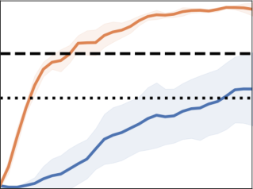

Figure 1: The task success rate of vanilla REDQ and our modified REDQ (REDQ+HER+BQ). The lefthand side figure shows the interquartile mean (IQM) with a 95% confidence interval (Agarwal et al., 2021)
for the success rate over 12 Robotics tasks. The right-hand side figure shows the average scores with
one standard deviation in the HandManipulateBlockRotateZ task (one of the Robotics tasks). We also
present scores from previous SoTA methods with 8 _·_ 10 [5] and 16 _·_ 10 [5] samples (number of environment
interactions). For context, 10 [5] samples correspond to approximately one hour of real-world experience. The
left-hand side figure shows that our modified REDQ achieves approximately 2 _×_ better sample efficiency
than previous SoTA methods. Examples of policies learnt by our modified REDQ can be found at `[https:](https://drive.google.com/file/d/1UHd7JVPCwFLNFhy1QcycQfwU_nll_yII/view?usp=drive_link)`
```
//drive.google.com/file/d/1UHd7JVPCwFLNFhy1QcycQfwU_nll_yII/view?usp=drive_link

```

capable of achieving diverse goals (Vithayathil Varghese & Mahmoud, 2020; Beck et al., 2023), or (ii) constructing low-level agents to execute goals provided by high-level agents in a hierarchical framework (Pateria
et al., 2021; Brohan et al., 2023; Yu et al., 2023). Therefore, it is valuable to investigate whether RL methods with a high RR and regularization efficiently work in sparse-reward goal-conditioned tasks and what
additional modifications are needed if the methods do not work efficiently.


In this paper, we apply an RL method with a high RR and regularization to sparse-reward goal-conditioned
tasks. As our sparse-reward goal-conditioned tasks, we consider Robotics (Plappert et al., 2018) (Section 2).
As an RL method with a high RR and regularization, we employ Randomized Ensemble Double Q-learning
(REDQ) (Chen et al., 2021) (Section 3.1). To adapt REDQ for the Robotics tasks, we introduce the following
modifications to REDQ: (i) using hindsight experience replay (HER; Section 3.2) and (ii) bounding target
Q-value (BQ; Section 3.3). We experimentally demonstrate that REDQ with these modifications can achieve
better sample efficiency than previous state-of-the-art (SoTA) RL methods (Fig. 1. See Sections 4 and 5 for
more comprehensive details).


While our main contribution is **successful application of the RL method with a high RR and regu-**
**larization to sparse-reward goal-conditioned tasks**, we make two additional significant contributions:
**1. Illustration of the importance of stabilizing Q-value estimation in sparse-reward tasks:** We
show that (i) the introduction of HER into REDQ makes the Q-value estimation unstable and that (ii) BQ
significantly suppresses the instability (Fig. 4 in Section 3.3) and improves overall sample efficiency (Fig. 5 in
Section 4). _Surprisingly, REDQ already uses sophisticated regularization techniques to stabilize the Q-value_
_estimation (Section 3.1), but it is made unstable by the additional component (HER) and requires treatment_
_(Sections 3.3)._ Exploration ability has been considered to be the overwhelmingly important component in
sparse-reward tasks (e.g., Pathak et al. (2017); Tang et al. (2017); Ecoffet et al. (2019)). However, our results
indicate that the stability of Q-value estimation is also non-negligibly important and suggest practitioners
should pay attention to it when applying an RL method to similar tasks.
**2. Simplification of REDQ in sparse-reward goal-conditioned tasks:** REDQ uses clipped double
Q-learning and an entropy term in its target Q-value calculation. We find that REDQ can be simplified
by removing them (Figs. 8 and 9 in Section 5). Remarkably, the simplified REDQ with our modifications
achieves _∼_ 8 _×_ better sample efficiency than SoTA methods in the Fetch tasks of Robotics (Fig. 9). Our
findings may be valuable in maintaining the simplicity of REDQ, which improves reproducibility and reduces
human effort in debugging and engineering.


2


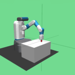


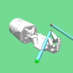

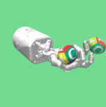

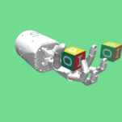

(a) Fetch tasks (b) HandManipulate tasks
Figure 2: Robotics (Plappert et al., 2018) tasks.


**2** **Preliminary: Sparse-Reward Goal-Conditioned RL**


We focus on sparse-reward goal-conditioned RL. This is typically modeled as goal-augmented Markov decision
processes _⟨S, A, G, γ, ps_ 0 _, pg, T, R⟩_ (Liu et al., 2022). Here, _S_, _A_, _G_, and _γ_ are the state space, the action
space, the goal space, and the discount factor, respectively. _ps_ 0 : _S →_ [0 _,_ 1] is the initial state distribution.
_pg_ : _G →_ [0 _,_ 1] is the goal distribution. _T_ : _S × A × S →_ [0 _,_ 1] is the dynamics transition function.
_R_ : _S × A × G →_ R is the reward function, which is sparsely structured in our setting. At the beginning
of an episode, an agent receives the desired goal _g ∼_ _pg_ ( _·_ ). At each discrete time step _t_, an environment
provides the agent with a state _st ∈S_, the agent responds by selecting an action _at ∈A_, and then the
environment provides the next reward _rt ←R_ ( _st, at, g_ ) and state _st_ +1 _∈S_ . For convenience, as needed,
we use the simpler notations of _r_, _s_, _a_, _s_ _[′]_, and _a_ _[′]_ to refer to a reward, state, action, next state, and next
action, respectively. In addition, as needed, we use the notation of _gt_ _[′]_ _[∈G]_ [ and] _[ r]_ _t_ _[′]_ _[←R]_ [(] _[s][t][, a][t][, g]_ _t_ _[′]_ [) to refer]
to the goal and reward at _t_, respectively. The objective of sparse-reward goal-conditioned RL is to learn a
goal-conditioned policy _π_ : _S × G × A →_ [0 _,_ 1] that maximizes the expected cumulative rewards:


�


E _at,g,st_ +1 _,s_ 0


_∞_
� _γ_ _[t]_ _rt_
� _t_ =0


_,_ _at ∼_ _π_ ( _·|st, g_ ) _,_ _g ∼_ _pg_ ( _·_ ) _, st_ +1 _∼T_ ( _·|st, at_ ) _,_ _s_ 0 _∼_ _ps_ 0( _·_ ) _._


As benchmark tasks for sparse-reward goal-conditioned RL, we employ the Robotics (Plappert et al., 2018;
de Lazcano et al., 2023) tasks (Fig. 2). In these tasks, an RL agent aims to learn control policies for moving
and reorienting objects (e.g., a block or an egg) to target positions and orientations. The reward is sparsely
structured: The agent receives a positive reward of 0 if the distance between the positions (and orientations)
of the object and the target is within a small threshold, and a negative reward of _−_ 1 otherwise [1] . We use
12 Robotics tasks for our experiments: FetchReach, FetchPush, FetchSlide, FetchPickAndPlace, HandManipulatePenRotate, HandManipulateEggRotate, HandManipulatePenFull, HandManipulateEggFull, HandManipulateBlockFull, HandManipulateBlockRotateZ, HandManipulateBlockRotateXYZ, and HandManipulateBlockRotateParallel.


**3** **Our RL Method**


In this section, we introduce our method for sparse-reward goal-conditioned RL. The algorithmic description
of our method is summarized in Algorithm 1. We use REDQ for our base method (Section 3.1). To apply
REDQ to sparse-reward goal-conditioned tasks, we make two modifications to REDQ: (i) using hindsight
experience replay (HER; Section 3.2) and (ii) bounding target Q-values (BQ; Section 3.3).


**3.1** **Base Method: RL Method with a High RR and Regularization**


Our base method is REDQ (Chen et al., 2021), an RL method with a high RR and regularization:
**High RR.** REDQ uses a high RR _G_ (typically _G >_ 1), which is the number of Q-function updates (lines
6–12 in Algorithm 1) relative to the number of actual interactions with the environment (line 3). A high
RR promotes sufficient training of Q-functions within a few interactions. However, it may cause overfitting
of Q-functions and degrade sample efficiency.


1A more detailed task description can be found at `[https://robotics.farama.org/](https://robotics.farama.org/)` .


3


**Algorithm 1** REDQ with our modifications (HER and BQ)


Initialize policy parameters _θ_, _N_ Q-function parameters _ϕi_, empty replay buffer _D_, and episode length
_T_ . Set target parameters _ϕ_ [¯] _i ←_ _ϕi_, for _i_ = 1 _, ...., N_ .
1: Sample goal _g ∼_ _pg_ ( _·_ ) and initial state _s_ 0 _∼_ _ps_ 0( _·_ )
2: **for** _t_ = 0 _, .., T_ **do**
3: Take action _at ∼_ _πθ_ ( _·|st_ ); Observe reward _rt_ and next state _st_ +1.
4: **if** _t_ = _T_ **then**

5: _D ←D_ [�] _{_ ( _st, at, rt, st_ +1 _, g_ ) _}_ _[T]_ _t_ =0 [;][ Select new goal] _[ g]_ _t_ _[′]_ [; Calculate new reward] _[ r]_ _t_ _[′]_ _[←R]_ [(] _[s][t][, a][t][, g]_ _t_ _[′]_ [);]
_D ←D_ [�] _{_ ( _st, at, rt_ _[′][, s][t]_ [+1] _[, g]_ _t_ _[′]_ [)] _[}][T]_ _t_ =0


6: **for** _G_ updates **do**
7: Sample a mini-batch _B_ = _{_ ( _s, a, r, s_ _[′]_ _, g_ ) _}_ from _D_ .
8: Sample a set _M_ of _M_ distinct indices from _{_ 1 _,_ 2 _, ..., N_ _}_ .
9: Compute the target Q-value _y_ (same for all _N_ Q-functions):


_y_ = _r_ + _γ_ min max
� � _i_


_, Q_ max
�


�


_i_ min _∈M_ _[Q][ϕ]_ [ ¯] _[i]_ [(] _[s][′][, a][′][, g]_ [)] _[ −]_ _[α]_ [ log] _[ π][θ]_ [(] _[a][′][|][s][′][, g]_ [)] _[, Q]_ [min]


_,_ _a_ _[′]_ _∼_ _πθ_ ( _·|s_ _[′]_ _, g_ )


10: **for** _i_ = 1 _, ..., N_ **do**
11: Update _ϕi_ with gradient descent using


1
_∇ϕ_
_|B|_


� ( _Qϕi_ ( _s, a, g_ ) _−_ _y_ ) [2]

( _s,a,r,s_ _[′]_ _,g_ ) _∈B_


12: Update target networks with _ϕ_ [¯] _i ←_ _ρϕ_ [¯] _i_ + (1 _−_ _ρ_ ) _ϕi_ .


13: Update _θ_ with gradient ascent using


�


1
_∇θ_
_|B|_


�

_s∈B_


� _Qϕi_ ( _s, a, g_ ) _−_ _α_ log _πθ_ ( _a|s, g_ )


_i_ =1


1

_N_
�


_N_
�


_,_ _a ∼_ _πθ_ ( _·|s, g_ )


**Regularization.** To mitigate overfitting, our REDQ uses (i) ensemble and (ii) layer normalization. (i)
Ensemble of _N_ Q-functions is used as a regularization technique (lines 8–9). Specifically, a random subset
_M_ of the ensemble is selected (line 8) and used for target calculation (line 9). Each Q-function in the
ensemble is randomly and independently initialized but updated with the same target (lines 10–11). (ii)
Layer normalization (Ba et al., 2016) is applied after the weight layer in each Q-function. Layer normalization
is not used in the original REDQ paper (Chen et al., 2021), but its subsequent works (Hiraoka et al., 2022;
Ball et al., 2023) show that it further suppresses the overfitting and improves sample efficiency of REDQ.
Following these subsequent works, we use layer normalization for our REDQ.


REDQ has demonstrated high sample efficiency in dense-reward continuous-control tasks (Brockman et al.,
2016; Fu et al., 2020) based on MuJoCo (Todorov et al., 2012) (see e.g., Chen et al. (2021)). However, when
applied to sparse-reward goal-conditioned tasks, it performs worse than previous SoTA methods (Fig. 1).
In the following sections, we will make modifications to improve REDQ’s performance in sparse-reward
goal-conditioned tasks.


**3.2** **Modification 1: Using Hindsight Experience Replay (HER)**


Numerous technical innovations have been developed for sparse-reward goal-conditioned RL (see Section 6
for details), and many of these innovations can be applied to REDQ. We want to keep our method simple
and flexible to allow its users to introduce complex innovations as needed. Thus, we begin our modification
of REDQ by introducing the fundamental component commonly used in previous innovations.


4


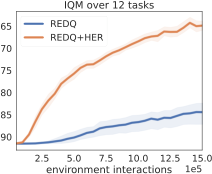


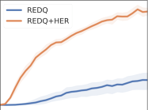


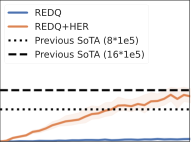

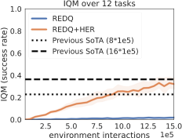


Figure 3: Effect of HER on REDQ’s performance. The left figure: the learning curve for a return. The right
figure: the curve for task success rate. These figures indicate that the use of HER significantly improves
performance. We can see that REDQ with HER (REDQ+HER) exhibits superior returns and success rates
to vanilla REDQ.


We introduce HER (Andrychowicz et al., 2017) with a future strategy into REDQ to improve its performance.
HER with the future strategy is commonly used in previous works for sparse-reward goal-conditioned RL
methods (Andrychowicz et al., 2017; Plappert et al., 2018; Zhao & Tresp, 2018; Zhao et al., 2019; Xu et al.,
2023). HER replaces a goal _g_ of a past transition with a new goal _gt_ _[′]_ [to obtain positive rewards (line 5 in]
Algorithm 1). For selecting the new goal _gt_ _[′]_ [, our HER follows the future strategy. In the future strategy,]
for each transition ( _st, at, rt_ _[′][, s][t]_ [+1] _[, g]_ [)] _[ ∈{]_ [(] _[s][t][, a][t][, r]_ _t_ _[′][, s][t]_ [+1] _[, g]_ [)] _[}][T]_ _t_ =0 [,] _[ g]_ [ is replaced with] _[ g]_ _t_ _[′]_ [, which is the achieved]
goal that comes from the same trajectories as the transition and was observed after it. HER with the future
strategy significantly improves REDQ’s performance (Fig. 3).


**3.3** **Modification 2: Bounding Target Q-Value (BQ)**


REDQ (Section 3.1) employs (i) off-policy learning, (ii) approximation of the value function, and (iii) bootstrapping (i.e. the deadly triad (Sutton & Barto, 2018)). This deadly triad often leads to Q-value estimate
divergence and consequently degrades performance (Van Hasselt et al., 2018).


We observe that introducing HER to REDQ induces a divergence in its Q-value estimation. We assess
the extent to which Q-value estimates exceed the theoretical upper bound _Q_ max and lower bound _Q_ min.
Here, _Q_ max is the discounted future return in the best-case scenario, where an agent consistently receives
a positive reward, while _Q_ min is the return in the worst-case scenario with consistent negative rewards. In
Robotics (Plappert et al., 2018; de Lazcano et al., 2023) tasks, the positive reward is 0, and the negative
reward is -1 2. Thus, we estimate _Q_ max and _Q_ min as: For any time step _t_, _Q_ max = [�] _[∞]_ _t_ _[′]_ = _t_ _[γ]_ [(] _[t][′][−][t]_ [)] _[ ·]_ [ 0 = 0, and]
_Q_ min = [�] _[∞]_ _t_ _[′]_ = _t_ _[γ]_ [(] _[t][′][−][t]_ [)] _[ ·−]_ [1 =] _[ −]_ [1] _[/]_ [(1] _[−]_ _[γ]_ [). The result (Fig. 4) shows that HER induces a divergence in Q-value]
estimation. We can see that the Q-value estimates of REDQ with HER (REDQ+HER) significantly surpass
theoretical bounds compared with those of REDQ.


We bound the target Q-value to mitigate the Q-value estimate divergence. Specifically, we bound the target
Q-value using _Q_ max and _Q_ min (line 9 in Algorithm 1):


_y_ = _r_ + _γ_ min �max � _i_ min _∈M_ _[Q][ϕ]_ [ ¯] _[i]_ [(] _[s][′][, a][′][, g]_ [)] _[ −]_ _[α]_ [ log] _[ π][θ]_ [(] _[a][′][|][s][′][, g]_ [)] _[, Q]_ [min] � _, Q_ max� _._ (1)


_, Q_ max
�


_._
�


Here, _Q_ max and _Q_ min are the same as the ones introduced in the preceding paragraph. This bounding
effectively suppresses the Q-value estimate divergence (Fig. 4). We will experimentally show that this
modification substantially enhances overall performance in the next section.


**4** **Experiment**


In the previous section, we introduced HER (Section 3.2) and BQ (Section 3.3) into REDQ (Section 3.1).
In this section, we conduct experiments to answer two questions:
**Q1.** Are both HER and BQ necessary to improve the performance of REDQ?


2See the second paragraph in Section 2 for a reminder of the reward structure of Robotics tasks.


5


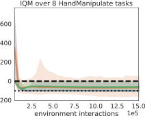


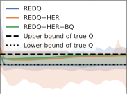


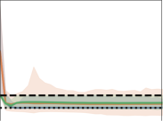


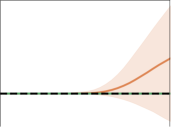


Figure 4: The effect of BQ on Q-value divergence. The solid line represents the average Q-value estimate,
while the shaded area represents the range of Q-value estimates. Dashed and dotted lines represent the
theoretical upper bound ( _Q_ max) and lower bound ( _Q_ min) of Q-value, respectively. Two figures on the lefthand side: a summary (IQM) of the scores over 4 Fetch tasks and 8 HandManipulate tasks. Two figures on the
right-hand side: examples of scores in individual tasks (FetchPickAndPlace and HandmanipulatePenRotate):
From the figures, we can see that (i) Q-value estimates of REDQ with HER (REDQ+HER) significantly
exceed the bound range and (ii) estimates of the method using bounded target Q-value (REDQ+HER+BQ)
are kept almost within the range. The results for all tasks are shown in Fig. 13 in the appendix.


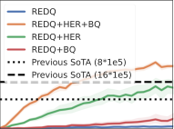


Figure 5: IQM of performance (return and success rate) over 12 Robotics tasks. The left-hand side figure:
the IQM of return. The right-hand side figure: the IQM of task success rate. The left-hand side figure shows
that our modifications (HER and BQ) significantly contribute to score improvement over the 12 tasks. The
right-hand figure shows that REDQ+HER+BQ achieves approximately 2 _×_ better sample efficiency than
previous SoTA methods.


**Q2.** Does REDQ with HER and BQ perform as well as or better than previous SoTA methods?


**Experiment for Q1: Both HER and BQ contribute to the performance improvement.** The
experiment results (the left-hand side figure of Figs. 5) shows that both HER and BQ effectively improve the
performance (return) over the 12 Robotics tasks. We can see that REDQ+HER+BQ improves performance
more than REDQ+HER, REDQ+BQ, and REDQ. In addition, results for each task (Fig. 6) show that
HER significantly improves the performance in HandManipulate tasks, while both HER and BQ significantly
improve the performance in Fetch tasks (except for the FetchReach task). The main reason for these different
trends in Fetch and HandManipulates tasks would be that the divergence of the Q-value estimation in Fetch
tasks is more significant and greatly suppressed by BQ than that in HandManipulate tasks (Fig. 13 in the
appendix).


**Experiment for Q2: Our method performs better than previous SoTA RL methods.** We compare REDQ+HER+BQ with previous SoTA methods. For previous SoTA RL methods in Robotics tasks,
we use HEREBP (Zhao & Tresp, 2018), CHER (Zhao & Tresp, 2019), DTGSH (Dai et al., 2021), and
VCPHER (Xu et al., 2023). All these methods use a low RR ( _≤_ 1) and no regularization, unlike REDQ.
We use the score of the best one among these previous methods, with 8 _·_ 10 [5] and 16 _·_ 16 [5] samples, for
each task. As in previous works, we compare REDQ+HER+BQ and the previous SoTA on the basis of
their sample efficiency in terms of task success rate. The experiment results (the right-hand side figure in
Figs. 5) show that REDQ+HER+BQ achieves about 2 _×_ better sample efficiency than the previous SoTA.
REDQ+HER+BQ with 8 _·_ 10 [5] samples performs comparably to the previous SoTA with 16 _·_ 10 [5] samples.
In addition, REDQ+HER+BQ with 4 _·_ 10 [5] samples performs comparably to the previous SoTA with 8 _·_ 10 [5]

samples. Looking at scores in each task (Fig. 7), REDQ+HER+BQ makes particularly significant improvements against previous SoTA in, e.g., FetchSlide and HandManipulateBlockRotateZ tasks. On the other


6


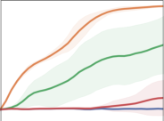

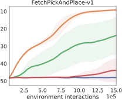


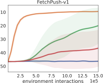


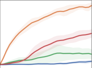


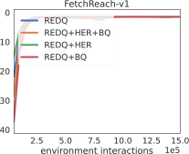


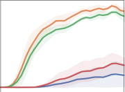

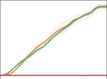


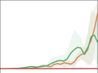

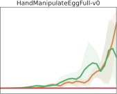

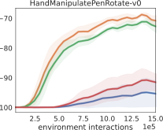

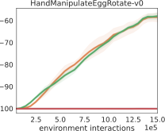

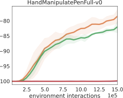

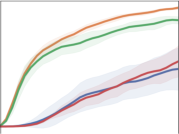

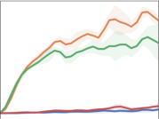


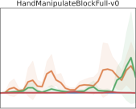

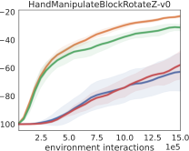


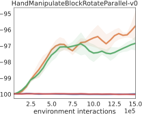

Figure 6: Return improvement in each of 12 Robotics tasks. Figures show that HER alone significantly
contributes to the return improvement in HandManipulate tasks, whereas both HER and BQ significantly
contribute to the improvement in the Fetch tasks (except for FetchReach).


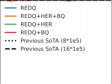

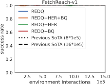


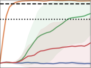

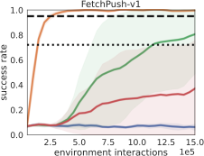


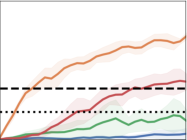

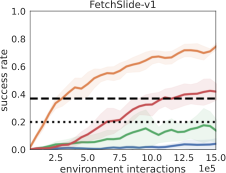


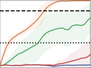

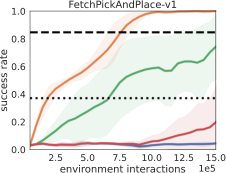


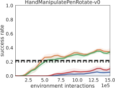

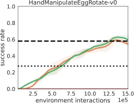

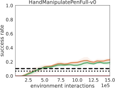

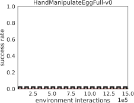


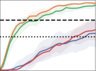

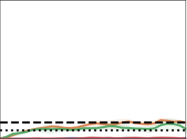


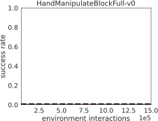

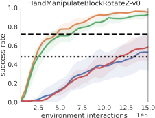

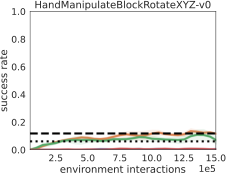

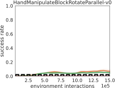

Figure 7: The success rate in 12 Robotics tasks. The figures show that REDQ+HER+BQ exhibits particularly significant improvements compared with previous SoTA methods in the FetchSlide and HandManipulateBlockRotateZ tasks.


hand, the success rate of REDQ+HER+BQ is consistently close to 0, similar to the previous SoTA, in very
difficult tasks such as HandManipulateEggFull and HandManipulateBlockFull.


7


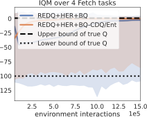


Figure 8: The effect of removing CDQ and the entropy term on Q-value divergence. The figure shows that
the method simplified by removing them (REDQ+HER+BQ-CDQ/Ent) can suppress the divergence of the
Q-value to a similar extent as the method without the simplification (REDQ+HER+BQ). The results for
all tasks are shown in Fig. 14 in the appendix.


Figure 9: The effect of removing CDQ and the entropy term on performance. The left-hand side figure:
the IQM scores over 12 Robotics tasks. The right-hand side figure: the average return and success rate
in FetchPickAndPlace. The left-hand side figure shows that the method not using CDQ and entropy term
(REDQ+HER+BQ-CDQ/Ent) achieves an overall performance comparable to that of the original method
(REDQ+HER+BQ). The right-hand side figure shows that REDQ+HER+BQ-CDQ/Ent achieves _∼_ 8 _×_
better sample efficiency than the previous SoTA in the FetchPickAndPlace task. The results for all tasks
are shown in Figs. 15 and 16 in the appendix.


**5** **Simplifying Our Method (REDQ+HER+BQ)**


In this section, we conduct experiments to gain insights for simplifying our method (REDQ+HER+BQ).
For this, we assess the necessity of components of REDQ+HER+BQ. As we already assessed the necessity
of HER and BQ in the previous section, we will focus on the components of REDQ in this section.


**Are clipped double Q-learning and an entropy term removable? Yes.** REDQ calculates the target
Q-value (Eq. 1) with clipped double Q-learning (CDQ) (Fujimoto et al., 2018) and an entropy term: (i) CDQ
min _i∈M Qϕ_ ¯ _i_ ( _s_ _[′]_ _, a_ _[′]_ _, g_ ), and (ii) the entropy term _α_ log _πθ_ ( _a_ _[′]_ _|s_ _[′]_ _, g_ ). The effectiveness of these components often
depends heavily on the specific task (Ball et al., 2023). Thus, we investigate whether they are necessary in
our task or not. For this, we remove CDQ and the entropy term as:


�


�


_y_ = _r_ + _γ_ min max _Q_ ¯ ( _s_ _[′]_ _, a_ _[′]_ _, g_ ) _, Q_ min _, Q_ max _._ (2)


�


max


1

_|M|_
�


�


� _Qϕ_ ¯ _i_ ( _s_ _[′]_ _, a_ _[′]_ _, g_ ) _, Q_ min

_i∈M_


_, Q_ max


_._


Here, the average operator _|M|_ 1 � _i∈M_ [is used instead of the minimum operator min] _[i][∈M]_ [.] The method

simplified in this way (REDQ+HER+BQ-CDQ/Ent) can suppress Q-value divergence to a similar extent
to the original method (REDQ+HER+BQ) (Fig. 8). In addition, REDQ+HER+BQ-CDQ/Ent can achieve
almost the same overall (IQM) performance as REDQ+HER+BQ (the left-hand side figure in Figs. 9).
Furthermore, REDQ+HER+BQ-CDQ/Ent achieves _∼_ 8 _×_ better sample efficiency than the previous SoTA
in the FetchPickAndPlace task (the right-hand side figure in Figs. 9). Given these results, we conclude that
CDQ and the entropy term are removable in our tasks.


**Are a high RR and regularization removable?** **No.** So far, we have introduced and reconsidered
several design choices. Even after this consideration, are the core components of REDQ (i.e., a high RR
and regularization) (Section 3.1) still necessary for our method? To answer this question, we evaluate two
variants of REDQ+HER+BQ-CDQ/Ent that do not use a high RR and regularization:


8


Figure 10: The effect of removing a high RR and regularization on performance. The figure (IQM scores
over 12 tasks) shows that both a high RR and regularization are necessary. The results for all tasks are
shown in Figs. 17 and 18 in the appendix.


1. REDQ+HER+BQ-CDQ/Ent+RR1: The method without a high RR. It uses a low RR of 1.
2. REDQ+HER+BQ-CDQ/Ent-Reg: The method without regularization. It uses a small ensemble (i.e.,
two Q-functions) and no layer normalization.
The evaluation results (Fig. 10) show that both a high RR and regularization are still necessary for
our method. We can see that REDQ+HER+BQ-CDQ/Ent achieves better sample efficiency than
REDQ+HER+BQ-CDQ/Ent+RR1 and REDQ+HER+BQ-CDQ/Ent-Reg.


**Can REDQ be replaced with a simpler method (Reset (Nikishin et al., 2022))? No.** There are
RL methods other than REDQ that have a high RR and regularization (see “RL methods with a high RR
and regularization” in Section 6). Can we use these other methods, especially a simple one, instead of REDQ
for our base RL method? To answer this, we compare our REDQ-based methods with methods based on
Reset (Nikishin et al., 2022). Reset realizes regularization simply by periodically initializing the parameters
of the agent’s components (policy and Q-functions). Despite its simplicity, it performs equally to or better
than REDQ in some dense-reward continuous-control tasks (D’Oro et al., 2023). We use four Reset-based
methods for our comparison:
1. Reset([the number of resets]): Reset (Nikishin et al., 2022) itself. “[number of resets]” means the total
number of resets during training. In our experiments, we use Reset(1), Reset(4), and Reset(9). In addition,
we use an RR of 20 as with our REDQ.
2. Reset([the number of resets])+HER: Reset with HER.
3. Reset([the number of resets])+BQ: Reset with BQ.
4. Reset([the number of resets])+HER+BQ: Reset with HER and BQ.
The algorithmic description of these Reset-based methods is summarized in Algorithm 2 in the appendix.
The comparison results (Fig. 11) show that REDQ is more suitable for our base RL method than Reset _in_
_our setting_ . We can see that REDQ+HER+BQ performs better than other Reset-based methods.
**Complementary analysis: Does Reset also benefit from HER and BQ? Yes.** Interestingly, Reset
also benefits from HER and BQ (Fig. 11). We can see that Reset(1, 4, 9)+HER achieves better sample
efficiency than Reset(1, 4, 9). In addition, Reset(1, 4, 9)+HER+BQ achieves the same or better sample
efficiency than Reset(1, 4, 9)+HER. Especially, Reset(1)+HER+BQ significantly improves its sample efficiency compared with Reset(1)+HER. This may be because Reset(1)+HER has significant Q-estimation
divergence (and BQ suppresses it) (Fig. 12). We can see that Q-value estimates of Reset(1)+HER more
significantly surpass the theoretical upper bound than Reset(4, 9)+HER, especially at the first-half stage of
training ( _∼_ 7 _._ 5 _·_ 10 [5] samples).


**6** **Related Works**


**RL methods with a high RR and regularization.** We have applied RL methods with a high RR and
regularization to sparse-reward tasks (Sections 3 and 4). Most previous works on RL methods with a high
RR and regularization have focused primarily on dense-reward tasks (Janner et al., 2019; Kumar et al., 2021;
Chen et al., 2021; Hiraoka et al., 2022; Smith et al., 2022; Nikishin et al., 2022; Li et al., 2023a; D’Oro et al.,
2023; Smith et al., 2023b; Sokar et al., 2023; Schwarzer et al., 2023; Lee et al., 2023). Some works (Vecerik
et al., 2017; Sharma et al., 2023; Ball et al., 2023; Nakamoto et al., 2023; Li et al., 2023b) have considered
sparse-reward tasks, but they assume situations where prior data (e.g., expert demonstrations) are available.


9


Figure 11: The effect of replacing REDQ with Reset (Nikishin et al., 2022) on performance (success rate).
The figure shows that REDQ is more suitable for our base RL method than Reset. We can see that
REDQ+HER+BQ performs better than other Reset-based methods. The results for all tasks are shown in
Figs. 19, 20, 21, and 22 in the appendix.


Figure 12: The effect of replacing REDQ with Reset on Q-value divergence. The figures show that HER
causes Q-estimation divergence more significantly for the Reset method with a smaller reset number. We can
see that Q-estimates of Reset(1)+HER exceed the bound range more significantly than Reset(4, 9)+HER.
The results for all tasks are shown in Figs. 23, 24, and 25 in the appendix.


On the other hand, we assume sparse-reward tasks where such prior data are unavailable. Our work is
orthogonal to the above previous works, and some of our modifications may be useful in them. For example,
we bound the target Q-value to deal with the instability of Q-value estimation (Section 3.3), and a similar
instability problem also appears in the above works (see Fig. 2 in Ball et al. (2023) for example).


**Sparse-reward goal-conditioned RL.** There are previous works on sparse-reward goal-conditioned
RL. These works have used a deep deterministic policy gradient (Lillicrap et al., 2015) (or soft actorcritic (Haarnoja et al., 2018)) with HER (Andrychowicz et al., 2017) as a base RL method and improved
its sampling prioritization scheme (Zhao & Tresp, 2018; Zhao et al., 2019; Zhao & Tresp, 2019; Dai et al.,
2021; Xu et al., 2023) and new-goal-selection strategies (Fang et al., 2019; Pitis et al., 2020; Ren et al., 2019;
cha; Luo et al., 2022). In these works, the base RL method uses low RR ( _≤_ 1) and no regularization, which
is contrary to our base RL method (Section 3.1). We showed that the RL method with a high RR and
regularization can achieve a better sample efficiency than methods with a low RR and no regularization (the
right-hand side figure in Figs. 5 in Section 4).


**Bounding Q-value.** We bounded the target Q-value (Section 3.3). Previous works have proposed to bound
Q-values in online RL settings (Blundell et al., 2016; S.He et al., 2017; Oh et al., 2018; Lin et al., 2018; Tang,
2020; Fujita et al., 2020; Hoppe & Toussaint, 2020; Zhao & Xu, 2023; Fujimoto et al., 2023). These previous
works have verified a positive effect of the bounding on RL methods with a low RR and no regularization in
dense-reward tasks. In contrast, our work has verified a positive effect of the bounding on the RL method
with a high RR and regularization in sparse-reward tasks. The technical modification that improves certain
RL methods in certain tasks could impair other methods in other tasks (Furuta et al., 2021). Thus, our
verification would be valuable in clarifying the generality of a positive effect of Q-values-bound techniques.


**7** **Conclusion, Limitations, and Future Works**


**Conclusion.** We applied a reinforcement learning (RL) method (Randomized Ensemble Double Q-learning;
REDQ) with a high replay ratio (RR) and regularization to sparse-reward goal-conditioned tasks. We
introduced hindsight experience replay (HER) and bounding target Q-value (BQ) to REDQ and showed
that REDQ with them achieves about 2 _×_ better sample efficiency than previous state-of-the-art (SoTA)


10


methods in 12 Robotics tasks. We also showed that REDQ with HER and BQ can be simplified by removing
clipped double Q-learning (CDQ) and entropy terms. The simplified REDQ with our modifications achieved
_∼_ 8 _×_ better sample efficiency than the SoTA methods in the 4 Fetch tasks of Robotics. We hope that these
findings will push the boundaries of the application of RL methods with a high RR and regularization from
dense-reward tasks to sparse-reward tasks.


**Limitations and future work.** Our work leaves limitations and future work. First, our RL method did
not significantly improve the sampling efficiency in extremely hard tasks (e.g., HandManipulateBlockFull).
Improving the efficiency in these tasks is an interesting future work. Second, our experiments are conducted
in simulated environments, not real ones. Our primary interest lies more in investigating decision choices
for RL methods rather than in demonstration in real environments. Nevertheless, demonstration in real
environments would be one of the natural future steps for our work.


**References**


Rishabh Agarwal, Max Schwarzer, Pablo Samuel Castro, Aaron Courville, and Marc G Bellemare. Deep
reinforcement learning at the edge of the statistical precipice. In _Proc. NeurIPS_, 2021.


Pulkit Agrawal. The task specification problem. In _Proc. CoRL_, 2022.


Marcin Andrychowicz, Filip Wolski, Alex Ray, Jonas Schneider, Rachel Fong, Peter Welinder, Bob McGrew,
Josh Tobin, Pieter Abbeel, and Wojciech Zaremba. Hindsight experience replay. In _Proc. NeurIPS_, 2017.


OpenAI: Marcin Andrychowicz, Bowen Baker, Maciek Chociej, Rafal Jozefowicz, Bob McGrew, Jakub Pachocki, Arthur Petron, Matthias Plappert, Glenn Powell, Alex Ray, et al. Learning dexterous in-hand
manipulation. _The International Journal of Robotics Research_, 39(1):3–20, 2020.


Jimmy Lei Ba, Jamie Ryan Kiros, and Geoffrey E Hinton. Layer normalization. _arXiv preprint_
_arXiv:1607.06450_, 2016.


Philip J Ball, Laura Smith, Ilya Kostrikov, and Sergey Levine. Efficient online reinforcement learning with
offline data. _arXiv preprint arXiv:2302.02948_, 2023.


Jacob Beck, Risto Vuorio, Evan Zheran Liu, Zheng Xiong, Luisa Zintgraf, Chelsea Finn, and Shimon Whiteson. A survey of meta-reinforcement learning. _arXiv preprint arXiv:2301.08028_, 2023.


Charles Blundell, Benigno Uria, Alexander Pritzel, Yazhe Li, Avraham Ruderman, Joel Z Leibo, Jack Rae,
Daan Wierstra, and Demis Hassabis. Model-free episodic control. _arXiv preprint arXiv:1606.04460_, 2016.


Serena Booth, W Bradley Knox, Julie Shah, Scott Niekum, Peter Stone, and Alessandro Allievi. The perils
of trial-and-error reward design: misdesign through overfitting and invalid task specifications. In _Proc._
_AAAI_, 2023.


Greg Brockman, Vicki Cheung, Ludwig Pettersson, Jonas Schneider, John Schulman, Jie Tang, and Wojciech
Zaremba. OpenAI Gym. _arXiv preprint arXiv:1606.01540_, 2016.


Anthony Brohan, Noah Brown, Justice Carbajal, Yevgen Chebotar, Xi Chen, Krzysztof Choromanski, Tianli
Ding, Danny Driess, Avinava Dubey, Chelsea Finn, et al. Rt-2: Vision-language-action models transfer
web knowledge to robotic control. _arXiv preprint arXiv:2307.15818_, 2023.


Xinyue Chen, Che Wang, Zijian Zhou, and Keith W. Ross. Randomized ensembled double Q-learning:
Learning fast without a model. In _Proc. ICLR_, 2021.


Tianhong Dai, Hengyan Liu, Kai Arulkumaran, Guangyu Ren, and Anil Anthony Bharath. Diversity-based
trajectory and goal selection with hindsight experience replay. In _Proc. PRICAI_, 2021.


Rodrigo de Lazcano, Kallinteris Andreas, Jun Jet Tai, Seungjae Ryan Lee, and Jordan Terry. Gymnasium
robotics, 2023. URL `[http://github.com/Farama-Foundation/Gymnasium-Robotics](http://github.com/Farama-Foundation/Gymnasium-Robotics)` .


11


Pierluca D’Oro, Max Schwarzer, Evgenii Nikishin, Pierre-Luc Bacon, Marc G Bellemare, and Aaron
Courville. Sample-efficient reinforcement learning by breaking the replay ratio barrier. In _Proc. ICLR_,
2023.


Adrien Ecoffet, Joost Huizinga, Joel Lehman, Kenneth O Stanley, and Jeff Clune. Go-explore: a new
approach for hard-exploration problems. _arXiv preprint arXiv:1901.10995_, 2019.


Meng Fang, Tianyi Zhou, Yali Du, Lei Han, and Zhengyou Zhang. Curriculum-guided hindsight experience
replay. In _Proc. NeurIPS_, 2019.


Justin Fu, Aviral Kumar, Ofir Nachum, George Tucker, and Sergey Levine. D4RL: datasets for deep datadriven reinforcement learning. _arXiv preprint arXiv:2004.07219_, 2020.


Scott Fujimoto, Herke Hoof, and David Meger. Addressing function approximation error in actor-critic
methods. In _Proc. ICML_, 2018.


Scott Fujimoto, Wei-Di Chang, Edward J Smith, Shixiang Shane Gu, Doina Precup, and David
Meger. For sale: State-action representation learning for deep reinforcement learning. _arXiv preprint_
_arXiv:2306.02451_, 2023.


Yasuhiro Fujita, Kota Uenishi, Avinash Ummadisingu, Prabhat Nagarajan, Shimpei Masuda, and Mario Ynocente Castro. Distributed reinforcement learning of targeted grasping with active vision for mobile manipulators. In _Proc. IROS_, 2020.


Hiroki Furuta, Tadashi Kozuno, Tatsuya Matsushima, Yutaka Matsuo, and Shixiang (Shane) Gu. Coadaptation of algorithmic and implementational innovations in inference-based deep reinforcement learning. In _Proc. NeurIPS_, 2021.


Tuomas Haarnoja, Aurick Zhou, Pieter Abbeel, and Sergey Levine. Soft actor-critic: Off-policy maximum
entropy deep reinforcement learning with a stochastic actor. In _Proc. ICML_, 2018.


Tuomas Haarnoja, Ben Moran, Guy Lever, Sandy H Huang, Dhruva Tirumala, Markus Wulfmeier, Jan
Humplik, Saran Tunyasuvunakool, Noah Y Siegel, Roland Hafner, et al. Learning agile soccer skills for a
bipedal robot with deep reinforcement learning. _arXiv preprint arXiv:2304.13653_, 2023.


Takuya Hiraoka, Takahisa Imagawa, Taisei Hashimoto, Takashi Onishi, and Yoshimasa Tsuruoka. Dropout
Q-functions for doubly efficient reinforcement learning. In _Proc. ICLR_, 2022.


Sabrina Hoppe and Marc Toussaint. Qgraph-bounded Q-learning: Stabilizing model-free off-policy deep
reinforcement learning. _arXiv preprint arXiv:2007.07582_, 2020.


Michael Janner, Justin Fu, Marvin Zhang, and Sergey Levine. When to trust your model: Model-based
policy optimization. In _Proc. NeurIPS_, 2019.


Elia Kaufmann, Leonard Bauersfeld, Antonio Loquercio, Matthias Müller, Vladlen Koltun, and Davide
Scaramuzza. Champion-level drone racing using deep reinforcement learning. _Nature_, 620(7976):982–987,
2023.


Diederik P Kingma and Jimmy Ba. Adam: A method for stochastic optimization. 2015.


W Bradley Knox, Alessandro Allievi, Holger Banzhaf, Felix Schmitt, and Peter Stone. Reward (mis) design
for autonomous driving. _Artificial Intelligence_, 316:103829, 2023.


Aviral Kumar, Rishabh Agarwal, Dibya Ghosh, and Sergey Levine. Implicit under-parameterization inhibits
data-efficient deep reinforcement learning. In _Proc. ICLR_, 2021.


Hojoon Lee, Hanseul Cho, Hyunseung Kim, Daehoon Gwak, Joonkee Kim, Jaegul Choo, Se-Young Yun, and
Chulhee Yun. PLASTIC: Improving input and label plasticity for sample efficient reinforcement learning.
In _Proc. NeurIPS_, 2023.


12


Joonho Lee, Jemin Hwangbo, Lorenz Wellhausen, Vladlen Koltun, and Marco Hutter. Learning quadrupedal
locomotion over challenging terrain. _Science robotics_, 5(47):eabc5986, 2020.


Qiyang Li, Aviral Kumar, Ilya Kostrikov, and Sergey Levine. Efficient deep reinforcement learning requires
regulating overfitting. In _Proc. ICLR_, 2023a.


Qiyang Li, Jason Zhang, Dibya Ghosh, Amy Zhang, and Sergey Levine. Accelerating exploration with
unlabeled prior data. _arXiv preprint arXiv:2311.05067_, 2023b.


Timothy P Lillicrap, Jonathan J Hunt, Alexander Pritzel, Nicolas Heess, Tom Erez, Yuval Tassa, David
Silver, and Daan Wierstra. Continuous control with deep reinforcement learning. _arXiv preprint_
_arXiv:1509.02971_, 2015.


Zichuan Lin, Tianqi Zhao, Guangwen Yang, and Lintao Zhang. Episodic memory deep q-networks. In _Proc._
_IJCAI_, 2018.


Minghuan Liu, Menghui Zhu, and Weinan Zhang. Goal-conditioned reinforcement learning: Problems and
solutions. _arXiv preprint arXiv:2201.08299_, 2022.


Yongle Luo, Yuxin Wang, Kun Dong, Qiang Zhang, Erkang Cheng, Zhiyong Sun, and Bo Song. Relay
hindsight experience replay: Continual reinforcement learning for robot manipulation tasks with sparse
rewards. _arXiv preprint arXiv:2208.00843_, 2022.


Russell Mendonca, Abhishek Gupta, Rosen Kralev, Pieter Abbeel, Sergey Levine, and Chelsea Finn. Guided
meta-policy search. In _Proc. NeurIPS_, pp. 9653–9664, 2019.


Mitsuhiko Nakamoto, Yuexiang Zhai, Anikait Singh, Max Sobol Mark, Yi Ma, Chelsea Finn, Aviral Kumar,
and Sergey Levine. Cal-QL: Calibrated offline RL pre-training for efficient online fine-tuning. _arXiv_
_preprint arXiv:2303.05479_, 2023.


Evgenii Nikishin, Max Schwarzer, Pierluca D’Oro, Pierre-Luc Bacon, and Aaron Courville. The primacy
bias in deep reinforcement learning. In _Proc. ICML_, 2022.


Junhyuk Oh, Yijie Guo, Satinder Singh, and Honglak Lee. Self-imitation learning. In _Proc. ICML_, 2018.


Shubham Pateria, Budhitama Subagdja, Ah-hwee Tan, and Chai Quek. Hierarchical reinforcement learning:
A comprehensive survey. _ACM Computing Surveys (CSUR)_, 54(5):1–35, 2021.


Deepak Pathak, Pulkit Agrawal, Alexei A Efros, and Trevor Darrell. Curiosity-driven exploration by selfsupervised prediction. In _Proc. ICML_, 2017.


Silviu Pitis, Harris Chan, Stephen Zhao, Bradly Stadie, and Jimmy Ba. Maximum entropy gain exploration
for long horizon multi-goal reinforcement learning. In _Proc. ICML_, 2020.


Matthias Plappert, Marcin Andrychowicz, Alex Ray, Bob McGrew, Bowen Baker, Glenn Powell, Jonas
Schneider, Josh Tobin, Maciek Chociej, Peter Welinder, et al. Multi-goal reinforcement learning: Challenging robotics environments and request for research. _arXiv preprint arXiv:1802.09464_, 2018.


Zhizhou Ren, Kefan Dong, Yuan Zhou, Qiang Liu, and Jian Peng. Exploration via hindsight goal generation.
In _Proc. NeurIPS_, 2019.


John Schulman, Filip Wolski, Prafulla Dhariwal, Alec Radford, and Oleg Klimov. Proximal policy optimization algorithms. _arXiv preprint arXiv:1707.06347_, 2017.


Max Schwarzer, Johan Samir Obando Ceron, Aaron Courville, Marc G Bellemare, Rishabh Agarwal, and
Pablo Samuel Castro. Bigger, better, faster: Human-level Atari with human-level efficiency. In _Proc._
_ICML_, 2023.


Archit Sharma, Ahmed M Ahmed, Rehaan Ahmad, and Chelsea Finn. Self-improving robots: End-to-end
autonomous visuomotor reinforcement learning. _arXiv preprint arXiv:2303.01488_, 2023.


13


Frank S.He, Yang Liu, Alexander G. Schwing, and Jian Peng. Learning to play in a day: Faster deep
reinforcement learning by optimality tightening. In _Proc. ICLR_, 2017.


Laura Smith, Ilya Kostrikov, and Sergey Levine. A walk in the park: Learning to walk in 20 minutes with
model-free reinforcement learning. _arXiv preprint arXiv:2208.07860_, 2022.


Laura Smith, Yunhao Cao, and Sergey Levine. Grow your limits: Continuous improvement with real-world
rl for robotic locomotion. _arXiv preprint arXiv:2310.17634_, 2023a.


Laura Smith, J Chase Kew, Tianyu Li, Linda Luu, Xue Bin Peng, Sehoon Ha, Jie Tan, and Sergey Levine.
Learning and adapting agile locomotion skills by transferring experience. _arXiv preprint arXiv:2304.09834_,
2023b.


Ghada Sokar, Rishabh Agarwal, Pablo Samuel Castro, and Utku Evci. The dormant neuron phenomenon
in deep reinforcement learning. _arXiv preprint arXiv:2302.12902_, 2023.


Kyle Stachowicz, Arjun Bhorkar, Dhruv Shah, Ilya Kostrikov, and Sergey Levine. FastRLAP: A System for
Learning High-Speed Driving via Deep RL and Autonomous Practicing. _arXiv pre-print arXiv:2304.09831_,
2023.


Richard S Sutton and Andrew G Barto. _Reinforcement learning: An introduction_ . MIT press, 2018.


Haoran Tang, Rein Houthooft, Davis Foote, Adam Stooke, OpenAI Xi Chen, Yan Duan, John Schulman, Filip
DeTurck, and Pieter Abbeel. # exploration: A study of count-based exploration for deep reinforcement
learning. In _Proc. NeurIPS_, 2017.


Yunhao Tang. Self-imitation learning via generalized lower bound Q-learning. In _Proc. NeurIPS_, 2020.


Emanuel Todorov, Tom Erez, and Yuval Tassa. MuJoCo: A physics engine for model-based control. In _Proc._
_IROS_, pp. 5026–5033. IEEE, 2012.


Alexander Trott, Stephan Zheng, Caiming Xiong, and Richard Socher. Keeping your distance: Solving
sparse reward tasks using self-balancing shaped rewards. In _Proc. NeurIPS_, 2019.


Hado Van Hasselt, Yotam Doron, Florian Strub, Matteo Hessel, Nicolas Sonnerat, and Joseph Modayil.
Deep reinforcement learning and the deadly triad. _arXiv preprint arXiv:1812.02648_, 2018.


Mel Vecerik, Todd Hester, Jonathan Scholz, Fumin Wang, Olivier Pietquin, Bilal Piot, Nicolas Heess, Thomas
Rothörl, Thomas Lampe, and Martin Riedmiller. Leveraging demonstrations for deep reinforcement learning on robotics problems with sparse rewards. _arXiv preprint arXiv:1707.08817_, 2017.


Nelson Vithayathil Varghese and Qusay H Mahmoud. A survey of multi-task deep reinforcement learning.
_Electronics_, 9(9):1363, 2020.


Peter R Wurman, Samuel Barrett, Kenta Kawamoto, James MacGlashan, Kaushik Subramanian, Thomas J
Walsh, Roberto Capobianco, Alisa Devlic, Franziska Eckert, Florian Fuchs, et al. Outracing champion
gran turismo drivers with deep reinforcement learning. _Nature_, 602(7896):223–228, 2022.


Jiawei Xu, Shuxing Li, Rui Yang, Chun Yuan, and Lei Han. Efficient multi-goal reinforcement learning via
value consistency prioritization. _Journal of Artificial Intelligence Research_, 77:355–376, 2023.


Wenhao Yu, Nimrod Gileadi, Chuyuan Fu, Sean Kirmani, Kuang-Huei Lee, Montse Gonzalez Arenas, HaoTien Lewis Chiang, Tom Erez, Leonard Hasenclever, Jan Humplik, Brian Ichter, Ted Xiao, Peng Xu,
Andy Zeng, Tingnan Zhang, Nicolas Heess, Dorsa Sadigh, Jie Tan, Yuval Tassa, and Fei Xia. Language
to rewards for robotic skill synthesis. _Arxiv preprint arXiv:2306.08647_, 2023.


Le Zhao and Wei Xu. Faster reinforcement learning with value target lower bounding, 2023. URL `[https:](https://openreview.net/forum?id=WWYHBZ1wWzp)`
`[//openreview.net/forum?id=WWYHBZ1wWzp](https://openreview.net/forum?id=WWYHBZ1wWzp)` .


Rui Zhao and Volker Tresp. Energy-based hindsight experience prioritization. In _Proc. CoRL_, 2018.


14


Rui Zhao and Volker Tresp. Curiosity-driven experience prioritization via density estimation. _arXiv preprint_
_arXiv:1902.08039_, 2019.


Rui Zhao, Xudong Sun, and Volker Tresp. Maximum entropy-regularized multi-goal reinforcement learning.
In _Proc. ICML_, 2019.


15


**A** **Detailed Experimental Results**


**A.1** **Modification 2: Bounding Target Q-Value**


Figure 13: The effect of BQ on Q-value divergence.


16


**A.2** **Simplifying Our Method (REDQ+HER+BQ)**


Figure 14: The effect of removing CDQ and entropy term on Q-value divergence.


Figure 15: The effect of removing CDQ and the entropy term on performance (return).


17


Figure 16: The effect of removing CDQ and the entropy term on performance (success rate).


Figure 17: The effect of removing a high RR and regularization on performance (return).


18


Figure 18: The effect of removing a high RR and regularization on performance (success rate).


Figure 19: The effect of replacing REDQ with Reset on performance (success rate).


19


Figure 20: The effect of replacing REDQ+HER with Reset+HER on performance (success rate).


Figure 21: The effect of replacing REDQ+BQ with Reset+BQ on performance (success rate).


20


Figure 22: The effect of replacing REDQ+HER with Reset+HER on performance (success rate).


Figure 23: The effect of replacing REDQ with Reset(1) on Q-value divergence.


21


Figure 24: The effect of replacing REDQ with Reset(4) on Q-value divergence.


Figure 25: The effect of replacing REDQ with Reset(9) on Q-value divergence.


22


**B** **Algorithmic Description of Reset (Nikishin et al., 2022) with Our Modifications**


**Algorithm 2** Reset with our modifications (HER and BQ)


Initialize policy parameters _θ_, two Q-function parameters _ϕi_, empty replay buffer _D_, and episode length
_T_ . Set target parameters _ϕ_ [¯] _i ←_ _ϕi_, for _i_ = 1 _,_ 2.

1: Sample goal _g ∼_ _pg_ ( _·_ ) and initial state _s_ 0 _∼_ _ps_ 0( _·_ )
2: **for** _t_ = 0 _, .., T_ **do**
3: Take action _at ∼_ _πθ_ ( _·|st_ ); Observe reward _rt_ and next state _st_ +1.
4: **if** _t_ = _T_ **then**
5: _D ←D_ [�] _{_ ( _st, at, rt, st_ +1 _, g_ ) _}_ _[T]_ _t_ =0 [;][ Select new goal] _[ g]_ _t_ _[′]_ [; Calculate new reward] _[ r]_ _t_ _[′]_ _[←R]_ [(] _[s][t][, a][t][, g]_ _t_ _[′]_ [);]
_D ←D_ [�] _{_ ( _st, at, rt_ _[′][, s][t]_ [+1] _[, g]_ _t_ _[′]_ [)] _[}][T]_ _t_ =0


6: **for** _G_ updates **do**
7: Sample a mini-batch _B_ = _{_ ( _s, a, r, s_ _[′]_ _, g_ ) _}_ from _D_ .

8: Compute the target Q-value _y_ :


_y_ = _r_ + _γ_ min max
� �


9: **for** _i_ = 1 _,_ 2 **do**


�


min
_i∈{_ 1 _,_ 2 _}_ _[Q][ϕ]_ [ ¯] _[i]_ [(] _[s][′][, a][′][, g]_ [)] _[ −]_ _[α]_ [ log] _[ π][θ]_ [(] _[a][′][|][s][′][, g]_ [)] _[, Q]_ [min]


_, Q_ max
�


_,_ _a_ _[′]_ _∼_ _πθ_ ( _·|s_ _[′]_ _, g_ )


10: Update _ϕi_ with gradient descent using


1
_∇ϕ_
_|B|_


� ( _Qϕi_ ( _s, a, g_ ) _−_ _y_ ) [2]

( _s,a,r,s_ _[′]_ _,g_ ) _∈B_


11: Update target networks with _ϕ_ [¯] _i ←_ _ρϕ_ [¯] _i_ + (1 _−_ _ρ_ ) _ϕi_ .


12: Update _θ_ with gradient ascent using


�


1
_∇θ_
_|B|_


�

_s∈B_


� _Qϕi_ ( _s, a, g_ ) _−_ _α_ log _πθ_ ( _a|s, g_ )


_i_ =1


1

2
�


2
�


_,_ _a ∼_ _πθ_ ( _·|s, g_ )


13: **if** the number of environment interactions reaches a reset period **then**
14: Reinitialize _θ_ and _ϕ_ 1 _, ϕ_ 2.


23


**C** **Hyperparameter Settings**

|Method|Parameter|Value|
|---|---|---|
|REDQ<br>Reset|optimizer<br>learning rate<br>discount rate_ γ_<br>target-smoothing coefcient<br>replay bufer size<br>number of hidden layers for all networks<br>number of hidden units per layer<br>mini-batch size<br>random starting data<br>replay ratio_ G_<br>in-target minimization parameter_ M_<br>ensemble size_ N_|Adam (Kingma & Ba, 2015)<br>3_ ·_ 10_−_4<br>0.99<br>0.005<br>106<br>2<br>256<br>256<br>10000 for HER-based methods and 5000 for the others<br>20<br>2<br>5 for REDQ and 2 for Reset.|
|HER|number of additionalgoals|1|
|BQ|upper bound of Q-value_ Q_max<br>lower bound of Q-value_ Q_min|0 (i.e., ~~P~~~~_∞_~~<br>_t γ_~~_t _~~_·_ 0)<br>-100 (i.e., P_∞_<br>_t γt · −_1 =<br>_−_1<br>1_−γ_ with_ γ_ = 0_._99)|


**D** **Our Source Code**


Table 1: Hyperparameter settings


Our source code is available at `[https://github.com/TakuyaHiraoka/](https://github.com/TakuyaHiraoka/Efficient-SRGC-RL-with-a-High-RR-and-Regularization)`
```
Efficient-SRGC-RL-with-a-High-RR-and-Regularization

```

24


