## Online Restless Multi-Armed Bandits with Long-Term Fairness Constraints

Shufan Wang, Guojun Xiong, Jian Li

Stony Brook University
{shufan.wang, guojun.xiong, jian.li.3}@stonybrook.edu

Abstract

Restless multi-armed bandits (RMAB) have been widely used
to model sequential decision making problems with constraints. The decision maker (DM) aims to maximize the expected total reward over an infinite horizon under an “instantaneous activation constraint” that at most B arms can be activated at any decision epoch, where the state of each arm
evolves stochastically according to a Markov decision process (MDP). However, this basic model fails to provide any
fairness guarantee among arms. In this paper, we introduce
RMAB-F, a new RMAB model with “long-term fairness constraints”, where the objective now is to maximize the longterm reward while a minimum long-term activation fraction
for each arm must be satisfied. For the online RMAB-F setting (i.e., the underlying MDPs associated with each arm
are unknown to the DM), we develop a novel reinforcement
learning (RL) algorithm named Fair-UCRL. We prove that
Fair-UCRL ensures probabilistic sublinear bounds on both
the reward regret and the fairness violation regret. Compared
with off-the-shelf RL methods, our Fair-UCRL is much
more computationally efficient since it contains a novel exploitation that leverages a low-complexity index policy for
making decisions. Experimental results further demonstrate
the effectiveness of our Fair-UCRL.

Introduction

The restless multi-armed bandits (RMAB) model (Whittle
1988) has been widely used to study sequential decision
making problems with constraints, ranging from wireless
scheduling (Sheng, Liu, and Saigal 2014; Cohen, Zhao,
and Scaglione 2014), resource allocation in general (Glazebrook, Hodge, and Kirkbride 2011; Larra˜naga, Ayesta, and
Verloop 2014; Borkar, Ravikumar, and Saboo 2017), to
healthcare (Bhattacharya 2018; Mate, Perrault, and Tambe
2021; Killian, Perrault, and Tambe 2021). In a basic RMAB
setting, there is a collection of N “restless” arms, each of
which is endowed with a state that evolves independently
according to a Markov decision process (MDP) (Puterman
1994). If the arm is activated at a decision epoch, then it
evolves stochastically according to one transition kernel,
otherwise according to a different transition kernel. RMAB
generalizes the Markovian multi-armed bandits (Lattimore

Copyright © 2024, Association for the Advancement of Artificial
Intelligence (www.aaai.org). All rights reserved.

and Szepesv´ari 2020) by allowing arms that are not activated
to change state, which leads to “restless” arms, and hence
extends its applicability. For simplicity, we refer to a restless
arm as an arm in the rest of the paper. Rewards are generated with each transition depending on whether the arm is
activated or not. The goal of the decision maker (DM) is to
maximize the expected total reward over an infinite horizon
under an “instantaneous activation constraint” that at most
B arms can be activated at any decision epoch.
However, the basic RMAB model fails to provide any guarantee on how activation will be distributed among arms. This
is also a salient design and ethical concern in practice, including mitigating data bias for healthcare (Mate, Perrault,
and Tambe 2021; Li and Varakantham 2022a) and societal
impacts (Yin et al. 2023; Biswas et al. 2023), providing quality of service guarantees to clients in network resource allocation (Li, Liu, and Ji 2019), just to name a few. In this
paper, we introduce a new RMAB model with fairness constraints, dubbed as RMAB-F to address fairness concerns in
the basic RMAB model. Specifically, we impose “long-term
fairness constraints” into RMAB problems such that the DM
must ensure a minimum long-term activation fraction for
each arm (Li, Liu, and Ji 2019; Chen et al. 2020; D’Amour
et al. 2020; Li and Varakantham 2022a), as motivated by
aforementioned resource allocation and healthcare applications. The DM’s goal now is to maximize the long-term
reward while satisfying not only “instantaneous activation
constraint” in each decision epoch but also “long-term fairness constraint” for each arm. Our objective is to develop
low-complexity reinforcement learning (RL) algorithms with
order-of-optimal regret guarantees to solve RMAB-F without knowing the underlying MDPs associated with each arm.
Though online RMAB has been gaining attentions, existing solutions cannot be directly applied to our online
RMAB-F. First, existing RL algorithms including state-ofthe-art colored-UCRL2 (Ortner et al. 2012) and Thompson
sampling methods (Jung and Tewari 2019; Akbarzadeh and
Mahajan 2022), suffer from an exponential computational
complexity and regret bounds grow exponentially with the
size of state space. This is because those need to repeatedly solve Bellman equations with an exponentially large
state space for making decisions. Second, though much effort has been devoted to developing low-complexity RL
algorithms with order-of-optimal regret for online RMAB,

many challenges remain unsolved. For example, multitimescale stochastic approximation algorithms (Fu et al.
2019; Avrachenkov and Borkar 2022) suffer from slow convergence and have no regret guarantee. Adding to these limitations is the fact that none of them were designed with fairness constraints in mind, e.g., (Wang, Huang, and Lui 2020;
Xiong, Li, and Singh 2022; Xiong, Wang, and Li 2022;
Xiong et al. 2022; Xiong and Li 2023) only focused on minimizing costs in RMAB, while the DM in our RMAB-F faces a
new dilemma on how to manage the balance between maximizing the long-term reward and satisfying both instantaneous activation constraint and long-term fairness requirements. This adds a new layer of difficulty to designing lowcomplexity RL algorithms with order-of-optimal regret for
RMAB that is already quite challenging.
To tackle this new dilemma, we develop Fair-UCRL,
a novel RL algorithm for online RMAB-F. On one hand,
we provide the first-ever regret analysis for online RMAB-F,
Oand prove that˜(√T )) for both the reward regret (suboptimality of long- Fair-UCRL ensures sublinear bounds (i.e.,

term rewards) and the fairness violation regret (suboptimality of long-term fairness violation) with high probability. On
the other hand, Fair-UCRL is computationally efficient.
This is due to the fact that Fair-UCRL contains a novel
exploitation that leverages a low-complexity index policy
for making decisions, which differs dramatically from aforementioned off-the-shelf RL algorithms that make decisions
via solving complicated Bellman equations. Such an index
policy in turn guarantees that the instantaneous activation
constraint can be always satisfied in each decision epoch. To
the best of our knowledge, Fair-UCRL is the first modelbased RL algorithm that simultaneously provides (i) orderof-optimal regret guarantees on both the reward and fairness
constraints; and (ii) a low computational complexity, for
RMAB-F in the online setting. Finally, experimental results
on real-world applications (resource allocation and healthcare) show that Fair-UCRL effectively guarantees fairness
for each arm while ensures good regret performance.

Model and Problem Formulation

In this section, we provide a brief overview of the conventional RMAB, and then formally define our RMAB-F as well
as the online settings considered in this paper.

Restless Multi-Armed Bandits

A RMAB problem consists of a DM and N arms (Whittle 1988). Each arm n ∈N = {1, ..., N } is described
by a unichain MDP M n (Puterman 1994). Without loss of
generality (W.l.o.g.), all MDPs {M n, ∀n ∈N} share the
same finite state space S and action space A := {0, 1}, but
may have different transition kernels P n (s [′] |s, a) and reward
functions r n (s, a), ∀s, s [′] ∈S, a ∈A. Denote the cardinalities of S and A as S and A, respectively. The initial
state is chosen according to the initial state distribution s 0
and T is the time horizon. At each time/decision epoch t,
the DM observes the state of each arm n, denoted by s n (t),
and activates a subset of B arms. Arm n is called active
when being activated, i.e., a n (t) = 1, and otherwise passive,

i.e., a n (t) = 0. Each arm n generates a stochastic reward
r n (t) := r n (s n (t), a n (t)), depending on its state s n (t) and
raction¯ n (s, a a), n ∀(tn, s, a). W.l.o.g., we assume that, and only active arms generate reward, i.e., r n ∈ [0, 1] with mean
r n (s, 0) = 0, ∀n, s. Denote the sigma-algebra generated by
random variables {(s n (τ ), a n (τ )), ∀n, τ < t} as F t . The
goal of the DM is to design a control policy π : F t �→A [N] to
maximize the total expected reward, which can be expressed
as lim inf T →∞ T [1] [E][ �] t [T] =1 � Nn=1 [r] [n] [(][t][)][, under the “instanta-]

neous activation constraint”, i.e., [�] [N] n=1 [a] [n] [(][t][)][ ≤] [B,][ ∀][t][.]

**RMAB** with Long-Term Fairness Constraints

In addition to maximizing the long-term reward, ensuring long-term fairness among arms is also important for
real-world applications (Yin et al. 2023). As motivated
by applications in network resource allocation and healthcare (Li, Liu, and Ji 2019; Li and Varakantham 2022a),
we impose a “long-term fairness constraint” on a minimum long-term activation fraction for each arm, i.e.,
lim inf T →∞ T [1] [E][ �] t [T] =1 [a] [n] [(][t][)][ ≥] [η] [n] [,][ ∀][n][ ∈N] [, where][ η] [n] [ ∈]

(0, 1) indicates the minimum fraction of time that arm n
should be activated. To this end, the objective of RMAB-F
is now to maximize the total expected reward while ensuring that both “instantaneous activation constraint” at each
epoch and “long-term fairness constraint” for each arm are
satisfied. Specifically, RMAB-F(P n, r n, ∀n) is defined as:

T
�
� t=1

�

1
max lim inf
π T →∞ T [E]

N
�

(1)

t=1

� r n (t)

n=1

s.t.

N
� a n (t) ≤ B, ∀t, (2)

n=1

T
�
� t=1

�

1
lim inf
T →∞ T [E]

� a n (t)

t=1

≥ η n, ∀n. (3)

Assumption 1. We assume that the RMAB-F problem of (1)(3) is feasible, i.e., there exists a policy π such that constraints (2) and (3) are satisfied.

Note that in this paper, we only consider learning feasible
RMAB-F by this assumption. When the underlying MDPs
(i.e., P n and r n ) associated with each arm n ∈N are known
to the DM, we can compute the offline optimal policy π [opt]
by treating the offline RMAB-F as an infinite-horizon average cost per stage problem using relative value iteration
(Puterman 1994). However, it is well known that this approach suffers from the curse of dimensionality due to the
explosion of state space (Papadimitriou and Tsitsiklis 1994).

Online Settings

We focus on online RMAB-F, where the DM repeatedly interacts with N arms {M n = {S, A, P n, r n }, ∀n ∈N} in an
episodic manner. Specifically, the time horizon T is divided
into K episodes and each episode consists of H consecutive
frames, i.e., T = KH. The DM is not aware of the values
of the transition kernel P n and reward function r n, ∀n ∈N .
Instead, the DM estimates the transition kernels and reward

Algorithm 1: Fair-UCRL

1: Require: Initialize C n [0] [(][s, a][) = 0][,][ and][ ˆ][P] n [ 0] [(][s] [′] [|][s, a][) =]
1/S, ∀n ∈N, s, s [′] ∈S, a ∈A.
2: for k = 1, 2, · · ·, K do
3: // ∗∗Optimistic Planning∗∗ //
4: Construct the set of plausible MDPs M [k] as in (6);
5: Relaxed the instantaneous activation constraint in
RMAB-F (P [˜] n [k] [,][ ˜][r] n [k] [,][ ∀][n][) to be “long-term activation con-]
straint”, and transform it into ELP(M [k], z [k] ) in (7);
6: // ∗∗Policy Execution∗∗ //
7: Establish the FairRMAB index policy π [k,][∗] on top
of the solutions to the ELP and execute it.

8: end for

functions in an online manner by observing the trajectories
over episodes. As a result, it is not possible for a learning algorithm to unconditionally guarantee constraint satisfaction
in (2) and (3) over a finite number of episodes. To this end,
we measure the performance of a learning algorithm with
policy π using two types of regret.
First, the regret of a policy π with respect to the long-term
reward against the offline optimal policy π [opt] is defined as

The **Fair-UCRL** Algorithm
Fair-UCRL proceeds in episodes as summarized in Algorithm 1. Let τ k be the start time of episode k. Fair-UCRL
maintains two counts for each arm n. Let C n [k][−][1] (s, a) be
the number of visits to state-action pairs (s, a) until τ k, and
C n [k][−][1] (s, a, s [′] ) be the number of transitions from s to s [′] under action a until τ k . Each episode consists of two phases:

Optimistic planning. At the beginning of each episode,
Fair-UCRL constructs a confidence ball that contains a
set of plausible MDPs (Xiong, Wang, and Li 2022) for
each arm ∀n ∈N with high probability. The “center”
of the confidence ball has the transition kernel and reward
function that are computed by the corresponding empirical
C n [k][−][1] (s,a,s [′] )
averages as: P [ˆ] n [k] [(][s] [′] [|][s, a][) =] max{C n [k][−][1] (s,a),1} [,][ ˆ][r] n [k] [(][s, a][) =]

k−1
�

l=1

H
� r n [l] [(][s,a][)] `[1]` [(][s] [l] n [(][h][)=][s,a] [l] n [(][h][)=][a][)]

h=1

�

∆ [R] T [:=][ T V] [ π] [opt] [ −] [E] [π]

T
�
� t=1

N
�

� r n (t)

n=1

, (4)

max{C n [k][−][1] (s,a),1} .

The “radius” of the confidence ball is set to be δ n [k] [(][s, a][)]
according to the Hoeffding inequality. Hence the set of plausible MDPs in episode k is:

M [k] = �M n [k] [= (][S][,][ A][,][ ˜][P] n [ k] [,][ ˜][r] n [k] [) :][ |][ ˜][P] n [ k] [(][s] [′] [|][s, a][)][ −] [P][ˆ] n [ k] [(][s] [′] [|][s, a][)][|]

≤ δ n [k] [(][s, a][)][,][ ˜][r] n [k] [(][s, a][) = ˆ][r] n [k] [(][s, a][) +][ δ] n [k] [(][s, a][)] �, (6)

Fair-UCRL then selects an optimistic MDP M n [k] [,][ ∀][n][ and]
an optimistic policy with respect to RMAB-F (P [˜] n [k] [,][ ˜][r] n [k] [,][ ∀][n][).]
Since solving RMAB-F (P [˜] n [k] [,][ ˜][r] n [k] [,][ ∀][n][) is intractable, we first]
relax the instantaneous activation constraint so as to achieve
a “long-term activation constraint”, i.e., the activation. It
turns out that this relaxed problem can be equivalently
transformed into a linear programming (LP) via replacing
all random variables in the relaxed RMAB-F (P [˜] n [k] [,][ ˜][r] n [k] [,][ ∀][n][)]
with the occupancy measure corresponding to each arm
n (Altman 1999). Due to lack of knowledge of transition kernels and rewards, we further rewrite it as an extended LP (ELP) by leveraging state-action-state occupancy measure z n [k] [(][s, a, s] [′] [)][ to express confidence intervals]
of transition probabilities: given a policy π and transition functions P [˜] n [k] [,][ the occupancy measure][ z] n [k] [(][s, a, s] [′] [)][ in-]
duced by π and P [˜] n [k] [is that][ ∀][n, s, s] [′] [, a, k][:][ z] n [k] [(][s, a, s] [′] [) :=]
lim H→∞ H [1] [E] [π] [[][�] h [H] =1 [−][1] `[1]` [(][s] [n] [(][h][)=] [s, a] [n] [(][h][)=] [a, s] [n] [(][h] [+1) =]

s [′] )]. The goal is to solve the extended LP as

z [k,][∗] = arg min (7)
z [k] [ ELP][(][M] [k] [, z] [k] [)][,]

with z [k,][∗] := {z n [k,][∗] [(][s, a, s] [′] [)][,][ ∀][n][ ∈N}][. We present more]
details on ELP in supplementary materials.

Policy execution. We construct an index policy, which is
feasible for the online RMAB-F (P [˜] n [k] [,][ ˜][r] n [k] [,][ ∀][n][) as inspired by]
Xiong, Wang, and Li (2022). Specifically, we derive our index policy on top of the optimal solution z [k,][∗] = {z n [k,][∗] [,][ ∀][n][ ∈]
N}. Since A = {0, 1}, i.e, an arm can be either active or
passive at time t, we define the index assigned to arm n in
state s n (t) = s at time t to be as

� s [′] [ z] n [k,][∗] [(][s,][ 1][, s] [′] [)]
ω n [k,][∗] [(][s][) :=] � a,s [′] [ z] n [k,][∗] [(][s, a, s] [′] [)], ∀n ∈N . (8)

where V [π] [opt] is the long-term reward obtained under the offline optimal policy π [opt] . Note that since finding π [opt] for
RMAB-F is intractable, we characterize the regret with respect to a feasible, asymptotically optimal index policy (see
Theorem 3 in supplementary materials), similar to the regret definitions for online RMAB (Akbarzadeh and Mahajan
2022; Xiong, Wang, and Li 2022).
Second, the regret of a policy π with respect to the longterm fairness against the minimum long-term activation fraction η n for each arm n, or simply the fairness violation is

�

∆ [n,F] T := T η n − E π

T
�
� t=1

� a n (t)

t=1

, ∀n ∈N . (5)

**Fair-UCRL** and Regret Analysis

We first show that it is possible to develop an RL algorithm
for the computationally intractable RMAB-F problem of (1)(3). Specifically, we leverage the popular UCRL (Jaksch,
Ortner, and Auer 2010) to online RMAB-F, and develop an
episodic RL algorithm named Fair-UCRL. On one hand,
Fair-UCRL strictly meets the “instantaneous activation
constraint” (2) at each decision epoch since it leverages a
low-complexity index policy for making decisions at each
decision epoch, and hence Fair-UCRL is computationally
efficient. On the other hand, we prove that Fair-UCRL
provides probabilistic sublinear bounds for both reward regret and fairness violation regret. To our best knowledge,
Fair-UCRL is the first model-based RL algorithm to provide such guarantees for online RMAB-F.

We call this the fair index and rank all arms according to
their indices in (22) in a non-increasing order, and activate
the set of B highest indexed arms, denoted as N (t) ⊂N
such that [�] n∈N (t) [a] n [∗] [(][t][)][ ≤] [B][. All remaining arms are kept]
passive at time t. We denote the resultant index-based policy, which we call the FairRMAB index policy as π [k,][∗] :=
{π n [k,][∗] [,][ ∀][n][ ∈N}][, and execute this policy in this episode.]
More discussions on the property of the FairRMAB index
policy are provided in supplementary materials.

Remark 1. Although Fair-UCRL draws inspiration from
the infinite-horizon UCRL (Jaksch, Ortner, and Auer 2010;
Xiong, Wang, and Li 2022), there exist a major difference.
Fair-UCRL modifies the principle of optimism in the face
of uncertainty for making decisions which is utilized by
UCRL based algorithms, to not only maximize the long-term
rewards but also to satisfy the long-term fairness constraint
in our RMAB-F. This difference is further exacerbated since
the objective of conventional regret analysis, e.g., coloredUCRL2 (Ortner et al. 2012; Xiong, Wang, and Li 2022) for
RMAB is to bound the reward regret, while due to the longterm fairness constraint, we also need to bound the fairness
violation regret for each arm for Fair-UCRL, which will be
discussed in details in Theorem 1. We note that the designs
of our Fair-UCRL and the FairRMAB index policy are
largely inspired by the LP based approach in Xiong, Wang,
and Li (2022) for online RMAB. However, Xiong, Wang, and
Li (2022) only considered the instantaneous activation constraint, and hence is not able to address the new dilemma
faced by our online RMAB-F, which also needs to ensure the
long-term fairness constraints. Finally, our G-Fair-UCRL
with no fairness violation further distinguishes our work.

Regret Analysis of **Fair-UCRL**
We now present our main theoretical results on bounding the
regrets defined in (4) and (5), realizable by Fair-UCRL.

Theorem 1. When the size of the confidence intervals
δ n [k] [(][s, a][)][ is built for][ ǫ][ ∈] [(0][,][ 1)][ as]

δ n [k] [(][s, a][) =]

�

1 SAN (k − 1)H
2C n [k] (s, a) [log] � ǫ �,

with probability at least 1 − ( SANTǫ [)] 21, Fair-UCRL
achieves the reward regret as:

As discussed in Remark 1, the design of Fair-UCRL differs from UCRL type algorithms in several aspects. These
differences further necessitate different proof techniques for
regret analysis. First, we leverage the relative value function
of Bellman equation for long-term average MDPs, which enables us to transfer the regret to the difference of relative
value functions. Thus, only the first moment behavior of the
transition kernels are needed to track the regret, while stateof-the-art (Wang, Huang, and Lui 2020) leveraged the higher
order moment behavior of transition kernels for a specific
MDP, which is hard for general MDPs. Closest to ours is
Xiong, Wang, and Li (2022), which however bounded the reward regret under the assumption that the diameter D of the
underlying MDP associated with each arm is known. Unfortunately, this knowledge is often unavailable in practice and
there is no easy way to characterize the dependence of D
on the number of arms N (Akbarzadeh and Mahajan 2022).
Finally, in conventional regret analysis of RL algorithms for
RMAB, e.g., Akbarzadeh and Mahajan (2022); Xiong, Li, and
Singh (2022); Xiong, Wang, and Li (2022); Wang, Huang,
and Lui (2020), only the reward regret is bounded. However,
for our RMAB-F with long-term fairness among each arm,
we also need to characterize the fairness violation regret, for
which, we leverage the mixing time of the underlying MDP
associated with each arm. This is one of our main theoretical

contributions that differentiates our work.

We note that another line of works on constrained MDPs
(CMDPs) either considered a similar extended LP approach
(Kalagarla, Jain, and Nuzzo 2021; Efroni, Mannor, and
Pirotta 2020) in a finite-horizon setting, which differ from
our infinite-horizon setting, or are only with a long-term cost
constraint (Singh, Gupta, and Shroff 2020; Chen, Jain, and
Luo 2022), while our RMAB problem not only has a longterm fairness constraint, but also an instantaneous activation
constraint that must be satisfied at each decision epoch. This
makes their approach not directly applicable to ours.

Proof Sketch of Theorem 1

We present some lemmas that are essential to prove Theorem 1. Our proof consists of three steps: regret decomposition and regret characterization when the true MDPs are in
the confidence ball or not. A key challenge lies in bounding
the fairness violation regret, for which the decision variable
is the action a in our Fair-UCRL, while most recent works,
e.g., Efroni, Mannor, and Pirotta (2020); Xiong, Wang, and
Li (2022); Akbarzadeh and Mahajan (2022) focused on the
reward function of the proposed policy. This challenge differentiates the proof, especially on bounding the fairness violation regret when the true MDP belongs to the confidence
ball. To start with, we first introduce a lemma for the decomposition of reward and fairness violation regrets:

Lemma 1. The reward and fairness violation regrets of
Fair-UCRL can be decomposed into the summation of k
episodic regrets with a constant term with probability at
least 1 − ( SANTǫ [)] 21 ., i.e.

,

�

∆ [R] T [= ˜][O]

�

Bǫ log T + (√

2 + 2)√

SANT

�

log [SANT]

ǫ

and with probability at least (1−( SANTǫ [)] 21 ) [2], Fair-UCRL
achieves the fairness violation regret for each arm ∀n ∈N

as:

,

�

∆ [n,F] T = O [˜]

�

SANT log [SANT]

η n ǫ log T + C 0 T Mix [n] √

ǫ

where B is the activation budget, ǫ is the constant defined to
build confidence interval, T mix [n] [is the mixing time of the true]
MDP associated with arm n, C 0 = 4(√2 + 1)�nˆ + [Cρ] 1− [n] ρ [ˆ] �

and ˆn = ⌈log ρ C [−][1] ⌉ with ρ and C being constants (see
Corollary 1 in supplementary materials).

2 + 1)�nˆ + [Cρ] 1− [n][ˆ]

[Cρ] 1−ρ �

∆ [R] T [{][π] [∗][,k] [,][ ∀][k][} ≤]

K
� ∆ [R] k [{][π] [∗][,k] [}][ +]

k=1

�

1
4 [T][ log][ SANT] ǫ,

∆ [n,F] T {π [∗][,k], ∀k} ≤

K
� ∆ [n,F] k {π [∗][,k] } +

k=1

�

1
4 [T][ log][ SANT] ǫ,

where ∆ [R] k [and][ ∆] [n,F] k are the reward/ fairness violation regret in episode k under policy π [∗][,k] .

Proof Sketch: With probability of at least 1 − ( SANTǫ [)] 21,
the difference between reward until time T and the episodic
reward for all K episodes can be bounded with a constant

Next we introduce another variable close to F n (π [k], p),
that is F n (π [k], θ) = T1 [lim] [T][ →∞] [(][�] t [T] =1 [a] [n] [(][t][)][|][π] [k] [, θ][)][ as the]
fairness variable under policy π in episode k for arm n with
MDP whose transition matrix θ belongs to the confidence
ball. By comparing the total variance norm of F n (π [k], p) and
F n (π [k], θ), we can upper bound E�Hη n − F n (π n [k] [, p][)] � as

β n [k] [(][π] [k] [) := 2] �nˆ + [Cρ] 1− [n][ˆ]

term
�

1
4 [T][ log] [ SANT] ǫ

term 4 [T][ log] ǫ via Chernoff-Hoeffding’s inequality.

This is in parallel with several previous works, e.g. Akbarzadeh and Mahajan (2022); Xiong, Wang, and Li (2022);
Efroni, Mannor, and Pirotta (2020).
Proof Sketch of Fairness Violation Regret. The proof of
fairness violation regret is one of our main theoretical contributions in this paper. To our best knowledge, this is the
first result for online RMAB-F, i.e. with both instantaneous
activation constraint and long-term fairness constraint. We
now present two key lemmas which are essential to bound
the fairness violation regret when combining with Lemma 1.
First, we show that the fairness violation regret can be
bounded when the transition and reward function of true
MDP (denoted by M ) does not belong to the confidence ball,
i.e. M /∈M k .

Lemma 2. The fairness violation regret for failing confidence ball for all K episodes is bounded by

β n [k] [(][π] [k] [) := 2] �nˆ + [Cρ] 1−ρ � max s � a [π] [k] [(][s, a][)][δ] n [k] [(][s, a][)][, where]

π k is the policy in episode k. In order to bound β n [k] [(][π] [k] [)][ with]
the expected number of counts of (s, a) pair in episode k
E[c [k] n [(][s, a][)]][, we leverage the mixing time][ T] [ n] mix [.]
The regret is further split into two terms, one of which
K c [k] n [(][s,a][)]
� k=1 � (s,a) � n C n [k][−][1] (s,a) [can be bounded as][ (] √2 +

1)√SANT through the induction of sequence summa

K
� ∆ [R] k [{][π] [∗][,k] [,][ ∀][k][}] `[1]` [(][M /][∈M] [k] [)][ ≤] [Bǫ][ log][ T.]

k=1

2 +

1)√

tion, while the other term [�] [K] k=1 � (s,a) E[c √ [k] n [(] 2 [s,a] C n [k] [)]] [−] [−] [1] ( [c] s,a [k] n [(][s,a] ) [)]

T
�

can be upper bounded by √

1
4 [log] [ SANT] ǫ

can be upper bounded by T 4 [log] ǫ via Azuma
Hoeffding’s inequality, as it can be considered as a martingale difference sequence.
Proof Sketch of Reward Regret. Similar to the fairness
violation regret, we first bound the reward regret when the
MDP does not belong to the confidence ball.

Lemma 4. The reward regret for failing the confidence ball
for all K episodes is bounded by

K
�

2 [η] [n] [ǫ][ log][ T.]

� ∆ [n,F] k {π [∗][,k], ∀k} `1` (M /∈M k ) ≤ 2 [1]

k=1

Proof Sketch: With the probability of failing event
P (M /∈M k ) ≤ kHǫ [, one can bound the fairness violation]
term since η n − a n (t) ≤ η n . The final bound is obtained by
summing over all episodes.
Now, we present the dominated term in bounding the fairness violation regret when the true MDP belongs to the confidence ball.

Lemma 3. The fairness violation regret when the true MDP
belongs to the confidence ball in each episode k is bounded
by

K
� ∆ [n,F] k {π [∗][,k], ∀k} `1` (M /∈M k )

k=1

Proof Sketch: Similar to Lemma 2, the probability of failing confidence ball is bounded by P (M /∈M k ) ≤ kHǫ [.]
Summing over all episodes yields the bound.
We then present the dominated term in the reward regret.

Lemma 5. The reward regret when the true MDP belongs
to the confidence ball in each episode k is bounded by

K
� ∆ [R] k [{][π] [∗][,k] [,][ ∀][k][}] `[1]` [(][M][ ∈M] [k] [)]

k=1

(s,a) �

ǫ . The first

�

log [SANT]

.

ǫ

≤ (√

2 + 2)√SANT

n [c] n [k] [(][s, a][)2]
�

1
2C n [k][−][1] (s,a) [log] [ SANkH] ǫ

≤C 0 T Mix [n]

(√
�

2 + 1)√

SANT

�

log [SANT]

ǫ

C

+ √T
� 1 − ρ [.]

+ [1]

2

√T log [SANT]

ǫ

Proof Sketch: We first define a new variable F n (π [k], p) =
1
T [lim] [T][ →∞] [(][�] t [T] =1 [a] [n] [(][t][)][|][π] [k] [, p][)][ as the long term average]
fairness variable under policy π [k] for arm n with MDP that
has the true transition probability matrix p. We show that the
fairness violation regret when the true MDP belongs to confidence ball can be upper bounded by E�Hη n − F n (π n [k] [, p][)] �

with a constant term.

Proof Sketch: We split the reward regret into two

˜
terms, � (s,a) � n [c] n [k] [(][s, a][)(][µ] [∗] [/B] − r n (s, a)) and
� (s,a) � n [c] n [k] [(][s, a][)2] � 2C n [k][−] 1 [1] (s,a) [log] [ SANkH] ǫ . The first

term is upper bounded by 0 due to the fact that for any
episode k, the optimistic average reward ˜r n (s, a) of the
optimistically chosen policy ˜π k within the confidence ball
is equal or larger than the true optimal average reward µ [∗],
provided that the true MDP belongs to confidence ball.
Similar to Lemma 3, the second term can be bounded with
(√2 + 1)√SANT .

Experiments
In this section, we first evaluate the performance of
Fair-UCRL in simulated environments, and then demonstrate the utility of Fair-UCRL by evaluating it under three
real-world applications of RMAB.

2 + 1)√

SANT .

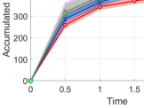

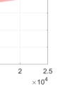

Figure 1: Reward regret in
simulated environments.

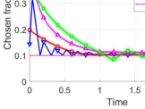

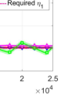

Figure 2: Fairness constraint
violation for arm 1.

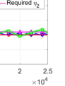

Figure 3: Fairness constraint
violation for arm 2.

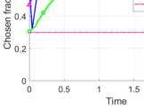

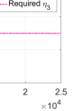

Figure 4: Fairness constraint
violation for arm 3.

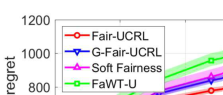

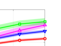

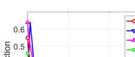

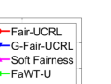

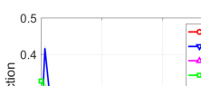

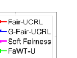

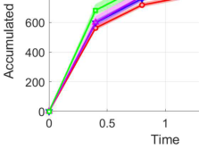

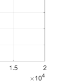

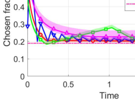

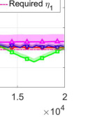

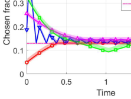

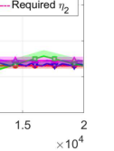

(a) Reward regret. (b) Fairness constraint violation for arm 1. (c) Fairness constraint violation for arm 2.

Figure 5: Continuous positive airway pressure therapy.

Evaluation in Simulated Environments

Settings. We consider 3 classes of arms, each including 100
duplicates with state space S ∈{0, 1, 2, 3, 4, 5}. Class-n
arm arrives with rate λ n = 3n for n = 1, 2, 3, and departs with a fixed rate of µ = 5. We consider a controlled
Markov chain in which states evolve as a specific birth-anddeath process, i.e., state s only transits to s + 1 or s − 1
with probability P (s, s + 1) = λ/(λ + µ) or P (s, s − 1) =
µ/(λ + µ), respectively. Class-n arm generates a random reward r n (s) ∼ Ber(sp n ), with p n uniformly sampled from

[0.01, 0.1]. The activation budget is set to 100. The minimum
activation fraction η is set to be 0.1, 0.2 and 0.3 for the three
classes of arms, respectively. We set K = H = 160. We use
Monte Carlo simulations with 1, 000 independent trials.
Baselines. We compare Fair-UCRL with three baselines:
(1) FaWT-U (Li and Varakantham 2022a) activates arms
based on their Whittle indices. If the fairness constraint is
not met for an arm after a certain time, FaWT-U always
activates that arm regardless of its Whittle index. (2) Soft
Fairness (Li and Varakantham 2022b) incorporates softmax based value iteration method into the RMAB setting.
Since both algorithms are designed for infinite-horizon discounted reward settings, we choose the discounted factor to
be 0.999 for fair comparisons with our Fair-UCRL, which
is designed for infinite-horizon average-reward settings. (3)
G-Fair-UCRL: We modify our proposed Fair-UCRL
by greedily enforcing the fairness constraint satisfaction
in each episode. Specifically, at the beginning of each
episode, G-Fair-UCRL randomly pulls an arm to force
each arm n to be pulled Hη n times. This greedy explo

ration will take ⌈

� Nn=1 [Hη] [n]

ration will take ⌈ n=1 B [n] ⌉ decision epochs in total in each

episode. G-Fair-UCRL then operates in the same manner
as Fair-UCRL in the rest of this episode. More details on
G-Fair-UCRL are provided in supplementary materials.
Reward Regret. The accumulated reward regrets are presented in Figure 1, where we use Monte Carlo simulations
with 1, 000 independent trials. Fair-UCRL achieves the
lowest accumulated reward regret. More importantly, this
is consistent with our theoretical analysis (see Theorem 1),
while neither FaWT-U nor Soft Fairness provides a finitetime analysis, i.e., nor provable regret bound guarantees.
Fairness Constraint Violation. The activation fraction for
each arm over time under different policies are presented in
Figures 2, 3 and 4, respectively. After a certain amount of
time, the minimum activation fraction for each arm under
Fair-UCRL is always satisfied, and a randomized initialization may cause short term fairness violation, for example,
after 6, 500 time steps for arm 2, even though the constraint
needs to be satisfied on average. Similar observations hold
for Soft Fairness, while for FaWT-U, fairness constraint violation repeatedly occurs over time for arm 1 and arm 2.

Continuous Positive Airway Pressure Therapy

We study the continuous positive airway pressure therapy
(CPAP) as in Herlihy et al. (2023); Li and Varakantham
(2022b), which is a highly effective treatment when it is used
consistently during the sleeping for adults with obstructive
sleep apnea. Similar non-adherence to CPAP in patients hinders the effectiveness, we adapt the Markov model of CPAP
adherence behavior (Kang et al. 2013) to a two-state system

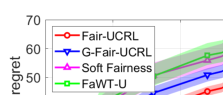

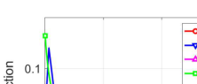

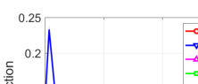

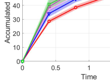

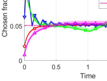

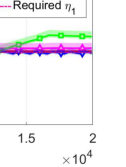

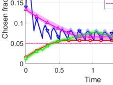

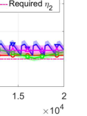

(a) Reward regret. (b) Fairness constraint violation for arm 1. (c) Fairness constraint violation for arm 2.

Figure 6: PASCAL recognizing textual entailment task.

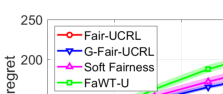

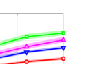

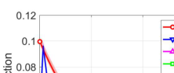

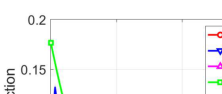

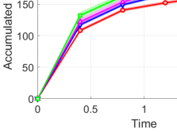

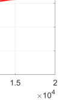

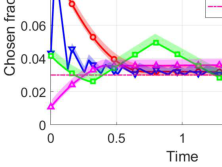

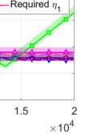

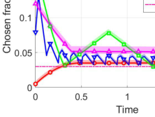

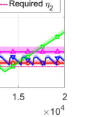

(a) Reward regret. (b) Fairness constraint violation for arm 1. (c) Fairness constraint violation for arm 2.

Figure 7: Land mobile satellite system.

with the clinical adherence criteria. Specifically, there are 3
states, representing low, intermediate and acceptable adherence levels. Patients are clustered into two groups, “Adherence” and “Non-Adherence”. The first group has a higher
probability of staying in a good adherence level. There are
20 arms/patients with 10 in each group. The transition matrix of arms in each group contains a randomized, small
noise from the original data. The intervention, which is the
action applied to each arm, results in a 5% to 50% increase in
adherence level. The budget is B = 5 and the fairness constraint is set to be a random number between [0.1, 0.7]. The
objective is to maximize the total adherence level. The accumulated reward regret and the activation fraction for two randomly selected arms are presented in Figures 5a, 5b and 5c,
respectively. Again, we observe that Fair-UCRL achieves
a much smaller reward regret and the fairness constraint is
always satisfied after a certain amount of time.

PASCAL Recognizing Textual Entailment

We study the PASCAL recognizing textual entailment task
as in Snow et al. (2008). Workers are assigned with tasks
that determine if hypothesis can be inferred from text. There
are 10 workers. Due to lack of background information, a
worker may not be able to correctly annotate a task. We assign a “successful annotation probability” to each worker,
which is based on the average success rate over 800 tasks in

the dataset. Each worker is a MDP with state 1 (correctly annotated) and 0 (otherwise). The transition probability from
state 0 to 1 with a = 1 is the same as that of staying at state
1 with a = 1, which is set as the successful annotation probability. Reward is 1 if a selected worker successfully annotates the task, and 0 otherwise. At each time, 3 tasks are generated (i.e., B = 3) and distributed to workers. Fairness constraints for all workers are set to be η = 0.05. Again, both
proposed algorithms outperform two baselines and maintain
higher selection fraction as shown in Figures 6a, 6b and 6c
for two randomly selected arms, respectively.

Land Mobile Satellite System

We study the land mobile satellite system problem as in
Prieto-Cerdeira et al. (2010), in which the land mobile
satellite broadcasts a signal carrying multimedia services
to handheld devices. There are 4 arms with different elevation angles (40 [◦], 60 [◦], 70 [◦], 80 [◦] ) of the antenna in urban area.
Only two states (Good and bad) are considered and we leverage the same transition matrix as in Prieto-Cerdeira et al.
(2010). Similar, we use the average direct signal mean as
the reward function. The budget is B = 2. We apply the fairness constraint η = 0.03 to all angles. Again, Fair-UCRL
outperforms the considered baselines in reward regret (Figure 7a), while satisfies long term average fairness constraint
(Figures 7b and 7c for two randomly selected arms).

Acknowledgements

This work was supported in part by the National Science
Foundation (NSF) grants 2148309 and 2315614, and was
supported in part by funds from OUSD R&E, NIST, and
industry partners as specified in the Resilient & Intelligent
NextG Systems (RINGS) program. This work was also supported in part by the U.S. Army Research Office (ARO)
grant W911NF-23-1-0072, and the U.S. Department of Energy (DOE) grant DE-EE0009341. Any opinions, findings,
and conclusions or recommendations expressed in this material are those of the authors and do not necessarily reflect
the views of the funding agencies.

References

Akbarzadeh, N.; and Mahajan, A. 2022. On learning Whittle
index policy for restless bandits with scalable regret. arXiv
preprint arXiv:2202.03463.

Altman, E. 1999. Constrained Markov decision processes,
volume 7. CRC Press.

Avrachenkov, K. E.; and Borkar, V. S. 2022. Whittle index
based Q-learning for restless bandits with average reward.
Automatica, 139: 110186.

Bhattacharya, B. 2018. Restless bandits visiting villages: A
preliminary study on distributing public health services. In
Proceedings of the 1st ACM SIGCAS Conference on Computing and Sustainable Societies, 1–8.

Biswas, A.; Aggarwal, G.; Varakantham, P.; and Tambe, M.
2021. Learn to intervene: An adaptive learning policy for
restless bandits in application to preventive healthcare. In
Proc. of IJCAI.

Biswas, A.; Killian, J. A.; Diaz, P. R.; Ghosh, S.; and Tambe,
M. 2023. Fairness for Workers Who Pull the Arms: An Index
Based Policy for Allocation of Restless Bandit Tasks. arXiv
preprint arXiv:2303.00799.

Borkar, V. S.; Ravikumar, K.; and Saboo, K. 2017. An index
policy for dynamic pricing in cloud computing under price
commitments. Applicationes Mathematicae, 44: 215–245.

Chen, L.; Jain, R.; and Luo, H. 2022. Learning InfiniteHorizon Average-Reward Markov Decision Processes with
Constraints. arXiv preprint arXiv:2202.00150.

Chen, Y.; Cuellar, A.; Luo, H.; Modi, J.; Nemlekar, H.; and
Nikolaidis, S. 2020. Fair contextual multi-armed bandits:
Theory and experiments. In Conference on Uncertainty in
Artificial Intelligence, 181–190. PMLR.

Cinlar, E. 1975. Introduction to stochastic processes
Prentice-Hall. Englewood Cliffs, New Jersey (420p).

Cohen, K.; Zhao, Q.; and Scaglione, A. 2014. Restless multi-armed bandits under time-varying activation constraints for dynamic spectrum access. In 2014 48th Asilomar Conference on Signals, Systems and Computers, 1575–
1578. IEEE.

Dai, W.; Gai, Y.; Krishnamachari, B.; and Zhao, Q. 2011.
The Non-Bayesian Restless Multi-Armed Bandit: A Case of
Near-Logarithmic Regret. In Proc. of IEEE ICASSP.

D’Amour, A.; Srinivasan, H.; Atwood, J.; Baljekar, P.; Sculley, D.; and Halpern, Y. 2020. Fairness is not static: deeper
understanding of long term fairness via simulation studies.
In Proceedings of the 2020 Conference on Fairness, Accountability, and Transparency, 525–534.

Duran, S.; and Verloop, I. M. 2018. Asymptotic optimal control of Markov-modulated restless bandits. Proceedings of
the ACM on Measurement and Analysis of Computing Systems, 2(1): 1–25.

Efroni, Y.; Mannor, S.; and Pirotta, M. 2020. ExplorationExploitation in Constrained MDPs. arXiv preprint
arXiv:2003.02189.

Fu, J.; Nazarathy, Y.; Moka, S.; and Taylor, P. G. 2019.
Towards q-learning the whittle index for restless bandits.
In 2019 Australian & New Zealand Control Conference
(ANZCC), 249–254. IEEE.

Gast, N.; and Bruno, G. 2010. A mean field model of work
stealing in large-scale systems. ACM SIGMETRICS Performance Evaluation Review, 38(1): 13–24.

Glazebrook, K. D.; Hodge, D. J.; and Kirkbride, C. 2011.
General notions of indexability for queueing control and asset management. The Annals of Applied Probability, 21(3):
876–907.

Herlihy, C.; Prins, A.; Srinivasan, A.; and Dickerson, J. P.
2023. Planning to fairly allocate: Probabilistic fairness in
the restless bandit setting. In Proceedings of the 29th ACM
SIGKDD Conference on Knowledge Discovery and Data
Mining, 732–740.

Hodge, D. J.; and Glazebrook, K. D. 2015. On the asymptotic optimality of greedy index heuristics for multi-action
restless bandits. Advances in Applied Probability, 47(3):
652–667.

Hu, W.; and Frazier, P. 2017. An Asymptotically Optimal
Index Policy for Finite-Horizon Restless Bandits. arXiv
preprint arXiv:1707.00205.

Jaksch, T.; Ortner, R.; and Auer, P. 2010. Near-Optimal Regret Bounds for Reinforcement Learning. Journal of Machine Learning Research, 11(4).

Jung, Y. H.; Abeille, M.; and Tewari, A. 2019. Thompson
Sampling in Non-Episodic Restless Bandits. arXiv preprint
arXiv:1910.05654.

Jung, Y. H.; and Tewari, A. 2019. Regret Bounds for Thompson Sampling in Episodic Restless Bandit Problems. Proc.
of NeurIPS.

Kalagarla, K. C.; Jain, R.; and Nuzzo, P. 2021. A SampleEfficient Algorithm for Episodic Finite-Horizon MDP with
Constraints. In Proc. of AAAI.

Kang, Y.; Prabhu, V. V.; Sawyer, A. M.; and Griffin, P. M.
2013. Markov models for treatment adherence in obstructive
sleep apnea. In IIE Annual Conference. Proceedings, 1592.
Institute of Industrial and Systems Engineers (IISE).

Killian, J. A.; Biswas, A.; Shah, S.; and Tambe, M. 2021. QLearning Lagrange Policies for Multi-Action Restless Bandits. In Proc. of ACM SIGKDD.

Killian, J. A.; Perrault, A.; and Tambe, M. 2021. Beyond” To
Act or Not to Act”: Fast Lagrangian Approaches to General
Multi-Action Restless Bandits. In Proc.of AAMAS.
Larra˜naga, M.; Ayesta, U.; and Verloop, I. M. 2014. Index
Policies for A Multi-Class Queue with Convex Holding Cost
and Abandonments. In Proc. of ACM Sigmetrics.
Lattimore, T.; and Szepesv´ari, C. 2020. Bandit Algorithms.
Cambridge University Press.
Li, D.; and Varakantham, P. 2022a. Efficient Resource Allocation with Fairness Constraints in Restless Multi-Armed
Bandits. In Proc. of UAI.

Li, D.; and Varakantham, P. 2022b. Towards Soft Fairness in Restless Multi-Armed Bandits. arXiv preprint
arXiv:2207.13343.

Li, F.; Liu, J.; and Ji, B. 2019. Combinatorial sleeping bandits with fairness constraints. IEEE Transactions on Network Science and Engineering, 7(3): 1799–1813.
Liu, H.; Liu, K.; and Zhao, Q. 2011. Logarithmic Weak
Regret of Non-Bayesian Restless Multi-Armed Bandit. In
Proc of IEEE ICASSP.
Liu, H.; Liu, K.; and Zhao, Q. 2012. Learning in A Changing World: Restless Multi-Armed Bandit with Unknown Dynamics. IEEE Transactions on Information Theory, 59(3):
1902–1916.

Mate, A.; Perrault, A.; and Tambe, M. 2021. Risk-Aware Interventions in Public Health: Planning with Restless MultiArmed Bandits. In Proc.of AAMAS.
Maurer, A.; and Pontil, M. 2009. Empirical Bernstein
Bounds and Sample Variance Penalization. arXiv preprint
arXiv:0907.3740.

Mitrophanov, A. Y. 2005. Sensitivity and convergence of
uniformly ergodic Markov chains. Journal of Applied Probability, 42(4): 1003–1014.
Nakhleh, K.; Ganji, S.; Hsieh, P.-C.; Hou, I.; Shakkottai, S.;
et al. 2021. NeurWIN: Neural Whittle Index Network For
Restless Bandits Via Deep RL. Proc. of NeurIPS.
Nakhleh, K.; Hou, I.; et al. 2022. DeepTOP: Deep
Threshold-Optimal Policy for MDPs and RMABs. In Proc.
of NeurIPS.
Ni˜no-Mora, J. 2007. Dynamic Priority Allocation via Restless Bandit Marginal Productivity Indices. Top, 15(2): 161–
198.

Ortner, R.; Ryabko, D.; Auer, P.; and Munos, R. 2012. Regret Bounds for Restless Markov Bandits. In Proc. of Algorithmic Learning Theory.
Papadimitriou, C. H.; and Tsitsiklis, J. N. 1994. The Complexity of Optimal Queueing Network Control. In Proc. of
IEEE Conference on Structure in Complexity Theory.
Prieto-Cerdeira, R.; Perez-Fontan, F.; Burzigotti, P.; BoleaAlama˜nac, A.; and Sanchez-Lago, I. 2010. Versatile twostate land mobile satellite channel model with first application to DVB-SH analysis. International Journal of Satellite
Communications and Networking, 28(5-6): 291–315.
Puterman, M. L. 1994. Markov Decision Processes: Discrete Stochastic Dynamic Programming. John Wiley &
Sons.

Sheng, S.-P.; Liu, M.; and Saigal, R. 2014. Data-Driven
Channel Modeling Using Spectrum Measurement. IEEE
Transactions on Mobile Computing, 14(9): 1794–1805.

Singh, R.; Gupta, A.; and Shroff, N. B. 2020. Learning in
Markov decision processes under constraints. arXiv preprint
arXiv:2002.12435.

Snow, R.; O’connor, B.; Jurafsky, D.; and Ng, A. Y. 2008.
Cheap and fast–but is it good? Evaluating non-expert annotations for natural language tasks. In Proceedings of the
2008 conference on empirical methods in natural language
processing, 254–263.

Tekin, C.; and Liu, M. 2011. Adaptive Learning of Uncontrolled Restless Bandits with Logarithmic Regret. In Proc.
of Allerton.

Tekin, C.; and Liu, M. 2012. Online Learning of Rested
and Restless Bandits. IEEE Transactions on Information
Theory, 58(8): 5588–5611.

Verloop, I. M. 2016. Asymptotically Optimal Priority Policies for Indexable and Nonindexable Restless Bandits. The
Annals of Applied Probability, 26(4): 1947–1995.

Wang, S.; Huang, L.; and Lui, J. 2020. Restless-UCB, an
Efficient and Low-complexity Algorithm for Online Restless Bandits. In Proc. of NeurIPS.

Weber, R. R.; and Weiss, G. 1990. On An Index Policy for
Restless Bandits. Journal of Applied Probability, 637–648.

Whittle, P. 1988. Restless Bandits: Activity Allocation in A
Changing World. Journal of Applied Probability, 287–298.

Xiong, G.; and Li, J. 2023. Finite-Time Analysis of Whittle
Index based Q-Learning for Restless Multi-Armed Bandits
with Neural Network Function Approximation. In Proc. of
NeurIPS.

Xiong, G.; Li, J.; and Singh, R. 2022. Reinforcement Learning Augmented Asymptotically Optimal Index Policy for
Finite-Horizon Restless Bandits. In Proc. of AAAI.

Xiong, G.; Wang, S.; and Li, J. 2022. Learning InfiniteHorizon Average-Reward Restless Multi-Action Bandits via
Index Awareness. In Proc. of NeurIPS.

Xiong, G.; Wang, S.; Yan, G.; and Li, J. 2022. Reinforcement Learning for Dynamic Dimensioning of Cloud Caches:
A Restless Bandit Approach. In Proc. of IEEE INFOCOM.
Yin, T.; Raab, R.; Liu, M.; and Liu, Y. 2023. LongTerm Fairness with Unknown Dynamics. arXiv preprint
arXiv:2304.09362.

Zayas-Cab´an, G.; Jasin, S.; and Wang, G. 2019. An
Asymptotically Optimal Heuristic for General Nonstationary Finite-Horizon Restless Multi-Armed, Multi-Action
Bandits. Advances in Applied Probability, 51(3): 745–772.

Zhang, X.; and Frazier, P. I. 2021. Restless Bandits with
Many Arms: Beating the Central Limit Theorem. arXiv
preprint arXiv:2107.11911.

Zou, Y.; Kim, K. T.; Lin, X.; and Chiang, M. 2021. Minimizing Age-of-Information in Heterogeneous Multi-Channel
Systems: A New Partial-Index Approach. In Proc. of ACM
MobiHoc.

Related Work

Offline **RMAB** . The RMAB was first introduced in (Whittle
1988), which is known to be computationally intractable
and is in general PSPACE hard (Papadimitriou and Tsitsiklis 1994). The state-of-the-art approach to RMAB is the
Whittle index policy, which is provably asymptotically optimal (Weber and Weiss 1990). However, Whittle index is
well-defined only when the indexability condition is satisfied, which is in general hard to verify. Furthermore, even
when an arm is indexable, finding its Whittle index can still
be intractable (Ni˜no-Mora 2007). As a result, Whittle indices of many practical problems remain unknown. Exacerbating these limitations is the fact that these Whittle-like
index policies fail to provide any guarantee on how activation is distributed among arms. To address fairness concerns,
there are recent efforts on imposing fairness constraints in
RMAB, e.g., Li and Varakantham (2022a); Herlihy et al.
(2023). However, they either considered the finite-horizon or
infinite-horizon discounted reward setting, and hence cannot
be directly applied to the more challenging infinite-horizon
average-reward setting with long-term fairness constraints
considered in this paper. In addition, there is no rigorous
finite-time performance analysis in terms of regret in Li and
Varakantham (2022a); Herlihy et al. (2023). The probabilistic fairness guarantees in Herlihy et al. (2023) are restricted
to a 2-state MDP and cannot be easily extended to a general
MDP as considered in this paper.
Online **RMAB** . Since the underlying MDPs associated with
each arm in RMAB are unknown in practice, it is important
to examine RMAB from a learning perspective, e.g., (Dai
et al. 2011; Tekin and Liu 2011; Liu, Liu, and Zhao 2011,
2012; Tekin and Liu 2012; Ortner et al. 2012; Jung and
Tewari 2019; Jung, Abeille, and Tewari 2019; Wang, Huang,
and Lui 2020). However, these methods either leveraged a
heuristic policy and may not perform close to the offline
optimum, or are computationally expensive. Recently, lowcomplexity RL algorithms have been developed for RMAB,
e.g., Fu et al. (2019); Avrachenkov and Borkar (2022);
Biswas et al. (2021); Killian et al. (2021); Wang, Huang,
and Lui (2020); Xiong, Li, and Singh (2022); Xiong, Wang,
and Li (2022); Xiong et al. (2022); Nakhleh et al. (2021);
Nakhleh, Hou et al. (2022). However, none of these studies
are applicable to RMAB-F, where the DM not only needs to
maximize the long-term reward under the instantaneous activation constraint as in RMAB, but ensures that a long-term
fairness constraint is satisfied for each arm. Our RL algorithm with rigorous regret analysis on both the reward and
the fairness violation further differentiate our work.

The **Fair-UCRL** Algorithm

Algorithm Overview. Fair-UCRL proceeds in episodes
as summarized in Algorithm 1. Let τ k be the start time of
episode k. Each episode consists of two phases: (i) Optimistic planning: At the beginning of each episode (line 4
in Algorithm 1), Fair-UCRL constructs a confidence ball
that contains a set of plausible MDPs (Jaksch, Ortner, and
Auer 2010) for each arm ∀n ∈N . To obtain an optimistic estimate of the true transition kernels and rewards,

To this end, we define a set of plausible MDPs associated

Fair-UCRL solves an optimistic planning problem with
parameters chosen from the constructed confidence ball.
Since the online RMAB-F is computationally intractable, we
first relax the instantaneous activation constraint to a “longterm activation constraint”, from which we obtain a linear
programming (LP) where decision variables are the occupancy measures (Altman 1999) corresponding to the process associated with N arms. We refer to the planning problem as an extended LP (line 5 in Algorithm 1), which is
described in details below. (ii) Policy execution: Unfortunately, the solutions to this extended LP is not always feasible to the online RMAB-F, which requires the instantaneous
activation constraint to be satisfied at each decision epoch,
rather than in the average sense as in the extended LP. To
address this challenge, Fair-UCRL constructs a so-called
FairRMAB index policy on top of the solutions to the extended LP, which is executed during the policy execution
phase of each episode (lines 7-8 in Algorithm 1).

Optimistic Planning. Fair-UCRL maintains two counts
for each arm n. Let C n [k][−][1] (s, a) be the number of visits to
state-action pairs (s, a) until τ k, and C n [k][−][1] (s, a, s [′] ) be the
number of transitions from s to s [′] under action a until τ k .
At the end of episode k, Fair-UCRL updates these counts
as C n [k] [(][s, a][) =][ C] n [k][−][1] (s, a) + [�] [H] h=1 `[1]` [(][s] n [k] [(][h][) =][ s, a] [k] n [(][h][) =]
a), and C n [k] [(][s, a, s] [′] [) =][ C] n [k][−][1] (s, a, s [′] ) + [�] [H] h=1 `[1]` [(][s] n [k] [(][h][ +]
1) = s [′] |s [k] n [(][h][) =][ s, a] [k] n [(][h][) =][ a][)][,][ ∀][(][s, a][)][ ∈S × A][ and]
∀(s, a, s [′] ) ∈S × A × S for each arm n, where s [k] n [(][h][)][ is]
the state of arm n at the h-th time frame in episode k. Then
Fair-UCRL estimates the true transition kernel and the true
reward function by the corresponding empirical averages as:

ˆ C n [k][−][1] (s, a, s [′] )
P n [k] [(][s] [′] [|][s, a][)=] (9)
max{C n [k][−][1] (s, a), 1} [,]

H
� r n [l] [(][s, a][)] `[1]` [(][s] [l] n [(][h][) =][ s, a] [l] n [(][h][) =][ a][)]

h=1

max{C n [k][−][1] (s, a), 1} .

(10)

rˆ n [k] [(][s, a][)=]

k−1
�

l=1

Fair-UCRL further defines confidence intervals for transition probabilities and rewards so that true transition probabilities and true rewards lie in them with high probabilities,
respectively. Formally, for ∀(s, a) ∈S × A, we define

P n [k] [(][s, a][) :=][ {][ ˜][P] n [ k] [(][s] [′] [|][s, a][)][,][ ∀][s] [′] [ :]

|P [˜] n [k] [(][s] [′] [|][s, a][)][ −] [P][ˆ] n [ k] [(][s] [′] [|][s, a][)][| ≤] [δ] n [k] [(][s, a][)][}][,] (11)

R [k] n [(][s, a][) :=][ {][r][˜] n [k] [(][s, a][) :]

|r˜ n [k] [(][s, a][)][ −] [r][ˆ] n [k] [(][s, a][)][| ≤] [δ] n [k] [(][s, a][)][}][,] (12)

where the size of the confidence intervals δ n [k] [(][s, a][)][ is built]
according to the Hoeffding inequality (Maurer and Pontil
2009) for ǫ ∈ (0, 1) as

. (13)
�

δ n [k] [(][s, a][) =]

�

1 SAN (k − 1)H
log
2C n [k][−][1] (s, a) � ǫ

with the confidence intervals in episode k:

M [k] = �M n [k] [= (][S][,][ A][,][ ˜][P] n [ k] [,][ ˜][r] n [k] [) :][ |][ ˜][P] n [ k] [(][s] [′] [|][s, a][)][ −] [P][ˆ] n [ k] [(][s] [′] [|][s, a][)][|]

≤ δ n [k] [(][s, a][)][,][ ˜][r] n [k] [(][s, a][) = ˆ][r] n [k] [(][s, a][) +][ δ] n [k] [(][s, a][)] �. (14)

Fair-UCRL computes a policy π [k,][∗] by performing optimistic planning. In other words, in each episode k, given
the set of plausible MDPs (14), Fair-UCRL selects an
optimistic MDP M n [k] [,][ ∀][n][ and an optimistic policy with re-]
spect to RMAB-F (P [˜] n [k] [,][ ˜][r] n [k] [,][ ∀][n][), which is similar to the offline]
RMAB-F (P n, r n, ∀n) in (1)-(3) by replacing transition and
reward functions with P [˜] n [k] [(][·|·][,][ ·][)][ and][ ˜][r] n [k] [(][·][,][ ·][)][,][ ∀][s, a, s] [′] [, n, k][,]
respectively, in the confidence intervals (11),(12) due to the
fact that the corresponding true values are not available.
As aforementioned, it is well known that solving RMAB-F
(P [˜] n [k] [,][ ˜][r] n [k] [,][ ∀][n][) is intractable even in the offline setting (Whit-]
tle 1988). To address this challenge, we first relax the instantaneous activation constraint so as to achieve a “longterm activation constraint”, i.e., the activation. For simplicity, we call RMAB-F (P [˜] n [k] [,][ ˜][r] n [k] [,][ ∀][n][) with the long-term ac-]
tivation constraint as “the relaxed RMAB-F (P [˜] n [k] [,][ ˜][r] n [k] [,][ ∀][n][)”.]
It turns out that this relaxed RMAB-F (P [˜] n [k] [,][ ˜][r] n [k] [,][ ∀][n][) can be]
equivalently transformed into a linear programming (LP)
via replacing all random variables in the relaxed RMAB-F
(P [˜] n [k] [,][ ˜][r] n [k] [,][ ∀][n][) with the occupancy measure corresponding to]
each arm n (Altman 1999).
Extended LP. We cannot solve this LP since we have
no knowledge about true transition kernels and rewards.
Thus we further rewrite it as an extended LP by leveraging state-action-state occupancy measure z n [k] [(][s, a, s] [′] [)][ to ex-]
press confidence intervals of transition probabilities: given
a policy π and transition functions P [˜] n [k] [,][ the occupancy mea-]
sure z n [k] [(][s, a, s] [′] [)][ induced by][ π][ and][ ˜][P] n [ k] [is that][ ∀][n, s, s] [′] [, a, k][:]
z n [k] [(][s, a, s] [′] [) := lim] [H][→∞] H [1] [E] [π] [[][�] h [H] =1 [−][1] `[1]` [(][s] [n] [(][h][) =][ s, a] [n] [(][h][) =]

a, s n (h + 1) = s [′] )].
The extended LP over z [k] := {z n [k] [(][s, a, s] [′] [)][,][ ∀][n][ ∈N}][ is]
then given as ELP(M [k], z [k] ) :

�

a∈A

� z n [k] [(][s, a, s] [′] [) = 1][,][ ∀][n][ ∈N] [,] (19)

s [′] ∈S

min
z [k]

s.t.

N
�

n=1

N
�

n=1

�

s∈S

�

a∈A

�

s∈S

� z n [k] [(][s, a, s] [′] [)˜][r] n [k] [(][s, a][)] (15)

(s,a,s [′] )

�

s∈S

� z n [k] [(][s,][ 1][, s] [′] [)][ ≤] [B,] (16)

s [′] ∈S

�

� z n [k] [(][s,][ 1][, s] [′] [)][ ≥] [η] [n] [,][ ∀][n][ ∈N] [,] (17)

s [′] ∈S

� z n [k] [(][s, a, s] [′] [) =] �

s [′] ∈S s [′] ∈S

�

where constraints (16)-(17) are restatements of “long-term
activation constraint” and “long-term fairness constraint”,
respectively; constraint (18) represents the fluid transition of
occupancy measure; and constraint (19) holds since the occupancy measure is a probability measure; and the last two
constraints enforce that transition probabilities are inside of
the confidence ball (14). Denote the optimal solution to the
extended LP as z [k,][∗] = {z n [k,][∗] [,][ ∀][n][ ∈N}][.]

Policy Execution. One challenge for online RMAB-F
(P [˜] n [k] [,][ ˜][r] n [k] [,][ ∀][n][) is that the instantaneous activation constraint]
must be satisfied at each decision epoch, rather than in the
average sense as in the extended LP (15)-(21). As a result,
the solution to the above extended LP is not always feasible to the online RMAB-F (P [˜] n [k] [,][ ˜][r] n [k] [,][ ∀][n][). Inspired by (Xiong,]
Wang, and Li 2022), we construct an index policy, which is
feasible for the online RMAB-F (P [˜] n [k] [,][ ˜][r] n [k] [,][ ∀][n][). Specifically,]
we derive our index policy on top of the optimal solution
z [k,][∗] = {z n [k,][∗] [,][ ∀][n][ ∈N}][. Since][ A][ =][ {][0][,][ 1][}][, i.e, an arm can]
be either active or passive at time t, we define the index assigned to arm n in state s n (t) = s at time t to be as

� s [′] [ z] n [k,][∗] [(][s,][ 1][, s] [′] [)]
ω n [k,][∗] [(][s][) :=] � a,s [′] [ z] n [k,][∗] [(][s, a, s] [′] [)], ∀n ∈N . (22)

We call this the fair index since ω n [k,][∗] [(][s][)][ represents the prob-]
ability of activating arm n in state s towards maximizing the
total rewards while guarantees fairness for arm n in online
RMAB-F. To this end, we rank all arms according to their
indices in (22) in a non-increasing order, and activate the set
of B highest indexed arms, denoted as N (t) ⊂N such that
� n∈N (t) [a] n [∗] [(][t][)][ ≤] [B][. All remaining arms are kept passive]
at time t. We denote the resultant index-based policy, which
we call the FairRMAB index policy as π [k,][∗] := {π n [k,][∗] [,][ ∀][n][ ∈]
N}, and execute this policy in this episode.

Remark 2. Fair-UCRL draws inspiration from the
infinite-horizon UCRL (Jaksch, Ortner, and Auer 2010),
which uses the sampled trajectory of each episode to update the plausible MDPs of next episode. However, there exist two major differences. First, Fair-UCRL modifies the
principle of optimism in the face of uncertainty for making
decisions which is utilized by UCRL based algorithms, to
not only maximize the long-term rewards but also to satisfy the long-term fairness constraint in our RMAB-F. This
difference is further exacerbated since the objective of conventional regret analysis, e.g., colored-UCRL2 (Ortner et al.
2012) for RMAB is to bound the reward regret, while due
to the long-term fairness constraint, we also need to bound
the fairness violation regret for each arm for Fair-UCRL,
which will be discussed in details in Theorem 1. Second,
Fair-UCRL deploys the proposed FairRMAB index policy
at each episode, and thus results in solving a low-complexity
extended LP, which is exponentially better than that of UCRL
(Jaksch, Ortner, and Auer 2010) that need to solve extended
value iterations. We note that the design of our FairRMAB
index policy is largely inspired by the LP based approach
in Xiong, Wang, and Li (2022) for online RMAB. However,
Xiong, Wang, and Li (2022) only considered the instantaneous activation constraint, and hence is not able to address

s [′] ∈S

� z n [k] [(][s] [′] [, a] [′] [, s][)][,] (18)

a [′] ∈A

�

z n [k] [(][s, a, s] [′] [)]
n [(][s] [′] [|][s, a][)+][δ] n [k] [(][s, a][))][ ≤] [0][,] (20)
� y [z] n [k] [(][s, a, y][)][ −][( ˆ][P] [ k]

− z n [k] [(][s, a, s] [′] [)] n [(][s] [′] [|][s, a][)][−][δ] n [k] [(][s, a][))][ ≤] [0][,][ (21)]
� y [z] n [k] [(][s, a, y][) +( ˆ][P] [ k]

the new dilemma faced by our online RMAB-F, which also
needs to ensure the long-term fairness constraints.

Proof of Theorem 1

In this section, we present the detailed proof for Theorem
1. As mentioned, the proof shares same structure as UCRL
type of proof (Jaksch, Ortner, and Auer 2010), and is organized in the following steps: (i) We show both reward and
fairness violation regrets can be decomposed into the sum of
episodic regret (Lemma 1); (ii) We compute the fairness violation regret when true MDP does not belong to confidence
ball, followed by the regret when true MDP falls into confidence ball (Lemma 2, 3); and (iii) We complete the proof
by presenting the reward regret when confidence ball fails
to fall into confidence ball/belongs to the confidence ball
(Lemma 4, 5).

Regret decomposition

We begin by showing that the cumulative regret can be
decomposed into the sum of regrets incurred during each
episode. We use reward regret ∆ [R] k [{][π] [∗][,k] [}][ as an example,]
while the fairness violation regret is essentially the same.
For simplicity, we denote c [k] n [(][s, a][) :=][ �] [H] h=1 `[1]` [(][s] n [k] [(][h][) =]
s, a [k] n [(][h][) =][ a][)][ as the state-action counts for][ (][s, a][)][ in episode]
k for arm n. Then, under policy π [∗][,k], we define the regret
during episode k as follows:

∆ [n,F] T ≤

=

+

�

1
4 [T][ log][ SANT] ǫ

=

K
� ∆ [R] k [{][π] [∗][,k] [}][ +]

k=1

�

1
4 [T][ log][ SANT] ǫ,

1
4 [T][ log][ SANT] ǫ

with probability as least 1 − ( SANTǫ [)] 12 .

Fairness violation regret when true MDP does not
belong to confidence ball
The fairness violation regret for arm n until time T is defined

as

T
�
� t=1

�

∆ [n,F] T = T η n − E π ∗

� a n (t)

t=1

, ∀n ∈N .

By dividing the regret into episodes, we have the following alternative expression of fairness violation regret

K
∆ [n,F] T = E �
� k=1

H
�(η n − a [k,h] n [(][t][))], ∀n ∈N

h=1 �

where a [k,h] n is the action taken in episode k, time frame h
for arm n. According to Lemma 1, we will decompose the
fairness violation regret:

K
� ∆ [n,F] k +

k=1

K
� ∆ [n,F] k `1` ((M ∈M k ) + (M /∈M k ))

k=1

�

1
4 [T][ log][ SANT] ǫ

1
4 [T][ log][ SANT] ǫ

∆ [R] k [{][π] [∗][,k] [}][ :=][Hµ] [∗] [−] �

(s,a)

� c [k] n [(][s, a][)¯][r] [n] [(][s, a][)][,]

n

where µ [∗] is the average reward per step by the optimal policy. The relation between the total regret ∆ [R] T [{][π] [∗][,k] [,][ ∀][k][}][ and]
the episodic regrets ∆ [R] k [{][π] [∗][,k] [}][ is given as follows:]

Proof of Lemma 1. Let C n [k] [(][s, a][)][ (note this is different to]
c [k] n [, which is the count within episode][ k][) be the total number]
of visits to (s, a) until episode k under policy {π [∗][,k] }, and
denote r({π [∗][,k], ∀k}, T ) as the reward until T under policy
{π [∗][,k], ∀k}. Using Chernoff-Hoeffding’s inequality, we have

Next we consider the event that true MDP does not belong
to confidence ball, i.e. M /∈M ∥ . This event happens when

∃(s, a), n, s.t. |P n [k] [(][s] [′] [|][s, a][)][ −] [P][ˆ] n [ k] [(][s] [′] [|][s, a][)][|][ > δ] n [k] [(][s, a][)][.]

The probability of such event is characterized in the following lemma.

Lemma 6. The probability of confidence ball fails is

ǫ
P (M /∈M k ) ≤
kH [,]

where

+

�

1

(23)

4 [T][ log][ SANT] ǫ

P

r({π [∗][,k], ∀k}, T ) ≤

�

�

�

n

� c [k] n [(][s, a][)¯][r] [n] [(][s, a][)][ −]

(s,a)

1
4 [T][ log][ SANT] ǫ

4 [T][ log] [ SANT] ǫ

�

�

− [2] [ 1] 4
≤ exp
�

�

1 log [SANkH] .
2C n [k][−][1] (s, a) ǫ

ǫ
T (1 − 0)

δ n [k] [(][s, a][) =]

− [1]
= exp
�

[1]

2 [log][ SANT] ǫ

�

ǫ

ǫ

=
� SANT

2
.

� [1]

Therefore, we obtain

∆ [R] T [{][π] [∗][,k] [,][ ∀][k][}][ =][ T µ] [∗] [−] [r][(][{][π] [∗][,k] [,][ ∀][k][}][, T][ )]

Proof: By Chernoff-Hoeffding’s inequality, we have

ǫ
P (|P n [k] [(][s] [′] [|][s, a][)][ −] [P][ˆ] n [ k] [(][s] [′] [|][s, a][)][|][ > δ] n [k] [(][s, a][))][ ≤]
SANkH [.]

Summing over all state-action pairs and different arms, the
following bound is given:

P (M /∈M k ) ≤ �

n

� P (|P n [k] [(][s] [′] [|][s, a][)][ −] [P][ˆ] n [ k] [(][s] [′] [|][s, a][)][|]

(s,a)

−
≤ T µ [∗] �

k

�

n

� c [k] n [(][s, a][)¯][r] [n] [(][s, a][)]

(s,a)

ǫ
≤
kH [.]

Proof of Lemma 2. For the case that confidence ball fails,
we can bound regret as following:

where ˆn = ⌈log ρ C [−][1] ⌉ is a constant.
With Assumption 2, the fairness violation regret when
confidence ball fails for episode k is characterized in the following lemma.

Lemma 7. The event that the true MDP belongs to the
confidence ball in fairness violation for episode k is upper
bounded by

C
∆ [n,F] k `1` (M ∈M k ) ≤ E�Hη n − F n (π n [k] [, p][)] � + 1 − ρ [.]

Proof. For the fairness violation regret in episode k, we have

K
� ∆ [n,F] k `1` (M /∈M k ) ≤

k=1

≤

K
�

k=1

K

ǫ

� Hη n kH

k=1

H
� η n `1` (M /∈M k )

h=1

H
�

K

≤ η n ǫ �

k=1

1

k

≤ η n ǫ log K = [1]

2 [η] [n] [ǫ][ log][ T]

H
� a [k,h] n [(][t][)]

h=1 �

with probability at least 1 − ( SANTǫ [)] 12, where the first inequality is because a [k,h] n [(][t][)][ ≥] [0][, second is due to Lemma 6,]
last equality holds by setting K = H = √T.

Fairness violation regret when true MDP belongs
to confidence ball
Next, we will discuss the dominant part of fairness violation

∆ [n,F] k `1` (M ∈M k ) = E Hη n −
�

K
regret � ∆ [n,F] k `1` (M ∈M k ), which is when the true MDP

k=1

belongs to the confidence ball.

Proof of Lemma 3. Define F n (π [k], p) =
1
T [lim] [T][ →∞] [(][�] t [T] =1 [a] [n] [(][t][)][|][π] [k] [, p][)][ as the long term aver-]
age fairness variable under policy π [k] for arm n with MDP
that has true transition probability matrix p (i.e. this is
the long term average fairness variable if we apply the
policy π [k] to all time slots with transition p), and define
F n (π [k], θ) = T [1] [lim] [T][ →∞] [(][�] t [T] =1 [a] [n] [(][t][)][|][π] [k] [, θ][)][ as the fairness]

variable under policy π in episode k for arm n with MDP
whose transition matrix θ belongs in the confidence ball.
Before we moving forward, we need to introduce the
unichain assumption and a corollary from (Mitrophanov
2005) (Corollary 3.1):

Assumption 2. Assume that all MDPs in our RMAB-F is
unichain, i.e., for MDP with transition p with a stationary
policy π, there exists positive constants ρ > 0 and C < ∞,

s.t.

||P π,p,s [t] [−] [P] [π,p] [||] [T V] [ ≤] [Cρ] [t] [, t][ = 1][,][ 2][, ...]

where P π,p,s [t] [is the transition distribution after][ t][ time steps]
starting from state s, P π,p is the stationary distribution for
policy π under transition p.

Corollary 1. (Mitrophanov 2005) Define P p,sˆ [(1)] [(][s][)][ as the]
transition starting from state s applying policy based on
pˆ, which is the transition estimation based on state, action
count (and P p,s [(1)] [from true transition][ p][,][ P] θ,s [ (1)] [from][ θ][, respec-]
tively). By definition, F n (π [k], p) is an invariant measure for
chain with transition P p,s [(1)] [,][ F] n [(][π] [k] [, θ][)][ is a invariant measure]
for chain with transition P θ,s [(1)] [,]

= HE η n − F n (π n [k] [, p][)]
� �

H
+ E �(F n (π [k], p) − a [k,h] n [(][t][))]
� h=1 �

C
≤ HE η n − F n (π n [k] [, p][)] +
� � 1 − ρ [,]

where the last inequality holds because of the unichain assumption if we consider F n (π n [k] [, p][)][ as the true transition dis-]
tribution and [�] [H] h=1 [a] n [k,h] [(][t][)][ as the transition distribution af-]
ter H time steps.

With Assumption 2 and Corollary 1, we have

Lemma 8. Under policy π, for θ ∈M k,

|F n (π [k], p) − F n (π [k], θ)| ≤

2 nˆ + [Cρ] [n][ˆ]
� 1 − ρ

max

s
�

� π(s, a)δ n [k] [(][s, a][)][.]

a

Proof. Since both the true transition p and θ are in confidence ball, we obtain

||P p,sˆ [(1)] [−] [P] p,s [ (1)] [||] [T V] [ ≤] � π(s, a)δ n [k] [(][s, a][)][,]

a

||P p,sˆ [(1)] [−] [P] θ,s [ (1)] [||] [T V] [ ≤] � π(s, a)δ n [k] [(][s, a][)][,]

a

with triangle inequality, we immediately obtain

||P p,s [(1)] [−] [P] θ,s [ (1)] [||] [T V] [ ≤] [2] � π(s, a)δ n [k] [(][s, a][)][.]

a

Combining with Corollary 1, we have

||F n (π [k], p) − F n (π [k], θ)|| T V

≤ 2 nˆ + [Cρ] [n][ˆ]
� 1 − ρ

≤ 2 nˆ + [Cρ] [n][ˆ]
� 1 − ρ

π(s, a)δ n [k] [(][s, a][)]

�� a

max

s
�

� π(s, a)δ n [k] [(][s, a][)]

a

ˆ
||F n (π [k],p)−F n (π [k],θ)|| T V ≤ n+ [Cρ] [n][ˆ]
� 1 − ρ

||P p,s [(1)] [−][P] θ,s [ (1)] [||] [T V] [,]
�

The result follows since |F n (π [k], p)−F n (π [k], θ)| is the value
difference and ||F n (π [k], p) − F n (π [k], θ)|| T V is in the total
variation norm.

1 − ρ

Lemma 9. Define β n [k] [(][π] [k] [)] := 2 nˆ +
�

E[c [k] n [(][s, a][)]][ −] [c] [k] n [(][s, a][)]
ǫ �2C n [k][−][1] (s, a)

+4T Mix [n]

1 − ρ

��

(s,a) ǫ 2C n [k][−][1] (s, a)

� �� �

Term 2

(s,a)

�

log [SANkH]

ˆ
n + [Cρ] [n][ˆ]
� 1 − ρ

Cρ [n][ˆ]

1−ρ

max s � a [π][(][s, a][)][δ] n [k] [(][s, a][)][. Then for any feasible]
�

policy π [k], we have

F n (π [k], p) ≥ η n − β n [k] [(][π] n [k] [)][.]

Proof. Assume there exists F n (π [k], p) < η n − β n [k] [(][π] n [k] [)][.]
Since |F n (π [k], p) − F n (π [k], θ)| ≤ β n [k] [(][π] n [k] [)][, we have]
F n (π [k], θ) < η n for any policy π [k] . This means under policy
π [k], any transition probability θ within confidence ball will
not fulfill the fairness constraint. This contradicts to π [k] for
true transition p is feasible.

Next we introduce an auxiliary lemma, i.e., Lemma 3 in
(Singh, Gupta, and Shroff 2020).

Lemma 10 ((Singh, Gupta, and Shroff 2020)). Define T mix [n]
as the mixing time for MDP correponding to arm n as

n
�

k=1

w k
�W

≤ (√
W k−1

C
+
1 − ρ [,]

where (a) is because of Lemma 10.
In order to bound Term 1, we leverage Lemma 19 in
(Jaksch, Ortner, and Auer 2010). However, there exists a
major difference in the settings between UCRL2 (Jaksch,
Ortner, and Auer 2010) and Fair-UCRL. In UCRL2, the
episode stopping criteria implies c [k] n [(][s, a][)][ ≥] [C] n [k][−][1] (s, a),
while we use a fixed episode length H in Fair-UCRL.

Lemma 11. For any sequence of numbers w 1, w 2, ..., w n
with 0 ≤ w k, define W k := [�] [k] i=1 [w] [i] [,]

2 + 1)�

W n .

Proof. The proof follows by induction. When n = 1, it is
true as 1 ≤ √2+1. Assume for all k ≤ n − 1, the inequality

holds, then we have the following:

H
E[c [k] n [(][s, a][)]][ ≤]
� 2T mix [n]

k
π n [(][a][|][s][)]
� 2 .

Using Lemmas 8, 9, 7 and 10, we can further bound the
fairness violation regret in episode k as follows

∆ [n,F] k `1` (M ∈M k )

C
≤ β n [k] [(][π] [k] [)][H][ +]
1 − ρ

n
�

k=1

w k

=

�W k−1

n−1
�

k=1

w k + w n
�W k−1 √W n

≤ (√

w n

2 + 1)�W n−1 +

√W n

H nˆ + [Cρ] [n][ˆ]

� � 1 − ρ

(s,a)

�

W n−1

n−1 + [w] [n][2]

W n W n

W n

≤
�

1 − ρ

(√

�

�
�
��(√

2
2 + 1) W n−1 + 2(√2 + 1)w n

2
2 + 1) W n−1 + 2(√

2
2 + 1) W n−1 + 2(√

2 + 1)w n

C
π(s, a)δ n [k] [(][s, a][) +]
� 1 − ρ

ˆ
n + [Cρ] [n][ˆ]
� 1 − ρ

ˆ
n + [Cρ] [n][ˆ]
� 1 − ρ

ˆ
n + [Cρ] [n][ˆ]
� 1 − ρ

=

≤

1 C
n [(][s, a][) +]
2 [π][(][s, a][)][δ] [k] 1 − ρ

�

= 4T Mix [n]

= 4T Mix [n]

��

(s,a)

��

E[c [k] n [(][s][)]][π][(][s, a][)][δ] n [k] [(][s, a][)]

��

(s,a)

��

H

2T Mix

W n−1 + [w] [n] [W] [n]
W n−1 W n

ˆ
n + [Cρ] [n][ˆ]
� 1 − ρ

= �(√

2 + 1)�(W n−1 + w n )

2
2 + 1) W n−1 + (2(√2 + 1) + 1)w n

2
2 + 1) W n−1 + (2(√

ˆ
n+ [Cρ] [n][ˆ]
� 1 −

��

=
�

= (√

= (√

+ 4T Mix [n]

1 − ρ

1
n [(][s][)])][π][(][s, a][)][δ] n [k] [(][s, a][)]
2 [−][E][[][c] [k]

2 + 1)�W n .

( [H]

2T

(s,a)

2T Mix

C
+
1 − ρ

(a)
≤ 4T Mix [n]

��

Using Lemma 11, we have

ˆ
n+ [Cρ] [n][ˆ]
� 1 − ρ

ˆ
n+ [Cρ] [n][ˆ]
� 1 − ρ

C
E[c [k] n [(][s][)]][π][(][s, a][)][δ] n [k] [(][s, a][)+]

�� 1 − ρ

(s,a)

K
� �

k=1 (s,a)

�

n

c [k] n [(][s, a][)]
C n [k][−][1] (s, a)

ˆ
n+ [Cρ] [n][ˆ]
� 1 − ρ

≤ (√2 + 1) �

(s,a)

� �C n [k] (s, a)

n

= 4T Mix [n]

1 − ρ

��

C
E[c [k] n [(][s, a][)]][δ] n [k] [(][s, a][)+]
1 − ρ
(s,a)

where (a) is from Jensen’s inequality. Then we can bound

(a)
≤ (√

2 + 1)√

SANT, (24)

ˆ
n+ [Cρ] [n][ˆ]
� 1 − ρ

�

log [SANkH] ǫ + C

2C n [k][−][1] (s, a) 1 − ρ

log [SANkH]

= 4T Mix [n]

1 − ρ

��

E[c [k] n [(][s, a][)]]

(s,a)

c [k] n [(][s, a][)]
ǫ �2C n [k][−][1] (

log [SANkH]

ǫ . For Term 2,

SANT
�

ˆ
n + [Cρ] [n][ˆ]
� 1 − ρ

ˆ
n + [Cρ] [n][ˆ]
� 1 − ρ

(s,a) ǫ 2C n [k][−][1] (s, a)

� �� �

Term 1

(s,a)

Term 1 with (√

2 + 1)√

= 4T Mix [n]

��

log [SANkH]

since E[c [k] n [(][s, a][)]][ −] [c] [k] n [(][s, a][)][ ≤] [H, C] n [k][−][1] (s, a) ≥ 1, we have
E[c [k] n [(][s,a][)]][−][c] [k] n [(][s,a][)] H

≤

√ 2C n [k][−][1] (s,a) √2 [.]

[s,a] [−][c] n [s,a] ≤ H

2C n [k][−][1] (s,a) √2

�

2 [.]

Taking [�] [K] k=1 � (s,a) E[c √ [k] n [(] 2 [s,a] C n [k] [)]] [−] [−] [1] ( [c] s,a [k] n [(][s,a] ) [)] as the sum of mar
tingale sequential difference where the sequence difference
E[c [k] n [(][s,a][)]][−][c] [k] n [(][s,a][)]
is X(k) − X(k − 1) = [�] (s,a) √ 2C n [k][−][1] (s,a) . According

to Azuma-Hoeffding’s inequality, by setting K = H = √T,

we have

K
� ∆ k `1` (M /∈M k ) ≤

k=1

=

≤

K
� HB `1` (M /∈M k )

k=1

Proof of Lemma 4 By Lemma 6, we have

K
�

k=1

K
�

� HB [ǫ]

k=1

� c [k] n [(][s, a][)] `[1]` [(][M /][∈M] [k] [)]

(s,a)

�

n

�

K
P �
� k=1

�

(s,a)

�

E[c [k] n [(][s, a][)]][ −] [c] [k] n [(][s, a][)]
�2C n [k][−][1] (s, a)

[ −] n ≥ √

2C n [k][−][1] (s, a)

�

T

1
4 [log][ SANT] ǫ

kH [=][ Bǫ]

K
�

k=1

1

k

1 [log] [ SANT] ǫ =exp [log] SANT T [1] ǫ [/][2] 1/2
2 [T] [ 3][/][2]

[ 1]

4 [log] [ SANT] ǫ

≤ exp [−][T] [ 1] 4

T [1][/][2]

ǫ
≤ ( SANT [)] [1][/][2] [.]

This means with probability of 1 − ( SANTǫ [)] [1][/][2] [, the summa-]
tion of k episodes of Term 2 can be bounded as:

T

≤ Bǫ

�

1=2

1

(t − 1)

T

≤ Bǫ
� t=1

1

t [dt][ ≤] [Bǫ][ log][ T.]

T [1][/][2]
�

1
4 [log][ SANT] ǫ

�

= [1]
ǫ 2

log [SANT]

2

√T log [SANT]

T log [SANT]

ǫ

With probability 1 − ( SANTǫ [)] [1][/][2] [ we have the dominant]
term (true MDP belongs to the confidence ball) in fairness
violation regret as

Reward regret when true MDP belongs to the
confidence ball

Proof of Lemma 5 Given M ∈M k, we bound the regret
in episode k as follows:

∆ [R] k [{][π] [∗][,k] [}] `[1]` [(][M][ ∈M] [k] [)]

� c [k] n [(][s, a][)¯][r] [n] [(][s, a][)]

n

∆ [n,F] T `1` (M ∈M k ) ≤ 4T Mix [n]

�

�

� [�]

= −
Hµ [∗] �

(s,a)

�

�

log [SANT]

2 + 1)√

2

√T log [SANT]

ǫ

(√
ǫ

ˆ
n + [Cρ] [n][ˆ]
� 1 − ρ

SANT + [1]

(s,a)

c [k] n [(][s, a][)] [µ] [∗]

B

n

� c [k] n [(][s, a][)¯][r] [n] [(][s, a][)]

n

�

B [−] �

C

+ √T (25)

1 − ρ [.]

� c [k] n [(][s, a][)(][µ] [∗] [/B][ −] [r][¯] [n] [(][s, a][))]

n

�

Total fairness violation regert

Substituting (25), Lemma 2 into (23), and for simplicity, de

� c [k] n [(][s, a][)(][µ] [∗] [/B][ −] [r][˜] [n] [(][s, a][))]

n

�

2+1) nˆ + [Cρ] 1− [n] ρ [ˆ]
�

(a)
=
�

(s,a)

=
�

(s,a)

=
�

(s,a)

+
�

(s,a)

(b)
≤
�

(s,a)

� c [k] n [(][s, a][)(˜][r] [n] [(][s, a][)][ −] [r][¯] [n] [(][s, a][))]

n

fine C 0 := 4(√

1−ρ

, we obtain the final bound
�

�

for fairness violation regret:

C

∆ [n,F] T ≤ 2 [1] [η] [n] [ǫ][ log][ T][ +] 1 − ρ

� c [k] n [(][s, a][)(][µ] [∗] [/B][ −] [r][˜] [n] [(][s, a][))]

n

�

√T +

√

�

1
4 [T][ log][ SANT] ǫ

1
4 [T][ log][ SANT] ǫ

+
�

(s,a)

� c [k] n [(][s, a][)2]

n

�

�

1 log [SANkH]
2C n [k][−][1] (s, a) ǫ

+ 4T Mix [n]

ˆ
n + [Cρ] [n][ˆ]
� 1 − ρ

�

� [�]

ǫ

�

(c)
≤

log [SANT]

2+1)√

2

�

2 log [SANT]

(√
ǫ

SANT + [1]

√

�

(s,a)

�

n

c [k] n [(][s, a][)]

, (26)

�C n [k][−][1] (s, a)

T log [SANT]

ǫ

= O [˜]

�

η n ǫ log T + C 0 T Mix [n] √SANT log [SANT]

SANT log [SANT]

,

ǫ

,

�

with probability at least (1 − ( SANTǫ [)] 12 ) [2] .

Reward regret when the confidence ball fails

Using Lemma 6, we can show the regret bound for failing
confidence ball.

where (a) holds because [�] (s,a) � n [c] n [k] [(][s, a][) =][ HB][; (b)]
is due to M ∈M k ; and (c) holds due to the fact that for
any episode k, the optimistic average reward ˜r n (s, a) of
the optimistically chosen policy ˜π k is larger than the true
optimal average reward µ [∗] .

Substituting (24) into (26) leads to the result in Lemma 5.

Algorithm 2: G-Fair-UCRL

1: Require: Initialize C n [0] [(][s, a][) = 0][,][ and][ ˆ][P] n [ 0] [(][s] [′] [|][s, a][) =]
1/S, ∀n ∈N, s, s [′] ∈S, a ∈A.
2: for k = 1, 2, · · ·, K do
3: // ∗∗Greedy Exploration for Fairness∗∗ //

4: In the first ⌈ � Nn=1 B [Hη] [n] ⌉ decision epochs, select each

arm to meet the fairness constraint requirement;
5: // ∗∗Optimistic Planning∗∗ //
6: Construct the set of plausible MDPs M [k] as in (14);
7: Relaxed the instantaneous activation constraint in
RMAB-F (P [˜] n [k] [,][ ˜][r] n [k] [,][ ∀][n][) to be “long-term activation]
constraint”, and transform the relaxed problem into
ELP [1] (M [k], z [k] ) (27)-(32);
8: // ∗∗Policy Execution∗∗ //
9: Establish the FairRMAB index policy π [k,][∗] on top
of the solutions to the extended LP and execute it.

10: end for

min
z [k]

s.t.

� Nn=1 [Hη] [n]

i.e., at the beginning of each episode τ k, G-Fair-UCRL
randomly pulls an arm to force each arm n to be pulled

� Nn=1 [Hη] [n]

Hη n times. This greedy exploration will take ⌈ B ⌉

decision epochs in total. Similar to Fair-UCRL, our
G-Fair-UCRL follows the phases of optimistic planning
and policy execution after the greedy exploration. The major difference is that G-Fair-UCRL will take the samples
from the greedy exploration into account when constructing
the set of plausible MDPs as in (6), but no longer need the
fairness constraint when solving the extended LP in (7). The
new extended LP over z [k] := {z n [k] [(][s, a, s] [′] [)][,][ ∀][n][ ∈N}][ is then]
given as ELP [1] (M [k], z [k] ) :

4: In the first ⌈

�

a∈A

� z n [k] [(][s, a, s] [′] [) = 1][,][ ∀][n][ ∈N] [,] (30)

s [′] ∈S

N
�

n=1

N
�

n=1

�

a∈A

�

s∈S

� z n [k] [(][s, a, s] [′] [)˜][r] n [k] [(][s, a][)] (27)

(s,a,s [′] )

�

s∈S

� z n [k] [(][s,][ 1][, s] [′] [)][ ≤] [B,] (28)

s [′] ∈S

�

Total reward regret
Combining all bounds in Lemmas 1, 4 and 5, we can obtain
the total regret as:

∆ [R] T [{][π] [∗][,k] [,][ ∀][k][}]

�

� z n [k] [(][s, a, s] [′] [) =] �

s [′] ∈S s [′] ∈S

s [′] ∈S

� z n [k] [(][s] [′] [, a] [′] [, s][)][,] (29)

a [′] ∈A

�

=

=

+

K
� ∆ [R] k [{][π] [∗][,k] [}][ +]

k=1

�

1
4 [T][ log][ SANT] ǫ

1
4 [T][ log][ SANT] ǫ

�

1
4 [T][ log][ SANT] ǫ

K
�

k=1

∆ [R] k [{][π] [∗][,k] [}][(] `[1]` [(][M][ ∈M] [k] [) +] `[ 1]` [(][M /][∈M] [k] [))]
� �

≤ Bǫ log T + (√

�

2 + 2)

log [SANT]

√SANT

√

ǫ

+

�

1
4 [T][ log][ SANT] ǫ

1
4 [T][ log][ SANT] ǫ

z n [k] [(][s, a, s] [′] [)]
� y [z] n [k] [(][s, a, y][)][ −][( ˆ][P] n [ k] [(][s] [′] [|][s, a][)+][δ] n [k] [(][s, a][))][ ≤] [0][,] (31)

− z n [k] [(][s, a, s] [′] [)] n [(][s] [′] [|][s, a][)][−][δ] n [k] [(][s, a][))][ ≤] [0][,][ (32)]
� y [z] n [k] [(][s, a, y][) +( ˆ][P] [ k]

Regret Analysis of **G-Fair-UCRL**

The next theoretical contribution is the regret analysis for
G-Fair-UCRL.

Theorem 2. With the same size of confidence intervals
δ n [k] [(][s, a][)][ as in Theorem 1, and with probability at least]
1 − ( SANTǫ [)] 12, G-Fair-UCRL achieves the reward regret

as

= O [˜]

�

.

�

2 + 2)√

�

Bǫ log T + (√

SANT

log [SANT]

ǫ

**G-Fair-UCRL** and Regret Analysis
Our Fair-UCRL strictly meets the instantaneous activation
constraint, i.e., it operates in a way that exactly B arms are
activated at each decision epoch, which is guaranteed by the
index policy. Though Fair-UCRL provably achieves sublinear bounds on both reward and fairness violation regrets,
some applications (e.g., healthcare) may have a stricter requirement on fairness. Now, we show that it is possible to
design an episodic RL algorithm with no fairness violation.

The **G-Fair-UCRL** Algorithm
G-Fair-UCRL proceeds in episodes as summarized in Algorithm 2. Different from Fair-UCRL, in each episode, our
G-Fair-UCRL starts with a greedy exploration to first ensure that the fairness requirement η n for each arm n is satisfied. Specifically, we guarantee this in a greedy manner,

Similar to reward regret proof for Fair-UCRL, we can
divide the regret to episodes, which contains the first
⌈ � n [Hη] [n] ⌉ time steps and remaining ⌈H − � n [Hη] [n] ⌉ for pol

B [n] ⌉ time steps and remaining ⌈H −

∆ [R] T [≤] [O][˜] n [η] [n]

B
���

T + Bǫ log T
�

.

�

�

log [SANT]

+ (√

2 + 2)√SANT

ǫ

and guarantees 0 fairness violation regret.

Proof of Theorem 2

� n [Hη] [n]

� n [Hη] [n]

B [n] ⌉ for pol

icy execution. The reward regret satisfies:

∆ [R] T [{][π] [∗][,k] [,][ ∀][k][}][ : =][ T µ] [∗] [−] [r][(][{][π] [∗][,k] [,][ ∀][k][}][, T][ )]

rewrite the resultant problem for episode k into the following linear programming (LP):

max
ζ n ∈Ω π

s.t.

N
�

n=1

N
�

n=1

�

s∈S

� ζ n [k] [(][s,][ 1)][ ≤] [B,] (37)

s∈S

� ζ n [k] [(][s, a][)˜][r] n [k] [(][s, a][)] (36)

a∈A

�

≤

=

+

K
� ∆ [R] k [{][π] [∗][,k] [}][ +]

�

k=1

�

1
4 [T][ log][ SANT] ǫ

1
4 [T][ log][ SANT] ǫ

1
4 [T][ log][ SANT] ǫ

K
�(∆ [R] k,bf [{][π] [∗][,k] [}][ + ∆] k,pe [R] [{][π] [∗][,k] [}][)]

k=1

� ζ n [k] [(][s,][ 1)][ ≥] [η] [n] [,][ ∀][n][ ∈N] [,] (38)

s∈S

�

s [′] ∈S

� ζ n [k] [(][s, a][) ˜][P] n [ k] [(][s] [′] [|][s, a][)]

a∈A

�

While the latter term is the same, we will have following
term for brutal force fairness:

=
�

s [′] ∈S

� ζ n [k] [(][s] [′] [, a] [′] [) ˜][P] n [ k] [(][s][|][s] [′] [, a] [′] [)][,][ ∀][n][ ∈N] [,][ (39)]

a [′] ∈A

∆ [R] k,bf [{][π] [∗][,k] [}][ =][⌈] � n B [Hη] [n] ⌉µ [∗] − �

(s,a)

c [k]

� n,bf [(][s, a][)¯][r] [n] [(][s, a][)]

n

�

�

s∈S

� ζ n [k] [(][s, a][) = 1][,][ ∀][n][ ∈N] [.] (40)

a∈A

�

�
≤⌈

n [Hη] [n] ⌉

B

n [Hη] [n]

where c [k]
n,bf [(][s, a][)][ is the count of state-action pair for arm][ n]
in the brutal force time period. This is because for the first
⌈ � n B [Hη] [n] ⌉ time steps, the upper bound for optimal per step

reward and randomized policy reward will be 1. Since we
set K = H = √T, the sum of K episodes of

One can arrive at the the above LP via replacing all random
variables in RMAB-F (P [˜] n, ˜r n, ∀n) with the long-term activation constraint with the occupancy measure corresponding to each arm n (Altman 1999). Specifically, in episode
k, the occupancy measure Ω [k] π [of a stationary policy][ π][ for]
the infinite-horizon MDP is defined as the expected average
number of visits to each state-action pair (s, a), i.e.,

Ω [k] π [=]

� n [Hη] [n]

T, the sum of K episodes of

�

1
ζ n [k] [(][s, a][)][ ≜] [lim]
H→∞ H [E] [π]

�
∆ [R] T [{][π] [∗][,k] [,][ ∀][k][} ≤⌈]

n [η] [n] ⌉√
B

T + Bǫ log T

∀n ∈N, s ∈S, a ∈A
������

,

�

H
�
� h=1

� `1` (s n (h) = s, a n (h) = a)

h=1

(41)

�

�

1
4 [log][ SANT] ǫ

+ (√

�

2 + 2)

log [SANT]

√SANT +

,

ǫ

= O [˜]

�

⌈ � n [η] [n] ⌉√
B

T + Bǫ log T + ⌈ � n [η] [n] ⌉√T
B

T + Bǫ log T + ⌈ � n [η] [n] ⌉√
B

which satisfies [�]

s∈S �

.

�

2 + 2)√SANT

2 + 2)√

�

log [SANT]

ǫ

+ (√

**RMAB-F** relaxation and linear programming

We relax the instantaneous activation constraint (2) to be satisfied on long term average (Whittle 1988), which leads to
the following “relaxed RMAB-F” (Re-RMAB-F) problem:

which satisfies [�] s∈S � a∈A [ζ] n [k] [(][s, a][)] = 1, ∀n ∈ N,

and hence ζ n [k] [,][ ∀][n][ ∈N][ is a probability measure. There-]
fore, (37) and (38) are restatements of the “long-term activation constraint” and “long-term fairness constraint”, respectively; (39) represents the fluid transition of occupancy
measure; and (40) holds since the occupancy measure is a
probability measure.

T
�
� t=1

�

1
**Re-RMAB-F** : max lim inf
π T →∞ T [E]

N
�

� r n (t)

n=1

(33)

**FairRMAB** index policy properties
In this section, we discuss the properties of FairRMAB index policy if we have full knowledge of transition and reward functions. In such case, the extended LP (15) to (21)
us equivalent to LP defined above (36) to (40) by letting
z n [k] [(][s, a, s] [′] [) =][ P] n [ k] [(][s] [′] [|][s, a][)][ζ] n [k] [(][s, a][)][. (15) to (19) are naturally]
satisfied and (20,21) come from the construction of confidence ball.
Due to the knowledge of true transition probabilities and
reward functions, the optimal results of (15) to (21) of any
episode k are the same, denoted by Ω π ∗ = {ζ n [∗] [(][s, a][)][,][ ∀][n][ ∈]
N, s ∈S, a ∈A}, and the corresponding optimal value
as V [∗] := [�] [N] n=1 � s∈S � a∈A [ζ] n [∗] [(][s, a][)][r] [n] [(][s, a][)][. The corre-]

t=1

�

N
�

� a n (t)

n=1

subject to lim sup
T →∞

1
T [E]

T
�
� t=1

t=1

≤ B, (34)

T
�
� t=1

�

1
lim inf
T →∞ T [E]

� a n (t)

t=1

≥ η n, ∀n. (35)

One can easily check that the optimal reward achieved by
Re-RMAB-F in (33)-(35) is an upper bound of that achieved
by RMAB-F in (1)-(3) due to the relaxation. More importantly, Re-RMAB-F can be equivalently reduced to a LP in
occupancy measures (Altman 1999). We then equivalently

as V [∗] := [�] n=1 � s∈S � a∈A [ζ] n [∗] [(][s, a][)][r] [n] [(][s, a][)][. The corre-]

sponding fair index can be written as in (22).
Next we rank all arms according to their indices in (22)
in a non-increasing order, and activate the set of B highest indexed arms, denoted as N (t) ⊂ N such that

s∈S �

Algorithm 3: The Optimal FairRMAB Index Algorithm for
Offline RMAB-F

1: Require: Transition probability and reward function
P n (s [′] |s, a), r n (s, a), ∀n ∈N, s, s [′] ∈S, a ∈A.
2: Solve (36) to (40) to achieve ζ n [∗] [(][s, a][)][;]
3: Compute optimal FairRMAB index policy ω n [∗] [(][s, a][) =]
ζ n [∗] [(][s,][1)]
� a [ζ] n [∗] [(][s,a][)]

4: Sort all FairRMAB index ω n [∗] [(][s, a][)][, activate top][ B][ arms]
with largest FairRMAB index.

� n∈N (t) [a] n [∗] [(][t][)][ ≤] [B][. All remaining arms are kept pas-]
sive at time t. We denote the resultant index-based policy
as π [∗] = {π n [∗] [, n][ ∈N}][, and call it the][ FairRMAB][ index]
policy with full knowledge.

Remark 3. Unlike Whittle-based policies (Whittle 1988;
Hodge and Glazebrook 2015; Glazebrook, Hodge, and Kirkbride 2011; Zou et al. 2021; Killian et al. 2021), our
FairRMAB index policy does not require the indexability
condition, which is often hard to establish when the transition kernel of the underlying MDP is convoluted (Ni˜no-Mora
2007). Like Whittle policies, our FairRMAB index policy is
computationally efficient since it is merely based on solving
an LP. A line of works (Hu and Frazier 2017; Zayas-Cab´an,
Jasin, and Wang 2019; Zhang and Frazier 2021; Xiong, Li,
and Singh 2022) designed index policies without indexability requirement for finite-horizon RMAB, and hence cannot
be directly applied to our infinite-horizon average-cost formulation for RMAB-F in (1)-(3). Finally, none of the aforementioned index policies guarantees fairness among arms,
this is because these policies are only been well defined for
maximizing the total reward (1) under the activation constraint (2), without taking the fairness constraint (3) into ac
count.

Asymptotic Optimality

We show that with perfect knowledge, the FairRMAB index
policy is asymptotically optimal in the same asymptotic
regime as that in state-of-the-art RMAB literature (Whittle
1988; Weber and Weiss 1990; Verloop 2016). For abuse
of notation, we denote the number of arms as ρN, the
activation constraint as ρB in the asymptotic regime with
ρ →∞. In other words, we consider N classes of arms and
will be interested in this fluid-scaling process with parameter ρ. Let X n [ρ] [(][π] [∗] [, s, a, t][)][ be the number of class-n arms]
at state s taking action a at time t under the FairRMAB
index policy π [∗] . Denote the long-term reward as V π [ρ] [∗] [=]
lim inf T →∞ E π ∗ [�] [T] t=1 � Nn=1 � (s,a) [r] [n] [(][s, a][)] [ X] n [ρ] [(][π] [∗] ρ [,s,a,t][)] .

Then our FairRMAB index policy π [∗] is asymptotically
optimal if and only if V π [ρ] [∗] [≥] [V] π [ ρ] [,][ ∀][π][.]

Definition 1. An equilibrium point X [ρ,][∗] /ρ under the
FairRMAB index policy π [∗] is a global attractor for the process X [ρ] (π [∗] ; t)/ρ, if, for any initial point X [ρ] (π [∗] ; 0)/ρ, the
process X [ρ] (π [∗] ; t)/ρ converges to X [ρ,][∗] /ρ.

Remark 4. The global attractor indicates that all trajectories converge to X [ρ,][∗] . Though it may be difficult to establish

The key of this proof relies on showing that the fluid proX n [ρ] [(][π] [∗] [;][t][)]
cess ρ converges to {ζ n [∗] [,][ ∀][n][}][ under the proposed]

FairRMAB index policy π [∗] when ρ →∞. Since the
{ζ n [∗] [,][ ∀][n][}][ is an optimal solution of the LP][ (36)][-][(40)][, accord-]
ing to Lemma 13, the proposed FairRMAB index policy π [∗]
achieves no worse average reward compared to the optimal
policy π [opt], i.e., lim ρ→∞ V π [ρ] [∗] [−] [V] π [ ρ] [opt] [ ≥] [0][.][ One the other]
hand, it is always true that lim ρ→∞ V π [ρ] [∗] [−] [V] π [ ρ] [opt] [ ≤] [0][ by]

analytically that a fixed point is a global attractor for the
process (Verloop 2016), such assumption has been widely
made in RMAB literature (Weber and Weiss 1990; Hodge and
Glazebrook 2015; Verloop 2016; Zou et al. 2021; Duran and
Verloop 2018), and is only verified numerically. Our experimental results in Section show that such convergence indeed
occurs for our FairRMAB index policy π [∗] .

Theorem 3. FairRMAB index policy π [∗] is asymptotically
optimal under Definition 1, i.e., lim ρ→∞ V π [ρ] [∗] [−] [V] π [ ρ] [opt] [ = 0][.]

Lemma 12. FairRMAB index policy π [∗] satisfies long term
fairness constraint (3) in asymptotic regime.

Proof of Theorem 3

Lemma 13. The optimal value achieved by LP in (36)-(40)
is an upper bound of that achieved by RMAB-F in (1)-(3).

Proof. According to (Altman 1999), the LP in (36)-(40) is

                          equivalent to the relaxed problem in (33) (35). It is sufficient to show that the relaxed problem achieves no less average reward than that of the original problem in (1)-(3). The
proof is straightforward since the constraints in the relaxed
problem expand the feasible region of the original problem
RMAB-F in (1)-(3). Denote the feasible region of the original problem as

a n (t), ∀t

�����

,

�

Γ :=

�

N
� a n (t) ≤ B

n=1

and the feasible region of the relaxed problem as

�

T
�
� t=1

N
�

� a n (t)

n=1

Γ [′] :=

�

a n (t), ∀t

≤ B

.

lim sup
T →∞
�����

1
T [E]

�

It is clear that the relaxed problem expands the feasible region of original problem in (1)-(3), i.e., Γ ⊆ Γ [′] . Therefore, the relaxed problem achieves an objective value no less

                       than that of the original problem in (1) (3) because the original optimal solution is also inside the relaxed feasibility set.
This indicates the LP in (36)-(40) achieves an optimal value
no less than that of (1)-(3).

We redefine the expected long-term average reward with
scaling parameter ρ of FairRMAB index policy π [∗] in a
continuous-time domain as

1
V π [ρ] [∗] [:= lim inf]
T →∞ T [E] [π] [∗]

T N



n [(][π] [∗] [, s, a][;][ t][)]

� r n (s, a) [X] [ρ]

ρ

(s,a)

� t T


�

dt
ρ

 .

t=1

N
�

n=1

the definition of π [opt] . This will give rise to the desired result. To prove Theorem 1, we first introduce some auxiliary
definition and lemmas.

Definition 2 (Density dependent population process (Gast
and Bruno 2010)). A sequence of Markov process X [ρ] on
1
ρ [N] [d] [(][d][ ≥] [1)][ is called a density dependent population pro-]
cess if there exists a finite number of transitions, say L ⊂
N [d], such that for each ℓ ∈L, the rate of transition from X [ρ]
to X [ρ] + ℓ/ρ is ρf ℓ (X [ρ] ), where f ℓ (·) does not depend on ρ.

To show the convergence of the density dependent population process, we consider F the function F (x) =
� ℓ∈L [ℓf] [ℓ] [(][x][)][ and the following ordinary differential equa-]
tion x(0) = x 0 and ˙x x 0 (t) = F (x x 0 (t)). The following
lemma shows that the stochastic process X [ρ] (t) converges to
the deterministic x(t).

Lemma 14. (Gast and Bruno 2010) Assume for all compact
set E ⊂ R [d], [�] ℓ [|][ℓ][|][ sup] x [f] [ℓ] [(][x][)][ <][ ∞][,][ and][ F][ is Lipschitz on]
E. If lim ρ→∞ X [ρ] (0) = x 0 in probability, then for all t > 0:

lim |X [ρ] (s) − x(s)| = 0, in probability.
ρ→∞ [sup] s≤t

The following lemma shows that under the global attractor property of function F, the stationary distribution of the
stochastic density population process converges to the dirac
measure of the global attractor.

Lemma 15. (Gast and Bruno 2010) If F has a unique stationary point x [∗] to which all trajectories converge, then the
stationary measures ζ [ρ] concentrate around x [∗] as ρ goes to
infinity:

lim
ρ→∞ [ζ] [ρ] [ →] [δ] [x] [∗] [,]

where δ x ∗ is the dirac measure in x [∗] .

Provided these lemmas, we are now ready to prove Theorem 3.

Proof. We denote A [π] n [∗] [(][s][)][ as the set of all combinations]
(m, j), m ∈N, j ∈S such that class-m arms in state j
have larger indices than those of class-n arms in state s under the FairRMAB policy π [∗] . The transition rates of the
process X [ρ] (π [∗] ; t)/ρ are then defined as

Note that the process X [ρ] (π [∗] ; t) can be expressed
dX [ρ] (π [∗] ; t) = F (X [ρ] (π [⋆] ; t)),

dt

with F (·) being Lipschitz continuous and satisfying
F (X [ρ] (π [∗] ; t)) = [�] ℓ∈L [ℓf] [ℓ] [(][X] [ρ] [(][π] [∗] [;][ t][))][.][ Under the condi-]
tion that the considered MDP is unichain, such that the
process [X] [ρ] [(] ρ [π] [∗] [;][t][)] has a unique invariant probability distri
bution ζ π [ρ] [∗] [,][ which is tight (Verloop 2016). Thus, we have]

X [ρ] (π [∗] ;t)
ζ π [ρ] [∗] � ρ � converge to the Dirac measure in X [ρ,][∗] /ρ

when ρ →∞, which is a global attractor of [X] [ρ] [(] ρ [π] [∗] [;][t][)] ac
cording to Lemma 15. Therefore, according to the ergodicity
theorem (Cinlar 1975), we have

π [∗] ;t)

ρ � converge to the Dirac measure in X [ρ,][∗] /ρ

when ρ →∞, which is a global attractor of [X] [ρ] [(][π] [∗] [;][t][)]

�

(s,a)∈S×A

�

X [ρ] (πρ [∗],s,a) ∈X

lim π [∗] [= lim]
ρ→∞ [V] [ ρ] ρ→∞

N
�

n=1

X nρ [(][π] [∗] [, s, a][)] n [(][π] [∗] [, s, a][)]
ζ π [ρ] [∗] r n (s, a) [X] [ρ]
� ρ � ρ

� r n (s, a)ω n [∗] [(][s, a][)]

(s,a)∈S×A

=

N
�

n=1

≥ ρ lim →∞ [V] π [ ρ] [opt] [,]

where the second equality is due to the fact that
ζ π [ρ] [∗] � X n [ρ] [(][π] ρ [∗] [,s,a][)] � converges to the Dirac measure in X [ρ,][∗] /ρ

when ρ →∞ under the global attractor condition.

Proof of Lemma 12

Recall in the proof of Theorem 3, we have the following
results: [X] n [ρ] [(][π] [∗] ρ [;][s,a,t][)] converges to {ζ n [∗] [,][ ∀][n][}][ under the pro-]

posed FairRMAB index policy π [∗] when ρ →∞, where
X n [ρ] [(][π] [∗] [;][ s, a, t][)][ is the number of class][ n][ arms at state][ s][ taking]
action a at time t under FairRMAB π [∗] . Define a n,j (t), j ∈
{1, 2, ..., ρ} as the action of jth arm in class n at time t under
FairRMAB π [∗],
� ρj=1 [a] [n,j] [(][t][)] � ρj=1 [a] [n,j] [(][t][)][|][a] [n,j] [(][t][) = 1]

=

ρ

ρ

x → x − [e] [n,s]

[′]

at rate
�
ρ

[n,s] + [e] [n,s] [′]

ρ ρ

P n (s, a, s [′] )x [ρ] n [(][s, a][)][,]

a

(42)

where � a∈A\{0} [ax] n [ρ] [(][s, a][)] =

min �ρB − [�] (m,j)∈A [π] n [∗] [(][s][)] � a∈A\{0} [ax] m [ρ] [(][j, a][)][,][ 0] �,

and e n,s ∈ R [S][×][1] is the unit vector with the s-th position
being 1.
It follows that there exists a continuous function f ℓ (x) to
model the transition rate of the process X [ρ] (π [∗] ; t) from state
x to x + ℓ/ρ, ∀ℓ ∈L according to (42), with L being the
set composed of a finite number of vectors in N [SN] . Hence,
the process X [ρ] (π [∗] ; t)/ρ is a density dependent population
processes according to Definition 2.

= � s [X] n [ρ] [(][π] [∗] [;][ s,][ 1][, t][)]

ρ

=
� ζ n [∗] [(][s,][ 1)][,][ ∀][t.]

s

By taking average over T we have

1

T

T
�

t=1

� ρj=1 [a] [n,j] [(][t][)]

[a] [n,j] [t]

= [1]
ρ T

T

T
�

t=1

� s [X] n [ρ] [(][π] [∗] [;][ s, a, t][)]

ρ

=
� ζ n [∗] [(][s,][ 1)][.]

s

According to constraint 38, [�] s [ζ] n [∗] [(][s,][ 1)][ ≥] [η] [n] [,][ ∀][n][,]

1

T

T
�

t=1

� ρj=1 [a] [n,j] [(][t][)]

≥ η n, ∀n.
ρ

When ρ, T →∞,

T
�
� t=1

�

1
lim inf
T →∞ T [E]

� a n (t)

t=1

≥ η n, ∀n,

which shows Lemma 12 holds in asymptotic regime.

Experiments of asymptotic optimality based on
synthetic trace

Using the synthetic trace setting in Section, we verify the
asymptotic optimality and global attractor assumption. We
vary the number of arms from 30 to 600, and keep the budget
as 3 [1] [of the number of arms.]

Asymptotic Optimality. We first validate the asymptotic optimality of FairRMAB index policy. In particular,
we define the difference of average reward obtained by
FairRMAB index policy with that from the theoretical upper bound solved from the LP (36)-(40). We call the ratio
between this award difference and the number of arms as optimality gap. From Figure 8, we observe that as the number
of arms increases, the optimality gap decreases significantly
and closes to zero. This verifies the asymptotic optimality in
Theorem 3.

Global Attractor. As indicated in Remark 4, the asymptotic optimality of our FairRMAB index policy is under the
definition of global attractor as in state of the arts. In Figure 9, we randomly pick three state-action pairs (3, 1), (2, 1)
and (5, 0) for illustration. It is clear that the occupancy measure of arm 1 for state-action pair (3, 1) indeed converges.
Similarly for arm 2 with state-action pair (2, 1) and for arm
3 with state-action pair (5, 0). Therefore, the convergence
indeed occurs for our FairRMAB index policy and hence
we verify the global attractor condition.

Additional Experimental Details

Continuous Positive Airway Pressure Therapy
(CPAP)

We study the CPAP as in (Kang et al. 2013; Herlihy et al.
2023; Li and Varakantham 2022b), which is a highly effective treatment when it is used consistently during the
sleeping for adults with obstructive sleep apnea. The state
space is 1, 2, 3, which represents low, intermediate and acceptable adherence level respectively. Based on their adherence behaviour, patients are clustered into two groups, with
the first group named “Adherence” and the second ”NonAdherence”. The difference between these two groups reflects on their transition probabilities, as in Figures. 10- 11.
Generally speaking, the first group has a higher probability
of staying in a good adherence level. From each group, we
construct 10 arms, whose transition probability matrices are
generated by adding a small noise to the original one. Actions such as text patients/ making a call/ visit in person will
cause a 5% to 50% increase in adherence level. The budget is
set to B = 5 and the fairness constraint is set to be a random
number between [0.1, 0.7]. The objective is to maximize the
total adherence level.

Elevation angle p 1,1 p 1,2 p 2,1 p 2,2
40 [◦] 0.9155 0.0845 0.0811 0.9189

60 [◦] 0.9043 0.0957 0.2 0.8

70 [◦] 0.9155 0.0845 0.2069 0.7931

80 [◦] 0.9268 0.0732 0.2667 0.7333

Table 1: Transition probability matrix of LMSS

PASCAL Recognizing Textual Entailment task
(PASCAL-RTE1)

This is a task aims to infer hypothesis as in (Snow et al.
2008). In each question, the annotator is provided with two
sentences and tasked with making a binary choice regarding
whether the second hypothesis sentence can be inferred
from the first. For example, “Egyptian television will make
a series about Moslems, Copts and Boutros Boutros Ghali”
can be inferred from “Egyptian television is preparing
to film a series that highlights the unity and cohesion of
Moslems and Copts as the single fabric of the Egyptian society, exemplifying in particular the story of former United
Nations Secretary-General Boutros Ghali”. Due to carelessness or lack of background information, the annotator may
not label correctly. The 10 workers we pick have worker
id (A11GX90QFWDLMM, A14WWG6NKBDWGP,
A151VN1BOY29J1, A15MN5MDG4D7Q9,
A19PMUTQXDIPLZ, A1CP0KZJS5LSIF,
A1DCEOFAUIDY58, A1IPO1FAD1A60X,
A1LY3NJTYW9TFF, A1M0SEWUJYX9K0). The “successful annotation probability” for each worker is averaged
from all tasks, which is (0.495, 0.45, 0.4, 0.3, 0.6, 0.55,
0.65, 0.5, 0.54, 0.37). The state space is {0, 1}, action space
is {0, 1}. The number of arms is N = 10 and budget is set
to B = 3. We set η = 0.05 for all arms.

Land Mobile Satellite System (LMSS)

We consider a similar setting as in (Wang, Huang, and Lui
2020) but extend it to the setting with more arms. The land
mobile satellite needs to point at different directions (elevation angles). Each elevation angle will result in different
channel parameters, hence different transition probabilities.
We pick communicating via S-band in the urban environment and the corresponding parameters of two state Markov
chain representations on the channel model. State 1 is defined as Good state and state 2 as Bad. There are 4 arms
in total, which represents 40 [◦], 60 [◦], 70 [◦], 80 [◦] elevation angle.
The transition probabilities can be found in Table 1, which
can be found in Table III (Prieto-Cerdeira et al. 2010). The
state space is {0, 1}, action space is {0, 1}. The number of
arms is N = 4 and budget is set to B = 2. We set η = 0.03
for all arms.

0.8

0.6

0.4

0.2

0

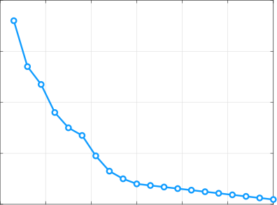

0 100 200 300 400 500 600

Number of arms

Figure 8: Asymptotic optimality of FairRMAB index policy.

0.0385

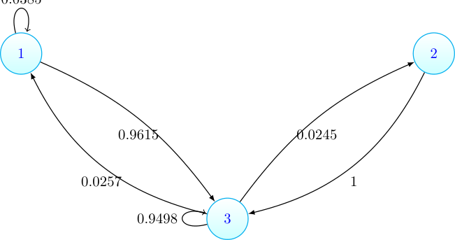

Figure 10: Transition diagram for CPAP Cluster 1

0.7427

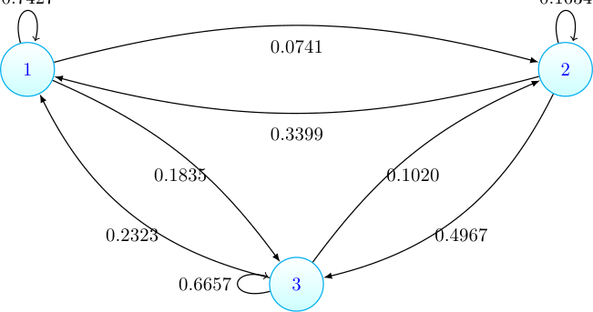

Figure 11: Transition diagram for CPAP Cluster 2

0.06

0.04

0.02

0.01

0

|Col1|Col2|Col3|(3,1) 1|Col5|
|---|---|---|---|---|
||||1 (3,1) |1 (3,1) |
||||||
||||True1 (3,1) 2 (2,1)||
||||||
||||||
||||True2 (2,1)  (5,0)||
||||||
||||3 ~~ True~~ ~~ (5,0)~~||
||||~~3~~||
||||||
||||||
||||||

0 100 200 300

Time

Figure 9: Global attractor for FairRMAB index policy.

0.1634

