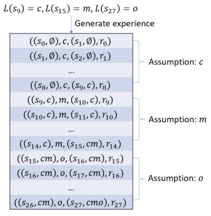
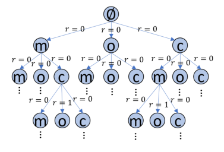
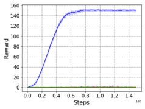
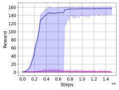
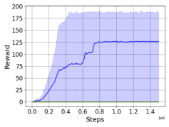
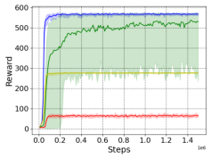
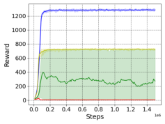
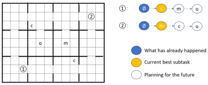

## **Sample Efficient Reinforcement Learning by Automatically** **Learning to Compose Subtasks**

Shuai Han

Utrecht University
Utrecht, the Netherland
s.han@uu.nl

**ABSTRACT**

Mehdi Dastani

Utrecht University
Utrecht, the Netherland
m.m.dastani@uu.nl

Shihan Wang
Utrecht University
Utrecht, the Netherland
s.wang2@uu.nl

Improving sample efficiency is central to Reinforcement Learning (RL), especially in environments where the rewards are sparse.
Some recent approaches have proposed to specify reward functions
as manually designed or learned reward structures whose integrations in the RL algorithms are claimed to significantly improve the
learning efficiency. Manually designed reward structures can suffer
from inaccuracy and existing automatically learning methods are
often computationally intractable for complex tasks. The integration of inaccurate or partial reward structures in RL algorithms fail
to learn optimal policies. In this work, we propose an RL algorithm
that can automatically structure the reward function for sample
efficiency, given a set of labels that signify subtasks. Given such
minimal knowledge about the task, we train a high-level policy that
selects optimal sub-tasks in each state together with a low-level
policy that efficiently learns to complete each sub-task. We evaluate
our algorithm in a variety of sparse-reward environments. The experiment results show that our approach significantly outperforms
the state-of-art baselines as the difficulty of the task increases.

**KEYWORDS**

Reinforcement learning, Sample efficiency, Subtasks

**ACM Reference Format:**

Shuai Han, Mehdi Dastani, and Shihan Wang. 2024. Sample Efficient Reinforcement Learning by Automatically Learning to Compose Subtasks. In
_Proc. of the 23rd International Conference on Autonomous Agents and Mul-_
_tiagent Systems (AAMAS 2024), Auckland, New Zealand, May 6 – 10, 2024_,
IFAAMAS, 10 pages.

**1** **INTRODUCTION**

As a powerful technique to optimize the intelligent behaviors of
agents, reinforcement learning (RL) has been applied in a variety
of different domains, such as traffic signal control [9, 30], chemical
structure prediction [33, 50], radio resource management [13, 56]
and games [38]. The successful training of RL agents often relies on
handcrafted reward functions based on domain knowledge, which
allows agents to receive immediate reward signals. Without those
handcrafted signals, the sparse rewards can result in RL algorithms
suffering from low sample efficiency [1, 22].
Specifying the structure for a reward function with high-level
logical languages or finite state machines has shown to be beneficial
for improving the sample efficiency of RL algorithms [6, 7, 31].
Recently, QRM [27] has been proposed for RL agents to exploit the

_Proc. of the 23rd International Conference on Autonomous Agents and Multiagent Systems_
_(AAMAS 2024), N. Alechina, V. Dignum, M. Dastani, J.S. Sichman (eds.), May 6 – 10, 2024,_
_Auckland, New Zealand_ . © 2024 International Foundation for Autonomous Agents
and Multiagent Systems (www.ifaamas.org). This work is licenced under the Creative
Commons Attribution 4.0 International (CC-BY 4.0) licence.

specified reward structure using a reward machine. For example,
when the task for the agent is to bring the coffee to the office,
the corresponding reward structure is that the agent will receive
reward if it first picks up the coffee and then arrives at the office. By
exposing this reward structure as an reward machine and utilizing
it for training the agent, the sample efficiency of RL algorithms
can be significantly improved [54]. It should be noted that such
specified reward function can also be used for other purposes such
as task decomposition [28], reward shaping [7] and exploration [4]
to make the RL algorithm more efficient.
However, for complex applications, the reward structure is not
always available due to a lack of sufficient domain knowledge. As
emphasized in [23], high-level objectives corresponding to subtasks
can often be identified by passing through designated and semantically distinguishable states of the environment. Nevertheless, how
those high-level subtasks structure the reward is not straightforward to be handcrafted [51]. Oftentimes, such high-level knowledge
is implicit and unknown to the learning agent [53]. In such cases,
it is crucial to automatically learn the structure of reward function
based on the limited domain knowledge. To solve this problem,
previous work has proposed to use automata learning to infer a automaton model to describe and exploit the reward function structure

[23, 53]. However, learning an exact automaton model from trace
data is a NP-complete problem [20]. Although heuristic methods
can be used to speed up the learning [42], inferring an automaton
that is representative to the reward structure relies on trace data
with adequately exploration. When the exploration of agent is inadequate, the automaton model derived from the incomplete trace
data could be either inaccurate or partial, which leads to the RL
algorithm learning sub-optimal policies or even failing to learn.
In this paper, we propose a novel RL algorithm, which we call Automatically Learning to Compose Subtasks (ALCS), to automatically
exploit a minimal domain knowledge to structure the reward function for sample efficiency. Given such minimal knowledge to signify
subtasks, the basic idea of ALCS is to learn the best sequences of
subtasks with respect to the environment reward. To realize this, we
develop a framework with two-level hierarchy of policy learning.
The low-level policy learns to take the next action toward completing the given subtask, while the high-level policy learns to specify
a subtask to be achieved at each time step to the low-level policy.
There are two main characteristics in the high-level policy learning.
One is that the next subtask is selected based on the sequence of
completed subtasks, which allows our method to be more accurate
to make decisions to compose subtasks. Another characteristic is
that during training the high-level subtask selection is modified
based on the actually achieved subtasks, which can ensure that
the high-level policy does not miss any necessary subtasks in the

process of reinforcing subtask selection based on environmental
rewards.

This paper makes the following contributions: 1) we design a
two-level RL learning framework to accurately and automatically
discover and exploit reward structures through composition of
subtasks, which improves sample efficiency in sparse-reward environments, 2) we design high-level subtask modification mechanism
to further improve the overall policy learning, and 3) we verify the
performance of our approach on 8 sparse-reward environments
and show the interpretability of the agent by producing the composed sequences of subtasks. When the difficulty of tasks increases,
our method produces a significant improvement over the previous
most sample-efficient methods given the same minimal domain
knowledge on such domain.

**2** **RELATED WORK**

Improving sample efficiency is a key challenging problem for RL
algorithms. Among the plethora of work on sample efficiency [21,
32, 36, 39, 54], we summarize the literature in three subfields, which
our approach either builds on or closely relates to.
**Specifying the structure of reward function.** Recently, using
domain knowledge to specify a reward structure that can be integrated into the RL algorithm has achieved significant improvement
on the learning efficiency in sparse-reward environments. There
are two major ways to provide this specified structure: Temporal
Logics [45] and Mealy Machines [37]. With a logic specification
for task, Temporal Logics have been applied to synthesize policies

[5, 24] and shape reward [6, 31] for sample efficiency. By specifying
reward structure with Mealy Machines, named reward machines,
QRM [27, 28] is proposed to improve the sample efficiency for RL
by exposing reward structure to the learning agent. The integration
of reward machines in reinforcement learning has lead to a series of
proposals for exploration [4], reward shaping [7], offline learning

[47] and multi-agent learning [12, 40]. In line with these works, we
also assume the domain knowledge is helpful in specifying a reward
structure for sample efficiency. Our method is different from these
methods in terms of the problem setting and solution. In our setting,
the required domain knowledge is limited to the specification of
the subtasks and not their ordering structures such as in [7, 28, 31].
In our method, the ordering structure can be automatically learned,
rather than manually designed.
**Learning the reward structure.** When the domain knowledge
minimally structures the reward function, (i.e., only specifying
the possible subtasks), there are previous methods to learn the
unknown reward structure for the task from trace data. LRM [51]
first proposed to automatically learn a reward machine to specify
the reward structure in partially observable settings. Moreover,
JIRP [53] learns a smallest reward machine with automata learning
techniques [29, 41]. SRM [11] considers randomness in environment
rewards and learns a stochastic reward machine for task structure.

Another research route is to use an automaton model to structure

the reward of a task, instead of using it as a reward machine. ISA

[18] learns an automaton whose transitions are subgoals given by
domain knowledge. DeepSynth [23] employs an automata synthesis
method to automatically reveal the sequential structure of given
high-level objectives.

Similar to the above mentioned approaches, our method also
assumes the availability of limited domain knowledge for improving
sample efficiency of RL. The difference is that our approach does
not learn an exact automata model to be integrated into the RL
algorithm for sample efficiency. The proposals to learn an exact
automata model from the trace data is NP-complete [20]. Besides,
when the learned automaton model is inaccurate or partial for
revealing complex reward structure, the integrated RL algorithm
may fail to learn the optimal policy. In contrast, our approach
avoids solving an NP-complete problem by using a high-level policy,
which is induced directly from the real environment rewards. This
allows our high-level policy to more accurately capture the reward

structure.

**Goal-conditioned reinforcement learning.** Goal-conditioned
reinforcement learning (GCRL) trains an agent to achieve different
goals [8, 10, 35] by training a goal-conditioned policy. The intrinsic
rewards provided by goal accelerate learning [1]. The training of
goal-conditioned policy can be improved with efficient augmentation, such as curiosity exploration [17], contrastive representations

[16] and causal relations [15]. Our approach follows the general
training paradigm of the GCRL summarized in [10]. From the perspective of this paradigm, we propose to learn to prioritize the goal
selection based on the sequence of history goals.
**Hierarchical reinforcement learning.** Hierarchical Reinforcement Learning (HRL) methods exploit temporal abstraction [44]
or spatial abstraction [2, 55] to improve sample efficiency of RL.
When designing the two-level policy, we are inspried by HRL with
temporal abstraction, such as HAM [43], MAXQ [14] and h-DQN

[34]. However, those methods abstract the environment as a SemiMDP [49], which specifies different time scales for different level
of policies. Instead, our high-level and low-level policies make decisions with the same time scale, i.e., at each time step high-level
and low-level policies make joint decisions to produce actions. An
HRL method with a similar decision-making process to ours is
Interrupting Options [49], in whose extreme case the option is interrupted at every step. Another difference is that our high-level
policy takes into account the sequence of historically completed
subtasks when making decisions. Such a non-Markovian high-level
policy is helpful to structure rewards in a more accurate way. While
HRL approaches select subtasks based on the environment state,
which leads to HRL being inappropriate for solving the problem of
structuring rewards using domain knowledge.

**3** **PROBLEM SETTING**

The RL problem considers an agent interacting with an unknown
environment [48]. Such environment can be modeled as a Markov
Decision Process (MDP), M = (S _,_ A _,_ T _, 𝑅,𝛾_ ) where S is a finite
set of states, A is a finite set of actions, T : S × A × S →[0 _,_ 1]
is a transition function, _𝛾_ ∈[0 _,_ 1) is a discount factor and _𝑅_ : S ×
A ×S → R is a reward function. An agent employs a deterministic
policy _𝜋_ : S →A to interact with the environment. At a time
step _𝑡_, the agent takes action _𝑎𝑡_ = _𝜋_ ( _𝑠𝑡_ ) according to the current
state _𝑠𝑡_ . The environment state will transfer to next state _𝑠𝑡_ +1 based
on the transition probability T . The agent will receive the reward
_𝑟𝑡_ = _𝑅_ ( _𝑠𝑡_ _,𝑎𝑡_ _,𝑠𝑡_ +1). Then, the next round of interaction begins. The

goal of this agent is to find the optimal policy _𝜋_ [∗] that maximizes
the expected return: _𝜋_ [∗] = _𝑎𝑟𝑔𝑚𝑎𝑥𝜋_ E[ [�] _𝑡_ [∞] =0 _[𝛾][𝑡][𝑟][𝑡]_ [|] _[𝜋]_ []][.]
Q-learning [52] is a well-known RL algorithm that obtains the
optimal policy by learning its _𝑄_ function. The _𝑄_ function for policy
_𝜋_ on a state-action pair ( _𝑠,𝑎_ ) is defined as follows.

beginning of an episode. If at any MDP state _𝑠_ that _𝐿_ ( _𝑠_ ) = _𝑐_, then
the RL agent moves to _𝑢_ 1 ∈ _𝑈_ with reward 0. Similarly, if at _𝑢_ 3 ∈ _𝑈_
the RL agent encounters an MDP state _𝑠_ that _𝐿_ ( _𝑠_ ) = _𝑜_ then the RL
agent moves to terminal state _𝑢_ 4 with reward 1. With such a reward
machine, previous methods such as [23, 27, 53] learn Q-values over
the cross-product _𝑄_ ( _𝑠,𝑢,𝑎_ ), which allows the agent to consider the
MDP state _𝑠_ and RM state _𝑢_ to select the next action _𝑎_ [28].
Different with previous works [5, 27, 28], in our setting, less
domain knowledge about the task is required and given. The knowledge given by P and _𝐿_ is limited to subtasks and not to, for example,
their ordering structures. With such a minimal knowledge to the
task, the agent does not know the information how the subtasks
contributes to rewards before training. In our setting, this information will be learned during the training.

**4** **METHODOLOGY**

In this section we present our two-level policy design and the
detailed training for the policies.

**4.1** **Two-level policy formalization**

When the domain knowledge can specify and structure the reward
function, the RL agent can use them to improve sample efficiency

[28]. When the domain knowledge minimally specifies and structures the reward function, as in our case, an inertial solution is
needed to learn an exact automaton model describing the reward
structure and then use it to improve RL [23, 53]. However, learning an exact automaton model from trace data is known to be
NP-complete [20], which could make the algorithm computationally intractable. Besides, when the learned automaton model is
inaccurate or partial to specify the reward function, the RL agent
may fail to learn optimal policy. Therefore, instead of learning an
exact model with domain knowledge, in this work we propose a
more efficient way to integrate domain knowledge into the learning
procedure of an RL algorithm.
In the framework of ALCS, a high-level policy is designed to
select next subtasks to be achieved based on the environment

state and the sequence of subtasks that have already achieved
in the history this episode. We denote it as _𝜋ℎ_ : S × P [∗] →
P, where P [∗] is the Kleene closure on P. For example, in Figure 1 where P = { _𝑐,𝑚,𝑜_ }, the Kleene closure on P is P [∗] =
{∅ _,𝑐,𝑚,𝑜,𝑐𝑐,𝑐𝑚,𝑐𝑜,𝑚𝑐,𝑚𝑚,𝑚𝑜,𝑜𝑐,𝑜𝑚,_
_𝑜𝑜,𝑐𝑐𝑐, ...._ }. Given a state _𝑠_, _𝜋ℎ_ selects the next subtask _𝑝_ by:

_𝑝_ = _𝜋ℎ_ ( _𝑠, 𝑝_ [∗] ) (2)

where the sequence _𝑝_ [∗] ∈P [∗] represents the order of subtasks have
been temporally achieved in the history of a given episode. We
believe that the completed subtasks and their order are key information for _𝜋ℎ_ to select the next subtask to be achieved. Therefore,
the agent will benefit from training the policy _𝜋ℎ_ with such sequence being considered.
On the other hand, a low-level policy, denoted as _𝜋𝑙_ : S×P →A,
is designed to learn to achieve the selected subtask efficiently. Taking the current state and a given subtask, _𝜋𝑙_ decides an environment
action to achieve the subtask. _𝜋𝑙_ selects actions by:

_𝑎_ = _𝜋𝑙_ ( _𝑠, 𝑝_ ) (3)

_𝑄_ ( _𝑠,𝑎_ ) = E _𝜋,_ T [

∞
∑︁ _𝛾_ _[𝑡]_ _𝑅_ ( _𝑠𝑡_ _,𝑎𝑡_ _,𝑠𝑡_ +1)| _𝑠_ 0 = _𝑠,𝑎_ 0 = _𝑎_ ] (1)

_𝑡_ =0

In Q-learning, the agent learns to estimate _𝑄_ ( _𝑠,𝑎_ ) by updating
it based on the experience ( _𝑠𝑡_ _,𝑎𝑡_ _,𝑠𝑡_ +1 _,𝑟𝑡_ ). After the estimated _𝑄_
function converges to optimal _𝑄_ [∗], the corresponding policy _𝜋_ ( _𝑠_ ) =
_𝑎𝑟𝑔𝑚𝑎𝑥𝑎𝑄_ [∗] ( _𝑠,𝑎_ ) at any state _𝑠_ ∈S is an optimal policy.
In this work, we extend the standard RL problem with domain
knowledge consisting of a finite vocabulary set P and a labeling
function _𝐿_ : _𝑆_ →P ∪{∅}. A vocabulary _𝑝_ ∈P is seen as a subtask
that is potentially helpful for obtaining rewards in the environment.
Given P and the labeling function _𝐿_, _𝐿_ ( _𝑠_ ) = _𝑝_ means that _𝑝_ is
the subtask that is achieved at state _𝑠_ and _𝐿_ ( _𝑠_ ) = ∅ means that no
subtask is achieved at state _𝑠_ . Note that _𝐿_ ( _𝑠_ ) does not represent the
subtasks that have been achieved prior to state _𝑠_ .

(a) (b)

**Figure 1: (a)** _**Coffee&mail**_ **task on** _**OfficeWorld**_ **domain, where**
**‘a’, ‘c’, ‘m’ and ‘o’ in the figure indicates the positions of the**
**agent, coffee, mail and office respectively. In this task, the**
**agent is rewarded only when it arrives at the office after**
**taking a coffee and a mail. (b) Reward machine introduced**
**by [28] to expose the reward structure of this task to RL**
**agent.**

A specific example is in the _OfficeWorld_ domain [26, 27]. As
shown in Figure 1(a), the vocabulary set { _𝑐,𝑚,𝑜_ } specifies three
possible subtasks in this environment. During interaction with the
environment, agents can use _𝐿_ to detect whether a subtask has been
completed at _𝑠_ . For example, _𝐿_ ( _𝑠_ ) = _𝑐_ means the subtask ‘picking
up coffee’ is achieved by the agent at _𝑠_ . Likewise, _𝐿_ ( _𝑠_ ) = _𝑜_ means at
state _𝑠_ the agent finishes the subtask ‘arriving at office’. _𝐿_ ( _𝑠_ ) could
also be ∅, which means no subtask achieved at _𝑠_ .
In recent literature, the solution to such problem is to specify

[27, 28] or learn [23, 53] a reward machine, which is defined as
a tuple _< 𝑈,𝑢_ 0 _, 𝐹,𝛿𝑢,𝛿𝑟_ _>_ where _𝑈_ is a finite set of states, _𝑢_ 0 is
an initial state, _𝐹_ is a finite set of terminal states, _𝛿𝑢_ is the statetransition function and _𝛿𝑟_ is the state-reward function [28]. An
example of a reward machine for _Coffee&mail_ task is shown in
1(b). An RL agent with this reward machine starts from _𝑢_ 0 at the

With the two-level policies, our agent interacts with the environment as follows. At the beginning of an episode, the agent initializes
an empty sequence _𝑝_ [∗] to store the achieved subtasks in the environment. At each time step _𝑡_, the agent first employs the high-level
policy to select a subtask _𝑝𝑡_ to be achieved based on the current state
_𝑠𝑡_ and the achieved subtask sequence _𝑝𝑡_ [∗][, i.e.,] _[ 𝑝][𝑡]_ [=] _[ 𝜋][ℎ]_ [(] _[𝑠][𝑡]_ _[, 𝑝]_ _𝑡_ [∗][)][. Then,]
the agent uses the low-level policy to choose action _𝑎𝑡_ = _𝜋𝑙_ ( _𝑠𝑡_ _, 𝑝𝑡_ )
to interact with the environment and receive the reward _𝑟𝑡_ the next
state _𝑠𝑡_ +1. Moreover, if a subtask is achieved in _𝑠𝑡_ +1, i.e., _𝐿_ ( _𝑠𝑡_ +1) ≠ ∅,
then the achieved subtask will be appended into the sequence:

_𝑝𝑡_ [∗] +1 [=]

_𝑝𝑡_ [∗] [⊕] _[𝐿]_ [(] _[𝑠][𝑡]_ [+][1][)] if _𝐿_ ( _𝑠𝑡_ +1) ≠ ∅
(4)
� _𝑝𝑡_ [∗] otherwise

where ⊕ represents appending _𝐿_ ( _𝑠𝑡_ +1) into the end of sequence _𝑝𝑡_ [∗][.]
Following Q-learning, our _𝜋ℎ_ and _𝜋𝑙_ can select subtasks and
actions by doing argmax on their corresponding _𝑄_ functions. We
next describe the definition of their _𝑄_ functions and the detailed
corresponding training process.

**4.2** **Low-level training**

In order to define the low-level Q function, we first define the lowlevel reward function. The goal of low-level policy _𝜋𝑙_ is to achieve
the given subtask _𝑝_ ∈P. Therefore, in our design, the low-level
policy does not directly maximize the expected return from the
environment reward function _𝑅_ . For a certain _𝑝_ ∈P, _𝜋𝑙_ ( _𝑠, 𝑝_ ) is
trained with the following rewards:

**Algorithm 1** Generating multiple experiences and updating _𝑄𝑙_ .

**Input:** Transition ( _𝑠𝑡_ _,𝑎𝑡_ _,𝑠𝑡_ +1 ), original _𝑄𝑙_, learning rate _𝛼_
**Output:** Updated _𝑄𝑙_
1: Initialize _𝑒𝑥𝑝𝑒𝑟𝑖𝑒𝑛𝑐𝑒𝑠_ ←{}
2: **for** _𝑝_ ∈P **do**
3: **if** _𝑝_ = _𝐿_ ( _𝑠𝑡_ +1 ) and _𝑝_ ≠ _𝐿_ ( _𝑠𝑡_ ) **then**
4: _𝑟𝑡_ _[𝑝]_ [←] [1][,] _[ 𝑑𝑜𝑛𝑒]_ [←] _[𝑇𝑟𝑢𝑒]_
5: **else**
6: _𝑟𝑡_ _[𝑝]_ [←] [0][,] _[ 𝑑𝑜𝑛𝑒]_ [←] _[𝐹𝑎𝑙𝑠𝑒]_
7: **end if**
8: Add tuple ( _𝑠𝑡_ _,𝑎𝑡_ _,𝑠𝑡_ +1 _,𝑟𝑡_ _[𝑝][, 𝑝,𝑑𝑜𝑛𝑒]_ [)][ into] _[ 𝑒𝑥𝑝𝑒𝑟𝑖𝑒𝑛𝑐𝑒𝑠]_
9: **end for**
10: **for** ( _𝑠,𝑎,𝑠_ [′] _,𝑟, 𝑝,𝑑𝑜𝑛𝑒_ ) in _𝑒𝑥𝑝𝑒𝑟𝑖𝑒𝑛𝑐𝑒𝑠_ **do**
11: **if** _𝑑𝑜𝑛𝑒_ **then**

12: _𝑦_ ← _𝑟_
13: **else**
14: _𝑦_ ← _𝑟_ + _𝛾_ max _𝑎_ ′ _𝑄𝑙_ ( _𝑠_ [′] _, 𝑝,𝑎_ [′] )
15: **end if**
16: _𝑄𝑙_ ( _𝑠, 𝑝,𝑎_ ) ←(1 − _𝛼_ ) _𝑄𝑙_ ( _𝑠, 𝑝,𝑎_ ) + _𝛼_ - _𝑦_
17: **end for**

After sufficiently updating for _𝑄𝑙_, given a subtask _𝑝_, _𝜋𝑙_ can
repeatedly perform this subtask. But this is generally not enough
to maximize the environment rewards. So we also need to train the

_𝜋ℎ_, which is responsible for learning to compose subtasks in any
order to maximize the environment rewards.

**4.3** **High-level training**

The goal of the high-level policy _𝜋ℎ_ is to compose subtasks for the
original task in MDP. So we use the environment original reward
to train the _𝜋ℎ_ . The corresponding _𝑄_ function for _𝜋ℎ_ is denoted
as _𝑄ℎ_ ( _𝑠, 𝑝_ [∗] _, 𝑝_ ), which is defined as the excepted return from the
environment following _𝜋ℎ_ and _𝜋𝑙_ if the agent selects _𝑝_ as a subtask
given _𝑠_ and _𝑝_ [∗] :

_𝑅_ _[𝑝]_ ( _𝑠𝑡_ _,𝑎𝑡_ _,𝑠𝑡_ +1) =

1 if _𝑝_ = _𝐿_ ( _𝑠𝑡_ +1) and _𝑝_ ≠ _𝐿_ ( _𝑠𝑡_ )
(5)
0 otherwise
�

According to Equation (5), it can be known that for different subtasks, _𝜋𝑙_ is trained with different reward functions. Given Equation
(5), we define the low-level _𝑄_ function _𝑄𝑙_ ( _𝑠, 𝑝,𝑎_ ) as the excepted
return based on the subtask _𝑝_ :

_𝑄ℎ_ ( _𝑠, 𝑝_ [∗] _, 𝑝_ ) = E _𝜋𝑙_ _,𝜋ℎ,_ T [

∞
∑︁ _𝛾_ _[𝑡]_ _𝑅_ ( _𝑠𝑡_ _,𝑎𝑡_ _,𝑠𝑡_ +1)| _𝑠_ 0 = _𝑠,𝑎_ 0 = _𝜋𝑙_ ( _𝑠, 𝑝_ )] (7)

_𝑡_ =0

With the high-level function defined in Equation (7), _𝜋ℎ_ selects a subgoal _𝑝𝑡_ by doing the argmax operation: _𝑝𝑡_ = _𝑎𝑟𝑔𝑚𝑎𝑥𝑝𝑄ℎ_ ( _𝑠𝑡_ _, 𝑝𝑡_ [∗] _[, 𝑝]_ [)]
for given _𝑠𝑡_ and _𝑝𝑡_ [∗][.]
In the general RL methods, _𝑄_ function should be updated based
on the outputs from the corresponding policy. However, when this
approach is applied to our high-level training, it may introduce the
problem of multiple subtasks being completed under one target
subtask. This can lead to decisions about key subtasks not being
learned. For example, a sub-goal _𝑝𝑡_ is chosen by _𝜋ℎ_ ( _𝑠𝑡_ _, 𝑝𝑡_ [∗][)][. When]
_𝜋𝑙_ ( _𝑠𝑡_ _, 𝑝𝑡_ ) takes actions to achieve _𝑝𝑡_, another subtask _𝑝_ [′] could be
completed. In this case, if _𝑝_ [′] is the key subtask that brings reward in
future time step, the importance of _𝑝_ [′] to reward cannot be learned
because _𝜋ℎ_ ( _𝑠𝑡_ _, 𝑝𝑡_ [∗][)][ never choose] _[ 𝑝]_ [′][ as its decision.]
To solve this problem, we propose to generate the high-level
experiences based on the actual completed subtask in the environment (subtask _𝑝_ [′] in the above example), instead of based on the
subtask selected by the high-level policy (sub-task _𝑝_ in the example). In other words, the actual completed task will be rewarded
and used in the corresponding data (( _𝑠𝑡_ _, 𝑝𝑡_ [∗][)] _[, 𝑝]_ [′] _[,]_ [ (] _[𝑠][𝑡]_ [+][1] _[, 𝑝]_ _𝑡_ [∗] +1 [)] _[,𝑟][𝑡]_ [)][ for]
the update. The basic idea is that whenever a subtask is detected
to have been achieved by the labeling function, we assume that
_𝜋ℎ_ has chosen this subtask. And experiences will be generated to

_𝑄𝑙_ ( _𝑠, 𝑝,𝑎_ ) = E _𝜋𝑙_ _,_ T [

∞
∑︁ _𝛾_ _[𝑡]_ _𝑅_ _[𝑝]_ ( _𝑠𝑡_ _,𝑎𝑡_ _,𝑠𝑡_ +1)| _𝑠_ 0 = _𝑠,𝑎_ 0 = _𝑎_ ] (6)

_𝑡_ =0

With the defined low-level _𝑄𝑙_ in Equation (6), _𝜋𝑙_ can select
actions by doing argmax operation: _𝑎𝑡_ = _𝑎𝑟𝑔𝑚𝑎𝑥𝑎𝑄𝑙_ ( _𝑠𝑡_ _, 𝑝,𝑎_ ) at
time step _𝑡_ . Then we can train _𝜋𝑙_ by updating _𝑄𝑙_ with experience
( _𝑠𝑡_ _,𝑎𝑡_ _,𝑠𝑡_ +1 _,𝑟𝑡_ _[𝑝]_ [)][ using Q-learning, where] _[ 𝑟]_ _𝑡_ _[𝑝]_ [is the reward value com-]
puted from Equation (5) with the current subtask _𝑝_ to be achieved.
We observe that the reward function in Equation (5) is computed
by labeling function _𝐿_ . Inspired by counterfactual experiences [28],
to improve the training efficiency, we use _𝐿_ to generate multiple
experience for different subtasks to update _𝑄𝑙_, instead of using
a single experience ( _𝑠𝑡_ _,𝑎𝑡_ _,𝑠𝑡_ +1 _,𝑟𝑡_ _[𝑝]_ [)][ to update it. To do so, for a]
single transition ( _𝑠𝑡_ _,𝑎𝑡_ _,𝑠𝑡_ +1) sampled from the environment, we
can generate a set of experiences: {( _𝑠𝑡_ _,𝑎𝑡_ _,𝑠𝑡_ +1 _,𝑟𝑡_ _[𝑝]_ [)}][ for all] _[ 𝑝]_ [∈P][,]
where _𝑟𝑡_ _[𝑝]_ = _𝑅_ _[𝑝]_ ( _𝑠𝑡_ _,𝑎𝑡_ _,𝑠𝑡_ +1) is the reward value with respect to
subtask _𝑝_ at time step _𝑡_ .
Algorithm 1 describes the detailed practice for updating _𝑄𝑙_ with
multiple experiences generated from single transition. Given an
input transition ( _𝑠𝑡_ _,𝑎𝑡_ _,𝑠𝑡_ +1), Algorithm 1 in Lines 2 ∼ 7 assigns
different rewards following Equation 5 for all possible _𝑝_ ∈P to
this transition, which yields a collection of experiences. Then those
experiences will be used to update _𝑄𝑙_ in Lines 10 ∼ 17.

**Figure 2: Following the environment and task of Figure**
**1, here is an example about how we generate the high-**
**level experiences in an episode for updating** _𝑄ℎ_ **. As shown**
**in the table, each row contains the corresponding experi-**
**ence data at that time step. The experience is denoted as:**
(( _𝑠𝑡_ _, 𝑝𝑡_ [∗][)] _[, 𝑝][𝑡]_ _[,]_ [ (] _[𝑠][𝑡]_ [+][1] _[, 𝑝]_ _𝑡_ [∗] +1 [)] _[,𝑟][𝑡]_ [)] **[, where]** _[ 𝑝][𝑡]_ **[here is the assumed se-]**
**lected subtask and** _𝑟𝑡_ **is reward from the environment. In this**
**episode, subtask** _𝑐_ **,** _𝑚_ **, and** _𝑜_ **are achieved at time step** 9 **,** 15 **,**
**and** 27 **, respectively. Then, the assumed subtask** _𝑝𝑡_ **selected**
**by** _𝜋ℎ_ **are** _𝑐_ **from time step** 0 ∼ 8 **,** _𝑚_ **from time step** 9 ∼ 14 **, and**
_𝑜_ **from time step** 15 ∼ 27 **.**

update _𝑄ℎ_ based on this assumption. An example for generating
experiences in an episode is shown in Figure 2.
We also would like to clarify that in our design the exploration
of high-level policy is stochastic. In fact, in our two-level policy
design, as long as action selection in low-level is stochastic, highlevel policy will also perform stochastic exploration. Because the
stochastic actions cause the substasks being achieved stochastically,
the assumed high-level choice will be stochastic as well.

**4.4** **Overall algorithm**

Algorithm 2 shows the overall training procedure of our method.
When an episode begins, we initialize some variables in Lines 2 ∼ 4,
where _𝑒𝑥𝑝𝑒𝑟𝑖𝑒𝑛𝑐𝑒_ _ _ℎ_ is the experiences for this episode to update _𝑄ℎ_,
_𝑒_ _ _𝑡𝑒𝑚𝑝_ is a temporary experience set, and _𝑝𝑡_ [∗] [stores the sequence]
of achieved subtasks at the time step _𝑡_ . After the initialization for
an episode, the algorithm will repeat the process in Line 6 ∼ 36
until the episode terminates. In each episode, the agent first choose
a subtask _𝑝𝑡_ in Line 6. Then an action _𝑎𝑡_ is selected following the
_𝜖_ −greedy exploration in Line 7 ∼ 11, where _𝑟𝑎𝑛𝑑_ () represents a
function for sampling a variable between 0 and 1 uniformly. After
executing _𝑎𝑡_, the _𝑄𝑙_ is updated using Algorithm 1 with respect
to the current transition in Line 13. Then, high-level experiences
are generated in Line 14 ∼ 28. The experiences _𝑒_ in line 15 and
Line 21 are differentiated according to whether there is a subtask
being achieved at current time step. If a subtask is achieved (i.e.,
_𝐿_ ( _𝑠𝑡_ +1) ≠ ∅), this achieved subtask, denoted as _𝑝𝑎𝑐𝑡_ in Line 19, will
be appended into _𝑝𝑡_ [∗] [in Line 20. Besides,] _[ 𝑝][𝑎𝑐𝑡]_ [will be treated as]

**Algorithm 2** Automatically Learning to Compose Subtasks.

**Input:** Total episode _𝑀_, learning rate _𝛽_, exploration rate _𝜖_
**Output:** _𝑄𝑙_ _,𝑄ℎ_
1: **for** _𝑒𝑝𝑖𝑠𝑜𝑑𝑒_ = 1 → _𝑀_ **do**
2: Reset _𝐸𝑛𝑣_ and get _𝑠_ 0, _𝑡_ ← 0
3: _𝑒𝑥𝑝𝑒𝑟𝑖𝑒𝑛𝑐𝑒_ _ _ℎ_ ←{}, _𝑒_ _ _𝑡𝑒𝑚𝑝_ ←{}
4: _𝑝𝑡_ [∗] [←[]]
5: **while** not terminal **do**
6: Obtain subtask _𝑝𝑡_ = _𝑎𝑟𝑔𝑚𝑎𝑥𝑝𝑄ℎ_ ( _𝑠𝑡_ _, 𝑝𝑡_ [∗] _[, 𝑝]_ [)]
7: **if** _𝑟𝑎𝑛𝑑_ () _> 𝜖_ **then**
8: Take the action _𝑎𝑡_ = _𝑎𝑟𝑔𝑚𝑎𝑥𝑎𝑄𝑙_ ( _𝑠𝑡_ _, 𝑝𝑡_ _,𝑎_ )
9: **else**

10: Take a random action as _𝑎𝑡_
11: **end if**
12: Execute _𝑎𝑡_ and get _𝑠𝑡_ +1 and _𝑟𝑡_ from _𝐸𝑛𝑣_
13: Update _𝑄𝑙_ using Algorithm 1 with ( _𝑠𝑡_ _,𝑎𝑡_ _,𝑠𝑡_ +1 )
14: **if** _𝐿_ ( _𝑠𝑡_ +1 ) = ∅ **then**
15: _𝑒_ ←(( _𝑠𝑡_ _, 𝑝𝑡_ [∗] [)] _[, 𝑝][𝑡]_ _[,]_ [ (] _[𝑠][𝑡]_ [+][1] _[, 𝑝]_ _𝑡_ [∗] [)] _[,𝑟][𝑡]_ [)]
16: Add experience tuple _𝑒_ into _𝑒_ _ _𝑡𝑒𝑚𝑝_
17: _𝑝𝑡_ [∗] +1 [←] _[𝑝]_ _𝑡_ [∗]
18: **else**
19: _𝑝𝑎𝑐𝑡_ ← _𝐿_ ( _𝑠𝑡_ +1 )
20: _𝑝𝑡_ [∗] +1 [←] _[𝑝]_ _𝑡_ [∗] [⊕] _[𝑝][𝑎𝑐𝑡]_
21: _𝑒_ ←(( _𝑠𝑡_ _, 𝑝𝑡_ [∗] [)] _[, 𝑝][𝑡]_ _[,]_ [ (] _[𝑠][𝑡]_ [+][1] _[, 𝑝]_ _𝑡_ [∗] +1 [)] _[,𝑟][𝑡]_ [)]
22: Add experience tuple _𝑒_ into _𝑒_ _ _𝑡𝑒𝑚𝑝_
23: **for** (( _𝑠, 𝑝_ [∗] ) _, 𝑝,_ ( _𝑠_ [′] _, 𝑝_ [∗′] ) _,𝑟_ ) in _𝑒_ _ _𝑡𝑒𝑚𝑝_ **do**
24: _𝑒_ _ _𝑎𝑠𝑠𝑢𝑚𝑒𝑑_ ←(( _𝑠, 𝑝_ [∗] ) _, 𝑝𝑎𝑐𝑡_ _,_ ( _𝑠_ [′] _, 𝑝_ [∗′] ) _,𝑟_ )
25: Add _𝑒_ _ _𝑎𝑠𝑠𝑢𝑚𝑒𝑑_ into _𝑒𝑥𝑝𝑒𝑟𝑖𝑒𝑛𝑐𝑒_ _ _ℎ_
26: **end for**
27: _𝑒_ _ _𝑡𝑒𝑚𝑝_ ←{}
28: **end if**

29: **if** terminal **then**
30: **for** (( _𝑠, 𝑝_ [∗] ) _, 𝑝,_ ( _𝑠_ [′] _, 𝑝_ [∗′] ) _,𝑟_ ) in _𝑒𝑥𝑝𝑒𝑟𝑖𝑒𝑛𝑐𝑒𝑠_ _ _ℎ_ **do**
31: _𝑦_ ← _𝑟_ + _𝛾_ max _𝑝_ ′ _𝑄ℎ_ ( _𝑠_ [′] _, 𝑝_ [∗′] _, 𝑝_ [′] )
32: _𝑄ℎ_ ( _𝑠, 𝑝_ [∗] _, 𝑝_ ) ←(1 − _𝛽_ ) _𝑄ℎ_ ( _𝑠, 𝑝_ [∗] _, 𝑝_ ) + _𝛽_ - _𝑦_
33: **end for**
34: _𝑒𝑥𝑝𝑒𝑟𝑖𝑒𝑛𝑐𝑒𝑠_ _ _ℎ_ ←{}
35: **end if**

36: _𝑡_ ← _𝑡_ + 1

37: **end while**

38: **end for**

the assumed subtask selected by _𝜋ℎ_ . Based on _𝑝𝑎𝑐𝑡_ the high-level
experiences for updating are generated in Line 23 ∼ 26. Finally, _𝑄ℎ_
will be updated for each experience in the episode in Line 30 ∼ 33.

**5** **INTERPRETABILITY**

How to make the RL algorithms interpretable has widely raised
concerns recently for ethical and legal considerations in application

[19, 25, 46]. In this section, based on the given minimal domain
knowledge, we interpret the behavior of agents trained by ALCS.
We can use a tree sturcture to record all the sequence of subtasks
that have been achieved in the training process of ALCS, which
can be used to interpret the behavior of an agent. This tree begins
with a root node ‘∅’. Each descendant node of the root is a subtask

_𝑝_ ∈P. The nodes in the path from the root to a descendant can
form a sequence _𝑝_ [∗] ∈P [∗] . In the beginning of an episode, the agent
always starts from the root node ‘∅’, which means no subtask has
been achieved in the history of this episode. Then, if a subtask _𝑝_ is
achieved, a new child node with respect to _𝑝_ is added in the tree.
Besides, the reward from environment when subtask _𝑝_ is achieved
will be recorded on the edge to the corresponding child node. Given
an achieved sequence of subtask _𝑝𝑡_ [∗] [at time step] _[ 𝑡]_ [, a node associated]
with the current state can be uniquely identified in the tree. We
call this node as a current node at _𝑡_, denoted as _𝑁_ ( _𝑝𝑡_ [∗][)][. At the start]

of the episode, the agent’s current node _𝑁_ ( _𝑝𝑡_ [∗][)][ is reset to the root]
node, i.e. _𝑝𝑡_ [∗] [is reset to][ ∅][. An example for this is shown in Figure 3.]

**Figure 3: An example tree to record sequences of subtasks in**
**the environment of Figure 1. This tree is generated during**
**the training process. Except for the root, nodes in this tree**
**refer to the subtasks specified in this environment. The edges**
**present the transferring from one subtask to another subtask**
**(when the parent subtask has been achieved). The reward**
**values on the edges are sampled from the environment based**
**on whether the main task is achieved. Following the task**
**description in Figure 1, ‘** _𝑟_ = 1 **’ means the task is finished, i.e.,**
**the agent arrives at the office after taking both a coffee and**
**a mail. For infinite MDP where the episode step can go to**
**infinity, the tree could be infinite. For finite MDP where the**
**episode step is limited, the tree is finite because the depth of**
**the tree will be limited by the episode steps and the width**
**will be limited by** |P| **.**

With this tree, the RL agent can interpret its behavior based on
the given domain knowledge during execution. The interpretation
consists of the following three parts.
**What has already happend.** At a certain time step during
execution, according to the current _𝑝𝑡_ [∗][, we can identify the current]
node of the trained RL agent. Because _𝑝𝑡_ [∗] [includes the historically]
achieved subtasks, which can be seen as an abstraction for the
episode history based on domain knowledge. Therefore, _𝑝𝑡_ [∗] [can be]
used as an interpretation of what has happened.
**Current best subtask.** Based on the current selected _𝑝𝑡_, the
agent can interpret its current action _𝑎𝑡_ in terms of which subtask
this action is trying to complete. For example, if _𝑐_ is given from
_𝜋ℎ_ in the example task of Figure 1, then the action from _𝜋𝑙_ can be
interpreted as an action trying to complete _𝑐_ .
**Planning for the future.** After obtaining _𝑝𝑡_, the agent can find
the child node of the current node. By performing a breadth-first
search (BFS) on the subtree with this child node as root, the agent
can find a descendant node that can obtain the reward based on
the previous record. By providing the nodes on this path, the agent
can interpret an estimated future planning for the current selected
subtask. Taking Figure 3 as an example, suppose current _𝑝𝑡_ [∗] [=][ ∅]
and _𝑝𝑡_ = _𝑐_, then the estimated future plan is _𝑚_ and _𝑜_, considering
that the BFS algorithm will find the satisfied descendant node with
minimum depth first and return it. If the BFS algorithm cannot find
a satisfied descendant node in limited depth, then we say there is
no interpretation to future plan for the current decision.

The advantage of this is that the interpretation takes into account
both the high-level information constructed by domain knowledge (i.e., the tree) and the environment state information through
_𝑝𝑡_ = _𝜋_ ( _𝑠𝑡_ _, 𝑝𝑡_ [∗][)][. When the environment state changes, both the be-]
havior and its interpretation could change, which makes agent
more transparent on its decision making procedure. We will further
demonstrate this benefit in Subsection 6.4.

**6** **EXPERIMENTS**

This section presents the experiment settings and results [1] .

**6.1** **Experiment settings**

We evaluate our method in 8 different sparse-reward envrionments
from the two commonly used domains, _OfficeWord_ and _MineCraft_

[27, 28, 53]. We introduce the characteristics of these environments
and the reasons for choosing them as follows.
**Coffee.** Go to office after taking a coffee. The agent recieves 1
reward after achieving this task.
**Coffee** & **Mail.** Go to office after taking both a coffee and a mail.
The agent recieves 1 reward after achieving this task. The order of
taking the coffee and mail does not matter.
**Collecting.** Go to office after collecting four packages A, B, C
and D in the corners. The agent recieves 1 reward after achieving
this task. The order of taking those packages does not matter.
**Bonus.** Same task with the Collecting environment. When agent
arrive at office, it will receive 1 reward for each package, and 5 bonus
reward if all packages are collected.
**Plant.** Get wood, use toolshed. The agent recieves 1 reward after
achieving this task.
**Bridge.** Get iron, get wood, use factory. The agent recieves 1
reward after achieving this task. The iron and wood can be gotten
in any order.
**Bed.** Get wood, use toolshed, get grass, use workbench. The
agent recieves 1 reward after achieving this task. The grass can be
gotten at any time before using the workbench.
**Gem.** Get wood, use workbench, get iron, use toolshed, use axe.
The agent recieves 1 reward after achieving this task. The iron can
be gotten at any time before using the toolshed.
In the above environments, the former four environments are
from the _OfficeWord_ domain, while the latter four are from _MineCraft_ .
These environments have increasing task complexity in their respective domains, which is helpful to show how the performance
of methods changes as the task difficulty increases. Moreover,
_MineCraft_ domain has a larger state space than _OfficeWord_ . Comparing the performance of methods in the two domains can help to
demonstrate the impact of the increased state space on the performance of different methods.
In addition, Bonus is a special environment. In this environment,
the agent can get 1 reward for each package, but prefers to collect
all the packages. Note that the goal in the Bonus environment is
too sparse for providing rewards. Thus, in this environment, there
is also environment reward for completing individual subtasks
(collecting one or more packages), which helps the baseline methods
learn the skill of collecting packages. But at the same time those
reward can lead to the agent misalignment policy from learning

1The code is released (anonymously) at: https://github.com/anonymousanonymousd/ALCS.

(a) Coffee (b) Coffee and Mail (c) Collecting (d) Bonus

(e) Plant (f) Bridge (g) Bed (h) Gem

**Figure 4: Learning curves of various RL algorithms on 8 environments from** _**OfficeWord**_ **and** _**MineCraft**_ **domains.**

to collect all packages to learning to collect individual packages.
Therefore in this environment, it is challenging for the RL agent to
utilize the subtask reward without such policy misalignment.
We compare the following five different methods.
**ALCS (ours)** . We implement a prototype of ALCS, which uses
the Q-learning algorithm [52] to learn both the high-level and lowlevel policies. The learning rates for both _𝑄𝑙_ and _𝑄ℎ_ are 0 _._ 1. In
the training, the rate for _𝜖_ −greedy exploration is 20% to provide a
stochastic exploration strategy.
**JIRP** . JIRP [53] is a method that infers a reward machine using
the _𝑙𝑖𝑏𝑎𝑙𝑓_ library [3] as the RL agent interacts with the environment. We chose JIRP as a baseline because it has a similar problem
setting to our work, i.e., how to automatically learn to structure the
unknown reward function through a minimal domain knowledge.
**DeepSynth** . DeepSynth [23] is an algorithm that infers a automaton model to guide RL agent to learn policy. This method uses
automata synthesis [29] as an approach to learn a high-level model.
Likewise, DeepSynth has a similar problem setting to our work.
**HRL** . HRL [34] learns hierarchical policies in the environment.
Following previous implementation [53], the option for high-level
policy in HRL is defined as subtask _𝑝_ ∈P. The termination condition of an option is whenever the corresponding _𝑝_ is achieved.
**Interrupting options** . Interrupting options [49] is a hierarchical
RL method in which the high-level policy can interrupt low-level
policies and change the current subtask to be completed. We chose
HRL and Interrupting options as our baselines because their policies
have similar structures to our method.

**HER** . HER [1] is a well-known goal-conditioned RL method that
trains policies to achieve different goals. The goal in HER is defined
as the subtask _𝑝_ ∈P. Each goal-conditioned policy is trained with
the same reward function as Equation (5). We choose HER as one of

our baselines because the training of HER goal-conditioned policies
is similar with our low-level policy training.
**Q learning** . Q-learning [52] is a well-known general RL algorithm. We use the implementation version from [28].
Notably, JIRP and DeepSynth are two state-of-the-art methods
in _OfficeWord_ and _MineCraft_ domains. Generally speaking, JIRP
learns better when there is only binary reward signal in the end
of episode, and DeepSynth is more adaptable in non-binary cases.
Except the Q-Learning which does not require subtask, the other
five baselines use equivalent domain knowledge with the proposed
ALCS method. They all have access to a given set of subtasks, as
well as a label function that can return to agent the identity of
the subtask based on the environmental state when the subtask is

completed for the first time in an episode.

**6.2** **Comparison**

We first compare our method with baselines on 8 environments
from _OfficeWord_ and _MineCraft_ domains to validate the superiority
of ALCS. The results are shown in Figure 4. The error bounds
(i.e., shadow shapes) indicate the upper and lower bounds of the
performance with 20 runs excluding 2 best and 2 worst results.
The results show that our method significantly outperforms
the baseline methods in all environments except Coffee where the
reward structure is simple and easy to explore. In such an environment, learning an exact model with JIRP in Coffee environments to
specify the reward structure is a better solution. However, when
the reward structure of the task becomes complex, the sample efficiency of our method can significantly outperform methods that
learn models to specify the reward structure.
Another conclusion can be drawn by comparing those methods
between _OfficeWord_ and _MineCraft_ domains. It is well known that

(a) Coffee (b) Coffee and Mail (c) Collecting (d) Bonus

**Figure 5: Learning curves for ablation experiment of ALCS on 4 environments from** _**OfficeWord**_ **.**

the sample efficiency of the RL algorithm can decrease on environments with large state space. Comparing the performance of
those RL algorithms in _OfficeWord_ domain, their performance in the
_MineCraft_ are reduced because of the larger state space. In contrast,
our approach is less affected by increased state space compared
to the baselines approaches. Nevertheless, by comparing the performance of ALCS across Bridge, Bed and Gem environments, it
can be seen that the performance variance of ALCS grows with
the increasing task complexity. This suggests that there is room
to improve the performance of ALCS in complex tasks with large
state spaces.
Furthermore, comparing with Collecting environment where all
baselines totally fails on policy learning, these baselines can learn
some policies for subtasks when rewards is shaped for completing
the collection of one or more packages. However, these shaped
rewards can misalign the learned policy from collecting all packages
to collecting individual packages for baselines. In contrast, our twolayer policy learning can overcome such policy misalignment.

**6.3** **Ablation study**

In order to explore the contribution that each proposed technique
to the whole algorithm, we compare the ALCS with its ablative
variants on the _OfficeWord_ domain. The results are shown in Figure
5, where ‘ALCS w/o M’ stands for ALCS algorithm without multiple
experiences generating for updating _𝑄𝑙_ (as proposed in Subsection
4.2), ‘ALCS w/o S’ represents ALCS algorithm without sequence
of completed subtask for _𝜋ℎ_ (as presented in Subsection 4.1), and
‘ALCS w/o A’ indicates ALCS algorithm without the assumed choice
of subtask for training _𝜋ℎ_ (as presented in Subsection 4.3).
As shown in Figure 5, in case of ALCS w/o M, when not generating multiple experiences for _𝑄𝑙_, the performance of the algorithm
drops in all environments due to insufficient learning of the lowlevel policy, and in Collecting environment, ALCS w/o M cannot
even learn. In ALCS w/o S, when _𝜋ℎ_ learns without a sequence
of completed subtask, it cannot select the optimal subtask to be
achieved due to the inability to obtain sufficient information on
the completed subtasks. In case of ALCS w/o A, we see that the assumed choice of the subtask is the key to high-level _𝜋ℎ_ to efficiently
learn to compose subtasks. In addition, in the coffee environment,
the subtask on picking coffee has a high probability of being completed while executing subtask on arriving at office. In this case,

the selection of subtask for picking a coffee will not be learned by
the _𝜋ℎ_ . Therefore, even if the tasks on coffee environment are not
complex, without assumed choice of subtask, it is difficult for ALCS
to learn good policies.

**6.4** **Interpretability**

In this subsection, we demonstrate the interpretability of our learned
policy in the Coffee and Mail environment.
In this task, there are two possible sequences of subtasks to bring
reward: _𝑐_ → _𝑚_ → _𝑜_ and _𝑚_ → _𝑐_ → _𝑜_ . However, the optimal sequence of subtasks is different when the agent starts from different
positions. As shown in Figure 6, starting from position 1 _○_, the agent
takes fewer steps with the sequence _𝑐_ → _𝑚_ → _𝑜_ . At position 2 _○_
_𝑚_ → _𝑐_ → _𝑜_ is a better sequence. The previous approaches, by
using an automaton model to specify the reward function, allows
two possible sequences to be represented in a single model [28, 53].
Nevertheless, their models cannot explain that following which
sequence of subtasks the agent will take fewer steps. For example,
in the left of Figure 6, when starting with different positions 1 _○_ and

_○_ 2, the automaton model will fail to explain the agent will follow
which sequence of subtasks for finishing the task with fewer steps.

**Figure 6: Interpretation experiment on Coffee and Mail envi-**
**ronment. The three colors on the right of the figure represent**
**the three corresponding parts of interpretation introduced**
**in Section 5.**

The high-level policy that we are learning about can address this
issue to some extent, because our high-level policy can output an
exact subtask to be achieved based on the environment state. As

shown in Figure 6, when the agent starts in different positions, with
different state being input into _𝜋ℎ_, _𝜋ℎ_ will select different ‘current
best subtask’ to achieve based on Equation (2). As shown in right

of Figure 6, ‘c’ is selected at 1 _○_ and ‘m’ is selected at 2 _○_ . Then,
according to the recording tree in Section 5, it provides a future
planning after achieving the selected subtask. These constitute a
complete interpretation on how to compose subtasks exactly to
finish the task with fewer steps.

**7** **CONCLUSION AND FUTURE WORK**

In this paper, we propose ALCS, an RL algorithm to automatically
structure the reward function to improve the sample efficiency
in sparse-reward tasks. ALCS employs a two-level policy to learn
composing subtasks and to achieve them in best order for maximizing the excepted return from environments. Besides, three
optimization methods are designed for this two-level policy learning framework, which includes providing information of completed
subtask sequence for better high-level decision, generating multiple experience for sample efficiency, and training high-level policy
with assumed selection based on the actually achieved subtasks.
We show that in a variety of sparse-reward environments, ALCS
significantly outperforms the state-of-the-art methods in the environments with high task difficulty. In future work, we want to
explore the convergence of the proposed algorithm and to continue
our efforts to automatically learn to structure the reward function.
In this paper, the subtasks is given by domain knowledge that specify subtasks. In future work, we will extend our method with partial
information about the specified subtasks.

**ACKNOWLEDGMENTS**

If you wish to include any acknowledgments in your paper (e.g., to
people or funding agencies), please do so using the ‘acks’ environment. Note that the text of your acknowledgments will be omitted
if you compile your document with the ‘anonymous’ option.

**REFERENCES**

[1] Marcin Andrychowicz, Dwight Crow, Alex Ray, Jonas Schneider, Rachel Fong,
Peter Welinder, Bob McGrew, Josh Tobin, Pieter Abbeel, and Wojciech Zaremba.
2017. Hindsight Experience Replay. 5048–5058.

[2] Nir Baram, Tom Zahavy, and Shie Mannor. 2016. Spatio-temporal abstractions in
reinforcement learning through neural encoding. (2016).

[3] Benedikt Bollig, Joost-Pieter Katoen, Carsten Kern, Martin Leucker, Daniel Neider, and David R Piegdon. 2010. libalf: The automata learning framework. In
_Proceedings of the 22nd International Conference on Computer Aided Verification_ .
360–364.

[4] Hippolyte Bourel, Anders Jonsson, Odalric-Ambrym Maillard, and Mohammad Sadegh Talebi. 2023. Exploration in Reward Machines with Low Regret. In
_International Conference on Artificial Intelligence and Statistics_, Vol. 206. 4114–
4146.

[5] Alper Kamil Bozkurt, Yu Wang, Michael M. Zavlanos, and Miroslav Pajic. 2020.
Control Synthesis from Linear Temporal Logic Specifications using Model-Free
Reinforcement Learning. In _2020 IEEE International Conference on Robotics and_
_Automation_ . 10349–10355.

[6] Ronen I. Brafman, Giuseppe De Giacomo, and Fabio Patrizi. 2018. LTLf/LDLf
Non-Markovian Rewards. In _Proceedings of the Thirty-Second AAAI Conference_
_on Artificial Intelligence_ . 1771–1778.

[7] Alberto Camacho, Rodrigo Toro Icarte, Toryn Q. Klassen, Richard Anthony
Valenzano, and Sheila A. McIlraith. 2019. LTL and Beyond: Formal Languages for
Reward Function Specification in Reinforcement Learning. In _Proceedings of the_
_Twenty-Eighth International Joint Conference on Artificial Intelligence_ . 6065–6073.

[8] Elliot Chane-Sane, Cordelia Schmid, and Ivan Laptev. 2021. Goal-conditioned
reinforcement learning with imagined subgoals. In _International Conference on_
_Machine Learning_ . PMLR, 1430–1440.

[9] Chacha Chen, Hua Wei, Nan Xu, Guanjie Zheng, Ming Yang, Yuanhao Xiong,
Kai Xu, and Zhenhui Li. 2020. Toward A Thousand Lights: Decentralized Deep
Reinforcement Learning for Large-Scale Traffic Signal Control. In _The Thirty-_
_Fourth AAAI Conference on Artificial Intelligence_ . 3414–3421.

[10] Cédric Colas, Tristan Karch, Olivier Sigaud, and Pierre-Yves Oudeyer. 2022. Autotelic agents with intrinsically motivated goal-conditioned reinforcement learning: a short survey. _Journal of Artificial Intelligence Research_ 74 (2022), 1159–1199.

[11] Jan Corazza, Ivan Gavran, and Daniel Neider. 2022. Reinforcement learning with
stochastic reward machines. In _Proceedings of the AAAI Conference on Artificial_
_Intelligence_, Vol. 36. 6429–6436.

[12] Michael Dann, Yuan Yao, Natasha Alechina, Brian Logan, and John Thangarajah.
2022. Multi-Agent Intention Progression with Reward Machines. In _Proceedings_
_of the Thirty-First International Joint Conference on Artificial Intelligence_ . 215–222.

[13] James Delaney, Steve Dowey, and Chi-Tsun Cheng. 2023. ReinforcementLearning-Based Robust Resource Management for Multi-Radio Systems. _Sensors_
23, 10 (2023), 4821.

[14] Thomas G Dietterich. 2000. Hierarchical reinforcement learning with the MAXQ
value function decomposition. _Journal of artificial intelligence research_ 13 (2000),
227–303.

[15] Wenhao Ding, Haohong Lin, Bo Li, and Ding Zhao. 2022. Generalizing goalconditioned reinforcement learning with variational causal reasoning. _Advances_
_in Neural Information Processing Systems_ 35 (2022), 26532–26548.

[16] Benjamin Eysenbach, Tianjun Zhang, Sergey Levine, and Russ R Salakhutdinov.
2022. Contrastive learning as goal-conditioned reinforcement learning. _Advances_
_in Neural Information Processing Systems_ 35 (2022), 35603–35620.

[17] Meng Fang, Tianyi Zhou, Yali Du, Lei Han, and Zhengyou Zhang. 2019.
Curriculum-guided hindsight experience replay. _Advances in neural information_
_processing systems_ 32 (2019).

[18] Daniel Furelos-Blanco, Mark Law, Alessandra Russo, Krysia Broda, and Anders
Jonsson. 2020. Induction of subgoal automata for reinforcement learning. In
_Proceedings of the AAAI Conference on Artificial Intelligence_, Vol. 34. 3890–3897.

[19] Claire Glanois, Paul Weng, Matthieu Zimmer, Dong Li, Tianpei Yang, Jianye Hao,
and Wulong Liu. 2021. A survey on interpretable reinforcement learning. _arXiv_
_preprint arXiv:2112.13112_ (2021).

[20] E. Mark Gold. 1978. Complexity of Automaton Identification from Given Data.
_Inf. Control._ 37, 3 (1978), 302–320.

[21] Zijing Guo, Chendie Yao, Yanghe Feng, and Yue Xu. 2022. Survey of Reinforcement Learning based on Human Prior Knowledge. _Journal of Uncertain Systems_
15, 01 (2022), 2230001.

[22] Abhishek Gupta, Aldo Pacchiano, Yuexiang Zhai, Sham Kakade, and Sergey
Levine. 2022. Unpacking reward shaping: Understanding the benefits of reward
engineering on sample complexity. _Advances in Neural Information Processing_
_Systems_ 35 (2022), 15281–15295.

[23] Mohammadhosein Hasanbeig, Natasha Yogananda Jeppu, Alessandro Abate,
Tom Melham, and Daniel Kroening. 2021. DeepSynth: Automata Synthesis for
Automatic Task Segmentation in Deep Reinforcement Learning. In _Thirty-Fifth_
_AAAI Conference on Artificial Intelligence_ . 7647–7656.

[24] Mohammadhosein Hasanbeig, Yiannis Kantaros, Alessandro Abate, Daniel Kroening, George J. Pappas, and Insup Lee. 2019. Reinforcement Learning for Temporal
Logic Control Synthesis with Probabilistic Satisfaction Guarantees. In _58th IEEE_
_Conference on Decision and Control_ . 5338–5343.

[25] Alexandre Heuillet, Fabien Couthouis, and Natalia Díaz-Rodríguez. 2021. Explainability in deep reinforcement learning. _Knowledge-Based Systems_ 214 (2021),
106685.

[26] Rodrigo Toro Icarte. 2022. _Reward Machines_ . Ph.D. Dissertation. University of
Toronto, Canada.

[27] Rodrigo Toro Icarte, Toryn Q. Klassen, Richard Anthony Valenzano, and Sheila A.
McIlraith. 2018. Using Reward Machines for High-Level Task Specification and
Decomposition in Reinforcement Learning. In _Proceedings of the 35th International_
_Conference on Machine Learning_, Vol. 80. 2112–2121.

[28] Rodrigo Toro Icarte, Toryn Q. Klassen, Richard Anthony Valenzano, and Sheila A.
McIlraith. 2022. Reward Machines: Exploiting Reward Function Structure in
Reinforcement Learning. _J. Artif. Intell. Res._ 73 (2022), 173–208.

[29] Natasha Yogananda Jeppu, Thomas Melham, Daniel Kroening, and John O’Leary.
2020. Learning concise models from long execution traces. In _57th ACM/IEEE_
_Design Automation Conference (DAC)_ . 1–6.

[30] Qize Jiang, Minhao Qin, Shengmin Shi, Weiwei Sun, and Baihua Zheng. 2022.
Multi-Agent Reinforcement Learning for Traffic Signal Control through Universal
Communication Method. In _Proceedings of the Thirty-First International Joint_
_Conference on Artificial Intelligence_ . 3854–3860.

[31] Yuqian Jiang, Suda Bharadwaj, Bo Wu, Rishi Shah, Ufuk Topcu, and Peter Stone.
2021. Temporal-Logic-Based Reward Shaping for Continuing Reinforcement
Learning Tasks. In _Thirty-Fifth AAAI Conference on Artificial Intelligence1_ . 7995–
8003.

[32] Mu Jin, Zhihao Ma, Kebing Jin, Hankz Hankui Zhuo, Chen Chen, and Chao
Yu. 2022. Creativity of ai: Automatic symbolic option discovery for facilitating
deep reinforcement learning. In _Proceedings of the AAAI Conference on Artificial_
_Intelligence_, Vol. 36. 7042–7050.

[33] Hwanhee Kim, Soohyun Ko, Byung Ju Kim, Sung Jin Ryu, and Jaegyoon Ahn.
2022. Predicting chemical structure using reinforcement learning with a stackaugmented conditional variational autoencoder. _J. Cheminformatics_ 14, 1 (2022),
83.

[34] Tejas D Kulkarni, Karthik Narasimhan, Ardavan Saeedi, and Josh Tenenbaum.
2016. Hierarchical deep reinforcement learning: Integrating temporal abstraction
and intrinsic motivation. _Advances in neural information processing systems_ 29
(2016).

[35] Minghuan Liu, Menghui Zhu, and Weinan Zhang. 2022. Goal-conditioned reinforcement learning: Problems and solutions. _arXiv preprint arXiv:2201.08299_
(2022).

[36] Daoming Lyu, Fangkai Yang, Bo Liu, and Steven Gustafson. 2019. SDRL: interpretable and data-efficient deep reinforcement learning leveraging symbolic
planning. In _Proceedings of the AAAI Conference on Artificial Intelligence_, Vol. 33.
2970–2977.

[37] George H Mealy. 1955. A method for synthesizing sequential circuits. _The Bell_
_System Technical Journal_ 34, 5 (1955), 1045–1079.

[38] Volodymyr Mnih, Koray Kavukcuoglu, David Silver, Andrei A Rusu, Joel Veness,
Marc G Bellemare, Alex Graves, Martin Riedmiller, Andreas K Fidjeland, Georg
Ostrovski, et al. 2015. Human-level control through deep reinforcement learning.
_nature_ 518, 7540 (2015), 529–533.

[39] Thomas M Moerland, Joost Broekens, Aske Plaat, Catholijn M Jonker, et al. 2023.
Model-based reinforcement learning: A survey. _Foundations and Trends® in_
_Machine Learning_ 16, 1 (2023), 1–118.

[40] Cyrus Neary, Zhe Xu, Bo Wu, and Ufuk Topcu. 2021. Reward Machines for
Cooperative Multi-Agent Reinforcement Learning. In _Proceedings of the 2021_
_International Conference on Autonomous Agents and Multiagent Systems_ . 934–942.

[41] Daniel Neider and Nils Jansen. 2013. Regular model checking using solver technologies and automata learning. In _NASA Formal Methods Symposium_ . Springer,
16–31.

[42] José Oncina and Pedro Garcia. 1992. Inferring regular languages in polynomial
updated time. In _Pattern recognition and image analysis: selected papers from the_
_IVth Spanish Symposium_ . World Scientific, 49–61.

[43] Ronald Parr and Stuart Russell. 1997. Reinforcement learning with hierarchies of
machines. _Advances in neural information processing systems_ 10 (1997).

[44] Shubham Pateria, Budhitama Subagdja, Ah-hwee Tan, and Chai Quek. 2021.
Hierarchical reinforcement learning: A comprehensive survey. _ACM Computing_
_Surveys (CSUR)_ 54, 5 (2021), 1–35.

[45] Amir Pnueli. 1977. The Temporal Logic of Programs. In _18th Annual Symposium_
_on Foundations of Computer Science, Providence_ . 46–57.

[46] Erika Puiutta and Eric MSP Veith. 2020. Explainable reinforcement learning: A
survey. In _International cross-domain conference for machine learning and knowl-_
_edge extraction_ . 77–95.

[47] Haoyuan Sun and Feng Wu. 2023. Less Is More: Refining Datasets for Offline
Reinforcement Learning with Reward Machines. In _Proceedings of the 2023 Inter-_
_national Conference on Autonomous Agents and Multiagent Systems_ . 1239–1247.

[48] Richard S Sutton and Andrew G Barto. 2018. _Reinforcement learning: An intro-_
_duction_ . MIT press.

[49] Richard S Sutton, Doina Precup, and Satinder Singh. 1999. Between MDPs and
semi-MDPs: A framework for temporal abstraction in reinforcement learning.
_Artificial intelligence_ 112, 1-2 (1999), 181–211.

[50] Luca A. Thiede, Mario Krenn, AkshatKumar Nigam, and Alán Aspuru-Guzik.
2022. Curiosity in exploring chemical spaces: intrinsic rewards for molecular
reinforcement learning. _Mach. Learn. Sci. Technol._ 3, 3 (2022), 35008.

[51] Rodrigo Toro Icarte, Ethan Waldie, Toryn Klassen, Rick Valenzano, Margarita
Castro, and Sheila McIlraith. 2019. Learning reward machines for partially
observable reinforcement learning. _Advances in neural information processing_
_systems_ 32 (2019).

[52] Christopher JCH Watkins and Peter Dayan. 1992. Q-learning. _Machine learning_
8 (1992), 279–292.

[53] Zhe Xu, Ivan Gavran, Yousef Ahmad, Rupak Majumdar, Daniel Neider, Ufuk
Topcu, and Bo Wu. 2020. Joint Inference of Reward Machines and Policies for
Reinforcement Learning. In _Proceedings of the Thirtieth International Conference_
_on Automated Planning and Scheduling_ . 590–598.

[54] Chao Yu, Xuejing Zheng, Hankz Hankui Zhuo, Hai Wan, and Weilin Luo. 2023.
Reinforcement Learning with Knowledge Representation and Reasoning: A Brief
Survey. _CoRR_ abs/2304.12090 (2023).

[55] Mehdi Zadem, Sergio Mover, et al. 2023. Goal space abstraction in hierarchical
reinforcement learning via set-based reachability analysis. In _2023 IEEE Interna-_
_tional Conference on Development and Learning (ICDL)_ . IEEE, 423–428.

[56] Mohammad Zangooei, Niloy Saha, Morteza Golkarifard, and Raouf Boutaba.
2023. Reinforcement Learning for Radio Resource Management in RAN Slicing:
A Survey. _IEEE Commun. Mag._ 61, 2 (2023), 118–124.

