**Molecular dynamics simulations of heat transport using machine-learned potentials: A mini review and tutorial**
**on GPUMD with neuroevolution potentials**
Haikuan Dong, [1,][ a)] Yongbo Shi, [1] Penghua Ying, [2] Ke Xu, [3] Ting Liang, [3] Yanzhou Wang, [4] Zezhu Zeng, [5] Xin Wu, [6]

Wenjiang Zhou, [7, 8] Shiyun Xiong, [9] Shunda Chen, [10,][ b)] and Zheyong Fan [1,][ c)]

1) _College of Physical Science and Technology, Bohai University, Jinzhou,_
_P. R. China_
2) _Department of Physical Chemistry, School of Chemistry, Tel Aviv University, Tel Aviv, 6997801,_
_Israel_
3) _Department of Electronic Engineering and Materials Science and Technology Research Center,_
_The Chinese University of Hong Kong, Shatin, N.T., Hong Kong SAR, 999077,_
_P. R. China_
4) _MSP group, QTF Centre of Excellence, Department of Applied Physics, Aalto University, FI-00076 Aalto,_
_Espoo, Finland_
5) _The Institute of Science and Technology Austria, Am Campus 1, 3400 Klosterneuburg,_
_Austria_
6) _Department of Engineering Mechanics, School of Civil Engineering and Transportation,_
_South China University of Technology, Guangzhou, Guangdong Province 510640,_
_P. R. China_
7) _Department of Energy and Resources Engineering, Peking University, Beijing 100871,_
_China_
8) _School of Advanced Engineering, Great Bay University, Dongguan 523000,_
_China_
9) _Guangzhou Key Laboratory of Low-Dimensional Materials and Energy Storage Devices,_
_School of Materials and Energy, Guangdong University of Technology, Guangzhou 510006,_
_P. R. China_
10) _Department of Civil and Environmental Engineering, George Washington University, Washington,_
_DC 20052, USA_


(Dated: 26 April 2024)


Molecular dynamics (MD) simulations play an important role in understanding and engineering heat transport
properties of complex materials. An essential requirement for reliably predicting heat transport properties is
the use of accurate and efficient interatomic potentials. Recently, machine-learned potentials (MLPs) have
shown great promise in providing the required accuracy for a broad range of materials. In this mini review
and tutorial, we delve into the fundamentals of heat transport, explore pertinent MD simulation methods,
and survey the applications of MLPs in MD simulations of heat transport. Furthermore, we provide a stepby-step tutorial on developing MLPs for highly efficient and predictive heat transport simulations, utilizing
the neuroevolution potentials (NEPs) as implemented in the GPUMD package. Our aim with this mini
review and tutorial is to empower researchers with valuable insights into cutting-edge methodologies that can
significantly enhance the accuracy and efficiency of MD simulations for heat transport studies.


**I.** **INTRODUCTION**


Heat transport properties are crucial for numerous applications [1][,][2] . At the atomistic level, there
are primarily three computational methods for heat
transport [3] : molecular dynamics (MD) simulations,
methods related to Boltzmann transport equation
(BTE)–including, more generally, quasi-harmonic GreenKubo (QHGK) method [4] and Wigner transport equation
(WTE) approach [5][,][6] –combined with anharmonic lattice
dynamics (ALD) (BTE-ALD for short), and atomistic
Green function (AGF). Each method has its advantages


a) [Electronic mail: donghaikuan@163.com](mailto:donghaikuan@163.com)
b) [Electronic mail: phychensd@gmail.com](mailto:phychensd@gmail.com)
c) [Electronic mail: brucenju@gmail.com](mailto:brucenju@gmail.com)


and disadvantages [3] . This mini review and tutorial focuses on the MD methods. For the BTE-ALD and
AGF approaches, we refer interested readers to previous tutorials [3][,][7][,][8] . Our emphasis is on thermal conductivity, including finite systems, instead of thermal boundary
conductance/resistance. For the latter, we suggest referring to a previous tutorial [9] and a review article [10] .


Notable advantages distinguish MD from the other two
methods. Firstly, MD can capture phonon-phonon scatterings at any order, while the other two methods are perturbative in nature and often consider only three-phonon
scatterings (for BTE-ALD) or even completely ignore the
anharmonicity (for AGF). Secondly, MD can naturally
capture scatterings of phonons by other sources such as
defects and mass disorder, extending its applicability to
fluid systems that are beyond the reach of the other two
methods. Thirdly, the computational cost of MD with


1


classical potentials is usually linear with respect to the
number of atoms, while it typically exhibits high-order
polynomial scaling in the other two methods. Based on
these considerations, MD proves particularly suitable for
studying heat transport in strongly anharmonic or highly
disordered systems.

Despite these advantages, MD simulations have grappled with challenges, particularly in terms of accuracy,
over a considerable period of time. The predictive power
of MD simulations is highly dependent on the accuracy of the classical potentials, which are mathematical
models representing the potential energy surface of systems in terms of geometric information. The interatomic
forces can be accurately computed using ab initio methods such as quantum-mechanical density-functional theory (DFT), leading to the _ab initio_ molecular dynamics
(AIMD) method, which has been applied to heat transport studies [11][–][14] . A challenge in the AIMD approach is
the high computational intensity, which imposes limitations on the size and timescales that can be effectively
simulated.

Recently, a type of classical potentials based on machine learning (ML) techniques, called machine-learned
potentials (MLPs), has emerged as an effective framework for constructing highly accurate interatomic potentials. Due to the flexible functional forms and a large
number of fitting parameters in MLPs, they can usually achieve significantly higher accuracy compared to
traditional empirical potentials. Notable MLP models,
to name a few, include Behler-Parrinello neural-network
potential (BPNNP) [15], Gaussian approximation potential (GAP) and related [16][–][18], spectral neighbor analysis
potential (SNAP) [19], moment tensor potential (MTP) [20],
deep potential (DP) [21], and atomic cluster expansion
(ACE) [22] . In this context, the recently developed neuroevolution potential (NEP) approach [23][–][25] simultaneously demonstrates excellent accuracy and outstanding
computational efficiency, offering a distinctive advantage.
Furthermore, MLPs have been increasingly used in MD
simulations, including heat transport simulations (see
Fig. 1 for a general trend).
Parallelization stands out as another key advancement
in MD simulations, involving the deployment of parallel computing to take advantage of rapid hardware upgrades and speedups, where a large number of processors
or cores work simultaneously to perform calculations,
to augment computational efficiency and spatiotemporal
scales of simulations. gpumd [26], short for Graphics Processing Units Molecular Dynamics, represents a noteworthy development in this arena. gpumd is a versatile MD
package fully implemented on graphics processing units
(GPUs). This advancement facilitates the simulations of
larger and more complex systems by leveraging the powerful parallel processing capabilities of GPUs. For example, it has been demonstrated that gpumd can achieve a
remarkable computational speed of 1 _._ 5 _×_ 10 [8] atom step/s
(equivalent to a cost of 6 _._ 7 _×_ 10 _[−]_ [9] s/atom/step) in MD
simulations using eight 80-gigabyte A100 graphics cards,


enabling simulations up to 100 million atoms for highentropy alloys employing a general-purpose unified NEP
machine-learned potential for 16 elemental metals and
their alloys [27] .
In this mini review and tutorial, we dig into the fundamentals of heat transport, the relevant MD simulation
methods, and the applications of MLPs in MD simulations of heat transport. We use the NEP model [23][–][25] as
implemented in the gpumd package [26] to illustrate the
various technical details involved. By completing this
tutorial, the readers will gain both fundamental knowledge and practical skills to construct MLPs and apply
them in highly efficient and predictive MD simulations
of heat transport.

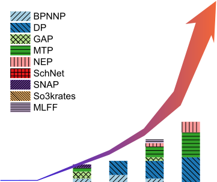


FIG. 1. Number of publications (up to March 10th, 2024) on
heat transport MD simulations using MLPs as a function of
year, with detailed information in Table I and Table II.


**II.** **FUNDAMENTALS OF HEAT**

**TRANSPORT AND RELEVANT MD**

**SIMULATION METHODS**


**A.** **Thermal conductivity and thermal**
**conductance**


_**1.**_ _**Thermal conductivity**_


Fourier’s law describes the empirical relationship governing heat transport, expressed as:


_∂T_

_Q_ _µ_ = _−_ � _κ_ _µν_ _∂x_ _ν_ _._ (1)

_ν_


Here _Q_ _µ_ is the heat flux in the _µ_ direction, _∂x∂T_ _ν_ [is the]
temperature gradient in the _ν_ direction, and _κ_ _µν_ is an
element of the second-rank conductivity tensor [28] . The
heat flux measures the heat transport per unit time and
per unit area, typically measured in W m _[−]_ [2] . The thermal


2


conductivity is commonly expressed in units of W m _[−]_ [1]

K _[−]_ [1] .

When the coordinate axes align with the principal axes
of the conductivity tensor, thermal transport decouples
in different directions, yielding a diagonal thermal conductivity tensor with three nonzero elements: _κ_ _xx_, _κ_ _yy_,
and _κ_ _zz_ . These are commonly denoted as _κ_ _x_, _κ_ _y_, and _κ_ _z_
for simplicity. For isotropic 3D systems, we usually define
a conductivity scalar _κ_ in terms of the trace of the tensor: _κ_ = ( _κ_ _x_ + _κ_ _y_ + _κ_ _z_ ) _/_ 3. For isotropic 2D systems, we
usually define a conductivity scalar for the planar components: _κ_ = ( _κ_ _x_ + _κ_ _y_ ) _/_ 2. For quasi-1D systems, it is
only meaningful to define the conductivity in a single direction. For simplicity, from here on we work with the
conductivity scalar _κ_ unless it is necessary to consider
the conductivity tensor.


_**2.**_ _**Thermal conductance**_


In macroscopic transport (the meaning of which will
become clear soon), thermal conductance _K_ is related to
thermal conductivity by:


_K_ = _κ_ _[A]_ (2)

_L_ _[,]_


where _A_ is the cross-sectional area and _L_ is the system
length along the transport direction. This relation is similar to that between electrical conductance and electrical
conductivity one learns in high school. Usually, thermal conductivity is considered an intrinsic property of a
material, and thermal conductance depends on the geometry ( _A_ and _L_ ). However, complexities emerge when
examining heat transport at the nanoscale or mesoscale.
At the nanoscale, the conventional concept of conductivity may lose its validity [29] . For example, thermal transport in materials with high thermal conductivity, such as
diamond at the nanoscale, is almost _ballistic_, meaning the
conductance changes little with increasing system length
_L_ . In this case, if we assume that Eq. (2) still holds, then
the thermal conductivity _κ_ cannot be regarded as a constant but as a function of the system length, _κ_ = _κ_ ( _L_ ).
This deviates from the conventional (macroscopic) concept of thermal conductivity.
Rather than adhering strictly to Eq. (2), one can generalize the relation between conductance and conductivity as follows:


apparent thermal conductivity _κ_ ( _L_ ) defined in Eq. (2)
approaches the diffusive conductivity _κ_ defined in Eq.
(3), as expected.
By comparing Eq. (2) and Eq. (3), we obtain the
following relation between the apparent thermal conductivity _κ_ ( _L_ ) and the diffusive thermal conductivity _κ_ :


1 _L_ [1]
_κ_ ( _L_ ) _A_ [=] _K_


[1] _L_ (4)

_κ_ _A_ _[.]_


[1] + [1]

_K_ 0 _κ_


From this, we have


1 [1]
_κ_ ( _L_ ) [=] _κ_


1 + _[κA]_
� _K_ 0 _L_


_._ (5)
�


It is more common to use thermal conductance per unit
area _G_, which is defined as


_G ≡_ _[K]_ (6)

_A_ _[.]_


The corresponding ballistic conductance per unit area is
_G_ 0 = _K_ 0 _/A_ . Using this, we have


_._ (7)
�


1 [1]
_κ_ ( _L_ ) [=] _κ_


1 + _[κ][/][G]_ [0]
� _L_


The ratio between the diffusive conductivity and the ballistic conductance per unit area defines a phonon mean
free path (MFP):


_λ ≡_ _[κ]_ _._ (8)

_G_ 0


In terms of the phonon MFP, we have


_._ (9)
�


1 [1]
_κ_ ( _L_ ) [=] _κ_


1 + _[λ]_
� _L_


This is known as the ballistic-to-diffusive transition formula for the length dependent thermal conductivity. Figure 2 schematically shows the ballistic-to-diffusive transition behavior.
The above discussion is simplified in the sense that no
channel dependence of the thermal transport has been
taken into account. Different channels usually have different MFPs and diffusive conductivities. In general,
both the conductivity and the MFP are frequency dependent and we can generalize Eq. (9) to


_._ (10)
�


1 + _[λ]_ [(] _[ω]_ [)]
� _L_


1 1
_κ_ ( _ω, L_ ) [=] _κ_ ( _ω_ )


1 [1]
_K_ [=] _K_


[1] + [1]

_K_ 0 _κ_


[1] _L_ (3)

_κ_ _A_ _[,]_


where _K_ 0 is the ballistic thermal conductance of the material. The term _κ_ in Eq. (3) refers to the _diffusive ther-_
_mal conductivity_, the conventional thermal conductivity
defined in the macroscopic limit ( _L →∞_ ) where the
phonon transport is diffusive. By contrast, the lengthdependent thermal conductivity _κ_ ( _L_ ) defined in Eq. (2)
is usually called the _apparent thermal conductivity_ or _ef-_
_fective thermal conductivity_ . In the diffusive limit, the


We use two toy models to illustrate the above-discussed
concepts. In the first model, we assume that there is only


With _κ_ ( _ω, L_ ), we can obtain the apparent thermal conductivity at _any_ length _L_ as


_∞_
_κ_ ( _L_ ) =
� 0


_dω_
(11)
2 _π_ _[κ]_ [(] _[ω, L]_ [)] _[.]_


3


_̸_


_̸_


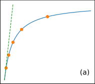

_̸_


_̸_


_̸_


_̸_


are the mass, position, and velocity of particle _i_, respectively, and _V_ is the controlling volume for the particles,
which is usually the volume of the simulation box, but
can also be specifically defined for low-dimensional systems simulated with vacuum layers. In MD simulations,
it is usually more convenient to work on the heat current
that is an extensive quantity:


_**J**_ _≡_ _V_ _**Q**_ (13)


It is clear that the total heat current can be written as

two terms:


_**J**_ = _**J**_ kin + _**J**_ pot _,_ (14)


where the first term is the kinetic or convective part,


_̸_


_̸_


|0.007|Col2|
|---|---|
|0<br>1<br>1/<br>0.001<br>0.003<br>0.005<br>0.007<br>1/  (m-K/W)<br>Len<br>Le|gth = 5 µm<br>ngth = 0.2 µm<br>(b)|
|0<br>1<br>1/<br>0.001<br>0.003<br>0.005<br>0.007<br>1/  (m-K/W)<br>Len<br>Le|2<br>3<br>4<br>5<br>ength (1/µm)|


_**J**_ kin = � _**v**_ _i_ _E_ _i_ (15)


_i_


_̸_


_̸_


|0.0025|Col2|
|---|---|
|0<br>1<br>1/<br>0.0010<br>0.0015<br>0.0020<br><br><br>Len<br>Len|gth = 5 µm<br>gth = 0.2 µm<br>(d)|
|0<br>1<br>1/<br>0.0010<br>0.0015<br>0.0020<br><br><br>Len<br>Len|2<br>3<br>4<br>5<br>ength (1/µm)|


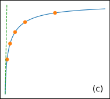

FIG. 2. Ballistic-to-diffusive transition of the apparent thermal conductivity _κ_ ( _L_ ). (a)-(b) a toy model with a single
phonon MFP of 1 _µ_ m and a diffusive thermal conductivity of
_κ_ = 1000 W/mK; (c)-(d) a toy model with two phonon MFPs,
one of 0 _._ 1 _µ_ m, the other 1 _µ_ m, with diffusive conductivity of
500 W/mK. The dots in each panel represent a few special
lengths, from 0.2 _µ_ m to 5 _µ_ m. In (a) and (c), the dashed lines
represent the ballistic limit.


one phonon MFP of 1 _µ_ m and a diffusive thermal conductivity of _κ_ = 1000 W m _[−]_ [1] K _[−]_ [1] . Then the ballistic
conductance is _κ/λ_ = 1 GW m _[−]_ [2] K _[−]_ [1] . Then the apparent thermal conductivity _κ_ ( _L_ ) is given by Eq. (9), as
shown in Figs. 2(a) and 2(b). In this case, 1 _/κ_ ( _L_ ) varies
linearly with 1 _/L_ . In the second model, we assume that
there are two phonon modes, one with a MFP of 0 _._ 1 _µ_ m,
and the other 1 _µ_ m, both having a diffusive conductivity
of 500 W m _[−]_ [1] K _[−]_ [1] . Then the ballistic conductances for
these two modes are 5 GW m _[−]_ [2] K _[−]_ [1] and 0.5 GW m _[−]_ [2]

K _[−]_ [1], respectively. The higher ballistic conductance in
the second toy model can be visualized in Fig. 2(c). Although the apparent thermal conductivity for each mode
follows Eq. (9), when combined, 1 _/κ_ ( _L_ ) does _not_ ex- _̸_
hibit linearity with 1 _/L_ . This is an important feature for
realistic materials with a general MFP spectrum _κ_ ( _ω_ ).


**B.** **Heat flux and heat current**


The heat flux is defined as the time derivative of the
sum of the moments of the site energies of the particles
in the system [30] :


_̸_


and the second term is called the potential part,


_̸_


_̸_


_**J**_ pot = �


_̸_


_̸_


_**r**_ _i_ ( _**F**_ _i_ _·_ _**v**_ _i_ ) + �

_i_ _i_


_̸_


_̸_


_dU_ _i_
_**r**_ _i_

_dt_

_i_


_̸_


_̸_


(16)
_dt_ _[.]_


_̸_


_̸_


The expression above involves absolute positions and is
thus not directly applicable to periodic systems. To derive an expression that can be used for periodic systems,
we need to discuss potential energy and interatomic force
first.
For the MLPs discussed in this tutorial, the total potential energy _U_ of a system can be written as the sum
of site potentials _U_ _i_ :


_̸_


_̸_


_U_ =


_̸_


_̸_


_N_
� _U_ _i_ _._ (17)


_i_ =1


_̸_


_̸_


The site potential can have different forms in different
potential models. A well-defined force expression for general many-body potentials that explicitly respects Newton’s third law has been derived as [31] :


_̸_


_̸_


_**F**_ _i_ = � _**F**_ _ij_ _,_ (18)

_j_ = _̸_ _i_


_̸_


_̸_


where


_̸_


_̸_


_**F**_ _ij_ = _−_ _**F**_ _ji_ = _[∂U]_ _[i]_


_̸_


_̸_


_[∂U]_ _[i]_ _−_ _[∂U]_ _[j]_

_∂_ _**r**_ _ij_ _∂_ _**r**_ _ji_


_̸_


_̸_


_._ (19)
_∂_ _**r**_ _ji_


_̸_


_̸_


_d_

_**Q**_ _≡_ [1]

_V_ _dt_


_̸_


_̸_


� _**r**_ _i_ _E_ _i_ _._ (12)


_i_


_̸_


_̸_


Here, _∂U_ _i_ _/∂_ _**r**_ _ij_ is a shorthand notation for a vector
with Cartesian components _∂U_ _i_ _/∂x_ _ij_, _∂U_ _i_ _/∂y_ _ij_, and
_∂U_ _i_ _/∂z_ _ij_ . The atomic position difference is defined as


_**r**_ _ij_ _≡_ _**r**_ _j_ _−_ _**r**_ _i_ _._ (20)


Using the force expression, the heat current can be derived to be [31] :


_̸_


_̸_


_._ (21)
�

_̸_


_̸_


� _**r**_ _ij_

_j_ = _̸_ _i_


_̸_


_∂U_ _j_ _·_ _**v**_ _i_
� _∂_ _**r**_ _ji_

_̸_


_̸_


The site energy _E_ _i_ is the sum of the kinetic energy
_m_ _i_ _**v**_ _i_ [2] _[/]_ [2 and the potential energy] _[ U]_ _[i]_ [. Here] _[ m]_ _[i]_ [,] _**[ r]**_ _[i]_ [, and] _**[ v]**_ _[i]_ _̸_


_̸_


_**J**_ pot = �


_i_ _̸_


_̸_


_̸_


4


From the definition of virial tensor


_̸_


_̸_


**W** _i_ = �

_i_ _i_


_̸_


_̸_


**W** = �


_̸_


_̸_


_**r**_ _i_ _⊗_ _**F**_ _i_ (22)

_i_


_̸_


_̸_


and the force expression Eq. (18), we have


_̸_


_̸_


**W** = _−_ [1]

2

_̸_


_̸_


�


_i_ _̸_


_̸_


� _**r**_ _ij_ _⊗_ _**F**_ _ij_ _._ (23)

_j_ = _̸_ _i_


_̸_


_̸_


Using the explicit force expression Eq. (19), we can also
express the per-atom virial as


_̸_


_̸_


� _j_ = _̸_ _i_ _**r**_ _ij_ _⊗_ _∂_ _[∂U]_ _**r**_ _ji_ _[j]_


_̸_


**W** _i_ = �

_̸_


_̸_


_._ (24)
_∂_ _**r**_ _ji_

_̸_


_̸_


_̸_

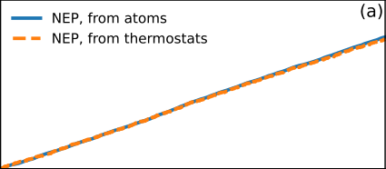

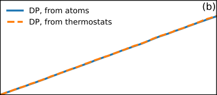

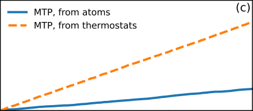


FIG. 3. Accumulated heat as a function of time in nonequilibrium steady state simulated with (a) NEP, (b) DP,
and (c) MTP, using gpumd [26] (for NEP) or lammps [32] (for
DP and MTP).


equilibrium molecular dynamics (EMD), nonequilibrium
molecular dynamics (NEMD), homogeneous nonequilibrium molecular dynamics (HNEMD), and spectral
decomposition. While the approach-to-equilibrium
method [43][–][45] can in principle be realized in gpumd, our
discussion will primarily focus on the other three methods that have been widely employed with gpumd.


_**1.**_ _**The EMD method**_


The EMD method is based on the Green-Kubo relation
for thermal transport [46] :


_̸_


_̸_


Therefore, the heat current can be neatly written as:


_̸_


_̸_


_**J**_ pot = � **W** _i_ _·_ _**v**_ _i_ _._ (25)


_i_


_̸_


_̸_


This expression, which involves relative atom positions
only, is applicable to periodic systems and has been implemented in the gpumd package [26] for all the supported
interatomic potentials, including NEP. The current implementation of the heat current in lammps [32] is generally incorrect for many-body potentials, and corrections to lammps have only been done for special force
fields [33][,][34] . For any MLP that interfaces with lammps,
one must use the full 9 components of the per-atom
virial and provide a correct implementation of Eq. (24).
NEP has an interface for lammps that meets this requirement. To the best of our knowledge, among the
other publicly available MLP packages, only deepmd [21]

(after the work of Tisi _et al._ [35] ) and aenet [36] (after the
work of Shimamura _et al._ [37] ) have implemented the heat
current correctly. The heat current is also correctly
formulated [38] for a MLP based on the smooth overlap
of atomic positions [39] . Contrarily, the widely used MTP
method [20] (as implemented in Ref. 40), for example, exhibits an incorrect implementation of the heat current, as
demonstrated in Fig. 3. According to energy conservation, the accumulated heat from the atoms [cf. Eq. (25)]
should match that from the thermostats [cf. Eq. (31)],
allowing for only small fluctuations. It is evident that
both DP and NEP exhibit this property, whereas MTP
does not. Details on the calculations are provided in Appendix A.
Note that the above formulation of heat current has
been derived specifically for _local_ MLPs with atomcentered descriptors. For _semilocal_ message-passingbased MLPs, the formulation of heat current has been
shown by Langer _et al._ [41][,][42] to be more complicated.


**C.** **Overview of MD-based methods for heat**

**transport**


In the following, we review the heat transport MD
methods implemented in the gpumd package, including


_̸_


_̸_


where _C_ _µν_ ( _t_ ) is the heat current autocorrelation function
(HCACF)


_C_ _µν_ ( _t_ ) = _⟨J_ _µ_ (0) _J_ _ν_ ( _t_ ) _⟩_ e _._ (27)


_̸_


_̸_


1
_κ_ _µν_ ( _t_ ) = _k_ B _T_ [2] _V_


_̸_


_̸_


_t_

_dt_ _[′]_ _C_ _µν_ ( _t_ _[′]_ ) _,_ (26)

� 0


_̸_


_̸_


5


The equations above define the running thermal conductivity, which is a function of the _correlation time t_ . In
MD simulations, the correlation function is defined as


profile [53] . This is to ensure that the contact resistance
is also included, and the total thermal conductance is
given by


_Q_
_G_ ( _L_ ) = (30)
_|_ ∆ _T_ _|_ _[.]_


The steady-state heat flux can be computed either microscopically or from the energy exchange rate _dE/dt_ in
the thermostatted regions and cross-sectional area _A_ as


_⟨J_ _µ_ (0) _J_ _ν_ ( _t_ ) _⟩_ e _≈_ _t_ [1] p


_t_ p

_J_ _µ_ ( _τ_ ) _J_ _ν_ ( _t_ + _τ_ ) _dτ._ (28)

� 0


where _t_ p is the _production time_ within which the heat
current data are sampled. This production run should
be in an equilibrium ensemble (as indicated by the subscript “e” in the HCACF expression), usually _NV E_, but
_NV T_ with a _global_ thermostat can also be used. Thermal
conductivity in the diffusive limit is obtained by taking
the limit of _t →∞_, but in practice, this limit can be
well approximated at an appropriate _t_ . One also needs
to ensure that the simulation cell is sufficiently large to
eliminate finite-size effects [47][–][49] .


_**2.**_ _**The NEMD method**_


The NEMD method is a nonequilibrum and inhomogeneous method that involves implementing a pair of
heat source and sink using a thermostatting method or
equivalent. There are two common relative positions of
the source and sink in the NEMD method, corresponding to two typical simulation setups. In one setup, the
source and sink are separated by half of the simulation
cell length _L_, and periodic boundary conditions are applied along the transport direction. Heat flows from the
source to the sink in two opposite directions in this periodic boundary setup. In the other setup, the source and
sink separated by _L_ are located at the two ends of the
system. Fixed boundary conditions are applied along the
transport direction to prevent sublimation of the atoms
in the heat source and sink. Heat flows from the source
to the sink in one direction in this fixed boundary setup.
It has been established [50] that the effective length in the
periodic boundary setup is only _L/_ 2. This factor must
be taken into account when comparing results from the
two setups.
When the system reaches a steady state, a temperature profile with a definite temperature gradient _∇T_ will
be established. Meanwhile, a steady heat flux _Q_ will
be generated. With these, one can obtain the apparent
thermal conductivity _κ_ ( _L_ ) of a system of finite length _L_
according to Fourier’s law,


_Q_
_κ_ ( _L_ ) = (29)
_|∇T_ _|_ _[,]_


in the linear response regime where the temperature gradient _|∇T_ _|_ across the system is sufficiently small. It has
been observed that the local Langevin thermostat outperforms the global Nos´e-Hoover thermostat [51][,][52] in generating temperature gradients [53] . It has also been demonstrated that the temperature gradient should be directly
calculated from the temperature difference _|∇T_ _|_ = ∆ _T/L_
rather than through fitting part of the temperature


[1] _dE_

_A_ _dt_


_Q_ = [1]


(31)
_dt_ _[,]_


based on energy conservation. The two approaches must
generate the same result, and they have been used to
validate the implementation of heat flux in several MLPs,
as shown in Fig. 3.
A common practice in using the NEMD method is to
extrapolate to the limit of infinite length based on the results for a few finite lengths. It is important to note that
linear extrapolation is usually insufficient, as suggested
even by the toy-model results shown in Fig. 2(d).


_**3.**_ _**The HNEMD method**_


In the HNEMD method, an external force of the form [54]


_**F**_ _i_ [ext] = _E_ _i_ _**F**_ e + _**F**_ e _·_ **W** _i_ (32)


is added to each atom to drive the system out of equilibrium, inducing a nonequilibrum heat current (note the
subscript “ne”):


_·_ _**F**_ e _._ (33)
�


1
_⟨_ _**J**_ ( _t_ ) _⟩_ ne =
� _k_ B _T_


_t_

_dt_ _[′]_ _⟨_ _**J**_ (0) _⊗_ _**J**_ ( _t_ _[′]_ ) _⟩_ e

� 0


The driving force parameter _**F**_ e is of the dimension of
inverse length. The quantity in the parentheses is proportional to the running thermal conductivity tensor and
we have


_⟨J_ q _[µ]_ [(] _[t]_ [)] _[⟩]_ [ne]


_κ_ _[µν]_ ( _t_ ) _F_ e _[ν]_ _[.]_ (34)

_ν_


[ne]


=
_TV_ �


This provides a way of computing the thermal conductivity. In the HNEMD method, the system is in a homogeneous nonequilibrium state because there is no explicit heat source and sink. The system is periodic in the
transport direction and heat flows circularly under the
driving force. Because of the absence of heat source and
sink, no boundary scattering occurs for the phonons and
the HNEMD method is similar to the EMD method in
terms of finite-size effects.


_**4.**_ _**Spectral decomposition**_


In the framework of the NEMD and HNEMD methods,
one can also calculate spectrally decomposed thermal


6


conductivity (or conductance) using the virial-velocity
correlation function [54][,][55]


�


vasp, gpumd, quip, mlip, fitsnap, schnetpack, and
mlff respectively.
Most MLP packages are interfaced to lammps [32]

to perform MD simulations, while NEP is native to
gpumd [26] but can also be interfaced to lammps. The
MLFF method implemented in vasp is an on-the-fly
MLP that integrates seamlessly into AIMD simulations.
Table II compiles the publications up to today that
have used MD simulations driven by MLPs for thermal
transport studies. Note that our focus is on studies using MD simulations, excluding those solely based on the
BTE-ALD approach. The number of publications up to
March 10th, 2024 for each MLP is shown in Fig. 1.
The application of MLPs-based MD simulations to
thermal transport was pioneered by Sosso _et al._ in 2012
when they studied the thermal transport in the phasechanging amorphous GeTe system [64] . However, thermal
transport simulations are very computationally intensive,
and the rapid increase of the number of applications has
only been started after the development of the GPUbased DP [21] and NEP [23] models. In this regard, the NEP
model is particularly advantageous due to its superior
computational speed as compared to others [23][–][25] . With
comparable computational resources, it has been shown
to be as fast as or even faster than some empirical force
fields [154][,][156] .
There are numerous successful applications of MLPs
in thermal transport. In Fig. 4, we present results from
selected publications. The materials studied in these
works have reliable experimental results, serving as good
candidates for validating the applicability of MLPs. On
one hand, MLPs demonstrate good agreement with experimental results for highly disordered materials such
as liquid water [154], amorphous SiO 2 [142], and amorphous
silicon [152] . In addition to the reliability of MLPs, a crucial component for accurately describing the temperature
dependence of the thermal conductivity in liquids and
amorphous materials is a quantum correction method
based on the spectral thermal conductivity, as defined
in Eq. (39), and the quantum-statistical-correction factor, as given in Eq. (40). On the other hand, MLPs tend
to systematically underestimate the thermal conductivity of crystalline solids, including silicon (using a GAP
model) [74], CoSb 3 (using a MTP model), and graphite (inplane transport, using a NEP model) [141] . This underestimation has been attributed to the small but finite random force errors, and a correction has been devised [181] .
We will discuss this in more detail with an example in
the next section.


**IV.** **MOLECULAR DYNAMICS**

**SIMULATION OF HEAT TRANSPORT**

**USING NEP AND GPUMD**


In this section, we use crystalline silicon as an example to demonstrate the workflow of constructing and using NEP models for thermal transport simulations. The


_**K**_ ( _t_ ) =


�� _i_


**W** _i_ (0) _·_ _**v**_ _i_ ( _t_ )

_i_


_._ (35)

ne


In terms of this, the thermal conductance in NEMD simulation can be decomposed as follows:


+ _∞_
_G_ =
� _−∞_


_dω_
(36)
2 _π_ _[G]_ [(] _[ω]_ [);]


2
_G_ ( _ω_ ) =
_V_ ∆ _T_


+ _∞_

_e_ _[iωt]_ _K_ _[µ]_ ( _t_ ) _dt._ (37)

� _−∞_


The thermal conductivity in HNEMD simulation can be
decomposed as follows:


+ _∞_

_κ_ _µν_ =
� _−∞_


_dω_
(38)
2 _π_ _[κ]_ _[µν]_ [(] _[ω]_ [);]


_κ_ _µν_ ( _ω_ ) _F_ e _ν_ _._ (39)

_ν_


2

_V T_


� _−∞_ + _∞_


_e_ _[iωt]_ _K_ _[µ]_ ( _t_ ) _dt_ = �
_−∞_


The virial-velocity correlation function here is essentially
the force-velocity correlation function defined for a (physical or imaginary) interface [56][,][57] .
The spectral quantities allow for a feasible quantumstatistical correction [3][,][58] for strongly disordered systems
where phonon-phonon scatterings are not dominant.
For example, the spectral thermal conductivity can be
quantum-corrected by multiplying the factor


_x_ [2] _e_ _[x]_

( _e_ _[x]_ _−_ 1) [2] _[,]_ (40)


where _x_ = ℏ _ω/k_ B _T_ .
There are other spectral/modal analysis method implemented in gpumd, such as the Green-Kubo modal
analysis method [59] and the Homogeneous non-equilibrium
modal analysis method [58], but we will not demonstrate
their usage in this tutorial.


**III.** **REVIEW OF MD SIMULATION OF**

**HEAT TRANSPORT USING MLPS**


Several MLPs have been used for heat transport
with MD simulations, including BPNNP [15], GAP [16],
SNAP [19], MTP [20], DP [21], MLFF [60], NEP [23], SchNet [61], and
So3krates [62] . Table I lists the relevant MLP packages implementing these MLPs.
The pioneering BPNNP model, developed by Behler
and Parrinello [15], has been implemented in various
packages, including runner [15], aenet [36], and kliff [63] .
The DP, MLFF, NEP, GAP, MTP, SNAP, SchNet,
and So3krates models are implemented in deepmd-kit,


7


TABLE I. The MLPs and their implementation packages that have been used in MD simulations of heat transport.


Year MLP Package Code repository or official website
2007 BPNNP runner `[https://theochemgoettingen.gitlab.io/RuNNer](https://theochemgoettingen.gitlab.io/RuNNer)`
aenet `[https://github.com/atomisticnet/aenet](https://github.com/atomisticnet/aenet)`
kliff `[https://github.com/openkim/kliff](https://github.com/openkim/kliff)`
2010 GAP quip `[https://github.com/libAtoms/QUIP](https://github.com/libAtoms/QUIP)`
2015 SNAP fitsnap `[https://github.com/FitSNAP/FitSNAP](https://github.com/FitSNAP/FitSNAP)`
2016 MTP mlip `[https://gitlab.com/ashapeev/mlip-2](https://gitlab.com/ashapeev/mlip-2)`
2017 SchNet schnetpack `[https://github.com/atomistic-machine-learning/schnetpack](https://github.com/atomistic-machine-learning/schnetpack)`
2018 DP deepmd-kit `[https://github.com/deepmodeling/deepmd-kit](https://github.com/deepmodeling/deepmd-kit)`
2019 MLFF vasp `[https://www.vasp.at](https://www.vasp.at)`
2021 NEP gpumd `[https://github.com/brucefan1983/GPUMD](https://github.com/brucefan1983/GPUMD)`
2024 So3krates mlff `[https://github.com/thorben-frank/mlff](https://github.com/thorben-frank/mlff)`


_̸_


_̸_


NEP approach has been implemented in the open-source
gpumd package [25][,][26] . After compiling, there will be an
executable named `nep` that can be used to train _accu-_
_rate_ NEP models against reference data, and an executable named `gpumd` that can be used to perform _ef-_
_ficient_ MD simulations. The gpumd package is selfcontained, free from dependencies on third-party packages, particularly those related to ML. This makes the
installation of gpumd straightforward and effortless. In
addition, there are some handy (but not mandatory)
Python packages available to facilitate the pre-processing
and post-processing gpumd inputs and outputs, including calorine [182], gpyumd [183], gpumd-wizard [184], and
pynep [185] . Since its inception with the very first version
in 2013 [186], gpumd has been developed with special expertise in heat transport applications.


**A.** **The neuroevolution potential**


The NEP model is based on artificial neural network
(ANN) and is trained using a separable natural evolution _̸_
strategy (SNES) [187], hence the name.


_**1.**_ _**The NN model**_


The ML model in NEP is a fully-connected feedforward
ANN with a single hidden layer, which is also called a
multilayer perceptron. The total energy is the sum of
the site energies _U_ = [�] _i_ _[U]_ _[i]_ [, and the site energy] _[ U]_ _[i]_ [ is the]

output of the neural network (NN), expressed as:


_̸_


_̸_


_̸_

�


_̸_


_N_ des _̸_
� _ω_ _µν_ [(0)] _[q]_ _ν_ _[i]_ _[−]_ _[b]_ [(0)] _µ_
� _ν_ =1


layer, _ω_ _µ_ [(1)] is the connection weight vector from the hidden layer to the output layer, _b_ [(0)] _µ_ is the bias vector in
the hidden layer, and _b_ [(1)] is the bias in the output layer.
_ω_ _µν_ [(0)] [,] _[ ω]_ _µ_ [(1)] [,] _[ b]_ [(0)] _µ_ [, and] _[ b]_ [(1)] [ are trainable parameters. The]
function tanh( _x_ ) is the nonlinear activation function in
the hidden layer. According to Eq. (41), the NEP model
is a simple analytical function of a descriptor vector. A
C++ function for evaluating the energy and its derivative with respect to the descriptor components can be
found in Ref. 25.


_**2.**_ _**The descriptor**_


The descriptor _q_ _i_ _[ν]_ [encompasses the local environment]
of atom _i_ . In NEP, the descriptor is an abstract vector
whose components group into radial and angular parts.
The radial descriptor components _q_ _n_ _[i]_ [(0] _[ ≤]_ _[n][ ≤]_ _[n]_ [R] max [) are]
defined as

_q_ _n_ _[i]_ [=] � _g_ _n_ ( _r_ _ij_ ) _,_ (42)

_j_ = _̸_ _i_


where _r_ _ij_ is the distance between atoms _i_ and _j_ and
_g_ _n_ ( _r_ _ij_ ) are a set of radial functions, each of which is
formed by a linear combination of Chebyshev polynomials. The angular components include _n_ -body ( _n_ = 3 _,_ 4 _,_ 5)
correlations. For the 3-body part, the descriptor components are defined as (0 _≤_ _n ≤_ _n_ [A] max [, 1] _[ ≤]_ _[l][ ≤]_ _[l]_ max [3body] [)]


_q_ _nl_ _[i]_ [=] �( _−_ 1) _[m]_ _A_ _[i]_ _nlm_ _[A]_ _[i]_ _nl_ ( _−m_ ) [;] (43)


_m_


_A_ _[i]_ _nlm_ [=] � _g_ _n_ ( _r_ _ij_ ) _Y_ _lm_ (ˆ _**r**_ _ij_ ) _._ (44)

_j_ = _̸_ _i_


Here, _Y_ _lm_ are the spherical harmonics and ˆ _**r**_ _ij_ is the unit
vector of _**r**_ _ij_ . Note that the radial functions _g_ _n_ ( _r_ _ij_ ) for
the radial and angular descriptor components can have
different cutoff radii, which are denoted as _r_ c [R] [and] _[ r]_ c [A] [,]
respectively. For 4-body and 5-body descriptor components (with similar hyperparameters _l_ max [4body] and _l_ max [5body] as
in the 3-body part), see Ref. 25.


_̸_


_̸_


_U_ _i_ =


_̸_


_N_ neu _̸_
� _ω_ _µ_ [(1)] [tanh]

_µ_ =1


_̸_


_̸_

_−_ _b_ [(1)] _._ (41)


_̸_


_̸_


Here, _N_ des is the number of descriptor components, _N_ neu
is the number of neurons in the hidden layer, _q_ _ν_ _[i]_ [is the]
_ν_ -th descriptor component of atom _i_, _ω_ _µν_ [(0)] [is the connec-]
tion weight matrix from the input layer to the hidden


_̸_


_̸_


8


TABLE II. Applications of MLPs in MD simulations of heat transport up to March 10th, 2024.


MLP Year Reference Material(s) Year Reference Material(s)
BPNNP 2012 Sosso ~~[64]~~ Amorphous GeTe 2015 Campi ~~[65]~~ GeTe
2019 Bosoni [66] GeTe nanowires 2019 Wen [67] 2D graphene
2020 Cheng [68] Liquid hydrogen 2020 Mangold [69] Mn _x_ Ge _y_
2020 Shimamura [37] Ag 2 Se 2021 Han [70] Sn
2021 Shimamura [71] Ag 2 Se 2022 Takeshita [72] Ag 2 Se
2024 Shimamura [73] Ag 2 Se
GAP 2019 Qian ~~[74]~~ Silicon 2019 Zhang ~~[75]~~ 2D silicene
2021 Zeng [76] Tl 3 VSe 4
SNAP 2019 Gu ~~[77]~~ MoSSe alloy
MTP 2019 Korotaev ~~[78]~~ CoSb 3 2021 Liu ~~[79]~~ SnSe
2021 Yang [80] CoSb 3 and Mg 3 Sb 2 2021 Zeng [81] BaAg 2 Te 2
2022 Attarian [82] FLiBe 2022 Ouyang [83] SnS
2022 Ouyang [84] BAs and Diamond 2022 Mortazavi [85][–][87] Graphyne, 2D BCN, C 60
2022 Sun [88] Bi 2 O 2 Se 2023 Mortazavi [89][–][91] C 60, C 36 and B 40 networks
2023 Wang [92] Cs 2 AgPdCl 5 etc. 2023 Zhu [93] CuSe
2024 Chang [94] PbSnTeSe and PbSnTeS 2024 Wieser [95] MOF crystals
SchNet 2023 Langer ~~[41]~~ ZrO 2
DP 2020 Dai ~~[96]~~ ZrHfTiNbTaC alloy 2020 Li ~~[97]~~ _β_ -Ga 2 O 3
2020 Li [98] Silicon 2020 Pan [99] ZnCl 2
2021 Bu [100] KCl-CaCl 2 molten salt 2021 Dai [101] TiZrHfNbTaB alloy
2021 Deng [102] MgSiO 3 liquid 2021 Liu [103] Al
2021 Tisi [35] Water 2022 Gputa [104] Cu 7 PSe 6
2022 Huang [105] B 12 P 2 2022 Liang [106] MgCl 2 -NaCl eutectic
2022 Pegolo [107] Li 3 ClO 2022 Wang [108] Wadsleyite
2022 Yang [109] MgSiO 3 perovskite 2022 Zhang [110] Bi 2 Te 3
2023 Bhatt [111] Tungsten 2023 Dong [112] NaCl-MgCl 2 -CaCl 2
2023 Fu [113] Ti-Zr-Y-Si-O ceramic 2023 Gupta [114] Bulk MoSe 2 and WSe 2
2023 Han [115] 2D InSe 2023 Huang [116] CdTe
2023 Li [117][,][118] Cu/H 2 O and TiO 2 /H 2 O 2023 Qi [119] Vitreous silica
2023 Qiu [120] Ice 2023 Qu [121] MnBi 2 Te 4, Bi 2 Te 3 /MnBi 2 Te 4
2023 Ren [122] Ag 8 SnSe 6 2023 Wang [123] Bridgmanite, Post-perovskite
2023 Xu [124] MgCl 2 -NaCl and MgCl 2 -KCl 2023 Zhang [125][,][126] Sb 2 Te 3
2023 Zhang [127] Water 2023 Zhang [128] Boron arsenide
2023 Zhao [129] NaCl and NaCl-SiO 2 2024 Fu [130] SiC
2024 Li [131] AlN 2024 Li [132] GaN/SiC interfaces
2024 Peng [133] MgSiO 3 -H 2 O 2024 Zhang [134] MoAlB
MLFF 2021 Verdi ~~[135]~~ ZrO 2 2024 Lahnsteiner ~~[136]~~ CsPbBr 3
NEP 2021 Fan ~~[23]~~ PbTe, Si 2022 Dong ~~[137]~~ 2D silicene
2022 Fan [24][,][25] PbTe, Amorphous carbon 2023 Cheng [138] PbTe
2023 Dong [139] C 60 network 2023 Du [140] PH 4 AlBr 4
2023 Eriksson [141] Graphite, _h_ -BN, MoS 2 2023 Liang [142] Amorphous SiO 2
2023 Liu [143] Si/Ge nanowires 2023 Lu [144] Fullerene-encapsulated CNT
2023 Ouyang [145] AgX (X=Cl, Br, I) 2023 Pan [146] MgOH system
2023 Sha [147] 2D PbTe 2023 Shi [148] InGeX 3 (X=S,Se,Te)
2023 Shi [149] Halogen perovskites 2023 Su [150] Cs 2 BiAgBr 6, Cs 2 BiAgCl 6
2023 Sun [151] Ga 2 O 3 2023 Wang [152] Amorphous silicon
2023 Wang [153] 2D SrTiO 3 2023 Xu [154] Water
2023 Xiong [155] Diamond allotropes 2023 Ying [156][,][157] MOF crystals, Phosphorene
2023 Zhang [158] Amorphous HfO 2 2024 Cao [159] Phosphorous carbide
2024 Cheng [160] Perovskites 2024 Fan [161] HKUST-1 crystal
2024 Fan [162] Graphene antidot lattice 2024 Li [163] Strained monolayer graphene
2024 Li [164] Amorphous silicon 2024 Li [165] 2D COF-5
2024 Pegolo [166] Glassy Li _x_ Si 1 _−x_ 2024 Wang [167] Ga 2 O 3
2024 Ying [168] MOF crystals 2024 Yue [169] Si-C interfaces
2024 Zeraati [170] La 2 Zr 2 O 7 and many others 2024 Zhang [171] GeTe
So3krates 2023 Langer ~~[42]~~ SnSe


9


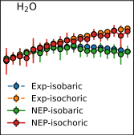


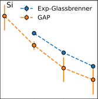

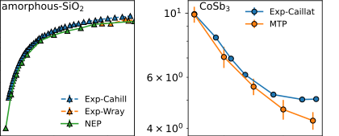

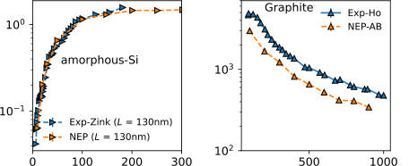

FIG. 4. Selected literature results on the application of
MLPs to thermal transport, covering a broad range of ma
142

terials, including liquid water [154], amorphous SiO 2, amor
78

phous silicon [152], crystalline silicon [74], crystalline CoSb 3,

and crystalline graphite [141] . Experimental data are from
Refs. 172 and 173 (liquid water), Refs. 174–176 (amorphous
SiO 2 ), Ref. 177 (amorphous silicon), Ref. 178 (crystalline silicon), Ref. 179 (crystalline CoSb 3 ), and Ref. 180 (crystalline
graphite).


_**3.**_ _**The training algorithm**_


The free parameters are optimized using the SNES by
minimizing a loss function that is a weighted sum of the
root-mean-square errors (RMSEs) of energy, force, and
virial stress, over _N_ gen generations with a population size
of _N_ pop . The weights for the energy, force, and virial are
denoted _λ_ e, _λ_ f, and _λ_ v, respectively. Additionally, there
are proper norm-1 ( _ℓ_ 1 ) and norm-2 ( _ℓ_ 2 ) regularization
terms. For explicit details on the training algorithm, refer
to Ref. 23.


_**4.**_ _**Combining with other potentials**_


Although NEP with proper hyperparameters can account for almost all types of interactions, it can be useful
to combine it with some well developed potentials, such
as the Ziegler-Biersack-Littmark (ZBL) [188] potential for


10


describing the extremely large screened nuclear repulsion at short interatomic distances and the D3 dispersion correction [189] for describing relatively long-range but
weak interactions. Both potentials have been recently
added to the gpumd package [168][,][190] It has been demonstrated that dispersion interactions can reduce the thermal conductivity of typical metal-organic frameworks by
about 10% [168] . With the addition of ZBL and D3, NEP
can then focus on describing the medium-range interactions.


**B.** **Model training and testing**


There are educational articles focusing on various best
practices in constructing MLPs [191][,][192] . Here we use crystalline silicon as a specific example to illustrate the particular techniques in the context of NEP.


_**1.**_ _**Prepare the initial training data**_


A training dataset is a collection of structures, each
characterized by a set of attributes:


1. a cell matrix defining a periodic domain


2. the species of the atoms in the cell


3. the positions of the atoms


4. the total energy of the cell of atoms


5. the force vector acting on each of the atoms


6. (optionally) the total virial tensor (with 6 independent components) of the cell


The structures can be prepared by any method, while the
energy, force, and virial are usually calculated via quantum mechanical methods, such as the DFT method. For
a dataset comprising _N_ str structures with a total number
of _N_ atoms, there are _N_ str energy data, 6 _N_ str virial data,
and 3 _N_ force data.
While there are already several publicly available training datasets for silicon, we opt to create one from scratch
for pedagogical purposes. The construction of training
dataset typically involves an iterative process, employing a scheme similar to active learning. The iterative
process begins with an initial dataset. To investigate
heat transport in crystalline silicon, the initial training
dataset should encompass structures relevant to the target temperatures and pressures. The most reliable way of
generating structures under these conditions is through
performing AIMD simulations, where interatomic forces
are calculated based on quantum mechanical methods,
such as the DFT approach. However, AIMD is computationally expensive (which is the primary motivation for
developing a MLP) and it is often impractical to perform
AIMD simulations for a dense grid of thermodynamic


conditions. Fortunately, there is usually no such need for
the purpose of generating the reference structures. Actually, manual perturbation of the atomic positions and/or
the cell matrices proves to be an effective way of generating useful reference structures.
Based on the considerations above, we generate the
initial training dataset through the following methods.
Firstly, we generate 50 structures by applying random
strains (ranging from _−_ 3% to +3% for each degree of
freedom) to the unit cell of cubic silicon (containing 8
atoms) while _simultaneously_ perturbing the atomic positions randomly (by 0.1 [˚] A). Secondly, we perform a 10-ps
AIMD simulation at 1000 K (fixed cell) using a 2 _×_ 2 _×_ 2
supercell of silicon crystal containing 64 atoms, and sample the structures every 0.1 ps, obtaining another 100
structures. In total, we obtain 150 structures and 6800
atoms initially.
After obtaining the structures, we perform singlepoint DFT calculations to obtain the reference energy, force and virial data. These data are saved
to a file named `train.xyz`, using the extended XYZ
format. The single-point DFT calculations are performed using the vasp package [193], using the PerdewBurke-Ernzerhof functional with the generalized gradient
approximation [194], a cutoff energy of 600 eV, an energy
convergence threshold of 10 _[−]_ [6] eV, and a _k_ -point mesh
of 4 _×_ 4 _×_ 4 for 64-atom supercells and 12 _×_ 12 _×_ 12 for
8-atom unit cells.


_**2.**_ _**Train the first NEP model**_


With the training data, we proceed to train our first
NEP model, denoted as NEP-iteration-1. For this task,
we need to prepare an input file named `nep.in` for the
`nep` executable in the gpumd package. This `nep.in`
input file contains the various hyperparameters for the
NEP model under training. Most hyperparameters have
well-suited default values, and for users initiating this
process, it is recommended to use these defaults whenever
applicable. The default values for key hyperparameters
are as follows:


1. _n_ [R] max [: 4]


2. _n_ [A] max [: 4]


3. Chebyshev polynomial basis size for radial descriptor components _N_ bas [R] [: 12]


4. Chebyshev polynomial basis size for angular descriptor components _N_ bas [A] [: 12]


5. _l_ max [3body] [: 4]


6. _l_ max [4body] [: 2]


7. _l_ max [5body] [: 0 (not used by default)]


8. _N_ neu : 30


11


9. Energy and force weights _λ_ e and _λ_ f : 1


10. Virial weight _λ_ v : 0.1


11. Batch size: 1000 (a large or even full batch is preferred for training with SNES)


12. Population size in SNES: 50


13. Number of training generations (steps): 100 000


14. ANN architecture: 30-30-1 (input layer 30, hidden
layer 30, scalar output; relatively small but sufficient for most cases, expect for very complicated
training data.)


Following this strategy, we use a very simple `nep.in`
input file for our case, which is as follows:

```
type 1 Si
cutoff 5 5

```

In the first line, we specify the number of species (atom
types) and the chemical symbol(s). In our example, there
is only one species with the chemical symbol Si. In the
second line, we specify the cutoff radii _r_ c [R] [and] _[ r]_ c [A] [for]
the _g_ _n_ ( _r_ _ij_ ) functions in the radial and angular descriptor components, respectively. In our example, both cutoff radii are set to 5 A, which includes the third nearest [˚]
neighbors. The choice of cutoff radii is crucial for the performance of the trained NEP model and usually requires
a systematic exploration to find an optimal set of values.
It is important to note that the average number of neighbors, and hence the computational cost, scales cubically
with respect to the cutoff radii. Therefore, blindly using
large cutoff radii is not advisable. Although _r_ c [R] [=] _[ r]_ c [A] [in]
our current example, it is generally beneficial to use a
larger _r_ c [R] [and a smaller] _[ r]_ c [A] [, because the radial descriptor]
components are computationally much cheaper than the
angular descriptor components. Using a larger _r_ c [R] [does]
not lead to a significant increase in the computational
cost, but can help capture longer-range interactions (such
as screened Coulomb interactions in ionic compounds [23] )
that typically have little angular dependence. A larger
radial cutoff is also useful for capturing dispersion interactions in Van der Waals structures [141] .
The training results for NEP-iteration-1 are shown in
Fig. 5(a). The RMSEs of force, energy, and virial all
converge well within the default 100 000 training steps.
The parity plots for force, energy, and virial in Figs. 5(b)5(d) show good correlations between the NEP predictions
and the DFT reference data. The RMSEs for energy,
force, and virial are 1.0 meV/atom, 54.6 meV/A, and [˚]
21.8 meV/atom, respectively .


_**3.**_ _**Training iterations**_


Reliable assessment of the accuracy of a MLP typically involves an independent test dataset rather than


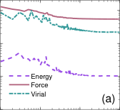

10 [-1]


10 [-2]


10 [-4]
10 [2] 10 [3] 10 [4] 10 [5]


-5.2


-5.3


5


2.5


0


-2.5


-5


2


1


0


(b)


-5 -2.5 0 2.5 5


(d)


-5.4


(c)


-5.4 -5.3 -5.2


-1
-1 0 1 2


FIG. 5. (a) Evolution of RMSEs of energy, force, and virial
with respect to training generations (steps). (b) Comparison
of force, (c) energy, and (d) virial calculated by NEP against
DFT reference data for the initial training dataset.


the training dataset. To this end, we perform 10-ps MD
simulations using NEP-iteration-1 in the _NPT_ ensemble.
The target pressure is set to zero, and the target temperatures range from 100 K to 1000 K with intervals of 100
K. We sample 100 structures, totalling 6400 atoms.
We perform single-point DFT calculations for these
structures and then use NEP-iteration-1 to generate predictions. This is achieved by adding the `prediciton` keyword to the `nep.in` file:

```
type 1 Si
cutoff 5 5

prediction 1

```

This results in a rapid prediction for the test dataset. The
RMSEs for energy, force, and virial are 1.2 meV/atom,
41.6 meV/ [˚] A, and 8.5 meV/atom, respectively. These
values are already comparable to those for the training
dataset, indicating that we can actually stop here and
use NEP-iteration-1 as the final model. However, for
added confidence, it is generally advisable to perform at
least one more iteration. Therefore, we combine the test
dataset (100 structures) with the training dataset (150
structures) to form an expanded training dataset (250
structures), and then train a new model named NEPiteration-2. With this new NEP model, we generate
another test dataset with 100 structures, using similar
procedure as above but with a simulation time of 10 ns
(instead of 10 ps), driven by NEP-iteration-2 for each
temperature. The test RMSEs for NEP-iteration-2 are
0.5 meV/atom (energy), 33.5 meV/ [˚] A (force), and 8.9
meV/atom (virial), respectively. Both the energy and


12


force RMSEs are smaller than those for the previous iteration, indicating the improved performance of NEPiteration-2 compared to NEP-iteration-1.
The high accuracy of the latest test dataset sampled
from 10-ns MD simulations driven by NEP-iteration2 suggests that NEP-iteration-2 is a reliable model for
MD simulation of crystalline silicon from 100 to 1000
K. Therefore, we conclude the iteration and use NEPiteration-2 for the thermal transport applications. In
the following, we will refer to NEP-iteration-2 simply as
NEP. This NEP model, running on a consumer-grade
NVIDIA RTX 4090 GPU card with 24 GB of memory, achieves a remarkable computational speed of about
2 _._ 4 _×_ 10 [7] atom-step/second, equivalent to a computational cost of about 4 _._ 2 _×_ 10 _[−]_ [8] s/atom/step in MD simulations.

Using a trained MLP to generate MD trajectory is a
common practice in nearly all the active-learning schemes
documented in the literature. The major difference between different active-learning schemes is about the criteria for selecting structures to be added to the training dataset. While there might be a risk of sampling
nonphysical structures using a trained MLP model, as
demonstrated in this tutorial, one can mitigate the risk
by conducting a few iterations and employing shorter
MD runs in the initial stages, progressively increasing
the MD simulation time with each iteration. As a result, the MLP becomes increasingly reliable throughout
the iteration process, enabling the generation of longer
and more accurate trajectories over time. In our example using the silicon crystal, a relatively simple system,
we only performed two iterations to achieve accurate predictions for 10-ns MD runs. However, for more complex
systems, one might need to perform more iterations, increasing the MD steps more gradually than what we have
demonstrated for the silicon crystal example.


**C.** **Thermal transport applications**


_**1.**_ _**Phonon dispersion relations**_


Before applying a MLP to thermal transport applications, it is usually a good practice to examine the phonon
dispersion relations. The phonon dispersion relations
for NEP and Tersoff [195] potentials are calculated using
gpumd, employing the finite-displacement method with
a displacement of 0.01 [˚] A. For DFT, we use density functional perturbation theory as implemented in vasp in
combination with phonopy [196], using a 4 _×_ 4 _×_ 4 supercell, a cutoff energy of 600 eV, an energy convergence
threshold of 10 _[−]_ [8] eV, and a 5 _×_ 5 _×_ 5 _k_ -point mesh.
In Fig. 6, we compare the phonon dispersion relations
calculated from DFT, Tersoff potential, and NEP. While
there are small differences between NEP and DFT results, the agreement between NEP and DFT is significantly better than that between Tersoff and DFT. The
agreement between NEP and DFT can, in principle, be


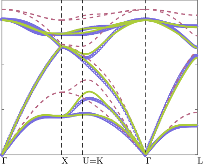

15


10


5


0


FIG. 6. Phonon dispersion relations of silicon from DFT (circles), Tersoff potential (dashed lines), and NEP (solid lines).


further improved, for example, by increasing the size of
the ANN model and/or the cutoff radii. However, this
comes with a trade-off, as it may reduce computational
efficiency. In practice, achieving a balance between accuracy and speed is essential.


_**2.**_ _**Thermal conductivity from EMD**_


After validating the phonon dispersion relations, we
proceed to thermal conductivity calculations using the
various MD methods, as reviewed in Sec. III. All calculations are performed using the `gpumd` executable in

gpumd.

We start with the EMD method, using a sufficiently
large 12 _×_ 12 _×_ 12 cubic supercell with 13 824 atoms.
The `run.in` file for the `gpumd` executable is configured as
follows:

```
potential nep.txt
velocity 300

ensemble npt_ber 300 300 100 0 53.4059 2000
time_step 1
dump_thermo 1000

run 500000

ensemble nve

compute_hac 20 50000 10

run 10000000

```

There are three input blocks. In the first block, we specify
the NEP potential file and set the initial temperature to
300 K. The second block represents an equilibration run
of 500 ps in the _NPT_ ensemble, aiming to reach a target
temperature of 300 K and a target pressure of zero. The
third block corresponds to a production run of 10 ns in


13


the _NV E_ ensemble, with heat current sampled every 20
steps.
We perform 50 independent runs using the inputs
above, each with a different set of initial velocities. The
_κ_ ( _t_ ) [cf. Eq. (26)] results from individual runs (thin
solid lines) and their average (thick solid line) and error
bounds (thick dashed lines) are shown in Fig. 7(a). Taking _t_ = 1 ns as the upper limit of the correlation time,
up to which _κ_ ( _t_ ) converges well, we have _κ ≈_ 102 _±_ 6
Wm _[−]_ [1] K _[−]_ [1] from the EMD method. In this work, all statistical errors are calculated as the standard error of the

mean.


FIG. 7. Thermal conductivity of crystalline silicon at 300
K from three MD-based methods using the herein developed
NEP. (a) Results from 50 independent EMD runs (thin solid
lines), along with their average (thick solid line) and error
bounds (thick dashed lines); (b) Results from 4 independent HNEMD runs (thin solid lines), along with their average (thick solid line) and error bounds (thick dashed lines);
(c) Phonon MFP spectrum calculated using spectral decomposition method; (d) Results from NEMD simulations (red
symbols), matching the _κ_ ( _L_ ) curve from the HNEMD-based
formalism.


_**3.**_ _**Thermal conductivity from HNEMD**_


We then move to the HNEMD method. Since the
HNEMD method has the same finite-size effects as in the
EMD method, we use the same simulation cell as in the
EMD method. The `run.in` file for the `gpumd` executable
reads as follows:

```
potential nep.txt
velocity 300

ensemble npt_ber 300 300 100 0 53.4059 2000

```


```
time_step 1
dump_thermo 1000

run 1000000

ensemble nvt_nhc 300 300 100

compute_hnemd 1000 2e-5 0 0
compute_shc 2 250 0 1000 120
dump_thermo 1000

run 10000000

```

There are also three input blocks, and only the production block differs from the case of EMD. Here, the temperature is controlled using the Nose-Hoover chain thermostat, and an external force in the _x_ direction with
_F_ e = 2 _×_ 10 _[−]_ [5] [ ˚] A _[−]_ [1] is applied. The production run has
10 ns in total.
We perform 4 independent runs using the specified inputs, each with a different set of initial velocities. The
_κ_ ( _t_ ) [cf. Eq. (34)] results from individual runs (thin
solid lines) and their average (thick solid line) and error bounds (thick dashed lines) are shown in Fig. 7(b).
The estimated thermal conductivity is _κ ≈_ 108 _±_ 4
Wm _[−]_ [1] K _[−]_ [1], consistent with the EMD value within statistical error bounds. It is noteworthy that the total production time for the HNEMD simulations (4 _×_ 10 ns)
is considerably smaller than that for the EMD simulations (50 _×_ 10 ns), while the former still gives a smaller
statistical error. This suggests a higher computational
efficiency of the HNEMD over the EMD method, as previously emphasized [54] .
From the HNEMD simulations, we also obtain the
spectral thermal conductivity _κ_ ( _ω_ ) [cf. Eq. (39)]. By
combining this with the spectral conductance _G_ ( _ω_ ) [cf.
Eq. (37)] in a ballistic NEMD simulation (details provided below), we calculate the phonon MFP spectrum

as

_λ_ ( _ω_ ) = _[κ]_ [(] _[ω]_ [)] (45)

_G_ ( _ω_ ) _[,]_


which is a generalization of Eq. (8). The calculated _λ_ ( _ω_ )
is shown in Fig. 7(c). Remarkably, in the low-frequency
limit, _λ_ ( _ω_ ) can go well beyond one micron. With _κ_ ( _ω_ )
and _λ_ ( _ω_ ), one can calculate the spectral apparent thermal conductivity _κ_ ( _ω, L_ ) according to Eq. (10) and obtain the apparent thermal conductivity at _any_ length _L_
using Eq. (11). The results are depicted by the solid line
in Fig. 7(d).


_**4.**_ _**Thermal conductivity from NEMD**_


The third MD method we demonstrate is the NEMD
method, using the fixed boundary setup discussed in
Sec. II C 2. We explore lengths _L_ = 2.7, 5.5, 11.0, 21.9,
43.8, 87.6, 175.3, 350.5 nm, maintaining a consistent 5 _×_ 5
cell in the transverse direction. The heat source and sink
regions span 4.4 nm, which is long enough to ensure fully
thermalized phonons within these regions. The `run.in`
input file for our NEMD simulations reads as follows:


14


```
potential nep.txt
velocity 300

ensemble nvt_ber 300 300 100

time_step 1

fix 0

dump_thermo 100

run 100000

ensemble heat_lan 300 100 10 1 7

fix 0

compute 0 10 100 temperature
compute_shc 2 250 0 1000 120.0 group 0 4

run 2000000

```

Unlike the EMD and HNEMD simulations, the NEMD
simulations involve an extra operation: certain atoms are
frozen. We assign these atoms to the “group” 0 and use
the `fix 0` command to freeze them. In the production
stage, two Langevin thermostats with different temperatures are applied separately to groups 1 and 7, corresponding to the heat source and the heat sink, respectively. The temperature difference between them is set
to 20 K. The heat flux can be obtained from the data
produced by the `compute` keyword, allowing us to calculate the apparent thermal conductivity _κ_ ( _L_ ) according
to Eq. (29). The production stage has a duration of 2
ns, with a well-established steady state achieved within
the first 1 ns. Therefore, we use the second half of the
production time to calculated the aforementioned steadstate properties. For each system length, we perform 2
independent runs, each with a different set of initial velocities. To get the spectral conductance _G_ ( _ω_ ) in the ballistic limit, as used in Eq. (45), we use the data produced
by the `compute_shc` keyword in NEMD simulations with
a short system length of _L_ = 1.6 nm.


As expected, the _κ_ ( _L_ ) values from NEMD simulations
match well with the _κ_ ( _L_ ) curve from the HNEMD-based
formalism [Fig. 7(d)]. However, reaching the diffusive
limit directly through NEMD simulations is computationally demanding. Considering the presence of different
phonon MFPs [Fig. 7(c)] in the system, linear extrapolation to the diffusive limit based on a limited number
of _κ_ ( _L_ ) values from NEMD simulations is often inadequate. This limitation arises because the relation between 1 _/κ_ ( _L_ ) and 1 _/L_ becomes nonlinear in the large- _L_
limit (see Fig. 8). This nonlinearity is a general feature in
realistic materials, as also demonstrated in our toy model

[Fig. 2(d)].


As of now, we have demonstrated the full consistency among the three MD-based methods. Notably, the
HNEMD method stands out as the most computationally efficient. This explains why most works based on
gpumd utilize the HNEMD method, with the other two
methods typically being employed primarily for sanitychecking the results.


4


3


2.5


2


1.5


1

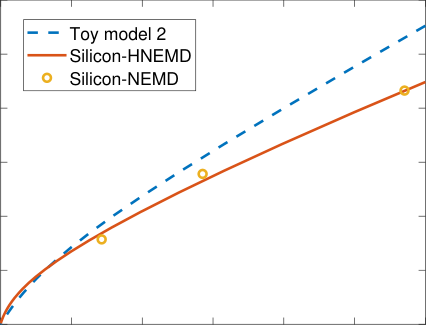
0 2 4 6 8 10 12


FIG. 8. The nonlinearity in the relation between _κ_ ( _L_ =
_∞_ ) _/κ_ ( _L_ ) and 1 _/L_ in the large- _L_ limit, observed in the second
toy model (as discussed in Fig. 2(d)) and the silicon example.


_**5.**_ _**Comparison with experiments**_


After obtaining consistent results from three MD
methods, we are ready to compare the results with experimental data. The thermal conductivity of crystalline
silicon is measured to be about 150 W m _[−]_ [1] K _[−]_ [1], but our
HNEMD simulations predict a value of 108 _±_ 4 W m _[−]_ [1]

K _[−]_ [1], which is only 72% of the experimental value. As a
comparison, the thermal conductivity of crystalline silicon has been calculated [197] to be about 250 _±_ 10 W m _[−]_ [1]

K _[−]_ [1] using a Tersoff potential [195], which is 167% of the
experimental value. Specifically, the Tesoff potential appears to underestimate the phonon anharmonicity, while
the NEP model tends to overestimate it.
According to a recent unpublished study by Wu _et_
_al._ [181], the underestimation of thermal conductivity by
MLPs could potentially be attributed to small but finite force errors compared to the reference data, leading to extra phonon scatterings. Based on the fact that
the force errors form a Gaussian distribution, similar to
the random forces in the Langevin thermostat, a method
for correcting the force-error-induced underestimation
of the thermal conductivity from MLPs is proposed [181] .
This correction involves conducting a series of HNEMD
simulations with the temperature being controlled by a
Langevin thermostat with various relaxation times _τ_ _T_ .
Each component of the random force follows a Gaussian
distribution with zero mean and a variance of

_σ_ lan [2] [=] [2] _τ_ _[k]_ _T_ [B] ∆ _[Tm]_ _t_ _[,]_ (46)


where _m_ is the average atom mass in the system and ∆ _t_
is the integration time step. When the random forces
in the Langevin thermostat and the force errors in the
MLP (with a RMSE of _σ_ mlp at a particular temperature)


15


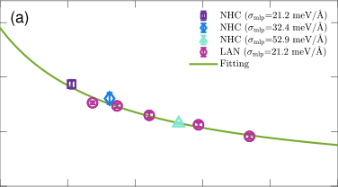

100


50


0
0 20 40 60 80 100


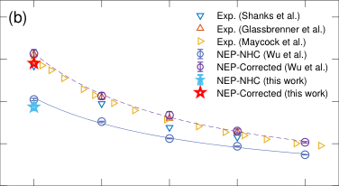


150


100


50


0

300 400 500 600 700

Temperature (K)


FIG. 9. (a) Thermal conductivity of crystalline silicon at
300 K from HNEMD simulations using the herein developed
NEP models as a function of the total force error _σ_ tot . NHC
and LAN represent the Nos´e-Hoover chain and Langevin thermostatting methods, respectively. The data is fitted to obtain
the corrected thermal conductivity of _κ_ ( _σ_ tot = 0) = 145 W
m _[−]_ [1] K _[−]_ [1] . (b) Comparison of simulation results before and after the correction with experimental values [178][,][198][,][199] and previously (uncorrected and corrected) NEP-MD simulations [181] .


are present simultaneously, a new set of force errors is
created, with a larger variance given by


2 2 2
_σ_ tot = _σ_ lan + _σ_ mlp _,_ (47)


according to the properties of Gaussian distribution. After obtaining _κ_ ( _σ_ tot ) at different _σ_ tot, the thermal conductivity with zero total force error _κ_ ( _σ_ tot = 0) can be
obtained from the following relation [181] :


1 1
(48)
_κ_ ( _σ_ tot ) [=] _κ_ ( _σ_ tot = 0) [+] _[ βσ]_ [tot] _[,]_


where _β_ is a fitting parameter.
Based on the correction method, we perform HNEMD
simulations using the Langevin thermostat with the following set of _τ_ _T_ values: 30, 50, 100, 200, and 500 ps.
From these, the _σ_ L values are calculated to be 17.3, 27.4
38.7 54.8, and 70.7 meV/A. At 300 K, the force RMSE [˚]
for our NEP model is tested to be _σ_ mlp = 21.2 meV/A. [˚]
Therefore, the resulting _σ_ tot values are 27.4, 34.6, 44.2,
58.7, and 73.8 meV/A. To ensure consistency with exper- [˚]
imental conditions, we also account for the presence of a
few Si isotopes (92.2% [28] Si, 4.7% [29] Si, and 3.1% [30] Si) in


the calculations. The calculated _κ_ ( _σ_ tot ) with the various
_σ_ tot are shown in Fig. 9(a). By fitting these data, we
obtain a corrected thermal conductivity of _κ_ ( _σ_ tot = 0) =
145 W m _[−]_ [1] K _[−]_ [1], in excellent agreement with the experimental value.
The extrapolation scheme described by Eq. (48) not
only applies to a single NEP model with different levels of
intentionally added random forces through the Langevin
thermostat, but is also valid for different NEP models
with varying accuracy. To demonstrate this, we construct
two extra NEP models with reduced accuracy. Starting
from the default hyperparameters, we construct the first
extra NEP model by reducing the number of neurons in
the hidden layer from 30 to 1, resulting in an increased
force RMSE of 32.4 meV/A. Based on this, we then con- [˚]
struct the second extra NEP model by further reducing
the Chebyshev polynomial basis sizes ( _N_ bas [R] [,] _[ N]_ bas [ A] [) from]
(12 _,_ 12) to (4 _,_ 4), resulting in a further increased force
RMSE of 52.9 meV/A. The thermal conductivity results [˚]
from the three NEP models with different accuracy using
the Nos´e-Hoover chain thermostat also closely follow the
extrapolation curve [Fig. 9(a)], providing further support
for the validity of the extrapolation scheme Eq. (48).
Our results for 300 K before and after the correction are consistent with those reported in the previous work [181], which also uses a NEP model [Fig. 9(b)].
In Fig. 9(b), we also show the results for other
temperatures [181] in comparison to the experimental data.
The corrected results agree well with the experimental
ones across a broad range of temperatures. The slightly
higher values from corrected NEP model predictions are
likely due to the fact that isotope disorder was not considered in the previous calculations [181] .
While we have only demonstrated the application of
the extrapolation (correction) method to HNEMD simulations, it is worth noting that this method is also potentially applicable to EMD simulations. We speculate
that the force errors in MLPs may also play a role in
ALD-based approaches for thermal transport.


**V.** **SUMMARY AND CONCLUSIONS**


In summary, we have provided a comprehensive pedagogical introduction to MD simulations of thermal transport utilizing the NEP MLP as implemented in the
gpumd package.
We began by reviewing fundamental concepts related
to thermal transport in both ballistic and diffusive
regimes, elucidating the explicit expression of the heat
flux in the context of MLPs, and exploring various MDbased methods for thermal transport studies, including
EMD, NEMD, HNEMD, and spectral decomposition.
Following this, we conducted an up-to-date review of
the literature on the application of MLPs in thermal
transport problems through MD simulations.
A detailed review of the NEP approach followed, with
a step-by-step demonstration of the process of developing


16


an accurate and efficient NEP model for crystalline silicon applicable across a range of temperatures. Utilizing
the developed NEP model, we explained the technical details of all MD-based methods for thermal transport discussed in this work. Finally, we compared the simulation
results with experimental data, addressing the common
trend of thermal conductivity underestimation by MLPs
and demonstrating an effective correction method.
By completing this tutorial, readers will be equipped
to construct MLPs and seamlessly integrate them into
highly efficient and predictive MD simulations of heat
transport.


**Data availability:** All the training and test datasets
and the trained NEP models for crystalline silicon are
freely available at `[https://gitlab.com/brucefan1983/](https://gitlab.com/brucefan1983/nep-data)`
`[nep-data](https://gitlab.com/brucefan1983/nep-data)` . The training datasets, trained NEP,
DP, and MTP models for graphene and MD input
files for reproducing Fig. 3 are freely available at
```
https://github.com/hityingph/supporting-info/
```

`[tree/main/Dong_GPUMD_Tutorial_2024](https://github.com/hityingph/supporting-info/tree/main/Dong_GPUMD_Tutorial_2024)` .


**ACKNOWLEDGMENTS**


HD is supported by the Science Foundation from
Education Department of Liaoning Province (No.
JYTMS20231613) and the Doctoral start-up Fund of
Bohai University (No. 0523bs008). PY is supported
by the Israel Academy of Sciences and Humanities &
Council for Higher Education Excellence Fellowship Program for International Postdoctoral Researchers. KX
and TL acknowledge support from the National Key
R&D Project from Ministry of Science and Technology
of China (No. 2022YFA1203100), the Research Grants
Council of Hong Kong (No. AoE/P-701/20), and RGC
GRF (No. 14220022). ZZ acknowledges the European Union’s Horizon 2020 research and innovation programme under the Marie Sk�lodowska-Curie grant agreement No 101034413. SX acknowledges the financial support from the National Natural Science Foundation of
China (Grant No.12174276).


**Appendix A: Details on heat current validation**


To validate the implementation of heat current for
NEP, DP, and MTP [see Fig. 3], we use a common reference dataset to train a model for each of the three MLPs.
We take all the monolayer graphene structures from Ref.
67 and use 3288 structures (99 493 atoms) as our training dataset and 822 structures (25 035 atoms) as our test
dataset, respectively.
For NEP, we set _r_ c [R] [= 6 ˚A,] _[ r]_ c [A] [= 4 ˚A,] _[ N]_ [neu] [= 50,]
_N_ gen = 5 _×_ 10 [5], while keeping other hyperparameters as
the defaults. For DP, the deepmd-kit package (version
2.1.4) [21] is used, with the `se_a` descriptor with a cutoff


radius of 6 [˚] A. The dimensions of the embedding network are set to (25, 50, 100), and the fitting network
dimensions are configured as (240, 240, 240). Initially,
the weighting parameters for energy and forces are set
to 0.02 and 1000, respectively, and are linearly adjusted
to 1 for both during the training process. The training comprises 4 _×_ 10 [6] steps, with a learning rate that is
exponentially decreased from 10 _[−]_ [3] to 10 _[−]_ [8] . For MTP,
the mlip (version 2) package [20] is used. The descriptor
“level” for MTP is set to 18, with a cutoff radius of 6 A. [˚]
Table III presents the performance metrics for the three
MLP models.


TABLE III. Comparison of the energy and force RMSEs
and computational speed for MTP, DP (after model compression), and NEP. The computational speed is assessed by
running MD simulations for 10 [5] steps in the _NV T_ ensemble
for a graphene system containing 24 800 atoms, using gpumd
(NEP) or lammps [32] with version 23 Jun 2022 (MTP and DP).
For GPU-based tests (DP and NEP), a single Nvidia RTX
3090 is used; for CPU-based tests (MTP), 64 AMD EPYC
7H12 cores are used.


Model MTP DP NEP
Energy-train (meV/atom) 2.4 1.4 1.8
Energy-test (meV/atom) 2.2 1.4 1.9
Force-train (meV/A) [˚] 119 75 91
Force-test (meV/A) [˚] 116 78 89
Speed (10 [5] atom-step/s) 3.9 1.8 100


We then conduct NEMD simulations to validate the
implementations of heat current in the three MLPs by
checking the consistency between the accumulated heat
in atoms within the transport region [cf. Eq. (25)] and
that obtained from the thermostats [cf. Eq. (31)]. The
NEMD simulation procedure is similar to that as described in Sec. IV C 4 for silicon. The transport is set
to be along the armchair direction of a graphene sample
with a width of 2.5 nm and a length of 426 nm (excluding the thermostatted regions). The data presented in
Fig. 3 are sampled during the last 1.5 ns of the NEMD
simulations, during which a steady state is achieved.


**REFERENCES**


1 S. Volz, J. Ordonez-Miranda, A. Shchepetov,
M. Prunnila, J. Ahopelto, T. Pezeril, G. Vaudel,
V. Gusev, P. Ruello, E. M. Weig, M. Schubert,
M. Hettich, M. Grossman, T. Dekorsy, F. Alzina, B. Graczykowski, E. Chavez-Angel, J. Sebastian Reparaz, M. R. Wagner, C. M. Sotomayor-Torres,
S. Xiong, S. Neogi, and D. Donadio, “Nanophonon[ics: state of the art and perspectives,” The European](http://dx.doi.org/10.1140/epjb/e2015-60727-7)
[Physical Journal B](http://dx.doi.org/10.1140/epjb/e2015-60727-7) **89**, 15 (2016).
2 N. Li, J. Ren, L. Wang, G. Zhang, P. H¨anggi, and
B. Li, “Colloquium: Phononics: Manipulating heat
[flow with electronic analogs and beyond,” Rev. Mod.](http://dx.doi.org/10.1103/RevModPhys.84.1045)
Phys. **84** [, 1045–1066 (2012).](http://dx.doi.org/10.1103/RevModPhys.84.1045)


17


3 X. Gu, Z. Fan, and H. Bao, “Thermal conductivity
prediction by atomistic simulation methods: Recent
[advances and detailed comparison,” Journal of Ap-](http://dx.doi.org/10.1063/5.0069175)
plied Physics **[130](http://dx.doi.org/10.1063/5.0069175)**, 210902 (2021).
4 L. Isaeva, G. Barbalinardo, D. Donadio, and S. Baroni, “Modeling heat transport in crystals and glasses
[from a unified lattice-dynamical approach,” Nature](http://dx.doi.org/10.1038/s41467-019-11572-4)
[Communications](http://dx.doi.org/10.1038/s41467-019-11572-4) **10**, 3853 (2019).
5 M. Simoncelli, N. Marzari, and F. Mauri, “Unified
theory of thermal transport in crystals and glasses,”
Nature Physics **[15](http://dx.doi.org/10.1038/s41567-019-0520-x)**, 809–813 (2019).
6 M. Simoncelli, N. Marzari, and F. Mauri, “Wigner
[formulation of thermal transport in solids,” Phys. Rev.](http://dx.doi.org/10.1103/PhysRevX.12.041011)
X **12** [, 041011 (2022).](http://dx.doi.org/10.1103/PhysRevX.12.041011)
7 Z.-Y. Ong, “Tutorial: Concepts and numerical techniques for modeling individual phonon transmission at
[interfaces,” Journal of Applied Physics](http://dx.doi.org/10.1063/1.5048234) **124**, 151101
[(2018).](http://dx.doi.org/10.1063/1.5048234)
8 A. J. H. McGaughey, A. Jain, H.-Y. Kim, and B. Fu,
“Phonon properties and thermal conductivity from
first principles, lattice dynamics, and the Boltzmann
[transport equation,” Journal of Applied Physics](http://dx.doi.org/10.1063/1.5064602) **125**,
[011101 (2019).](http://dx.doi.org/10.1063/1.5064602)
9 Z. Liang and M. Hu, “Tutorial: Determination of
thermal boundary resistance by molecular dynamics
[simulations,” Journal of Applied Physics](http://dx.doi.org/10.1063/1.5027519) **123**, 191101
[(2018).](http://dx.doi.org/10.1063/1.5027519)
10 J. Chen, X. Xu, J. Zhou, and B. Li, “Interfacial ther[mal resistance: Past, present, and future,” Reviews of](http://dx.doi.org/10.1103/RevModPhys.94.025002)
[Modern Physics](http://dx.doi.org/10.1103/RevModPhys.94.025002) **94**, 025002 (2022).
11 A. Marcolongo, P. Umari, and S. Baroni, “Microscopic theory and quantum simulation of atomic heat
transport,” Nature Physics **[12](http://dx.doi.org/10.1038/nphys3509)**, 80–84 (2016).
12 C. Carbogno, R. Ramprasad, and M. Scheffler, “Ab
Initio Green-Kubo Approach for the Thermal Conductivity of Solids,” Phys. Rev. Lett. **[118](http://dx.doi.org/10.1103/PhysRevLett.118.175901)**, 175901 (2017).
13 J. Kang and L.-W. Wang, “First-principles green-kubo
[method for thermal conductivity calculations,” Phys.](http://dx.doi.org/10.1103/PhysRevB.96.020302)
Rev. B **96** [, 020302 (2017).](http://dx.doi.org/10.1103/PhysRevB.96.020302)
14 F. Knoop, M. Scheffler, and C. Carbogno, “Ab initio
Green-Kubo simulations of heat transport in solids:
[Method and implementation,” Phys. Rev. B](http://dx.doi.org/10.1103/PhysRevB.107.224304) **107**,
[224304 (2023).](http://dx.doi.org/10.1103/PhysRevB.107.224304)
15 J. Behler and M. Parrinello, “Generalized neuralnetwork representation of high-dimensional potential[energy surfaces,” Physical Review Lett.](http://dx.doi.org/10.1103/PhysRevLett.98.146401) **98**, 146401
[(2007).](http://dx.doi.org/10.1103/PhysRevLett.98.146401)
16 A. P. Bart´ok, M. C. Payne, R. Kondor, and G. Cs´anyi,
“Gaussian approximation potentials: The accuracy
[of quantum mechanics, without the electrons,” Phys.](http://dx.doi.org/10.1103/PhysRevLett.104.136403)
Rev. Lett. **[104](http://dx.doi.org/10.1103/PhysRevLett.104.136403)**, 136403 (2010).
17 M. A. Caro, “Optimizing many-body atomic descriptors for enhanced computational performance of ma[chine learning based interatomic potentials,” Phys.](http://dx.doi.org/10.1103/PhysRevB.100.024112)
Rev. B **100** [, 024112 (2019).](http://dx.doi.org/10.1103/PhysRevB.100.024112)
18 J. Byggm¨astar, K. Nordlund, and F. Djurabekova,
“Simple machine-learned interatomic potentials for
[complex alloys,” Phys. Rev. Mater.](http://dx.doi.org/10.1103/PhysRevMaterials.6.083801) **6**, 083801 (2022).


19 A. Thompson, L. Swiler, C. Trott, S. Foiles, and
G. Tucker, “Spectral neighbor analysis method for automated generation of quantum-accurate interatomic
[potentials,” Journal of Computational Physics](http://dx.doi.org/https://doi.org/10.1016/j.jcp.2014.12.018) **285**,
[316–330 (2015).](http://dx.doi.org/https://doi.org/10.1016/j.jcp.2014.12.018)
20 I. S. Novikov, K. Gubaev, E. V. Podryabinkin, and
A. V. Shapeev, “The mlip package: moment tensor po[tentials with mpi and active learning,” Machine Learn-](http://dx.doi.org/10.1088/2632-2153/abc9fe)
[ing: Science and Technology](http://dx.doi.org/10.1088/2632-2153/abc9fe) **2**, 025002 (2020).
21 H. Wang, L. Zhang, J. Han, and W. E, “Deepmdkit: A deep learning package for many-body potential
[energy representation and molecular dynamics,” Com-](http://dx.doi.org/https://doi.org/10.1016/j.cpc.2018.03.016)
[puter Physics Communications](http://dx.doi.org/https://doi.org/10.1016/j.cpc.2018.03.016) **228**, 178–184 (2018).
22 R. Drautz, “Atomic cluster expansion for accurate and
[transferable interatomic potentials,” Phys. Rev. B](http://dx.doi.org/10.1103/PhysRevB.99.014104) **99**,
[014104 (2019).](http://dx.doi.org/10.1103/PhysRevB.99.014104)
23 Z. Fan, Z. Zeng, C. Zhang, Y. Wang, K. Song,
H. Dong, Y. Chen, and T. Ala-Nissila, “Neuroevolution machine learning potentials: Combining high
accuracy and low cost in atomistic simulations and ap[plication to heat transport,” Physical Review B](http://dx.doi.org/10.1103/PhysRevB.104.104309) **104**,
[104309 (2021).](http://dx.doi.org/10.1103/PhysRevB.104.104309)
24 Z. Fan, “Improving the accuracy of the neuroevolution machine learning potential for multi-component
[systems,” Journal of Physics: Condensed Matter](http://dx.doi.org/10.1088/1361-648X/ac462b) **34**,
[125902 (2022).](http://dx.doi.org/10.1088/1361-648X/ac462b)
25 Z. Fan, Y. Wang, P. Ying, K. Song, J. Wang,
Y. Wang, Z. Zeng, K. Xu, E. Lindgren, J. M. Rahm,
A. J. Gabourie, J. Liu, H. Dong, J. Wu, Y. Chen,
Z. Zhong, J. Sun, P. Erhart, Y. Su, and T. AlaNissila, “GPUMD: A package for constructing accurate machine-learned potentials and performing highly
[efficient atomistic simulations,” The Journal of Chem-](http://dx.doi.org/10.1063/5.0106617)
ical Physics **[157](http://dx.doi.org/10.1063/5.0106617)**, 114801 (2022).
26 Z. Fan, W. Chen, V. Vierimaa, and A. Harju, “Efficient molecular dynamics simulations with many-body
[potentials on graphics processing units,” Computer](http://dx.doi.org/https://doi.org/10.1016/j.cpc.2017.05.003)
[Physics Communications](http://dx.doi.org/https://doi.org/10.1016/j.cpc.2017.05.003) **218**, 10–16 (2017).
27 K. Song, R. Zhao, J. Liu, Y. Wang, E. Lindgren,
Y. Wang, S. Chen, K. Xu, T. Liang, P. Ying, N. Xu,
Z. Zhao, J. Shi, J. Wang, S. Lyu, Z. Zeng, S. Liang,
H. Dong, L. Sun, Y. Chen, Z. Zhang, W. Guo,
P. Qian, J. Sun, P. Erhart, T. Ala-Nissila, Y. Su,
and Z. Fan, “General-purpose machine-learned potential for 16 elemental metals and their alloys,” (2023),
[arXiv:2311.04732 [cond-mat.mtrl-sci].](http://arxiv.org/abs/2311.04732)
28 J. F. Nye, _Physical Properties of Crystals: Their Rep-_
_resentation by Tensors and Matrices_ (Oxford University Press, 1985).
29 S. Datta, _Electonic transport in mesoscopic systems_
(Cambridge University Press, 1995).
30 D. A. McQuarrie, _Statistical Mechanics_ (Univ Science
Books, 2000).
31 Z. Fan, L. F. C. Pereira, H.-Q. Wang, J.-C. Zheng,
D. Donadio, and A. Harju, “Force and heat current
formulas for many-body potentials in molecular dynamics simulations with applications to thermal con[ductivity calculations,” Physical Review B](http://dx.doi.org/10.1103/PhysRevB.92.094301) **92**, 094301


18


[(2015).](http://dx.doi.org/10.1103/PhysRevB.92.094301)
32 A. P. Thompson, H. M. Aktulga, R. Berger, D. S.
Bolintineanu, W. M. Brown, P. S. Crozier, P. J. in
’t Veld, A. Kohlmeyer, S. G. Moore, T. D. Nguyen,
R. Shan, M. J. Stevens, J. Tranchida, C. Trott, and
S. J. Plimpton, “LAMMPS - a flexible simulation tool
for particle-based materials modeling at the atomic,
[meso, and continuum scales,” Computer Physics Com-](http://dx.doi.org/https://doi.org/10.1016/j.cpc.2021.108171)
munications **[271](http://dx.doi.org/https://doi.org/10.1016/j.cpc.2021.108171)**, 108171 (2022).
33 P. Boone, H. Babaei, and C. E. Wilmer, “Heat flux
for many-body interactions: Corrections to lammps,”
[Journal of Chemical Theory and Computation](http://dx.doi.org/10.1021/acs.jctc.9b00252) **15**,
[5579–5587 (2019).](http://dx.doi.org/10.1021/acs.jctc.9b00252)
34 D. Surblys, H. Matsubara, G. Kikugawa, and
T. Ohara, “Application of atomic stress to compute heat flux via molecular dynamics for systems
[with many-body interactions,” Physical Review E](http://dx.doi.org/10.1103/PhysRevE.99.051301) **99**,
[051301 (2019).](http://dx.doi.org/10.1103/PhysRevE.99.051301)
35 D. Tisi, L. Zhang, R. Bertossa, H. Wang, R. Car,
and S. Baroni, “Heat transport in liquid water from
first-principles and deep neural network simulations,”
Physical Review B **[104](http://dx.doi.org/10.1103/PhysRevB.104.224202)**, 224202 (2021).
36 N. Artrith and A. Urban, “An implementation of artificial neural-network potentials for atomistic materials
[simulations: Performance for TiO2,” Computational](http://dx.doi.org/https://doi.org/10.1016/j.commatsci.2015.11.047)
Materials Science **[114](http://dx.doi.org/https://doi.org/10.1016/j.commatsci.2015.11.047)**, 135–150 (2016).
37 K. Shimamura, Y. Takeshita, S. Fukushima, A. Koura,
and F. Shimojo, “Computational and training requirements for interatomic potential based on artificial neural network for estimating low thermal conductiv[ity of silver chalcogenides,” The Journal of Chemical](http://dx.doi.org/10.1063/5.0027058)
Physics **153** [, 234301 (2020).](http://dx.doi.org/10.1063/5.0027058)
38 D. Tisi, F. Grasselli, L. Gigli, and M. Ceriotti,
“Thermal transport of Li 3 PS 4 solid electrolytes with
[ab initio accuracy,” (2024), arXiv:2401.12936 [cond-](http://arxiv.org/abs/2401.12936)
[mat.mtrl-sci].](http://arxiv.org/abs/2401.12936)
39 A. P. Bart´ok, R. Kondor, and G. Cs´anyi, “On rep[resenting chemical environments,” Phys. Rev. B](http://dx.doi.org/10.1103/PhysRevB.87.184115) **87**,
[184115 (2013).](http://dx.doi.org/10.1103/PhysRevB.87.184115)
40 “
mlip,” Gitlab repository `[https://gitlab.com/](https://gitlab.com/ashapeev/mlip-2)`
`[ashapeev/mlip-2](https://gitlab.com/ashapeev/mlip-2)` (2024), accessed: 2024-01-18.
41 M. F. Langer, F. Knoop, C. Carbogno, M. Scheffler, and M. Rupp, “Heat flux for semilocal machinelearning potentials,” Phys. Rev. B **[108](http://dx.doi.org/10.1103/PhysRevB.108.L100302)**, L100302
[(2023).](http://dx.doi.org/10.1103/PhysRevB.108.L100302)
42 M. F. Langer, J. T. Frank, and F. Knoop, “Stress and
[heat flux via automatic differentiation,” The Journal](http://dx.doi.org/10.1063/5.0155760)
[of Chemical Physics](http://dx.doi.org/10.1063/5.0155760) **159**, 174105 (2023).
43 B. C. Daly and H. J. Maris, “Calculation of the thermal conductivity of superlattices by molecular dynam[ics simulation,” Physica B: Condensed Matter](http://dx.doi.org/https://doi.org/10.1016/S0921-4526(02)00476-3) **316-**
**317** [, 247–249 (2002).](http://dx.doi.org/https://doi.org/10.1016/S0921-4526(02)00476-3)
44 B. C. Daly, H. J. Maris, K. Imamura, and S. Tamura,
“Molecular dynamics calculation of the thermal con[ductivity of superlattices,” Phys. Rev. B](http://dx.doi.org/10.1103/PhysRevB.66.024301) **66**, 024301
[(2002).](http://dx.doi.org/10.1103/PhysRevB.66.024301)
45 E. Lampin, P. L. Palla, P.-A. Francioso, and F. Cleri,
“Thermal conductivity from approach-to-equilibrium


[molecular dynamics,” Journal of Applied Physics](http://dx.doi.org/10.1063/1.4815945) **114**,
[033525 (2013).](http://dx.doi.org/10.1063/1.4815945)
46 R. Kubo, “Statistical-mechanical theory of irreversible
processes. I. General theory and simple applications to
[magnetic and conduction problems,” Journal of the](http://dx.doi.org/10.1143/JPSJ.12.570)
[Physical Society of Japan](http://dx.doi.org/10.1143/JPSJ.12.570) **12**, 570–586 (1957).
47 A. J. C. Ladd, B. Moran, and W. G. Hoover, “Lattice thermal conductivity: A comparison of molecular
[dynamics and anharmonic lattice dynamics,” Physical](http://dx.doi.org/10.1103/PhysRevB.34.5058)
Review B **34** [, 5058–5064 (1986).](http://dx.doi.org/10.1103/PhysRevB.34.5058)
48 S. Chen, Y. Zhang, J. Wang, and H. Zhao, “Finite-size
[effects on current correlation functions,” Phys. Rev. E](http://dx.doi.org/10.1103/PhysRevE.89.022111)
**89** [, 022111 (2014).](http://dx.doi.org/10.1103/PhysRevE.89.022111)
49 Z. Wang and X. Ruan, “On the domain size effect of
thermal conductivities from equilibrium and nonequi[librium molecular dynamics simulations,” Journal of](http://dx.doi.org/10.1063/1.4974884)
Applied Physics **[121](http://dx.doi.org/10.1063/1.4974884)**, 044301 (2017).
50 K. Xu, Z. Fan, J. Zhang, N. Wei, and T. Ala-Nissila,
“Thermal transport properties of single-layer black
phosphorus from extensive molecular dynamics sim[ulations,” Modelling and Simulation in Materials Sci-](http://dx.doi.org/10.1088/1361-651X/aae180)
[ence and Engineering](http://dx.doi.org/10.1088/1361-651X/aae180) **26**, 085001 (2018).
51 S. Nos´e, “A unified formulation of the constant tem[perature molecular dynamics methods,” The Journal](http://dx.doi.org/10.1063/1.447334)
[of Chemical Physics](http://dx.doi.org/10.1063/1.447334) **81**, 511–519 (1984).
52 W. G. Hoover, “Canonical dynamics: Equilibrium
[phase-space distributions,” Physical Review A](http://dx.doi.org/10.1103/PhysRevA.31.1695) **31**,
[1695–1697 (1985).](http://dx.doi.org/10.1103/PhysRevA.31.1695)
53 Z. Li, S. Xiong, C. Sievers, Y. Hu, Z. Fan, N. Wei,
H. Bao, S. Chen, D. Donadio, and T. Ala-Nissila, “Influence of thermostatting on nonequilibrium molecular dynamics simulations of heat conduction in solids,”
[The Journal of Chemical Physics](http://dx.doi.org/10.1063/1.5132543) **151**, 234105 (2019).
54 Z. Fan, H. Dong, A. Harju, and T. Ala-Nissila,
“Homogeneous nonequilibrium molecular dynamics
method for heat transport and spectral decomposi[tion with many-body potentials,” Physical Review B](http://dx.doi.org/10.1103/PhysRevB.99.064308)
**99** [, 064308 (2019).](http://dx.doi.org/10.1103/PhysRevB.99.064308)
55 Z. Fan, L. F. C. Pereira, P. Hirvonen, M. M. Ervasti, K. R. Elder, D. Donadio, T. Ala-Nissila, and
A. Harju, “Thermal conductivity decomposition in
two-dimensional materials: Application to graphene,”
Physical Review B **[95](http://dx.doi.org/10.1103/PhysRevB.95.144309)**, 144309 (2017).
56 K. S¨a¨askilahti, J. Oksanen, J. Tulkki, and S. Volz,
“Role of anharmonic phonon scattering in the spectrally decomposed thermal conductance at planar interfaces,” Physical Review B **[90](http://dx.doi.org/10.1103/PhysRevB.90.134312)**, 134312 (2014).
57 K. S¨a¨askilahti, J. Oksanen, S. Volz, and J. Tulkki,
“Frequency-dependent phonon mean free path in carbon nanotubes from nonequilibrium molecular dynamics,” Physical Review B **[91](http://dx.doi.org/10.1103/PhysRevB.91.115426)**, 115426 (2015).
58 W. Lv and A. Henry, “Direct calculation of modal
contributions to thermal conductivity via Green-Kubo
[modal analysis,” New Journal of Physics](http://dx.doi.org/10.1088/1367-2630/18/1/013028) **18**, 013028
[(2016).](http://dx.doi.org/10.1088/1367-2630/18/1/013028)
59 A. J. Gabourie, Z. Fan, T. Ala-Nissila, and E. Pop,
“Spectral decomposition of thermal conductivity:
Comparing velocity decomposition methods in homo

19


[geneous molecular dynamics simulations,” Phys. Rev.](http://dx.doi.org/10.1103/PhysRevB.103.205421)
B **103** [, 205421 (2021).](http://dx.doi.org/10.1103/PhysRevB.103.205421)
60 R. Jinnouchi, J. Lahnsteiner, F. Karsai, G. Kresse,
and M. Bokdam, “Phase transitions of hybrid perovskites simulated by machine-learning force fields
[trained on the fly with bayesian inference,” Phys. Rev.](http://dx.doi.org/10.1103/PhysRevLett.122.225701)
Lett. **122** [, 225701 (2019).](http://dx.doi.org/10.1103/PhysRevLett.122.225701)
61 K. Sch¨utt, P.-J. Kindermans, H. E. Sauceda Felix, S. Chmiela, A. Tkatchenko, and K.-R. M¨uller,
“SchNet: A continuous-filter convolutional neural network for modeling quantum interactions,” in _[Advances](https://proceedings.neurips.cc/paper_files/paper/2017/file/303ed4c69846ab36c2904d3ba8573050-Paper.pdf)_
_[in Neural Information Processing Systems](https://proceedings.neurips.cc/paper_files/paper/2017/file/303ed4c69846ab36c2904d3ba8573050-Paper.pdf)_, Vol. 30,
edited by I. Guyon, U. V. Luxburg, S. Bengio, H. Wallach, R. Fergus, S. Vishwanathan, and R. Garnett
(Curran Associates, Inc., 2017).
62 T. Frank, O. Unke, and K.-R. M¨uller, “So3krates:
Equivariant attention for interactions on arbitrary
length-scales in molecular systems,” in _[Advances](https://proceedings.neurips.cc/paper_files/paper/2022/file/bcf4ca90a8d405201d29dd47d75ac896-Paper-Conference.pdf)_
_[in Neural Information Processing Systems](https://proceedings.neurips.cc/paper_files/paper/2022/file/bcf4ca90a8d405201d29dd47d75ac896-Paper-Conference.pdf)_, Vol. 35,
edited by S. Koyejo, S. Mohamed, A. Agarwal, D. Belgrave, K. Cho, and A. Oh (Curran Associates, Inc.,
2022) pp. 29400–29413.
63 M. Wen, Y. Afshar, R. S. Elliott, and E. B. Tadmor,
“KLIFF: A framework to develop physics-based and
[machine learning interatomic potentials,” Computer](http://dx.doi.org/10.1016/j.cpc.2021.108218)
[Physics Communications](http://dx.doi.org/10.1016/j.cpc.2021.108218) **272**, 108218 (2022).
64 G. C. Sosso, D. Donadio, S. Caravati, J. Behler, and
M. Bernasconi, “Thermal transport in phase-change
[materials from atomistic simulations,” Phys. Rev. B](http://dx.doi.org/10.1103/PhysRevB.86.104301)
**86** [, 104301 (2012).](http://dx.doi.org/10.1103/PhysRevB.86.104301)
65 D. Campi, D. Donadio, G. C. Sosso, J. Behler,
and M. Bernasconi, “Electron-phonon interaction and
thermal boundary resistance at the crystal-amorphous
[interface of the phase change compound GeTe,” Jour-](http://dx.doi.org/10.1063/1.4904910)
[nal of Applied Physics](http://dx.doi.org/10.1063/1.4904910) **117**, 015304 (2015).
66 E. Bosoni, D. Campi, D. Donadio, G. C. Sosso,
J. Behler, and M. Bernasconi, “Atomistic simulations
[of thermal conductivity in GeTe nanowires,” Journal](http://dx.doi.org/10.1088/1361-6463/ab5478)
[of Physics D: Applied Physics](http://dx.doi.org/10.1088/1361-6463/ab5478) **53**, 054001 (2019).
67 M. Wen and E. B. Tadmor, “Hybrid neural network
[potential for multilayer graphene,” Physical Review B](http://dx.doi.org/10.1103/PhysRevB.100.195419)
**100** [, 195419 (2019).](http://dx.doi.org/10.1103/PhysRevB.100.195419)
68 B. Cheng and D. Frenkel, “Computing the heat con[ductivity of fluids from density fluctuations,” Phys.](http://dx.doi.org/10.1103/PhysRevLett.125.130602)
Rev. Lett. **[125](http://dx.doi.org/10.1103/PhysRevLett.125.130602)**, 130602 (2020).
69 C. Mangold, S. Chen, G. Barbalinardo, J. Behler,
P. Pochet, K. Termentzidis, Y. Han, L. Chaput,
D. Lacroix, and D. Donadio, “Transferability of
neural network potentials for varying stoichiometry:
Phonons and thermal conductivity of Mn _x_ Ge _y_ com[pounds,” Journal of Applied Physics](http://dx.doi.org/10.1063/5.0009550) **127**, 244901
[(2020).](http://dx.doi.org/10.1063/5.0009550)
70 L. Han, X. Chen, Q. Wang, Y. Chen, M. Xu, L. Wu,
C. Chen, P. Lu, and P. Guan, “Neural network potential for studying the thermal conductivity of Sn,”
[Computational Materials Science](http://dx.doi.org/https://doi.org/10.1016/j.commatsci.2021.110829) **200**, 110829 (2021).
71 K. Shimamura, Y. Takeshita, S. Fukushima, A. Koura,
and F. Shimojo, “Estimating thermal conductivity


of _α_ -Ag 2 Se using ANN potential with Chebyshev
[descriptor,” Chemical Physics Letters](http://dx.doi.org/https://doi.org/10.1016/j.cplett.2021.138748) **778**, 138748
[(2021).](http://dx.doi.org/https://doi.org/10.1016/j.cplett.2021.138748)
72 Y. Takeshita, K. Shimamura, S. Fukushima, A. Koura,
and F. Shimojo, “Thermal conductivity calculation
based on Green-Kubo formula using ANN potential
for _β_ -Ag 2 [Se,” Journal of Physics and Chemistry of](http://dx.doi.org/https://doi.org/10.1016/j.jpcs.2022.110580)
Solids **163** [, 110580 (2022).](http://dx.doi.org/https://doi.org/10.1016/j.jpcs.2022.110580)
73 K. Shimamura, A. Koura, and F. Shimojo, “Construction of machine-learning interatomic potential under
heat flux regularization and its application to power
[spectrum analysis for silver chalcogenides,” Computer](http://dx.doi.org/https://doi.org/10.1016/j.cpc.2023.108920)
[Physics Communications](http://dx.doi.org/https://doi.org/10.1016/j.cpc.2023.108920) **294**, 108920 (2024).
74 X. Qian, S. Peng, X. Li, Y. Wei, and R. Yang, “Thermal conductivity modeling using machine learning potentials: application to crystalline and amorphous sil[icon,” Materials Today Physics](http://dx.doi.org/https://doi.org/10.1016/j.mtphys.2019.100140) **10**, 100140 (2019).
75 C. Zhang and Q. Sun, “Gaussian approximation potential for studying the thermal conductivity of sil[icene,” Journal of Applied Physics](http://dx.doi.org/10.1063/1.5119281) **126**, 105103 (2019).
76 Z. Zeng, C. Zhang, Y. Xia, Z. Fan, C. Wolverton, and
Y. Chen, “Nonperturbative phonon scatterings and
the two-channel thermal transport in Tl 3 VSe 4 [,” Phys-](http://dx.doi.org/10.1103/PhysRevB.103.224307)
ical Review B **[103](http://dx.doi.org/10.1103/PhysRevB.103.224307)**, 224307 (2021).
77 X. Gu and C. Zhao, “Thermal conductivity of singlelayer MoS 2(1 _−x_ ) Se 2 _x_ alloys from molecular dynamics simulations with a machine-learning-based inter[atomic potential,” Computational Materials Science](https://www.sciencedirect.com/science/article/abs/pii/S0927025619302356)
**165** [, 74–81 (2019).](https://www.sciencedirect.com/science/article/abs/pii/S0927025619302356)
78 P. Korotaev, I. Novoselov, A. Yanilkin, and
A. Shapeev, “Accessing thermal conductivity of complex compounds by machine learning interatomic potentials,” Physical Review B **[100](http://dx.doi.org/10.1103/PhysRevB.100.144308)**, 144308 (2019).
79 H. Liu, X. Qian, H. Bao, C. Y. Zhao, and X. Gu,
“High-temperature phonon transport properties of
SnSe from machine-learning interatomic potential,”
Journal of Physics: [Condensed Matter](http://dx.doi.org/10.1088/1361-648X/ac13fd) **33**, 405401
[(2021).](http://dx.doi.org/10.1088/1361-648X/ac13fd)
80 H. Yang, Y. Zhu, E. Dong, Y. Wu, J. Yang, and
W. Zhang, “Dual adaptive sampling and machine
learning interatomic potentials for modeling materi[als with chemical bond hierarchy,” Phys. Rev. B](http://dx.doi.org/10.1103/PhysRevB.104.094310) **104**,
[094310 (2021).](http://dx.doi.org/10.1103/PhysRevB.104.094310)
81 Z. Zeng, C. Zhang, H. Yu, W. Li, Y. Pei, and Y. Chen,
“Ultralow and glass-like lattice thermal conductivity
in crystalline BaAg 2 Te 2 : Strong fourth-order anhar[monicity and crucial diffusive thermal transport,” Ma-](http://dx.doi.org/https://doi.org/10.1016/j.mtphys.2021.100487)
[terials Today Physics](http://dx.doi.org/https://doi.org/10.1016/j.mtphys.2021.100487) **21**, 100487 (2021).
82 S. Attarian, D. Morgan, and I. Szlufarska, “Thermophysical properties of flibe using moment tensor po[tentials,” Journal of Molecular Liquids](http://dx.doi.org/10.1016/j.molliq.2022.120803) **368**, 120803
[(2022).](http://dx.doi.org/10.1016/j.molliq.2022.120803)
83 N. Ouyang, C. Wang, and Y. Chen, “Temperatureand pressure-dependent phonon transport properties
of sns across phase transition from machine-learning
[interatomic potential,” International Journal of Heat](http://dx.doi.org/https://doi.org/10.1016/j.ijheatmasstransfer.2022.122859)
[and Mass Transfer](http://dx.doi.org/https://doi.org/10.1016/j.ijheatmasstransfer.2022.122859) **192**, 122859 (2022).
84 Y. Ouyang, C. Yu, J. He, P. Jiang, W. Ren, and


20


J. Chen, “Accurate description of high-order phonon
anharmonicity and lattice thermal conductivity from
molecular dynamics simulations with machine learning potential,” Physical Review B **[105](http://dx.doi.org/10.1103/PhysRevB.105.115202)**, 115202 (2022).
85 B. Mortazavi and X. Zhuang, “Ultrahigh strength
and negative thermal expansion and low thermal
conductivity in graphyne nanosheets confirmed by
[machine-learning interatomic potentials,” FlatChem](http://dx.doi.org/https://doi.org/10.1016/j.flatc.2022.100446)
**36** [, 100446 (2022).](http://dx.doi.org/https://doi.org/10.1016/j.flatc.2022.100446)
86 B. Mortazavi, F. Shojaei, M. Yagmurcukardes, A. V.
Shapeev, and X. Zhuang, “Anisotropic and outstanding mechanical, thermal conduction, optical, and
piezoelectric responses in a novel semiconducting bcn
monolayer confirmed by first-principles and machine
learning,” Carbon **200** [, 500–509 (2022).](http://dx.doi.org/https://doi.org/10.1016/j.carbon.2022.08.077)
87 B. Mortazavi and X. Zhuang, “Low and anisotropic
tensile strength and thermal conductivity in the
single-layer fullerene network predicted by machinelearning interatomic potentials,” Coatings **[12](https://www.mdpi.com/2079-6412/12/8/1171)** (2022).
88 J. Sun, M. Hu, C. Zhang, L. Bai, C. Zhang, and
Q. Wang, “Ultralow Thermal Conductivity of Layered
Bi 2 O 2 [Se Induced by Twisting,” Advanced Functional](http://dx.doi.org/https://doi.org/10.1002/adfm.202209000)
Materials **32** [, 2209000 (2022).](http://dx.doi.org/https://doi.org/10.1002/adfm.202209000)
89 B. Mortazavi, “Structural, electronic, thermal and
mechanical properties of C60-based fullerene twodimensional networks explored by first-principles and
machine learning,” Carbon **213** [, 118293 (2023).](http://dx.doi.org/https://doi.org/10.1016/j.carbon.2023.118293)
90 B. Mortazavi, F. Shojaei, and X. Zhuang, “A novel
two-dimensional C36 fullerene network; an isotropic,
auxetic semiconductor with low thermal conductivity
[and remarkable stiffness,” Materials Today Nano](http://dx.doi.org/https://doi.org/10.1016/j.mtnano.2022.100280) **21**,
[100280 (2023).](http://dx.doi.org/https://doi.org/10.1016/j.mtnano.2022.100280)
91 B. Mortazavi, Y. R´emond, H. Fang, T. Rabczuk, and
X. Zhuang, “Hexagonal boron-carbon fullerene heterostructures; stable two-dimensional semiconductors
with remarkable stiffness, low thermal conductivity
[and flat bands,” Materials Today Communications](http://dx.doi.org/10.1016/j.mtcomm.2023.106856) **36**,
[106856 (2023).](http://dx.doi.org/10.1016/j.mtcomm.2023.106856)
92 Q. Wang, Z. Zeng, P. Zhao, C. Chen, N. Ouyang,
J. Mao, and Y. Chen, “B-site columnar-ordered
halide double perovskites: Breaking octahedra motions induces strong lattice anharmonicity and ther[mal anisotropy,” Chemistry of Materials](http://dx.doi.org/10.1021/acs.chemmater.2c03221) **35**, 1633–
[1639 (2023).](http://dx.doi.org/10.1021/acs.chemmater.2c03221)
93 Y. Zhu, E. Dong, H. Yang, L. Xi, J. Yang, and
W. Zhang, “Atomic potential energy uncertainty in
machine-learning interatomic potentials and thermal
[transport in solids with atomic diffusion,” Phys. Rev.](http://dx.doi.org/10.1103/PhysRevB.108.014108)
B **108** [, 014108 (2023).](http://dx.doi.org/10.1103/PhysRevB.108.014108)
94 C.-M. Chang, “Exploring thermal properties of PbSnTeSe and PbSnTeS high entropy alloys with
[machine-learned potentials,” Modelling and Simula-](http://dx.doi.org/10.1088/1361-651X/ad2540)
[tion in Materials Science and Engineering](http://dx.doi.org/10.1088/1361-651X/ad2540) **32**, 035008
[(2024).](http://dx.doi.org/10.1088/1361-651X/ad2540)
95 S. Wieser and E. Zojer, “Machine learned force-fields
for an ab-initio quality description of metal-organic
[frameworks,” npj Computational Materials](http://dx.doi.org/10.1038/s41524-024-01205-w) **10**, 18
[(2024).](http://dx.doi.org/10.1038/s41524-024-01205-w)


96 F.-Z. Dai, B. Wen, Y. Sun, H. Xiang, and
Y. Zhou, “Theoretical prediction on thermal and mechanical properties of high entropy
(Zr 0 _._ 2 Hf 0 _._ 2 Ti 0 _._ 2 Nb 0 _._ 2 Ta 0 _._ 2 )C by deep learning poten[tial,” Journal of Materials Science & Technology](http://dx.doi.org/10.1016/j.jmst.2020.01.005) **43**,
[168–174 (2020).](http://dx.doi.org/10.1016/j.jmst.2020.01.005)
97 R. Li, Z. Liu, A. Rohskopf, K. Gordiz, A. Henry,
E. Lee, and T. Luo, “A deep neural network interatomic potential for studying thermal conductivity of _β_ -Ga 2 O 3 [,” Applied Physics Letters](http://dx.doi.org/10.1063/5.0025051) **117**, 152102
[(2020).](http://dx.doi.org/10.1063/5.0025051)
98 R. Li, E. Lee, and T. Luo, “A unified deep neural network potential capable of predicting thermal conduc[tivity of silicon in different phases,” Materials Today](http://dx.doi.org/https://doi.org/10.1016/j.mtphys.2020.100181)
Physics **12** [, 100181 (2020).](http://dx.doi.org/https://doi.org/10.1016/j.mtphys.2020.100181)
99 G. Pan, P. Chen, H. Yan, and Y. Lu, “A DFT accurate machine learning description of molten ZnCl 2 and
its mixtures: 1. Potential development and properties
prediction of molten ZnCl 2 [,” Computational Materi-](http://dx.doi.org/10.1016/j.commatsci.2020.109955)
als Science **[185](http://dx.doi.org/10.1016/j.commatsci.2020.109955)**, 109955 (2020).
100 M. Bu, W. Liang, G. Lu, and J. Yu, “Local structure elucidation and properties prediction on kcl–cacl2
molten salt: a deep potential molecular dynamics
[study,” Solar Energy Materials and Solar Cells](http://dx.doi.org/10.1016/j.solmat.2021.111346) **232**,
[111346 (2021).](http://dx.doi.org/10.1016/j.solmat.2021.111346)
101 F.-Z. Dai, Y. Sun, B. Wen, H. Xiang, and Y. Zhou,
“Temperature dependent thermal and elastic properties of high entropy (Ti 0 _._ 2 Zr 0 _._ 2 Hf 0 _._ 2 Nb 0 _._ 2 Ta 0 _._ 2 )B 2 :
molecular dynamics simulation by deep learning po[tential,” Journal of Materials Science & Technology](http://dx.doi.org/10.1016/j.jmst.2020.07.014)
**72** [, 8–15 (2021).](http://dx.doi.org/10.1016/j.jmst.2020.07.014)
102 J. Deng and L. Stixrude, “Thermal conductivity of silicate liquid determined by machine learn[ing potentials,” Geophysical Research Letters](http://dx.doi.org/10.1029/2021GL093806) **48**,
[e2021GL093806 (2021).](http://dx.doi.org/10.1029/2021GL093806)
103 Q. Liu, J. Li, and M. Chen, “Thermal transport by
electrons and ions in warm dense aluminum: A combined density functional theory and deep potential
[study,” Matter and Radiation at Extremes](http://dx.doi.org/10.1063/5.0030123) **6**, 026902
[(2021).](http://dx.doi.org/10.1063/5.0030123)
104 M. K. Gupta, J. Ding, D. Bansal, D. L. Abernathy,
G. Ehlers, N. C. Osti, W. G. Zeier, and O. Delaire,
“Strongly anharmonic phonons and their role in superionic diffusion and ultralow thermal conductivity of
Cu 7 PSe 6 [,” Advanced Energy Materials](http://dx.doi.org/10.1002/aenm.202200596) **12**, 2200596
[(2022).](http://dx.doi.org/10.1002/aenm.202200596)
105 X. Huang, Y. Shen, and Q. An, “Nanotwinning
induced decreased lattice thermal conductivity of
high temperature thermoelectric boron subphosphide
(B 12 P 2 ) from deep learning potential simulations,”
Energy and AI **[8](http://dx.doi.org/10.1016/j.egyai.2022.100135)**, 100135 (2022).
106 W. Liang, G. Lu, and J. Yu, “Machine Learning Accelerates Molten Salt Simulations: Thermal Conductivity of MgCl 2 _−_ [NaCl Eutectic,” Advanced Theory](http://dx.doi.org/10.1002/adts.202200206)
[and Simulations](http://dx.doi.org/10.1002/adts.202200206) **5**, 2200206 (2022).
107 P. Pegolo, S. Baroni, and F. Grasselli, “Temperatureand vacancy-concentration-dependence of heat transport in Li 3 ClO from multi-method numerical simula

21


[tions,” npj Computational Materials](http://dx.doi.org/10.1038/s41524-021-00693-4) **8**, 24 (2022).
108 D. Wang, Z. Wu, and X. Deng, “Thermal conductivity
of hydrous wadsleyite determined by non-equilibrium
[molecular dynamics based on machine learning,” Geo-](http://dx.doi.org/10.1029/2022GL100337)
[physical Research Letters](http://dx.doi.org/10.1029/2022GL100337) **49**, e2022GL100337 (2022).
109 F. Yang, Q. Zeng, B. Chen, D. Kang, S. Zhang, J. Wu,
X. Yu, and J. Dai, “Lattice Thermal Conductivity of MgSiO 3 Perovskite and Post-Perovskite under
Lower Mantle Conditions Calculated by Deep Poten[tial Molecular Dynamics,” Chinese Physics Letters](http://dx.doi.org/10.1088/0256-307X/39/11/116301) **39**,
[116301 (2022).](http://dx.doi.org/10.1088/0256-307X/39/11/116301)
110 P. Zhang, Z. Zhang, Y. Liu, Z. Wang, Z. Lu, and
R. Xiong, “Phonon thermal transport in Bi 2 Te 3 from a
[deep-neural-network interatomic potential,” Physical](http://dx.doi.org/10.1103/PhysRevApplied.18.054022)
Review Applied **[18](http://dx.doi.org/10.1103/PhysRevApplied.18.054022)**, 054022 (2022).
111 N. Bhatt, P. Karna, S. Thakur, and A. Giri, “Transition from electron-dominated to phonon-driven thermal transport in tungsten under extreme pressures,”
[Physical Review Materials](http://dx.doi.org/10.1103/PhysRevMaterials.7.115001) **7**, 115001 (2023).
112 W. Dong, H. Tian, W. Zhang, J.-J. Zhou, and
X. Pang, “Development of NaCl _−_ MgCl 2 _−_ CaCl 2
ternary salt for high-temperature thermal energy stor[age using machine learning,” ACS Applied Materials](http://dx.doi.org/10.1021/acsami.3c13412)
& Interfaces **[16](http://dx.doi.org/10.1021/acsami.3c13412)**, 530–539 (2024).
113 S. Fu, D. Liu, Y. Deng, M. Li, H. Zhao, J. Guo,
J. Zhou, P. Zhang, C. Wang, H. Yu, _et al._, “Mediumentropy ceramic aerogels for robust thermal sealing,”
[Journal of Materials Chemistry A](http://dx.doi.org/10.1039/D2TA08264K) **11**, 742–752 (2023).
114 M. K. Gupta, S. Kumar, R. Mittal, S. K. Mishra,
S. Rols, O. Delaire, A. Thamizhavel, P. Sastry, and
S. L. Chaplot, “Distinct anharmonic characteristics of
phonon-driven lattice thermal conductivity and thermal expansion in bulk MoSe 2 and WSe 2 [,” Journal of](http://dx.doi.org/10.1039/D3TA03830K)
[Materials Chemistry A](http://dx.doi.org/10.1039/D3TA03830K) **11**, 21864–21873 (2023).
115 J. Han, Q. Zeng, K. Chen, X. Yu, and J. Dai, “Lattice
thermal conductivity of monolayer InSe calculated by
[machine learning potential,” Nanomaterials](http://dx.doi.org/10.3390/nano13091576) **13**, 1576
[(2023).](http://dx.doi.org/10.3390/nano13091576)
116 X. Huang, K. Luo, Y. Shen, Y. Yue, and Q. An,
“Grain boundaries induce significant decrease in lat[tice thermal conductivity of CdTe,” Energy and AI](http://dx.doi.org/10.1016/j.egyai.2022.100210)
**11** [, 100210 (2023).](http://dx.doi.org/10.1016/j.egyai.2022.100210)
117 Z. Li, X. Tan, Z. Fu, L. Liu, and J.-Y. Yang, “Thermal
transport across copper–water interfaces according to
[deep potential molecular dynamics,” Physical Chem-](http://dx.doi.org/10.1039/D2CP05530A)
[istry Chemical Physics](http://dx.doi.org/10.1039/D2CP05530A) **25**, 6746–6756 (2023).
118 Z. Li, J. Wang, C. Yang, L. Liu, and J.-Y. Yang,
“Thermal transport across TiO 2 -H 2 O interface involving water dissociation: Ab initio-assisted deep poten[tial molecular dynamics,” The Journal of Chemical](http://dx.doi.org/10.1063/5.0167238)
Physics **159** [, 144701 (2023).](http://dx.doi.org/10.1063/5.0167238)
119 Y. Qi, X. Guo, H. Wang, S. Zhang, M. Li, P. Zhou,
and D. Guo, “Reversible densification and cooperative
atomic movement induced “compaction” in vitreous
silica: a new sight from deep neural network inter[atomic potentials,” Journal of Materials Science](http://dx.doi.org/10.1007/s10853-023-08599-w) **58**,
[9515–9532 (2023).](http://dx.doi.org/10.1007/s10853-023-08599-w)
120 R. Qiu, Q. Zeng, H. Wang, D. Kang, X. Yu, and


J. Dai, “Anomalous thermal transport across the su[perionic transition in ice,” Chinese Physics Letters](http://dx.doi.org/10.1088/0256-307X/40/11/116301) **40**,
[116301 (2023).](http://dx.doi.org/10.1088/0256-307X/40/11/116301)
121 R. Qu, Y. Lv, and Z. Lu, “A deep neural network potential to study the thermal conductivity of MnBi2Te4
and Bi 2 Te 3 _/_ MnBi 2 Te 4 [superlattice,” Journal of Elec-](http://dx.doi.org/10.1007/s11664-023-10403-z)
tronic Materials **[52](http://dx.doi.org/10.1007/s11664-023-10403-z)**, 4475–4483 (2023).
122 Q. Ren, M. K. Gupta, M. Jin, J. Ding, J. Wu,
Z. Chen, S. Lin, O. Fabelo, J. A. Rodr´ıguezVelamaz´an, M. Kofu, _et al._, “Extreme phonon anharmonicity underpins superionic diffusion and ultralow
thermal conductivity in argyrodite Ag 8 SnSe 6 [,” Nature](http://dx.doi.org/10.1038/s41563-023-01560-x)
Materials **22** [, 999–1006 (2023).](http://dx.doi.org/10.1038/s41563-023-01560-x)
123 D. Wang, Z. Wu, and X. Deng, “Thermal conductivity of fe-bearing bridgmanite and post-perovskite:
[Implications for the heat flux from the core,” Earth](http://dx.doi.org/10.1016/j.epsl.2023.118368)
[and Planetary Science Letters](http://dx.doi.org/10.1016/j.epsl.2023.118368) **621**, 118368 (2023).
124 T. Xu, X. Li, Y. Wang, and Z. Tang, “Development of
deep potentials of molten MgCl 2 _−_ NaCl and MgCl 2 _−_
[KCl salts driven by machine learning,” ACS Applied](http://dx.doi.org/10.1021/acsami.2c19272)
[Materials & Interfaces](http://dx.doi.org/10.1021/acsami.2c19272) **15**, 14184–14195 (2023).
125 P. Zhang, W. Liao, Z. Zhu, M. Qin, Z. Zhang, D. Jin,
Y. Liu, Z. Wang, Z. Lu, and R. Xiong, “Tuning the
lattice thermal conductivity of Sb 2 Te 3 by Cr doping:
[a deep potential molecular dynamics study,” Physical](http://dx.doi.org/10.1039/D3CP00999H)
[Chemistry Chemical Physics](http://dx.doi.org/10.1039/D3CP00999H) **25**, 15422–15432 (2023).
126 P. Zhang, M. Qin, Z. Zhang, D. Jin, Y. Liu, Z. Wang,
Z. Lu, J. Shi, and R. Xiong, “Accessing the thermal
conductivities of Sb 2 Te 3 and Bi 2 Te 3 _/_ Sb 2 Te 3 superlattices by molecular dynamics simulations with a deep
[neural network potential,” Physical Chemistry Chem-](http://dx.doi.org/10.1039/D2CP05590B)
ical Physics **25** [, 6164–6174 (2023).](http://dx.doi.org/10.1039/D2CP05590B)
127 C. Zhang, M. Puligheddu, L. Zhang, R. Car, and
G. Galli, “Thermal conductivity of water at extreme
[conditions,” The Journal of Physical Chemistry B](http://dx.doi.org/10.1021/acs.jpcb.3c02972)
**127** [, 7011–7017 (2023).](http://dx.doi.org/10.1021/acs.jpcb.3c02972)
128 J. Zhang, H. Zhang, J. Wu, X. Qian, B. Song, C.T. Lin, T.-H. Liu, and R. Yang, “Vacancy-induced
phonon localization in boron arsenide using a unified
[neural network interatomic potential,” Cell Reports](http://dx.doi.org/https://doi.org/10.1016/j.xcrp.2023.101760)
[Physical Science](http://dx.doi.org/https://doi.org/10.1016/j.xcrp.2023.101760) **5**, 101760 (2024).
129 C. Zhao, Y. Tao, and Y. He, “Microstructure and
thermophysical property prediction for chloride composite phase change materials: A deep potential
[molecular dynamics study,” The Journal of Physical](http://dx.doi.org/10.1021/acs.jpcc.2c08589)
Chemistry C **[127](http://dx.doi.org/10.1021/acs.jpcc.2c08589)**, 6852–6860 (2023).
130 B. Fu, Y. Sun, W. Jiang, F. Wang, L. Zhang, H. Wang,
and B. Xu, “Determining the thermal conductivity
and phonon behavior of SiC materials with quantum accuracy via deep learning interatomic potential
[model,” Journal of Nuclear Materials, 154897 (2024).](http://dx.doi.org/10.1016/j.jnucmat.2024.154897)
131 T. Li, Q. Hou, J.-C. Cui, J.-H. Yang, B. Xu, M. Li,
J. Wang, and B.-Q. Fu, “Deep learning interatomic
potential for thermal and defect behaviour of alu[minum nitride with quantum accuracy,” Computa-](http://dx.doi.org/10.1016/j.commatsci.2023.112656)
[tional Materials Science](http://dx.doi.org/10.1016/j.commatsci.2023.112656) **232**, 112656 (2024).
132 R. Li, K. Hussain, M. E. Liao, K. Huynh, M. S. B.
Hoque, S. Wyant, Y. R. Koh, Z. Xu, Y. Wang,


22


D. P. Luccioni, Z. Cheng, J. Shi, E. Lee, S. Graham,
A. Henry, P. E. Hopkins, M. S. Goorsky, M. Khan,
and T. Luo, “Enhanced Thermal Boundary Conductance across GaN/SiC Interfaces with AlN Transi[tion Layers,” ACS Applied Materials & Interfaces](http://dx.doi.org/10.1021/acsami.3c16905) **16**,
[8109–8118 (2024).](http://dx.doi.org/10.1021/acsami.3c16905)
133 Y. Peng and J. Deng, “Thermal Conductivity of
MgSiO3-H2O System Determined by Machine Learn[ing Potentials,” Geophysical Research Letters](http://dx.doi.org/https://doi.org/10.1029/2023GL107245) **51**,
[e2023GL107245 (2024).](http://dx.doi.org/https://doi.org/10.1029/2023GL107245)
134 H. Zhang, G. Ren, P. Jia, X. Zhao, and N. Ni, “Development of machine learning force field for thermal conductivity analysis in MoAlB: Insights into
[anisotropic heat transfer mechanisms,” Ceramics In-](http://dx.doi.org/10.1016/j.ceramint.2024.01.288)
[ternational (2024), 10.1016/j.ceramint.2024.01.288.](http://dx.doi.org/10.1016/j.ceramint.2024.01.288)
135 C. Verdi, F. Karsai, P. Liu, R. Jinnouchi, and
G. Kresse, “Thermal transport and phase transitions of zirconia by on-the-fly machine-learned inter[atomic potentials,” npj Computational Materials](https://www.nature.com/articles/s41524-021-00630-5) **7**,
[156 (2021).](https://www.nature.com/articles/s41524-021-00630-5)
136 J. Lahnsteiner, M. Rang, and M. Bokdam, “Tuning einstein oscillator frequencies of cation rattlers: A
molecular dynamics study of the lattice thermal con[ductivity of cspbbr3,” The Journal of Physical Chem-](http://dx.doi.org/10.1021/acs.jpcc.3c06590)
istry C **128** [, 1341–1349 (2024).](http://dx.doi.org/10.1021/acs.jpcc.3c06590)
137 H. Dong, Z. Fan, P. Qian, and Y. Su, “Exactly equivalent thermal conductivity in finite systems from equilibrium and nonequilibrium molecular dynamics sim[ulations,” Physica E: Low-dimensional Systems and](http://dx.doi.org/10.1016/j.physe.2022.115410)
Nanostructures **[144](http://dx.doi.org/10.1016/j.physe.2022.115410)**, 115410 (2022).
138 R. Cheng, X. Shen, S. Klotz, Z. Zeng, Z. Li, A. Ivanov,
Y. Xiao, L.-D. Zhao, F. Weber, and Y. Chen, “Lattice
dynamics and thermal transport of PbTe under high
pressure,” Physical Review B **[108](http://dx.doi.org/10.1103/PhysRevB.108.104306)**, 104306 (2023).
139 H. Dong, C. Cao, P. Ying, Z. Fan, P. Qian, and Y. Su,
“Anisotropic and high thermal conductivity in monolayer quasi-hexagonal fullerene: A comparative study
[against bulk phase fullerene,” International Journal of](http://dx.doi.org/https://doi.org/10.1016/j.ijheatmasstransfer.2023.123943)
[Heat and Mass Transfer](http://dx.doi.org/https://doi.org/10.1016/j.ijheatmasstransfer.2023.123943) **206**, 123943 (2023).
140 P.-H. Du, C. Zhang, T. Li, and Q. Sun, “Low lattice
thermal conductivity with two-channel thermal transport in the superatomic crystal PH 4 AlBr 4 [,” Physical](http://dx.doi.org/10.1103/PhysRevB.107.155204)
Review B **[107](http://dx.doi.org/10.1103/PhysRevB.107.155204)**, 155204 (2023).
141 F. Eriksson, E. Fransson, C. Linderalv, Z. Fan, and
P. Erhart, “Tuning the through-plane lattice thermal
conductivity in van der waals structures through rotational (dis) ordering,” ACS Nano **[17](http://dx.doi.org/10.1021/acsnano.3c09717)**, 25565–25574
[(2023).](http://dx.doi.org/10.1021/acsnano.3c09717)
142 T. Liang, P. Ying, K. Xu, Z. Ye, C. Ling, Z. Fan,
and J. Xu, “Mechanisms of temperature-dependent
thermal transport in amorphous silica from machine[learning molecular dynamics,” Phys. Rev. B](http://dx.doi.org/10.1103/PhysRevB.108.184203) **108**,
[184203 (2023).](http://dx.doi.org/10.1103/PhysRevB.108.184203)
143 Y. Liu, Y. Liu, J. Yue, L. Xiong, L.-L. Nian, and
S. Hu, “Modulation of interface modes for resonanceinduced enhancement of the interfacial thermal con[ductance in pillar-based Si/Ge nanowires,” Physical](http://dx.doi.org/10.1103/PhysRevB.108.235426)
Review B **[108](http://dx.doi.org/10.1103/PhysRevB.108.235426)**, 235426 (2023).


144 Y. Lu, Y. Shi, J. Wang, H. Dong, and J. Yu,
“Reduction of thermal conductivity in carbon nanotubes by fullerene encapsulation from machine[learning molecular dynamics simulations,” Journal of](http://dx.doi.org/10.1063/5.0176338)
Applied Physics **[134](http://dx.doi.org/10.1063/5.0176338)**, 244901 (2023).
145 N. Ouyang, Z. Zeng, C. Wang, Q. Wang, and
Y. Chen, “Role of high-order lattice anharmonicity
in the phonon thermal transport of silver halide Ag
[X (X= Cl, Br, I),” Physical Review B](http://dx.doi.org/10.1103/PhysRevB.108.174302) **108**, 174302
[(2023).](http://dx.doi.org/10.1103/PhysRevB.108.174302)
146 S. Pan, T. Huang, A. Vazan, Z. Liang, C. Liu,
J. Wang, C. J. Pickard, H.-T. Wang, D. Xing,
and J. Sun, “Magnesium oxide-water compounds at
megabar pressure and implications on planetary inte[riors,” Nature Communications](http://dx.doi.org/10.1038/s41467-023-36802-8) **14**, 1165 (2023).
147 W. Sha, X. Dai, S. Chen, B. Yin, and F. Guo,
“Phonon thermal transport in two-dimensional PbTe
monolayers via extensive molecular dynamics simula[tions with a neuroevolution potential,” Materials To-](http://dx.doi.org/10.1016/j.mtphys.2023.101066)
day Physics **[34](http://dx.doi.org/10.1016/j.mtphys.2023.101066)**, 101066 (2023).
148 Y.-B. Shi, Y.-Y. Chen, H. Wang, S. Cao, Y.-X. Zhu,
M.-F. Chu, Z.-F. Shao, H.-K. Dong, and P. Qian, “Investigation of the mechanical and transport properties
of InGeX 3 (X = S, Se and Te) monolayers using den[sity functional theory and machine learning,” Physical](http://dx.doi.org/10.1039/D3CP01441J)
[Chemistry Chemical Physics](http://dx.doi.org/10.1039/D3CP01441J) **25**, 13864–13876 (2023).
149 Y. Shi, Y. Chen, H. Dong, H. Wang, and P. Qian,
“Investigation of phase transition, mechanical behavior and lattice thermal conductivity of halogen
perovskites using machine learning interatomic po[tentials,” Physical Chemistry Chemical Physics](http://dx.doi.org/10.1039/D3CP04657E) **25**,
[30644–30655 (2023).](http://dx.doi.org/10.1039/D3CP04657E)
150 Y. Su, Y.-Y. Chen, H. Wang, H.-K. Dong, S. Cao, L.B. Shi, and P. Qian, “Origin of low lattice thermal
conductivity and mobility of lead-free halide double
[perovskites,” Journal of Alloys and Compounds](http://dx.doi.org/10.1016/j.jallcom.2023.170988) **962**,
[170988 (2023).](http://dx.doi.org/10.1016/j.jallcom.2023.170988)
151 Z. Sun, Z. Qi, K. Liang, X. Sun, Z. Zhang, L. Li,
Q. Wang, G. Zhang, G. Wu, and W. Shen, “A neuroevolution potential for predicting the thermal conductivity of _α_, _β_, and _ε_ -Ga 2 O 3 [,” Applied Physics Let-](http://dx.doi.org/10.1063/5.0165320)
ters **123** [, 192202 (2023).](http://dx.doi.org/10.1063/5.0165320)
152 Y. Wang, Z. Fan, P. Qian, M. A. Caro,
and T. Ala-Nissila, “Quantum-corrected thicknessdependent thermal conductivity in amorphous silicon
predicted by machine learning molecular dynamics
simulations,” Physical Review B **[107](http://dx.doi.org/10.1103/PhysRevB.107.054303)**, 054303 (2023).
153 Q. Wang, C. Wang, C. Chi, N. Ouyang, R. Guo,
N. Yang, and Y. Chen, “Phonon transport in freestanding SrTiO 3 [down to the monolayer limit,” Phys-](http://dx.doi.org/10.1103/PhysRevB.108.115435)
ical Review B **[108](http://dx.doi.org/10.1103/PhysRevB.108.115435)**, 115435 (2023).
154 K. Xu, Y. Hao, T. Liang, P. Ying, J. Xu, J. Wu, and
Z. Fan, “Accurate prediction of heat conductivity of
[water by a neuroevolution potential,” The Journal of](https://pubs.aip.org/aip/jcp/article/158/20/204114/2892524)
[Chemical Physics](https://pubs.aip.org/aip/jcp/article/158/20/204114/2892524) **158** (2023).
155 J. Xiong, Z. Qi, K. Liang, X. Sun, Z. Sun, Q. Wang,
L. Chen, G. Wu, and W. Shen, “Molecular dynamics
insights on thermal conductivities of cubic diamond,


23


lonsdaleite and nanotwinned diamond via the machine
[learned potential,” Chinese Physics B (2023).](https://iopscience.iop.org/article/10.1088/1674-1056/ace4b4)
156 P. Ying, T. Liang, K. Xu, J. Zhang, J. Xu, Z. Zhong,
and Z. Fan, “Sub-micrometer phonon mean free paths
in metal-organic frameworks revealed by machine[learning molecular dynamics simulations,” ACS Ap-](http://dx.doi.org/10.1021/acsami.3c07770)
[plied Materials & Interfaces](http://dx.doi.org/10.1021/acsami.3c07770) **15**, 36412–36422 (2023).
157 P. Ying, T. Liang, K. Xu, J. Xu, Z. Fan, T. Ala-Nissila,
and Z. Zhong, “Variable thermal transport in black,
blue, and violet phosphorene from extensive atomistic
[simulations with a neuroevolution potential,” Interna-](http://dx.doi.org/https://doi.org/10.1016/j.ijheatmasstransfer.2022.123681)
[tional Journal of Heat and Mass Transfer](http://dx.doi.org/https://doi.org/10.1016/j.ijheatmasstransfer.2022.123681) **202**, 123681
[(2023).](http://dx.doi.org/https://doi.org/10.1016/j.ijheatmasstransfer.2022.123681)
158 H. Zhang, X. Gu, Z. Fan, and H. Bao, “Vibrational
anharmonicity results in decreased thermal conductivity of amorphous HfO 2 [at high temperature,” Physical](http://dx.doi.org/10.1103/PhysRevB.108.045422)
Review B **[108](http://dx.doi.org/10.1103/PhysRevB.108.045422)**, 045422 (2023).
159 C. Cao, S. Cao, Y. Zhu, H. Dong, Y. Wang, and
P. Qian, “Thermal transports of 2D phosphorous carbides by machine learning molecular dynamics simula[tions,” International Journal of Heat and Mass Trans-](http://dx.doi.org/https://doi.org/10.1016/j.ijheatmasstransfer.2024.125359)
fer **224** [, 125359 (2024).](http://dx.doi.org/https://doi.org/10.1016/j.ijheatmasstransfer.2024.125359)
160 R. Cheng, Z. Zeng, C. Wang, N. Ouyang, and
Y. Chen, “Impact of strain-insensitive low-frequency
phonon modes on lattice thermal transport in A 2 _X_ B 6  type perovskites,” Phys. Rev. B **[109](http://dx.doi.org/10.1103/PhysRevB.109.054305)**, 054305 (2024).
161 H. Fan, P. Ying, Z. Fan, Y. Chen, Z. Li, and Y. Zhou,
“Anomalous strain-dependent thermal conductivity in
[the metal-organic framework HKUST-1,” Phys. Rev.](http://dx.doi.org/10.1103/PhysRevB.109.045424)
B **109** [, 045424 (2024).](http://dx.doi.org/10.1103/PhysRevB.109.045424)
162 Z. Fan, Y. Xiao, Y. Wang, P. Ying, S. Chen, and
H. Dong, “Combining linear-scaling quantum transport and machine-learning molecular dynamics to
study thermal and electronic transports in complex
[materials,” Journal of Physics: Condensed Matter](http://dx.doi.org/10.1088/1361-648X/ad31c2) **36**,
[245901 (2024).](http://dx.doi.org/10.1088/1361-648X/ad31c2)
163 G. Li, J. Tang, J. Zheng, Q. Wang, Z. Cui, K. Xu,
J. Xu, T.-H. Liu, G. Zhu, R. Guo, and B. Li, “Convergent thermal conductivity in strained monolayer
graphene,” Phys. Rev. B **[109](http://dx.doi.org/10.1103/PhysRevB.109.035420)**, 035420 (2024).
164 Y. Li, Y. Guo, S. Xiong, and H. Yi, “Enhanced
heat transport in amorphous silicon via microstruc[ture modulation,” International Journal of Heat and](http://dx.doi.org/10.1016/j.ijheatmasstransfer.2023.125167)
Mass Transfer **[222](http://dx.doi.org/10.1016/j.ijheatmasstransfer.2023.125167)**, 125167 (2024).
165 Z. Li, H. Dong, J. Wang, L. Liu, and J.-Y. Yang,
“Active learning molecular dynamics-assisted insights
into ultralow thermal conductivity of two-dimensional
[covalent organic frameworks,” International Journal](http://dx.doi.org/https://doi.org/10.1016/j.ijheatmasstransfer.2024.125404)
[of Heat and Mass Transfer](http://dx.doi.org/https://doi.org/10.1016/j.ijheatmasstransfer.2024.125404) **225**, 125404 (2024).
166 P. Pegolo and F. Grasselli, “Thermal transport of glasses via machine learning driven
simulations,” Frontiers in [Materials](http://dx.doi.org/10.3389/fmats.2024.1369034) **11** (2024),
[10.3389/fmats.2024.1369034.](http://dx.doi.org/10.3389/fmats.2024.1369034)
167 X. Wang, J. Yang, P. Ying, Z. Fan, J. Zhang, and
H. Sun, “Dissimilar thermal transport properties in
_κ_ -Ga2O3 and _β_ -Ga2O3 revealed by homogeneous
nonequilibrium molecular dynamics simulations us[ing machine-learned potentials,” Journal of Applied](http://dx.doi.org/10.1063/5.0185854)


Physics **135** [, 065104 (2024).](http://dx.doi.org/10.1063/5.0185854)
168 P. Ying and Z. Fan, “Combining the D3 dispersion correction with the neuroevolution machine-learned po[tential,” Journal of Physics: Condensed Matter](http://dx.doi.org/10.1088/1361-648X/ad1278) **36**,
[125901 (2023).](http://dx.doi.org/10.1088/1361-648X/ad1278)
169 J. Yue, S. Hu, B. Xu, R. Chen, L. Xiong, R. Guo,
Y. Li, L.-L. Nian, J. Shiomi, and B. Zheng, “Unraveling the mechanisms of thermal boundary conductance at the graphene-silicon interface: Insights
from ballistic, diffusive, and localized phonon transport regimes,” Phys. Rev. B **[109](http://dx.doi.org/10.1103/PhysRevB.109.115302)**, 115302 (2024).
170 M. Zeraati, A. R. Oganov, T. Fan, and S. F.
Solodovnikov, “Searching for low thermal conductivity
materials for thermal barrier coatings: A theoretical
[approach,” Phys. Rev. Mater.](http://dx.doi.org/10.1103/PhysRevMaterials.8.033601) **8**, 033601 (2024).
171 J. Zhang, H.-C. Zhang, W. Li, and G. Zhang, “Thermal Conductivity of GeTe Crystals Based on Ma[chine Learning Potentials,” Chinese Physics B (2024),](http://dx.doi.org/10.1088/1674-1056/ad1b42)
[10.1088/1674-1056/ad1b42.](http://dx.doi.org/10.1088/1674-1056/ad1b42)
172 M. L. Huber, R. A. Perkins, D. G. Friend, J. V.
Sengers, M. J. Assael, I. N. Metaxa, K. Miyagawa,
R. Hellmann, and E. Vogel, “New International Formulation for the Thermal Conductivity of H 2 [O,” Jour-](http://dx.doi.org/10.1063/1.4738955)
[nal of Physical and Chemical Reference Data](http://dx.doi.org/10.1063/1.4738955) **41**,
[033102 (2012).](http://dx.doi.org/10.1063/1.4738955)
173 P. Linstrom, “NIST Chemistry WebBook-SRD
69,” `[https://webbook.nist.gov/chemistry/fluid](https://webbook.nist.gov/chemistry/fluid)`
(2022).
174 D. G. Cahill and R. Pohl, “Heat flow and lattice vi[brations in glasses,” Solid State Communications](http://dx.doi.org/https://doi.org/10.1016/0038-1098(89)90630-3) **70**,
[927–930 (1989).](http://dx.doi.org/https://doi.org/10.1016/0038-1098(89)90630-3)
175 D. G. Cahill, “Thermal conductivity measurement
from 30 to 750 K: the 3 _ω_ [method,” Review of scientific](http://dx.doi.org/https://doi.org/10.1063/1.1141498)
instruments **[61](http://dx.doi.org/https://doi.org/10.1063/1.1141498)**, 802–808 (1990).
176 K. L. Wray and T. J. Connolly, “Thermal conductivity
[of clear fused silica at high temperatures,” Journal of](http://dx.doi.org/https://doi.org/10.1063/1.1735040)
Applied Physics **[30](http://dx.doi.org/https://doi.org/10.1063/1.1735040)**, 1702–1705 (1959).
177 B. L. Zink, R. Pietri, and F. Hellman, “Thermal conductivity and specific heat of thin-film amorphous silicon,” Phys. Rev. Lett. **[96](http://dx.doi.org/10.1103/PhysRevLett.96.055902)**, 055902 (2006).
178 C. J. Glassbrenner and G. A. Slack, “Thermal conductivity of silicon and germanium from 3 K to the
melting point,” Physical Review **[134](http://dx.doi.org/10.1103/PhysRev.134.A1058)**, A1058–A1069
[(1964).](http://dx.doi.org/10.1103/PhysRev.134.A1058)
179 T. Caillat, A. Borshchevsky, and J.-P. Fleurial,
“Properties of single crystalline semiconducting
CoSb 3 [,” Journal of Applied Physics](http://dx.doi.org/https://doi.org/10.1063/1.363405) **80**, 4442–4449
[(1996).](http://dx.doi.org/https://doi.org/10.1063/1.363405)
180 C. Y. Ho, R. W. Powell, and P. E. Liley, “Thermal
[conductivity of the elements,” Journal of Physical and](http://dx.doi.org/https://doi.org/10.1063/1.3253100)
[Chemical Reference Data](http://dx.doi.org/https://doi.org/10.1063/1.3253100) **1**, 279–421 (1972).
181 X. Wu, W. Zhou, H. Dong, P. Ying, Y. Wang,
B. Song, Z. Fan, and S. Xiong, “Correcting force
error-induced underestimation of lattice thermal conductivity in machine learning molecular dynamics,”
[(2024), arXiv:2401.11427 [cond-mat.mtrl-sci].](http://arxiv.org/abs/2401.11427)
182 E. Lindgren, M. Rahm, E. Fransson, F. Eriksson,
N. Osterbacka, Z. Fan, [¨] and P. Erhart, “calorine: A


24


python package for constructing and sampling neu[roevolution potential models,” Journal of Open Source](http://dx.doi.org/10.21105/joss.06264)
Software **[9](http://dx.doi.org/10.21105/joss.06264)**, 6264 (2024).
183 “gpyumd,” Github repository `[https://github.com/](https://github.com/AlexGabourie/gpyumd)`
`[AlexGabourie/gpyumd](https://github.com/AlexGabourie/gpyumd)` (2024), accessed: 2024-01-18.
184 “
gpumd-wizard,” Github repository `[https:](https://github.com/Jonsnow-willow/GPUMD-Wizard)`
```
 //github.com/Jonsnow-willow/GPUMD-Wizard
```

(2024), accessed: 2024-01-18.
185 “
pynep,” Github repository `[https://github.com/](https://github.com/bigd4/PyNEP)`
`[bigd4/PyNEP](https://github.com/bigd4/PyNEP)` (2024), accessed: 2024-01-18.
186 Z. Fan, T. Siro, and A. Harju, “Accelerated molecular dynamics force evaluation on graphics processing units for thermal conductivity calculations,”
[Computer Physics Communications](http://dx.doi.org/http://dx.doi.org/10.1016/j.cpc.2013.01.008) **184**, 1414–1425
[(2013).](http://dx.doi.org/http://dx.doi.org/10.1016/j.cpc.2013.01.008)
187 T. Schaul, T. Glasmachers, and J. Schmidhuber,
“High dimensions and heavy tails for natural evolution
strategies,” in _[Proceedings of the 13th Annual Con-](http://dx.doi.org/10.1145/2001576.2001692)_
_[ference on Genetic and Evolutionary Computation](http://dx.doi.org/10.1145/2001576.2001692)_,
GECCO ’11 (Association for Computing Machinery,
New York, NY, USA, 2011) p. 845–852.
188 J. F. Ziegler and J. P. Biersack, “The stopping and
range of ions in matter,” in _[Treatise on Heavy-Ion Sci-](http://dx.doi.org/10.1007/978-1-4615-8103-1_3)_
_[ence: Volume 6: Astrophysics, Chemistry, and Con-](http://dx.doi.org/10.1007/978-1-4615-8103-1_3)_
_[densed Matter](http://dx.doi.org/10.1007/978-1-4615-8103-1_3)_, edited by D. A. Bromley (Springer US,
Boston, MA, 1985) pp. 93–129.
189 S. Grimme, S. Ehrlich, and L. Goerigk, “Effect of
the damping function in dispersion corrected density
[functional theory,” Journal of Computational Chem-](http://dx.doi.org/https://doi.org/10.1002/jcc.21759)
istry **32** [, 1456–1465 (2011).](http://dx.doi.org/https://doi.org/10.1002/jcc.21759)
190 J. Liu, J. Byggm¨astar, Z. Fan, P. Qian, and
Y. Su, “Large-scale machine-learning molecular dynamics simulation of primary radiation damage in
tungsten,” Phys. Rev. B **[108](http://dx.doi.org/10.1103/PhysRevB.108.054312)**, 054312 (2023).
191 A. M. Miksch, T. Morawietz, J. K¨astner, A. Urban,
and N. Artrith, “Strategies for the construction of
machine-learning potentials for accurate and efficient
[atomic-scale simulations,” Machine Learning: Science](http://dx.doi.org/10.1088/2632-2153/abfd96)
[and Technology](http://dx.doi.org/10.1088/2632-2153/abfd96) **2**, 031001 (2021).
192 A. M. Tokita and J. Behler, “How to train a neural
[network potential,” The Journal of Chemical Physics](http://dx.doi.org/10.1063/5.0160326)
**159** [, 121501 (2023).](http://dx.doi.org/10.1063/5.0160326)
193 P. E. Bl¨ochl, “Projector augmented-wave method,”

Physical Review B **[50](http://dx.doi.org/10.1103/PhysRevB.50.17953)**, 17953–17979 (1994).
194 J. P. Perdew, K. Burke, and M. Ernzerhof, “Gener[alized gradient approximation made simple,” Physical](http://dx.doi.org/10.1103/PhysRevLett.77.3865)
Review Letters **[77](http://dx.doi.org/10.1103/PhysRevLett.77.3865)**, 3865–3868 (1996).
195 J. Tersoff, “Modeling solid-state chemistry: Inter[atomic potentials for multicomponent systems,” Phys-](http://dx.doi.org/10.1103/PhysRevB.39.5566)
ical Review B **[39](http://dx.doi.org/10.1103/PhysRevB.39.5566)**, 5566–5568 (1989).
196 A. Togo and I. Tanaka, “First principles phonon calcu[lations in materials science,” Scripta Materialia](http://dx.doi.org/https://doi.org/10.1016/j.scriptamat.2015.07.021) **108**,
[1–5 (2015).](http://dx.doi.org/https://doi.org/10.1016/j.scriptamat.2015.07.021)
197 H. Dong, Z. Fan, L. Shi, A. Harju, and T. Ala-Nissila,
“Equivalence of the equilibrium and the nonequilibrium molecular dynamics methods for thermal conductivity calculations: From bulk to nanowire silicon,”
Physical Review B **[97](http://dx.doi.org/10.1103/PhysRevB.97.094305)**, 094305 (2018).


198 H. R. Shanks, P. D. Maycock, P. H. Sidles, and G. C.
Danielson, “Thermal conductivity of silicon from 300
to 1400 K,” Physical Review **[130](http://dx.doi.org/10.1103/PhysRev.130.1743)**, 1743–1748 (1963).


25


199 P. D. Maycock, “Thermal conductivity of silicon, ger[manium, III–V compounds and III–V alloys,” Solid-](http://dx.doi.org/https://doi.org/10.1016/0038-1101(67)90069-X)
State Electronics **[10](http://dx.doi.org/https://doi.org/10.1016/0038-1101(67)90069-X)**, 161–168 (1967).


