Published as a conference paper at ICLR 2024

## - ODICE: R EVEALING THE M YSTERY OF D ISTRIBU - TION C ORRECTION E STIMATION VIA O RTHOGONAL GRADIENT U PDATE

**Liyuan Mao** _[∗]_
Shanghai Jiao Tong University
maoliyuan@sjtu.edu.cn

**Haoran Xu** _[∗]_

UT Austin

haoran.xu@utexas.edu

**Weinan Zhang** **Xianyuan Zhan**
Shanghai Jiao Tong University Tsinghua University

A BSTRACT

In this study, we investigate the DIstribution Correction Estimation (DICE) methods, an important line of work in offline reinforcement learning (RL) and imitation learning (IL). DICE-based methods impose state-action-level behavior constraint, which is an ideal choice for offline learning. However, they typically
perform much worse than current state-of-the-art (SOTA) methods that solely
use action-level behavior constraint. After revisiting DICE-based methods, we
find there exist two gradient terms when learning the value function using truegradient update: forward gradient (taken on the current state) and backward gradient (taken on the next state). Using forward gradient bears a large similarity
to many offline RL methods, and thus can be regarded as applying action-level
constraint. However, directly adding the backward gradient may degenerate or
cancel out its effect if these two gradients have conflicting directions. To resolve this issue, we propose a simple yet effective modification that projects
the backward gradient onto the normal plane of the forward gradient, resulting in an orthogonal-gradient update, a new learning rule for DICE-based methods. We conduct thorough theoretical analyses and find that the projected backward gradient brings state-level behavior regularization, which reveals the mystery of DICE-based methods: the value learning objective does try to impose
state-action-level constraint, but needs to be used in a corrected way. Through
toy examples and extensive experiments on complex offline RL and IL tasks,
we demonstrate that DICE-based methods using orthogonal-gradient updates (ODICE) achieve SOTA performance and great robustness. Code is available at
[https://github.com/maoliyuan/ODICE-Pytorch.](https://github.com/maoliyuan/ODICE-Pytorch)

1 I NTRODUCTION

Offline Reinforcement Learning (RL) has attracted lots of attention as it enables learning policies
by utilizing only pre-collected data without any costly or unsafe online interaction. It is a promising
area for bringing RL into real-world domains, such as robotics (Kalashnikov et al., 2021), healthcare (Tang & Wiens, 2021), and industrial control (Zhan et al., 2022). However, offline RL is known
to suffer from the value overestimation issue (Fujimoto et al., 2018): policy improvement entails
querying the value function on values of actions produced by the learning policy, which are often unseen in the offline dataset. Those (potentially) out-of-distribution (OOD) actions can cause
catastrophic extrapolation errors of the value function. To remedy this issue, current state-of-the-art
(SOTA) offline RL algorithms typically impose different kinds of _action-level_ behavior constraints
into the learning objective, to limit how far the learning policy deviates from the behavior policy.
Action-level constraint can be incorporated explicitly on the policy improvement step by calculating
some divergence or distance metrics (Kumar et al., 2019; Wu et al., 2019; Nair et al., 2020; Fujimoto

  - Equal contribution, work done during internships at AIR, Tsinghua University.

1

Published as a conference paper at ICLR 2024

& Gu, 2021; Li et al., 2022a), or implicitly on the policy evaluation step by regularizing the learned
value functions (Kumar et al., 2020; Kostrikov et al., 2021a; Xu et al., 2023; Garg et al., 2023).

However, action-level behavior constraint is not an ideal choice in offline RL. Although OOD states
do not exist during training, they do occur at evaluation time. During evaluation, due to covariate shift and compounding errors, the policy could output undesired actions on encountered unseen
states since it receives no learning signals on those OOD states during training. Hence, it is better
to apply state and action distribution constraint simultaneously, _a.k.a._, _state-action-level_ behavior
constraint, to force the policy to avoid or recover from both OOD states and actions. To the best
of our knowledge, only a few works explicitly consider state-action-level behavior constraints (Li
et al., 2022b; Zhang et al., 2022). These methods build on top of action-constrained offline RL
algorithms, with additional steps to obtain and regularize OOD states by training dynamics models for OOD detection (Yang et al., 2021). Instead of manually adding the state-level constraint,
there already exists an important line of work, DIstribution Correction Estimation (DICE) methods
(Nachum & Dai, 2020), that is derived by constraining the joint state-action visitation distribution
between the learning policy and behavior policy. By applying convex duality (Boyd et al., 2004),
DICE-based methods elegantly transform the intractable state-action-level constraint into a tractable
convex optimization objective that can be solved using only the offline dataset.

Although built upon the more ideal state-action-level behavior constraint, DICE-based methods are
known to perform much worse than methods that only enforce action-level constraint (Fujimoto &
Gu, 2021; Xu et al., 2023; Garg et al., 2023) on commonly-used benchmark datasets (Fu et al.,
2020), which seems to be rather counterintuitive. In this work, we aim to resolve this issue and
reveal the mystery of performance deficiencies in existing DICE-based methods. We first note that
the derived value learning objectives of DICE-based methods contain the bellman residual term
( _r_ + _γ_ E _s_ _′_ [ _V_ ( _s_ _[′]_ )] _−_ _V_ ( _s_ )), _i.e._, value function should be learned using _true-gradient_ update (Baird,
1995), which means the gradient of value function should be taken twice on two successor states _s_
and _s_ _[′]_ . We find that the forward gradient term ( _i.e.,_ the gradient taken on _s_ ) is actually imposing
action-level constraint, which explains why recent work (Sikchi et al., 2023) that modifies DICEbased methods using _semi-gradient_ update (Sutton et al., 1998) could match the performance of
action-constrained offline RL methods. Furthermore, when diving deep into the backward gradient
term ( _i.e.,_ the gradient taken on _s_ _[′]_ ), we find that after a small modification, it is endowed with
the ability to enforce state-level constraint. More specifically, we project the backward gradient
onto the normal plane of the forward gradient, making these two gradient terms orthogonal. We
term this method _orthogonal-gradient update_, by doing so, forward and backward gradients will
not be canceled out by each other. Theoretically, orthogonal-gradient update has several appealing
properties. It offers better convergence properties than semi-gradient update and makes the value
function learn better representations across states, alleviating the feature co-adaptation issue (Kumar
et al., 2022), while being more robust to state distributional shift ( _i.e._, OOD states).

We further propose a practical algorithm, O-DICE (Orthogonal-DICE), that incorporates V-DICE
algorithm (Lee et al., 2021; Sikchi et al., 2023) with orthogonal-gradient update. We verify the
effectiveness of O-DICE in both the offline RL setting and the offline Imitation Learning (IL) setting,
where only one expert trajectory is given (Kostrikov et al., 2020; Zhang et al., 2023b). O-DICE not
only surpasses strong action-constrained offline RL baselines, reaching SOTA performance in D4RL
benchmarks (Fu et al., 2020), but also exhibits lower evaluation variances and stronger robustness
to state distributional shift, especially on offline IL tasks, in which OOD states are more likely to
occur, and being robust to them is crucial for high performance. To aid conceptual understanding
of orthogonal-gradient update, we analyze its learned values in a simple toy setting, highlighting
the advantage of its state-action-level constraint as opposed to true-gradient update or action-level
constraint imposed by semi-gradient update. We also conduct validation experiments and validate
the theoretical superiority of orthogonal-gradient updates.

2 M YSTERY OF D ISTRIBUTION C ORRECTION E STIMATION (DICE)

In this section, we give a detailed derivation about how we reveal the mystery of DICE-based methods by using orthogonal-gradient update. We begin with some background introduction about different types of DICE-based methods. We then dive deep into the gradient flow of DICE-based methods.

2

Published as a conference paper at ICLR 2024

We discuss the effect of two different parts in DICE’s gradient flow and find a theory-to-practice gap.
We thus propose the orthogonal-gradient update to fix this gap and instantiate a practical algorithm.

2.1 P RELIMINARIES

We consider the RL problem presented as a Markov decision process (Sutton et al., 1998), which
is specified by a tuple _M⟨S, A, P, ρ_ 0 _, r, γ⟩_ consisting of a state space, an action space, a transition
probability function, a reward function, an initial state distribution, and the discount factor. The goal
of RL is to find a policy _π_ ( _a|s_ ) that maximizes expected return _J_ ( _π_ ) := E[ [�] _[∞]_ _t_ =0 _[γ]_ _[t]_ _[·][r]_ [(] _[s]_ _[t]_ _[, a]_ _[t]_ [)]][, while]
_s_ _t_ _, a_ _t_ satisfy _a_ _t_ _∼_ _π_ ( _·|s_ _t_ ) and _s_ _t_ +1 _∼P_ ( _·|s_ _t_ _, a_ _t_ ). _J_ ( _π_ ) has an equivalent dual form (Puterman,
2014) that can be written as _J_ ( _π_ ) = E ( _s,a_ ) _∼d_ _π_ [ _r_ ( _s, a_ )], where _d_ _[π]_ ( _s, a_ ) := (1 _−γ_ ) [�] _[∞]_ _t_ =0 _[γ]_ _[t]_ _[Pr]_ [(] _[s]_ _[t]_ [ =]
_s, a_ _t_ = _a_ ) is the discounted state-action visitation distribution. In this work, we mainly focus on
the offline setting, where learning from a static dataset _D_ = _{s_ _i_ _, a_ _i_ _, r_ _i_ _, s_ _[′]_ _i_ _[}]_ _[N]_ _i_ =1 [is called offline RL]
and learning from a static dataset without reward labels _D_ = _{s_ _i_ _, a_ _i_ _, s_ _[′]_ _i_ _[}]_ _i_ _[N]_ =1 [is called offline IL. The]
dataset can be heterogenous and suboptimal, we denote the empirical behavior policy of _D_ as _π_ _D_,
which represents the conditional distribution _p_ ( _a|s_ ) observed in the dataset, and denote the empirical
discounted state-action visitation distribution of _π_ _D_ as _d_ _[D]_ .

DICE algorithms (Nachum & Dai, 2020) are motivated by bypassing unknown on-policy samples from _d_ _[π]_ in the dual form of _J_ ( _π_ ). They incorporate _J_ ( _π_ ) with a behavior constraint term
_D_ _f_ ( _d_ _[π]_ _||d_ _[D]_ ) = E ( _s,a_ ) _∼d_ _D_ [ _f_ ( _d_ _[d]_ _[D][π]_ [(] ( _[s]_ _s,a_ _[,][a]_ [)] ) [)]][ where] _[ f]_ [(] _[x]_ [)][ is a convex function,] _[ i.e.]_ [, finding] _[ π]_ _[∗]_ [satisfying:]

_π_ _[∗]_ = arg max _π_ E ( _s,a_ ) _∼d_ _π_ [ _r_ ( _s, a_ )] _−_ _αD_ _f_ ( _d_ _[π]_ _||d_ _[D]_ ) (1)

This objective is still intractable, however, by adding the _Bellman-flow_ constraint (Manne, 1960),
_i.e._, _d_ ( _s, a_ ) = (1 _−_ _γ_ ) _d_ 0 ( _s_ ) _π_ ( _a|s_ ) + _γ_ [�] _s_ _[′]_ _[′]_ _[d]_ [(] _[s]_ _[′]_ _[, a]_ _[′]_ [)] _[p]_ [(] _[s][|][s]_ _[′]_ _[, a]_ _[′]_ [)] _[π]_ [(] _[a][|][s]_ [)][ (on state-action space) or]

_i.e._, _d_ ( _s, a_ ) = (1 _−_ _γ_ ) _d_ 0 ( _s_ ) _π_ ( _a|s_ ) + _γ_ [�] ( _s_ _[′]_ _,a_ _[′]_ ) _[d]_ [(] _[s]_ _[′]_ _[, a]_ _[′]_ [)] _[p]_ [(] _[s][|][s]_ _[′]_ _[, a]_ _[′]_ [)] _[π]_ [(] _[a][|][s]_ [)][ (on state-action space) or]

� _a∈A_ _[d]_ [(] _[s, a]_ [) = (1] _[ −]_ _[γ]_ [)] _[d]_ [0] [(] _[s]_ [) +] _[ γ]_ [ �] _s_ _[′]_ _[′]_ _[d]_ [(] _[s]_ _[′]_ _[, a]_ _[′]_ [)] _[p]_ [(] _[s][|][s]_ _[′]_ _[, a]_ _[′]_ [)][ (on state space), we can get two cor-]

� _a∈A_ _[d]_ [(] _[s, a]_ [) = (1] _[ −]_ _[γ]_ [)] _[d]_ [0] [(] _[s]_ [) +] _[ γ]_ [ �] ( _s_ _[′]_ _,a_ _[′]_ ) _[d]_ [(] _[s]_ _[′]_ _[, a]_ _[′]_ [)] _[p]_ [(] _[s][|][s]_ _[′]_ _[, a]_ _[′]_ [)][ (on state space), we can get two cor-]

responding dual forms which are tractable (by applying duality and convex conjugate, see Appendix
D for details).

_a∈A_ _[d]_ [(] _[s, a]_ [) = (1] _[ −]_ _[γ]_ [)] _[d]_ [0] [(] _[s]_ [) +] _[ γ]_ [ �]

Q-DICE max min
_π_ _Q_ [(1] _[ −]_ _[γ]_ [)][E] _[s][∼][d]_ [0] _[,a][∼][π]_ [(] _[·|][s]_ [)] [[] _[Q]_ [(] _[s, a]_ [)] +] _[ α]_ [E] [(] _[s,a]_ [)] _[∼][d]_ _[D]_ [[] _[f]_ _[ ∗]_ [([] _[T]_ _[ π]_ _[Q]_ [(] _[s, a]_ [)] _[ −]_ _[Q]_ [(] _[s, a]_ [)]] _[ /α]_ [)]]

V-DICE min (1 _−_ _γ_ )E _s∼d_ 0 [ _V_ ( _s_ )] + _α_ E ( _s,a_ ) _∼d_ _D_ [ _f_ _[∗]_ ([ _T V_ ( _s, a_ ) _−_ _V_ ( _s_ )] _/α_ )] (2)
_V_

where _f_ _[∗]_ is the (variant of) convex conjugate of _f_ . _d_ 0 is the distribution of initial state _ρ_ 0, to increase the diversity of samples, one often extends it to _d_ _[D]_ by treating every state in a trajectory as
initial state (Kostrikov et al., 2020). _T_ _[π]_ _Q_ ( _s, a_ ) = _r_ ( _s, a_ ) + _γ_ E _s_ _′_ _∼p_ ( _·|s,a_ ) _,a_ _′_ _∼π_ ( _·|s_ _′_ ) [ _Q_ ( _s_ _[′]_ _, a_ _[′]_ )] and
_T V_ ( _s, a_ ) = _r_ ( _s, a_ ) + _γ_ E _s_ _′_ _∼p_ ( _·|s,a_ ) [ _V_ ( _s_ _[′]_ )] represent the Bellman operator on _Q_ and _V_, respectively. In the offline setting, since _D_ typically does not contain all possible transitions ( _s, a, s_ _[′]_ ), one
actually uses an _empirical_ Bellman operator that only backs up a single _s_ _[′]_ sample, we denote the
corresponding operator as _T_ [ˆ] _[π]_ and _T_ [ˆ] .

Crucially, these two objectives rely only on access to samples from offline dataset _D_ . Note that in
both cases for Q-DICE and V-DICE, the optimal solution is the same as their primal formulations
due to strong duality. For simplicity, we consider V-DICE as an example for the rest derivation and
discussion in our paper, note that similar derivation can be readily conducted for Q-DICE as well.

2.2 D ECOMPOSE G RADIENT F LOW OF DICE

In the learning objective of V-DICE, we consider a parameterized value function _V_ with network
parameters denoted as _θ_ . In objective (2), the effect of the linear term is clear that it pushes down
the _V_ -value of state samples equally. Whereas the effect of the nonlinear term which contains the
Bellman residual term ( _i.e._, _T_ [ˆ] _V_ ( _s, a_ ) _−_ _V_ ( _s_ )) is unclear because both _V_ ( _s_ _[′]_ ) and _−V_ ( _s_ ) would
contribute to the gradient. We thus are interested in decomposing and investigating each part of the
second term, the gradient flow could be formally written as:

_∇_ _θ_ _f_ _[∗]_ ( _T_ [ˆ] _V_ ( _s, a_ ) _−_ _V_ ( _s_ ))) = ( _f_ _[∗]_ ) _[′]_ ( _r_ + _γV_ ( _s_ _[′]_ ) _−_ _V_ ( _s_ ))( _γ_ _∇_ _θ_ _V_ ( _s_ _[′]_ )
~~�~~ ~~��~~ ~~�~~
backward gradient

3

_−_ _∇_ _θ_ _V_ ( _s_ ) ) (3)
~~�~~ � ~~�~~ �
forward gradient

Published as a conference paper at ICLR 2024

where we consider _α_ = 1 for simplicity. Here we denote the two parts of the gradient as ”forward
gradient” (on _s_ ) and ”backward gradient” (on _s_ _[′]_ ) respectively, as shown in Eq.(3). A keen reader
may note that Eq.(3) looks like algorithms in online RL that use _true-gradient_ update (Baird, 1995).
True-gradient algorithms are known to enjoy convergence guarantees to local minima under offpolicy training with any function approximator. However, in online RL, most famous deep RL
algorithms use _semi-gradient_ update, _i.e._, applying target network on _V_ ( _s_ _[′]_ ) to freeze the backward
gradient, such as DQN (Mnih et al., 2013), TD3 (Fujimoto et al., 2018) and SAC (Haarnoja et al.,
2017). If we modify Eq.(3) to use semi-gradient update, we have

_∇_ _θ_ _f_ _[∗]_ ( _Q_ ( _s, a_ ) _−_ _V_ ( _s_ ))) = ( _f_ _[∗]_ ) _[′]_ ( _Q_ ( _s, a_ ) _−_ _V_ ( _s_ ))( _γ_ **XXXX** _∇_ _θ_ _V_ ( _s_ _[′]_ )
~~�~~ ~~�~~ � ~~�~~
backward gradient

_−_ _∇_ _θ_ _V_ ( _s_ )
� ~~�~~ � ~~�~~
forward gradient

) (4)

where _Q_ ( _s, a_ ) denotes stop-gradient( _r_ + _γV_ ( _s_ _[′]_ )). Perhaps surprisingly, we find the result in
Eq.(4) bears large similarity to the gradient flow of one recent SOTA offline RL algorithm, Exponential Q-Learning (EQL, Xu et al. (2023)), which imposes an implicit **action-level** behavior constraint
(Reverse KL between _π_ and _π_ _D_ ) with the following learning objective (with _α_ in EQL equals to 1):

min E ( _s,a_ ) _∼D_ [exp ( _Q_ ( _s, a_ ) _−_ _V_ ( _s_ )) + _V_ ( _s_ )] (5)
_V_

where _Q_ is learned to optimize E ( _s,a,s_ _′_ ) _∼D_ [( _r_ ( _s, a_ ) + _γV_ ( _s_ _[′]_ ) _−_ _Q_ ( _s, a_ )) [2] ]. If we take gradient of
objective (5) with respect to _V_, we can get exactly Eq.(4) (with _f_ ( _x_ ) = _x_ log _x_ )! This tells us that
using the forward gradient alone is equal to imposing only action-level constraint. Our finding is
consistent with one recent work (Sikchi et al., 2023) that finds V-DICE using semi-gradient update
is doing implicit policy improvement to find the best action in the dataset _D_ .

EQL has shown superior performance on D4RL benchmark tasks, however, OptiDICE (Lee et al.,
2021), whose learning objective is exactly Eq.(2), shows significantly worse performance compared
to EQL. It’s obvious that the only difference between semi-DICE algorithm (EQL) and true-DICE
algorithm (OptiDICE) is the backward gradient. Then one gap between theory and practice occurs:
although the backward gradient term is considered to be necessary from the theoretical derivation,
the practical result reveals that it is harmful and unnecessary.

2.3 F IX T HE G AP BY O RTHOGONAL - GRADIENT U PDATE

As said, the forward gradient is crucial for implicit maximization to find the best action. However,
adding the backward gradient will probably interfere with it because a state _s_ and its successor state
_s_ _[′]_ are often similar under function approximation. The backward gradient may cancel out the effect
of the forward gradient, leading to a catastrophic unlearning phenomenon. To remedy this, we adopt
a simple idea that projects the backward gradient onto the normal plane of the forward gradient,
making these two gradient terms orthogonal. The projected backward gradient can be written as

[(] _[s]_ [)] _[⊤]_ _[∇]_ _[θ]_ _[V]_ [(] _[s]_ _[′]_ [)]
_∇_ _[⊥]_ _θ_ _[V]_ [ (] _[s]_ _[′]_ [) =] _[ ∇]_ _[θ]_ _[V]_ [ (] _[s]_ _[′]_ [)] _[ −∇]_ _[θ]_ _[V]_ _∇_ _θ_ _V_ ( _s_ )

_∥∇_ _θ_ _V_ ( _s_ ) _∥_ [2]

Intuitively, the projected backward gradient will not interfere with the forward gradient while still
retaining information from the backward gradient. We will further show in the next section that
the projected backward gradient is actually doing state-level constraint. After getting the projected
backward gradient, we add it to the forward gradient term, resulting in a new gradient flow,

_∇_ _θ_ _f_ _[∗]_ [�] _T_ ˆ _V_ ( _s, a_ ) _−_ _V_ ( _s_ ))� := ( _f_ _[∗]_ ) _[′]_ ( _r_ + _γV_ ( _s_ _[′]_ ) _−_ _V_ ( _s_ )) � _γ · η∇_ _[⊥]_ _θ_ _[V]_ [ (] _[s]_ _[′]_ [)] _[ −∇]_ _[θ]_ _[V]_ [ (] _[s]_ [)] �

where we use one hyperparameter _η >_ 0 to control the strength of the projected backward gradient
against the forward gradient. We call this new update rule as _orthogonal-gradient_ update and give
the illustration of it in Figure 1. We can see that the orthogonal-gradient can be balanced between
true-gradient and semi-gradient by choosing different _η_ .

After adding the gradient of the first linear term in objective (2), we can get the new full gradient flow
of learning (2). We then propose a new offline algorithm, O-DICE (Orthogonal-DICE), that incorporates V-DICE algorithm with orthogonal-gradient update. The policy extraction part in O-DICE
is the same as V-DICE by using weighted behavior cloning max _π_ E ( _s,a_ ) _∼D_ [ _ω_ _[∗]_ ( _s, a_ ) log _π_ ( _a|s_ )],

where _ω_ _[∗]_ ( _s, a_ ) := _[d]_ _d_ _[π][D][∗]_ ( [(] _s,a_ _[s][,][a]_ ) [)] [= max(0] _[,]_ [ (] _[f]_ _[ ′]_ [)] _[−]_ [1] [( ˆ] _[T][ V]_ _[ ∗]_ [(] _[s, a]_ [)] _[ −]_ _[V]_ _[ ∗]_ [(] _[s]_ [)))][.]

4

Published as a conference paper at ICLR 2024

**Practical Consideration** We now describe
some practical considerations in O-DICE. ODICE could be implemented with just a few
adjustments to previous true/semi-DICE algorithms. To compute the forward and backward
gradient, we apply target network to _V_ ( _s_ _[′]_ )
when computing the forward gradient and apply target network to _V_ ( _s_ ) when computing the
backward gradient, _a.k.a_, the _bidirectional tar-_
_get network_ trick (Zhang et al., 2019b). We also
apply one trick from Sikchi et al. (2023) that
rewrites objective (2) from _α_ to _λ_ as

min E [(1 _−_ _λ_ ) _V_ ( _s_ ) + _λf_ _[∗]_ ( _T V_ ( _s, a_ ) _−_ _V_ ( _s_ ))]
_V_

where _λ ∈_ (0 _,_ 1) trades off linearly between
the first term and the second term. This trick
makes hyperparameter tuning easier as _α_ has
a nonlinear dependence through the function
_f_ . Analogous to to previous DICE algorithms,
we alternate the updates of _V_ and _π_ until convergence although the training of them are decoupled. Note that different from almost all
previous offline RL algorithms, we find that
O-DICE does not need to use the double Qlearning trick (Fujimoto et al., 2018), which
suggests that using orthogonal-gradient update
regularizes the value function better and greatly
enhances training stability. We summarize the
pseudo-code of O-DICE in Algorithm 1.

3 A NALYSIS

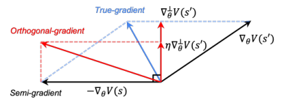

Figure 1: Illustration of orthogonal-gradient update

**Algorithm 1** Orthogonal DICE

**Require:** _D_, _λ_, _η_, learning rate _α_

1: Initialize _V_ _θ_, _V_ _θ_ ~~,~~ _π_ _ϕ_
2: **for** _t_ = 1 _,_ 2 _, · · ·, N_ **do**
3: Sample transitions ( _s, a, r, s_ _[′]_ ) _∼D_
4: Calculate forward gradient
_g_ _θ_ _[→]_ [=] _[ ∇]_ _θ_ _[f]_ _[ ∗]_ [(] _[r]_ [ +] _[ γV]_ _θ_ [(] _[s]_ _[′]_ [)] _[ −]_ _[V]_ _θ_ [(] _[s]_ [))]
5: Calculate backward gradient
_g_ _θ_ _[←]_ [=] _[ ∇]_ _θ_ _[f]_ _[ ∗]_ [(] _[r]_ [ +] _[ γV]_ _θ_ [(] _[s]_ _[′]_ [)] _[ −]_ _[V]_ _θ_ ~~[(]~~ _[s]_ [))]
6: Calculate projected backward gradient

_θ_ [)] _[⊤]_ _[g]_ _θ_ _[→]_
_g_ _θ_ _[⊥]_ [=] _[ g]_ _θ_ _[←]_ _[−]_ [(] _[g]_ _[←]_ _g_ _θ_ _[→]_
_∥g_ _θ_ _[→]_ _[∥]_ [2]

7: Update _θ_ by
_θ ←_ _θ −_ _α_ (1 _−_ _λ_ ) _∇_ _θ_ _V_ _θ_ ( _s_ ) + _λ_ ( _g_ _θ_ _[→]_ [+] _[ ηg]_ _θ_ _[⊥]_ [)]
� �

8: Calculate BC weight
_ω_ ( _s, a_ ) = max �0 _,_ ( _f_ _[′]_ ) _[−]_ [1] [ �] _r_ + _γV_ _θ_ ( _s_ _[′]_ ) _−_ _V_ _θ_ ( _s_ )��

9: Update _π_ _ϕ_ by
max _ϕ_ [ _ω_ ( _s, a_ ) log _π_ _ϕ_ ( _a|s_ )]
10: Update _θ_ with exponential moving average

_θ ←_ _τθ_ + (1 _−_ _τ_ ) _θ_
11: **end for**

Although our method is simple and straightforward, in this section, we give a thorough theoretical
analysis and use a didactic toy example to show several benefits of using orthogonal-gradient update.

3.1 T HEORETIC R ESULTS

We begin by introducing the notation used in our analysis. We denote the nonlinear loss in ODICE, _f_ _[∗]_ ( _r_ + _γV_ ( _s_ _[′]_ ) _−_ _V_ ( _s_ )) as _L_ _[θ]_ ( _s, s_ _[′]_ ). We use _L_ _[θ]_ 1 [(] _[s]_ [)][ to denote] _[ f]_ _[ ∗]_ [(] _[r]_ [ +] _[ γV]_ [ (] _[s]_ _[′]_ [)] _[ −]_ _[V]_ [ (] _[s]_ [))][,]
whose gradient corresponds to the forward gradient (multiply a value). We use _L_ _[θ]_ 2 [(] _[s]_ _[′]_ [)][ to denote]
_f_ _[∗]_ ( _r_ + _γV_ ( _s_ _[′]_ ) _−_ _V_ ( _s_ )), whose gradient corresponds to the backward gradient (multiply a value).
We define the projected part and the remaining parallel part of _∇_ _θ_ _L_ _[θ]_ 2 [(] _[s]_ _[′]_ [)][ with respect to] _[ ∇]_ _[θ]_ _[L]_ _[θ]_ 1 [(] _[s]_ [)]
as _∇_ _[⊥]_ _θ_ _[L]_ 2 _[θ]_ [(] _[s]_ _[′]_ [)][ and] _[ ∇]_ _[∥]_ _θ_ _[L]_ 2 _[θ]_ [(] _[s]_ _[′]_ [)][, respectively. It’s easy to know that we can decompose the orthogonal-]
gradient update in O-DICE into two steps, which are

_θ_ _[′]_ = _θ −_ _α∇_ _θ_ _L_ _[θ]_ 1 [(] _[s]_ [)]

_θ_ _[′′]_ = _θ_ _[′]_ _−_ _α∇_ _[⊥]_ _θ_ _[L]_ _[θ]_ 2 [(] _[s]_ _[′]_ [)]

where _α_ is the learning rate. We first introduce two theoretical benefits of using the orthogonalgradient update from the optimization perspective.

**Theorem 1.** _In orthogonal-gradient update, L_ _[θ]_ 1 _[′′]_ [(] _[s]_ [)] _[−][L]_ _[θ]_ 1 _[′]_ [(] _[s]_ [) = 0] _[ (under first order approximation).]_

This theorem formally says the interference-free property in orthogonal-gradient update, that is, the
gradient change in loss _L_ 2 ( _s_ _[′]_ ) won’t affect loss _L_ 1 ( _s_ ). This means that orthogonal-gradient update
preserves the benefit of semi-gradient update while still making loss _L_ 2 ( _s_ _[′]_ ) decrease. Note that
under general setting, _L_ _[θ]_ 1 _[′′]_ [(] _[s]_ [)] _[ −]_ _[L]_ _[θ]_ 1 _[′]_ [(] _[s]_ [) = 0][ holds only by orthogonal-gradient update, any other]
gradient modification techniques (Baird, 1995; Zhang et al., 2019b; Durugkar & Stone, 2018) that
keep part of _∇_ _[∥]_ _θ_ _[L]_ 2 _[θ]_ [(] _[s]_ _[′]_ [)][ will make] _[ L]_ _[θ]_ 1 _[′′]_ [(] _[s]_ [)] _[ −]_ _[L]_ _[θ]_ 1 _[′]_ [(] _[s]_ [)] _[ ̸]_ [= 0][.]

5

Published as a conference paper at ICLR 2024

**Theorem 2.** _Define the angle between ∇_ _θ_ _V_ ( _s_ ) _and ∇_ _θ_ _V_ ( _s_ _[′]_ ) _as ϕ_ ( _s, s_ _[′]_ ) _. In orthogonal-gradient_

_update, if ϕ_ ( _s, s_ _[′]_ ) _̸_ = 0 _, then for all η >_ sin [2] _ϕ_ 1( _s,s_ _[′]_ ) �cos _ϕ_ ( _s, s_ _[′]_ ) _γ_ _[∥]_ _∥∇_ _[∇]_ _[θ]_ _θ_ _[V]_ _V_ ( [(] _[s]_ _s_ [)] _[′]_ _[∥]_ )

_γ_ _[∥]_ _∥∇_ _[∇]_ _[θ]_ _θ_ _[V]_ _V_ ( [(] _[s]_ _s_ [)] _[′]_ _[∥]_ ) _∥_ [)] [2] [�] _, we_

_[∥][∇]_ _[θ]_ _[V]_ [(] _[s]_ [)] _[∥]_ _[∥][∇]_ _[θ]_ _[V]_ [(] _[s]_ [)] _[∥]_

_γ∥∇_ _θ_ _V_ ( _s_ _[′]_ ) _∥_ _[−]_ [(] _γ∥∇_ _θ_ _V_ ( _s_ _[′]_ )

_have L_ _[θ]_ _[′′]_ ( _s, s_ _[′]_ ) _−L_ _[θ]_ ( _s, s_ _[′]_ ) _<_ 0 _._

This theorem gives a convergence property that using orthogonal-gradient update could make the
overall loss objective monotonically decrease. Note that similar convergence guarantee occurs only
in true-gradient update, while semi-gradient update is known to suffer from divergence issue (Zhang
et al., 2019b). Actually, to have a convergence guarantee, we only need to keep the gradient within
the same half-plane that _∇_ _θ_ _L_ _[θ]_ ( _s, s_ _[′]_ ) lies in. This means that we can adjust _η_ to make the orthogonal
gradient keep in the same half-plane of the true-gradient while keeping close to the semi-gradient if
needed, as shown in this theorem. Note that _s_ and _s_ _[′]_ are often similar, so the value of _∥∇_ _θ_ _V_ ( _s_ ) _∥_
_∥∇_ _θ_ _V_ ( _s_ ) _∥_
and _∥∇_ _θ_ _V_ ( _s_ _[′]_ ) _∥_ are close to each other and the ratio _γ∥∇_ _θ_ _V_ ( _s_ _[′]_ ) _∥_ [will probably] _[ >]_ [ 1][, which indicates]
that the choice of _η_ may be fairly easy to satisfy this theorem ( _e.g._, _η >_ 0).

From Theorem 1 and Theorem 2 we know that orthogonal-gradient update could make loss _L_ ( _s, s_ _[′]_ )
and _L_ 1 ( _s_ ) decrease simultaneously, so as to share the best of both worlds: not only does it preserve
the action-level constraint in semi-gradient update, but also owns the convergence guarantee in truegradient update. We now further analyze the influence of orthogonal-gradient update, we show in
the following theorem that it has a deep connection with the feature dot product of consecutive states
in value function (Ψ _θ_ ( _s, s_ _[′]_ ) = _∇_ _θ_ _V_ ( _s_ ) _[⊤]_ _∇_ _θ_ _V_ ( _s_ _[′]_ )).

**Theorem 3** (Orthogonal-gradient update helps alleviate feature co-adaptation) **.** _Assume the norm_
_of ∇_ _θ_ _V_ ( _s_ ) _is bounded, i.e. ∀s, m ≤∥∇_ _θ_ _V_ ( _s_ ) _∥_ [2] _≤_ _M_ _. Define consecutive value curvature_
_ξ_ ( _θ, s, s_ _[′]_ ) = _∇_ _[⊥]_ _θ_ _[V]_ [ (] _[s]_ _[′]_ [)] _[⊤]_ _[H]_ [(] _[s]_ [)] _[∇]_ _[⊥]_ _θ_ _[V]_ [ (] _[s]_ _[′]_ [)] _[, where][ H]_ [(] _[s]_ [)] _[ is the Hessian matrix of][ V]_ [ (] _[s]_ [)] _[.]_ _Assume_
_ξ_ ( _θ, s, s_ _[′]_ ) _≥_ _l · ∥∇_ _[⊥]_ _θ_ _[V]_ [ (] _[s]_ _[′]_ [)] _[∥]_ [2] _[ where][ l >]_ [ 0] _[. Then in orthogonal-gradient update, we have]_

Ψ _θ_ _[′′]_ ( _s, s_ _[′]_ ) _−_ Ψ _θ_ _[′]_ ( _s, s_ _[′]_ ) _≤−αηγ ·_ ( _f_ _[∗]_ ) _[′]_ ( _r_ + _γV_ ( _s_ _[′]_ ) _−_ _V_ ( _s_ ))[sin [2] _ϕ_ ( _s, s_ _[′]_ ) _· l · m_ + _β · M_ ] (6)

_where β is a constant close to 0 if the condition number of H_ ( _s_ ) _is small (Cheney & Kincaid, 2012)._

Feature co-adaptation, where Ψ _θ_ ( _s, s_ _[′]_ ) is large so that features of different states learned by the
value function become very similar, is known to be a severe issue in offline deep RL (Kumar et al.,
2021). While this theorem formally says that after using orthogonal-gradient update, the difference
of Ψ _θ_ ( _s, s_ _[′]_ ) could be bounded. In RHS of Eq.(6), _β_ is a constant that captures the difference between
minimal and maximal eigenvalue in _H_ ( _s_ ). _β_ will be close to 0 if neural network _V_ ( _s_ ) is numerically
well-behaved ( _i.e._, the condition number of _H_ ( _s_ ) is small), which can be achieved by using some
practical training tricks such as orthogonal regularization (Brock et al., 2016) or gradient penalty
(Gulrajani et al., 2017) during training _V_ . Also, note that ( _f_ _[∗]_ ) _[′]_ ( _x_ ) _≥_ 0 always holds because _f_ _[∗]_
is chosen to be monotonically increasing (see proof in Appendix B for details, we highlight that
this **only** holds in DICE-based methods, minimizing Bellman equation such that _f_ _[∗]_ = _x_ [2] won’t let
it hold). Hence, Eq.(6) _<_ 0 will probably hold, this means that using orthogonal-gradient update
could help alleviate feature co-adaptation issue, learning better representations for different states.
We show in the following theorem that better representation brings better state-level robustness of
_V_ ( _s_ ), akin to imposing the state-level behavior constraint.

**Theorem 4** (How feature co-adaptation affects state-level robustness) **.** _Under linear setting when_
_V_ ( _s_ ) _can be expressed as ∇_ _θ_ _V_ ( _s_ ) _[⊤]_ _θ, assume ∥∇_ _θ_ _V_ ( _s_ ) _∥_ [2] _≤_ _M_ _, then there exists some small noise_
_ε ∈_ R _[|S|]_ _such that V_ ( _s_ _[′]_ + _ε_ ) _−_ _V_ ( _s_ ) _will have different sign with V_ ( _s_ _[′]_ ) _−_ _V_ ( _s_ ) _, if_ Ψ _θ_ ( _s, s_ _[′]_ ) _>_
_M −_ _C · ∥ε∥_ [2] _for some constant C >_ 0 _._

This theorem says that if feature co-adaptation happens, _i.e._, Ψ _θ_ ( _s, s_ _[′]_ ) is larger than a threshold, a
small noise adding to _V_ ( _s_ _[′]_ ) will largely change its value, or the learning signal for policy. If the
sign (or value) of _V_ ( _s_ _[′]_ ) _−_ _V_ ( _s_ ) can be easily flipped by some noise _ε_, not only the policy extraction
part during training will be affected (as two similar _s_ _[′]_ will have totally different BC weight), but
also the optimal policy induced from _V_ is likely to be misled by OOD states encountered during
evaluation and take wrong actions. As shown in Theorem 3, using orthogonal-gradient update helps
alleviate feature co-adaptation and enables _V_ to learn better representations to distinguish different
states, thus being more robust to OOD states.

6

Published as a conference paper at ICLR 2024

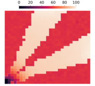

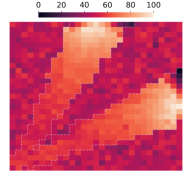

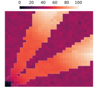

(a) Reward distribution (b) True-gradient _V_ (c) Semi-gradient _V_ (d) Orthogonal-gradient _V_

Figure 2: Visualizations of the value function _V_ learned by using different updating rules in a grid world
toycase, the base algorithm is V-DICE. We normalize the value of _V_ to [0 _,_ 100] for fair comparison. The
borderline of the offline dataset support is marked by white dashed lines. Orthogonal-gradient update better
distinguishes both different in-distribution actions and in-distribution states vs. OOD states.

3.2 A T OY E XAMPLE

We now use a toy example to validate the above-mentioned benefits of using orthogonal-gradient
update. We consider a 30 _×_ 30 grid world navigation task where the agent starts from the bottomleft corner (0 _,_ 0) and the goal is to reach a given area at the top ((10 _,_ 30) to (20 _,_ 30)) or right
border ((30 _,_ 10) to (30 _,_ 20)). The action space contains 4 discrete actions: up, down, left, and right.
Every time the agent chooses an action, it will move towards that direction for one grid, receiving
a _−_ 1 reward, unless it reaches the goal area, which will give a different, positive reward, as shown
in Figure 2(a). The offline dataset is collected by running a goal-reaching policy, to add some
stochasticity, with a probability of 0.05 the output action will be shifted to a random action. We use
white dashed lines in Figure 2 to plot the borderlines of the support of the collected dataset.

We run V-DICE with semi-gradient, true-gradient, and orthogonal-gradient, and visualize the
learned _V_ -value (with normalization) in Figure 2(b)-(d). The corresponding policy can be extracted
implicitly by choosing a reachable state (grid) with the highest _V_ -value, at a given state (grid). It
can be shown from the result that orthogonal-gradient update could learn a value function (or policy)
that successfully finds a path from the start to the desired location, indicating the effect of imposing action-level constraint. Meanwhile, it successfully distinguishes between in-distribution states
and OOD states, the values of OOD states are much lower than that of in-distribution states, which
reveals better feature of the value function is learned by imposing state-level constraint. Using semigradient update could learn a good policy to find the best action but lose OOD state robustness (the
color of OOD states and in-distribution states are similar, once the agent gets into OOD states, it
can hardly come back), while true-gradient update could not even learn a good policy because of the
conflicting gradient issue.

From this toycase, we can clearly observe that using orthogonal-gradient update brings state-actionlevel constraint, it helps improve the robustness of OOD states while still preserving the ability to
find the best dataset actions.

4 E XPERIMENTS

In this section, we present empirical evaluations of O-DICE. We first evaluate O-DICE against other
baseline algorithms on benchmark offline RL datasets. We then conduct more in-depth investigations
on the policy robustness of O-DICE and other algorithms. Lastly, we evaluate O-DICE on offline IL
tasks to demonstrate its superior performance. Hyperparameters and experimental details are listed
in Appendix D.

4.1 R ESULTS ON D4RL B ENCHMARKS

We first evaluate O-DICE on the D4RL benchmark (Fu et al., 2020), including MuJoCo locomotion
tasks and AntMaze navigation tasks. We compare O-DICE with previous SOTA baselines that only
enforce action-level constraint, including TD3+BC (Fujimoto & Gu, 2021), CQL (Kumar et al.,
2020), IQL (Kostrikov et al., 2021b), and EQL (Xu et al., 2023). We also compare O-DICE with

7

Published as a conference paper at ICLR 2024

Table 1: Averaged normalized scores of O-DICE against other baselines. The scores are taken over the final
10 evaluations with 5 seeds. O-DICE achieves the highest score in 13 out of 15 tasks, outperforming previous
SOTA offline RL methods and other DICE-based methods.

|D4RL Dataset constrain π(a|s) constrain dπ(s, a)|Col2|
|---|---|
|TD3+BC CQL IQL EQL OptiDICE _f_-DVL S-DICE|O-DICE|
|halfcheetah-m 48.3 44.0 47.4_ ±_0.2 47.2_ ±_0.2 45.8_ ±_0.4 47.7 47.3_±_0.2 hopper-m 59.3 58.5 66.3_ ±_5.7 74.6_ ±_3.4 46.4_ ±_3.9 63.0 61.5_±_2.3 walker2d-m 83.7 72.5 72.5_ ±_8.7 83.2_ ±_4.6 68.1_ ±_4.5 80.0 78.6_±_7.1 halfcheetah-m-r 44.6 45.5 44.2_ ±_1.2 44.5_ ±_0.7 31.7_ ±_0.8 42.9 40.6_±_2.6 hopper-m-r 60.9 95.0 95.2_ ±_8.6 98.1_ ±_3.3 20.0_ ±_6.6 90.7 64.6_±_19.4 walker2d-m-r 81.8 77.2 76.1_ ±_7.3 76.6_ ±_3.8 17.9_±_5.9 52.1 37.3_±_5.1 halfcheetah-m-e 90.7 90.7 86.7_ ±_5.3 90.6_ ±_0.4 59.7_ ±_3.0 89.3 92.8_±_0.7 hopper-m-e 98.0 105.4 101.5_ ±_7.3 105.5_ ±_2.2 51.3_ ±_3.5 105.8 108.4_±_1.9 walker2d-m-e 110.1 109.6 110.6_ ±_1.0 110.2_ ±_0.8 104.0_ ±_5.1 110.1 110.1_±_0.2|47.4_±_0.2 86.1_ ±_4.0 84.9_ ±_2.3 44.0_±_0.3 99.9_ ±_2.7 83.6_ ±_4.1 93.2_ ±_0.6 110.8_ ±_0.6 110.8_ ±_0.2|
|antmaze-u 78.6 84.8 85.5_ ±_1.9 93.2_ ±_1.4 56.0_ ±_2.8 83.7 88.6_±_2.5 antmaze-u-d 71.4 43.4 66.7_ ±_4.0 65.0_ ±_2.3 48.6_ ±_7.4 50.4 69.3_±_5.0 antmaze-m-p 10.6 65.2 72.2_ ±_5.3 77.5_ ±_3.7 0.0_ ±_0.0 56.7 50.6_±_11.1 antmaze-m-d 3.0 54.0 71.0_ ±_3.2 70.0_ ±_4.2 0.0_ ±_0.0 48.2 66.0_±_3.6 antmaze-l-p 0.2 38.4 39.6_ ±_4.5 45.6_ ±_4.8 0.0_ ±_0.0 36.0 34.0_±_9.0 antmaze-l-d 0.0 31.6 47.5_ ±_4.4 42.5_ ±_5.2 0.0_ ±_0.0 44.5 32.6_±_4.1|94.1_ ±_1.6 79.5_ ±_3.3 86.0_ ±_1.6 82.7_ ±_4.9 55.9_ ±_3.9 54.0_ ±_4.8|

other DICE-based algorithms that intend to do state-action-level constraint, including OptiDICE
(Lee et al., 2021), _f_ -DVL (Sikchi et al., 2023) and our implementation of semi-DICE (S-DICE)
which updates V-DICE using semi-gradient update.

The result shows that O-DICE outperforms all previous SOTA algorithms on almost all MuJoCo
and AntMaze tasks. This suggests that O-DICE can effectively learn a strong policy from the
dataset, even in challenging AntMaze tasks that require learning a high-quality value function so
as to ”stitch” good trajectories. The large performance gap between O-DICE (using orthogonalgradient update) and OptiDICE (using true-gradient update) demonstrates the necessity of using the
projected backward gradient. Moreover, O-DICE shows consistently better performance over EQL,
_f_ -DVL, and S-DICE (using semi-gradient update) on almost all datasets, especially on sub-optimal
datasets that contain less or few near-optimal trajectories. This indicates the superiority of stateaction-level constraint over only action-level constraint, by learning a value function with better
representation to successfully distinguish good trajectories (actions) from bad ones.

4.2 R ESULTS ON P OLICY R OBUSTNESS

The aggregated mean score in D4RL can’t
fully reflect the robustness of an algorithm
because, even if the average performance
is reasonable, the agent may still perform
poorly on some episodes. Here we compare O-DICE with S-DICE and EQL on
the percent difference of the worst episode
during the 10 evaluation episodes at the

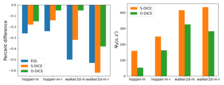
last evaluation (Fujimoto & Gu, 2021), we Figure 3: Left: percent difference of the worst episode
also plot the average value of feature dot during the 10 evaluation episodes at the last evaluation of
product, _∇_ _θ_ _V_ ( _s_ ) _[⊤]_ _∇_ _θ_ _V_ ( _s_ _[′]_ ), as shown in different offline RL algorithms. Right: mean value of
Figure 3. It’s obvious that a robust pol- _∇_ _θ_ _V_ ( _s_ ) _[⊤]_ _∇_ _θ_ _V_ ( _s_ _[′]_ ) over the dataset of S-DICE and O-DICE.
icy should achieve consistently high performance over multiple evaluations, i.e., having a small percent difference. Moreover, Theorem 4
shows that a low value of _∇_ _θ_ _V_ ( _s_ ) _[⊤]_ _∇_ _θ_ _V_ ( _s_ _[′]_ ) is necessary for robustness. It can be observed that
O-DICE achieves much smaller percent differences than action-constrained offline RL methods like
EQL and S-DICE, which empirically verifies Theorem 4. The significantly decreased feature dotproduct value _∇_ _θ_ _V_ ( _s_ ) _[⊤]_ _∇_ _θ_ _V_ ( _s_ _[′]_ ) after applying orthogonal-gradient also agrees with Theorem 3.

8

Published as a conference paper at ICLR 2024

4.3 R ESULTS ON O FFLINE I MITATION L EARNING

We then evaluate O-DICE in the offline imi- Table 2: Normalized return of BC, ValueDICE,
tation learning setting, where only one expert IQLearn and O-DICE on offline IL tasks.
trajectory is given (Kostrikov et al., 2020). In
this setting, OOD states are fairly easy to oc- Dataset BC ValueDICE IQLearn O-DICE
cur, and being robust to them is crucial for high Traj 1Traj 2 56.036.2 33.823.5 **56.2** 75.1 47.8 **78.8**
performance (Rajaraman et al., 2020). We com- Hopper-expert Traj 3 50.5 24.7 47.1 **55.1**
pare O-DICE with BC (Pomerleau, 1989), Val- TraTraj 1j 4 87.264.6 90.423.6 94.250.2 **98.575.6**
ueDICE (Kostrikov et al., 2020) and IQLearn Traj 2 43.3 17.1 40.5 **65.8**
Garg et al. (2021). ValueDICE and IQLearn are Walker2d-expert Traj 3Traj 4 38.433.0 60.640.5 **66.7** 44.2 62.7 **61.6**
two Q-DICE algorithms that use true-gradient

|Traj 1 Traj 2 Hopper-expert Traj 3 Traj 4|56.0 33.8 75.1 78.8 36.2 23.5 56.2 47.8 50.5 24.7 47.1 55.1 87.2 90.4 94.2 98.5|
|---|---|
|Walker2d-expert Traj 1 Traj 2 Traj 3 Traj 4|64.6 23.6 50.2 **75.6** 43.3 17.1 40.5 **65.8** 38.4 60.6 **66.7** 62.7 33.0 40.5 44.2 **61.6**|

update and semi-gradient update, respectively. As we find performance varies a lot by using different trajectories, we select four trajectories from D4RL expert datasets, each containing 1000
transitions. It can be shown in Table 2 that although all algorithms can’t match the expert performance due to extremely limited data, O-DICE consistently performs better than all other baselines.
This justifies the benefits of using orthogonal-gradient update, it enables better state-level robustness
against OOD states by learning better feature representation.

Table 2: Normalized return of BC, ValueDICE,
IQLearn and O-DICE on offline IL tasks.

Dataset BC ValueDICE IQLearn O-DICE

5 R ELATED W ORK

**Offline RL** To tackle the distributional shift problem, most model-free offline RL methods augment existing off-policy RL methods with an action-level behavior regularization term. Action-level
regularization can appear explicitly as divergence penalties (Wu et al., 2019; Kumar et al., 2019;
Xu et al., 2021; Fujimoto & Gu, 2021; Cheng et al., 2023; Li et al., 2023b), implicitly through
weighted behavior cloning (Wang et al., 2020; Nair et al., 2020), or more directly through careful
parameterization of the policy (Fujimoto et al., 2019; Zhou et al., 2020). Another way to apply
action-level regularization is via modification of value learning objective to incorporate some form
of regularization, to encourage staying near the behavioral distribution and being pessimistic about
OOD state-action pairs (Kumar et al., 2020; Kostrikov et al., 2021a; Xu et al., 2022c; 2023; Wang
et al., 2023; Niu et al., 2022). There are also several works incorporating action-level regularization through the use of uncertainty (An et al., 2021; Bai et al., 2021) or distance function (Li et al.,
2022a). Another line of methods, on the contrary, imposes action-level regularization by performing
some kind of imitation learning on the dataset. When the dataset is good enough or contains highperforming trajectories, we can simply clone or filter dataset actions to extract useful transitions (Xu
et al., 2022b; Chen et al., 2020; Zhang et al., 2023a; Zheng et al., 2024), or directly filter individual
transitions based on how advantageous they could be under the behavior policy and then clones them
(Brandfonbrener et al., 2021; Xu et al., 2022a). There are also some attempts to include state-actionlevel behavior regularization (Li et al., 2022b; Zhang et al., 2022), however, they typically require
costly extra steps of model-based OOD state detection (Li et al., 2022b; Zhang et al., 2022).

**DICE-based Methods** DICE-based methods perform stationary distribution estimation, and
many of them have been proposed for off-policy evaluation: DualDICE (Nachum et al., 2019a),
GenDICE (Zhang et al., 2019a), GradientDICE (Zhang et al., 2020). Other lines of works consider reinforcement learning: AlgaeDICE (Nachum et al., 2019b), OptiDICE (Lee et al., 2021),
CoptiDICE (Lee et al., 2022), _f_ -DVL (Sikchi et al., 2023); offline policy selection: (Yang et al.,
2020); offline imitation learning: ValueDICE (Kostrikov et al., 2020), OPOLO (Zhu et al., 2020),
IQlearn (Garg et al., 2021), DemoDICE (Kim et al., 2021), SmoDICE (Ma et al., 2022); reward
learning: RGM (Li et al., 2023a) All of these DICE methods are either using true-gradient update or
semi-gradient update, while our paper provides a new update rule: orthogonal-gradient update.

6 C ONCLUSIONS, L IMITATIONS AND F UTURE W ORK

In this paper, we revisited DICE-based method. We provide a new understanding of DICE-based
method and successfully unravel its mystery: the value learning objective in DICE does try to impose
state-action-level constraint, but needs to be used in a corrected way, that is orthogonal-gradient
update. By doing so, DICE-based methods enjoy not only strong theoretical guarantees, but also
favorable empirical performance. It achieves SOTA results on both offline RL and offline IL tasks.

9

Published as a conference paper at ICLR 2024

One limitation of our work is that as we consider the backward gradient term on _s_ _[′]_, double sampling
issue will occur, especially in stochastic environments. Some techniques that attempt to solve this
issue might be helpful (Dai et al., 2017; Nachum et al., 2019a). Another limitation is O-DICE has
two hyperparameters to tune, however, they are orthogonal and we find in practice that the tuning of
_η_ is not sensitive, see Appendix for details.

One future work is to extend orthogonal-gradient update to online RL setting where DICE can
be used as an off-policy algorithm (Nachum et al., 2019b). Another future work is to generalize
orthogonal-gradient to update the MSE loss of Bellman equation (Baird, 1995; Zhang et al., 2019b).

A CKNOWLEDGEMENT

This work is supported by National Key Research and Development Program of China under Grant
(2022YFB2502904). The SJTU team is partially supported by Shanghai Municipal Science and
Technology Major Project (2021SHZDZX0102) and National Natural Science Foundation of China
(62322603, 62076161). We thank Amy Zhang and Bo Dai for insightful discussions.

R EFERENCES

Gaon An, Seungyong Moon, Jang-Hyun Kim, and Hyun Oh Song. Uncertainty-based offline reinforcement learning with diversified q-ensemble. _Proc. of NeurIPS_, 2021.

Lei Jimmy Ba, Jamie Ryan Kiros, and Geoffrey E. Hinton. Layer normalization. _CoRR_,
abs/1607.06450, 2016.

Chenjia Bai, Lingxiao Wang, Zhuoran Yang, Zhi-Hong Deng, Animesh Garg, Peng Liu, and Zhaoran Wang. Pessimistic bootstrapping for uncertainty-driven offline reinforcement learning. In
_Proc. of ICLR_, 2021.

Leemon Baird. Residual algorithms: Reinforcement learning with function approximation. _Machine_
_Learning Proceedings 1995_, pp. 30–37, 1995.

Stephen Boyd, Stephen P Boyd, and Lieven Vandenberghe. _Convex optimization_ . Cambridge university press, 2004.

David Brandfonbrener, William F Whitney, Rajesh Ranganath, and Joan Bruna. Offline rl without
off-policy evaluation. _Proc. of NeurIPS_, 2021.

Andrew Brock, Theodore Lim, James M Ritchie, and Nick Weston. Neural photo editing with
introspective adversarial networks. _arXiv preprint arXiv:1609.07093_, 2016.

Xinyue Chen, Zijian Zhou, Zheng Wang, Che Wang, Yanqiu Wu, and Keith W. Ross. BAIL: bestaction imitation learning for batch deep reinforcement learning. In _Proc. of NeurIPS_, 2020.

E Ward Cheney and David R Kincaid. _Numerical mathematics and computing_ . Cengage Learning,
2012.

Peng Cheng, Xianyuan Zhan, Zhihao Wu, Wenjia Zhang, Shoucheng Song, Han Wang, Youfang Lin,
and Li Jiang. Look beneath the surface: Exploiting fundamental symmetry for sample-efficient
offline rl. In _Thirty-seventh Conference on Neural Information Processing Systems_, 2023.

Bo Dai, Niao He, Yunpeng Pan, Byron Boots, and Le Song. Learning from conditional distributions
via dual embeddings. In _Proc. of AISTATS_, pp. 1458–1467, 2017.

Ishan Durugkar and Peter Stone. Td learning with constrained gradients. 2018.

Justin Fu, Aviral Kumar, Ofir Nachum, George Tucker, and Sergey Levine. D4rl: Datasets for deep
data-driven reinforcement learning. _ArXiv preprint_, 2020.

Scott Fujimoto and Shixiang Shane Gu. A minimalist approach to offline reinforcement learning.
_ArXiv preprint_, 2021.

10

Published as a conference paper at ICLR 2024

Scott Fujimoto, Herke van Hoof, and David Meger. Addressing function approximation error in
actor-critic methods. In _Proc. of ICML_, pp. 1582–1591, 2018.

Scott Fujimoto, David Meger, and Doina Precup. Off-policy deep reinforcement learning without
exploration. In _Proc. of ICML_, pp. 2052–2062, 2019.

Divyansh Garg, Shuvam Chakraborty, Chris Cundy, Jiaming Song, and Stefano Ermon. Iq-learn:
Inverse soft-q learning for imitation. _Advances in Neural Information Processing Systems_, 34:
4028–4039, 2021.

Divyansh Garg, Joey Hejna, Matthieu Geist, and Stefano Ermon. Extreme q-learning: Maxent rl
without entropy. In _Proc. of ICLR_, 2023.

Ishaan Gulrajani, Faruk Ahmed, Mart´ın Arjovsky, Vincent Dumoulin, and Aaron C. Courville. Improved training of wasserstein gans. In _Proc. of NeurIPS_, pp. 5767–5777, 2017.

Tuomas Haarnoja, Haoran Tang, Pieter Abbeel, and Sergey Levine. Reinforcement learning with
deep energy-based policies. In _Proc. of ICML_, pp. 1352–1361, 2017.

Dmitry Kalashnikov, Jacob Varley, Yevgen Chebotar, Benjamin Swanson, Rico Jonschkowski,
Chelsea Finn, Sergey Levine, and Karol Hausman. Mt-opt: Continuous multi-task robotic reinforcement learning at scale. _ArXiv preprint_, 2021.

Geon-Hyeong Kim, Seokin Seo, Jongmin Lee, Wonseok Jeon, HyeongJoo Hwang, Hongseok Yang,
and Kee-Eung Kim. Demodice: Offline imitation learning with supplementary imperfect demonstrations. In _Proc. of ICLR_, 2021.

Diederik P. Kingma and Jimmy Ba. Adam: A method for stochastic optimization. In _Proc. of ICLR_,
2015.

Ilya Kostrikov, Ofir Nachum, and Jonathan Tompson. Imitation learning via off-policy distribution
matching. In _Proc. of ICLR_, 2020.

Ilya Kostrikov, Rob Fergus, Jonathan Tompson, and Ofir Nachum. Offline reinforcement learning
with fisher divergence critic regularization. In _Proc. of ICML_, pp. 5774–5783, 2021a.

Ilya Kostrikov, Ashvin Nair, and Sergey Levine. Offline reinforcement learning with implicit qlearning. _ArXiv preprint_, 2021b.

Aviral Kumar, Justin Fu, Matthew Soh, George Tucker, and Sergey Levine. Stabilizing off-policy
q-learning via bootstrapping error reduction. In _Proc. of NeurIPS_, pp. 11761–11771, 2019.

Aviral Kumar, Aurick Zhou, George Tucker, and Sergey Levine. Conservative q-learning for offline
reinforcement learning. In _Proc. of NeurIPS_, 2020.

Aviral Kumar, Rishabh Agarwal, Tengyu Ma, Aaron Courville, George Tucker, and Sergey Levine.
Dr3: Value-based deep reinforcement learning requires explicit regularization. _arXiv preprint_
_arXiv:2112.04716_, 2021.

Aviral Kumar, Rishabh Agarwal, Tengyu Ma, Aaron C. Courville, George Tucker, and Sergey
Levine. DR3: value-based deep reinforcement learning requires explicit regularization. In _ICLR_ .
OpenReview.net, 2022.

Jongmin Lee, Wonseok Jeon, Byungjun Lee, Joelle Pineau, and Kee-Eung Kim. Optidice: Offline
policy optimization via stationary distribution correction estimation. In _Proc. of ICML_, pp. 6120–
6130, 2021.

Jongmin Lee, Cosmin Paduraru, Daniel J Mankowitz, Nicolas Heess, Doina Precup, Kee-Eung Kim,
and Arthur Guez. Coptidice: Offline constrained reinforcement learning via stationary distribution
correction estimation. _arXiv preprint arXiv:2204.08957_, 2022.

Jianxiong Li, Xianyuan Zhan, Haoran Xu, Xiangyu Zhu, Jingjing Liu, and Ya-Qin Zhang. When
data geometry meets deep function: Generalizing offline reinforcement learning. In _The Eleventh_
_International Conference on Learning Representations_, 2022a.

11

Published as a conference paper at ICLR 2024

Jianxiong Li, Xiao Hu, Haoran Xu, Jingjing Liu, Xianyuan Zhan, Qing-Shan Jia, and Ya-Qin
Zhang. Mind the gap: Offline policy optimization for imperfect rewards. _arXiv preprint_
_arXiv:2302.01667_, 2023a.

Jianxiong Li, Xiao Hu, Haoran Xu, Jingjing Liu, Xianyuan Zhan, and Ya-Qin Zhang. Proto: Iterative
policy regularized offline-to-online reinforcement learning. _arXiv preprint arXiv:2305.15669_,
2023b.

Jinning Li, Chen Tang, Masayoshi Tomizuka, and Wei Zhan. Dealing with the unknown: Pessimistic
offline reinforcement learning. In _Conference on Robot Learning_, pp. 1455–1464. PMLR, 2022b.

Yecheng Jason Ma, Andrew Shen, Dinesh Jayaraman, and Osbert Bastani. Smodice: Versatile
offline imitation learning via state occupancy matching. _arXiv preprint arXiv:2202.02433_, 2022.

Alan S Manne. Linear programming and sequential decisions. _Management Science_, 6(3):259–267,
1960.

Volodymyr Mnih, Koray Kavukcuoglu, David Silver, Alex Graves, Ioannis Antonoglou, Daan Wierstra, and Martin Riedmiller. Playing atari with deep reinforcement learning. _arXiv preprint_
_arXiv:1312.5602_, 2013.

Ofir Nachum and Bo Dai. Reinforcement learning via fenchel-rockafellar duality. _arXiv preprint_
_arXiv:2001.01866_, 2020.

Ofir Nachum, Yinlam Chow, Bo Dai, and Lihong Li. Dualdice: Behavior-agnostic estimation of
discounted stationary distribution corrections. In _Proc. of NeurIPS_, pp. 2315–2325, 2019a.

Ofir Nachum, Bo Dai, Ilya Kostrikov, Yinlam Chow, Lihong Li, and Dale Schuurmans. Algaedice:
Policy gradient from arbitrary experience. _ArXiv preprint_, 2019b.

Ashvin Nair, Murtaza Dalal, Abhishek Gupta, and Sergey Levine. Accelerating online reinforcement
learning with offline datasets. _ArXiv preprint_, 2020.

Haoyi Niu, Yiwen Qiu, Ming Li, Guyue Zhou, Jianming HU, Xianyuan Zhan, et al. When to trust
your simulator: Dynamics-aware hybrid offline-and-online reinforcement learning. _Advances in_
_Neural Information Processing Systems_, 35:36599–36612, 2022.

Dean A Pomerleau. Alvinn: An autonomous land vehicle in a neural network. In _Proc. of NeurIPS_,
1989.

Martin L Puterman. _Markov decision processes: discrete stochastic dynamic programming_ . John
Wiley & Sons, 2014.

Nived Rajaraman, Lin Yang, Jiantao Jiao, and Kannan Ramchandran. Toward the fundamental limits
of imitation learning. _Advances in Neural Information Processing Systems_, 33:2914–2924, 2020.

Harshit Sikchi, Amy Zhang, and Scott Niekum. Imitation from arbitrary experience: A dual unification of reinforcement and imitation learning methods. _arXiv preprint arXiv:2302.08560_, 2023.

Richard S Sutton, Andrew G Barto, et al. _Introduction to reinforcement learning_ . MIT press Cambridge, 1998.

Shengpu Tang and Jenna Wiens. Model selection for offline reinforcement learning: Practical considerations for healthcare settings. In _Proc. of ML4H_, 2021.

Xiangsen Wang, Haoran Xu, Yinan Zheng, and Xianyuan Zhan. Offline multi-agent reinforcement
learning with implicit global-to-local value regularization. In _Thirty-seventh Conference on Neu-_
_ral Information Processing Systems_, 2023.

Ziyu Wang, Alexander Novikov, Konrad Zolna, Josh Merel, Jost Tobias Springenberg, Scott E.
Reed, Bobak Shahriari, Noah Y. Siegel, C¸ aglar G¨ulc¸ehre, Nicolas Heess, and Nando de Freitas.
Critic regularized regression. In _Proc. of NeurIPS_, 2020.

Yifan Wu, George Tucker, and Ofir Nachum. Behavior regularized offline reinforcement learning.
_ArXiv preprint_, 2019.

12

Published as a conference paper at ICLR 2024

Haoran Xu, Xianyuan Zhan, Jianxiong Li, and Honglei Yin. Offline reinforcement learning with
soft behavior regularization. _ArXiv preprint_, 2021.

Haoran Xu, Li Jiang, Li Jianxiong, and Xianyuan Zhan. A policy-guided imitation approach for offline reinforcement learning. In _Advances in Neural Information Processing Systems_, volume 35,
pp. 4085–4098, 2022a.

Haoran Xu, Xianyuan Zhan, Honglei Yin, and Huiling Qin. Discriminator-weighted offline imitation
learning from suboptimal demonstrations. In _International Conference on Machine Learning_, pp.
24725–24742. PMLR, 2022b.

Haoran Xu, Xianyuan Zhan, and Xiangyu Zhu. Constraints penalized q-learning for safe offline reinforcement learning. In _Proceedings of the AAAI Conference on Artificial Intelligence_, volume 36,
pp. 8753–8760, 2022c.

Haoran Xu, Li Jiang, Jianxiong Li, Zhuoran Yang, Zhaoran Wang, Victor Wai Kin Chan, and Xianyuan Zhan. Offline rl with no ood actions: In-sample learning via implicit value regularization.
_arXiv preprint arXiv:2303.15810_, 2023.

Jingkang Yang, Kaiyang Zhou, Yixuan Li, and Ziwei Liu. Generalized out-of-distribution detection:
A survey. _arXiv preprint arXiv:2110.11334_, 2021.

Mengjiao Yang, Ofir Nachum, Bo Dai, Lihong Li, and Dale Schuurmans. Off-policy evaluation via
the regularized lagrangian. _Advances in Neural Information Processing Systems_, 33:6551–6561,
2020.

Xianyuan Zhan, Haoran Xu, Yue Zhang, Xiangyu Zhu, Honglei Yin, and Yu Zheng. Deepthermal:
Combustion optimization for thermal power generating units using offline reinforcement learning.
In _Proceedings of the AAAI Conference on Artificial Intelligence_, volume 36, pp. 4680–4688,
2022.

Hongchang Zhang, Jianzhun Shao, Yuhang Jiang, Shuncheng He, Guanwen Zhang, and Xiangyang
Ji. State deviation correction for offline reinforcement learning. In _Proceedings of the AAAI_
_Conference on Artificial Intelligence_, volume 36, pp. 9022–9030, 2022.

Qin Zhang, Linrui Zhang, Haoran Xu, Li Shen, Bowen Wang, Yongzhe Chang, Xueqian Wang,
Bo Yuan, and Dacheng Tao. Saformer: A conditional sequence modeling approach to offline safe
reinforcement learning. _arXiv preprint arXiv:2301.12203_, 2023a.

Ruiyi Zhang, Bo Dai, Lihong Li, and Dale Schuurmans. Gendice: Generalized offline estimation of
stationary values. In _International Conference on Learning Representations_, 2019a.

Shangtong Zhang, Wendelin Boehmer, and Shimon Whiteson. Deep residual reinforcement learning. _arXiv preprint arXiv:1905.01072_, 2019b.

Shangtong Zhang, Bo Liu, and Shimon Whiteson. Gradientdice: Rethinking generalized offline
estimation of stationary values. In _International Conference on Machine Learning_, pp. 11194–
11203. PMLR, 2020.

Wenjia Zhang, Haoran Xu, Haoyi Niu, Peng Cheng, Ming Li, Heming Zhang, Guyue Zhou, and
Xianyuan Zhan. Discriminator-guided model-based offline imitation learning. In _Conference on_
_Robot Learning_, pp. 1266–1276. PMLR, 2023b.

Yinan Zheng, Jianxiong Li, Dongjie Yu, Yujie Yang, Shengbo Eben Li, Xianyuan Zhan, and Jingjing
Liu. Safe offline reinforcement learning with feasibility-guided diffusion model. In _The Twelfth_
_International Conference on Learning Representations_, 2024.

Wenxuan Zhou, Sujay Bajracharya, and David Held. Latent action space for offline reinforcement
learning. In _Conference on Robot Learning_, 2020.

Zhuangdi Zhu, Kaixiang Lin, Bo Dai, and Jiayu Zhou. Off-policy imitation learning from observations. _Advances in Neural Information Processing Systems_, 33:12402–12413, 2020.

13

Published as a conference paper at ICLR 2024

A A R ECAP OF D ISTRIBUTION C ORRECTION E STIMATION

For the sake of completeness, we give a more detailed review of DICE in this section. We won’t
cover all variants of DICE algorithms but only focus on how to derive the final optimization objective. For a more thorough discussion, please refer to (Nachum & Dai, 2020) and (Sikchi et al.,
2023).

A.1 C ONVEX CONJUGATE AND _f_ - DIVERGENCE

Given a convex function _f_ : R _→_ R, it’s convex conjugate is defined by:

_f_ _[∗]_ ( _y_ ) = sup _{y · x −_ _f_ ( _x_ ) _, x ∈_ R _}_ (7)

Sometimes a proper choice of _f_ can make _f_ _[∗]_ have a close-form solution. For example, _f_ ( _x_ ) =
( _x −_ 1) [2] can induce _f_ _[∗]_ ( _y_ ) = _y_ ( _[y]_ 4 [+ 1)][.]

Moving forward, we’ll introduce _f_ -divergence. Given two probability distributions over Ω: _P_ and
_Q_, if _P_ is absolutely continuous with respect to _Q_, the _f_ -divergence from _P_ to _Q_ is defined as:

(8)
��

_D_ _f_ ( _P_ _||Q_ ) = E _ω∈Q_

A.2 D ISTRIBUTION C ORRECTION E STIMATION

_P_ ( _ω_ )
_f_
� � _Q_ ( _ω_ )

DICE algorithms consider RL problems as convex programming problems with linear constraints
and then apply Fenchel-Rockfeller duality or Lagrangian duality to transform the problem into a
constraint-free formulation (Nachum & Dai, 2020; Lee et al., 2021). More specifically, consider the
following regularized RL problem:

max _π_ E ( _s,a_ ) _∼d_ _π_ [ _r_ ( _s, a_ )] _−_ _αD_ _f_ ( _d_ _[π]_ ( _s, a_ ) _||d_ _[D]_ ( _s, a_ )) (9)

Here _D_ _f_ ( _d_ _[π]_ ( _s, a_ ) _||d_ _[D]_ ( _s, a_ )) is a regularizer who encourages the agent to stay close to data support
from the perspective of ( _s, a_ ) occupancy measure. Directly solving _π_ _[∗]_ is impossible because it’s
intractable to calculate _d_ _[π]_ ( _s, a_ ). However, as shown in (Nachum & Dai, 2020; Lee et al., 2021),
one can consider _d_ _[π]_ as another variable _d_ in the optimization problem which satisfies Bellman-flow
constraints. Then we obtain an optimization problem that’s simultaneously about _d_ and _π_ :

max _π,d_ [E] [(] _[s,a]_ [)] _[∼][d]_ [[] _[r]_ [(] _[s, a]_ [)]] _[ −]_ _[αD]_ _[f]_ [(] _[d]_ [(] _[s, a]_ [)] _[||][d]_ _[D]_ [(] _[s, a]_ [))]

(10)

s.t. _d_ ( _s, a_ ) = (1 _−_ _γ_ ) _d_ 0 ( _s_ ) _π_ ( _a|s_ ) + _γ_ � _d_ ( _s_ _[′]_ _, a_ _[′]_ ) _p_ ( _s|s_ _[′]_ _, a_ _[′]_ ) _π_ ( _a|s_ ) _, ∀s ∈S, a ∈A_

( _s_ _[′]_ _,a_ _[′]_ )

As is pointed out in (Nachum & Dai, 2020), the original Bellman-flow over-constrains the problem.
By summing constraints over _a_, we can eliminate _π_ ( _a|s_ ) in the constraints and get another problem
solely depend on _d_ :

max _d≥_ 0 [E] [(] _[s,a]_ [)] _[∼][d]_ [[] _[r]_ [(] _[s, a]_ [)]] _[ −]_ _[αD]_ _[f]_ [(] _[d]_ [(] _[s, a]_ [)] _[||][d]_ _[D]_ [(] _[s, a]_ [))]

s.t.
�

� _d_ ( _s, a_ ) = (1 _−_ _γ_ ) _d_ 0 ( _s_ ) + _γ_ �

_a∈A_ _s_ _[′]_ _[′]_

(11)

� _d_ ( _s_ _[′]_ _, a_ _[′]_ ) _p_ ( _s|s_ _[′]_ _, a_ _[′]_ ) _, ∀s ∈S_

( _s_ _[′]_ _,a_ _[′]_ )

Note that in this problem we have to set the feasible region to be _{d_ : _∀s ∈S, a ∈A, d_ ( _s, a_ ) _≥_ 0 _}_
because we can’t rely on the non-negativity of _π_ to force _d ≥_ 0. Applying Lagrangian duality, we

14

Published as a conference paper at ICLR 2024

can get the following optimization target following (Lee et al., 2021):
min _V_ ( _s_ ) [max] _d≥_ 0 [E] [(] _[s,a]_ [)] _[∼][d]_ [[] _[r]_ [(] _[s, a]_ [)]] _[ −]_ _[αD]_ _[f]_ [(] _[d]_ [(] _[s, a]_ [)] _[||][d]_ _[D]_ [(] _[s, a]_ [))]

_V_ ( _s_ )�(1 _−_ _γ_ ) _d_ 0 ( _s_ ) + _γ_ �
_s_ _[′]_ _[′]_

_d_ ( _s, a_ )
�

_a_

+
�

� _d_ ( _s_ _[′]_ _, a_ _[′]_ ) _p_ ( _s|s_ _[′]_ _, a_ _[′]_ ) _−_ �

( _s_ _[′]_ _,a_ _[′]_ ) _a_

= min _V_ ( _s_ ) [max] _d≥_ 0 [(1] _[ −]_ _[γ]_ [)] _[d]_ [0] [(] _[s]_ [)] � _s_ _V_ ( _s_ ) + E ( _s,a_ ) _∼d_ [ _r_ ( _s, a_ )]

+
�

_V_ ( _s_ ) �

_s_ _[′]_ _[′]_

� _d_ ( _s_ _[′]_ _, a_ _[′]_ ) _p_ ( _s|s_ _[′]_ _, a_ _[′]_ )

( _s_ _[′]_ _,a_ _[′]_ )

_−_ � _d_ ( _s, a_ ) _V_ ( _s_ ) _−_ _αD_ _f_ ( _d_ ( _s, a_ ) _||d_ _[D]_ ( _s, a_ ))

_s,a_

� ~~��~~ ~~�~~
( _∗_ )

= min _V_ ( _s_ ) [max] _ω≥_ 0 [(1] _[ −]_ _[γ]_ [)][E] _[d]_ [0] [(] _[s]_ [)] [[] _[V]_ [ (] _[s]_ [)]]

+ E _s,a∼d_ _D_ � _ω_ ( _s, a_ )� _r_ ( _s, a_ ) + _γ_ � _s_ _[′]_ _p_ ( _s_ _[′]_ _|s, a_ ) _V_ ( _s_ _[′]_ ) _−_ _V_ ( _s_ )� [�] _−_ E _s,a∼d_ _D_ � _f_ ( _ω_ ( _s, a_ ))�

(12)

_d_ ( _s,a_ )
Where _ω_ ( _s, a_ ) represents _d_ _[D]_ ( _s,a_ ) [. Here we note that we exchange the summation of] _[ s]_ [ and][ (] _[s]_ _[′]_ _[, a]_ _[′]_ [)]
in ( _∗_ ) to get the final formulation. As is pointed out in (Sikchi et al., 2023), if we neglect the inner
constraint _ω ≥_ 0, it’s obvious that the above problem could be rewritten as:

min _V_ ( _s_ ) [(1] _[ −]_ _[γ]_ [)][E] _[d]_ [0] [(] _[s]_ [)] [[] _[V]_ [ (] _[s]_ [)] +][ E] _[s,a][∼][d]_ _[D]_ � _f_ _[∗]_ [�] _r_ ( _s, a_ ) + _γ_ � _p_ ( _s_ _[′]_ _|s, a_ ) _V_ ( _s_ _[′]_ ) _−_ _V_ ( _s_ )� [�] (13)

_s_ _[′]_

Here _f_ _[∗]_ represents normal convex conjugate defined in eq (7). Although some previous methods
directly use this formulation as their optimization target(Ma et al., 2022). The proper way to solve
the inner constrained problem is reformulating it as:

max _ω_ E _s,a∼d_ _D_ � _ω_ ( _s, a_ ) _R_ ( _s, a, V_ )� _−_ E _s,a∼d_ _D_ � _f_ ( _ω_ ( _s, a_ ))� + � _µ_ ( _s, a_ ) _ω_ ( _s, a_ ) (14)

_s,a_

Note that we discard the first term in eq (12) because it doesn’t contain _ω_, and we denote
_R_ = _r_ ( _s, a_ ) + _γ_ [�] _s_ _[′]_ _[ p]_ [(] _[s]_ _[′]_ _[|][s, a]_ [)] _[V]_ [ (] _[s]_ _[′]_ [)] _[ −]_ _[V]_ [ (] _[s]_ [)][. Since strong duality holds, we can directly solve]

KKT conditions and get the following 4 conditions: _ω_ _[∗]_ ( _s, a_ ); _≥_ 0; _µ_ _[∗]_ ( _s, a_ ) _≥_ 0; _f_ _[′]_ ( _ω_ _[∗]_ ( _s, a_ )) =
_R_ ( _s, a, V_ ) + _µ_ _[∗]_ ( _s, a_ ); _µ_ _[∗]_ ( _s, a_ ) _ω_ _[∗]_ ( _s, a_ ) = 0. Applying these conditions we can derive _ω_ _[∗]_ ( _s, a_ ) =
max _{_ 0 _,_ ( _f_ _[′]_ ) _[−]_ [1] ( _R_ ( _s, a, V_ )) _}_, which eliminates _ω_ in eq (12) and gives the final optimization target:

V-DICE: min max _{_ 0 _,_ ( _f_ _[′]_ ) _[−]_ [1] ( _R_ ) _} · R −_ _f_ (max _{_ 0 _,_ ( _f_ _[′]_ ) _[−]_ [1] ( _R_ ) _}_ )
_V_ ( _s_ ) [(1] _[ −]_ _[γ]_ [)][E] _[d]_ [0] [(] _[s]_ [)] [[] _[V]_ [ (] _[s]_ [)] +][ E] _[s,a][∼][d]_ _[D]_ � �

(15)
Here _R_ is the abbreviation of _R_ ( _s, a, V_ ). In this case, _f_ _[∗]_ could be interpreted as _f_ _[∗]_ ( _y_ ) =
max _{_ 0 _,_ ( _f_ _[′]_ ) _[−]_ [1] ( _y_ ) _} · y −_ _f_ � max _{_ 0 _,_ ( _f_ _[′]_ ) _[−]_ [1] ( _y_ ) _}_ �, which is a variant of convex conjugate. Similarly, we can derive Q-DICE from eq (10) with Lagrangian duality(Nachum & Dai, 2020). It gives
the following optimization target:

Q-DICE: max min
_π_ _Q_ [E] _[d]_ [0] [(] _[s]_ [)] _[,π]_ [(] _[a][|][s]_ [)] [[] _[Q]_ [(] _[s, a]_ [)]]

(16)

+ E _s,a∼d_ _D_ [ _f_ _[∗]_ ( _r_ ( _s, a_ ) + _γ_ � _p_ ( _s_ _[′]_ _|s, a_ ) _π_ ( _a_ _[′]_ _|s_ _[′]_ ) _Q_ ( _s_ _[′]_ _, a_ _[′]_ ) _−_ _Q_ ( _s, a_ ))]

_s_ _[′]_ _,a_ _[′]_

Extracting policy is convenient for Q-DICE since its bi-level optimization procedure (Nachum et al.,
2019b). For V-DICE, previous methods mainly adopt weighted-BC to extract _π_ _[∗]_ (Lee et al., 2021;
Sikchi et al., 2023), which maximizes the following objective with respect to _π_ :
E ( _s,a_ ) _∼d_ _D_ [ _ω_ _[∗]_ ( _s, a_ ) log _π_ ( _a|s_ )] (17)
Besides that, Lee et al. (2021) proposed to use information projection for training policy, which
minimizes the following objective:







KL( _d_ _[D]_ ( _s_ ) _π_ ( _a|s_ ) _||d_ _[D]_ ( _s_ ) _π_ _[∗]_ ( _a|s_ )) = _−_ E _s∼d_ _D_ _,_
_a∼π_ ( _·|s_ )

_d_ _∗_ ( _s, a_ )
log

_d_ _[D]_ ( _s, a_ )
~~�~~ ~~��~~ ~~�~~

 _ω_ _[∗]_ ( _s,a_ )

_d_ _[D]_ ( _s, a_ )
~~�~~ ~~��~~ ~~�~~
_ω_ _[∗]_ ( _s,a_ )

_−_ log _[π]_ [(] _[a][|][s]_ [)] _d_ _[∗]_ ( _s_ )

_π_ _D_ ( _a|s_ ) _[−]_ [log] _d_ _[D]_ ( _s_ )
~~����~~
constant for _π_

15

Published as a conference paper at ICLR 2024

As this method utilizes _a ∼_ _π_ ( _·|s_ ), it could provide sufficient information even when _π_ deviates
significantly from _π_ _D_ . However, it needs to estimate _π_ _D_ with BC, which will introduce additional

errors.

B P ROOFS

**Theorem 1.** _In orthogonal-gradient update, L_ _[θ]_ 1 _[′′]_ [(] _[s]_ [)] _[−][L]_ _[θ]_ 1 _[′]_ [(] _[s]_ [) = 0] _[ (under first order approximation).]_

To give an intuitive explanation of this theorem, we can consider the directions of forward and
backward gradients. If _∇_ _θ_ _L_ _[θ]_ 2 [(] _[s]_ _[′]_ [)][ happens to have component that is opposite to] _[ ∇]_ _[θ]_ _[L]_ _[θ]_ 1 [(] _[s]_ [)][, then]
the effect of _∇_ _θ_ _L_ _[θ]_ 1 [(] _[s]_ [)][ will be offset by] _[ ∇]_ _[θ]_ _[L]_ _[θ]_ 2 [(] _[s]_ _[′]_ [)][ because their component along the direction of]
_∇_ _θ_ _L_ _[θ]_ 1 [(] _[s]_ [)][ cancels out. Following the analysis before, we clearly don’t want the effect of] _[ ∇]_ _[θ]_ _[L]_ _[θ]_ 1 [(] _[s]_ [)]
to be weakened because it represents the process of finding optimal actions. It’s worth noting that
although _l_ 1 _[θ]_ _[′′]_ [(] _[s]_ [)] _[ −]_ _[l]_ 1 _[θ]_ _[′]_ [(] _[s]_ [)] _[ <]_ [ 0][ sometimes, we still don’t want to preserve this effect of] _[ ∇]_ _[θ]_ _[L]_ _[θ]_ 2 [(] _[s]_ _[′]_ [)]
because it may cause over-learn of minimizing _l_ 1 _[θ]_ [(] _[s]_ [)][.]

_Proof._ For the sake of simplicity in our analysis, we will consider a first-order approximation when
examining _l_ 1 _[θ]_ _[′′]_ [(] _[s]_ [)] _[ −]_ _[l]_ 1 _[θ]_ _[′]_ [(] _[s]_ [)][. As adding] _[ l]_ 1 _[θ]_ [(] _[s]_ [)] _[ −]_ _[l]_ 1 _[θ]_ [(] _[s]_ [)][ will not change the target, we perform the]
following equivalent transformation:

_l_ 1 _[θ]_ _[′′]_ [(] _[s]_ [)] _[ −]_ _[l]_ 1 _[θ]_ _[′]_ [(] _[s]_ [) = (] _[l]_ 1 _[θ]_ _[′′]_ [(] _[s]_ [)] _[ −]_ _[l]_ 1 _[θ]_ [(] _[s]_ [))] _[ −]_ [(] _[l]_ 1 _[θ]_ _[′]_ [(] _[s]_ [)] _[ −]_ _[l]_ 1 _[θ]_ [(] _[s]_ [))]

= _∇_ _θ_ _L_ _[θ]_ 1 [(] _[s]_ [)] _[⊤]_ [(] _[θ]_ _[′′]_ _[ −]_ _[θ]_ [) +] _[ ∇]_ _[θ]_ _[L]_ 1 _[θ]_ [(] _[s]_ [)] _[⊤]_ [(] _[θ]_ _[′]_ _[ −]_ _[θ]_ [)]

+ ( _θ_ _[′′]_ _−_ _θ_ ) _[⊤]_ _[∇]_ _θ_ [2] _[l]_ 1 _[ξ]_ _[′′]_ [(] _[s]_ [)] ( _θ_ _[′′]_ _−_ _θ_ ) + ( _θ_ _[′]_ _−_ _θ_ ) _[⊤]_ _[∇]_ _θ_ [2] _[l]_ 1 _[ξ]_ _[′]_ [(] _[s]_ [)] ( _θ_ _[′]_ _−_ _θ_ )

2 2

(18)

= _∇_ _θ_ _L_ _[θ]_ 1 [(] _[s]_ [)] _[⊤]_ [(] _[θ]_ _[′′]_ _[ −]_ _[θ]_ _[′]_ [) +] _[ O]_ [(] _[α]_ [2] [)]

Note that although two gradient steps are taken from _θ_ to _θ_ _[′′]_, their difference is still _O_ ( _α_ ). This
property consequently renders all remainders as second-order infinitesimal.

Then by definition, we can substitute _θ_ _[′′]_ _−_ _θ_ _[′]_ with _−αη_ � _∇_ _θ_ _l_ 2 _[θ]_ [(] _[s]_ _[′]_ [)] _[ −]_ _[∇]_ _[θ]_ _[L]_ _∥∇_ 1 _[θ]_ [(] _[s]_ _θ_ [)] _L_ _[⊤][θ]_ 1 _[∇]_ [(] _[s]_ _[θ]_ [)] _[L][∥]_ [2] 2 _[θ]_ [(] _[s]_ _[′]_ [)] _∇_ _θ_ _L_ _[θ]_ 1 [(] _[s]_ [)] �

and get:

1 [(] _[s]_ [)] _[⊤]_ _[∇]_ _[θ]_ _[L]_ _[θ]_ 2 [(] _[s]_ _[′]_ [)]
_l_ 1 _[θ]_ _[′′]_ [(] _[s]_ [)] _[ −]_ _[l]_ 1 _[θ]_ _[′]_ [(] _[s]_ [) =] _[ −][αη][∇]_ _[θ]_ _[L]_ _[θ]_ 1 [(] _[s]_ [)] _[⊤]_ _∇_ _θ_ _l_ 2 _[θ]_ [(] _[s]_ _[′]_ [)] _[ −∇]_ _[θ]_ _[L]_ _[θ]_ _∇_ _θ_ _L_ _[θ]_ 1 [(] _[s]_ [)] = 0 (19)
� _∥∇_ _θ_ _L_ _[θ]_ 1 [(] _[s]_ [)] _[∥]_ [2] �

One can easily verify that when performing true-gradient, i.e. _θ_ _[′′]_ _−_ _θ_ _[′]_ = _−α∇_ _θ_ _L_ _[θ]_ 2 [(] _[s]_ _[′]_ [)][, we have:]

_l_ 1 _[θ]_ _[′′]_ [(] _[s]_ [)] _[ −]_ _[l]_ 1 _[θ]_ _[′]_ [(] _[s]_ [)] _[ ≈−][α][∇]_ _[θ]_ _[L]_ _[θ]_ 1 [(] _[s]_ [)] _[⊤]_ _[∇]_ _[θ]_ _[L]_ _[θ]_ 2 [(] _[s]_ _[′]_ [)]

= _α_ ( _f_ _p_ _[∗]_ [)] _[′]_ [(] _[r]_ [ +] _[ γV]_ [ (] _[s]_ _[′]_ [)] _[ −]_ _[V]_ [ (] _[s]_ [))] _[ · ∇]_ _[θ]_ _[V]_ [ (] _[s]_ [)] _[ ·]_ [ (] _[f]_ _p_ _[ ∗]_ [)] _[′]_ [(] _[r]_ [ +] _[ γV]_ [ (] _[s]_ _[′]_ [)] _[ −]_ _[V]_ [ (] _[s]_ [))] _[ ·][ γ][∇]_ _[θ]_ _[V]_ [ (] _[s]_ _[′]_ [)] _[⊤]_

= _αγ ·_ [( _f_ _p_ _[∗]_ [)] _[′]_ [(] _[r]_ [ +] _[ γV]_ [ (] _[s]_ _[′]_ [)] _[ −]_ _[V]_ [ (] _[s]_ [))]] [2] _[∇]_ _[θ]_ _[V]_ [ (] _[s]_ [)] _[⊤]_ _[∇]_ _[θ]_ _[V]_ [ (] _[s]_ _[′]_ [)]
(20)

Due to the fact that _s_ and _s_ _[′]_ represent consecutive states, it is likely that _∇_ _θ_ _V_ ( _s_ _[′]_ ) and _∇_ _θ_ _V_ ( _s_ ) fall
within the same half-plane, resulting in _∇_ _θ_ _V_ ( _s_ ) _[⊤]_ _∇_ _θ_ _V_ ( _s_ _[′]_ ) _>_ 0. This interference results in an
increase in _l_ 1 _[θ]_ [(] _[s]_ [)][ upon the application of the backward gradient, consequently leading to unlearn-]
ing in the process of finding the best action. Gradient-orthogonalization prevents this unlearning
by modifying backward gradient, which can preserve the information of backward gradient while
eliminating interference.

16

Published as a conference paper at ICLR 2024

**Definition 1** : We define _∇_ _[⊥]_ _θ_ _[L]_ 2 _[θ]_ [(] _[s]_ _[′]_ [)][ and] _[ ∇]_ _[∥]_ _θ_ _[L]_ 2 _[θ]_ [(] _[s]_ _[′]_ [)][ as the perpendicular component and parallel]
component of _∇_ _θ_ _L_ _[θ]_ 2 [(] _[s]_ _[′]_ [)][ with respect to] _[ ∇]_ _[θ]_ _[L]_ _[θ]_ 1 [(] _[s]_ [)][, formally:]



(21)








_∇_ _[⊥]_ _θ_ _[L]_ _[θ]_ 2 [(] _[s]_ _[′]_ [) = (] _[f]_ _p_ _[ ∗]_ [)] _[′]_ [(] _[r]_ [ +] _[ γV]_ [ (] _[s]_ _[′]_ [)] _[ −]_ _[V]_ [ (] _[s]_ [))] _[ ·][ γ]_

 [(] _[s]_ [)] _[⊤]_ _[∇]_ _[θ]_ _[V]_ [(] _[s]_ _[′]_ [)]

 _∥∇_ _θ_ _V_ ( _s_ ) _∥_ [2]

~~�~~ ~~�~~ �

 _[∇]_ _[θ]_ _[V]_ [ (] _[s]_ _[′]_ [)] _[ −∇]_ _[θ]_ _[V]_ _∇_ _[⊥]_ _[V]_ [ (] _[s]_ _[′]_ [)]

_∇_ _θ_ _V_ ( _s_ )
_∥∇_ _θ_ _V_ ( _s_ ) _∥_ [2]
~~�~~ ~~�~~ � ~~�~~

_[∇]_ _[θ]_ _[V]_ [ (] _[s]_ _[′]_ [)] _∇_ _[⊥]_ _θ_ _[V]_ [ (] _[s]_ _[′]_ [)]

[(] _[s]_ [)] _[⊤]_ _[∇]_ _[θ]_ _[V]_ [(] _[s]_ _[′]_ [)]
_∇_ _[∥]_ _θ_ _[L]_ 2 _[θ]_ [(] _[s]_ _[′]_ [) = (] _[f]_ _p_ _[ ∗]_ [)] _[′]_ [(] _[r]_ [ +] _[ γV]_ [ (] _[s]_ _[′]_ [)] _[ −]_ _[V]_ [ (] _[s]_ [))] _[ ·][ γ][ ∇]_ _[θ]_ _[V]_ _∇_ _θ_ _V_ ( _s_ )

_∥∇_ _θ_ _V_ ( _s_ ) _∥_ [2]
� ~~�~~ � ~~�~~

_∇_ _[∥]_ _θ_ _[V]_ [ (] _[s]_ _[′]_ [)]

Similarly, we define _∇_ _[⊥]_ _θ_ _[V]_ [ (] _[s]_ _[′]_ [)][ and] _[ ∇]_ _[∥]_ _θ_ _[V]_ [ (] _[s]_ _[′]_ [)][ as the perpendicular component and parallel component]
of _∇_ _θ_ _V_ ( _s_ _[′]_ ) with respect to _∇_ _θ_ _V_ ( _s_ ). Note that _∇_ _[⊥]_ _θ_ _[V]_ [ (] _[s]_ _[′]_ [)][ and] _[ ∇]_ _[∥]_ _θ_ _[V]_ [ (] _[s]_ _[′]_ [)][ can directly obtained from]
_∇_ _[⊥]_ _θ_ _[L]_ 2 _[θ]_ [(] _[s]_ _[′]_ [)][ and] _[ ∇]_ _[∥]_ _θ_ _[L]_ 2 _[θ]_ [(] _[s]_ _[′]_ [)][. So we directly define them in eq (21).]

**Theorem 2.** _Define the angle between ∇_ _θ_ _V_ ( _s_ ) _and ∇_ _θ_ _V_ ( _s_ _[′]_ ) _as ϕ_ ( _s, s_ _[′]_ ). _In orthogonal-gradient_

_update, if ϕ_ ( _s, s_ _[′]_ ) _̸_ = 0 _, then for all η >_ sin [2] _ϕ_ 1( _s,s_ _[′]_ ) �cos _ϕ_ ( _s, s_ _[′]_ ) _γ_ _[∥]_ _∥∇_ _[∇]_ _[θ]_ _θ_ _[V]_ _V_ ( [(] _[s]_ _s_ [)] _[′]_ _[∥]_ )

_γ_ _[∥]_ _∥∇_ _[∇]_ _[θ]_ _θ_ _[V]_ _V_ ( [(] _[s]_ _s_ [)] _[′]_ _[∥]_ ) _∥_ [)] [2] [�] _, we_

_[∥][∇]_ _[θ]_ _[V]_ [(] _[s]_ [)] _[∥]_ _[∥][∇]_ _[θ]_ _[V]_ [(] _[s]_ [)] _[∥]_

_γ∥∇_ _θ_ _V_ ( _s_ _[′]_ ) _∥_ _[−]_ [(] _γ∥∇_ _θ_ _V_ ( _s_ _[′]_ )

_have L_ _[θ]_ _[′′]_ ( _s, s_ _[′]_ ) _−L_ _[θ]_ ( _s, s_ _[′]_ ) _<_ 0.

_Proof._ For simplicity of analysis, we still consider the change of _l_ _[θ]_ ( _s, s_ _[′]_ ) under first-order approximation. Due to the fact that the learning rate _α_ is actually very small, we consider this approximation
to be reasonable. Then we have:

_l_ _[θ]_ _[′′]_ ( _s, s_ _[′]_ ) _−_ _l_ _[θ]_ ( _s, s_ _[′]_ ) = ( _∇_ _θ_ _L_ _[θ]_ 1 [(] _[s]_ [) +] _[ ∇]_ _[θ]_ _[L]_ 2 _[θ]_ [(] _[s]_ _[′]_ [))] _[⊤]_ [(] _[θ]_ _[′′]_ _[ −]_ _[θ]_ [)]

(22)
= _−α_ ( _∇_ _θ_ _L_ _[θ]_ 1 [(] _[s]_ [) +] _[ ∇]_ _[θ]_ _[L]_ 2 _[θ]_ [(] _[s]_ _[′]_ [))] _[⊤]_ [(] _[∇]_ _[θ]_ _[L]_ 1 _[θ]_ [(] _[s]_ [) +] _[ η][∇]_ _[⊥]_ _θ_ _[L]_ 2 _[θ]_ [(] _[s]_ _[′]_ [))]

First, consider a special case when _∇_ _θ_ _L_ _[θ]_ 1 [(] _[s]_ [) +] _[ ∇]_ _[∥]_ _θ_ _[L]_ 2 _[θ]_ [(] _[s]_ _[′]_ [)][ lies in the same direction as] _[ ∇]_ _[θ]_ _[L]_ _[θ]_ 1 [(] _[s]_ [)][.]

_⊤_
In this case, � _∇_ _θ_ _L_ _[θ]_ 1 [(] _[s]_ [) +] _[ ∇]_ _[∥]_ _θ_ _[L]_ 2 _[θ]_ [(] _[s]_ _[′]_ [)] � _∇_ _θ_ _L_ _[θ]_ 1 [(] _[s]_ [)] _[ ≥]_ [0][. We can replace] _[ ∇]_ _[θ]_ _[L]_ _[θ]_ 2 [(] _[s]_ _[′]_ [) =] _[ ∇]_ _[∥]_ _θ_ _[L]_ 2 _[θ]_ [(] _[s]_ _[′]_ [) +]

_∇_ _[⊥]_ _θ_ _[L]_ 2 _[θ]_ [(] _[s]_ _[′]_ [)][ in eq (21) and get:]

_l_ _[θ]_ _[′′]_ ( _s, s_ _[′]_ ) _−_ _l_ _[θ]_ ( _s, s_ _[′]_ ) = _−α_ ( _∇_ _θ_ _L_ _[θ]_ 1 [(] _[s]_ [) +] _[ ∇]_ _[∥]_ _θ_ _[L]_ 2 _[θ]_ [(] _[s]_ _[′]_ [) +] _[ ∇]_ _[⊥]_ _θ_ _[L]_ 2 _[θ]_ [(] _[s]_ _[′]_ [))] _[⊤]_ [(] _[∇]_ _[θ]_ _[L]_ 1 _[θ]_ [(] _[s]_ [) +] _[ η][∇]_ _[⊥]_ _θ_ _[L]_ 2 _[θ]_ [(] _[s]_ _[′]_ [))]

= _−α_

_⊤_ _⊤_
� _∇_ _θ_ _L_ _[θ]_ 1 [(] _[s]_ [) +] _[ ∇]_ _[∥]_ _θ_ _[L]_ 2 _[θ]_ [(] _[s]_ _[′]_ [)] � _∇_ _θ_ _L_ _[θ]_ 1 [(] _[s]_ [)] + _η ·_ � _∇_ _θ_ _L_ _[θ]_ 1 [(] _[s]_ [) +] _[ ∇]_ _[∥]_ _θ_ _[L]_ 2 _[θ]_ [(] _[s]_ _[′]_ [)] � _∇_ _[⊥]_ _θ_ _[L]_ 2 _[θ]_ [(] _[s]_ _[′]_ [)]
� ~~�~~ ~~��~~ ~~�~~ ~~�~~ ~~��~~ �
in this case _≥_ 0 =0

+ ( _∇_ _[⊥]_ _θ_ _[L]_ _[θ]_ 2 [(] _[s]_ _[′]_ [))] _[⊤]_ _[∇]_ _[θ]_ _[L]_ _[θ]_ 1 [(] _[s]_ [)] + _η∥∇_ _[⊥]_ _θ_ _[L]_ _[θ]_ 2 [(] _[s]_ _[′]_ [)] _[∥]_ [2]
� ~~��~~ � ~~�~~ ~~��~~ ~~�~~
=0 by definition _≥_ 0

�

(23)

It’s obvious that in this case _l_ _[θ]_ _[′′]_ ( _s, s_ _[′]_ ) _−_ _l_ _[θ]_ ( _s, s_ _[′]_ ) _≤_ 0 always satisfies, which means optimality
is preserved as long as _η >_ 0. This indicates that we only have to choose appropriate _η_ when
_⊤_
� _∇_ _θ_ _L_ _[θ]_ 1 [(] _[s]_ [) +] _[ ∇]_ _[∥]_ _θ_ _[L]_ 2 _[θ]_ [(] _[s]_ _[′]_ [)] � _∇_ _θ_ _L_ _[θ]_ 1 [(] _[s]_ [) =] _[ ∥∇]_ _[θ]_ _[L]_ _[θ]_ 1 [(] _[s]_ [)] _[∥]_ [2] [ +] _[ ∇]_ _[∥]_ _θ_ _[L]_ 2 _[θ]_ [(] _[s]_ _[′]_ [)] _[⊤]_ _[∇]_ _[θ]_ _[L]_ _[θ]_ 1 [(] _[s]_ [)] _[ <]_ [ 0][. Due to the fact]
that:

_∇_ _[∥]_ _θ_ _[L]_ 2 _[θ]_ [(] _[s]_ _[′]_ [)] _[⊤]_ _[∇]_ _[θ]_ _[L]_ _[θ]_ 1 [(] _[s]_ [) =] _[ −][γ][ ·]_ [ [(] _[f]_ _p_ _[ ∗]_ [)] _[′]_ [(] _[r]_ [ +] _[ γV]_ [ (] _[s]_ _[′]_ [)] _[ −]_ _[V]_ [ (] _[s]_ [))]] [2] _[∇]_ _[∥]_ _θ_ _[V]_ [ (] _[s]_ _[′]_ [)] _[⊤]_ _[∇]_ _[θ]_ _[V]_ [ (] _[s]_ [)] (24)

= _−γ ·_ [( _f_ _p_ _[∗]_ [)] _[′]_ [(] _[r]_ [ +] _[ γV]_ [ (] _[s]_ _[′]_ [)] _[ −]_ _[V]_ [ (] _[s]_ [))]] [2] [ cos] _[ ϕ][∥∇]_ _[θ]_ _[V]_ [ (] _[s]_ [)] _[∥∥∇]_ _[θ]_ _[V]_ [ (] _[s]_ _[′]_ [)] _[∥]_ _[<]_ [ 0]

We only have to consider the case when cos _ϕ >_ 0. Note that the last equality can be derived by

[(] _[s]_ [)]
replacing _∇_ _[∥]_ _θ_ _[V]_ [ (] _[s]_ _[′]_ [) = cos] _[ ϕ][∥∇]_ _[θ]_ _[V]_ [ (] _[s]_ _[′]_ [)] _[∥]_ _∥∇_ _[∇]_ _[θ]_ _θ_ _[V]_ _V_ ( _s_ ) _∥_ [. In this case, we can simplify eq (22) with eq (21)]

17

Published as a conference paper at ICLR 2024

and the definition of _∇_ _θ_ _L_ _[θ]_ 1 [(] _[s]_ [)][ and] _[ ∇]_ _[θ]_ _[L]_ _[θ]_ 2 [(] _[s]_ _[′]_ [)][. First plugging eq (21) into eq (22) we have:]

_⊤_
_l_ _[θ]_ _[′′]_ ( _s, s_ _[′]_ ) _−_ _l_ _[θ]_ ( _s, s_ _[′]_ ) = _−α_ _∇_ _θ_ _L_ _[θ]_ 1 [(] _[s]_ [) +] _[ ∇]_ _[θ]_ _[L]_ _[θ]_ 2 [(] _[s]_ _[′]_ [)] _∇_ _θ_ _L_ _[θ]_ 1 [(] _[s]_ [) +] _[ η]_ _∇_ _θ_ _L_ _[θ]_ 2 [(] _[s]_ _[′]_ [)]
� � � �

_−_ _[∇]_ _[θ]_ _[L]_ 1 _[θ]_ [(] _[s]_ [)] _[⊤]_ _[∇]_ _[θ]_ _[L]_ _[θ]_ 2 [(] _[s]_ _[′]_ [)] _∇_ _θ_ _L_ _[θ]_ 1 [(] _[s]_ [)]
_∥∇_ _θ_ _L_ _[θ]_ 1 [(] _[s]_ [)] _[∥]_ [2] ��

= _−α_ ( _∥∇_ _θ_ _L_ _[θ]_ 1 [(] _[s]_ [)] _[∥]_ [2] [ +] _[ ∇]_ _[θ]_ _[L]_ _[θ]_ 1 [(] _[s]_ [)] _[⊤]_ _[∇]_ _[θ]_ _[L]_ _[θ]_ 2 [(] _[s]_ _[′]_ [)]

1 [(] _[s]_ [)] _[⊤]_ _[∇]_ _[θ]_ _[L]_ _[θ]_ 2 [(] _[s]_ _[′]_ [)]
+ _η_ ( _∥∇_ _θ_ _L_ _[θ]_ 2 [(] _[s]_ _[′]_ [)] _[∥]_ [2] _[ −]_ [(] _[∇]_ _[θ]_ _[L]_ _[θ]_ ) [2] ))
_∥∇_ _θ_ _L_ _[θ]_ 1 [(] _[s]_ [)] _[∥]_

Recall that:

(25)

_∇_ _θ_ _L_ _[θ]_ 1 [(] _[s]_ [) =] _[ −]_ [(] _[f]_ _p_ _[ ∗]_ [)] _[′]_ [(] _[r]_ [ +] _[ γV]_ [ (] _[s]_ _[′]_ [)] _[ −]_ _[V]_ [ (] _[s]_ [))] _[∇]_ _[θ]_ _[V]_ [ (] _[s]_ [)] (26)

_∇_ _θ_ _L_ _[θ]_ 2 [(] _[s]_ _[′]_ [) =] _[ γ]_ [(] _[f]_ _p_ _[ ∗]_ [)] _[′]_ [(] _[r]_ [ +] _[ γV]_ [ (] _[s]_ _[′]_ [)] _[ −]_ _[V]_ [ (] _[s]_ [))] _[∇]_ _[θ]_ _[V]_ [ (] _[s]_ _[′]_ [)]

We can plug eq (26) into eq (25) and get:

2
_l_ _[θ]_ _[′′]_ ( _s, s_ _[′]_ ) _−_ _l_ _[θ]_ ( _s, s_ _[′]_ ) = _−α_ �( _f_ _p_ _[∗]_ [)] _[′]_ [(] _[r]_ [ +] _[ γV]_ [ (] _[s]_ _[′]_ [)] _[ −]_ _[V]_ [ (] _[s]_ [))] � � _∥∇_ _θ_ _V_ ( _s_ ) _∥_ [2] _−_ _γ · ∇_ _θ_ _V_ ( _s_ ) _[⊤]_ _∇_ _θ_ _V_ ( _s_ _[′]_ )

[(] _[s]_ [)] _[⊤]_ _[∇]_ _[θ]_ _[V]_ [(] _[s]_ _[′]_ [)]
+ _ηγ_ [2] ( _∥∇_ _θ_ _V_ ( _s_ _[′]_ ) _∥_ [2] _−_ ( _[∇]_ _[θ]_ _[V]_ _∥∇_ _θ_ _V_ ( _s_ ) _∥_ ) [2] )�

(27)

To preserve optimality, we should choose appropriate _η_ to ensure this change is negative. We can
get the equivalent form of this condition through some straightforward simplifications, which turns
into:

[(] _[s]_ [)] _[⊤]_ _[∇]_ _[θ]_ _[V]_ [(] _[s]_ _[′]_ [)] _[ −]_ _[∥][∇]_ _[θ]_ _[V]_ [(] _[s]_ [)] _[∥]_ [2]
_η ≥_ _[γ][ · ∇]_ _[θ]_ _[V]_

_γ_ [2] _· ∥∇_ _θ_ _V_ ( _s_ _[′]_ ) _∥_ [2] _·_ sin [2] _ϕ_

(28)

_[∥][∇]_ _[θ]_ _[V]_ [(] _[s]_ [)] _[∥]_

_γ∥∇_ _θ_ _V_ ( _s_ _[′]_ ) _∥_ [)] [2] �

1

=
sin [2] _ϕ_

cos _ϕ_ _[∥][∇]_ _[θ]_ _[V]_ [(] _[s]_ [)] _[∥]_
� _γ∥∇_ _θ_ _V_ ( _s_ _[′]_ )

_[∥][∇]_ _[θ]_ _[V]_ [(] _[s]_ [)] _[∥]_ _[∥][∇]_ _[θ]_ _[V]_ [(] _[s]_ [)] _[∥]_

_γ∥∇_ _θ_ _V_ ( _s_ _[′]_ ) _∥_ _[−]_ [(] _γ∥∇_ _θ_ _V_ ( _s_ _[′]_ )

_∥∇_ _θ_ _V_ ( _s_ ) _∥_
It is evident that this quadratic function has a global maximum when considering _γ∥∇_ _θ_ _V_ ( _s_ _[′]_ ) _∥_ [as a]

variable. In fact, the global maximum is exactly [cot] [2] _[ϕ]_

[2] _[ϕ]_ _[ϕ]_

4, so once _ϕ_ ( _s, s_ _[′]_ ) _̸_ = 0, there exists _η ≥_ [cot] 4 [2]

4 4

such that _l_ _[θ]_ ( _s, s_ _[′]_ ) is still decrease after applying gradient-orthogonalization.

Although the result above gives a lower bound for _η_ independent of _θ_, _s_, and _s_ _[′]_, obviously the
bound is far from tight. In fact, when we apply layer normalization (Ba et al., 2016) throughout
optimization, _∥∇_ _θ_ _V_ ( _s_ ) _∥_ and _∥∇_ _θ_ _V_ ( _s_ _[′]_ ) _∥_ will be kept in a small interval. This means _∥∇_ _[∥][∇]_ _θ_ _[θ]_ _V_ _[V]_ ( [(] _s_ _[s]_ _[′]_ [)] ) _[∥]_ _∥_ [will]

_∥∇_ _θ_ _V_ ( _s_ ) _∥_
be close to 1 and
_∥γ∇_ _θ_ _V_ ( _s_ _[′]_ ) _∥_ [will be larger than][ 1][. Under this condition, any positive choice of] _[ η]_
will satisfy the condition above and thus ensure a monotonic decrease of _L_ _[θ]_ ( _s, s_ _[′]_ ).

Finally, it can be easily deduced through similar reasoning that semi-gradient can’t ensure the decrease of _l_ _[θ]_ ( _s, s_ _[′]_ ). So with gradient-orthogonalization, we can ensure the monotonic decrease of
_L_ _[θ]_ ( _s, s_ _[′]_ ) while avoiding unlearning of minimizing _L_ _[θ]_ 1 [(] _[s]_ [)][.]

**Definition 2** : We define _ϕ_ _θ_ ( _s, s_ _[′]_ ) as the angle between _∇_ _θ_ _V_ ( _s_ ) and _∇_ _θ_ _V_ ( _s_ _[′]_ ), formally:

_∇_ _θ_ _V_ ( _s_ ) _[⊤]_ _∇_ _θ_ _V_ ( _s_ _[′]_ )
_ϕ_ _θ_ ( _s, s_ _[′]_ ) = arccos( (29)
_∥∇_ _θ_ _V_ ( _s_ ) _∥· ∥∇_ _θ_ _V_ ( _s_ _[′]_ ) _∥_ [)]

Note that with _ϕ_ _θ_ ( _s, s_ _[′]_ ) we can represent _∇_ _[⊥]_ _θ_ _[V]_ [ (] _[s]_ _[′]_ [)][ and] _[ ∇]_ _[∥]_ _θ_ _[V]_ [ (] _[s]_ _[′]_ [)][ more conveniently. One can easily]

verify _∇_ _[∥]_ _θ_ _[V]_ [ (] _[s]_ _[′]_ [) = cos] _[ ϕ][∥∇]_ _[θ]_ _[V]_ [ (] _[s]_ _[′]_ [)] _[∥]_ _∥∇_ _[∇]_ _[θ]_ _θ_ _[V]_ _V_ ( [(] _[s]_ _s_ [)] ) _∥_ [and] _[ ∇]_ _θ_ _[⊥]_ _[V]_ [ (] _[s]_ _[′]_ [)= sin] _[ ϕ][∥∇]_ _[θ]_ _[V]_ [ (] _[s]_ _[′]_ [)] _[∥]_ _∥∇_ _[∇]_ _[⊥]_ _θθ_ _[⊥]_ _[V][V]_ [ (][(] _[s][s]_ _[′][′]_ [)][)] _[∥]_ [, this also]

corresponds to the geometric interpretation of _∇_ _[⊥]_ _θ_ _[V]_ [ (] _[s]_ _[′]_ [)][ and] _[ ∇]_ _[∥]_ _θ_ _[V]_ [ (] _[s]_ _[′]_ [)][.]

**Definition 3** : Define the Hessian of _V_ _θ_ on _s_ and _s_ _[′]_ as _H_ ( _s_ ) = _∇_ [2] _θ_ _[V]_ [ (] _[s]_ [)][,] _[ H]_ [(] _[s]_ _[′]_ [) =] _[ ∇]_ [2] _θ_ _[V]_ [ (] _[s]_ _[′]_ [)][. Then]
define ∆ _λ_ ( _A_ ) = _λ_ min ( _A_ ) _−_ _λ_ max ( _A_ ), where _λ_ min ( _A_ ) and _λ_ max ( _A_ ) are minimal and maximal

18

Published as a conference paper at ICLR 2024

eigenvalues of _A_ respectively. Finally define the constant _β_ appears in Theorem 3 with _β_ = [3] ~~_√_~~ 4 3 _·_

min ∆ _λ_ _H_ ( _s_ ) _,_ ∆ _λ_ _H_ ( _s_ _[′]_ ) . Note that when _V_ _θ_ is smooth with respect to _θ_, _β_ is close to 0.
� � � � ��

**Lemma 1** : When considering inner constraint _ω ≥_ 0 in eq (12), i.e. _f_ _[∗]_ ( _y_ ) = max _{_ 0 _,_ ( _f_ _[′]_ ) _[−]_ [1] ( _y_ ) _} ·_
_y −_ _f_ � max _{_ 0 _,_ ( _f_ _[′]_ ) _[−]_ [1] ( _y_ ) _}_ �. The inequality ( _f_ _[∗]_ ) _[′]_ ( _y_ ) _≥_ 0 holds for arbitrary convex _f_ and _y_ .

_Proof._ First considering the case when ( _f_ _[′]_ ) _[−]_ [1] ( _y_ ) _≤_ 0, it’s obvious that _f_ _[∗]_ ( _y_ ) = _−f_ (0). In this
case ( _f_ _[∗]_ ) _[′]_ ( _y_ ) = 0, which satisfy the inequality.

Then considering ( _f_ _[′]_ ) _[−]_ [1] ( _y_ ) _>_ 0, in this case _f_ _[∗]_ ( _y_ ) = ( _f_ _[′]_ ) _[−]_ [1] ( _y_ ) _· y −_ _f_ �( _f_ _[′]_ ) _[−]_ [1] ( _y_ )�. Note that
_y · x −_ _f_ ( _x_ ) is concave, which means its saddle point _x_ = ( _f_ _[′]_ ) _[−]_ [1] ( _y_ ) is also the global maximum
point. Plugging _x_ = ( _f_ _[′]_ ) _[−]_ [1] ( _y_ ) into _y · x −_ _f_ ( _x_ ) leads to the equation:

sup _{y · x −_ _f_ ( _x_ ) _, x ∈_ R _}_ = ( _f_ _[′]_ ) _[−]_ [1] ( _y_ ) _· y_ + _f_ �( _f_ _[′]_ ) _[−]_ [1] ( _y_ )� = _f_ _[∗]_ ( _y_ ) (30)

This means in this case _f_ _[∗]_ is exactly the normal convex conjugate, while its solution ( _f_ _[′]_ ) _[−]_ [1] ( _y_ ) is
ensured to be positive. Then by definition, we have:

( _f_ _[∗]_ ) _[′]_ ( _y_ ) = [(] _[f]_ _[ ∗]_ [)(] _[y]_ [ + ∆] _[y]_ [)] _[ −]_ [(] _[f]_ _[ ∗]_ [)(] _[y]_ [)]

∆ _y_

� max _x_ [(] _[y]_ [ + ∆] _[y]_ [)] _[ ·][ x][ −]_ _[f]_ [(] _[x]_ [)] � _−_ �( _f_ _[′]_ ) _[−]_ [1] ( _y_ ) _· y −_ _f_ �( _f_ _[′]_ ) _[−]_ [1] ( _y_ )� [�]

=

∆ _y_

(31)

_≥_

�( _f_ _[′]_ ) _[−]_ [1] ( _y_ ) _·_ ( _y_ + ∆ _y_ ) _−_ _f_ �( _f_ _[′]_ ) _[−]_ [1] ( _y_ )� [�] _−_ �( _f_ _[′]_ ) _[−]_ [1] ( _y_ ) _· y −_ _f_ �( _f_ _[′]_ ) _[−]_ [1] ( _y_ )� [�]

∆ _y_
= ( _f_ _[′]_ ) _[−]_ [1] ( _y_ ) _>_ 0

So for arbitrary convex _f_ and _y_, we have ( _f_ _[∗]_ ) _[′]_ ( _y_ ) _≥_ 0.

**Lemma 2** : If _x_ and _y_ are _n_ -dimensional orthonomal vectors, _A_ is a _n × n_ real symmetric matrix,
then _x_ _[⊤]_ _Ay ≥_ _λ_ min _−_ _λ_ max .

_Proof._ As _A_ is a real symmetric matrix, it can establish a set of orthonormal basis vectors using
its eigenvectors. Suppose these vectors are _z_ _i_ =1 _···n_ . We can decompose _x_ and _y_ under these basis
vectors, _x_ = [�] _[n]_ _i_ =1 _[a]_ _[i]_ _[z]_ _[i]_ [ and] _[ y]_ [ =][ �] _[n]_ _j_ =1 _[b]_ _[j]_ _[z]_ _[j]_ [ respectively. Then we have:]

_n_
� _i_ =1 _a_ _i_ _b_ _i_ = orthonomal vectors _x_ ~~�~~ _[⊤]_ _y_ � = 0 ~~�~~ ~~�~~ (32)

_n_
�

_n_
�

� _a_ _i_ _z_ _i_ )(

_i_ =1

_n_
�

� _λ_ _j_ _b_ _j_ _z_ _j_ ) =

_j_ =1

_x_ _[⊤]_ _Ay_ = _x_ _[⊤]_ (

_n_
� _λ_ _i_ _a_ _i_ _b_ _i_ (33)

_i_ =1

� _λ_ _j_ _b_ _j_ _z_ _j_ ) = (

_j_ =1

Which means _x_ _[⊤]_ _Ay_ just reweight _a_ _i_ _b_ _i_ with _λ_ _i_ and sum them together. It’s clear that:

_n_
�

� _a_ _j_ _b_ _j_ ) + _λ_ min ( �

_j_ s.t. _a_ _j_ _b_ _j_ _<_ 0 _j_ s.t. _a_ _j_ _b_

� _λ_ _i_ _a_ _i_ _b_ _i_ _≥_ _λ_ max ( �

_i_ =1 s.t. _a_ _b_

� _a_ _j_ _b_ _j_ ) (34)

_j_ s.t. _a_ _j_ _b_ _j_ _>_ 0

So with [�]

_j_ s.t. _a_ _j_ _b_ _j_ _<_ 0 _[a]_ _[j]_ _[b]_ _[j]_ [ +][ �]

_j_ s.t. _a_ _j_ _b_ _j_ _>_ 0 _[a]_ _[j]_ _[b]_ _[j]_ [ = 0][ we have]

_n_
�

� _a_ _j_ _b_ _j_ _≥_ ( _λ_ min _−_ _λ_ max ) _∥x∥∥y∥_ = ( _λ_ min _−_ _λ_ max ) (35)

_j_ s.t. _a_ _j_ _b_ _j_ _>_ 0

� _λ_ _i_ _a_ _i_ _b_ _i_ _≥_ ( _λ_ min _−_ _λ_ max ) �

_i_ =1 s.t. _a_ _b_

19

Published as a conference paper at ICLR 2024

**Theorem 3** (Orthogonal-gradient update helps alleviate feature co-adaptation). _Assume the norm_
_of ∇_ _θ_ _V_ ( _s_ ) _is bounded, i.e. ∀s, m ≤∥∇_ _θ_ _V_ ( _s_ ) _∥_ [2] _≤_ _M_ _. Define consecutive value curvature_
_ξ_ ( _θ, s, s_ _[′]_ ) = _∇_ _[⊥]_ _θ_ _[V]_ [ (] _[s]_ _[′]_ [)] _[⊤]_ _[H]_ [(] _[s]_ [)] _[∇]_ _[⊥]_ _θ_ _[V]_ [ (] _[s]_ _[′]_ [)] _[, where][ H]_ [(] _[s]_ [)] _[ is the Hessian matrix of][ V]_ [ (] _[s]_ [)] _[.]_ _Assume_
_ξ_ ( _θ, s, s_ _[′]_ ) _≥_ _l · ∥∇_ _[⊥]_ _θ_ _[V]_ [ (] _[s]_ _[′]_ [)] _[∥]_ [2] _[ where][ l >]_ [ 0][.] _[ Then in orthogonal-gradient update, we have]_

Ψ _θ_ _′′_ ( _s, s_ _[′]_ ) _−_ Ψ _θ_ _′_ ( _s, s_ _[′]_ ) _≤−αηγ ·_ ( _f_ _[∗]_ ) _[′]_ ( _r_ + _γV_ ( _s_ _[′]_ ) _−_ _V_ ( _s_ ))[sin [2] _ϕ_ ( _s, s_ _[′]_ ) _· l · m_ + _β · M_ ] (36)

_where β is a constant close to 0 if the condition number of H_ ( _s_ ) _is small._

_Proof._ To check the change of _ψ_ _θ_ ( _s, s_ _[′]_ ) caused by backward gradient, we also conduct analysis
under first-order approximation. This is reasonable due to the fact that _θ_ _[′′]_ _−_ _θ_ is on the order of
_O_ ( _α_ ), where _α_ typically represents a very small learning rate. So applying the same transformation
in Theorem 1 we can get:

Ψ _θ_ _′′_ ( _s, s_ _[′]_ ) _−_ Ψ _θ_ _′_ ( _s, s_ _[′]_ ) = _∇_ _θ_ Ψ _θ_ _′_ ( _s, s_ _[′]_ ) _[⊤]_ ( _θ_ _[′′]_ _−_ _θ_ _[′]_ ) + _O_ ( _α_ [2] )

(37)
= � _∇_ _θ_ _V_ ( _s_ _[′]_ ) _[⊤]_ _H_ ( _s_ ) + _∇_ _θ_ _V_ ( _s_ ) _[⊤]_ _H_ ( _s_ _[′]_ )� ( _θ_ _[′′]_ _−_ _θ_ _[′]_ ) + _O_ ( _α_ [2] )

Where _H_ ( _s_ ) is the Hessian matrix of _V_ _θ_ ( _s_ ) with respect to _θ_, i.e. _∇_ [2] _θ_ _[V]_ _[θ]_ [(] _[s]_ [)][. Note that we substi-]
tute _∇_ _θ_ Ψ _θ_ _′_ ( _s, s_ _[′]_ ) with _∇_ _θ_ Ψ _θ_ ( _s, s_ _[′]_ ) because their difference will only contribute to a second-order
infinitesimal with respect to _α_, which will be absorbed into _O_ ( _α_ [2] ).

After replacing _θ_ _[′′]_ _−_ _θ_ _[′]_ with _−αη∇_ _θ_ _l_ _[⊥]_ ( _s_ _[′]_ ) we have

Ψ _θ_ _′′_ ( _s, s_ _[′]_ ) _−_ Ψ _θ_ _′_ ( _s, s_ _[′]_ ) _≈−αηγ ·_ ( _f_ _p_ _[∗]_ [)] _[′]_ [(] _[r]_ [ +] _[ γV]_ [ (] _[s]_ _[′]_ [)] _[ −]_ _[V]_ [ (] _[s]_ [))] � _∇_ _θ_ _V_ ( _s_ _[′]_ ) _[⊤]_ _H_ ( _s_ ) _∇_ _[⊥]_ _θ_ _[V]_ [ (] _[s]_ _[′]_ [)]

+ _∇_ _θ_ _V_ ( _s_ ) _[⊤]_ _H_ ( _s_ _[′]_ ) _∇_ _[⊥]_ _θ_ _[V]_ [ (] _[s]_ _[′]_ [)]
�

= _−αηγ ·_ ( _f_ _p_ _[∗]_ [)] _[′]_ [(] _[r]_ [ +] _[ γV]_ [ (] _[s]_ _[′]_ [)] _[ −]_ _[V]_ [ (] _[s]_ [))] � _∥∇_ ~~�~~ _[⊥]_ _θ_ _[V]_ [ (] ~~�~~ _[s]_ � _[′]_ [)] _[∥]_ [2] _H_ ( _s_ ~~�~~ )
_⃝_ 1

(38)

+ _⟨∇_ _[∥]_ _θ_ _[V]_ [ (] _[s]_ _[′]_ [)] _[,][ ∇]_ _θ_ _[⊥]_ _[V]_ [ (] _[s]_ _[′]_ [)] _[⟩]_ _H_ ( _s_ )
~~�~~ � ~~�~~ �
_⃝_ 2

+ _⟨∇_ _θ_ _V_ ( _s_ ) _, ∇_ _[⊥]_ _θ_ _[V]_ [ (] _[s]_ _[′]_ [)] _[⟩]_ _H_ ( _s_ _[′]_ )
� ~~��~~ ~~�~~
_⃝_ 3

�

One can further utilize the following equation to replace _∇_ _[∥]_ _θ_ _[V]_ [ (] _[s]_ _[′]_ [)][ and] _[ ∇]_ _θ_ _[⊥]_ _[V]_ [ (] _[s]_ _[′]_ [)][ in 2] _[⃝]_ [, 3] _[⃝]_ [:]

_∇_ _[∥]_ _θ_ _[V]_ [ (] _[s]_ _[′]_ [) =] _[ |]_ [ cos] _[ ϕ][|∥∇]_ _[θ]_ _[V]_ [ (] _[s]_ _[′]_ [)] _[∥]_ cos _ϕ∇_ _θ_ _V_ ( _s_ ) _θ_ _[V]_ [ (] _[s]_ _[′]_ [) = sin] _[ ϕ][∥∇]_ _[θ]_ _[V]_ [ (] _[s]_ _[′]_ [)] _[∥∇]_ _θ_ _[⊥]_ _[V]_ [(] _[s]_ _[′]_ [)]
_|_ cos _ϕ|∥∇_ _θ_ _V_ ( _s_ ) _∥_ _[,][ ∇]_ _[⊥]_ _∥∇_ _[⊥]_ _θ_ _[V]_ [ (] _[s]_ _[′]_ [)] _[∥]_
(39)
This leads to the following results:

_⃝_ 2 = sin _ϕ|_ cos _ϕ|∥∇_ _θ_ _V_ ( _s_ _[′]_ ) _∥_ [2] _⟨_ _[∇]_ _θ_ _[⊥]_ _[V]_ [(] _[s]_ _[′]_ [)] cos _ϕ∇_ _θ_ _V_ ( _s_ )
_∥∇_ _[⊥]_ _θ_ _[V]_ [ (] _[s]_ _[′]_ [)] _[∥]_ _[,]_ _|_ cos _ϕ|∥∇_ _θ_ _V_ ( _s_ ) _∥_ _[⟩]_ _[H]_ [(] _[s]_ [)]

_θ_ _[V]_ [(] _[s]_ _[′]_ [)] [(] _[s]_ [)]
_⃝_ 3 = sin _ϕ∥∇_ _θ_ _V_ ( _s_ ) _∥∥∇_ _θ_ _V_ ( _s_ _[′]_ ) _∥⟨_ _[∇]_ _[⊥]_ _[∇]_ _[θ]_ _[V]_
_∥∇_ _[⊥]_ _θ_ _[V]_ [ (] _[s]_ _[′]_ [)] _[∥]_ _[,]_ _∥∇_ _θ_ _V_ ( _s_ ) _∥_ _[⟩]_ _[H]_ [(] _[s]_ _[′]_ [)]

(40)

Note that as cos _ϕ∇_ _θ_ _V_ ( _s_ ) _∇_ _θ_ _V_ ( _s_ ) _∇_ _[⊥]_ _θ_ _[V]_ [(] _[s]_ _[′]_ [)]
_|_ cos _ϕ|∥∇_ _θ_ _V_ ( _s_ ) _∥_ [,] _∥∇_ _θ_ _V_ ( _s_ ) _∥_ [are orthonormal to] _∥∇_ _[⊥]_ _θ_ _[V]_ [ (] _[s]_ _[′]_ [)] _[∥]_ [and] _[ H]_ [(] _[s]_ [)][ is real symmetric,]
_⃝_ 2 and 3 _⃝_ can be futher bounded with lemma 2. This gives the following bound:

_⃝_ 2 + 3 _⃝≥_ sin _ϕ|_ cos _ϕ|∥∇_ _θ_ _V_ ( _s_ _[′]_ ) _∥_ [2] ( _λ_ min ( _H_ ( _s_ )) _−_ _λ_ max ( _H_ ( _s_ )))

+ sin _ϕ∥∇_ _θ_ _V_ ( _s_ ) _∥∥∇_ _θ_ _V_ ( _s_ _[′]_ ) _∥_ ( _λ_ min ( _H_ ( _s_ _[′]_ )) _−_ _λ_ max ( _H_ ( _s_ _[′]_ )))

_≥_ (sin _ϕ|_ cos _ϕ|∥∇_ _θ_ _V_ ( _s_ _[′]_ ) _∥_ [2] + sin _ϕ∥∇_ _θ_ _V_ ( _s_ ) _∥∥∇_ _θ_ _V_ ( _s_ _[′]_ ) _∥_ ) _·_ min ∆ _λ_ _H_ ( _s_ ) _,_ ∆ _λ_ _H_ ( _s_ _[′]_ )
� � � � ��

(41)

The ∆ _λ_ here is defined in Definition 3. With _∀s, m ≤∥∇_ _θ_ _V_ ( _s_ ) _∥_ [2] _≤_ _M_ we can further bound
_⃝_ 2 + 3 _⃝_ with:

_⃝_ 2 + 3 _⃝≥_ (1 + _|_ cos _ϕ|_ ) sin _ϕ ·_ min ∆ _λ_ _H_ ( _s_ ) _,_ ∆ _λ_ _H_ ( _s_ _[′]_ ) _· M_ (42)
� � � � ��

20

Published as a conference paper at ICLR 2024

Moreover, due to the fact that _ϕ ∈_ [0 _, π_ ], sin _ϕ_ (1 + _|_ cos _ϕ|_ ) is non-negative and have upper bound
3 ~~_√_~~ 3

4 [.]

Under the assumption of consecutive value curvature, and by replacing 2 _⃝_ + 3 _⃝_ in eq (38) with eq
(42), Ψ _θ_ _′′_ ( _s, s_ _[′]_ ) _−_ Ψ _θ_ _′_ ( _s, s_ _[′]_ ) can be ultimately bounded by:

Ψ _θ_ _′′_ ( _s, s_ _[′]_ ) _−_ Ψ _θ_ _′_ ( _s, s_ _[′]_ ) _≤−αηγ ·_ ( _f_ _p_ _[∗]_ [)] _[′]_ [(] _[r]_ [ +] _[ γV]_ [ (] _[s]_ _[′]_ [)] _[ −]_ _[V]_ [ (] _[s]_ [))[sin] [2] _[ ϕ][ ·][ l][ ·][ m]_ [ +] _[ β][ ·][ M]_ []] (43)

It’s worth noting that we can derive the final bound because ( _f_ _p_ _[∗]_ [)] _[′]_ [(] _[r]_ [ +] _[ γV]_ _[θ]_ [(] _[s]_ _[′]_ [)] _[ −]_ _[V]_ _[θ]_ [(] _[s]_ [))][ is always]
non-negative, which has been proved in Lemma 1. When minimizing standard mean-square Bellman
error, _r_ + _γV_ _θ_ ( _s_ _[′]_ ) _−_ _V_ _θ_ ( _s_ ) could be negative and thus no upper bound is guaranteed. This means
Theorem 3 reflects the nature of the combination of DICE and orthogonal-gradient, rather than the
nature of each one separately.

**Definition 4** : Define _K_ max as the maximum value of the square of _∇_ _s_ _∇_ _θ_ _V_ _θ_ ( _s_ )’s eigenvalues, i.e.

2 [�]
_K_ max = max � _λ_ � _∇_ _s_ _∇_ _θ_ _V_ _θ_ ( _s_ )� . Here we inherit _λ_ ( _·_ ) from Definition 3. Similarly define _K_ min .

Then define the constant _C_ appears in Proposition 2.1 with _C_ = 2 _KK_ min [2] max [. Note that] _[ C][ ≥]_ [0][ and] _[ C]_ [ is]
almost surely positive unless 0 is exactly _∇_ _s_ _∇_ _θ_ _V_ _θ_ ( _s_ )’s eigenvalue.

**Theorem 4.** (How feature co-adaptation affects state-level robustness) _Under linear setting when_
_V_ ( _s_ ) _can be expressed as ∇_ _θ_ _V_ ( _s_ ) _[⊤]_ _θ, assume ∥∇_ _θ_ _V_ ( _s_ ) _∥_ [2] _≤_ _M_ _, then there exists some small noise_
_ε ∈_ R _[|S|]_ _such that V_ ( _s_ _[′]_ + _ε_ ) _−_ _V_ ( _s_ ) _will have different sign with V_ ( _s_ _[′]_ ) _−_ _V_ ( _s_ ) _, if_ Ψ _θ_ ( _s, s_ _[′]_ ) _>_
_M −_ _C · ∥ε∥_ [2] _for some constant C >_ 0.

_Proof._ We begin with deriving the upper bound for _∥∇_ _θ_ _V_ ( _s_ ) _−∇_ _θ_ _V_ ( _s_ _[′]_ ) _∥_ [2] . Expanding _∥∇_ _θ_ _V_ ( _s_ ) _−_
_∇_ _θ_ _V_ ( _s_ _[′]_ ) _∥_ [2] we can get:

_∥∇_ _θ_ _V_ ( _s_ ) _−∇_ _θ_ _V_ ( _s_ _[′]_ ) _∥_ [2] = _∥∇_ _θ_ _V_ ( _s_ ) _∥_ [2] + _∥∇_ _θ_ _V_ ( _s_ _[′]_ ) _∥_ [2] _−_ 2 _· ∇_ _θ_ _V_ ( _s_ _[′]_ ) _[⊤]_ _∇_ _θ_ _V_ ( _s_ ) (44)

Plugging in the bound _∥∇_ _θ_ _V_ ( _s_ ) _∥_ [2] _≤_ _M_ and _∇_ _θ_ _V_ ( _s_ _[′]_ ) _[⊤]_ _∇_ _θ_ _V_ ( _s_ ) _> M −_ 2 _KK_ min [2] max _[∥][ε][∥]_ [2] [ we have]

min
_∥∇_ _θ_ _V_ ( _s_ ) _−∇_ _θ_ _V_ ( _s_ _[′]_ ) _∥_ [2] _<_ _[K]_ [2] _∥ε∥_ [2] (45)
_K_ max

Without loss of generality, we only analyze the case when _V_ ( _s_ _[′]_ ) _−_ _V_ ( _s_ ) _<_ 0. Due to the fact that
noise _ε_ is usually small, we can use first-order Taylor expansion to approximate _V_ ( _s_ _[′]_ + _ε_ ) in the
neighborhood of _V_ ( _s_ _[′]_ ). Then we have:

_V_ ( _s_ _[′]_ + _ε_ ) = _∇_ _θ_ _V_ ( _s_ _[′]_ + _ε_ ) _[⊤]_ _θ_

_⊤_
_≈_ � _∇_ _θ_ _V_ ( _s_ _[′]_ ) + _∇_ _s_ _∇_ _θ_ _V_ _θ_ ( _s_ ) _[⊤]_ _ε_ � _θ_

= _∇_ _θ_ _V_ ( _s_ _[′]_ ) _[⊤]_ _θ_ + _ε_ _[⊤]_ _Aθ_

(46)

Here we denote _A_ as _∇_ _s_ _∇_ _θ_ _V_ _θ_ ( _s_ ) for simplicity. After substituting eq (46) into _V_ ( _s_ _[′]_ + _ε_ ) _−_ _V_ ( _s_ )
we have:

_V_ _θ_ ( _s_ _[′]_ + _ε_ ) _−_ _V_ _θ_ ( _s_ ) = _∇_ _θ_ _V_ ( _s_ _[′]_ ) _[⊤]_ _θ_ + _ε_ _[⊤]_ _Aθ −∇_ _θ_ _V_ ( _s_ ) _[⊤]_ _θ_

= � _∇_ _θ_ _V_ ( _s_ _[′]_ ) _−∇_ _θ_ _V_ ( _s_ )] _[⊤]_ _θ_ + _ε_ _[⊤]_ _Aθ_

= ∆ _f_ _[⊤]_ _θ_ + _ε_ _[⊤]_ _Aθ_

(47)

Here again, for simplicity, we denote the difference of feature _∇_ _θ_ _V_ ( _s_ _[′]_ ) _−∇_ _θ_ _V_ ( _s_ ) as ∆ _f_ . Similarly
we can get _V_ ( _s_ _[′]_ ) _−_ _V_ ( _s_ ) = ∆ _f_ _[⊤]_ _θ_ . Then set _ε_ = _−∥ε∥_ _∥_ ( [(] _AA_ _[AA]_ _[⊤][⊤]_ ) [)] _[−][−]_ [1][1] _A_ _[A]_ ∆ [∆] _f_ _[f]_ _∥_ [, which could be interpreted]

as a rotated _ε_ . We’ll then prove that this rotated _ε_ can change the sign of _V_ ( _s_ _[′]_ + _ε_ ) _−_ _V_ ( _s_ ) compared
_K_ min [2]
to _V_ ( _s_ _[′]_ ) _−_ _V_ ( _s_ ) while still satisfying Ψ _θ_ ( _s, s_ _[′]_ ) _> M −_ 2 _K_ max _[· ∥][ε][∥]_ [2] [.]

Consider the following optimization problem:

min _x_ _[∥][A]_ _[⊤]_ _[x][ −]_ [∆] _[f]_ _[∥]_ [2] (48)

21

Published as a conference paper at ICLR 2024

Solving this problem we can get the _x_ whose projection under _A_ is closest to ∆ _f_ . It’s well known
that this problem has the following close-form solution:
_x_ = ( _AA_ _[⊤]_ ) _[−]_ [1] _A ·_ ∆ _f_ (49)
Then under the condition that ∆ _f_ _∈_ span( _A_ ), it’s obvious that we can choose _x_ such that
this optimization target is 0. This also means that _A_ _[⊤]_ ( _AA_ _[⊤]_ ) _[−]_ [1] _A ·_ ∆ _f_ = ∆ _f_ . Plugging in
_ε_ = _−∥ε∥_ _∥_ [(] ( _[AA]_ _AA_ _[⊤][⊤]_ [)] ) _[−][−]_ [1][1] _[A]_ _A_ [∆] ∆ _[f]_ _f_ _∥_ [and the above relationship into eq (47) we have:]

_A_ _⊤_ ( _AA_ _⊤_ ) _−_ 1 _A_
_V_ ( _s_ _[′]_ + _ε_ ) _−_ _V_ ( _s_ ) = ∆ _f_ _[⊤]_ _θ −∥ε∥·_ ∆ _f_ _[⊤]_
� _∥_ ( _AA_ _[⊤]_ ) _[−]_ [1] _A_ ∆ _f_

_∥_ ( _AA_ _[⊤]_ ) _[−]_ [1] _A_ ∆ _f_ _∥_

_θ_
�

(50)
_∥ε∥_
= (1 _−_
_∥_ ( _AA_ _[⊤]_ ) _[−]_ [1] _A_ ∆ _f_ _∥_ [)] _[ ·]_ [ ∆] _[f]_ _[ ⊤]_ _[θ]_

Recall that from eq (45) we have _∥_ ∆ _f_ _∥_ = _∥∇_ _θ_ _V_ ( _s_ ) _−∇_ _θ_ _V_ ( _s_ _[′]_ ) _∥_ _<_ ~~_√_~~ _KK_ minmax _∥ε∥_ . Applying this to
eq (50) we have:
_∥ε∥_ _∥ε∥_
_∥_ ( _AA_ _[⊤]_ ) _[−]_ [1] _A_ ∆ _f_ _∥_ _[>]_ max ~~��~~ _λ_ ~~�~~ ( _AA_ _[⊤]_ ) _[−]_ [1] _A_ ~~��~~ ~~[�]~~ _· ∥_ ∆ _f_ _∥_

� �

_√K_ max
_>_

_K_ min _·_ max ~~��~~ _λ_ ~~�~~ ( _AA_ _[⊤]_ ) _[−]_ [1] _A_ ~~��~~ ~~[�]~~
� �

(51)

=

~~�~~
~~�~~
�

_K_ min [2]

� _[K]_ [max]

1

max _λ_ ~~�~~ _A_ _[⊤]_ ~~[�]~~ ( _AA_ _[⊤]_ ) _[−]_ [1] ~~[�]~~ [2] _A_ ~~�~~

From the definition of _K_ max and _K_ min it’s obvious that _λ_ � _A_ _[⊤]_ [�] ( _AA_ _[⊤]_ ) _[−]_ [1] [�] [2] _A_ � _<_ _[K]_ _K_ [max] min [2] [. Plugging]

_∥ε∥_
this into eq (51) we have _∥_ ( _AA_ _[⊤]_ ) _[−]_ [1] _A_ ∆ _f_ _∥_ _[>]_ [ 1][, which means:]

_∥ε∥_
_V_ ( _s_ _[′]_ + _ε_ ) _−_ _V_ ( _s_ ) = (1 _−_ (52)
_∥_ ( _AA_ _[⊤]_ ) _[−]_ [1] _A_ ∆ _f_ _∥_ [)] _[ ·]_ [ ∆] _[f]_ _[ ⊤]_ _[θ >]_ [ 0]

The last inequality comes from the case we consider that _V_ ( _s_ _[′]_ ) _−_ _V_ ( _s_ ) = ∆ _f_ _[⊤]_ _θ <_ 0. Moreover,
due to the fact that the choice of _ε_ keeps its norm unchanged, Ψ _θ_ ( _s, s_ _[′]_ ) _> M −_ 2 _KK_ min [2] max _[· ∥][ε][∥]_ [2] [ still]
holds. Finally, one can easily verify this under the case where _V_ ( _s_ _[′]_ ) _−_ _V_ ( _s_ ) _>_ 0.

C M ORE D ISCUSSION ON G RADIENT F LOW OF DICE

In this section, we’ll delve into discussing the first gradient term mentioned in section 2.2. We’ll
first verify that adding (1 _−γ_ )E _s∼d_ 0 [ _∇_ _θ_ _V_ ( _s_ )] won’t change our theoretical results. Then we’ll show
that in our practical algorithm, this term will not impact the results of projection, and thus also has
no influence on the practical algorithm of O-DICE.

To begin with, we first consider Theorem 1, Theorem 3 and Theorem 4. Theorem 1 shows that
orthogonal-gradient will not influence the process of seeking the best actions while Theorem 3,
4 shows orthogonal-gradient leads to better state feature representation and thus brings more robustness. These two theorems are completely independent of the first gradient term. As for
Theorem 2, it shows that _∇_ _θ_ _L_ _[θ]_ 1 [(] _[s]_ [) +] _[ ∇]_ _[⊥]_ _θ_ _[L]_ 2 _[θ]_ [(] _[s]_ _[′]_ [)][ lies in the same half-plane with] _[ ∇]_ _[θ]_ _[L]_ _[θ]_ 1 [(] _[s]_ [) +]
_∇_ _θ_ _L_ _[θ]_ 2 [(] _[s]_ _[′]_ [)][. One can easily verify that after adding the first term, the extended orthogonal-gradient]
(1 _−_ _γ_ )E _s∼d_ 0 [ _∇_ _θ_ _V_ ( _s_ )] + _∇_ _θ_ _L_ _[θ]_ 1 [(] _[s]_ [) +] _[ ∇]_ _[⊥]_ _θ_ _[L]_ 2 _[θ]_ [(] _[s]_ _[′]_ [)][ still lies in the same half-plane with the extended]
true-gradient (1 _−_ _γ_ )E _s∼d_ 0 [ _∇_ _θ_ _V_ ( _s_ )] + _∇_ _θ_ _L_ _[θ]_ 1 [(] _[s]_ [) +] _[ ∇]_ _[θ]_ _[L]_ _[θ]_ 2 [(] _[s]_ _[′]_ [)][. This indicates that the extended]
version of Theorem 2 also holds even considering (1 _−_ _γ_ )E _s∼d_ 0 [ _∇_ _θ_ _V_ ( _s_ )].

Moving forward to the practical algorithm, because we replace _d_ 0 with _d_ _[D]_ and use empirical Bellman operator, only one batch of ( _s, a, s_ _[′]_ ) is needed for one gradient step. This makes (1 _−λ_ ) _∇_ _θ_ _V_ ( _s_ )
has exactly same direction as _∇_ _θ_ _L_ _[θ]_ 1 [(] _[s]_ [)][. Due to the property of orthogonal projection,] _[ ∇]_ _[⊥]_ _θ_ _[L]_ 2 _[θ]_ [(] _[s]_ _[′]_ [)]
keeps the same after considering the first gradient term. Thus it has no influence both theoretically
and practically.

22

Published as a conference paper at ICLR 2024

D E XPERIMENTAL D ETAILS

**More details of the practical algorithm** As is shown in the pseudo-code, O-DICE doesn’t need
parameters for policy extraction, which is more convenient when compared with many other stateof-the-art algorithms (Xu et al., 2023; Garg et al., 2023). Moreover, as we choose Pearson _χ_ [2] for
_f_ -divergence in practice, the corresponding _f_, _f_ _[∗]_, ( _f_ _[′]_ ) _[−]_ [1] has the following form:

_[y]_

4 [+ 1); (] _[f]_ _[ ′]_ [)] _[−]_ [1] [(] _[R]_ [) =] _[ R]_ 2

_f_ ( _x_ ) = ( _x −_ 1) [2] ; _f_ _[∗]_ ( _y_ ) = _y_ ( _[y]_

(53)
2 [+ 1]

We also apply the trick used in SQL (Xu et al., 2023), which removes the ”+1” term in _ω_ _[∗]_ ( _s, a_ )
in eq (17). This trick could be seen as multiplying the residual term _R_ by a large value. Besides
that, during policy extraction, we use _r_ ( _s, a_ ) + _γ_ ~~_V_~~ _θ_ ~~(~~ _s_ _[′]_ ) _−_ _V_ _θ_ ( _s_ ) to represent residual term due to its
relationship with seeking optimal actions. The final objective for policy extraction in our method is
E ( _s,a_ ) _∼d_ _D_ [max _{_ 0 _, r_ ( _s, a_ ) + _γ_ ~~_V_~~ _θ_ ~~(~~ _s_ _[′]_ ) _−_ _V_ _θ_ ( _s_ ) _} ·_ log _π_ ( _a|s_ )].

**Toy case experimental details** In order to study the influence of forward and backward gradient
on _V_ ( _s_ ), we ran V-DICE with 3 different gradient types (true-gradient, semi-gradient, orthogonalgradient) separately on a pre-collected dataset for 10000 steps and plotted their corresponding _V_ ( _s_ )
distributions. The pre-collected dataset contains about 20 trajectories, 800 transitions. For the network, we use 3-layer MLP with 128 hidden units, Adam optimizer (Kingma & Ba, 2015) with a
learning rate of 10 _[−]_ [4] . We choose 5 _·_ 10 _[−]_ [3] as the soft update weight for _V_ . Moreover, as mentioned
before, V-DICE with different gradient types may need different _λ_ and _η_ to achieve the best performance. For the sake of fairness, we tuned hyper parameters for all gradient types to achieve the best
performance.

**D4RL experimental details** For all tasks, we conducted our algorithm for 10 [6] steps and reported
the final performance. In MuJoCo locomotion tasks, we computed the average mean returns over 10
evaluations every 5 _·_ 10 [3] training steps, across 5 different seeds. For AntMaze tasks, we calculated
the average over 50 evaluations every 2 _·_ 10 [4] training steps, also across 5 seeds. Following previous
research, we standardized the returns by dividing the difference in returns between the best and
worst trajectories in MuJoCo tasks. In AntMaze tasks, we subtracted 3 from the rewards.

For the network, we use 3-layer MLP with 256 hidden units and Adam optimizer (Kingma & Ba,
2015) with a learning rate of 1 _·_ 10 _[−]_ [4] for both _V_ and _π_ in all tasks. We use a target network with
soft update weight 5 _·_ 10 _[−]_ [3] for _V_ .

We re-implemented OptiDICE (Lee et al., 2021) using PyTorch and ran it on all datasets. We
followed the same reporting methods as mentioned earlier. Although _f_ -DVL (Sikchi et al., 2023)
reported the performance of two variants, we only take the results of _f_ -DVL using _χ_ [2] because it
chooses similar _f_ as other DICE methods. Baseline results for other methods were directly sourced
from their respective papers.

In O-DCIE, we have two parameters: _λ_ and _η_ . Because a larger _λ_ indicates a stronger ability to
search for optimal actions, we select a larger _λ_ if the value of _V_ doesn’t diverge. As for _η_, we
experiment with values from the range [0 _._ 2 _,_ 0 _._ 4 _,_ 0 _._ 6 _,_ 0 _._ 8 _,_ 1 _._ 0] to find the setting that gives us the
best performance. The values of _λ_ and _η_ for all datasets are listed in Table 3. In offline IL, we use
_λ_ = 0 _._ 4 and _η_ = 1 _._ 0 across all datasets.

23

Published as a conference paper at ICLR 2024

Table 3: _λ_ and _η_ used in O-DICE

Dataset _λ_ _η_
halfcheetah-medium-v2 0.5 0.2
hopper-medium-v2 0.6 1.0
walker2d-medium-v2 0.5 0.2
halfcheetah-medium-replay-v2 0.6 0.2
hopper-medium-replay-v2 0.6 1.0
walker2d-medium-replay-v2 0.6 0.6
halfcheetah-medium-expert-v2 0.5 0.2
hopper-medium-expert-v2 0.5 1.0
walker2d-medium-expert-v2 0.5 0.2
antmaze-umaze-v2 0.6 1.0

antmaze-umaze-diverse-v2 0.4 1.0
antmaze-medium-play-v2 0.7 0.2
antmaze-medium-diverse-v2 0.7 0.2
antmaze-large-play-v2 0.7 0.8
antmaze-large-diverse-v2 0.8 0.8

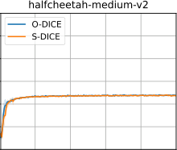

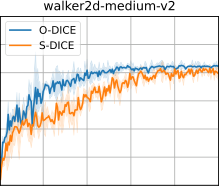

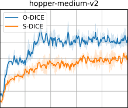

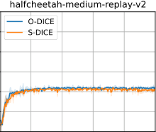

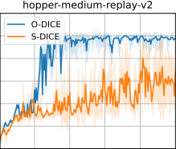

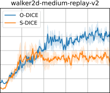

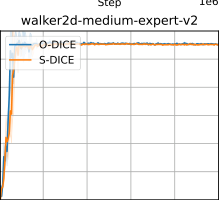

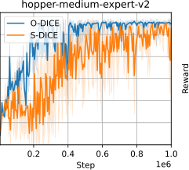

Figure 4: Learning curves of O-DICE and S-DICE on D4RL MuJoCo locomotion datasets.

24

Published as a conference paper at ICLR 2024

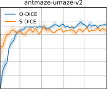

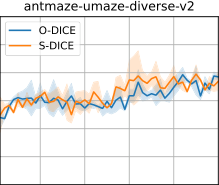

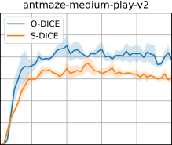

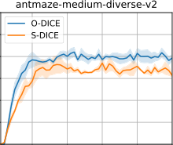

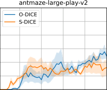

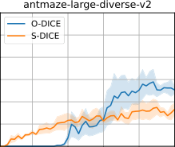

Figure 5: Learning curves of O-DICE and S-DICE on D4RL AntMaze datasets.

25

