## **Backpropagation through space, time and the brain**

Benjamin Ellenberger*, Paul Haider*,
Jakob Jordan, Kevin Max, Ismael Jaras, Laura Kriener, Federico Benitez,

Mihai A. Petrovici

_∗_ Shared first authorship

Department of Physiology, University of Bern, 3012 Bern, Switzerland.

**Abstract**

How physical networks of neurons, bound by spatio-temporal
locality constraints, can perform efficient credit assignment,
remains, to a large extent, an open question. In machine
learning, the answer is almost universally given by the error backpropagation algorithm, through both space and time.
However, this algorithm is well-known to rely on biologically
implausible assumptions, in particular with respect to spatiotemporal locality. Alternative forward-propagation models
such as real-time recurrent learning only partially solve the
locality problem, but only at the cost of scaling, due to prohibitive storage requirements. We introduce Generalized Latent Equilibrium (GLE), a computational framework for fully
local spatio-temporal credit assignment in physical, dynamical
networks of neurons. We start by defining an energy based on
neuron-local mismatches, from which we derive both neuronal

dynamics via stationarity and parameter dynamics via gradient descent. The resulting dynamics can be interpreted as a
real-time, biologically plausible approximation of backpropagation through space and time in deep cortical networks with
continuous-time neuronal dynamics and continuously active,
local synaptic plasticity. In particular, GLE exploits the morphology of dendritic trees to enable more complex information
storage and processing in single neurons, as well as the ability
of biological neurons to phase-shift their output rate with respect to their membrane potential, which is essential in both
directions of information propagation. For the forward computation, it enables the mapping of time-continuous inputs
to neuronal space, effectively performing a spatio-temporal
convolution. For the backward computation, it permits the
temporal inversion of feedback signals, which consequently approximate the adjoint variables necessary for useful parameter
updates.

**1** **Introduction**

The world in which we have evolved appears to lie in a
Goldilocks zone of complexity: it is rich enough to produce organisms that can learn, yet also regular enough to be learnable
by these organisms in the first place. Still, regular does not
mean simple; the need to continuously interact with and learn
from a dynamic environment in real time faces these agents –
and their nervous systems – with a challenging task.

One can view the general problem of dynamical learning as one
of _constrained minimization_, i.e., with the goal of minimizing

a behavioral cost with respect to some learnable parameters
(such as synaptic weights) within these nervous systems, under
constraints given by their physical characteristics. For example, in the case of biological neuronal [1] networks, such dynamical constraints may include leaky integrator membranes and
nonlinear output filters. The standard approach to this problem in deep learning uses stochastic gradient descent, coupled
with some type of automatic differentiation algorithm that calculates gradients via reverse accumulation [1, 2]. These methods are well-known to be highly effective and flexible in their
range of applications.

If the task is time-independent, or can be represented as a time
independent problem, the standard error backpropagation algorithm provides this efficient backward differentiation [3–5].
We refer to this class of problems as _spatial_, as opposed to more
complex _spatio-temporal_ problems, such as sequence learning.
For the latter, the solution to constrained minimization can be
sought through a variety of methods. When the dynamics are
discrete, the most commonly used method is backpropagation
through time (BPTT) [6, 7]. For continuous-time problems,
optimization theory provides a family of related methods, the
most prominent being the adjoint method (AM) [8], Pontryagin’s maximum principle [9, 10], and the Bellman equation [11].

AM and BPTT have proven to be very powerful methods, but
it is not clear how they could be implemented in physical neuronal systems that need to function and learn continuously,
in real time, and using only information that is locally available at the constituent components [12]. Learning through
AM/BPTT cannot be performed in real time, as it is only at
the end of a task that errors and parameter updates can be
calculated retrospectively (Fig. 1). This requires either storing the entire trajectory of the system (i.e., for all of its dynamical variables) until a certain update time, and/or recomputing the necessary variables during backward error propagation. While straightforward to do in computer simulations
(computational and storage inefficiency notwithstanding), a
realization in physical neuronal systems would require a lot of
additional, complex circuitry for storage, recall and (reverse)
replay. Additionally, it is unclear how useful errors can be represented and transmitted in the first place, i.e., which physical
network components calculate errors that correctly account
for the ongoing dynamics of the system, and how these then
communicate with the components that need to change during

1 We use the term _neuronal_ to differentiate between physical, timecontinuous dynamical networks of neurons and their abstract, timediscrete artificial neural network (ANN) counterparts.

1

learning (e.g., the synapses in the network). It is for these reasons that AM/BPTT sits firmly within the domain of machine
learning, and is largely considered not applicable for physical
neuronal systems, carbon and silicon alike.

Instead, theories of biological (or bio-inspired) spatio-temporal
learning focus on other methods, either by using reservoirs
and foregoing the learning of deep weights altogether, or by
using direct and instantaneous output error feedback, transmitted globally to all neurons in the network, as in the case of
FORCE [13] and FOLLOW [14]. Alternatively, the influence of
synaptic weights on neuronal activities can be carried forward
in time and associated with instantaneous errors, as proposed
in real-time recurrent learning (RTRL) [15]. While thereby
having the advantage of being temporally causal, RTRL still
violates locality, as this influence tensor relates all neurons
to all synapses in the network, including those that lie far
away from each other (Fig. 1). The presence of this tensor
also incurs a much higher memory footprint (cubic scaling for
RTRL vs. linear scaling for BPTT), which quickly becomes
prohibitive for larger-scale applications in machine learning.
Various approximations of RTRL alleviate some of these issues [16], but only at the cost of propagation depth. We
return to these methods in the Discussion, as our main focus
here is AM/BPTT.

Indeed, and contrary to prior belief, we suggest that physical
neuronal systems can approximate BPTT very efficiently and
with excellent functional performance. More specifically, we
propose the overarching principle of Generalized Latent Equilibrium (GLE) to derive a comprehensive set of equations for
inference and learning that are local in both time and space
(Fig. 1). These equations fully describe a dynamical system
running in continuous time, without the need for separate
phases, and undergoing only local interactions. Moreover, they
describe the dynamics and morphology of structured neurons
performing both _retrospective_ integration of past inputs and
_prospective_ estimation of future states, as well as the weight
dynamics of error-correcting synapses, thus linking to experimental observations of cortical dynamics and anatomy. Due to
its manifest locality and reliance on rather conventional analog components, our framework also suggests a blueprint for
powerful and efficient neuromorphic implementation.

We thus propose a new solution for the spatio-temporal credit
assignment problem in physical neuronal systems, with significant advantages over previously proposed alternatives. Importantly, our framework does not differentiate between spatial and temporal tasks and can thus be readily used in both
domains. As it represents a generalization of Latent Equilibrium (LE) [17], a precursor framework for bio-plausible, but
purely spatial computation and learning, it implicitly contains
(spatial) backpropagation as a sub-case. For a more detailed
comparison to LE, see Section 3.

This manuscript is structured as follows: In Section 2.1, we
first propose a set of four postulates from which we derive
network structure and dynamics. This is strongly inspired by
approaches in theoretical physics, where a specific energy function provides a unique reference from which everything else
about the system can be derived. We then discuss the link

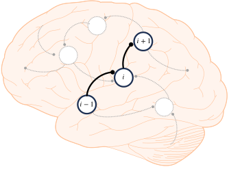

a

b

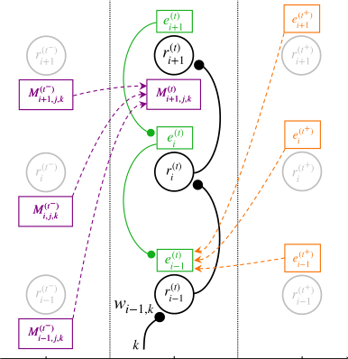

**Figure 1: The problem of locality in spatio-temporal credit as-**
**signment. (a)** To illustrate the different learning algorithms, we consider three neurons within a larger recurrent network. The neuron indices are indicative of the distance from the output, with neuron _i_ + 1
being itself an output neuron, and therefore having direct access to an
output error _e_ _i_ +1 . **(b)** Information needed by a deep synapse at time
_t_ to calculate an update ˙ _w_ _i_ [(] _−_ _[t]_ [)] 1 _,k_ [. Orange: future-facing algorithms such]

as BPTT require the states _r_ _n_ [(] _[t]_ [+)] of all future times _t_ [+] and all neurons
_n_ in the network and can therefore only be implemented in an offline

fashion. These states are required to calculate future errors _e_ _n_ [(] _[t]_ [+)], which
are then propagated back in time into present errors _e_ [(] _n_ _[t]_ [)] and used for
synaptic updates _w_ ˙ _i_ [(] _−_ _[t]_ [)] 1 _,k_ _[∝]_ _[e]_ _i_ [(] _−_ _[t]_ [)] 1 _[r]_ _k_ [(] _[t]_ [)] [.] Purple: past-facing algorithms

such as RTRL store past effects of all synapses _w_ _jk_ [(] _[t][−]_ [)] on all past states

_r_ _n_ [(] _[t][−]_ [)] in an influence tensor _M_ _n,j,k_ [(] _[t][−]_ [)] [. This tensor can be updated online]

and used to perform weight updates ˙ _w_ _i_ [(] _−_ _[t]_ [)] 1 _,k_ _[∝]_ [�] _n_ _[e]_ _n_ [(] _[t]_ [)] _[M]_ [ (] _n,i_ _[t]_ [)] _−_ 1 _,k_ [. Note]

that all synapse updates need to have access to distant output errors.
Furthermore, the update of each element in the influence tensor requires
the knowledge of distant elements and is thus itself nonlocal in space.
Green: GLE operates exclusively on present states _r_ _n_ [(] _[t]_ [)] [. It uses them to]
infer errors _e_ [(] _n_ _[t]_ [)] that approximate the future backpropagated errors of
BPTT.

to AM/BPTT in Section 2.3. Additionally, we show how our
framework describes physical networks of neurons, with implications for both cortex and hardware (Section 2.4). Subsequently, we discuss various applications, from small-scale
setups that allow an intuitive understanding of our network
dynamics (Section 2.5 and Section 2.6), to larger-scale networks capable of solving difficult spatio-temporal classification
problems (Section 2.7) and chaotic time series prediction (Sec

2

tion 2.8.1). Finally, we elaborate on the connections and advantages of our framework when compared to other approaches

in Section 3.

**2** **Results**

**2.1** **The GLE framework**

At the core of our framework is the realization that biological
neurons are capable of performing two fundamental temporal
operations. First, as is well-known, neurons perform temporal
integration in the form of low-pass filtering. We describe this
as a “retrospective” operation and denote it with the operator

_̸_

the main focus of this work.

We can now define the GLE framework as a set of four postulates, from which the entire network structure and dynamics
follow. The postulates use these operators to describe how for
ward and backward prospectivity work in biological neuronal
networks. As we show later, the dynamical equations derived
from these postulates approximate the equations derived from
AM/BPTT, but without violating causality, with only local
dependencies and without the need for learning phases.

**Postulate 1.** _The canonical variables describing neuronal net-_
_work dynamics are D_ _τ_ [+] _i_ [m] _[{][u]_ _[i]_ [(] _[t]_ [)] _[}][ and][ D]_ _τ_ [+] _i_ [r] _[{][u]_ _[i]_ [(] _[t]_ [)] _[}][, where each]_
_neuron is denoted with the subscript i ∈{_ 1 _, . . ., n}._

This determines the relevant dynamical variables for the postulates below. They represent, respectively, the prospective
voltages with respect to the membrane and rate time constants. Importantly, each neuron _i_ can in principle have its
own time constants _τ_ _i_ _[x]_ [, and the two are independent, so in]
general _τ_ _i_ [m] = _̸_ _τ_ _i_ [r] [. This is in line with the biological mecha-]
nisms for retro- and prospectivity, which are also unrelated, as

discussed above.

**Postulate 2.** _A neuronal network is fully described by the_
_energy function_

d _s,_ (1)
�

_̸_

1
_I_ _τ_ _[−]_ [m] _[ {][x][}]_ [ (] _[t]_ [) :=]
_τ_ [m]

_̸_

� _t_

_̸_

_t_

_x_ ( _s_ ) exp _−_ _[t][ −]_ _[s]_
_−∞_ � _τ_ [m]

_̸_

_τ_ [m]

_̸_

where _τ_ [m] represents the membrane time constant and _x_ the

synaptic input.

_̸_

The second temporal operation is much less known but wellestablished physiologically [18–23]: neurons are capable of performing temporal differentiation, an inverse low-pass filtering
that phase-shifts inputs into the future, which we thus name

“prospective” and denote with the operator

_̸_

� _∥e_ _i_ ( _t_ ) _∥_ [2] + _βC_ ( _t_ ) _,_ (3)

_i_

_̸_

[d]
_D_ _τ_ [+] [r] _[ {][x][}]_ [ (] _[t]_ [) :=] 1 + _τ_ [r]
� d _t_

_̸_

_x_ ( _t_ ) _._ (2)
�

_̸_

_E_ ( _t_ ) = [1]

2

_̸_

The time constant _τ_ [r] is associated with the neuronal output
rate, which, rather than being simply _φ_ ( _u_ ) (with _u_ the membrane potential and _φ_ the neuronal activation function), takes
on the prospective form _r_ = _φ_ ( _D_ _τ_ [+] [r] _[ {][u][}]_ [).]

In brief, this prospectivity can arise from two distinct mechanisms. On one hand, it follows as a direct consequence of
the output nonlinearity in spiking neurons [21]. In more complex neurons that are capable of bursting, the input slope also
directly affects the spiking output [24]. On the other hand,
prospectivity appears when the neuronal membrane (alternatively but equivalently, its leak potential or firing threshold)
is negatively coupled to an additional retrospective variable.
Such variables include, for example, the inactivation of sodium
channels, or slow adaptation (both spike frequency and subthreshold) currents [22, 23], thus giving neurons access to a
wide range of prospective horizons. For more detailed, intuitive explanations of these mechanisms, we refer to the SI,
Section 10. For a more technical discussion of prospectivity
in neurons with adaptation currents, we refer to Section 5.4

in the Methods. We also note that in analog neuromorphic
hardware, adaptive neurons are readily available [25–28], but
a direct implementation of an inverse low-pass filter would evidently constitute an even simpler and more efficient solution.

Importantly, the retrospective and prospective operators _I_ _τ_ _[−]_ [m]
and _D_ _τ_ [+] [r] [ have opposite effects; in particular, for] _[ τ]_ [ m] [ =] _[ τ]_ [ r] [, they]
are exactly inverse, which forms the basis of LE [17]. In that
case, the exact inversion of the low-pass filtering allows the
network to react instantaneously to a given input, which can
solve the relaxation problem for spatial tasks. However, this
exact inversion also precludes the use of neurons for explicit

temporal processing in spatio-temporal tasks, which represents

_̸_

_where e_ _i_ ( _t_ ) = _D_ _τ_ [+] _i_ [m] _[{][u]_ _[i]_ [(] _[t]_ [)] _[} −]_ [�] _j_ _[W]_ _[ij]_ _[φ]_ [(] _[D]_ _τ_ [+] _j_ [r] _[{][u]_ _[j]_ [(] _[t]_ [)] _[}]_ [)] _[ −]_ _[b]_ _[i]_ _[ is the]_

_mismatch error of neuron i. W_ _ij_ _and b_ _i_ _respectively denote_
_the components of the weight matrix and bias vector, φ the_
_output nonlinearity and β a scaling factor for the cost. The_
_cost function C_ ( _t_ ) _is usually defined as a function of the rate_
_and hence of D_ _τ_ [+] _i_ [r] _[{][u]_ _[i]_ _[}][ of some subset of output neurons.]_

This approach is inspired by physics and follows a timehonored tradition in machine learning, dating back to Boltzmann machines [29] and Hopfield networks [30] as well as computational neuroscience model such as, e.g., Equilibrium Propagation [31] and Predictive Coding frameworks [32]. The core
idea of these approaches is to define a specific energy function that provides a unique reference from which everything
else follows. In physics, this is the Hamiltonian, from which
the dynamics of the system can be derived; in our case, it
is a measure of the “internal tension” of the network, from
which we derive the dynamics of the network and its parameters. Under the weak assumption that the cost function can be
factorized, this energy is simply a sum over neuron-local energies _E_ _i_ ( _t_ ) = 2 [1] _[e]_ _i_ [2] [(] _[t]_ [) +] _[ βC]_ _[i]_ [(] _[t]_ [). Each of these energies represent]

a difference between a neuron’s own prospective voltage, i.e.,
what membrane voltage the neuron predicts for its near future
( _D_ _τ_ [+] _i_ [m] _[{][u]_ _[i]_ [(] _[t]_ [)] _[}]_ [), and what its functional afferents (and bias) ex-]

pect it to be ( [�] _j_ _[W]_ _[ij]_ _[φ]_ [(] _[D]_ _τ_ [+] _j_ [r] _[{][u]_ _[j]_ [(] _[t]_ [)] _[}]_ [) +] _[ b]_ _[i]_ [), with the potential]

addition of a teacher nudging term for output neurons that is
related to the cost that the network seeks to minimize ( _βC_ _i_ ( _t_ )).

**Postulate 3.** _Neuron dynamics follow the stationarity prin-_
_ciple_

_̸_

�

_̸_

_I_ _τ_ _[−]_ _i_ [m]

_̸_

_∂E_
� _∂D_ _τ_ [+] _i_ [m] _[{][u]_ _[i]_ _[}]_ �

_̸_

+ _I_ _τ_ _[−]_ _i_ [r]

_̸_

_∂E_
� _∂D_ _τ_ [+] _i_ [r] _[{][u]_ _[i]_ _[}]_

_̸_

= 0 _._ (4)

_̸_

3

As the two rates of change (the partial derivatives) are with
respect to prospective variables, with temporal advances determined by _τ_ [m] and _τ_ [r], they can be intuitively thought of as
representing quantities that refer to different points in the future – loosely speaking, at _t_ + _τ_ [m] and _t_ + _τ_ [r] . To compare the
two rates of change on equal footing, they need to be pulled
back into the present by their respective inverse operators _I_ _τ_ _[−]_ [m]
and _I_ _τ_ _[−]_ [r] [.] It is the equilibrium of this mathematical object,
otherwise not immediately apparent (hence: “latent”) from
observing the network dynamics themselves (see below), that
gives our framework its name. It is also easy to check that
for the special case of _τ_ _i_ [m] = _τ_ _i_ [r] _∀i_, GLE reduces to LE [17] –
hence the ‘generalized’ nomenclature.

**Postulate 4.** _Parameter dynamics follow gradient descent_
_(GD) on the energy_

**˙**
_**θ**_ = _−η_ _**θ**_ _[∂E]_ (5)

_∂_ _**θ**_

_with individual learning rates η_ _**θ**_ _._

Parameters include _**θ**_ = _{_ _**W**_ _,_ _**b**_ _,_ _**τ**_ [m] _,_ _**τ**_ [r] _}_, with boldface denoting matrices, vectors, and vector-valued functions. These parameter dynamics are the equivalent of plasticity, both for
synapses ( _W_ _ij_ ) and for neurons ( _b_ _i_ _, τ_ _i_ [m] _[, τ]_ [ r] _i_ [). The intuition be-]
hind this set of postulates is illustrated in Fig. 2. Without
an external teacher, the network is unconstrained and simply
follows the dynamics dictated by the input; as there are no
errors, both cost _C_ and energy _E_ are zero. As an external
teacher appears, errors manifest and the energy landscape becomes positive; its absolute height is scaled by the coupling parameter _β_ . While neuron dynamics **˙** _**u**_ trace trajectories across
this landscape, plasticity _**θ**_ **[˙]** gradually reduces the energy along
these trajectories (cf. Fig. 2). Thus, during learning, the energy landscape (more specifically, those parts deemed relevant
by the task of the network, lying on the state subspace traced
out by the trajectories during training) is gradually lowered,
as illustrated by the faded surface. Ultimately, after learning,
the energy will ideally be pulled down to zero, thus implicitly
also reducing the cost, because it is a positive, additive component of the energy. Beyond this implicit effect, we later show
how the network dynamics derived from these postulates also
explicitly approximate gradient descent on the cost.

The four postulates above fully encapsulate the GLE framework. From here, we can now take a closer look at the network
dynamics and see how they enable the sought transport of signals to the right place and at the right time.

**2.2** **Network dynamics**

With our postulates at hand, we can now infer dynamical
and structural properties of neuronal networks that implement
GLE. We first derive the neuronal dynamics by applying the
stationarity principle (Postulate 3, Eqn. 4) to the energy function (Postulate 2, Eqn. 3):

_τ_ _i_ [m] _[u]_ [˙] _i_ [=] _[ −][u]_ _i_ [+][ �] _j_ _[W]_ _[ij]_ _[φ]_ � _D_ _τ_ [+] _j_ [r] _[{][u]_ _[j]_ _[}]_ � + _b_ _i_

� _φ_ _i_ _[′]_ � _j_ _[W]_ _[ji]_ _[e]_ _[j]_ ��

+ _D_ _τ_ [+] _i_ [m]

� _I_ _τ_ _[−]_ _i_ [r]

_,_ (6)

**Figure 2: Comparison between AM and GLE.** Network dynamics define trajectories (black) in the cost/energy landscape, spanned by
external inputs _I_ and neuron outputs _r_ . Parameter updates (red, here:
synaptic weights) reduce the cost/energy along these trajectories. **(a)**
AM records the trajectory between two points in time and calculates
the total update ∆ _W_ that reduces the _integrated_ cost along this trajectory. **(b)** GLE calculates an approximate cost gradient _at every point_
_in time_, by taking into account past network states (via retrospective
coding, _I_ _τ_ _[−]_ [) and estimating future errors from the current state (via]
prospective coding,ually reduce the energy in real-time, with the (real) trajectory slowly _D_ _τ_ [+] [).] Learning is thus fully online and can graddropping away from the (virtual) trajectory of a network that is not
learning (dashed line).

where _φ_ _i_ _[′]_ [is a shorthand for the derivative of the activation]
functional evaluated at _D_ _τ_ [+] _i_ [r] _[{][u]_ _[i]_ _[}]_ [. For a detailed derivation, we]
refer to Section 5.1 in the Methods. This is very similar to conventional leaky integrator dynamics, except for two important
components: first, the use of the prospective operator for the
neuronal output, which we already connected to the dynamics
of biological neurons above, and second, the additional error
term. With this, we have two complementary representations
for the error term _e_ _i_ . First, as mismatch between the prospective voltage and the basal inputs (cf. Eqn. 3), describing how
errors couple two membranes, and second, as a function of
other errors _e_ _j_, as given by the error propagation equation
(cf. Eqn. 6). Thus, in the GLE framework, a single neuron performs four operations in the following order: (weighted) sum
of presynaptic inputs, integration (retrospective), differentiation (prospective), and the output nonlinearity. The timescale
associated with retrospectivity is the membrane time constant
_τ_ [m], whereas prospectivity is governed by _τ_ [r] . This means that
even if the membrane time constant is fixed, as may be the

� �� ~~�~~

_e_ _i_

4

case for certain neuron classes or models thereof, single neurons can still tune the time window to which they attend by
adapting their prospectivity. This temporal attention window
can lie in the past (retrospective neurons, _τ_ [r] _< τ_ [m] ), in the
present (instantaneous neurons, _τ_ [r] = _τ_ [m], as described by LE),
but also in the future (prospective neurons, _τ_ [r] _> τ_ [m] ). These
neuron classes can, for example, be found in cortex [33, 34] and
hippocampus [35, 36]; for a corresponding modeling study, we
refer to [23]. The prospective capability becomes essential for
error propagation, as we discuss below, while the use of different attention windows allows the learning of complex spatiotemporal patterns, as we show in action in later sections. Note
that for _τ_ [r] = 0, we recover classical leaky integrator neurons
as a special case of our framework.

Eqn. 6 also suggests a straightforward interpretation of neuronal morphology and its associated functionality. In particular, it suggests that separate neuronal compartments store
different variables: a somatic compartment for the voltage _u_ _i_,
and two dendritic compartments for integrating [�] _j_ _[W]_ _[ij]_ _[r]_ _[j]_ [ and]

_e_ _i_, respectively. This separation also gives synapses access to
these quantities, as we discuss later on. Further below, we
also show how this basic picture extends to a microcircuit for
learning and adaptation in GLE networks.

The error terms in GLE also naturally include prospective and
retrospective operators. As stated in Postulate 2 (Eqn. 3), the
total energy of the system is a sum over neuron-local energies.
If we now consider a hierarchical network, these terms can
be easily rearranged into the form (see Methods and SI for a
detailed derivation)

_̸_

_**e**_ _ℓ_ = _**D**_ [+] _**τ**_ _ℓ_ [m] � _**I**_ _[−]_ _**τ**_ _ℓ_ [r]

� �� ~~�~~
temporal BP

_̸_

_**φ**_ _ℓ_ _[′]_ _[◦]_ _**[W]**_ _ℓ_ [ T] +1 _**[e]**_ _ℓ_ +1
�� ~~�~~ � ~~�~~
spatial BP

_̸_

_,_ (7)
��

_̸_

a review). For a more detailed biological description of our
specific type of learning rule, we refer to [38]. Notice that parameter learning is neuron-local, and that we are performing
gradient descent explicitly on the energy _E_, and only implicitly on the cost _C_ . This is a quintessential advantage of the
energy-based formalism, as the locality of GLE dynamics is
a direct consequence of the locality of the postulated energy
function. This helps provide the physical and biological plausibility that other methods lack. In Section 2.4, we discuss how
GLE dynamics relate to physical neuronal networks and cortical circuits, but first, we show how these dynamics effectively
approximate AM/BPTT.

**2.3** **GLE dynamics implement a real-time ap-**
**proximation of AM/BPTT**

The learning capabilities of GLE arise from the specific form of
the errors encapsulated in the neuron dynamics, which make
the similarity to AM/BPTT apparent, as discussed below. For
a detailed derivation of the following relationships, we refer to

Methods and the SI.

Just like in GLE, learning in AM/BPTT is error-correcting:

_T_
∆ _**W**_ _ℓ_ [AM] = _**λ**_ _ℓ_ _**r**_ _ℓ_ [T] _−_ 1 [d] _[t,]_ (9)
� 0

where the continuous-time adjoint variables _**λ**_ in AM are equivalent to the time-discrete errors in BPTT. While typically calculated in reverse time, as for the backpropagated errors in
BPTT, for the specific dynamics of cost-decoupled GLE networks ( _β_ = 0 _⇒_ _**e**_ = **0** _⇒_ _E_ = 0) it is possible to write the
adjoint dynamics in forward time as follows:

_̸_

_**λ**_ _ℓ_ = _**I**_ [+] _**τ**_ _ℓ_ [m]

_̸_

_**φ**_ _ℓ_ _[′]_ _[◦]_ _**[W]**_ _ℓ_ [ T] +1 _**[λ]**_ _ℓ_ +1 _._ (10)
� ��

_̸_

� _**D**_ _[−]_ _**τ**_ _ℓ_ [r]

_̸_

where _ℓ_ denotes the network layer and _φ_ _[′]_ denotes the derivative of _φ_ evaluated at _**D**_ [+] _**τ**_ [r] _[ {]_ _**[u]**_ _[ℓ]_ _[}]_ [.] In this form, the connection to backpropagation (BP) algorithms becomes apparent.
For _τ_ [r] = _τ_ [m], the operators cancel and Eqn. 7 reduces to the
classical (spatial) error backpropagation algorithm, as already
studied in [17]. When _τ_ [r] = _̸_ _τ_ [m] however, the error exhibits a
switch between the two time constants when compared to the
forward neuron dynamics (Eqn. 6): whereas forward rates are
retrospective with _τ_ [m] and prospective with _τ_ [r], backward er
rors invert this relationship. In other words, backward errors
invert the temporal shifts induced by forward neurons. As we
discuss in the following section, it is precisely this inversion
that enables the approximation of AM/BPTT.

As for the neuron dynamics, parameter dynamics also follow
from the postulates above. For example, synaptic plasticity is
obtained by applying the gradient descent principle (Postulate
4, Eqn. 5 with respect to synaptic weights _**W**_ ) to the energy
function (Postulate 2, Eqn. 3):

_W_ ˙ _ij_ = _η_ _W_ _e_ _i_ _r_ _j_ = _η_ _W_ ( _D_ _τ_ [+] _i_ [m] _[{][u]_ _[i]_ _[} −]_ _[v]_ _[i]_ [)] _[r]_ _[j]_ _[,]_ (8)

where _v_ _i_ = [�] _j_ _[W]_ _[ij]_ _[r]_ _[j]_ [ is the membrane potential of the den-]

dritic compartment that integrates bottom-up synaptic inputs.
Such three-factor error-correcting rules have often been discussed in the context of biological deep learning (see [37] for

and _I_ _τ_ [+] _[{][x]_ [(] _[t]_ [)] _[}]_ [ =] _τ_ 1 � _t∞_ _x_ ( _s_ ) _e_ _t−τ_ _s_ d _s_ to describe the hierarchi
cal coupling of the adjoint variables. We note that the adjoint
dynamics (Eqn. 10) can also be derived in our GLE framework

_̸_ by simply replacing _I_ _τ_ _[−]_ _i_ [m] with _D_ _τ_ _[−]_ _i_ [m] in Postulate 3.

Note the obvious similarity between Eqns. 7 and 10. The inner
term _**φ**_ _ℓ_ _[′]_ _[◦]_ _**[W]**_ _ℓ_ [ T] +1 _**[λ]**_ _[ℓ]_ [+1] [is identical and describes backpropaga-]
tion through space. The outer operators perform the temporal
backpropagation, enacting the exact opposite temporal operations compared to the representation neurons (first retrospective with _τ_ [r] then prospective with _τ_ [m], cf. Eqn. 6).

However, there is a subtle but important difference between the
temporal operators in GLE and AM/BPTT. In AM/BPTT,
the retrospective operator is differential and the prospective
one is integral. It is this integral operator _I_ _τ_ [+] [m] [ that causes]
AM/BPTT to be noncausal, as it assumes a knowledge of the
future that is impossible to calculate in an online fashion.

How GLE can perform an online approximation of this operation is best seen in frequency space, where we can analyze
how the combined temporal operators affect individual Fourier
components (see also Fig. 3). For a single such component –
a sine wave input of fixed angular frequency _ω_ – each operator causes a temporal (phase) shift: the retrospective operator

Here, we use adjoint operators _D_ _τ_ _[−]_ _[{][x]_ [(] _[t]_ [)] _[}]_ [ =] �1 _−_ _τ_ d [d] _t_ � _x_ ( _t_ )

_̸_

_̸_

5

_I_ = sin( _ωt_ )

_D_ _τ_ [+] _[{][I]_ [(] _[t]_ [)] _[}]_

1

0

_−_ 1

**a** _I_ = sin( _ωt_ ) _D_ _τ_ _[{][I]_ [(] _[t]_ [)] _[}]_

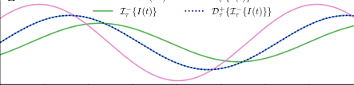

0 10 20 30 40 50 60 70
_t_ / ms

**b** single operator

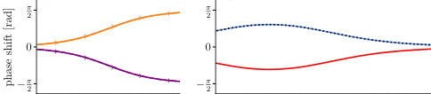

10 _[−]_ [1] 10 [0] 10 [1]

_ωτ_

**d** combined operators

10 _[−]_ [1] 10 [0] 10 [1]
_ω_ / kHz

**e**

**c**

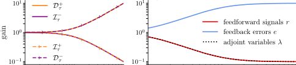

10 _[−]_ [1] 10 [0] 10 [1]

_ωτ_

10 _[−]_ [1] 10 [0] 10 [1]
_ω_ / kHz

**Figure 3: Comparison of GLE and AM/BPTT in Fourier space.**
**(a)** Effect of the individual and combined GLE operators _I_ _τ_ _[−]_ and _D_ _τ_ [+]
with shared time constant _τ_ on a single frequency component of an input
current _I_ . _I_ _τ_ _[−]_ [generates a negative phase shift (towards later times) and]
sub-unit gain. _D_ _τ_ [+] is its exact inverse and generates a positive phase
shift (towards earlier times) and supra-unit gain. **(b)** Phase shift and **(c)**
gain of all four temporal operators in GLE and AM/BPTT across a wide
range of the frequency spectrum. Note how the prospective operators
_D_ _τ_ [+] [and] _[ I]_ _τ_ [+] [(orange) have the same shift but inverse gain; the same holds]
for the retrospective operators _I_ _τ_ _[−]_ and _D_ _τ_ _[−]_ (purple). **(d)** Phase shift
and **(e)** gain of the combined operators as they appear in the neuron
dynamics. Here, we choose an example forward neuron (blue) with a
retrospective attention window ( _τ_ [m] = 10 _τ_ [r] ). Both the associated GLE
errors _e_ (blue) and the adjoint variables _λ_ (dotted) are prospective and
precisely invert this phase shift, albeit with a different gain.

_I_ _τ_ _[−]_ [causes a shift of the input signal towards later times, while]
the prospective operator causes an inverse shift towards earlier
times. These phase shifts are exactly equal to those generated
by the adjoint operators _D_ _τ_ _[−]_ [and] _[ I]_ _τ_ [+] [. Therefore, in terms of]
temporal shift, the GLE errors are perfect replicas of the adjoint variables derived from exact gradient descent; this is the
most important part of the temporal backpropagation in AM.

In terms of gain, GLE and AM/BPTT are inverted. For
smaller angular frequencies _ωτ_ ≲ 1, this approximation is very
good and the gradients are only weakly distorted. We will
later see that in practice, for hierarchical networks with sufficiently diverse time constants, successful learning does not
strictly depend on this formal requirement. What appears
more important is that, even for larger _ωτ_, GLE errors always
conserve the sign of the correct adjoints, so the error signal
always remains useful; moreover, higher-frequency oscillations
in the errors tend to average out over time, as we demonstrate

in simulations below.

**2.4** **Cortical / neuromorphic circuits**

As shown above, GLE backward (error) dynamics engage the
same sequence of operations as those performed by forward
(representation) dynamics: first integration _I_ _τ_ _[−]_ [, then differen-]
tiation _D_ _τ_ [+] [. This suggests that backward errors can be trans-]
mitted by the same type of neurons as forward signals [39, 40],

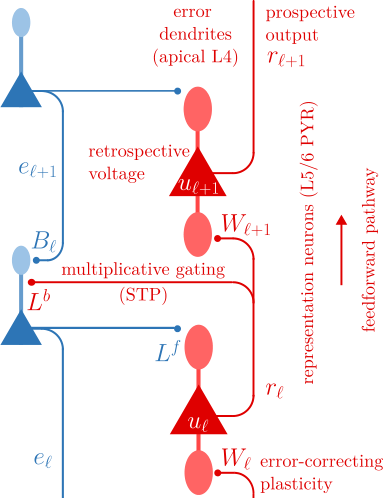

**Figure 4:** **Microcircuit implementation of GLE: key compo-**
**nents.** Representation neurons form the forward pathway (red), error
neurons form the backward pathway (blue). Both classes of neurons are
PYR, likely located in different layers of cortex. Lateral connections
enable information exchange and gating between the two streams. The
combination of retrospective membrane and prospective output dynamics allow these neurons to tune the temporal shift of the transmitted
information. Errors are also represented in dendrites, likely located in
the apical tuft of signal neurons, enabling local three-factor plasticity to
correct the backpropagated errors.

which is in line with substantial experimental evidence that
demonstrates the encoding of errors in L2/3 pyramidal (PYR)
neurons [41–46]. Note that correct local error signals are only
possible with neurons that are capable of both retrospective
( _I_ _τ_ _[−]_ [) and prospective (] _[D]_ _τ_ [+] [) coding – the core element of the]

GLE framework.

This symmetry between representation and error suggests a
simple microcircuit motif that repeats in a ladder-like fashion,
with L2/3 PYR error neurons counterposing L5/6 PYR representation neurons (Fig. 4). Information transmitted between
the two streams provides these neurons with all the necessary
local information to carry out GLE dynamics. In particular,
error neurons can elicit the representation of corresponding
errors in dendritic compartments of representation neurons,
allowing forward synapses to access and correct these errors
through local plasticity. Recent evidence for error representation in apical dendrites provides experimental support for this
component of the model [47].

The correct propagation of errors requires two elements that
can be implemented by static lateral synapses. First, error neuron input needs to be multiplicatively gated by the derivative
of the corresponding representation neuron’s activation function _φ_ . This can either happen through direct lateral interaction, or through divisive (dis)inhibition, potentially carried
out by somatostatin (SST) and parvalbumin (PV) interneuron populations [48–51], via synapses that are appropriately
positioned at the junction between dendrites and soma. The
required signal _φ_ _[′]_ can be generated and transported in different ways depending on the specific form of the activation

6

after learning

time [a.u.]

**c**

**a**

**b** before learning

BP GLE target

_r_ 2

_r_ 1

_r_ 0 4 a _._ u _._

_e_ 2

_e_ 1

time [a.u.]

target _w_ 0 target _w_ 1

2

1

0

10 [2] 10 [3]

target _τ_ 0 target _τ_ 1

2

1

0
10 [2] 10 [3]

10 _[−]_ [2]

10 _[−]_ [6]

10 _[−]_ [10]

BP

GLE

BPTT (TW=4)

BPTT (TW=2)

10 [2] 10 [3]
time [a.u.]

**Figure 5:** **Learning with GLE in a simple chain.** **(a)** Network setup. A chain of two retrospective representation neurons (red) learns to
mimic the output of a teacher network (identical architecture, different parameters). In GLE, this chain is mirrored by a chain of corresponding error
neurons (blue), following the microcircuit template in Fig. 4. We compare the effects of three learning algorithms: GLE (green), backpropagation
with instantaneous errors (purple) and BPTT (point markers denote the discrete nature of the algorithm; pink, brown and orange denote different
truncation windows (TW)). **(b)** Output of representation neurons ( _r_ _i_, red) and error neurons ( _e_ _i_, blue) for GLE and instantaneous backpropagation
(BP). Left: before learning (i.e., both weights and membrane time constants are far from optimal). Right: after learning. **(c)** Evolution of weights,
time constants and overall loss. Fluctuations at the scale of 10 _[−]_ [10] are due to limits in the numerical precision of the simulation.

function. For example, if _φ_ = ReLU, lateral weights can simply be set to _**L**_ _[b]_ = **1** . For sigmoidal activation functions, _φ_ _[′]_ can
be very well approximated by synapses with short-term plasticity (e.g., [52], Eqn. 2.80). The second requirement regards

the communication of the error back to the error dendrites of

the representation neurons; this is easily achieved by setting
_**L**_ _[f]_ = **1** .

Ideally, synapses responsible for error transport in the feedback pathway need to mirror forward synapses: _**B**_ = _**W**_ [T]

(cf. Eqn. 7). While this can, to some extent, be mitigated
by feedback alignment [53], improved solutions to the weight
transport problem that are both online and local have also
been recently proposed [54–56].

We now proceed to demonstrate several applications of the
GLE framework. First, we illustrate its operation in smallscale examples, to provide an intuition of how GLE networks

can learn to solve non-trivial temporal tasks. Later on, we
discuss more difficult problems that usually require the use of
sophisticated deep learning methods and compare the performance of GLE with the most common approaches used for

these problems in machine learning.

**2.5** **A minimal GLE example**

As a first application, we study learning in a minimal teacherstudent setup. The network consists of a forward chain of two
neurons (depicted in red in Fig. 5a) provided with a periodic
step function input . The task of the student network is to
learn to mimic the output of a teacher network with identical
architecture but different parameters, namely different weights
and membrane time constants. Prospective time constants _τ_ [r]

are not learned and set to zero for both student and teacher

such that the neurons are simple leaky integrators. The target

membrane time constants _τ_ [m] are chosen to be on the scale of

the dominant inverse frequency of the input signal, such that

they cause a significant temporal shift without completely suppressing the signal. Due to these slow transient membrane dynamics, the task is not solvable using instantaneous backpropagation, but requires true temporal credit assignment instead.

We compare three different solutions to this problem: (1)
a GLE network with time-continuous dynamics, including
synaptic and neuronal plasticity; (2) standard error backpropagation using instantaneous error signals _e_ _i_ = _φ_ _i_ _[′]_ _[w]_ _[i]_ _[e]_ _[i]_ [+1] [; (3)]
truncated BPTT through the discretized neuron dynamics using PyTorch’s `autograd` functionality for different truncation

windows.

We first note that the GLE network learns the task successfully and quickly, in contrast to instantaneous backpropagation
(Fig. 5c). To understand why, it is instructive to compare its
errors to the instantaneous ones ( _e_ _i_ panels in Fig. 5b). The instantaneous errors (backpropagation, dashed lines) are always
in sync with the output error, but their shape and timing become increasingly desynchronized from the neuronal inputs as
they propagate toward the beginning of the chain, because
they do not take into account the lag induced by the representation neurons. Thus, the correct temporal coupling between
errors and presynaptic rates required by plasticity (cf. Eqn. 8,
see also Eqns. 21 to 24 in Methods) is corrupted and learning is impaired. Note that instantaneous errors are already a
strong assumption and themselves require a form of prospectivity [17]; without any prospectivity, learning performance would
be even more drastically compromised. In contrast, the GLE
errors gradually shift forward in time, matching the phase and
shape of the respective neuronal inputs, and thus allowing the
stable learning of all network parameters, weights and time

constants alike.

Here, we can also see an advantage of GLE over the classical
BPTT solution (Fig. 5c). Despite only offering an approximation of the exact gradient calculated by BPTT, it allows learning to operate continuously, fully online. As discussed above,

7

**b** before learning after learning

_r_ 3

target

_r_ 0

_λ_ [i] 1 _e_ [i] 1

_λ_ [r] 1 _e_ [r] 1

_[̸]_

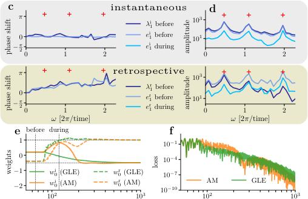

time [a.u.]

_[̸]_

30 40 50
time [a.u.]

_[̸]_

980 990 1000
time [a.u.]

_[̸]_

time [a.u.]

_[̸]_

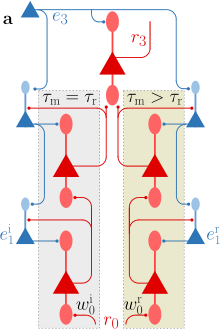

**Figure 6: Error propagation and learning with GLE in a small hierarchical network. (a)** Network setup. A network with one output
neuron and two hidden layers (red) learns to mimic the output of a teacher network (identical architecture, different input weights to the first hidden
layer). Each hidden layer contains one instantaneous ( _τ_ = _τ_ [r] = 1) and one retrospective ( _τ_ [m] = 1, _τ_ [r] = 0 _._ 1) neuron. In GLE, the corresponding
error pathway (blue) follows the microcircuit template in Fig. 4. The input is defined by a superposition of three angular frequency components
_ω ∈{_ 0 _._ 49 _,_ 1 _._ 07 _,_ 1 _._ 98 _}_ . Here, we compare error propagation, synaptic plasticity and ultimately the convergence of learning under GLE and AM. **(b)**
Input and output rates ( _r_, red), along with bottom layer errors ( _e_, light blue) and adjoints ( _λ_, dark blue) before and during the late stages of learning.
A running average over _e_ is shown in orange. **(c)** Phase shifts (compared to the output error _e_ 3 ) and **(d)** amplitudes of bottom layer errors and
adjoints across a wide range of their angular frequency spectrum before and during learning. The moments “before” and “during” learning are marked
by vertical dashed lines in panel e. Top: _e_ [i] 1 [and] _[ λ]_ [i] 1 [for the instantaneous neuron. Bottom:] _[ e]_ [r] 1 [and] _[ λ]_ [r] 1 [for the retrospective neuron. Note that due]
to the nonlinearity of neuronal outputs, the network output has a much broader distribution of frequency components compared to the input (with
its three components highlighted by the red crosses +). Error amplitudes are shown at two different moments during learning. **(e)** Evolution of the
bottom weights ( _w_ 0 [i] _[, w]_ 0 [r] [) and] **[ (f)]** [ of the loss during learning. The vertical dashed lines mark the snapshots at which adjoint and error spectra are]
plotted above.

_[̸]_

BPTT needs to record a certain period of activity before being
able to calculate parameter updates. If this truncation window
is too short, it fails to capture longer transients in the input
and learning stalls or diverges (brown and pink, respectively).
Only with a sufficiently long truncation window does BPTT
converge to the correct solution (orange), but at the cost of
potentially exploding gradients and/or slower convergence due _[̸]_
to the resulting requirement of reduced learning rates. For a
demonstration of the noise robustness of this setup, we refer
to Section 12.2 in the Supplement.

**2.6** **Small GLE networks**

To better visualize how errors are computed and transmitted
in more complex GLE networks, we now consider a teacher
student setup with two hidden layers, each with one instantaneous and one retrospective neuron (Fig. 6a). Through this
combination of fast and slow pathways between network input and output, such a small setup can already perform quite
complex transformations on the input signal (Fig. 6b). From
the perspective of learning an input-output mapping, this can
be stated as the output neuron having access to multiple time
scales of the input signal, despite the input being provided to

the network as a constant stream in real time. This is es
sential for solving the complex classification problems that we

describe later.

To isolate the effect of error backpropagation into deeper layers, we keep all but the bottom weights fixed and identical
between teacher and student. The goal of the student network
is to mimic the output of the teacher network by adapting its
own bottommost forward weights. We then compare error dynamics and learning in the GLE network with exact gradient
descent on the cost as computed by AM/BPTT.

While both methods converge to the correct target (Fig. 6b
and e), they don’t necessarily do so at the same pace, since
AM/BPTT cannot perform online updates, as also discussed
above. Also, GLE error propagation is only identical to the
coupling of adjoint variables (AM/BPTT) for instantaneous
neurons with _τ_ [m] = _τ_ [r] ( _e_ [i] 1 [=] _[ λ]_ [i] 1 [). In general, this is not the]
case ( _e_ [r] 1 _[̸]_ [=] _[ λ]_ [r] 1 [), as GLE errors tend to overemphasize higher]
frequency components in the signal (cf. also Section 2.3 and
Fig. 6d). However, this only occurs for slow, retrospective
neurons, which only need to learn the slow components of the
output signal. For sufficiently small learning rates, plasticity
in their afferent synapses effectively integrates over these oscillations and lets them adapt to the relevant low-frequency
components. Indeed, the close correspondence to AM/BPTT
is reflected in the average GLE errors, which closely track the
corresponding adjoints. While it was not necessary to make
use of such additional components in our simulations, highamplitude high-frequency oscillations in the error signals could
be mitigated by several simple mechanisms, including saturating activation functions for the error neurons, input averaging
in the error dendrites or synaptic filtering of the plasticity sig
nal.

Following the analysis in the previous section, our simulations
now demonstrate how GLE errors encode the necessary information for effective learning. Most importantly, GLE errors
and adjoint variables (AM/BPTT) have near-identical timing,
as shown by the alignment of their phase shifts across the signal frequency spectrum (Fig. 6c). Moreover, for the errors of
the retrospective neurons, these phase shifts are positive with

respect to the output error, thus demonstrating the prospectivity required for the correct temporal alignment of inputs and
errors. The amplitudes of _e_ and _λ_ also show distinct peaks
at the same angular frequencies, corresponding to the three

_[̸]_

8

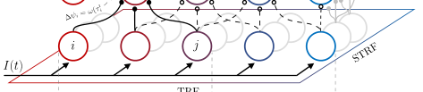

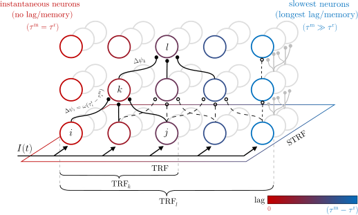

**Figure 7: Neuronal diversity fosters complex temporal attention**
**windows in GLE networks.** In the simplest case, a single input signal
_I_ ( _t_ ) is fed into a GLE network and all neurons in the bottom layer have
access to the same information stream. However, the output of each
neuron generates a temporal shift, depending on its time constants _τ_ [m]

and _τ_ [r] (as highlighted by the neuron colors). Different chains of such
neurons thus provide neurons in higher levels of the hierarchy with a
set of attention windows across the past input activity. Synaptic and
neuronal adaptation shape the nature of these temporal receptive fields
(TRFs). For multidimensional input, neuron populations (gray) encode
the additional spatial dimension and neuronal receptive fields become
spatiotemporal (STRFs).

components of the input signal that need to be mapped to
the output (Fig. 6d). These signals can thus guide plasticity in the correct direction, gradually learning first the slow
and then the fast components of the input-output mapping.
This is also evinced by Fig. 6e, where the input weights of the
retrospective neurons _w_ 0 [r] [are the first to converge. The ensu-]
ing reduction of the slow error components provides the input
weights of the instantaneous neurons _w_ 0 [i] [with cleaner access]
to the fast error components – the only ones that they can
actually learn – which allows them to converge as well.

**2.7** **Challenging spatio-temporal classification**

We now demonstrate the performance of GLE in larger hierarchical networks, applied to difficult spatio-temporal learning tasks, and compare it to other solutions from contemporary machine learning. An essential ingredient for enabling
complex temporal processing capabilities in GLE networks
is the presence of neurons with diverse time constants _τ_ [m]

and _τ_ [r] (Fig. 7). Each of these neurons can be intuitively
viewed as implementing a specific temporal attention window, usually lying in the past, proportionally to _τ_ [m] _−_ _τ_ [r] .
More specifically, for a given angular frequency component of
the input _ω_, this window is centered around a phase shift of
arctan( _ωτ_ [r] ) _−_ arctan( _ωτ_ [m] ) _≈_ _ω_ ( _τ_ [r] _−τ_ [m] ) for _ωτ_ ≲ 1 (cf. Methods). By connecting to multiple presynaptic partners in the
previous layer, a neuron thus carries out a form of temporal convolution, similarly to temporal convolutional networks
(TCNs) [57]. Deeper networks also allow longer chains of such
neurons to be formed, thus providing the output with a diverse set of complex transforms on different time intervals distributed across the past values of the input signal. GLE effectively enables deep networks to learn a useful set of such

transforms.

**2.7.1** **MNIST-1D**

We first consider the MNIST-1D [58] benchmark for temporal sequence classification. Other than the name itself and
the number of classes, MNIST-1D bears little resemblance to

its classical namesake. Here, each sample is a one-dimensional
array of floating-point values, which can be streamed as a temporal sequence into the network (see Fig. 8a for examples from
each class). This deceptively simple setup entails two difficult
challenges. First, only a quarter of each sample contains meaningful information; this chunk is positioned randomly within
the sample, every time at a different position. Second, independent noise is added on top of every sample at multiple frequencies, which makes it difficult to remove by simple filtering.
To allow a direct comparison between the different algorithms,
we use no preprocessing in our simulations.

We first note that a multi-layer perceptron (MLP) fails to appropriately learn to classify this dataset, reaching a validation
accuracy of only around 60%. This is despite the perceptron
having access to the entire sequence from the sample at once,
unrolled from time into space. This highlights the difficulty
of the MNIST-1D task. More sophisticated machine learning
architectures yield much better results, with TCNs [57] and
gated recurrent units (GRUs) [59] achieving averages of over
90%. Notably, both of these models need to be trained offline,
that is, they need to process the entire sequence before updating their parameters, with TCNs in particular requiring a
mapping of temporal signals to spatial representations beforehand, and GRUs requiring offline BPTT training with direct
access to the full history of the network.

In contrast, GLE networks are trained online, with a single
neuron streaming the input sequence to the network and, and
the network updating its parameters in real time. The network
consists of six hidden layers with a mixture of instantaneous
and retrospective neurons in each layer, and a final output
layer of 10 instantaneous neurons. We use either 53 or 90
neurons per layer, leading to a total of 15 thousand (as the
MLP) or 42 thousand parameters, respectively. When faced
with short informative signals embedded in a sea of noise, for
which the target is always on even in the absence of meaningful information, the online learning advantage of GLE networks represents an additional challenge to learning. Since
only a fraction of each input actually contains a meaningful
signal, GLE networks must be capable of remembering these
informative combinations of inputs and targets throughout the
uninformative portions of their training. This manifests as an
increase in convergence time, but not in ultimate performance,
as GLE maintains an overall good online approximation of the
true gradients for updating the network parameters. Thus, despite facing a significantly more difficult task compared to the
methods that have access to the full network activity unrolled
in time, GLE achieves highly competitive classification results,
with an average validation accuracy of 93 _._ 5 _±_ 0 _._ 9% for the larger
network and 91 _._ 7 _±_ 0 _._ 8% for the smaller network. The ANN

baselines achieve an average validation accuracy of 65 _._ 5 _±_ 1 _._ 0%
for the MLP, 96 _._ 7 _±_ 0 _._ 9% for the TCN and 94 _._ 0 _±_ 1 _._ 1% for the
GRU, respectively. A more detailed comparison of the per
formance of GLE with the reference methods can be found in

9

**a** **b** **c**

0

1

2

3

4

5

6

7

8

9

100

80

60

40

20

0

100

90

80

70

60

50

40

30

20

**d**

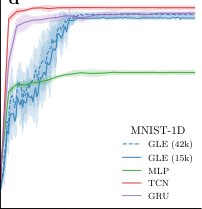

0 50 100 150
epoch

**f**

100

80

60

40

20

0

100

90

80

70

60

50

40

30

20

**e**

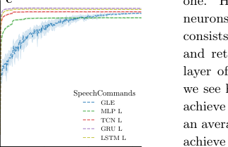

0 100 200 300
epoch

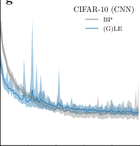

0 20 40 60 80 100
epoch

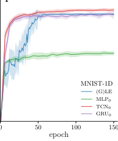

**Figure 8:** **GLE for challenging spatio-temporal classification**
**problems.** Averages and standard deviations measured over 10 seeds.
Top row: samples from the **(a)** MNIST-1D, **(b)** GSC – including raw
and preprocessed input – and **(c)** CIFAR-10 datasets. **(d)** Performance
of various architectures on MNIST-1D. Here, we used a higher temporal
resolution for the input than in the original reference [58]. **(e)** Performance of various architectures on GSC. **(f)** Performance of a (G)LE
LagNet architecture on MNIST-1D. For reference, we also show the original results from [58] denoted with the index 0. **(g)** Performance of a
(G)LE convolutional network on CIFAR-10 (taken from [17]) and comparison with backpropagation.

Table 2 of the Supplement.

**2.7.2** **Google Speech Commands**

To simultaneously validate the spatial and temporal learning
capabilities of GLE, we now apply it to the Google Speech
Commands (GSC) dataset [60]. This dataset consists of
105’829 one-second long audio recordings of 35 different speech
commands, each spoken by thousands of people. In the v2.12
version of this dataset, the usual task is to classify 10 different speech commands in addition to a silence and an unknown

class, which comprises all remaining commands. The raw audio signal is transformed into a sequence of 41 Mel-frequency
spectrograms (MFSs); this sequence constitutes the temporal

dimension of the dataset and is streamed to the network in

real-time. Each of these spectrograms has 32 frequency bins,
which are presented as 32 separate inputs to the network, thus
constituting the spatial dimension of the dataset.

Fig. 8e compares the performance of GLE to several widely
used references: MLP, TCN, GRU (as used for MNIST1D) and, additionally, long short-term memory (LSTM) net

works [61] – all trained with a variant of backpropagation.
Similarly as on the MNIST-1D dataset, the GLE network is
trained online and updates its parameters in real time, while
the reference networks can only be trained offline; furthermore,
the MLP and TCN networks do not receive the input as a realtime stream, but rather as a full spectro-temporal “image”, by
mapping the temporal dimension onto an additional spatial
one. Here, the GLE network receives its input through 32
neurons streaming 32 MFS bins to the network. The network
consists of three hidden layers with a mixture of instantaneous
and retrospective neurons in each layer, and a final output
layer of twelve instantaneous neurons. As with MNIST-1D,
we see how our GLE networks surpass the MLP baseline and
achieve a performance that comes close to the references, with
an average test accuracy of 91 _._ 44 _±_ 0 _._ 23%. The ANN baselines
achieve an average test accuracy of 88 _._ 00 _±_ 0 _._ 25% for the MLP,
92 _._ 32 _±_ 0 _._ 28% for the TCN, 94 _._ 93 _±_ 0 _._ 25% for the GRU, and
94 _._ 00 _±_ 0 _._ 19% for the LSTM, respectively. We thus conclude
that, while offering clear advantages in terms of biological plausibility and online learning capability, GLE remains competitive in terms of raw task performance. We also note that, in
contrast to the reference baselines, GLE achieves these results

without additional tricks such as batch or layer normalization,
or the inclusion of dropout layers. A more detailed comparison
of the performance of GLE with the reference methods can be
found in Table 3 of the Supplement.

**2.7.3** **GLE for purely spatial problems**

The above results explicitly exploit the temporal aspects
of GLE and its capabilities as an online approximation of
AM/BPTT. However, GLE also contains purely spatial backpropagation as a subcase, and the presented network architecture can lend itself seamlessly to spatial tasks such as image
classification. In cases like this, where temporal information is
irrelevant, one can simply take the LE limit of GLE by setting
_τ_ [m] = _τ_ [r] for all neurons in the network [17]. In the following,
we demonstrate these capabilities in two different scenarios.

Note that GLE learns in a time-continuous manner in all of

these cases as well, with the input being presented in real-time.

First, we return to the MNIST-1D dataset, but adapt the network architecture as follows. The 1D input first enters a nonplastic preprocessing network module consisting of several parallel chains of retrospective neurons. The neurons in each chain
are identical, but different across chains: the fastest chain is
near-instantaneous with _τ_ [m] _→_ 0, while the slowest chain induces a lag of about 1/4 of the total sample length. The endpoints of these chains constitute the input for a hierarchical
network of instantaneous neurons ( _τ_ [m] = _τ_ [r] ). By differentially
lagging the input stream along the input chains, this configuration approximately maps time to space (the output neurons
of the chains). This offers the hierarchical network access to a
sliding window across the input – hence the acronym “LagNet”
for this architecture – and changes the nature of the credit assignment problem from temporal to spatial. While the synaptic weights in the chains are fixed, those in the hierarchical
network are trained with GLE, which in this scenario effectively reduces to LE. As shown in Fig. 8f, GLE is capable of
training this network to achieve competitive performance with

10

100

80

60

40

20

0

**a**

2

4

6

8

10

100

100

80

60

40

20

0

90

80

70

60

50

40

30

20

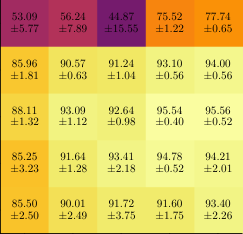

32 64 128 256 512
Neurons per Layer

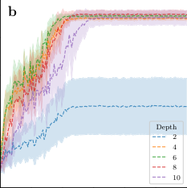

0 25 50 75 100 125 150
epoch

100

80

60

40

_σ_ =0 20

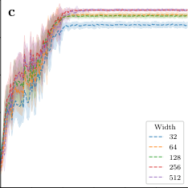

0 25 50 75 100 125 150
epoch

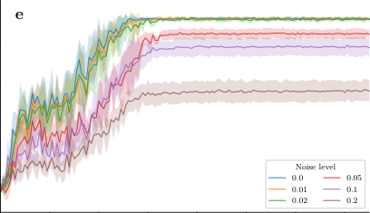

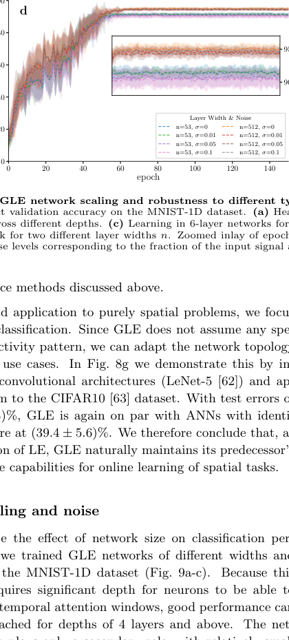

0 20 40 60 80 100 120 140 0 20 40 60 80 100 120 140
epoch epoch

**Figure 9:** **GLE network scaling and robustness to different types of noise.** Averages and standard deviations measured over 10 seeds. All
figures depict validation accuracy on the MNIST-1D dataset. **(a)** Heatmap of scaling in network width and depth. **(b)** Learning with 128 neurons
per layer across different depths. **(c)** Learning in 6-layer networks for different layer widths. **(d)** Robustness to spatial noise on _τ_ [m] and _τ_ [r] in a six
layer network for two different layer widths _n_ . Zoomed inlay of epoch 60 to 150. **(e)** Robustness to correlated noise on all feedforward rates _r_ _i_ for

work width plays only a secondary role, with relatively small
performance gains for wider layers. The small decline in performance for larger networks is likely caused by overfitting due
to overparametrization.

The robustness of GLE to input level noise has already
been implicitly demonstrated, as both MNIST-1D and GSC
datasets include either explicitly applied noise or implicit measurement noise and speaker variance. However, whether bio
logical or biologically inspired, analog systems are always sub

ject to additional forms of noise. Spatial noise refers to neuronal variability, caused by either natural biological growth
processes or fixed-pattern noise in semiconductor photolitography. Temporal noise refers to variability in all transmitted
signals, usually due to quantum or thermal effects, and typically modeled as a wide-spectrum random process. In the
following, we discuss the robustness of GLE with respect to
both of these effects during learning of the MNIST-1D task.

First, we established baseline performances for two different
network sizes without added noise. To model spatial variability, we then introduced Gaussian noise with increasing levels
of variance to the time constants, as all other parameters were
optimized through learning Fig. 9d. The effect on training
accuracy was insignificant, despite the highest simulated noise
level of 0.1 being relatively large compared to the time constants ranging from 0.2 to 1.2 (cf. Table 1 in the Methods).

The effects of temporal variability were investigated by adding
correlated noise to all feedforward rates _r_ _i_ (Fig. 9e). This type
of noise can be much more detrimental than spatial variability, as it gradually and irrevocably destroys information while
it passes through the network. We noticed a gradual performance decline for noise levels of above 2%, with classification
performance dropping by about 10% at a noise level of 10%.
Note that, across layers, this sums up to a total noise-to-signal
ratio of about 60%, which would represent a major impediment
for any network model.

Altogether, these results illustrate the robustness of the GLE
framework to realistic types of noise, thereby substantiating

11

1 _._ 2

1 _._ 0

0 _._ 8

0 _._ 6

0 _._ 4

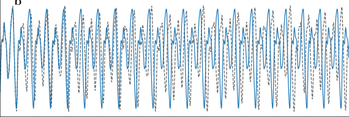

10 11 12 13 14 15 16 17 18 19 20

1 _._ 2

1 _._ 0

0 _._ 8

0 _._ 6

0 _._ 4

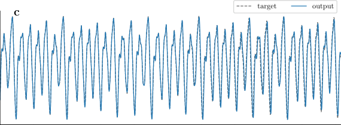

10 11 12 13 14 15 16 17 18 19 20
_t_ / _λ_

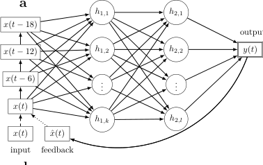

10 [2]

10 [1]

hidden 1 hidden 2

**d**

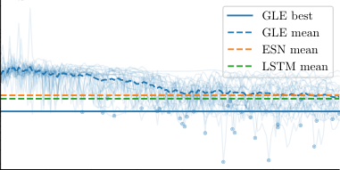

0 20 40 60 80 100 120 140
Epoch

**Figure 10:** **GLE for chaotic time series prediction. (a)** GLE network architecture with 93 hidden neurons per layer. Input neurons are delayed
w.r.t. each other by ∆= 6 (same units as _λ_ = 197). **(b,c)** Target sequence (dashed black) vs. network output (solid blue) after 40 (b) and 138 (c)
epochs of training. **(d)** sMAPE loss over the course of training for 30 different sequences compared to echo state network (ESN) and LSTM results
as described in [64]. The best performance for each sequence is marked as a blue dot.

its plausibility as a model of biological networks, as well as its
applicability to suitable analog neuromorphic devices.

**2.8.1** **Chaotic time series prediction**

As a final application, we now turn to a sequence prediction
task, where an autoregressively recurrent GLE network (with
its output feeding back into its input) is trained to predict the
continuation of a time series based on its previous values. To
this end, we use the Mackey-Glass dataset [65], a well-known
chaotic time series described by a delayed differential equation
that exhibits complex dynamics. Figure 10a shows the network
setup, which consists of four input neurons, two hidden layers
with a mixture of instantaneous and retrospective neurons, and

one output neuron.

Each Mackey-Glass sequence has a length of 20 Lyapunov
times _λ_, with _λ_ = 197 for our chosen parametrization of the
Mackey-Glass equation. The first half of the sequence is used
for training, while the second half is used for autoregressive
prediction. The resulting requirement of predicting the continuation of the time series across 10 Lyapunov times (for which
initial inaccuracies are expected to diverge by at least a factor
of _e_ [10] ) is what makes this problem so difficult. During training, the network’s target _y_ _[∗]_ ( _t_ ) is given by the next value in
the time series _x_ ( _t_ + 1) based on the ground truth _x_ ( _t_ ). After
training, the external input _x_ ( _t_ ) is removed after the first 10
_λ_ and the network needs to predict the second half of the sequence (which it has never seen during training) using its own
output as an input.

To provide an intuition for how the network learns, we consider
its prediction at an earlier and at a later stage of training. Figure 10b shows the target sequence and the network’s output

after 40 epochs of training. The network has already learned a
periodic pattern that is superficially similar to parts of the sequence, but the output diverges from the target sequence after
only half a Lyapunov time. From here, it takes another 100
epochs (Fig. 10c) for the network’s output to closely match the
target sequence over the full period of 10 _λ_ . Figure 10d shows
the symmetric mean absolute percentage error (sMAPE), a
commonly used metric for evaluating the performance of time
series prediction models, over the course of training and averaged over 30 different sequences and initializations. The final
average sMAPE of 14.25% for our GLE network is on par with
the 14.79% for ESNs and 13.37% for LSTMs reported in [64].
If we average the lowest sMAPE over the course of training, we
find that our GLE networks can achieve an even lower sMAPE
of 9.25%.

**3** **Discussion**

We have presented GLE, a novel framework for spatio
temporal computation and learning in physical neuronal networks. Inspired by well-established approaches in theoretical
physics, GLE derives all laws of motion from first principles:
a global network energy, a conservation law, and a dissipation
law. Unlike more traditional approaches, which aim to minimize a cost defined only on a subset of output neurons, our
approach is built around an energy function which connects
all relevant variables and parameters of all neurons in the network. This permits a unified view on the studied problem and
creates a tight link between the dynamics of computation and
learning in the neuronal system. The extensive nature of the
energy function (i.e., its additivity over subsystems) also provides an important underpinning for the locality of the derived

12

dynamics.

In combination, these dynamics ultimately yield a local, online,
real-time approximation of AM/BPTT– to our knowledge, the
first of its kind. Moreover, they suggest a specific implementation in physical neuronal circuits, thus providing a possible
template for spatio-temporal credit assignment in the brain,
as well as blueprints for dedicated hardware implementations.

This shows that, in contrast to conventional wisdom, physical
neuronal networks can implement future-facing algorithms for
temporal credit assignment. More recently, tentative calls in
this direction have indeed been formulated [12], to which GLE
provides an answer.

In the following, we highlight some interesting links to other
models in machine learning, discuss several biological implications of our model, and suggest avenues for improvement and

extension of our framework.

**3.1** **Connection to related approaches**

**Latent Equilibrium (LE)** As the spiritual successor of LE

[17], GLE inherits its energy-based approach, as well as the
derivation of dynamics from energy conservation and minimization. GLE also builds on the insight from LE that
prospective coding can undo the low-pass filtering of neuronal
membranes. The core addition of GLE lies in the separation
of prospective and retrospective coding, leading to an energy
function that depends on two types of canonical variables instead of just one, and to a conservation law that accounts for
their respective time scales. The resulting neuron dynamics
can thus have complex dependencies on past and (estimated)
future states, whereas information processing in LE is always
instantaneous. Functionally, this allows neurons to access their
own past and future states (through appropriate prospective
and retrospective operators), thereby allowing the network to
minimize an integrated cost over time, whereas LE only mini
mizes an instantaneous cost.

Because LE can be seen as a limit case of GLE, the new framework offers a more comprehensive insight into the effectiveness of its predecessor, and also answers some of the questions
left open by the older formalism. Indeed, the GLE analysis
demonstrates that LE errors are an exact implementation of
the adjoint dynamics of the forward system for equal time constants, further confirming the solid grounding of the method,
and helping explain its proven effectiveness. Conversely, GLE
networks can learn to evolve towards LE via the adaptation of
time constants if required by the task to which the framework
is applied. While LE also suggests a possible mechanism for
learning the coincidence of time scales, GLE provides a more
versatile and rigorous learning rule that follows directly from
the first principles on which the framework is based. More
generally speaking, by having access to local plasticity for all
parameters in the network, GLE networks can either select
(through synaptic plasticity) or adapt (through neuronal plasticity) neurons and their time constants in order to achieve
their target objective.

Thus, GLE not only extends LE to a much more comprehensive
class of problems (spatio-temporal instead of purely spatial),

but also provides it with a better theoretical grounding, and
with increased biological plausibility. Recently, [66] also proposed an extension of LE by incorporating hard delays in the

communication channel between neurons. In order to learn in

this setting, they propose to either learn a linear estimate of
the future errors (similar to our prospective errors) or to learn
an estimate of future errors by a separate network. In contrast
to this, GLE implements a biologically plausible mechanism for
retrospection, and a self-contained error prediction which we
show gives a good approximation to the exact AM solution.

**Neuronal** **least-action** **(NLA)** Similarly inspired by
physics, but following a different line of thought, the NLA principle [67] also uses prospective dynamics as a core component.
It uses future discounted membrane potentials ˜ _u_ = _I_ _τ_ [+] [m] _[ {][u][}]_ [ as]
canonical variables for a Lagrangian _L_ and derives neuronal
dynamics as associated Euler-Lagrange equations. A simpler
but equivalent formulation places NLA firmly within the family of energy-based models such as LE and GLE, where _L_ is
replaced by an equivalent energy function _E_ that sums over
neuron-local errors and from which neuronal dynamics can be
derived by applying the conservation law _D_ _τ_ [+] [m] _[ {][∂E/∂u][}]_ [ = 0.]

The most important difference to GLE is that NLA cannot perform temporal credit assignment. Indeed, other than imposing
a low-pass filter on its inputs, an NLA network effectively reacts instantaneously to external stimuli and can neither carry
out nor learn temporal sequence processing. This is an inherent feature of the NLA framework, as the retrospective lowpass filter induced by each neuronal membrane exactly undoes
the prospective firing of its afferents.

This property also directly implies that, except for the initial
low-pass filter on the input, all neurons in the network need to
share a single time constant for both prospective and retrospective dynamics. In contrast, both LE and GLE successively lift
this strong entanglement by modifying the energy function and
conservation law. LE correlates retro- and prospectivity within
single neurons and allows their matching to be learned, thus
obviating the need for globally shared time constants, while
GLE decouples these two mechanisms, thus enabling temporal
processing and learning, as discussed above.

**RTRL and its approximations** RTRL [68] is a past-facing
algorithm that implements online learning by recursively updating a tensor _M_ _ijk_ that takes into account the influence of
every synapse _w_ _jk_ on every neuronal output _r_ _i_ in the network.
As evident from the dimensionality of this object, this requires
storing _O_ ( _N_ [3] ) floating-point numbers in memory (where _N_ is
the number of neurons in the network). Because this is much
less efficient than future-facing algorithms, RTRL is rarely
used in practice, and the manifest non-locality of the influence tensor also calls into question its biological plausibility.
Nonetheless, several approximations of RTRL have been recently proposed, with the aim of addressing these issues [16].

A particularly relevant algorithm of this kind is random feedback online learning (RFLO) [69], in which a synaptic eligibility trace is used as a local approximation of the influence
tensor, at the cost of ignoring dependencies between distant

13

neurons and synapses. With a reduced memory scaling of
_O_ ( _N_ [2] ), this puts RFLO at significant advantage over RTRL,
while closing the distance to BPTT (with _O_ ( _NT_ ), where _T_
is the length of the learning window). In its goal of reducing
the exact, but nonlocal computation of gradients to an approximate, but local solution, RFLO shares the same spirit as
GLE. In the following, we highlight several important differences which we consider to give GLE both a conceptual and a
practical advantage.

First, the neuron membranes and synaptic eligibilities in
RFLO are required to share time constants, in order for the
filtering of the past activity to be consistent between the two.
In cortex, this would imply the very particular neurophysiological coincidence of synaptic eligibility trace biochemistry
closely matching the leak dynamics of efferent neuronal membranes. In contrast, the symmetry requirements of GLE are
between neurons of the same kind (PYR cells), which share
their fundamental physiology, and whose time constants can
be learned locally within the framework of GLE.

Second, the dimensionality reduction of the influence tensor
proposed by RFLO also puts it at a functional disadvantage,
because the remaining eligibility matrix only takes into account first-order synaptic interactions between directly connected neurons. This is in contrast to GLE, which can propa
gate approximate errors throughout the entire network. This
flexibility also allows GLE to cover applications over multiple
time scales, from purely spatial classification to slow temporal signal processing. Moreover, GLE accomplishes this within
a biologically plausible, mechanistic model of error transmission, while admitting a clear interpretation in terms of cortical
microcircuits. Finally, GLE’s additional storage requirements
only scale linearly with _N_ (one error per neuron at any point
in time), which is even more efficient than BPTT.

While both RFLO and GLE are inspired by and dedicated
to physical neuronal systems, both biological and artificial, it
might still be interesting to also consider their computational
complexity for digital simulation, especially given the multitude of digital neuromorphic systems [70] and ANN accelerators [71] capable of harnessing their algorithmic capabilities.
For a single update of their auxiliary learning variables (eligibility traces / errors), both RFLO and GLE incur a computational cost of _O_ ( _N_ [2] ). Thus, for an input of duration _T_,
all three algorithms – RFLO, GLE and BPTT (without truncation) – are on par, with a full run having a computational
complexity of _O_ ( _N_ [2] _T_ ).

**State space models (SSMs)** GLE networks are linked to
locally recurrent neural networks (LRNNs) (see, e.g., [72]). In
recent years there has been renewed interest in similar models
in the form of linear recurrent units (LRUs) [73, 74], which

combine the fast inference characteristics of LRNNs with the

ease of training and stability stemming from the linearity of
their recurrence. These architectures are capable of surpassing
the performance of Transformers in language tasks involving
long sequences of tokens [75, 76].

More specifically, GLE networks are closely linked to LRUs
with diagonal linear layers [77] and SSMs [78, 79], where a lin

ear recurrence only acts locally at the level of each neuron, as
realized by the leaky integration underlying the retrospective
mechanism. Additionally, the inclusion of prospectivity enables the direct passthrough of input information across layers
as in SSMs (see discussion in Methods). GLE could thus enable
online training of these models, similarly to how [80] demonstrate local learning with RTRL, but with the added benefits
discussed above. Since such neuron dynamics are a de-facto
standard for neuromorphic architectures [70], GLE could thus
open an interesting new application area for these systems, especially in light of their competitive energy footprint [81, 82].

As GLE is strongly motivated by biology, it currently only
considers real-valued parameters for all connections, including the self-recurrent ones, in contrast to the complex-valued
parameters in LRUs. However, an extension of GLE to complex activities appears straightforward, by directly incorporating complex time constants into prospective and retrospective
operators, or, equivalently, by extending them to second order in time. With this modification, GLE would also naturally extend to the domain of complex-valued neural networks
(CVNNs) [83].

**3.2** **Neurophysiology**

Neuronal prospectivity is a core component of the GLE framework. Prospective coding in biological neurons is supported by
considerable experimental and theoretical evidence [21–23, 33–
35, 84] on both short and long time scales. We note that our
Fourier analysis (Section 2.3 above and Methods Section 5.4)
also offers a rigorous account of prospectivity in neuron models with multiple, negatively coupled variables such as the
Hodgkin-Huxley mechanism or adaptation currents.

In the specific GLE implementations used to solve the more
challenging spatiotemporal classification tasks, we explicitly
employ neurons with both short and long (effective) integration time constants. This is necessary since the tasks require
access to (almost) instantaneous stimulus information, as well
as to a temporal context in which to interpret it. While we
do not explicitly model spikes, these two “classes” of neurons
can be interpreted through the concepts of integration and
coincidence detection [85–87]. Our results thus suggest how
the cortex can benefit from neurons in both operating modes,
as they can provide orthogonal pieces of information to guide

behavior.

GLE further predicts functional aspects of PYR neuron morphology, as well as cortical microcircuits (CMCs) for signal and
error propagation. In these CMCs, PYR cells are responsible
for the transmission of both representation and error signals,
as supported by ample experimental data [41–46]. Moreover,
the morphological separation of the cell body into multiple
distinct units, including soma, basal and apical trees, corresponds to a functional separation that allows the simultaneous
representation of different pieces of information – bottom-up
input, top-down errors and the resulting integrated signal –
within the same cell [47]. This is also what gives synapses local access to this information, allowing the implementation of
the proposed three-factor, error-correcting plasticity rule [38].
Furthermore, by representing forward activites and backward

14

errors in separate pathways, these CMCs are capable of robust
learning.

While building on many insights from previous proposals
for CMCs, most notably [17, 88], we argue that our proposed model features significant improvements. Our model
does not require nerve cells belonging to two different classes
(somatostatin-expressing (SST) interneurons and PYR cells)
to closely track each others’ activity, which is more easy to
reconcile with the known electrophysiology of cortical neurons.
This also makes training more robust and obviates the need to
copy neuronal activities when training the network for more
complex tasks. Additionally, the original CMC model for error backpropagation [88] suffers from a relaxation problem, as
already addressed in [17]. As it subsumes the capabilities of
LE, GLE is inherently able to alleviate this problem.

Most importantly, these other CMC models are, by construction, only capable of solving purely spatial classification problems. We have shown that GLE CMCs can perform spatial
and temporal tasks across a range of scales, by adapting the
network parameters to the characteristic temporal and spatial timescales of the problem at hand. All of the above observations notwithstanding, it is worth noting that GLE can
also apply to these alternative CMC models by implementing
prospective coding in the apical dendrites of the PYR repre
sentation neurons rather than in PYR error neurons.

**3.3** **Open questions and future work**

While the efficacy of GLE relies on correctly phase-shifting
the backpropagated errors for all frequency components of the
signal, their frequency-dependent gain diverges from the one
required for exact gradient descent. This is not surprising, as a
perfect match of gains would require the kind of perfect knowledge of the future that is available to AM/BPTT. A reasonable
approximation of AM can be said to hold for _ωτ_ ≲ 1, but outside of this regime there is no guarantee for convergence to a
good solution. Our simulations clearly demonstrate that such
solutions exist and can be achieved, but it would be preferable
to have a more robust mechanism for controlling gain discrepancies at high frequencies. Some straightforward and sufficient
mitigation strategies might include a simple saturation of error neuron activations or the inclusion of a small synaptic time
constants as proposed in [17]. However, primarily for neuromorphic realizations of GLE, we expect linear time-invariant
(LTI) system theory to provide more elegant solutions, such as
Bessel or all-pass (active) filters, with favorable phase-response
properties and circuit-level implementations.

On a more technical note, gain amplification in prospective
neurons requires particular attention in discrete-time forwardEuler simulations, where fast transients can cause a breakdown of the stability assumption for finite, fixed-size time steps
on which this integration method relies. In physical, timecontinuous neuronal systems, this effect is naturally mitigated
by the finite time constants of all physical components, including, for example, the synapses themselves, as mentioned

above.

Ideally, to ensure a close correspondence of synaptic updates

between GLE and AM, errors should not disrupt representations. This can be easily achieved in the limit of weak teacher
coupling _β ≪_ 1 and/or weak somato-dendritic coupling _γ_ . Indeed, for larger networks and more complex tasks requiring
fine tuning of neuronal activities and weights, we observed an
increasing sensitivity of our networks to these parameters. To
avoid these effects, we simply operated our large-scale simulations in the _β →_ 1 _, γ →_ 0 regime. As this sensitivity also
manifests as a consequence of the high-frequency gain amplification, we expect it to be correspondingly mitigated by the

above-mentioned solutions.

To guarantee a perfect match between error and representation signals, pairs of PYR neurons in the two pathways ideally
require an exact inversion of time constants _τ_ [m] _↔_ _τ_ [r] . This re
lationship also needs to be maintained when time constants are
learned. Similarly to the weight transport problem, we expect
a certain degree of robustness to some amount of symmetry
breaking [53]. However, it would be preferable to have an additional local adaptation mechanism to ensure scalability, while
maintaining full compatibility with the locality constraints of
physical neuronal systems. To this end, we expect that local solutions based on decay during adaptation [89], mirroring

[90], and especially correlations [55] are likely to apply here as
well, even more so as the matching needs to develop between
active, reciprocally connected and physically proximal neurons
as opposed to passive, uncoupled synapses.

GLE can be naturally extended to (more) complex neuron
dynamics, as already discussed in the context of LRUs and
CVNNs. Even more importantly, a GLE mechanism for
(sparse) spiking dynamics as opposed to (population) rates
is of eminent interest. The recently described family of solutions for backpropagation through spike times, including surrogate methods [91], exact solutions [82] and, notably, adjoint
dynamics [92] suggest several starting points for deriving corresponding GLE operators.

In the presented simulations, we only applied GLE to hierarchical networks, in order to highlight its versatility in switching between spatial, temporal and spatiotemporal classification tasks without changing the underlying architecture. We
expect these capabilities to extend naturally to problems of
sequence generation and motor control. Moreover, the theoretical framework of GLE is architecture-agnostic, and the
inclusion of lateral recurrence represents an obvious next step.
We expect the approximation of AM/BPTT to be adaptable to
this scenario as well, but a dedicated proof and demonstration

is left for future work.

**4** **Conclusion**

With Generalized Latent Equilibrium, we have proposed a new
and flexible framework for inference and learning of complex
spatio-temporal tasks in physical neuronal systems. In contrast to classical AM/BPTT, but still rivaling its performance,
GLE enables efficient learning through fully local, phase-free,
on-line learning in real time. Thus, GLE networks can achieve
results competitive with well-known, powerful machine learning architectures such as GRUs, TCNs and convolutional neu

15

ral networks (CNNs).

Our framework carries implications both for neuroscience and
for the design of neuromorphic hardware. For the brain, GLE
provides a rigorous theory and experimental correlates for
spatio-temporal inference and learning, by leveraging an interplay between retrospective and prospective coding at the
neuronal level. For artificial implementations, its underlying
mechanics and demonstrated capabilities may constitute powerful assets in the context of autonomous learning on low-power
neuromorphic devices.

**5** **Methods**

**5.1** **Derivation of the network dynamics**

The neuron dynamics in Eqn. 6 are derived from the stationarity condition stated in Eqn. 4. The partial derivatives of
the energy function _E_ with respect to the prospective voltages
_D_ _τ_ [+] _i_ [m] _[{][u]_ _[i]_ _[}]_ [ and] _[ D]_ _τ_ [+] _i_ [r] _[{][u]_ _[i]_ _[}]_ [ are given by]

_∂E_
(11)
_∂D_ _τ_ [+] _i_ [m] _[{][u]_ _[i]_ _[}]_ [ =] _[ e]_ _[i]_

and

_∂E_ _∂C_
_∂D_ _τ_ [+] _i_ [r] _[{][u]_ _[i]_ _[}]_ [ =] _[ −][φ]_ _[′]_ [(] _[D]_ _τ_ [+] _i_ [r] _[{][u]_ _[i]_ _[}]_ [)] � _j_ _W_ _ji_ _e_ _j_ + _β_ _∂D_ _τ_ [+] _i_ [r] _[{][u]_ _[i]_ _[}][ .]_ (12)

Substituting these into the stationarity condition from Eqn. 4

_**τ**_ **˙** _ℓ_ [m] _[∝−∇]_ _**τ**_ _ℓ_ [m] _[E]_ [ =] _[ −]_ _**[e]**_ _[ℓ]_

The instantaneous target error in the last layer is given by

_∂C_
_**e**_ [inst] _L_ = _−β_ _L_ _[◦]_ _[β]_ [(] _**[r]**_ [trg] _[ −]_ _**[r]**_ _L_ [)] _[ .]_ (18)
_∂_ _**D**_ [+] _**τ**_ _L_ [r] _[{]_ _**[u]**_ _[L]_ _[}]_ [ =] _**[ φ]**_ _[′]_

**5.2** **Detailed parameter dynamics**

Using the layerwise instantaneous errors from Eqn. 17 and the
layerwise target errors from Eqn. 18 we can express the neuronwise error dynamics in Eqn. 15 in vector form as

_**e**_ [inst] _ℓ_ (19)
� ��

_**e**_ _ℓ_ = _**D**_ [+] _**τ**_ _ℓ_ [m]

� _**I**_ _[−]_ _**τ**_ _ℓ_ [r]

� _**I**_ _[−]_ _**τ**_ _ℓ_ [r] � _**φ**_ _ℓ_ _[′]_ _[◦]_ _**[W]**_ [ T] _ℓ_ +1 _**[e]**_ _[ℓ]_ [+1] � [�] for _ℓ< L_

� _**I**_ _[−]_ _**τ**_ _ℓ_ [r] � _**φ**_ _L_ _[′]_ _[◦]_ _[β]_ [(] _**[r]**_ [trg] _[ −]_ _**[r]**_ _[L]_ [)] � [�] for _ℓ_ = _L ._

=

 _**D**_ [+] _**τ**_ _ℓ_ [m]
 _**D**_ [+] _**τ**_ _ℓ_ [m]

Parameter dynamics are derived from gradient descent on the
energy function _E_ (Eqn. 5):

**˙** _∂E_
_**θ**_ _ℓ_ _∝−∇_ _**θ**_ _ℓ_ _E_ = _−_ � _∂_ _**θ**_ _ℓ_

T
= _−_ � _**e**_ _k_
� _k∈{_ 0 _,...,L}_

_∂_ _**e**_ _k_
� _∂_ _**θ**_ _ℓ_

T
_._ (20)
�

Depending on the specific parameter _**θ**_ _ℓ_, we can work out its
direct influence on the error via the partial derivative _∂_ _[∂]_ _**θ**_ _**[e]**_ _[ℓ]_ _ℓ_ [and]

obtain

T
= _**e**_ _ℓ_ _**r**_ _ℓ_ [T] _−_ 1 _[,]_ (21)
�

_**W**_ **˙** _ℓ_ _∝−∇_ _**W**_ _ℓ_ _E_ = _−_ _**e**_ _ℓ_

_∂_ _**e**_ _ℓ_
� _∂_ _**W**_ _ℓ_

T
= _**e**_ _ℓ_ _,_ (22)
�

_**b**_ **˙** _ℓ_ _∝−∇_ _**b**_ _ℓ_ _E_ = _−_ _**e**_ _ℓ_

_∂_ _**e**_ _ℓ_
� _∂_ _**b**_ _ℓ_

T
= _−_ _**e**_ _ℓ_ _◦_ _**u**_ **˙** _ℓ_ _,_ (23)
�

_∂_ _**e**_ _ℓ_
� _∂_ _**τ**_ _ℓ_ [m]

_**τ**_ **˙** _ℓ_ [r] _[∝−∇]_ _**τ**_ _ℓ_ [r] _[E]_ [ =] _[ −]_ _**[e]**_ _[ℓ]_ [+1]

0 = _I_ _τ_ _[−]_ _i_ [m]

_∂E_
� _∂D_ _τ_ [+] _i_ [m] _[{][u]_ _[i]_ _[}]_ �

+ _I_ _τ_ _[−]_ _i_ [r]

_∂E_
� _∂D_ _τ_ [+] _i_ [r] _[{][u]_ _[i]_ _[}]_

�

(13)

T
= _**e**_ [inst] _ℓ_ _◦_ _**u**_ **˙** _ℓ_ _._ (24)
�

_∂_ _**e**_ _ℓ_ +1
� _∂_ _**τ**_ _ℓ_ [r]

_∂C_
_W_ _ji_ _e_ _j_ + _β_
_j_ _∂D_ _τ_ [+] _i_ [r] _[{][u]_ _[i]_ _[}]_

**5.3** **GLE approximates AM/BPTT in real time**

In Section 2.3 we discuss the link between GLE errors _**e**_

(Eqn. 7) and adjoint variables _**λ**_ (Eqn. 10):

�

= _I_ _τ_ _[−]_ _i_ [m] _[{][e]_ _[i]_ _[}]_ [ +] _[ I]_ _τ_ _[−]_ _i_ [r]

�

_−φ_ _[′]_ ( _D_ _τ_ [+] _i_ [r] _[{][u]_ _[i]_ _[}]_ [)] �

(14)

yields the neuronwise error dynamics

_**φ**_ _ℓ_ _[′]_ _[◦]_ _**[W]**_ _ℓ_ [ T] +1 _**[λ]**_ _ℓ_ +1 ( _t_ )
� ��

(25)
_**φ**_ _ℓ_ _[′]_ _[◦]_ _**[W]**_ _ℓ_ [ T] +1 _**[e]**_ _ℓ_ +1 ( _t_ ) = _**e**_ _ℓ_ ( _t_ ) _._
� ��

� _**D**_ _[−]_ _**τ**_ _ℓ_ [r]

� _**I**_ _[−]_ _**τ**_ _ℓ_ [r]

_e_ _i_ = _D_ _τ_ [+] _i_ [m] � _I_ _τ_ _[−]_ _i_ [r]

with the instantaneous error

_e_ [inst] _i_ (15)
� ��

_**λ**_ _ℓ_ ( _t_ ) = _**I**_ [+] _**τ**_ _ℓ_ [m]

_≈_ _**D**_ [+] _**τ**_ _ℓ_ [m]

_∂C_

_e_ [inst] _i_ = _φ_ _[′]_ ( _D_ _τ_ [+] _i_ [r] _[{][u]_ _[i]_ _[}]_ [)] � _j_ _W_ _ji_ _e_ _j_ _−_ _β_ _∂D_ _τ_ [+] _i_ [r] _[{][u]_ _[i]_ _[}][,]_ (16)

For a detailed derivation of the adjoint equations, we refer
to the Supplement. In the following, we provide a detailed
analysis of this relation in Fourier (angular frequency) space.

For a linear system with input _x_ and output _y_, their relation
in Fourier space is defined by the transfer function _H_ ( _ω_ ) =
_y_ ( _ω_ ) _/x_ ( _ω_ ). In our case, these transfer functions correspond
to the Fourier transforms of the prospective and retrospective
operators, which we denote as _I_ [�] and _D_ [�] . We first note the
following identities:

1 + _τ_ [d] _e_ _[iωt]_ [+] _[ψ]_ = (1 + _iωτ_ ) _e_ _[iωt]_ [+] _[ψ]_ _,_ (26)
� d _t_ �

where we used the identity _D_ _τ_ [+] � _I_ _τ_ _[−]_ _[{][x][}]_ � ( _t_ ) = _x_ ( _t_ ). Substituting the definition of the mismatch error _e_ _i_ (Eqn. 3) produces
the neuronal dynamics from Eqn. 6.

Instead of writing these equations for individual neurons _i_, we
can also write them in vector form for layers _ℓ_ as this is more
convenient for the following derivations and, in addition, makes
the similarity to BP more apparent. Then, _∀ℓ< L_ the vector
of _instantaneous errors e_ [inst] _ℓ_ is the backpropagated error signal

_**e**_ [inst] _ℓ_ = _**φ**_ _ℓ_ _[′]_ _[◦]_ _**[W]**_ _ℓ_ [ T] +1 _**[e]**_ _ℓ_ +1 _∀ℓ< L,_ (17)

with _**φ**_ _ℓ_ _[′]_ [=] _**[ φ]**_ _[′]_ [(] _**[D]**_ [+] _**τ**_ _ℓ_ [r] _[{]_ _**[u]**_ _[ℓ]_ _[}]_ [) and under the assumption that only]
neurons in the topmost layer _L_ contribute directly to the cost

function _C_ .

Since any signal can be written as a linear composition of
such frequency components _e_ _[iωt]_ [+] _[ψ]_, the above relation directly

_e_ _[iωt]_ [+] _[ψ]_ = (1 + _iωτ_ ) _e_ _[iωt]_ [+] _[ψ]_ _,_ (26)
�

d _t_

� _t_

1

_τ_

_e_ _[−]_ _[t][−]_ _τ_ _[t][′]_

_−∞_

_[−][t][′]_ 1

_τ_ _e_ _[iωt]_ _[′]_ [+] _[ψ]_ d _t_ _[′]_ = (27)
1 _−_ _iωτ_ _[e]_ _[iωt]_ [+] _[ψ]_ _[ .]_

16

3 _._ 0

2 _._ 0

1 _._ 0

0 _._ 6

0 _._ 4

_−_ _[π]_

|π|Col2|Col3|Col4|Col5|feedforwar|d signals r|
|---|---|---|---|---|---|---|
|_π_ 0 2|||||feedback e adjoint va|rrors_ e_ riables_ λ_|
|_π_ 0 2|||||||
|2|||||||

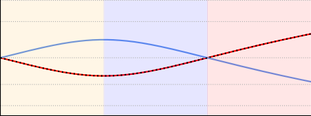

_−_ 1 _._ 0 _−_ 0 _._ 5 0 _._ 0 0 _._ 5 1 _._ 0 1 _._ 5 2 _._ 0
_τ_ r _/τ_ m

**Figure 11:** **Total gain and phase shift of the respective com-**
**positions of operators in GLE and AM.** Expressed as a function
of _τ_ [r] _/τ_ [m] and calculated for _ωτ_ [m] = 1. Colored regions indicate different regimes of interest: negative _τ_ [r] (orange), effectively retrospective
( _τ_ [r] _< τ_ [m], blue), effectively prospective ( _τ_ [r] _> τ_ [m], red).

translate to the Fourier transforms our operators. For a single
error neuron with prospective and retrospective time constants
_τ_ [m] and _τ_ [r], we can thus calculate

� 1 �
_I_ _τ_ _[−]_ [r] [(] _[ω]_ [) =] 1 + _iωτ_ [r] _[,]_ _D_ _τ_ [+] [m] [(] _[ω]_ [) = 1 +] _[ iωτ]_ [ m] _[,]_

� � 1 (28)
_D_ _τ_ _[−]_ [r] [(] _[ω]_ [) = 1] _[ −]_ _[iωτ]_ [ r] _[,]_ _I_ _τ_ [+] [m] [(] _[ω]_ [) =] 1 _−_ _iωτ_ [m] _[.]_

From here, the phase shifts ∆ _ψ_ and gains _G_ of our operators
become apparent.

The phase shifts of _I_ [�] _τ_ _[−]_ [r] [ and][ �] _[D]_ _τ_ _[−]_ [r] [ are exactly equal; the same is]
true for the pair _D_ [�] _τ_ [+] [m] [ and][ �] _[I]_ _τ_ [+] [m] [ (see also Figs. 3 and 11):]

∆ _ψ_ ( _I_ [�] _τ_ _[−]_ [r] [) = ∆] _[ψ]_ [(] _[D]_ [ �] _τ_ _[−]_ [r] [) =] _[ −]_ [arctan(] _[ωτ]_ [ r] [)] _[,]_

(29)
∆ _ψ_ ( _D_ [�] _τ_ [+] [m] [) = ∆] _[ψ]_ [(] _[I]_ [�] _τ_ [+] [m] [) = arctan(] _[ωτ]_ [ m] [)] _[ .]_

ceed ( _τ_ [m] _/τ_ [r] ) [2] .

These results extend to vectors _**λ**_ _ℓ_ and _**e**_ _ℓ_, where neuronal time
constants _{τ_ [m] _, τ_ [r] _}_ are replaced by the corresponding entries
in _{_ _**τ**_ _ℓ_ [m] _[,]_ _**[ τ]**_ _ℓ_ [ r] _[}]_ [.] As the operators are linear, the above considerations apply straightforwardly to inputs with arbitrary frequency spectra, for which the operators can simply be written
as convolutions over frequency space with the expressions in

Eqn. 28.

Overall this shows how, by inducing phase shifts that are identical to AM for every individual frequency component of the
signal, GLE errors produce parameter updates that are always
in phase with the correct gradients. Even though their respective frequency-specific gains are inverted with respect to AM,
their mismatch is bounded and their sign is conserved. Therefore, despite distortions at higher frequencies, GLE parameter
updates remain well-aligned with their true gradients. As in
GLE the propagation of (feedback) errors and (feedforward)
signals is governed by the same operators, both can be easily implemented by leaky integrator neurons with prospective
output dynamics.

**5.4** **Prospectivity through adaptation**

In general, when neurons have additional variables that couple negatively into the membrane potential, such as certain
voltage-gated ionic currents in the Hodgkin-Huxley model, or
adaptation currents such as in Izhikevich [93] or AdEx [94]
models, prospectivity on various time scales can naturally
emerge. The intuition behind the phenomenon is as follows: an
additional variable that performs a low-pass filter over either
the neuronal input or the membrane potential produces a negative phase shift and attenuates high-frequency components;
if subtracted from the membrane, it has the opposite effect,
namely inducing a positive phase shift and increasing the gain
of higher-frequency components, thus acting similarly to the
prospective operator _D_ _τ_ [+] [. Here, we demonstrate prospectivity]
in leaky integrator neurons with two different kinds of adaptive

currents.

**5.4.1** **Voltage-dependent adaptive current**

Consider the 2-variable neuron model

Thus, in the combinations in which they appear in the GLE
errors and adjoint equations, they induce identical phase shifts:

∆ _ψ_ ( _D_ [�] _τ_ [+] [m] [ �] _[I]_ _τ_ _[−]_ [r] [) = arctan(] _[ωτ]_ [ m] [)] _[ −]_ [arctan(] _[ωτ]_ [ r] [)]

(30)
= ∆ _ψ_ ( _I_ [�] _τ_ [+] [m] [ �] _[D]_ _τ_ _[−]_ [r] [)] _[ .]_

The gains of the operators are given by

_τ_ [m] _u_ ˙ = _−u_ + _IR −_ _wR,_

_τ_ _[w]_ _w_ ˙ = _−w_ + _γ_ _u_ _u,_ (33)

_G_ ( _D_ [�] _τ_ [+] [) =] _[ G]_ [(] _[D]_ [ �] _τ_ _[−]_ [) =] ~~�~~ 1 + ( _ωτ_ ) [2] _,_

1 (31)
_G_ ( _I_ [�] _τ_ [+] [) =] _[ G]_ [(] _[I]_ [�] _τ_ _[−]_ [) =] ~~�~~ 1 + ( _ωτ_ ) [2] _[.]_

where _u_ is the membrane potential, _w_ the adaptive current
with time constant _τ_ _[w]_, and _γ_ _u_ a coupling factor. Without loss
of generality, we assume _R_ = 1 for the membrane resistivity.

As in Section 5.3, we now seek the transfer function _H_ ( _ω_ ) =
_u_ ( _ω_ ) _/I_ ( _ω_ ). To this end, we can simply rewrite the above equations using our differential operators:

This means that the GLE errors have an inverse frequencydependent gain compared to the adjoint variables:

1 + ( _ωτ_ [r] ) [2] _[.]_ (32)

1
_G_ ( _D_ [�] _τ_ [+] [m] [ �] _[I]_ _τ_ _[−]_ [r] [) =] =

_G_ ( _I_ [�] _τ_ [+] [m] [ �] _[D]_ _τ_ _[−]_ [r] [)]

~~�~~

~~�~~ 1 + ( _ωτ_ [m] ) [2]

~~�~~ 1 + ( _ωτ_ [r] ) [2]

_D_ _τ_ [+] [m] _[ {][u][}]_ [ =] _[ I][ −]_ _[w,]_

(34)
_D_ _τ_ [+] _[w]_ _[ {][w][}]_ [ =] _[ γ]_ _[u]_ _[u .]_

However, the ratio of GLE and AM gains is bounded by the
ratio of prospective and retrospective time constants, so that
the discrepancy induced by a GLE error neuron can never ex

We can now apply the Fourier transform to both equations
(using Eqn. 28 for the operators) and solve for _u_ ( _ω_ ), which

17

_−_ _[π]_

|π|u-adaptation I-adaptation u-adaptation (approx.) I-adaptation (approx.)|
|---|---|
|_π_  2|_π_  2|
|_π_ 0  4|_π_ 0  4|
|4|4|

0 _._ 0 0 _._ 5 1 _._ 0 1 _._ 5 2 _._ 0 2 _._ 5 3 _._ 0 3 _._ 5 4 _._ 0
_ω_ [rad/sec]

**Figure 12: Adaptation enables prospectivity.** The first-order analytical approximations are shown with dashed lines. Simulation parameters: _τ_ [m] = 1, _τ_ _[w]_ = 0 _._ 9, _γ_ _u_ = 10 _τ_ [m] _/τ_ _[w]_ and _γ_ _I_ = ( _τ_ [m] + 0 _._ 9 _τ_ _[w]_ ) _/_ ( _τ_ [m] +
_τ_ _[w]_ ).

yields the transfer function

**5.5** **Relation to SSMs**

To illustrate the connection between SSMs and GLE, we consider a single layer of the GLE model (and drop the index _ℓ_
and explicit time dependence ( _t_ ) for brevity). First, we define a
shorthand _**y**_ for prospective states _**D**_ [+] _**τ**_ [r] � _**I**_ _[−]_ _**τ**_ [m] _[ {]_ _**[W r]**_ _[}]_ � (i.e., the
neuronal output before being passed through the nonlinearity)
and, as before, we use _**u**_ = _**I**_ _[−]_ _**τ**_ [m] _[ {]_ _**[W r]**_ _[}]_ [ to denote membrane]
potentials. For simplicity, we have ignored the biases. We can

now rewrite _**y**_ as

_**y**_ = _**D**_ [+] _**τ**_ [r] � _**I**_ _[−]_ _**τ**_ [m] _[ {]_ _**[W r]**_ _[}]_ � = _**D**_ [+] _**τ**_ [r] _[ {]_ _**[u]**_ _[}]_ [ =] _**[ u]**_ [ +] _**[ τ]**_ **[ r]** _[ ◦]_ [d]

d _t_ _**[u]**_

d _t_ (40)

= ( **1** _−_ _**α**_ ) _◦_ _**u**_ + _**α**_ _◦_ _**W r**_ _,_

1 + _iωτ_ _[w]_
_H_ ( _ω_ ) = (35)

(1 + _iωτ_ _[w]_ )(1 + _iωτ_ [m] ) + _γ_ _u_ _[.]_

where we plugged in the integral form of the membrane potential _**u**_ (cf. Eqn. 1) in the last step, **1** denotes the identity vector
and _**α**_ := _**τ**_ **[r]** _/_ _**τ**_ **[m]** . We use “ _◦_ ” and “ _/_ ” to denote element-wise
multiplication and division, respectively. Then, the dynamics
of membranes _**u**_ and prospective states _**y**_ are given by a system
of two coupled equations

The neuronal phase shift is given by ∆ _ψ_ = arctan � ImRe(( _HH_ )) �.

Figure 12 shows a positive shift (phase advance) over a broad
frequency spectrum.

We follow up with an analytical argument for low frequencies.
For this model, _H_ can be approximated by a first-order expansion in _{ωτ_ [m] _, ωτ_ _[w]_ _}_ :

_**u**_ ˙ = _−_ **[1]**

**[1]** **[1]**

_**τ**_ [m] _[◦]_ _**[u]**_ [ +] _**τ**_

_**τ**_ [m] _[◦]_ _**[W r]**_ _[,]_

_**τ**_ [m] _**τ**_ [m] (41)

_**y**_ = ( **1** _−_ _**α**_ ) _◦_ _**u**_ + _**α**_ _◦_ _**W r**_ _._

_H_ ( _ω_ ) _≈_ 1 _[γ]_ _[u]_ _[τ]_ _[ w]_ _[ −]_ _[τ]_ [ m] _,_ (36)
1 + _γ_ _u_ [+] _[ iω]_ (1 + _γ_ _u_ ) [2]

Similarly, in SSMs, inputs _**r**_, latent states _**u**_ and observations
_**y**_ are related by [78]

which yields a phase shift of

_**u**_ ˙ = _**Au**_ + _**Br**_ _,_ (42)

_**y**_ = _**Cu**_ + _**Dr**_ _,_

where _**A**_, _**B**_, _**C**_ and _**D**_ are matrices of appropriate dimensions.
Comparing equations Eqns. 41 and 42, it is apparent that
membrane potentials in GLE correspond to latent states in
SSMs by setting _**A**_ = _−_ diag( **1** _/_ _**τ**_ [m] ) and _**B**_ = diag( **1** _/_ _**τ**_ [m] ) _**W**_ .
Furthermore, prospective outputs in GLE correspond to observations in SSMs by setting _**C**_ = diag( **1** _−_ _**α**_ ) and _**D**_ =
diag( _**α**_ ) _**W**_ . Thus, GLE forward dynamics can implement a
specific (diagonal) form of SSMs.

**5.6** **Simulation details**

**5.6.1** **Numerical integration**

We use forward Euler integration to solve the system of implicit
coupled differential equations that determine the network dynamics, which simultaneously includes neuron (membrane potentials for the different compartments) and parameter (synaptic weights, neuronal biases and time constants) dynamics.

Recall the neuronal dynamics of our networks, characterized by
feedforward signals at time _t_ (we drop the ( _t_ ) here for brevity)

_**r**_ _ℓ_ = _**φ**_ ( _**D**_ [+] _**τ**_ _ℓ_ [r] _[{]_ _**[u]**_ _[ℓ]_ _[}]_ [)] (43)

∆ _ψ_ ( _ω_ ) = arctan _ω_ _[γ]_ _[u]_ _[τ]_ _[ w]_ _[ −]_ _[τ]_ [ m]
� 1 + _γ_ _u_

_._ (37)
�

_τ_ [m]
This makes it apparent that for _γ_ _u_ _>_ _τ_ ~~_[w]_~~ [the phase shift is]

positive, so the neuron is prospective.

**5.4.2** **Input-dependent adaptive current**

With a small change, the above 2-variable model can be made
directly adaptive to the input current:

_τ_ [m] _u_ ˙ = _−u_ + _IR −_ _wR,_

_τ_ _[w]_ _w_ ˙ = _−w_ + _γ_ _I_ _IR ._ (38)

The transfer function is now given by

1 _−_ _γ_ _I_ + _iωτ_ _[w]_
_H_ ( _ω_ ) =

(1 + _iωτ_ _[w]_ )(1 + _iωτ_ [m] ) _[,]_

which also yields a phase advance for lower input frequencies

Fig. 12.

As above, we can do a first-order approximation of _H_ in
_{ωτ_ [m] _, ωτ_ _[w]_ _}_ :

_H_ ( _ω_ ) _≈_ (1 _−_ _γ_ _I_ ) + _iω_ ( _γ_ _I_ _τ_ _[w]_ + ( _γ_ _I_ _−_ 1) _τ_ [m] ) _,_

which yields a phase-shift of

� _**I**_ _[−]_ _**τ**_ _ℓ_ [m] _[{]_ _**[W]**_ _[ℓ]_ _**[r]**_ _[ℓ][−]_ [1] [ +] _**[ b]**_ _[ℓ]_ [+] _**[ e]**_ _[ℓ]_ _[}]_ �� (44)

∆ _ψ_ ( _ω_ ) = arctan _ω_ _[γ]_ _[I]_ _[τ]_ _[ w]_ [ + ][(] _[γ]_ _[I]_ _[ −]_ [1][)] _[τ]_ [ m]
� 1 _−_ _γ_ _I_

_._ (39)
�

= _**φ**_ � _**D**_ [+] _**τ**_ _ℓ_ [r]

with feedback errors

_**e**_ _ℓ_ = _**D**_ [+] _**τ**_ _ℓ_ [m] _[{]_ _**[v]**_ _[ℓ]_ _[}]_ [ =] _**[ D]**_ _**τ**_ [+] _ℓ_ [m] � _**I**_ _[−]_ _**τ**_ _ℓ_ [r]

_**e**_ [inst] _ℓ_ _._ (45)
� ��

_τ_ [m]
Thus, for _τ_ ~~[m]~~ + _τ_ ~~_[w]_~~ _[< γ]_ _[I]_ _[ <]_ [ 1 the membrane is prospective with]

respect to its input.

We first approximate the temporal derivatives of the mem

18

brane potentials _**u**_ _ℓ_ ( _t_ ) by a finite difference

˙ 1
_**u**_ _ℓ_ ( _t_ ) = _◦_ ( _−_ _**u**_ _ℓ_ + _**W**_ _ℓ_ _**r**_ _ℓ−_ 1 + _**e**_ _ℓ_ ) ( _t_ ) (46)
� _**τ**_ _ℓ_ [m] �

_≈_ _**[u]**_ _[ℓ]_ [(] _[t]_ [ + d] _[t]_ [)] _[ −]_ _**[u]**_ _[ℓ]_ [(] _[t]_ [)] _,_ (47)

d _t_

where the fraction is understood to be component-wise. This
equation can then be solved for the membrane potentials at

the next time step:

_**u**_ _ℓ_ ( _t_ + d _t_ ) = _**u**_ _ℓ_ + [d] _[t]_ _◦_ ( _−_ _**u**_ _ℓ_ + _**W**_ _ℓ_ _**r**_ _ℓ−_ 1 + _**e**_ _ℓ_ ) ( _t_ ) (48)
� _**τ**_ _ℓ_ [m] �

Similarly, we can approximate the derivative of the error neuron potentials _**v**_ _ℓ_ ( _t_ ) and solve for the potentials at the next
time step:

_**v**_ _ℓ_ ( _t_ + d _t_ ) = _**v**_ _ℓ_ + [d] _[t]_ _◦_ _−_ _**v**_ _ℓ_ + _**e**_ [inst] _ℓ_ ( _t_ ) (49)
� _**τ**_ _ℓ_ [r] � � [�]

The learning dynamics (Eqns. 21 to 24) are discretized accordingly. For example, the update of the synaptic weights _**W**_ _ℓ_ is
given by

the coupling between the apical dendritic and somatic compartments, thus controlling the feedback of the error signals _**e**_
into the somatic potentials _**u**_ .

**5.6.2** **General simulation details for the GLE net-**

**works**

Our networks are implemented in Python using the PyTorch
library. All vector quantities with a layer index _ℓ_ are implemented as PyTorch tensors. Neuronal activation functions are
hyperbolic tangents.

For the cost function _C_, we either use a mean-squared error
(MSE)

_C_ = [1]

2

2

� ( _r_ _i_ [trg] _−_ _r_ _i_ ) (51)

_i∈L_

_**W**_ _ℓ_ ( _t_ + d _t_ ) = _**W**_ _ℓ_ + [d] _[t]_
� _**τ**_ _ℓ_ _[W]_

����
_**η**_ _ℓ_ _[W]_

with outputs
_r_ _i_ = _φ_ � _D_ _τ_ [+] _i_ [r] _[{][u]_ _[i]_ _[}]_ � (52)

or a cross-entropy (CE) loss

_C_ = _−_ � _r_ _i_ [trg] log( _r_ _i_ ) (53)

_i∈L_

with softmax outputs

_r_ _i_ = exp � _D_ _τ_ [+] _i_ [r] _[{][u]_ _[i]_ _[}]_ � _/_ � exp � _D_ _τ_ [+] _j_ [r] _[{][u]_ _[j]_ _[}]_ � (54)

_j_

depending on the task. In both cases, the _**r**_ [trg] is either a target
rate or a one-hot vector encoding the target class.

In the two teacher-student setups, the target output rate is
produced by a teacher network with the same architecture as
the student, but with fixed weights and time constants. Student networks trained with different algorithms are initialized
with identical but randomized parameters. The outputs of
teacher and student are compared via the MSE loss.

Time units are fixed but arbitrary, so we can treat time as
unit-free in the following.

**5.6.3** **GLE chain (Fig. 5)**

The input signal is a smoothed square wave of amplitude 1
and period _T_ = 4, with a simulation time step of d _t_ = 0 _._ 01.
Batches of 100 samples are generated by shifting the input randomly in time by values between 0 and _T/_ 2. Teacher weights
and time constants are _w_ 0 = 1, _w_ 1 = 2, _τ_ 0 [m] = 1, _τ_ 2 [m] = 2,
_τ_ 0 [r] [=] _[ τ]_ [ r] 1 [= 0] _[.]_ [1. The two student networks trained with GLE]
and instantaneous BP use a learning rate of 0 _._ 0001 and a nudging strength of _β_ = 0 _._ 01. The three student networks trained
with truncated BPTT and truncation windows of 1, 2 and 4
use learning rates of 0 _._ 01, 0 _._ 02, and 0 _._ 04, respectively. All networks use the Adam optimizer [95] with default parameters for
momentum and decay rates for faster convergence.

**5.6.4** **Small networks (Fig. 6)**

The input signal is a composition of three sine signals with
frequencies _ω_ [1] = 0 _._ 49, _ω_ [2] = 1 _._ 07, and _ω_ [3] = 1 _._ 98. To isolate the
effect of backpropagated errors over multiple layers, only the
bottom weights are initialized randomly and then learned. The

_◦_ _**e**_ _ℓ_ _**r**_ _ℓ_ [T] _−_ 1

( _t_ ) _._ (50)
�

This system of equations is summarized in Algorithm 1.

**Algorithm 1** Forward Euler simulation of GLE network

initialize network parameters _**θ**_ = _{_ _**W**_ _,_ _**b**_ _,_ _**τ**_ [m] _,_ _**τ**_ [r] _}_
initialize network states at _t_ = 0: _**u**_ (0), _**v**_ (0), _**r**_ (0), _**e**_ (0)
**for** time step _t_ in [0 _, T_ ] with step size d _t_ **do**

**for** layer _ℓ_ from 1 to _L_ **do**

**if** _ℓ_ = _L_ **then**

calculate instantaneous target error:
_**e**_ [inst] _L_ ( _t_ + d _t_ ) _←_ _β_ _**φ**_ _[′]_ _L_ [(] _[t]_ [)] _[ ◦]_ [(] _**[r]**_ [trg] [(] _[t]_ [)] _[ −]_ _**[r]**_ _[L]_ [(] _[t]_ [))]
**else**

propagate feedback error signals:
_**e**_ [inst] _ℓ_ ( _t_ + d _t_ ) _←_ _**φ**_ _[′]_ _ℓ_ [(] _[t]_ [)] _[ ◦]_ _**[W]**_ [ T] _ℓ_ +1 [(] _[t]_ [)] _**[e]**_ _[ℓ]_ [+1] [(] _[t]_ [)]
**end if**

sum input currents:

_**I**_ _ℓ_ ( _t_ ) = _**W**_ _ℓ_ ( _t_ ) _**r**_ _ℓ−_ 1 ( _t_ ) + _**b**_ _ℓ_ ( _t_ ) + _γ_ _**e**_ _ℓ_ ( _t_ )
approximate membrane potential derivatives:

∆ _**u**_ _ℓ_ ( _t_ ) _←_ ( _**τ**_ _ℓ_ [m] [(] _[t]_ [))] _[−]_ [1] _[ ◦]_ [(] _[−]_ _**[u]**_ _[ℓ]_ [(] _[t]_ [) +] _**[ I]**_ _[ℓ]_ [(] _[t]_ [))]
update membrane potentials:

_**u**_ _ℓ_ ( _t_ + d _t_ ) _←_ _**u**_ _ℓ_ ( _t_ ) + d _t_ ∆ _**u**_ _ℓ_ ( _t_ )
approximate error potential derivatives:

∆ _**v**_ _ℓ_ ( _t_ ) _←_ ( _**τ**_ _ℓ_ [r] [(] _[t]_ [))] _[−]_ [1] _[ ◦]_ � _−_ _**v**_ _ℓ_ ( _t_ ) + _**e**_ [inst] _ℓ_ ( _t_ )�

update error potentials:

_**v**_ _ℓ_ ( _t_ + d _t_ ) _←_ _**v**_ _ℓ_ ( _t_ ) + d _t_ ∆ _**v**_ _ℓ_ ( _t_ )
update prospective error potentials:

_**e**_ _ℓ_ ( _t_ + d _t_ ) _←_ _**v**_ _ℓ_ ( _t_ ) + _**τ**_ _ℓ_ [m] [(] _[t]_ [)] _[ ◦]_ [∆] _**[v]**_ _[ℓ]_ [(] _[t]_ [)]
calculate prospective outputs:

_**r**_ _ℓ_ ( _t_ + d _t_ ) _←_ _**φ**_ � _**u**_ _ℓ_ ( _t_ ) + _**τ**_ _ℓ_ [r] [(] _[t]_ [)] _[ ◦]_ [∆] _**[u]**_ _[ℓ]_ [(] _[t]_ [)] �

update synaptic weights:

_**W**_ _ℓ_ ( _t_ + d _t_ ) _←_ _**W**_ _ℓ_ ( _t_ ) + _η_ _W_ _**e**_ _ℓ_ ( _t_ ) _**r**_ _ℓ_ [T] _−_ 1 [(] _[t]_ [)]
update biases:

_**b**_ _ℓ_ ( _t_ + d _t_ ) _←_ _**b**_ _ℓ_ ( _t_ ) + _η_ _b_ _**e**_ _ℓ_ ( _t_ )
update membrane time constants:

_**τ**_ _ℓ_ [m] [(] _[t]_ [ + d] _[t]_ [)] _[ ←]_ _**[τ]**_ _ℓ_ [ m] [(] _[t]_ [)] _[ −]_ _[η]_ _[τ]_ _**[e]**_ _[ℓ]_ [(] _[t]_ [)] _[ ◦]_ [∆] _**[u]**_ _[ℓ]_ [(] _[t]_ [)]
update prospective time constants:

_**τ**_ _ℓ_ [r] [(] _[t]_ [ + d] _[t]_ [)] _[ ←]_ _**[τ]**_ _ℓ_ [ r] [(] _[t]_ [) +] _[ η]_ _[τ]_ _**[e]**_ [inst] _ℓ_ ( _t_ ) _◦_ ∆ _**u**_ _ℓ_ ( _t_ )
**end for**

**end for**

Note that in addition to the nudging strength _β_ that scales
the target error, we introduce another parameter _γ_ to scale

19

**Table 1:** Neuron, network and training parameters used to produce the results shown in Fig. 8.

**MNIST1D** **MNIST1D** **MNIST1D** **GSC**
**Symbol** **Parameter name** **GLE (15k)** **GLE (42k)** **LagNet** + **LE** **GLE**

**Dynamic parameters** in arbitrary units

d _t_ simulation time step 0 _._ 2 0 _._ 2 0 _._ 2 0 _._ 05
_T_ sample duration 72 = 360 d _t_ 72 = 360 d _t_ 72 = 360 d _t_ 41mfs/mfcc = 820 d _t_
_τ_ [m] membrane time constants [1 _._ 2 _,_ 1 _._ 2 _,_ 0 _._ 6] [1] [1 _._ 2 _,_ 1 _._ 2 _,_ 0 _._ 6] [1] 1 _._ 0 [2 _._ 4 _,_ 0 _._ 6 _,_ 1 _._ 2 _,_ 1 _._ 8 _,_ 2 _._ 4] [1]

_τ_ [r] prospective time constants [1 _._ 2 _,_ 0 _._ 2 _,_ 0 _._ 2] [1] [1 _._ 2 _,_ 0 _._ 2 _,_ 0 _._ 2] [1] 1 _._ 0 [2 _._ 4 _,_ 0 _._ 1 _,_ 0 _._ 1 _,_ 0 _._ 1 _,_ 0 _._ 1] [1]

**Network parameters**

_φ_ _ℓ_ activation tanh tanh tanh tanh
_φ_ _L_ output activation softmax softmax softmax softmax
_C_ cost cross-entropy cross-entropy cross-entropy cross-entropy
architecture GLE FC GLE FC LagNet [2] + LE-MLP GLE FC
number of hidden layers 6 6 2 3
input size 1 1 10 32
hidden layer size 17 + 18 + 18 30 + 30 + 30 60 + 60 150 + 150 + 150 + 150 + 150
output layer size 10 10 10 12
_β_ nudging strength 1 _._ 0 1 _._ 0 1 _._ 0 1 _._ 0
_γ_ apical-somatic coupling 0 _._ 0 0 _._ 0 0 _._ 0 0 _._ 0
_η_ _W,b_ learning rate 0 _._ 01 0 _._ 005 0 _._ 005 0 _._ 005
_W_ init _, b_ init initial weights & biases _U_ ( _−_ ~~_√_~~ _k,_ ~~_√_~~ _k_ ) with _k_ = 1 _/_ fan-in [3]

_k_ ) with _k_ = 1 _/_ fan-in [3]

_k,_ ~~_√_~~

optimizer Adam [95] with PyTorch’s default parameters
lr scheduler ReduceOnPlateau ReduceOnPlateau
lr scheduler params _γ_ = 0 _._ 5, patience=2 _γ_ = 0 _._ 9, patience=3

**Training parameters**

batch size 100 100 100 256
# training epochs 150 150 150 200
# train samples 4000 4000 4000 36923
# validation samples 1000 1000 1000 4445
# seeds 10 10 10 10

1 Time constants of the three neuron populations in each hidden layer.
2 The LagNet has a single input that projects onto four hidden layers with ten neurons each. The layers are connected with
identity weight matrices and not learned. Each hidden layer uses linearly distributed membrane time constants between _τ_ [m] =

[d _t_ = 0 _._ 2 _, . . .,_ 1 _._ 8] and equal _τ_ [r] = d _t_ = 0 _._ 2. This allows for a mapping of the temporal sequence to spatially distributed
representations. The output of the last hidden layer is fed into the plastic (G)LE network.

loss depicted in Fig. 6f is filtered with a rectangular window
of width 1. The AM (see also Algorithm 2 in the Supplement)
uses a truncation window of duration 3. Learning rates are
_η_ GLE = 2 _×_ 10 _[−]_ [2] and _η_ AM = 7 _×_ 10 _[−]_ [2] . We use a teacher
nudging strength of _β_ = 1, and a somato-dendritic coupling of
_γ_ = 10 _[−]_ [3] . The frequency resolution in Fig. 6c,d is given by

2 _π_
_n_ d _t_ [, where] _[ n]_ [ is the window length over which the frequency]
spectrum is calculated. To calculate the frequency spectrum
of the signals before and during the early learning phase, the
network is simulated for _n_ = 8000 steps with fixed weights
(yielding a frequency resolution of _≈_ 0 _._ 078).

**5.6.5** **MNIST-1D (Fig. 8d/f and Fig. 9a-c/e/f)**

The GLE networks in Fig. 8d use a layered architecture with
a single input neuron in the first layer, six fully connected
hidden layers and an output layer with ten neurons. Each
hidden layer has three different, equally-sized populations of
neurons, each with different time constants _τ_ [m] and _τ_ [r], corresponding to a fast, medium, and slow population. The
time constants of the slow population _τ_ slow were chosen such
that 2 _._ 5 [�] _ℓ∈_ [1 _,L_ ] _[τ]_ [slow] [ =] _[ Lτ]_ [slow] _[ ≈]_ [pattern duration = 90 d] _[t]_ [.]

This is inspired by [96] where the factor 2 _._ 5 was determined empirically. The (G)LE networks in Fig. 8f use a
custom, non-plastic LagNet of purely retrospective neurons
( _τ_ [r] = 0) with different membrane time constants _τ_ [m] that
allow for an approximate, partial mapping of the temporal
sequence to the neuronal space. In the network scaling experiments for Fig. 9a-c, the number of layers was chosen from
_{_ 2 _,_ 4 _,_ 6 _,_ 8 _,_ 10 _}_, and the total number of neurons per hidden
layer from _{_ 32 _,_ 64 _,_ 128 _,_ 256 _,_ 512 _}_ . In the experiments assessing

robustness to parameter noise in Fig. 9d, a six layer network
was used and each neuron’s time constants, _τ_ [m] and _τ_ [r], were
sampled from a normal distribution centered around the original time constants of the respective neuron population, with
standard deviations chosen from _{_ 0 _,_ 0 _._ 01 _,_ 0 _._ 05 _,_ 0 _._ 1 _}_ . In Fig. 9e,

we added additional correlated noise to the rates of the feedfor
ward neurons including the input and output layers. The noise
was generated from a normal distribution with mean 0 and
standard deviation 2 _π{_ 0 _._ 01 _,_ 0 _._ 02 _,_ 0 _._ 05 _,_ 0 _._ 1 _,_ 0 _._ 2 _}_ for each neuron and time step in the original sequence. It was correlated
over the sequence length of 72 time steps using a Gaussian
kernel with a standard deviation of 2 time steps. Then, it was
interpolated to the new sequence length of 360 time steps and
finally added to the individual neuron rates at each time step.
The rescaling factor of 2 _π_ ensures that the standard deviation
of the correlated noise corresponds to the reported standard

deviations.

Detailed parameters for the different GLE networks are given

in Table 1.

The original publication of the dataset [58] uses a downsampled version of the sequences to 40 time steps (baseline results
with index 0 in Fig. 8f). For a more continuous input, we interpolate the original sequences of length 72 to 360 time steps.
To ensure a fair comparison, we also retrain the baseline architectures on these higher-resolution sequences (Fig. 8d). An
overview over the different reference models, their size and final performance on the MNIST-1D dataset is shown in Table 2
in the Supplement.

20

**a** **b** **c** **d**

Output Layer

Hidden Layer 5

Hidden Layer 2

Hidden Layer 1

Input Layer

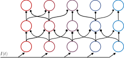

instantaneous neurons slowest neurons

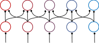
(no lag/memory) lag (longest lag/memory)

|

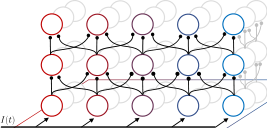

**Figure 13:** **Architectures of the simulated networks. (a)** The GLE network used to produce the results in Fig. 8e where multiple input channels
project to successive hidden layers with different time constants. All other networks can be viewed as using a subset of this architecture. **(b)** The
GLE network trained on the MNIST-1D dataset uses a single (scalar) input channel. This architecture was used to produce the results in Fig. 8d and
Fig. 9a-c. **(c)** ”LagNet” architecture used to produce the results in Fig. 9f. It also receives a single input channel, but the weights of the four bottom
layers are fixed to identity matrices. This induces ten parallel channels that process the input with different time constants. The MLP on top of this
LagNet uses instantaneous neurons and is trained with GLE (which in the case of equal time constants _τ_ [m] = _τ_ [r] reduces to LE as described in [17]).
**(d)** The GLE network used to tackle spatial problems as per Fig. 9g. All neurons are instantaneous, and the network is equivalent to a LE network.

**5.6.6** **Google Speech Commands**

The GLE networks use a layered architecture with 32 input
neurons in the first layer, 3 fully-connected hidden layers and
an output layer with twelve neurons. Each hidden layer has
five different populations of neurons, each with different time
constants _τ_ [m] and _τ_ [r] . Detailed parameters for the different
GLE networks are given in the last column of Table 1.

To provide a fair comparison, the dataset (v2.12) and data
augmentation process from [97] is used to train and test all
models. For a more continuous input, the original sequences
are interpolated, increasing the number of time steps by a factor of 20. The train/validation/test set split ratio is 80:10:10.
The training data is augmented with background noise and
random time shifts of up to 100 ms. The length and stride of
the Fourier window, the number of frequency bins and the type
of Mel frequency representation is optimized for each method
independently; all parameters are given in Table 3 in the Supplement.

**5.6.7** **GLE for purely spatial patterns**

In Fig. 8g we compare the validation accuracy of (G)LE (in
the instantaneous case where _τ_ _i_ [m] = _τ_ _i_ [r] [for all neurons] _[ i]_ [) with]
standard BP on a purely spatial task, namely the CIFAR-10
dataset [63]. In both cases, the architecture follows LeNet-5

[98]. These results are taken from the original publication [17],

to which we refer for further details.

**5.6.8** **Chaotic time series prediction**

For the Mackey-Glass time series prediction task, we follow
the benchmark setup of [64] to allow a fair comparison with
their results. The Mackey-Glass time series is generated by
the following delay differential equation:

˙ _x_ ( _t −_ _τ_ )
_x_ ( _t_ ) = _β_ 1 + _x_ ( _t −_ _τ_ ) _[n]_ _[−]_ _[γx]_ [(] _[t]_ [)] _[,]_ (55)

with delay constant _τ_ and parameters _β_, _γ_, and _n_ . Depending on the parameters, the Mackey-Glass system can exhibit
periodic and chaotic behavior. As in [64], we use _β_ = 0 _._ 2,
_γ_ = 0 _._ 1, _n_ = 10, and _τ_ = 17 leading to chaotic behavior. The
Lyapunov time _λ_ for this system, a measure of the time scale
over which two different initial conditions are expected to diverge by at least a factor of _e_, is _λ_ = 197. The NeuroBench
framework [64] provides a pregenerated Mackey-Glass time series of a length of 50 _λ_, which is used as the training set with
a discretization 75 steps/ _λ_ corresponding to a time step of approximately 2 _._ 63. For the simulation of our GLE networks,
we require a much finer discretization of the time series, so
we use a time step of 0 _._ 2 corresponding to 985 steps/ _λ_ using
the `jitCDDE` library [99]. Furthermore, instead of the Euler
integration scheme for the simulation of our GLE networks,
we use the fourth-order Runge-Kutta method which, together
with the finer discretization, allows for improved numerical
stability of our simulation.

The original time series of length 50 _λ_ is then split into 30
sequences of length 20 _λ_, shifted by 0 _._ 5 _λ_ time each. The first
10 _λ_ of each sequence are used for training, where the network
is trained to predict the next step _x_ ( _t_ + 1) from input _x_ ( _t_ )
(and possibly delayed inputs _x_ ( _t −_ ∆)). After the first 10 _λ_,
the network switches to the autoregressive mode, where the
network’s prediction of _x_ ( _t_ + 1), i.e., the output _y_ ( _t_ ), is fed
back as input for the next time step and without providing the
true value _x_ ( _t_ + 1) as a target. For each of the 30 sequences, a
separate network with different random initialization is trained
over 150 epochs and then evaluated on the last 10 _λ_ of the
sequence using the sMAPE metric and finally averaged over
all 30 sequences. Our GLE networks use four input neurons,
each delayed by ∆= 6 and two hidden layers with 93 neurons
each, that is, in total 186 hidden neurons, identical in size

to the ESN baseline network. For details on the ESN and

LSTM baselines as well as the benchmark setup, we refer to
the original publication [64].

21

**6** **Data Availability**

All datasets used in this manuscript are publicly available.

**7** **Code Availability**

Code to reproduce the results presented in this manuscript is
available at `[https://github.com/unibe-cns/gle-code](https://github.com/unibe-cns/gle-code)` .

**8** **Acknowledgements**

We thank Simon Brandt for sharing his expertise on prospectivity in mechanistic neuron models and Walter Senn for many
stimulating discussions about various aspects of dendritic computation, energy-based models, error-correcting plasticity and
bio-plausible credit assignment. We gratefully acknowledge
funding from the European Union under grant agreements
#945539 (Human Brain Project, SGA3) and #101147319
(EBRAINS 2.0), the Volkswagen Foundation under the call
“NEXT – Neuromorphic Computing” for partially funding
KM’s contribution and ESKAS for funding IJ’s contribution
under a Swiss Government Excellence Scholarship. We would
like to express particular gratitude for the ongoing support
from the Mandred St¨ark Foundation. Our work has greatly
benefitted from access to the Fenix Infrastructure resources,
which are partially funded by the European Union’s Horizon
2020 research and innovation programme through the ICEI
project under the grant agreement No. 800858. Furthermore,
we thank Marcel Affolter, Reinhard Dietrich and the Insel
Data Science Center for the usage and outstanding support

of their Research HPC Cluster.

**9** **Author contributions**

BE and PH share first authorship of the manuscript. MAP,
PH and BE conceived the core ideas and designed the project.
BE and MAP initiated the project and produced the first
results. PH, BE, IJ, JJ and LK developed the code and
performed the simulations. PH, KM, FB, IJ and MAP developed the proof of correspondence between GLE and AM.
All authors contributed to the development of the theory
and simulations. All authors contributed to writing the
manuscript. Corresponding authors: [paul.haider@unibe.ch](mailto:paul.haider@unibe.ch)
[and mihai.petrovici@unibe.ch.](mailto:mihai.petrovici@unibe.ch)

**References**

1. Baydin, A. G., Pearlmutter, B. A., Radul, A. A. &
Siskind, J. M. Automatic Differentiation in Machine
Learning: A Survey. _Journal of Machine Learning Re-_
_search_ **18,** 1–43. issn: 1533-7928 (2018).

2. Pearlmutter, B. Gradient Calculations for Dynamic Recurrent Neural Networks: A Survey. _IEEE Transactions_
_on Neural Networks_ **6,** 1212–1228. issn: 1941-0093 (Sept.
1995).

3. Linnainmaa, S. Taylor Expansion of the Accumulated
Rounding Error. _BIT Numerical Mathematics_ **16,** 146–
160. issn: 1572-9125 (June 1976).

4. Werbos, P. J. Applications of Advances in Nonlinear Sensitivity Analysis. _Proc. IFIP_ (eds Drenick, R & Kozin, F
) (1982).

5. Rumelhart, D. E., Hinton, G. E. & Williams, R. J. Learn
ing Representations by Back-Propagating Errors. _Nature_
**323,** 533–536. issn: 1476-4687 (Oct. 1986).

6. Pineda, F. J. Generalization of Back-Propagation to Recurrent Neural Networks. _Physical Review Letters_ **59,**
2229–2232 (Nov. 1987).

7. Werbos, P. Backpropagation through Time: What It Does
and How to Do It. _Proceedings of the IEEE_ **78,** 1550–
1560. issn: 1558-2256 (Oct. 1990).

8. Kelley, H. J. Method of gradients. _Mathematics in Science_
_and Engineering_ **5,** 205–254 (1962).

9. Todorov, E. _Optimal control theory_ (eds Doya, K., Ishii,
S., Pouget, A. & Rao, R. P. ) 2006.

10. Chachuat, B. Nonlinear and Dynamic Optimization:
From Theory to Practice. _Lecture notes, EPFL,_ 1–187
(2007).

11. Sutton, R. _Reinforcement learning_ 2nd (MIT Press,
2018).

12. Lillicrap, T. P. & Santoro, A. Backpropagation through
Time and the Brain. _Current Opinion in Neurobiology._
_Machine Learning, Big Data, and Neuroscience_ **55,** 82–
89. issn: 0959-4388 (Apr. 2019).

13. Sussillo, D. & Abbott, L. F. Generating coherent patterns
of activity from chaotic neural networks. _Neuron_ **63,** 544–
557 (2009).

14. Gilra, A. & Gerstner, W. Predicting Non-Linear Dynamics by Stable Local Learning in a Recurrent Spiking Neural Network. _eLife_ **6** (ed Latham, P. ) e28295. issn: 2050084X (Nov. 2017).

15. Williams, R. J. & Zipser, D. A learning algorithm for continually running fully recurrent neural networks. _Neural_
_Computation_ **1,** 270–280 (1989).

16. Marschall, O., Cho, K. & Savin, C. A Unified Framework
of Online Learning Algorithms for Training Recurrent
Neural Networks. _Journal of Machine Learning Research_
**21,** 1–34. issn: 1533-7928 (2020).

17. Haider, P. et al. Latent Equilibrium: A Unified Learning
Theory for Arbitrarily Fast Computation with Arbitrarily
Slow Neurons. _Advances in Neural Information Process-_
_ing Systems_ **34,** 17839–17851 (2021).

18. Hodgkin, A. L. & Huxley, A. F. A Quantitative Description of Membrane Current and Its Application to Conduction and Excitation in Nerve. _The Journal of Physi-_
_ology_ **117,** 500–544. issn: 0022-3751 (Aug. 1952).

19. Puccini, G. D., Sanchez-Vives, M. V. & Compte, A. Integrated Mechanisms of Anticipation and Rate-of-Change
Computations in Cortical Circuits. _PLOS Computational_
_Biology_ **3,** e82. issn: 1553-7358 (May 2007).

22

20. K¨ondgen, H. et al. The Dynamical Response Properties
of Neocortical Neurons to Temporally Modulated Noisy
Inputs In Vitro. _Cerebral Cortex_ **18,** 2086–2097. issn:
1047-3211 (Sept. 2008).

21. Plesser, H. E. & Gerstner, W. Escape Rate Models for

Noisy Integrate-and-Fire Neurons. _Neurocomputing_ **32–**
**33,** 219–224. issn: 0925-2312 (June 2000).

22. Pozzorini, C., Naud, R., Mensi, S. & Gerstner, W. Tem
poral whitening by power-law adaptation in neocortical
neurons. _Nature Neuroscience_ **16,** 942–948 (2013).

23. Brandt, S., Petrovici, M. A., Senn, W., Wilmes, K. A.
& Benitez, F. Prospective and Retrospective Coding in
Cortical Neurons. eprint: `2405.14810` (q-bio) (May 2024).

24. Kepecs, A., Wang, X.-J. & Lisman, J. Bursting Neurons
Signal Input Slope. _Journal of Neuroscience_ **22,** 9053–
9062. issn: 0270-6474, 1529-2401 (Oct. 2002).

25. Aamir, S. A. et al. A mixed-signal structured AdEx neuron for accelerated neuromorphic cores. _IEEE Transac-_
_tions on Biomedical Circuits and Systems_ **12,** 1027–1037
(2018).

26. Rubino, A., Payvand, M. & Indiveri, G. Ultra-low power
silicon neuron circuit for extreme-edge neuromorphic intelligence. _26th IEEE International Conference on Elec-_
_tronics, Circuits and Systems (ICECS),_ 458–461 (2019).

27. Shaban, A., Bezugam, S. S. & Suri, M. An adaptive
threshold neuron for recurrent spiking neural networks
with nanodevice hardware implementation. _Nature Com-_
_munications_ **12,** 4234 (2021).

28. Billaudelle, S., Weis, J., Dauer, P. & Schemmel, J. An
accurate and flexible analog emulation of AdEx neuron
dynamics in silicon. _2022 29th IEEE International Con-_
_ference on Electronics, Circuits and Systems (ICECS),_
1–4 (2022).

29. Ackley, D. H., Hinton, G. E. & Sejnowski, T. J. A Learning Algorithm for Boltzmann Machines. _Cognitive Sci-_
_ence_ **9,** 147–169. issn: 0364-0213, 1551-6709 (Jan. 1985).

30. Hopfield, J. J. Neural Networks and Physical Systems
with Emergent Collective Computational Abilities. _Pro-_
_ceedings of the National Academy of Sciences_ **79,** 2554–
2558 (Apr. 1982).

31. Scellier, B. & Bengio, Y. Equilibrium Propagation: Bridging the Gap Between Energy-Based Models and Backpropagation. arXiv: `[1602.05179 [cs]](https://arxiv.org/abs/1602.05179)` (Mar. 2017).

32. Whittington, J. C. R. & Bogacz, R. An Approximation
of the Error Backpropagation Algorithm in a Predictive
Coding Network with Local Hebbian Synaptic Plasticity. _Neural Computation_ **29,** 1229–1262. issn: 0899-7667
(May 2017).

33. Mainen, Z. F., Joerges, J., Huguenard, J. R. & Sejnowski,
T. J. A model of spike initiation in neocortical pyramidal
neurons. en. _Neuron_ **15,** 1427–1439. issn: 08966273 (Dec.
1995).

34. Gerstner, W., Kistler, W. M., Naud, R. & Paninski, L.
_Neuronal Dynamics: From Single Neurons to Networks_
_and Models of Cognition_ 1st ed. isbn: 9781107060838
9781107635197 9781107447615 (Cambridge University
Press, July 2014).

35. Traub, R. D. & Miles, R. _Neuronal Networks of the Hip-_
_pocampus_ 1st ed. isbn: 9780521364812 9780521063319
9780511895401 (Cambridge University Press, May 1991).

36. Linaro, D., Bir´o, I. & Giugliano, M. Dynamical response
properties of neocortical neurons to conductance-driven
time-varying inputs. _European Journal of Neuroscience_
**47,** 17–32 (2018).

37. Richards, B. A. et al. A deep learning framework for neuroscience. _Nature Neuroscience_ **22,** 1761–1770 (2019).

38. Urbanczik, R. & Senn, W. Learning by the dendritic prediction of somatic spiking. _Neuron_ **81,** 521–528 (2014).

39. Markov, N. T. et al. Anatomy of hierarchy: feedforward
and feedback pathways in macaque visual cortex. _Journal_
_of Comparative Neurology_ **522,** 225–259 (2014).

40. Shai, A. S., Anastassiou, C. A., Larkum, M. E. & Koch,
C. Physiology of layer 5 pyramidal neurons in mouse primary visual cortex: coincidence detection through bursting. _PLOS Computational Biology_ **11,** e1004090 (2015).

41. Zmarz, P. & Keller, G. B. Mismatch receptive fields in
mouse visual cortex. _Neuron_ **92,** 766–772 (2016).

42. Fiser, A. et al. Experience-dependent spatial expectations

in mouse visual cortex. _Nature Neuroscience_ **19,** 1658–
1664 (2016).

43. Attinger, A., Wang, B. & Keller, G. B. Visuomotor coupling shapes the functional development of mouse visual
cortex. _Cell_ **169,** 1291–1302 (2017).

44. Keller, G. B. & Mrsic-Flogel, T. D. Predictive Processing:
A Canonical Cortical Computation. _Neuron_ **100,** 424–
435. issn: 08966273 (Oct. 2018).

45. Ayaz, A. et al. Layer-specific integration of locomotion
and sensory information in mouse barrel cortex. _Nature_
_Communications_ **10,** 2585 (2019).

46. Gillon, C. J. et al. Responses to pattern-violating visual
stimuli evolve differently over days in somata and distal
apical dendrites. _Journal of Neuroscience_ **44** (2024).

47. Francioni, V., Tang, V. D., Brown, N. J., Toloza, E. H.
& Harnett, M. Vectorized Instructive Signals in Cortical Dendrites during a Brain-Computer Interface Task.
bioRxiv: `2023.11.03.565534` (2023).

48. Wilson, N. R., Runyan, C. A., Wang, F. L. & Sur, M.
Division and subtraction by distinct cortical inhibitory
networks in vivo. _Nature_ **488,** 343–348 (2012).

49. Seybold, B. A., Phillips, E. A., Schreiner, C. E. & Hasenstaub, A. R. Inhibitory actions unified by network integration. _Neuron_ **87,** 1181–1192 (2015).

50. Lee, S., Kruglikov, I., Huang, Z. J., Fishell, G. & Rudy, B.
A disinhibitory circuit mediates motor integration in the

somatosensory cortex. _Nature Neuroscience_ **16,** 1662–
1670 (2013).

23

51. Dorsett, C., Philpot, B. D., Smith, S. L. & Smith, I. T.
The impact of SST and PV interneurons on nonlinear
synaptic integration in the neocortex. _eNeuro_ **8** (2021).

52. Petrovici, M. A. _Form versus function: theory and models_
_for neuronal substrates_ (Springer, 2016).

53. Lillicrap, T. P., Cownden, D., Tweed, D. B. & Akerman,
C. J. Random synaptic feedback weights support error
backpropagation for deep learning. _Nature communica-_
_tions_ **7,** 13276 (2016).

54. Meulemans, A., Farinha, M. T., Cervera, M. R., Sacramento, J. & Grewe, B. F. _Minimizing control for credit_
_assignment with strong feedback_ PMLR, 2022.

55. Max, K. et al. Learning efficient backprojections across

cortical hierarchies in real time. _Nature Machine Intelli-_

_gence_ **6,** 619–630. issn: 2522-5839 (2024).

56. Gierlich, T., Baumbach, A., Kungl, A. F., Max, K. &
Petrovici, M. A. _Weight Transport through Spike Timing_
_for Robust Local Gradients_ Mar. 2025. arXiv: `[2503.02642](https://arxiv.org/abs/2503.02642)`

`[[q-bio]](https://arxiv.org/abs/2503.02642)` . (2025).

57. Bai, S., Kolter, J. Z. & Koltun, V. An Empirical Evalua
tion of Generic Convolutional and Recurrent Networks for

Sequence Modeling. arXiv: `[1803.01271 [cs.LG]](https://arxiv.org/abs/1803.01271)` (2018).

58. Greydanus, S. Scaling down Deep Learning. eprint: `2011.`
`14439` (cs, stat) (2020).

59. Cho, K. et al. Learning Phrase Representations using

RNN Encoder-Decoder for Statistical Machine Transla
tion. arXiv: `[1406.1078 [cs.CL]](https://arxiv.org/abs/1406.1078)` (2014).

60. Warden, P. Speech Commands: A Dataset for LimitedVocabulary Speech Recognition. arXiv: `[1804 . 03209](https://arxiv.org/abs/1804.03209)`

`[[cs.CL]](https://arxiv.org/abs/1804.03209)` (2018).

61. Hochreiter, S. & Schmidhuber, J. Long short-term memory. _Neural Computation_ **9,** 1735–1780 (1997).

62. LeCun, Y. et al. Backpropagation applied to handwritten zip code recognition. _Neural Computation_ **1,** 541–551
(1989).

63. Krizhevsky, A., Hinton, G., et al. Learning multiple layers
of features from tiny images (2009).

64. Yik, J. et al. The Neurobench Framework for Benchmarking Neuromorphic Computing Algorithms and Systems.
_Nature Communications_ **16,** 1545. issn: 2041-1723 (Feb.
2025).

65. Mackey, M. C. & Glass, L. Oscillation and Chaos in Physiological Control Systems. _Science_ **197,** 287–289. issn:
0036-8075. JSTOR: `[1744526](http://www.jstor.org/stable/1744526)` (1977).

66. Fayyazi, R., Weilbach, C. & Wood, F. _Prospective Mes-_
_saging: Learning in Networks with Communication De-_
_lays_ July 2024. arXiv: `[2407.05494 [cs]](https://arxiv.org/abs/2407.05494)` .

67. Senn, W. et al. A Neuronal Least-Action Principle for
Real-Time Learning in Cortical Circuits. _eLife_ **12** (2023).

68. Williams, R. J. & Zipser, D. Gradient-Based Learning
Algorithms for Recurrent Networks and Their Computational Complexity. _Backpropagation: Theory, Architec-_
_tures, and Applications. Developments in Connectionist_
_Theory_ 433–486 (1995).

69. Murray, J. M. Local Online Learning in Recurrent Networks with Random Feedback. _eLife_ **8,** e43299. issn:
2050-084X (May 2019).

70. Schuman, C. D. et al. A survey of neuromorphic computing and neural networks in hardware. arXiv: `[1705.06963](https://arxiv.org/abs/1705.06963)`
(2017).

71. Deng, L., Li, G., Han, S., Shi, L. & Xie, Y. Model compression and hardware acceleration for neural networks:
A comprehensive survey. _Proceedings of the IEEE_ **108,**
485–532 (2020).

72. Campolucci, P., Uncini, A. & Piazza, F. Causal Back
Propagation through Time for Locally Recurrent Neural
Networks. _1996 IEEE International Symposium on Cir-_
_cuits and Systems. Circuits and Systems Connecting the_
_World. ISCAS 96_ **3,** 531–534 vol.3 (May 1996).

73. Orvieto, A. et al. Resurrecting Recurrent Neural Networks for Long Sequences. _Proceedings of the 40th Inter-_
_national Conference on Machine Learning,_ 26670–26698.
issn: 2640-3498 (July 2023).

74. Orvieto, A., De, S., Gulcehre, C., Pascanu, R. & Smith,
S. L. Universality of Linear Recurrences Followed by Nonlinear Projections: Finite-Width Guarantees and Benefits
of Complex Eigenvalues. eprint: `2307.11888` (cs) (Mar.
2024).

75. Gu, A. & Dao, T. Mamba: Linear-Time Sequence Modeling with Selective State Spaces. eprint: `2312.00752` (cs)
(Dec. 2023).

76. De, S. et al. Griffin: Mixing Gated Linear Recurrences
with Local Attention for Efficient Language Models.
eprint: `2402.19427` (cs) (Feb. 2024).

77. Gupta, A., Gu, A. & Berant, J. Diagonal state spaces
are as effective as structured state spaces. _Advances in_
_Neural Information Processing Systems_ **35,** 22982–22994
(2022).

78. Gu, A. et al. Combining recurrent, convolutional, and
continuous-time models with linear state space layers.
_Advances in Neural Information Processing Systems_ **34,**
572–585 (2021).

79. Gu, A., Goel, K. & R´e, C. Efficiently modeling long sequences with structured state spaces. arXiv: `[2111.00396](https://arxiv.org/abs/2111.00396)`
(2021).

80. Zucchet, N., Meier, R., Schug, S., Mujika, A. & Sacramento, J. Online Learning of Long-Range Dependencies.
eprint: `2305.15947` (cs) (2023).

81. Wunderlich, T. et al. Demonstrating advantages of neuromorphic computation: a pilot study. _Frontiers in Neu-_
_roscience_ **13,** 260 (2019).

82. G¨oltz, J. et al. Fast and Energy-Efficient Neuromorphic
Deep Learning with First-Spike Times. _Nature Machine_
_Intelligence_ **3,** 823–835. issn: 2522-5839 (Sept. 2021).

83. Lee, C., Hasegawa, H. & Gao, S. Complex-valued neural
networks: A comprehensive survey. _IEEE/CAA Journal_
_of Automatica Sinica_ **9,** 1406–1426 (2022).

24

84. Brette, R. et al. Simulation of networks of spiking neurons: A review of tools and strategies. en. _Journal of_
_Computational Neuroscience_ **23,** 349–398. issn: 15736873 (Dec. 2007).

85. Abeles, M. Role of the cortical neuron: integrator or coincidence detector? _Israel journal of medical sciences_ **18,**
83–92 (1982).

86. K¨onig, P., Engel, A. K. & Singer, W. Integrator or coinci
dence detector? The role of the cortical neuron revisited.

_Trends in neurosciences_ **19,** 130–137 (1996).

87. Ratt´e, S., Hong, S., De Schutter, E. & Prescott, S. A.
Impact of neuronal properties on network coding: roles of
spike initiation dynamics and robust synchrony transfer.
_Neuron_ **78,** 758–772 (2013).

88. Sacramento, J., Ponte Costa, R., Bengio, Y. & Senn, W.
Dendritic Cortical Microcircuits Approximate the Backpropagation Algorithm. _Advances in Neural Information_
_Processing Systems_ **31** (2018).

89. Kolen, J. F. & Pollack, J. B. Backpropagation without
weight transport. _Proceedings of 1994 IEEE International_
_Conference on Neural Networks (ICNN’94)_ **3,** 1375–1380
(1994).

90. Akrout, M., Wilson, C., Humphreys, P., Lillicrap, T. &
Tweed, D. B. Deep learning without weight transport.
_Advances in Neural Information Processing Systems_ **32**
(2019).

91. Cramer, B. et al. Surrogate gradients for analog neuromorphic computing. _Proceedings of the National Academy_
_of Sciences_ **119** (2022).

92. Wunderlich, T. C. & Pehle, C. Event-based backpropagation can compute exact gradients for spiking neural
networks. _Scientific Reports_ **11,** 12829 (2021).

93. Izhikevich, E. M. Simple model of spiking neurons. _IEEE_
_Transactions on Neural Networks_ **14,** 1569–1572 (2003).

94. Brette, R. & Gerstner, W. Adaptive exponential
integrate-and-fire model as an effective description of neuronal activity. _Journal of Neurophysiology_ **94,** 3637–3642
(2005).

95. Kingma, D. P. & Ba, J. Adam: A method for stochastic
optimization. arXiv: `[1412.6980](https://arxiv.org/abs/1412.6980)` (2014).

96. Weidel, P. & Sheik, S. _WaveSense: Efficient Temporal_
_Convolutions with Spiking Neural Networks for Keyword_
_Spotting_ Nov. 2021. arXiv: `[2111.01456 [cs]](https://arxiv.org/abs/2111.01456)` .

97. Zhang, Y., Suda, N., Lai, L. & Chandra, V. Hello Edge:
Keyword Spotting on Microcontrollers. arXiv: `[1711 .](https://arxiv.org/abs/1711.07128)`
`[07128 [cs.SD]](https://arxiv.org/abs/1711.07128)` (2018).

98. LeCun, Y., Bottou, L., Bengio, Y. & Haffner, P. Gradientbased learning applied to document recognition. _Proceed-_
_ings of the IEEE_ **86,** 2278–2324 (1998).

99. Ansmann, G. Efficiently and Easily Integrating Differential Equations with JiTCODE, JiTCDDE, and JiTCSDE.
_Chaos: An Interdisciplinary Journal of Nonlinear Science_
**28,** 043116. issn: 1054-1500 (Apr. 2018).

25

## **Supplementary Information**

**10** **Biological mechanisms of prospectivity**

While the retrospective (low-pass filter) operator is a common assumption about neuronal dynamics, the prospective properties of
neurons are much less frequently used in computational neuroscience. Nevertheless, they rest on solid experimental and theoretical
evidence [1–7]. In the following, we provide an intuitive explanation for some of the underlying mechanisms, which sacrifices some
mathematical precision in the service of brevity.

One well-established mechanism of prospectivity stems from the spiking behavior of neurons, more specifically from the reset
upon threshold crossing (see, e.g., [4], but also the textbook [8], Sec. 9.4.1 and Fig. 9.10). The instantaneous firing probability
of a neuron is equivalent to the population firing rate of an unconnected ensemble of such neurons. Consider therefore a large
population of identical neurons with constant stimulus that generates some membrane potential _u_ . Under independent balanced
Poisson background (equal amounts excitatory and inhibitory input), the membrane potentials in this population will follow
a Gaussian distribution centered around _u_ . If one introduces a threshold, those neurons that are suprathreshold spike. Their
proportion is roughly equal to the suprathreshold area of the Gaussian, which depends on _u_, and thus the firing rate is a function
of _u_ . Consider now the case in which the stimulus gradually changes such that _u_ increases with time, with some speed ˙ _u_ . This
will cause the Gaussian to gradually shift upwards. In addition to the area that was initially above the threshold, new area enters
the suprathreshold state and thus more neurons fire as they are swept across the threshold. This happens at a rate that depends
on the speed with which the distribution moves upwards, which is determined by ˙ _u_ . Altogether, the instantaneous firing rate
is thus a function _φ_ ( _u,_ ˙ _u_ ). The parametrization _φ_ ( _u_ + _τ_ ˙ _u_ ) chosen for GLE is an approximation of the more complex expression
derived in [4].

A second mechanism of prospectivity lies in the well-known Hodgkin-Huxley model of action potential generation itself [1]. The
Hodgkin-Huxley model describes the evolution of the membrane potential _u_, along with three gating variables _m_, _h_ and _n_ for
voltage-gated Na [+] and K [+] channels. Because all of these equations are of type _τ_ ˙ _x_ = _x_ 0 _−_ _x_, without external input, the system
decays towards the resting state _x_ 0 (in case of the membrane variable, this is the leak potential). If one injects some input, this
resting state changes. However, if the input is increased very slowly, on a time scale much longer than all time constants _τ_ that
control the reaction speed of the system (i.e., adiabatically), all variables will have sufficient time to adapt and the system will
simply follow the (slowly changing) resting state. This can continue for arbitrarily high input without the neuron ever spiking.
For an input that changes more quickly, the neuron obviously fires. Whether the neuron fires or not thus depends on the rate with
which the input, and therefore its membrane potential, changes – that is, ˙ _u_ . For a more detailed description and also simulations
depicting this effect, we refer to the textbook [9] (Sec. 2.1.2. and Fig. 2.6).

Third, neuronal adaptation can also lead to prospectivity ([5, 6], but see also the detailed discussion in Section 5.4). Here,
adaptation can be interpreted very generally as the existence of a second variable that is 1) described by some form of low-pass
filter over the membrane and 2) couples negatively into the membrane. This is the case for the adaptation variable in standard
adaptive neuron models such as AdEx [10] or Izhikevich [11], but it also applies to sodium currents in the Hodgkin-Huxley model

[6]. A low-pass filter preserves lower frequency components while suppressing higher ones; thus, subtracting a low-pass filtered
version of a signal from the signal itself suppresses lower frequencies and preserves higher ones. The negatively coupled adaptation
variable therefore acts like an inverse of a low-pass filter, which is indeed what we model with our prospective operator _D_ _τ_ [+] [.]

**11** **Adjoint equations and parameter updates for the feedforward pathway in GLE networks**

The general problem we aim to solve is to minimize some cost _C_ ( _**u**_ _,_ ˙ _**u**_ _,_ _**θ**_ ) through adaptation of the parameters _**θ**_ _∈{_ _**W**_ _,_ _**b**_ _,_ _**τ**_ **[m]** _,_ _**τ**_ **[r]** _}_
of a dynamical system with presynaptic inputs _**r**_ in, which is constrained by the dynamics of state variables _**u**_ . For that, we employ
the adjoint method (AM), as described, e.g., in [12], in order to derive adjoint equations for the Lagrange multipliers _**λ**_ and
calculate the gradient of the cost functional _C_ w.r.t. the parameters _**θ**_ . The dynamics are described by a system of ordinary
differential equations (ODEs) in implicit form

_**h**_ ( _**u**_ _,_ ˙ _**u**_ _,_ _**θ**_ _, t_ ) = _**τ**_ [m] _**u**_ ˙ + _**u**_ _−_ _**W r**_ in _−_ _**b**_ = 0 _._ (56)

Note that this is a special case of the GLE dynamics, where the error term _**e**_ is zero and the solution can be written using the
integral operator
_**u**_ ( _t_ ) = _**I**_ _[−]_ _**τ**_ [m] _[ {]_ _**[W r]**_ [in] [ +] _**[ b]**_ _[}][ .]_ (57)

26

Recall that the GLE operators are defined as

_**I**_ _[−]_ _**τ**_ _[{]_ _**[x]**_ [(] _[t]_ [)] _[}]_ [ =] [1]

_τ_

� _t_

d _s_ _**x**_ ( _s_ ) _e_ _[−]_ _[t][−]_ _**τ**_ _[s]_

_−∞_

_**τ**_ (leaky integrator) (58)

_**D**_ [+] _**τ**_ _[{]_ _**[x]**_ [(] _[t]_ [)] _[}]_ [ =] �1 + _**τ**_ d [d] _t_

_**D**_ [+] _**τ**_ _[{]_ _**[x]**_ [(] _[t]_ [)] _[}]_ [ =] �1 + _**τ**_ d [d] _t_

_**x**_ ( _t_ ) _._ (lookahead) (59)
�

We define the cost functional _C_ as the integral of the instantaneous cost _C_ over some time interval [0 _, T_ ]

_T_
_C_ ( _**u**_ _,_ ˙ _**u**_ _,_ _**θ**_ ) = _C_ ( _t,_ _**u**_ _,_ ˙ _**u**_ _,_ _**θ**_ ) d _t,_ (60)
� 0

where the instantaneous cost can be defined as the mean-squared error between the target rate _**r**_ [trg] and the actual rate _**r**_ at time
_t_ of some subset _O_ of all the neurons in the network _N_, _C_ ( _t,_ _**u**_ _,_ ˙ _**u**_ _,_ _**θ**_ ) = [1] � _[∥]_ _**[r]**_ [trg] [(] _[t]_ [)] _[ −]_ _**[φ]**_ [(] _**[u]**_ _[o]_ [ +] _**[ τ]**_ _o_ [ r] _**[u]**_ [˙] _o_ [)] _[∥]_ [2] [. In practice,] _[ C]_ [ could]

_t_ of some subset _O_ of all the neurons in the network _N_, _C_ ( _t,_ _**u**_ _,_ ˙ _**u**_ _,_ _**θ**_ ) = 2 [1] � _o∈O_ _[∥]_ _**[r]**_ [trg] [(] _[t]_ [)] _[ −]_ _**[φ]**_ [(] _**[u]**_ _[o]_ [ +] _**[ τ]**_ _o_ [ r] _**[u]**_ [˙] _o_ [)] _[∥]_ [2] [. In practice,] _[ C]_ [ could]

represent the integrated cost over a data sample or a window of a continuous input stream of length _T_ .

2 �

In order to solve the constrained optimization problem with AM, we first introduce the Lagrangian functional _L_

_T_
_L ≡_ _C_ ( _t,_ _**u**_ ( _t_ ) _,_ ˙ _**u**_ ( _t_ ) _,_ _**θ**_ ) + _**λ**_ [T] ( _t_ ) _**h**_ ( _t,_ _**u**_ ( _t_ ) _,_ ˙ _**u**_ ( _t_ ) _,_ _**θ**_ ) d _t,_ (61)
� 0

which incorporates the constraints of the dynamical system Eqn. 56 into the cost functional _C_ via Lagrange multipliers _**λ**_ ( _t_ ).
The gradient of the Lagrangian _L_ w.r.t. the parameters _**θ**_ can be calculated using the chain rule (suppressing the explicit timedependence from here on)

d _L_ _T_
d _**θ**_ [=] � 0

_∂C_
�� _∂_ _**θ**_

_∂_ _**h**_
+ _**λ**_ [T]
� _∂_ _**θ**_

_∂C_

_∂_ _**θ**_ [+] _[ ∂C]_ _∂_ _**u**_

d _**u**_

˙

_∂_ _**u**_ d _**θ**_ [+] _[ ∂C]_ _∂_ _**u**_

d ˙ _**u**_

_∂_ _**u**_ ˙ d _**θ**_

+ [d] _**[λ]**_ [T]
� ~~�~~ d�� _**θ**_ _**[h]**_ ~~�~~

=0

+ [d] _**[λ]**_ [T]
� d _**θ**_

_∂_ _[∂]_ _**u**_ _**[h]**_ ˙ d ˙d _**uθ**_

_∂_ _**h**_ _[∂]_ _**[h]**_

_∂_ _**θ**_ [+] _∂_ _**u**_

_[∂]_ _**[h]**_ d _**u**_ _[∂]_ _**[h]**_ ˙

_∂_ _**u**_ d _**θ**_ [+] _∂_ _**u**_

d _t ._ (62)
��

The term proportional to _**h**_ vanishes, as _**h**_ = 0 is satisfied at all times _t_ . Most of the remaining terms can be simplified upon
substituting one of the specific parameters _**θ**_ . In the following we derive the parameter updates for the synaptic weights _**W**_ . We
do so first for a single vector of output neurons (i.e., neurons receiving external targets; this corresponds to the output layer in a
hierarchical network) and then extend the derivation to hidden layers.

**11.1** **Output neurons**

We now calculate the gradient of the Lagrangian _L_ w.r.t. the synaptic weights _**W**_ . After integrating by parts the terms including
d ˙ _**u**_ _/_ d _**W**_, that is, using � d _t_ _**x**_ d [d ] _**W**_ _**[u]**_ [˙] [=] � d _t_ d [d] _t_ � _**x**_ d [d] _**W**_ _**[u]**_ � _−_ � d _t_ [d] d _**[x]**_ _t_ dd _**Wu**_ [, we can rewrite the gradient as]

d [d ] _**W**_ _**[u]**_ [˙] [=] � d _t_ d [d] _t_

d [d] _t_ � _**x**_ d [d] _**W**_ _**[u]**_

d [d] _**W**_ _**[u]**_ � _−_ � d _t_ [d] d _**[x]**_ _t_

d _**[x]**_ _t_ dd _**Wu**_ [, we can rewrite the gradient as]

d _L_ _T_
d _**W**_ [=] � 0

_∂C_
� _∂_ _**W**_

_[∂]_ _**[h]**_
� d _t_ + �� _**λ**_ [T] _∂_ _**u**_ ˙

_T_

_._ (63)

� 0

_[∂]_ _**[h]**_ _∂C_

_∂_ _**W**_ [+] � _∂_ _**u**_

_∂C_ _[∂]_ _**[h]**_

_∂_ _**W**_ [+] _**[ λ]**_ [T] _∂_ _**W**_

_∂C_

_∂_ _**u**_ _[−]_ d [d]

[d] _∂C_ ˙ _[∂]_ _**[h]**_

d _t_ _∂_ _**u**_ [+] _**[ λ]**_ [T] _∂_ _**u**_

_[∂]_ _**[h]**_ [d]

_∂_ _**u**_ ˙ _[−]_ _**[λ]**_ [T] d _t_

[d] _∂_ _**h**_

d _t_ _∂_ _**u**_ ˙

d _**u**_
� d _**W**_

_[∂]_ _**[h]**_ ˙ _[∂C]_ ˙

_∂_ _**u**_ [+] _∂_ _**u**_

_∂_ _**u**_ ˙

_[∂]_ _**[h]**_ _[∂]_ _**[h]**_

_∂_ _**u**_ _[−]_ _**[λ]**_ [˙] [T] _∂_ _**u**_ ˙

_∂_ _**u**_
� _∂_ _**W**_

To set boundary terms of the dynamical system at _t_ = _T_ to zero in Eqn. 63, we choose

_∂_ _**h**_
_**λ**_ ( _T_ ) = _−_ ˙
� _∂_ _**u**_

_−_ 1 _∂C_
� _∂_ _**u**_ ˙ ����� _t_ = _T_

(Eqn. 56) _**τ**_ [r]
= _**τ**_ [m] _[◦]_ _**[φ]**_ _[′]_ [ �] _**D**_ [+] _**τ**_ [r] _[{]_ _**[u]**_ [(] _[T]_ [)] _[}]_ � _◦_ � _**r**_ [trg] ( _T_ ) _−_ _**φ**_ � _**D**_ [+] _**τ**_ [r] _[{]_ _**[u]**_ [(] _[T]_ [)] _[}]_ �� (64)

and obtain an initial condition for the adjoint system. Similarly, one can account for the initial conditions _g_ ( _**u**_ _,_ ˙ _**u**_ _,_ _**W**_ ) _|_ _t_ =0 of the
dynamical system at _t_ = 0 by adding another term to the Lagrangian, namely _**µ**_ [T] _**g**_ ( _**u**_ (0) _,_ ˙ _**u**_ (0) _,_ _**W**_ ). Both _**λ**_ and _**µ**_ are vectors of
Lagrangian multipliers that can be freely chosen because the constraints _**h**_ = 0 and _**g**_ = 0 are always satisfied by construction.
Inspecting Eqn. 63, we observe that we can avoid calculating the term dd _**Wu**_ [if the terms in square brackets are zero for all times]
_t_, which defines the dynamics of the adjoint system:

_∂C_
_∂_ _**u**_ _[−]_ d [d] _t_

[d] _∂C_ ˙ _[∂]_ _**[h]**_

d _t_ _∂_ _**u**_ [+] _**[ λ]**_ [T] _∂_ _**u**_

_[∂]_ _**[h]**_ _[∂]_ _**[h]**_

_∂_ _**u**_ _[−]_ _**[λ]**_ [˙] [T] _∂_ _**u**_ ˙

_[∂]_ _**[h]**_ [d]

_∂_ _**u**_ ˙ _[−]_ _**[λ]**_ [T] d

[d] _∂_ _**h**_

˙ (65)
d _t_ _∂_ _**u**_ [=] **[ 0]** _[ .]_

Substituting the dynamic constraint _**h**_ defined in Eq. (56) yields the corresponding adjoint dynamics

[d] [d]

**1** _−_ _**τ**_ [r]
d _t_ _**[λ]**_ [(] _[t]_ [) =] _**[ λ]**_ _[ −]_ � d _t_

[d]
_**τ**_ [m]

d _t_

_**φ**_ _[′]_ _◦_ ( _**r**_ [trg] _−_ _**r**_ )� _._ (66)
��

27

This equation can be solved in a similar fashion to the forward dynamics (Eqn. 56). First, we conveniently define the adjoint

operators

_**I**_ [+] _**τ**_ _[{]_ _**[x]**_ [(] _[t]_ [)] _[}]_ [ =] **[1]**

_**τ**_

� _t_ _∞_

_t−s_
d _s_ _**x**_ ( _s_ ) _e_ _**τ**_

_t_

_**τ**_ (discounted future) (67)

_**D**_ _[−]_ _**τ**_ _[{]_ _**[x]**_ [(] _[t]_ [)] _[}]_ [ =] � **1** _−_ _**τ**_ d [d] _t_

_**x**_ ( _t_ ) _._ (lookback) _._ (68)
�

Using these operators, we can write the dynamics of the adjoint variable _**λ**_ as

_**λ**_ ( _t_ ) = _**I**_ [+] _**τ**_ [m] _[{]_ _**[D]**_ _[−]_ _**τ**_ [r] _[{]_ _**[φ]**_ _[′]_ _[ ◦]_ [(] _**[r]**_ [trg] _[ −]_ _**[r]**_ [)] _[}}][ .]_ (69)

together with a boundary condition at _t_ = _T_ given by Eqn. 64. Note that _**I**_ [+] _**τ**_ [m] [ integrates the dynamics into the future; this is the]
crucial reason why an AM weight update cannot be calculated online. Instead, we present a sample for the period _T_, and only
afterwards integrate the adjoint dynamics _backwards in time_ to obtain the Lagrange multiplier _**λ**_ at all times _t ∈_ [0 _, T_ ]. Finally,
this allows us to calculate the gradient of the cost with respect to the synaptic weights

d _L_
_∇_ _**W**_ _L_ = � d _**W**_

T _T_
= d _t_ _**λ**_ ( _t_ ) _**r**_ in [T] [(] _[t]_ [)] _[ .]_ (70)
� � 0

**11.2** **Hidden neurons**

We now extend the proof to hidden layers. In order to do so, we introduce labels for all layers: _**u**_ _ℓ_ denotes the somatic voltage of
a given layer _ℓ_ . Lookahead _**D**_ [+] _**τ**_ _ℓ_ [r] [and low-pass filters] _**[ I]**_ _**τ**_ _[−]_ _ℓ_ [m] operate with layer-specific time constants _**τ**_ _ℓ_ [r] [and] _**[ τ]**_ _ℓ_ [ m] [, respectively. For]
each layer _ℓ_, the Lagrange multipliers _**λ**_ _ℓ_ are required to enforce the dynamics

_**h**_ _ℓ_ ( _**u**_ _ℓ_ _,_ ˙ _**u**_ _ℓ_ _,_ _**θ**_ _, t_ ) = _**τ**_ _ℓ_ [m] _**[u]**_ [˙] _ℓ_ [+] _**[ u]**_ _ℓ_ _[−]_ _**[W]**_ _ℓ_ _**[φ]**_ � _**D**_ [+] _**τ**_ _ℓ_ [r] _−_ 1 _[{]_ _**[u]**_ _[ℓ][−]_ [1] _[}]_ � _−_ _**b**_ _ℓ_ = **0** _._ (71)

Since neurons in hidden layers are assumed to not be directly connected to the output layer, we can ignore the cost functional _C_
in the derivation of the adjoint dynamics for the hidden layer _ℓ_ . Instead, neurons in hidden layers seek to minimize the layer-wise
mismatch energy of the layer above, which we recall from Eqn. 3 as

[1]

2 _[∥]_ _**[e]**_ _[ℓ]_ _[∥]_ [2] [ = 1] 2

_E_ _ℓ_ = [1]

2 _[∥]_ _**[u]**_ _[ℓ]_ [+] _**[ τ]**_ _ℓ_ [ r] _**[u]**_ [˙] _ℓ_ _[−]_ _**[W]**_ _ℓ_ _**[φ]**_ [ (] _**[u]**_ _ℓ−_ 1 [+] _**[ τ]**_ _ℓ_ [ r] _−_ 1 _**[u]**_ [˙] _ℓ−_ 1 [)] _[ −]_ _**[b]**_ _ℓ_ _[∥]_ [2] _[ .]_

Therefore, in order to derive a gradient descent update for the weights _**W**_ _ℓ_ of hidden layer _ℓ_, we need to minimize the energy _E_ _ℓ_ +1
under the constraint of the dynamics of the layer _ℓ_ . This is done by introducing Lagrange multipliers _**λ**_ _ℓ_ for the hidden layer _ℓ_
and calculating

d _L_ d
d _**W**_ _ℓ_ [=] d _**W**_ _ℓ_

_T_

d _t_ _E_ _ℓ_ +1 + _**λ**_ [T] _ℓ_ _**[h]**_ _ℓ_ _._

� 0 � �

Following the same reasoning as for the output layer, we integrate by parts the terms including d ˙ _**u**_ _ℓ_ _/_ d _**W**_ _ℓ_ and can avoid calculating
d _**u**_ _ℓ_ _/_ d _**W**_ _ℓ_ if the Lagrange multipliers _**λ**_ _ℓ_ are determined by (ref. Eq. (65))

_∂E_ _ℓ_ +1

d [d] _t_ _∂E∂_ _**u**_ _ℓ_ ˙ +1

= **0** _._ (72)

_ℓ_ +1 _−_ [d]

_∂_ _**u**_ _ℓ_ d

_ℓ_ ˙ +1 + _**λ**_ [T] _ℓ_ _∂_ _**h**_ _ℓ_ _ℓ_ _∂_ _**h**_ ˙ _ℓ_ _ℓ_ d _∂_ _**h**_ ˙ _ℓ_

_∂_ _**u**_ _ℓ_ _∂_ _**u**_ _ℓ_ _[−]_ _**[λ]**_ [˙] [T] _∂_ _**u**_ _ℓ_ _[−]_ _**[λ]**_ [T] d _t_ _∂_ _**u**_ _ℓ_
����
= _**τ**_ _ℓ_ [m]

Working out the derivatives � _∂E∂_ _**u**_ _ℓ_ + _ℓ_ 1

_∂_ _**u**_ _ℓ_ + _ℓ_ 1 = _**e**_ [T] _ℓ_ +1 _**[W]**_ _[ℓ]_ [+1] _[◦]_ _**[φ]**_ _[′]_ _ℓ_ [,] _∂E∂_ _**u**_ _ℓ_ ˙ + _ℓ_ 1

_∂_ _[∂]_ _**u**_ _**[h]**_ _[ℓ]_ _ℓ_ [=] **[ 1]** [ and] _∂∂_ _**uh**_ ˙ _ℓℓ_ [=] _**[ τ]**_ _ℓ_ [ m] � and assuming fixed

_∂_ _**u**_ _ℓ_ ˙ + _ℓ_ 1 = _**e**_ [T] _ℓ_ +1 _**[W]**_ _ℓ_ [ T] +1 _[◦]_ _**[φ]**_ _[′]_ _ℓ_ _**[τ]**_ _ℓ_ [ r] [,] _∂_ _[∂]_ _**u**_ _**[h]**_ _[ℓ]_ _ℓ_

time constants _**τ**_ _ℓ_ [m] [, that is,] dd _**τ**_ _t_ _ℓ_ [m] = 0, we find the adjoint dynamics of the hidden layer _ℓ_ to be

d
_−_ � **1** _−_ _**τ**_ _ℓ_ [r] d _t_

which after transposition can be written as

_**φ**_ _ℓ_ _[′]_ _[◦]_ _**[e]**_ [T] _ℓ_ +1 _**[W]**_ _ℓ_ +1 + _**λ**_ [T] _ℓ_ _[−]_ _**[τ]**_ _ℓ_ [ m] _**[λ]**_ [˙] [T] _ℓ_ [=] **[ 0]** _[,]_ (73)
�� �

_**τ**_ _ℓ_ [m] _**[λ]**_ [˙] _ℓ_ [=] _**[ λ]**_ _ℓ_ _[−]_ _**[D]**_ _[−]_ _**τ**_ _ℓ_ [r]

_**φ**_ _ℓ_ _[′]_ _[◦]_ _**[W]**_ _ℓ_ [ T] +1 _**[e]**_ _ℓ_ +1 _,_ (74)
� �

and is solved by

_**λ**_ _ℓ_ = _**I**_ [+] _**τ**_ _ℓ_ [m] _**[D]**_ _**τ**_ _[−]_ _ℓ_ [r]

_**φ**_ _ℓ_ _[′]_ _[◦]_ _**[W]**_ _ℓ_ [ T] +1 _**[e]**_ _ℓ_ +1 _._ (75)
� �

28

Considering Eqn. 69 and Eqn. 75, it now follows by induction that

_**λ**_ _ℓ_ = _**I**_ [+] _**τ**_ _ℓ_ [m] _**[D]**_ _**τ**_ _[−]_ _ℓ_ [r]

_**φ**_ _ℓ_ _[′]_ _[◦]_ _**[W]**_ _ℓ_ [ T] +1 _**[λ]**_ _ℓ_ +1 _._ (76)
� �

With that, we have derived Eqn. 10 from the main text for the adjoint dynamics of the hidden layer _ℓ_ .

**12** **Simulation details**

**12.1** **A minimal GLE example**

after learning

time [a.u.]

before learning

### **a** **c**

2

1

0

2

1

0

_e_ 2

_e_ 1

time [a.u.]

target _w_ 0 target _w_ 1

10 [2] 10 [3]
time [a.u.]

target _τ_ 0 target _τ_ 1

10 [2] 10 [3]
time [a.u.]

### b i [i]

BP GLE target

correct _τ_ _i_ [m] [, wrong] _[ w]_ _[i]_

_r_ 2

_r_ 1

_r_ 0

BP GLE

time [a.u.]

10 [0]

10 _[−]_ [2]

10 _[−]_ [4]

10 _[−]_ [6]

10 _[−]_ [8]

10 _[−]_ [10]

10 _[−]_ [12]

BP

GLE

BPTT (TW=4)

BPTT (TW=2)

BPTT (TW=1)

10 [2] 10 [3]
time [a.u.]

**Figure 14:** **Learning with GLE in a simple chain. (a)** Network setup. A chain of two retrospective representation neurons (red) learns to
mimic the output of a teacher network (identical architecture, different parameters). In GLE, this chain is mirrored by a chain of corresponding error
neurons (blue), following the microcircuit template in Fig. 4. We compare the effects of three learning algorithms: GLE (green), backpropagation
with instantaneous errors (purple) and BPTT (point markers denote the discrete nature of the algorithm; pink, brown and orange denote different
truncation windows (TW)). **(b)** Output of representation neurons ( _r_ _i_, red) and error neurons ( _e_ _i_, blue) for GLE and instantaneous backpropagation.
Left: correct membrane time constants but wrong weights. Middle: before learning (i.e., both weights and membrane time constants are wrong).
Right: after learning. **(c)** Evolution of weights, time constants and overall loss. Fluctuations at the scale of 10 _[−]_ [10] are due to limits in the numerical
precision of the simulation.

Figure 14 shows an extended version of Fig. 5 from the main text. The first column of panel (b), shows the output of the
representation neurons (red) and the error neurons (blue) for GLE and instantaneous backpropagation in the case of correct
membrane time constants but wrong weights. This illustrates nicely the difference between instantaneous (dashed lines) and GLE
prospective errors (solid lines). Instantaneous backpropagation errors are in phase with the target errors as already described in
Section 2.5. In contrast, GLE errors are out-of-phase w.r.t. the target errors. More concretely, since neurons in the feedforward

29

pathway perform a low-pass filtering operation leading to a phase lag, error neurons in the feedback pathway must perform an
inverse low-pass filtering operation leading to a phase advance. The shape of both error signals _e_ _i_ over time matches nicely with
the shape of the presynaptic signals _r_ _i−_ 1, which is important for plasticity to produce meaningful weight updates according to

˙
_w_ _i_ _∝_ _e_ _i_ _r_ _i−_ 1 .

GLE Before learning

BPTT

After learning

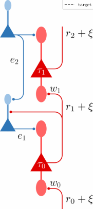

**Figure 15:** Additional lag-line experiment in the presence of noise on all feedforward rates _r_ _i_ .

In an additional experiment using the simple lag line setup, we added noise onto all neuronal outputs _r_ _i_, as shown in Fig. 15
to assess how fluctuations in internal activity levels influenced performance. Despite the high level of noise of 10% w.r.t. the
amplitude of the input signal, GLE networks were still able to learn weights and time constants such that the output _r_ 2 matched
the target (dashed line).

**12.2** **Small GLE networks**

The main goal of Section 2.6 is to compare the dynamics and frequency response of the adjoint variables given by AM with the
errors of GLE networks. In contrast to Section 2.5, where the BPTT baselines are obtained by backpropagating through the
discretized forward dynamics of the GLE network, here we discretize the adjoint equations and integrate them numerically. The
pseudocode comprising the forward and adjoint dynamics, together with synaptic plasticity, is given in Algorithm 2.

**12.3** **MNIST-1D reference baselines**

|Model|GLE (42k)|GLE (15k)|MLP0|TCN0|GRU0|MLP|TCN|GRU|
|---|---|---|---|---|---|---|---|---|
|number of parameters|42040|14956|15210|5210|5134|47210|11960|8974|
|online learning|yes|yes|no|no|no|no|no|no|
|streamed input|yes|yes|no|no|yes|no|no|yes|
|mean valid acc (last) / %|93_._5_ ±_ 0_._9|91_._7_ ±_ 0_._8|65_._0_ ±_ 1_._2 9|3_._7_ ±_ 1_._0|90_._3_ ±_ 2|_._5 65_._5_ ±_ 1_._0|96_._7_ ±_ 0_._9|94_._0_ ±_ 1_._1|

**Table 2: Summary of the evaluated network models and their performance on the MNIST-1D dataset.**

All baselines were trained offline with BP(TT) (using PyTorch `autograd` ) on the classification loss _L_ _C_ = CE(ˆ _y, y_ ), with the
one-hot target ˆ _y_ and the prediction _y_ = Softmax( [�] _[T]_ _t_ =0 _[y]_ _[t]_ [), where] _[ T]_ [ is the length of a sample. In contrast, GLE only uses the]
instantaneous cost _C_ ( _t_ ) = CE(ˆ _y, y_ _t_ ). For the TCN and MLP baselines this corresponds to classical, spatial BP as they map time
to (input) space and see the whole sequence at once. Note that the GRU implementation maintains a record of all hidden states
for each sample and subsequently trains a readout layer on top of them. Therefore, despite the sequential processing, the GRU
can only produce a prediction after the full sequence has been processed.

In particular, we use the following supersampling and model architectures:

 - MLP: MNIST-1D sequences supersampled to 360 steps are fed into two consecutive hidden layers with 100 neurons each and
ReLU activations in between, followed by a readout with 10 output neurons. The learning rate is 0 _._ 005.

 - TCN: MNIST-1D sequences supersampled to 360 steps are fed into three layers of dilated convolutions with 25 channels each,

30

**Algorithm 2** Simulation of the Adjoint Method baselines in Section 2.6

initialize network parameters _θ_ = _{W_ _ij_ _, b_ _i_ _, τ_ _i_ [m] _[, τ]_ _i_ [ r] _[}]_
initialize network states at _t_ = 0: _u_ _i_ (0), _r_ _i_ (0)
initialize adjoint variable _λ_ states at _t_ = _T_ : _λ_ _i_ ( _T_ )
**for** time step _t ∈_ [0 _, T_ ] with step size d _t_ **do**

**for** layer _ℓ_ from 1 to _L_ **do**

sum input currents:

_**I**_ _ℓ_ ( _t_ ) = _**W**_ _ℓ_ ( _t_ ) _**r**_ _ℓ−_ 1 ( _t_ ) + _**b**_ _ℓ_ ( _t_ )
integrate input currents into membrane:

∆ _**u**_ _ℓ_ ( _t_ ) _←_ ( _**τ**_ _ℓ_ [m] [)] _[−]_ [1] _[ ◦]_ [(] _[−]_ _**[u]**_ _[ℓ]_ [(] _[t]_ [) +] _**[ I]**_ _[ℓ]_ [(] _[t]_ [))]
update membrane voltages:

_**u**_ _ℓ_ ( _t_ + d _t_ ) _←_ _**u**_ _ℓ_ ( _t_ ) + d _t_ ∆ _**u**_ _ℓ_ ( _t_ )
calculate prospective outputs:

_**r**_ _ℓ_ ( _t_ + d _t_ ) _←_ _**φ**_ � _**u**_ _ℓ_ ( _t_ ) + _**τ**_ _ℓ_ [r] _[◦]_ [∆] _**[u]**_ _[ℓ]_ [(] _[t]_ [)] �

store variables and update time index:

_t ←_ _t_ + d _t_
**end for**

**end for**
**for** layer _ℓ_ from _L_ to 1 **do**

**for** time step _t ∈_ [ _T,_ d _t_ ] with step size d _t_ **do**

calculate lookback _**D**_ _[−]_ _**τ**_ _ℓ_ [r] [:]

**if** _ℓ_ = _L_ **then**

_**D**_ _[−]_ _**τ**_ _L_ [r] _[←]_ � **1** _−_ _**[τ]**_ d _ℓ_ [ r] _t_ � _◦_ _**φ**_ _[′]_ _L_ [(] _[t]_ [)] _[ ◦]_ � _**r**_ [trg] ( _t_ ) _−_ _**r**_ _L_ ( _t_ )� + _**[τ]**_ d _ℓ_ [ r] _t_ _[◦]_ _**[φ]**_ _L_ _[′]_ [(] _[t][ −]_ [d] _[t]_ [)] _[ ◦]_ � _**r**_ [trg] ( _t −_ d _t_ ) _−_ _**r**_ _L_ ( _t −_ d _t_ )�

**else**

_**D**_ _[−]_ _**τ**_ _ℓ_ [r] _[←]_ � **1** _−_ _**[τ]**_ d _ℓ_ [ r] _t_ � _◦_ _**φ**_ _[′]_ _ℓ_ [(] _[t]_ [)] _[ ◦]_ � _**W**_ _ℓ_ [T] +1 _**[λ]**_ _[ℓ]_ [+1] [(] _[t]_ [)] � + _**[τ]**_ d _ℓ_ [ r] _t_ _[◦]_ _**[φ]**_ _ℓ_ _[′]_ [(] _[t][ −]_ [d] _[t]_ [)] _[ ◦]_ � _**W**_ _ℓ_ [T] +1 _**[λ]**_ _[ℓ]_ [+1] [(] _[t][ −]_ [d] _[t]_ [)] �

**end if**
calculate adjoint variable:

_**λ**_ _ℓ_ ( _t −_ d _t_ ) _←_ _**λ**_ _ℓ_ ( _t_ ) _◦_ _e_ _[−]_ [d] _[t/]_ _**[τ]**_ _ℓ_ [ m] + _**D**_ _[−]_ _**τ**_ _ℓ_ [r] _[◦]_ [d] _[t/]_ _**[τ]**_ _ℓ_ [ m]
update time index:

_t ←_ _t −_ d _t_

**end for**

**end for**
Update synaptic weights:

_**W**_ _ℓ_ _←_ _**W**_ _ℓ_ _−_ _η_ _W_ � _Tt_ =d _t_ _**[λ]**_ _[ℓ]_ [(] _[t]_ [)] _**[r]**_ _ℓ_ [T] _−_ 1 [(] _[t]_ [)]

kernel sizes [5 _,_ 3 _,_ 3], stride 2, a dilation of 360 _/_ 40 = 9 followed by a linear readout with 125 input channels and 10 output
neurons. The learning rate is 0 _._ 01.

 - GRU: MNIST-1D sequences supersampled to 72 steps are streamed into single input unit that feeds into a single, bidirectional
recurrent layer with 6 neurons followed by a linear layer on top of the hidden activations at all time steps, resulting in a
bidirectional readout with 2 _∗_ 6 _∗_ 72 = 864 input and 10 output neurons. The learning rate is 0 _._ 01.

**12.4** **GSC reference baselines**

As in the MNIST-1D dataset, both MLP and TCN networks were trained with spatial BP on a spatial representation of the
temporal signal. The GRU network was trained offline with BPTT.

|Model|GLE|MLP L|TCN L|GRU L|LSTM L|
|---|---|---|---|---|---|
|train samples validation samples test samples MFS/MFCC bins/coefs Fourier Window length Fourier Window Stride Batch size Epochs|36923 4445 4890 MFS 32 64 ms 25 ms 256 320|36923 4445 4890 MFCC 40 40 ms 40 ms 100 320|36923 4445 4890 MFCC 10 40 ms 20 ms 100 320|36923 4445 4890 MFCC 40 40ms 20ms 100 320|36923 4445 4890 MFCC 40 20 ms 20 ms 100 320|
|# params|1160262|495744|476734|498012|492620|
|acc / %|91_._44_ ±_ 0_._23|88_._00_ ±_ 0_._25|92_._32_ ±_ 0_._28|94_._93_ ±_ 0_._25|94_._00_ ±_ 0_._19|

**Table 3: Summary of the evaluated network models and their performance on the GSC dataset.** Additional details on the baseline model
hyperparameters can be found in Appendix A of [13].

**References**

1. Hodgkin, A. L. & Huxley, A. F. A Quantitative Description of Membrane Current and Its Application to Conduction and
Excitation in Nerve. _The Journal of Physiology_ **117,** 500–544. issn: 0022-3751 (Aug. 1952).

31

2. Puccini, G. D., Sanchez-Vives, M. V. & Compte, A. Integrated Mechanisms of Anticipation and Rate-of-Change Computations in Cortical Circuits. _PLOS Computational Biology_ **3,** e82. issn: 1553-7358 (May 2007).

3. K¨ondgen, H. et al. The Dynamical Response Properties of Neocortical Neurons to Temporally Modulated Noisy Inputs In
Vitro. _Cerebral Cortex_ **18,** 2086–2097. issn: 1047-3211 (Sept. 2008).

4. Plesser, H. E. & Gerstner, W. Escape Rate Models for Noisy Integrate-and-Fire Neurons. _Neurocomputing_ **32–33,** 219–224.
issn: 0925-2312 (June 2000).

5. Pozzorini, C., Naud, R., Mensi, S. & Gerstner, W. Temporal whitening by power-law adaptation in neocortical neurons.
_Nature Neuroscience_ **16,** 942–948 (2013).

6. Brandt, S., Petrovici, M. A., Senn, W., Wilmes, K. A. & Benitez, F. Prospective and Retrospective Coding in Cortical
Neurons. eprint: `2405.14810` (q-bio) (May 2024).

7. Kepecs, A., Wang, X.-J. & Lisman, J. Bursting Neurons Signal Input Slope. _Journal of Neuroscience_ **22,** 9053–9062. issn:
0270-6474, 1529-2401 (Oct. 2002).

8. Gerstner, W., Kistler, W. M., Naud, R. & Paninski, L. _Neuronal Dynamics: From Single Neurons to Networks and Models_
_of Cognition_ 1st ed. isbn: 9781107060838 9781107635197 9781107447615 (Cambridge University Press, July 2014).

9. Petrovici, M. A. _Form versus function: theory and models for neuronal substrates_ (Springer, 2016).

10. Brette, R. & Gerstner, W. Adaptive exponential integrate-and-fire model as an effective description of neuronal activity.
_Journal of Neurophysiology_ **94,** 3637–3642 (2005).

11. Izhikevich, E. M. Simple model of spiking neurons. _IEEE Transactions on Neural Networks_ **14,** 1569–1572 (2003).

12. Bradley, A. M. _PDE-constrained Optimization and the Adjoint Method_ https://cs.stanford.edu/˜ambrad/adjoint ~~t~~ utorial.pdf.
Oct. 2019. (2023).

13. Zhang, Y., Suda, N., Lai, L. & Chandra, V. Hello Edge: Keyword Spotting on Microcontrollers. arXiv: `[1711.07128 [cs.SD]](https://arxiv.org/abs/1711.07128)`
(2018).

32

