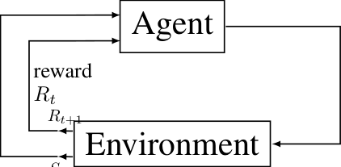
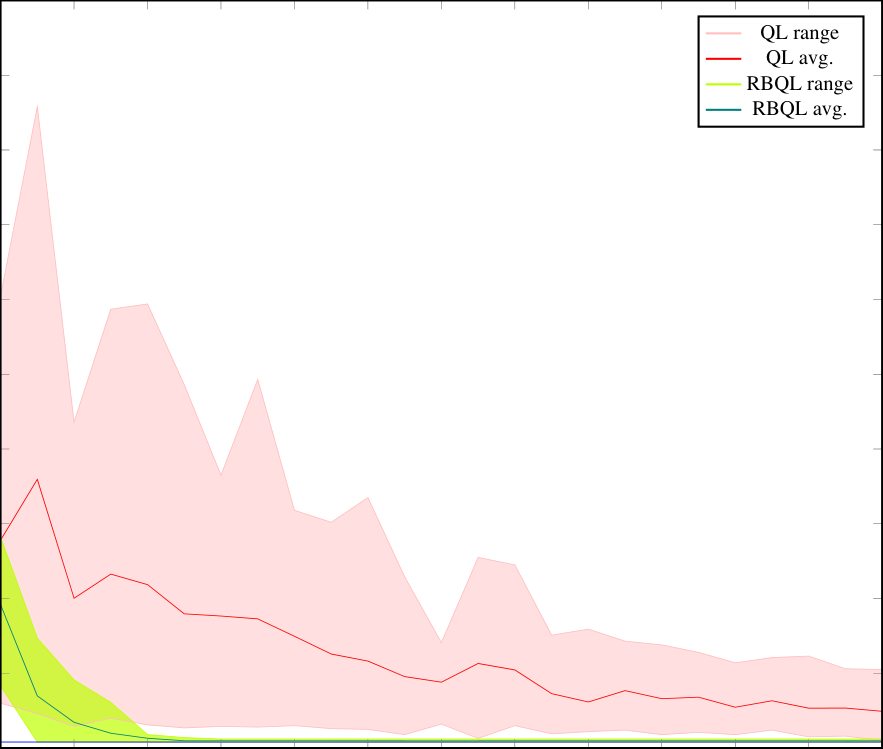
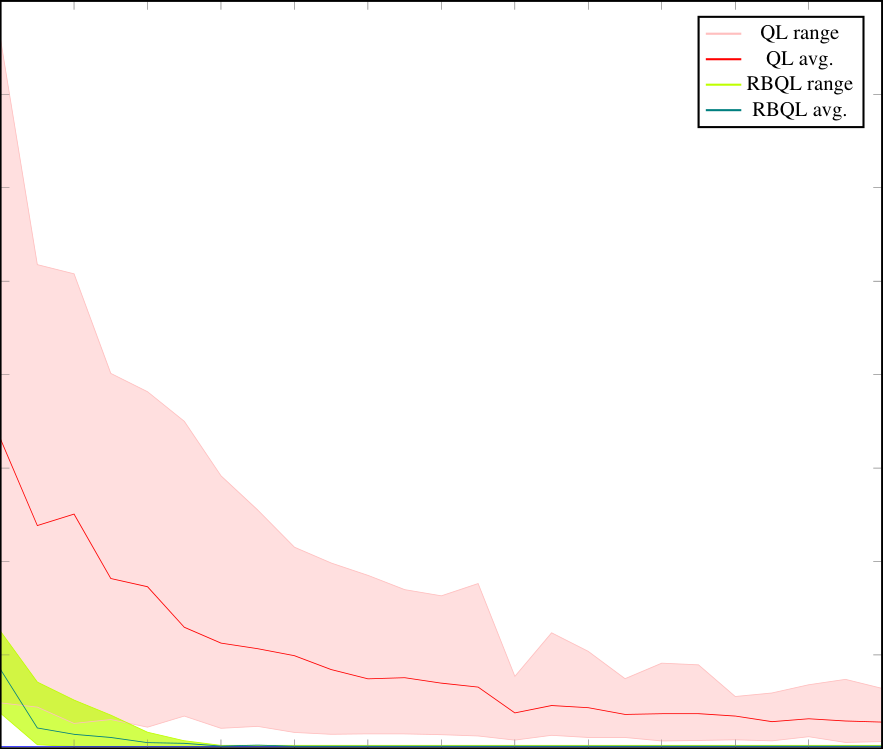
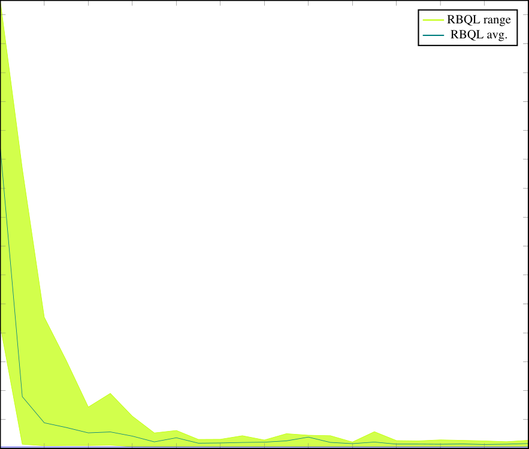

## R ECURSIVE B ACKWARDS Q-L EARNING IN D ETERMINISTIC E NVIRONMENTS


**Jan Diekhoff**
Mannheim University
of Applied Sciences
Paul-Wittsack-Str. 10

68163 Mannheim
Germany
Email: jan.diekhoff@web.de


**Jörn Fischer**
Mannheim University
of Applied Sciences
Paul-Wittsack-Str. 10

68163 Mannheim
Germany
Email: j.fischer@hs-mannheim.de


**A** **BSTRACT**


Reinforcement learning is a popular method of finding optimal solutions to complex problems.
Algorithms like Q-learning excel at learning to solve stochastic problems without a model of their
environment. However, they take longer to solve deterministic problems than is necessary. Q-learning
can be improved to better solve deterministic problems by introducing such a model-based approach.
This paper introduces the recursive backwards Q-learning (RBQL) agent, which explores and builds
a model of the environment. After reaching a terminal state, it recursively propagates its value
backwards through this model. This lets each state be evaluated to its optimal value without a lengthy
learning process. In the example of finding the shortest path through a maze, this agent greatly
outperforms a regular Q-learning agent.


_**Keywords**_ Q-learning _·_ deterministic _·_ recursive _·_ reinforcement learning


**1** **Introduction**


Machine learning and reinforcement learning are increasingly popular and important fields in the modern age. There are
problems that reinforcement learning agents can learn to solve more efficiently and consistently than any human when
given enough time to practice. However, modern approaches like Q-learning run into issues when facing certain types
of problems. Their approach to solving problems in combination with not using a model of the environment causes
them to take longer than is necessary to learn to solve problems that are deterministic in nature. By working without
model of the environment, information that is available and help the learning process is ignored.


This paper introduces an adapted Q-learning agent called the _recursive backwards Q-Learning (RBQL) agent_ . It solves
these types of problems by building a model of its environment as it explores and recursively applying the Q-value
update rule to find an optimal policy much quicker than a regular Q-learning agent. This agent is shown to work with
the example of finding the fastest path through a maze. Its results are compared to the results of a regular Q-learning
agent.


**2** **Reinforcement Learning**


Reinforcement learning is one of the main fields of machine learning. It is commonly used for optimizing solutions to
problems. At its most fundamental level, a reinforcement learning method is an implementation of an agent for solving
a Markov decision process [1] by interacting with an environment. Markov decision processes describe problems as
a set of states _S_, a set of actions _A_ and a set of rewards _R_ . For every time step _t_, the agent chooses an action _a ∈_ _A_
and receives a new state _s ∈_ _S_ and a reward _r ∈_ _R_ for the action [2]. Rewards may be positive or negative, depending
on the outcome of the action, to encourage or discourage taking that action in the future [3]. The process of the agent
interacting with the environment is called an episode which ends when a terminal state is reached which resets the


Recursive Backwards Q-Learning in Deterministic Environments


environment and agent to their original configuration for the start of a new episode [3]. For the purposes of this paper,
only finite Markov decision processes are considered, meaning the environment has at least one terminal state.


_S_ _t_ +1




Figure 1: Basic agent-environment relationship in a Markov decision process. The agent chooses an action _A_ _t_ and the
environment returns a new state _S_ _t_ +1 and a reward _R_ _t_ +1 . The dotted line represents the transition from step _t_ to step
_t_ + 1 [3].


Reinforcement learning agents learn an optimal strategy for a given Markov decision process by estimating the value of
either being in a state or taking a certain action in a certain state. They do this through a value function or action-value
function respectively. The aim of the agent is to maximize the reward they receive in an episode [3]. To achieve this,
value estimations do not only consider the immediate action the agent takes but also consider all future states and actions
that may occur when taking the original action. Agents follow so-called policies according to which they choose which
actions to take. Through gaining knowledge, they continuously adapt this policy in order to eventually reach an optimal
policy - a policy which chooses the optimal action at every step. To explore, agents have to balance between exploration
and exploitation [3]. Exploration is the act of following suboptimal actions to attempt to find an even better policy. On
the other hand, exploitation is following the actions that will yield the currently highest estimated value. An agent that
only exploits acts _greedily_ . To ensure continual exploration so that all actions get updated given enough time, agents
can choose policies that are mostly greedy but choose to explore sometimes [2]. To this end, an approach like _ϵ_ -greedy
may be used. Here, _ϵ_ is the probability of choosing a random action and 1 _−_ _ϵ_ is the probability of acting greedily.


A widely used modern approach to RL is temporal difference learning [4], more specifically Q-learning [2]. Q-learning
works with the Q-learning update formula to update its policies:


_Q_ ( _S_ _t_ _, A_ _t_ ) _←_ _Q_ ( _S_ _t_ _, A_ _t_ ) + _α ·_

[ _R_ _t_ +1 + _γ ·_ max _Q_ ( _S_ _t_ +1 _, a_ ) _−_ _Q_ ( _S_ _t_ _, A_ _t_ )] (1)
_a_


_Q_ ( _S_ _t_ _, A_ _t_ ) is the estimated value for any given state-action pair. The equation shows how it is updated after taking
action _A_ _t_ from state _S_ _t_ . _R_ _t_ +1 represents the reward gained, max _Q_ ( _S_ _t_ +1 _, a_ ) is the value estimation of the best action
_a_
_a ∈_ _A_ _t_ +1 that can be taken from _S_ _t_ +1 according to the current policy, the state resulting from action _A_ _t_ . _α_ is a step-size
parameter, also known as the _learning rate_ . Its value lies between 0 and 1 and it determines how importantly the agent
values new information against the current estimate it already has. A value of 0 completely ignores new information
while a value of 1 completely overrides the preexisting value estimate. _γ_ is the discount factor, weighing future rewards
less than immediate ones. It also lies between 0 and 1, where 1 weighs the best future action equally to the current one
and 0 does not consider it at all.


**3** **Recursive Backwards Q-Learning**


**3.1** **Idea**


Q-learning agents are very widespread in modern reinforcement learning. Working free of a model allows them to
be generally applicable to many problems. However, some Markov decision processes take longer to solve than is
necessary because the agent ignores readily available information. This is noticeable in deterministic, episodic tasks
where a positive reward is only given when reaching a terminal state. Before this state is reached for the first time, the
agent appears to be moving entirely at random. Looking at figure 2, the issue becomes apparent. Even when following
the optimal path at every step, it still takes multiple episodes for the reward of the terminal state to propagate back to the
starting state. In fact, the optimal paths value estimation gets worse before it gets better. If every step has a reward of


2


Recursive Backwards Q-Learning in Deterministic Environments


_−_ 1, values along the optimal path get worse if they do not lead to a state that has already been reached by the terminal
state’s positive reward as it travels backwards.


In this paper, grid worlds [3] are used as an example Markov decision process for the agent to solve. Grid worlds are a
two-dimensional grid in which every tile represents a state and the actions are limited to walking up, down, left or right.
Grid worlds are useful in that they are very simple to understand and to display, they have a limited set of actions and
their set of states can be as small or large as is desired. Additionally, showing the value or optimal policy for each state
is as easy as writing a number or drawing an arrow on the corresponding tile. Actions that would place the agent off of
the grid simply return the state the agent is already in, but may still give a reward. Special tiles can also be defined, such
as walls that act like the grid edge or pits that are terminal fail states because the agent cannot leave them once it has
fallen in. Every grid world tile gives a reward of _−_ 1 to punish taking unnecessary actions in favor of taking the fastest
path to the goal.


_Q_ greedy policy
w.r.t. _Q_


-1


-1 -1


-1


-1


-1 -1.5


-1


-1


-1 -1.3


-1


-1


-1 -0.8


-1


-1


-1 0.52


-1


-1


-1 1.99


-1


-1


-1 3.27


-1


-1


-1 -1


-1


-1


-1 -1.5


-1


-1


-1 0.78


-1


-1


-1 3.15


-1


-1


-1 4.96


-1


-1


-1 6.17


-1


-1


-1 6.93


-1


-1


-1 -1


-1


-1


-1 4.5


-1


-1


-1 7.25


-1


-1


-1 8.63


-1


-1


-1 9.32


-1


-1


-1 9.66


-1


-1


-1 9.83


-1


0


0 0


0


0


0 0


0


0


0 0


0


0


0 0


0


0


0 0


0


0


0 0


0


0


0 0


0


ep. 0


ep. 1


ep. 2


ep. 3


ep. 4


ep. 5


ep. 6


-1


-1 -1


-1


-1


-1 -1.5


-1


-1


-1 -1.3


-1


-1


-1 -1.6


-1


-1


-1 -1.66


-1


-1


-1 -1.1


-1


-1


-1 -0.15


-1


Figure 2: Q-learning in a one-dimensional grid world. All Q-values are initialized as _−_ 1 . Actions that lead to the
terminal state reward 10. All other actions reward -1. The discount rate _γ_ is set to 0 _._ 9 . The learning rate _α_ is set to 0 _._ 5 .
The value of _ϵ_ is irrelevant as the only action the agent takes is _→_ .


Figure 2 is a very simple grid world and it still takes six episodes to reach an optimal policy, even when taking the
optimal action at every step. This problem will only grow worse and add noticeably more episodes of training for grid
worlds that are not as trivial to solve, or even more complex tasks with more variables to consider. As stated, the issue
is that the agent has no source of direction until it has randomly stumbled across the terminal state, its only source of
positive rewards. The larger the state space, the longer it is blindly searching.


Reinforcement learning agents that work with a model of their environment are known as _model-based_ reinforcement
learning agents. They can either work with a preexisting model or, more commonly, build their own. The way they
construct their models is important as having perfect knowledge of an environment is neither feasible nor sensible. In
the case of a grid world it is no problem, but imagining a more complex scenario like a self-driving car makes this fact
apparent. When trying to drive from one city to another, knowing every centimeter of the road with every possible place
other cars might be on the route is resource intensive and unnecessary. Instead, an agent should attempt to simplify its
model as much as possible. Instead of every bit of road, long stretches going straight can be clumped together. Similar
situations like a car in front slowing down can be treated the same wherever they occur.


The purpose of this paper is to introduce and evaluate a new type of model-based agent called the RBQL agent. The
RBQL agent solves deterministic, episodic tasks that positively reward only the terminal state more efficiently than a
regular Q-learning agent. It functions by building a model of its environment through exploration. When it reaches a
terminal state, it recursively travels backwards through all previously explored states, applying a modified Q-learning
update rule, the RBQL update rule. By setting the learning rate _α_ to 1, equation (1) can be simplified as such:


3


Recursive Backwards Q-Learning in Deterministic Environments


_Q_ ( _S_ _t_ _, A_ _t_ ) _←_ _Q_ ( _S_ _t_ _, A_ _t_ ) + 1 _·_ [ _R_ _t_ +1 + _γ_ max _Q_ ( _S_ _t_ +1 _, a_ )
_a_


_−_ _Q_ ( _S_ _t_ _, A_ _t_ )]
= _Q_ ( _S_ _t_ _, A_ _t_ ) + _R_ _t_ +1 + _γ_ max _Q_ ( _S_ _t_ +1 _, a_ )
_a_


_−_ _Q_ ( _S_ _t_ _, A_ _t_ )
= _R_ _t_ +1 + _γ_ max _Q_ ( _S_ _t_ +1 _, a_ )
_a_


(2)


As can be seen in formula (2), the Q-value now exclusively depends on the reward and the discounted reward of the
best neighbor. Because the algorithm applies this formula starting with what is guaranteed to be the highest value of the
environment and working its way away from it, the best possible neighbor for any given state is always the previously
evaluated state.


Evaluating all states at the end of the episode is reminiscent of dynamic programming [5] or Monte Carlo methods [3]
and is a point of critique for those approaches. However, as will be shown in chapter 4, this evaluation method is so
effective in RBQL that evaluating all known states in one go is still cost effective. RBQL also differs in comparison
to dynamic programming and Monte Carlo in a few major ways. In contrast with dynamic programming, it does not
start out with a perfect model but has to build its own. It also propagates its reward throughout all states much more
quickly and it uses an action-value function, not a state-value function. In contrast with Monte Carlo, it does not use
exploring starts to guarantee exploration. It also does not only update the values that were seen in an episode. Instead,
to facilitate exploration, it always prioritizes visiting unexplored actions, only following the greedy path when there
are none. Because this mode of exploration still results in unexplored actions, the _ϵ_ -greedy approach is adapted for
RBQL. Instead of exploring steps, the agent has exploration episodes. _ϵ_ serves the same purpose as before, marking
the probability of taking an exploration episode while 1 _−_ _ϵ_ is the probability of taking an exploitation episode. In an
exploration episode, the agent randomly chooses an unexplored action anywhere in its model, navigates the model to
put itself in a position to take that action and then continues to explore until it finds a known path again or the episode
ends.


In this paper, finding an optimal path through a randomly generated grid world maze is used as an example task for
RBQL to solve. It is also used to compare the performance of RBQL to Q-learning.


**3.2** **Implementation**


To implement RBQL [1], the Godot game engine v. 3.5 [2] was used. Godot is a free, open source engine used mainly for
video game development. Its main language is GDScript, an internal language that is very similar in syntax to Python,
though it also supports C, C++, C# and VisualScript. Because Python is very popular for machine learning development,
the implementation is written in GDScript so that it is easily readable for interested parties. Godot uses a hierarchical
structure of objects called _nodes_ . In the implementation, there are two main nodes: the agent and the environment.


**3.2.1** **Environment**


The environment is of the type `TileMap` [3] – a class designed for creating maps in grid-based environments like grid
worlds. Before starting the first episode, the environment generates a maze given a width _w_ and a height _h_ using a
recursive backtracking algorithm [6]. The starting point for the agent is always (0 _,_ 0) and the goal it attempts to reach –
the only terminal state – is ( _w −_ 1 _, h −_ 1) . To ensure that the agent has the ability to improve even after finding the goal
in the first episode, a maze with multiple paths is needed. Because a maze generated with recursive backtracking only
has one path to the terminal state, a number of alternate paths are generated by taking _w · h/_ 4 random positions and a
direction for each position. If the position has a wall in that direction, it is removed. If not, nothing happens.


The environment has a function `step(state,action)` that serves as the only way for the agent to interact with it.
The possible moves are `UP`, `DOWN`, `LEFT` and `RIGHT` . The state is described as a coordinate of the current position. In
Godot, the class `Vector2(x,y)` [4] is used for this purpose. `step()` checks if taking the given action from the given
state results in hitting a wall or not. If not, the agent moves to a new position. There are three different rewards: _−_ 1 for
any normal tile, _−_ 5 for hitting a wall and 10 for reaching the terminal state. _−_ 1 is awarded at every step to discourage
agents from taking unnecessary steps. Walls give _−_ 5 to quickly teach the agent to ignore them. After taking an action,


1 The source code can be downloaded at `[https://github.com/JanDiekhoff/BackwardsLearner](https://github.com/JanDiekhoff/BackwardsLearner)`
2 Godot v. 3.5 can be downloaded at `[https://godotengine.org/download/archive/3.5-stable/](https://godotengine.org/download/archive/3.5-stable/)`
3 `[https://docs.godotengine.org/en/3.5/classes/class_tilemap.html](https://docs.godotengine.org/en/3.5/classes/class_tilemap.html)`
4 `[https://docs.godotengine.org/en/3.5/classes/class_vector2.html](https://docs.godotengine.org/en/3.5/classes/class_vector2.html)`


4


Recursive Backwards Q-Learning in Deterministic Environments


the new state and reward are returned to the agent, as well as a notification if the episode has ended or not and if the
agent has hit a wall or not.


The `TileMap` has a tile for each combination of having or not having a wall in each of the four directions, totaling 2 [4] or
16 total possible tiles. Another option would be to just have a floor tile and a wall tile. However, that would make a
maze with an equivalent wall layout much larger, leading to a larger state set and longer solving times. To determine if a
wall is in a certain direction, the id of each tile from 0 to 15 acts as a four-bit flag. Each direction is assigned one of the
bits ( `UP` = 0, `RIGHT` = 1, `DOWN` = 2 and `LEFT` = 3 ). If the flag is set, there is a wall in the corresponding direction. The
id for an L-shaped tile for example would be 2 [2] + 2 [3] = 12 as `DOWN` and `LEFT` have walls. The process for determining
if the agent can move in a given direction _d_ from a position _p_ is ( _¬id_ _p_ ) & (2 _[d]_ ), where _id_ _p_ is the id of the tile at _p_ .


**3.2.2** **RBQL Agent**


The RBQL agent is represented by a `Sprite` [5] object – a 2D image – so it can be observed while solving a maze. During
its runtime, the agent keeps track of a few key things:


    - A model of the environment ( `explored_map` )


    - A list of rewards for each state-action pair ( `rewards` )


    - The last reward received ( `reward` )


    - A list of steps taken per episode ( `steps_taken` )


    - The Q-table ( `qtable` )


    - The current state ( `current_state` )


    - The previous state ( `old_state` )


    - The last taken action ( `action` )


The model of the environment starts out as an empty dictionary. Every time a new state is discovered, an entry for that state is made and initialized as an empty array. When an action is taken from this state, the resulting new state is entered into the previous state’s array at the index of the taken action’s designated number
( `explored_map[old_state][action] = current_state` ). When hitting a wall, the “new” state is the same as the
state from which the action was taken. Similarly, when an action is taken, the resulting reward is saved in the rewards
list ( `rewards[old_state][action] = reward` ). Because the agent uses state-action values, not state values, the
tiles are treated like nodes in a directed graph. Going from tile A to tile B might result in a different reward than when
going from B to A, so when the agent learns the reward of going from A to B, it does not also learn the reward of going
from B to A.


Being a Q-learner makes it simpler to generalize the agent for other tasks, but it causes a lot of exploratory steps and
exploratory episodes to only explore one position at a time. If an exploration episode chooses an unexplored state-action
pair that results in hitting a wall, the exploration episode immediately ends with little information gained. To alleviate
this problem, the agent takes exploratory “look-ahead” steps. After entering a tile, it takes a step in every direction but
only saves the result if it hits a wall. This guarantees that exploratory episodes always take new paths and not just hit a
wall and continue on the best known path.


The agent also keeps track of a list of the actions it has taken – except for when hitting a wall – for the case that it
reaches a dead end, or rather a state with no unexplored neighbors. In this case, the agent would normally follow the
optimal path until it finds a new unexplored path or reaches the terminal state. However, if the path the agent is on has
not been explored before it has not yet been evaluated and there is no optimal path to follow. In this case, the agent
backtracks by taking the opposite action of the most recent in the list, then removes it from the list, until an unexplored
tile or an evaluated path to follow is found.


Finally, when the terminal state is reached, the Q-table is updated with the rewards saved in `rewards` according to the
RBQL update rule.
```
             qtable[state][action] =

```

`rewards[state][action] + discount_rate` _·_

```
             qtable[explored_map[state][action]].max()

```

To do this, a copy of `explored_map` is inverted to be able to traverse it in reverse. This is then done with a breadth-first
search algorithm, starting at the terminal state, and the Q-value is calculated for each state. Breadth-first search is chosen


5 `[https://docs.godotengine.org/en/3.5/classes/class_sprite.html](https://docs.godotengine.org/en/3.5/classes/class_sprite.html)`


5


Recursive Backwards Q-Learning in Deterministic Environments


over a depth-first search algorithm so that each state must only be visited once as the value is directly proportional to
the distance from the terminal state. With breadth-first search, each state gets the highest possible value on its first visit
because it is visited from its highest possible valued neighbor.


When all known states have been evaluated, a new episode begins. After the first episode, episodes are chosen to be
either exploratory or exploitative, similar to how an _ϵ_ -greedy policy may choose exploratory actions. In an exploitative
episode, the agent simply follows the best path it knows, choosing at random if two states are equally good, but still
always exploring unknown states directly adjacent to the path above all else. In an exploratory episode, a random state
with an unexplored neighbor is chosen. The agent navigates to this state with the help of the A* search algorithm [7]
and follow the unexplored path from there until it finds a known state again. This exploratory excursion may only find
one new state or it may find a vastly superior path to what was known before. _ϵ_ is decreased after every episode as
follows:
_ϵ_ = `min_epsilon + (max_epsilon - min_epsilon)`


_· e_ [(] _[−]_ `[decay_rate]` _[ ·]_ `[ current_episode]` [)]


where `min_epsilon`, `max_epsilon` and `decay_rate` can be any value within a range of [0 _,_ 1] and `current_episode`
is the number of the current episode starting with 0 . Once every state is explored, the agent is guaranteed to have found
the optimal path, or paths, through the maze. In its entirety, the algorithm can be expressed like this:


**Algorithm 1** Backwards Q-Learning Algorithm

Set exploration_episode to false
**while** true **do**

**if** exploration_episode **then**

Find unexplored path
Travel to unexplored path
**end if**
**while** episode is not over **do**

**if** current position has an unexplored neighbor **then**

Visit unexplored neighbor
Update model
Save reward

**if** no wall hit **then**

Save action in action queue
**end if**
**else if** there is an optimal path to follow **then**

Visit best neighbor
**end if**
**while** current pos. has no unexplored neighbor **do**

Backtrack

**end while**

**end while**
Create state queue with breadth-first search
**for** state in queue **do**

Apply RBQL formula
**end for**
Set exploration_episode to random() _<_ = _ϵ_
Apply decay to _ϵ_
**end while**


**3.2.3** **Q-learning agent**


A standard Q-learning agent has been implemented in Godot as well to compare the performance of the RBQL agent to.
This agent is comparatively simple:


**4** **Tests and Results**


To compare the performance of the two agents, three sets of tests have been done for different maze sizes: 5 _×_ 5, 10 _×_ 10
and 15 _×_ 15 . All variables have been set to common values. The decay rate is set somewhat high to account for the
relatively low episode amount:


6


Recursive Backwards Q-Learning in Deterministic Environments


**Algorithm 2** Q-Learning Algorithm


**while** true **do**

**if** random() _<_ = _ϵ_ **then**

Choose random action

**else**

Choose greedy action
**end if**

Take action

Receive new state and reward
Update Q-table for old state and action
**if** terminal state reached **then**

Start new episode
**end if**
Apply decay to _ϵ_
**end while**


    - _γ_ = 0 _._ 9


    - _α_ = 0 _._ 1 (RBQL has _α_ = 1 as explained in equation (2))


    - `min_epsilon` = 0 _._ 01


    - `max_epsilon` = 1


    - `decay_rate` = _−_ 0 _._ 01


For every maze size, each agent is given the same set of 50 randomly generated mazes. Each agent is given 25 episodes
per maze to train. These values are chosen to offer a reasonably large sample size without requiring an enormous
amount of time to compute. Agents are compared by the number of steps taken per episode, with less steps taken being
a more desirable outcome. The step counter is increased every time `step()` is called, including the look-ahead steps of
the RBQL. For a sense of perspective, the best possible solution to any square maze of size _s_ [2] is 2 _s −_ 2 . Assuming a
maze with no walls, the shortest distance between two points _A_ and _B_ can be expressed as their Manhattan distance
_|A_ _X_ _−_ _B_ _X_ _|_ + _|A_ _Y_ _−_ _B_ _Y_ _|_ [8]. In the corners of a square, it holds that _A_ _X_ = _A_ _Y_ and _B_ _X_ = _B_ _Y_, so the distance can
be simplified as 2 _· |A −_ _B|_ . Setting _A_ = 0 and _B_ = _s −_ 1, this further simplifies to 2 _s −_ 2 . This means that while
the amount of states (and thereby state-action pairs) increases quadratically, the best possible solution only increases
linearly. This in turn means that the amount of states that are not on the optimal path that the agent has to evaluate will
often increase drastically with the size of the maze.


Looking at the results, a few things can be observed. First of all, the average number of steps the RBQL agent takes
is consistently lower than the Q-learning agent in all three maze sizes. It also has much less variation in step counts,
which can be seen when looking at the areas of lighter hue. The light red areas are much more sporadic and spike
further away from the average. The green areas stick much closer together. If the highest two step counts per episode
were not removed, RBQL would also have a few small spikes. These spikes would represent exploratory episodes
where a new path is explored, resulting in a higher step count. In cases where the line is flat for a long period of time, it
can be assumed that the optimal solution is found. This can be seen in all three figures, where both the average and
the min/max range become a straight line close to the minimum. Important to note is that every maze has a different
optimal solution, hence why the average sits above the blue line which denotes the lowest possible step count in any
maze of this size. It can also be observed that none of the lines ever go below this boundary, as is to be expected.


Second, even when removing the highest two step counts per episode, many of the Q-learning agent’s step counts are so
large that scaling the graphs to fit them makes the RBQL agent’s data and the lower boundary difficult to see in the
graphs for the larger mazes. The highest step count values that have not been cut are 858 steps in figure 3, 7,585 in
figure 4 and 21,147 in figure 5, while the highest in total are 3,716 steps in figure 3, 20,553 in figure 4 and 26,315 in
figure 5.


Third, it is interesting to see how the differences in average step counts evolve with the grid size. Table 1 shows this
difference in the first and last episode. The difference between the average step counts in the last episode especially is
striking, as it is close to doubling from each size to the next. Further, looking at the improvement of each agent as seen
in table 2, one can see that the factor by which RBQL improves massively increases the bigger the maze becomes while
the Q-learner only slightly improves its performance in comparison. Additionally, most of the improvement of RBQL is
done in the first two episodes, while the Q-learner has a more gradual learning curve.


7


Recursive Backwards Q-Learning in Deterministic Environments


**1** _**,**_ **000**


**900**


**800**


**700**


**600**


**500**


**400**


**300**


**200**


**100**


**0**


**0** **2** **4** **6** **8** **10** **12** **14** **16** **18** **20** **22** **24**


**Episode**


Figure 3: Number of steps taken to find the goal in a randomly generated grid world maze of size 5 _×_ 5 . The blue line is
the minimum step threshold for any maze of this size. The light red area shows the range of Q-learning agent’s highest
and lowest step count, excluding the highest and lowest two. The red line shows the average performance. Similarly, the
light green area shows the range of the RBQL agent’s highest and lowest step count, excluding the highest and lowest
two, and the green line shows the average performance.


8


Recursive Backwards Q-Learning in Deterministic Environments


**8** _**,**_ **000**


**6** _**,**_ **000**


**5** _**,**_ **000**


**4** _**,**_ **000**


**3** _**,**_ **000**


**2** _**,**_ **000**


**1** _**,**_ **000**


**0**


**0** **2** **4** **6** **8** **10** **12** **14** **16** **18** **20** **22** **24**


**Episode**


Figure 4: Number of steps taken to find the goal in a randomly generated grid world maze of size 10 _×_ 10 . The light
red area shows the range of Q-learning agent’s highest and lowest step count, excluding the highest and lowest two.
The red shows the average performance. Similarly, the light green area shows the range of the RBQL agent’s highest
and lowest step count, excluding the highest and lowest two, and the green line shows the average performance.


9


Recursive Backwards Q-Learning in Deterministic Environments


_**·**_ **10** **[4]**


**2** _**.**_ **2**


**2**


**1** _**.**_ **8**


**1** _**.**_ **6**


**1** _**.**_ **4**


**1** _**.**_ **2**


**1**


**0** _**.**_ **8**


**0** _**.**_ **6**


**0** _**.**_ **4**


**0** _**.**_ **2**


**0**


**0** **2** **4** **6** **8** **10** **12** **14** **16** **18** **20** **22** **24**


**Episode**


Figure 5: Number of steps taken to find the goal in a randomly generated grid world maze of size 15 _×_ 15 . The light red
area shows the range of Q-learning agent’s highest and lowest step count, excluding the highest and lowest two. The
red line shows the average performance. Similarly, the light green area shows the range of the RBQL agent’s highest
and lowest step count, excluding the highest and lowest two, and the green line shows the average performance.


10


Recursive Backwards Q-Learning in Deterministic Environments


Table 1: Difference in average step counts of the Q-learner and RBQL. The difference expresses how many times more
steps the Q-learner took compared to RBQL.


Grid size Q-learner steps RBQL steps Difference
**Episode 0**
5 _×_ 5 278.06 191.84 1.45

10 _×_ 10 3,308.46 843.52 3.92
15 _×_ 15 7,180.98 1,965 3.65
**Episode 24**
5 _×_ 5 49.14 9.62 5.11

10 _×_ 10 281.44 23.68 11.89

15 _×_ 15 778.68 35.96 21.65


Lastly, the RBQL agent seems to find an optimal policy at around episode 4 for the 5 _×_ 5, episode 6 for the 10 _×_ 10 and
episode 10 for the 15 _×_ 15 grid. As the previous figures show, the Q-learning agent does not come close to similarly
low step counts and therefore does not reach an optimal policy at all with the same amount of training.


Table 2: Difference in average step counts of the Q-learner and RBQL. Improvement shows the factor by which the
amount of steps is reduced from episode 0 to 24.


Grid size Steps in episode 0 Steps in episode 24 Improvement
**Q-learning agent**
5 _×_ 5 278.06 49.14 5.66

10 _×_ 10 3,308.46 281.44 11.76
15 _×_ 15 7,180.98 778.68 9.22
**RBQL agent**
5 _×_ 5 191.84 9.62 19.94

10 _×_ 10 843.52 23.68 35.62

15 _×_ 15 1,965 35.96 90.76


To further show RBQL’s efficiency, it has also been tested under the same parameters in a grid of size 50 _×_ 50 . The
results can be seen in figure 6. This test is done to demonstrate that even such a large maze can be explored by RBQL.
As with the previous examples, by far the largest policy improvement still happens in the first episode. With mazes of
such a large size, a lot more spikes in step counts are seen in later episodes because there are more states to explore. The
difference in average step counts goes from 20,811.08 in episode 0 to 344.9 in episode 24, an improvement by a factor
of 60.34. This is worse than the improvement in the 15 _×_ 15 mazes, but still almost double that of the 10 _×_ 10 mazes.


**5** **Discussion**


This chapter explores the practicality of using this algorithm to solve other Markov decision processes. It discusses
which parts of the implementation are and are not specific to the problem of fastest path through a maze, which
improvements can be made to make it more applicable for other problems and showcases further points for research in
this field. The constraints given in this paper are that the agent will attempt to solve deterministic, episodic tasks with a
single terminal state as its only source of positive rewards. This chapter also discusses which of these constraints can be
dismissed.


There are a few parts of the implementation as presented in chapter 3.2 that are only applicable to this specific problem.
This is not necessarily a bad thing, as the purpose of the RBQL agent is to utilize knowledge of its environment. As a
result of this, the only parts that cannot be directly adapted for other problems are the way the agent builds its model.
In the grid world maze, it can assume that every state has the same actions it can take and has a neighboring state in
each direction (though it may sometimes be itself). Further, every action always has an opposite action, going up can
always be undone by going down for example. These assumptions allow it to easily build a model of the grid world
and influence its policy in how it further explores it. They allow the agent to take steps in each direction to check for
walls and they allow the agent to backtrack when it is stuck in a dead end. These assumptions cannot be guaranteed
for other Markov decision processes or even for grid worlds with more complex behavior like a wind tunnel that if
walked through also pushes the agent one tile in the direction the wind is traveling. The way in which the agent builds a


11


Recursive Backwards Q-Learning in Deterministic Environments


_**·**_ **10** **[4]**


**3**


**2** _**.**_ **8**


**2** _**.**_ **6**


**2** _**.**_ **4**


**2** _**.**_ **2**


**2**


**1** _**.**_ **8**


**1** _**.**_ **6**


**1** _**.**_ **4**


**1** _**.**_ **2**


**1**


**0** _**.**_ **8**


**0** _**.**_ **6**


**0** _**.**_ **4**


**0** _**.**_ **2**


**0**


**0** **2** **4** **6** **8** **10** **12** **14** **16** **18** **20** **22** **24**


**Episode**


Figure 6: Number of steps taken to find the goal in a randomly generated grid world maze of size 50 _×_ 50 . The light
green area shows the range of the RBQL agent’s highest and lowest step count, excluding the highest and lowest two,
and the green line shows the average performance.


12


Recursive Backwards Q-Learning in Deterministic Environments


model has to either be designed for each environment individually or it has to be abstracted so that it is more broadly
applicable. Finding such an approach to model building is one area of improvement for RBQL. Importantly though,
none of these assumptions are required for the agent to function. Backtracking, opposite steps and the same actions for
every state simply make the implementation easier and more efficient. As long as no path of a directed graph would
cause the agent to be stuck with no way to reach a terminal state, it can be explored and evaluated.


Another improvement to the way the implementation builds its model is to simplify it as far as possible. As the amount
of states directly influences how long a problem takes to solve, RBQL will become more efficient the more it can
remove unnecessary states. Currently, every position has its own state. If the agent could detect “hallways” – tiles with
parallel walls – they could be removed without problem in favor of directly connecting the two tiles at either side of the
hallway – only the negative rewards for the length of the hallway would have to be implemented into the model. Further,
if there is a non-forking path that leads into a dead end, the entire path could be treated as a wall and ignored entirely.
This would leave only the starting state, terminal state, turns and forking paths to evaluate. Both of these additions leave
the key part of the algorithm, traversing the model backwards and applying the RBQL update formula, untouched.


RBQL can be easily adapted to include multiple terminal states with the same or different rewards and this is already
supported by the implementation. There are two possible ways to do this. First is to create an imaginary state that
all terminal states lead into from which the backtracking always starts. Second is to remember all terminal states and
backtrack from each of them. The first option is much more efficient as each state still only gets evaluated once while
the second version avoids having to tamper with the model.


Finally, RBQL could be adapted to work in non-deterministic environments. To reiterate, deterministic means that a
state-action pair always yields the same state-reward pair. If the agent could, while building its model, also estimate the
transition probabilities of a state-action pair to a new state, RBQL could still be used to evaluate the states. The RBQL
update rule can be generalized to


_Q_ ( _S_ _t_ _, A_ _t_ ) _←_ �

_s∈S_ _t_ +1


( _R_ _s_ + _γ_ max _Q_ ( _s, a_ )) _· p_ (3)
_a_
� �


where _S_ _t_ +1 is the set of possible states when taking _A_ _t_ from _S_ _t_, _p_ is the probability of reaching _s_ when taking _A_ _t_ from
_S_ _t_ and _R_ _s_ is the reward of reaching _s_ . In a deterministic environment, _S_ _t_ +1 only consists of one state with _p_ = 1,
negating these additions. Whether RBQL would be as effective in non-deterministic environments as in deterministic
environments is something to be explored in further studies.


The only constraint on the algorithm that cannot easily be circumvented is its episodic nature. Because the agent relies
on a terminal state from which to propagate the rewards backwards from, a continuous task implementation seems
impossible to implement.


**6** **Conclusion**


This paper has introduced recursive backwards Q-learning, a model-based reinforcement learning algorithm that
evaluates all known state-action pairs of the model at the end of each episode with the Q-learning update rule. It has
also shown how recursive backwards Q-learning relates to, adapts and improves on them. This paper has presented
an implementation of recursive backwards Q-learning in the Godot game engine to test its performance. Through
multiple tests, it has been shown to be superior in finding the shortest path through a randomly generated grid world
maze. It has been argued that this algorithm could be adapted to solve other deterministic, episodic tasks more quickly
than Q-learning. Further, it has given avenues for further research in adapting recursive backwards Q-learning for
non-deterministic problems.


**References**


[1] Richard Bellman, “A markovian decision process,” _Journal of Mathematics and Mechanics_, vol. 6, no. 5, pp. 679–
684, 1957. [Online]. Available: `[http://www.jstor.org/stable/24900506](http://www.jstor.org/stable/24900506)` .

[2] Christopher John Cornish Hellaby Watkins, “Learning from delayed rewards,” 1989.

[3] Richard S Sutton and Andrew G Barto, _Reinforcement learning: An introduction_ . MIT press, 2018.

[4] Richard S. Sutton, “Learning to predict by the methods of temporal differences,” _Machine Learning_, vol. 3, no. 1,
pp. 9–44, 1988. DOI : `[10.1007/bf00115009](https://doi.org/10.1007/bf00115009)` .

[5] Richard Bellman, “Dynamic programming,” _Princeton, USA: Princeton University Press_, vol. 1, no. 2, p. 3, 1957.

[6] Peter Gabrovšek, “Analysis of maze generating algorithms,” _IPSI Transactions on Internet Research_, vol. 15,
no. 1, pp. 23–30, 2019.


13


Recursive Backwards Q-Learning in Deterministic Environments


[7] Peter E. Hart, Nils J. Nilsson, and Bertram Raphael, “A formal basis for the heuristic determination of minimum
cost paths,” _IEEE Transactions on Systems Science and Cybernetics_, vol. 4, no. 2, pp. 100–107, 1968. DOI :
`[10.1109/TSSC.1968.300136](https://doi.org/10.1109/TSSC.1968.300136)` .

[8] Eugene F Krause, “Taxicab geometry,” _The Mathematics Teacher_, vol. 66, no. 8, pp. 695–706, 1973.


14


