### **In-Context Decision Transformer: Reinforcement Learning via Hierarchical** **Chain-of-Thought**

**Sili Huang** [1 2] **Jifeng Hu** [1] **Hechang Chen** [* 1] **Lichao Sun** [3] **Bo Yang** [* 2]

**Abstract**

In-context learning is a promising approach for
offline reinforcement learning (RL) to handle online tasks, which can be achieved by providing
task prompts. Recent works demonstrated that incontext RL could emerge with self-improvement
in a trial-and-error manner when treating RL tasks
as an across-episodic sequential prediction problem. Despite the self-improvement not requiring gradient updates, current works still suffer
from high computational costs when the acrossepisodic sequence increases with task horizons.
To this end, we propose an In-context Decision
Transformer (IDT) to achieve self-improvement
in a high-level trial-and-error manner. Specifically, IDT is inspired by the efficient hierarchical
structure of human decision-making and thus reconstructs the sequence to consist of high-level
decisions instead of low-level actions that inter
act with environments. As one high-level decision can guide multi-step low-level actions, IDT
naturally avoids excessively long sequences and
solves online tasks more efficiently. Experimental results show that IDT achieves state-of-the-art

in long-horizon tasks over current in-context RL
methods. In particular, the online evaluation time
of our IDT is **36** _**×**_ times faster than baselines in

the D4RL benchmark and **27** _**×**_ times faster in the

Grid World benchmark.

**1. Introduction**

Large transformer models (Vaswani et al., 2017) have shown
impressive abilities across a variety of domains, including

  - Equal contribution 1 School of Artificial Intelligence, Jilin University, China [2] Key Laboratory of Symbolic Computation and
Knowledge Engineering of Ministry of Education, Jilin University, China [3] Lehigh University, Bethlehem, Pennsylvania, USA.
Correspondence to: Bo Yang _<_ ybo@jlu.edu.cn _>_, Hechang Chen
_<_ chenhc@jlu.edu.cn _>_ .

_Proceedings of the_ _41_ _[st]_ _International Conference on Machine_
_Learning_, Vienna, Austria. PMLR 235, 2024. Copyright 2024 by
the author(s).

text (Brown et al., 2020b), image (Dosovitskiy et al., 2020),
and audio (Alayrac et al., 2022). In the field of reinforcement learning (RL), large transformer models can treat the
RL tasks as a type of sequential prediction problem, which
has proven successful in using solely offline training (Lee
et al., 2022; Reed et al., 2022). A notable shortcoming
lies with these methods to self-improve when employed in
online environments. To overcome this, in-context RL methods have been introduced, which enable continued policy
improvement (Laskin et al., 2023).

Recent works demonstrated that in-context RL can automat
ically improve its performance in a trial-and-error manner
when across-episodic contexts serve as prompt conditions
(Lee et al., 2023a). The construction of the across-episodic
context is flexible and easy to implement, such as a chain
of experience that consists of multiple historical trajectories
arranged in ascending order of returns (Hao Liu, 2023). Despite the progress made, current methods are mostly limited
to short-horizon tasks with less than 100 timesteps (Laskin
et al., 2023). This arises from (1) the quadratic complexity
of the self-attention mechanism and (2) the significant increase in the length of sequences caused by across-episodic
contexts. Such huge computational costs severely limit incontext RL to apply the trial-and-error ability on traditional
RL tasks, which often reach 1000 timesteps, such as MuJoCo (Fu et al., 2020) and Atari (Bellemare et al., 2013).

In fact, trial-and-error is the central idea of modern RL algorithms (Sutton & Barto, 2018). It is an animal behavior
originated by a psychologist Thorndike (1927) who considers trial-and-error as an elementary way of combining
search and memory. Correspondingly, the across-episodic
contexts provide memory, and the self-attention mechanism
reviews historical actions in the memory to search for better
actions. However, human decision-making is more complex
and operates on multiple levels of temporal abstraction (Sutton et al., 1999b). For example, travelers tend to decide on
their budget first, then their mode of transportation, right
down to the smallest action. Inspired by this idea, a natural
perspective emerges:

_“Can human multi-level decision-making bring out a more_
_efficient trial-and-error?”_

As one high-level decision can guide multi-step low-level

1

**In-Context Decision Transformer: Reinforcement Learning via Hierarchical Chain-of-Thought**

|…memory search 𝒂1 𝒂 2 𝒂 3 end 𝒂* 1 𝒂* 2 𝒂* 3|Col2|Col3|Col4|Col5|
|---|---|---|---|---|
||𝒂 **1**|𝒂**2**|𝒂**3**|𝒂**3***|
||||||

## Trajectory 1 …

**Trajectory n**

**High-level decisions** 𝒛 **1**

**(a) Trial-and-error**

## … end

|Col1|𝒛1|Col3|
|---|---|---|
|**1** 𝒂 |𝒂**2**|𝒂**3**|

**Trajectory 1**

## … Trajectory n

**(b) High-level trial-and-error**

_Figure 1._ Trial-and-error comparison of minimal actions and highlevel decisions, where * denotes better results. (a) In the trial-anderror process, the memory consists of the smallest actions from
experiences and serves as context to search for better action. (b)
In the high-level trial-and-error process, the memory and search
act on high-level decisions. Since one high-level decision controls
multiple actions, we can use smaller memory to preserve experiences and search for better decisions with less computational costs.

actions, it can considerably shorten across-episodic contexts and, therefore, significantly alleviate the computational
costs. In this view, we aim to explore a high-level trial-anderror process, as shown in Figure 1. However, since the
model generates high-level decisions rather than low-level
actions that interact with the environment, our first challenge
is ensuring that better high-level decisions can encourage
better low-level actions. In addition, the in-context RL is
trained with supervised losses, which predicts each next step
conditioned on the past steps in the sequence. Unlike lowlevel actions, the high-level decision is an abstract concept
that is usually not directly observable from training data.

To this end, we propose an efficient in-context RL method
called In-context Decision Transformer (IDT). Specifically,
IDT consists of Making Decisions, Decisions to Go, and
Reviewing Decisions modules to mimic the high-level trialand-error process. First, the Making Decisions module is
a decoder-only transformer that generates high-level decisions autoregressively, where the high-level decision is represented by a vector sampled from a multivariate Gaussian
distribution. Then, the generated high-level decisions are fed
to the Decisions to Go module, which is also a decoder-only
transformer to generate low-level actions autoregressively.
The output of the Making Decisions module serves as a
conditional input to the Decisions to Go module, ensuring
high-level decisions correctly guide low-level actions. To
fill in the missing high-level decisions in the training data,
we designed the Reviewing Decisions module to encode
high-level decisions from sequences of low-level actions.
All three modules are learned end-to-end by predicting the
low-level actions from the training data.

Our contributions are as follows: (1) We propose IDT, an
in-context RL method that emerges with high-level trialand-error ability. IDT can learn by directly combining
sub-optimal data and efficiently improving itself through
multiple trials at test time. (2) Compared to the contexts
consisting of the smallest actions, IDT significantly shortens the evaluation time by **36** _**×**_ times on the D4RL baselines (Fu et al., 2020) and **27** _**×**_ times on the Large Grid
World environments (Lee et al., 2022). (3) IDT can achieve
state-of-the-art results with less training costs, especially
outstanding in long-horizon tasks.

**2. Related Work**

**Transformer for Decision-Making.** In general, reinforcement learning was proposed as a fundamentally online
paradigm (Sutton et al., 1999a). The nature of online learning comes with some limitations when meeting the applications for which it is impossible to gather online data and
learn simultaneously, such as autonomous driving. To this
end, offline RL proposes that the agent can learn from a fixed
dataset of previously collected data without gathering new
data during learning (Fujimoto et al., 2019; Kumar et al.,
2020; Yu et al., 2021; Kumar et al., 2019). In the context of
offline RL, recent works explored using transformer-based
policy by treating RL tasks as a type of sequential prediction problem. Among them, a decision transformer (Chen
et al., 2021) is proposed to model trajectories as sequences
and autoregressively predicts action conditioning on desired
return-to-go, past states, and actions. Trajectory transformer
(Janner et al., 2021) demonstrated that transformer could
learn single-task policies from offline data. Subsequently,
the multi-game decision transformer (Lee et al., 2022) and
Gato (Reed et al., 2022) further showed that transformerbased policies could address multi-tasks in the same domain
and cross-domain tasks. However, these works focused on
distilling expert policies from offline data and failed to enable self-improvement like IDT. Instead, when the offline
data are sub-optimal, or the agent is required to adapt to
new tasks, the multi-game decision transformers need to
finetune the model parameters while Gato is required to get
prompted with expert demonstrations.

**Meta RL.** IDT falls into the category of methods of learning to learn, which is also known as meta-learning. More
precisely, recent in-context RL methods can be categorized
as in-context meta-RL methods. The general idea of learning self-improvement has a long history in RL but is limited
to hyper-parameters in the early stages (Ishii et al., 2002).
In-context meta-RL methods (Wang et al., 2016; Duan et al.,
2016) are commonly trained in the online setting by maximizing multi-episodic value functions with memory-based
architectures through environment interactions. Another
online meta-RL attempts to find good network parameter

2

**In-Context Decision Transformer: Reinforcement Learning via Hierarchical Chain-of-Thought**

initializations and then quickly adapt through additional
gradient updates (Finn et al., 2017; Nichol et al., 2018).
More recently, meta-RL has seen substantial breakthroughs,
from performance gains on popular benchmarks to offline
settings, such as Bayesian RL (Dorfman et al., 2021) and
optimization-based meta-RL (Mitchell et al., 2021). Considering the difficulty of a completely offline setting, recent
work has explored hybrid offline-online settings (Zahavy
et al., 2020; Pong et al., 2022). IDT is similar to the hybrid
offline-online setting, but the online phase does not involve
gradient updates.

**In-Context RL.** In-context RL is the one that addresses

tasks by providing prompts or demonstrations (Chen et al.,
2021; Janner et al., 2021). By training agents at a large
scale, transformer-based policies usually have the ability
to learn in context (Lee et al., 2022; Reed et al., 2022).
The learning process is performed entirely in context and
does not involve parameter updates of neural networks. In
this work, we consider incremental in-context RL that involves learning from one’s own behaviors through a trialand-error manner. Laskin et al. (2023) proposed Algorithm
Distillation (AD) that automatically improves its performance in a trial-and-error manner by providing multiple
historical trajectories. Subsequently, Lee et al. (2023b) proposed a Decision-Pretrained Transformer, which trains the
agent to find optimal behaviors faster by only predicting
the optimal trajectory. More recently, Hao Liu (2023) further demonstrated that across-episodic contexts encourage
large transformer models’ emerging trial-and-error behaviors. However, these methods focus on the smallest action
level, which causes across-episodic contexts to induce toolong sequences and suffer from huge computational costs.
In contrast, IDT explores the trial-and-error ability of highlevel decisions, which can significantly shorten the length
of across-episodic contexts and, therefore, alleviate the computational costs arising from the self-attention mechanism.

**3. Preliminaries**

**Partially Observable Markov Decision Process.** We consider learning problems in the context of Partially Observable Markov Decision Processes (POMDP) represented by
the tuple _M_ = ( _S, O, A, P, R_ ) . The POMDP tuple consist
of states _s ∈S_, observations _o ∈O_, actions _a ∈A_, rewards
_r ∈R_, and transition probability function _P_ ( _s_ _t_ +1 _|s_ _t_ _, a_ _t_ ),
where _t_ is an integer denoting the timestep. In environments
described by a POMDP, at each timestep _t_ the agent receives
the observation _o_ _t_, selects an action _a_ _t_ _∼_ _π_ ( _·|o_ _t_ ) from its
policy, and then receives the next observation _o_ _t_ +1 . A trajectory is a sequence of observations, actions, and rewards and
is denoted by _τ_ = ( _o_ 0 _, a_ 0 _, r_ 0 _, . . ., o_ _T_ _, a_ _T_ _, r_ _T_ ) . The return
of a trajectory at timestep _t_, _R_ _t_ = [�] _[T]_ _t_ _[′]_ = _t_ _[r]_ _t_ _[′]_ [, is calculated as]
the sum of future rewards from that timestep. In addition, a

completion token _d_ _t_, a binary identifier, is used to indicate
whether a trajectory ends at time _t_ .

**Hierarchical Reinforcement Learning.** RL algorithms
aim to maximize the expected return E[ [�] _[T]_ _t_ =0 _[r]_ _[t]_ []] [ through-]
out an agent’s lifetime or training episodes. In long-horizon
tasks, standard RL methods suffer from poor performance
due to the exponentially growing exploration space. Hierarchical RL decomposes the long-horizon task into subproblems or subtasks such that a high-level policy learns
to perform the task by choosing optimal subtasks as the
high-level decisions (Pateria et al., 2021). High-level decisions can be designed as discrete or continuous forms. The
discrete form can select multiple independent low-level policy models (Bacon et al., 2017), while the continuous form
usually serves as additional conditions to control a general
low-level policy model (Nachum et al., 2018). Since the
transformer-based policy is a conditional generative model,
it is naturally adapted to high-level decisions in the continuous form, such as the return-to-go condition in the decision
transformer (Chen et al., 2021). In this work, we use a vector **z** to represent high-level decisions and assume that it is
sampled from a multivariate Gaussian distribution.

**Transformers.** The Transformer (Vaswani et al., 2017)
architecture consists of multiple layers of self-attention operation and MLP. The self-attention begins by projecting input
data _X_ with three separate matrices onto _D_ -dimensional
vectors called queries _Q_, keys _K_, and values _V_ . These
vectors are then passed through the attention function:

The _QK_ _[T]_ term computes an inner product between two
projections of the input data _X_ . The inner product is then
normalized and projected back to a _D_ -dimensional vector
with the scaling term _V_ . Transformers utilize self-attention
as a core part of the architecture to process sequential data
(Devlin et al., 2018; Brown et al., 2020a). In this work, we
use GPT (Radford et al., 2018) architecture that modifies
the transformer with a causal self-attention mask to focus
on the previous tokens in the sequence ( _j ∈_ [1 _, i_ ] ), enabling
us to do autoregressive generation at test time.

**4. Method**

In this section, we present IDT, which models a high-level
trial-and-error process through a hierarchical chain of experience, as summarized in Figure 2.

**4.1. Chain of Experience**

The key factors that influence our modeling on how to represent trajectories are (1) the ability of transformers to uncover
meaningful patterns from multiple trajectories and (2) the
capacity to improve itself conditioned on experience. The

Attention( _Q, K, V_ ) = softmax( _QK_ _[T]_ _/√_

_D_ ) _V._ (1)

3

**In-Context Decision Transformer: Reinforcement Learning via Hierarchical Chain-of-Thought**

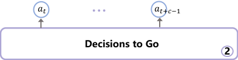

## …

|Offline Data Reviewing {𝑜 𝑡, 𝑎, …, 𝑜,𝑎 𝑡+𝑐−1} Decisions 3 𝑡 𝑡+𝑐−1|Col2|
|---|---|
|{𝑜𝑡, 𝑎𝑡, …, 𝑜𝑡+𝑐−1,𝑎𝑡+𝑐−1}||

|Col1|Col2|Col3|D|
|---|---|---|---|
|||||
|𝑧𝑡|𝑧𝑡|𝑜𝑡|𝑎𝑡 𝑟|

|Col1|Col2|Col3|Col4|Col5|
|---|---|---|---|---|
|𝑧𝑡 |𝑧𝑡 |𝑜𝑡+𝑐−1 𝑎|𝑡+𝑐−1 𝑟|𝑡+𝑐−1|

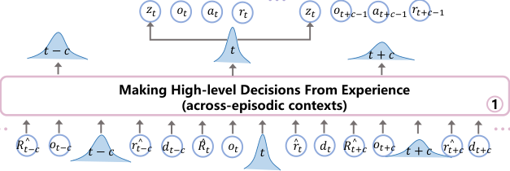

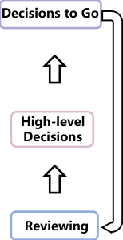

_Figure 2._ The architecture of IDT is designed into three modules to simulate the high-level trial-and-error process. First, the (1) Making
Decisions module predicts a high-level decision by providing across-episodic contexts, where across-episodic contexts contain multiple
trajectories arranged in ascending order of the total rewards. Then, the (2) Decisions to Go module predicts actions for _c_ steps conditioned
on the predicted high-level decision. Finally, the (3) Reviewing Decisions module reviews the executed actions to serve as an experience
for the next cycle. Note that the Reviewing Decisions encodes the true label of high-level decisions from offline data at training while
encodes from the executed actions at testing.

basic elements of trajectories are observations _o_, actions _a_,
rewards _r_, and completion token _d_ . As modeling rewards is
a nontrivial task, we aim to have the model generate actions
based on the target returns _R_ [ˆ] 0 (Chen et al., 2021), which
can be updated using rewards _R_ [ˆ] _t_ = _R_ [ˆ] 0 _−_ [�] _[t]_ _j_ =0 _[r]_ _[j]_ [. There-]
fore, the following trajectory representation is amenable to
autoregressive training and generation:

_τ_ = ( _R_ [ˆ] 0 _, o_ 0 _, a_ 0 _, r_ 0 _, d_ 0 _, . . .,_ _R_ [ˆ] _T_ _, o_ _T_ _, a_ _T_ _, r_ _T_ _, d_ _T_ ) _._ (2)

To facilitate the model to achieve target return, we construct
across-episodic contexts that consist of multiple trajectories for self-improvement during test time (Hao Liu, 2023).
This idea arises from the approach called chain of hindsight
(Liu et al., 2023), which trains language models from human feedback by conditioning on positive indicators and
negative-rated examples to predict corresponding positiverated examples. In the RL tasks, the positive indicator is
the target return, and previous trajectories serve as negativerated examples to predict the trajectory with higher returns.

Specifically, the chain of experience is represented by _n_
trajectories: _s_ = ( _τ_ [1] _, τ_ [2] _, . . ., τ_ _[n]_ ) where

_τ_ _[i]_ = ( _R_ [ˆ] 0 _[i]_ _[, o]_ _[i]_ 0 _[, a]_ _[i]_ 0 _[, r]_ 0 _[i]_ _[, d]_ _[i]_ 0 _[, . . .,]_ [ ˆ] _[R]_ _T_ _[i]_ _[, o]_ _[i]_ _T_ _[, a]_ _[i]_ _T_ _[, r]_ _T_ _[i]_ _[, d]_ _[i]_ _T_ [)] _[.]_ (3)

The trajectories are ascending sorted according to their total
rewards, i.e., [�] _[T]_ _t_ =0 _[r]_ _t_ [1] _[≤]_ [�] _[T]_ _t_ =0 _[r]_ _t_ [2] _[≤· · · ≤]_ [�] _[T]_ _t_ =0 _[r]_ _t_ _[n]_ [. For]
all _n_ trajectories, the initial target return _R_ [ˆ] 0 _[i]_ [equals the max]
total reward, i.e., the last trajectory _R_ [ˆ] 0 _[n]_ [=][ �] _[T]_ _t_ =0 _[r]_ _t_ _[n]_ [.]

**4.2. Hierarchical Chain of Experience**

After building across-episodic contexts based on the chain
of experience, in-context RL can automatically improve its
performance at evaluation time by rolling trajectories in a
trial-and-error manner. However, this suffers substantial
computational costs when the horizon of tasks increases.

Since total rewards are obtained at the end of episodes, it
is more difficult to evaluate and improve a policy model in
long-horizon tasks. In traditional RL methods, an effective
solution is to decompose complex tasks into several subproblems by incorporating hierarchical structures (Nachum
et al., 2018). The high-level policy only needs to generate
a signal once to control the low-level policy to generate
multi-step actions. This allows (1) the high-level policy to
receive feedback faster, as if working on a short-horizon
task, and (2) the low-level policy only needs to consider
how to better implement the sub-tasks generated by the
high-level decision. Although the hierarchical structure can
be optimized end-to-end by reward signals, the trial-anderror process in in-context RL is more complicated.

As psychologist Edward Thorndike mentioned, the trialand-error process includes two parts (Sutton & Barto, 2018),
memory and search. The high-level decision plays an important role that is closely connected with memory and search.
A high-level decision is generated from the search process
and directly affects the quality of low-level executed actions. Subsequently, it also serves as the memory for future

4

**In-Context Decision Transformer: Reinforcement Learning via Hierarchical Chain-of-Thought**

searches. Therefore, we designed three modules to realize a high-level trial-and-error process: Making Decisions,
Decisions to Go, and Reviewing Decisions.

**Making Decisions.** The purpose of the Making Decisions
module is to generate high-level decisions autoregressively,
where the high-level decision is represented by a vector
**z** sampled from a multivariate Gaussian distribution. As
the quality of **z** directly relates to low-level actions _a_, a
better high-level decision **z** is critical for inducing better lowlevel actions _a_ . Therefore, we reconstruct across-episodic
contexts represented as a high-level chain of experience
_s_ _h_ = ( _τ_ _h_ [1] _[, τ]_ _h_ [ 2] _[, . . ., τ]_ _h_ _[ n]_ [)][. Each] _[ τ]_ _[ i]_ _h_ [is denoted as:]

_τ_ _h_ _[i]_ [= ( ˆ] _[R]_ 0 _[i]_ _[, o]_ _[i]_ 0 _[,]_ **[ z]** _[i]_ 0 _[,]_ [ ˆ] _[r]_ 0 _[i]_ _[, d]_ _[i]_ 0 _[,]_ [ ˆ] _[R]_ _c_ _[i]_ _[, o]_ _[i]_ _c_ _[,]_ **[ z]** _[i]_ _c_ _[,]_ [ ˆ] _[r]_ _c_ _[i]_ _[, d]_ _[i]_ _c_ _[,]_

(4)
_. . .,_ _R_ [ˆ] _kc_ _[i]_ _[, o]_ _[i]_ _kc_ _[,]_ **[ z]** _[i]_ _kc_ _[,]_ [ ˆ] _[r]_ _kc_ _[i]_ _[, d]_ _[i]_ _kc_ [)] _[,]_

where each high-level decision **z** is generated every _c_ steps,
_T −_ _c ≤_ _kc ≤_ _T_, and ˆ _r_ _c_ _[i]_ [=][ �] [2] _t_ = _[c][−]_ _c_ [1] _[r]_ _t_ _[i]_ [is the sum of] _[ c]_ [ steps]
rewards. By comparing with Equation (3), the high-level
chain of experience can considerably shorten the length of
contexts and, therefore, significantly alleviate the computational complexity of the self-attention mechanism.

**Decisions to Go.** Based on high-level decisions, the Decisions to Go module is designed to generate low-level actions
that can interact with environments. Since the transformer
based policy is a conditional generative model, we can build
a low-level context that contains high-level decisions to
control the low-level actions. The low-level context is represented as:

_τ_ _l_ _[i,j]_ =( **z** _[i]_ _j_ _[, o]_ _j_ _[i]_ _[, a]_ _j_ _[i]_ _[, r]_ _j_ _[i]_ _[,]_ **[ z]** _j_ _[i]_ _[, o]_ _j_ _[i]_ +1 _[, a]_ _[i]_ _j_ +1 _[, r]_ _j_ _[i]_ +1 _[,]_

(5)
_. . .,_ **z** _[i]_ _j_ _[, o]_ _j_ _[i]_ + _c−_ 1 _[, a]_ _[i]_ _j_ + _c−_ 1 _[, r]_ _j_ _[i]_ + _c−_ 1 [)] _[,]_

where each _τ_ _l_ _[i,j]_ starts from the generation step _j_ _∈_
_{_ 0 _, c, . . ., kc}_ of high-level decisions and completes _c_ steps
low-level actions in the trajectory _τ_ _[i]_ . In particular, we introduce the reparameterization trick (Jang et al., 2016) into
high-level decisions to ensure backpropagation through the
Decisions to Go module to the Making Decisions module.

**Reviewing Decisions.** The autoregressive training of
the conditional generation model is achieved by predicting each token in the sequence. For example, when the
transformer model is trained to generate _a_ _t_, we need to
provide the action label at time _t_ and condition it on the
historical actions _{a_ 0 _, . . ., a_ _t−_ 1 _}_ . However, the supervisory
signals about high-level decisions **z** are not directly observable from the sequence, as shown in Equation (4) . For
instance, when the transformer model is trained to generate
**z** _j_ ( _j ∈{_ 0 _, c, . . ., kc}_ ), we have neither the true label of **z** _j_
nor the previous high-level decisions _{_ **z** 0 _,_ **z** _c_ _, . . .,_ **z** _j−c_ _}_ .

To this end, we replace the true label of **z** _j_ with the gradients
from the Decisions to Go module trained to generate the

following _c_ steps of actions _{a_ _j_ _, a_ _j_ +1 _, . . ., a_ _j_ + _c−_ 1 _}_ . For
the previous high-level decisions _{_ **z** 0 _,_ **z** _c_ _, . . .,_ **z** _j−c_ _}_, we introduce the Reviewing Decisions module to encode the label
from low-level actions. As the high-level decisions induce
low-level actions, the low-level actions should be able to
infer high-level decisions inversely. Specifically, to infer
a previous high-level decision **z** _t_ _∈{_ **z** 0 _,_ **z** _c_ _, . . .,_ **z** _j−c_ _}_, we
first utilize the self-attention operation to aggregate the information of _a_ _t_ + _c−_ 1 and _{o_ _t_ _, a_ _t_ _, . . ., o_ _t_ + _c−_ 1 _, a_ _t_ + _c−_ 1 _}_ . Then,
we apply a linear layer to encode **z** _t_ from the aggregated
information. Note that the Reviewing Decision module is
not required to perform autoregressive generation, so any
sequence model, such as LSTM, can replace it.

By combining the above three modules, IDT can automatically improve its performance at evaluation time by rolling
trajectories in a high-level trial-and-error manner. We now
introduce the implementation details of IDT, including architecture, training, and testing.

**4.3. Implementation of IDT**

**Architecture.** We feed _n_ trajectories into the Making Decisions module, which results in 5 _×_ _n_ _×_ _T/c_ tokens, with one
token for each of the five modalities: desired target return,
observation, high-level decision, reward, and completion.
In the Decisions to Go module, we feed 4 _× c_ tokens, with
one token for each of the four modalities: high-level decision, observation, action, and rewards. In the Reviewing
Decisions module, we feed 2 _× c_ tokens, with one token

for each of the two modalities: observation and action. To

create the token embeddings, we train a linear layer for each
modality, which transforms the raw inputs into the desired
embedding dimension, followed by layer normalization (Ba
et al., 2016). Finally, the tokens are processed by a GPT
model that predicts future high- and low-level action tokens
through autoregressive modeling.

**Training and Testing.** During training, we are given
a dataset of offline trajectories, where the trajectories can
be suboptimal. In each iteration, we sample minibatches
of trajectories from the dataset. The Reviewing Decisions
module first encodes each true high-level decision **z** from
the minibatch every _c_ steps. Then, the Making Decisions
module predicts the high-level decision **z** _t_ given the input
token _o_ _t_ and past trajectories. Finally, the Decisions to Go
module autoregressively predicts _c_ steps of low-level actions
_{a_ _t_ _, . . ., a_ _t_ + _c−_ 1 _}_ given **z** _t_ and _{o_ _t_ _, . . ., o_ _t_ + _c−_ 1 _}_ . The lowlevel actions are evaluated with either cross-entropy loss
or mean-squared error, depending on whether the actions
are discrete or continuous. The losses from each timestep
are averaged and updated in all three modules end-to-end.
At test time, we roll out the IDT with multiple trajectories
and report the largest return among trajectories. Following the configuration from related works Hao Liu (2023);

5

**In-Context Decision Transformer: Reinforcement Learning via Hierarchical Chain-of-Thought**

D4RL

D4RL

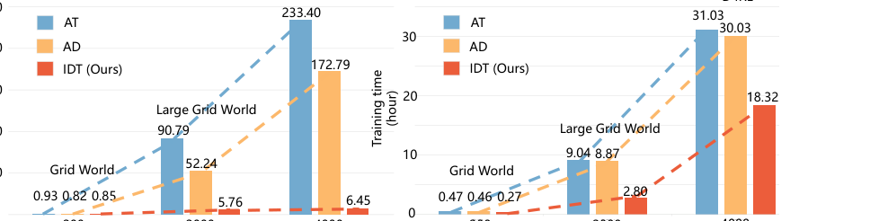

250

200

150

100

50

0

类别 类别 类别

200 类别 2000 类别

(b) Context size (timestep) at training

4000 类别

200 2000

(a) Context size (timestep) at testing

4000

(a) Context size (timestep) at testing (b)

_Figure 3._ Results for (a) testing and (b) training times. We report the training time per 10k gradient updates, the testing time for 50
episodes over Grid World, and 10 episodes over D4RL. Note that we use the number of steps to measure the context size here. The
number of tokens per step may vary depending on the algorithm. Each step in AD contains 4 tokens: observation, action, reward, and
completion. IDT’s Making Decisions module and AT have an extra return-to-go token. As the task length increases, the context length is
forced to grow exponentially, resulting in a square increase in computational costs. In contrast, IDT reconstructs the sequence to consist
of high-level decisions. Therefore, the context is smaller than one episode length, significantly reducing computational costs.

Laskin et al. (2023), we set a context size across _n_ = 4
episodes. Note that the task horizons _T_ used in this work
range from 20 steps to 1000 steps, and the maximum context size reaches 20000 tokens. The pseudocode for IDT is
summarized in Appendix A. Source code and more hyperparameters are described in Appendix B.

**5. Experiments**

**Dataset: Grid World.** In this section, we first consider
the discrete control environments from the Grid World (Lee
et al., 2022), which is a commonly used benchmark for
recent in-context RL methods. The environments support
many tasks that cannot be solved through zero-shot generalization after pre-training because these tasks cannot be
inferred easily from the observation. The episode of each
task is short enough to train a transformer-based policy with
across-episodic contexts feasibly. Specifically, we consider
the four evaluation environments: Darkroom, Darkroom
Hard, Darkroom Dynamic, and Dark Key-to-Door.

The evaluation environments provide a 2D discrete POMDP
where an agent spawns in a room and must find a goal
location. The agent only observes its own ( _x, y_ ) coordinates
but does not know the goal location, which is required to
deduce it from the rewards received. The room dimensions

are 9 _×_ 9 with the agent’s possible actions, including moving
one step either left, right, up, down, or staying idle. In
Darkroom, an episode lasts 20 steps, and the agent can
obtain a reward ( _r_ = 1 ) each time the goal is achieved. The
Darkroom Hard and Darkroom Dynamic are two variants
of Darkroom. In the Darkroom Hard, agents only obtain
a reward when the goal is achieved first. In the Darkroom
Dynamic, the goal is fixed to a corner, but the action space

is randomly permuted. In the Dark Key-to-Door, the length
of an episode is 50, where the agent is required to locate
an invisible key to receive a one-time reward first and then
identify an invisible door to obtain another one-time reward.

In addition, we create a variant of Large Darkroom, Large
Darkroom Hard, Large Darkroom Dynamic, and Large
Darkroom Key-to-Door, where the coordinate space of each
environment is expanded to 40 _×_ 40, and the episode length
is expanded 10 times. The dataset is collected from learning
histories that are generated by training gradient-based RL
algorithms, such as Deep Q-Network (Mnih et al., 2013).
For each environment, we randomly create 60 tasks from
the coordinate space and collect data for 1 million timesteps.

**Dateset: D4RL.** D4RL (Fu et al., 2020) is a commonly
used offline RL benchmark, including continuous control
tasks. The different dataset settings are described below.

  - Medium: 1 million timesteps generated by a “medium”
policy that performs approximately one-third as well
as an expert policy.

  - Medium-Replay: 1 million timesteps collected from
the replay buffer of an agent trained to the performance
of a “medium” policy.

  - Medium-Expert: It consists of 1 million timesteps generated by the “medium” policy and another 1 million
timesteps generated by the expert policy.

The dataset is collected from Mujoco environments, including HalfCheetah, Hopper, and Walker. The episode length
in D4RL is 1000, which is far more than that of Grid World.

6

**In-Context Decision Transformer: Reinforcement Learning via Hierarchical Chain-of-Thought**

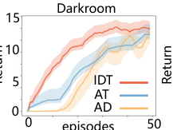

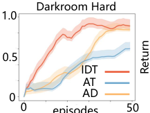

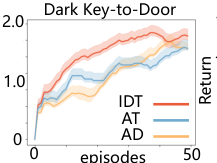

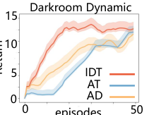

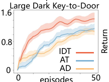

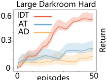

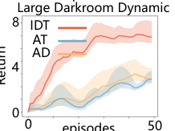

_Figure 4._ Results for Grid World. An agent is expected to solve a new task by interacting with the environments for 50 episodes without
online model updates. Based on high-level decisions, our method outperforms both AT and AD, which rely on across-episodic contexts
with the smallest actions. In particular, IDT has significant advantages in handling long-horizon tasks.

Therefore, current in-context RL methods require huge computational costs in D4RL, even though it is a commonly
used baseline for conventional RL algorithms.

**Baselines.** In this section, we investigate the performance
and efficiency of IDT relative to in-context RL, dedicated
offline RL, and imitation learning algorithms. Our baselines
can be categorized as follows:

  - In-context RL: These methods use the transformer to

model trajectory sequences and predict actions autoregressively. We compare with recent methods, Agentic
Transformer (AT) (Hao Liu, 2023) and Algorithm Distillation (AD) (Laskin et al., 2023), which proposed
across-episodic contexts with the smallest actions.

  - Temporal-difference learning: Most temporaldifference (TD) learning methods use an action
space constraint or value pessimism and will serve as
faithful comparisons to IDT, representing standard
RL methods. We consider state-of-the-art TD3+BC

(Fujimoto & Gu, 2021) that is demonstrated to be
effective on D4RL.

  - Imitation learning: Imitation learning methods similarly utilize supervised losses for training, such as
Behavior Cloning (BC) (Torabi et al., 2018) and Decision Transformer (DT) (Chen et al., 2021). Following
AT, we compare with BC-10 %, which is shown to be
competitive with state-of-the-art on D4RL. DT also
uses a transformer to predict actions autoregressively
but is limited to a single episode context.

For all comparison methods, we adhere closely to the original hyper-parameter settings. To evaluate IDT and other
in-context RL algorithms, we roll out 10 episodes in D4RL

and 50 episodes in Grid World. For each result, we report
mean and standard error across 5 random seeds.

**5.1. Evaluation of Computing Costs**

An important property of in-context RL is that it can improve itself without expensive gradient updates. However,
the computational costs of forward propagation are hidden
in short-horizon tasks. Therefore, we reported the training
time per 10k gradient updates, the evaluation time for 50
episodes over Grid World, and 10 episodes over D4RL. As
shown in Figure 3, our IDT has efficient training and significantly reduces the testing time compared to the baselines,
approximately **36** _**×**_ times faster in D4RL and **27** _**×**_ times
faster in large Grid World. More detailed results for each
task are described in Appendix C.

As the task length increases, the evaluation time of AT and
AD grows quadratically. This is because the across-episodic
contexts multiply the sequence length, leading to intolerable computational costs in the self-attention mechanism.
The AT algorithm requires four episodes for trial-and-error,
where each episode reaches 1000 steps in D4RL, and each
step contains 5 tokens. Therefore, each step of AT generation requires scanning 20k tokens. Since the AD algorithm
reduces a return-to-go token at each step, the training and
testing time are both less than AT. In contrast, IDT reconstructs the sequence to consist of high-level decisions, and
thus, the context is smaller than one episode length. As
a result, IDT is significantly lower than baselines at both
training and testing times.

**5.2. Grid World Results**

To evaluate IDT’s self-improvement capabilities in unseen
tasks, we compared recent in-context RL methods in the

7

**In-Context Decision Transformer: Reinforcement Learning via Hierarchical Chain-of-Thought**

_Table 1._ Results for D4RL datasets. IDT outperforms both in-context RL (AT and AD) and supervised learning (BC) and performs

|mpetitively with conventional RL algorithms (TD3+BC and TD3) on almost all tasks.|Col2|
|---|---|
|Dataset Environment BC-10% TD3+BC TD3 DT AT AD Ours|Dataset Environment BC-10% TD3+BC TD3 DT AT AD Ours|
|Medium-Expert HalfCheetah Medium-Expert Hopper Medium-Expert Walker|94.11 **96.59** 87.60 93.40 95.81_±_ 0.25 94.21_ ±_ 0.46 96.12_±_ 0.18 113.13 113.22 98.41 111.18 115.92_±_ 1.26 108.32_ ±_ 0.95 **118.39**_±_** 0.75** 109.90 112.21 100.52 108.71 114.87_±_ 0.56 111.36_ ±_ 0.46 **118.51**_±_** 0.48**|
|Medium HalfCheetah Medium Hopper Medium Walker|43.90 **48.93** 34.60 42.73 45.12_±_ 0.34 42.28_ ±_ 1.18 45.51_±_ 0.26 73.84 70.44 56.98 69.42 70.45_±_ 0.45 72.58_ ±_ 0.54 **83.24**_±_** 0.33** 82.05 86.91 70.95 74.70 88.71_±_ 0.55 85.96_ ±_ 0.46 **88.94**_±_** 0.61**|
|Medium-Replay HalfCheetah Medium-Replay Hopper Medium-Replay Walker|42.27 45.84 38.81 40.31 **46.86**_±_** 0.33** 41.28_ ±_ 0.21 45.58_±_ 0.36 90.57 98.12 78.90 88.74 96.85_±_ 0.41 91.32_ ±_ 0.66 **98.59**_±_** 0.26** 76.09 91.17 65.94 68.22 92.32_±_ 1.21 89.21_ ±_ 1.42 **96.22**_±_** 1.06**|
|Total Average|80.65_±_ 1.34 84.83_±_ 1.10 70.28_±_ 1.20 77.49_±_ 1.45 85.21_±_ 1.12 82.84_±_ 0.70 **87.90**_±_** 1.06**|

16 Darkroom Large Darkroom a majority of the tasks and is competitive with the state-of
15 the-art in the remaining tasks.

25% optimal 10 25% optimal In the TD learning and imitation learning categories,

8 50% optimal 50% optimal TD3+BC is generally the most remarkable algorithm. Com
4 100% optimal 75% optimal 5 100% optimal 75% optimal pared with them, the superior performance of IDT demon
0 episodes 50 0 episodes 50 strates the advantages of using high-level trial-and-error.

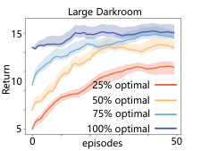

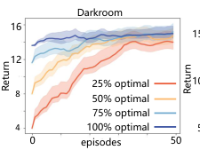

_Figure 5._ Results for IDT conditioned on partial demonstrations.
IDT can accelerate self-improvement through the Review Decisions module to encode external data prompts.

Grid World environments. The agent is required to solve
an unseen task by interacting with the environments for
50 episodes without online model updates. As shown in
Figure 4, IDT achieves state-of-the-art performance in a
wide range of tasks.

In large variant tasks, IDT significantly surpasses the baselines in both efficiency and performance. However, neither
AT nor AD showed obvious self-improvement trends, especially in Large Darkroom Hard. This is because the Large
Darkroom Hard is a task with sparse rewards, which makes
it difficult for AT and AD to capture the goal position in long
sequences. In contrast, IDT explores tasks in a high-level
trial-and-error manner, making receiving positive feedback
on rewards easier. Overall, IDT demonstrated that a highlevel trial-and-error manner is feasible rather than limited to

the smallest actions.

**5.3. D4RL Results**

In addition to short-horizon tasks specific to in-context RL
methods, we also test the performance of IDT on the D4RL
dataset, which is commonly used in conventional RL methods. Based on Fu et al. (2020), the results on D4RL are
normalized so that 100 denotes an expert policy. Baseline
numbers are reported by the AT paper and from the D4RL
paper. As shown in Table 1, IDT outperforms baselines in

**5.4. Case Study on the Reviewing Decisions Module**

A notable ability of transformer-based policy is to address
tasks by providing demonstration prompts. Although incontext RL can improve itself without relying on demonstrations, external prompts can speed up the process. Therefore,
we want to investigate whether IDT can benefit from this
setting. To answer this question, we design a _ϵ_ -greedy policy
to collect external data in Darkroom and Large Darkroom
tasks, ranging from nearly random to optimal.

As shown in Figure 5, IDT improves each policy in context
until it is near-optimal. Notably, the more optimal the input
policy, the faster IDT improves it until it is optimal. Despite high-level decisions that cannot be directly observed
from the external demonstrations, IDT can extract experts’
intentions through the Reviewing Decisions module. In
particular, we also perform parameter sensitivity analyses
on high-level decision frequency ( _c_ ) and context size ( _n_
episodes), as shown in Appendix C.

**6. Conclusion**

In this work, we propose an efficient in-context RL method
IDT that treats RL tasks as an across-episodic sequence
problem and can improve itself at test time. The idea of
human multi-level decision-making inspires IDT and introduces high-level decisions into the sequence prediction
process. Unlike current in-context RL methods limited to
short-horizon tasks, IDT is also good at standard RL benchmarks, which typically have longer task horizons. On the

8

**In-Context Decision Transformer: Reinforcement Learning via Hierarchical Chain-of-Thought**

Grid World and D4RL benchmarks, we show that IDT can
outperform baselines in both efficiency and performance.

**Impact Statement**

In terms of the potential broader impact, our work provides a
new idea of incorporating high-level decisions in the design
of context, which may promote the development of the incontext RL community. Besides, we do not see any negative
ethical and societal impacts of our work while using our
method in practice.

**Acknowledgments**

This work was supported by the National Key R&D Program of China under Grant No. 2021ZD0112500; the National Natural Science Foundation of China under Grant Nos.

U22A2098, U19A2065, 62172185, 61976102, 62206105
and 62202200; the International Cooperation Project of Jilin
Province under Grant Nos.20220402009GH, U2341229.

**References**

Alayrac, J.-B., Donahue, J., Luc, P., Miech, A., Barr, I.,
Hasson, Y., Lenc, K., Mensch, A., Millican, K., Reynolds,
M., et al. Flamingo: a visual language model for few-shot
learning. _Advances in Neural Information Processing_
_Systems_, 35:23716–23736, 2022.

Ba, J. L., Kiros, J. R., and Hinton, G. E. Layer normalization.
_arXiv preprint arXiv:1607.06450_, 2016.

Bacon, P.-L., Harb, J., and Precup, D. The option-critic
architecture. In _Proceedings of the AAAI conference on_
_artificial intelligence_, volume 31, 2017.

Bellemare, M. G., Naddaf, Y., Veness, J., and Bowling, M.
The arcade learning environment: An evaluation platform for general agents. _Journal of Artificial Intelligence_
_Research_, 47:253–279, 2013.

Brown, T., Mann, B., Ryder, N., Subbiah, M., Kaplan, J. D.,
Dhariwal, P., Neelakantan, A., Shyam, P., Sastry, G.,
Askell, A., et al. Language models are few-shot learners.
_Advances in neural information processing systems_, 33:
1877–1901, 2020a.

Brown, T., Mann, B., Ryder, N., Subbiah, M., Kaplan, J. D.,
Dhariwal, P., Neelakantan, A., Shyam, P., Sastry, G.,
Askell, A., et al. Language models are few-shot learners.
_Advances in neural information processing systems_, 33:
1877–1901, 2020b.

Chen, L., Lu, K., Rajeswaran, A., Lee, K., Grover, A.,
Laskin, M., Abbeel, P., Srinivas, A., and Mordatch, I. Decision transformer: Reinforcement learning via sequence

modeling. _Advances in neural information processing_
_systems_, 34:15084–15097, 2021.

Devlin, J., Chang, M.-W., Lee, K., and Toutanova, K. Bert:
Pre-training of deep bidirectional transformers for language understanding. _arXiv preprint arXiv:1810.04805_,
2018.

Dorfman, R., Shenfeld, I., and Tamar, A. Offline meta
reinforcement learning–identifiability challenges and effective data collection strategies. _Advances in Neural_
_Information Processing Systems_, 34:4607–4618, 2021.

Dosovitskiy, A., Beyer, L., Kolesnikov, A., Weissenborn,
D., Zhai, X., Unterthiner, T., Dehghani, M., Minderer, M.,
Heigold, G., Gelly, S., et al. An image is worth 16x16
words: Transformers for image recognition at scale. _arXiv_
_preprint arXiv:2010.11929_, 2020.

Duan, Y., Schulman, J., Chen, X., Bartlett, P. L., Sutskever,
I., and Abbeel, P. Rl2: Fast reinforcement learning via slow reinforcement learning. _arXiv preprint_
_arXiv:1611.02779_, 2016.

Finn, C., Abbeel, P., and Levine, S. Model-agnostic metalearning for fast adaptation of deep networks. In _Interna-_
_tional conference on machine learning_, pp. 1126–1135.
PMLR, 2017.

Fu, J., Kumar, A., Nachum, O., Tucker, G., and Levine,
S. D4rl: Datasets for deep data-driven reinforcement
learning. _arXiv preprint arXiv:2004.07219_, 2020.

Fujimoto, S. and Gu, S. S. A minimalist approach to offline
reinforcement learning. _Advances in neural information_
_processing systems_, 34:20132–20145, 2021.

Fujimoto, S., Meger, D., and Precup, D. Off-policy deep
reinforcement learning without exploration. In _Interna-_
_tional conference on machine learning_, pp. 2052–2062.
PMLR, 2019.

Hao Liu, P. A. Emergent agentic transformer from chain of
hindsight experience. In _Proceedings of the 20th Inter-_
_national Conference on Machine Learning (ICML 2023)_,
2023.

Ishii, S., Yoshida, W., and Yoshimoto, J. Control of
exploitation–exploration meta-parameter in reinforcement learning. _Neural networks_, 15(4-6):665–687, 2002.

Jang, E., Gu, S., and Poole, B. Categorical reparameterization with gumbel-softmax. _arXiv preprint_
_arXiv:1611.01144_, 2016.

Janner, M., Li, Q., and Levine, S. Offline reinforcement
learning as one big sequence modeling problem. _Ad-_
_vances in neural information processing systems_, 34:
1273–1286, 2021.

9

**In-Context Decision Transformer: Reinforcement Learning via Hierarchical Chain-of-Thought**

Kumar, A., Fu, J., Soh, M., Tucker, G., and Levine, S.
Stabilizing off-policy q-learning via bootstrapping error
reduction. _Advances in Neural Information Processing_
_Systems_, 32, 2019.

Kumar, A., Zhou, A., Tucker, G., and Levine, S. Conservative q-learning for offline reinforcement learning.
_Advances in Neural Information Processing Systems_, 33:
1179–1191, 2020.

Laskin, M., Wang, L., Oh, J., Parisotto, E., Spencer, S.,
Steigerwald, R., Strouse, D., Hansen, S. S., Filos, A.,
Brooks, E., et al. In-context reinforcement learning with
algorithm distillation. In _The Eleventh International Con-_
_ference on Learning Representations_, 2023.

Lee, J. N., Xie, A., Pacchiano, A., Chandak, Y., Finn, C.,
Nachum, O., and Brunskill, E. Supervised pretraining can
learn in-context reinforcement learning. _arXiv preprint_
_arXiv:2306.14892_, 2023a.

Lee, J. N., Xie, A., Pacchiano, A., Chandak, Y., Finn, C.,
Nachum, O., and Brunskill, E. Supervised pretraining can
learn in-context reinforcement learning. _arXiv preprint_
_arXiv:2306.14892_, 2023b.

Lee, K.-H., Nachum, O., Yang, M. S., Lee, L., Freeman, D., Guadarrama, S., Fischer, I., Xu, W., Jang, E.,
Michalewski, H., et al. Multi-game decision transformers.
_Advances in Neural Information Processing Systems_, 35:
27921–27936, 2022.

Liu, H., Sferrazza, C., and Abbeel, P. Chain of hindsight
aligns language models with feedback. _arXiv preprint_
_arXiv:2302.02676_, 3, 2023.

Mitchell, E., Rafailov, R., Peng, X. B., Levine, S., and
Finn, C. Offline meta-reinforcement learning with advantage weighting. In _International Conference on Machine_
_Learning_, pp. 7780–7791. PMLR, 2021.

Mnih, V., Kavukcuoglu, K., Silver, D., Graves, A.,
Antonoglou, I., Wierstra, D., and Riedmiller, M. Playing
atari with deep reinforcement learning. _arXiv preprint_
_arXiv:1312.5602_, 2013.

Nachum, O., Gu, S. S., Lee, H., and Levine, S. Data-efficient
hierarchical reinforcement learning. _Advances in neural_
_information processing systems_, 31, 2018.

Nichol, A., Achiam, J., and Schulman, J. On
first-order meta-learning algorithms. _arXiv preprint_
_arXiv:1803.02999_, 2018.

Pateria, S., Subagdja, B., Tan, A.-h., and Quek, C. Hierarchical reinforcement learning: A comprehensive survey.
_ACM Computing Surveys (CSUR)_, 54(5):1–35, 2021.

Pong, V. H., Nair, A. V., Smith, L. M., Huang, C., and
Levine, S. Offline meta-reinforcement learning with online self-supervision. In _International Conference on_
_Machine Learning_, pp. 17811–17829. PMLR, 2022.

Radford, A., Narasimhan, K., Salimans, T., Sutskever, I.,
et al. Improving language understanding by generative
pre-training. 2018.

Reed, S., Zolna, K., Parisotto, E., Colmenarejo, S. G.,
Novikov, A., Barth-Maron, G., Gimenez, M., Sulsky,
Y., Kay, J., Springenberg, J. T., et al. A generalist agent.
_arXiv preprint arXiv:2205.06175_, 2022.

Sutton, R. S. and Barto, A. G. _Reinforcement learning: An_
_introduction_ . 2018.

Sutton, R. S., McAllester, D., Singh, S., and Mansour, Y.
Policy gradient methods for reinforcement learning with
function approximation. _Advances in neural information_
_processing systems_, 12, 1999a.

Sutton, R. S., Precup, D., and Singh, S. Between mdps
and semi-mdps: A framework for temporal abstraction in
reinforcement learning. _Artificial intelligence_, 112(1-2):
181–211, 1999b.

Thorndike, E. L. The law of effect. _The American journal_
_of psychology_, 39(1/4):212–222, 1927.

Torabi, F., Warnell, G., and Stone, P. Behavioral cloning
from observation. _arXiv preprint arXiv:1805.01954_,
2018.

Vaswani, A., Shazeer, N., Parmar, N., Uszkoreit, J., Jones,
L., Gomez, A. N., Kaiser, Ł ., and Polosukhin, I. Attention is all you need. _Advances in neural information_
_processing systems_, 30, 2017.

Wang, J. X., Kurth-Nelson, Z., Tirumala, D., Soyer, H.,
Leibo, J. Z., Munos, R., Blundell, C., Kumaran, D., and
Botvinick, M. Learning to reinforcement learn. _arXiv_
_preprint arXiv:1611.05763_, 2016.

Yu, T., Kumar, A., Rafailov, R., Rajeswaran, A., Levine, S.,
and Finn, C. Combo: Conservative offline model-based
policy optimization. _Advances in neural information_
_processing systems_, 34:28954–28967, 2021.

Zahavy, T., Xu, Z., Veeriah, V., Hessel, M., Oh, J., van
Hasselt, H. P., Silver, D., and Singh, S. A self-tuning
actor-critic algorithm. _Advances in neural information_
_processing systems_, 33:20913–20924, 2020.

10

**In-Context Decision Transformer: Reinforcement Learning via Hierarchical Chain-of-Thought**

_Appendix of paper “In-Context Decision Transformer: Reinforcement Learning via Hierarchical_
_Chain-of-Thought”_

**A. Pseudocode of In-context Decision Transformer**

**Algorithm 1** In-context Decision Transformer.

1: **Input:** A dataset of Trajectories, Max Iterations _M_ as training phase, Max episodes _m_ at testing phase, A number of
trajectories _n_ in hierarchical chain of experience, A number of steps of low-level actions _c_ for one high-level decision
2: **Output:** The generated low-level actions
3: // **Training**
4: **for** _i_ = 1 **to** _M_ **do**
5: Randomly sample _n_ episodes from dataset _s_ = ( _τ_ [1] _, τ_ [2] _, . . ., τ_ _[n]_ )
6: Sort _n_ episodes ascending according to their returns [�] _[T]_ _t_ =0 _[r]_ _t_ [1] _[≤]_ [�] _[T]_ _t_ =0 _[r]_ _t_ [2] _[≤· · · ≤]_ [�] _[T]_ _t_ =0 _[r]_ _t_ _[n]_
7: Compute returns-to-go _R_ [ˆ] _t_ = _R_ [ˆ] 0 _−_ [�] _[t]_ _j_ =0 _[r]_ _[j]_ [ for all steps for each episode, where][ ˆ] _[R]_ [0] [ =][ �] _[T]_ _t_ =0 _[r]_ _t_ _[n]_
8: The Reviewing Decisions module encodes a high-level decisions **z** every _c_ steps
9: Concatenate _n_ episodes as a high-level sequence _s_ _h_ = ( _τ_ _h_ [1] _[, τ]_ _h_ [ 2] _[, . . ., τ]_ _h_ _[ n]_ [)][ based on Equation (][4][)]
10: Build a low-level sequence every _c_ steps based on Equation (5)
11: The Making Decisions module predicts the next high-level decision tokens, and then the Decision to Go module
predicts the next _c_ steps low-level action tokens for each predicted high-level decision token
12: Train the Reviewing Decisions, Making Decisions, and Decision to Go modules based on the loss of predicted
low-level actions end-to-end

13: **end for**

14: // **Testing**
15: **for** _i_ = 1 **to** _m_ **do**

16: Start a new episode _i_ and reset the timestep _t_ = 0
17: **while** _t ≤_ _T_ **do**
18: The Making Decisions model generates next high-level decision token **z** _[i]_ _t_ [based on the across-episodic context]
( _τ_ _h_ _[i][−]_ [3] _, τ_ _h_ _[i][−]_ [2] _, τ_ _h_ _[i][−]_ [1] _, . . .,_ _R_ [ˆ] _t_ _[i]_ _[, o]_ _[i]_ _t_ [)][, where] _[ τ]_ _[ i]_ _h_ [is expressed as Equation (][4][)]
19: **for** _k_ = 0 **to** _c −_ 1 **do**
20: The Decisions to Go model generates next low-level action _a_ _[i]_ _t_ + _k_ [based on the previous context]
( **z** _[i]_ _t_ _[, o]_ _[i]_ _t_ _[, a]_ _[i]_ _t_ _[, r]_ _t_ _[i]_ _[, . . .,]_ **[ z]** _[i]_ _t_ _[, o]_ _[i]_ _t_ + _k_ [)]
21: **end for**
22: The Review Decisions model encode the executed decision **z** _[i]_ _t_ [from the] _[ c]_ [ steps][ (] _[o]_ _[i]_ _t_ _[, a]_ _[i]_ _t_ _[, . . ., o]_ _[i]_ _t_ + _c−_ 1 _[, a]_ _[i]_ _t_ + _c−_ 1 [)]

23: Compute the sum of _c_ steps rewards ˆ _r_ _t_ _[i]_ [and the next returns-to-go][ ˆ] _[R]_ _t_ _[i]_ + _c_
24: Receive the next observation _o_ _[i]_ _t_ + _c_
25: Update the across-episodic context (( _τ_ _h_ _[i][−]_ [3] _, τ_ _h_ _[i][−]_ [2] _, τ_ _h_ _[i][−]_ [1] _, . . .,_ _R_ [ˆ] _t_ _[i]_ _[, o]_ _[i]_ _t_ _[,]_ **[ z]** _[i]_ _t_ _[,]_ [ ˆ] _[r]_ _t_ _[i]_ _[, d]_ _[i]_ _t_ _[,]_ [ ˆ] _[R]_ _t_ _[i]_ + _c_ _[, o]_ _[i]_ _t_ + _c_ [)]
26: Update time step _t_ = _t_ + _c_
27: **end while**

28: **end for**

In Algorithm 1, we introduce the training and testing process of IDT. At each iteration, we first construct a sequence
consisting of high-level decisions, as described in lines 5-9. Importantly, high-level decisions in the dataset are encoded by
the Reviewing Decisions module (line 8). In addition, each high-level decision will correspond to a short sequence of _c_
steps low-level actions, as described in line 10. Based on the constructed sequences, the Making Decisions and Decisions
to Go modules predict high-level decisions and low-level actions, respectively (line 11). Finally, the low-level actions are
evaluated with either cross-entropy loss or mean-squared error, depending on whether the actions are discrete or continuous.
The losses from each time step are averaged and updated in all three modules end-to-end, as described in line 12.

During testing, IDT needs to generate low-level actions autoregressively and interact with the environment _m_ episodes. At
step _t_ of episode _i_ (line 18), the Making Decisions module first generates a high-level decision token **z** _[i]_ _t_ [conditioned on the]
across-episodic context ( _τ_ _h_ _[i][−]_ [3] _, τ_ _h_ _[i][−]_ [2] _, τ_ _h_ _[i][−]_ [1] _, . . .,_ _R_ [ˆ] _t_ _[i]_ _[, o]_ _[i]_ _t_ [)] [, where] _[ τ]_ _[ i]_ _h_ [is expressed as Equation] [ (][4][)] [. Then, the Decision to Go]
will generate the following _c_ steps low-level actions ( _a_ _t_ _, . . ., a_ _t_ + _c−_ 1 ) autoregressively, as described in lines 19-21. Unlike
training, the Reviewing Decisions module encodes the executed decision from the actions generated by the Decision to Go

11

**In-Context Decision Transformer: Reinforcement Learning via Hierarchical Chain-of-Thought**

|Col1|Table 2. Hyperparameters of IDT.|Col3|
|---|---|---|
||Hyperparameters|Value|
||Number of layers Number of attention heads Embedding dimension Activation function _c_ steps controlled by one high-level decision|3 3 128 ReLU 10 D4RL and Large Grid World 5 Grid World|
|Training|Batch size Dropout Learning rate Learning rate decay Grad norm clip Weight decay Number of trajectories to form across-episodic contexts_ n_|64 0.1 1e-4 Linear warmup for 1e5 steps 0.25 1e-4 4 (Large) Dark Key-to-Door 10 other tasks in Grid World 4 D4RL|
|Testing|Target return for HalfCheetah Target return for Hopper Target return for Walker Target return for Darkroom Target return for Darkroom Hard Target return for Darkroom Dynamic Target return for Darkroom Key-to-Door Target return for Large Darkroom Target return for Large Darkroom Hard Target return for Large Darkroom Dynamic Target return for Large Darkroom Key-to-Door Number of trajectories to form across-episodic contexts_ n_|12000 3600 5000 20 1 20 2 15 1 15 2 4 (Large) Dark Key-to-Door 10 other tasks in Grid World 4 D4RL|

module. Then, it serves as a condition for generating the next high-level decision **z** _[i]_ _t_ + _c_ [, as described in lines 22-26.]

**B. Experimental Details**

[Source code is available at here.](https://github.com/SiliHuang-ai/IDT)

**Compute.** Experiments are carried out on NVIDIA GeForce RTX 3090 GPUs and NVIDIA A10 GPUs. Besides, the CPU
type is Intel(R) Xeon(R) Gold 6230 CPU @ 2.10GHz. Since our memory is not enough to support AT training in D4rl tasks,
we refer to the results of the original paper. In contrast, our method has lower memory requirements because it naturally
shortens the across-episodic contexts.

**Hyperparameters.** The default length of across-episodic is four trajectories unless mentioned otherwise. In D4RL and
Large Grid World, the Decisions to Go module generates _c_ = 10 steps low-level actions while the Making Decisions module
generates one high-level decision. In conventional Grid World, we set _c_ = 5 because the task is too short. Except for
independent parameters and different input and output dimensions, three modules in IDT follow the same architecture. In
summary, Table 2 shows the hyperparameters used in our IDT model.

**C. Additional Experimental Results**

**Parameter Sensitive Analysis of** _c_ **.** An important insight of IDT is that one high-level decision can guide _c_ -step
low-level actions. We aim to investigate whether the size of _c_ will affect the performance of IDT. Therefore, we tested
_c_ = 1 _,_ 5 _,_ 10 _,_ 15 _,_ 20 in D4RL and Grid World, respectively. As shown in Figure 6, IDT maintains stable performance to

12

**In-Context Decision Transformer: Reinforcement Learning via Hierarchical Chain-of-Thought**

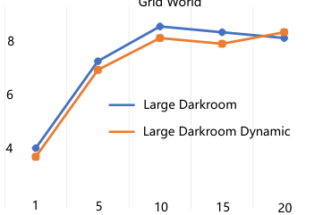

(b) Number of low-level actions

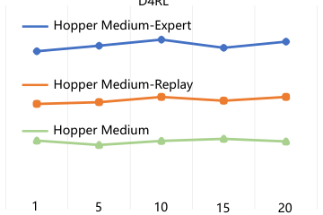

120

100

80

(a) Number of low-level actions

_Figure 6._ Parameter sensitive analysis of _c_ . (a) IDT maintains stable performance to changes in _c_ in dense reward D4RL tasks. (b) As _c_
increases, it becomes easier for the model to receive positive feedback to discover the target location in sparse reward Grid World tasks.

80 (4 eps)

40 (2 eps)

20 (1 eps)

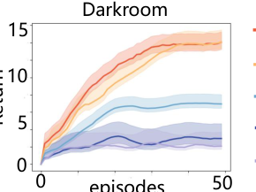

_Figure 7._ Context size: IDT in Darkroom with different context sizes. IDT emerges with trial-and-error ability once the context size is
large enough and across-episodic.

_Table 3._ Results for training and testing times. We report the training time per 10k gradient updates, the testing time for 50 episodes over
Grid World, and 10 episodes over D4RL. As the task length increases, the context length is forced to grow exponentially, resulting in
a square increase in computational costs. In contrast, IDT completes trial-and-error on high-level decisions in sizes smaller than one
episode length, significantly reducing computational costs.

|Context size (step)|Tasks|Training (hour)|Testing (minute)|
|---|---|---|---|
|Context size (step)|Tasks|AT AD Ours|AT AD Ours|

200

2000

4000

Darkroom 0.27 0.23 0.21 0.62 0.61 0.65

Darkroom Hard 0.29 0.28 0.20 0.59 0.56 0.58

Darkroom Dynamic 0.33 0.31 0.21 0.65 0.62 0.67
Dark Key-to-Door 1.12 1.01 0.44 1.89 1.50 1.52

Large Darkroom 5.09 4.70 2.49 67.22 (13 _×_ ) 45.08 (9 _×_ ) 5.27
Large Darkroom Hard 6.48 6.69 2.93 66.81 (11 _×_ ) 44.96 (7 _×_ ) 6.09
Large Darkroom Dynamic 5.71 5.84 2.73 62.06 (11 _×_ ) 42.12 (8 _×_ ) 5.51
Large Dark Key-to-Door 18.87 18.23 3.06 167.07 (27 _×_ ) 76.79 (12 _×_ ) 6.18

HalfCheetah 36.18 37.10 21.90 234.20 (37 _×_ ) 173.11 (28 _×_ ) 6.29
Walker 32.82 33.77 20.08 233.18 (36 _×_ ) 172.34 (26 _×_ ) 6.51
Hopper 24.08 22.23 12.99 232.82 (35 _×_ ) 172.92 (26 _×_ ) 6.56

13

**In-Context Decision Transformer: Reinforcement Learning via Hierarchical Chain-of-Thought**

changes in _c_ in D4RL tasks. In contrast, larger _c_ achieves better performance in Grid World. This is because the Grid World
is designed for tasks with sparse rewards where the agent needs to rely on rewards to reason about the target location. As _c_
increases, it becomes easier for the model to receive positive feedback to discover the target location.

**What Context Size is Required for IDT?** Similar to other in-context RL methods, we also test how context sizes are
required for IDT emerging with trial-and-error ability. As shown in Figure 7, multi-episodic contexts of 4 episodes are
necessary to learn a near-optimal IDT. When the context size is roughly the length of an episode, IDT begins to emerge with
self-improvement. The reason for this is likely that the context is large enough to retrain across-episodic information – e.g.,
at the start of a new episode, the context will be filled with transitions from most of the previous episode.

14

