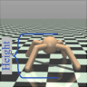

Published as a conference paper at ICLR 2025

## - HIGHLY EFFICIENT SELF-ADAPTIVE REWARD SHAP

### ING FOR REINFORCEMENT LEARNING

**Haozhe Ma** _[∗]_
School of Computing
National University of Singapore
haozhe.ma@u.nus.edu

**Thanh Vinh Vo**
School of Computing
National University of Singapore
votv@nus.edu.sg

**Zhengding Luo** _[∗]_
School of Electrical and Electronic Engineering
Nanyang Technological University
luoz0021@e.ntu.edu.sg

**Kuankuan Sima**
Department of Electrical and Computer Engineering
National University of Singapore
kuankuan ~~s~~ ima@u.nus.edu

**Tze-Yun Leong**
School of Computing
National University of Singapore
leongty@nus.edu.sg

ABSTRACT

Reward shaping is a reinforcement learning technique that addresses the sparsereward problem by providing frequent, informative feedback. We propose an efficient self-adaptive reward-shaping mechanism that uses success rates derived
from historical experiences as shaped rewards. The success rates are sampled
from Beta distributions, which evolve from uncertainty to reliability as data accumulates. Initially, shaped rewards are stochastic to encourage exploration, gradually becoming more certain to promote exploitation and maintain a natural balance between exploration and exploitation. We apply Kernel Density Estimation
(KDE) with Random Fourier Features (RFF) to derive Beta distributions, providing a computationally efficient solution for continuous and high-dimensional state
spaces. Our method, validated on tasks with extremely sparse rewards, improves
sample efficiency and convergence stability over relevant baselines.

1 INTRODUCTION

Environments with extremely sparse rewards present notable challenges for reinforcement learning
(RL). In such contexts, as the reward model lacks immediate signals, agents receive feedback only
after long horizons, making the ability to quickly discover beneficial samples crucial for successful
learning (Ladosz et al., 2022). To address this, a straightforward solution is to reconstruct the reward models by introducing auxiliary signals that assess the agent’s behavior, which has led to the
popular technique of Reward Shaping (RS) (Strehl & Littman, 2008; Gupta et al., 2022). Inverse
reinforcement learning, which extracts reward functions from human knowledge or expert demonstrations, represents an intuitive approach within this framework Arora & Doshi (2021). However,
it heavily relies on extensive human input, which can be difficult to obtain, especially in complex
environments. Alternatively, fully autonomous approaches have emerged as an attractive direction.

Automatically maintained reward shaping can be broadly categorized into two branches: intrinsic
motivation-based rewards, which are task-agnostic, and inherent value-based rewards, which are
typically task-specific. The former mainly introduces exploration bonuses to encourage agents to
explore a wider range of states, commonly by rewarding novel or infrequently visited states (Burda
et al., 2018; Ostrovski et al., 2017; Tang et al., 2017; Bellemare et al., 2016). While these methods
effectively enhance exploration, they tend to overlook the internal values of the states. This can

_∗_ The authors contributed equally to this work.

1

Published as a conference paper at ICLR 2025

lead to the “noisy TV” problem, where agents fixate on highly novel but meaningless regions, thus
trapping them in suboptimal behaviors (Mavor-Parker et al., 2022). In contrast, the latter leverages
high-level heuristics to guide agents in extracting meaningful values from learning experiences,
which helps stabilize convergence. However, these methods often struggle in early exploration due
to non-directional guidance (Ma et al., 2024a; Memarian et al., 2021; Trott et al., 2019).

To overcome the limitations of existing RS methods and combine the advantages of explorationencouraged and inherent value-based rewards, this paper introduces a novel **S** elf- **A** daptive **S** uccess
**R** ate-based reward shaping mechanism ( **SASR** ) [1] . The success rate, defined as the ratio of a state’s
presence in successful trajectories to its total occurrences, serves as an auxiliary reward distilled
from historical experience. This success rate assesses a state’s contribution toward successful task
completion, which closely aligns with the agent’s original objectives, offering informative guidance
for learning. Furthermore, to mitigate overconfidence caused by deterministic success rates, we
adopt Beta distributions to model success rates from a probabilistic perspective. Beta distributions
enable a self-adaptive evolution of confidence in approximating a state’s success rate, ensuring the
system gradually converges to reliable rewards as more data is collected, while avoiding premature
certainty. To derive Beta distributions, we use kernel density estimation (KDE) with random Fourier
features (RFF) to efficiently estimate success and failure counts. The main contributions of this
paper are summarized as follows:

- We propose SASR, an autonomous reward-shaping mechanism for sparse-reward environments.
By deriving success rates from historical experiences aligned with the agent’s optimization objectives, SASR effectively augments the environmental rewards.

- We introduce a novel self-adaptive mechanism. Initially, low-confidence Beta distributions provide uncertain rewards, encouraging exploration by perturbing the reward function and assigning
higher rewards to unvisited states. As more experience accumulates, high-confidence Beta distributions deliver more reliable and precise rewards to enhance exploitation.

- To derive Beta distributions in continuous state spaces, we use KDE with RFF, creating an efficient approach that eliminates the need for additional neural networks or models for learning the
auxiliary shaped rewards, thereby achieving remarkably low computational complexity.

- SASR is evaluated on various extremely sparse-reward tasks, significantly outperforming several
baselines in sample efficiency, learning speed, and convergence stability.

2 RELATED WORK

Reward shaping (RS) methods can generally be categorized based on the source of learning: either from _human knowledge_ or the _agent’s own experiences_ . Techniques that derive reward models
from human knowledge, such as Inverse Reinforcement Learning (IRL) (Arora & Doshi, 2021; Ramachandran & Amir, 2007; Ziebart et al., 2008; Hadfield-Menell et al., 2016) and Inverse Optimal
Control (IOC) (Schultheis et al., 2021; Zhang et al., 2025), aim to extract reward or objective functions from expert demonstrations. Subsequently, transferring the learned reward models to new tasks
has received considerable efforts (Bıyık et al., 2022; Wu et al., 2021; Ellis et al., 2021; Cheng et al.,
2021; Adamczyk et al., 2023; Luo et al., 2024; Lyu et al., 2024). However, these methods rely heavily on human-generated data and often struggle adapting out-of-distribution scenarios. Thus, our
focus shifts toward autonomous self-learning approaches, which can be further divided into _intrin-_
_sic motivation-based_ and _inherent value-based_ rewards depending on the nature of the rewards.

**Intrinsic motivation** -based RS explores general heuristics or task-agnostic metrics to encourage
exploration. Potential-based algorithms define the shaped reward as _γ_ Φ( _s_ _[′]_ ) _−_ Φ( _s_ ), where Φ( _·_ )
is a potential function. This ensures the reward cancels out in the Bellman equation, preserving
the optimal policy (Devlin & Kudenko, 2012; Asmuth et al., 2008; Wiewiora, 2003). However,
designing the potential function highly depends on the environmental dynamics, making it more applicable to model-based RL. More commonly, methods incorporate exploration bonuses to reward
novel states (Mahankali et al., 2024; Liu et al., 2025; Devidze et al., 2022; Badia et al., 2020; Hong
et al., 2018; Eysenbach et al., 2019). Count-based strategies, for instance, track visitation counts and
assign higher rewards to less frequently visited states (Lobel et al., 2023; Machado et al., 2020; Fox
et al., 2018; Fu et al., 2017; Martin et al., 2017). In continuous spaces, state counting is challenging, so Tang et al. (2017) introduced a hash function to discretize the state space, Bellemare et al.

[1The source code is accessible at: https://github.com/mahaozhe/SASR](https://github.com/mahaozhe/SASR)

2

Published as a conference paper at ICLR 2025

(2016) proposed pseudo-counts based on recording probabilities, and Ostrovski et al. (2017) used
PixelCNN Van den Oord et al. (2016) to simulate density. Additionally, random network distillationbased methods measure state novelty by neural networks (Yang et al., 2024b; Liu et al., 2024; Burda
et al., 2018), while curiosity-driven approaches reward agents for encountering surprising or unpredictable states (Yang et al., 2024a; Sun et al., 2022; Burda et al., 2019; Pathak et al., 2017; Zhang
et al., 2023). Although intrinsic motivation has proven effective in enhancing exploration, only
considering novelty while ignoring the inherent values of states can lead to suboptimal policies.

**Inherent value** based RS, on the other hand, focuses on task-related signals that highlight how
states contribute to achieving higher rewards and their underlying significance. For instance, Trott
et al. (2019) introduced additional rewards based on the distance between a state and the target;
Stadie et al. (2020) derived informative reward structures using a Self-Tuning Network to optimize
guidance; Memarian et al. (2021) captured the preferences among different trajectories by ranking
them via a trained classifier; Zheng et al. (2018) minimized the KL-divergence between learned and
original rewards to align their distributions. Mguni et al. (2023) used an auxiliary agent competing
against the original agent in a Markov game; Ma et al. (2024a) introduced ReLara, a collaborative framework where a reward agent automatically generates rewards to guide the policy agent.
Moreover, incorporating multiple agents or hierarchical structures to share and transfer knowledge
through synchronized reward functions is another promising research direction (Park et al., 2023;
Ma et al., 2024b; Gupta et al., 2023; Hu et al., 2020; Raileanu & Rockt¨aschel, 2020; Yi et al., 2022).

3 PRELIMINARIES

**Reinforcement Learning (RL)** aims to train an agent to interact with an environment, which is
commonly modeled as a **Markov Decision Process (MDP)** . An MDP represented as _⟨S, A, T, R, γ⟩_,
involves four main components: _S_ is the state space, _A_ is the action space, _T_ : _S × A × S →_ [0 _,_ 1]
is the probability of transitioning from one state to another given a specific action, and _R_ : _S →_ R
is the reward model. The objective in RL is to learn a policy _π_ ( _a|s_ ) that maximizes the expected
cumulative rewards _G_ = E[ [�] _[∞]_ _t_ =0 _[γ][t][R]_ [(] _[s][t]_ [)]][, where] _[ π]_ [(] _[a][|][s]_ [)][ indicates the likelihood of selecting action]
_a_ in state _s_, and _γ_ is the discount factor (Sutton & Barto, 2018).

**Beta Distribution** is defined on the interval [0 _,_ 1], making it ideal for modeling proportions or
probabilities. It is parameterized by _α_ and _β_, which represent prior counts of successes and failures
of a binary outcome. The probability density function of a Beta-distributed variable _X_ is:

1
_f_ ( _x_ ; _α, β_ ) = (1)
_B_ ( _α, β_ ) _[x][α][−]_ [1][(1] _[ −]_ _[x]_ [)] _[β][−]_ [1] _[,]_

where _B_ ( _α, β_ ) is the beta function. The key attribute of Beta distribution is its adaptability: as more
data accumulates, the values of _α_ and _β_ increase, narrowing the distribution’s shape and increasing confidence in the estimated probabilities. This feature is particularly useful in adaptive online
learning, aligning with our objective of balancing exploration and exploitation.

**Kernel Density Estimation (KDE)** is a non-parametric method for approximating the probability density function of a random variable from data samples. Given _n_ data points _{xi}_ _[n]_ _i_ =1 [, KDE]
smooths these points to approximate the density function as follows:

_h_

_,_ (2)
�

ˆ
_d_ ( _x_ ) = [1]

_nh_

_n_
�

_x −_ _xi_

� _i_ =1 _K_ � _h_

where _h_ is the bandwidth, and _K_ ( _·_ ) is a kernel function such as Gaussian kernel, Laplacian kernel,
or Cauchy kernel. KDE is particularly useful in scenarios where the actual distribution is complex
or poorly defined, such as in continuous state spaces in RL environments.

4 METHODOLOGY

We propose a **S** elf- **A** daptive **S** uccess **R** ate based reward shaping mechanism (SASR) to accelerate
RL algorithms in extremely-sparse-reward environments. Figure 1 illustrates the principles of the
SASR mechanism: The diagram consists of two parts representing the early and late learning stages.
As experiences accumulate with learning progresses, the Beta distributions modeling the success

3

Published as a conference paper at ICLR 2025

Figure 1: A schematic diagram of the self-adaptive success rate based reward shaping mechanism.
KDE: Kernel Density Estimation; RFF: Random Fourier Features.

rates evolve from being stochastic to deterministic. This autonomous adaption closely aligns with
the agent’s exploration-exploitation balance. Section 4.1 introduces how Beta distributions evolve
and how shaped rewards are generated from them. Additionally, to achieve highly efficient computation, we use KDE and RFF to estimate success and failure counts, which are used to derive
the corresponding Beta distributions, as detailed in Section 4.2. Lastly, Section 4.3 presents the
integration of SASR into the RL agent and the overall algorithmic flow.

4.1 SELF-ADAPTIVE SUCCESS RATE SAMPLING

We formulate the augmented reward function in SASR as adding an auxiliary shaped reward _R_ _[S]_ ( _s_ )
to the environmental reward _R_ _[E]_ ( _s_ ), weighting by a factor _λ_ :

_R_ _[SASR]_ ( _s_ ) = _R_ _[E]_ ( _s_ ) + _λR_ _[S]_ ( _s_ ) _._ (3)

We assign the shaped reward _R_ _[S]_ ( _si_ ) of a given state based on its _success rate_ – defined as the ratio of the state’s presence in successful trajectories to its total occurrences. This metric provides a
meaningful reward from a statistical perspective: a higher success rate, reflected in a higher shaped
reward, indicates a greater likelihood that the state will guide the agent toward successful task completion. Formally, the **success rate based shaped reward** _R_ _[S]_ ( _si_ ) is given by:

_NS_ ( _si_ )
_R_ _[S]_ ( _si_ ) = _f_
� _NS_ ( _si_ ) + _NF_ ( _si_ )

_,_ (4)
�

where _NS_ ( _si_ ) and _NF_ ( _si_ ) denote the counts of state _si_ appearing in successful and failed historical

_·_
trajectories, respectively. To enhance scalability and adaptability, _f_ ( ) is a linear scaling function that
maps the original success rate from [0 _,_ 1] to a desired scale [ _Rmin, Rmax_ ], making the magnitude of
the shaped rewards more flexible, i.e., _f_ ( _x_ ) = _Rmin_ + _x ·_ ( _Rmax −_ _Rmin_ ).

Given _NS_ ( _si_ ) and _NF_ ( _si_ ), directly using a deterministic success rate may lead to overconfidence
in the estimation of the true value. To address this, inspired by the principles of Thompson sampling (Thompson, 1933; Agrawal & Goyal, 2012), we adopt a probabilistic perspective for success
rate estimation. Specifically, the success rate of each state is approximated as a variable in a Beta
distribution, with shape parameters set as _α_ = _NS_ ( _si_ ) + 1 and _β_ = _NF_ ( _si_ ) + 1:

1
_ri_ _[S]_ _[∼]_ [Beta][(] _[r]_ [;] _[ α, β]_ [) =] _B_ ( _NS_ ( _si_ ) + 1 _, NF_ ( _si_ ) + 1) _[r][N][S]_ [(] _[s][i]_ [)][(1] _[ −]_ _[r]_ [)] _[N][F]_ [ (] _[s][i]_ [)] _[,]_ (5)

where the _beta function B_ ( _·, ·_ ) is the normalization factor. By sampling from this distribution, we
obtain a probabilistic estimate of the true success rate. This sampled value, _ri_ _[S]_ [, is then processed]
through the scaling function _f_ ( _·_ ) to produce the shaped reward: _R_ _[S]_ ( _si_ ) = _f_ ( _ri_ _[S]_ [)][.]

As _NS_ ( _si_ ) and _NF_ ( _si_ ) progressively increase throughout the learning process, they influence the
shape and sampling variability of the Beta distribution. Generating the shaped reward from these
evolving Beta distributions offers several advantages:

- **Encourage Exploration.** In the early phases, lower counts of _NS_ ( _si_ ) and _NF_ ( _si_ ) result in highervariance Beta distributions, making the sampled rewards more stochastic. This acts as a noisy
perturbation of the reward function. Given that the environmental rewards are mostly zero, this
perturbation optimizes the agent in diverse directions through small adjustments, shifting the anchors from which the stochastic policy samples actions. Meanwhile, early-visited states are likely

4

Published as a conference paper at ICLR 2025

to fail, leading to a decrease in their success rates, while unvisited states retain the initial Beta
distribution _Beta_ (1 _,_ 1), receiving relatively higher rewards. This mechanism drives the agent to
explore novel regions, aligning with the principles of intrinsic motivation.

- **Enhance Exploitation.** In the later phases, as the counts _NS_ ( _si_ ) and _NF_ ( _si_ ) increase, the Beta
distribution gradually sharpens, concentrating generated rewards around the true success rate.
The more certain reward signals with higher confidence highly support the agent’s exploitation,
facilitating faster convergence towards optimal policies.

- **Consistent Optimization.** The peak of the Beta distribution, given by _NS_ ( _si_ ) _/_ ( _NS_ ( _si_ ) +
_NF_ ( _si_ )), equals the success rate. Meanwhile, the expectation, ( _NS_ ( _si_ )+1) _/_ ( _NS_ ( _si_ )+ _NF_ ( _si_ )+
2), closely approximates the success rate. This ensures that, despite stochasticity, the overall reward remains consistent with policy optimization.

4.2 HIGHLY EFFICIENT BETA DISTRIBUTION DERIVATION

In this section, we present how the success and failure counts, _NS_ ( _si_ ) and _NF_ ( _si_ ), are derived
for the Beta distributions. To efficiently estimate these counts in high-dimensional, continuous,
or infinite state spaces, we use Kernel Density Estimation (KDE) to approximate the densities of
successes and failures from accumulated experience. Specifically, we maintain two buffers, _DS_ and
_DF_, to store the states in successful and failed trajectories, respectively. By treating these states as
scattered data instances distributed across the state space, KDE estimates the density as:

˜ 1
_dX_ ( _si_ ) =
_|DX_ _|_

_|DX_ _|_
� _K_ ( _si −_ _sj_ ) _,_ _X ∈{S, F_ _},_ (6)

_j_ =1

where _K_ ( _·_ ) is the kernel function and _|DX_ _|_ is the buffer size. We select Gaussian kernel in our
implementation. The estimated density _d_ [˜] _X_ ( _si_ ) approximates the likelihood of encountering state
_si_ in success or failure scenarios, providing a statistically sound basis for estimating _NX_ ( _si_ ). By
multiplying _d_ [˜] _X_ ( _si_ ) by the total number of observed states _N_, the count _N_ [˜] _X_ ( _si_ ) is estimated as:

2 _h_ [2]

˜ _N_
_NX_ ( _si_ ) = _N ×_ ˜ _dX_ ( _si_ ) =
_|DX_ _|_

_|DX_ _|_
�

_−_ _[||][s][i][ −]_ _[s][j][||]_ [2]

� _j_ =1 exp � 2 _h_ [2]

_,_ _X ∈{S, F_ _},_ (7)
�

where hyperparameter _h_ is the bandwidth of the Gaussian kernel.

We further integrate Random Fourier Features (RFF) (Rahimi & Recht, 2007) to reduce computational complexity, as calculating the Gaussian kernel can be expensive, especially in scenarios
involving high-dimensional state spaces and large buffers. RFF approximates the kernel function of
the original _k_ -dimensional states through an inner product of _M_ -dimensional randomized features:

_K_ ( _si, sj_ ) _≈_ _z_ ( _si_ ) _[T]_ _z_ ( _sj_ ) _,_ _z_ ( _s_ ) =

�

2
(8)
_M_ [cos(] _**[W]**_ _[ T][ s]_ [ +] _**[ b]**_ [)] _[,]_

where _z_ ( _·_ ) is the RFF mapping function with _**W**_ = � _**w**_ [(1)] _, . . .,_ _**w**_ [(] _[M]_ [)][�] _∈_ R _[k][×][M]_, and _**b**_ =
� _b_ [(1)] _, . . ., b_ [(] _[M]_ [)][�] _[T]_ _∈_ R _[M]_ is randomly sampled from the following distributions:

_**w**_ [(] _[m]_ [)] _∼N_ ( **0** _, σ_ _[−]_ [2] _**I**_ _k_ ) _,_ _b_ [(] _[m]_ [)] _∼_ Uniform(0 _,_ 2 _π_ ) _,_ _m_ = 1 _, . . ., M,_ (9)

where _**I**_ _k_ is the _k × k_ identity matrix. Equation 9 is applied for the Gaussian kernel, while different
kernels and the detailed derivations of the RFF method are provided in Appendix A.1.

4.2.1 IMPLEMENTATION DETAILS

**Retention Rate.** We introduce a hyperparameter, the _retention rate ϕ ∈_ (0 _,_ 1], to regulate the
volume and diversity of states stored in the buffers. Rather than storing all encountered states,
we uniformly retain a specific portion of _ϕ_ . The motivations behind this are: (1) adjacent states
in one trajectory tend to be highly similar, especially those near the initial state are repetitive and
uninformative, retaining a portion of states can skip redundant states and increase sample diversity;
(2) using a lower retention rate in the early stage keeps _NS_ and _NF_ lower, resulting in broader Beta
distributions and preventing premature overconfidence.

5

Published as a conference paper at ICLR 2025

**Algorithm 1** Self-Adaptive Success Rate based Reward Shaping

**Require:** Environment _E_ and agent _A_ .
**Require:** Experience replay buffer _D_ .
**Require:** State buffers for success _DS_ and failure _DF_ .
**Require:** RFF mapping function _z_ : R _[k]_ _→_ R _[M]_ . _▷_ Sample _**W**_ and _**b**_ based on Equation 9
1: **for** each trajectory _τ_ = _∅_ **do**
2: **for** each environmental step **do**
3: ( _st, at, st_ +1 _, rt_ _[E]_ [)] _[ ←]_ [CollectTransition][(] _[E][,][ A]_ [)] _▷_ interact with the environment
4: _D ←D ∪{_ ( _st, at, st_ +1 _, rt_ _[E]_ [)] _[}]_ _▷_ store the transition in the replay buffer
5: _τ ←_ _τ ∪{st}_ _▷_ record the state in the trajectory
6: **end for**
7: **if** trajectory is successful: _DS ←DS ∪_ _τ_ _▷_ store the trajectory in the success buffer
8: **else** : _DF ←DF ∪_ _τ_ _▷_ otherwise, store the trajectory in the failure buffer
9: **end for**
10: **for** each update step **do**
13:11:12: _N{N_ ˜˜( _FSs_ = = _t, a z zt, r_ (( _sst_ _[E]_ _tt_ )) _[, s][T][T]_ _zz_ _[t]_ [+1] (( _DD_ [)] _SF_ _[i][} ∼D]_ ) ) _▷_ sample a batch of transitions from the replay buffer _▷▷_ estimate the success countsestimate the failure counts
14: _rt_ _[S]_ _[∼]_ [Beta][(] _[r]_ [; ˜] _[N][S]_ [+ 1] _[,]_ [ ˜] _[N][F]_ [+ 1)] _▷_ sample the success rate from the Beta distribution
15: _rt_ _[SASR]_ = _rt_ _[E]_ [+] _[ λf]_ [(] _[r]_ _t_ _[S]_ [)] _▷_ compute the SASR reward
16: Update agent _A_ with _{_ ( _st, at, rt_ _[SASR]_ _, st_ +1) _i}_
17: **end for**

**Defining Success and Failure.** In tasks where sparse rewards are only given at the end of an episode
to indicate task completion, the entire trajectory can be classified as either a success or failure based
on the episodic reward. For tasks with sparse rewards that do not explicitly indicate task completion,
we segment the trajectories by positive reward occurrences. Specifically, if a reward is obtained
within a pre-defined maximum steps, the corresponding sub-sequence is classified as a success;
otherwise, it is considered a failure.

4.2.2 TIME AND SPACE COMPLEXITY OF SASR

Suppose the buffer size of _DX_ is _D_ and the batch size is _B_ per iteration, the computational complexity to compute the count _NX_ is _O_ ( _MDB_ ), indicating linear complexity (detailed in Appendix A.2).
RFF converts nonlinear kernel computations into linear vector operations, significantly speeding
up computation by leveraging the vectorization capabilities of GPUs (Dongarra et al., 2014). This
highlights its superior efficiency compared to methods that rely on network updates and inferences
involving extensive nonlinear computations.

Given the retention rate _ϕ_, the space complexity of maintaining two buffers is _O_ ( _ϕT_ _|s|_ ), where _T_
is the total iterations and _|s|_ is the size of a single state. Moreover, storage space is significantly
reduced by leveraging the existing replay buffer in off-policy RL algorithms, like SAC (Haarnoja
et al., 2018a) and TD3 (Fujimoto et al., 2018). Specifically, we augment the replay buffer with a flag
that marks each state as either a success (flag = 1) or failure (flag = 0). This allows for the efficient
management of space requirements with minimal overhead from indexing.

For supporting experimental results in time and space complexity, please refer to Appendix A.3.

4.3 THE SASR MECHANISM FOR RL AGENTS

Building upon the SASR reward, for demonstration, we employ the soft actor-critic (SAC) algorithm
by Haarnoja et al. (2018a) as the foundational agent. Let _Qψ_ be the parameterized Q-network and
_πθ_ be the parameterized policy network. The Q-network is optimized by the following loss function:

_L_ ( _ψ_ ) = � _Qψ_ ( _st, at_ ) _−_ � _rt_ _[E]_ [+] _[ λR][S]_ [(] _[s][t]_ [) +] _[ γQ][ψ][′]_ [(] _[s][t]_ [+1] _[, a][t]_ [+1][)] � [�][2] _,_ (10)

where _Qψ′_ is obtained from a secondary frozen target network to maintain a fixed objective (Mnih
et al., 2015). Notably, the environmental reward _rt_ _[E]_ [is retrieved from the replay buffer, conversely,]

6

Published as a conference paper at ICLR 2025

the shaped reward _R_ _[S]_ ( _st_ ) is computed in real-time using the most recently updated _NS_ ( _st_ ) and
_NF_ ( _st_ ), ensuring it reflects the latest learning progress.

We optimize the policy network by maximizing the expected Q-value and the policy entropy
_H_ � _πθ_ ( _·|st_ )�, following Haarnoja et al. (2018b):

_L_ ( _θ_ ) = E _at∼πθ_ ( _·|st_ )� _−_ _Qψ_ ( _st, at_ ) + log _πθ_ ( _at|st_ )� _._ (11)

The flow of the SAC-embedded SASR algorithm is summarized in Algorithm 1.

5 EXPERIMENTS

We evaluate SASR in high-dimensional environments, including four _MuJoCo_ tasks (Todorov et al.,
2012), four robotic tasks (de Lazcano et al., 2023), five _Atari_ games, including the well-known _Mon-_
_tezuma’s Revenge_ Bellemare et al. (2013), and a physical simulation task (Towers et al., 2023), as
shown in Figure 2. All tasks provide extremely sparse rewards, with a reward of 1 granted only upon
reaching the final objective within the maximum permitted steps. To ensure robust validation, we run
10 instances per setting with different random seeds and report the average results. We also maintain
consistent hyperparameters and network architectures across all tasks, detailed in Appendix A.6.

Figure 2: _MuJoCo_, robotic, _Atari_ games and physical simulation tasks in our experiments. Detailed
descriptions and the environmental reward models of each task are provided in Appendix A.7.

5.1 COMPARISON AND DISCUSSION

**Baselines.** We compare SASR with ten baselines to benchmark its performance: (a) the online Distributional Random Network Distillation (DRND) (Yang et al., 2024b), (b) RL with an Assistant
Reward Agent (ReLara) (Ma et al., 2024a), (c) General Function Approximation Reward-Free Exploration (GFA-RFE) (Zhang et al., 2024), (d) RL Optimizing Shaping Algorithm (ROSA) (Mguni
et al., 2023), (e) Exploration-Guided RS (ExploRS) (Devidze et al., 2022), (f) Count-based static
hashing exploration (#Explo) (Tang et al., 2017), (g) Random Network Distillation (RND) (Burda
et al., 2018), (h) Soft Actor-Critic (SAC) (Haarnoja et al., 2018a), (i) Twin Delayed DDPG
(TD3) (Fujimoto et al., 2018), and (j) Proximal Policy Optimization (PPO) (Schulman et al., 2017).
Algorithms (a) to (g) are all reward shaping methods, incorporating either exploration bonuses or
auxiliary agents to shape rewards, while algorithms (h) to (j) are advanced RL algorithms.

Figure 3 shows the learning performance of SASR compared with the baselines, while Table 1
reports the average episodic returns with standard errors achieved by the final models over 100
episodes. Our findings indicate that SASR surpasses the baselines in terms of sample efficiency,
learning stability, and convergence speed. The primary challenge in these environments is the extremely sparse reward given after a long horizon, making exploration crucial for obtaining successful
trajectories in a timely manner. Although exploration strategies of algorithms such as ExploRS, #Explo, and RND are designed to reward novel states, effectively expanding the early exploration space
with direct additional targets, they continue prioritizing novelty, overlooking the implicit values of
these states. As a result, they fail to return to the final objectives.

SASR outperforms the baselines primarily due to its self-adaptive reward evolution mechanism. In
the early phases, SASR encourages exploration by injecting substantial random rewards, optimizing
the agent in multiple directions, and increasing the likelihood of collecting positive samples. Moreover, since most states are initially classified as failures, their success rates decrease. As a result,
unvisited states receive relatively higher rewards, encouraging further exploration. This mechanism

7

Published as a conference paper at ICLR 2025

Figure 3: The learning performance of SASR compared with the baselines.

Table 1: The average episodic returns and standard errors of all models tested over 100 episodes.

Tasks SASR DRND-online ReLara GFA-RFE ROSA ExploRS #Explo RND SAC TD3 PPO

AntStand **94.9** _±_ **0.0** 67.3 _±_ 0.0 90.5 _±_ 1.7 54.2 _±_ 0.0 3.8 _±_ 0.4 5.1 _±_ 0.4 17.9 _±_ 0.0 4.0 _±_ 0.2 31.6 _±_ 0.0 0.0 _±_ 0.0 4.9 _±_ 0.1
AntFar **139.8** _±_ **0.0** 93.2 _±_ 0.0 115.7 _±_ 0.0 86.4 _±_ 0.0 1.0 _±_ 0.0 12.0 _±_ 4.2 75.1 _±_ 0.0 4.6 _±_ 1.6 25.3 _±_ 0.0 1.0 _±_ 0.0 7.8 _±_ 0.0
HumanStand **79.8** _±_ **2.0** 50.6 _±_ 0.0 76.2 _±_ 0.7 58.2 _±_ 0.0 8.8 _±_ 0.0 9.3 _±_ 0.0 72.7 _±_ 0.0 9.3 _±_ 0.1 9.9 _±_ 0.0 5.5 _±_ 0.0 9.0 _±_ 0.1
HumanKeep **195.8** _±_ **0.0** 154.5 _±_ 0.0 194.9 _±_ 0.0 141.5 _±_ 0.0 169.7 _±_ 0.0 182.8 _±_ 0.0 195.0 _±_ 0.0 180.7 _±_ 0.0 2.5 _±_ 0.0 1.0 _±_ 0.0 138.1 _±_ 0.0
RobotReach 170.2 _±_ 0.0 99.8 _±_ 0.0 **187.9** _±_ **0.0** 42.1 _±_ 0.0 0.1 _±_ 0.0 0.7 _±_ 0.0 4.6 _±_ 0.0 69.3 _±_ 0.0 156.5 _±_ 0.0 0.0 _±_ 0.0 79.5 _±_ 0.0
RobotSlide **132.3** _±_ **1.3** 127.2 _±_ 0.0 111.6 _±_ 2.0 115.8 _±_ 2.0 11.2 _±_ 0.9 4.3 _±_ 0.1 3.5 _±_ 0.0 4.8 _±_ 0.2 0.7 _±_ 0.2 0.5 _±_ 0.4 0.2 _±_ 0.2
RobotPush **167.1** _±_ **0.0** 122.2 _±_ 0.0 166.9 _±_ 0.0 49.1 _±_ 0.0 0.0 _±_ 0.0 0.0 _±_ 0.0 3.7 _±_ 0.0 0.0 _±_ 0.0 0.0 _±_ 0.0 0.0 _±_ 0.0 0.0 _±_ 0.0
RobotPickPlace **1.0** _±_ **0.0** **1.0** _±_ **0.0** 1.0 _±_ 0.0 0.5 _±_ 0.0 0.0 _±_ 0.0 0.0 _±_ 0.0 0.0 _±_ 0.0 0.0 _±_ 0.0 0.0 _±_ 0.0 0.0 _±_ 0.0 0.0 _±_ 0.0
Pitfall **93.0** _±_ **0.0** 92.0 _±_ 0.0 40.3 _±_ 0.0 89.4 _±_ 0.0 0.0 _±_ 0.0 57.6 _±_ 0.0 0.0 _±_ 0.0 0.0 _±_ 0.0 4.6 _±_ 0.0 0.5 _±_ 0.0 0.0 _±_ 0.0
Frogger **14.2** _±_ **0.0** 11.7 _±_ 0.0 11.6 _±_ 0.0 7.9 _±_ 0.0 9.8 _±_ 0.0 8.3 _±_ 0.0 11.9 _±_ 0.0 10.5 _±_ 0.0 0.8 _±_ 0.0 0.7 _±_ 0.0 0.0 _±_ 0.0
Montezuma 6737.9 _±_ 0.0 **6828.5** _±_ **0.0** 2421.9 _±_ 0.0 4755.3 _±_ 0.0 4294.4 _±_ 0.0 3971.5 _±_ 0.0 1400.1 _±_ 0.0 5494.3 _±_ 0.0 0.0 _±_ 0.0 0.0 _±_ 0.0 0.0 _±_ 0.0
Solaris **42.1** _±_ **0.0** 21.3 _±_ 0.7 20.3 _±_ 0.0 26.3 _±_ 0.0 0.1 _±_ 0.0 17.0 _±_ 0.0 1.2 _±_ 0.8 9.8 _±_ 0.0 6.0 _±_ 0.0 0.4 _±_ 0.0 1.5 _±_ 0.0
Freeway **22.4** _±_ **0.0** 19.8 _±_ 0.0 21.5 _±_ 0.0 10.1 _±_ 0.0 18.0 _±_ 0.0 17.5 _±_ 0.0 6.9 _±_ 0.0 13.0 _±_ 0.0 0.1 _±_ 0.0 0.2 _±_ 0.0 0.0 _±_ 0.0
MountainCar **1.0** _±_ **0.0** **1.0** _±_ **0.0** **1.0** _±_ **0.0** **1.0** _±_ **0.0** -0.9 _±_ 0.0 -1.0 _±_ 0.0 **1.0** _±_ **0.0** **1.0** _±_ **0.0** -0.1 _±_ 0.0 0.0 _±_ 0.0 0.9 _±_ 0.0

resembles intrinsic motivation, assigning higher rewards to novel states, and effectively guiding the
agent to expand the exploration space. As more data is collected, the success rate estimation becomes more accurate, the shaped reward provides more reliable guidance, enhancing exploitation
and stabilizing convergence. Together, these strategies improve SASR’s sample efficiency and convergence stability in challenging tasks.

While ReLara used a similar exploration mechanism by perturbing reward functions, it relies on an
independent black-box agent, requiring more iterations to converge. In contrast, SASR’s success
rate sampling is more direct, reducing delays in acquiring valuable information. ReLara’s advantage
lies in incorporating the policy agent’s actions into reward construction, as seen in the _RobotReach_
task, where the target point is randomly selected in each episode. In this case, ReLara outperforms
SASR due to access to action information. However, SASR can achieve the same by incorporating
actions as additional features in the state vector.

5.2 EFFECT OF SELF-ADAPTIVE SUCCESS RATE SAMPLING

SASR introduces a novel self-adaptive mechanism that balances exploration and exploitation by
modulating the randomness of the shaped rewards. To further investigate the effect of this mechanism, we use the _AntStand_ task as a case study, analyzing the shaped rewards learned at different
training stages. Figure 4 (bottom) shows the learning curve, while Figure 4 (top) illustrates the distributions of generated rewards over the “height of the ant” feature, a dimension in the state vector.

Figure 4: Distributions of the shaped rewards over the height of the ant robot in the _AntStand_ task at
different training stages. Red diamonds represent the estimated success rate, while the blue polylines
show the actual shaped rewards sampled from the Beta distribution.

As learning progresses, the shaped rewards exhibit two key attributes: values transition from random to meaningful, and variance decreases from uncertain to deterministic. Although the sampled

8

Published as a conference paper at ICLR 2025

Figure 5: The density of visited states in the _MountainCar_ task for four training periods.

rewards fluctuate, their means gradually show a positive linear correlation with the robot’s height.
In the early phases, the shaped rewards contain significant randomness due to high uncertainty.
While these random signals offer limited information, they drive the agent to take small optimization steps in diverse directions, effectively shifting the policy anchors, expanding the action space
sampled from SAC’s stochastic policy, promoting exploration, and increasing sample diversity. In
later phases, rewards stabilizes, closely aligning with the robot’s height – a meaningful and intuitive
metric – enhancing the agent’s exploitation.

To further investigate SASR’s exploration behavior, we compare the visited state density throughout
training in the _MountainCar_ task with five representative exploration strategies: (1) ReLara, which
perturbs both rewards and actions; (2) #Explo and (3) RND, which rewards novel states; (4) SAC,
which uses entropy-regularized exploration; and (5) NoisyNet (Fortunato et al., 2018), which perturbs network weights. The state density for every 25k steps is shown in Figure 5. We observe that
SASR progressively covers a wider range of the state space. From 50k to 100k steps, SASR reaches
positions near the goal, driven by its success rate mechanism. In contrast, ReLara and RND cover
similar ranges to SASR, but are less smooth and take longer to reach the right side. #Explo shows
no clear rightward shift, as it prioritizes novelty and ignores the inherent value of states. SAC’s exploration is relatively narrow, making it prone to getting trapped in local optima. NoisyNet’s range
narrows over time as perturbations diminish through optimization. Overall, SASR demonstrates
more effective exploration and collects valuable samples sooner, leading to faster convergence.

5.3 ABLATION STUDY

We conduct ablation studies to investigate key components of SASR. We select six representative
tasks and report the experimental results, with quantitative data provided in Appendix A.5.

**Sampling from Beta distributions.** (Figure 6a) We examine a variant of SASR that omits Beta distribution sampling, instead directly using the success rate _NS_ ( _si_ ) _/_ ( _NS_ ( _si_ ) + _NF_ ( _si_ )). In the early
stages, limited experience makes this success rate an unreliable estimate, and using a fixed, overly
confident value can mislead the agent. Furthermore, skipping Beta distribution sampling eliminates
exploration driven by random rewards, leading to narrower exploration. The results highlight the
critical role of Beta distribution sampling in effective learning.

**Reward function over state-action pair.** (Figure 6b) We extend SASR with a reward function
over state-action pairs, _r_ ( _s, a_ ). The comparison results show that both settings perform similarly.
However, encoding actions into the reward function increases dimensionality, complicating density
estimation and correlation assessment. Furthermore, the state and action vectors may have different
distributions, potentially reducing KDE estimation accuracy.

**Retention rate** _ϕ_ **.** (Figure 6c) The retention rate directly influences the confidence level of Beta
distributions. A high retention rate ( _ϕ_ = 1) preserves all samples, resulting in a densely populated,
redundant state pool, which makes the Beta distribution prematurely overconfident and degrades
performance. Conversely, a low retention rate ( _ϕ_ = 0 _._ 01) slows convergence as more iterations are
required to gather sufficient samples. The results suggest that an appropriate retention rate is crucial.

9

Published as a conference paper at ICLR 2025

(a) The impact of omitting Beta distribution sampling on the performance of SASR.

(b) Learning performance of SASR with shaped reward function _R_ _[S]_ ( _s, a_ ) and _R_ _[S]_ ( _s_ ).

(c) Learning performance of SASR with different retention rates _ϕ_ .

(d) Learning performance of SASR with different RFF feature dimensions _M_ .

(e) Learning performance of SASR with different shaped reward weight factors _λ_ .

Figure 6: Ablation study: the impact of key components on the performance of SASR.

**RFF feature dimensions** _M_ **.** (Figure 6d) SASR shows relatively low sensitivity to _M_, provided
it is sufficiently large to capture the complexity of the states. Results show that values like _M_ =
500 _,_ 1000 _,_ 2000 all yield similar performance, while significantly lower dimensions, such as _M_ =
50, degrade performance. These findings align with the original RFF study (Rahimi & Recht, 2007).

**Shaped reward weight factor** _λ_ **.** (Figure 6e) SASR performs better with intermediate values like
_λ_ = 0 _._ 4 _,_ 0 _._ 6 _,_ 0 _._ 8. At _λ_ = 0 _._ 2, the minimal shaped reward scale reduces state differentiation, leading
to suboptimal performance. At _λ_ = 1, aligning the shaped reward scale with the environmental
reward introduces excessive uncertainty and randomness, potentially overwhelming feedback and
hindering learning. The findings emphasize that maintaining a balanced reward scale is important
for optimal learning outcomes.

6 CONCLUSION AND DISCUSSION

In this paper, we propose SASR, a self-adaptive reward shaping algorithm based on success rates to
address the sparse-reward challenge. SASR achieves a balance between exploration and exploitation
by generating shaped rewards from evolving Beta distributions. Experiments demonstrate that this
adaptability significantly improves the agent’s convergence speed. Additionally, the use of KDE
and RFF provides a computationally efficient approach to deriving Beta distributions. This mechanism also offers a sound alternative to traditional count-based RS strategies, adapting effectively to
continuous environments. Our evaluations confirm the superior performance of SASR in terms of
sample efficiency and learning stability.

While SASR is designed for sparse-reward environments, in dense-reward settings, the additional
shaped rewards may be unnecessary. Extending SASR to such scenarios presents a promising direction for further research. Moreover, the derivation of Beta distributions relies on the samples stored
in the success and failure buffers. Currently, our method does not consider the relationships or varying importance of different states within the same trajectory, making it sensitive to the retention
rate. Therefore, developing an adaptive retention rate or improved buffer management mechanisms
is crucial for future improvement.

10

Published as a conference paper at ICLR 2025

ACKNOWLEDGEMENT

This research is supported by the National Research Foundation Singapore and DSO National Laboratories under the AI Singapore Programme (Award Number: AISG2-RP-2020-016). This research
is also partially supported by an Academic Research Grant No. MOE-T2EP20121-0015 from the
Ministry of Education in Singapore.

REFERENCES

Jacob Adamczyk, Argenis Arriojas, Stas Tiomkin, and Rahul V Kulkarni. Utilizing prior solutions
for reward shaping and composition in entropy-regularized reinforcement learning. In _Proceed-_
_ings of the AAAI Conference on Artificial Intelligence_, pp. 6658–6665, 2023.

Shipra Agrawal and Navin Goyal. Analysis of thompson sampling for the multi-armed bandit problem. In _Conference on Learning Theory_, pp. 39–1. JMLR Workshop and Conference Proceedings,
2012.

Saurabh Arora and Prashant Doshi. A survey of inverse reinforcement learning: Challenges, methods and progress. _Artificial Intelligence_, 297:103500, 2021.

John Asmuth, Michael L Littman, and Robert Zinkov. Potential-based shaping in model-based
reinforcement learning. In _AAAI Conference on Artificial Intelligence_, pp. 604–609, 2008.

Adri`a Puigdom`enech Badia, Pablo Sprechmann, Alex Vitvitskyi, Daniel Guo, Bilal Piot, Steven
Kapturowski, Olivier Tieleman, Martin Arjovsky, Alexander Pritzel, Andrew Bolt, et al. Never
give up: Learning directed exploration strategies. In _International Conference on Learning Rep-_
_resentations_, 2020.

Marc Bellemare, Sriram Srinivasan, Georg Ostrovski, Tom Schaul, David Saxton, and Remi Munos.
Unifying count-based exploration and intrinsic motivation. _Advances in Neural Information Pro-_
_cessing Systems_, 29, 2016.

Marc G Bellemare, Yavar Naddaf, Joel Veness, and Michael Bowling. The arcade learning environment: An evaluation platform for general agents. _Journal of Artificial Intelligence Research_, 47:
253–279, 2013.

Erdem Bıyık, Dylan P Losey, Malayandi Palan, Nicholas C Landolfi, Gleb Shevchuk, and Dorsa
Sadigh. Learning reward functions from diverse sources of human feedback: Optimally integrating demonstrations and preferences. _The International Journal of Robotics Research_, 41(1):
45–67, 2022.

Yuri Burda, Harrison Edwards, Amos Storkey, and Oleg Klimov. Exploration by random network
distillation. In _International Conference on Learning Representations_, 2018.

Yuri Burda, Harri Edwards, Deepak Pathak, Amos Storkey, Trevor Darrell, and Alexei A Efros.
Large-scale study of curiosity-driven learning. In _International Conference on Learning Repre-_
_sentations_, 2019.

Ching-An Cheng, Andrey Kolobov, and Adith Swaminathan. Heuristic-guided reinforcement learning. _Advances in Neural Information Processing Systems_, 34:13550–13563, 2021.

Rodrigo de Lazcano, Kallinteris Andreas, Jun Jet Tai, Seungjae Ryan Lee, and Jordan
[Terry. Gymnasium robotics, 2023. URL http://github.com/Farama-Foundation/](http://github.com/Farama-Foundation/Gymnasium-Robotics)
[Gymnasium-Robotics.](http://github.com/Farama-Foundation/Gymnasium-Robotics)

Rati Devidze, Parameswaran Kamalaruban, and Adish Singla. Exploration-guided reward shaping
for reinforcement learning under sparse rewards. _Advances in Neural Information Processing_
_Systems_, 35:5829–5842, 2022.

Sam Michael Devlin and Daniel Kudenko. Dynamic potential-based reward shaping. In _Proceedings_
_of the 11th International Conference on Autonomous Agents and Multiagent Systems_, pp. 433–
440. IFAAMAS, 2012.

11

Published as a conference paper at ICLR 2025

Jack Dongarra, Mark Gates, Azzam Haidar, Jakub Kurzak, Piotr Luszczek, Stanimire Tomov, and
Ichitaro Yamazaki. Accelerating numerical dense linear algebra calculations with gpus. _Numeri-_
_cal computations with GPUs_, pp. 3–28, 2014.

Christian Ellis, Maggie Wigness, John Rogers, Craig Lennon, and Lance Fiondella. Risk averse
bayesian reward learning for autonomous navigation from human demonstration. In _IEEE/RSJ_
_International Conference on Intelligent Robots and Systems_, pp. 8928–8935. IEEE, 2021.

Benjamin Eysenbach, Abhishek Gupta, Julian Ibarz, and Sergey Levine. Diversity is all you need:
Learning skills without a reward function. In _International Conference on Learning Representa-_
_tions_, 2019.

Meire Fortunato, Mohammad Gheshlaghi Azar, Bilal Piot, Jacob Menick, Matteo Hessel, Ian Osband, Alex Graves, Volodymyr Mnih, Remi Munos, Demis Hassabis, Olivier Pietquin, Charles
Blundell, and Shane Legg. Noisy networks for exploration. In _International Conference on_
_Learning Representations_, 2018.

Lior Fox, Leshem Choshen, and Yonatan Loewenstein. Dora the explorer: Directed outreaching
reinforcement action-selection. In _International Conference on Learning Representations_, 2018.

Justin Fu, John Co-Reyes, and Sergey Levine. Ex2: Exploration with exemplar models for deep
reinforcement learning. _Advances in neural information processing systems_, 30, 2017.

Scott Fujimoto, Herke Hoof, and David Meger. Addressing function approximation error in actorcritic methods. In _International Conference on Machine Learning_, pp. 1587–1596. PMLR, 2018.

Abhishek Gupta, Aldo Pacchiano, Yuexiang Zhai, Sham Kakade, and Sergey Levine. Unpacking reward shaping: Understanding the benefits of reward engineering on sample complexity. _Advances_
_in Neural Information Processing Systems_, 35:15281–15295, 2022.

Dhawal Gupta, Yash Chandak, Scott Jordan, Philip S Thomas, and Bruno C da Silva. Behavior
alignment via reward function optimization. _Advances in Neural Information Processing Systems_,
36, 2023.

Tuomas Haarnoja, Aurick Zhou, Pieter Abbeel, and Sergey Levine. Soft actor-critic: Off-policy
maximum entropy deep reinforcement learning with a stochastic actor. In _International Confer-_
_ence on Machine Learning_, pp. 1861–1870. PMLR, 2018a.

Tuomas Haarnoja, Aurick Zhou, Kristian Hartikainen, George Tucker, Sehoon Ha, Jie Tan, Vikash
Kumar, Henry Zhu, Abhishek Gupta, Pieter Abbeel, et al. Soft actor-critic algorithms and applications. _arXiv preprint arXiv:1812.05905_, 2018b.

Dylan Hadfield-Menell, Stuart J Russell, Pieter Abbeel, and Anca Dragan. Cooperative inverse
reinforcement learning. _Advances in Neural Information Processing Systems_, 29, 2016.

Zhang-Wei Hong, Tzu-Yun Shann, Shih-Yang Su, Yi-Hsiang Chang, Tsu-Jui Fu, and Chun-Yi Lee.
Diversity-driven exploration strategy for deep reinforcement learning. _Advances in neural infor-_
_mation processing systems_, 31, 2018.

Yujing Hu, Weixun Wang, Hangtian Jia, Yixiang Wang, Yingfeng Chen, Jianye Hao, Feng Wu, and
Changjie Fan. Learning to utilize shaping rewards: A new approach of reward shaping. _Advances_
_in Neural Information Processing Systems_, 33:15931–15941, 2020.

Pawel Ladosz, Lilian Weng, Minwoo Kim, and Hyondong Oh. Exploration in deep reinforcement
learning: A survey. _Information Fusion_, 85:1–22, 2022.

Tenglong Liu, Yang Li, Yixing Lan, Hao Gao, Wei Pan, and Xin Xu. Adaptive advantage-guided
policy regularization for offline reinforcement learning. In _Forty-first International Conference_
_on Machine Learning_, volume 235, pp. 31406 – 31424. PMLR, 2024.

Tenglong Liu, Jianxiong Li, Yinan Zheng, Haoyi Niu, Yixing Lan, Xin Xu, and Xianyuan Zhan.
Skill expansion and composition in parameter space. In _International Conference on Learning_
_Representations_, 2025.

12

Published as a conference paper at ICLR 2025

Sam Lobel, Akhil Bagaria, and George Konidaris. Flipping coins to estimate pseudocounts for
exploration in reinforcement learning. In _International Conference on Machine Learning_, pp.
22594–22613. PMLR, 2023.

Zhengding Luo, Haozhe Ma, Dongyuan Shi, and Woon-Seng Gan. Gfanc-rl: Reinforcement
learning-based generative fixed-filter active noise control. _Neural Networks_, 180:106687, 2024.

Jiafei Lyu, Xiaoteng Ma, Le Wan, Runze Liu, Xiu Li, and Zongqing Lu. Seabo: A simple searchbased method for offline imitation learning. In _International Conference on Learning Represen-_
_tations_, 2024.

Haozhe Ma, Kuankuan Sima, Thanh Vinh Vo, Di Fu, and Tze-Yun Leong. Reward shaping for
reinforcement learning with an assistant reward agent. In _Forty-first International Conference on_
_Machine Learning_, volume 235, pp. 33925–33939. PMLR, 2024a.

Haozhe Ma, Thanh Vinh Vo, and Tze-Yun Leong. Mixed-initiative bayesian sub-goal optimization
in hierarchical reinforcement learning. In _Proceedings of the 23rd International Conference on_
_Autonomous Agents and Multiagent Systems_, pp. 1328–1336, 2024b.

Marlos C Machado, Marc G Bellemare, and Michael Bowling. Count-based exploration with the
successor representation. In _Proceedings of the AAAI Conference on Artificial Intelligence_, pp.
5125–5133, 2020.

Srinath Mahankali, Zhang-Wei Hong, Ayush Sekhari, Alexander Rakhlin, and Pulkit Agrawal. Random latent exploration for deep reinforcement learning. _International Conference on Machine_
_Learning_, 2024.

Jarryd Martin, S Suraj Narayanan, Tom Everitt, and Marcus Hutter. Count-based exploration in feature space for reinforcement learning. In _Proceedings of the 26th International Joint Conference_
_on Artificial Intelligence_, pp. 2471–2478, 2017.

Augustine Mavor-Parker, Kimberly Young, Caswell Barry, and Lewis Griffin. How to stay curious
while avoiding noisy tvs using aleatoric uncertainty estimation. In _International Conference on_
_Machine Learning_, pp. 15220–15240. PMLR, 2022.

Farzan Memarian, Wonjoon Goo, Rudolf Lioutikov, Scott Niekum, and Ufuk Topcu. Self-supervised
online reward shaping in sparse-reward environments. In _IEEE/RSJ International Conference on_
_Intelligent Robots and Systems_, pp. 2369–2375. IEEE, 2021.

David Mguni, Taher Jafferjee, Jianhong Wang, Nicolas Perez-Nieves, Wenbin Song, Feifei Tong,
Matthew Taylor, Tianpei Yang, Zipeng Dai, Hui Chen, et al. Learning to shape rewards using a
game of two partners. In _AAAI Conference on Artificial Intelligence_, pp. 11604–11612, 2023.

Volodymyr Mnih, Koray Kavukcuoglu, David Silver, Andrei A Rusu, Joel Veness, Marc G Bellemare, Alex Graves, Martin Riedmiller, Andreas K Fidjeland, Georg Ostrovski, et al. Human-level
control through deep reinforcement learning. _Nature_, 518(7540):529–533, 2015.

Georg Ostrovski, Marc G Bellemare, A¨aron Oord, and R´emi Munos. Count-based exploration with
neural density models. In _International Conference on Machine Learning_, pp. 2721–2730. PMLR,
2017.

Seohong Park, Kimin Lee, Youngwoon Lee, and Pieter Abbeel. Controllability-aware unsupervised
skill discovery. In _International Conference on Machine Learning_, pp. 27225–27245. PMLR,
2023.

Deepak Pathak, Pulkit Agrawal, Alexei A Efros, and Trevor Darrell. Curiosity-driven exploration
by self-supervised prediction. In _International Conference on Machine Learning_, pp. 2778–2787.
PMLR, 2017.

Ali Rahimi and Benjamin Recht. Random features for large-scale kernel machines. _Advances in_
_Neural Information Processing Systems_, 20, 2007.

13

Published as a conference paper at ICLR 2025

Roberta Raileanu and Tim Rockt¨aschel. Ride: Rewarding impact-driven exploration for
procedurally-generated environments. In _International Conference on Learning Representations_,
2020.

Deepak Ramachandran and Eyal Amir. Bayesian inverse reinforcement learning. In _International_
_Joint Conference on Artificial Intelligence_, volume 7, pp. 2586–2591, 2007.

John Schulman, Filip Wolski, Prafulla Dhariwal, Alec Radford, and Oleg Klimov. Proximal policy
optimization algorithms. _arXiv preprint arXiv:1707.06347_, 2017.

Matthias Schultheis, Dominik Straub, and Constantin A Rothkopf. Inverse optimal control adapted
to the noise characteristics of the human sensorimotor system. _Advances in Neural Information_
_Processing Systems_, 34:9429–9442, 2021.

Bradly Stadie, Lunjun Zhang, and Jimmy Ba. Learning intrinsic rewards as a bi-level optimization
problem. In _Conference on Uncertainty in Artificial Intelligence_, pp. 111–120. PMLR, 2020.

Alexander L Strehl and Michael L Littman. An analysis of model-based interval estimation for
markov decision processes. _Journal of Computer and System Sciences_, 74(8):1309–1331, 2008.

Hao Sun, Lei Han, Rui Yang, Xiaoteng Ma, Jian Guo, and Bolei Zhou. Exploit reward shifting
in value-based deep-RL: Optimistic curiosity-based exploration and conservative exploitation via
linear reward shaping. _Advances in Neural Information Processing Systems_, 35:37719–37734,
2022.

Richard S Sutton and Andrew G Barto. _Reinforcement learning: An introduction_ . MIT press, 2018.

Haoran Tang, Rein Houthooft, Davis Foote, Adam Stooke, OpenAI Xi Chen, Yan Duan, John Schulman, Filip DeTurck, and Pieter Abbeel. # exploration: A study of count-based exploration for
deep reinforcement learning. _Advances in Neural Information Processing Systems_, 30, 2017.

William R Thompson. On the likelihood that one unknown probability exceeds another in view of
the evidence of two samples. _Biometrika_, 25(3-4):285–294, 1933.

Emanuel Todorov, Tom Erez, and Yuval Tassa. Mujoco: A physics engine for model-based control.
In _IEEE/RSJ International Conference on Intelligent Robots and Systems_, pp. 5026–5033. IEEE,
2012.

Mark Towers, Jordan K. Terry, Ariel Kwiatkowski, John U. Balis, Gianluca de Cola, Tristan Deleu,
Manuel Goul˜ao, Andreas Kallinteris, Arjun KG, Markus Krimmel, Rodrigo Perez-Vicente, Andrea Pierr´e, Sander Schulhoff, Jun Jet Tai, Andrew Tan Jin Shen, and Omar G. Younis. Gymna[sium, March 2023. URL https://zenodo.org/record/8127025.](https://zenodo.org/record/8127025)

Alexander Trott, Stephan Zheng, Caiming Xiong, and Richard Socher. Keeping your distance:
Solving sparse reward tasks using self-balancing shaped rewards. _Advances in Neural Information_
_Processing Systems_, 32, 2019.

Aaron Van den Oord, Nal Kalchbrenner, Lasse Espeholt, Oriol Vinyals, Alex Graves, et al. Conditional image generation with pixelcnn decoders. _Advances in Neural Information Processing_
_Systems_, 29, 2016.

Eric Wiewiora. Potential-based shaping and q-value initialization are equivalent. _Journal of Artificial_
_Intelligence Research_, 19:205–208, 2003.

Rand R Wilcox. _Introduction to robust estimation and hypothesis testing_ . Academic press, 2011.

Yuchen Wu, Melissa Mozifian, and Florian Shkurti. Shaping rewards for reinforcement learning
with imperfect demonstrations using generative models. In _IEEE International Conference on_
_Robotics and Automation_, pp. 6628–6634. IEEE, 2021.

Kai Yang, Zhirui Fang, Xiu Li, and Jian Tao. Cmbe: Curiosity-driven model-based exploration
for multi-agent reinforcement learning in sparse reward settings. In _2024 International Joint_
_Conference on Neural Networks (IJCNN)_, pp. 1–8. IEEE, 2024a.

14

Published as a conference paper at ICLR 2025

Kai Yang, Jian Tao, Jiafei Lyu, and Xiu Li. Exploration and anti-exploration with distributional random network distillation. In _Forty-first International Conference on Machine Learning_ . PMLR,
2024b.

Yuxuan Yi, Ge Li, Yaowei Wang, and Zongqing Lu. Learning to share in networked multi-agent
reinforcement learning. _Advances in Neural Information Processing Systems_, 35:15119–15131,
2022.

Hai Zhang, Hang Yu, Junqiao Zhao, Di Zhang, Chang Huang, Hongtu Zhou, Xiao Zhang, and Chen
Ye. How to fine-tune the model: Unified model shift and model bias policy optimization. In
_Thirty-seventh Conference on Neural Information Processing Systems_, 2023.

Hai Zhang, Boyuan Zheng, Tianying Ji, Jinhang Liu, Anqi Guo, Junqiao Zhao, and Lanqing Li.
Scrutinize what we ignore: Reining in task representation shift of context-based offline meta
reinforcement learning. In _International Conference on Learning Representations_, 2025.

Junkai Zhang, Weitong Zhang, Dongruo Zhou, and Quanquan Gu. Uncertainty-aware reward-free
exploration with general function approximation. _International Conference on Machine Learning_,
2024.

Zeyu Zheng, Junhyuk Oh, and Satinder Singh. On learning intrinsic rewards for policy gradient
methods. _Advances in Neural Information Processing Systems_, 31, 2018.

Brian D Ziebart, Andrew L Maas, J Andrew Bagnell, Anind K Dey, et al. Maximum entropy inverse
reinforcement learning. In _AAAI Conference on Artificial Intelligence_, volume 8, pp. 1433–1438.
Chicago, IL, USA, 2008.

15

Published as a conference paper at ICLR 2025

A APPENDIX

A.1 DERIVATION OF RANDOM FOURIER FEATURES

We incorporate Random Fourier Features (RFF) (Rahimi & Recht, 2007) to approximate the kernel
functions in the KDE process for the SASR algorithm. Let the original state be _k_ -dimensional,
denoted as _**s**_ _∈_ R _[k]_, and the kernel function be _k_ ( _**s**_ _i,_ _**s**_ _j_ ). RFF approximates the kernel function
by projecting the input _k_ -dimensional space into a _M_ -dimensional feature space using a mapping
function _z_ : R _[k]_ _→_ R _[M]_ . The RFF-based kernel function is then defined as follows:
_k_ ( _**s**_ _i,_ _**s**_ _j_ ) _≈_ _z_ ( _**s**_ _i_ ) _[T]_ _z_ ( _**s**_ _j_ ) _,_ (12)
We provide the derivation of the RFF approximation in this section.

First, we clarify that RFF primarily targets shift-invariant kernels, that satisfy _k_ ( _**s**_ _i,_ _**s**_ _j_ ) = _k_ ( _**s**_ _i−_ _**s**_ _j_ ).
Common shift-invariant kernels include Gaussian kernels, Laplacian kernels, and Cauchy kernels.
Given a shift-invariant kernel function _k_ (∆), we perform the inverse Fourier transform:

_k_ ( _**s**_ _i,_ _**s**_ _j_ ) = (13)
�R _[k][ p]_ [(] _**[w]**_ [)] _[e]_ [i] _**[w]**_ _[T]_ [ (] _**[s]**_ _[i][−]_ _**[s]**_ _[j]_ [)] _[d]_ _**[w]**_

= E _**w**_ � _e_ [i] _**[w]**_ _[T]_ [ (] _**[s]**_ _[i][−]_ _**[s]**_ _[j]_ [)][�] _,_ (14)
where we can consider _**w**_ _∼_ _p_ ( _**w**_ ) based on the Bochner’s theorem, and _p_ ( _**w**_ ) is called the _spectral_
_distribution_ of kernel function. For the three types of shift-invariant kernels, the corresponding
spectral distributions are listed in Table 2:

Table 2: Some shift-invariant kernels and their associated spectral distributions.

**Kernel** **Kernel function**, _k_ ( _**s**_ _i −_ _**s**_ _j_ ) **Spectral density**, _p_ ( _**w**_ )

Gaussian exp _−_ _[∥]_ _**[s]**_ _[i][ −]_ _**[s]**_ _[j][∥]_ 2 [2]
~~�~~ _h_ [2]

~~_√_~~ _h_ _−_ _[h][∥]_ _**[w]**_ _[∥]_ 2 [2]
~~�~~ 2 ~~_[√]_~~ ~~_π_~~ [exp] ~~�~~ 4

~~�~~

_M_
Laplacian exp � _−∥_ _**s**_ _i −_ _**s**_ _j∥_ 1� �

_m_ =1

1
_π_ (1 + _wd_ [2][)]

Cauchy

_k_
�

_i_ =1

2
exp � _−∥_ _**w**_ _∥_ 1�
_π_ ~~�~~ 1 + ( _**s**_ _i −_ _**s**_ _j_ ) [2] ~~[�]~~

Next, we perform the Euler’s formula transformation, which retains only the cosine term since we
are dealing with real-valued functions, the kernel function can be further derived as:

_k_ ( _**s**_ _i,_ _**s**_ _j_ ) = E _**w**_ � _e_ [i] _**[w]**_ _[T]_ [ (] _**[s]**_ _[i][−]_ _**[s]**_ _[j]_ [)][�] (15)

= E _**w**_ � cos( _**w**_ _[T]_ ( _**s**_ _i −_ _**s**_ _j_ ))� (16)

= E _**w**_ � cos( _**w**_ _[T]_ ( _**s**_ _i −_ _**s**_ _j_ ))� + E _**w**_ �E _b_ [cos( _**w**_ _[T]_ ( _**s**_ _i_ + _**s**_ _j_ ) + 2 _b_ )]� (17)

= E _**w**_ �E _b_ [cos( _**w**_ _[T]_ ( _**s**_ _i −_ _**s**_ _j_ )) + cos( _**w**_ _[T]_ ( _**s**_ _i_ + _**s**_ _j_ ) + 2 _b_ )]� (18)

= E _**w**_ �E _b_ [ _√_ 2 cos( _**w**_ _[T]_ _**s**_ _i_ + _b_ ) _√_

2 cos( _**w**_ _[T]_ _**s**_ _j_ + _b_ )]� _,_ (19)

where _b ∼_ Uniform(0 _,_ 2 _π_ ). Equation 17 holds since E _b∼_ Uniform(0 _,_ 2 _π_ )� cos( _t_ + 2 _b_ )� = 0 for any _t_ .
Equation 19 is obtained from cos( _A −_ _B_ ) + cos( _A_ + _B_ ) = 2 cos( _A_ ) cos( _B_ ), where _A_ = _**w**_ _[T]_ _**s**_ _i_ + _b_,
_B_ = _**w**_ _[T]_ _**s**_ _j_ + _b_ .

We define the mapping _z_ _**w**_ _,b_ ( _**s**_ ) = _√_ 2 cos( _**w**_ _[T]_ _**s**_ + _b_ ), then the kernel function can be approxi
mated by the inner product of two vectors and the expectation can be approximated by Monte Carlo
sampling:
_k_ ( _**s**_ _i,_ _**s**_ _j_ ) = E _**w**_ �E _b_ [ _z_ _**w**_ _,b_ ( _**s**_ _i_ ) _z_ _**w**_ _,b_ ( _**s**_ _j_ )]� (20)

_≈_ [1]

_M_

_M_
� _z_ _**w**_ _d,bd_ ( _**s**_ _i_ ) _z_ _**w**_ _d,bd_ ( _**s**_ _j_ ) (21)

_m_ =1

= _z_ ( _**s**_ _i_ ) _[T]_ _z_ ( _**s**_ _j_ ) _._ (22)

16

Published as a conference paper at ICLR 2025

Therefore, we have derived the mapping function _z_ ( _**s**_ ) = �2 _/M_ cos( _**W**_ _[T]_ _**s**_ + _**b**_ ), where _**W**_ _∈_

R _[M]_ _[×][k]_ and _**b**_ _∈_ R _[M]_ . The RFF-based kernel function can be approximated by the inner product of
the mapped features in the _M_ -dimensional space.

A.2 COMPUTATIONAL COMPLEXITY

In this section, we derive the computational complexity to retrieve the success or failure counts
_NS_ and _NF_ for each iteration. Suppose the buffer size of _DX_ is _D_, the batch size of _B_ is _B_, the
corresponding counts are retrieved by calculating:

_N_ ˜ _X_ = _N × z_ ( _**B**_ ) _[T]_ _z_ ( _**D**_ _X_ ) _,_ (23)

where the mapping function is defined as:

_z_ ( _**s**_ ) =

�

2
_M_ [cos(] _**[W]**_ _[ T]_ _**[ s]**_ [ +] _**[ b]**_ [)] _[,]_ _**W**_ _∈_ R _[k][×][M]_ _,_ _**b**_ _∈_ R _[M]_ _._ (24)

For each state, the mapping function calculation involves:

1. Matrix multiplication _**W**_ _[T]_ _**s**_ : _kM_ .
2. Addition _**W**_ _[T]_ _**s**_ + _**b**_ : _M_ .
3. Cosine calculation cos( _**W**_ _[T]_ _**s**_ + _**b**_ ): _M_ .

Therefore, the computational complexity for calculating _z_ ( _**s**_ ) for one state is _O_ ( _kM_ ).

For each pair of states ( _**s**_ _i,_ _**s**_ _j_ ), calculating the kernel involves _M_ multiplications and _M −_ 1 additions, thus, the complexity is _O_ ( _M_ ).

For each iteration, we calculate the RFF mapping for all states in the buffer and the batch and then
compute the kernel between them. The complexities involve three parts: RFF mapping for the buffer,
RFF mapping for the batch and kernel calculation:

_O_ ( _DkM_ ) + _O_ ( _BkM_ ) + _O_ ( _MDB_ ) _._ (25)

Since the first two terms _O_ ( _DkM_ ) and _O_ ( _BkM_ ) are dominated by the last term _O_ ( _MDB_ ) when
the buffer size and the batch size are large, the overall computational complexity to retrieve the
corresponding counts can be approximated as _O_ ( _MDB_ ).

A.3 EXPERIMENTS ON TIME AND SPACE COMPLEXITY

A.3.1 TIME AND SPACE COMPLEXITY COMPARISON

In this section, we analyze the time and space overhead introduced by SASR and other representative
reward-shaping methods. Below, we summarize the computational and memory costs of the RS
baselines, introduced by the shaped reward generation.

- **SASR (ours)** calculates shaped rewards using RFF, which essentially is matrix operations, without
additional networks/models learning processes. Regarding the memory costs, the buffers _DS_ and
_DF_ are much smaller than the replay buffer used in the backbone SAC algorithm, due to the
retention rate _ϕ_ . While considering the scalability for larger problems, we have implemented an
alternative approach by augmenting the original replay buffer in the backbone SAC algorithm with
a success or failure flag. This approach avoids the need for additional buffers.

- **ReLara** (Ma et al., 2024a) requires an additional RL agent (of the same scale as the original RL
agent) and an additional replay buffer.

- **ROSA** (Mguni et al., 2023) involves a competition agent (the same sacle as the original RL agent)
and a switching model (a neural network).

- **ExploRS** (Devidze et al., 2022) requires learning two parameterized networks: one for a selfsupervised reward model and another for the exploration bonus.

- **#Explo** (Tang et al., 2017) requires a hash function to discretize the state space and a hash table
to store the state-visitation counts.

- **RND** (Burda et al., 2018) uses a random network distillation module to compute the intrinsic
rewards.

17

Published as a conference paper at ICLR 2025

Furthermore, we report the computational and memory costs of SASR and the RS baselines in two
tasks: _AntStand_ and _Frogger_, the results are shown in Table 3 and Table 4, respectively. To provide
a more intuitive comparison, we report the relative value normalized to our SASR, in this case, if the
value _>_ 1, it indicates that the baseline is more computationally or memory expensive than SASR,
and vice versa.

Table 3: Average maximum memory consumption during the training process, normalized to SASR.

Tasks SASR ReLara ROSA ExploRS #Explo RND

_AntStand_ 1 3.67 4.12 2.05 0.89 0.12
_Frogger_ 1 5.21 4.33 2.64 0.92 0.09

Table 4: Average training time, normalized to SASR.

Tasks SASR ReLara ROSA ExploRS #Explo RND

_AntStand_ 1 1.87 2.12 1.67 1.08 1.11
_Frogger_ 1 1.98 3.17 1.72 1.24 1.06

A.3.2 COMPARISON OF SASR WITH AND WITHOUT RFF

To evaluate the effect of introducing RFF, we compare the training time of SASR with and without RFF, also with the backbone SAC algorithm, the results are shown in Table 5. The tests are
conducted on the NVIDIA RTX A6000 GPUT. The results show that excluding SAC’s inherent
optimization time, RFF significantly saves time in the SASR algorithm, while with varying effects
across tasks.

Table 5: Comparison of training time (in hours) for SASR with and without RFF.

Algorithms _AntStand_ _AntFar_ _HumanStand_ _HumanKeep_ _RobotReach_ _RobotPush_

SAC (backbone) 5.87 5.08 4.87 5.67 5.42 6.3
SASR KDE+RFF 7.15 7.52 6.92 6.20 7.07 8.13

SASR w/o RFF 8.12 8.72 8.37 6.53 11.12 9.21

A.4 AUTO HYPERPARAMETER SELECTION

To improve the robustness and generalization of the SASR algorithm, we propose some potential
autonomous hyperparameter selection strategies, mainly designed for the bandwidth _h_ of the kernel
function and the RFF feature dimension _M_ .

For bandwidth _h_, we can use the empirical formula _Silverman’s Rule of Thumb_ (Wilcox, 2011):

_h_ = 1 _._ 06 _· σ · N_ _[−]_ [1] _[/]_ [5] _,_ (26)

or cross-validation to determine the optimal bandwidth.

For the RFF dimension _M_, it is directly related to the bandwidth _h_ . After determining _h_, we can use
the formula mentioned in the RFF theory to determine _M_ :

[1]

_ϵ_ [2] [log] _[ N]_ _δ_

_M_ = _O_ ( [1]

_δ_ [)] _[,]_ (27)

where _ϵ_ and _δ_ are the error and confidence parameters. Another method is to compare the Frobenius norm error between the RFF approximated kernel matrix _K_ _[RF F]_ and the true kernel matrix
_K_ _[Gaussian]_ to select _M_ : _∥K_ _[RF F]_ _−_ _K_ _[Gaussian]_ _∥F_ .

18

Published as a conference paper at ICLR 2025

Table 6: Ablation study #1: The average episodic returns and standard errors of SASR and the
variant without sampling from Beta distributions.

Tasks SASR (with sampling) SASR (without sampling)

_AntStand_ **94.92** _±_ **0.00** 54.48 _±_ 1.29

_AntFar_ **139.84** _±_ **0.00** 92.77 _±_ 1.53

_HumanStand_ **79.83** _±_ **2.03** 9.77 _±_ 0.02
_HumanKeep_ **195.77** _±_ **0.00** 185.00 _±_ 0.00
_RobotReach_ **170.18** _±_ **0.00** 110.29 _±_ 2.93

_RobotPush_ **167.14** _±_ **0.00** 86.82 _±_ 0.00

Table 7: Ablation study #2: The average episodic returns and standard errors of SASR with reward
function on state-action pair or state only.

Tasks SASR (with _R_ _[S]_ ( _s_ )) SASR (with _R_ _[S]_ ( _s, a_ ))

_AntStand_ **94.92** _±_ **0.00** 85.61 _±_ 1.30

_AntFar_ **139.84** _±_ **0.00** 132.49 _±_ 2.92

_HumanStand_ **79.83** _±_ **2.03** 78.93 _±_ 0.65
_HumanKeep_ **195.77** _±_ **0.00** 192.54 _±_ 0.16
_RobotReach_ **170.18** _±_ **0.00** 151.95 _±_ 5.74

_RobotPush_ 167.14 _±_ 0.00 **179.76** _±_ **1.66**

Table 8: Ablation study #3: The average episodic returns and standard errors of SASR with different
retention rates.

Tasks _ϕ_ = 1 _ϕ_ = 0 _._ 1 (default) _ϕ_ = 0 _._ 01

_AntStand_ 45.71 _±_ 7.57 **94.92** _±_ **0.00** 62.85 _±_ 3.49

_AntFar_ 70.07 _±_ 3.30 **139.84** _±_ **0.00** 103.65 _±_ 2.57

_HumanStand_ 9.88 _±_ 0.01 **79.83** _±_ **2.03** 66.46 _±_ 2.96
_HumanKeep_ 195.00 _±_ 0.00 **195.77** _±_ **0.00** 194.77 _±_ 0.10
_RobotReach_ 154.32 _±_ 0.89 **170.18** _±_ **0.00** 112.46 _±_ 0.90

_RobotPush_ 2.96 _±_ 1.97 **167.14** _±_ **0.00** 1.75 _±_ 1.24

Table 9: Ablation study #4: The average episodic returns and standard errors of SASR with different
RFF feature dimensions _M_ .

Tasks _M_ = 50 _M_ = 500 _M_ = 1000 (default) _M_ = 2000

_AntStand_ 5.21 _±_ 0.45 50.68 _±_ 6.40 94.92 _±_ 0.00 **96.80** _±_ **8.42**

_AntFar_ 98.88 _±_ 2.64 72.17 _±_ 5.07 **139.84** _±_ **0.00** 129.87 _±_ 0.63

_HumanStand_ 9.87 _±_ 0.01 78.82 _±_ 0.52 **79.83** _±_ **2.03** 77.73 _±_ 1.47
_HumanKeep_ 193.84 _±_ 0.61 194.71 _±_ 0.15 195.77 _±_ 0.00 **195.86** _±_ **0.03**
_RobotReach_ 119.09 _±_ 26.92 122.89 _±_ 4.51 **170.18** _±_ **0.00** 94.87 _±_ 15.56

_RobotPush_ 71.67 _±_ 27.53 161.70 _±_ 11.54 **167.14** _±_ **0.00** 150.20 _±_ 8.70

Table 10: Ablation study #5: The average episodic returns and standard errors of SASR with different shaped reward weight factors.

Tasks _λ_ = 0 _._ 2 _λ_ = 0 _._ 4 _λ_ = 0 _._ 6 (default) _λ_ = 0 _._ 8 _λ_ = 1 _._ 0

_AntStand_ 35.71 _±_ 0.92 59.82 _±_ 2.71 **94.92** _±_ **0.00** 75.61 _±_ 1.41 3.16 _±_ 0.35

_AntFar_ 99.83 _±_ 3.25 119.82 _±_ 1.18 **139.84** _±_ **0.00** 119.35 _±_ 1.80 80.71 _±_ 4.74

_HumanStand_ 9.81 _±_ 0.02 75.35 _±_ 1.06 **79.83** _±_ **2.03** 70.96 _±_ 0.51 28.94 _±_ 0.46
_HumanKeep_ 194.68 _±_ 0.08 194.21 _±_ 0.38 **195.77** _±_ **0.00** 193.85 _±_ 0.42 194.89 _±_ 0.10
_RobotReach_ 131.61 _±_ 4.51 154.16 _±_ 5.20 **170.18** _±_ **0.00** 169.00 _±_ 2.56 74.23 _±_ 4.23

_RobotPush_ 13.07 _±_ 1.65 **193.56** _±_ **3.85** 167.14 _±_ 0.00 178.90 _±_ 0.00 192.07 _±_ 0.87

19

Published as a conference paper at ICLR 2025

A.5 SUPPLEMENTARY EXPERIMENTAL RESULTS FOR ABLATION STUDY

In this section, we provide the detailed quantitative results of the ablation study.

**Bandwidth** _h_ **of Gaussian kernel.** The bandwidth _h_ controls the smoothness of the kernel functions. Beyond fixed bandwidths, we also test a linearly decreasing configuration ( _h_ : 0 _._ 5 _→_ 0 _._ 1),
which reflects increasing confidence in KDE. Results indicate that a small bandwidth ( _h_ = 0 _._ 01)
increases the distance between samples, causing many to have zero estimated density, while a large
bandwidth ( _h_ = 1) makes samples indistinguishable due to an overly flat kernel function. Both
cases result in suboptimal performance. The decreasing bandwidth setting offers no significant improvement and tends to reduce stability due to inconsistent density estimations.

Table 11: Ablation study #6: The average episodic returns and standard errors of SASR with different bandwidths _h_ of Gaussian kernel.

Tasks _h_ = 0 _._ 01 _h_ = 0 _._ 1 _h_ = 0 _._ 2 (default) _h_ = 1 _h_ = 0 _._ 5 _→_ 0 _._ 1

_AntStand_ 10.71 _±_ 2.52 57.22 _±_ 3.87 **94.92** _±_ **0.00** 17.74 _±_ 2.53 68.40 _±_ 1.54

_AntFar_ 17.58 _±_ 2.84 99.80 _±_ 4.41 **139.84** _±_ **0.00** 25.83 _±_ 8.62 136.49 _±_ 4.15

_HumanStand_ 9.89 _±_ 0.01 64.47 _±_ 1.87 **79.83** _±_ **2.03** 9.90 _±_ 0.02 58.79 _±_ 2.76
_HumanKeep_ 194.92 _±_ 0.02 194.00 _±_ 0.57 **195.77** _±_ **0.00** 193.06 _±_ 0.46 194.59 _±_ 0.18
_RobotReach_ 128.57 _±_ 3.83 97.35 _±_ 19.12 **170.18** _±_ **0.00** 134.02 _±_ 2.02 59.39 _±_ 26.02

_RobotPush_ 2.29 _±_ 1.62 122.45 _±_ 37.58 **167.14** _±_ **0.00** 0.00 _±_ 0.00 0.01 _±_ 0.01

A.6 NETWORK STRUCTURES AND HYPERPARAMETERS

A.6.1 NETWORK STRUCTURES

Figure 7 illustrates the structures of the policy network and Q-network employed in our experiments.
The agent utilizes simple multilayer perceptron (MLP) models for these networks. Given the use of
stochastic policies, the policy network features separate heads to generate the means and standard
deviations of the inferred normal distributions, which are then used to sample actions accordingly.

Figure 7: The structures of policy network and Q-network in our implementation.

A.6.2 HYPERPARAMETERS

We have observed that SASR demonstrated high robustness and was not sensitive to hyperparameter
choices. Table 12 shows the set of hyperparameters that we used in all of our experiments.

20

Published as a conference paper at ICLR 2025

Table 12: The hyperparameters used in the SASR algorithm.

Hyperparameters Values

reward weight _λ_ (default) 0.6
kernel function bandwidth 0.2

random Fourier features dimension _M_ 1000
retention rate _ϕ_ (default) 0.1

discounted factor _γ_ 0.99
replay buffer size _|D|_ 1 _×_ 10 [6]

batch size 256
actor module learning rate 3 _×_ 10 _[−]_ [4]

critic module learning rate 1 _×_ 10 _[−]_ [3]

SAC entropy term factor _α_ learning rate 1 _×_ 10 _[−]_ [4]

policy networks update frequency (steps) 2
target networks update frequency (steps) 1
target networks soft update weight _τ_ 5 _×_ 10 _[−]_ [3]

burn-in steps 5000

A.6.3 COMPUTE RESOURCES

The experiments in this paper were conducted on a computing cluster, with the detailed hardware
configurations listed in Table 13. The computing time for the SASR algorithm in each task (running
1,000,000 steps) was approximately 6 _±_ 2 hours.

Table 13: The compute resources used in the experiments

Component Specification

Operating System (OS) Ubuntu 20.04
Central Processing Unit (CPU) 2x Intel Xeon Gold 6326
Random Access Memory (RAM) 256GB
Graphics Processing Unit (GPU) 1x NVIDIA A100 20GB
Brand Supermicro 2022

A.7 CONFIGURATIONS OF TASKS

In this section, we provide the detailed configurations of the tasks in the experiments.

- _AntStand_ : The ant robot is trained to stand over a target position. The reward is given if the ant
robot reaches the target height. Maximum episode length is 1000 steps.

- _AntFar_ : The ant robot is trained to reach a target position far from the starting point. The reward
is given if the ant robot reaches the target position. Maximum episode length is 1000 steps.

- _HumanStand_ : The human robot is trained to stand over a target position. The robot is initialized
by lying on the ground, and the reward is given if the robot reaches the target height. Maximum
episode length is 1000 steps.

- _HumanKeep_ : The human robot is trained to keep a target height. The robot is initialized by
standing, and the reward is given if the robot maintains the target height. Maximum episode
length is 1000 steps.

- _RobotReach_ : The robot arm is trained to reach a target position. The target position is randomly
generated in the workspace, and the reward is given if the robot reaches the target position. Maximum episode length is 500 steps.

- _RobotPush_ : The robot arm is trained to push an object to a target position. The target position is
randomly generated on the table, and the reward is given if the object reaches the target position.
Maximum episode length is 500 steps.

- _RobotSlide_ : The robot arm is trained to slide an object to a target position. The target position is
randomly generated on the table, and the reward is given if the object reaches the target position.
Maximum episode length is 500 steps.

21

Published as a conference paper at ICLR 2025

- _RobotPickPlace_ : The robot arm is trained to pick and place an object to a target position. The
target position is randomly generated in the space, and the reward is given if the object reaches
the target position. Maximum episode length is 500 steps.

- _Pitfall_ : The agent is tasked with collecting all the treasures in a jungle while avoiding the pitfalls.
The reward is given if the agent collects one treasure, while if the agent falls into a pitfall, the
episode ends. Maximum episode length is 2000 steps.

- _Frogger_ : The agent is trained to cross frogs on a river. The reward is given when each frog is
crossed, and the episode ends if all frogs are crossed or fall into the river. Maximum episode
length is 2000 steps.

- _MontezumaRevenge_ : The agent is trained to navigate through a series of rooms to collect keys
and reach the final room. The reward is given if the agent successfully reaches one new room.
Maximum episode length is 5000 steps.

- _Solaris_ : The agent controls a spaceship to blast enemies and explore new galaxies. The reward
is given if the agent destroys one enemy spaceship and enters a new galaxy. Maximum episode
length is 2000 steps.

- _Freeway_ : The agent is trained to guide the chicken across multiple lanes of heavy traffic. The
reward is given if one chicken crosses one lane, while the episode ends if all chickens are crossed
or hit by a car. Maximum episode length is 2000 steps.

- _MountainCar_ : The car is trained to reach the top of the right hill. The reward is given if the car
reaches the top. Maximum episode length is 1000 steps.

Furthermore, we provide the detailed dimensions of the states in our evaluated tasks in Table 14.

Table 14: The dimensions of the states in the evaluated tasks.

Domain (Tasks) Dimension

Ant robot ( _AntStand_, _AntFar_ ) 105
Humanoid robot ( _HumanStand_, _HumanKeep_ ) 348
_RobotReach_ 20
_RobotPush_, _RobotSlide_ and _RobotPickPlace_ 35
Atari games ( _MontezumaRevenge_, _PitFall_, _Frooger_, _Solaris_, _Freeway_ ) 84 _×_ 84 = 7056
_MountainCar_ 2

22

