### **Unsupervised-to-Online Reinforcement Learning**

**Junsu Kim** [1] _[,]_ [2] _[∗†]_ **Seohong Park** [2] _[∗]_ **Sergey Levine** [2]

1 KAIST 2 University of California, Berkeley
```
              junsu.kim@kaist.ac.kr

```

**Abstract**


Offline-to-online reinforcement learning (RL), a framework that trains a policy
with offline RL and then further fine-tunes it with online RL, has been considered a
promising recipe for data-driven decision-making. While sensible, this framework
has drawbacks: it requires domain-specific offline RL pre-training for each task,
and is often brittle in practice. In this work, we propose **unsupervised-to-online**
**RL** ( **U2O RL** ), which replaces domain-specific _supervised_ offline RL with _unsu-_
_pervised_ offline RL, as a better alternative to offline-to-online RL. U2O RL not
only enables reusing a single pre-trained model for multiple downstream tasks, but
also learns better representations, which often result in _even better_ performance and
stability than _supervised_ offline-to-online RL. To instantiate U2O RL in practice,
we propose a general recipe for U2O RL to bridge task-agnostic unsupervised offline skill-based policy pre-training and supervised online fine-tuning. Throughout
our experiments in nine state-based and pixel-based environments, we empirically
demonstrate that U2O RL achieves strong performance that matches or even outperforms previous offline-to-online RL approaches, while being able to reuse a
single pre-trained model for a number of different downstream tasks.


**1** **Introduction**


Across natural language processing (NLP), computer vision (CV), and speech processing, ubiquitous
in the recent successes of machine learning is the idea of adapting an expressive model pre-trained on
large-scale data to domain-specific tasks via fine-tuning. In the domain of reinforcement learning
(RL), offline-to-online RL has been considered an example of such a recipe for leveraging offline data
for efficient online fine-tuning. Offline-to-online RL first trains a task-specific policy on a previously
collected dataset with offline RL, and then continues training the policy with additional environment
interactions to further improve performance.


But, is offline-to-online RL really the most effective way to leverage offline data for online RL?
Indeed, offline-to-online RL has several limitations. First, it pre-trains a policy with a _domain-specific_
_task reward_, which precludes sharing a single pre-trained model for multiple downstream tasks. This
is in contrast to predominant pre-training recipes in large language models or visual representation
learning, where they pre-train large models with self-supervised or _unsupervised_ objectives to learn
useful representations, which can facilitate learning a wide array of downstream tasks. Second, naïve
offline-to-online RL is often brittle in practice [ 37, 51 ]. This is mainly because pre-trained offline
RL agents suffer the distributional shift between the offline and online interaction data [ 37, 51 ] or
experience feature collapse (Section 5.5), which necessitates specialized, potentially complicated
techniques.


In this work, our central hypothesis is that _unsupervised pre-training of diverse policies_ from offline
data can serve as an effective data-driven recipe for _online_ RL, and can be more effective than even


_∗_ Equal contribution

_†_ Work done while visiting UC Berkeley


Preprint. Under review.


**Offline-to-Online RL**

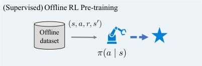


**Unsupervsied-to-Online RL**


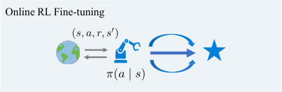

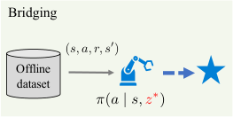

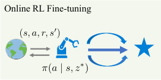


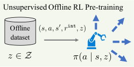

Offline ( _s, a, s_ _[0]_ _, r_ `[int]` _, z_ ) ( _s, a, r, s_ _[0]_ ) ( _s, a, r, s_ _[0]_ )


_z 2 Z_ _⇡_ ( _a | s, z_ ) _⇡_ ( _a | s, z_ _[⇤]_ ) _⇡_ ( _a | s, z_ _[⇤]_ )


Figure 1: **Illustration of U2O RL.** In this work, we propose to replace supervised offline RL with _unsupervised_
_offline RL_ in the offline-to-online RL framework. We call this scheme **unsupervised-to-online RL** ( **U2O RL** ).
U2O RL consists of three stages: (1) unsupervised offline RL pre-training, (2) bridging, and (3) online RL
fine-tuning. In unsupervised offline RL pre-training, we train a multi-task skill policy _π_ _θ_ ( _a | s, z_ ) instead of a
single-task policy _π_ _θ_ ( _a | s_ ) . Then, we convert the multi-task policy into a task-specific policy in the bridging
phase. Finally, we fine-tune the skill policy with online environment interactions.


domain-specific (“supervised”) offline pre-training. We call this framework **unsupervised-to-online**
**RL** ( **U2O RL** ). U2O RL has two appealing properties. First, unlike offline-to-online RL, a single
pre-trained model can be fine-tuned for different downstream tasks. Since offline unsupervised RL
does not require task information, we can pre-train diverse policies on unlabeled data before knowing
downstream tasks. Second, by pre-training multi-task policies with diverse intrinsic rewards, the agent
extracts rich representations from data, which often helps achieve _even better_ final performance and
stability than _supervised_ offline-to-online RL. This resembles how general-purpose unsupervised pretraining in other domains, such as with LLMs or self-supervised representations [ 4, 8, 63, 24, 23, 25 ],
improves over the performance of domain-specific specialist pre-training.


Our U2O RL framework consists of three stages: unsupervised offline policy pre-training, bridging,
and online fine-tuning (Figure 1). In the first unsupervised offline pre-training phase, we employ
a skill-based offline unsupervised RL or offline goal-conditioned RL method, which trains diverse
behaviors (or _skills_ ) with intrinsic rewards and provides an efficient mechanism to identify the best
skill for a given task reward. In the subsequent bridging and fine-tuning phases, we adapt the best
skill among the learned policies to the given downstream task reward with online RL. Here, to prevent
a potential mismatch between the intrinsic and task rewards, we propose a simple yet effective reward
scale matching technique that bridges the gap between the two training schemes and thus improves
performance and stability.


Our main contributions in this work are twofold. First, to the best of our knowledge, this is the first
work that makes the (potentially surprising) observation that it is often better to replace supervised
offline RL with unsupervised offline RL in the offline-to-online RL setting. We also identify the
reason behind this phenomenon: this is mainly because offline unsupervised pre-training learns better
_representations_ than task-specific supervised offline RL. Second, we propose a general recipe to
bridge skill-based unsupervised offline RL pre-training and online RL fine-tuning. Through our
experiments on nine state-based and pixel-based environments, we demonstrate that U2O RL often
outperforms standard offline-to-online RL both in terms of sample efficiency and final performance,
while being able to reuse a single pre-trained model for multiple downstream tasks.


**2** **Related work**


**Online RL from prior data** . Prior works have proposed several ways to leverage a previously
collected offline dataset to accelerate online RL training. They can be categorized into two main
groups: offline-to-online RL and off-policy online RL with offline data. Offline-to-online RL first
pre-trains a policy and a value function with offline RL [ 35, 39, 14, 16, 32, 73, 81, 30, 33, 22,
31, 49, 60, 80 ], and then continues to fine-tune them with additional online interactions [ 37, 49,


2


51, 86, 38, 89, 46, 88 ]. Since naïve offline-to-online RL is often unstable in practice due to the
distributional shift between the dataset and online interactions, prior works have proposed several
techniques, such as balanced sampling [37], actor-critic alignment [86], adaptive conservatism [78],
and return lower-bounding [ 51 ]. In this work, unlike offline-to-online RL, which trains a policy with
the target task reward, we offline pre-train a multi-task policy with unsupervised (intrinsic) reward
functions. This makes our single pre-trained policy reusable for any downstream task and learn richer
representations. The other line of research, off-policy online RL, trains an online RL agent from
scratch on top of a replay buffer filled with offline data, without any pre-training [ 2, 40, 42, 71 ].
While this simple approach often leads to improved stability and performance [ 2 ], it does not leverage
the benefits of pre-training; in contrast, we do leverage pre-training by learning useful features via
offline unsupervised RL, which we show leads to better fine-tuning performance in our experiments.


**Unsupervised RL.** The goal of unsupervised RL is to leverage unsupervised pre-training to facilitate
downstream reinforcement learning. Prior works have mainly focused on unsupervised representation
learning and unsupervised behavior learning. Unsupervised representation learning methods [ 67,
68, 54, 83, 50, 45, 17, 65, 64, 66 ] aim to extract useful (visual) representations from data. These
representations are then fed into the policy to accelerate task learning. In this work, we focus on
unsupervised behavior learning, which aims to pre-train policies that can be directly adapted to
downstream tasks. Among unsupervised behavior learning methods, online unsupervised RL pretrains useful policies by either maximizing state coverage [ 58, 59, 47, 41 ] or learning distinct skills

[ 19, 9, 69, 57 ] via reward-free interactions with the environment. In this work, we consider _offline_
unsupervised RL, which does not allow any environment interactions during the pre-training stage.


**Offline unsupervised RL.** Offline unsupervised RL methods focus on learning diverse policies ( _i.e_ .,
skills) from the dataset, rather than exploration, as online interactions are not permitted in this problem
setting. There exist three main approaches to offline unsupervised RL. Behavioral cloning-based
approaches extract skills from an offline dataset by training a generative model ( _e.g_ ., variational
autoencoders [ 29 ], Transformers [ 77 ], etc.) [ 1, 61, 70 ]. Offline goal-conditioned RL methods learn
diverse goal-reaching behaviors with goal-conditioned reward functions [ 6, 10, 44, 55, 79, 84, 11, 12 ].
Offline unsupervised skill learning approaches learn diverse skills based on intrinsically defined
reward functions [ 56, 76, 26 ]. Among these approaches, we use methods in the second and third
categories ( _i.e_ ., goal- or skill-based unsupervised offline RL) as part of our framework.


Our goal in this work is to study how unsupervised offline RL, as opposed to supervised task-specific
offline RL, can be employed to facilitate online RL fine-tuning. While somewhat similar unsupervised
pre-training schemes have been explored in prior works, they either consider hierarchical RL (or
zero-shot RL) with frozen learned skills without fine-tuning [ 1, 61, 76, 56, 26 ], assume online-only
RL [ 36 ], or are limited to the specific setting of goal-conditioned RL [ 11, 12 ]. To the best of our
knowledge, this is the first work that considers the _fine-tuning_ of skill policies pre-trained with
unsupervised offline RL _in the context of offline-to-online RL_ . Through our experiments, we show
that our fine-tuning framework leads to significantly better performance than previous approaches
based on hierarchical RL, zero-shot RL, and standard offline-to-online RL.


**3** **Preliminaries**


We formulate a decision making problem as a Markov decision process (MDP) [ 72 ], which is defined
by a tuple of ( _S, A, P, r, ρ, γ_ ), where _S_ is the state space, _A_ is the action space, _P_ : _S × A →_ ∆( _S_ )
is the transition dynamics, _r_ : _S × A × S →_ R is the task reward function, _ρ ∈_ ∆( _S_ ) is the initial
state distribution, and _γ ∈_ (0 _,_ 1) is the discount factor. Our aim is to learn a policy _π_ : _S →_ ∆( _A_ )
that maximizes the expectation of cumulative task rewards, E _π_ [ [�] _[∞]_ _t_ =0 _[γ]_ _[t]_ _[r]_ [(] _[s]_ _[t]_ _[, a]_ _[t]_ _[, s]_ _[t]_ [+1] [)]][.]


**Offline RL and implicit Q-learning (IQL).** The goal of offline RL is to learn a policy solely from
an offline dataset _D_ `off`, which consists of transition tuples ( _s, a, s_ _[′]_ _, r_ ) . One straightforward approach
to offline RL is to simply employ an off-policy RL algorithm ( _e.g_ . TD3 [ 15 ]). For instance, we can
minimize the following temporal difference (TD) loss to learn an action-value function (Q-function)
from data:


_L_ `TD` ( _ϕ_ ) = E ( _s,a,s_ _′_ _,r_ ) _∼D_ `off` �( _r_ + _γ_ max _a_ _[′]_ _[ Q]_ _[ϕ]_ [ ¯] [(] _[s]_ _[′]_ _[, a]_ _[′]_ [)] _[ −]_ _[Q]_ _[ϕ]_ [(] _[s, a]_ [))] [2] [�] _,_ (1)


3


where _Q_ _ϕ_ denotes the parameterized action-value function, and _Q_ _ϕ_ ¯ represents the target action-value
function [ 48 ], whose parameter _ϕ_ [¯] is updated via Polyak averaging [ 62 ] using _ϕ_ . We can then train a
policy _π_ to maximize E _a∼π_ [ _Q_ _ϕ_ ( _s, a_ )].


While this simple off-policy TD learning can be enough when the dataset has sufficiently large
state-action coverage, offline datasets in practice often have limited coverage, which makes the agent
susceptible to value overestimation and exploitation, as the agent cannot get corrective feedback from
the environment [ 39 ]. To address this issue, Kostrikov et al. [31] proposed implicit Q-learning (IQL),
which fits an optimal action-value function without querying out-of-distribution actions: IQL replaces
the arg max operator, which potentially allows the agent to exploit Q-values from out-of-distribution
actions, with an expectile loss that implicitly approximates the maximum value. Specifically, IQL
minimizes the following losses:


_L_ _[Q]_ `IQL` [(] _[ϕ]_ [) =][ E] ( _s,a,s_ _[′]_ _,r_ ) _∼D_ `off` �( _r_ + _γV_ _ψ_ ( _s_ _[′]_ ) _−_ _Q_ _ϕ_ ( _s, a_ )) [2] [�] _,_ (2)

_L_ _[V]_ `IQL` [(] _[ψ]_ [) =][ E] ( _s,a_ ) _∼D_ `off` � _ℓ_ [2] _τ_ [(] _[Q]_ _ϕ_ [ ¯] [(] _[s, a]_ [)] _[ −]_ _[V]_ _[ψ]_ [(] _[s]_ [))] � _,_ (3)


where _Q_ _ϕ_ and _Q_ _ϕ_ ¯ respectively denote the action-value and target action-value functions, _V_ _ψ_ denotes
the value function, _ℓ_ [2] _τ_ [(] _[x]_ [) =] _[ |][τ][ −]_ [1][(] _[x <]_ [ 0)] _[|][x]_ [2] [ denotes the expectile loss [] [52] [] and] _[ τ]_ [ denotes the]
expectile parameter. Intuitively, the asymmetric expectile loss in Equation 3 makes _V_ _ψ_ implicitly
approximate max _a_ _Q_ _ϕ_ ¯ ( _s, a_ ) by penalizing positive errors more than negative errors.


**Hilbert foundation policy (HILP).** Our unsupervised-to-online framework requires an offline
unsupervised RL algorithm that trains a skill policy _π_ _θ_ ( _a | s, z_ ) from an unlabeled dataset, and we
mainly use HILP [ 56 ] in our experiments. HILP consists of two phases. In the first phase, HILP trains
a feature network _ξ_ : _S →Z_ that embeds temporal distances ( _i.e_ ., shortest path lengths) between
states into the latent space by enforcing the following equality:


_d_ _[∗]_ ( _s, g_ ) = _∥ξ_ ( _s_ ) _−_ _ξ_ ( _g_ ) _∥_ 2 (4)


for all _s, g ∈S_, where _d_ _[∗]_ ( _s, g_ ) denotes the temporal distance (the minimum number of steps required
to reach _g_ from _s_ ) between _s_ and _g_ . In practice, given the equivalence between goal-conditioned
values and temporal distances, _ξ_ can be trained with any offline goal-conditioned RL algorithm [ 55 ]
(see Park et al. [56] for further details). After training _ξ_, HILP trains a skill policy _π_ _θ_ ( _a | s, z_ ) with
the following intrinsic reward using an off-the-shelf offline RL algorithm [31, 15]:


_r_ `[int]` ( _s, a, s_ _[′]_ _, z_ ) = ( _ξ_ ( _s_ _[′]_ ) _−_ _ξ_ ( _s_ )) _[⊤]_ _z,_ (5)


where _z_ is sampled from the unit ball, _{z ∈Z_ : _∥z∥_ = 1 _}_ . Intuitively, Equation 5 encourages
the agent to learn behaviors that move in every possible latent direction, resulting in diverse statespanning skills [ 56 ]. Note that Equation 5 can be interpreted as the inner product between the task
vector _z_ and the feature vector _f_ ( _s, a, s_ _[′]_ ) := _ξ_ ( _s_ _[′]_ ) _−_ _ξ_ ( _s_ ) in the successor feature framework [7, 3].


**4** **Unsupervised-to-online RL (U2O RL)**


Our main hypothesis in this work is that task-agnostic offline RL pre-training of _unsupervised_ skills
can be more effective than task-specific, supervised offline RL for online RL fine-tuning. We call this
framework **unsupervised-to-online RL** ( **U2O RL** ). In this section, we first describe the three stages
of our U2O RL framework (Figure 1): unsupervised offline policy pre-training (Section 4.1), bridging
(Section 4.2), and online fine-tuning (Section 4.3). We then explain why _unsupervised_ -to-online RL
is potentially better than standard _supervised_ offline-to-online RL (Section 4.4).


**4.1** **Unsupervised offline policy pre-training**


In the first unsupervised offline policy pre-training phase (Figure 1 (bottom left)), we train diverse
policies (or _skills_ ) with intrinsic rewards to extract a variety of useful behaviors as well as rich
features from the offline dataset _D_ `off` . In other words, instead of training a single-task policy
_π_ _θ_ ( _a | s_ ) with task rewards _r_ ( _s, a, s_ _[′]_ ) as in standard offline-to-online RL, we train a _multi-task_ skill
policy _π_ _θ_ ( _a | s, z_ ) with a family of unsupervised, _intrinsic_ rewards _r_ `[int]` ( _s, a, s_ _[′]_ _, z_ ), where _z_ is a skill
latent vector sampled from a latent space _Z_ = R _[d]_ . Even if _D_ `off` contains reward labels, we do not
use any reward information in this phase.


4


**Algorithm 1** U2O RL: Unsupervised-to-Online Reinforcement Learning


**Require** : offline dataset _D_ `off`, reward-labeled dataset _D_ `reward`, empty replay buffer _D_ `on`, offline
pre-training steps _N_ `PT`, online fine-tuning steps _N_ `FT`, skill latent space _Z_
Initialize the parameters of policy _π_ _θ_ and action-value function _Q_ _ϕ_
**for** _t_ = 0 _,_ 1 _,_ 2 _, . . . N_ `PT` _−_ 1 **do**

Sample transitions ( _s, a, s_ _[′]_ ) from _D_ `off`
Sample latent vector _z ∈Z_ and compute intrinsic rewards _r_ `[int]`
Update policy _π_ _θ_ ( _a | s, z_ ) and _Q_ _ϕ_ ( _s, a, z_ ) using normalized intrinsic rewards ˜ _r_ `[int]`
**end for**
Compute the best latent vector _z_ _[∗]_ with Equation 6 using samples ( _s, a, s_ _[′]_ _, r_ ) from _D_ `reward`
**for** _t_ = 0 _,_ 1 _,_ 2 _, . . . N_ `FT` _−_ 1 **do**

Collect transition ( _s, a, s_ _[′]_ _, r_ ) via environment interaction with _π_ _θ_ and add to replay buffer _D_ `on`
Sample transitions ( _s, a, s_ _[′]_ _, r_ ) from _D_ `off` _∪D_ `on`
Update policy _π_ _θ_ ( _a | s, z_ _[∗]_ ) and _Q_ _ϕ_ ( _s, a, z_ _[∗]_ ) using normalized task rewards ˜ _r_
**end for**


Among existing unsupervised offline policy pre-training methods (Section 2), we opt to employ
successor feature-based methods [ 7, 3, 82, 76, 56 ] or offline goal-conditioned RL methods [ 6, 55 ]
for our unsupervised pre-training, since they provide a convenient mechanism to identify the best
skill latent vector given a downstream task, which we will utilize in the next phase. More concretely,
we mainly choose to employ HILP [ 56 ] (Section 3) as an unsupervised offline policy pre-training
method in our experiments for its state-of-the-art performance in previous benchmarks [ 56 ]. We note,
however, that any other unsupervised offline successor feature-based skill learning methods [ 76 ] or
offline goal-conditioned RL methods [55] can also be used in place of HILP (see Appendix A.1).


**4.2** **Bridging offline unsupervised RL and online supervised RL**


After finishing unsupervised offline policy pre-training, our next step is to convert the learned multitask skill policy into a task-specific policy that can be fine-tuned to maximize a given downstream
reward function _r_ (Figure 1 (bottom middle)). There exist two challenges in this step: (1) we need a
mechanism to identify the skill vector _z_ that best solves the given task and (2) we need to reconcile
the gap between intrinsic rewards and downstream task rewards for seamless online fine-tuning.


**Skill identification.** Since we chose to use a successor feature- or goal-based unsupervised pretraining method in the previous phase, the first challenge is relatively straightforward. For goaloriented tasks ( _e.g_ ., AntMaze [ 13 ] and Kitchen [ 20 ]), we assume the task goal _g_ to be available, and
we either directly use _g_ (for goal-conditioned methods) or infer the skill _z_ _[∗]_ that corresponds to _g_
based on a predefined conversion formula (for successor feature-based methods that support such a
conversion [ 76, 56 ]). For general reward-maximization tasks, we employ successor feature-based
unsupervised pre-training methods, and use the following linear regression to find the skill latent
vector _z_ _[∗]_ that best approximates the downstream task reward function _r_ : _S × A × S →_ R:


2 [�]
_z_ _[∗]_ = arg min _z∈Z_ E ( _s,a,s_ _′_ ) _∼D_ `reward` �� _r_ ( _s, a, s_ _[′]_ ) _−_ _f_ ( _s, a, s_ _[′]_ ) _[⊤]_ _z_ � _,_ (6)


where _f_ is the feature network in the successor feature framework (Section 3) and _D_ `reward` is a
reward-labeled dataset. This reward-labeled dataset _D_ `reward` can be either the full offline dataset _D_ `off`
(if it is fully reward-labeled), a subset of the offline dataset (if it is partially reward-labeled), or a
newly collected dataset with additional environment interactions. In our experiments, we mainly use
a small number ( _e.g_ ., 0 _._ 2% for DMC tasks) of reward-labeled samples from the offline dataset for
_D_ `reward`, following previous works [ 76, 56 ], but we do not require _D_ `reward` to be a subset of _D_ `off` (see
Appendix A.4).


**Reward scale matching.** After identifying the best skill latent vector _z_ _[∗]_, our next step is to bridge
the gap between intrinsic and extrinsic rewards. Since these two reward functions can have very
different scales, naïve online adaptation can lead to abrupt shifts in target Q-values, potentially
causing significant performance drops in the early stages of online fine-tuning. While one can employ
sophisticated reward-shaping techniques to deal with this issue [ 53, 18 ], in this work, we propose a
simple yet effective reward scale matching technique that we find to be effective enough in practice.
Specifically, we compute the running mean and standard deviation of intrinsic rewards during the


5


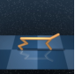


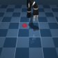


(a) Walker (b) Cheetah (c) Quadruped (d) Jaco (e) AntMaze
Large


(f) AntMaze
Ultra


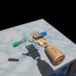

(g) Kitchen (h) Adroit
Pen


(i) Adroit
Door


Figure 2: **Environments.** We evaluate U2O RL on nine state-based or pixel-based environments.


pre-training phase, and normalize the intrinsic rewards with the calculated statistics. Similarly, during
the fine-tuning phase, we compute the statistics of task rewards and normalize the task rewards so
that they have the same scale and mean as normalized intrinsic rewards. This way, we can prevent
abrupt shifts in reward scales without altering the optimal policy for the downstream task. In our
experiments, we find that this simple technique is crucial for achieving good performance, especially
in environments with dense rewards (Section 5.7).


**4.3** **Online fine-tuning**


Our final step is to fine-tune the skill policy with online environment interactions (Figure 1 (bottom
right)). This step is straightforward: since we have found _z_ _[∗]_ in the previous stage, we can simply
_fix_ the skill vector _z_ _[∗]_ in the policy _π_ _θ_ ( _a | s, z_ _[∗]_ ) and the Q-function _Q_ _ϕ_ ( _s, a, z_ _[∗]_ ), and fine-tune
them with the same (offline) RL algorithm used in the first phase ( _e.g_ ., IQL [ 31 ], TD3 [ 15 ]) with
additional online interaction data. While one can employ existing specialized techniques for offlineto-online RL for better online adaptation in this phase, we find in our experiments that, thanks
to rich representations learned by unsupervised pre-training, simply using the same (offline) RL
algorithm is enough to achieve strong performance that matches or even outperforms state-of-the-art
offline-to-online RL techniques.


**4.4** **Why is U2O RL potentially better than offline-to-online RL?**


Our main claim is that _unsupervised_ offline RL is better than supervised offline RL for online finetuning. However, this might sound very counterintuitive. Especially, if we know the downstream
task ahead of time, how can unsupervised offline RL potentially lead to better performance than
supervised offline RL, despite the fact that the former does _not_ use any task information during the
offline phase?


We hypothesize that this is because unsupervised multi-task offline RL enables better _feature learning_
than supervised single-task offline RL. By training the agent on a number of diverse intrinsically
defined tasks, it gets to acquire rich knowledge about the environment, dynamics, and potential
tasks in the form of representations, which helps improve and facilitate the ensuing task-specific
online fine-tuning. This resembles the recent observation in machine learning that large-scale
unsupervised pre-training improves downstream task performances over task-specific supervised
pre-training [ 4, 8, 63, 24, 23, 25 ]. In our experiments, we empirically show that U2O RL indeed
learns better features than its supervised counterpart (Section 5.5).


Another benefit of U2O RL is that it does not use any task-specific information during pre-training.
This is appealing because we can reuse a single pre-trained policy for a number of different downstream tasks. Moreover, it enables leveraging potentially very large, task-agnostic offline data during
pre-training, which is often much cheaper to collect than task-specific, curated datasets [43].


**5** **Experiments**


In our experiments, we evaluate the performance of U2O RL in the context of offline-to-online RL. We
aim to answer the following research questions: (1) Is U2O RL better than previous offline-to-online
RL strategies? (2) What makes unsupervised offline RL result in better fine-tuning performance than
supervised offline RL? (3) Which components of U2O RL are important?


6


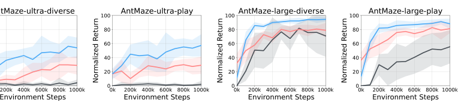


|100 AntMaze-u|ultra-diverse|
|---|---|
|~~0k~~<br>~~200k~~<br>~~400~~<br><br>0<br>20<br>40<br>60<br>80<br><br>||
|~~0k~~<br>~~200k~~<br>~~400~~<br><br>0<br>20<br>40<br>60<br>80<br><br>||
|~~0k~~<br>~~200k~~<br>~~400~~<br><br>0<br>20<br>40<br>60<br>80<br><br>||
|~~0k~~<br>~~200k~~<br>~~400~~<br><br>0<br>20<br>40<br>60<br>80<br><br>||


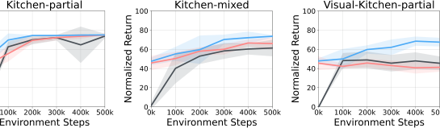


|100 n Kitche|en-partial|
|---|---|
|~~0k~~<br>~~100k~~<br>~~200~~<br><br>0<br>20<br>40<br>60<br>80<br>||
|~~0k~~<br>~~100k~~<br>~~200~~<br><br>0<br>20<br>40<br>60<br>80<br>||
|~~0k~~<br>~~100k~~<br>~~200~~<br><br>0<br>20<br>40<br>60<br>80<br>||


|Kitchen-partial 100 n Visua|al-Kitchen-mixed|
|---|---|
|~~200k~~<br>~~300k~~<br>~~400k~~<br>~~50~~0k<br><br>~~0k~~<br>~~100k~~<br><br>0<br>20<br>40<br>60<br>80<br>Normalized Return||
|~~200k~~<br>~~300k~~<br>~~400k~~<br>~~50~~0k<br><br>~~0k~~<br>~~100k~~<br><br>0<br>20<br>40<br>60<br>80<br>Normalized Return||
|~~200k~~<br>~~300k~~<br>~~400k~~<br>~~50~~0k<br><br>~~0k~~<br>~~100k~~<br><br>0<br>20<br>40<br>60<br>80<br>Normalized Return||


|1000 rn Wal|lker Run|
|---|---|
|~~0k~~<br>~~200k~~<br>~~40~~<br><br>0<br>200<br>400<br>600<br>800<br><br>||
|~~0k~~<br>~~200k~~<br>~~40~~<br><br>0<br>200<br>400<br>600<br>800<br><br>||
|~~0k~~<br>~~200k~~<br>~~40~~<br><br>0<br>200<br>400<br>600<br>800<br><br>||


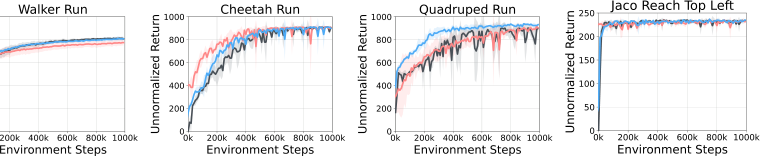

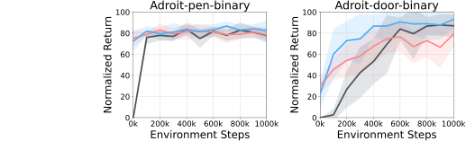

Figure 3: **Online fine-tuning plots of U2O RL and previous offline-to-online RL frameworks (8 seeds).**
Across the benchmarks, our U2O RL mostly shows consistently better performance than standard offline-toonline RL and off-policy online RL with offline data.


**5.1** **Experimental setup**


**Environments and offline datasets.** In our experiments, we consider nine tasks across five benchmarks (Figure 2). **ExORL** [ 85 ] is a benchmark suite that consists of offline datasets collected by
exploratory policies ( _e.g._, RND [ 5 ]) on the DeepMind Control Suite [ 75 ]. We consider four embodiments (Walker, Cheetah, Quadruped, and Jaco), each of which has four tasks. **AntMaze** [ 13, 27 ] is a
navigation task, whose goal is to control an 8 -DoF quadruped agent to reach a target position. We
consider the two most challenging mazes with the largest sizes, `large` and `ultra`, and two types
of offline datasets, `diverse` and `play` . **Kitchen** [ 20, 13 ] is a robotic manipulation task, where the
goal is to control a 9-DoF Franka robot arm to achieve four subtasks sequentially. The environment
has four subtasks in total. We consider two types of offline datasets from the D4RL suite [ 13 ],
`partial` and `mixed` . **Visual Kitchen** [ 20, 13, 56 ] is a pixel-based variant of the Kitchen environment, where an agent must achieve four subtasks purely from 64 _×_ 64 _×_ 3 pixel observations instead
of low-dimensional state information. **Adroit** [ 13 ] is a dexterous manipulation benchmark, where the
goal is to control a 24 -DoF robot hand to twirl a pen or open a door. We provide further details in
Appendix B.1


**Implementation.** In our experiments, we mainly employ HILP [ 56 ] as the unsupervised offline
policy pre-training algorithm in U2O RL. For the offline RL backbone, we use TD3 [ 15 ] for ExORL
and IQL [ 30 ] for others following previous works [ 76, 56 ]. Since both IQL and TD3+BC [ 14, 73 ]
have been known to achieve strong performance in the offline-to-online RL setting [ 74 ], we use them
for the online fine-tuning phase in U2O RL as well. For sparse-reward tasks (AntMaze, Kitchen,
and Adroit), we do not apply reward scale matching. For AntMaze, Kitchen, and Adroit, we report


7


Table 1: **Comparison between U2O RL and previous offline-to-online RL methods.** We denote how
performances change before and after online fine-tuning with arrows. Baseline scores except RLPD [ 2 ] are taken
from Nakamoto et al. [51], Wang et al. [78] . Scores within the 5% of the best score are highlighted in bold, as in
Kostrikov et al. [31]. We use 8 random seeds for each task for U2O RL.


Task `antmaze-ultra-diverse` `antmaze-ultra-play` `antmaze-large-diverse` `antmaze-large-play` `kitchen-partial` `kitchen-mixed`


CQL  -  - 25 _→_ 87 34 _→_ 76 71 _→_ **75** 56 _→_ 50
IQL 13 _→_ 29 17 _→_ 29 40 _→_ 59 41 _→_ 51 40 _→_ 60 48 _→_ 48
AWAC - - 00 _→_ 00 00 _→_ 00 01 _→_ 13 02 _→_ 12

O3F  -  - 59 _→_ 28 68 _→_ 01 11 _→_ 22 06 _→_ 33

ODT - - 00 _→_ 01 00 _→_ 00 - 
CQL+SAC  -  - 36 _→_ 00 21 _→_ 00 71 _→_ 00 59 _→_ 01
Hybrid RL  -  - _→_ 00 _→_ 00 _→_ 00 _→_ 01
SAC+od  -  - _→_ 00 _→_ 00 _→_ 07 _→_ 00

SAC  -  - _→_ 00 _→_ 00 _→_ 03 _→_ 02

IQL+od _→_ 04 _→_ 05 _→_ 71 _→_ 56 _→_ 74 _→_ 61
FamO2O  -  - _→_ 64 _→_ 61  -  
RLPD 00 _→_ 00 00 _→_ 00 00 _→_ **94** 00 _→_ 81  -  
Cal-QL 05 _→_ 05 15 _→_ 13 33 _→_ **95** 26 _→_ **90** 67 _→_ **79** 38 _→_ **80**
**U2O (Ours)** 22 _→_ **54** 17 _→_ **58** 11 _→_ **95** 14 _→_ **88** 48 _→_ **75** 48 _→_ 74


normalized scores, following Fu et al. [13] . In our experiments, we use **8** **random seeds** and report
standard deviations with shaded areas, unless otherwise stated. We refer the reader to Appendix B for
the full implementation details and hyperparameters.


**5.2** **Is U2O RL better than previous offline-to-online RL frameworks?**


We begin our experiments by comparing our approach, unsupervised-to-online RL, with two previous
offline-to-online RL _frameworks_ (Section 2): **offline-to-online RL** ( **O2O RL** ) and **off-policy online**
**RL with offline data** ( **Online w/ Off Data** ). To recall, offline-to-online RL [ 37, 49, 51, 86, 38 ] first
pre-trains a policy with _supervised_ offline RL using the task reward, and then continues training it
with online rollouts. Off-policy online RL [ 2, 42, 71 ] trains a policy from scratch on top of a replay
buffer filled with offline data. Here, we use the _same_ offline RL backbone ( _i.e_ ., TD3 for ExORL and
IQL for AntMaze, Kitchen, and Adroit) to ensure apples-to-apples comparisons between the three
frameworks. We will compare U2O RL with previous specialized offline-to-online RL techniques in
Section 5.3.


Figure 3 shows the online fine-tuning curves on 14 different tasks. The results suggest that U2O
RL generally leads to better performance than both offline-to-online RL and off-policy online RL
across the environments, despite not using any task information during pre-training. Notably, U2O
RL significantly outperforms these two previous frameworks in the most challenging AntMaze tasks
( `antmaze-ultra-{diverse, play}` ).


**5.3** **How does U2O RL compare to previous specialized offline-to-online RL techniques?**


Next, we compare U2O RL with 13 previous specialized offline-to-online RL methods, including
**CQL** [ 33 ], **IQL** [ 31 ], **AWAC** [ 49 ], **O3F** [ 46 ], **ODT** [ 89 ], **CQL+SAC** [ 33, 21 ], **Hybrid RL** [ 71 ],
**SAC+od (offline data)** [ 21, 2 ], **SAC** [ 21 ], **IQL+od (offline data)** [ 31, 2 ], **RLPD** [ 2 ], **FamO2O** [ 78 ]
and **Cal-QL** [ 51 ]. We show the comparison results in Table 1, where we take the scores from
Nakamoto et al. [51], Wang et al. [78] for the tasks that are common to ours. Since Cal-QL
achieves the best performance in the table, we additionally make a comparison with Cal-QL on
`antmaze-ultra-{diverse, play}` as well, by running their official implementation with tuned
hyperparameters.


Table 1 shows that U2O RL achieves strong performance that matches or sometimes even outperforms
previous offline-to-online RL methods, even though U2O RL does _not_ use any task information
during offline pre-training nor any specialized offline-to-online techniques. In particular, in the most
challenging `antmaze-ultra` tasks, U2O RL outperforms the previous best method (Cal-QL) by a
significant margin. This is very promising because, even if U2O RL does not necessarily outperform
the state-of-the-art methods on every single task (though it is at least on par with the previous best
methods), U2O RL enables reusing a single unsupervised pre-trained policy for multiple downstream
tasks, unlike previous offline-to-online RL methods that perform _task-specific_ pretraining.


8


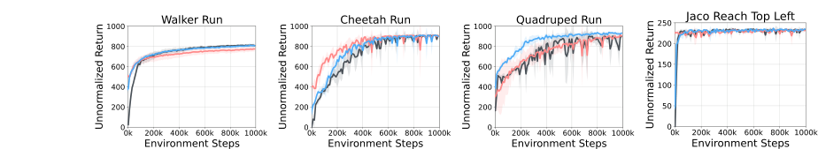

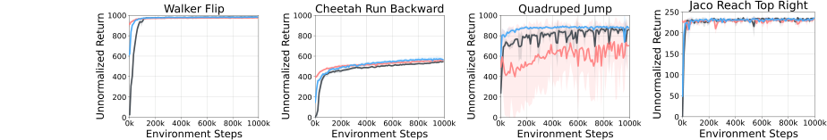

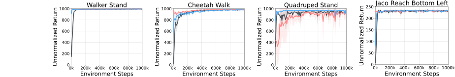

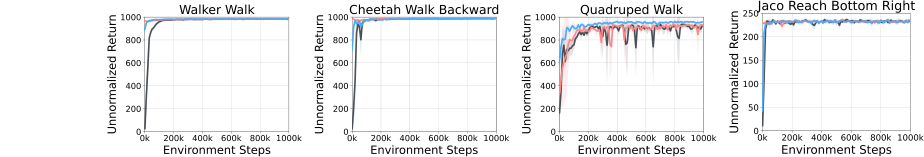

Figure 4: **Learning curves during online RL fine-tuning (8 seeds).** A single pre-trained model from U2O
can be fine-tuned to solve multiple downstream tasks. Across the embodiments and tasks, our U2O RL matches
or outperforms standard offline-to-online RL and off-policy online RL with offline data even though U2O RL
uses a single task-agnostic pre-trained model.


**5.4** **Can a single pre-trained model from U2O be fine-tuned to solve multiple tasks?**


One important advantage of U2O RL is that it can reuse a single task-agnostic dataset for multiple
different downstream tasks, unlike standard offline-to-online RL. To demonstrate this, we train U2O
RL with four different tasks from the same task-agnostic ExORL dataset on each DMC environment,
and report the full training curves in Figure 4. The results show that, for example, a single pre-trained
model on the Walker domain can be fine-tuned for all four tasks (Walker Run, Walker Flip, Walker
Stand, and Walker Walk). Note that even though U2O RL uses a single task-agnostic pre-trained
model, the performance of U2O RL matches or even outperforms O2O RL, which pre-trains a model
with task-specific rewards.


**5.5** **Why does U2O RL often outperform supervised offline-to-online RL?**


In the above experiments, we showed that our unsupervised-to-online RL framework often even
outperforms previous supervised offline-to-online RL methods. We hypothesized in Section 4.4 that
this is because unsupervised offline pre-training yields better _representations_ that facilitate online
task adaptation. To empirically verify this hypothesis, we measure the quality of the value function
representations using the method proposed by Kumar et al. [34] . Specifically, we define the value
features _ζ_ _ϕ_ ( _s, a_ ) as the penultimate layer of the value function _Q_ _ϕ_, _i.e_ ., _Q_ _ϕ_ ( _s, a_ ) = _w_ _ϕ_ _[⊤]_ _[ζ]_ _[ϕ]_ [(] _[s, a]_ [)] [, and]
measure the dot product between consecutive state-action pairs, _ζ_ _ϕ_ ( _s, a_ ) _[⊤]_ _ζ_ _ϕ_ ( _s_ _[′]_ _, a_ _[′]_ ) [ 34 ]. Intuitively,


9


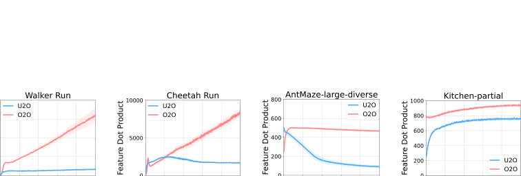


|20000 uct|U O|Walk U2O O2O|ker Run|n|
|---|---|---|---|---|
|~~0~~<br>0<br>5000<br>10000<br>15000<br>Feature Dot Prod|O|2O|||
|~~0~~<br>0<br>5000<br>10000<br>15000<br>Feature Dot Prod|~~k~~<br>~~20~~<br>|~~0k~~<br>~~400~~<br>|~~k~~<br>~~600k~~<br>|~~k~~<br>~~600k~~<br>|


Figure 5: **Feature dot products during offline RL pre-training (lower is better, 8 seeds).** The plots
show that _unsupervised_ offline pre-training effectively prevents feature collapse (co-adaptation), yielding better
representations than supervised offline pre-training.


this dot product represents the degree to which these two representations are “collapsed” (or “coadapted”), which is known to be correlated with poor performance [34] ( _i.e_ ., the lower the better).


Figure 5 compares the dot product metrics of unsupervised offline RL (in U2O RL) and supervised
offline RL (in O2O RL) on four benchmark tasks. The results suggest that our unsupervised multi-task
pre-training effectively prevents feature co-adaptation and thus indeed yields better representations
across the environments. This highlights the benefits of unsupervised offline pre-training, and
(partially) explains the strong online fine-tuning performance of U2O RL. We additionally provide
further analyses with different offline unsupervised RL algorithms ( _e.g_ ., graph Laplacian-based
successor feature learning [76, 82]) in Appendix A.1.


**5.6** **Is fine-tuning better than other alternati** ~~**v**~~ **e strategies (** _**e.g**_ **., hierarchical RL)?**


In this work, we focus on the _fine-tuning_ of offline pre-trained skill policies, but this is not the only
way to leverage pre-trained skills for downstream tasks. To see how our fine-tuning scheme compares
to other alternative strategies, we compare U2O RL with three previously considered approaches:
**hierarchical RL** ( **HRL**, _e.g_ ., **OPAL** [ 1 ], **SPiR** ~~**L**~~ [ 61 ]) [ 1, 61, 76, 56, 26 ], **zero-shot RL** [ 76, 56 ],
and **PEX** [ 87 ]. HRL additionally trains a high-level policy that combines fixed pre-trained skills in a
sequential manner. Zero-shot RL simply finds the skill policy that best solves the downstream task,
with no fine-tuning or hierarchies. PEX combines fixed pre-trained multi-task policies and a newly
initialized policy with a multiplexer that chooses the best policy.


Figure 6 shows the comparison results on top of
the same pre-trained unsupervised skill policy.
Since PEX is not directly compatible with IQL,
we evaluate PEX only on the tasks with TD3
( _e.g_ ., ExORL tasks). The plots suggest that our
fine-tuning strategy leads to significantly better
performance than previous approaches. This
is because pre-trained offline skill policies are

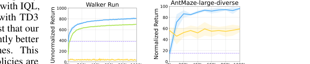
often not perfect (due to the limited coverage
or suboptimality of the dataset), and thus using
a fixed offline policy is often not sufficient to
achieve strong performance in downstream tasks.
We provide additional results in Appendix A.6.


**5.7** **Ablation study**


Figure 6: **Fine-tuning is better than previous strate-**
**gies, such as hierarchical RL, zero-shot RL, and PEX**
**(8 seeds).**


**Reward scale matching.** In Section 4.2, we propose a simple reward scale matching technique that
bridges the gap between intrinsic rewards and downstream task rewards. We ablate this component,
and report the results in Figure 7. The results suggest that our reward scale matching technique
effectively prevents a performance drop at the beginning of the online fine-tuning stage, leading to
substantially better final performance on dense-reward tasks ( _e.g_ ., Walker Run and Cheetah Run).


**Value transfer vs. policy transfer.** In our U2O RL framework, we transfer _both_ the value function
and policy from unsupervised pre-training to supervised fine-tuning. To dissect the importance of
each component, we conduct an ablation study, in which we compare four settings: (1) without any
transfer, (2) value-only transfer, (3) policy-only transfer, and (4) full transfer. Figure 8 demonstrates
the ablation results on Walker and AntMaze. The results suggest that both value transfer and policy


10


|Col1|Col2|Col3|
|---|---|---|
||||


|tr<br>Wa<br>1000 Return<br>800<br>600 Unnormalized<br>400<br>200<br>0|ansfer value transfer value & policy<br>lker Run AntMaze-large-diverse<br>100<br>Return<br>80<br>60<br>Normalized<br>40<br>20<br>0|
|---|---|
|tr<br><br><br>0<br>200<br>400<br>600<br>800<br>1000<br>Unnormalized Return<br>Wa||
|tr<br><br><br>0<br>200<br>400<br>600<br>800<br>1000<br>Unnormalized Return<br>Wa||


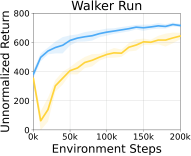

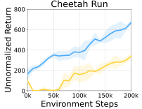

Figure 7: **Ablation study of reward scale matching**
**(4 seeds).**


Figure 8: **Ablation study of value transfer and pol-**
**icy transfer (4 seeds).**


transfer matter in general, but value transfer is more importa ~~nt~~ than p ~~ol~~ icy transfer. This aligns with
our findings in Section 5.5 as well as Kumar et al. [34], which says that the quality of value features
often correlates with the performance of TD-based RL algorithms.


We refer to the reader to Appendix for further analysis including (1) combining U2O RL with other
offline unsupervised skill learning methods (Appendix A.1), (2) U2O RL on a different type of
datasets (Appendix A.2), (3) comparisons between U2O RL and pure representation learning schemes
(Appendix A.3), (4) U2O RL without reward samples in the bridging phase (Appendix A.4), (5) an
ablation study with different skill identification strategies (Appendix A.5), and (6) additional results
with different online RL strategies (Appendix A.6).


**6** **Conclusion**


In this work, we investigated how unsupervised pre-training of diverse policies enables better online
fine-tuning than standard supervised offline-to-online RL. We showed that our U2O RL framework
often achieves even better performance and stability than previous offline-to-online RL approaches,
thanks to the rich representations learned by pre-training on diverse tasks. We also demonstrated that
U2O RL enables reusing a single offline pre-trained policy for multiple downstream tasks.


**Do we expect U2O RL to be** _**always**_ **better than O2O RL?** While we showed strong results of
U2O RL throughout the paper, our framework does have limitations. One limitation is that U2O
RL may not be as effective when the offline dataset is monolithic and heavily tailored toward the
downstream task (see Appendix A.2), which leaves little room for improvement for unsupervised
offline RL compared to task-specific supervised offline RL. We believe U2O RL can be most effective
(compared to standard offline-to-online RL) when the dataset is highly diverse so that unsupervised
offline RL methods can learn a variety of behaviors and thus learn better features and representations.
Nonetheless, given the recent successes in large-scale self-supervised and unsupervised pre-training
from unlabeled data, we believe our U2O RL framework serves as a step toward a general recipe for
scalable data-driven decision-making.


**Acknowledgments and Disclosure of Funding**


We thank Qiyang Li, Mitsuhiko Nakamoto, Kevin Frans, Younggyo Seo, Changyeon Kim, and Juyong
Lee for insightful discussions and helpful feedback on earlier drafts of this work. This work was
partly supported by the Korea Foundation for Advanced Studies (KFAS), ONR N00014-21-1-2838,
and Intel. This research used the Savio computational cluster resource provided by the Berkeley
Research Computing program at UC Berkeley.


**References**


[1] A. Ajay, A. Kumar, P. Agrawal, S. Levine, and O. Nachum. Opal: Offline primitive discovery
for accelerating offline reinforcement learning. In _International Conference on Learning_
_Representations_, 2021.


[2] P. J. Ball, L. Smith, I. Kostrikov, and S. Levine. Efficient online reinforcement learning with
offline data. In _International Conference on Machine Learning_, 2023.


11


[3] A. Barreto, W. Dabney, R. Munos, J. J. Hunt, T. Schaul, H. P. van Hasselt, and D. Silver.
Successor features for transfer in reinforcement learning. In _Advances in Neural Information_
_Processing Systems_, 2017.


[4] T. Brown, B. Mann, N. Ryder, M. Subbiah, J. D. Kaplan, P. Dhariwal, A. Neelakantan, P. Shyam,
G. Sastry, A. Askell, et al. Language models are few-shot learners. In _Advances in Neural_
_Information Processing Systems_, 2020.


[5] Y. Burda, H. Edwards, A. Storkey, and O. Klimov. Exploration by random network distillation.
In _International Conference on Learning Representations_, 2019.


[6] Y. Chebotar, K. Hausman, Y. Lu, T. Xiao, D. Kalashnikov, J. Varley, A. Irpan, B. Eysenbach,
R. C. Julian, C. Finn, et al. Actionable models: Unsupervised offline reinforcement learning of
robotic skills. In _International Conference on Machine Learning_, 2021.


[7] P. Dayan. Improving generalization for temporal difference learning: The successor representation. _Neural computation_, 5:613–624, 1993.


[8] J. Devlin, M.-W. Chang, K. Lee, and K. Toutanova. Bert: Pre-training of deep bidirectional
transformers for language understanding. In _Proceedings of the 2019 Conference of the_
_North American Chapter of the Association for Computational Linguistics: Human Language_
_Technologies_, 2019.


[9] B. Eysenbach, A. Gupta, J. Ibarz, and S. Levine. Diversity is all you need: Learning skills
without a reward function. In _International Conference on Learning Representations_, 2019.


[10] B. Eysenbach, T. Zhang, S. Levine, and R. R. Salakhutdinov. Contrastive learning as goalconditioned reinforcement learning. In _Advances in Neural Information Processing Systems_,
2022.


[11] K. Fang, P. Yin, A. Nair, and S. Levine. Planning to practice: Efficient online fine-tuning by
composing goals in latent space. In _International Conference on Intelligent Robots and Systems_,
2022.


[12] K. Fang, P. Yin, A. Nair, H. R. Walke, G. Yan, and S. Levine. Generalization with lossy
affordances: Leveraging broad offline data for learning visuomotor tasks. In _Conference on_
_Robot Learning_, 2023.


[13] J. Fu, A. Kumar, O. Nachum, G. Tucker, and S. Levine. D4rl: Datasets for deep data-driven
reinforcement learning. _arXiv preprint arXiv:2004.07219_, 2020.


[14] S. Fujimoto and S. S. Gu. A minimalist approach to offline reinforcement learning. In _Advances_
_in Neural Information Processing Systems_, 2021.


[15] S. Fujimoto, H. Hoof, and D. Meger. Addressing function approximation error in actor-critic
methods. In _International Conference on Machine Learning_, 2018.


[16] S. Fujimoto, D. Meger, and D. Precup. Off-policy deep reinforcement learning without exploration. In _International Conference on Machine Learning_, 2019.


[17] D. Ghosh, C. A. Bhateja, and S. Levine. Reinforcement learning from passive data via latent
intentions. In _International Conference on Machine Learning_, 2023.


[18] A. Gleave, M. Dennis, S. Legg, S. Russell, and J. Leike. Quantifying differences in reward
functions. In _International Conference on Learning Representations_, 2021.


[19] K. Gregor, D. J. Rezende, and D. Wierstra. Variational intrinsic control. _arXiv preprint_
_arXiv:1611.07507_, 2016.


[20] A. Gupta, V. Kumar, C. Lynch, S. Levine, and K. Hausman. Relay policy learning: Solving
long-horizon tasks via imitation and reinforcement learning. In _Conference on Robot Learning_,
2020.


12


[21] T. Haarnoja, A. Zhou, P. Abbeel, and S. Levine. Soft actor-critic: Off-policy maximum entropy
deep reinforcement learning with a stochastic actor. In _International Conference on Machine_
_Learning_, 2018.


[22] P. Hansen-Estruch, I. Kostrikov, M. Janner, J. G. Kuba, and S. Levine. Idql: Implicit q-learning
as an actor-critic method with diffusion policies. _arXiv preprint arXiv:2304.10573_, 2023.


[23] K. He, H. Fan, Y. Wu, S. Xie, and R. Girshick. Momentum contrast for unsupervised visual
representation learning. In _Proceedings of the IEEE/CVF Conference on Computer Vision and_
_Pattern Recognition_, 2020.


[24] K. He, X. Chen, S. Xie, Y. Li, P. Dollár, and R. Girshick. Masked autoencoders are scalable
vision learners. _arXiv preprint arXiv:2111.06377_, 2021.


[25] O. J. Hénaff, A. Srinivas, J. De Fauw, A. Razavi, C. Doersch, S. A. Eslami, and A. van den
Oord. Data-efficient image recognition with contrastive predictive coding. In _International_
_Conference on Machine Learning_, 2020.


[26] H. Hu, Y. Yang, J. Ye, Z. Mai, and C. Zhang. Unsupervised behavior extraction via random
intent priors. In _Advances in Neural Information Processing Systems_, 2023.


[27] Z. Jiang, T. Zhang, M. Janner, Y. Li, T. Rocktäschel, E. Grefenstette, and Y. Tian. Efficient planning in a compact latent action space. In _International Conference on Learning Representations_,
2023.


[28] D. P. Kingma and J. Ba. Adam: A method for stochastic optimization. In _International_
_Conference on Learning Representations_, 2015.


[29] D. P. Kingma and M. Welling. Auto-encoding variational bayes. In _International Conference_
_on Learning Representations_, 2014.


[30] I. Kostrikov, R. Fergus, J. Tompson, and O. Nachum. Offline reinforcement learning with fisher
divergence critic regularization. In _International Conference on Machine Learning_, 2021.


[31] I. Kostrikov, A. Nair, and S. Levine. Offline reinforcement learning with implicit q-learning. In
_International Conference on Learning Representations_, 2022.


[32] A. Kumar, J. Fu, M. Soh, G. Tucker, and S. Levine. Stabilizing off-policy q-learning via
bootstrapping error reduction. In _Advances in Neural Information Processing Systems_, 2019.


[33] A. Kumar, A. Zhou, G. Tucker, and S. Levine. Conservative q-learning for offline reinforcement
learning. _Advances in Neural Information Processing Systems_, 2020.


[34] A. Kumar, R. Agarwal, T. Ma, A. Courville, G. Tucker, and S. Levine. DR3: Value-based
deep reinforcement learning requires explicit regularization. In _International Conference on_
_Learning Representations_, 2022.


[35] S. Lange, T. Gabel, and M. Riedmiller. Batch reinforcement learning. In _Reinforcement learning:_
_State-of-the-art_, pages 45–73. Springer, 2012.


[36] M. Laskin, D. Yarats, H. Liu, K. Lee, A. Zhan, K. Lu, C. Cang, L. Pinto, and P. Abbeel.
Urlb: Unsupervised reinforcement learning benchmark. In _Advances in Neural Information_
_Processing Systems Datasets and Benchmarks Track_, 2021.


[37] S. Lee, Y. Seo, K. Lee, P. Abbeel, and J. Shin. Offline-to-online reinforcement learning via
balanced replay and pessimistic q-ensemble. In _Conference on Robot Learning_, 2022.


[38] K. Lei, Z. He, C. Lu, K. Hu, Y. Gao, and H. Xu. Uni-o4: Unifying online and offline deep
reinforcement learning with multi-step on-policy optimization. _arXiv preprint arXiv:2311.03351_,
2023.


[39] S. Levine, A. Kumar, G. Tucker, and J. Fu. Offline reinforcement learning: Tutorial, review,
and perspectives on open problems. _arXiv preprint arXiv:2005.01643_, 2020.


13


[40] Q. Li, J. Zhang, D. Ghosh, A. Zhang, and S. Levine. Accelerating exploration with unlabeled
prior data. In _Advances in Neural Information Processing Systems_, 2023.


[41] H. Liu and P. Abbeel. Behavior from the void: Unsupervised active pre-training. _arXiv preprint_
_arXiv:2103.04551_, 2021.


[42] J. Luo, Z. Hu, C. Xu, Y. L. Tan, J. Berg, A. Sharma, S. Schaal, C. Finn, A. Gupta, and S. Levine.
Serl: A software suite for sample-efficient robotic reinforcement learning. _arXiv preprint_
_arXiv:2401.16013_, 2024.


[43] C. Lynch, M. Khansari, T. Xiao, V. Kumar, J. Tompson, S. Levine, and P. Sermanet. Learning
latent plans from play. In _Conference on Robot Learning_, 2019.


[44] J. Y. Ma, J. Yan, D. Jayaraman, and O. Bastani. Offline goal-conditioned reinforcement learning
via _f_ -advantage regression. In _Advances in Neural Information Processing Systems_, 2022.


[45] Y. J. Ma, S. Sodhani, D. Jayaraman, O. Bastani, V. Kumar, and A. Zhang. VIP: Towards
universal visual reward and representation via value-implicit pre-training. In _International_
_Conference on Learning Representations_, 2023.


[46] M. S. Mark, A. Ghadirzadeh, X. Chen, and C. Finn. Fine-tuning offline policies with optimistic
action selection. In _Deep Reinforcement Learning Workshop NeurIPS 2022_, 2022.


[47] R. Mendonca, O. Rybkin, K. Daniilidis, D. Hafner, and D. Pathak. Discovering and achieving
goals via world models. In _Advances in Neural Information Processing Systems_, 2021.


[48] V. Mnih, K. Kavukcuoglu, D. Silver, A. Graves, I. Antonoglou, D. Wierstra, and M. Riedmiller.
Playing atari with deep reinforcement learning. _arXiv preprint arXiv:1312.5602_, 2013.


[49] A. Nair, A. Gupta, M. Dalal, and S. Levine. Awac: Accelerating online reinforcement learning
with offline datasets. _arXiv preprint arXiv:2006.09359_, 2020.


[50] S. Nair, A. Rajeswaran, V. Kumar, C. Finn, and A. Gupta. R3m: A universal visual representation
for robot manipulation. _arXiv preprint arXiv:2203.12601_, 2022.


[51] M. Nakamoto, S. Zhai, A. Singh, M. Sobol Mark, Y. Ma, C. Finn, A. Kumar, and S. Levine.
Cal-ql: Calibrated offline rl pre-training for efficient online fine-tuning. In _Advances in Neural_
_Information Processing Systems_, 2023.


[52] W. K. Newey and J. L. Powell. Asymmetric least squares estimation and testing. _Econometrica:_
_Journal of the Econometric Society_, pages 819–847, 1987.


[53] A. Y. Ng, D. Harada, and S. Russell. Policy invariance under reward transformations: Theory
and application to reward shaping. In _International Conference on Machine Learning_, 1999.


[54] S. Parisi, A. Rajeswaran, S. Purushwalkam, and A. Gupta. The unsurprising effectiveness of
pre-trained vision models for control. In _International Conference on Machine Learning_, 2022.


[55] S. Park, D. Ghosh, B. Eysenbach, and S. Levine. Hiql: Offline goal-conditioned rl with latent
states as actions. In _Advances in Neural Information Processing Systems_, 2024.


[56] S. Park, T. Kreiman, and S. Levine. Foundation policies with hilbert representations. _arXiv_
_preprint arXiv:2402.15567_, 2024.


[57] S. Park, O. Rybkin, and S. Levine. METRA: Scalable unsupervised RL with metric-aware
abstraction. In _International Conference on Learning Representations_, 2024.


[58] D. Pathak, P. Agrawal, A. A. Efros, and T. Darrell. Curiosity-driven exploration by selfsupervised prediction. In _International Conference on Machine Learning_, 2017.


[59] D. Pathak, D. Gandhi, and A. Gupta. Self-supervised exploration via disagreement. In
_International Conference on Machine Learning_, 2019.


[60] X. B. Peng, A. Kumar, G. Zhang, and S. Levine. Advantage-weighted regression: Simple and
scalable off-policy reinforcement learning. _arXiv preprint arXiv:1910.00177_, 2019.


14


[61] K. Pertsch, Y. Lee, and J. Lim. Accelerating reinforcement learning with learned skill priors. In
_Conference on Robot Learning_, 2021.


[62] B. T. Polyak and A. B. Juditsky. Acceleration of stochastic approximation by averaging. _SIAM_
_journal on control and optimization_, 1992.


[63] A. Radford, J. Wu, R. Child, D. Luan, D. Amodei, I. Sutskever, et al. Language models are
unsupervised multitask learners. _OpenAI blog_, 2019.


[64] Y. Seo, D. Hafner, H. Liu, F. Liu, S. James, K. Lee, and P. Abbeel. Masked world models for
visual control. In _Conference on Robot Learning_, 2022.


[65] Y. Seo, K. Lee, S. James, and P. Abbeel. Reinforcement learning with action-free pre-training
from videos. In _International Conference on Machine Learning_, 2022.


[66] Y. Seo, J. Kim, S. James, K. Lee, J. Shin, and P. Abbeel. Multi-view masked world models for
visual robotic manipulation. In _International Conference on Machine Learning_, 2023.


[67] P. Sermanet, C. Lynch, Y. Chebotar, J. Hsu, E. Jang, S. Schaal, and S. Levine. Time-contrastive
networks: Self-supervised learning from video. In _International Conference on Robotics and_
_Automation_, 2018.


[68] R. Shah and V. Kumar. Rrl: Resnet as representation for reinforcement learning. In _International_
_Conference on Machine Learning_, 2021.


[69] A. Sharma, S. Gu, S. Levine, V. Kumar, and K. Hausman. Dynamics-aware unsupervised
discovery of skills. In _International Conference on Learning Representations_, 2020.


[70] A. Singh, H. Liu, G. Zhou, A. Yu, N. Rhinehart, and S. Levine. Parrot: Data-driven behavioral
priors for reinforcement learning. In _International Conference on Learning Representations_,
2021.


[71] Y. Song, Y. Zhou, A. Sekhari, J. A. Bagnell, A. Krishnamurthy, and W. Sun. Hybrid RL: Using
both offline and online data can make RL efficient. In _International Conference on Learning_
_Representations_, 2023.


[72] R. S. Sutton and A. G. Barto. _Reinforcement learning: An introduction_ . MIT Press, 2018.


[73] D. Tarasov, V. Kurenkov, A. Nikulin, and S. Kolesnikov. Revisiting the minimalist approach to
offline reinforcement learning. In _Advances in Neural Information Processing Systems_, 2023.


[74] D. Tarasov, A. Nikulin, D. Akimov, V. Kurenkov, and S. Kolesnikov. Corl: Research-oriented
deep offline reinforcement learning library. In _Advances in Neural Information Processing_
_Systems_, 2023.


[75] Y. Tassa, Y. Doron, A. Muldal, T. Erez, Y. Li, D. d. L. Casas, D. Budden, A. Abdolmaleki,
J. Merel, A. Lefrancq, et al. Deepmind control suite. _arXiv preprint arXiv:1801.00690_, 2018.


[76] A. Touati, J. Rapin, and Y. Ollivier. Does zero-shot reinforcement learning exist? In _Interna-_
_tional Conference on Learning Representations_, 2022.


[77] A. Vaswani, N. Shazeer, N. Parmar, J. Uszkoreit, L. Jones, A. N. Gomez, Ł. Kaiser, and
I. Polosukhin. Attention is all you need. In _Advances in Neural Information Processing Systems_,
2017.


[78] S. Wang, Q. Yang, J. Gao, M. Lin, H. Chen, L. Wu, N. Jia, S. Song, and G. Huang. Train once,
get a family: State-adaptive balances for offline-to-online reinforcement learning. In _Advances_
_in Neural Information Processing Systems_, 2023.


[79] T. Wang, A. Torralba, P. Isola, and A. Zhang. Optimal goal-reaching reinforcement learning via
quasimetric learning. In _International Conference on Machine Learning_, 2023.


[80] Z. Wang, A. Novikov, K. Zolna, J. S. Merel, J. T. Springenberg, S. E. Reed, B. Shahriari,
N. Siegel, C. Gulcehre, N. Heess, et al. Critic regularized regression. In _Advances in Neural_
_Information Processing Systems_, 2020.


15


[81] Y. Wu, G. Tucker, and O. Nachum. Behavior regularized offline reinforcement learning. _arXiv_
_preprint arXiv:1911.11361_, 2019.


[82] Y. Wu, G. Tucker, and O. Nachum. The laplacian in RL: Learning representations with efficient
approximations. In _International Conference on Learning Representations_, 2019.


[83] T. Xiao, I. Radosavovic, T. Darrell, and J. Malik. Masked visual pre-training for motor control.
_arXiv preprint arXiv:2203.06173_, 2022.


[84] R. Yang, L. Yong, X. Ma, H. Hu, C. Zhang, and T. Zhang. What is essential for unseen goal
generalization of offline goal-conditioned rl? In _International Conference on Machine Learning_,
2023.


[85] D. Yarats, D. Brandfonbrener, H. Liu, M. Laskin, P. Abbeel, A. Lazaric, and L. Pinto. Don’t
change the algorithm, change the data: Exploratory data for offline reinforcement learning.
_arXiv preprint arXiv:2201.13425_, 2022.


[86] Z. Yu and X. Zhang. Actor-critic alignment for offline-to-online reinforcement learning. In
_International Conference on Machine Learning_, 2023.


[87] H. Zhang, W. Xu, and H. Yu. Policy expansion for bridging offline-to-online reinforcement
learning. In _International Conference on Learning Representations_, 2023.


[88] K. Zhao, Y. Ma, J. Liu, H. Jianye, Y. Zheng, and Z. Meng. Improving offline-to-online
reinforcement learning with q-ensembles. In _ICML Workshop on New Frontiers in Learning,_
_Control, and Dynamical Systems_, 2023.


[89] Q. Zheng, A. Zhang, and A. Grover. Online decision transformer. In _International Conference_
_on Machine Learning_, 2022.


16


# **App e ndices**

**A** **Additional Experiments**


**A.1** **Can U2O RL be combined with other offline unsupervised RL methods?**


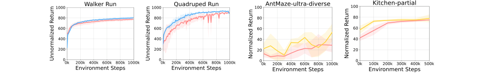

Figure 9: **U2O RL with Laplacian-based successor**
**feature learning (8 seeds).**


Figure 10: **U2O RL with goal-conditioned IQL (8**
**seeds).**


While we employ HILP [ 56 ] as an offline unsupervised skill learning method in the U2O RL
framework in our main experiments, our framework can be co ~~m~~ bined with other offline unsupervised

also improves performance over standard offline-to-online RL.


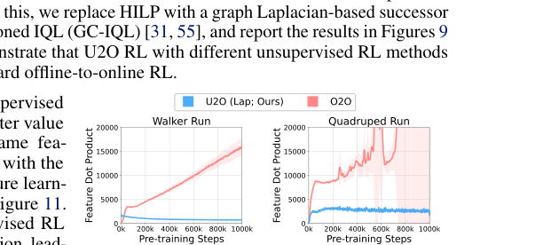

Additionally, we show that other unsupervised
skill learning methods also lead to better value
representations. We measure the same feature dot product metric in Section 5.5 with the
graph Laplacian-based successor feature learning method and report the results in Figure 11.
The results suggest that this unsupervised RL
method also prevents feature co-adaptation, leading to better features.


**A.2** **When is U2O RL better than O2O RL?**


Figure 11: **Feature dot product analysis with**
**Laplacian-based successor feature learning (8 seeds).**


In Section 6, we discussed that U2O RL is
advantageous over O2O RL especially when
the offline dataset allows the underlying unsupervised RL method to learn diverse behaviors and thus capture diverse features. Conversely, we do not particularly expect U2O RL
to be better than O2O RL when the dataset is
monolithic ( _e.g_ ., consists of only expert trajectories, has less diversity, etc.). To empirically

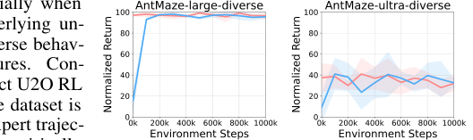
show this, we conduct an additional experiment Figure 12: **Online RL learning curves with expert-**
with a different dataset in `AntMaze-large` and **only datasets (4 seeds).**
`AntMaze-ultra` that consists of monolithic, expert trajectories (we collect a 1M-sized dataset by rolling out an offline pre-trained policy). Figure 12
shows the results. As expected, we find that the performance difference between U2O and O2O is
marginal in this monolithic setting.


17


**A.3** **Do we need to use unsupervised RL for pre-training representations?**


Table 2: **Comparison between U2O RL and pure**
**representation learning algorithms (4 seeds).**


In Sections 4.4 and 5.5, we hypothesized and Table 2: **Comparison between U2O RL and pure**
empirically showed that U2O RL is often better **representation learning algorithms (4 seeds).**
than O2O RL because it learns better representations. This leads to the following natural ques- Task `antmaze-large-diverse`
tion: do we _need_ to use offline unsupervised U2O (HILP, Q Ours) **94.50** _±_ **3.16**
_reinforcement learning_, as opposed to general U2O (HILP, _ξ_ ) 5.50 _±_ 1.91
representation learning? To answer this ques- Temporal contrastive learning 37.50 _±_ 15.00
tion, we consider two pure representation learning algorithms as alternatives to unsupervised RL: temporal contrastive learning [ 10 ] and Hilbert
(metric) representation learning [ 56 ], where the latter is equivalent to directly taking _ξ_ in the HILP
framework (Equation 4) (note that the original U2O RL takes the Q function of HILP, not the
Hilbert representation _ξ_ itself, which is used to train the Q function). To evaluate their fine-tuning
performances, for the temporal contrastive representation, we fine-tune both the Q function and
policy with contrastive RL [ 10 ]; for the Hilbert representation, we take the pre-trained representation,
add one new layer, and use it as the initialization of the Q function. Table 2 shows the results on
`antmaze-large-diverse` . Somewhat intriguingly, the results suggest that it is important to use
the full unsupervised RL procedure, and pure representation learning methods result in much worse
performance in this case. This becomes more evident if we compare U2O RL (HILP Q, ours) and
U2O RL (HILP _ξ_ ), given that they are rooted in the same Hilbert representation. We believe this
is because, if we simply use an off-the-shelf representation learning, there exists a discrepancy in
training objectives between pre-training ( _e.g_ ., metric learning) and fine-tuning (Q-learning). On the
other hand, in U2O RL, we pre-train a representation with unsupervised Q-learning (though with a
different reward function), and thus the discrepancy between pre-training and fine-tuning becomes
less severe.


Task `antmaze-large-diverse`


U2O (HILP, Q Ours) **94.50** _±_ **3.16**
U2O (HILP, _ξ_ ) 5.50 _±_ 1.91
Temporal contrastive learning 37.50 _±_ 15.00


**A.4** **Can we do “bridging” without any reward-labeled data?**


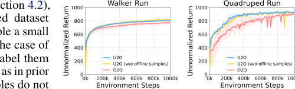

In the bridging phase of U2O RL (Section 4.2),
we assume a (small) reward-labeled dataset
_D_ `reward` . In our experiments, we sample a small
number of transitions ( _e.g_ ., 0 _._ 2% in the case of
DMC) from the offline dataset and label them
with the ground-truth reward function, as in prior
works [ 76, 56 ]. However, these samples do not
necessarily have to come from the offline dataset.

|Walker Run|Col2|
|---|---|
|||
|||
|U2O<br>~~U2O (w/o offline sam~~|~~ples)~~|


Figure 13: **U2O RL without using reward-labeling**

To show this, we conduct an additional experi
**in the offline dataset (8 seeds).**

ment where we do not assume access to any of
the existing reward samples or the ground-truth
reward function in the bridging phase. Specifically, we collect 10 K online samples with random skills
and perform the linear regression in Equation 6 only using the collected online transitions. We report
the performances of U2O (without offline samples) and O2O in Figure 13. The results show that
U2O still works and outperforms the supervised offline-to-online RL baseline.


Figure 13: **U2O RL without using reward-labeling**
**in the offline dataset (8 seeds).**


**A.5** **How do different strategies of skill identification affect performance?**


To understand how skill identification strategies
affect online RL performance, we compare our
strategy in Section 4.2 with an alternative strategy that simply selects a random latent vector
_z_ from the skill space. Figure 14 shows that
the skill identification with a randomly selected
latent vector performs worse than our strategy.
This is likely because modulating the policy with
the best latent vector helps boost task-relevant
exploration and information.


|Walker Run O|Col2|
|---|---|
|(random latent)||
|||
|||


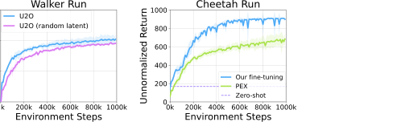

Figure 14: **Ablation**
**study of skill identifica-**
**tion (4 seeds).**


18


Figure 15: **Comparison**
**with PEX and zero-shot**
**RL (4 seeds).**


**A.6** **Additional experiments on fine-tuning strategies**


We additionally provide experimental results of fine-tuning strategies on a different task ( _i.e_ ., Cheetah
Run). Figure 15 shows that our fine-tuning strategy outperforms previous strategies, such as zero-shot
RL and PEX. This result further supports the effectiveness of fine-tuning.


**B** **Experimental Details**


For offline RL pre-training, we use 1 M training steps for ExORL, AntMaze, and Adroit and 500 K
steps for Kitchen, following Park et al. [56] . For online fine-tuning, we use 1 M additional environment
steps for ExORL, AntMaze, and Adroit and 500 K steps for Kitchen with an update-to-data ratio
of 1 . We implement U2O RL based on the official implementation of HILP [ 56 ]. We evaluate the
normalized return with 50 episodes every 10k online steps for ExORL tasks, and every 100k online
steps for AntMaze, Kitchen, and Adroit tasks. We run our experiments on A5000 or RTX 3090
GPUs. Each run takes at most 40 hours ( _e.g_ . Visual Kitchen). We provide our implementation in the
supplementary material.


**B.1** **Environments and Datasets**


**ExORL [** **85** **].** In the ExORL benchmark, we consider four embodiments, Walker, Cheetah,
Quadruped, and Jaco. Each embodiment has four tasks: Walker has {Run, Flip, Stand, Walk},
Cheetah has {Run, Run Backward, Walk, Walk Backward}, Quadruped has {Run, Jump, Stand,
Walk}, and Jaco has {Reach Top Left, Reach Top Right, Reach Bottom Left, Reach Bottom Right}.
For all the tasks in Walker, Cheetah, and Quadruped, the maximum return is 1000, and Jaco has
250 . Each embodiment has an offline dataset, which is collected by running exploratory agents such
as RND [ 5 ], and then annotated with task reward function. We use the first 5 M transitions of the
offline dataset following the prior work [ 76, 56 ]. The maximum episode length is 250 (Jaco) or 1000
(others).


**AntMaze [** **13** **,** **27** **].** In AntMaze, a quadruped agent aims at reaching the (pre-defined) target position
in a maze and gets a positive reward when the agent arrives at a pre-defined neighborhood of the target
position. We consider two types of Maze: `antmaze-large` [ 13 ] and `antmaze-ultra` [ 27 ], where
the latter has twice the size of the former. Each maze has two types of offline datasets: `play` and
`diverse` . The dataset consists of 999 trajectories with an episode length of 1000. In each trajectory,
an agent is initialized at a random location in the maze and is directed to an arbitrary location, which
may not be the same as the target goal. At the evaluation, `antmaze-large` has a maximum episode
length of 1000, and `antmaze-ultra` has 2000 . We report normalized scores by multiplying the
returns by 100.


**Kitchen [** **20** **,** **13** **].** In the Kitchen environment, a Franka robot should achieve four sub-tasks,
`microwave`, `slide cabinet`, `light switch`, and `kettle` . Each task has a success criterion
determined by an object configuration. Whenever the agent achieves a sub-task, a task reward of
1 is given, where the maximum return is 4 . We consider two types of offline datasets: `mixed` and
`partial` . We report normalized scores by multiplying the returns by 100 . For Visual-Kitchen, we
follow the same camera configuration as Mendonca et al. [47], Park et al. [57], and Park et al. [56],
to render 64 _×_ 64 RGB observations, which are used instead of low-dimensional states. We report
normalized scores by multiplying the returns by 25.


**Adroit [** **13** **].** In Adroit, a 24 -DoF Shadow Hand robot should be controlled to achieve a desired
task. We consider two tasks: `pen-binary` and `door-binary`, following prior works [ 2, 40 ]. The
maximum episode lengths of `pen-binary` and `door-binary` are 100 and 200 . respectively. We
report normalized scores by multiplying the returns by 100.


19


**B.2** **Hyperparameters**


Table 3: Hyperparameters of unsupervised RL pre-training in ExORL.


Hyperparameter Value


Learning rate 0 _._ 0005 (feature), 0 _._ 0001 (others)
Optimizer Adam [28]
Minibatch size 1024
Feature MLP dimensions (512 _,_ 512)
Value MLP dimensions (1024 _,_ 1024 _,_ 1024)
Policy MLP dimensions (1024 _,_ 1024 _,_ 1024)
TD3 target smoothing coefficient 0 _._ 01
TD3 discount factor _γ_ 0 _._ 98
Latent dimension 50
State samples for latent vector inference 10000
Successor feature loss Q loss
Hilbert representation discount factor 0 _._ 96 (Walker), 0 _._ 98 (others)
Hilbert representation expectile 0 _._ 5
Hilbert representation target smoothing coefficient 0 _._ 005


Table 4: Hyperparameters of unsupervised RL pre-training in AntMaze, Kitchen, and Adroit.


Hyperparameter Value


Learning rate 0 _._ 0003
Optimizer Adam [28]
Minibatch size 256 (Adroit), 512 (others)
Value MLP dimensions (256 _,_ 256 _,_ 256) (Adroit), (512 _,_ 512 _,_ 512) (others)
Policy MLP dimensions (256 _,_ 256 _,_ 256) (Adroit), (512 _,_ 512 _,_ 512) (others)
Target smoothing coefficient 0 _._ 005
Discount factor _γ_ 0 _._ 99
Latent dimension 32
Hilbert representation discount factor 0 _._ 99
Hilbert representation expectile 0 _._ 95
Hilbert representation target smoothing coefficient 0 _._ 005
HILP IQL expectile 0 _._ 9 (AntMaze), 0 _._ 7 (others)
HILP AWR temperature 0 _._ 5 (Kitchen) 3 (Adroit-door), 10 (others)


20


