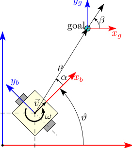
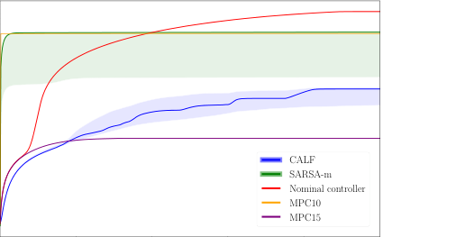
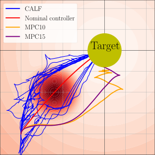

1

# Critic as Lyapunov function (CALF): a model-free, stability-ensuring agent

Pavel Osinenko [1], Grigory Yaremenko [1], Roman Zashchitin [2],
Anton Bolychev [1], Sinan Ibrahim [1], Dmitrii Dobriborsci [2]

_**Abstract**_ **—This work presents and showcases a novel rein-** 1) S is the _state space_, e. g., R _[n]_ _, n ∈_ N, that is a normed
**forcement learning agent called Critic As Lyapunov Function** vector space of all states of the given environment;
**(CALF) which is model-free and ensures online environment,** 2) A( _s_ ) is the _action space_, in general state-dependent,
**in other words, dynamical system stabilization. Online means**

e. g., a subset of R _[m]_ _, m ∈_ N, that is a set of all actions

**that in each learning episode, the said environment is stabilized.**
**This, as demonstrated in a case study with a mobile robot** available to the agent at the current state. It is assumed
**simulator, greatly improves the overall learning performance. The** that A( _s_ ) is compact for each state _s_ ;
**base actor-critic scheme of CALF is analogous to SARSA. The** 3) _p_ : S _×_ A _→_ S is the _state transition map_ of the
**latter did not show any success in reaching the target in our**

environment, assumed upper semi-continuous in norm;

**studies. However, a modified version thereof, called SARSA-m**

4) _c_ : S _×_ A _→_ R is the _cost function_ of the problem, that

**here, did succeed in some learning scenarios. Still, CALF greatly**
**outperformed the said approach. CALF was also demonstrated** is a function that takes a state _s_ _t_ and an action _a_ _t_ and
**to improve a nominal stabilizer provided to it. In summary, the** returns the immediate cost _c_ _t_ incurred upon the agent if
**presented agent may be considered a viable approach to fusing** it were to perform action _a_ _t_ while in state _s_ _t_ ;
**classical control with reinforcement learning. Its concurrent** 5) Π is the _set of policies_ (state feedback control laws in
**approaches are mostly either offline or model-based, like, for**

other words), that is a set of functions _π_ : S _→_ A.

**instance, those that fuse model-predictive control into the agent.**

Sometimes, also a discount factor _γ ∈_ (0 _,_ 1) is introduced
in front of the cost in (1) as a factor _γ_ _[t]_ .
The goal of reinforcement learning is to find a policy _π_ that

I. B ACKGROUND AND PROBLEM STATEMENT minimizes _V_ _[π]_ ( _s_ 0 ) in (1). The policy _π_ _[∗]_ that solves this prob
lem is commonly referred to as _the optimal policy_ . An _agent_

**Notation:** We will use Python-like array notation, e. g.,

[0 : _T_ ] = _{_ 0 _, . . ., T −_ 1 _}_ or _s_ 0: _T_ = _{s_ 0 _, . . ., s_ _T −_ 1 _}_ . Spaces will be referred to as a synonym for _π_ which was generated

by some finite algorithm, e. g., actor-critic. In the latter, for

of class kappa, kappa-infinity, kappa-ell and kappa-ell-infinity
functions are denoted _K, K_ _∞_ _, KL, KL_ _∞_, respectively. These instance, one step of the algorithm tries to approximate, i. e.,

“learn”, the value _V_ _[π]_ via a neural network _V_ [ˆ] _[w]_ with weights

are scalar monotonically increasing functions, zero at zero,
and, additionally, tending to infinity in case of _K_ _∞_ . The _w_ based on some collected data called _replay buffer_, say,
subscript _≥_ 0 in number set notation will indicate that only _R_ = _{s_ _t_ _k_ _, a_ _t_ _k_ _}_ _k∈_ [0: _T_ _R_ ] of size _T_ _R_ and s. t. _t_ _k_ _< t_ _k_ +1 _, ∀k_ . In
non-negative numbers are meant. The notation “cl ( _•_ )”, when the second step, the algorithm may choose a so-called _greedy_

or, e. g., _ε_ -greedy action _a_ _t_, which minimize an actor loss _L_ [act],

referring to a set, will mean the closure. We denote modulo
division of the first argument by the second as “ _•_ mod _•_ ”. e. g., _L_ [act] ( _a_ _t_ ) = _c_ _t_ + _V_ [ˆ] _[w]_ _[t]_ ( _s_ _t_ +1 ) or take a random action with

probability _ε >_ 0, respectively. A useful object is the actionvalue or Q-function _Q_ _[π]_ ( _s, a_ ) ≜ _c_ ( _s, a_ ) + _V_ _[π]_ ( _s_ _[a]_ + [)][, where] _[ s]_ _[a]_ +

_A. Problem statement_ is the state at the next step relative to _s_ upon taking the action

_a_ . The herein present approach, CALF, will base particularly

Consider the following optimal control problem:

on Q-function.

_∞_ Common reinforcement learning approaches to the above

_V_ _[π]_ ( _s_ 0 ) = � _c_ ( _s_ _t_ _, a_ _t_ ) _→_ min _,_ include various methods of policy gradient, actor-critics and

_t_ =0 tabular dynamic programming (see, e. g., [1]–[5]). A common

_s_ 0 _∈_ S _, π ∈_ Π _, t ∈_ Z _≥_ 0 (1) classical control approach is in turn, e. g., model-predictive
s. t. _s_ _t_ +1 = _p_ ( _s_ _t_ _, a_ _t_ ) _, a_ _t_ _∈_ A( _s_ _t_ ) control (MPC) that places some finite horizon _T_ pred _>_ 2

_a_ _t_ = _π_ ( _s_ _t_ ) _,_ in place of the infinity in (1) and optimizes over respective

sequences of actions via state propagation through the model

where: _p_ . A _model-free_ agent, as will be understood in this work, is

12 Skolkovo Institute of Science and TechnologyDeggendorf Institute of Technology, Technology Campus Cham a controller that does not useto compute actions. Such an agent is also called _p_, or any learned model thereof, _data-driven_
Corresponding author: P. Osinenko, email: p.osinenko@gmail.com. for instance. Notice, not every reinforcement learning agent is
First two authors contributed equally. Accepted for 27th IEEE Conference on model-free, e. g., Dyna [6], [7].
Decision and Control. Let now G _⊂_ S _,_ 0 _∈_ G denote a _goal set_ to which

978-1-4799-4937-3/14/$31.00 ©2024 IEEE we want to drive the state optimally according to (1). We

_**Abstract**_ **—This work presents and showcases a novel rein-**
**forcement learning agent called Critic As Lyapunov Function**
**(CALF) which is model-free and ensures online environment,**
**in other words, dynamical system stabilization. Online means**
**that in each learning episode, the said environment is stabilized.**
**This, as demonstrated in a case study with a mobile robot**
**simulator, greatly improves the overall learning performance. The**
**base actor-critic scheme of CALF is analogous to SARSA. The**
**latter did not show any success in reaching the target in our**
**studies. However, a modified version thereof, called SARSA-m**
**here, did succeed in some learning scenarios. Still, CALF greatly**
**outperformed the said approach. CALF was also demonstrated**
**to improve a nominal stabilizer provided to it. In summary, the**
**presented agent may be considered a viable approach to fusing**
**classical control with reinforcement learning. Its concurrent**
**approaches are mostly either offline or model-based, like, for**
**instance, those that fuse model-predictive control into the agent.**

I. B ACKGROUND AND PROBLEM STATEMENT

**Notation:** We will use Python-like array notation, e. g.,

[0 : _T_ ] = _{_ 0 _, . . ., T −_ 1 _}_ or _s_ 0: _T_ = _{s_ 0 _, . . ., s_ _T −_ 1 _}_ . Spaces
of class kappa, kappa-infinity, kappa-ell and kappa-ell-infinity
functions are denoted _K, K_ _∞_ _, KL, KL_ _∞_, respectively. These
are scalar monotonically increasing functions, zero at zero,
and, additionally, tending to infinity in case of _K_ _∞_ . The
subscript _≥_ 0 in number set notation will indicate that only
non-negative numbers are meant. The notation “cl ( _•_ )”, when
referring to a set, will mean the closure. We denote modulo
division of the first argument by the second as “ _•_ mod _•_ ”.

_A. Problem statement_

Consider the following optimal control problem:

_V_ _[π]_ ( _s_ 0 ) =

_∞_
�

� _c_ ( _s_ _t_ _, a_ _t_ ) _→_ min _,_

_t_ =0

_s_ 0 _∈_ S _, π ∈_ Π _, t ∈_ Z _≥_ 0
s. t. _s_ _t_ +1 = _p_ ( _s_ _t_ _, a_ _t_ ) _, a_ _t_ _∈_ A( _s_ _t_ )

(1)

_a_ _t_ = _π_ ( _s_ _t_ ) _,_

where:

1 Skolkovo Institute of Science and Technology
2 Deggendorf Institute of Technology, Technology Campus Cham
Corresponding author: P. Osinenko, email: p.osinenko@gmail.com.
First two authors contributed equally. Accepted for 27th IEEE Conference on
Decision and Control.

2

assume, G to be a compact neighborhood of the origin. Also
a compact in a subspace of the state space spanned by some
state variables of interest may be considered, but we omit
this case for simplicity. Let _d_ G ( _s_ ) := inf _s_ _[′]_ _∈_ G _[∥][s][ −]_ _[s]_ _[′]_ _[∥]_ [be the]
distance to the goal. We call a policy _π_ 0 _∈_ Π a G _-stabilizer_
if setting _a_ _t_ = _π_ 0 ( _s_ _t_ ) _, ∀t_ implies that the distance between _s_ _t_
and G tends to zero over time. Formally, we use the following
definition.

_Definition 1:_ A policy _π_ 0 _∈_ Π is called a G _-stabilizer_, or
simply a _stabilizer_, if the goal set is implied by the context, if

_∀t ≥_ 0 _a_ _t_ _←_ _π_ 0 ( _s_ _t_ ) = _⇒∀s_ 0 _∈_ S lim (2)
_t→∞_ _[d]_ [G] [(] _[s]_ _[t]_ [) = 0] _[.]_

It is called a uniform G-stabilizer if, additionally, the limit in
(2) is compact-convergent w. r. t. _s_ 0 and

_∃ε_ 0 _≥_ 0 _∀t ≥_ 0 _a_ _t_ _←_ _π_ 0 ( _s_ _t_ ) = _⇒_

_∀ε ≥_ _ε_ 0 _∃δ ≥_ 0 _d_ G ( _s_ 0 ) _≤_ _δ_ (3)

= _⇒∀t ≥_ 0 _d_ G ( _s_ _t_ ) _≤_ _ε,_

where _δ_ is unbounded as a function of _ε_ and _δ_ = 0 _⇐⇒_ _ε_ =

_ε_ 0 . The presence of an _ε_ 0 means we do not insist on G being
invariant. Thus, this extra condition only means that the state
overshoot may be uniformly bounded over compacts in S.
Notice that if the cost _c_ be continuous, strictly positive
outside G and diverging with the distance to G, the optimal
policy _π_ _[∗]_ is also a uniform G-stabilizer.
The main hypothesis of this work is that incorporating some
_π_ 0 into the agent may improve its learning and guarantee
stabilization into the goal set in all learning episodes, i. e.,
online. The main problem is: how to do this incorporation?
Notice that even if _π_ 1 _, π_ 2 are two stabilizers, an arbitrary
switching or “shaping” onto into another will not provide
stabilization guarantee in general.

II. R ELATED WORK

There are three principal methodologies for stabilityensuring reinforcement learning: shield-based reinforcement
learning, the integration of MPC with reinforcement learning,
and Lyapunov-based reinforcement learning.
Shield-based approaches involve a protective filter, also
referred to as a shield, overseer, or supervisor, designed to
prevent undesirable, say, destabilizing actions. These methods vary in how they evaluate actions and generate safe
alternatives. Shields range from manual human oversight [8]
to sophisticated formal verification variants [9]–[12]. Unlike
human operators, formal logic shields are theoretically errorproof, but they require highly specific application development
and can be complex, as detailed in [13]. Such techniques
have been applied in areas such as probabilistic shielding

[13], [14], supervisory systems for autonomous vehicles [15],
and safe robotic manipulation [16]. However, human overseers
introduce subjective biases and potential errors, and formal
logic shields are often difficult to design.
The combination of MPC and reinforcement learning represents an active frontier in the quest for ensuring stability

[17]–[22]. Such a fusion takes various forms, sometimes
emphasizing model learning and other times focusing on
safety constraints [23], [23]–[31]. The reinforcement learning

dreamer is a notable example that adopts the predictive spirit
of MPC [32], [33]. Such approaches draw on the MPC’s
well-established ability to ensure closed-loop stability via
techniques like terminal costs and constraints. Proposals such
as the one by Zanon et al. [17], [18] embed robust MPC within
reinforcement learning to maintain safety. Other research emphasizes the predictive control side more heavily [19], [20],
building from a safe starting point towards a predictive model
while maintaining the option to revert to safe policies when
needed.

Lyapunov stability theory is well recognized in reinforcement learning, having roots dating back to the work of Perkins
and Barto [34], [35], and has seen significant development
since [20], [36]–[39]. Typically, these approaches are offline
and require validation of a Lyapunov decay condition in
the state space. Chow et al. [36], for instance, developed a
safe Bellman operator to ensure Lyapunov compliance, while
Berkenkamp et al. [20] used state space segmentation to
validate Lyapunov conditions, demanding certain confidence
levels in the statistical environment model. Online Lyapunovbased approaches also exist, often inspired by adaptive control techniques [40]. Robustifying controls, a key component
introduced by [41], may distort the learning unless certain
preconditions are met. Some reviews may be found in [42],

[43]. Control barrier functions, another safety feature, have
been successfully integrated with reinforcement learning, providing enhanced safety capabilities as seen in simulations with
bipedal robots [44] and in model-free reinforcement learning
agents [45]. Stochastic stability theory provides a basis for
correctness [46], but the current landscape of Lyapunov-based
methods often lacks capacity for real-time application without
extensive pre-training, and is generally predicated on specific
assumptions about environmental dynamics, such as secondorder differentiability [47], linearity [48], or global Lipschitz
continuity [49].
It should be stressed that policy shaping algorithms, e. g.,

[50] may be attractive in their similarity to pre-training the
agent to boost learning, no online stabilization can be ensured
under them. In contrast to the existing approaches, CALF is
online, bringing the interplay of a stabilizer and the agent
onto a rigorous footing, thus providing a viable, model-free
approach to combining classical control and reinforcement
learning. This is the essence of the current contribution.

III. A PPROACH

In general, it holds, due to the Hamilton-Jacobi-Bellman
equation, that _∀t ≥_ 0 _Q_ _[∗]_ _t_ +1 _[−]_ _[Q]_ _[∗]_ _t_ [=] _[ −][c]_ _[∗]_ _t_ [, where] _[ Q]_ _[∗]_ _t_ [=]
_c_ ( _s_ _t_ _, π_ _[∗]_ ( _s_ _t_ )) + _V_ _[π]_ _[∗]_ [�] _s_ _[π]_ _t_ +1 _[∗]_ [(] _[s]_ _[t]_ [)] � _, c_ _[∗]_ _t_ [=] _[ c]_ [(] _[s]_ _[t]_ _[, π]_ _[∗]_ [(] _[s]_ _[t]_ [))][. This ef-]
fectively means, given the conditions on the cost stated in
Section I, that _Q_ _[∗]_ _t_ [is a Lyapunov function for the closed-loop]
system _s_ _t_ +1 = _p_ ( _s_ _t_ _, π_ _[∗]_ ( _s_ _t_ )). If a model (critic) is employed,
e. g., a deep neural network _Q_ [ˆ] _[w]_ ( _s, a_ ), due to imperfections of
learning, the Lyapunov property may be lost, although desired.
In CALF, we would like to retain the Lyapunov property
of _Q_ [ˆ] _[w]_ . Enforcing Lyapunov-like constraints alone on _Q_ [ˆ] _[w]_

would not solve the problem of ensuring stability, since those
constraints may fail to be feasible at some time steps. Offline

approaches, as mentioned in Section II, would overcome this
by large samples of state-action trajectories. What we do here
instead is that we employ any stabilizer, let us call it _π_ 0 .
The latter may be synthesized by common control techniques,
like PID, sliding mode or funnel control. The question is,
as stated earlier, how to combine the agent with _π_ 0 ? This
is brought into a systemic way in CALF. Namely, the critic
update, i. e., update of the weights _w_ is done so as to try
to satisfy Lyapunov-like constraints (decay and _K_ _∞_ -bounds,
see Algorithm 1, line 7). If this succeeds, the weights are
passed and the next actor update will base upon them. If not,
the weights are “frozen” (the respective variable is denoted
_w_ _[†]_ ) and _π_ 0 is invoked. Along _w_ _[†]_, the state-action pair is
also “stored”, namely, _s_ _[†]_ _, a_ _[†]_ . The Lyapunov-like constraints
are checked relative to _s_ _[†]_ _, a_ _[†]_ _, w_ _[†]_ . This trick enables to safely
combine the agent with _π_ 0 so as to retain the stabilization
guarantee of the latter. We use the Q-function to make the
overall approach model-free. The actor loss _L_ [act] may be taken
equal the current critic with last “successful” weights _w_ _[†]_,
namely, _L_ [act] ( _a_ ) = _Q_ [ˆ] _[w]_ _[†]_ ( _s_ _t_ _, a_ ). Any augmentation of the loss,
e. g., penalties or entropy terms, may be included into _L_ [act],
there is no restriction. Furthermore, one may choose to take
an _ε_ -greedy action.
Regarding the _K_ _∞_ -bounds (see Algorithm 1, line 7), a
reasonable choice of ˆ _κ_ low, ˆ _κ_ up would be

_κ_ ˆ low ( _•_ ) = _C_ low _•_ [2] _,_ ˆ _κ_ up ( _•_ ) = _C_ up _•_ [2] _,_ 0 _< C_ low _< C_ up _._ (4)

For the decay constraint, one may also take a quadratic rate or
simply a constant ¯ _ν >_ 0. Overall, the hyper-parameters ˆ _κ_ low,
_κ_ ˆ up and ¯ _ν_ determine a trade-off between freedom of learning

_ν_ and worst-case-scenario reaching time of the goal. If¯ are chosen to be sufficiently small, the weights of the critic _[κ]_ [ˆ] _κ_ ˆ [low] up [and]
will not be prevented from converging to their ideal values,
however if the critic is underfitted, smaller values of _[κ]_ [ˆ] _κ_ ˆ [low] up [,][ ¯] _[ν]_

may entail slower stabilization accordingly.
Now, the critic loss _L_ [crit] (see Algorithm 1, line 7) may
be taken in various forms. The presented approach does not
restrict the user. For instance, one may take a TD(1) on-policy
loss as per:

_L_ [crit] ( _w_ ) =

_T_ _R_
� ( _Q_ [ˆ] _[w]_ ( _s_ _t_ _k_ _, a_ _t_ _k_ ) _−_ _c_ ( _s_ _t_ _k_ _, a_ _t_ _k_ ) _−_

_k_ =0

(5)

3

**Algorithm 1:** Critic as Lyapunov function (CALF)
algorithm, model-free, action-value based

1: **Input** : ¯ _ν >_ 0 _,_ ˆ _κ_ low _,_ ˆ _κ_ up _, π_ 0 : (uniform) stabilizer
2: **Initialize** : _s_ 0 _, a_ 0 := _π_ 0 ( _s_ 0 ) _, w_ 0 s. t.

_κ_ ˆ low ( _∥s_ 0 _∥_ ) _≤_ _Q_ [ˆ] _[w]_ [0] ( _s_ 0 _, a_ 0 ) _≤_ _κ_ ˆ up ( _∥s_ 0 _∥_ )

3: _w_ _[†]_ _←_ _w_ 0 _, s_ _[†]_ _←_ _s_ 0 _, a_ _[†]_ _←_ _π_ 0 ( _s_ 0 ) _, a_ 0 _←_ _π_ 0 ( _s_ 0 )

4: **for** _t_ := 1 _, . . . ∞_ **do**
5: Take action _a_ _t−_ 1, get state _s_ _t_ ˆ
6: Update action: _a_ _[∗]_ _←_ arg min _Q_ _[w]_ _[†]_ ( _s_ _t_ _, a_ )
_a∈_ A( _s_ _t_ )

7: Try critic update

_w_ _[∗]_ _←_ arg min _L_ [crit] ( _w_ )
_w∈_ W

¯
s. t. _Q_ [ˆ] _[w]_ ( _s_ _t_ _, a_ _t_ ) _−_ _Q_ [ˆ] _[w]_ _[†]_ ( _s_ _[†]_ _, a_ _[†]_ ) _≤−ν,_
_κ_ ˆ low ( _∥s_ _t_ _∥_ ) _≤_ _Q_ [ˆ] _[w]_ ( _s_ _t_ _, a_ _t_ ) _≤_ _κ_ ˆ up ( _∥s_ _t_ _∥_ )

8: **if** solution _w_ _[∗]_ found **then**
9: _s_ _[†]_ _←_ _s_ _t_ _, a_ _[†]_ _←_ _a_ _[∗]_ _, w_ _[†]_ _←_ _w_ _[∗]_

10: **else**
11: _a_ _t_ _←_ _π_ 0 ( _s_ _t_ )
12: **end if**

13: **end for**

_A. Modified SARSA_

The new CALF agent was benchmarked via
its immediate reinforcement learning alternative,
_State–action–reward–state–action_ (SARSA), which is
essentially like Algorithm 1 prescribes (with on-policy
critic loss), but with the Lyapunov-like constraints and the
_π_ 0 removed. In our case studies with a mobile robot, we
observed such a plain SARSA failed to drive the robot to
the target area within any reasonable number of learning
iterations. To help SARSA succeed, we slightly modified it,
namely, we retained the _w_ _[†]_ -mechanism, i. e., we used _w_ _[†]_ in
the critic loss (see Algorithm 1, line 7). We did not _enforce_
the Lyapunov-like constraints in the optimization though.
We only checked, whether those constraints were satisfied
post factum and updated _w_ _[†]_ accordingly as in CALF. Such a
modification turned out to help SARSA reach the target in
some learning runs. This algorithm will further be referred to
as SARSA-m.

IV. A NALYSIS

The main environment stability result is formulated in
Theorem 1.

_Theorem 1:_ Consider the problem (1) and Algorithm 1. Let
_π_ _t_ denote the policy generated by Algorithm 1. If the policy
_π_ 0 is a stabilizer, then _π_ _t_ is a stabilizer. If the former is a
uniform stabilizer, then so is _π_ _t_ .

**Proof.**

First, let us consider G _[′]_ to be a closed superset of G, where
the Hausdorff distance between G and G _[′]_ is non-zero. Let _h_

denote the said distance.

_Q_ ˆ _[w]_ _[†]_ ( _s_ _t_ _k_ +1 _, a_ _t_ _k_ +1 )) [2] + _α_ crit _[−]_ [2] �� _w −_ _w_ _†_ �� 2 _._

The regularization term _α_ crit _[−]_ [2] �� _w −_ _w_ _†_ �� 2 is redundant if gradient descent based minimization is used, since one could
simply set a learning rate _α_ crit as opposed to penalizing the
displacement of weights. Notice the choice of the critic loss
(or learning rate) does not prevent environment stabilization,
although the quality of the learning may be affected. Finally,
(5) is akin to the critic loss of SARSA due to its on-policy
character, but this is not necessary, an off-policy loss may be
used as well, e. g., with greedy actions instead of _a_ _t_ _k_ +1 in (5).

_Remark 1:_ An actor model _π_ _[θ]_, e. g., as probability distribution, with weights _θ_ may be employed instead of direct actions
_a_ _t_ in Algorithm 1.

4

Recalling Algorithm 1, let us denote:

_Q_ ˆ _[†]_ := ˆ _Q_ _[w]_ _[†]_ ( _s_ _[†]_ _, a_ _[†]_ ) _._ (6)

Next, we introduce:

Tˆ := _{t ∈_ Z _≥_ 0 : successful critic update _},_

T _[π]_ [0] := _{_ 0 _}∪_
_t ∈_ N : [successful critic update at] _[ t][ −]_ [1] _[ ∧]_
unsuccessful at _t_
�

_._
�

compacts in states. To this end, let S 0 be any compact in S
and define

_p_ ¯(S 0 ) := sup _∥p_ ( _s, a_ ) _∥_ _,_ (10)
_s∈_ S 0 _,a∈_ A(S 0 ))

which exists since _p_ is upper semi-continuous in norm and
A( _s_ ) is compact for every state _s_ .
Define

(7)

_s_ _[†]_ _t_ [:=]

_s_ _t_ _, t ∈_ T [ˆ] _,_
� _s_ _[†]_ _t−_ 1 _[,]_ [ otherwise] _[.]_

The former set represents the time steps at which the critic
succeeds and the corresponding induced action will fire at the
next step. The latter set consist of the time steps after each of
which the critic first failed, discarding the subsequent failures
if any occurred.
Now, let us define:

_Q_ ˆ _[†]_ _t_ [:=]

_Q_ ˆ _t_ _, t ∈_ Tˆ _,_

ˆ
� _Q_ _[†]_ _t−_ 1 _[,]_ [ otherwise] _[.]_

Next, observe that there are at most

�

_T_ ˆ := max

_Q_ ˆ _†_ 0 _[−]_ _[ν]_ [¯]

_ν_ ¯

�

¯ _,_ 0
_ν_

Observe that

_∀t ∈_ Z _≥_ 0 ��� _s_ _†t_ ��� _≤_ _κ_ ˆ _−_ low1 [( ˆ] _[Q]_ _t_ _[†]_ [)] _[ ≤]_ _[κ]_ [ˆ] _[−]_ low [1] [( ˆ] _[Q]_ 0 _[†]_ [)] _[.]_

Denote

ˆ
S _[†]_ 0 [:=] _s ∈_ S : _∥s∥≤_ sup _κ_ _[−]_ low [1] [(ˆ] _[κ]_ [up] [(] _[∥][s]_ _[′]_ _[∥]_ [))] _._ (11)
� _s_ _[′]_ _∈_ S 0 �

Denote the state trajectory induced by the policy _π_ 0 emanating from _s_ 0 as _z_ 0: _[π]_ [0] _∞_ [(] _[s]_ [0] [)][ with single elements thereof denoted]
_z_ _t_ _[π]_ [0] [(] _[s]_ [0] [)][. By Proposition 2.2 in [51], since] _[ π]_ [0] [is a uniform]
stabilizer, there exists a _KL_ function _β_ s. t.

_∀t ∈_ Z _≥_ 0 _, s_ 0 _∈_ S _d_ G ( _z_ _t_ _[π]_ [0] [)] _[ ≤]_ _[β]_ [(] _[d]_ [G] [(] _[s]_ [0] [)] _[, t]_ [)] _[.]_ (12)

By [52, Lemma 8], there exist two _K_ _∞_ functions _κ, ξ_ s. t.

_∀v >_ 0 _, t >_ 0 _β_ ( _v, t_ ) _≤_ _κ_ ( _v_ ) _ξ_ ( _e_ _[−][t]_ ) _._ (13)

Since 0 _∈_ G, it holds that

_∀s ∈_ S _κ_ ( _d_ G ( _s_ )) _≤_ _κ_ ( _∥s∥_ ) _._ (14)

Hence

_∀s ∈_ S _, t >_ 0 _β_ ( _d_ G ( _s_ ) _, t_ ) _≤_ _κ_ ( _∥s∥_ ) _ξ_ ( _e_ _[−][t]_ ) _._ (15)

It holds that

_∀t ∈_ Z _≥_ 0
_β_ ( _d_ G ( _s_ _[†]_ _t_ [)] _[,]_ [ 0)] _[ ≤]_ _[κ]_ [(] _[d]_ [G] [(] _[s]_ _[†]_ _t_ [))] _[ξ]_ [(1)] _[ ≤]_ _[κ]_ [(ˆ] _[κ]_ _[−]_ low [1] [( ˆ] _[Q]_ _t_ _[†]_ [))] _[ξ]_ [(1)] _[ ≤]_

_κ_ (ˆ _κ_ _[−]_ low [1] [( ˆ] _[Q]_ 0 _[†]_ [))] _[ξ]_ [(1)]

_≤_ _κ_ (ˆ _κ_ _[−]_ low [1] [(ˆ] _[κ]_ [up] [(] _[∥][s]_ [0] _[∥]_ [)))] _[ξ]_ [(1)] _[.]_

Let us define

¯
_β_ [S] 0 _[†]_ := sup _β_ ( _s,_ 0) _._
_∥s∥≤p_ ¯(S _[†]_ 0 [)]

If _π_ 0 were invoked from _t_ _[†]_ +1 on, the norm state would evolve
bounded by _β_ ( _d_ G ( _s_ _[†]_ _t_ +1 [)] _[, t][ −]_ _[t]_ _[†]_ _[ −]_ [1)] _[, t][ ≥]_ _[t]_ _[†]_ [ + 1][, due to (12),]
until either G _[′]_ would be reached or the critic would succeed

again. This together with a maximal possible “jump” of _β_ lets
us to deduce

_∀t β_ ( _d_ G ( _s_ _[†]_ _t_ +1 [)] _[,]_ [ 0)] _[ ≤]_ _[β]_ [(] _[d]_ [G] [(] _[s]_ _t_ _[†]_ [)] _[,]_ [ 0) + ¯] _[β]_ [S] 0 _[†]_ _._

Now, let _ψ_ : R _→_ R be defined as:

_ψ_ ( _v_ ) := _κ_ (ˆ _κ_ _[−]_ low [1] [(ˆ] _[κ]_ [up] [(] _[v]_ [)))] _[ξ]_ [(1) + ¯] _[β]_ [S] 0 _[†]_ + _ε_ 0 _._ (16)

We deduce that

_∀t ∈_ Z _≥_ 0 _d_ G ( _s_ _t_ ) _≤_ _ψ_ ( _∥s_ 0 _∥_ ) _._

(8)

steps until the critic stops succeeding and hence only _π_ 0 is
invoked from that moment on. Hence, _T_ ˆ was independent of G _[′]_ and in turn dependent on the initialT [ˆ] is a finite set. Notice
value of the critic.
Consider some _t_ _[†]_, a time step after which the critic failed to
find a solution. At step _t_ _[†]_ + 1, the action _a_ _t_ _†_ is taken leading
the state to transition into some _s_ _t_ _†_ +1 = _p_ ( _s_ _t_ _†_ _, a_ _t_ _†_ ). Now,
either the critic finds a solution _w_ _t_ _[†]_ _[†]_ +1 [again, or] _[ π]_ [0] [ is invoked.]
In the latter case, by (2), let _T_ _t_ _[π]_ _[†]_ [0] +1 [be s. t.]

_∀t ≥_ _t_ _[†]_ + 1 + _T_ _t_ _[π]_ _[†]_ [0] +1 _[d]_ [G] [(] _[s]_ _[t]_ [)] _[ ≤]_ _[h.]_

In other words, G _[′]_ would be reached in no more than _∀t ≥_
_T_ _t_ _[π]_ _[†]_ [0] +1 [steps. Notice] _[ T]_ _[ π]_ _t_ _[†]_ [0] +1 [implicitly depends on] _[ s]_ _[t]_ _[†]_ [+1] [.]
Since there are at most _T_ [ˆ] such episodes, where _π_ 0 is invoked
for at least one step, the set T _[π]_ [0] is finite, although it implicitly
depends on the initial state.
Let _T_ [¯] _[π]_ [0] be the maximal number of steps among _T_ _t_ _[π]_ _[†]_ [0] +1 _[, t]_ _[†]_ [+]
1 _∈_ T _[π]_ [0] s. t.

_∀t ≥_ _t_ _[†]_ + 1 + _T_ _t_ _[π]_ _[†]_ [0] +1 _[d]_ [G] [(] _[s]_ _[t]_ [)] _[ ≤]_ _[h.]_

That is, _T_ [¯] _[π]_ [0] is the longest time needed to reach G _[′]_ starting
from all, but finitely many states _s_ _t_ _†_ +1 which are in turn
uniquely determined by the initial state.
We thus conclude that the set G _[′]_ is reached in no more than

_T_ _[∗]_ := _T_ [¯] _[π]_ [0] _·_ _T_ [ˆ] (9)

steps. Since G _[′]_ was arbitrary, we conclude that _π_ _t_ is a
stabilizer. Notice that the reaching time _T_ _[∗]_ depends on the
initial state _s_ 0 and cannot, in general, be made uniform over
compacts in S where the environment starts.
Now, let us address the case where _π_ _t_ can indeed be a
uniform stabilizer. For this, we need to demonstrate uniformity
of state overshoot and, respectively, uniformity of _T_ _[∗]_ on

Hence, we may claim the state resides in a desired _ε_ -vicinity,
with _ε ≥_ _ε_ _[′]_ 0 [:= ¯] _[β]_ [S] 0 _[†]_ + _ε_ 0, around G if the initial state satisfies

_∥s_ 0 _∥≤_ _ψ_ _[−]_ [1] ( _ε_ ) _._

Notice the involved inverse exists due to the strict increase

property.
Let _ε_ G be the Hausdorff distance between G and G _[′]_ . Now,
we argue similarly to the non-uniform case as before, but
defining

_T_ ¯ unif _[π]_ [0] [:=] sup
_∥s∥≤ψ_ ( _∥s_ 0 _∥_ )

_ε_ G
max �1 _, −_ log � _ξ_ _[−]_ [1] � _κ_ ˆ _[−]_ low [1] [(ˆ] _[κ]_ [up] [(] _[∥][s][∥]_ [))]

_._
���

Notice this definition is now uniform over a compact.
Notice also that it is straightforward to make _T_ [ˆ] uniform
over compacts in S, e. g., by setting

_._





_T_ ˆ := max



ˆ ¯
sup _κ_ up ( _∥s∥_ ) _−_ _ν_
_∥s∥≤ψ_ ( _∥s_ 0 _∥_ )

¯ _,_ 0
_ν_

The final reaching time reads _T_ _[∗]_ = _T_ [ˆ] _·_ _T_ [¯] unif _[π]_ [0] [.]

                
_Remark_ _2:_ If G is contained in the set S _ν_ ¯ :=
_{s ∈_ S : ˆ _κ_ up ( _∥s∥_ ) _≤_ _ν_ ¯ _}_, then _ε_ _[′]_ 0 [=] _[ ε]_ [0] [, in particular, it is zero]
if G is invariant. This claim is true since if the state is in

S _ν_ ¯, then the critic will not fire and hence only _π_ 0 is invoked
leading to the same overshoot as under _π_ 0 . It is verified by
setting

5

V. C ASE STUDY

_A. System description_

We consider here a differential drive mobile wheeled robot

(WMR) depicted in Fig. 1 for testing the proposed algorithms.
The goal is to achieve autonomous stabilization of the robot at
the origin of a coordinate system, starting from non-zero initial
conditions. In the work space, there is a designated high-cost
zone, which could represent a physical object like a swamp, a
puddle, or a phenomenon that can adversely impact the robot’s
movement. Within this high-cost zone, the robot’s maximum
velocity is constrained to 1 cm per second to mitigate potential
damage or difficulties in navigation.
The differential drive model describes the motion of the

wheeled robot. In this model, the robot has two wheels
mounted on either side, which can rotate independently. The
position and orientation of the robot in the plane can be
described by the state variables ( _x, y, ϑ_ ), where:

_•_ _x_ and _y_ represent the coordinates of the robot in the plane.

_•_ _ϑ_ is the orientation angle of the robot with respect to a
reference direction.

The kinematic equations governing the motion of the robot

are:

˙
_x_ = _v_ cos( _ϑ_ )

˙
_y_ = _v_ sin( _ϑ_ )

˙
_ϑ_ = _ω_

(17)

_ψ_ ( _v_ ) :=

_κ_ (ˆ _κ_ _[−]_ low [1] [(ˆ] _[κ]_ [up] [(] _[v]_ [))] _[ξ]_ [(1) + ¯] _[β]_ [S] 0 _[†]_ + _ε_ 0 _, v ≥_ _κ_ ˆ _[−]_ up [1] [(¯] _[ν]_ [)] _[,]_
� _κ_ ( _v_ ) _ξ_ (1) _,_ otherwise _._

Now, set _ψ_ [¯] ( _v_ ) := sup _v_ _′_ _≤v_ _ψ_ ( _v_ _[′]_ ). It is easy to verify that _ψ_ [¯] is
an increasing function, hence it is Riemann integrable. Set

_v_ ¯
Ψ( _v_ ) := _ψ_ ( _v_ _[′]_ ) d _v_ _[′]_ _._
� _ε_ 0

It is easy to verify that Ψ is continuous, strictly increasing
and bounds _ψ_ [¯] from above. Hence, we may claim that the state
resides in a desired _ε_ -vicinity, with _ε ≥_ _ε_ 0, around G if the
initial state satisfies

_∥s_ 0 _∥≤_ Ψ _[−]_ [1] ( _ε_ ) _._

The same argumentation works if one sets in line 8 of
Algorithm 1 the condition as “ **if** solution _w_ _[∗]_ found and
_s_ _t_ _/∈_ G [ˆ] ” where G [ˆ] is chosen to well contain G. In that case,
the critic deactivates in a vicinity of the goal. Notice otherwise
Algorithm 1 does not rely on any explicit specification of the
goal.

_Remark 3:_ Since the number of invocations of _π_ 0 is not
greater than _T_ _[∗]_ till the G is reached, the critic _Q_ [ˆ] _[†]_ is a multistep Lyapunov function, i. e., _Q_ [ˆ] _[†]_ is non-increasing and

_∀t ∈_ Z _≥_ 0 _Q_ [ˆ] _[†]_ _t_ + _T_ _[∗]_ _[−]_ _[Q]_ [ˆ] _t_ _[†]_ _[<]_ [ 0] _[.]_

_Remark 4:_ For extensions of the stability result to stochastic
environments and local basins of attraction, kindly refer to

[53].

where:

_•_ _v_ is the linear velocity of the robot.

_•_ _ω_ is the angular velocity (rate of change of orientation).

In the high-cost zone, the linear velocity _v_ is restricted such
that _v ≤_ 1 cm/s. Outside of this zone, the robot can move at
its maximum possible speed.
The control objective is to design a control law for _v_ and
_ω_ to stabilize the robot at the origin (0 _,_ 0). This involves
navigating from any initial position to the origin while possibly
avoiding the high-cost zone. Experiments were conducted to
validate the proposed algorithms under various initial conditions. The performance metrics typically include the time taken
to reach the origin, the path taken by the robot, and its behavior
in and around the high-cost zone.
The performance of CALF and SARSA-m as the benchmark
agent were compared with a nominal stabilizer, and two MPC
agents with different horizons. The latter are taken to get an
idea about a nearly optimal controller for the stated problem.
The code for the environment simulation, CALF, SARSA-m,
[MPC and nominal stabilizer may be found under https://github.](https://github.com/osinenkop/rcognita-calf)
[com/osinenkop/rcognita-calf.](https://github.com/osinenkop/rcognita-calf)
In our studies, we observed that a significant horizon
of length 15 was sufficient to fulfill the stated goal. This
controller is further referred to as MPC15. Notice that MPC15

may lack practicability due to such a long horizon, especially
taking into account possible disturbances. Essentially, as the
horizon length increases, the number of decision variables
and constraints in the optimization problem grows, leading
to increased computational complexity. Solving this problem
within a reasonable time frame becomes more challenging as

6

with ∆ _x_ = _x −_ _µ_ _x_ _,_ ∆ _y_ = _y −_ _µ_ _y_ ; _σ_ _x_ = _σ_ _y_ = 0 _._ 1
being standard deviations in the along-track and cross-track
directions, respectively; and _µ_ _x_ = _−_ 0 _._ 6 _, µ_ _y_ = _−_ 0 _._ 5 being the
high cost spot center.
We now proceed to the description of the nominal stabilizer.
The action components _v, ω_ were determined based on the
polar coordinate representation of the WMR as per [54],
namely:

_ρ_ ˙ _±_ cos _α_ 0
˙ _±v_

   [sin] _[ α]_ 1

_y_ _w_

_y_

_ρ_ ˙

˙

 _α_

 _β_ ˙

_∓_ _[ α]_ 1

_ρ_
_±_ [sin] _[ α]_ 0



 =

_,_ (21)
�





 _±∓_ cos [sin] _[ α]_ _α_ 01

_ρ_
_±_ [sin] _[ α]_ 0



_[ α]_ 0

_ρ_

_±v_

_ω_
�


~~_x_~~

_x_ _w_

where the top sign (plus or minus) holds if _α ∈_ ( _−_ _[π]_

_[π]_ _[π]_

2 _[,]_ 2

Fig. 1: Robot kinematics and its frames of interests.

the horizon grows. For real-time applications, such as controlling a differential drive mobile robot, the control decisions
need to be computed and applied within very short time
intervals. The extensive computations required for a 15-step
horizon can exceed the available computational resources and
time, making it possibly impractical for real-time implementation. In this regard, CALF and SARSA-m are beneficial as
they do not use any models. Again, MPC15 was rather taken
to get a clue of the best possible cost.
Recapping on the system description, at time _t_, the origin
of the local coordinate frame (base) of the robot is located at
the point ( _x_ _t_ _, y_ _t_ ) of the world coordinate frame. The robot’s
linear velocity _v_ ( _t_ ) along the axes determines the direction of
motion, while the angular velocity _ω_ ( _t_ ) determines the rotation
(refer to Fig. 1). The state vector _s ∈_ R [3] and the control input
vector (action) _a ∈_ R [2] are defined as

_s_ := � _x_ _y_ _ϑ_ [�] _[⊤]_ _, a_ := � _v_ _ω_ [�] _[⊤]_ _._ (18)

The environment state transition map _p_ can be obtained via
time discretization of the WMR differential equations which
read: ˙ _x_ = _v_ cos _ϑ,_ ˙ _y_ = _v_ sin _ϑ,_ _ϑ_ [˙] = _ω_ . For the studied MPC,
we used Euler discretization, whereas for CALF and SARSAm, _p_ is not necessary at all. In our case study, we used the
controller sampling time of 100 ms.
The control actions were constrained by _a_ min and _a_ max,
which are determined by the actuators’ capabilities. We took
those constraints matching Robotis TurtleBot3, namely, normally (except for the high-cost spot) 0.22 m/s of maximal
magnitude of translational and 2.84 rad/s of rotational velocity,
respectively.
The control goal is to drive the robot into G = _{s ∈_ R [3] :
_∥s −_ _s_ _[∗]_ _∥≤_ ∆ _}_, where the target state _s_ _[∗]_ was taken identical
with the origin and ∆ is target pose tolerance.
Regarding the high-cost zone, we introduced a spot on the
plane _R_ [2], namely, the cost was defined as (we did not penalize
the action and only slightly penalized the angle):

_c_ ( _s, a_ ) = _x_ [2] + _y_ [2] + 0 _._ 1 _ϑ_ [2] + 10 _c_ _[′]_ ( _x, y_ ) _,_ (19)

where

where the top sign (plus or minus) holds if _α ∈_ ( _−_ _[π]_ 2 _[,]_ _[π]_ 2 []]

and the bottom sign holds if _α ∈_ ( _−π, −π/_ 2] _∪_ ( _π/_ 2 _, π_ ]. The
transformation into the polar coordinates in turn reads:

_ρ_ = � _x_ [2] + _y_ [2] _,_

_α_ = _−ϑ_ + arctan 2( _y, x_ ) _,_

_β_ = _−ϑ −_ _α._

The stabilizer was set as per:

_v ←_ _K_ _ρ_ _ρ,_ (22)

_ω ←_ _K_ _α_ _α_ + _K_ _β_ _β,_ (23)

where _K_ _ρ_ _>_ 0 _, K_ _β_ _<_ 0 _, K_ _α_ _−_ _K_ _ρ_ _>_ 0.
The robot was run for 30 seconds in each episode. If the
target was not reached, we nominally added a cost of 2000 to
rule out the cases where the robot simply did not drive to the
target while also not getting into the “hot” spot determined by
_c_ _[′]_ . The target area was to 0.2 in radius around the origin (see
Fig. 3). The initial robot pose was set to � _−_ 1 _−_ 1 _π/_ 2 [�] .

_B. Discussion of results and conclusion_

As can be seen from the results (Fig. 2, Fig. 3), both
reinforcement learning agents outperformed MPC10 (CALF
at once and SARSA-m in the final episode). The controller
MPC15 performed best in terms of cost, but it should only
be taken as a reference for a potential nearly best performing
approach. It has a significant horizon length which reduces
its practicability. Unlike MPC15, the studied reinforcement
learning agents are totally model-free. Next, CALF also outperformed the nominal controller. What is remarkable is that
both agents were able to detour the “hot” spot (notice in Fig. 3
how the nominal stabilizer is blind to the spot). CALF did it in
all best learning episodes, whereas SARSA-m succeeded only
in a part of those. It should be repeated here that plain SARSA
did not succeed in our case studies at all. Overall, CALF
always succeeded in reaching the target, thanks to its design
and Theorem 1, and also outperformed the benchmark agent
SARSA-m in terms of learning performance. This validates the
initial claim that ensuring online environment stability is not
just practicable, but it is also beneficial for episode-to-episode
learning.

R EFERENCES

[1] R. S. Sutton and A. G. Barto, _Reinforcement Learning: An Introduction_ .
Cambridge, MA, USA: A Bradford Book, 2018.

_σ_ [2]
_y_

_,_ (20)

� [�]

∆ _x_ 2
� _σ_ _x_ [2]

2
_x_

+ [∆] _[y]_ [2]
_σ_ _x_ [2] _σ_ [2]

1
_c_ _[′]_ ( _x, y_ ) = exp
2 _πσ_ _x_ _σ_ _y_

�

_−_ [1]

2

7

10 [3]

10 [2]

10 [1]

|Col1|Col2|
|---|---|
|||
|CALF SARSA-m Nominal controller MPC10 MPC15|CALF SARSA-m Nominal controller MPC10 MPC15|
|||

0 2 4 6 8 10 12 14
Number of episode

10 [3]

10 [2]

10 [1]

0 5 10 15 20 25
time [s]

(b) Accumulated cost (logarithmic scale) depending on time
in the best learning episode. The clouds represent the 95 %
confidence intervals. The solid lines are medians.

(a) Learning curves depending on the episode, i. e., environment
run number. The clouds represent the 95 % confidence intervals.
The solid lines are median. Model-predictive controllers, as well
as the nominal stabilizer, are given for reference.

Fig. 2: Learning curves obtained from 25 seeds of random number generator.

4 _._ 8

4 _._ 2

3 _._ 6

3 _._ 0

2 _._ 4

1 _._ 8

1 _._ 2

0 _._ 6

0 _._ 0

0 _._ 50

0 _._ 25

0 _._ 00

_−_ 0 _._ 25

_−_ 0 _._ 50

_−_ 0 _._ 75

_−_ 1 _._ 00

_−_ 1 _.−_ 251 _._ 25 _−_ 1 _._ 00 _−_ 0 _._ 75 _−_ 0 _._ 50 _−_ 0 _._ 25 0 _._ 00 0 _._ 25 0 _._ 50

|Col1|Col2|Col3|
|---|---|---|
|controller|||
|Target|||
||||
||||
||||
||||
||||

_x_ [m]

4 _._ 8

4 _._ 2

3 _._ 6

3 _._ 0

2 _._ 4

1 _._ 8

1 _._ 2

0 _._ 6

0 _._ 0

|0.50 SA No 0.25 MP MP 0.00 0.25 0.50 0.75 1.00 1.25 −1.25−1.00|Col2|Col3|Col4|Col5|
|---|---|---|---|---|
|_−_1_._25_−_1_._00 1_._25 1_._00 0_._75 0_._50 0_._25 0_._00 0_._25 0_._50 ~~SA~~ No ~~MP~~ MP|~~RSA-m~~ minal controller ~~C10~~||||
|_−_1_._25_−_1_._00 1_._25 1_._00 0_._75 0_._50 0_._25 0_._00 0_._25 0_._50 ~~SA~~ No ~~MP~~ MP|Ta C15|rget|||
|_−_1_._25_−_1_._00 1_._25 1_._00 0_._75 0_._50 0_._25 0_._00 0_._25 0_._50 ~~SA~~ No ~~MP~~ MP|||||
|_−_1_._25_−_1_._00 1_._25 1_._00 0_._75 0_._50 0_._25 0_._00 0_._25 0_._50 ~~SA~~ No ~~MP~~ MP|||||
|_−_1_._25_−_1_._00 1_._25 1_._00 0_._75 0_._50 0_._25 0_._00 0_._25 0_._50 ~~SA~~ No ~~MP~~ MP|||||
|_−_1_._25_−_1_._00 1_._25 1_._00 0_._75 0_._50 0_._25 0_._00 0_._25 0_._50 ~~SA~~ No ~~MP~~ MP|||||
|_−_1_._25_−_1_._00 1_._25 1_._00 0_._75 0_._50 0_._25 0_._00 0_._25 0_._50 ~~SA~~ No ~~MP~~ MP|||||
|_−_1_._25_−_1_._00 1_._25 1_._00 0_._75 0_._50 0_._25 0_._00 0_._25 0_._50 ~~SA~~ No ~~MP~~ MP|_−_0_._75_−_0_._50_−_0_._25 0_._00 0_._25 0_._50 _x_ [m]|_−_0_._75_−_0_._50_−_0_._25 0_._00 0_._25 0_._50 _x_ [m]|_−_0_._75_−_0_._50_−_0_._25 0_._00 0_._25 0_._50 _x_ [m]|_−_0_._75_−_0_._50_−_0_._25 0_._00 0_._25 0_._50 _x_ [m]|

Fig. 3: The robot trajectories in best learning episodes over 25 seeds.

[2] S. M. Kakade, “A natural policy gradient,” _Advances in neural informa-_
_tion processing systems_, vol. 14, 2001.

[3] J. Baxter and P. L. Bartlett, “Infinite-horizon policy-gradient estimation,”
_Journal of Artificial Intelligence Research_, vol. 15, pp. 319–350, 2001.

[4] J. Peters and S. Schaal, “Policy gradient methods for robotics,” in _2006_
_IEEE/RSJ International Conference on Intelligent Robots and Systems_,
2006, pp. 2219–2225.

[5] D. P. Bertsekas, _Reinforcement learning and optimal control_ . Athena
Scientific Belmont, MA, 2019.

[6] R. S. Sutton, “Dyna, an integrated architecture for learning, planning,
and reacting,” _ACM Sigart Bulletin_, vol. 2, no. 4, pp. 160–163, 1991.

[7] M. Pei, H. An, B. Liu, and C. Wang, “An improved dyna-q algorithm for
mobile robot path planning in unknown dynamic environment,” _IEEE_
_Transactions on Systems, Man, and Cybernetics: Systems_, vol. 52, no. 7,
pp. 4415–4425, 2021.

[8] W. Saunders, G. Sastry, A. Stuhlmueller, and O. Evans, “Trial without
error: Towards safe reinforcement learning via human intervention,”
_arXiv preprint arXiv:1707.05173_, 2017.

[9] Y. K. Tan and A. Platzer, “Deductive stability proofs for ordinary
differential equations,” _arXiv:2010.13096_, 2020.

[10] A. Platzer and J.-D. Quesel, “Keymaera: A hybrid theorem prover
for hybrid systems (system description),” in _Automated Reasoning_ .
Springer, 2008, pp. 171–178.

[11] ——, “European train control system: A case study in formal verification,” in _Formal Engineering Methods_ . Springer, 2009, pp. 246–265.

[12] N. Fulton and A. Platzer, “Safe reinforcement learning via formal methods: Toward safe control through proof and learning,” in _Proceedings of_
_the AAAI Conference on Artificial Intelligence_, vol. 32, no. 1, 2018.

[13] B. K¨onighofer, F. Lorber, N. Jansen, and R. Bloem, “Shield synthesis
for reinforcement learning,” in _International Symposium on Leveraging_
_Applications of Formal Methods_ . Springer, 2020, pp. 290–306.

[14] B. K¨onighofer, R. Bloem, S. Junges, N. Jansen, and A. Serban, “Safe
reinforcement learning using probabilistic shields,” in _International Con-_
_ference on Concurrency Theory: 31st CONCUR 2020: Vienna, Austria_
_(Virtual Conference)_ . Schloss Dagstuhl-Leibniz-Zentrum fur Informatik
GmbH, Dagstuhl Publishing, 2020.

[15] D. Isele, A. Nakhaei, and K. Fujimura, “Safe reinforcement learning on
autonomous vehicles,” in _2018 IEEE/RSJ International Conference on_
_Intelligent Robots and Systems (IROS)_, 2018, pp. 1–6.

[16] B. Thananjeyan, A. Balakrishna, S. Nair, M. Luo, K. Srinivasan,
M. Hwang, J. E. Gonzalez, J. Ibarz, C. Finn, and K. Goldberg, “Recovery
rl: Safe reinforcement learning with learned recovery zones,” _IEEE_
_Robotics and Automation Letters_, vol. 6, no. 3, pp. 4915–4922, 2021.

[17] M. Zanon and S. Gros, “Safe reinforcement learning using robust MPC,”
_IEEE Transactions on Automatic Control_, vol. 66, no. 8, pp. 3638–3652,
2020.

[18] M. Zanon, S. Gros, and A. Bemporad, “Practical reinforcement learning
of stabilizing economic mpc,” in _2019 18th European Control Confer-_
_ence (ECC)_, 2019, pp. 2258–2263.

[19] T. Koller, F. Berkenkamp, M. Turchetta, and A. Krause, “Learning-based

8

model predictive control for safe exploration,” in _2018 IEEE Conference_
_on Decision and Control (CDC)_ . IEEE, dec 2018.

[20] F. Berkenkamp, M. Turchetta, A. Schoellig, and A. Krause, “Safe modelbased reinforcement learning with stability guarantees,” in _Advances_
_in Neural Information Processing Systems_, I. Guyon, U. V. Luxburg,
S. Bengio, H. Wallach, R. Fergus, S. Vishwanathan, and R. Garnett,
Eds., vol. 30. Curran Associates, Inc., 2017.

[21] F. Berkenkamp, “Safe exploration in reinforcement learning: Theory and
applications in robotics,” Ph.D. dissertation, ETH Zurich, 2019.

[22] T. H. Oh, “Q-mpc: stable and efficient reinforcement learning using
model predictive control,” _IFAC-PapersOnLine_, vol. 56, no. 2, pp. 2727–
2732, 2023.

[23] N. Karnchanachari, M. de la Iglesia Valls, D. Hoeller, and M. Hutter,
“Practical reinforcement learning for mpc: Learning from sparse objectives in under an hour on a real robot,” in _Proceedings of the 2nd_
_Conference on Learning for Dynamics and Control_, ser. Proceedings of
Machine Learning Research, A. M. Bayen, A. Jadbabaie, G. Pappas,
P. A. Parrilo, B. Recht, C. Tomlin, and M. Zeilinger, Eds., vol. 120.
The Cloud: PMLR, 2020, pp. 211–224.

[24] K. Lowrey, A. Rajeswaran, S. Kakade, E. Todorov, and I. Mordatch,
“Plan online, learn offline: Efficient learning and exploration via modelbased control,” _arXiv preprint arXiv:1811.01848_, 2018.

[25] W. Cai, A. B. Kordabad, and S. Gros, “Energy management in residential
microgrid using model predictive control-based reinforcement learning
and shapley value,” _Engineering Applications of Artificial Intelligence_,
vol. 119, p. 105793, 2023.

[26] B. Amos, I. Jimenez, J. Sacks, B. Boots, and J. Z. Kolter, “Differentiable
MPC for end-to-end planning and control,” in _Advances in Neural_
_Information Processing Systems_, S. Bengio, H. Wallach, H. Larochelle,
K. Grauman, N. Cesa-Bianchi, and R. Garnett, Eds., vol. 31. Curran
Associates, Inc., 2018, pp. 8289–8300.

[27] D. Hoeller, F. Farshidian, and M. Hutter, “Deep value model predictive
control,” in _Proceedings of the Conference on Robot Learning_, ser.
Proceedings of Machine Learning Research, L. P. Kaelbling, D. Kragic,
and K. Sugiura, Eds., vol. 100, 2020, pp. 990–1004.

[28] S. East, M. Gallieri, J. Masci, J. Koutnik, and M. Cannon, “Infinitehorizon differentiable model predictive control,” _International Confer-_
_ence on Learning Representations_, Jan. 2020.

[29] S. Reddy, A. D. Dragan, S. Levine, S. Legg, and J. Leike, “Learning
human objectives by evaluating hypothetical behavior,” _International_
_Conference on Machine Learning_, 2019.

[30] C. Finn and S. Levine, “Deep visual foresight for planning robot
motion,” in _2017 IEEE International Conference on Robotics and_
_Automation (ICRA)_, 2017, pp. 2786–2793.

[31] K. D. Asis, A. Chan, S. Pitis, R. Sutton, and D. Graves, “Fixedhorizon temporal difference methods for stable reinforcement learning,”
_Proceedings of the AAAI Conference on Artificial Intelligence_, vol. 34,
no. 04, pp. 3741–3748, 2020.

[32] D. Hafner, T. Lillicrap, J. Ba, and M. Norouzi, “Dream to control:
Learning behaviors by latent imagination,” _International Conference on_
_Learning Representations_, 2020.

[33] P. Wu, A. Escontrela, D. Hafner, P. Abbeel, and K. Goldberg, “Daydreamer: World models for physical robot learning,” in _Conference on_
_Robot Learning_ . PMLR, 2023, pp. 2226–2240.

[34] T. Perkins and A. Barto, “Lyapunov design for safe reinforcement
learning control,” in _Safe Learning Agents: Papers from the 2002 AAAI_
_Symposium_, 2002, pp. 23–30.

[35] T. J. Perkins and A. G. Barto, “Lyapunov-constrained action sets for
reinforcement learning,” in _ICML_, vol. 1, 2001, pp. 409–416.

[36] Y. Chow, O. Nachum, E. Duenez-Guzman, and M. Ghavamzadeh, “A
lyapunov-based approach to safe reinforcement learning,” in _Advances_
_in Neural Information Processing Systems_, S. Bengio, H. Wallach,
H. Larochelle, K. Grauman, N. Cesa-Bianchi, and R. Garnett, Eds.,
vol. 31. Curran Associates, Inc., 2018.

[37] A. B. Jeddi, N. L. Dehghani, and A. Shafieezadeh, “Memory-augmented
lyapunov-based safe reinforcement learning: end-to-end safety under
uncertainty,” _IEEE Transactions on Artificial Intelligence_, 2023.

[38] M. Han, L. Zhang, J. Wang, and W. Pan, “Actor-critic reinforcement
learning for control with stability guarantee,” _IEEE Robotics and Au-_
_tomation Letters_, vol. 5, no. 4, pp. 6217–6224, 2020.

[39] Y.-C. Chang and S. Gao, “Stabilizing neural control using self-learned
almost lyapunov critics,” in _2021 IEEE International Conference on_
_Robotics and Automation (ICRA)_ . IEEE, 2021, pp. 1803–1809.

[40] H. Zhang, L. Cui, X. Zhang, and Y. Luo, “Data-driven robust approximate optimal tracking control for unknown general nonlinear systems
using adaptive dynamic programming method,” _IEEE Transactions on_
_Neural Networks_, vol. 22, no. 12, pp. 2226–2236, 2011.

[41] K. G. Vamvoudakis, M. F. Miranda, and J. P. Hespanha, “Asymptotically
stable adaptive–optimal control algorithm with saturating actuators and
relaxed persistence of excitation,” _IEEE transactions on neural networks_
_and learning systems_, vol. 27, no. 11, pp. 2386–2398, 2015.

[42] R. Kamalapurkar, P. Walters, J. Rosenfeld, and W. E. Dixon, _Rein-_
_forcement learning for optimal feedback control: A Lyapunov-based_
_approach_ . Springer, 2018.

[43] P. Osinenko, D. Dobriborsci, and W. Aumer, “Reinforcement
learning with guarantees: a review,” _IFAC-PapersOnLine_, vol. 55,
no. 15, pp. 123–128, 2022, presented at IFAC Conference on
Intelligent Control and Automation Sciences. [Online]. Available:
[https://www.sciencedirect.com/science/article/pii/S2405896322010308](https://www.sciencedirect.com/science/article/pii/S2405896322010308)

[44] J. Choi, F. Castaneda, C. J. Tomlin, and K. Sreenath, “Reinforcement
learning for safety-critical control under model uncertainty, using control lyapunov functions and control barrier functions,” _arXiv preprint_
_arXiv:2004.07584_, 2020.

[45] R. Cheng, G. Orosz, R. M. Murray, and J. W. Burdick, “End-to-end
safe reinforcement learning through barrier functions for safety-critical
continuous control tasks,” in _Proceedings of the AAAI Conference on_
_Artificial Intelligence_, vol. 33, no. 01, 2019, pp. 3387–3395.

[46] R. Khasminskii and G. Milstein, _Stochastic Stability of Differential_
_Equations_, ser. Stochastic Modelling and Applied Probability. Springer,
2011.

[47] S. Bhasin, R. Kamalapurkar, M. Johnson, K. G. Vamvoudakis, F. L.
Lewis, and W. E. Dixon, “A novel actor-critic-identifier architecture for
approximate optimal control of uncertain nonlinear systems,” _Automat-_
_ica_, vol. 49, no. 1, pp. 82–92, 2013.

[48] K. G. Vamvoudakis, “Q-learning for continuous-time linear systems:
A model-free infinite horizon optimal control approach,” _Syst. Control_
_Lett._, vol. 100, pp. 14–20, 2017.

[49] D. Vrabie, K. G. Vamvoudakis, and F. L. Lewis, _Optimal Adaptive_
_Control and Differential Games by Reinforcement Learning Principles_ .
Institution of Engineering and Technology, 2012.

[50] H. Plisnier, D. Steckelmacher, J. Willems, B. Depraetere, and A. Now´e,
“Transferring multiple policies to hotstart reinforcement learning in an
air compressor management problem,” _arXiv preprint arXiv:2301.12820_,
2023.

[51] Z.-P. Jiang and Y. Wang, “A converse lyapunov theorem for discretetime systems with disturbances,” _Systems & Control Letters_, vol. 45,
no. 1, pp. 49–58, jan 2002.

[52] E. D. Sontag, “Comments on integral variants of ISS,” _Systems and_
_Control Letters_, vol. 34, no. 1-2, pp. 93–100, may 1998.

[53] P. Osinenko, G. Yaremenko, G. Malaniia, and A. Bolychev,
“An actor-critic framework for online control with environment
stability guarantee,” _IEEE Access_ [, 2023. [Online]. Available: https:](https://ieeexplore.ieee.org/document/10223230)
[//ieeexplore.ieee.org/document/10223230](https://ieeexplore.ieee.org/document/10223230)

[54] A. Astolfi, “Exponential stabilization of nonholonomic systems via
discontinuous control,” _IFAC Proceedings Volumes_, vol. 28, no. 14, pp.
661–666, 1995.

