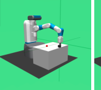
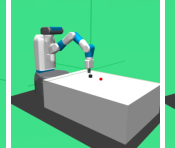
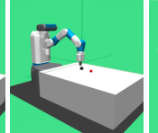
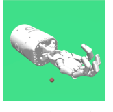
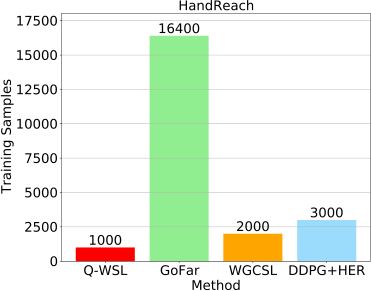
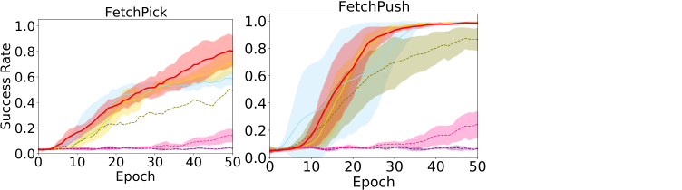
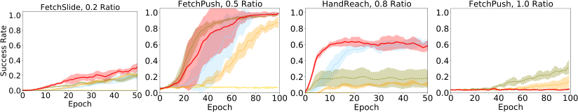
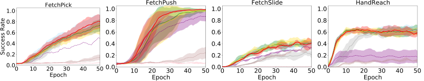

## **Q-WSL: Optimizing Goal-Conditioned RL with** **Weighted Supervised Learning via Dynamic** **Programming**


**Xing Lei**
Xi’an Jiaotong University
```
  leixing@stu.xjtu.edu.cn

```

**Zifeng Zhuang**
Westlake University
```
zhuangzifeng@westlake.edu.cn

```


**Xuetao Zhang**
Xi’an Jiaotong University
```
  xuetaozh@xjtu.edu.cn

```

**Donglin Wang**
Westlake University
```
wangdonglin@westlake.edu.cn

```


**Abstract**


A novel class of advanced algorithms, termed Goal-Conditioned Weighted Supervised Learning (GCWSL), has recently emerged to tackle the challenges posed
by sparse rewards in goal-conditioned reinforcement learning (RL). GCWSL consistently delivers strong performance across a diverse set of goal-reaching tasks
due to its simplicity, effectiveness, and stability. However, GCWSL methods lack
a crucial capability known as trajectory stitching, which is essential for learning
optimal policies when faced with unseen skills during testing. This limitation
becomes particularly pronounced when the replay buffer is predominantly filled
with sub-optimal trajectories. In contrast, traditional TD-based RL methods, such
as Q-learning, which utilize Dynamic Programming, do not face this issue but
often experience instability due to the inherent difficulties in value function approximation. In this paper, we propose Q-learning Weighted Supervised Learning
(Q-WSL), a novel framework designed to overcome the limitations of GCWSL by
incorporating the strengths of Dynamic Programming found in Q-learning. Q-WSL
leverages Dynamic Programming results to output the optimal action of (state,
goal) pairs across different trajectories within the replay buffer. This approach
synergizes the strengths of both Q-learning and GCWSL, effectively mitigating
their respective weaknesses and enhancing overall performance. Empirical evaluations on challenging goal-reaching tasks demonstrate that Q-WSL surpasses other
goal-conditioned approaches in terms of both performance and sample efficiency.
Additionally, Q-WSL exhibits notable robustness in environments characterized by
binary reward structures and environmental stochasticity.


**1** **Introduction**


Deep reinforcement learning (RL) has demonstrated remarkable success in enabling agents to
achieve complex objectives across a wide range of challenging and uncertain environments, including
computer games (Hou et al., 2022; Liu et al., 2023; Kim et al., 2024), robotic control (Xu and
Wang, 2022; Bouktif et al., 2023; Xiao et al., 2024), and natural language processing (Sharifani and
Amini, 2023; Zeng et al., 2024). Despite these advances, a fundamental challenge in deep RL lies in
ensuring sample-efficient learning in environments with sparse rewards. This problem is particularly
pronounced in goal-conditioned reinforcement learning (GCRL) (Kaelbling, 1993; Schaul et al.,
2015; Andrychowicz et al., 2017; Liu et al., 2022), where agents must learn generalizable policies
capable of reaching diverse goals.


Preprint. Under review.


Recently, we note that several goal-conditioned weighted supervised learning (GCWSL) methods have
been proposed (Ghosh et al., 2021; Yang et al., 2022; Ma et al., 2022; Hejna et al., 2023) to tackle the
GCRL challenges. In contrast to conventional RL approaches that maximizes discounted cumulative
return, GCWSL provides theoretical guarantees that supervised learning from hindsight relabeled
experiences optimizes a lower bound on the goal-conditioned RL objective. Specifically, these
methods first retrospectively infer which goals would have been fulfilled by a trajectory, irrespective
of whether it successfully reached the desired goal. After this hindsight relabeling, GCWSL aims
to imitate the corresponding sub-trajectories of (state, goal) pairs within the same trajectory in the
relabeled data. Due to the benefit of the weighted function, GCWSL, unlike behavior cloning, can
identify potentially optimal trajectories. Compared with other goal-conditioned RL or self-supervised
(SL) methods (Ding et al., 2019; Chen et al., 2020; Lynch et al., 2020; Paster et al., 2020; Eysenbach
et al., 2020; Ghosh et al., 2021; Eysenbach et al., 2022), GCWSL has demonstrated outstanding
performance across various goal-reaching tasks in a simple, effective, and stable manner.


Despite the successful application of GCWSL in effectively learning sparse rewards for certain
goal-reaching tasks, some studies (Brandfonbrener et al., 2022; Yang et al., 2023; Ghugare et al.,
2024) indicate that GCWSL may leads to sub-optimal policies when applied to the corresponding
sub-trajectories of (state, goal) pairs across different trajectories and identify this issue as lacking
of the ability to stitch trajectories. To effectively address this challenge, it is crucial to amalgamate
information from multiple trajectories. On the other hand, we demonstrate that Q-learning possesses
this ability due to its Dynamic Programming framework, leading to better policy outcomes. However,
Q-learning faces certain challenges in environments with sparse rewards. One of the key issues is
the difficulty in propagating the value function back to the initial state, primarily due to the use of
function approximation (Sutton and Barto, 1998).


In this work, we introduce Q-WSL, a novel method designed to address the aforementioned challenges
by leveraging Dynamic Programming within Q-learning to enhance the performance of GCWSL.
Unlike many goal-conditioned RL algorithms that propose new architectures for agents to achieve
better performance, Q-WSL focuses on improving the quality of the replay buffer, enabling more
effective utilization of existing goal-conditioned RL algorithms. Our approach is motivated by the
following insight: while GCWSL often learns suboptimal policies for certain sub-trajectories of (state,
goal) pairs across different trajectories, Q-learning can derive better actions. However, Q-learning
tends to struggle when dealing with states that require backpropagation over large time steps. In
these cases, GCWSL offers a distinct advantage by circumventing the need for backpropagation. By
combining the strengths of both methods, Q-WSL mitigates their respective weaknesses, leading
to a more robust and efficient performance. To evaluate the effectiveness of Q-WSL, we conduct
experiments using challenging GCRL benchmark environments. The results demonstrate that QWSL significantly improves sample efficiency compared to previous GCWSL approaches and other
competitive GCRL methods, including DDPG+HER (Andrychowicz et al., 2017), ActionModels
(Chebotar et al., 2021a), and Model-based HER (Yang et al., 2021). Additionally, Q-WSL exhibits
strong robustness to variations in reward functions and environmental stochasticity.


We briefly summarize our contributions:


    - While state-of-the-art GCWSL methods tend to yield suboptimal performance for certain
unseen skills during testing and lack trajectory stitching capabilities, we demonstrate that Qlearning inherently possesses this ability and can produce optimal actions in such scenarios.

    - We introduce a novel and efficient GCRL method, Q-WSL, which harnesses the stitching capability of Q-learning to overcome the limitations of GCWSL. Additionally, we demonstrate
that the optimization lower bound of Q-WSL exceeds that of several competitive GCRL
algorithms, including WGCSL (Yang et al., 2022) and GCSL (Ghosh et al., 2021).

    - Experimental results on several GCRL benchmarks show that Q-WSL obtains better generalization performance and sample efficiency compared to prior GCRL methods. Additionally,
Q-WSL is robust to variations in reward forms and environmental stochasticity.


**2** **Related Work**


**The Stitching Property** The concept of stitching, as discussed by (Ziebart et al., 2008), is a
characteristic feature of TD-based RL algorithms, such as those described by (Mnih et al., 2013),
(Lillicrap et al., 2015), (Fujimoto et al., 2018), and (Kostrikov et al., 2021), which employ Dynamic


2


Programming techniques. This feature allows these algorithms to integrate data from different
trajectories, thereby enhancing their effectiveness in managing complex tasks by leveraging historical
data (Cheikhi and Russo, 2023). Recent works have shown that self-supervised learning also exhibits
such property, particularly through methods like data augmentation (Shorten and Khoshgoftaar, 2019;
Ghugare et al., 2024) . However, there remains a significant performance gap between these methods
and algorithms that incorporate Dynamic Programming.


This property motivates us to employ simple yet efficient Q-learning in TD-based RL to reach previously unvisited goals across different trajectories by leveraging Dynamic Programming. However,
it is not clear that whether Q-learning process this important stitching property in GCRL. Using
a straightforward counterexample, we demonstrate that stitching enables a unique property: the
ability to infer solutions for composable goal-reaching trajectories during testing time. This includes
maneuvering through specific (state, goal) pairs that never appear together during training, although
they do appear separately.


**Goal-conditioned Weighted Supervised Learning** Goal-conditioned weighted supervised learning
methods (GCWSL) (Liu et al., 2021; Yang et al., 2022; Ma et al., 2022; Hejna et al., 2023) are new
outstanding goal-conditioned algorithms which enable agent to reach multiple goals in GCRL. These
methods repeatedly perform imitation learning on self-collected, relabeled data without any RL
updates. Furthermore, these methodologies undergo theoretical validation to confirm that selfsupervised learning from relabeled experiences optimizes a lower bound on the GCRL objective.
This validation guarantees that the learning process is both efficient and underpinned by a rigorous
theoretical foundation.


However, recent researches (Brandfonbrener et al., 2022; Yang et al., 2023; Ghugare et al., 2024)
indicate that these methods are sub-optimal for some unseen skills and lack the ability to stitch information from multiple trajectories. In response, our method, Q-WSL, which extends the framework of
GCWSL by leveraging Dynamic Programming in Q-learning, can specifically designed to achieve
optimal policy outcomes and integrates the capability for trajectory stitching.


**3** **Preliminaries**


**3.1** **Goal-conditioned Reinforcement Learning**


Goal-conditioned Reinforcement Learning (GCRL) can be characterized by the tuple
_⟨S, A, G, P, r, γ, ρ_ 0 _, T_ _⟩_, where _S_, _A_, _G_, _γ_, _ρ_ 0 and _T_ respectively represent the state space, action space, goal space, discounted factor, the distribution of initial states and the horizon of the
episode. _P_ : _P_ ( _s_ _[′]_ _|s, a_ ) is the dynamic transition function, and _r_ : _r_ ( _s, a, g_ ) is typically a simple
unshaped binary signal. The sparse reward function employed in GCRL can be expressed as follows:


0 _,_ _∥ϕ_ ( _s_ _t_ ) _−_ _g∥_ 2 [2] _[< δ]_
_r_ ( _s_ _t_ _, a_ _t_ _, g_ ) = � _−_ 1 _,_ otherwise _,_ (1)


_δ_ is a threshold and _ϕ_ : _S →G_ is a known state-to-goal mapping function from states to goals.
Agents must develop a policy _π_ : _S × G →A_ that optimizes the expected returns associated with
reaching goals sampled from the goal distribution _p_ ( _g_ ):


�


_J_ ( _π_ ) = _E_ _g∼p_ ( _g_ ) _,a_ _t_ _∼π,s_ _t_ +1 _∼p_ ( _·|s_ _t_ _,a_ _t_ )


_T_
�
� _t_ =0


� _γ_ _[t]_ _r_ ( _s_ _t_ _, a_ _t_ _, g_ )


_t_ =0


_._ (2)


**Q-learning** methods optimizes _J_ ( _π_ ) via the gradient computation:


�


_J_ ( _π_ ) = E _g,a_ _t_ _,s_ _t_ +1


_T_
�
� _t_ =0


� _Q_ _[π]_ ( _s_ _t_ _, a_ _t_ _, g_ )


_t_ =0


_,_ (3)


where _Q_ _[π]_ ( _s_ _t_ _, a_ _t_ _, g_ ) is the goal-conditioned Q-function. Note that in 1 [ _ϕ_ ( _s_ _t_ ) = _g_ ] reward (i.e, If the
state _s_ reaches the goal _g_, then the reward is 1; otherwise, it is 0.), the _Q_ _[π]_ ( _s_ _t_ _, a_ _t_ _, g_ ) is always zero.
This Q-function is not useful for predicting the future goal distribution.


3


**3.2** **Goal-conditioned Weighted Supervised Learning**


In contrast to goal-conditioned RL methods, which focus on directly optimizing the discounted
cumulative return, Goal-Conditioned Weighted Supervised Learning methods (GCWSL) introduce an
innovative learning framework by iteratively relabeling and imitating self-generated experiences. This
iterative process enhances the model’s ability to generalize and efficiently learn from past experiences,
thereby improving its overall performance in goal-reaching tasks. Trajectories in the replay buffer
are relabeled with hindsight method (Andrychowicz et al., 2017). And then the policy optimization
satisfies the following definition during imitating:


**Definition 1.** _Given replay buffer_ _B_ _and hindsight relabeling mechanism, the objective of GCWSL is_
_to mimic those relabeled transitions through supervised learning with weighted function:_


_J_ _GCW SL_ ( _π_ ) = E ( _s_ _t_ _,a_ _t_ _,g_ ) _∼B_ _r_ [ _f_ ( _A_ ) _·_ log _π_ _θ_ ( _a_ _t_ _|s_ _t_ _, g_ )] _,_ (4)


where _B_ _r_ denotes relabeled replay buffer, _g_ = _ϕ_ ( _s_ _i_ ) denotes the relabeled goals for _i ≥_ _t_ and _f_ ( _A_ )
is a function about advantage _A_ := _A_ ( _s_ _t_ _, a_ _t_ _, g_ ) . The weighted function _f_ ( _A_ ) exists various forms in
GCWSL methods (Ghosh et al., 2021; Yang et al., 2022; Ma et al., 2022; Hejna et al., 2023). (See
Appendix A.3 for the specific weight function meaning). Therefore GCWSL includes typical two
process, acquiring sub-trajectories corresponding to state-goal (i.e, ( _s, g_ ) ) pairs and imitating them.
In the process of imitation, GCWSL first train the related specific weighted function, and then extract
the policy with the Equation (4).


We briefly summarize the GCWSL
training procedure in Algorithm 1,
where _β_ ( _a|s, g_ ) := _π_ _old_ ( _a|s, g_ ) in
practice. And then we have following theorem.

**Theorem 1.** _Suppose there exist a_
_deterministic policy_ _π_ _relabel_ _capa-_
_ble of generating relabeled data_ _B_ _r_ _,_
_GCWSL is a variant form of goal-_
_conditioned AWR over B_ _r_ _:_


**Algorithm 1** Goal-conditioned self-supervised learning with
weight function


1: **Input** behavior policy _β_ ( _a | s, g_ )
2: _B_ _r_ _←_ RELABEL ( _τ_ ) where _τ ∼_ _β_ ( _τ_ )
3: _J_ _GCW SL_ ( _π_ ) _←_ E ( _s_ _t_ _,a_ _t_ _,g_ ) _∼B_ _r_ [ _f_ ( _A_ ) _·_ log _π_ ( _a_ _t_ _| s_ _t_ _, g_ )]
4: _π_ ( _a | s, g_ ) _←_ arg max _π_ _J_ _GCW SL_ ( _π_ )
5: **return** _π_ ( _a | s, g_ )


_π_ _k_ +1 = arg maxE ( _s,g,s_ _′_ ) _∼B_ _r_ _,a_ _t_ _∼π_ ( _s,g_ ) [ _A_ _[π]_ _[k]_ ( _s, a, g_ )] _, s.t. D_ KL ( _π∥π_ _relabel_ ) _< ϵ,_ (5)
_π∈_ Π


where _A_ _[π]_ _[k]_ = _Q_ _[π]_ _[k]_ ( _s, a, g_ ) _−_ _V_ _[π]_ _[k]_ ( _s, g_ ), _D_ KL is the KL-divergence and _g_ is the goals from relabeled data. See Appendix A.1 for detail proof. This theorem indicate GCWSL guarantees policy
improvement when learning from the relabelled data.


**4** **Q-WSL: Q-learning Weighted Supervised Learning**


To generalize GCWSL’s skills outside the relabeled data and further improve sample efficiency, we
start with a counter example to illustrate why Q-learning in TD-based RL can solve the experience
stitching problem in Section 4.1. Then we propose a modified of GCWSL called Q-WSL that
leveraging the stitching ability of Q-learning in Section 4.2. In Section 4.2, we also provide theoretical
guarantee for Q-WSL. Further, we introduce the overall algorithm implementation process of Q-WSL
in Section 4.3. Finally, we summarize and compare Q-WSL with previous related work in Section 4.4.


**4.1** **Trajectory Stitching Example**


From the perspective of GCWSL updating the corresponding ( _s, g_ ) pairs, GCWSL aims to identify
and imitate the optimal sub-trajectory from the combination data generated by the old policy that
meets the ( _s, g_ ) pairs. The optimal trajectory here satisfies the weighted function _f_ ( _A_ ), such as the
the horizon length from _s_ to _g_ in (Yang et al., 2022). However, it has been observed that when data
is aggregated from a variety of older policies, certain ( _s, g_ ) pairs are rarely encountered within the
same trajectory, despite being common in different trajectories. In these instances, GCWSL often
struggles to produce an optimal policy.


4


� � [0]


Replay Buffer GCWSL Agent Q-Learning Agent


Figure 1: A counterexample of GCWSL lack stitching ability while Q-learning can output the path
across different trajectories. _g ∈_ � _g_ _[a]_ _, g_ _[b]_ [�] are conveniently expressed as reachable goals. Specifically,
the off-policy replay buffer stores history data collected by behavior policy _β_ ( _a|s, g_ ) during training,
and then _f_ ( _A_ ) _·_ log _π_ ( _a|s, g_ ) is maximized with batch (state, goal) pairs from this buffer. During
testing, the _π_ ( _a|s, g_ ) is tested on random batch (state, goal) pairs. GCWSL can consistently learn
(state, goal) pairs within the same trajectory (i.e, ( _s_ _[a]_ 0 _[, g]_ _[a]_ [)] _[,]_ [ (] _[s]_ _[b]_ 0 _[, g]_ _[b]_ [)] [), which are represented by the]
same color. However, it lacks the guarantee of generating the correct actions for (state, goal) pairs that
originate from different trajectories (i.e, ( _s_ _[a]_ 0 _[, g]_ _[b]_ [)] _[,]_ [ (] _[s]_ _[b]_ 0 _[, g]_ _[a]_ [)] [). In contrast, Q-learning can output optimal]
actions for these (state, goal) pairs across different trajectories thanks to Dynamic Programming.


Consider an example illustrated in Figure 1, where the goals _g ∈_ � _g_ _[a]_ _, g_ _[b]_ [�] are reachable from the
states _s ∈_ � _s_ _[a]_ 0 _[, s]_ _[b]_ 0 _[, s]_ _[t]_ � although not explicitly present in the off-policy replay buffer. During training,
GCWSL is updated with (state, goal) pairs sampled from the same trajectory, such as ( _s_ _[a]_ 0 _[, g]_ _[a]_ [)] [ and]
( _s_ _[b]_ 0 _[, g]_ _[b]_ [)] [. However, during testing, when unseen (state, goal) pairs such as] [ (] _[s]_ _[a]_ 0 _[, g]_ _[b]_ [)] _[,]_ [ (] _[s]_ _[b]_ 0 _[, g]_ _[a]_ [)] [ originating]
from distinct trajectories are introduced, GCWSL cannot find the correct actions (proof can be found
in Figure 1 and Lemma 4.1 of (Ghugare et al., 2024)). In contrast, TD-based RL methods such as
Q-learning can output the correct actions for ( _s_ _[a]_ 0 _[, g]_ _[b]_ [)] _[,]_ [ (] _[s]_ _[b]_ 0 _[, g]_ _[a]_ [)] [ due to the Dynamic Programming]
component. For instance, consider a value estimation example, _V_ ( _s_ _t_ _, g_ ) = _r_ + _V_ ( _s_ _t_ +1 _, g_ ) . For the
pair ( _s_ _t_ +1 _, g_ ), provided that _g_ is accessible and the value _V_ ( _s_ _t_ +1 _, g_ ) is accurately approximated,
Q-learning can back-propagate the state-goal (state-action-goal) values to preceding pairs. An
example from the off-policy replay buffer illustrates the state _s_ _t_ as a "hub state" shared by two initial
trajectories, from which all goals _g_ _[i]_ _∼_ [ _g_ _[a]_ _, g_ _[b]_ ] are reachable. The values of these goal-conditioned
states _Q_ ( _s_ _t_ _, a_ _[i]_ _t_ _[, g]_ _[i]_ [)] [ can be computed and recursively back-propagated to] _[ Q]_ [(] _[s]_ [0] _[, a]_ _[i]_ 0 _[, g]_ _[i]_ [)] _[, i][ ∈]_ [[] _[a, b]_ []] [. Q-]
learning has the capability to propagate rewards through paths that are connected retrospectively. This
allows Q-learning to determine the optimal actions for state-goal pairs that have not been encountered
together previously, such as ( _s_ _[a]_ 0 _[, g]_ _[b]_ [)] [ and] [ (] _[s]_ _[b]_ 0 _[, g]_ _[a]_ [)] [. By iteratively back-propagating value estimates]
through all potential trajectory combinations, Q-learning ensures that values are consistently updated,
thereby facilitating the correct action selection. In summary, Q-learning can link (state, goal) pairs
across different trajectories, a capability that GCWSL lacks.


**4.2** **Bounding KL-Constrained Values and Q-WSL**


If we he replace the advantage function _A_ _[π]_ ( _s, a, g_ ) in Equation (5) by Q-function _Q_ _[π]_ ( _s, a, g_ ) we
have the policy improvement objective:


_π_ _k_ +1 = arg max E [ _Q_ _[π]_ _[k]_ ( _s, π_ _k_ ( _s, g_ ) _, g_ )] _,_ _π_ ( _a|s, g_ ) _**d**_ _a_ = 1 _,_ **s** _._ **t** _._ KL( _π∥π_ _relabel_ ) _≤_ _ϵ._
_π_ � _a_


Since minimizing the KL-divergence is equivalent to maximizing the likelihood (LeCun et al., 2015),
we have the following Lagrangian:


_L_ ( _λ, π_ _[H]_ ) = E _a∼π_ ( _·|s,g_ ) [ _Q_ _[π]_ ( _s, a, g_ )] + _λ_ E _a,s,g∼B_ _r_ log( _π_ ( _a|s, g_ )) _._


For a deterministic policy _π_, it can be regarded as a Dirac-Delta function. Consequently, the constraint
� _a_ _[π]_ [(] _[a][|][s, g]_ [)] _**[d]**_ _[a]_

= 1 is always satisfied. Therefore, Equation (6) simplifies to:


arg minE _a,s,g∼B_ _r_ � _−Q_ _[π]_ ( _s, a, g_ ) + _∥π_ ( _s, g_ ) _−_ _a∥_ 2 [2] � _._ (6)
_π_


It also can be rewritten to maximize the objective form:


_J_ _q_ ( _π_ ) = E _s,a,g∼B_ _r_ [ _Q_ _[π]_ ( _s, a, g_ ) + log( _π_ ( _a|s, g_ ))] _._ (7)


The two objectives optimize the policy through different mechanisms. The objective _J_ _wbc_ ( _π_ )
represents weighted behavior cloning, which is typically used in prior GCWSL methods. However,


5


_J_ _wbc_ ( _π_ ) may not yield the optimal goal-conditioned actions ( Section 3.2), since the policy constraint
is inclined to be more conservative, it tends to align with the actions present in the dataset. On
the other hand, the objective _J_ ( _θ_ ) _q_ optimizes the policy through Q-learning, a method inherent to
TD-based RL, as corroborated by (Fujimoto and Gu, 2021).


It is important to note that these two objectives are mutually reinforcing: the weighted behavior
cloning guarantees that the policy constraint remains adaptable and selects high-quality samples
for the ( _s, g_ ) pair corresponding to sub-trajectories. Concurrently, the Q-learning steers the policy
towards the optimal action for the ( _s, g_ ) pair.


Based on this discussion and the interoperation of these two objectives, we combine Equation (6)
with Equation (5) to optimize the policy concurrently. This leads to our Q-WSL policy optimization
objective for policy updates:


_J_ _Q−W SL_ = E ( _s,a,g_ ) _∼B_ _r_ � _Q_ _[π]_ ( _s, a, g_
~~�~~ � ~~�~~ ~~�~~
Q-learning


) + _η f_ ( _A_ _[π]_ ( _s, a, g_ )) _·_ log _π_ _θ_ ( _s, a, g_ )
~~�~~ � ~~�~~ �
Advantage-weighted Regression


� _,_ (8)


where _η_ is defined to balance the RL term ( maximizing Q-function) and imitation term ( maximizing
the weighted behavior cloning term) like TD3+BC (Fujimoto and Gu, 2021).


**4.3** **Practice Algorithm**


We adopt the DDPG+HER as our baseline framework following (Fang et al., 2019; Yang et al.,
2021), therefore for a deterministic policy _π_ ( _s, g_ ), the Equation (16) and Equation (6) are used
during training procedure. Moreover, we follow WGCSL (Yang et al., 2022) to define _f_ ( _A_ ) equal to
_γ_ _[i][−][t]_ exp _clip_ ( _A_ ( _s_ _t_ _, a_ _t_ _, g_ )) _·ϵ_ ( _A_ ( _s_ _t_ _, a_ _t_ _, g_ )), where _A_ ( _s_ _t_ _, a_ _t_ _, g_ ) = _r_ ( _s_ _t_ _, a_ _t_ _, g_ )+ _γV_ ( _s_ _t_ +1 _, g_ ) _−V_ ( _s_ _t_ _, g_ )
and the value function _V_ ( _s_ _t_ _, g_ ) is estimated using Q-value function as _V_ ( _s_ _t_ _, g_ ) = _Q_ ( _s_ _t_ _, π_ ( _s_ _t_ +1 _, g_ ) _, g_ )
Because in the experiment, we found that the effect of this form of _f_ ( _A_ ) is better for online
goal-conditioned RL, and other forms of _f_ ( _A_ ) may be more friendly for offline settings. The final
overview of Q-WSL is presented in Algorithm 2.


**Compared with WGCSL** Motivated by (Chane-Sane et al., 2021; Yang et al., 2022), we also
compared with WGCSL and have the following boundary:
**Theorem 2.** _Suppose function_ exp _clip_ ( _A_ ( _s_ _t_ _, a_ _t_ _, g_ ) _· ϵ_ ( _A_ ( _s_ _t_ _, a_ _t_ _, g_ )) _≥_ 1 _, g_ = _ϕ_ ( _s_ _i_ ) _, i ≥_ 1 _over_
_the state-action-goal combination. Consider a finite-horizon discrete Markov Decision Process_
_(MDP), a deterministic policy_ _π_ _that selects actions with non-zero probability, and a sparse reward_
_function_ _r_ ( _s_ _t_ _, a_ _t_ _, g_ ) = 1 [ _ϕ_ ( _s_ _i_ ) = _g_ ] _, where_ 1 [ _ϕ_ ( _s_ _i_ ) = _g_ ] _is an indicator function. Given trajectories_
_τ_ = ( _s_ 1 _, a_ 1 _, · · ·, s_ _T_ _, a_ _T_ ) _and a discount factor γ ∈_ (0 _,_ 1] _, the following bounds hold:_


_J_ _Q−W SL_ ( _π_ ) _≥J_ _W GCSL_ ( _π_ ) _≥J_ _GCSL_ ( _π_ ) _._ (9)


We defer the proof to Appendix A.1. This theorem indicates that under a reward of _r_ ( _s_ _t_ _, a_ _t_ _, g_ ) =
1 [ _ϕ_ ( _s_ _i_ ) = _g_ ], the optimization objective of Q-WSL is at least better than that of WGCSL and GCSL.


**4.4** **Compared with Previous Goal-conditioned Methods**


Table 1 compares the policy optimization objectives of the proposed goal-conditioned methods
with those of prior works. For this comparison, we selected four actor-critic methods (Silver et al.,
2014; Chebotar et al., 2021a; Andrychowicz et al., 2017; Yang et al., 2021), and four state-of-the-art
goal-conditioned weighted supervised learning methods (Liu et al., 2021; Yang et al., 2022; Ma et al.,
2022; Hejna et al., 2023).


Table 1 demonstrates that most prior weighted self-supervised methods are based on advantageweighted regression approaches, with the exception of GCSL (Liu et al., 2021), which employs
an objective similar to Equation (4). However, methodologies such as GCSL (Liu et al., 2021),
WGCSL (Yang et al., 2022), and DWSL (Hejna et al., 2023) are constrained to utilizing trajectories
from successful examples only. GoFAR (Ma et al., 2022) requires the collected dataset to cover all
reachable goals, and Action Models (Chebotar et al., 2021a) fails on noisy trajectories. In contrast,
our Q-WSL avoids these drawbacks. Our approach shares the principles of prior actor-critic methods


6


**Algorithm 2** Q-WSL for Goal-conditioned RL


1: **Initialize** off-policy replay buffer _B_
2: **Initialize** policy _π_ _θ_, policy target network weights _θ_ [¯] _←_ _θ_, _Q_ -network _Q_ _ψ_, _Q_ -target network
weights _ψ_ [¯] _←_ _ψ_,
3: **while** a fixed number of iteration **do**
4: Collect trajectories with the policy _π_ _θ_ and save to the replay buffer _B_
5: **for** Update goal-conditioned policy step **do**
6: Generate relabeled data _B_ _r_ from _B_ : _m ←{_ ( _s_ _t_ _, a_ _t_ _, g, r_ ( _s_ _t_ _, a_ _t_ _, g_ )) _, i ≥_ _t}_, where _g_ =
_ϕ_ ( _s_ _i_ ) _, i ≥_ _t_
7: // Sample relabeled data and calculate Q-value function
8: Calculate _Q_ targets _y_ _q_ : _y_ _q_ = _r_ ( _s_ _t_ _, a_ _t_ _, g_ ) + _γQ_ _ψ_ ¯ [(] _[s]_ _[t]_ [+1] _[, π]_ _[θ]_ [(] _[s]_ _[t]_ [+1] _[, g]_ [)] _[, g]_ [)]
9: Clip the _Q_ function: _y_ _q_ = _y_ _q_ _.clip_ ( _−_ 1 _/_ (1 _−_ _γ_ ) _,_ 0)
10: Optimize _Q_ by minimizing following TD error: E ( _s_ _t_ _,a_ _t_ _,g_ ) _∼B_ _r_ �( _y_ _q_ _−_ _Q_ _ψ_ ( _s_ _t_ _, a_ _t_ _, g_ )) [2] [�]

11: Calculate the weight within WGCSL: _w_ _A_ = _γ_ _[i][−][t]_ exp _clip_ ( _A_ ( _s_ _t_ _, a_ _t_ _, g_ )) _· ϵ_ ( _A_ ( _s_ _t_ _, a_ _t_ _, g_ ))
12: //Policy optimization with Q-WSL
13: Update _π_ _θ_ with maximize goal-conditioned policy optimization with Equation (16) and
Equation (6)
14: **end for**
15: Soft update the policy target network and _Q_ -target network: _θ_ [¯] _←_ _τθ_ + (1 _−_ _τ_ ) _θ_ [¯], _ψ_ [¯] _←_
_τψ_ + (1 _−_ _τ_ ) _ψ_ [¯]
16: **end while**


such as DDPG (Silver et al., 2014), DDPG+HER (Andrychowicz et al., 2017), and Model-based HER
(Yang et al., 2021). To properly recognize the contributions of previous studies, we assert that our
proposed method capitalizes on the benefits of both Q-learning optimization and advantage-weighted
regression. Consequently, many of the aforementioned techniques, particularly WGCSL, GoFAR,
and DWSL, can be seamlessly integrated into our model.


Table 1: Comparison of various goal-conditioned methods policy objectives. _F_ signifies the
advantage-weighted function in WGCSL, _F_ _⋆_ _[′]_ [signifies the] _[ f]_ [-divergence function in GoFAR and]
_{B, B_ _r_ _, B_ _m_ _}_ correspond to _{_ replay buffer, relabeled data, model-based relabeled data _}_ respectively.


**Optimization**
**Goal-conditioned Methods** **Relabeling**

**Policy objective** **Q-learning Advantage-weighted Regression**


DDPG(Paul et al., 2018) min _π_ _θ_ E ( _s,g_ ) _∼B_ [ _−Q_ ( _s, π_ _θ_ ( _s, g_ ) _, g_ )] ✓ ✗ ✗


Action Models(Chebotar et al., 2021b) min _π_ _θ_ E ( _s,g,Q_ _′_ ) _∼B_ � _−Q_ _[′]_ ( _s, π_ _θ_ ( _s, g_ ) _, g_ )� ✗ ✗ ✗

DDPG+HER(Andrychowicz et al., 2017) min _π_ _θ_ E ( _s,g_ ) _∼B_ _r_ [ _−Q_ ( _s, π_ _θ_ ( _s, g_ ) _, g_ )] ✓ ✗ ✓

Model-based HER(Yang et al., 2021) min _π_ _θ_ E ( _s,a,g_ ) _∼B_ _m_ [ _−Q_ ( _s, π_ ( _s, g_ ) _, g_ )] + _α_ E ( _s,a,g_ ) _∼B_ _m_ � _∥a −_ _π_ _θ_ ( _s, g_ ) _∥_ [2] 2 � ✓ ✗ ✓

GCSL(Ghosh et al., 2021) min _π_ _θ_ E ( _s,a,g_ ) _∼B_ _r_ [ _−_ log _π_ _θ_ ( _a|s, g_ )] ✗ ✗ ✓

WGCSL(Yang et al., 2022) min _π_ _θ_ E ( _s_ _t_ _,a_ _t_ _,g_ ) _∼B_ _r_ [ _−F_ ( _A_ ( _s_ _t_ _, a_ _t_ _, g_ ) _, t_ ) _·_ log _π_ _θ_ ( _a_ _t_ _|s_ _t_ _, g_ )] ✗ ✓ ✓

GoFar(Ma et al., 2022) min _π_ _θ_ E ( _s,a,g_ ) _∼B_ � _F_ _⋆_ _[′]_ ( _R_ ( _s_ ; _g_ ) + _γT V_ _[∗]_ ( _s, a_ ; _g_ ) _−V_ ( _s_ ; _g_ )) log _π_ _θ_ ( _a|s, g_ )� ✗ ✓ ✓


DWSL(Hejna et al., 2023) min _π_ _θ_ E ( _s_ _t_ _,a_ _t_ _,g_ ) _∼B_ _r_


� _−e_ _[A/ω]_ _·_ log _π_ _θ_ ( _a_ _t_ _|s_ _t_ _, g_ )� ✗ ✓ ✓


**Q-WSL(ours)** min _π_ _θ_ E ( _s_ _t_ _,a_ _t_ _,g_ ) _∼B_ _r_ � _−Q_ ( _s_ _t_ _, π_ _θ_ ( _s_ _t_ +1 _, g_ ) _, g_ ) + _ηF_ ( _A_ ( _s_ _t_ _, a_ _t_ _, g_ ) _, t_ ) _∥π_ _θ_ ( _s_ _t_ _, g_ ) _−_ _a∥_ [2] 2 � ✓ ✓ ✓


**5** **Experiments**


We begin by introducing the benchmarks and baseline methods, followed by a detailed description
of the experimental setup. Subsequently, we present the results and analysis, which confirm our
assumptions and theoretical framework.


**Benchmarks** We use some standard goal-conditioned RL research benchmarks (Plappert et al.,
2018) including one task on the _Shadow −_ _hand_ and four tasks on the _Fetch_ robot (See Figure 2).


7











Figure 2: Examples of goal-conditioned benchmark environments: (a) FetchReach, (b) FetchPush,
(c) FetchSlide, (d) FetchPickAndPlace, (e) HandReach.


**Baselines** In this section, we compare our method Q-WSL with prior works on various goalconditioned policy learning optimization algorithms as show in Table 1 . We conducted a series of
comparative experiments by implementing the baseline methods within the same framework as our
proposed approach. Detailed baselines algorithm implementation is shown in Appendix A.3. We
provide a brief overview of our baseline algorithms as bellow:


    - **DDPG** (Paul et al., 2018) is an efficient off-policy actor-critic method for learning continuous
actions. In this paper, we adopt it as the basic framework.

    - **DDPG+HER** (Andrychowicz et al., 2017) combines DDPG with HER, which learns from
failed experiences with sparse rewards.

    - **Actionable Models** (Chebotar et al., 2021b) subtly combines goal-chaining with conservative _Q_ -Learning. we re-implement this goal relabeling technique which apply the the
Q-value at the final state of trajectories in _B_ to enable goal chaining, as well as the negative
action sampling operation.

    - **MHER** (Yang et al., 2021) constructs a dynamics model using historical trajectories and
combines current policy to generate future trajectories for goal relabeling.

    - **GCSL** (Ghosh et al., 2021) is a typical goal-conditioned supervised learning. GCSL incorporates hindsight relabeling in conjunction with behavior cloning to imitate the suboptimal
trajectory.

    - **WGCSL** (Yang et al., 2022) introduces an enhanced version of GCSL, incorporating both
discounted goal relabeling and advantage-weighted updates into the policy learning process.
This integration aims to improve the efficiency and effectiveness of the policy learning
updates.

    - **GoFar** (Ma et al., 2022) employs advantage-weighted regression with _f_ -divergence regularization based on state-occupancy matching. Additionally, it introduces a hierarchical
framework in offline goal-conditioned reinforcement learning to effectively manage longhorizon tasks.

    - **DWSL** (Hejna et al., 2023) initially creates a model to quantify the distance between state
and goal. And then DWSL utilizes this learned distance to improve and extract policy.


**Architecture Setup** We utilize the DDPG (Paul et al., 2018) in conjunction with HER as the
foundational algorithm for goal-conditioned RL, against which we benchmark various baselines.
Specifically, the critic architecture _Q_ ( _s, a, g_ ) adheres to the Universal Value Function Approximators
(UVFA) model (Schaul et al., 2015). The actor network generates actions parameterized by a
Gaussian distribution. The actor and critic networks are structured with three hidden layers of
multi-layer perceptrons (MLPs), each comprising 256 neurons and employing ReLU activations. The
architectural setup can be denoted as [linear-ReLU]×3, followed by a linear output layer. We follow
the optimal parameter settings for DDPG+HER as specified in (Plappert et al., 2018). All baseline
hyperparameters are maintained consistently. Additional details are provided in Appendix A.5.


**Evaluation Setup** For each baseline and task, we conducted evaluations using random five seeds
(e.g, _{_ 100 _,_ 200 _,_ 300 _,_ 400 _,_ 500 _}_ ). The policy was trained for 1000 episodes per epoch. Upon completing each training epoch, the policy’s performance was measured by calculating the average success
rate from 100 independent rollouts, each using randomly selected goals. These success rates were
averaged across five seeds and plotted over the learning epochs, with the standard deviation illustrated
as a shaded region on the graph.


8


**5.1** **Performance Evaluation on Multi-goal Benchmark Results**


For all baselines, we use 16 CPUs to train the agent for 50 epochs in all tasks. Upon completing
the training phase, the most effective policy is evaluated by testing it on the designated tasks. The
performance outcomes are then expressed as average success rates. Performance comparisons across
training epochs are illustrated in Table 2. For Q-WSL, the policy objective parameter _η_ is set to
0.1. From Table 2, it is evident that Q-WSL attains significantly higher performance than prior


Table 2: Mean success rate (%) for challenging multi-goal robotics tasks after training

|Task|Q-WSL(Ours)|Weighted Behavior Cloning<br>DWSL GoFar WGCSL GCSL|Actor-Critic Methods<br>DDPG+HER MHER Action Models DDPG|
|---|---|---|---|
|FetchReach<br>FetchPush<br>FetchSlide<br>FetchPickAndPlace<br>HandReach|100.0_ ±_ 0.0<br>99.4_ ±_ 0.89<br>50.6_ ±_ 8.4<br>96_ ±_ 2.9<br>59.8_ ±_ 11.8|96.0_ ±_ 2.74<br>100.0_ ±_ 0.0<br>99.0_ ±_ 2.2<br>93.2_ ±_ 4.2<br>7.2_ ±_ 3.9<br>88.8_ ±_ 8.0<br>94.0_ ±_ 5.3<br>5.4_ ±_ 4.8<br>0.2_ ±_ 0.45<br>36.6_ ±_ 10.9<br>29.0_ ±_ 14.6<br>0.4_ ±_ 0.5<br>3.8_ ±_ 2.28<br>45.2_ ±_ 4.14<br>66.4_ ±_ 12.44<br>3.8_ ±_ 2.28<br>0.0_ ±_ 0.0<br>17.6_ ±_ 4.56<br>19.2_ ±_ 10.59<br>0.0_ ±_ 0.0|99.2_ ±_ 1.3<br>99.8_ ±_ 0.4<br>97.4_ ±_ 5.2<br>100.0_ ±_ 0.0<br>91.6_ ±_ 17.3<br>96.8_ ±_ 4.5<br>6.8_ ±_ 3.5<br>7.0_ ±_ 4.2<br>30.2_ ±_ 14.9<br>43.6_ ±_ 8.56<br>0.2_ ±_ 0.45<br>2.2_ ±_ 3.8<br>92.6_ ±_ 1.14<br>95.4_ ±_ 2.88<br>3.4_ ±_ 2.51<br>3.8_ ±_ 2.3<br>64.8_ ±_ 9.9<br>0.0_ ±_ 0.0<br>0.0_ ±_ 0.0<br>0.0_ ±_ 0.0|
|**Average**|81.16|21.44<br>57.64<br>61.52<br>20.56|75.68<br>67.12<br>21.56<br>22.6|


baselines. The results indicate that DDPG and Actionable Models perform poorly across all tasks,
while DDPG+HER, MHER, and GCWSL methods, which benefit from HER, demonstrate greater
effectiveness. This underscores the importance of HER in multi-goal RL for enhancing learning
with sparse rewards and improving sample efficiency. Furthermore, TD-based RL methods built
upon HER consistently outperform GCWSL methods under the same conditions, confirming our
conclusions in Section 4.1.


Table 2 also shows that compared to the best baseline method, DDPG+HER, Q-WSL attains an
improvement of up to 5.48 percentage points. The average improvement across the five tasks is
37.645 percentage points. In summary, Q-WSL constitutes a straightforward yet highly effective
approach that attains state-of-the-art performance in goal-conditioned reinforcement learning.


**5.2** **Sample Efficiency**


To evaluate the sample efficiency of Q-WSL
compared to baseline methods, we analyze the
number of training samples (i.e., _⟨s, a, g_ _[′]_ _, g⟩_ tuples, _g_ _[′]_ is the relabeled goal) required to attains
a specific mean success rate. For this comparison, we have selected competitive baselines that
employ goal relabeling strategies in the HandReach environment. The results are depicted
in Figure 3. In the HandReach environment, as
shown in Figure 3, Q-WSL requires only 1000
samples to attains the 0.1 mean success rate,
demonstrating superior sample efficiency. In
this case, Q-WSL is at least twice the sample
efficiency of previous works. The reason why
a state-of-the-art baseline DWSL is not listed



Figure 3: Training samples for HandReach environ
here is that there is basically no success rate in

ment under 0.1 success rate.

the HandReach environment. Overall, Q-WSL
enhances sample efficiency by an average factor of seven (6.8) compared to the baseline methods.


**5.3** **Robust to Environmental Stochasticity**


To test whether our Q-WSL is robust to random environmental factors, we follow Gofar’s settings.
Specifically, we examine a modified FetchPush environment characterized by the introduction of
Gaussian noise with a zero mean before action execution. This modification generates various
environmental conditions with standard deviations of 0 _._ 2 _,_ 0 _._ 5 _,_ 1 _._ 0 _,_ 1 _._ 5, allowing us to analyze the
robustness and performance of the proposed method under differing levels of stochasticity.


9


As we see in Figure 4, Q-WSL is
the most robust to stochasticity in the
FetchPush environment, also outperforming baseline algorithms in terms
of mean success rate under various

noise levels. WGCSL exhibits minimal sensitivity to variations in noise
levels, whereas DDPG+HER is more
sensitive, and GoFar is the most affected by noise fluctuations. Despite
DWSL’s insensitivity to noise, its overall performance remains suboptimal.
We analyze that the assumption of

|Col1|FetchPush|Col3|Col4|Col5|
|---|---|---|---|---|
||||||
||||||
||||||
|~~Q-~~<br>DW<br>~~Go~~|~~WSL~~<br>SL<br>~~Far~~||||
|~~0~~<br>~~0.2~~<br>~~0.5~~<br>~~1.0~~<br>~~1.5~~<br>Noise Level<br><br>W~~G~~CSL<br>DDPG+HER|~~0~~<br>~~0.2~~<br>~~0.5~~<br>~~1.0~~<br>~~1.5~~<br>Noise Level<br><br>W~~G~~CSL<br>DDPG+HER|~~0~~<br>~~0.2~~<br>~~0.5~~<br>~~1.0~~<br>~~1.5~~<br>Noise Level<br><br>W~~G~~CSL<br>DDPG+HER|~~0~~<br>~~0.2~~<br>~~0.5~~<br>~~1.0~~<br>~~1.5~~<br>Noise Level<br><br>W~~G~~CSL<br>DDPG+HER|~~0~~<br>~~0.2~~<br>~~0.5~~<br>~~1.0~~<br>~~1.5~~<br>Noise Level<br><br>W~~G~~CSL<br>DDPG+HER|

deterministic dynamics in the self- Figure 4: Mean success rate (%) for FetchPush task under environsupervised learning methods such as ment stochasticity
WGCSL, GoFar, and DWSL may lead
to overly optimistic performance estimates in stochastic environments. In contrast, reinforcement
learning methods are capable of effectively adapting to these changes.


Figure 4: Mean success rate (%) for FetchPush task under environment stochasticity


**5.4** **Robust to Reward Function**


Because the benchmark utilizes a default reward value of Equation (1), we set it to 1 [ _ϕ_ ( _s_ _i_ ) = _g_ ]
to assess the algorithm’s robustness to variations in reward structure. The comparison is shown in
Table 3. From Table 3, in the all 5 goal-conditioned RL benchmarks, we can see Q-WSL still attains
significantly higher performance than prior baselines and HER principle is also still important to
learning sparse reward. Moreover, DDPG+HER is poor performance compared to GCWSL as it
is always zero in indicator reward, this means Q-learning is less robust to reward function. This
phenomenon and shortcomings of Q-learning have also been demonstrated in (Eysenbach et al.,
2020).


Table 3: Mean success rate (%) for challenging multi-goal robotics tasks under indicator reward after
training

|Task|Q-WSL(Ours) DWSL GoFar WGCSL DDPG+HER DDPG|
|---|---|
|FetchReach<br>FetchPush<br>FetchSlide<br>FetchPickAndPlace<br>HandReach|100.0_ ±_ 0.0<br>98.0_ ±_ 1.58<br>100.0_ ±_ 0.0<br>100.0_ ±_ 0.0<br>100.0_ ±_ 0.0<br>100.0_ ±_ 0.0<br>99.4_ ±_ 0.89<br>4.4_ ±_ 1.8<br>9.4_ ±_ 5.1<br>83.0_ ±_ 8.6<br>57.4_ ±_ 12.7<br>4.4_ ±_ 1.8<br>44.6_ ±_ 6.3<br>0.4_ ±_ 0.5<br>2.0_ ±_ 2.1<br>31.4_ ±_ 4.3<br>7.4_ ±_ 1.9<br>0.2_ ±_ 0.4<br>45.4_ ±_ 14.5<br>4.4_ ±_ 1.5<br>16.5_ ±_ 9.2<br>40.6_ ±_ 6.1<br>23.6_ ±_ 2.6<br>4.4_ ±_ 1.7<br>75.6_ ±_ 5.68<br>0.0_ ±_ 0.0<br>21.2_ ±_ 4.5<br>18.8_ ±_ 10.4<br>40.2_ ±_ 12.7<br>0.0_ ±_ 0.0|
|**Average**|73.0<br>21.44<br>29.82<br>54.76<br>45.72<br>21.8|


**5.5** **Ablation Studies**


To evaluate the significance of incorporating both Q-learning and advantage-weighted regression
in Q-WSL, we conducted ablation experiments comparing various Q-WSL variants with HER. For
the joint optimization in Equation (8), the parameter _η_ is set to 0.1 by default. We conduct our
experiments under the following conditions:


    - **Q-WSL** Q-learning + Goal-conditioned Weighted Supervised Learning (GCWSL).


    - **No Q-learning** which is equivalent to WGCSL.


    - **No WSL** which is equivalent to Q-learning as described in Equation (6).


Empirical results are shown in Figure 5. As depicted in Figure 5, Q-learning and GCWSL are essential
components. Q-WSL demonstrates faster learning than DDPG+HER, whereas the state-of-the-art
baseline DWSL


10


fails to learn in FetchPick and
FetchPush, suggesting that supervised learning is sub- optimal for
relabeled data. The integration
of Q-learning and GCWSL significantly enhances performance.


The underlying rationale for
these results is that Q-learning
and GCWSL mutually reinforce
each other within the Q-WSL
framework. GCWSL supplies



Figure 5: Ablation studies in FetchPick and FetchPush tasks.

high-quality samples for policy
training, while the Q-learning refines the policy further, thereby guiding the curriculum of advantageweighted regression.


**6** **Conclusion**


In this paper, we develop a novel approach termed Q-learning Weighted Supervised Learning (QWSL) for Goal-Conditioned Reinforcement Learning (GCRL), which employs the principles of Dynamic Programming from Q-learning to overcome the notable shortcomings of the Goal-Conditioned
Weighted Supervised Learning (GCWSL) technique. This innovative framework significantly enhances the capabilities of goal-conditioned reinforcement learning algorithms. Q-WSL specifically
targets situations where GCWSL demonstrates suboptimal results due to the necessity of stitching
trajectories for task completion. By utilizing Q-learning, our method effectively propagates optimal
values backward to the initial states, thereby ensuring optimal decision-making. Experimental evaluations in rigorous goal-conditioned RL scenarios show that Q-WSL not only outperforms existing
advanced algorithms but also maintains consistent performance amidst variations in reward dynamics
and environmental uncertainties, illustrating its robustness and versatility.


Future research will explore the potential of purely supervised learning and other approaches, such
as efficient data augmentation or other Dynamic Programming former, to facilitate faster and more
efficient learning of enhanced goal-conditioned policies.


**References**


Marcin Andrychowicz, Filip Wolski, Alex Ray, Jonas Schneider, Rachel Fong, Peter Welinder, Bob
McGrew, Josh Tobin, OpenAI Pieter Abbeel, and Wojciech Zaremba. Hindsight experience replay.
_Advances in neural information processing systems_, 30, 2017.


Salah Bouktif, Abderraouf Cheniki, Ali Ouni, and Hesham El-Sayed. Deep reinforcement learning
for traffic signal control with consistent state and reward design approach. _Knowledge-Based_
_Systems_, 267:110440, 2023.


David Brandfonbrener, Alberto Bietti, Jacob Buckman, Romain Laroche, and Joan Bruna. When
does return-conditioned supervised learning work for offline reinforcement learning? _Advances in_
_Neural Information Processing Systems_, 35:1542–1553, 2022.


Elliot Chane-Sane, Cordelia Schmid, and Ivan Laptev. Goal-conditioned reinforcement learning with
imagined subgoals. 2021.


Y. Chebotar, K. Hausman, Y. Lu, T. Xiao, D. Kalashnikov, J. Varley, A. Irpan, B. Eysenbach, R. Julian,
and C. Finn. Actionable models: Unsupervised offline reinforcement learning of robotic skills.
2021a.


Yevgen Chebotar, Karol Hausman, Yao Lu, Ted Xiao, Dmitry Kalashnikov, Jake Varley, Alex Irpan,
Benjamin Eysenbach, Ryan Julian, Chelsea Finn, et al. Actionable models: Unsupervised offline
reinforcement learning of robotic skills. _arXiv preprint arXiv:2104.07749_, 2021b.


David Cheikhi and Daniel Russo. On the statistical benefits of temporal difference learning. In
_International Conference on Machine Learning_, pages 4269–4293. PMLR, 2023.


11


Letian Chen, Rohan Paleja, and Matthew Gombolay. Learning from suboptimal demonstration via
self-supervised reward regression. _arXiv preprint arXiv:2010.11723_, 2020.


Yiming Ding, Carlos Florensa, Pieter Abbeel, and Mariano Phielipp. Goal-conditioned imitation
learning. _Advances in neural information processing systems_, 32, 2019.


Benjamin Eysenbach, Ruslan Salakhutdinov, and Sergey Levine. C-learning: Learning to achieve
goals via recursive classification. _arXiv preprint arXiv:2011.08909_, 2020.


Benjamin Eysenbach, Tianjun Zhang, Sergey Levine, and Russ R Salakhutdinov. Contrastive learning
as goal-conditioned reinforcement learning. _Advances in Neural Information Processing Systems_,
35:35603–35620, 2022.


Meng Fang, Tianyi Zhou, Yali Du, Lei Han, and Zhengyou Zhang. Curriculum-guided hindsight
experience replay. _Advances in neural information processing systems_, 32, 2019.


Scott Fujimoto and Shixiang Shane Gu. A minimalist approach to offline reinforcement learning.
_Advances in neural information processing systems_, 34:20132–20145, 2021.


Scott Fujimoto, Herke Hoof, and David Meger. Addressing function approximation error in actorcritic methods. In _International conference on machine learning_, pages 1587–1596. PMLR,
2018.


Dibya Ghosh, Abhishek Gupta, Ashwin Reddy, Justin Fu, Coline Manon Devin, Benjamin Eysenbach,
and Sergey Levine. Learning to reach goals via iterated supervised learning. In _International_
_Conference on Learning Representations_, 2021. URL `[https://openreview.net/forum?id=](https://openreview.net/forum?id=rALA0Xo6yNJ)`
`[rALA0Xo6yNJ](https://openreview.net/forum?id=rALA0Xo6yNJ)` .


Raj Ghugare, Matthieu Geist, Glen Berseth, and Benjamin Eysenbach. Closing the gap between td
learning and supervised learning–a generalisation point of view. _arXiv preprint arXiv:2401.11237_,
2024.


Joey Hejna, Jensen Gao, and Dorsa Sadigh. Distance weighted supervised learning for offline
interaction data. _arXiv preprint arXiv:2304.13774_, 2023.


Xiaohan Hou, Zhenyang Guo, Xuan Wang, Tao Qian, Jiajia Zhang, Shuhan Qi, and Jing Xiao.
Parallel learner: A practical deep reinforcement learning framework for multi-scenario games.
_Knowledge-Based Systems_, 236:107753, 2022.


Leslie Pack Kaelbling. Learning to achieve goals. In _IJCAI_, volume 2, pages 1094–8. Citeseer, 1993.


Jaehoon Kim, Young Jae Lee, Mingu Kwak, Young Joon Park, and Seoung Bum Kim. Dynasti:
Dynamics modeling with sequential temporal information for reinforcement learning in atari.
_Knowledge-Based Systems_, page 112103, 2024.


Ilya Kostrikov, Ashvin Nair, and Sergey Levine. Offline reinforcement learning with implicit
q-learning. _arXiv preprint arXiv:2110.06169_, 2021.


Yann LeCun, Yoshua Bengio, and Geoffrey Hinton. Deep learning. _nature_, 521(7553):436–444,
2015.


Timothy P Lillicrap, Jonathan J Hunt, Alexander Pritzel, Nicolas Heess, Tom Erez, Yuval Tassa,
David Silver, and Daan Wierstra. Continuous control with deep reinforcement learning. _arXiv_
_preprint arXiv:1509.02971_, 2015.


Minghuan Liu, Menghui Zhu, and Weinan Zhang. Goal-conditioned reinforcement learning: Problems
and solutions. _arXiv preprint arXiv:2201.08299_, 2022.


Pengsen Liu, Jizhe Zhou, and Jiancheng Lv. Exploring the first-move balance point of go-moku
based on reinforcement learning and monte carlo tree search. _Knowledge-Based Systems_, 261:
110207, 2023.


Shanqi Liu, Junjie Cao, Yujie Wang, Wenzhou Chen, and Yong Liu. Self-play reinforcement learning
with comprehensive critic in computer games. _Neurocomputing_, 449:207–213, 2021.


12


Corey Lynch, Mohi Khansari, Ted Xiao, Vikash Kumar, Jonathan Tompson, Sergey Levine, and Pierre
Sermanet. Learning latent plans from play. In _Conference on robot learning_, pages 1113–1132.
PMLR, 2020.


Jason Yecheng Ma, Jason Yan, Dinesh Jayaraman, and Osbert Bastani. Offline goal-conditioned
reinforcement learning via _f_ -advantage regression. _Advances in Neural Information Processing_
_Systems_, 35:310–323, 2022.


Volodymyr Mnih, Koray Kavukcuoglu, David Silver, Alex Graves, Ioannis Antonoglou, Daan
Wierstra, and Martin Riedmiller. Playing atari with deep reinforcement learning. _arXiv preprint_
_arXiv:1312.5602_, 2013.


Ashvin Nair, Abhishek Gupta, Murtaza Dalal, and Sergey Levine. Awac: Accelerating online
reinforcement learning with offline datasets. _arXiv preprint arXiv:2006.09359_, 2020.


Keiran Paster, Sheila A McIlraith, and Jimmy Ba. Planning from pixels using inverse dynamics
models. _arXiv preprint arXiv:2012.02419_, 2020.


Lillicrap Timothy Paul, Hunt Jonathan James, Silver David, Erez Tom, Tassa Yuval, Heess Nicolas Manfred Otto, Wierstra Daniel Pieter, and Pritzel Alexander. Continuous control with deep
reinforcement learning. 2018.


Xue Bin Peng, Aviral Kumar, Grace Zhang, and Sergey Levine. Advantage weighted regression:
Simple and scalable off-policy reinforcement learning, 2020. URL `[https://openreview.net/](https://openreview.net/forum?id=H1gdF34FvS)`
`[forum?id=H1gdF34FvS](https://openreview.net/forum?id=H1gdF34FvS)` .


Matthias Plappert, Marcin Andrychowicz, Alex Ray, Bob McGrew, Bowen Baker, Glenn Powell,
Jonas Schneider, Josh Tobin, Maciek Chociej, Peter Welinder, et al. Multi-goal reinforcement learning: Challenging robotics environments and request for research. _arXiv preprint arXiv:1802.09464_,
2018.


Tom Schaul, Daniel Horgan, Karol Gregor, and David Silver. Universal value function approximators.
In _International conference on machine learning_, pages 1312–1320. PMLR, 2015.


Koosha Sharifani and Mahyar Amini. Machine learning and deep learning: A review of methods and
applications. _World Information Technology and Engineering Journal_, 10(07):3897–3904, 2023.


Connor Shorten and Taghi M Khoshgoftaar. A survey on image data augmentation for deep learning.
_Journal of big data_, 6(1):1–48, 2019.


David Silver, Guy Lever, Nicolas Heess, Thomas Degris, Daan Wierstra, and Martin Riedmiller.
Deterministic policy gradient algorithms. In _International conference on machine learning_, pages
387–395. Pmlr, 2014.


Richard S Sutton and Andrew G Barto. _Reinforcement Learning_ . The MIT Press, 1998.


Richard S Sutton and Andrew G Barto. _Reinforcement learning: An introduction_ . MIT press, 2018.


Hanzhen Xiao, Canghao Chen, Guidong Zhang, and CL Philip Chen. Reinforcement learning-driven
dynamic obstacle avoidance for mobile robot trajectory tracking. _Knowledge-Based Systems_, 297:
111974, 2024.


Meng Xu and Jianping Wang. Learning strategy for continuous robot visual control: A multi-objective
perspective. _Knowledge-Based Systems_, 252:109448, 2022.


Rui Yang, Meng Fang, Lei Han, Yali Du, Feng Luo, and Xiu Li. Mher: Model-based hindsight
experience replay. _arXiv preprint arXiv:2107.00306_, 2021.


Rui Yang, Yiming Lu, Wenzhe Li, Hao Sun, Meng Fang, Yali Du, Xiu Li, Lei Han, and Chongjie
Zhang. Rethinking goal-conditioned supervised learning and its connection to offline rl. _arXiv_
_preprint arXiv:2202.04478_, 2022.


Wenyan Yang, Huiling Wang, Dingding Cai, Joni Pajarinen, and Joni-Kristen Kämäräinen. Swapped
goal-conditioned offline reinforcement learning. _arXiv preprint arXiv:2302.08865_, 2023.


13


Hongwei Zeng, Bifan Wei, and Jun Liu. Rtrl: Relation-aware transformer with reinforcement learning
for deep question generation. _Knowledge-Based Systems_, page 112120, 2024.


Brian D Ziebart, Andrew L Maas, J Andrew Bagnell, Anind K Dey, et al. Maximum entropy inverse
reinforcement learning. In _Aaai_, volume 8, pages 1433–1438. Chicago, IL, USA, 2008.


14


**A** **Appendix**


**A.1** **PROOF of Theorem 1**


Goal-conditioned AWR maximizes the expected improvement over a sampling policy and can
implemented as a constrained policy search problem. This optimization problem in goal-conditioned
settings can be formulated as (Peng et al., 2020; Nair et al., 2020):


arg max =
_π_ �


_ρ_ _B_ _r_ ( _g_ )
_g_ �


_d_ _B_ _r_ ( _s|g_ )
_s_ �


[ _A_ _[π]_ ( _s, a, g_ )] _**d**_ _a_ _**d**_ _s_ _**d**_ _g,_
_a_ �


_π_ ( _a|s, g_ ) _**d**_ _a_ = 1 _,_

_a_


**s** _._ **t** _._ KL( _π_ _θ_ _∥π_ _relabel_ ) _≤_ _ϵ,_ (10)

where _ρ_ _B_ _r_ ( _g_ ) represents the goal distribution in relabeled data, and _d_ _B_ _r_ ( _s|g_ ) = [�] [inf] _t_ =0 _[γ]_ _[t]_ _[p]_ [(] _[s]_ _[t]_ [ =]
_s|π_ _relabel_ _, g_ ) denotes the goal-conditioned un-normalized discounted state distribution induced by
the relabeling policy _π_ _relabel_ (Sutton and Barto, 2018). In this context, _π_ _ψ_ is the learned policy, _B_ _r_
refers to the relabeled data, and _π_ _relabel_ signifies the behavioral policy responsible for collecting the
dataset. KL represents the KL-divergence measurement metric, and _ϵ_ is the threshold. By enforcing
the Karush-Kuhn-Tucker (KKT) condition on Equation (10), we obtain the Lagrangian:


_L_ ( _λ, π, α_ ) =
�


_ρ_ _B_ _r_ ( _g_ )
_g_ �


_d_ _B_ _r_ ( _s|g_ )
_s_ �


_π_ ( _a|s, g_ ) [ _A_ _[π]_ ( _s, a, g_ )] _**d**_ _a_ _**d**_ _s_ _**d**_ _g_

_a_


+ _λ_ ( _ϵ −_
�


_ρ_ _B_ _r_ ( _g_ )
_g_ �


_d_ _B_ _r_ ( _s|g_ ) KL( _π_ _ψ_ _∥π_ _relabel_ ) _**d**_ _s_ ) _**d**_ _g_

_s_


+
�


_α_ (1 _−_
_s_ �


_π_ ( _a|s, g_ ) _**d**_ _a_ ) _**d**_ _s._ (11)

_a_


Differentiating with respect to _π_ :

_∂L_
_∂π_ [=] _[ p]_ _[B]_ _[r]_ [(] _[s, g]_ [)] _[A]_ _[π]_ [(] _[s, a, g]_ [)] _[ −]_ _[λ][ ·][ p]_ _[B]_ _[r]_ [(] _[s, g]_ [)] _[ ·]_ [ log] _[ π]_ _[relabel]_ [(] _[a][|][s, g]_ [)]

+ _λp_ _B_ _r_ ( _s, g_ ) log _π_ ( _a|s, g_ ) + _λp_ _B_ _r_ ( _s, g_ ) _−_ _α,_ (12)

where _p_ _B_ _r_ ( _s, g_ ) = _ρ_ _B_ _r_ ( _g_ ) _d_ _B_ _r_ ( _s|g_ ). Then set _∂π_ _[∂][E]_ [to zero we can have:]

_π_ ( _a|s, g_ ) = _π_ _relabel_ ( _a|s, g_ ) exp( [1] 1 _α_ (13)

_λ_ _[A]_ _[π]_ [) exp(] _[−]_ _p_ _B_ _r_ ( _s, g_ ) _λ_ _[−]_ [1)] _[,]_

where exp( _−_ _p_ _Br_ (1 _s,g_ ) _αλ_ _[−]_ [1)] [ is the partition function] _[ Z]_ [(] _[s, g]_ [)] [ which normalizes the action distribution]
under state-goal (Peng et al., 2020):


1 _α_ _′_
_Z_ ( _s, g_ ) = exp( _−_
_p_ _B_ _r_ ( _s, g_ ) _λ_ _[−]_ [1) =] � _a_


_a_ _π_ _B_ _r_ ( _a_ _[′]_ _|s, g_ ) exp( _λ_ [1]


_λ_ _[A]_ _[π]_ [(] _[s, a]_ _[′]_ _[, g]_ [))] _**[d]**_ _[a]_ _[′]_ _[.]_


The closed-form solution can thus be expressed as follows:

_π_ _[∗]_ ( _a|s, g_ ) = 1 [1] (14)
_Z_ ( _s, g_ ) _[π]_ _[relabel]_ [(] _[a][|][s, g]_ [) exp(] _λ_ _[A]_ _[π]_ [(] _[s, a, g]_ [))]


Finally, since _π_ is a parameterized function, translate the solution into these policies, resulting in the
following optimization objective:


1
arg min _π_ E _s,g∼B_ _r_ [KL( _π_ _[∗]_ ( _·|s, g_ ) _∥π_ ( _·|s, g_ ))] = arg min _π_ [E] _[s,g][∼B]_ _[r]_ �KL( _Z_ ( _s, g_ ) _[π]_ _[relabel]_ [(] _[a][|][s, g]_ [)]

_·_ exp( [1] �

_λ_ _[A]_ _[π]_ [(] _[s, a, g]_ [))] _[∥][π]_ [(] _[·|][s, g]_ [))]

= arg min _π_ [E] _[s,g][∼B]_ _[r]_ [E] _[a][∼B]_ _[r]_ � _−_ _π_ ( _a|s, g_ )

_·_ exp( [1] � (15)

_λ_ _[A]_ _[π]_ [(] _[s, a, g]_ [))]


The objective can now be interpreted as a weighted maximum likelihood estimation. If the policy is
deterministic, the objective can be simplified to:


_._ (16)
�


arg minE _s,a,g∼B_ _r_

_π_


exp( [1] 2
� _λ_ _[A]_ _[π]_ [(] _[s, a, g]_ [)] _[ · ∥][π]_ _[θ]_ [(] _[s, g]_ [)] _[ −]_ _[a][∥]_ [2]


15


It can be rewritten to maximize the objective form:


_J_ _wbc_ ( _π_ ) = E _s,a,g∼B_ _r_


exp( [1] _._ (17)
� _λ_ _[A]_ _[π]_ [(] _[s, a, g]_ [)] _[ ·]_ [ log(] _[π]_ [(] _[a][|][s, g]_ [)))] �


However, _Z_ ( _s_ ) is typically ignored in practical implementations (Peng et al., 2020; Nair et al., 2020).
Notably, (Nair et al., 2020) suggests that including _Z_ ( _s, g_ ) often degrades performance. Therefore,
for practical purposes, we also omit the term _Z_ ( _s_ ) . If we rewrite exp( _λ_ [1] _[A]_ _[π]_ [(] _[s, a, g]_ [)] [ to a general]

function _f_ ( _A_ ), then GCWSL is the variant form of goal-conditioned AWR which guarantees policy
improvement.


**A.2** **PROOF of Theorem 2**


Before proving, we note the following premises: 1 _≥_ _γ >_ 1, 1 _≥_ _η >_ 0, exp _clip_ ( _A_ ( _s_ _t_ _, a_ _t_ _, g_ ) _·_
_ϵ_ ( _A_ ( _s_ _t_ _, a_ _t_ _, g_ )) _≥_ 1 _, g_ = _ϕ_ ( _s_ _i_ ) _, i ≥_ _t._


_J_ _Q−W SL_ = _J_ _q_ + _ηJ_ _wgcsl_
= E _g∼p_ ( _g_ ) _,τ_ _∼π_ _b_ ( _·|g_ ) _,t∼_ [1 _,T_ ] _,i∼_ [ _t,T_ ] � _γ_ _[i][−][t]_ _r_ ( _s_ _t_ _, a_ _t_ _, g_ ) + _ηγ_ _[i][−][t]_

exp _clip_ ( _A_ ( _s_ _t_ _, a_ _t_ _, g_ )) _· ϵ_ ( _A_ ( _s_ _t_ _, a_ _t_ _, g_ )) log _π_ ( _a_ _t_ _| s_ _t_ _, g_ )�

_≥_ E _g∼p_ ( _g_ ) _,τ_ _∼π_ _b_ ( _·|g_ ) _,t∼_ [1 _,T_ ] _,i∼_ [ _t,T_ ] � exp _clip_ ( _A_ ( _s_ _t_ _, a_ _t_ _, g_ ))

_· ϵ_ ( _A_ ( _s_ _t_ _, a_ _t_ _, g_ )) log _π_ ( _a_ _t_ _| s_ _t_ _, g_ )�

_≥_ E _g∼p_ ( _g_ ) _,τ_ _∼π_ _b_ ( _·|g_ ) _,t∼_ [1 _,T_ ] _,i∼_ [ _t,T_ ] � exp _clip_ ( _A_ ( _s_ _t_ _, a_ _t_ _, g_ ))

_· ϵ_ ( _A_ ( _s_ _t_ _, a_ _t_ _, g_ )) log _π_ ( _a_ _t_ _| s_ _t_ _, g_ )� ≜ _J_ _W GCSL_ ( _π_ )

_≥_ E _g∼p_ ( _g_ ) _,τ_ _∼π_ _b_ ( _·|g_ ) _,t∼_ [1 _,T_ ] _,i∼_ [ _t,T_ ] � log _π_ ( _a_ _t_ _| s_ _t_ _, g_ )�

≜ _J_ _GCSL_ ( _π_ ) _._ (18)


**A.3** **Baseline Details**


In our experiments, all algorithms share the same actor-critic architecture (i.e, DDPG) and hyperparameters. Throughout the data collection phase governed by policy _π_, Gaussian noise is systematically
added with a mean of zero and a constant standard deviation, as detailed in (Fujimoto et al., 2018), to
enhance exploration capabilities. Implementations of DDPG, AM, MHER, DDPG+HER, and GCSL
were sourced from GoFar’s open code. Although WGCSL, GoFar, and DWSL are designed as offline
algorithms, they are also applicable in off-policy settings; hence, we re-implemented them into our
framework based on the principles outlined in the literature. Here, we specifically focus on methods
based on advantage-weighted regression. Before introducing the methods, we will first define _B_ as
the replay buffer and _B_ _r_ represent the data relabeled from this buffer. We will evaluate the following
GCWSL methods for comparison.


    - **GCSL** (Ghosh et al., 2021) is implemented by removing the critic component of the DDPG
algorithm and modifying the policy loss to be based on maximum likelihood estimation:


min (19)
_π_ _[−]_ [E] [(] _[s,a,g]_ [)] _[∼B]_ _[r]_ [ [log] _[ π]_ [(] _[a][ |][ s, g]_ [)]] _[ .]_


GCSL can be regarded as GCWSL when _f_ ( _A_ ) = 1. The following baselines are all on the
offline goal-conditioned. We re-implement them on the online.


    - **WGCSL** (Yang et al., 2022) is implemented as an extension of GCSL by incorporating
a Q-function. The training of the Q-function employs Temporal Difference (TD) error,
similar to the methodology used in the Deep Deterministic Policy Gradient (DDPG) algorithm. Furthermore, this process is enhanced by incorporating advantage weighting
into the regression loss function. The advantage term that we compute is denoted as
_A_ ( _s_ _t_ _, a_ _t_ _, g_ ) = _r_ ( _s_ _t_ _, a_ _t_ _, g_ ) + _γQ_ ( _s_ _t_ +1 _, π_ ( _s_ _t_ +1 _, g_ ) _, g_ ) _−_ _Q_ ( _s_ _t_ _, a_ _t_ _, g_ ) . By employing this
denotes, the policy objective of WGCSL is:


min _π_ _[−]_ [E] [(] _[s]_ _[t]_ _[,a]_ _[t]_ _[,g]_ [)][∼] _[B]_ _[r]_ � _γ_ _[i][−][t]_ exp _clip_ ( _A_ ( _s_ _t_ _, a_ _t_ _, g_ )) _· ϵ_ ( _A_ ( _s_ _t_ _, a_ _t_ _, g_ )) log _π_ ( _a_ _t_ _| s_ _t_ _, g_ )� _,_


16


where exp _clip_ is the clip for numerical stability and


1 _,_ _A_ ( _s_ _t_ _, a_ _t_ _, g_ ) _>_ _A_ [ˆ]
_ϵ_ ( _A_ ( _s_ _t_ _, a_ _t_ _, g_ )) = _,_ (20)
� _ϵ_ _min_ _,_ otherwise


( _A_ [ˆ] is a threshold, _ϵ_ _min_ is a small positive value).


    - **GoFar** (Ma et al., 2022) proposed the adoption of a state-matching objective for multi-goal
RL, wherein a reward discriminator and a bootstrapped value function were employed to
assign weights to the imitation learning loss. The policy objective of GoFar is:


min (21)
_π_ _[−]_ [E] [(] _[s]_ _[t]_ _[,a]_ _[t]_ _[,g]_ [)] _[∼B]_ [[max(] _[A]_ [(] _[s, a, g]_ [) + 1] _[,]_ [ 0) log] _[ π]_ [(] _[a]_ _[t]_ _[|][s]_ _[t]_ _[, g]_ [)]] _[.]_


The advantage function is estimated using discriminator-based rewards. The discriminator,
denoted as _c_, is trained to minimize


E _g∼p_ ( _g_ ) [E _p_ ( _s_ ; _g_ ) � log _c_ ( _s, g_ )� + E ( _s,g_ ) _∼B_ [log(1 _−_ _c_ ( _s, g_ ))]� (22)


. The value function _V_ is trained to minimize (1 _−_ _γ_ )E ( _s,g_ )∼ _µ_ 0 _,p_ ( _g_ ) [ _V_ ( _s, g_ )] +
1
2 [E] [(] _[s,a,g,s]_ _[′]_ [)][∼] _[B]_ [[(] _[r]_ [(] _[s]_ [;] _[ g]_ [)+]
_γV_ ( _s_ _[′]_ ; _g_ ) _−_ _V_ ( _s_ ; _g_ ) + 1) [2] ], where _V ≥_ 0 . After obtaining the optimal _V_ _[∗]_, the calculation
method of advantage function _A_ ( _s, a, g_ ) is the same as WGCSL. We have re-implemented
GoFar with an enhanced version, GoFar+HER (i.e, _g_ = _g_ ), to attain higher sample efficiency.


    - **DWSL** (Hejna et al., 2023) presents a cutting-edge supervised learning approach that models
the empirical distribution _p_ _[r]_ _ζ_ [of discrete state-to-goal distances] [ ˆ] _[d]_ [ based on offline data. We]
adapted this method to an off-policy setting, implementing the following principle for
distribution training:


max E _B_ _r_ �log _p_ _[r]_ _ζ_ [((] _[j][ −]_ _[i][ −]_ [1)] _[//N]_ _[|][s]_ _[i]_ _[, g]_ [)] � _,_ (23)
_ζ_


where _s_ _i_ _, s_ _i_ +1 _, g_ = _ϕ_ ( _s_ _j_ ) _, j > i_ are the relabeled data from the _B_ _r_, and _N_ represents the
number of steps. DWSL calculates significant statistics from the distance distribution to
determine the shortest path estimates between any two states, thus avoiding the challenges of
bootstrapping. Specifically, DWSL utilizes the LogSumExp function for a smooth estimation
of the minimum distance.The method calculates distances between any two states as follows:


ˆ
_d_ ( _s_ _i_ _, g_ ) = _−α_ log E _k_ _∼_ _p_ _[r]_ _ζ_ [(] _[·|]_ [(] _[s]_ _[i]_ _[, g]_ [)] � _e_ _[−][k/]_ [(] _[Iα]_ [)] [�] (24)


and

ˆ
_d_ ( _s_ _i_ +1 _, g_ ) = _−α_ log E _k_ _∼_ _p_ _[r]_ _ζ_ [(] _[·|]_ [(] _[s]_ _[i]_ [+1] _[, g]_ [)] _[ ·]_ � _e_ _[−][k/]_ [(] _[Iα]_ [)] [�] _,_ (25)


where _I_ is the bin count in the distribution and _α_ is the temperature. We follow DWSL to
set _I_ to default to 100.

Ultimately, DWSL reweights actions according to their effectiveness in reducing the estimated distance to the goal:


_A_ = _d_ [ˆ] ( _s_ _i_ _, ϕ_ ( _s_ _j_ )) _−_ _c_ ( _s_ _i_ _, g_ ) _−_ _d_ [ˆ] ( _s_ _i_ +1 _, g_ ) _,_ (26)


where _c_ ( _s_ _i_ _, g_ ) = 1 [ _ϕ_ ( _c_ _i_ +1 ) _̸_ = _g_ ] _/I_ .
The policy is then extracted as:


max E _B_ _r_ _e_ _[A/ω]_ log _π_ _θ_ ( _a_ _i_ _|s_ _i_ _, g_ ) _,_ (27)
_θ_ � �


where _ω_ is the temperature parameter, and _π_ is the policy parameterized by _θ_ .


**A.4** **Additional Experiments Results**


In this section, we examine the robustness of Q-WSL concerning various parameters, including the
relabeling ratio. Due to space limitations, detailed ablation studies are provided here instead of the
main text.


17




Figure 6: Relabel ratio ablation studies in such multi-goal tasks. The results demonstrate that Q-WSL
outperforms other competitive HER-based methods, except in cases where the labeling rate is 1.0.


**Relabeling Ratio** The multi-goal framework we consider assumes that data is associated with goal
labels. We explore the influence of the relabeling ratio on performance, as depicted in Figure 6. The
results in Figure 6 indicate that Q-WSL remains robust across different relabeling ratios. Furthermore,
Q-WSL consistently outperforms competitive methods such as WGCSL and DDPG+HER at various
relabeling ratios.


**The Impact of Hyperparameter** _η_ Since our approach optimizes both supervised learning (SL)
and reinforcement learning (RL) concurrently, this section explores the influence of the balancing
parameter _η_ . We evaluate _η_ values from the set _{_ 0 _._ 1 _,_ 0 _._ 2 _,_ 1 _._ 0 _,_ 3 _._ 0 _}_ and compare the results against
competitive HER-based algorithms such as WGCSL and DDPG+HER, as shown in Figure 7. The
findings in Figure 7 reveal that Q-WSL consistently delivers superior performance over the other
algorithms, regardless of the _η_ parameter variation. This demonstrates that our method maintains
robustness and is not significantly affected by changes in the _η_ parameter.




Figure 7: Hyperparameter _η_ ablation studies in such multi-goal tasks. Although the parameter _η_
can take different values, the results demonstrate that Q-WSL remains unaffected by variations in _η_,
consistently achieving state-of-the-art performance.


**A.5** **Hyperparameters**


For all experiments, we utilize the Adam optimizer. To relabel goals, we uniformly sample from
all future states within each trajectory. For baseline methods employing discount factors, we set
_γ_ = 0 _._ 98 across all Gym Robotics environments. Each algorithm is configured with a consistent
set of hyperparameters for all multi-goal tasks. The hyperparameters for DWSL, GoFar, WGCSL,
GCSL, MHER, and DDPG have been optimized for our task set, and we use the values reported in
previous studies. In our implementation of AM, we use the same network architecture as DDPG and
therefore adopt its hyperparameters.


18


Table 4: Hyperparameters for Baselines.


Actor and critic networks value


Learning rate 1e-3
Initial buffer size 10 [6]


Polyak-averaging coefficient


0.95


Action L2 norm coefficient 1.0
Observation clipping [-200,200]
Batch size 256
Rollouts per MPI worker 2
Number of MPI workers 16
Epochs 50
Cycles per epoch 50
Batches per cycle 40
Test rollouts per epoch 10
Probability of random ac- 0.3
tions


Gaussian noise 0.2
Probability of hindsight ex- 0.8
perience replay

Normalized clipping [-5, 5]
_η_ 0.1


All hyperparameters are described in greater detail in (Andrychowicz et al., 2017).


19


