Preprint

## V ERIFIER Q: E NHANCING LLM T EST T IME C OMPUTE - WITH Q-L EARNING BASED V ERIFIERS

**Jianing Qi** [1] **, Hao Tang** [1] _[,]_ [2] **, Zhigang Zhu** [1] _[,]_ [3]

1 CUNY Graduate Center, 2 Borough of Manhattan Community College, 3 The City College of New York
jqi@gradcenter.cuny.edu
htang@bmcc.cuny.edu
zzhu@ccny.cuny.edu

A BSTRACT

Recent advancements in test time compute, particularly through the use of verifier models, have significantly enhanced the reasoning capabilities of Large Language Models (LLMs). This generator-verifier approach closely resembles the
actor-critic framework in reinforcement learning (RL). However, current verifier
models in LLMs often rely on supervised fine-tuning without temporal difference
learning such as Q-learning. This paper introduces VerifierQ, a novel approach
that integrates Offline Q-learning into LLM verifier models. We address three key
challenges in applying Q-learning to LLMs: (1) handling utterance-level Markov
Decision Processes (MDPs), (2) managing large action spaces, and (3) mitigating
overestimation bias. VerifierQ introduces a modified Bellman update for bounded
Q-values, incorporates Implicit Q-learning (IQL) for efficient action space management, and integrates a novel Conservative Q-learning (CQL) formulation for
balanced Q-value estimation. Our method enables parallel Q-value computation
and improving training efficiency. While recent work has explored RL techniques
like MCTS for generators, VerifierQ is among the first to investigate the verifier
(critic) aspect in LLMs through Q-learning. This integration of RL principles into
verifier models complements existing advancements in generator techniques, potentially enabling more robust and adaptive reasoning in LLMs. Experimental
results on mathematical reasoning tasks demonstrate VerifierQ’s superior performance compared to traditional supervised fine-tuning approaches, with improvements in efficiency, accuracy and robustness. By enhancing the synergy between
generation and evaluation capabilities, VerifierQ contributes to the ongoing evolution of AI systems in addressing complex cognitive tasks across various domains.

1 I NTRODUCTION

Large Language Models (LLMs) offer a promising approach to multi-step reasoning tasks through
language. However, despite their prowess in generating coherent text, LLMs face significant challenges in sustained, multi-step logical reasoning due to their underlying architecture and propensity
for hallucinations (Lightman et al., 2023). Overcoming these challenges is critical for enabling the
next level of agent capabilities.

One of the most important recent developments in addressing these limitations is test time compute
(Snell et al., 2024; Cobbe et al., 2021). As demonstrated by OpenAI (2024), test time compute
represents a new paradigm in the scaling laws of LLMs. This approach essentially involves using
a verifier model to evaluate and select the best solutions generated by an LLM, allowing for more
extensive processing and deliberation during inference. By leveraging additional computational
resources at test time, LLMs can potentially perform more complex reasoning tasks with improved
accuracy and reduced hallucinations.

The concept of a verifier aligns closely with recent research on multi-step reasoning, which typically
employs two main components: a **generator** and a **verifier** (Lightman et al., 2023; Uesato et al.,
2022; Cobbe et al., 2021). The generator produces potential solutions, while the verifier evaluates
their correctness. This setup is analogous to the actor-critic framework in Reinforcement Learning

1

Preprint

(RL) (Konda & Tsitsiklis, 1999). However, unlike RL critics that use temporal-difference (TD)
updates for long-term credit assignment, current verifiers in multi-step reasoning are often trained
using supervised fine-tuning (SFT). This limitation might hinder the verifier’s ability to guide the
generator towards better long-term outcomes, particularly in complex reasoning tasks.

To address these challenges, we propose leveraging Reinforcement Learning techniques, particularly
Offline Q-learning, to enhance verifier performance in long-horizon tasks. This approach draws inspiration from successful RL systems like AlphaGo Silver et al. (2016), which achieve superhuman
performance by combining learning and search techniques. Recent research has focused on improving generators using methods like Monte Carlo Tree Search (MCTS) (Chen et al., 2024; Wang et al.,
2024b;a; Zhang et al., 2024a). However less attention has been given to applying RL techniques to
verifiers.

We introduce VerifierQ, an Offline Q-learning approach that integrates classical reinforcement learning techniques with LLMs. The core research question guiding this work is: Can Offline Q-learning
improve the verifier’s ability to handle multi-step reasoning tasks, and if so, how can we overcome
the obstacles that currently limit its application to LLM value networks?

Our work makes several key contributions:(1) We propose a flexible architecture for applying Qlearning on utterance-level in language models, and we resolve large action space problem on utterance level. (2) We present an innovative formulation of Conservative Q-learning tailored for these
large action spaces, mitigating overestimation issues in offline Q-learning. (3) Our approach bridges
the gap between classic critic models in reinforcement learning and verifier models in language
tasks, opening new avenues for improving test-time compute in large language models.

By combining the strengths of test time compute and RL-based verifiers, we seek combine RL’s
success in reasoning and planning into LLM. Our goal is to explore the potential of reinforcement
learning methods to increase the verifier’s capacity for efficient long-term reasoning, ultimately
leading to better performance in these challenging domains.

2 B ACKGROUND

In reinforcement learning (RL), tasks are often modeled as Markov Decision Processes (MDPs).
A MDP consists of states _s ∈_ _S_, actions _a ∈_ _A_, a reward function _r_ ( _s, a_ ), a transition function
_P_ ( _s_ _[′]_ _|s, a_ ) from state _s_ to state _s_ _[′]_ with action _a_, and a discount factor _γ_ . The goal is to find an
optimal policy _π_ _[∗]_ that maximizes the expected cumulative reward: _π_ _[∗]_ = arg max _π_ E [ [�] _[∞]_ _t_ =0 _[γ]_ _[t]_ _[r]_ _[t]_ []]

Q-learning estimates the optimal states action value _Q_ by iteratively updating expected cumulative
rewards, while the _V_ function is similar to _Q_ but just estimates from states without need of actions.
Q-learning is a model-free RL algorithm commonly used to solve MDPs by minimizing the temporal
difference (TD) error:

2 [�]
_L_ _T D_ ( _θ_ ) = E _r_ + _γ_ max _._ (1)
�� _a_ _[′]_ _[ Q]_ [(] _[s]_ _[′]_ _[, a]_ _[′]_ [;] _[ θ]_ [)] _[ −]_ _[Q]_ [(] _[s, a]_ [;] _[ θ]_ [)] �

In the context of large language models (LLMs) using a generator-verifier framework, the generator’s output can be treated as a sequence of actions. Given a problem statement _p_, the generator
produces a solution as a sequence of action steps [ _a_ 1 _, a_ 2 _, . . ., a_ _n_ ], where each step _a_ _i_ is an action.
The state at step _i_ is the concatenation of the problem statement and all tokens generated up to that
point: _s_ _i_ = [ _p, a_ 1 _, a_ 2 _, . . ., a_ _i_ ]. Rewards are given at each step, with a reward of 1 for a correct step
and 0 for an incorrect one. We can see the illustrated example in Figure 1, + is correct and _−_ is
incorrect. In classical RL, critic model is trained to estimate the Q value (Konda & Tsitsiklis, 1999).
In test time compute, the verifier model is trained to estimate the Q value (Snell et al., 2024). Given
a problem statement, the generator produces a sequence of actions as steps, and the verifier evaluates
each step to determine its correctness.

Offline Q-learning, which uses a fixed dataset to estimate Q-values, has the advantage of being more
efficient to train compared to online methods. However, it comes with the risk of overfitting to the
training data, as it lacks the exploration of new actions typically seen in online Q-learning, and it
causes overestimation problem. Recent methods involves Conservative Q Learning and Implicit Q
Learning to mitigate the issue of overestimation, and this work tries to combine both approaches to
overcome the overestimation problem (Kumar et al., 2020; Kostrikov et al., 2021)

2

Preprint

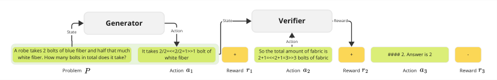

Figure 1: Illustration of State, Action (green), and Reward (orange) in a Math Problem. + denotes
correct (1) and _−_ denotes incorrect (0). A state generator produces an action (next solution step).
The verifier assesses the existing state and action and outputs a probability of correctness.

3 R ELATED W ORK

Multi-step reasoning, particularly for mathematical tasks, commonly employs a generator-verifier
framework to enhance LLM performance. Process Reward Modeling (PRM), which assigns rewards
to each step, has been shown to outperform Object Reward Modeling (ORM), where rewards are
only given for the final output (Lightman et al., 2023; Uesato et al., 2022; Cobbe et al., 2021).
However, PRM requires extensive step-level labeling. Recent works mitigate this with Monte Carlo
Tree Search (MCTS) for automatic labeling, improving efficiency over manual methods (Chen et al.,
2024; Wang et al., 2024b;a). Nonetheless, verifiers in these approaches are trained via supervised
fine-tuning (SFT), and compared to classic RL, it is similar to imitation learning.

Recent studies emphasize the role of verifiers in improving test-time compute. Cobbe et al. (2021)
showed that an effective verifier can yield performance gains equivalent to increasing generator
size by 30x. Similarly, Snell et al. (2024) found that optimal verifiers at test time can outperform
generators 14x larger. However, these methods still rely on SFT for training verifier, limiting their
effectiveness in complex, long-horizon reasoning. A more effective learning method can improve
the verifier model to achieve better performance and in turn scale more efficiently.

Q-learning has seen limited use in LLMs, mainly for preference-based tasks. ILQL is the first to
show implicit Q-learning can be applied to LLMs for multi-turn dialogue tasks, but the focus is on
token-level actions (Snell et al., 2023). To resolve the challenges in training long-horizon reasoning
due to the granularity of token-level actions, ArCHer proposed a utterance level value function, but
encoder style of value function makes estimation can compute step by step and is less efficient(Zhou
et al., 2024). Both works are still limited by their step by step computations.

In contrast, our work focuses on utterance-level actions for verifier, and multi reward estimation with
one forward pass significantly improves training efficiency. We also integrate Implicit Q-learning
(IQL) and Conservative Q-learning (CQL) to better manage large action spaces and enhance performance, offering a more scalable solution for multi-step reasoning tasks.

4 P ROBLEM S TATEMENT

The central question we need to ask is: Can Offline Q-learning improve the verifier’s ability to
handle multi-step reasoning tasks? If so, how can we overcome the obstacles that currently limit its
application to LLM value networks? This section is divided into two problems, offline Q-learning
vs Imitation Learning and challenges in applying Offline Q-learning to LLMs.

**Offline Q-learning vs Imitation Learning:**

The characteristics of MCTS rollout data in math problems is that it is noisy. There might be many
steps that are not optimal and incorrect for solving the problem. However, stitching the optimal
steps together might be able lead to a better solution. Those are cases that Offline Q-learning can
handle better than Imitation Learning, and one of the main conclusion from Kumar et al. (2022) is
that given the same noisy expert data, Offline Q-learning can outperform Imitation Learning on long
horizon tasks. Intuitively, offline RL method should learn to stitch the suboptimal paths in the noisy
data to obtain a better path, and wrong answers can help offline RL what is wrong for the future.
It could lead to the better performance of the verifier model even with the same amount of rollout
from generator.

3

Preprint

**Challenges in applying Offline Q-learning to LLMs:**

There are several challenges in applying Offline Q-learning to LLMs. The first challenge is utterance
level RL. Existing works uses token level actions (Snell et al., 2023). At the token level, the action
space has a smaller cardinality and is equivalent to the vocabulary size _V_, making it feasible to
compute max Q-values and estimates. However, this level of granularity is too fine for long-horizon
tasks (Zhou et al., 2024). On the other hand, using the utterance level allows better handling of
long-term horizons, but since each utterance may contain multiple tokens, the action space grows
exponentially large, making it computationally intractable (Wang et al., 2024a). Given the utterance
with number of tokens of length _n_, we will have _V_ _[n]_ actions, and a typlical sentence might contain
20 tokens. This is just for one utterance, but a solution contains many utterances. This creates a
tension between choosing a level of granularity that is manageable but also effective for long-term
planning. We need to find a practical method to make the verifier model to learn on the utterance
level efficiently.

The second challenge with most methods is that they rely on an actor to sample actions, because it
is hard to estimate the maximum Q-value when the action space is large. Since datasets typically
consist of rollouts with various actions, true offline learning becomes difficult. It is not practical
to have each step to have a number of samples while maintaining previous steps to be the same.
Given a sentence with _m_ steps, if we sample _l_ actions for each step, then we will have _l_ _[m]_ different
answers for one problem if we want to apply offline learning. Additionally, for Q-value estimation,
finding the max Q is problematic due to the large action space, as most of methods require an MCTS
actor to sample the maximum value of each step (Chen et al., 2024; Wang et al., 2024a). This
approach doesn’t effectively utilize offline datasets, complicating training. Approximating max _Q_
needs sampling, and online sampling is not efficient for training. While it is easy to roll out a
complete solution, it seems to be difficult to utilize the data for training the verifier model. We need
to find a way to make the verifier model to learn efficiently with offline datasets.

The third challenge is overestimation. The overestimation problem in Q-learning is well-known,
but it’s particularly severe in language models. As noted in Verma et al. (2022); Zhou et al. (2024),
this issue is amplified in language tasks because the Q-function is trained only on the responses in a
fixed dataset, making it unlikely to predict accurate values for arbitrary strings in an utterance. In our
preliminary experiments, we’ve observed that changing just one critical token to incorrect utterances
can receive a higher value than the correct ones. This overestimation becomes more pronounced at
the utterance level, where the complexity and potential for incorrect value assignments are greater.

5 V ERIFIER WITH Q-L EARNING (V ERIFIER Q)

We introduce VerifierQ, a novel approach enhancing verifier models using Offline Q-learning for
Large Language Models (LLMs). Our method addresses key challenges by modifying the Qlearning algorithm and integrating it into language modeling tasks.

5.1 A RCHITECTURE OF V ERIFIER Q

**Addressing Utterance-Level MDP:** To apply Offline Q-learning to LLMs at the utterance level, we
propose a flexible architecture that integrates with language modeling tasks (Figure 2). Following
Wang et al. (2024b) and Lightman et al. (2023), we utilize two tokens + and _−_ to represent correct
and incorrect states, with a tag token indicating estimation. The probability of the correct token
out of two tokens can be interpreted as Q-values ranging from 0 to 1, aligning with the reward
structure in the MCTS-generated dataset from (Wang et al., 2024b). More details are provided in
the supplementary material Appendix A.1.

To address the bounded nature of outputs (0 to 1) compared to traditional Q-values, we modify the
Q-learning algorithm to operate within these constraints. We propose using the mean of the current
Q-value and the traditional Bellman update as the target value instead of _r_ + _γ_ max _a_ _′_ _Q_ ( _s_ _[′]_ _, a_ _[′]_ ; _θ_ )
from Equation 1:

_Q_ _[∗]_ ( _s, a_ ) = [1] (2)

2 [(] _[R]_ [(] _[s, a]_ [) +] _[ γ]_ [ max] _a_ _[′]_ _[ Q]_ _[∗]_ [(] _[s]_ _[′]_ _[, a]_ _[′]_ [))]

4

Preprint

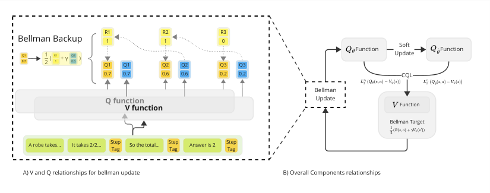

Figure 2: Illustration of the VerifierQ architecture and modified Bellman update. Left: Bellman
update, where _Q_ _θ_ is updated via the TD target with _V_ . Right: Relationships among _Q_ _θ_, _Q_ _θ_ ˆ, and
_V_ _ψ_ . _V_ _ψ_ is updated through CQL, _Q_ _θ_ through the Bellman equation, and _Q_ _θ_ ˆ via soft update.

where _Q_ _[∗]_ ( _s, a_ ) is the optimal Q-value for state _s_ and action _a_, _R_ ( _s, a_ ) is the immediate reward, _γ_ is
the discount factor, and max _a_ _′_ _Q_ _[∗]_ ( _s_ _[′]_ _, a_ _[′]_ ) is the maximum Q-value for the next state _s_ _[′]_ . More details
are provided in the supplementary material (Theorem 1 of Appendix A.1).

For each problem and solution sequence [ _p, a_ 1 _, a_ 2 _, . . ., a_ _n_ ], we insert the tag token at the end of
each step _a_ _i_ and predict the output for the subsequent + or _−_ tokens as shown in Figure 1. The
mean of the reward and next estimate serves as the target value for the Bellman update.

As shown in Figure 2, the verifier model estimates multiple Q-values for each step in the solution
sequence, enabling efficient parallel computation of Q-values for multiple steps in a single forward
pass. This architecture change enables VerifierQ to efficiently learn Q-values at the utterance level
while maintaining compatibility with existing language modeling frameworks.

5.2 A LGORITHM OF V ERIFIER Q

**Addressing Large Action Spaces:** Traditional action selection in MDPs typically requires finding
the maximum Q-value explicitly over all possible actions. In utterance-level MDPs, this leads to
exponentially large action spaces of _V_ _[n]_, where _V_ is the vocabulary size and _n_ is the length of
tokens in one utterance. To address this challenge, we employ Implicit Q-learning (IQL) (Kostrikov
et al., 2021).

IQL approximates Q-values through regression on existing actions, mitigating the need for explicit
maximum Q-value sampling and enabling efficient handling of limited per-step data. Instead of
iteratively finding the maximum Q for every single action in _V_ _[n]_, it can regress the action based on
the dataset and find the approximation through expectile. IQL can still approximate the maximum
Q-value max _a∈A_ _Q_ ( _s, a_ ) without explicitly evaluating all actions by fitting _Q_ ( _s, a_ ) to the expectiles
of the target values given limited data. It improves sample efficiency by eliminating the need for
an online algorithm to sample from. This regression-based approach makes IQL particularly wellsuited for utterance-level MDPs.

We follow Snell et al. (2023) for the IQL framework to our setting, using the expectile of the Q-value
to approximate the value function _V_ :

_LV_ ( _ψ_ ) = E ( _s,a_ ) _∼D_ [ _L_ _[τ]_ 2 [(] _[Q]_ _[θ]_ [(] _[s, a]_ [)] _[ −]_ _[V]_ _[ψ]_ [(] _[s]_ [))]] (3)

where _L_ _[τ]_ 2 [(] _[u]_ [) =] _[ |][τ][ −]_ **[1]** [(u] _[ <]_ [ 0)] _[|][u]_ [2] [,] _[ τ][ ∈]_ [(0] _[,]_ [ 1)][ is the quantile level,] _[ D]_ [ is the offline dataset,] _[ Q]_ _[θ]_ [is the]
learned Q-function, and _V_ _ψ_ is the approximated value function.

This formulation allows for efficient Q-value estimation without explicit maximization over all possible actions. Theoretically, as _τ_ approaches 1, we have lim _τ_ _→_ 1 _V_ _ψ_ ( _s_ ) = max _a_ _Q_ _[∗]_ _θ_ [(] _[s, a]_ [)][ Kostrikov]
et al. (2021), ensuring that our IQL-based approach can asymptotically recover the optimal value
function, even with large action spaces, given sufficient coverage in the offline dataset.

5

Preprint

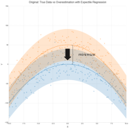

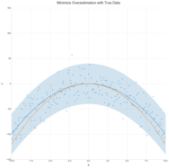

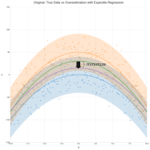

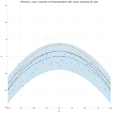

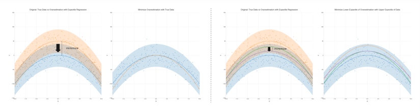

Figure 3: Illustration of our approach. Left: Orange line represents the overestimated Q-value _Q_ _θ_ ˆ .
Blue line indicates the data distribution _Q_ _θ_ . Minimizing the overestimation term brings the orange
line down to the mean of data distribution. Right: Green line shows the lower expectile of the
overestimated Q-value and purple line shows the upper expectile of the data Q-value. Minimizing
those two can make orange line approaches the maximum Q-value under the data distribution.

Our approach leverages regression to solve the large action space problem. By regressing the reward
for each utterances, we can find the approximation of the maximum Q-value and minimum Q-value
without needing to sample the action or iterate through all the combinations of tokens. We focus on
this regression aspect, not just the data support aspect. The approximation of minimum through _τ_
value is shown in Theorem 2 of Appendix A.1 .

**Addressing Overestimation:** Q-learning often suffers from overestimation bias, particularly severe
in language models with large action spaces and limited offline datasets. To mitigate this, we incorporate Conservative Q-learning (CQL) Kumar et al. (2020) into our framework. CQL penalizes
Q-values exceeding the target value, making the Q-function more conservative.

We add the following CQL term to the Bellman equation:

arg min _Q_ _[α]_ [(][E] _[s][∼][D,a][∼][µ]_ [ [] _[Q]_ [(] _[s, a]_ [)]] _[ −]_ [E] _[s][∼][D,a][∼][π]_ [ˆ] _[β]_ [ [] _[Q]_ [(] _[s, a]_ [)])] (4)

Where _µ_ is the target policy distribution and ˆ _π_ _β_ is the data distribution. This term minimizes the
maximum Q-value under the target policy distribution while maximizing it under the data distribution, providing a tighter bound.

Unlike token-level approaches, we leverage IQL to approximate Q-values in the large action space,
mitigating the need to sample a set number of actions for each state and allowing more efficient
Q-value estimation for longer sequences.

We propose a novel formulation that directly approximates both the lower bound Q-function and the
upper bound of the data distribution using IQL:

_L_ _CQL_ ( _ψ_ ) = _α_ (E _s∼D,a∼µ_ � _L_ _[τ]_ 2 [1] � _Q_ _θ_ ˆ ( _s, a_ ) _−_ _V_ _ψ_ ( _s_ )�� _−_ E _s∼D,a∼π_ ˆ _β_ [ _L_ _[τ]_ 2 [2] [(] _[Q]_ _[θ]_ [(] _[s, a]_ [)] _[ −]_ _[V]_ _[ψ]_ [(] _[s]_ [))])][ (5)]

Here, _τ_ 1 is chosen to be close to 0 and _τ_ 2 close to 1, allowing for a more optimistic Q-value estimation within the CQL framework. This approach maintains CQL’s conservatism while allowing
for adaptable control through the adjustment of _τ_ 1 and _τ_ 2 . The lower bound of the target policy
pushes the Q-value down less aggressively, while the upper bound of the data distribution elevates
it more, resulting in a more adjustable conservatism under the CQL term. For more details on the
explanations of the CQL term, see Appendix 4.

Figure 3 illustrates the intuition. In the original CQL term, an overestimated Q-value would be
pushed down to the data distribution. In our formulation, the lower bound of the Q-value is pushed
down less aggressively, and the upper bound is elevated more, resulting in a more optimistic Q-value
that approaches the maximum Q-value under the data distribution more closely. The advantage of
this approach is that _τ_ value can be adjusted to balance conservatism with optimism.

**Overall Objective:** The VerifierQ algorithm minimizes the Bellman error augmented with the CQL
term. We adapt the approach of Snell et al. (2023); Kostrikov et al. (2021), using Implicit Q-learning

6

Preprint

to approximate the Q-value for each step with a separate value function, while modifying the objective to incorporate the CQL term.

Like previous works, we use a separate value function _V_ _ψ_ ( _s_ _[′]_ ) to approximate the Q-value
max _a_ _′_ _Q_ _[∗]_ ( _s_ _[′]_ _, a_ _[′]_ ). With our adaptation to the Bellman Update (Equation 1), the TD error is given
by:

_L_ _Q_ ( _θ_ ) = E

2 [�]

1
�� 2 [(] _[R]_ [(] _[s, a]_ [) +] _[ γV]_ _[ψ]_ [(] _[s]_ _[′]_ [))] _[ −]_ _[Q]_ _[θ]_ [(] _[s, a]_ [)] �

(6)

We augment this with our CQL term to achieve a more conservative yet optimistic estimation with
Equation 5:

_L_ _CQL_ ( _ψ_ ) = _α_ (E _s∼D,a∼µ_ � _L_ _[τ]_ 2 [1] � _Q_ _θ_ ˆ ( _s, a_ ) _−_ _V_ _ψ_ ( _s_ )�� _−_ E _s∼D,a∼π_ ˆ _β_ [ _L_ _[τ]_ 2 [2] [(] _[Q]_ _[θ]_ [(] _[s, a]_ [)] _[ −]_ _[V]_ _[ψ]_ [(] _[s]_ [))])]

The comprehensive objective function of VerifierQ is thus the sum of the Bellman error and the CQL

term:

_L_ ( _θ, ψ_ ) = _L_ _Q_ ( _θ_ ) + _L_ _CQL_ ( _ψ_ ) (7)

To enhance training stability, we employ a Polyak-averaged version of _Q_ _θ_ ˆ . The hyperparameter _α_ is
set to 1 in our experiments, balancing the influence of the CQL term. The overall objective is shown
in the Figure 2.

This formulation allows VerifierQ to benefit from the conservative nature of CQL while maintaining
an optimistic outlook, crucial for effective Q-value estimation in large action spaces characteristic
of language models. The expectile regression provides flexibility to adjust _τ_ values as preferred. By
integrating these components, VerifierQ addresses the challenges of overestimation and large action
spaces in utterance-level MDPs, providing a robust framework for multi-step reasoning tasks.

6 E XPERIMENTS AND R ESULTS

We evaluate VerifierQ on mathematical reasoning tasks from GSM8K and MATH datasets (Cobbe
et al., 2021; Hendrycks et al., 2021). We compare VerifierQ with the state-of-the-art Process Reward
Model (PRM) Lightman et al. (2023), using the same dataset as Wang et al. (2024b); Snell et al.
(2024) for a fair comparison. We do not include Object Reward Model (ORM) since Wang et al.
(2024b); Snell et al. (2024); Lightman et al. (2023) already validated PRM’s effectiveness over
ORM. Due to computational constraints, we use the TinyLlama-1.1B model (Zhang et al., 2024b).

6.1 E XPERIMENTAL S ETUP

**Dataset:** We generate a test time compute set using a generator trained on MetaMath (Yu et al.,
2024). The generator is finetuned on MetaMath for 2 epochs with a learning rate of 2e-5, followed
by LoRA finetuning for 1 epoch to fit the answer style (Hu et al., 2021). For each question in the
full GSM8K test set and a 500-question subset of MATH (following Lightman et al. (2023)), we
generate 256 answers. The verifier is trained on the MathShepherd dataset Wang et al. (2024b),
which uses MCTS-generated data with binary rewards (1 for correct, 0 for incorrect).

**Model Architecture:** Our model consists of a Q-network and a separate value network to prevent
single sample overestimation. We employ soft updates to stabilize training with rate 0.01.

**Training:** We initialize our model with MetaMath pretraining, then train with PRM on MathShepherd for 1 epoch, followed by VerifierQ training. Here are key hyperparameters. Learning rate:
2e-5 for all training phases. Batch size: 64 (crucial for Q-learning stability). Q-learning parameters:
_γ_ = 0 _._ 99, _α_ = 1 for the CQL term. For PRM, we continued training from 1 epoch to 2 epochs.
Majority Voting uses the raw output from the generator.

**Evaluation Metrics:** We evaluate the verifier against PRM and Majority Voting using accuracy as
the main metric. Following Snell et al. (2024); Lightman et al. (2023), we use minimum evaluation
metrics to evaluate the verifier.

7

Preprint

6.2 R ESULTS

We evaluate VerifierQ against PRM (for epoch and two epoches) and Majority Voting on both
GSM8K and MATH datasets using minimum evaluation. For VerifierQ, we use _τ_ 1 = 0 _._ 3 for GSM8K
and _τ_ 1 = 0 _._ 5 for MATH.

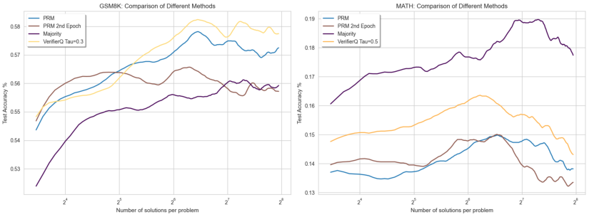

Figure 4: Comparison of different methods on GSM8K (left) and MATH (right) using minimum
evaluation. Rolling average over 20 steps. For VerifierQ we use _τ_ 1 = 0 _._ 3 (left) and _τ_ = 0 _._ 5 (right).

As shown in Figure 4, VerifierQ outperforms PRM (with 1 epoch), PRM 2nd Epoch and Majority
Voting on both datasets. On GSM8K, VerifierQ’s performance improves with increase of the number of solutions per problem, aligning with trends observed in previous studies (Snell et al., 2024;
Lightman et al., 2023; Wang et al., 2024b). We would like to note that for MATH, all methods
underperform compared to Majority Vote, possibly due to the small model size (1.1B).

In Figure 4, VerifierQ achieves the highest accuracy both on GSM8K and on MATH with different
_τ_ 1 values compared to PRM (see Figure 5a in Section 7), and it also outperforms other Q learning
methods (see Figure 5b in Section 7). We observe that PRM’s performance decreases after the first
epoch, likely due to overfitting. Therefore we will use first epoch of PRM hereafter for evaluation
and ablation. Different _τ_ 1 values have different performance on two datasets (see Figure 5a in
Section 7).

These results demonstrate the potential of applying classic reinforcement learning to verifier models
for multi-step reasoning language tasks. They also highlight VerifierQ’s effectiveness, particularly
on GSM8K, and identify areas for future investigation, such as the impact of model size and the
optimization of the values of _τ_ for different datasets.

7 A BLATION S TUDY

Our ablation study addresses the challenges of large action spaces, computational efficiency, and
the impact of key components in VerifierQ. To be more specific, we investigate the efficiency of
IQL compared to sampling approaches, the effect of the CQL term, the impact of different expectile
choices, and the stability of Q-learning.

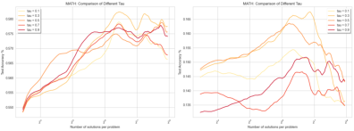

(a) Impact of different _τ_ 1 values on VerifierQ performance. Left: GSM8K dataset. Right: MATH dataset.

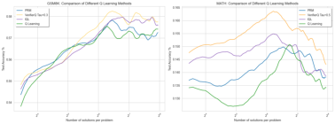

(b) Comparison of Q-Learning Methods. Left:
GSM8K dataset. Right: MATH dataset.

Figure 5: Comparison of VerifierQ performance and Q-Learning methods

8

Preprint

7.1 C OMPUTATIONAL E FFICIENCY

VerifierQ’s sentence-level approach offers significant computational advantages over existing utterance BERT-type and online approaches. We use a SARSA-style approximation of the maximum
Q-value, reducing computation time. For online approaches, sampling approaches require _n ∗_ _m_
action samples for a sentence with _m_ steps to calculate max _Q_, where _n_ is the number of samples
per step. In contrast, VerifierQ performs one forward pass for the entire sentence to estimate all
_m_ steps and eliminating the need for _n_ sampling at each step. This approach significantly reduces
the computational complexity, especially for longer sequences. From our preliminary experiments,
compared to step by step Q value estimation we can save roughly 10x training time.

7.2 I MPACT OF A DJUSTABLE CQL T ERM

Figure 5a illustrates the impact of different _τ_ values on VerifierQ’s performance. We examine different levels of optimism by varying _τ_ 1 (0.1, 0.3, 0.5, 0.7, 0.9) while fixing _τ_ 2 at 0.9 to tighten the
lower bound to the maximum of the data distribution. As shown in Figure 5a, _τ_ 1 = 0 _._ 3 generally
yields better results, suggesting it approximates the maximum Q-value more effectively than other
_τ_ 1 values. MATH dataset shows higher sensitivity to _τ_ 1 values, with _τ_ 1 = 0 _._ 5 performing the best.
The difference in optimal _τ_ values between datasets suggests that dataset-specific tuning may be

necessary.

7.3 C OMPARISON OF Q-L EARNING M ETHODS

We conduct a comprehensive comparison of VerifierQ against other Q-learning variants to empirically validate the effectiveness of our approach, particularly the impact of the CQL term. We compare VerifierQ with SARSA-style standard Q-learning without CQL and Implicit Q-learning (IQL)
with _τ_ = 0 _._ 9, also without CQL (Snell et al., 2023).

Figure 5b shows VerifierQ outperforming both standard Q-learning and IQL on the GSM8K dataset.
VerifierQ’s superior performance demonstrates the CQL component’s significant contribution and
its effectiveness in reducing overestimation. The adjustable _τ_ terms in VerifierQ allow finer control
over the conservatism-optimism balance in Q-value estimation, enabling more optimistic max _Q_
selection when appropriate. Standard Q-learning performs similarly to PRM, highlighting the substantial improvements achieved by VerifierQ. VerifierQ’s adjustable _τ_ terms ( _τ_ 1 and _τ_ 2 ) allow for
finer control over the balance between conservatism and optimism in Q-value estimation. These results empirically validate that VerifierQ’s CQL term leads to tangible performance gains, effectively
addressing the challenges of applying Q-learning to large language models.

|Janet\u2019s ducks lay 16 eggs per day. She eats 3 for breakfast every morning and bakes muffins for her friends every day with 4. She sells the remainder at the farmers' market daily for $2 per fresh duck egg. How much in dollars does she make every day at the farmers' market?|Col2|
|---|---|
|Janet\u2019s ducks lay 16 eggs per day. She eats 3 for breakfast every morning and bakes mufns for her friends every day with 4. She sells the remainder at the farmers' market daily for $2 per fresh duck egg. How much in dollars does she make every day at the farmers' market?||
|Step 1: Janet's ducks lay**{number}** eggs per day.|Step 1: Janet's ducks lay**{number}** eggs per day.|
|Step 1: Janet's ducks lay**{number}** eggs per day.||
|Step 2: She eats 3 for breakfast every morning, so she has 16 - 3 =13 eggs left.|Step 2: She eats 3 for breakfast every morning, so she has 16 - 3 =13 eggs left.|
|Step 2: She eats 3 for breakfast every morning, so she has 16 - 3 =13 eggs left.||

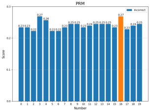

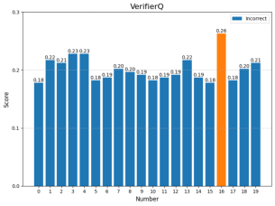

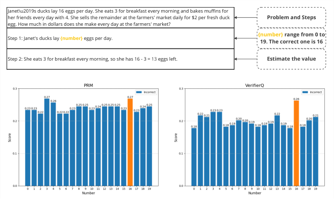

Figure 6: Overestimation case study: PRM (left) vs VerifierQ (right). Orange indicates correct value,
blue indicates incorrect value.

9

Preprint

7.4 O VERESTIMATION A NALYSIS

We conduct a qualitative study on overestimation between PRM and VerifierQ by replacing important tokens in the solution sequence with incorrect ones. Figure 6 reveals that PRM generally assigns
higher Q-values to incorrect tokens, while VerifierQ assigns lower values. This suggests that VerifierQ’s conservative approach helps mitigate the overestimation issue by assigning lower values to
out-of-distribution tokens.

8 D ISCUSSION, E THICS, AND L IMITATIONS

VerifierQ demonstrates the potential of integrating classic reinforcement learning techniques with
language models to enhance multi-step reasoning capabilities. This approach opens up several avenues for future research and applications: The flexibility of our language-based RL framework
allows for potential extensions beyond mathematical reasoning. For example, VerifierQ could be
applied to guide and verify complex programming tasks in code generation and enhance decisionmaking in diverse domains requiring multi-step planning.

In addition, the actor-critic model in language models could lead to more sophisticated planning and
decision-making capabilities. Existing success in AI explored the actor-critic model, and actor and
critic model in language models could enhance planning and decision-making capabilities.

The development and deployment of VerifierQ also raise important ethical considerations. The
alignment of the reward function with human values is crucial. As the model’s decision-making
process becomes more complex, ensuring transparency and maintaining human understanding for
its outputs becomes increasingly challenging but vastly important.

While VerifierQ demonstrates promising results, several limitations should be acknowledged: First,
due to computational constraints, our experiments were limited to the TinyLlama model. Testing
on larger models could potentially yield different but more likely more robust results. Second, the
model’s performance is highly sensitive to hyperparameter choices. Resource constraints limited our
ability to conduct extensive hyperparameter tuning, which could potentially improve results, but this
needs future research. Finally, the fully implemented VerifierQ model is more memory-intensive and
computationally expensive than the PRM method. Future research should focus on reducing these
requirements to enhance the model’s efficiency and scalability.

9 C ONCLUSION

This work introduces VerifierQ, a novel approach integrating classical reinforcement learning techniques with language models to enhance multi-step reasoning capabilities. Our key contributions
include:

**(1).** A flexible architecture for applying Q-learning to utterance-level MDPs in language models.
It can estimate multiple utterances level Q values with large action spaces, and easy to extend Q
learning, IQL, and CQL. **(2).** An innovative formulation of Conservative Q-learning tailored for
large action spaces in language tasks. It helps to reduce the overestimation in offline Q learning. **(3).**
Empirical evidence demonstrating VerifierQ’s effectiveness in mathematical reasoning tasks. These
results highlight the potential for extending this approach to larger language models and improving
test-time compute.

VerifierQ validates the integration of RL into verifier models and demonstrates its potential to enhance test-time compute results. Moreover, it bridges the gap between classic critic models in RL
and verifier models in language tasks. It serves as an addition for applying RL in verifier LLMs and
paves the way for actor-critic models to achieve more sophisticated artificial intelligence. As we
continue to refine and expand upon this approach, VerifierQ opens up new avenues for developing
more capable and robust AI systems across a wide range of complex reasoning tasks.

A CKNOWLEDGMENTS

The work is supported by the National Science Foundation (NSF) through Awards #2131186 (CISEMSI), #1827505 (PFI), and #1737533 (S&CC), and the US Air Force Office of Scientific Research

10

Preprint

(AFOSR) via Award #FA9550-21-1-0082. The work is also supported by a College-wide Research
Vision (CRV) Fund from the CCNY Provost’s Office, and the ODNI Intelligence Community Center
for Academic Excellence (IC CAE) at Rutgers University (#HHM402-19-1-0003 and #HHM40218-1-0007).

11

Preprint

R EPRODUCIBILITY S TATEMENT

To ensure reproducibility of our results, we provide the following details:

**Implementation Details:** The complete implementation details are available in Appendix B.1. The
code implementation will be made publicly available at a future date.

**Hardware Requirements:**

   - VerifierQ experiments: Conducted on a single NVIDIA A100 GPU with 40GB memory.

   - Other models (Q Learning and PRM): Can be trained on an NVIDIA RTX 4090 GPU.

**Training Time:**

    - VerifierQ: Approximately 10 hours for 1 epoch.

   - PRM: Approximately 4 hours for 1 epoch.

**Datasets:** We use the following publicly available datasets:

[• MetaMath: https://huggingface.co/datasets/meta-math/MetaMathQA](https://huggingface.co/datasets/meta-math/MetaMathQA)

[• GSM8K: https://huggingface.co/datasets/openai/gsm8k](https://huggingface.co/datasets/openai/gsm8k)

   - MathShepherd: [https://huggingface.co/datasets/peiyi9979/](https://huggingface.co/datasets/peiyi9979/Math-Shepherd)
[Math-Shepherd](https://huggingface.co/datasets/peiyi9979/Math-Shepherd)

   - MATH (test subset): We use the same dataset as Lightman et al. (2023), available at
[https://github.com/openai/prm800k](https://github.com/openai/prm800k)

**Model:** All experiments were conducted using the TinyLlama-1.1B model.

**Hyperparameters:** Key hyperparameters include:

    - Learning rate: 2e-5 (constant for all training phases)

    - Batch size: 64

    - Discount factor ( _γ_ ): 0.99

    - CQL coefficient ( _α_ ): 1

    - Soft update coefficient ( _α_ soft ): 0.01

    - IQL coefficients:

**–** For GSM8K: _τ_ 1 = 0 _._ 3, _τ_ 2 = 0 _._ 9

**–** For MATH: _τ_ 1 = 0 _._ 5, _τ_ 2 = 0 _._ 9

**Training Process:** The model is initialized with MetaMath pretraining, followed by 1 epoch of
PRM training before VerifierQ training begins.

For any additional details or clarifications needed to reproduce our results, please refer to the code
and documentation that will be made available upon acceptance.

12

Preprint

R EFERENCES

Guoxin Chen, Minpeng Liao, Chengxi Li, and Kai Fan. Alphamath almost zero: process supervision
without process, 2024.

Karl Cobbe, Vineet Kosaraju, Mohammad Bavarian, Mark Chen, Heewoo Jun, Lukasz Kaiser,
Matthias Plappert, Jerry Tworek, Jacob Hilton, Reiichiro Nakano, Christopher Hesse, and John
Schulman. Training verifiers to solve math word problems, 2021.

Dan Hendrycks, Collin Burns, Saurav Kadavath, Akul Arora, Steven Basart, Eric Tang, Dawn Song,
and Jacob Steinhardt. Measuring mathematical problem solving with the math dataset, 2021.

Edward J. Hu, Yelong Shen, Phillip Wallis, Zeyuan Allen-Zhu, Yuanzhi Li, Shean Wang, Lu Wang,
[and Weizhu Chen. Lora: Low-rank adaptation of large language models, 2021. URL https:](https://arxiv.org/abs/2106.09685)
[//arxiv.org/abs/2106.09685.](https://arxiv.org/abs/2106.09685)

Vijay R. Konda and John N. Tsitsiklis. Actor-critic algorithms. In _Neural Information Processing_
_Systems_ [, 1999. URL https://api.semanticscholar.org/CorpusID:207779694.](https://api.semanticscholar.org/CorpusID:207779694)

Ilya Kostrikov, Ashvin Nair, and Sergey Levine. Offline reinforcement learning with implicit qlearning, 2021.

Aviral Kumar, Aurick Zhou, George Tucker, and Sergey Levine. Conservative q-learning for offline
[reinforcement learning, 2020. URL https://arxiv.org/abs/2006.04779.](https://arxiv.org/abs/2006.04779)

Aviral Kumar, Joey Hong, Anikait Singh, and Sergey Levine. When should we prefer offline
[reinforcement learning over behavioral cloning?, 2022. URL https://arxiv.org/abs/](https://arxiv.org/abs/2204.05618)
[2204.05618.](https://arxiv.org/abs/2204.05618)

Hunter Lightman, Vineet Kosaraju, Yura Burda, Harri Edwards, Bowen Baker, Teddy Lee, Jan
Leike, John Schulman, Ilya Sutskever, and Karl Cobbe. Let’s verify step by step, 2023.

OpenAI. Learning to reason with llms. [https://openai.com/index/](https://openai.com/index/learning-to-reason-with-llms/)
[learning-to-reason-with-llms/, September 2024. Accessed: 2024-09-13.](https://openai.com/index/learning-to-reason-with-llms/)

David Silver, Aja Huang, Christopher Maddison, Arthur Guez, Laurent Sifre, George Driessche,
Julian Schrittwieser, Ioannis Antonoglou, Veda Panneershelvam, Marc Lanctot, Sander Dieleman,
Dominik Grewe, John Nham, Nal Kalchbrenner, Ilya Sutskever, Timothy Lillicrap, Madeleine
Leach, Koray Kavukcuoglu, Thore Graepel, and Demis Hassabis. Mastering the game of go with
deep neural networks and tree search. _Nature_, 529:484–489, 01 2016. doi: 10.1038/nature16961.

Charlie Snell, Ilya Kostrikov, Yi Su, Mengjiao Yang, and Sergey Levine. Offline rl for natural
language generation with implicit language q learning, 2023.

Charlie Snell, Jaehoon Lee, Kelvin Xu, and Aviral Kumar. Scaling llm test-time compute optimally
[can be more effective than scaling model parameters, 2024. URL https://arxiv.org/](https://arxiv.org/abs/2408.03314)
[abs/2408.03314.](https://arxiv.org/abs/2408.03314)

Jonathan Uesato, Nate Kushman, Ramana Kumar, Francis Song, Noah Siegel, Lisa Wang, Antonia
Creswell, Geoffrey Irving, and Irina Higgins. Solving math word problems with process- and
outcome-based feedback, 2022.

Siddharth Verma, Justin Fu, Mengjiao Yang, and Sergey Levine. Chai: A chatbot ai for task[oriented dialogue with offline reinforcement learning, 2022. URL https://arxiv.org/](https://arxiv.org/abs/2204.08426)
[abs/2204.08426.](https://arxiv.org/abs/2204.08426)

Chaojie Wang, Yanchen Deng, Zhiyi Lyu, Liang Zeng, Jujie He, Shuicheng Yan, and Bo An. Q*:
[Improving multi-step reasoning for llms with deliberative planning, 2024a. URL https://](https://arxiv.org/abs/2406.14283)
[arxiv.org/abs/2406.14283.](https://arxiv.org/abs/2406.14283)

Peiyi Wang, Lei Li, Zhihong Shao, R. X. Xu, Damai Dai, Yifei Li, Deli Chen, Y. Wu, and Zhifang
Sui. Math-shepherd: Verify and reinforce llms step-by-step without human annotations, 2024b.

13

Preprint

Longhui Yu, Weisen Jiang, Han Shi, Jincheng Yu, Zhengying Liu, Yu Zhang, James T. Kwok, Zhenguo Li, Adrian Weller, and Weiyang Liu. Metamath: Bootstrap your own mathematical questions
[for large language models, 2024. URL https://arxiv.org/abs/2309.12284.](https://arxiv.org/abs/2309.12284)

Di Zhang, Xiaoshui Huang, Dongzhan Zhou, Yuqiang Li, and Wanli Ouyang. Accessing gpt-4 level
mathematical olympiad solutions via monte carlo tree self-refine with llama-3 8b, 2024a. URL
[https://arxiv.org/abs/2406.07394.](https://arxiv.org/abs/2406.07394)

Peiyuan Zhang, Guangtao Zeng, Tianduo Wang, and Wei Lu. Tinyllama: An open-source small
[language model, 2024b. URL https://arxiv.org/abs/2401.02385.](https://arxiv.org/abs/2401.02385)

Yifei Zhou, Andrea Zanette, Jiayi Pan, Sergey Levine, and Aviral Kumar. Archer: Training language
model agents via hierarchical multi-turn rl, 2024.

14

Preprint

A A PPENDIX

A.1 A RCHITECTURE D ETAILS

To apply Offline Q-learning to LLMs at the utterance level, we propose a flexible architecture that
integrates with language modeling tasks. Following Wang et al. (2024b) and Lightman et al. (2023),
we utilize two tokens + and _−_ to represent correct and incorrect states, with a tag token indicating
estimation. The probability of the correct token can be interpreted as Q-values ranging from 0 to
1, aligning with the reward structure in the MCTS-generated dataset from Wang et al. (2024b). We
compute the Q-value for each step as:

_Q_ ( _s, a_ ) = _p_ (+) = softmax(logit + ) = _σ_ (logit + _−_ logit _−_ ) (8)

It is flexible to choose either softmax or sigmoid function to compute the Q-value. We use the
sigmoid function in our experiments for more effficiency. The Q-value is computed for each step in
the solution sequence, estimating a numerical value in the range of (0, 1).

This formulation offers several advantages:

1. It allows flexible integration for Q-value estimation of utterances of arbitrary length since
we can insert the step tag anywhere in the sequence.

2. It enables parallel estimation of multiple Q-values for multiple steps in a single forward
pass, significantly reducing computation time.

3. This approach seamlessly integrates with existing language modeling tasks.

A.2 C ONVERGENCE OF M ODIFIED B ELLMAN U PDATE

We first prove that our modified Bellman update converges to a fixed point.
**Theorem 1** (Convergence of Modified Bellman Update) **.** _Let Q_ _[∗]_ _be the optimal Q-function. The_
_modified Bellman update_

_Q_ _[∗]_ ( _s, a_ ) = [1] (9)

2 [(] _[R]_ [(] _[s, a]_ [) +] _[ γ]_ [ max] _a_ _[′]_ _[ Q]_ _[∗]_ [(] _[s]_ _[′]_ _[, a]_ _[′]_ [))]

_converges to a unique fixed point._

_Proof._ Let _T_ be the operator defined by our modified Bellman equation:

_T Q_ ( _s, a_ ) = [1] (10)

2 [(] _[R]_ [(] _[s, a]_ [) +] _[ γ]_ [ max] _a_ _[′]_ _[ Q]_ [(] _[s]_ _[′]_ _[, a]_ _[′]_ [))]

We need to show that _T_ is a contraction mapping in the sup-norm _∥· ∥_ _∞_ . For any two Q-functions
_Q_ 1 and _Q_ 2 :

_∥T Q_ 1 _−T Q_ 2 _∥_ _∞_ = sup _s,a_ _[|T][ Q]_ [1] [(] _[s, a]_ [)] _[ −T][ Q]_ [2] [(] _[s, a]_ [)] _[|]_ (11)

= sup

_s,a_

1
max (12)
���� 2 _[γ]_ � _a_ _[′]_ _[ Q]_ [1] [(] _[s]_ _[′]_ _[, a]_ _[′]_ [)] _[ −]_ [max] _a_ _[′]_ _[ Q]_ [2] [(] _[s]_ _[′]_ _[, a]_ _[′]_ [)] � [�] ���

_≤_ [1]

2 _[γ]_ [ sup] _s,a_

max (13)
��� _a_ _[′]_ _[ Q]_ [1] [(] _[s]_ _[′]_ _[, a]_ _[′]_ [)] _[ −]_ [max] _a_ _[′]_ _[ Q]_ [2] [(] _[s]_ _[′]_ _[, a]_ _[′]_ [)] ���

_≤_ [1] (14)

2 _[γ]_ [ sup] _s_ _[′]_ _,a_ _[′]_ _[ |][Q]_ [1] [(] _[s]_ _[′]_ _[, a]_ _[′]_ [)] _[ −]_ _[Q]_ [2] [(] _[s]_ _[′]_ _[, a]_ _[′]_ [)] _[|]_

= [1] (15)

2 _[γ][∥][Q]_ [1] _[ −]_ _[Q]_ [2] _[∥]_ _[∞]_

Since 0 _< γ <_ 1, it follows that 0 _<_ 12 _[γ <]_ [ 1][. Therefore,] _[ T]_ [ is a contraction mapping with]
contraction factor _L_ = [1]

2 _[γ]_ [. By the Banach fixed-point theorem,] _[ T]_ [ has a unique fixed point, and the]
Q-learning algorithm will converge to this fixed point.

15

Preprint

A.3 O PTIMALITY OF IQL IN L ARGE A CTION S PACES

Next, we prove that IQL can effectively approximate the maximum and minimum Q-value in large
action spaces.

**Theorem 2** (IQL Optimality) **.** _We can directly get the following result from the proof in (Kostrikov_
_et al., 2021). As the quantile level τ approaches 1, the IQL value function V_ _ψ_ _converges to the_
_maximum Q-value:_
lim max (16)
_τ_ _→_ 1 _[V]_ _[ψ]_ [(] _[s]_ [) =] _a∈A,π_ _β_ ( _a|s_ ) _>_ 0 _[Q]_ _[∗]_ [(] _[s, a]_ [)]

_Additionally, as τ →_ 0 _, the IQL value function V_ _ψ_ _converges to the minimum Q-value:_

_τ_ lim _→_ 0 _[V]_ _[τ]_ [(] _[s]_ [) = min] _a∈A_ _[Q]_ _[∗]_ [(] _[s, a]_ [)] (17)

_Proof Sketch._ Following Lemma 1 of Kostrikov et al. (2021), we can show a modified Lemma. Let
X be a real-valued random variable with bounded support and infimum _x_ _[∗]_ . Since X is bounded
below and _m_ _τ_ approaches the lower bound as _τ →_ 0, we have:

_τ_ lim _→_ 0 _[m]_ _[τ]_ [ = inf] _[{][x]_ [ :] _[ F]_ _[X]_ [(] _[x]_ [)] _[ >]_ [ 0] _[}]_ [ =] _[ x]_ _[∗]_ (18)

For all _τ_ 1 and _τ_ 2 such that 0 _< τ_ 1 _< τ_ 2 _<_ 1, we can get _m_ _τ_ 1 _≤_ _m_ _τ_ 2 . Therefore, as _τ →_ 0, the limit
of _m_ _τ_ converges to the infimum of the random variable X.

In addition, using Lemma 2 of Kostrikov et al. (2021), we can show that the IQL value function _V_ _ψ_
converges to the minimum Q-value as _τ →_ 0:

**Lemma 3.** _For all s, τ_ 1 _and τ_ 2 _such that_ 0 _< τ_ 1 _< τ_ 2 _<_ 1 _, we have V_ _τ_ 1 ( _s_ ) _≤_ _V_ _τ_ 2 ( _s_ ) _._

Since _Q_ _[∗]_ ( _s, a_ ) is bounded below, the minimum Q-value exists and is finite. Therefore, as _τ →_ 0,
the IQL value function _V_ _ψ_ converges to the minimum Q-value:

_τ_ lim _→_ 0 _[V]_ _[τ]_ [(] _[s]_ [) =] _a∈_ supp inf ( _π_ _β_ ) _[Q]_ _[∗]_ [(] _[s, a]_ [)] (19)

So we have:
_τ_ lim _→_ 0 _[V]_ _[τ]_ [(] _[s]_ [) =] _a∈A,π_ min _β_ ( _a|s_ ) _>_ 0 _[Q]_ _[∗]_ [(] _[s, a]_ [)] (20)

A.4 C ONSERVATIVE Y ET O PTIMISTIC Q- VALUES WITH M ODIFIED CQL

Finally, we present a proposition about our modified CQL approach and its potential to lead to
conservative yet optimistic Q-values.

**Proposition 4** (Modified CQL Bounds) **.** _The modified CQL objective with expectile levels τ_ 1 _(close_
_to 0) and τ_ 2 _(close to 1) aims to provide both lower and upper bounds on the true Q-function_
_Q_ _[∗]_ ( _s, a_ ) _:_
_a_ max _∼π_ ˆ _β_ _[Q]_ _[θ]_ [(] _[s, a]_ [)][ ≲] _[Q]_ _[∗]_ [(] _[s, a]_ [)][ ≲] [min] _a∼µ_ _[Q]_ _[θ]_ [ˆ] [(] _[s, a]_ [)] (21)

_where_ ≲ _denotes ”approximately less than or equal to”._

**Remark 5** (Supporting Arguments and Intuitions) **.** The original CQL objective is:

arg min _Q_ _[α]_ [(][E] _[s][∼][D,a][∼][µ]_ [ [] _[Q]_ [(] _[s, a]_ [)]] _[ −]_ [E] _[s][∼][D,a][∼][π]_ [ˆ] _[β]_ [ [] _[Q]_ [(] _[s, a]_ [)])] (22)

Where _µ_ is the target policy distribution and ˆ _π_ _β_ is the data distribution. Intuitively, this term finds the
maximum Q-value under the target policy distribution E _s∼D,a∼µ_ [ _Q_ ( _s, a_ )] and minimizes it since it
is usually overestimated. To get a tighter bound, it pushes the Q-value up under the data distribution
E _s∼D,a∼π_ ˆ _β_ [ _Q_ ( _s, a_ )].

For large action spaces, CQL typically uses importance sampling to estimate E _s∼D,a∼µ_ [ _Q_ ( _s, a_ )]
with log [�] _a_ exp( _Q_ ( _s, a_ )) at every state (Kumar et al., 2020). However, unlike token-level approaches, we leverage IQL to approximate Q-values in the large action space. This mitigates the

16

Preprint

requirement to sample a set number of actions for each state and allows for more efficient Q-value
estimation for longer sequences.

We propose a novel formulation that directly approximates both the lower bound Q-function and
the upper bound of the data distribution using IQL with different _τ_ values for each term in CQL
objective. The goal remains the same: finding the overestimated Q-value under the target policy to
minimize it and tighten the bound with the data distribution. However we want to give control on
the level of the tightening of the bound.

Our modified CQL objective is:

_L_ _CQL_ ( _ψ_ ) = _α_ (E _s∼D,a∼µ_ [ _L_ _[τ]_ 2 [1] [(] _[Q]_ _θ_ [ˆ] [(] _[s, a]_ [)] _[ −]_ _[V]_ _[ψ]_ [(] _[s]_ [))]]
_−_ E _s∼D,a∼π_ ˆ _β_ [ _L_ _[τ]_ 2 [2] [(] _[Q]_ _[θ]_ [(] _[s, a]_ [)] _[ −]_ _[V]_ _[ψ]_ [(] _[s]_ [))])] (23)

The first term, with _τ_ 1 close to 0, approximates the lower bound of _Q_ _θ_ ˆ . It acts as an upper bound on
the target policy which is typically overestimated. This suggests:

_V_ _ψ_ ( _s_ ) ≲ min _a∼µ_ _[Q]_ _[θ]_ [ˆ] [(] _[s, a]_ [)] (24)

The second term, with _τ_ 2 close to 1, approximates an upper bound on _Q_ _θ_ . It acts as a lower bound
on the data distribution, indicating:

_V_ _ψ_ ( _s_ ) ≳ _a_ max _∼π_ ˆ _β_ _[Q]_ _[θ]_ [(] _[s, a]_ [)] (25)

This approach allows for a more optimistic Q-value estimation within the CQL framework. The
lower bound of the target policy _µ_ pushes the Q-value down less aggressively, while the upper
bound of the data distribution ˆ _π_ _β_ elevates the Q-value more, resulting in a more optimistic Q-value
under the CQL term. This approach maintains the benefits of CQL’s conservatism while allowing
for adaptable optimism through the adjustment of _τ_ 1 and _τ_ 2 .

The modified CQL objective aims to minimize the difference between the lower bound of the overestimated Q-values ( _Q_ _θ_ ˆ ) and the upper bound of the true Q-values ( _Q_ _θ_ ). Minimizing this difference
may lead to a more accurate estimation of _Q_ _[∗]_ ( _s, a_ ). We can express this as:

_L_ _CQL_ ( _ψ_ ) _≈_ min _a∼µ_ _[Q]_ _[θ]_ [ˆ] [(] _[s, a]_ [)] _[ −]_ _a_ [max] _∼π_ ˆ _β_ _[Q]_ _[θ]_ [(] _[s, a]_ [)] (26)

As this difference approaches zero, it suggests that the the lower bound of the overestimation of Qvalues is being reduced to the extent supported by the data, and we should have max _a∼π_ ˆ _β_ _Q_ _θ_ ( _s, a_ ) ≲
min _a∼µ_ _Q_ _θ_ ˆ ( _s, a_ ). Adjusting _τ_ 1 we could have _Q_ _θ_ ˆ ( _s, a_ ) approximately close to the optimal maxi
mum.

This formulation allows us to balance conservatism with optimism in Q-value estimation. The lower
bound of the Q-value is pushed down less aggressively, while the upper bound is elevated more,
resulting in Q-values that approach the maximum Q-value under the data distribution more closely.
We can adjust _τ_ 1 and _τ_ 2 to fine-tune this balance, allowing for more adaptable Q-values under the
CQL term.

It’s important to note that this difference can potentially become negative. A negative value would

ˆ
imply that the estimated lower bound of _Q_ _θ_ is smaller than the estimated upper bound of _Q_ _θ_ for
some state-action pairs. While this might seem counterintuitive given the general overestimation
tendency of _Q_ _θ_ ˆ, it can occur due to the approximations introduced by the _L_ _[τ]_ 2 [loss functions or other]
factors in the learning process. This suggests that the value function might be correctly valuing the
in-distribution actions more highly, which is desirable, although it might introduce some pessimism
in the value estimates.

This intuition provides insight into why our modified CQL approach might lead to a bit more optimistic Q-values. However, a rigorous mathematical proof would require further development and
analysis.

17

Preprint

B A PPENDIX

B.1 A LGORITHM AND I MPLEMENTATION D ETAILS

**Algorithm 1** VerifierQ

**Input:** Dataset _D_, Q-network _Q_ _θ_, target Polyak-averaged Q-network _Q_ _θ_ ˆ with _α_ soft, value network
_V_ _ψ_, IQL coefficients _τ_ 1 and _τ_ 2, CQL coefficient _α_
Initialize Q-network _Q_ _θ_, target Q-network _Q_ _θ_ ˆ, value network _V_ _ψ_
Initialize target Q-network parameters _θ_ [ˆ] _←_ _θ_
**for** each training step **do**

Sample batch of state-action pairs _S_ = ( _s_ 1 _, s_ 2 _, s_ 3 ) _∼_ _D_ and rewards _R_ = ( _r_ 1 _, r_ 2 _, r_ 3 ) _∼_ _D_
# TD Target.
Compute target Q-values in parallel: _y_ = [1] [(] _[r]_ [ +] _[ γV]_ _[ψ]_ [(] _[S]_ _[′]_ [))] _▷_

Compute target Q-values in parallel: _y_ = 2 [(] _[r]_ [ +] _[ γV]_ _[ψ]_ [(] _[S]_ _[′]_ [))] _▷_ Equation 2

TD Loss: _L_ _Q_ ( _θ_ ) = [1] 2 [(] _[Q]_ _[θ]_ [(] _[S]_ [)] _[ −]_ _[y]_ [)] [2] _▷_ Equation 6

TD Loss: _L_ _Q_ ( _θ_ ) = [1] 2 [(] _[Q]_ _[θ]_ [(] _[S]_ [)] _[ −]_ _[y]_ [)] [2] _▷_ Equation 6

# CQL Term.
Compute CQL _µ_ with IQL: _L_ _µ_ = _L_ _[τ]_ 2 [1] [(] _[Q]_ _θ_ [ˆ] [(] _[S]_ [)] _[ −]_ _[V]_ _[ψ]_ [(] _[S]_ [))] _▷_ Equation 3
Compute CQL ˆ _π_ _β_ with IQL: _L_ _π_ ˆ = _L_ _[τ]_ 2 [2] [(] _[Q]_ _[θ]_ [(] _[S]_ [)] _[ −]_ _[V]_ _[ψ]_ [(] _[S]_ [))] _▷_ Equation 3
CQL Loss: _L_ _CQL_ ( _ψ_ ) = _α_ ( _L_ _µ_ _−_ _L_ _π_ ˆ ) _▷_ Equation 5
# Update networks
Update Q-network: _θ ←_ _θ −∇_ _θ_ _L_ _Q_ ( _θ_ )
Update value network: _ψ ←_ _ψ −∇_ _ψ_ _L_ _CQL_ ( _ψ_ )
Update target Q-network: _θ_ [ˆ] _←_ (1 _−_ _α_ soft ) _θ_ [ˆ] + _α_ soft _θ_
**end for**

As described in Section 2, the state at step _i_ is the concatenation of the problem statement and all
tokens generated up to that point: _s_ _i_ = [ _p, a_ 1 _, a_ 2 _, . . ., a_ _i_ ]. As illustrated in Figure 1, _s_ 1 consists of
_p_ and _a_ 1, _s_ 2 consists of _p_, _a_ 1, and _a_ 2, and so on. The reward _r_ _i_ is 1 if the token _a_ _i_ is correct and
0 otherwise. This approach leverages the decoder architecture’s ability to generate the next token
based on the previous tokens.

For the hyperparameters, we use the following settings:

    - Discount factor: _γ_ = 0 _._ 99

    - CQL coefficient: _α_ = 1

    - Soft update coefficient: _α_ soft = 0 _._ 01

    - Batch size: 64

    - Optimizer: AdamW with a constant learning rate of 2 _e −_ 5 for all training phases

    - IQL coefficients:

**–** For GSM8K: _τ_ 1 = 0 _._ 3, _τ_ 2 = 0 _._ 9

**–** For MATH: _τ_ 1 = 0 _._ 5, _τ_ 2 = 0 _._ 9

We initialize the model with MetaMath pretraining and train it with PRM for 1 epoch before starting
VerifierQ training. All experiments are conducted using the TinyLlama-1.1B model.

18

