## D IFFUSION -B ASED O FFLINE RL FOR I MPROVED D ECISION -M AKING IN A UGMENTED ARC T ASK

**Yunho Kim** **[1]** **Jaehyun Park** **[1]** **Heejun Kim** **[1]** **Sejin Kim** **[1]** **Byung-Jun Lee** **[2]** **Sundong Kim** **[1]**

1 Gwangju Institute of Science and Technology 2 Korea University

A BSTRACT

Effective long-term strategies enable AI systems to navigate complex environments
by making sequential decisions over extended horizons. Similarly, reinforcement
learning (RL) agents optimize decisions across sequences to maximize rewards,
even without immediate feedback. To verify that Latent Diffusion-Constrained
Q-learning (LDCQ), a prominent diffusion-based offline RL method, demonstrates
strong reasoning abilities in multi-step decision-making, we aimed to evaluate its
performance on the Abstraction and Reasoning Corpus (ARC). However, applying
offline RL methodologies to enhance strategic reasoning in AI for solving tasks
in ARC is challenging due to the lack of sufficient experience data in the ARC
training set. To address this limitation, we introduce an augmented offline RL
dataset for ARC, called Synthesized Offline Learning Data for Abstraction and
Reasoning (SOLAR), along with the SOLAR-Generator, which generates diverse
trajectory data based on predefined rules. SOLAR enables the application of offline
RL methods by offering sufficient experience data. We synthesized SOLAR for a
simple task and used it to train an agent with the LDCQ method. Our experiments
demonstrate the effectiveness of the offline RL approach on a simple ARC task,
showing the agent’s ability to make multi-step sequential decisions and correctly
identify answer states. These results highlight the potential of the offline RL
approach to enhance AI’s strategic reasoning capabilities.

1 I NTRODUCTION

Effective long-term strategies involve deliberate reasoning, which refers to the thoughtful evaluation
of options to determine the best course of action (Kahneman, 2011). This type of reasoning requires
conscious effort and allows intelligent beings to systematically plan and execute multi-step strategies
to achieve complex long-term goals. Similarly, reinforcement learning (RL) agents make decisions
with the goal of maximizing rewards over extended sequences of actions, even without immediate
feedback. In both cases, reasoning involves considering a sequence of actions to reach an optimal
outcome. We believe that the way Q-values guide an RL agent toward desired outcomes aligns with
the subgoals of deliberate reasoning, particularly in terms of multi-step decision-making to achieve
long-term objectives.

Recent approaches to offline RL combined with generative diffusion models have shown significant
improvements in multi-step strategic decision-making abilities for future outcomes (Janner et al.,
2022; Ajay et al., 2023; Liang et al., 2023; Li et al., 2023). In particular, Latent Diffusion-Constrained
Q-learning (LDCQ) (Venkatraman et al., 2024) leverages diffusion models to sample various latents
that compress multi-step trajectories. These latents are then used to guide the Q-learning process. By
generating diverse data based on in-distribution samples, diffusion models help overcome the limitations of fixed datasets. This integration of diffusion models into offline RL enhances agents’ reasoning
abilities, allowing them to consider multiple plausible trajectories across extended sequences.

To rigorously evaluate whether offline RL methods possess the advanced reasoning abilities required
to solve complex tasks, we chose the Abstraction and Reasoning Corpus (ARC) (Chollet, 2019), one
of the key benchmarks for measuring the abstract reasoning ability in AI. As shown in Figure 1,
the ARC training set consists of 400 grid-based tasks, each requiring the identification of common
rules from demonstration examples, which are then applied to solve the test examples. ARC tasks are
particularly challenging for AI models because they demand high-level reasoning abilities, integrating

1

core knowledge priors such as objectness, basic geometry, and topology (Chollet, 2019). These core
knowledge priors guide the decision-making process for selecting the appropriate actions. Therefore,
we believe that agents trained with offline RL methods can leverage these core knowledge priors by
learning from the experienced data.

However, the existing ARC training dataset lacks sufficient trajectories for training agents with
offline RL methods. To address this limitation, we propose Synthesized Offline Learning data for
Abstraction and Reasoning (SOLAR), a dataset for training offline RL agents. SOLAR provides
diverse trajectory data, allowing the agent to encounter various actions shaped by the core knowledge
priors across different episodes. In this research, we synthesized SOLAR for a simple task using the
SOLAR-Generator, which creates data according to the desired conditions. The synthesized SOLAR
was then used to train agents using the LDCQ method. Through training with LDCQ on SOLAR,
agents demonstrated the ability to devise pathways to correct answer states, even generating solution
paths not present in the training data. This approach highlights the potential of diffusion-based offline
RL methods to enhance AI’s reasoning capabilities.

Task 1 Task 2 Task 3

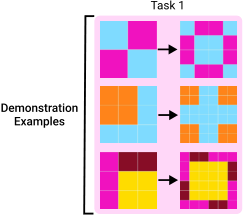

Test

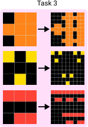

Example ? ? ?

Figure 1: Three tasks in ARC. Each task consists of demonstration examples and a test example.
Each example has an input grid and an output answer grid. Each pixel in the grid is matched to
a color corresponding to a value in the range 0–9. ARC requires identifying common rules from
the demonstration examples and applying them to solve the test example correctly. Despite recent
advancements in AI, current models have consistently underperformed compared to humans on the
ARC benchmark (Chollet et al., 2024; Johnson et al., 2021).

2 P RELIMINARIES

2.1 ARC L EARNING E NVIRONMENT (ARCLE)

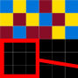

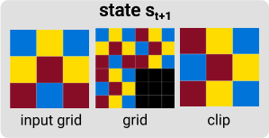

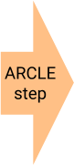

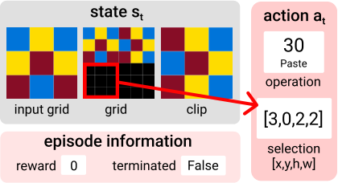

Figure 2: An example of a single step in ARCLE. In this example step, the action has an operation 30
( Paste ) and a selection of [3 _,_ 0 _,_ 2 _,_ 2] . The top-left coordinate of the selection box is [3 _,_ 0] and the
bottom-right coordinate is [5 _,_ 2] . [ _h_ _t_ _, w_ _t_ ] is calculated by subtracting [3 _,_ 0] from [5 _,_ 2] . When ARCLE
executes this action, the current clipboard is pasted into the bounding box specified by the selection
on the current grid. It then returns episode information, including the reward and termination status.

2

ARCLE (Lee et al., 2024) is a Gymnasium-based environment developed to facilitate RL approaches
for solving ARC tasks. ARCLE frames ARC tasks within a Markov Decision Process (MDP) structure,
providing an environment where agents can interact with and manipulate grid-based tasks. This MDP
structure enables ARC tasks to be solved through sequential decision-making.

ARCLE handles states and actions following the O2ARC web interface (Shim et al., 2024). As
shown in Figure 2, when ARCLE executes an action _**a**_ _t_ on the current state _**s**_ _t_, it returns the next
state _**s**_ _t_ +1, along with episode information about the reward and termination status. A state _**s**_ _t_
consists of (input grid _,_ grid _t_ _,_ clipboard _t_ ) at timestep _t_ . The input grid represents the initial state
of the test example, the grid _t_ denotes the current grid at time _t_ after several actions have been
applied, and the clipboard _t_ stores the copied grid by the Copy operation. An action _**a**_ _t_ consists of
(operation _t_ _, x_ _t_ _, y_ _t_ _, h_ _t_ _, w_ _t_ ), where operation _t_ represents the type of transformation, _x_ _t_ and _y_ _t_ denote
the coordinates of the top-left point of the selection box, and _h_ _t_ and _w_ _t_ represent the difference
between the bottom-right and top-left coordinates. All subsequent notations for _**s**_ _t_ and _**a**_ _t_ will adhere
to this definition for clarity. Reward is only given when the Submit operation is executed at the
answer state, and the episode terminates either after receiving the reward or when Submit is executed
across multiple trials. All possible operations are mentioned in Appendix B.1.

2.2 D IFFUSION -B ASED O FFLINE R EINFORCEMENT L EARNING

Offline RL focuses on learning policies from previously collected data, without interacting with
the environment. However, Offline RL faces challenges, including data distribution shifts, limited
diversity in the collected data, and the risk of overfitting to biased or insufficiently representative
samples. To address these issues, several works in offline RL have focused on improving learning
efficiency with large datasets and enhancing generalization to unseen scenarios while balancing
diversity and ensuring data quality (Fujimoto et al., 2019; Kidambi et al., 2020; Levine et al., 2020).

Recent offline RL methods offer promising solutions in long-horizon tasks and handling out-ofsupport samples through diffusion models. For instance, Diffuser (Janner et al., 2022) generates
tailored trajectories by learning trajectory distributions, reducing compounding errors. Beyond this,
a range of advanced diffusion-based offline RL approaches, such as Decision Diffuser (DD) (Ajay
et al., 2023), AdaptDiffuser (Liang et al., 2023), HDMI (Li et al., 2023), have demonstrated the
effectiveness of combining diffusion models with offline RL.

2.3 L ATENT D IFFUSION -C ONSTRAINED Q-L EARNING (LDCQ)

Latent Diffusion-Constrained Q-learning (LDCQ) (Venkatraman et al., 2024) leverages latent diffusion and batch-constrained Q-learning to handle long-horizon, sparse reward tasks more effectively.
The LDCQ method uses sampled latents that encode trajectories of length _H_ to train the Q-function,
effectively reducing extrapolation error. The training process of LDCQ is shown in Figure 3: 1)
training the _β_ -VAE to learn latent representations, 2) training the diffusion model using the latent
vectors encoded by the _β_ -VAE, and 3) training the Q-network with latents sampled from the diffusion
model. More details about the LDCQ method are described in Appendix A.

3 S YNTHESIZED O FFLINE L EARNING DATA FOR A BSTRACTION AND

R EASONING (SOLAR)

We developed a new dataset called Synthesized Offline Learning data for Abstraction and Reasoning
(SOLAR) that can be used to train offline RL methods. Solving ARC tasks can be considered a
process of making multi-step decisions to transform the input grid into the output answer grid. We
believe that the process of making these decisions inherently involves applying core knowledge priors,
objectness, goal-directedness, numbers and counting, and basic geometry and topology (Chollet,
2019), which are necessary for solving ARC tasks. The ARC training set lacks information on how
to solve the task, and it only provides a set of demonstration examples and a test example for each
task, as shown in Figure 1. To address this, We aim to provide the trajectory data to solve the task
through SOLAR, enabling them to learn how actions change the state based on the application of
core knowledge priors.

3

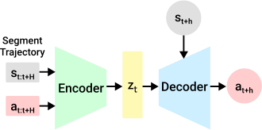

(a) Training _β_ -VAE

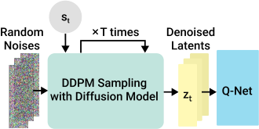

(c) Training Q-Network

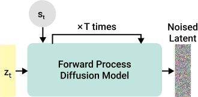

(b) Training Latent Diffusion Model

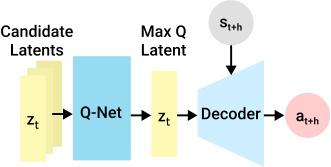

(d) Inference step

Figure 3: (a)–(c) Training stages of LDCQ. (a) Training a _β_ -VAE with an encoder that encodes
_H_ -horizon segment trajectories into latents _**z**_ _t_, and a policy decoder that decodes actions based on _**z**_ _t_
and state _**s**_ _t_ + _h_ where _h ∈_ [0 _, H_ ) contained in the latent. (b) Training a diffusion model based on _**z**_ _t_
and the _**s**_ _t_ . (c) Training a Q-network using latents sampled through the diffusion model. (d) LDCQ
inference step at _**s**_ _t_ + _h_ . Possible latents at _**s**_ _t_ are sampled through the diffusion model, and the agent
executes actions resulting from decoding the latent with the highest Q-value.

3.1 SOLAR S TRUCTURE

SOLAR contains various transition data ( _**s**_ _t_ _,_ _**a**_ _t_ _,_ _**s**_ _t_ +1 ), where actions _**a**_ _t_ are taken in different
states _**s**_ _t_, and the result _**s**_ _t_ +1 observed. To facilitate effective learning and a combination of core
knowledge, we use ARCLE (Lee et al., 2024). By designing a simple reward system that only provides
rewards upon reaching the correct solution, we can guide the agent towards the desired state using
reinforcement learning methods.

As shown in Figure 4, SOLAR consists of two key components: _Demonstration Examples_ and _Test_
_Example with Trajectory_ . The demonstration examples and the test examples serve the same roles
as in ARC. Through the demonstration examples, the common rule for transforming the input grid
to the output grid is identified and then applied to solve the test example. Trajectory data means the
episode data that starts from test input _s_ 0 .

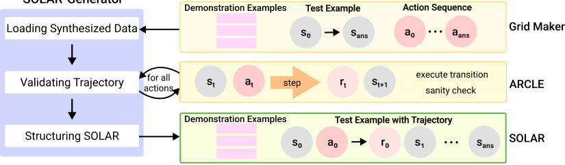

Figure 4: Data synthesis procedure with SOLAR-Generator. The state and actions consist of as
mentioned in Section 2.1. 1) Loading Synthesized Data: The Grid Maker module applies constraints,
augments input-output pairs, and synthesizes solutions for specific tasks by utilizing actions. 2) Validating Trajectories: Checks whether the generated actions are executable in ARCLE. 3) Structuring
SOLAR: Organizes and stores the synthesized data in SOLAR based on the defined format. This
step determines what information to include in the dataset and whether to segment episodes into
fixed-length chunks or store them as a whole.

4

3.2 SOLAR-G ENERATOR

We developed the SOLAR-Generator to synthesize SOLAR. SOLAR-Generator augments ARC
trajectories by following ARCLE formalism, addressing the inherent complexity and diversity of
ARC tasks. Figure 4 illustrates the data synthesis procedure, which is carried out in three steps: 1)
Loading Synthesized Data, 2) Validating Trajectories with ARCLE, and 3) Structuring SOLAR.

**Loading Synthesized Data** The first step in SOLAR-Generator is to load the synthesized data
for the target tasks. SOLAR provides the Grid Maker with common parameters such as maximum
grid size and the number of demonstration examples per test example. Each task has its own specific
Grid Maker, which synthesizes demonstration examples, test examples, and corresponding action
sequences (selections and operations) based on the task’s constraints and rules. If desired, nonoptimal trajectories containing random actions can also be synthesized. At this stage, the Grid Maker
synthesizes only grid pairs and possible action sequences. The full trajectory data for the test example
is constructed after passing through ARCLE. More details about how the Grid Maker synthesizes the
input-output grids and action sequences are described in Appendix B.

**Validating Trajectories with ARCLE** After synthesizing various grids and action sequences with
the Grid Maker, SOLAR-Generator checks whether the action sequences are valid in ARCLE. The
Grid Maker serves as a data loader, enabling it to load and validate the synthesized data. Through
this process, ARCLE provides intermediate states, rewards, and termination status for each step, and
verifies that each action is correctly executed in the current state. This step is particularly important
for non-optimal trajectories, where operations and selections may be generated randomly, as invalid
selections can sometimes be synthesized by the Grid Maker. For _gold standard_ trajectories, intended
as correct solutions, SOLAR-Generator ensures that the final grid of the trajectory matches the
expected output grid of the test example. As a result, this stage is useful for checking and debugging
the synthesized trajectories, preventing unintended errors.

**Structuring SOLAR** After the trajectory validation is complete, the episodes are saved into
SOLAR. In this step, user can determine the necessary information to include in SOLAR. At its core,
SOLAR includes episodes consisting of state, action, reward, and termination information at each
step, which are essential for training with offline RL methods. In addition to the previously mentioned
information, SOLAR can also store various data from ARCLE, such as grid sizes at each step, binary
mask versions of selections, and other relevant information needed for different learning methods.
In this research, we designed the data to work with methods like LDCQ, which require trajectories
of fixed horizon length _H_ . Therefore, the trajectories are segmented into fixed-length chunks with a
horizon length of _H_ .

Through these three steps, SOLAR-Generator synthesizes diverse solutions by altering action orders
or using alternative operation combinations. This is achieved by the Grid Maker, which generates
data using pre-implemented algorithms, enabling the user to create as many trajectories as needed.
SOLAR provides a sufficient training set for learning various problem-solving strategies. By offering
diverse trajectories while adhering to the task-solving criteria, SOLAR bridges the gap between
ARC’s reasoning challenges and the sequential decision-making process of offline RL. For additional
details about SOLAR and SOLAR-Generator, see the project website [1] and Appendix B.

4 D ESIGN SOLAR FOR A S IMPLE T ASK

One of the most crucial factors in solving ARC tasks is the ability to recognize whether the current
state is the answer state and to submit the correct answer accordingly. In ARC, each task embodies
a single analogy, but this analogy can be approached through various action sequences (Johnson
et al., 2021; Kim et al., 2022). Some solution paths may better exemplify the underlying analogy,
while others might be less optimal or clear (Kim et al., 2022). Moreover, even when solving different
test examples within the same task where the same rule is applied, the actual action sequence can
vary depending on factors like the grid size or the arrangement of elements in the input grid. The
diversity in potential action sequences to solve a single ARC task highlights the complexity of abstract
reasoning and the importance of identifying the core analogy. Therefore, an agent’s ability to judge

1 [https://github.com/GIST-DSLab/SOLAR-Generator](https://github.com/GIST-DSLab/SOLAR-Generator)

5

that it has reached an answer state implies that it has comprehended the underlying analogy and
executed the necessary ARCLE actions to arrive at the correct solution. This ability to recognize the
answer state is critical, as it demonstrates the agent’s understanding of the task’s inherent logic and
its capacity to apply appropriate problem-solving strategies. In ARCLE, the reward is given only
when the agent predicts the Submit operation and the submitted grid is the same as the answer grid.
To evaluate whether an agent trained with LDCQ can correctly identify and submit at the answer
state—even when non-optimal trajectories are included in the training dataset—we mixed in incorrect
episodes where the Submit operation is conducted in non-answer states.

Given these characteristics of ARC tasks, our experimental objectives are: 1) To assess whether the
model can reach the answer state when various non-optimal trajectories are mixed with gold standard
trajectories, and 2) To determine whether the model can recognize the answer state and perform
the Submit action appropriately. By demonstrating the model’s ability to identify the answer state,
we can infer that it has internalized core knowledge priors and understands the high-level problemsolving methods necessary for ARC tasks. We synthesized SOLAR for a simple task designed to
show these experimental objectives.

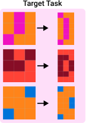

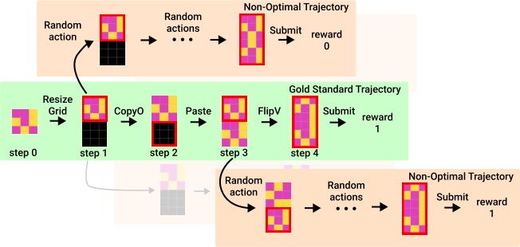

Figure 5: SOLAR episodes for a simple task: The gold standard trajectory (episode) contains the
steps to solve the problem by using the core knowledge priors properly. The non-optimal episodes
branch off at a random step within the standard trajectory, performing random operations such as
Rotate, Flip, or Copy & Paste, and then Submit after a certain number of steps.

We designed a simple task that requires core knowledge priors such as objectness and geometry. This
task necessitates the ability to consider the input grid as an object and then perform actions based
on this object. We constrained the maximum grid size to 10x10, and each episode includes three
demonstration pairs. In creating SOLAR for this task, we constructed the dataset to include both gold
standard episodes—which successfully reach the answer state and perform the Submit action—and
non-optimal episodes—which follow random paths that may or may not reach the answer state. The
inclusion of non-optimal trajectories was intended to evaluate whether the agent can recognize the
answer state and appropriately perform the Submit action, thereby assessing its reasoning abilities
rather than simply mimicking the actions in the dataset. As shown in Figure 5, the gold standard
episode for this task consists of 5 steps: 1) ResizeGrid to make the grid two times longer vertically,
2) CopyO to copy the upper half of the current grid, as it matches the input grid, 3) Paste to apply
it to the lower half of the grid, 4) FlipV to vertically flip the upper half of the current grid, and 5)
Submit, as it reaches the answer state.

In the non-optimal episodes, the trajectories initially follow the gold standard trajectory but deviate
at a random step to execute random actions for several steps. We constrained the random operations to FlipV (vertical flip), FlipH (horizontal flip), Rotate90 (counterclockwise rotation),
Rotate270 (clockwise rotation), and CopyO (updating the clipboard with the selected area). For
selection, it was constrained to either two options (upper half or lower half of the current grid) or three
options (upper half, lower half, or the whole grid). Specifically, there are two options for Rotate90,
Rotate270, and CopyO, and three options for the others. When CopyO is selected, the subsequent
Paste action is forced onto the other possible selection option. This simplified selection allows for
focusing on assessing the AI’s decision-making by sequentially combining operations.

6

Each non-optimal episode contains approximately ten steps to the end, allowing the trajectory to
include various actions in diverse states. For each problem pair, one gold standard episode and
nine non-optimal episodes were generated, totaling 5,000 episodes across 500 problem pairs. As a
result, the training set was composed such that approximately 10% of the total episodes included the
Submit operation at the answer state.

5 E XPERIMENTS AND R ESULTS

5.1 E VALUATION P ROCESS USING ARCLE

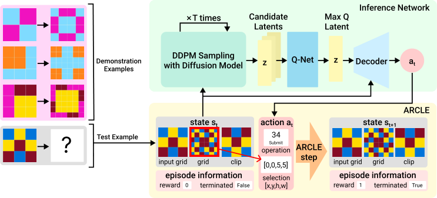

Figure 6: Inference framework for solving ARC tasks. ARCLE loads the task from the dataset and
manages state information as well as the termination status of the current evaluation episode. The
inference network of LDCQ performs DDPM sampling on the given state to extract candidate latents,
then decodes the corresponding action for max Q latent, and sends it to ARCLE. ARCLE executes
the action and updates the state information accordingly. This process alternates between ARCLE
and the inference network, continuing the inference until the episode ends.

After training the agent using LDCQ on the SOLAR dataset, we conducted an evaluation of its
performance. To evaluate our experiment, we synthesized an evaluation SOLAR set with 100 test
examples, each paired with three synthesized demonstration examples. The evaluation SOLAR set
was synthesized by the SOLAR-Generator using the same tasks but with a random seed different
from the one used for the training set. To measure the effectiveness of decision-making using the
Q-function, two accuracy metrics are measured: 1) Whether the agent reaches the answer state, and
2) Whether it predicts the Submit operation at the answer state to receive a reward.

The evaluation process is carried out through ARCLE, which manages the problem and its corresponding solution from SOLAR. ARCLE handles state transitions, performs actions, and verifies
whether the submitted solution is correct. As depicted in Figure 6, ARCLE interacts with the LDCQ
inference network by alternating the exchange of _**s**_ _t_ and _**a**_ _t_, facilitating the decision-making process
toward reaching the correct answer state. The latent _**z**_ _t_ represents a segment trajectory spanning from
timestep _t_ to _t_ + _H −_ 1, and is trained to accurately decode actions for any state within this segment
trajectory.

In the original LDCQ methodology, inference is performed by executing several horizons using a
single latent, followed by predicting the next latent. However, in the task used for this research, which
has a gold standard trajectory consisting of five steps, it is possible to complete the task with just
one latent sampling from the initial state. While reaching the correct answer in this manner is not
inherently problematic, one of the primary goals of this research is to analyze whether the agent
learns the knowledge prior to how actions work across various states. Thus, instead of focusing solely
on solving the problem in as few steps as possible, only one action is conducted per latent. With this,
the results demonstrate that the agent can make far-sighted decisions to reach the answer not just
from the beginning to the end, but also through intermediate steps.

7

5.2 R ESULTS

To demonstrate the strengths of the diffusion-based offline RL method guided by Q-function, we
compare three approaches:

    - **VAE prior (VAE)** : This method uses a latent sampled from the VAE state prior _p_ _ω_ ( _**z**_ _t_ _|_ _**s**_ _t_ ) .
The VAE state prior is trained in _β_ -VAE training stage by calculating the KL divergence
between _p_ _ω_ ( _**z**_ _t_ _|_ _**s**_ _t_ ) and the posterior _q_ _ϕ_ ( _**z**_ _t_ _|_ _**τ**_ _t_ ), aligning the latent distribution with the
trajectory starting from state _**s**_ _t_ .

    - **Diffusion prior (DDPM)** : This method uses a latent sampled from the diffusion model
_p_ _ψ_ ( _**z**_ _t_ _|_ _**s**_ _t_ ) through the DDPM method (Ho et al., 2020). The sampled latents closely resemble
the training data, with added variance during the denoising process. This method is similar
to behavior cloning in that it operates without guidance from rewards or value functions.

    - **Max Q latent (LDCQ)** : This method selects a latent with the highest Q-value from those
sampled by the diffusion model, argmax _**z**_ _∼p_ _ψ_ ( _**z**_ _t_ _|_ _**s**_ _t_ ) _Q_ ( _**s**_ _t_ _,_ _**z**_ ), to make a decision at _**s**_ _t_ .

The evaluation of each approach was conducted five times for the evaluation SOLAR set. The results,
summarized in Figure 7a, show the success rates for: 1) Whether the agent reaches the correct answer
state and 2) Whether the agent executes Submit operation in the answer state. When using the VAE
prior, the agent reaches the correct answer state in only about 10% of test episodes and submits
the answer in just 1%. With latents sampled using DDPM, about 10% of the answers are correctly
submitted, while the agent reaches the answer state approximately 37% of the time. When using
LDCQ, the agent reaches the answer state in over 90% of cases and successfully submits the correct
answer in about 77% of test episodes. These results demonstrate that the Q-function enhances the
agent’s ability to both reach the correct answer and recognize when it has arrived at the answer state.

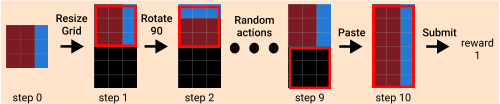

(b) Inference example with DDPM method

|Col1|Submit Answe|Col3|9 er|Col5|Col6|92.4|4|
|---|---|---|---|---|---|---|---|
||Submit Answe Reach Answer|Submit Answe Reach Answer|76.6  r |76.6  r |76.6  r |||
|||||||||
||3|3|6.8|6.8||||
||~~9.8~~ ~~13.0~~ |~~9.8~~ ~~13.0~~ ||||||
|1.0 ||||||||

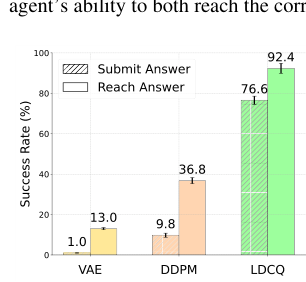

(a) Test accuracy for three methods

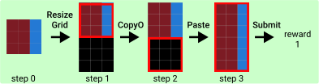

(c) Inference example with LDCQ method

Figure 7: (a) The evaluation results for 100 test examples. LDCQ shows significantly improved
performance compared to the other two methods, successfully reaching the correct answer state and
executing the Submit operation at the answer state. The error bars represent the 96% confidence
interval. (b) With the latent sampled with DDPM, the agent sometimes reaches the correct answer
after performing various actions. This occurred rarely during evaluation, and even when it did, it
did not appear in subsequent evaluations. (c) When using LDCQ, it often shows the case that skips
unnecessary actions. The inference example with the VAE prior method is omitted because it rarely
solves the problem.

Figure 7b and Figure 7c highlight the different solving strategies exhibited by the Q-function. When
using the latent sampled with DDPM, the agent performs diverse actions, occasionally reaching the
goal by chance. In contrast, with the Q-function, the agent consistently reaches the correct answer in
every evaluation. In scenarios where the input grid is vertically symmetrical, the agent even skips
unnecessary operation FlipV and proceeds directly to Submit . Notably, the training dataset does
not include any trajectories where the FlipV operation is skipped, even for symmetrical grids. With
the Q-function, the model recognizes that applying FlipV does not alter the state. Consequently, the
Q-value for submitting at that state increases, prompting the agent to choose the Submit operation.
This demonstrates the reasoning ability of the agent trained with LDCQ in solving ARC tasks, as
recognizing when the correct answer state has been reached is crucial.

8

6 L IMITATIONS & D ISCUSSIONS

In our experiment, the LDCQ method showed significant improvement in reaching the goal. However,
in approximately 16% of cases, the agent reached the correct state but proceeded with another action
instead of submitting the solution, even with the assistance of the Q-function. This issue arises because
the Q-function, while enhancing decision-making, sometimes assigns higher values to actions other
than submission, causing the agent to bypass the goal state. This suggests that the Q-function is not
perfectly aligned with the final objective in ARC. Notably, in ARC tasks, even when solving different
test examples within the same task where the same rule is applied, the actual action sequence can
vary depending on factors like grid size or the arrangement of elements in the input grid. The current
Q-values are calculated based on the absolute state values, which occasionally leads to misjudgments
when submitting the correct solution. Therefore, improving the agent’s ability to accurately determine
when to submit the correct answer is necessary for future research.

While the LDCQ approach performs well in a simple ARC task setting, more complex tasks and
multi-task environments present additional challenges. Unlike single-task scenarios, where the agent
follows a fixed strategy toward a predefined answer, multi-task settings demand flexibility to adapt to
changing goals or new possibilities during task execution. We expect that addressing these challenges
could involve integrating task classifiers for Q-learning. Additionally, incorporating modules so
that the agent can revise its strategy during task execution—adjusting based on evolving states or
objectives rather than rigidly following the initial strategy—may enhance its adaptability.

In traditional supervised RL approaches, such as those described by Ghugare et al. (2024), stitching
typically occurs only when the goal remains consistent across tasks. To address this limitation, we
employed temporal data augmentation, which involves starting from an intermediate state near the
goal and setting a new target. In SOLAR, this could be extended by using non-optimal paths as goals
in non-optimal trajectories. However, in ARC, where goals are determined by demonstration pairs,
augmenting all goals is impractical. More careful strategies are needed to enable stitching for entirely
new goals not previously encountered. If methodologies are developed that can combine existing
actions toward different goals, we expect that SOLAR will facilitate these combinations.

Going forward, refining how the Q-function evaluates states and actions will be crucial. To improve
performance, especially in multi-task environments, incorporating mechanisms that not only assess
the state and action in relation to the goal but also guide the agent toward the most effective path to
achieve the ultimate objective will be beneficial. Recognizing the task’s context and how close states
are to the correct solution is essential for ensuring that the Q-function helps navigate toward the goal
efficiently.

7 C ONCLUSION

This research demonstrates the potential of offline reinforcement learning (RL), particularly the
Latent Diffusion-Constrained Q-learning (LDCQ) method, for efficiently sequencing and organizing
actions to solve tasks in grid-based environments like the Abstraction and Reasoning Corpus (ARC).
To our knowledge, this work is the first to tackle ARC using a diffusion-based offline RL model
within a properly designed environment, guiding agents step-by-step toward correct solutions without
generating the full ARC grid at once. Through training on SOLAR, we successfully applied and
evaluated offline RL methods, showing that agents can learn to find paths to the correct answer state
and recognize when they’ve reached it. This suggests that RL with a well-designed environment
is promising for abductive reasoning problems, potentially reducing data dependency compared to
traditional methods. As tasks become more complex, especially in multi-task settings, refining the
Q-function to address unique reward structures is crucial, with multi-task environments requiring
task-specific adaptations to account for varying states and rewards. Integrating modules like task
classifiers or object detectors could enhance the agent’s ability to dynamically adjust its strategy,
promoting more flexible decision-making. This research opens new avenues for program synthesis
in analogical reasoning tasks with RL environments, potentially integrating with analogy findings
techniques (hypothesis search with LLMs) to handle a wider range of ARC tasks.

9

R EFERENCES

Anurag Ajay, Yilun Du, Abhi Gupta, Joshua Tenenbaum, Tommi Jaakkola, and Pulkit Agrawal. Is
Conditional Generative Modeling All You Need for Decision-Making? In _ICLR_, 2023.

François Chollet. On the Measure of Intelligence. _arXiv:1911.01547_, 2019.

François Chollet, Mike Knoop, Bryan Landers, Greg Kamradt, Hansueli Jud, Walter Reade, and
Addison Howard. ARC Prize 2024, 2024. URL [https://kaggle.com/competitions/](https://kaggle.com/competitions/arc-prize-2024)
[arc-prize-2024.](https://kaggle.com/competitions/arc-prize-2024)

Scott Fujimoto, Herke van Hoof, and David Meger. Addressing Function Approximation Error in
Actor-Critic Methods. In _ICML_, 2018.

Scott Fujimoto, David Meger, and Doina Precup. Off-Policy Deep Reinforcement Learning without
Exploration. In _ICML_, 2019.

Raj Ghugare, Matthieu Geist, Glen Berseth, and Benjamin Eysenbach. Closing the Gap between TD
Learning and Supervised Learning - A Generalisation Point of View. In _ICLR_, 2024.

Tiankai Hang, Shuyang Gu, Chen Li, Jianmin Bao, Dong Chen, Han Hu, Xin Geng, and Baining
Guo. Efficient Diffusion Training via Min-SNR Weighting Strategy. In _ICCV_, 2023.

Jonathan Ho, Ajay Jain, and Pieter Abbeel. Denoising Diffusion Probabilistic Models. In _NeurIPS_,
2020.

Michael Hodel. Addressing the Abstraction and Reasoning Corpus via Procedural Example Generation. _arXiv:2404.07353_, 2024.

Michael Janner, Yilun Du, Joshua B Tenenbaum, and Sergey Levine. Planning with Diffusion for
Flexible Behavior Synthesis. In _ICML_, 2022.

Aysja Johnson, Wai Keen Vong, Brenden M. Lake, and Todd M. Gureckis. Fast and Flexible: Human
Program Induction in Abstract Reasoning Tasks. In _CogSci_, 2021.

Daniel Kahneman. _Thinking, Fast and Slow._ Farrar, Straus and Giroux, 2011.

Rahul Kidambi, Aravind Rajeswaran, Praneeth Netrapalli, and Thorsten Joachims. MOReL: ModelBased Offline Reinforcement Learning. In _NeurIPS_, 2020.

Subin Kim, Prin Phunyaphibarn, Donghyun Ahn, and Sundong Kim. Playgrounds for Abstraction
and Reasoning. In _NeurIPS Workshop on Neuro Causal and Symbolic AI_, 2022.

Hosung Lee, Sejin Kim, Seungpil Lee, Sanha Hwang, Jihwan Lee, Byung-Jun Lee, and Sundong
Kim. ARCLE: The Abstraction and Reasoning Corpus Learning Environment for Reinforcement
Learning. In _CoLLAs_, 2024.

Sergey Levine, Aviral Kumar, George Tucker, and Justin Fu. Offline Reinforcement Learning:
Tutorial, Review, and Perspectives on Open Problems. _arXiv:2005.01643_, 2020.

Wenhao Li, Xiangfeng Wang, Bo Jin, and Hongyuan Zha. Hierarchical Diffusion for Offline Decision
Making. In _ICML_, 2023.

Zhixuan Liang, Yao Mu, Mingyu Ding, Fei Ni, Masayoshi Tomizuka, and Ping Luo. AdaptDiffuser:
Diffusion Models as Adaptive Self-Evolving Planners. In _ICML_, 2023.

Aditya Ramesh, Prafulla Dhariwal, Alex Nichol, Casey Chu, and Mark Chen. Hierarchical TextConditional Image Generation with CLIP Latents. _arXiv preprint arXiv:2204.06125_, 2022.

Tom Schaul. Prioritized Experience Replay. In _ICLR_, 2016.

Suyeon Shim, Dohyun Ko, Hosung Lee, Seokki Lee, Doyoon Song, Sanha Hwang, Sejin Kim, and
Sundong Kim. O2ARC 3.0: A Platform for Solving and Creating ARC Tasks. In _IJCAI_, 2024.
[URL https://o2arc.com.](https://o2arc.com)

Siddarth Venkatraman, Shivesh Khaitan, Ravi Tej Akella, John Dolan, Jeff Schneider, and Glen
Berseth. Reasoning with Latent Diffusion in Offline Reinforcement Learning. In _ICLR_, 2024.

10

A T RAINING D ETAILS

A.1 L ATENT D IFFUSION C ONSTRAINED Q-L EARNING (LDCQ)

**Training Latent Encoder and Policy Decoder** The first stage in training with LDCQ is to train a
_β_ -VAE that learns latent representations. In this stage, the _β_ -VAE learns how actions are executed
over multiple steps to change the state. With _H_ -horizon latents, it becomes easier to capture longerterm changes in the state. We use SOLAR as the training dataset _D_, which contains _H_ -length
segmented trajectories _**τ**_ _t_ . Each _**τ**_ _t_ consists of state sequences _**s**_ _t_ : _t_ + _H_ = [ _**s**_ _t_ _,_ _**s**_ _t_ +1 _, ...,_ _**s**_ _t_ + _H−_ 1 ]
and action sequences _**a**_ _t_ : _t_ + _H_ = [ _**a**_ _t_ _,_ _**a**_ _t_ +1 _, ...,_ _**a**_ _t_ + _H−_ 1 ], along with additional information such as
demonstration examples. As shown in Figure 3a, during the _β_ -VAE training stage, the encoder _q_ _ϕ_ is
trained to encode _**τ**_ _t_ into the latent representation _**z**_ _t_, and the low-level policy decoder _π_ _θ_ is trained
to decode actions based on the given state and latent. For example, given the latent _**z**_ _t_ and a state
from the segment trajectory, _**s**_ _t_ + _h_ where _h ∈_ [0 _, H_ ), the policy decoder decodes the action _**a**_ _t_ + _h_ for
_**s**_ _t_ + _h_ . The _β_ -VAE is trained by maximizing the evidence lower bound (ELBO), minimizing the loss
in Eq. 1. The loss consists of the reconstruction loss from the low-level policy decoder and the KL
divergence between the approximate posterior _q_ _ϕ_ ( _**z**_ _t_ _|_ _**τ**_ _t_ ) and the prior _p_ _ω_ ( _**z**_ _t_ _|_ _**s**_ _t_ ).

�

_−_ _βD_ _KL_ ( _q_ _ϕ_ ( _**z**_ _t_ _|_ _**τ**_ _t_ ) _∥_ _p_ _ω_ ( _**z**_ _t_ _|_ _**s**_ _t_ ))

�

_L_ VAE ( _θ, ϕ, ω_ ) = _−_ E _**τ**_ _t_ _∼D_

�

E _q_ _ϕ_ ( _**z**_ _t_ _|_ _**τ**_ _t_ )

_t_ + _H−_ 1
�
� _l_ = _t_

log _π_ _θ_ ( _**a**_ _l_ _|_ _**s**_ _l_ _,_ _**z**_ _t_ )

_l_ = _t_

(1)

**Training Latent Diffusion Model** In the second stage, latent diffusion model is trained to generate
latents based on the latent representations encoded by the _β_ -VAE. The training data consists of
( _**s**_ _t_ _,_ _**z**_ _t_ ) pairs, which are used to train a conditional latent diffusion model _p_ _ψ_ ( _**z**_ _t_ _|_ _**s**_ _t_ ) by learning the
denoising function _µ_ _ψ_ ( _**z**_ _t_ _[j]_ _[,]_ _**[ s]**_ _[t]_ _[, j]_ [)] [, where] _[ j][ ∈]_ [[0] _[, T]_ []] [ is diffusion timestep. This allows the model to]
capture the distribution of trajectory latents conditioned on _**s**_ _t_ . _q_ ( _**z**_ _t_ _[j]_ _[|]_ _**[z]**_ _t_ [0] [)] [ denotes the forward Gaussian]
diffusion process that noising the original data. Following previous research (Ramesh et al., 2022;
Venkatraman et al., 2024), we predict the original latent rather than the noise, balancing the loss
across diffusion timesteps using the Min-SNR- _γ_ strategy (Hang et al., 2023). The loss function used
to train the diffusion model is shown in Eq. 2. Here, _**z**_ _t_ _[j]_ _[, j][ ∈]_ [[0] _[, T]_ []] [ represents noised latent on] _[ j]_ [-th]
diffusion time step, when _j_ = 0 then _**z**_ _t_ [0] [=] _**[ z]**_ _[t]_ [and] _**[ z]**_ _t_ _[T]_ [is Gaussian noise.]

_L_ ( _ψ_ ) = E _j∼_ [1 _,T_ ] _,_ _**τ**_ _H_ _∼D,_ _**z**_ _t_ _∼q_ _ϕ_ ( _**z**_ _t_ _|_ _**τ**_ _t_ ) _,_ _**z**_ _tj_ _[∼][q]_ [(] _**[z]**_ _t_ _[j]_ _[|]_ _**[z]**_ _t_ [0] [)] �min _{_ SNR( _j_ ) _, γ}∥_ _**z**_ _t_ [0] _[−]_ _[µ]_ _[ψ]_ [(] _**[z]**_ _t_ _[j]_ _[,]_ _**[ s]**_ _[t]_ _[, j]_ [)] _[∥]_ [2] [�] (2)

**Training Q-Network** Finally, the latent vectors sampled by the latent diffusion model are used for
Q-learning. For sampling latents, we use the DDPM method (Ho et al., 2020). The trained diffusion
model samples latents by denoising random noise using the starting state information _**s**_ _t_ . We use
the data consisting of ( _**s**_ _t_ _,_ _**z**_ _t_ _, r_ _t_ : _t_ + _H_ _,_ _**s**_ _t_ + _H_ ) for training Q-Network, where _r_ _t_ : _t_ + _H_ = [�] _[t]_ _l_ = [+] _t_ _[H][−]_ [1] _γ_ _[l]_ _r_ _l_
deontes the discounted sum of rewards. Here, DDPM sampling is used to sample _**z**_ _t_ + _H_ for _**s**_ _t_ + _H_ .
For Q-learning, we use Clipped Double Q-learning (Fujimoto et al., 2018) as shown in Eq. 3 with
Prioritized Experience Replay buffer (Schaul, 2016) to improve learning stability and mitigate
overestimation. The trained Q-network _Q_ ( _**s**_ _t_ _,_ _**z**_ _t_ ) evaluates the expected return of performing various
_H_ -length actions, with _**z**_ _t_ sampled via DDPM based on _**s**_ _t_ . This allows the network to efficiently
calculate the value of actions over _H_ -steps to estimate future returns.

�

_Q_ ( _**s**_ _t_ _,_ _**z**_ _t_ ) _←_

�

_r_ _t_ : _t_ + _H_ + _γ_ _[H]_ _Q_ ( _**s**_ _t_ + _H_ _,_ argmax _Q_ ( _**s**_ _t_ + _H_ _,_ _**z**_ ))
_**z**_ _∼p_ _ψ_ ( _**z**_ _t_ + _H_ _|_ _**s**_ _t_ + _H_ )

(3)

11

A.2 H YPERPARAMETERS

We used a horizon length of 5 for encoding skill latents, meaning the model plans and evaluates
actions over a five-step lookahead.

We trained the diffusion model with 500 diffusion steps. If the number of diffusion steps is too small,
it can lead to high variance in the sampling process, potentially causing errors during the decoding of
operations or selections in ARCLE. To minimize these errors, we set the number of diffusion steps to
500, ensuring more accurate operation and selection decoding from the sampled latents.

We set the discount factor to 0.5 to ensure the model appropriately balances immediate and future
rewards. Since the total steps required to reach the correct answer in ARCLE are usually fewer than
20, a high discount factor could cause the agent to struggle in distinguishing between submitting at
the correct state and continuing with additional steps, which could lead to episode failure.

The hyperparameters that we used for training three stages of LDCQ are shown in Tables 1, 2 and 3.

Table 1: Hyperparameters for training _β_ -VAE

**Parameter** **Value**

Learning rate 5e-5
Batch size 128
Epochs 400
Horizon ( _H_ ) 5
Latent dimension (z) 256
KL loss ratio ( _β_ ) 0.1
Hidden layer dimension 512

Table 2: Hyperparameters for training latent diffusion model

**Parameter** **Value**

Learning rate 1e-4
Batch size 32
Epochs 400
Diffusion steps ( _T_ ) 500
Drop probability 0.1
Variance schedule linear
Sampling algorithm DDPM
_γ_ (For Min-SNR- _γ_ weighing) 5

Table 3: Hyperparameters for training DQN

**Parameter** **Value**

Learning rate 5e-4
Batch size 128
Discount factor ( _γ_ ) 0.5
Target net update rate ( _ρ_ ) 0.995
PER buffer _α_ 0.7
PER buffer _β_ Linearly increased from 0.3 to 1, Grows by 0.03 every 2000 steps
Diffusion samples for batch argmax 100

A.3 H ARDWARE

We used an NVIDIA A100-SXM4-40GB GPU to train the model. Training the _β_ -VAE took about 7
hours, while training the diffusion model and Q-network each took around 6 to 10 hours.

12

B D ETAILS OF SOLAR-G ENERATOR

B.1 O PERATIONS IN SOLAR

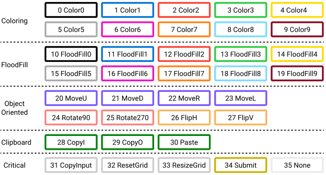

Figure 8: All operations compatible with SOLAR, 0–34 operations follow ARCLE, and only in
SOLAR, 35 (None) is for terminated episode. It means the episode is ended after Submit.

The operations from 0 to 34 are identical to those used in ARCLE (Lee et al., 2024). Since Submit
is an operation that receives a reward, it should only be used when the state is considered correct
and not excessively. Due to LDCQ’s fixed horizon, and to ensure that the agent only uses Submit
when the state is definitively correct, we added a None operation that fills all subsequent states after
Submit with the 11th color (10), which does not exist in the original ARC (0–9). In other words,
during training, the None action emphasizes that the episode ends after Submit.

B.2 G RID M AKER

For generating SOLAR, we create a generator that can synthesize a large amount of data for a given
rule. Grid Maker is a hard-coded program specific to each task. Grid Maker contains the rules for
synthesizing demonstration examples and test examples, and the synthesized solution action path
consists of operations and selections. In Grid Maker, data is formatted to be compatible with ARCLE.
The Grid Maker constructs analogies with the same problem semantics but with various attributes
such as the shape, color, size, and position of objects. SOLAR-Generator can generate intermediate
trajectories by interacting with ARCLE. The algorithm of the SOLAR-Generator is designed to
augment specific tasks using the Grid Maker, which can primarily be divided into three parts.

Grid Maker was built as a data loader, which is used in ARCLE. In the original ARCLE environment,
there was no need to load operations and selections—only the grid was loaded since the problem
alone was sufficient. To change this structure, the entire environment would need to be recreated.
Instead, operations and selections are now loaded from the data loader’s description, allowing us
to retain the original environment. Therefore, the process of creating input-output examples and
generating action sequences works within a single file.

**Specifying Common Parts** Each task in the ARC dataset usually contains 3 demonstration examples, with common elements observed across these pairs. In the common parts, attributes such as
color, the type of task, and the presence of objects are predetermined using random values before pair
generation.

**Synthesizing Examples** In the example synthesis phase, the input of the original task is augmented
in a way that ensures diversity while preserving the integrity of the problem-solving method. A
random input grid is generated under conditions that satisfy the analogy required by the task. A
solution grid is created using a hard-coded algorithm. For tasks involving pattern-based problems, as
experimented in the paper, selections are made to fit the grid size, and various operations are executed
either randomly or in a predetermined order. For object-based problems, the solution grid is generated

13

by an algorithm that finds the necessary objects in the input grid and processes them according to the
task requirements.

**Converting to ARCLE Trajectories** This stage involves the creation of an ARCLE-based trajectory
that meticulously adheres to the problem-solving schema of the synthesized examples. The entire
process is carried out through a hard-coded algorithm. During the example synthesis process, the
locations of objects may already be known, or they can be identified using a search algorithm. The
information obtained is then used to make the appropriate selections, and the trajectory is converted
into an ARCLE trajectory through an algorithm that leads to the correct solution.

If all steps are properly coded, it is possible to generate the operations and selections that lead to the
correct solution for any random input grid. These are then fed into ARCLE to obtain intermediate
states, rewards, and other information, and to verify whether the correct result is reached. Once steps
1) to 3) are correctly implemented, SOLAR-Generator can continuously and automatically generate
as much data for the given task as the user desires, using the Grid Maker.

B.3 E XAMPLE OF D ATA S YNTHESIS IN G RID M AKER AND THE G ENERATION OF SOLAR

SOLAR-Generator can synthesize SOLAR for object-based tasks. Figure 9 shows a variant of Task 2
from Figure 1. Grid Maker generates random input grids with some variances firtst. In this variant,
each episode randomly selects two colors for the boxes. Each inputs can have different grid sizes,
and rules are established for objects of each color within the episode. Then it generates the answer
output grids for the input grids through algorithm. The solution algorithm in Grid Maker proceeds as
follows: 1) Find the top-left corner of the orange square and repeat the coloring process to draw a
diagonal line to the grid’s edge. 2) Find the bottom-right corner of the red square and repeatedly color
diagonally until the end of the grid is reached. With these algorithms, Grid Maker can synthesize as
many examples and SOLAR trajectories as the user desires.

Task 2_gold-standard_7

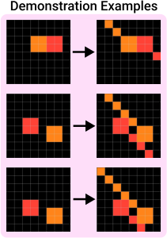

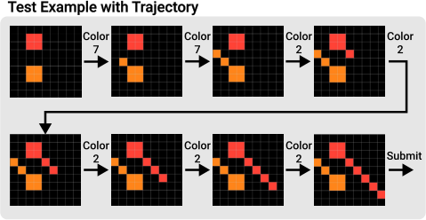

Figure 9: A gold standard trajectory for Task 2 in Figure 1. SOLAR contains its trajecotry ID,
demonstration examples, and a test example with trajectory.

14

B.4 A LGORITHM OF SOLAR-G ENERATOR

With the synthesized data through the Grid Maker module, the SOLAR-Generator checks the sanity
of the synthesized trajectory, and then saves the data. The whole algorithm for SOLAR-Generator is
described in Algorithm 1.

**Algorithm 1:** SOLAR-Generator

**1** Input: task set _T_, maximum grid size ( _H,W_ ), number of samples _N_, number of examples _E_

**2** **for** _task ∈_ _T_ **do**

**3** # Load the synthesized data _D_ _s_ from the Grid Maker for the _task_

**4** _D_ _s_ _←_ Grid Maker( _task,_ ( _H, W_ ) _, N, E_ )

**5** **for** _data ∈D_ _s_ **do**

**6** # Extract the demonstration examples, test example, and actions for each episode

**7** _trajectory_ID, dem_ex, input_grid, output_grid, operations, selections ←_ _data_

**8** Add _trajectory_ID, dem_ex, input_grid, output_grid_ to episode _τ_ _data_

**9** # Set the initial state

**10** _current_grid_ 0 _←_ _input_grid_

**11** _clip_grid_ 0 _←_ _None_

**12** _t ←_ 0

**13** _s_ _t_ _←_ ( _input_grid, current_grid_ 0 _, clip_grid_ 0 )

**14** **for** ( _opr_ _t_ _, sel_ _t_ ) _∈_ _(operations, selections)_ **do**

**15** _a_ _t_ _←_ ( _opr_ _t_ _, sel_ _t_ )

**16** **if** _a_ _t_ can be performed in _s_ _t_ **then**

**17** # Update state and episode information using ARCLE

**18** _current_grid_ _t_ +1 _, clip_grid_ _t_ +1 _, reward_ _t_ _, terminated_ _t_ _←_ ARCLE.step( _s_ _t_ _, a_ _t_ )

**19** Add _s_ _t_ _, a_ _t_ _, reward_ _t_ _, terminated_ _t_ to _τ_ _data_

**20** _s_ _t_ +1 _←_ ( _input_grid, current_grid_ _t_ +1 _, clip_grid_ _t_ +1 )

**21** _t ←_ _t_ + 1

**22** **end**

**23** **else**

**24** Save wrong data for debugging

**25** break

**26** **end**

**27** **end**

**28** **if** _“gold-standard”_ in _trajectory_ID_ and _current_grid ̸_ = _output_grid_ **then**

**29** Save wrong data for debugging

**30** **end**

**31** **else**

**32** Save episode _τ_ _data_

**33** **end**

**34** **end**

**35** **end**

15

B.5 O THER SOLAR E XAMPLES

Figure 10 illustrates two examples of episodes from the tasks used in the experiment. Each episode
includes three random demonstration examples and a trajectory for a test example. Figure 10a shows
a gold standard trajectory, which represents the ideal sequence of actions to reach the correct answer
state. Figure 10b shows a non-optimal trajectory that, while not a gold standard, also reaches the
answer state. The clip grid, reward, and termination information are not displayed.

Simple task_gold-standard_64

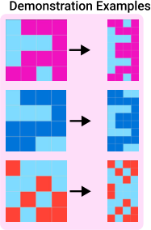

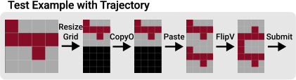

(a) Gold standard episode

Simple task_non-optimal_279

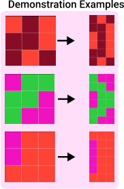

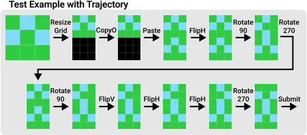

(b) Non-optimal episode

Figure 10: SOLAR episode examples of the task used in our experiment. Each episode contains three
demonstration examples and a test example with a trajectory. (a) An example of a gold standard
episode that ideally reaches the answer. (b) An example of a non-optimal episode that is not ideal,
but still reaches the answer state.

16

Task 1_gold-standard

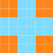

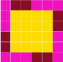

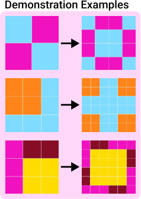

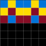

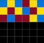

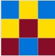

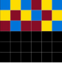

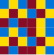

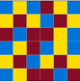

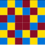

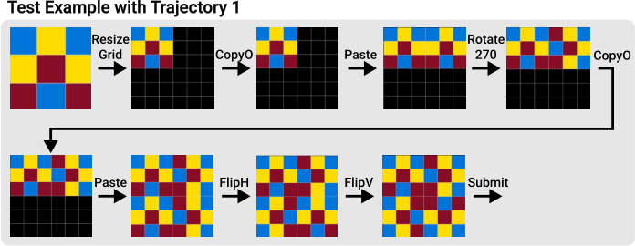

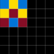

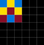

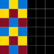

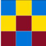

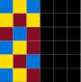

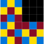

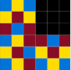

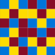

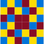

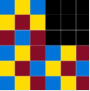

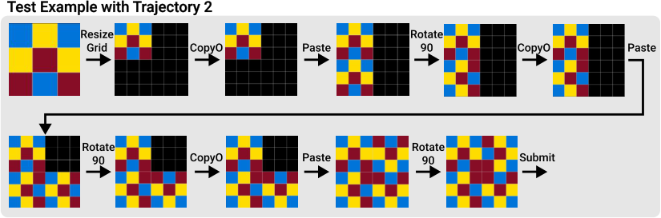

Figure 11: Two different gold standard trajectories for Task 1 in Figure 1, there might be multiple
gold standard trajectories in the same task.

17

C SOLAR-G ENERATOR VS RE-ARC: C OMPARING ARC D ATA

A UGMENTATION A PPROACHES

During the development of SOLAR, another augmentation scheme called RE-ARC (Hodel, 2024) was
independently developed and released. While both aim to generate diverse examples for ARC tasks,
they differ significantly in their design objectives, underlying architectures, and dataset structures.

**Underlying Architectures** SOLAR is built upon the ARCLE framework, designed for training
reinforcement learning agents. It uses a limited set of actions based on the O2ARC web interface,
which, despite their simplicity, are sufficient primitives to solve all ARC tasks. This design choice
results in sequential trajectories directly applicable to reinforcement learning models. In contrast,
RE-ARC is based on a more comprehensive Domain Specific Language (DSL) developed by Hodel,
featuring 141 primitives. This expanded set of operations provides greater flexibility in expressing
solutions, allowing for more complex transformations.

**Data Generation Approach** SOLAR generates sequential trajectories that mirror the step-by-step
approach humans use when solving ARC tasks. This aligns well with typical reinforcement learning
models that execute actions sequentially. RE-ARC, leveraging its expansive DSL, generates solutions
in the form of directed acyclic graphs (DAGs). This approach allows for more complex problemsolving strategies but may present challenges when applied to traditional reinforcement learning
frameworks.

**Dataset Structure and Utility** SOLAR provides complete episodes with detailed trajectories,
including all intermediate states. This feature is crucial for training agents with offline reinforcement
learning methods, allowing models to learn from the entire problem-solving process. RE-ARC focuses
on augmenting input-output pairs without explicitly providing intermediate steps. While valuable
for increasing example diversity and testing generalization capabilities, it may require additional
processing for direct application in a reinforcement learning context.

**Flexibility and Potential for Integration** SOLAR’s design allows for easy generation of large
episode datasets and is highly adaptable for various experimental setups in reinforcement learning
research. The simplicity of the ARCLE action set makes it easier to modify and extend the system.
RE-ARC’s DAG-based approach, while not immediately compatible with sequential RL methods,
opens up possibilities for more advanced RL frameworks capable of handling DAG-structured data.

**Future Directions** Future research could explore synergies between SOLAR and RE-ARC approaches, potentially leading to more powerful and flexible AI systems for solving ARC tasks. One
promising direction would be adapting the LDCQ methodology to work with RE-ARC’s DAG
structures, which could involve developing new RL algorithms capable of processing DAG-structured
data. Another interesting avenue would be to investigate how SOLAR’s sequential trajectories could
inform or constrain the generation of more complex DAG-based solutions in RE-ARC. Such a hybrid
approach could combine the simplicity and learnability of sequential actions with the expressiveness
of DAG-based representations. By integrating the strengths of both approaches - SOLAR’s alignment
with current RL techniques and RE-ARC’s comprehensive problem representations - we could potentially unlock new capabilities in AI systems. This integration might lead to significant advancements
in abstract reasoning and problem-solving, bridging the gap between the efficiency of reinforcement
learning and the expressiveness of symbolic methods.

18

