## **Temporal-Difference Learning Using Distributed** **Error Signals**

**Jonas Guan** [1] _[,]_ [2] **, Shon Eduard Verch** [1] **, Claas Voelcker** [1] _[,]_ [2] **, Ethan C. Jackson** [1] **,**
**Nicolas Papernot** [1] _[,]_ [2] **, William A. Cunningham** [1] _[,]_ [2] _[,]_ [3]

1 University of Toronto 2 Vector Institute
3 Schwartz Reisman Institute for Technology and Society

**Abstract**

A computational problem in biological reward-based learning is how credit
assignment is performed in the nucleus accumbens (NAc) to update synaptic
weights. Much research suggests that NAc dopamine encodes temporal-difference
(TD) errors for learning value predictions. However, dopamine is synchronously
distributed in regionally homogeneous concentrations, which does not support
explicit credit assignment (like used by backpropagation). It is unclear whether
distributed errors alone are sufficient for synapses to make coordinated updates
to learn complex, nonlinear reward-based learning tasks. We design a new deep
Q-learning algorithm, A RTIFICIAL D OPAMINE, to computationally demonstrate
that synchronously distributed, per-layer TD errors may be sufficient to learn
surprisingly complex RL tasks. We empirically evaluate our algorithm on MinAtar,
the DeepMind Control Suite, and classic control tasks, and show it often achieves
comparable performance to deep RL algorithms that use backpropagation.

**1** **Introduction**

Computer science and neuroscience have enjoyed a longstanding and mutually beneficial relationship.
This synergy is exemplified by the inception of artificial neural networks, which drew inspiration from
biological neural networks. Neuroscience also adopted temporal-difference (TD) learning [ 62 ] from
reinforcement learning (RL) as a framework for biological reward-based learning in the midbrain [ 23,
59 ]. At the intersection of these ideas, deep RL has much benefited from and contributed to
interdisciplinary progress between the two fields [45, 11].

An interesting problem raised in biological learning is how signals transmitted by the neuromodulator
dopamine computationally induce coordinated reward-based learning. In the mesolimbic system,
dopamine is synthesized by dopamine neurons in the ventral tegmental area (VTA) and transmitted
through the mesolimbic pathway to several regions, including the nucleus accumbens (NAc). There,
it is synchronously distributed in regionally homogeneous concentrations [ 58 ], and serves as a reward
prediction error signal for synaptic adjustments via TD learning [ 9, 23 ]. [1] Figure 1 shows a conceptual
illustration: the medium spiny neurons in the NAc receive error signals distributed locally in their
region via dopamine. Computationally, however, this theory faces the credit assignment problem [ 25 ]:
the individual synaptic updates using just local errors must somehow work in coordination to improve
the collective prediction. [2] Are distributed error signals alone sufficient to coordinate neurons to learn
complex reward-based learning tasks?

1 NAc dopamine also serves many roles beyond signaling reward prediction errors [ 18 ]; its full responsibilities
are an active area of research. We only focus on its role in error signaling, which is most pertinent to our problem.
2 For clarity, this is different from the _temporal_ credit assignment problem, oft discussed in RL literature.

38th Conference on Neural Information Processing Systems (NeurIPS 2024).

Deep RL typically solves the credit assignment
problem using backpropagation (BP) [ 57 ]. BP
propagates the global error backwards through the
network, and computes the gradient ( _w.r.t._ the global
error) of each layer’s synaptic weights sequentially
via the chain rule. In contrast to the synchronously
distributed errors in the NAc, BP involves neurons
sequentially communicating error signals with each
other. This sequential propagation explicitly coordinates learning, but also creates dependencies: each
layer’s updates depend on the error of subsequent
layers. This is known as the update locking problem,
which is biologically implausible [ 52 ], limits
parallelization, and cannot explain how distributed
error signals may support coordinated learning.

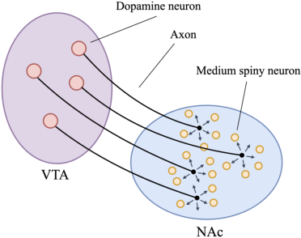

Figure 1: Simplified illustration of dopamine
distribution in the NAc. Dopamine is synthesized in the VTA and transported along
axons to the NAc, where it is picked up by receptors in medium spiny neurons. Dopamine
concentrations (error signals) are locally homogenous, but can vary across regions. Connections between NAc neurons not shown.

Recent ML research on more biologically plausible thesized in the VTA and transported along
alternatives to BP may offer critical insights. axons to the NAc, where it is picked up by rePEPITA [ 21 ] and Forward-Forward (FF) [ 30 ] both ceptors in medium spiny neurons. Dopamine
replace BP’s backward learning pass with a second concentrations (error signals) are locally hoforward pass to address update locking. Most mogenous, but can vary across regions. Conrelevantly, Hinton [ 30 ] made a surprising discovery: nections between NAc neurons not shown.
layers can learn useful representations for subsequent
layers even when trained independently of the errors
of those subsequent layers. In FF, each layer generates its own prediction and error, and is only
trained to learn hidden representations that minimize the local error. The subsequent layer takes
these representations as input, and achieves better performance over training, despite being unable
to send errors to the previous layer. This improves the collective global prediction without explicit,
sequential coordination of error signals. To the best of our knowledge, these learning principles have
not been explored in RL or biological reward-based learning.

Drawing a novel connection, we hypothesize that the computational mechanisms that enable FF’s
independent, per-layer training may also enable distributed error signals to support coordinated rewardbased learning. To test our hypothesis, we design A RTIFICIAL D OPAMINE ( AD ), a new deep Qlearning algorithm that trains RL agents using only synchronously distributed, per-layer TD errors, and
evaluate its performance on a range of discrete and continuous RL tasks. This provides a potential explanation for credit assignment in NAc dopaminergic learning at the algorithmic level of analysis [ 42 ].
Our results show that AD can solve many common RL tasks often as well as deep RL algorithms that
use backpropagation, despite not propagating error signals between layers. Thus, we computationally
demonstrate that distributed errors alone may be sufficient for coordinated reward-based learning.

AD networks inherit several ideas from FF, which differ from traditional neural networks in two
significant ways. First, each layer in an AD network computes its own prediction and receives a
corresponding error (Section 3.1). This per-layer error mirrors the locally homogenous distribution
of dopamine, and the computation of error and updates can be synchronously parallelized across
layers; there are no dependencies across layers. Second, we use forward [3] connections in time to
send activations from upper to lower layers (Section 3.2). This provides an information pathway
for upper layers to communicate with lower layers using activations, rather than error signals, and
empirically improves performance. Figure 2 outlines our architecture, unfolded in time.

The AD cell (Figure 3) is where we differ most significantly from FF. Its role is to compute the
local Q-prediction and TD error. FF is designed to separate real from fake (generated) data, a binary
classification task. But the NAc is theorized to predict value, a regression task, and therefore needs
more precision. To achieve this, we introduce an attention-like mechanism for non-linear regression
without using error propagation (Section 3.1).

We evaluate AD on 14 discrete and continuous RL tasks from the MinAtar testbed [ 70 ], the DeepMind
Control Suite (DMC) [ 64 ], and classic control environments implemented in Gymnasium [ 65 ].

3 “Forward" and “backward" are widely used in deep learning literature both to describe direction in time and
in the order of layers. This can be confusing. For the remainder of this paper, we use “forward/backward" when
describing time, and “upper/lower" when describing position among layers, as shown in Figure 2.

2

Figure 2: Network architecture of a 3-layer AD network. _h_ [[] _t_ _[l]_ []] [represents the activations of layer] _[ l]_ [ at]
time _t_, and _s_ _t_ the input state. The blocks are AD cells, as shown in Figure 3. Similar to how dopamine
neurons compute and distribute error used by a local region, each cell computes its own local TD error
used by its updates; errors do not propagate across layers. To relay information, upper layers send
activations to lower layers in the next timestep. For example, red shows all active connections at _t_ = 1 .

MinAtar tasks are miniaturized versions of Atari games, and DMC contains continuous control
tasks with simulated physics. These environments are complex enough to reflect many challenges
in modern RL [ 14 ], yet remain adequately tractable so as not to necessitate extra components like
convolutional layers, which may be confounding when attributing performance. We benchmark AD
against DQN [ 45 ], SAC [ 26 ], and TD-MPC2 [ 28 ] baselines, and conduct ablation studies to examine
the effects of the forward connections and additional layers. Our results in Figures 4 and 8 show
that AD learns to solve many of these tasks with comparable performance to the baselines, using just
per-layer TD errors. Our code is available at `[https://github.com/social-ai-uoft/ad-paper](https://github.com/social-ai-uoft/ad-paper)` .

To summarize our core contributions:

- Are distributed TD error signals sufficient to solve credit assignment and learn complex
reward-based learning tasks? We construct a computational example of an RL agent that learns
using only distributed, per-layer TD errors. This provides evidence that dopamine-distributed
signals alone may be enough to support reward-based learning in the nucleus accumbens.

- We design a Q-learning algorithm, A RTIFICIAL D OPAMINE, to train our agent. Like ForwardForward, AD does not propagate error signals across layers. Unlike FF, we introduce a novel cell
architecture to compute Q-value predictions, as Q-learning is a regression task.

- We evaluate our agent on 14 common RL tasks in discrete and continuous control, and show that
AD can often achieve comparable performance to deep RL algorithms, without backpropagation.

**2** **Background**

**2.1** **Reward-Based Learning in the NAc** [4]

The nucleus accumbens (NAc) plays a critical role in the mesolimbic reward system, and is theorized
to predict action value [ 41 ]. The predicted action value is encoded via the firing rate of NAc
neurons [ 23 ], which reach dopamine neurons in the ventral tegmental area (VTA) via projections
and influence their activity [ 60 ]. In addition, the VTA receives reward signals from sensory inputs,
such as the detection of sugar on the tongue [ 23 ]. The value predictions and reward signals enable
the VTA to compute reward prediction errors, _i.e._ differences between expected and actual reward.
These reward prediction errors (more specifically TD errors) are encoded via dopamine, and projected
through the mesolimbic pathway to regions of the ventral striatum, including the NAc, and lead to
synaptic adjustments [ 60 ]. When there is a positive reward prediction error, the average activity of
dopamine neurons increases; when there is a negative error, the average activity decreases [9].

4 We give a simplified overview of reward-based learning in the NAc and its connections to TD learning here
to provide intuition; this is not a complete picture of biological reward-based learning. There exists competing
theories for alternative mappings of the TD learning framework to the brain’s reward circuit; see Section 6.

3

The exchange of value predictions and error signals between the NAc and VTA sets the stage for TD
learning. TD models have shown strong congruency with observed dopamine activity [ 48 ], and are
widely established as the primary theory for mesolimbic dopaminergic learning.

What is less known is how NAc neurons computationally use the dopamine-encoded error signals to
coordinate learning. Dopamine-encoded error signals are distributed [ 58 ], which makes credit assignment difficult, and there are no other known mechanisms that NAc neurons utilize to communicate error signals for explicit coordination. We illustrate the distribution process in Figure 1. Each dopamine
neuron projects dopamine along its axon through the mesolimbic pathway, then synaptically releases
it in synchronous bursts to the immediate juxtasynaptic area. This causes dopamine concentration in
the region to peak, activating dopamine receptors in NAc medium spiny neurons. Dopamine concentration levels are locally homogeneous near the synapses [ 58 ], but can vary across different regions
of the NAc [ 68 ], as dopamine neurons need not all fire at once. This supports the distribution of localized error signals. While Figure 1 is clearly not to scale, dopamine neurons are indeed significantly
larger than medium spiny neurons. Their large cell body size enables them to support large terminal
fields [ 13 ], allowing each dopamine neuron to widely distribute its signal to groups of NAc neurons.

**2.2** **Temporal-Difference Learning**

Temporal-difference learning (TD learning) methods are a family of RL approaches that aim to solve
the problem of estimating the recursively defined Q function [ 62 ]. In their most basic form, TD
learning methods can be implemented as lookup tables, where an estimate of the Q function is kept
for each state-action pair. However, in many practical applications with large or continuous state
spaces, a tabular representation of the Q values for all distinct state-action pairs is computationally
infeasible. In these cases, function approximation, for example via linear regression or neural
networks, is necessary to obtain an estimate of the Q function. These methods, called Fitted Q
Iteration [ 4 ] or Deep Q Learning [ 44 ], use the squared temporal difference error as a regression loss
_L_ ( _s, a, s_ _[′]_ ) = _δ_ ( _s, a, s_ _[′]_ ) [2], where _δ_ is the TD error, and update a parametric Q function approximation
via gradient descent. To prevent the double sampling bias and other instabilities, only _Q_ ( _s, a_ ) is
updated and the next states value is estimated with an independent copy _Q_ [¯] that is not updated. This is
commonly called the bootstrapped Q loss. Given parameters _θ_, this loss can be written as:

¯ 2
_L_ ( _s, a, s_ _[′]_ _, θ_ ) = _Q_ _θ_ ( _s, a_ ) _−_ _r_ ( _s, a_ ) + _γ_ max _Q_ _θ_ ( _s_ _[′]_ _, a_ _[′]_ )
� � _a_ _[′]_ ��

For a more formal description of our TD learning setting, see Appendix A.

**2.3** **Forward-Forward**

The Forward-Forward (FF) algorithm [ 30 ] is a greedy multi-layer learning algorithm that replaces
the forward and backward passes of backpropagation with two identical forward passes, positive
and negative. The positive pass is run on real data; the negative on fake (generated) data. The goal
of the model is to learn to separate real from fake data. During training, each layer of the network
performs this classification independently using a measure called _goodness_, which computationally
acts as the logit for this binary classification task. Each layer computes its own per-layer error for
updating. FF’s de facto measure of a layer’s goodness _g_ is the sum of its squared hidden activations
_h_ _i_ minus some threshold _τ_, i.e. _g_ = [�] _i_ _[h]_ _i_ [2] _[−]_ _[τ]_ [. However, due to the simple goodness formula, if]

each layer directly passes its activations to the next, the next layer often trivially learns the identity
function. It then uses the sum of its last layer’s hidden activations as its goodness. This traps the
layer in a local optimum. To avoid this, FF uses layer normalization [ 5 ] to normalize the activations
before passing them on, which keeps the relative values of the activations, but makes them sum to 0.

Compared to BP, a global algorithm that requires the entire network to be updated sequentially, FF
is a local algorithm that updates each layer independently via local, layer-wise losses. Critically,
the authors of [ 30 ] showed that layers can learn useful representations that help subsequent layers
even though they are trained on local errors, without explicit credit assignment. However, for a
feedforward architecture, one glaring limitation is that later layers cannot relay any information to
earlier ones. Hinton suggests addressing this with a multi-layer recurrent architecture, where for
each layer _l_ in the network, the input is determined by output of the layer _l −_ 1 and that of _l_ and
_l_ + 1 at the previous time step _t −_ 1 . This allows for top-to-bottom information flow through the
network via activations, which is more biologically plausible.

4

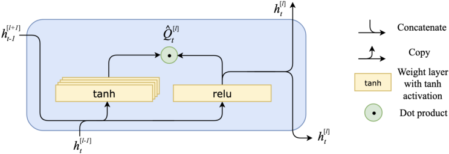

Figure 3: Inner workings of our proposed AD cell ( _i.e._, hidden layer). _h_ [[] _t_ _[l]_ []] [is the activations of the]
cell _l_ at time _t_, and _Q_ [ˆ] [[] _t_ _[l]_ []] [is a vector of Q-value predictions given the current state and each action. We]
compute the cell’s activations _h_ [[] _t_ _[l]_ []] [using a] `[ ReLU]` [ weight layer, then use an attention-like mechanism]
to compute _Q_ [ˆ] [[] _t_ _[l]_ []] [. Specifically, we obtain] [ ˆ] _[Q]_ [[] _t_ _[l]_ []] [by having the cell’s] `[ tanh]` [ weight layers, one for each]
action, compute attention weights that are then applied to _h_ [[] _t_ _[l]_ []] [. Each cell computes its own error.]

**3** **Artificial Dopamine**

A RTIFICIAL D OPAMINE ( AD ) is a deep Q-learning algorithm that trains deep RL agents using
distributed, per-layer TD errors. AD inherits the per-layer predictions and local computation of
errors from FF, and adopts the forward-in-time downward connections from FF’s recurrent variant.
Informally, the intuition is that the per-layer error acts similarly to the locally homogeneous distribution of dopamine in the NAc. The per-layer errors can be computed in a parallelized, distributed
fashion; each layer computes its own local error, which the neurons of the layer use to adjust weights
according to their contributions to the error. Similarly, the NAc neurons near the synapses of each
dopamine neuron receive the same error signal (encoded via dopamine), which they use to adjust
their synaptic weights, according to their previous activity shortly before receiving the error. During
inference, the network uses the average Q-values across the layers to produce a final prediction.

Since the NAc is theorized to predict action value [ 23 ], _i.e._ Q-value, our prediction task deviates from
that of FF, which performs binary classification. In general, predicting action value is a nonlinear
regression task. To learn this task using a neural network, without resorting to the biologically
implausible BP, we design an attention-like mechanism that learns sets of “attention" weights–– one
set per action head, which introduces nonlinearity. We encapsulate this process in AD cells.

**3.1** **AD Cell Internals**

Our network architecture is composed of layers of AD cells, each of which makes its own Q-value
prediction, computes its own local TD error, and updates its own weights. At inference, the final
prediction of the network is the average of each cell’s Q-value predictions. We use an attention-like
mechanism [ 6 ] that learns a weighted sum of the cell’s hidden activations to predict the Q-value. The
hidden activations are passed to other cells, but the attention weights and Q-value are withheld. This
mechanism simply serves to functionally simulate the complex nonlinear capabilities of biological
neurons [ 10 ]; we are not attempting to draw an analog between our mechanism and any biological
counterpart, and design choices are primarily made based on empirical performance.

The concept of a cell is reminiscent of the design of a recurrent neural network. In our case, there is a
single cell per layer, so we use the terms somewhat interchangeably for clarity of exposition. The
vital difference is that no loss information is propagated between cells via BP; that is, there is no
BP through time. Instead, the same BP are passed to the cell above (i.e., hidden layer) at the same
timestep and to the layer below at the next timestep. In the absence of BP, these activations provide
a pathway for upper cells to communicate information to lower cells (see Figure 2). We discuss in
more detail how these connections operate in Section 3.2.

Figure 3 presents the cell design. Each cell is mechanistically identical and takes in two inputs: the hidden activations of the cell below at the current timestep (or observation, if lowest cell), and the hidden

5

activations of the cell above at the previous timestep. It produces two identical outputs, sent to the cell
above immediately, and the cell below at the next time step. At the start of an episode, the activations
from the previous timestep are zeroes. The top cell only receives one input and produces one output.

The attention-like mechanism for Q-value prediction works as follows. Each cell computes its
hidden activation, _h_ [[] _t_ _[l]_ []] [, using the layer above’s hidden activations from the previous timestep,] _[ h]_ [[] _t_ _[l]_ _−_ [+1]] 1 [,]
and the layer below’s hidden activations at the current timestep, _h_ [[] _t_ _[l][−]_ [1]] . Specifically, it passes the
concatenation of _h_ [[] _t_ _[l]_ _−_ [+1]] 1 [and] _[ h]_ _t_ [[] _[l][−]_ [1]] through a `ReLU` weight layer (shown in Figure 3) to get _h_ [[] _t_ _[l]_ []] [. The]
`ReLU` weight layer multiplies the concatenated input [ _h_ [[] _t_ _[l][−]_ [1]] _, h_ [[] _t_ _[l]_ _−_ [+1]] 1 []] [ by its learned weight matrix]
_W_ [[] _[l]_ []], then applies the `ReLU` nonlinearity function. In parallel, the cell also uses [ _h_ [[] _t_ _[l][−]_ [1]] _, h_ [[] _t_ _[l]_ _−_ [+1]] 1 []] [ to]
compute “attention" weights, by multiplying it with the learned weight matrix _W_ att [[] _[l]_ []] [then applying]
the tanh function. Finally, the cell takes the dot product between the output of the `tanh` layers,
tanh( _W_ att [[] _[l]_ []] _[·]_ [ [] _[h]_ _t_ [[] _[l][−]_ [1]] _, h_ [[] _t_ _[l]_ _−_ [+1]] 1 [])] [, and the hidden activations] _[ h]_ _t_ [[] _[l]_ []] [, to compute the cell’s Q-value prediction]
_Q_ ˆ [[] _[l]_ []] ( _s_ _t_ _, a_ ) . Each cell reuses its internal weights over time; for example the matrix _W_ in [[1]] [is used at]
each timestep in the first cell. Therefore, the full computation performed by a cell is:

_h_ [[0]] _t_ = _s_ _t_ _,_ _h_ [[] _t_ _[L]_ [+1]] = 0 _,_ _h_ [[] _t_ _[l]_ _−_ []] 1 [= 0]

_h_ [[] _t_ _[l]_ []] [=][ relu] _W_ in [[] _[l]_ []] _[·]_ _h_ [[] _t_ _[l][−]_ [1]] _, h_ [[] _t_ _[l]_ _−_ [+1]] 1
� � ��

_Q_ ˆ [[] _[l]_ []] ( _s_ _t_ _, a_ ) = tanh _W_ att [[] _[l]_ []] _[·]_ _h_ [[] _t_ _[l][−]_ [1]] _, h_ [[] _t_ _[l]_ _−_ [+1]] 1 ⊺ _h_ [[] _t_ _[l]_ []]
� � ��

Optionally, like [ 30 ], our architecture supports skip connections between cells. In such cases, the additional input from a skip connection is simply concatenated with [ _h_ [[] _t_ _[l][−]_ [1]] _, h_ [[] _t_ _[l]_ _−_ [+1]] 1 []] [ before computing] _[ h]_ _t_ [[] _[l]_ []] [.]

**3.2** **Network Connections**

As shown in Figure 2, each cell passes its state to the cell _l_ + 1 above at the current timestep _t_, and to
the cell _l −_ 1 below in the next timestep _t_ + 1 . The information flow is strictly unidirectional to match
the direction of time flow in RL environments. This is necessary as interacting with the environment
happens sequentially, meaning future information will not be available when acting.

Although we do not backpropagate gradients across cells, information does flow from upper layers to
lower layers via the temporal connection (forward in time). The upper layers use the connections to
communicate with lower layers via activations, which is more biologically plausible [ 49 ]. Our results
in Figure 4 suggest that these connections can greatly increase network performance in the absence
of BP. The intuition for adopting these forward-in-time connections is that they are well-suited to
take advantage of the temporal structure of the Q-values of trajectories for better learning. Given a
good policy, the Q-value predictions of a well-trained model should remain stable through each state
of a trajectory (assuming the dynamics are reasonably deterministic). This means that the Q-value
prediction of the current timestep, and the hidden activations used to make this prediction, can
often still be useful for predicting the Q-value of the next timestep. In contrast, in FF’s experiments
on image classification, this effect is forced– FF repeats the same input every timestep, reducing
computational efficiency. Our results empirically support the effectiveness of forward connections
for Q-learning, particularly in more complex environments.

**4** **Experiments**

The main goal of our experiments is to evaluate whether distributed, per-layer TD errors are sufficient
for learning complex RL tasks that are typically only solved with backpropagation and sequential
errors. Our criterion of sufficiency is how well the agent learns to solve the given task, measured
in terms of average episodic return. Since there are no official standards that define solving these
environments, we use the performance of established RL algorithms ( _i.e._ DQN, TD-MPC2, and
SAC) as the gold standard to compare against. These algorithms are commonly used to solve the
environments we choose and are known to be strong performers [70, 28, 26].

Like Hinton [30], our aim is to investigate the learning capabilities of a novel algorithm that operates
under additional biological constraints, rather than pursue state-of-the-art performance. Thus, we opt

6

for a simple implementation with few extensions. The only extensions we employ are experience
replay [ 45 ] and the Double-Q learning trick [ 66 ]– which are standard for deep Q-learning– and skip
connections from the input to upper layers for the DMC environments. We do not use convolutional
layers, as these more closely resemble the brain’s visual cortex [ 40 ], and similar structures are not
found in the mesolimbic system. We implement our algorithm in Jax [12].

**Training Process.** The training process of our RL agent is based on the standard DQN training
algorithm with experience replay [ 45 ]. During training, we use a randomly sampled replay buffer that
stores every transition observed from the environment. We replay sequences of short length, similar
to how other recurrent architectures are trained [ 29, 35 ], and compute the local updates for each cell
sequentially according to the network graph. Since the local updates are distributed and per-layer, they
can be computed in parallel. We provide a formal description of our training process in Appendix B.

**Environments.** We run our experiments on 2 RL benchmarks and 4 classic control tasks, totaling
14 tasks. MinAtar [ 70 ] is a simplified implementation of 5 Atari 2600 games: Seaquest, Breakout,
Asterix, Freeway, and Space Invaders. The DeepMind Control (DMC) Suite [ 64 ] is a set of low-level
robotics control environments, with continuous state spaces and tasks of varying difficulty. For our
experiments, we used a discretized action space, following Seyde et al. [61], as our architecture is
currently only developed for discrete Q-learning. From the DMC tasks we select Walker Walk, Walker
Run, Hopper Hop, Cheetah Run, and Reacher Hard. In addition, we provide results on the classic
control tasks Cart Pole, Mountain Car, Lunar Lander, and Acrobot, which we include in Appendix C.
For a more elaborate discussion on these environments and our task choice, see Appendix I.

**Baselines.** On MinAtar, we compare our results against a fully-connected DQN to make performance comparisons more direct and informative. As the original baselines presented in Young and
Tian [70] used a CNN, we replaced the CNN with fully connected layers and tuned hyperparameters
for fairness of comparison. We find that the new architecture performs as well as or better than the
one presented by Young and Tian [70] . Specifically, we use a double DQN with 3 hidden layers of
1024, 512, and 512 units with `ReLU` activations. This baseline achieves strong performance and has a
number of trainable parameters comparable to our networks.

For the continuous control tasks, we show that our method almost reaches the performance of
state-of-the-art algorithmic approaches such as SAC [ 27 ] and TD-MPC2 [ 28 ], which rely on
backpropagation. The results were taken from Yarats and Kostrikov [69] and Hansen et al. [28]
respectively. We do not change the underlying architectures or hyperparameters.

**Network architecture and hyperparameters.** On MinAtar, we use a 3-hidden-layer network
with forward activation connections. The cell output sizes are 400, 200, and 200. Due to additional
connections within cells and from upper to lower cells, this architecture has a similar number of
trainable parameters as the DQN. On DMC, we use a smaller network with cell output sizes 128, 96,
and 96, and discretize the action space following Seyde et al. [61] . For more details, see Appendix G.
For each benchmark, we use the same network and hyperparameters across all tasks to test the
robustness of our architecture and learning algorithm.

**5** **Results**

We present the results of AD on MinAtar and DMC environments in Figure 4, and compare its performance against DQN, SAC, and TD-MPC2. Figure 4 shows the mean episodic return over episodes
across 10 random seeds, with standard error. We also provide 95% bootstrap confidence intervals [ 55 ]
in Appendix D and aggregate statistics in Appendix E. We additionally perform ablation studies by
removing the forward connections to lower layers, and measuring the performance of a single-layer
AD cell. We show both the forward connections and multiple layers contribute to performance (Figures 5 and 6). Finally, we evaluate an implementation of AD that learns distributions over Q-values,
based on recent work by Dabney et al. [20], and find that AD shows promising results (Figure 7).

**Comparison against baselines.** We find that AD is able to learn stable policies reliably in all test
environments. On MinAtar tasks, our agent achieves comparable performance to DQN on Breakout,
and slightly surpasses DQN’s performance on Asterix and Freeway, while DQN performs better on

7

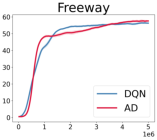

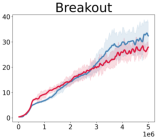

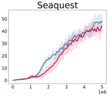

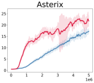

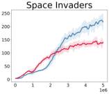

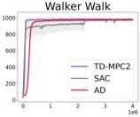

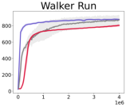

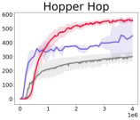

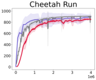

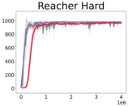

Figure 4: Episodic returns of AD in MinAtar and DMC environments, compared to DQN, TD-MPC2
and SAC. Lines show the mean return over 10 seeds and the shaded area conforms to 3 standard
errors. The axes are return and environmental steps.

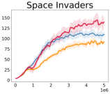

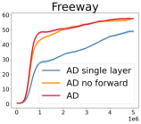

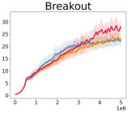

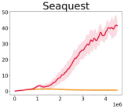

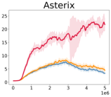

Figure 5: Ablation study comparing the performance of AD against AD without the forward-in-time
connections, and a single-layer AD cell. In Seaquest and Asterix, AD achieves qualitatively stronger
performance. In Seaquest the line for AD single layer is overlapped by the line for AD no forward.

Seaquest and Space Invaders. On all evaluated DMC tasks, we see that our method’s results are close
or on par with those of SAC and TD-MPC2 when using both backward connections and multiple
layers, however, sample efficiency is marginally lower.

We note that the action space discretization we utilize for DMC tasks may complicate the comparison,
as it both slows down our training but can benefit algorithms (compare Seyde et al. [61] ). In addition,
we do not show results on the hardest DMC tasks because of the difficulties in scaling our approach
to large action spaces, which leads to rapid growth in network parameters.

Overall, our results demonstrate that AD shows biological distributed error signals may allow
for coordinated learning in several RL domains. Therefore, further refining and improving the
architecture for state-of-the-art RL benchmark performance may be an exciting and promising
direction for future work.

**Forward connections to lower layers.** To further measure the performance impact of the forward
connections in time, we compared the temporal forward version of the network to a 3-layer AD
network without the forward-in-time connections. All other hyperparameters are the same as the
3-layer AD network. As shown in Figure 5, this resulted in a moderate drop in performance in most
environments, increased variance in the training, and devastating drops in performance on Seaquest
and Asterix. These tasks are the most complex out of the five. We provide additional discussion on
AD ’s performance in Seaquest, where the performance difference is most significant, in Appendix N.
These results suggests that the information channels from the upper to lower layers are vital for
performance on many tasks. On this same note, AD ’s ability to achieve similar performance to
DQN when the forward connections are added suggest that forward connections may be an effective
replacement for backpropagation in certain tasks.

**Single-layer performance.** Another important question about our proposed architecture is whether
the cells learn to coordinate with each other. A concern is that the majority of the learning may be
accomplished by the lowest cell, If the performance of the multi-layer AD network does not improve
over the single cell, it would suggest that we cannot explain AD ’s performance as a result of the cells
coordinating their learning using distributed errors. We show in Figure 5 that the multi-layer version
of AD outperforms the single-layer at all tasks, and the single-layer cell fails at Seaquest and Asterix.

8

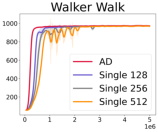

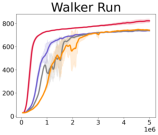

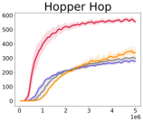

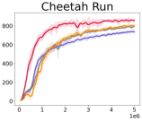

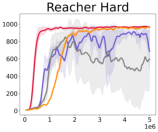

Figure 6: Episodic returns of different-sized single-layer AD, compared to the standard 3-layer AD .
Single 128 is a single-layer with 128 hidden activations. Overall, increasing the layer size of the
single layer does not result in clear increases in performance. Lines show the mean return over 8
seeds and the shaded area conforms to 3 standard errors. The axes are return and environmental steps.

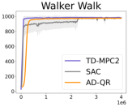

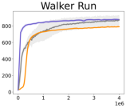

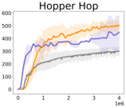

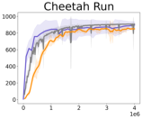

Figure 7: Episodic returns of the distributional RL version of AD, implemented with Quantile
Regression (QR). Lines show the mean return over 8 seeds and the shaded area conforms to 3
standard errors. The axes are return and environmental steps.

An additional concern along these same lines is whether a wider, single-layer AD cell may achieve
the same level of performance as multi-layer AD . In Figure 6, we show that increasing the layer size
of a single-layer AD cell does not result in clear increases in performance in DMC tasks. We also
experimented with increasing the layer size of a single-layer cell for Seaquest and Asterix from 400
to 600 and 800, and did not find noticeable improvements in either case.

**Distributional RL.** Recent work by Dabney et al. [20] suggest that the brain’s value predictors
may be learning distributions over future values, rather than just the mean, as previously believed.
Dabney et al. [20] argue that different dopamine neurons in the VTA may have different scalings for
positive and negative reward prediction errors– intuitively, they can be more optimistic or pessimistic–
which results in the predictors learning a distribution over the values. Interestingly, this coincides
with the development of distributional RL, whose algorithms aim to learn such distributions.

To better align our work with the findings of Dabney et al. [20], we additionally implement a version
of AD that learns distributions over values, and evaluate it on the DMC tasks. Our implementation is
based on Quantile Regression (QR) DQNs [ 19 ], and requires just a simple modification to each AD
cell. Rather than predicting a single Q-value, each cell predicts 10 Q-values that each match to one
quantile of a 10-quantile QR-DQN. The tradeoff is that this requires additional compute.

Our results in Figure 7 suggest that AD may be well-suited for distributional learning. In each of
the tasks, our agent achieves similar performance to the standard version of AD, and only slightly
lags behind on Hopper Hop. This may be a result of the greater sparsity of the Hopper environment,
which makes it more difficult for distributional RL algorithms to learn.

**6** **Limitations**

We proposed an algorithm that trains an RL agent using only distributed TD errors, which provides a
computational example of how distributed error signals may be sufficient to solve credit assignment in
reward-based learning in the NAc. However, our model does not accurately capture all aspects of the
relevant biology. In our model, we use per-layer TD errors as an analogy for dopamine neurons distributing error signals to local regions around their synapses. But unlike in artificial neural networks,
which form the basis of our architecture, neurons in the NAc are not clearly organized into layers.
AD’s hierarchical message passing architecture is a design choice we inherit from deep learning practices, and not meant as a mechanistic model of the NAc. Furthermore, activations in biological neurons
are communicated asynchronously, and can form recurrent loops, which we do not account for.

9

In addition, we make some assumptions regarding biological reward-based learning that are not
yet conclusive in neuroscience. Most importantly, we assume that neurons in the NAc learn to
output action values, and dopamine neurons in the VTA receive reward signals and the predicted
action values to compute and return TD errors. [5] While these assumptions are widely supported
by research [ 23, 41, 46, 47 ], there exist other theories and empirical results that provide alternative
explanations for mesolimbic reward-based learning. Some of these works include Roesch et al.

[56], who suggest that on-policy value-based learning (SARSA) better explains dopamine activity
than off-policy value-based learning ( _e.g._ Q-learning); Takahashi [63] and Chen and Goldberg [16],
who provide evidence that map subregions of the striatum to actor-critic models; Ito and Doya [32]
and Weglage et al. [67] who suggest the dorsal striatum signals action values, whereas the ventral
striatum signals state values; and Akam and Walton [2] and Coddington et al. [17], who respectively
propose how dopamine may be used by the brain to perform model-based and policy-based learning
rather than just value-based learning. Furthermore, while there is strong evidence that some form
of TD learning is used by the brain, mappings between RL frameworks and dopaminergic learning
may not be mechanistically accurate even if they are behaviorally accurate.

There are also several technical limitations of our work. First, like other Q-learning algorithms, AD
requires discrete action spaces. To solve the DMC tasks, which have continuous action spaces, we
discretized the action space, following the method used by Seyde et al. [61] (Section 4). While this
is consistent with other work in RL, it introduces additional complexities [ 61 ] and may not reflect
biology. Second, within each AD cell, the number of `tanh` weight layers grows in proportion to
the size of the action space (Figure 3). This limits the scalability of AD for tasks with large action
spaces. We can mitigate the effects of this issue using a matrix decomposition trick described in
Appendix F, but AD currently cannot scale to very large action space DMC tasks like Humanoid
or Dog [ 64 ]. Third, computational constraints limited the number of runs we perform per task.
Additional experiments can further improve the robustness and generalizability of our results.

Finally, our work isolates one system of biological learning, and attempts to provide a computational
explanation without accounting for other systems of learning, for example hippocampal contributions
to value-based learning [ 7 ]. But the brain’s learning capabilities are likely a result of combining
signals from several systems, which may not be divisible [ 50 ], and the NAc may be just one part of a
larger value-based system [ 8 ]. Unlike backpropagation, the brain utilizes multiple types of learning in
conjunction, both supervised and unsupervised, using local and global signals. AD only models one
type of learning, _i.e._ error-driven learning using distributed reward signals to induce local updates.
Other biologically plausible algorithms, such as ANGC [ 53 ], may provide explanations for other forms
of learning, which may be critical to building a more complete understanding of biological rewardbased learning. Indeed, aspects of Hebbian learning or active inference are likely critical to achieving a
fully biologically plausible, efficient, and powerful learning system. In that light, we explore learning
with just distributed error signals not to rule out the importance of other methods, but to demonstrate
that this one principle alone may be sufficient to solve some complex RL tasks nearly as well as BP. We
believe that a key to achieving general, human-like intelligence will be the integration of these different
learning methods and learning signals; this is an exciting direction we aim to explore in future work.

**Acknowledgements**

We gratefully acknowledge our sponsors, who support our research with financial and in-kind
contributions: Amazon, Apple, CIFAR through the Canada CIFAR AI Chair program and the
Canadian Foundation for Innovation, DARPA through the GARD project, Meta, NSERC through the
Discovery Grant and funding reference number RGPIN-2018-05946, the Ontario Early Researcher
Award, the Sloan Foundation, and the Schwartz Reisman Institute for Technology and Society.
Resources supporting this research were also provided by the Province of Ontario, the Government
of Canada through CIFAR, and the sponsors of the Vector Institute. We extend our sincere gratitude
to Mete Kemertas for offering insights that significantly accelerated the initial exploration of this
work. We also thank Congyu Fang, David Glukhov, Stephan Rabanser, Anvith Thudi, Sierra Wyllie,
and other members of the CleverHans and SocialAI labs, as well as our anonymous reviewers for
invaluable discussions and feedback.

5 Note that AD does not assume action selection need happen in the NAc. Rather, we just take the assumption
that the NAc computes the Q-value function, which takes in the state and action as parameters, and performs
Q-learning. The action may be provided from another region like the dorsal striatum.

10

**References**

[1] Rishabh Agarwal, Max Schwarzer, Pablo Samuel Castro, Aaron Courville, and Marc G Bellemare. Deep reinforcement learning at the edge of the statistical precipice. _Advances in Neural_
_Information Processing Systems_, 2021.

[2] Thomas Akam and Mark E Walton. What is dopamine doing in model-based reinforcement
learning? _Current Opinion in Behavioral Sciences_, 38:74–82, Apr 2021. doi: 10.1016/j.cobeha.
2020.10.010.

[3] Mohamed Akrout, Collin Wilson, Peter Humphreys, Timothy Lillicrap, and Douglas B Tweed.
Deep learning without weight transport. _Advances in neural information processing systems_,
32, 2019.

[4] András Antos, Csaba Szepesvári, and Rémi Munos. Learning near-optimal policies with
bellman-residual minimization based fitted policy iteration and a single sample path. _Machine_
_Learning_, 71:89–129, 2008.

[5] Jimmy Lei Ba, Jamie Ryan Kiros, and Geoffrey E. Hinton. Layer normalization, 2016.

[6] Dzmitry Bahdanau, Kyunghyun Cho, and Yoshua Bengio. Neural machine translation by jointly
learning to align and translate. _arXiv preprint arXiv:1409.0473_, 2014.

[7] Akram Bakkour, Daniela J Palombo, Ariel Zylberberg, Yul HR Kang, Allison Reid, Mieke
Verfaellie, Michael N Shadlen, and Daphna Shohamy. The hippocampus supports deliberation
during value-based decisions. _elife_, 8:e46080, 2019.

[8] Ulrike Basten, Guido Biele, Hauke R Heekeren, and Christian J Fiebach. How the brain
integrates costs and benefits during decision making. _Proceedings of the National Academy of_
_Sciences_, 107(50):21767–21772, 2010.

[9] Hannah M. Bayer and Paul W. Glimcher. Midbrain Dopamine Neurons Encode a Quantitative
Reward Prediction Error Signal. _Neuron_, 47(1):129–141, July 2005. ISSN 08966273. doi: 10.
1016/j.neuron.2005.05.020. URL `[https://linkinghub.elsevier.com/retrieve/pii/](https://linkinghub.elsevier.com/retrieve/pii/S0896627305004678)`
`[S0896627305004678](https://linkinghub.elsevier.com/retrieve/pii/S0896627305004678)` .

[10] David Beniaguev, Idan Segev, and Michael London. Single cortical neurons as deep artificial
neural networks. _Neuron_, 109(17):2727–2739.e3, September 2021. ISSN 08966273. doi: 10.
1016/j.neuron.2021.07.002. URL `[https://linkinghub.elsevier.com/retrieve/pii/](https://linkinghub.elsevier.com/retrieve/pii/S0896627321005018)`
`[S0896627321005018](https://linkinghub.elsevier.com/retrieve/pii/S0896627321005018)` .

[11] Matthew Botvinick, Jane X. Wang, Will Dabney, Kevin J. Miller, and Zeb Kurth-Nelson. Deep
Reinforcement Learning and Its Neuroscientific Implications. _Neuron_, 107(4):603–616, August
2020. ISSN 08966273. doi: 10.1016/j.neuron.2020.06.014. URL `[https://linkinghub.](https://linkinghub.elsevier.com/retrieve/pii/S0896627320304682)`
`[elsevier.com/retrieve/pii/S0896627320304682](https://linkinghub.elsevier.com/retrieve/pii/S0896627320304682)` .

[12] James Bradbury, Roy Frostig, Peter Hawkins, Matthew James Johnson, Chris Leary, Dougal
Maclaurin, George Necula, Adam Paszke, Jake VanderPlas, Skye Wanderman-Milne, and
Qiao Zhang. JAX: composable transformations of Python+NumPy programs, 2018. URL
`[http://github.com/google/jax](http://github.com/google/jax)` .

[13] S-R Cajal. _Les nouvelles idées sur la structure du système nerveux chez l’homme et chez les_
_vertébrés_ . C. Reinwald & Cie, libraires-éditeurs, 1894.

[14] Johan Samir Obando Ceron and Pablo Samuel Castro. Revisiting rainbow: Promoting more
insightful and inclusive deep reinforcement learning research. In _International Conference on_
_Machine Learning_, pages 1373–1383. PMLR, 2021.

[15] Chun-Chuan Chen, RN Henson, Klaas E Stephan, James M Kilner, and Karl J Friston. Forward
and backward connections in the brain: a dcm study of functional asymmetries. _Neuroimage_,
45(2):453–462, 2009.

[16] Ruidong Chen and Jesse H Goldberg. Actor-critic reinforcement learning in the songbird.
_Current Opinion in Neurobiology_, 65:1–9, Dec 2020. doi: 10.1016/j.conb.2020.08.005.

11

[17] Luke T. Coddington, Sarah E. Lindo, and Joshua T. Dudman. Mesolimbic dopamine
adapts the rate of learning from action. _Nature_, 614(7947):294–302, Jan 2023. doi:
10.1038/s41586-022-05614-z.

[18] Anne G E Collins and Michael J Frank. Surprise! Dopamine signals mix action, value and
error. _Nature Neuroscience_, 19(1):3–5, January 2016. ISSN 1097-6256, 1546-1726. doi:
10.1038/nn.4207. URL `[https://www.nature.com/articles/nn.4207](https://www.nature.com/articles/nn.4207)` .

[19] Will Dabney, Mark Rowland, Marc Bellemare, and Rémi Munos. Distributional reinforcement learning with quantile regression. In _Proceedings of the AAAI conference on artificial_
_intelligence_, volume 32, 2018.

[20] Will Dabney, Zeb Kurth-Nelson, Naoshige Uchida, Clara Kwon Starkweather, Demis Hassabis,
Rémi Munos, and Matthew Botvinick. A distributional code for value in dopamine-based
reinforcement learning. _Nature_, 577(7792):671–675, 2020.

[21] Giorgia Dellaferrera and Gabriel Kreiman. Error-driven input modulation: Solving the
credit assignment problem without a backward pass. In Kamalika Chaudhuri, Stefanie
Jegelka, Le Song, Csaba Szepesvari, Gang Niu, and Sivan Sabato, editors, _Proceedings_
_of the 39th International Conference on Machine Learning_, volume 162 of _Proceedings_
_of Machine Learning Research_, pages 4937–4955. PMLR, 17–23 Jul 2022. URL `[https:](https://proceedings.mlr.press/v162/dellaferrera22a.html)`
`[//proceedings.mlr.press/v162/dellaferrera22a.html](https://proceedings.mlr.press/v162/dellaferrera22a.html)` .

[22] Li Deng. The mnist database of handwritten digit images for machine learning research. _IEEE_
_Signal Processing Magazine_, 29(6):141–142, 2012.

[23] Paul W Glimcher. Understanding dopamine and reinforcement learning: the dopamine reward prediction error hypothesis. _Proceedings of the National Academy of Sciences_, 108
(supplement_3):15647–15654, 2011.

[24] Stephen Grossberg. Competitive learning: From interactive activation to adaptive resonance.
_Cognitive science_, 11(1):23–63, 1987.

[25] Jordan Guerguiev, Timothy P Lillicrap, and Blake A Richards. Towards deep learning with
segregated dendrites. _eLife_, 6:e22901, December 2017. ISSN 2050-084X. doi: 10.7554/eLife.
22901. URL `[https://elifesciences.org/articles/22901](https://elifesciences.org/articles/22901)` .

[26] Tuomas Haarnoja, Aurick Zhou, Pieter Abbeel, and Sergey Levine. Soft actor-critic: Off-policy
maximum entropy deep reinforcement learning with a stochastic actor, 2018.

[27] Tuomas Haarnoja, Aurick Zhou, Pieter Abbeel, and Sergey Levine. Soft actor-critic: Offpolicy maximum entropy deep reinforcement learning with a stochastic actor. In _International_
_Conference on Machine Learning_, 2018.

[28] Nicklas Hansen, Hao Su, and Xiaolong Wang. Td-mpc2: Scalable, robust world models for
continuous control, 2023.

[29] Matthew Hausknecht and Peter Stone. Deep recurrent q-learning for partially observable mdps.
In _2015 aaai fall symposium series_, 2015.

[30] Geoffrey Hinton. The forward-forward algorithm: Some preliminary investigations. _arXiv_
_preprint arXiv:2212.13345_, 2022.

[31] Shengyi Huang, Rousslan Fernand Julien Dossa, Chang Ye, Jeff Braga, Dipam Chakraborty,
Kinal Mehta, and João G.M. Araújo. Cleanrl: High-quality single-file implementations of deep
reinforcement learning algorithms. _Journal of Machine Learning Research_, 23(274):1–18, 2022.
URL `[http://jmlr.org/papers/v23/21-1342.html](http://jmlr.org/papers/v23/21-1342.html)` .

[32] Makoto Ito and Kenji Doya. Distinct neural representation in the dorsolateral, dorsomedial, and
ventral parts of the striatum during fixed-and free-choice tasks. _Journal of Neuroscience_, 35(8):
3499–3514, 2015.

[33] Dmitry Ivanov, Aleksandr Chezhegov, Mikhail Kiselev, Andrey Grunin, and Denis Larionov.
Neuromorphic artificial intelligence systems. _Frontiers in Neuroscience_, 16:1513, 2022.

12

[34] Adrien Journé, Hector Garcia Rodriguez, Qinghai Guo, and Timoleon Moraitis. Hebbian deep
learning without feedback. _arXiv preprint arXiv:2209.11883_, 2022.

[35] Steven Kapturowski, Georg Ostrovski, John Quan, Remi Munos, and Will Dabney. Recurrent
experience replay in distributed reinforcement learning. In _International conference on learning_
_representations_, 2018.

[36] Daniel Kunin, Aran Nayebi, Javier Sagastuy-Brena, Surya Ganguli, Jonathan Bloom, and Daniel
Yamins. Two routes to scalable credit assignment without weight symmetry. In Hal Daumé
III and Aarti Singh, editors, _Proceedings of the 37th International Conference on Machine_
_Learning_, volume 119 of _Proceedings of Machine Learning Research_, pages 5511–5521. PMLR,
13–18 Jul 2020. URL `[https://proceedings.mlr.press/v119/kunin20a.html](https://proceedings.mlr.press/v119/kunin20a.html)` .

[37] Dong-Hyun Lee, Saizheng Zhang, Asja Fischer, and Yoshua Bengio. Difference target propagation. In _Machine Learning and Knowledge Discovery in Databases: European Conference,_
_ECML PKDD 2015, Porto, Portugal, September 7-11, 2015, Proceedings, Part I 15_, pages
498–515. Springer, 2015.

[38] Timothy P Lillicrap, Daniel Cownden, Douglas B Tweed, and Colin J Akerman. Random synaptic feedback weights support error backpropagation for deep learning. _Nature communications_,
7(1):13276, 2016.

[39] Timothy P. Lillicrap, Adam Santoro, Luke Marris, Colin J. Akerman, and Geoffrey Hinton.
Backpropagation and the brain. _Nature Reviews Neuroscience_, 21(6):335–346, June 2020. ISSN
1471-003X, 1471-0048. doi: 10.1038/s41583-020-0277-3. URL `[https://www.nature.com/](https://www.nature.com/articles/s41583-020-0277-3)`
`[articles/s41583-020-0277-3](https://www.nature.com/articles/s41583-020-0277-3)` .

[40] Grace W Lindsay. Convolutional neural networks as a model of the visual system: Past, present,
and future. _Journal of cognitive neuroscience_, 33(10):2017–2031, 2021.

[41] Francesco Mannella, Kevin Gurney, and Gianluca Baldassarre. The nucleus accumbens as
a nexus between values and goals in goal-directed behavior: a review and a new hypothesis.
_Frontiers in behavioral neuroscience_, 7:135, 2013.

[42] David Marr. _Vision: A computational investigation into the human representation and processing_
_of visual information_ . MIT press, 2010.

[43] Thomas Miconi, Aditya Rawal, Jeff Clune, and Kenneth O. Stanley. Backpropamine: training
self-modifying neural networks with differentiable neuromodulated plasticity, 2020.

[44] Volodymyr Mnih, Koray Kavukcuoglu, David Silver, Alex Graves, Ioannis Antonoglou, Daan
Wierstra, and Martin Riedmiller. Playing atari with deep reinforcement learning. _arXiv preprint_
_arXiv:1312.5602_, 2013.

[45] Volodymyr Mnih, Koray Kavukcuoglu, David Silver, Andrei A Rusu, Joel Veness, Marc G
Bellemare, Alex Graves, Martin Riedmiller, Andreas K Fidjeland, Georg Ostrovski, et al.
Human-level control through deep reinforcement learning. _nature_, 518(7540):529–533, 2015.

[46] Genela Morris, Alon Nevet, David Arkadir, Eilon Vaadia, and Hagai Bergman. Midbrain
dopamine neurons encode decisions for future action. _Nature Neuroscience_, 9(8):1057–1063,
Jul 2006. doi: 10.1038/nn1743.

[47] Yael Niv. Reinforcement learning in the brain. _Journal of Mathematical Psychology_, 53(3):
139–154, Jun 2009. doi: 10.1016/j.jmp.2008.12.005.

[48] John P O’Doherty, Peter Dayan, Karl Friston, Hugo Critchley, and Raymond J Dolan. Temporal
difference models and reward-related learning in the human brain. _Neuron_, 38(2):329–337,
2003.

[49] Randall C O’Reilly. Biologically plausible error-driven learning using local activation differences: The generalized recirculation algorithm. _Neural computation_, 8(5):895–938, 1996.

[50] Randall C O’Reilly, Yuko Munakata, Michael J Frank, Thomas E Hazy, et al. _Computational_
_cognitive neuroscience_, volume 1124. PediaPress Mainz, 2012.

13

[51] Alexander Ororbia and Daniel Kifer. The neural coding framework for learning generative
models. _Nature communications_, 13(1):2064, 2022.

[52] Alexander G. Ororbia. Brain-inspired machine intelligence: A survey of neurobiologicallyplausible credit assignment, 2023.

[53] Alexander G Ororbia and Ankur Mali. Backprop-free reinforcement learning with active neural
generative coding. In _Proceedings of the AAAI Conference on Artificial Intelligence_, volume 36,
pages 29–37, 2022.

[54] Thomas Parr, Giovanni Pezzulo, and Karl J Friston. _Active inference: the free energy principle_
_in mind, brain, and behavior_ . MIT Press, 2022.

[55] Andrew Patterson, Samuel Neumann, Martha White, and Adam White. Empirical design in
reinforcement learning. _arXiv preprint arXiv:2304.01315_, 2023.

[56] Matthew R Roesch, Donna J Calu, and Geoffrey Schoenbaum. Dopamine neurons encode the
better option in rats deciding between differently delayed or sized rewards. _Nature Neuroscience_,
10(12):1615–1624, Nov 2007. doi: 10.1038/nn2013.

[57] David E Rumelhart, Geoffrey E Hinton, and Ronald J Williams. Learning representations by
back-propagating errors. _Nature_, 323(6088):533–536, 1986.

[58] Wolfram Schultz. Predictive reward signal of dopamine neurons. _Journal of neurophysiology_,
1998.

[59] Wolfram Schultz, Peter Dayan, and P Read Montague. A neural substrate of prediction and
reward. _Science_, 275(5306):1593–1599, 1997.

[60] Susan R Sesack and Anthony A Grace. Cortico-basal ganglia reward network: microcircuitry.
_Neuropsychopharmacology_, 35(1):27–47, 2010.

[61] Tim Seyde, Igor Gilitschenski, Wilko Schwarting, Bartolomeo Stellato, Martin Riedmiller,
Markus Wulfmeier, and Daniela Rus. Is bang-bang control all you need? solving continuous
control with bernoulli policies. _Advances in Neural Information Processing Systems_, 2021.

[62] Richard S Sutton. Learning to predict by the methods of temporal differences. _Machine learning_,
3:9–44, 1988.

[63] Yuji Takahashi. Silencing the critics: Understanding the effects of cocaine sensitization
on dorsolateral and ventral striatum in the context of an actor/critic model. _Frontiers in_
_Neuroscience_, 2(1):86–99, Jul 2008. doi: 10.3389/neuro.01.014.2008.

[64] Yuval Tassa, Yotam Doron, Alistair Muldal, Tom Erez, Yazhe Li, Diego de Las Casas, David
Budden, Abbas Abdolmaleki, Josh Merel, Andrew Lefrancq, Timothy P. Lillicrap, and Martin A.
Riedmiller. Deepmind control suite. _CoRR_, abs/1801.00690, 2018. URL `[http://arxiv.org/](http://arxiv.org/abs/1801.00690)`
`[abs/1801.00690](http://arxiv.org/abs/1801.00690)` .

[65] Mark Towers, Jordan K. Terry, Ariel Kwiatkowski, John U. Balis, Gianluca de Cola, Tristan
Deleu, Manuel Goulão, Andreas Kallinteris, Arjun KG, Markus Krimmel, Rodrigo PerezVicente, Andrea Pierré, Sander Schulhoff, Jun Jet Tai, Andrew Tan Jin Shen, and Omar G.
Younis. Gymnasium, March 2023. URL `[https://zenodo.org/record/8127025](https://zenodo.org/record/8127025)` .

[66] Hado Van Hasselt, Arthur Guez, and David Silver. Deep reinforcement learning with double
q-learning. In _Proceedings of the AAAI conference on artificial intelligence_, volume 30, 2016.

[67] Moritz Weglage, Emil Wärnberg, Iakovos Lazaridis, Daniela Calvigioni, Ourania Tzortzi, and
Konstantinos Meletis. Complete representation of action space and value in all dorsal striatal
pathways. _Cell reports_, 36(4), 2021.

[68] R Mark Wightman, Michael LAV Heien, Kate M Wassum, Leslie A Sombers, Brandon J
Aragona, Amina S Khan, Jennifer L Ariansen, Joseph F Cheer, Paul EM Phillips, and Regina M
Carelli. Dopamine release is heterogeneous within microenvironments of the rat nucleus
accumbens. _European Journal of Neuroscience_, 26(7):2046–2054, 2007.

14

[69] Denis Yarats and Ilya Kostrikov. Soft actor-critic (sac) implementation in pytorch. `[https:](https://github.com/denisyarats/pytorch_sac)`
`[//github.com/denisyarats/pytorch_sac](https://github.com/denisyarats/pytorch_sac)`, 2020.

[70] Kenny Young and Tian Tian. Minatar: An atari-inspired testbed for thorough and reproducible
reinforcement learning experiments. _arXiv preprint arXiv:1903.03176_, 2019.

[71] Anthony Zador, Sean Escola, Blake Richards, Bence Ölveczky, Yoshua Bengio, Kwabena
Boahen, Matthew Botvinick, Dmitri Chklovskii, Anne Churchland, Claudia Clopath, et al.
Toward next-generation artificial intelligence: Catalyzing the neuroai revolution. _arXiv preprint_
_arXiv:2210.08340_, 2022.

15

**A** **Formal Definition of TD Learning**

We consider a standard discounted infinite horizon Markov Decision Process (MDP) setting with
states _S_, actions _A_, a transition kernel _p_ ( _s_ _[′]_ _|s, a_ ), a reward function _r_ : _S × A →_ R and a discount
factor _γ ∈_ [0 _,_ 1]. This is a typical setting for reinforcement learning [62].

The goal of TD learning is to obtain a policy _π_ ( _a|s_ ) that maximizes the discounted future sum of
rewards. The value function _Q_ : _S × A →_ R measures how valuable a given action _a ∈A_ is
in a given state _s ∈S_, and can be used to directly compute a policy. It is defined via a recursive
formula _Q_ ( _s, a_ ) = _r_ ( _s, a_ ) + _γ_ [�] _s_ _[′]_ _[ p]_ [(] _[s]_ _[′]_ _[|][s, a]_ [)][ �] _a_ _[′]_ _[ π]_ [(] _[a]_ _[′]_ _[|][s]_ _[′]_ [)] _[Q]_ [(] _[s]_ _[′]_ _[, a]_ _[′]_ [)] [. When experience in the form]

_s_ _[′]_ _[ p]_ [(] _[s]_ _[′]_ _[|][s, a]_ [)][ �]

formula _Q_ ( _s, a_ ) = _r_ ( _s, a_ ) + _γ_ [�] _s_ _[′]_ _[ p]_ [(] _[s]_ _[′]_ _[|][s, a]_ [)][ �] _a_ _[′]_ _[ π]_ [(] _[a]_ _[′]_ _[|][s]_ _[′]_ [)] _[Q]_ [(] _[s]_ _[′]_ _[, a]_ _[′]_ [)] [. When experience in the form]

of _s, a, r, s_ _[′]_ tuples becomes available from interaction with the MDP, the Q function estimates are
updated using the TD error _δ_ ( _s, a, s_ _[′]_ ) = _r_ ( _s, a_ ) + _γ_ [�] _a_ _[′]_ _[ π]_ [(] _[a]_ _[′]_ _[|][s]_ _[′]_ [)] _[Q]_ [(] _[s]_ _[′]_ _[, a]_ _[′]_ [)] _[ −]_ _[Q]_ [(] _[s, a]_ [)] [. The update]

updated using the TD error _δ_ ( _s, a, s_ _[′]_ ) = _r_ ( _s, a_ ) + _γ_ [�] _a_ _[′]_ _[ π]_ [(] _[a]_ _[′]_ _[|][s]_ _[′]_ [)] _[Q]_ [(] _[s]_ _[′]_ _[, a]_ _[′]_ [)] _[ −]_ _[Q]_ [(] _[s, a]_ [)] [. The update]

rule is _Q_ _k_ +1 ( _s, a_ ) _←_ _Q_ _k_ ( _s, a_ ) + _α_ _k_ _δ_ ( _s, a, s_ _[′]_ ), where _α_ specifies the learning rate.

**B** **Training Process**

**Algorithm 1** AD Q-Learning

Initialize replay memory _D_ to capacity _N_
Initialize action-value functions _Q_ [[1]] _, . . ., Q_ [[] _[L]_ []] with random weights _θ_ [[1]] _, . . ., θ_ [[] _[L]_ []]

Initialize target function _Q_ [ˆ] [[1]] _, . . .,_ _Q_ [ˆ] [[] _[L]_ []] with weights _θ_ [[] _[i]_ []] _[′]_ = _θ_ [[] _[i]_ []] for every _i ∈{_ 1 _, . . ., L}_
**for** episode 1, _M_ **do**

Initialize _s_ 1 = initial state
**for** _t_ = 1 _, T_ **do**

With probability _ε_ select a random action _a_ _t_
1 _L_
otherwise select _a_ _t_ _∈_ arg max _a_ _L_ � _l_ =1 _[Q]_ [[] _[l]_ []] [(] _[s]_ _[t]_ _[, a]_ [;] _[ θ]_ [[] _[l]_ []] [)]
Execute action _a_ _t_ in emulator and observe reward _r_ _t_ +1 and next state _s_ _t_ +1
Store experience ( _s_ _t_ _, a_ _t_ _, r_ _t_ +1 _, s_ _t_ +1 ) in _D_
Sample minibatch of _K_ -sized episodic sub-trajectories

( _s_ _j−K_ _, a_ _j−K_ _, r_ _j−K_ +1 _, s_ _j−K_ +1 ) _, . . .,_ ( _s_ _j_ _, a_ _j_ _, r_ _j_ +1 _, s_ _j_ +1 )

from _D_ with uniform randomness

Replay states _s_ _j−K_ _, . . ., s_ _j−_ 1 through online network to obtain layer activations
_h_ [[1]] _j−_ 1 _[, . . ., h]_ [[] _j_ _[L]_ _−_ []] 1
Set current layer input _x ←_ _s_ _j_
**for** layer _l_ = 1 _, . . ., L_ **do**

Set TD target _Y_ _j_ [[] _[l]_ []] =

_r_ _j_ +1 if episode terminates at step _j_ + 1
� _r_ _j_ +1 + _γ_ max _a_ _Q_ [ˆ] [[] _[l]_ []] [ �] _s_ _j_ +1 _, Q_ [[] _[l]_ []] ( _s_ _j_ +1 _, a_ ; _θ_ [[] _[l]_ []] ); _θ_ [[] _[l]_ []] _[′]_ [�] otherwise

Set prediction _y_ _j_ _←_ _Q_ [[] _[l]_ []] ( _s_ _t_ _, a_ _j_ ; _θ_ [[] _[l]_ []] ) using _x_ and last activations _h_ [[] _j_ _[l][−]_ [1]] and _h_ [[] _j_ _[l]_ _−_ [+1]] 1
Perform a gradient descent step on ( _Y_ _j_ [[] _[l]_ []] _−_ _y_ _j_ ) [2] with respect to the layer parameters _θ_ [[] _[l]_ []]

Set input for next layer _x ←_ _h_ [[] _j_ _[ℓ]_ []] [(] _[x]_ [)]
**end for**
Every _C_ steps reset _θ_ [[] _[i]_ []] _[′]_ = _θ_ [[] _[i]_ []] for every _i ∈{_ 1 _, . . ., L}_
**end for**

**end for**

**C** **Experiments on Classic Control Environments**

Beyond MinAtar and DMC, we also evaluate AD on 4 classic control environments: Cart Pole
(also known as inverted pendulum), Mountain Car, Lunar Lander, and Acrobot, and compare its
performance against DQN. We show our results in Figure 8.

The main purpose of these experiments is to further support AD ’s robustness across different RL
environments, and indirectly compare its performance against Active Neural Generative Coding
(ANGC) [ 53 ], another biologically-inspired deep RL algorithm that provides a more plausible

16

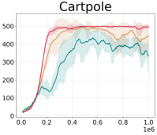

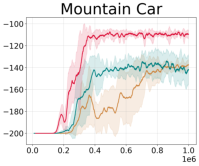

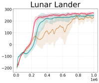

Figure 8: Episodic returns of AD, CleanRL’s DQN, and ANGC’s DQN. Lines show the mean episode
return over 10 seeds and the shaded area conforms to 3 standard errors of the mean.

alternative to backpropagation. Ororbia and Mali [53] evaluates ANGC in 4 environments: Cart Pole,
Mountain Car, Lunar Lander, and a custom robot-arm-reaching environment.

In addition, we implement 2 DQNs with different hyperparameters as baselines for comparison: first
is CleanRL’s reference DQN for classic control problems [ 31 ], and second is the DQN tuned by [ 53 ]
for comparison against their ANGC agent, which we refer to as ANGC’s DQN. The CleanRL DQN
provides a well-established, publicly-vetted baseline, whereas ANGC’s DQN serves as a reference
point for us to indirectly compare AD’s performance with ANGC.

To better demonstrate AD ’s robustness across environments, we use the same set of hyperparameters
for each of the environments. Specifically, we use a 2-layer AD network, with output sizes 128
and 96, a fixed learning rate of 2 _._ 5 _e_ _[−]_ [4] with Adam optimization, an exploration fraction of 0.2, and
final epsilon of 0.05. All other hyperparameters are the same as our network for MinAtar, shown
in Appendix G. As neither CleanRL nor ANGC’s DQN uses a learning rate scheduler, we also
removed ours for better comparison. CleanRL’s DQN is a 2-layer network with 120 and 84 units;
the same DQN is used for all 4 environments. ANGC uses different 2-layer DQNs for each of their
environments, which they tuned for environment-specific performance. Their Cart Pole DQN has
256, 256 hidden units; Mountain Car has 256, 192, and Lunar Lander 512, 384. For Acrobot, we used
the same hyperparameters as the Cart Pole DQN, given the similarity of the environments, which
worked well. For more hyperparameter details, we refer the reader to [ 31 ] and [ 53 ]; both works
present excellent detail.

We made two adjustments when reproducing CleanRL and ANGC’s DQNs. First, since AD utilizes
double Q-learning to improve its learning stability, for better comparison, we also enhanced both
DQNs with double Q-learning, given that it is a simple enhancement without additional computational
costs. Second, specific to ANGC’s Cart Pole DQN, we found that the agent’s learning has very
high variance with the given hyperparameters, and the agent does not consistently achieve high
performance. To counter this, we decreased the learning rate from the provided 5 _e_ _[−]_ [4] to 2 _._ 5 _e_ _[−]_ [4], and
increased the target network update frequency (referred to as _C_ in [ 53 ]) from 128 to 500, which is
CleanRL’s value. This improved both the agent’s stability and average return.

Our results in Figure 8 show that AD achieves strong performance across all 4 tasks, learning more
stably and achieving higher average episodic return than the DQNs in all environments. Most notably,
in comparison to DQN, AD more consistently reaches the maximum 500 return in Cart Pole, and
achieves significantly higher return in Mountain Car. It also surpasses DQN’s performance slightly in
both Lunar Lander and Acrobot. These results suggest that AD is highly competitive against ANGC
in these tasks. However, we note that as ANGC and AD learn with different signals, they are not
competing approaches, and may possibly be integrated to achieve greater performance– we also look
forward to exploring this potential in future work.

**D** **Bootstrap Confidence Intervals**

We show the results of our main experiments with 95% bootstrap intervals in Figure 9, following
the recommendations by [ 55 ] to encourage better comparison of RL algorithms and reproduction
of their results. For the MinAtar environments, we also show the ablation study results with 95%
bootstrap intervals.

17

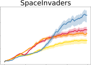

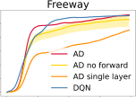

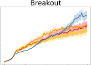

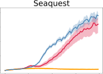

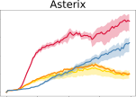

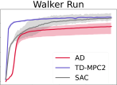

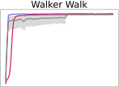

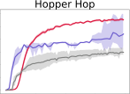

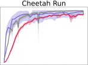

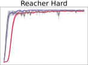

Figure 9: Episode return across the Minatar and Mujoco environments. Shaded area shows a 95%
bootstrapped confidence interval around the mean computed over 20 seeds for AD and 3 seeds for
TD-MPC2 and SAC respectively.

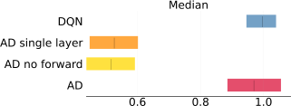

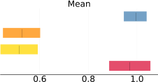

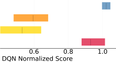

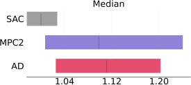

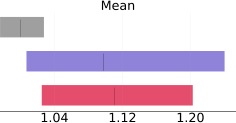

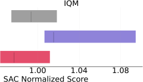

Figure 10: RLiable aggregate statistics across the Minatar and Mujoco tasks.

**E** **Aggregate Statistics**

Using the RLiable library provided by Agarwal et al. [1], we aggregate the performance of AD and
baselines on the Minatar and Mujoco tasks. Since the MinAtar and DMC environments do not offer
human-normalized scores, we used the performance of common baseline algorithms (SAC and DQN,
respectively) for normalization.

We find that AD is within the confidence interval of TD-MPC2 on Mujoco and DQN on Minatar
(compare Figure 10). It shows better mean and median performance than SAC on the Mujoco tasks.
IQM excludes the harder hopper environment, which results in slightly worse performance of AD on
this metric, as our method shines in this task.

**F** **Improving Computational Efficiency in AD Cells**

A limitation of our AD cells is that the _W_ att [[] _[l]_ []] [matrix scales in the size of the action space] _[ |A|]_ [ and the]
size of the hidden layer, _d_ . When training on more complex environments with large action spaces
and require larger hidden layers, _W_ att [[] _[l]_ []] [can become expensive to compute and to learn. One trick we]
employed in DMC environments to improve the computational efficiency of our AD cells is to learn
the _W_ att [[] _[l]_ []] [matrix as a product of two smaller matrices, one] _[ |A| ×][ k]_ [ and the other] _[ k][ ×][ d]_ [ where] _[ k]_ [ is a]
small constant. For small _k_, the number of parameters in the matrix product is significantly smaller
than the original _W_ att [[] _[l]_ []] [matrix, especially when either] _[ |][A][|]_ [ or] _[ d]_ [ are large, allowing for more efficient]
learning at the cost of expressiveness. We found that empirically in the DMC environments using
_k_ = 8 does not notably negatively impact performance while reducing run times.

18

**G** **Model Hyperparameters for MinAtar**

We show the hyperparameters of the AD network and DQN used in our MinAtar experiments.

**Hyperparameter** **AD** **DQN**
Learning rate 10 _[−]_ [4] 10 _[−]_ [4]
Exploration fraction 0.1 0.1
Final epsilon at end of exploration 0.01 0.01
Loss function Mean squared error Mean squared error
Max gradient norm 1.0 1.0
Batch size 512 512

Gamma 0.99 0.99
Training frequency 4 4
Replay buffer size 5 _×_ 10 [6] 5 _×_ 10 [6]
Target network update frequency 1000 1000

We also use a learning rate scheduler for both networks, which linearly increase learning rate to
10 _[−]_ [4] in 500000 steps, then cosine decay until 3 _×_ 10 _[−]_ [5] over remaining training steps. These
hyperparameters were jointly tuned and shared by both the baseline DQN and AD network.

**H** **Model Hyperparameters for the DeepMind Control Suite**

We show the hyperparameters of the AD network in our DMC experiments.

**Hyperparameter** **AD**
Learning rate 2 _._ 5 _×_ 10 _[−]_ [4]
Exploration fraction 0.25
Final epsilon at end of exploration 0.01
Loss function Mean squared error
Max gradient norm 1.0
Batch size 512

Gamma 0.99
Training frequency 4
Replay buffer size 4 _×_ 10 [6]
Target network update frequency 1000

**I** **Environment Selection**

We run our experiments on two standard RL benchmarks and 4 classic control tasks.

MinAtar [ 70 ] is an simplified implementation of 5 Atari 2600 games: Seaquest, Breakout, Asterix,
Freeway, and Space Invaders. We use version 1 for all environments. The input frame size is 10 _×_ 10,
and the _n_ different objects in each game are placed on separate frames, resulting in a 10 _×_ 10 _× n_
input observation. All tasks have discrete action spaces, with up to 6 actions.

The DeepMind Control (DMC) Suite [ 64 ] is a set of low-level robotics control environments, with
continuous state spaces and tasks of varying difficulty. For our experiments, we used a discretized
action space, following Seyde et al. [61], as the architecture is currently only developed for discrete
Q learning. From the DMC tasks we selected Walker Walk, Walker Run, Hopper Hop, Cheetah Run,
and Reacher Hard. These tasks were chosen based on the size of the action space, as our discretized
action heads currently scale exponentially with increasing action dimension. Using better fine-grained
motor control is a valuable path for future work; for now we present the simplified variant as a proof
of concept that our algorithm is able to handle a wide range of tasks and input modalities.

We chose these environments because they reflect challenges in solving complex, non-linear control
tasks, from which meaningful algorithmic insight can be obtained [ 14 ], but are not so complex they
require additional components like convolutional layers to solve. This makes them excellent testbeds
for novel learning approaches. Although the DQN baselines published by Young and Tian [70] are

19

|Dataset|Hidden activations|Layer 1|Layer 2|Layer 3|Layer 4|
|---|---|---|---|---|---|
|MNIST|500|0.9848|0.9862|0.9865|0.9867|
|MNIST|1000|0.9834|0.9860|0.9866|0.9870|
|MNIST|2000|0.9834|0.9862|0.9878|0.9874|
|CIFAR-10|500|0.4715|0.5234|0.5394|0.5501|
|CIFAR-10|1000|0.4750|0.5358|0.5496|0.5588|
|CIFAR-10|2000|0.4841|0.5440|0.5610|0.5725|

Table 1: Test accuracy of each layer of 4-layer AD networks trained on MNIST and CIFAR-10. Each
layer has the same number of hidden activations; for example, the first row refers to an AD network
with layers of 500, 500, 500, and 500 activations. Since each layer makes its own prediction, we can
easily see how performance increases per layer.

obtained using a convolutional neural network (CNN), a larger DQN with only fully-connected layers
can solve all tasks with comparable or stronger performance.

In addition, we provide results on the classic control tasks Cart Pole, Mountain Car, Lunar Lander,
and Acrobot, which we include in Appendix C.

**J** **Experiments on MNIST and CIFAR-10**

To further investigate the generalizability of AD across different learning tasks, we also evaluate AD
on two supervised learning datasets, MNIST and CIFAR-10, and present our results here. Q-learning
is a regression problem; to adapt our architecture to solve these classification problems, we simply
change the loss function to cross entropy, and make each of the `tanh` weight layers correspond to
a class, instead of an action. Using a 4-layer AD network with output sizes 2000, 2000, 2000 and
2000, we achieved 98.74% test accuracy on MNIST, and 57.25% test accuracy on CIFAR-10. These
results are in line with the results achieved by Forward Forward in [30].

We show our results with different sized networks in Table 1. As each layer in the network makes
its own prediction, we additionally show the test accuracy of every layer. Remarkably, for almost
every network size, the test accuracy steadily increases per layer. Like our experiments in RL, this
supports that AD cells can learn to coordinate with each other for better performance without the
need to backpropagate error signals across layers.

For clarity, we want to note that these experiments are performed simply to add another perspective
to evaluate the robustness of AD ’s learning across tasks. AD is intentionally designed for Q-learning,
rather than supervised learning, as it imitates biological processes of reward-based learning.

**K** **Compute Resources**

We ran our experiments on a shared scientific computing cluster using an assortment of CPU and
GPUs. Each instance is run with a GPU (to improve the speed of training the neural network) and 12
CPU cores (to improve the speed of the environment simulation), and 20GB of RAM. On an Nvidia
RTX 2080 GPU, a full training run of AD takes approximately 5 hours on the MinAtar environments,
and 3 hours on the DMC environments. On an Nvidia A100 GPU, the run takes approximately
3.5 hours on MinAtar, and 2.5 hours on DMC. We additionally expended compute resources for
hyperparameter tuning and ablation studies. In total, our experiments consumed approximately 9000
hours of compute using the aforementioned instances.

While we did not prioritize computational efficiency in the current design of our algorithm, we note
that like Chen et al. [15], Lillicrap et al. [38], Journé et al. [34] and other biologically-plausible deep
learning algorithms that do not suffer from the weight transport and update locking problems, our
algorithm can be adapted for neuromorphic hardware that keep data local to computational units [ 33 ].
These hardware have the potential for significant energy efficiency gains.

20

**L** **Usage of Existing Assets**

We utilize several existing assets in both the implementation of our algorithm and our experiments.
In Table 2 we provide their versioning, licensing and and URL for easier reproduction of our results.

|Asset|Version|License|URL|
|---|---|---|---|
|Jax [12]|0.4.11|Apache 2.0|https://github.com/google/jax/|
|MinAtar [70]|1|GPL-3.0|https://github.com/kenjyoung/MinAtar|
|DMC [64]|1.0.16|Apache 2.0|https://github.com/google-deepmind/dm_control/|
|Gymnasium [65]|0.28.1|MIT|https://github.com/Farama-Foundation/Gymnasium/|

Table 2: Existing assets used.

**M** **Social Impacts**

Our work introduces a new learning algorithm that computationally demonstrates how the credit
assignment problem may be solved in the nucleus accumbens, where reward prediction errors
are synchronously distributed. This research direction may yield significant positive impacts to
healthcare and the social sciences. By improving our understanding of biological reward-based
learning, our research has the potential to inform novel therapeutic strategies for neurological
disorders characterized by dysfunctional reward processing mechanisms. By better aligning AI with
biological intelligence, we also provide social science with more faithful AI agents for simulating
and studying human social behavior, a practice that is increasingly adopted.

However, aligning neuroscience and AI is not without risk of negative social impacts. The development of more faithful AI agents may encourage social sciences to increasingly replace human
subjects, as AI agents may be cheaper or more malleable to certain experimental setups, and exogenous variables may be more easily controlled for. Yet AI agents are inherently biased by the data
they are trained upon; replacement of human subjects may further marginalize underrepresented
communities, which is already a large challenge in AI fairness research.

In addition, deep reinforcement learning research, such as our work, consumes considerable amounts
of computational power and energy (see Appendix K). While such research often yields valuable
insights into intelligence, these gains should always be balanced against the carbon emissions caused
by large-scale experiments.

**N** **Discussion on Seaquest**

In Seaquest, where the performance difference between 3-layer AD, AD without forward-in-time
connections, and single layer AD is most apparent, the latter agents’ struggle may be attributed to the
failure of learning the resurfacing mechanism, which traps it at a local minima. In this environment,
the agent must regularly resurface while carrying a diver to replenish oxygen. In the short term,
the agent can acquire more reward if it prioritized attacking enemies, rather than managing oxygen,
but if it runs out of oxygen the episode ends. We observed that the AD agent without forward
connections and the single layer agent both struggled to manage oxygen, often resurfacing randomly
or without first acquiring a diver. In contrast, the AD agent with the forward connections learns
to manage their oxygen more optimally, and often sacrifices short-term rewards to maintain higher
oxygen. In fact, during some trials the AD agent became ultraconservative with oxygen, which led
to the agent surviving on average over 1500 timesteps per episode over several thousand episodes
before it changed strategy. Interestingly, this same behavior was not observed in DQN agents, whose
average episode lengths are consistently under 800. This suggests that AD has the potential to learn
completely different policies from DQNs.

21

**O** **Additional Related Work**

Biologically inspired learning algorithms seek to reconnect machine learning with neurobiology.
This supports better transdisciplinary collaboration across ML and neuroscience, which may be
essential to advancements in both biological and artificial intelligence research [71].

Similar to our work, Ororbia and Mali [53] proposes a deep Q-learning algorithm, ANGC, based
on the Neural Generative Coding framework [ 51 ], which is centered around the idea of active
inference [ 54 ]. We indirectly compare the performance of AD and ANGC in Appendix C. Also
closely relevant, Guerguiev et al. [25] proposes a BP alternative that solves credit assignment for
supervised learning tasks, and show promising results on the MNIST dataset [ 22 ]. They point out
that current neuroscience lacks sufficient understanding of how credit assignment is performed in the
brain, and provide a method to train neural networks using segregated dendrites.

Many other related works focus on other aspects of biological plausibility in deep learning; we
mention a few here for the interested reader. Lillicrap et al. [39], Lillicrap et al. [38], Kunin et al. [36],
Akrout et al. [3] and Lee et al. [37] proposed algorithms that tackle the weight transport problem and
non-locality of errors, which have long plagued backpropagation [ 24 ]. Journé et al. [34] adopts a
Hebbian learning approach to address weight transport, locality and update locking. Miconi et al. [43]
improves the plasticity of neural networks, inspired by the brain’s mechanisms of neuromodulation.

22

