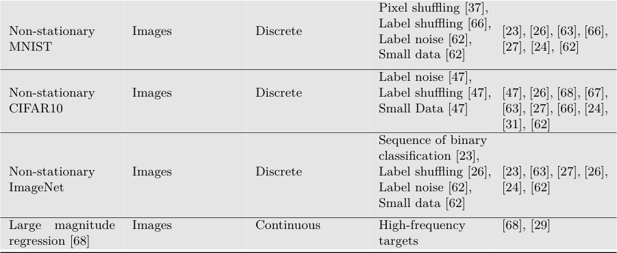
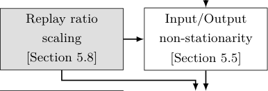
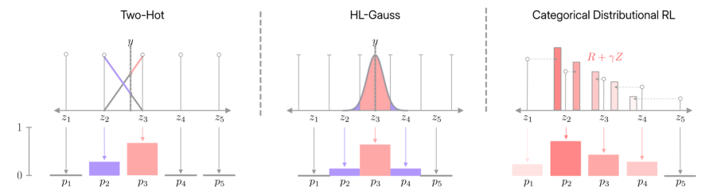

## **Plasticity Loss in Deep Reinforcement Learning: A Survey**

**Timo Klein** timo.klein@univie.ac.at

_Faculty of Computer Science_
_UniVie Doctoral School Computer Science_
_University of Vienna_

**Lukas Miklautz** lukas.miklautz@univie.ac.at

_Faculty of Computer Science_
_University of Vienna_

**Kevin Sidak** kevin.sidak@univie.ac.at

_Faculty of Computer Science_
_UniVie Doctoral School Computer Science_
_University of Vienna_

**Claudia Plant** claudia.plant@univie.ac.at

_Faculty of Computer Science_
_Research Network Data Science_

_University of Vienna_

**Sebastian Tschiatschek** sebastian.tschiatschek@univie.ac.at

_Faculty of Computer Science_

_Research Network Data Science_

_University of Vienna_

**Abstract**

Akin to neuroplasticity in human brains, the plasticity of deep neural networks enables
their quick adaption to new data. This makes plasticity particularly crucial for deep Reinforcement Learning (RL) agents: Once plasticity is lost, an agent’s performance will
inevitably plateau because it cannot improve its policy to account for changes in the data
distribution, which are a necessary consequence of its learning process. Thus, developing
well-performing and sample-efficient agents hinges on their ability to remain plastic during
training. Furthermore, the loss of plasticity can be connected to many other issues plaguing
deep RL, such as training instabilities, scaling failures, overestimation bias, and insufficient
exploration. With this survey, we aim to provide an overview of the emerging research on
plasticity loss for academics and practitioners of deep reinforcement learning. First, we
propose a unified definition of plasticity loss based on recent works, relate it to definitions
from the literature, and discuss metrics for measuring plasticity loss. Then, we categorize
and discuss numerous possible causes of plasticity loss before reviewing currently employed
mitigation strategies. Our taxonomy is the first systematic overview of the current state of
the field. Lastly, we discuss prevalent issues within the literature, such as a necessity for
broader evaluation, and provide recommendations for future research, like gaining a better
understanding of an agent’s neural activity and behavior.

**Keywords:** Reinforcement Learning, Plasticity Loss, Continual Learning, Review, Survey

©2024 Klein, Miklautz, Sidak, Plant, and Tschiatschek.

Klein, Miklautz, Sidak, Plant, and Tschiatschek

**Contents**

**1** **Introduction** **3**

**2** **Notation and Preliminaries** **4**

2.1 General Notation . . . . . . . . . . . . . . . . . . . . . . . . . . . . . . . . . 4
2.2 Reinforcement Learning . . . . . . . . . . . . . . . . . . . . . . . . . . . . . 5
2.3 Definitions of Effective Rank . . . . . . . . . . . . . . . . . . . . . . . . . . 6
2.4 Gradient Covariance Matrix and Empirical Neural Tangent Kernel . . . . . 7
2.5 Common Benchmarks in Deep Reinforcement Learning and Plasticity Loss 8

**3** **Related Work** **11**

**4** **Definitions of Plasticity Loss and Related Phenomena** **11**
4.1 Definitions of Plasticity Loss . . . . . . . . . . . . . . . . . . . . . . . . . . 11
4.2 Plasticity Loss in Other Fields and Related Phenomena . . . . . . . . . . . 13

**5** **Causes of Plasticity Loss** **13**
5.1 Reduced Capacity due to Saturated Units . . . . . . . . . . . . . . . . . . . 14
5.2 Effective Rank Collapse . . . . . . . . . . . . . . . . . . . . . . . . . . . . . 16
5.3 First-order Optimization Effects . . . . . . . . . . . . . . . . . . . . . . . . 17
5.4 Second-order Optimization Effects . . . . . . . . . . . . . . . . . . . . . . . 18
5.5 Non-stationarity . . . . . . . . . . . . . . . . . . . . . . . . . . . . . . . . . 18
5.6 Regression Loss . . . . . . . . . . . . . . . . . . . . . . . . . . . . . . . . . . 20
5.7 Parameter Norm Growth . . . . . . . . . . . . . . . . . . . . . . . . . . . . 20
5.8 High Replay Ratio Training . . . . . . . . . . . . . . . . . . . . . . . . . . . 21
5.9 Early Overfitting . . . . . . . . . . . . . . . . . . . . . . . . . . . . . . . . . 21
5.10 Discussion of Causes . . . . . . . . . . . . . . . . . . . . . . . . . . . . . . . 22

**6** **Mitigating Loss of Plasticity** **22**
6.1 Non-targeted Weight Resets . . . . . . . . . . . . . . . . . . . . . . . . . . . 22
6.2 Targeted Weight Resets . . . . . . . . . . . . . . . . . . . . . . . . . . . . . 24
6.3 Parameter Regularization . . . . . . . . . . . . . . . . . . . . . . . . . . . . 25
6.4 Feature Rank Regularization . . . . . . . . . . . . . . . . . . . . . . . . . . 28
6.5 Activation Functions . . . . . . . . . . . . . . . . . . . . . . . . . . . . . . . 31
6.6 Categorical Losses . . . . . . . . . . . . . . . . . . . . . . . . . . . . . . . . 33
6.7 Distillation . . . . . . . . . . . . . . . . . . . . . . . . . . . . . . . . . . . . 35

6.8 Other Methods . . . . . . . . . . . . . . . . . . . . . . . . . . . . . . . . . . 35

6.9 Combined Methods . . . . . . . . . . . . . . . . . . . . . . . . . . . . . . . . 38
6.10 Discussion of Mitigation Strategies . . . . . . . . . . . . . . . . . . . . . . . 39

**7** **Factors Influencing Plasticity Loss** **42**

**8** **Current State and Future Directions** **45**

8.1 Current Trends . . . . . . . . . . . . . . . . . . . . . . . . . . . . . . . . . . 45

8.2 Directions for Future Research . . . . . . . . . . . . . . . . . . . . . . . . . 45
8.2.1 What are the causes behind Plasticity Loss? . . . . . . . . . . . . . . 45
8.2.2 A call for broader evaluation . . . . . . . . . . . . . . . . . . . . . . 46
8.2.3 How do well-known regularizers actually work? . . . . . . . . . . . . 47
8.2.4 What are the Links between Plasticity Loss and Established Deep RL
Issues? . . . . . . . . . . . . . . . . . . . . . . . . . . . . . . . . . . . 47
8.2.5 Plasticity, Agent Behavior, and Exploration . . . . . . . . . . . . . . 48

2

Plasticity Loss in Deep RL: A Survey

**9** **Conclusion** **49**

**1. Introduction**

Deep Reinforcement Learning (RL) has recently seen many successes and breakthroughs:
It has beaten the best human players in Go [96] and Dota [11], discovered new matrix
multiplication algorithms [30], endows language models with the ability to generate humanlike replies for breaking the Turing test [13], and has allowed for substantial progress in
robotic control [86]. Its capabilities to react to environmental changes and make nearoptimal decisions in challenging sequential decision-making problems are likely crucial for
any generally capable agent. Also, RL’s mode of learning through interaction purely from
trial-and-error mimics human learning, making it a natural paradigm for modeling learning
in artificial agents [98].
Despite all the aforementioned successes, deep RL is still in its infancy, and —in many
ways— deep RL approaches are not yet reliable and mature. For example, most RL algorithms still use the comparatively small network from the seminal DQN paper [75]. Furthermore, to reach high levels of performance, deep RL typically needs substantial tweaking
and elaborate stabilization techniques that are notoriously difficult to get right: From replay buffers and target networks [75] to noise de-correlation [102] and pessimistic value
functions [33], and finally to idiosyncratic optimizer settings [4, 66] and bespoke hyperparameter schedules [94].
There are many reasons why this is the case: First and foremost, deep RL is inherently
non-stationary, making it a substantially harder learning problem than supervised learning.
Additionally, it suffers from its own optimization issues, such as under-exploration, sample
correlation, and overestimation bias. Much recent work has been devoted to tackling these
problems with ever-more elaborate algorithms, many of them aiming to transfer insights
from tabular RL to the deep RL setting [18, 88].
**But what if the problems in current deep RL can be attributed to a significant**
**extent to optimization pathologies arising from applying deep neural networks**
**to non-stationary tasks [12, 34, 80]?** Recently, this view has gained traction under the
umbrella term _plasticity loss_ . In the context of deep learning, plasticity refers to a network’s
ability to quickly adapt to new targets. Consequently, plasticity loss characterizes a network
state associated with a lost ability to learn. There is hope and evidence that if the problem
of plasticity loss is resolved, this will also alleviate many of the aforementioned RL-specific
challenges. The line of work on plasticity loss can be broadly described as trying to find
answers to the following two main research questions:

 _Why do the neural networks of deep RL agents lose their learning ability [26, 66, 68,_
_80, 82, 97]?_

 _How can the ability to learn be maintained [24, 61, 62]?_

These questions are not only relevant for RL but also cover issues relevant to most modern
machine learning: They address the fundamental problem of applying machine learning
techniques in settings requiring adaptation to changing circumstances. This makes plasticity
loss not just relevant for deep RL, but also for other areas applying deep learning, e.g.,

3

Klein, Miklautz, Sidak, Plant, and Tschiatschek

continual learning [26] or the ubiquitous pre-train/fine-tune setup in supervised learning [10,
62].

**Scope** The focus of this survey is on the phenomenon of plasticity loss in deep RL. As
mentioned above, plasticity loss also occurs in continual learning or supervised learning,
and while our survey touches on these settings, they are not our focus. Some surveys
on continual learning also cover plasticity loss and catastrophic forgetting [104] but do
not exclusively focus on plasticity loss—as we do—, thereby naturally limiting the depths
of the exposition. Our in-depth focus on plasticity loss also distinguishes our work from
Khetarpal et al. [53]’s survey, which discusses several relevant RL-specific sub-areas such
as credit assignment or skill learning. In our survey, we emphasize connections between
plasticity loss and other issues afflicting deep RL, such as overestimation bias [80] and its
inability to scale [29]. Within deep RL, we concentrate on the single-agent setting, as the
understanding of plasticity loss is most advanced there.

**Structure** Our survey starts with an overview of the RL formalism and definitions relevant to plasticity loss in Section 4. As we will see, plasticity loss is intuitively easy to define
as networks losing their ability to learn, but there is no single accepted definition in the
literature yet. We also use this section to review different experimental setups to test for
plasticity loss, including synthetic benchmarks and RL environments. Next, we categorize
and present possible hypothesized causes for plasticity loss from the literature in Section 5,
followed by a taxonomy of currently deployed remedies (Section 6). Section 7 then discusses
some of the factors that deep RL researchers and practitioners should consider when using
deep RL algorithms from the perspective of plasticity loss. Finally, our survey concludes
with a discussion of the current state of the field and an outlook on future directions in
Section 8.

**2. Notation and Preliminaries**

This section introduces our notation and presents some relevant quantities subsequently
used to describe causes and mitigation strategies of plasticity loss. In particular, Section 2.3
presents multiple definitions of a network’s feature rank used to measure a representation’s
quality. These form the basis of multiple regularizes in Section 6.4. In Section 2.4, we also
introduce the gradient covariance matrix, which can be used to analyze a network’s optimization landscape. Lastly, Section 2.5 reviews synthetic benchmarks and RL environments
used to study plasticity loss.

**2.1 General Notation**

We adopt the following notation: We use lower-case bold symbols for vectors, e.g., **x** _∈X ⊆_
R _[d][′]_ to denote an input sample from the data space _X_ of dimension _d_ _[′]_ . Upper-case bold
symbols denote matrices, e.g., **X** _∈_ R _[n][×][d][′]_ denotes the design matrix whose rows contain
samples from _X_ . Expectations with respect to a distribution _P_ are denoted as E **a** _∼P_ [ _·_ ]. If
it is clear from the context, we skip the subscript for brevity. We use SVD( **A** ) to denote
the multiset of all singular values of **A**, _σ_ to denote a single singular value, _σi_ ( **A** ) to denote
the _i_ th largest singular value of matrix **A** and _σ_ min and _σ_ max to denote the smallest and
largest singular value, respectively. For _ϕ_ : R _[d][′]_ _→_ R _[d]_ being a function mapping samples to

4

Plasticity Loss in Deep RL: A Survey

features, we denote the feature matrix as _ϕ_ ( **X** ) _∈_ R _[n][×][d]_, where _d_ is the dimension of the
representation.

**2.2 Reinforcement Learning**

Reinforcement learning is concerned with optimizing intelligent agents’ actions via trial-anderror to maximize the so-called cumulative reward (defined below). The agents’ interactions
with an environment are formalized via Markov Decision Processes (MDPs) that can be
described as tuples _M_ = ( _S, A, P, r, ρ_ 0 _, γ_ ), where _S_ is the state space, _A_ is the action
space, i.e., set of possible actions, _P_ : _S × S × A →_ [0 _,_ 1] is the transition kernel specifying
the probability of transitioning from one state to another state upon taking a specific action,
_r_ : _S × A →_ R is the reward function specifying the reward the agent obtains for taking
an action in a state, _ρ_ 0 is the initial state distribution, and _γ_ is the so-called discount
factor. The behavior of an agent is defined by its possibly stochastic policy _π_ : _S →_ [0 _,_ 1] _[|A|]_

specifying for each state a distribution over the actions the agent can take. We often write
_π_ ( _a|s_ ) to denote the probability of action _a_ in state _s_ according to policy _π_ . The agent aims
to maximize the (discounted) cumulative reward

_∞_

_J_ ( _π_ ) = E � _γ_ _[t]_ _r_ ( _st, at_ ) _| π_

� _t_ =0

�

_,_ (1)

where the expectation is over the randomness of the transitions, the agent’s policy, and the
initial state. An optimal policy _π_ _[∗]_ maximizes _J_ ( _π_ ).
Key quantities for RL algorithms are the _state-value_,

�

_V_ _[π]_ ( _s_ ) = E

_∞_
�
� _t_ =0

� _γ_ _[t]_ _r_ ( _st, at_ ) _| s_ 0 = _s_

_t_ =0

_,_ (2)

i.e., the expected cumulative reward when starting from state _s_ and following policy _π_ from
there, and the _action-value_,

�

_Q_ _[π]_ ( _s, a_ ) = E

_∞_
�
� _t_ =0

� _γ_ _[t]_ _r_ ( _st, at_ ) _| s_ 0 = _s, a_ 0 = _a_

_t_ =0

_,_ (3)

i.e., the expected return starting from state _s_, taking action _a_, and following policy _π_
afterwards. An optimal policy can be found by maximizing the expected value of the initial
state, i.e.,

_π_ _[∗]_ _∈_ arg max _π_ _s∼_ E _ρ_ 0 [[] _[V][ π]_ [(] _[s]_ [)]] (4)

Note that state-values (and, similarly, action-values) can also be defined recursively:

_V_ _[π]_ ( _s_ ) = _a∼_ E _π_ ( _s_ ) [[] _[r]_ [(] _[s, a]_ [) +] _[ γ]_ � _s_ _[′]_ _P_ ( _s, s_ _[′]_ _, a_ ) _V_ _[π]_ ( _s_ _[′]_ )] _,_ (5)

Inspired by these recursive definitions are so-called _temporal-difference_ learning approaches,
e.g., approaches based on iteratively updating state-value estimates as

_V_ _[π]_ ( _st_ ) _←_ _V_ _[π]_ ( _st_ ) + _α_ [ _rt_ +1 + _γV_ _[π]_ ( _st_ +1) _−_ _V_ _[π]_ ( _st_ )] _._ (6)
� ~~��~~ ~~�~~
TD error

5

Klein, Miklautz, Sidak, Plant, and Tschiatschek

In these approaches, estimates of state-values (or action-values) are updated based on estimates of those values for successor states (and actions) — that is why such methods are
also called _bootstrapping methods_ . The term within brackets is also referred to as _TD error_ .
In deep RL agents, _V_ _[π]_ _, Q_ _[π]_ or _π_ (or combinations of those) are represented by deep neural
networks. Many works [42, 64] decompose a deep RL agent into a learned representation _ϕ_,
covering all layers up to and including the penultimate layer, and a linear transformation
**W** . This allows viewing an RL agent’s policy or value function as a linear function of some
learned non-linear features, i.e., features obtained through a non-linear transformation of
the states _ϕ_ ( _s_ ) or corresponding observations. Using the value function as an example, our
notation for this decomposition is _V_ ( _s_ ) = _⟨ϕ_ ( _s_ ) _,_ **W** _⟩_ .

**2.3 Definitions of Effective Rank**

The effective rank is a measure commonly used to assess the quality of the representation
learned by a neural network [46, 56, 67]. To build an intuition of why the effective rank
matters, recall the computation of of an RL agent’s value function as _V_ ( _s_ ) = _⟨ϕ_ ( _s_ ) _,_ **W** _⟩_, i.e.,
as the inner product of non-linear features of the state and weights **W** . Now suppose that
_ϕ_ ( _s_ ) _∈_ R _[d]_ is low rank: This implies that the network’s features lie in a lower dimensional
subspace of R _[d]_, potentially mapping dissimilar states to similar feature vectors, which in
turn makes it harder to learn distinct values for these dissimilar states [71]. For a full-rank
_ϕ_ ( _s_ ), the network maps different states to dissimilar feature vectors by distributing them
along all directions of R _[d]_, facilitating easier learning of distinct values for different states.
Multiple possible definitions of the effective rank have been considered in the literature,
some of which we review here. The effective rank definition below is based on the _energy_
_ratio_ (also called _cumulative explained variance_ ) commonly used in principal component
analysis and defined as the minimum _k_ such that a rank- _k_ approximation of the feature
matrix explains a (1 _−_ _δ_ ) fraction of its total variance.

**Definition 1 (Effective Rank [56])** _Let ϕ_ : _X →_ R _[d]_ _be a feature mapping and ϕ_ ( **X** ) _∈_
R _[n][×][d]_ _be a feature matrix, e.g., the embeddings of a neural network for a collection of samples_
**X** _. Let δ ∈_ [0 _,_ 1] _and σ_ 1 _≥· · · ≥_ _σd ≥_ 0 _be the singular values of ϕ_ ( **X** ) _in increasing order._
_The_ effective rank _is defined as_

_k_ :

�

�

�

srank _δ_ ( _ϕ_ ( **X** )) = min

_k_
~~�~~ � _dii_ =1=1 _[σ][σ][i][i]_ [(][(] _[ϕ][ϕ]_ [(][(] **[X][X]** [))][))] _≥_ 1 _−_ _δ_

_._ (7)

The _feature rank_ defined below can be understood as quantifying “how easily states can
be distinguished by updating only the final layer of the network” [65], given by the feature
mapping _ϕ_ . The feature rank (cf. Section 4) was introduced to approximate the _target fitting_
_capacity_ while being cheaper to compute.

**Definition 2 (Feature rank [65])** _Let ϕ_ : _X →_ R _[d]_ _be a feature mapping. Let_ **X** _n ⊂X_
_be a set of n states in X sampled from some fixed distribution P_ _._ _Fix ε ≥_ 0 _, and let_
_ϕ_ ( **X** _n_ ) _∈_ R _[n][×][d]_ _denote the feature matrix whose rows are the feature embeddings of states_
_x ∈_ **X** _n. The_ feature rank _of ϕ for distribution P is defined as_

_ρ_ ( _ϕ, P, ϵ_ ) = lim
_n→∞_ [E] **[X]** _[n][∼][P]_

1
_σ ∈_ SVD _ϕ_ ( **X** _n_ ) _σ > ε_

������ � ~~_√n_~~ ����� �����

6

_._ (8)
�

Plasticity Loss in Deep RL: A Survey

**Feature Rank Definitions**

- Kumar et al. [56] provide the most widely used definition of feature rank, using the
sorted singular values _σ_ 1( _ϕ_ ) _≥_ _σ_ 2( _ϕ_ ) _≥_ _. . ._ of an agent’s penultimate layer representation _ϕ_ :

_,_

srank _δ_ ( _ϕ,_ **X** ) := min

�

_k_
� _i_ =1 _[σ][i]_ � _ϕ_ ( **X** )�
_k_ :

_d_ _≥_ 1 _−_ _δ_
~~�~~ _i_ =1 _[σ][i]_ ~~�~~ _ϕ_ ( **X** ) ~~�~~

�

where _δ_ is a threshold parameter usually set to _δ_ = 0 _._ 01.

- Lyle et al. [65] define the feature rank as the number of singular values of the (normalized) feature matrix exceeding a specified threshold:

srank _ϵ_ ( _ϕ,_ **X** ) =
����

1
_σ ∈_ SVD _ϕ_ ( **X** ) _σ > ε_ _,_
� � ~~_√n_~~ ����� �����

with _ϵ_ being a threshold parameter set to _ϵ_ = 0 _._ 01.

- In supervised learning, a definition based on the entropy of the distribution of normalized singular values has started to gain traction [46]. This has the advantage of not
requiring a threshold parameter and being continuous:

srankcontinuous( _ϕ,_ **X** ) = _−_

min( _n,m_ )
� _σ_ ¯ _i_ � _ϕ_ ( **X** )� log � _σ_ ¯ _i_ � _ϕ_ ( **X** )�� _,_

_i_ =1

where ¯ _σi_ = _σi/_ [�] _i_ _[σ][i]_ [ = 1.]

**2.4 Gradient Covariance Matrix and Empirical Neural Tangent Kernel**

The gradient covariance matrix and empirical neural tangent kernel (eNTK) are closely
related quantities, giving insights into the optimization behavior and the generalization
abilities of a neural network [66] by analyzing the dot product of the gradients of different
samples **x** _i_ and **x** _j_, i.e., _⟨∇θL_ ( _θ,_ **x** _i_ ) _, ∇θL_ ( _θ,_ **x** _j_ ) _⟩_ . Here, _L_ denotes the used loss function and
_∇θ_ the derivative of a neural network w.r.t. to its parameters. In the following, we will use
the gradient covariance matrix **C** _k_, noting that the eNTK is just the unnormalized gradient
covariance matrix [68]. Given sample indices _i_ and _j_, the gradient covariance matrix is
defined as

**C** _k_ [ _i, j_ ] = _[⟨][∇][θ][L]_ [(] _[θ][,]_ **[ x]** _[i]_ [)] _[,][ ∇][θ][L]_ [(] _[θ][,]_ **[ x]** _[j]_ [)] _[⟩]_ (9)

_∥∇θL_ ( _θ,_ **x** _i_ ) _∥∥∇θL_ ( _θ,_ **x** _j_ ) _∥_ _[.]_

In practice, it is impossible to compute this matrix over the complete state space _X_ of a
deep RL environment. Thus, it is commonly approximated with _k_ samples. From a generalization perspective, **C** _k_ gives insights into whether updates between a pair of inputs **x** _i_ and
**x** _j generalize_ . This is the case when the dot product of their gradients is positive. When
it is negative, it means that updates between samples do not generalize, but instead _inter-_
_fere_ [66]. From an optimization perspective, a pronounced block structure of the gradient
covariance matrix indicates a sharp and unstable loss landscape. Additionally, when **C** _k_ is
low-rank, i.e., when most values are positive or negative values of similar magnitude, then

7

Klein, Miklautz, Sidak, Plant, and Tschiatschek

the network has learned a degenerate function. This means that updates on single samples
generalize to the whole input space [68], making it difficult to distinguish between individual samples. The leftmost plot in Figure 1 provides an example of the gradient covariance
matrix for highly collinear gradients.

(a) Freeway
(1M steps)

(b) Freeway
(3.5M steps)

(c) SpaceInvaders
(1M steps)

(d) SpaceInvaders
(3.5M steps)

Figure 1: **Gradient covariance structure at different time steps on Atari** . _(a)_ For
the Atari game Freeway, the gradient covariance matrix displays a pronounced
structure at one million steps. _(b)_ Later in the training, the structure becomes
less noticeable at 3.5M steps. _(c)_ and _(d)_ show the gradient covariance matrices
for the game SpaceInvaders at the same time steps. Here, the structure is less
pronounced. We can observe that the structure of the gradient covariances and
their evolution depends on the particular game/environment.

**2.5 Common Benchmarks in Deep Reinforcement Learning and Plasticity Loss**

For this section, we abstractly use the term plasticity loss for a loss in a network’s ability to
learn and refer the reader to Section 4.1 for a formal definition. Factors commonly leading
to a loss of learning ability can either occur naturally as part of a learning task or be
induced artificially, enabling us to establish two categories of benchmarks for plasticity loss:
The first category consists of RL environments, whereas the second consists of stationary
datasets from supervised learning with (artificially) added non-stationarity. We start by
reviewing the commonly used RL environments before discussing the artificially generated
non-stationary datasets.
The most widely-used RL benchmarks to evaluate plasticity loss are the Atari suite [7]
and the DeepMind Control Suite [99]. Both have in common that they are very wellestablished and provide a wide range of environments with different characteristics and
difficulties. Atari differs from DeepMind Control in that its action space is discrete, whereas
DeepMind Control uses a continuous action space. Additionally, DeepMind Control allows
for training from image observations and vector states, whereas Atari only entails training
from images [1] . Due to the diversity of both benchmarks, they include environments where
either plasticity loss or the associated pathologies occur strongly. For Atari, plasticity
is lost for instance during training on Phoenix [83] and Space invaders, whereas Demon
Attack suffers from inactive neurons [97]. For DeepMind Control, all tasks associated with

1. The Atari suite allows training on 1024 dimensional RAM states [7], but this is not a commonly used
benchmark.

8

Plasticity Loss in Deep RL: A Survey

the DOG environment pose a significant challenge to current algorithms due to quickly
exploding gradient norms [80].
Regarding other benchmarks, Atari-100k [52] is a subset of the full Atari suite consisting of 26 games, where the goal is to achieve the maximum possible reward within
100,000 steps. For model-free algorithms, this entails training with many updates per
environment step, often exacerbating plasticity loss [25, 82]. For continuous control, the
MuJoCo environments [100] are still used in some papers but have mostly been superseded
by DeepMind Control, as evidenced by the number of papers using either of them recently.
MetaWorld [111] is a benchmark for continuous control in robotics, containing 50 distinct
tasks. From the perspective of plasticity loss, Nauman et al. [80] show that MetaWorld exhibits different pathologies than DeepMind Control, e.g., the parameter norms and gradient
norms of the agent play more of a role in determining agent performance. This makes it a
useful benchmark to use alongside DeepMind Control, enabling verification of algorithms
on environments with substantially different characteristics.
Utilizing the widely-used MNIST dataset as a foundation, _Permuted MNIST_ is a continual learning benchmark where the pixels of the individual MNIST images are shuffled
for each new task [23]. An alternative to pixel shuffling is label permutation [66], where the
class labels are changed. For example, this could assign all nines the label ”one” in MNIST.
Label permutation differs from label randomization in that labels are changed _consistently_
_across classes_, whereas for label randomization, the changes must not be consistent for a
class. In contrast to assigning all nines the label ”one” for permutation, randomization
would amount to drawing a new, random label for each individual sample. Label randomization can also be applied to only a fraction of a dataset, termed _label noise_ in the
literature [47, 62]. These modifications can also be applied to other image datasets, such as
CIFAR-10 [47] or ImageNet [23]. A specific benchmark building on ImageNet is _Continual_
_ImageNet_ [23], where the network has to solve a sequence of binary classification tasks. For
each task, two labels with the corresponding samples are chosen from the 1000 labels of
ImageNet. This results in the network solving a new task for each sequence step, as neither
the input images nor the labels have been seen previously [23].
All benchmarks from above building on supervised learning datasets use classification
tasks. In contrast, value-based deep RL uses regression with mean-squared error as loss [39,
75]. Utilizing this insight, Lyle et al. [68] define a regression benchmark using oscillating
targets based on CIFAR-10 inputs. Here, each sample gets assigned a random target _yi_ =
5
sin �10 _· fψ_ ( _xi_ )� + _b_, where _b_ is an ”offset” or bias parameter and _ψ_ the parameter of a
randomly initialized network. The bias parameter _b_ allows controlling the magnitude of the
target, which is potentially associated with plasticity loss as discussed in Section 5.6.
Lastly, a particularly relevant training scenario is _warm-starting_ [5, 10, 62], which refers
to pre-training a network on one task before fine-tuning it on another task. This type of
two-stage training is, for example, ubiquitous when using large foundation models. We
can evaluate loss of plasticity when warm-starting by pre-training a model with one of
the aforementioned non-stationarities, i.e., label noise, label shuffling, or a dataset with
reduced size, followed by a second training stage, where the full and correctly labeled
dataset is available. If the warm-started model shows subpar performance compared to a
model trained only on all samples with correct labels, it is a strong indicator that it has
lost plasticity [10, 27, 62, 68].

9

Klein, Miklautz, Sidak, Plant, and Tschiatschek

Table 1: **Commonly used benchmarks for plasticity loss.** RL benchmark suites are
in the upper half of the table with white background. As RL training is naturally
non-stationary, there is no need to add nonstationarities artificially. The lower
half of the table contains plasticity loss benchmarks based on supervised learning
datasets (gray background). Almost all of these use classification tasks, making
their ”action space” discrete. Because there are multiple ways of introducing nonstationarity into a stationary dataset, we explicitly list all of them.

**Benchmark** **State Space** **Action Space** **Non-**
**stationarity**
**type**

**Used by**

MetaWorld [111] Vector states Continuous RL [80], [81], [107],

[51]

Images,
MuJoCo [100] Continuous RL [23], [27], [26]
Vector States

Atari [7] Images Discrete RL [97], [22], [83], [4],

[36], [68], [67], [27],

[66], [29], [65], [56]
Atari-100k [52] Images Discrete RL [82], [25], [94], [69],

[61]
DeepMind Images,
Continuous RL [82], [25], [14], [69],
Control Suite [99] Vector States

[107], [51], [61],

[15], [68], [42]

10

Plasticity Loss in Deep RL: A Survey

**3. Related Work**

In the context of deep RL, the study of plasticity loss has recently (re-)gained traction [47,
82]. Consequently, general surveys on deep RL often do not yet cover plasticity loss [3, 105],
whereas newer surveys mainly cover unrelated sub-areas of deep RL, e.g., structure in
MDPs [76] or credit assignment [91]. To the best of our knowledge, our survey is the first
to exclusively review plasticity loss for deep RL.

The two areas most closely connected to plasticity loss are (a) continual learning, and
(b) continual RL. Continual learning is concerned with learning a sequence of tasks characterized by a dynamic data distribution [104]. It occurs in many contexts, such as when
fine-tuning a pre-trained model [112] or when training LLMs [106]. To enable efficient
learning under distribution changes, continual learning algorithms must balance a trade-off
between “ _learning plasticity and memory stability_ ” [104]. In other words, continual learning deals with both plasticity loss and catastrophic forgetting, putting an emphasis on the
latter [23]. In contrast, our survey focuses solely on plasticity loss but in a scenario where
data distribution shifts occur naturally—even without changing tasks—, namely deep RL.
Examples of such distribution shifts are changes in the state visitation distribution due to
an updated policy or changes in an agent’s target distribution due to an improved value
function in TD learning (cf. Section 2.2).

In continual RL, the agent is faced not only with non-stationarity arising from changes
in its own policy but also time-dependent changes to the MDP’s transition and reward
functions [2, 53]. From a conceptual perspective, this results in the agent facing the same
stability-plasticity dilemma as a network does in supervised continual learning [104]. Our
survey exclusively reviews the plasticity part dilemma. On the other hand, continual RL
also comprises many RL-specific sub-areas, such as credit assignment, exploration under
non-stationarity, and goal-conditioned RL [53].

**4. Definitions of Plasticity Loss and Related Phenomena**

In this section, we first provide and generalize definitions of plasticity loss from recent
literature and then relate them to aspects of related phenomena in continual learning.

**4.1 Definitions of Plasticity Loss**

In the literature, there is no single accepted definition of plasticity loss. Here, we attempt
to unify some existing definitions and illustrate how many definitions from the literature are
special cases of our result. Intuitively, all existing definitions try to capture a model’s loss
of ability to fit new targets but formalize this and the underlying training and evaluation
setup differently.

Our unified definition is as follows:

**Definition 3 (Loss of plasticity)** _Let PX_ [(] _[t]_ [)] _be a distribution over inputs X_ _, and PL_ [(] _[t]_ [)] _a_
_distribution over a family of real-valued loss functions L with domain X_ _. Let gθ represent a_
_neural network with parameters θ, O correspond to an optimization algorithm for supervised_

11

Klein, Miklautz, Sidak, Plant, and Tschiatschek

_learning, and I represent an_ intervention _on the parameters θ. Using_

_c_ [(] _[t]_ [)] ( _θ_ ) = E _L∼PL_ ( _t_ )

�E **x** _∼PX_ ( _t_ ) [[] _[L]_ [(] _[g][θ][,]_ **[ x]** [)]] � (10)

_to denote the loss of the neural network at time t using parameters θ, we define the loss of_
_plasticity as_

_C_ ( _{PX_ [(] _[t]_ [)] _[}]_ _t_ _[T]_ =1 _[,][ {][P]_ [ (] _L_ _[t]_ [)] _[}]_ _t_ _[T]_ =1 _[,][ O][,][ I]_ [) =] _[ c]_ [(] _[T]_ [)][(] _[θ]_ [(] _[T]_ [)][)] _[ −]_ _[c]_ [(] _[T]_ [)][(] _[θ]_ [(0)][)] (11)

_where_

_θ_ [(] _[t]_ [+1)] = _O_ � _θ_ [(] _[t]_ [)] _[′]_ _, PX_ [(] _[t]_ [)] _[, P]_ _L_ [ (] _[t]_ [)] � _and_ _θ_ [(] _[t]_ [)] _[′]_ = _I_ ( _θ_ [(] _[t]_ [)] _, PX_ [(] _[t]_ [)] _[, P]_ _L_ [ (] _[t]_ [)][)] _[.]_ (12)

This definition generalizes many existing definitions in that it enables different losses at
different time steps, which is, e.g., relevant for multi-task learning, and in that it allows
for explicit manipulations of the parameters outside of the behavior of the optimization
algorithm. [2]

Many definitions of _loss of plasticity_ — sometimes referred to by a different term — in
the literature are special cases of the above definition:

  - Berariu et al. [10] defined the _generalization gap_ as “the difference in performance
between a pretrained model — e.g. one that has learned a few tasks already — versus
a freshly initialized one”. The notion of the already-learned tasks corresponds to
different tasks given by _PX_ [(] _[t]_ [)] _[, P]_ _L_ [ (] _[t]_ [)] [for] _[ t]_ [ = 1] _[, . . ., T][ −]_ [1 while the performance is evaluated]
with respect to a final task characterized by _PX_ [(] _[T]_ [)] _[, P]_ _L_ [ (] _[T]_ [)] . The freshly initialized model
is given by _gθ_ (0) with _θ_ [(0)] being random initial parameters.

  - Lyle et al. [65] defined the _target-fitting capacity_ as a measure of how well a neural
network can fit a distribution of targets given by a family of labeling functions (realvalued functions mapping inputs from _X_ to targets). This definition arises from
Definition 3 by considering _T_ = 1 and selecting _PX_ [(] _[t]_ [)] _[, P]_ _L_ [ (] _[t]_ [)] accordingly. [3]

  - Lyle et al. [66] also define _loss of plasticity_ but don’t explicitly account for timedependent distributions _PX_ [(] _[t]_ [)] _[, P]_ _L_ [ (] _[t]_ [)] and interventions. Their definition is thus a special
case without applying any intervention and constant distributions for the input and
the loss functions.

  - Elsayed and Mahmood [26] provide a sample-based notion of plasticity loss corresponding to a baseline normalized version of the plasticity loss defined in Lyle et al.

[66]. Their definition arises as a special case from ours by fixing the loss function (i.e.,
using the same loss functions for all _t_ ) while making it dependent on the optimizer
and the intervention.

2. Clearly, interventions on the parameters, e.g., resetting parameters to revive dead neurons, could also
be considered as part of the optimizer. However, making the interventions explicit and not considering
them as part of the optimizer can help to explicate different mechanisms affecting the loss of plasticity.
3. There is still a slight difference between the definition in Lyle et al. [65] and our definition: our definition
subtracts _c_ [(] _[T]_ [ )] ( _θ_ [(0)] ) as a baseline.

12

Plasticity Loss in Deep RL: A Survey

**4.2 Plasticity Loss in Other Fields and Related Phenomena**

This section briefly discusses the relevance of plasticity loss in fields other than RL and its
relation to other phenomena in deep learning.
Network plasticity is also a crucial property for facilitating _continual learning_, where
a system learns from a sequence of data distributions, each defining a new task [78]. To
succeed in continual learning, the learner must not only retain plasticity but also mitigate
another well-known pathology of deep learning, namely _catastrophic forgetting_ [72]. It refers
to a network suddenly unable to solve a previously learned task after learning a new one.
In continual learning, the system must find a balance between tackling plasticity loss and
catastrophic forgetting: If the network is very plastic and immediately adapts to data
from a different distribution, it is also more prone to quickly forgetting previously learned
knowledge, resulting in catastrophic forgetting. The other extreme is a network with no
plasticity, e.g., a network with frozen weights: It certainly cannot forget previous tasks
but also exhibits no plasticity, i.e., freezing the weights corresponds to a complete loss of
plasticity.
When warm-starting training by fine-tuning a pre-trained network, task shifts are arguably one reason for exacerbated plasticity loss [5, 10]. However, plasticity can also be lost
quickly in RL environments [83] without an obvious task shift through a changed objective. Whether an agent in an RL environment faces a single task is a peculiar question: In
value-based RL with target networks, it can be argued that with each new target network
update, the agent needs to solve a new task [4]. However, completely stationary learning
problems may also result in plasticity loss. For example, Lyle et al. [68] show that using
large-mean targets in stationary regression is enough for networks to lose their plasticity.
Lastly, plasticity loss is a broad categorization, likely subsuming several individual phenomena and causes. As we will discuss in Section 5.5, plasticity loss entails different subcategories, such as adaptability to input distribution shifts and to target shifts [61]. Similarly, there is a _generalizability_ component to plasticity loss. It occurs, for example, when a
network pre-trained under non-stationarity has sub-par test performance when fine-tuned,
despite comparable train performance to a network not pre-trained under non-stationarity.
What is commonly referred to as plasticity loss and used as the basis for the definitions
in Section 4.1, however, is _trainability_ : It means that a network is unable to update its
parameters, even given a high loss [1, 62].

**5. Causes of Plasticity Loss**

This section presents and categorizes possible causes of plasticity loss from the literature.
Note that these causes reside on different conceptual levels: For instance, non-stationarity
(Section 5.5) is a common high-level property of a learning problem that seems to occur
in almost all settings where plasticity loss occurs. In contrast, the curvature of a neural
network’s optimization landscape discussed in Section 5.4 is a very specific network property.
Furthermore, we review saturated neurons in Section 5.1, collapse of a network’s effective
rank in Section 5.2, gradient issues of networks that have lost plasticity in Section 5.3, the
regression loss in Section 5.6, and parameter norms in Section 5.7. Training with high replay
ratios, which refers to doing many gradient updates per environment step, is discussed in
Section 5.8, followed by early overfitting (Section 5.9). Having finished the exposition of

13

Klein, Miklautz, Sidak, Plant, and Tschiatschek

|(Large-mean) regression [Section 5 .6]|Col2|
|---|---|
|(Large-mean) regression [Section 5.6]||

|Environment properties|Col2|
|---|---|
|||

|Unstable gradients [Section 5 .3]|Col2|
|---|---|
|||

Figure 2: **Possible connections between factors and causes of plasticity loss in**
**value-based RL** . Large-mean regression targets combined with non-stationarity
of deep RL training cause large and unstable gradients, leading to an increase in
parameter norms. Large parameter norms are known to increase loss sharpness
and cause other pathologies, together leading to reduced agent performance.

potential causes of plasticity loss, we examine relationships between them in Section 5.10.
Figure 2 relates different network pathologies and possible causes of plasticity loss.

**5.1 Reduced Capacity due to Saturated Units**

Saturated [15, 68] or dormant [97] units are one of the most prominent pathologies associated
with reduced agent performance and plasticity loss. They are an obvious and objectively
measurable sign indicating that the network cannot utilize its full capacity. Therefore, it
is easy to relate them to reduced network expressivity and slow learning [97]. However,
it is unclear whether dormant neurons are the main cause of plasticity loss or are just

14

Plasticity Loss in Deep RL: A Survey

a pathology associated with networks that have lost their plasticity. For example, Sokar
et al. [97] discuss target non-stationarity as contributing to an increase in dormant neurons
throughout training. Other aspects of modern deep RL algorithms might also exacerbate
the phenomenon, such as training with high replay ratios [25, 94].
How can units with reduced capacity be formally defined? The literature provides
a plethora of options to do this, which we group into two categories: _Saturated units_ for
which a shift in the pre-activation distribution reduces the capacity of the neuron to produce
meaningfully different outputs given inputs from its input distribution. For example, this
could be a ReLU neuron where all inputs are positive or negative, rendering it inactive
(“dead”) [70] or linear [68], respectively. _Dormant units_ [97] are instead characterized by
low post-nonlinearity activations. When considering a tanh unit, one can easily see how
these categories differ: For large pre-activations, the unit’s output will be close to one for all
inputs. Importantly, the output will be close to one (i.e., show small numerical differences),
even considering significant differences in the pre-activation. On the other hand, such a
saturated tanh unit is clearly not dormant because its post-nonlinearity activation is high.

**Saturated Neurons** have first been discussed in Bjorck et al. [15] in the context of
pixel-based continuous control. The authors took a closer look at runs of the then-stateof-the-art agent DrQ-v2 [110] and observed that most of them exhibited saturated tanh
policies, with runs failing to learn and not being able to move out of this regime [4] . This
results in actions at the boundaries of the [ _−_ 1 _,_ 1] interval from which actions are usually
selected in continuous control combined with vanishing gradients, as _∀_ **x** : _|_ tanh( _gθ_ ( **x** )) _| ≈_
1 = _⇒_ _∂θ∂_ [tanh(] _[g][θ]_ [(] **[x]** [)) = [1] _[ −]_ [tanh][2][(] _[g][θ]_ [(] **[x]** [))]] _∂θ_ _[∂]_ _[g][θ]_ [(] **[x]** [)] _[ ≈]_ [0.] Interestingly, their proposed

solution to normalize the features of the penultimate layer increases performance when
applied not only to the actor but also to the critic [15], highlighting the fact that bounded
activations may be just as important to prevent critic divergence [12].
More recently, Lyle et al. [68] partition non-stationary learning problems into an _erasing_
_or unlearning phase_ and a _disentanglement phase_, finding that the first causes a form of
saturation in ReLU units. These _linearized units_ are characterized by their pre-activation
distribution having only positive support. To be more precise, the unlearning phase after
a task shift causes a distribution shift in the neuron’s pre-activation distribution through
gradients that either increase or decrease the preactivation values for all training samples.
If all pre-activations for a neuron are now positive, the unit becomes _linearized_, removing
its nonlinear component. If a neuron’s pre-activations are negative for the training dataset,
it moves into the dead neuron regime. Both of the aforementioned pathologies effectively
reduce the expressive capacity of the network. As a remedy, the authors propose to apply
LayerNorm [6] before a unit’s nonlinearity [68].

**Dormant Neurons** have been introduced by Sokar et al. [97] as a measure for the reduced
expressivity of a neural network. In experiments, they have shown that dormant neurons are
associated with performance plateaus and reduced performance of DQN [75] agents trained
on different Atari games. To determine the level of dormancy, one has to first calculate

4. DrQ-v2 builds on top of TD3 [33], which is an agent based on deterministic policy gradients that uses
the tanh function to clip actions in [ _−_ 1 _,_ 1].

15

Klein, Miklautz, Sidak, Plant, and Tschiatschek

normalized activation scores _s_ _[l]_ _i_ [for each neuron] _[ i]_ [ in all non-final layers] _[ l]_ [ [97]:]

E **x** _∈D_ _|h_ _[l]_ _i_ [(] **[x]** [)] _[|]_
� �
_s_ _[l]_ _i_ [=] _H_ 1 _[l]_ ~~�~~ _k∈_ [ _H_ _[l]_ ] [E] **[x]** _[∈D]_ ~~�~~ _|hlk_ [(] **[x]** [)] _[|]_ ~~�~~ _._ (13)

Here **x** _∈D_ are samples drawn from an input distribution, e.g., the replay buffer in offpolicy deep RL, _h_ _[l]_ _i_ [(] **[x]** [) denotes the post-nonlinearity activation of a neuron in layer] _[ l]_ [, and]
_H_ _[l]_ the number of neurons in layer _l_ .

**Neuron Dormancy**

If the score in Equation (13) is below a threshold _τ_, i.e., _s_ _[l]_ _i_ _[≤]_ _[τ]_ [, then neuron] _[ i]_ [ in layer] _[ l]_ [ is]
_τ_ _-dormant_ . Denoting _Hτ_ _[l]_ [as the number of dormant neurons per layer, and] _[ N][ l]_ [ as the total]
number of neurons per layer, the _dormancy ratio_ is the fraction _Hτ_ _[l]_ _[/N][ l]_ [ of all layers except]
the final layer [97, 107]:

� _Hτ_ _[l]_ _[/]_ �

_l∈θ_ _l∈θ_

_βτ_ = �

� _N_ _[l]_ (14)

_l∈θ_

An agent exhibits the _dormant neuron phenomenon_ if its fraction of dormant neurons increases over the course of the training.

The above definition is certainly not the only sensible way of defining a measure for
neurons with reduced activity, but it is currently widely accepted within the literature [69,
84, 85, 97, 107] due to its simplicity and intuitive understanding. Dohare et al. [23] define
a more complex measure of neuron utility based on a product between the magnitudes
of a unit’s summed weights and its activations. A more straightforward option for ReLU
networks is to simply count the number of zero activations [1, 26].
To summarize: While there are different options for defining inactive neurons [23, 26, 97],
all of the works cited above agree that they are a symptom of reduced expressivity caused
by some form of non-stationarity [1, 69, 97]. Where they differ is in the proposed solution to
address inactive units: Sections 6.1 and 6.2 discuss a plethora of reset strategies as possible
remedies [23, 82, 97, 107], Section 6.5 considers activation functions for non-stationary
problems such as CReLU [1], and Section 6.3 examines parameter regularization [63].

**5.2 Effective Rank Collapse**

Multiple works observe a correlation between an agent’s performance degradation and its
representation becoming low-rank. This phenomenon is dubbed ”rank collapse” and has
been observed both in online [42, 56, 65] and offline [38, 56] RL. Kumar et al. [56] establish a connection between the effective rank of an agent’s representation and its ability to
learn: A decrease in the representation’s rank leads to increased TD error. In theoretical
and empirical analysis, Kumar et al. [56] show that a drop in rank comes by the largest
singular values of the representation outgrowing the smaller ones, most likely caused by
bootstrapping in value-based deep RL. This effect may be exacerbated in sparse-reward
environments such as Montezuma’s revenge on Atari [66]. G¨ul¸cehre et al. [38] presents a
thorough empirical study and find that the association between effective rank and agent
performance is not as straightforward as previously assumed in offline RL. In particular,

16

Plasticity Loss in Deep RL: A Survey

it depends on potentially confounding hyperparameter and architecture choices, such as
the activation function and the learning rate. However, they show that the collapse of the
effective rank to a very small value is reliable and allows for identifying underfitting agents
with suboptimal performance at the end of training.
The phenomenon of rank collapse is tightly intertwined with other phenomena pertaining
to loss of plasticity. In offline RL, there is a strong correlation between the effective rank
and the number of dead units in the agent’s network [38]. Similarly, resetting dead or
dormant neurons increases feature rank at the end of online RL training [97]. As of now,
the exact causal relationship between dead neurons and rank collapse is unclear.

**5.3 First-order Optimization Effects**

Deep neural networks are most commonly trained using stochastic gradient descent (SGD);
looking at a neural network’s gradients is, therefore, a plausible direction to look for causes
of plasticity loss. _Vanishing gradients_ [44] are a well-known issue in training recurrent neural
networks and may also play a role in the loss of plasticity. In particular, a collapse in the
L0 and L1 gradient norms [5] despite high loss values is an indication that the agent isn’t
able to adapt despite its network being of sufficient capacity to do so [1]. A collapse in
the L0 norms indicates increased gradient sparsity, which may contribute to more sparse
ReLU activations and dead neurons [1]. A more nuanced notion of sparsity is _gradient_
_dormancy_, which is closely related to neuron dormancy discussed in Section 5.1, but using
the gradient L2 norms instead of neuron activations in its calculations [51]. Ji et al. [51] show
that gradient dormancy is an issue faced by proprioceptive control agents in sparse-reward
tasks, indicating a connection between sparse feedback, learning ability, and representation
quality of an agent [64].
On the other end of the spectrum, _exploding gradients_ are a clear sign of divergence and
have been shown to occur when trying to scale deep RL networks [14] or in high-complexity
environments, such as DM control’s DOG [80]. However, it is worth emphasizing that the
occurrence of large gradient norms is highly environment-dependent: While DOG suffers
severely, the phenomenon is less pronounced on MetaWorld and even less of an issue on
non-DOG DM Control [80]. Both vanishing and exploding gradients are easy to detect,
although the latter usually has more severe performance implications than the former.
A more subtle gradient-related optimization issue is gradient collinearity [66], which
refers to the structure of the gradient covariance matrix or empirical neural tangent kernel
(eNTK) [68], measuring how well gradients for one sample generalize to other samples. If
this matrix has a diagonal structure, updates don’t generalize, leading to overfitting. If
all entries have the same value, then gradients from one sample generalize to all other
samples, indicating that the network has learned a degenerate function [68]. For valuebased deep RL, the eNTK often has a very clear structure, as shown in Figure 1. Many
methods mitigating plasticity loss weaken this structure and reduce the correlation between
gradients, such as LayerNorm, weight clipping, and pruning [27, 66, 68, 85]. This hints
at highly correlated gradients being a sign of an ill-conditioned optimization landscape,
potentially causing plasticity loss [66].

5. Abbas et al. [1] note that the L2 gradient norm can be misleading due to the potentially disproportional
weight of a few outliers.

17

Klein, Miklautz, Sidak, Plant, and Tschiatschek

**5.4 Second-order Optimization Effects**

It is well-known from supervised learning that flat minima generalize better [31, 45]. Connecting to this insight, there is a growing body of work linking plasticity loss with the
sharpness of a network’s optimization landscape: Networks that have lost plasticity usually
also display high curvature [63, 66]. Lyle et al. [66] find that increased curvature as measured by the largest eigenvalue of a network’s Hessian makes optimization more difficult
and leads to plasticity loss. In a similar vein, Lewandowski et al. [63] argue that a collapse
of the Hessian’s effective rank [56] (cf. Definition 1) is causing plasticity loss. To measure curvature, they find that the empirical Fisher information matrix outperforms other
approximations, such as the Gauss-Newton approximation, in terms of accuracy [63]. If a
sharp optimization landscape were to cause plasticity loss, then methods explicitly reducing
sharpness, such as the SAM optimizer [31], should also mitigate it. Lee et al. [61] evaluate
SAM in an Atari-100k agent and find it very effective at reducing sharpness as measured by
the Hessian’s largest eigenvalue. However, their ablation studies highlight that resets [82]
(cf. Section 6.1) still outperform SAM in terms of cumulative reward when applied in isolation. The performance gap between resets and SAM occurs despite significantly higher
curvature when applying resets, indicating that sharpness cannot be the sole cause behind
plasticity loss. Lee et al. [61] attributes this performance gap to smooth minima only reducing sensitivity to changes in the input distribution, whereas complementary methods must
tackle the orthogonal issue of changes in the target distribution.

**5.5 Non-stationarity**

Non-stationarity is simultaneously the most likely culprit for causing plasticity loss and one
of the most elusive [23, 47, 61, 62, 65]. What type of non-stationarity causes networks to
lose plasticity? Which capabilities of a network are affected? How can non-stationarity even
be quantified? Intuitively, non-stationarity makes sense as a driving mechanism of plasticity
loss. Practically, verifying whether it is the sole underlying cause or to what extent nonstationarity causes networks to lose their ability to learn is difficult. In the following, we
give an overview of different aspects of non-stationarity, which are partially overlapping.

**Input non-stationarity** is defined through changes in the data distribution _P_ ( **x** ) [61]. In
deep RL, this usually occurs due to an improving policy that generates data from a slightly
different distribution with each update. Elsayed and Mahmood [26] use _input-permuted_
MNIST to evaluate different methods concerning plasticity loss, where the network has to
solve a sequence of classification tasks with all the pixels of MNIST images being shuffled
new for each task. The idea behind input-permutation as a benchmark for plasticity is that
for a network to be successful, it must re-learn its representation from scratch for each new
task. In contrast, the network should be able to re-use its learned features and only have
to update its head in case the labels were shuffled instead. Therefore, input permutation
can be a better benchmark for plasticity than label permutation. This argument supports
the hypothesis that input non-stationarity may cause plasticity loss. Other works simulate
input distribution shifts by training networks on progressively expanding subsets of data,
commonly based on CIFAR-10 or MINST classification [47, 61, 62, 68]. Depending on the
size of the initial subset, this type of non-stationarity can have dramatic consequences:

18

Plasticity Loss in Deep RL: A Survey

While the network is often able to reach similar levels of training accuracy, _test accuracy_
often suffers massively for smaller initial subset ratios [47, 62], even when later training on
the full dataset (warm-starting). This can be seen as a form of overfitting on the first task
that has a residual effect on the second task. Despite further improvements on the train
dataset in the second stage, the generalization performance stagnates. An early hypothesis
for explaining this phenomenon is that the network initially overfits to the smaller subsets,
learning suboptimal features that are insufficient for high-performance classification on the
full dataset [47]. Lee et al. [62] decompose plasticity into _trainability_ and _generalizability_,
indicating that current methods [1, 97] focus on the former, neglecting the latter. Instead,
generalizability can be somewhat maintained by common regularization techniques such as
data augmentation or weight decay in the warm-starting scenario described above. These
findings (a) support the existence of the generalization gap from Section 4.1, and (b) they
indicate that enhancing trainability without addressing generalizability leads to overfitting.

**Target non-stationarity** refers to changes in a learning problem’s labels over the course
of the training, that is, the distribution _P_ ( _y|_ **x** ) changes [61]. In deep RL, this typically
occurs due to bootstrapping: Assuming the use of target networks, each update of the
target network changes the optimization problem, such that, effectively, an RL algorithm
solves a sequence of optimization problems [4]. There is mounting evidence in the literature suggesting that target non-stationarity is a main driver of plasticity loss, but its exact
mechanism is still unclear. Igl et al. [47] hypothesize that non-stationarity leads to the network learning suboptimal features, which are then reused and cause reduced performance
over time. Similarly, Kumar et al. [56] have found that bootstrapping targets in deep RL
produce low-rank representations associated with performance collapse. Bootstrapping may
even cause early performance collapses that are hard to recover from when it leads to large
fluctuations early in training [69]. Another study has determined whether input or target
non-stationarity is causing plasticity loss by performing experiments with offline and online
RL agents. They find that plasticity loss, measured by the fraction of dormant neurons, still
exists in offline RL. The authors conclude that target non-stationarity is the key factor [97].
This has been verified in toy experiments, where a network has to memorize labels on a
sequence of MNIST tasks or regress on targets with increasing magnitude. Both types of
non-stationarity lead to growing parameter norms, one of the pathologies commonly associated with plasticity loss and suspected of inhibiting learning [68]. Interestingly, Elsayed and
Mahmood [26] argue that maintaining performance in the presence of target distribution
shifts is more of a _catastrophic forgetting_ problem. This is because the main challenge with
moving targets is the agent maintaining its representation in the face of distribution shifts.
In theory, the agent should be able to cope with changing labels simply by adapting its last
layer [26], whereas input distribution shifts require the full network’s plasticity because the
representation has to be relearned with each new task.

In summary, the evidence that non-stationarity plays a role in plasticity loss seems overwhelming. While research into the mechanisms as to how exactly non-stationarity causes
plasticity loss is still in rather early stages, some recent works have started to provide
plausible hypotheses for the phenomenon [67, 68]. Similarly, splitting up the hand-wavy
argument that ”non-stationarity causes plasticity loss” into more fine-grained hypotheses
pertaining to individual aspects such as input and label plasticity [61] will help to advance

19

Klein, Miklautz, Sidak, Plant, and Tschiatschek

our understanding. As of now, it is still unclear whether the currently known facets of
plasticity loss capture all relevant angles or whether more is to be discovered, e.g., trainability and generalizability [62]. From a deep RL perspective, developing toy scenarios for
analysis that more closely mimic the peculiarities of common RL benchmarks will also be
useful. For example, most of the works listed above use classification on MNIST or CIFAR
to verify their initial hypotheses, despite most deep RL approaches using regression losses,
which can have different characteristics [29, 68].

**5.6 Regression Loss**

Classification tasks have been observed to be easier for deep neural networks than regression ever since the AlexNet breakthrough in image classification [29]. Because value-based
deep RL methods use a regression loss, recent work has hypothesized that regressing on
non-stationary targets might be one of the leading causes of deep RL’s optimization issues [29, 68]. For example, the two-hot trick [93] has been successfully applied to train
value networks and subsequently been linked to plasticity loss, albeit at a performance
cost [66]. Farebrother et al. [29] find that reformulating regression as classification using a
method called HL-Gauss [49] improves RL agents in many ways such as representational
capacity, robustness to noise and uncertainty, and sample efficiency. However, they do not
provide deeper insights into the exact mechanisms behind regression optimization issues.
A recent investigation into the mechanisms driving plasticity loss hypothesizes that _re-_
_gression with large-mean targets_ causes networks to lose plasticity even in stationary learning
problems [68]. This issue is particularly prevalent in value-based deep RL, where an agent
ideally improves throughout training, resulting in temporal difference targets with increasing magnitude. Regressing on large-mean targets has two negative side effects: First, deep
networks are prone to encoding the target offset into their weights instead of the bias. This
leads to an explosion of the singular values of the corresponding dimensions in parameter
space, resulting in an ill-conditioned feature matrix [68]. Second, when the network predicts the large-mean targets insufficiently well, the squaring in the MSE yields large error
terms. As gradients are proportional to errors in regression tasks, these large errors blow
up the parameter norms of the network [29, 68]. This growth of the parameter norms is
associated with a wide range of pathologies such as poor generalization [27], loss landscape
sharpness [68], and finally plasticity loss [68].

**5.7 Parameter Norm Growth**

Lyle et al. [68] found that parameter norm growth is a common concomitant of networks that
have lost plasticity and is associated with reduced task performance. In the following, we
present four possible mechanisms to explain this effect. First, Lyle et al. [68] link growing
parameter norms and the sharpness of the optimization landscape: As the norms of the
parameters grow, so does the maximum eigenvalue of the Hessian. This connects to the
works described in Section 5.4, hypothesizing that curvature may explain plasticity loss.
The same authors also hypothesize that large parameter norms may cause nonlinearities
within the network, such as activation functions or softmax heads saturating. The effects
of saturated units are described in detail in Section 5.1, but among them are gradient
propagation issues and a loss in effective network capacity, both of which are associated

20

Plasticity Loss in Deep RL: A Survey

with plasticity loss. Third, it has been found that growing parameter norms may lead to
gradients with sparse and/or collinear gradient covariance matrices. As a result, updates
may over-generalize or under-generalize in the sample space. In an extreme case, an overgeneralizing network may learn a degenerate function assigning similar outputs to all inputs.
On the other hand, an under-generalizing network can only memorize task labels [68]. Both
states are linked to plasticity loss. Lastly, a recent study finds that large parameter norms
affect the effective learning rate of a network. In particular, as the parameter norms of a
network grow, so does the norm of its gradient, leading to instability and potential plasticity
loss during training [67]. The implicit effect of parameter norms on the learning rate can be
mitigated with a technique called Normalize-and-Project, which we discuss in Section 6.9.

**5.8 High Replay Ratio Training**

The _replay ratio_ (RR), sometimes also called the update-to-data (UTD) ratio, describes the
number of gradient updates per environment step [19, 82] for off-policy deep RL agents.
For example, the original DQN agent uses _RR_ = 0 _._ 25, corresponding to one gradient step
every four environment steps [75], whereas SAC uses _RR_ = 1 [39]. Many algorithms do not
use higher RRs to trade off sample efficiency against compute efficiency because applying
more gradient updates leads to performance degradation and degenerate policies [25, 82].
This has been attributed to overfitting on early samples [82] or, more recently, early plasticity loss [25]. Ma et al. [69] hypothesize that higher RRs exacerbate initial target nonstationarity, which in turn causes agents to lose plasticity early in training. A common
intervention to alleviate adverse effects from high RR training in off-policy deep RL is
the application of resets, which have been shown to work well on a wide range of benchmarks [25, 80, 81, 82, 94].

Is high replay ratio training the main cause of plasticity loss? In our view, this is unlikely:
Plasticity loss also occurs in scenarios without high RR training, for example, when using
a standard Double DQN agent on the Atari games Phoenix and Space Invaders [83]. It
seems that high RRs _amplify_ plasticity loss instead of directly causing it. This argument is
supported by Nauman et al. [80], who note that high RRs induce different training dynamics
than low RRs. A prominent example is DeepMind Control DOG, in which SAC agents with
high RRs suffer from exploding gradients [80].

**5.9 Early Overfitting**

When training networks under non-stationarity, some early works have hypothesized that
residual effects of overfitting to early training data might hinder late training progress.
The earliest work describing this phenomenon attributes it to the network trying to re-use
suboptimal features acquired early during training [47]. Their results on toy datasets have
been confirmed in deep RL, named the ”primacy bias” [82]. The primacy bias refers to
a psychological phenomenon in human learning, where early experiences can have longlasting effects on later tasks. In the context of deep RL, it refers to agents overfitting to
early interactions and being unable to update their networks in the face of new data.

While these early findings regarding plasticity loss have been compelling, more recent
work has moved away from the hypothesis of early overfitting towards mechanistic and

21

Klein, Miklautz, Sidak, Plant, and Tschiatschek

measurable explanations such as dead neurons, parameter norm growth, or feature rank
collapse.

**5.10 Discussion of Causes**

When looking at the causes mentioned in the previous sections, it bears repeating that they
are on different conceptual levels: Non-stationarity is broad and hard to quantify, whereas
the number of dead neurons is a specific, measurable property of a neural network at a given
time step. As of now, the research is still inconclusive about (a) how exactly the individual
mechanisms causing plasticity loss work, and (b) how they are related. Additionally, it
might well be possible that unknown confounding factors exist that might provide a more
abstract understanding of plasticity loss.
Figure 2 schematically relates the current understanding of plasticity loss in value-based
deep RL agents. It seems clear that non-stationarity, both for inputs and targets, is a
driving mechanism behind networks losing their ability to learn [61, 62]. High RR training
amplifies non-stationarity, exacerbating the issues stemming from it. Recently, the issues
in optimizing value-based deep RL have also been tied to the usage of regression losses,
which are both less amenable to the training of deep networks in general [29] and are prone
to lead to large parameter norms [68]. The latter factor is likely caused by the fact that
in regression, gradients are proportional to errors, causing instability for growing and/or
non-stationary regression targets [29, 68]. Growing parameter norms and unstable gradients
may cause numerous other pathologies commonly associated with plasticity loss, such as
dead neurons or a sharp optimization landscape [68, 97]. Together, these issues lead to
reduced performance and the network’s failure to adapt to new targets.
While Figure 2 tries to present links between possible causes of plasticity loss, there
is, as of now, no complete theory of the phenomenon available. Instead, current research
notes different optimization issues and that amalgamating these factors likely causes plasticity loss. Whether these can be merged into a unified high-level understanding of the
phenomenon is unclear.

**6. Mitigating Loss of Plasticity**

In this section, we present an overview of approaches developed to mitigate plasticity loss.
Approaches based on resetting the weights of neural networks are discussed in Sections 6.1
and 6.2, followed by approaches regularizing a neural network’s weights in Section 6.3 and
a neural network’s feature representation rank 6.4. Approaches building on the choice of a
neural network’s activation functions are presented in Section 6.5 and approaches leveraging
beneficial properties of the categorical loss in Section 6.6. Furthermore, distillation-based
approaches, other methods, and combinations of the presented approaches are discussed
in Sections 6.7, 6.8, and 6.9, respectively. We conclude this section with a discussion in
Section 6.10.

**6.1 Non-targeted Weight Resets**

Non-targeted weight resets are a simple method for tackling plasticity loss and have initially
been used to mitigate early overfitting [82]. They are considered in two different flavors:

22

Plasticity Loss in Deep RL: A Survey

(a) _Hard resets_, where network layers are fully reset, and (b) _soft resets_, where new network
weights are generated from a linear combination of the current weights and freshly initialized

ones.

**Hard Resets** build on the observation that plasticity loss has empirically been shown to
mainly manifest in the last layers of a network [10, 25, 82]—although it may affect all layers
of the network to some extent. A simple sensible strategy for mitigating plasticity loss is,
therefore, a periodic, full reset of the last few layers of the agent, i.e., the weights of the last
few layers are replaced by new draws from the initial weight distribution. For small agents,
e.g., the ones typically used for non-pixel continuous control tasks, this amounts to resetting
the complete network [25, 81, 82]. In contrast, in pixel-based control environments such as
Atari, the convolutional encoder is typically not reset to retain the knowledge encoded in
the agent’s representation [25, 82, 94].

**Soft Resets** [5], also known as Shrink and Perturb (S & P), have been introduced to
mitigate the so-called “ _generalization gap_ ”, which is the difference in performance observed
when training a freshly initialized model compared to one fine-tuning a pretrained one [10].
S & P uses a linear combination of the current weights _θ_ old and random parameters _ψ_ from
the initial weight distribution to perform the reset [25] [6] :

_θ_ new = _αθ_ old + (1 _−_ _α_ ) _ψ, ψ ∼_ initializer _._ (15)

For well-tuned hyperparameters _α_, S & P is able to restore the network’s plasticity while
retaining the (relevant) knowledge stored in the network. In the context of deep RL, the
SR-SPR [25] agent uses soft resets for the convolutional encoder combined with hard resets
for the last layers to increase the number of gradient steps per environment step on the
Atari 100k benchmark [52]. Using the same combination of hard and soft resets as SRSPR, BBF [94] incorporates a number of other improvements, such as deeper networks and
discount annealing, to set the current state-of-the-art on Atari 100k.

**Comparing hard and soft resets.** Looking at the advantages and disadvantages of each
reset type, it stands out that hard resets _only_ work for off-policy algorithms with a replay
buffer. Without the buffer, a reset would erase the agent’s knowledge. The experience stored
in the buffer acts as a “memory”, quickly allowing the agent to recover lost knowledge [25,
82]. The application of hard resets is, therefore, confined to off-policy deep RL algorithms,
whereas well-tuned soft resets are also applicable to on-policy algorithms. S & P has been
shown to improve a variety of metrics associated with the loss of plasticity: It decreases
the number of dead neurons, prevents vanishing gradients, and prevents weight norms from
exploding [26]. However, it may be possible that resets have other positive effects on
deep RL training orthogonal to mitigating loss of plasticity. For example, Xu et al. [107]
hypothesize that S & P may improve exploration, presumably via inducing more rapid
policy change [92].

6. In the original work by Ash and Adams [5], the reset is defined as _θ_ new = _λθ_ old + _γψ_ . We choose to use
the definition that is more common in deep RL.

23

Klein, Miklautz, Sidak, Plant, and Tschiatschek

**6.2 Targeted Weight Resets**

Instead of arbitrarily resetting the network’s weights or parts of it, algorithms with _targeted_
_weight resets_ track some measure of utility for each neuron/layer and perform resets based
on it. This allows resetting only the parts of a network that are likely affected by plasticity
loss at the cost of additional computational [23, 26, 97] and memory demands [23]. A special
case of this class of approaches is plasticity injection [83], which does not track any measure
of utility but resets the last layers of a network in a specific way ensuring not to change its

outputs.

**Continual Backprop (CBP)** is a reset algorithm building on top of a heuristic measure
of neuron utility [23]. After each gradient step, this measure is updated for each neuron
and used to reset the _x_ % least useful neurons in each layer. As a reset strategy, CBP
replaces the ingoing weights of a neuron with fresh weights sampled from the initialization
distribution and sets the outgoing weights to zero. CBP also resets moment estimates of the
employed Adam optimizer for the selected neurons. Lastly, the algorithm tracks a count for
each neuron, measuring the number of update steps since the last reset, preventing the same
neurons from being reset over and over during training. The authors show promising results
on toy problems such as input-permuted MNIST or in proprioceptive RL environments.
However, the necessity to track multiple metrics for each neuron and perform updates and
resets at every step makes CBP expensive both in terms of memory and computation.

**ReDo** has been developed concurrently with CBP and uses a more lightweight notion of
neuron utility that is easier to track. Instead of updating a utility measure at every gradient
step, ReDo assesses every _k_ time steps whether the per-layer normalized activations of a
neuron are below a threshold _τ_ . If they are, it resets all of these _dormant neurons_ with the
same strategy as CBP, namely resampling ingoing weights from the initialization distribution and setting outgoing weights to zero. On Atari, ReDo has improved the performance
of DQN [75] and DrQ [109] agents substantially, particularly in games like SpaceInvaders or
Seaquest, where plasticity loss is known to occur. For Soft Actor-Critic (SAC) [39] agents,
performance improvements are less pronounced, likely due to proprioceptive continuous
control agents exhibiting different dynamics in terms of dormant neurons than pixel-based
Atari games [51].

**UPGD** is a noisy SGD variant focusing on both plasticity loss and catastrophic forgetting
in continual learning [26]. It consists of two components: First, it adds Gaussian noise to
the gradients. Second, it scales the learning rate by a measure of neuron utility _U_ . Let _θ_
denote the weights of a neural network. Formally, a UPGD step can be written as:

_∂L_
_θl,i,j ←_ _θl,i,j −_ _α_ �1 _−_ _U_ [¯] _l,i,j_ � [�] _∂θ_ + _ξ_
_l,i,j_

�

_,_ (16)

where _ξ ∼N_ (0 _,_ 1) and _U_ [¯] _l,i,j ∈_ [0 _,_ 1] is the exponential moving average of the utility of
the scalar parameter _i, j_ in layer _l_ . The term (1 _−_ _U_ [¯] _l,i,j_ ) leads to important weights not
being changed due to their utility being close to 1, whereas unimportant weights will be
both updated through SGD and perturbed via Gaussian noise. Intuitively, this can be
seen as a targeted reset weighted by a continuous measure of parameter utility. The utility
is intended to approximate a causal measure of weight utility based on an intervention,

24

Plasticity Loss in Deep RL: A Survey

given in Equation (17) below: ” _How would the loss change if parameter θl,i,j would be set_
_to zero?_ ”. As this would be expensive to compute exactly for deep networks, the authors
instead estimate it with a Taylor expansion around zero for the current parameters _θ_ [26],
avoiding the need for an additional forward pass. Equation (18) states this approximate
utility:

_Ul,i,j_ ( **x** ) = _L_ � _θ¬_ [ _l,i,j_ ] _,_ **x** � _−_ _L_ ( _θ,_ **x** ) (17)

_≈_ _L_ ( _θ,_ **x** ) + _[∂L]_ [(] _[θ][,]_ **[ x]** [)]

_∂_ [2] _L_

[1] (0 _−_ _θl,i,j_ ) [2] _−_ _L_ ( _θ,_ **x** )

2 _∂θ_ [2]
_l,ij_

[(] _[θ][,]_ **[ x]** [)]

(0 _−_ _θl,i,j_ ) + [1]
_∂θ_ 2
_l,i,j_

= _−_ _[∂L]_ [(] _[θ][,]_ **[ x]** [)] _θ_

_l,i,j_
_∂θ_
_l,i,j_
~~�~~ � ~~�~~ �
first-order utility

[1] _∂_ [2] _L_ ( _θ,_ **x** )

2 _∂θ_ [2]

_,_ _θ_ [2]

_l,i,j_

2 _∂θ_ [2]

_l,i,j_
� ~~��~~ �
second-order utility

+ [1]

_,_ (18)

where _θ¬_ [ _l,i,j_ ] denotes the parameters _θ_ with parameter _l, i, j_ set to zero. Here **x** denotes
a sample, e.g., a state-action pair in RL. While in principle, the Taylor expansion could
be made arbitrarily accurate, practically, even second-order expansions are expensive to
compute. Under this consideration, the first-order approximation appears to show a reasonable compute vs accuracy trade-off [26]. Even though Equation (16) states the update
for SGD, the UPGD algorithm can also be extended to momentum-based optimizers like
Adam [26, 54].

**Plasticity Injection** [83] builds on the idea that plasticity loss is usually concentrated
in the head of a neural network [25] and resets the last layers of an agent’s neural network
in the following way: At step _T_, it freshly initializes the last two layers of the agent’s neural
network such that its outputs and the number of learnable parameters stay the same. This
is achieved as follows. Let _θ_ denote the current parameters of an agent’s head, _θ_ 1 _[′]_ [a set]
of freshly initialized parameters, and _θ_ 2 _[′]_ [a] _[ frozen copy]_ [ of] _[ θ]_ 1 _[′]_ [. If we let] _[ h][θ]_ [represent the]
agent’s head as a function parameterized by parameters _θ_ and specify the _Q_ -function in the
following way

_−_ _hθ_ 2 _′_ [(] **[s]** [)] _,_ (19)
~~����~~
frozen

_Q_ ( **s** ) = _hθ_ ( **s** )
� ~~��~~ �
frozen

+ _hθ_ 1 _′_ [(] **[s]** [)]
� ~~�~~ � ~~�~~
learnable

plasticity injection produces _unaffected predictions_ and _preserves the number of trainable_
_parameters_ [83]. Fulfilling these two desiderata allows the injection to be a diagnostic tool
that can be used to verify the existence of plasticity loss. An agent’s plasticity will be
restored through the freshly initialized parameters _θ_ 1 _[′]_ [, allowing it to further improve.]

**6.3 Parameter Regularization**

The idea of regularizing parameter norms originates from linear regression, where it is used
to cope with overfitting [77]. Avoiding Plasticity loss differs from avoiding overfitting in
that the goal is not to learn a simpler model but rather to preserve the general ability of
the model to learn. Parameter norm regularizers developed to tackle plasticity loss build
on the fact that the initial weights allow for rapid adaptation to new targets and thus
aim to preserve certain properties of the initial weights via regularization. Such properties

25

Klein, Miklautz, Sidak, Plant, and Tschiatschek

include the rank of the learned representation, the rank of the network’s Hessian matrix,
or the (low) magnitude of the learned parameters. For example, low weight magnitudes are
deemed to be beneficial for training, likely by inducing a smoother optimization landscape
through smaller gradient norms [68].

**L2 Regularization (Weight Decay)** is the most prominent weight regularization method.
When applied to linear regression, the resulting method is called ridge regression. From
a probabilistic perspective, L2 regularization can be seen as assuming a standard Normal
distribution as prior for the weights of layer _l_ **W** _l_ . Formally, the prior is of the form
_p_ ( **W** _l_ ) = _N_ ( **W** _l |_ **0** _,_ **I** ). From this assumption about the prior, one can derive a penalty
term using the squared L2 norm of the weights for all _n_ layers:

_L_ L2reg( _θ_ ) = _L_ ( _θ_ ) + _λ_

_n_
� _∥_ **W** _l −_ **0** _∥_ [2] 2 _[,]_ (20)

_l_ =1

where **W** _l_ are layer _l_ ’s weight matrices, and _λ_ is a hyperparameter that determines the
strength of the regularization. While well-tuned L2 regularization is able to keep parameters
magnitudes small, in the context of RL it often interferes with training, particularly for
value-based agents [68].

**Spectral Normalization (SpectralNorm)** is a technique for discriminator regularization in Generative Adversarial Networks (GANs) [74]. It directly controls the L2 matrix
norm of layer _l_ ’s weight matrix by dividing that matrix by the largest singular value _σ_ max:

**W** _l_
**W** _l ←_ = **[W]** _[l]_ _._ (21)
_∥_ **W** _l∥_ 2 _σ_ max

By applying SpectralNorm to all layers of the GAN discriminator, it is possible to constrain
the network to be _K_ -Lipschitz, where _K_ is a hyperparameter to be tuned. In deep RL,
it has been observed that SpectralNorm has two desirable effects for gradient-based optimization. First, it prevents exploding gradients, which is an issue when scaling RL agent
networks [14, 80]. Second, SpectralNorm implicitly schedules the learning rate of the Adam
optimizers, preventing performance plateaus [36]. This effect is akin to LayerNorm’s implicit learning rate scheduling described in the previous paragraph [67]. Furthermore, it is
more effective at mitigating overestimation bias than many techniques specifically targeted
at mitigating overestimation bias, such as clipped double Q learning [80]. Nauman et al.

[80] also show that SpectralNorm substantially reduces the number of dormant neurons [97]
even compared to methods like ReDO that are designed to prevent dormant units [80].
Lastly, applying SpectralNorm to the penultimate layer of value-based RL agents decreases
their hyperparameter sensitivity [36]. In summary, SpectralNorm positively affects a wide
variety of factors commonly associated with plasticity and is thus an easy-to-use method
for reducing plasticity loss.

**L2 Init** builds on L2 regularization by using the initial weights as regularization targets
instead of the origin [24]. As the initial weights are capable of quickly fitting targets,
keeping the weights closer to the initial weights instead of zero can be more desirable from
the perspective of plasticity loss. Consequently, the resulting prior distribution for the

26

Plasticity Loss in Deep RL: A Survey

weights of layer _l_ at step _t_ is _p_ ( **W** _l,t_ ) = _N_ ( **W** _l,t |_ **W** _l,_ 0 _, C_ **I** ), with mean **W** _l,_ 0 instead of **0** .
This leads to the following regularized objective:

_L_ L2Init( _θt, θ_ 0) = _L_ ( _θt_ ) + _λ_

_n_
� _∥_ **W** _l,t −_ **W** _l,_ 0 _∥_ [2] 2 _[.]_ (22)

_l_ =1

Drawing a connection to targeted reset methods from Section 6.2, the L2 Init regularizer
can be seen as a method for resetting weights that are of low importance. Compared to
Continual Backprop [23] or ReDo [97], L2 Init does not explicitly calculate utilities for
neurons. Instead, it implicitly determines the regularization strength for a weight based
on the loss: If a gradient update for a particular weight results in a large change in loss
value _L_ ( _θt_ ), the relative importance of the regularizing term _∥_ **W** _l,t −_ **W** _l,_ 0 _∥_ [2] 2 [decreases.]
Conversely, if changing a weight has little effect on the loss, then the regularizing term
moves this particular parameter closer to its initialization value.

**2-Wasserstein regularization** One problem of L2 Init is that it regularizes weights to
their uninformative initial values _θ_ 0. Lewandowski et al. [63] propose to regularize weights
to their initial distribution instead of initial values. Equation (23) uses the squared 2Wasserstein distance to enforce a small distance between the initial weight distribution _p_ 0
and the current distribution _pt_ :

_L_ 2-Wass( _θt, θ_ 0) = _L_ ( _θt_ ) + _W_ 2 [2][(] _[p][t]_ _[∥]_ _[p]_ [0][)] _[,]_ (23)

_d_
�

_i_ =1

where _W_ 2 [2][(] _[p][t]_ _[∥]_ _[p]_ [0][) =]

_n_
�

_l_ =1

� _w_ ¯ _l,t_ _[i]_ _[−]_ _[w]_ [¯] _l,_ _[i]_ 0� _,_

with ¯ _wl,t_ _[i]_ [denoting the] _[ i]_ [-th largest parameter of layer] _[ l]_ [ at step] _[ t]_ [. Equation (23) highlights]
a particular advantage of the squared 2-Wasserstein distance: The existence of a closedform solution makes computations tractable and cheap. We can compare the 2-Wasserstein
regularizer with L2 Init by writing out the L2 Init penalty in terms of individual weights:

_d_
�

_i_ =1

_R_ L2Init( _θt, θ_ 0) =

_n_
�

_l_ =1

� _wl,t_ _[i]_ _[−]_ _[w]_ _l,_ _[i]_ 0� _._

As we can see, the Wasserstein regularizer is just L2 Init with _parameters sorted by their_
_magnitude_ . This subtle change allows for larger deviations of individual weights from their
initial value while still keeping the current distribution over weights close to their initial
distribution [63].

**Weight Clipping** is another technique for preventing parameter norm growth. The idea
behind weight clipping is simple: After each gradient update, ensure that weights are in
a predefined range [ _−b, b_ ]. Elsayed et al. [27] define _b_ = _κsl_, where _κ_ is a scaling hyperparameter and _sl_ are the bounds of the uniform distribution used to initialize the weight
matrix **W** _l_ of layer _l_ . The big advantage of weight clipping compared to weight decay or L2
Init [24] is that it does not bias the weights towards a particular point in parameter space;
instead, they can freely move within the bounds [ _κsl, κsl_ ]. Its big disadvantage is that it
only works for uniform initialization like Kaiming Uniform [27, 40].

27

Klein, Miklautz, Sidak, Plant, and Tschiatschek

**Parameter Regularization**

- Weight decay or **L2 regularization** mitigates overfitting in regression models by regularizing weights towards a standard Normal prior [77]:

_R_ L2reg( _θ_ ) = _λ_

_n_
� _∥_ **W** _l −_ **0** _∥_ 2 [2] _[.]_

_l_ =1

Note that the term _∥_ **W** _l −_ **0** _∥_ 2 [2] [only regularizes the weight matrices; the bias terms do]
not contribute to overfitting.

- **SpectralNorm** enforces a Lipschitz-constraint on all weight matrices **W** _l_ of a network
by dividing through the largest singular value _σ_ max of each weight matrix [74]:

**W** _l_
**W** _l ←_ = _σ_ max _[−]_ [1] **[W]** _[l]_ _[.]_
_∥_ **W** _l∥_ 2

_σ_ max can be approximated efficiently through the power iteration algorithm.

- Dohare et al. [24] observe that the initial weights of a network possess high levels of
plasticity and propose to _regularize towards the initial weights instead of zero weights_
in their method **L2 Init** :

_R_ L2Init( _θt, θ_ 0) = _λ_

_n_
� _∥_ **W** _l −_ **W** 0 _∥_ 2 [2] _[.]_

_l_ =1

- Lewandowski et al. [63] extend the idea of parameter regularization by _regularizing_
_towards the initial weight distribution_ via the **squared 2-Wasserstein regularizer** :

_d_
�

_i_ =1

_R_ 2-Wass( _θt, θ_ 0) =

_n_
�

_l_ =1

� _w_ ¯ _l,t_ _[i]_ _[−]_ _[w]_ [¯] _l,_ _[i]_ 0�2 _._

Here ¯ _wl,t_ _[i]_ [denotes the] _[ i]_ [-th largest parameter of layer] _[ l]_ [ at step] _[ t]_ [.]

  - **Weight clipping** [27] truncates the weight matrices **W** _l_ for each layer _l_ with the
bounds [ _κsl, κsl_ ], where _sl_ are the bounds of the uniform distribution used to initialize
the layer and _κ_ is a hyperparameter:

**W** _l ←_ min(max( **W** _l, −κsl_ ) _, κsl_ ) _,_

where the min and max operator are applied elementwise.

**6.4 Feature Rank Regularization**

While it is unclear whether feature rank collapse is an underlying cause of plasticity loss [66],
it is a highly associated phenomenon for networks that have lost their ability to learn [23, 24].
Since the first observation that under-parameterized or low-rank representations are strongly
associated with low performance in value-based deep RL [56], many algorithms have been
designed to either explicitly or implicitly encourage high-rank representations.

**Direct Singular Value Regularization** Kumar et al. [56] note that the effective rank
from Definition 1 is non-differentiable. Let us denote Φ = _ϕ_ ( **X** ) _∈_ R _[n][×][d]_ as the matrix of

28

Plasticity Loss in Deep RL: A Survey

representations of dimension _d_ for a batch of size _n_ . To circumvent this non-differentiability
issue and apply gradient-based learning, they propose to extend the loss function by a regularizer that minimizes the squared largest singular value _σ_ max [2] [(Φ) while jointly maximizing]
the squared smallest singular value _σ_ min [2] [(Φ) for a representation with parameters] _[ θ]_ [:]

_L_ sing( _θ_ ) = _L_ ( _θ_ ) + _α_ � _σ_ max [2] [(Φ)] _[ −]_ _[σ]_ min [2] [(Φ)] � _._ (24)

_L_ sing is conceptually simple and applicable to any type of deep RL algorithm but suffers from
instabilities. To see how potential instabilities arise, note that the regularizer is globally
minimized when all singular values are exactly the same, which is achieved by a constant
representation: Φ = _ϕ_ ( **X** ) = **0** . This makes practical applications difficult as performance
and stability are highly sensitive to the choice of the parameter _α_ .

**InFeR** takes a more indirect approach towards maintaining a representation with a high
effective rank by utilizing a set of _k_ auxiliary regression tasks [65]. First, the algorithm adds
_k_ auxiliary prediction heads _gi_ on top of the agent’s encoder _ϕθ_ . Before starting the training,
InFeR creates a copy of the initialization weights for both the encoder and the auxiliary
task head. These weights are used to generate the regression targets for the auxiliary task
using training batches from the agent’s replay buffer **x** _∼D_ :

_L_ InFeR ( _θt, θ_ 0) = _L_ ( _θ_ ) + _α_ E
**x** _∼D_

_k_
� ( _gi_ ( **x** ; _θt_ ) _−_ _βgi_ ( **x** ; _θ_ 0)) [2]
� _i_ =1 �

_._ (25)

Here _β_ is a scaling hyperparameter for the random regression targets, and _α_ is a coefficient
for the regularization strength. Together with the number of auxiliary tasks _k_ this introduces a number of different hyperparameters that must be tuned, which is computationally
expensive. InFeR improves performance in games where plasticity loss is known to occur,
such as Phoenix [83] as well as sparse-reward hard exploration games such as Montezuma’s
Revenge. The performance in sparse-reward settings indicates that InFeR does not just
preserve effective rank but also improves exploration through its randomized regression
auxiliary task.

**DR3** is a method developed to prevent feature co-adaptation between successive stateaction pairs in value-based deep RL [57]. This co-adaption implicitly occurs due to an
implicit regularization effect of SGD updates, leading to large feature dot-products and
eventually diverging Q-values. By penalizing large feature dot-products, the implicit regularization effect of SGD can be mitigated:

_L_ DR3( _θ_ ) = _L_ ( _θ_ ) + _c_ 0 � _ϕ_ ( **s** _,_ **a** ) _[⊤]_ _ϕ_ � **s** _′,_ **a** _′_ � _._ (26)

( **s** _,_ **a** _,_ **s** _[′]_ _,_ **a** _[′]_ ) _∈D_

DR3 is not designed to explicitly maximize feature rank. However, experimental results
show that it is effective at preventing rank collapse. At the same time, DR3 does not
explicitly maximize rank and consequently has a lower rank than a DQN agent in games
such as Breakout. Despite its lower rank, DR3 still achieves superior performance, hinting
at the relationship between effective rank and agent performance being more intricate [57].

29

Klein, Miklautz, Sidak, Plant, and Tschiatschek

**BEER** adaptively regularizes the rank of a representation based on an upper bound of
the cosine similarity between the representations of consecutive state-action pairs [42]. It
builds on the insight that naively maximizing feature rank may lead to overly complex
models and overfitting. The upper bound derived by He et al. [42] is a necessary condition
for the optimal value function:

cos _ϕ_ ( **s** _,_ **a** ) _, ϕ_ ( **s** _[′]_ _,_ **a** _[′]_ ) _≤_
� �

�

_∥ϕ_ ( **s** _,_ **a** ) _∥_ [2] + _γ_ [2] _∥ϕ_ ( **s** _[′]_ _,_ **a** _[′]_ ) _∥_ [2] _−_ _[∥][r][∥]_ [2]

_∥_ **w** _∥_ [2]

_·_

�

1
_._ (27)
2 _γ∥ϕ_ ( **s** _,_ **a** ) _∥∥ϕ_ ( **s** _[′]_ _,_ **a** _[′]_ ) _∥_

Here _ϕ_ ( **s** _,_ **a** ) is a state-action representation obtained from the penultimate layer of the
agent, _ϕ_ ( **s** _[′]_ _,_ **a** _[′]_ ) = E _s′,a′ ϕ_ ( **s** _[′]_ _,_ **a** _[′]_ ) is the expected representation under the distribution for
the next state-action pair, **w** are the weights for the final layer and _∥r∥_ [2] is the squared
reward for the transition. As minimizing the RL loss under this constraint is a non-convex
optimization problem, the authors propose to use the constraint as a penalty term with
weight _β_ :

_L_ BEER( _θ_ ) = _L_ ( _θ_ )

+ _β_ ReLU

�

cos _ϕ_ ( **s** _,_ **a** ) _,_ SG _ϕ_ ( **s** _[′]_ _,_ **a** _[′]_ )
� �

_−_ SG _∥ϕ_ ( **s** _,_ **a** ) _∥_ [2] + _γ_ [2] _∥ϕ_ ( **s** _[′]_ _,_ **a** _[′]_ ) _∥_ [2] _−_ _[∥][r][∥]_ [2]
�� _∥_ **w** _∥_ [2]

� 2 _γ∥ϕ_ ( **s** _,_ **a** ) _∥∥_ 1 _ϕ_ ( **s** _[′]_ _,_ **a** _[′]_ ) _∥_

_._ (28)

� [�]

Compared to the conceptually similar DR regularizer from Equation (26), BEER is able
to adaptively adjust the rank depending on the complexity of the task. In turn, this leads
to better performance and more accurate Q-values when compared to InFeR [65].

The relationship between effective rank, feature rank collapse, and plasticity loss is, as
of now, still not well understood. It seems clear that rank collapse does harm a network’s
ability to learn [24, 38, 56], particularly for value-based deep RL agents. However, it is
unclear whether maximizing effective rank is beneficial for learning. Here, He et al. [42]
provide the first negative results. For offline RL, G¨ul¸cehre et al. [38] study in-depth how
effective rank relates to a host of other training variables. Key findings include that rank
collapse and performance are more strongly associated with ReLU networks than with tanh
ones and that using high learning rates increases the chance of rank collapse. Another
interesting finding of G¨ul¸cehre et al. [38] is the strong negative correlation between the
number of dead units and effective rank. However, their work does not establish a causal
relationship between the two quantities. To summarize: While a drop in effective rank
seems to be a concomitant for networks that have lost their ability to learn, the nature and
direction of a causal relationship between rank and plasticity has not been established as
of now.

30

Plasticity Loss in Deep RL: A Survey

**Feature Rank Regularization**

- Given a state-action pair ( **s** _,_ **a** ), Kumar et al. [56] propose a **singular value regular-**
**izer** to directly prevent rank collapse of a representation _ϕ_ with parameters _θ_ :

_R_ sing( _θ_ ) = _σ_ max [2] [(] _[ϕ]_ [ (] **[s]** _[,]_ **[ a]** [))] _[ −]_ _[σ]_ min [2] [(] _[ϕ]_ [ (] **[s]** _[,]_ **[ a]** [))] _[.]_

While the above penalty is computationally efficient, it is prone to representation
collapse as _θ_ = **0** is a global minimizer of _R_ sing.

- **DR3** [57] penalizes large feature dot products between consecutive state-action pairs:

_R_ DR3( _θ_ ) = _ϕ_ ( **s** _,_ **a** ) _[⊤]_ _ϕ_ ( **s** _[′]_ _,_ **a** _[′]_ ) _._

Despite not explicitly aimed at increasing feature rank, DR3 prevents rank collapse [57]
and enhances performance [58].

- **InFeR** [65] preserves the rank of a representation by regressing _i_ = 1 _, . . ., k_ auxiliary
task heads _gi_ ( _·, θ_ ) on counterparts _gi_ ( _·, θ_ 0) with frozen initial parameters _θ_ 0:

_R_ InFeR ( _θ, θ_ 0; _β_ ) =

_k_
� ( _gi_ ( **x** ; _θ_ ) _−_ _βgi_ ( **x** ; _θ_ 0)) [2] _._

_i_ =1

_·_
The frozen target heads _gi_ ( _, θ_ 0) utilize a shared encoder _ϕ_ 0 with frozen initialization
weights.

- **BEER** [42] enforces an upper bound on the cosine similarity between successive stateaction representations derived from the Bellman equation:

_R_ BEER( _θ_ ) = ReLU cos _ϕ_ ( **s** _,_ **a** ) _,_ SG _ϕ_ ( **s** _,_ **a** ) _−_
� � �

��

SG

2 _∥r∥_ [2]
_∥ϕ_ ( **s** _,_ **a** ) _∥_ [2] + _γ_ [2] _∥ϕ_ ( **s** _[′]_ _,_ **a** _[′]_ ) _∥−_

_∥_ **W** _∥_ [2]

��

1
� 2 _γ∥ϕ_ ( **s** _,_ **a** ) _∥∥ϕ_ ( **s** _[′]_ _,_ **a** _[′]_ ) _∥_

_,_

where SG denotes stopped gradients, **w** are the final layer weights, and _∥r∥_ [2] is the
squared reward for DQN-style sample backups.

**6.5 Activation Functions**

When looking at loss of plasticity through the perspective of dead/dormant neurons [70, 97],
we can observe that some activation functions lead to more dead neurons than others. This
is particularly relevant for ReLU [70], which is the most commonly used activation function
in deep RL. Therefore, it is reasonable to assume that a different activation function can
improve a network’s plasticity. Below, we will present three activation functions used in the
literature to prevent plasticity loss, with the last two being specifically designed to maintain
plasticity. We will use a scalar input _x ∈_ R for all presented definitions as these functions
are applied element-wise.

**Parameterized Exponential Linear Units (PELU)** are a generalization of the ELU [20]
activation function with learnable parameters [35]. This allows PELU to adjust the activation slopes, yielding an ability to respond to distribution shifts akin to rational activations

31

Klein, Miklautz, Sidak, Plant, and Tschiatschek

described below. Using _α_ and _β_ to denote the learnable parameters, PELU is defined as

PELU( _x_ ) =



_αβ_ _[h]_ _x ≥_ 0

_h_
(29)
_α_ _e_ _β_ _−_ 1 _x <_ 0 _._
� �

It has been shown to improve performance over ReLU and CReLU agents, particularly in
environments with heavy input distribution shifts [22].

**Concatenated ReLU (CReLU)** Originally developed in the context of image classification, the CReLU activation function in Equation (30) concatenates the ReLU output
with its negation [95]:

CReLU( _x_ ) = ReLU( _x_ ) _,_ ReLU( _−x_ ) _._ (30)
� �

Thus this activation function results in that subsequent layers have twice the number of
input features, which requires care when comparing CReLU networks to regular ReLU
networks. Regarding plasticity loss, Abbas et al. [1] apply CReLU to deep RL agents and
observe three benefits. First, Rainbow + CReLU is able to change its parameters even late in
training and after multiple task shifts. Second, CReLU improves gradient flow through the
network and prevents gradient collapse. Third, CReLU effectively mitigates dead neurons
because CReLU( _x_ ) = 0 if and only if _x_ = 0 compared to ReLU, where ReLU( _x_ = 0) if
_x ∈_ ( _−∞,_ 0].

**Adaptive Rational Activations** build on the fact that ratios of polynomials can approximate any continuous function. Denoting _P_ and _Q_ as two polynomials with input _x_,
an adaptive rational activation is defined as

R( _x_ ) = [P][(] _[x]_ [)]

Q( _x_ ) [=]

1 +� ~~[�]~~ _mj_ =0 ~~_[n]_~~ _k_ =1 _[a][j][b][x][k][j][x][k]_ _[,]_ (31)

where _{aj}_ _[m]_ _j_ =0 [and] _[ {][b][k][}][n]_ _k_ =1 [are] _[ m]_ [ + 1 and] _[ n]_ [ learnable parameters, respectively. Rational]
activations have two desirable properties from the perspective of plasticity loss, namely that
they can adjust their parameters depending on input distribution shifts and that they can
approximate residual connections. To stabilize them in practice, one uses the absolute sum
in the denominator and sets _m_ = _n_ + 1 [22] [7] .
It seems clear that activation functions can help mitigate plasticity loss to some extent
by reducing the number of dead units and improving gradient flow through the network.
However, multiple experiments have shown that plasticity loss still occurs to varying levels
with different activation functions [23, 97]. Therefore, we conclude that while choosing
specific activation functions may alleviate the symptoms of plasticity loss, the activation
function itself is not the root cause of the phenomenon.

7. Delfosse et al. [22] use _m_ = 5 and _n_ = 4 throughout their paper.

32

Plasticity Loss in Deep RL: A Survey

**Activation functions**

All activation functions below are defined for a scalar input _x ∈_ R:

 - **PELU** [35] is a variant of ELU with learnable slope parameters _α_ and _β_ parameters:

PELU( _x_ ) =

_αβ_ _[h]_ _x ≥_ 0

_h_
_α_ _e_ _β_ _−_ 1 _x <_ 0 _._

� � �

- **CReLU** [1, 95] concatenates the ReLU activation with its negation, which leads to
twice the number of inputs at the subsequent layer but prevents dead neurons except
for exactly zero pre-activations:

CReLU( _x_ ) = ReLU( _x_ ) _,_ ReLU( _−x_ ) _._
� �

- **Adaptive rational activations** [22] use a ratio of polynomials with learnable coefficients _aj_ and _βk_ as activation function, allowing the activations to adapt to input
distribution shifts:

R( _x_ ) = [P][(] _[x]_ [)]

Q( _x_ ) [=]

� _mj_ =0 _[a][j][x][j]_

1 + ~~[�]~~ ~~_[n]_~~ _k_ =1 _[b][k][x][k]_ _[.]_

**6.6 Categorical Losses**

Figure 3: **Visualization of categorical losses for deep RL** . The two-hot representation [93] proportionally assigns probability mass to the two neighboring bins of a
scalar target _y_ . HL-Gauss [49] constructs a Gaussian with fixed standard deviation and integrates over each bin to obtain the corresponding probability mass.
Distribution RL algorithms such as C51 [8] model the full return distribution.
Detailed descriptions of these methods are in Section 6.6. Figure taken from
Farebrother et al. [29].

It is common knowledge among deep learning practitioners that it is easier to scale
network sizes for classification tasks when compared to arbitrary regression tasks [8] [29, 49].

8. Image reconstruction using per-pixel regression side-steps common regression issues such as large errors
and unstable gradients by exploiting the fact that pixel values are bounded. This enables the use of
normalized objectives, which does not work for unbounded regression targets common in deep RL.

33

Klein, Miklautz, Sidak, Plant, and Tschiatschek

Even when regression is the actual task, re-formulating the learning problem using a crossentropy loss is often beneficial [29, 49]. As explained in Sections 5.6 and 5.7, regression
gradients are proportional to the loss, which in turn may lead to parameter norm growth.
All categorical losses for deep RL have in common that they (a) require the rewards to
be bounded to avoid distributions with infinite support, and (b) that the finite reward
range is binned into _M_ bins ( _z_ 1 _, ..., zM_ ). Figure 3 visualizes three different approaches for
discretizing regression targets in deep RL. Bounded rewards can usually be obtained by just
clipping rewards within a range of ( _−_ 20 _,_ 20) [8]. One can then obtain a Categorical target
distribution by either directly projecting a scalar target value _y_ onto the bins [93] or by first
constructing an auxiliary distribution _P_ ( _y|_ **x** ) around _y_ before the projection step [29]. In
the following, we will present the three most popular approaches for converting regression
into classification tasks used in deep RL.

**Distributional RL (C-51)** tries to estimate the full reward distribution instead of only
its expected value [9]. C-51 [8], an early representative of distributional RL, projects the
return distribution directly onto a categorical distribution with _M_ = 51 bins, giving rise to
its name. The authors justify this approach compared to using a continuous distribution
with the advantages of the categorical distribution in terms of expressivity and computational efficiency. C-51 then minimizes the forward KL-divergence between the network’s
distribution _Z_ ( **s** _,_ **a** ; _θ_ ) and the target distribution _Z_ ( **s** _,_ **a** ; _θ_ [˜] ) by using a cross-entropy loss:

_L_ ( _θ_ ) = DKL( _Z_ ( **s** _,_ **a** ; _θ_ ) _∥_ _Z_ ( **s** _,_ **a** ; _θ_ [˜] )) _._ (32)

Subsequently, more modern distributional RL algorithms such as QR-DQN or IQN have
refined the idea of modeling the return distribution and yielded large gains in sample efficiency [9]. While it is still elusive as to what exactly causes the performance benefits of
distributional RL, recent work suggests that using a cross-entropy loss instead of regression
might be one of the driving forces [29].

**Two-hot Representations** project a scalar-valued regression target _y ∈_ R onto a categorical distribution by proportionally assigning probability mass to the two closest bins
around _y_ . Concretely, for bin size one, the probability of the lower bin would be _P_ ( _⌊y⌋_ ) =
_⌈y⌉−_ _y_, whereas the probability of the higher bin would be the complementary probability
_P_ ( _⌈y⌉_ ) = 1 _−_ _P_ ( _⌊y⌋_ ). All other bins are assigned zero probability mass. Using the binning strategy above, one can construct a categorical distribution that is usable as a target
in a cross-entropy loss function. The scalar target _y_ can then be recovered by taking the
expectation of the corresponding categorical distribution. First popularized in the MuZero
paper [93], the two-hot representation has since been noted to alleviate plasticity loss in
multiple follow-up works, albeit at the cost of training stability [66, 68].

**HL-Gauss** uses two steps to project a scalar valued regression target _y ∈_ R onto a
categorical distribution _Z_ ( **s** _,_ **a** ; _θ_ [˜] ) with _m_ bins ( _z_ 1 _, ..., zm_ ) of width _ζ_ . The target can be
recovered as the expected value of the categorical distribution _y_ = E[ _Z_ ( **s** _,_ **a** ; _θ_ [˜] )]. In the
first step of the projection, we construct a Gaussian distribution with mean _y_ and a fixed
variance _σ_ [2] : _N_ ( _y, σ_ [2] ). Subsequently, we integrate over the Gaussian’s density function in
each bin _zi_ to obtain the corresponding probability mass _pi_ of the categorical distribution:

34

Plasticity Loss in Deep RL: A Survey

_zi_ + _ς/_ 2
_pi_ ( **s** _,_ **a** ; _θ_ [˜] ) = � _zi−ς/_ 2 _fY |_ **s** _,_ **a** ( _y |_ **s** _,_ **a** ) _dy_

= _FY |_ **s** _,_ **a** ( _zi_ + _ς/_ 2 _|_ **s** _,_ **a** ) _−_ _FY |_ **s** _,_ **a** ( _zi −_ _ς/_ 2 _|_ **s** _,_ **a** ) _,_ (33)

where _θ_ [˜] are the target network parameters. HL-Gauss then uses a cross-entropy loss to
optimize the agent’s value function [29]. Compared to the two-hot representation, HLGauss improves performance in several settings and yields more expressive representations.
The authors hypothesize that two effects are at play here: First, spreading the probability
mass leads to reduced overfitting due to an effect akin to label smoothing in supervised
learning. Second, HL-Gauss generalizes across ranges of target values by exploiting the
ordinal structure of a regression problem [29].

**6.7 Distillation**

Distillation is a technique for transferring the knowledge of one network architecture to
a different architecture by training a _student network_ to predict the outputs of a _teacher_
_network_ [43]. However, it can also be used to reduce negative side effects occurring during
the training of the teacher network.

**ITER** is a method for mitigating “ _transient non-stationarity_ ” — another term for plasticity loss — occurring during network training [47]. It periodically distills the actor and
critic networks of a PPO agent, showing that this mitigates plasticity loss in ProcGen and
supervised toy experiments. To improve the computational efficiency of ITER, the authors
propose to update the student networks in parallel with the teacher’s RL training. This has
the advantage of not requiring a replay buffer for on-policy algorithms such as PPO and
enables parallel training of the teacher and student.

**Hare & Tortoise Networks** combine the intuition behind periodic weight resets with
distillation by building on top of target networks. Specifically, they train a “ _hare_ ” network
to rapidly learn a new task via SGD. The “ _tortoise_ ” network is a copy of the hare network
that is updated using an exponential moving average of the hare’s parameters [62]. This
dual architecture is analogous to the hippocampus and neocortex in the brain, allowing
the tortoise network to slowly integrate useful information from the hare network over the
course of training. Instead of periodic hard resets or soft resets with uninformative initial
parameters [5], the hare is reset to the tortoise’s parameters. This enables frequent resetting
without losing knowledge accumulated via SGD and even provides a mechanism for escaping
suboptimal local minima via a hard reset of the hare [62].

**6.8 Other Methods**

In this section, we discuss methods relevant for plasticity loss that did not fit into one of
the previous categories. Many of them are well-known regularization techniques such as
LayerNorm [6] or data augmentations that were not designed to mitigate plasticity loss but
also affect it.

35

Klein, Miklautz, Sidak, Plant, and Tschiatschek

**Layer Normalization (LayerNorm)** [6] is a normalization scheme developed to address
some limitations of Batch Normalization [50], namely removing its dependence on the batch
size and enabling an application to recurrent neural networks. It does so by standardizing
a network’s _l_ th layer’s features using the per-layer activation statistics. In Equation (34),
we will assume that LayerNorm is applied _before_ the activation function of a layer, as is
common in the literature [67, 68, 81]. Denoting **a** _l_ as the activations of layer _l_, LayerNorm
performs a location-scale transformation to the standardized inputs with _**γ**_ being a learnable
scale parameter and _**β**_ a learnable bias parameter:

**a** _l −_ E[ **a** _l_ ]
**a** _l ←_ (34)
~~�~~ Var[ **a** _l_ ] + _ϵ_ _[·]_ _**[ γ]**_ [ +] _**[ β]**_ _[ .]_

_ϵ >_ 0 is a constant for improving numerical stability. LayerNorm first surfaced as a mitigation strategy for plasticity loss in the study of Lyle et al. [66], which found that it maintains
network plasticity while only minimally affecting task performance. Many subsequent works
have by now corroborated these results [67, 68, 80, 81].
But what exactly causes the performance gains of LayerNorm? First and most obviously,
it does what it was supposed to do at conception and maintains zero-mean and unit-variance
pre-activation statistics [6]. This is supposed to help with network training [68]. Lyle et al.

[66] hypothesize that this is due to LayerNorm’s ability to reduce gradient covariance. A
study by Nauman et al. [80] finds that LayerNorm is very effective at mitigating overestimation bias, reducing dormant neurons [97], and preventing large gradient norms. Another
answer is that pre-nonlinearity LayerNorm prevents unit linearization by stabilizing the
pre-activation distribution [68]. This prevents divergence in value-based RL, which can also
be achieved by using bounded activation functions [12]. Recently, Lyle et al. [67] studied
the effects of LayerNorm on deep RL agents in-depth and identified two mechanisms behind its performance improvements in detail. First, LayerNorm is able to reactivate dead
ReLU neurons by providing them with non-zero gradients from the normalization statistics. This is an effect that has also been observed by previous work [80]. In fact, studies
with transformer networks have shown that the gradients from normalization statistics are
the driving force behind LayerNorm’s benefits [108] and not the zero-mean, unit-variance
activations that were previously hypothesized [6, 67]. Second, LayerNorm induces an implicit, parameter-norm-dependent learning rate schedule that might be required for deep
RL agents to learn certain behaviors [67].

**Data Augmentations** have been the driving force behind impressive sample efficiency
gains in pixel-based control. Conventional wisdom assumes that these gains are due to
improved representation learning [60, 109, 110]. Ma et al. [69] challenge this assumption
and provide evidence that data augmentations actually help prevent plasticity loss in the
critic of a DrQ-v2 [110] agent. They support their hypothesis by measuring the fraction
of active units, finding that including data augmentations prevents early plasticity loss as
measured by a drop in the fraction of active units. Building on this insight, Ma et al. [69]
propose to increase the number of gradient steps per environment step once the algorithm
is past the early stage of plasticity loss.

**Moment Resets** Asadi et al. [4] examine the effect of Adam moment accumulation in
the context of value-based deep RL. As many of these methods use target networks, they

36

Plasticity Loss in Deep RL: A Survey

are effectively solving a sequence of optimization problems instead of a single problem with
stationary targets. When examining the Adam moments directly after a target network
update, Asadi et al. [4] find that the gradients for the new targets are orthogonal to the
moments stored by Adam. As the moments update only slowly due to the typically high
exponential smoothing coefficients _β_ 1 and _β_ 2, a target network update is followed by a
lengthy phase of unlearning. Resetting the moments provides a simple solution to this
issue [4].

**Activation Normalization** p-norm is a normalization technique aiming to prevent saturated tanh units in continuous control actor networks [15]. It does so by dividing the
_ϕ_ ( **s** )
features of the penultimate layer of the network _ϕ_ ( **s** ) by their norm, i.e., _ϕ_ norm( **s** ) = _∥ϕ_ ( **s** ) _∥_ [.]
Afterward, the actions are generated by a linear transformation of the normalized features
_ϕ_ norm( **s** ), followed by a tanh activation function. While being developed specifically for the
actor of DrQ-v2 [110], Bjorck et al. [15] also apply p-norm to the critic and find that regularizing both networks leads to substantially increased performance and training stability.

**Discrete Representations** build on vector quantization techniques and have shown impressive results and a number of advantages when applied to generative models [101]. Meyer
et al. [73] examine their effect in continual deep RL and discover they also have beneficial
effects there. In particular, one-hot representations seem to learn more general representations that are able to adapt faster to non-stationarities in the environment. In their work,
they hypothesize that the sparse and binary nature of the learned embeddings drives the
performance benefits. This is verified by showing that one-hot representations substantially
outperform quantized ones despite their identical information content [73].

**Sharpness-Aware Minimization (SAM)** is an optimization technique for finding local
minima with low curvature. Such flat minima are desirable because they are commonly
associated with better generalization performance [31]. In the context of deep RL, Lyle
et al. [66] hypothesize that the loss curvature as measured by the largest eigenvalue of the
network’s Hessian matrix might be an underlying driver of plasticity loss. SAM formulates
finding a flat minimum as a minimax optimization problem, where it first has to find a set
of “ _adversarial_ ” weights _θ_ adv that maximally increase the loss _L_ ( _θ_ adv) within an _ϵ_ -ball of
radius _ρ_ around the current parameters _θt_ . As solving this problem exactly is costly, SAM
uses a first-order Taylor expansion to find _θ_ adv by taking an ascending step along _∇θL_ ( _θt_ ),
with the step-size scaled to put _θ_ adv on the border of the _ϵ_ -ball. We can then compute a
gradient _∇θL_ ( _θ_ adv) that moves in the direction of a loss region with uniformly flat value.
SAM applies _∇θL_ ( _θ_ adv) _at the current parameters θt_ for its update. Together, these two
steps can be seen as a perturbation step followed by an update step, forming an alternating
optimization algorithm. SAM can increase plasticity even in pre-trained networks as it does
not change the network architecture compared to other techniques such as LayerNorm. Its
main disadvantage is that each update requires two gradient steps instead of just one,
making it computationally more expensive than using SGD or momentum-based optimizers
such as Adam [61].

37

Klein, Miklautz, Sidak, Plant, and Tschiatschek

**6.9 Combined Methods**

As the exact causes for plasticity loss are currently unclear and potentially multi-faceted [68],
combining different approaches targeting specific symptoms of plasticity loss is a reasonable strategy. Many approaches, therefore, with the notable exception of Normalize-andProject [67], have been introduced and discussed in previous sections. The box below
provides a summary of particularly well-performing combinations.

**Normalize-and-Project (NaP)** combines LayerNorm with a regularization step similar
to SpectralNorm. Concretely, given a desired target norm _ρ_, NaP regularizes the _l_ th layer’s
parameters **W** to be within a ball of radius _ρ_ [67]:

**W** _l ←_ _ρ_ **[W]** _[l]_ (35)

_∥_ **W** _l∥_

Comparing Equation (35) with SpectralNorm, cf. Equation (21), we can observe that setting
_ρ_ = 1 and using the L2 norm recovers a variant of SpectralNorm.
Lyle et al. [67] proceed to note several important implementation details: First, linear
layers now do not need a bias term, as LayerNorm already adds a learnable offset parameter.
Second, an important question is how to handle these learnable parameters of LayerNorm
in the projection step. The straightforward solution provided by Lyle et al. [67] aligns with
previous research in supervised learning: Simply remove them, they are not relevant for
LayerNorm’s performance gains [108]. Nevertheless, the authors of NaP discuss several other
options in their work. Lastly, adding a projection step to networks using LayerNorm removes
its implicit, parameter-norm-dependent learning rate schedule. In the case of deep RL, this
may require a custom learning rate schedule mimicking the one induced by LayerNorm. Lyle
et al. [67] find that a simple linear decay proportional to the otherwise occurring parameter
norm growth is sufficient.

38

Plasticity Loss in Deep RL: A Survey

**Regularization Combinations**

- **LayerNorm + L2 regularization** has been proposed by Lyle et al. [68], who were
also the first to use LayerNorm to mitigate plasticity loss [66]. In this setup, LayerNorm
prevents preactivation distribution shifts, and L2 regularization prevents parameter
norm growth and gradient explosion.

- **Resets + L2 regularization** is a synergistic combination of regularization techniques
found in the broad study by [80], which performs particularly well for SAC [39] on the
Meta-World benchmark [111].

- **LayerNorm + Resets** has been shown to yield a large performance boost for SAC [39]
on DeepMind control suite by the same authors [80].

- **BBF** is the state-of-the-art agent on Atari-100k. It employs a deeper network with
residual blocks [41] based on the Impala-CNN architecture [28, 94]. To mitigate plasticity loss, BBF combines hard resets for the network head with soft resets for the ResNet
encoder and uses weight decay for stable training with high replay ratios [80, 94].

- **PLASTIC** combines the CReLU activation function with sharpness-aware optimization, LayerNorm, and head resets for strong performance gains on Atari-200k and
DeepMind control suite [61].

- **BRO** [81] is a state-of-the-art algorithm for proprioceptive continuous control tasks.
From a plasticity perspective, it combines full network resets with LayerNorm and
weight decay. Additionally, BRO uses a bespoke residual network, optimistic exploration, and a quantile network for the critic.

- **Normalize-and-Project (NaP)** combines LayerNorm with a version of SpectralNorm, projecting the weights onto a ball with fixed radius _ρ_ instead of the unit ball [67]:

**a** _l −_ E[ **a** _l_ ]
_Normalize_ : **a** _l ←_
~~�~~ Var[ **a** _l_ ] +

_l −_ E[ **a** _l_ ] _·_ _**γ**_ + _**β**_ ; _Project_ : **W** _l ←_ _ρ_ **[W]** _[l]_

Var[ **a** _l_ ] + _ϵ_ _∥_ **W** _l_

_∥_ **W** _l∥_

When implementing NaP, the scale and offset parameters of LayerNorm can often be
removed [67, 108].

**6.10 Discussion of Mitigation Strategies**

One thing stands out when looking at the strategies currently proposed to mitigate plasticity loss: Many of them “treat” a particular pathology of plasticity loss, similarly to how
medication against a headache treats that particular symptom of an underlying disease.
Recalling the findings of Section 5, this is rather unsurprising, as we still lack a deeper
understanding of what causes plasticity loss.

Similarly, we do not have a deep understanding of most mechanisms behind the performance gains. For example, LayerNorm’s performance benefits have been attributed to
its ability to maintain zero-mean and unit-variance pre-activations [6], when in reality, it
seems to be the case that it effectively prevents dead units [108] and induces an advantageous learning rate schedule [67]. Similarly, recent insights into BatchNorm [50] have shown
that it can effectively regularize a Q-function such that target networks are superfluous [12],
but at the same time, BatchNorm also makes agents myopic [34].

39

Klein, Miklautz, Sidak, Plant, and Tschiatschek

In Table 2, we provide an overview of causes and mitigation strategies for plasticity loss.
Given the state of research, it is no surprise that current SOTA methods often combine
multiple regularizers, each treating an individual aspect of plasticity loss. For example,
PLASTIC employs the SAM optimizer and LayerNorm to deal with the loss of input plasticity and uses resets combined with the CReLU activation function to improve target plasticity [61]. BRO [81] and BBF [94] are agents in a similar vein, as they both use multiple
regularizers to successfully mitigate plasticity loss and improve sample efficiency.

40

Plasticity Loss in Deep RL: A Survey

Table 2: **Overview of causes and mitigation strategies for plasticity loss.**

|Causes:|Saturated Units (SU)|Col3|
|---|---|---|
|Second-Order Efects (SOE)|Second-Order Efects (SOE)|Second-Order Efects (SOE)|
|Parameter Norm Growth (PNG)|Parameter Norm Growth (PNG)|Parameter Norm Growth (PNG)|
|**Mitigation Strategies**:|**Mitigation Strategies**:|Non-targeted Weight Resets (NW)|
|Parameter Regularization (PR)|Parameter Regularization (PR)|Parameter Regularization (PR)|
|Activation Functions (AF)|Activation Functions (AF)|Activation Functions (AF)|
|Moment Resets (MR)|Moment Resets (MR)|Moment Resets (MR)|

|Col1|Col2|First -Order Efef cts (FOE)|Col4|Col5|Col6|
|---|---|---|---|---|---|
|||First-Order Efects (FOE)|Regression loss (RE)|Regression loss (RE)|Regression loss (RE)|
|||Early Overftting (EO)|Early Overftting (EO)|Early Overftting (EO)|.|
||Targeted Weight Resets (TW)|Targeted Weight Resets (TW)|Targeted Weight Resets (TW)|Targeted Weight Resets (TW)|Targeted Weight Resets (TW)|
|Feature Rank Regularization (FR)|Feature Rank Regularization (FR)|Feature Rank Regularization (FR)|Feature Rank Regularization (FR)|Feature Rank Regularization (FR)|Feature Rank Regularization (FR)|
|Feature Rank Regularization (FR)|Feature Rank Regularization (FR)|Feature Rank Regularization (FR)|Feature Rank Regularization (FR)|LayerNorm (LN)|LayerNorm (LN)|

**Name** **Causes** **Mitigation Strategies**

p-norm [15] SU p-norm
Plasticity Injection [83] NS TW
UPGD [26] SU, NS TW
Continual Backprop [23] SU, NS TW, MR
ReDo [97] SU, NS TW, MR
“Resetting the optimizer” [4] FOE MR

|SU|NS , NS , NS ,|Col3|
|---|---|---|
|NS|NS|NS|
|SU|SU|NS|
|SU|SU|NS|
|SU|SU|NS|
|FOE|FOE||

DrM [107] _−_ NW
Primacy Bias [82] RR, EO NW
SR-SAC [25] RR ; EO NW
PLASTIC [61] NS, SOE NW, LN, AF, SAM opt.

|EO|Col2|
|---|---|
|EO|EO|
|SOE|SOE|

BBF [94] _−_ NW, PR
“Bitter lesson” [80] SU, FOE, PNG, RR NW, PR, LN
BRO [81] _−_ NW, PR, LN, CL
L2 Init [24] NS PR
Deeper deep RL [14] FOE, deep networks PR
SpectralNorm for RL [36] FOE PR
“Disentangling Plasticity” [68] NS, RE, FOE, SU, PNG PR, LN
Normalize-and-Project [67] PNG, SU, FOE, lr schedule PR, LN
Weight Clipping [27] NS, PNG, FOE PR
Wasserstein Regularizer [63] SOE PR
“Understanding plasticity” [66] NS, FOE, SOE, RE PR, LN, CL
HL-Gauss [29, 49] RE, NS CL

|TW|MR , MR , LN AF ,, PR , PR LN ,, PR LN ,, LN , LN , LN CL ,,|
|---|---|
|TW|TW|
|TW|TW|
|TW|TW|
|MR|MR|
|NW|NW|
|NW|NW|
|NW|NW|
|NW|NW|
|NW|NW|
|NW|NW|
|NW|NW|
|PR|PR|
|PR|PR|
|PR|PR|
|PR|PR|
|PR|PR|
|PR|PR|
|PR|PR|
|PR|PR|
|CL|CL|

SAM optimizer [31] SOE, label noise SAM optimizer
Discrete representations [73] NS, continuous representations one-hot quantized representation
“Revisiting Plasticity” [69] NS, RR Data aug., RR scaling

|Singular value reg [56] RC NS ., InFeR [65] RC NS , DR3 [57] RC , BEER [42] RC FOE , Reg in offline RL [38] RC SU ., ITER [47] NS Hare & Tortoise [62] NS CReLU [1] NS FOE , PELU [35] − Rational Activations [22] NS overestimation ,|FR|Col3|
|---|---|---|
|Singular value reg. [56] RC, NS InFeR [65] RC, NS DR3 [57] RC, BEER [42] RC, FOE Reg. in ofine RL [38] RC, SU ITER [47] NS Hare & Tortoise [62] NS CReLU [1] NS, FOE PELU [35] _−_ Rational Activations [22] NS, overestimation|FR|FR|
|Singular value reg. [56] RC, NS InFeR [65] RC, NS DR3 [57] RC, BEER [42] RC, FOE Reg. in ofine RL [38] RC, SU ITER [47] NS Hare & Tortoise [62] NS CReLU [1] NS, FOE PELU [35] _−_ Rational Activations [22] NS, overestimation|FR|FR|
|Singular value reg. [56] RC, NS InFeR [65] RC, NS DR3 [57] RC, BEER [42] RC, FOE Reg. in ofine RL [38] RC, SU ITER [47] NS Hare & Tortoise [62] NS CReLU [1] NS, FOE PELU [35] _−_ Rational Activations [22] NS, overestimation|FR|FR|
|Singular value reg. [56] RC, NS InFeR [65] RC, NS DR3 [57] RC, BEER [42] RC, FOE Reg. in ofine RL [38] RC, SU ITER [47] NS Hare & Tortoise [62] NS CReLU [1] NS, FOE PELU [35] _−_ Rational Activations [22] NS, overestimation|FR|FR|
|Singular value reg. [56] RC, NS InFeR [65] RC, NS DR3 [57] RC, BEER [42] RC, FOE Reg. in ofine RL [38] RC, SU ITER [47] NS Hare & Tortoise [62] NS CReLU [1] NS, FOE PELU [35] _−_ Rational Activations [22] NS, overestimation|DI DI|DI DI|
|Singular value reg. [56] RC, NS InFeR [65] RC, NS DR3 [57] RC, BEER [42] RC, FOE Reg. in ofine RL [38] RC, SU ITER [47] NS Hare & Tortoise [62] NS CReLU [1] NS, FOE PELU [35] _−_ Rational Activations [22] NS, overestimation|AF|AF|
|Singular value reg. [56] RC, NS InFeR [65] RC, NS DR3 [57] RC, BEER [42] RC, FOE Reg. in ofine RL [38] RC, SU ITER [47] NS Hare & Tortoise [62] NS CReLU [1] NS, FOE PELU [35] _−_ Rational Activations [22] NS, overestimation|AF|AF|
|Singular value reg. [56] RC, NS InFeR [65] RC, NS DR3 [57] RC, BEER [42] RC, FOE Reg. in ofine RL [38] RC, SU ITER [47] NS Hare & Tortoise [62] NS CReLU [1] NS, FOE PELU [35] _−_ Rational Activations [22] NS, overestimation|AF|AF|

|NS|Col2|Col3|Col4|Col5|
|---|---|---|---|---|
|FOE|FOE|FOE|FOE|FOE|
|FOE|FOE|FOE|FOE|FOE|
|NS|,|RE|RE|FOE|
|PNG|PNG|,|SU|SU|
|NS|,|PNG|PNG|PNG|
|SOE|SOE|SOE|SOE|SOE|
|NS|,  ,|FOE,|FOE,|FOE,|
|RE|RE|NS|NS|NS|
|SOE|SOE|SOE|SOE|SOE|
|NS|NS|NS|NS|NS|
|NS|NS|NS|NS|NS|
|RC|, NS , NS , , FOE , SU , FOE|, NS , NS , , FOE , SU , FOE|, NS , NS , , FOE , SU , FOE|, NS , NS , , FOE , SU , FOE|
|RC|RC|RC|RC|RC|
|RC|RC|RC|RC|RC|
|RC|RC|RC|RC|RC|
|RC|RC|RC|RC|RC|
|NS|NS|NS|NS|NS|
|NS|NS|NS|NS|NS|
|NS|NS|NS|NS|NS|

41

Klein, Miklautz, Sidak, Plant, and Tschiatschek

**7. Factors Influencing Plasticity Loss**

This section provides a brief overview of factors affecting plasticity loss when training deep
RL agents. While there is some overlap with previous sections, the focus here is on providing
practical insights and hyperparameter settings that are easy to use and do not require
domain-specific expertise in plasticity loss. An example of this is the choice of the value of
_ϵ_ in Adam.

**Non-stationarity** Section 5.5 discusses different types of non-stationarity as possible
causes of plasticity loss. Clearly, the presence, type, and extent of non-stationarity have an
influence on networks losing plasticity. How this can be quantified and used to strategically deploy specific remedies is currently not yet determined. The extent of target
non-stationarity seems to play a clear role in plasticity loss [47, 97], but whether input
non-stationarity plays a similarly important role or not is not yet clear [61, 97]. For example, offline RL seems less affected than online RL [97]. In supervised learning, task shifts
are causing plasticity loss to some extent [5, 10] but the severity of this loss depends on how
different the tasks are—which is difficult to quantify. In deep RL, a change in the dynamics
of an MDP is associated with plasticity loss [1]. Given that agents employing TD learning implicitly learn about an MDP’s transition function, it seems likely that their learning
ability suffers more from dynamics changes compared to other types of RL algorithms [64].

**Activation Function** The choice of activation function can substantially affect loss of
plasticity, mainly due to its effects on gradient propagation. Clearly, ReLU’s susceptibility
to dead neurons throughout training may contribute to plasticity loss. Using alternative activation functions has been shown to work well under non-stationarity, e.g., using CReLU [1]
or rational activations [22] often improves performance. However, choosing the “correct”
activation function is no panacea: LeakyReLU should be less prone to dead neurons but
still suffers from plasticity loss [97], maybe due to linearized units [68] or unbounded activations [12]. And while TanH nonlinearities guarantee bounded activations, they can still
saturate, reducing performance [15]. Above all, not all activation functions may lead to the
same task performance, requiring trade-offs to be made [23].

**Optimizer** The choice of optimizer, particularly when it uses moments for its updates,
can impact plasticity loss. Adam, commonly used in deep RL, uses the following update
rule [54]:

_m_ ˆ _t_
_ut_ = _α_ ˆ (36)
~~_√_~~ _vt_ + _ϵ,_

where _α_ is the learning rate, _mt_ = _β_ 1 _mt−_ 1 + (1 _−_ _β_ 1) _∇θf_ ( _θθt_ ) is an exponential moving
average of the first moment, and ˆ _mt_ = _mt/_ (1 _−_ _β_ 1 _[t]_ [) its bias-corrected version.] For the
second moment, _vt_ = _β_ 2 _vt−_ 1 + (1 _−_ _β_ 2) ( _∇θf_ ( _θθt_ )) [2] and ˆ _vt_ = _vt/_ (1 _−_ _β_ 2 _[t]_ [) are the analogous]
quantities. _ϵ >_ 0 is a constant added for numerical stability.
In deep RL, the magnitude of Adam’s gradient update can explode because of ˆ _mt_ being
updated more aggressively than ˆ _vt_ due to _β_ 2 _> β_ 1 [9] . To see why this occurs, let us consider
the case of DQNs with target networks. After a target network update, the agent has to

9. For example, the default values in Pytorch are _β_ 1 = 0 _._ 9 and _β_ 2 = 0 _._ 999 [90].

42

Plasticity Loss in Deep RL: A Survey

solve a new, slightly different regression task [4]. This results in larger errors due to the
target change. These large errors then proportionally increase gradient norms in regression
problems [66]. If we assume _β_ 2 _> β_ 1, then the magnitude of ˆ _mt_ may grow faster than the
magnitude of ˆ _vt_ due to the more aggressive updates. Consequently, the training may diverge.
Additionally, the ubiquitous use of target networks in value-based deep RL means that after
a target update, the moments are not aligned with the current optimization objective. This
can manifest in gradients being orthogonal to the current moment estimates and might
require several updates to wear off. A remedy is resetting the moments after each target
network update [4].
An especially interesting case in Adam is the numerical stability hyperparameter _ϵ_ .
In deep RL, it has become best practice to deviate from the low default values used in
current frameworks [10], opting for higher values instead. For example, Google’s dopamine
framework uses a default of 1 _._ 5 _·_ 10 _[−]_ [4], a value larger by 3 magnitudes [17]. This helps to
prevent Adam’s moment estimates from diverging in the presence of task shifts, e.g., when
the target networks are being updated.

**Optimization Hyperparameters** We now briefly review some optimization hyperparameters that likely have an effect on plasticity loss. These are the learning rate, the
total number of training steps, and the batch size. In supervised learning, larger learning
rates may help to escape suboptimal local minima when fine-tuning from a pretrained network [10]. In offline deep RL, on the other hand, using high learning rates is prone to result
in rank collapse and an increase in dead neurons [38]. Additionally, Lyle et al. [67] have
shown recently that implicit learning rate scheduling may play a more prominent role in
deep RL than previously thought. Much work is left to understand the interplay between
learning rate and plasticity loss. Still, it seems clear that properly tuning the learning rate
can help prevent catastrophic loss of plasticity, mainly when using adaptive optimizers such
as Adam [38, 66].
Another parameter affecting plasticity loss is the total update budget. Intuitively, the
longer a network is trained on one task before shifting to the next, the more likely it is to
lose plasticity [63].
Lastly, the batch size may affect plasticity loss as well. There are conflicting reports
in this regard: Obando-Ceron et al. [84] find improved results when using smaller batch
sizes for a distributional RL agent on Atari, likely due to less gradient collinearity arising
from more noisy gradients. However, in offline deep RL, using larger batch sizes allows
for maintaining strong performance even with larger learning rates, whereas smaller batch
sizes are associated with dead units [38]. Nauman et al. [81] build on a SAC [39] agent and
find that lower learning rates work better to scale online continuous control, again in line
with the previously mentioned Atari results [84]. Therefore, we advise manually tuning the
batch size for the specific task and environment.

**Regularization** Many commonly used regularizers from supervised deep learning affect
plasticity [80]. LayerNorm and SpectralNorm may be very effective at preventing gradient
explosion, particularly when training with high replay ratios [80]. Recently, Lyle et al. [67]
have shed light on how LayerNorm can even prevent dead or dormant units by providing

10. For example, Pytorch uses a default value of 10 _[−]_ [8] .

43

Klein, Miklautz, Sidak, Plant, and Tschiatschek

gradients from its normalization statistics [108]. Both SpectralNorm and LayerNorm also
significantly reduce overestimation bias in SAC agents [80]. L2 regularization prevents
parameter norm growth, which is hypothesized to be one of the main drivers of plasticity
loss [27, 68]. Unsurprisingly, it is therefore used in the current SOTA agents for Atari100k [94] and proprioceptive continuous control [81]. The usage of BatchNorm [50] in deep
RL agents is less common despite generalization benefits [21], likely because integration
into target networks is non-trivial [12]. An advantage of the well-established regularizers
mentioned above over domain-specific methods [27, 63] is that they are broadly tested
and efficiently implemented in common deep learning frameworks such as Pytorch [90].
As of now, it is still an open question whether other regularization techniques may help
with plasticity loss and whether they may be able to alleviate other issues apart from
overestimation bias.

**Objective Function** As regression losses are less amenable to neural network optimization than classification losses [29], it appears reasonable to use cross-entropy losses as default. Having gradients proportional to error magnitude seems to contribute to several
pathologies associated with plasticity loss, such as large gradients and growing parameter norms. However, it is not entirely clear which type of categorical loss is best for
which problem. For example, HL-Gauss yields great results when applied to DQN [75] or
CQL agents [55] in discrete-control environments. For continuous control, Nauman et al.

[81] found implicit quantile networks [9] to be superior to alternative objectives for SAC
agents [39]. While trying out different loss reformulations is sensible, there is no conclusive
evidence of one being consistently better than the others.

**Network Architecture** Compared with supervised learning, most deep RL agents have a
somewhat peculiar architecture: For proprioceptive control tasks, their networks are usually
small MLPs, especially when compared with modern deep networks [29, 81]. For pixelbased control tasks, many algorithms still build on top of the CNN architecture presented
in the original DQN paper [75]. For example, SR-SPR still uses the same CNN trunk
as the one used in DQN [25]. Recently, more modern algorithms have used ResNet-style
architectures [81, 94] to scale up the agent networks. However, the field of deep RL is
still only at the beginning of utilizing large-scale networks, with the number of parameters
peaking at _≈_ 80 _M_ due to optimization issues [29]. This is despite findings that bigger
agents may be more robust to plasticity loss [65, 66]. Particularly, network width can
somewhat alleviate plasticity loss, although even very wide networks cannot completely
mitigate it [66]. Deeper networks, on the other hand, do not seem to be able to mitigate
plasticity loss. A successful strategy for increasing the network sizes in deep RL might be to
use residual architectures in conjunction with commonly used deep learning regularization
such as LayerNorm, SpectralNorm, or L2 regularization [81, 94].

**Environment Properties** Deep RL environments are diverse in nature and some of the
properties of specific environments appear to exacerbate plasticity loss. For Atari, different games possess different levels of input non-stationarity. Delfosse et al. [22] accordingly
classify games into the categories _stationary_, _dynamic_, and _progressive_ environments. In
stationary environments, the input distribution doesn’t change at all. Dynamic environments have shifts in their input distribution, occurring independently of the current policy.
An example is the game Asterix, where the agent receives gear such as a helmet as the game

44

Plasticity Loss in Deep RL: A Survey

progresses. Progressive environments differ from dynamic environments because the input
distribution shifts depend on the current policy. A typical environment in this category
is JamesBond, where the agent progresses to levels with different characteristics [22]. In
continuous control, particularly in the DeepMind control suite Tassa et al. [99], the action
dimension also plays a crucial role in plasticity loss. DOG and Humanoid are notoriously
difficult benchmarks due to the agent having to control many different joints simultaneously. When training agents in these environments, the large number of dimensions in the
action space leads to diverging gradients for the critic, and networks quickly lose plasticity [80]. These different environment properties, e.g., DM Control and MetaWorld, lead to
inconsistent performance gains for different regularizers [80].

**8. Current State and Future Directions**

In this section, we first discuss current trends in research on plasticity loss, followed by
suggestions for future research.

**8.1 Current Trends**

Regarding potential causes of plasticity loss, the field has come a long way in the last few
years. Compared to simply noting training instabilities [75] or gradient issues [14], we now
have a much deeper understanding of which factors of plasticity loss might cause which
pathologies. An example is large-mean regression causing exploding parameter norms,
which in turn causes sharpness in the optimization landscape [68].
Stepping back and trying to distill trends in the field, we notice that well-established regularizers such as LayerNorm, BatchNorm, or weight decay are more commonly used to deal
with plasticity loss in particular, but also other deep RL optimization issues such as overestimation bias [34, 81, 94]. The reason for this is that they’re easy to implement, efficient to
compute, and usually have few hyperparameters. In contrast, customized variants of SGD
that require expensive tracking of various metrics on top of a myriad of hyperparameters
are rarely used in SOTA agents.
In conclusion, there seems to be a “bitter lesson” of plasticity loss: General network
regularization will prevail over domain-specific methods purely targeting plasticity loss. A
similar observation has recently been made regarding overestimation bias, where it has
been found that general network regularizers such as LayerNorm are often more effective at
preventing overestimation than domain-specific pessimistic learning algorithms [80].
As a community, we are progressing towards a theoretical understanding of causes and
remedies of plasticity loss [34]. Regarding the empirical research in the field, recent advances
in just-in-time compilation [16] and GPU-accelerated environments [32, 59] enable scaling
up experiments. These more efficient approaches will likely accelerate research on plasticity
loss, just as they will generally accelerate research in deep RL.

**8.2 Directions for Future Research**

8.2.1 What are the causes behind Plasticity Loss?

The causal relationships between different aspects and pathologies in plasticity loss are not
yet fully understood. Non-stationarity likely plays a role [47, 62, 68], but how different types

45

Klein, Miklautz, Sidak, Plant, and Tschiatschek

of non-stationarity interact with different optimization problems remains unclear. Dividing
non-stationarity into different aspects and examining them separately has yielded some
progress [61, 62]. However, it is still challenging to quantify the extent of non-stationarity
caused by, for example, a deep RL environment. Making progress in this area would make
it possible to determine the strength of regularization based on the level of non-stationarity
of the optimization problem. This is an exciting direction for future work due to many of
the methods tackling plasticity loss interfering with solving the task [66].

Looking closer at the learning problem itself, a growing body of evidence hints at regression losses causing parameter norm growth, which in turn results in many of the commonly
observed pathologies of networks that lost their plasticity [29, 68]. Large-mean regression
can exacerbate this issue [68]. However, plasticity loss is also an issue for non-stationary
classification, if maybe not to the same extent as for regression problems [47, 68]. Trying to
develop causal relationships between different factors and symptoms of plasticity loss would
allow a more fundamental understanding of the problem and make developing regularizers
that interfere less with task optimization easier.

Lastly, it is clear that the initialization weights are more amenable to optimization. This
fact is used by some methods to regularize the parameters towards their initial values or
initial distribution during training [24, 63]. But what exactly makes the initial weights so
good for learning? It seems that zero-mean, unit-variance pre-activations are helpful [67],
but are there other factors at play? By borrowing from the extensive literature on neural network initialization, it might be possible to arrive at definitive properties that are
necessary to maintain the learning ability of an agent.

To summarize, arriving at a more abstract conceptual understanding that connects
different facets of plasticity loss is the most pressing area for future research. While recent
studies have made substantial progress in this respect [66, 68, 80], a “grand theory” of
plasticity loss is not yet in sight.

8.2.2 A call for broader evaluation

Section 7 mentions environment properties as one of the possible relevant factors for plasticity loss. Nauman et al. [80] confirm this hypothesis to the extent that different environments
seem to suffer from lost plasticity to a different extent and that different pathologies occur
at different levels of severity. For example, in DM Control DOG, large gradient norms pose
a substantial optimization challenge to SAC agents. On other environments in DM Control,
these large-norm gradients don’t occur [80, 99]. Similarly, large parameter norms seem to
harm agent performance on Metaworld [111] but do not affect the DM Control environments [80]. These effects result in fluctuating performance between different regularizers
on different benchmarks. For example, while LayerNorm is highly useful for DM Control
DOG, it does not improve performance for small networks on MetaWorld [80].

Here, the GPU-accelerated environment suites mentioned previously provide a unique
opportunity for broadening our understanding of plasticity loss. What types of agents suffer
the most from it? In which environments does it occur most severely? Developing abstract,
measurable properties of environments that are associated with plasticity loss would dramatically help to build a more coherent understanding of the phenomenon. Additionally,
it would allow deploying specific regularizers based on how strong the target environment

46

Plasticity Loss in Deep RL: A Survey

causes plasticity loss, enabling more targeted mitigation of the phenomenon for practitioners. Lastly, it would enable testing whether some regularizers have unintended side effects
and how harmful these are. For example, it is well-known that LayerNorm makes a network input scale-invariant, mapping _α_ **x** and **x** to the same output [67]. This could lead to
potentially harmful state aliasing, e.g., by mixing Euclidean coordinates.

8.2.3 How do well-known regularizers actually work?

State-of-the-art agents currently deploy a range of well-known regularization techniques
from deep learning, such as LayerNorm [81], L2 regularization ¸[81, 94], or BatchNorm [12].
But how exactly these interact with deep RL objectives and what the mechanisms driving
their improvements are is not very well understood, from an empirical and a theoretical
perspective.
On the empirical side, there is growing consensus that applying LayerNorm to deep RL
agents is beneficial [68, 80]. Whether these benefits are due to LayerNorm maintaining
zero-mean, unit-variance pre-activations [67], or due to it preventing dead neurons through
gradients from normalization statistics [67, 108], or due to it centering and scaling gradients,
or whether it is all of the above [108]: We currently do not yet know. Similar analyses can
likely be made for other standard regularization techniques such as SpectralNorm.
Theoretically, these regularizers might have implicit effects on the RL formalism. For
example, Bhatt et al. [12] use batch normalization to remove the need for a target network.
This yields substantial performance gains for the standard, dense-reward continuous control
tasks from DM Control. However, later work has shown that under mild assumptions, this
provably leads to myopic behavior in linear agents with growing batch sizes [34]. Whether
this is a problem in practice that outweighs the potential benefits of BatchNorm is still very
much unclear.

8.2.4 What are the Links between Plasticity Loss and Established Deep RL

Issues?

Overestimation bias is an issue plaguing any algorithm of the Q-Learning family: Because
the argmax over Q-values uses the same network to select the target action and obtain the
corresponding Q-value, the noise in both processes is correlated, leading to overestimation
bias [98]. This issue has spawned many domain-specific solutions, ranging from classical
double Q-Learning [102] to more recent approaches specifically targeting deep RL such
as Generalized Pessimism Learning [18]. Are these domain-specific approaches really the
best way to tackle overestimation bias? Recent work in plasticity loss suggests, in fact,
a negative answer. In a broad study, Nauman et al. [80] find that well-known network
regularization techniques such as LayerNorm [6] or SpectralNorm [74] are far superior at
mitigating overestimation bias than GPL or commonly used clipped double Q-learning
(CDQ). Removing CDQ is actually one of the most performance-critical components of the
current SOTA algorithm for proprioceptive control [81]. Other works also connect plasticity
loss and overestimation bias [22].
Similar stories can be found for other algorithmic components. For instance, _ϵ_ -greedy
exploration appears unnecessary in some deep RL applications because an optimization
artifact called _policy churn_ is actually driving exploration [92] by causing action changes in

47

Klein, Miklautz, Sidak, Plant, and Tschiatschek

a substantial amount of states through single gradient updates. Baird’s counterexample [48]
can easily be solved by modern, regularized Q-Learning even though function approximation
should provably diverge [34]. Target networks as a stabilization technique can be made
obsolete by proper regularization [12, 34], vastly improving the computational efficiency
of Q-learning algorithms. These examples highlight a crucial insight: **Intuitions from**
**tabular RL often do not transfer directly to deep RL and may even be harmful**
**to understanding** .

What other potential discoveries lie at the intersection between RL, deep network optimization, and regularization? Section 8.2.5 provides an outlook from an exploration perspective. Many stabilizing hacks used in current algorithms, such as replay buffers, pessimism,
or target networks, may prove unnecessary once we correctly understand the interplay between deep network training and RL [34, 81]. Looking at issues like the deadly triad [103]
or the phenomenon of passive learning [89] from an up-to-date network optimization and
regularization perspective is an intriguing direction for future work. Deep RL is learning
its bitter lesson [80]: Over-engineered, domain-specific approaches are being replaced by
general neural network regularizers.

8.2.5 Plasticity, Agent Behavior, and Exploration

Modern neuroscience has made great strides in linking patterns of neuronal activity to certain behaviors, moods, and feelings. In contrast, deep learning and deep RL, in particular,
are only at the beginning of establishing links between agent behavior and neuron activity,
making this an exciting direction for future research. In a seminal work, Xu et al. [107] have
connected the phenomenon of neuron dormancy [97] with reduced activity in pixel-based
continuous control agents. Resetting these neurons causes immobile agents to “ _activate_ ” and
move around in the environment. In the future, one could envision exploration algorithms
that modulate specific neurons in the network, causing the agent to explore its environment in a more directed fashion compared to current approaches. In exploration terms, this
would be called _deep_ exploration, which refers to coherent long-term exploratory behaviors.
In contrast, _dithering_ algorithms such as _ϵ_ -greedy cannot create long-term strategies and
therefore struggle with hard exploration problems [87].

Another avenue is to investigate the success of current algorithms through a lens of
plasticity. Schaul et al. [92] have recently shown that exploratory behavior of DQN agents
is not due to _ϵ_ -greedy as previously assumed, but instead depends on the agent’s frequent
action changes due to neural network optimization, a phenomenon coined _policy churn_ .
While they did not consider plasticity in their work, it is reasonable to assume that when
networks lose their ability to learn, this also affects policy churn and, in turn, an agent’s
ability to explore.

Lastly, regularizing and mitigating plasticity loss has side effects that may allow the
design of more efficient algorithms in general. One such example is clipped double QLearning, which has been an integral component in many foundational continuous control
algorithms [33, 39]. Recently, it has been shown that this pessimistic bias is actually harmful
to exploration, hurting the sample efficiency of these agents [79]. By applying insights
from plasticity loss and proper regularization to these agents, it is possible to improve

48

Plasticity Loss in Deep RL: A Survey

exploration without suffering from overestimation bias, vastly improving the performance
of these agents [81].

**9. Conclusion**

While many modern, sample-efficient RL algorithms must address the problem of plasticity
loss, it has only recently gained broader attention as an explicit phenomenon of interest
within the field of deep RL. With this survey, we aim to summarize the current state of
the field and provide a starting point for aspiring researchers. To this end, we present a
unified definition of plasticity loss and use it to examine relationships between different
definitions considered in recent works. Furthermore, we offer a taxonomy of possible causes
of plasticity loss and mitigation strategies in the literature. The following overview of factors
influencing plasticity loss can be seen as a cookbook of tricks and hyperparameter settings
currently used to mitigate plasticity loss. Lastly, we want to highlight a collection of issues
and possible research directions we have identified in recent works:

  - Section 5, Section 6, and Section 8.2.1: Focusing on specific, measurable pathologies of
neural networks that have lost plasticity has resulted in improved algorithms but may
divert attention from identifying underlying causes such as environment properties.

  - Section 8.2.2 and Section 8.2.3: A broader evaluation beyond environments like Atari
or DeepMind Control is necessary to ensure that algorithms robustly mitigate plasticity loss, how currently proposed mitigation strategies work “in the wild”, and generate
insights into why plasticity loss occurs in the first place.

  - Section 8.2.5: Connections between the neural activation patterns of RL agents and
their behavior are likely to yield insights that will enable the development of more
efficient and principled algorithms.

We hope that this survey will be helpful for prospective researchers planning to work on
plasticity loss and that it will provide a starting point for identifying relevant open problems.

**Acknowledgments**

We gratefully acknowledge financial support from the Vienna Science and Technology Fund
(WWTF-ICT19-041, WWTF-LS23-053). We thank Mateusz Ostaszewski for the insightful
discussions that helped to substantially improve our work.

**References**

[1] Zaheer Abbas, Rosie Zhao, Joseph Modayil, Adam White, and Marlos C. Machado.
Loss of plasticity in continual deep reinforcement learning. In _Conference on Lifelong_
_Learning Agents (CoLLAs)_, pages 620–636, 2023.

[2] David Abel, Andr´e Barreto, Benjamin Van Roy, Doina Precup, Hado Philip van
Hasselt, and Satinder Singh. A definition of continual reinforcement learning. In

49

Klein, Miklautz, Sidak, Plant, and Tschiatschek

Alice Oh, Tristan Naumann, Amir Globerson, Kate Saenko, Moritz Hardt, and Sergey
Levine, editors, _Advances in Neural Information Processing Systems (NeurIPS)_, 2023.

[3] Kai Arulkumaran, Marc Peter Deisenroth, Miles Brundage, and Anil Anthony
Bharath. A brief survey of deep reinforcement learning. _CoRR_, abs/1708.05866,
2017.

[4] Kavosh Asadi, Rasool Fakoor, and Shoham Sabach. Resetting the optimizer in deep
RL: an empirical study. In _Advances in Neural Information Processing Systems_
_(NeurIPS)_, 2023.

[5] Jordan T. Ash and Ryan P. Adams. On warm-starting neural network training. In
_Advances in Neural Information Processing Systems (NeurIPS)_, 2020.

[6] Lei Jimmy Ba, Jamie Ryan Kiros, and Geoffrey E. Hinton. Layer normalization.
_CoRR_, abs/1607.06450, 2016.

[7] Marc G. Bellemare, Yavar Naddaf, Joel Veness, and Michael Bowling. The arcade
learning environment: An evaluation platform for general agents. _J. Artif. Intell._
_Res._, 47:253–279, 2013.

[8] Marc G. Bellemare, Will Dabney, and R´emi Munos. A distributional perspective on
reinforcement learning. In _International Conference on Machine Learning (ICML)_,
volume 70, pages 449–458, 2017.

[9] Marc G. Bellemare, Will Dabney, and Mark Rowland. _Distributional Reinforcement_
_Learning_ . MIT Press, 2023. `[http://www.distributional-rl.org](http://www.distributional-rl.org)` .

[10] Tudor Berariu, Wojciech Czarnecki, Soham De, J¨org Bornschein, Samuel L. Smith,
Razvan Pascanu, and Claudia Clopath. A study on the plasticity of neural networks.
_CoRR_, abs/2106.00042, 2021.

[11] Christopher Berner, Greg Brockman, Brooke Chan, Vicki Cheung, Przemyslaw Debiak, Christy Dennison, David Farhi, Quirin Fischer, Shariq Hashme, Christopher
Hesse, Rafal J´ozefowicz, Scott Gray, Catherine Olsson, Jakub Pachocki, Michael
Petrov, Henrique Pond´e de Oliveira Pinto, Jonathan Raiman, Tim Salimans, Jeremy
Schlatter, Jonas Schneider, Szymon Sidor, Ilya Sutskever, Jie Tang, Filip Wolski,
and Susan Zhang. Dota 2 with large scale deep reinforcement learning. _CoRR_,
abs/1912.06680, 2019.

[12] Aditya Bhatt, Daniel Palenicek, Boris Belousov, Max Argus, Artemij Amiranashvili,
Thomas Brox, and Jan Peters. Crossq: Batch normalization in deep reinforcement
learning for greater sample efficiency and simplicity. In _International Conference on_
_Learning Representations (ICLR)_, 2024.

[13] Celeste Biever. Chatgpt broke the turing test-the race is on for new ways to assess
ai. _Nature_, 619(7971):686–689, 2023.

[14] Johan Bjorck, Carla P. Gomes, and Kilian Q. Weinberger. Towards deeper deep
reinforcement learning with spectral normalization, 2021.

50

Plasticity Loss in Deep RL: A Survey

[15] Johan Bjorck, Carla P. Gomes, and Kilian Q. Weinberger. Is High Variance Unavoidable in RL? A Case Study in Continuous Control. In _International Conference on_
_Learning Representations (ICLR)_ . OpenReview.net, 2022.

[16] James Bradbury, Roy Frostig, Peter Hawkins, Matthew James Johnson, Chris Leary,
Dougal Maclaurin, George Necula, Adam Paszke, Jake VanderPlas, Skye WandermanMilne, and Qiao Zhang. JAX: composable transformations of Python+NumPy programs, 2018.

[17] Pablo Samuel Castro, Subhodeep Moitra, Carles Gelada, Saurabh Kumar, and
Marc G. Bellemare. Dopamine: A research framework for deep reinforcement learning.
_CoRR_, abs/1812.06110, 2018.

[18] Edoardo Cetin and Oya C¸eliktutan. Learning pessimism for reinforcement learning.
In Brian Williams, Yiling Chen, and Jennifer Neville, editors, _Conference on Artificial_
_Intelligence (AAAI)_, pages 6971–6979. AAAI Press, 2023.

[19] Xinyue Chen, Che Wang, Zijian Zhou, and Keith W. Ross. Randomized ensembled
double q-learning: Learning fast without a model. In _International Conference on_
_Learning Representations (ICLR)_ . OpenReview.net, 2021.

[20] Djork-Arn´e Clevert, Thomas Unterthiner, and Sepp Hochreiter. Fast and accurate
deep network learning by exponential linear units (elus). In Yoshua Bengio and Yann
LeCun, editors, _International Conference on Learning Representations (ICLR)_, 2016.

[21] Karl Cobbe, Oleg Klimov, Christopher Hesse, Taehoon Kim, and John Schulman. Quantifying generalization in reinforcement learning. In Kamalika Chaudhuri
and Ruslan Salakhutdinov, editors, _International Conference on Machine Learning_
_(ICML)_, volume 97 of _Proceedings of Machine Learning Research_, pages 1282–1289.
PMLR, 2019.

[22] Quentin Delfosse, Patrick Schramowski, Martin Mundt, Alejandro Molina, and Kristian Kersting. Adaptive rational activations to boost deep reinforcement learning.
In _International Conference on Learning Representations (ICLR)_ . OpenReview.net,
2024.

[23] Shibhansh Dohare, J. Fernando Hernandez-Garcia, Parash Rahman, Richard S. Sutton, and A. Rupam Mahmood. Maintaining plasticity in deep continual learning.
_CoRR_, abs/2306.13812, 2023.

[24] Shibhansh Dohare, J. Fernando Hernandez-Garcia, Parash Rahman, Richard S. Sutton, and A. Rupam Mahmood. Maintaining plasticity in deep continual learning.
_CoRR_, abs/2306.13812, 2023.

[25] Pierluca D’Oro, Max Schwarzer, Evgenii Nikishin, Pierre-Luc Bacon, Marc G. Bellemare, and Aaron C. Courville. Sample-efficient reinforcement learning by breaking
the replay ratio barrier. In _International Conference on Learning Representations_
_(ICLR)_ . OpenReview.net, 2023.

51

Klein, Miklautz, Sidak, Plant, and Tschiatschek

[26] Mohamed Elsayed and A. Rupam Mahmood. Addressing loss of plasticity and catastrophic forgetting in continual learning. In _International Conference on Learning_
_Representations (ICLR)_, 2024.

[27] Mohamed Elsayed, Qingfeng Lan, Clare Lyle, and A. Rupam Mahmood. Weight
clipping for deep continual and reinforcement learning. _CoRR_, abs/2407.01704, 2024.

[28] Lasse Espeholt, Hubert Soyer, R´emi Munos, Karen Simonyan, Volodymyr Mnih,
Tom Ward, Yotam Doron, Vlad Firoiu, Tim Harley, Iain Dunning, Shane Legg,
and Koray Kavukcuoglu. IMPALA: Scalable Distributed Deep-RL with Importance
Weighted Actor-Learner Architectures. In _International Conference on Machine_
_Learning (ICML)_, pages 1406–1415, 2018.

[29] Jesse Farebrother, Jordi Orbay, Quan Vuong, Adrien Ali Ta¨ıga, Yevgen Chebotar,
Ted Xiao, Alex Irpan, Sergey Levine, Pablo Samuel Castro, Aleksandra Faust, Aviral
Kumar, and Rishabh Agarwal. Stop regressing: Training value functions via classification for scalable deep RL. In _International Conference on Machine Learning_
_(ICML)_, 2024.

[30] Alhussein Fawzi, Matej Balog, Aja Huang, Thomas Hubert, Bernardino RomeraParedes, Mohammadamin Barekatain, Alexander Novikov, Francisco J. R. Ruiz, Julian Schrittwieser, Grzegorz Swirszcz, David Silver, Demis Hassabis, and Pushmeet
Kohli. Discovering faster matrix multiplication algorithms with reinforcement learning. _Nat._, 610(7930):47–53, 2022.

[31] Pierre Foret, Ariel Kleiner, Hossein Mobahi, and Behnam Neyshabur. Sharpnessaware minimization for efficiently improving generalization. In _International Confer-_
_ence on Learning Representations (ICLR)_, 2021.

[32] C. Daniel Freeman, Erik Frey, Anton Raichuk, Sertan Girgin, Igor Mordatch, and
Olivier Bachem. Brax - a differentiable physics engine for large scale rigid body
simulation, 2021.

[33] Scott Fujimoto, Herke van Hoof, and David Meger. Addressing function approximation error in actor-critic methods. In _International Conference on Machine Learning_
_(ICML)_, pages 1582–1591, 2018.

[34] Matteo Gallici, Mattie Fellows, Benjamin Ellis, Bartomeu Pou, Ivan Masmitja,
Jakob Nicolaus Foerster, and Mario Martin. Simplifying deep temporal difference
learning. _CoRR_, abs/2407.04811, 2024.

[35] Luke B. Godfrey. An evaluation of parametric activation functions for deep learning.
In _International Conference on Systems, Man and Cybernetics (SMC)_, pages 3006–
3011. IEEE, 2019.

[36] Florin Gogianu, Tudor Berariu, Mihaela Rosca, Claudia Clopath, Lucian Busoniu,
and Razvan Pascanu. Spectral normalisation for deep reinforcement learning: An
optimisation perspective. In _International Conference on Machine Learning (ICML)_,
pages 3734–3744, 2021.

52

Plasticity Loss in Deep RL: A Survey

[37] Ian J Goodfellow, Mehdi Mirza, Da Xiao, Aaron Courville, and Yoshua Bengio. An
empirical investigation of catastrophic forgetting in gradient-based neural networks.
_arXiv preprint arXiv:1312.6211_, 2013.

[38] C¸aglar G¨ul¸cehre, Srivatsan Srinivasan, Jakub Sygnowski, Georg Ostrovski, Mehrdad
Farajtabar, Matthew Hoffman, Razvan Pascanu, and Arnaud Doucet. An empirical
study of implicit regularization in deep offline RL. _Machine Learning Research_, 2022,

2022.

[39] Tuomas Haarnoja, Aurick Zhou, Pieter Abbeel, and Sergey Levine. Soft actor-critic:
Off-policy maximum entropy deep reinforcement learning with a stochastic actor. In
_International Conference on Machine Learning (ICML)_, pages 1856–1865, 2018.

[40] Kaiming He, Xiangyu Zhang, Shaoqing Ren, and Jian Sun. Delving deep into rectifiers: Surpassing human-level performance on imagenet classification. In _International_
_Conference on Computer Vision (ICCV)_, pages 1026–1034, 2015.

[41] Kaiming He, Xiangyu Zhang, Shaoqing Ren, and Jian Sun. Deep residual learning
for image recognition. In _Conference on Computer Vision and Pattern Recognition_
_(CVPR)_, pages 770–778. IEEE, 2016.

[42] Qiang He, Tianyi Zhou, Meng Fang, and Setareh Maghsudi. Adaptive regularization
of representation rank as an implicit constraint of bellman equation. In _International_
_Conference on Learning Representations (ICLR)_, 2024.

[43] Geoffrey E. Hinton, Oriol Vinyals, and Jeffrey Dean. Distilling the knowledge in a
neural network. _CoRR_, abs/1503.02531, 2015.

[44] Sepp Hochreiter. The vanishing gradient problem during learning recurrent neural
nets and problem solutions. _Int. J. Uncertain. Fuzziness Knowl. Based Syst._, 6(2):
107–116, 1998.

[45] Sepp Hochreiter and J¨urgen Schmidhuber. Flat Minima. _Neural Computation_, 9(1):
1–42, 01 1997. ISSN 0899-7667.

[46] Minyoung Huh, Hossein Mobahi, Richard Zhang, Brian Cheung, Pulkit Agrawal, and
Phillip Isola. The low-rank simplicity bias in deep networks. _Trans. Mach. Learn._
_Res._, 2023, 2023.

[47] Maximilian Igl, Gregory Farquhar, Jelena Luketina, Wendelin Boehmer, and Shimon Whiteson. Transient non-stationarity and generalisation in deep reinforcement
learning. In _International Conference on Learning Representations (ICLR)_ . OpenReview.net, 2021.

[48] Leemon C. Baird III. Residual algorithms: Reinforcement learning with function
approximation. In Armand Prieditis and Stuart Russell, editors, _International Con-_
_ference on Machine Learning (ICML)_, pages 30–37. Morgan Kaufmann, 1995.

53

Klein, Miklautz, Sidak, Plant, and Tschiatschek

[49] Ehsan Imani and Martha White. Improving regression performance with distributional losses. In Jennifer G. Dy and Andreas Krause, editors, _International Confer-_
_ence on Machine Learning (ICML)_, volume 80 of _Proceedings of Machine Learning_
_Research_, pages 2162–2171. PMLR, 2018.

[50] Sergey Ioffe and Christian Szegedy. Batch normalization: Accelerating deep network
training by reducing internal covariate shift. In Francis R. Bach and David M. Blei,
editors, _International Conference on Machine Learning (ICML)_, volume 37 of _JMLR_
_Workshop and Conference Proceedings_, pages 448–456. JMLR.org, 2015.

[51] Tianying Ji, Yongyuan Liang, Yan Zeng, Yu Luo, Guowei Xu, Jiawei Guo, Ruijie
Zheng, Furong Huang, Fuchun Sun, and Huazhe Xu. ACE: off-policy actor-critic
with causality-aware entropy regularization. In _International Conference on Machine_
_Learning (ICML)_ . OpenReview.net, 2024.

[52] Lukasz Kaiser, Mohammad Babaeizadeh, Piotr Milos, Blazej Osinski, Roy H. Campbell, Konrad Czechowski, Dumitru Erhan, Chelsea Finn, Piotr Kozakowski, Sergey
Levine, Afroz Mohiuddin, Ryan Sepassi, George Tucker, and Henryk Michalewski.
Model based reinforcement learning for atari. In _International Conference on Learn-_
_ing Representations (ICLR)_ . OpenReview.net, 2020.

[53] Khimya Khetarpal, Matthew Riemer, Irina Rish, and Doina Precup. Towards continual reinforcement learning: A review and perspectives. _J. Artif. Intell. Res._, 75:
1401–1476, 2022.

[54] Diederik P. Kingma and Jimmy Ba. Adam: A method for stochastic optimization.
In Yoshua Bengio and Yann LeCun, editors, _International Conference on Learning_
_Representations (ICLR)_, 2015.

[55] Aviral Kumar, Aurick Zhou, George Tucker, and Sergey Levine. Conservative qlearning for offline reinforcement learning. In Hugo Larochelle, Marc’Aurelio Ranzato,
Raia Hadsell, Maria-Florina Balcan, and Hsuan-Tien Lin, editors, _Advances in Neural_
_Information Processing Systems (NeurIPS)_, 2020.

[56] Aviral Kumar, Rishabh Agarwal, Dibya Ghosh, and Sergey Levine. Implicit underparameterization inhibits data-efficient deep reinforcement learning. In _International_
_Conference on Learning Representations (ICLR)_ . OpenReview.net, 2021.

[57] Aviral Kumar, Rishabh Agarwal, Tengyu Ma, Aaron C. Courville, George Tucker, and
Sergey Levine. DR3: value-based deep reinforcement learning requires explicit regularization. In _International Conference on Learning Representations (ICLR)_ . OpenReview.net, 2022.

[58] Aviral Kumar, Rishabh Agarwal, Xinyang Geng, George Tucker, and Sergey Levine.
Offline q-learning on diverse multi-task data both scales and generalizes. In _Interna-_
_tional Conference on Learning Representations (ICLR)_ . OpenReview.net, 2023.

[59] Robert Tjarko Lange. gymnax: A JAX-based reinforcement learning environment
library, 2022.

54

Plasticity Loss in Deep RL: A Survey

[60] Michael Laskin, Kimin Lee, Adam Stooke, Lerrel Pinto, Pieter Abbeel, and Aravind Srinivas. Reinforcement learning with augmented data. In Hugo Larochelle,
Marc’Aurelio Ranzato, Raia Hadsell, Maria-Florina Balcan, and Hsuan-Tien Lin, editors, _Advances in Neural Information Processing Systems (NeurIPS)_, 2020.

[61] Hojoon Lee, Hanseul Cho, Hyunseung Kim, Daehoon Gwak, Joonkee Kim, Jaegul
Choo, Se-Young Yun, and Chulhee Yun. PLASTIC: improving input and label plasticity for sample efficient reinforcement learning. In Alice Oh, Tristan Naumann,
Amir Globerson, Kate Saenko, Moritz Hardt, and Sergey Levine, editors, _Advances_
_in Neural Information Processing Systems (NeurIPS)_, 2023.

[62] Hojoon Lee, Hyeonseo Cho, Hyunseung Kim, Donghu Kim, Dugki Min, Jaegul Choo,
and Clare Lyle. Slow and steady wins the race: Maintaining plasticity with hare
and tortoise networks. In _International Conference on Machine Learning (ICML)_ .
OpenReview.net, 2024.

[63] Alex Lewandowski, Haruto Tanaka, Dale Schuurmans, and Marlos C. Machado. Curvature explains loss of plasticity. _CoRR_, abs/2312.00246, 2023.

[64] Clare Lyle, Mark Rowland, Georg Ostrovski, and Will Dabney. On the effect of auxiliary tasks on representation dynamics. In Arindam Banerjee and Kenji Fukumizu,
editors, _International Conference on Artificial Intelligence and Statistics (AISTATS)_,
volume 130 of _Proceedings of Machine Learning Research_, pages 1–9. PMLR, 2021.

[65] Clare Lyle, Mark Rowland, and Will Dabney. Understanding and preventing capacity
loss in reinforcement learning. In _International Conference on Learning Representa-_
_tions (ICLR)_, 2022.

[66] Clare Lyle, Zeyu Zheng, Evgenii Nikishin, Bernardo Avila Pires, Razvan Pascanu, [´]
and Will Dabney. Understanding plasticity in neural networks. In _International_
_Conference on Machine Learning (ICML)_, volume 202, pages 23190–23211, 2023.

[67] Clare Lyle, Zeyu Zheng, Khimya Khetarpal, James Martens, Hado van Hasselt, Razvan Pascanu, and Will Dabney. Normalization and effective learning rates in reinforcement learning. _CoRR_, abs/2407.01800, 2024.

[68] Clare Lyle, Zeyu Zheng, Khimya Khetarpal, Hado van Hasselt, Razvan Pascanu,
James Martens, and Will Dabney. Disentangling the causes of plasticity loss in neural
networks. _CoRR_, abs/2402.18762, 2024.

[69] Guozheng Ma, Lu Li, Sen Zhang, Zixuan Liu, Zhen Wang, Yixin Chen, Li Shen,
Xueqian Wang, and Dacheng Tao. Revisiting plasticity in visual reinforcement learning: Data, modules and training stages. In _International Conference on Learning_
_Representations (ICLR)_ . OpenReview.net, 2024.

[70] Andrew L Maas, Awni Y Hannun, Andrew Y Ng, et al. Rectifier nonlinearities improve
neural network acoustic models. In _International Conference on Machine Learning_
_(ICML)_, volume 28 of _JMLR Workshop and Conference Proceedings_ . JMLR.org, 2013.

55

Klein, Miklautz, Sidak, Plant, and Tschiatschek

[71] Andrew Kachites McCallum. _Reinforcement learning with selective perception and_
_hidden state_ . University of Rochester, 1996.

[72] Michael McCloskey and Neal J Cohen. Catastrophic interference in connectionist
networks: The sequential learning problem. In _Psychology of learning and motivation_,
volume 24, pages 109–165. Elsevier, 1989.

[73] Edan Meyer, Adam White, and Marlos C. Machado. Harnessing discrete representations for continual reinforcement learning. _CoRR_, abs/2312.01203, 2023.

[74] Takeru Miyato, Toshiki Kataoka, Masanori Koyama, and Yuichi Yoshida. Spectral
normalization for generative adversarial networks. In _6th International Conference_
_on Learning Representations, ICLR 2018, Vancouver, BC, Canada, April 30 - May_
_3, 2018, Conference Track Proceedings_ . OpenReview.net, 2018.

[75] Volodymyr Mnih, Koray Kavukcuoglu, David Silver, Andrei A. Rusu, Joel Veness,
Marc G. Bellemare, Alex Graves, Martin A. Riedmiller, Andreas Fidjeland, Georg
Ostrovski, Stig Petersen, Charles Beattie, Amir Sadik, Ioannis Antonoglou, Helen
King, Dharshan Kumaran, Daan Wierstra, Shane Legg, and Demis Hassabis. Humanlevel control through deep reinforcement learning. _Nat._, 518(7540):529–533, 2015.

[76] Aditya Mohan, Amy Zhang, and Marius Lindauer. Structure in deep reinforcement
learning: A survey and open problems. _J. Artif. Intell. Res._, 79:1167–1236, 2024.

[77] Kevin P. Murphy. _Probabilistic Machine Learning: An Introduction_ . Adaptive Computation and Machine Learning Series. The MIT Press, Cambridge, Massachusetts,
2022. ISBN 978-0-262-04682-4.

[78] Kevin P. Murphy. _Probabilistic Machine Learning: Advanced Topics_ . Adaptive Computation and Machine Learning Series. The MIT Press, Cambridge, Massachusetts,
2023. ISBN 978-0-262-04843-9.

[79] Michal Nauman and Marek Cygan. On the theory of risk-aware agents: Bridging
actor-critic and economics. In _ICML 2024 Workshop: Aligning Reinforcement Learn-_
_ing Experimentalists and Theorists_, 2023.

[80] Michal Nauman, Michal Bortkiewicz, Piotr Milos, Tomasz Trzcinski, Mateusz Ostaszewski, and Marek Cygan. Overestimation, overfitting, and plasticity in actorcritic: the bitter lesson of reinforcement learning. In _International Conference on_
_Machine Learning (ICML)_ . OpenReview.net, 2024.

[81] Michal Nauman, Mateusz Ostaszewski, Krzysztof Jankowski, Piotr Milos, and Marek
Cygan. Bigger, regularized, optimistic: scaling for compute and sample-efficient continuous control. _CoRR_, abs/2405.16158, 2024.

[82] Evgenii Nikishin, Max Schwarzer, Pierluca D’Oro, Pierre-Luc Bacon, and Aaron C.
Courville. The primacy bias in deep reinforcement learning. In Kamalika Chaudhuri,
Stefanie Jegelka, Le Song, Csaba Szepesv´ari, Gang Niu, and Sivan Sabato, editors,
_International Conference on Machine Learning (ICML)_, volume 162 of _Proceedings of_
_Machine Learning Research_, pages 16828–16847. PMLR, 2022.

56

Plasticity Loss in Deep RL: A Survey

[83] Evgenii Nikishin, Junhyuk Oh, Georg Ostrovski, Clare Lyle, Razvan Pascanu, Will
Dabney, and Andr´e Barreto. Deep reinforcement learning with plasticity injection. In
_Advances in Neural Information Processing Systems (NeurIPS)_, 2023.

[84] Johan S. Obando-Ceron, Marc G. Bellemare, and Pablo Samuel Castro. Small batch
deep reinforcement learning. In Alice Oh, Tristan Naumann, Amir Globerson, Kate
Saenko, Moritz Hardt, and Sergey Levine, editors, _Advances in Neural Information_
_Processing Systems (NeurIPS)_, 2023.

[85] Johan Samir Obando-Ceron, Aaron C. Courville, and Pablo Samuel Castro. In valuebased deep reinforcement learning, a pruned network is a good network. In _Interna-_
_tional Conference on Machine Learning (ICML)_ . OpenReview.net, 2024.

[86] OpenAI, Ilge Akkaya, Marcin Andrychowicz, Maciek Chociej, Mateusz Litwin, Bob
McGrew, Arthur Petron, Alex Paino, Matthias Plappert, Glenn Powell, Raphael
Ribas, Jonas Schneider, Nikolas Tezak, Jerry Tworek, Peter Welinder, Lilian Weng,
Qiming Yuan, Wojciech Zaremba, and Lei Zhang. Solving rubik’s cube with a robot
hand. _CoRR_, abs/1910.07113, 2019.

[87] Ian Osband, Charles Blundell, Alexander Pritzel, and Benjamin Van Roy. Deep exploration via bootstrapped DQN. In Daniel D. Lee, Masashi Sugiyama, Ulrike von
Luxburg, Isabelle Guyon, and Roman Garnett, editors, _Advances in Neural Informa-_
_tion Processing Systems 29 (NeurIPS)_, pages 4026–4034, 2016.

[88] Georg Ostrovski, Marc G. Bellemare, A¨aron van den Oord, and R´emi Munos. Countbased exploration with neural density models. In Doina Precup and Yee Whye Teh,
editors, _International Conference on Machine Learning (ICML)_, volume 70 of _Pro-_
_ceedings of Machine Learning Research_, pages 2721–2730. PMLR, 2017.

[89] Georg Ostrovski, Pablo Samuel Castro, and Will Dabney. The difficulty of passive
learning in deep reinforcement learning. In Marc’Aurelio Ranzato, Alina Beygelzimer,
Yann N. Dauphin, Percy Liang, and Jennifer Wortman Vaughan, editors, _Advances_
_in Neural Information Processing Systems 34 (NeurIPS)_, pages 23283–23295, 2021.

[90] Adam Paszke, Sam Gross, Francisco Massa, Adam Lerer, James Bradbury, Gregory
Chanan, Trevor Killeen, Zeming Lin, Natalia Gimelshein, Luca Antiga, Alban Desmaison, Andreas K¨opf, Edward Z. Yang, Zachary DeVito, Martin Raison, Alykhan Tejani,
Sasank Chilamkurthy, Benoit Steiner, Lu Fang, Junjie Bai, and Soumith Chintala.
Pytorch: An imperative style, high-performance deep learning library. In Hanna M.
Wallach, Hugo Larochelle, Alina Beygelzimer, Florence d’Alch´e-Buc, Emily B. Fox,
and Roman Garnett, editors, _Advances in Neural Information Processing Systems 32_
_(NeurIPS)_, pages 8024–8035, 2019.

[91] Eduardo Pignatelli, Johan Ferret, Matthieu Geist, Thomas Mesnard, Hado van Hasselt, and Laura Toni. A survey of temporal credit assignment in deep reinforcement
learning. _Trans. Mach. Learn. Res._, 2024, 2024.

[92] Tom Schaul, Andr´e Barreto, John Quan, and Georg Ostrovski. The phenomenon of
policy churn. In Sanmi Koyejo, S. Mohamed, A. Agarwal, Danielle Belgrave, K. Cho,

57

Klein, Miklautz, Sidak, Plant, and Tschiatschek

and A. Oh, editors, _Advances in Neural Information Processing Systems (NeurIPS)_,
2022.

[93] Julian Schrittwieser, Ioannis Antonoglou, Thomas Hubert, Karen Simonyan, Laurent
Sifre, Simon Schmitt, Arthur Guez, Edward Lockhart, Demis Hassabis, Thore Graepel, Timothy P. Lillicrap, and David Silver. Mastering atari, go, chess and shogi by
planning with a learned model. _Nat._, 588(7839):604–609, 2020.

[94] Max Schwarzer, Johan Samir Obando-Ceron, Aaron C. Courville, Marc G. Bellemare,
Rishabh Agarwal, and Pablo Samuel Castro. Bigger, better, faster: Human-level
atari with human-level efficiency. In Andreas Krause, Emma Brunskill, Kyunghyun
Cho, Barbara Engelhardt, Sivan Sabato, and Jonathan Scarlett, editors, _International_
_Conference on Machine Learning (ICML)_, volume 202 of _Proceedings of Machine_
_Learning Research_, pages 30365–30380. PMLR, 2023.

[95] Wenling Shang, Kihyuk Sohn, Diogo Almeida, and Honglak Lee. Understanding and
improving convolutional neural networks via concatenated rectified linear units. In
Maria-Florina Balcan and Kilian Q. Weinberger, editors, _International Conference on_
_Machine Learning (ICML)_, volume 48 of _JMLR Workshop and Conference Proceed-_
_ings_, pages 2217–2225. JMLR.org, 2016.

[96] David Silver, Aja Huang, Chris J. Maddison, Arthur Guez, Laurent Sifre, George
van den Driessche, Julian Schrittwieser, Ioannis Antonoglou, Vedavyas Panneershelvam, Marc Lanctot, Sander Dieleman, Dominik Grewe, John Nham, Nal Kalchbrenner, Ilya Sutskever, Timothy P. Lillicrap, Madeleine Leach, Koray Kavukcuoglu,
Thore Graepel, and Demis Hassabis. Mastering the game of go with deep neural
networks and tree search. _Nat._, 529(7587):484–489, 2016.

[97] Ghada Sokar, Rishabh Agarwal, Pablo Samuel Castro, and Utku Evci. The dormant neuron phenomenon in deep reinforcement learning. In Andreas Krause, Emma
Brunskill, Kyunghyun Cho, Barbara Engelhardt, Sivan Sabato, and Jonathan Scarlett, editors, _International Conference on Machine Learning (ICML)_, volume 202 of
_Proceedings of Machine Learning Research_, pages 32145–32168. PMLR, 2023.

[98] Richard S. Sutton and Andrew G. Barto. _Reinforcement learning - an introduction_ .
Adaptive computation and machine learning. MIT Press, 1998. ISBN 978-0-262
19398-6.

[99] Yuval Tassa, Yotam Doron, Alistair Muldal, Tom Erez, Yazhe Li, Diego de Las Casas,
David Budden, Abbas Abdolmaleki, Josh Merel, Andrew Lefrancq, Timothy P. Lillicrap, and Martin A. Riedmiller. Deepmind control suite. _CoRR_, abs/1801.00690,
2018.

[100] Emanuel Todorov, Tom Erez, and Yuval Tassa. Mujoco: A physics engine for modelbased control. In _2012 IEEE/RSJ International Conference on Intelligent Robots_
_and Systems, IROS 2012, Vilamoura, Algarve, Portugal, October 7-12, 2012_, pages
5026–5033. IEEE, 2012.

58

Plasticity Loss in Deep RL: A Survey

[101] A¨aron van den Oord, Oriol Vinyals, and Koray Kavukcuoglu. Neural discrete representation learning. In Isabelle Guyon, Ulrike von Luxburg, Samy Bengio, Hanna M.
Wallach, Rob Fergus, S. V. N. Vishwanathan, and Roman Garnett, editors, _Advances_
_in Neural Information Processing Systems 30: Annual Conference on Neural Infor-_
_mation Processing Systems 2017, December 4-9, 2017, Long Beach, CA, USA_, pages
6306–6315, 2017.

[102] Hado van Hasselt. Double q-learning. In John D. Lafferty, Christopher K. I. Williams,
John Shawe-Taylor, Richard S. Zemel, and Aron Culotta, editors, _Advances in Neural_
_Information Processing Systems (NeurIPS)_, pages 2613–2621. Curran Associates, Inc.,
2010.

[103] Hado van Hasselt, Yotam Doron, Florian Strub, Matteo Hessel, Nicolas Sonnerat,
and Joseph Modayil. Deep reinforcement learning and the deadly triad. _CoRR_,
abs/1812.02648, 2018.

[104] Liyuan Wang, Xingxing Zhang, Hang Su, and Jun Zhu. A comprehensive survey
of continual learning: Theory, method and application. _IEEE Trans. Pattern Anal._
_Mach. Intell._, 46(8):5362–5383, 2024.

[105] Xu Wang, Sen Wang, Xingxing Liang, Dawei Zhao, Jincai Huang, Xin Xu, Bin Dai,
and Qiguang Miao. Deep reinforcement learning: A survey. _IEEE Trans. Neural_
_Networks Learn. Syst._, 35(4):5064–5078, 2024.

[106] Tongtong Wu, Linhao Luo, Yuan-Fang Li, Shirui Pan, Thuy-Trang Vu, and Gholamreza Haffari. Continual learning for large language models: A survey. _CoRR_,
abs/2402.01364, 2024.

[107] Guowei Xu, Ruijie Zheng, Yongyuan Liang, Xiyao Wang, Zhecheng Yuan, Tianying
Ji, Yu Luo, Xiaoyu Liu, Jiaxin Yuan, Pu Hua, Shuzhen Li, Yanjie Ze, Hal Daum´e
III, Furong Huang, and Huazhe Xu. Drm: Mastering visual reinforcement learning through dormant ratio minimization. In _International Conference on Learning_
_Representations (ICLR)_ . OpenReview.net, 2024.

[108] Jingjing Xu, Xu Sun, Zhiyuan Zhang, Guangxiang Zhao, and Junyang Lin. Understanding and improving layer normalization. In Hanna M. Wallach, Hugo Larochelle,
Alina Beygelzimer, Florence d’Alch´e-Buc, Emily B. Fox, and Roman Garnett, editors,
_Advances in Neural Information Processing Systems 32 (NeurIPS)_, pages 4383–4393,
2019.

[109] Denis Yarats, Ilya Kostrikov, and Rob Fergus. Image augmentation is all you need:
Regularizing deep reinforcement learning from pixels. In _International Conference on_
_Learning Representations (ICLR)_ . OpenReview.net, 2021.

[110] Denis Yarats, Rob Fergus, Alessandro Lazaric, and Lerrel Pinto. Mastering visual continuous control: Improved data-augmented reinforcement learning. In _International_
_Conference on Learning Representations (ICLR)_ . OpenReview.net, 2022.

59

Klein, Miklautz, Sidak, Plant, and Tschiatschek

[111] Tianhe Yu, Deirdre Quillen, Zhanpeng He, Ryan Julian, Karol Hausman, Chelsea
Finn, and Sergey Levine. Meta-world: A benchmark and evaluation for multi-task
and meta reinforcement learning. In Leslie Pack Kaelbling, Danica Kragic, and Komei
Sugiura, editors, _Conference on Robot Learning (CoRL)_, volume 100 of _Proceedings_
_of Machine Learning Research_, pages 1094–1100. PMLR, 2019.

[112] Da-Wei Zhou, Hai-Long Sun, Jingyi Ning, Han-Jia Ye, and De-Chuan Zhan. Continual learning with pre-trained models: A survey. In _Joint Conference on Artificial_
_Intelligence (IJCAI)_, pages 8363–8371. ijcai.org, 2024.

60

