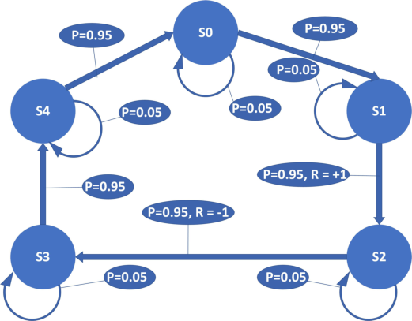
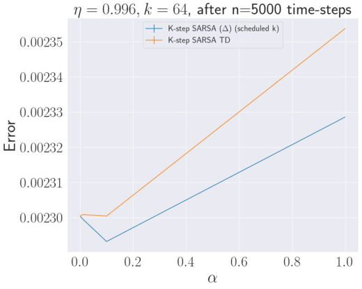
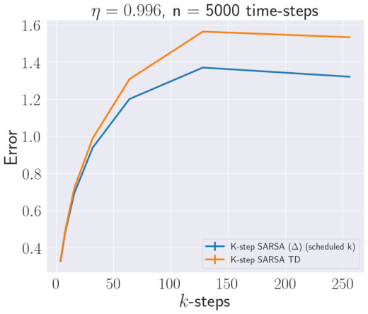
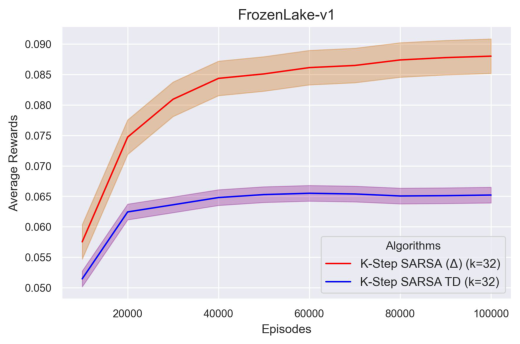
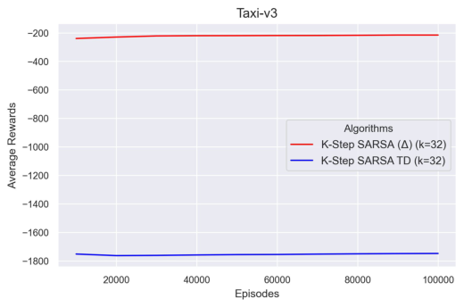
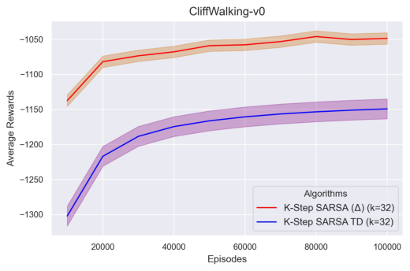
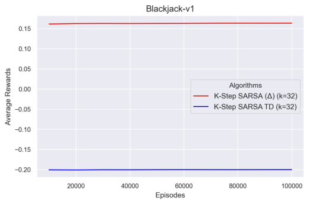
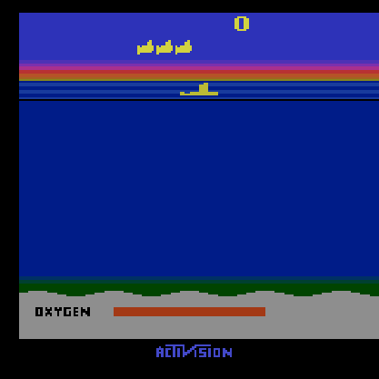
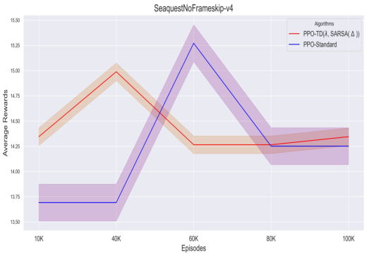
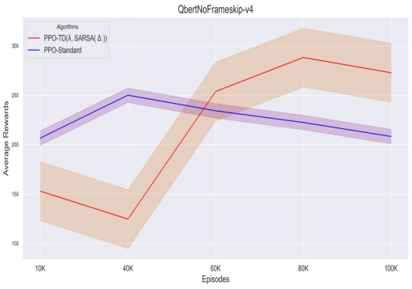

# **Segmenting Action-Value Functions Over** Time-Scales in SARSA via TD( ∆ )

**Mahammad Humayoo** [1,2,3,4,*]

1 Hanshan Normal University, Chaozhou, Guangdong, China 521041
2 CAS Key Laboratory of Network Data Science and Technology, Institute of Computing Technology, CAS, Beijing,
China 100190
3 University of Chinese Academy of Sciences, Beijing, China 101408
4 School of Computer Science, Beijing Institute of Technology, Beijing, China 100081

**ABSTRACT**

In numerous episodic reinforcement learning (RL) environments, SARSA-based methodologies are employed to enhance
policies aimed at maximizing returns over long horizons. Traditional SARSA algorithms face challenges in achieving an
optimal balance between bias and variation, primarily due to their dependence on a single, constant discount factor ( _η_ ). This
investigation enhances the temporal difference decomposition method, TD( ∆ ), by applying it to the SARSA algorithm, now
designated as SARSA( ∆ ). SARSA is a widely used on-policy RL method that enhances action-value functions via temporal
difference updates. By splitting the action-value function down into components that are linked to specific discount factors,
SARSA( ∆ ) makes learning easier across a range of time scales. This analysis makes learning more effective and ensures
consistency, particularly in situations where long-horizon improvement is needed. The results of this research show that the
suggested strategy works to lower bias in SARSA’s updates and speed up convergence in both deterministic and stochastic
settings, even in dense reward Atari environments. Experimental results from a variety of benchmark settings show that the
proposed SARSA(∆) outperforms existing TD learning techniques in both tabular and deep RL environments.

**1 Introduction**

Reinforcement learning (RL) agents encounter significant challenges in the optimization of long-horizon rewards. Traditional
methods employing singular discount variables encounter inherent challenges: small _η_ results in low-variance but myopic
policies, whereas large _η_ suffers from excessive variance. Fixed discounts remain constant despite variations in reward
densities [1][–][3] . Temporal difference (TD) learning methods, such as Q-learning and SARSA, have shown effectiveness in various
tasks by enabling agents to estimate action-value functions that predict expected future rewards. Traditionally, these strategies
use a discount factor of 0 _≤_ _η <_ 1, with values getting closer to _η_ = 0 to put more weight on short-term rewards than long-term
ones. This approach shortens the planning horizon and makes learning more stable and efficient [2] . Prokhorov and Wunsch [4] show
that discount factors _η <_ 1 often lead to better results in the early stages of learning. In certain scenarios, such as long-horizon
tasks [5][,] [6] where long-term planning is crucial—like navigation or decision-making tasks that involve delayed rewards—this
approach can introduce bias, complicating the agent’s ability to determine the most effective long-horizon policies.
For example, SARSA [2] (State-Action-Reward-State-Action) is an on-policy RL algorithm that updates the action-value
function Q(s,a) according to the state-action transitions the agent sees. The standard SARSA algorithm works well in
environments with shorter time horizons; however, it faces challenges when utilized for tasks with longer horizons. The main
reason for the observed phenomenon is the use of a single discount factor _η_, which requires a trade-off between bias and
variance. This often leads to instability and inefficiency during the learning process. A variety of recommendations exist for
addressing this issue [1][,] [4][,] [6][–][10] .
Through the use of weighted combinations of value functions, Fedus et al. [10] presented the concept of hyperbolic discounting.
However, their formulation is restricted to state-value functions and does not extend to action-value functions. Meta-gradient
RL [8] is a technique that enables agents to adapt their learning processes dynamically. Meta-gradient means finding or improving
targets and hyperparameters during training, which could make learning more efficient and adaptable. A gradient-based
meta-learning algorithm capable of online adaptation to the true value function while engaging with and learning from the
environment. However, akin to other methodologies, meta-gradient RL primarily emphasizes state-value functions, rather than
action-value formulations.
The work that is most relevant in this case is by Romoff et al. [1], which provides a theoretical basis for temporal difference
decomposition using the TD( ∆ ) framework. TD( ∆ ) segments the state-value function V(s) into components using different
discount factors, also known as TD( ∆ ). This lets the agent learn about short-term and long-term returns separately, which can

then be combined to improve performance. This decomposition framework demonstrates considerable potential in addressing
the bias-variance trade-off that is intrinsic to temporal difference learning. However, TD( ∆ ) is constrained to state-value
functions, which presents a limitation in the application of multi-timescale representations to action-value-based algorithms
such as SARSA and Q-learning.
This article proposes SARSA( ∆ ), an enhancement of the TD( ∆ ) approach integrated into the SARSA algorithm, based
on this principle. TD( ∆ ) emphasizes the actor-critic framework and conventional TD learning, whereas SARSA( ∆ ) divides
the state-action value function into multiple partial estimators corresponding to various discount factors, known as delta
estimators. These estimators give a rough estimate of the difference _D_ _m_ ( _s,_ _a_ ) = _Q_ _η_ _m_ ( _s,_ _a_ ) _−_ _Q_ _η_ _m−_ 1 ( _s,_ _a_ ) between action-value
functions. This makes learning faster in contexts where actions yield long-term effects. Like TD( ∆ ), SARSA( ∆ ) aims to
enhance a collection of delta estimators, with each estimator linked to a specific discount factor. Smaller discount factors lead to
quicker convergence via segmentation, whereas larger discount factors enhance this foundation, facilitating improved long-term
planning.
This paper provides a multi-stage SARSA( ∆ ) updating algorithm that separates action-value functions, which allows for
faster convergence and improved policy efficacy, especially in complex deterministic and stochastic environments like Atari
games. Moreover, our research shows that SARSA ( ∆ ) can seamlessly accommodate various multi-step RL methodologies,
such as n-step SARSA and eligibility traces. This study emphasizes the benefits of SARSA( ∆ ) in various tasks, including a
basic ring MDP used by Kearns & Singh [11] . It outperforms conventional SARSA in scenarios requiring a balance between
short-term action consequences and long-term reward maximization. SARSA ( ∆ ) may adjust discount factors for multiple time
scales, making it valuable where time scale is precious.
The reason for extending TD( ∆ ) to SARSA( ∆ ) is that temporal difference (TD( ∆ )) learning provides a way to break down
value functions across a range of time scales, which solves the problems that come up when learning on a single scale for
long-horizon scenarios. We want to break down the action-value function Q(s,a) into components that focus on different
discount factors by extending TD( ∆ ) to SARSA( ∆ ). This decomposition enables SARSA to leverage the advantages of learning
over multiple time scales, which stabilizes the learning process and reduces the bias-variance trade-off. This add-on gives you a
more detailed and scalable way to learn the action-value function in complex environments. Table 1 presents a comparison of
the key features of TD(∆)/SARSA(∆) and Standard TD/SARSA-Learning.

**Table 1.** Comparison of the essential properties of TD(∆) and SARSA(∆).

|Feature|TD(∆)1|SARSA(∆)-Learning (proposed by us)|Standard TD12|SARSA-Learning12|
|---|---|---|---|---|
|Value function decomposition|Yes (by_ η_)|No|No|No|
|Action-value function decomposition|No|Yes (by_ η_)|No|No|
|Handles multiple time-scales|Yes|Yes|No|No|
|Learning stability|Enhanced, particularly long-term|Enhanced, particularly long-term|Reduced for long-term rewards|Reduced for long-term rewards|
|Scalability|Improved|Improved|Restricted by variance/bias|Restricted by variance/bias|

Recent research on value decomposition [1] has demonstrated potential for state-value functions; however, it identifies
three significant shortcomings that this work aims to address: (i) Action-Value Formulation: No current method effectively
decomposes Q(s, a) while maintaining on-policy guarantees. This study extends TD( ∆ ) to SARSA( ∆ ) by decomposing the
action-value function Q(s,a) into delta components across multiple time scales. (ii) Theoretical Foundations: Current analyses
do not address the bias-variance trade-off concerning action values. (iii) The proposed SARSA( ∆ ) algorithm improves learning
efficiency and stability through the independent learning of components corresponding to different discount factors, which are
subsequently integrated to form the comprehensive action-value function. (iv) Both theoretical and empirical evaluations have
shown that this multi-scale breakdown has a number of benefits, particularly in environments where there are long-horizon
rewards, as demonstrated in Table 1.
The subsequent portions of the paper are organized as follows: Section 2 presents a discussion on relevant literature. Section
3 provides the essential background information. The principles of SARSA( ∆ ) and theoretical analysis are shown in Sections 4
and 5, respectively. Section 6 provides a detailed summary of the experiments performed. Ultimately, we present a conclusion
in section 7.

**2 Related Work**

Optimizing for long-horizon rewards in reinforcement learning (RL) is difficult owing to the complexities of learning with
undiscounted returns. Temporal discounting is often used to simplify this process; however, it can introduce bias.

**2.1 Temporal Decomposition Approaches**
In their investigation, Romoff et al. [1] explored the differentiation of value functions across multiple time scales by scrutinizing
individuals with diminished discount factors. The system became more efficient and simpler to expand. In RL, Sherstan et al. [13]

**2/24**

introduced _γ_ -nets, a method designed to enhance value function estimates across various timescales. Authors’ recent work [10][,] [14]

showed how to add hyperbolic discounting to RL. Exponential discounting was used in traditional RL, but this didn’t match the
hyperbolic discounting seen in the behavior of human and animals. The authors showed an agent that used temporal-difference
learning methods to get close to hyperbolic discount functions. The research also found that learning value functions across
multiple time horizons increases performance, particularly when used as an auxiliary task in value-based RL algorithms like
Rainbow. This approach has shown potential in risky and uncertain environments.
Recent research [4][,] [6][–][8][,] [15][–][17] focuses on the exact selection of the discount factor. Xu 124 et al. [8] proposed meta-gradient
methods for choosing discount factors in RL that change over time. They stressed the importance of balancing short- and
long-term rewards, which is similar to why we break down action-value functions across multiple discount factors in SARSA( ∆ ).
Lastly, hierarchical RL and the bias-variance trade-off are part of a large body of research that is related to our study in an
indirect way. These studies [18][–][24] introduced the idea of hierarchical RL breaking value functions down into smaller tasks,
similar to how TD( ∆ ) broke value functions down across different time scales. These results backed up the claim that breaking
down value functions can make learning more effective and stable.

**2.2 Multi-Scale RL**

To address issues in RL, especially when the optimum value function is complex and poorly represented by conventional DRL
methods, van Seijen et al. [24] introduced Hybrid Reward Architectures (HRA). The HRA was designed to enhance learning
consistency and effectiveness by partitioning the reward function and allocating distinct value functions to each component.
Efficient multi-horizon learning in off-policy RL aims to improve agents’ ability to make predictions and decisions over a
wide range of time scales. This is important for navigating through complex and unpredictable environments. Ali 141 et
al. [25][,] [26] investigated designs that enable agents to learn value estimates over several horizons at the same time. This improves
their capacity to adjust and flourish in novel environments. In the realm of artificial intelligence and robotics, coordinating
agents with limited communication and across diverse planning periods is a significant challenge to multi-horizon, multi-agent
planning.
Seiler et al. [27] introduced Decentralized Monte Carlo Tree Search (Dec-MCTS) and its variants, which have arisen
as formidable instruments for addressing these challenges, allowing agents to plan effectively and adaptively in dynamic,
unpredictable environments. Benechehab et al. [28] came up with a novel technique in model-based RL (MBRL) called multitimestep models, aimed at mitigating the problem of escalating prediction errors over extended simulated trajectories. By
optimizing for several future steps instead of only one-step-ahead forecasts, these models enhance the precision and resilience
of long-term predictions, especially in complex or chaotic environments.
Bonnet et al. [29] presented multi-step meta-gradient RL, which uses meta-gradients that have been built up across many
stages instead of just one. This makes learning algorithms more flexible. This method may provide richer and more useful
learning signals, but it does come with some significant trade-offs. But it also increases computational complexity and variation,
which may hinder performance if not handled carefully. While deep RL (DRL) can teach agents difficult tasks, it still struggles
to improve sampling efficiency and adapt to changing environments. Eligibility traces, a well-established RL approach, expedite
learning, but parameter dependencies make their integration with deep neural networks difficult. Kobayashi [30] introduced
several time-scale eligibility traces to equilibrate short-term and long-term credit assignment. This technique improves learning
speed and policy quality in online DRL environments by substituting the most important adaptively gathered traces.

**2.3 SARSA Variants and Traditional RL Methods**
Expected SARSA [9] is a kind of SARSA that speeds up learning by exploiting information from a stochastic behavior policy to
create updates that are less variance. Many RL algorithms, like SARSA, employ temporal-difference (TD) learning, which
looks at the differences between two predictions made one after the other instead of the final result. Sutton [31] came up with this
notion for the first time in 1988. The research shows that TD approaches may be useful for predicting jobs, especially where
incremental learning is crucial, and that they can even operate jointly in certain cases.
Theoretical convergence for function approximation-based TD learning algorithms was shown by Tsitsiklis and Van
Roy [32] . If you follow the SARSA update rule for delta component updates, this research may be used with SARSA( ∆ ) to
get the same convergence properties. None of the previously mentioned research discussed short-term estimations to train
long-term action-value functions. One benefit is that you may ask about shorter time periods and utilize our method as a generic
action-value function. Separating action-value functions across time scales using TD( ∆ ) in SARSA makes a big difference in
performance. Theoretical work by Kearns and Singh [11] helped us comprehend the bias-variance trade-off that comes up when
we break down Q-values over multiple time scales. It also set limits on the bias and variance of TD updates.
Most of the methods listed above focus on state values, although action-value decomposition has not yet been looked at.
Our proposed strategy focuses on breaking down _Q_ ( _s,_ _a_ ) over different time scales, which makes long-term learning more
stable.

**3/24**

**3 Background and notation**

Examine a completely observable Markov Decision Process (MDP) [33], characterized by the tuple ( _S,_ _A,_ _P,_ _r_ ), where _S_
denotes the state space, _A_ signifies the action space, and _P_ : _S ×_ _A →_ _S →_ [0 _,_ 1] represents the transition probabilities that
associate state-action pairings with distributions across subsequent states, whereas _r_ : _S ×_ _A →_ R denotes the reward function.
At each timestep _n_, the agent is state _s_ _n_, selects an action _a_ _n_, receives a reward _r_ _n_ = _r_ ( _s_ _n_ _,_ _a_ _n_ ), and transitions to the next state
_s_ _n_ +1 _∼_ _P_ ( _·|s_ _n_ _,_ _a_ _n_ ).
Within a standard MDP framework, an agent tries to get the highest possible discounted return, which is defined as
_Q_ _[π]_ _η_ [(] _[s][,]_ _[a]_ [) =][ E] [[][∑] _n_ [∞] =0 _[η]_ _[n]_ _[r]_ _[n]_ [+][1] _[ |][ s]_ _[n]_ [ =] _[ s][,]_ _[a]_ _[n]_ [ =] _[ a]_ []] [, where] _[ η]_ [ is the discount factor and] _[ π]_ [ :] _[ S][ →]_ _[A][ →]_ [[][0] _[,]_ [1][]] [ stands for the policy that the]
agent follows. The action-value function _Q_ _[π]_ _η_ [(] _[s][,]_ _[a]_ [)] [ is determined as the fixed point of the Bellman operator] _[ T][ Q]_ [ =] _[ r]_ _[π]_ [ +] _[η][P]_ _[π]_ _[Q]_ [,]
where _r_ _[π]_ denotes the expected immediate reward and _P_ _[π]_ represents the transition probability operator associated with the
policy _π_ . For convenience, we remove the superscript _π_ for the rest of the paper.
Using temporal difference (TD) [34] learning, the action-value estimate _Q_ [ˆ] _η_ can approximate the true action-value function _Q_ _η_ .
The one-step TD error _δ_ _n_ _[η]_ [=] _[ r]_ _n_ +1 [+] _[η]_ [ ˆ] _[Q]_ _η_ [(] _[s]_ _n_ +1 _[,]_ _[a]_ _n_ +1 [)] _[−][Q]_ [ˆ] _η_ [(] _[s]_ _n_ _[,]_ _[a]_ _n_ [)] [ is used to update the action-value function given a transition]
( _s_ _n_ _,_ _a_ _n_ _,_ _r_ _n_ _,_ _s_ _n_ +1 ).
An on-policy RL technique called SARSA learns the action-value function Q(s, a) for a given policy _π_ . The action-value
function represents the expected total reward derived from state s, executing action a, and adhering to policy _π_ . Then the
SARSA update rule is expressed as follows:

_Q_ ( _s_ _n_ _,_ _a_ _n_ ) _←_ _Q_ ( _s_ _n_ _,_ _a_ _n_ )+ _α_ [ _r_ _n_ + _ηQ_ ( _s_ _n_ +1 _,_ _a_ _n_ +1 ) _−_ _Q_ ( _s_ _n_ _,_ _a_ _n_ )] (1)

Here, _α_ is the learning rate, _η_ is the discount factor, and _r_ _n_ is the immediate reward. Long-horizon tasks present challenges for
SARSA since the choice of _η_ can compromise learning efficiency with appropriate long-term reward maximizing.
On the other hand, for a complete trajectory, we can employ the discounted sum of one-step TD errors, generally known as
the _λ_ -return [34] or, equivalently, the Generalized Advantage Estimator (GAE) [35] . The GAE improves advantage estimates by
balancing the trade-off between variance and bias through the parameters _λ_ and _η_ . The Generalized Advantage Estimator is
typically represented by the following equation:

∞
## A ( s n, a n ) = ∑ ( λη ) [k] δ t [η] + k (2)

_k_ =0

Where _δ_ _n_ + _k_ is the TD error at time n, computed as follows: _δ_ _n_ + _k_ = _r_ _n_ + _k_ + _ηQ_ ( _s_ _n_ + _k_ +1 _,_ _a_ _n_ + _k_ +1 ) _−_ _Q_ ( _s_ _n_ + _k_ _,_ _a_ _n_ + _k_ ).
Loss function for Q-Value estimation utilizing GAE. The loss function _L_ ( _θ_ ) for approximating the Q-value function is defined
as the mean squared error between the current Q-value estimate _Q_ ( _s_ _n_ _,_ _a_ _n_ ; _θ_ ) and the target Q-value adjusted by the advantage
estimator. Thus, it is possible to concisely write the loss function using _A_ ( _s_ _n_ _,_ _a_ _n_ ) and _Q_ ( _s_ _n_ _,_ _a_ _n_ ) as follows:

2
_L_ ( _θ_ ) = E _Q_ ( _s_ _n_ _,_ _a_ _n_ ; _θ_ ) _−_ _Q_ ( _s_ _n_ _,_ _a_ _n_ )+ _A_ ( _s_ _n_ _,_ _a_ _n_ ) (3)
�� � �� �

Despite SARSA being on-policy and lacking an explicit policy update, policy selection in SARSA can still be influenced by Eq.
4. For actor-critic architectures [36][–][38], the action-value function is updated according to Eq. 3, and a stochastic parameterized
policy (actor, _π_ _ν_ ( _a|s_ )) is learned from this value estimator through the advantage function, with the loss being.

_L_ ( _ν_ ) = E _−_ _logπ_ ( _a|s_ ; _ν_ ) _A_ ( _s,_ _a_ ) (4)
� �

Proximal Policy Optimization (PPO) [39] is an improvement on actor-critic methods. It limits policy updates to a specific area of
optimization called a trust region. It does this by using a clipping objective that compares the current parameters, _ν_, to the old

parameters, _ν_ _old_ :

_L_ ( _ν_ ) = E _min_ _ρ_ ( _ν_ ) _A_ ( _s,_ _a_ ) _,_ _ψ_ ( _ν_ ) _A_ ( _s,_ _a_ ) (5)
� � ��

In on-policy approaches such as SARSA, the probability ratio _ρ_ ( _ν_ ) between the current policy and a preceding policy is often
used. SARSA evaluates actions in accordance with the current policy, concurrently updating the action-value function as actions
are performed. However, when utilized within an actor-critic framework, the SARSA-learning agent may adopt a similar policy
ratio:

_Q_ ( _s,_ _a_ ; _ν_ )
_ρ_ ( _ν_ ) = (6)
_Q_ ( _s,_ _a_ ; _ν_ _old_ )

**4/24**

where _ψ_ ( _ν_ ) = _clip_ ( _ρ,_ 1 _−_ _ε,_ 1 + _ε_ ) represents the clipped likelihood ratio, and _ε <_ 1 is a negligible parameter employed to
constrain the update. The loss function for the policy update can be articulated as follows:

_L_ ( _ν_ ) = E _min_ _ρ_ ( _ν_ ) _A_ ( _s,_ _a_ ) _,_ _clip_ ( _ρ_ ( _ν_ ) _,_ 1 _−_ _ε,_ 1 + _ε_ ) _A_ ( _s,_ _a_ ) (7)
� � ��

**4 Methodology**

The TD( ∆ ) paradigm boosts regular TD learning by splitting action-value functions over several discount factors, _η_ 0 _,_ _η_ 1 _,..._ _η_ _m_ .
This breakdown makes it easier to find the action-value function as a sum of delta estimators, where each estimator shows how
action-value functions differ at different discount factors. The main advantage of this method is that it makes it easier to control
learning variance and bias by focusing on smaller, more controllable time scales.

**4.1 TD(** ∆ **) Framework**
To compute _D_ _m_ for SARSA as outlined in the study, it is essential to comprehend the mechanism by which delta estimators
( _D_ _m_ ) approximate the discrepancies between action-value functions across successive discount factors. This approach for
SARSA will be outlined in a stepwise manner.
**Delta Estimators (** _D_ _m_ **) and Action-Value Functions (** _Q_ ( _s,_ _a_ ) **)** : Delta estimators, denoted as _D_ _m_, quantify the variation between
action-value functions associated with consecutive discount factors:

_D_ _m_ = _Q_ _η_ _m_ _−Q_ _η_ _m−_ 1 (8)

In this context, _Q_ _η_ _m_ denotes the action-value function with discount factor _η_ _m_, but _Q_ _η_ _m−_ 1 signifies the action-value function
with the prior discount factor, _η_ _m−_ 1 .

**4.2 Single-Step TD ( SARSA(** ∆ **) )**
This section initiates with an overview of the delta estimators ( _D_ _m_ ) pertaining to the action-value functions _Q_ employed in
SARSA. SARSA is expanded to TD( ∆ ), which is called SARSA( ∆ ). SARSA( ∆ ) aims to determine the action-value function
_Q_ ( _s,_ _a_ ), representing the expected return of adhering to policy _π_ from state _s_, executing action _a_, and subsequently continuing to
follow _π_ . The goal is to optimize the total reward by improving the action-value function over various time scales. SARSA( ∆ )
fundamentally decomposes the action-value function _Q_ ( _s,_ _a_ ) into multiple delta components _D_ _m_ ( _s,_ _a_ ), each associated with a
distinct discount factor _η_ _m_ . The relationship between these delta components (i.e., delta function) is expressed in the following

manner:

_D_ _m_ ( _s,_ _a_ ) := _Q_ _η_ _m_ ( _s,_ _a_ ) _−Q_ _η_ _m−_ 1 ( _s,_ _a_ ) (9)

where _η_ 0 _,_ _η_ 1 _,...,_ _η_ _m_ represent the discount factors across various time-scales, and define _D_ 0 ( _s,_ _a_ ) := _Q_ _η_ 0 ( _s,_ _a_ ) . The action-value
function _Q_ _η_ _m_ ( _s,_ _a_ ) is defined as the cumulative sum of all D-components up to m:

_m_
## Q η m ( s, a ) = ∑ D x ( s, a ) (10)

_x_ =0

The policy dictates how the state-action pair in conventional SARSA determines the update rule. The TD error adjusts the
action-value function, and the policy determines the action in the following state:

_Q_ ( _s_ _n_ _,_ _a_ _n_ ) _←_ _Q_ ( _s_ _n_ _,_ _a_ _n_ )+ _α_ [ _r_ _n_ + _ηQ_ ( _s_ _n_ +1 _,_ _a_ _n_ +1 ) _−_ _Q_ ( _s_ _n_ _,_ _a_ _n_ )] (11)

In this context, _r_ _n_ signifies the reward acquired from performing action _a_ _n_ in state _s_ _n_, whereas ( _s_ _n_ +1 _,_ _a_ _n_ +1 ) denotes the ensuing
state-action pair. All of the delta components _D_ _n_ ( _s,_ _a_ ) are updated separately using the SARSA rule. The modifications to each
component use the same structure as the standard SARSA method, but they are changed to incorporate the delta function at
each time scale. The update in Eq. 11 for single-step TD SARSA ( ∆ ) can be expressed with numerous time-scales by utilizing
the principle of splitting the update into several discount factors [1] as demonstrated below:

_D_ _m_ ( _s_ _n_ _,_ _a_ _n_ ) = E �( _η_ _m_ _−_ _η_ _m−_ 1 ) _Q_ _η_ _m−_ 1 ( _s_ _n_ +1 _,_ _a_ _n_ +1 )+ _η_ _m_ _D_ _m_ ( _s_ _n_ +1 _,_ _a_ _n_ +1 )� (12)

In this context, _Q_ _η_ _m_ ( _s_ _n_ _,_ _a_ _n_ ) denotes the action-value function with a discount factor ( _η_ _m_ ). _D_ _m_ ( _s_ _n_ _,_ _a_ _n_ ) denotes the delta function
for SARSA ( ∆ ), while _η_ _m_ represents the discount factor for time-scale m, while _Q_ _η_ _m_ ( _s_ _n_ +1 _,_ _a_ _n_ +1 ) is the SARSA update for the
action-value associated with the subsequent state-action pair. The single-step TD SARSA ( ∆ ) mirrors the original TD update,

**5/24**

but it is applied to action-value functions Q rather than state-value functions V. The single-step Bellman Eq. for the Q-value
function in standard SARSA is as follows:

_Q_ _η_ _m_ ( _s_ _n_ _,_ _a_ _n_ ) = E [ _r_ _n_ + _η_ _n_ _Q_ _η_ _n_ ( _s_ _n_ +1 _,_ _a_ _n_ +1 )] (13)

This denotes the expected value of the reward acquired at time n, in addition to the discounted value of the action-value function
in the subsequent state-action pair ( _s_ _n_ +1 _,_ _a_ _n_ +1 ) . Currently, instead of utilizing a single discount factor _η_, we are using a series
of discount factors _η_ 0 _,_ _η_ 1 _,...,_ _η_ _m_ . The delta function _D_ _m_ ( _s_ _n_ _,_ _a_ _n_ ) is defined as the difference between action-value functions
associated with successive discount factors from Eq. 9:

_D_ _m_ ( _s_ _n_ _,_ _a_ _n_ ) = _Q_ _η_ _m_ ( _s_ _n_ _,_ _a_ _n_ ) _−_ _Q_ _η_ _m−_ 1 ( _s_ _n_ _,_ _a_ _n_ ) (14)

To expand the delta function _D_ _m_ utilizing its definition, we replace the Bellman Eq. for both _Q_ _η_ _m_ and _Q_ _η_ _m−_ 1, thereby expressing
_D_ _m_ in relation to these action-value functions. Commence by composing:

_D_ _m_ ( _s_ _n_ _,_ _a_ _n_ ) = _Q_ _η_ _m_ ( _s_ _n_ _,_ _a_ _n_ ) _−_ _Q_ _η_ _m−_ 1 ( _s_ _m_ _,_ _a_ _m_ ) From Eq. 14

_D_ _m_ ( _s_ _n_ _,_ _a_ _n_ ) = E [ _r_ _n_ + _η_ _m_ _Q_ _η_ _m_ ( _s_ _n_ +1 _,_ _a_ _n_ +1 )] _−_ E � _r_ _n_ + _η_ _m−_ 1 _Q_ _η_ _m−_ 1 ( _s_ _n_ +1 _,_ _a_ _n_ +1 )� From Eq. 13

Since the reward terms _r_ _n_ are included in both formulations, simplify by eliminating them.

_D_ _m_ ( _s_ _n_ _,_ _a_ _n_ ) = E � _η_ _m_ _Q_ _η_ _m_ ( _s_ _n_ +1 _,_ _a_ _n_ +1 ) _−_ _η_ _m−_ 1 _Q_ _η_ _m−_ 1 ( _s_ _n_ +1 _,_ _a_ _n_ +1 )�

Breaking down the terms facilitates a more thorough examination of the expression. Utilizing the recursive relationship from
Eq. 14

_Q_ _η_ _m_ ( _s_ _n_ +1 _,_ _a_ _n_ +1 ) = _D_ _m_ ( _s_ _n_ +1 _,_ _a_ _n_ +1 )+ _Q_ _η_ _m−_ 1 ( _s_ _n_ +1 _,_ _a_ _n_ +1 )

Substitute the definition of _D_ _m_ into the Eq. below.

_D_ _m_ ( _s_ _n_ _,_ _a_ _n_ ) = E � _η_ _m_ ( _D_ _m_ ( _s_ _n_ +1 _,_ _a_ _n_ +1 )+ _Q_ _η_ _m−_ 1 ( _s_ _n_ +1 _,_ _a_ _n_ +1 )) _−_ _η_ _n−_ 1 _Q_ _η_ _n−_ 1 ( _s_ _n_ +1 _,_ _a_ _n_ +1 )�

Make the terms simpler:

_D_ _m_ ( _s_ _n_ _,_ _a_ _n_ ) = E � _η_ _m_ _D_ _m_ ( _s_ _n_ +1 _,_ _a_ _n_ +1 )+( _η_ _m_ _−_ _η_ _m−_ 1 ) _Q_ _η_ _m−_ 1 ( _s_ _n_ +1 _,_ _a_ _n_ +1 )�

Integrate the terms to derive the final update Eq. for _D_ _m_ ( _s_ _n_ _,_ _a_ _n_ ).

_D_ _m_ ( _s_ _n_ _,_ _a_ _n_ ) = E �( _η_ _m_ _−_ _η_ _m−_ 1 ) _Q_ _η_ _m−_ 1 ( _s_ _n_ +1 _,_ _a_ _n_ +1 )+ _η_ _m_ _D_ _m_ ( _s_ _n_ +1 _,_ _a_ _n_ +1 )� (15)

Eq. 15 shows that the difference in discount factors _η_ _m_ _−_ _η_ _m−_ 1 is integrated into the update for _D_ _m_ with regard to the actionvalue function _Q_ _η_ _m−_ 1 ( _s_ _n_ +1 _,_ _a_ _n_ +1 ) and the bootstrapping from the next step _D_ _m_ ( _s_ _n_ +1 _,_ _a_ _n_ +1 ) . The Eq. 15 denotes a Bellman
Eq. 13 for _D_ _m_, combining a decay factor _η_ _m_ and the reward _Q_ _η_ _m−_ 1 ( _s_ _n_ +1 _,_ _a_ _n_ +1 ) . Consequently, it can be utilized to define the
expected TD update for _D_ _m_ . In this expression, _Q_ _η_ _m−_ 1 ( _s_ _n_ +1 _,_ _a_ _n_ +1 ) can be expressed as the summation of _D_ _m_ ( _s_ _n_ +1 _,_ _a_ _n_ +1 ) for
_m ≤_ _M −_ 1, indicating that the Bellman Eq. 13 for _D_ _m_ is contingent upon the values of all delta functions _D_ _m_ for _m ≤_ _M −_ 1.
This approach treats the delta value function at each time-scale as an autonomous RL issue, with rewards obtained from the
action-value function of the immediately preceding time-scale. Consequently, for a target discounted action-value function
_Q_ _η_ _m_ ( _s,_ _a_ ), all delta components can be trained concurrently through a TD update, employing the prior values of each estimator
for bootstrapping. This process necessitates the assumption of a sequence of discount factors, denoted as _η_ _m_, which includes
both the minimum and maximum values, _η_ 0 and _η_ _m_ [1] .

**4.3 Multi-Step TD ( SARSA(** ∆ **) )**
Numerous studies indicate that multi-step TD methods typically exhibit greater efficiency compared to single-step TD methods [12] .
In multi-step TD SARSA( ∆ ), rewards are aggregated over multiple steps instead of depending on a single future reward. This
approach takes into account the differences between consecutive discount factors, _η_ _m_ and _η_ _m−_ 1, while utilizing the value
function at state _s_ _n_ + _k_ _m_ for bootstrapping. In SARSA( ∆ ), the update Eqs. are adjusted to combine rewards over a sequence of
transitions before bootstrapping from either the Q-values or delta estimators. In multi-step SARSA( ∆ ), the agent accumulates
rewards over K steps, resulting in a necessary adjustment to the update rule for each _D_ _m_ .

_k_ _m_ _−_ 1
## D m ( s n, a n ) = E ∑ ( η m [x] [−] [η] m [x] − 1 [)] [r] [n] [+] [x] [ +(] [η] m [k] [m] [−] [η] m [k] [x] − 1 [)] [Q] [η] m− 1 [(] [s] [n] [+] [k] m [,] [a] [n] [+] [k] m [)] (16)
� _x_ =1

+ _η_ _m_ _[k]_ _[m]_ _[D]_ _[m]_ [(] _[s]_ _[n]_ [+] _[k]_ _m_ _[,]_ _[a]_ _[n]_ [+] _[k]_ _m_ [)]
�

**6/24**

In this case, _r_ _n_ + _x_ represents the reward obtained at time step _n_ + _x_ . The term _a_ _n_ + _k_ _m_ and the action are selected in a greedy
manner as _a_ = argmax _a_ _Q_ ( _s_ _n_ + _k_ _m_ _,_ _a_ ), with _k_ _m_ representing the number of steps associated with the discount factor _η_ _m_ . This
approach extends Q-learning to multi-step temporal difference learning by gathering rewards over multiple stages and employing
bootstrapping from both the present and previous time-scale action-value functions. In normal multi-step TD learning, the
TD error is computed by aggregating rewards over several stages rather than relying on a single future step, followed by
bootstrapping from the action-value at the last step. For instance, employing a single discount factor _η_, the multi-step TD
update Eq. can be articulated as:

_Q_ ( _s_ _n_ _,_ _a_ _n_ ) = E

_k−_ 1
## ∑ η [x] r n + x + η [k] Q ( s n + k, a n + k )
� _x_ =0 �

(17)

Herein, the initial segment of the Eq. aggregates the rewards across k steps, each diminished by _η_ . The second component
derives from the action-value function at time step n+k. We expand this methodology to include various discount factors
and delta decomposition, concentrating on representing the delta function _D_ _m_ ( _s_ _n_ _,_ _a_ _n_ ) as the difference between action-value
functions with discount factors _η_ _m_ and _η_ _m−_ 1 . According to the definition of _D_ _m_, we obtain:

_D_ _m_ ( _s_ _n_ _,_ _a_ _n_ ) = _Q_ _η_ _m_ ( _s_ _n_ _,_ _a_ _n_ ) _−_ _Q_ _η_ _m−_ 1 ( _s_ _n_ _,_ _a_ _n_ )

The multi-step variant of the Bellman Eq. is now implemented for both _Q_ _η_ _m_ ( _s_ _n_ _,_ _a_ _n_ ) and _Q_ _η_ _m−_ 1 ( _s_ _n_ _,_ _a_ _n_ ) . The multi-step Bellman
Eq. for _Q_ _η_ _m_ ( _s_ _n_ _,_ _a_ _n_ ) is expressed as follows:

_k_ _m_ _−_ 1
## Q η m ( s n, a n ) = E ∑ η m [x] [r] [n] [+] [x] [+] [η] m [k] [m] [Q] [η] m [(] [s] [n] [+] [k] m [,] [a] [n] [+] [k] m [)]
� _x_ =0 �

For _Q_ _η_ _m−_ 1 ( _s_ _n_ _,_ _a_ _n_ ), the multi-step Bellman Eq. is expressed as follows:

_k_ _m_ _−_ 1
## Q η m− 1 ( s n, a n ) = E ∑ η m [x] − 1 [r] [n] [+] [x] [ +] [η] m [k] [m] − 1 [Q] [η] m− 1 [(] [s] [n] [+] [k] m [,] [a] [n] [+] [k] m [)]
� _x_ =0 �

The formulas for the delta estimator are utilized to perform the subtraction of the two Eqs.

_k_ _m_ _−_ 1
## D m ( s n, a n ) = ∑ η m [x] [r] [n] [+] [x] [+] [η] m [k] [m] [Q] [η] m [(] [s] [n] [+] [k] m [,] [a] [n] [+] [k] m [)]
� _x_ =0 �

_k_ _m_ _−_ 1

_−_
## ∑ η m [x] − 1 [r] [n] [+] [x] [ +] [η] m [k] [m] − 1 [Q] [η] m− 1 [(] [s] [n] [+] [k] m [,] [a] [n] [+] [k] m [)]
� _x_ =0 �

The expressions are broadened and simplified. The immediate reward terms _r_ _n_ + _x_ are present in both Eqs. but are adjusted by
distinct discount factors, _η_ _m_ and _η_ _m−_ 1 . This enables us to express the disparity in rewards as:

_k_ _m_ _−_ 1 _k_ _m_ _−_ 1 _k_ _m_ _−_ 1
## ∑ η m [x] [r] [n] [+] [x] [−] ∑ η m [x] − 1 [r] [n] [+] [x] [ =] ∑ ( η m [x] [−] [η] m [x] − 1 [)] [r] [n] [+] [x]

_x_ =0 _x_ =0 _x_ =0

Subsequently, for the bootstrapping terms, the recursive relationship is utilized as outlined:

_Q_ _η_ _m_ ( _s_ _n_ + _k_ _m_ _,_ _a_ _n_ + _k_ _m_ ) = _D_ _m_ ( _s_ _n_ + _k_ _m_ _,_ _a_ _n_ + _k_ _m_ )+ _Q_ _η_ _m−_ 1 ( _s_ _n_ + _k_ _m_ _,_ _a_ _n_ + _k_ _m_ )

As a result, the following expression is obtained:

_η_ _m_ _[k]_ _[m]_ _[Q]_ _[η]_ _m_ [(] _[s]_ _[n]_ [+] _[k]_ _m_ _[,]_ _[a]_ _[n]_ [+] _[k]_ _m_ [)] _[−]_ _[η]_ _m_ _[k]_ _[m]_ _−_ 1 _[Q]_ _[η]_ _m−_ 1 [(] _[s]_ _[n]_ [+] _[k]_ _m_ _[,]_ _[a]_ _[n]_ [+] _[k]_ _m_ [) = (] _[η]_ _m_ _[k]_ _[m]_ _[−]_ _[η]_ _m_ _[k]_ _[m]_ _−_ 1 [)] _[Q]_ _[η]_ _m−_ 1 [(] _[s]_ _[n]_ [+] _[k]_ _m_ _[,]_ _[a]_ _[n]_ [+] _[k]_ _m_ [)]

+ _η_ _m_ _[k]_ _[m]_ _[D]_ _[m]_ [(] _[s]_ _[n]_ [+] _[k]_ _m_ _[,]_ _[a]_ _[n]_ [+] _[k]_ _m_ [)]

The definitions for both the rewards and bootstrapping are now integrated to yield the final expression:

_k_ _m_ _−_ 1
## D m ( s n, a n ) = E ∑ ( η m [x] [−] [η] m [x] − 1 [)] [r] [n] [+] [x] [ +(] [η] m [k] [m] [−] [η] m [k] [m] − 1 [)] [Q] [η] m− 1 [(] [s] [n] [+] [k] m [,] [a] [n] [+] [k] m [)]
� _x_ =0 (18)

+ _η_ _m_ _[k]_ _[m]_ _[D]_ _[m]_ [(] _[s]_ _[n]_ [+] _[k]_ _m_ _[,]_ _[a]_ _[n]_ [+] _[k]_ _m_ [)]
�

Eq. 18 extends the conventional multi-step TD update to include various multiple discount factors and action-value functions
in RL. As a result, each _D_ _m_ obtains a share of the rewards from the environment up to time-step _k_ _m_ _−_ 1 . Furthermore, each
_D_ _m_ utilizes its distinct action-value function in conjunction with the value from the prior time scale. A variation of this
algorithm, utilizing k-step bootstrapping as described in [12], is presented in Algorithm 1. Despite Algorithm 1 exhibiting
quadratic complexity in relation to M, it can be executed with linear complexity for substantial M by preserving _Q_ [ˆ] action-values
at each time-scale _η_ _m_ .

**7/24**

**Algorithm 1** Multi-Step TD ( SARSA(∆) )

**Inputs:** Pick out the discount factors ( _η_ 0 _,_ _η_ 1 _,...,_ _η_ _M_ ), bootstrapping steps ( _k_ 0 _,_ _k_ 1 _,...,_ _k_ _M_ ), and learning rates ( _α_ 0 _,_ _α_ 1 _,...,_ _α_ _M_ ).
Set the initial value of _D_ _m_ ( _s,_ _a_ ) = 0 for all states, actions, and scales m.
**for** episode = 0, 1, 2,... **do** _▷_ Loop for each episode
Initialize state _s_ 0 and choose an initial action _a_ 0 in accordance with a policy.
**for** n = 0, 1, 2,... **do** _▷_ Loop for each time step
Take action _a_ _n_, observe reward _r_ _n_ and next state _s_ _n_ +1 .
Select action _a_ _n_ +1 based on a policy.
**for** m = 0, 1, ..., M **do**

**if** m = 0 **then**

_G_ [0] = ∑ _x_ _[k]_ [0] = _[−]_ 0 [1] _[η]_ 0 _[x]_ _[r]_ _[n]_ [+] _[x]_ [ +] _[η]_ 0 _[k]_ [0] _[D]_ [0] [(] _[s]_ _[n]_ [+] _[k]_ 0 _[,]_ _[a]_ _[n]_ [+] _[k]_ 0 [)]
**else** _▷_ Utilizing Eq. 10, we substitute _Q_ _η_ _m−_ 1 ( _s_ _n_ + _k_ _m_ _,_ _a_ _n_ + _k_ _m_ ) by summing the D-components up to _D_ _m−_ 1 in Eq. 18.

_G_ _[m]_ = ∑ _[k]_ _x_ _[m]_ = _[−]_ 0 [1] [(] _[η]_ _m_ _[x]_ _[−]_ _[η]_ _m_ _[x]_ _−_ 1 [)] _[r]_ _[n]_ [+] _[x]_ [ +(] _[η]_ _m_ _[k]_ _[m]_ _[−]_ _[η]_ _m_ _[k]_ _[m]_ _−_ 1 [)] [∑] _[m]_ _m_ = _[−]_ [1] 0 _[D]_ _[m][−]_ [1] [(] _[s]_ _[n]_ [+] _[k]_ _m_ _[,]_ _[a]_ _[n]_ [+] _[k]_ _m_ [)+] _[η]_ _m_ _[k]_ _[m]_ _[D]_ _[m]_ [(] _[s]_ _[n]_ [+] _[k]_ _m_ _[,]_ _[a]_ _[n]_ [+] _[k]_ _m_ [)]
**end if**

**end for**

**for** m = 0, 1, 2,..., M **do**

_D_ _m_ ( _s_ _n_ _,_ _a_ _n_ ) _←_ _D_ _m_ ( _s_ _n_ _,_ _a_ _n_ )+ _α_ _m_ ( _G_ _[m]_ _−_ _D_ _m_ ( _s_ _n_ _,_ _a_ _n_ ))
**end for**

**end for**

**end for**

**4.4 SARSA TD(** _λ_ _,_ ∆ **)**
Eq. 19 presents the _λ_ -return [2][,] [34], which integrates rewards across several steps to establish a target for TD( _λ_ ) updates. The
_λ_ -return _G_ _[η]_ _n_ _[,][λ]_ is formally defined as follows:

∞
## G [η] n [,][λ] ( s n, a n ) = Q [ˆ] η ( s n, a n )+ ∑ ( λη ) [k] δ n [η] + k (19)

_k_ =0

Eq. 20 defines the TD( _λ_ ) operator, which is used to iteratively apply _λ_ -returns in updating the value functions. For SARSA,
the TD( _λ_ ) operator updates the action-value function by summing the _λ_ -discounted TD errors as follows:

T _λ_ _Q_ ( _s_ _n_ _,_ _a_ _n_ ) = _Q_ ( _s_ _n_ _,_ _a_ _n_ )+( _I −_ _ληP_ ) _[−]_ [1] (T _Q_ ( _s_ _n_ _,_ _a_ _n_ ) _−_ _Q_ ( _s_ _n_ _,_ _a_ _n_ )) (20)

P represents the transition matrix for state-action pairs according to the policy _π_, while Q denotes the action-value function.
Similarly, Eq. 21 defines the _λ_ -return specific to delta estimators in TD( _λ_ _,_ ∆ ), denoted as _G_ _[m]_ _n_ _[,][λ]_ _[m]_ for each delta estimator _D_ _m_ :

∞
## G n [m][,][λ] [m] := D [ˆ] m ( s n, a n )+ ∑ ( λ m η m ) [k] δ n [m] + k (21)

_k_ =0

where _δ_ _n_ [0] [:][=] _[ δ]_ _n_ _[ η]_ [0] and _δ_ _n_ _[m]_ [:][= (] _[η]_ _[m]_ _[−]_ _[η]_ _[m][−]_ [1] [)] _[Q]_ [ ˆ] _[η]_ _m−_ 1 [(] _[s]_ _[n]_ [+][1] _[,]_ _[a]_ _[n]_ [+][1] [)+] _[η]_ _[m]_ _[D]_ [ˆ] _[m]_ [(] _[s]_ _[n]_ [+][1] _[,]_ _[a]_ _[n]_ [+][1] [)]
_−_ _D_ [ˆ] _m_ ( _s_ _n_ +1 _,_ _a_ _n_ +1 ) are the TD-errors.

**4.5 SARSA TD(** _λ_ _,_ ∆ **) with Generalized Advantage Estimation (GAE)**
Generalized Advantage Estimation (GAE) [39] seeks to compute the advantage function by aggregating multi-step TD errors.
To apply this approach to delta estimators _D_ _m_ ( _s_ _n_ _,_ _a_ _n_ ), advantage estimates _A_ [∆] ( _s_ _n_ _,_ _a_ _n_ ) are computed for each time scale. Each
advantage estimate _A_ [∆] ( _s_ _n_ _,_ _a_ _n_ ) employs a multi-step TD error pertinent to the delta estimator _D_ _n_, expressed as follows:

_T_ _−_ 1
## A [∆] ( s n, a n ) = ∑ ( λ m η m ) [k] δ n [∆] + k (22)

_k_ =0

where _δ_ _n_ [∆] + _k_ [:][=] _[ r]_ _[n]_ [ +] _[η]_ _[m]_ [ ∑] _m_ _[M]_ =0 _[D]_ [ˆ] _[m]_ [(] _[s]_ _[n]_ [+][1] _[,]_ _[a]_ _[n]_ [+][1] [)] _[−]_ [∑] _[M]_ _m_ =0 _[D]_ [ˆ] _[m]_ [(] _[s]_ _[n]_ _[,]_ _[a]_ _[n]_ [)][.]
The discount factor _η_ _m_ is utilized, and the sum of all D estimators as a surrogate for _Q_ _ηm_ . This objective is applicable to PPO
by implementing the policy update from Eq. 7 and replacing A with _A_ [∆] . Additionally, to train each _D_ _m_, a truncated form of
their corresponding _λ_ -return are used, as outlined in Eq. 21. For more information, see Algorithm 2.

**8/24**

**Algorithm 2** PPO-TD( _λ_, SARSA(∆))

**Inputs:** Pick out the discount factors ( _η_ 0 _,_ _η_ 1 _,...,_ _η_ _M_ ), bootstrapping steps ( _k_ 0 _,_ _k_ 1 _,...,_ _k_ _M_ ), and learning rates ( _α_ 0 _,_ _α_ 1 _,...,_ _α_ _M_ ).
Set the initial value of _D_ _m_ ( _s,_ _a_ ) = 0 for all states s, actions a, and scales m.
Initialize policy _ν_, and values _θ_ _[m]_ _∀m_
**for** episode = 0, 1, 2,... **do** _▷_ Loop for each episode
Initialize state _s_ 0 and choose an initial action _a_ 0 in accordance with a policy.
**for** n = 0, 1, 2,... **do** _▷_ Loop for each time step
Take action _a_ _n_, observe reward _r_ _n_ and next state _s_ _n_ +1 .
Select next action _a_ _n_ +1 based on a policy.
**for** m = 0, 1, ..., M **do**

**if** _n ≥_ _T_ **then**

_G_ _[m][,][λ]_ _[m]_ _←_ _D_ [ˆ] _m_ ( _s_ _n−T_ _,_ _a_ _n−T_ )+ ∑ _[T]_ _k_ = _[−]_ 0 [1] [(] _[λ]_ _[m]_ _[η]_ _[m]_ [)] _[k]_ _[δ]_ _n_ _[ m]_ _−T_ + _k_ _[∀][m]_ _▷_ Computing multi-step return _G_ _[m][,][λ]_ _[m]_ and TD-error
_δ_ _n_ _[m]_ _−T_ + _k_ [using Eq.][ 21][.]

**end if**

**end for**

**for** m = 0, 1, 2,..., M **do**

ˆ ˆ
_D_ _m_ ( _s_ _n−T_ _,_ _a_ _n−T_ ) _←_ _D_ _m_ ( _s_ _n−T_ _,_ _a_ _n−T_ )+ _α_ _m_ � _G_ _[m][,][λ]_ _[m]_ _−_ _D_ [ˆ] _m_ ( _s_ _n−T_ _,_ _a_ _n−T_ )�

_A_ [∆] = ∑ _[T]_ _k_ = _[−]_ 0 [1] [(] _[λ]_ _[m]_ _[η]_ _[m]_ [)] _[k]_ _[δ]_ [ ∆] _n−T_ + _k_ _▷_ Where _A_ [∆] and _δ_ _n_ [∆] _−T_ + _k_ [are computed using Eq.][ 22][.]
_θ_ _[m]_ _←_ _θ_ _[m]_ + _α_ _m_ � _G_ _[m][,][λ]_ _[m]_ _−_ _D_ [ˆ] _m_ ( _s_ _n−T_ _,_ _a_ _n−T_ )� ∇ _D_ [ˆ] _m_ ( _s_ _n−T_ _,_ _a_ _n−T_ ) _▷_ Update _θ_ _[m]_ with TD (Eq. 3) using _G_ _[m][,][λ]_ _[m]_ _∀m_ .

_L_ ( _ν_ ) = E _min_ _ρ_ ( _ν_ ) _A_ [∆] ( _s,_ _a_ ) _,_ _clip_ ( _ρ_ ( _ν_ ) _,_ 1 _−_ _ε,_ 1 + _ε_ ) _A_ [∆] ( _s,_ _a_ ) _▷_ from Eq. 7
� � ��

_ν ←_ _ν_ + _α_ _ν_ ∇ _ν_ _L_ ( _ν_ ) _▷_ Update the policy parameters _ν_ with PPO (Eq. 7) for SARSA using _A_ [∆]

**end for**

**end for**

**end for**

**5 Analysis**

Subsequently, the delta estimators are analyzed in relation to the bias-variance trade-off. In SARSA, bias arises from reliance
on current estimates, influencing updates over short time scales, especially with smaller discount factors, like lower values of _η_
in _D_ _m_ . Utilizing smaller discount factors in updates leads to a decrease in variance because they depend on current estimates.
However, this approach also results in heightened bias, as it does not incorporate significant information about future rewards.
Conversely, variance increases for updates linked to longer time scales, as future reward information introduces additional
variability. In TD( ∆ ), action-value components _D_ _m_ with higher _η_ _m_ are associated with greater long-term rewards; however, this
results in increased variance stemming from the stochastic characteristics of reward sequences. We begin by demonstrating that
our estimator is equivalent to the standard estimator _Q_ [ˆ] _η_ under specific conditions, as outlined in Theorem 1. This comparison
elucidates the essential metrics of our estimator that may indicate potential advantages over the standard _Q_ [ˆ] _η_ estimator. Building
on this result and previous research by Kearns and Singh [11], the analyses are adapted for SARSA to investigate the effects of
bias and variance, along with the TD( ∆ ) decomposition framework, in relation to action-value functions. Our objective is to
extend the bias-variance error bound framework to action-value settings using TD( ∆ )(i.e., Theorem 4), thereby offering a better
understanding of how these quantities can be balanced to obtain optimal results [1] .

**5.1 SARSA Equivalency Configurations and Enhancements**

In certain scenarios, we can demonstrate that our delta estimators for SARSA correspond with the traditional action-value
estimator when reformulated into an action-value function. This discourse focuses on the approximation of the linear function
of the specified form:ˆ ˆ
_Q_ ( _s,_ _a_ ) _η_ := _⟨θ_ _[η]_ _,_ _φ_ ( _s,_ _a_ ) _⟩_ and _D_ _m_ ( _s,_ _a_ ) := _⟨θ_ _[m]_ _,_ _φ_ ( _s,_ _a_ ) _⟩,_ _∀m_
where _θ_ and _θ_ _[m]_ represent weight vectors in R _[d]_ and the function _φ_ : _S_ _×_ _A →_ R _[d]_ represents a mapping from a state-action pair
to a specified d-dimensional feature space. The weight vector _θ_ for SARSA is updated according to the TD( _λ_ ) learning rule in
the following manner:

_θ_ _n_ _[η]_ +1 [=] _[ θ]_ _[ η]_ _n_ [+] _[α]_ _G_ _[η]_ _n_ _[,][λ]_ _−_ _Q_ [ˆ] _η_ ( _s,_ _a_ ) _φ_ ( _s_ _n_ _,_ _a_ _n_ ) _,_ (23)
� �

**9/24**

Here, _G_ _[η]_ _n_ _[,][λ]_ denotes the TD( _λ_ ) return as stated in Eq. 19. Likewise, the delta estimator approach TD( _λ_ _m_ _,_ ∆ ) is used to update
each _D_ [ˆ] _m_ :

_θ_ _n_ _[m]_ +1 [=] _[ θ]_ _[ m]_ _n_ [+] _[α]_ _G_ _[M]_ _n_ _[,][λ]_ _[m]_ _−_ _D_ [ˆ] _m_ ( _s_ _n_ _,_ _a_ _n_ ) _φ_ ( _s_ _n_ _,_ _a_ _n_ ) _,_ (24)
� �

where _G_ _n_ _[M][,][λ]_ _[m]_ is specified identically to the TD( ∆ ) return defined in Eq. 21, modified for the particular action-value function. In
these equations, _α_ and _{α_ _m_ _}_ _m_ represent positive learning rates. Two SARSA version algorithms are shown to be equivalent
in this context by the following theorem. The subsequent theorems resemble those presented by Romoff et al. [1] ; however, a
proof is presented for the action-value function in relation to SARSA, whereas Romoff et al. established the proof for the value
function.

**Theorem 1.** _Inspired by Romoff et al._ _[1]_ _, if_ _α_ _m_ = _α_ _,_ _λ_ _m_ _η_ _m_ = _λ_ _η_ _,_ _∀m_ _, and if we choose the initial conditions in such a way that_
∑ _[M]_ _m_ =0 _[θ]_ _[ η]_ 0 [=] _[ θ]_ _[ η]_ 0 _[, then the iterates produced by TD(]_ _[λ]_ _[) (Eq.][ 23][) and TD(]_ _[λ]_ _[,]_ [∆] _[) (Eq.][ 24][) with linear function approximation satisfy]_
_the following conditions:_

Σ _[M]_ _m_ =0 _[θ]_ _n_ _[ m]_ [=] _[ θ]_ _[ η]_ _n_ (25)

The proof is presented in appendix A.
Equivalence is attained when _λ_ _m_ _η_ _m_ = _λ_ _η_ _,_ _∀m_ . When _λ_ approaches 1 and _η_ _m_ is less than _η_, this condition suggests that
_λ_ _m_ = _λ_ _η_ _/η_ _m_ could potentially surpass one, resulting in a risk of divergence in TD( _λ_ _m_ ). The subsequent theorem demonstrates
that the TD( _λ_ ) operator, as defined in Eq. 20, qualifies as a contraction mapping for the range 1 _≤_ _λ <_ [1] 2 [+] _η_ _[η]_ [, thereby confirming]

that _λ_ _η_ _<_ 1 [1] .

**Theorem 2.** _Inspired by Romoff et al._ _[1]_ _,_ _∀λ ∈_ �0 _,_ [1] 2 [+] _η_ _[η]_ � _, the operator_ _T_ _λ_ _is defined by the Eq._ _T_ _λ_ _Q_ = _Q_ +( _I −_ _ληP_ ) _[−]_ [1] ( _TQ_ _−_ _Q_ )

_,_ _∀Q ∈_ R _[|][S][|×|][A][|]_ _, is well-defined. Furthermore,_ _T_ _λ_ _Q_ _constitutes a contraction in relation to the max norm, with its contraction_
_η_
_coefficient expressed as_ _|_ 1 _−λη|_ _[.]_

The proof is presented in appendix A.
The analysis presented in Theorem 1 can be adapted to a new context in which _k_ _m_ -step TD ( ∆ ) is employed for each _D_ _m_
component, rather than TD( _λ_, ∆ ), a variant of TD learning. Theorem 1 demonstrates that with linear function approximation,
standard multi-step TD and multi-step TD( ∆ ) can be equivalent when the number of steps ( _k_ _m_ ) is consistent across all time
scales (i.e., _k_ _m_ = _k,_ _∀m_ ).
Although these methods could theoretically be equivalent, such equivalence is not common. To maintain the preservation
of equivalence, it is crucial for the learning rate to remain consistent across all time scales. This underscores a significant
limitation, as shorter time scales, which involve fewer future steps, can be acquired more rapidly than longer time scales that
require the assessment of additional steps beforehand. Furthermore, in practical applications, particularly involving nonlinear
function approximation such as deep neural networks, adaptive optimizers are frequently employed [39][,] [40] . The optimizers modify
the learning rate accordance with the complexity of the learning task, which depends on the attributes of the delta estimator and
its target. There is no universally applicable learning rate in this setting since the effective learning rate changes with time scale.
In addition to the learning rate, breaking the action-value function into separate components (especially the _D_ _m_ components)
has advantages that standard TD learning, such as non-delta estimators, does not have. The ability to utilize various kstep returns (or _λ_ -return) across multiple time scales enhances control and adaptability in the learning process. If _k_ _m_ _<_
_k_ _m_ +1 _,_ _∀m_ ( _or_ _η_ _m_ _λ_ _m_ _< η_ _m_ +1 _λ_ _m_ +1 _,_ _∀m_ ), this approach has the potential to reduce variance while simultaneously introducing
bias, since shorter time scales, which can be learned more quickly, may not correspond perfectly with longer time scales
regarding the values they estimate.

**5.2 Evaluation for Minimizing** _k_ _m_ **Values in SARSA via Phased Updates**
To show how our approach differs from the single estimator case, let’s follow the tabular phased version of k-step TD presented
by Kearns and Singh [11] . In SARSA, the goal is to evaluate the value associated with a state-action pair (s, a) starting from

each state _s ∈_ _S_ and with action _a ∈_ _A_, then n trajectories are generated _S_ 0 [(] _[x]_ [)] = _s,_ _a_ 0 _,_ _η_ 0 _,...,_ _S_ _k_ [(] _[x]_ [)] _[,]_ _[a]_ _k_ [(] _[x]_ [)] _[,]_ _[η]_ _k_ [(] _[x]_ [)] _[,]_ _[S]_ _k_ [(] _[x]_ + [)] 1 _[,...]_
� � 1 _≤x≤n_

by following the policy _π_ and averaging over trajectories. Let _Q_ _η,n_ ( _s,_ _a_ ) denote the Q-value estimate at phase n for the discount
factor _η_ . For each iteration n, also called phase n, obtain the phase-based estimate _Q_ _η,n_ ( _s,_ _a_ ) for (s, a); we average over the
trajectories, resulting in:

_k−_ 1
## ∑ γ [i] r i [(] [x] [)] + η [k] [ ˆ] Q η,n− 1 ( s k [(] [x] [)] [,] [a] k [(] [x] [)] [)] (26)
� _i_ =0 �

**10/24**

ˆ
_Q_ _η,n_ ( _s,_ _a_ ) = [1]

_n_

_n_
## ∑

_x_ =1

Theorem 3 draws upon the findings of Kearns and Singh [11], who demonstrated the result concerning the state-value function.
In contrast, the subsequent theorem introduces an upper limit on the error associated with action-value function estimation,

ˆ
_Q_ _η,n_ ( _s,_ _a_ ) _−_ _Q_ _η_ ( _s,_ _a_ )
����� ����

expressed as ∆ _Qn_ ˆ _η_ = _max_ _s,a_

�

**Theorem 3.** _Inspired by Kearns and Singh_ _[11]_ _, for any_ 0 _< δ <_ 1 _, let ε_ = �

2 _log_ ( _n_ 2 _k/δ_ ) _. with probability_ 1 _−_ _δ_ _,_

∆ _Qn_ ˆ _η_ _≤_ _ε_ 1 _−_ _η_ _k_
� 1 _−_ _η_

�

+ _η_ _[k]_ ∆ _Qn_ ˆ _−_ _η_ 1
~~��~~ � ~~�~~
_bias term_

(27)

~~�~~ ~~�~~ � ~~�~~
_variance term_

The proof is presented in appendix A.

bounds the deviation of the empirical average of rewards from the true expected reward. The second term ( In Eq. 27, a variance term ( [1] 1 _[−]_ _−_ _[η]_ _η_ _[k]_ [) is arising due to sampling error from rewards collected along trajectories. In particular,] _η_ _[k]_ ∆ _Qn_ ˆ _−_ _η_ 1 [) in Eq.][ 27][ is] _[ ε]_
a bias term that arises from bootstrapping off the previous phase’s estimates.
Similarly, a phased SARSA variant of the multi-step _TD_ (∆) method is considered. For each phase n, each D component is
updated as follows:

_n_ _k−_ 1
## ∑ ∑ ( η m [i] [−] [η] m [i] − 1 [)] [r] i [(] [x] [)] +( η m [k] [m] [−] [η] m [k] [m] − 1 [)] [Q] [η] m− 1 [(] [s] [(] n [x] + [)] k [,] [a] n [(] [x] + [)] k [)+] [η] m [k] [m] [D] [ˆ] [m] [(] [s] n [(] [x] + [)] k [,] [a] n [(] [x] + [)] k [)] (28)
_x_ =1 � _i_ =1 �

_D_ ˆ _m,n_ ( _s,_ _a_ ) = [1] _n_

_D_ ˆ _m,n_ ( _s,_ _a_ ) = [1]

The maximum threshold for the phased error has now been established. The cumulative errors of each D component, denoted

as _TD_ (∆), is expressed as ∑ _[M]_ _m_ =0 [∆] _n_ _[m]_ [, where] [ ∆] _[m]_ _n_ [=][ max] _[s][,][a]_

ˆ
_D_ _m_ ( _s,_ _a_ ) _−_ _D_ _m_ ( _s,_ _a_ ) . Essential differences between SARSA and
����� �����

Q-learning regarding the error bound: In SARSA, the error is defined by the actions taken by the agent, indicating that the
Q-values are modified based on the state-action pairings encountered by the agent during exploration. The inaccuracy in
Q-learning emerges from the greedy action, which is defined as the action that maximizes the Q-value for the future state,
assuming that the agent consistently operates in an optimal manner.

**Theorem 4.** _Inspired by Romoff et al._ _[1]_ _, assume that_ _η_ 0 _≤_ _η_ 1 _≤_ _η_ 2 _≤_ _..... ≤_ _η_ _m_ = _η_ _and_ _K_ 0 _≤_ _K_ 1 _≤_ _... ≤_ _K_ _m_ = _K_ _, for any_

0 _< δ <_ 1 _, let ε_ =
�

2 _log_ ( _n_ 2 _k/δ_ ) _, with probability_ 1 _−_ _δ_ _,_

2 _log_ (2 _k/δ_ )

_M−_ 1
## + ∑

_m_ =0

_−_ _m_
## ∑ η m [k] [m] [−] [η] m [k] [m] [+][1] ∑ ∆ [q] n− 1
_m_ =0 � � _q_ =0

~~�~~ ~~�~~ � �
_bias introduction_

_η_ _m_ _[k]_ _[m]_ _[−]_ _[η]_ _m_ _[k]_ _[m]_ [+][1]
�

_η_ _m_ _[k]_ _[m]_ [+][1] _−_ _η_ _m_ _[k]_ _[m]_
1 _−_ _η_ _m_ �

_M_ 1 _−_ _η_ _k_
## m ∑ =0 ∆ [m] n [≤] [ε] � 1 − η

_M−_ 1
## + ε ∑
� � _m_ =0

_M_
## + η [k] ∑ ∆ [m] n− 1 (29)

_m_ =0

~~�~~ � ~~�~~ ~~�~~
_variance reduction_

The proof is presented in appendix A.
The authors examine the comparison of the limits for phased TD( _λ_ ) in theorem 3 with those for phased TD( ∆ ) in theorem 4. This

comparison demonstrates that phased TD( ∆ ) facilitates variance reduction equivalent to _ε_ ∑ _[M]_ _m_ = _[−]_ 0 [1] _η_ _mkm_ 1 + _−_ 1 _η−_ _m_ _η_ _m_ _[km]_ _≤_ 0 but introduces a

∑ _[m]_ _q_ =0 [∆] _[q]_ _n−_ 1 _[≥]_ [0] [. Utilizing phased TD(] [∆] [) to decrease] _[ k]_ _[m]_ [ synchronizes updates]
�

potential bias quantified as ∑ _[M]_ _m_ = _[−]_ 0 [1]

_η_ _m_ _[k]_ _[m]_ _[−]_ _[η]_ _m_ _[k]_ _[m]_ [+][1]
�

more effectively with recent actions, hence lowering variance from high-discounted return components. Shortened _k_ _m_ values
accrue bias more swiftly, as SARSA bootstraps from current policy estimations that may vary over phases. It is observed that
when all _k_ _m_ values are identical, both algorithms yield the same upper bound.
In SARSA, the return estimate includes subsequent states and actions determined by the policy. The anticipated discounted
return over T steps closely approximates the infinite-horizon discounted expected return after T, where T _≈_ 1 _−_ 1 _η_ 41 . Consequently,

_k_ _m_ can be effectively simplified for any _η_ _m_ such that _k_ _m_ _≈_ 1 _−_ 1 _η_ _m_ [, thereby adhering to this principle. Therefore, with] [ T] [ samples,]
similar to TD( ∆ ) [1], SARSA employing TD( ∆ ) utilizes _k_ _m_ _≈_ 1 _−_ 1 _η_ _m_ [to establish a suitable balance between bias and variance over]

1
_m_ ~~1~~ ~~_−η_~~ _m_ _≤_ [1]

all time scales significantly less than T . By establishing _k_ _m_ for each _η_ _m_, where _η_

all time scales significantly less than T . By establishing _k_ _m_ for each _η_ _m_, where _η_ _m_ ~~_−_~~ _m_ _≤_ _e_ [, the approach guarantees that the]

effective horizon and variance are maintained within limits without requiring extensive parameter optimization. Each increase
in _D_ _m_ facilitates the doubling of the effective horizon, hence ensuring logarithmic scaling with the quantity of action-value
functions. SARSA can utilize this to modify additional parameters in alignment with the specified time scales, enhancing the
algorithm’s efficiency in calculating long-term rewards without added complexity.

**11/24**

**6 Experiments and Results**

Experiments were conducted in three distinct environments to evaluate the effectiveness of the proposed method: the Tabular
Ring MDP environment detailed in Section 6.1, the deterministic and stochastic OpenAI Gym environments examined in
Section 6.2, and the Atari environments from OpenAI Gym described in Section 6.3. This section initiates with a detailed
overview of the experimental setup.
**Experimental Setup:** Experiments were conducted using OpenAI Gym control tasks [42], and Figs.1, 3, and 6 show the relevant
environments. The experiments were carried out on a single PC with 16 GB of memory, an Intel Core i7-2600 processor, and
a GPU. The machine ran on 64-bit Ubuntu 22.04.5 LTS. Python 3.9 was used during development, along with the PyTorch
package. In each experiment, ten randomly selected seeds were utilized, and the average results are provided. The remaining
hyperparameter settings are displayed in the table 4 of appendix B.

**6.1 Tabular**

Q-value iteration is utilized to determine the optimal Q-value function. An open-source implementation of Value Iteration
(VI), based on the code by Peter Henderson [43], is employed in accordance with the algorithmic principles outlined in Bellman [33]

and Sutton et al. [12] . The methodology calculates the optimal value function; however, this approach is adjusted to ascertain
the optimal Q-value function. Upon acquiring the optimal Q-values, Temporal Difference (TD) and SARSA( ∆ ) methods are
applied to derive approximation Q-values via sampling. After 5000 steps, each learning iteration comes to an end. For every
setup, 200 trials are executed using different random seeds that influence the dynamics of the transition. The algorithms are
implemented using the codebase provided by Kostrikov [44] .
The proposed method is contrasted with k-step SARSA, as described in Sutton et al. [12, Chapter 7.2]. SARSA ( ∆ ) is
evaluated against different RL benchmarks, including the Ring MDP [11] and both deterministic and stochastic environments, to
determine its efficacy. Fig. 1 illustrates the Ring MDP, which consists of a Markov process featuring five states arranged in a
circular form. The probability of transitioning one state clockwise around the ring is 0.95, while the likelihood of remaining in
the current state at each step is 0.05. In contrast to the other states on the ring that provide a reward of 0, two neighboring states
present rewards of +1 and -1, respectively. All experiments utilize the identical parameters established by Romoff et al. [1], which

**Figure 1.** Five-state ring MDP as described by Kearns and Singh [11]

.

involve supplying a variable number of gamma values, commencing at 0 and incrementing according to _η_ _m_ +1 = _[η]_ _[m]_ 2 [+][1] until the

requisite maximum _η_ _m_ is attained. As previously mentioned in Section 5.2, _K_ _m_ = (1 _−_ 1 _η_ _m_ ) [for every m. The baseline consists of]
a singular estimator with _η_ = _η_ _m_ and _k_ = _k_ _m_ . Fig. 2a illustrates the effectiveness of two methodologies: K-step SARSA ( ∆ )
and K-step SARSA TD, utilizing a discount factor ( _η_ = 0.996), k = 64 (a parameter related to the algorithm’s step count), and
various values of the learning rate _α_ . The y-axis represents the absolute error, while the x-axis indicates the parameter _α_, which
ranges from 0.0 to 1.0. At _α_ =0.0, both methods start with about the same amount of error (around 0.00230). As _α_ increases,
K-step SARSA ( ∆ ) exhibits a slight initial reduction in inaccuracy, followed by a consistent rise thereafter. In contrast, K-step
SARSA TD shows a constant rise in error with low variability. Overall, the K-step SARSA ( ∆ ) approach outperforms K-step
SARSA TD in terms of stability and accuracy across all _α_ values. Both techniques are sensitive to fluctuations in _α_, but K-step

**12/24**

SARSA TD has a more significant rise in error.
Fig. 2b compares the efficacy of two approaches, K-step SARSA ( ∆ ) and K-step SARSA TD, based on the number of
k-steps. The y-axis represents the absolute error, whereas the x-axis depicts k-steps, which relates to the number of steps
utilized in the algorithms. The range of k-steps spans from 0 to approximately 250. K-step SARSA ( ∆ ) begins with a lower
error at smaller k-steps, which then escalates with larger k-steps. K-step SARSA TD starts with an error level similar to that
of K-step SARSA ( ∆ ) for lower k-steps; however, its error increases more sharply as k-steps increase. The overall pattern
indicates that both techniques exhibit a rise in inaccuracy as the number of k-steps increases. K-step SARSA ( ∆ ) consistently
demonstrates superior performance compared to K-step SARSA TD across all k-step values, evidenced by a lower error rate.
The rapid error amplification noted in K-step SARSA TD indicates that the scheduling method employed in K-step SARSA ( ∆ )
successfully mitigates error accumulation. Additionally, in this particular MDP, the error increases with k as a result of the
bias-variance trade-off linked to k-step returns, consistent with the findings of Romoff et al. [1], Kearns and Singh [11] .
Analysis of Figs. 2a and 2b: In comparing the two figures, K-step SARSA ( ∆ ) consistently outperforms K-step SARSA TD
in both scenarios ( _α_ and k-steps). Both approaches demonstrate sensitivity to increased parameter values ( _α_ or k-steps). K-step
SARSA ( ∆ ) demonstrates improved stability and achieves lower error rates due to its scheduling methodology. Interestingly,
compared to the growth in _α_, errors climb faster with K-step SARSA TD as the number of k-steps increases.

**(a)** Error at different learning rates. **(b)** Error at different k values.

**Figure 2.** Fig. 2a illustrates the outcomes for _η_ _M_ = 0 _._ 996 on the five-state Ring MDP. The error signifies the absolute
discrepancy between the estimated and actual discounted Q-value function (precomputed via Q-value iteration), averaged
across the complete learning trajectory of 5000 timesteps. Fig. 2b illustrates the average absolute error for the optimal learning
rate at each k-step return, extending beyond the effective planning horizon of _η_ _M_ .

**6.2 OpenAI Gym Environments**
Two algorithms, k-step SARSA( ∆ ) and k-step SARSA TD, were tested in the FrozenLake-v1, Taxi-v3, CliffWalking-v0, and
Blackjack environments of OpenAI Gym. The results are shown in the figures below. The y-axis displays how many awards the
algorithms got on average across episodes, while the x-axis shows how many episodes it took to train the algorithms. Episodes
range from 0 to 100,000 episodes. The shaded area around each curve displays the standard error for 10 random seeds. Both
algorithms utilize k = 32, which is the number of steps.
The red line denotes K-step SARSA ( ∆ ), while the blue line represents K-step SARSA TD in both Fig. 4a and Fig. 4b. Fig.
4a presents the FrozenLake-v1 environment, while Fig. 4b showcases the Taxi-v3 environment. Fig. 4a illustrates that k-step
SARSA ( ∆ ) consistently achieves higher average rewards compared to k-SARSA TD as training progresses. Over the first
20,000 episodes, K-step SARSA ( ∆ ) shows fast learning with a significant rise in average rewards. However, k-step SARSA TD
displays a smaller increase in average rewards when compared to k-step SARSA ( ∆ ) during the same episodes. After 40,000
episodes, k-step SARSA ( ∆ ) performance levels off and regularly beats k-step SARSA TD, showing that it is reliable over the
long-term. k-step SARSA consistently performs worse than k-step SARSA (∆).

**13/24**

**(a)** FrozenLake-v1. **(b)** Taxi-v3. **(c)** Blackjack-v1. **(d)** CliffWalking-v0.

**Figure 3.** OpenAI Gym control used for all experiments. In order from left to right: Frozen Lake, Taxi, Blackjack, and Cliff
Walking.

Fig. 4b illustrates that K-Step SARSA ( ∆ ) regularly achieves superior rewards (i.e., nearer to -200) during the training
phase, signifying enhanced learning efficiency and overall performance. Fig. 4b also demonstrates that K-Step SARSA
( ∆ ) stabilizes in the initial phases, indicating robustness and the capacity to converge to an effective policy, whereas K-Step
SARSA TD commences at considerably lower rewards (approximately -1800) and exhibits negligible improvement, remaining
predominantly flat throughout the training process. The K-Step SARSA TD algorithm encounters difficulties in formulating
an effective policy in this context relative to K-Step SARSA ( ∆ ). The results of the experiment indicate that K-Step SARSA
( ∆ ) demonstrates a significant advantage over K-Step SARSA TD in the Taxi-v3 environment, attaining considerably higher
average rewards and achieving faster convergence.

**(a)** FrozenLake-v1. **(b)** Taxi-v3.

**Figure 4.** Comparative analysis of K-step SARSA (∆) versus traditional K-step SARSA TD within the OpenAI Gym
environments: FrozenLake-v1 and Taxi-v3. The shaded area illustrates the standard error calculated from 10 random seeds.

Figs. 5a and 5b demonstrate the learning effectiveness of two variations of the K-Step SARSA algorithm: K-Step SARSA
( ∆ ) and K-Step SARSA TD. This analysis is based on 100,000 episodes conducted in the CliffWalking-v0 and Blackjack-v1
environments. The evaluation of both algorithms is conducted with k=32, which is a hyperparameter indicating the number of
steps involved in the updating process. The overall pattern of average rewards shown in Fig. 5a indicates that both algorithms
exhibit an upward trajectory in average rewards as the number of episodes increases, reflecting enhanced policy performance
through ongoing learning. Nonetheless, K-Step SARSA ( ∆ ) routinely exhibits better performance than K-Step SARSA TD,
leading to increased average rewards across the episodes.
In comparison to K-Step SARSA TD, the red line in Fig. 5a representing K-Step SARSA ( ∆ ) shows a significant
improvement in the first episodes (about 20,000 episodes), suggesting a faster convergence to optimum policies. K-Step SARSA
( ∆ ) receives a reward close to -1050 in the 100,000th episode, whereas K-Step SARSA TD receives a somewhat smaller reward
of around -1120. This illustrates how K-Step SARSA (∆) performs better on this task.
The average reward of approximately +0.15 is dependably achieved across all episodes by the red curve in Fig. 5b that

**14/24**

**(a)** CliffWalking-v0. **(b)** Blackjack-v1.

**Figure 5.** Comparative analysis of K-step SARSA (∆) versus traditional K-step SARSA TD within the OpenAI Gym
environments: CliffWalking-v0 and Blackjack-v1. The shaded area illustrates the standard error calculated from 10 random
seeds.

represents K-Step SARSA ( ∆ ). The blue curve in Fig. 5b, which represents K-Step SARSA TD, suggests stability; however, it
presents an average reward that is significantly lower, at approximately -0.2, across all episodes. K-Step SARSA ( ∆ ) markedly
surpasses K-Step SARSA TD regarding average rewards. The favorable average reward of K-Step SARSA ( ∆ ) demonstrates its
superior suitability for policy optimization in the Blackjack-v1 environment, whereas the negative reward for K-Step SARSA
TD signifies inferior performance.
In conclusion, the comparison of results across all four environments reveals a consistent advantage of K-Step SARSA ( ∆ )
over K-Step SARSA TD in each case. This advantage is demonstrated by increased average rewards, quicker convergence, and
enhanced stability in learning results. Environments defined by deterministic state transitions, such as CliffWalking-v0 and
FrozenLake-v1, clearly showcase the advantages of K-Step SARSA ( ∆ ). In contrast, more complex stochastic environments
like Blackjack-v1 and Taxi-v3 further emphasize its robustness. The performance graph of deterministic environments, such as
CliffWalking-v0 and FrozenLake-v1, resembles an exponential growth plateau curve due to predictable state transitions. On the
contrary, the performance graph for sophisticated stochastic environments, such as Blackjack-v1 and Taxi-v3, resembles a flat
line due to the uncertainty and unpredictability in state transitions.
Table 2 presents the average rewards along with confidence intervals (CI) for each algorithm within their respective
environments. Kruskal statistical tests [45] were conducted at a significance level of _α_ = 0 _._ 05 to compare K-step SARSA TD and
K-Step SARSA (∆) baseline models.

**Table 2.** This table presents a comparative analysis of K-Step SARSA TD and K-Step SARSA (∆) across multiple OpenAI
Gym Toy Text environments.

|Algorithm|Environments|Col3|Col4|Col5|
|---|---|---|---|---|
|**Algorithm**|**Blackjack-v1**|**CliffWalking-v0**|**FrozenLake-v1**|**Taxi-v3**|
|K-Step SARSA (∆)|0.16_±_0.00011|-1067.66_±_5.041|0.081_±_0.0017|-189.96_±_1.39|
|K-Step SARSA TD|0.20_±_0.000052|-1182.07_±_8.75|0.063_±_0.00079|-1754.70_±_0.97|

**6.3 OpenAI Gym Atari Environments**
To assess the efficacy of the proposed PPO-TD( _λ_, SARSA( ∆ )) method, experiments were conducted in two Atari environments:
_SeaquestNoFrameskip-v4_ and _QbertNoFrameskip-v4_ [3], and the results were compared with those obtained from the standard
PPO algorithm [39] . The results shown in Figs. 7a and 7b show that in both environments, the proposed technique achieves better
stability and better long-term rewards. The experiments tracked average rewards during training episodes ranging from 10,000
to 100,000. The experiments employ the code cited in Kostrikov [44] .
In _SeaquestNoFrameskip-v4_, PPO-TD( _λ_, SARSA( ∆ )) demonstrates superior performance compared to PPO-Standard
at four out of five evaluation points, as illustrated in Fig. 7a. Following 100K episodes, the mean reward for PPO-TD( _λ_,

**15/24**

**(a)** SeaquestNoFrameskip-v4 **(b)** QbertNoFrameskip-v4

**Figure 6.** The OpenAI Gym Atari control framework is utilized for conducting long-horizon experiments. Arranged from left
to right: **(a)** SeaquestNoFrameskip-v4 and **(b)** QbertNoFrameskip-v4.

SARSA( ∆ )) is around **14.35**, while PPO-Standard attains **14.25**, reflecting a **0.7% enhancement** . PPO-Standard has a
pronounced peak after 60K episodes, achieving an average reward of around 15.25, after which it declines and plateaus. In
contrast, PPO-TD( _λ_, SARSA( ∆ )) exhibits more refined learning dynamics and sustains stable performance following its peak
at 40K episodes.
The performance difference in _QbertNoFrameskip-v4_ is more substantial, as illustrated in Fig. 7b. At 100K episodes,
PPO-TD( _λ_, SARSA( ∆ )) attains an average reward of approximately **275**, whereas PPO-Standard achieves about **210**, leading
to an improvement of approximately **31%** . It is noteworthy that PPO-TD( _λ_, SARSA( ∆ )) starts with lower rewards, around
**155** at 10K episodes, in contrast to **210** for PPO-Standard. However, it exhibits a steady progress, finally surpassing the
baseline after 60K episodes, and reaching a high of around **290** episodes after 80K episodes. The wider shaded region for
the proposed technique in the earlier phases indicates more variance, which diminishes as training progresses—signifying
improved convergence and learning efficiency with time.
In conclusion, these results highlight the advantages of integrating PPO and SARSA( ∆ ) with TD( _λ_, ∆ ). The suggested
method enhances the stability of action-value estimates across various time scales and fosters superior long-term performance
in dense-reward environments, especially in intricate games such as _Qbert_ .
Table 3 shows the average rewards for each algorithm in their own environments, along with confidence intervals (CI). We
used Kruskal statistical tests [45] at a significant level ( _α_ = 0 _._ 05 ) to compare the PPO-TD( _λ_, SARSA( ∆ ))/PPO baseline models.

**Table 3.** Comparative analysis of PPO and PPO-TD( _λ_, SARSA(∆)) across various OpenAI Gym Atari environments.

|Algorithm|Atari Environments|Col3|
|---|---|---|
|**Algorithm**|**Seaquest**|**Qbert**|
|PPO-TD (_λ_, SARSA (∆))|14.44_±_0.076|218.42_±_18.46|
|PPO|14.23_±_0.15|224.27_±_4.53|

**7 Discussion and Conclusions**

By combining SARSA with TD( ∆ ) and various discount factors, SARSA( ∆ ) improves SARSA’s stability and performance. This
method maintains the benefits of on-policy learning while enabling a more precise breakdown of action-values. To evaluate the
effectiveness of SARSA( ∆ ), experiments were performed in both deterministic and stochastic environments from OpenAI Gym,
as well as in a synthetic tabular environment—specifically, the five-star ring MDP. Furthermore, enhancements in performance
within dense-reward environments of the Atari suite were demonstrated through a PPO-based variant of SARSA( ∆ ). The
experimental results across all examined environments indicate that the proposed method, SARSA( ∆ ), surpasses k-step SARSA

**16/24**

**(a)** SeaquestNoFrameskip-v4 **(b)** QbertNoFrameskip-v4

**Figure 7.** Comparison of performance between PPO-Standard and PPO-TD( _λ_, SARSA(∆)) across two Atari games: **(a)**
SeaquestNoFrameskip-v4 and **(b)** QbertNoFrameskip-v4. The x-axis denotes the quantity of training episodes (measured in
thousands), whereas the y-axis illustrates the average rewards obtained. The shaded areas represent the standard deviation
calculated from 10 runs with different random seeds.

TD by achieving higher average rewards, quicker convergence, and more consistent learning trajectories. The PPO-based
variant of SARSA ( ∆ ) also demonstrates superior performance compared to standard PPO algorithms in dense-reward Atari
environments, as evidenced by the experimental results outlined in Section 6.3. This research contributes to our knowledge of
multi-step RL algorithms and its applicability to diverse sequential decision-making tasks.
_Limitations_ : The proposed SARSA( ∆ ) method has four limitations that require attention: (i) Memory Overhead: When
using a large number of ∆ components, the memory needs increase since the component-level updates scale linearly with
the number of discount factors. This technique requires an extra O(M) in storage compared to conventional SARSA. (ii)
Stochastic Environments: Best results may not be attained through rigid scheduling of _η_ _m_ in scenarios characterized by high
unpredictability of rewards. In certain cases, adaptive scheduling of _η_ _m_ can boost both the stability and the effectiveness of
learning. (iii) Partial Observability Markov Decision Process (POMDP): Current formulations are inapplicable to environments
characterized by partial observability, as they presuppose full observability of the Markov Decision Process (MDP). (iv)
Extension to off-policy: There are numerous issues associated with adapting SARSA( ∆ ) to off-policy algorithms such as
Q-learning. Off-policy learning has the potential to significantly increase variance in long-horizon components, which may
subsequently lead to instability during the training process.
_Future Directions_ : (i) Incorporation with Off-Policy Q-Learning: The adaptability of the SARSA( ∆ ) idea might be enhanced by
applying it to off-policy algorithms, similar to the Q-learning version of TD( ∆ ). (ii) Applications to Multi-Agent Systems: In a
multi-agent system, the agents coordinate on aligned subgoals by sharing _D_ _m_ components. (iii) Adaptive Scheduling via MetaGradients: Performance in various environments may be improved by using meta-gradient approaches for dynamically adjusting
_η_ _m_ . (iv) Extension to Partially Observable: Adapting SARSA( ∆ ) for environments characterized by partial observability is an
effective approach to enhance its relevance in real-world applications. We decided to take care of it later.

**References**

**1.** Romoff, J. _et al._ Separating value functions across time-scales. In _International Conference on Machine Learning_,
5468–5477 (PMLR, 2019).

**2.** Sutton, R. S., Barto, A. G. _et al. Reinforcement learning: An introduction_, vol. 2 (MIT press Cambridge, 2018).

**3.** Bellemare, M. _et al._ Unifying count-based exploration and intrinsic motivation. _Adv. neural information processing_
_systems_ **29** (2016).

**4.** Prokhorov, D. V. & Wunsch, D. C. Adaptive critic designs. _IEEE transactions on Neural Networks_ **8**, 997–1007 (1997).

**5.** Mnih, V. Playing atari with deep reinforcement learning. _arXiv preprint arXiv:1312.5602_ (2013).

**6.** Berner, C. _et al._ Dota 2 with large scale deep reinforcement learning. _arXiv preprint arXiv:1912.06680_ (2019).

**17/24**

**7.** François-Lavet, V., Fonteneau, R. & Ernst, D. How to discount deep reinforcement learning: Towards new dynamic
strategies. _arXiv preprint arXiv:1512.02011_ (2015).

**8.** Xu, Z., van Hasselt, H. P. & Silver, D. Meta-gradient reinforcement learning. _Adv. neural information processing systems_
**31** (2018).

**9.** Van Seijen, H., Van Hasselt, H., Whiteson, S. & Wiering, M. A theoretical and empirical analysis of expected sarsa. In
_2009 ieee symposium on adaptive dynamic programming and reinforcement learning_, 177–184 (IEEE, 2009).

**10.** Fedus, W., Gelada, C., Bengio, Y., Bellemare, M. G. & Larochelle, H. Hyperbolic discounting and learning over multiple
horizons. _arXiv preprint arXiv:1902.06865_ (2019).

**11.** Kearns, M. J. & Singh, S. Bias-variance error bounds for temporal difference updates. In _COLT_, 142–147 (2000).

**12.** Sutton, R. S., Barto, A. G. _et al._ Introduction to reinforcement learning. vol. 135 (1998).

**13.** Sherstan, C., MacGlashan, J. & Pilarski, P. M. Generalizing value estimation over timescale. _Network_ **2**, 3 (2018).

**14.** Ali, R. F. _et al._ Hyperbolic discounting in multi-agent reinforcement learning. In _Finding the Frame: An RLC Workshop_
_for Examining Conceptual Frameworks_ .

**15.** Kim, M., Kim, J.-S., Choi, M.-S. & Park, J.-H. Adaptive discount factor for deep reinforcement learning in continuing
tasks with uncertainty. _Sensors_ **22**, 7266 (2022).

**16.** Amit, R., Meir, R. & Ciosek, K. Discount factor as a regularizer in reinforcement learning. In _International conference on_
_machine learning_, 269–278 (PMLR, 2020).

**17.** Wang, J., Zhang, Q., Zhao, D., Zhao, M. & Hao, J. Dynamic horizon value estimation for model-based reinforcement
learning. _arXiv preprint arXiv:2009.09593_ (2020).

**18.** Dietterich, T. G. Hierarchical reinforcement learning with the maxq value function decomposition. _ArXiv_ (1999).

**19.** Henderson, P. _et al._ Optiongan: Learning joint reward-policy options using generative adversarial inverse reinforcement
learning. _ArXiv_ (2017).

**20.** Hengst, B. Discovering hierarchy in reinforcement learning with hexq. In _International Conference on Machine Learning_
(2002).

**21.** Reynolds, S. I. Decision boundary partitioning: Variable resolution model-free reinforcement learning. In _International_
_Conference on Machine Learning_ (1999).

**22.** Menache, I., Mannor, S. & Shimkin, N. Q-cut - dynamic discovery of sub-goals in reinforcement learning. In _European_
_Conference on Machine Learning_ (2002).

**23.** Russell, S. J. & Zimdars, A. Q-decomposition for reinforcement learning agents. In _International Conference on Machine_
_Learning_ (2003).

**24.** van Seijen, H. _et al._ Hybrid reward architecture for reinforcement learning. _ArXiv_ (2017).

**25.** Ali, R. F., Nafi, N. M., Duong, K. & Hsu, W. Efficient multi-horizon learning for off-policy reinforcement learning. In
_Deep Reinforcement Learning Workshop NeurIPS 2022_ (2022).

**26.** Ali, R. F., Duong, K., Nafi, N. M. & Hsu, W. Multi-horizon learning in procedurally-generated environments for off-policy
reinforcement learning (student abstract). In _Proceedings of the AAAI Conference on Artificial Intelligence_, vol. 37,
16150–16151 (2023).

**27.** Seiler, K. M., Kong, F. H. & Fitch, R. Multi-horizon multi-agent planning using decentralised monte carlo tree search.
_IEEE Robotics Autom. Lett._ (2024).

**28.** Benechehab, A., Paolo, G., Thomas, A., Filippone, M. & Kégl, B. Multi-timestep models for model-based reinforcement
learning. _arXiv preprint arXiv:2310.05672_ (2023).

**29.** Bonnet, C., Caron, P., Barrett, T., Davies, I. & Laterre, A. One step at a time: Pros and cons of multi-step meta-gradient
reinforcement learning. _arXiv preprint arXiv:2111.00206_ (2021).

**30.** Kobayashi, T. Adaptive and multiple time-scale eligibility traces for online deep reinforcement learning. _Robotics Auton._
_Syst._ **151**, 104019 (2022).

**31.** Sutton, R. S. Learning to predict by the methods of temporal differences. _Mach. learning_ **3**, 9–44 (1988).

**32.** Tsitsiklis, J. & Van Roy, B. Analysis of temporal-diffference learning with function approximation. _Adv. neural information_
_processing systems_ **9** (1996).

**18/24**

**33.** Bellman, R. A markovian decision process. _J. mathematics mechanics_ 679–684 (1957).

**34.** Sutton, R. S. _Temporal credit assignment in reinforcement learning_ (University of Massachusetts Amherst, 1984).

**35.** Schulman, J., Moritz, P., Levine, S., Jordan, M. I. & Abbeel, P. High-dimensional continuous control using generalized
advantage estimation. _CoRR_ **abs/1506.02438** (2015).

**36.** Sutton, R. S., McAllester, D. A., Singh, S. & Mansour, Y. Policy gradient methods for reinforcement learning with function
approximation. In _Neural Information Processing Systems_ (1999).

**37.** Konda, V. R. & Tsitsiklis, J. N. Actor-critic algorithms. In _Neural Information Processing Systems_ (1999).

**38.** Mnih, V. _et al._ Asynchronous methods for deep reinforcement learning. In _International Conference on Machine Learning_
(2016).

**39.** Schulman, J., Wolski, F., Dhariwal, P., Radford, A. & Klimov, O. Proximal policy optimization algorithms. _arXiv preprint_
_arXiv:1707.06347_ (2017).

**40.** Henderson, P., Romoff, J. & Pineau, J. Where did my optimum go?: An empirical analysis of gradient descent optimization
in policy gradient methods. _arXiv preprint arXiv:1810.02525_ (2018).

**41.** Kearns, M. & Singh, S. Near-optimal reinforcement learning in polynomial time. _Mach. learning_ **49**, 209–232 (2002).

**42.** Brockman, G. Openai gym. _arXiv preprint arXiv:1606.01540_ (2016).

**43.** [Peter Henderson, W.-D. C. Value and policy iterations. https://github.com/Breakend/ValuePolicyIterationVariations (2024).](https://github.com/Breakend/ValuePolicyIterationVariations)

**44.** Kostrikov, I. Pytorch implementations of reinforcement learning algorithms. [https://github.com/ikostrikov/](https://github.com/ikostrikov/pytorch-a2c-ppo-acktr)
[pytorch-a2c-ppo-acktr (2024).](https://github.com/ikostrikov/pytorch-a2c-ppo-acktr)

**45.** Kruskal, W. H. & Wallis, W. A. Use of ranks in one-criterion variance analysis. _J. Am. statistical Assoc._ **47**, 583–621
(1952).

**Acknowledgments**

This research is funded by the Innovation Teams of Ordinary Universities in Guangdong Province under Grants (2021KCXTD038,
2023KCXTD022), the Key Laboratory of Ordinary Universities in Guangdong Province (2022KSYS003), Key Discipline
Research Ability Improvement Project of Guangdong Province (2021ZDJS043, 2022ZDJS068), the Natural Science Foundation
of Guangdong Province (2022A1515010990), the Research Fund of the Department of Education of Guangdong Province
Grants (2022KTSCX079, 2023ZDZX1013, 2022ZDZX3012, 2022ZDZX3011, 2023ZDZX2038), Chaozhou Engineering
Technology Research Center (z25025) and Hanshan Normal University project (XY202105). We express our gratitude to the
editors and referees for their invaluable suggestions and remarks.

**Author contributions statement**

M.H. participated in all stages, from Conceptualization design to writing—original draft preparation. G.Z., and X.D. funding
acquisition. X.C. and Y.Z. supervision and project administration. W.H., L.M., S.Q., Z.Z., and P.W. investigation. Z.U. and N.J.
validation and formal analysis.

**Data availability**

The corresponding authors may be contacted to request data related to this paper.

**Competing interests**

The authors disclose no conflicting interests.

**19/24**

**Appendix**

**A PROOFS**

**Proof:** Theorem 1

The proof utilizes induction. Initially, it is necessary to establish that the base case is valid at n=0. This statement is evidently
valid given our initial assumption, particularly in the context of zero initialization. At a specific time-step n, we assume the
validity of the statement, namely, ∑ _[M]_ _m_ =0 _[θ]_ _n_ _[ m]_ [=] _[ θ]_ _[ η]_ _n_ [. We will now demonstrate that it also holds at the subsequent time step, n+1.]

_M_ _M_
## ∑ θ n [m] +1 [=] ∑

_m_ =0 _m_ =0

_θ_ _n_ _[m]_ [+] _[α]_ _[m]_
�

_G_ _[M]_ _n_ _[,][λ]_ _[m]_ _−_ _D_ [ˆ] _m_ ( _s_ _n_ _,_ _a_ _n_ ) _φ_ ( _s_ _n_ _,_ _a_ _n_ )
� � �

_D_ _m_ ( _s,_ _a_ ) = _Q_ _η_ _m_ ( _s,_ _a_ ) _−Q_ _η_ _m−_ 1 ( _s,_ _a_ ) and using Eq. 21

_M_
## = θ n [η] [+] ∑ α m

_m_ =0

∞
## ∑ ( λ m η m ) [k][−][n] δ k [m] φ ( s n, a n ), Assumption based on induction.
� _k_ = _n_ �

∞ _M_
## = θ n [η] [+] [α] ∑ ( λη ) [k][−][n] ∑ δ k [m]
_k_ = _n_ � _m_ =0

�

_φ_ ( _s_ _n_ _,_ _a_ _n_ ), Because of _α_ _m_ = _α_, _λ_ _m_ _η_ _m_ = _λ_ _η_, _∀m_

~~�~~ ~~��~~ ~~�~~

_∗_

To show that ∑ _[M]_ _m_ =0 _[θ]_ _n_ _[ m]_ +1 [=] _[ θ]_ _n_ _[ η]_ +1 [, we must establish that the term (*) =][ ∑] _m_ _[M]_ =0 _[δ]_ _[ m]_ _k_ [is equivalent to the conventional TD error] _[ δ]_ _k_ _[ η]_ [.]

_M_ _M_
## ∑ δ k [m] [=] [ r] [k] [+] [η] [0] [ ˆ] [Q] [η] 0 [(] [s] [k] [+][1] [,] [a] [k] [+][1] [)] [−] [Q] [ˆ] [η] 0 [(] [s] [k] [,] [a] [k] [)+] ∑

_m_ =0 _m_ =1

+ _η_ _m_ _⟨θ_ _n_ _[m]_ _[,]_ _[φ]_ [(] _[s]_ _[k]_ [+][1] _[,]_ _[a]_ _[k]_ [+][1] [)] _[⟩−⟨][θ]_ _n_ _[ m]_ _[,]_ _[φ]_ [(] _[s]_ _[k]_ _[,]_ _[a]_ _[k]_ [)] _[⟩]_
�

_m−_ 1
## ( η m − η m− 1 ) ∑ ⟨θ n [q] [,] [φ] [(] [s] [k] [+][1] [,] [a] [k] [+][1] [)] [⟩]
� _q_ =0

_M_
## = r k + η 0 Q [ˆ] η 0 ( s k +1, a k +1 )+ ∑ η m
� _m_ =1 �

_M_
## − ∑ θ n [m] [,] [φ] [(] [s] [k] [,] [a] [k] [)]
� _m_ =0 �

_m_
## ∑ θ n [q] [−] [η] [m][−] [1]

_q_ =0

_m−_ 1
## ∑ θ n [q]

_q_ =0

_,_ _φ_ ( _s_ _k_ +1 _,_ _a_ _k_ +1 )
� �

_M_
## = r k + η 0 Q [ˆ] η 0 ( s k +1, a k +1 )+ η m ∑ θ n [m] [,] [φ] [(] [s] [k] [+][1] [,] [a] [k] [+][1] [)] − η 0
� _m_ =0 �

_−_ _Q_ _η_ ( _s_ _k_ _,_ _a_ _k_ )

_θ_ _n_ [0] _[,]_ _[φ]_ [(] _[s]_ _[k]_ [+][1] _[,]_ _[a]_ _[k]_ [+][1] [)]
� �

= _r_ _k_ + _η_ 0 _Q_ [ˆ] _η_ 0 ( _s_ _k_ +1 _,_ _a_ _k_ +1 )+ _ηQ_ [ˆ] _η_ ( _s_ _k_ +1 _,_ _a_ _k_ +1 ) _−_ _η_ 0 _Q_ [ˆ] _η_ 0 ( _s_ _k_ +1 _,_ _a_ _k_ +1 ) _−_ _Q_ [ˆ] _η_ ( _s_ _k_ _,_ _a_ _k_ )

= _r_ _k_ + _ηQ_ [ˆ] _η_ ( _s_ _k_ +1 _,_ _a_ _k_ +1 ) _−_ _Q_ [ˆ] _η_ ( _s_ _k_ _,_ _a_ _k_ )

= _δ_ _[η]_
_k_

**Proof:** Theorem 2

The following is the definition of the Bellman operator:

T = _r_ + _ηP_

The discount factor, the expected reward function, and the transition probability operator that is induced by the policy _π_ are
denoted by the symbols _η_, r, and P, respectively. A geometric weighted sum of T is the definition of the TD( _λ_ ) operator, which
can be expressed as follows:

∞
## T = (1 − λ ) ∑ λ [k] (T) [k] [+][1] (30)

_k_ =0

It may be inferred that _λ ∈_ [0 _,_ 1] is necessary for the aforementioned sum to be finite. A corresponding definition of T _λ_ is as
follows for every function D:

T _λ_ _D_ = _D_ +( _I −_ _ληP_ ) _[−]_ [1] (T _D_ _−_ _D_ ) (31)

**20/24**

The separated action-value function is denoted by D in this form, and the update is given in terms of the operator T _λ_, which
is responsible for applying time-scale separation. In the event that 0 _≤_ _λη <_ 1, the formula is considered to be well-defined.
This is because the spectral norm of the operator _ληP_ is less than 1, and thus, Eq. _I −_ _ληP_ is invertible. On the other hand,
when the value of _λ_ is bigger than one, the equivalence between Eqs. 30 and 31 is lost. This is not a problem because, in fact,
training is based on the TD error, which, according to expectations, corresponds to the definition of T _λ_ that is provided in Eq.
31. Now, let’s have a look at the contraction property that the operator T _λ_ possesses. To begin, the Eq. designated as 31 can be
rewritten as follows:

T _λ_ = ( _I −_ _ληP_ ) _[−]_ [1] (T _D_ _−_ _ληPD_ ) (32)

The contraction property is demonstrated by examining two action-value functions, _D_ 1 and _D_ 2 . The distinction between the
updates of T _λ_ _D_ 1 and T _λ_ _D_ 2 is:

T _λ_ _D_ 1 _−_ T _λ_ _D_ 2 = ( _I −_ _ληP_ ) _[−]_ [1] T _D_ 1 _−_ T _D_ 2 _−_ _ληP_ ( _D_ 1 _−_ _D_ 2 )
� �

= ( _I −_ _ληP_ ) _[−]_ [1] _ηP_ ( _D_ 1 _−_ _D_ 2 ) _−_ _ληP_ ( _D_ 1 _−_ _D_ 2 )
� �

= ( _I −_ _ληP_ ) _[−]_ [1] _η_ (1 _−_ _λ_ ) _P_ ( _D_ 1 _−_ _D_ 2 )
� �

The following is derived:

_∥_ T _λ_ _D_ 1 _−_ T _λ_ _D_ 2 _∥≤_ _[η]_ 1 _[|]_ _−_ [1] _[−]_ _λη_ _[λ]_ _[|]_ _[∥][D]_ [1] _[ −]_ _[D]_ [2] _[∥]_ _[where P = 1]_

It is established that 0 _≤_ _λ ≤_ 0 constitutes a contraction. For _λ >_ 1, the following condition must be satisfied:
_η_ 1( _−λ −λη_ 1) _<_ 1 _⇒_ _ηλ −_ _η <_ 1 _−_ _λη_

_⇒_ 2 _λη <_ 1 + _η ⇒_ _λ <_ [1] [+] _[η]_ (33)

2 _η_

Consequently, T _λ_ constitutes a contraction if 0 _≤_ _λ <_ [1] 2 [+] _η_ _[η]_ [. This directly indicates that for] _[ η][ <]_ [ 1,] _[ ηλ][ <]_ [ 1.]

**Proof:** Theorem 3

In SARSA, the _Q_ _−_ _value_ function, Q(s, a), is estimated using samples of state-action pairs and their corresponding rewards.
Let _Q_ _n_ ( _s,_ _a_ ) denote the estimate of the _Q_ _−_ _value_ at time n. For _n_ samples, by Hoeffding’s inequality provides a guarantee for a
variable that is bounded between [ _−_ 1 _,_ +1], that, the probability that the sample mean deviates from the true mean by more than
_ε_ is expressed as follows:

_Q_ _[π]_ ( _s,_ _a_ ) = **E** _η_ 0 + _ηr_ 1 + _..._ + _η_ _[k][−]_ [1] _r_ _k−_ 1 + _η_ _[k]_ _Q_ _[π]_ ( _s_ _k_ _,_ _a_ _k_ )
� �

Here, the expectations are over a random trajectory under _π_ ; thus **E** [ _r_ _ι_ ]( _ι ≤_ _k−_ 1) denotes the expected value of the _ι_ th reward
received, while **E** [ _Q_ _[π]_ ( _s_ _k_ _,_ _a_ _k_ )] is the expected value of the true value function at the _k_ th state-action reached. The phased TD(k)

update sums the terms _η_ _[ι]_ 1 _n_
�

∑ _[n]_ _i_ =1 _[r]_ _ι_ _[i]_ [, whose expectations are exactly the] _[ η]_ _[ι]_ **[E]** [[] _[r]_ _[ι]_ []][ appearing above] [11] [.]
�

_where a=-1 and b=+1_

�

1
P
����� _n_

_n_
## ∑ r i [(] [x] [)] [−] [E][[] [r] [i] []] ≥ ε ≤ 2 e �
_x_ =1 ���� �

_−_ ∑ ~~_[n]_~~ _x_ =21 _n_ [2][(] _[b]_ _ε_ _[−]_ [2] _[a]_ [)] ~~[2]~~

(34)

**21/24**

�

1
P
����� _n_

_n_
## ∑ r i [(] [x] [)] [−] [E][[] [r] [i] []] ≥ ε ≤ 2 e �
_x_ =1 ���� �

_−_ [2] _[n]_ [2] _[ ε]_ [2]

_n_ 2 ~~[2]~~

Assuming that n and the probability of surpassing an _ε_ value is fixed to be atmost _δ_, we can derive the corresponding value of _ε_ :

�

= _δ_

= _[δ]_

_−_ [2] _[n]_ [2] _[ ε]_ [2]

�

�

2 _e_

_n_ 2 ~~[2]~~

�

_−_ [2] _[n]_ [2] _[ ε]_ [2]

_n_ 2 ~~[2]~~

_e_

2

Taking the natural logarithm

_ln_ _e_ �
�

_−_ [2] _[n]_ [2] _[ ε]_ [2]

_n_ 2 ~~[2]~~ _δ_

� = _ln_
� � 2

�

2 2
_ε_
_−_ [2] _[n]_

_[n]_ _ε_

= _ln_ _[δ]_
_n_ 2 [2] 2

2

_−_ _[n][ε]_ [2]

_[ε]_

= _ln_ _[δ]_
2 2

_[ε]_ [2]

= _ln_ _[δ]_
2 2

2

_−_ _[n][ε]_ [2]

2 2

_nε_ [2] _[δ]_

_ε_

= _−ln_ _[δ]_
2 2

2 2

_nε_ [2]

_ε_ [2]

= _−_ _ln_ ( _δ_ ) _−_ _ln_ (2)
2 � �

_nε_ [2]

= _−_ _ln_ ( _δ_ )+ _ln_ (2)
2 � �

_nε_ [2]

= _ln_ (2) _−ln_ ( _δ_ )
2 � �

_nε_ [2]

_ε_

= _ln_ [2]
2 _δ_

_δ_

_nε_ [2] = 2 _log_ [2]

_δ_

[2]
_ε_ [2] = [2] _[log]_ _δ_

_n_

�

2 _log_ [2]

_ε_ =

2 _log_ _δ_ [2] (35)

_n_

So by Hoeffding’s inequality, for n samples, the following holds with probability at least 1 _−δ_,

_n_
## ∑ r i [(] [x] [)] [−] [E][[] [r] [i] []] ≤ ε =
_x_ =1 �����

_n_
## ∑ r i [(] [x] [)] [−] [E][[] [r] [i] []]
_x_ =1 ����

�

2 _log_ _δ_ [2] (36)

_n_

2 _log_ [2]

1
P
����� _n_

Since the analysis involves k different state-action pairs, a union bound is applied. To ensure the probability holds for all k
hypotheses, adjust _δ_ to _δ_ _/k_ :

1
P
����� _n_

_n_
## ∑ r i [(] [x] [)] [−] [E][[] [r] [i] []]
_x_ =1 ����

�

_≤_ _ε_ =
�

2 _log_ [2] _δ_ _[k]_

_n_

2 _log_ [2] _[k]_

It is now assumed that all E[ _r_ _i_ ] terms are estimated to at least _ε_ accuracy. Substituting this back into the definition of the k-step
TD update we get

_r_ 0 + _ηr_ 1 + _..._ + _η_ _[k][−]_ [1] _r_ _k−_ 1 + _η_ _[k]_ _Q_ _n_ ( _s_ _k_ _,_ _a_ _k_ ) _−Q_ ( _s,_ _a_ )
� �

ˆ
_Q_ _n_ +1 ( _s,_ _a_ ) _−Q_ ( _s,_ _a_ ) = [1]

_n_

_n_
## ∑

_x_ =1

_k−_ 1 1
## = ∑ η [i]
_i_ =0 � _n_

_n_ 1
## ∑ r i [(] [x] [)] − E[ r i ] + η [k]
_i_ =1 � � _n_

_n_
## ∑ Q n ( s [i] k [,] [a] [i] k [)] [−] [E][[] [Q] [(] [s] [k] [,] [a] [k] [)]] (37)
_i_ =1 �

**22/24**

where in the second line we re-expressed the value in terms of a sum of k rewards. We now upper bounded the difference from
_E_ [ _r_ _i_ ] by _ε_ to get

_k−_ 1
ˆ 1
## Q n +1 ( s, a ) −Q ( s, a ) ≤ ∑ η [l] ε + η [k]
_i_ =0 � _n_

_n_
## ∑ Q n ( s [i] k [,] [a] [i] k [)] [−] [E][[] [Q] [(] [s] [k] [,] [a] [k] [)]]
_i_ =1 �

The variance term arises from the deviation of the empirical average of rewards from the true expected reward:

1 _−_ _η_ _k_
_ε_
� 1 _−_ _η_

�

1 _−_ _η_ _k_
_≤_ _ε_
� 1 _−_ _η_

1
+ _η_ _[k]_
� � _n_

_n_
## ∑ Q n ( s [i] k [,] [a] [i] k [)] [−] [E][[] [Q] [(] [s] [k] [,] [a] [k] [)]] (38)
_i_ =1 �

_η_ _[k]_ ∆ _Qn_ ˆ _−_ _η_ 1

The bias term is propagated through bootstrapping:

and then the second term is bounded by ∆ _Qn_ ˆ _−_ _η_ 1 [by assumption. Therefore, the combination of these terms results in the]
comprehensive bound for SARSA:

∆ _Qn_ ˆ _η_ _≤_ _ε_ 1 _−_ _η_ _k_
� 1 _−_ _η_

+ _η_ _[k]_ ∆ _Qn_ ˆ _−_ _η_ 1 (39)
�

**Proof:** Theorem 4

Phased _TD_ (∆) update rules for _m ≥_ 1:

_D_ ˆ _m,n_ ( _s,_ _a_ ) = [1] _n_

_n_ _k_ _m_ _−_ 1
## ∑ ∑ ( η m [i] [−] [η] m [i] − 1 [)] [r] i [(] [x] [)] +( η m [k] [m] [−] [η] m [k] [m] − 1 [)] [Q] [ ˆ] [η] m− 1 [(] [s] k [(] [x] [)] [,] [a] k [(] [x] [)] [)+] [η] m [k] [m] [D] [ˆ] [m] [(] [s] [(] k [x] [)] [,] [a] [(] k [x] [)] [)] (40)
_x−_ 1 � _i_ =1 �

According to the multi-step update rule 16 for _m ≥_ 1:

_k_ _m_ _−_ 1
## D m ( s n, a n ) = E ∑
� _i_ =1

_η_ _m_ _[i]_ _[−]_ _[η]_ _m_ _[i]_ _−_ 1
�

_r_ _i_ + _η_ _m_ _[k]_ _[m]_ _[−]_ _[η]_ _m_ _[k]_ _[m]_ _−_ 1
� �

_Q_ _η_ _m−_ 1 ( _s_ _k_ _,_ _a_ _k_ )+ _η_ _m_ _[k]_ _[m]_ _[D]_ _[m]_ [(] _[s]_ _[k]_ _[,]_ _[a]_ _[k]_ [)] (41)
� �

Then, subtracting the two expressions gives for _m ≥_ 1:

ˆ _k_ _m_ _−_ 1
## D m,n ( s, a ) − D m ( s n, a n ) = ∑

_i_ =1

�

1

_η_ _m_ _[i]_ _[−]_ _[η]_ _m_ _[i]_ _−_ 1
� �� _n_

_n_
## ∑ r i [(] [x] [)] − E[ r i ] + η m [k] [m] [−] [η] m [k] [m] − 1
_x−_ 1 � �

_m−_ 1
## ∑ D ˆ q ( s [(] k [x] [)] [,] [a] [(] k [x] [)] [)] [−] [E][[] [D] [m] [(] [s] [k] [,] [a] [k] [)]] + η m [k] [m]
� _q_ =0 �

_D_ _m_ ( _s_ [(] _k_ _[x]_ [)] _[,]_ _[a]_ [(] _k_ _[x]_ [)] [)] _[−]_ [E][[] _[D]_ _[m]_ [(] _[s]_ _[k]_ _[,]_ _[a]_ _[k]_ [)]]
� �

Assume that _k_ 0 _≤_ _k_ 1 _≤_ _...k_ _m_ = _k_, the D estimates share at most _k_ _m_ = _k_ reward terms [1] _n_ [∑] _x_ _[n]_ _−_ 1 _[r]_ _i_ [(] _[x]_ [)] [, Using Hoeffding inequality]

and union bound, it follows that, with probability 1 _−_ _δ_, each k empirical average reward [1] _n_ [∑] _x_ _[n]_ _−_ 1 _[r]_ _i_ [(] _[x]_ [)] deviates from the true

expected reward E[ _r_ _i_ ] by at most _ε_ = �

2 _log_ ( _n_ 2 _k/δ_ ) . Hence, with probability 1 _−_ _δ_, _∀m ≥_ 1, the following holds:

_k_ _m_ _−_ 1
## ∆ [m] n [≤] [ε] ∑

_i_ =1

_η_ _m_ _[i]_ _[−]_ _[η]_ _m_ _[i]_ _−_ 1
�

_m−_ 1
## + η m [k] [m] [−] [η] m [k] [m] − 1 ∑ ∆ [q] n− 1 [+] [η] m [k] [m] [∆] [m] n− 1

� � � _q_ =0

= _ε_ 1 _−_ _η_ _mk_ _m_ _−_ [1] _[−]_ _[η]_ _m_ _[k]_ _[m]_ _−_ 1
� 1 _−_ _η_ _m_ 1 _−_ _η_ _m−_ 1

_m−_ 1
## + η m [k] [m] [−] [η] m [k] [m] − 1 ∑ ∆ [q] n− 1 [+] [η] m [k] [m] [∆] [m] n− 1 (42)

� � � _q_ =0

and ∆ [0] _n_ _[≤]_ _[ε]_ [1] 1 _[−]_ _−_ _[η]_ _η_ 0 _[k]_ 0 [0] [+] _[η]_ 0 _[k]_ [0] [∆] _n_ [0] _−_ 1
Summing the two previous inequalities gives:

_M_
## + ∑
� _m_ =1

_η_ _m_ _[k]_ _[m]_ _[−]_ _[η]_ _m_ _[k]_ _[m]_ _−_ 1
�

_M_ _M_
## m ∑ =0 ∆ [m] n [≤] [ε] [1] 1 [−] − [η] η 0 [k] 0 [0] + ε m ∑ =1

1 _−_ _η_ _mk_ _m_ _−_ [1] _[−]_ _[η]_ _m_ _[k]_ _[m]_ _−_ 1
� 1 _−_ _η_ _m_ 1 _−_ _η_ _m−_ 1

_m−_ 1
## ∑ ∆ [q] n− 1 [+] [η] m [k] [m] [∆] [m] n− 1
� _q_ =0

**23/24**

## = ε [1] 1 [−] − [η] η M [k] M [M] + ε Mm ∑ = − 01 η m [k] [m] 1 [+] − [1] −η m η m [k] [m]

~~�~~ � ~~�~~ ~~�~~
(*)variance term

_M_ _m−_ 1
## ∑ η m [k] [m] [−] [η] m [k] [m] − 1 ∑ ∆ [q] n− 1 [+] [η] m [k] [m] [∆] [m] n− 1
_m_ =1 � � _q_ =0

~~�~~ ~~��~~ ~~�~~
(**)bias term

_M_
## + ∑

_m_ =1

_η_ _m_ _[k]_ _[m]_ _[−]_ _[η]_ _m_ _[k]_ _[m]_ _−_ 1
�

(43)

Let’s focus now further on the bias term (**)

_M_
## ∆ [q] n− 1 [+] ∑ η m [k] [m] [∆] [m] n− 1
� _m_ =1

_M_
## ∑

_m_ =1

_η_ _m_ _[k]_ _[m]_ _[−]_ _[η]_ _m_ _[k]_ _[m]_ _−_ 1
�

_m−_ 1 _M−_ 1
## ∑ ∆ [q] n− 1 [+] [η] m [k] [m] [∆] [m] n− 1 [=] ∑
� _q_ =0 _q_ =0

_M_
## ∑

_m_ = _q_ +1

_η_ _m_ _[k]_ _[m]_ _[−]_ _[η]_ _m_ _[k]_ _[m]_ _−_ 1
�

_M−_ 1
## = ∑ ∆ [q] n− 1

_q_ =0

_M−_ 1
## = ∑ ∆ [q] n− 1

_q_ =0

_M_ _M−_ 1 _M_
## ∑ η m [k] [m] [−] ∑ η m [k] [m] [+][1] + ∑ η m [k] [m] [∆] [m] n− 1
� _m_ = _q_ +1 _m_ = _q_ � _m_ =1

_M−_ 1 _M_
_k_ _q_ +1
## ∑ ( η m [k] [m] [−] [η] m [k] [m] [+][1] )+( η M [k] [m] [−] [η] q ) + ∑ η m [k] [m] [∆] [m] n− 1
� _m_ = _q_ +1 � _m_ =1

_M−_ 1

=
## ∑

_q_ =0

_M−_ 1

=
## ∑

_q_ =0

_M−_ 1
## ∑ ( η m [k] [m] [−] [η] m [k] [m] [+][1] )∆ [q] n− 1 [+] [η] M [k] [m]

_m_ = _q_ +1

_M_
## ∑ ∆ [m] n− 1

_m_ =0

_M_
## ∑ ∆ [m] n− 1 (44)

_m_ =0

_M_ _M−_ 1
## ∑ ∆ [m] n− 1 [+] ∑ ( η m [k] [m] [−] [η] m [k] [m] [+][1] )∆ [m] n− 1

_m_ =0 _m_ =0

_M−_ 1
## ∑ ( η m [k] [m] [−] [η] m [k] [m] [+][1] )∆ [q] n− 1 [+] [η] M [k] [m]

_m_ = _q_

_M−_ 1 _m_
## = ∑ ( η m [k] [m] [−] [η] m [k] [m] [+][1] ) ∑ ∆ [q] n− 1 [+] [η] M [k] [m]

_m_ =0 _q_ =0

Finally, the following is obtained:

�

_η_ _m_ _[k]_ _[m]_ [+][1] _−_ _η_ _m_ _[k]_ _[m]_
1 _−_ _η_ _m_

_M_ 1 _−_ _η_ _k_
## m ∑ =0 ∆ [m] n [≤] [ε] � 1 − η

_M−_ 1
## + ε ∑
� � _m_ =0

_M−_ 1
## + ∑

_m_ =0

_M−_ 1 _m_ _M_
## ∑ η m [k] [m] [−] [η] m [k] [m] [+][1] ∑ ∆ [q] n− 1 [+] [η] [k] ∑ ∆ [m] n− 1
_m_ =0 � � _q_ =0 _m_ =0

~~�~~ ~~�~~ � �
bias introduction

_η_ _m_ _[k]_ _[m]_ _[−]_ _[η]_ _m_ _[k]_ _[m]_ [+][1]
�

(45)

� ~~�~~ � ~~�~~
variance reduction

**B Hyperparameters**

The experiments primarily utilize the hyperparameters recommended by Romoff 771 et al. [1], Schulman et al. [39] and Kostrikov [44] .
The experiments utilize the following randomly generated seeds: 125125, 513, 90135, 81212, 3523401, 15709, 17, 0, 8412,
and 1153780. Additional hyperparameter configurations are detailed in Table 4.

**Table 4.** Hyperparameter configurations and their corresponding values.

**24/24**

|Hyperparameter|Value|
|---|---|
|seed (10)|np.random.randint(40, 45)|
|Learning Rate (_α_)|[0.1, 0.3, 0.5, 0.7, 1.0]|
|Discount Factor (_η_)|[0.992, 0.95, 0.996, 0.99, 1.0]|
|k-Step|[1, 4, 8, 16, 32, 128, 256]|
|Number of Episodes|100000|
|Max Epsilon|0.4|
|Clipping parameter|0.1|
|Number of actors|8|
|Horizon(T)|129|
|Number of Epochs|3|
|Lambda (_λ_)|0.95|

