### Decorrelated Soft Actor-Critic for Efficient Deep Reinforcement Learning

Burcu K¨u¸c¨uko˘glu, Sander Dalm, Marcel van Gerven

Department of Machine Learning and Neural Computing, Donders Institute for
Brain, Cognition and Behaviour, Radboud University, The Netherlands

**Abstract**

The effectiveness of credit assignment in reinforcement learning (RL) when dealing with
high-dimensional data is influenced by the success of representation learning via deep neural
networks, and has implications for the sample efficiency of deep RL algorithms. Input decorrelation has been previously introduced as a method to speed up optimization in neural networks,
and has proven impactful in both efficient deep learning and as a method for effective representation learning for deep RL algorithms. We propose a novel approach to online decorrelation
in deep RL based on the decorrelated backpropagation algorithm that seamlessly integrates
the decorrelation process into the RL training pipeline. Decorrelation matrices are added to
each layer, which are updated using a separate decorrelation learning rule that minimizes the
total decorrelation loss across all layers, in parallel to minimizing the usual RL loss. We used
our approach in combination with the soft actor-critic (SAC) method, which we refer to as
decorrelated soft actor-critic (DSAC). Experiments on the Atari 100k benchmark with DSAC
shows, compared to the regular SAC baseline, faster training in five out of the seven games
tested and improved reward performance in two games with around 50% reduction in wall-clock
time, while maintaining performance levels on the other games. These results demonstrate the
positive impact of network-wide decorrelation in deep RL for speeding up its sample efficiency
through more effective credit assignment.

#### **1 Introduction**

Reinforcement learning (RL) is a framework for learning effective control policies in sequential decision making tasks, based on feedback from the task environment (Sutton and Barto, 2018). The
feedback is received in the form of rewards, following the actions taken by an artificial agent at every
time step. The key in learning an optimal action sequence lies in correctly identifying the impact
of an action on future rewards. Such credit assignment is especially challenging when dealing with
complex high dimensional data like images, which make the learning of the state representations
critical for RL’s success. The use of deep neural networks as function approximators facilitated RL’s
achievement in representation learning (Mnih et al., 2013, 2015). However, RL needs still a lot of
interactions to be able to solve a task, which makes it notoriously sample inefficient.
Targeting the issue of sample efficiency has long been a focus of RL research (Kaiser et al.,
2020; Haarnoja et al., 2018a,b; K¨u¸c¨uko˘glu et al., 2024). A common characteristic of all these RL
approaches is their use of stochastic gradient descent (SGD) through the backpropagation (BP) algorithm (Linnainmaa, 1976; Werbos, 1974) for training of the deep neural network (DNN) structures.

1

When implementing SGD through BP naively, convergence can be slowed down when correlations
are present in a layer’s inputs (LeCun et al., 2012). A method to remedy this inefficiency is to decorrelate each network layer’s input before applying the forward weights. For an in-depth explanation
of this, see Ahmad (2024).
Decorrelation has been shown to speed up training for both limited-depth fully-connected networks, demonstrated by 78% epoch wise training time reduction on CIFAR-10 (Ahmad et al., 2023),
and for large-scale DNNs with convolutional layers and residual connections via the novel decorrelated backpropagation (DBP) algorithm, reducing training wall-clock time of ResNet-18 on ImageNet
by 59% (Dalm et al., 2024). Building on these works, we propose to transfer the benefits of decorrelation to the RL setting to improve sample efficiency. We hypothesize that deep RL with decorrelation
across its neural network layers’ inputs would yield a speedup in training and improved performance
via more efficient gradient descent. This would in turn allow more effective representation learning
and faster convergence to effective policies. This increase in training efficiency may also help reduce
carbon emissions generated by RL training of large networks.
To this end, we propose to combine decorrelated backpropagation with the state-of-the-art soft
actor-critic (SAC) algorithm (Haarnoja et al., 2018b) to achieve more sample efficient RL. We refer
to this approach as decorrelated soft actor-critic (DSAC). The decorrelation process is based on
the DBP algorithm (Dalm et al., 2024) with minor modifications for the RL setting. Every fullyconnected and convolutional layer input of the DNN to be decorrelated is preceded by a linear
transformation that applies decorrelation on the inputs via multiplication by a decorrelating matrix.
The decorrelating matrix is updated simultaneously with the forward weights, but using a separate
decorrelation learning rule. The optimization is achieved through the minimization of the total
decorrelation loss from all layers and the RL loss.
Our method differs fundamentally from previous approaches to decorrelation in RL. While early
work was similarly motivated by simultaneous online learning of good representation and task control
in a single phase process, decorrelation was implemented via regularization of the DQN loss based
on the correlation in the last hidden layer’s latent features only (Mavrin et al., 2019b,a). Lee et al.
(2023) applied decorrelation only in an offline pretraining phase for unsupervised representation
learning, where an encoder predicting future states decorrelated features encoded in the latent space
with a regularizing decorrelation loss next to the similarity loss. A pretrained encoder was then used
to train the policy separately. Huang et al. (2023) also used SAC as the base algorithm, yet with only
fully-connected layers. Their decorrelation implementation acted on a latent feature vector output
by an encoder separate from the SAC networks for actor and critic. Besides, additional support
from saliency maps and a classifier was used to guide the decorrelation process as their approach
focused only on visual RL tasks.
In contrast, our work applies network-wide decorrelation in an online fashion to all the layer
inputs of all layers of a trained network within the RL context. Given the use of the SAC algorithm
with separate actor and critic architectures, decorrelation in even multiple DNNs simultaneously can
be accommodated, along with the usual RL training pipeline, in a single phase process that includes
representation learning without requiring pretraining. These DNNs also include convolutional layers,
going beyond mere multi-layer perceptrons. In our work, decorrelation acts on every layer input of the
actor network, rather than on some latent representation learned by a whole encoder, or only on the
last hidden layer as a representative for correlation computation. As decorrelation is directly applied
to network layer inputs, no additional architecture like a separate encoder is needed. Furthermore,
no complex additions that require extra computation of saliency maps or classifier training are
needed, since our decorrelation approach is not constrained to visual RL tasks. Finally, instead
of minimizing correlations by regularizing the network’s loss function, we update the decorrelation
matrices in an entirely separate, though simultaneous, process using its own learning rule.

2

We thus contribute an iterative, online decorrelation method that is fully integrated with the
network training and speeds up convergence of RL algorithms through more efficient representation
learning.

#### **2 Methods**

**2.1** **Decorrelated Backpropagation**

Decorrelated backpropagation (DBP) (Dalm et al., 2024) is an alternative algorithm to standard
backpropagation for efficient training of neural networks. It utilizes an iterative decorrelation procedure (Dalm et al., 2024; Ahmad et al., 2023) for decorrelation of layer inputs in the network. This is
achieved by introducing an additional matrix to each layer which decorrelates inputs before they are
multiplied by the forward weights. Decorrelation of each layer input is implemented independently
as a linear transformation via
**x** = **Rz** (1)

where **z** is the raw layer input that is multiplied by the decorrelating matrix **R** to get the decorrelated
input **x** . The decorrelated input is then passed on to the original network layer to accomplish the
forward pass, which gives the output of that layer as

**y** = _f_ ( **Wx** ) = _f_ ( **WRz** ) = _f_ ( **Az** ) (2)

where output **y** _l_ of a layer serves as the correlated input **z** _l_ +1 of the next layer. Note that _f_ is a nonlinear transformation and **Wx** can be any multiplication by forward weights (e.g. fully-connected,
convolutional, recurrent, etc).
The decorrelating matrix **R** for each layer is initialized as the identity matrix and then trained
independently by applying:
**R** _←_ **R** _−_ _η_ **CR** (3)

where _η_ is a learning rate and **C** is the empirical off-diagonal correlation of the decorrelated input
with itself, given by
**C** = E � **xx** _[⊤]_ [�] _−_ diag �E � **x** [2] [��] (4)

where diag �E � **x** [2] [��] is the diagonal of the expectation of the correlation matrix **xx** _[⊤]_ . We are thus
aiming to minimize the off-diagonal elements of **xx** _[⊤]_ . The above learning rule minimizes a decorrelation loss _d_ for layer _l_ given by

_n_
� _c_ [2] _ij_ (5)

_j_ =1

_d_ _l_ =

_n_
�

_i_ =1

where _c_ _ij_ are the elements of **C** _l_, the correlation matrix of layer _l_ . Thus, the total decorrelation loss
_D_ for the network is

_D_ =

_L_
� _d_ _l_ (6)

_l_ =1

where _L_ is the total number of layers.
Note that while the above formulas give a general description of our decorrelation procedure,
there are implementation differences between fully-connected and convolutional layers. For convolutional layers, slight modifications are required to minimize the extra computational overhead that
is introduced with the addition of decorrelating matrices for each network layer.

3

**2.2** **Reducing the Computational Burden**

In order to decrease the computational overhead for the decorrelation process in the convolutional
layers, three modifications are used, following Dalm et al. (2024). The first measure addresses the
high computational cost of decorrelating large feature maps by applying decorrelation on local image
patches instead of the whole input. This enables the decorrelated input to be transformed via 1 _×_ 1
convolutional kernels for the forward pass.
The second modification replaces the expensive multiplication **W** ( **Rz** ) with the cheaper multiplication ( **WR** ) **z**, via an initial condensation of matrices **W** and **R** into matrix **A** = **WR**, to be
only later multiplied by the raw input **z** for the forward pass. This modification capitalizes on the
lower dimensionality of **W** compared to that of **z**, as **W** does not have a batch dimension (Dalm
et al., 2024).
The third modification reduces the cost of computing the correlation matrix during the update
calculation by basing it on a random sample of the input. Dalm et al. (2024) found that sampling
10% of the input samples is sufficient to learn the data’s correlational structure with minimal loss
of accuracy. To this end, in this study, an alternative implementation of downsampling was used, to
ensure sufficient samples for performance in our use case. A subset of input samples were randomly
chosen to compute the decorrelation update. The sample size _n_ was computed as

_n_ = max �10 _, bD_ _r_ _p_ _[−]_ [1] + 1� (7)

rounded to the nearest integer, where _D_ _r_ is the total dimensionality per input patch, _p_ the number
of image patches and _b_ a scaling factor determining the degree of downsampling. The justification
for this sampling method is that downsampling should be less aggressive if the dimensionality of _R_
is high relative to the number of patches, while always keeping a minimum of 10 samples.

**2.3** **Integrating Decorrelation into Soft Actor-Critic**

Soft Actor-Critic (SAC) (Haarnoja et al., 2018b) is a state-of-the art deep RL algorithm known for
its stable convergence properties and sample efficiency. It is differentiated by the combined use of
three ingredients: the separate architectures for policy and value function networks as an actor-critic
method, the off-policy gradient updates via the reuse of data from a replay buffer, and the addition
of maximum entropy learning in its objective function.
The SAC agent is composed of one network approximating the policy function and two networks
approximating two soft Q-functions. Here, policy iteration is formulated via the evaluation of the
current policy’s Q-function and the policy’s off-policy gradient update.
The soft Q-functions are trained independently with help from two target soft Q-functions. The
policy is updated via minimization of the KL-divergence between the policy distribution and the
minimum of the soft Q-functions. Alongside the expected return, the entropy is maximized to
encourage exploration and stability by establishing a minimum constraint on the average entropy
of the policy and through the gradient-based tuning of a temperature parameter _α_ weighing the
entropy against the reward maximization objective.
For the purposes of our research, a version of SAC for discrete action spaces was used, following
the approach of Christodoulou (2019). Discrete SAC differs from the original algorithm (Haarnoja
et al., 2018b) that has been designed for continuous action spaces.

**2.3.1** **Soft Q-networks**

In discrete SAC, Q-networks receive the state as the only input, and output Q-values for each action separately. Each network is composed of 3 convolutional layers, whose consecutive output is

4

flattened to be followed by 2 fully-connected layers. After each of these 5 layers, a Leaky ReLU activation function is applied, following after the previously described decorrelating transforms (Ahmad
et al., 2023; Dalm et al., 2024). This is different than the ReLU nonlinearity used in the original
SAC implementation (Haarnoja et al., 2018b), due to performance improvement observed for the
decorrelation procedure with this change in the RL setting.
The three convolutional layers use kernel sizes of 8, 4, 3 and strides 4, 2, 1 respectively with zero
padding, while having output channels of 32, 64, 64 respectively. As for fully-connected layers, the
output channels are respectively 512 and the number of actions in order to output a Q-value for
each action available in the task.

**2.3.2** **Policy Network**

Due to the discrete action space setting, the policy is modeled as a categorical distribution with the
policy network outputting the unnormalized log probabilities of actions available that parameterize
the action distribution. The action taken is determined by sampling from this distribution based on
the action probabilities. Normalized log probabilities are also produced after a softmax application
to network output, to be used in policy update and Q-function computations.
The network has the same architecture as a Soft Q-network, yet has its own separate architecture
and initialization with its own parameters. Note that with the incorporation of the decorrelation
process, all these layers are modified to have an additional multiplication with the decorrelating
matrix for the decorrelation transformation before their own forward pass, hence after the application
of an activation function in case of a previous layer existing. These decorrelation layers are differently
implemented depending on whether they decorrelate inputs for a convolutional or fully-connected
layer, as mentioned in Section 2.1.

**2.4** **Optimization of Discrete SAC via Decorrelated BP**

As an off-policy algorithm, SAC starts by sampling random actions in the environment to first fill
the replay buffer with sufficient state transition data to be reused in the weight updates. When
the replay buffer has enough samples, learning starts. Each iteration of the algorithm involves
an environment step, followed by a gradient step. The environment step is taken with the action
sampled from the policy network’s output distribution. At every gradient step, a batch of transition
data is sampled from the replay buffer to be used for the calculation of loss terms involved in
the SAC algorithm. After the separate updates of two soft Q-functions, the policy function, and
the temperature parameter _α_, finally the decorrelating matrices that serve as the weights for the
decorrelation transformation are updated for each layer of the decorrelated policy network. The
pseudocode is provided in Algorithm 1.
Each soft Q-function is updated based on the mean squared error (MSE) loss between its Qfunction output and the commonly used target Q-values for both networks, which uses the minimum
of the two soft Q-targets in the calculation of the next Q-values as follows:

� _Q_ _θ_ ( _s_ _t_ ) _−_ � _r_ ( _s_ _t_ _, a_ _t_ ) + _γπ_ ( _a_ _[′]_ _|s_ _[′]_ ) _[T]_ [ �] _i_ min =1 _,_ 2 _[Q]_ _[θ]_ [¯] _[i]_ [(] _[s]_ _[′]_ [)] _[ −]_ _[α]_ [ log] _[ π]_ [(] _[·|][s]_ _[′]_ [)] � [��] [2] [�]

_J_ _Q_ ( _θ_ ) = E ( _s_ _t_ _,a_ _t_ ) _∼D_

1

2
�

(8)

where _D_ is the replay buffer, _r_ rewards, _π_ policy, _s_ _[′]_ next states, _a_ _[′]_ next actions, and _γ_ the discount factor on the next Q-values. Parameters _θ_ [¯] of a target Q-function are updated based on the
exponential moving average of the parameters _θ_ of the respective soft Q-function.
The policy network is updated based on the KL-divergence between the policy distribution and
the minimum of the soft Q-functions, scaled by the action probabilities, thus giving the policy loss:

5

_J_ _π_ ( _ϕ_ ) = E _s_ _t_ _∼D_ � _π_ ( _a_ _t_ _|s_ _t_ ) _[T]_ [ �] _α_ log( _π_ ( _a_ _t_ _|s_ _t_ )) _−_ _i_ min =1 _,_ 2 _[Q]_ _[θ]_ _[i]_ [(] _[s]_ [)] �� (9)

The entropy adjusting temperature loss, whose optimizer is parametrized by the log of the
temperature parameter _α_, is given by

_J_ _α_ = _π_ ( _a_ _t_ _|s_ _t_ ) _[T]_ [ �] _−α_ log( _π_ ( _s_ _t_ )) + _H_ (10)
� ��

where _H_ is the desired minimum entropy target. Notice that in all loss formulas a scaling with the
action probabilities is applied due to the discrete action setting, in order to reduce the variance of
the gradient.
Finally, the total decorrelation loss _D_ _total_ in the SAC agent can be calculated by an addition of the
decorrelation losses of all networks that make use of the decorrelation procedure, which corresponds
to total decorrelation loss in the policy network in our implementation, with

_D_ _total_ =

_N_
� _D_ _k_ (11)

_k_ =1

where _D_ _k_ is the sum of decorrelation losses across the respective network layers, and _N_ number of
networks decorrelated. We refer to the resulting approach as decorrelated soft actor-critic (DSAC).

**Algorithm 1** Decorrelated Soft Actor-Critic Algorithm

Initialize _Q_ _θ_ 1 : _S →_ R _[|][A][|]_ _, Q_ _θ_ 2 : _S →_ R _[|][A][|]_ _, π_ _ϕ_ : _S →_ [0 _,_ 1] _[|][A][|]_ _▷_ Initialize networks
_θ_ **R** ¯ 1 _l_ _← ←θ_ **I** 1 _,_ ¯ _θ_ 2 _←_ _θ_ 2 _▷_ Initialize decorrelating matrices as identity matrix for each layer of policy _▷_ Initialize target network weights _π_ _ϕ_
_D ←∅_ _▷_ Initialize an empty replay buffer
**for** each iteration **do**

**for** each environment step **do**
_a_ _t_ _∼_ _π_ _ϕ_ ( _a_ _t_ _|s_ _t_ ) _▷_ Sample action from the policy
_s_ _t_ +1 _∼_ _p_ ( _s_ _t_ +1 _|s_ _t_ _, a_ _t_ ) _▷_ Sample transition from the environment
_D ←D ∪{_ ( _s_ _t_ _, a_ _t_ _, r_ ( _s_ _t_ _, a_ _t_ ) _, s_ _t_ +1 ) _}_ _▷_ Store the transition in the replay pool
**end for**

**for** each gradient step **do**
_θ_ _i_ _←_ _θ_ _i_ _−_ _λ_ _Q_ _∇_ _θ_ _i_ _J_ [ˆ] _Q_ ( _θ_ _i_ ) for _i ∈{_ 1 _,_ 2 _}_ _▷_ Update the Q-function parameters
_ϕ ←_ _ϕ −_ _λ_ _π_ _∇_ _ϕ_ _J_ [ˆ] _π_ ( _ϕ_ ) _▷_ Update policy weights
_α_ ¯ _←_ _α −_ _λ∇_ _α_ _J_ [ˆ] ( _α_ ) _▷_ Adjust temperature
_θ_ _i_ _←_ _τθ_ _i_ + (1 _−_ _τ_ )¯ _θ_ _i_ for _i ∈{_ 1 _,_ 2 _}_ _▷_ Update target network weights
**R** _l_ _←_ **R** _l_ _−_ _η_ **C** _l_ **R** _l_ _▷_ Update decorrelating matrices for each layer of _π_ _ϕ_
**end for**

**end for**

**Output:** _θ_ 1 _, θ_ 2 _, ϕ,_ **R** _l_ _▷_ Optimized parameters

**2.5** **Empirical validation of DSAC**

For empirical validation of DSAC, we utilize the Atari 100k benchmark that is commonly used when
testing sample-efficiency of RL algorithms. We follow the initial proposal of Kaiser et al. (2020), and
discrete SAC evaluations by Christodoulou (2019), where agents are trained for 100k environment
steps, corresponding to 400k frames with frame skipping of 4. We focus on seven environments
with higher difficulty levels and 18 possible actions to get the full action space, also given existing

6

performance scores for some games on the previous discrete SAC implementation (Christodoulou,
2019). The games of focus are PrivateEye, Frostbite, Seaquest, Alien, BankHeist, ChopperCommand
and BattleZone, from the most to least difficult, based on DQN’s performance in these games relative
to human performance (Mnih et al., 2015). The original Atari RGB color frames of 210 by 160
pixels were transformed into the commonly used 84 by 84 pixels in grayscale. With the application
of typical four-frame stacking (Machado et al., 2018), the final input had four channels of 84 _×_ 84.
Sticky actions were used with an action repeat probability of 0.25 for injection of stochasticity into
the environment as advised by Machado et al. (2018). No limit on episode duration was imposed,
based on the suggestion of Toromanoff et al. (2019).
We compare the performance of DSAC against a typical BP-based discrete SAC algorithm. For
both algorithms, a grid search for hyperparameters was performed, where the learning rate for the
SAC algorithm and the batch size for sampling from the replay buffer were treated as hyperparameters, due to their observed impact on the performance. For DSAC, additionally the learning rate for
the decorrelation update of the policy network was treated as a hyperparameter. Identical learning
rates were used for the SAC components, namely the two soft Q-networks, the policy network and
for the updates of the entropy adjusting temperature parameter. The learning rates experimented
with were _{_ 3 _×_ 10 _[−]_ [5], 1 _×_ 10 _[−]_ [4], 3 _×_ 10 _[−]_ [4] _}_ and _{_ 1 _×_ 10 _[−]_ [4], 1 _×_ 10 _[−]_ [3], 1 _×_ 10 _[−]_ [2] _}_ for the SAC components
and the decorrelation of the policy network respectively. The batch sizes experimented with were
_{_ 64, 256 _}_, after the choice of these values by the original discrete SAC (Christodoulou, 2019) and
SAC (Haarnoja et al., 2018b) papers respectively. The grid search results on final reward performance can be seen in Appendix A. For the scaling coefficient _b_ used in downsampling of convolutional
DBP layers, a value of 9 was observed to be most effective based on preliminary analysis, in terms of
maintaining task performance while still decreasing computational costs. Therefore this value was
kept fixed across experiments.
The algorithms’ results were compared at the end of 100k training steps, thus a total of 120000
steps given initial random steps to fill the replay buffer. All hyperparameters used in this study
for DBP and the discrete SAC algorithm can be found listed in Appendix B. For additional implementation details, please refer to Appendix C. The code required to reproduce all simulations are
available at `[https://github.com/burcukoglu/Decorrelated_SAC.git](https://github.com/burcukoglu/Decorrelated_SAC.git)` .

#### **3 Results**

**3.1** **Training Time and Reward Comparison**

Figure 1 compares the reward performance of DSAC against a SAC baseline across the wall-clock
times during the training for a fixed number of steps. The algorithms plotted are based on the
best configurations that emerged for each algorithm per each environment as a result of the hyperparameter search. The learning rates and batch sizes for these best configurations can be seen in
Appendix D. DSAC completes training for the same number of steps in a shorter wall-clock time in
5 out of 7 games tested, demonstrating efficiency benefits of the network-wide decorrelation. It also
significantly outperforms the SAC baseline ( _p <_ 0.05, _N_ = 10) in 2 of the games tested, showing an
86% performance gain in Alien and 6% in Seaquest.
Alien and Seaquest are also the games where DSAC provides a time advantage, training 44-57%
faster. Thus, large speed benefits as a result of decorrelation translate into performance benefits,
potentially due to effective credit assignment. On the remaining games, DSAC and SAC baseline
have similar performance levels ( _p >_ 0.05, _N_ = 10). Please refer to Appendix E for reward curves
based on training steps, and their comparison to the performance of other discrete SAC benchmarks.

7

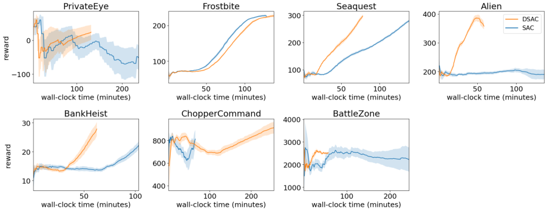

Figure 1: DSAC speeds up training w.r.t. SAC in 5 of the 7 games tested for up to 76%, maintaining
performance in all 7 and even improving performance in 2 games (Seaquest and Alien). Both
algorithms use the best hyperparameter configuration for each game, with results averaged over
5 seeds. The shaded area shows the standard error of the mean. The games on which DSAC is
faster than SAC are the games where DSAC uses a lower batch size (64) than SAC (256). For
ChopperCommand, DSAC is slower due to higher batch size (256) against SAC (64). For Frostbite
the time difference is small as SAC and DSAC use the same batch size (256).

**3.2** **Effect of Batch Size**

When we look closely at the hyperparameters for these plotted algorithms based on best configurations, we see that only in ChopperCommand DSAC has a higher batch size than the SAC baseline,
explaining the slowness of DSAC for that game. Frostbite is also the only case where SAC and
DSAC have identical batch-sizes, which leads DSAC to have a slightly longer training time for this
game due to the additional computation for decorrelation updates. In all the games where DSAC
training is faster than SAC, DSAC has a lower batch size than SAC. While this may indicate an
impact of the lower batch size on the success of DSAC, our experimentation shows that it is not the
sole factor in its success (see Appendix G). With an increase in the batch size, DSAC indeed provides
less time advantage compared to the lower batch size, yet still is able to reduce the wall-clock time
against the SAC baseline when run with an identical batch size. Similarly, despite identical batch
sizes, DSAC is still able to outperform SAC. These results show that while a lower batch size is
beneficial for reducing training time, the benefits of decorrelation do not entirely depend on it.

**3.3** **Learning Rate Comparison**

As for learning rates, each game had its own best configuration. The lower learning rates provided
the top performers of the SAC baseline, with _{_ 3 _×_ 10 _[−]_ [5], 1 _×_ 10 _[−]_ [4] _}_ being equally chosen, thus making
it hard to converge on one choice for all experiments. These were almost always accompanied by a
batch size of 256. In contrast, _{_ 3 _×_ 10 _[−]_ [4] _}_ was never chosen for the top configurations. For DSAC’s
SAC learning rate, _{_ 1 _×_ 10 _[−]_ [4], 3 _×_ 10 _[−]_ [4] _}_ were common choices, with _{_ 3 _×_ 10 _[−]_ [4] _}_ always being
accompanied by a batch size of 64 as the more common choice for batch size in highest ranking
DSAC configurations. As for decorrelation learning rates, the choices in order of popularity were
_{_ 1 _×_ 10 _[−]_ [4], 1 _×_ 10 _[−]_ [2], 1 _×_ 10 _[−]_ [3] _}_ . These show that a unique decorrelation learning rate might provide

8

more value depending on the environment.

**3.4** **Impact on Decorrelation Loss**

To further investigate the impact of decorrelation, an analysis of the decorrelation losses can be
made. Figure 2 displays the total decorrelation loss for the policy network, which was subject to
a hyperparameter search for its learning rate. Here the top performing configurations found in the
hyperparameter search are plotted for the algorithms with the loss values in log scale. Among the
curves comparing DSAC and the SAC baseline, the most obvious and systematic difference emerges
in the minimization of the decorrelation loss for the policy network, which is consistently kept at a
minimum for DSAC throughout training, while it increases steadily for the SAC baseline towards
the final steps. These results show successful decorrelation in the DSAC policy networks. While the
policy network learns increasingly correlated features with BP, decorrelation via DBP helps mitigate
this effect by ensuring minimal correlation throughout training.

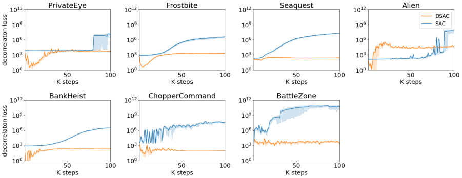

Figure 2: Decorrelation loss for the policy network (shown in log scale) constitutes the main difference
across the compared algorithms, which is successfully minimized throughout the learning in DSAC,
despite steady increase for the SAC baseline, where it reaches values beyond 10 [6] . Plots are based
on a SAC baseline trained with similar architectural conditions with DSAC, which differs from the
baseline in the main results, to enable a fair comparison of the decorrelation losses.

**3.5** **Impact on RL Loss**

In Appendix F, other loss curves from the SAC algorithm can be observed. The increase in the
SAC baseline’s non-optimized decorrelation loss for the policy network seems to coincide with the
convergence of the actor loss in games like BankHeist and Seaquest, signaling the exploitation
stage for the algorithm. The alpha loss for DSAC on the other hand reaches convergence faster
than the SAC baseline consistently. This shows that decorrelation helps in reaching the entropy
maximization objective faster, by encouraging exploration via minimization of the correlation in
features. Based on this, the minimal levels of the decorrelation loss can be seen as a signal of how
novel the visited states are. This way, decorrelation via DBP contributes to the SAC algorithm’s
entropy maximization goals.

9

#### **4 Discussion**

We have proposed DSAC as a novel approach to online network-wide decorrelation in deep RL
based on the DBP algorithm that applies decorrelation across its neural network layer inputs before
their forward pass, for effective representation learning and improved sample efficiency in RL. An
application of DBP to the discrete SAC algorithm has demonstrated faster training in wall-clock
time in the majority of the Atari games tested, which converted to performance benefits in a few
games against a BP-based discrete SAC baseline. DSAC showed successful minimization of the
decorrelation loss for the policy network where decorrelation was applied, whereas the SAC baseline
displayed high correlation of features. Our results suggest that network-wide decorrelation indeed
shows advantage in effective representation learning by removing correlations, thus improving sample
efficiency by speeding up the deep RL training.
Deep RL has been previously shown to learn features that are highly correlated, which cause slow
learning curves (Mavrin et al., 2019b). Mavrin et al. (2019a) observed that applying decorrelation
in deep RL through regularization leads to richer representations with higher number of useful
features learned. By allowing the agent to better understand the effect of changing features on its
decisions, decorrelation has been proposed as an approach to achieve generalization by RL agents
across environments (Huang et al., 2023).
Here we built on these findings through a fully-integrated decorrelation process to the training
of the RL pipeline, which differs fundamentally from previous approaches. Next to the usual RL
updates, we apply separate updates to additional decorrelation matrices added to each layer of
a DNN, based on a decorrelation learning rule. Thus we present an approach to simultaneous
online learning of good representations and task control in a single phase process, without the
need for regularization, pretraining, use of additional network architectures or a focus on a single
layer’s latents. Our method of decorrelation provides an advantage by being applicable to any
kind of existing algorithm or DNN architecture, with the possibility for an application in any type
of network layer, demonstrated here with convolutional and fully-connected layers. Furthermore,
through network-wide decorrelation, correlations can be kept under control across all layers.
While our results are promising, we do recognize that most, though not quite all, of the performance gains of decorrelation via DBP in SAC is displayed when a smaller batch size is being
used relative to the baseline. It should be explored further why decorrelation allows for smaller
batch sizes and how robust this finding is in other contexts. Potentially, the reduction of redundant
information could help the algorithm learn from fewer samples.
Further investigation is needed into the extension of our findings to other environments, architectures, and RL algorithms. Results were demonstrated on a subset of most difficult games in the
Atari suite where human-level performance is not reachable with DQN (Mnih et al., 2015). Moving
away from the most challenging task settings could potentially provide further performance benefits
to DSAC. Whereas SAC is an ideal choice as a complex state-of-the-art deep RL algorithm, using
simpler algorithms may ease the analysis on the impact of decorrelation directly, while also strengthening the generalizability of results. Furthermore, benefits of decorrelation may be more impactful
for control tasks on continuous action space settings, as credit assignment is more challenging in
larger action spaces, making effective representation learning more crucial.
When demonstrating the advantages of using decorrelation in deep RL through DBP, different
hyperparameter settings were used per game and per algorithm. Whereas not sticking to one configuration of hyperparameters may signal an inconsistency on the impact of decorrelation, the best
hyperparameter configurations from the search for both the SAC baseline and DSAC were used
to compare their performances in each game. The best conditions were thus ensured for not only
DSAC but also the baseline to justify any improvements made over it, so that it is not merely

10

explained away by a suboptimal choice of hyperparameters for the baseline algorithm. Moreover,
because decorrelation is specific to data in our method, different games likely need different learning
rates for the decorrelation process to be effective, as the hyperparameter search also demonstrated.
However, the fact that decorrelation is specific to data could potentially have a negative impact on
generalization. One limitation could be the use of learning rates and batch sizes found as a result of
the hyperparameter search conducted, which additionally included decorrelation in Q-networks for
the DSAC algorithm, unlike the main results plotted because of the negligible impact of Q-networks’
decorrelation for performance (see Appendix A). While this may hint at suboptimality in our results,
it suggests a possibility of finding even better hyperparameter configurations should the decorrelation in Q-networks already have been omitted in the search, implying a potential improvement on
the results and conclusions drawn.

Results might be further improved by going beyond mere decorrelation and applying whitening
to the inputs, as whitening has been shown to benefit training and convergence of DNNs (Luo, 2017;
Huangi et al., 2018; Desjardins et al., 2015). Whitening constrains layer inputs to have unit variance,
which can be achieved by the DBP algorithm by imposing the correlation matrix to be the identity
matrix, and has been already shown to lead to improved performance over merely decorrelated
inputs (Dalm et al., 2024).
The positive impact of decorrelation on deep RL goes beyond training speed and reward benefits
that signal effective representation learning and credit assignment. By decreasing the notoriously
long training time for RL through addressing its issue of sample efficiency, decorrelation may reduce
carbon emissions. As the network’s decorrelation loss is essentially a measure of how familiar the
states are, it might be used as a metric to guide exploration, improving sample efficieny further.
While a mechanism to promote exploration is already existent in SAC through the entropy maximization objective, other RL algorithms may benefit highly from such a exploration encouraging
decorrelation signal. Another possible application of decorrelation is explainable AI (Rudin, 2019;
Ras et al., 2022), as decorrelated features remove confounding effects and make it easier to attribute
a model’s behaviour to a specific input feature. The ability to decorrelate can additionally endow
a network with predictive capabilities, as it informs us how surprising a newly sampled input is,
which can be incorporated as a signal to help minimize sensory surprise, following after K¨u¸c¨uko˘glu
et al. (2024) that models predictive processing (Clark, 2013) for effective control with RL, inspired
by the theory of sensory information processing in the brain called predictive coding (Srinivasan
et al., 1982; Friston, 2005; Huang and Rao, 2011). In fact, neural processing has been shown to be
engaged in input decorrelation (Bell and Sejnowski, 1997; Franke et al., 2017; Pitkow and Meister,
2012; Segal et al., 2015), thus further demonstrating the value of a decorrelation mechanism for
developing biologically plausible efficient control algorithms.
Going beyond the domain of machine learning, decorrelation could be beneficial for intersecting
disciplines like neurotechnology, specifically for the development of cortical visual neural prostheses.
Bengio and Bergstra (2009) proposed that decorrelation partly explains the functional behaviour
of V1 complex cells. This hypothesis could be relevant for developing biologically inspired image
processing approaches when modelling optimal encoding strategies that generate stimulation parameters for the visual cortex to evoke targeted perceptions in blind people. An adaptive task-based
dynamic optimization approach to neuroprosthetic vision with end-to-end deep RL, for example
as in K¨u¸c¨uko˘glu et al. (2022), could therefore benefit from such a decorrelation mechanism. Furthermore, incorporation of eye movement information when developing image processing strategies for cortical neural prostheses has been found crucial in improving mobility outcomes for users
(de Ruyter van Steveninck et al., 2024). Decorrelation could help in modelling the incorporation of
eye movement information for this purpose in a biologically plausible and efficient manner, building
on the observation that fixational eye movements reduce correlations in retinal output (Segal et al.,

11

2015).
Decorrelation targets a crucial issue in machine learning, which may negatively affect learning
in the presence of highly correlated features. This is especially a prominent issue in deep RL,
where training data is highly correlated due to the sequential nature of the learning framework.
Therefore, future work can investigate a range of directions mentioned above to reap further benefits
of decorrelation in deep RL, machine learning and beyond.

#### **Acknowledgements**

This work has received funding from the European Union’s Horizon 2020 research and innovation
programme under grant agreement No 899287 (project NeuraViPeR).

#### **References**

Ahmad, N. (2024). Correlations are ruining your gradient descent. _ArXiv_ _preprint_,
ArXiv:2407.10780.

Ahmad, N., Schrader, E., and van Gerven, M. (2023). Constrained parameter inference as a principle
for learning. _Transactions on Machine Learning Research_ .

Bell, A. J. and Sejnowski, T. J. (1997). The “independent components” of natural scenes are edge
filters. _Vision Research_, 37(23):3327–3338.

Bengio, Y. and Bergstra, J. (2009). Slow, decorrelated features for pretraining complex cell-like
networks. In Bengio, Y., Schuurmans, D., Lafferty, J., Williams, C., and Culotta, A., editors,
_Advances in Neural Information Processing Systems_, volume 22. Curran Associates, Inc.

Christodoulou, P. (2019). Soft actor-critic for discrete action settings. _ArXiv preprint_,
ArXiv:1910.07207.

Clark, A. (2013). Whatever next? Predictive brains, situated agents, and the future of cognitive
science. _Behavioral and Brain Sciences_, 36(3):181–204.

Dalm, S., Offergeld, J., Ahmad, N., and van Gerven, M. (2024). Efficient deep learning with
decorrelated backpropagation. _ArXiv preprint_, ArXiv:2405.02385.

de Ruyter van Steveninck, J., Nipshagen, M., van Gerven, M., G¨u¸cl¨u, U., G¨u¸cl¨ut¨urk, Y., and van
Wezel, R. (2024). Gaze-contingent processing improves mobility, scene recognition and visual
search in simulated head-steered prosthetic vision. _Journal of Neural Engineering_, 21(2):026037.

Desjardins, G., Simonyan, K., Pascanu, R., and Kavukcuoglu, K. (2015). Natural neural networks.
In Cortes, C., Lawrence, N., Lee, D., Sugiyama, M., and Garnett, R., editors, _Advances in Neural_
_Information Processing Systems_, volume 28. Curran Associates, Inc.

Franke, K., Berens, P., Schubert, T., Bethge, M., Euler, T., and Baden, T. (2017). Inhibition
decorrelates visual feature representations in the inner retina. _Nature_, 542.

Friston, K. (2005). A theory of cortical responses. _Philosophical Transactions of the Royal Society_
_B: Biological sciences_, 360(1456):815–836.

12

Haarnoja, T., Zhou, A., Abbeel, P., and Levine, S. (2018a). Soft actor-critic: Off-policy maximum
entropy deep reinforcement learning with a stochastic actor. In Dy, J. G. and Krause, A., editors,
_ICML_, volume 80 of _Proceedings of Machine Learning Research_, pages 1856–1865. PMLR.

Haarnoja, T., Zhou, A., Hartikainen, K., Tucker, G., Ha, S., Tan, J., Kumar, V., Zhu, H., Gupta, A.,
Abbeel, P., and Levine, S. (2018b). Soft actor-critic algorithms and applications. _ArXiv preprint_,
ArXiv:1812.05905.

Huang, S., Sun, Y., Hu, J., Guo, S., Chen, H., Chang, Y., Sun, L., and Yang, B. (2023). Learning
generalizable agents via saliency-guided features decorrelation. In _Thirty-seventh Conference on_
_Neural Information Processing Systems_ .

Huang, Y. and Rao, R. P. N. (2011). Predictive coding. _WIREs Cognitive Science_, 2(5):580–593.

Huangi, L., Yang, D., Lang, B., and Deng, J. (2018). Decorrelated batch normalization. In _Proceed-_
_ings - 2018 IEEE/CVF Conference on Computer Vision and Pattern Recognition, CVPR 2018_,
Proceedings of the IEEE Computer Society Conference on Computer Vision and Pattern Recognition, pages 791–800, United States. IEEE Computer Society. Publisher Copyright: © 2018
IEEE.; 31st Meeting of the IEEE/CVF Conference on Computer Vision and Pattern Recognition,
CVPR 2018 ; Conference date: 18-06-2018 Through 22-06-2018.

Kaiser, L., Babaeizadeh, M., Milos, P., Osinski, B., Campbell, R. H., Czechowski, K., Erhan, D.,
Finn, C., Kozakowski, P., Levine, S., Mohiuddin, A., Sepassi, R., Tucker, G., and Michalewski, H.
(2020). Model based reinforcement learning for Atari. In _8th International Conference on Learning_
_Representations, ICLR 2020, Addis Ababa, Ethiopia, April 26-30, 2020_ . OpenReview.net.

K¨u¸c¨uko˘glu, B., Borkent, W., Rueckauer, B., Ahmad, N., G¨u¸cl¨u, U., and van Gerven, M. (2024).
Efficient deep reinforcement learning with predictive processing proximal policy optimization.
_Neurons, Behavior, Data analysis, and Theory_, pages 1–24.

K¨u¸c¨uko˘glu, B., Rueckauer, B., Ahmad, N., de Ruyter van Steveninck, J., G¨u¸cl¨u, U., and van Gerven,
M. (2022). Optimization of neuroprosthetic vision via end-to-end deep reinforcement learning.
_International Journal of Neural Systems_, 32(11):2250052.

LeCun, Y. A., Bottou, L., Orr, G. B., and M¨uller, K.-R. (2012). Efficient backprop. In Montavon,
G., Orr, G. B., and M¨uller, K.-R., editors, _Neural Networks: Tricks of the Trade: Second Edition_,
pages 9–48, Berlin, Heidelberg. Springer Berlin Heidelberg.

Lee, H., Lee, K., Hwang, D., Lee, H., Lee, B., and Choo, J. (2023). On the importance of feature
decorrelation for unsupervised representation learning in reinforcement learning. In _Proceedings_
_of the 40th International Conference on Machine Learning_, ICML’23. JMLR.org.

Linnainmaa, S. (1976). Taylor expansion of the accumulated rounding error. _BIT_, 16(2):146–160.

Luo, P. (2017). Learning deep architectures via generalized whitened neural networks. In Precup, D.
and Teh, Y. W., editors, _Proceedings of the 34th International Conference on Machine Learning_,
volume 70 of _Proceedings of Machine Learning Research_, pages 2238–2246. PMLR.

Machado, M. C., Bellemare, M. G., Talvitie, E., Veness, J., Hausknecht, M., and Bowling, M. (2018).
Revisiting the Arcade learning environment: Evaluation protocols and open problems for general
agents. _Journal of Artificial Intelligence Research_, 61(1):523–562.

13

Mavrin, B., Graves, D., and Chan, A. (2019a). Efficient decorrelation of features using Gramian in
reinforcement learning. _ArXiv preprint_, ArXiv:1911.08610.

Mavrin, B., Yao, H., and Kong, L. (2019b). Deep reinforcement learning with decorrelation. _ArXiv_
_preprint_, ArXiv:1903.07765.

Mnih, V., Kavukcuoglu, K., Silver, D., Graves, A., Antonoglou, I., Wierstra, D., and Riedmiller,
M. A. (2013). Playing Atari with deep reinforcement learning. _ArXiv preprint_, ArXiv:1312.5602.

Mnih, V., Kavukcuoglu, K., Silver, D., Rusu, A. A., Veness, J., Bellemare, M. G., Graves, A.,
Riedmiller, M., Fidjeland, A. K., Ostrovski, G., et al. (2015). Human-level control through deep
reinforcement learning. _Nature_, 518(7540):529–533.

Pitkow, X. and Meister, M. (2012). Decorrelation and efficient coding by retinal ganglion cells.
_Nature Neuroscience_, 15:628–35.

Ras, G., Xie, N., van Gerven, M., and Doran, D. (2022). Explainable deep learning: A field guide
for the uninitiated. _Journal of Artificial Intelligence Research_, 73.

Rudin, C. (2019). Stop explaining black box machine learning models for high stakes decisions and
use interpretable models instead. _Nature Machine Intelligence_, 1:206–215.

Schulman, J., Wolski, F., Dhariwal, P., Radford, A., and Klimov, O. (2017). Proximal policy
optimization algorithms. _ArXiv preprint_, ArXiv:1707.06347.

Segal, I. Y., Giladi, C., Gedalin, M., Rucci, M., Ben-Tov, M., Kushinsky, Y., Mokeichev, A., and
Segev, R. (2015). Decorrelation of retinal response to natural scenes by fixational eye movements.
_Proceedings of the National Academy of Sciences_, 112(10):3110–3115.

Srinivasan, M. V., Laughlin, S. B., and Dubs, A. (1982). Predictive coding: A fresh view of inhibition in the retina. _Proceedings of the Royal Society of London. Series B. Biological Sciences_,
216(1205):427–459.

Sutton, R. S. and Barto, A. G. (2018). _Reinforcement Learning: An Introduction_ . The MIT Press,
second edition.

Toromanoff, M., Wirbel, E., and Moutarde, F. (2019). Is deep reinforcement learning really superhuman on Atari? Leveling the playing field. _ArXiv preprint_, ArXiv:1908.04683.

Werbos, P. (1974). _Beyond Regression: New Tools for Prediction and Analysis in the Behavioral_
_Sciences_ . PhD thesis, Harvard University, Cambridge, MA, USA.

# **Appendices**

#### **A Grid search for hyperparameters**

The grid search for hyperparameters were based on DSAC where all trained networks are decorrelated, including the policy network and both Q-networks. The decorrelation learning rate for the two
soft Q-networks were fixed at 1 _×_ 10 _[−]_ [13], after a preliminary search showing it as a reasonable value.

14

For the grid search, the BP-based SAC baseline runs were conducted based on similar architectural
conditions to ensure equality in model sizes.
While the grid search results also involve decorrelation on the two soft Q-networks, for our main
results the decorrelation procedure was not applied in the Q-networks, because of its negligible
impact on overall performance compared to the decorrelation in the policy network, and also the
increase in computational cost and training time with the decorrelation of two additional networks.
Also for the main results plotted, the SAC baseline lacked the decorrelation matrices fixed as identity
matrices that ensured equal model sizes in the hyperparameter search, in order to do justice to the
SAC baseline in the main results by evaluating it without the additional time cost of a non-trained
decorrelation process.

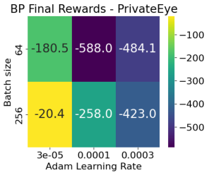

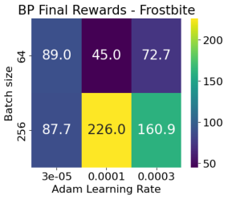

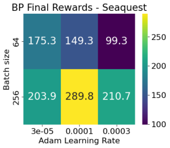

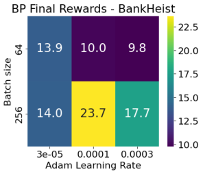

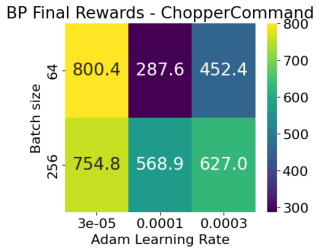

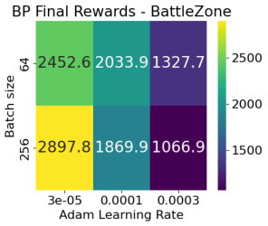

Figure 3: Search for the best hyperparameter configuration for the BP-based discrete SAC baseline.
Values indicate the final reward average across five runs.

15

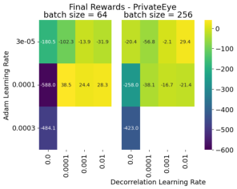

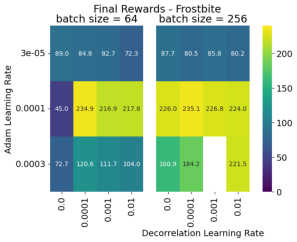

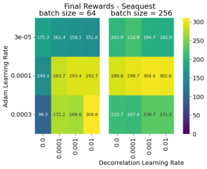

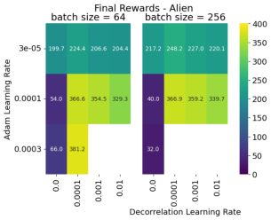

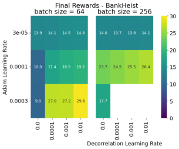

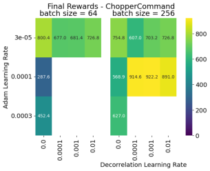

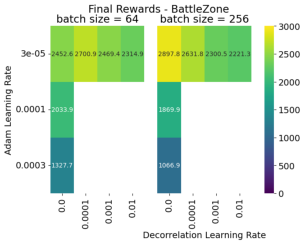

Figure 4: Search for the best hyperparameter configuration for DSAC. Values indicate the final
reward average across five runs. A decorrelation learning rate of 0.0 indicate no decorrelation for
any of the SAC networks, hence the BP-based SAC baseline. A decorrelation learning rate more
than 0.0 indicate decorrelation also in the soft-Q-networks, yet with a fixed learning rate of 1 _×_ 10 _[−]_ [13],
hence the DBP-based DSAC algorithm. Empty fields indicate NaNs.

16

#### **B Hyperparameters for DSAC**

Table 1: Hyperparameters used in the DSAC agents. Majority of the SAC-related hyperparameters
follow after (Christodoulou, 2019), e.g. learning rate, optimizer, discount factor, GAE parameter,
PPO clip range, or after (Haarnoja et al., 2018b), e.g. epochs per batch, actor loss coefficient, critic
loss coefficient.
Hyperparameter Value
Layers (both for actor and critic) 3 convolutional + 2 fully-connected layers
Convolutional channels per layer [32, 64, 64]
Convolutional kernel sizes per layer [8, 4, 3]
Convolutional strides per layer [4, 2, 1]
Convolutional padding per layer [0, 0, 0]
Fully connected layer hidden units [512, number of actions in the game]
Nonlinearity Leaky ReLU
Scaling coefficient for convolutional DBP layers ( _b_ ) 9
Optimizer Adam
Discount factor ( _γ_ ) 0.99
Replay buffer size 100000
Initial random steps 20000
Entropy target -dim(A)
Target smoothing coefficient ( _τ_ ) 0.005
Target update interval 1
Gradient steps 1
Frame stacking 4
Frame skipping 4

#### **C Hardware and implementation details**

We programmed our implementation in Python using the PyTorch framework, and ran on the
compute cluster Snellius using Nvidia A100 GPUs, provided by SURF.

17

#### **D Top configurations for hyperparameter search**

Table 2: Reward and wall-clock time performance of the plotted algorithms, based on the best
configuration of learning rates (lr) and batch sizes (bs) found per game as a result of the hyperparameter search for algorithms of BP-based SAC baseline and DBP-based DSAC. Decorrelation
learning rate here refers to the one used for the policy network. Decorrelation learning rates for the
soft-Q-networks were zero in the plotted algorithms, while the hyperparameter search was based on
the case where it was kept fixed at 1 _×_ 10 _[−]_ [13] for DSAC, which had negligible impact on results. In
parentheses, the change for the respective performance metric compared to the SAC baseline is provided, with significant changes in reward levels being starred. Note that there may be further time
or performance benefits if the algorithm was to be run on different hyperparameter configurations,
since the hyperparameters were based on the search that included decorrelation in Q-networks as
well, as opposed to the plotted results that lacked it.
Environment-Algorithm Lr Bs Decorr. lr ( _η_ ) Final score Wall-clock time (min.)

|Lr|Bs|Decorr. lr (η)|Final score|
|---|---|---|---|
|3_ ×_ 10~~_−_5~~ 1_ ×_ 10_−_4 |256 64|- 1_ ×_ 10_−_4|-51.7 24.1 (+147%)|
|1_ ×_ 10~~_−_4~~ 1_ ×_ 10_−_4 |256 256|- 1_ ×_ 10_−_4|225.6 226.7 (+0%)|
|1_ ×_ 10~~_−_4~~ 3_ ×_ 10_−_4 |256 64|- 0.01|282.0 299.6 (+6%*)|
|3_ ×_ 10~~_−_5~~ 3_ ×_ 10_−_4 |256 64|- 1_ ×_ 10_−_4|191.2 356.3 (+86%*)|
|1_ ×_ 10~~_−_4~~ 3_ ×_ 10_−_4 |256 64|- 1_ ×_ 10_−_2|22.5 28.1 (+25%)|
|3_ ×_ 10~~_−_5~~ 1_ ×_ 10_−_4 |64 256|- 1_ ×_ 10_−_3|818.8 912.6 (+11%)|

BattleZone-SAC 3 _×_ 10 ~~_[−]_~~ ~~[5]~~ 256 - 2216.1 246
BattleZone-DSAC 3 _×_ 10 _[−]_ [5] 64 1 _×_ 10 _[−]_ [4] 2504.7 (+13%) 58 (-76%)

18

#### **E Rewards for DSAC with policy network decorrelation**

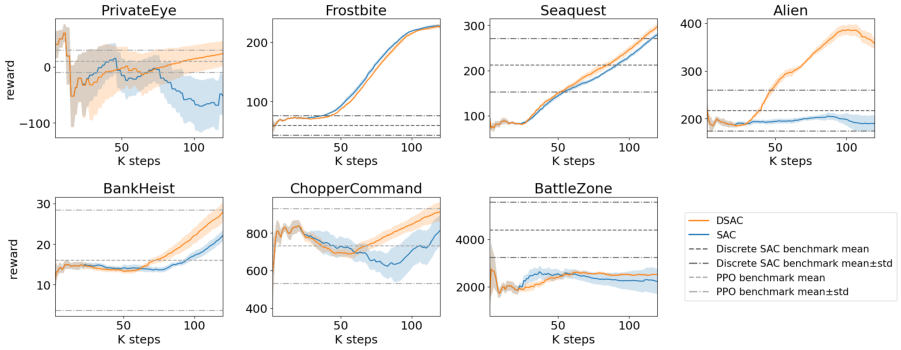

Figure 5: Reward curves per game for top configurations of SAC baseline vs. DSAC with decorrelation in the policy network only. Discrete SAC benchmark scores are based on Christodoulou (2019),
and are reported where available for a comparison. For the remaining games, scores of PPO for the
Atari 100k benchmark, as reported by (Kaiser et al., 2020) are provided, as PPO is another stateof-the-art actor-critic algorithm, albeit learning on-policy (Schulman et al., 2017). Comparison to
algorithms in the literature demonstrates that the results of our BP-based SAC baseline are aligned
with the previously reported BP-based benchmarks for most of the games. Differences may be due
to use of different seeds.

19

#### **F SAC losses for DSAC with policy network decorrelation**

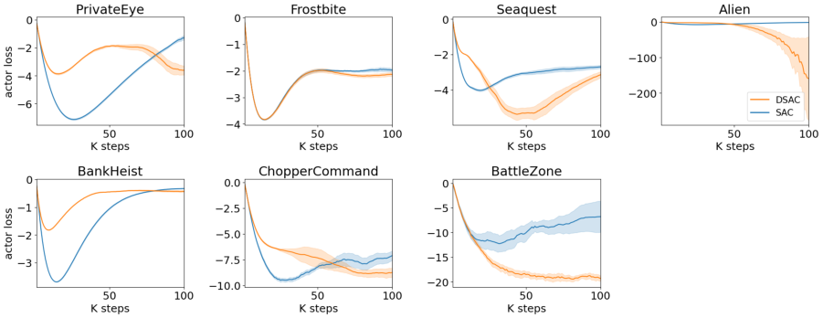

Figure 6: Decorrelation helps actor loss or policy network’s loss to stay around minimal values
especially at the beginning of the training, where SAC baseline tends to have higher values more
quickly.

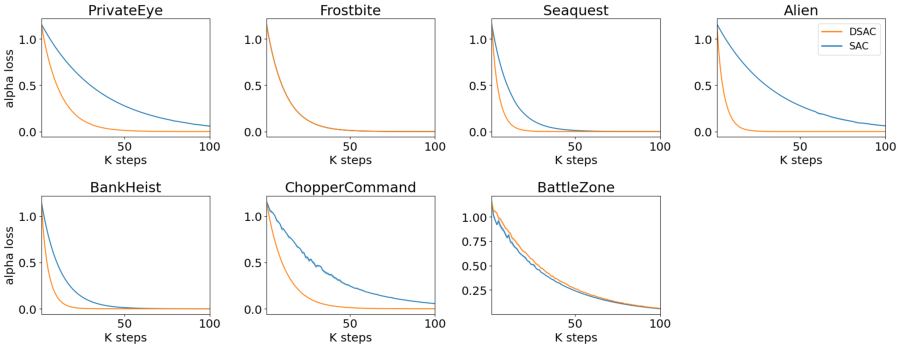

Figure 7: Decorrelation enables a faster convergence for the minimization of alpha loss that serves
the entropy maximization objective encouraging exploration and stability.

20

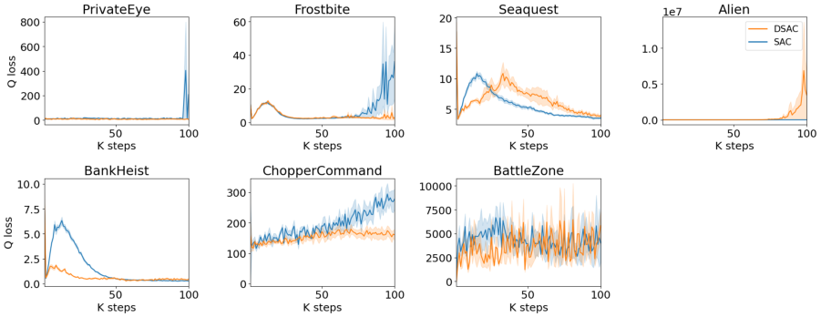

Figure 8: Average Q-loss from the two soft Q-networks.

#### **G DSAC with decorrelation in all trained networks**

Here we show the performance comparison of top performers of the BP-based SAC baseline and
DBP-based DSAC algorithms based on the hyperparameter search where decorrelation is applied
across all trained networks, including the policy network and the two Q-networks. Because of the
decorrelation process being applied in three networks, hence increased computation, time advantage
of the DBP-based DSAC is less pronounced than in the case of only the policy network being
decorrelated, which the main results demonstrated.

21

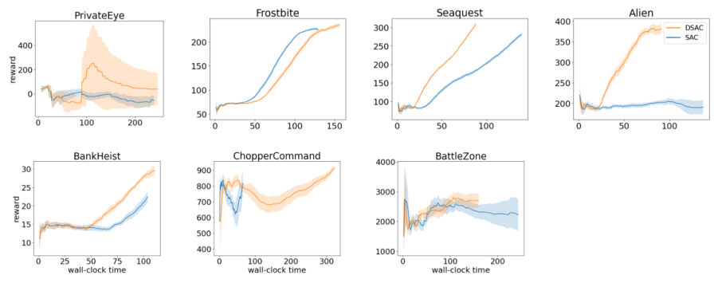

Figure 9: Time advantage of the DBP-based DSAC algorithm (with decorrelation in all trained
networks) in speeding up the training in 3 of the 7 games tested for up to 37%, while performance
is maintained in all 7, with even a significant improvement via the DSAC in 3 games (Seaquest,
Alien, BankHeist). Both algorithms are demonstrated with their best hyperparameter configuration
for each game, with results averaged over 5 seeds and shaded area showing standard error of the
mean. DSAC capitalizes on lower values for the batch size (64) hyperparameter against the SAC
baseline in all the games it is faster on. For ChopperCommand, algorithm is slower due to higher
batch size of the best configurations of DSAC (256) against SAC baseline (64) for this game. Only
for Frostbite, the batch size of DSAC is identical to SAC’s (256).

22

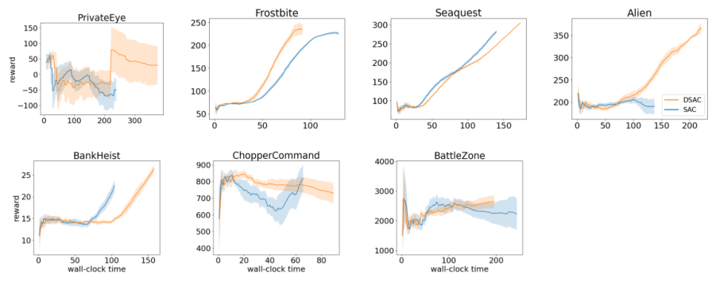

Figure 10: Wall-clock time and reward performance of the highest ranking configurations in the
other batch size than the top performer of DSAC (with all trained networks decorrelated) per each
algorithm per game. Note that the batch sizes for the DSAC and SAC baseline per game are identical here for all games, except Frostbite where the DSAC algorithm has a lower batch size (64).
The identical batch sizes for the majority of these games are 256, whereas 64 for ChopperCommand.
Lower batch size for DSAC provides additional reduction in training time for Frostbite. At an identical batch size to the SAC baseline, both the training time advantage and the reward performance
level is maintained for BattleZone, despite a slight reduction in the level of time advantage. On the
other hand, while DSAC-based Seaquest, Alien, PrivateEye and BankHeist lose their training time
advantage at an identical batch size, and BankHeist also its performance advantage, Seaquest and
Alien still outperform the SAC baseline, whereas PrivateEye similarly maintains its performance
levels.

23

