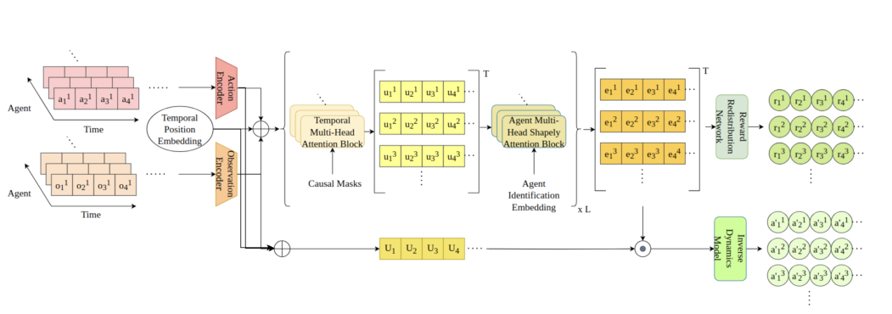
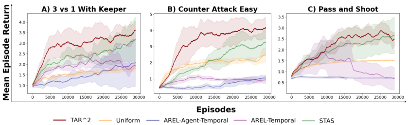
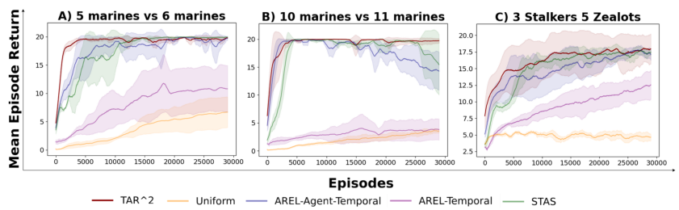
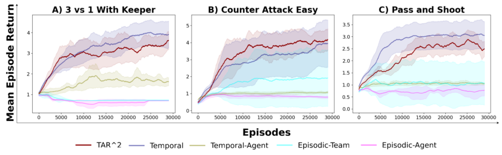
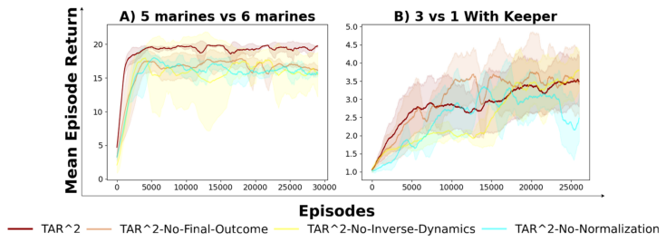

## TAR [2] : Temporal-Agent Reward Redistribution for Optimal Policy Preservation in **Multi-Agent Reinforcement Learning**

**Aditya Kapoor** [1], **Kale-ab Tessera** [2], **Mayank Baranwal** [3] and **Harshad Khadilkar** [3]

**Stefano Albrecht** [2]
**Mingfei Sun** [1]

1 University of Manchester
2 University of Edinburgh
3 Indian Institute of Technology, Bombay

**Abstract**

In cooperative multi-agent reinforcement learning (MARL), learning effective policies is challenging when global rewards are sparse and delayed. This difficulty arises from the need to assign credit across both agents and time steps, a
problem that existing methods often fail to address in episodic, long-horizon tasks. We propose
_Temporal-Agent Reward Redistribution_ (TAR [2] ), a
novel approach that decomposes sparse global rewards into agent-specific, time-step-specific components, thereby providing more frequent and accurate feedback for policy learning. Theoretically,
we show that TAR [2] (i) aligns with potential-based
reward shaping, preserving the same optimal policies as the original environment; and (ii) maintains
policy gradient update directions identical to those
under the original sparse reward, ensuring unbiased
credit signals. Empirical results on two challenging benchmarks—SMACLite and Google Research
Football—demonstrate that TAR [2] significantly stabilizes and accelerates convergence, outperforming strong baselines like AREL and STAS in both
learning speed and final performance. These findings establish TAR [2] as a principled and practical
solution for agent-temporal credit assignment in
sparse-reward multi-agent systems. [1] §

**1** **Introduction**

Multi-agent reinforcement learning (MARL) enables autonomous agents to cooperate on complex tasks across a
wide range of domains, including warehouse logistics [Krnjaic _et al._, 2022], e-commerce [Shelke _et al._, 2023; Baer _et al._,
2019], robotics [Sartoretti _et al._, 2019; Damani _et al._, 2021],
and routing [Zhang _et al._, 2018; Vinitsky _et al._, 2020; Zhang
_et al._, 2023]. MARL has also shown great promise in highstakes coordination challenges in video games such as StarCraft II [Vinyals _et al._, 2019], DOTA [Berner _et al._, 2019],
and Google Football [Kurach _et al._, 2020], where teams of
agents must align actions toward a shared goal.

1 Codebase: [https://github.com/AdityaKapoor74/MARL_](https://github.com/AdityaKapoor74/MARL_Agent_Temporal_Credit_Assignment)
[Agent_Temporal_Credit_Assignment](https://github.com/AdityaKapoor74/MARL_Agent_Temporal_Credit_Assignment)

However, one of the most persistent bottlenecks in cooperative MARL is _credit assignment_ : deciding how to allocate
a global team reward among multiple agents in partial observability and decentralized execution. This bottleneck is
particularly acute when rewards are _sparse or delayed_, which
causes agents to struggle in correlating their intermediate actions with eventual outcomes [Arjona-Medina _et al._, 2019;
Ren _et al._, 2021]. In such settings, there is a need to determine _when_ along a multi-step trajectory the helpful actions occurred ( _temporal credit assignment_ ) _and which_ agent
or subset of agents were responsible ( _agent credit assign-_
_ment_ ). Prior works often focus on only one of these aspects
at a time—e.g., factorizing value functions to identify agentspecific credits [Sunehag _et al._, 2017; Rashid _et al._, 2020] or
building dense temporal proxies to mitigate delayed rewards

[Arjona-Medina _et al._, 2019; Xiao _et al._, 2022]. Yet, managing both agent and temporal credit assignment _simultaneously_
remains challenging, especially in high-dimensional tasks
where partial observability further complicates the learning
problem [Papoudakis _et al._, 2020].
In this paper, we propose _Temporal-Agent Reward Redis-_
_tribution_ (TAR [2] ), a novel framework that jointly addresses
_agent_ and _temporal_ credit assignment in cooperative MARL
with sparse global rewards. Rather than relying solely on
value-function factorization or temporal heuristics, TAR [2] **re-**
**distributes** the final episodic reward across each time step
and each agent, guided by a learned model (Figure 1).
Concretely, TAR [2] maps sparse team returns into time-stepspecific feedback signals and then allocates these among
agents according to each agent’s (marginal) contribution, approximated via a dual-attention mechanism. Crucially, our
approach is built upon _potential-based reward shaping_ [Ng,
1999; Devlin and Kudenko, 2011], ensuring that the optimal
policies of the original Markov Decision Process (MDP) are
preserved in our reshaped rewards. This preserves _optimal_
_policy invariance_, while providing finer-grained credit signals
to accelerate learning.
We validate TAR [2] both through _theoretical guarantees_ and
_empirical results on challenging benchmarks_ .
**Contributions.** Summarized below are our key contributions:

  - **Unified Agent-Temporal Credit Assignment.** We
develop TAR [2], a single framework that decomposes

Figure 1: **Overview of TAR** [2] **.** Our dual-attention mechanism uses a _temporal causal attention_ module and an _agent Shapley attention_ module
to decompose rewards by time steps and agents. An inverse dynamics model further refines the temporal representation, and the final output
yields per-agent, per-timestep redistributed rewards that enables effective reward attribution.

episodic rewards both across agents _and_ over time,
bridging the gap between factorization-based methods
and purely temporal reward-shaping methods.

  - **Policy Invariance via Potential-Based Shaping.** We
formally prove that TAR [2] ’s redistributed reward function preserves the original environment’s optimal policies and maintains equivalent gradient directions. To
effectively capture agent contributions and temporal dependencies, we employ a dual-attention architecture that
integrates Shapley attention for fair credit assignment,
an inverse dynamics model to learn robust temporal representations, and final-state conditioning to link intermediate actions with final outcomes.

  - **Robust Empirical Performance.** Through extensive experiments on challenging configurations of
SMACLite and Google Research Football, TAR [2] surpasses strong baselines in convergence speed and final
return under sparse rewards.

**2** **Related Works**

In this section, we review and compare various methods addressing credit assignment in both single-agent and multiagent reinforcement learning (MARL). While single-agent
methods focus primarily on temporal credit assignment,
multi-agent methods must manage the additional complexity of agent-specific credit assignment—particularly under
sparse or delayed rewards. Our discussion emphasizes the
unique challenge of combined agent-temporal credit assignment and highlights how existing approaches differ from our
proposed solution, TAR [2] .

**2.1** **Temporal Credit Assignment**

Temporal credit assignment aims to decompose sparse or
episodic rewards into informative, time-step-specific feedback, which is critical for learning in long-horizon tasks with
delayed outcomes.

Early single-agent methods like RUDDER [ArjonaMedina _et al._, 2019] redistribute rewards by analyzing return
contributions at each step. While effective in single-agent settings, RUDDER depends on accurate return predictions and
does not extend naturally to multi-agent scenarios where individual contributions must also be identified. Sequence modeling approaches [Liu _et al._, 2019; Han _et al._, 2022] use architectures like Transformers [Vaswani _et al._, 2017] to capture
long-term dependencies, but they similarly focus on temporal
aspects without addressing agent-level credit.
Trajectory-based methods [Ren _et al._, 2021; Zhu _et al._,
2023] learn proxy rewards via smoothing and bi-level optimization; however, these approaches generally assume a single agent and do not account for multiple cooperating agents.
Hindsight Policy Gradients (HPG) [Harutyunyan _et al._, 2019]
retrospectively assign rewards using future trajectory information but are again tailored to single-agent scenarios.
In multi-agent contexts, AREL [Xiao _et al._, 2022] extends
temporal credit assignment using attention mechanisms to redistribute rewards over time. Although AREL handles temporal dependencies among agents, it primarily focuses on the
temporal domain and does not fully capture agent-specific
contributions, particularly under sparse reward conditions. In
contrast, our method, TAR [2], jointly addresses both temporal and agent-specific credit assignment, which is crucial for
multi-agent systems with sparse rewards.

**2.2** **Agent Credit Assignment**

Agent credit assignment seeks to allocate portions of a global
reward to individual agents based on their contributions, a key
aspect of learning cooperative policies.
Difference rewards and counterfactual methods, such as
COMA [Foerster _et al._, 2018; Devlin _et al._, 2014], compute
agent-specific advantages by considering counterfactual scenarios, but these approaches typically assume denser feedback and struggle when rewards are sparse or significantly delayed. Value function factorization methods like VDN [Sune

hag _et al._, 2017] and QMIX [Rashid _et al._, 2020] decompose
joint value functions into agent-specific components, improving scalability and coordination in environments with frequent rewards. However, their factorization assumptions may
not hold in highly sparse settings, and they often do not explicitly handle the temporal aspect of credit assignment.
Shapley value-based approaches [Wang _et al._, 2020] offer
fair attribution of global rewards to agents based on marginal
contributions, but exact computation is intractable in large
systems, and approximations can miss subtle inter-agent dynamics—especially when rewards are sparse. Attentionbased critics like PRD [Freed _et al._, 2022; Kapoor _et al._,
2024a,b] focus on identifying important agent interactions but
still rely on assumptions about reward structure that may not
hold in sparse-feedback scenarios.
TAR [2] distinguishes itself by directly addressing the challenges of sparse, delayed rewards through joint temporal and
agent-specific redistribution, bypassing the limitations of TDbased bootstrapping methods. This dual focus makes TAR [2]
more robust in sparse environments where previous agent
credit assignment methods struggle.

**2.3** **Combined Agent-Temporal Credit Assignment**

Simultaneously addressing agent and temporal credit assignment greatly increases complexity, as it requires reasoning
over high-dimensional interactions across both agents and
time.
Recent works like She _et al._ [2022] attempt combined
credit assignment using attention-based methods, but they
face scalability issues and do not offer theoretical guarantees. STAS [Chen _et al._, 2023] specifically tackles joint
agent-temporal credit assignment by employing a dual transformer structure with spatial-temporal attention mechanisms
and Shapley value approximations. While STAS successfully
decomposes rewards across time and agents, it lacks clear theoretical guarantees of policy optimality invariance and can be
unstable in highly sparse environments.
In contrast, TAR [2] introduces several key enhancements
over STAS:

  - **Theoretical Guarantees:** Unlike STAS, TAR [2] is
grounded in potential-based reward shaping, ensuring
that the redistributed rewards preserve the optimal policy
of the original environment.

  - **Enhanced Architecture:** TAR [2] extends the dualattention approach by incorporating an inverse dynamics model and conditioning rewards on final state embeddings. These additions improve the accuracy of temporal and agent-specific credit assignment, particularly
in long-horizon tasks with sparse rewards.

  - **Stability in Sparse Environments:** By normalizing rewards and leveraging theoretical insights, TAR [2] exhibits
greater stability and improved performance compared to
prior methods like STAS and AREL in sparse-reward
settings.

While other methods attempt similar decompositions,
TAR [2] ’s combination of theoretical guarantees, architectural
innovations, and focus on sparse rewards sets it apart as a

novel and robust solution for joint agent-temporal credit assignment.

**3** **Background**

In this section, we present the foundational concepts and
problem setup that underpin our method. We begin by
reviewing the standard framework of _decentralized par-_
_tially observable Markov decision processes_ (Dec-POMDPs)

[Oliehoek and Amato, 2016; Amato, 2024], which formalizes many cooperative multi-agent reinforcement learning
(MARL) tasks. We then focus on the _episodic_ version of
MARL with sparse or delayed rewards, highlighting why
these settings pose unique credit-assignment challenges. Finally, we introduce _potential-based reward shaping_ [Ng,
1999; Devlin and Kudenko, 2011], the key theoretical tool
we build upon to preserve optimal policies while reshaping
rewards.

**3.1** **Decentralized Partially Observable Markov**
**Decision Processes (Dec-POMDPs)**

A Dec-POMDP is defined by the tuple

_M_ = � _S, {A_ _i_ _}_ _[N]_ _i_ =1 _[,][ P][,][ {O]_ _[i]_ _[}]_ _[N]_ _i_ =1 _[,][ {][π]_ _[i]_ _[}]_ _[N]_ _i_ =1 _[,][ R]_ _[ζ]_ _[, ρ]_ [0] _[, γ]_ � _,_
where _N_ agents interact in an environment with _states s ∈S_ .
Each agent _i ∈{_ 1 _, . . ., N_ _}_ selects an action _a_ _i_ from its action space _A_ _i_, and receives an observation _o_ _i_ from its observation space _O_ _i_ . The observation _o_ _i_ is generated according
to the observation function _T_ ( _o_ _i_ _| s, i_ ), which defines the
probability of agent _i_ receiving observation _o_ _i_ given the current state _s_ . The transition function _P_ ( _s_ _t_ +1 _| s_ _t_ _, a_ _t_ ) governs how states evolve, and _ρ_ 0 is the initial state distribution. Agents operate according to a _joint policy π_ = [�] _[N]_ _i_ =1 _[π]_ _[i]_ [,]
where each _π_ _i_ conditions on local observation histories _h_ _i,t_ =
_{_ ( _o_ _i,τ_ _, a_ _i,τ_ ) _}_ _[t]_ _τ_ =1 [, and] _[ h]_ _|τ_ _|_ [along with] _[ a]_ _|τ_ _|_ [represent the final]
approximate state and action of the multi-agent trajectory, respectively.
Unlike fully observable MDPs, partial observability means
each agent sees only a slice of the global state, making coordination harder. A _global reward_ function _R_ _ζ_ : _S × A →_ R
provides a team-wide signal, shared among all agents at each
timestep (or, in our _episodic_ case, at the end of the trajectory). The objective is to learn policies _π_ that maximize the
expected return:

E _s_ 0 _∼ρ_ 0 _, s∼P, a∼π_ �� _[|][τ]_ _[|]_ _γ_ _[t]_ _r_ global _,t_ � _._

_t_ =0

**3.2** **Episodic Multi-Agent Reinforcement Learning**
In many MARL domains, rewards are received only upon
completing an _episode_, yielding a single _episodic_ reward
_r_ global _,_ episodic ( _τ_ ). This setting is common in tasks with sparse
or delayed feedback—e.g., defeating all opponents in a battle environment or scoring a goal in a sports simulation. Although it accurately represents real-world scenarios, episodic
(delayed) rewards significantly complicate learning, causing
high variance and bias [Ng, 1999] in the policy gradient estimates. Agents must learn not only _which_ actions lead to
success, but also _when_ those actions should occur within the
trajectory—a problem known as _temporal credit assignment_ .

**3.3** **Potential-Based Reward Shaping**

A well-known approach to address delayed or sparse rewards
is _potential-based reward shaping_ [Ng, 1999]. In the singleagent case, one augments the reward function _R_ with an extra
shaping term _F_, derived from a potential function Φ. Formally, for any two consecutive states _s_ and _s_ _[′]_, the shaping
reward is:
_F_ ( _s, s_ _[′]_ ) = _γ_ Φ( _s_ _[′]_ ) _−_ Φ( _s_ ) _._
Because this shaping term telescopes across a trajectory, it
preserves the set of optimal policies. In multi-agent settings,
the same principle applies if each agent’s shaping function
is potential-based [Devlin and Kudenko, 2011; Xiaosong Lu,
2011]. In particular, adding

_F_ _i_ ( _s, s_ _[′]_ ) = _γ_ Φ _i_ ( _s_ _[′]_ ) _−_ Φ _i_ ( _s_ )

to the reward function for agent _i_ ensures that Nash equilibria
remain unchanged. For more details, refer to Appendix 1.
Potential-based shaping motivates our **reward redistribu-**
**tion** strategy, as it allows us to create denser per-step feedback
while provably preserving policy optimality. We leverage this
shaping concept to break down a single episodic reward into
agent- and time-step-specific components, ensuring that the
reward augmentation does _not_ distort the underlying solution
set. In the next section, we detail how we design such a redistribution scheme—called TAR [2] —to tackle sparse multiagent tasks effectively.

**4** **Approach**

In this section, we present our _Temporal-Agent Reward Redis-_
_tribution_ (TAR [2] ) algorithm, which addresses the dual challenge of _temporal_ and _agent-specific_ credit assignment in cooperative multi-agent reinforcement learning (MARL). We
begin by introducing our reward redistribution mechanism
(Sec. 4.1), then establish theoretical guarantees ensuring optimal policy preservation (Sec. 4.2). Next, we detail the architectural design of our model (Sec. 4.3) and outline the
full training procedure (Sec. 4.4). Finally, we discuss interpretability considerations and reference ablation studies that
provide further insight into each design choice.

**4.1** **Reward Redistribution Formulation**

The central challenge in episodic MARL is to decompose
a sparse global reward _r_ global _,_ episodic into more informative,
time-step and agent-specific feedback, while preserving the
original problem’s solutions. We achieve this by defining two
weight functions:

_w_ _t_ [temporal] _,_ _w_ _i,t_ [agent] _[,]_

which decompose the final return across time steps and
agents, respectively. Formally, each agent _i_ at time _t_ receives

_r_ _i,t_ = _w_ _i,t_ [agent] _w_ _t_ [temporal] _r_ global _,_ episodic ( _τ_ ) _._

We impose normalization constraints such that
_N_
� _i_ =1 _[w]_ _i,t_ [agent] = 1 and [�] _[|]_ _t_ _[τ]_ =1 _[|]_ _[w]_ _t_ [temporal] = 1 _,_ ensuring the
sum of all _r_ _i,t_ matches the original episodic reward as done
in prior works [Xiao _et al._, 2022; Chen _et al._, 2023; Ren
_et al._, 2021; Efroni _et al._, 2021]. Specifically, we make the
following assumption about the reward redistribution:

**Assumption 1.** _The per timestep agent-specific reward can_
_be approximated by a function conditioned on observation-_
_action tuple and the final outcome of the multi-agent trajec-_
_tory._

_|τ_ _|_
� _r_ _i,t_ ( _h_ _i,t_ _, a_ _i,t_ _, h_ _|τ_ _|_ _, a_ _|τ_ _|_ ) _,_ (1)

_t_ =1

_r_ _global,episodic_ ( _τ_ ) =

_N_
�

_i_ =1

By factoring the final reward into finer-grained terms,
agents can receive meaningful feedback at each timestep
(temporal credit), without conflating the contributions of
other agents (agent credit). This alleviates the high-variance
gradient updates typical in purely episodic settings, see Figure 4.
We propose a two-stage reward redistribution mechanism
that decomposes the global episodic reward temporally and
across agents (see Section 2 in the supplementary material
for detailed formulation).

**4.2** **Theoretical Guarantees**

**Optimal Policy Invariance.** We prove that the new reward
function

_R_ _[i]_
_ω,κ_ [(] _[s]_ _[t]_ _[, a]_ _[t]_ _[, s]_ _[t]_ [+1] [) =] _[ R]_ _[ζ]_ [(] _[s]_ _[t]_ _[, a]_ _[t]_ _[, s]_ _[t]_ [+1] [) +] _[ r]_ _[i,t]_

is consistent with potential-based reward shaping (see Section 3.3). Specifically, if _π_ _θ_ _[∗]_ [is optimal under] _[ R]_ _[ω,κ]_ [, it re-]
mains optimal under the original environment reward _R_ _ζ_ .
This ensures that our reward redistribution does not alter the
set of optimal policies. For a detailed proof of this invariance,
please refer to Section 3 of the supplementary material.

**Gradient Direction Preservation.** Beyond preserving optimal solutions, we also show (in Section 6 or the supplemental material) that the _direction_ of the policy gradient update
under TAR [2] matches that under the original reward. Concretely, for an agent _i_,

_∇_ _θ_ _i_ _J_ _ω,κ_ ( _θ_ _i_ ) _∝∇_ _θ_ _i_ _J_ _ζ_ ( _θ_ _i_ ) _,_

indicating that we do not bias the learning trajectory, only
_densify_ it. Proof details appear in Section 6 of the supplementary material.

**4.3** **Reward Model Architecture**

Our reward redistribution model builds on the dual attention
mechanisms of AREL [Xiao _et al._, 2022] and STAS [Chen
_et al._, 2023], with key enhancements to better handle sparse,
long-horizon multi-agent tasks.

**Adaptations from Prior Work**
We embed each agent’s observations, actions, and unique positional information at every timestep, then sum these embeddings to form a sequence that is input to a causal dual
attention mechanism [Vaswani _et al._, 2017]. This mechanism
allows us to capture both temporal dependencies and interagent interactions. By using a Shapley attention network,
similar to STAS, we approximate each agent’s marginal contribution via Monte Carlo rollouts over coalitions. The architecture comprises three dual attention blocks, each with four
attention heads, selectively focusing on relevant spatial and
temporal features.

**Architectural Enhancements and Modifications**
To improve credit assignment, we introduce three enhance
ments:

  - **Final State Conditioning:** We condition the reward redistribution on the final observation-action embedding

[Harutyunyan _et al._, 2019; Amir _et al._, 2023], linking intermediate actions to final outcomes. This contrasts with
prior methods that ignore end-of-trajectory context, often averaging rewards irrespective of ultimate success.
By incorporating the final outcome, our approach ensures that intermediate actions are accurately attributed
based on their actual contribution to the trajectory’s success or failure, leading to more precise and meaningful
credit assignment.

  - **Inverse Dynamics Modeling:** We add an inverse dynamics module that predicts each agent’s action at every
timestep from the learned embeddings. This regularizes
temporal representations, capturing causality and stabilizing credit assignment.

  - **Probabilistic Reward Redistribution:** At inference,
we normalize predicted rewards across time and agents
to form probability distributions. This ensures each pertimestep, per-agent reward is a positive fraction of the
episodic reward, preserving the principles of potentialbased shaping.

These modifications enable more precise credit assignment in
sparse-reward environments. For detailed architectural specifications see Section 7 of the supplementary material.

**4.4** **Training Objective**

We optimize the reward redistribution model parameters
( _ω, κ_ ) using the objective:

_N_

2

� _R_ ( _i, t_ ; _ω, κ_ )�

_i_ =1

_L_ ( _ω, κ_ ) = E _τ_ _∼B_

_r_ global _,_ episodic ( _τ_ ) _−_
��

_T_
�

_t_ =1

�

_N_
�

� _a_ _i,t_ log( _p_ _i,t_ )

_i_ =1

_−_ _λ_

_T_
�

_t_ =1

_,_ (2)

  - **TAR** [2] **(Ours):** Our approach (Section 4) that redistributes rewards both across time and agents, leveraging
an inverse dynamics model and final outcome conditioning.

  - **Uniform (IRCR)** [Gangwani _et al._, 2020]: Assigns the
global episodic reward equally to each timestep and
agent, i.e., _r_ global _,t_ = _r_ episodic ( _τ_ ) _/|τ_ _|_ .

  - **AREL-Temporal** [Xiao _et al._, 2022]: Focuses on temporal credit assignment by predicting rewards for the entire multi-agent trajectory at each timestep.

  - **AREL-Agent-Temporal** : We modified ARELTEMPORAL version to assign rewards per agent at
each timestep, rather than per joint observation.

  - **STAS** [Chen _et al._, 2023]: Employs a dual attention
structure (temporal + Shapley-based agent attention) to
decompose global rewards into agent-temporal compo
nents.

Additional hyperparameter details for each method can be
found in Section 11 of the supplementary material.

**5.2** **Environments**

We evaluate on two cooperative multi-agent benchmarks
SMACLite [Michalski _et al._, 2023] and Google Research
Football [Kurach _et al._, 2020], providing delayed (episodic)
feedback by accumulating dense rewards during each trajectory and only returning them at the end. More details on
the environment can be found in the supplementary material,
Section 10.

**5.3** **Results and Discussion**

**Metrics.** We report per-agent reward instead of win rate,
as rewards provide continuous, granular feedback throughout
training—particularly valuable in complex tasks where partial successes or incremental improvements occur long before
an episode concludes.

**Performance in GRF and SMAClite.** Figures 2 and 3
show average agent rewards (with standard deviation) over
three GRF tasks and three SMAClite scenarios. TAR [2] consistently outperforms baselines, converging to higher returns
in all tasks.

**Uniform** **Baseline** **(IRCR).** The simplest baseline—assigning an equal portion of the global reward
to each timestep and agent—plateaus early. By ignoring each
agent’s varying contribution, it provides insufficient guidance
for fine-grained strategy learning, leading to relatively
stagnant performance.

**AREL Variants & STAS.** While STAS leverages Shapleybased decompositions and generally outperforms the AREL
variants, it still trails TAR [2] . A key limitation is that both
STAS and AREL produce unbounded per-agent, per-timestep
predictions, which can destabilize training. Moreover, AREL
(temporal or agent-temporal) struggles particularly in Google
Football, leading to catastrophic drops in tasks like Pass and
Shoot.
Overall, these results demonstrate that TAR [2] not only
yields higher final performance but also converges more reliably across a range of sparse-reward tasks.

where _R_ ( _i, t_ ; _ω, κ_ ) denotes the predicted reward for agent _i_
at time _t_, and _p_ _i,t_ is the inverse dynamics model’s predicted
probability for action _a_ _i,t_ . The first term minimizes the discrepancy between the sum of redistributed rewards and the
true episodic return, while the second term trains the inverse
dynamics component via cross-entropy loss. Training involves sampling trajectories from an experience buffer _B_ and
periodically updating ( _ω, κ_ ) using this loss. For the complete
training procedure, please refer to Algorithm in Section 8 of
the supplementary material.

**5** **Experimental Setup**

**5.1** **Baselines**

We compare TAR [2] against several reward redistribution
methods, all trained with Multi-Agent Proximal Policy Optimization (MAPPO) [Yu _et al._, 2022]:

Figure 2: Performance comparison of different reward redistribution approaches using MAPPO across three Google Research Football
scenarios. The graphs plot median episode returns versus episodes.

Figure 3: Performance comparison of different reward redistribution approaches using MAPPO across three SMACLite scenarios. The graphs
plot median episode returns versus episodes.

While our primary focus in this work has been on achieving
robust performance improvements and theoretical guarantees
for reward redistribution, we also recognize the potential for
interpreting _TAR_ [2] ’s per-timestep, per-agent reward predictions. Although a detailed interpretability analysis is beyond
the scope of this paper, preliminary insights and discussions
are provided in the supplementary material, Section 9. We
leave a comprehensive study of interpretability for future research, given its complexity in high-dimensional multi-agent
environments.

**5.4** **Additional Analysis: Performance Bounds &**
**Ablation Studies**

**Evaluation Baselines and Performance Bounds**

To contextualize TAR [2] ’s performance, we evaluate it against
several reward-assignment configurations in the environment,
approximating both lower and upper performance bounds for
MAPPO [Yu _et al._, 2022]:

  - **Episodic Team:** Provides a single global reward only at
the episode’s end. This is a minimal credit assignment
scheme that generally yields a lower bound.

  - **Episodic Agent:** Allocates total return to each agent
based solely on its individual contribution. While more
granular than Episodic Team, it can induce greediness
and discourage cooperative behavior in tasks requiring
teamwork.

  - **Dense Temporal:** All agents receive dense feedback at
every timestep based on global performance. This offers
an approximate upper bound, since it supplies immediate signals for each action.

  - **Dense Agent-Temporal:** Each agent obtains a dense reward for its individual contributions at every timestep.
Similar to Episodic Agent, but with dense signals for
each action, making it another upper-bound scenario.

Figure 4 illustrates these bounds alongside TAR [2] in three
Google Research Football tasks. TAR [2] outperforms or
matches the best dense baselines, demonstrating that its structured redistribution approach rivals the benefits of dense rewards while preserving policy optimality invariance.

**Ablation Studies**

We also conduct ablations to isolate the impact of three key
components in TAR [2] : (1) the _inverse dynamics_ model, (2) _fi-_
_nal outcome conditioning_, and (3) _normalization_ of predicted
rewards (Fig. 5).

**Inverse Dynamics Model.** Removing the inverse dynamics
task results in notably slower convergence and higher variance, indicating that predicting each agent’s actions helps
the model capture causal structure in multi-agent trajectories.
This aligns with prior findings [Pathak _et al._, 2017; Agrawal
_et al._, 2015] that inverse dynamics objectives can improve
temporal representations.

Figure 4: Performance comparison of _TAR_ [2] reward redistribution using MAPPO across three Google Research Football scenarios. The
graphs plot median episode returns versus episodes, bounding _TAR_ [2] ’s performance with heuristically designed reward functions for the
environment.

Figure 5: Ablation study of _TAR_ [2] components across two environments. The graphs plot median episode returns versus episodes, analyzing
the impact of key design choices by comparing _TAR_ [2] with variations that exclude specific components.

**Final Outcome Conditioning.** When the reward predictor ignores the final state-action context, performance significantly degrades and fluctuates. Conditioning on the ultimate outcome helps the model attribute credit more accurately, mapping intermediate actions to actual successes or
failures instead of an average or hypothetical return [Harutyunyan _et al._, 2019].

**Reward Normalization.** Without normalizing the predicted rewards to sum to the true episodic return, learning becomes unstable leading to suboptimal policies, with wide performance fluctuations. Enforcing this normalization ensures
each per-agent, per-timestep reward aligns with the global trajectory outcome, reducing volatility and preserving potentialbased shaping requirements.

**Summary of Ablations.** Each component contributes to
TAR [2] ’s performance and stability. Removing any of them
leads to slower learning or higher fluctuations, underscoring
their collective importance for effective agent-temporal credit
assignment.

**6** **Conclusion and Future Work**

In this paper, we tackled the dual challenges of temporal
and agent-specific credit assignment in multi-agent reinforcement learning with delayed episodic rewards. We introduced
**TAR** [2], a novel reward redistribution method that decomposes

a global episodic reward into agent-specific, per-timestep rewards while preserving policy optimality via potential-based
reward shaping. TAR [2] effectively aligns intermediate actions with final outcomes by leveraging final state conditioning, inverse dynamics modeling, and probabilistic normalization—innovations that substantially improve learning in
sparse-reward settings. Our extensive evaluations on challenging benchmarks like SMACLite and Google Research
Football demonstrate that TAR [2] outperforms state-of-the-art
baselines in terms of sample efficiency and final performance.
These results confirm that our approach provides more precise credit assignment, leading to faster and more stable policy convergence.

Looking ahead, we envision several exciting avenues for
expanding this work. For instance, integrating Hindsight
Credit Assignment [Harutyunyan _et al._, 2019] into the TAR [2]
framework could further refine reward signals based on alternate goals or outcomes. Additionally, exploring transferlearning capabilities—such as applying a model trained with
a certain number of agents to scenarios with more agents or
transferring knowledge across similar environments—could
reveal the academic offspring of TAR [2], broadening its applicability and impact.

**References**

Pulkit Agrawal, Joao Carreira, and Jitendra Malik. Learning
to see by moving, 2015.

Christopher Amato. (a partial survey of) decentralized, cooperative multi-agent reinforcement learning. _arXiv preprint_
_arXiv:2405.06161_, 2024.

Nadav Amir, Yael Niv, and Angela Langdon. States as
goal-directed concepts: an epistemic approach to staterepresentation learning. _ArXiv_, abs/2312.02367, 2023.

Jose A Arjona-Medina, Michael Gillhofer, Michael Widrich,
Thomas Unterthiner, Johannes Brandstetter, and Sepp
Hochreiter. Rudder: Return decomposition for delayed rewards. _Advances in Neural Information Processing Sys-_
_tems_, 32, 2019.

Schirin Baer, Jupiter Bakakeu, Richard Meyes, and Tobias
Meisen. Multi-agent reinforcement learning for job shop
scheduling in flexible manufacturing systems. In _2019 Sec-_
_ond International Conference on Artificial Intelligence for_
_Industries (AI4I)_, pages 22–25, 2019.

Christopher Berner, Greg Brockman, Brooke Chan, Vicki
Cheung, Przemysław D˛ebiak, Christy Dennison, David
Farhi, Quirin Fischer, Shariq Hashme, Chris Hesse, et al.
Dota 2 with large scale deep reinforcement learning. _arXiv_
_preprint arXiv:1912.06680_, 2019.

Sirui Chen, Zhaowei Zhang, Yali Du, and Yaodong Yang.
Stas: Spatial-temporal return decomposition for multiagent reinforcement learning. _ArXiv_, abs/2304.07520,
2023.

Mehul Damani, Zhiyao Luo, Emerson Wenzel, and Guillaume Sartoretti. Primal _2: Pathfinding via reinforcement
and imitation multi-agent learning-lifelong. _IEEE Robotics_
_and Automation Letters_, 6(2):2666–2673, 2021.

Sam Devlin and Daniel Kudenko. Theoretical considerations
of potential-based reward shaping for multi-agent systems.
In _Adaptive Agents and Multi-Agent Systems_, 2011.

Sam Devlin, Logan Yliniemi, Daniel Kudenko, and Kagan
Tumer. Potential-based difference rewards for multiagent
reinforcement learning. In _Proceedings of the 2014 in-_
_ternational conference on Autonomous agents and multi-_
_agent systems_, pages 165–172, 2014.

Yonathan Efroni, Nadav Merlis, and Shie Mannor. Reinforcement learning with trajectory feedback. In _Proceedings of_
_the AAAI conference on artificial intelligence_, volume 35,
pages 7288–7295, 2021.

Jakob Foerster, Gregory Farquhar, Triantafyllos Afouras,
Nantas Nardelli, and Shimon Whiteson. Counterfactual
multi-agent policy gradients. In _Proceedings of the AAAI_
_conference on artificial intelligence_, volume 32, 2018.

Benjamin Freed, Aditya Kapoor, Ian Abraham, Jeff Schneider, and Howie Choset. Learning cooperative multi-agent
policies with partial reward decoupling. _IEEE Robotics_
_and Automation Letters_, 7(2):890–897, April 2022.

Tanmay Gangwani, Yuan Zhou, and Jian Peng. Learning
guidance rewards with trajectory-space smoothing. _Ad-_
_vances in Neural Information Processing Systems_, 33:822–
832, 2020.

Beining Han, Zhizhou Ren, Zuofan Wu, Yuan Zhou, and Jian
Peng. Off-policy reinforcement learning with delayed rewards. In _International Conference on Machine Learning_,
pages 8280–8303. PMLR, 2022.

Anna Harutyunyan, Will Dabney, Thomas Mesnard, Mohammad Gheshlaghi Azar, Bilal Piot, Nicolas Heess, Hado P
van Hasselt, Gregory Wayne, Satinder Singh, Doina Precup, et al. Hindsight credit assignment. _Advances in neural_
_information processing systems_, 32, 2019.

Aditya Kapoor, Benjamin Freed, Howie Choset, and Jeff
Schneider. Assigning credit with partial reward decoupling in multi-agent proximal policy optimization. _arXiv_
_preprint arXiv:2408.04295_, 2024.

Aditya Kapoor, Sushant Swamy, Kale ab Tessera, Mayank
Baranwal, Mingfei Sun, Harshad Khadilkar, and Stefano V.
Albrecht. Agent-temporal credit assignment for optimal
policy preservation in sparse multi-agent reinforcement
learning, 2024.

Aleksandar Krnjaic, Raul D Steleac, Jonathan D Thomas,
Georgios Papoudakis, Lukas Schäfer, Andrew Wing Keung To, Kuan-Ho Lao, Murat Cubuktepe, Matthew Haley,
Peter Börsting, et al. Scalable multi-agent reinforcement
learning for warehouse logistics with robotic and human
co-workers. _arXiv preprint arXiv:2212.11498_, 2022.

Karol Kurach, Anton Raichuk, Piotr Sta´nczyk, Michał Zaj ˛ac, Olivier Bachem, Lasse Espeholt, Carlos Riquelme,
Damien Vincent, Marcin Michalski, Olivier Bousquet,
et al. Google research football: A novel reinforcement
learning environment. In _Proceedings of the AAAI con-_
_ference on artificial intelligence_, volume 34, pages 4501–
4510, 2020.

Yang Liu, Yunan Luo, Yuanyi Zhong, Xi Chen, Qiang Liu,
and Jian Peng. Sequence modeling of temporal credit
assignment for episodic reinforcement learning. _arXiv_
_preprint arXiv:1905.13420_, 2019.

Ryan Lowe, Aviv Tamar, Jean Harb, OpenAI Pieter Abbeel,
and Igor Mordatch. Multi-agent actor-critic for mixed
cooperative-competitive environments. _Advances in neu-_
_ral information processing systems_, 30, 2017.

Adam Michalski, Filippos Christianos, and Stefano V
Albrecht. Smaclite: A lightweight environment for
multi-agent reinforcement learning. _arXiv preprint_
_arXiv:2305.05566_, 2023.

AY Ng. Policy invariance under reward transformations: Theory and application to reward shaping. In _Proceedings of_
_the 16th International Conference on Machine Learning_,
page 278, 1999.

Frans A. Oliehoek and Chris Amato. A concise introduction
to decentralized pomdps. In _SpringerBriefs in Intelligent_
_Systems_, 2016.

Georgios Papoudakis, Filippos Christianos, Lukas Schäfer,
and Stefano V. Albrecht. Benchmarking multi-agent deep
reinforcement learning algorithms in cooperative tasks. In
_NeurIPS Datasets and Benchmarks_, 2020.

Deepak Pathak, Pulkit Agrawal, Alexei A. Efros, and Trevor
Darrell. Curiosity-driven exploration by self-supervised
prediction, 2017.

Tabish Rashid, Mikayel Samvelyan, Christian Schroeder
De Witt, Gregory Farquhar, Jakob Foerster, and Shimon
Whiteson. Monotonic value function factorisation for deep
multi-agent reinforcement learning. _Journal of Machine_
_Learning Research_, 21(178):1–51, 2020.

Zhizhou Ren, Ruihan Guo, Yuan Zhou, and Jian Peng. Learning long-term reward redistribution via randomized return
decomposition. _arXiv preprint arXiv:2111.13485_, 2021.

Mikayel Samvelyan, Tabish Rashid, Christian Schroeder
De Witt, Gregory Farquhar, Nantas Nardelli, Tim GJ Rudner, Chia-Man Hung, Philip HS Torr, Jakob Foerster, and
Shimon Whiteson. The starcraft multi-agent challenge.
_arXiv preprint arXiv:1902.04043_, 2019.

Guillaume Sartoretti, Justin Kerr, Yunfei Shi, Glenn Wagner,
TK Satish Kumar, Sven Koenig, and Howie Choset. Primal: Pathfinding via reinforcement and imitation multiagent learning. _IEEE Robotics and Automation Letters_,
4(3):2378–2385, 2019.

John Schulman, Philipp Moritz, Sergey Levine, Michael Jordan, and Pieter Abbeel. High-dimensional continuous control using generalized advantage estimation. _arXiv preprint_
_arXiv:1506.02438_, 2015.

Jennifer She, Jayesh K Gupta, and Mykel J Kochenderfer.
Agent-time attention for sparse rewards multi-agent reinforcement learning. _arXiv preprint arXiv:2210.17540_,
2022.

Omkar Shelke, Pranavi Pathakota, Anandsingh Chauhan,
Harshad Khadilkar, Hardik Meisheri, and Balaraman
Ravindran. Multi-agent learning of efficient fulfilment
and routing strategies in e-commerce. _arXiv preprint_
_arXiv:2311.16171_, 2023.

Peter Sunehag, Guy Lever, Audrunas Gruslys, Wojciech Marian Czarnecki, Vinicius Zambaldi, Max Jaderberg, Marc
Lanctot, Nicolas Sonnerat, Joel Z Leibo, Karl Tuyls, et al.
Value-decomposition networks for cooperative multi-agent
learning. _arXiv preprint arXiv:1706.05296_, 2017.

Richard S. Sutton and Andrew G. Barto. _Reinforcement_
_Learning: An Introduction_ . The MIT Press, Cambridge,
MA, 1998.

Ashish Vaswani, Noam Shazeer, Niki Parmar, Jakob Uszkoreit, Llion Jones, Aidan N Gomez, Łukasz Kaiser, and Illia
Polosukhin. Attention is all you need. _Advances in neural_
_information processing systems_, 30, 2017.

Eugene Vinitsky, Nathan Lichtle, Kanaad Parvate, and
Alexandre Bayen. Optimizing mixed autonomy traffic flow
with decentralized autonomous vehicles and multi-agent rl.
_arXiv preprint arXiv:2011.00120_, 2020.

Oriol Vinyals, Igor Babuschkin, Wojciech M. Czarnecki,
Michaël Mathieu, Andrew Dudzik, Junyoung Chung,
David Choi, Richard Powell, Timo Ewalds, Petko
Georgiev, Junhyuk Oh, Dan Horgan, Manuel Kroiss, Ivo
Danihelka, Aja Huang, L. Sifre, Trevor Cai, John P. Agapiou, Max Jaderberg, Alexander Sasha Vezhnevets, Rémi
Leblond, Tobias Pohlen, Valentin Dalibard, David Budden, Yury Sulsky, James Molloy, Tom Le Paine, Caglar
Gulcehre, Ziyun Wang, Tobias Pfaff, Yuhuai Wu, Roman
Ring, Dani Yogatama, Dario Wünsch, Katrina McKinney,
Oliver Smith, Tom Schaul, Timothy P. Lillicrap, Koray
Kavukcuoglu, Demis Hassabis, Chris Apps, and David Silver. Grandmaster level in starcraft ii using multi-agent reinforcement learning. _Nature_, 575:350 – 354, 2019.

Jianhong Wang, Yuan Zhang, Tae-Kyun Kim, and Yunjie Gu.
Shapley q-value: A local reward approach to solve global
reward games. In _Proceedings of the AAAI Conference on_
_Artificial Intelligence_, volume 34, pages 7285–7292, 2020.

Baicen Xiao, Bhaskar Ramasubramanian, and Radha
Poovendran. Agent-temporal attention for reward redistribution in episodic multi-agent reinforcement learning.
_arXiv preprint arXiv:2201.04612_, 2022.

Sidney N. Givigi Jr Xiaosong Lu, Howard M. Schwartz. Policy invariance under reward transformations for generalsum stochastic games. _Journal of Artificial Intelligence_
_Research_, 41:397–406, 2011.

Chao Yu, Akash Velu, Eugene Vinitsky, Jiaxuan Gao,
Yu Wang, Alexandre Bayen, and Yi Wu. The surprising effectiveness of ppo in cooperative multi-agent
games. _Advances in Neural Information Processing Sys-_
_tems_, 35:24611–24624, 2022.

Kaiqing Zhang, Zhuoran Yang, Han Liu, Tong Zhang,
and Tamer Basar. Fully decentralized multi-agent reinforcement learning with networked agents. In _Inter-_
_national Conference on Machine Learning_, pages 5872–
5881. PMLR, 2018.

Yulin Zhang, William Macke, Jiaxun Cui, Sharon Hornstein,
Daniel Urieli, and Peter Stone. Learning a robust multiagent driving policy for traffic congestion reduction. _Neural_
_Computing and Applications_, pages 1–14, 2023.

Tianchen Zhu, Yue Qiu, Haoyi Zhou, and Jianxin Li. Towards long-delayed sparsity: Learning a better transformer
through reward redistribution. In Edith Elkind, editor,
_Proceedings of the Thirty-Second International Joint Con-_
_ference on Artificial Intelligence, IJCAI-23_, pages 4693–
4701. International Joint Conferences on Artificial Intelligence Organization, 8 2023. Main Track.

## **Supplementary Material**

**A** **Detailed Discussion on Potential-Based Reward Shaping**

Ng [1999] presented a single-agent reward shaping method to address the credit assignment problem by introducing a potentialbased shaping reward to the environment. The combination of the shaping reward with the original reward can enhance the
learning performance of a reinforcement learning algorithm and accelerate the convergence to the optimal policy. Devlin and
Kudenko [2011] and Xiaosong Lu [2011] extended potential-based reward shaping to multi-agent systems as follows:
**Theorem 1.** _Given an n-player discounted stochastic game M_ = ( _S, A_ 1 _, . . ., A_ _n_ _, T, γ, R_ 1 _, . . ., R_ _n_ ) _, we define a transformed_
_n-player discounted stochastic game M_ _[′]_ = ( _S, A_ 1 _, . . ., A_ _n_ _, T, γ, R_ 1 + _F_ 1 _, . . ., R_ _n_ + _F_ _n_ ) _, where F_ _i_ _∈_ _S × S is a shaping_
_reward function for player i. We call F_ _i_ _a potential-based shaping function if F_ _i_ _has the form:_

_F_ _i_ ( _s, s_ _[′]_ ) = _γ_ Φ _i_ ( _s_ _[′]_ ) _−_ Φ _i_ ( _s_ ) _,_
_where_ Φ _i_ : _S →_ R _is a potential function. Then, the potential-based shaping function F_ _i_ _is a necessary and sufficient_
_condition to guarantee the Nash equilibrium policy invariance such that:_

  - _**(Sufficiency)**_ _If F_ _i_ _(i_ = 1 _, . . ., n) is a potential-based shaping function, then every Nash equilibrium policy in M_ _[′]_ _will_
_also be a Nash equilibrium policy in M (and vice versa)._

  - _**(Necessity)**_ _If F_ _i_ _(i_ = 1 _, . . ., n) is not a potential-based shaping function, then there may exist a transition function T and_
_reward function R such that the Nash equilibrium policy in M_ _[′]_ _will not be the Nash equilibrium policy in M_ _._

In summary, potential-based reward shaping ensures that Nash equilibrium policies are preserved, enhancing learning without
altering the strategic dynamics. This principle underpins our proposed reward redistribution method, which we will validate in
the following sections, demonstrating its effectiveness in multi-agent reinforcement learning.
**Relevance to TAR** [2] **.** Potential-based shaping provides the theoretical underpinning for our reward redistribution strategy. By
ensuring that our redistribution function adheres to a potential-based form, we guarantee that:

  - The reshaped rewards do not alter the set of optimal policies (policy optimality invariance).

  - The convergence and strategic dynamics are preserved, even as we provide denser, agent- and time-specific rewards.
This detailed understanding justifies the design choices in TAR [2] and underlines its robustness in multi-agent scenarios.

**B** **Formulating the Reward Redistribution Mechanism**

To effectively address both temporal and agent-specific credit assignment in episodic MARL, we introduce a two-stage reward
redistribution mechanism. This mechanism decomposes the global episodic reward into more informative, granular components
that facilitate better learning and coordination among agents.

**Temporal Redistribution** We first redistribute the global episodic reward across the trajectory’s time steps using a temporal
weighting function
_w_ _t_ [temporal] _∼W_ _ω_ ( _h_ _t_ _, a_ _t_ _, h_ _|τ_ _|_ _, a_ _|τ_ _|_ ) _,_
parameterized by _ω_ . This function takes as input the history _h_ _t_, the joint action _a_ _t_ at time _t_, and the final state-action pair
( _h_ _|τ_ _|_ _, a_ _|τ_ _|_ ), assigning a portion of the global reward to each timestep _t_ :

_r_ global _,t_ = _w_ _t_ [temporal] _· r_ global _,_ episodic ( _τ_ ) _._ (3)
We enforce the normalization condition:

_|τ_ _|_
� _w_ _t_ [temporal] = 1 _._ (4)

_t_ =1

**Agent-wise Redistribution** Next, each temporally redistributed reward _r_ global _,t_ is allocated to individual agents using agentspecific weighting functions
_w_ _i,t_ [agent] _∼W_ _κ_ ( _h_ _i,t_ _, a_ _i,t_ _, h_ _|τ_ _|_ _, a_ _|τ_ _|_ ) _,_

parameterized by _κ_ . Each _w_ _i,t_ [agent] takes as input agent _i_ ’s history _h_ _i,t_, action _a_ _i,t_ at time _t_, and the final state-action pair
( _h_ _|τ_ _|_ _, a_ _|τ_ _|_ ), and redistributes the temporal reward among agents:

_r_ _i,t_ = _w_ _i,t_ [agent] _· r_ global _,t_ _._ (5)
The agent weights are normalized at each timestep:

_N_
� _w_ _i,t_ [agent] = 1 _∀t._ (6)

_i_ =1

**Overall Reward Redistribution** Combining temporal and agent-wise redistributions, the per-agent reward at timestep _t_ is
given by:

_r_ _i,t_ = _w_ _i,t_ [agent] _· w_ _t_ [temporal] _· r_ global _,_ episodic ( _τ_ ) _._ (7)

The normalization constraints (Eqs. 4 and 6) ensure that the sum of all _r_ _i,t_ equals the original global episodic reward (refer
Assumption 1):

_N_
�

_i_ =1

_|τ_ _|_
� _r_ _i,t_ = _r_ global _,_ episodic ( _τ_ ) _._ (8)

_t_ =1

**Constructing the New Reward Function** Using the redistributed rewards, we define a new reward function for each agent _i_
at timestep _t_ :

_R_ _[i]_
_ω,κ_ [(] _[s]_ _[t]_ _[, a]_ _[t]_ _[, s]_ _[t]_ [+1] [) =] _[ R]_ _[ζ]_ [(] _[s]_ _[t]_ _[, a]_ _[t]_ _[, s]_ _[t]_ [+1] [) +] _[ r]_ _[i,t]_

= _R_ _ζ_ ( _s_ _t_ _, a_ _t_ _, s_ _t_ +1 ) + _w_ _i,t_ [agent] _· w_ _t_ [temporal] _· r_ global _,_ episodic ( _τ_ ) _._ (9)

In Dec-POMDPs, where the true state _s_ _t_ is not directly observable, we approximate this function using agent histories _h_ _i,t_
and actions _a_ _i,t_ .

**Summary** Our mechanism parameterizes weighting functions using _ω_ and _κ_, which condition on the current histories, actions, and the final outcome of the trajectory. By breaking down the episodic reward into time-step-specific and agent-specific
components while enforcing normalization constraints, we ensure that the redistributed rewards provide detailed feedback to
each agent without altering the underlying global objective.

**C** **Optimal Policy Preservation**

We establish that the optimal policy learned under the densified reward function _R_ _ω,κ_ remains optimal for the original reward
function _R_ _ζ_ .

**Theorem 2** (Optimal Policy Preservation) **.** _Consider two Dec-POMDPs:_

_M_ _env_ = ( _S, A, P, T, O, N, R_ _ζ_ _, ρ_ 0 _, γ_ ) _,_
_M_ _rrf_ = ( _S, A, P, T, O, N, R_ _ω,κ_ _, ρ_ 0 _, γ_ ) _,_

_where R_ _[i]_ _ω,κ_ [(] _[s]_ _[t]_ _[, a]_ _[t]_ _[, s]_ _[t]_ [+1] [) =] _[ R]_ _[ζ]_ [(] _[s]_ _[t]_ _[, a]_ _[t]_ _[, s]_ _[t]_ [+1] [) +] _[ w]_ _i,t_ _[agent]_ _[w]_ _t_ _[temporal]_ _r_ _global,episodic_ ( _τ_ ) _for each agent i. If π_ _θ_ _[∗]_ _[is optimal in][ M]_ _[rrf]_ _[, then it]_
_is also optimal in M_ _env_ _._

_Proof Sketch._ To prove optimality preservation, we show that _R_ _ω,κ_ can be expressed as

_R_ _[i]_
_ω,κ_ [(] _[s]_ _[t]_ _[, a]_ _[t]_ _[, s]_ _[t]_ [+1] [) =] _[ R]_ _[ζ]_ [(] _[s]_ _[t]_ _[, a]_ _[t]_ _[, s]_ _[t]_ [+1] [) +] _[ F]_ _[i]_ [(] _[s]_ _[t]_ _[, a]_ _[t]_ _[, s]_ _[t]_ [+1] [)] _[,]_

where _F_ _i_ is a potential-based shaping function. For simplicity, assume _γ_ = 1.
Given Eq. 9, we seek functions _ϕ_ _[i]_ : _S →_ R such that

_w_ _i,t_ [agent] _[w]_ _t_ [temporal] _r_ global _,_ episodic ( _τ_ ) = _ϕ_ _[i]_ ( _s_ _t_ +1 ) _−_ _ϕ_ _[i]_ ( _s_ _t_ ) _._

This relation holds by defining the potential function for each agent as

_ϕ_ _[i]_ ( _s_ _t_ ) = _r_ global _,_ episodic ( _τ_ ) _·_

_t_
� _w_ _i,t_ [agent] _[′]_ _[ w]_ _t_ [temporal] _[′]_ _._

_t_ _[′]_ =0

With this definition, the shaping function _F_ _i_ ( _s_ _t_ _, a_ _t_ _, s_ _t_ +1 ) = _ϕ_ _[i]_ ( _s_ _t_ +1 ) _−_ _ϕ_ _[i]_ ( _s_ _t_ ) matches the additional term in _R_ _[i]_ _ω,κ_ [. By]
the potential-based shaping theorem [Ng, 1999; Devlin and Kudenko, 2011], such an augmentation preserves the optimal
policy.

This theorem guarantees that learning with our redistributed rewards does not alter the set of optimal policies.

**D** **Impact of Faulty Credit Assignment on Policy Gradient Variance**

To understand the impact of imperfect credit assignment, we examine the influence of other agents on the policy gradient update
for agent _i_ in a Dec-POMDP setting. Without assuming any specific policy parameters, the policy gradient update for agent _i_
is computed as:

_∇_ ˆ _θ_ _i_ _J_ ( _θ, h_ ) = _∇_ _θ_ _i_ log _π_ _i_ ( _a_ _i_ _|h_ _i_ )E _¬h_ _i_ _,¬a_ _i_ [ _A_ ( _h, a_ )] (10)

Calculating _A_ _i_ = E _¬h_ _i_ _,¬a_ _i_ [ _A_ ( _h, a_ )] is complex due to the high dimensionality and inter-agent dependencies. In practice,
multi-agent policy gradient methods like MAPPO [Yu _et al._, 2022] and MADDPG [Lowe _et al._, 2017] use _A_ ( _h, a_ ) for the
policy update thus,

_∇_ ˆ _θ_ _i_ _J_ ( _θ, h_ ) = _∇_ _θ_ _i_ log _π_ _i_ ( _a_ _i_ _|h_ _i_ ) _A_ ( _h, a_ ) (11)

This often leads to high variance in advantage estimates, slowing down learning due to noisier gradient updates.
Multi-agent policy gradient methods estimate the true _advantage_ by calculating _A_ [ˆ], a stochastic approximation of the advantage function based on joint actions _a_, joint agent histories _h_, and the joint policy _π_ in Dec-POMDPs. The advantage function
is defined as _A_ _[π]_ ( _s, a_ ) = _Q_ _[π]_ ( _s, a_ ) _−_ _V_ _[π]_ ( _s_ ), where _Q_ _[π]_ ( _s, a_ ) and _V_ _[π]_ ( _s_ ) are the state-action value and state-value functions,
respectively [Sutton and Barto, 1998]. In Dec-POMDPs, these are approximated as _Q_ [ˆ] _[π]_ ( _h, a_ ) and _V_ [ˆ] _[π]_ ( _h_ ). Since the true value
functions are unknown, various methods are used to compute _A_ [ˆ], introducing errors [Sutton and Barto, 1998; Schulman _et al._,
2015]. The advantage function reflects how much better it is to take a joint action _a_ versus a random action from _π_, while in
state _s_ . For agent _i_, the goal is to compute the advantage of its action _a_ _i_ within the multi-agent context, where perfect credit
assignment would require perfectly calculating the agent-specific advantage based on its contribution to the overall reward of
the group.

**Theorem 3.** _Given that agent i’s reward contribution at an arbitrary time-step t is r_ _i,t_ ( _h, a_ ) _and the episodic reward_
_r_ _global,episodic_ ( _τ_ ) = [�] _[|]_ _t_ _[τ]_ =1 _[|]_ � _Ni_ =1 _[r]_ _[i,t]_ [(] _[h, a]_ [)] _[, the conditional variance of]_ [ ( ˆ] _[∇]_ _[θ]_ _i_ _[J][|][h, a]_ [)] _[ is proportional to the conditional variance]_
_of the advantage estimate_ _A_ [ˆ] _¬i_ ( _h, a_ )

_Proof._ The variance of the policy gradient update in eq 11 for agent _i_ is:

Var( _∇_ [ˆ] _θ_ _i_ _J|h, a_ ) = ( _∇_ _θ_ _i_ log _π_ ( _a_ _i_ _|h_ _i_ )) ( _∇_ _θ_ _i_ log _π_ ( _a_ _i_ _|h_ _i_ )) _[T]_ Var( _A_ [ˆ] _|h, a_ ) _._

This expression shows that the conditional variance of ( _∇_ [ˆ] _θ_ _i_ _J|h, a_ ) is proportional to the conditional variance of the jointadvantage estimate _A_ [ˆ] _|h, a_ . While estimating variance typically requires multiple samples, we can initially analyze a single
sample to isolate the variance induced by the contributions of other agents. We can express the state-action and state-value
function as:

_̸_





_̸_

_Q_ ( _h, a_ ) = E _s_ 0 _∼ρ_ 0 _,s∼P,a_ _i_ _∼π_ _i_

_V_ ( _h_ ) = E _π_ [ _Q_ ( _h, a_ )]

_A_ ( _h, a_ ) = _Q_ ( _h, a_ ) _−V_ ( _h_ )

_̸_

 _|τ_ _|_

�

_t_ =1



_̸_

_N_
�

_̸_

� _r_ _i,t_ ( _h, a_ )

_i_ =1

_̸_





_̸_

_A_ ( _h, a_ ) = E _s_ 0 _∼ρ_ 0 _,s∼P,a_ _i_ _∼π_ _i_

_̸_

 _|τ_ _|_

�

_t_ =1



_̸_

_N_
�

_̸_

� _r_ _i,t_ ( _h, a_ )

_i_ =1

_̸_

 _|τ_ _|_

�

_t_ =1



_̸_





_̸_





_̸_

_−_ E _π_

_̸_

E _s_ 0 _∼ρ_ 0 _,s∼P,a_ _i_ _∼π_ _i_

_̸_

_N_
�

_̸_

� _r_ _i,t_ ( _h, a_ )

_i_ =1

_̸_

Based on the linearity of expectations on [�] _[|]_ _t_ _[τ]_ =1 _[|]_ � _Ni_ =1 _[r]_ _[j,t]_ [ =][ �] _[|]_ _t_ _[τ]_ =1 _[|]_ _[r]_ _[i,t]_ [ +][ �] _[|]_ _t_ _[τ]_ =1 _[|]_ � _Nj_ = _̸_ _i_ _[r]_ _[j,t]_ [ and by rearranging the terms we]
get:





_̸_

_̸_

_̸_

_̸_

_A_ ( _h, a_ ) = E _s_ 0 _∼ρ_ 0 _,s∼P,a_ _i_ _∼π_ _i_

_̸_

_̸_

_̸_

_̸_





_̸_

_̸_

_̸_

_̸_

_|τ_ _|_
�

_̸_

_̸_

_̸_

_̸_

� _r_ _i,t_ ( _h, a_ )

_t_ =1

_̸_

_̸_

_̸_

_̸_





_̸_

_̸_

_̸_

_̸_





_̸_

_̸_

_̸_

_̸_





_̸_

_̸_

_̸_

_̸_

_−_ E _π_

_̸_

_̸_

_̸_

_̸_

E _s_ 0 _∼ρ_ 0 _,s∼P,a_ _i_ _∼π_ _i_

_̸_

_̸_

_̸_

_̸_

_|τ_ _|_
�

_̸_

_̸_

_̸_

_̸_

� _r_ _i,t_ ( _h, a_ )

_t_ =1

_̸_

_̸_

_̸_

_̸_



 _̸_

_̸_

_̸_

_̸_

� _r_ _j,t_ ( _h, a_ )

_j_ = _̸_ _i_

_̸_

_̸_

_̸_



_̸_ 

_̸_

_̸_

_̸_

+ E _s_ 0 _∼ρ_ 0 _,s∼P,a_ _i_ _∼π_ _i_

_̸_

_̸_

_̸_

_̸_

_|τ_ _|_
�

_t_ =1 _̸_

_̸_

_̸_

_̸_

_N_
�

_̸_

_̸_

_̸_

_̸_

_̸_

 _|τ_ _|_

�

 _t_ =1 _̸_

_̸_

_̸_

_̸_



_̸_ 

_̸_

_̸_

_̸_



_̸_ 

_̸_

_̸_

_̸_

_−_ E _π_

_̸_

_̸_

_̸_

_̸_

E _s_ 0 _∼ρ_ 0 _,s∼P,a_ _i_ _∼π_ _i_

 _̸_

_̸_

_̸_

_̸_

_N_
�

_̸_

_̸_

_̸_

_̸_

� _r_ _j,t_ ( _h_ )

_j_ = _̸_ _i_

_̸_

_̸_

_̸_

_̸_

The advantage estimate considering only the contribution of agent _i_ is the only advantage term that should be considered
while calculating the policy gradient update for agent _i_ as shown in eq 10
_A_ _i_ = E _s_ 0 _∼ρ_ 0 _,s∼P,a_ _i_ _∼π_ _i_ _.._ [ [�] _[|]_ _t_ _[τ]_ =1 _[|]_ _[r]_ _[i,t]_ [(] _[h, a]_ [)]] _[ −]_ [E] _[π]_ [[E] _[s]_ 0 _[∼][ρ]_ 0 _[,s][∼P][,a]_ _i_ _[∼][π]_ _i_ _[..]_ [[][�] _[|]_ _t_ _[τ]_ =1 _[|]_ _[r]_ _[i,t]_ [(] _[h, a]_ [)]]][ whereas the advantage estimate due to]
other agents given by

_̸_

_̸_

_̸_

_̸_

_|τ_ _|_

_A_ _¬i_ = E _s_ 0 _∼ρ_ 0 _,s∼P,a_ _i_ _∼π_ _i_ _.._ [�

_t_ =1 _̸_

_̸_

_̸_

_̸_

_N_
� _r_ _j,t_ ( _h, a_ )]

_j_ = _̸_ _i_

_̸_

_̸_

_̸_

_N_
�

_̸_

_̸_

_̸_

_̸_

_̸_

_|τ_ _|_

_−_ E _π_ [E _s_ 0 _∼ρ_ 0 _,s∼P,a_ _i_ _∼π_ _i_ _.._ [�

_̸_

_̸_

_̸_

_̸_

_|τ_ _|_
�

_t_ =1 _̸_

_̸_

_̸_

_̸_

_N_
� _r_ _j,t_ ( _h_ )]]

_j_ = _̸_ _i_

_̸_

_̸_

_̸_

_N_
�

_̸_

_̸_

_̸_

_̸_

_̸_

induces noise into the policy gradient update for agent _i_ . Thus,

_A_ ( _h, a_ ) = _A_ _i_ ( _h, a_ ) + _A_ _¬i_ ( _h, a_ )

Using variance of the sum of random variables

Var( _A_ ( _h, a_ )) = Var( _A_ _i_ ( _h, a_ )) + Var( _A_ _¬i_ ( _h, a_ ))
+ 2Cov( _A_ _i_ ( _h, a_ ) _, A_ _¬i_ ( _h, a_ ))

To express the equation in terms of variance, we use the Cauchy-Schwarz inequality, which states that for any two random
variables _A_ _i_ and _A_ _¬i_ :

_̸_

_̸_

_̸_

_̸_

Cov( _A_ _i_ ( _h, a_ ) _, A_ _¬i_ ( _h, a_ )) _≤_ �

_̸_

_̸_

_̸_

_̸_

Var( _A_ _i_ ( _h, a_ ))Var( _A_ _¬i_ ( _h, a_ ))

_̸_

_̸_

_̸_

_̸_

By substituting this inequality, we get an upper bound on our equation,

Var( _A_ ( _h, a_ )) _≤_ Var( _A_ _i_ ( _h, a_ )) + Var( _A_ _¬i_ ( _h, a_ ))

_̸_

_̸_

_̸_

_̸_

+ 2�

Var( _A_ ( _h, a_ )) _≤_ (�

Thus, we get Var( _∇_ [ˆ] _θ_ _i_ _J|h, a_ ) _∝_ Var( _A_ [ˆ] _¬i_ _|h, a_ )

_̸_

_̸_

_̸_

_̸_

Var( _A_ _i_ ( _h, a_ ))Var( _A_ _¬i_ ( _h, a_ ))

Var( _A_ _i_ ( _h, a_ )) + ~~�~~ Var( _A_ _¬i_ ( _h, a_ ))) [2]

_̸_

_̸_

_̸_

_̸_

The above equation shows that the variance of the policy gradient update grows approximately linearly with the number of
agents in the multi-agent system. This increase in variance reduces the signal-to-noise ratio of the policy gradient, necessitating
more updates for effective learning. Proper credit assignment can mitigate this issue by enhancing the signal-to-noise ratio,
thereby facilitating more sample-efficient learning.

**E** **Policy Gradient Update Equivalence with Reward Redistribution**

In this subsection, we establish that the policy gradient update for an arbitrary agent _k_, derived from the reward redistribution
function _R_ _ω,κ_, shares the same direction as the policy gradient update under the environment’s original reward function _R_ _ζ_,
though potentially with a different magnitude. This ensures that the policy update trajectory towards the optimal policy is
preserved for every agent.

**Proposition 1.** _Let π_ _θ_ _be the joint policy in a decentralized execution paradigm, where the joint policy is the product of_
_individual agent policies: π_ _θ_ = [�] _[N]_ _k_ =1 _[π]_ _[θ]_ _k_ _[The policy gradient update for an arbitrary agent][ k][ under the reward redistribution]_
_function R_ _ω,κ_ _is proportional to the policy gradient update under the environment’s original reward function R_ _ζ_ _, preserving_
_the direction of the policy gradient and hence the joint policy update trajectory towards the optimal joint policy._

_̸_

_̸_

_∇_ _θ_ _k_ E _π_ _θk_

_̸_

_̸_





_̸_

_̸_

_|τ_ _|_
�

_̸_

_̸_

_r_ _k,t_

_t_ =1

_̸_

_̸_

 = _∇_ _θ_ _k_ E _πθ_ _k_ [ _δ_ ( _τ_ ) _r_ _global,episodic_ ( _τ_ )] (12)

_̸_

_̸_

_where τ is the multi-agent trajectory attained from the joint policy π_ _θ_ _and δ_ : _H × A × H_ _|τ_ _|_ _× A_ _|τ_ _|_ _→_ R _∈_ [0 _,_ 1] _is a function_
_conditioned on the trajectory._

_Proof._ Consider the policy gradient update for agent _k_ under the reward redistribution function (For brevity, we drop the
detailed notation of the variables.):

_∇_ _θ_ _k_ _J_ ( _θ_ _k_ ) = _∇_ _θ_ _k_ E _π_ _θk_ [ _r_ global _,_ episodic ( _τ_ )] (13)

From the definition of the reward redistribution function in Assumption 1 of the main text, we have:

_̸_

_̸_

�

_̸_

_̸_

_∇_ _θ_ _k_ E _π_ _θk_ [ _r_ global _,_ episodic ( _τ_ )] = _∇_ _θ_ _k_ E _π_ _θk_

= _∇_ _θ_ _k_ E _π_ _θk_

_̸_

= _∇_ _θ_ _k_ E _π_ _θk_

_̸_

_N_
�
� _i_ =1

_̸_

_̸_

_̸_

_T_
� _r_ _k,t_
� _t_ =1 _̸_

_̸_

_T_
�
� _t_ =1 _̸_

_T_
� _r_ _i,t_

_t_ =1

_̸_

_̸_

_T_
�

_̸_

_̸_

_̸_

+ _∇_ _θ_ _k_ E _π_ _θk_

_̸_



_̸_

_̸_

� _r_ _k,t_ + �

_t_ =1 _i_ = _̸_ _k_

_̸_

_T_



�
 _t_ =1 _̸_

_̸_



_̸_ 

_̸_

_T_
�

_̸_

_̸_

_i_ = _̸_ _k_

_̸_

_T_
� _r_ _i,t_

_̸_ _t_ =1

_̸_

_̸_

� _̸_

_̸_

_i_ = _̸_ _k_

_̸_

 _._

_̸_ 

_̸_



_̸_

_̸_

 [�] _i_ = _̸_ _k_

_̸_

_T_
� _r_ _i,t_

_̸_ _t_ =1

_̸_

_̸_

Given the definitions [�] _[N]_ _i_ =1 _[w]_ _t,i_ _[agent]_ = 1, equation 7 in the main text, and [�] _[|]_ _t_ _[τ]_ =1 _[|]_ _[w]_ _t_ _[temporal]_ = 1, equation 8 in the main text,
we rewrite the above equation as:

_̸_

_̸_









_̸_

_̸_

_∇_ _θ_ _k_ E _π_ _θk_ [ _r_ global _,_ episodic ( _τ_ )] = _∇_ _θ_ _k_ E _π_ _θk_

_̸_

_̸_





_̸_

_̸_

_|τ_ _|_
�

_̸_

_̸_

_r_ _k,t_

_t_ =1

_̸_

_̸_



_̸_

_̸_

 _r_ global _,_ episodic ( _τ_ )

_̸_

_̸_

+ _∇_ _θ_ _k_ E _π_ _θk_

_̸_

_̸_





_̸_

_̸_





_̸_

_̸_

_|τ_ _|_
�

_̸_

_̸_

� _w_ _t_ _[temporal]_ (1 _−_ _w_ _k,t_ _[agent]_ )

_t_ =1

_̸_

_̸_

Let ( _w_ _t_ _[temporal]_ (1 _−_ _w_ _k,t_ _[agent]_ )) = _M_ _t_ _,_

_̸_

_̸_

_∇_ _θ_ _k_ E _π_ _θk_ [ _r_ global _,_ episodic ( _τ_ )] = _∇_ _θ_ _k_ E _π_ _θk_

_̸_

_̸_





_̸_

_̸_

_|τ_ _|_
�

_̸_

_̸_

_r_ _k,t_

_t_ =1

_̸_

_̸_



_̸_

_̸_

 _r_ global _,_ episodic ( _τ_ )

_̸_

_̸_

+ _∇_ _θ_ _k_ E _π_ _θk_

_̸_

_̸_





_̸_

_̸_

_|τ_ _|_
� _M_ _t_

_t_ =1

_̸_

_̸_

_|τ_ _|_
�

_̸_

_̸_



_̸_

_̸_

 = _∇_ _θ_ _k_ E _π_ _θk_

_̸_

_̸_

_r_ _k,t_

_t_ =1

_̸_

_̸_













_̸_

_̸_



_̸_

_̸_

 _r_ global _,_ episodic ( _τ_ )

_̸_

_̸_

_∇_ _θ_ _k_ E _π_ _θk_

_̸_

_̸_





_̸_

_̸_



_̸_

_̸_

1 _−_

_̸_

_̸_





_̸_

_̸_

_|τ_ _|_
�

_̸_

_̸_

_|τ_ _|_
� _M_ _t_

_t_ =1

_̸_

_̸_

Comparing with equation 12 we get:

_̸_

_̸_

_δ_ ( _τ_ ) = 1 _−_

_̸_

_̸_

_|τ_ _|_
� _M_ _t_ _._

_t_ =1

_̸_

_̸_

Since 1 _≥_ (1 _−_ _w_ _k,t_ _[agent]_ ) _≥_ 0, 1 _≥_ _w_ _t_ _[temporal]_ _≥_ 0, and [�] _[|]_ _t_ _[τ]_ =1 _[|]_ _[w]_ _t_ _[temporal]_ = 1, the term [�] _[|]_ _t_ _[τ]_ =1 _[|]_ _[w]_ _t_ _[temporal]_ _×_ (1 _−_ _w_ _k,t_ _[agent]_ )
represents a weighted sum, ensuring that:

1 _≥_ _δ_ ( _τ_ ) = 1 _−_

_|τ_ _|_
� _M_ _t_ _≥_ 0 _._ (14)

_t_ =1

Now we show that the individual policy updates of each agent push the joint policy update towards the optimal joint policy,
given that the update direction of each agent’s individual policy under the reward redistribution function is the same as the joint
policy update under the original reward function.
The joint policy is the product of the individual agents’ policies _π_ _θ_ = [�] _[N]_ _k_ =1 _[π]_ _[θ]_ _k_ [where] _[ θ]_ [ = (] _[θ]_ [1] _[, θ]_ [2] _[, . . ., θ]_ _[N]_ [)][ represents the]
parameters of the joint policy. In multi-agent systems, the joint policy gradient can be decomposed into the sum of individual
agents’ policy gradients:

_∇_ _θ_ _J_ ( _θ_ ) =

_N_
� _∇_ _θ_ _k_ _J_ ( _θ_ _k_ )

_k_ =1

For agent _k_, the policy gradient update under the reward redistribution function _R_ _ω,κ_ is:

_∇_ _θ_ _k_ _J_ _ω,κ_ ( _θ_ _k_ ) = E _π_ _θk_ � _∇_ _θ_ _k_ log _π_ _θ_ _k_ ( _a_ _k_ _|h_ _k_ ) _A_ _[ω,κ]_ _k_ ( _h_ _k_ _, a_ _k_ _, h_ _|τ_ _|_ _, a_ _|τ_ _|_ )�

where _A_ _[ω,κ]_ _k_ ( _h_ _k_ _, a_ _k_ _, h_ _|τ_ _|_ _, a_ _|τ_ _|_ ) is the advantage function for agent _k_ under the redistributed reward function _R_ _ω,κ_ . Similarly,
under the environment’s original reward function _R_ _ζ_, the policy gradient for agent _k_ is:

_∇_ _θ_ _k_ _J_ _ζ_ ( _θ_ _k_ ) = E _π_ _θk_

_∇_ _θ_ _k_ log _π_ _θ_ _k_ ( _a_ _k_ _|h_ _k_ ) _A_ _[ζ]_ _k_ [(] _[h]_ _[k]_ _[, a]_ _[k]_ [)]
� �

Given that the update direction is preserved under the reward redistribution, the advantage function _A_ _[ω,κ]_ _k_ ( _h_ _k_ _, a_ _k_ _, h_ _|τ_ _|_ _, a_ _|τ_ _|_ )
and _A_ _[ζ]_ _k_ [(] _[h]_ _[k]_ _[, a]_ _[k]_ [)][ share the same sign for the same][ (] _[h]_ _[k]_ _[, a]_ _[k]_ [)][, meaning that both updates point in the same direction.]
Now, for the joint policy gradient under the original reward function, we have:

_∇_ _θ_ _J_ _ζ_ ( _θ_ ) =

_N_
� _∇_ _θ_ _k_ _J_ _ζ_ ( _θ_ _k_ )

_k_ =1

Similarly, for the joint policy gradient under the redistributed reward function:

_∇_ _θ_ _J_ _ω,κ_ ( _θ_ ) =

_N_
� _∇_ _θ_ _k_ _J_ _ω,κ_ ( _θ_ _k_ )

_k_ =1

From equation 12 we know that,

_∇_ _θ_ _k_ _J_ _ω,κ_ ( _θ_ _k_ ) = _δ_ _k_ _∇_ _θ_ _k_ _J_ _ζ_ ( _θ_ _k_ )

Since the individual policy gradient updates point in the same direction under both reward functions, it follows that the joint
policy update direction is also preserved. More formally, we can express the policy gradient under the redistributed reward
function as:

_∇_ _θ_ _J_ _ω,κ_ ( _θ_ ) =

_N_
� _δ_ _k_ _∇_ _θ_ _k_ _J_ _ζ_ ( _θ_ _k_ )

_k_ =1

where _δ_ _k_ _∈_ [0 _,_ 1] represents the magnitude scaling based on the contribution of agent _k_ . The scaling factor _δ_ _k_ is less than or
equal to 1 due to the redistribution, but crucially, the direction remains the same. This means that each agent’s policy update,
while potentially smaller in magnitude, still pushes the joint policy in the direction of the optimal joint policy.
The reward redistribution function improves learning by reducing the variance in the gradient estimates and improves the
accuracy of the advantage function approximation. This variance reduction improves the overall signal-to-noise ratio that
leads to more reliable updates for each agent, which in turn ensures that the joint policy improves more consistently towards
optimality, refer Appendix D. Since the direction of the updates remains the same, the overall policy update trajectory is
preserved, and the agents collectively converge to the optimal joint policy.
Thus, training a policy with the reward redistribution function is equivalent to training with the environment’s original reward
function, as it preserves the direction of each agent’s policy gradient update. This ensures that the policy evolves similarly in
both settings and that the policy update trajectory for an arbitrary initial policy is preserved.

**F** **Preserving Gradient Direction Under Reward Redistribution**

We now show that the policy gradient update for any individual agent under our redistributed reward function shares the same
_direction_ as it would under the environment’s original reward function. This guarantee ensures that learning trajectories remain
consistent, despite the introduction of denser rewards.

**Proposition 2** (Gradient Direction Preservation) **.** _Let π_ _θ_ = [�] _[N]_ _k_ =1 _[π]_ _[θ]_ _k_ _[be the joint policy in a decentralized MARL setting.]_
_Denote the reward functions by R_ _ζ_ _(original) and R_ _ω,κ_ _(redistributed) as introduced in Assumption 1 of the main text. Then,_
_for any agent k, the gradient update under R_ _ω,κ_ _is proportional to the gradient update under R_ _ζ_ _, ensuring the same direction_
_of policy improvement:_
_∇_ _θ_ _k_ _J_ _ω,κ_ ( _θ_ _k_ ) = _δ_ _k_ _∇_ _θ_ _k_ _J_ _ζ_ ( _θ_ _k_ ) _,_
_where δ_ _k_ _∈_ [0 _,_ 1] _is a scalar that may scale the gradient magnitude but not its direction._

_Proof._ **Step 1: Expressing the Joint and Individual Rewards**
Under the redistributed reward _R_ _ω,κ_, the global episodic reward _r_ global _,_ episodic ( _τ_ ) is decomposed as

_̸_

_̸_

_|τ_ _|_
� _r_ _i,t_ _,_

_t_ =1

_̸_

_̸_

_r_ global _,_ episodic ( _τ_ ) =

_̸_

_̸_

_N_
�

_i_ =1

_̸_

_̸_

with _r_ _i,t_ being agent _i_ ’s assigned reward at timestep _t_ . By definition, each _r_ _i,t_ is scaled by the temporal and agent-specific
weights _w_ _t_ [temporal] and _w_ _i,t_ [agent] satisfying

_̸_

_̸_

_|τ_ _|_
� _w_ _t_ [temporal] = 1 and

_t_ =1

_̸_

_̸_

_N_

_w_ [agent] = 1 _∀_ _t._

� _i,t_

_i_ =1

_̸_

_̸_

**Step 2: Gradient Update Under the Redistributed Reward**
Let _J_ _ω,κ_ ( _θ_ _k_ ) = E _π_ _θk_ [ _r_ global _,_ episodic ( _τ_ )] be the expected return for agent _k_ under _R_ _ω,κ_ . Then:

_̸_

_̸_

_∇_ _θ_ _k_ _J_ _ω,κ_ ( _θ_ _k_ ) = _∇_ _θ_ _k_ E _π_ _θk_

Since _r_ _i,t_ = _r_ _k,t_ when _i_ = _k_ and _r_ _i,t_ otherwise, we split the sum into

_̸_

_̸_

_|τ_ _|_

�� _[N]_ � _r_ _i,t_ � _._

_i_ =1 _t_ =1

_̸_

_̸_

_|τ_ _|_
�

_̸_

_̸_

� _r_ _k,t_ + �

_t_ =1 _i_ = _̸_ _k_

_̸_

_i_ = _̸_ _k_

_̸_

_|τ_ _|_
� _r_ _i,t_ _._

_̸_ _t_ =1

_̸_

_̸_

Thus,

_̸_

_̸_

��

_i_ = _̸_ _k_

_̸_

_|τ_ _|_
� _r_ _i,t_ � _._

_̸_ _t_ =1

_̸_

_∇_ _θ_ _k_ _J_ _ω,κ_ ( _θ_ _k_ ) = _∇_ _θ_ _k_ E _π_ _θk_

_̸_

_̸_

�� _[|][τ]_ _[|]_ _r_ _k,t_ � + _∇_ _θ_ _k_ E _π_ _θk_

_t_ =1 _̸_

_̸_

_̸_

Using the normalization properties of _w_ _t_ [temporal] and _w_ _i,t_ [agent] (Assumption 1), we rewrite the second term in terms of
_r_ global _,_ episodic ( _τ_ ) and define _M_ _t_ = _w_ _t_ [temporal] (1 _−_ _w_ _k,t_ [agent] [)][. The expression becomes:]

_̸_

_̸_

��� _[|][τ]_ _[|]_ _M_ _t_ � _r_ global _,_ episodic ( _τ_ )� _._

_t_ =1

_̸_

_̸_

_∇_ _θ_ _k_ E _π_ _θk_ � _r_ global _,_ episodic ( _τ_ )� = _∇_ _θ_ _k_ E _π_ _θk_

Collecting terms gives:

_̸_

_̸_

�� _[|][τ]_ _[|]_ _r_ _k,t_ � + _∇_ _θ_ _k_ E _π_ _θk_

_t_ =1

_̸_

_̸_

�� _[|][τ]_ _[|]_ _r_ _k,t_ � _._

_t_ =1

_̸_

_̸_

_|τ_ _|_
� _M_ _t_ � _r_ global _,_ episodic ( _τ_ )� = _∇_ _θ_ _k_ E _π_ _θk_

_t_ =1

_M_ _t_ = _w_ _t_ [temporal] _·_ �1 _−_ _w_ _k,t_ [agent] � _._

_̸_

_̸_

_∇_ _θ_ _k_ E _π_ _θk_

Defining _δ_ ( _τ_ ) = 1 _−_ [�] _[|]_ _t_ _[τ]_ =1 _[|]_ _[M]_ _[t]_ [ where]

_̸_

_̸_

1 _−_
��

_̸_

_̸_

We rely on the following properties of the weighting functions: Firstly, for each _t_, 0 _≤_ _w_ _t_ [temporal] _≤_ 1 and 0 _≤_ _w_ _k,t_ [agent] _≤_ 1.

Secondly, the agent-specific weights satisfy [�] _[N]_ _i_ =1 _[w]_ _i,t_ [agent] = 1, which implies 0 _≤_ 1 _−_ _w_ _k,t_ [agent] _≤_ 1. Finally, the temporal weights

sum to one: [�] _[|]_ _t_ _[τ]_ =1 _[|]_ _[w]_ _t_ [temporal] = 1.
Given these:

1. Since 0 _≤_ 1 _−_ _w_ _k,t_ [agent] _≤_ 1 and _w_ _t_ [temporal] _≥_ 0, it follows that

0 _≤_ _M_ _t_ = _w_ _t_ [temporal] _·_ �1 _−_ _w_ _k,t_ [agent] � _≤_ _w_ _t_ [temporal] _._

2. Summing over all _t_,

_|τ_ _|_
� _w_ _t_ [temporal] = 1 _._

_t_ =1

0 _≤_

_|τ_ _|_
� _M_ _t_ _≤_

_t_ =1

3. Therefore,

4. Substituting this range into the definition of _δ_ ( _τ_ ),

0 _≤_

_|τ_ _|_
� _M_ _t_ _≤_ 1 _._

_t_ =1

_δ_ ( _τ_ ) = 1 _−_

_|τ_ _|_
� _M_ _t_ _,_

_t_ =1

implies
1 _−_ 1 _≤_ _δ_ ( _τ_ ) _≤_ 1 _−_ 0 _,_
which simplifies to
0 _≤_ _δ_ ( _τ_ ) _≤_ 1 _._
Thus, _δ_ ( _τ_ ) is guaranteed to lie within the interval [0 _,_ 1].
Therefore,

_∇_ _θ_ _k_ E _π_ _θk_ � _δ_ ( _τ_ ) _r_ global _,_ episodic ( _τ_ )� = _∇_ _θ_ _k_ E _π_ _θk_ �� _[|][τ]_ _[|]_ _r_ _k,t_ � _._

_t_ =1

implies _δ_ ( _τ_ ) scales the original reward but does not change its sign, indicating equivalence in _direction_ (though not necessarily magnitude).
**Step 3: Equivalence of Gradient Directions**
Consider the policy gradient for agent _k_ under _R_ _ζ_ :

_∇_ _θ_ _k_ _J_ _ζ_ ( _θ_ _k_ ) = E _π_ _θk_

_∇_ _θ_ _k_ log _π_ _θ_ _k_ ( _a_ _k_ _| h_ _k_ ) _A_ _[ζ]_ _k_ [(] _[h]_ _[k]_ _[, a]_ _[k]_ [)] _,_
� �

and under _R_ _ω,κ_ :

_∇_ _θ_ _k_ _J_ _ω,κ_ ( _θ_ _k_ ) = E _π_ _θk_

� _∇_ _θ_ _k_ log _π_ _θ_ _k_ ( _a_ _k_ _| h_ _k_ ) _A_ _[ω,κ]_ _k_ ( _h_ _k_ _, a_ _k_ _, h_ _|τ_ _|_ _, a_ _|τ_ _|_ )� _._

From the above argument, each advantage _A_ _[ω,κ]_ _k_ is effectively a scaled version of _A_ _[ζ]_ _k_ [(or has the same sign for every][ (] _[h]_ _[k]_ _[, a]_ _[k]_ [)][).]
Thus there exists a _δ_ _k_ _∈_ [0 _,_ 1] such that
_∇_ _θ_ _k_ _J_ _ω,κ_ ( _θ_ _k_ ) = _δ_ _k_ _∇_ _θ_ _k_ _J_ _ζ_ ( _θ_ _k_ ) _._
Summing over all agents _k_ implies the _joint_ policy gradient under _R_ _ω,κ_ is a scaled version of that under _R_ _ζ_, preserving the
direction of policy improvement across agents.
**Step 4: Implications for Learning Trajectories**
Since scaling a gradient vector by a positive factor does not affect its direction, each agent’s update drives policy parameters
toward the same attractors as in the original reward setting. Hence, the learning trajectory is preserved, ensuring that:

  - No spurious local optima are introduced by the redistribution.

  - Convergence to optimal joint policies remains unchanged.

  - Variance reductions from denser rewards improve stability without biasing the solution.
Therefore, training under the redistributed reward function _R_ _ω,κ_ is _directionally equivalent_ to training under _R_ _ζ_, ensuring
that agents converge to the same optimal policies, only faster and more stably.

**Implications for Joint Policy Updates and Convergence.** While Proposition 2 guarantees that each individual agent’s gradient under the redistributed rewards is aligned with its counterpart under the original rewards (up to a non-negative scaling
factor), the aggregate joint policy gradient—being the sum of these scaled vectors—may not be perfectly parallel to the original
joint gradient. However, because the scaling factors _δ_ _k_ are non-negative and each agent’s update direction is preserved, no agent
receives a misleading gradient signal. This alignment reduces the variance of gradient estimates by providing more immediate,
fine-grained feedback, which typically leads to more stable updates. Although potential-based reward shaping does not universally guarantee faster convergence from a purely theoretical standpoint, our empirical results (see Section X) demonstrate
that TAR [2] often accelerates learning and improves sample efficiency in practice, likely due to the reduced variance and more
informative credit assignment.

**G** **Reward Modeling Details**

Below is an expanded discussion for each of the three architectural design choices.
**Final State Conditioning**
When agents are not conditioned on the final outcome of the episode, each intermediate state or action is evaluated against
an _average_ future return (i.e., the expected reward given only the current local context). Such a perspective fails to distinguish
sequences of actions that may appear similar locally but differ substantially in terms of eventual success or failure. For instance,
two nearly identical trajectories might diverge in a crucial final step—one results in a high payoff (e.g., defeating an opponent,
scoring a goal), while the other yields no payoff.
By explicitly incorporating the _final_ state and action into the reward prediction, we “tell” the model how the trajectory
actually ended. This makes each intermediate state-action pair consequential on the actual _final_ outcome, rather than some
local or average guess. In essence:

1. _Outcome Awareness_ : Agents learn that an action _now_ might be pivotal in leading to a successful (or failed) final outcome.

2. _Reduced Ambiguity_ : Instead of returning an average future reward for a partially observed path, the model learns a more
grounded mapping, since it knows exactly whether the trajectory eventually succeeded or failed.

3. _Sharper Credit Signals_ : Conditioning on the final outcome helps separate important from unimportant steps (and which
agent is responsible), making credit assignment clearer and potentially speeding up learning.

In single-agent RL, similar outcome- or goal-conditioning methods have shown improvements in credit assignment under
delayed rewards [Harutyunyan _et al._, 2019; Ren _et al._, 2021]. By extending this approach to multi-agent settings, we ensure that
the reward redistribution mechanism can focus on how each agent’s intermediate action contributed to the eventual outcome.
**Inverse Dynamics Modeling**
An inverse dynamics model predicts _a_ _i,t_ given the embeddings of ( _h_ _i,t_ _, h_ _i,t_ +1 ) or some representation of the consecutive
states. Including such a module has two benefits:

1. _Causality in Latent Space_ : If the network can accurately predict which action was taken to go from one latent representation to another, it necessarily encodes features that distinguish different agent behaviors. This encourages the latent space
to reflect transitions that are _functionally_ relevant, rather than arbitrary correlations. In turn, reward predictions become
grounded in actual causal relationships between states, actions, and outcomes.

2. _Stabilized Credit Assignment_ : By having to reconstruct or identify each agent’s action, the network implicitly learns a more
structured notion of time, ordering, and agent identity. This can reduce confusion about “who did what” when multiple
agents act in parallel.

In single-agent RL, inverse dynamics objectives have been used to improve state representations, encourage meaningful
features, and stabilize training [Pathak _et al._, 2017; Agrawal _et al._, 2015]. While these works focus primarily on single-agent or
self-supervised exploration, the central insight remains: inverse dynamics tasks force the model to learn more discriminative,
causally grounded embeddings. Although less common in multi-agent literature, these principles still apply—each agent’s
identity and action path is clearer when the model learns to predict actions from state embeddings. This clarity can, in turn,
facilitate more coherent reward redistribution.

**Probabilistic Reward Redistribution**
Without explicit normalization, the model may produce reward predictions _{r_ ˆ _i,t_ _}_ that do not sum to the true global return
_r_ global _,_ episodic . This can introduce inconsistencies and may violate the assumptions of potential-based reward shaping (where we
require the sum of shaped rewards to match the original environmental return). Normalizing across time and agents solves this
mismatch in multiple ways:

1. _Ensuring Consistency with the Environment_ : By forcing [�] _[N]_ _i_ =1 � _|tτ_ =1 _|_ _[r]_ _[i,t]_ [ =] _[ r]_ [global] _[,]_ [episodic] [, we guarantee that each agent’s]
shaped reward remains faithful to the actual outcome, maintaining optimal policy invariance.

2. _Controlling Scale and Sign_ :Rewards exceeding the actual global return or dropping below zero may lead to distorted
policy updates. Normalization keeps each predicted reward in a sensible range, often [0 _,_ 1] when scaled by the total return.
Ensuring nonnegative rewards can simplify policy learning and avoid contradictory signals (where some agent “loses”
reward that doesn’t exist in the environment).

3. _Variance Reduction and Interpretability_ : By bounding each per-agent reward, the magnitude of the gradients may be
more stable, reducing learning variance. Probability-like distributions also yield an intuitive interpretation: how the global
reward is “allocated” among agents and time steps.

4. _Preventing Drift in Unconstrained Predictions_ : In unconstrained models (e.g., a simple regressor for each time step),
predictions can drift or accumulate error. This normalization step ensures that even if the model’s unconstrained outputs
_{r_ ˆ _i,t_ _}_ become large or negative, the final distributed rewards remain consistent with the episode’s actual return.

Hence, probabilistic reward redistribution enforces a strict accounting of the environment’s episodic reward, preventing the
model from misallocating or “inventing” reward signals, while maintaining alignment with potential-based shaping principles.

**H** **Pseudocode**

Below is the pseudocode to train _TAR_ [2] and _MAPPO_ :

**Algorithm 1** Temporal-Agent Reward Redistribution with Multi-Agent Proximal Policy Optimization

1: Number of agents _M_, Initialize _θ_, the parameters for policy _π_, _µ_, the parameters for state value critic _V_ and _ϕ_ = ( _ω, κ_ ),
the parameters for reward redistribution function _R_, using orthogonal initialization (Hu et al., 2020)
2: Set experience buffer _B ←∅_ ; Reward redistribution model training frequency _ϵ_
3: Set learning rate _α_ _π_, _α_ _Q_, _α_ _R_ for AdamW optimizer
4: **while** step _≤_ _step_ max **do**
5: set data buffer _D_ = _{}_
6: **for** _i_ = 1 to _batch_size_ **do**
7: _τ_ = [] – empty list

8: initialize _h_ [(1)] 0 _,π_ _[, . . ., h]_ 0 [(] _[M]_ _,π_ [)] [actor RNN states]

9: initialize _h_ [(1)] 0 _,V_ _[, . . ., h]_ [(] 0 _[M]_ _,V_ [)] [state value RNN states]
10: **for** _t_ = 1 to _T_ **do**
11: **for** all agents _a_ **do**

12: _u_ [(] _t_ _[a]_ [)] _, h_ [(] _t,π_ _[a]_ [)] [=] _[ π]_ [(] _[o]_ [(] _t_ _[a]_ [)] _, h_ [(] _t−_ _[a]_ [)] 1 _,π_ [;] _[ θ]_ [)]
13: **end for**
14: ( _v_ _t_ [(1)] _, . . . v_ _t_ [(] _[M]_ [)] ) _,_ ( _h_ [(1)] _t,V_ _[. . . h]_ [(] _t,V_ _[M]_ [)] [) =] _[ V]_ [ (] _[s]_ _t_ [(1)] _. . . s_ [(] _t_ _[M]_ [)] _, u_ [(1)] _t_ _. . . u_ [(] _t_ _[M]_ [)] _, h_ [(1)] _t−_ 1 _,V_ _[. . . h]_ [(] _t−_ _[M]_ 1 [)] _,V_ [;] _[ µ]_ [)][ – we mask out the actions]
of agent _a_ while calculating its state value _v_ [(] _[a]_ [)]

15: Execute actions _u_ _t_, observe _r_ _t_, _s_ _t_ +1, _o_ _t_ +1
16: _τ_ += [ _s_ _t_ _, o_ _t_ _, h_ _t,π_ _, h_ _t,V_ _, u_ _t_ _, r_ _t_ _, s_ _t_ +1 _, o_ _t_ +1 ]
17: **end for**
18: Collect episodic return _r_ global _,_ episodic ( _τ_ ) and the trajectory _τ_, store ( _r_ global _,_ episodic ( _τ_ ) _, τ_ ) in the buffer _B_
19: Compute the redistributed reward for trajectory _τ_ by normalizing _R_ ( _i, t_ ; _ϕ_ ) across _i_ and _t_ axes to generate _w_ _i,t_ _[agent]_ and
_w_ _t_ _[temporal]_ and then multiply the normalized weights with the actual episodic reward _r_ global _,_ episodic
20: Compute return _G_ _i_ for each agent _i_ = 1 _, ..., M_ using _R_ ( _i, t_ ; _ω, κ_ ), to learn the _V_ function on _τ_ and normalize with
PopArt
21: Compute advantage estimate and target values _A_ [ˆ] [1] _, ...,_ _A_ [ˆ] _[M]_ and _V_ [ˆ] [1] _, ...,_ _V_ [ˆ] _[M]_ via GAE using state value estimates on _τ_,
after PopArt denormalization
22: Split trajectory _τ_ into chunks of length _L_
23: **for** _l_ = 0 _,_ 1 _, . . ., T//L_ **do**
24: _D_ = _D ∪_ ( _τ_ [ _l_ : _l_ + _T_ ] _,_ _A_ [ˆ] [ _l_ : _l_ + _L_ ] _, G_ [ _l_ : _l_ + _L_ ] _,_ _G_ [¯] [ _l_ : _l_ + _L_ ])
25: **end for**

26: **end for**
27: **for** mini-batch _k_ = 1 _, . . ., K_ **do**
28: _b ←_ random mini-batch from _D_ with all agent data
29: **for** each data chunk _c_ in the mini-batch _b_ **do**
30: update RNN hidden states for _π_, _Q_ and _V_ from first hidden state in data chunk
31: **end for**

32: **end for**
33: Adam update _θ_ on _L_ ( _θ_ ) with data _b_
34: Adam update _µ_ on _L_ ( _mu_ ) with data _b_
35: **if** step % _ϵ_ is 0 then **then**
36: **for** _i_ = 1 to _num_updates_ **do**
37: _τ ←_ randomly sample trajectories from _B_
38: Compute reward redistribution loss using Eq 2 in Section 4.4 of the main paper
39: Adam update ( _ω, κ_ ) on _L_ ( _ω, κ_ ) with loss calculated using _τ_
40: **end for**

41: **end if**

42: **end while**

**I** **Interpretability and Insights**

Although our primary focus is on performance and theoretical properties, TAR [2] ’s per-timestep, per-agent reward predictions
lend themselves to partial interpretability:

  - Agents’ importance at specific timesteps can be visualized by examining _w_ _t_ [temporal] _w_ _i,t_ [agent] [.]

  - Comparing predicted reward distributions across different episodes can hint at consistent agent roles or strategic pivot
points in the trajectory.

However, direct interpretability is challenging in high-dimensional multi-agent environments like SMACLite and Google Football, where the intricate interactions and vast state-action spaces complicate simple visualizations. Additionally, developing a
systematic interpretability study would require significant additional methodologies and resources, extending beyond the scope
of the current work. While we recognize the importance of interpretability and plan to explore it in future research, our current
focus remains on establishing robust performance improvements and theoretical guarantees for reward redistribution.

**J** **Detail Task Descriptions**

**SMAClite [Michalski** _**et al.**_ **, 2023]** A computationally efficient variant of StarCraft II [Samvelyan _et al._, 2019], We experiment on SMAClite’s three battle scenarios with varying levels of complexity: _(i)_ 5m_vs_6m, _(ii)_ 10m_vs_11m, _(iii)_ 3s5z. Each
agent’s local observation includes the relative positions, unit types, health, and shield strength of both the agent’s allies and
enemies within its field of view, as well as the agent’s own health and shield status. Agents can move in any of the four cardinal
directions, stop, perform no operation, or attack any enemy agent within their field of view. The environment includes action
masks that highlight valid actions based on the agent’s current state. If an agent dies, the default action becomes ‘no-op‘. Each
combat scenario lasts for 100 timesteps (agents can be eliminated sooner). The environment’s reward function combines partial
rewards for damaging or eliminating enemies, with a maximum possible team return normalized to 20. Link to repository:
https://github.com/uoe-agents/smaclite (MIT License)

**Google Research Football (GRF) [Kurach** _**et al.**_ **, 2020]** A high-fidelity multi-agent environment simulating football (soccer), evaluated on: _(i)_ academy 3 vs 1 with keeper, _(ii)_ academy counterattack easy, _(iii)_ academy pass and shoot with keeper.
GRF provides a comprehensive observation space, including features like player positions, ball coordinates, velocity vectors, stamina levels, and proximity to opponents and teammates. The environment’s action space includes various football
maneuvers such as passing, shooting, dribbling, and tackling, as well as movement in the four cardinal directions and the
option to sprint or remain stationary. The input representation type used is ‘simple115v2’, which encodes critical information about player and ball positioning. Each episode is designed to end when a goal is scored or when a predefined number of timesteps, 100, is reached. GRF environments include various game scenarios like ‘academy_3_vs_1_with_keeper’,
‘academy_counterattack_easy’, and ‘academy_pass_and_shoot_with_keeper’, each offering different challenges for coordination and team play. Reward signals (‘scoring,checkpoints’) are sparse and tied to events such as goals scored or distance
traveled to opponent team’s goal post, with an emphasis on long-term planning. The repository for GRF is available at:
https://github.com/google-research/football (Apache License 2.0).

**K** **Implementation Details and Hyperparameters**

The code was run on Lambda Labs deep learning workstation with 2-4 Nvidia RTX 2080 Ti graphics cards. Each training run
was run on one single GPU, and required approximately 8 hours.

Hyperparameters used for TAR [2], STAS, AREL-Temporal, AREL-Agent-Temporal, Uniform and various environment reward
configurations that are common to all tasks are shown in Tables 1. The task-specific hyperparameters considered in our grid
search for TAR [2], STAS, AREL-variants in Tables 2, 3 and 4 respectively. Bold values indicate the optimal hyperparameters.

Table 1: Common Hyperparameters for MAPPO algorithms, including PRD variants.

|common hyperparameters|value|
|---|---|
|ppo_epochs|15|
|ppo_batch_size|30|
|gamma|0.99|
|max_episodes|30000|
|max_time_steps|100|
|rnn_num_layers_v|1|
|rnn_hidden_v|64|
|v_value_lr|5e-4|
|v_weight_decay|0.0|
|v_hidden_shape|64|
|grad_clip_critic_v|0.5|
|value_clip|0.2|
|data_chunk_length|10|
|rnn_num_layers_actor|1|
|rnn_hidden_actor|64|
|policy_lr|5e-4|
|policy_weight_decay|0.0|
|policy_hidden_shape|64|
|grad_clip_actor|0.5|
|policy_clip|0.2|
|entropy_pen|1e-2|
|gae_lambda|0.95|

Table 2: TAR [2] hyperparameters.

|Env. Name|num heads|depth|dropout|comp. dim|batch size|lr|weight decay|inv. dyn. loss coef.|grad clip val.|model upd. freq.|model upd. epochs|policy lr|entropy coef|
|---|---|---|---|---|---|---|---|---|---|---|---|---|---|
|Google Foot- ball|[3,** 4**]|[**3**, 4]|[**0.0**, 0.1, 0.2]|[16, **64**, 128]|[32, 64, **128**]|[1e-4, **5e-4**, 1e-3]|[**0.0**, 1e-5, 1e-4]|[1e-3, 1e-2, **5e-2**]|[0.5, 5.0, **10.0**]|[50, 100, **200**]|[100, **200**, 400]|[5e-4, **1e-3**]|[5e-3, 8e-3, **1e-2**]|
|SMACL|ite[3,** 4**]|[**3**, 4]|[**0.0**, 0.1, 0.2]|[16, **64**, 128]|[32, 64, **128**]|[1e-4, **5e-4**, 1e-3]|[**0.0**, 1e-5, 1e-4]|[1e-3, 1e-2, **5e-2**]|[0.5, 5.0, **10.0**]|[50, 100, **200**]|[100, **200**, 400]|[5e-4, **1e-3**]|[**5e-3**, 8e-3, 1e-2]|

Table 3: STAS hyperparameters.

|Env. Name|num heads|depth|dropout|comp. dim|batch size|lr|weight decay|grad clip val.|model upd. freq.|model upd. epochs|
|---|---|---|---|---|---|---|---|---|---|---|
|Google Football|[3,** 4**]|[**3**, 4]|[**0.0**, 0.1, 0.2]|[16,** 64**, 128]|[32, 64, **128**]|[1e-4, **5e-4**, 1e-3]|[**0.0**, 1e-5, 1e-4]|[0.5, 5.0, **10.0**]|[50, 100, **200**]|[100, **200**, 400]|
|SMACLite|[3,** 4**]|[**3**, 4]|[**0.0**, 0.1, 0.2]|[16,** 64**, 128]|[32, 64, **128**]|[1e-4, **5e-4**, 1e-3]|[**0.0**, 1e-5, 1e-4]|[0.5, 5.0, **10.0**]|[50, 100, **200**]|[100, **200**, 400]|

Table 4: AREL hyperparameters.

|Env. Name|num heads|depth|dropout|comp. dim|batch size|lr|weight decay|grad clip val.|model upd. freq.|model upd. epochs|
|---|---|---|---|---|---|---|---|---|---|---|
|Google Football|[3,** 4**]|[**3**, 4]|[**0.0**, 0.1, 0.2]|[16,** 64**, 128]|[32, 64, **128**]|[1e-4, **5e-4**, 1e-3]|[**0.0**, 1e-5, 1e-4]|[0.5, 5.0, **10.0**]|[50, 100, **200**]|[100, **200**, 400]|
|SMACLite|[3,** 4**]|[**3**, 4]|[**0.0**, 0.1, 0.2]|[16,** 64**, 128]|[32, 64, **128**]|[1e-4, **5e-4**, 1e-3]|[**0.0**, 1e-5, 1e-4]|[0.5, 5.0, **10.0**]|[50, 100, **200**]|[100, **200**, 400]|

