## **Rule-Bottleneck Reinforcement Learning: Joint Explanation and Decision** **Optimization for Resource Allocation with Language Agents**

**Mauricio Tec** [* 1 2] **Guojun Xiong** [* 1] **Haichuan Wang** [1] **Francesca Dominici** [2] **Milind Tambe** [1 3]


**Abstract**


Deep Reinforcement Learning (RL) is remarkably
effective in addressing sequential resource allocation problems in domains such as healthcare,
public policy, and resource management. However, deep RL policies often lack transparency and
adaptability, challenging their deployment alongside human decision-makers. In contrast, Language Agents, powered by large language models (LLMs), provide human-understandable reasoning but may struggle with effective decision
making. To bridge this gap, we propose RuleBottleneck Reinforcement Learning ( RBRL ), a
novel framework that jointly optimizes decision
and explanations. At each step, RBRL generates
candidate rules with an LLM, selects among them
using an attention-based RL policy, and determines the environment action with an explanation via chain-of-thought reasoning. The RL rule
selection is optimized using the environment rewards and an explainability metric judged by the
LLM. Evaluations in real-world scenarios highlight RBRL ’s competitive performance with deep
RL and efficiency gains over LLM fine-tuning. A
survey further confirms the enhanced quality of
its explanations.


**1. Introduction**


Sequential resource allocation is a fundamental problem in
many domains, including healthcare, finance, and public policy (Considine et al., 2025; Boehmer et al., 2024; Yu et al.,
2024). This task involves allocating limited resources over
time while accounting for dynamic changes and competing
demands. Deep reinforcement learning (RL) is an effective


  - Equal contribution 1 Department of Computer Science, Harvard John A. Paulson School of Engineering and Applied Sciences [2] Department of Biostatistics, Harvard T.H. Chan School of
Public Health [3] Google DeepMind. Correspondence to: Mauricio Tec _<_ mauriciogtec@g.harvard.edu _>_, Guojun Xiong _<_ gjxiong@g.harvard.edu _>_ .


method to optimize decision-making for such challenges,
offering efficient and scalable policies (Yu et al., 2021; Talaat, 2022; Xiong et al., 2023; Zhao et al., 2024). However,
deep RL policies generally provide action recommendations
without human-readable reasoning and explanations. Such
lack of interpretability poses a major challenge in critical
domains where decisions must be transparent, justifiable,
and in line with human decision-makers to ensure trust and

compliance with ethical and regulatory standards.


For example, doctors may need to decide whether to prioritize intervention for Patient A or Patient B based on their

current vital signs (Boehmer et al., 2024). An RL algorithm
might suggest: _“Intervene with Patient A ”_ with the implicit
goal of maximizing the value function. However, the underlying reasoning may not be clear to the doctors, leaving
them uncertain about the factors influencing the decision
(Milani et al., 2024). For doctors, a more effective suggestion could be risk-based with specific information, e.g.,
_“Patient A’s vital signs are likely to deteriorate leading to_
_higher potential risk compared to Patient B, so intervention_
_with Patient A is prioritized”_ (Gebrael et al., 2023; Boatin
et al., 2021).


Language agents (Sumers et al., 2024) leverage large language models (LLMs) for multi-step decision-making using
reasoning techniques like chain of thought (CoT) (Wei et al.,
2022) and ReAct (Yao et al., 2023). They enable natural
language goal specification (Du et al., 2023) and enhance
human understanding (Hu & Sadigh, 2023; Srivastava et al.,
2024). However, LLMs struggle with complex sequential
decision-making, such as resource allocation (Furuta et al.,
2024), making RL a crucial tool for refining them into effective policy networks (Carta et al., 2023; Tan et al., 2024;
Wen et al., 2024; Zhai et al., 2024). Yet, fine-tuning LLMs
for policy learning is highly challenging due to the substantial computational costs and the complexity of token-level
optimization (Rashid et al., 2024), which remains an open
challenge, particularly in sequential resource allocation.


Consequently, aiming to combine the strengths of both deep
RL and language agents, we pose the following question:


1


**RBRL: Joint Explanation and Decision Optimization for Resource Allocation with Language Agents**

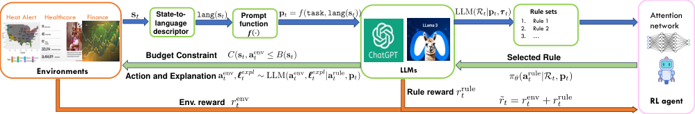


Figure 1: Overview of the RBRL framework for joint sequential decision-making and explanation generation at time instance
_t_ . Starting with current state **s** _t_, a state-to-language descriptor generates lang ( **s** _t_ ), which is used to create the input
prompt **p** _t_ . The LLM processes **p** _t_ to produce a thought _**τ**_ _t_ and a set of candidate rules _R_ _t_ . An attention-based policy
network selects a rule **a** [rule] _t_, which is used to derive an executable action **a** [env] _t_ satisfying the budget constraint _B_ ( **s** _t_ ) for the
environment and a human-readable explanation _**ℓ**_ _[expl]_ _t_, while also providing a rule reward _r_ _t_ [rule] . The environment transitions
to the next state **s** _t_ +1, returning an environment reward _r_ _t_ [env] . This process is repeated iteratively at subsequent time steps.


_Can we design a language agent framework that can_
_simultaneously perform sequential resource alloca-_
_tion and provide human-readable explanations?_


Motivated by existing work that employs predefined rules
or concepts to explain RL policies (Das et al., 2023) or
guide RL exploration (Likmeta et al., 2020), we explore the
potential of using rules to prioritize individuals in resource
allocation problems. In the context of language agents,
rules are defined as “structured statements” that capture
prioritization among choices in a given state, aligning with
the agent’s goals (Srivastava et al., 2024). Rules offer a
flexible framework for encoding high-level decision criteria
and priority logic, similar as the celebrated index policy for
prioritizing arms in resource allocation problems (Whittle,
1988), making them ideal for guiding resource allocation
strategies while explaining the rationale behind decisions.


Building on this, we propose a novel framework called
Rule-Bottleneck Reinforcement Learning ( RBRL ), which integrates the strengths of LLMs and RL to bridge the gap between decision-making and interoperability, by optimizing
LLM-generated rules with RL. RBRL provides a framework
(as shown in Figure 1) that simultaneously makes sequential
resource allocation decisions and provides human-readable
explanations. RBRL leverages LLMs to generate candidate
rules and employs RL to optimize policy selection, enabling
the creation of effective decision policies while simultaneously providing human-understandable explanations.


Our contributions are summarized as follows. _First_, to
avoid the computational cost and complexity of directly
fine-tuning language agents, we leverage LLMs to generate a diverse set of rules, where each rule serves as a prioritization strategy for individuals in resource allocation.
This approach enhances flexibility and interpretability in
decision-making. _Second_, we extend the conventional stateaction space by integrating the thoughts and rules generated
by LLMs, creating a novel framework that enables reinforcement learning to operate on a richer, more interpretable


decision structure. _Third_, we introduce an attention-based
training framework that maps states to queries and rules to
keys. The rule selection process is optimized by a policy
network trained using the Soft Actor-Critic (SAC) algorithm (Haarnoja et al., 2018), ensuring robust and efficient
decision-making. In particular, the LLM also acts as a feedback mechanism, providing guidance during RL exploration
to improve policy optimization and promote more effective
learning.


We evaluate our method in three environments from

two real-world domains: HeatAlerts, where resources
are allocated to mitigate extreme heat events; and
WearableDeviceAssignment, for distributing monitoring devices to patients. Using cost-effective LLMs such
as gpt-4o-mini (OpenAI, 2024b) and Llama 3.1 8B (Meta
AI, 2024), we first assess decision performance by comparing RBRL with pure RL methods and language agent
baselines. We then evaluate explanation quality through a
human survey conducted under IRB approval. The results
demonstrate RBRL ’s effectiveness in both decision quality
and interpretability.


**2. Related Work**


Our work intersects with three distinct areas within the RL

literature. We discuss related work in each of these domains.


**RL for Resource Allocation** RL has been widely studied for constrained resource allocation across domains. In

maternal health, Boehmer et al. (2024) apply RL to a restless multiarmed bandit (RMAB) problem (Whittle, 1988)
to compute patient-specific intervention probabilities. Also
in an RMAB setting, Xiong et al. (2022) propose a modelbased RL approach that prioritizes users via an index and allocates resources under budget constraints. In public health,
Considine et al. (2025) propose RL to optimize extreme
heat warnings under a budget on the number of possible
alerts. Other works include multi-agent RL for robotic
warehouse allocation (Shen et al., 2023) and exogenous


2


**RBRL: Joint Explanation and Decision Optimization for Resource Allocation with Language Agents**


MDPs for cloud resource management (Sinclair et al., 2023).
While these methods optimize rewards effectively, they often lack interpretability—critical for deployment in sensitive
domains requiring trust, transparency, and accountability.


**RL and Language Agents** The language agents (Sumers
et al., 2024) paradigm developed somewhat independently
of RL, with works like ReAct prompting (Yao et al., 2023)
extending chain-of-thought (CoT) (Wei et al., 2022) to action settings. These works have focused on tasks such as
open-ended web navigation (Putta et al., 2024), social simulations (Park et al., 2023), and virtual assistants (Vezhnevets
et al., 2023). Meanwhile, language interfaces have also be
been proposed within the RL literature, including leveraging
external and commonsense knowledge (Feng et al., 2024;
Waytowich et al., 2024), pre-training goal-based policies
(Du et al., 2023), enhancing generalization in embodied
agents (Szot et al., 2023), and aiding human-AI coordination (Srivastava et al., 2024; Hu & Sadigh, 2023). Related
works include GLAM (Carta et al., 2023), TWOSOME (Tan
et al., 2024), BAD (Wen et al., 2024), and TextGym (Xi
et al., 2024), which use LLM finetuning techniques in RL
environments with a reward function. Relevant to our work

is also Wang et al. (2023), which, inspired by open-ended
settings like Minecraft, employs RL to optimize the goals
of an LLM planner based on feasibility.


**Explainable RL (XRL)** Early XRL relied on methods
like decision trees and concept-based explanations (Das
et al., 2023), but these struggled with scalability in dynamic
environments (Poeta et al., 2023). Recent advances introduced large language models (LLMs) for post-hoc explanations, such as explaining decision paths from policy trees
(Zhang et al., 2023) or adding language descriptions to RL
policies (Colas et al., 2022). However, these approaches
focus on interpreting pre-existing policies rather than enabling LLMs to generate inherently explainable decisions,
with challenges in aligning explanations to human reasoning
(Singh et al., 2024). By contrast, inherently (also known
as intrinsically) interpretable policies are those that have
internal representation that allow explanations (Peng et al.,
2022; Milani et al., 2024). Our work sits this literature by
using LLM reasoning traces as the basis for environment
action selection.


With various works acknowledging the trade-off between
interpretability and performance, prioritizing interpretability
appears to be crucial in practice for many critical applications (Rudin, 2019): an approach that we subscribe to in this
work. For example, in the clinical AI domain, physicians require transparency to validate recommendations and uphold
ethical accountability, as mandated by regulatory frameworks (e.g., EPC (2024); CSL (2024)). High-performing
black-box systems often face rejection in clinical workflows
due to distrust (Shevtsova et al., 2024; DuBois, 2019). By


contrast, interpretable models allow clinicians to audit biases and adapt logic to local contexts, whereas opaque policies risk failures under real-world distribution shifts (Rudin,
2019; Doshi-Velez & Kim, 2017). Transparent reasoning
facilitates iterative, clinician-driven refinement, ensuring
collaborative decision aid rather than an inflexible oracle
(Shevtsova et al., 2024; DuBois, 2019). Empirical surveys
show clinicians favor models that enable shared decision
making, error accountability, and ethical oversight despite
modest performance penalties (Shevtsova et al., 2024)—a
critical stance in high-stakes healthcare environments where
trust and adaptability outweigh narrow efficiency gains.


**3. Preliminaries and Problem Formulation**


_Notations._ A bold lowercase letter **a** _∈_ R _[d]_ represents a
vector with dimension _d_, while a regular lowercase letter
_a_ denotes a scalar. An uppercase letter _A_ denotes a mapping function, and a calligraphic letter _A_ denotes a set; [ _h_ ]
denotes the set of _{_ 1 _, . . ., h}_ ; ∆( _A_ ) denotes the space of
probability distributions supported in _A_ .


**3.1. Resource-Constrained Allocation**


Resource-constrained allocation tasks are usually formulated as a special Constrained Markov Decision Process
(CMDP), which is defined by the tuple _⟨S, A, P, R, C, h, γ⟩_,
where _S_ denotes a state space and _A_ denotes a finite action
space. The transition probability function, specifying the
probability of transitioning to state **s** _[′]_ _∈_ R _[d]_ [1] after taking action **a** _∈_ R _[d]_ [2] in state **s**, is _P_ ( **s** _[′]_ _|_ **s** _,_ **a** ) : _S × A × S →_ ∆( _S_ ),
_R_ ( **s** _,_ **a** ) : _S × A →_ R represents the reward function, defining the immediate reward received after taking action **a** in
state **s**, and we let _C_ ( **s** _,_ **a** ) : _S ×A →_ R _[d]_ [3] be the immediate
cost incurred after taking action **a** in state **s** . Often, each dimension _i ∈_ [ _d_ 2 ] in **a** is either 0 or 1 in resource-constrained
allocation tasks. In addition, _h_ is the time horizon and
_γ ∈_ [0 _,_ 1] denotes the discount factor, which determines the
present value of future rewards.


The goal of resource-constrained allocation tasks is to find a
policy _π_ : _S →_ ∆( _A_ ) that maximizes the expected cumulative discounted reward while satisfying the cost constraints:


_s.t. ∀t ∈_ [ _h_ ]: _C_ ( **s** _t_ _,_ **a** _t_ ) _≤_ _B_ ( **s** _t_ ) _,_ (1)


where _B_ : _S →_ R _[d]_ [3] is the budget function.


**3.2. Language-augmented RL with Rules**


We outline the language-augmented RL framework, where
the action space includes internal language actions _A_ [˜] =
_A ∪L_ (Yao et al., 2023; Carta et al., 2023). Language


�


_π_ _[∗]_ = arg max E _π_ _J_ ( _π_ ) :=
_π_


_h_
�
� _t_ =1


� _γ_ _[t][−]_ [1] _R_ ( **s** _t_ _,_ **a** _t_ )


_t_ =1


3


**RBRL: Joint Explanation and Decision Optimization for Resource Allocation with Language Agents**


**Example Language Wrapper for Heat Alert Issuance**


_**Task:**_ Assist policymakers in deciding when to issue public
warnings to protect against heatwaves. Your goal is to minimize the
long-term impact on health and mortality. Your decision should be
based on the remaining budget, weather conditions, day of the week,
past warning history, and remaining warnings for the season. The
goal is to issue warnings when they are most effective, minimizing
warning fatigue and optimizing for limited resources.
_**Action:**_ A single integer value representing the decision: 1 = issue
a warning, 0 = do not issue a warning. Warning can only be issued
if the 'Remaining number of warnings/budget' is positive. Response
in JSON format. For example: {'action': 1}.


(a) Examples of initial task prompt, which contains the task description and available actions.


**Step 1: Generate Thoughts**


Two example thoughts:

 - There are only four warnings remaining in the budget.

 - The current heat index is high, and issuing alert could raise public


awareness.


**Step 2: Generate Rules Based on Thoughts and the Current State**


An example rule:

 - Background: Maintaining a balance in warning issuance is crucial for future

effectiveness.

 - Rule: If there are 3 or more warnings remaining, issue a warning when the

heat index is above 105 F.

 - State Relevance: There are 4 warnings remaining, allowing for proactive

issuance given the current heat index of 107 F.


(b) Examples of generated rules for the Heat Alert Issuance task.


Figure 2: Examples of task prompts and generated rules.


agents typically have two types of internal language actions:
First, _thoughts_ **a** [thought] _∈L_, are reasoning traces from the
current problem state used to inform environment action
selection **a** [env] _∈A_ (Yao et al., 2023). Second, _post-hoc_
_explanations_ _**ℓ**_ [expl], are generated from actions and thoughts
to enhance human trust and interpretability (Zhang et al.,
2023), a focus of this work.


**Rules** Thoughts are useful to highly relevant aspects
of a problem. However, they often lack detailed information to identify the next optimal action. In this
work, we will consider “rules” **a** [rule] _∈L_, which are
structured language statements derived from thoughts
that generally take the form “[do/prioritize] [if/when]”.
More formally, each rule **a** [rule] consists of a triple
( background _,_ rule ~~s~~ tatement _,_ state ~~r~~ elevance ) .
Figure 2b shows examples of generated rules from one of
the domains used in the experiments.


**Task and Constraints Description** Language agents require: (1) a language description of the environment and
the agent’s goal, denoted task ; (2) a function describing the state of the environment in natural language, denoted lang : _S →L_ . At each state **s** _t_, these descriptors are used to construct a natural language prompt
**p** _t_ = _f_ (task _,_ lang( **s** _t_ ) _, C, B_ ), where _C_ and _B_ are the
costs and budget constraints defined in eq. (1) . For instance,
the prompt can restrict certain actions, or the total number of
allocations in a given period of time. Figure 2a exemplifies
rules generated for the environments in our experiments.


**Baseline Rule-based Language Policy** Our objective is


to jointly optimize the reward and explainability of the environment. Hence, we will take as baseline an LLM-driven
policy _π_ LLM for online interaction with the environment:


**a** [thought] _t_ _∼_ _π_ LLM ( **a** [thought] _t_ _|_ **p** _t_ ) _,_ (2)

**a** [rule] _t_ _∼_ _π_ LLM ( **a** [rule] _t_ _|_ **a** [thought] _t_ _,_ **p** _t_ ) _,_ (3)

**a** [env] _t_ _∼_ _π_ LLM ( **a** [env] _t_ _|_ **a** [rule] _t_ _,_ **a** [thought] _t_ _,_ **p** _t_ ) _,_ (4)

_**ℓ**_ [expl] _t_ _∼_ _π_ LLM ( _**ℓ**_ [expl] _t_ _|_ **a** [env] _,_ **a** [rule] _t_ _,_ **p** _t_ ) _._ (5)


The rule acts as a “bottleneck” to the action and explanation.

_Remark_ 3.1 _._ This baseline builds on the baseline chain-of
though language agent, augmented by the generation of
a single rule **a** [rule] _t_ . In the next section, we will introduce
RBRL, which replaces the generation of a single **a** [rule] _t_ with
an RL-based learnable selection policy _π_ _θ_ choosing among
a set of dynamically generated candidate rules.


**Explainability** Explainability in AI encompasses multiple
dimensions (see Hoffman et al. (2018) for an overview).
Here, we evaluate the explainability of **a** [rule] and _**ℓ**_ [expl] through
two key aspects:


1. _Completeness of_ **a** _[rule]_ : Can the optimal action be predicted from the rule? Does it contain sufficient detail
about its applicability to the current state?


2. _Trust and understanding with_ _**ℓ**_ _[expl]_ : Do humans find the
explanation useful to understand the system behavior?
Does it foster trust in the system?


Analyzing both **a** [rule] and _**ℓ**_ [expl] is critical since post hoc LLM
explanations alone may be prone to “satisfying” but misleading rationalizations (Zhang et al., 2023). We hypothesize
that complete rules aid to generating better post-hoc explanations by outlining a more structured reasoning process.


**3.3. Problem Statement**


Our primary challenge is to enable LLMs to jointly optimize
a language policy that both solves the underlying optimization problem and enhances the quality of the explanations—
a task that has received little attention in the literature. We
aim to increase the quality of _**ℓ**_ [expl] while also optimizing
decision-making. We aim to achieve this by selecting rules
that encourage both good quality explanations and high
reward. In Section 4, we will describe our method for constructing a surrogate explainabilty “rule reward” _R_ LLM [rule] [(] **[a]** [rule] [)]
using an LLM as judge (Shen et al., 2024; Bhattacharjee
et al., 2024; Gu et al., 2024). We denote the joint environment/rule reward as ˜ _r_ _t_ = _R_ ( **s** _t_ _,_ **a** [env] _t_ [) +] _[ R]_ LLM [rule] [(] **[a]** _t_ [rule] ) . Then,
we propose the following augmented optimization objective:


�


max E _π_ _J_ [˜] ( _π_ ):=
_π_


_h_
� _γ_ _[t][−]_ [1] _r_ ˜ _t_
� _t_ =1


_s.t._ constraint in (1) _._ (6)


4


**RBRL: Joint Explanation and Decision Optimization for Resource Allocation with Language Agents**


We emphasize that LLMs cannot fully replace the ultimate
human assessment, but they they provide a scalable alternative during the optimization process.


**4.** **Rule-based Reinforcement Learning (** **RBRL** **)**


RBRL leverages the strengths of LLMs and RL to achieve
both interpretability and robust sequential decision-making.


**Algorithm Overview** The RBRL framework in ALgorithm 1 involves four steps: (1) R ULE S ET G ENERATION
(line 3), the LLM processes the state-task **p** _t_ to create candidate rules _R_ _t_ for action selection; (2) R ULE S ELECTION
(line 4), an attention-based RL policy _π_ _θ_ selects the best rule
**a** [rule] _t_ _∈R_ ; (3) D ECISION, R ULE R EWARD AND E XPLANA TION (lines 5-8), the LLM generate an environment action
**a** [env] _t_ and based on the chosen rule **a** [rule] _t_ and gives a humanreadable explanation _**ℓ**_ _[expl]_ _t_ ; (4) R EINFORCEMENT L EARN ING (lines 10-12), collected samples update the policy _π_ _θ_
and value networks with the SAC algorithm (Haarnoja et al.,
2018) and the combined environment and rule reward ˜ _r_ _t_ .
Algorithm 1 details the entire process. Further sections
elaborate on these steps.


**Algorithm 1** RBRL


**Require:** Rule-selection policy _π_ _θ_ ; Value network
_{Q_ _[j]_ _ϕ_ _[}]_ _[j][∈{]_ [1] _[,]_ [2] _[}]_ [; and Replay buffer] _[ B]_ [.]
1: **Initialization:** Initial state **s** 0 and task-state prompt **p** 0 .
2: **for** _t_ = 0 _, . . .,_ max ~~i~~ ters _−_ 1 **do**
3: Generate rule candidates _R_ _t_ using CoT from **p** _t_ and
**a** [thought] _t_ . // Section 4.1
4: Select rule **a** [rule] _t_ using the RL policy _π_ _θ_ from _R_ _t_ and
**s** _t_ . // Section 4.2
5: Generate the environment action **a** [env] _t_ with the LLM
from **a** [rule] _t_, **p** _t_, and previous thoughts.
6: Apply the action in the environment and obtain new
state **s** _t_ +1 and environment reward **r** [env] _t_ [.]
7: Generate post-hoc explanation with the LLM from
**a** [env] _t_ [,] **[ r]** [rule] _t_, **p** _t_, and previous thoughts.
8: Generate rule reward **r** [rule] with the LLM as judge. //
Section 4.3

9: Update the prompt **p** _t_ +1 from **s** _t_ +1, and the constraints _C_ and budget _B_ .
10: Append transition to the replay buffer _B ←B ∪_
_{_ (˜ **s** _t_ _,_ **a** [rule] _t_ _,_ ˜ _r_ _t_ _,_ ˜ **s** _t_ +1 ) _}_ where ˜ **s** _t_ = ( **s** _t_ _, R_ _t_ ) and ˜ _r_ _t_ =
_r_ _t_ [rule] + _r_ _t_ [env] [.]
11: **if** _t_ mod _k_ = 0 **then**

12: Sample from the replay buffer and use Soft-Actor
Critic RL to update the policy network _π_ _θ_ ( **a** [rule] _t_ _|_ ˜ **s** _t_ )
and value networks _{Q_ _[j]_ _ϕ_ [(˜] **[s]** _[t]_ _[,]_ **[ a]** _t_ [rule] ) _}_ _j∈{_ 1 _,_ 2 _}_ . // Section 4.4

13: **end if**

14: **end for**


**4.1. Rule Set Generation**


The rule generation process seeks to to create interpretable
and actionable guidelines for decision-making. Under this
framework, a set of candidate rules _R_ _t_ is generated according to _R_ _t_ _∼_ _π_ LLM ( _R_ _t_ _|_ **p** _t_ _,_ **a** [thought] _t_ ) . To enhance interpretability, each rule is accompanied by a rationale explaining the reasoning behind the decision. The LLM is
instructed to generate rules as a JSON format, which is common for integration of LLMs with downstream applications
(Together AI, 2024). Examples of generated rules are given
in Figure 2b. See Figure 10 in the Appendix for the prompt
templates used to generate the rules.


A higher number of rules is always preferable, however, it
also increases the generating costs and slows down each
iteration of the method. For our experiments, we found that
_|R_ _t_ _|_ = 5 provided achieved a reasonable trade-off.


**4.2. Rule Selection**


In this step, rules are converted from text to vector form,
and a trainable attention-based policy network _π_ _θ_ provides
the probability distribution for sampling a rule. Figure 3 illustrates the process, with a detailed procedure in Algorithm
2 of the Appendix. Below are the major components of
the architecture of _π_ _θ_ . We propose to base the architecture
on cross-attention layers (Bahdanau et al., 2015; Vaswani
et al., 2017), with the state acting as the keys and values,
and the rules as the queries. This allows to learn from the
embedding representations of rules, and efficiently handle
dynamically changing number of rules if needed.


_State Representation._ The numeric state is projected by a
linear layer: **k** _t_ = Linear( **s** _t_ ) _∈_ R _[d]_ _[h]_, with _d_ _h_ being to
denote the architecture hidden dimension.


_Rule Candidate Embedding._ Each rule in the list of rule candidates _R_ _t_ = _{_ _**ρ**_ _[t]_ 1 _[,]_ _**[ρ]**_ _[t]_ 2 _[, . . .,]_ _**[ρ]**_ _[t]_ _q_ _[}]_ [ is embedded into a numeric]
representation using a Sentence Embedding language model
(e.g., SentenceBERT (Reimers & Gurevych, 2019)) and
further processed by a projection layer similar to the state
representation. This results in a _query_ matrix **Q** _t_ _∈_ R _[q][×][d]_ _[h]_ .


_Attention-based Policy Network._ The vector **k** _t_, serving
as keys, engages with the rule embeddings **Q** _t_, acting as
queries, via a cross-attention mechanism to derive a hidden
state representation **h** [(1)] _t_ = Attention( **Q** _t_ _,_ **k** _[⊤]_ _t_ _[,]_ **[ k]** _[⊤]_ _t_ [)] _[ ∈]_
R _[q][×][d]_ _[h]_, computed as


which facilitates the rule candidate vector embeddings in
attending to the environment state. Subsequently, we sequentially apply self-attention layers to the hidden representation **h** [(] _[k]_ [+1)] = Attention( **h** [(] _t_ _[k]_ [)] _,_ **h** [(] _t_ _[k]_ [)] _,_ **h** [(] _t_ _[k]_ [)] ), enabling


**Q** _t_ **k** _t_
Attention( **Q** _t_ _,_ **k** _[⊤]_ _t_ _[,]_ **[ k]** _[⊤]_ _t_ [) =][ softmax] � ~~_√_~~ _d_ _h_


**k** _[⊤]_ _t_ _[,]_
�


5


**RBRL: Joint Explanation and Decision Optimization for Resource Allocation with Language Agents**


```
Rule candidates

```


_Text representation_


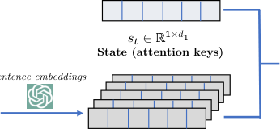

**Embedded rules (attention queries)**


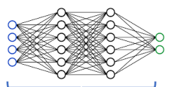

|ℛ ! |


Probability vector of

selecting each rule

```
 Rule Selection

```

*+,
𝑎 " ∼𝜋 % 𝑸 ", s &


!'#


𝜋 % 𝑸 ", s & = 𝜋 %


**Attention-based RL**

**rule selection network**


Figure 3: Overview of the R ULE S ELECTION step. The current state is encoded as a key vector, while candidate rules are
encoded as Queries using a text embedding API (e.b., BERT sentence embedding). An attention-based policy network _π_ _θ_
trained with SAC computes a probability distribution over the candidate rules, enabling the selection of the most suitable
rule for decision-making and explanation.


the rule embeddings to attend to one another to rank an optimal candidate. Ultimately, following _K −_ 1 self-attention
layers, a final linear layer converts the rule representations
into logit vectors _**α**_ _[t]_ _θ_ [=][ Linear][(] **[h]** [(] _t_ _[k]_ [)] ) _∈_ R _[q]_ used for the
computation of the probability of selecting each rule.


For the implementation, the attention layer is realized using the multi-headed attention module from Vaswani et al.
(2017). We incorporate a dropout layer, fixed at 0.05 for the
experiments, along with SiLU activation and layer normalization, which are excluded from the notation for brevity.


_Rule Selection._ The policy distribution over the rules:

_π_ _θ,i_ ( **Q** _t_ _,_ **k** _t_ ) = ~~�~~ ~~_q_~~ _j_ exp( =1 [exp(] _α_ _θ_ _[t]_ _,i_ _[α]_ [(] _θ,j_ _[t]_ **[Q]** _[t]_ [(] _[,]_ **[Q][ k]** _[t][t]_ _[,]_ [))] **[ k]** _[t]_ [))] _[,]_ _i_ = 1 _, . . ., q._


A rule is selected sampled from the distribution: **a** [rule] _t_ _∼_
Categorical( _R_ ; ( _π_ _θ,i_ ( **Q** _t_ _,_ **k** _t_ )) _[q]_ _i_ =1 [)][.]


**4.3. Decision, Rule Reward, and Explanation**


Upon selection of rule **a** [rule] _t_, the LLM determines the
action to be applied within the environment **a** [env] _t_ _∼_
_π_ LLM ( **a** [env] _t_ _[|]_ **[a]** [rule] _t_ _,_ **a** [thought] _t_ _,_ **p** _t_ ), ensuring concordance with the
chosen strategy. Subsequently, the LLM formulates a posthoc explanation _**ℓ**_ [expl] _t_ _∼_ _π_ LLM ( _**ℓ**_ [expl] _t_ _|_ **a** [env] _,_ **a** [rule] _,_ **a** [thought] _,_ **p** _t_ )
contingent upon the rule. Figure 10 in the Appendix illustrates the prompt template employed to generate both the
action and explanation.


This procedure concurrently produces the rule reward
_R_ LLM [rule] [(] _[r]_ _t_ [rule] ), used for reinforcement learning (RL) in the
next step. This rewards is derived from using the LLM as a
judge to answer the following three questions:


ER 1 . Without providing **a** [env] _t_ [, is] **[ a]** [rule] _t_ sufficient to predict/infer the optimal action?


ER 2 . Does **a** [rule] _t_ contain enough details about the applicability of the rule to the current state?


ER 3 . Given **a** [env] _t_ [, is] **[ a]** [rule] _t_ compatible with this selection?


Each question scores as 0 if negative or 1 if positive.
The rule reward is calculated as _r_ _t_ [rule] = _R_ LLM [rule] [(] **[a]** _t_ [rule] ) =
(1 _/_ 3) [�] _i_ [ER] _[i]_ [. Refer to Figure][ 10][ in the Appendix for the]

full prompt.


**4.4. RL with SAC**


_Augmented state space_ Traditional RL frameworks fail
here due to intermediate steps: generating the rule set
_R_ _t_, mapping rules **a** [rule] _t_ to actions **a** [env] _t_ in an LLM-driven
environment. RBRL addresses this issue by creating an
augmented state ˜ **s** _t_ := ( **s** _t_ _, R_ _t_ ) with transition dynamics
_P_ (˜ **s** _t_ +1 _|_ ˜ **s** _t_ _,_ **a** [rule] _t_ ), integrating rules into the state space for
reasoning over both the environment’s dynamics and decision rules **a** [rule] _t_ . This proposition explains the transition
computation.


**Theorem 4.1.** _The state transition of the_ _RBRL_ _MDP can_
_be calculated as_


_P_ (˜ **s** _t_ +1 _|_ ˜ **s** _t_ _,_ **a** _[rule]_ _t_ ) = _P_ ( _R_ _t_ +1 _|_ **s** _t_ +1 ) _×_


_P_ ( **s** _t_ +1 _|_ **a** _[env]_ _,_ **s** _t_ ) _· P_ ( **a** _[env]_ _|_ **a** _[rule]_ _t_ _,_ **s** _t_ ) _d_ **a** _[env]_ _,_ (7)

� **a**


_where_ _P_ ( _R_ _t_ +1 _|_ **s** _t_ +1 ) = _π_ _LLM_ ( _R_ _t_ +1 _|_ **p** _t_ _,_ _**τ**_ _t_ ) _is the proba-_
_bility of the LLM generating rule set_ _R_ _t_ +1 _provided the_
_state_ **s** _t_ +1 _,_ _P_ ( **s** _t_ +1 _|_ **a** _[env]_ _,_ **s** _t_ ) _is the original environment dy-_
_namics, and_ _P_ ( **a** _[env]_ _|_ **a** _[rule]_ _t_ _,_ **s** _t_ ) = _π_ _LLM_ ( **a** _[env]_ _|_ **p** _t_ _,_ **a** _[rule]_ _t_ ) _is the_
_probability of the LLM selecting the environment action_ **a** _[env]_ _._


_SAC step_ The attention-based policy network in Section
4.2 is optimized using the SAC algorithm, which balances
reward maximization with exploration by incorporating an
entropy term in the objective function. The SAC update
process is outlined as follows. First, we define an auxiliary


6


target value:


**RBRL: Joint Explanation and Decision Optimization for Resource Allocation with Language Agents**


**5.1. Environment Reward Optimization**


_y_ = � _r_ ˜ _t_ + _γ_ E **a** rule _t_ +1 _[∼][π]_ _[θ]_ � _j_ min =1 _,_ 2 _Q_ ¯ _ϕ_ ¯ _j_ (˜ **s** _t_ +1 _,_ **a** [rule] _t_ +1 [)]


_−_ _β_ log _π_ _θ_ ( **a** [rule] _t_ +1 _[|]_ **[Q]** _[t]_ [+1] _[,]_ **[ k]** _[t]_ [+1] [)] _,_ (8)
��


The Q-networks are updated by minimizing the loss function:


2
_L_ _Q_ ( _ϕ_ _i_ ) = E _D_ _Q_ _ϕ_ _i_ (˜ **s** _t_ _,_ **a** [rule] _t_ ) _−_ _y_ _, ∀i_ = 1 _,_ 2 _._ (9)
�� � �


The policy network is updated by minimizing the KL divergence between the policy and the Boltzmann distribution
induced by _Q_ _ϕ_, which is expressed as


_L_ _π_ ( _θ_ )=E _D_ _β_ log _π_ _θ_ ( **a** [rule] _t_ _|_ **Q** _t_ _,_ _t_ ) _−_ min _t_ ) _,_ (10)
� _i_ =1 _,_ 2 _[Q]_ _[ϕ]_ _[i]_ [(˜] **[s]** _[t]_ _[,]_ **[ a]** [rule] �


where _β_ is a temperature parameter. The full SAC update
procedure is detailed in Algorithm 3 in Appendix A.1.


**5. Experiments & Human Survey**


In this section, we evaluate RBRL and empirically show
that it can achieve a joint improvement in both reward and
explainability over comparable baselines . We briefly summarize these environments here, with additional details in
Appendix B.1.


**Domains** We evaluate RBRL in three environments pertaining to the following two distinct domains:


_•_ WearableDeviceAssignment : We use two environments, Uganda and MimicIII, from the vital sign
monitoring domain introduced by Boehmer et al. (2024),
modeling the allocation of limited wireless devices among
postpartum mothers as an restless multi-armed bandit problem (RMAB). Each mother (“arm”) is represented by a state
of vital signs (e.g., heart rate, respiratory rate, SPO2) and
their variability. Action vector elements are binary: assigning a device to a mother or not. The aim is to prioritize
high-risk patients since there are only a limited number of _B_
devices. Rewards penalize abnormal vital signs, with monitoring enabling health-improving interventions. Boehmer
et al. (2024) suggests to recast the RMAB problem as an
MDP, deciding from which patient to remove a device when
a new patient arrives. A penalty is incurred when removing
the device from an active patient if there are free devices.


_•_ HeatAlerts : We use the weather2alert environ
ment from Considine et al. (2025), which formulates issuing
heat alerts as a constrained MDP. The action is binary, subject to a constraint on the total number of alerts that can
be issued. The state includes the heat index, the remaining
budget, and a history of previous alerts. Actions **a** _t_ are binary and represent whether to issue an alert. Rewards are
reductions in hospitalizations from the alert. A penalty is
incurred when selecting to issue an alert when on budget.


We discuss the main results and refer to Appendix B for the
detailed experiment setup. Unless otherwise specified, we
use gpt-4o-mini (OpenAI, 2024b) as LLM due to its
reasonable cost and high performance. All baselines were
trained on 3 seeds for 2000 environment steps each.


_Q1. Did_ _RBRL_ _optimize the reward function?_ RBRL
is compared to Chain-of-thought (CoT) (Wei et al., 2022)
for language reasoning and Proximal Policy Optimization
(PPO) (Schulman et al., 2017) for numeric states. Figure 4
indicates RBRL outperforms CoT, showing RL-optimized
rule selection improves decision-making. The results show
that RBRL exceeds PPO in all environments with equivalent
environment steps, suggesting a higher performance when
learning in an online setting. For completeness, we also
compare against PPO trained at 100k steps, 50 times more.
For the HeatAlerts environment, RBRL exceeds such
asymptotic performance, consistently with the findings of
Considine et al. (2025) noting that PPO and other standard
RL algorithms struggle to handle the constraints and exploration in this domain. For the Uganda and MimicIII
environments, we observe the trend of RBRL getting closer
to 100k PPO, but not reaching the performance. As highlighted in Section 2, various works have remarked that the
trade-off between interpretability and performance can be
justified to increase system trust, robustness, and adaptability in high-stakes environments.


_Q2. Did structured rules help optimization?_ We conduct two ablation studies on structured rules. First, we
benchmark the use of structured rules without RL, called
baseline RulesLLMOnly, which is shown in Equation (2)(5). Next, we compare RBRL with a variant optimizing
unstructured thoughts, termed thoughts-based RL ( TBRL ).
The implementation mimics RBRL, utilizing a candidate
pool _R_ with the CoT prompt. Results in Figure 5a show
that comparing RBRL with RulesLLMOnly highlights RL
training gains, suggesting rule generation alone does not
explain RBRL ’s performance. Additionally, significant improvements over TBRL suggest optimizing structured rules
is more effective than optimizing free reasoning traces.


_Q3. How does_ _RBRL_ _compare to token-level LLM finetun-_
_ing with RL?_ We implement LLM finetuning from the
environment reward to a Llama 3.1 8B model (Meta AI,
2024), termed FinetunePPO . We train a value head on
the last hidden states and use KL divergence from the reference model as a regularization reward (Ziegler et al., 2019).
A simple CoT generation is used, followed by a call for
action question, optimizing the full CoT and action trace.
We train 3 seeds for 18 hours on an Nvidia A100 40G GPU,
achieving 1200 steps per seed. For compatibility, we also
train RBRL on the same Llama 3.1 8B model. Figure 5b
compares results, showing a positive but relatively flat trend


7


**RBRL: Joint Explanation and Decision Optimization for Resource Allocation with Language Agents**

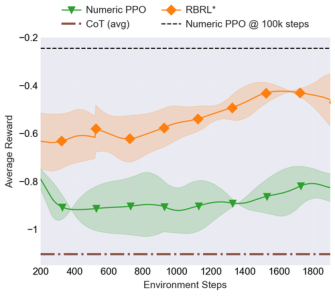

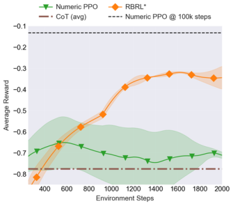


(a) Uganda environment (b) MimicIII environment (c) HeatAlerts environment


Figure 4: Results from Q1. Main comparison of RBRL on three resource allocation problems. The plots show the mean and
standard error across three seeds, using exponentially weighted moving averages with a half-life of 100.

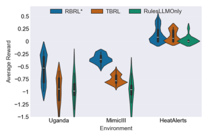

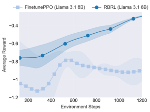

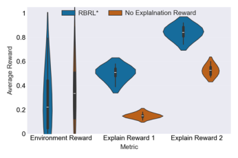


(a) Results from Q2: ablations (b) Results from Q3: LLM finetuning (c) Results from Q4: no rule rewards


Figure 5: Additional experiments and ablations. (a) Comparison of RBRL with thoughts-based RL (TBRL) and the
baseline rule-based LLM without RL training; (b) comparison against LLM finetuning with PPO at the token level from the
environment reward with CoT generation for the Mimic environment ; (c) shows the effect of removing the rule reward
in the HeatAlerts environments. For (a) and (c), we show distribution of rewards in the last 20% training steps.


for finetuning compared to RBRL, suggesting RBRL is better
online. Additionally, RBRL runs on a regular laptop, unlike FinetunePPO that needs specialized hardware, and
training time for FinetunePPO is about 4x longer on
equivalent steps. Due to computation constraints, we only
show this experiment for the MimicII domain, which had
the less noise in the previous experiments.


**5.2. Human Survey and Explainability**


_Q4. Did_ _RBRL_ _increase the explainability of post-hoc expla-_
_nations?_ A survey with 40 participants was conducted
to assess explanation quality, detailed in Appendix E. Each
prompt included the task, state, and action space as originally given to the LLM, followed by actions and explanations from the CoT agent and the RBRL agent, without
disclosing agent types. Participants were asked to choose
preference for explanation A, B, or none. Prompts were
split between _Wearable Device Assignment_ and _Heat Alerts_
domains. Figure 6 shows results, favoring RBRL ’s explanations in both domains, with a detailed breakdown in E. An
additional experiment with an LLM judge (Gu et al., 2024)


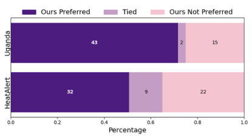

Figure 6: Results from the human survey.


using a large gpt-4o model (OpenAI, 2024a) showed
strong agreement with humans, preferring RBRL ’s explanations in all but one case.


_Q5. What was the effect of the rule reward?_ During training
of RBRL, rules received rewards based on two prompts. We
examine an ablation where this reward was omitted. Figure 5c illustrates results for the HeatAlerts environment,
noted for high variance and a challenging reward function.
We extended training to 5k environment steps to better understand these dynamics. When RBRL is trained without the


8


**RBRL: Joint Explanation and Decision Optimization for Resource Allocation with Language Agents**


rule reward, the environment reward remains steady (with a
slight increase), but explainability scores drop significantly.
Refer to Section 4.3 for the definition of the rule reward
metrics. A decline in metric 1 indicates that rules are less

predictive of the optimal actions. A decline in metric 2 suggests rules lack detailed applicability to the current problem
state, indicating more generic rather than specialized rule
selection. Metric 3 (not shown) was always 1 in all steps,
indicating the limitations of directly evaluating post hoc explanations. Although judged by the LLM, these results are
encouraging, as our previous experiment showed alignment
between the LLM and human assessments.


**6. Conclusion**


The RBRL framework takes an important step towards addressing the critical challenge of balancing decision efficacy
and interpretability in constrained allocation tasks. By synergizing the generative capabilities of LLMs with the optimization power of RL, RBRL introduces a novel paradigm where
structured rules, generated dynamically by LLMs, guide
RL policies to make transparent and actionable decisions.
Evaluations across healthcare and public health domains
demonstrate RBRL ’s competitive performance against traditional RL baselines while significantly enhancing the quality
of human-understandable explanations. Human and LLMjudged surveys further validate that RBRL’s explanations
improve trust and clarity, contributing towards addressing
the longstanding barrier to deploying AI in high-stakes scenarios.


**Impact and Ethics Statement**


This work advances the development of transparent AI systems for high-stakes decision-making in domains like healthcare and public policy. By enabling RL agents to generate
human-readable rules and explanations, RBRL improves
trust and accountability, critical for ethical deployment in
settings where lives and resources are at stake.


While the framework prioritizes alignment with human reasoning, potential risks include over-reliance on imperfect
LLM-generated rules or explanations that may inadvertently obscure biases in training data. Mitigation requires
rigorous validation of rules by domain experts and ongoing monitoring of LLM outputs. Additionally, RBRL ’s
reliance on LLMs raises computational and accessibility
challenges in resource-constrained environments. By addressing these considerations, this research contributes to
safer, more equitable AI systems that empower—rather than
replace—human decision-makers.


Notice that the Uganda and Heat Alerts datasets used in this
study is derived from a simulator provided by Boehmer et al.
(2024) and Considine et al. (2025). These simulators do


not include any feature information or identifying details
of real patients. Thus, the data generated by the simulator
cannot be traced to or represent actual individuals, ensuring
privacy and ethical compliance. We emphasize that this is
purely a simulated study; and recognize that for any next
steps towards real world use, there is a need to conduct
rigorous simulation studies on a large scale with real patient
data, with detailed assessments of potential biases, verification of policy convergence and its robustness to distribution
shifts in patient populations, and making necessary adjustments. Beyond that, there will be a need to obtain ethics
and regulatory approval to test the policy in a real-world
setting for future comprehensive field-testing, addressing
issues of participant consent and privacy; and ultimately
there would need to be sufficient human oversight for any
future deployment.


**Acknowledgments**


This work is supported by the Harvard Data Science Initative, Wadhwani AI, and the National Institues of Health
(R01ES34021, R01ES037156.)


**References**


Bahdanau, D., Cho, K., and Bengio, Y. Neural machine
translation by jointly learning to align and translate. In
_ICLR_, 2015.


Bhattacharjee, A., Moraffah, R., Garland, J., and Liu, H.
Towards llm-guided causal explainability for black-box
text classifiers. In _AAAI 2024 Workshop on Responsible_
_Language Models_, 2024.


Boatin, A. A., Ngonzi, J., Wylie, B. J., Lugobe, H. M.,
Bebell, L. M., Mugyenyi, G., Mohamed, S., Martinez,
K., Musinguzi, N., Psaros, C., et al. Wireless versus
routine physiologic monitoring after cesarean delivery to
reduce maternal morbidity and mortality in a resourcelimited setting: protocol of type 2 hybrid effectivenessimplementation study. _BMC Pregnancy and Childbirth_,
21:1–12, 2021.


Boehmer, N., Zhao, Y., Xiong, G., Rodriguez-Diaz, P., Cibrian, P. D. C., Ngonzi, J., Boatin, A., and Tambe, M. Optimizing vital sign monitoring in resource-constrained maternal care: An rl-based restless bandit approach. _arXiv_
_preprint arXiv:2410.08377_, 2024.


Carta, T., Romac, C., Wolf, T., Lamprier, S., Sigaud, O.,
and Oudeyer, P.-Y. Grounding large language models
in interactive environments with online reinforcement

learning. In _ICML_, 2023.


Colas, C., Karch, T., Moulin-Frier, C., and Oudeyer, P.Y. Language and culture internalization for human-like


9


**RBRL: Joint Explanation and Decision Optimization for Resource Allocation with Language Agents**


autotelic ai. _Nature Machine Intelligence_, 4(12):1068–
1076, 2022.


Considine, E. M., Nethery, R. C., Wellenius, G. A., Dominici, F., and Tec, M. Optimizing heat alert issuance
with reinforcement learning. In _AAAI_, 2025.


CSL. Senate bill no. 896: Generative

artificial intelligence accountability act.
https://legiscan.com/CA/text/SB896/id/3023382,
2024. Accessed: 2025-02-06.


Das, D., Chernova, S., and Kim, B. State2explanation:
Concept-based explanations to benefit agent learning and
user understanding. _NeurIPS_, 2023.


Doshi-Velez, F. and Kim, B. Towards a rigorous science of interpretable machine learning. _arXiv preprint_
_arXiv:1702.08608_, 2017.


Du, Y., Watkins, O., Wang, Z., Colas, C., Darrell, T., Abbeel,
P., Gupta, A., and Andreas, J. Guiding pretraining in
reinforcement learning with large language models. In
_ICML_, pp. 8657–8677, 2023.


DuBois, K. N. Deep medicine: How artificial intelligence
can make healthcare human again. _Perspectives on Sci-_
_ence and Christian Faith_, 71(3):199–201, 2019.


EPC. Regulation (eu) 2024/1689 of the european parliament and of the council of 13 june 2024 laying down harmonised rules on artificial intelligence.
http://data.europa.eu/eli/reg/2024/1689/oj, 2024. Accessed: 2025-02-06.


Feng, X., Wan, Z., Fu, H., Liu, B., Yang, M., Koushik,
G. A., Hu, Z., Wen, Y., and Wang, J. Natural language
reinforcement learning. _arXiv preprint arXiv:2411.14251_,
2024.


Furuta, H., Matsuo, Y., Faust, A., and Gur, I. Exposing
limitations of language model agents in sequential-task
compositions on the web. In _ICLR 2024 Workshop on_
_Large Language Model (LLM) Agents_, 2024.


Gebrael, G., Sahu, K. K., Chigarira, B., Tripathi, N.,
Mathew Thomas, V., Sayegh, N., Maughan, B. L., Agarwal, N., Swami, U., and Li, H. Enhancing triage efficiency and accuracy in emergency rooms for patients
with metastatic prostate cancer: a retrospective analysis
of artificial intelligence-assisted triage using chatgpt 4.0.
_Cancers_, 15(14):3717, 2023.


Gu, J., Jiang, X., Shi, Z., Tan, H., Zhai, X., Xu, C., Li, W.,
Shen, Y., Ma, S., Liu, H., et al. A survey on llm-as-ajudge. _arXiv preprint arXiv:2411.15594_, 2024.


Haarnoja, T., Zhou, A., Abbeel, P., and Levine, S. Soft actorcritic: Off-policy maximum entropy deep reinforcement
learning with a stochastic actor. In _Proceedings of the_
_35th International Conference on Machine Learning_, pp.
1856–1865. PMLR, 2018.


Hoffman, R. R., Mueller, S. T., Klein, G., and Litman, J.
Metrics for explainable ai: Challenges and prospects.
_arXiv preprint arXiv:1812.04608_, 2018.


Hu, E. J., Shen, Y., Wallis, P., Allen-Zhu, Z., Li, Y., Wang,
S., Wang, L., and Chen, W. Lora: Low-rank adaptation of
large language models. _arXiv preprint arXiv:2106.09685_,
2021.


Hu, H. and Sadigh, D. Language instructed reinforcement
learning for human-ai coordination. In _ICML_, 2023.


Huang, S., Dossa, R. F. J., Ye, C., Braga, J., Chakraborty,
D., Mehta, K., and ao G.M. Araujo, J. Cleanrl: High- ´
quality single-file implementations of deep reinforcement learning algorithms. _Journal of Machine Learning_
_Research_, 23(274):1–18, 2022. URL [http://jmlr.](http://jmlr.org/papers/v23/21-1342.html)
[org/papers/v23/21-1342.html.](http://jmlr.org/papers/v23/21-1342.html)


Johnson, A. E., Pollard, T. J., Shen, L., Lehman, L.-w. H.,
Feng, M., Ghassemi, M., Moody, B., Szolovits, P., Anthony Celi, L., and Mark, R. G. Mimic-iii, a freely accessible critical care database. _Scientific data_, 3(1):1–9,
2016.


Likmeta, A., Metelli, A. M., Tirinzoni, A., Giol, R., Restelli,
M., and Romano, D. Combining reinforcement learning
with rule-based controllers for transparent and general
decision-making in autonomous driving. _Robotics and_
_Autonomous Systems_, 131:103568, 2020.


Meta AI. Introducing llama 3.1: Our most capable models
to date. _AI at Meta_, 2024. URL [https://ai.meta.](https://ai.meta.com/blog/meta-llama-3-1/)
[com/blog/meta-llama-3-1/.](https://ai.meta.com/blog/meta-llama-3-1/)


Milani, S., Topin, N., Veloso, M., and Fang, F. Explainable
reinforcement learning: A survey and comparative review.
_ACM Computing Surveys_, 56(7):1–36, 2024.


OpenAI. GPT-4o system card. _arXiv preprint_
_arXiv:2410.21276_, 2024a. URL [https://arxiv.](https://arxiv.org/abs/2410.21276)
[org/abs/2410.21276.](https://arxiv.org/abs/2410.21276)


OpenAI. Gpt-4o mini: Advancing cost-efficient intelligence.
_OpenAI Blog_, 2024b.


Park, J. S., O’Brien, J., Cai, C. J., Morris, M. R., Liang,
P., and Bernstein, M. S. Generative agents: Interactive
simulacra of human behavior. In _Proceedings of the 36th_
_annual acm symposium on user interface software and_
_technology_, pp. 1–22, 2023.


10


**RBRL: Joint Explanation and Decision Optimization for Resource Allocation with Language Agents**


Peng, X., Riedl, M., and Ammanabrolu, P. Inherently explainable reinforcement learning in natural language. In
Oh, A. H., Agarwal, A., Belgrave, D., and Cho, K. (eds.),
_NeurIPS_, 2022.


Poeta, E., Ciravegna, G., Pastor, E., Cerquitelli, T., and Baralis, E. Concept-based explainable artificial intelligence:
A survey. _arXiv preprint arXiv:2312.12936_, 2023.


Putta, P., Mills, E., Garg, N., Motwani, S., Finn, C., Garg,
D., and Rafailov, R. Agent q: Advanced reasoning
and learning for autonomous ai agents. _arXiv preprint_
_arXiv:2408.07199_, 2024.


Rashid, A., Wu, R., Grosse, J., Kristiadi, A., and Poupart, P.
A critical look at tokenwise reward-guided text generation.
_arXiv preprint arXiv:2406.07780_, 2024.


Reimers, N. and Gurevych, I. Sentence-bert: Sentence
embeddings using siamese bert-networks. In _Proceedings_
_of the 2019 Conference on EMNLP-IJCNLP_, pp. 3980–
3990. Association for Computational Linguistics, 2019.


Rudin, C. Stop explaining black box machine learning
models for high stakes decisions and use interpretable
models instead. _Nature machine intelligence_, 1(5):206–
215, 2019.


Schulman, J., Wolski, F., Dhariwal, P., Radford, A., and
Klimov, O. Proximal policy optimization algorithms.
_arXiv preprint arXiv:1707.06347_, 2017.


Shen, Y., McClosky, B., and Zavlanos, M. Multi-agent
reinforcement learning for resource allocation in largescale robotic warehouse sortation centers. 2023.


Shen, Y., John, A. E. A., and Fain, B. Explainable rewards
in RLHF using LLM-as-a-judge, 2024. URL [https:](https://openreview.net/forum?id=FaOeBrlPst)
[//openreview.net/forum?id=FaOeBrlPst.](https://openreview.net/forum?id=FaOeBrlPst)


Shevtsova, D., Ahmed, A., Boot, I. W., Sanges, C., Hudecek,
M., Jacobs, J. J., Hort, S., Vrijhoef, H. J., et al. Trust in
and acceptance of artificial intelligence applications in
medicine: Mixed methods study. _JMIR Human Factors_,
11(1):e47031, 2024.


Sinclair, S. R., Vieira Frujeri, F., Cheng, C.-A., Marshall, L.,
Barbalho, H., Li, J., Neville, J., Menache, I., and Swaminathan, A. Hindsight learning for mdps with exogenous
inputs. In _ICML_, 2023.


Singh, C., Inala, J. P., Galley, M., Caruana, R., and Gao, J.
Rethinking interpretability in the era of large language
models. _arXiv preprint arXiv:2402.01761_, 2024.


Srivastava, M., Colas, C., Sadigh, D., and Andreas, J. Policy
learning with a language bottleneck. In _RLC Workshop_
_on Training Agents with Foundation Models_, 2024.


Sumers, T., Yao, S., Narasimhan, K., and Griffiths, T.
Cognitive architectures for language agents. _TMLR_,
2024. URL [https://openreview.net/forum?](https://openreview.net/forum?id=1i6ZCvflQJ)

[id=1i6ZCvflQJ.](https://openreview.net/forum?id=1i6ZCvflQJ)


Szot, A., Schwarzer, M., Agrawal, H., Mazoure, B., Metcalf,
R., Talbott, W., Mackraz, N., Hjelm, R. D., and Toshev,
A. T. Large language models as generalizable policies for
embodied tasks. In _ICLR_, 2023.


Talaat, F. M. Effective deep q-networks (edqn) strategy
for resource allocation based on optimized reinforcement
learning algorithm. _Multimedia Tools and Applications_,
81(28):39945–39961, 2022.


Tan, W., Zhang, W., Liu, S., Zheng, L., Wang, X., and
An, B. True knowledge comes from practice: Aligning
large language models with embodied environments via
reinforcement learning. In _ICLR_, 2024.


Together AI. Announcing function calling and json
mode, 2024. URL [https://www.together.](https://www.together.ai/blog/function-calling-json-mode)
[ai/blog/function-calling-json-mode](https://www.together.ai/blog/function-calling-json-mode) . Accessed: 2025-01-30.


Towers, M., Kwiatkowski, A., Terry, J. K., Balis, J. U.,
De Cola, G., Deleu, T., Goulao, M., Kallinteris, A., ˜
Krimmel, M., KG, A., et al. Gymnasium: A standard interface for reinforcement learning environments.
_arXiv preprint arXiv:2407.17032_, 2024. URL [https:](https://arxiv.org/abs/2407.17032)
[//arxiv.org/abs/2407.17032.](https://arxiv.org/abs/2407.17032)


Vaswani, A., Shazeer, N., Parmar, N., Uszkoreit, J., Jones,
L., Gomez, A. N., Kaiser, K., and Polosukhin, I. Attention is all you need. In _Advances in Neural Information_
_Processing Systems_, volume 30, 2017.


Vezhnevets, A. S., Agapiou, J. P., Aharon, A., Ziv, R.,
Matyas, J., Due ´ nez-Guzm ˜ an, E. A., Cunningham, W. A., ´
Osindero, S., Karmon, D., and Leibo, J. Z. Generative
agent-based modeling with actions grounded in physical,
social, or digital space using concordia. _arXiv preprint_
_arXiv:2312.03664_, 2023.


Wang, Z., Cai, S., Chen, G., Liu, A., Ma, X., Liang, Y.,
and CraftJarvis, T. Describe, explain, plan and select:
interactive planning with large language models enables
open-world multi-task agents. In _NeurIPS_, 2023.


Waytowich, N. R., White, D., Sunbeam, M., and Goecks,
V. G. Atari-gpt: Investigating the capabilities of multimodal large language models as low-level policies for
atari games. _arXiv preprint arXiv:2408.15950_, 2024.


Wei, J., Wang, X., Schuurmans, D., Bosma, M., Xia, F., Chi,
E., Le, Q. V., Zhou, D., et al. Chain-of-thought prompting
elicits reasoning in large language models. _Advances in_
_neural information processing systems_, 35:24824–24837,
2022.


11


**RBRL: Joint Explanation and Decision Optimization for Resource Allocation with Language Agents**


Wen, M., Wan, Z., Wang, J., Zhang, W., and Wen, Y. Reinforcing LLM agents via policy optimization with action
decomposition. In _The Thirty-eighth Annual Conference_
_on Neural Information Processing Systems_, 2024.


Whittle, P. Restless bandits: Activity allocation in a changing world. _Journal of applied probability_, 25(A):287–298,
1988.


Wolf, T., Debut, L., Sanh, V., Chaumond, J., Delangue,
C., Moi, A., Cistac, P., Rault, T., Louf, R., Funtowicz,
M., Davison, J., Shleifer, S., von Platen, P., Ma, C., Jernite, Y., Plu, J., Xu, C., Le Scao, T., Gugger, S., Drame,
M., Lhoest, Q., and Rush, A. M. Transformers: Stateof-the-art natural language processing. In _Proceedings_
_of the 2020 Conference on Empirical Methods in Natu-_
_ral Language Processing: System Demonstrations_, pp.
38–45, Online, October 2020. Association for Computational Linguistics. URL [https://www.aclweb.](https://www.aclweb.org/anthology/2020.emnlp-demos.6)
[org/anthology/2020.emnlp-demos.6.](https://www.aclweb.org/anthology/2020.emnlp-demos.6)


Xi, Z., Ding, Y., Chen, W., Hong, B., Guo, H., Wang, J.,
Yang, D., Liao, C., Guo, X., He, W., et al. Agentgym:
Evolving large language model-based agents across diverse environments. _arXiv preprint arXiv:2406.04151_,
2024.


Xiong, G., Qin, X., Li, B., Singh, R., and Li, J. Index-aware
reinforcement learning for adaptive video streaming at
the wireless edge. In _Proceedings of the Twenty-Third_
_International Symposium on Theory, Algorithmic Foun-_
_dations, and Protocol Design for Mobile Networks and_
_Mobile Computing_, pp. 81–90, 2022.


Xiong, G., Wang, S., Yan, G., and Li, J. Reinforcement
learning for dynamic dimensioning of cloud caches: A
restless bandit approach. _IEEE/ACM Transactions on_
_Networking_, 31(5):2147–2161, 2023.


Yao, S., Zhao, J., Yu, D., Du, N., Shafran, I., Narasimhan,
K. R., and Cao, Y. React: Synergizing reasoning and
acting in language models. In _ICLR_, 2023.


Yu, C., Liu, J., Nemati, S., and Yin, G. Reinforcement learning in healthcare: A survey. _ACM Computing Surveys_
_(CSUR)_, 55(1):1–36, 2021.


Yu, Y., Yao, Z., Li, H., Deng, Z., Cao, Y., Chen, Z., Suchow,
J. W., Liu, R., Cui, Z., Xu, Z., et al. Fincon: A synthesized llm multi-agent system with conceptual verbal
reinforcement for enhanced financial decision making.
_arXiv preprint arXiv:2407.06567_, 2024.


Zhai, Y., Bai, H., Lin, Z., Pan, J., Tong, S., Zhou, Y., Suhr,
A., Xie, S., LeCun, Y., Ma, Y., et al. Fine-tuning large
vision-language models as decision-making agents via
reinforcement learning. _arXiv preprint arXiv:2405.10292_,
2024.


12


Zhang, X., Guo, Y., Stepputtis, S., Sycara, K., and Campbell, J. Understanding your agent: Leveraging large
language models for behavior explanation. _arXiv preprint_
_arXiv:2311.18062_, 2023.


Zhao, Y., Behari, N., Hughes, E., Zhang, E., Nagaraj, D.,
Tuyls, K., Taneja, A., and Tambe, M. Towards a pretrained model for restless bandits via multi-arm generalization. In _Proc. of IJCAI_, pp. 321–329, 2024.


Ziegler, D. M., Stiennon, N., Wu, J., Brown, T. B., Radford,
A., Amodei, D., Christiano, P., and Irving, G. Fine-tuning
language models from human preferences. _arXiv preprint_
_arXiv:1909.08593_, 2019.


**RBRL: Joint Explanation and Decision Optimization for Resource Allocation with Language Agents**


**A. Algorithmic and Mathematical Details**


**A.1. Algorithms**


In this subsection, we present the detailed pseudocodes for Rule ~~S~~ earch in Algorithm 2 and the SAC for attention-based
policy network in Algorithm 3.


**Algorithm 2** Rule ~~S~~ earch: Rule Selection via Attention-Based Policies


**Require:** Numeric state representation **s** _t_ _∈_ R _[d]_ _[s]_ and rule set _R_ _t_ = _{_ _**ρ**_ _[t]_ _i_ _[}]_ _[q]_ _i_ =1 [. Hidden dimension] _[ d]_ _[h]_ [.]
1: Embed each rule _**ρ**_ _[t]_ _i_ _[∈R]_ _[t]_ [ into a numeric vector using sentence embeddings] **[ q]** _[t]_ _i_ [=][ embed][(] _**[ρ]**_ _[t]_ _i_ [)] _[ ∈]_ [R] _[d]_ _[h]_ [ (e.g., Sentence-]
BERT) and stack to form a query matrix **Q** _t_ _∈_ R _[d]_ _[h]_ _[×][q]_ . // _Rule Candidate Embedding_
2: The state **s** _t_ is projected by a linear layer with SiLU activation: **k** _t_ = SiLU(Linear( **s** _t_ )) _∈_ R _[d]_ _[h]_, with _d_ _h_ being to
denote the architecture hidden dimension. // _State Representation_
3: Use cross-attention to obtain **h** = CrossAttention( **Q** _t_ _,_ **k** _t_ _,_ **k** _t_ ) _∈_ R _[q][×][d]_ _[h]_ .
4: (Optional) Further apply a self-attention network **h** _←_ SelfAttention( **h** ).
5: Apply linear layer to obtain logits vector _**α**_ _[t]_ _θ_ [= Linear(] **[h]** [)] _[ ∈]_ [R] _[q][×]_ [1] [.]

6: Calculate the policy distribution: _π_ _θ,i_ ( **Q** _t_ _,_ **k** _t_ ) = ~~�~~ ~~_q_~~ _j_ exp( =1 [exp(] _α_ _[t]_ _θ,_ _[α]_ _i_ [(] ~~_[t]_~~ _θ,j_ **[Q]** _[t]_ [(] _[,]_ **[Q][k]** _[t][t]_ [))] _[,]_ **[k]** _[t]_ [))] [, where] _[ α]_ _θ,i_ _[t]_ [is] _[ i]_ [-th element in] _**[α]**_ _[t]_ _θ_ [.]

7: Sample rule **a** [rule] _t_ _∼_ Categorical( _R_ ; ( _π_ _θ,i_ ( **Q** _t_ _,_ **k** _t_ )) _[q]_ _i_ =1 [)][. //] _[ Rule Selection with Attention]_
8: **Return a** [rule] _t_ .


Algorithm 2 outlines the process of rule selection using attention-based policies. First, each rule candidate _**ρ**_ _[t]_ _i_ [is embedded]
into a numeric vector **q** _[t]_ _i_ [using a sentence embedding technique (e.g., Sentence-BERT), forming a query matrix] **[ Q]** _[t]_ [. The]
state **s** _t_ is also converted into a numeric vector **k** _t_ . Cross-attention is applied between **Q** _t_ and **k** _t_ to generate an attention
representation **h**, which may optionally be refined using a self-attention mechanism. A linear layer processes to **h** produce
score vector _**α**_ _[t]_ _θ_ [. These scores define the policy distribution] _[ π]_ _[θ]_ [, from which a rule] **[ a]** _t_ [rule] is sampled. This attention-based
approach ensures efficient selection of rules by leveraging contextual relationships between the state and rule candidates.


**Algorithm 3** SAC for Attention-based Policy Network


1: Initialize Q networks _Q_ _ϕ_ 1, _Q_ _ϕ_ 2 and policy network _π_ _θ_ with random parameters _ϕ_ 1, _ϕ_ 2, _θ_ .
2: Initialize target Q networks _Q_ [¯] _ϕ_ ¯ 1, _Q_ [¯] _ϕ_ ¯ 2 with weights _ϕ_ [¯] 1 _←_ _ϕ_ 1, _ϕ_ [¯] 2 _←_ _ϕ_ 2 .
3: Initialize temperature parameter _β_ and target entropy _H_ target ; Initialize replay buffer _D_ .
4: **for** episode = 1 _, . . ., M_ **do**
5: Initialize environment and observe initial state ˜ **s** 1 .
6: **for** step _t_ = 1 _, . . ., T_ **do**

˜
7: Sample action **a** [rule] _t_ _∼_ _π_ _θ_ ( _·|_ **s** _t_ ).
8: Execute action **a** [rule] _t_, observe reward ˜ _r_ _t_ and next state ˜ **s** _t_ +1 .
9: Store transition (˜ **s** _t_ _,_ **a** [rule] _t_ _,_ ˜ _r_ _t_ _,_ ˜ **s** _t_ +1 ) in replay buffer _D_ .
10: **if** enough samples in _D_ **then**
11: Sample a mini-batch of transitions (˜ **s** _t_ _,_ **a** [rule] _t_ _,_ ˜ _r_ _t_ _,_ ˜ **s** _t_ +1 ) from _D_ .

12: Compute target Q values: _y_ _t_ = ˜ _r_ _t_ + _γ_ E **a** rule _t_ +1 _[∼][π]_ _[θ]_ [(] _[·|]_ [˜] **[s]** _[t]_ [+1] [)] �min _j_ =1 _,_ 2 _Q_ [¯] _ϕ_ ¯ _j_ (˜ **s** _t_ +1 _,_ **a** [rule] _t_ +1 [)] _[ −]_ _[α]_ [ log] _[ π]_ _[θ]_ [(] **[a]** _t_ [rule] +1 _[|]_ [˜] **[s]** _[t]_ [+1] [)] �.

13: Update Q networks by minimizing:

2 [�]
14: _L_ _Q_ ( _ϕ_ _i_ ) = E (˜ **s** _t_ _,_ **a** rule _t_ _[,][r]_ [˜] _[t]_ _[,]_ [˜] **[s]** _[t]_ [+1] [)] �� _Q_ _ϕ_ _i_ (˜ **s** _t_ _,_ **a** [rule] _t_ ) _−_ _y_ _t_ � for _i_ = 1 _,_ 2.

15: Update policy network by minimizing:

˜
16: _L_ _π_ ( _θ_ ) = E ˜ **s** _t_ _,_ **a** rule _t_ _[∼][π]_ _[θ]_ � _β_ log _π_ _θ_ ( **a** [rule] _t_ _|_ **s** _t_ ) _−_ min _j_ =1 _,_ 2 _Q_ _ϕ_ _j_ (˜ **s** _t_ _,_ **a** [rule] _t_ )�.
17: Update temperature parameter by minimizing:

˜
18: _L_ _β_ ( _β_ ) = E ˜ **s** _t_ _,_ **a** rule _t_ _[∼][π]_ _[θ]_ � _−β_ �log _π_ _θ_ ( **a** [rule] _t_ _|_ **s** _t_ ) + _H_ target ��.
19: Update target Q networks:¯
20: _ϕ_ _i_ _←_ _τϕ_ _i_ + (1 _−_ _τ_ )¯ _ϕ_ _i_ for _i_ = 1 _,_ 2.
21: **end if**

22: **end for**

23: **end for**


13


**RBRL: Joint Explanation and Decision Optimization for Resource Allocation with Language Agents**


Algorithm 3 presents the SAC algorithm tailored for training an attention-based policy network in selecting the desired
rule. This method combines entropy-regularized policy optimization with a structured approach to handle rule-selection
effectively. The algorithm begins with the initialization of key components: Q networks _Q_ ¯ _ϕ_ 1 _,_ ¯ _Q_ _ϕ_ 2, and a policy network _π_ _θ_ . Random parameters are assigned to these networks, and the target Q networks are _Q_ _ϕ_ 1 _, Q_ _ϕ_ 2, target Q networks
synchronized with the initial Q networks. A temperature parameter _α_ is initialized to regulate the entropy _H_ _target_ in the
policy objective, ensuring a balance between exploration and exploitation. A replay buffer _D_ is set up to store transition
data. Notice the entropy is defined as


_H_ _target_ = _−_


_q_
� _π_ _θ_ ( **a** [rule] _t_ _|_ **k** _t_ _,_ **Q** _t_ ) log _π_ _θ_ ( **a** [rule] _t_ _|_ **k** _t_ _,_ **Q** _t_ ) _._ (11)


_i_ =1


During training, each episode starts with the initialization of the environment, and the agent observes the initial state ˜ **s** 1 .
At every time step, the policy network generates an action **a** [rule] _t_ based on the current state. This action is executed in the
environment, resulting in a reward ˜ _r_ _t_ and a state transition to ˜ **s** _t_ +1 . These transitions are stored in the replay buffer for
optimization. When sufficient transitions are available in the buffer, the algorithm samples a mini-batch of transitions and
computes the target Q values. The target Q values incorporate entropy regularization and are computed using the minimum
of the target Q networks to ensure stability. The Q networks are updated by minimizing the mean squared error between the
predicted Q values and the computed targets. The policy network is optimized by minimizing a loss function that combines
the policy entropy with the expected Q value, ensuring a stochastic and exploratory policy. The temperature parameter _β_
is updated to maintain the desired balance between exploration and exploitation. Finally, the target Q networks are softly
updated to stabilize training. This iterative process continues across episodes and time steps, progressively refining the
policy network to achieve optimal rule selection.


**A.2. Proof of Theorem 4.1**


In this section, we provide the detailed proofs for Theorem 4.1. We start with the following equation


_P_ ( _R_ _t_ +1 _|_ **s** _t_ +1 ) _·_ _P_ ( **s** _t_ +1 _|_ **a** [env] _,_ **s** _t_ ) _· P_ ( **a** [env] _|_ **a** [rule] _t_ _,_ **s** _t_ ) _d_ **a** [env]
� _a_


= _P_ ( _R_ _t_ +1 _|_ **s** _t_ +1 ) _·_ _P_ ( **s** _t_ +1 _|_ **a** [env] _,_ **s** _t_ _, R_ _t_ _,_ **a** [rule] _t_ ) _· P_ ( **a** [env] _|R_ _t_ _,_ **a** [rule] _t_ _,_ **s** _t_ ) _d_ **a** [env]
� _a_

~~�~~ ~~��~~ �
( _a_ ) _P_ ( **s** _t_ +1 _|_ **a** [env] _,_ **s** _t_ _,R_ _t_ _,_ **a** [rule] _t_ [)=] _[P]_ [ (] **[s]** _[t]_ [+1] _[|]_ **[a]** [env] _[,]_ **[s]** _[t]_ [)]


= _P_ ( _R_ _t_ +1 _|_ **s** _t_ +1 ) _·_ _P_ ( **s** _t_ +1 _|_ **a** [env] _,_ **s** _t_ _, R_ _t_ _,_ **a** [rule] _t_ ) _· P_ ( **a** [env] _|_ **s** _t_ _, R_ _t_ _,_ **a** [rule] _t_ ) _d_ **a** [env]
� _a_

~~�~~ ~~��~~ �
( _b_ ) _P_ ( **a** [env] _|_ **s** _t_ _,R_ _t_ _,_ **a** [rule] _t_ [)=] _[P]_ [ (] **[a]** [env] _[|R]_ _[t]_ _[,]_ **[a]** [rule] _t_ [)]


= _P_ ( _R_ _t_ +1 _|_ **s** _t_ +1 ) _·_ _P_ ( **s** _t_ +1 _,_ **a** [env] _|_ **s** _t_ _, R_ _t_ _,_ **a** [rule] _t_ ) _d_ **a** [env]
� _a_

~~�~~ ~~�~~ � ~~�~~
_P_ ( _A|B,C_ ) _·P_ ( _B|C_ )= _P_ ( _A,B|C_ )

= _P_ ( _R_ _t_ +1 _|_ **s** _t_ +1 ) _· P_ ( **s** _t_ +1 _|_ **s** _t_ _, R_ _t_ _,_ **a** [rule] _t_ )

= _P_ ( _R_ _t_ +1 _|_ **s** _t_ +1 _,_ **s** _t_ _, R_ _t_ _,_ **a** [rule] _t_ ) _· P_ ( **s** _t_ +1 _|_ **s** _t_ _, R_ _t_ _,_ **a** [rule] _t_ )
� ~~�~~ � ~~�~~
( _c_ ) _P_ ( _R_ _t_ +1 _|_ **s** _t_ +1 _,_ **s** _t_ _,R_ _t_ _,_ **a** [rule] _t_ [)=] _[P]_ [ (] _[R]_ _[t]_ [+1] _[|]_ **[s]** _[t]_ [+1] [)]

= _P_ ( **s** _t_ +1 _, R_ _t_ +1 _|_ **s** _t_ _, R_ _t_ _,_ **a** [rule] _t_ )
~~�~~ ~~��~~ �
_P_ ( _A|B,C_ ) _·P_ ( _B|C_ )= _P_ ( _A,B|C_ )


˜
= _P_ (˜ **s** _t_ +1 _|_ **s** _t_ _,_ **a** [rule] _t_ ) _,_ (12)
~~�~~ _s_ ˜ _t_ :=( ~~�~~ **s** � _t_ _,R_ _t_ ) ~~�~~


where ( _a_ ) follows from the fact that the transition to **s** _t_ +1 is fully determined by current state **s** _t_ and current action to the
environment **a** [env] _t_ [, i.e., independent on rule set] _[ R]_ _[t]_ [and selected rule] **[ a]** [rule] _t_ ; ( _b_ ) holds since **a** [env] _t_ is determined only by the
selected rule **a** [rule] _t_ and the state **s** _t_ ; ( _c_ ) is due to our designed rule generation procedure where _R_ _t_ +1 is generated by the LLM
from the the latest state **s** _t_ +1 . This completes the proof.


14


**RBRL: Joint Explanation and Decision Optimization for Resource Allocation with Language Agents**


**B. Experiment Setup**


**B.1. Environments Details**


B.1.1. W EARABLE D EVICE A SSIGNMENT D OMAIN


The simulator for the Uganda domain is adapted from (Boehmer et al., 2024) with minor modifications to simplify the
problem. This section provides an overview of the environment, with additional details available in the original paper. In
this environment, they want to allocate vital sign monitoring devices to mothers arriving in a maternal unit in order to better
monitor mothers’ health condition. Each mother’s state is modeled by her vital signs (heart rate, respiratory rate, and blood
oxygen saturation) along with each vital sign’s variability. The mother’s vital sign transition is governed by a multivariate
Gaussian distribution defined over her vital signs at the current timestep and next timestep, learned from de-identified
vital sign data collected from patients at Mbarara Regional Referral Hospital. MIMIC-III (Johnson et al., 2016) is another
de-identified clinical vital sign dataset that includes the same set of vital signs as the Uganda domain. The key difference is
they have different data sources, as MIMIC-III’s data comes from Beth Israel Deaconess Medical Center in Boston.


Wearing a monitoring device does not directly alter a mother’s vital sign trajectory but has an indirect positive effect by
triggering alerts when vital signs deviate from the normal range. These alerts often lead to medical interventions that
improve the mother’s condition. If no monitoring device is assigned (passive action), the mother’s next state is sampled
from the multivariate Gaussian distribution conditioned on the current state. If a monitoring device is assigned and the vital
signs remain within the normal range, the vital signs evolve as under the passive action. However, if any vital sign deviates
from the normal range, there is a 30% chance the vital signs evolve as under the passive action, based on empirical evidence
suggesting that clinicians fail to respond in such cases 30% of the time (Boatin et al., 2021). Otherwise, vital signs are
probabilistically adjusted towards the normal range before sampling the next state, modeling the positive impact of medical
intervention.


The algorithm’s goal is to optimize monitoring device allocation to maximize the aggregate reward across all mothers. We
simplify the problem by requiring exactly one new mother to join the maternal unit at each timestep, starting with a single
mother in the unit. The system has a budget of five monitoring devices. A device must be allocated to the new mother, and if
all devices are already in use, one must be removed from a current user. Once removed, a device cannot be reassigned to the
same mother. Each mother remains in the maternal unit for 10 timesteps, after which her vital sign trajectory no longer
contributes to the reward. Once a device is taken from a mother, we directly sample her entire vital sign trajectory under
passive action for the remaining timesteps she stays in the maternal unit and compute all her future rewards. We can directly
compute future rewards because the mother will not receive the device again, so she will only undergo passive action in the
remaining time. This observation enables us to maintain a smaller observation space, as we only need to keep track of the
states of the mothers who own the device.


In this domain, the constraints can be written as _∥_ **a** _t_ _∈R_ _[d]_ [2] _∥_ 1 _≤_ _B, ∀t_, which _d_ 2 represents the number of patients in the
system at each time slot, and the 1-norm of the action vector must remain within the budget _B_ .


B.1.2. H EAT A LERTS D OMAIN


The heat alert issuance problem can be modeled as an MDP in the context of RL (Considine et al., 2025). The state at any
given time, denoted as **s** _t_, encompasses both exogenous and endogenous factors. Exogenous factors include current weather
conditions, such as the heat index, temperature, and humidity, which directly influence the risk of heat-related health issues.
Endogenous factors include the history of issued alerts, such as the number and timing of past alerts, their effectiveness, and
the remaining budget for the season. Additionally, the day of the week is considered, as public responsiveness to alerts may
vary between weekdays and weekends. The action space is binary, with **a** _t_ _∈_ Z 2 . The decision to issue a heatwave alert
**a** _t_ = 1 or not **a** _t_ = 0 is constrained by the remaining alert budget. If the budget is exhausted, no further alerts can be issued.
The reward function is designed to reflect the reduction in heat-related hospitalizations, which depends on the effectiveness
of the alert under current weather conditions. A Bayesian hierarchical framework could be employed to model the health
impact of alerts, capturing the uncertainty in their effectiveness. Importantly, consecutive alerts tend to lose effectiveness,
introducing a diminishing returns effect that must be accounted for in the decision-making process.


The transition dynamics, _P_ ( **s** _t_ +1 _|_ **s** _t_ _,_ **a** _t_ ), describe how the system evolves over time. The next state is influenced by weather
trajectories, the action taken, and public responsiveness to alerts. For instance, issuing an alert reduces the remaining budget
and updates the history of issued alerts, while the weather conditions may change independently. Public responsiveness
may also vary based on the frequency and timing of past alerts. A key constraint in this problem is the limited alert budget,


15


**RBRL: Joint Explanation and Decision Optimization for Resource Allocation with Language Agents**


which necessitates strategic allocation of alerts throughout the season. The goal is to learn a policy _π_ ( **s** _t_ _|_ **a** _t_ ) that maximizes
cumulative rewards by effectively issuing alerts during severe heat conditions to minimize hospitalizations, while conserving
the budget for future use. This involves balancing immediate health benefits against the potential need for alerts later in the
season, addressing the trade-offs between short-term and long-term outcomes.


For this domain, the budget constraints can be expressed as [�] _[h]_ _t_ =1 **[a]** _[t]_ _[ ∈]_ [R] _[ ≤]_ _[B]_ [, where the total sum of all actions over time]
horizon _h_ must not exceed a budget threshold _B_ .


**B.2. Gym environments an Language Wrappers**


We implemented the WearableDevicesAssignment environments as gymnasium environments (Towers et al., 2024),
while the HeatAlerts domain was already available in this format. We additionally created a LanguageWrapper
Python class described in Table 1, which can be applied to any gymnasium environment. Our code implementations can
be applied to any environment wrapped in this class.

|Method/Property|Type|Description|
|---|---|---|
|task~~ t~~ext|Property (Abstract)|Returns a description of the task that the environment is solving.|
|action~~ s~~pace~~ t~~ext|Property (Abstract)|Returns a description of the action space of the environment.|
|state~~ d~~escriptor(obs, info)|Abstract Method|Converts the observation into a text description.|
|step(action)|Method|Wraps the step method of the environment adding the text representation to the state<br>space.|
|reset(seed, options)|Method|Wraps the reset method of the environment adding the text representation to the state<br>space.|
|action~~ p~~arser(s)|Method|Parses an action string and converts it into an appropriate format for the environment’s<br>action space.|
|(rule~~ e~~xamples|Property (Optional)|Returns a list of string representation of rules.|


Table 1: Methods and properties of the LanguageWrapper class


**B.3. RL implementations, hyperparameters and Settings**


We implemented three main RL algorithms for the experiment sections: Attention-based SAC for RBRL, numeric PPO, and
Finetuning-based PPO. We based our implementation on the single-file, high-quality implementations from the cleanrl
project (Huang et al., 2022). For Attention-based SAC, we required significant changes to keep track of the rule-augmented
state space, as described in Section 4.4. Other major changes to the baseline SAC implementation (originally designed for
Atari) were more frequent target network updates and updating the actor and critic four times per iteration. This was done
to improve sample efficiency and cope with the slow generation by the LLM. Numeric PPO was used practically without
modification.


For the Finetuning-based PPO, we used low-rank adaptation (LoRA) (Hu et al., 2021) with the Transformers package and
models hosted on Llama Hugging Face (Wolf et al., 2020). We set the rank to _r_ = 1 and the adaptation weight to 2, resulting
in only 0.8% trainable parameters (still an order of magnitude larger than the Attention-based policy). Tables 2, 3, and 4
show the hyperparameters and settings used in these implementations.


**B.4. Computing environment**


SAC attention can run on a regular laptop since most of the computation happens in the cloud through API LLM calls, while
the RL module is small and can run on personal CPUs. Nonetheless, the process is bottlenecked by the speed of generation
from the APIs. A full run of 2 million environment steps, with parallelized API calls across four environments, took
approximately four hours to complete. One training cycle did not exceed $10 in API costs. However, all the experiments and
development incurred approximately $1,500 in API costs. As described in the main text, the LLM fine-tuning experiments
used an Nvidia A100 40GB GPU for each seed, training on three seeds for 18 hours each. Computations were performed on
a Slurm-based high-performance computing cluster.


16


**RBRL: Joint Explanation and Decision Optimization for Resource Allocation with Language Agents**


Table 2: SAC Hyperparameters and Settings for RBRL.


**Parameter** **Default Value** **Description**


num ~~e~~ nvs 4 Number of parallel environments
total ~~t~~ imesteps 500 Total number of environment steps
gamma 0.95 Discount factor _γ_
tau 1.0 Target smoothing coefficient
batch ~~s~~ ize 16 Batch size of sample from the replay memory
buffer size 4096 The replay memory buffer size
max ~~e~~ pisode ~~s~~ teps 32 Episode truncation
learning ~~s~~ tarts 256 Timestep to start learning
policy lr 1 _×_ 10 _[−]_ [4] Learning rate of policy network optimizer
q lr 1 _×_ 10 _[−]_ [4] Learning rate of Q-network optimizer
actor ~~u~~ pdates 4 Number of actor updates per update cycle
critic updates 4 Number of critic updates per update cycle
target network frequency 64 The frequency for the target network update
alpha 0.01 Initial entropy regularization coefficient
autotune True Automatic tuning of the entropy coefficient
target entropy scale 0.89 Coefficient for scaling the autotune entropy target
dropout 0.05 The dropout rate
num ~~r~~ ules 5 Number of rules for RBRL

llm ”gpt-4o-mini” LLM for generation
embedder ~~l~~ m ”m2-bert-80M-8k-retrieval” The LLM to use for embeddings
embed ~~d~~ im 768 Dimension of rule embeddings
hidden dim 16 Hidden dimension of networks

rule ~~r~~ eward ~~c~~ oef 1.0 The reward coefficient for the rules
num ~~s~~ elf ~~a~~ ttention layers 1 For the actor and critic
num ~~c~~ ross ~~a~~ ttention layers 1 For the actor and critic


Table 3: Numeric PPO Hyperparameters and Settings.


**Parameter** **Default Value** **Description**


total ~~t~~ imesteps 50000 Total timesteps of the experiments
learning ~~r~~ ate 2 _._ 5 _×_ 10 _[−]_ [4] Learning rate of the optimizer
num ~~e~~ nvs 4 Number of parallel environments
num ~~s~~ teps 512 Steps per policy rollout
anneal ~~l~~ r False no learning rate annealing
gamma 0.95 Discount factor _γ_
gae ~~l~~ ambda 0.95 Lambda for Generalized Advantage Estimation
num ~~m~~ inibatches 4 Number of mini-batches

update ~~e~~ pochs 64 Number of update epochs
norm ~~a~~ dv True Whiten advantages
clip ~~c~~ oef 0.2 Surrogate clipping coefficient
clip ~~v~~ loss True Clipped loss for value function
ent ~~c~~ oef 0.01 Coefficient of entropy term
vf ~~c~~ oef 0.5 Coefficient of value function
max ~~g~~ rad ~~n~~ orm 0.5 Maximum gradient clipping norm
target ~~k~~ l None Target KL divergence threshold
hidden ~~d~~ im 16 Hidden dimension of networks

num ~~h~~ idden layers 2 For policy and critic networks
max ~~e~~ pisode ~~s~~ teps 32 Episode truncation


Table 4: LLM PPO Finetuning Hyperparameters and Settings.


**Parameter** **Default Value** **Description**


total ~~t~~ imesteps 500 Total number of timesteps
learning rate 2 _._ 5 _×_ 10 _[−]_ [4] Learning rate of optimizer
num envs 4 Number of parallel game environments
num steps 32 Steps per policy rollout
anneal ~~l~~ r True Enable learning rate annealing
gamma 0.95 Discount factor _γ_
gae lambda 0.95 Lambda for Generalized Advantage Estimation
update ~~e~~ pochs 4 Number of update epochs per cycle
norm adv True Advantages whitening
clip coef 0.2 Surrogate clipping coefficient
clip vloss True Clipped loss for value function
ent coef 0.01 Coefficient of entropy term
vf coef 0.5 Coefficient of value function
kl coef 0.05 KL divergence with reference model
max grad ~~n~~ orm 0.5 Maximum gradient clipping norm
target ~~k~~ l None Target KL divergence threshold
dropout 0.0 Dropout rate
llm ”meta-llama/Llama-3.1-8B-Instruct” Model to fine-tune
train ~~d~~ type ”float16” Training data type
gradient accumulation ~~s~~ teps 16 Number of gradient accumulation steps
minibatch size 1 Mini-batch size for fine-tuning
max chunk size 256 Maximum length sequence for the back propagation
max episode steps 32 Maximum number of steps per episode


17


**RBRL: Joint Explanation and Decision Optimization for Resource Allocation with Language Agents**


**C. Additional Survey Results**


Figure 7 illustrates the results of a human survey conducted to evaluate the quality of explanations generated by our method
compared to alternatives. A total of 21 valid responses were collected for the HeatAlert environment (Figure 7a), and 20
valid responses were gathered for the Uganda environment (Figure 7b). As shown in the figures, our method was favored
by the majority of participants across all cases. In the HeatAlert environment, the preference for our approach is evident,
although there is a small percentage of tied and “Not Preferred” responses. In contrast, the preference for our method is
even more pronounced in the Uganda environment, with a significantly higher number of participants selecting “Ours
Preferred.” These results demonstrate the effectiveness of our approach in generating explanations that resonate better with
human users, particularly in the Uganda domain.


Figure 8 illustrates the survey outcomes obtained by querying LLMs 20 times for each case in the HeatAlerts (Figure
8a) and Uganda (Figure 8b) environments. To ensure variability, the LLM’s sampling temperature was controlled, enabling
randomized responses for each trial. Similar to the human survey results, our method (“Ours Preferred”) is overwhelmingly
favored across all cases in both domains. Notably, the consistency of “Ours Preferred” responses highlights the effectiveness
of our approach in generating explanations that align well with the LLM’s evaluation criteria, further validating the robustness
of our methodology.


Figure 9 illustrates the survey results evaluating hallucination occurrences across two environments ( Uganda and
HeatAlert ) for three explanation types: Chain of Thought ( CoT ), Rule-Bottleneck Reinforcement Learning ( RBRL ), and
None (indicating no explanation).


In Figure 9a, the results from the human survey indicate that CoT -based explanations had a significant proportion of
hallucinations, particularly in the Uganda environment, where it accounted for 42.4% of responses. RBRL explanations
showed markedly fewer hallucinations in both domains, highlighting its robustness. A notable percentage of responses
for None indicate scenarios where explanations were either absent or irrelevant. In Figure 9b, results from the LLM
survey further emphasize the trends observed in the human survey. Hallucination rates for CoT were even higher in the
Uganda environment (81.7%), whereas RBRL explanations exhibited almost no hallucinations across both domains. In the
HeatAlert environment, the absence of explanations ( None ) led to the highest percentage of hallucinations, underlining
the importance of well-structured, rule-based explanations like RBRL . These results collectively demonstrate that the RBRL
framework significantly mitigates hallucinations, providing more accurate and reliable explanations compared to other
methods.

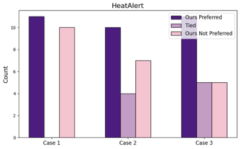

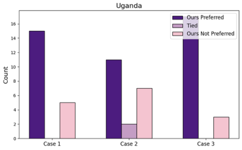


(a) HeatAlert (b) Uganda


Figure 7: Results from **human** surveys conducted in the HeatAlert (a) and Uganda (b) environments. 21 participants
provided feedback for the HeatAlert domain, while 20 valid responses were collected for the Uganda domain. The
results indicate that our method (“Ours Preferred”) was favored by a majority of participants, particularly in the Uganda
domain, where the preference is more pronounced.


18


**RBRL: Joint Explanation and Decision Optimization for Resource Allocation with Language Agents**


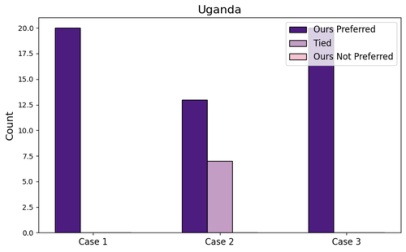


(a) HeatAlert (b) Uganda


Figure 8: Survey results generated by querying **LLMs** 20 times for each case in the HeatAlert (a) and Uganda (b)
environments. By varying the sampling temperature, randomized responses were collected for comparison. The results
demonstrate that our method (“Ours Preferred”) consistently outperforms alternatives across all cases, highlighting its
robustness and alignment with the evaluation criteria of the LLMs.

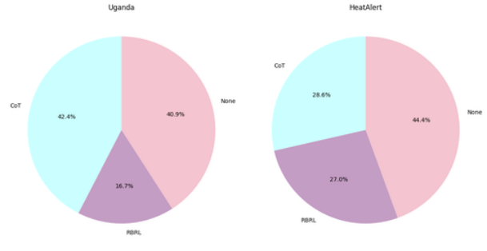


(a) Results from the **human** survey, showcasing the proportion of hallucination
detected across three categories: CoT, RBRL, and None . In both domains, hallucinations were most frequently identified in None, with RBRL showing significantly
fewer instances.

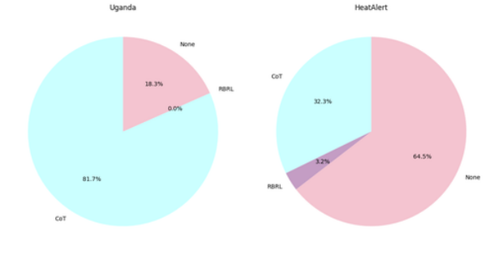


(b) Results from the **LLM** -based survey, where hallucination detection was assessed
through multiple iterations of LLM evaluation. CoT exhibited higher hallucination
rates in the Uganda domain, while RBRL demonstrated minimal hallucination
occurrences in both domains.


Figure 9: Survey results for hallucination detection across the HeatAlert and Uganda environments.


19


**RBRL: Joint Explanation and Decision Optimization for Resource Allocation with Language Agents**


**D. Prompt Templates and Rule Examples**


**D.1. Prompt Format**


In this section, we illustrate the prompt format used in our RBRL for generating thoughts, rules, actions, rule scores, and
explanations in Figure 10.

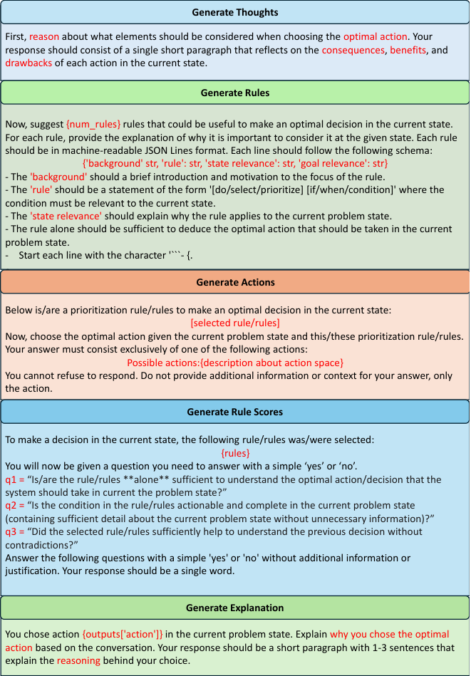


Figure 10: Prompts template for generating thoughts, rules, actions, rule scores, and explanations.


**D.2. Rule Example**


In this section, we provide some rules for each domain in Figure 11.


20


**RBRL: Joint Explanation and Decision Optimization for Resource Allocation with Language Agents**


**Rule Examples**


**Example 1: Wearable Device Assignment**

               - **Rule1** : "Prioritize reallocating devices from patients who have worn the device for the least
amount of time and have stable vital signs."

               - **Rule2** : "Select to reallocate devices from patients with less critical vital signs to those with high
pulse rates or low SPO2."

               - **Rule3** : "Reallocate devices from patients whose mean vital signs are within normal ranges to
those whose mean vital signs are abnormal."

               - **Rule4** : "Select to reallocate devices from patients with lower standard deviation in vital signs, as
they are less likely to experience sudden changes."

**- Rule5** : "When a new patient arrives, reallocate devices from patients who have shown the least
improvement over time.“


**Example 2: Heat Alert Issuance**

               - **Rule1** : "If the current heat index is above the average heat index of the past week, issue a
warning."

               - **Rule2** : "If there have been 5 or more warnings in the last 14 days, do not issue a warning unless
the heat index exceeds 100 F."

               - **Rule3** : "If the heat forecast for the next day exceeds 98 F, issue a warning today."

               - **Rule4** : "If today is a weekday and the heat index is above 95 F, do not issue a warning unless the
forecasted heat index for the weekend exceeds 100 F."

               - **Rule5** : "If the remaining number of warnings is 5 or fewer, prioritize issuing a warning when the
heat index exceeds 98 F."


Figure 11: Rule examples for the considered two domains.


**E. Survey Example**


In this section, we present a survey example from the Wearable ~~D~~ evice ~~A~~ ssignment domain. The survey for the
HeatAlert domain follows the same format and can be easily adapted by substituting the task and corresponding actions.
For brevity, we include only one example case from the Wearable ~~D~~ evice ~~A~~ ssignment domain.


**Task:** _You are tasked with optimizing the allocation of limited vital sign monitoring devices among patients. Devices_
_improve vital signs and prevent abnormalities, but their limited availability requires reallocating them from stable patients_
_to higher-risk incoming patients, who must always receive a device. The normal range of vital signs are provided in Figure_
_12. The goal is to minimize costs associated with abnormal vital signs, where costs are calculated exponentially based on_
_deviations from predefined thresholds. Wearing a device improves abnormal vital signs with a 70% success rate._


**Possible actions:** _Choose the id of the device that will be reallocated to the new incoming patient. Your answer should be a_
_single integer i from 0 to 4 (the number of devices) such that_ :


  - _Always choose a free device if available_


  - _If no free device is available, then choose device i whose current patient is at least risk or would benefit less from_
_wearing the device._


Figure 12: Normal range of vital signs.


_In the following, you will be presented with three cases. Each case includes two explanations. Please read the text for each_
_case carefully and answer the questions provided._


21


**RBRL: Joint Explanation and Decision Optimization for Resource Allocation with Language Agents**


**Case 1:** Current state of the decision problem:
Number of devices: 5

Number of free devices: 1

IDs of free devices: 3


**Device 0:** Device is currently assigned to a patient with the following description:
*Timesteps wearing the device*: 1
*Pulse rate* - Last value: 95.22 - Mean: 105.12 - Standard deviation/volatility: 10.56
*Respiratory rate* - Last value: 20.14 - Mean: 20.54 - Standard deviation/volatility: 0.64
*SPO2* - Last value: 98.42 - Mean: 97.89 - Standard deviation/volatility: 0.88


**Device 1:** Device is currently assigned to a patient with the following description:
*Timesteps wearing the device*: 1
*Pulse rate* - Last value: 89.55 - Mean: 81.86 - Standard deviation/volatility: 8.55
*Respiratory rate* - Last value: 14.85 - Mean: 20.81 - Standard deviation/volatility: 3.40
*SPO2* - Last value: 95.31 - Mean: 96.22 - Standard deviation/volatility: 1.38


**Device 2:** Device is currently assigned to a patient with the following description:
*Timesteps wearing the device*: 1
*Pulse rate* - Last value: 106.05 - Mean: 105.09 - Standard deviation/volatility: 2.91
*Respiratory rate* - Last value: 19.34 - Mean: 20.80 - Standard deviation/volatility: 2.69
*SPO2* - Last value: 99.56 - Mean: 99.36 - Standard deviation/volatility: 0.27


**Device 3:** Device is currently free.


**Device 4:** Device is currently assigned to a patient with the following description:
*Timesteps wearing the device*: 1
*Pulse rate* - Last value: 80.02 - Mean: 79.03 - Standard deviation/volatility: 1.58
*Respiratory rate* - Last value: 22.71 - Mean: 21.31 - Standard deviation/volatility: 5.45
*SPO2* - Last value: 99.61 - Mean: 99.86 - Standard deviation/volatility: 0.14


**Explanation A:** I chose to reallocate device 4 because the patient currently using it has a stable pulse rate (80.02) and a high
SPO2 level (99.61), indicating they are less at risk and may not require continuous monitoring. In contrast, reallocating this
device allows for an incoming patient, who likely has more urgent health needs, to receive the device, thereby optimizing
the overall allocation of resources to those who require immediate attention.


**Explanation B:** I chose action ‘device’: 3 because device 3 is currently free and must be assigned to an incoming patient
who requires immediate monitoring to prevent any potential deterioration in their health. This decision aligns with the
prioritization rule that emphasizes the importance of providing care to all patients, especially those at risk, ensuring that the
incoming patient receives the necessary vital sign monitoring.


**Q1. Do Explanation A and Explanation B appear the same or different to you?**


- Same (Skip Q2 and go to Question Q3)

- Different


**Q2. Which explanation do you find better?**


- Explanation A

- Explanation B


**Q3. Do the explanations contain any hallucinations?**


- Both

- Only Explanation A

- Only Explanation B

- None


22


