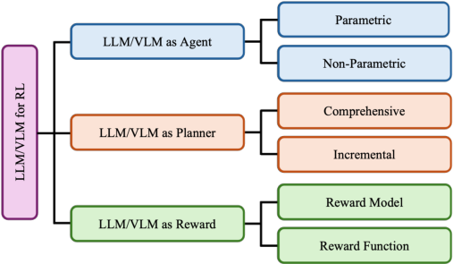
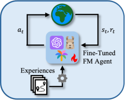
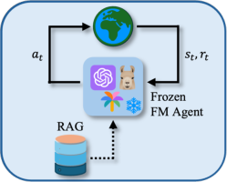
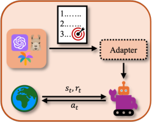
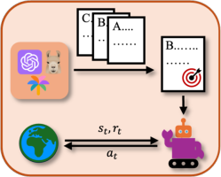
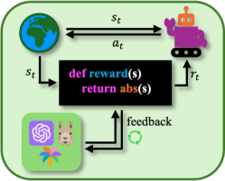
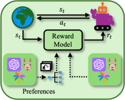

## **The Evolving Landscape of LLM- and VLM-Integrated Reinforcement Learning**

**Sheila Schoepp** [1], **Masoud Jafaripour** [1] _[∗]_, **Yingyue Cao** [1] _[∗]_, **Tianpei Yang** [2], **Fatemeh**
**Abdollahi** [1], **Shadan Golestan** [3], **Zahin Sufiyan** [1], **Osmar R. Zaiane** [1] _[,]_ [3] and **Matthew E. Taylor** [1] _[,]_ [3]

1 University of Alberta
2 Nanjing University
3 Alberta Machine Intelligence Institute

**Abstract**

Reinforcement learning (RL) has shown impressive results in sequential decision-making tasks.
Meanwhile, Large Language Models (LLMs) and
Vision-Language Models (VLMs) have emerged,
exhibiting impressive capabilities in multimodal
understanding and reasoning. These advances have
led to a surge of research integrating LLMs and
VLMs into RL. In this survey, we review representative works in which LLMs and VLMs are used
to overcome key challenges in RL, such as lack
of prior knowledge, long-horizon planning, and reward design. We present a taxonomy that categorizes these LLM/VLM-assisted RL approaches
into three roles: agent, planner, and reward. We
conclude by exploring open problems, including
grounding, bias mitigation, improved representations, and action advice. By consolidating existing
research and identifying future directions, this survey establishes a framework for integrating LLMs
and VLMs into RL, advancing approaches that
unify natural language and visual understanding
with sequential decision-making.

**1** **Introduction**

Reinforcement Learning (RL) is an influential branch of machine learning that enables autonomous agents to learn sequential decision-making strategies through an iterative process of trial-and-error interaction with their environment.
When integrated with deep neural networks, deep RL has
made breakthroughs in challenging domains such as games
and robotics [Schulman _et al._, 2017; Vinyals _et al._, 2019]. Despite these advances, RL still faces key challenges: reliance
on human-designed rewards, sample inefficiency, poor generalization, and limited interpretability, hindering real-world
deployment. These limitations motivate the exploration of
novel techniques to enhance the capabilities of RL, particularly in areas where conventional approaches fall short.
Large Language Models (LLMs) represent a groundbreaking advancement in Artificial Intelligence (AI), exhibiting unprecedented capabilities in natural language understanding,

_∗_ Equal contribution.

generation, and reasoning. By training large architectures —
often spanning billions or even trillions of parameters — on
internet-scale datasets, LLMs such as GPT-3 [Brown _et al._,
2020] have demonstrated emergent capabilities that smaller
models could not achieve. Leveraging these strengths, LLMs
are now applied to tasks that extend beyond conventional
Natural Language Processing (NLP), spanning domains from
healthcare to robotics [Ichter _et al._, 2022; Thirunavukarasu
_et al._, 2023]. Similarly, Vision Language Models (VLMs),
which integrate visual perception with natural language understanding, can interpret and reason about images through
language. Leveraging large-scale, aligned image-text training, VLMs like CLIP [Radford _et al._, 2021] can perform a
variety of tasks, including image-text retrieval and classification. Other VLMs, such as PaLM-E [Driess _et al._, 2023], are
designed to respond to natural language prompts, broadening
their versatility to tasks such as image captioning, scene understanding, and visual question answering. Together, these
Foundation Models (FMs), specifically LLMs and VLMs,
have reshaped AI by capturing nuanced, human-centric semantics across modalities, enabling flexible, human-aligned
problem-solving based on their vast training data.
Integrating LLMs and VLMs into the RL framework
promises a transformative leap in how agents act and learn.
While RL is proficient at learning from trial-and-error, it typically lacks the broad world knowledge and powerful reasoning capabilities that LLMs and VLMs can provide. When
integrated with RL, these models enhance agents’ capabilities by supplying semantic understanding (LLMs) or robust
perception (VLMs), thereby improving data efficiency, generalization, and interpretability. In some cases, RL’s ability to
continually refine behaviour through interactions with the environment can complement these FMs by providing supplemental training or richer context and improving their outputs.
Research in the area of LLMs and VLMs is driving a rapid
evolution. As a result, integration of FMs into RL is also progressing swiftly, further expanding the boundaries of what RL
can accomplish. Despite prior work on integrating LLMs into
RL, the field’s fast pace demands continual analysis of emerging methods and applications. Furthermore, with the emergence of LLM agents and powerful VLMs — a perspective
not addressed by earlier surveys — this survey complements
existing work by introducing these new dimensions, expanding our understanding of how best to integrate FMs with RL.

For this survey, we selectively examine peer-reviewed
studies that employ pretrained LLMs and large VLMs developed on or after June 2020 — coinciding with the release
of GPT-3, a notable milestone in NLP due to its unprecedented scale and capabilities — as a core methodological
component. These FMs must employ a transformer-based architecture (whether encoder-only, decoder-only, or encoderdecoder) and address sequential decision-making tasks
framed as Markov Decision Processes (MDPs). We highlight
works that use rewards to optimize RL or LLM/VLM policies for improved sequential decision-making. Although RL
can fine-tune language models, our focus is on using FMs to
enhance RL, not simply improving the models themselves.
We include a representative selection of papers meeting these
criteria, acknowledging that some relevant studies are omitted
due to space constraints.
In summary, the main contributions of this survey include: **(1)** A unifying _taxonomy_ that categorizes FM functionalities in RL into three key roles: LLM/VLM as Agent,
LLM/VLM as Planner, and LLM/VLM as Reward. **(2)** A _re-_
_view_ of key works within each category, highlighting how
they address key RL challenges such as policy learning, longhorizon planning, and reward specification. **(3)** _Future direc-_
_tions_ that identify limitations in existing approaches and outline promising paths for FM-RL research.

**2** **Preliminaries**

**2.1** **Reinforcement Learning**

A **Markov Decision Process** (MDP) is defined by the tuple
( _S, A, T, R, γ_ ), where _S_ is the set of states, _A_ is the set of
actions, _T_ : _S × A →_ _P_ ( _S_ ) is the transition probability
function, _R_ : _S × A →_ R is the reward function, and _γ ∈_

[0 _,_ 1] is the discount factor [Sutton and Barto, 2018].
**Reinforcement Learning** (RL) is a paradigm in which
an agent learns through interactions with an environment,
typically modelled as an MDP [Sutton and Barto, 2018].
These interactions produce a _trajectory_ of states, actions,
and rewards as the agent explores its surroundings. A central concept in RL is the _policy_, _π_, which maps states to actions (or distributions over actions), formally expressed as
_π_ : _S →_ _P_ ( _A_ ) _._ In some settings, this is further extended to
a _language-conditioned policy_, _π_ _l_ : _S × L →_ _P_ ( _A_ ), where
_L_ represents the space of natural language instructions (e.g.,
sub-goals), allowing the agent to incorporate linguistic guidance into its decisions. Under a policy _π_, the _value function_,
_v_ : _S →_ R (or _q_ : _S × A →_ R), estimates the expected
cumulative reward from a given state (or state-action pair). A
language-conditioned (action-)value function can likewise be
conditioned on an instruction _l_ .

**2.2** **Language Models**

**Large Language Models** (LLMs) learn statistical patterns in
text from large corpora, enabling them to predict the likelihood of word (or token) sequences in context. They often rely
on transformer architectures, which use self-attention to capture token dependencies [Vaswani _et al._, 2017]. Transformerbased LLMs include encoder-only models that mask part of
the input and learn to predict the missing portion (useful for

Figure 1: A taxonomy for LLM- and VLM-assisted RL.

text understanding), decoder-only models that generate text
by predicting the next token in a sequence (often used for text
generation), and encoder-decoder models that encode input
into a latent representation and then decode it (common for
translation tasks).
**Vision Language Models** (VLMs) are multimodal, processing both visual and textual data, often relying on transformers. They can be categorized into encoder-decoder models that convert images and/or text into latent embeddings before generating output (used for tasks like captioning), dualencoder models that embed images and text separately into
a shared latent space (used for similarity matching and retrieval), and single encoder models that encode images and
text jointly (used for tasks like visual question answering).

**2.3** **Taxonomy**

Figure 1 presents a three-part taxonomy to integrate LLMs
and VLMs into RL, distinguishing three primary roles: (1)
LLM/VLM as Agent, where the FM serves as a policy. These
methods can either be parametric, fine-tuning the FM to generate task-relevant outputs, or non-parametric, enriching the
prompts with additional context. (2) LLM/VLM as Planner,
where the FM generates sub-goals for complex tasks. The FM
may produce a comprehensive sequence of sub-goals in one
pass or incrementally produce them (i.e., step by step), awaiting a signal of success or failure before generating the next
sub-goal. (3) LLM/VLM as Reward, where the FM shapes rewards by generating the reward function code to specify the
reward or by serving as (or helping train) a reward model that
outputs a scalar reward signal. Table 1 provides an overview
of FM-RL methods, classified according to the taxonomy.
Some approaches do not fit into these three primary roles;
instead, LLMs/VLMs are integrated into RL using alternative
methods. For example, KALM [Pang _et al._, 2024] uses the
FM as a world model to generate “imaginary” trajectories. Lai
and Zang [2024] use an FM to identify and emphasize higherquality trajectories. MaestroMotif [Klissarov _et al._, 2025] and
LAST [Fu _et al._, 2024] guide hierarchical RL by discovering
and coordinating skills.
In subsequent sections, we examine the three primary categories in our taxonomy, investigating the distinct ways that
LLMs and VLMs can be integrated into and benefit RL.

**Foundation Model (FM)** **Reinforcement Learning (RL)**

**Citation** **Model(s)** **FT** **Role** **Agent** **Task** **Setting** **Role** **Metrics** **Code**

AGILE [Feng _et al._, 2024] Meerkat, Vicuna-1.5 ✓* act, ref single       - online _π_ _l_, _v_ _l_, rft acc, rew [Link](https://github.com/bytarnish/AGILE)
Retroformer [Yao _et al._, 2024] GPT-3, GPT-4, LongChat ✓ act, cr, ref single        - offline _π_ _l_, rft sr, se        TWOSOME [Tan _et al._, 2024] Llama ✓* act single      - online _π_ _l_, _v_ _l_, rft sr, rew, gen, se [Link](https://github.com/WeihaoTan/TWOSOME)
POAD [Wen _et al._, 2024] CodeLlama, Llama 2 ✓* act single      - online _π_ _l_, _v_ _l_, rft rew, gen, se [Link](https://github.com/morning9393/ADRL)
GLAM [Carta _et al._, 2023] FLAN-T5 ✓ act single       - online _π_ _l_, _v_ _l_, rft se, gen [Link](https://github.com/flowersteam/Grounding_LLMs_with_online_RL)
Zhai _et al._ [Zhai _et al._, 2024] LLaVA-v1.6-Mistral ✓* act single       - online _π_ _l_, _v_ _l_, rft sr [Link](https://github.com/RL4VLM/RL4VLM)

ICPI [Brooks _et al._, 2023] Codex _×_ act, wm, ref single        - online _π_ _l_, _v_ _l_, _τ_ _π_ rew, gen [Link](https://github.com/ethanabrooks/icpi)
Reflexion [Shinn _et al._, 2023] GPT-3, GPT-3.5-Turbo, GPT-4 _×_ act, eval, cr, ref single        - online _π_ _l_, _τ_ _π_ sr, acc [Link](https://github.com/noahshinn/reflexion)
REMEMBERER [Zhang _et al._, 2023a] GPT-3.5 _×_ act single      - online _π_ _l_, _v_ _l_, _τ_ _π_ sr, rob [Link](https://github.com/OpenDFM/Rememberer)
ExpeL [Zhao _et al._, 2024] GPT-3.5-Turbo, GPT-4 _×_ act, cr, ref single       - online _π_ _l_, _τ_ _π_ sr, gen [Link](https://github.com/LeapLabTHU/ExpeL)
RLingua [Chen _et al._, 2024] GPT-4 _×_ act, plan, ref single       - online _π_ _g_, _v_ _g_, _τ_ _π_ sr, se       Xu _et al._ [Xu _et al._, 2024] GPT-3.5-Turbo _×_ act, o multi      - online _π_ _l_, _v_ _l_ sr, rob      LangGround [Li _et al._, 2024] GPT-4 _×_ act, o multi       - online _π_ _l_ sr, gen, se, int [Link](https://github.com/romanlee6/langground)

SayTap [Tang _et al._, 2023] GPT-4 _×_ plan single multi online _π_ _g_, _v_ _g_ sr, acc       LgTS [Shukla _et al._, 2024] Llama 2 _×_ plan single multi online _π_ _g_, _v_ _g_ sr, se       PSL [Dalal _et al._, 2024] GPT-4 _×_ plan, o single single online _π_, _v_ sr, gen, se [Link](https://github.com/planseqlearn/planseqlearn)
LLaRP [Szot _et al._, 2024] Llama _×_ plan, o single multi online _π_ _g_, _v_ _g_ sr, gen, rob, se [Link](https://github.com/apple/ml-llarp)
LMA3 [Colas _et al._, 2023] GPT-3.5-Turbo _×_ plan, rew, eval, o single multi online _π_ _g_ gen, exp       When2Ask [Hu _et al._, 2024] Vicuna _×_ plan single single online _π_, _v_ sr [Link](https://github.com/ZJLAB-AMMI/LLM4RL)
Inner Monologue [Huang _et al._, 2022] GPT-3, PaLM _×_ plan, cr, ref single multi       - o sr, rob, al       

SayCan [Ichter _et al._, 2022] PaLM _×_ plan single multi both _π_ _l_, _v_ _l_, rft sr, rob [Link](https://github.com/google-research/google-research/tree/master/saycan)
LLM4Teach [Zhou _et al._, 2024] ChatGLM-Turbo, Vicuna _×_ plan single single online _π_, _v_ sr, se [Link](https://github.com/ZJLAB-AMMI/LLM4Teach)
AdaRefiner [Zhang and Lu, 2024] Llama 2, GPT-4 ✓* plan, cr, ref, o single multi online _π_ _l_, _v_ _l_, _τ_ _π_ sr, rew, gen, exp [Link](https://github.com/PKU-RL/AdaRefiner)
BOSS [Zhang _et al._, 2023b] Llama _×_ plan, o single multi both _π_ _l_, _v_ _l_, rft, _τ_ _π_ sr, gen, rob, se       Text2Motion [Lin _et al._, 2023] Codex, GPT-3.5 _×_ plan, o single multi offline _π_, _v_ sr, gen, int        

Text2Reward [Xie _et al._, 2024] GPT-4 _×_ rew, ref single single online _π_ sr, se, al [Link](https://github.com/xlang-ai/text2reward)
Zeng _et al._ [Zeng _et al._, 2024] GPT-4 _×_ rew, eval, cr, ref single single online _π_, _τ_ _π_ sr, se       Eureka [Ma _et al._, 2024] GPT-4 _×_ rew, cr, ref single single online _π_, _v_, _τ_ _π_ sr, gen, se, al [Link](https://github.com/eureka-research/Eureka)

Kwon _et al._ [Kwon _et al._, 2023] GPT-3 _×_ rew single single online _π_, _v_ acc, se, al      PREDILECT [Holk _et al._, 2024] GPT-4 _×_ rew, o single single online _π_ rew, se, al       ELLM [Du _et al._, 2023] Codex, GPT-3 _×_ rew, plan single multi online _π_ _l_, _v_ _l_ sr, gen, se, exp      RL-VLM-F [Wang _et al._, 2024] Gemini-Pro, GPT-4V _×_ rew, eval single single online _π_, _v_ sr, rew, se [Link](https://github.com/yufeiwang63/RL-VLM-F)
VLM-RM [Rocamonde _et al._, 2024] CLIP _×_ rew single single online _π_, _v_ sr, al [Link](https://github.com/AlignmentResearch/vlmrm)
MineCLIP [Fan _et al._, 2022] CLIP ✓* rew, eval single multi online _π_ _l_, _v_ _l_ sr, gen, se, al [Link](https://github.com/MineDojo/MineDojo)

Table 1: A summary of approaches leveraging FMs, specifically LLMs and VLMs, to enhance RL, organized according to the taxonomy
illustrated in Figure 1 and listed in order of mention. **FT (Fine-Tuning)** ✓(full fine-tuning), ✓* (parameter-efficient fine-tuning), and _×_ (no
fine-tuning). **FM Role** Generation of _act_ (actions), _plan_ (high-level plan), rew (reward function/model), _wm_ (world model), _eval_ (task success
evaluations), _cr_ (critiques and improvement suggestions), _ref_ (refinement), and _o_ (other). **RL Agent** _single_ (single agent) and _multi_ (multiagent). **RL Task** _single_ (single task) and _multi_ (multi-task). **RL Setting** _online_ (learning from real-time interactions), _offline_ (learning from
precollected interactions), and _both_ . **RL Role** _π_ (policy learning), _π_ _l_ (language-conditioned policy learning), _v_ (value function learning), _v_ _l_
(language-conditioned value function learning), _τ_ _π_ (policy execution to generate trajectories), _ref_ (reinforced fine-tuning), _o_ (other), and _n/a_
(no RL role). **Metrics** Improvements in _acc_ (accuracy _↑_ ), _sr_ (success rate _↑_ ), _rew_ (reward or return _↑_ ), _gen_ (generalization _↑_ ), _rob_ (robustness
_↑_ ), _se_ (sample efficiency _↑_ ), _exp_ (exploration _↑_ ), _al_ (alignment with humans _↑_ ), and _int_ (interpretability _↑_ ).

**3** **LLM/VLM as Agent**

Language-based decision-making agents leverage the reasoning, planning, and generalization capabilities of LLMs, enabling them to perform complex tasks in interactive environments. These agents interact with the environment, acting as
decision-makers at each time step to generate context-based
actions. Recent advances classify agents as parametric, finetuning LLMs for dynamic adaptation, or non-parametric, using external resources and prompt engineering without altering the model. This section reviews key advances, focusing
on fine-tuning, action decomposition, memory-driven strategies, and in-context learning for dynamic, multimodal envi
ronments.

**3.1** **Parametric**

Parametric LLM agents are decision-making models that
fine-tune the internal parameters of LLMs using experience
datasets, as illustrated in Figure 2a. This approach enables
them to adapt their behaviour for specific tasks and environments, ensuring precise and context-aware decision-making.
By leveraging RL techniques such as policy optimization,

(a) Parametric (b) Non-parametric

Figure 2: LLM/VLM as Agent.

action decomposition strategies, and value-based methods,
these agents dynamically adjust their actions to align with
specific task objectives.
For instance, AGILE [Feng _et al._, 2024] integrates
memory, tools, and expert consultation within a modular framework, leveraging RL to enhance reasoning and
decision-making, achieving notable advancements over existing models in complex tasks. Outperforms the state-of-the

art LLM in specialized quality control benchmarks, demonstrating improved accuracy and adaptability. Similarly, Retroformer [Yao _et al._, 2024] employs policy gradient optimization to iteratively refine prompts based on environmental
feedback, achieving higher success rates in multi-step tasks.
On the other hand, TWOSOME [Tan _et al._, 2024] improves
sample efficiency and performance in interactive multistep decision-making tasks by normalizing action probabilities and applying parameter-efficient fine-tuning to address
alignment challenges between LLMs and dynamic environments. Advanced methods further enhance parametric agents
through innovative mechanisms. For example, POAD [Wen
_et al._, 2024] decomposes actions into token-level decisions,
addressing optimization complexity and enabling precise
credit assignment in environments with large action spaces.
GLAM [Carta _et al._, 2023] introduces functional grounding
in textual environments, leveraging online RL to align LLMs
with spatial and navigation tasks through step-by-step interaction and iterative learning. In vision-language tasks, finetuning frameworks combine chain-of-thought reasoning with
RL to enable agents to manage multimodal problems, demonstrating significantly enhanced visual-semantic understanding [Zhai _et al._, 2024].
Collectively, these approaches demonstrate that parametric LLM agents using RL techniques, including policy optimization, action decomposition, and functional grounding,
achieve superior adaptability, sample efficiency, and perfor
mance.

**3.2** **Non-parametric**

Non-parametric LLM agents rely on the inherent reasoning
and generalization capabilities of LLMs, as shown in Figure 2b, while keeping the LLM agent frozen and without altering its internal parameters. These agents leverage external
resources and datasets, such as Retrieval Augmented Generation (RAG), enrich the task context, and use prompt engineering techniques during inference to guide decision-making, as
recent works exemplify.
For example, ICPI [Brooks _et al._, 2023] implements policy iteration in LLMs using in-context learning, where Qvalues are computed via rollouts and iteratively refined. This
approach, tested in six RL domains, demonstrates the potential of LLMs as both world models and policies, enabling
scalable improvements without fine-tuning. Reflexion [Shinn
_et al._, 2023] introduces verbal reinforcement, where LLMs
generate and store self-reflective feedback in an episodic
memory buffer to improve decision-making. This method enhances long-horizon decision-making, multi-step reasoning,
and code generation, achieving state-of-the-art accuracy in
function synthesis and logical inference. Similarly, REMEMBERER [Zhang _et al._, 2023a] incorporates a persistent experience memory, allowing LLMs to learn from past successes
and failures in interactive environments without modifying
parameters. By integrating RL with experience memory, it
improves adaptability and robustness in sequential reasoning
and goal-oriented decision-making. Building on these ideas,
ExpeL [Zhao _et al._, 2024] introduces experiential learning,
enabling LLMs to autonomously collect, abstract, and apply
knowledge from past tasks. This method enhances sequential

decision-making and transfer learning, offering a resourceefficient alternative to fine-tuning.
Beyond general decision-making, non-parametric LLM
agents have also been explored in domain-specific applications, including robotic manipulation and strategic multiagent collaboration. RLingua [Chen _et al._, 2024] improves
sample efficiency in RL for robotic manipulation by leveraging LLM-generated rule-based controllers as priors and
integrating prior knowledge into policy learning through
prompts. This approach enhances performance in sparsereward tasks, achieving high success rates in both simulated
and real-world environments with effective Sim2Real transfer. Werewolf [Xu _et al._, 2024] combines LLM-driven action candidate generation with RL to mitigate intrinsic biases and enhance strategic decision-making. By integrating
deductive reasoning and RL, this framework enables agents
to achieve human-level performance in unbounded communication and decision spaces. Similarly, LangGround [Li _et_
_al._, 2024] aligns MARL agents’ communication with human language by grounding it in synthetic data from embodied LLMs. This method facilitates zero-shot generalization in ad-hoc teamwork, improving communication emergence, interpretability, and task performance with unseen
teammates. These studies illustrate that non-parametric LLM
agents, by leveraging in-context learning, memory integration, self-reflection, and structured experience retrieval, can
enhance reasoning, decision-making, and adaptability across
diverse tasks, achieving state-of-the-art performance without
requiring parameter updates.

**3.3** **Discussion**

The integration of LLMs/VLMs as decision-making agents
highlights the strengths and limitations of parametric and
non-parametric approaches. Parametric agents excel in taskspecific adaptability and alignment via fine-tuning and RL but
face scalability and computational challenges in dynamic environments. Non-parametric agents leverage in-context learning and memory-driven reasoning for generalization and
scalability without fine-tuning but struggle with long-term
planning and complex modelling. These paradigms complement each other, with parametric methods providing precision and non-parametric approaches ensuring efficiency. Hybrid frameworks combining lightweight fine-tuning with advanced memory mechanisms can enhance LLM agents’ robustness and adaptability in complex environments.

**4** **LLM/VLM as Planner**

With extensive knowledge and strong reasoning capabilities,
FMs can generate high-level plans that address RL’s struggles with complex multi-step tasks by decomposing them
into sub-goals. Integrating FMs allows RL agents focus on
shorter-horizon control, improving sample efficiency when
rewards are sparse or dependencies are intricate. Recent work
suggests FMs provide powerful priors for RL, though their
planning ability remains heavily debated [Kambhampati _et_
_al._, 2024]. We examine approaches that use FMs for plan
generation in RL, grouping them into two categories: comprehensive, where all sub-goals are planned upfront, and incremental, where sub-goals are generated step by step.

(a) Comprehensive Planning (b) Incremental Planning

Figure 3: LM as Planner.

**4.1** **Comprehensive Planning**

FMs can generate a complete plan specifying sequential subgoals for the agent to execute, as shown in Figure 3a. FMs
inject their extensive knowledge into the planning process,
they break down complex tasks into a sequence of achievable
steps, freeing RL agents from learning complex tasks from
scratch and reducing overall training demands. When bridging the natural language plan to executable actions taken by
the low-level controller, an advantage of using FMs is that the
output of FMs can be structured based on actual needs. For
example, SayTap [Tang _et al._, 2023] uses foot contact patterns as a compact interface between language instructions
and low-level quadruped control. An LLM outputs textual
binary signals defining each leg’s contact pattern, which an
RL policy is trained to follow. This demonstrates how highlevel language commands can be translated into fine-grained
control signals. In addition to simpler binary-based control,
some tasks may benefit from a skill library. LMA3 [Colas _et_
_al._, 2023] uses an LLM to evaluate and validate an agent’s
performance on various goals, then treats the shortest action
sequence from each successful execution as a skill. LMA3
then leverages this growing skill library to chain short sequences into larger plans for solving a complex goal. However, its reliance on previously discovered action sequences
limits its generalization. Different from LMA3, PSL [Dalal _et_
_al._, 2024] leverages the LLM to decompose the long-horizon
natural language task into specially formatted language subgoals. Each sub-goal contains lists of targeted regions for the
robot to reach a termination stage, which is demanded by the
motion planning module to plan to move the robot and a reinforcement learning policy learned to control. PSL removes
the need for a pre-defined skill library and hence improves
learning efficiency and generalization ability.
However, since the quality of the plan highly depends on
the FMs, the initial plans may not be perfect, and execution
failures might occur partway through. Appropriate adjustments and modifications to the plans generated by FMs can
improve the correctness of the plan and hence improve the
overall performance. For example, Inner Monologue [Huang
_et al._, 2022] uses three types of feedback to update its plan
in real-time. It collects binary feedback from a success detector after task accomplishment, visual to textual feedback
from a scene detector during execution, and it is allowed to
request a human or a Visual Question Answer model for feedback on questions he asked during execution. This dynamic

re-planning skill improves completion rate and flexibility. To
avoid querying LLMs after each failure execution and reduce
the querying cost of LLMs, LgTS [Shukla _et al._, 2024] uses
LLMs to generate multiple candidate sub-goal sequences before execution. It arranges them into a directed acyclic graph
and employs an RL Agent to explore the graph for the optimal
path and learn the policy through a Teacher-Student learning
strategy, speeding up learning and improving the sample efficiency.

**4.2** **Incremental Planning**

Incremental Planning, as illustrated in Figure 3b, is another
way for FMs to guide the agent, providing step-by-step guidance for actions. Querying FMs at every step incurs higher
resource consumption costs; these approaches carefully determine when and how to query FMs at execution time.
For example, SayCan [Ichter _et al._, 2022] generates multiple candidate sub-goals at each step, then estimates each subgoal’s likelihood of success. Combining sub-goals with these
feasibility checks effectively grounds the LLM ’s plans in
real-world constraints, helping the agent to achieve the main
goal. Similarly, LLM4Teach [Zhou _et al._, 2024] provides the
agent with a set of suggested actions to execute. Initially, the
agent is trained to follow the guidance of an LLM closely, but
as the agent learns over time, its dependence on the LLM’s
suggestions decreases, allowing the agent to make independent decisions.

Papers adopting incremental planning also improve the
quality of these sub-goals through accumulating experience
from past trajectories. For example, AdaRefiner [Zhang and
Lu, 2024] enhances the agent’s execution and understanding
of LLM guidance by introducing a secondary LLM to evaluate the alignment of the agent’s execution process and the
guidance of LLM. The feedback from the agent, combined
with evaluation scores from the secondary LLM, is then used
to fine-tune the primary LLM, enabling it to provide better
guidance in subsequent iterations. Similarly, BOSS [Zhang
_et al._, 2023b] learns from past trajectories but eliminates the
need for a critic LLM. Instead, the guidance LLM continuously accumulates new skills demonstrated by the agent and
adds them to a skill library. While summarizing and analyzing experiences from past trajectories could improve planning
ability, simulating future trajectories can also contribute to
better decision-making.
Instead of using only natural language input, LLaRP [Szot
_et al._, 2024] integrates a frozen LLM with a pre-trained vision encoder to process textual instructions and egocentric
visual frames. LLaRP trains vision encoder and action decoder using online RL, improving the robustness and generalization over the new environment. A unique example is
Text2Motion [Lin _et al._, 2023], which combines both Comprehensive and Incremental Planning, ensuring efficiency and
correctness. Initially, Text2Motion employs an LLM to generate a comprehensive plan, encompassing all the steps for
the agent to execute. If a planning failure arises during execution, Text2Motion employs the LLM to generate the actions
incrementally.

(a) Reward Function (b) Reward Model

Figure 4: LLM/VLM as Reward

**4.3** **Discussion**

LLM/VLM-based planning uses the common knowledge in
FMs to break down complex tasks into simpler subtasks,
improving learning efficiency. It is particularly effective in
human-centric environments, where plans in natural language
benefit from common-sense reasoning. Comprehensive planning can be more efficient but is riskier in dynamic settings,
while incremental planning enables real-time feedback and
adaptation but increases computational overhead. Balancing
these approaches and translating model-generated plans into
actionable steps that generalize across environments remain
key challenges.

**5** **LLM/VLM as Reward**

Designing effective reward signals remains a central challenge in RL, requiring domain knowledge and trial-and-error
tuning. While methods like preference-based learning, inverse RL, and labelled datasets help, they still rely heavily
on human input. Recent advances leverage LLMs and VLMs
for automating reward design by having them interpret textual
descriptions and process visual inputs. These LLM/VLM as
Reward approaches generally fall into two categories: generating explicit reward functions, or serving as (or aiding the
learning of) a reward model.

**5.1** **Reward Function**

Leveraging LLMs to design reward functions addresses a significant bottleneck in RL. It reduces human reward engineering effort, facilitates the discovery of novel reward components, and yields interpretable code. Providing a Pythonic
environment abstraction as initial context and prompting an
LLM iteratively generate and improve reward functions using natural language (as illustrated in Figure 4a). These benefits are especially valuable for high-dimensional or otherwise
complex tasks.
Reward function approaches primarily differ in how they
trigger refinements and the type of natural language feedback
they incorporate. For example, in Text2Reward [Xie _et al._,
2024], an LLM refines the reward function code until it executes successfully. After training an RL policy, non-expert
users can observe the learned policy and provide linguistic
feedback on suboptimal behaviours, prompting further LLM
refinements to the reward function. Zeng _et al._ [2024] use
an LLM to identify key behavioural features (to promote or

discourage) and propose an initial reward function parameterization. The LLM iteratively refines this parameterization
by ranking trajectories from executions of the trained policy, shaping the reward function toward desirable behaviours.
Meanwhile, Eureka [Ma _et al._, 2024] uses an evolutionary
search strategy. At each iteration, an LLM generates multiple
candidate reward functions, trains a policy for each, and then
selects the best-performing policy for further refinement. This
selection is guided by both policy performance and rewardfunction component metrics. All three approaches produce
reward functions that match or surpass those designed by human experts, and are readily extended to novel tasks with
minimal human intervention.

**5.2** **Reward Model**

As illustrated in Figure 4b, Foundation Models (FMs) can
specify reward models in two key ways. First, LLMs can
serve as proxy reward models by mapping textual descriptions of desired behaviours directly to scalar rewards. Second, a separate reward model can be learned by leveraging
LLMs or VLMs to incorporate preference feedback on agent
trajectories or by combining textual instructions with visual
observations in VLMs to produce more robust and visually
grounded reward models.
Kwon _et al._ [2023] use an LLM as a proxy reward model,
using natural language descriptions of desired behaviours and
textual trajectory summaries to generate a binary reward signal that guides policy learning. Strikingly, their straightforward approach performs nearly as effectively as ground truth
while removing the need for large, curated datasets of preference labels or expert demonstrations. PREDILECT [Holk
_et al._, 2024] builds on preference-based RL, allowing human
raters to specify both their preferred trajectory and the reasons for their choice. Using these explanations, an LLM extracts key trajectory subsequences and incorporates them into
the reward-learning objective via regularization, giving more
weight to segments marked as “good” or “bad”. This targeted
influence mitigates causal confusion by directing the model’s
attention to the true causal factors underlying human preferences. ELLM [Du _et al._, 2023] improves exploration in RL
by prompting an LLM with a textual “caption” of the agent’s
state to generate sub-goals. The agent is rewarded for achieving these sub-goals via a semantic-similarity measure between its transition caption (action and resulting state) and the
suggested sub-goal, with a novelty bias that rewards each subgoal only once per episode. ELLM shifts naive novelty-driven
exploration toward semantically guided skill discovery, yielding more human-like behaviours and faster task learning.
Text-based reward design often fails for visually complex
tasks, where nuanced details cannot be fully expressed in
words. RL-VLM-F [Wang _et al._, 2024] overcomes this limitation by leveraging a large VLM without requiring any
human annotation, using it to rank pairs of images (observations) based on their alignment with a natural language
task description. These pairwise preferences train a visuallygrounded reward model, enabling robust reward design for
tasks with intricate visual observations. VLM-RM [Rocamonde _et al._, 2024] and MineCLIP [Fan _et al._, 2022] both
leverage a large VLM (CLIP) to scale RL to tasks that are

not easily specified using engineered reward functions but are
easily described in natural language. VLM-RM targets continuous control problems by computing a direct scalar reward
based on the cosine similarity between a textual goal embedding — adjusted by subtracting a “baseline prompt” embedding to reduce interference from irrelevant features — and
the agent’s visual observation embedding. Notably, VLMRM performance improves when environments are enhanced
with more realistic visuals, better aligning with CLIP’s training distribution. MineCLIP similarly builds on CLIP but targets Minecraft’s open-ended environment, fine-tuning on 16frame YouTube video segments paired with time-aligned text,
yielding a dense reward signal that correlates the agent’s recent frames with a free-form textual goal.

**5.3** **Discussion**

LLM/VLM as Reward approaches automate the generation
of reward functions by translating textual descriptions into
rewards for RL agents. Their strong performance — often
matching or surpassing human-engineered and ground-truth
rewards — indicates that natural language effectively encodes and guides reward design for complex tasks. These approaches often face several constraints. They can be overly
sensitive to prompt design, prone to hallucinations, or omit
critical details. They also rely on simplified abstractions that
fail to capture real-world complexity, raising concerns about
scalability and reliability in more realistic settings.

**6** **Future Directions**

Building on current methods and approaches, significant opportunities remain to advance this domain even further.

**6.1** **Grounding**
LLMs demonstrate strong capabilities in generating highlevel plans, but they lack real-world experience, so their
plans may not be executable for embodied agents such as
robots [Ichter _et al._, 2022; Dalal _et al._, 2024]. Current works
solving the grounding problem by applying a bridging layer
or verification module between the high-level plan and the
low-level controller [Dalal _et al._, 2024; Huang _et al._, 2022] or
by leveraging the value-function to ground the action [Ichter
_et al._, 2022]. However, these methods share similar disadvantages: the external knowledge they rely on might introduce
biases that negatively affect certain tasks. Another approach
is to carefully design the plan’s structure generated by LLMs
to fit the real-world requirement [Tang _et al._, 2023], which
also faces the problem of lacking generalization in diverse
tasks and environments. Developing a more generalized and
bias-free grounding method remains an important area for future research.

**6.2** **Inherent Bias**

LLMs and VLMs exhibit intrinsic biases rooted in their
data sources, training procedures, and architectures, leading
to suboptimal decisions. For example, an LLM can identify the Rock-Paper-Scissors Nash equilibrium — playing
each action equally — yet still favour Rock, making it exploitable [Xu _et al._, 2024]. Few works target de-biasing, using techniques such as self-consistency and population-based

training [Xu _et al._, 2024], but only partially address the issue.
Meanwhile, implicit refinements or corrections of an LLM’s
outputs, through action values or environment feedback, have
shown promise but remain largely confined to high-level task
planning [Huang _et al._, 2022; Ichter _et al._, 2022]. These limitations highlight the need for more robust and generalizable
bias mitigation techniques, such as RL-driven exploration,
that can systematically expose and overcome these biases.

**6.3** **Representation**

Integration of LLMs into RL is hindered by the need to convert rich numeric signals, such as raw sensor data and actions,
into sequences of textual tokens, losing the nuanced semantic information required for precise control [Du _et al._, 2023;
Hu and Sadigh, 2023]. KALM [Pang _et al._, 2024] addresses
this limitation by replacing the LLM embedding and output
layers with multilayer perceptron modules, enabling bidirectional translation between language goals and numeric trajectories. Building on KALM, a promising direction is to explore
novel methods for modifying LLM architectures to fuse raw
sensor data with language for joint multimodal representations or using VLMs to preserve rich feature representations
while retaining language-based reasoning. A potentially powerful approach may combine LLMs and VLMs, creating multimodal models capable of advanced language understanding,
reasoning, decision-making, and visual perception — paving
the way for RL agents to address complex tasks that demand
richer representation.

**6.4** **Action Advice**

Human-in-the-loop RL, in which a human or humansimulating oracle provides real-time, action-level guidance
(e.g., “turn right,” “move forward”) to the RL agent, can significantly boost learning speed and performance in domains
such as robotics, navigation, and games [Rosenfeld _et al._,
2017; Torrey and Taylor, 2013]. Recent advancements with
LLMs and VLMs show promise for providing similar guidance without direct human oversight. Instead of requiring a
human to monitor the agent, these human-aligned models can
serve as “virtual oracles,” issuing low-level instructions and
removing the need for a human teacher. It is not necessary
for these models to offer perfect advice; even occasional correctness can reduce the agent’s exploration time [Icarte _et al._,
2018].

**7** **Conclusion**

Research integrating FMs, particularly LLMs and VLMs,
with RL is rapidly expanding. This survey introduces a taxonomy categorizing FM-based methods into Agent, Planner,
and Reward roles. We review studies in each role, highlighting how FMs can serve as parametric or non-parametric policies, generate comprehensive or incremental plans, or define
rewards through a reward function or model. We discuss current limitations and propose future directions, aiming to clarify advancements and challenges in leveraging FMs for RL
and inspire further innovation.

**References**

[Brooks _et al._, 2023] Ethan A. Brooks, Logan Walls, et al.
Large language models can implement policy iteration. In
_NeurIPS_, 2023.

[Brown _et al._, 2020] Tom B. Brown, Benjamin Mann, et al.
Language models are few-shot learners. In _NeurIPS_, 2020.

[Carta _et al._, 2023] Thomas Carta, Cl´ement Romac, et al.
Grounding large language models in interactive environments with online reinforcement learning. In _ICML_, 2023.

[Chen _et al._, 2024] Liangliang Chen, Yutian Lei, et al. Rlingua: Improving reinforcement learning sample efficiency
in robotic manipulations with large language models.
_IEEE Robotics and Automation Letters_, 9(7), 2024.

[Colas _et al._, 2023] C´edric Colas, Laetitia Teodorescu, et al.
Augmenting autotelic agents with large language models.
In _CoLLAs_, 2023.

[Dalal _et al._, 2024] Murtaza Dalal, Tarun Chiruvolu, et al.
Plan-seq-learn: Language model guided RL for solving
long horizon robotics tasks. In _ICLR_, 2024.

[Driess _et al._, 2023] Danny Driess, Fei Xia, et al. Palm-e: An
embodied multimodal language model. In _ICML_, 2023.

[Du _et al._, 2023] Yuqing Du, Olivia Watkins, et al. Guiding
pretraining in reinforcement learning with large language
models. In _ICML_, 2023.

[Fan _et al._, 2022] Linxi Fan, Guanzhi Wang, et al. Minedojo:
Building open-ended embodied agents with internet-scale
knowledge. In _NeurIPS_, 2022.

[Feng _et al._, 2024] Peiyuan Feng, Yichen He, et al. Agile: A
novel reinforcement learning framework of llm agents. In
_NeurIPS_, 2024.

[Fu _et al._, 2024] Haotian Fu, Pratyusha Sharma, et al.
Language-guided skill learning with temporal variational
inference. In _ICML_, 2024.

[Holk _et al._, 2024] Simon Holk, Daniel Marta, et al.
PREDILECT: preferences delineated with zero-shot
language-based reasoning in reinforcement learning. In
_HRI_, 2024.

[Hu and Sadigh, 2023] Hengyuan Hu and Dorsa Sadigh.
Language instructed reinforcement learning for human-ai
coordination. In _ICML_, 2023.

[Hu _et al._, 2024] Bin Hu, Chenyang Zhao, et al. Enabling
intelligent interactions between an agent and an LLM: A
reinforcement learning approach. _RLJ_, 3, 2024.

[Huang _et al._, 2022] Wenlong Huang, Fei Xia, et al. Inner
monologue: Embodied reasoning through planning with
language models. In _CoRL_, 2022.

[Icarte _et al._, 2018] Rodrigo Toro Icarte, Toryn Q. Klassen,
et al. Advice-based exploration in model-based reinforcement learning. In _Canadian AI_, 2018.

[Ichter _et al._, 2022] Brian Ichter, Anthony Brohan, et al. Do
as I can, not as I say: Grounding language in robotic affordances. In _CoRL_, 2022.

[Kambhampati _et al._, 2024] Subbarao Kambhampati,
Karthik Valmeekam, et al. Position: Llms can’t plan, but
can help planning in llm-modulo frameworks. In _ICML_,
2024.

[Klissarov _et al._, 2025] Martin Klissarov, Mikael Henaff,
et al. Maestromotif: Skill design from artificial intelligence feedback. In _ICLR_, 2025.

[Kwon _et al._, 2023] Minae Kwon, Sang Michael Xie, et al.
Reward design with language models. In _ICLR_, 2023.

[Lai and Zang, 2024] Jinbang Lai and Zhaoxiang Zang.
Sample trajectory selection method based on large language model in reinforcement learning. _IEEE Access_, 12,
2024.

[Li _et al._, 2024] Huao Li, Hossein Nourkhiz Mahjoub, et al.
Language grounded multi-agent reinforcement learning
with human-interpretable communication. In _NeurIPS_,
2024.

[Lin _et al._, 2023] Kevin Lin, Christopher Agia, et al.
Text2motion: from natural language instructions to feasible plans. _Autonomous Robots_, 47(8), 2023.

[Ma _et al._, 2024] Yecheng Jason Ma, William Liang, et al.
Eureka: Human-level reward design via coding large language models. In _ICLR_, 2024.

[Pang _et al._, 2024] Jing-Cheng Pang, Si-Hang Yang, et al.
Kalm: Knowledgeable agents by offline reinforcement
learning from large language model rollouts. In _NeurIPS_,
2024.

[Radford _et al._, 2021] Alec Radford, Jong Wook Kim, et al.
Learning transferable visual models from natural language
supervision. In _ICML_, 2021.

[Rocamonde _et al._, 2024] Juan Rocamonde, Victoriano
Montesinos, et al. Vision-language models are zero-shot
reward models for reinforcement learning. In _ICLR_, 2024.

[Rosenfeld _et al._, 2017] Ariel Rosenfeld, Matthew E. Taylor,
et al. Leveraging human knowledge in tabular reinforcement learning: A study of human subjects. In _IJCAI_, 2017.

[Schulman _et al._, 2017] John Schulman, Filip Wolski, et al.
Proximal policy optimization algorithms. _arXiv preprint_
_arXiv:1707.06347_, 2017.

[Shinn _et al._, 2023] Noah Shinn, Federico Cassano, et al.
Reflexion: language agents with verbal reinforcement
learning. In _NeurIPS_, 2023.

[Shukla _et al._, 2024] Yash Shukla, Wenchang Gao, et al.
Lgts: Dynamic task sampling using llm-generated subgoals for reinforcement learning agents. In _AAMAS_, 2024.

[Sutton and Barto, 2018] Richard S. Sutton and Andrew G.
Barto. _Reinforcement learning: An introduction_ . MIT
Press, 2018.

[Szot _et al._, 2024] Andrew Szot, Max Schwarzer, et al. Large
language models as generalizable policies for embodied
tasks. In _ICLR_, 2024.

[Tan _et al._, 2024] Weihao Tan, Wentao Zhang, et al. True
knowledge comes from practice: Aligning large language

models with embodied environments via reinforcement
learning. In _ICLR_, 2024.

[Tang _et al._, 2023] Yujin Tang, Wenhao Yu, et al. Saytap:
Language to quadrupedal locomotion. In _CoRL_, 2023.

[Thirunavukarasu _et al._, 2023] Arun James
Thirunavukarasu, Darren Shu Jeng Ting, et al. Large
language models in medicine. _Nature medicine_, 29(8),
2023.

[Torrey and Taylor, 2013] Lisa Torrey and Matthew E. Taylor. Teaching on a budget: agents advising agents in reinforcement learning. In _AAMAS_, 2013.

[Vaswani _et al._, 2017] Ashish Vaswani, Noam Shazeer, et al.
Attention is all you need. In _NeurIPS_, 2017.

[Vinyals _et al._, 2019] Oriol Vinyals, Igor Babuschkin, et al.
Grandmaster level in starcraft II using multi-agent reinforcement learning. _Nature_, 575(7782), 2019.

[Wang _et al._, 2024] Yufei Wang, Zhanyi Sun, et al. RLVLM-F: reinforcement learning from vision language
foundation model feedback. In _ICML_, 2024.

[Wen _et al._, 2024] Muning Wen, Ziyu Wan, et al. Reinforcing llm agents via policy optimization with action decomposition. In _NeurIPS_, 2024.

[Xie _et al._, 2024] Tianbao Xie, Siheng Zhao, et al.
Text2reward: Automated dense reward function generation for reinforcement learning. In _ICLR_, 2024.

[Xu _et al._, 2024] Zelai Xu, Chao Yu, et al. Language agents
with reinforcement learning for strategic play in the werewolf game. In _ICML_, 2024.

[Yao _et al._, 2024] Weiran Yao, Shelby Heinecke, et al. Retroformer: Retrospective large language agents with policy
gradient optimization. In _ICLR_, 2024.

[Zeng _et al._, 2024] Yuwei Zeng, Yao Mu, et al. Learning reward for robot skills using large language models via selfalignment. In _ICML_, 2024.

[Zhai _et al._, 2024] Yuexiang Zhai, Hao Bai, et al. Finetuning large vision-language models as decision-making
agents via reinforcement learning. In _NeurIPS_, 2024.

[Zhang and Lu, 2024] Wanpeng Zhang and Zongqing Lu.
Adarefiner: Refining decisions of language models with
adaptive feedback. In _NAACL_, 2024.

[Zhang _et al._, 2023a] Danyang Zhang, Lu Chen, et al. Large
language models are semi-parametric reinforcement learning agents. In _NeurIPS_, 2023.

[Zhang _et al._, 2023b] Jesse Zhang, Jiahui Zhang, et al. Bootstrap your own skills: Learning to solve new tasks with
large language model guidance. In _CoRL_, 2023.

[Zhao _et al._, 2024] Andrew Zhao, Daniel Huang, et al. Expel: LLM agents are experiential learners. In _AAAI_, 2024.

[Zhou _et al._, 2024] Zihao Zhou, Bin Hu, et al. Large language model as a policy teacher for training reinforcement
learning agents. In _IJCAI_, 2024.

