## Stabilizing Temporal Difference Learning via Implicit Stochastic Recursion

Hwanwoo Kim [∗][1], Panos Toulis [†][2], and Eric Laber [‡][1]

1 Department of Statistical Science, Duke University

2 Booth School of Business, University of Chicago

**Abstract**

Temporal difference (TD) learning is a foundational algorithm in reinforcement learning
(RL). For nearly forty years, TD learning has served as a workhorse for applied RL as well as

a building block for more complex and specialized algorithms. However, despite its widespread

use, TD procedures are generally sensitive to step size specification. A poor choice of step

size can dramatically increase variance and slow convergence in both on-policy and off-policy

evaluation tasks. In practice, researchers use trial and error to identify stable step sizes, but

these approaches tend to be ad hoc and inefficient. As an alternative, we propose implicit TD

algorithms that reformulate TD updates into fixed point equations. Such updates are more stable

and less sensitive to step size without sacrificing computational efficiency. Moreover, we derive

asymptotic convergence guarantees and finite-time error bounds for our proposed implicit TD
algorithms, which include implicit TD(0), TD( _λ_ ), and TD with gradient correction (TDC). Our

results show that implicit TD algorithms are applicable to a much broader range of step sizes,

and thus provide a robust and versatile framework for policy evaluation and value approximation

in modern RL tasks. We demonstrate these benefits empirically through extensive numerical

examples spanning both on-policy and off-policy tasks.

Keywords: reinforcement learning, temporal difference learning, stochastic approximation, policy evalua

tion, implicit recursion

### **1 Introduction**

Temporal difference (TD) learning, originally introduced by Sutton [34], is a cornerstone of

reinforcement learning (RL). Combining the strengths of Monte Carlo methods and dynamic pro

gramming, TD learning enables incremental updates using temporally correlated data, making it

∗ hwanwoo.kim@duke.edu

  - panos.toulis@chicagobooth.edu

  - eric.laber@duke.edu

both simple and efficient for policy evaluation. This foundational algorithm underpins many mod

ern RL techniques and has been applied successfully in a wide range of domains, including robotics,

finance, and neuro-imaging, where accurate value prediction is critical for evaluation and control

[28, 29, 32]. In real-world scenarios, Markov decision processes (MDPs) often operate in large state

spaces, making exact value estimation computationally infeasible. A common approach to address

this issue is to apply TD learning with linear function approximation. This approach makes TD

learning a practical and scalable solution even for high-dimensional problems [3, 44].

Since the seminal work by Tsitsiklis and Roy [44] on the asymptotic convergence of TD al

gorithms with linear function approximation, numerous theoretical analyses have been conducted

under a wide range of assumptions and settings [4, 11, 27, 30, 33]. For instance, Dalal et al. [11]

conducted a finite-time error analysis under the assumption of i.i.d. streaming data. Bhandari

et al. [4] extended this work to Markovian data by incorporating a projection step to analyze the

mean path of TD iterates. Srikant and Ying [33] further derived finite-time error bounds for TD

algorithms with Markovian data without requiring a projection step; their approach relied on novel

refinements of stochastic approximation methods via Lyapunov function-based stability analysis.

More recently, Mitra [27] established finite-time error bounds under Markovian data assumption

through an elegant induction approach.

In off-policy learning problems, the data are generated under one (behavior) policy but eval

uation or improvement is desired under a different (target) policy. Off-policy TD methods must

correct for this distributional mismatch, typically via importance sampling ratios or projected Bell

man gradients. To that end, numerous algorithms have been proposed [15, 25, 36, 37, 38] with

provable asymptotic convergence guarantees under linear approximation and mild mixing condi

tions on the underlying Markov process. Among the long list of off-policy evaluation algorithms,

temporal difference learning with gradient correction (TDC) algorithm has shown to demonstrate

superior empirical performance [13, 15, 25]. Rigorous theoretical studies on TDC include finite-time

error bounds under i.i.d. data [12] and under Markovian data with a projection step [46].

While TD algorithms are celebrated for their efficiency, they remain sensitive to the choice

of step size in both on-policy and off-policy regimes. From a practitioner’s perspective, larger

step sizes can accelerate convergence but at increased risk of numerical instability or divergence

[10, 11, 39]; conversely, smaller step sizes, e.g., chosen to satisfy conservative rates conditions,

guarantee stability but at the cost of slow progress. Adaptive step size mechanisms—such as those

proposed by Dabney and Barto [10], which adjust rates based on temporal-error signals, or the

state-dependent rules of Hutter and Legg [18]—offer some relief, but typically rely on heuristics,

incur extra computational burden, and lack comprehensive theoretical support. From theoretician’s

perspective, existing finite-time error bounds for both TD and TDC impose restrictive conditions

on the choice of step size [4, 33, 46], again highlighting the issue of step size calibration. Thus, there

remains a pressing demand for numerically stable and computationally efficient adaptive schemes

with provable convergence guarantees.

Implicit stochastic recursions, as exemplified by implicit stochastic gradient descent [SGD; 40,

41, 42], provide a promising framework for improving stability in TD learning. Implicit SGD

reformulates standard gradient-based recursion into a fixed point equation, where the updated

parameters are constrained by both the current and new values. This formulation introduces

a natural stabilizing effect, reducing sensitivity to step size and preventing divergence. Unlike

explicit update methods, which directly apply gradient steps, implicit SGD imposes data-adaptive

stabilization in gradient updates to control large deviations, ensuring robustness while maintaining

computational simplicity. Utilizing this key idea behind the implicit SGD, we provide a principled

approach to resolve step size instabilities for both on-policy and off-policy TD algorithms.

**1.1** **Contributions**

We extend and formalize the idea of implicit recursions in TD learning, which was introduced

for TD( _λ_ ) in an unpublished manuscript by Tamar et al. [39]. We propose implicit TD(0), implicit

TDC, and projected implicit TD and TDC algorithms, thus creating an encompassing framework

for implicit TD update rules. In implicit TD learning, the standard TD recursion is reformulated

into a fixed point equation, which brings the stabilizing effects of implicit updates and thereby

reduces sensitivity to the choice of step size.

Our work substantially extends Tamar et al. [39], which offers only a preliminary stability

analysis of implicit TD( _λ_ ) under a restrictive zero-reward assumption. In contrast, we provide

rigorous theoretical justification for the improved numerical stability of implicit TD algorithms

without relying on such unrealistic assumptions. This analysis includes asymptotic convergence

guarantees for implicit TD(0) and TD( _λ_ ) algorithms, as well as finite-time error bounds for their

projected variants. Moreover, we establish finite-time error bounds of the implicit version of the

projected TDC. We show that, in many problems, these bounds hold independently of the step

size. Furthermore, we demonstrate that the proposed implicit TD algorithms offer substantial

improvements in stability and robustness while retaining the computational efficiency of standard

TD methods.

Our contributions in this paper can thus be summarized as follows:

  - development of implicit TD(0), TD( _λ_ ), and TDC algorithms with/ without a projection step;

  - building connections between implicit and standard TD algorithms to demonstrate that im

plicit updates can be made with virtually no additional computational cost (in Lemma 3.1 &

Lemma 3.2);

  - asymptotic convergence guarantees for implicit TD(0) and TD( _λ_ ) algorithms with a decreas

ing step size sequence (in Theorem 4.7);

  - finite-time error bounds for projected implicit TD(0) and TD( _λ_ ) with a constant step size (in

Theorem 4.10 & Theorem 4.12);

  - asymptotic convergence of projected implicit TD(0) and TD( _λ_ ) with a decreasing step size

sequence (in Theorem 4.14 & Theorem 4.15);

  - finite-time error bounds for projected implicit TDC algorithms with both constant and de

creasing step size sequences (in Theorem 4.18 & Theorem 4.21);

  - substantial relaxation on the requirement for step size in establishing finite-time error bounds

for TD(0), TD( _λ_ ), and TDC algorithms;

  empirical demonstration of superior numerical stability of the proposed implicit TD(0) and

TD( _λ_ ) in synthetic random walk, Markov reward process environments as well as continuous

domain control problems;

  - demonstration of implicit TDC’s substantially improved numerical stability and value function

approximation over TDC in the celebrated Baird’s counterexample [1].

In Section 2, we provide the mathematical framework for TD algorithms with linear function

approximation and demonstrate their instability with respect to the choice of step size. In Section

3, we formulate implicit TD(0), TD( _λ_ ), and TDC algorithms both with and without projection.

In Section 4, we present theoretical justifications for proposed implicit TD(0), TD( _λ_ ), and TDC

algorithms. We present both asymptotic convergence results and finite-time error bounds with

constant and decreasing step size schedules. In Section 5, we demonstrate the superior numerical

stability of implicit TD algorithms over standard TD algorithms in a range of environments. Finally,

in Section 6, we provide a summary and concluding remarks.

### **2 Background**

**2.1** **Value function**

We consider a discrete-time Markov decision process with finite state space _X_, finite action

space _A_, target policy _π_ _∗_ : _X →A_, transition kernel _P_ ( _x_ _[′]_ _|a, x_ ) for _x, x_ _[′]_ _∈X_, _a ∈A_, discount factor

_γ ∈_ (0 _,_ 1), and bounded reward function _r_ : _X × A →_ R _≥_ 0 . In addition, we assume there is a fixed

and known feature mapping _ϕ_ : _X →_ R _[d]_ . Let _x_ _n_ denote the state at time _n_, _r_ _n_ := _r_ ( _x_ _n_ _, a_ _n_ ) the

reward, and _ϕ_ _n_ := _ϕ_ ( _x_ _n_ ) the feature mapping. The primary object of interest is the value function

�

_V_ ( _x_ ) = E _π_ _∗_

_∞_
�
� _n_ =1

� _γ_ _[n]_ _r_ _n_ ��� _x_ 1 = _x_

_n_ =1

_,_

where expectation is over the sequence of states generated according to the time-homogeneous

transition kernel _P_ _π_ _∗_ ( _x_ _[′]_ _|x_ ) = [�] _a∈A_ _[P]_ [(] _[x]_ _[′]_ _[|][a, x]_ [)] _[π]_ _[∗]_ [(] _[a][|][x]_ [). The goal of on-policy evaluation is to ap-]

proximate the value function under the assumption that the observed data ( _x_ _n_ ) _n∈_ N are generated

by the transition kernel _P_ _π_ _∗_ induced by the target policy. [1] However, in some settings, collecting

data under _π_ _∗_, can be impossible or impractical. In such cases, off-policy evaluation is used to

estimate the value function using data generated under a different, known behavioral policy _π_ _b_ .

1 Since any Markov reward process can be viewed as a Markov decision process under a fixed, deterministic policy,
approximating its value function is a special case of the on-policy evaluation problem.

For both policy regimes, we will assume the Markov chain ( _x_ _n_ ) _n∈_ N admits a unique steady-state

distribution _µ_ _π_, corresponding to the policy _π_ (either _π_ _∗_ or _π_ _b_ ) that governs the observed data

dynamics.

When the state-space, _X_, is high-dimensional, it is generally infeasible to compute _V_ exactly.

In such cases, one must posit additional structure on the value function. As is commonly done in

practice, we consider linear function approximation in which it is assumed that for some weight

vector _w_ _∗_ _∈_ R _[d]_, the value function satisfies

_V_ ( _x_ ) _≈_ _V_ _w_ _∗_ ( _x_ ) = _ϕ_ ( _x_ ) _[T]_ _w_ _∗_ _._

The problem of estimating _V_ thus reduces to estimating _w_ _∗_ . Define Φ = � _ϕ_ ( _x_ ) _[T]_ [ �]

_x∈X_ _[,]_ [ and] _[ V]_ _[w]_ _[∗]_ [=]

Φ _w_ _∗_ . Throughout, we assume Φ is of full-column rank. Such an assumption is natural, as otherwise,

we can attain the same quality of approximation after removing some of the features.

**2.2** **Temporal difference learning**

TD(0) and TD( _λ_ ) algorithms [34, 35] constitute a widely used class of stochastic approxi

mation methods for estimating the value function _V_ from accumulating data. Under the linear

approximation, these algorithms provide a recursive estimator of _w_ _∗_ . For _n ∈_ N, recall that

_ϕ_ _n_ = _ϕ_ ( _x_ _n_ ) _, r_ _n_ = _r_ ( _x_ _n_ _, a_ _n_ ), and _ϕ_ _n_ +1 = _ϕ_ ( _x_ _n_ +1 ). The TD(0) update rule is given by

_w_ _n_ +1 = _w_ _n_ + _α_ _n_ _δ_ _n_ _ϕ_ _n_ _,_ (1)

_δ_ _n_ := _r_ _n_ + _γϕ_ _[T]_ _n_ +1 _[w]_ _[n]_ _[−]_ _[ϕ]_ _[T]_ _n_ _[w]_ _[n]_ _[,]_

where _α_ _n_ is the step size for the _n_ [th] iteration, and _δ_ _n_ is referred to as the TD error. The update

rule for the TD( _λ_ ) algorithm, parametrized by _λ ∈_ [0 _,_ 1], is given by

_w_ _n_ +1 = _w_ _n_ + _α_ _n_ _δ_ _n_ _e_ _n_ _,_ (2)

_δ_ _n_ := _r_ _n_ + _γϕ_ _[T]_ _n_ +1 _[w]_ _[n]_ [+ (] _[λγ]_ [)] _[e]_ _[T]_ _n−_ 1 _[w]_ _[n]_ _[−]_ _[e]_ _[T]_ _n_ _[w]_ _[n]_ _[,]_

_e_ _n_ := _ϕ_ _n_ + ( _λγ_ ) _e_ _n−_ 1 _, e_ 0 = 0 _,_

where _e_ _n_ is known as the eligibility trace, which contains information on all previously visited states.

Note that the TD( _λ_ ) algorithm subsumes TD(0) and the Monte Carlo evaluation (TD(1)) as special

cases. In prior numerical experiments, TD( _λ_ ) with _λ ∈_ (0 _,_ 1) has shown superior performance over

TD(0) and the Monte Carlo in approximating the value function [35].

While TD( _λ_ ) with _λ ∈_ [0 _,_ 1) is effective in many on-policy evaluation tasks, it can become

numerically unstable in off-policy settings [1, 35]. To address this, several extensions have been

proposed to improve performance [36, 37, 38]. Here, we focus on the TDC algorithm with lin

ear approximation [37]. To this end, let us define _ρ_ _n_ = _ρ_ ( _a_ _n_ _, x_ _n_ ) := _π_ _∗_ ( _a_ _n_ _|x_ _n_ ) _/π_ _b_ ( _a_ _n_ _|x_ _n_ ) which

denotes the ratio of target and behavioral policy, also known as an importance weight. With

_ϕ_ _n_ = _ϕ_ ( _x_ _n_ ) _, r_ _n_ = _r_ ( _x_ _n_ _, a_ _n_ ), _ϕ_ _n_ +1 = _ϕ_ ( _x_ _n_ +1 ) and _δ_ _n_ = _r_ _n_ + _γϕ_ _[T]_ _n_ +1 _[w]_ _[n]_ _[ −]_ _[ϕ]_ _n_ _[T]_ _[w]_ _[n]_ [, the TDC update is]

given by

_w_ _n_ +1 = _w_ _n_ + _α_ _n_ _ρ_ _n_ _δ_ _n_ _ϕ_ _n_ _−_ _α_ _n_ _ρ_ _n_ _γϕ_ _n_ +1 _ϕ_ _[T]_ _n_ _[u]_ _[n]_ _[,]_ (3)

_u_ _n_ +1 = _u_ _n_ + _β_ _n_ _ρ_ _n_ _δ_ _n_ _ϕ_ _n_ _−_ _β_ _n_ _ρ_ _n_ _ϕ_ _n_ _ϕ_ _[T]_ _n_ _[u]_ _[n]_ _[,]_ (4)

where ( _α_ _n_ ) _n∈_ N and ( _β_ _n_ ) _n∈_ N are non-negative step size sequences. The primary iterates ( _w_ _n_ ) _n∈_ N

parameterize the value function, while the auxiliary iterates ( _u_ _n_ ) _n∈_ N serve to modify the direction

of TD updates. The term _α_ _n_ _ρ_ _n_ _γϕ_ _n_ +1 _ϕ_ _[T]_ _n_ _[u]_ _[n]_ [in the primary iterate update is known as the gradient]

correction term. It is common to assume _α_ _n_ _≪_ _β_ _n_, and hence, the auxiliary iterates update on a

faster time-scale than that of the target parameter iterates.

To facilitate the analysis of temporal difference learning, Bhandari et al. [4] further incorporated

an additional projection step to ensure iterates ( _w_ _n_ ) _n∈_ N fall into an _ℓ_ 2 -ball of radius _R_ . In addition

to the recursive updates in (1) and (2), their update includes the projection step

Π _R_ ( _w_ ) = argmin _∥w −_ _w_ _[′]_ _∥_ =
_w_ _[′]_ : _∥w_ _[′]_ _∥≤R_




_Rw/∥w∥_ if _∥w∥_ _> R_



 _w_ otherwise _,_

_w_ otherwise _,_

where the projection radius _R_ is chosen to be sufficiently large to guarantee _∥w_ _∗_ _∥≤_ _R_ . Such

a projection step not only serves as a way to facilitate finite-time error analysis for TD(0) and

TD( _λ_ ) [4], but also prevents potential divergent behavior. In the same spirit, the projected TDC

algorithm, which incorporates following projection steps to (3) and (4)

_u_ otherwise




_R_ _u_ _u/∥u∥_ if _∥u∥_ _> R_ _u_



_u_ otherwise



Π _R_ _w_ ( _w_ ) =




_R_ _w_ _w/∥w∥_ if _∥w∥_ _> R_ _w_



_w_ otherwise



and Π _R_ _u_ ( _u_ ) =
_w_ otherwise

has been studied in depth, and finite-time error bounds of TDC were established [46].

**2.3** **Stochastic approximation**

The aforementioned TD algorithms fall into a broader class of linear stochastic approximation

methods [2, 22, 31, 33], characterized by updates of the form

_w_ _n_ +1 = _w_ _n_ + _α_ _n_ ( _b_ _n_ _−_ _A_ _n_ _w_ _n_ ) _,_ _n ∈_ N _,_

where _α_ _n_ is the step size for the _n_ [th] iteration, and ( _b_ _n_ _, A_ _n_ ) are random quantities. Under suitable

technical assumptions on _α_ _n_ _, b_ _n_ and _A_ _n_, various types of convergence of the stochastic approxi

mation algorithms have been established [2, 6, 24, 31]. Of particular relevance to our setting are

convergence results when randomness in ( _b_ _n_ _, A_ _n_ ) is induced by the underlying time-homogeneous

Markov chain ( _x_ _n_ ) _n∈_ N, which is assumed to mix at a geometric rate. Let E _∞_ denote expectation

with respect to the steady-state distribution of ( _x_ _n_ ) _n∈_ N . Define _b_ = E _∞_ ( _b_ _n_ ) and _A_ = E _∞_ ( _A_ _n_ ).

The so-called Robbins-Monro condition on the step size, i.e., [�] _[∞]_ _n_ =1 _[α]_ _[n]_ [ =] _[ ∞]_ [and][ �] _[∞]_ _n_ =1 _[α]_ _n_ [2] _[<][ ∞]_ [,]

combined with suitable assumptions on _A_ and _b_ guarantees convergence of iterates _w_ _n_ to _w_ _∗_, where

_w_ _∗_ is a solution of the equation _Aw_ = _b_ [e.g., see 2, 3, 44].

Rewriting the TD(0) and TD( _λ_ ) updates as above, it can be shown that both algorithms fall

into the class of linear stochastic approximation algorithms. A range of approaches utilizing existing

convergence results for stochastic approximation methods [3, 44], mean-path analysis [4], Lyapunov

function based analysis [33] and mathematical induction [27] have established asymptotic and finite

error bounds of TD(0) and TD( _λ_ ) iterates, respectively, to the solution _w_ _∗_ satisfying

E _∞_ ( _ϕ_ _n_ _ϕ_ _[T]_ _n_ _[−]_ _[γϕ]_ _[n]_ _[ϕ]_ _[T]_ _n_ +1 [)] _[w]_ _[∗]_ [=][ E] _[∞]_ [(] _[r]_ _[n]_ _[ϕ]_ _[n]_ [)] _[,]_

E _∞_ ( _e_ _−∞_ : _n_ _ϕ_ _[T]_ _n_ _[−]_ _[γe]_ _[−∞]_ [:] _[n]_ _[ϕ]_ _[T]_ _n_ +1 [)] _[w]_ _[∗]_ [=][ E] _[∞]_ [(] _[r]_ _[n]_ _[e]_ _[−∞]_ [:] _[n]_ [)] _[,]_

where _e_ _−∞_ : _n_ = [�] _[n]_ _k_ = _−∞_ [(] _[λγ]_ [)] _[n][−][k]_ _[ϕ]_ _[k]_ [ is the steady-state eligibility trace.]

The previously discussed linear stochastic approximation framework naturally extends to two

time scale linear stochastic approximation, characterized by coupled iterative updates operating at

distinct timescales. A subclass of these algorithms is of the form:

_w_ _n_ +1 = _w_ _n_ + _α_ _n_ ( _b_ _n_ + _A_ _n_ _w_ _n_ + _B_ _n_ _u_ _n_ ) _,_ _n ∈_ N

_u_ _n_ +1 = _u_ _n_ + _β_ _n_ ( _b_ _n_ + _A_ _n_ _w_ _n_ + _C_ _n_ _u_ _n_ ) _,_ _n ∈_ N

where ( _A_ _n_ _, B_ _n_ _, C_ _n_ _, b_ _n_ ) are random quantities driven by the underlying Markov processes, and the

sequences ( _α_ _n_ ) _n∈_ N and ( _β_ _n_ ) _n∈_ N are positive step sizes satisfying: _α_ _n_ _≪_ _β_ _n_ and _α_ _n_ _/β_ _n_ _→_ 0 _._ This

separation of scales ensures that the auxiliary iterates _u_ _n_ evolve faster than the primary iterates

_w_ _n_ . Under additional assumptions and mixing conditions on the underlying Markov chain ( _x_ _n_ ) _n∈_ N,

these iterates converge to a solution of coupled equilibrium equations involving expectations under

the steady-state distribution [5, 6, 20, 21].

In fact, the TDC algorithm precisely fits this two-time scale framework. The primary parame

ter _w_ _n_ and the auxiliary parameter _u_ _n_ are updated concurrently but at differing step sizes _α_ _n_ and

_β_ _n_, respectively, with _α_ _n_ _≪_ _β_ _n_ . The auxiliary iterates _u_ _n_ are introduced to estimate a correction

term that aligns the update direction of the primary iterates _w_ _n_ with the gradient of a suitable

objective function. This adjustment allows the TDC algorithm to become gradient-based, differ

entiating it from the standard TD method, which does not correspond to gradient-based updates.

Convergence analyses of TDC explicitly leverage the two-time scale stochastic approximation the

ory, demonstrating that the iterates asymptotically approach the equilibrium solutions of a coupled

linear system [36, 37, 46]. The two-time scale structure captures the interplay between primary

and auxiliary iterates inherent to the TDC algorithm, providing rigorous convergence results and

finite-time error bounds [12, 17, 46] within a unified theoretical framework.

**2.4** **Numerical instability**

Despite the widespread use of TD algorithms, their sensitivity to step size selection presents a

persistent practical challenge. While larger step sizes can speed up convergence, the updates may

become unstable and cause divergence [10, 11, 39]. Conversely, using smaller step sizes improves

numerical stability but can significantly slow the learning process. The primary issue stems from

the recursive nature of TD methods, where updates are based on estimates that rely on prior

updates, causing errors to propagate and potentially compound over time. Analogous to standard

TD algorithms, it has been extensively documented that the choice of step size sequences for the

TDC algorithm also requires careful calibration and restricts the usage of large step sizes, which

may be inefficient [13, 15].

To demonstrate the numerical instability caused by an inappropriate choice of step size, consider

the value function approximation within a simple 11-state random walk environment, as well as

the celebrated Baird’s example [1]. One hundred independent experiments were conducted for the

random walk environment and Baird’s counterexample. The average performance of each method

and the true value function are depicted as lines, whereas the shaded bands represent variability

corresponding to one standard deviation above and below the mean. Detailed descriptions of

both environments are provided in Section 5. In the random walk environment, our goal is to

approximate the true value function, depicted by the red dotted line in Figure 1, using cosine and

sine basis functions. As shown in the left subfigure of Figure 1, the estimate obtained from the

standard TD(0), depicted by the blue line, closely matches the true value function when using a

small constant step size ( _α_ _n_ = 0 _._ 05 _, ∀n ∈_ N). However, with a larger constant step size ( _α_ _n_ =

1 _._ 5 _, ∀n ∈_ N), the approximated value function obtained using the standard TD(0) method results

in values drastically deviating from the true value function, as illustrated in the right subfigure

of Figure 1. For the Baird’s example, Figure 2 demonstrates substantial deterioration in the

weight parameter estimates produced by the TDC algorithm as the constant step sizes change from

( _α_ _n_ _, β_ _n_ _, ∀n ∈_ N) = (0 _._ 005 _,_ 0 _._ 05) to ( _α_ _n_ _, β_ _n_ _, ∀n ∈_ N) = (0 _._ 01 _,_ 0 _._ 1), highlighting the sensitivity of the

standard TDC algorithm to step size selection.

To address the numerical instability of TD algorithms—such as those shown in Figures 1—a

variety of strategies have been proposed in the literature. Hutter and Legg [18] introduced adaptive

step size schedules based on discounted state visitation counters. While this method demonstrated

improved stability in several settings, it can diverge in continuous domains. Mahmood et al. [26]

proposed an alternative adaptive step size scheme that requires tuning meta-parameters governing

the decay rate. However, to avoid divergent behavior, they recommended using the step size

schedule with sufficiently small initial values. This approach thus suffers from the same instability

issues as standard TD methods, as it remains sensitive to the choice of step size. The Alpha-Bound

algorithm [10] introduced an adaptive bound on the effective step size and demonstrated improved

stability over prior approaches. Nonetheless, it requires storing vector-valued quantities across all

past TD iterations and can still exhibit high variance and divergence when initialized with a large

step size. Importantly, none of the aforementioned step size adaptation methods provide theoretical

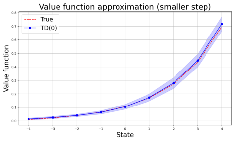

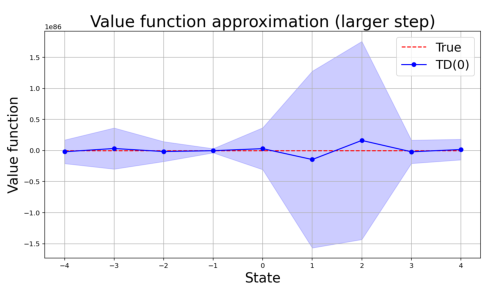

Figure 1: Left: Value function approximation in the random walk environment with a constant step
size _α_ _n_ = 0 _._ 05. The estimated value function (solid blue line) by TD(0) closely matches the true
value function (red dotted line), and the pointwise one standard deviation bands (shaded region)
remain narrow, indicating stable performance. Right: Value function approximation in the random
walk environment with a constant step size _α_ _n_ = 1 _._ 5. The standard TD(0) estimates diverge
substantially from the true value function, and the pointwise one standard deviation bands inflate
to extreme magnitudes, reflecting loss of numerical stability under a moderately large step size.

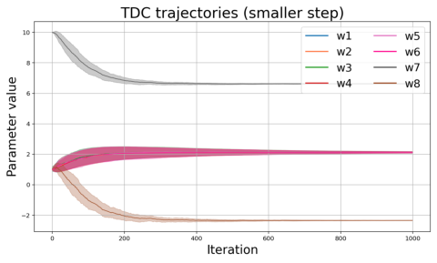

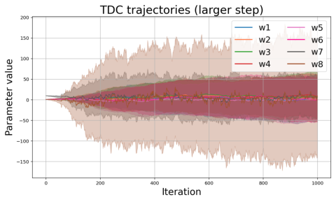

Figure 2: Left: Estimated weight parameter trajectories in Baird’s counterexample with constant
step sizes ( _α_ _n_ _, β_ _n_ ) = (0 _._ 005 _,_ 0 _._ 05). The TDC estimates (solid lines) converge toward a fixed point,
and the pointwise one standard deviation bands (shaded region) shrink, indicating stable performance. Right: Estimated weight parameter trajectories in Baird’s example with constant step sizes
( _α_ _n_ _, β_ _n_ ) = (0 _._ 01 _,_ 0 _._ 1). The TDC estimates demonstrate pronounced oscillations, and pointwise one
standard deviation bands are substantially wider, reflecting TDC’s sensitivity to step size selection.

guarantees or error bounds on the convergence of TD iterates. For a comprehensive discussion of

other existing deterministic and stochastic step size strategies, we refer the reader to a review by

George and Powell [14].

### **3 Implicit temporal difference learning**

In this section, we introduce implicit TD algorithms, which are designed to alleviate the nu

merical instability discussed in Section 2.4. The key idea behind implicit updates is in rewriting

the recursive update as a fixed point equation, where the future iterate appears on both the left

and right-hand sides of the update rule. To provide a concrete example, consider the standard

stochastic gradient descent (SGD) algorithm [7, 8] applied to an objective function _f_,

_w_ _n_ +1 = _w_ _n_ + _α_ _n_ _∇f_ ( _w_ _n_ ; _ξ_ _n_ ) _,_ _n ≥_ 1 _,_ (5)

where _α_ _n_ is a non-negative step size and _ξ_ _n_ represents the random component involved in computing

the _n_ [th] stochastic gradient. An implicit version of the aforementioned SGD algorithm, given by

_w_ _n_ [im] +1 [=] _[ w]_ _n_ [im] [+] _[ α]_ _[n]_ _[∇][f]_ [(] _[w]_ _n_ [im] +1 [;] _[ ξ]_ _[n]_ [)] _[,]_ _n ≥_ 1 _,_ (6)

was proposed and analyzed in Toulis et al. [40], Toulis and Airoldi [41, 42], and Chee et al. [9].

Note that the highlighted term in (6) indicates that the gradient is evaluated at the future iterate,

resulting in a fixed point equation. For a range of objective functions _f_, this equation admits

a simple update rule [40]. Moreover, such an implicit update has shown to provide significant

stability improvements over the standard SGD algorithm given in (5). Motivated by this central

idea of implicit SGD, our goal in the following two subsections is to develop implicit variants of

TD algorithms.

**3.1** **Implicit TD(** 0 **)/TD(** _λ_ **) algorithms**

In this subsection, inspired by the principles of implicit SGD, we reformulate the TD update

rules as fixed-point equations. Recall that _ϕ_ _n_ = _ϕ_ ( _x_ _n_ ), _r_ _n_ = _r_ ( _x_ _n_ _, a_ _n_ ), and _ϕ_ _n_ +1 = _ϕ_ ( _x_ _n_ +1 ). Based

on this formulation, we propose the following implicit TD(0) algorithm

_w_ _n_ [im] +1 [=] _[ w]_ _n_ [im] [+] _[ α]_ _[n]_ _[δ]_ _n_ [im] _[ϕ]_ _[n]_ _[,]_ (7)

_δ_ _n_ [im] [:=] _[ r]_ _[n]_ [+] _[ γϕ]_ _[⊤]_ _n_ +1 _[w]_ _n_ [im] _[−]_ _[ϕ]_ _[⊤]_ _n_ _[w]_ _n_ [im] +1 _[,]_

and the implicit TD( _λ_ ) algorithm [39]

_w_ _n_ [im] +1 [=] _[ w]_ _n_ [im] [+] _[ α]_ _[n]_ _[δ]_ _n_ [im] _[e]_ _[n]_ _[,]_ (8)

_δ_ _n_ [im] [:=] _[ r]_ _[n]_ [+] _[ γϕ]_ _[⊤]_ _n_ +1 _[w]_ _n_ [im] [+] _[ λγe]_ _[T]_ _n−_ 1 _[w]_ _n_ [im] _[−]_ _[e]_ _[⊤]_ _n_ _[w]_ _n_ [im] +1 _[,]_

_e_ _n_ := _ϕ_ _n_ + ( _λγ_ ) _e_ _n−_ 1 _, e_ 0 = 0 _,_

where ( _α_ _n_ ) _n∈_ N is a sequence of non-negative step sizes. Combining the future iterate value _w_ _n_ [im] +1
from both sides, (7) can be rewritten as

� _I_ + _α_ _n_ _ϕ_ _n_ _ϕ_ _[T]_ _n_ � _w_ _n_ [im] +1 [=] _[ w]_ _n_ [im] [+] _[ α]_ _[n]_ [(] _[r]_ _[n]_ [+] _[ γϕ]_ _[⊤]_ _n_ +1 _[w]_ _n_ [im] [)] _[ϕ]_ _[n]_ _[.]_

Analogously, equation (8) can be reexpressed as

� _I_ + _α_ _n_ _e_ _n_ _e_ _[T]_ _n_ � _w_ _n_ [im] +1 [=] _[ w]_ _n_ [im] [+] _[ α]_ _[n]_ [(] _[r]_ _[n]_ [+] _[ γϕ]_ _[⊤]_ _n_ +1 _[w]_ _n_ [im] [+] _[ λγe]_ _[T]_ _n−_ 1 _[w]_ _n_ [im] [)] _[e]_ _[n]_ _[.]_

Using the Sherman-Morrison-Woodbury formula, we have

� _I_ + _α_ _n_ _ϕ_ _n_ _ϕ_ _[T]_ _n_ � _−_ 1 = _I −_ _α_ _n_ _[ϕ]_ _[n]_ _[ϕ]_ _n_ _[T]_ and � _I_ + _α_ _n_ _e_ _n_ _e_ _[T]_ _n_ � _−_ 1 = _I −_ _α_ _n_ _[e]_ _[n]_ _[e]_ _n_ _[⊤]_ _[.]_
1 + _α_ _n_ _||ϕ_ _n_ _||_ [2] 1 + _α_ _n_ _||e_ _n_ _||_ [2]

These expressions provide insight into why implicit TD algorithms are more stable than standard

TD. First, note that the norms of the update matrices shown above are both less than or equal to

one, resulting in a stable update from _w_ _n_ [im] to _w_ _n_ [im] +1 [. In each iteration, implicit algorithms utilize]

both feature and eligibility trace information to impose adaptive shrinkage on the running iterates.

In Algorithm 1 shown below, we present a concrete description of the implicit TD algorithms, with

and without the projection step.

**Algorithm 1** Implicit TD(0)/TD( _λ_ )

**Input:** initial guess _w_ 1 [im] [, initial state] _[ x]_ [1] [, step size (] _[α]_ _[n]_ [)] _[n][∈]_ [N] [, eligibility weight parameter] _[ λ]_ [ (for]
TD( _λ_ )), projection radius _R >_ 0 (for projected version)
**For** _n_ = 1 _, . . ., N_, **do** :

1. Obtain values of the reward _r_ _n_ and next state _x_ _n_ +1 .

2. Compute the temporal difference error:

_δ_ _n_ [im] [=] _[ r]_ _[n]_ [+] _[ γϕ]_ _[T]_ _n_ +1 _[w]_ _n_ [im] _[−]_ _[ϕ]_ _[T]_ _n_ _[w]_ _n_ [im]

3. For TD(0), update:

_α_ _n_
_w_ _n_ [im] +1 [=] _[ w]_ _n_ [im] [+] _[δ]_ _n_ [im] _[ϕ]_ _[n]_
1 + _α_ _n_ _∥ϕ_ _n_ _∥_ [2]

For TD( _λ_ ), update:

_α_ _n_
_w_ _n_ [im] +1 [=] _[ w]_ _n_ [im] [+] _[δ]_ _n_ [im] _[e]_ _[n]_ _[,]_
1 + _α_ _n_ _∥e_ _n_ _∥_ [2]

_e_ _n_ = _ϕ_ _n_ + ( _λγ_ ) _e_ _n−_ 1 _,_ with _e_ 0 = 0

4. (For projected implicit TD) If _∥w_ _n_ [im] +1 _[∥]_ _[> R]_ [:]

_R_
_w_ _n_ [im] +1 [=] _n_ +1
_∥w_ _n_ [im] +1 _[∥]_ _[w]_ [im]

**Output:** final estimate _w_ _N_ [im] +1 [.]

We begin our analysis of implicit TD algorithms by establishing a connection to standard TD

updates. This result is presented in Lemma 3.1 that follows.

**Lemma 3.1.** _An implicit update of TD(_ 0 _) given in_ (7) _can be written as_

_w_ _n_ _[im]_ +1 [=] _[ w]_ _n_ _[im]_ [+ ˜] _[α]_ _[n]_ _r_ _n_ + _γϕ_ _[⊤]_ _n_ +1 _[w]_ _n_ _[im]_ _[−]_ _[ϕ]_ _[⊤]_ _n_ _[w]_ _n_ _[im]_ _ϕ_ _n_ _,_ (9)
� �

_where_ ˜ _α_ _n_ = 1+ _α_ _n_ _α∥_ _n_ _ϕ_ _n_ _∥_ [2] _[. Similarly, the implicit TD(][λ][) given in]_ [ (8)] _[ can be expressed as]_

_w_ _n_ _[im]_ +1 [=] _[ w]_ _n_ _[im]_ [+ ˜] _[α]_ _[n]_ � _r_ _n_ + _γϕ_ _[⊤]_ _n_ +1 _[w]_ _n_ _[im]_ _[−]_ _[ϕ]_ _[⊤]_ _n_ _[w]_ _n_ _[im]_ � _e_ _n_ _,_ (10)

_where_ ˜ _α_ _n_ = 1+ _αα_ _n_ _∥_ _n_ _e_ _n_ _∥_ [2] _[.]_

From Lemma 3.1, we see that implicit TD(0) and TD( _λ_ ) algorithms, respectively, move along the

same direction as the standard TD(0) and TD( _λ_ ). Unlike the standard TD algorithms, in implicit

TD algorithms, an additional source of shrinkage in running iterates is provided through adaptive

step sizes (˜ _α_ _n_ ) _n∈_ N, which scale inversely proportional to the norm of the feature or eligibility trace.

Lemma 3.1 highlights that implicit updates can be made without much additional computational

cost, as the implicit TD(0) and TD( _λ_ ) algorithms amount to using random step sizes (˜ _α_ _n_ ) _n∈_ N . In

combination with a projection step discussed in Section 2.2, we introduce projected implicit TD

algorithms, which can further enhance numerical stability.

**3.2** **Implicit TDC algorithm**

In the same spirit as the implicit TD(0) and TD( _λ_ ) algorithms, here we introduce an implicit

version of the TDC algorithm, which we refer to as the implicit TDC algorithm. Recall that

_ϕ_ _n_ = _ϕ_ ( _x_ _n_ ) _, r_ _n_ = _r_ ( _x_ _n_ _, a_ _n_ ), _ϕ_ _n_ +1 = _ϕ_ ( _x_ _n_ +1 ) _,_ and _ρ_ _n_ = _π_ _∗_ ( _a_ _n_ _|x_ _n_ ) _/π_ _b_ ( _a_ _n_ _|x_ _n_ ). We propose the

following implicit version of the aforementioned TDC algorithm:

_w_ _n_ [im] +1 [=] _[ w]_ _n_ [im] [+] _[ α]_ _[n]_ _[ρ]_ _[n]_ � _r_ _n_ _ϕ_ _n_ + _γϕ_ _n_ _ϕ_ _[T]_ _n_ +1 _[w]_ _n_ [im] _[−]_ _[γϕ]_ _[n]_ [+1] _[ϕ]_ _[T]_ _n_ _[u]_ [im] _n_ � _−_ _α_ _n_ _ρ_ _n_ _ϕ_ _n_ _ϕ_ _[T]_ _n_ _[w]_ _n_ [im] +1 _[,]_ (11)

_u_ [im] _n_ +1 [=] _[ u]_ [im] _n_ [+] _[ β]_ _[n]_ _[ρ]_ _[n]_ � _r_ _n_ _ϕ_ _n_ + _γϕ_ _n_ _ϕ_ _[T]_ _n_ +1 _[w]_ _n_ [im] _[−]_ _[ϕ]_ _[n]_ _[ϕ]_ _[T]_ _n_ _[w]_ _n_ [im] � _−_ _β_ _n_ _ρ_ _n_ _ϕ_ _n_ _ϕ_ _[T]_ _n_ _[u]_ [im] _n_ +1 _[.]_ (12)

In these expressions, the sequences ( _α_ _n_ ) _n∈_ N and ( _β_ _n_ ) _n∈_ N are non-negative step sizes. To gain insight

into the numerical stability of the implicit TDC update, observe that the implicit TDC update for

the primary parameter _w_ [im] can be rewritten as follows

� _I_ + _α_ _n_ _ρ_ _n_ _ϕ_ _n_ _ϕ_ _[T]_ _n_ � _w_ _n_ [im] +1 [=] _[ w]_ _n_ [im] [+] _[ α]_ _[n]_ _[ρ]_ _[n]_ � _r_ _n_ _ϕ_ _n_ + _γϕ_ _n_ _ϕ_ _[T]_ _n_ +1 _[w]_ _n_ [im] _[−]_ _[γϕ]_ _[n]_ [+1] _[ϕ]_ _[T]_ _n_ _[u]_ [im] _n_ �

_−_ 1
_⇔_ _w_ _n_ [im] +1 [=] � _I_ + _α_ _n_ _ρ_ _n_ _ϕ_ _n_ _ϕ_ _[T]_ _n_ � � _w_ _n_ [im] [+] _[ α]_ _[n]_ _[ρ]_ _[n]_ � _r_ _n_ _ϕ_ _n_ + _γϕ_ _n_ _ϕ_ _[T]_ _n_ +1 _[w]_ _n_ [im] _[−]_ _[γϕ]_ _[n]_ [+1] _[ϕ]_ _[T]_ _n_ _[u]_ [im] _n_ ��

_⇔_ _w_ _n_ [im] +1 [=] � _I −_ _α_ _n_ _[′]_ _[ρ]_ _[n]_ _[ϕ]_ _[n]_ _[ϕ]_ _n_ _[T]_ �� _w_ _n_ [im] [+] _[ α]_ _[n]_ _[ρ]_ _[n]_ � _r_ _n_ _ϕ_ _n_ + _γϕ_ _n_ _ϕ_ _[T]_ _n_ +1 _[w]_ _n_ [im] _[−]_ _[γϕ]_ _[n]_ [+1] _[ϕ]_ _[T]_ _n_ _[u]_ [im] _n_ ��

where _α_ _n_ _[′]_ [=] 1+ _α_ _n_ _ρα_ _nn_ _∥ϕ_ _n_ _∥_ [2] [. Similarly, the implicit TDC update for the auxiliary parameter] _[ u]_ [im] [ can]

be rewritten as follows

_−_ 1
� _I_ + _β_ _n_ _ρ_ _n_ _ϕ_ _n_ _ϕ_ _[T]_ _n_ � _u_ [im] _n_ +1 [=] _[ u]_ [im] _n_ [+] _[ β]_ _[n]_ _[ρ]_ _[n]_ _[δ]_ _n_ [im] _[ϕ]_ _[n]_ _[⇔]_ _[u]_ [im] _n_ +1 [=] � _I_ + _β_ _n_ _ρ_ _n_ _ϕ_ _n_ _ϕ_ _[T]_ _n_ � � _u_ [im] _n_ [+] _[ β]_ _[n]_ _[ρ]_ _[n]_ _[δ]_ _n_ [im] _[ϕ]_ _[n]_ �

_⇔_ _u_ [im] _n_ +1 [=] � _I −_ _β_ _n_ _[′]_ _[ρ]_ _[n]_ _[ϕ]_ _[n]_ _[ϕ]_ _[T]_ _n_ �� _u_ [im] _n_ [+] _[ β]_ _[n]_ _[ρ]_ _[n]_ _[δ]_ _n_ [im] _[ϕ]_ _[n]_ �

where _δ_ _n_ [im] = _r_ _n_ + _γϕ_ _[T]_ _n_ +1 _[w]_ _n_ [im] _[−]_ _[ϕ]_ _[T]_ _n_ _[w]_ _n_ [im] and _β_ _n_ _[′]_ [=] 1+ _β_ _n_ _ρβ_ _nn_ _∥ϕ_ _n_ _∥_ [2] [. It turns out that the implicit TDC]

admits a succinct update expression, requiring the same order of computational cost as the standard

TDC algorithm. A complete characterization of the implicit TDC update is provided in Lemma

3.2.

**Lemma 3.2.** _Implicit TDC algorithm given in_ (11) _and_ (12) _can be written as_

_w_ _n_ _[im]_ +1 [=] _[ w]_ _n_ _[im]_ [+] _[ α]_ _n_ _[′]_ _[ρ]_ _[n]_ _[δ]_ _n_ _[im]_ _[ϕ]_ _[n]_ _[−]_ _[α]_ _[n]_ _[ρ]_ _[n]_ _[γ]_ � _ϕ_ _[T]_ _n_ _[u]_ _n_ _[im]_ �� _ϕ_ _n_ +1 _−_ _α_ _n_ _[′]_ _[ρ]_ _[n]_ � _ϕ_ _[T]_ _n_ _[ϕ]_ _[n]_ [+1] � _ϕ_ _n_ � _,_ (13)

_u_ _[im]_ _n_ +1 [=] _[ u]_ _[im]_ _n_ [+] _[ β]_ _n_ _[′]_ _[ρ]_ _[n]_ _[δ]_ _n_ _[im]_ _[ϕ]_ _[n]_ _[−]_ _[β]_ _n_ _[′]_ _[ρ]_ _[n]_ _[ϕ]_ _[n]_ _[ϕ]_ _n_ _[T]_ _[u]_ _n_ _[im]_ _[,]_ (14)

_where α_ _n_ _[′]_ [=] 1+ _α_ _n_ _ρα_ _nn_ _∥ϕ_ _n_ _∥_ [2] _[,][ β]_ _n_ _[′]_ [=] 1+ _β_ _n_ _ρβ_ _nn_ _∥ϕ_ _n_ _∥_ [2] _[and][ δ]_ _n_ _[im]_ [=] _[ r]_ _[n]_ [+] _[ γϕ]_ _[T]_ _n_ +1 _[w]_ _n_ _[im]_ _[−]_ _[ϕ]_ _[T]_ _n_ _[w]_ _n_ _[im]_ _[.]_

Compared to the standard TDC updates given in (3) and (4), Lemma 3.2 reveals that the

implicit TDC algorithm closely resembles the standard TDC algorithm, but with adjusted step

sizes and a modified correction term. Specifically, in the primary parameter update of the implicit

TDC algorithm, _α_ _n_ _[′]_ [serves as a data-adaptive version of the step size] _[ α]_ _[n]_ [. Similarly,] _[ β]_ _n_ _[′]_ [replaces the]

original step size _β_ _n_ in the auxiliary parameter update. Regarding the gradient correction term,

the implicit TDC algorithm adjusts the TD update in the direction of

_−α_ _n_ _ρ_ _n_ _γ_ � _ϕ_ _[T]_ _n_ _[u]_ [im] _n_ �� _ϕ_ _n_ +1 _−_ _α_ _n_ _[′]_ _[ρ]_ _[n]_ � _ϕ_ _[T]_ _n_ _[ϕ]_ _[n]_ [+1] � _ϕ_ _n_ � _,_

in contrast to the standard TDC algorithm’s correction term

_−α_ _n_ _ρ_ _n_ _γ_ ( _ϕ_ _[T]_ _n_ _[u]_ _[n]_ [)] _[ϕ]_ _[n]_ [+1] _[.]_

Roughly speaking, the standard TDC algorithm leverages the full information contained in _ϕ_ _n_ +1,

whereas the implicit TDC algorithm effectively filters out the component of _ϕ_ _n_ +1 that is aligned

with _ϕ_ _n_ . This reduces the correlation between consecutive gradient correction terms, which can

enhance numerical stability. In Algorithm 2 shown below, we present a concrete description of the

implicit TDC algorithm that was introduced in this section.

### **4 Theoretical analysis**

In this section, we provide a theoretical analysis of our proposed implicit TD algorithms. We

begin by listing out assumptions and definitions that will be used throughout this section. Unless

explicitly noted otherwise, _∥· ∥_ denotes the Euclidean norm for vectors and the corresponding

induced norm for matrices. The first assumption we introduce imposes restrictions on the data

generating process.

**Assumption 4.1.** _[Aperiodicity and irreducibility of Markov chain] The Markov chain_ ( _x_ _n_ ) _n∈_ N _is_

_aperiodic and irreducible with a unique steady-state distribution µ_ _π_ _with µ_ _π_ ( _x_ ) _>_ 0 _for all x ∈X_ _._

_In the on-policy evaluation setting, we assume that µ_ _π_ = _µ_ _π_ _∗_ _for some target policy µ_ _π_ _∗_ _. In the_

_off-policy evaluation setting, we assume µ_ _π_ = _µ_ _π_ _b_ _, where π_ _b_ _is the behavioral policy used to generate_

_the data._

Note that Assumption 4.1, together with the finiteness of the state space, implies that the Markov

chain ( _x_ _n_ ) _n∈_ N mixes at a uniform geometric rate [23], i.e., ( _x_ _n_ ) _n∈_ N is uniformly ergodic. That is,

**Algorithm 2** Implicit TDC

**Input:** initial guess _w_ 1 [im] [,] _[ u]_ [im] 1 [, initial state] _[ x]_ [1] [, step size (] _[α]_ _[n]_ [)] _[n][∈]_ [N] [, step size (] _[β]_ _[n]_ [)] _[n][∈]_ [N] [, projection]
radius _R_ _w_ _, R_ _u_ _∈_ R _>_ 0 (for projected version)
**For** _n_ = 1 _, . . ., N_, **do** :

1. Obtain values of the reward _r_ _n_ and next state _x_ _n_ +1

2. Compute the temporal difference error:

_δ_ _n_ [im] [=] _[ r]_ _[n]_ [+] _[ γϕ]_ _[T]_ _n_ +1 _[w]_ _n_ [im] _[−]_ _[ϕ]_ _[T]_ _n_ _[w]_ _n_ [im]

3. Update:

_w_ _n_ [im] +1 [=] _[ w]_ _n_ [im] [+] _[ α]_ _n_ _[′]_ _[ρ]_ _[n]_ _[δ]_ _n_ [im] _[ϕ]_ _[n]_ _[−]_ _[α]_ _[n]_ _[ρ]_ _[n]_ _[γ]_ � _ϕ_ _[T]_ _n_ _[u]_ _n_ [im] �� _ϕ_ _n_ +1 _−_ _α_ _n_ _[′]_ _[ρ]_ _[n]_ � _ϕ_ _[T]_ _n_ _[ϕ]_ _[n]_ [+1] � _ϕ_ _n_ �

_u_ [im] _n_ +1 [=] _[ u]_ [im] _n_ [+] _[ β]_ _n_ _[′]_ _[ρ]_ _[n]_ _[δ]_ _n_ [im] _[ϕ]_ _[n]_ _[−]_ _[β]_ _n_ _[′]_ _[ρ]_ _[n]_ _[ϕ]_ _[n]_ _[ϕ]_ _n_ _[T]_ _[u]_ _n_ [im]

with _α_ _n_ _[′]_ [=] 1+ _α_ _n_ _ρα_ _nn_ _∥ϕ_ _n_ _∥_ [2] [and] _[ β]_ _n_ _[′]_ [=] 1+ _β_ _n_ _ρβ_ _nn_ _∥ϕ_ _n_ _∥_ [2]

4. For projected implicit TDC:

if _∥w_ _n_ [im] +1 _[∥]_ _[> R]_ _[w]_ [:] _R_ _w_
_w_ _n_ [im] +1 [=] _n_ +1
_∥w_ _n_ [im] +1 _[∥]_ _[w]_ [im]

if _∥u_ [im] _n_ +1 _[∥]_ _[> R]_ _[u]_ [:] _R_ _u_
_u_ [im] _n_ +1 [=] _n_ +1
_∥u_ [im] _n_ +1 _[∥]_ _[u]_ [im]

**Output:** final estimate _w_ _N_ [im] +1 [.]

there exist constants _m >_ 0 and _ρ ∈_ (0 _,_ 1) such that

sup _d_ TV _{_ P( _x_ _n_ _∈· | x_ 1 = _x_ ) _, µ_ _π_ _} ≤_ _mρ_ _[n]_ _∀n ∈_ N _,_ (15)
_x∈X_

where _d_ TV ( _P, Q_ ) denotes the total-variation distance between probability measures _P_ and _Q_ . Here,

the initial distribution of _x_ 1 is the steady-state distribution _µ_ _π_, i.e., ( _x_ 1 _, x_ 2 _, . . ._ ) is a stationary

sequence. We next list out some assumptions on the environment and feature mapping used for

approximating the value function.

**Assumption 4.2.** _[Bounded reward] There exists r_ _max_ _>_ 0 _, such that ∥r_ _n_ _∥≤_ _r_ _max_ _with probability_

_one, for all n ∈_ N _._

**Assumption 4.3.** _[Normalized features] We assume that ∥ϕ_ _n_ _∥≤_ 1 _with probability one, for all_

_n ∈_ N _._

**Assumption 4.4.** _[Full rank] Define_ Φ = � _ϕ_ ( _x_ ) _[T]_ [ �]

_x∈X_ _[as the full state matrix where the][ k]_ _[th]_ _[ row]_

_corresponds to ϕ evaluated at the k_ _[th]_ _state in X_ _. We assume that_ Φ _is full rank._

Assumptions 4.1, 4.2, 4.3 and 4.4 are widely accepted in the literature [3, 4, 33, 44]. They are con

sidered to be mild as they encompass many real world RL environments. In particular, Assumption

4.3 and Assumption 4.4 can be satisfied by removing redundant features and normalizing. In our

theory, the combined role of Assumption 4.1 and Assumption 4.4 is to preclude irregularities in the

long-term behavior of the TD algorithm since, under these assumptions, the steady-state feature

covariance matrix,

Σ = Φ _[T]_ _D_ Φ = � _µ_ _π_ ( _x_ ) _ϕ_ ( _x_ ) _ϕ_ ( _x_ ) _[T]_ _,_

_x∈X_

is positive definite, where we set _D_ := diag _{π_ ( _x_ ) _}_ _x∈X_ . We will denote the minimum eigenvalue of Σ

as _λ_ min . Moreover, thanks to Assumption 4.3, we have that _λ_ min _∈_ (0 _,_ 1). Lastly, for the statement

of the finite-time error bounds, we introduce the mixing time of the Markov chain ( _x_ _n_ ) _n∈_ N which

appears in the bounds we establish.

**Definition 4.5** (Mixing time) **.** _Given a threshold ϵ >_ 0 _, constants ρ ∈_ (0 _,_ 1) _and m ∈_ (0 _, ∞_ ) _, the_

_mixing time of the uniformly ergodic Markov chain_ ( _x_ _n_ ) _n∈_ N _is defined as_

_τ_ _ϵ_ = min _{n ∈_ N _| mρ_ _[n]_ _≤_ _ϵ}._

For the TD( _λ_ ) algorithm, a modified definition of mixing time, which reflects the geometric weight

ing of the eligibility trace will be used in the finite-time error bound expression. A formal definition

is given below.

**Definition 4.6** (Modified mixing time) **.** _Given a trace-decay parameter λ ∈_ (0 _,_ 1) _, a discount factor_

_γ ∈_ (0 _,_ 1) _, and a threshold ϵ >_ 0 _, the modified mixing time of the uniformly ergodic Markov chain_

( _x_ _n_ ) _n∈_ N _is defined as_

_τ_ _λ,ϵ_ = max _τ_ _ϵ_ _, τ_ _ϵ_ _[λ]_ _,_ _where τ_ _ϵ_ _[λ]_ [:= min] _[ {][n][ ∈]_ [N] _[ |]_ [ (] _[λγ]_ [)] _[n]_ _[ ≤]_ _[ϵ][}][ .]_
� �

To understand how these quantities behave as _ϵ_ decreases, consider the case where _ϵ_ = _O_ (1 _/t_ _[s]_ ) for

some _s >_ 0. Under this condition, it can be shown that both _τ_ _ϵ_ and _τ_ _λ,ϵ_ grow at a rate of _O_ (log _t_ ).

**4.1** **Asymptotic analysis for implicit TD without projection**

Under the aforementioned assumptions, we can now establish the mean square convergence of

the implicit TD(0) and TD( _λ_ ) algorithms.

**Theorem 4.7** (Asymptotic convergence of implicit TD) **.** _Under Assumptions 4.1-4.4, the implicit_

_TD(_ 0 _) or TD(λ) with a step size α_ _n_ = _cn_ _[−][s]_ _, for some constant c >_ 0 _and s ∈_ (0 _._ 5 _,_ 1] _,_

lim _n_ _[−]_ _[w]_ _[∗]_ _[∥]_ [2] _[}]_ [ = 0] _[.]_
_n→∞_ [E] _[{∥][w]_ _[im]_

The main challenge in proving convergence of the implicit algorithms is that, unlike standard TD

algorithms, where the deterministic step sizes satisfy the Robbins-Monro condition, i.e., [�] _[∞]_ _n_ =1 _[α]_ _[n]_ [ =]

_∞,_ [�] _[∞]_ _n_ =1 _[α]_ _n_ [2] _[<][ ∞]_ [, the effective step sizes (˜] _[α]_ _[n]_ [)] _[n][∈]_ [N] [for implicit algorithms are random as discussed]

in Lemma 3.1. To this end, we first establish the upper and lower bounds of the random step size

_α_ ˜ _n_ in terms of the deterministic step size _α_ _n_ . Extending the approach taken in Srikant and Ying

[33], whose results were developed for the deterministic step size, we establish mean square error

bounds of implicit TD algorithms for a sufficiently large time _n_ using Lyapunov function based

error analysis. Taking the limit of such bounds, we obtain the asymptotic convergence of implicit

TD algorithms.

**Remark 4.8.** _Just like in standard TD algorithms [27, 33], for a sufficiently small constant step_

_size α_ _n_ = _α, ∀n ∈_ N _, it is possible to establish finite-time error bounds for implicit TD algorithms._

_While the theoretical guarantee with the constant step size only holds for a sufficiently small α,_

_implicit TD algorithms demonstrate improved numerical stability in comparison to standard TD_

_algorithms over a wide range of α values, which we will confirm empirically in Section 5._

**4.2** **Finite-time analysis of implicit TD with projection**

To justify the robustness of implicit TD algorithms, we establish finite-time analyses of implicit

TD algorithms with an additional projection step. The benefit of adding a projection step is in

obtaining an upper bound of the TD update, i.e., _δ_ _n_ _ϕ_ _n_ or _δ_ _n_ _e_ _n_ . Since the projection step guarantees

that all running iterates _w_ _n_ [im] [lie inside the ball of radius] _[ R >]_ [ 0, we get the following upper bounds]

for the TD updates.

**Proposition 4.9.** _[Lemma 6, 17 of Bhandari et al. [4]] Given any projection radius R >_ 0 _, for_

_w ∈{u_ : _∥u∥≤_ _R}, we have_

_T_
_∥δ_ _n_ _ϕ_ _n_ _∥_ = ��( _r_ _n_ + _γϕ_ _n_ +1 _[w][ −]_ _[ϕ]_ _n_ _[T]_ _[w]_ [)] _[ϕ]_ _[n]_ �� _≤_ _G_ := _r_ max + 2 _R_

_T_ max + 2 _R_
_∥δ_ _n_ _e_ _n_ _∥_ = ��( _r_ _n_ + _γϕ_ _n_ +1 _[w][ −]_ _[ϕ]_ _n_ _[T]_ _[w]_ [)] _[e]_ _[n]_ �� _≤_ _B_ := _r_ _,_

1 _−_ _λγ_

_for all n ∈_ N _._

Bhandari et al. [4] used these bounds to control the magnitudes of the stochastic updates at each

iteration, ensuring that the deviation of the projected TD update from the mean-path TD update

remains uniformly bounded. [2]

We use Proposition 4.9 to derive finite-time error bounds and asymptotic convergence for im

plicit TD algorithms. Our analysis extends the proof strategy of Bhandari et al. [4], who use

the bounds in Proposition 4.9 to ensure that the deviation of the projected TD update from the

mean-path TD update remains uniformly bounded.

**Theorem 4.10** (Finite-time analysis for projected implicit TD(0)) **.** _Suppose that Assumptions_

_4.1-4.4 hold with a constant step size α_ = _α_ 1 = _. . ._ = _α_ _N_ _. Suppose also that_ 2 _α_ (1 _−_ _γ_ ) _λ_ min _<_ 1+ _α._

_Then, the projected implicit TD(0) iterates with R ≥∥w_ _∗_ _∥_ _satisfy_

_[−]_ 1+ _[γ]_ _α_ [)] _[λ]_ [min] _N_ [�] � _w_ 1 _im_ _[−]_ _[w]_ _[∗]_ �� 2 + _α_ (1 + _α_ ) _G_ [2] (9 + 12 _τ_ _α_ )

E �� _w_ _Nim_ +1 _[−]_ _[w]_ _[∗]_ �� 2 [�] _≤_ _e_ _[−]_ [2] _[α]_ [(][1] _[−]_ 1+ _[γ]_ _α_ [)] _[λ]_ [min]
�

_._
2(1 _−_ _γ_ ) _λ_ min

2
While Proposition 4.9 holds for any _R >_ 0, convergence to the optimal weight parameter _w_ _∗_ requires that _R > ∥w_ _∗_ _∥_ .
For a specific choice of _R_ that satisfies this condition, we refer the reader to Bhandari et al. [4]. In practice, one can
set _R >_ 0 large enough just to prevent possible divergent behavior of TD iterates.

**Remark 4.11.** _Under the assumptions of Theorem 4.10, we have λ_ min _∈_ (0 _,_ 1) _and hence the_

_condition_ 2 _α_ (1 _−_ _γ_ ) _λ_ min _<_ 1 + _α is met when γ ∈_ [0 _._ 5 _,_ 1) _. As such, the above finite-time bound_

_can hold regardless of the step size choice. In comparison, note that the bound for the projected_

_TD(0) obtained in [4] requires_ 2 _α_ (1 _−_ _γ_ ) _λ_ min _<_ 1 _, which does not hold for a moderately large step_

_size. This requirement highlights the standard TD(0) algorithm’s potential sensitivity to the choice_

_of step size. In contrast, the implicit TD algorithms can exhibit greater robustness across a wider_

_range of constant step size values._

Next, we provide a finite-time error bound for the implicit TD( _λ_ ) algorithm.

**Theorem 4.12** (Finite-time analysis for projected implicit TD( _λ_ )) **.** _Suppose that Assumptions 4.1-_

_4.4 hold with a constant step size α_ = _α_ 1 = _. . ._ = _α_ _N_ _. Suppose also that_ 2 _α_ (1 _−_ _λγ_ ) [2] (1 _−_ _κ_ ) _λ_ min _<_

1 + _α where κ_ = _[γ]_ 1 [(] _−_ [1] _[−]_ _λγ_ _[λ]_ [)] _[. Then, the projected implicit TD(][λ][) iterates with][ R][ ≥∥][w]_ _[∗]_ _[∥]_ _[satisfy]_

[)] 1+ [2][(] _α_ [1] _[−][κ]_ [)] _[λ]_ [min] _N_ [�] � _w_ 1 _im_ _[−]_ _[w]_ _[∗]_ �� 2 + (1 + _α_ ) � _αB_ [2] (24 [2] _τ_ _λ,α_ + 15) + 2 _B_ [2] [�]

E _w_ _Nim_ +1 _[−]_ _[w]_ _[∗]_ �� 2 [�] _≤_ _e_ _[−]_ [2] _[α]_ [(][1] _[−][λ][γ]_ [)] 1+ [2][(] _α_ [1] _[−][κ]_ [)] _[λ]_ [min]
���

_._
2(1 _−_ _λγ_ ) [2] (1 _−_ _κ_ ) _λ_ _min_

**Remark 4.13.** _Note that_ (1 _−_ _λγ_ ) [2] (1 _−_ _κ_ ) = (1 _−_ _λγ_ )(1 _−_ _γ_ ) _. Hence, for γ ∈_ [0 _._ 5 _,_ 1) _, just like in_

_the case of the projected implicit TD(0), the above finite-time error bound holds regardless of the_

_constant step size. Thanks to the additional factor of_ (1 _−_ _λγ_ ) _, the result applies to a broader class_

_of problems, indicating enhanced numerical stability over projected implicit TD(0). In particular,_

_for λ ≥_ 21 _γ_ _[, the bound holds regardless of the choice of step size.]_

The theoretical results shown above are under a constant step size regime, where the running iterates

_w_ _[im]_
_N_ [do not necessarily converge to] _[ w]_ _[∗]_ [. With a decreasing step size sequence, we can establish the]

following asymptotic convergence results for both the implicit TD(0) and TD( _λ_ ) algorithms.

**Theorem 4.14** (Asymptotic convergence of projected implicit TD(0)) **.** _Suppose that Assumptions_

_4.1-4.4 hold. For α_ 1 _>_ 0 _and N > τ_ _α_ _N_ _, with a step size sequence α_ _n_ = _α_ 1 _λ_ _min_ (1 _−αγ_ 1 )( _n−_ 1)+1 _[, the]_

_projected implicit TD(0) iterates with R ≥∥w_ _∗_ _∥_ _achieves_

E � _∥w_ _N_ _[im]_ +1 _[−]_ _[w]_ _[∗]_ _[∥]_ [2] [�] = _O_ [˜] (1 _/N_ ) _,_

_where_ _O_ [˜] _is big-O suppressing logarithmic factors. In particular,_

E _w_ _Nim_ +1 _[−]_ _[w]_ _[∗]_ �� 2 [�] _→_ 0 _as_ _N →∞._
���

**Theorem 4.15** (Asymptotic convergence of projected implicit TD( _λ_ )) **.** _Suppose that Assump-_

_γ_ (1 _−λ_ )
_tions 4.1-4.4 hold._ _For α_ 1 _>_ 0 _, κ_ = 1 _−λγ_ _and N >_ 2 _τ_ _α_ _N_ _, with a step size sequence α_ _n_ =

_α_ 1
_α_ 1 _λ_ _min_ (1 _−κ_ )( _n−_ 1)+1 _[, the projected implicit TD(0) iterates with][ R][ ≥∥][w]_ _[∗]_ _[∥]_ _[achieves]_

E � _∥w_ _N_ _[im]_ +1 _[−]_ _[w]_ _[∗]_ _[∥]_ [2] [�] = _O_ [˜] (1 _/N_ ) _,_

_where_ _O_ [˜] _is big-O suppressing logarithmic factors. In particular,_

E _w_ _Nim_ +1 _[−]_ _[w]_ _[∗]_ �� 2 [�] _→_ 0 _as_ _N →∞._
���

**4.3** **Finite-time analysis of implicit TDC with projection**

In this subsection, we establish finite-time error bounds for the proposed projected implicit

TDC algorithm with both decreasing step size schedules and constant step sizes. Recall that in the

off-policy evaluation setting, the goal is to approximate the value function under target policy with

data generated from the behavioral policy. To this end, we need to restrict the class of behavioral

policy to a reasonable set of policies to ensure optimal value function approximation is identifiable.

Widely accepted assumptions for such a guarantee are listed below [45, 46].

**Assumption 4.16.** _[Importance weights] There exist ρ_ max _∈_ (0 _, ∞_ ) _such that, for all n ∈_ N _,_

_ρ_ ( _a_ _n_ _, x_ _n_ ) = _π_ _∗_ ( _a_ _n_ _|x_ _n_ ) _/π_ _b_ ( _a_ _n_ _|x_ _n_ ) _≤_ _ρ_ max _._

Assumption 4.16 is a mild condition to guarantee that the support of behavioral policy is as large

as the target policy. Furthermore, with a slight abuse of notation, in the context of off-policy

evaluation [3], let us define

� _ρ_ ( _x, a_ ) _ϕ_ ( _x_ ) _ϕ_ ( _x_ ) _[⊤]_ [�] _,_

_A_ := E
_µ_ _πb_

_⊤_ [�]
� _ρ_ ( _x, a_ ) _ϕ_ ( _x_ ) � _γϕ_ � _x_ _[′]_ [�] _−_ _ϕ_ ( _x_ )� _,_ _C_ := _−_ E _µ_ _πb_

as well as _b_ := E _µ_ _πb_ [ _ρ_ ( _x, a_ ) _r_ ( _x, a_ ) _ϕ_ ( _x_ )]. It can be shown that an optimal linear function approx
imation with respect to the mean-square projected Bellman error is obtained when _w_ _∗_ = _A_ _[−]_ [1] _b_

[37, 46]. We make the following assumption on matrices _A_ and _C_ to guarantee the existence of

unique optimal linear function approximation representation of the target value function.

**Assumption 4.17.** _[Problem solvability] The matrix A and C are nonsingular. We denote the_

_minimum absolute eigenvalue of the matrix C to be λ_ _c_ _>_ 0 _. Furthermore, there exist λ_ _u_ _and λ_ _w_
_such that λ_ max (2 _C_ ) _≤_ _λ_ _u_ _<_ 0 _and λ_ max �2 _A_ _[⊤]_ _C_ _[−]_ [1] _A_ � _≤_ _λ_ _w_ _<_ 0 _._

Recall that in the implicit TDC algorithm, there are two sequences of iterates: _w_ _n_ [im] [, which parame-]

terizes the value function of interest, and _u_ [im] _n_ [, which serves as an auxiliary variable to compute the]

gradient correction term for the primary iterate. To facilitate the error analysis, we introduce the

tracking error vector _v_ _n_ := _u_ [im] _n_ _[−]_ _[u]_ _[∗]_ _n_ [, where] _[ u]_ _[∗]_ _n_ [:=] _[ −][C]_ _[−]_ [1] [(] _[b]_ [ +] _[ Aw]_ _n_ [im] [) denotes the stationary point of]

the ODE: _u_ _[′]_ = _b_ + _Aw_ _n_ [im] [+] _[ Cu]_ [. In short, for a fixed value of] _[ w]_ _n_ [im] [,] _[ u]_ _[∗]_ _n_ [represents the point to which]

the auxiliary iterates _u_ [im] _n_ would converge. The tracking error _v_ _n_ thus quantifies the deviation of

the auxiliary iterates from their instantaneous stationary point, providing a handle to assess how

much of the overall error in the primary iterate _w_ _n_ [im] [can be attributed to imperfect tracking by the]

auxiliary sequence. We first establish finite-time error bounds of the implicit TDC algorithm with

a decreasing sequence of step sizes ( _α_ _n_ ) _n∈_ N and ( _β_ _n_ ) _n∈_ N .

3 In the context of on-policy evaluation, definitions on the page 6 implies _A_ := E _∞_ � _ϕ_ ( _x_ ) _{γϕ_ ( _x_ _[′]_ ) _−_ _ϕ_ ( _x_ ) _}_ _[⊤]_ [�] and

_b_ := E _∞_ [ _r_ ( _x, a_ ) _ϕ_ ( _x_ )]

**Theorem 4.18** (Finite-time analysis for implicit TDC with decreasing step sizes) **.** _Given As-_

_sumptions 4.1, 4.2, 4.3, 4.16 and 4.17, suppose α_ _n_ = _nc_ _α_ ~~_[σ]_~~ _[, β]_ _[n]_ [ =] _nc_ _β_ ~~_[ν]_~~ _[,][ with]_ [ 0] _[ < ν < σ <]_ [ 1] _[,]_

_c_ _α_ ( _|λ_ _w_ _| −_ _ρ_ max ) _<_ 1 _and c_ _β_ ( _|λ_ _u_ _| −_ _ρ_ max ) _<_ 1 _._ _Then for any ϵ ∈_ (0 _, σ −_ _ν_ ] _, ϵ_ _[′]_ _∈_ (0 _,_ 0 _._ 5] _, the_

_projected implicit TDC with R_ _w_ _≥∥w_ _∗_ _∥_ _and R_ _u_ _≥_ 2 _ρ_ max ( _γ_ + 1) _R_ _w_ _/λ_ _c_ _yields_

_im_ 2
E�� _w_ _n_ _[−]_ _[w]_ _[∗]_ �� = _O_ _e_
�

(1+ _−cαρ|λw_ max)(1 _|cαn_ [1] _[−]_ _−_ _[σ]_ _σ_ ) + _O_ log _n_
� � _n_ _[σ]_

_−|λw_ _|cαn_ [1] _[−][σ]_

log _n_ 1 _−ϵ_ _′_
+ _O_ + _h_ ( _σ, ν_ )
� � _n_ _[ν]_ �

_n_ _[σ]_

2 log _n_
E�� _v_ _n_ �� = _O_
� _n_ _[ν]_

+ _O_ ( _h_ ( _σ, ν_ )) _,_ _h_ ( _σ, ν_ ) =
�






_n_ 1 ~~_[ν]_~~ _[,]_ _σ >_ 1 _._ 5 _ν,_

_n_ [2(] _[σ][−]_ 1 _[ν]_ [)] _[−][ϵ]_ _[,]_ _ν < σ ≤_ 1 _._ 5 _ν._

**Remark 4.19.** _The key result in Theorem 4.18 is that implicit TDC offers greater flexibility than_

_standard TDC in choosing a step size schedule when there exists a large discrepancy between the_

_target and behavioral policy. For example, the condition on the step size, i.e., c_ _α_ ( _|λ_ _w_ _| −_ _ρ_ max ) _<_ 1 _,_

_holds for any c_ _α_ _>_ 0 _if |λ_ _w_ _| −_ _ρ_ max _≤_ 0 _._ _Moreover, even if |λ_ _w_ _| −_ _ρ_ max _>_ 0 _, the condition_

_c_ _α_ _<_ 1 _/_ ( _|λ_ _w_ _|−ρ_ max ) _permits much wider range of initial step sizes in comparison to the requirement_

_c_ _α_ _<_ 1 _/|λ_ _w_ _| for the standard TDC [46]. The same logic also applies to c_ _β_ _._

**Remark 4.20.** _Note that the step size condition is automatically satisfied for all c_ _α_ _and c_ _β_ _when_

_ρ_ max _≥_ max _{|λ_ _w_ _|, |λ_ _u_ _|}._ _This implies that, unlike standard TDC, the implicit TDC algorithm_

_permits a more flexible choice of step sizes, particularly when the discrepancy between the target_

_and behavioral policies becomes large. At the same time, the increased difficulty of learning the_

_value function under a behavioral policy that is far from the target policy is captured in the leading_

_term of the error bound for the primary iterate. In particular, the decaying rate of the leading term_

_slows as the gap between the behavioral and target policies increases._

**Theorem 4.21** (Finite-time analysis for implicit TDC with a constant step size) **.** _Given Assump-_

_tions 4.1, 4.2, 4.3, 4.16 and 4.17, suppose α_ _n_ = _c_ _α_ _, β_ _n_ = _c_ _β_ _, with c_ _α_ ( _|λ_ _w_ _| −_ _ρ_ max ) _<_ 1 _and_

_c_ _β_ ( _|λ_ _u_ _| −_ _ρ_ max ) _<_ 1 _._ _Then, for all n ∈_ N _, the projected implicit TDC with R_ _w_ _≥∥w_ _∗_ _∥_ _and_

_R_ _u_ _≥_ 2 _ρ_ max ( _γ_ + 1) _R_ _w_ _/λ_ _c_ _yields,_

E _∥v_ _n_ +1 _∥_ [2] _≤_ �1 _−_ _β |λ_ _u_ _|_ � _n_ _∥v_ 1 _∥_ 2 + _C_ _v_

E �� _w_ _nim_ +1 _[−]_ _[w]_ _[∗]_ �� 2 _≤_ (1 _−_ _α_ _|λ_ _w_ _|_ ) _n_ _∥w_ 1 _−_ _w_ _∗_ _∥_ 2 + _C_ _w_

_where_ _α_ = _c_ _α_ _[β]_ [ =] _c_ _β_
1+ _c_ _α_ _ρ_ max _[,]_ 1+ _c_ _β_ _ρ_ max _[and]_

_C_ _v_ = _O_ �max � _c_ _β_ _τ_ _c_ _β_ _, c_ [2] _β_ _[τ]_ _[c]_ _β_ �� + _O_ �max � _c_ _α_ _, c_ [2] _α_ �� + _O_ �max � _c_ _α_ _/c_ _β_ _, c_ [2] _α_ _[/c]_ _[β]_ ��

_C_ _w_ = _O_ �max _{c_ _α_ _, c_ [4] _α_ _[}]_ � + _O_
��

_C_ _v_ + _c_ _α_ ~~�~~ _C_ _v_ + _O_ �max _{c_ _α_ _, c_ [3] _α_ _[}][τ]_ _[c]_ _α_ � _._

�

**Remark 4.22.** _Similar to the case with diminishing step sizes, implicit TDC substantially relaxes_

_the restrictions on the choice of constant step sizes c_ _α_ _and c_ _β_ _in comparison to standard TDC [46],_

_which requires c_ _α_ _<_ 1 _/|λ_ _w_ _| and c_ _β_ _<_ 1 _/|λ_ _u_ _|. Under a constant step-size schedule, the algorithm_

_converges into a neighborhood of the true solution w_ _∗_ _. Larger values of c_ _α_ _and c_ _β_ _accelerate the_

_rate at which w_ _n_ _approaches the neighborhood but also enlarge its radius, settling farther from_

_w_ _∗_ _. Conversely, smaller step sizes shrink the size of the neighborhood at the expense of slower_

_convergence. The finite-time bounds therefore demonstrate a clear trade-off: one must balance the_

_speed of convergence against the size of the neighborhood of convergence. In the limiting regime_

_c_ _α_ _→_ 0 _and c_ _β_ _→_ 0 _with c_ _α_ _/c_ _β_ _→_ 0 _, the neighborhood radius vanishes and w_ _n_ _[im]_ _[→]_ _[w]_ _[∗]_ _[as][ n][ →∞][.]_

### **5 Numerical experiments**

**5.1** **Random walk with absorbing states**

In this subsection, we consider a one-dimensional random walk environment with 11 integer

valued states arranged on a real line, with zero at the center. The two endpoints—the leftmost

and rightmost states—are absorbing and thus omitted from the value function approximation. The

reward is zero for all states except for the rightmost state, where the reward is one. A total number

of 100 independent experiments were run with a discount factor _γ_ = 0 _._ 9 and a projection radius

_R_ = 10. We employ TD(0), implicit TD(0), projected TD(0), and projected implicit TD(0), and

show their average performance as well as one standard deviation bands as shades in Figure 3. In

all experiments, we use a sequence of constant step sizes between 0.05 and 1.5.

Based on the top left plot in Figure 3, we observe that as the step size increases, the average value

approximation error increases for all four algorithms. We also observe that both implicit TD(0) and

projected implicit TD(0) had a smaller increase in value approximation error compared to TD(0)

and projected TD(0). For a small step size _α_ = 0 _._ 05, all four algorithms provided accurate value

function approximation as shown in the top right plot in Figure 3. However, for a moderately large

step size ( _α_ = 1 _._ 5), both TD(0) and projected TD(0) suffered from numerical instability, yielding

poor value function approximation results. This can be seen in the bottom right plot in Figure 3 as

well as Figure 1. Unlike TD(0) or projected TD(0), the implicit procedures remained numerically

stable, which can be seen in the bottom left plot in Figure 3. We also employed standard and

implicit TD(0.5) algorithms, and observed qualitatively identical results. These results confirm our

theoretical results, particularly in Theorem 4.10 and 4.12. See the Supplementary Material for

details.

**5.2** **Reward process with 100-dimensional states**

Motivated by Zhang et al. [47], we construct a synthetic Markov reward process with 100

states whose transition probability matrix is generated at random. For each state, we sample 99

independent Uniform(0 _,_ 1) samples, sort them, and take successive differences—treating 0 and 1 as

boundary points—to form a valid transition probability distribution. Repeating this procedure for

all 100 states and stacking the resulting distributions row-wise yields the full transition probability

matrix _P_ . Rewards are assigned by drawing one Uniform(0 _,_ 1) sample per state and collecting these

into the reward vector _r_ . We set the discount factor to _γ_ = 0 _._ 9.

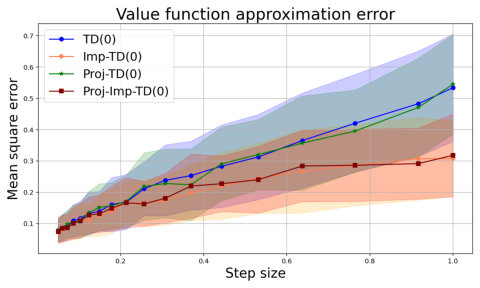

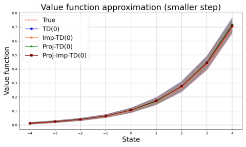

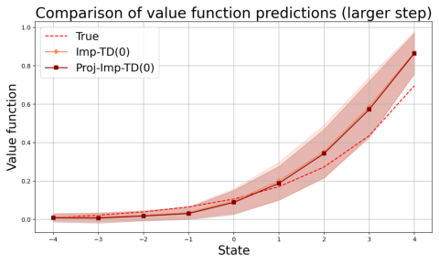

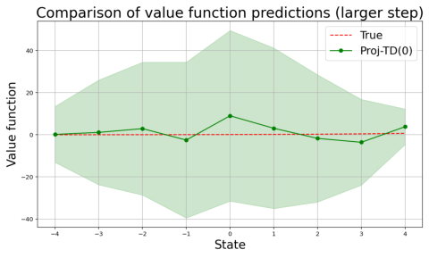

Figure 3: All figures pertain to the random walk environment. **Top left:** Value function approximation error versus constant step size over the interval [0 _._ 05 _,_ 1]. Implicit TD(0) exhibits a more
gradual increase in value approximation error as the step size grows, reflecting its enhanced robustness to large step sizes. **Top right:** Value function approximation with _α_ _n_ = 0 _._ 05. Both standard
and implicit TD(0) algorithms accurately recover the true value function, with tight confidence
bands. **Bottom left:** Value function approximation with _α_ _n_ = 1 _._ 5 using implicit TD(0). Unlike
the standard TD(0), with a moderately large constant step size, implicit TD(0) algorithms remain
numerically stable. **Bottom right:** Value function approximation with _α_ _n_ = 1 _._ 5 using projected
TD(0). Even with projection, the standard TD(0) algorithm exhibits pronounced instability, reflected in the enlarged confidence band.

In this example, the true value function can be analytically computed and is given by _v_ _∗_ = ( _I −_

_γP_ ) _[−]_ [1] _r_ . Our job is to approximate the true value function via Φ _w_, where each row of Φ _∈_ R [100] _[×]_ [20]

represents a normalized random binary feature. The oracle parameter _w_ _∗_ was obtained by solving

min _w_ _∥_ Φ _w −_ _v_ _∗_ _∥_ . Both standard and implicit TD algorithms were run for _N_ = 10 [5] iterations

with _λ ∈{_ 0 _,_ 0 _._ 5 _}_ under the decaying step size schedule _α_ _n_ = 300 _/n._ We set a vacuously large

projection radius _R_ = 5000 and conducted 20 independent experiments. Figure 4 depicts the mean

estimation error, with shaded bands indicating one standard deviation. Figures 4 and Table 5a

present parameter estimation results for standard versus implicit TD(0) and TD( _λ_ ) algorithms.

In Table 5a, we see that the mean estimation error for standard TD(0) is 5 _._ 356 (std 3 _._ 279), while

for implicit TD(0) it is 0 _._ 117 (std 0 _._ 044), a reduction of roughly 98%. Figure 4 (left) further shows

that, within the first 50 iterations, standard TD(0) trajectory deviates from the true parameter,

whereas the implicit TD(0) algorithm immediately reduces the estimation error. After 10 [5] itera

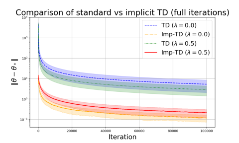

Figure 4: Parameter estimation error in a synthetic 100-state Markov reward process, comparing
standard TD and implicit TD for _λ_ = 0 and _λ_ = 0 _._ 5. Step size was set to _α_ _n_ = 300 _/n_ . **Left:** Over
the first 50 iterations, standard TD exhibits pronounced error amplification before slowly decaying,
whereas implicit TD yields an immediate error reduction. **Right:** Over 10 [5] iterations, implicit TD
consistently converges toward the optimal parameter with superior accuracy, whereas standard TD
remains hindered by its initial error amplification.

tions (Figure 4, right), standard TD(0) plateaus at a high error, but implicit TD(0) has already

reached near-zero error. This comparison extends to TD(0.5) variants as well. From Table 5a, we

see that standard TD(0.5) achieves mean error 2 _._ 906 (std 1 _._ 484), while implicit TD(0.5) attains

mean 0 _._ 212 (std 0 _._ 094). Although standard TD(0.5) roughly halved the estimation error relative to

TD(0), implicit TD(0.5) algorithms nonetheless outperformed the standard methods by an order

of magnitude and exhibited smaller variance across independent runs. Implicit TD methods con

sistently improved numerical stability, allowing the use of large step sizes for fast early learning,

and produced both lower bias and lower variance in the final parameter estimates, for both TD(0)

and TD(0.5).

In Figure 5b, we provide a plot of decreasing step size _α_ _n_ = 300 _/n_ versus effective step sizes

for implicit TD(0): _α_ _n_ _/_ (1 + _α_ _n_ _∥ϕ_ _n_ _∥_ [2] ) and implicit TD(0.5): _α_ _n_ _/_ (1 + _α_ _n_ _∥e_ _n_ _∥_ [2] ). The figure shows

that all three step size schedules decrease to zero. In the meantime, the effective step sizes for the

implicit algorithms are not necessarily monotonic, as they depend on the random quantities _ϕ_ _n_ and

_e_ _n_ . Such an adaptive step size prevents numerical instability by appropriately scaling down drastic

temporal difference updates.

**5.3** **Policy evaluation for continuous domain control**

In this subsection, we test the robustness of implicit updates in classical control tasks. We

considered both Acrobot and Mountain Car environments available through `Gymnasium` library in

Python [43]. The Acrobot environment consists of a two link pendulum system with two joints,

where only the joint between the two links is actuated. The episode begins with both links hanging

downward, and the objective is to swing the end of the lower link upward to reach a specified target

height. The agent receives a reward of _−_ 1 at each time step until the goal is achieved, which ends

the episode with a reward of 0. In the Mountain Car environment, a car is positioned between two

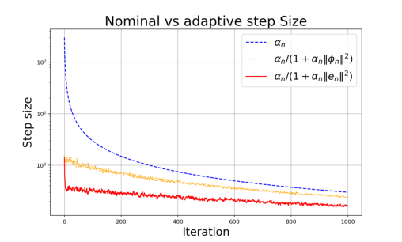
#### Method λ Mean ± Std Standard TD 0.0 5.356 ± 3.279 Implicit TD 0.0 0.117 ± 0.044 Standard TD 0.5 2.906 ± 1.484 Implicit TD 0.5 0.212 ± 0.094

(a) Final average parameter estimation error

(b) Nominal step size vs effective step size

Figure 5: **Left:** Average final parameter estimation errors and standard deviation for standard
and implicit TD algorithms in a synthetic 100-state Markov reward process. Implicit TD yields
substantially improved parameter estimation error when used with a large initial step size. **Right:**
Nominal step size _α_ _n_ = 300 _/n_ versus effective step size trajectories _α_ _n_ _/_ (1 + _α_ _n_ _∥ϕ_ _n_ _∥_ ) [2] for TD(0)
and _α_ _n_ _/_ (1 + _α_ _n_ _∥e_ _n_ _∥_ ) [2] for TD(0.5). Although the effective step sizes in the implicit algorithms
exhibit non-monotonicity, they eventually converge to zero.

hills, where the goal is to reach the top of the right hill. The car’s engine is underpowered, so the

agent must build momentum by driving back and forth. The state includes position and velocity;

actions apply force left, right, or none. Each step incurs a reward of _−_ 1, and the episode ends upon

reaching the goal.

We applied both the standard and implicit TD(0) algorithms to state-action value function

approximation in the Acrobot and Mountain Car environments. In each case, the state-action

value function was approximated by radial basis features _ϕ_ _n_ _∈_ R [100], and we measured performance

by the empirical root mean square temporal difference error (RMSTDE) computed over 1000 input

values. We used a decaying step size schedule _α_ _n_ = _α_ 1 _/n, α_ 1 _∈{_ 1 _._ 0 _,_ 10 _._ 0 _}_ with a radius _R_ =

100 for Acrobot and _α_ 1 _∈{_ 1 _._ 0 _,_ 5 _._ 0 _}_ with _R_ = 1000 for Mountain Car. A total of 20 independent

experiments were conducted. Figure 6 presents the mean RMSTDE for both environments, with

shaded regions covered by one standard deviation bands.

The results for the Acrobot environment are shown in Figure 6 (left) and Table 1 (left). With an

initial step size of _α_ 1 = 1 _._ 0, standard TD(0) attained a mean RMSTDE of 0.546 (std 0.167), whereas

implicit TD(0) yielded a higher mean RMSTDE of 0.655 but with markedly lower variability (std

0.062). When _α_ 1 was increased to 10.0, standard TD(0) performed much worse than implicit TD(0),

achieving a mean RMSTDE of 2.585 (std 2.308) against a mean RMSTDE of 0.428 (std 0.099).

This demonstrates that the implicit procedure remains stable and even benefits from larger step

sizes, while the standard TD procedure suffers from a large initial step size and greater run-to-run

variance.

The results for the Mountain Car environment are shown in Figure 6 (right) and Table 1 (right).

In this environment, the advantage of implicit updates under an aggressive step size is more evident.

With _α_ 1 = 1 _._ 0, both methods performed similarly (standard: mean RMSTDE of 0 _._ 379 with std

0 _._ 088; implicit: mean RMSTDE of 0 _._ 324 with std 0 _._ 043). But with _α_ 1 = 5 _._ 0, standard update

drastically deteriorated (mean RMSTDE of 19 _._ 827 with std 10 _._ 395), whereas implicit version

obtained an improved error (mean RMSTDE of 0 _._ 162 with std 0 _._ 042). These results demonstrate

that implicit algorithms retain the ease of implementation of standard methods while substantially

enhancing numerical stability even in continuous domain control problems.

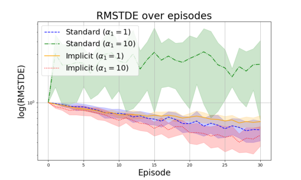

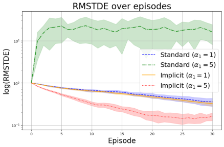

Figure 6: Average root mean square temporal difference error (RMSTDE) versus episode index
for standard and implicit TD(0). Shaded bands indicate pointwise one standard deviation over 20
independent runs. **Left:** In the Acrobot environment with a large initial step size, implicit TD(0)
delivers accelerated RMSTDE decay and reduced variance, whereas standard TD(0) exhibits poor
convergence and amplified variance. **Right:** In the Mountain Car environment, implicit TD(0)
showcases rapid RMSTDE reduction under a large initial step size, reflecting superior numerical
stability relative to standard TD(0).

**Acrobot (RMSTDE)**

**Method** _α_ 1 **Mean** _±_ **Std**

Standard 1.0 0.546 _±_ 0.167

Standard 10.0 2.585 _±_ 2.308

Implicit 1.0 0.655 _±_ 0.062
Implicit 10.0 0.428 _±_ 0.099

**Mountain Car (RMSTDE)**

**Method** _α_ 1 **Mean** _±_ **Std**

Standard 1.0 0.379 _±_ 0.088

Standard 5.0 19.827 _±_ 10.395

Implicit 1.0 0.324 _±_ 0.043
Implicit 5.0 0.162 _±_ 0.042

Table 1: Final root mean square temporal difference error (RMSTDE) for standard and implicit
TD(0) on the Acrobot (left) and Mountain Car (right) environments. In the Acrobot environment,
implicit TD(0) matches standard TD(0) at _α_ 1 = 1, while at _α_ 1 = 10 it substantially reduces both
error magnitude and variance compared to standard TD(0). In the Mountain Car environment,
implicit TD(0) offers modest improvement at _α_ 1 = 1 and, at _α_ 1 = 5, prevents the severe RMSTDE
explosion exhibited by standard TD(0), thereby demonstrating superior numerical stability.

**5.4** **Baird’s counterexample**

In this last subsection, we consider a celebrated off-policy evaluation problem, known as the

Baird’s counterexample. This is a classical benchmark problem in reinforcement learning, specif

ically constructed to expose instability and convergence issues in off-policy TD algorithms when

combined with linear function approximation. Originally introduced by Baird et al. [1], this example

is notable for its simplicity yet significant theoretical and practical implications. The environment

consists of seven states, with one center state connected directly to six peripheral states. The

behavioral policy used in Baird’s example uniformly selects one of the six peripheral states with

equal probability (1/6), while the target policy deterministically transitions to the center state, cre

ating a distinct discrepancy between the two policies. This deliberate mismatch poses substantial

difficulties for algorithms relying on off-policy updates. Linear function approximation is employed

in this counterexample, characterized by eight distinct features designed to create an inherently

challenging setting for standard TD methods. Every peripheral state has its own unique feature,

and there is one extra feature that remains active in every state, including the center. This par

ticular choice of feature representation leads to nontrivial correlation among the features, further

complicating the convergence and stability of existing TD based algorithms.

We performed 100 independent experiments and report the mean and standard deviation of

the outcomes. The results depicted in Figures 7 and 8 demonstrate the critical role that step

size selection plays in the performance of TDC and implicit TDC algorithms when applied to

Baird’s example. In the constant step size setting, a smaller step size ( _α_ 1 = 0 _._ 005 _, β_ 1 = 0 _._ 05) yields

stable and convergent behavior for both TDC and implicit TDC. While implicit TDC demonstrated

lower final errors in root mean square value error (RMSVE), TDC obtained a smaller root mean

square projected Bellman error (RMSPBE). However, when a larger constant step size is used

( _α_ 1 = 0 _._ 025 _, β_ 1 = 0 _._ 25), standard TDC diverges, exhibiting extremely large errors, i.e., RMSPBE

value of 41 _._ 754 (std 21 _._ 570) and RMSVE value of 71 _._ 425 (std 33 _._ 891). In contrast, implicit TDC

remains stable and achieves substantially smaller errors, i.e., RMSPBE value of 0 _._ 284 (std 0 _._ 202),

RMSVE value of 0 _._ 521 (std 0 _._ 176).

Under decreasing step sizes, where _α_ _n_ = _α_ 1 _/n_ [(99] _[/]_ [100)] and _β_ _n_ = _β_ 1 _/n_ [(2] _[/]_ [3)], aforementioned

patterns continue to highlight the implicit TDC’s numerical robustness. Standard TDC suffered

from numerical instability when the initial step sizes are chosen to be large (e.g., _α_ 1 = 1 _._ 0 _, β_ 1 =

10 _._ 0), resulting in error amplification, indicated from RMSPBE value of 8 _._ 219 (std 3 _._ 514) and

RMSVE value of 59 _._ 899 (std 33 _._ 652). In stark contrast, implicit TDC obtains significantly improved

errors, i.e., RMSPBE value of 0 _._ 851 (std 0 _._ 423) and RMSVE value of 1 _._ 861 (std 1 _._ 139) with large

initial step sizes. Crucially, implicit updates maintain stability even with large initial step sizes,

avoiding the numerical instabilities seen in standard TDC.

Figure 8 further demonstrates improved numerical stability of implicit TDC by presenting

trajectories of the parameter updates. While the standard TDC trajectories oscillate significantly,

especially with larger step sizes, implicit TDC trajectories quickly stabilize and remain bounded.

These empirical results validate our theoretical findings in Theorems 4.18 and 4.21, underline the

critical importance of selecting appropriate step sizes in off-policy algorithms, and strongly advocate

for the robustness of the implicit TDC approach in off-policy evaluation examples such as Baird’s

counterexample.

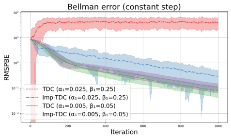

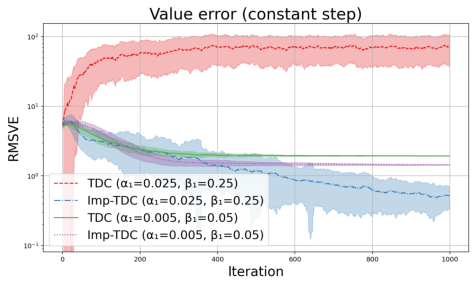

.

.

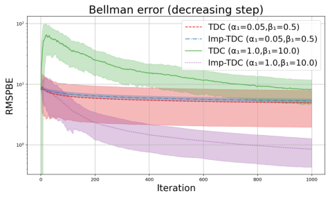

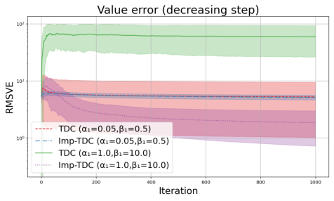

Figure 7: All figures pertain to Baird’s counterexample. **Top left (Bellman error, constant**
**step):** Implicit TDC achieves rapid projected Bellman error decay under both constant step size
configurations, whereas standard TDC amplifies error and plateaus at a large step size configuration.
**Top right (value error, constant step):** Implicit TDC consistently yields lower value error with
a large step size configuration, unlike standard TDC, which fails to reduce error and underperforms
even with a small step size configuration. **Bottom left (Bellman error, decreasing step):**
Implicit TDC significantly reduces projected Bellman error with a large initial step size, reaching
far lower errors than standard TDC. **Bottom right (value error, decreasing step):** Implicit
TDC maintains consistent value error decline, while standard TDC exhibits elevated, plateauing
error under a large initial step size.

### **6 Conclusion**

This paper introduces implicit version of TD algorithms, ranging from TD(0) and TD( _λ_ ) for

on-policy evaluation to TDC for off-policy evaluation. Combined with a feature approximation

framework, we extend the classical TD algorithm to address the critical challenge of step size

sensitivity. By reformulating TD updates as fixed point equations, we show that implicit TD

enhances robustness in algorithm convergence. Our theoretical contributions include results on

mean square convergence and finite-time error bounds of the projected implicit TD algorithms.

The proposed algorithms are computationally efficient and scalable, making them well-suited for

high-dimensional state spaces, as illustrated in several empirical applications. Looking ahead, we

believe that an interesting area for future research is the application of implicit TD algorithms

to policy learning and multi-agent RL. Furthermore, implicit algorithms could be beneficial in

actor-critic algorithms, where sensitivity to step size specification remains an issue.

**Step size** **Method** _α_ 1 _β_ 1 **RMSPBE** **RMSVE**

Constant TDC 0.005 0.05 0.078 _±_ 0.037 1.938 _±_ 0.010

Imp-TDC 0.005 0.05 0.107 _±_ 0.043 1.445 _±_ 0.021
TDC 0.025 0.25 41.754 _±_ 21.570 71.425 _±_ 33.891

Imp-TDC 0.025 0.25 0.284 _±_ 0.202 0.521 _±_ 0.176

Decreasing TDC 0.05 0.50 4.926 _±_ 2.968 5.270 _±_ 4.241
Imp-TDC 0.05 0.50 5.314 _±_ 0.418 5.164 _±_ 0.505
TDC 1.00 10.00 8.219 _±_ 3.514 59.899 _±_ 33.652

Imp-TDC 1.00 10.00 0.851 _±_ 0.423 1.861 _±_ 1.139

Table 2: Final root mean square projected Bellman error (RMSPBE) and root mean square value
error (RMSVE) for standard and implicit TDC on Baird’s counterexample under constant and decreasing step size schedules. Implicit TDC matches standard TDC at small step size configurations;
however, under an aggressive constant schedule ( _α_ 1 = 0 _._ 025 _, β_ 1 = 0 _._ 25) and a decreasing schedule
with large initial values ( _α_ 1 = 1 _._ 0 _, β_ 1 = 10 _._ 0), it suppresses errors to near zero, whereas standard
TDC exhibits severe amplification.

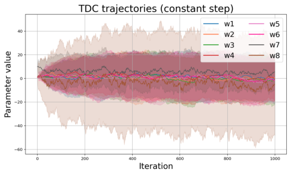

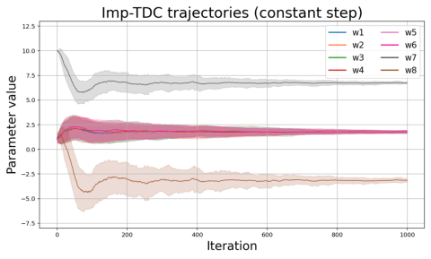

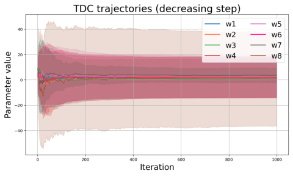

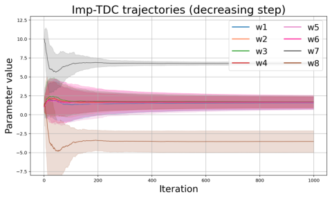

Figure 8: All figures pertain to Baird’s counterexample. Trajectories of the estimated weight
parameters for standard TDC (left column) and implicit TDC (right column) on Baird’s counterexample under constant (top row) and decreasing (bottom row) step size schedules. **Top left**
**(standard, constant step):** Large oscillations of the estimated weight parameter trajectories
reflect loss of numerical stability in standard TDC under a moderately large constant step size
configuration. **Top right (implicit, constant step):** Implicit TDC rapidly drives all weights
toward a fixed point, demonstrating superior numerical stability under a moderately large constant
step size configuration. **Bottom left (standard, decreasing step):** Standard TDC exhibits
large run-to-run variance under a decaying step size schedule with a large initial value. **Bottom**
**right (implicit, decreasing step):** Implicit TDC yields fast convergence with substantially small
run-to-run variance under a decaying step size schedule with a large initial value, underscoring its
robustness to the choice of step size.

### **A Proofs of preliminary results**

We list and establish foundational lemmas on eligibility trace and implicit update, which will be

heavily used in establishing asymptotic convergence as well as finite-time error bounds. Unless

explicitly stated, _∥· ∥_ implies the Euclidean norm for vectors and their induced norm for matrices.

**Lemma A.1.** _Given a trace decaying parameter λ ∈_ (0 _,_ 1) _and a discount factor γ ∈_ (0 _,_ 1) _, ∥e_ _n_ _∥≤_

1
1 _−λγ_ _[, for all][ n][ ∈]_ [N] _[.]_

**Proof.** Recall that _e_ _n_ = [�] _[n]_ _i_ =1 [(] _[λγ]_ [)] _[n][−][i]_ _[ϕ]_ _[i]_ [. Using the triangle inequality with normalized features,]

we have

_∞_ 1

=

�( _λγ_ ) _[i]_ 1 _−_ _λγ_

_i_ =0

_∥e_ _n_ _∥≤_

_n_
�( _λγ_ ) _[n][−][i]_ _≤_

_i_ =1

We now provide a proof for Lemma 3.1, which establishes a connection between standard TD al

gorithms and their implicit counterpart.

**Proof of Lemma 3.1.** Rearranging terms for the implicit TD(0) update, we have

� _I_ + _α_ _n_ _ϕ_ _n_ _ϕ_ _[T]_ _n_ � _w_ _n_ [im] +1 [=] _[ w]_ _n_ [im] [+] _[ α]_ _[n]_ [(] _[r]_ _[n]_ [+] _[ γϕ]_ _[⊤]_ _n_ +1 _[w]_ _n_ [im] [)] _[ϕ]_ _[n]_

Multiplying the inverse of � _I_ + _α_ _n_ _ϕ_ _n_ _ϕ_ _[T]_ _n_ � both sides, we get

_−_ 1 [�]
_w_ _n_ [im] +1 [=] � _I_ + _α_ _n_ _ϕ_ _n_ _ϕ_ _[T]_ _n_ � _w_ _n_ [im] [+] _[ α]_ _[n]_ [(] _[r]_ _[n]_ [+] _[ γϕ]_ _[⊤]_ _n_ +1 _[w]_ _n_ [im] [)] _[ϕ]_ _[n]_
�

_α_ _n_
= _I −_ _[ϕ]_ _[n]_ _[ϕ]_ _n_ _[T]_
� 1 + _α_ _n_ _||ϕ_ _n_ _||_ [2]

_w_ _n_ [im] [+] _[ α]_ _[n]_ [(] _[r]_ _[n]_ [+] _[ γϕ]_ _[⊤]_ _n_ +1 _[w]_ _n_ [im] [)] _[ϕ]_ _[n]_ � _._
��

where the second equality follows from the Sherman-Morrison-Woodbury identity. Expanding terms

out, we have

_α_ _n_ _n_ _[r]_ _[n]_ _[∥][ϕ]_ _[n]_ _[∥]_ [2] _n_ _[γ][∥][ϕ]_ _[n]_ _[∥]_ [2] _[ϕ]_ _[T]_ _n_ +1 _[w]_ _n_ [im]
_w_ _n_ [im] +1 [=] _[ w]_ _n_ [im] [+] _[ α]_ _[n]_ _[r]_ _[n]_ _[ϕ]_ _[n]_ [+] _[ α]_ _[n]_ _[γϕ]_ _[⊤]_ _n_ +1 _[w]_ _n_ [im] _[ϕ]_ _[n]_ _[−]_ _[ϕ]_ _n_ _[T]_ _[w]_ _n_ [im] _[ϕ]_ _[n]_ _[−]_ _[α]_ [2] _[ϕ]_ _[n]_ _[ −]_ _[α]_ [2] _ϕ_ _n_
1 + _α_ _n_ _∥ϕ_ _n_ _∥_ [2] 1 + _α_ _n_ _∥ϕ_ _n_ _∥_ [2] 1 + _α_ _n_ _∥ϕ_ _n_ _∥_ [2]

_ϕ_ _n_ + _α_ _n_ _γϕ_ _[⊤]_ _n_ +1 _[w]_ _n_ [im]
�

_α_ _n_
_ϕ_ _n_ _−_ _[ϕ]_ _n_ _[T]_ _[w]_ _n_ [im] _[ϕ]_ _[n]_
� 1 + _α_ _n_ _∥ϕ_ _n_ _∥_ [2]

_α_ _n_ _∥ϕ_ _n_ _∥_ [2]
1 _−_
� 1 + _α_ _n_ _∥ϕ_ _n_ _∥_ [2]

= _w_ _n_ [im] [+] _[ α]_ _[n]_ _[r]_ _[n]_

_α_ _n_ _∥ϕ_ _n_ _∥_ [2]
1 _−_
� 1 + _α_ _n_ _∥ϕ_ _n_ _∥_ [2]

_α_ _n_
= _w_ _n_ [im] [+] � _r_ _n_ + _γϕ_ _[T]_ _n_ +1 _[w]_ _n_ [im] _[−]_ _[ϕ]_ _[T]_ _n_ _[w]_ _n_ [im] � _ϕ_ _n_ _,_
1 + _α_ _n_ _∥ϕ_ _n_ _∥_ [2]

where, in the second equality, we collected terms of common factors and obtained a succinct ex

pression in the third equality. Analogously, for the implicit TD( _λ_ ) algorithm, we have

� _I_ + _α_ _n_ _e_ _n_ _e_ _[T]_ _n_ � _w_ _n_ [im] +1 [=] _[ w]_ _n_ [im] [+] _[ α]_ _[n]_ [(] _[r]_ _[n]_ [+] _[ γϕ]_ _[⊤]_ _n_ +1 _[w]_ _n_ [im] [+] _[ λγe]_ _[T]_ _n−_ 1 _[w]_ _n_ [im] [)] _[e]_ _[n]_ _[.]_

Multiplying by inverse of � _I_ + _α_ _n_ _e_ _n_ _e_ _[T]_ _n_ �, we get

_−_ 1 [�]
_w_ _n_ [im] +1 [=] � _I_ + _α_ _n_ _e_ _n_ _e_ _[T]_ _n_ � _w_ _n_ [im] [+] _[ α]_ _[n]_ [(] _[r]_ _[n]_ [+] _[ γϕ]_ _[⊤]_ _n_ +1 _[w]_ _n_ [im] [+] _[ λγe]_ _[T]_ _n−_ 1 _[w]_ _n_ [im] [)] _[e]_ _[n]_
�

Using the Sherman-Morrison-Woodbury identity, we get

_w_ _n_ [im] +1 [=] � _I −_ 1 + _αα_ _nn_ _||e_ _n_ _||_ [2] _[e]_ _[n]_ _[e]_ _n_ _[T]_ �� _w_ _n_ [im] [+] _[ α]_ _[n]_ [(] _[r]_ _[n]_ [+] _[ γϕ]_ _[⊤]_ _n_ +1 _[w]_ _n_ [im] [+] _[ λγe]_ _[T]_ _n−_ 1 _[w]_ _n_ [im] [)] _[e]_ _[n]_ � _._

Expanding terms and collecting terms, we have

_w_ _n_ [im] +1 [=] _[ w]_ _n_ [im] [+] _[ α]_ _[n]_ _[r]_ _[n]_ _[e]_ _[n]_ [+] _[ α]_ _[n]_ _[γϕ]_ _[⊤]_ _n_ +1 _[w]_ _n_ [im] _[e]_ _[n]_ [+] _[ α]_ _[n]_ _[λγe]_ _[T]_ _n−_ 1 _[w]_ _n_ [im] _[e]_ _[n]_

_−_ _α_ _n_ _[e]_ _n_ _[T]_ _[w]_ _n_ [im] _[e]_ _[n]_ _[−]_ _[α]_ _n_ [2] _[r]_ _[n]_ _[∥][e]_ _[n]_ _[∥]_ [2] _[e]_ _[n]_ _[ −]_ _[α]_ _n_ [2] _[γ][∥][e]_ _[n]_ _[∥]_ [2] _[ϕ]_ _[T]_ _n_ +1 _[w]_ _n_ [im] _e_ _n_ _−_ _[α]_ _n_ [2] _[λγ][∥][e]_ _[n]_ _[∥]_ [2] _[e]_ _[T]_ _n−_ 1 _[w]_ _n_ [im] _e_ _n_
1 + _α_ _n_ _∥e_ _n_ _∥_ [2] 1 + _α_ _n_ _∥e_ _n_ _∥_ [2] 1 + _α_ _n_ _∥e_ _n_ _∥_ [2] 1 + _α_ _n_ _∥e_ _n_ _∥_ [2]

�

_n_ _[r]_ _[n]_ _[∥][e]_ _[n]_ _[∥]_ [2]
= _w_ _n_ [im] [+] _α_ _n_ _r_ _n_ _e_ _n_ _−_ _[α]_ [2] _[e]_ _[n]_
� 1 + _α_ _n_ _∥e_ _n_ _∥_ [2]

_n_ _[r]_ _[n]_ _[∥][e]_ _[n]_ _[∥]_ [2]
= _w_ _n_ [im] [+] _α_ _n_ _r_ _n_ _e_ _n_ _−_ _[α]_ [2]
� 1 + _α_ _n_ _∥e_ _n_ _∥_

+
�

_n_ _[γ][∥][e]_ _[n]_ _[∥]_ [2] _[ϕ]_ _[T]_ _n_ +1 _[w]_ _n_ [im]
_α_ _n_ _γϕ_ _[⊤]_ _n_ +1 _[w]_ _n_ [im] _[e]_ _[n]_ _[−]_ _[α]_ [2] _e_ _n_
1 + _α_ _n_ _∥e_ _n_ _∥_ [2]

�

�

+

_n_ _[λγ][∥][e]_ _[n]_ _[∥]_ [2] _[e]_ _[T]_ _n−_ 1 _[w]_ _n_ [im]
_α_ _n_ _λγe_ _[T]_ _n−_ 1 _[w]_ _n_ [im] _[e]_ _[n]_ _[−]_ _[α]_ [2] _e_ _n_
1 + _α_ _n_ _∥e_ _n_ _∥_ [2]

�

_α_ _n_
_−_ _[e]_ _n_ _[T]_ _[w]_ _n_ [im] _[e]_ _[n]_
1 + _α_ _n_ _∥e_ _n_ _∥_ [2]

_e_ _n_ + _α_ _n_ _γϕ_ _[⊤]_ _n_ +1 _[w]_ _n_ [im]
�

_e_ _n_
�

_α_ _n_ _∥e_ _n_ _∥_ [2]
1 _−_
� 1 + _α_ _n_ _∥e_ _n_ _∥_ [2]

= _w_ _n_ [im] [+] _[ α]_ _[n]_ _[r]_ _[n]_

_α_ _n_ _∥e_ _n_ _∥_ [2]
1 _−_
� 1 + _α_ _n_ _∥e_ _n_ _∥_ [2]

_α_ _n_
_e_ _n_ _−_ _[e]_ _n_ _[T]_ _[w]_ _n_ [im] _[e]_ _[n]_
� 1 + _α_ _n_ _∥e_ _n_ _∥_ [2]

+ _α_ _n_ _λγe_ _[⊤]_ _n−_ 1 _[w]_ _n_ [im]

_α_ _n_ _∥e_ _n_ _∥_ [2]
1 _−_
� 1 + _α_ _n_ _∥e_ _n_ _∥_ [2]

_α_ _n_
= _w_ _n_ [im] [+] � _r_ _n_ + _γϕ_ _[T]_ _n_ +1 _[w]_ _n_ [im] [+] _[ λγe]_ _[T]_ _n−_ 1 _[w]_ _n_ [im] _[−]_ _[e]_ _[T]_ _n_ _[w]_ _n_ [im] � _e_ _n_ _._
1 + _α_ _n_ _∥e_ _n_ _∥_ [2]

Next, we provide deterministic upper and lower bounds of the random step size ˜ _α_ _n_ .

**Lemma A.2.** _Given a positive, deterministic non-increasing sequence_ ( _α_ _n_ ) _n∈_ N _, the sequence_

(˜ _α_ _n_ ) _n∈_ N _given by_

_α_ ˜ _n_ =

 1+ _α_ _n_ _α∥_ _n_ _ϕ_ _n_ _∥_ [2] _for TD(0)_
 1+ _αα_ _n_ _∥_ _n_ _e_ _n_ _∥_ [2] _for TD(λ)_

_respectively satisfy_

_with probability one._

_α_ _n_ ˜
_≤_ _α_ _n_ _≤_ _α_ _n_ _for TD(0),_
1 + _α_ _n_

(1 _−_ _λγ_ ) [2] _α_ _n_ ˜
_≤_ _α_ _n_ _≤_ _α_ _n_ _for TD(λ),_
(1 _−_ _λγ_ ) [2] + _α_ _n_

**Proof.** Since 1 + _α_ _n_ _∥ϕ_ _n_ _∥_ [2] _≥_ 1, we have ˜ _α_ _n_ _≤_ _α_ _n_ for TD(0). Analogously 1 + _α_ _n_ _∥e_ _n_ _∥_ [2] _≥_ 1 implies

˜ 1 1 1
_α_ _n_ _≤_ _α_ _n_ for TD( _λ_ ). To prove the lower bounds, note that 1+ _α_ _n_ _∥ϕ_ _n_ _∥_ [2] _[≥]_ 1+ _α_ _n_ [and] 1+ _α_ _n_ _∥e_ _n_ _∥_ [2] _[≥]_

(1 _−λγ_ ) [2]

(1 _−λγ_ ) [2] + _α_ _n_ [, where the first identity is due to] _[ ∥][ϕ]_ _[n]_ _[∥≤]_ [1 and the second identity follows from Lemma]

A.1. Therefore, we get

with probability one.

˜ _α_ _n_
_α_ _n_ _≥_ for TD(0) _,_
1 + _α_ _n_

˜ (1 _−_ _λγ_ ) [2] _α_ _n_
_α_ _n_ _≥_ for TD( _λ_ ) _,_
(1 _−_ _λγ_ ) [2] + _α_ _n_

We next provide a proof of Lemma 3.2 establishing the relationship between the standard TDC

and the implicit TDC algorithm.

**Proof of Lemma 3.2.** The implicit TDC update for the target parameter _w_ [im] can be rewritten

as

� _I_ + _α_ _n_ _ρ_ _n_ _ϕ_ _n_ _ϕ_ _[T]_ _n_ � _w_ _n_ [im] +1 [=] _[ w]_ _n_ [im] [+] _[ α]_ _[n]_ _[ρ]_ _[n]_ � _r_ _n_ _ϕ_ _n_ + _γϕ_ _n_ _ϕ_ _[T]_ _n_ +1 _[w]_ _n_ [im] _[−]_ _[γϕ]_ _[n]_ [+1] _[ϕ]_ _[T]_ _n_ _[u]_ _n_ [im] �

_−_ 1
_⇔_ _w_ _n_ [im] +1 [=] � _I_ + _α_ _n_ _ρ_ _n_ _ϕ_ _n_ _ϕ_ _[T]_ _n_ � � _w_ _n_ [im] [+] _[ α]_ _[n]_ _[ρ]_ _[n]_ � _r_ _n_ _ϕ_ _n_ + _γϕ_ _n_ _ϕ_ _[T]_ _n_ +1 _[w]_ _n_ [im] _[−]_ _[γϕ]_ _[n]_ [+1] _[ϕ]_ _[T]_ _n_ _[u]_ [im] _n_ ��

_⇔_ _w_ _n_ [im] +1 [=] � _I −_ _α_ _n_ _[′]_ _[ρ]_ _[n]_ _[ϕ]_ _[n]_ _[ϕ]_ _[T]_ _n_ �� _w_ _n_ [im] [+] _[ α]_ _[n]_ _[ρ]_ _[n]_ � _r_ _n_ _ϕ_ _n_ + _γϕ_ _n_ _ϕ_ _[T]_ _n_ +1 _[w]_ _n_ [im] _[−]_ _[γϕ]_ _[n]_ [+1] _[ϕ]_ _[T]_ _n_ _[u]_ [im] _n_ �� (16)

for _α_ _n_ _[′]_ [=] 1+ _α_ _n_ _ρα_ _nn_ _∥ϕ_ _n_ _∥_ [2] [. Expanding the right hand side of (16), we have]

_w_ _n_ [im] +1 [=] _[ w]_ _n_ [im] [+] _[ α]_ _[n]_ _[ρ]_ _[n]_ _[r]_ _[n]_ _[ϕ]_ _[n]_ [+] _[ α]_ _[n]_ _[ρ]_ _[n]_ _[γ]_ � _ϕ_ _[T]_ _n_ +1 _[w]_ _n_ [im] � _ϕ_ _n_ _−_ _α_ _n_ _ρ_ _n_ _γ_ � _ϕ_ _[T]_ _n_ _[u]_ [im] _n_ � _ϕ_ _n_ +1

_−_ _α_ _n_ _[′]_ _[ρ]_ _[n]_ _[α]_ _[n]_ _[ρ]_ _[n]_ _[r]_ _[n]_ _[∥][ϕ]_ _[n]_ _[∥]_ [2] _[ϕ]_ _[n]_ _[−]_ _[α]_ _n_ _[′]_ _[ρ]_ _[n]_ _[α]_ _[n]_ _[ρ]_ _[n]_ _[γ][∥][ϕ]_ _[n]_ _[∥]_ [2] [ �] _ϕ_ _[T]_ _n_ +1 _[w]_ _n_ [im] � _ϕ_ _n_ + _α_ _n_ _[′]_ _[ρ]_ _[n]_ _[α]_ _[n]_ _[ρ]_ _[n]_ _[γ]_ � _ϕ_ _[T]_ _n_ _[ϕ]_ _[n]_ [+1] �� _ϕ_ _[T]_ _n_ _[u]_ [im] _n_ � _ϕ_ _n_

_−_ _α_ _n_ _[′]_ _[ρ]_ _[n]_ � _ϕ_ _[T]_ _n_ _[w]_ _n_ [im] � _ϕ_ _n_

= _w_ _n_ [im] [+] _[ α]_ _[n]_ _[ρ]_ _[n]_ _[r]_ _[n]_ �1 _−_ _α_ _n_ _[′]_ _[ρ]_ _[n]_ _[∥][ϕ]_ _[n]_ _[∥]_ [2] [�] _ϕ_ _n_ + _α_ _n_ _ρ_ _n_ _γ_ �1 _−_ _α_ _n_ _[′]_ _[ρ]_ _[n]_ _[∥][ϕ]_ _[n]_ _[∥]_ [2] [��] _ϕ_ _[T]_ _n_ +1 _[w]_ _n_ [im] � _ϕ_ _n_ _−_ _α_ _n_ _[′]_ _[ρ]_ _[n]_ � _ϕ_ _[T]_ _n_ _[w]_ _n_ [im] � _ϕ_ _n_

_−_ _α_ _n_ _ρ_ _n_ _γ_ � _ϕ_ _[T]_ _n_ _[u]_ [im] _n_ � _ϕ_ _n_ +1 + _α_ _n_ _[′]_ _[ρ]_ _[n]_ _[α]_ _[n]_ _[ρ]_ _[n]_ _[γ]_ � _ϕ_ _[T]_ _n_ _[ϕ]_ _[n]_ [+1] �� _ϕ_ _[T]_ _n_ _[u]_ [im] _n_ � _ϕ_ _n_

= _w_ _n_ [im] [+] _[ α]_ _n_ _[′]_ _[ρ]_ _[n]_ _[δ]_ _n_ [im] _[ϕ]_ _[n]_ _[−]_ _[α]_ _[n]_ _[ρ]_ _[n]_ _[γ]_ � _ϕ_ _[T]_ _n_ _[u]_ [im] _n_ �� _ϕ_ _n_ +1 _−_ _α_ _n_ _[′]_ _[ρ]_ _[n]_ � _ϕ_ _[T]_ _n_ _[ϕ]_ _[n]_ [+1] � _ϕ_ _n_ �

where _δ_ _n_ [im] _[ϕ]_ _[n]_ [:=] _[ r]_ _[n]_ _[ϕ]_ _[n]_ [+] _[ γϕ]_ _[n]_ _[ϕ]_ _[T]_ _n_ +1 _[w]_ _n_ [im] _[−]_ _[ϕ]_ _[n]_ _[ϕ]_ _[T]_ _n_ _[w]_ _n_ [im] [. An implicit TDC update for auxiliary parameter]

_u_ [im] can be analogously derived. Consider

_−_ 1
� _I_ + _β_ _n_ _ρ_ _n_ _ϕ_ _n_ _ϕ_ _[T]_ _n_ � _u_ [im] _n_ +1 [=] _[ u]_ [im] _n_ [+] _[ β]_ _[n]_ _[ρ]_ _[n]_ _[δ]_ _n_ [im] _[ϕ]_ _[n]_ _[⇔]_ _[u]_ [im] _n_ +1 [=] � _I_ + _β_ _n_ _ρ_ _n_ _ϕ_ _n_ _ϕ_ _[T]_ _n_ � � _u_ [im] _n_ [+] _[ β]_ _[n]_ _[ρ]_ _[n]_ _[δ]_ _n_ [im] _[ϕ]_ _[n]_ �

_⇔_ _u_ [im] _n_ +1 [=] � _I −_ _β_ _n_ _[′]_ _[ρ]_ _[n]_ _[ϕ]_ _[n]_ _[ϕ]_ _[T]_ _n_ �� _u_ [im] _n_ [+] _[ β]_ _[n]_ _[ρ]_ _[n]_ _[δ]_ _n_ [im] _[ϕ]_ _[n]_ � (17)

for _β_ _n_ _[′]_ [=] 1+ _β_ _n_ _ρβ_ _nn_ _∥ϕ_ _n_ _∥_ [2] [. Re-expressing the right hand side of (17), we obtain]

_u_ [im] _n_ +1 [=] _[ u]_ [im] _n_ [+] _[ β]_ _[n]_ _[ρ]_ _[n]_ _[δ]_ _n_ [im] _[ϕ]_ _[n]_ _[−]_ _[β]_ _n_ _[′]_ _[ρ]_ _[n]_ _[ϕ]_ _[T]_ _n_ _[u]_ [im] _n_ _[ϕ]_ _[n]_ _[−]_ _[β]_ _n_ _[′]_ _[ρ]_ _[n]_ _[β]_ _[n]_ _[ρ]_ _[n]_ _[∥][ϕ]_ _[n]_ _[∥]_ [2] _[δ]_ _n_ [im] _[ϕ]_ _[n]_

= _u_ [im] _n_ _[−]_ _[β]_ _n_ _[′]_ _[ρ]_ _[n]_ _[ϕ]_ _[T]_ _n_ _[u]_ [im] _n_ _[ϕ]_ _[n]_ [+] _[ β]_ _[n]_ _[ρ]_ _[n]_ _[δ]_ _n_ [im] _[ϕ]_ _[n]_ �1 _−_ _β_ _n_ _[′]_ _[ρ]_ _[n]_ _[∥][ϕ]_ _[n]_ _[∥]_ [2] [�]

= _u_ [im] _n_ [+] _[ β]_ _n_ _[′]_ _[ρ]_ _[n]_ _[δ]_ _n_ [im] _[ϕ]_ _[n]_ _[−]_ _[β]_ _n_ _[′]_ _[ρ]_ _[n]_ _[ϕ]_ _[n]_ _[ϕ]_ _[T]_ _n_ _[u]_ [im] _n_

### B Theoretical analysis for implicit TD(0) and TD( λ )

We only deal with time-homogeneous Markov processes whose steady-state distribution is well

defined. To simplify our presentation, for the TD(0) algorithm, let us define

_S_ _n_ ( _w_ ) := _r_ _n_ _ϕ_ _n_ + _γϕ_ _n_ _ϕ_ _[T]_ _n_ +1 _[w][ −]_ _[ϕ]_ _[n]_ _[ϕ]_ _n_ _[T]_ _[w]_ [ =] _[ b]_ _[n]_ [+] _[ A]_ _[n]_ _[w,]_

_S_ ( _w_ ) := E _∞_ _{r_ _n_ _ϕ_ _n_ _}_ + E _∞_ � _γϕ_ _n_ _ϕ_ _[T]_ _n_ +1 � _w −_ E _∞_ � _ϕ_ _n_ _ϕ_ _[T]_ _n_ � _w_ = _b_ + _Aw,_

where _A_ _n_ = _γϕ_ _n_ _ϕ_ _[T]_ _n_ +1 _[−]_ _[ϕ]_ _[n]_ _[ϕ]_ _n_ _[T]_ _[, A]_ [ =][ E] _[∞]_ _[{][A]_ _[n]_ _[}]_ [,] _[ b]_ _[n]_ [=] _[ r]_ _[n]_ _[ϕ]_ _[n]_ _[, b]_ [ =][ E] _[∞]_ _[{][b]_ _[n]_ _[}]_ [. Here][ E] _[∞]_ [is the expectation]

with respect to the steady-state distribution of the Markov process ( _x_ _n_ ) _n∈_ N . Similarly, for the

TD( _λ_ ) algorithm,

_S_ _n_ ( _w_ ) := _r_ _n_ _e_ _n_ + _γe_ _n_ _ϕ_ _[T]_ _n_ +1 _[w][ −]_ _[e]_ _[n]_ _[ϕ]_ _n_ _[T]_ _[w]_ [ =] _[ b]_ _[n]_ [+] _[ A]_ _[n]_ _[w,]_

_S_ ( _w_ ) := E _∞_ _{r_ _n_ _e_ _−∞_ : _n_ _}_ + E _∞_ � _γe_ _−∞_ : _n_ _ϕ_ _[T]_ _n_ +1 � _w −_ E _∞_ � _e_ _−∞_ : _n_ _ϕ_ _[T]_ _n_ � _w_ = _b_ + _Aw,_

where _e_ _−∞_ : _n_ := [�] _[∞]_ _k_ =0 [(] _[λγ]_ [)] _[k]_ _[ϕ]_ _[n][−][k]_ [ represents the steady-space eligibility trace and] _[ A]_ _[n]_ [ =] _[ γe]_ _[n]_ _[ϕ]_ _n_ _[T]_ +1 _[−]_

_e_ _n_ _ϕ_ _[T]_ _n_ _[, A]_ [ =][ E] _[∞]_ � _γe_ _−∞_ : _n_ _ϕ_ _[T]_ _n_ +1 � _−_ E _∞_ � _e_ _−∞_ : _n_ _ϕ_ _[T]_ _n_ � = lim _n→∞_ E _{A_ _n_ _}_, _b_ _n_ = _r_ _n_ _e_ _n_ and _b_ = E _∞_ _{r_ _n_ _e_ _−∞_ : _n_ _}_ =

lim _n→∞_ E _{b_ _n_ _}_ . Tsitsiklis and Roy [44] has shown that the limit point of TD algorithms, denoted

by _w_ _∗_ solves the equation _S_ ( _w_ ) = 0. Before establishing the asymptotic convergence of implicit

TD(0) and TD( _λ_ ), we first provide bounds between _A_ _n_ and _A_ as well as _b_ _n_ and _b_ utilizing the

geometric mixing condition induced by assumption 4.1.

**Lemma B.1.** _From Assumption 4.1, for every n, τ ≥_ 0 _, n ≥_ _τ_ _, there exists some_ ˜ _ρ ∈_ [0 _,_ 1) _and a_

_constant_ ˜ _m, such that_

  - _∥_ E _{A_ _n_ _|X_ _n−τ_ = _x} −_ _A∥≤_ _m_ ˜ _ρ_ ˜ _[τ]_

  - _∥_ E _{b_ _n_ _|X_ _n−τ_ = _x} −_ _b∥≤_ _m_ ˜ _ρ_ ˜ _[τ]_ _._

**Proof.** Due to time-homogeneity of transition probabilities, the statement is equivalent to Lemma

6.7 in [3].

Let us define a mixing time for _A_ _n_ and _b_ _n_ like we did for the underlying Markov process.

**Definition B.2.** _Given a threshold ϵ >_ 0 _, the mixing time for A_ _n_ _and b_ _n_ _is given by_

_τ_ ˜ _ϵ_ = min _{n ∈_ N _|_ ˜ _mρ_ ˜ _[n]_ _≤_ _ϵ}._

**B.1** **Asymptotic convergence analysis for implicit TD(0) and TD(** _λ_ **)**

We closely follow the approach taken in [33] with a few modifications made to accommodate

the data-adaptive step size of implicit TD algorithms. For the analysis of implicit algorithms, we

focus on the step sizes ( _α_ _n_ ) _n∈_ N satisfying the following condition: 1) ( _α_ _n_ ) _n∈_ N is a non-increasing

˜
sequence and 2) there exists _n_ _[∗]_ _>_ 0 and _κ ≥_ 1 such that for any _n ≥_ _n_ _[∗]_, we have _n −_ _τ_ _α_ _n_ _>_ 0,

_α_ _n−τ_ ˜ _αn_ ˜ _τ_ _α_ _n_ _≤_ 4 _c_ 1 _λ_ [,] _[ c]_ _[λ]_ [ :=] 1 _−_ 2 _λγ_ _[≥]_ [1 and] _[ α]_ _[n][−][τ]_ [˜] _[α]_ _n_ _[≤]_ _[κα]_ _[n]_ [. Notice the step size sequence] _[ α]_ _[n]_ [ =] _[ cn]_ _[−][s]_ [, for]

some _c >_ 0 _, s ∈_ (0 _._ 5 _,_ 1] satisfy these conditions. From Assumption 4.1 and Lemma B.1, we have

˜ ˜ ˜
_τ_ _α_ _n_ = _O_ (log _n_ ). Therefore, we know _n −_ _τ_ _α_ _n_ _→∞_ and ˜ _τ_ _α_ _n_ _/_ ( _n −_ _τ_ _α_ _n_ ) _[s]_ _→_ 0. Furthermore, we have

˜
_α_ _n−τ_ ˜ _αn_ _/α_ _n_ = _{n/_ ( _n −_ _τ_ _α_ _n_ ) _}_ _[s]_, which converges to 1 as _n →∞_ . Hence, for large _n ∈_ N, there must

exist _κ ≥_ 1 satisfying the above condition. We begin listing preliminary results needed to prove the

asymptotic convergence results. To simplify notations, we use _θ_ _n_ := _w_ _∗_ _−_ _w_ _n_ [im] [. We first introduce]

upper bounds for the norm of the TD update direction.

**Lemma B.3.** _For all n ∈_ N _,_

2
_∥A_ _n_ _∥≤_ _c_ _λ_ :=
1 _−_ _λγ_ _[,]_

_for both TD(0) and TD(λ). Furthermore, for all n ∈_ N _,_

_∥A_ _n_ _w_ _∗_ + _b_ _n_ _∥≤_ _S_ _max_ := [2] _[∥][w]_ _[∗]_ _[∥]_ [+] _[ r]_ _[max]_ _,_

1 _−_ _λγ_

_with probability one._

_**Proof.**_ _Notice that_

_∥A_ _n_ _∥_ =




_∥γϕ_ _n_ _ϕ_ _[T]_ _n_ +1 _[−]_ _[ϕ]_ _[n]_ _[ϕ]_ _n_ _[T]_ _[∥≤]_ [(] _[γ]_ [ + 1)] _[ for TD(0)][,]_

 _∥γe_ _n_ _ϕ_ _[T]_ _n_ +1 _[−]_ _[e]_ _[n]_ _[ϕ]_ _n_ _[T]_ _[∥≤]_ 1 _γ−_ + _λγ_ 1 _for TD(λ),_

_∥γe_ _n_ _ϕ_ _[T]_ _n_ +1 _[−]_ _[e]_ _[n]_ _[ϕ]_ _n_ _[T]_ _[∥≤]_ 1 _γ−_ + _λγ_ 1 _for TD(λ),_

_which can be deduced from the normalized features assumption and Lemma A.1 with the triangle_

_inequality. The first statement is the direct consequence of the facts γ <_ 1 _and_ 1 _−_ 1 _λγ_ _[>]_ [ 1] _[. In a]_

_similar vein, recall that_

1 _−_ _[w]_ _[∗]_ _λγ_ _[r]_ _[max]_ _for TD(λ),_

_∥A_ _n_ _w_ _∗_ + _b_ _n_ _∥_ =




_∥γϕ_ _n_ _ϕ_ _[T]_ _n_ +1 _[w]_ _[∗]_ _[−]_ _[ϕ]_ _[n]_ _[ϕ]_ _n_ _[T]_ _[w]_ _[∗]_ [+] _[ r]_ _[n]_ _[ϕ]_ _[n]_ _[∥≤]_ [(] _[γ]_ [ + 1)] _[∥][w]_ _[∗]_ _[∥]_ [+] _[ r]_ _[max]_ _[for TD(0)][,]_



 _∥γe_ _n_ _ϕ_ _[T]_ _n_ +1 _[w]_ _[∗]_ _[−]_ _[e]_ _[n]_ _[ϕ]_ _n_ _[T]_ _[w]_ _[∗]_ [+] _[ r]_ _[n]_ _[e]_ _[n]_ _[∥≤]_ [(] _[γ]_ [+][1][)] 1 _[∥]_ _−_ _[w]_ _[∗]_ _λγ_ _[∥]_ [+] _[r]_ _[max]_ _for TD(λ),_

_∥γe_ _n_ _ϕ_ _[T]_ _n_ +1 _[w]_ _[∗]_ _[−]_ _[e]_ _[n]_ _[ϕ]_ _n_ _[T]_ _[w]_ _[∗]_ [+] _[ r]_ _[n]_ _[e]_ _[n]_ _[∥≤]_ [(] _[γ]_ [+][1][)] 1 _[∥]_ _−_ _[w]_ _[∗]_ _[∥]_ [+] _[r]_ _[max]_

_which follow from the normalized features, bounded reward assumptions, and Lemma A.1 with the_

_triangle inequality. Since γ <_ 1 _and_ 1 _−_ 1 _λγ_ _[>]_ [ 1] _[, we get the second statement.]_

˜
**Lemma B.4.** _Let n ≥_ _n_ _[∗]_ _with ℓ_ = _n −_ _τ_ _α_ _n_ _. The following statements hold_

_1. ∥θ_ _n_ _−_ _θ_ _ℓ_ _∥≤_ 2 _c_ _λ_ _α_ _ℓ_ _τ_ ˜ _α_ _n_ ( _∥θ_ _ℓ_ _∥_ + _S_ _max_ ) _,_

_2. ∥θ_ _n_ _−_ _θ_ _ℓ_ _∥≤_ 4 _c_ _λ_ _α_ _ℓ_ _τ_ ˜ _α_ _n_ ( _∥θ_ _n_ _∥_ + _S_ _max_ ) _,_

_3. ∥θ_ _n_ _−_ _θ_ _ℓ_ _∥_ [2] _≤_ 32 _c_ [2] _λ_ _[α]_ _ℓ_ [2] _[τ]_ [˜] [ 2] _α_ _n_ [(] _[∥][θ]_ _[n]_ _[∥]_ [2] [ +] _[ S]_ _max_ [2] [)] _[ ≤]_ [8] _[c]_ _[λ]_ _[α]_ _[ℓ]_ _[τ]_ [˜] _[α]_ _n_ [(] _[∥][θ]_ _[n]_ _[∥]_ [2] [ +] _[ S]_ _max_ [2] [)] _[.]_

_with probability one._

**Proof. Statement 1:** We begin proving the first statement. For _ℓ< t ≤_ _n_, note that

_θ_ _t_ := _w_ _t_ [im] _−_ _w_ _∗_

= _w_ _t_ [im] _−_ 1 _[−]_ _[w]_ _[∗]_ [+ ˜] _[α]_ _[t][−]_ [1] [(] _[A]_ _[t][−]_ [1] _[w]_ _t_ [im] _−_ 1 [+] _[ b]_ _[t][−]_ [1] [)]

= _w_ _t_ [im] _−_ 1 _[−]_ _[w]_ _[∗]_ [+ ˜] _[α]_ _[t][−]_ [1] _[A]_ _[t][−]_ [1] [(] _[w]_ _t_ [im] _−_ 1 _[−]_ _[w]_ _[∗]_ [) + ˜] _[α]_ _[t][−]_ [1] [(] _[A]_ _[t][−]_ [1] _[w]_ _[∗]_ [+] _[ b]_ _[t][−]_ [1] [)]

= _θ_ _t−_ 1 + ˜ _α_ _t−_ 1 ( _A_ _t−_ 1 _θ_ _t−_ 1 + _A_ _t−_ 1 _w_ _∗_ + _b_ _t−_ 1 ) _,_

where in the second line, we use the definition of _w_ _t_ [im] [, and in the third line, we add and subtract]

˜
_α_ _t−_ 1 _A_ _t−_ 1 _w_ _∗_ . The last line is due to the definition of _θ_ _t−_ 1 . Therefore, we have

˜
_∥θ_ _t_ _−_ _θ_ _t−_ 1 _∥_ = _∥α_ _t−_ 1 ( _A_ _t−_ 1 _θ_ _t−_ 1 + _A_ _t−_ 1 _w_ _∗_ + _b_ _t−_ 1 ) _∥_

_≤_ _α_ _t−_ 1 _∥A_ _t−_ 1 _θ_ _t−_ 1 + _A_ _t−_ 1 _w_ _∗_ + _b_ _t−_ 1 _∥_

_≤_ _α_ _t−_ 1 ( _c_ _λ_ _∥θ_ _t−_ 1 _∥_ + _S_ max ) _,_ (18)

where the first inequality follows from Lemma A.2 and in the second inequality, we used Lemma

B.3 with the triangle inequality. Using the reverse triangle inequality, we get

_∥θ_ _t_ _∥≤_ (1 + _c_ _λ_ _α_ _t−_ 1 ) _∥θ_ _t−_ 1 _∥_ + _α_ _t−_ 1 _S_ max (19)

_≤_ (1 + _c_ _λ_ _α_ _t−_ 1 ) _· · ·_ (1 + _c_ _λ_ _α_ _ℓ_ ) _∥θ_ _ℓ_ _∥_ + (1 + _c_ _λ_ _α_ _t−_ 1 ) _· · ·_ (1 + _c_ _λ_ _α_ _ℓ_ +1 ) _α_ _ℓ_ _S_ max

+ _· · ·_ + (1 + _c_ _λ_ _α_ _t−_ 1 ) _α_ _t−_ 2 _S_ max + _α_ _t−_ 1 _S_ max _,_

and the second inequality follows from recursive applications of (19). Thanks to the non-increasingness

of ( _α_ _n_ ) _n∈_ N, we know (1 + _c_ _λ_ _α_ _k_ ) _≤_ 1 + _c_ _λ_ _α_ _ℓ_, _α_ _k_ _≤_ _α_ _ℓ_ for all _k ≤_ _ℓ_, which give us

_∥θ_ _t_ _∥≤_ (1 + _c_ _λ_ _α_ _ℓ_ ) _[t][−][ℓ]_ _∥θ_ _ℓ_ _∥_ + (1 + _c_ _λ_ _α_ _ℓ_ ) _[t][−][ℓ][−]_ [1] _α_ _ℓ_ _S_ max + (1 + _c_ _λ_ _α_ _ℓ_ ) _[t][−][ℓ][−]_ [2] _α_ _ℓ_ _S_ max

+ _· · ·_ + (1 + _c_ _λ_ _α_ _ℓ_ ) _α_ _ℓ_ _S_ max + _α_ _ℓ_ _S_ max

(1 + _c_ _λ_ _α_ _ℓ_ ) _t−ℓ_ _−_ 1
= (1 + _c_ _λ_ _α_ _ℓ_ ) _[t][−][ℓ]_ _∥θ_ _ℓ_ _∥_ +
� _c_ _λ_

(1 + _c_ _λ_ _α_ _ℓ_ ) _τ_ ˜ _αn_ _−_ 1
_≤_ (1 + _c_ _λ_ _α_ _ℓ_ ) _[τ]_ [˜] _[αn]_ _∥θ_ _ℓ_ _∥_ +
� _c_ _λ_

_S_ max
�

_S_ max _,_ (20)
�

where the last inequality is due to _t −_ _ℓ_ _≤_ _n −_ _ℓ_ = ˜ _τ_ _α_ _n_ . Recall from the choice of step size, we know

_α_ _ℓ_ _τ_ ˜ _α_ _n_ _≤_ 4 _c_ 1 _λ_ [, which gives us] _[ c]_ _[λ]_ _[α]_ _[ℓ]_ _[≤]_ 4˜ _τ_ 1 _αn_ _[≤]_ _τ_ ˜ _αn_ log _−_ 21 [. Furthermore, for] _[ x][ ≤]_ _τ_ ˜ _αn_ log _−_ 21 [, one can show that]

(1 + _x_ ) _[τ]_ [˜] _[αn]_ _≤_ 1 + 2 _xτ_ ˜ _α_ _n_ . Therefore, we have (1 + _c_ _λ_ _α_ _ℓ_ ) _[τ]_ [˜] _[αn]_ _≤_ 1 + 2 _c_ _λ_ _α_ _ℓ_ _τ_ ˜ _α_ _n_ . Plugging this upper

bound back in (20), we get

_∥θ_ _t_ _∥≤_ (1 + 2 _c_ _λ_ _α_ _ℓ_ _τ_ ˜ _α_ _n_ ) _∥θ_ _ℓ_ _∥_ + 2 _α_ _ℓ_ _τ_ ˜ _α_ _n_ _S_ max _≤_ 2 _∥θ_ _ℓ_ _∥_ + 2 _α_ _ℓ_ _τ_ ˜ _α_ _n_ _S_ max _,_ (21)

1
where the last inequality follows from the fact that _c_ _λ_ _α_ _ℓ_ _≤_ 4˜ _τ_ _αn_ [.]

We now obtain the upper bound of _∥θ_ _n_ _−_ _θ_ _ℓ_ _∥_ . Notice that

�

_n−_ 1
� _α_ _t_ ( _c_ _λ_ _∥θ_ _t_ _∥_ + _S_ max ) _≤_ _c_ _λ_ _α_ _ℓ_

_t_ = _ℓ_

_n−_ 1
�
� _t_ = _ℓ_

_∥θ_ _t_ _∥_

_t_ = _ℓ_

_∥θ_ _n_ _−_ _θ_ _ℓ_ _∥≤_

_n−_ 1
� _∥θ_ _t_ +1 _−_ _θ_ _t_ _∥≤_

_t_ = _ℓ_

+ _α_ _ℓ_ ( _n −_ _ℓ_ ) _S_ max _,_

where the first inequality follows from the triangle inequality, the second inequality is due to (18),

and the third inequality is thanks to the non-increasingness of the sequence step size sequence.

Plugging the bound we obtained in (21), we get

_∥θ_ _n_ _−_ _θ_ _ℓ_ _∥≤_ _c_ _λ_ _α_ _ℓ_ _τ_ ˜ _α_ _n_ (2 _∥θ_ _ℓ_ _∥_ + 2 _α_ _ℓ_ _τ_ ˜ _α_ _n_ _S_ max ) + _α_ _ℓ_ _τ_ ˜ _α_ _n_ _S_ max

= 2 _c_ _λ_ _α_ _ℓ_ _τ_ ˜ _α_ _n_ _∥θ_ _ℓ_ _∥_ + 2 _c_ _λ_ _α_ _ℓ_ [2] _[τ]_ [˜] [ 2] _α_ _n_ _[S]_ [max] [+] _[ α]_ _[ℓ]_ _[τ]_ [˜] _[α]_ _n_ _[S]_ [max]

_≤_ 2 _c_ _λ_ _α_ _ℓ_ _τ_ ˜ _α_ _n_ _∥θ_ _ℓ_ _∥_ + _c_ _λ_ _α_ _ℓ_ _τ_ ˜ _α_ _n_ _S_ max + _c_ _λ_ _α_ _ℓ_ _τ_ ˜ _α_ _n_ _S_ max

= 2 _c_ _λ_ _α_ _ℓ_ _τ_ ˜ _α_ _n_ _∥θ_ _ℓ_ _∥_ + 2 _c_ _λ_ _α_ _ℓ_ _τ_ ˜ _α_ _n_ _S_ max _,_ (22)

where the second inequality is due to positivity of _α_ _ℓ_ _τ_ ˜ _α_ _n_ _S_ max with 2 _α_ _ℓ_ _τ_ ˜ _α_ _n_ _≤_ 1 and _c_ _λ_ _≥_ 1.

**Statement 2:** From the triangle inequality, we know _∥θ_ _ℓ_ _∥≤∥θ_ _n_ _−_ _θ_ _ℓ_ _∥_ + _∥θ_ _n_ _∥_ . Plugging this to

(22), we get

_∥θ_ _n_ _−_ _θ_ _ℓ_ _∥≤_ 2 _c_ _λ_ _α_ _ℓ_ _τ_ ˜ _α_ _n_ _∥θ_ _n_ _−_ _θ_ _ℓ_ _∥_ + 2 _c_ _λ_ _α_ _ℓ_ _τ_ ˜ _α_ _n_ _∥θ_ _n_ _∥_ + 2 _c_ _λ_ _α_ _ℓ_ _τ_ ˜ _α_ _n_ _S_ max _._

˜ 1
With the fact _α_ _ℓ_ _τ_ _α_ _n_ _≤_ 4 _c_ _λ_ [, we get]

_∥θ_ _n_ _−_ _θ_ _ℓ_ _∥≤_ [1]

2 _[∥][θ]_ _[n]_ _[ −]_ _[θ]_ _[ℓ]_ _[∥]_ [+ 2] _[c]_ _[λ]_ _[α]_ _[ℓ]_ _[τ]_ [˜] _[α]_ _[n]_ _[∥][θ]_ _[n]_ _[∥]_ [+ 2] _[c]_ _[λ]_ _[α]_ _[ℓ]_ _[τ]_ [˜] _[α]_ _[n]_ _[S]_ [max] _[.]_

Subtracting 2 [1] _[∥][θ]_ _[n]_ _[ −]_ _[θ]_ _[ℓ]_ _[∥]_ [from both sides and multiplying by two, we get]

_∥θ_ _n_ _−_ _θ_ _ℓ_ _∥≤_ 4 _c_ _λ_ _α_ _ℓ_ _τ_ ˜ _α_ _n_ _∥θ_ _n_ _∥_ + 4 _c_ _λ_ _α_ _ℓ_ _τ_ ˜ _α_ _n_ _S_ max _._ (23)

**Statement 3:** Applying ( _a_ + _b_ ) [2] _≤_ 2 _a_ [2] + 2 _b_ [2] to (23), we have

_∥θ_ _n_ _−_ _θ_ _ℓ_ _∥_ [2] _≤_ 32 _c_ [2] _λ_ _[α]_ _ℓ_ [2] _[τ]_ [˜] [ 2] _α_ _n_ _[∥][θ]_ _[n]_ _[∥]_ [2] [ + 32] _[c]_ _λ_ [2] _[α]_ _ℓ_ [2] _[τ]_ [˜] [ 2] _α_ _n_ _[S]_ max [2] _[≤]_ [8] _[c]_ _[λ]_ _[α]_ _[ℓ]_ _[τ]_ [˜] _[α]_ _n_ _[∥][θ]_ _[n]_ _[∥]_ [2] [ + 8] _[c]_ _[λ]_ _[α]_ _[ℓ]_ _[τ]_ [˜] _[α]_ _n_ _[S]_ max [2] _[,]_

˜ 1
where the last inequality follows from the fact _α_ _ℓ_ _τ_ _α_ _n_ _≤_ 4 _c_ _λ_ [.]

˜
**Lemma B.5.** _For n ≥_ _n_ _[∗]_ _, ℓ_ = _n −_ _τ_ _α_ _n_ _with A_ =




E _∞_ � _γϕ_ _n_ _ϕ_ _[T]_ _n_ +1 _[−]_ _[ϕ]_ _[n]_ _[ϕ]_ _n_ _[T]_ � _for TD(0)_



E _∞_ � _γe_ _n_ _ϕ_ _[T]_ _n_ +1 _[−]_ _[e]_ _[n]_ _[ϕ]_ _n_ _[T]_ � _for TD(λ)_

E _∞_ � _γe_ _n_ _ϕ_ _[T]_ _n_ +1 _[−]_ _[e]_ _[n]_ _[ϕ]_ _n_ _[T]_ � _for TD(λ)_

E _θ_ _n_ _[T]_ [(] _[θ]_ _[n]_ [+1] _[−]_ _[θ]_ _[n]_ _[−]_ _[α]_ [˜] _[n]_ _[Aθ]_ _[n]_ [)] _θ_ _ℓ_ _, x_ _ℓ_ _≤_ _c_ 1 _α_ _n_ 2 _[τ]_ [˜] _[α]_ _n_ [E] � _∥θ_ _n_ _∥_ [2] _|θ_ _ℓ_ _, x_ _ℓ_ � + _c_ 2 _α_ _n_ [2] _[τ]_ [˜] _[α]_ _n_ _[,]_
��� � ��� ����

_for some constants c_ 1 _, c_ 2 _>_ 0 _._

**Proof.** Recall that

_θ_ _n_ +1 = _w_ _n_ [im] +1 _[−]_ _[w]_ _[∗]_

= _w_ _n_ [im] _[−]_ _[w]_ _[∗]_ [+ ˜] _[α]_ _[n]_ [(] _[A]_ _[n]_ _[w]_ _n_ [im] [+] _[ b]_ _[n]_ [)]

= _w_ _n_ [im] _[−]_ _[w]_ _[∗]_ [+ ˜] _[α]_ _[n]_ _[A]_ _[n]_ [(] _[w]_ _n_ [im] _[−]_ _[w]_ _[∗]_ [) + ˜] _[α]_ _[n]_ [(] _[A]_ _[n]_ _[w]_ _[∗]_ [+] _[ b]_ _[n]_ [)]

= _θ_ _n_ + ˜ _α_ _n_ ( _A_ _n_ _θ_ _n_ + _A_ _n_ _w_ _∗_ + _b_ _n_ ) _,_

where in the first and last equality, we used the definition of _θ_ _n_, and the second equality is due to

the definition of _w_ _n_ [im] +1 [. The third equality follows from adding and subtracting ˜] _[α]_ _[n]_ _[A]_ _[n]_ _[w]_ _[∗]_ [and the]

last equality is due to the definition of _θ_ _n_ . Then, we have

˜
E _θ_ _n_ _[T]_ [(] _[θ]_ _[n]_ [+1] _[−]_ _[θ]_ _[n]_ _[−]_ _[α]_ [˜] _[n]_ _[Aθ]_ _[n]_ [)] _θ_ _ℓ_ _, x_ _ℓ_ = E _α_ _n_ _θ_ _n_ _[T]_ [(] _[A]_ _[n]_ _[θ]_ _[n]_ [+] _[ A]_ _[n]_ _[w]_ _[∗]_ [+] _[ b]_ _[n]_ _[−]_ _[Aθ]_ _[n]_ [)] _θ_ _ℓ_ _, x_ _ℓ_
� ��� � � ��� �

˜ ˜
= E _α_ _n_ _θ_ _n_ _[T]_ [(] _[A]_ _[n]_ _[w]_ _[∗]_ [+] _[ b]_ _[n]_ [)] _θ_ _ℓ_ _, x_ _ℓ_ + E _α_ _n_ _θ_ _n_ _[T]_ [(] _[A]_ _[n]_ _[−]_ _[A]_ [)] _[ θ]_ _[n]_ _θ_ _ℓ_ _, x_ _ℓ_ _._
� ��� � � ��� �

(24)

We will now provide an upper bound of each term in (24).

**Step 1:** Let us first consider the leading term in (24). Recall that 1+ _αα_ _n_ _n_ _[<]_ [ ˜] _[α]_ _[n]_ _[ ≤]_ _[α]_ _[n]_ [ holds almost]

surely for TD(0). Since

E _α_ ˜ _n_ _θ_ _n_ _[T]_ [(] _[A]_ _[n]_ _[w]_ _[∗]_ [+] _[ b]_ _[n]_ [)] _θ_ _ℓ_ _, x_ _ℓ_ _≤_ max _α_ _n_ E _θ_ _n_ _[T]_ [(] _[A]_ _[n]_ _[w]_ _[∗]_ [+] _[ b]_ _[n]_ [)] _θ_ _ℓ_ _, x_ _ℓ_ _, α_ _n_ E _θ_ _n_ _[T]_ [(] _[A]_ _[n]_ _[w]_ _[∗]_ [+] _[ b]_ _[n]_ [)] _θ_ _ℓ_ _, x_ _ℓ_ _,_
� ��� � � 1 + _α_ _n_ � ��� � � ��� � [�]

E _α_ ˜ _n_ _θ_ _n_ _[T]_ [(] _[A]_ _[n]_ _[w]_ _[∗]_ [+] _[ b]_ _[n]_ [)] _θ_ _ℓ_ _, x_ _ℓ_ _≥_ min _α_ _n_ E _θ_ _n_ _[T]_ [(] _[A]_ _[n]_ _[w]_ _[∗]_ [+] _[ b]_ _[n]_ [)] _θ_ _ℓ_ _, x_ _ℓ_ _, α_ _n_ E _θ_ _n_ _[T]_ [(] _[A]_ _[n]_ _[w]_ _[∗]_ [+] _[ b]_ _[n]_ [)] _θ_ _ℓ_ _, x_ _ℓ_ _,_
� ��� � � 1 + _α_ _n_ � ��� � � ��� � [�]

we know

E _α_ ˜ _n_ _θ_ _n_ _[T]_ [(] _[A]_ _[n]_ _[w]_ _[∗]_ [+] _[ b]_ _[n]_ [)] _θ_ _ℓ_ _, x_ _ℓ_ _≤_ _α_ _n_ E _θ_ _n_ _[T]_ [(] _[A]_ _[n]_ _[w]_ _[∗]_ [+] _[ b]_ _[n]_ [)] _θ_ _ℓ_ _, x_ _ℓ_ _._
��� � ��� ���� ��� � ��� ����

The same holds for TD( _λ_ ) almost surely, with 1+ _αα_ _n_ _n_ [replaced by] (1( _−_ 1 _−λγλ_ ) _γ_ [2] )+ _αα_ _n_ _n_ [. Therefore, for both]

TD(0) and TD( _λ_ ), we get

E _α_ ˜ _n_ _θ_ _n_ _[T]_ [(] _[A]_ _[n]_ _[w]_ _[∗]_ [+] _[ b]_ _[n]_ [)] _θ_ _ℓ_ _, x_ _ℓ_ _≤_ _α_ _n_ E _θ_ _n_ _[T]_ [(] _[A]_ _[n]_ _[w]_ _[∗]_ [+] _[ b]_ _[n]_ [)] _θ_ _ℓ_ _, x_ _ℓ_
��� � ��� ���� ��� � ��� ����

= _α_ _n_ E _θ_ _ℓ_ _[T]_ [(] _[A]_ _[n]_ _[w]_ _[∗]_ [+] _[ b]_ _[n]_ [)] _θ_ _ℓ_ _, x_ _ℓ_ + E ( _θ_ _n_ _−_ _θ_ _ℓ_ ) _[T]_ ( _A_ _n_ _w_ _∗_ + _b_ _n_ ) _θ_ _ℓ_ _, x_ _ℓ_
��� � ��� � � ��� ����

(i)
_≤_ _α_ _n_ _θ_ _ℓT_ [E] ( _A_ _n_ _w_ _∗_ + _b_ _n_ ) _θ_ _ℓ_ _, x_ _ℓ_ + _α_ _n_ E _∥θ_ _n_ _−_ _θ_ _ℓ_ _∥∥A_ _n_ _w_ _∗_ + _b_ _n_ _∥_ _θ_ _ℓ_ _, x_ _ℓ_
��� � ��� ���� � ��� �

(ii)
_≤_ _α_ _n_ _∥θ_ _ℓ_ _∥_ E ( _A_ _n_ _w_ _∗_ + _b_ _n_ ) _θ_ _ℓ_ _, x_ _ℓ_ + _α_ _n_ E _∥θ_ _n_ _−_ _θ_ _ℓ_ _∥_ _θ_ _ℓ_ _, x_ _ℓ_ _S_ max _,_
��� � ��� ���� � ��� �

(25)

where (i) follows from the linearity of expectation with the Cauchy-Schwarz and triangle inequality,

(ii) from the Cauchy-Schwarz inequality with the fact _∥A_ _n_ _w_ _∗_ + _b_ _n_ _∥≤_ _S_ max . Furthermore, note that

E ( _A_ _n_ _w_ _∗_ + _b_ _n_ ) _θ_ _ℓ_ _, x_ _ℓ_ = E ( _A_ _n_ _w_ _∗_ + _b_ _n_ ) _θ_ _ℓ_ _, x_ _ℓ_ _−_ ( _Aw_ _∗_ + _b_ )
��� � ��� ���� ��� � ��� � ���

_≤_ E _A_ _n_ _θ_ _ℓ_ _, x_ _ℓ_ _−_ _A_ _∥w_ _∗_ _∥_ + E _b_ _n_ _θ_ _ℓ_ _, x_ _ℓ_ _−_ _b_
��� � ��� � ��� ��� � ��� � ���

_≤_ _α_ _n_ ( _∥w_ _∗_ _∥_ + 1) _,_ (26)

where in the first inequality, we used the fact _Aw_ _∗_ + _b_ = 0, the second inequality follows from the

triangle inequality, and for the last inequality, we used Lemma B.1. Plugging (26) into (25) and

invoking Lemma B.4, we get

E _α_ ˜ _n_ _θ_ _n_ _[T]_ [(] _[A]_ _[n]_ _[w]_ _[∗]_ [+] _[ b]_ _[n]_ [)] _θ_ _ℓ_ _, x_ _ℓ_ _≤_ _α_ _n_ 2 [(] _[∥][w]_ _[∗]_ _[∥]_ [+ 1)] _[∥][θ]_ _[ℓ]_ _[∥]_ [+ 2] _[c]_ _[λ]_ _[α]_ _[n]_ _[α]_ _[ℓ]_ _[τ]_ [˜] _[α]_ _n_ [((] _[∥][θ]_ _[ℓ]_ _[∥]_ [+] _[ S]_ [max] [)] _[S]_ [max]
��� � ��� ����

_≤_ _α_ _ℓ_ [2] [(] _[∥][w]_ _[∗]_ _[∥]_ [+ 1)] _[∥][θ]_ _[ℓ]_ _[∥]_ [+ 2] _[c]_ _[λ]_ _[α]_ _ℓ_ [2] _[τ]_ [˜] _[α]_ _n_ [(] _[∥][θ]_ _[ℓ]_ _[∥]_ [+] _[ S]_ [max] [)] _[S]_ [max]

= _α_ _ℓ_ [2] _[c]_ _[w]_ _∗_ _[∥][θ]_ _[ℓ]_ _[∥]_ [+ 2] _[c]_ _[λ]_ _[α]_ _ℓ_ [2] _[τ]_ [˜] _[α]_ _n_ [(] _[∥][θ]_ _[ℓ]_ _[∥]_ [+] _[ S]_ [max] [)] _[S]_ [max] (27)

where the second inequality follows from the fact that _α_ _n_ _≤_ _α_ _ℓ_ since _n ≤_ _ℓ_ and the last equality

follows from the definition _c_ _w_ _∗_ := _∥w_ _∗_ _∥_ + 1. Note that by definition _c_ _w_ _∗_ _≤_ _S_ max + 1, where

_S_ max = [2] _[∥][w]_ 1 _[∗]_ _−_ _[∥]_ [+] _λγ_ _[r]_ [max] .

**Step 2:** Next we bound the second term, which can be re-expressed as

˜ ˜
E _α_ _n_ _θ_ _n_ _[T]_ [(] _[A]_ _[n]_ _[−]_ _[A]_ [)] _[ θ]_ _[n]_ _θ_ _ℓ_ _, x_ _ℓ_ = E _α_ _n_ _θ_ _ℓ_ _[T]_ [(] _[A]_ _[n]_ _[ −]_ _[A]_ [)] _[ θ]_ _[ℓ]_ _θ_ _ℓ_ _, x_ _ℓ_ (28)
� ��� � � ��� �

+ E _α_ ˜ _n_ ( _θ_ _n_ _−_ _θ_ _ℓ_ ) _[T]_ ( _A_ _n_ _−_ _A_ ) ( _θ_ _n_ _−_ _θ_ _ℓ_ ) _θ_ _ℓ_ _, x_ _ℓ_ (29)
� ��� �

+ E _α_ ˜ _n_ ( _θ_ _n_ _−_ _θ_ _ℓ_ ) _[T]_ ( _A_ _n_ _−_ _A_ ) _θ_ _ℓ_ _θ_ _ℓ_ _, x_ _ℓ_ (30)
� ��� �

+ E _α_ ˜ _n_ _θ_ _ℓ_ _[T]_ [(] _[A]_ _[n]_ _[ −]_ _[A]_ [) (] _[θ]_ _[n]_ _[ −]_ _[θ]_ _[ℓ]_ [)] _θ_ _ℓ_ _, x_ _ℓ_ _._ (31)
� ��� �

To get a bound for the term in (28), recall that, for TD(0),

E _α_ ˜ _n_ _θ_ _ℓ_ _[T]_ [(] _[A]_ _[n]_ _[ −]_ _[A]_ [)] _[ θ]_ _[ℓ]_ _θ_ _ℓ_ _, x_ _ℓ_ _≤_ max _α_ _n_ E _θ_ _ℓ_ _[T]_ [(] _[A]_ _[n]_ _[ −]_ _[A]_ [)] _[ θ]_ _[ℓ]_ _θ_ _ℓ_ _, x_ _ℓ_ _,_ _α_ _n_ E _θ_ _ℓ_ _[T]_ [(] _[A]_ _[n]_ _[ −]_ _[A]_ [)] _[ θ]_ _[ℓ]_ _θ_ _ℓ_ _, x_ _ℓ_
� ��� � � � ��� � 1 + _α_ _n_ � ��� � [�]

E _α_ ˜ _n_ _θ_ _ℓ_ _[T]_ [(] _[A]_ _[n]_ _[ −]_ _[A]_ [)] _[ θ]_ _[ℓ]_ _θ_ _ℓ_ _, x_ _ℓ_ _≥_ min _α_ _n_ E _θ_ _ℓ_ _[T]_ [(] _[A]_ _[n]_ _[ −]_ _[A]_ [)] _[ θ]_ _[ℓ]_ _θ_ _ℓ_ _, x_ _ℓ_ _,_ _α_ _n_ E _θ_ _ℓ_ _[T]_ [(] _[A]_ _[n]_ _[ −]_ _[A]_ [)] _[ θ]_ _[ℓ]_ _θ_ _ℓ_ _, x_ _ℓ_
� ��� � � � ��� � 1 + _α_ _n_ � ��� � [�]

from which we have

˜
E _α_ _n_ _θ_ _ℓ_ _[T]_ [(] _[A]_ _[n]_ _[ −]_ _[A]_ [)] _[ θ]_ _[ℓ]_ _θ_ _ℓ_ _, x_ _ℓ_ _≤_ _α_ _n_ E _θ_ _ℓ_ _[T]_ [(] _[A]_ _[n]_ _[ −]_ _[A]_ [)] _[ θ]_ _[ℓ]_ _θ_ _ℓ_ _, x_ _ℓ_ _._
��� � ��� ���� ��� � ��� ����

Again, the result holds for TD( _λ_ ) by the same argument with 1+ _αα_ _n_ _n_ [replaced by] (1(1 _−−λγλγ_ )) [2][2] + _αα_ _nn_ [Applying]

the Cauchy-Schwarz inequality with Lemma B.1, we get

E _α_ ˜ _n_ _θ_ _ℓ_ _[T]_ [(] _[A]_ _[n]_ _[ −]_ _[A]_ [)] _[ θ]_ _[ℓ]_ _θ_ _ℓ_ _, x_ _ℓ_ _≤_ _α_ _n_ _∥θ_ _ℓ_ _∥_ 2 _∥_ E[ _A_ _n_ _|x_ _ℓ_ ] _−_ _A∥≤_ _α_ _n_ 2 _[∥][θ]_ _[ℓ]_ _[∥]_ [2] _[.]_ (32)
��� � ��� ����

From the Cauchy-Schwarz inequality and triangle inequality, we get the bound for the second term

in (29), given by

E _α_ ˜ _n_ ( _θ_ _n_ _−_ _θ_ _ℓ_ ) _[T]_ ( _A_ _n_ _−_ _A_ ) ( _θ_ _n_ _−_ _θ_ _ℓ_ ) _θ_ _ℓ_ _, x_ _ℓ_ _≤_ _α_ _n_ E _∥θ_ _n_ _−_ _θ_ _ℓ_ _∥_ [2] ( _∥A_ _n_ _∥_ + _∥A∥_ ) _θ_ _ℓ_ _, x_ _ℓ_
��� � ��� ���� � ��� �

_≤_ 2 _c_ _λ_ _α_ _n_ E � _∥θ_ _n_ _−_ _θ_ _ℓ_ _∥_ [2] [��] � _θ_ _ℓ_ _, x_ _ℓ_ � _,_ (33)

where in the second inequality, we have used the fact that both _∥A∥_, _∥A_ _n_ _∥_ are bounded by _c_ _λ_ .

Finally, we provide an upper bound for the last two terms in (30) and (31). Note that

E _α_ ˜ _n_ ( _θ_ _n_ _−_ _θ_ _ℓ_ ) _[T]_ ( _A_ _n_ _−_ _A_ ) _θ_ _ℓ_ _θ_ _ℓ_ _, x_ _ℓ_ + E _α_ ˜ _n_ _θ_ _ℓ_ _[T]_ [(] _[A]_ _[n]_ _[ −]_ _[A]_ [) (] _[θ]_ _[n]_ _[ −]_ _[θ]_ _[ℓ]_ [)] _θ_ _ℓ_ _, x_ _ℓ_
��� � ��� � � ��� ����

_≤_ _α_ _n_ E ( _θ_ _n_ _−_ _θ_ _ℓ_ ) _[T]_ ( _A_ _n_ _−_ _A_ ) _θ_ _ℓ_ _θ_ _ℓ_ _, x_ _ℓ_ + _α_ _n_ E _θ_ _ℓ_ _[T]_ [(] _[A]_ _[n]_ _[ −]_ _[A]_ [) (] _[θ]_ _[n]_ _[ −]_ _[θ]_ _[ℓ]_ [)] _θ_ _ℓ_ _, x_ _ℓ_
��� � ��� ���� ��� � ��� ����

_≤_ 4 _c_ _λ_ _α_ _n_ _∥θ_ _ℓ_ _∥_ E _∥θ_ _n_ _−_ _θ_ _ℓ_ _∥_ _θ_ _ℓ_ _, x_ _ℓ_ _,_ (34)
� ��� �

where we use the triangle inequality with ˜ _α_ _n_ _≤_ _α_ _n_ for the first inequality and _∥A_ _n_ _−_ _A∥≤_ 2 _c_ _λ_ in

the second inequality. We now apply Lemma B.4 to (34) and get

E _α_ ˜ _n_ ( _θ_ _n_ _−_ _θ_ _ℓ_ ) _[T]_ ( _A_ _n_ _−_ _A_ ) _θ_ _ℓ_ _θ_ _ℓ_ _, x_ _ℓ_ + E _α_ ˜ _n_ _θ_ _ℓ_ _[T]_ [(] _[A]_ _[n]_ _[ −]_ _[A]_ [) (] _[θ]_ _[n]_ _[ −]_ _[θ]_ _[ℓ]_ [)] _θ_ _ℓ_ _, x_ _ℓ_
��� � ��� � � ��� ����

_≤_ 8 _c_ [2] _λ_ _[α]_ _[n]_ _[∥][θ]_ _[ℓ]_ _[∥][α]_ _[ℓ]_ _[τ]_ [˜] _[α]_ _n_ [(] _[∥][θ]_ _[ℓ]_ _[∥]_ [+] _[ S]_ [max] [)]

_≤_ 8 _c_ [2] _λ_ _[α]_ _ℓ_ [2] _[τ]_ [˜] _[α]_ _n_ � _∥θ_ _ℓ_ _∥_ [2] + _∥θ_ _ℓ_ _∥S_ max �

= 8 _c_ [2] _λ_ _[α]_ _ℓ_ [2] _[τ]_ [˜] _[α]_ _n_ _[∥][θ]_ _[ℓ]_ _[∥]_ [2] [ + 8] _[c]_ [2] _λ_ _[α]_ _ℓ_ [2] _[τ]_ [˜] _[α]_ _n_ _[∥][θ]_ _[ℓ]_ _[∥][S]_ [max] _[,]_ (35)

where we used _α_ _n_ _≤_ _α_ _ℓ_ in the second inequality. Combining (32), (33), (35), we get

E _α_ ˜ _n_ _θ_ _n_ _[T]_ [(] _[A]_ _[n]_ _[−]_ _[A]_ [)] _[ θ]_ _[n]_ _θ_ _ℓ_ _, x_ _ℓ_
��� � ��� ����

_≤_ _α_ _n_ [2] _[∥][θ]_ _[ℓ]_ _[∥]_ [2] [ + 2] _[c]_ _[λ]_ _[α]_ _[n]_ [E] _∥θ_ _n_ _−_ _θ_ _ℓ_ _∥_ [2] [��] _θ_ _ℓ_ _, x_ _ℓ_ + 8 _c_ [2] _λ_ _[α]_ _ℓ_ [2] _[τ]_ [˜] _[α]_ _n_ _[∥][θ]_ _[ℓ]_ _[∥]_ [2] [ + 8] _[c]_ [2] _λ_ _[α]_ _ℓ_ [2] _[τ]_ [˜] _[α]_ _n_ _[∥][θ]_ _[ℓ]_ _[∥][S]_ [max]
� � �

= � _α_ _n_ [2] [+ 8] _[c]_ [2] _λ_ _[α]_ _ℓ_ [2] _[τ]_ [˜] _[α]_ _n_ � _∥θ_ _ℓ_ _∥_ [2] + 8 _c_ [2] _λ_ _[α]_ _ℓ_ [2] _[τ]_ [˜] _[α]_ _n_ _[∥][θ]_ _[ℓ]_ _[∥][S]_ [max] [ + 2] _[c]_ _[λ]_ _[α]_ _[n]_ [E] _∥θ_ _n_ _−_ _θ_ _ℓ_ _∥_ [2] [��] _θ_ _ℓ_ _, x_ _ℓ_
� � �

_≤_ ( _α_ _ℓ_ [2] [+ 8] _[c]_ [2] _λ_ _[α]_ _ℓ_ [2] _[τ]_ [˜] _[α]_ _n_ [)] _[∥][θ]_ _[ℓ]_ _[∥]_ [2] [ + 8] _[c]_ [2] _λ_ _[α]_ _ℓ_ [2] _[τ]_ [˜] _[α]_ _n_ _[∥][θ]_ _[ℓ]_ _[∥][S]_ [max] [ + 2] _[c]_ _[λ]_ _[α]_ _[ℓ]_ [E] _∥θ_ _n_ _−_ _θ_ _ℓ_ _∥_ [2] [��] _θ_ _ℓ_ _, x_ _ℓ_
� � �

_≤_ 9 _c_ [2] _λ_ _[α]_ _ℓ_ [2] _[τ]_ [˜] _[α]_ _n_ _[∥][θ]_ _[ℓ]_ _[∥]_ [2] [ + 8] _[c]_ [2] _λ_ _[α]_ _ℓ_ [2] _[τ]_ [˜] _[α]_ _n_ _[∥][θ]_ _[ℓ]_ _[∥][S]_ [max] [ + 2] _[c]_ _[λ]_ _[α]_ _[ℓ]_ [E] _∥θ_ _n_ _−_ _θ_ _ℓ_ _∥_ [2] [��] _θ_ _ℓ_ _, x_ _ℓ_ _,_ (36)
� � �

where in the second and last inequality, _α_ _n_ _≤_ _α_ _ℓ_ and _c_ _λ_ _τ_ ˜ _α_ _n_ _≥_ 1 was respectively used.

**Step 3:** Combining bounds obtained in previous steps, given in (27) and (36), we get

E _θ_ _n_ _[T]_ [(] _[θ]_ _[n]_ [+1] _[−]_ _[θ]_ _[n]_ _[−]_ _[α]_ [˜] _[n]_ _[Aθ]_ _[n]_ [)] _θ_ _ℓ_ _, x_ _ℓ_
� ��� �

_≤_ _α_ _ℓ_ [2] _[c]_ _[w]_ _∗_ _[∥][θ]_ _[ℓ]_ _[∥]_ [+ 2] _[c]_ _[λ]_ _[α]_ _ℓ_ [2] _[τ]_ [˜] _[α]_ _n_ [(] _[∥][θ]_ _[ℓ]_ _[∥]_ [+] _[ S]_ [max] [)] _[S]_ [max] [ + 8] _[c]_ [2] _λ_ _[α]_ _ℓ_ [2] _[τ]_ [˜] _[α]_ _n_ _[∥][θ]_ _[ℓ]_ _[∥]_ [2] [ + 8] _[c]_ [2] _λ_ _[α]_ _ℓ_ [2] _[τ]_ [˜] _[α]_ _n_ _[∥][θ]_ _[ℓ]_ _[∥][S]_ [max]

+ 2 _c_ _λ_ _α_ _ℓ_ E � _∥θ_ _n_ _−_ _θ_ _ℓ_ _∥_ [2] [��] � _θ_ _ℓ_ _, x_ _ℓ_ �

_≤_ 9 _c_ [2] _λ_ _[α]_ _ℓ_ [2] _[τ]_ [˜] _[α]_ _n_ _[∥][θ]_ _[ℓ]_ _[∥]_ [2] [ +] �10 _c_ [2] _λ_ _[α]_ _ℓ_ [2] _[τ]_ [˜] _[α]_ _n_ _[S]_ [max] [ +] _[ α]_ _ℓ_ [2] _[c]_ _[w]_ _∗_ � _∥θ_ _ℓ_ _∥_ + 2 _c_ _λ_ _α_ _ℓ_ [2] _[τ]_ [˜] _[α]_ _n_ _[S]_ max [2] [+ 2] _[c]_ _[λ]_ _[α]_ _[ℓ]_ [E] _∥θ_ _n_ _−_ _θ_ _ℓ_ _∥_ [2] [��] _θ_ _ℓ_ _, x_ _ℓ_ _,_
� � �

[1] 2 [+] [1] 2

where in the last inequality, we used the fact _c_ _λ_ _≥_ 1. Since _∥θ_ _ℓ_ _∥≤_ [1] 2

[1]

2 _[∥][θ]_ _[ℓ]_ _[∥]_ [2] [, we get]

E _θ_ _n_ _[T]_ [(] _[θ]_ _[n]_ [+1] _[−]_ _[θ]_ _[n]_ _[−]_ _[α]_ [˜] _[n]_ _[Aθ]_ _[n]_ [)] _θ_ _ℓ_ _, x_ _ℓ_
� ��� �

1
_≤_ 9 _c_ [2] _λ_ _[α]_ _ℓ_ [2] _[τ]_ [˜] _[α]_ _n_ _[∥][θ]_ _[ℓ]_ _[∥]_ [2] [ +] �10 _c_ [2] _λ_ _[α]_ _ℓ_ [2] _[τ]_ [˜] _[α]_ _n_ _[S]_ [max] [ +] _[ α]_ _ℓ_ [2] _[c]_ _[w]_ _∗_ � [�]

2

[1] + 2 _c_ _λ_ _α_ _ℓ_ [2] _[τ]_ [˜] _[α]_ _n_ _[S]_ max [2] [+ 2] _[c]_ _[λ]_ _[α]_ _[ℓ]_ [E] _∥θ_ _n_ _−_ _θ_ _ℓ_ _∥_ [2] [��] _θ_ _ℓ_ _, x_ _ℓ_

2 _[∥][θ]_ _[ℓ]_ _[∥]_ [2] � � � �

1 [1]

2 [+] 2

_≤_ �9 _c_ [2] _λ_ _[α]_ _ℓ_ [2] _[τ]_ [˜] _[α]_ _n_ [+ 5] _[c]_ [2] _λ_ _[α]_ _ℓ_ [2] _[τ]_ [˜] _[α]_ _n_ _[S]_ [max] [ +] _[ α]_ _ℓ_ [2] _[c]_ _[w]_ _∗_ � _∥θ_ _ℓ_ _∥_ [2] + �5 _c_ [2] _λ_ _[α]_ _ℓ_ [2] _[τ]_ [˜] _[α]_ _n_ _[S]_ [max] [ +] _[ α]_ _ℓ_ [2] _[c]_ _[w]_ _∗_ [+ 2] _[c]_ _[λ]_ _[α]_ _ℓ_ [2] _[τ]_ [˜] _[α]_ _n_ _[S]_ max [2] �

+ 2 _c_ _λ_ _α_ _ℓ_ E � _∥θ_ _n_ _−_ _θ_ _ℓ_ _∥_ [2] [��] � _θ_ _ℓ_ _, x_ _ℓ_ � (37)

_≤_ (9 _c_ [2] _λ_ _[α]_ _ℓ_ [2] _[τ]_ [˜] _[α]_ _n_ [+ 5] _[c]_ [2] _λ_ _[α]_ _ℓ_ [2] _[τ]_ [˜] _[α]_ _n_ [+] _[ α]_ _ℓ_ [2] [)(1 +] _[ S]_ [max] [)] _[∥][θ]_ _[ℓ]_ _[∥]_ [2] [ +] �5 _c_ [2] _λ_ _[α]_ _ℓ_ [2] _[τ]_ [˜] _[α]_ _n_ _[S]_ [max] [ +] _[ α]_ _ℓ_ [2] [(1 +] _[ S]_ [max] [) + 2] _[c]_ _[λ]_ _[α]_ _ℓ_ [2] _[τ]_ [˜] _[α]_ _n_ _[S]_ max [2] �

+ 2 _c_ _λ_ _α_ _ℓ_ E � _∥θ_ _n_ _−_ _θ_ _ℓ_ _∥_ [2] [��] � _θ_ _ℓ_ _, x_ _ℓ_ � _,_ (38)

where in (37), we used [1] 2 _[α]_ _ℓ_ [2] _[c]_ _[w]_ _[∗]_ _[≤]_ _[α]_ _ℓ_ [2] _[c]_ _[w]_ _[∗]_ [and in (38), 1] _[ ≤]_ _[c]_ _[w]_ _[∗]_ _[≤]_ _[S]_ [max] [ + 1 was used. Since ˜] _[τ]_ _[α]_ _[n]_ _[≥]_ [1]

and _c_ _λ_ _≥_ 1,

E _θ_ _n_ _[T]_ [(] _[θ]_ _[n]_ [+1] _[−]_ _[θ]_ _[n]_ _[−]_ _[α]_ [˜] _[n]_ _[Aθ]_ _[n]_ [)] _θ_ _ℓ_ _, x_ _ℓ_
� ��� �

_≤_ 15 _c_ [2] _λ_ _[α]_ _ℓ_ [2] _[τ]_ [˜] _[α]_ _n_ [(1 +] _[ S]_ [max] [)] _[∥][θ]_ _[ℓ]_ _[∥]_ [2] [ + 5] _[c]_ [2] _λ_ [(] _[α]_ _ℓ_ [2] _[τ]_ [˜] _[α]_ _n_ _[S]_ [max] [ +] _[ α]_ _ℓ_ [2] _[τ]_ [˜] _[α]_ _n_ [(1 +] _[ S]_ [max] [) +] _[ α]_ _ℓ_ [2] _[τ]_ [˜] _[α]_ _n_ _[S]_ max [2] [) + 2] _[c]_ _[λ]_ _[α]_ _[ℓ]_ [E] _∥θ_ _n_ _−_ _θ_ _ℓ_ _∥_ [2] [��] _θ_ _ℓ_ _, x_ _ℓ_
� � �

= 15 _c_ [2] _λ_ _[α]_ _ℓ_ [2] _[τ]_ [˜] _[α]_ _n_ [(1 +] _[ S]_ [max] [)] _[∥][θ]_ _[ℓ]_ _[∥]_ [2] [ + 5] _[c]_ [2] _λ_ _[α]_ _ℓ_ [2] _[τ]_ [˜] _[α]_ _n_ [(] _[S]_ max [2] [+ 2] _[S]_ [max] [+ 1) + 2] _[c]_ _[λ]_ _[α]_ _[ℓ]_ [E] _∥θ_ _n_ _−_ _θ_ _ℓ_ _∥_ [2] [��] _θ_ _ℓ_ _, x_ _ℓ_
� � �

_≤_ 30 _c_ [2] _λ_ _[α]_ _ℓ_ [2] _[τ]_ [˜] _[α]_ _n_ [(1 +] _[ S]_ [max] [)][E] � _∥θ_ _n_ _∥_ [2] _|θ_ _ℓ_ _, x_ _ℓ_ � + 5 _c_ [2] _λ_ _[α]_ _ℓ_ [2] _[τ]_ [˜] _[α]_ _n_ [(] _[S]_ [max] [ + 1)] [2]

+ (30 _c_ [2] _λ_ _[α]_ _ℓ_ [2] _[τ]_ [˜] _[α]_ _n_ [(1 +] _[ S]_ [max] [) + 2] _[c]_ _[λ]_ _[α]_ _[ℓ]_ [)][E] _∥θ_ _n_ _−_ _θ_ _ℓ_ _∥_ [2] [��] _θ_ _ℓ_ _, x_ _ℓ_ _,_
� � �

where in the last inequality, we used the triangle inequality _∥θ_ _ℓ_ _∥_ [2] _≤_ 2 _∥θ_ _n_ _∥_ [2] + 2 _∥θ_ _n_ _−_ _θ_ _ℓ_ _∥_ [2] . Next,

˜ 1
we use the identity _α_ _ℓ_ _τ_ _α_ _n_ _≤_ 4 _c_ _λ_ [. We have]

E _θ_ _n_ _[T]_ [(] _[θ]_ _[n]_ [+1] _[−]_ _[θ]_ _[n]_ _[−]_ _[α]_ [˜] _[n]_ _[Aθ]_ _[n]_ [)] _θ_ _ℓ_ _, x_ _ℓ_
� ��� �

_≤_ 30 _c_ [2] _λ_ _[α]_ _ℓ_ [2] _[τ]_ [˜] _[α]_ _n_ [(1 +] _[ S]_ [max] [)][E] � _∥θ_ _n_ _∥_ [2] _|θ_ _ℓ_ _, x_ _ℓ_ � + 5 _c_ [2] _λ_ _[α]_ _ℓ_ [2] _[τ]_ [˜] _[α]_ _n_ [(] _[S]_ [max] [ + 1)] [2]

+ (8 _c_ _λ_ _α_ _ℓ_ (1 + _S_ max ) + 2 _c_ _λ_ _α_ _ℓ_ )E � _∥θ_ _n_ _−_ _θ_ _ℓ_ _∥_ [2] [��] � _θ_ _ℓ_ _, x_ _ℓ_ �

_≤_ 30 _c_ [2] _λ_ _[α]_ _ℓ_ [2] _[τ]_ [˜] _[α]_ _n_ [(1 +] _[ S]_ [max] [)][E] � _∥θ_ _n_ _∥_ [2] _|θ_ _ℓ_ _, x_ _ℓ_ � + 5 _c_ [2] _λ_ _[α]_ _ℓ_ [2] _[τ]_ [˜] _[α]_ _n_ [(] _[S]_ [max] [ + 1)] [2] [ + 10] _[c]_ _[λ]_ _[α]_ _[ℓ]_ [(1 +] _[ S]_ [max] [)][E] _∥θ_ _n_ _−_ _θ_ _ℓ_ _∥_ [2] [��] _θ_ _ℓ_ _, x_ _ℓ_
� � �

_≤_ 30 _c_ [2] _λ_ _[α]_ _ℓ_ [2] _[τ]_ [˜] _[α]_ _n_ [(1 +] _[ S]_ [max] [)][E] � _∥θ_ _n_ _∥_ [2] _|θ_ _ℓ_ _, x_ _ℓ_ � + 5 _c_ [2] _λ_ _[α]_ _ℓ_ [2] _[τ]_ [˜] _[α]_ _n_ [(] _[S]_ [max] [ + 1)] [2] [ + 80] _[c]_ [2] _λ_ _[α]_ _ℓ_ [2] _[τ]_ [˜] _[α]_ _n_ [(1 +] _[ S]_ [max] [)][E] � _∥θ_ _n_ _∥_ [2] _|θ_ _ℓ_ _, x_ _ℓ_ �

+ 80 _c_ [2] _λ_ _[α]_ _ℓ_ [2] _[τ]_ [˜] _[α]_ _n_ [(1 +] _[ S]_ [max] [)] _[S]_ max [2]

_≤_ 30 _c_ [2] _λ_ _[κ]_ [2] _[α]_ _n_ [2] _[τ]_ [˜] _[α]_ _n_ [(1 +] _[ S]_ [max] [)][E] � _∥θ_ _n_ _∥_ [2] _|θ_ _ℓ_ _, x_ _ℓ_ � + 5 _c_ [2] _λ_ _[κ]_ [2] _[α]_ _n_ [2] _[τ]_ [˜] _[α]_ _n_ [(] _[S]_ [max] [+ 1)] [2]

+ 80 _c_ [2] _λ_ _[κ]_ [2] _[α]_ _n_ [2] _[τ]_ [˜] _[α]_ _N_ [(1 +] _[ S]_ [max] [)][E] � _∥θ_ _n_ _∥_ [2] _|θ_ _ℓ_ _, x_ _ℓ_ � + 80 _c_ [2] _λ_ _[κ]_ [2] _[α]_ _n_ [2] _[τ]_ [˜] _[α]_ _N_ [(1 +] _[ S]_ [max] [)] _[S]_ max [2]

= 110 _c_ [2] _λ_ _[κ]_ [2] [(1 +] _[ S]_ [max] [)] _[α]_ _n_ [2] _[τ]_ [˜] _[α]_ _n_ [E] � _∥θ_ _n_ _∥_ [2] _|θ_ _ℓ_ _, x_ _ℓ_ � + �5 _c_ [2] _λ_ [(] _[S]_ [max] [ + 1)] [2] [ + 80] _[c]_ [2] _λ_ [(1 +] _[ S]_ [max] [)] _[S]_ max [2] � _κ_ [2] _α_ _n_ [2] _[τ]_ [˜] _[α]_ _n_ _[,]_

where in the second inequality, we used 1 + _S_ max _≥_ 1, in the third inequality, Lemma B.4 was

invoked, and the last inequality was due to the condition _α_ _ℓ_ _≤_ _κα_ _n_ .

The last result we need in establishing the asymptotic convergence of TD algorithms is the negative

definiteness of the matrix _A_ .

**Lemma B.6** (Lemma 6.6 of Bertsekas [3]) **.** _Under Assumptions 4.1, 4.2, 4.3 and 4.4, the matrix_

_A_ =




E _∞_ � _γϕ_ _n_ _ϕ_ _[T]_ _n_ +1 _[−]_ _[ϕ]_ _[n]_ _[ϕ]_ _n_ _[T]_ � _for TD(0),_



E _∞_ � _γe_ _−∞_ : _n_ _ϕ_ _[T]_ _n_ +1 _[−]_ _[e]_ _[−∞]_ [:] _[n]_ _[ϕ]_ _n_ _[T]_ �

E _∞_ � _γe_ _−∞_ : _n_ _ϕ_ _[T]_ _n_ +1 _[−]_ _[e]_ _[−∞]_ [:] _[n]_ _[ϕ]_ _n_ _[T]_ � _for TD(0),_

_is negative definite, where e_ _−∞_ : _n_ := [�] _[∞]_ _k_ =0 [(] _[λγ]_ [)] _[k]_ _[ϕ]_ _[n][−][k]_ _[ represents the steady-space eligibility trace and]_

E _∞_ _represents the expectation with respect to the steady-state distribution of_ ( _x_ _n_ ) _n∈_ N _._

We now establish show that E _{∥θ_ _n_ _∥_ [2] _}_ = E _{∥w_ _n_ [im] _[−]_ _[w]_ _[∗]_ _[∥]_ [2] _[}]_ [ converges to zero as] _[ n]_ [ goes to] _[ ∞]_ [.]

**Proof of Theorem 4.7.** Note that

E _θ_ _n_ _[⊤]_ +1 _[θ]_ _[n]_ [+1] _[−]_ _[θ]_ _n_ _[⊤]_ _[θ]_ _[n]_ _θ_ _ℓ_ _, x_ _ℓ_ = E 2 _θ_ _n_ _[⊤]_ [(] _[θ]_ _[n]_ [+1] _[−]_ _[θ]_ _[n]_ [) + (] _[θ]_ _[n]_ [+1] _[−]_ _[θ]_ _[n]_ [)] _[⊤]_ [(] _[θ]_ _[n]_ [+1] _[−]_ _[θ]_ _[n]_ [)] �� _θ_ _ℓ_ _, x_ _ℓ_
� ��� � � �

= E 2 _θ_ _n_ _[⊤]_ [(] _[θ]_ _[n]_ [+1] _[−]_ _[θ]_ _[n]_ _[−]_ _[α]_ [˜] _[n]_ _[Aθ]_ _[n]_ [)] �� _θ_ _ℓ_ _, x_ _ℓ_ (39)
� �

+ E ( _θ_ _n_ +1 _−_ _θ_ _n_ ) _[⊤]_ ( _θ_ _n_ +1 _−_ _θ_ _n_ )�� _θ_ _ℓ_ _, x_ _ℓ_ (40)
� �

+ E 2˜ _α_ _n_ _θ_ _n_ _[⊤]_ _[Aθ]_ _[n]_ �� _θ_ _ℓ_ _, x_ _ℓ_ _,_ (41)
� �

where in the second inequality, we add and subtract E �2˜ _α_ _n_ _θ_ _n_ _[⊤]_ _[Aθ]_ _[n]_ �� _θ_ _ℓ_ _, x_ _ℓ_ �. Note that from Lemma

B.5, we have

(39) _≤_ 2 _c_ 1 _α_ _n_ [2] _[τ]_ [˜] _[α]_ _n_ [E] � _∥θ_ _n_ _∥_ [2] _|θ_ _ℓ_ _, x_ _ℓ_ � + 2 _c_ 2 _α_ _n_ [2] _[τ]_ [˜] _[α]_ _n_ _[.]_

For the term in (40), notice that

˜
_∥θ_ _n_ +1 _−_ _θ_ _n_ _∥_ [2] = _∥α_ _n_ ( _A_ _n_ _θ_ _n_ + _A_ _n_ _w_ _∗_ + _b_ _n_ ) _∥_ [2] _≤_ _α_ _n_ [2] _[∥][A]_ _[n]_ _[θ]_ _[n]_ [+] _[ A]_ _[n]_ _[w]_ _[∗]_ [+] _[ b]_ _[n]_ _[∥]_ [2]

_≤_ 2 _α_ _n_ [2] � _∥A_ _n_ _θ_ _n_ _∥_ [2] + _∥A_ _n_ _w_ _∗_ + _b_ _n_ _∥_ [2] [�]

_≤_ 2 _α_ _n_ [2] � _c_ [2] _λ_ _[∥][θ]_ _[n]_ _[∥]_ [2] [ +] _[ S]_ max [2] � = 2 _c_ [2] _λ_ _[α]_ _n_ [2] _[∥][θ]_ _[n]_ _[∥]_ [2] [ + 2] _[α]_ _n_ [2] _[S]_ max [2] _[,]_

where the first inequality is due to Lemma (A.2), the second inequality is from the identity ( _a_ + _b_ ) [2] _≤_

2 _a_ [2] + 2 _b_ [2], and the third inequality is due to Lemma (B.3). For the expression (41), note that

E _α_ ˜ _n_ _θ_ _n_ _[⊤]_ _[Aθ]_ _[n]_ �� _θ_ _ℓ_ _, x_ _ℓ_ _≤_ max _α_ _n_ E _θ_ _n_ _[⊤]_ _[Aθ]_ _[n]_ �� _θ_ _ℓ_ _, x_ _ℓ_ _,_ _α_ _n_ E _θ_ _n_ _[⊤]_ _[Aθ]_ _[n]_ �� _θ_ _ℓ_ _, x_ _ℓ_ _,_ for TD(0)
� � � � � 1 + _α_ _n_ � � [�]

˜ (1 _−_ _λγ_ ) [2] _α_ _n_
E _α_ _n_ _θ_ _n_ _[⊤]_ _[Aθ]_ _[n]_ �� _θ_ _ℓ_ _, x_ _ℓ_ _≤_ max _α_ _n_ E _θ_ _n_ _[⊤]_ _[Aθ]_ _[n]_ �� _θ_ _ℓ_ _, x_ _ℓ_ _,_ E _θ_ _n_ _[⊤]_ _[Aθ]_ _[n]_ �� _θ_ _ℓ_ _, x_ _ℓ_ _,_ for TD( _λ_ ) _._
� � � � � (1 _−_ _λγ_ ) [2] + _α_ _n_ � � [�]

Notice that 1+ _αα_ _n_ _n_ _[≥]_ (1(1 _−−λγλγ_ )) [2][2] + _αα_ _nn_ _[≥]_ [(][1] _[−]_ 1+ _[λ][γ]_ _α_ [)] _n_ [2] _[α]_ _[n]_ . From Lemma B.6 which states that _A_ is negative

definite, for any non-zero _θ_, we know there exists _λ_ 0 _>_ 0 such that _θ_ _[⊤]_ _Aθ ≤−λ_ 0 _∥θ∥_ [2] _<_ 0. Therefore,

we have

E _θ_ _n_ _[⊤]_ _[Aθ]_ _[n]_ �� _θ_ _ℓ_ _, x_ _ℓ_ _≤−λ_ 0 E � _∥θ_ _n_ _∥_ [2] [��] _θ_ _ℓ_ _, x_ _ℓ_ � _,_
� �

which gives us (41) _≤−_ [2][(][1] _[−]_ 1+ _[λ][γ]_ _α_ [)] [2] _n_ _[α]_ _[n]_ _[λ]_ [0] E � _∥θ_ _n_ _∥_ [2] [��] _θ_ _ℓ_ _, x_ _ℓ_ �. Combining all three bounds we established,

we get

E _θ_ _n_ _[⊤]_ +1 _[θ]_ _[n]_ [+1] _[−]_ _[θ]_ _n_ _[⊤]_ _[θ]_ _[n]_ _θ_ _ℓ_ _, x_ _ℓ_ _≤_ 2 _c_ 1 _α_ _n_ [2] _[τ]_ [˜] _[α]_ _n_ [+ 2] _[c]_ [2] _λ_ _[α]_ _n_ [2] _[−]_ [2][(][1] _[ −]_ _[λ][γ]_ [)] [2] _[α]_ _[n]_ _[λ]_ [0]
� ��� � � 1 + _α_ _n_

_≤_ 2 _c_ 1 _α_ _n_ [2] _[τ]_ [˜] _[α]_ _n_ [+ 2] _[c]_ [2] _λ_ _[α]_ _n_ [2] _[−]_ [2][(][1] _[ −]_ _[λ][γ]_ [)] [2] _[α]_ _[n]_ _[λ]_ [0]
� 1 + _α_ 1

E � _∥θ_ _n_ _∥_ [2] _|θ_ _ℓ_ _, x_ _ℓ_ � + 2 _α_ _n_ [2] � _c_ 2 _τ_ ˜ _α_ _n_ + _S_ max [2] �
�

E � _∥θ_ _n_ _∥_ [2] _|θ_ _ℓ_ _, x_ _ℓ_ � + 2 _α_ _n_ [2] � _c_ 2 _τ_ ˜ _α_ _n_ + _S_ max [2] �
�

where the last inequality follows from non-increasingness of ( _a_ _k_ ) _k∈_ N . For _n_ large enough, such that

2 _c_ 1 _α_ _n_ [2] _[τ]_ [˜] _[α]_ _n_ [+ 2] _[c]_ [2] _λ_ _[α]_ _n_ [2] _[≤]_ [(][1] _[ −]_ _[λ][γ]_ [)] [2] _[α]_ _[n]_ _[λ]_ [0] _,_

1 + _α_ 1

we get

E � _∥θ_ _n_ +1 _∥_ [2] _|θ_ _ℓ_ _, x_ _ℓ_ � _≤_ 1 _−_ [(][1] _[ −]_ _[λ][γ]_ [)] [2] _[α]_ _[n]_ _[λ]_ [0]
� 1 + _α_ 1

E � _∥θ_ _n_ _∥_ [2] _|θ_ _ℓ_ _, x_ _ℓ_ � + 2 _α_ _n_ [2] � _c_ 2 _τ_ ˜ _α_ _n_ + _S_ max [2] � _._
�

Taking the expectation with respect to _θ_ _ℓ_ and _x_ _ℓ_, we have

E � _∥θ_ _n_ +1 _∥_ [2] [�] _≤_ 1 _−_ [(][1] _[ −]_ _[λ][γ]_ [)] [2] _[α]_ _[n]_ _[λ]_ [0]
� 1 + _α_ 1

Recursively using this inequality, we get

E � _∥θ_ _n_ _∥_ [2] [�] + 2 _α_ _n_ [2] � _c_ 2 _τ_ ˜ _α_ _n_ + _S_ max [2] � _._
�

_n_
�

E � _∥θ_ _ℓ_ _∥_ [2] [�] +
�

2 _α_ _ℓ_ [2] � _c_ 2 _τ_ ˜ _α_ _ℓ_ + _S_ max [2] �
�

_n_
�

_k_ = _ℓ_ +1

1 _−_ [(][1] _[ −]_ _[λ][γ]_ [)] [2] _[α]_ _[k]_ _[λ]_ [0]
� 1 + _α_ 1

E � _∥θ_ _n_ +1 _∥_ [2] [�] _≤_

_n_
�

_k_ = _ℓ_

+

1 _−_ [(][1] _[ −]_ _[λ][γ]_ [)] [2] _[α]_ _[k]_ _[λ]_ [0]
� 1 + _α_ 1

2 _α_ _ℓ_ [2] +1 � _c_ 2 _τ_ ˜ _α_ _ℓ_ +1 + _S_ max [2] � + _· · ·_
�

_k_ = _ℓ_ +2

1 _−_ [(][1] _[ −]_ _[λ][γ]_ [)] [2] _[α]_ _[k]_ _[λ]_ [0]
� 1 + _α_ 1

+ 1 _−_ [(][1] _[ −]_ _[λ][γ]_ [)] [2] _[α]_ _[n]_ _[λ]_ [0]
� 1 + _α_ 1

2 _α_ _n_ [2] _−_ 1 � _c_ 2 _τ_ ˜ _α_ _n−_ 1 + _S_ max [2] � + 2 _α_ _n_ [2] � _c_ 2 _τ_ ˜ _α_ _n_ + _S_ max [2] �
�

_n_
= E � _∥θ_ _ℓ_ _∥_ [2] [�] �

_k_ = _ℓ_

_n_
�

_k_ = _j_

1 _−_ [(][1] _[ −]_ _[λ][γ]_ [)] [2] _[α]_ _[k]_ _[λ]_ [0]
� 1 + _α_ 1

+
�

2 _α_ _j_ [2] _−_ 1 � _c_ 2 _τ_ ˜ _α_ _j−_ 1 + _S_ max [2] �
�

_n_
�

_j_ = _ℓ_ +1

1 _−_ [(][1] _[ −]_ _[λ][γ]_ [)] [2] _[α]_ _[k]_ _[λ]_ [0]
� 1 + _α_ 1

˜
+ 2 _α_ _n_ [2] � _c_ 2 _τ_ _α_ _n_ + _S_ max [2] � _._

Using 1 _−_ _x ≤_ exp( _−x_ ), we get

_n_
E � _∥θ_ _n_ +1 _∥_ [2] [�] _≤_ E � _∥θ_ _ℓ_ _∥_ [2] [�] �

1 + _α_ 1

_n_

_−_ [(][1] _[ −]_ _[λ][γ]_ [)] [2] _[α]_ _[k]_ _[λ]_ [0]
_k_ � = _ℓ_ exp � 1 + _α_ 1

�

1 + _α_ 1

+

_n_
�

_j_ = _ℓ_ +1

_n_
�

_n_

_−_ [(][1] _[ −]_ _[λ][γ]_ [)] [2] _[α]_ _[k]_ _[λ]_ [0]
_k_ � = _j_ exp � 1 + _α_ 1

2 _α_ _j_ [2] _−_ 1 � _c_ 2 _τ_ ˜ _α_ _j−_ 1 + _S_ max [2] � + 2 _α_ _n_ [2] � _c_ 2 _τ_ ˜ _α_ _n_ + _S_ max [2] �
�

�

_n_

_α_ _k_

�

_k_ = _ℓ_

_n_
�

= E � _∥θ_ _ℓ_ _∥_ [2] [�] exp

�

_−_ [(][1] _[ −]_ _[λ][γ]_ [)] [2] _[λ]_ [0]

1 + _α_ 1

˜ ˜
2 _α_ _j_ [2] _−_ 1 � _c_ 2 _τ_ _α_ _j−_ 1 + _S_ max [2] � + 2 _α_ _n_ [2] � _c_ 2 _τ_ _α_ _n_ + _S_ max [2] � _._

�

(42)

�

_n_

_α_ _k_

�

_k_ = _ℓ_

+

_n_
� exp

_j_ = _ℓ_ +1

_−_ [(][1] _[ −]_ _[λ][γ]_ [)] [2] _[λ]_ [0]

1 + _α_ 1

For _α_ _n_ = _nc_ ~~_[s]_~~ _[, s][ ∈]_ [(0] _[.]_ [5] _[,]_ [ 1], we have]

_n_

_n_ lim _→∞_ � _α_ _k_ = _∞,_ lim _n→∞_ _[α]_ _n_ [2] _[τ]_ [˜] _[α]_ _n_ [= 0 and lim] _n→∞_ _[α]_ _[n]_ _[ →]_ [0] _[,]_

_k_ = _ℓ_

which implies the convergence of the first and the last term in (42) to zero. Therefore, the rest of

the proof is to establish

_n_
� exp

_j_ = _ℓ_ +1

�

�

_−_ [(][1] _[ −]_ _[λ][γ]_ [)] [2] _[λ]_ [0]

_n_

_α_ _k_

�

_k_ = _ℓ_

_n_
�

˜
2 _α_ _j_ [2] _−_ 1 � _c_ 2 _τ_ _α_ _j−_ 1 + _S_ max [2] � _→_ 0 _,_ as _n →∞._

1 + _α_ 1

To this end, note that [�] _[n]_ _k_ = _ℓ_ _k_ 1 _[≤]_ [�] _k_ _[n]_ = _ℓ_ _k_ 1 ~~_[s]_~~ [for] _[ s][ ∈]_ [(0] _[,]_ [ 1]] _[,]_ [ which gives us]

�

_n_
�

_k_ = _ℓ_

1

_k_ _[s]_

_≤_ exp

_n_
�

_k_ = _ℓ_

1

_k_

�

_,_

�

�

_−_ [(][1] _[ −]_ _[λ][γ]_ [)] [2] _[λ]_ [0]

1 + _α_ 1

exp

_−_ [(][1] _[ −]_ _[λ][γ]_ [)] [2] _[λ]_ [0]

1 + _α_ 1

From the definition of Euler-Mascheroni constant, denoted by _γ_ _∗_ _>_ 0, we have

log _n_ + _γ_ _∗_ + _[c]_ _n_ _[′]_ _[≤]_

_n_
�

_k_ =1

1 _[c]_ _[′′]_
_k_ _[≤]_ [log] _[ n]_ [ +] _[ γ]_ _[∗]_ [+] _n_ _[,]_

for some constant _c_ _[′]_ _, c_ _[′′]_ _∈_ R [16]. Therefore, we get

log _n_ + _γ_ _∗_ + _[c]_ _n_ _[′]_ [+ ˜] _[c][ ≤]_

_n_
�

_k_ = _ℓ_

1 _[c]_ _[′′]_
_k_ _[≤]_ [log] _[ n]_ [ +] _[ γ]_ _[∗]_ [+] _n_ [+ ˜] _[c,]_

1
where ˜ _c_ = _−_ [�] _[ℓ]_ _k_ _[−]_ =1 [1] _k_ [. This gives us]

log _n_ + _γ_ _∗_ + _[c]_ _[′]_
� _n_

_[c]_ _n_ _[′]_ [+ ˜] _[c]_ �� = _c_ _n_ exp � _−_ [(][1] _[ −]_ 1 + _[λ]_ _α_ _[γ]_ [)] 1 [2] _[λ]_ [0]

_n_
�

_k_ = _ℓ_

1

_k_

_[λ][γ]_ [)] [2] _[λ]_ [0]

log _n_ _,_
1 + _α_ 1 �

�

_−_ [(][1] _[ −]_ _[λ][γ]_ [)] [2] _[λ]_ [0]
_≤_ exp
� 1 + _α_ 1

exp

�

_−_ [(][1] _[ −]_ _[λ][γ]_ [)] [2] _[λ]_ [0]

1 + _α_ 1

where _c_ _n_ = exp � _−_ [(][1] _[−]_ 1+ _[λ][γ]_ _α_ [)] 1 [2] _[λ]_ [0]

_γ_ _∗_ + _[c]_ _n_ _[′]_ [+ ˜] _[c]_ converges to a finite positive constant as _n →∞_ .
� ��

Therefore, for _s ∈_ (0 _._ 5 _,_ 1), we get

_n_

1

_k_ _[s]_

�

_n_
�

_k_ = _ℓ_

_≤_ exp

_n_
�

_k_ = _ℓ_

1

_k_

_≤_ _c_ _n_

�

�

_−_ [(][1] _[ −]_ _[λ][γ]_ [)] [2] _[λ]_ [0]

1 + _α_ 1

exp

�

_−_ [(][1] _[ −]_ _[λ][γ]_ [)] [2] _[λ]_ [0]

1 + _α_ 1

(1 _−λγ_ ) [2] _λ_ 0

_λγ_ ) [2] _λ_ 0 _,_

1+ _α_ 1

which converges to zero as _n →∞_ . Plugging this upper bound back to (42), we have

�

�

_n_

_α_ _k_

�

_k_ = _ℓ_

+ 2 _α_ _n_ [2] � _c_ 2 _τ_ ˜ _α_ _n_ + _S_ max [2] �

E _{∥θ_ _n_ +1 _∥_ [2] _} ≤_ E � _∥θ_ _ℓ_ _∥_ [2] [�] exp

_−_ [(][1] _[ −]_ _[λ][γ]_ [)] [2] _[λ]_ [0]

1 + _α_ 1

+ (1 _−_ _c_ _λ_ _n_ _γ_ ) [2] _λ_ 0

_n_

˜

� 2 _α_ _j_ [2] _−_ 1 � _c_ 2 _τ_ _α_ _j−_ 1 + _S_ max [2] � _._

_j_ = _ℓ_ +1

_n_

1+ _α_ 1

Since
_n_
� 2 _α_ _j_ [2] _−_ 1 � _c_ 2 _τ_ ˜ _α_ _j−_ 1 + _S_ max [2] � _< ∞,_

_j_ =1

for _α_ _n_ = _nc_ ~~_[s]_~~ _[, s][ ∈]_ [(0] _[.]_ [5] _[,]_ [ 1], we have]

lim _n_ _[−]_ _[w]_ _[∗]_ _[∥]_ [2] _[}]_ [ = 0] _[,]_
_n→∞_ [E] _[{∥][θ]_ _[n]_ _[∥]_ [2] _[}]_ [ = lim] _n→∞_ [E] _[{∥][w]_ [im]

which establishes the asymptotic convergence of implicit TD algorithms to _w_ _∗_ .

**B.2** **Finite-time/Convergence analysis for projected implicit TD(0)/TD(** _λ_ **)**

In this section, we establish a finite-time error bound after adding a projection step in the TD

algorithm [4]. To this end, we review projections and notations which will be used in this section.

Given a radius _R >_ 0, at each iteration of the projected TD algorithms proposed in Bhandari et al.

[4], we have the following update rule,

_w_ _n_ +1 = Π _R_ _{w_ _n_ + _α_ _n_ _S_ _n_ ( _w_ _n_ ) _},_ (43)

where

Π _R_ ( _w_ ) := argmin _∥w −_ _w_ _[′]_ _∥_ =
_w_ _[′]_ : _∥w_ _[′]_ _∥≤R_




_Rw/∥w∥_ if _∥w∥_ _> R_



_w_ otherwise _._



_w_ otherwise _._

Therefore, at each _n_ [th] iteration, projected implicit TD algorithm is defined to be

_w_ _n_ [im] +1 [= Π] _[R]_ � _w_ _n_ [im] [+ ˜] _[α]_ _[n]_ _[S]_ _[n]_ [(] _[w]_ _n_ [im] [)] � _._

Here is a reminder and introduction to the notations we will use in this section.

  - _ξ_ _n_ ( _w_ ) := _{S_ _n_ ( _w_ ) _−_ _S_ ( _w_ ) _}_ _[⊤]_ ( _w −_ _w_ _∗_ ) _,_ _∀w ∈_ R _[d]_

  - Γ := [�] _x∈X_ _[π]_ [(] _[x]_ [)] _[ϕ]_ [(] _[x]_ [)] _[ϕ]_ [(] _[x]_ [)] _[T]_ [ = Φ] _[⊤]_ _[D]_ [Φ] _[,]_ _D_ := diag _{π_ ( _x_ ) : _x ∈X}_

  - min _{_ eig(Γ) _}_ = _λ_ min

  - _V_ _w_ _∗_ ( _x_ ) := _ϕ_ ( _x_ ) _[⊤]_ _w_ _∗_, _∀x ∈X_

  - _∥V_ _w_ _−_ _V_ _w_ _′_ _∥_ _D_ = _∥w −_ _w_ _[′]_ _∥_ Γ _,_ where _∥u∥_ _Q_ := _u_ _[T]_ _Qu_

We first establish a result, which relates the value function difference to that of the parameter

difference.

**Lemma B.7.** _For all w, w_ _[′]_ _∈_ R _[d]_ _,_

_′_ _′_

~~�~~ _λ_ _min_ �� _w −_ _w_ �� _≤∥V_ _w_ _−_ _V_ _w_ _′_ _∥_ _D_ _≤_ �� _w −_ _w_ �� _._

**Proof.** Note that

_∥V_ _w_ _−_ _V_ _w_ _′_ _∥_ _D_ = ~~�~~ _π_ ( _x_ ) ( _ϕ_ ( _x_ ) _[⊤]_ ( _w −_ _w_ _[′]_ )) [2] = �� _w −_ _w_ _[′]_ [�] _[⊤]_ Γ � _w −_ _w_ _[′]_ [��] [1] _[/]_ [2] _._

_x∈X_

�

By the definition of Γ,

� _π_ ( _x_ ) = 1 _._

_x∈X_

_λ_ max (Γ) = _λ_ max

Therefore, we have

_π_ ( _x_ ) _ϕ_ ( _x_ ) _ϕ_ ( _x_ ) _[⊤]_

�� _x∈X_ �

_≤_
�

� _π_ ( _x_ ) _λ_ max � _ϕ_ ( _x_ ) _ϕ_ ( _x_ ) _[⊤]_ [�] _≤_ �

_x∈X_ _x∈X_

( _w −_ _w_ _[′]_ ) _[T]_ Γ( _w −_ _w_ _[′]_ ) _≤_ ( _w −_ _w_ _[′]_ ) _[T]_ ( _w −_ _w_ _[′]_ ) _._

The lower bound of _∥V_ _w_ _−_ _V_ _w_ _′_ _∥_ comes from the fact that _λ_ min = min _u_ _[u]_ _∥_ _[⊤]_ _u∥_ _[ru]_ [2] [.] By plugging in

_u_ = _w −_ _w_ _[′]_, we get the lower bound.

**B.2.1** **Finite-time/Convergence analysis for projected implicit TD(0)**

In this subsection, we present a finite-time error bound for implicit TD(0) with a projection step.

Our approach closely follows that of [4], with a few modifications to account for the data-adaptive

step size used in implicit TD algorithms. To ensure clarity and completeness, we also restate some

of the proofs from [4]. An upshot of our result is that the projection step in combination with an

implicit update will yield a finite-time error bound nearly independent of the step size one chooses.

We first list results from [4], which will be used in establishing finite-time error bounds for the

projected implicit TD(0) algorithm.

**Lemma B.8** (Lemma 3 of Bhandari et al. [4]) **.** _For any w ∈_ R _[d]_ _,_

( _w_ _∗_ _−_ _w_ ) _[⊤]_ _S_ ( _w_ ) _≥_ (1 _−_ _γ_ ) _∥V_ _w_ _∗_ _−_ _V_ _w_ _∥_ [2] _D_ _[≥]_ [0]

**Lemma B.9** (Lemma 6 of Bhandari et al. [4]) **.** _For all n ∈_ N _, w ∈{w_ _[′]_ : _∥w_ _[′]_ _∥≤_ _R},_

_∥S_ _n_ ( _w_ ) _∥≤_ _G_ := _r_ max + ( _γ_ + 1) _R,_

_with probability 1._

**Lemma B.10** (Lemma 9 of Bhandari et al. [4]) **.** _Consider two random variables U and_ _U_ [˜] _such_

_that_

_U →_ _x_ _n_ _→_ _x_ _n_ + _τ_ _→_ _U_ [˜]

_for some fixed n ∈{_ 1 _,_ 2 _, . . . } and τ >_ 0 _. Assume the Markov chain mixes as stated in Expression_

_15. Let U_ _[′]_ _and_ _U_ [˜] _[′]_ _be independent copies drawn from the marginal distributions of U and_ _U_ [˜] _. Then,_

_for any bounded function h,_

E _h_ ( _U,_ _U_ [˜] ) _−_ E _h_ ( _U_ _[′]_ _,_ _U_ [˜] _[′]_ ) _≤_ 2 _∥h∥_ _∞_ _mρ_ _τ_ _,_
��� � � � ����

_for some m >_ 0 _, ρ ∈_ (0 _,_ 1) _. In particular, with_ _U_ [˜] = _x_ _n_ + _τ_ _, the above inequality still holds._

**Lemma B.11** (Lemma 10 of Bhandari et al. [4]) **.** _With probability 1, for all w, v ∈{w_ _[′]_ : _∥w_ _[′]_ _∥≤_ _R},_

_|ξ_ _n_ ( _w_ ) _| ≤_ 2 _G_ [2]

_|ξ_ _n_ ( _w_ ) _−_ _ξ_ _n_ ( _v_ ) _| ≤_ 6 _G ∥w −_ _v∥_ _,_

_where ξ_ _n_ ( _w_ ) = ( _S_ _n_ ( _w_ ) _−_ _S_ ( _w_ )) _[T]_ ( _w −_ _w_ _∗_ ) _._

**Lemma B.12.** _For every n ≥_ 1 _, with R ≥∥w_ _∗_ _∥,_

�� _w_ _∗_ _−_ _w_ _nim_ +1 �� 2 _≤∥w_ _∗_ _−_ _w_ _nim_ _[∥]_ [2] _[ −]_ [2] _[α]_ _[n]_ [(][1] _[ −]_ _[γ]_ [)]

1 + _α_ _n_

_holds with probability one._

**Proof.** With probability one, we have

2
�� _V_ _w_ _∗_ _−_ _V_ _w_ _nim_ �� _D_ [+ 2˜] _[α]_ _[n]_ _[ξ]_ _[n]_ [(] _[w]_ _n_ _[im]_ [) +] _[ α]_ _n_ [2] _[G]_ [2] _[,]_

_∥w_ _∗_ _−_ _w_ _n_ [im] +1 _[∥]_ [2] [ =] _[ ∥]_ [Π] _[R]_ [(] _[w]_ _[∗]_ [)] _[ −]_ [Π] _[R]_ _[{][w]_ _n_ [im] [+ ˜] _[α]_ _[n]_ _[S]_ _[n]_ [(] _[w]_ _n_ [im] [)] _[}∥]_ [2] (44)

_≤∥w_ _∗_ _−_ _w_ _n_ [im] _[−]_ _[α]_ [˜] _[n]_ _[S]_ _[n]_ [(] _[w]_ _n_ [im] [)] _[∥]_ [2] (45)

= _∥w_ _∗_ _−_ _w_ _n_ [im] _[∥]_ [2] _[ −]_ [2˜] _[α]_ _[n]_ _[S]_ _[n]_ [(] _[w]_ _n_ [im] [)] _[⊤]_ [(] _[w]_ _[∗]_ _[−]_ _[w]_ _n_ [im] [) +] _[ ∥][α]_ [˜] _[n]_ _[S]_ _[n]_ [(] _[w]_ _n_ [im] [)] _[∥]_ [2]

_≤∥w_ _∗_ _−_ _w_ _n_ [im] _[∥]_ [2] _[ −]_ [2˜] _[α]_ _[n]_ _[S]_ _[n]_ [(] _[w]_ _n_ [im] [)] _[⊤]_ [(] _[w]_ _[∗]_ _[−]_ _[w]_ _n_ [im] [) +] _[ α]_ _n_ [2] _[G]_ [2] (46)

= _∥w_ _∗_ _−_ _w_ _n_ [im] _[∥]_ [2] _[ −]_ [2˜] _[α]_ _[n]_ _[S]_ [(] _[w]_ _n_ [im] [)] _[⊤]_ [(] _[w]_ _[∗]_ _[−]_ _[w]_ _n_ [im] [) + 2˜] _[α]_ _[n]_ _[ξ]_ _[n]_ [(] _[w]_ _n_ [im] [) +] _[ α]_ _n_ [2] _[G]_ [2]

_≤∥w_ _∗_ _−_ _w_ _n_ [im] _[∥]_ [2] _[ −]_ [2˜] _[α]_ _[n]_ [(1] _[ −]_ _[γ]_ [)] ��� _V_ _w_ _∗_ _−_ _V_ _w_ _n_ im

_≤∥w_ _∗_ _−_ _w_ _n_ [im] _[∥]_ [2] _[ −]_ [2] _[α]_ _[n]_ [(][1] _[ −]_ _[γ]_ [)]

1 + _α_ _n_

2
��� _D_ [+ 2˜] _[α]_ _[n]_ _[ξ]_ _[n]_ [(] _[w]_ _n_ [im] [) +] _[ α]_ _n_ [2] _[G]_ [2] (47)

2

_n_ [) +] _[ α]_ _n_ [2] _[G]_ [2] _[,]_ (48)

��� _D_ [+ 2˜] _[α]_ _[n]_ _[ξ]_ _[n]_ [(] _[w]_ [im]

��� _V_ _w_ _∗_ _−_ _V_ _w_ _n_ im

where (44) is due to the fact that _w_ _∗_ = Π _R_ ( _w_ _∗_ ), (45) is thanks to non-expansiveness of the projection

operator on the convex set, (46) comes from the fact ˜ _α_ _n_ _≤_ _α_ _n_ with Lemma B.9 and (47) is by Lemma

B.8. Finally, the last inequality is a direct consequence of the Lemma A.2.

**Lemma B.13.** _Given a non-increasing sequence α_ 1 _≥· · · ≥_ _α_ _N_ _, for any fixed n < N_ _, we get_

_as well as_

_n−_ 1
E � _α_ ˜ _n_ _ξ_ _n_ � _w_ _n_ _[im]_ �� _≤_ 6 _α_ _n_ _G_ [2] � _α_ _i_ _,_ (49)

_i_ =1

˜
E � _α_ _n_ _ξ_ _n_ � _w_ _n_ _[im]_ �� _≤_ _α_ _n_ _G_ [2] (4 + 6 _τ_ _α_ _N_ ) _α_ max _{_ 1 _,n−τ_ _αN_ _}_ _._ (50)

_**Proof.**_ _We first establish a bound on_ E _∞_ � _ξ_ _n_ � _w_ _n_ _[im]_ �� _. To this end, recall from Lemma B.11 that_

_ξ_ _n_ ( _w_ _n_ _[im]_ [)] _[ ≤]_ _[ξ]_ _[n]_ [(] _[w]_ _n_ _[im]_ _−_ 1 [) + 6] _[G][∥][w]_ _n_ _[im]_ _[−]_ _[w]_ _n_ _[im]_ _−_ 1 _[∥][.]_ (51)

_For τ_ = 1 _, · · ·, n −_ 1 _, from the repeated application of_ (51) _, we have_

_im_ _im_
_ξ_ _n_ � _w_ _n_ _[im]_ � _≤_ _ξ_ _n_ � _w_ _n_ _[im]_ _−_ 2 � + 6 _G_ �� _w_ _n−_ 1 _[−]_ _[w]_ _n_ _[im]_ _−_ 2 �� + 6 _G_ �� _w_ _n_ _[−]_ _[w]_ _n_ _[im]_ _−_ 1 ��

_≤_ _ξ_ _n_ � _w_ _n_ _[im]_ _−τ_ � + 6 _G_

_n−_ 1
�

_i_ = _n−τ_

_im_
�� _w_ _i_ +1 _[−]_ _[w]_ _i_ _[im]_ �� _._

_Note that_

�� _w_ _iim_ +1 _[−]_ _[w]_ _i_ _[im]_ �� = ��Π _R_ _{w_ _iim_ + ˜ _α_ _i_ _S_ _i_ ( _w_ _i_ _[im]_ [)] _[} −]_ [Π] _[R]_ [(] _[w]_ _i_ _[im]_ [)] �� _≤_ �� _w_ _iim_ + ˜ _α_ _i_ _S_ _i_ ( _w_ _i_ _[im]_ [)] _[ −]_ _[w]_ _i_ _[im]_ �� _≤_ _α_ _i_ _G,_

_where in the first inequality, we have used the non-expansiveness of the projection operator, and for_

_the second inequality, both Lemma A.2 and B.9 were used. Therefore, for τ ∈{_ 1 _, · · ·, n −_ 1 _}, we_

_have_

_n−_ 1
_ξ_ _n_ � _w_ _n_ _[im]_ � _≤_ _ξ_ _n_ � _w_ _n_ _[im]_ _−τ_ � + 6 _G_ [2] � _α_ _i_ (52)

_i_ = _n−τ_

_≤_ _ξ_ _n_ � _w_ _n_ _[im]_ _−τ_ � + 6 _G_ [2] _τα_ _n−τ_ _,_ (53)

_where_ (53) _follows from non-increasingness of_ ( _α_ _n_ ) _n∈_ N _._ _We first show_ (49) _._ _From_ (52) _with_

_τ_ = _n −_ 1 _, we have_

_n−_ 1
_ξ_ _n_ � _w_ _n_ _[im]_ � _≤_ _ξ_ _n_ � _w_ 1 _[im]_ � + 6 _G_ [2] � _α_ _i_ _._

_i_ =1

_Taking the expectation with respect to the steady state distribution, we get_

_n−_ 1
E � _ξ_ _n_ � _w_ _n_ _[im]_ �� _≤_ 6 _G_ [2] � _α_ _i_ _,_

_i_ =1

_since_ E _∞_ _{ξ_ _n_ ( _w_ ) _}_ = 0 _, for any fixed w. From Lemma A.2,_

E � _α_ ˜ _n_ _ξ_ _n_ � _w_ _n_ _[im]_ �� _≤_ max _α_ _n_ E � _ξ_ _n_ � _w_ _n_ _[im]_ �� _,_ _α_ _n_ E � _ξ_ _n_ � _w_ _n_ _[im]_ �� [�] _,_ (54)
� 1 + _α_ _n_

_we have_

_n−_ 1
E � _α_ ˜ _n_ _ξ_ _n_ � _w_ _n_ _[im]_ �� _≤_ 6 _α_ _n_ _G_ [2] � _α_ _i_ _,_

_i_ =1

_as we desired. We next show_ (50) _. We consider two different cases._

_**Case 1:**_ _We first consider when n ≤_ _τ_ _α_ _N_ _. Setting τ_ = _n −_ 1 _in_ (53) _, we get_

_ξ_ _n_ � _w_ _n_ _[im]_ � _≤_ _ξ_ _n_ � _w_ 1 _[im]_ � + 6 _G_ [2] ( _n −_ 1) _α_ 1 _≤_ _ξ_ _n_ � _w_ 1 _[im]_ � + 6 _G_ [2] _nα_ 1 _._

_Taking the expectation with respect to the steady-state distribution, we get_

E � _ξ_ _n_ � _w_ _n_ _[im]_ �� _≤_ E � _ξ_ _n_ � _w_ 1 _[im]_ �� + 6 _G_ [2] _nα_ 1 _._

_Since_ E _{ξ_ _n_ ( _w_ ) _}_ = 0 _, for any fixed w, we get_

E � _ξ_ _n_ � _w_ _n_ _[im]_ �� _≤_ 6 _G_ [2] _τ_ _α_ _N_ _α_ 1

_**Case 2:**_ _We next consider when n > τ_ _α_ _N_ _. Setting τ_ = _τ_ _α_ _N_ _in_ (53) _, we get_

_ξ_ _n_ � _w_ _n_ _[im]_ � _≤_ _ξ_ _n_ � _w_ _n_ _[im]_ _−τ_ _αN_

� + 6 _G_ [2] _τ_ _α_ _N_ _α_ _n−τ_ _αN_ _._ (55)

_Recall that ξ_ _n_ ( _w_ ) = _{S_ _n_ ( _w_ ) _−_ _S_ ( _w_ ) _}_ _[⊤]_ ( _w −_ _w_ _∗_ ) _, which can be viewed as a function of u_ _n_ =

_{x_ _n_ _, r_ ( _x_ _n_ ) _, x_ _n_ +1 _} and w. Notice that u_ _n_ _is a Markov process with the same transition probabil-_

_ity as x_ _n_ _._ _Furthermore, we can view w_ _n_ _[im]_ _−τ_ _αN_ _[as a function of][ {][u]_ [1] _[,][ · · ·][, u]_ _[n][−][τ]_ _αN_ _[−]_ [1] _[}][.]_ _Now con-_

_sider ξ_ _n_ � _w_ _n_ _[im]_ _−τ_ _αN_

� _, which is a function of both U_ = _{u_ 1 _, · · ·, u_ _n−τ_ _αN_ _−_ 1 _} and_ _U_ [˜] = _u_ _n_ _. We set_

_h_ ( _U,_ _U_ [˜] ) = _ξ_ _n_ � _w_ _n_ _[im]_ _−τ_ _αN_

_to invoke Lemma B.10._ _The condition for Lemma B.10 is met since_
�

_U_ = _{u_ 1 _, · · ·, u_ _n−τ_ _αN_ _−_ 1 _} →_ _u_ _n−τ_ _αN_ _→_ _u_ _n_ = _{x_ _n_ _, r_ ( _x_ _n_ ) _, x_ _n_ +1 _}_ = _U_ [˜] _forms a Markov chain. There-_

_fore, we get_

E _h_ ( _U,_ _U_ [˜] ) _−_ E _h_ ( _U_ _[′]_ _,_ _U_ [˜] _[′]_ ) _≤_ 2 _∥h∥_ _∞_ _mρ_ _[τ]_ _[αN]_ _,_
� � � �

_where U_ _[′]_ = _{u_ _[′]_ 1 _[,][ · · ·][, u]_ _[′]_ _n−τ_ _αN_ _−_ 1 _[}][ and]_ [ ˜] _[U]_ _[′]_ [ =] _[ {][x]_ _n_ _[′]_ _[, r]_ [(] _[x]_ _[′]_ _n_ [)] _[, x]_ _[′]_ _n_ +1 _[}][ are independent and have the same]_

_marginal distribution as U and_ _U_ [˜] _. Let us denote the_ ( _n −_ _τ_ _α_ _N_ ) _[th]_ _implicit TD(0) iterate computed_

_using U_ _[′]_ _as w_ _n_ _[′]_ _−τ_ _αN_ _[. Conditioning on][ U]_ _[′]_ _[, we know][ w]_ _n_ _[′]_ _−τ_ _αN_ _[is fixed and hence we get]_

_′_

E � _h_ ( _U_ _[′]_ _,_ _U_ [˜] _[′]_ )� = E �E � _ξ_ _n_ � _w_ _n_ _[′]_ _−τ_ _αN_ ���� _U_ �� = 0 _,_

_since_ E _{ξ_ _n_ ( _w_ ) _}_ = 0 _, for any fixed w. Combined with Lemma B.11, which states that ∥h∥_ _∞_ _≤_ 2 _G_ [2]

_we have_

E � _ξ_ _n_ � _w_ _n_ _[im]_ _−τ_ _αN_

_≤_ 4 _G_ [2] _mρ_ _[τ]_ _[αN]_ _._
��

_Taking the expectation of_ (55) _with respect to the stationary distribution, we get_

E _{ξ_ _n_ � _w_ _n_ _[im]_ � _} ≤_ E � _ξ_ _n_ � _w_ _n_ _[im]_ _−τ_ _αN_

_Therefore, again from_ (54) _, we have_

�� + 6 _G_ [2] _τ_ _α_ _N_ _α_ _n−τ_ _αN_ _≤_ 4 _G_ [2] _mρ_ _[τ]_ _[αN]_ + 6 _G_ [2] _τ_ _α_ _N_ _α_ _n−τ_ _αN_ _._

˜
E � _α_ _n_ _ξ_ _n_ � _w_ _n_ _[im]_ �� _≤_ _α_ _n_ �4 _G_ [2] _mρ_ _[τ]_ _[αN]_ + 6 _G_ [2] _τ_ _α_ _N_ _α_ _n−τ_ _αN_

� _≤_ _α_ _n_ �4 _G_ [2] _α_ _N_ + 6 _G_ [2] _τ_ _α_ _N_ _α_ _n−τ_ _αN_

_≤_ _α_ _n_ _G_ [2] (4 + 6 _τ_ _α_ _N_ ) _α_ _n−τ_ _αN_ _,_

�

_where the second inequality follows from the definition of the mixing time and the last inequality is_

_due to non-increasingness of step size, i.e., α_ _N_ _≤_ _α_ _n−τ_ _αN_ _._

We now establish a finite-time error bound for TD(0) with a constant step size. **Proof.** **of**

**Theorem 4.10:** Starting from Lemma B.12 with a constant step size, we have

E _w_ _∗_ _−_ _w_ _n_ im+1 �� 2 [�]
���

_≤_ E � _∥w_ _∗_ _−_ _w_ _n_ [im] _[∥]_ [2] [�] _−_ [2] _[α]_ 1 + [(][1] _[ −]_ _α_ _[γ]_ [)] E ���� _V_ _w_ _∗_ _−_ _V_ _w_ _n_ im

��� 2 _D_

��� 2

+ 2E � _α_ ˜ _n_ _ξ_ _n_ ( _w_ _n_ [im] [)] � + _α_ [2] _G_ [2]
�

_≤_ E � _∥w_ _∗_ _−_ _w_ _n_ [im] _[∥]_ [2] [�] _−_ [2] _[α]_ [(][1] _[ −]_ _[γ]_ [)] _[λ]_ [min] E _w_ _∗_ _−_ _w_ _n_ im �� 2 [�] + 2E � _α_ ˜ _n_ _ξ_ _n_ ( _w_ _n_ [im] [)] � + _α_ [2] _G_ [2]

1 + _α_ ���

_≤_ E _w_ _∗_ _−_ _w_ _n_ im �� 2 [�] _−_ [2] _[α]_ [(][1] _[ −]_ _[γ]_ [)] _[λ]_ [min] E _w_ _∗_ _−_ _w_ _n_ im �� 2 [�] + 2 _α_ [2] _G_ [2] (4 + 6 _τ_ _α_ ) + _α_ [2] _G_ [2]
��� 1 + _α_ ���

= 1 _−_ [2] _[α]_ [(][1] _[ −]_ _[γ]_ [)] _[λ]_ [min]
� 1 + _α_

E _w_ _∗_ _−_ _w_ _n_ im �� 2 [�] + _α_ [2] _G_ [2] (9 + 12 _τ_ _α_ ) _,_ (56)
���
�

where the second inequality is due to Lemma B.7, which gives us _∥V_ _w_ _∗_ _−_ _V_ _w_ _n_ _∥_ [2] _D_ [⩾] _[λ]_ [min] _[ ∥][w]_ _[∗]_ _[−]_ _[w]_ _[n]_ _[∥]_ [2]

and the third one is thanks to Lemma B.13 with a constant step size. Then, the projected implicit

TD(0) iterates with _R ≥∥w_ _∗_ _∥_ achieves

E _w_ _∗_ _−_ _w_ _N_ im+1 �� 2 [�]
���

_≤_ 1 _−_ [2] _[α]_ [(][1] _[ −]_ _[γ]_ [)] _[λ]_ [min]
� 1 + _α_

_≤_ 1 _−_ [2] _[α]_ [(][1] _[ −]_ _[γ]_ [)] _[λ]_ [min]
� 1 + _α_

E _w_ _∗_ _−_ _w_ _N_ im �� 2 [�] + _α_ [2] _G_ [2] (9 + 12 _τ_ _α_ )
���
�

_N_
�� _w_ _∗_ _−_ _w_ 1im �� 2 + � _α_ [2] _G_ [2] (9 + 12 _τ_ _α_ )� � _[∞]_
� _t_ =0

1 _−_ [2] _[α]_ [(][1] _[ −]_ _[γ]_ [)] _[λ]_ [min]
� 1 + _α_

_t_

_._
�

_[−]_ 1+ _[γ]_ _α_ [)] _[λ]_ [min] _N_ [�] � _w_ _∗_ _−_ _w_ 1im �� 2 + _α_ (1 + _α_ ) _G_ [2] (9 + 12 _τ_ _α_ )

_≤_ _e_ _[−]_ [2] _[α]_ [(][1] _[−]_ 1+ _[γ]_ _α_ [)] _[λ]_ [min]

_,_
2(1 _−_ _γ_ ) _λ_ min

where in the second inequality, we have recursively used the upper bound in (56) and further

bounded the finite sum by an infinite sum. In the last inequality, we used 1 _−_ _x ≤_ _exp_ ( _−x_ ), and

an assumption [2] _[α]_ [(][1] 1+ _[−][γ]_ _α_ [)] _[λ]_ [min] _∈_ (0 _,_ 1) to obtain a closed form expression of the infinite sum.

We next establish convergence of the projected TD(0) algorithm with a sequence of decreasing step

sizes.

**Proof of Theorem 4.14.** Rearranging terms in Lemma B.12, we have

_α_ _n_ (1 _−_ _γ_ )

1 + _α_ _n_

��� 2 _D_

��� 2 _D_

��� _V_ _w_ _∗_ _−_ _V_ _w_ _n_ im

_≤∥w_ _∗_ _−_ _w_ _n_ [im] _[∥]_ [2] _[ −]_ _[α]_ _[n]_ [(][1] _[ −]_ _[γ]_ [)]

1 + _α_ _n_

2 �� _w_ _∗_ _−_ _w_ _n_ im+1 �� 2 + 2˜ _α_ _n_ _ξ_ _n_ ( _w_ _n_ im [) +] _[ α]_ _n_ [2] _[G]_ [2]
��� _D_ _[−]_

��� 2

��� _V_ _w_ _∗_ _−_ _V_ _w_ _n_ im

_≤_ 1 _−_ _[α]_ _[n]_ [(][1] _[ −]_ _[γ]_ [)] _[λ]_ [min] _∥w_ _∗_ _−_ _w_ _n_ [im] _[∥]_ [2] _[ −∥][w]_ _[∗]_ _[−]_ _[w]_ _n_ [im] +1 _[∥]_ [2] [ + 2˜] _[α]_ _[n]_ _[ξ]_ _[n]_ [(] _[w]_ _n_ [im] [) +] _[ α]_ _n_ [2] _[G]_ [2] _[,]_ (57)
� 1 + _α_ _n_ �

where in the second inequality, we have used Lemma B.7. Dividing both sides by _[α]_ _[n]_ 1+ [(][1] _α_ _[−]_ _n_ _[γ]_ [)] and from

��� 2 _D_ [, we have]

��� 2

the non-negativeness of ��� _V_ _w_ _∗_ _−_ _V_ _w_ _n_ im

0 _≤_ 1 + _α_ _n_
_α_ _n_ (1 _−_ _γ_ )

1 _−_ _[α]_ _[n]_ [(][1] _[ −]_ _[γ]_ [)] _[λ]_ [min] _∥w_ _∗_ _−_ _w_ _n_ [im] _[∥]_ [2] _[ −∥][w]_ _[∗]_ _[−]_ _[w]_ _n_ [im] +1 _[∥]_ [2] [ + 2˜] _[α]_ _[n]_ _[ξ]_ _[n]_ [(] _[w]_ _n_ [im] [) +] _[ α]_ _n_ [2] _[G]_ [2]
�� 1 + _α_ _n_ � �

1 + _α_ _n_

=
� _α_ _n_ (1 _−_ _γ_ ) _[−]_ _[λ]_ [min]

1 + _α_ _n_
_∥w_ _∗_ _−_ _w_ _n_ [im] _[∥]_ [2] _[ −]_ _n_ +1 _[∥]_ [2] [ +] [2][(][1 +] _[ α]_ _[n]_ [)]
� _α_ _n_ (1 _−_ _γ_ ) _[∥][w]_ _[∗]_ _[−]_ _[w]_ [im] _α_ _n_ (1 _−_ _γ_

[2][(][1 +] _[ α]_ _[n]_ [)] _n_ [) +] _[ α]_ _[n]_ [(][1 +] _[ α]_ _[n]_ [)]

_α_ _n_ (1 _−_ _γ_ ) _[α]_ [˜] _[n]_ _[ξ]_ _[n]_ [(] _[w]_ [im] (1 _−_ _γ_ )

_[n]_ _G_ [2]

(1 _−_ _γ_ )

(58)

With the choice of _α_ _n_ = _α_ 1 _λ_ min (1 _−αγ_ 1 )( _n−_ 1)+1 [, one can show that] _α_ _n_ 1+(1 _α−_ _n_ _γ_ ) _[−][λ]_ [min] [ =] _α_ _n_ 1+ _−_ 1 _α_ (1 _n−_ _−_ 1 _γ_ ) [. Summing]

(58) over _n_ = 1 _, · · ·, N_, we have

1 + _α_ 1
0 _≤_
� _α_ 1 (1 _−_ _γ_ ) _[−]_ _[λ]_ [min]

1 + _α_ _N_
_∥w_ _∗_ _−_ _w_ 1 [im] _[∥]_ [2] _[ −]_ _N_ +1 _[∥]_ [2]
� _α_ _N_ (1 _−_ _γ_ ) _[∥][w]_ _[∗]_ _[−]_ _[w]_ [im]

_N_
�

_n_ =1

_α_ _n_ (1 + _α_ _n_ )

_G_ [2] _._
(1 _−_ _γ_ )

+

_N_
�

_n_ =1

2(1 + _α_ _n_ )
_n_ [) +]
_α_ _n_ (1 _−_ _γ_ ) _[α]_ [˜] _[n]_ _[ξ]_ _[n]_ [(] _[w]_ [im]

1+ _α_ _N_
Rearranging terms and dividing both sides by _α_ _N_ (1 _−γ_ ) [, we have]

_∥w_ _∗_ _−_ _w_ 1 [im] _[∥]_ [2]
�

_∥w_ _∗_ _−_ _w_ _N_ [im] +1 _[∥]_ [2] _[ ≤]_ _[α]_ _[N]_ [(][1] _[ −]_ _[γ]_ [)]

1 + _α_ _N_

1 + _α_ 1
� _α_ 1 (1 _−_ _γ_ ) _[−]_ _[λ]_ [min]

+ _[α]_ _[N]_ [(][1] _[ −]_ _[γ]_ [)]

1 + _α_ _N_

_N_
�

_n_ =1

2(1 + _α_ _n_ )
_n_ [) +] _[ α]_ _[N]_ [(][1] _[ −]_ _[γ]_ [)]
_α_ _n_ (1 _−_ _γ_ ) _[α]_ [˜] _[n]_ _[ξ]_ _[n]_ [(] _[w]_ [im] 1 + _α_ _N_

_N_
�

_n_ =1

_α_ _n_ (1 + _α_ _n_ )

_G_ [2] _._
(1 _−_ _γ_ )

Taking expectations on both sides and canceling out terms, we get

_∥w_ _∗_ _−_ _w_ 1 [im] _[∥]_ [2]
�

E � _∥w_ _∗_ _−_ _w_ _N_ [im] +1 _[∥]_ [2] [�] _≤_ _[α]_ _[N]_ [(][1] _[ −]_ _[γ]_ [)]

1 + _α_ _N_

1 + _α_ 1
� _α_ 1 (1 _−_ _γ_ ) _[−]_ _[λ]_ [min]

˜ _α_ _N_
E � _α_ _n_ _ξ_ _n_ ( _w_ _n_ [im] [)] � +
� 1 + _α_ _N_

_N_
� _α_ _n_ (1 + _α_ _n_ ) _G_ [2] (59)

_n_ =1

2 _α_ _N_
+
1 + _α_ _N_

_N_
�

_n_ =1

1 + _α_ _n_
� _α_ _n_

We will obtain upper bounds for the second and last terms in (59). We first establish an upper

bound for the second term. For _N_ large enough such that _N > τ_ _α_ _N_, we have

_N_
�

_n_ =1

1 + _α_ _n_
� _α_ _n_

˜
E � _α_ _n_ _ξ_ _n_ ( _w_ _n_ [im] [)] � =
�

_≤_

_τ_ _αN_
�

_n_ =1

_τ_ _αN_
�

_n_ =1

1 + _α_ _n_
� _α_ _n_

1 + _α_ _n_
� _α_ _n_

E � _α_ ˜ _n_ _ξ_ _n_ ( _w_ _n_ [im] [)] � +
�

_N_

_n_ = � _τ_ _αN_ +1 � 1 + _α α_ _n_ _n_

E � _α_ ˜ _n_ _ξ_ _n_ ( _w_ _n_ [im] [)] �
�

_N_
�

_n_ = _τ_ _αN_ +1

_n−_ 1
6 _α_ _n_ _G_ [2] _α_ _i_ +
�
� _i_ =1

1 + _α_ _n_
� _α_ _n_ � _α_ _n_ _G_ [2] (4 + 6 _τ_ _α_ _N_ ) _α_ _n−τ_ _αN_

_τ_ _αN_
_≤_ 6(1 + _α_ 1 ) _G_ [2] �

_n_ =1

_≤_ 6(1 + _α_ 1 ) _G_ [2] _τ_ _α_ _N_

_N_
� _α_ _i_ + (1 + _α_ 1 ) _G_ [2] (4 + 6 _τ_ _α_ _N_ )

_n_ =1

_N_
�

_n−_ 1
� _α_ _i_ + (1 + _α_ 1 ) _G_ [2] (4 + 6 _τ_ _α_ _N_ )

_i_ =1

_n−_ 1
�

_N_
� _α_ _n−τ_ _αN_

_n_ = _τ_ _αN_ +1

_N_

_α_ _i_

�

_n_ =1

= (1 + _α_ 1 ) _G_ [2] (4 + 12 _τ_ _α_ _N_ )

_N_

_α_ _n_

�

_n_ =1

where the second inequality is due to Lemma B.13, and in the third inequality, we used _α_ _n_ _≤_ _α_ 1,

and the last inequality is thanks to non-negativity of the sequence ( _α_ _n_ ) _n∈_ N . Note that

_N_

_α_ _n_ = _α_ 1 +

�

_n_ =1

_N_
�

_n_ =2

_α_ 1
_α_ 1 _λ_ min (1 _−_ _γ_ )( _n −_ 1) + 1 _[≤]_ _[α]_ [1] [ +]

_N_
�

_n_ =2

_α_ 1
_α_ 1 _λ_ min (1 _−_ _γ_ )( _n −_ 1)

1
_≤_ _α_ 1 +
_λ_ min (1 _−_ _γ_ )

_N_
�

_n_ =1

1

_n_

_≤_ _α_ 1 + [(][lo][g] _[ N]_ [ + 1][)] (60)

_λ_ min (1 _−_ _γ_ ) _[,]_

where the first inequality holds due to a smaller positive denominator, the second inequality comes

from an additional positive term, and the last inequality is thanks to [�] _[N]_ _n_ =1 _n_ 1 _[≤]_ [log] _[ N]_ [+1. Therefore,]

we have

2 _α_ _N_

1 + _α_ _N_

_N_
�

_n_ =1

1 + _α_ _n_
� _α_ _n_

_α_ 1 + [(][lo][g] _[ N]_ [ + 1][)]
� _λ_ min (1 _−_ _γ_ )

_._ (61)
�

� 2

E � _α_ ˜ _n_ _ξ_ _n_ ( _w_ _n_ [im] [)] � _≤_ [2] _[α]_ _[N]_ [(][1 +] _[ α]_ [1] [)] _[G]_ [2] [(][4 + 12] _[τ]_ _[α]_ _[N]_ [ )]
� 1 + _α_ _N_

For the third term in (59), notice that

_N_
� _α_ _n_ [2] [=] _[ α]_ 1 [2] [+]

_n_ =1

_N_
�

_n_ =2

_N_
�

_n_ =2

_α_ 1
� _α_ 1 _λ_ min (1 _−_ _γ_ )( _n −_ 1)

_α_ 1
� _α_ 1 _λ_ min (1 _−_ _γ_ )( _n −_ 1) + 1

2
_≤_ _α_ 1 [2] [+]
�

1
_≤_ _α_ 1 [2] [+]
_λ_ [2]
min [(1] _[ −]_ _[γ]_ [)] [2]

_N_
�

_n_ =1

1

_n_ [2]

_π_ [2]
_≤_ _α_ 1 [2] [+] 6 _λ_ [2] _[,]_ (62)

min [(1] _[ −]_ _[γ]_ [)] [2]

where the first inequality again holds due to a smaller positive denominator, the second inequality

comes from an additional positive term, and the last inequality is thanks to [�] _[∞]_ _n_ =1 _n_ 1 [2] _[≤]_ [�] _[∞]_ _n_ =1 _n_ 1 [2] [=]

_π_ 6 [2] [. Utilizing (60) and (62), we observe that]

_N_
_G_ [2] �

_N_ _N_

_α_ _n_ + _G_ [2]

� �

_n_ =1 _n_ =1

_n_ � =1 _α_ _n_ [2] _[≤]_ _[G]_ [2] � _α_ 1 + _λ_ [(][lo] min [g] _[ N]_ (1 [ + 1] _−_ _γ_ [)] )

_λ_ min (1 _−_ _γ_ )

_π_ [2]
+ _G_ [2] _α_ 1 [2] [+]
� � 6 _λ_ [2] min [(1] _[ −]_ _[γ]_ [)] [2]

�

Therefore, the last term in (59) admits the following upper bound,

�

_α_ 1 + [(][lo][g] _[ N]_ [ + 1][)]
� _λ_ min (1 _−_ _γ_ )

[(][lo][g] _[ N]_ [ + 1][)] 1 [+] _π_ [2]

_λ_ min (1 _−_ _γ_ ) [+] _[ α]_ [2] 6 _λ_ [2] min [(1]

_α_ _N_ _G_ [2]

1 + _α_ _N_

_N_

_α_ _n_ +

�
� _n_ =1

_N_
� _α_ _n_ [2]

_n_ =1

_≤_ _[α]_ _[N]_ _[G]_ [2]

1 + _α_ _N_

6 _λ_ [2]
min [(1] _[ −]_ _[γ]_ [)] [2]

(63)
�

Combining (61) and (63), we get the following upperbound of (59), given by

E � _∥w_ _∗_ _−_ _w_ _N_ [im] +1 _[∥]_ [2] [�] _≤_ _[α]_ _[N]_ [(][1] _[ −]_ _[γ]_ [)]

1 + _α_ _N_

1 + _α_ 1

_∥w_ _∗_ _−_ _w_ 1 _∥_ [2]

� _α_ 1 (1 _−_ _γ_ ) _[−]_ _[λ]_ [min] �

+ [2] _[α]_ _[N]_ [(][1 +] _[ α]_ [1] [)] _[G]_ [2] [(][4 + 12] _[τ]_ _[α]_ _[N]_ [ )]

1 + _α_ _N_

+ [2] _[α]_ _[N]_ [(][1 +] _[ α]_ [1] [)] _[G]_ [2] [(][4 + 12] _[τ]_ _[α]_ _[N]_ [ )]

�

_α_ 1 + [(][lo][g] _[ N]_ [ + 1][)]
� _λ_ min (1 _−_ _γ_ )

+ _[α]_ _[N]_ _[G]_ [2]

1 + _α_ _N_

_α_ 1 + [(][lo][g] _[ N]_ [ + 1][)]
� _λ_ min (1 _−_ _γ_

[(][lo][g] _[ N]_ [ + 1][)] 1 [+] _π_ [2]

_λ_ min (1 _−_ _γ_ ) [+] _[ α]_ [2] 6 _λ_ [2] min [(1]

6 _λ_ [2]
min [(1] _[ −]_ _[γ]_ [)] [2]

_._
�

The first term is of _O_ ( _α_ _N_ ), the second term is of _O_ ( _α_ _N_ log [2] _N_ ), and the last term is of _O_ ( _α_ _N_ log _N_ ).

Combining all and suppressing the logarithmic complexity, the upper bound above is _O_ [˜] (1 _/N_ ). As

_N_ goes to _∞_, we observe that E � _∥w_ _∗_ _−_ _w_ _N_ [im] +1 _[∥]_ [2] [�] tends to zero.

**B.2.2** **Finite-time/Convergence analysis for projected implicit TD(** _λ_ **)**

Recall that, in TD( _λ_ ) algorithm, we defined

_S_ _n_ ( _w_ ) := _r_ _n_ _e_ _n_ + _γe_ _n_ _ϕ_ _[T]_ _n_ +1 _[w][ −]_ _[e]_ _[n]_ _[ϕ]_ _n_ _[T]_ _[w,]_

_S_ ( _w_ ) := E _∞_ [ _r_ _n_ _e_ _−∞_ : _n_ ] + E _∞_ � _γe_ _−∞_ : _n_ _ϕ_ _[T]_ _n_ +1 � _w −_ E _∞_ � _e_ _−∞_ : _n_ _ϕ_ _[T]_ _n_ � _w,_

where _e_ _−∞_ : _n_ := [�] _[∞]_ _k_ =0 [(] _[λγ]_ [)] _[k]_ _[ϕ]_ _[n][−][k]_ [. In addition to these notations, we also define]

_S_ _ℓ_ : _n_ ( _w_ ) := _r_ _n_ _e_ _ℓ_ : _n_ + _γe_ _ℓ_ : _n_ _ϕ_ _[T]_ _n_ +1 _[w][ −]_ _[e]_ _[ℓ]_ [:] _[n]_ _[ϕ]_ _n_ _[T]_ _[w,]_

_ξ_ _n_ ( _w_ ) := _{S_ _n_ ( _w_ ) _−_ _S_ ( _w_ ) _}_ _[⊤]_ ( _w −_ _w_ _∗_ ) _,_ _∀w ∈_ R _[d]_

_ξ_ _ℓ_ : _n_ ( _w_ ) := _{S_ _ℓ_ : _n_ ( _w_ ) _−_ _S_ ( _w_ ) _}_ _[⊤]_ ( _w −_ _w_ _∗_ ) _,_ _∀w ∈_ R _[d]_

where _e_ _ℓ_ : _n_ := [�] _[n]_ _k_ =0 _[−][ℓ]_ [(] _[λγ]_ [)] _[k]_ _[ϕ]_ _[n][−][k]_ [. The following results from [][4][] will be used to both establish the]

finite-time error bound and asymptotic convergence.

**Lemma B.14** (Lemma 16 of Bhandari et al. [4]) **.** _For any w ∈_ R _[d]_ _,_

( _w_ _∗_ _−_ _w_ ) _[⊤]_ _S_ ( _w_ ) _≥_ (1 _−_ _κ_ ) _∥V_ _w_ _∗_ _−_ _V_ _w_ _∥_ _D_ [2] _[.]_

**Lemma B.15** (Lemma 17 of Bhandari et al. [4]) **.** _With probability 1, for all w ∈{w_ _[′]_ : _∥w_ _[′]_ _∥≤_ _R},_

_∥S_ _n_ ( _w_ ) _∥≤_ _B, ∥S_ ( _w_ ) _∥≤_ _B, where B_ := _[r]_ _[max]_ 1 _−_ [+2] _λγ_ _[R]_ _[.]_

**Lemma B.16.** _With probability 1, for every n ∈_ N _,_

�� _w_ _∗_ _−_ _w_ _nim_ +1 �� 2 _≤∥w_ _∗_ _−_ _w_ _nim_ _[∥]_ [2] _[ −]_ [2] _[α]_ _[n]_ [(][1] _[ −]_ _[λ][γ]_ [)] [2] [(][1] _[ −]_ _[κ]_ [)]

1 + _α_ _n_

2
�� _V_ _w_ _∗_ _−_ _V_ _w_ _nim_ �� _D_ [+ 2˜] _[α]_ _[n]_ _[ξ]_ _[n]_ [(] _[w]_ _[n]_ [) +] _[ α]_ _n_ [2] _[B]_ [2] _[,]_

_where κ_ = _[γ]_ [(][1] _[−][λ]_ [)]

1 _−λγ_ _[.]_

[(][1] _[−][λ]_ [)]

1 _−λγ_ _and B_ = _[r]_ _[max]_ 1 _−_ [+2] _λγ_ _[R]_

_**Proof.**_ _With probability one, the following derivations hold._

_∥w_ _∗_ _−_ _w_ _n_ _[im]_ +1 _[∥]_ [2] [ =] �� _w_ _∗_ _−_ Π _R_ _{w_ _nim_ [+ ˜] _[α]_ _[n]_ _[S]_ _[n]_ [(] _[w]_ _n_ _[im]_ [)] _[}]_ �� 2

= ��Π _R_ ( _w_ _∗_ ) _−_ Π _R_ _{w_ _nim_ [+ ˜] _[α]_ _[n]_ _[S]_ _[n]_ [(] _[w]_ _n_ _[im]_ [)] _[}]_ �� 2 (64)

_≤_ �� _w_ _∗_ _−_ _w_ _nim_ _[−]_ _[α]_ [˜] _[n]_ _[S]_ _[n]_ [(] _[w]_ _n_ _[im]_ [)] �� 2 (65)

= _∥w_ _∗_ _−_ _w_ _n_ _[im]_ _[∥]_ [2] _[ −]_ [2˜] _[α]_ _[n]_ _[S]_ _[n]_ [(] _[w]_ _n_ _[im]_ [)] _[⊤]_ [(] _[w]_ _[∗]_ _[−]_ _[w]_ _n_ _[im]_ [) +] �� _α_ ˜ _n_ _S_ _n_ ( _w_ _nim_ [)] �� 2

_≤∥w_ _∗_ _−_ _w_ _n_ _[im]_ _[∥]_ [2] _[ −]_ [2˜] _[α]_ _[n]_ _[S]_ _[n]_ [(] _[w]_ _n_ _[im]_ [)] _[⊤]_ [(] _[w]_ _[∗]_ _[−]_ _[w]_ _n_ _[im]_ [) +] _[ α]_ _n_ [2] _[B]_ [2] (66)

= _∥w_ _∗_ _−_ _w_ _n_ _[im]_ _[∥]_ [2] _[ −]_ [2˜] _[α]_ _[n]_ _[S]_ [(] _[w]_ _n_ _[im]_ [)] _[⊤]_ [(] _[w]_ _[∗]_ _[−]_ _[w]_ _n_ _[im]_ [) + 2˜] _[α]_ _[n]_ _[ξ]_ _[n]_ [(] _[w]_ _n_ _[im]_ [) +] _[ α]_ _n_ [2] _[B]_ [2]

2
_≤∥w_ _∗_ _−_ _w_ _n_ _[im]_ _[∥]_ [2] _[ −]_ [2˜] _[α]_ _[n]_ [(1] _[ −]_ _[κ]_ [)] �� _V_ _w_ _∗_ _−_ _V_ _w_ _nim_ �� _D_ [+ 2˜] _[α]_ _[n]_ _[ξ]_ _[n]_ [(] _[w]_ _n_ _[im]_ [) +] _[ α]_ _n_ [2] _[B]_ [2] (67)

_≤∥w_ _∗_ _−_ _w_ _n_ _[im]_ _[∥]_ [2] _[ −]_ [2] _[α]_ _[n]_ [(][1] _[ −]_ _[λ][γ]_ [)] [2] [(][1] _[ −]_ _[κ]_ [)]

(1 _−_ _λγ_ ) [2] + _α_ _n_

_≤∥w_ _∗_ _−_ _w_ _n_ _[im]_ _[∥]_ [2] _[ −]_ [2] _[α]_ _[n]_ [(][1] _[ −]_ _[λ][γ]_ [)] [2] [(][1] _[ −]_ _[κ]_ [)]

1 + _α_ _n_

2
�� _V_ _w_ _∗_ _−_ _V_ _w_ _nim_ �� _D_ [+ 2˜] _[α]_ _[n]_ _[ξ]_ _[n]_ [(] _[w]_ _n_ _[im]_ [) +] _[ α]_ _n_ [2] _[B]_ [2] _[,]_ [ (68)]

2
�� _V_ _w_ _∗_ _−_ _V_ _w_ _nim_ �� _D_ [+ 2˜] _[α]_ _[n]_ _[ξ]_ _[n]_ [(] _[w]_ _n_ _[im]_ [) +] _[ α]_ _n_ [2] _[B]_ [2] _[,]_ [ (69)]

_where_ (64) _is due to the fact that w_ _∗_ = Π _R_ ( _w_ _∗_ ) _,_ (65) _is thanks to non-expansiveness of the projection_

_operator on the convex set,_ (66) _comes from Lemma B.15 with_ ˜ _α_ _n_ _≤_ _α_ _n_ _, and_ (67) _is obtained_

_through Lemma B.14. Finally,_ (68) _is the direct consequence of Lemma A.2 and_ (69) _is due to_

(1 _−_ _λγ_ ) [2] _<_ 1 _._

**Lemma B.17** (Lemma 19 of Bhandari et al. [4]) **.** _Given any ℓ_ _≤_ _n, for any arbitrary w, v ∈{w_ _[′]_ :

_∥w_ _[′]_ _∥≤_ _R}, with probability 1,_

_1. |ξ_ _ℓ_ : _n_ ( _w_ ) _| ≤_ 2 _B_ [2] _._

_2. |ξ_ _ℓ_ : _n_ ( _w_ ) _−_ _ξ_ _ℓ_ : _n_ ( _v_ ) _| ≤_ 6 _B∥w −_ _v∥._

_3. |ξ_ _n_ ( _w_ ) _−_ _ξ_ _n−τ_ : _n_ ( _w_ ) _| ≤_ _B_ [2] ( _λγ_ ) _[τ]_ _,_ _for all_ _τ ≤_ _n._

_4. |ξ_ _n_ ( _w_ ) _−_ _ξ_ _−∞_ : _n_ ( _w_ ) _| ≤_ _B_ [2] ( _λγ_ ) _[n]_ _._

**Definition B.18.** _Given ϵ >_ 0 _, we define a modified mixing time τ_ _λ,α_ _N_ _to be_

_τ_ _ϵ_ _[λ]_ [= min] _[ {][n][ ∈]_ [N] _[ |]_ [ (] _[λγ]_ [)] _[n]_ _[ ≤]_ _[ϵ][}][,]_

_τ_ _λ,α_ _N_ = max _τ_ _α_ _N_ _, τ_ _α_ _[λ]_ _N_ _._
� �

**Lemma B.19.** _Given a non-increasing sequence α_ 1 _≥· · · ≥_ _α_ _N_ _, for any fixed n < N_ _, the following_

_hold._

_1. For_ 2 _τ_ _λ,α_ _N_ _< n,_

˜
E � _α_ _n_ _ξ_ _n_ � _w_ _n_ _[im]_ �� _≤_ _α_ _n_ _B_ [2] (12 _τ_ _λ,α_ _N_ + 7) _α_ _n−_ 2 _τ_ _λ,αN_ _._

_2. For n ≤_ 2 _τ_ _λ,α_ _N_ _,_

_3. For all n < N_ _,_

_n−_ 1
E � _α_ ˜ _n_ _ξ_ _n_ � _w_ _n_ _[im]_ �� _≤_ 6 _α_ _n_ _B_ [2] � _α_ _i_ + _α_ _n_ _B_ [2] ( _λγ_ ) _[n]_ _._

_i_ =1

E � _α_ ˜ _n_ _ξ_ _n_ � _w_ _n_ _[im]_ �� _≤_ _α_ _n_ _B_ [2] (12 _τ_ _λ,α_ _N_ + 7) _α_ 1 + _α_ _n_ _B_ [2] ( _λγ_ ) _[n]_ _._

**Proof. Claim 1:** We first consider the case where _n >_ 2 _τ_ _λ,α_ _N_ and obtain a bound for E � _ξ_ _n_ ( _w_ _n_ [im] [)] �.

Notice that

E � _ξ_ _n_ ( _w_ _n_ [im] [)] � _≤_ ���E � _ξ_ _n_ ( _w_ _n_ [im] [)] � _−_ E � _ξ_ _n_ � _w_ _n_ [im] _−_ 2 _τ_ _λ,αN_

(70)
�����

+ ���E � _ξ_ _n_ � _w_ _n_ [im] _−_ 2 _τ_ _λ,αN_

�� _−_ E � _ξ_ _n−τ_ _λ,αN_ : _n_ � _w_ _n_ [im] _−_ 2 _τ_ _λ,αN_

(71)
�����

+ ���E � _ξ_ _n−τ_ _λ,αN_ : _n_ � _w_ _n_ [im] _−_ 2 _τ_ _λ,αN_

_._ (72)
�����

To get an upper bound of the term in (70), notice that

_n−_ 1
�

_i_ = _n−_ 2 _τ_ _λ,αN_

im
��� _ξ_ _n_ ( _w_ _n_ [)] _[ −]_ _[ξ]_ _[n]_ � _w_ _n_ [im] _−_ 2 _τ_ _λ,αN_

���� _≤_ 6 _B_ ��� _w_ _n_ im _[−]_ _[w]_ _n_ [im] _−_ 2 _τ_ _λ,αN_

_≤_ 6 _B_
���

_∥w_ _i_ [im] +1 _[−]_ _[w]_ _i_ [im] _[∥]_

where the second inequality comes from Lemma B.17 and the third inequality is thanks to the

triangle inequality. Note that

im im im
�� _w_ _i_ +1 _[−]_ _[w]_ _i_ [im] �� = ��Π _R_ ( _w_ _i_ + ˜ _α_ _i_ _S_ _i_ ( _w_ _i_ [im] [))] _[ −]_ [Π] _[R]_ [(] _[w]_ _i_ [im] [)] �� _≤_ �� _w_ _i_ + ˜ _α_ _i_ _S_ _i_ ( _w_ _i_ [im] [)] _[ −]_ _[w]_ _i_ [im] �� _≤_ _α_ _i_ _B,_

where in the first inequality, we have used the non-expansiveness of the projection operator, and

for the second inequality, both Lemma A.2 and B.15 were used. Therefore, we have

im
��� _ξ_ _n_ ( _w_ _n_ [)] _[ −]_ _[ξ]_ _[n]_ � _w_ _n_ [im] _−_ 2 _τ_ _λ,αN_

_n−_ 1
_≤_ 6 _B_ 2
���� �

_i_ = _n−_ 2 _τ_ _λ,αN_

_α_ _i_ _,_ (73)

which leads to

���E � _ξ_ _n_ ( _w_ _n_ [im] [)] � _−_ E � _ξ_ _n_ � _w_ _n_ [im] _−_ 2 _τ_ _λ,αN_

_α_ _i_ _,_

(74)

����� _≤_ E ���� _ξ_ _n_ ( _w_ _n_ im [)] _[ −]_ _[ξ]_ _[n]_ � _w_ _n_ [im] _−_ 2 _τ_ _λ,αN_

_n−_ 1
_≤_ 6 _B_ [2]
����� �

_i_ = _n−_ 2 _τ_ _λ,αN_

where the first inequality is due to the Jensen’s inequality [19] and the second inequality is thanks

to (73). Next, we obtain an upper bound of (71). From the third claim of Lemma B.17, we have

���E � _ξ_ _n_ � _w_ _n_ [im] _−_ 2 _τ_ _λ,αN_

�� _−_ E � _ξ_ _n−τ_ _λ,αN_ : _n_ � _w_ _n_ [im] _−_ 2 _τ_ _λ,αN_

_≤_ _B_ 2 ( _λγ_ ) _τ_ _λ,αN_ _≤_ _B_ 2 _α_ _N_ _,_ (75)
�����

where the last inequality is due to the definition of the modified mixing time _τ_ _λ,α_ _N_ .

Next, we aim to obtain an upper bound of (72). Notice that for a fixed _w ∈{w_ _[′]_ : _∥w_ _[′]_ _∥≤_

_R}_, _ξ_ _n−τ_ _λ,αN_ : _n_ ( _w_ ) is a function of _u_ _n−τ_ _λ,αN_ _, · · ·, u_ _n−_ 1, where _u_ _k_ = ( _x_ _k_ _, r_ ( _x_ _k_ ) _, x_ _k_ +1 ) for _k_ =

_n −_ _τ_ _λ,α_ _N_ _, · · ·, n_ . Furthermore, we can view _w_ _n_ [im] _−_ 2 _τ_ _λ,αN_ [as a function of] _[ {][u]_ [1] _[,][ · · ·][, u]_ _[n][−]_ [2] _[τ]_ _λ,αN_ _[−]_ [1] _[}]_ [.]

Now consider _ξ_ _n−τ_ _λ,αN_ : _n_ � _w_ _n_ [im] _−_ 2 _τ_ _λ,αN_

�, which is a function of both _U_ = _{u_ 1 _, · · ·, u_ _n−_ 2 _τ_ _λ,αN_ _−_ 1 _}_ and

˜
_U_ = _{u_ _n−τ_ _λ,αN_ _, · · ·, u_ _n−_ 1 _}_ . We set _h_ ( _U,_ ˜ _U_ ) = _ξ_ _n−τ_ _λ,αN_ : _n_ � _w_ _n_ [im] _−τ_ _λ,αN_

condition for Lemma B.10 is met since

to invoke Lemma B.10. The
�

_U_ = _{u_ 1 _, · · ·, u_ _n−_ 2 _τ_ _λ,αN_ _−_ 1 _} →{u_ _n−_ 2 _τ_ _λ,αN_ _, · · ·, u_ _n−τ_ _λ,αN_ _−_ 1 _} →{u_ _n−τ_ _λ,αN_ _, · · ·, u_ _n−_ 1 _}_ = _U_ [˜]

forms a Markov chain. Therefore, we get

E _h_ ( _U,_ _U_ [˜] ) _−_ E _h_ ( _U_ _[′]_ _,_ _U_ [˜] _[′]_ ) _≤_ 2 _∥h∥_ _∞_ _mρ_ _[τ]_ _[λ,αN]_ _,_ (76)
� � � �

where _U_ _[′]_ = _{u_ _[′]_ 1 _[,][ · · ·][, u]_ _[′]_ _n−_ 2 _τ_ _λ,αN_ _−_ 1 _[}]_ [ and ˜] _[U]_ _[′]_ [ =] _[ {][u]_ _n_ _[′]_ _−τ_ _λ,αN_ _[,][ · · ·][, u]_ _n_ _[′]_ _−_ 1 _[}]_ [ are independent and have the]

same marginal distribution as _U_ and _U_ [˜] . Let us denote the ( _n −_ 2 _τ_ _λ,α_ _N_ ) [th] implicit TD( _λ_ ) iterate

computed using _U_ _[′]_ as _w_ _n_ _[′]_ _−_ 2 _τ_ _λ,αN_ [. From the law of iterated expectations, we have]

E � _h_ ( _U_ _[′]_ _,_ _U_ [˜] _[′]_ )� = E �E � _ξ_ _n−τ_ _λ,αN_ : _n_ � _w_ _n_ _[′]_ _−_ 2 _τ_ _λ,αN_

Now, for any fixed _w_, by the definition of _ξ_ _n−τ_ _λ,αN_ : _n_ ( _·_ ), we know

_′_
_U_ _._
���� ��

_⊤_
E � _ξ_ _n−τ_ _λ,αN_ : _n_ ( _w_ )� = �E � _S_ _n−τ_ _λ,αN_ : _n_ ( _w_ )� _−_ _S_ ( _w_ )� ( _w −_ _w_ _∗_ )

_⊤_
= E � _S_ _n−τ_ _λ,αN_ : _n_ ( _w_ ) _−_ _S_ _−∞_ : _n_ ( _w_ )� ( _w −_ _w_ _∗_ ) _._

The second equality follows from

E � _S_ _n−τ_ _λ,αN_ : _n_ ( _w_ )� _−S_ ( _w_ ) = E � _S_ _n−τ_ _λ,αN_ : _n_ ( _w_ )� _−_ E _{S_ _−∞_ : _n_ ( _w_ ) _}_ = E � _S_ _n−τ_ _λ,αN_ : _n_ ( _w_ ) _−_ _S_ _−∞_ : _n_ ( _w_ )� _._

Notice that

_⊤_
� _S_ _n−τ_ _λ,αN_ : _n_ ( _w_ ) _−_ _S_ _−∞_ : _n_ ( _w_ )� ( _w −_ _w_ _∗_ ) = ��� _ξ_ _n−τ_ _λ,αN_ : _n_ ( _w_ ) _−_ _ξ_ _−∞_ : _n_ ( _w_ )���
���� ����

_≤_ ��� _ξ_ _n−τ_ _λ,αN_ : _n_ ( _w_ ) _−_ _ξ_ _n_ ( _w_ )��� + _|ξ_ _n_ ( _w_ ) _−_ _ξ_ _−∞_ : _n_ ( _w_ ) _|_

_≤_ 2 _B_ [2] ( _λγ_ ) _[τ]_ _[λ,αN]_ _,_

where the first inequality is due to the triangle inequality and the last inequality follows from

combining claims 3 and 4 of Lemma B.17 with _τ_ _λ,α_ _N_ _≤_ _n._ This yields

E _h_ ( _U_ _[′]_ _,_ _U_ [˜] _[′]_ ) _≤_ 2 _B_ [2] ( _λγ_ ) _[τ]_ _[λ,αN]_ _._ (77)
� �

Combining (76) and (77), we arrive at

E � _ξ_ _n−τ_ _λ,αN_ : _n_ � _w_ _n_ [im] _−τ_ _λ,αN_

= E _h_ ( _U,_ _U_ [˜] ) _≤_ 2 _∥h∥_ _∞_ _mρ_ _[τ]_ _[λ,αN]_ + 2 _B_ [2] ( _λγ_ ) _[τ]_ _[λ,αN]_
�� � �

_≤_ 4 _B_ [2] _mρ_ _[τ]_ _[λ,αN]_ + 2 _B_ [2] ( _λγ_ ) _[τ]_ _[λ,αN]_

_≤_ 6 _B_ [2] _α_ _N_ (78)

where the second inequality is due to the first claim of Lemma B.17 and the last inequality is due

to the definition of modified mixing time _τ_ _λ,α_ _N_ .

Combining (74), (75) and (78), we get

_n−_ 1
E _{ξ_ _n_ � _w_ _n_ [im] � _} ≤_ 6 _B_ [2] �

_i_ = _n−_ 2 _τ_ _λ,αN_

_α_ _i_ + 7 _B_ [2] _α_ _N_

_≤_ 12 _B_ [2] _τ_ _λ,α_ _N_ _α_ _n−_ 2 _τ_ _λ,αN_ + 7 _B_ [2] _α_ _N_

_≤_ _B_ [2] (12 _τ_ _λ,α_ _N_ + 7) _α_ _n−_ 2 _τ_ _λ,αN_ _,_

where both the second and third inequalities are due to non-increasingness of ( _α_ _n_ ) _n∈_ N . Combined

with Lemma A.2, we get the first claim.

**Claim 2:** We next consider the case where _n ≤_ 2 _τ_ _λ,α_ _N_ . Using the triangle inequality, we get that

E � _ξ_ _n_ ( _w_ _n_ [im] [)] � _≤_ ��E � _ξ_ _n_ ( _w_ _n_ [im] [)] � _−_ E � _ξ_ _n_ � _w_ 1 [im] ���� (79)

+ ��E � _ξ_ _n_ � _w_ 1 [im] �� _−_ E � _ξ_ _−∞_ : _n_ � _w_ 1 [im] ���� (80)

+ ��E � _ξ_ _−∞_ : _n_ � _w_ 1 [im] ���� _._ (81)

An analogous argument in the proof for the first claim can be applied to obtain a bound for (79).

Specifically, we have

�� _ξ_ _n_ ( _w_ _n_ im [)] _[ −]_ _[ξ]_ _[n]_ � _w_ 1 [im] ��� _≤_ 6 _B_ �� _w_ _n_ im _[−]_ _[w]_ 1 [im] �� _≤_ 6 _B_

_n−_ 1
� _∥w_ _i_ [im] +1 _[−]_ _[w]_ _i_ [im] _[∥][,]_

_i_ =1

where the first inequality comes from Lemma B.17 and the second inequality is thanks to the

triangle inequality. Recall that

im im im
�� _w_ _i_ +1 _[−]_ _[w]_ _i_ [im] �� = ��Π _R_ _{w_ _i_ + ˜ _α_ _i_ _S_ _i_ ( _w_ _i_ [im] [)] _[} −]_ [Π] _[R]_ [(] _[w]_ _i_ [im] [)] �� _≤_ �� _w_ _i_ + ˜ _α_ _i_ _S_ _i_ ( _w_ _i_ [im] [)] _[ −]_ _[w]_ _i_ [im] �� _≤_ _α_ _i_ _B,_

where in the first inequality, we have used the non-expansiveness of the projection operator, and

for the second inequality, both Lemma A.2 and B.15 were used. Therefore, we have

_n−_ 1
�� _ξ_ _n_ ( _w_ _n_ im [)] _[ −]_ _[ξ]_ _[n]_ � _w_ 1 [im] ��� _≤_ 6 _B_ 2 � _α_ _i_ _,_ (82)

_i_ =1

which leads to

_n−_ 1
��E � _ξ_ _n_ ( _w_ _n_ [im] [)] � _−_ E � _ξ_ _n_ � _w_ 1 [im] ���� _≤_ E ��� _ξ_ _n_ ( _w_ _n_ im [)] _[ −]_ _[ξ]_ _[n]_ � _w_ 1 [im] ���� _≤_ 6 _B_ [2] � _α_ _i_ _,_ (83)

_i_ =1

where the first inequality is due to the Jensen’s inequality [19] and the second inequality is thanks

to (82). Furthermore, from the fourth claim of Lemma B.17, we can obtain an upper bound of (80)

as follows
��E � _ξ_ _n_ � _w_ 1 [im] �� _−_ E � _ξ_ _−∞_ : _n_ � _w_ 1 [im] ���� _≤_ _B_ 2 ( _λγ_ ) _n_ _._ (84)

Lastly, by definition, since _w_ 1 [im] is fixed, we have E � _ξ_ _−∞_ : _n_ � _w_ 1 [im] �� = 0. Combining (83) and (84),

we have

_n−_ 1
E � _ξ_ _n_ ( _w_ _n_ [im] [)] � _≤_ 6 _B_ [2] � _α_ _i_ + _B_ [2] ( _λγ_ ) _[n]_ _._

_i_ =1

Combined with Lemma A.2, we get the second claim.

**Claim 3** : For _n ≤_ 2 _τ_ _λ,α_ _N_, observe that the bound we obtained in the previous claim admits the

following upper bound, given by

_n−_ 1
6 _B_ [2] � _α_ _i_ + _B_ [2] ( _λγ_ ) _[n]_ _≤_ 12 _B_ [2] _τ_ _λ,α_ _N_ _α_ 1 + _B_ [2] ( _λγ_ ) _[n]_ _._

_i_ =1

Since max �12 _B_ [2] _τ_ _λ,α_ _N_ _α_ 1 + _B_ [2] ( _λγ_ ) _[n]_ _, B_ [2] (12 _τ_ _λ,α_ _N_ + 7) _α_ _n−_ 2 _τ_ _λ,αN_

the third claim directly follows from Lemma A.2.

_≤_ _B_ [2] _{_ (12 _τ_ _λ,α_ _N_ + 7) _α_ 1 + ( _λγ_ ) _[n]_ _},_
�

We now establish a finite-time error bound of projected implicit TD( _λ_ ).

**Proof of Theorem 4.12.** Starting from Lemma B.16 with a constant step size, we have

E ��� _w_ _∗_ _−_ _w_ _n_ im+1 �� 2 [�] _≤_ E � _∥w_ _∗_ _−_ _w_ _n_ [im] _[∥]_ [2] [�] _−_ [2] _[α]_ [(][1] _[ −]_ 1 + _[λ][γ]_ [)] _α_ [2] [(][1] _[ −]_ _[κ]_ [)] E ���� _V_ _w_ _∗_ _−_ _V_ _w_ _n_ im

+ 2E � _α_ ˜ _n_ _ξ_ _n_ ( _w_ _n_ [im] [)] � + _α_ [2] _B_ [2] _._

Then, for all _n < N_, we have

E _w_ _∗_ _−_ _w_ _n_ im+1 �� 2 [�] _≤_ E � _∥w_ _∗_ _−_ _w_ _n_ [im] _[∥]_ [2] [�] _−_ [2] _[α]_ [(][1] _[ −]_ _[λ][γ]_ [)] [2] [(][1] _[ −]_ _[κ]_ [)] _[λ]_ [min] E _w_ _∗_ _−_ _w_ _n_ im �� 2 [�]
��� 1 + _α_ ���

+ 2E � _α_ ˜ _n_ _ξ_ _n_ ( _w_ _n_ [im] [)] � + _α_ [2] _B_ [2]

_≤_ E _w_ _∗_ _−_ _w_ _n_ im �� 2 [�] _−_ [2] _[α]_ [(][1] _[ −]_ _[λ][γ]_ [)] [2] [(][1] _[ −]_ _[κ]_ [)] _[λ]_ [min] E _w_ _∗_ _−_ _w_ _n_ im �� 2 [�]
��� 1 + _α_ ���

+ _α_ [2] _B_ [2] (24 _τ_ _λ,α_ + 14) + 2 _αB_ [2] ( _λγ_ ) _[n]_ + _α_ [2] _B_ [2]

��� 2 _D_

�

_≤_ 1 _−_ [2] _[α]_ [(][1] _[ −]_ _[λ][γ]_ [)] [2] [(][1] _[ −]_ _[κ]_ [)] _[λ]_ [min]
� 1 + _α_

E _w_ _∗_ _−_ _w_ _n_ im �� 2 [�] + _α_ [2] _B_ [2] (24 _τ_ _λ,α_ + 15) + 2 _αB_ [2] _,_
���
�

where the first inequality is due to Lemma B.7, which gives us _∥V_ _w_ _∗_ _−_ _V_ _w_ _n_ _∥_ [2] _D_ [⩾] _[λ]_ [min] _[ ∥][w]_ _[∗]_ _[−]_ _[w]_ _[n]_ _[∥]_ [2]

and the second one is thanks to Lemma B.19 with a constant step size. In the final inequality, we

merged _α_ 1 [2] _[B]_ [2] [ terms and used the fact] _[ λγ][ ≤]_ [1. Then, we have]

E _w_ _∗_ _−_ _w_ _N_ im+1 �� 2 [�]
���

_≤_ 1 _−_ [2] _[α]_ [(][1] _[ −]_ _[κ]_ [)(][1] _[ −]_ _[λ][γ]_ [)] [2] _[λ]_ [min]
� 1 + _α_

_≤_ 1 _−_ [2] _[α]_ [(][1] _[ −]_ _[λ][γ]_ [)] [2] [(][1] _[ −]_ _[κ]_ [)] _[λ]_ [min]
� 1 + _α_

E _w_ _∗_ _−_ _w_ _n_ im �� 2 [�] + _α_ [2] _B_ [2] (24 _τ_ _λ,α_ + 15) + 2 _αB_ [2] (85)
���
�

_N_
�� _w_ _∗_ _−_ _w_ 1im �� 2
�

+ � _α_ [2] _B_ [2] (24 _τ_ _λ,α_ + 15) + 2 _αB_ [2] [�] � _[∞]_

_t_ =0

1 _−_ [2] _[α]_ [(][1] _[ −]_ _[λ][γ]_ [)] [2] [(][1] _[ −]_ _[κ]_ [)] _[λ]_ [min]
� 1 + _α_

� _t_

[)] 1+ [2][(] _α_ [1] _[−][κ]_ [)] _[λ]_ [min] _N_ [�] � _w_ _∗_ _−_ _w_ 1im �� 2 + (1 + _α_ ) � _αB_ [2] (24 _τ_ _λ,α_ + 15) + 2 _B_ [2] [�]

[2]

_≤_ _e_ _[−]_ [2] _[α]_ [(][1] _[−][λ][γ]_ [)] 1+ [2][(] _α_ [1] _[−][κ]_ [)] _[λ]_ [min]

_,_
2(1 _−_ _κ_ )(1 _−_ _λγ_ ) [2] _λ_ min

where in the second inequality, we have recursively used the upper bound in (85) and further

bounded the finite sum through an infinite sum. In the last inequality, we used 1 _−_ _x ≤_ exp( _−x_ ),

and an assumption [2] _[α]_ [(][1] _[−][λ][γ]_ 1+ [)] [2] [(] _α_ [1] _[−][κ]_ [)] _[λ]_ [min] _∈_ (0 _,_ 1).

We next establish a convergence of the projected implicit TD( _λ_ ) with a sequence of decreasing step

sizes.

**Proof of Theorem 4.15.** Rearranging terms in Lemma B.16, we have

_α_ _n_ (1 _−_ _λγ_ ) [2] (1 _−_ _κ_ )

1 + _α_ _n_

��� 2 _D_

��� 2

��� _V_ _w_ _∗_ _−_ _V_ _w_ _n_ im

_≤∥w_ _∗_ _−_ _w_ _n_ [im] _[∥]_ [2] _[ −]_ _[α]_ _[n]_ [(][1] _[ −]_ _[λ][γ]_ [)] [2] [(][1] _[ −]_ _[κ]_ [)]

1 + _α_ _n_

��� _V_ _w_ _∗_ _−_ _V_ _w_ _n_ im

2 �� _w_ _∗_ _−_ _w_ _n_ im+1 �� 2 + 2˜ _α_ _n_ _ξ_ _n_ ( _w_ _n_ im [) +] _[ α]_ _n_ [2] _[B]_ [2]
��� _D_ _[−]_

_≤_ 1 _−_ _[α]_ _[n]_ [(][1] _[ −]_ _[λ][γ]_ [)] [2] [(][1] _[ −]_ _[κ]_ [)] _[λ]_ [min] _∥w_ _∗_ _−_ _w_ _n_ [im] _[∥]_ [2] _[ −∥][w]_ _[∗]_ _[−]_ _[w]_ _n_ [im] +1 _[∥]_ [2] [ + 2˜] _[α]_ _[n]_ _[ξ]_ _[n]_ [(] _[w]_ _n_ [im] [) +] _[ α]_ _n_ [2] _[B]_ [2] _[,]_ (86)
� 1 + _α_ _n_ �

where we have used Lemma B.7 in (86). Dividing both sides by _[α]_ _[n]_ [(][1] _[−]_ 1+ _[λ][γ]_ _α_ [)] _n_ [2] [(][1] _[−][κ]_ [)] and from non

negativity of ��� _V_ _w_ _∗_ _−_ _V_ _w_ _n_ im

��� 2 _D_ [, we have]

_∥w_ _∗_ _−_ _w_ _n_ [im] _[∥]_ [2] _[ −∥][w]_ _[∗]_ _[−]_ _[w]_ _n_ [im] +1 _[∥]_ [2] [ + 2˜] _[α]_ _[n]_ _[ξ]_ _[n]_ [(] _[w]_ _n_ [im] [) +] _[ α]_ _n_ [2] _[B]_ [2]
� �

1 + _α_ _n_
_α_ _n_ (1 _−_ _λγ_ ) [2] (1 _−_ _κ_ )

1 _−_ _[α]_ _[n]_ [(][1] _[ −]_ _[λ][γ]_ [)] [2] [(][1] _[ −]_ _[κ]_ [)] _[λ]_ [min]
�� 1 + _α_ _n_

1 + _α_ _n_

=
� _α_ _n_ (1 _−_ _λγ_ ) [2] (1 _−_ _κ_ ) _[−]_ _[λ]_ [min]

1 + _α_ _n_
_∥w_ _∗_ _−_ _w_ _n_ [im] _[∥]_ [2] _[ −]_ _n_ +1 _[∥]_ [2]
� _α_ _n_ (1 _−_ _λγ_ ) [2] (1 _−_ _κ_ ) _[∥][w]_ _[∗]_ _[−]_ _[w]_ [im]

2(1 + _α_ _n_ ) _α_ _n_ (1 + _α_ _n_ )
+ _n_ [) +] (87)
_α_ _n_ (1 _−_ _λγ_ ) [2] (1 _−_ _κ_ ) _[α]_ [˜] _[n]_ _[ξ]_ _[n]_ [(] _[w]_ [im] (1 _−_ _λγ_ ) [2] (1 _−_ _κ_ ) _[B]_ [2] _[ ≥]_ [0]

With the choice of _α_ _n_ = _α_ 1 _λ_ min (1 _−λγ_ ) _α_ [2] 1 (1 _−κ_ )( _n−_ 1)+1 [, one can show that] _α_ _n_ (1 _−_ 1+ _λγα_ ) _n_ [2] (1 _−κ_ ) _[−]_ _[λ]_ [min] [ =]

1+ _α_ _n−_ 1
_α_ _n−_ 1 (1 _−λγ_ ) [2] (1 _−κ_ ) [. Summing (87) over] _[ n]_ [ = 1] _[,][ · · ·][, N]_ [, we have]

1 + _α_ 1
0 _≤_
� _α_ 1 (1 _−_ _λγ_ ) [2] (1 _−_ _κ_ ) _[−]_ _[λ]_ [min]

1 + _α_ _N_
_∥w_ _∗_ _−_ _w_ 1 [im] _[∥]_ [2] _[ −]_ _N_ +1 _[∥]_ [2]
� _α_ _N_ (1 _−_ _λγ_ ) [2] (1 _−_ _κ_ ) _[∥][w]_ _[∗]_ _[−]_ _[w]_ [im]

_N_
�

_n_ =1

_α_ _n_ (1 + _α_ _n_ )
(1 _−_ _λγ_ ) [2] (1 _−_ _κ_ ) _[B]_ [2] _[.]_

+

_N_
�

_n_ =1

2(1 + _α_ _n_ )
_n_ [) +]
_α_ _n_ (1 _−_ _λγ_ ) [2] (1 _−_ _κ_ ) _[α]_ [˜] _[n]_ _[ξ]_ _[n]_ [(] _[w]_ [im]

1+ _α_ _N_
Rearranging terms and dividing both sides by _α_ _N_ (1 _−λγ_ ) [2] (1 _−κ_ ) [, we have]

_∥w_ _∗_ _−_ _w_ _N_ [im] +1 _[∥]_ [2] _[ ≤]_ _[α]_ _[N]_ [(][1] _[ −]_ _[λ][γ]_ [)] [2] [(][1] _[ −]_ _[κ]_ [)]

1 + _α_ _N_

1 + _α_ 1

_∥w_ _∗_ _−_ _w_ 1 [im] _[∥]_ [2]

� _α_ 1 (1 _−_ _λγ_ ) [2] (1 _−_ _κ_ ) _[−]_ _[λ]_ [min] �

+ _[α]_ _[N]_ [(][1] _[ −]_ _[λ][γ]_ [)] [2] [(][1] _[ −]_ _[κ]_ [)]

1 + _α_ _N_

+ _[α]_ _[N]_ [(][1] _[ −]_ _[λ][γ]_ [)] [2] [(][1] _[ −]_ _[κ]_ [)]

1 + _α_ _N_

_N_
�

_n_ =1

_N_
�

_n_ =1

2(1 + _α_ _n_ )
_n_ [)]
_α_ _n_ (1 _−_ _λγ_ ) [2] (1 _−_ _κ_ ) _[α]_ [˜] _[n]_ _[ξ]_ _[n]_ [(] _[w]_ [im]

_α_ _n_ (1 + _α_ _n_ )
(1 _−_ _λγ_ ) [2] (1 _−_ _κ_ ) _[B]_ [2] _[.]_

Taking expectations on both sides and canceling out terms, we get

E � _∥w_ _∗_ _−_ _w_ _N_ [im] +1 _[∥]_ [2] [�] _≤_ _[α]_ _[N]_ [(][1] _[ −]_ _[λ][γ]_ [)] [2] [(][1] _[ −]_ _[κ]_ [)]

1 + _α_ _N_

1 + _α_ 1

_∥w_ _∗_ _−_ _w_ 1 [im] _[∥]_ [2]

� _α_ 1 (1 _−_ _λγ_ ) [2] (1 _−_ _κ_ ) _[−]_ _[λ]_ [min] �

˜ _α_ _N_
E � _α_ _n_ _ξ_ _n_ ( _w_ _n_ [im] [)] � +
� 1 + _α_ _N_

_N_
� _α_ _n_ (1 + _α_ _n_ ) _B_ [2] (88)

_n_ =1

2 _α_ _N_
+
1 + _α_ _N_

_N_
�

_n_ =1

1 + _α_ _n_
� _α_ _n_

We will establish upper bounds for both the second and third terms in (88). To this end, first

consider the second term in (88). For _N_ large enough such that _N >_ 2 _τ_ _λ,α_ _N_, we have

_N_
�

_n_ =1

1 + _α_ _n_
� _α_ _n_

E � _α_ ˜ _n_ _ξ_ _n_ ( _w_ _n_ [im] [)] � (89)
�

_N_
�

_n_ =2 _τ_ _λ,αN_ +1

1 + _α_ _n_
� _α_ _n_

E � _α_ ˜ _n_ _ξ_ _n_ ( _w_ _n_ [im] [)] �
�

=

_≤_

2 _τ_ _λ,αN_
�

_n_ =1

2 _τ_ _λ,αN_
�

_n_ =1

1 + _α_ _n_ E � _α_ ˜ _n_ _ξ_ _n_ ( _w_ _n_ [im] [)] � +
� _α_ _n_ �

1 + _α_ _n_

_α_ _n_

� _α_ _n_ �

_−_ 1
� _α_ _i_ + _B_ [2] ( _λγ_ ) _[n]_

_i_ =1 �

�

_n−_ 1
6 _B_ [2]
�

_α_ _n_ _B_ [2] (12 _τ_ _λ,α_ _N_ + 7) _α_ _n−_ 2 _τ_ _λ,αN_
�

+

_N_
�

_n_ =2 _τ_ _λ,αN_ +1

1 + _α_ _n_
� _α_ _n_

2 _τ_ _λ,αN_
= 6 _B_ [2] � (1 + _α_ _n_ )

_n_ =1

_≤_ 12(1 + _α_ 1 ) _B_ [2] _τ_ _λ,α_ _N_

_N_
�

_α_ _i_ + [(][1 +] _[ α]_ [1] [)] _[B]_ [2]

� 1 _−_ _λγ_

_i_ =1

_N_
� (1 + _α_ _n_ ) _α_ _n−_ 2 _τ_ _λ,αN_

_n_ =2 _τ_ _λ,αN_ +1

_n−_ 1

_α_ _i_

�
� _i_ =1

_n−_ 1
�
� _i_ =1

�

2 _τ_ _λ,αN_
+ _B_ [2] � (1 + _α_ _n_ )( _λγ_ ) _[n]_ + _B_ [2] (12 _τ_ _λ,α_ _N_ + 7)

_n_ =1

+ _B_ [2] (12 _τ_ _λ,α_ _N_ + 7)(1 + _α_ 1 )
1 _−_ _λγ_

_N_

_α_ _i_

�

_i_ =1

(90)
1 _−_ _λγ_

= _B_ [2] (24 _τ_ _λ,α_ _N_ + 7)(1 + _α_ 1 )

_N_
�

_α_ _i_ + [(][1 +] _[ α]_ [1] [)] _[B]_ [2]

� 1 _−_ _λγ_

_i_ =1

where in the first inequality, we used Lemma B.19 and Lemma A.2, and in the second inequality

where we used non-negativity and decreasing property of the sequence ( _α_ _n_ ) _n∈_ N as well as the fact
� 2 _nτ_ =1 _λ,αN_ ( _λγ_ ) _[n]_ _≤_ [�] _[∞]_ _n_ =0 [(] _[λγ]_ [)] _[n]_ [ =] 1 _−_ 1 _λγ_ [. Since]

_N_

_α_ _i_ _≤_

�

_n_ =1

_N_
�

_n_ =1

_α_ 1
_α_ 1 _λ_ min (1 _−_ _κ_ )(1 _−_ _λγ_ ) [2] ( _n −_ 1) + 1

= _α_ 1 +

_N_
�

_n_ =2

1

_λ_ min (1 _−_ _κ_ )(1 _−_ _λγ_ ) [2] ( _n −_ 1)

1
_≤_ _α_ 1 +
_λ_ min (1 _−_ _κ_ )(1 _−_ _λγ_ ) [2]

_N_
�

_n_ =1

1

_n_

(log _N_ + 1)
_≤_ _α_ 1 + (91)
_λ_ min (1 _−_ _κ_ )(1 _−_ _λγ_ ) [2]

where the first inequality holds due to a smaller positive denominator, the second inequality comes

from an additional positive term, and the last inequality is thanks to [�] _[N]_ _n_ =1 _n_ 1 _[≤]_ [log] _[ N]_ [ +1 Therefore,]

plugging (91) in (90), we get

2 _α_ _N_

1 + _α_ _N_

_N_
�

_n_ =1

1 + _α_ _n_ E � _α_ ˜ _n_ _ξ_ _n_ ( _w_ _n_ [im] [)] �
� _α_ _n_ �

[+ 14][)(][1 +] _[ α]_ [1] [)]
_≤_ _[α]_ _[N]_ _[B]_ [2] [(][48] _[τ]_ _[λ][,][α]_ _[N]_

1 + _α_ _N_

(log _N_ + 1)
_α_ 1 +
� _λ_ min (1 _−_ _κ_ )(1 _−_ _λγ_ ) [2]

+ [2] _[α]_ _[N]_ [(][1 +] _[ α]_ [1] [)] _[B]_ [2] (92)
� (1 + _α_ _N_ )(1 _−_ _λγ_ ) _[.]_

For the third term in (88), notice that

_N_
� _α_ _n_ [2] [=] _[ α]_ 1 [2] [+]

_n_ =1

_≤_ _α_ 1 [2] [+]

_N_
�

_n_ =2

_N_
�

_n_ =2

2

_α_ 1
� _α_ 1 _λ_ min (1 _−_ _κ_ )(1 _−_ _λγ_ ) [2] ( _n −_ 1) �

_α_ 1
� _α_ 1 _λ_ min (1 _−_ _κ_ )(1 _−_ _λγ_ ) [2] ( _n −_ 1) + 1

� 2

1
_≤_ _α_ 1 [2] [+]
_λ_ [2]
min [(1] _[ −]_ _[κ]_ [)] [2] [(1] _[ −]_ _[λγ]_ [)] [4]

_N_
�

_n_ =1

1

_n_ [2]

_π_ [2]
_≤_ _α_ 1 [2] [+] (93)

6 _λ_ [2]
min [(1] _[ −]_ _[κ]_ [)] [2] [(1] _[ −]_ _[λγ]_ [)] [4]

where the first inequality again holds due to a smaller positive denominator, the second inequality

comes from an additional positive term, and the last inequality is thanks to [�] _[∞]_ _n_ =1 _n_ 1 [2] _[≤]_ [�] _[∞]_ _n_ =1 _n_ 1 [2] [=]

_π_ 6 [2] [. Utilizing (91) and (93), we observe that]

_N_
_B_ [2] �

_N_ _N_

_α_ _n_ + _B_ [2]

� �

_n_ =1 _n_ =1

(log _N_ + 1)
_n_ � =1 _α_ _n_ [2] _[≤]_ _[B]_ [2] � _α_ 1 + _λ_ min (1 _−_ _κ_ )(1 _−_ _λγ_ ) [2]

_π_ [2]
+ _B_ [2] _α_ 1 [2] [+]
� � 6 _λ_ [2] min [(1] _[ −]_ _[κ]_ [)] [2] [(1] _[ −]_ _[λγ]_ [)] [4]

_._
�

Therefore, the last term in (88) admits the following upper bound,

�

(log _N_ + 1) _π_ [2]
_α_ 1 + [+] _[ α]_ 1 [2] [+]
� _λ_ min (1 _−_ _κ_ )(1 _−_ _λγ_ ) [2] 6 _λ_ [2] min [(1] _[ −]_ _[κ]_ [)] [2] [(1] _[ −]_ _[λγ]_ [)] [4]

(log _N_ + 1) _π_ [2]
_α_ 1 + [+] _[ α]_ 1 [2] [+]
� _λ_ min (1 _−_ _κ_ )(1 _−_ _λγ_ ) [2] 6 _λ_ [2] min [(1] _[ −]_ _[κ]_ [)]

_._
�

_α_ _N_ _B_ [2]

1 + _α_ _N_

_N_

_α_ _n_ +

�
� _n_ =1

_N_
� _α_ _n_ [2]

_n_ =1

_≤_ _[α]_ _[N]_ _[B]_ [2]

1 + _α_ _N_

(94)

Combining (92) and (94), we get the following upper bound of (88), given by

E � _∥w_ _∗_ _−_ _w_ _N_ [im] +1 _[∥]_ [2] [�] _≤_ _[α]_ _[N]_ [(][1] _[ −]_ _[κ]_ [)(][1] _[ −]_ _[λ][γ]_ [)] [2]

1 + _α_ _N_

1 + _α_ 1

_[−]_ _[λ]_ [min]
� _α_ 1 (1 _−_ _κ_ )(1 _−_ _λγ_ ) [2]

_∥w_ _∗_ _−_ _w_ 1 [im] _[∥]_ [2]
�

[+ 14][)(][1 +] _[ α]_ [1] [)]
+ _[α]_ _[N]_ _[B]_ [2] [(][48] _[τ]_ _[λ][,][α]_ _[N]_

1 + _α_ _N_

(log _N_ + 1)
_α_ 1 +
� _λ_ min (1 _−_ _κ_ )(1 _−_ _λγ_ ) [2]

+ [2] _[α]_ _[N]_ [(][1 +] _[ α]_ [1] [)] _[B]_ [2]
� (1 + _α_ _N_ )(1 _−_ _λγ_ )

+ _[α]_ _[N]_ _[B]_ [2]

1 + _α_ _N_

(log _N_ + 1) _π_ [2]
_α_ 1 + [+] _[ α]_ 1 [2] [+]
� _λ_ min (1 _−_ _κ_ )(1 _−_ _λγ_ ) [2] 6 _λ_ [2] min [(1] _[ −]_ _[κ]_ [)] [2] [(1] _[ −]_ _[λγ]_ [)] [4]

_._
�

The first term is of _O_ ( _α_ _N_ ), the second term is of _O_ ( _α_ _N_ log [2] _N_ ), and the last term is of _O_ ( _α_ _N_ log _N_ ).

Combining all and suppressing the logarithmic complexity, we observe that the upper bound above

is _O_ [˜] (1 _/N_ ). As _N_ goes to _∞_, we observe that E � _∥w_ _∗_ _−_ _w_ _N_ [im] +1 _[∥]_ [2] [�] tends to zero.

### **C Theoretical analysis for implicit TDC**

For the ease of presentation, we abbreviate the superscript for the implicit update and consider

the following implicit TDC updates given by

_w_ _n_ +1 = _w_ _n_ + _α_ _n_ _[′]_ _[ρ]_ _[n]_ � _r_ _n_ + _γϕ_ _[T]_ _n_ +1 _[w]_ _[n]_ _[−]_ _[ϕ]_ _[T]_ _n_ _[w]_ _[n]_ � _ϕ_ _n_ _−_ _α_ _n_ _ρ_ _n_ _γ_ � _ϕ_ _[T]_ _n_ _[u]_ _[n]_ �� _ϕ_ _n_ +1 _−_ _α_ _n_ _[′]_ _[ρ]_ _[n]_ � _ϕ_ _[T]_ _n_ _[ϕ]_ _[n]_ [+1] � _ϕ_ _n_ �

(95)

_u_ _n_ +1 = _u_ _n_ + _β_ _n_ _[′]_ _[ρ]_ _[n]_ � _r_ _n_ + _γϕ_ _[T]_ _n_ +1 _[w]_ _[n]_ _[−]_ _[ϕ]_ _[T]_ _n_ _[w]_ _[n]_ � _ϕ_ _n_ _−_ _β_ _n_ _[′]_ _[ρ]_ _[n]_ _[ϕ]_ _[n]_ _[ϕ]_ _[T]_ _n_ _[u]_ _[n]_ (96)

where _α_ _n_ _[′]_ [=] 1+ _α_ _n_ _ρα_ _nn_ _∥ϕ_ _n_ _∥_ [2] [and] _[ β]_ _n_ _[′]_ [=] 1+ _β_ _n_ _ρβ_ _nn_ _∥ϕ_ _n_ _∥_ [2] [.] We first list notations and establish a linear

stochastic approximation form of the implicit TDC update.

  - _π_ _b_ : behavioral policy / _π_ _∗_ : target policy

  - _µ_ _π_ _b_ = stationary distribution of the Markov chain _{_ ( _x_ _n_ _, a_ _n_ _, x_ _n_ +1 ) _}_ _n≥_ 0 under behavioral policy

_π_ _b_

  - _µ_ _π_ _∗_ = stationary distribution of the Markov chain _{_ ( _x_ _n_ _, a_ _n_ _, x_ _n_ +1 ) _}_ _n≥_ 0 under target policy _π_ _∗_

  - _ρ_ ( _x, a_ ) = _π_ ( _a|x_ ) _/π_ _b_ ( _a|x_ ) _,_ _ρ_ max = max _x∈X_ _,a∈A_ _ρ_ ( _x, a_ )

  - _O_ _n_ = ( _x_ _n_ _, a_ _n_ _, r_ _n_ _, x_ _n_ +1 ) denotes the observation at time _n_

- _A_ = E
_µ_ _πb_

� _ρ_ ( _x, a_ ) _ϕ_ ( _x_ ) _{γϕ_ ( _x_ _[′]_ ) _−_ _ϕ_ ( _x_ ) _}_ _[⊤]_ [�] _,_ _A_ _n_ = _ρ_ _n_ _ϕ_ _n_ ( _γϕ_ _n_ +1 _−_ _ϕ_ _n_ ) _[⊤]_

  - _B_ = _−γ_ E _µ_ _πb_ � _ρ_ ( _x, a_ ) _ϕ_ ( _x_ _[′]_ ) _ϕ_ ( _x_ ) _[T]_ [ �]

  - _B_ _n_ _[s]_ [=] _[ −][γρ]_ _[n]_ _[ϕ]_ _[n]_ [+1] _[ϕ]_ _[T]_ _n_ _[,]_ _B_ _n_ = _−γρ_ _n_ � _ϕ_ _n_ +1 _−_ _α_ _n_ _[′]_ _[ρ]_ _[n]_ � _ϕ_ _[T]_ _n_ _[ϕ]_ _[n]_ [+1] � _ϕ_ _n_ � _ϕ_ _[T]_ _n_

  - _C_ = _−_ E _µ_ _πb_ � _ρ_ ( _x, a_ ) _ϕ_ ( _x_ ) _ϕ_ ( _x_ ) _[⊤]_ [�] _,_ _C_ _n_ = _−ρ_ _n_ _ϕ_ _n_ _ϕ_ _[⊤]_ _n_

  - _b_ = E _µ_ _πb_ [ _ρ_ ( _x, a_ ) _r_ ( _x_ ) _ϕ_ ( _x_ )] _,_ _b_ _n_ = _ρ_ _n_ _r_ _n_ _ϕ_ _n_

  - Tracking error vector: _v_ _n_ = _u_ _n_ + _C_ _[−]_ [1] ( _b_ + _Aw_ _n_ )

  - _f_ 1 ( _w_ _n_ _, O_ _n_ ) = � _A_ _n_ _−_ _B_ _n_ _[s]_ _[C]_ _[−]_ [1] _[A]_ � _w_ _n_ + � _b_ _n_ _−_ _B_ _n_ _[s]_ _[C]_ _[−]_ [1] _[b]_ �,

  - _f_ [¯] 1 ( _w_ _n_ ) = � _A −_ _BC_ _[−]_ [1] _A_ � _w_ _n_ + � _b −_ _BC_ _[−]_ [1] _b_ �

  - _g_ 1 ( _v_ _n_ _, O_ _n_ ) = _B_ _n_ _[s]_ _[v]_ _[n]_ [,] _g_ ¯ 1 ( _v_ _n_ ) = _Bv_ _n_

  - _f_ 2 ( _w_ _n_ _, O_ _n_ ) = � _A_ _n_ _−_ _C_ _n_ _C_ _[−]_ [1] _A_ � _w_ _n_ + � _b_ _n_ _−_ _C_ _n_ _C_ _[−]_ [1] _b_ �

  - _g_ 2 ( _v_ _n_ _, O_ _n_ ) = _C_ _n_ _v_ _n_, _g_ ¯ 2 ( _v_ _n_ ) = _Cv_ _n_

  - _λ_ _c_ = minimum absolute eigenvalue of the matrix _C_

  - _τ_ _α_ _t_ = min _{i ≥_ 0 : _mρ_ _[i]_ _≤_ _α_ _t_ _},_ _τ_ _β_ _t_ = min _{i ≥_ 0 : _mρ_ _[i]_ _≤_ _β_ _t_ _}_

Based on the introduced notations, we can rewrite (95) and (96) as

_w_ _n_ +1 = _w_ _n_ + _α_ _n_ _[′]_ [(] _[b]_ _[n]_ [+] _[ A]_ _[n]_ _[w]_ _[n]_ [) +] _[ α]_ _[n]_ _[B]_ _[n]_ _[u]_ _[n]_

_u_ _n_ +1 = _u_ _n_ + _β_ _n_ _[′]_ [(] _[b]_ _[n]_ [+] _[ A]_ _[n]_ _[w]_ _[n]_ [+] _[ C]_ _[n]_ _[u]_ _[n]_ [)] _[ .]_

Corresponding projected implicit TDC algorithms are provided below

_w_ _n_ +1 = �

_R_ _w_

_u_ _n_ +1 = �

_R_ _u_

� _w_ _n_ + _α_ _n_ _[′]_ [(] _[b]_ _[n]_ [+] _[ A]_ _[n]_ _[w]_ _[n]_ [) +] _[ α]_ _[n]_ _[B]_ _[n]_ _[u]_ _[n]_ � (97)

� _u_ _n_ + _β_ _n_ _[′]_ [(] _[b]_ _[n]_ [+] _[ A]_ _[n]_ _[w]_ _[n]_ [+] _[ C]_ _[n]_ _[u]_ _[n]_ [)] � _._ (98)

To facilitate theoretical analysis, we rewrite the above projected linear stochastic approximation

form into the following form:

_w_ _n_ +1 = Π _R_ _w_ � _w_ _n_ + _α_ _n_ _[′]_ [(] _[b]_ _[n]_ [+] _[ A]_ _[n]_ _[w]_ _[n]_ [) +] _[ α]_ _[n]_ _[B]_ _[n]_ _[u]_ _[n]_ �

= Π _R_ _w_ � _w_ _n_ + _α_ _n_ _[′]_ [(] _[b]_ _[n]_ [+] _[ A]_ _[n]_ _[w]_ _[n]_ [+] _[ B]_ _n_ _[s]_ _[u]_ _[n]_ [) + (] _[α]_ _[n]_ _[B]_ _[n]_ _[−]_ _[α]_ _n_ _[′]_ _[B]_ _n_ _[s]_ [)] _[u]_ _[n]_ �

= Π _R_ _w_ � _w_ _n_ + _α_ _n_ _[′]_ _[{][f]_ [1] [(] _[w]_ _[n]_ _[, O]_ _[n]_ [) +] _[ g]_ [1] [(] _[v]_ _[n]_ _[, O]_ _[n]_ [)] _[}]_ [ + (] _[α]_ _[n]_ _[B]_ _[n]_ _[−]_ _[α]_ _n_ _[′]_ _[B]_ _n_ _[s]_ [)] _[u]_ _[n]_ �

and introduce a tracking error vector _v_ _n_ = _u_ _n_ + _C_ _[−]_ [1] ( _b_ + _Aw_ _n_ ), whose iterative update rule is given

below

_v_ _n_ +1 = Π _R_ _u_ � _v_ _n_ _−_ _C_ _[−]_ [1] ( _b_ + _Aw_ _n_ ) + _β_ _n_ _[′]_ [(] _[b]_ _[n]_ [+] _[ A]_ _[n]_ _[w]_ _[n]_ [+] _[ C]_ _[n]_ _[u]_ _[n]_ [)] � + _C_ _[−]_ [1] ( _b_ + _Aw_ _n_ +1 )

= Π _R_ _u_ � _v_ _n_ _−_ _C_ _[−]_ [1] ( _b_ + _Aw_ _n_ ) + _β_ _n_ _[′]_ � _b_ _n_ _−_ _C_ _n_ _C_ _[−]_ [1] _b_ + _A_ _n_ _w_ _n_ _−_ _C_ _n_ _C_ _[−]_ [1] _Aw_ _n_ + _C_ _n_ _u_ _n_ + _C_ _n_ _C_ _[−]_ [1] ( _b_ + _Aw_ _n_ )��

+ _C_ _[−]_ [1] ( _b_ + _Aw_ _n_ +1 )

= Π _R_ _u_ � _v_ _n_ + _β_ _n_ _[′]_ _[{][f]_ [2] [(] _[w]_ _[n]_ _[, O]_ _[n]_ [) +] _[ g]_ [2] [(] _[v]_ _[n]_ _[, O]_ _[n]_ [)] _[} −]_ _[C]_ _[−]_ [1] [(] _[b]_ [ +] _[ Aw]_ _[n]_ [)] � + _C_ _[−]_ [1] ( _b_ + _Aw_ _n_ +1 ) _._

**C.1** **Technical Lemmas for finite-time analysis for projected implicit TDC**

In this section, we establish preliminary lemmas used in the proof of projected implicit TDC’s

finite-time error bounds.

**Lemma C.1.** _For all n ≥_ 1 _,_

( _a_ ) _∥B_ _n_ _[s]_ _[∥≤]_ _[γρ]_ [max]

( _b_ ) _∥B_ _n_ _∥≤_ _γρ_ max (1 + _c_ _α_ _ρ_ max )

( _c_ ) _∥B_ _n_ _−_ _B_ _n_ _[s]_ _[∥≤]_ _[γρ]_ [2] max _[α]_ _[n]_

( _d_ ) _∥α_ _n_ _B_ _n_ _−_ _α_ _n_ _[′]_ _[B]_ _n_ _[s]_ _[∥≤]_ _[K]_ _[c]_ _[α]_ _n_ [2]

_where K_ _c_ _is a positive constant independent of n._

**Proof.** Recall the definition _B_ _n_ _[s]_ [=] _[ −][γρ]_ _[n]_ _[ϕ]_ _[n]_ [+1] _[ϕ]_ _[T]_ _n_ _[, B]_ _[n]_ [=] _[ −][γρ]_ _[n]_ � _ϕ_ _n_ +1 _−_ _α_ _n_ _[′]_ _[ρ]_ _[n]_ � _ϕ_ _[T]_ _n_ _[ϕ]_ _[n]_ [+1] � _ϕ_ _n_ � _ϕ_ _[T]_ _n_ [.]

Part (a) follows from the normalized feature assumption with the Cauchy-Schwarz inequality. For

part (b),

_∥−_ _γρ_ _n_ � _ϕ_ _n_ +1 _−_ _α_ _n_ _[′]_ _[ρ]_ _[n]_ � _ϕ_ _[T]_ _n_ _[ϕ]_ _[n]_ [+1] � _ϕ_ _n_ � _ϕ_ _[T]_ _n_ _[∥≤]_ _[γρ]_ [max] �1 + _α_ _n_ _[′]_ _[ρ]_ [max] � _≤_ _γρ_ max (1 + _c_ _α_ _ρ_ max ) _._

For part (c),

_∥B_ _n_ _−_ _B_ _n_ _[s]_ _[∥]_ [=] �� _γρ_ 2 _n_ _[α]_ _n_ _[′]_ � _ϕ_ _[T]_ _n_ _[ϕ]_ _[n]_ [+1] � _ϕ_ _n_ _ϕ_ _[T]_ _n_ �� _≤_ _γρ_ 2max _[α]_ _[n]_ _[.]_

For part (d),

_≤_ _α_ _n_ _∥B_ _n_ _−_ _B_ _ns_ _[∥]_ [+] _[ α]_ _[n]_
����

_∥B_ _n_ _[s]_ _[∥]_
�

_∥α_ _n_ _B_ _n_ _−_ _α_ _n_ _[′]_ _[B]_ _n_ _[s]_ _[∥]_ [=] _[ α]_ _[n]_

1
_B_ _n_ _−_ _[B]_ _n_ _[s]_
���� 1 + _α_ _n_ _ρ_ _n_ _∥ϕ_ _n_ _∥_ [2]

1
1 _−_
� 1 + _α_ _n_ _ρ_ _n_ _∥ϕ_ _n_ _∥_ [2]

_α_ _n_ [2] _[ρ]_ _[n]_ _[∥][ϕ]_ _[n]_ _[∥]_ [2]
_≤_ _γρ_ [2] max _[α]_ _n_ [2] [+] _[γρ]_ [max]

1 + _α_ _n_ _ρ_ _n_ _∥ϕ_ _n_ _∥_ [2]

_≤_ _γρ_ [2] max _[α]_ _n_ [2] [+] _[ γρ]_ [2] max _[α]_ _n_ [2] [=:] _[ K]_ _[c]_ _[α]_ _n_ [2] _[,]_

where the second inequality is due to parts (a) and (c).

**Lemma C.2.** _For any w ∈_ R _[d]_ _such that ∥w∥≤_ _R_ _w_ _,_

_∥f_ 1 ( _w, O_ _n_ ) _∥≤_ _K_ _f_ 1

_for all n ≥_ 1 _. Here, K_ _f_ 1 _is a positive constant indepedent of w._

**Proof.** By the definition of _f_ 1 ( _w, O_ _n_ ), and _λ_ _c_ = min _|λ_ ( _C_ ) _|_, we obtain

_∥f_ 1 ( _w, O_ _n_ ) _∥_ = ��� _A_ _n_ _−_ _B_ _n_ _[s]_ _[C]_ _[−]_ [1] _[A]_ � _w_ + � _b_ _n_ _−_ _B_ _n_ _[s]_ _[C]_ _[−]_ [1] _[b]_ ���

_≤_ ��� _A_ _n_ _−_ _B_ _n_ _[s]_ _[C]_ _[−]_ [1] _[A]_ � _w_ �� + ��� _b_ _n_ _−_ _B_ _n_ _[s]_ _[C]_ _[−]_ [1] _[b]_ ���

_≤_ � _∥A_ _n_ _∥_ + _∥B_ _n_ _[s]_ _[∥]_ �� _C_ _−_ 1 �� _∥A∥_ � _∥w∥_ + _∥b_ _n_ _∥_ + _∥B_ _n_ _[s]_ _[∥]_ �� _C_ _−_ 1 �� _∥b∥_

_≤_ �(1 + _γ_ ) _ρ_ max + _λ_ [1] _c_ _γ_ (1 + _γ_ ) _ρ_ [2] max

� _R_ _w_ + _ρ_ max _r_ max + _λ_ [1] _c_ _γρ_ [2] max _[r]_ [max] [=:] _[ K]_ _[f]_ 1 _[.]_

_R_ _w_ + _ρ_ max _r_ max + [1]
� _λ_

**Lemma C.3.** _For any w ∈_ R _[d]_ _such that ∥w∥≤_ _R_ _w_ _,_

_∥f_ 2 ( _w, O_ _n_ ) _∥≤_ _K_ _f_ 2

_for all n ≥_ 1 _. Here, K_ _f_ 2 _is a positive constant indepedent of w._

**Proof.** By the definition of _f_ 2 ( _w, O_ _n_ ), and _λ_ _c_ = min _|λ_ ( _C_ ) _|_, we obtain

_∥f_ 2 ( _w, O_ _n_ ) _∥_ = ��� _A_ _n_ _−_ _C_ _n_ _C_ _[−]_ [1] _A_ � _w_ + � _b_ _n_ _−_ _C_ _n_ _C_ _[−]_ [1] _b_ ���

_≤_ ��� _A_ _n_ _−_ _C_ _n_ _C_ _[−]_ [1] _A_ � _w_ �� + ��� _b_ _n_ _−_ _C_ _n_ _C_ _[−]_ [1] _b_ ���

_≤_ � _∥A_ _n_ _∥_ + _∥C_ _n_ _∥_ �� _C_ _−_ 1 �� _∥A∥_ � _∥w∥_ + _∥b_ _n_ _∥_ + _∥C_ _n_ _∥_ �� _C_ _−_ 1 �� _∥b∥_

_≤_ �(1 + _γ_ ) _ρ_ max + _λ_ [1] _c_ (1 + _γ_ ) _ρ_ [2] max

� _R_ _w_ + _ρ_ max _r_ max + _λ_ [1] _c_ _ρ_ [2] max _[r]_ [max] [=:] _[ K]_ _[f]_ 2

_R_ _w_ + _ρ_ max _r_ max + [1]
� _λ_

**Lemma C.4.** _Let v_ := _u_ + _C_ _[−]_ [1] ( _b_ + _Aw_ ) _._ _Then for any u, w ∈_ R _[d]_ _such that ∥u∥≤_ _R_ _u_ _and_

_∥w∥_ 2 _≤_ _R_ _w_ _,_

( _a_ ) _∥v∥≤_ _R_ _v_

( _b_ ) _∥g_ 1 ( _v, O_ _n_ ) _∥≤_ _K_ _g_ 1

( _c_ ) _∥g_ 2 ( _v, O_ _n_ ) _∥≤_ _K_ _g_ 2

_for all n ≥_ 1 _. Here, R_ _v_ _, K_ _g_ 1 _and K_ _g_ 2 _are some positive constants independent of w and u._

**Proof.** For (a),

_−_ 1
_∥v∥_ = �� _u_ + _C_ ( _b_ + _Aw_ )��

_≤∥u∥_ + _∥C_ _[−]_ [1] ( _b_ + _Aw_ ) _∥_

_[ρ]_ [max] [(] _[γ]_ [ + 1][)] _[R]_ _[w]_
_≤_ _R_ _u_ + _[ρ]_ [max] _[r]_ [max] [ +] _λ_ _c_ =: _R_ _v_

For (b), by the definition of _g_ 1 ( _w, O_ _n_ ), we obtain

_∥g_ 1 ( _v, O_ _n_ ) _∥_ = _∥B_ _n_ _[s]_ _[v][∥≤∥][B]_ _n_ _[s]_ _[∥∥][v][∥≤]_ _[γρ]_ [max] _[R]_ _[v]_ [=:] _[ K]_ _[g]_ 1 _[.]_

For (c), by the definition of _g_ 2 ( _w, O_ _n_ ), we obtain

_∥g_ 2 ( _v, O_ _n_ ) _∥_ = _∥C_ _n_ _v∥≤∥C_ _n_ _∥∥v∥≤_ _ρ_ max _R_ _v_ =: _K_ _g_ 2

**Lemma C.5.** _Let ζ_ _f_ 1 ( _w, O_ _n_ ) := _⟨f_ 1 ( _w, O_ _n_ ) _−_ _f_ [¯] 1 ( _w_ ) _, w −_ _w_ _[∗]_ _⟩._ _For any w, w_ _[′]_ _∈_ R _[d]_ _such that_

_∥w∥≤_ _R_ _w_ _and ∥w_ _[′]_ _∥≤_ _R_ _w_ _, we have_

( _a_ ) _∥ζ_ _f_ 1 ( _w, O_ _n_ ) _∥≤_ 4 _R_ _w_ _K_ _f_ 1

_′_
( _b_ ) �� _ζ_ _f_ 1 ( _w, O_ _n_ ) _−_ _ζ_ _f_ 1 � _w_ _[′]_ _, O_ _n_ ��� _≤_ _L_ _f_ 1 �� _w −_ _w_ ��

_for all n ≥_ 1 _. Here L_ _f_ 1 _is a positive constant independent of w and w_ _[′]_ _._

**Proof.** For (a), following the same steps in Lemma C.2, we have �� _f_ ¯ 1 ( _w_ )�� _≤_ _K_ _f_ 1 . Therefore, we

get

_∥ζ_ _f_ 1 ( _w, O_ _n_ ) _∥≤_ � _∥f_ 1 ( _w, O_ _n_ ) _∥_ + �� _f_ ¯ 1 ( _w_ )��� ( _∥w∥_ + _∥w_ _[∗]_ _∥_ ) _≤_ 4 _R_ _w_ _K_ _f_ 1 _._

For (b), we derive the bound as follows

�� _ζ_ _f_ 1 ( _w, O_ _n_ ) _−_ _ζ_ _f_ 1 � _w_ _[′]_ _, O_ _n_ ���

= ��� _f_ 1 ( _w, O_ _n_ ) _−_ _f_ [¯] 1 ( _w_ ) _, w −_ _w_ _[∗]_ [�] _−_ � _f_ 1 � _w_ _[′]_ _, O_ _n_ � _−_ _f_ [¯] 1 � _w_ _[′]_ [�] _, w_ _[′]_ _−_ _w_ _[∗]_ [���]

¯
_≤∥w −_ _w_ _[∗]_ _∥_ �� _f_ 1 ( _w, O_ _n_ ) _−_ _f_ 1 ( _w_ ) _−_ _f_ 1 � _w_ _[′]_ _, O_ _n_ � + _f_ [¯] 1 � _w_ _[′]_ [���] + �� _f_ 1 � _w_ _[′]_ _, O_ _n_ � _−_ _f_ [¯] 1 � _w_ _[′]_ [�����] _w −_ _w_ _[′]_ [��]

¯
_≤∥w −_ _w_ _[∗]_ _∥_ ��� _f_ 1 ( _w, O_ _n_ ) _−_ _f_ 1 � _w_ _[′]_ _, O_ _n_ ��� + �� _f_ 1 � _w_ _[′]_ [�] _−_ _f_ [¯] 1 ( _w_ )��� + �� _f_ 1 � _w_ _[′]_ _, O_ _n_ � _−_ _f_ [¯] 1 � _w_ _[′]_ [�����] _w −_ _w_ _[′]_ [��]

_≤_ 2 _R_ _w_ ���� _A_ _n_ _−_ _B_ _n_ _[s]_ _[C]_ _[−]_ [1] _[A]_ �� _w −_ _w_ _[′]_ [���] + ��� _A −_ _BC_ _[−]_ [1] _A_ �� _w_ _[′]_ _−_ _w_ ���� + 2 _K_ _f_ 1 �� _w −_ _w_ _′_ ��

_≤_ 4 _R_ _w_ (1 + _γ_ ) _ρ_ max

1
1 + _γρ_ max
� _λ_ _c,_ 1

_′_ _′_ _′_
_w −_ _w_ �� + 2 _K_ _f_ 1 �� _w −_ _w_ �� =: _L_ _f_ 1 �� _w −_ _w_ �� _._
���

**Lemma C.6.** _Let ζ_ _f_ 2 ( _w, v, O_ _n_ ) := _⟨f_ 2 ( _w, O_ _n_ ) _, v⟩. For any w, w_ _[′]_ _, v, v_ _[′]_ _∈_ R _[d]_ _such that ∥w∥≤_ _R_ _w_ _,_

_∥w_ _[′]_ _∥≤_ _R_ _w_ _, ∥v∥≤_ _R_ _v_ _and ∥v_ _[′]_ _∥≤_ _R_ _v_ _,_

( _a_ ) _∥ζ_ _f_ 2 ( _w, v, O_ _n_ ) _∥≤_ _K_ _f_ 2 _R_ _v_

_′_ _′_
( _b_ ) �� _ζ_ _f_ 2 ( _w, v, O_ _n_ ) _−_ _ζ_ _f_ 2 � _w_ _[′]_ _, v_ _[′]_ _, O_ _n_ ��� _≤_ _L_ _f_ 2 _,w_ �� _w −_ _w_ �� + _L_ _f_ 2 _,v_ �� _v −_ _v_ ��

_for all n ≥_ 1 _. Here L_ _f_ 2 _,w_ _and L_ _f_ 2 _,v_ _are positive constants independent of w, w_ _[′]_ _, v, and v_ _[′]_ _._

**Proof.** For (a), by the definition, we have

_∥ζ_ _f_ 2 ( _w, v, O_ _n_ ) _∥_ = _∥⟨f_ 2 ( _w, O_ _n_ ) _, v⟩∥≤∥f_ 2 ( _w, O_ _n_ ) _∥∥v∥≤_ _K_ _f_ 2 _R_ _v_ _._

For (b), we derive the bound as follows

�� _ζ_ _f_ 2 ( _w, v, O_ _n_ ) _−_ _ζ_ _f_ 2 � _w_ _[′]_ _, v_ _[′]_ _, O_ _n_ ��� = �� _⟨f_ 2 ( _w, O_ _n_ ) _, v⟩−_ � _f_ 2 � _w_ _[′]_ _, O_ _n_ � _, v_ _[′]_ [���]

_′_
_≤∥v∥_ �� _f_ 2 ( _w, O_ _n_ ) _−_ _f_ 2 � _w_ _[′]_ _, O_ _n_ ��� + �� _f_ 2 � _w_ _[′]_ _, O_ _n_ ����� _v −_ _v_ ��

_≤_ _R_ _v_ ��� _A_ _n_ _−_ _C_ _n_ _C_ _[−]_ [1] _A_ �� _w −_ _w_ _[′]_ [���] + _K_ _f_ 2 �� _v −_ _v_ _′_ ��

_′_ _′_
_w −_ _w_ �� + _K_ _f_ 2 �� _v −_ _v_ ��
���

_≤_ _R_ _v_

�(1 + _γ_ ) _ρ_ max + _λ_ [1] _c_ (1 + _γ_ ) _ρ_ [2] max

_′_ _′_
=: _L_ _f_ 2 _,w_ �� _w −_ _w_ �� + _L_ _f_ 2 _,v_ �� _v −_ _v_ �� _._

¯
**Lemma C.7.** _Let ζ_ _g_ 2 ( _v, O_ _n_ ) := _⟨g_ 2 ( _v, O_ _n_ ) _−g_ 2 ( _v_ ) _, v⟩, where v_ = _u_ + _C_ _[−]_ [1] ( _b_ + _Aw_ ) _. For all v, v_ _[′]_ _∈_ R _[d]_

_such that ∥v∥≤_ _R_ _v_ _and ∥v_ _[′]_ _∥≤_ _R_ _v_ _, we have_

( _a_ ) _∥ζ_ _g_ 2 ( _v, O_ _n_ ) _∥≤_ 2 _K_ _g_ 2 _R_ _w_

_′_
( _b_ ) �� _ζ_ _g_ 2 ( _v, O_ _n_ ) _−_ _ζ_ _g_ 2 � _v_ _[′]_ _, O_ _n_ ��� _≤_ _L_ _g_ 2 �� _v −_ _v_ ��

_for all n ≥_ 1 _. Here, L_ _g_ 2 _is a positive constant independent of v and v_ _[′]_ _._

**Proof.** Following the same steps in Lemma C.4, we know _∥g_ ¯ 2 ( _v_ ) _∥≤_ _K_ _g_ 2 . For part (a), by the

definition of _ζ_ _g_ 2 ( _v, O_ _n_ ), we have

_∥ζ_ _g_ 2 ( _v, O_ _n_ ) _∥_ = _∥⟨g_ 2 ( _v, O_ _n_ ) _−_ _g_ ¯ 2 ( _v_ ) _, v⟩∥≤_ ( _∥g_ 2 ( _v, O_ _n_ ) _∥_ + _∥g_ ¯ 2 ( _v_ ) _∥_ ) _∥v∥≤_ 2 _K_ _g_ 2 _R_ _v_ _._

For part (b), we derive the bound as follows.

�� _ζ_ _g_ 2 ( _v, O_ _n_ ) _−_ _ζ_ _g_ 2 � _v_ _[′]_ _, O_ _n_ ���

¯ ¯
= �� _⟨g_ 2 ( _v, O_ _n_ ) _−_ _g_ 2 ( _v_ ) _, v⟩−_ � _g_ 2 � _v_ _[′]_ _, O_ _n_ � _−_ _g_ 2 � _v_ _[′]_ [�] _, v_ _[′]_ [���]

¯ ¯
_≤∥v∥_ �� _g_ 2 ( _v, O_ _n_ ) _−_ _g_ 2 ( _v_ ) _−_ _g_ 2 � _v_ _[′]_ _, O_ _n_ � + ¯ _g_ 2 � _v_ _[′]_ [���] + �� _g_ 2 � _v_ _[′]_ _, O_ _n_ � _−_ _g_ 2 � _v_ _[′]_ [�����] _v −_ _v_ _[′]_ [��]

¯
= _∥v∥_ ��( _C_ _n_ _−_ _C_ ) � _v −_ _v_ _[′]_ [���] + �� _g_ 2 � _v_ _[′]_ _, O_ _n_ � _−_ _g_ 2 � _v_ _[′]_ [�����] _v −_ _v_ _[′]_ [��]

_′_ _′_
_≤_ _R_ _v_ ( _∥C_ _n_ _∥_ + _∥C∥_ ) �� _v −_ _v_ �� + 2 _K_ _g_ 2 �� _v −_ _v_ ��

_≤_ 2 _R_ _v_ _ρ_ max �� _v −_ _v_ _′_ �� + 2 _K_ _g_ 2 �� _v −_ _v_ _′_ �� =: _L_ _g_ 2 �� _v −_ _v_ _′_ ��

**Lemma C.8.** _For a positive integer t, suppose i ≤_ _t and_ ( _α_ _n_ ) _n∈_ N _is a non-increasing sequence with_

_α_ 1 = _c_ _α_ _. If i ≤_ _τ_ _α_ _t_ _,_

E _{ζ_ _f_ 1 ( _w_ _i_ _, O_ _i_ ) _} ≤_ _L_ _f_ 1 �( _K_ _f_ 1 + _K_ _g_ 1 ) _c_ _α_ + _K_ _c_ _R_ _u_ _c_ [2] _α_ � _τ_ _α_ _t_ _._

_Otherwise,_

E _{ζ_ _f_ 1 ( _w_ _i_ _, O_ _i_ ) _} ≤_ 8 _R_ _w_ _K_ _f_ 1 _α_ _t_ + _L_ _f_ 1 �( _K_ _f_ 1 + _K_ _g_ 1 ) _α_ _i−τ_ _αt_ + _K_ _c_ _R_ _u_ _α_ _i_ [2] _−τ_ _αt_

**Proof.** Note that for any _i ≥_ 1,

_τ_ _α_ _t_ _._
�

_∥w_ _i_ +1 _−_ _w_ _i_ _∥_ = ��Π _R_ _w_ � _w_ _i_ + _α_ _i_ _[′]_ _[{][f]_ [1] [(] _[w]_ _[i]_ _[, O]_ _[i]_ [) +] _[ g]_ [1] [(] _[v]_ _[i]_ _[, O]_ _[i]_ [)] _[}]_ [ +] _[ α]_ _[i]_ _[B]_ _[i]_ _[u]_ _[i]_ _[−]_ _[α]_ _i_ _[′]_ _[B]_ _i_ _[s]_ _[u]_ _[i]_ � _−_ Π _R_ _w_ _w_ _i_ ��

_′_
_≤_ �� _w_ _i_ + _α_ _i_ _[{][f]_ [1] [(] _[w]_ _[i]_ _[, O]_ _[i]_ [) +] _[ g]_ [1] [(] _[v]_ _[i]_ _[, O]_ _[i]_ [)] _[}]_ [ +] _[ α]_ _[i]_ _[B]_ _[i]_ _[u]_ _[i]_ _[−]_ _[α]_ _i_ _[′]_ _[B]_ _i_ _[s]_ _[u]_ _[i]_ _[−]_ _[w]_ _[i]_ ��

_≤_ _α_ _i_ _∥f_ 1 ( _w_ _i_ _, O_ _i_ ) + _g_ 1 ( _v_ _i_ _, O_ _i_ ) _∥_ + _∥α_ _i_ _B_ _i_ _u_ _i_ _−_ _α_ _i_ _[′]_ _[B]_ _i_ _[s]_ _[u]_ _[i]_ _[∥]_

_≤_ _α_ _i_ ( _K_ _f_ 1 + _K_ _g_ 1 ) + _K_ _c_ _R_ _u_ _α_ _i_ [2] _[,]_ (99)

where the last inequality follows from Lemma C.1, Lemma C.2, and Lemma C.4. Applying the

Lipschitz continuous property of _ζ_ _f_ 1 ( _w, O_ _i_ ), obtained in part (b) of Lemma C.5, for _i > τ_ _α_ _t_, it

follows that

_i−_ 1
� _α_ _k_ [2]

_k_ = _i−τ_ _αt_

�� _ζ_ _f_ 1 ( _w_ _i_ _, O_ _i_ ) _−_ _ζ_ _f_ 1 � _w_ _i−τ_ _αt_ _, O_ _i_ ��� _≤_ _L_ _f_ 1 �� _w_ _i_ _−_ _w_ _i−τ_ _αt_ �� _≤_ _L_ _f_ 1 ( _K_ _f_ 1 + _K_ _g_ 1 )

_i−_ 1
� _α_ _k_ + _L_ _f_ 1 _K_ _c_ _R_ _u_

_k_ = _i−τ_ _αt_

We now provide an upper bound for E � _ζ_ _f_ 1 � _w_ _i−τ_ _αt_ _, O_ _i_ ��. To this end, we define _w_ _i_ _[′]_ _−τ_ _αt_ [and]

_O_ _i_ _[′]_ [=] � _s_ _[′]_ _i_ _[, a]_ _[′]_ _i_ _[, r]_ _i_ _[′]_ _[, s]_ _[′]_ _i_ +1 �, which are drawn independently from the marginal distributions of _w_ _i−τ_ _αt_ and

_O_ _i_ . From part (a) of Lemma C.5 and Lemma B.10, we have

E � _ζ_ _f_ 1 � _w_ _i−τ_ _αt_ _, O_ _i_ �� _≤_ ���E � _ζ_ _f_ 1 � _w_ _i−τ_ _αt_ _, O_ _i_ �� _−_ E � _ζ_ _f_ 1 � _w_ _i_ _[′]_ _−τ_ _αt_ _[, O]_ _i_ _[′]_ ����� _≤_ 8 _R_ _w_ _K_ _f_ 1 _mρ_ _τ_ _αt_ _._

It follows that

E _{ζ_ _f_ 1 ( _w_ _i_ _, O_ _i_ ) _} ≤_ E � _ζ_ _f_ 1 � _w_ _i−τ_ _αt_ _, O_ _i_ �� + _L_ _f_ 1 ( _K_ _f_ 1 + _K_ _g_ 1 )

_i−_ 1
� _α_ _k_ + _L_ _f_ 1 _K_ _c_ _R_ _u_

_k_ = _i−τ_ _αt_

_i−_ 1
� _α_ _k_ [2]

_k_ = _i−τ_ _αt_

_≤_ 8 _R_ _w_ _K_ _f_ 1 _mρ_ _[τ]_ _[αt]_ + _L_ _f_ 1 �( _K_ _f_ 1 + _K_ _g_ 1 ) _α_ _i−τ_ _αt_ + _K_ _c_ _R_ _u_ _α_ _i_ [2] _−τ_ _αt_

_τ_ _α_ _t_
�

_≤_ 8 _R_ _w_ _K_ _f_ 1 _α_ _t_ + _L_ _f_ 1 �( _K_ _f_ 1 + _K_ _g_ 1 ) _α_ _i−τ_ _αt_ + _K_ _c_ _R_ _u_ _α_ _i_ [2] _−τ_ _αt_

On the other hand, if _i ≤_ _τ_ _α_ _t_,

_τ_ _α_ _t_ _._
�

_i−_ 1
� _α_ _k_ [2]

_k_ =0

E _{ζ_ _f_ 1 ( _w_ _i_ _, O_ _i_ ) _} ≤_ E _{ζ_ _f_ 1 ( _w_ 0 _, O_ _i_ ) _}_ + _L_ _f_ 1 ( _K_ _f_ 1 + _K_ _g_ 1 )

_i−_ 1
� _α_ _k_ + _L_ _f_ 1 _K_ _c_ _R_ _u_

_k_ =0

_≤_ _L_ _f_ 1 ( _K_ _f_ 1 + _K_ _g_ 1 ) _τ_ _α_ _t_ _c_ _α_ + _L_ _f_ 1 _K_ _c_ _R_ _u_ _τ_ _α_ _t_ _c_ [2] _α_

= _L_ _f_ 1 �( _K_ _f_ 1 + _K_ _g_ 1 ) _c_ _α_ + _K_ _c_ _R_ _u_ _c_ [2] _α_ � _τ_ _α_ _t_ _._

**Lemma C.9.** _Given a positive integer t, suppose i ≤_ _t. Furthermore,_ ( _α_ _n_ ) _n∈_ N _and_ ( _β_ _n_ ) _n∈_ N _are_

_non-increasing sequences with α_ 1 = _c_ _α_ _, β_ 1 = _c_ _β_ _. If α_ _n_ _/β_ _n_ _is a non-increasing sequence, for i ≤_ _τ_ _β_ _t_ _,_

E _{ζ_ _f_ 2 ( _w_ _i_ _, v_ _i_ _, O_ _i_ ) _} ≤_ _c_ _β_ _K_ _r_ 3 _τ_ _β_ _t_ _,_

_and for i > τ_ _β_ _t_ _,_

E _{ζ_ _f_ 2 ( _w_ _i_ _, v_ _i_ _, O_ _i_ ) _} ≤_ 2 _R_ _v_ _K_ _f_ 2 _β_ _t_ + _K_ _r_ 3 _τ_ _β_ _t_ _β_ _i−τ_ _βt_ _,_

_for some constant K_ _r_ 3 _>_ 0 _._

**Proof.** Notice that

_∥v_ _i_ +1 _−_ _v_ _i_ _∥_ = ��Π _R_ _u_ � _v_ _i_ + _β_ _i_ _[′]_ _[{][f]_ [2] [(] _[w]_ _[i]_ _[, O]_ _[i]_ [) +] _[ g]_ [2] [(] _[v]_ _[i]_ _[, O]_ _[i]_ [)] _[} −]_ _[C]_ _[−]_ [1] [ (] _[b]_ [ +] _[ Aw]_ _[i]_ [)] � + _C_ _[−]_ [1] ( _b_ + _Aw_ _i_ +1 ) _−_ _v_ _i_ ��

= ��Π _R_ _u_ � _v_ _i_ + _β_ _i_ _[′]_ _[{][f]_ [2] [(] _[w]_ _[i]_ _[, O]_ _[i]_ [) +] _[ g]_ [2] [(] _[v]_ _[i]_ _[, O]_ _[i]_ [)] _[} −]_ _[C]_ _[−]_ [1] [ (] _[b]_ [ +] _[ Aw]_ _[i]_ [)] � + _C_ _[−]_ [1] ( _b_ + _Aw_ _i_ ) _−_ _v_ _i_ + _C_ _[−]_ [1] _A_ ( _w_ _i_ +1 _−_ _w_ _i_ )��

_≤_ ��Π _R_ _u_ � _v_ _i_ + _β_ _i_ _[′]_ _[{][f]_ [2] [(] _[w]_ _[i]_ _[, O]_ _[i]_ [) +] _[ g]_ [2] [(] _[v]_ _[i]_ _[, O]_ _[i]_ [)] _[} −]_ _[C]_ _[−]_ [1] [ (] _[b]_ [ +] _[ Aw]_ _[i]_ [)] � _−_ Π _R_ _u_ � _v_ _i_ _−_ _C_ _[−]_ [1] ( _b_ + _Aw_ _i_ )���

+ �� _C_ _−_ 1 _A_ ( _w_ _i_ +1 _−_ _w_ _i_ )��

_≤_ �� _v_ _i_ + _β_ _i′_ _[{][f]_ [2] [(] _[w]_ _[i]_ _[, O]_ _[i]_ [) +] _[ g]_ [2] [(] _[v]_ _[i]_ _[, O]_ _[i]_ [)] _[} −]_ _[C]_ _[−]_ [1] [ (] _[b]_ [ +] _[ Aw]_ _[i]_ [)] _[ −]_ � _v_ _i_ _−_ _C_ _[−]_ [1] ( _b_ + _Aw_ _i_ )��� + �� _C_ _−_ 1 _A_ ( _w_ _i_ +1 _−_ _w_ _i_ )��

_≤_ _β_ _i_ _∥f_ 2 ( _w_ _i_ _, O_ _i_ ) + _g_ 2 ( _v_ _i_ _, O_ _i_ ) _∥_ + �� _C_ _−_ 1 _A_ ( _w_ _i_ +1 _−_ _w_ _i_ )��

_≤_ _β_ _i_ ( _K_ _f_ 2 + _K_ _g_ 2 ) + _α_ _i_ �� _C_ _−_ 1 �� _∥A∥_ ( _K_ _f_ 1 + _K_ _g_ 1 ) + �� _C_ _−_ 1 �� _∥A∥K_ _c_ _R_ _u_ _α_ _i_ 2

(1 + _γ_ ) _ρ_ max ( _K_ _f_ 1 + _K_ _g_ 1 ) + _[α]_ _i_ [2]

_λ_ _c,_ 1 _β_ _i_

(1 + _γ_ ) _ρ_ max ( _K_ _f_ 1 + _K_ _g_ 1 ) + _[c]_ _α_ [2]

_λ_ _c,_ 1 _c_ _β_

�

_≤_ _β_ _i_

_≤_ _β_ _i_

_K_ _f_ 2 + _K_ _g_ 2 + _[α]_ _[i]_
� _β_ _i_

_K_ _f_ 2 + _K_ _g_ 2 + _[c]_ _[α]_
� _c_ _β_

(1 + _γ_ ) _ρ_ max

_λ_ _c,_ 1 _K_ _c_ _R_ _u_

(1 + _γ_ ) _ρ_ max

(1 + _γ_ ) _ρ_ max

_λ_ _c,_ 1 _K_ _c_ _R_ _u_

(1 + _γ_ ) _ρ_ max

=: _β_ _i_ _K_ _r_ 2 (100)
�

where the first inequality follows from the fact that _∥u_ _i_ _∥_ 2 = _∥v_ _i_ _−_ _C_ _[−]_ [1] ( _b_ + _Aw_ _i_ ) _∥_ 2 _≤_ _R_ _u_, the third

inequality is thanks to (99) and the last inequality is due to _[α]_ _[i]_

_[c]_ _c_ _[α]_ _β_ [and] _[ α]_ _β_ _i_ [2] _i_ _[≤]_ _[c]_ _c_ _α_ [2] _β_ _[.]_ [ Applying the]

_[α]_ _[i]_

_β_ _i_ _[≤]_ _[c]_ _c_ _[α]_ _β_

Lipschitz continuous property of _ζ_ _f_ 2 ( _w, v, O_ _i_ ) in part (b) of Lemma C.6, for _i > τ_ _β_ _t_ it follows that

��� _ζ_ _f_ 2 ( _w_ _i_ _, v_ _i_ _, O_ _i_ ) _−_ _ζ_ _f_ 2 � _w_ _i−τ_ _βt_ _, v_ _i−τ_ _βt_ _, O_ _i_ ���� _≤_ _L_ _f_ 2 _,w_ ��� _w_ _i_ _−_ _w_ _i−τ_ _βt_

��� + _L_ _f_ 2 _,v_ ��� _v_ _i_ _−_ _v_ _i−τ_ _βt_

���

_i−_ 1
�

_k_ = _i−τ_ _βt_

_≤_ _L_ _f_ 2 _,w_ ( _K_ _f_ 1 + _K_ _g_ 1 )

_i−_ 1
�

_k_ = _i−τ_ _βt_

_α_ _k_ + _L_ _f_ 2 _,w_ _K_ _c_ _R_ _u_

_i−_ 1
�

_k_ = _i−τ_ _βt_

_α_ _k_ [2] [+] _[ L]_ _[f]_ 2 _[,v]_ _[K]_ _[r]_ 2

_β_ _k_ _,_

where the second inequality follows from (99) and (100). The next step is to provide an upper bound

for E � _ζ_ _f_ 2 � _w_ _i−τ_ _βt_ _, v_ _i−τ_ _βt_ _, O_ _i_ ��. To this end, we define � _w_ _i_ _[′]_ _−τ_ _βt_ _[, v]_ _i_ _[′]_ _−τ_ _βt_

and _O_ _i_ _[′]_ [=] � _s_ _[′]_ _i_ _[, a]_ _[′]_ _i_ _[, r]_ _i_ _[′]_ _[, s]_ _[′]_ _i_ +1 �
�

which are independently drawn from the marginal distributions of � _w_ _i−τ_ _βt_ _, v_ _i−τ_ _βt_ � and _O_ _i_ . It can

be shown that E � _ζ_ _f_ 2 � _w_ _i_ _[′]_ _−τ_ _βt_ _[, v]_ _i_ _[′]_ _−τ_ _βt_ _[, O]_ _i_ _[′]_ �� = 0. By Lemma C.6 and Lemma B.10, we get

E _{ζ_ _f_ 2 ( _w_ _i−τ_ _, v_ _i−τ_ _, O_ _i_ ) _} ≤_ ��E _{ζ_ _f_ 2 ( _w_ _i−τ_ _, v_ _i−τ_ _, O_ _i_ ) _} −_ E � _ζ_ _f_ 2 � _w_ _i_ _[′]_ _−τ_ _[, v]_ _i_ _[′]_ _−τ_ _[, O]_ _i_ _[′]_ ���� _≤_ 2 _R_ _v_ _K_ _f_ 2 _mρ_ _τ_ _βt_ _._

It follows that

E _{ζ_ _f_ 2 ( _w_ _i_ _, z_ _i_ _, O_ _i_ ) _}_

_≤_ E � _ζ_ _f_ 2 � _w_ _i−τ_ _βt_ _, z_ _i−τ_ _βt_ _, O_ _i_ �� + _L_ _f_ 2 _,w_ ( _K_ _f_ 1 + _K_ _g_ 1 )

_i−_ 1
�

_k_ = _i−τ_ _βt_

_i−_ 1
�

_k_ = _i−τ_ _βt_

_α_ _k_ + _L_ _f_ 2 _,w_ _K_ _c_ _R_ _u_

_i−_ 1
�

_k_ = _i−τ_ _βt_

_α_ _k_ [2] [+] _[ L]_ _[f]_ 2 _[,v]_ _[K]_ _[r]_ 2

_β_ _k_

_≤_ 2 _R_ _v_ _K_ _f_ 2 _mρ_ _[τ]_ _[βt]_ + _L_ _f_ 2 _,w_ ( _K_ _f_ 1 + _K_ _g_ 1 ) _τ_ _β_ _t_ _α_ _i−τ_ _βt_ + _L_ _f_ 2 _,w_ _K_ _c_ _R_ _u_ _τ_ _β_ _t_ _α_ _i_ [2] _−τ_ _βt_ [+] _[ L]_ _[f]_ 2 _[,v]_ _[K]_ _[r]_ 2 _[τ]_ _[β]_ _t_ _[β]_ _[i][−][τ]_ _βt_

_≤_ 2 _R_ _v_ _K_ _f_ 2 _β_ _t_ + max 1 _,_ _[c]_ _[α]_
� � _c_ _β_

_L_ _f_ 2 _,w_ ( _K_ _f_ 1 + _K_ _g_ 1 ) + max 1 _,_ _[c]_ _α_ [2]
� � _c_ _β_

_L_ _f_ 2 _,w_ _K_ _c_ _R_ _u_ + _L_ _f_ 2 _,v_ _K_ _r_ 2 _τ_ _β_ _t_ _β_ _i−τ_ _βt_
� �

= 2 _R_ _v_ _K_ _f_ 2 _β_ _t_ + _K_ _r_ 3 _τ_ _β_ _t_ _β_ _i−τ_ _βt_

_α_ [2] _i−τ_
where the last inequality is thanks to _β_ _i−τβtβt_ _[≤]_ _[c]_ _c_ _α_ [2] _β_ _[.]_ [ Similarly, for] _[ i][ ≤]_ _[τ]_ _[β]_ _[t]_ [, it follows that]

_i−_ 1
� _α_ _k_ [2] [+] _[ L]_ _[f]_ 2 _[,v]_ _[K]_ _[r]_ 2

_k_ =0

_i−_ 1
� _β_ _k_

_k_ =0

E _{ζ_ _f_ 2 ( _w_ _i_ _, v_ _i_ _, O_ _i_ ) _} ≤_ E _{ζ_ _f_ 2 ( _w_ 0 _, v_ 0 _, O_ _i_ ) _}_ + _L_ _f_ 2 _,w_ ( _K_ _f_ 1 + _K_ _g_ 1 )

_i−_ 1
� _α_ _k_ + _L_ _f_ 2 _,w_ _K_ _c_ _R_ _u_

_k_ =0

_≤_ _L_ _f_ 2 _,w_ ( _K_ _f_ 1 + _K_ _g_ 1 ) _τ_ _β_ _t_ _c_ _α_ + _L_ _f_ 2 _,w_ _K_ _c_ _R_ _u_ _τ_ _β_ _t_ _c_ [2] _α_ [+] _[ L]_ _[f]_ 2 _[,v]_ _[K]_ _[r]_ 2 _[τ]_ _[β]_ _t_ _[c]_ _[β]_

_L_ _f_ 2 _,w_ _K_ _c_ _R_ _u_ + _L_ _f_ 2 _,z_ _K_ _r_ 2
�

_τ_ _β_ _t_
�

_≤_ _c_ _β_

max 1 _,_ _[c]_ _[α]_
� � _c_ _β_

max 1 _,_ _[c]_ _[α]_
� � _c_ _β_

_L_ _f_ 2 _,w_ ( _K_ _f_ 1 + _K_ _g_ 1 ) + max 1 _,_ _[c]_ _α_ [2]
� � _c_ _β_

=: _c_ _β_ _K_ _r_ 3 _τ_ _β_ _t_ _._

**Lemma C.10.** _For a positive integer t, suppose i ≤_ _t and_ ( _β_ _n_ ) _n∈_ N _is a non-increasing sequence_

_with β_ 1 = _c_ _β_ _. If i ≤_ _τ_ _β_ _t_ _,_

_Otherwise,_

E _{ζ_ _g_ 2 ( _v_ _i_ _, O_ _i_ ) _} ≤_ _c_ _β_ _L_ _g_ 2 _K_ _r_ 2 _τ_ _β_ _t_ _._

E _{ζ_ _g_ 2 ( _v_ _i_ _, O_ _i_ ) _} ≤_ 4 _R_ _w_ _K_ _g_ 2 _β_ _t_ + _L_ _g_ 2 _K_ _r_ 2 _τ_ _β_ _t_ _β_ _i−τ_ _βt_ _._

**Proof.** Applying the Lipschitz continuous property of _ζ_ _g_ 2 ( _v, O_ _i_ ) established in part (b) of Lemma

C.7 with (100), for _i > τ_ _β_ _t_, we have

��� _ζ_ _g_ 2 ( _v_ _i_ _, O_ _i_ ) _−_ _ζ_ _g_ 2 � _v_ _i−τ_ _βt_ _, O_ _i_ ���� _≤_ _L_ _g_ 2 ��� _v_ _i_ _−_ _v_ _i−τ_ _βt_

_≤_ _L_ _g_ 2 _K_ _r_ 2
���

_i−_ 1
�

_k_ = _i−τ_ _βt_

_β_ _k_ _._

Like the previous two Lemmas, we provide an upper bound for E � _ζ_ _g_ 2 � _v_ _i−τ_ _βt_ _, O_ _i_ ��. To this end,

we define an independent _v_ _i_ _[′]_ _−τ_ _βt_ [and] _[ O]_ _i_ _[′]_ [=] � _s_ _[′]_ _i_ _[, a]_ _[′]_ _i_ _[, r]_ _i_ _[′]_ _[, s]_ _[′]_ _i_ +1 � which are independently drawn from

marginal distributions of _v_ _i−τ_ _βt_ and _O_ _i_ . Using part (a) of Lemma C.7 and Lemma B.10, we obtain

E � _ζ_ _g_ 2 � _v_ _i−τ_ _βt_ _, O_ _i_ �� _≤_ ���E � _ζ_ _g_ 2 � _v_ _i−τ_ _βt_ _, O_ _i_ �� _−_ E � _ζ_ _f_ 2 � _v_ _i_ _[′]_ _−τ_ _βt_ _[, O]_ _i_ _[′]_ ����� _≤_ 4 _R_ _w_ _K_ _g_ 2 _mρ_ _τ_ _βt_ _._

Therefore, it follows that

_β_ _k_ _≤_ 4 _R_ _w_ _K_ _g_ 2 _mρ_ _[τ]_ _[βt]_ + _L_ _g_ 2 _K_ _r_ 2 _τ_ _β_ _t_ _β_ _i−τ_ _βt_

_≤_ 4 _R_ _w_ _K_ _g_ 2 _β_ _t_ + _L_ _g_ 2 _K_ _r_ 2 _τ_ _β_ _t_ _β_ _i−τ_ _βt_ _._

E _{ζ_ _g_ 2 ( _v_ _i_ _, O_ _i_ ) _} ≤_ E � _ζ_ _g_ 2 � _v_ _i−τ_ _βt_ _, O_ _i_ �� + _L_ _g_ 2 _K_ _r_ 2

For _i ≤_ _τ_ _β_ _t_, we have that

_i−_ 1
�

_k_ = _i−τ_ _βt_

E _{ζ_ _g_ 2 ( _v_ _i_ _, O_ _i_ ) _} ≤_ E _{ζ_ _g_ 2 ( _v_ 0 _, O_ _i_ ) _}_ + _L_ _g_ 2 _K_ _r_ 2

_i−_ 1
� _β_ _k_ _≤_ _L_ _g_ 2 _K_ _r_ 2 _ic_ _β_ _≤_ _c_ _β_ _L_ _g_ 2 _K_ _r_ 2 _τ_ _β_ _t_ _._

_k_ =0

**Lemma C.11.** _Suppose β_ _n_ = _n_ _[c]_ _[β]_ ~~_[ν]_~~ _[, n][ ∈]_ [N] _[ and][ λ >]_ [ 0] _[. Let][ T]_ _[n]_ [ =][ �] _[n]_ _k_ =1 _[−]_ [1] _[β]_ _[k]_ _[, then for all][ n][ ∈]_ [N] _[,]_

_[β]_ 1 _λc−βν_ �(1+ _t_ ) [1] _[−][ν]_ _−_ ( 1+ _τ_ _βt_ ) 1 _−ν_ [�]

_λ_ _[e]_ _[−]_

( _a_ )

_τ_ _βt_
�

� _e_ _[−][λ]_ [ �] _k_ _[t]_ = _i_ +1 _[β]_ _[k]_ _β_ _i_ _≤_ _[e]_ _[λc]_ _λ_ _[β]_

_i_ =1

_λt_ _[ν]_

( _b_ ) _β_ _t_

� _e_ _[−][λ]_ [ �] _k_ _[t]_ = _i_ +1 _[β]_ _[k]_ _β_ _i_ _≤_ _[e]_ _[λc]_ _λt_ _[β]_ _[ν]_ _[c]_ _[β]_

_i_ = _τ_ _βt_ +1

_t_
�

2 _e_ _λc_ _β_ _/_ 2
� _λ_

( _c_ )

_t_
� _e_ _[−][λ]_ [ �] _k_ _[t]_ = _i_ +1 _[β]_ _[k]_ _β_ _i−τ_ _βt_ _β_ _i_ _≤_ _e_

_i_ = _τ_ _βt_ +1 �

_−λcβ_
2(1 _−ν_ ) [[] [(] _[t]_ [+1)] [1] _[−][ν]_ _[−]_ [1] []] _D_ _β_ I _τ_ _βt_ +1 _<i_ _fβ_ + _β_ _t−τ_ _βt_

_where D_ _β_ = _e_ [(] _[λ/]_ [2)][ �] _k_ _[ifβ]_ =1 _[β]_ _[k]_ _c_ _β_ _for some i_ _f_ _β_ _∈_ N _._

**Proof.** Let us use the convention [�] _[n]_ _k_ = _n_ +1 _[β]_ _[k]_ [ = 0. For part (a), we have]

_τ_ _βt_
� _e_ _[−][λ]_ [(] _[T]_ _[t]_ [+1] _[−][T]_ _[i]_ [)] _β_ _i_

_i_ =1

_τ_ _βt_
� _e_ _[−][λ]_ [ �] _k_ _[t]_ = _i_ +1 _[β]_ _[k]_ _β_ _i_ _≤_ max _i≥_ 1

_i_ =1

_≤_ _e_ _[λc]_ _[β]_

_t_
� _e_ _[λβ]_ _[i]_ � � _[τ]_ _[β]_ _e_ _[−][λ]_ [ �] _k_ _[t]_ = _i_ _[β]_ _[k]_ _β_ _i_ = _e_ _[λc]_ _[β]_

_i_ =1

_T_ _τβt_ +1
�

_e_ _[−][λ]_ [(] _[T]_ _[t]_ [+1] _[−][s]_ [)] _ds ≤_ _[e]_ _[λc]_ _[β]_

� _λ_

0

_[β]_

� _T_ _t_ +1 _−T_ _τβt_ +1 �
_λ_ _[e]_ _[−][λ]_

= _[e]_ _[λc]_ _[β]_

_[λc]_ _[β]_ _−λc_ _β_ � _tk_ = _τβt_ +1 [1] _[/k]_ _[ν]_ _≤_ _[e]_ _[λc]_ _[β]_

_λ_ _[e]_ _λ_

_[β]_ 1 _λc−βν_ �(1+ _t_ ) [1] _[−][ν]_ _−_ ( 1+ _τ_ _βt_ ) 1 _−ν_ [�] _._

_λ_ _[e]_ _[−]_

For part (b), we have

_t_
� _e_ _[−][λ]_ [(] _[T]_ _[t]_ [+1] _[−][T]_ _[i]_ [)] _β_ _i_

_i_ = _τ_ _βt_ +1

_t_
� _e_ _[−][λ]_ [ �] _k_ _[t]_ = _i_ _[β]_ _[k]_ _β_ _i_ = _e_ _[λc]_ _[β]_ _β_ _t_

_i_ = _τ_ _βt_ +1

_β_ _t_

_t_
� _e_ _[−][λ]_ [ �] _k_ _[t]_ = _i_ +1 _[β]_ _[k]_ _β_ _i_ _≤_ max _i≥_ 1

_i_ = _τ_ _βt_ +1

_e_ _[λβ]_ _[i]_ _β_ _t_
� �

1 _−_ _e_ _[−][λ]_ � _T_ _t_ +1 _−T_ _τβt_ +1 � _≤_ _[e]_ _[λc]_ _[β]_ _[c]_ _[β]_
� � _λt_ _[ν]_

_≤_ _e_ _[λc]_ _[β]_ _β_ _t_

_T_ _t_ +1
�

_e_ _[−][λ]_ [(] _[T]_ _[t]_ [+1] _[−][s]_ [)] _ds_ = _[e]_ _[λc]_ _λ_ _[β]_ _[β]_ _[t]_

_T_ _τβt_ +1

For part (c), we have

_t_
� _e_ _[−][λ]_ [ �] _k_ _[t]_ = _i_ +1 _[β]_ _[k]_ _β_ _i−τ_ _βt_ _β_ _i_ _≤_ max

_i_ = _τ_ _βt_ +1 _i∈_ [ _τ_ _βt_ +1 _,t_ ]

_≤_ max
_i∈_ [ _τ_ _βt_ +1 _,t_ ]

� _e_ [(] _[−][λ/]_ [2)][ �] _k_ _[t]_ = _i_ +1 _[β]_ _[k]_ _β_ _i−τ_ _βt_

� _e_ [(] _[−][λ/]_ [2)][ �] _k_ _[t]_ = _i_ +1 _[β]_ _[k]_ _β_ _i−τ_ _βt_

_t_
� � _e_ [(] _[−][λ/]_ [2)][ �] _k_ _[t]_ = _i_ +1 _[β]_ _[k]_ _β_ _i_

_i_ = _τ_ _βt_ +1

2 _e_ _λc_ _β_ _/_ 2

(101)

� _λ_

where the second inequality follows from the same argument as in part (b). To bound the first

term in (101), note that _e_ [(] _[−][λ/]_ [2)][ �] _k_ _[t]_ = _i_ +1 _[β]_ _[k]_ _β_ _i−τ_ _βt_ is eventually increasing. In other words, there exists

_i_ _f_ _β_ _∈_ N such that,

� = _β_ _t−τ_ _βt_ if _τ_ _β_ _t_ + 1 _≥_ _i_ _f_ _β_ _._

max
_i∈_ [ _τ_ _βt_ +1 _,t_ ]

� _e_ [(] _[−][λ/]_ [2)][ �] _k_ _[t]_ = _i_ +1 _[β]_ _[k]_ _β_ _i−τ_ _βt_

If _τ_ _β_ _t_ + 1 _< i_ _f_ _β_, then

max
_i∈_ [ _τ_ _βt_ +1 _,t_ ]

� _e_ [(] _[−][λ/]_ [2)][ �] _k_ _[t]_ = _i_ +1 _[β]_ _[k]_ _β_ _i−τ_ _βt_

�

�

� + max � _e_ [(] _[−][λ/]_ [2)][ �] _k_ _[t]_ = _i_ +1 _[β]_ _[k]_ _β_ _i−τ_ _βt_
_i∈_ � _i_ _fβ_ +1 _,t_ �

_≤_ max
_i∈_ � _τ_ _β_ +1 _,i_ _fβ_

� _e_ [(] _[−][λ/]_ [2)][ �] _k_ _[t]_ = _i_ +1 _[β]_ _[k]_ _β_ _i−τ_ _βt_
�

� + _β_ _t−τ_ _βt_

_≤_ _e_ [(] _[−][λ/]_ [2)][ �] _k_ _[t]_ =1 _[β]_ _[k]_ max
_i∈_ � _τ_ _βt_ +1 _,i_ _fβ_

� _e_ [(] _[λ/]_ [2)][ �] _k_ _[i]_ =1 _[β]_ _[k]_ _β_ _i−τ_ _βt_
�

_≤_ _e_ _[−]_ [(] _[λ/]_ [2)][ �] _k_ _[t]_ =1 _[β]_ _[k]_ _e_ [(] _[λ/]_ [2)][ �] _k_ _[ifβ]_ =1 _[β]_ _[k]_ _β_ 1 + _β_ _t−τ_ _βt_

_≤_ _e_

_−λcβ_
2(1 _−ν_ ) [[] [(] _[t]_ [+1)] [1] _[−][ν]_ _[−]_ [1] []] _D_ _β_ + _β_ _t−τ_ _βt_

where _D_ _β_ = _e_ [(] _[λ/]_ [2)][ �] _k_ _[ifβ]_ =1 _[β]_ _[k]_ _c_ _β_ . Combining everything, we get

_t_ _−λcβ_
� _e_ _[−][λ]_ [ �] _k_ _[t]_ = _i_ +1 _[β]_ _[k]_ _β_ _i−τ_ _βt_ _β_ _i_ _≤_ _e_ 2(1 _−ν_ ) [[] [(] _[t]_ [+1)] [1] _[−][ν]_ _[−]_ [1] []] _D_ _β_ I _τ_ _βt_ +1 _<i_ _fβ_ + _β_ _t−τ_ _βt_

_i_ = _τ_ _βt_ +1 �

2 _e_ _λc_ _β_ _/_ 2
� _λ_ _._

**Lemma C.12.** _Suppose α_ _n_ = _n_ _[c]_ _[α]_ ~~_[σ]_~~ _[, n][ ∈]_ [N] _[ and][ λ >]_ [ 0] _[. Let][ T]_ _[n]_ [ =][ �] _[n]_ _i_ =1 _[−]_ [1] _[α]_ _[i]_ _[, then for all][ n][ ∈]_ [N] _[,]_

_n_
�

_i_ =1

_λcα_

_[λ]_ 2 � _nk_ =1 _[α]_ _[k]_ + _α_ _n_ 2 _e_ 2

� _λ_

_e_ _[−][λ]_ [ �] _k_ _[n]_ = _i_ +1 _[α]_ _[k]_ _α_ _i_ [2] _[≤]_ _K_ _b_ _e_ _[−]_ _[λ]_ 2
� � �

2

_λ_ _,_

_where K_ _b_ = _c_ _α_ _e_ _λ_ 2 � _ik_ 0=1 _[α]_ _[k]_ _for some i_ 0 _∈_ N _._

**Proof.** Let us use the convention [�] _[n]_ _k_ = _n_ +1 _[α]_ _[k]_ [ = 0 and][ �] _[n]_ _k_ = _n_ +1 _[α]_ _k_ [2] [= 0. Notice that]

_n_
_λ_
= sup _e_ 2 _[α]_ _[i]_ �
� _i≥_ 1 � [�] _i_ =1

_n_
�

_i_ =1

_n_

_[λ]_ _n_ _λ_

2 � _k_ = _i_ +1 _[α]_ _[k]_ � _α_ _i_ _≤_ �sup _i≥_ 1 _e_ 2 _[α]_ _[i]_ � [�] � _i_ =1

_i_ =1

� _e_ _[−]_ _[λ]_ 2

_n_

_e_ _[−]_ _[λ]_ 2 � _k_ = _i_ _[α]_ _[k]_ _α_ _i_
� �

� _e_ _[−]_ _[λ]_ 2

�

_e_ _[−]_ _[λ]_ 2 [(] _[T]_ _[n]_ [+1] _[−][T]_ _[i]_ [)] [�] _α_ _i_
�

�

_λ_
_≤_ sup _e_ 2 _[α]_ _[i]_
� _i≥_ 1 � _[T]_ � _[n]_ [+1]

_e_ _[−]_ _[λ]_ 2

0

2 [(] _[T]_ _[n]_ [+1] _[−][s]_ [)] _ds_

_λcα_

2 2

_λ_ _[≤]_ [2] _[e]_ _λ_

_λ_ 2
_≤_ sup _e_ 2 _[α]_ _[i]_
� _i≥_ 1 � _λ_

2
(102)
_λ_

Now consider

_n_
�

_i_ =1

_e_ _[−][λ]_ [ �] _k_ _[n]_ = _i_ +1 _[α]_ _[k]_ _α_ _i_ [2] _[≤]_ [sup]
� � 1 _≤i≤n_

_≤_ sup
1 _≤i≤n_

�

_α_ _i_ _e_ _[−]_ _[λ]_ 2
�

_[λ]_ _n_

2 � _k_ = _i_ +1 _[α]_ _[k]_
� [�] � _[n]_

_i_ =1

_λcα_

_[λ]_ _n_ 2 _e_ 2

2 � _k_ = _i_ +1 _[α]_ _[k]_
� _λ_

_n_

_e_ _[−]_ _[λ]_ 2 � _k_ = _i_ +1 _[α]_ _[k]_ _α_ _i_
� �

_i_ =1

_α_ _i_ _e_ _[−]_ _[λ]_ 2
�

2
(103)
_λ_

_n_

where the last inequality follows from (102). Note that _α_ _i_ _e_ _[−]_ _[λ]_ 2 � _k_ = _i_ +1 _[α]_ _[k]_ is monotonically increasing

after some time _i_ 0 _∈_ N, i.e., for _n ≥_ _i_ 0, we have

�

��

sup
_i_ 0 _≤i≤n_

_α_ _i_ exp

�

_−_ _[λ]_

2

_n_

_α_ _k_

�

_k_ = _i_ +1

_≤_ _α_ _n_ = _[c]_ _[α]_ _[.]_

_n_ _[σ]_

Therefore, we have

2 � _nk_ =1 _[α]_ _[k]_ sup
1 _≤i≤i_ 0

(103) _≤_ sup
� 1 _≤i≤i_ 0

_λcα_
2 _e_ 2
� _λ_

_n_

_α_ _i_ _e_ _[−]_ _[λ]_ 2 � _k_ = _i_ +1 _[α]_ _[k]_ + _α_ _n_
� �

_λcα_
2 _e_ 2
� _λ_

2
_≤_ _e_ _[−]_ _[λ]_ 2
_λ_ �

_α_ _i_ _e_ _λ_ 2 � _ik_ =1 _[α]_ _[k]_ + _α_ _n_
� �

_λcα_

_[λ]_ 2 � _nk_ =1 _[α]_ _[k]_ + _α_ _n_ 2 _e_ 2

� _λ_

_≤_ _K_ _b_ _e_ _[−]_ _[λ]_ 2
�

2

_λ_ _,_

where _K_ _b_ = _c_ _α_ _e_ _λ_ 2 � _ik_ 0=1 _[α]_ _[k]_ .

**Lemma C.13.** _For_ 0 _< σ <_ 1 _, λ_ _w_ _<_ 0 _, let α_ _t_ = _[c]_ _t_ ~~_[σ]_~~ _[α]_ _[,][ α]_ _t_ _[′]_ [=] 1+ _α_ _t_ _ρα_ _tt_ _∥ϕ_ _t_ _∥_ [2] _[and][ α]_ _[t]_ [=] 1+ _c_ _α_ _αρ_ _t_ max _[. Then]_

_t_

_t_

� _e_ _[λ]_ _[w]_ � _k_ = _i_ +1 _[α]_ _[k]_ E � _α_ _i_ _[′]_ _[ζ]_ _[f]_ 1 [(] _[w]_ _[i]_ _[, O]_ _[i]_ [)] � = _O_ (log _t/t_ _[σ]_ ) _._

_i_ =1

**Proof.** Applying Lemma C.8 combined with the fact that 0 _< α_ _i_ _[′]_ _[≤]_ _[α]_ _[i]_ [ holds almost surely, it]

follows that

_t_

_t_

� _e_ _[λ]_ _[w]_ � _k_ = _i_ +1 _[α]_ _[k]_ E � _α_ _i_ _[′]_ _[ζ]_ _[f]_ 1 [(] _[w]_ _[i]_ _[, O]_ _[i]_ [)] �

_i_ =1

_τ_ _αt_

_t_
_e_ _[λ]_ _[w]_ � _k_ = _i_ +1 _[α]_ _[k]_ _α_ _i_

�

_i_ =1

_≤_ _L_ _f_ 1 ( _K_ _f_ 1 + _K_ _g_ 1 ) _c_ _α_ _τ_ _α_ _t_

_τ_ _αt_

_t_

� _e_ _[λ]_ _[w]_ � _k_ = _i_ +1 _[α]_ _[k]_ _α_ _i_ + _L_ _f_ 1 _K_ _c_ _R_ _u_ _c_ [2] _α_ _[τ]_ _[α]_ _t_

_i_ =1

_t_

_t_

� _e_ _[λ]_ _[w]_ � _k_ = _i_ +1 _[α]_ _[k]_ _α_ _i−τ_ _αt_ _α_ _i_

_i_ = _τ_ _α_ +1

+ 8 _R_ _w_ _K_ _f_ 1 _α_ _t_

_t_

_t_

� _e_ _[λ]_ _[w]_ � _k_ = _i_ +1 _[α]_ _[k]_ _α_ _i_ + _L_ _f_ 1 ( _K_ _f_ 1 + _K_ _g_ 1 ) _τ_ _α_ _t_

_i_ = _τ_ _α_ +1

+ _L_ _f_ 1 _K_ _c_ _R_ _u_ _τ_ _α_ _t_

_t_

_t_

� _e_ _[λ]_ _[w]_ � _k_ = _i_ +1 _[α]_ _[k]_ _α_ _i_ [2] _−τ_ _αt_ _[α]_ _[i]_

_i_ = _τ_ _α_ +1

_t_

_t_
_e_ _[λ]_ _[w]_ � _k_ = _i_ +1 _[α]_ _[k]_ _α_ _i_

�

_i_ = _τ_ _αt_ +1

_≤_ _L_ _f_ 1 �( _K_ _f_ 1 + _K_ _g_ 1 ) _c_ _α_ + _K_ _c_ _R_ _u_ _c_ [2] _α_ � _τ_ _α_ _t_

_τ_ _αt_

_t_

� _e_ _[λ]_ _[w]_ � _k_ = _i_ +1 _[α]_ _[k]_ _α_ _i_ + 8 _R_ _w_ _K_ _f_ 1 _α_ _t_

_i_ =1

+ _L_ _f_ 1 _{_ ( _K_ _f_ 1 + _K_ _g_ 1 ) + _K_ _c_ _R_ _u_ _c_ _α_ _} τ_ _α_ _t_

Applying Lemma C.11, we obtain:

_t_

_t_

� _e_ _[λ]_ _[w]_ � _k_ = _i_ +1 _[α]_ _[k]_ _α_ _i−τ_ _αt_ _α_ _i_

_i_ = _τ_ _αt_ +1

_τ_ _αt_ _λwcα_

_e_ _[λ]_ _[w]_ � _tk_ = _i_ +1 _[α]_ _[k]_ _α_ _i_ _≤_ _[e]_ _[−]_ 1+ _cαρ_ max (1 + _c_ _α_ _ρ_ max )

� _i_ =1 _−λ_ _w_

_τ_ _αt_
�

_e_
_−λ_ _w_

(1+ _cαρλwcα_ max)(1 _−σ_ ) �(1+ _t_ ) [1] _[−][σ]_ _−_ ( 1+ _τ_ _αt_ ) 1 _−σ_ [�]

_c_ _α_

_t_ _[σ]_

�

_t_

_t_
_e_ _[λ]_ _[w]_ � _k_ = _i_ +1 _[α]_ _[k]_ _α_ _i_ _≤_

�

_i_ = _τ_ _αt_ +1

_λwcα_
_e_ _[−]_ 1+ _cαρ_ max (1 + _c_ _α_ _ρ_ max )

_−λ_ _w_

�

_α_ _t_

_t_
�

_t_

_t_

� _e_ _[λ]_ _[w]_ � _k_ = _i_ +1 _[α]_ _[k]_ _α_ _i−τ_ _αt_ _α_ _i_

_i_ = _τ_ _αt_ +1

_e_
��

_≤_

_λwcα_
2 _e_ _[−]_ 2(1+ _cαρ_ max) (1 + _c_ _α_ _ρ_ max )

_−λ_ _w_

�

_λwcα_
2(1+ _cαρ_ max)(1 _−σ_ ) [[] [(] _[t]_ [+1)] [1] _[−][σ]_ _[−]_ [1] []] _D_ _α_ I _{_ _τ_ _αt_ +1 _<i_ _fα_ _}_ + _α_ _t−τ_ _αt_ �

where _D_ _α_ = _e_ [(] _[λ]_ _[w]_ _[/]_ [2)][ �] _k_ _[ifα]_ =1 _[α]_ _[k]_ _c_ _α_ for some _i_ _f_ _α_ _∈_ N. Combined with the fact that _τ_ _α_ _t_ = _O_ (log _t_ ), we

obtain the desired result.

_β_ _t_ _β_ _t_

**Lemma C.14.** _For_ 0 _< ν <_ 1 _, λ_ _u_ _<_ 0 _, let β_ _t_ = _[c]_ _t_ ~~_[ν]_~~ _[β]_ _[,][ β]_ _t_ _[′]_ [=] 1+ _β_ _t_ _ρ_ _t_ _∥ϕ_ _t_ _∥_ [2] _[and]_ _[β]_ _[t]_ [=] 1+ _c_ _β_ _ρ_ max _[. Then]_

_t_

_t_

� _e_ _[λ]_ _[u]_ � _k_ = _i_ +1 _[β]_ _[k]_ E � _β_ _i_ _[′]_ _[ζ]_ _[f]_ 2 [(] _[w]_ _[i]_ _[, v]_ _[i]_ _[, O]_ _[i]_ [)] � = _O_ (log _t/t_ _[ν]_ ) _._

_i_ =1

**Proof.** Applying Lemma C.9 combined with the fact that 0 _< β_ _i_ _[′]_ _[≤]_ _[β]_ _[i]_ [ holds almost surely, it]

follows that

_t_

_t_

� _e_ _[λ]_ _[u]_ � _k_ = _i_ +1 _[β]_ _[k]_ E � _β_ _i_ _[′]_ _[ζ]_ _[f]_ 2 [(] _[w]_ _[i]_ _[, v]_ _[i]_ _[, O]_ _[i]_ [)] � _≤_ _c_ _β_ _K_ _r_ 3 _τ_ _β_ _t_

_i_ =1

+ _K_ _r_ 3 _τ_ _β_ _t_

Applying Lemma C.11, we have

_t_

_t_

� _e_ _[λ]_ _[u]_ � _k_ = _i_ +1 _[β]_ _[k]_ E � _β_ _i_ _[′]_ _[ζ]_ _[f]_ 2 [(] _[w]_ _[i]_ _[, v]_ _[i]_ _[, O]_ _[i]_ [)] �

_i_ =1

_τ_ _βt_

_t_

� _e_ _[λ]_ _[u]_ � _k_ = _i_ +1 _[β]_ _[k]_ _β_ _i_ + 2 _R_ _w_ _K_ _f_ 2 _β_ _t_

_i_ =1

_t_

_t_

� _e_ _[λ]_ _[u]_ � _k_ = _i_ +1 _[β]_ _[k]_ _β_ _i_

_i_ = _τ_ _βt_ +1

_t_

_t_

� _e_ _[λ]_ _[u]_ � _k_ = _i_ +1 _[β]_ _[k]_ _β_ _i−τ_ _βt_ _β_ _i_

_i_ = _τ_ _βt_ +1

(1 _−ν_ )(1+ _λuccβρβ_ max) �(1+ _t_ ) [1] _[−][ν]_ _−_ ( 1+ _τ_ _βt_ ) 1 _−ν_ [�]



 _e_


_≤_ _c_ _β_ _K_ _r_ 3 _τ_ _β_ _t_ (1 + _c_ _β_ _ρ_ max )



 _−_ 1+ _λuccβρ_ max _β_



_−λ_ _u_

 _[e]_

_−λ_ _u_








_e_ _−_ 1+ _λuccβρ_ max _β_ ( _c_ _β_ + _c_ 2 _β_ _[ρ]_ [max] [)]

_−λ_ _u_ _t_ _[ν]_

+ 2 _R_ _w_ _K_ _f_ 2











_._











� []



2 _e_ _−_ 2(1+ _λuccβρβ_ max) (1 + _c_ _β_ _ρ_ max )

_−λ_ _u_

+ _K_ _r_ 3 _τ_ _β_ _t_

_e_

�

_λucβ_
2(1 _−ν_ )(1+ _cβρ_ max) [[] [(] _[t]_ [+1)] [1] _[−][ν]_ _[−]_ [1] []] _D_ _β_ I _τ_ _βt_ +1 _<i_ _f_ 1 + _β_ _t−τ_ _βt_

Combined with the fact that _τ_ _β_ _t_ = _O_ (log _t_ ), we obtain the desired result.

_β_ _t_ _β_ _t_

**Lemma C.15.** _For_ 0 _< ν <_ 1 _, λ_ _u_ _<_ 0 _, let β_ _t_ = _[c]_ _t_ ~~_[ν]_~~ _[β]_ _[,][ β]_ _t_ _[′]_ [=] 1+ _β_ _t_ _ρ_ _t_ _∥ϕ_ _t_ _∥_ [2] _[and]_ _[β]_ _[t]_ [=] 1+ _c_ _β_ _ρ_ max _[. Then]_

_t_

_t_

� _e_ _[λ]_ _[u]_ � _k_ = _i_ +1 _[β]_ _[k]_ E � _β_ _i_ _[′]_ _[ζ]_ _[g]_ 2 [(] _[v]_ _[i]_ _[, O]_ _[i]_ [)] � = _O_ (log _t/t_ _[ν]_ ) _._

_i_ =1

**Proof.** Applying Lemma C.10 combined with the fact that 0 _< β_ _i_ _[′]_ _[≤]_ _[β]_ _[i]_ [ holds almost surely, it]

follows that

_t_

_t_

� _e_ _[λ]_ _[u]_ � _k_ = _i_ +1 _[β]_ _[k]_ E � _β_ _i_ _[′]_ _[ζ]_ _[g]_ 2 [(] _[v]_ _[i]_ _[, O]_ _[i]_ [)] � _≤_ _c_ _β_ _L_ _g_ 2 _K_ _r_ 2 _τ_ _β_ _t_

_i_ =1

+ _L_ _g_ 2 _K_ _r_ 2 _τ_ _β_ _t_

_τ_ _βt_

_t_

� _e_ _[λ]_ _[u]_ � _k_ = _i_ +1 _[β]_ _[k]_ _β_ _i_ + 4 _R_ _w_ _K_ _g_ 2 _β_ _t_

_i_ =1

_t_

_t_

� _e_ _[λ]_ _[u]_ � _k_ = _i_ +1 _[β]_ _[k]_ _β_ _i−τ_ _βt_ _β_ _i_

_i_ = _τ_ _βt_ +1

_t_

_t_

� _e_ _[λ]_ _[u]_ � _k_ = _i_ +1 _[β]_ _[k]_ _β_ _i_

_i_ = _τ_ _βt_ +1

Now we invoke Lemma C.11, and get

_t_

_t_

� _e_ _[λ]_ _[u]_ � _k_ = _i_ +1 _[β]_ _[k]_ E � _β_ _i_ _[′]_ _[ζ]_ _[g]_ 2 [(] _[v]_ _[i]_ _[, O]_ _[i]_ [)] �

_i_ =1



(1 _−ν_ )(1+ _λuccβρβ_ max) �(1+ _t_ ) [1] _[−][ν]_ _−_ ( 1+ _τ_ _βt_ ) 1 _−ν_ [�]

 _−_ 1+ _λuccβρ_ max _β_



_−λ_ _u_

 _[e]_



 _e_


_≤_ _c_ _β_ _L_ _g_ 2 _K_ _r_ 2 _τ_ _β_ _t_ (1 + _c_ _β_ _ρ_ max )

_−λ_ _u_






+ 4 _R_ _w_ _K_ _g_ 2 (1 + _c_ _β_ _ρ_ max )



 _−_ 1+ _λuccβρ_ max _β_ _c_ _β_



_−λ_ _u_ _t_ _[ν]_

 _[e]_

_−λ_ _u_ _t_ _[ν]_




_._






_e_

�

�






� []



2 _e_ _−_ 2(1+ _λuccβρβ_ max)

_−λ_ _u_

+ _L_ _g_ 2 _K_ _r_ 2 _τ_ _β_ _t_ (1 + _c_ _β_ _ρ_ max )

_λucβ_
2(1 _−ν_ )(1+ _cβρ_ max) [[] [(] _[t]_ [+1)] [1] _[−][ν]_ _[−]_ [1] []] _D_ _β_ I _τ_ _βt_ +1 _<i_ _f_ 1 + _β_ _t−τ_ _βt_

Combined with the fact that _τ_ _α_ _t_ = _O_ (log _t_ ), we obtain the desired result.

**Lemma C.16.** _For given_ 0 _< ν < σ <_ 1 _, λ_ _u_ _<_ 0 _, let β_ _t_ = _[c]_ ~~_[ν]_~~ _[β]_

_[c]_ _t_ ~~_[σ]_~~ _[α]_ _[and]_ _[β]_ _[t]_ [=] 1+ _c_ _β_ _βρ_ _t_ max _[. Then]_

_t_ ~~_[ν]_~~ _[β]_ _[,][ α]_ _[t]_ [ =] _[c]_ _t_ ~~_[σ]_~~ _[α]_

_t_

_t_ 1

� _i_ =1 _e_ _[λ]_ _[u]_ � _k_ = _i_ +1 _[β]_ _[k]_ E � _C_ _[−]_ [1] _A_ ( _w_ _i_ +1 _−_ _w_ _i_ ) _, v_ _i_ � = _O_ � _t_ _[σ][−][ν]_

**Proof.** Using the same arguments as in Lemma C.8, it follows that

_t_

_t_

� _e_ _[λ]_ _[u]_ � _k_ = _i_ +1 _[β]_ _[k]_ E � _C_ _[−]_ [1] _A_ ( _w_ _i_ +1 _−_ _w_ _i_ ) _, v_ _i_ �

_i_ =1

_≤_

_t_
� _e_ _[λ]_ _[u]_ � _tk_ = _i_ +1 _[β]_ _[k]_ E ��� _C_ _−_ 1 �� _∥A∥∥w_ _i_ +1 _−_ _w_ _i_ _∥∥v_ _i_ _∥_ �

_i_ =1

_≤_ �� _C_ _−_ 1 �� _∥A∥_ ( _K_ _f_ 1 + _K_ _g_ 1 + _K_ _c_ _R_ _u_ _c_ _α_ ) _R_ _v_

_t_

_t_
_e_ _[λ]_ _[u]_ � _k_ = _i_ +1 _[β]_ _[k]_ _α_ _i_

�

_i_ =1

_≤_ [(][1 +] _[γ]_ [)] _[ρ]_ [max] ( _K_ _f_ 1 + _K_ _g_ 1 + _K_ _c_ _R_ _u_ _c_ _α_ ) _R_ _v_

_λ_ _c,_ 1

_t_
� _e_ _[λ]_ _[u]_ � _tk_ = _i_ +1 _[β]_ _[k]_ _β_ _i_ _α_ _i_

_β_ _i_
_i_ =1

_._
�

_t_
� _e_ [(] _[λ]_ _[u]_ _[/]_ [2)][ �] _k_ _[t]_ = _i_ +1 _[β]_ _[k]_ _β_ _i_
� _i_ =1

_≤_ _[c]_ _[α]_ [(][1 +] _[γ]_ [)] _[ρ]_ [max] ( _K_ _f_ 1 + _K_ _g_ 1 + _K_ _c_ _R_ _u_ _c_ _α_ ) _R_ _v_ max

_c_ _β_ _λ_ _c_ _i∈_ [1 _,t_ ]

1
_e_ [(] _[λ]_ _[u]_ _[/]_ [2)][ �] _k_ _[t]_ = _i_ +1 _[β]_ _[k]_
� _i_ _[σ][−][ν]_

Following the arguments used in the proof of Lemma C.12, we obtain the following upper bound

_t_ _−_ 2 ( 1+ _λuccβρβ_
� _i_ =1 _e_ [(] _[λ]_ _[u]_ _[/]_ [2)][ �] _k_ _[t]_ = _i_ +1 _[β]_ _[k]_ _β_ _i_ _≤_ [2][(][1 +] _[ c]_ _[β]_ _[ρ]_ [max] _−_ [)] _λ_ _[e]_ _u_

_t_
�

_._
_−λ_ _u_

2 ( 1+ _cβρ_ max )

as well as

2(1 _−ν_ )(1+ _λuccβρβ_ max) [[] [(1+] _[t]_ [)] [1] _[−][ν]_ _[−]_ [1] []] _D_ _β,_ 2 + 1
_t_ _[σ][−][ν]_

max
_i∈_ [1 _,t_ ]

1
_e_ [(] _[λ]_ _[u]_ _[/]_ [2)][ �] _k_ _[t]_ = _i_ +1 _[β]_ _[k]_ _≤_ _e_
� _i_ _[σ][−][ν]_ �

where _D_ _β,_ 2 = max _i∈_ �1 _,i_ _dβ,_ 2

result.

_e_ _[−]_ [(] _[λ]_ _[u]_ _[/]_ [2)][ �] _k_ _[i]_ =1 _[β]_ _[k]_ _i_ ~~_[σ]_~~ 1 ~~_[−][ν]_~~ � for some _i_ _d_ _β,_ 2 _∈_ N. This gives us the desired
� [�]

**Lemma C.17.** _Suppose_ E _∥v_ _i_ _∥_ [2] = _O_ lo _i_ g ~~_[ν]_~~ _i_
�

lo _i_ g ~~_[ν]_~~ _i_ � + _O_ � _i_ ~~_[σ]_~~ 1 ~~_[−][ν]_~~ � _. If σ >_ [3] 2

2 _[ν][, we have]_

_t_
�

_t_ _[ν]_

_,_
�

_t_ 1

� _i_ =1 _e_ _[λ]_ _[u]_ � _k_ = _i_ +1 _[β]_ _[k]_ E � _C_ _[−]_ [1] _A_ ( _w_ _i_ +1 _−_ _w_ _i_ ) _, v_ _i_ � = _O_ � _t_ _[ν]_

_and if ν < σ ≤_ [3] 2 _[ν][, we have]_

_t_

_t_ 1

� _e_ _[λ]_ _[u]_ � _k_ = _i_ +1 _[β]_ _[k]_ E � _C_ _[−]_ [1] _A_ ( _w_ _i_ +1 _−_ _w_ _i_ ) _, z_ _i_ � = _O_

_i_ =1 � _t_ [2(] _[σ][−][ν]_ [)] _[−][ϵ]_

_,_
�

_where ϵ is any constant in_ (0 _, σ −_ _ν_ ] _._

**Proof.** If _σ ≥_ 2 _ν_, Lemma C.16 implies that

_t_
�

_t_ _[ν]_

�

_t_ 1

� _i_ =1 _e_ _[λ]_ _[u]_ � _k_ = _i_ +1 _[β]_ _[k]_ E � _C_ _[−]_ [1] _A_ ( _w_ _i_ +1 _−_ _w_ _i_ ) _, v_ _i_ � = _O_ � _t_ _[ν]_

If _σ <_ 2 _ν_, it follows that E _∥v_ _t_ _∥_ [2] = _O_ � _t_ ~~_[σ]_~~ 1 ~~_[−][ν]_~~ �. Hence there exists a constant 0 _< C < ∞_ and _T >_ 0

such that

E _∥v_ _t_ _∥_ [2] _≤_ _R_ _z_ [2] for all 0 _≤_ _t ≤_ _T_ (104)

_C_
E _∥v_ _t_ _∥_ [2] _≤_ for all _t > T_ (105)
_t_ [(] _[σ][−][ν]_ [)]

Now consider

_t_

_t_

� _e_ _[λ]_ _[u]_ � _k_ = _i_ +1 _[β]_ _[k]_ E � _C_ _[−]_ [1] _A_ ( _w_ _i_ +1 _−_ _w_ _i_ ) _, v_ _i_ �

_i_ =1

_≤_ �� _C_ _−_ 1 �� _∥A∥_ ( _K_ _f_ 1 + _K_ _g_ 1 + _K_ _c_ _R_ _u_ _c_ _α_ )

_t_
�

_t_
_e_ _[λ]_ _[u]_ � _k_ = _i_ +1 _[β]_ _[k]_ _α_ _i_

� ~~�~~

_i_ =1

E _∥v_ _i_ _∥_ [2]

E _∥v_ _i_ _∥_ [2]
�

_≤_ [(][1 +] _[γ]_ [)] _[ρ]_ [max] ( _K_ _f_ 1 + _K_ _g_ 1 + _K_ _c_ _R_ _u_ _c_ _α_ )

_λ_ _c,_ 1

_T_
�
� _i_ =1

_t_
_e_ _[λ]_ _[u]_ � _k_ = _i_ +1 _[β]_ _[k]_ _α_ _i_

� ~~�~~

_i_ =1

E _∥v_ _i_ _∥_ [2] +

_t_
_e_ _[λ]_ _[u]_ � _k_ = _i_ +1 _[β]_ _[k]_ _α_ _i_

� ~~�~~

_i_ = _T_ +1

_t_
�

_t_

_t_ 1

� _e_ _[λ]_ _[u]_ � _k_ = _i_ +1 _[β]_ _[k]_ _β_ _i_

_i_ [1] _[.]_ [5(] _[σ][−][ν]_ [)]
_i_ = _T_ +1

�

_≤_ _[c]_ _[α]_ [(][1 +] _[γ]_ [)] _[ρ]_ [max] [(] _[K]_ _[f]_ [1] [+] _[ K]_ _[g]_ [1] [+] _[ K]_ _[c]_ _[R]_ _[u]_ _[c]_ _[α]_ [)]

_c_ _β_ _λ_ _c,_ 1

_R_ _v_

�

_T_

_t_ 1

� _e_ _[λ]_ _[u]_ � _k_ = _i_ +1 _[β]_ _[k]_ _β_ _i_ [+] _[ C]_

_i_ [(] _[σ][−][ν]_ [)]
_i_ =1

where the last inequality follows from (104) and (105). Following arguments used in proof for

Lemma C.11, we have

_T_

_t_ 1

� _e_ _[λ]_ _[u]_ � _k_ = _i_ +1 _[β]_ _[k]_ _β_ _i_ _[≤]_

_i_ [(] _[σ][−][ν]_ [)]
_i_ =1

and

� _i_ =1 _T_ _e_ _[λ]_ _[u]_ � _tk_ = _i_ +1 _[β]_ _[k]_ _β_ _i_ _≤_ _[e]_ _−_ 1+ _λuccβρ_ max _β_ _−_ ( _λ_ 1 + _u_ _c_ _β_ _ρ_ max )

_T_
�

_e_
_−λ_ _u_

_λucβ_
(1 _−ν_ )(1+ _cβρ_ max) [[] [(1+] _[t]_ [)] [1] _[−][ν]_ _[−]_ [(1+] _[T]_ [)] [1] _[−][ν]_ []]

� _t_ _e_ _[λ]_ _[u]_ � _tk_ = _i_ +1 _[β]_ _[k]_ _β_ _i_ _i_ [1] _[.]_ [5(] 1 _[σ][−][ν]_ [)] _[≤]_ [2] _[e]_ _−_ 2(1+ _λuCcβρβ_ max) _−λ_ ( _u_ 1 + _c_ _β_ _ρ_ max )

_i_ = _T_ +1

_t_
�

_−λ_ _u_

�

_e_

�

2(1 _−ν_ )(1+ _λuccβρβ_ max) [[] [(1+] _[t]_ [)] [1] _[−][ν]_ _[−]_ [1] []] _D_ _β,_ 3 + 1
_t_ [1] _[.]_ [5(] _[σ][−][ν]_ [)]

where _D_ _β,_ 3 = max _i∈_ �1 _,i_ _dβ,_ 3 � [�] _e_ _[−]_ [(] _[λ]_ _[u]_ _[/]_ [2)][ �] _k_ _[i]_ =1 _[β]_ _[k]_ _i_ [1] _[.]_ [5(] 1 _[σ][−][ν]_ [)] � for some _i_ _d_ _β,_ 3 _∈_ N. It follows that

_t_

_t_ 1

� _e_ _[λ]_ _[u]_ � _k_ = _i_ +1 _[β]_ _[k]_ E � _C_ _[−]_ [1] _A_ ( _w_ _i_ +1 _−_ _w_ _i_ ) _, v_ _i_ � = _O_ _._

_i_ =1 � _t_ [1] _[.]_ [5(] _[σ][−][ν]_ [)] �

If [3] 2 _[ν < σ][ ≤]_ [2] _[ν]_ [, we have][ E] _[ ∥][v]_ _[t]_ _[∥]_ [2] [ =] _[ O]_ � _t_ [1] _[.]_ [5(] 1 _[σ][−][ν]_ [)] �. Following the same steps above, we have

_t_

_t_ 1

� _e_ _[λ]_ _[u]_ � _k_ = _i_ +1 _[β]_ _[k]_ E � _C_ _[−]_ [1] _A_ ( _w_ _i_ +1 _−_ _w_ _i_ ) _, v_ _i_ � = _O_

_i_ =1 � _t_ [1] _[.]_ [75(] _[σ][−][ν]_ [)]

_t_
�

�

and E _∥v_ _t_ _∥_ [2] = _O_ � _t_ [1] _[.]_ [75(] 1 _[σ][−][ν]_ [)] �. Repeating analogous steps for a total of _N_ = � _−_ log 2 �2 _−_ _σ−ν_ _ν_ ��

times, we have

_t_

_t_ 1

� _e_ _[λ]_ _[u]_ � _k_ = _i_ +1 _[β]_ _[k]_ E � _C_ _[−]_ [1] _A_ ( _w_ _i_ +1 _−_ _w_ _i_ ) _, v_ _i_ � = _O_

_i_ =1 � _t_ [(2] _[−]_ [2] _[−][N]_ [)(] _[σ][−][ν]_ [)]

1
= _O_
� � _t_ _[ν]_

_._
�

If _ν < σ ≤_ [3]

_ϵ_ _ν_ �� of times, we

2 [3] _[ν]_ [, then we repeat previous steps for a total number] _[ N]_ [ =] �log 2 � _σ−ϵ_ _ν_

have
_t_

_t_ 1

� _e_ _[λ]_ _[u]_ � _k_ = _i_ +1 _[β]_ _[k]_ E � _C_ _[−]_ [1] _A_ ( _w_ _i_ +1 _−_ _w_ _i_ ) _, v_ _i_ � = _O_

_i_ =1 � _t_ [2(] _[σ][−][ν]_ [)] _[−][ϵ]_

have
_t_
�

_._
�

**Lemma C.18.** _For_ 0 _< σ <_ 1 _, suppose c_ _α_ _>_ 0 _, α_ _t_ = (1+ _c_ _α_ _t_ ) ~~_[σ]_~~ _[, and]_ [ 0] _[ ≤]_ _[x][ ≤]_ [1] _[,]_ [ 0] _[ ≤]_ _[y][ ≤]_ [1] _[. If]_ [ E] _[ ∥][v]_ _[t]_ _[∥]_ [2] [ =]

_y_
_t_ [1] ~~_[ν]_~~ _, we have_
�

_O_ log _t_

_t_ ~~_[ν]_~~

�

_t_ [1] ~~_[ν]_~~ _x_ _and_ E _∥w_ _t_ _−_ _w_ _∗_ _∥_ [2] = _O_ lo _t_ g ~~_[ν]_~~ _t_
� �

_t_ g ~~_[ν]_~~ _t_ [+] _t_ [1]

_t_ g ~~_[ν]_~~ _t_ [+] _t_ [1]

_t_
�

g _t_ + [1]

_t_ _[ν]_ _t_ _[ν]_

_t_ _[ν]_

� _i_ =1 _e_ _[λ]_ _[w]_ � _tk_ = _i_ +1 _[α]_ _[k]_ E � _α_ _i_ _[′]_ _[⟨][B]_ _i_ _[s]_ _[v]_ _[i]_ _[, w]_ _[i]_ _[−]_ _[w]_ _[∗]_ _[⟩]_ � = _O_ � lo _t_ g _[ν]_ _t_

0 _._ 5( _x_ + _y_ )

_._
�

_t_ g ~~_[ν]_~~ _t_ [+] _t_ [2(] _[σ][−]_ 1 _[ν]_ [)] _[−][ϵ]_ � _x_ _and_ E _∥w_ _t_ _−_ _w_ _∗_ _∥_ [2] = _O_ � lo _t_ g ~~_[ν]_~~ _t_

_If_ E _∥v_ _t_ _∥_ [2] = _O_ lo _t_ g ~~_[ν]_~~ _t_
�

_t_ g ~~_[ν]_~~ _t_ [+] _t_ [2(] _[σ][−]_ 1 _[ν]_ [)] _[−][ϵ]_ � _y_ _, we have_

_t_
�

g _t_ 1

+
_t_ _[ν]_ _t_ [2(] _[σ][−][ν]_ [)] _[−][ϵ]_

� _i_ =1 _e_ _[λ]_ _[w]_ � _tk_ = _i_ +1 _[α]_ _[k]_ E � _α_ _i_ _[′]_ _[⟨][B]_ _i_ _[s]_ _[v]_ _[i]_ _[, w]_ _[i]_ _[−]_ _[w]_ _[∗]_ _[⟩]_ � = _O_ � lo _t_ g _[ν]_ _t_

0 _._ 5( _x_ + _y_ )

_._
�

**Proof.** Consider the first case. Without loss of generality, we assume that there exist constants

0 _< C_ 1 _, C_ 2 _< ∞, T >_ 0 such that

E _∥v_ _t_ _∥_ [2] _≤_ _R_ _v_ [2] _[,]_ E _∥w_ _t_ _−_ _w_ _∗_ _∥_ [2] _≤_ _R_ _w_ [2] for all 0 _≤_ _t ≤_ _T_

log _t_ + 1
� _t_ _[ν]_

_x_
_,_ E _∥w_ _t_ _−_ _w_ _∗_ _∥_ [2] _≤_ _C_ 2 [2]
�

_y_
for all _t > T_
�

E _∥v_ _t_ _∥_ [2] _≤_ _C_ 1 [2]

log _t_ + 1
� _t_ _[ν]_

Since 0 _≤_ _α_ _i_ _[′]_ _[≤]_ _[α]_ _[i]_ [ holds almost surely,]

_t_

_t_

� _e_ _[λ]_ _[w]_ � _k_ = _i_ +1 _[α]_ _[k]_ E � _α_ _i_ _[′]_ _[⟨][B]_ _i_ _[s]_ _[v]_ _[i]_ _[, w]_ _[i]_ _[−]_ _[w]_ _[∗]_ _[⟩]_ � _≤_

_i_ =1

_t_
_e_ _[λ]_ _[w]_ � _k_ = _i_ +1 _[α]_ _[k]_ _α_ _i_

� ~~�~~

_i_ =1

_t_
�

E _∥B_ _i_ _[s]_ _[v]_ _[i]_ _[∥]_ [2] ~~�~~

E _∥w_ _i_ _−_ _w_ _∗_ _∥_ [2]

E _∥v_ _i_ _∥_ [2] ~~�~~

_≤_ _γρ_ max

_≤_ _γρ_ max

_≤_ _γρ_ max

_t_
�

_t_
_e_ _[λ]_ _[w]_ � _k_ = _i_ +1 _[α]_ _[k]_ _α_ _i_

� ~~�~~

_i_ =1

2 _R_ _v_ _R_ _w_

�

_T_

_t_
_e_ _[λ]_ _[w]_ � _k_ = _i_ +1 _[α]_ _[k]_ _α_ _i_ + _C_ 1 _C_ 2

�

_i_ =1

E _∥w_ _i_ _−_ _w_ _∗_ _∥_ [2]

log _i_ + 1
� _i_ _[ν]_

_T_
�
� _i_ =1

E _∥v_ _i_ _∥_ [2] ~~�~~

_t_
_e_ _[λ]_ _[w]_ � _k_ = _i_ +1 _[α]_ _[k]_ _α_ _i_

� ~~�~~

_i_ =1

E _∥v_ _i_ _∥_ [2] ~~�~~

E _∥w_ _i_ _−_ _w_ _∗_ _∥_ [2]
�

E _∥w_ _i_ _−_ _w_ _∗_ _∥_ [2] +

_t_
_e_ _[λ]_ _[w]_ � _k_ = _i_ +1 _[α]_ _[k]_ _α_ _i_

� ~~�~~

_i_ = _T_ +1

_t_
�

_t_

_t_
_e_ _[λ]_ _[w]_ � _k_ = _i_ +1 _[α]_ _[k]_ _α_ _i_

�

_i_ = _T_ +1

0 _._ 5( _x_ + _y_ ) [�]
�

_._

Following arguments used in the proof for part (a) of Lemma C.11, we obtain

_T_ _λwcα_

_e_ _[λ]_ _[w]_ � _tk_ = _i_ +1 _[α]_ _[k]_ _α_ _i_ _≤_ _[e]_ _[−]_ 1+ _cαρ_ max (1 + _c_ _α_ _ρ_ max )

� _i_ =1 _−λ_ _w_

_T_
�

_e_
_−λ_ _w_

_λwcα_
(1 _−σ_ )(1+ _cαρ_ max) [[] [(1+] _[t]_ [)] [1] _[−][σ]_ _[−]_ [(1+] _[T]_ [)] [1] _[−][σ]_ []]

and

_t_

_t_
_e_ _[λ]_ _[w]_ � _k_ = _i_ +1 _[α]_ _[k]_ _α_ _i_

�

_i_ = _T_ +1

0 _._ 5( _x_ + _y_ )

log _i_ + 1
� _i_ _[ν]_ �

_λwCα_
2(1+ _cαρ_ max) (1 + _c_ _α_ _ρ_ max )
_≤_ [2] _[e]_ _[−]_

_−λ_ _w_

_e_

�

2(1 _−σ_ )(1+ _λwcαcαρ_ max) [[] [(1+] _[t]_ [)] [1] _[−][σ]_ _[−]_ [1] []] _D_ _α,_ 2 + � log _tt_ _[ν]_ + 1

0 _._ 5( _x_ + _y_ ) [�]
�

_,_

for some constant _D_ _α,_ 2 . The proof for the second case can be done with analogous arguments.

**Lemma C.19.** _Suppose_ E _∥w_ _t_ +1 _−_ _w_ _∗_ _∥_ [2] = _O_ lo _t_ g ~~_[ν]_~~ _t_
�

0 _._ 5
_t_ [1] ~~_[ν]_~~ _and ϵ_ _[′]_ _∈_ (0 _,_ 0 _._ 5] _. For_ 0 _<_ [3] 2
�

_t_ g ~~_[ν]_~~ _t_ [+] _t_ [1] ~~_[ν]_~~

2 _[ν < σ <]_ [ 1] _[,]_

_if_ E _∥v_ _t_ _∥_ [2] = _O_ lo _t_ g ~~_[ν]_~~ _t_
�

_t_ g ~~_[ν]_~~ _t_ + _O_ � _t_ 1
�

_t_ 1 ~~_[ν]_~~ � _, we have_

_t_
�

g _t_ + [1]

_t_ _[ν]_ _t_ _[ν]_

_t_ _[ν]_

� _i_ =1 _e_ _[λ]_ _[w]_ � _tk_ = _i_ +1 _[α]_ _[k]_ E � _α_ _i_ _[′]_ _[⟨][B]_ _i_ _[s]_ _[v]_ _[i]_ _[, w]_ _[i]_ _[−]_ _[w]_ _[∗]_ _[⟩]_ � = _O_ � lo _t_ g _[ν]_ _t_

1 _−ϵ_ _′_

_._
�

2 [3] _[ν <]_ [ 1] _[, if]_ [ E] _[ ∥][v]_ _[t]_ _[∥]_ [2] [ =] _[ O]_ lo _t_ g ~~_[ν]_~~ _t_
�

_For_ 0 _< ν < σ ≤_ [3]

_t_ g ~~_[ν]_~~ _t_ � + _O_ � _t_ [2(] _[σ][−]_ 1 _[ν]_ [)] _[−][ϵ]_ � _, we have_

_t_
�

g _t_ 1

+
_t_ _[ν]_ _t_ [2(] _[σ][−][ν]_ [)] _[−][ϵ]_

� _i_ =1 _e_ _[λ]_ _[w]_ � _tk_ = _i_ +1 _[α]_ _[k]_ E � _α_ _i_ _[′]_ _[⟨][B]_ _i_ _[s]_ _[v]_ _[i]_ _[, w]_ _[i]_ _[−]_ _[w]_ _[∗]_ _[⟩]_ � = _O_ � lo _t_ g _[ν]_ _t_

1 _−ϵ_ _′_

_._
�

**Proof.** Consider the first case. First, E _∥w_ _t_ _−_ _w_ _∗_ _∥_ [2] _≤_ 4 _R_ _w_ [2] [=] _[ O]_ [(1), applying Lemma C.18, we]

immediately have

_t_
�

g _t_ + [1]

_t_ _[ν]_ _t_ _[ν]_

_t_ _[ν]_

� _i_ =1 _e_ _[λ]_ _[w]_ � _tk_ = _i_ +1 _[α]_ _[k]_ E � _α_ _i_ _[′]_ _[⟨][B]_ _i_ _[s]_ _[v]_ _[i]_ _[, w]_ _[i]_ _[−]_ _[w]_ _[∗]_ _[⟩]_ � = _O_ � lo _t_ g _[ν]_ _t_

0 _._ 5

_._
�

From the assumption E _∥w_ _t_ +1 _−_ _w_ _∗_ _∥_ [2] = _O_ lo _t_ g ~~_[ν]_~~ _t_
�

0 _._ 5
_t_ [1] ~~_[ν]_~~ with Lemma C.18, we obtain
�

_t_ g ~~_[ν]_~~ _t_ [+] _t_ [1]

_t_
�

g _t_ + [1]

_t_ _[ν]_ _t_ _[ν]_

_t_ _[ν]_

� _i_ =1 _e_ _[λ]_ _[w]_ � _tk_ = _i_ +1 _[α]_ _[k]_ E � _α_ _i_ _[′]_ _[⟨][B]_ _i_ _[s]_ _[v]_ _[i]_ _[, w]_ _[i]_ _[−]_ _[w]_ _[∗]_ _[⟩]_ � = _O_ � lo _t_ g _[ν]_ _t_

0 _._ 75

_._
�

Repeating the above steps for a total number of _N_ = �log 2 � _ϵ_ 1 ~~_[′]_~~ �� times, we have

_t_
�

g _t_ + [1]

_t_ _[ν]_ _t_ _[ν]_

_t_ _[ν]_

� _i_ =1 _e_ _[λ]_ _[w]_ � _tk_ = _i_ +1 _[α]_ _[k]_ E � _α_ _i_ _[′]_ _[⟨][B]_ _i_ _[s]_ _[v]_ _[i]_ _[, w]_ _[i]_ _[−]_ _[w]_ _[∗]_ _[⟩]_ � = _O_ � lo _t_ g _[ν]_ _t_

1 _−_ 1

2

�

2 _[N]_ log _t_
= _O_
� _t_ _[ν]_

g _t_ + [1]

_t_ _[ν]_ _t_ _[ν]_

_t_ _[ν]_

1 _−ϵ_ _′_

_._
�

The proof for the second case is analogous.

**C.2** **Finite-time analysis for projected implicit TDC**

We finally provide proofs for the finite-time error bounds of the implicit TDC algorithm under both

a sequence of decreasing step sizes as well as the constant step size.

**Proof of Theorem 4.18.** From the recursion of _w_ _n_, for _n ≥_ 1, we know

2
_∥w_ _n_ +1 _−_ _w_ _∗_ _∥_ [2] = ��Π _R_ _w_ � _w_ _n_ + _α_ _n_ _[′]_ _[{][f]_ [1] [(] _[w]_ _[n]_ _[, O]_ _[n]_ [) +] _[ g]_ [1] [(] _[v]_ _[n]_ _[, O]_ _[n]_ [)] _[}]_ [ + (] _[α]_ _[n]_ _[B]_ _[n]_ _[−]_ _[α]_ _n_ _[′]_ _[B]_ _n_ _[s]_ [)] _[u]_ _[n]_ � _−_ _w_ _∗_ ��

2
= ��Π _R_ _w_ � _w_ _n_ + _α_ _n_ _[′]_ _[{][f]_ [1] [(] _[w]_ _[n]_ _[, O]_ _[n]_ [) +] _[ g]_ [1] [(] _[v]_ _[n]_ _[, O]_ _[n]_ [)] _[}]_ [ + (] _[α]_ _[n]_ _[B]_ _[n]_ _[−]_ _[α]_ _n_ _[′]_ _[B]_ _n_ _[s]_ [)] _[u]_ _[n]_ � _−_ Π _R_ _w_ _w_ _∗_ ��

_′_ 2
_≤_ �� _w_ _n_ _−_ _w_ _∗_ + _α_ _n_ _[{][f]_ [1] [(] _[w]_ _[n]_ _[, O]_ _[n]_ [) +] _[ g]_ [1] [(] _[v]_ _[n]_ _[, O]_ _[n]_ [)] _[}]_ [ + (] _[α]_ _[n]_ _[B]_ _[n]_ _[−]_ _[α]_ _n_ _[′]_ _[B]_ _n_ _[s]_ [)] _[u]_ _[n]_ ��

_′_ 2 _′_ 2
= �� _w_ _n_ _−_ _w_ _∗_ + _α_ _n_ _[{][f]_ [1] [(] _[w]_ _[n]_ _[, O]_ _[n]_ [) +] _[ g]_ [1] [(] _[v]_ _[n]_ _[, O]_ _[n]_ [)] _[}]_ �� + ��( _α_ _n_ _B_ _n_ _−_ _α_ _n_ _[B]_ _n_ _[s]_ [)] _[u]_ _[n]_ ��

+ 2 � _w_ _n_ _−_ _w_ _∗_ + _α_ _n_ _[′]_ _[{][f]_ [1] [(] _[w]_ _[n]_ _[, O]_ _[n]_ [) +] _[ g]_ [1] [(] _[v]_ _[n]_ _[, O]_ _[n]_ [)] _[}][,]_ [ (] _[α]_ _[n]_ _[B]_ _[n]_ _[−]_ _[α]_ _n_ _[′]_ _[B]_ _n_ _[s]_ [)] _[u]_ _[n]_ �

_≤∥w_ _n_ _−_ _w_ _∗_ _∥_ [2] + 2 _α_ _n_ _[′]_ _[⟨][f]_ [1] [(] _[w]_ _[n]_ _[, O]_ _[n]_ [)] _[, w]_ _[n]_ _[−]_ _[w]_ _[∗]_ _[⟩]_ [+ 2] _[α]_ _n_ _[′]_ _[⟨][g]_ [1] [(] _[v]_ _[n]_ _[, O]_ _[n]_ [)] _[, w]_ _[n]_ _[−]_ _[w]_ _[∗]_ _[⟩]_

+ _α_ _n_ _[′]_ [2] _[∥][f]_ [1] [(] _[w]_ _[n]_ _[, O]_ _[n]_ [) +] _[ g]_ [1] [(] _[v]_ _[n]_ _[, O]_ _[n]_ [)] _[∥]_ [2] [ +] ��( _α_ _n_ _B_ _n_ _−_ _α_ _n′_ _[B]_ _n_ _[s]_ [)] _[u]_ _[n]_ �� 2

+ 2 �� _w_ _n_ _−_ _w_ _∗_ + _α_ _n′_ _[{][f]_ [1] [(] _[w]_ _[n]_ _[, O]_ _[n]_ [) +] _[ g]_ [1] [(] _[v]_ _[n]_ _[, O]_ _[n]_ [)] _[}]_ ����( _α_ _n_ _B_ _n_ _−_ _α_ _n′_ _[B]_ _n_ _[s]_ [)] _[u]_ _[n]_ ��

¯
_≤∥w_ _n_ _−_ _w_ _∗_ _∥_ [2] + 2 _α_ _n_ _[′]_ � _f_ 1 ( _w_ _n_ ) _, w_ _n_ _−_ _w_ _∗_ � + 2 _α_ _n_ _[′]_ � _f_ 1 ( _w_ _n_ _, O_ _n_ ) _−_ _f_ [¯] 1 ( _w_ _n_ ) _, w_ _n_ _−_ _w_ _∗_ �

+ 2 _α_ _n_ _[′]_ _[⟨][g]_ [1] [(] _[v]_ _[n]_ _[, O]_ _[n]_ [)] _[, w]_ _[n]_ _[−]_ _[w]_ _[∗]_ _[⟩]_ [+ 2] _[α]_ _n_ _[′]_ [2] _[K]_ _f_ [2] 1 [+ 2] _[α]_ _n_ _[′]_ [2] _[K]_ _g_ [2] 1 [+] ��( _α_ _n_ _B_ _n_ _−_ _α_ _n′_ _[B]_ _n_ _[s]_ [)] _[u]_ _[n]_ �� 2

_′_
+ 2 _{_ 2 _R_ _w_ + _α_ _n_ ( _K_ _f_ 1 + _K_ _g_ 1 ) _}_ ��( _α_ _n_ _B_ _n_ _−_ _α_ _n_ _[B]_ _n_ _[s]_ [)] _[u]_ _[n]_ �� _._

Applying Lemma C.1 we have,

_∥w_ _n_ +1 _−_ _w_ _∗_ _∥_ [2] _≤∥w_ _n_ _−_ _w_ _∗_ _∥_ [2] + 2 _α_ _n_ _[′]_ _A_ _[⊤]_ _C_ _[−]_ [1] _A_ ( _w_ _n_ _−_ _w_ _∗_ ) _, w_ _n_ _−_ _w_ _∗_
�� � �

+ 2 _α_ _n_ _[′]_ � _f_ 1 ( _w_ _n_ _, O_ _n_ ) _−_ _f_ [¯] 1 ( _w_ _n_ ) _, w_ _n_ _−_ _w_ _∗_ � + 2 _α_ _n_ _[′]_ _[⟨][g]_ [1] [(] _[v]_ _[n]_ _[, O]_ _[n]_ [)] _[, w]_ _[n]_ _[−]_ _[w]_ _[∗]_ _[⟩]_

+ 2 _α_ _n_ _[′]_ [2] _[K]_ _f_ [2] 1 [+ 2] _[α]_ _n_ _[′]_ [2] _[K]_ _g_ [2] 1 [+] _[ K]_ _c_ [2] _[α]_ _n_ [4] [+ 2] _[ {]_ [2] _[R]_ _[w]_ [+] _[ α]_ _[n]_ [(] _[K]_ _[f]_ 1 [+] _[ K]_ _[g]_ 1 [)] _[}][ K]_ _[c]_ _[α]_ _n_ [2]

_≤_ �1 _−_ _α_ _n_ _[′]_ _[|][λ]_ _[w]_ _[|]_ � _∥w_ _n_ _−_ _w_ _∗_ _∥_ [2] + 2 _α_ _n_ _[′]_ _[ζ]_ _[f]_ 1 [(] _[w]_ _[n]_ _[, O]_ _[n]_ [) + 2] _[α]_ _n_ _[′]_ _[⟨][B]_ _n_ _[s]_ _[v]_ _[n]_ _[, w]_ _[n]_ _[−]_ _[w]_ _[∗]_ _[⟩]_

+ 2 _α_ _n_ _[′]_ [2] _[K]_ _f_ [2] 1 [+ 2] _[α]_ _n_ _[′]_ [2] _[K]_ _g_ [2] 1 [+] _[ K]_ _c_ [2] _[α]_ _n_ [4] [+ 2] _[ {]_ [2] _[R]_ _[w]_ [+] _[ c]_ _[α]_ [(] _[K]_ _[f]_ 1 [+] _[ K]_ _[g]_ 1 [)] _[}][ K]_ _[c]_ _[α]_ _n_ [2] _[,]_

where in the second inequality we used facts 2 _λ_ max � _A_ _[⊤]_ _C_ _[−]_ [1] _A_ � _≤_ _λ_ _w_ _<_ 0 and _ζ_ _f_ 1 ( _w_ _n_ _, O_ _n_ ) =
� _f_ 1 ( _w_ _n_ _, O_ _n_ ) _−_ _f_ [¯] 1 ( _w_ _n_ ) _, w_ _n_ _−_ _w_ _∗_ �. Now note that _α_ _n_ _[′]_ _[≥]_ _[α]_ _[n]_ _[/]_ [(1 +] _[ c]_ _[α]_ _[ρ]_ [max] [) =:] _[ α]_ _[n]_ [holds almost surely.]

Telescoping the above inequality and taking the expectation on both sides yields that

�1 _−_ _α_ _i_ _|λ_ _w_ _|_ �
�

�1 _−_ _α_ _k_ _|λ_ _w_ _|_ �
�

_n_
�
� _k_ = _i_ +1

E _∥w_ _n_ +1 _−_ _w_ _∗_ _∥_ [2] _≤_

_n_
�
� _i_ =1

_∥w_ 1 _−_ _w_ _∗_ _∥_ [2] + 2

_n_
�

_i_ =1

E � _α_ _i_ _[′]_ _[ζ]_ _[f]_ 1 [(] _[θ]_ _[i]_ _[, O]_ _[i]_ [)] �

_n_
�
� _k_ = _i_ +1

�1 _−_ _α_ _k_ _|λ_ _w_ _|_ �
�

+ 2

_n_
�

_i_ =1

E � _α_ _i_ _[′]_ _[⟨][B]_ _i_ _[s]_ _[v]_ _[i]_ _[, w]_ _[i]_ _[−]_ _[w]_ _[∗]_ _[⟩]_ �

�1 _−_ _α_ _k_ _|λ_ _w_ _|_ �
�

(106)

_n_
+ 2 � _K_ _f_ [2] 1 [+] _[ K]_ _g_ [2] 1 [+] _[ K]_ _c_ [2] _[c]_ [2] _α_ [+ 2] _[ {]_ [2] _[R]_ _[w]_ [+] _[ c]_ _[α]_ [(] _[K]_ _[f]_ 1 [+] _[ K]_ _[g]_ 1 [)] _[}][ K]_ _[c]_ � �

_i_ =1

_n_
�
� _k_ = _i_ +1

_α_ _i_ [2]

Applying 1 _−_ _α_ _i_ _|λ_ _w_ _| ≤_ _e_ _[−][α]_ _[i]_ _[|][λ]_ _[w]_ _[|]_, we obtain

E _∥w_ _n_ +1 _−_ _w_ _∗_ _∥_ [2] _≤_ _e_ _[−|][λ]_ _[w]_ _[|]_ [ �] _i_ _[n]_ =1 _[α]_ _[i]_ _∥w_ 1 _−_ _w_ _∗_ _∥_ [2] + 2

_n_
� _e_ _[−|][λ]_ _[w]_ _[|]_ [ �] _k_ _[n]_ = _i_ +1 _[α]_ _[k]_ E � _α_ _i_ _[′]_ _[ζ]_ _[f]_ 1 [(] _[w]_ _[i]_ _[, O]_ _[i]_ [)] �

_i_ =1

+ 2

_n_
� _e_ _[−|][λ]_ _[w]_ _[|]_ [ �] _k_ _[t]_ = _i_ +1 _[α]_ _[k]_ E � _α_ _i_ _[′]_ _[⟨][B]_ _i_ _[s]_ _[z]_ _[i]_ _[, w]_ _[i]_ _[−]_ _[w]_ _[∗]_ _[⟩]_ �

_i_ =1

_n_
+ 2 � _K_ _f_ [2] 1 [+] _[ K]_ _g_ [2] 1 [+] _[ K]_ _c_ [2] _[c]_ [2] _α_ [+ 2] _[ {]_ [2] _[R]_ _[w]_ [+] _[ c]_ _[α]_ [(] _[K]_ _[f]_ 1 [+] _[ K]_ _[g]_ 1 [)] _[}][ K]_ _[c]_ � � _e_ _[−|][λ]_ _[w]_ _[|]_ [ �] _k_ _[n]_ = _i_ +1 _[α]_ _[k]_ _α_ _i_ [2]

_i_ =1

Combining Lemma C.8, Lemma C.12 and Lemma C.19, we obtain

E _∥w_ _n_ +1 _−_ _w_ _∗_ _∥_ [2]

log _n_
+ _O_
� � _n_ _[ν]_

g _n_ 1 _−ϵ_ _′_ 1

+ _h_ ( _σ, ν_ ) + _O_
_n_ _[ν]_ � � _n_ _[σ]_

_≤_ _e_

(1+ _cαρ−|λ_ max)(1 _w_ _|cα_ _−σ_ ) [[] [(1+] _[n]_ [)] [1] _[−][σ]_ _[−]_ [1] []] _∥w_ 1 _−_ _w_ _∗_ _∥_ [2] + _O_ log _n_
� _n_ _[σ]_

_n_ _[σ]_

�

log _n_ 1 _−ϵ_ _′_
+ _O_ + _h_ ( _σ, ν_ )
� � _n_ _[ν]_ �

= _O_ _e_
�

(1+ _−cαρ|λw_ max)(1 _|cαn_ [1] _[−]_ _−_ _[σ]_ _σ_ ) + _O_ log _n_
� � _n_ _[σ]_

_−|λw_ _|cαn_ [1] _[−][σ]_

_n_ _[σ]_

where _h_ ( _σ, ν_ ) =

_n_ 1 ~~_[ν]_~~ _[,]_ _σ >_ 1 _._ 5 _ν_

1 _ν < σ ≤_ 1 _._ 5 _ν_ for an arbitrarily small constant _ϵ ∈_ (0 _, σ −_ _ν_ ]. Justi
� _n_ [2(] _[σ][−][ν]_ [)] _[−][ϵ]_

fication of the condition of Lemma C.19 is provided in the analysis for the tracking error vector,

which is given below.

We next bound the recursion of the tracking error vector _v_ _n_ as follows. For any _n ≥_ 1, note that

2
_∥v_ _n_ +1 _∥_ [2] = ��Π _R_ _u_ � _v_ _n_ + _β_ _n_ _[′]_ _[{][f]_ [2] [(] _[w]_ _[n]_ _[, O]_ _[n]_ [) +] _[ g]_ [2] [(] _[v]_ _[n]_ _[, O]_ _[n]_ [)] _[} −]_ _[C]_ _[−]_ [1] [ (] _[b]_ [ +] _[ Aw]_ _[n]_ [)] � + _C_ _[−]_ [1] ( _b_ + _Aw_ _n_ +1 )��

2
= ��Π _R_ _u_ � _v_ _n_ + _β_ _n_ _[′]_ _[{][f]_ [2] [(] _[w]_ _[n]_ _[, O]_ _[n]_ [) +] _[ g]_ [2] [(] _[v]_ _[n]_ _[, O]_ _[n]_ [)] _[} −]_ _[C]_ _[−]_ [1] [ (] _[b]_ [ +] _[ Aw]_ _[n]_ [)] � + Π _R_ _u_ � _C_ _[−]_ [1] ( _b_ + _Aw_ _n_ +1 )���

_′_ 2
_≤_ �� _v_ _n_ + _β_ _n_ _[{][f]_ [2] [(] _[w]_ _[n]_ _[, O]_ _[n]_ [) +] _[ g]_ [2] [(] _[v]_ _[n]_ _[, O]_ _[n]_ [)] _[}]_ [ +] _[ C]_ _[−]_ [1] _[A]_ [ (] _[w]_ _[n]_ [+1] _[−]_ _[w]_ _[n]_ [)] ��

= _∥v_ _n_ _∥_ [2] + 2 _β_ _n_ _[′]_ _[⟨][f]_ [2] [(] _[w]_ _[n]_ _[, O]_ _[n]_ [)] _[, v]_ _[n]_ _[⟩]_ [+ 2] _[β]_ _n_ _[′]_ _[⟨][g]_ [2] [(] _[v]_ _[n]_ _[, O]_ _[n]_ [)] _[, v]_ _[n]_ _[⟩]_ [+ 2] � _C_ _[−]_ [1] _A_ ( _w_ _n_ +1 _−_ _w_ _n_ ) _, v_ _n_ �

+ �� _β_ _n′_ _[f]_ [2] [(] _[w]_ _[n]_ _[, O]_ _[n]_ [) +] _[ β]_ _n_ _[′]_ _[g]_ [2] [(] _[v]_ _[n]_ _[, O]_ _[n]_ [) +] _[ C]_ _[−]_ [1] _[A]_ [ (] _[w]_ _[n]_ [+1] _[−]_ _[w]_ _[n]_ [)] �� 2

_≤∥v_ _n_ _∥_ [2] + 2 _β_ _n_ _[′]_ _[⟨][g]_ [¯] [2] [(] _[v]_ _[n]_ [)] _[, v]_ _[n]_ _[⟩]_ [+ 2] _[β]_ _n_ _[′]_ _[⟨][f]_ [2] [(] _[w]_ _[n]_ _[, O]_ _[n]_ [)] _[, v]_ _[n]_ _[⟩]_ [+ 2] _[β]_ _n_ _[′]_ _[⟨][g]_ [2] [(] _[v]_ _[n]_ _[, O]_ _[n]_ [)] _[ −]_ _[g]_ [¯] [2] [(] _[v]_ _[n]_ [)] _[, v]_ _[n]_ _[⟩]_

+ 2 � _C_ _[−]_ [1] _A_ ( _w_ _n_ +1 _−_ _w_ _n_ ) _, v_ _n_ � + 3 _β_ _n_ _[′]_ [2] _[∥][f]_ [2] [(] _[w]_ _[n]_ _[, O]_ _[n]_ [)] _[∥]_ [2] [ + 3] _[β]_ _n_ _[′]_ [2] _[∥][g]_ [2] [(] _[v]_ _[n]_ _[, O]_ _[n]_ [)] _[∥]_ [2]

+ 3 �� _C_ _−_ 1 _A_ ( _w_ _n_ +1 _−_ _w_ _n_ )�� 2

_≤∥v_ _n_ _∥_ [2] + 2 _β_ _n_ _[′]_ _[⟨][Cv]_ _[n]_ _[, v]_ _[n]_ _[⟩]_ [+ 2] _[β]_ _n_ _[′]_ _[⟨][f]_ [2] [(] _[w]_ _[n]_ _[, O]_ _[n]_ [)] _[, v]_ _[n]_ _[⟩]_ [+ 2] _[β]_ _n_ _[′]_ _[⟨][g]_ [2] [(] _[v]_ _[n]_ _[, O]_ _[n]_ [)] _[ −]_ _[g]_ [¯] [2] [(] _[v]_ _[n]_ [)] _[, v]_ _[n]_ _[⟩]_

+ 2 � _C_ _[−]_ [1] _A_ ( _w_ _n_ +1 _−_ _w_ _n_ ) _, v_ _n_ � + 3 _β_ _n_ _[′]_ [2] _[∥][f]_ [2] [(] _[w]_ _[n]_ _[, O]_ _[n]_ [)] _[∥]_ [2] [ + 3] _[β]_ _n_ _[′]_ [2] _[∥][g]_ [2] [(] _[v]_ _[n]_ _[, O]_ _[n]_ [)] _[∥]_ [2]

+ 3 �� _C_ _−_ 1 �� 2 _∥A∥_ 2 �� _α_ _n′_ _[{][f]_ [1] [(] _[w]_ _[n]_ _[, O]_ _[n]_ [) +] _[ g]_ [1] [(] _[v]_ _[n]_ _[, O]_ _[n]_ [)] _[}]_ [ + (] _[α]_ _[n]_ _[B]_ _[n]_ _[−]_ _[α]_ _n_ _[′]_ _[B]_ _n_ _[s]_ [)] _[u]_ _[n]_ �� 2

_≤∥v_ _n_ _∥_ [2] + 2 _β_ _n_ _[′]_ _[⟨][Cv]_ _[n]_ _[, v]_ _[n]_ _[⟩]_ [+ 2] _[β]_ _n_ _[′]_ _[⟨][f]_ [2] [(] _[w]_ _[n]_ _[, O]_ _[n]_ [)] _[, v]_ _[n]_ _[⟩]_ [+ 2] _[β]_ _n_ _[′]_ _[⟨][g]_ [2] [(] _[v]_ _[n]_ _[, O]_ _[n]_ [)] _[ −]_ _[g]_ [¯] [2] [(] _[v]_ _[n]_ [)] _[, v]_ _[n]_ _[⟩]_

+ 2 � _C_ _[−]_ [1] _A_ ( _w_ _n_ +1 _−_ _w_ _n_ ) _, v_ _n_ � + 3 _β_ _n_ _[′]_ [2] _[K]_ _f_ [2] 2 [+ 3] _[β]_ _n_ _[′]_ [2] _[K]_ _g_ [2] 2

+ 12 �� _C_ _−_ 1 �� 2 _∥A∥_ 2 � _α_ _n_ _[′]_ [2] � _K_ _f_ [2] 1 [+] _[ K]_ _g_ [2] 1 � + _K_ _c_ [2] _[α]_ _n_ [4] _[R]_ _u_ [2] �

_≤_ �1 _−_ _β_ _n_ _[′]_ _[|][λ]_ _[u]_ _[|]_ � _∥v_ _n_ _∥_ [2] + 2 _β_ _n_ _[′]_ _[ζ]_ _[f]_ 2 [(] _[w]_ _[n]_ _[, v]_ _[n]_ _[, O]_ _[n]_ [) + 2] _[β]_ _n_ _[′]_ _[ζ]_ _[g]_ 2 [(] _[v]_ _[n]_ _[, O]_ _[n]_ [) + 2] � _C_ _[−]_ [1] _A_ ( _w_ _n_ +1 _−_ _w_ _n_ ) _, v_ _n_ �

+ 3 _β_ _n_ _[′]_ [2] _[K]_ _f_ [2] 2 [+ 3] _[β]_ _n_ _[′]_ [2] _[K]_ _g_ [2] 2 [+ 12] _[α]_ _n_ [2] �� _C_ _−_ 1 �� 2 _∥A∥_ 2 � _K_ _f_ [2] 1 [+] _[ K]_ _g_ [2] 1 [+] _[ K]_ _c_ [2] _[c]_ [2] _α_ _[R]_ _u_ [2] � _,_

¯
where _λ_ max (2 _C_ ) _≤_ _λ_ _u_ _<_ 0 _, ζ_ _f_ 2 ( _w_ _n_ _, v_ _n_ _, O_ _n_ ) = _⟨f_ 2 ( _w_ _n_ _, O_ _n_ ) _, v_ _n_ _⟩_ _, ζ_ _g_ 2 ( _v_ _n_ _, O_ _n_ ) = _⟨g_ 2 ( _v_ _n_ _, O_ _n_ ) _−_ _g_ 2 ( _v_ _n_ ) _, v_ _n_ _⟩_ .

Please refer to Lemma C.2, C.3, C.4 and C.1 for definitions of _K_ _f_ 1 _, K_ _g_ 1 _, K_ _f_ 2 _, K_ _g_ 2 and _K_ _c_ . Further
_−_ 1 2 2 [�]
more, _β_ _n_ _[′]_ _[≥]_ _[β]_ _[n]_ _[/]_ [(1+] _[β]_ _[n]_ _[ρ]_ [max] [) =:] _[β]_ _[n]_ [holds almost surely. Let] _[ K]_ _r_ [2] 2 [=] �� _C_ �� _∥A∥_ _K_ _f_ [2] 1 [+] _[ K]_ _g_ [2] 1 [+] _[ K]_ _c_ [2] _[c]_ [2] _α_ _[R]_ _u_ [2] �;

taking the expectation on both sides, we have

E _∥v_ _n_ +1 _∥_ [2] _≤_ �1 _−_ _β_ _n_ _|λ_ _u_ _|_ � E _∥v_ _n_ _∥_ [2] + 2E � _β_ _n_ _[′]_ _[ζ]_ _[f]_ 2 [(] _[w]_ _[n]_ _[, v]_ _[n]_ _[, O]_ _[n]_ [)] � + 2E � _β_ _n_ _[′]_ _[ζ]_ _[g]_ 2 [(] _[v]_ _[n]_ _[, O]_ _[n]_ [)] �

+ 2E ~~�~~ _C_ _[−]_ [1] _A_ ( _w_ _n_ +1 _−_ _w_ _n_ ) _, v_ _n_ � + 3 _β_ _n_ [2] _[K]_ _f_ [2] 2 [+ 3] _[β]_ _n_ [2] _[K]_ _g_ [2] 2 [+ 12] _[α]_ _n_ [2] _[K]_ _r_ [2] 2 (107)

With _β_ _n_ _|λ_ _w_ _| ∈_ (0 _,_ 1) for all _n ∈_ N, telescoping the above inequality yields that

�1 _−_ _β_ _i_ _|λ_ _u_ _|_ �
�

�1 _−_ _β_ _k_ _|λ_ _u_ _|_ �
�

_n_
�
� _k_ = _i_ +1

E _∥v_ _n_ +1 _∥_ [2] _≤_

_n_
�
� _i_ =1

_∥v_ 1 _∥_ [2] + 2

_n_
�

_i_ =1

E � _β_ _i_ _[′]_ _[ζ]_ _[f]_ 2 [(] _[w]_ _[i]_ _[, v]_ _[i]_ _[, O]_ _[i]_ [)] �

_n_
�
� _k_ = _i_ +1

�1 _−_ _β_ _k_ _|λ_ _u_ _|_ �
�

_n_ _n_
� �

_i_ =1 � _k_ = _i_ +1

�1 _−_ _β_ _k_ _|λ_ _u_ _|_ �
�

E � _C_ _[−]_ [1] _A_ ( _w_ _i_ +1 _−_ _w_ _i_ ) _, v_ _i_ �

+ 2

_n_
�

_i_ =1

E � _β_ _i_ _[′]_ _[ζ]_ _[g]_ 2 [(] _[v]_ _[i]_ _[, O]_ _[i]_ [)] � + 2

�1 _−_ _β_ _k_ _|λ_ _u_ _|_ �
�

�1 _−_ _β_ _k_ _|λ_ _u_ _|_ �
�

_n_
+ 3 � _K_ _f_ [2] 2 [+] _[ K]_ _g_ [2] 2 � �

_i_ =1

_n_
�
� _k_ = _i_ +1

_n_
�
� _k_ = _i_ +1

_β_ _i_ [2] [+ 12] _[K]_ _r_ [2] 2

_n_
�

_i_ =1

_α_ _i_ [2]

Since 1 _−_ _β_ _i_ _|λ_ _u_ _| ≤_ _e_ _[−][β]_ _[i]_ _[|][λ]_ _[u]_ _[|]_ and by the fact (1 + _i_ ) _[−][ν]_ _≥_ (1 + _i_ ) _[−][σ]_ for all _i ≥_ 0, we have

E _∥v_ _n_ +1 _∥_ [2] _≤_ _e_ _[−|][λ]_ _[u]_ _[|]_ [ �] _i_ _[n]_ =1 _[β]_ _[i]_ _∥v_ 1 _∥_ [2] 2 [+ 2]

_n_
� _e_ _[−|][λ]_ _[u]_ _[|]_ [ �] _k_ _[n]_ = _i_ +1 _[β]_ _[k]_ E � _β_ _i_ _[′]_ _[ζ]_ _[f]_ 2 [(] _[w]_ _[i]_ _[, v]_ _[i]_ _[, O]_ _[i]_ [)] �

_i_ =1

_n_
� _e_ _[−|][λ]_ _[u]_ _[|]_ [ �] _k_ _[n]_ = _i_ +1 _[β]_ _[k]_ E � _C_ _[−]_ [1] _A_ ( _w_ _i_ +1 _−_ _w_ _i_ ) _, v_ _i_ �

_i_ =1

+ 2

_n_
� _e_ _[−|][λ]_ _[u]_ _[|]_ [ �] _k_ _[n]_ = _i_ +1 _[β]_ _[k]_ E � _β_ _i_ _[′]_ _[ζ]_ _[g]_ 2 [(] _[v]_ _[i]_ _[, O]_ _[i]_ [)] � + 2

_i_ =1

_n_
� _K_ _f_ [2] 2 [+] _[ K]_ _g_ [2] 2 [+ 4] _[K]_ _r_ [2] 2 � � _e_ _[−|][λ]_ _[u]_ _[|]_ [ �] _k_ _[n]_ = _i_ +1 _[β]_ _[k]_ _β_ _i_ [2]
� _i_ =1

+ 3 max

1 _,_ _[c]_ _α_ [2]
_c_ [2]

� _β_

Combining Lemma C.14, Lemma C.15, Lemma C.16 and applying Lemma C.12, we obtain

_−|λw_ _|cβ_ _n_ [1] _[−][ν]_

(1 _−ν_ )(1+ _cβρ_ max)
�

1
+ _O_
� � _n_ _[σ][−][ν]_

1
+ _O_
� � _n_ _[ν]_

�

log _n_
+ _O_
� � _n_ _[ν]_

E _∥v_ _n_ +1 _∥_ [2] = _O_

_e_

�

log _n_
+ _O_
� _n_ _[ν]_

log _n_
= _O_
� _n_ _[ν]_

1
+ _O_
� � _n_ _[σ][−][ν]_

(108)
�

Applying Lemma C.17, we can further refine to yield

log _n_
E _∥v_ _n_ _∥_ [2] = _O_
� _n_ _[ν]_

+ _O_ ( _h_ ( _σ, ν_ ))
�

with

_h_ ( _σ, ν_ ) =

_n_ 1 ~~_[ν]_~~ _[,]_ _σ >_ 1 _._ 5 _ν_
� _n_ [2(] _[σ][−]_ 1 _[ν]_ [)] _[−][ϵ]_ _[,]_ _ν < σ ≤_ 1 _._ 5 _ν_

where _ϵ ∈_ (0 _, σ −_ _ν_ ] can be an arbitrarily small constant.

Lastly, we provide a proof for the finite-time error bounds of implicit TDC with constant step sizes.

**Proof of Theorem 4.21.** Suppose _α_ _i_ = _c_ _α_ _, β_ _i_ = _c_ _β_ for all _i ∈_ N and recall _α_ = 1+ _c_ _α_ _c_ _α_ _ρ_ max [and]

_c_ _β_
_β_ = 1+ _c_ _β_ _ρ_ max [. Note that 0] _[ ≤]_ _[α]_ _i_ _[′]_ _[≤]_ _[c]_ _[α]_ [ and 0] _[ ≤]_ _[β]_ _i_ _[′]_ _[≤]_ _[c]_ _[β]_ [ hold almost surely. Therefore, from the]

expression (107), we have

E _∥v_ _n_ +1 _∥_ [2] _≤_ �1 _−_ _β |λ_ _u_ _|_ � _n_ _∥v_ 1 _∥_ 2 + 2 _c_ _β_

_n_
�

_i_ =1

_n−i_
�1 _−_ _β |λ_ _u_ _|_ � E _{ζ_ _f_ 2 ( _w_ _i_ _, v_ _i_ _, O_ _i_ ) _}_

+ 2 _c_ _β_

_n_
�

_i_ =1

_n−i_
�1 _−_ _β |λ_ _u_ _|_ � E _{ζ_ _g_ 2 ( _v_ _i_ _, O_ _i_ ) _}_

+ 2

_n_
�

_i_ =1

_n−i_
�1 _−_ _β |λ_ _u_ _|_ � E � _C_ _[−]_ [1] _A_ ( _w_ _i_ +1 _−_ _w_ _i_ ) _, v_ _i_ �

_n_
�

_i_ =1

_n−i_
�1 _−_ _β |λ_ _u_ _|_ � (109)

+ 3 � _K_ _f_ [2] 2 [+] _[ K]_ _g_ [2] 2 � _c_ [2] _β_

_n_
�

_i_ =1

�1 _−_ _β |λ_ _u_ _|_ � _n−i_ + 12 _K_ _r_ 2 2 _[c]_ _α_ [2]

With a constant step size, Lemma C.9 and Lemma C.10 give us

E _{ζ_ _f_ 2 ( _w_ _i_ _, v_ _i_ _, O_ _i_ ) _} ≤_ (2 _R_ _w_ _K_ _f_ 2 + _K_ _r_ 3 _τ_ _β_ ) _c_ _β_ (110)

E _{ζ_ _g_ 2 ( _v_ _i_ _, O_ _i_ ) _} ≤_ (4 _R_ _w_ _K_ _g_ 2 + _L_ _g_ 2 _K_ _r_ 2 _τ_ _β_ ) _c_ _β_ (111)

and from arguments used in Lemma C.16, we have

_n_
�

_i_ =1

_n−i_
�1 _−_ _β |λ_ _u_ _|_ � E � _C_ _[−]_ [1] _A_ ( _w_ _i_ +1 _−_ _w_ _i_ ) _, v_ _i_ �

_≤_

_n_
� �1 _−_ _β |λ_ _u_ _|_ � _n−i_ E ��� _C_ _−_ 1 �� _∥A∥∥w_ _i_ +1 _−_ _w_ _i_ _∥∥v_ _i_ _∥_ �

_i_ =1

_≤_ �� _C_ _−_ 1 �� _∥A∥_ ( _K_ _f_ 1 + _K_ _g_ 1 + _K_ _c_ _R_ _u_ _c_ _α_ ) _R_ _v_ _c_ _α_

_n_
�

_i_ =1

_n−i_
�1 _−_ _β |λ_ _u_ _|_ �

_≤_ _ρ_ max ( _γ_ + 1) ( _K_ _f_ 1 + _K_ _g_ 1 + _K_ _c_ _R_ _u_ _c_ _α_ ) _R_ _v_ _c_ _α_ _/_ ( _β|λ_ _u_ _|λ_ _c_ ) (112)

Plugging (110), (111) and (112) into (109), we have

E _∥v_ _n_ +1 _∥_ [2] _≤_ �1 _−_ _β |λ_ _u_ _|_ � _n_ _∥v_ 1 _∥_ 2 + _C_ _v_ _,_

where

8 _c_ [2] _β_ _[{][R]_ _[w]_ [(] _[K]_ _[f]_ 2 [+] _[ K]_ _[g]_ 2 [)] _[}]_
_C_ _v_ =

_[K]_ _[f]_ 2 [+] _[ K]_ _[g]_ 2 [)] _[}]_ 8 _c_ [2] _β_ [(] _[K]_ _[r]_ 3 [+] _[ L]_ _[g]_ 2 _[K]_ _[r]_ 2 [)] _[τ]_ _[β]_

+
_|λ_ _u_ _|β_ _|λ_ _u_ _|β_

3 _K_ [2] _c_ [2]

[+] _[ L]_ _[g]_ 2 _[K]_ _[r]_ 2 [)] _[τ]_ _[β]_ � _f_ 2 [+] _[ K]_ _g_ [2] 2 � _β_ _r_ 2 _[c]_ _α_ [2]

+ + [12] _[K]_ [2]
_|λ_ _u_ _|β_ _|λ_ _u_ _|β_ _|λ_ _u_ _|β_

+ [2] _[ρ]_ [max] [(] _[γ]_ [ + 1][)] [(] _[K]_ _[f]_ [1] [+] _[ K]_ _[g]_ [1] [+] _[ K]_ _[c]_ _[R]_ _[u]_ _[c]_ _[α]_ [)] _[ R]_ _[v]_ _[c]_ _[α]_

_|λ_ _u_ _|λ_ _c_ _β_

= _O_ �max � _c_ _β_ _τ_ _c_ _β_ _, c_ [2] _β_ _[τ]_ _[c]_ _β_ � + max � _c_ _α_ _, c_ [2] _α_ � + max � _c_ _α_ _/c_ _β_ _, c_ [2] _α_ _[/c]_ _[β]_ �� _._

Therefore, for all _n ≥_ _n_ ˜ := log(1 [lo][g] _[ C]_ _[v]_ _−_ _[/]_ _β_ _[∥]_ _|_ _[v]_ _λ_ [1] _u_ _[∥]_ _|_ [2] ) [, we have][ E] _[∥][v]_ _[n]_ _[∥]_ [2] _[ ≤]_ [2] _[C]_ _[v]_ [. Otherwise, we have][ E] _[∥][v]_ _[n]_ _[∥]_ [2] _[ ≤]_ _[R]_ _v_ [2] [.]

For the primary parameter, from the expression (106), we have

E _∥w_ _n_ +1 _−_ _w_ _∗_ _∥_ [2] _≤_ (1 _−_ _α_ _|λ_ _w_ _|_ ) _[n]_ _∥w_ 1 _−_ _w_ _∗_ _∥_ [2] + 2 _c_ _α_

_n_
� (1 _−_ _α_ _|λ_ _w_ _|_ ) _[n][−][i]_ E _{ζ_ _f_ 1 ( _w_ _i_ _, O_ _i_ ) _}_

_i_ =1

+ 2 _c_ _α_

_n_
� (1 _−_ _α_ _|λ_ _w_ _|_ ) _[n][−][i]_ E _{⟨B_ _i_ _[s]_ _[v]_ _[i]_ _[, w]_ _[i]_ _[−]_ _[w]_ _[∗]_ _[⟩}]_

_i_ =1

+ 2 � _K_ _f_ [2] 1 [+] _[ K]_ _g_ [2] 1 [+] _[ K]_ _c_ [2] _[c]_ [2] _α_ [+ 2] _[ {]_ [2] _[R]_ _[w]_ [+] _[ c]_ _[α]_ [(] _[K]_ _[f]_ 1 [+] _[ K]_ _[g]_ 1 [)] _[}][ K]_ _[c]_ � _c_ [2] _α_

From Lemma C.8, for a constant step size, we have

_n_
� (1 _−_ _α_ _|λ_ _w_ _|_ ) _[n][−][i]_

_i_ =1

E _{ζ_ _f_ 1 ( _w_ _i_ _, O_ _i_ ) _} ≤_ 8 _R_ _w_ _K_ _f_ 1 _c_ _α_ + _L_ _f_ 1 �( _K_ _f_ 1 + _K_ _g_ 1 ) _c_ _α_ + _K_ _c_ _R_ _u_ _c_ [2] _α_ � _τ_ _α_ _._

Furthermore, recall that E _∥v_ _n_ _∥_ [2] _≤_ 2 _C_ _v_, for _n ≥_ _n_ ˜ and E _∥v_ _n_ _∥_ [2] _≤_ _R_ _v_ [2] [, otherwise. With the fact that]

_∥w_ _i_ _−_ _w_ _∗_ _∥≤_ 2 _R_ _w_, we have

_n_
� (1 _−_ _α_ _|λ_ _w_ _|_ ) _[n][−][i]_ E _{⟨B_ _i_ _[s]_ _[v]_ _[i]_ _[, w]_ _[i]_ _[−]_ _[w]_ _[∗]_ _[⟩}]_

_i_ =1

_n_
� (1 _−_ _α_ _|λ_ _w_ _|_ ) _[n][−][i]_

_i_ =˜ _n_ �

_≤_ 2 _γρ_ max _R_ _w_

_R_ _v_

�

_n_ ˜ _−_ 1
�

� (1 _−_ _α_ _|λ_ _w_ _|_ ) _[n][−][i]_ + ~~�~~

_i_ =1

2 _C_ _v_

_≤_ 2 _γρ_ max _R_ _w_ (1 _−_ _α_ _|λ_ _w_ _|_ ) _[n]_ _R_ _v_
�

_n_ ˜
�

� (1 _−_ _α_ _|λ_ _w_ _|_ ) _[−][i]_ + ~~�~~

_i_ =1

2 _C_ _v_

_n_
� (1 _−_ _α_ _|λ_ _w_ _|_ ) _[−][i]_

_i_ =˜ _n_ �

_R_ _v_ (1 _−_ _α |λ_ _w_ _|_ ) _[−][n]_ [˜]
_≤_ 2 _γρ_ max _R_ _w_ (1 _−_ _α_ _|λ_ _w_ _|_ ) _[n]_

_α_ _|λ_ _w_ _|_

�

_α |λ_ _w_ _|_ ) _[−][n]_ _√_ 2 _C_ _v_ (1 _−_ _α |λ_ _w_ _|_ ) _−n_

+
_α_ _|λ_ _w_ _|_ _α_ _|λ_ _w_ _|_

�

_α_ _|λ_ _w_ _|_

2 _γρ_ max _R_ _w_ _R_ _v_ (1 _−_ _α_ _|λ_ _w_ _|_ ) _[n][−][n]_ [˜] + _[√]_ 2 _C_ _v_
� �
_≤_

_α|λ_ _w_ _|_

Combining everything, we have

E _∥w_ _n_ +1 _−_ _w_ _∗_ _∥_ [2] _≤_ (1 _−_ _α_ _|λ_ _w_ _|_ ) _[n]_ _∥w_ 1 _−_ _w_ _∗_ _∥_ [2] + _C_ _w_ _,_

where

_K_ _f_ 1 + _K_ _g_ 1 ) _c_ _α_ + _K_ _c_ _R_ _u_ _c_ [2] _α_ � _τ_ _α_ � 4 _c_ _α_ _γρ_ max _R_ _w_ � _R_ _v_ (1 _−_ _α_ _|λ_ _w_ _|_ ) _[n][−][n]_ [˜] + _[√]_ 2 _C_ _v_ �

+
_α|λ_ _w_ _|_ _α|λ_ _w_ _|_

_C_ _w_ = [2] _[c]_ _[α]_ �8 _R_ _w_ _K_ _f_ 1 _c_ _α_ + _L_ _f_ 1 �( _K_ _f_ 1 + _K_ _g_ 1 ) _c_ _α_ + _K_ _c_ _R_ _u_ _c_ [2] _α_ � _τ_ _α_ �

_α|λ_ _w_ _|_

2 � _K_ _f_ [2] 1 [+] _[ K]_ _g_ [2] 1 [+] _[ K]_ _c_ [2] _[c]_ [2] _α_ [+ 2] _[ {]_ [2] _[R]_ _[w]_ [+] _[ c]_ _[α]_ [(] _[K]_ _[f]_ 1 [+] _[ K]_ _[g]_ 1 [)] _[}][ K]_ _[c]_ � _c_ [2] _α_
+
_α_ _|λ_ _w_ _|_

= _O_ �max _{c_ _α_ _, c_ [4] _α_ _[}]_ � + _O_ ~~�~~
�

_C_ _v_ + _O_ �max _{c_ _α_ _, c_ [3] _α_ _[}][τ]_ _[c]_ _α_ � _._
�

_C_ _v_ + _c_ _α_ ~~�~~

### **D Additional numerical experiments**

In this section, we provide numerical experimental results of implicit TD(0.5) along with stan

dard TD(0.5) methods with and without projection on 11-state random walk environments, con

sidered in Subsection 5.1. Similar to what we have observed for TD(0) algorithms, both implicit

TD(0.5) and projected implicit TD(0.5) were much more robust to standard TD(0.5) counterparts

in terms of the step size choice. In terms of numerical stability, for a moderately large step size,

TD(0.5) was more stable than TD(0). However, the quality of the value function approximation

was distinctively inferior to that of implicit TD(0.5), which can be observed in Figure 9.

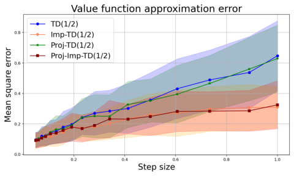

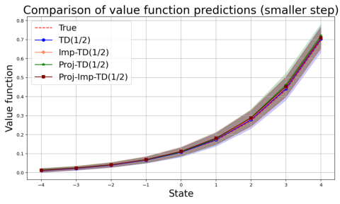

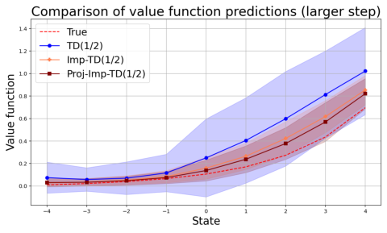

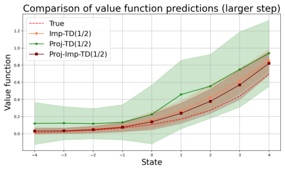

Figure 9: All figures pertain to the random walk environment. **Top left:** Value approximation
error versus constant step size over the interval [0 _._ 05 _,_ 1]. Implicit TD(0.5) exhibits a more gradual
increase in value approximation error as the step size grows, reflecting its enhanced robustness
to large step sizes. **Top right:** Value function approximation with _α_ _n_ = 0 _._ 05. Both standard
and implicit TD(0.5) algorithms accurately recover the true value function, with tight confidence
bands. **Bottom left:** Value function approximation with _α_ _n_ = 1 _._ 5. Implicit TD(0.5) achieves
closer alignment with the true value function and reduced variance compared to standard TD(0.5).
**Bottom right:** Value function approximation with _α_ _n_ = 1 _._ 5 using projected TD(0.5). The
standard projected TD(0.5) algorithm exhibits larger approximation error and wider confidence
band than the implicit TD(0.5) algorithms.

### **References**

[1] Leemon Baird et al. Residual algorithms: Reinforcement learning with function approximation.

In _Proceedings of the 12th International Conference on Machine Learning_, pages 30–37, 1995.

[2] Albert Benveniste, Michel M´etivier, and Pierre Priouret. _Adaptive Algorithms and Stochastic_

_Approximations_, volume 22. Springer, 2012.

[3] Dimitri P. Bertsekas. Neuro-dynamic programming. _Athena Scientific_, 1996.

[4] Jalaj Bhandari, Daniel Russo, and Raghav Singal. A finite-time analysis of temporal difference

learning with linear function approximation. In _Conference on Learning Theory_, pages 1691–

1692. PMLR, 2018.

[5] Vivek S. Borkar. Stochastic approximation with two time scales. _Systems & Control Letters_,

29(5):291–294, 1997.

[6] Vivek S. Borkar. _Stochastic Approximation: A Dynamical Systems Viewpoint_, volume 9.

Springer, 2008.

[7] L´eon Bottou. Large-scale machine learning with stochastic gradient descent. In _Proceedings_

_of COMPSTAT’2010_, pages 177–186. Springer, 2010.

[8] L´eon Bottou. Stochastic gradient descent tricks. In _Neural Networks: Tricks of the Trade, 2nd_

_ed._, pages 421–436. Springer, 2012.

[9] Jerry Chee, Hwanwoo Kim, and Panos Toulis. “Plus/Minus the Learning Rate”: Easy and

scalable statistical inference with SGD. In _International Conference on Artificial Intelligence_

_and Statistics_, pages 2285–2309. PMLR, 2023.

[10] William Dabney and Andrew Barto. Adaptive step-size for online temporal difference learning.

In _Proceedings of the AAAI Conference on Artificial Intelligence_, volume 26, pages 872–878.

AAAI Press, 2012.

[11] Gal Dalal, Bal´azs Sz¨or´enyi, Gugan Thoppe, and Shie Mannor. Finite sample analyses for

TD(0) with function approximation. In _Proceedings of the AAAI Conference on Artificial_

_Intelligence_, volume 32. AAAI Press, 2018.

[12] Gal Dalal, Gugan Thoppe, Bal´azs Sz¨or´enyi, and Shie Mannor. Finite sample analysis of two

timescale stochastic approximation with applications to reinforcement learning. In _Conference_

_on Learning Theory_, pages 1199–1233. PMLR, 2018.

[13] Christoph Dann, Gerhard Neumann, and Jan Peters. Policy evaluation with temporal differ

ences: A survey and comparison. _The Journal of Machine Learning Research_, 15(1):809–883,

2014.

[14] Abraham P. George and Warren B. Powell. Adaptive stepsizes for recursive estimation with

applications in approximate dynamic programming. _Machine Learning_, 65:167–198, 2006.

[15] Sina Ghiassian, Andrew Patterson, Shivam Garg, Dhawal Gupta, Adam White, and Martha

White. Gradient temporal-difference learning with regularized corrections. In _International_

_Conference on Machine Learning_, pages 3524–3534. PMLR, 2020.

[16] Xavier Gourdon and Pascal Sebah. The euler constant: _γ_ . _Young_, 1:2n, 2004.

[17] Harsh Gupta, Rayadurgam Srikant, and Lei Ying. Finite-time performance bounds and adap

tive learning-rate selection for two time-scale reinforcement learning. _Advances in Neural_

_Information Processing Systems_, 32, 2019.

[18] Marcus Hutter and Shane Legg. Temporal difference updating without a learning rate. _Ad-_

_vances in Neural Information Processing Systems_, 20, 2007.

[19] Olav Kallenberg. _Foundations of Modern Probability_, volume 2. Springer, 1997.

[20] Prasenjit Karmakar and Shalabh Bhatnagar. Two time-scale stochastic approximation with

controlled markov noise and off-policy temporal-difference learning. _Mathematics of Operations_

_Research_, 43(1):130–151, 2018.

[21] Vijay R. Konda and John N. Tsitsiklis. Convergence rate of linear two-time-scale stochastic

approximation. _The Annals of Applied Probability_, 14(2):796 – 819, 2004.

[22] Chandrashekar Lakshminarayanan and Csaba Szepesv´ari. Linear stochastic approximation:

How far does constant step-size and iterate averaging go? In _International Conference on_

_Artificial Intelligence and Statistics_, pages 1347–1355. PMLR, 2018.

[23] David A. Levin and Yuval Peres. _Markov Chains and Mixing Times_, volume 107. American

Mathematical Society, 2017.

[24] Lennart Ljung, Georg Pflug, and Harro Walk. _Stochastic Approximation and Optimization of_

_Random Systems_, volume 17. Birkh¨auser, 2012.

[25] Hamid Reza Maei. Gradient temporal-difference learning algorithms. _PhD thesis, University_

_of Alberta_, 2011.

[26] Ashique R. Mahmood, Richard S. Sutton, Thomas Degris, and Patrick M. Pilarski. Tuning

free step-size adaptation. In _2012 IEEE International Conference on Acoustics, Speech and_

_Signal Processing (ICASSP)_, pages 2121–2124. IEEE, 2012.

[27] Aritra Mitra. A simple finite-time analysis of td learning with linear function approximation.

_IEEE Transactions on Automatic Control_, 2024.

[28] Joseph Modayil, Adam White, and Richard S. Sutton. Multi-timescale nexting in a reinforce

ment learning robot. _Adaptive Behavior_, 22(2):146–160, 2014.

[29] John P. O’Doherty, Peter Dayan, Karl Friston, Hugo Critchley, and Raymond J. Dolan. Tempo

ral difference models and reward-related learning in the human brain. _Neuron_, 38(2):329–337,

2003.

[30] Gandharv Patil, L. A. Prashanth, Dheeraj Nagaraj, and Doina Precup. Finite-time analysis of

temporal difference learning with linear function approximation: Tail averaging and regulari

sation. In _International Conference on Artificial Intelligence and Statistics_, pages 5438–5448.

PMLR, 2023.

[31] Herbert Robbins and Sutton Monro. A stochastic approximation method. _The Annals of_

_Mathematical Statistics_, pages 400–407, 1951.

[32] Benjamin Van Roy. Temporal-difference learning and applications in finance. _Computational_

_Finance 1999_, page 447, 2000.

[33] Rayadurgam Srikant and Lei Ying. Finite-time error bounds for linear stochastic approxima

tion and TD learning. In _Conference on Learning Theory_, pages 2803–2830. PMLR, 2019.

[34] Richard S. Sutton. Learning to predict by the methods of temporal differences. _Machine_

_Learning_, 3:9–44, 1988.

[35] Richard S Sutton and Andrew G Barto. _Reinforcement learning: An introduction_, volume 1.

MIT press Cambridge, 1998.

[36] Richard S. Sutton, Hamid Maei, and Csaba Szepesv´ari. A convergent _o_ ( _n_ ) temporal-difference

algorithm for off-policy learning with linear function approximation. _Advances in Neural In-_

_formation Processing Systems_, 21, 2008.

[37] Richard S. Sutton, Hamid R. Maei, Doina Precup, Shalabh Bhatnagar, David Silver, Csaba

Szepesv´ari, and Eric Wiewiora. Fast gradient-descent methods for temporal-difference learning

with linear function approximation. In _Proceedings of the 26th Annual International Conference_

_on Machine Learning_, pages 993–1000, 2009.

[38] Richard S. Sutton, A. Rupam Mahmood, and Martha White. An emphatic approach to the

problem of off-policy temporal-difference learning. _Journal of Machine Learning Research_, 17

(73):1–29, 2016.

[39] Aviv Tamar, Panos Toulis, Shie Mannor, and Edoardo M. Airoldi. Implicit temporal differ

ences. _arXiv preprint arXiv:1412.6734_, 2014.

[40] Panagiotis Toulis, Edo Airoldi, and Jason Rennie. Statistical analysis of stochastic gradient

methods for generalized linear models. In _International Conference on Machine Learning_,

pages 667–675. PMLR, 2014.

[41] Panos Toulis and Edoardo M. Airoldi. Scalable estimation strategies based on stochastic

approximations: Classical results and new insights. _Statistics and Computing_, 25:781–795,

2015.

[42] Panos Toulis and Edoardo M. Airoldi. Asymptotic and finite-sample properties of estimators

based on stochastic gradients. _The Annals of Statistics_, 45(4):1694–1727, 2017.

[43] Mark Towers, Ariel Kwiatkowski, Jordan Terry, John U. Balis, Gianluca De Cola, Tris

tan Deleu, Manuel Goulao, Andreas Kallinteris, Markus Krimmel, Arjun K. G., et al.

Gymnasium: A standard interface for reinforcement learning environments. _arXiv preprint_

_arXiv:2407.17032_, 2024.

[44] John Tsitsiklis and Benjamin Van Roy. Analysis of temporal-difference learning with function

approximation. _Advances in Neural Information Processing Systems_, 9, 1996.

[45] Yue Wang, Wei Chen, Yuting Liu, Zhi-Ming Ma, and Tie-Yan Liu. Finite sample analysis of

the gtd policy evaluation algorithms in the markov setting. _Advances in Neural Information_

_Processing Systems_, 30, 2017.

[46] Tengyu Xu, Shaofeng Zou, and Yingbin Liang. Two time-scale off-policy TD learning: Non

asymptotic analysis over markovian samples. _Advances in Neural Information Processing Sys-_

_tems_, 32, 2019.

[47] Sheng Zhang, Zhe Zhang, and Siva Theja Maguluri. Finite sample analysis of average-reward

TD learning and Q-learning. _Advances in Neural Information Processing Systems_, 34:1230–

1242, 2021.

