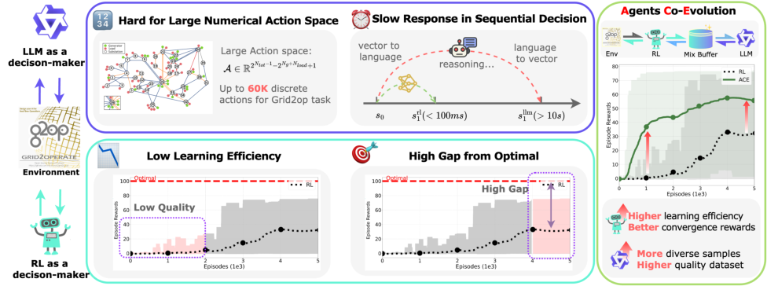
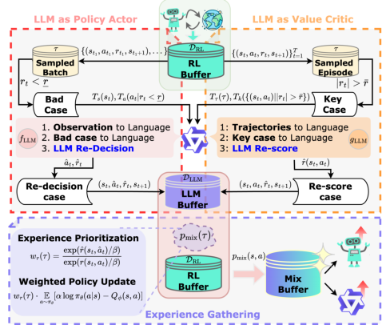
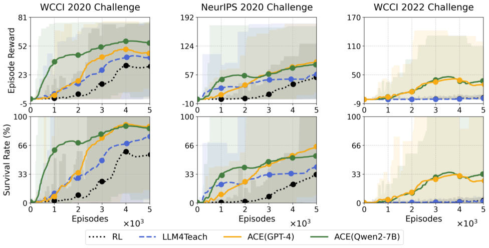
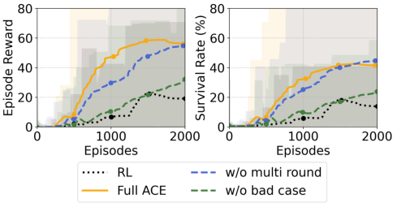
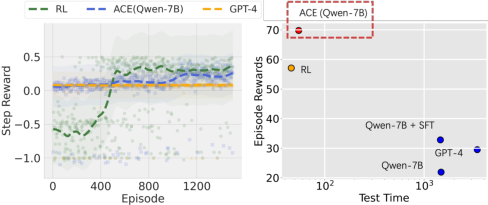
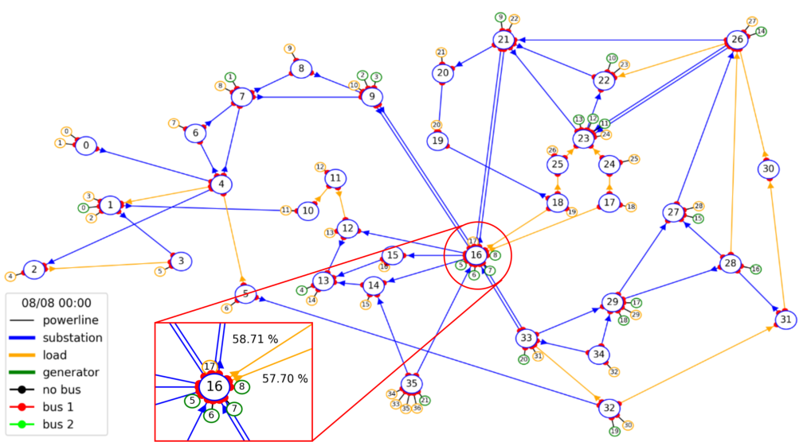
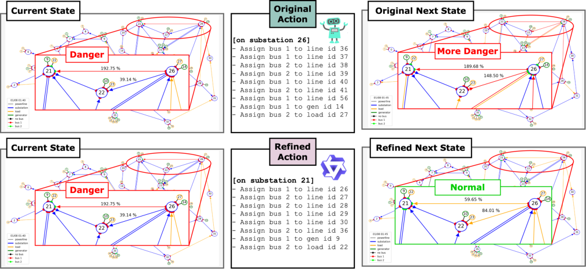

## **Think Twice, Act Once:** **A Co-Evolution Framework of LLM and RL for Large-Scale Decision Making**

**Xu Wan** [1] **Wenyue Xu** [2] **Chao Yang** [3] **Mingyang Sun** [4]

**Abstract**

Recent advancements in Large Language Models
(LLMs) and Reinforcement Learning (RL) have
shown significant promise in decision-making
tasks. Nevertheless, for large-scale industrial decision problems, both approaches face distinct
challenges: LLMs lack real-time long-sequence
decision-making capabilities, while RL struggles
with sample efficiency in vast action spaces. To
bridge this gap, we propose **A** gents **C** o- **E** volution
(ACE), a synergistic framework between LLMs
and RL agents for large-scale decision-making
scenarios. ACE introduces a dual-role trajectory refinement mechanism where LLMs act as
both _Policy Actor_ and _Value Critic_ during RL’s
training: the _Actor_ refines suboptimal actions
via multi-step reasoning and environment validation, while the _Critic_ performs temporal credit
assignment through trajectory-level reward shaping. Concurrently, RL agent enhances LLMs’
task-specific decision-making with high-quality
fine-tuning datasets generated via prioritized experience replay. Through extensive experiments
across multiple power grid operation challenges
with action spaces exceeding 60K discrete actions,
ACE demonstrates superior performance over existing RL methods and LLM-based methods.

**1. Introduction**

Making effective control in large-scale physical systems has
been a long-standing goal in artificial intelligence research
(Stoica et al., 2017). Such decision-making tasks, including
traffic control (Zhang et al., 2022; Du et al., 2023a), power
system operating (Yoon et al., 2021; Dorfer et al., 2022;
Chauhan et al., 2023), and multi-robot coordination (Mahler

1 Zhejiang University 2 Tongji University 3 Alibaba DAMO
Academy [4] Peking University. Correspondence to: Mingyang Sun
_<_ smy@pku.edu.cn _>_ .

_Proceedings of the_ _42_ _[nd]_ _International Conference on Machine_
_Learning_, Vancouver, Canada. PMLR 267, 2025. Copyright 2025
by the author(s).

et al., 2019; Kalashnikov et al., 2022), require sophisticated
reasoning capabilities and rapid response mechanisms. Reinforcement Learning (RL) has been extensively studied
as a promising approach to tackle these challenges for a
long time. Through iterative interaction with the environment, RL agents learn optimal control policies by maximizing cumulative rewards. However, the paradigm of
learning from scratch without prior knowledge (Sutton &
Barto, 1999) making RL agents inherently suffer from sample inefficiency. Moreover, the time-varying and stochastic
characteristics of large-scale industrial scenarios result in a
substantial gap between the converged solutions obtained
through RL models and true optimality (Nian et al., 2020).

Various approaches leverage expert knowledge to alleviate
the inefficiency and sub-optimality intrinsic in RL training.
In terms of policy guidance, a straightforward yet effective
approach is Learning from Demonstration (LFD) (Argall
et al., 2009). LFD-based methods directly mimics expert
demonstrations through behavior cloning or tries to optimize
the reward function through Inverse Reinforcement Learning (IRL) (Ng et al., 2000; Nair et al., 2018; Torabi et al.,
2018; Adams et al., 2022). While theoretically promising,
LFD-based methods heavily rely on the quality of expert
demonstrations and struggle to generalize to unseen scenarios, often suffering from distribution shift problems when
encountering states not covered in the demonstration data.
Meanwhile, Human-in-the-Loop (HITL) approaches (Abel
et al., 2017) has emerged as a promising paradigm that
leverages expert feedback to adaptive guide policy learning. These methods incorporate human guidance either
through real-time interaction (Knox & Stone, 2009; MacGlashan et al., 2017) or offline preference alignment (Bai
et al., 2022; Dai et al., 2023), enabling human trainers to provide evaluative feedback or corrective advice during policy
learning. However, due to the unpredictable and subjective
nature of human feedback, HITL-based approaches face key
challenges including intensive human time requirements,
feedback inconsistency, and the balance between human
intervention and autonomous learning (Kumar et al., 2024).

Recent advances in Large Language Models (LLMs) have
opened new possibilities for enhancing RL frameworks.
Through training on massive text data, LLMs have acquired

1

**Think Twice, Act Once: A Co-Evolution Framework of LLM and RL for Large-Scale Decision Making**

rich world knowledge and reasoning capabilities, making
them promising candidates for decision-making tasks (Lu
et al., 2024; Wang et al., 2023). Researchers have explored
multiple LLM-RL integration paradigms: 1) semantic action
space compression through LLM-guided abstraction (Zhou
et al., 2023), 2) reward shaping via natural language instruction following (Tan et al., 2024), and 3) code generation
for policy implementation (Du et al., 2023b). Recent work
like Thought Cloning (Liu et al., 2024) further demonstrates
how LLMs can generate chain-of-thought trajectories to
guide policy learning through structured reasoning traces.
However, these approaches face significant challenges in
industrial control scenarios. While LLMs excel at highlevel strategic planning, they struggle with long-sequence
decision-making required for fine-grained control. Industrial tasks exhibit inherent time delays and temporal coupling, making it challenging for LLMs to generate coherent
sequences of decisions over extended time horizons. Additionally, the autoregressive nature of transformer-based
LLMs introduces significant latency (Fu et al., 2024), making them impractical for real-time control loops requiring
sub-1000ms responses. Our analysis suggests that direct
LLM-based action generation fundamentally conflicts with
the precision and timing requirements of industrial control systems, necessitating a new paradigm that combines
LLMs’ strategic reasoning with traditional RL’s numerical
optimization strengths.

Motivated by these observations, we develop a more suitable
LLM-RL collaborative framework for industrial decision
making. Unlike previous works that integrate LLMs during
inference, we restrict LLM as an offline guider in the training phase, preserving real-time performance during online
interaction and deployment. Specifically, in the “ _think twice_ ”
phase, LLMs guide RL policy updates through two key
mechanisms: (1) rectifying interaction trajectories as a _Pol-_
_icy Actor_ to refine suboptimal decisions, and (2) performing
trajectory-level reward shaping as a _Value Critic_ to enable
better credit assignment. In the “ _act once_ ” phase, RL agent
interacts with the environment to generate RL trajectories,
which are then combined with LLM-refined trajectories to
create a mixed experience buffer. This buffer serves both
as a training buffer for RL and as a fine-tuning dataset to
enhance LLM’s task-specific guidance capabilities. To summarize, our main contributions are:

(1) We propose **A** gents **C** o- **E** volution (ACE), a co-evolution
framework that separates LLM reasoning and RL execution
into offline training and online deployment, enabling both
effective learning and real-time decision-making in largescale industrial scenarios.

(2) For guiding efficient exploration in large-scale decisionmaking, we develop a dual-role trajectory refinement mechanism where LLMs serve as both Policy Actor and Value

Critic, addressing sample inefficiency and solution suboptimality, respectively.

(3) For enabling continuous improvement of RL and LLMs,
we establish an automated high-quality dataset generation
workflow through reward-based prioritization and weighted
policy update strategies in experience gathering.

(4) We demonstrate state-of-the-art performance on 3
L2RPN competitions, outperforming existing expert-guided
RL methods and LLM methods in industrial environments

with over 60K action space.

**2. Related Work**

**Expert-Guided Reinforcement Learning** Expert guidance has been widely explored to address the sample efficiency and exploration challenges inherent in RL. Imitation learning-based methods, like DAgger (Ross et al.,
2011), Hg-DAgger (Le et al., 2018), Soft DAgger (Nazeer
et al., 2023) iteratively collect expert feedback on states
visited by the learning policy to address distribution shift.
Instead of direct action imitation, IRL-based methods select a reward function from the set of possible solutions
that best explains expert behavior. AIRL (Fu et al., 2017),
MaxEnt-IRL (Zeng et al., 2022), and Offline IRL (Zeng
et al., 2023) leveraging different optimization principles to
recover more robust reward functions. For industrial sce
narios with large action spaces, (Yoon et al., 2021) reduces
the action space based on sample frequency of offline expert data, while (Chauhan et al., 2023) employs predefined
rules to simplify RL decision-making tasks. However, these
methods often sacrifice the exploration of optimal solutions.
Alternatively, (Dorfer et al., 2022) utilizes monte-carlo tree
search to guide policy exploration through look-ahead planning, but it incurs significant computational overhead from
extensive simulations.

Unlike previous approaches that rely on extensive offline
expert data or look-ahead simulation, the ACE framework
leverages LLM’s superior reasoning and in-context learning
capabilities to perform trajectory refinement and reward
shaping from RL’s demonstrations.

**Language Models in Decision-Making** Focusing on combining LLMs’ capabilities in control tasks, several works
adapt LLMs to directly generate executable actions. For
instance, CALM (Yao et al., 2020), TWOSOME (Tan et al.,
2024) and POAD (Wen et al., 2024) constrain the action
space to a restricted subset using LLMs and employ RL to
align agents’ knowledge with specific environments. Similarly, various approaches decompose complex tasks into
manageable subgoals. SayCan (Ahn et al., 2022), LgTs
(Shukla et al., 2023) and DART-LLM (Wang et al., 2024)
break down high-level instructions into executable skills
using affordance functions and validity scores, while ReAct

2

**Think Twice, Act Once: A Co-Evolution Framework of LLM and RL for Large-Scale Decision Making**

_Figure 1._ The motivation and challenges of integrating LLM with RL for large-scale industrial decision making.

(Yao et al., 2022) utilizes chain-of-thought prompting to
generate task-specific actions with reasoning traces.

Furthermore, recent studies have explored integrating LLMs
as policy experts to guide RL agents’ interactions (Nam
et al., 2023). LLM4Teach (Zhou et al., 2023) incorporates
LLM guidance by introducing policy regularization terms in
the RL optimization process. ELLM (Du et al., 2023b)
guides RL policy pre-training through LLM-suggested
goals, while LINVIT (Zhang et al., 2024) incorporates LLM
guidance as a regularization factor for value-based RL. Most
closely aligned with our motivation is RL-GPT (Liu et al.,
2024), which unifies coding and learning optimization in
the RL training pipeline to help RL systems learn better
decision-making strategies. However, RL-GPT relies on
continuous LLM interaction during game tasks, resulting
in training costs and real-time requirements that exceed the
constraints of industrial applications.

**3. Method**

In this section, we describe the ACE framework, consisting
of 1) direct policy learning through RL’s environmental
interaction, 2) trajectory refinement through LLM’s dual
roles as Actor and Critic, and 3) experience gathering that
enables effective co-evolution between the two agents. The
pseudo-code of ACE is shown in Algorithm 1.

**3.1. First Think: Direct Policy Learning through**
**Environment Interaction**

We first formulate the sequential decision-making problem
as a Markov Decision Process (MDP) (Puterman, 1990)
defined by tuple ( _S, A, P, R, γ_ ), where _S_ and _A_ denote the
state and action spaces, respectively. _P_ : _S×A×S →_ [0 _,_ 1]

is the transition probability, _R_ : _S × A →_ R is the reward
function, and _γ ∈_ (0 _,_ 1] is the discount factor.

**Optimization Objective.** Efficient policy exploration and
experience collection are crucial for handling large-scale
numerical action spaces. Therefore, we adopt the Soft ActorCritic (SAC) (Haarnoja et al., 2018) algorithm as our RL
module through off-policy training for better experience
utilization. The SAC agent aims to learn a policy _π_ that
maximizes both the expected return and policy entropy. Our
objective function is:

where _H_ ( _π_ ( _·|s_ _t_ )) = _−_ [�] _a_ _[π]_ [(] _[a][|][s]_ _[t]_ [) log] _[ π]_ [(] _[a][|][s]_ _[t]_ [)] [ represents]

the entropy of the policy _π_ at state _s_ _t_, _α_ is the temperature
parameter controlling the trade-off between exploration and
exploitation.

**Learning from Interaction.** During standard environment interaction, transition tuples _τ_ = ( _s_ _t_ _, a_ _t_ _, r_ _t_ _, s_ _t_ +1 _, d_ )
are stored into a replay buffer _D_ RL for each timestep. Each
tuple consists of the current state _s_ _t_, the action _a_ _t_ sampled
from RL’s policy _π_ ( _a_ _t_ _|s_ _t_ ), the received reward _r_ _t_, and the
next state _s_ _t_ +1 . To learn from experiences, a mini-batch
of transitions is sampled from _D_ RL to optimize both the
Q-function _Q_ _ϕ_ and policy _π_ _θ_ . Specifically, the Q-function
is updated by minimizing:

_L_ _Q_ ( _ϕ_ ) = E ( _s,a,r,s_ _′_ ) _∼D_ RL �( _Q_ _ϕ_ ( _s, a_ ) _−_ _y_ ) [2] [�]

(2)
_y_ = _r_ + _γ_ ( _Q_ _ϕ_ _′_ ( _s_ _[′]_ _, a_ _[′]_ ) _−_ _α_ log _π_ _θ_ ( _a_ _[′]_ _|s_ _[′]_ ))

where _ϕ_ _[′]_ denotes the target network parameters and _a_ _[′]_ is
sampled from the current policy _π_ _θ_ . The policy is then

�

_J_ ( _π_ ) = E _τ_ _∼π_

_∞_
�
� _t_ =0

� _γ_ _[t]_ ( _R_ ( _s_ _t_ _, a_ _t_ ) + _αH_ ( _π_ ( _·|s_ _t_ )))

_t_ =0

(1)

3

**Think Twice, Act Once: A Co-Evolution Framework of LLM and RL for Large-Scale Decision Making**

where _P_ _r_ is the task description prefix that supplies necessary domain knowledge, _T_ _s_ ( _·_ ) and _T_ _a_ ( _·_ ) denote the text
conversion functions that transform states and actions into

natural language descriptions, respectively. The refined action ˆ _a_ _t_ is then selected as the action from the LLM’s output
and subsequently validated through environment simulation
to obtain new transitions ( _s_ _t_ _,_ ˆ _a_ _t_ _, r_ _t_ ( _s_ _t_ _,_ ˆ _a_ _t_ ) _,_ ˆ _s_ _t_ +1 _,_ _d_ [ˆ] ), which
are stored in a separate LLM buffer _D_ LLM .

**LLMs as Value Critic** In later training stages, we leverage LLMs to perform trajectory-level counterfactual reasoning and re-evaluate the long-term impact of key decisions:

_r_ ˆ _t_ = _g_ LLM ( _P_ _r_ _, T_ _τ_ ( _τ_ ) _, T_ _k_ ( _{_ ( _s_ _t_ _, a_ _t_ ) _||r_ ( _s_ _t_ _, a_ _t_ ) _| >_ ¯ _r}_ )) (5)

_Figure 2._ The architecture of ACE framework with dual-role LLM.

improved by minimizing:

_L_ _π_ ( _θ_ ) = E _s∼D_ RL [E _a∼π_ _θ_ [ _α_ log _π_ _θ_ ( _a|s_ ) _−_ _Q_ _ϕ_ ( _s, a_ )]] (3)

As shown in Eq. (2) and Eq. (3), the learning efficiency
heavily depends on the target value _y_ computed using both
Q-function and policy. However, in early training stages
with large action spaces, _both the Q-function estimation and_
_policy exploration are unreliable._ It directly motivates our
second think mechanism, which leverages LLM’s reasoning
capabilities to enhance the quality of experiences in _D_ RL .

**3.2. Second Think: Trajectory Refinement through**
**LLMs**

In this section, we introduce a dual-role refinement framework in which LLMs function as both an Actor for policy
refinement and a Critic for value re-assessment, as shown
in Figure 2. It is driven by two key insights: (1) LLMs’
strong in-context reasoning capabilities in inferring better
alternative policy from failure cases; (2) LLMs’ counterfactual reasoning abilities facilitate better credit assignment
over long-term dependencies.

**LLMs as Policy Actor** When activated, LLMs serve as a
policy actor to refine suboptimal decisions. For mini-batches
sampled from the replay buffer _D_ RL, we identify transitions
where the reward _r < r_, marking them as inappropriate
decisions that require refinement. These states are converted
into natural language descriptions and provided to the LLM
along with essential context:

_a_ ˆ _t_ = _f_ LLM ( _P_ _r_ _, T_ _s_ ( _s_ _t_ ) _, T_ _a_ ( _a_ _t_ ) _|r_ ( _s_ _t_ _, a_ _t_ ) _< r_ ) (4)

where _τ_ = _{_ ( _s_ _t_ _, a_ _t_ _, r_ _t_ _, s_ _t_ +1 _, d_ ) _}_ _[T]_ _t_ =1 [represents the com-]
plete episode trajectory, ¯ _r_ denotes the threshold for identifying potentially critical trajectories. This mechanism can be
viewed as an extension of implicit multi-step TD( _λ_ ) (Sutton, 2018): LLMs approximate eligibility traces through
trajectory-level reasoning, enabling credit assignment over
broader temporal horizons. Compared to TD( _λ_ )’s exponential decay assumption, LLM’s causal attribution provides
non-parametric modeling capability for long-term dependencies.

To maintain stability while allowing meaningful adjustments, we discretize the reward modifications into four
levels: _{−_ 2 _K, −K,_ + _K,_ +2 _K}_ and limit the number of
modifications per episode, where _K_ is a predefined adjustment scale.

**3.3. Co-evolution through Experience Gathering**

To enable effective co-evolution between RL and LLM, we
further construct a mixed buffer _D_ mix that serves both RL
policy training and LLM online fine-tuning through the
following sampling strategy.

Let _β_ denote the ratio of samples drawn from the LLM
buffer and _τ_ denote the sampled transitions. The base mixing distribution is:

_p_ mix ( _τ_ ) = (1 _−_ _β_ ) _p_ RL ( _τ_ ) + _βp_ LLM ( _τ_ ) (6)

where _p_ RL ( _τ_ ) and _p_ LLM ( _τ_ ) represent the sampling distributions for _D_ RL and _D_ LLM, respectively.

To ensure the quality of LLM-refined experiences, we employ two key mechanisms:

**Reward-based Experience Prioritization** First, we evaluate the quality of LLM refinements based on the immediate
outcomes and termination signal:

I _v_ ( _τ_ ) = I[ˆ _r_ ( _s,_ ˆ _a_ ) _≥_ 0 _∧¬d_ ( _s_ [ˆ] _[′]_ )] (7)

where _d_ ( _s_ [ˆ] _[′]_ ) _∈{_ 0 _,_ 1 _}_ indicates whether the next state _s_ [ˆ] _[′]_ after
LLM refine leads to episode termination (1) or continuation

4

**Think Twice, Act Once: A Co-Evolution Framework of LLM and RL for Large-Scale Decision Making**

(0), and ˆ _r_ ( _s,_ ˆ _a_ ) _≥_ 0 refers to the non-negative reward after
LLM’s refinement.

To prioritize high-reward experiences during sampling, we
introduce a reward-based importance weight:

_w_ _r_ ( _τ_ ) = [ex][p(] _[r]_ [ˆ][(] _[s][,]_ [ ˆ] _[a]_ [)] _[/β]_ [)] (8)

exp( _r_ ( _s, a_ ) _/β_ )

where _w_ _r_ ( _τ_ ) serves as a prior for experience replay, ensuring that the refined transitions by _f_ LLM or _g_ LLM leading to
higher rewards than RL agent are more likely to be sampled.

Therefore, the complete mixed sampling distribution is reformulated as:

**Algorithm 1 A** gents **C** o- **E** volution (ACE) Framework
**Require:** Initial RL policy _π_ _θ_, Q-function _Q_ _ϕ_, model _f_ LLM
and _g_ LLM, buffers _D_ RL, _D_ LLM
1: // _Act Once_

2: **for** each environment step **do**
3: Sample action _a_ _t_ _∼_ _π_ _θ_ ( _·|s_ _t_ )
4: Execute _a_ _t_, observe _r_ _t_ _, s_ _t_ +1, done marker _d_ _t_
5: Store _τ_ := ( _s_ _t_ _, a_ _t_ _, r_ _t_ _, s_ _t_ +1 _, d_ _t_ ) in _D_ RL
6: **end for**

7: // _Think Twice_

8: **for** each LLM active step **do**
9: Sample batch _τ ∼D_ RL
10: **if** _f_ LLM is active and _r_ _t_ _< r_ in _τ_ **then**
11: Convert state-action to text: _T_ _s_ ( _s_ _t_ ) _, T_ _a_ ( _a_ _t_ )
12: Get refined action ˆ _a_ _t_ by Eq. (4)
13: **end if**
14: **if** _g_ LLM is active and _|r_ _t_ _| >_ ¯ _r_ in _τ_ **then**
15: Convert trajectories to text: _T_ _τ_ ( _τ_ )
16: Get refined rewards ˆ _r_ _t_ by Eq. (5)
17: **end if**

18: Simulate by Grid2Op and store refined transitions
( _s_ _t_ _,_ ˆ _a_ _t_ _,_ ˆ _r_ _t_ _,_ ˆ _s_ _t_ +1 _,_ _d_ [ˆ] _t_ ) in _D_ LLM
19: **end for**

20: **for** each RL update step **do**
21: Sample mixed batch according to _p_ mix in Eq. (9)
22: Compute importance weights _w_ _r_ ( _τ_ ) by Eq. (8)
23: Update Q-function by Eq.(2)
24: Update RL policy with weighted loss by Eq. (10)
25: **end for**

26: **for** each LLM fine-tuning step **do**
27: Generate buffer _D_ mix according to _p_ mix in Eq. (9)
28: Fine-tuning _f_ LLM and _g_ LLM using _D_ mix
29: **end for**

10 different episodic scenarios, each spanning 3 days (864
steps) with varying difficulty levels.

**(2) L2RPN NeurIPS 2020 Challenge** (Marot et al., 2021):
This challenge extends the WCCI 2020 grid environment by
introducing an adversarial setting. The key innovation is the
addition of an “opponent” that follows a heuristic strategy
of randomly disconnecting heavily loaded power lines. The
test dataset is conducted on 24 weekly episodes (2016 steps),
with control decisions made at 5-minute intervals.

**(3) L2RPN WCCI 2022 Challenge** (Marot et al., 2022):
This competition utilizes the industry standard synthetic
IEEE-118 power grid environment, featuring 118 substations, 186 power lines, 91 loads, and 62 generators. It
introduces more renewable generators and storage systems
than previous challenges, focusing on electricity production
uncertainty and AI agent robustness. The action space is
significantly larger, _with over 70,000 discrete actions_ for
substation switching alone (Dorfer et al., 2022). The train

_p_ mix ( _τ_ ) =

_|D_ 1 _−_ RL _β|_ if _τ ∈D_ RL
_β·_ I _v_ ( _τ_ ) _·w_ _r_ ( _τ_ ) (9)

� ~~�~~ _τ_ _∈D_ LLM [I] _[v]_ [(] _[τ]_ [)] _[·][w]_ _[r]_ [(] _[τ]_ [)] if _τ ∈D_ LLM

**Reward-weighted Policy Learning** To prioritize learning
from valuable LLM refinements, we introduce a rewardbased weighting mechanism for RL agent:

_L_ _π_ ( _θ_ ) = _τ_ _∼_ E _p_ mix [[] _[w]_ _[r]_ [(] _[τ]_ [)] _[ ·]_ _a∼_ E _π_ _θ_ [[] _[α]_ [ log] _[ π]_ _[θ]_ [(] _[a][|][s]_ [)] _[ −]_ _[Q]_ _[ϕ]_ [(] _[s, a]_ [)]]]

(10)
_w_ _r_ ( _τ_ ) naturally emphasizes LLM refinements that lead to
higher rewards, allowing the RL agent to focus on learning
from more valuable demonstrations.

For the LLM module, we apply low-rank adaptation finetuning on _D_ mix with reward signals as labels to enhance the
task-specific capabilities.

**4. Experiments**

**4.1. Environmental Setup**

We evaluate ACE in three complex real-world power system
operation cases. The data is sourced from the Grid2Op opensource platform (Donnot, 2020) provided by RTE France,
Europe’s largest grid operator. Specifically, we use datasets
as follows:

**(1) L2RPN WCCI 2020 Challenge** (Marot et al., 2020)
This challenge presents a medium-sized power grid challenge that simulates one-third of the US Midwest grid. The
environment consists of 36 substations, 59 lines, and 22
generators, with an extensive topology assignment action
space _exceeding 60,000 possible actions_ (Yoon et al., 2021).
The objective is twofold: (1) developing strategies to overcome operational obstacles like grid congestion, and (2)
optimizing various operational costs including power line
losses, dispatch costs, and outage costs. The challenge incorporates realistic scenarios such as load fluctuations and
line maintenance. For evaluation, the test dataset comprises

5

**Think Twice, Act Once: A Co-Evolution Framework of LLM and RL for Large-Scale Decision Making**

ing dataset spans 32 years of grid data at 5-minute intervals
(2016 steps), totaling approximately 1.7 GB.

**4.2. Baseline Methods**

We benchmark the ACE framework against state-of-the-art
approaches across three categories:

**(1) Expert-guided RL** : We compare with the winning solutions from previous challenges. Building upon the WCCI
2020 winning solution (Yoon et al., 2021), which leverages
hierarchical policy and after-state representation, we adopt
its architecture as our backbone but enhance it with our

dual-role LLM refinement mechanism.

**(2) LLM only** : We evaluate the direct decision-making
performance of different pre-trained LLM models: GPT4o-0806 (Achiam et al., 2023) and Qwen2-7B-Instruct (Bai
et al., 2023) using the same prompts as ACE on the test set.

**(3) LLM-guided RL** : Given that existing LLM-RL methods typically operate during inference, which is impractical for L2RPN’s large-scale tasks, we implement a modified version of LLM4Teach (Zhou et al., 2023): using
KL-divergence constraints to regularize the RL policy _π_ _θ_ ’s
updates by minimizing the deviation from the LLM guider’s
policy distribution _π_ LLM .

_L_ _π_ ( _θ_ ) = _L_ RL ( _θ_ ) + _λ_ E _s∼τ_ KL( _π_ LLM ( _·|s_ ) _||π_ _θ_ ( _·|s_ )) (11)

As illustrated in Eq. (11), the modified LLM4Teach adapts
the mode similar to ACE, where alignment is only enabled
during the training phase with Qwen2-7B-Instruct as the
aligned model.

**4.3. Implementation Details**

We utilize Qwen2-7B instruct and GPT-4o-0806 as the ACE
framework’s LLM component, named ACE (Qwen2-7B)
and ACE (GPT-4), respectively.

For trajectory refinement, we introduce two effective tricks:
bad case reasoning and multi-round reasoning mechanism.
The _bad case reasoning_ mechanism integrates RL’s bad actions of the current state into _f_ LLM ’s prompt and formulates
instructions that prompt LLMs to reason and avoid making
similar suboptimal decisions. Moreover, _multi-round rea-_
_soning_ leverages the simulation functionality provided by
Grid2Op to estimate the rewards following LLMs’ refined
actions. If the estimated rewards are inferior to RL agent,
the system initiates multi-round decision-making, with a
maximum of five rounds set in our experiments.

For efficient memory management, we limit the LLM
buffer’s maximum size to 256. When updating policy, we
sample batches _τ_ according to importance weights _w_ _r_ ( _τ_ )
from _D_ mix for RL training. In ACE (Qwen2-7B), we perform online fine-tuning of the LLM model for every 100

generated samples, while ACE (GPT-4) operates without
fine-tuning. Besides, we activate the LLM Value Critic module _g_ LLM only in the later stages of training ( _D_ LLM is full),
where the modified rewards directly replace the original
rewards without additional storage.

**4.4. Main Results**

We evaluate ACE against baseline methods across three
L2RPN competition environments. As shown in Figure 3
and Table 1, ACE consistently outperforms all baselines
across different metrics.

From the perspective of **episode rewards**, _ACE demon-_
_strates substantial improvements across all three challenges,_
_including the champion solutions from WCCI 2020 and_
_Neurips 2020_ . In the WCCI 2020 challenge, ACE achieves
the highest episode reward, surpassing the pure RL approach
by 22.2% and pure LLM approaches by over 130%. Similar
results are observed in the NeurIPS 2020 challenge, where
ACE achieves 145.3, outperforming other methods by at
least 10.5%. Most notably, in the more complex WCCI
2022 environment, ACE achieves a remarkable 145% improvement over the Expert-guided RL baseline.

From the **decision-making efficiency** perspective, _ACE_
_maintains competitive real-time performance_ . In the WCCI
2020 challenge, ACE (GPT-4) achieves a test time of 38.7s,
which is comparable to the expert-guided RL baseline and
significantly faster than pure LLM approaches. This phenomenon further demonstrates that for large-scale sequential
decision-making problems with long time series, the running
time of pure LLMs does not meet industrial requirements.

In terms of **sample efficiency**, we find that by _injecting_
_refinements for less than 700 selected samples, the con-_
_vergence speed of RL can be significantly improved_ . For
the WCCI 2020 challenge, ACE requires only 287 LLM
refinements to achieve state-of-the-art performance, compared to 100K samples needed by traditional approaches.
This efficiency is also evident in the WCCI 2022 challenge,
where ACE achieves superior performance with just 50K
samples plus refinements, while baseline methods require
200K samples yet achieve lower performance.

**4.5. Ablation Studies**

To comprehensively assess the efficacy of each component
within the ACE framework, we conduct a series of ablation studies of two pivotal modules, _f_ LLM and _g_ LLM, as
well as two reasoning strategies used for _f_ LLM interaction:
multi-round reasoning and bad-case reasoning. The detailed
results are summarized in Table 2 and Table 3.

First, we examine the impact of removing the core modules. As demonstrated in Table 2, eliminating the Actor
component _f_ LLM leads to the most pronounced performance

6

**Think Twice, Act Once: A Co-Evolution Framework of LLM and RL for Large-Scale Decision Making**

_Figure 3._ Training episode rewards comparison between ACE and baselines across 3 L2RPN competitions.

decline, with the episode rewards plummeting to 48.3 and
the survival rate dropping to 71.4%. Similarly, the removal
of the Critic component _g_ LLM also results in a notable decrease in performance, with episode rewards reaching 61.5
and a survival rate of 84.7%.

Additionally, we analyze the impact of the reasoning strategies. The results in Figure. 4 show that removing the bad
case reasoning strategy reduces the rewards to 60.2 and the
survival rate to 76.3%, while the removal of multi-round
reasoning leads to rewards of 65.7 and a survival rate of
88.5%. This demonstrates that using bad actions as negative examples effectively leverages the LLM’s reasoning
capabilities to generate superior decisions.

Furthermore, we conducted an in-depth analysis of key hyperparameters within _f_ LLM and _g_ LLM in Table 3.

For _f_ LLM, we analyze three key aspects: (1) we test _f_ LLM
query intervals of 128, 256, and 512 training steps with _g_ LLM
query interval fixed at 32 to assess the impact of _f_ LLM ’s
activation frequency on convergence and efficiency; (2) we
explore bad-case thresholds _{_ -0.3, 0, 0.3 _}_ to regulate LLMrefined sample volume; and (3) we evaluating “No SFT”,
“One-time SFT” at RL’s 2000th epoch, and “three-time SFT”
per 100 refined samples to quantify the fine-tuning effects
on performance.

For _g_ LLM, we also analyze three key aspects: (1) we test
_g_ LLM query intervals of 32, 128, and 512 training steps to assess the impact of _g_ LLM ’s _activation frequency_ ; (2) given the

_Figure 4._ Ablation study results comparing ACE variants over
training episodes on NeurIPS 2020 dataset.

impracticality of using complete trajectories for LLM-based
reward shaping, we explore three key trajectories selection
criteria to reduce _g_ LLM input tokens: **reward-based** selection filter trajectories by reward absolute values to capture
high- and low-reward cases, **state-based** selection identify
trajectories where maximum line flow change exceeds a
threshold _|ρ_ max _| >_ ¯ _ρ_, and **action-based** selection designate
trajectories with action changes _a ̸_ = _{}_ as key trajectories;
and (3) to prevent policy oscillation in Q-value estimation,
we test shaping parameters _K_ = _{_ 0 _._ 2 _,_ 0 _._ 3 _,_ 0 _._ 4 _}_ with _g_ LLM
fixed at a 32-step query interval.

The experimental results highlight several critical insights:

_(1) Higher activation frequency leads to faster initial RL_
_learning_ . A 256-step interval of _f_ LLM and 32-step interval of

7

**Think Twice, Act Once: A Co-Evolution Framework of LLM and RL for Large-Scale Decision Making**

_Table 1._ Test Performance comparison across 3 L2RPN competitions. Results show mean _±_ standard deviation over 5 runs. Best results
are in **bold** .

**Dataset** **Method** **Type** **Episode** **Survival** **Sample** **Test**
**Rewards** **Rate (%)** **Requirements** **Time(s)**

**WCCI 2020**

**NeurIPS 2020**

**WCCI 2022**

Expert-guided RL RL 57.1 _±_ 3.9 78.3 _±_ 3.9 100 K 46.1
Qwen2-7B LLM 21.9 _±_ 1.9 30.5 _±_ 0.8 N/A 1480.8
GPT-4 LLM 29.5 _±_ 2.1 41.7 _±_ 1.5 N/A 3415.3

LLM4Teach LLM+RL 64.4 _±_ 4.2 78.5 _±_ 2.4 100 K 46.2

Expert-guided RL RL 128.5 _±_ 5.1 72.9 _±_ 5.5 100 K **217.2**
Qwen2-7B LLM 37.5 _±_ 1.8 21.8 _±_ 1.0 N/A 10729.7
GPT-4 LLM 37.8 _±_ 1.9 42.3 _±_ 1.3 N/A 12949.8

LLM4Teach LLM+RL 131.5 _±_ 0.3 74.8 _±_ 0.2 100 K 212.9

Expert-guided RL RL 31.0 _±_ 2.7 33.7 _±_ 2.0 200 K **1440.0**
Qwen2-7B LLM 16.7 _±_ 0.9 19.6 _±_ 2.6 N/A 22436.0
GPT-4 LLM 18.3 _±_ 0.8 22.2 _±_ 1.4 N/A 22188.6

LLM4Teach LLM+RL 23.6 _±_ 3.4 29.5 _±_ 2.0 200 K 1116.8

_†_ “SFT” refers to the process of fine-tuning LLM components using LoRA parameters with the mixed buffer _D_ mix . ACE
(GPT-4) does not include SFT, only using GPT for enhancing RL with our ACE framework.

_Table 2._ Ablation study of ACE components on WCCI 2020
dataset.

**ACE Variant** **Episode Rewards** **Survival Rate (%)**

Full ACE **69.8** **92.9**

w/o _f_ LLM 48.3 71.4
w/o _g_ LLM 61.5 84.7
w/o Bad Case 60.2 76.3

w/o Multi-round 65.7 88.5

_Note:_ We use ACE as the baseline and limit w/o Multi-round
Reasoning to process the same samples of RL trajectories.

_g_ LLM shows significant improvements over 512 steps. Interestingly, as the number of training scenarios increased from
288 to 576 cases, the performance gap between different
frequencies narrowed, suggesting that we can reduce activation frequency for environments with sufficiently diverse
scenarios while maintaining effectiveness.

_(2) Extreme thresholds for filtering bad cases are subopti-_
_mal._ _r_ = 0 _._ 3 introduced 510 samples, _r_ = 0 included 275
samples, and _r_ = _−_ 0 _._ 3 allowed only 83 samples for refinement. In our experiments, constrained by the reasoning
capability of the base model, introducing too many samples
results in minimal refinement benefits while increasing _f_ LLM
reference time by 46%. Conversely, too few samples led
to slower convergence and approximately 6% performance

_Table 3._ Ablation study of _f_ LLM and _g_ LLM Variants on WCCI 2020
dataset

_f_ **LLM** **Variants** _g_ **LLM** **Variants**

**Params** **Reward** **Survival** **Params** **Reward** **Survival**

_Active Frequency_ _Active Frequency_
128 66.2 89.1 32 **68.1** **94.0**

256 **68.1** **94.0** 128 64.3 87.4

512 63.4 85.3 512 51.5 72.7

_Bad Threshold_ _Trajectory Selection_
_r_ = _−_ 0 _._ 3 61.8 86.2 _|r| >_ ¯ _r_ **68.1** **94.0**
_r_ = 0 **68.1** **94.0** _|ρ_ max _| >_ ¯ _ρ_ 68.1 **94.0**
_r_ = 0 _._ 3 64.1 88.5 _a ̸_ = _{}_ 51.5 72.7

_SFT Frequency_ _Reward Shaping_
No SFT 58.9 77.5 _K_ = 0 _._ 2 68.0 92.6

One-time 64.3 80.4 _K_ = 0 _._ 3 64.3 87.5

Three-time **68.1** **94.0** _K_ = 0 _._ 4 **68.2** **94.0**

degradation compared to the standard settings.

_(3) Both reward-based and state-based key trajectory se-_
_lection criteria in_ _g_ _LLM_ _improve performance_, while actionbased selection shows significantly limited performance.
This suggests that LLMs are more effective at extracting
meaningful patterns from explicit information, such as performance indicators or state changes, compared to abstract
topological changes.

_(4) SFT frequency directly impacts ACE performance._ No

8

**Think Twice, Act Once: A Co-Evolution Framework of LLM and RL for Large-Scale Decision Making**

SFT showed limited improvement after about 2000 epochs,
with the survival rate stabilizing at 77.5%. Applying onetime SFT led to immediate improvement, reaching 78.5% in
the first post-SFT evaluation step. Moreover, multiple SFT
iterations demonstrated further enhancement over single
SFT, ultimately achieving a survival rate of 84.8%.

**4.6. Computational Overheads**

We conducted experiments on the NeurIPS 2020 competition environment to evaluate the computational efficiency of
ACE. For expert-guided RL, we trained for 100K timesteps
with a total duration of 6h 4m 14s. Table 4 presents the
detailed computational costs and memory requirements of
ACE using Qwen2-7B with SFT.

_Table 4._ Computational overhead breakdown for ACE training

**Module** **Counts** **Samples** **Time**

ACE-RL - _∼_ 40K 3h 4m 41s

ACE-LLM Inference 508 264 1h 48m 0s

ACE-LLM Sampling 4981 32 59m 12s
ACE-LLM Training 2 200 26m 10s

**ACE-Total** - _∼_ 40K **6h 18m 3s**

ACE’s additional computation primarily stems from three
LLM modules: selective inference, sampling, and training.
With _f_ LLM and _g_ LLM query intervals set to 256 and 32 respectively, only 264 samples and 508 inferences were required
during ACE training. The SFT module is executed only
twice during the entire co-training process. Unlike traditional LLM-RL collaboration that requires continuous LLM
interaction, ACE maintains learning efficiency by sampling
from the constructed LLM buffer even when _f_ LLM and _g_ LLM
are inactive, significantly improving sample efficiency.

**5. Discussion**

**5.1. Why LLMs Can Guide RL but Struggle in**
**Sequential Industrial Decision-Making?**

As illustrated in Figure 5 (a), LLMs exhibit strong singlestep reasoning and error-correction capabilities, especially
in RL’s early training stages. However, as shown in Figure 5
(b), LLMs struggle to independently complete all decisions
in an entire episode (approximately 800-2000 consecutive
decision steps). This is because industrial data often involves control delays and high temporal coupling, while
LLMs have difficulty modeling long-horizon dependencies
due to their token-based memory bottleneck. Extending context windows to retain trajectory history increases inference
latency quadratically, violating real-time constraints.

Furthermore, utilizing the mixed buffer constructed from RL
and LLM can significantly enhance LLM’s decision-making

_Figure 5._ Left: Step-wise reward analysis in refining RL trajectories. Right: Comparison between episode performance and test
time for different RL and LLM configurations on WCCI 2020.

and correction capabilities. As shown in Figure 5 (a),
where ACE (Qwen2-7B+SFT)’s refined step reward gradually increases after SFT while GPT4’s refined reward remains constant. Additionally, with _D_ mix fine-tuning, Qwen27B+SFT’s independent decision-making performance improves by 10.9% compared to the version without SFT,
surpassing that of GPT4.

**5.2. Why using LLMs for Trajectories Refinements is**
**Better Than Policy Regularization?**

LLM4Teach uses KL-divergence constraints to enforce
static alignment between LLM priors and RL policies. However, as demonstrated in Figure 5, pure LLM policies are not
well-suited for sequential decision-making in industrial scenarios. This policy-level alignment inevitably leads to overconservative decision-making, as it forces RL policies to
match LLM behaviors that are suboptimal for long-horizon
control. In contrast, the ACE framework, by reprocessing
trajectories offline, performs targeted reasoning on key cases
to identify critical decision points. The test performance
indicates that this selective refinement approach is more
suitable for large-scale industrial scenarios.

**6. Conclusion**

This paper introduces ACE, a framework that synergizes
LLMs and RL for large-scale industrial control through a
“ _Think Twice, Act Once_ ” mechanism. We highlight our contributions from two perspectives: (1) we develop a more
suitable LLM-RL collaborative framework for industrial

decision-making, leveraging offline LLM refinement for
both action refine and reward reshaping; (2) we establish an
effective workflow that combines RL interaction and LLM
refinement to generate high-quality mixed datasets, providing new insights for LLM applications in industrial tasks.
Through extensive experiments on three large-scale power
grid competitions, we demonstrate ACE’s superior performance in terms of control effectiveness, decision-making
efficiency, and sample efficiency.

9

**Think Twice, Act Once: A Co-Evolution Framework of LLM and RL for Large-Scale Decision Making**

**Impact Statement**

This paper presents work whose goal is to advance the field
of Machine Learning. There are many potential societal
consequences of our work, none of which we feel must be
specifically highlighted here.

**Acknowledgements**

This work was supported in part by the Natural Science Foundation of Zhejiang Province under Grant
LZ23F030009, and the National Natural Science Founda
tion of China under Grants 52161135201.

**References**

Abel, D., Salvatier, J., Stuhlmuller, A., and Evans, O. ¨
Agent-agnostic human-in-the-loop reinforcement learning. _arXiv preprint arXiv:1701.04079_, 2017.

Achiam, J., Adler, S., Agarwal, S., Ahmad, L., Akkaya, I.,
Aleman, F. L., Almeida, D., Altenschmidt, J., Altman, S.,
Anadkat, S., et al. Gpt-4 technical report. _arXiv preprint_
_arXiv:2303.08774_, 2023.

Adams, S., Cody, T., and Beling, P. A. A survey of inverse
reinforcement learning. _Artificial Intelligence Review_, 55
(6):4307–4346, 2022.

Ahn, M., Brohan, A., Brown, N., Chebotar, Y., Cortes, O.,
David, B., Finn, C., Fu, C., Gopalakrishnan, K., Hausman,
K., et al. Do as i can, not as i say: Grounding language
in robotic affordances. _arXiv preprint arXiv:2204.01691_,
2022.

Argall, B. D., Chernova, S., Veloso, M., and Browning, B.
A survey of robot learning from demonstration. _Robotics_
_and autonomous systems_, 57(5):469–483, 2009.

Bai, J., Bai, S., Chu, Y., Cui, Z., Dang, K., Deng, X., Fan,
Y., Ge, W., Han, Y., Huang, F., et al. Qwen technical
report. _arXiv preprint arXiv:2309.16609_, 2023.

Bai, Y., Jones, A., Ndousse, K., Askell, A., Chen, A., DasSarma, N., Drain, D., Fort, S., Ganguli, D., Henighan, T.,
et al. Training a helpful and harmless assistant with reinforcement learning from human feedback. _arXiv preprint_
_arXiv:2204.05862_, 2022.

Chauhan, A., Baranwal, M., and Basumatary, A. Powrl:
A reinforcement learning framework for robust management of power networks. In _Proceedings of the AAAI Con-_
_ference on Artificial Intelligence_, volume 37, pp. 14757–
14764, 2023.

Dai, J., Pan, X., Sun, R., Ji, J., Xu, X., Liu, M., Wang,
Y., and Yang, Y. Safe rlhf: Safe reinforcement learning

from human feedback. _arXiv preprint arXiv:2310.12773_,
2023.

Donnot, B. Grid2op-a testbed platform to model sequential
decision making in power systems. _GitHub repository_,
2020.

Dorfer, M., Fuxjager, A. R., Kozak, K., Blies, P. M., and ¨
Wasserer, M. Power grid congestion management via
topology optimization with alphazero. _arXiv preprint_
_arXiv:2211.05612_, 2022.

Du, W., Ye, J., Gu, J., Li, J., Wei, H., and Wang, G. Safelight:
A reinforcement learning method toward collision-free
traffic signal control. In _Proceedings of the AAAI con-_
_ference on artificial intelligence_, volume 37, pp. 14801–
14810, 2023a.

Du, Y., Watkins, O., Wang, Z., Colas, C., Darrell, T., Abbeel,
P., Gupta, A., and Andreas, J. Guiding pretraining in
reinforcement learning with large language models. In
_International Conference on Machine Learning_, pp. 8657–
8677. PMLR, 2023b.

Fu, J., Luo, K., and Levine, S. Learning robust rewards
with adversarial inverse reinforcement learning. _arXiv_
_preprint arXiv:1710.11248_, 2017.

Fu, Y., Xue, L., Huang, Y., Brabete, A.-O., Ustiugov, D., Patel, Y., and Mai, L. Serverlessllm: Low-latency serverless
inference for large language models. In _18th USENIX_
_Symposium on Operating Systems Design and Implemen-_
_tation_, pp. 135–153. USENIX Association, 2024.

Haarnoja, T., Zhou, A., Abbeel, P., and Levine, S. Soft
actor-critic: Off-policy maximum entropy deep reinforcement learning with a stochastic actor. In _International_
_conference on machine learning_, pp. 1861–1870. PMLR,
2018.

Kalashnikov, D., Varley, J., Chebotar, Y., Swanson, B., Jonschkowski, R., Finn, C., Levine, S., and Hausman, K.
Scaling up multi-task robotic reinforcement learning. In
_Conference on Robot Learning_, pp. 557–575. PMLR,
2022.

Knox, W. B. and Stone, P. Interactively shaping agents via
human reinforcement: The tamer framework. In _Proceed-_

_ings of the fifth international conference on Knowledge_
_capture_, pp. 9–16, 2009.

Kumar, S., Datta, S., Singh, V., Datta, D., Singh, S. K.,
and Sharma, R. Applications, challenges, and future
directions of human-in-the-loop learning. _IEEE Access_,
2024.

Le, H., Jiang, N., Agarwal, A., Dud ´ ık, M., Yue, Y., and
Daume III, H. Hierarchical imitation and reinforcement ´

10

**Think Twice, Act Once: A Co-Evolution Framework of LLM and RL for Large-Scale Decision Making**

learning. In _International conference on machine learn-_
_ing_, pp. 2917–2926. PMLR, 2018.

Liu, S., Yuan, H., Hu, M., Li, Y., Chen, Y., Liu, S., Lu, Z.,
and Jia, J. Rl-gpt: Integrating reinforcement learning and
code-as-policy. _arXiv preprint arXiv:2402.19299_, 2024.

Lu, P., Peng, B., Cheng, H., Galley, M., Chang, K.-W.,
Wu, Y. N., Zhu, S.-C., and Gao, J. Chameleon: Plug-andplay compositional reasoning with large language models.
_Advances in Neural Information Processing Systems_, 36,
2024.

MacGlashan, J., Ho, M. K., Loftin, R., Peng, B., Wang,
G., Roberts, D. L., Taylor, M. E., and Littman, M. L.
Interactive learning from policy-dependent human feedback. In _International conference on machine learning_,
pp. 2285–2294. PMLR, 2017.

Mahler, J., Matl, M., Satish, V., Danielczuk, M., DeRose,
B., McKinley, S., and Goldberg, K. Learning ambidextrous robot grasping policies. _Science Robotics_, 4(26):
eaau4984, 2019.

Marot, A., Donnot, B., Romero, C., Donon, B., Lerousseau,
M., Veyrin-Forrer, L., and Guyon, I. Learning to run a
power network challenge for training topology controllers.
_Electric Power Systems Research_, 189:106635, 2020.

Marot, A., Donnot, B., Dulac-Arnold, G., Kelly, A.,
O’Sullivan, A., Viebahn, J., Awad, M., Guyon, I., Panciatici, P., and Romero, C. Learning to run a power
network challenge: a retrospective analysis. In _NeurIPS_
_2020 Competition and Demonstration Track_, pp. 112–132.
PMLR, 2021.

Marot, A., Donnot, B., Chaouache, K., Kelly, A., Huang, Q.,
Hossain, R.-R., and Cremer, J. L. Learning to run a power
network with trust. _Electric Power Systems Research_, 212:
108487, 2022.

Nair, A., McGrew, B., Andrychowicz, M., Zaremba, W.,
and Abbeel, P. Overcoming exploration in reinforcement
learning with demonstrations. In _2018 IEEE international_
_conference on robotics and automation (ICRA)_, pp. 6292–
6299. IEEE, 2018.

Nam, T., Lee, J., Zhang, J., Hwang, S. J., Lim, J. J., and
Pertsch, K. Lift: Unsupervised reinforcement learning with foundation models as teachers. _arXiv preprint_
_arXiv:2312.08958_, 2023.

Nazeer, M. S., Laschi, C., and Falotico, E. Soft dagger:
Sample-efficient imitation learning for control of soft
robots. _Sensors_, 23(19):8278, 2023.

Ng, A. Y., Russell, S., et al. Algorithms for inverse reinforcement learning. In _Icml_, volume 1, pp. 2, 2000.

Nian, R., Liu, J., and Huang, B. A review on reinforcement
learning: Introduction and applications in industrial process control. _Computers & Chemical Engineering_, 139:
106886, 2020.

Puterman, M. L. Markov decision processes. _Handbooks in_
_operations research and management science_, 2:331–434,
1990.

Ross, S., Gordon, G., and Bagnell, D. A reduction of imitation learning and structured prediction to no-regret online
learning. In _Proceedings of the fourteenth international_
_conference on artificial intelligence and statistics_, pp.
627–635. JMLR Workshop and Conference Proceedings,
2011.

Shukla, Y., Gao, W., Sarathy, V., Velasquez, A., Wright, R.,
and Sinapov, J. Lgts: Dynamic task sampling using llmgenerated sub-goals for reinforcement learning agents.
_arXiv preprint arXiv:2310.09454_, 2023.

Stoica, I., Song, D., Popa, R. A., Patterson, D., Mahoney,
M. W., Katz, R., Joseph, A. D., Jordan, M., Hellerstein,
J. M., Gonzalez, J. E., et al. A berkeley view of systems
challenges for ai. _arXiv preprint arXiv:1712.05855_, 2017.

Sutton, R. S. Reinforcement learning: An introduction. _A_
_Bradford Book_, 2018.

Sutton, R. S. and Barto, A. G. Reinforcement learning: An
introduction. _Robotica_, 17(2):229–235, 1999.

Tan, W., Zhang, W., Liu, S., Zheng, L., Wang, X., and An,
B. True knowledge comes from practice: Aligning llms
with embodied environments via reinforcement learning.
_arXiv preprint arXiv:2401.14151_, 2024.

Torabi, F., Warnell, G., and Stone, P. Behavioral cloning
from observation. _arXiv preprint arXiv:1805.01954_,
2018.

Wang, H., Wang, H., Wang, L., Hu, M., Wang, R., Xue,
B., Lu, H., Mi, F., and Wong, K.-F. Tpe: Towards better
compositional reasoning over conceptual tools with multipersona collaboration. _arXiv preprint arXiv:2309.16090_,
2023.

Wang, Y., Xiao, R., Kasahara, J. Y. L., Yajima, R., Nagatani, K., Yamashita, A., and Asama, H. Dart-llm:
Dependency-aware multi-robot task decomposition and
execution using large language models. _arXiv preprint_
_arXiv:2411.09022_, 2024.

Wen, M., Wan, Z., Wang, J., Zhang, W., and Wen, Y. Reinforcing llm agents via policy optimization with action
decomposition. In _The Thirty-eighth Annual Conference_
_on Neural Information Processing Systems_, 2024.

11

**Think Twice, Act Once: A Co-Evolution Framework of LLM and RL for Large-Scale Decision Making**

Yao, S., Rao, R., Hausknecht, M., and Narasimhan, K. Keep
calm and explore: Language models for action generation
in text-based games. _arXiv preprint arXiv:2010.02903_,
2020.

Yao, S., Zhao, J., Yu, D., Du, N., Shafran, I., Narasimhan,
K., and Cao, Y. React: Synergizing reasoning and acting
in language models. _arXiv preprint arXiv:2210.03629_,
2022.

Yoon, D., Hong, S., Lee, B.-J., and Kim, K.-E. Winning
the l2rpn challenge: Power grid management via semimarkov afterstate actor-critic. In _International Confer-_
_ence on Learning Representations_, 2021.

Zeng, S., Li, C., Garcia, A., and Hong, M. Maximumlikelihood inverse reinforcement learning with finite-time
guarantees. _Advances in Neural Information Processing_
_Systems_, 35:10122–10135, 2022.

Zeng, S., Li, C., Garcia, A., and Hong, M. Understanding
expertise through demonstrations: A maximum likelihood framework for offline inverse reinforcement learning. _arXiv preprint arXiv:2302.07457_, 2023.

Zhang, L., Wu, Q., Shen, J., Lu, L., Du, B., and Wu, J. ¨
Expression might be enough: representing pressure and
demand for reinforcement learning based traffic signal
control. In _International Conference on Machine Learn-_
_ing_, pp. 26645–26654. PMLR, 2022.

Zhang, S., Zheng, S., Ke, S., Liu, Z., Jin, W., Yuan, J., Yang,
Y., Yang, H., and Wang, Z. How can llm guide rl? a
value-based approach. _arXiv preprint arXiv:2402.16181_,
2024.

Zhou, Z., Hu, B., Zhao, C., Zhang, P., and Liu, B. Large
language model as a policy teacher for training reinforcement learning agents. _arXiv preprint arXiv:2311.13373_,
2023.

12

**Think Twice, Act Once: A Co-Evolution Framework of LLM and RL for Large-Scale Decision Making**

**A. Appendix / Experiment Setting**

**A.1. Environment description**

We evaluate the ACE framework on the Grid2Op platform (Donnot, 2020), which provides an industry-standard power grid
simulation environment, as shown in Figure 6.

_Figure 6._ The test environment of L2RPN WCCI 2020 and NeurIPS 2020 challenge, consisting of 36 substations (blue circles), 59
transmission lines (blue lines), 22 generators (green marks) and several loads (yellow marks). Red boxes highlight critical load areas with
percentage indicators showing the operational status of power lines.

Below, we describe the key components of the MDP formulation for ACE setting.

**State Space** _S_ The power grid state is characterized by six carefully selected features from the 12 available observation
variables. The detailed state is shown in Table A.1. These features are selected based on the prior work (Yoon et al., 2021)
to provide a compact yet comprehensive representation of the grid’s operational state.

**Action Space** _A_ The control actions available to the agent fall into two categories:

  - _Bus assignment_ : modifying element connections within substations

  - _Line switch_ : controlling the connection status of transmission lines

Given _N_ line transmission lines, _N_ sub substations, and Sub( _i_ ) elements in the _i_ -th substation, the action space cardinality is:

_|A|_ = _N_ line + 2 [2] _× N_ line +

_N_ sub
� 2 [Sub][(] _[i]_ [)] (12)

_i_ =0

For WCCI 2020 and NeurIPS 2020 challenges, the cardinality exceeds 60,000 possible actions, while for the WCCI 2022
challenge with the IEEE-118 bus system, it grows further to over 70,000 actions (Yoon et al., 2021; Dorfer et al., 2022).

13

**Think Twice, Act Once: A Co-Evolution Framework of LLM and RL for Large-Scale Decision Making**

_Table 5._ Details of Grid2Op environment observation space

Name Type Size Description

Date int 6 The current year, month, day, hour of day, minute of hour, day of week.
Active power float _N_ gen + _N_ load + 2 _× N_ line Active power magnitude for all elements.
Reactive power float _N_ gen + _N_ load + 2 _× N_ line Reactive power magnitude for all elements.
Voltage float _N_ gen + _N_ load + 2 _× N_ line Voltage magnitude at each bus.
Rho float _N_ line The capacity ratio between current flow and thermal limit for each line.
Topology int _N_ gen + _N_ load + 2 _× N_ line Bus connectivity status for each element in its corresponding substation.
Line status bool _N_ line Binary indicator for line connection status.
Time step overflow int _N_ line Duration counter for line overflow events.
Time before cooldown line int _N_ line Remaining cooldown time before lines become operable again.
Time before cooldown sub int _N_ sub Remaining cooldown time before substations become operable again.
Time next maintenance int _N_ line Time until next scheduled maintenance for each line.
Duration next maintenance int _N_ line Expected duration of next maintenance period.

**Reward Function** _R_ Inspired by the setup of the WCCI 2020 winning solution (Yoon et al., 2021; Dorfer et al., 2022),
we design a reward mechanism that integrates dual objectives of operational efficiency and system security:

_r_ _t_ =

prodload _tt_ if not _d_ _t_ (13)
� _−λ_ fail else

where [load] _[t]_

[load] _[t]_ [load] _[t]_

prod _t_ [represents the instantaneous grid efficiency at time step] _[ t]_ [. However, if demand exceeds production (] prod _t_

where _[t]_ _[t]_

prod _t_ [represents the instantaneous grid efficiency at time step] _[ t]_ [. However, if demand exceeds production (] prod _t_ _[>]_ [ 1] [),]

it triggers an immediate episode termination with a substantial penalty _λ_ fail .

**A.2. Hyper-parameters**

We show the hyperparameters used in our experiments, as detailed in Table A.2.

_Table 6._ RL-LLM Collaborative Decision Parameters

**Parameter** **Value** **Parameter** **Value**

_RL Parameters_

Replay buffer size 50,000 Training episodes 100,000
State embedding dim 128 Attention heads 8
History window 6 Batch size 64
Discount ( _γ_ ) 0.995 Learning rate 5e-5
Target update interval 2 Soft update ( _τ_ ) 1e-3
Max episode length 864 / 2016 Samples drawn ratio _β_ 0.5

_LLM Parameters_

LLM guidance buffer 256 LLM response budget 512 / 1024
Actor query interval 256 Critic query interval 32
SFT buffer size 10,00 SFT batch size 8
Adjustment scale _K_ 0.2 / 0.5 Reward threshold ( _r_ ¯& _r_ ) 0.1 & 0.5
Max Token of _f_ LLM 5120 Max Token of _g_ LLM 4096

14

**Think Twice, Act Once: A Co-Evolution Framework of LLM and RL for Large-Scale Decision Making**

**B. Appendix / More Detail of ACE**

**B.1. Agent Prompt Detail**

**Input State-Action Parsing for** _f_ **LLM**

You are an expert power grid operator. Now, Let’s analyze the current situation (2012-1-15 00:30) step by step:
**Grid Overview** :

Total elements: 177

Operable substations: [16, 23, 26, 21, 9, 29, 33, 35, 1, 4, 7]
Total lines: 59

**Overload Lines:**

  - Line id 21 (Usage: 96.30%) connects Substation 15 and Substation 16

  - Line id 23 (Usage: 98.43%) connects Substation 16 and Substation 18

  - Line id 24 (Usage: 118.57%) connects Substation 18 and Substation 19

  - Line id 25 (Usage: 163.69%) connects Substation 19 and Substation 20

  - Line id 26 (Usage: 95.56%) connects Substation 20 and Substation 21

  - Line id 38 (Usage: 185.42%) connects Substation 23 and Substation 26

  - Line id 39 (Usage: 101.19%) connects Substation 22 and Substation 26
No disconnected line!

**Crucial Substations:**

Substation id 16 current topology:

   - Lines connected in Bus 0: 17 (Usage: 32.23%), 18 (Usage: 54.52%), 19 (Usage: 0.00%), 20 (Usage: 42.02%),
21 (Usage: 96.30%), 22 (Usage: 67.58%), 23 (Usage: 98.43%), 27 (Usage: 34.86%), 28 (Usage: 34.99%), 48
(Usage: 23.52%), 49 (Usage: 23.52%), 54 (Usage: 40.54%)

   - Lines connected in Bus 1: _{}_

   - Lines disconnected: _{}_
Substation id 21 current topology:

   - Lines connected in Bus 0: 26 (Usage: 95.56%), 27 (Usage: 34.86%), 28 (Usage: 34.99%), 29 (Usage: 116.08%),
30 (Usage: 44.63%), 36 (Usage: 71.57%)

   - Lines connected in Bus 1: _{}_

   - Lines disconnected: _{}_
Substation id 23 current topology:

   - Lines connected in Bus 0: 30 (Usage: 44.63%), 31 (Usage: 175.90%), 32 (Usage: 56.19%), 34 (Usage: 60.74%),
37 (Usage: 53.60%), 38 (Usage: 185.42%)

   - Lines connected in Bus 1: _{}_

   - Lines disconnected: _{}_
Substation id 26 current topology:

   - Lines connected in Bus 0: 36 (Usage: 71.57%), 37 (Usage: 53.60%), 38 (Usage: 185.42%), 40 (Usage:
119.37%), 41 (Usage: 194.56%), 56 (Usage: 29.90%)

   - Lines connected in Bus 1: 39 (Usage: 101.19%)

   - Lines disconnected: _{}_
**Bad Line Change Examples:**
Please AVOID the Line change: _{}_ as it is a BAD action because it results in a reward of -1.0.
**Operational Constraints**
No lines in cooldown

15

**Think Twice, Act Once: A Co-Evolution Framework of LLM and RL for Large-Scale Decision Making**

**Task Description Prefix of** _f_ **LLM**

**Important Notes:**
1. Limit your changes no more than 5 lines id.
2. Consider adjusting the topology of their shared (connected) lines. This indirect approach may help redistribute
the load and reduce stress on overloaded lines.

3. Reason from the example line changes, and avoid outputting the BAD line change.
**Response Format:**
Please analyze the situation and provide your response in the following format:
1. Analysis of critical issues.
2. Reason and analysis why the provided line change examples are BAD if provided.
3. Propose your response to target line changes (Use ONLY values 0 or 1 in bus ~~i~~ d.)] proposed line changes:
_{_ line ~~i~~ d: new ~~b~~ us ~~i~~ d, line ~~i~~ d: new ~~b~~ us ~~i~~ d _}_
**Remember:**

1. Use exactly the format shown above. Do not add any bold formatting, asterisks, or other special characters.
3. For proposed line changes, only include the chosen lines and the target topology.
4. Use ONLY values 0 or 1 in new ~~b~~ us ~~i~~ d.

5. Consider line cooldown constraints.

**Input State-Action Parsing for** _g_ **LLM**

**Episode Overview:**

- Total steps: 14

- Initial time step: 2012-4-23-6-55

- Final time step: 2012-8-23-5-15

- Cumulative reward: 34.46

**Key Timestep Analysis:**

- Time step 2012-4-23-6-55:
Action: _{_ 73: 1 _}_ Reward: -0.48
Highest line usage: 90.68% (Line 39) Overloaded lines: 0
Key reason: First/Last step, Significant change in highest usage

- Time step 2012-4-21-5-55:
Action: _{_ 58: 0 _}_ Reward: 0.90
Highest line usage: 424.50% (Line 0) Overloaded lines: 2
Key reason: Significant reward change, Significant change in highest usage, Change in number of overloaded
lines, Topology change

- Time step 2012-4-21-5-20:
Action: _{_ 6: 0 _}_ Reward: 0.58
Highest line usage: 128.16% (Line 13) Overloaded lines: 2
Key reason: Significant change in highest usage, Topology change

- Time step 2012-4-21-0-30: Action: _{_ 15: 1, 17: 0, 20: 1 _}_ Reward: 4.58
Highest line usage: 90.55% (Line 15) Overloaded lines: 0
Key reason: Significant reward change, Significant change in highest usage, Change in number of overloaded
lines, Topology change

- Time step 2012-4-20-23-55:
Action: _{_ 56: 0 _}_ Reward: 0.56
Highest line usage: 71.97% (Line 41) Overloaded lines: 0
Key reason: Significant reward change, Topology change

- Time step 2012-4-21-6-50:
Action: _{_ 30: 1 _}_ Reward: -0.73
Highest line usage: 125.50% (Line 41) Overloaded lines: 1
Key reason: Significant reward change, Significant change in highest usage, Change in number of overloaded
lines, Topology change

16

**Think Twice, Act Once: A Co-Evolution Framework of LLM and RL for Large-Scale Decision Making**

_Figure 7._ The demonstration of ACE action refinement in power grid operation. _Upper row_ shows the state transition under original RL
action, where a dangerous state (left) becomes more severe (right) after applying the topology change on substation 26 (middle). _Lower_
_row_ demonstrates ACE’s improvement, where the refined action on substation 21 successfully transitions the system from dangerous to
normal operation.

**Task Description Prefix of** _g_ **LLM**

**Remember:**

1. Key decision point indices are the time step indices in the episode (starting from 0), select up to 4 most important
decision points
2. Reward adjustments can only be one of +0.4, +0.2, -0.2, -0.4
3. Both lists must be of the same length and correspond in order
**Response Format:**
Please analyze the below information and select decision points where the reward estimation might be erroneous.
Provide your analysis results in the following format:
Key Decision Point Indices: [X, Y, A, B]
Reward Adjustments: [W, V, T, S]
1. Index X (Adjustment W): [Explain why this decision point is important and why this adjustment value was
chosen]
2. Index Y (Adjustment V): [Explain why this decision point is important and why this adjustment value was chosen]
3. Index A (Adjustment T): [Explain why this decision point is important and why this adjustment value was chosen]
4. Index B (Adjustment S): [Explain why this decision point is important and why this adjustment value was chosen]

While _f_ LLM and _g_ LLM serve different roles in ACE, their prompts share a structured design pattern consisting of two essential

components:

**Task Description Prefix** : A comprehensive context header that provides necessary domain knowledge and operational
guidelines. For _f_ LLM, this includes power grid topology rules and operational constraints, while for _g_ LLM, it focuses on
reward assessment criteria and safety standards.

**Input State-Action Parsing** : Dynamic information extracted from current sample’s key transitions. Specifically, for _f_ LLM :
Detailed state-action parsing focusing on critical line loadings and substation configurations. For _g_ LLM : Trajectory-level
analysis highlighting key decision points and their consequences.

17

