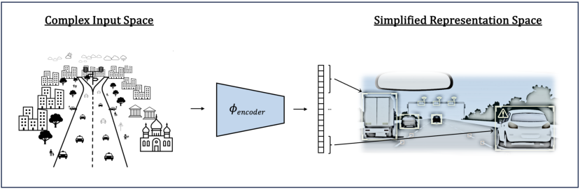
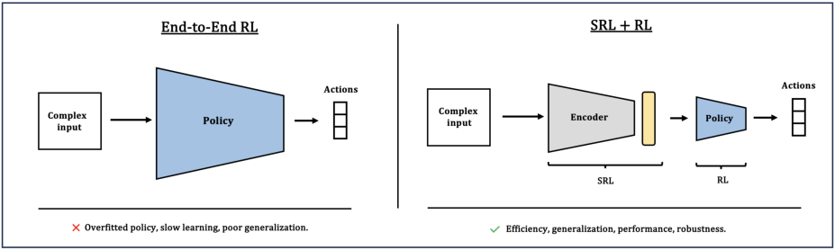
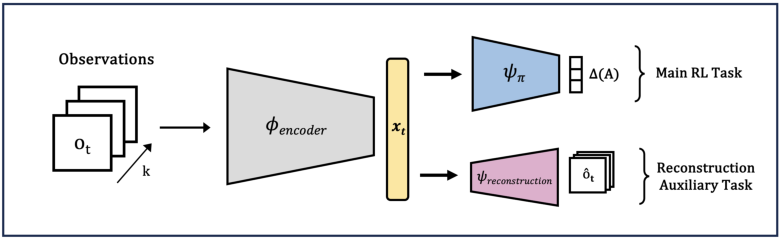
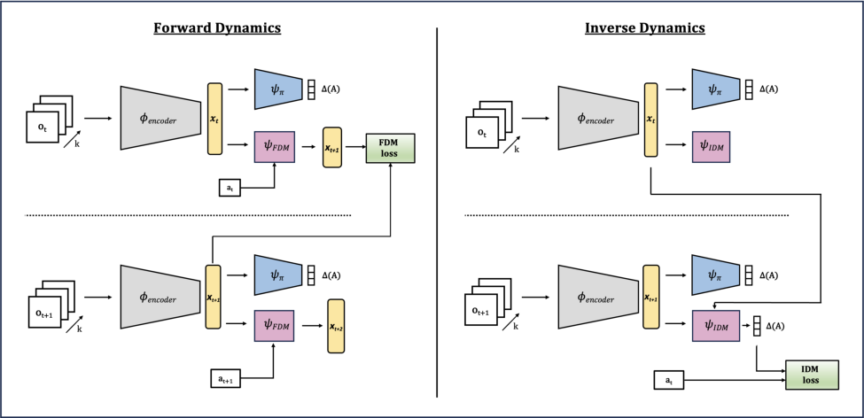
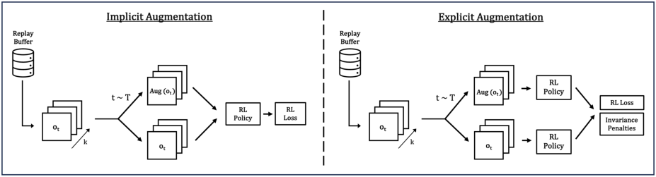
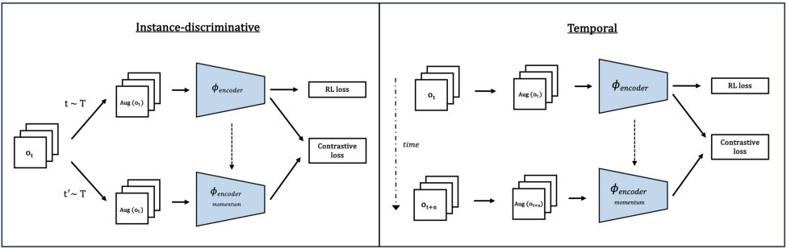
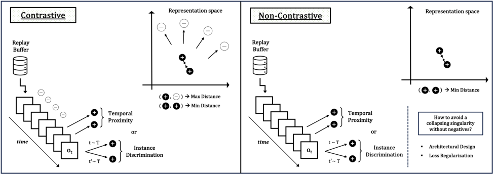
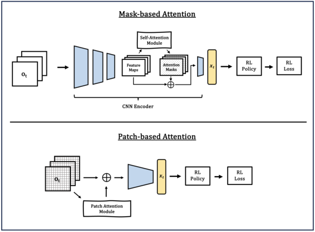

Published in Transactions on Machine Learning Research (06/2025)

## **A Survey of State Representation Learning for Deep** **Reinforcement Learning**

**Ayoub Echchahed** _ayoub.echchahed@mila.quebec_
_Mila - Québec AI Institute, Université de Montréal_

**Pablo Samuel Castro** _psc@google.com_
_Mila - Québec AI Institute, Université de Montréal_
_Google DeepMind_

**Reviewed on OpenReview:** _`[https: // openreview. net/ forum? id= gOk34vUHtz](https://openreview.net/forum?id=gOk34vUHtz)`_

**Abstract**

Representation learning methods are an important tool for addressing the challenges posed
by complex observations spaces in sequential decision making problems. Recently, many
methods have used a wide variety of types of approaches for learning meaningful state representations in reinforcement learning, allowing better sample efficiency, generalization, and
performance. This survey aims to provide a broad categorization of these methods within
a model-free online setting, exploring how they tackle the learning of state representations
differently. We categorize the methods into six main classes, detailing their mechanisms,
benefits, and limitations. Through this taxonomy, our aim is to enhance the understanding
of this field and provide a guide for new researchers. We also discuss techniques for assessing
the quality of representations, and detail relevant future directions.

**Contents**

**1** **Introduction** **4**

**2** **Problem Definition** **5**

2.1 Formalism . . . . . . . . . . . . . . . . . . . . . . . . . . . . . . . . . . . . . . . . . . . . . . . 5

2.2 Partial Observability . . . . . . . . . . . . . . . . . . . . . . . . . . . . . . . . . . . . . . . . . 5

2.3 Deep Reinforcement Learning . . . . . . . . . . . . . . . . . . . . . . . . . . . . . . . . . . . . 5

2.4 State Representation Learning . . . . . . . . . . . . . . . . . . . . . . . . . . . . . . . . . . . 6

2.5 Defining Optimal Representations . . . . . . . . . . . . . . . . . . . . . . . . . . . . . . . . . 6

**3** **Taxonomy of Methods** **8**

3.1 Overview of the Taxonomy . . . . . . . . . . . . . . . . . . . . . . . . . . . . . . . . . . . . . 8

3.2 Metric-based Methods . . . . . . . . . . . . . . . . . . . . . . . . . . . . . . . . . . . . . . . . 8

3.3 Auxiliary Tasks Methods . . . . . . . . . . . . . . . . . . . . . . . . . . . . . . . . . . . . . . . 11

3.4 Data Augmentation Methods . . . . . . . . . . . . . . . . . . . . . . . . . . . . . . . . . . . . 14

3.5 Contrastive Learning Methods . . . . . . . . . . . . . . . . . . . . . . . . . . . . . . . . . . . 16

1

Published in Transactions on Machine Learning Research (06/2025)

3.6 Non-Contrastive Learning Methods . . . . . . . . . . . . . . . . . . . . . . . . . . . . . . . . . 18

3.7 Attention-based Methods . . . . . . . . . . . . . . . . . . . . . . . . . . . . . . . . . . . . . . 20

3.8 Alternative Approaches . . . . . . . . . . . . . . . . . . . . . . . . . . . . . . . . . . . . . . . 21

3.9 Comparison and Practical Guidelines . . . . . . . . . . . . . . . . . . . . . . . . . . . . . . . . 22

**4** **Benchmarking & Evaluation** **23**

4.1 Common Evaluation Aspects . . . . . . . . . . . . . . . . . . . . . . . . . . . . . . . . . . . . 23

4.2 Assessing the Quality of Representations . . . . . . . . . . . . . . . . . . . . . . . . . . . . . . 23

**5** **Looking Beyond** **25**

5.1 Multi-Task Representation Learning . . . . . . . . . . . . . . . . . . . . . . . . . . . . . . . . 25

5.2 Offline Pre-Training of Representations . . . . . . . . . . . . . . . . . . . . . . . . . . . . . . . 26

5.3 Pre-trained Visual Representations . . . . . . . . . . . . . . . . . . . . . . . . . . . . . . . . . 26

5.4 Representations for Zero-Shot RL . . . . . . . . . . . . . . . . . . . . . . . . . . . . . . . . . . 27

5.5 Leveraging Language Models’ Prior Knowledge . . . . . . . . . . . . . . . . . . . . . . . . . . 28

5.6 Multi-Modal Representation Learning . . . . . . . . . . . . . . . . . . . . . . . . . . . . . . . 28

5.7 Other Directions . . . . . . . . . . . . . . . . . . . . . . . . . . . . . . . . . . . . . . . . . . . 28

**6** **Conclusion** **29**

2

Published in Transactions on Machine Learning Research (06/2025)

**Prologue**

**What is State Representation Learning? Why is it useful?**

In sequential decision-making systems, state representation learning (SRL) is the process of learning to
extract meaningful, task-relevant information from raw observations. In other words, these algorithms aim
to distill complex sensory inputs processed by a decision-maker into compact, structured representations,
prioritizing critical features while filtering out irrelevant ones. For example, consider a simulated autonomous
vehicle navigating a busy urban environment, encountering diverse stimuli like traffic conditions, pedestrians,
and changing weather (as shown in Fig. 1).

**Figure 1:** Simplified intuition for SRL: Raw sensory inputs from a busy environment are distilled into compressed,
task-relevant representations, enabling improved decision-making.

While the color of buildings or the type of roadside trees might be detectable, these details are irrelevant to
effective navigation. Instead, elements such as the positions and velocities of vehicles, traffic light statuses,
road signs, and pedestrian movements are essential for effective decision-making. SRL could ensure that these
crucial variables are emphasized in the learned representation, enabling policies to focus on what matters.

By reducing the complexity of the input space, SRL can enhance learning efficiency, generalization, and robustness to environmental variations (e.g., altered street layouts or weather conditions), enabling autonomous
driving agents trained on cities A and B to transfer more easily their learned control policies to cities C and
D either zero-shot or with minimal fine-tuning. However, extracting the appropriate features from highdimensional observations remains a challenging problem, often addressed manually in applications such as
robotics and autonomous driving. SRL methods seek to automate this process, producing decision-making
systems that are scalable, efficient, and adaptive.

3

Published in Transactions on Machine Learning Research (06/2025)

**1** **Introduction**

The use of deep reinforcement learning (DRL) for complex control environments has several challenges, including the processing of large high-dimensional observation spaces. This problem, commonly referred to
as the “state-space explosion”, imposes severe limitations on the efficacy of traditional end-to-end RL approaches, which learn actions or value functions directly from raw sensory inputs, such as pixel observations.
As environments grow increasingly complex, these end-to-end methods demonstrate progressively worse data
efficiency and generalization, even in response to minor environmental changes. Addressing these limitations
is therefore essential for scaling RL to real problems that inherently involve complex and noisy input spaces.

In response to these challenges, recent research has focused on decoupling representation learning from policy
learning, treating them as two distinct problems. This strategy has proven effective for managing complex
observations by transforming raw inputs into structured representations that retain essential information
for decision-making while discarding irrelevant details. By improving data efficiency, state representation
learning (SRL) accelerates training, enhances generalization across tasks, and strengthens DRL robustness.

**Figure 2:** Comparison of End-to-End RL (left) and SRL+RL (right). End-to-end directly maps high-dimensional
inputs to actions, while SRL separates representation learning and policy learning.

**Motivation.** In recent years, there has been a growth in methods that integrate improved representation
learning into DRL, using various approaches. However, many works present inconsistent structuring and
categorization of these approaches in their related work sections, making it challenging to obtain a clear and
comprehensive understanding of the field. To our knowledge, past surveys provide valuable information but
either do not cover the latest developments or focus exclusively on specific SRL classes. Many also group
together approaches that rely on fundamentally different principles, blurring key distinctions between them.
(Lesort et al., 2018; Ni et al., 2024; Böhmer et al., 2015; de Bruin et al., 2018; Botteghi et al., 2022)

This survey therefore builds on those preceding works by providing an updated and structured analysis of
the different approaches in state representation learning for DRL, organizing them based on their principles
and effectiveness in different scenarios. Through a detailed taxonomy, we analyze the inner-workings of
these classes, highlighting their potential to improve the performance, generalization, and sample efficiency
of deep-RL agents. We also explore different ways of evaluating the quality of learned state representations,
and discuss promising directions for the field. Overall, this survey can serve as a good resource for researchers
and practitioners looking to familiarize themselves with this field.

**Organization.** This work is structured as follows: Section 2 introduces the foundational concepts of state
representation learning (SRL) within the deep reinforcement learning (DRL) framework. It defines the
problem, objectives, and the characteristics of effective state representations, providing a formal basis for
understanding subsequent sections. Section 3 presents the core taxonomy of SRL methods, categorizing
them into six primary classes, while elaborating on their mechanisms and highlighting notable work from
the literature. Section 4 addresses the critical aspect of evaluation, discussing benchmarks and metrics used
to assess the quality and effectiveness of state representations, including their impact on sample efficiency,
generalization, and robustness. Lastly, Section 5 explores promising directions for advancing SRL in DRL,
such as multi-task learning, leveraging pre-trained visual models, and integrating multi-modal inputs.

4

Published in Transactions on Machine Learning Research (06/2025)

**2** **Problem Definition**

**2.1** **Formalism**

Reinforcement Learning (RL) is typically modeled as a Markov Decision Process (MDP), characterized by
the tuple _⟨S, A, P, R, γ⟩_ . Here, _S_ denotes the state space, and _A_ denotes the action space. The transition
probability function _P_ : _S × A →_ ∆( _S_ ), where ∆( _S_ ) denotes the space of distributions over _S_, defines the
probability _P_ ( _s_ _[′]_ _|s, a_ ) of transitioning from state _s_ to state _s_ _[′]_ given action _a_, representing the environment
dynamics. The function _R_ : _S × A →_ R specifies the immediate reward _R_ ( _s, a_ ) received after taking action
_a_ from state _s_, providing feedback on the action taken.

The objective of an RL agent is to learn a policy _π_ : _S →_ ∆( _A_ ) that maximizes the expected cumulative
discounted reward. Using _π_, the agent progressively generates experiences ( _s, a, r, s_ _[′]_ ), which can be organized
into a trajectory _τ_ . For each trajectory _τ_, the return _Gt_ represents the total accumulated reward from time
step _t_ onwards. It is expressed as _Gt_ = [�] _[∞]_ _k_ =0 _[γ][k][r][t]_ [+] _[k]_ [, where] _[ γ][ ∈]_ [[0] _[,]_ [ 1) is the discount factor that prioritizes]
immediate rewards over future ones. To evaluate how good a particular state or state-action pair is, we
define value functions. The state value function _V_ _[π]_ ( _s_ ) under policy _π_ is the expected return starting from
state _s_ and following policy _π_, given by _V_ _[π]_ ( _s_ ) = E[ _Gt|st_ = _s_ ]. Similarly, the action-value function _Q_ _[π]_ ( _s, a_ )
represents the expected return starting from state _s_, taking action _a_, and subsequently following policy _π_,
defined as _Q_ _[π]_ ( _s, a_ ) = E[ _Gt|st_ = _s, at_ = _a_ ]. Therefore, the objective of the agent can now be expressed as
finding an optimal policy _π_ _[∗]_ that maximizes _Q_ _[π]_ ( _s, a_ ).

**2.2** **Partial Observability**

In many RL settings, full observability is rare. For example, in robotics, sensors might not capture all relevant
state factors for optimal decision making in one time-step of data. A POMDP, or partially observable MDP,
generalizes the notion of a MDP by accounting for situations where the agent does not have direct access
to the full state _s ∈S_ of the environment, hence needing to rely on past observations to infer the current
state. Recurrent neural networks (RNNs) are commonly employed to address this partial observability issue,
leveraging their hidden state to retain and process information from previous time steps. Another way
to handle this is by concatenating the last _n_ observations ( _ot, ot−_ 1 _, ..., ot−n_ +1) to approximate a sufficient
statistic for decision-making, thus mitigating the effects of partial observability. For example, agents trained
on the ALE benchmark (Bellemare et al., 2013) often employ this technique, known as ‘frame stacking’.

In this survey, we adopt a POMDP framework defined as _M_ = _⟨S, O, A, P, R, γ⟩_, where _S_ is the state
space and _O_ is the observation space. An observation function, _O_ : _S →O_, maps underlying true state
to observations, indicating that agents receives only a partial, potentially noisy summary of states. This
function establishes the connection between the complete state information and the limited data available
to the agent. For an MDP, this function becomes the identity mapping, meaning that each state is fully
observable. The transition function _P_ and the reward function _R_ are still defined over states, as in an MDP.
In this setting, an end-to-end policy _π_ : _O →_ ∆( _A_ ) maps observations directly to a distribution over actions.
This framework is chosen because agents typically do not have full access to the states and must often rely
on partial high-dimensional inputs. Other relevant but unaddressed frameworks include Contextual Decision
Processes (Krishnamurthy et al., 2016; Jiang et al., 2017) and Block MDPs (Du et al., 2019).

**2.3** **Deep Reinforcement Learning**

Deep reinforcement learning (DRL) differs from traditional RL by utilizing deep neural networks to approximate value functions (or policies), either from high-dimensional inputs, or from encoded latent states. This
becomes desirable when the state space is large or continuous, which is not well-suited for methods that rely
on representing state-action pairs individually in a lookup table, known as tabular reinforcement learning.
DRL methods can be broadly categorized into three kind of approaches: value-based, policy-based, and
actor-critic methods. Value-based methods, such as Deep Q-Networks (DQN) (Mnih et al., 2013), use a neural network to approximate the action-value function _Q_ ( _s, a_ ). Policy-based methods, such as REINFORCE
(Williams, 1992), directly parameterize the policy _π_ ( _a|s_ ; _θ_ ) and optimize it using gradient ascent on the

5

Published in Transactions on Machine Learning Research (06/2025)

expected cumulative reward. Actor-Critic methods combine both value-based and policy-based approaches
as they maintain two networks: the actor, which updates a policy _π_ ( _a|s_ ; _θ_ ), and the critic, which evaluates
a value function _Q_ ( _s, a_ ) or _V_ ( _s_ ). This combination enhances stability and efficiency, making it widely used.

**2.4** **State Representation Learning**

The traditional end-to-end approach, which directly maps observations to actions, led to impressive results
(Mnih et al., 2013). However, this approach becomes increasingly challenging as the complexity of the
environment increases, which is why more efforts are directed towards learning better representations. Representation learning by itself can be defined as the process of automatically discovering features from raw
data that are most useful for a task (Bengio et al., 2012). Although representation learning for DRL can be
divided into state and action representation learning, the former will be the focus of this survey.

**Problem:** We define the objective of state representation learning (SRL) for reinforcement learning (RL)
as learning a representation function _ϕ_ _[k]_ : _O_ 0 _× O_ 1 _× · · · × Ok →X_, parameterized by _θϕ_, which maps
_k_ -step observation sequences to a representation space _X_, thereby allowing us to define policies Π _X_ over this
reduced space. This encoder enables either a policy network _ψπ_ to compute actions _at_ = _ψπ_ ( _xt_ ), or a value
network _ψV_ to compute values _vt_ = _ψV_ ( _xt_ ), based on the representation _xt_ = _ϕ_ ( _ot_ ), instead of directly using
high-dimensional observations. The representation _xt_ is a vector in R _[d]_, where _d_ is the dimensionality of _X_ .

**Figure 3:** Illustration of State Representation Learning (SRL) for RL, where a parametrized transformation _ϕ_ is
learned, mapping sequences of observations to representations. Two configurations are presented depending if a
value-based RL approach is used (right) or a policy-based one (left).

However, not all representation functions are useful to obtain; the goal is to learn an encoder _ϕ_ that captures
the essential characteristics of effective state representations, as reviewed in the next section. Learning a
good encoder simplifies the input space into a compact and relevant representation _xt_, thereby (1) improving
sample efficiency and performance by facilitating the function approximation process performed by the
policy/value network; (2) enhancing generalization as learning a policy/value network from representations
avoids the overfitting issues seen with high dimensional, unstructured, and noisy observation spaces.

In the presented taxonomy, the focus will be mostly on methods that learn state representations within a
model-free online setting, where agents learn representations and policies in real-time through interactions
with the environment without using an explicit model of the environment for taking actions. This differs
from model-based RL, which involves learning a model of the environment’s dynamics that is used for
planning, enabling higher sample-efficiency at the cost of higher complexity. Section 5 also explores the
offline pre-training of representations. Finally, Table 1 provides a structured overview of key SRL settings.

**2.5** **Defining Optimal Representations**

An optimal representation can be defined by its ability to efficiently support policy learning for a set of downstream tasks. The learned space _X_ should be constrained to a low dimensionality, while remaining sufficiently
informative to enable the learning of an optimal policy (or value function) with limited-capacity function
approximators. If _X_ has too much information, it can slow down the learning process and hinder convergence
to the optimal policy. Alternatively, a space with insufficient information will prevent convergence to the
optimal policy (Abel, 2022). Hence _X_ ideally balances well information capacity and simplicity.

6

Published in Transactions on Machine Learning Research (06/2025)

|Setting|Col2|Description|
|---|---|---|
|Pre-trained|Joint-training|Representations are learned either before RL begins or si- multaneously with the RL training objective.|
|Online|Ofine|Learning occurs in real-time through interactions with the environment or from pre-collected datasets.|
|Coupled|Decoupled|Encoder parameters are optimized jointly with policy and/or value objectives or independently of them.|
|Reward-based|Reward-free|Representations are infuenced by task rewards or focus on environment dynamics and visual features.|
|Single-task|Multi-task|Representations are learned for a specifc task or shared across multiple tasks to capture common structures.|
|Model-free|Model-based|Representations are directly used for decision-making or integrated into a world model for planning.|

**Table 1:** Overview of key settings when learning state representations for DRL.

**Structure:** The learned representation space should be structured to encode task-relevant information while
remaining invariant to noise and distractions. This means that points within a neighborhood around a representation _xt_ should exhibit a high degree of task-relevant similarity, which gradually diminishes as the
distance from this point increases. These similarities can be encoded in the representation space using information or distances derived from observation features, environment dynamics, rewards, etc. Additionally,
the encoder should remain invariant to noise, distractions, or geometric transformations that do not alter
the true underlying state of the agent.

**Continuity:** Good latent structure should ensure strong Lipschitz continuity of the value function across
nearby representations (Le Lan et al., 2021). In other words, points that are close in the latent space should
produce similar value distribution predictions, even if they are distant in the input space. This continuity
simplifies the function approximation process performed by the value network _ψV_ and promotes better
generalization to unseen but nearby states. This similarly applies to the policy network _ψπ_, ensuring that
changes in the action distribution occur smoothly within _X_ .

**Sparsity:** Enforcing sparsity constraints on the representations _xt_ can allow the identification of the most
relevant aspects of high-dimensional observations as it encourages the inputs to be well-described by a small
subset of features at any given time. This enhances computational efficiency by reducing the number of
active features, leading to simpler representations. It also helps avoid overfitting by focusing on the most
relevant features, promoting better generalization. Finally, it improves interpretability by making it easier
to understand which features drive the decision-making process of agents.

**Figure 4:** Illustration of some optimal state representation properties. The left section demonstrates invariance to
noise, distractions, and masking in the representation space, preserving task-relevant information. The right section
illustrates disentanglement, where changes in individual factors ideally lead to localized latent impacts.

7

Published in Transactions on Machine Learning Research (06/2025)

Previous works have sought to define characteristics of effective representations and abstractions for RL.
According to Wang et al. (2024b), optimal representations should exhibit high capacity, efficiency, and robustness. Abel (2022) identifies three essential criteria for state abstractions in RL: efficient decision-making,
solution quality preservation, and ease of construction. These criteria stress the importance of balancing
compression with performance to facilitate effective learning and planning in complex environments. Other
works that discuss characteristics of good representations for RL include (Böhmer et al., 2015), (Lesort et al.,
2018), and (Botteghi et al., 2022). Moreover, definitions of optimal representations in the broader context
of Self-Supervised Learning (SSL) can often overlap with those needed for control, making them applicable
to reinforcement learning as well.

**3** **Taxonomy of Methods**

**3.1** **Overview of the Taxonomy**

We categorize the representation learning methods into six distinct classes, which are presented in table 2.
For each class, we provide a definition, details, benefits, limitations, and some examples of methods. While
there are likely other methods in each class, the goal is not to be exhaustive, but rather to focus on the
classes themselves. Additionally, some methods may be hybrid, combining techniques from multiple classes.

**Class** **Description**

Metric-based Shape the representation space through a task-relevant distance metric between embeddings. They enhance generalization and efficiency by abstracting
states with similar information, reducing complexity.

Auxiliary Tasks Enhance the primary RL task with other simultaneous predictions that indirectly shape representations. These require additional parameters, but can
provide accelerated learning on the main task.

Augmentation Leverage data augmentation for learning invariances to geometric and photometric transformations of observations. They do not directly learn representations, but enhance efficiency and generalization.

Contrastive Shape the representation space by learning separate representations for different observations, and similar ones for related inputs. Temporal proximity
and/or visual transformations can define similarities.

Non-Contrastive Construct their representation space by only minimizing the distance between the representations of similar observations. Unlike related contrastive
approaches, no negative pairs are used during training.

Attention-based Learn attention masks (Bahdanau et al., 2015) for computing scores that
highlight important features of the input, helping agents disregard irrelevant
details and increase the interpretability of decision-making.

**Table 2:** Overview of the classes presented in this taxonomy.

**3.2** **Metric-based Methods**

**Definition:** Metric-based methods aim to structure the embedding space by using a metric that captures
task-relevant similarities between state representations. By mapping functionally equivalent states to similar
points in the latent space, these methods can enhance sample efficiency and improve policy learning. For
instance, if two different visual observations in a game lead to the same downstream behavior and similar
rewards, they can be mapped to the same latent region.

8

Published in Transactions on Machine Learning Research (06/2025)

**Details:** The observation encoder, denoted as _ϕθ_ : _O →_ R _[n]_ with parameters _θ_, maps observations to an
embedding space _X_ where distances _d_ [ˆ] ( _ϕθ_ ( _oi_ ) _, ϕθ_ ( _oj_ )) reflect some task-relevant similarities. For example,
the distance metric _d_ [ˆ] could correspond to the _L_ 2 norm, while the metric could be bisimulation (Ferns et al.,
2012), which is introduced below. The representation learning objective can then be formalized as minimizing
the expected squared difference between the latent distance _d_ [ˆ] ( _ϕθ_ ( _oi_ ) _, ϕθ_ ( _oj_ )) and a metric _d_ _[π]_ ( _xi, xj_ ) defined
over representations (Chen & Pan, 2022), as illustrated in the following equation:

ˆ 2 [�]
_L_ ( _ϕθ_ ) = E _d_ ( _ϕθ_ ( _oi_ ) _, ϕθ_ ( _oj_ )) _−_ _dπ_ ( _xi, xj_ ) _._ (1)
�� �

**Figure 5:** Metric-based methods shape the representation space to capture task-relevant information. Representations with similar outcomes (e.g., good basketball trajectory) have minimal distance _d_ 1, while those with different
outcomes (e.g., wrong basketball trajectory) have a larger distance _d_ 2, hence _d_ 1 _≪_ _d_ 2.

**Benefits:** Metric-based methods can offer strong theoretical guarantees by bounding the differences in value
function outputs for pairs of embedded states, ensuring that states close in the metric space exhibit similar
optimal behaviors. This is formalized as _|V_ _[∗]_ ( _xi_ ) _−_ _V_ _[∗]_ ( _xj_ ) _| ≤_ _d_ ( _xi, xj_ ), which is key to improving sample
efficiency and generalization, as it allows the agent to treat behaviorally equivalent states similarly. Additionally, these methods leverage task-relevant MDP information, such as rewards and transition dynamics,
to shape the latent state space, making them particularly effective in abstracting away irrelevant visual
distractions in more complex environments (Zhang et al., 2021). Additionally, some metric-based methods
avoid training extra parameters, providing computational efficiency (Castro et al., 2021).

**Limitations:** The operations involved in certain metrics, such as the Wasserstein distance used in bisimulation, are known to be computationally challenging (Castro, 2020). This can lead to the need for approximations or relaxations, which can weaken the original theoretical guarantees (Chen & Pan, 2022). Furthermore,
these methods typically require access to task-specific MDP information, which may not always be readily
available or easy to obtain in real-world settings. In fact, even if rewards are available, real-world settings
are often characterized by sparse reward structures, which can create latent instability or even embedding
collapses in metric-based methods. Embedding explosion is another issue that can affect these methods
(Kemertas & Aumentado-Armstrong, 2021). Finally, these methods are impacted by the non-stationary
nature of the policy during training, which causes continuous updates to the embedding space and metrics,
therefore favoring latent instabilities and hindering consistent performance compared to some other classes.

**Categorization:** Various metrics can be defined to quantify the similarity between states, each influencing
how state representations are learned and aggregated.

**a) Bisimulation Metrics**

Bisimulation metrics, originally introduced for MDPs by Ferns et al. (2012), offer a way to quantify behavioral
similarity between states. By measuring distances between states based on differences in both their rewards

9

Published in Transactions on Machine Learning Research (06/2025)

and transition dynamics, it allows state aggregation while preserving crucial information needed for effective
policy learning. Formally, the bisimulation metric _d_ ( _xi, xj_ ) between latent states _xi_ and _xj_ is updated using
the following recursive rule:

_Tk_ ( _d_ )( _xi, xj_ ) = max (2)
_a∈A_ [[(1] _[ −]_ _[c]_ [)] _[ · |][R]_ [(] _[x][i][, a]_ [)] _[ −]_ _[R]_ [(] _[x][j][, a]_ [)] _[|]_ [ +] _[ c][ ·][ W][d]_ [(] _[P]_ [(] _[·|][x][i][, a]_ [)] _[, P]_ [(] _[·|][x][j][, a]_ [))]] _[ .]_

In this formulation, _Tk_ ( _d_ ) represents an operator that updates the distance function _d_ ( _xi, xj_ ), where _c ∈_ [0 _,_ 1]
is a parameter controlling the balance between the importance of reward differences and transition dynamics.
In practice, it is common to set _c_ = _γ_, which corresponds to the discount factor in RL, without using (1 _−_ _c_ ).
The term _Wd_ ( _P_ ( _·|xi, a_ ) _, P_ ( _·|xj, a_ )) represents the Wasserstein distance (or Kantorovich distance) between
the next-state distributions induced by the transitions from states _xi_ and _xj_ under action _a_ .

Intuitively, _Wd_ can be seen as quantifying the distance between two probability distributions, which corresponds in this case to the next-state distributions of ( _xi, xj_ ). More precisely, the Wasserstein distance
is known to measure the cost of transporting one probability distribution to another, and is formalized as
finding an optimal coupling between two probability distributions that minimises a notion of transport cost
associated with the base metric _d_ (Villani, 2008). By iteratively applying the operator _Tk_ ( _d_ ), the bisimulation distance _d_ ( _xi, xj_ ) converges to a fixed point _d_ _[∗]_, yielding the final metric between states that minimizes
the loss. This iterative process that progressively shapes the representation space ensures that states with
similar rewards and transition dynamics are mapped closer in the representation space, while dissimilar
states are mapped further apart. Convergence details and formalism can be found in Castro et al. (2021).

**Methods:** Several methods integrate the bisimulation metric for learning more compact and generalizable
representations in reinforcement learning. DBC (Zhang et al., 2021) uses the bisimulation metric to map
behaviorally similar states closer in latent space, improving robustness to distractions, but is susceptible to
embedding explosions/collapses, and relies on the assumption of Gaussian transitions for metric computation.
Kemertas & Aumentado-Armstrong (2021) address these issues by (1) adding a norm constraint to prevent
embedding explosion and (2) using intrinsic rewards plus latent space regularization through the learning
of an Inverse Dynamics Model (IDM) as an auxiliary task to prevent embedding collapse. The second
point is particularly relevant in sparse or near-constant reward settings, where early similar trajectories
can incorrectly lead the encoder to assume bisimilarity. A more recent method tackling the sparse-reward
challenge in bisimulation-based approaches was introduced by Chen et al. (2024b). Castro et al. (2021)
resolves some computational limitations of traditional bisimulation metrics with a scalable, sample-based
approach that removes the need for assumptions like Gaussian or deterministic transitions (Zhang et al.,
2021) (Castro, 2020), and explicitly learns state similarity without requiring additional network parameters.

**b) Lax Bisimulation Metric**

The lax bisimulation metric (Taylor et al., 2008) extends this concept to state-action equivalence by relaxing
the requirement for exact action matching when comparing states, allowing both MDPs to have different
action sets, thus providing greater flexibility. For example, Rezaei-Shoshtari et al. (2022) demonstrated
the use of this metric for representation learning, which led to improved performance when learning from
pixel observations. Le Lan et al. (2021)’s work also highlights why the lax bisimulation metric can provide
continuity advantages over the original bisimulation metric.

**c) Related Metrics**

Several alternative metrics have been proposed to shape the representation space of RL agents. For instance,
a temporal distance metric was used in Florensa et al. (2019) and Park et al. (2024b), which captures the
minimum number of time steps required to transition between states in a goal-conditioned value-based
setting. In Rudolph et al. (2024), their action-bisimulation metric replaces the reward-based similarity term
of traditional bisimulation with a control-relevant term obtained by training an IDM model, making the
approach reward-free. Agarwal et al. (2021a) introduced the Policy Similarity Metric (PSM), which replaces
the absolute reward difference in bisimulation with a probability pseudometric between policies and has been
shown to improve multi-task generalization.

10

Published in Transactions on Machine Learning Research (06/2025)

**d) Impact of distance** _d_ [ˆ] **on Representations**

The choice of how distances between representations are measured often influences the actual nature of the
learned representations. For example, the L1 distance, based on absolute differences, promotes sparsity by
applying a constant penalty that drives smaller values toward zero, emphasizing distinct features. This can
be useful when only a few key features matter in distinguishing states. In contrast, the L2 distance, which
uses squared differences, promotes smoother representations by spreading the error across all components,
reducing large individual components while retaining contributions from smaller ones. This is more effective
when information from all features is relevant, even if some contributions are minor. Some methods instead
use orientation-based metrics, such as cosine similarity or angular distance, which can be advantageous in
high-dimensional spaces where direction is more significant than magnitude, or where specific properties,
such as non-zero self-distances, are desirable (Castro et al., 2021). They can however come with drawbacks,
such as embedding norm growth and convergence slowdowns when optimizing cosine similarity, limiting
effectiveness without normalization (Draganov et al., 2024). See Table 3 for precise distances formalism.

|Distance dˆ|Formula|Description|
|---|---|---|
|L1 (Manhattan)|P_n_ _i_=1 _|x_(_i_) _t_ _−x_(_i_) _t′ |_|Sum of absolute diferences between corre- sponding vector components.|
|L2 (Euclidean)|rP_n_ _i_=1 ~~~~ _x_(_i_) _t_ _−x_(_i_) _t′_ ~~~~2|Square root of the sum of squared difer- ences between corresponding vector compo- nents, emphasizing larger deviations.|
|Angular distance|arccos ~~~~ _xt·xt′_ _∥xt∥∥xt′ ∥_ ~~~~ _π_|Normalized angle between vectors, ranging from 0 (identical direction) to 1 (opposite di- rection), capturing rotational diferences.|
|Cosine distance|_xt·xt′_ _∥xt∥∥xt′∥_|Cosine similarity of vectors, measuring orien- tation alignment, with values ranging from -1 (opposed) to 1 (aligned).|

**Table 3:** Distance measures _d_ [ˆ] used to structure the representation space by quantifying similarities between state
embeddings. Each metric defines how distances are measured, but also influences key latent properties.

**3.3** **Auxiliary Tasks Methods**

**Definition:** This category is composed of methods that enhance the primary learning task (RL) by having
agents simultaneously predict additional environment-related outputs. This is done by splitting the representation part of an agent into _n_ different heads, each with their own set of weights and dedicated task.
During training, the errors from these heads are propagated back to the shared encoder _ϕ_, guiding the
learning in conjunction with the main objective. The role of these predictions is to help agents enrich their
representations with additional auxiliary signals.

**Figure 6:** The representation _xt_ of an RL agent is used to make additional predictions on auxiliary task function(s).
These predictions are used to improve the representation itself.

11

Published in Transactions on Machine Learning Research (06/2025)

**Details:** Let _L_ primary( _θ_ ) denote the loss associated with the primary RL objective. Auxiliary tasks are defined as additional functions _ψauxi_ ( _xt_ ) that, with their own set of parameters _θAux_ = _{θ_ aux1 _, θ_ aux2 _, ..., θ_ aux _n}_,
process the representation _xt_ to output a set of real values with task-dependent dimensions. The loss for
each auxiliary task _i_ is represented as _Li_ ( _θ_ aux _i_ ), and the overall auxiliary task loss is the sum of all task
losses. The combined objective is shown below, with weights _λi_ balancing primary and auxiliary tasks.

_L_ method( _θ, θ_ Aux) = _L_ primary( _θ_ ) +

_n_
� _λiLi_ ( _θ_ aux _i_ ) (3)

_i_ =1

**Precision:** We define auxiliary tasks as something different than what is called auxiliary losses in the
RL literature. Auxiliary losses refers to any loss optimized jointly with the main RL objective, which is
something done in methods belonging to most classes here. However, we specifically define auxiliary tasks as
additional predictions made during training, using the representation _xt_ as input, which indirectly enhance
the quality of _xt_ . By definition, those supplementary tasks require additional parameters for each task-head,
unlike auxiliary losses.

**Benefits:** Auxiliary tasks for RL can enhance the learning process by utilizing additional supervised signals
from the same experiences. When faced with environments with sparse rewards, auxiliary tasks can still
provide some degree of learning signals for shaping the representation, which increases the learning efficiency
of an agent. They can also serve as regularizers, enhancing generalization and reducing overfitting during
learning. Finally, they can promote better exploration by guiding the agent toward states that provide more
informative signals for the auxiliary tasks.

**Limitations:** However, a downside of using auxiliary tasks to improve representations is the lack of theoretical guarantees when it comes to whether it is actually benefiting the learning process of the main RL
objective or not (Du et al., 2020). Defining precisely what makes a good auxiliary task is also in itself a hard
problem (Lyle et al., 2021) (Rafiee et al., 2022). Finally, choosing the auxiliary weight(s) that balance(s) the
importance of the auxiliary task(s) compared to the main task requires the right tuning of hyper-parameters.

**Categorization:** In the next sections, we explore the inner mechanisms of some class of auxiliary tasks that
are commonly employed to learn good state representations in reinforcement learning.

**a) Reconstruction-based Methods**

**Definition:** These methods aim to improve state representations by learning to reconstruct original observations _ot_ using a decoder ˆ _ot_ = _ψrecon_ ( _xt_ ) that takes as input the encoded representations _xt_ = _ϕ_ ( _ot_ ).
This reconstruction process can be performed using simple autoencoders (AE), where the objective is to
minimize the reconstruction error between the original observation _ot_ and its predicted reconstruction ˆ _ot_ .
Additionally, it can be achieved using variational autoencoders (VAEs) (Kingma & Welling, 2014), where
additional regularization encourages latent variables to follow a predefined distribution (e.g. Gaussian),
improving generalization and disentanglement of representations.

**Figure 7:** Reconstruction as an auxiliary task: The encoder learns compact latent representations by ensuring that
the original observation can be reconstructed from the representation.

12

Published in Transactions on Machine Learning Research (06/2025)

**Purpose:** These methods enforce the latent space to capture the essential features needed for accurate
reconstruction, promoting the learning of compact, denoised representations. This helps the agent to focus on key task-relevant information, improving generalization across environments and enhancing sample
efficiency in high-dimensional spaces. Mask-based latent reconstruction avoids the need to reconstruct full
observations by focusing the reconstruction only on latent variables, thereby discarding irrelevant features
from observational space.

**Failure Cases:** A common failure arises when reconstructing observations that contain significant irrelevant
noise or distractions. In such cases, especially when task-relevant features occupy only a small portion of
the observation, the model may learn to preserve unnecessary details, leading to poor state representations
that degrade learning performance.

**Disentangled Representations:** Reconstruction-based methods can also be used to achieve disentangled
representations, where the latent space _X_ is ideally structured into independent subspaces _Xi_, each capturing
a distinct factor of variation _vi_ from the observation space. Methods like _β_ -VAE (Higgins et al., 2016) enforce
stronger constraints on the latent space than regular VAEs in order to promote disentanglement, ensuring
that changes in one factor (e.g., object color) do not affect others (e.g., arm position), thus enhancing the
robustness and adaptability of learned representations in complex environments. More related methods
include (Higgins et al., 2017) (Thomas et al., 2018) (Kabra et al., 2021) (Dunion et al., 2023) (Dunion et al.,
2024) (Dunion & Albrecht, 2024).

**b) Dynamics Modeling Methods**

**Definition:** Dynamics modeling methods use latent forward and inverse models as auxiliary tasks to implicitly improve representations. A latent forward dynamic model (FDM) predicts the next representation
_x_ ˆ _t_ +1 = _f_ ( _xt, at_ ; _ϕ_ fwd) from the current representation _xt_ and action _at_, while a latent inverse dynamic model
(IDM) predicts the action ˆ _at_ = _g_ ( _xt, xt_ +1; _ϕ_ inv) that caused a transition.

**Figure 8:** Dynamics modeling as an auxiliary task: Forward Dynamics Models predict future representation(s) based
on the current representation and action, capturing environment dynamics. Inverse Dynamics Models predict action
that caused transitions between representations, emphasizing controllable features.

**Purpose:** FDMs help the agent learn a representation that captures environment dynamics, ensuring that
the latent space encodes the essential transition information needed to predict future states. IDMs ensure
that the representations encode information to recover the action that led to the state change, focusing on
controllable aspects of the environment.

13

Published in Transactions on Machine Learning Research (06/2025)

**Failure Case:** A failure case of using FDMs occurs when the transition model lacks a grounding objective, such as reward prediction (Tomar et al., 2021). In such cases, the model can collapse by mapping
all observations to the same representation, minimizing the loss trivially, and failing to learn meaningful
representations, especially if the critic’s signal becomes noisy due to distractions.

**k-step predictions:** Using k-step predictions, where the model predicts multiple future representations
instead of just one at each step, can further enhance the representation by capturing longer-term dependencies
and improving performance across time (Schwarzer et al., 2020). For IDMs, predicting initial actions from
trajectories _ot_ to _ot_ + _k_ can also ensures positive control properties (Lamb et al., 2023; Islam et al., 2023a).

**Hierarchical Models:** McInroe et al. recently introduced a hierarchical approach utilizing multiple latent forward models (FDMs) to capture environment dynamics at varying temporal scales. Each level in
the hierarchy learns a distinct FDM that predicts the representation _xt_ + _k_ k-steps ahead based on previous representations and actions. Additionally, a learned communication module facilitates the sharing of
higher-level information with lower-level modules. When compared on a suite of popular control tasks, it
achieves noticeable performance and efficiency gains over baseline approaches. Importantly, this differs from
predicting all _k_ next representations _xt_ +1 to _xt_ + _k_ .

**c) More Auxiliary Tasks**

A wide variety of additional predictions can be used to support representation learning in RL. Here, we
highlight a few additional examples. **(i)** Reward Prediction (Yang et al., 2022) (Zhou et al., 2023) involves
predicting the immediate reward _rt_ based on the current state _xt_ and action _at_, guiding the agent to
encode task-relevant features essential for value estimation. This task is especially useful in non-sparse
reward settings, where it serves as a discriminator of critical information and benefits from being combined
with latent modeling to capture relevant dynamics. **(ii)** Random General Value Functions (GVFs) (Zheng
et al., 2021) predict random features of observations based on random actions, generating varied signals
that enhance state representations, even when the main RL task is detached through a stop-gradient. **(iii)**
Termination Prediction (Kartal et al., 2019) anticipates whether a state will lead to the end of an episode,
helping the agent recognize conditions for task completion and improving decisions around critical states.
**(iv)** Multi-Horizon Value Prediction (Fedus et al., 2019) involves predicting value functions over multiple
future horizons, allowing the agent to account for both short and long-term consequences, supporting more
balanced and informed decision-making. **(v)** Proto-Value Networks (Farebrother et al., 2023) help agents
learn structured representations by predicting future rewards under random conditions.

**3.4** **Data Augmentation Methods**

**Definition:** Data augmentation (DA) methods represent a class of techniques that enhance sample-efficiency
and generalization capabilities of RL agents through the manipulation of their observations. By applying
geometric and photometric transformations to their inputs, such as rotations, translations, and color shifts,
these methods can enforce invariance to irrelevant visual changes.

**Details:** These methods normally introduce an observation transformation function _T_ that generates augmented observations ˜ _o_ based on the original observations _o_, where ˜ _o_ = _T_ ( _o_ ). The transformation _T_ is chosen
such that it preserves the essential task-relevant properties of _o_ . A form of explicit and/or implicit regularization is then used to enforce some degree of Q-invariance and/or _π_ -invariance. Formally, the invariance of
a Q-function with respect to a transformation _fT_ is defined as _Q_ ( _s, a_ ) = _Q_ ( _fT_ ( _s_ ) _, a_ ) for all _s ∈_ _S, a ∈_ _A_ .
Similarly, a policy _π_ is considered invariant to _fT_ if _π_ ( _a | s_ ) = _π_ ( _a | fT_ ( _s_ )) for all _s ∈_ _S, a ∈_ _A_ .

Two type of strategies can be used to enforce invariance: **(1)** Implicit regularization applies transformations
directly to the input data during the training process, using both original and transformed observations to
train the network to generalize across these variations (Hu et al., 2024); **(2)** Explicit regularization, on the
other hand, achieves invariance by modifying the loss functions to ensure that both the policy (actor) and
the value estimates (critic) remain unchanged by the transformations _fT_ . This is done by adding terms in
the loss functions that penalize discrepancies between outputs, such as Q-values or action distributions, for
both original and transformed inputs.

14

Published in Transactions on Machine Learning Research (06/2025)

**Figure 9:** Implicit DA (left) augments observations directly used to train the policy and/or value network, promoting
robustness through diversity without explicit constraints. Explicit DA (right) augments observations supplemented
by regularization penalties that enforce _Q_ / _π_ invariances.

**Benefits:** DA-based methods enhance sample efficiency by diversifying training samples, enabling robust
policy learning with fewer interactions and reducing overfitting. They improve generalization by simulating
visual variations, reducing sensitivity to distribution shifts and aiding adaptation to new settings. Crucially,
while remaining simple and effective, the usage of DA was shown to preserve learning plasticity (Ma et al.,
2024), an essential aspect with non-stationary objectives.

**Limitations:** These approaches don’t directly learn or structure the representation space for incorporating
task-specific information, making them fundamentally limited. Additionally, strong augmentations can introduce noise that disrupts training (e.g., high variance in Q-value estimates), and augmentations non-adapted
to a task may affect the learning of critical features.

**Augmentations:** Common augmentations applied to observations in DRL include the following: **(i)** Random Cropping, which modifies the image borders without altering central objects; **(ii)** Color Jittering, which
adjusts brightness, contrast, and saturation to mimic varying lighting conditions; **(iii)** Random Rotation,
involving slight image rotations that do not affect task orientation; and **(iv)** Noise Injection, where stochastic
noise is added to images to simulate sensory disturbances or camera imperfections (Ma et al., 2022). Some
augmentations, such as random cropping, have shown greater benefits (Laskin et al., 2020), although their
effectiveness can be highly task-dependent.

**Methods:** Data-regularized Q (DrQ) (Kostrikov et al., 2020) enhances data efficiency and robustness by
integrating image transformations and averaging the Q target and function over multiple transformations,
thereby reducing the variance in Q-function estimation. Building on DrQ, DrQ-v2 (Yarats et al., 2021) introduces improvements like switching from SAC to DDPG and incorporating n-step returns, along with more
sophisticated image augmentation techniques such as bilinear interpolation to further enhance generalization
and computational efficiency. RAD (Laskin et al., 2020), on the other hand, focuses on training with multiple views of the same input through simple augmentations, improving efficiency and generalization without
altering the underlying algorithm. DrAC (Raileanu et al., 2021) was introduced as an explicit regularization
method that automatically determines suitable augmentations for any RL task and uses regularization terms
for both the policy and value functions, enabling DA for actor-critic methods. SVEA (Hansen et al., 2021)
proposes an augmentation framework for off-policy RL, which improves the stability of Q-value estimation.
Addressing previous limitations, SADA (Almuzairee et al., 2024) enhances stability and generalization by
augmenting actor and critic inputs, allowing a broader range of augmentations.

Some methods also rely on more unique techniques: (Li et al., 2024) propose normalization techniques
for improved generalization, acting as latent data augmentations by altering feature maps instead of raw
observations. To stabilize policy/Q-estimation outputs on augmented observations even further, Yuan et al.
(2022a) proposed to identify task-relevant pixels with large Lipschitz constants (by measuring the effect of
pixel perturbations on output decisions), and then to augment only the task-irrelevant pixels, which preserve
critical information while benefiting from data diversity. Inspired by Fourier analysis in computer vision,
Huang et al. (2022) introduced frequency domain augmentations, which provide a task-agnostic plug-andplay alternative to traditional spatial domain data augmentation methods.

15

Published in Transactions on Machine Learning Research (06/2025)

**Figure 10:** Common observation augmentations in RL. Geometric transformations alter spatial properties like
cropping or flipping, while photometric transformations alter visual features such as lighting and color. Other
augmentations also exist, such as masking or noise injection.

**Precision:** Although DA methods are surveyed here, they do not always rely on an encoder for enhancing
efficiency and generalization in RL. This class also focuses on observation augmentations only, although
other forms, like transition or trajectory augmentations, can improve learning (Ma et al., 2022; Yu et al.,
2021). For more on DA in RL, see Hu et al. (2024) and Ma et al. (2022).

**3.5** **Contrastive Learning Methods**

**Definition:** Contrastive learning methods aim to learn effective representations for deep RL agents by contrasting positive pairs (similar data points) against negative pairs (dissimilar data points). This approach
utilizes a contrastive loss function that encourages the model to increase the similarity of representations derived from positive pairs while simultaneously decreasing the similarity of representations from negative ones.
These methods can leverage different strategies to define positive pairs, such as using data augmentations
or exploiting the temporal structures in the data.

**Details:** The InfoNCE loss (van den Oord et al., 2018b) is a widely used contrastive loss for learning
representations, both in vision-based SSL and RL specifically. It can be defined as:

�

_L_ NCE = _−_ E( _o,o_ + _,{o−i_ _[}]_ [)]

�

exp(sim( _ϕθ_ ( _o_ ) _,_ _ϕθ_ ( _o_ [+] )))
log

exp(sim( _ϕθ_ ( _o_ ) _, ϕθ_ ( _o_ [+] ))) + ~~[�]~~ _[N]_ _i_ =1 [exp(sim(] _[ϕ][θ]_ [(] _[o]_ [)] _[, ϕ][θ]_ [(] _[o]_ _i_ _[−]_ [)))]

_._ (4)

In the objective above, _o_ represents an observation (anchor), _o_ [+] is a positive sample—typically a similar
observation to _o_, generated through data augmentations like cropping, rotation, or jittering—and _{o_ _[−]_ _i_ _[}]_ _i_ _[N]_ =1
are negative samples, which are dissimilar observations selected randomly or based on temporal differences.
The encoder _ϕθ_ maps observations to representations, while similarity between representations, sim( _x, x_ _[′]_ ),
can be assessed using cosine similarity or dot product.

Intuitively, optimizing this loss encourages the model to make the numerator (similarity between _o_ and _o_ [+] )
as large as possible relative to the denominator (which sums the similarities between _o_ and each negative
sample). This pushes representations of positive pairs closer together and separates representations of negative pairs, ensuring that observations with similar underlying features cluster in the representation space,
while dissimilar observations are spread apart.

16

Published in Transactions on Machine Learning Research (06/2025)

**Figure 11:** Two contrastive learning frameworks: (1) Instance-discriminative contrastive learning with data augmentation (left), and (2) Temporal contrastive learning (right).

**Categorization:** Contrastive methods can be categorized by how they generate positive and negative
observation pairs. Instance-discriminative contrastive learning uses data augmentation to create variations
of the same observation as positives, with different batch observations as negatives. Temporal contrastive
learning leverages the sequential nature of inputs, treating nearby time steps _ot_ as positives to capture
temporal consistency, while distant observations serve as negatives.

**Benefits:** Contrastive methods structure the representation space informatively, either by creating invariance to non-task-relevant variations in observations and/or by making the representation space temporally
coherent and smooth. This invariance aspect is especially valuable in complex environments, where different observations might not alter the fundamental true state _st_, thus aiding in maintaining consistent
decision-making processes.

**Limitations:** Scaling contrastive methods to high-dimensional spaces can be challenging due to the exponential growth of contrastive samples required to learn representations as the input space’s dimension grows
(LeCun, 2022). Finding appropriate negative pairs can also be a challenge: if negatives are too easy, learning plateaus without gaining useful insights, while overly difficult negatives can hinder learning. Contrastive
methods therefore require high batch sizes to avoid biased gradient estimates caused by limited negative
samples within a batch (Chen et al., 2022). Finally, because these methods do not leverage reward signals,
they may be limited when such are available.

**a) Instance-Discriminative Contrastive Learning**

CURL (Srinivas et al., 2020) is a popular approach that make uses of a contrastive loss to ensure that
representations of augmented versions of the same image are closer together than representations of different images, which enforces some beneficial invariance properties in the representation space that improve
generalization and efficiency in visual RL tasks. To advance this direction further, future methods could
integrate ideas similar to (Wang et al., 2024c), where their notion of augmentation consistency ensures that
stronger augmentations push an augmented sample’s representation further from the original than weaker
ones, structuring the latent space more informatively.

**b) Temporal Contrastive Learning**

CPC (van den Oord et al., 2018a) use autoregressive models to predict future latent states by distinguishing
between true and false future states, encouraging representations that capture essential predictive features.
Building on CPC, CDPC (Zheng et al., 2024a) introduces a temporal difference estimator for the InfoNCE loss
used in CPC, improving efficiency and performances in stochastic environments. ATC (Stooke et al., 2020)
aligns temporally close _ot_ under augmentations, learning representations independently of policy updates,
which has proven effective in complex settings.

17

Published in Transactions on Machine Learning Research (06/2025)

Additional related approaches, such as ST-DIM (Anand et al., 2019) and DRIML (Mazoure et al., 2020),
formulate their objectives based on mutual information maximization between global and local representations (Hjelm et al., 2018). Some methods combine contrastive learning with auxiliary tasks, such as Allen
et al. (2021) who combines contrastive learning with an Inverse Dynamics Model (IDM) to learn Markov
state abstractions. TACO (Zheng et al., 2024b) takes a different approach and learns both state and action
latents by maximizing mutual information between representations of current inputs & action sequences,
and the representations of corresponding future inputs.

**Linking Contrastive and Metric-based**

Both metric-based and contrastive methods use some notion of similarity between embeddings to learn _ϕθ_,
but they define it differently. Contrastive methods use a binary approach, treating pairs of observations as
either positive or negative, aiming to minimize representation distances for positives and maximize them for
negatives. Metric-based methods, however, quantify similarity more precisely with a continuous distances,
often given by a metric that reflects task-relevant information (e.g. rewards, transition). While contrastive
methods are task-agnostic, relying on data transformations or temporal proximity, metric-based approaches
incorporate task-specific information, enriching _X_ with task similarity when available.

**3.6** **Non-Contrastive Learning Methods**

**Definition:** Non-contrastive methods in RL learn effective representations by minimizing the distance
between similar observations, identified through temporal proximity or data transformations, as in contrastive
approaches. However, unlike contrastive methods, they do not explicitly push apart dissimilar observations,
relying only on positive pairs during training.

**Details:** Methods in this class rely heavily on techniques to prevent total dimensional collapse—a failure
mode where the representation space collapses to a single constant vector. This collapse occurs when embeddings are only drawn together using positive pairs, leading to a trivial solution where all embeddings
converge to a constant vector, _ϕ_ ( _ot_ ) = c, which minimizes error but retains no meaningful information. To
mitigate this, non-contrastive approaches employ two kind of strategies:

**(i)** Regularization techniques, which modify the loss function to preserve embedding diversity, e.g., enforcing
a covariance matrix of a batch of embeddings close to identity (Bardes et al., 2021); **(ii)** Architectural
techniques, which introduce learning asymmetries via mechanisms such as latent predictors, momentum
encoders, and stop-gradients, to regulate learning updates and prevent collapse (Grill et al., 2020).

**Figure 12:** Distinction between contrastive and non-contrastive approaches. Contrastive methods rely on both
positive and negative pairs to structure the representation space, maximizing similarity within positive pairs and
minimizing it for negatives. Non-contrastive methods, which avoid the use of negative pairs, address the challenge of
representation collapse through architectural designs or loss regularization. In both approaches, positive samples are
generated either through instance discrimination using data augmentations of the same _ot_ or via temporal proximity.

18

Published in Transactions on Machine Learning Research (06/2025)

**Benefits:** Avoiding the need for negative pairs greatly simplifies the learning process, making these methods
more computationally efficient and stable in high-dimensional spaces. Additionally, by focusing solely on
positive pairs, non-contrastive methods are better suited for scaling to complex observation spaces, avoiding
the pitfalls of hard-to-balance negative sampling that can limit contrastive approaches. These approaches are
also intuitively aligned with biological representation learning, where positive associations are done without
contrasting them with negative examples.

**Limitations:** Non-contrastive methods are susceptible to informational collapse (also known as dimensional
collapse), where the embedding vectors fail to span the full representation space, resulting in a lowerdimensional subspace that limits the information encoded. This issue, affecting both contrastive and noncontrastive methods, leads to redundancy in the representation, as embedding components can become
highly correlated rather than decorrelated, reducing the diversity and effectiveness of the learned features.
Additionally, these methods often lack task-specific information, such as rewards, which could guide the
formation of more meaningful state representations.

**Categorization:** Methods in this class can be classified based on whether they make use of a latent predictive
component in their architecture or not. In the self-supervised learning terminology, we refer to the former as
Joint Embedding Architectures (JEA) and the latter as Joint Embedding Predictive Architectures (JEPA)
(Assran et al., 2023). Non-predictive methods aim to make representations invariant to transformations
without using a predictor between representation backbones. In contrast, predictive methods incorporate
a non-constant predictor, making the representations self-predictive by learning a latent dynamics model
during training, which is discarded afterward.

**a) Non-Predictive Methods**

BarlowRL (Cagatan & Akgun, 2023) can be seen as an example of a non-contrastive method used for RL that
does not use a predictive component. Based on the Barlow Twins framework (Zbontar et al., 2021) and the
Data-Efficient Rainbow algorithm (DER) (Hessel et al., 2018), this regularization-based method trains an
encoder to map closely together embeddings of an observation _ot_ and its data-augmented version _o_ _[′]_ _t_ [. Tested]
on the Atari 100k benchmark, it showed better results than the contrastive framework CURL (Srinivas et al.,
2020), but didn’t outperform a non-contrastive predictive method presented in the next section called SPR
(Schwarzer et al., 2020).

**b) Self-Predictive Methods**

Self-predictive methods can be further categorized by whether the predictor relies only on the representation
_xt_ or is also conditioned on transformation parameters between observations, such as the action _at_ (Garrido
et al., 2024). Without conditioning, methods like BYOL (Grill et al., 2020) and SimSiam (Chen & He,
2021) learn transformation-invariant representations. But conditioning on _at_ enables the encoding of action
effects on representations by the predictor, capturing the dynamics of the environment. Among approaches,
temporal self-predictive methods predict future latent representations by using temporally close observations
as positive pairs, encouraging the encoder to capture compressed and predictive information about future
states. Specifically, the encoder _ϕ_ ( _ot_ ) is jointly learned with a latent transition model _P_ ( _xt, at_ ), which can
be extended to predict multiple steps into the future. Augmenting raw observations during training can also
enhance positively the robustness of representations and promote richer feature learning.

**Methods:** SPR (Schwarzer et al., 2020), inspired by BYOL (Grill et al., 2020), learns a latent transition
model to predict representations from augmented inputs several steps into the future, achieving strong
efficiency in pixel-based RL and outperforming expert human scores on several Atari games. PBL (Guo
et al., 2020), designed for multi-task generalization, predicts future latent embeddings that recursively predict
agent states, creating a bootstrap effect to enhance dynamics learning. SPR and PBL both operate in the
latent space, allowing richer and multi-modal learning.

19

Published in Transactions on Machine Learning Research (06/2025)

A comprehensive analysis of self-predictive learning in MDPs and POMDPs was conducted by Ni et al.
(2024), where they also introduced a minimalist self-predictive approach validated across various control
settings, including standard, distracting, and sparse-reward environments. Tang et al. (2023) also explored
self-predictive learning in reinforcement learning, specifically highlighting its ability to learn meaningful
latent representations by avoiding collapse through careful optimization dynamics. Building on their insights,
they introduced bidirectional self-predictive learning, using forward and backward predictions to improve
representation robustness. More works in self-predictive representation learning include (Zhang et al., 2024b;
Fujimoto et al., 2024; 2025; Khetarpal et al., 2024; Voelcker et al., 2024; Yu et al., 2022).

**3.7** **Attention-based Methods**

**Definition:** Attention-based methods in reinforcement learning involve mechanisms that enable agents to
focus on relevant parts and features of their complex observations while ignoring less important information.
This selective focus allows an agent to process inputs more efficiently, leading to better learning efficiency,
performance, and interpretability of an agent’s decision making.

**Details:** Attention mechanisms in visual RL agents are typically implemented using mask-based or patchbased attention. Mask-based attention learns weights to highlight relevant regions in observations, while
patch-based attention divides inputs into patches and learns relevance scores to focus on the most significant
ones. Different types of attention—such as regular or self-attention, soft or hard attention, temporal or spatial
attention, single-head or multi-head attention, and top-down or bottom-up attention—can be integrated
within an RL agent’s architecture. For CNN-based encoders, agents extract feature maps _h_ 1 _, h_ 2 _, . . ._ through
convolutional layers _c_ 1 _, c_ 2 _, . . ._, starting from the observation _ot_, and map these to the representation _xt_ using
fully connected layers. Self-attention modules can be applied at different stages, targeting low-level or highlevel features, or even spanning multiple layers. Alternatively, attention can directly bottleneck inputs (i.e.,
by learning a mask over raw input patches before any encoding layer to select only the most salient regions).

The computational steps of a self-attention module operating on feature maps (e.g. top of figure 13) are
as follows. Starting with a feature map _H_, the module projects _H_ into query, key, and value matrices:
_Q_ = _WqH_, _K_ = _WkH_, and _V_ = _WvH_, where _Wq_, _Wk_, and _Wv_ are learned transformations. Attention
weights are calculated as _A_ = softmax( _QK_ _[⊤]_ _/√d_ ) where _d_ is the dimensionality of each key vector; _A_

thus reflects the relevance of each region in _H_ . The resulting attention-weighted representation _Y_ = _AV_
aggregates information from _V_ according to these relevance scores, focusing on parts of the input that
enhance the relevance of _xt_ .

**Figure 13:** Top: A self-attention module operates on high-level feature maps extracted from observations, creating
masks that reweight features via element-wise multiplication. Bottom: An attention bottleneck is applied directly to
observations, where an attention module selectively focuses on patches of the input.

20

Published in Transactions on Machine Learning Research (06/2025)

**Benefits/Limitations:** These methods enhance efficiency by focusing on task-critical regions both temporally and spatially, allowing agents to process relevant observations more effectively and reduce the complexity
of the state space. They also improve interpretability, providing insights into the agent’s focus area with the
usage of saliency maps, making the decision-making process easier to understand. On the other hand, those
mechanisms can increase computational complexity due to the additional parameters required. They may
also exhibit poor generalization in new settings or with heavy distractions (Tang et al., 2020).

**Methods:** Tang et al. (2020) introduced a self-attention bottleneck that learns to select the top K image
patches for efficient processing of relevant visual information. Wu et al. (2021) proposed an attention module
that uses a self-supervised approach to generate attention masks, enhancing CNN-based RL performance on
Atari games. Chen et al. (2019) integrated temporal and spatial attention into a hierarchical DRL framework
for improved lane changing in autonomous driving, achieving smoother and safer behaviors. Chen et al.
(2024a) propose Focus-Then-Decide (FTD), a method that combines two auxiliary tasks with the RL loss to
train an attention mechanism. Their mechanism selects task-relevant objects from outputs of a foundational
segmentation model, leveraging prior knowledge to enhance performance in complex visual scenarios.

Bertoin et al. (2022) propose Saliency-Guided Q-networks (SGQN) for improved generalization, a framework
that generate saliency maps highlighting the most relevant parts of an image for decision-making. The
training procedure is supported by two additional objectives: a self-supervised feedback loop where the
agent learns to predict its own saliency maps and a regularization term that ensures the value function
depends more on the identified important regions. Sodhani et al. (2021b) introduced an attention-based
multi-task learning method that uses a mixture of k encoders, with task context from a pre-trained language
model determining soft-attention weights for combining encoder outputs, improving task performance. Mott
et al. (2019) proposed a soft, top-down attention mechanism that enhances interpretability and performance
by generating task-focused attention maps, enabling better generalization and adaptability to unseen game
configurations, surpassing bottom-up approaches.

**3.8** **Alternative Approaches**

This section provides a brief overview of two additional classes of methods for state representation learning
in DRL. While less widely common than other classes, they still offer unique insights.

**a) Spectral-based Methods**

**Definition:** Spectral-based methods for state representation learning employ the eigenvalues and eigenvectors of matrices derived from transition dynamics to capture structural and geometric information about the
environment. These methods create embeddings that preserve the connectivity and global topology of the
state space, enhancing the representation _xt_ of the observation _ot_ .

**Details:** In these methods, observations _ot_ can be represented as nodes in a graph _G_ = ( _O, W_ ), where _W_
is a matrix that reflects transition probabilities between observations. The Laplacian matrix _L_ = _D −_ _W_,
where _D_ is a matrix capturing how connected each observation is, provides spectral properties used to
create embeddings. By using the smallest eigenvectors of _L_, each observation _ot_ is mapped to a vector _xt_ =

[ _e_ 1( _ot_ ) _, e_ 2( _ot_ ) _, . . ., ed_ ( _ot_ )] that captures both local and global relationships in the environment. Laplacian
representations were originally fixed after pretraining but recently enable online adaptation to policies.

**Methods:** Gomez et al. (2024) introduces a framework that approximate Laplacian eigenvectors and eigenvalues effectively, while addressing challenges such as hyperparameter sensitivity and scalability. Wang et al.
(2023) improves traditional Laplacian representations by making sure the Euclidean representation distance
between two observations also reflects a measure of reachability between them in the environment, allowing better reward shaping in goal-reaching tasks. Wu et al. (2019) propose a scalable and sample-efficient
approach for computing Laplacian eigenvectors, enabling practical applications in high-dimensional or continuous environments. Ren et al. (2023) improves spectral methods by learning state-action features that do
not depend on the data collection policy, allowing a better generalization across policies. Finally, Shribak
et al. (2024) improves spectral representations by using nonlinear diffusion-based approximations, ensuring
sufficient expressiveness for any policy’s value function.

21

Published in Transactions on Machine Learning Research (06/2025)

**b) Information Bottleneck Approaches**

**Definition:** The Information-Bottleneck (IB) principle (Tishby et al., 2000) provides a framework for learning compact and task-relevant representations by optimizing the trade-off between compression and relevance.
When used for SRL, IB aims to learn a state encoder that minimizes the mutual information _I_ ( _O_ ; _X_ ) between observations _O_ and representations _X_ to compress irrelevant information while maximizing _I_ ( _X_ ; _Y_ ),
where _Y_ corresponds to task-relevant targets.

**Details:** The IB objective balances compression and relevance of state representations by minimizing
_I_ ( _O_ ; _X_ ) _−_ _βI_ ( _X_ ; _Y_ ), where _ot_ and _xt_ denote observations and representations, respectively. Regular IB
requires estimating mutual information terms, which is computationally intractable for high-dimensional inputs. Variational Information Bottleneck (VIB) (Alemi et al., 2017) addresses this by introducing parametric
approximations with an encoder _qϕ_ ( _X|O_ ) and decoder _pψ_ ( _Y |X_ ). The VIB objective therefore combines task
relevance and compactness, making it scalable for DRL.

**Methods:** REPDIB (Islam et al., 2023b) leverages the IB principle by incorporating discrete latent representations to enforce a structured and compact representation space. It maximizes the relevance of task-specific
information while filtering out exogenous noise, leading to improved exploration and performances in continuous control tasks. DRIBO (Fan & Li, 2022) employs a multi-view framework to filter out irrelevant
information via a contrastive Multi-View IB (MIB) objective, enhancing robustness to visual distractions.
IBAC (Igl et al., 2019) integrates IB into an actor-critic framework, promoting compressed representations
and better feature extraction in low-data regimes. Additional methods include IBORM (Jin et al., 2021),
which leverage IB in a multi-agent setting, and MIB (You & Liu, 2024), which introduced a multimodal IB
approach for learning joint representations from egocentric images and proprioception data.

**3.9** **Comparison and Practical Guidelines**

The table below provides a brief glimpse of practical guidelines for selecting an SRL method that belongs
to the main classes of methods presented before. Metric-based methods are most effective when dense
rewards and known dynamics are available, offering provable abstraction guarantees but suffering under
sparse or non-stationary rewards. Contrastive methods deliver strong invariances when large batches of
positive and negative pairs can be formed, but depend on careful negative mining and high batch sizes.
Auxiliary-task methods supply additional learning signals in sparse-reward or exploration-intensive settings,
at the cost of extra hyperparameter tuning. Data augmentation methods improve robustness in visual
domains with distractors but do not directly shape the latent space. Non-contrastive methods avoid the need
for negative samples yet require architectural or loss-based measures to prevent collapse. Attention-based
methods focus computation on task-relevant regions and enhance interpretability, though they introduce
additional parameters and may overfit.

**Class** **Use Case** **Pros** **Cons**

Metric-based Known dynamics Provable generalization Sparse-reward failure

Auxiliary Tasks Sparse rewards Extra learning signal Hyperparameter tuning

Data Augmentation Visual distractors Simple & robust No latent shaping

Contrastive Ample negatives Strong invariance Negative mining

Non-Contrastive Low-batch regimes Low memory footprint Collapse risk

Attention-based Selective focus Interpretability Parameter overhead

**Table 4:** Comparison of SRL Classes with Use Cases, Benefits and Trade-Offs.

22

Published in Transactions on Machine Learning Research (06/2025)

**4** **Benchmarking & Evaluation**

Evaluating correctly state representation learning methods requires appropriate benchmarks and tools to
assess the quality of the learned representations. Key properties like reward density, task horizon, or the
presence of distractions constitute important aspects to consider when choosing benchmarks. Ideally, comparisons between methods should primarily focus on environment-specific properties, as suggested by Tomar
et al. (2021). Therefore, instead of claiming universal superiority on a benchmark, it is better to state that
experiments show an approach is better suited for learning under visual distractions (e.g., noisy backgrounds).

The next sections review common SRL evaluation aspects and methods for assessing representation quality.

**4.1** **Common Evaluation Aspects**

Evaluating state representation learning methods requires assessing their effectiveness in achieving key objectives during and after RL training. Comparisons typically focus on the following aspects:

**Performance:** In DRL, better performance is defined by achieving a higher expected cumulative reward. An
improved representation _ϕ_ should enable a policy _πϕ_ that maximizes reward, such that _J_ ( _πϕ_ ) _≥_ _J_ ( _π_ baseline).
This applies whether the representations are pre-trained via SRL and kept fixed during RL, or when performance is evaluated as the representations are learned.

**Sample Efficiency:** Data efficiency can be quantified by the number of samples _N_ required to achieve a
specific performance level. Let _N_ ( _ϵ_ ) be the number of samples needed to achieve a performance within _ϵ_ of the
optimal performance _J_ _[∗]_ . An improved representation _ϕ_ enhances sample efficiency if _Nϕ_ ( _ϵ_ ) _< N_ baseline( _ϵ_ ),
meaning fewer samples are needed with the improved representation to achieve the same performance.

**Generalization:** The generalization ability of a representation quantifies its capacity to support policy performance in previously unseen environments. A representation generalizes well if the policy _πϕ_ achieves a consistent expected return across different environments, measured by the condition _|J_ ( _πϕ_ ; train) _−J_ ( _πϕ_ ; test) _| ≤_
_δ_, where _δ_ is a small tolerance threshold. Additionally, fine-tuning with minimal environment interactions
to achieve prior high performance further indicates the effectiveness of a representation in this context.
Generalization may also be assessed by metrics such as transfer success rate or zero-shot adaptation score.

**Robustness:** The robustness of a state representation _ϕ_ can be assessed by its stability across variations
in underlying RL algorithms, hyperparameters, and training conditions within the SRL method. Formally,
given a set of configurations _C_ (e.g., different RL algorithms, hyperparameter settings, or noise levels) and a
tolerance _δ_, the representation is considered robust if max _c∈C |J_ ( _πϕ_ ; _c_ ) _−J_ ( _πϕ_ ; _c_ _[∗]_ ) _| ≤_ _δ_, where _c_ _[∗]_ represents an
optimal configuration. A robust representation exhibits minimal performance variance across _C_, indicating
reduced dependency on specific settings and greater applicability across various RL scenarios.

**4.2** **Assessing the Quality of Representations**

Evaluating the quality of learned state representations in reinforcement learning (RL) is essential for understanding how well representations capture task-relevant information. Therefore, having good metrics for
quantifying the quality of those learned state representations is crucial. Various methods can be utilized for
this purpose. We categorized those based on whether they require access to ground truth states _st_ or not,
which is not always a realistic assumption to make.

**a) Evaluation Without True States**

**Total Return:** The most common approach for evaluating the quality of learned state representations is
simply to let an RL agent use the learned states to perform the desired task and assess the final return
obtained with specific representations methods. This verifies that the necessary information to solve the
task is embedded in the representation _xt_ . However, this process is often time-intensive and computationally
demanding, necessitating substantial data and multiple random seeds to account for the high variance in
performance (Agarwal et al., 2021b). The performance can also vary depending on the base agent, adding
further complexity to this evaluation approach.

23

Published in Transactions on Machine Learning Research (06/2025)

**Visual Inspection:** Another technique that does not require access to ground truth states involves extracting the observations of the nearest neighbors in the learned state space and visually examining if those
observations match approximately to the close neighbors in the ground truth state space (Sermanet et al.,
2018). In other words, close points in the latent state space should correspond to observations with similar
task-relevant information.

**Latent Information:** More general metrics for assessing the quality of representations can be based on
measuring properties of good SSL representations, such as the variance of individual dimensions across a
batch, the covariance between representation dimensions, the average entropy of representation vectors, or
spectral properties of a representation matrix, such as its effective rank or condition number (Garrido et al.,
2023). Disentanglement could be measured by perturbing randomly small parts of an input observation and
measuring the impact on the dimensions of representation _xt_, as disentangled representations are expected
to limit the effect of random small perturbations to only a few dimensions, reflecting independent and
meaningful feature encoding.

**Latent Continuity:** Metrics can also be designed to evaluate the continuity and smoothness of Q-functions,
action predictions, or simply temporal coherence in the representation space (Le Lan et al., 2021). By
examining multiple local areas in the representation space, along with the nearest neighbors and their
corresponding Q-values, action distributions, or time-steps, such metrics can assess whether nearby points
yield similar values or actions. Ensuring this continuity helps maintain stable decision-making and simplifies
the function approximation of the policy _ψπ_ ( _xt_ ) and/or value network _ψv_ ( _xt_ ), enhancing efficiency.

**Linear Probing:** Zhang et al. (2024a) proposed to use 2 probing tasks for assessing the quality of learned
representations: (i) reward prediction in a given state, and (ii) action prediction taken by an expert in a
given state. The authors used linear probing specifically, where a linear layer is trained on top of frozen
representations for each prediction task, constraining the probe’s performance to rely heavily on the quality
of _xt_ . Overall, their probing tasks were shown to strongly correlate with downstream control performance,
offering an efficient method for assessing the quality of state representations. Probing on frozen representations _xt_ can also assess latent information by reconstructing observations. However, this technique may be
less effective with noisy or distracting inputs.

**Interpretability:** Understanding the key information that RL agents focus on within observations and
encoded representations can provide better insights into their decision-making. A general scheme for determining the attention levels at different parts of an observation consist of perturbing random areas of the
input, then measuring the resulting policy or value changes (Greydanus et al., 2018) (Yuan et al., 2022a).
Regions causing higher variance under similar perturbations are likely more relevant for the agent. This
perturbation-based approach can also be extended to individual representation dimensions to evaluate their
importance by analyzing induced changes in policy/value outputs. With stacked observations, gradient-based
techniques (Weitkamp et al., 2019) can offer a practical alternative via action-specific activation maps.

**b) Evaluation with True States**

**Probing:** Evaluating the quality of learned state representations can be done by training a linear classifier on
top of frozen representations to predict ground-truth state variables (Jonschkowski et al., 2017), and reporting
metrics such as the mean F1 score. This linear probing approach was applied by Anand et al. (2019) to
evaluate the performance of a representation learning technique in Atari. The underlying assumption is
that successful regression indicates that meaningful features are well-encoded in the learned state, and good
generalization performance on the test set suggests a robust encoding of these features. This concept can
also be extended to non-linear probes (Tupper & Neshatian, 2020).

**Geometry:** The KNN-MSE (K-Nearest Neighbors Mean Squared Error) metric from Lesort et al. (2017b)
can evaluate learned state representations by first identifying the k-nearest neighbors of each image _I_ in
the learned state space. It then calculates the mean squared error between the ground truth states of the
original image _I_ and its nearest neighbors _I_ _[′]_ to assess the preservation of local structure in the learned
representations. Manifold learning metrics such as NIEQA (Zhang et al., 2012) can also evaluate how well
the learned representations preserve the original state’s local and global geometry (Lesort et al., 2017a).

24

Published in Transactions on Machine Learning Research (06/2025)

**Disentanglement:** The metric from Higgins et al. (2016) evaluates how well a representation separates
factors of variation by fixing one factor in data pairs, measuring representation differences, and predicting
the fixed factor with a linear classifier. Higher accuracy indicates better disentanglement.

**5** **Looking Beyond**

While current state representation learning (SRL) methods for deep reinforcement learning (DRL) have
made good progress in improving sample efficiency, generalization, and performance, there is still room for
improvement. As environments become more complex and varied, it is important to explore more ways
of enhancing those techniques for more challenging settings. This section looks at several directions, each
extending the learning of state representations to broader domains.

**Direction** **Description**

**Multi-Task** Explore the sharing of representations across multiple tasks to capture

common structures.

**Offline Pre-Training** Leverage datasets of past interactions for pre-training state representations, boosting efficiency and transfer.

**Pre-trained Vision** Integrate representations from pre-trained visual models into agents
for efficiency and generalization gains.

**Zero-Shot RL** Produce representations that enable agents to perform new tasks without additional training.

**Leveraging Priors** Utilize large language models (LLMs/VLMs) to incorporate prior
knowledge into representations.

**Multi-Modal** Methods that integrate information from multiple sensory modalities
for getting richer representations.

**Table 4:** Promising directions for enhancing state representation learning in DRL.

**5.1** **Multi-Task Representation Learning**

**Definition:** Multi-task representation learning (MTRL) involves training an RL agent to extract a shared
low-dimensional representation among a set of related tasks and use either one or separate heads attached to
this common representation to solve each task. This approach leverages the similarities and shared features
among tasks to improve overall learning efficiency and performance. Although various settings of MTRL
exist, they often share the common points presented here.

**Benefits:** MTRL reduces sample complexity by exploiting shared task structures, enhancing learning convergence, generalization, robustness to new tasks, and enabling knowledge transfer, where learning one task
improves performance on related ones (Cheng et al., 2022) (Efroni et al., 2022).

**Challenges:** Negative transfer when shared representations are suboptimal for certain tasks represents an
important issue, which can lead to interference and degraded performance (Sodhani et al., 2021a). Balancing
task contributions to the shared encoder is also challenging when tasks vary in difficulty or nature. Additionally, differences in data distributions among tasks can limit the effectiveness of representations, with
benefits often relying on some assumptions (Lu et al., 2022).

**Methods:** To mitigate negative interference, CARE (Sodhani et al., 2021a) proposes to encode observations
into multiple representations using a mixture of encoders, allowing the agent to dynamically attend to relevant
representations based on context. Efroni et al. (2022) introduced a framework for efficient representational
transfer in reinforcement learning, showcasing sample complexity gains. Kalashnikov et al. (2022) presented
MT-Opt, a scalable multi-task robotic learning system leveraging shared experiences and representations.
PBL (Guo et al., 2020) trains representations by predicting latent embeddings of future observations, which
are simultaneously trained to predict the original representations, enabling strong performances in multitask

25

Published in Transactions on Machine Learning Research (06/2025)

and partially observable RL settings. Hessel et al. (2019) introduced PopArt, a framework that automatically
adjusts the contribution of each task to the learning dynamics of multi-task RL agents, hence becoming
invariant to different reward densities and magnitude across tasks. Ishfaq et al. (2024) proposed MORL,
an offline multitask representation learning algorithm that enhances sample efficiency in downstream tasks.
Cheng et al. (2022) introduced REFUEL, a representation learning algorithm for multitask RL under lowrank MDPs, with proven sample complexity benefits.

**5.2** **Offline Pre-Training of Representations**

**Definition:** The offline pre-training of state representations refers to the learning of state representations
from static datasets of trajectories _{_ ( _oi,t, ai,t, ri,t_ ) _| i_ = 1 _, . . ., N_ ; _t_ = 1 _, . . ., T_ _}_ or demonstrations _{_ ( _oi,t, ai,t_ ) _|_
_i_ = 1 _, . . ., N_ ; _t_ = 1 _, . . ., T_ _}_ in order to accelerate learning on downstream RL tasks. This strategy is
motivated by the necessity to enhance data efficiency on downstream tasks and overcome the limitations of
learning tabula rasa, which often leads to some degree of overfitting. Akin to human decision-making, this
aims to leverage prior knowledge contained in some already collected interactions.

**Benefits:** By leveraging large amounts of pre-collected data, offline pre-training of representations can
enhance data efficiency by reducing the need for extensive online interactions to achieve high performance.
This pretraining process can lead to better initializations for RL algorithms, resulting in faster convergence
and superior final performance on downstream tasks. Moreover, representations learned from diverse offline
datasets can enhance RL agents’ robustness, improving generalization across environments and tasks.

**Challenges:** The quality and diversity of the offline dataset are crucial, as poorly curated or biased datasets
can result in suboptimal representations. Ensuring that the learned representations are transferable and
useful for a wide range of downstream tasks is also complex, as certain features may not generalize well
beyond the pretraining context. Additionally, the pretraining of large models on extensive datasets demands
substantial computational resources, making the process both time-consuming and expensive.

**Methods:** The study performed by Yang & Nachum (2021) demonstrate that offline experience datasets
can successfully be used to learn state representations of observations such that learning policies from these
pre-trained representations improves performance on a downstream task. Through their investigation, they
demonstrate performance gains across 3 downstream applications: online RL, imitation learning, and offline
RL. Their results provide good insights on different representation learning objectives, and also suggests
that the optimal objective depends on the downstream task’s nature and is not absolute. Kim et al. (2024)
also investigated the efficacy of various pre-training objectives on trajectory and observation datasets, but
focused specifically on evaluating the generalization capabilities of visual RL agents compared to a broader
range of pre-training approaches. Farebrother et al. (2023) introduced Proto-Value Networks (PVNs), a
method that scales representation learning by using auxiliary predictions based on the successor measure to
capture the structure of the environment, producing rich state features that enable competitive performance
with fewer interactions. Schwarzer et al. (2021) introduced SGI, a self-supervised method for representation
learning that combines the latent dynamics modeling from SPR (Schwarzer et al., 2020), the unsupervised
goal-conditioned RL from HER (Andrychowicz et al., 2017), and inverse dynamics modeling for capturing
environment dynamics. It achieves strong performance on the Atari 100k benchmark with reduced data,
and good scaling properties.

**5.3** **Pre-trained Visual Representations**

**Definition:** Pre-trained visual representations (PVRs), also called visual foundation models for control,
involve utilizing unlabeled pre-training data from images and/or videos to learn representations that can
be used for downstream reinforcement learning tasks. These representations are trained to learn the spatial
characteristics of observations _{oi | i_ = 1 _, . . ., N_ _}_ and the temporal dynamics from videos _{oi,t | i_ =
1 _, . . ., N_ ; _t_ = 1 _, . . ., T_ _}_, and can be seen as initializing an agent with some initial vision capabilities before
learning a task. PVRs can be pre-trained on domain-similar data or general data with transferable features.

**Benefits:** PVRs benefit from abundant and inexpensive image and video data compared to action-rewardlabeled trajectory data, enabling scalable learning across domains. They improve sample efficiency by pro

26

Published in Transactions on Machine Learning Research (06/2025)

viding pre-learned visual features, reducing task-specific relearning. PVRs also enhance generalization by
transferring robust visual features across environments, even under variations or unseen conditions.

**Challenges:** Downsides include the lack of temporal data leveraged in Image-based PVRs, while videobased PVRs often struggle with exogenous noise (e.g., background movements) that degrade performance.
Without action labels, distinguishing relevant states from noise becomes significantly harder, and sample
complexity for video data can grow exponentially (Misra et al., 2024). Additionally, distribution shifts
between pre-training and target tasks further complicate video representation learning (Zhao et al., 2022).
Finally, while PVRs benefit model-free RL, Schneider et al. (2024) found they fail to enhance sample efficiency
or generalization in model-based RL, especially for out-of-distribution cases.

**Methods:** Yuan et al. (2022b) demonstrated that frozen ImageNet ResNet representations combined with
DrQ-v2 (Yarats et al., 2021) as a base algorithm can significantly improve generalization in challenging
settings, though fine-tuning degraded performance. MVP (Xiao et al., 2022) showed that pre-training on
diverse image and video data using masked image modeling (He et al., 2022) while keeping the weights of the
visual encoder frozen preserves the quality of representations and accelerates RL training on downstream
motor tasks. Majumdar et al. (2023) studied PVRs across tasks, finding: (1) no universal PVR method
dominate despite overall better performance than learning from scratch; (2) scaling model size and data
diversity improves average performance but not consistently across tasks; (3) adapting PVRs to downstream
tasks provides the best results and is more effective than training representations from scratch. The study
made by Kim et al. (2024) of different pre-training objectives suggest that image and video-based PVRs
improve generalization across different target tasks, while reward-specific pre-training benefits similar domains but performs poorly in different target environments. Some methods are also exclusively designed for
video-based PVRs. Misra et al. (2024) analyzed different approaches for video-based representation learning and found that forward modeling and temporal contrastive learning objectives can efficiently capture
latent states under independent and identically distributed (iid) noise, but struggle with exogenous noise,
which increases sample complexity. Their empirical results confirm strong performance in noise-free settings
but a degradation under noise. Other relevant work includes VIP (Ma et al., 2023) and R3M (Nair et al.,
2022), though the latter was initially limited to behavior cloning. Finally, approaches that learn latent representations while recovering latent-action information solely from video dynamics (Schmidt & Jiang, 2024)
represent an interesting avenue for video-based PVRs trained on large action-free dataset.

**5.4** **Representations for Zero-Shot RL**

**Definition:** Zero-shot RL aims to enable agents to perform optimally on any reward function provided
at test time without additional training, planning, or fine-tuning. The objective is to train agents that can
understand and execute any task description immediately by utilizing a compact environment representation
derived from reward-free transitions ( _st, at, st_ +1). When a reward function is specified, the agent should use
the learned representations to generate an effective policy with minimal computation. More precisely, given
a reward-free MDP ( _S, A, P, γ_ ), the goal is to obtain a learnable representation _E_ such that, once a reward
function _r_ : _S × A →_ R is provided, we can compute without planning, from _E_ and _r_, a policy _π_ whose
performance is close to optimal.

**Benefits/Challenges:** Zero-shot RL offers flexibility by enabling agents to adapt to various tasks without
retraining, enhancing efficiency and scalability across numerous tasks without additional training or planning.
However, challenges include developing comprehensive representations without reward information, ensuring
transferability across complex tasks, consistently achieving near-optimal performances, or assuming access
to good exploration policies during pre-training.

**Methods:** Forward-Backward (FB) representations, introduced by Touati & Ollivier (2021), enable zeroshot RL by learning two functions: a forward function to capture future transitions and a backward function
to encode paths to states, trained in an unsupervised manner on state transitions without rewards. The
intuition for these representations can be seen as aligning the future of a state with the past of another by
maximizing _F_ ( _s_ ) _[⊤]_ _B_ ( _s_ _[′]_ ) for states _s_ and _s_ _[′]_ that are closely connected through the environment’s dynamics.
This approach offers a simpler alternative to world models, enabling efficient computation of near-optimal

27

Published in Transactions on Machine Learning Research (06/2025)

policies for any reward function without additional training or planning, though it relies on an effective
exploration strategy.

In a related study by Touati et al. (2023), FB representations have shown to deliver superior performances
across a wider range of settings compared to methods based on successor features (SFs), which also aim
to do zero-shot RL based on successor representations (SRs) (Dayan, 1993). Recently, Jeen et al. (2024)
proposed a Value-Conservative version of FB representations, addressing the performance degradation issue
of previous methods when trained on small, low-diversity datasets. Other similar recent works include Proto
Successor Measure (Agarwal et al., 2024), Hilbert Foundation Policies (Park et al., 2024a), and Function
Encoder (Ingebrand et al., 2024).

**5.5** **Leveraging Language Models’ Prior Knowledge**

**Definition:** Leveraging Vision-Language Models (VLMs) and Large Language Models (LLMs) for state
representation learning involves using large pre-trained models to transform visual observations into natural
language descriptions. These descriptions serve as interpretable and semantically rich state representations,
which can then be used to produce task-relevant text embeddings, allowing reinforcement learning (RL)
agents to learn policies from embeddings rather than pixels.

**Benefits/Challenges:** Leveraging VLMs/LLMs for this purpose can improve generalization by creating
invariant representations that are less affected by disturbances in observations. Indeed, these models can
successfully extract the presence of objects and filter out irrelevant details based on task-specific knowledge,
focusing only on what is relevant. This has the advantage of leveraging the vast prior knowledge embedded in
those large models, and can also enhance interpretability by allowing for a more transparent understanding of
the agent’s decision-making. However, many challenges still exist for a successful integration of VLMs/LLMs
within an RL framework, starting by the higher computational resources necessary to leverage the capabilities
of those models.

**Methods:** An interesting work in this direction was done by Rahman & Xue (2024) where they proposed
to use a VLM to generate an image description, refined by a LLM to remove irrelevant information, and
used for producing a state embedding given to the reinforcement learning agent. Their method showed
generalization improvements compared to an end-to-end RL baseline. Other related works include (Chen
et al., 2024c; Wang et al., 2024a).

**5.6** **Multi-Modal Representation Learning**

**Definition:** Multi-Modal State Representation Learning (MMSRL) integrates multiple data types to create
richer and more comprehensive state representations for RL agents. By combining diverse information sources
with different properties, MMSRL can enhance an agent’s understanding of the environment, improving
decision-making and generalization. For example, a robot navigating a room with a camera and a microphone
will be able to learn unified representations combining sight and sound with MMSRL. Hence if it hears glass
shatter but doesn’t see it, the robot will be able to infer danger in another room.

**Benefits/Challenges:** MMSRL creates richer representations by capturing more comprehensive environmental features, making it resilient to noise or occlusion in individual modalities. This robustness enhances
generalization and adaptation, improving performance in complex environments.

**Methods:** The work done by Becker et al. (2024) introduces a framework that enables the selection of the
most suitable loss for each modality, such as using a reconstruction losses for low-dimensional proprioception
data and a contrastive one for images with distractions.

**5.7** **Other Directions**

Several directions fall outside the scope of this work but still deserve consideration: ( **i** ) Exploration strategies for enhanced state representation learning, rather than for rewards directly, will be essential for future
open-ended applications, as they can ensure a relevant state space coverage and mitigate the risk of learning
good representations for only a small part of the state space. In fact, the interplay between effective explo

28

Published in Transactions on Machine Learning Research (06/2025)

ration and high-quality state representations is particularly important since effective exploration relies on a
solid understanding of previously encountered states. ( **ii** ) State representation learning in continual learning
settings, where representations are learned from continually evolving environments, aligns more closely with
the dynamic nature of real-world problems and should be investigated further. ( **iii** ) Evaluating the scalability of SRL approaches remains an open challenge, with future methods needing to scale with increasing
environment complexity, number of tasks, and aspects like computational resources, data, and parameters.

Moreover, action spaces, like observation spaces, can become high-dimensional in complex environments.
Learning compact action representations has been shown to improve generalization over large action sets
(Chandak et al., 2019) by allowing agents to infer the effects of novel actions from those of similar actions
encountered earlier. An important future direction is to jointly learn state and action representations,
producing dual informative latent spaces that capture both environmental dynamics and action semantics
to further enhance policy efficiency and transfer.

**6** **Conclusion**

This survey provides a comprehensive overview of techniques used for representation learning in deep reinforcement learning, focusing on strategies to enhance learning efficiency, performance, and generalization
across high-dimensional observation spaces. By categorizing methods into distinct classes, we have highlighted each approach’s mechanisms, strengths, and limitations, clarifying the landscape of SRL methods
and serving as a practical guide for selecting suitable techniques. We also explored evaluation strategies
for assessing the quality of learned representations, especially as techniques are applied to increasingly
challenging settings. Robust evaluation remains essential for real-world applications, supporting reliable
decision-making and generalization.

Looking forward, SRL methods must adapt to a broader set of settings, such as those outlined in Section
5. For each direction in that section, we reviewed related work that could serve as a foundation for further
exploration, emphasizing the importance of continued research in these areas. Ultimately, advancing SRL
will be crucial for developing robust, generalizable, and efficient DRL systems capable of tackling complex
real-world tasks. We hope this survey serves as a resource for researchers and practitioners aiming to deepen
their understanding of SRL techniques and offers a strong foundation for learning representations in DRL.

**Limitations:** This survey primarily examines state representation learning methods within the model-free
online RL setting, without addressing model-based approaches and offline RL evaluation. The comparisons
between classes are also largely theoretical or rely on previous studies. Future work could include experimental evaluations to compare approaches on multiple aspects. Lastly, while the taxonomy provides an
overview of the main classes for learning state representations in RL, it does not explore each class in detail,
as each could be the focus of its own survey. Some isolated approaches may also be missing due to our focus
on categorizing mostly the recent developments.

29

Published in Transactions on Machine Learning Research (06/2025)

**References**

David Abel. A theory of abstraction in reinforcement learning. _arXiv preprint arXiv:2203.00397_, 2022.

Rishabh Agarwal, Marlos C. Machado, Pablo Samuel Castro, and Marc G Bellemare. Contrastive behavioral
similarity embeddings for generalization in reinforcement learning. In _International Conference on Learning_
_Representations_, 2021a. URL `[https://openreview.net/forum?id=qda7-sVg84](https://openreview.net/forum?id=qda7-sVg84)` .

Rishabh Agarwal, Max Schwarzer, Pablo Samuel Castro, Aaron Courville, and Marc G. Bellemare. Deep
reinforcement learning at the edge of the statistical precipice. In _Advances in Neural Information Processing_
_Systems_, volume 34, pp. 29314–29327, 2021b.

Siddhant Agarwal, Harshit Sikchi, Peter Stone, and Amy Zhang. Proto successor measure: Representing the
space of all possible solutions of reinforcement learning, 2024. URL `[https://arxiv.org/abs/2411.19418](https://arxiv.org/abs/2411.19418)` .

Alexander A. Alemi, Ian Fischer, Joshua V. Dillon, and Kevin Murphy. Deep variational information
bottleneck. In _Proceedings of the 5th International Conference on Learning Representations (ICLR)_, 2017.

Cameron Allen, Neev Parikh, Omer Gottesman, and George Konidaris. Learning markov state abstractions
for deep reinforcement learning. _Advances in Neural Information Processing Systems_, 34:8229–8241, 2021.

Abdulaziz Almuzairee, Nicklas Hansen, and Henrik I Christensen. A recipe for unbounded data augmentation
in visual reinforcement learning. _Reinforcement Learning Journal_, 1:130–157, 2024.

Ankesh Anand, Evan Racah, Sherjil Ozair, Yoshua Bengio, Marc-Alexandre Côté, and R. Devon Hjelm.
Unsupervised state representation learning in atari. _CoRR_, abs/1906.08226, 2019. URL `[http://arxiv.](http://arxiv.org/abs/1906.08226)`
`[org/abs/1906.08226](http://arxiv.org/abs/1906.08226)` .

Marcin Andrychowicz, Filip Wolski, Alex Ray, Jonas Schneider, Rachel Fong, Peter Welinder, Bob McGrew,
Josh Tobin, OpenAI Pieter Abbeel, and Wojciech Zaremba. Hindsight experience replay. _Advances in_
_neural information processing systems_, 30, 2017.

Mahmoud Assran, Quentin Duval, Ishan Misra, Piotr Bojanowski, Pascal Vincent, Michael Rabbat, Yann
LeCun, and Nicolas Ballas. Self-supervised learning from images with a joint-embedding predictive architecture. In _Proceedings of the IEEE/CVF Conference on Computer Vision and Pattern Recognition_, pp.
15619–15629, 2023.

Dzmitry Bahdanau, Kyunghyun Cho, and Yoshua Bengio. Neural machine translation by jointly learning to
align and translate. In _3rd International Conference on Learning Representations, ICLR 2015, San Diego,_
_CA, USA, May 7-9, 2015, Conference Track Proceedings_, 2015. URL `[http://arxiv.org/abs/1409.0473](http://arxiv.org/abs/1409.0473)` .

Adrien Bardes, Jean Ponce, and Yann LeCun. Vicreg: Variance-invariance-covariance regularization for
self-supervised learning. _arXiv preprint arXiv:2105.04906_, 2021.

Philipp Becker, Sebastian Mossburger, Fabian Otto, and Gerhard Neumann. Combining reconstruction and
contrastive methods for multimodal representations in rl, 2024. URL `[https://arxiv.org/abs/2302.](https://arxiv.org/abs/2302.05342)`

`[05342](https://arxiv.org/abs/2302.05342)` .

Marc G Bellemare, Yavar Naddaf, Joel Veness, and Michael Bowling. The arcade learning environment: An
evaluation platform for general agents. _Journal of Artificial Intelligence Research_, 47:253–279, 2013.

Yoshua Bengio, Aaron C. Courville, and Pascal Vincent. Unsupervised feature learning and deep learning:
A review and new perspectives. _CoRR_, abs/1206.5538, 2012. URL `[http://arxiv.org/abs/1206.5538](http://arxiv.org/abs/1206.5538)` .

David Bertoin, Adil Zouitine, Mehdi Zouitine, and Emmanuel Rachelson. Look where you look! saliencyguided q-networks for generalization in visual reinforcement learning. _Advances in Neural Information_
_Processing Systems_, 35:30693–30706, 2022.

30

Published in Transactions on Machine Learning Research (06/2025)

Wendelin Böhmer, Jost Tobias Springenberg, Joschka Boedecker, Martin A. Riedmiller, and Klaus Obermayer. Autonomous learning of state representations for control: An emerging field aims to autonomously
learn state representations for reinforcement learning agents from their real-world sensor observations.
_KI - Künstliche Intelligenz_, 29:353–362, 2015. URL `[https://api.semanticscholar.org/CorpusID:](https://api.semanticscholar.org/CorpusID:15176564)`

`[15176564](https://api.semanticscholar.org/CorpusID:15176564)` .

Nicolò Botteghi, Mannes Poel, and Christoph Brune. Unsupervised representation learning in deep reinforcement learning: A review. _arXiv preprint arXiv:2208.14226_, 2022.

Omer Veysel Cagatan and Baris Akgun. Barlowrl: Barlow twins for data-efficient reinforcement learning,
2023.

Pablo Samuel Castro. Scalable methods for computing state similarity in deterministic markov decision
processes. In _Proceedings of the AAAI Conference on Artificial Intelligence_, volume 34, pp. 10069–10076,
2020.

Pablo Samuel Castro, Tyler Kastner, Prakash Panangaden, and Mark Rowland. MICo: Improved representations via sampling-based state similarity for markov decision processes. In A. Beygelzimer, Y. Dauphin,
P. Liang, and J. Wortman Vaughan (eds.), _Advances in Neural Information Processing Systems_, 2021.
URL `[https://openreview.net/forum?id=wFp6kmQELgu](https://openreview.net/forum?id=wFp6kmQELgu)` .

Yash Chandak, Georgios Theocharous, James Kostas, Scott Jordan, and Philip Thomas. Learning action
representations for reinforcement learning. In _International conference on machine learning_, pp. 941–950.
PMLR, 2019.

Changyou Chen, Jianyi Zhang, Yi Xu, Liqun Chen, Jiali Duan, Yiran Chen, Son Tran, Belinda Zeng, and
Trishul Chilimbi. Why do we need large batchsizes in contrastive learning? a gradient-bias perspective.
_Advances in Neural Information Processing Systems_, 35:33860–33875, 2022.

Chao Chen, Jiacheng Xu, Weijian Liao, Hao Ding, Zongzhang Zhang, Yang Yu, and Rui Zhao. Focus-thendecide: Segmentation-assisted reinforcement learning. In _Proceedings of the AAAI Conference on Artificial_
_Intelligence_, volume 38, pp. 11240–11248, 2024a.

Jianda Chen and Sinno Pan. Learning representations via a robust behavioral metric for deep reinforcement
learning. _Advances in Neural Information Processing Systems_, 35:36654–36666, 2022.

Jianda Chen, Wen zheng terence Ng, Zichen Chen, Sinno Jialin Pan, and Tianwei Zhang. State chrono
representation for enhancing generalization in reinforcement learning. In _The Thirty-eighth Annual Con-_
_ference on Neural Information Processing Systems_, 2024b. URL `[https://openreview.net/forum?id=](https://openreview.net/forum?id=J42SwBemEA)`

`[J42SwBemEA](https://openreview.net/forum?id=J42SwBemEA)` .

William Chen, Oier Mees, Aviral Kumar, and Sergey Levine. Vision-language models provide promptable
representations for reinforcement learning, 2024c. URL `[https://arxiv.org/abs/2402.02651](https://arxiv.org/abs/2402.02651)` .

Xinlei Chen and Kaiming He. Exploring simple siamese representation learning. In _Proceedings of the_
_IEEE/CVF conference on computer vision and pattern recognition_, pp. 15750–15758, 2021.

Yilun Chen, Chiyu Dong, Praveen Palanisamy, Priyantha W. Mudalige, Katharina Muelling, and John M.
Dolan. Attention-based hierarchical deep reinforcement learning for lane change behaviors in autonomous
driving. _2019 IEEE/RSJ International Conference on Intelligent Robots and Systems (IROS)_, pp. 3697–
3703, 2019. URL `[https://api.semanticscholar.org/CorpusID:198119613](https://api.semanticscholar.org/CorpusID:198119613)` .

Yuan Cheng, Songtao Feng, Jing Yang, Hong Zhang, and Yingbin Liang. Provable benefit of multitask
representation learning in reinforcement learning. _Advances in Neural Information Processing Systems_,
35:31741–31754, 2022.

Peter Dayan. Improving generalisation for temporal difference learning: The successor representation. _Neural_
_Computation_, 5(4):613–624, 1993.

31

Published in Transactions on Machine Learning Research (06/2025)

Tim de Bruin, Jens Kober, Karl Tuyls, and Robert Babuška. Integrating state representation learning
into deep reinforcement learning. _IEEE Robotics and Automation Letters_, 3(3):1394–1401, 2018. doi:
10.1109/LRA.2018.2800101.

Andrew Draganov, Sharvaree Vadgama, and Erik J Bekkers. The hidden pitfalls of the cosine similarity loss.
_arXiv preprint arXiv:2406.16468_, 2024.

Simon Du, Akshay Krishnamurthy, Nan Jiang, Alekh Agarwal, Miroslav Dudik, and John Langford. Provably
efficient rl with rich observations via latent state decoding. In _International Conference on Machine_
_Learning_, pp. 1665–1674. PMLR, 2019.

Yunshu Du, Wojciech M. Czarnecki, Siddhant M. Jayakumar, Mehrdad Farajtabar, Razvan Pascanu, and
Balaji Lakshminarayanan. Adapting auxiliary losses using gradient similarity, 2020. URL `[https://arxiv.](https://arxiv.org/abs/1812.02224)`
`[org/abs/1812.02224](https://arxiv.org/abs/1812.02224)` .

Mhairi Dunion and Stefano V Albrecht. Multi-view disentanglement for reinforcement learning with multiple
cameras. _Reinforcement Learning Journal_, 2:498–515, 2024.

Mhairi Dunion, Trevor McInroe, Kevin Sebastian Luck, Josiah P. Hanna, and Stefano V Albrecht. Temporal
disentanglement of representations for improved generalisation in reinforcement learning. In _The Eleventh_
_International Conference on Learning Representations_, 2023. URL `[https://openreview.net/forum?id=](https://openreview.net/forum?id=sPgP6aISLTD)`
`[sPgP6aISLTD](https://openreview.net/forum?id=sPgP6aISLTD)` .

Mhairi Dunion, Trevor McInroe, Kevin Sebastian Luck, Josiah Hanna, and Stefano Albrecht. Conditional
mutual information for disentangled representations in reinforcement learning. _Advances in Neural Infor-_
_mation Processing Systems_, 36, 2024.

Yonathan Efroni, Sham Kakade, Tengyang Xie Ma, and Lin F Yang. Provable benefits of representational
transfer in reinforcement learning. In _Advances in Neural Information Processing Systems_, volume 35, pp.
29998–30010, 2022.

Jiameng Fan and Wenchao Li. Dribo: Robust deep reinforcement learning via multi-view information
bottleneck. In _Proceedings of the 39th International Conference on Machine Learning (ICML)_ . PMLR,
2022.

Jesse Farebrother, Joshua Greaves, Rishabh Agarwal, Charline Le Lan, Ross Goroshin, Pablo Samuel Castro,
and Marc G. Bellemare. Proto-value networks: Scaling representation learning with auxiliary tasks, 2023.
URL `[https://arxiv.org/abs/2304.12567](https://arxiv.org/abs/2304.12567)` .

William Fedus, Carles Gelada, Yoshua Bengio, Marc G Bellemare, and Hugo Larochelle. Hyperbolic discounting and learning over multiple horizons. _arXiv preprint arXiv:1902.06865_, 2019.

Norman Ferns, Prakash Panangaden, and Doina Precup. Metrics for finite markov decision processes. _CoRR_,
abs/1207.4114, 2012. URL `[http://arxiv.org/abs/1207.4114](http://arxiv.org/abs/1207.4114)` .

Carlos Florensa, Jonas Degrave, Nicolas Heess, Jost Tobias Springenberg, and Martin A. Riedmiller. Selfsupervised learning of image embedding for continuous control. _CoRR_, abs/1901.00943, 2019. URL
`[http://arxiv.org/abs/1901.00943](http://arxiv.org/abs/1901.00943)` .

Scott Fujimoto, Wei-Di Chang, Edward Smith, Shixiang Shane Gu, Doina Precup, and David Meger. For
sale: State-action representation learning for deep reinforcement learning. _Advances in Neural Information_
_Processing Systems_, 36, 2024.

Scott Fujimoto, Pierluca D’Oro, Amy Zhang, Yuandong Tian, and Michael Rabbat. Towards general-purpose
model-free reinforcement learning, 2025. URL `[https://arxiv.org/abs/2501.16142](https://arxiv.org/abs/2501.16142)` .

Quentin Garrido, Randall Balestriero, Laurent Najman, and Yann Lecun. Rankme: Assessing the downstream performance of pretrained self-supervised representations by their rank. In _International conference_
_on machine learning_, pp. 10929–10974. PMLR, 2023.

32

Published in Transactions on Machine Learning Research (06/2025)

Quentin Garrido, Mahmoud Assran, Nicolas Ballas, Adrien Bardes, Laurent Najman, and Yann LeCun.
Learning and leveraging world models in visual representation learning. _arXiv preprint arXiv:2403.00504_,
2024.

Diego Gomez, Michael Bowling, and Marlos C. Machado. Proper laplacian representation learning. In
_International Conference on Learning Representations (ICLR)_, 2024.

Samuel Greydanus, Anurag Koul, Jonathan Dodge, and Alan Fern. Visualizing and understanding atari
agents. In _International conference on machine learning_, pp. 1792–1801. PMLR, 2018.

Jean-Bastien Grill, Florian Strub, Florent Altché, Corentin Tallec, Pierre Richemond, Elena Buchatskaya,
Carl Doersch, Bernardo Avila Pires, Zhaohan Guo, Mohammad Gheshlaghi Azar, et al. Bootstrap your
own latent-a new approach to self-supervised learning. _Advances in neural information processing systems_,
33:21271–21284, 2020.

Zhaohan Daniel Guo, Bernardo Ávila Pires, Bilal Piot, Jean-Bastien Grill, Florent Altché, Rémi Munos,
and Mohammad Gheshlaghi Azar. Bootstrap latent-predictive representations for multitask reinforcement
learning. _CoRR_, abs/2004.14646, 2020. URL `[https://arxiv.org/abs/2004.14646](https://arxiv.org/abs/2004.14646)` .

Nicklas Hansen, Hao Su, and Xiaolong Wang. Stabilizing deep q-learning with convnets and vision transformers under data augmentation. _Advances in neural information processing systems_, 34:3680–3693,
2021.

Kaiming He, Xinlei Chen, Saining Xie, Yanghao Li, Piotr Dollár, and Ross Girshick. Masked autoencoders
are scalable vision learners. In _Proceedings of the IEEE/CVF conference on computer vision and pattern_
_recognition_, pp. 16000–16009, 2022.

Matteo Hessel, Joseph Modayil, Hado Van Hasselt, Tom Schaul, Georg Ostrovski, Will Dabney, Dan Horgan,
Bilal Piot, Mohammad Azar, and David Silver. Rainbow: Combining improvements in deep reinforcement
learning. In _Proceedings of the AAAI conference on artificial intelligence_, volume 32, 2018.

Matteo Hessel, Hubert Soyer, Lasse Espeholt, Wojciech Czarnecki, Simon Schmitt, and Hado Van Hasselt.
Multi-task deep reinforcement learning with popart. In _Proceedings of the AAAI Conference on Artificial_
_Intelligence_, volume 33, pp. 3796–3803, 2019.

Irina Higgins, Loïc Matthey, Arka Pal, Christopher P. Burgess, Xavier Glorot, Matthew M. Botvinick,
Shakir Mohamed, and Alexander Lerchner. beta-vae: Learning basic visual concepts with a constrained
variational framework. In _International Conference on Learning Representations_, 2016. URL `[https:](https://api.semanticscholar.org/CorpusID:46798026)`
`[//api.semanticscholar.org/CorpusID:46798026](https://api.semanticscholar.org/CorpusID:46798026)` .

Irina Higgins, Arka Pal, Andrei Rusu, Loic Matthey, Christopher Burgess, Alexander Pritzel, Matthew
Botvinick, Charles Blundell, and Alexander Lerchner. Darla: Improving zero-shot transfer in reinforcement
learning. In _International Conference on Machine Learning_, pp. 1480–1490. PMLR, 2017.

R Devon Hjelm, Alex Fedorov, Samuel Lavoie-Marchildon, Karan Grewal, Phil Bachman, Adam Trischler,
and Yoshua Bengio. Learning deep representations by mutual information estimation and maximization.
_arXiv preprint arXiv:1808.06670_, 2018.

Jianshu Hu, Yunpeng Jiang, and Paul Weng. Revisiting data augmentation in deep reinforcement learning,
2024.

Yangru Huang, Peixi Peng, Yifan Zhao, Guangyao Chen, and Yonghong Tian. Spectrum random masking for
generalization in image-based reinforcement learning. _Advances in Neural Information Processing Systems_,
35:20393–20406, 2022.

Maximilian Igl, Kamil Ciosek, Yingzhen Li, Sebastian Tschiatschek, Cheng Zhang, Sam Devlin, and Katja
Hofmann. Generalization in reinforcement learning with selective noise injection and information bottleneck. In _Advances in Neural Information Processing Systems (NeurIPS)_, 2019.

33

Published in Transactions on Machine Learning Research (06/2025)

Tyler Ingebrand, Amy Zhang, and Ufuk Topcu. Zero-shot reinforcement learning via function encoders.
In Ruslan Salakhutdinov, Zico Kolter, Katherine Heller, Adrian Weller, Nuria Oliver, Jonathan Scarlett,
and Felix Berkenkamp (eds.), _Proceedings of the 41st International Conference on Machine Learning_,
volume 235 of _Proceedings of Machine Learning Research_, pp. 21007–21019. PMLR, 21–27 Jul 2024. URL
`[https://proceedings.mlr.press/v235/ingebrand24a.html](https://proceedings.mlr.press/v235/ingebrand24a.html)` .

Haque Ishfaq, Thanh Nguyen-Tang, Songtao Feng, Raman Arora, Mengdi Wang, Ming Yin, and Doina
Precup. Offline multitask representation learning for reinforcement learning. In _The Thirty-eighth Annual_
_Conference on Neural Information Processing Systems_, 2024. URL `[https://openreview.net/forum?id=](https://openreview.net/forum?id=72tRD2Mfjd)`
`[72tRD2Mfjd](https://openreview.net/forum?id=72tRD2Mfjd)` .

Riashat Islam, Manan Tomar, Alex Lamb, Yonathan Efroni, Hongyu Zang, Aniket Didolkar, Dipendra
Misra, Xin Li, Harm Van Seijen, Remi Tachet Des Combes, and John Langford. Principled offline rl in the
presence of rich exogenous information. In _Proceedings of the 40th International Conference on Machine_
_Learning_, ICML’23. JMLR.org, 2023a.

Riashat Islam, Hongyu Zang, Manan Tomar, Aniket Didolkar, et al. Representation learning in deep rl
via discrete information bottleneck. In _Proceedings of the 26th International Conference on Artificial_
_Intelligence and Statistics (AISTATS)_ . PMLR, 2023b.

Scott Jeen, Tom Bewley, and Jonathan Cullen. Zero-shot reinforcement learning from low quality data.
In _The Thirty-eighth Annual Conference on Neural Information Processing Systems_, 2024. URL `[https:](https://openreview.net/forum?id=79eWvkLjib)`
`[//openreview.net/forum?id=79eWvkLjib](https://openreview.net/forum?id=79eWvkLjib)` .

Nan Jiang, Akshay Krishnamurthy, Alekh Agarwal, John Langford, and Robert E Schapire. Contextual
decision processes with low bellman rank are pac-learnable. In _International Conference on Machine_
_Learning_, pp. 1704–1713. PMLR, 2017.

Yue Jin, Shuangqing Wei, Jian Yuan, and Xudong Zhang. Information-bottleneck-based behavior representation learning for multi-agent reinforcement learning. _arXiv preprint arXiv:2109.14188_, 2021.

Rico Jonschkowski, Roland Hafner, Jonathan Scholz, and Martin A. Riedmiller. Pves: Position-velocity
encoders for unsupervised learning of structured state representations. _CoRR_, abs/1705.09805, 2017.
URL `[http://arxiv.org/abs/1705.09805](http://arxiv.org/abs/1705.09805)` .

Rishabh Kabra, Daniel Zoran, Goker Erdogan, Loic Matthey, Antonia Creswell, Matthew Botvinick,
Alexander Lerchner, and Christopher P. Burgess. SIMONe: View-invariant, temporally-abstracted object representations via unsupervised video decomposition. In A. Beygelzimer, Y. Dauphin, P. Liang,
and J. Wortman Vaughan (eds.), _Advances in Neural Information Processing Systems_, 2021. URL
`[https://openreview.net/forum?id=YSzTMntO1KY](https://openreview.net/forum?id=YSzTMntO1KY)` .

Dmitry Kalashnikov, Jake Varley, Yevgen Chebotar, Benjamin Swanson, Rico Jonschkowski, Chelsea Finn,
Sergey Levine, and Karol Hausman. Scaling up multi-task robotic reinforcement learning. In _Conference_
_on Robot Learning_, pp. 557–575. PMLR, 2022.

Bilal Kartal, Pablo Hernandez-Leal, and Matthew E Taylor. Terminal prediction as an auxiliary task for deep
reinforcement learning. In _Proceedings of the AAAI Conference on Artificial Intelligence and Interactive_
_Digital Entertainment_, volume 15, pp. 38–44, 2019.

Mete Kemertas and Tristan Aumentado-Armstrong. Towards robust bisimulation metric learning. _CoRR_,
abs/2110.14096, 2021. URL `[https://arxiv.org/abs/2110.14096](https://arxiv.org/abs/2110.14096)` .

Khimya Khetarpal, Zhaohan Daniel Guo, Bernardo Avila Pires, Yunhao Tang, Clare Lyle, Mark Rowland,
Nicolas Heess, Diana Borsa, Arthur Guez, and Will Dabney. A unifying framework for action-conditional
self-predictive reinforcement learning, 2024. URL `[https://arxiv.org/abs/2406.02035](https://arxiv.org/abs/2406.02035)` .

Donghu Kim, Hojoon Lee, Kyungmin Lee, Dongyoon Hwang, and Jaegul Choo. Investigating pre-training
objectives for generalization in vision-based reinforcement learning, 2024. URL `[https://arxiv.org/abs/](https://arxiv.org/abs/2406.06037)`

`[2406.06037](https://arxiv.org/abs/2406.06037)` .

34

Published in Transactions on Machine Learning Research (06/2025)

Diederik P Kingma and Max Welling. Auto-encoding variational bayes. In _Proceedings of the 2nd Interna-_
_tional Conference on Learning Representations (ICLR)_, 2014. URL `[https://arxiv.org/abs/1312.6114](https://arxiv.org/abs/1312.6114)` .

Ilya Kostrikov, Denis Yarats, and Rob Fergus. Image augmentation is all you need: Regularizing deep
reinforcement learning from pixels. _CoRR_, abs/2004.13649, 2020. URL `[https://arxiv.org/abs/2004.](https://arxiv.org/abs/2004.13649)`

`[13649](https://arxiv.org/abs/2004.13649)` .

Akshay Krishnamurthy, Alekh Agarwal, and John Langford. Pac reinforcement learning with rich observations. _Advances in Neural Information Processing Systems_, 29, 2016.

Alex Lamb, Riashat Islam, Yonathan Efroni, Aniket Rajiv Didolkar, Dipendra Misra, Dylan J Foster,
Lekan P Molu, Rajan Chari, Akshay Krishnamurthy, and John Langford. Guaranteed discovery of controlendogenous latent states with multi-step inverse models. _Transactions on Machine Learning Research_,
2023. ISSN 2835-8856. URL `[https://openreview.net/forum?id=TNocbXm5MZ](https://openreview.net/forum?id=TNocbXm5MZ)` .

Michael Laskin, Kimin Lee, Adam Stooke, Lerrel Pinto, Pieter Abbeel, and Aravind Srinivas. Reinforcement
learning with augmented data. _CoRR_, abs/2004.14990, 2020. URL `[https://arxiv.org/abs/2004.14990](https://arxiv.org/abs/2004.14990)` .

Charline Le Lan, Marc G Bellemare, and Pablo Samuel Castro. Metrics and continuity in reinforcement
learning. In _Proceedings of the AAAI Conference on Artificial Intelligence_, volume 35, pp. 8261–8269,
2021.

Yann LeCun. A path towards autonomous machine intelligence version 0.9. 2, 2022-06-27. _Open Review_, 62
(1):1–62, 2022.

Timothée Lesort, Mathieu Seurin, Xinrui Li, Natalia Díaz-Rodríguez, and David Filliat. Unsupervised state
representation learning with robotic priors: a robustness benchmark. _arXiv preprint arXiv:1709.05185_,
2017a.

Timothée Lesort, Mathieu Seurin, Xinrui Li, Natalia Díaz Rodríguez, and David Filliat. Unsupervised state
representation learning with robotic priors: a robustness benchmark. _CoRR_, abs/1709.05185, 2017b. URL
`[http://arxiv.org/abs/1709.05185](http://arxiv.org/abs/1709.05185)` .

Timothée Lesort, Natalia Díaz Rodríguez, Jean-François Goudou, and David Filliat. State representation
learning for control: An overview. _CoRR_, abs/1802.04181, 2018. URL `[http://arxiv.org/abs/1802.](http://arxiv.org/abs/1802.04181)`

`[04181](http://arxiv.org/abs/1802.04181)` .

Lu Li, Jiafei Lyu, Guozheng Ma, Zilin Wang, Zhenjie Yang, Xiu Li, and Zhiheng Li. Normalization enhances
generalization in visual reinforcement learning. In _Proceedings of the 23rd International Conference on Au-_
_tonomous Agents and Multiagent Systems_, AAMAS ’24, pp. 1137–1146, Richland, SC, 2024. International
Foundation for Autonomous Agents and Multiagent Systems. ISBN 9798400704864.

Rui Lu, Andrew Zhao, Simon S Du, and Gao Huang. Provable general function class representation learning
in multitask bandits and mdp. _Advances in Neural Information Processing Systems_, 35:11507–11519, 2022.

Clare Lyle, Mark Rowland, Georg Ostrovski, and Will Dabney. On the effect of auxiliary tasks on representation dynamics. _CoRR_, abs/2102.13089, 2021. URL `[https://arxiv.org/abs/2102.13089](https://arxiv.org/abs/2102.13089)` .

Guozheng Ma, Zhen Wang, Zhecheng Yuan, Xueqian Wang, Bo Yuan, and Dacheng Tao. A comprehensive
survey of data augmentation in visual reinforcement learning, 2022. URL `[https://arxiv.org/abs/2210.](https://arxiv.org/abs/2210.04561)`

`[04561](https://arxiv.org/abs/2210.04561)` .

Guozheng Ma, Lu Li, Sen Zhang, Zixuan Liu, Zhen Wang, Yixin Chen, Li Shen, Xueqian Wang, and Dacheng
Tao. Revisiting plasticity in visual reinforcement learning: Data, modules and training stages. In _The_
_Twelfth International Conference on Learning Representations_, 2024. URL `[https://openreview.net/](https://openreview.net/forum?id=0aR1s9YxoL)`

`[forum?id=0aR1s9YxoL](https://openreview.net/forum?id=0aR1s9YxoL)` .

Yecheng Jason Ma, Shagun Sodhani, Dinesh Jayaraman, Osbert Bastani, Vikash Kumar, and Amy Zhang.
Vip: Towards universal visual reward and representation via value-implicit pre-training, 2023. URL
`[https://arxiv.org/abs/2210.00030](https://arxiv.org/abs/2210.00030)` .

35

Published in Transactions on Machine Learning Research (06/2025)

Arjun Majumdar, Karmesh Yadav, Sergio Arnaud, Jason Ma, Claire Chen, Sneha Silwal, Aryan Jain,
Vincent-Pierre Berges, Tingfan Wu, Jay Vakil, et al. Where are we in the search for an artificial visual cortex for embodied intelligence? _Advances in Neural Information Processing Systems_, 36:655–677,
2023.

Bogdan Mazoure, Remi Tachet des Combes, Thang Long Doan, Philip Bachman, and R Devon Hjelm. Deep
reinforcement and infomax learning. _Advances in Neural Information Processing Systems_, 33:3686–3698,
2020.

Trevor McInroe, Lukas Schäfer, and Stefano V Albrecht. Multi-horizon representations with hierarchical
forward models for reinforcement learning. _Transactions on Machine Learning Research_ .

Dipendra Misra, Akanksha Saran, Tengyang Xie, Alex Lamb, and John Langford. Towards principled
representation learning from videos for reinforcement learning, 2024. URL `[https://arxiv.org/abs/](https://arxiv.org/abs/2403.13765)`

`[2403.13765](https://arxiv.org/abs/2403.13765)` .

Volodymyr Mnih, Koray Kavukcuoglu, David Silver, Alex Graves, Ioannis Antonoglou, Daan Wierstra, and
Martin A. Riedmiller. Playing atari with deep reinforcement learning. _CoRR_, abs/1312.5602, 2013. URL
`[http://arxiv.org/abs/1312.5602](http://arxiv.org/abs/1312.5602)` .

Alex Mott, Daniel Zoran, Mike Chrzanowski, Daan Wierstra, and Danilo J. Rezende. Towards interpretable
reinforcement learning using attention augmented agents. _CoRR_, abs/1906.02500, 2019. URL `[http:](http://arxiv.org/abs/1906.02500)`
`[//arxiv.org/abs/1906.02500](http://arxiv.org/abs/1906.02500)` .

Suraj Nair, Aravind Rajeswaran, Vikash Kumar, Chelsea Finn, and Abhinav Gupta. R3m: A universal
visual representation for robot manipulation, 2022.

Tianwei Ni, Benjamin Eysenbach, Erfan Seyedsalehi, Michel Ma, Clement Gehring, Aditya Mahajan, and
Pierre-Luc Bacon. Bridging state and history representations: Understanding self-predictive rl, 2024.

Seohong Park, Tobias Kreiman, and Sergey Levine. Foundation policies with Hilbert representations. In
Ruslan Salakhutdinov, Zico Kolter, Katherine Heller, Adrian Weller, Nuria Oliver, Jonathan Scarlett,
and Felix Berkenkamp (eds.), _Proceedings of the 41st International Conference on Machine Learning_,
volume 235 of _Proceedings of Machine Learning Research_, pp. 39737–39761. PMLR, 21–27 Jul 2024a.
URL `[https://proceedings.mlr.press/v235/park24g.html](https://proceedings.mlr.press/v235/park24g.html)` .

Seohong Park, Tobias Kreiman, and Sergey Levine. Foundation policies with hilbert representations, 2024b.
URL `[https://arxiv.org/abs/2402.15567](https://arxiv.org/abs/2402.15567)` .

Banafsheh Rafiee, Jun Jin, Jun Luo, and Adam White. What makes useful auxiliary tasks in reinforcement
learning: investigating the effect of the target policy, 2022. URL `[https://arxiv.org/abs/2204.00565](https://arxiv.org/abs/2204.00565)` .

Md Masudur Rahman and Yexiang Xue. Natural language-based state representation in deep reinforcement
learning. In _Findings of the Association for Computational Linguistics: NAACL 2024_, pp. 1310–1319,
2024.

Roberta Raileanu, Maxwell Goldstein, Denis Yarats, Ilya Kostrikov, and Rob Fergus. Automatic data
augmentation for generalization in reinforcement learning. In _Neural Information Processing Systems_,
2021. URL `[https://api.semanticscholar.org/CorpusID:221094237](https://api.semanticscholar.org/CorpusID:221094237)` .

Tongzheng Ren, Tianjun Zhang, Lisa Lee, Joseph E. Gonzalez, Dale Schuurmans, and Bo Dai. Spectral
decomposition representation for reinforcement learning. In _The Eleventh International Conference on_
_Learning Representations_, 2023. URL `[https://openreview.net/forum?id=FBMLeaXpZN](https://openreview.net/forum?id=FBMLeaXpZN)` .

Sahand Rezaei-Shoshtari, Rosie Zhao, Prakash Panangaden, David Meger, and Doina Precup. Continuous MDP homomorphisms and homomorphic policy gradient. In Alice H. Oh, Alekh Agarwal, Danielle
Belgrave, and Kyunghyun Cho (eds.), _Advances in Neural Information Processing Systems_, 2022. URL
`[https://openreview.net/forum?id=Adl-fs-8OzL](https://openreview.net/forum?id=Adl-fs-8OzL)` .

36

Published in Transactions on Machine Learning Research (06/2025)

Max Rudolph, Caleb Chuck, Kevin Black, Misha Lvovsky, Scott Niekum, and Amy Zhang. Learning actionbased representations using invariance, 2024. URL `[https://arxiv.org/abs/2403.16369](https://arxiv.org/abs/2403.16369)` .

Dominik Schmidt and Minqi Jiang. Learning to act without actions. In _The Twelfth International Conference_
_on Learning Representations_, 2024. URL `[https://openreview.net/forum?id=rvUq3cxpDF](https://openreview.net/forum?id=rvUq3cxpDF)` .

Moritz Schneider, Robert Krug, Narunas Vaskevicius, Luigi Palmieri, and Joschka Boedecker. The surprising
ineffectiveness of pre-trained visual representations for model-based reinforcement learning. In _The Thirty-_
_eighth Annual Conference on Neural Information Processing Systems_, 2024. URL `[https://openreview.](https://openreview.net/forum?id=LvAy07mCxU)`
`[net/forum?id=LvAy07mCxU](https://openreview.net/forum?id=LvAy07mCxU)` .

Max Schwarzer, Ankesh Anand, Rishab Goel, R Devon Hjelm, Aaron Courville, and Philip Bachman. Dataefficient reinforcement learning with self-predictive representations. _arXiv preprint arXiv:2007.05929_,
2020.

Max Schwarzer, Nitarshan Rajkumar, Michael Noukhovitch, Ankesh Anand, Laurent Charlin, R. Devon
Hjelm, Philip Bachman, and Aaron C. Courville. Pretraining representations for data-efficient reinforcement learning. _CoRR_, abs/2106.04799, 2021. URL `[https://arxiv.org/abs/2106.04799](https://arxiv.org/abs/2106.04799)` .

Pierre Sermanet, Corey Lynch, Yevgen Chebotar, Jasmine Hsu, Eric Jang, Stefan Schaal, Sergey Levine, and
Google Brain. Time-contrastive networks: Self-supervised learning from video. In _2018 IEEE international_
_conference on robotics and automation (ICRA)_, pp. 1134–1141. IEEE, 2018.

Dmitry Shribak, Chen-Xiao Gao, Yitong Li, Chenjun Xiao, and Bo Dai. Diffusion spectral representation
for reinforcement learning. In _The Thirty-eighth Annual Conference on Neural Information Processing_
_Systems_, 2024. URL `[https://openreview.net/forum?id=C3tEX45hJX](https://openreview.net/forum?id=C3tEX45hJX)` .

Shagun Sodhani, Amy Zhang, and Joelle Pineau. Multi-task reinforcement learning with context-based
representations. In _Proceedings of the 38th International Conference on Machine Learning_, pp. 9767–
9779. PMLR, 2021a.

Shagun Sodhani, Amy Zhang, and Joelle Pineau. Multi-task reinforcement learning with context-based
representations. _CoRR_, abs/2102.06177, 2021b. URL `[https://arxiv.org/abs/2102.06177](https://arxiv.org/abs/2102.06177)` .

Aravind Srinivas, Michael Laskin, and Pieter Abbeel. CURL: contrastive unsupervised representations for
reinforcement learning. _CoRR_, abs/2004.04136, 2020. URL `[https://arxiv.org/abs/2004.04136](https://arxiv.org/abs/2004.04136)` .

Adam Stooke, Kimin Lee, Pieter Abbeel, and Michael Laskin. Decoupling representation learning from
reinforcement learning. _CoRR_, abs/2009.08319, 2020. URL `[https://arxiv.org/abs/2009.08319](https://arxiv.org/abs/2009.08319)` .

Yujin Tang, Duong Nguyen, and David Ha. Neuroevolution of self-interpretable agents. _CoRR_,
abs/2003.08165, 2020. URL `[https://arxiv.org/abs/2003.08165](https://arxiv.org/abs/2003.08165)` .

Yunhao Tang, Zhaohan Daniel Guo, Pierre Harvey Richemond, Bernardo Avila Pires, Yash Chandak, Rémi
Munos, Mark Rowland, Mohammad Gheshlaghi Azar, Charline Le Lan, Clare Lyle, et al. Understanding
self-predictive learning for reinforcement learning. In _International Conference on Machine Learning_, pp.
33632–33656. PMLR, 2023.

Jonathan Taylor, Doina Precup, and Prakash Panangaden. Bounding performance loss in approximate mdp
homomorphisms. pp. 1649–1656, 01 2008.

Valentin Thomas, Emmanuel Bengio, William Fedus, Jules Pondard, Philippe Beaudoin, Hugo Larochelle,
Joelle Pineau, Doina Precup, and Yoshua Bengio. Disentangling the independently controllable factors of
variation by interacting with the world. _arXiv preprint arXiv:1802.09484_, 2018.

Naftali Tishby, Fernando C Pereira, and William Bialek. The information bottleneck method. _arXiv preprint_
_arXiv:physics/0004057_, 2000.

37

Published in Transactions on Machine Learning Research (06/2025)

Manan Tomar, Utkarsh A. Mishra, Amy Zhang, and Matthew E. Taylor. Learning representations for pixelbased control: What matters and why? _CoRR_, abs/2111.07775, 2021. URL `[https://arxiv.org/abs/](https://arxiv.org/abs/2111.07775)`

`[2111.07775](https://arxiv.org/abs/2111.07775)` .

Ahmed Touati and Yann Ollivier. Learning one representation to optimize all rewards. _CoRR_,
abs/2103.07945, 2021. URL `[https://arxiv.org/abs/2103.07945](https://arxiv.org/abs/2103.07945)` .

Ahmed Touati, Jérémy Rapin, and Yann Ollivier. Does zero-shot reinforcement learning exist?, 2023. URL
`[https://arxiv.org/abs/2209.14935](https://arxiv.org/abs/2209.14935)` .

Adam Tupper and Kourosh Neshatian. Evaluating learned state representations for atari. In _2020 35th_
_International Conference on Image and Vision Computing New Zealand (IVCNZ)_, pp. 1–6, 2020. doi:
10.1109/IVCNZ51579.2020.9290609.

Aäron van den Oord, Yazhe Li, and Oriol Vinyals. Representation learning with contrastive predictive
coding. _CoRR_, abs/1807.03748, 2018a. URL `[http://arxiv.org/abs/1807.03748](http://arxiv.org/abs/1807.03748)` .

Aäron van den Oord, Yazhe Li, and Oriol Vinyals. Representation learning with contrastive predictive
coding. _CoRR_, abs/1807.03748, 2018b. URL `[http://arxiv.org/abs/1807.03748](http://arxiv.org/abs/1807.03748)` .

Cédric Villani. Optimal transport: Old and new. 2008. URL `[https://api.semanticscholar.org/](https://api.semanticscholar.org/CorpusID:118347220)`
`[CorpusID:118347220](https://api.semanticscholar.org/CorpusID:118347220)` .

Claas A Voelcker, Tyler Kastner, Igor Gilitschenski, and Amir-massoud Farahmand. When does selfprediction help? understanding auxiliary tasks in reinforcement learning. _Reinforcement Learning Journal_,
4:1567–1597, 2024.

Boyuan Wang, Yun Qu, Yuhang Jiang, Jianzhun Shao, Chang Liu, Wenming Yang, and Xiangyang Ji.
LLM-empowered state representation for reinforcement learning. In _Forty-first International Conference_
_on Machine Learning_, 2024a. URL `[https://openreview.net/forum?id=xJMZbdiQnf](https://openreview.net/forum?id=xJMZbdiQnf)` .

Han Wang, Erfan Miahi, Martha White, Marlos C Machado, Zaheer Abbas, Raksha Kumaraswamy, Vincent
Liu, and Adam White. Investigating the properties of neural network representations in reinforcement
learning. _Artificial Intelligence_, pp. 104100, 2024b.

Kaixin Wang, Kuangqi Zhou, Jiashi Feng, Bryan Hooi, and Xinchao Wang. Reachability-aware laplacian
representation in reinforcement learning. In _Proceedings of the 40th International Conference on Machine_
_Learning (ICML)_ . PMLR, 2023.

Zihu Wang, Yu Wang, Zhuotong Chen, Hanbin Hu, and Peng Li. Contrastive learning with consistent
representations. _Transactions on Machine Learning Research_, 2024c. ISSN 2835-8856. URL `[https:](https://openreview.net/forum?id=gKeSI8w63Z)`
`[//openreview.net/forum?id=gKeSI8w63Z](https://openreview.net/forum?id=gKeSI8w63Z)` .

Laurens Weitkamp, Elise van der Pol, and Zeynep Akata. Visual rationalizations in deep reinforcement learning for atari games. In _Artificial Intelligence: 30th Benelux Conference, BNAIC 2018,‘s-Hertogenbosch,_
_The Netherlands, November 8–9, 2018, Revised Selected Papers 30_, pp. 151–165. Springer, 2019.

Ronald J. Williams. Simple statistical gradient-following algorithms for connectionist reinforcement learning.
_Mach. Learn._, 8(3–4):229–256, may 1992. ISSN 0885-6125. doi: 10.1007/BF00992696. URL `[https:](https://doi.org/10.1007/BF00992696)`
`[//doi.org/10.1007/BF00992696](https://doi.org/10.1007/BF00992696)` .

Haiping Wu, Khimya Khetarpal, and Doina Precup. Self-supervised attention-aware reinforcement learning. In _AAAI Conference on Artificial Intelligence_, 2021. URL `[https://api.semanticscholar.org/](https://api.semanticscholar.org/CorpusID:235349100)`
`[CorpusID:235349100](https://api.semanticscholar.org/CorpusID:235349100)` .

Yifan Wu, George Tucker, and Ofir Nachum. The laplacian in rl: Learning representations with efficient
approximations. In _International Conference on Learning Representations (ICLR)_, 2019.

Tete Xiao, Ilija Radosavovic, Trevor Darrell, and Jitendra Malik. Masked visual pre-training for motor
control. _arXiv preprint arXiv:2203.06173_, 2022.

38

Published in Transactions on Machine Learning Research (06/2025)

Mengjiao Yang and Ofir Nachum. Representation matters: Offline pretraining for sequential decision making.
_CoRR_, abs/2102.05815, 2021. URL `[https://arxiv.org/abs/2102.05815](https://arxiv.org/abs/2102.05815)` .

Rui Yang, Jie Wang, Zijie Geng, Mingxuan Ye, Shuiwang Ji, Bin Li, and Feng Wu. Learning task-relevant
representations for generalization via characteristic functions of reward sequence distributions. In _Pro-_
_ceedings of the 28th ACM SIGKDD Conference on Knowledge Discovery and Data Mining_, pp. 2242–2252,
2022.

Denis Yarats, Rob Fergus, Alessandro Lazaric, and Lerrel Pinto. Mastering visual continuous control:
Improved data-augmented reinforcement learning. _CoRR_, abs/2107.09645, 2021. URL `[https://arxiv.](https://arxiv.org/abs/2107.09645)`
`[org/abs/2107.09645](https://arxiv.org/abs/2107.09645)` .

Bang You and Huaping Liu. Multimodal information bottleneck for deep reinforcement learning with multiple
sensors. _Neural Networks_, 2024. Accepted for publication.

Tao Yu, Cuiling Lan, Wenjun Zeng, Mingxiao Feng, Zhizheng Zhang, and Zhibo Chen. Playvirtual: Augmenting cycle-consistent virtual trajectories for reinforcement learning. _Advances in Neural Information_
_Processing Systems_, 34:5276–5289, 2021.

Tao Yu, Zhizheng Zhang, Cuiling Lan, Yan Lu, and Zhibo Chen. Mask-based latent reconstruction for
reinforcement learning. _Advances in Neural Information Processing Systems_, 35:25117–25131, 2022.

Zhecheng Yuan, Guozheng Ma, Yao Mu, Bo Xia, Bo Yuan, Xueqian Wang, Ping Luo, and Huazhe Xu.
Don’t touch what matters: Task-aware lipschitz data augmentation for visual reinforcement learning. In
Lud De Raedt (ed.), _Proceedings of the Thirty-First International Joint Conference on Artificial Intelli-_
_gence, IJCAI-22_, pp. 3702–3708. International Joint Conferences on Artificial Intelligence Organization,
7 2022a. doi: 10.24963/ijcai.2022/514. URL `[https://doi.org/10.24963/ijcai.2022/514](https://doi.org/10.24963/ijcai.2022/514)` . Main Track.

Zhecheng Yuan, Zhengrong Xue, Bo Yuan, Xueqian Wang, Yi Wu, Yang Gao, and Huazhe Xu. Pre-trained
image encoder for generalizable visual reinforcement learning. _Advances in Neural Information Processing_
_Systems_, 35:13022–13037, 2022b.

Jure Zbontar, Li Jing, Ishan Misra, Yann LeCun, and Stéphane Deny. Barlow twins: Self-supervised learning
via redundancy reduction. In _International conference on machine learning_, pp. 12310–12320. PMLR, 2021.

Amy Zhang, Rowan Thomas McAllister, Roberto Calandra, Yarin Gal, and Sergey Levine. Learning invariant
representations for reinforcement learning without reconstruction. In _International Conference on Learning_
_Representations_, 2021. URL `[https://openreview.net/forum?id=-2FCwDKRREu](https://openreview.net/forum?id=-2FCwDKRREu)` .

Peng Zhang, Yuanyuan Ren, and Bo Zhang. A new embedding quality assessment method for manifold
learning. _Neurocomputing_, 97:251–266, 2012.

Wancong Zhang, Anthony GX-Chen, Vlad Sobal, Yann LeCun, and Nicolas Carion. Light-weight probing
of unsupervised representations for reinforcement learning. _Reinforcement Learning Journal_, 4:1924–1949,
2024a.

Wancong Zhang, Anthony GX-Chen, Vlad Sobal, Yann LeCun, and Nicolas Carion. Light-weight probing
of unsupervised representations for reinforcement learning, 2024b. URL `[https://arxiv.org/abs/2208.](https://arxiv.org/abs/2208.12345)`

`[12345](https://arxiv.org/abs/2208.12345)` .

Tony Zhao, Siddharth Karamcheti, Kollar Thomas, and Chelsea Finn. What makes representation learning
from videos hard for control. In _RSS Workshop on Scaling Robot Learning_, 2022.

Chongyi Zheng, Ruslan Salakhutdinov, and Benjamin Eysenbach. Contrastive difference predictive coding,
2024a.

Ruijie Zheng, Xiyao Wang, Yanchao Sun, Shuang Ma, Jieyu Zhao, Huazhe Xu, Hal Daumé III, and Furong
Huang. Taco: Temporal latent action-driven contrastive loss for visual reinforcement learning. _Advances_
_in Neural Information Processing Systems_, 36, 2024b.

39

Published in Transactions on Machine Learning Research (06/2025)

Zeyu Zheng, Vivek Veeriah, Risto Vuorio, Richard L. Lewis, and Satinder Singh. Learning state representations from random deep action-conditional predictions. _CoRR_, abs/2102.04897, 2021. URL
`[https://arxiv.org/abs/2102.04897](https://arxiv.org/abs/2102.04897)` .

Qi Zhou, Jie Wang, Qiyuan Liu, Yufei Kuang, Wengang Zhou, and Houqiang Li. Learning robust representation for reinforcement learning with distractions by reward sequence prediction. In _Uncertainty in_
_Artificial Intelligence_, pp. 2551–2562. PMLR, 2023.

40

