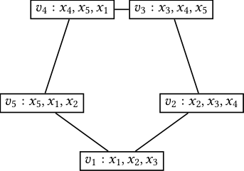

## **Lower Bounds for Conjunctive Query Evaluation**

STEFAN MENGEL, Univ. Artois, CNRS, Centre de Recherche en Informatique de Lens (CRIL), France

In this tutorial, we will survey known results on the complexity of conjunctive query evaluation in different
settings, ranging from Boolean queries over counting to more complex models like enumeration and direct
access. A particular focus will be on showing how different relatively recent hypotheses from complexity
theory connect to query answering and allow showing that known algorithms in several cases can likely not
be improved.

CCS Concepts: • **Theory of computation** → **Database theory** .

Additional Key Words and Phrases: todo

**1** **INTRODUCTION**

Understanding the complexity of different forms of query answering is one of the major research
areas in database theory. Historically, the complexity of queries has been studied in three ways: in
combined complexity, in data complexity [ 75 ], or in parameterized complexity [ 47 ]. When trying
to understand the necessary runtime to answer queries, combined complexity is very pessimistic:
since the query and the database are both the inputs, answering first-order queries is PSPACEhard and even conjunctive queries are NP-hard [ 29 ]. On the other end of the spectrum, in data
complexity all first-order queries are classified as in PTIME and thus easy [ 75 ], which blurs the
different complexities of different queries. So in a sense, both of these classical approaches are not
completely satisfying when trying to assess the hardness of concrete queries.
A more refined approach is parameterized complexity [ 47 ]: similarly to data complexity, one
considers the database as the main input, but instead of neglecting the query completely, one sees
its size as a parameter. The runtime dependence on the parameter may be bad, but crucially it
should not appear in the exponent of the input size, so roughly, for parameter _𝑘_ and input size
_𝑛_, a runtime of 2 _[𝑘]_ _𝑛_ is good, but _𝑛_ _[𝑘]_ is bad. Parameterized complexity has led to many interesting
results on the complexity of query answering, in particular the characterization of all _classes_
of conjunctive queries that can be solved efficiently from the perspective of parameterized and
combined complexity [ 48, 49 ]. However, despite these merits, parameterized complexity has inherent
limitations: it is only applicable to _classes_ of queries, and thus we cannot use it to learn something
about the complexity of specific, concrete queries.
Fine-grained complexity opens up the possibility of attacking this question and determining the
exact exponents of optimal query answering algorithms for individual queries. The idea of the area
is to develop a complexity theory for problems inside PTIME to determine optimal runtimes for
problems that are in classical theory all considered easy. The goal is to complement problems with
algorithms that have runtime _𝑂_ ( _𝑛_ _[𝑐]_ ) with lower bounds that rule out any algorithm with runtime
_𝑂_ ( _𝑛_ _[𝑐]_ [−] _[𝜀]_ ) for all _𝜀_ _>_ 0.
Of course, with today’s techniques, one cannot expect to show unconditional lower bounds.
Also, it turns out that common classical assumptions like P ≠ NP or even the Exponential Time
Hypothesis, which plays a major role in parameterized complexity, appear to not be sufficient.
Instead, fine-grained complexity relies on its own set of different hypotheses. Often these posit
that known algorithms for important problems that have, despite considerable efforts, not been
improved for a long time, are optimal. So the results of fine-grained complexity theory are generally
of the form “If there is no better algorithm for problem X, then there is no better algorithms for
problem Y, either.” where X can be one of several different, well-studied problems and _𝑌_ is the

Author’s address: Stefan Mengel, Univ. Artois, CNRS, Centre de Recherche en Informatique de Lens (CRIL), Lens, France,
mengel@cril.fr.

2 Stefan Mengel

problem that one is interested in. This makes fine-grained complexity a less coherent theory than,
say, the theory of NP-completeness, and the confidence in its main hypotheses is certainly lower.
However, it still provides techniques to give insights into which runtimes improvements would
imply major, surprising algorithmic advances on well-known problems.
This paper is _not_ a survey of or introduction to fine-grained complexity itself—there are certainly
others better qualified to do so [1] and this type of work already exists, see e.g. [ 78 ] or the videos
from a recent Simons Institute workshop that explain the area to a database theory audience [ 42 ].
Instead, this paper will be limited to a single question: how can fine-grained complexity be used to
determine the complexity of conjunctive query answering. Here query answering is not restricted
to materializing the complete query result or solving Boolean queries, but also covers tasks like
counting (as a prototypical aggregation task), enumeration and direct access. A large part of this
paper will be on linear time bounds, as this is the case that is by far most studied. As we will see,
there is a wealth of results on this. Afterwards, we will turn to super-linear runtimes. Unfortunately,
lower bounds for this case are far less developed, but we will give an overview of what is known
and which techniques exist. Throughout the whole paper, we will introduce important hypotheses
from fine-grained complexity that have been proven useful in database theory and show how they
have been applied.

_Acknowledgements._ This paper was written to complement a tutorial that the author was invited
to give at PODS 2025. The authors thanks the program committee for this opportunity to collect
and present the results surveyed in this paper.
Florent Capelli and Christoph Berkholz provided thoughtful comments, advice and discussion
on an earlier version of this paper. The author is grateful for the time and effort they invested into
this, which greatly improved the presentation of this survey.

**2** **PRELIMINARIES**

**2.1** **Database Queries**

We assume that the reader is familiar with the basics of database theory, in particular the relational
model, see e.g. the first part of [ 9 ]. In this paper, we will focus only on _conjunctive queries_, so queries
of the form _𝑞_ ( _𝑋_ ) :− _𝑅_ 1 ( _𝑋_ 1 ) _, . . ., 𝑅_ _ℓ_ ( _𝑋_ _ℓ_ ), where _𝑋_ and the _𝑋_ _𝑖_ are sets of variables with _𝑋_ ⊆ [�] _𝑖_ ∈[ _ℓ_ ] _[𝑋]_ _𝑖_ [.]
If _𝑋_ = [�] _𝑖_ ∈[ _ℓ_ ] _[𝑋]_ _𝑖_ [, then we call] _[ 𝑞]_ [a] _[ join query]_ [. If] _[ 𝑋]_ [=][ ∅] [, we call] _[ 𝑞]_ _[Boolean]_ [. If all relation symbols] _[ 𝑅]_ _𝑖_
in _𝑞_ are different, we say that _𝑞_ is _self-join free_ ; if the same relation symbol repeats, we say that _𝑞_
has self-joins. We assume basic familiarity with the AGM-bound [ 10 ] and worst-case optimal join
algorithms [ 65 ], see also [ 9, Chapters 27 and 28]. However, these concepts will not be central, and
knowledge of their existence will be enough.
As is standard, we assign hypergraphs to queries: for the query _𝑞_ ( _𝑋_ ) :− _𝑅_ 1 ( _𝑋_ 1 ) _, . . ., 𝑅_ _ℓ_ ( _𝑋_ _ℓ_ ), the
corresponding hypergraph _𝐻_ = ( _𝑉, 𝐸_ ) has vertices _𝑉_ : = [�] _𝑖_ ∈[ _ℓ_ ] _[𝑋]_ _𝑖_ [and the edge set] [ {] _[𝑋]_ _𝑖_ [|] _[ 𝑖]_ [∈[] _[ℓ]_ []}] [. A]
hypergraph _𝐻_ = ( _𝑉, 𝐸_ ) is called _acyclic_ if the following process ends with a hypergraph with no
vertices or edges: while possible, delete a vertex that is contained in at most one edge, or delete
an edge that is a subset of another edge. A conjunctive query is called acyclic if its hypergraph is
acyclic. Acyclic queries are important and well studied because of their good algorithmic properties,
see e.g. [ 9, Chapters 20 and 21]. For background and many properties of acyclic hypergraphs,
see [ 13, 14, 20 ]. We say that a hypergraph is _ℎ_ _-uniform_ for some _ℎ_ ∈ N if all of its edges have size _ℎ_ .
All runtimes for query answering that we give will be for fixed queries and thus have no
dependence on the size of the query (but will of course depend on the actual query; we want

1 For example, there will be a keynote by Virginia Vassilevska Williams on this topic at PODS this year.

Lower Bounds for Conjunctive Query Evaluation 3

to differentiate hard queries from easy ones after all). We generally denote the size of the input
database, i.e. the overall number of tuples, by _𝑚_ while _𝑛_ is generally used for the size of the domain.

**2.2** **Fine-Grained Complexity**

As said in the introduction, fine-grained complexity is concerned with finding the optimal exact
exponent of runtime bounds for problems that can be solved in polynomial time. The considered
machine model are standard random access machines with logarithmic word-size and unit cost
operations, see e.g. [45] for a detailed discussion of this model.
We will mostly be interested in lower bounds saying that for a constant _𝑐_ there is no _𝜀_ _>_ 0
such that a problem can be solved in time _𝑂_ ( _𝑛_ _[𝑐]_ [−] _[𝜀]_ ) . These lower bounds will be based on different
hypotheses which we will introduce throughout the paper. Since we mostly ignore sub-polynomial
factors, we will give most runtime bounds in _𝑂_ [˜] -notation, which is analogous _𝑂_ -notation, but
ignores factors of the form _𝑛_ _[𝑜]_ [(][1][)][ 2]

While we will not see this here, many algorithms and reductions in fine-grained complexity are
randomized, and they might fail with a probability _𝑝_ _<_ [1] 2 [. The probability] _[ 𝑝]_ [can be decreased in a]

standard fashion by repeatedly running the algorithm. All our reductions here will be deterministic,
but it is still good to keep randomization in mind when reading papers in fine-grained complexity.
In particular, all hypotheses we mention here are in general also made in this randomized model,
sometimes without mentioning it explicitly.

**2.3** **The Complexity of Matrix Multiplication**

Fast matrix multipliation is one of the work horses of efficient algorithms in fine-grained complexity,
and it also increasingly plays a major role in query evaluation [ 8, 50, 58 ]. So let us discuss this basic
operation a little.
With the naive algorithm, one can multiply two _𝑛_ × _𝑛_ -matrices in time _𝑂_ ( _𝑛_ [3] ), which was thought
to be optimal until the breakthrough work of Strassen [ 72 ], showing that the problem has a subcubic algorithm. Since then there has been a race to improve the runtime bounds. The decisive
quantity here is the _matrix multiplication exponent 𝜔_ which is the smallest real number such that
there is an algorithm that computes the product of two _𝑛_ × _𝑛_ -matrices with _𝑛_ _[𝜔]_ [+] _[𝑜]_ [(][1][)] operations [3] .
From Strassen’s algorithm and the fact that we need to compute _𝑛_ [2] entries of the output, it follows
that 2 ≤ _𝜔_ _<_ 3 and, while the exact number is not known, there have been regular improvements
of the upper bound in recent years, the current record being _𝜔_ _<_ 2 _._ 371339 [5].
The best known lower bound for matrix multiplication is quadratic in _𝑛_ [ 17 ], and it does not
seem to be a widely held assumption that _𝜔_ _>_ 2. In fact, many works introducing algorithms that
use matrix multiplication as a sub-routine and whose runtime thus depends on _𝜔_ in more or less
complicated ways, also give resulting runtimes for the case _𝜔_ = 2. That said, while there has been
steady progress over decades since [ 72 ], it appears likely that we are far away from determining _𝜔_ .
We will mostly be concerned with _Boolean matrix multiplication_, i.e. matrix multiplication over
the Boolean semi-ring where, given two input matrices _𝐴_ = ( _𝑎_ _𝑖𝑗_ ), _𝐵_ = ( _𝑏_ _𝑖𝑗_ ), both from { 0 _,_ 1 } _[𝑛]_ [×] _[𝑛]_ we
want to compute the matrix _𝐶_ = ( _𝑐_ _𝑖𝑗_ ) with _𝑐_ _𝑖𝑗_ : = [�] _𝑘_ ∈[ _𝑛_ ] _[𝑎]_ _𝑖𝑘_ [∧] _[𝑏]_ _𝑘𝑗_ [. So far, the best algorithms for]
Boolean matrix multiplication in fact use multiplication over the reals: given _𝐴_ and _𝐵_, interpret their
entries as real numbers and multiply them over the reals. Then, it is easy to see that substituting

2 In the literature, ˜ _𝑂_ often only ignores polylogarithmic instead of subpolynomial factors. However, since in fine-grained
complexity one generally ignores all subpolynomial factors, our slightly more liberal definition will be more convenient.
3 Note the following slight subtlety: _𝜔_ is defined as a limit, and it is known that there is no single algorithm that attains
this limit [ 31 ]. So whatever the value of _𝜔_ is, there is no algorithm with runtime _𝑂_ ( _𝑛_ _[𝜔]_ ) . However, since we will use our
version of the _𝑂_ [˜] -notation that does not take into account factors of the form _𝑛_ _[𝑜]_ [(][1][)], we ignore this fact in the remainder of
this paper.

4 Stefan Mengel

any non-zero entry of the output _𝐶_ by 1 gives the result of Boolean matrix multiplication. Note that
the runtime of this approach is _𝑂_ [˜] ( _𝑛_ _[𝜔]_ ), so the same as that of non-Boolean matrix multiplication.
Of particular interest to us is a setting often called _sparse_ Boolean matrix multiplication where
the runtime is not measured in the dimension _𝑛_ but in the number _𝑚_ of non-zero entries of the
input and output. Note that if there is an algorithm of runtime _𝑂_ [˜] ( _𝑚_ ) then _𝜔_ = 2. However, the
other way round, even if _𝜔_ = 2, it does not follow that sparse matrix multiplication has a (near)linear-time algorithm, since the input and output can have far less than _𝑛_ [2] non-zero entries. In that
case, algorithms for dense matrix multiplication and _𝜔_ = 2 are not obviously helpful. That said,
there are several algorithms for sparse matrix multiplication that use algorithms for dense matrix
multiplication in more subtle ways: the current best runtime is an algorithm for sparse Boolean
matrix multiplication with runtime _𝑂_ ( _𝑚_ [1] _[.]_ [3459] ) which in case _𝜔_ = 2 is even _𝑂_ ( _𝑚_ [4][/][3][+] _[𝜀]_ ) for every
_𝜀_ _>_ 0 [ 2 ]. The general belief in fine-grained complexity is that _𝑂_ ( _𝑚_ [4][/][3] ) can likely not be beaten as
a runtime, see again [ 2 ], and that in particular there is no linear-time algorithm for sparse Boolean
matrix multiplication.

Hypothesis 1 ( _Sparse Boolean Matrix Multiplication Hypothesis_ ). _There is no algorithm that_
_solves sparse Boolean matrix multiplication in time_ _𝑂_ [˜] ( _𝑚_ ) _._

**3** **UNDERSTANDING LINEAR-TIME QUERY ANSWERING**

In this section, we will turn to the complexity of different query answering problems. Since the case
of (nearly) linear time is the best understood, we will focus on understanding it first. In Section 4,
we will turn to the less well understood superlinear case. We will start our considerations with
Boolean queries before considering more complex questions like enumeration, counting and direct
access in later subsections.

**3.1** **Boolean Queries**

We first consider Boolean queries, since any lower bound that we can show for them will in
particular also give us lower bounds for other question like counting or enumeration. It will turn
out that in this whole section, acyclic queries will play a major role, due to the following classical
result by Yannakakis [79].

Theorem 3.1. _For every acyclic Boolean conjunctive query_ _𝑞_ _there is an algorithm, given a data-_
_base 𝐷_ _decides in linear time if 𝑞_ _it true on 𝐷._

For a streamlined proof of Theorem 3.1, see [ 9, Chapter 21]. In the remainder of this subsection,
we will explain why acyclic queries are likely the _only_ Boolean queries that can be solved in linear
time and which hypotheses from fine-grained complexity suggest this.

_3.1.1_ _Graphlike Queries._ It will be useful to first consider the case in which all atoms have arity
two, so where the hypergraph of the query is a graph. Acyclicity of the query is then simply the
usual notion of acyclicity of graphs, so the absence of any cycles.
We want to make it plausible that cyclic graphlike queries cannot be solved in linear time, so
it appears useful to first consider queries that consist only of a single cycle and, to make things
even easier, we for now consider only the triangle query which has been studied extensively in the
database literature, see e.g. the pointers in [65]. We write it here as

_𝑞_ [△] () :− _𝑅_ 1 ( _𝑥,𝑦_ ) _, 𝑅_ 2 ( _𝑦,𝑧_ ) _, 𝑅_ 3 ( _𝑧,𝑥_ ) _._

What can we say about the complexity of _𝑞_ [△] ? First, if we consider the corresponding join query

_𝑞_ ¯ [△] ( _𝑥,𝑦,𝑧_ ) :− _𝑅_ 1 ( _𝑥,𝑦_ ) _, 𝑅_ 2 ( _𝑦,𝑧_ ) _, 𝑅_ 3 ( _𝑧,𝑥_ ) _,_

Lower Bounds for Conjunctive Query Evaluation 5

then we see by applying the celebrated AGM-bound [ 10 ] that | _𝑞_ ¯( _𝐷_ )| ≤ _𝑚_ [3][/][2] for any database of
_𝑂_ size ˜ ( _𝑚 𝑚_ [3][/][2], and using a worst-case optimal join algorithm [ ) . So in particular, _𝑞_ [△] can be solved in time ˜ _𝑂_ ( _𝑚_ [3] 65 [/][2] ) ], we can compute all answers in time . But can we do better? For ¯ _𝑞_ [△] we can
certainly not: the AGM-bound is tight, so there are inputs with Ω( _𝑚_ [3][/][2] ) output tuples, and since
we have to return them all, we cannot do so in time _𝑚_ [3][/][2][−] _[𝜀]_ for any _𝜀_ _>_ 0. However, if we only want
to know if there is an answer, we can use matrix multiplication to speed up query answering, as
shown by Alon, Yuster and Zwick [ 6 ]. Since the proof if short but quite instructive, we give it here.

Theorem 3.2. _If there is an algorithm for Boolean matrix multiplication of_ _𝑛_ × _𝑛_ _-matrices with_
2 _𝜔_
_runtime_ _𝑂_ [˜] ( _𝑛_ _[𝜔]_ ) _, then there is an algorithm that answers 𝑞_ [△] _on inputs of size 𝑚_ _in time_ _𝑂_ [˜] ( _𝑚_ _𝜔_ +1 ) _._

Proof. We use a technique based on degree splits. To this end, define the degree of an element
of the active domain as the number of tuples in which it appears in the input database. Then we
_𝜔_ −1
call a domain element light if it has degree at most Δ : = _𝑚_ _𝜔_ +1 and heavy otherwise. We will first
show how to detect answers of ¯ _𝑞_ [△] that contain a light element, say, for the variable _𝑦_ . To do so,
we first compute the answers of _𝑞_ _𝑦_ ( _𝑥,𝑦,𝑧_ ) :− _𝑅_ 1 ( _𝑥,𝑦_ ) _, 𝑅_ 2 ( _𝑦,𝑧_ ) in which _𝑦_ takes a light element. We
can do this by first filtering out all heavy elements at the position of _𝑦_ in the relations _𝑅_ 1 and _𝑅_ 2,
then we take all remaining tuples in _𝑅_ 1 and extend them in the up to Δ ways to _𝑧_ . Certainly, this
can be done in time _𝑂_ [˜] ( _𝑚_ Δ) . In the final step, we can filter with the relation _𝑅_ 3 to check if any of
the candidates thus computed is an answer to ¯ _𝑞_ [△] . Analogously, we can check if there is an answer
to ¯ _𝑞_ [△] that takes a light value in _𝑥_ or _𝑧_ .
It remains to check for answers that only contain heavy values. There are at most _𝑚_ /Δ such
values and we can compute them efficiently, so we only have to show how to solve _𝑞_ [△] on a database
with up to _𝑛_ [′] : = _𝑚_ /Δ domain elements. So let _𝑅_ 1 [′] [and] _[ 𝑅]_ 2 [′] [be the relations we get from] _[ 𝑅]_ [1] [ and] _[ 𝑅]_ [2] [,]
respectively, by restriction to heavy values. We first solve the query _𝑞_ [′] ( _𝑥,𝑧_ ) :− _𝑅_ 1 [′] [(] _[𝑥,𝑦]_ [)] _[, 𝑅]_ 2 [′] [(] _[𝑦,𝑧]_ [)] [ by]
matrix multiplication: let _𝐴_ be the adjacency matrix of _𝑅_ 1 [′] [, so the Boolean] _[ 𝑛]_ [′] [ ×] _[ 𝑛]_ [′] [-matrix indexed]
by the active domain which contains a 1 in an position ( _𝑎,𝑏_ ) if and only if ( _𝑎,𝑏_ ) ∈ _𝑅_ 1 [′] [. Define] _[ 𝐵]_
analogously as the adjacency matrix of _𝑅_ 2 [′] [. Let] _[ 𝐶]_ [be the result of Boolean matrix multiplication of]
_𝐴_ and _𝐵_, then _𝐶_ is the adjacency matrix of the relation containing the answers to _𝑞_ [′] and thus we
can read off the answers directly from _𝐶_ . Filtering by _𝑅_ 3 again, lets us check if _𝑞_ [△] has an answer.
2 _𝜔_
˜ The overall runtime of the algorithm is _𝜔_ 2 _𝜔_ _𝑂_ [˜] ( _𝑚_ Δ) = _𝑂_ [˜] ( _𝑚_ _𝜔_ +1 ) for the first part of the algorithm and
_𝑂_ ( _𝑛_ [′] _[𝜔]_ ) = ˜ _𝑂_ ( [�] _[𝑚]_ Δ � ) = ˜ _𝑂_ ( _𝑚_ _𝜔_ +1 ) for the second part, which gives the desired runtime bound. 

For _𝜔_ _>_ 0, the mapping _𝜔_ ↦→ _𝜔_ 2 _𝜔_ +1 [is monotone and increasing in] _[ 𝜔]_ [, so better matrix multiplication]
4
algorithms give better algorithms for the triangle query. If _𝜔_ = 2, then the runtime is _𝑂_ [˜] ( _𝑚_ 3 ) . Despite
intense research, there is no known better algorithm for triangle finding in graphs than that from
Theorem 3.2, which motivates the following common hypothesis found e.g. in [4].

Hypothesis 2 ( _Triangle Hypothesis_ ). _There is no algorithm that, given an input graph_ _𝐺_ _with_ _𝑚_
_edges, decides in time_ _𝑂_ [˜] ( _𝑚_ ) _if 𝐺_ _contains a triangle._

A common more concrete lower bound conjecture for triangle finding is Ω( _𝑚_ [4][/][3] ), which, as we
have seen, is tight in case _𝜔_ = 2.
For conjunctive query answering, we get the following result.

Proposition 3.3. _Let_ _𝑞_ _be cyclic self-join free Boolean conjunctive query in which all relations have_
_arity_ 2 _. Then, assuming the Triangle Hypothesis, there is no algorithm that, given a database_ _𝐷_ _of size_
_𝑚, decides 𝑞_ _on 𝐷_ _in time_ _𝑂_ [˜] ( _𝑚_ ) _._

Proof. We reduce from triangle finding, so let _𝐺_ = ( _𝑉, 𝐸_ ) be the input graph. We construct a
database _𝐷_ with active domain _𝑉_ ∪{ _𝑑_ } where _𝑑_ is a dummy element not in _𝑉_ . Fix an induced cycle

6 Stefan Mengel

in the graph of the query _𝑞_, which exists because _𝑞_ is cyclic. Let _𝑅_ 1 ( _𝑥_ 1 _,𝑥_ 2 ), _𝑅_ 2 ( _𝑥_ 3 _,𝑥_ 4 ), _𝑅_ 3 ( _𝑥_ 5 _,𝑥_ 6 ) be
different atoms on the cycle, which might overlap in their endpoints. We set all _𝑅_ 1 _[𝐷]_ [=] _[ 𝑅]_ 2 _[𝐷]_ [=] _[ 𝑅]_ 3 _[𝐷]_ [=] _[ 𝐸]_
and all other relations for the atoms on the cycle to the equality relation on _𝑉_ . For all relations
_𝑅_ ( _𝑥_ _𝑗_ _,𝑦_ ) where _𝑥_ _𝑗_ is on the cycle and _𝑦_ is not, we set _𝑅_ _[𝐷]_ : = _𝑉_ × { _𝑑_ } and proceed analogously for
the atoms _𝑅_ _𝑖_ ( _𝑦,𝑥_ _𝑗_ ) . Finally, for all atoms _𝑅_ ( _𝑦_ 1 _,𝑦_ 2 ) where neither _𝑦_ 1 nor _𝑦_ 2 is on the cycle, we set
the input relation to { _𝑑_ } [2] .
Clearly, _𝐷_ |= _𝑞_ if and only if _𝐺_ has a triangle, so the claim follows directly.  

_3.1.2_ _General Queries._ As we have seen in the last section, in the graph-like case, i.e. the case of
arity 2, having a cycle is the only cause for hardness of Boolean queries. In the general case, we
will now see another hard substructure.

_Example 3.4 (Loomis-Whitney Joins)._ The _𝑘_ -dimensional Loomis-Whitney query is the query in
variables _𝑋_ _𝑘_ := { _𝑥_ 1 _, . . .,𝑥_ _𝑘_ } defined by

_𝑞_ _𝑘_ _[𝐿𝑊]_ :− � _𝑅_ _𝑋_ ( _𝑋_ ) _._

_𝑋_ ⊆ _𝑋_ _𝑘_ :| _𝑋_ |= _𝑘_ −1

Note that for _𝑘_ _>_ 3 no Loomis-Whitney query contains an induced cycle, since all variable sets
of size at most _𝑘_ − 1 are contained in the scope of one atom. Moreover, it is known that any
1
Loomis-Whitney query can be answered in time _𝑂_ [˜] ( _𝑚_ [1][+] _𝑘_ −1 ) [ 66 ] which for _𝑘_ ≥ 5 is faster than the
state of the art for triangles.

We will next give evidence that the known algorithms for Loomis-Whitney queries might be
optimal, building on hypotheses from fine-grained complexity. To this end, define a hyperclique in
a _ℎ_ -uniform hypergraph _𝐻_ = ( _𝑉, 𝐸_ ) be a set of vertices _𝑉_ [′] ⊆ _𝑉_ such that every set _𝑆_ ⊆ _𝑉_ [′] of size _ℎ_
is contained in _𝐸_ .

Hypothesis 3 ( _Hyperclique Hypothesis_ ). _For no pair_ _𝑘_ _> ℎ_ _>_ 2 _of integers, there is an_ _𝜖_ _>_ 0
_and an algorithm that, given a_ _ℎ_ _-uniform hypergraph_ _𝐻_ _with_ _𝑛_ _vertices, decides in time_ _𝑂_ [˜] ( _𝑛_ _[𝑘]_ [−] _[𝜀]_ ) _if_ _𝐻_
_contains a hyperclique of size 𝑘._

Note that the condition _ℎ_ _>_ 2 is necessary since for triangles and more general _𝑘_ -cliques in graphs
there are algorithms with runtime _𝑂_ ( _𝑛_ _[𝑐𝑘]_ ) for some _𝑐_ _<_ 1 based on matrix multiplication [ 64 ], see
also Section 4.1. In contrast, despite intensive search, no such algorithms for hyperclique in _ℎ_ -regular
hypergraphs are known for any _ℎ_ _>_ 2. In particular, it is known that there is no generalization of
efficient matrix multiplication to higher order tensors that would allow adapting the algorithms
for _𝑘_ -clique in a direct way [ 61 ]. Moreover, improving algorithms for hypercliques would give an
improvement for Max- _𝑘_ -SAT [ 61 ], a problem that, in contrast to Max-2-SAT and _𝑘_ -SAT, has so far
resisted all tries to improve upon the trivial runtime _𝑂_ [˜] (2 _[𝑛]_ ) for _𝑛_ -variable CNF-formulas.
Since Loomis-Whitney queries can be used to find cliques of size _𝑘_ in ( _𝑘_ − 1 ) -regular hypergraphs,
we directly get the following lower bound that the algorithm from [66] is optimal.

Theorem 3.5. _Assuming the Hyperclique Hypothesis, for no_ _𝑘_ _>_ 4 _and no_ _𝜀_ _>_ 0 _, there is an_
1
_algorithm that, given an input databaseof size 𝑚, decides 𝑞_ _𝑘_ _[𝐿𝑊]_ _in time_ _𝑂_ [˜] ( _𝑚_ [1][+] _𝑘_ −1 [−] _[𝜀]_ ) _._

Proof. Assume by way of contradiction that there are _𝑘_ _>_ 4 and _𝜀_ such that there is an
algorithm for _𝑞_ _𝑘_ _[𝐿𝑊]_ with the stated runtime. We will solve the hyperclique problem in ( _𝑘_ − 1 ) -regular
hypergraphs with the help of _𝑞_ _𝑘_ _[𝐿𝑊]_ . Let _𝐻_ = ( _𝑉, 𝐸_ ) be a ( _𝑘_ − 1 ) -regular hypergraph. We define a
relation _𝑅_ that contains for all edges _𝑒_ ∈ _𝐸_ all tuples we get by permutation of the elements in _𝑒_ .
Let _𝑅_ be the relation for every _𝑅_ _𝑋_, then _𝑞_ _𝑘_ _[𝐿𝑊]_ is true on _𝐷_ if and only if _𝐻_ has a hyperclique of size _𝑘_,
so _𝑞_ _𝑘_ _[𝐿𝑊]_ lets us find ( _𝑘_ − 1)-hypercliques, as desired.

Lower Bounds for Conjunctive Query Evaluation 7

Let _𝑛_ : = | _𝑉_ |, then _𝑅_ has size at most _𝑛_ _[𝑘]_ [−][1] . So overall, the runtime of the algorithm is at most
_𝑂_ ˜ _𝑛_ _𝑘_ −1 � 1+ _𝑘_ −1 1 [−] _[𝜀]_ [�] = _𝑂_ [˜] [�] _𝑛_ _[𝑘]_ [−(] _[𝑘]_ [−][1][)] _[𝜀]_ [�], which contradicts the Hyperclique Hypothesis. ��

It follows easily that queries that contain Loomis-Whitney queries as subqueries cannot be
answered in linear time under reasonable assumptions. Interestingly, this yields a characterization
of all non-linear time queries due to the following result by Brault-Baron [19].

Theorem 3.6 ([ 19 ]). _Let_ _𝐻_ _be a hypergraph that is not acyclic. Then there is a set_ _𝑆_ _such that the_
_induced hypergraph_ _𝐻_ [ _𝑆_ ] _is a cycle or we can get a_ (| _𝑆_ | − 1 ) _-uniform hyperclique from_ _𝐻_ [ _𝑆_ ] _by_
_deleting edges that are completely contained in other edges._

Brault-Baron inferred the following characterization of linear-time decidable Boolean queries.

Theorem 3.7. _Assume the Triangle Hypothesis and the Hyperclique Hypothesis. Then there is a_
_linear-time evaluation algorithm for a self-join free Boolean conjunctive query_ _𝑞_ _if and only if_ _𝑞_ _is_
_acyclic._

Proof sketch. For the upper bound, we use the Yannakakis algorithm of Theorem 3.1. For
the lower bound, we use Theorem 3.6 to embed triangle or hyperclique finding, similarly to
Proposition 3.3. 

**3.2** **Counting**

In this section, we consider the question of counting answers to conjunctive queries as a prototypical
aggregation question. In particular, we will show for which queries we can expect algorithms that
allow counting answers in linear time. Since any such algorithm allows in particular answering if
there is any answer, we get from Theorem 3.7 that for self-join free queries, we can restrict our
attention to acyclic queries. In the case of join queries, i.e. when all variables are output variables,
this already characterizes the linear-time solvable queries, since there is a generalization of the
Yannakakis algorithm, see e.g. [19, Lemma 19].

Theorem 3.8. _Assume the Triangle Hypothesis and the Hyperclique Hypothesis. Then there is a_ _𝑂_ [˜] ( _𝑚_ )
_algorithm that counts the answers to a join query 𝑞_ _on instances of size 𝑚_ _if and only if 𝑞_ _is acyclic._

Note that in Theorem 3.8 we do not require self-join freeness, since self-joins can be dealt with
in the lower bound with an interpolation argument first used in [35].
The situation becomes more interesting for queries with projections. Pichler and Skritek [ 69 ] were
the first to show that at least in _combined_ complexity projections make counting hard. Following
this, a line of work including [ 30, 37 – 39, 46 ] lead to a good understanding of tractable classes of
queries, both in parameterized and combined complexity. The first results for fixed queries are
found in [ 37 ]. However, those only apply to runtimes that are at most cubic, so we present a variant
of the ideas from [37] here that is taken from the note [63].
We will need some more definitions: a dominating set _𝑆_ of a graph _𝐺_ = ( _𝑉, 𝐸_ ) is a set _𝑆_ ⊆ _𝑉_ such
that every vertex not in _𝑆_ has a neighbor in _𝑆_ . The problem _𝑘_ -Dominating Set (short _𝑘_ -DS) is to
decide, given a graph _𝐺_, if _𝐺_ has a dominating set of size at most _𝑘_ .
Our aim will be to show the following lower bound for the star queries that have already been a
crucial building block of the lower bounds in [38, 39].

Lemma 3.9. _Let 𝑘_ ∈ N _with 𝑘_ ≥ 2 _. If there is an algorithm that counts answers to_

_𝑞_ _𝑘_ _[★]_ [(] _[𝑥]_ [1] _[, . . .,𝑥]_ _[𝑘]_ [)][ :][−] � _𝑅_ ( _𝑥_ _𝑖_ _,𝑧_ )

_𝑖_ ∈[ _𝑘_ ]

8 Stefan Mengel

_in time_ _𝑂_ ( _𝑚_ _[𝑘]_ [−] _[𝜀]_ ) _on databases with_ _𝑚_ _tuples for some_ _𝜀_ _>_ 0 _, then there is a_ _𝑘_ [′] ∈ N _,𝑘_ [′] _>_ 3 _such that_
_𝑘_ [′] _-DS can be decided in time 𝑂_ ( _𝑛_ _[𝑘]_ [′] [−] _[𝜖]_ ) _on graphs with 𝑛_ _vertices._

The existence of an algorithm for _𝑘_ -DS in Lemma 3.9 is very unlikely because it would contradict the Strong Exponential Time Hypothesis, a very impactful hypothesis from fine-grained
complexity [51, 52].

Hypothesis 4 ( _Strong Exponential Time Hypothesis_ ). _For every_ _𝜀_ _>_ 0 _, there is a_ _𝑘_ ∈ N _such_
_that 𝑘-SAT cannot be solved on instances with 𝑛_ _variables in time_ _𝑂_ [˜] (2 _[𝑛]_ [(][1][−] _[𝜀]_ [)] ) _._

SAT is certainly the most well-studied problem in complexity theory, and despite this effort and
the existence of faster algorithms for restricted variants like _𝑘_ -SAT, no algorithm with a runtime
_𝑂_ ( 2 _[𝑛]_ [(][1][−] _[𝜀]_ [)] ) is known. This makes the Strong Exponential Time Hypothesis rather plausible. The
following connection is from [68].

Theorem 3.10. _Assuming the Strong Exponential Time Hypothesis, there is no constant_ _𝜖_ [′] _such_
_that there is a constant_ _𝑘_ _and an algorithm for_ _𝑘_ _-DS with runtime_ _𝑂_ ( _𝑛_ _[𝑘]_ [−] _[𝜀]_ [′] ) _on graphs with_ _𝑛_ _vertices._

We now return to our star queries.

Proof of Lemma 3.9. Choose _𝑘_ [′] as a fixed integer such that _𝑘_ [′] _> 𝑘_ [2] / _𝜖_ and _𝑘_ [′] is divisible by _𝑘_ .
We will encode _𝑘_ [′] -DS into the query _𝑞_ _𝑘_ _[★]_ [. To this end, let] _[ 𝐺]_ [=][ (] _[𝑉, 𝐸]_ [)][ be an input for] _[ 𝑘]_ [′] [-DS. Set]

_𝑅_ := {(� _𝑢, 𝑣_ ) | _𝑣_ ∈ _𝑉,_ � _𝑢_ = ( _𝑢_ 1 _, . . .,𝑢_ _𝑘_ ′ / _𝑘_ ) ∈ _𝑉_ _[𝑘]_ [′] [/] _[𝑘]_ _,_ ∀ _𝑖_ ∈[ _𝑘_ [′] / _𝑘_ ] : _𝑢_ _𝑖_ _𝑣_ ∉ _𝐸,𝑢_ _𝑖_ ≠ _𝑣_ } _._

Then any assignment � _𝑢_ [1] _, . . .,_ � _𝑢_ _[𝑘]_ to _𝑥_ 1 _, . . .,𝑥_ _𝑘_ corresponds to a choice _𝑆_ of at most _𝑘_ [′] vertices in _𝐺_ .
The set _𝑆_ is a dominating set if and only if there is no vertex _𝑣_ in _𝑉_ that is not in _𝑆_ and has no
neighbor in _𝑆_ . This is the case if and only if there is no _𝑣_ ∈ _𝑉_ that assigned to _𝑧_ makes _𝑞_ _𝑘_ _[★]_ [true.]
Thus the answers to _𝑞_ _𝑘_ _[★]_ [(] _[𝑥]_ [1] _[, . . .,𝑥]_ _[𝑘]_ [)] [ are exactly the assignments] [ �] _[𝑢]_ [1] _[, . . .,]_ [ �] _[𝑢]_ _[𝑘]_ [that do] _[ not]_ [ correspond to]
dominating sets of size at most _𝑘_ [′] in _𝐺_ . Since there are exactly _𝑛_ _[𝑘]_ [′] choices for the � _𝑢_ _𝑖_, any algorithm
counting the answers to _𝑞_ _𝑘_ _[★]_ [(] _[𝑥]_ [1] _[, . . .,𝑥]_ _[𝑘]_ [)][ directly yields an algorithm for] _[ 𝑘]_ [′] [-DS.]
We now analyze the runtime of the above algorithm. Note that the time for the construction of _𝑅_
is negligible, so the runtime is essentially that of the counting algorithm for _𝑞_ _𝑘_ _[★]_ [(] _[𝑥]_ [1] _[, . . .,𝑥]_ _[𝑘]_ [)] [. First]

_𝑘_ [′]
observe that the relation _𝑅_ has at most _𝑛_ _𝑘_

observe that the relation _𝑅_ has at most _𝑛_ _𝑘_ [+][1] tuples. The exponent of the runtime of the counting

algorithm is thus

_𝑘_ ′

( _𝑘_ − _𝜖_ ) = _𝑘_ [′] + _𝑘_ − _[𝑘]_ [′] _[𝜖]_ − _𝜖_ _< 𝑘_ [′] + _𝑘_ − _[𝑘]_ [2] _[𝜖]_

� _𝑘_ [+][ 1] � _𝑘_ _𝜖𝑘_ [−] _[𝜖]_ [=] _[ 𝑘]_ [′] [ −] _[𝜖]_

where the inequality comes from the choice of _𝑘_ [′] satisfying _𝑘_ [′] _> 𝑘_ [2] / _𝜖_ . 

Corollary 3.11. _If SAT has no algorithm with runtime_ _𝑂_ ( 2 _[𝑛]_ [(][1][−] _[𝜖]_ [)] ) _for any_ _𝜖_ _>_ 0 _, then there is no_
_constant 𝑘_ ∈ N _, 𝑘_ ≥ 2 _and no 𝜖_ [′] _>_ 0 _such that there is an algorithm that counts answers to_

_𝑞_ _𝑘_ _[★]_ [(] _[𝑥]_ [1] _[, . . .,𝑥]_ _[𝑘]_ [)][ :][−] � _𝑅_ ( _𝑥_ _𝑖_ _,𝑧_ )

_𝑖_ ∈[ _𝑘_ ]

_in time 𝑂_ ( _𝑚_ _[𝑘]_ [−] _[𝜖]_ [′] ) _on databases with 𝑚_ _tuples._

The queries _𝑞_ _𝑘_ _[★]_ [are important because they can be embedded into many other queries. They thus]
play a crucial role in understanding the parameterized complexity of counting for conjunctive
queries, see e.g. [19, 37, 39]. One central notion that we need in our fine-grained setting is that of
free-connex acyclic queries, a concept from [ 12 ]. An acyclic conjunctive query with hypergraph H

[′] _[𝜖]_

− _𝜖_ _< 𝑘_ [′] + _𝑘_ − _[𝑘]_ [2] _[𝜖]_
_𝑘_ _𝜖𝑘_

′

( _𝑘_ − _𝜖_ ) = _𝑘_ [′] + _𝑘_ − _[𝑘]_ [′] _[𝜖]_
_𝑘_ [+][ 1] � _𝑘_

_𝜖𝑘_ [−] _[𝜖]_ [=] _[ 𝑘]_ [′] [ −] _[𝜖]_

Lower Bounds for Conjunctive Query Evaluation 9

and free variables _𝑆_ is called _free-connex_ if the hypergraph H ∪{ _𝑆_ } that we get from H by adding
_𝑆_ as an edge is acyclic as well. Non Free-connex queries are hard in the following sense.

Theorem 3.12. _Let_ _𝑞_ _be a self-join free conjunctive query that is acyclic but not free-connex. Then,_
_assuming the Strong Exponential Time Hypothesis there is no algorithm that counts the solutions of_ _𝑞_
_on a database with 𝑚_ _tuples in time 𝑂_ ( _𝑚_ [2][−] _[𝜖]_ [′] ) _for any 𝜖_ [′] _._

The argument is a minimal adaption of one found in the full version of [ 12 ] for enumeration [4] .
The idea is to embed the query _𝑞_ _[★]_ 2 [and then use Corollary 3.11. For the details, we refer to [63].]
From Theorem 3.12, we get the following dichotomy theorem for linear time counting.

Theorem 3.13. _Assume the Strong Exponential Time Hypothesis, the Triangle Hypothesis and the_
_Hyperclique Hypothesis. Then there is a_ _𝑂_ [˜] ( _𝑚_ ) _algorithm that counts the answers to a self-join free_
_conjunctive query 𝑞_ _on instances of size 𝑚_ _if and only if 𝑞_ _is free-connex acyclic._

Proof (sketch). The upper bound for Theorem 3.13 comes from the fact that for free-connex
acyclic queries, one can eliminate all projected variables efficiently (see the proof and the discussion
in [ 14, Section 4.1]), and then use the counting variant of the Yannakakis algorithm as in Theorem 3.8.
For the lower bound, if _𝑞_ is cyclic, then by Theorem 3.7 we get a lower bound using the fact
that a counting algorithm also lets us decide the Boolean query we get from _𝑞_ by projecting out all
variables. If _𝑞_ is cyclic by not free-connex, the lower bound follows from Theorem 3.12. 

**3.3** **Enumeration**

We next turn to constant delay enumeration, which is the following problem: given a query and
a database, first, in the _preprocessing phase_, compute a data structure that is then used in the
_enumeration phase_ to print out the answers to the query one after the other without repetition.
There are two different time bounds in enumeration algorithms: first the bound on the preprocessing
phase and then the _delay_ which is the maximal allowed time between printing out two answers.
The most studied version in database theory is _constant delay enumeration_ where we want the
delay between answers to be independent of the database and depend only on the query, which
we consider fixed; this model has first been introduced in the very influential paper [ 12 ] and since
then studied extensively throughout database theory. Somewhat surprisingly, there are many query
evaluation problems which allow constant delay enumeration, see e.g. the survey [14].
Enumeration for conjunctive queries was already studied in [ 12 ], the first paper to study constant
delay enumeration, which might also have been the first in database theory to use fine-grained
complexity even before that field was well-established and without making an explicit connection.
For the case of join queries, similarly to counting, from a lower bound perspective nothing too
interesting happens: acyclic join queries allow constant delay enumeration after linear preprocessing [11] [5], and since an enumeration algorithm can in particular be used to decide if there are any
answers, we get from Theorem 3.7 that acyclicity is the only property that yields constant delay
after linear preprocessing (assuming the Triangle Hypothesis and the Hyperclique Hypothesis, of
course).

4 [Unfortunately, this full version has never been published in a journal, but it can be found at https://webusers.imj-](https://webusers.imj-prg.fr/~arnaud.durand/papers/BDGlongversion.pdf)
[prg.fr/~arnaud.durand/papers/BDGlongversion.pdf. The techniques can also be found in [11, Chapter 2.7].](https://webusers.imj-prg.fr/~arnaud.durand/papers/BDGlongversion.pdf)
5 The proof in [ 11 ] uses a translation of relational conjunctive queries to a fragment of functional first-order logic and then
works in that setting which makes the argument somewhat difficult to follow for the reader not used to that setting. There
are by now algorithms working directly on the relational database [ 19, Lemma 19] or using factorized representations [ 67 ].
For an accessible presentation see the tutorial [14].

10 Stefan Mengel

Theorem 3.14. _Assume the Triangle Hypothesis and the Hyperclique Hypothesis. Then there is an_
_enumeration algorithm for a self-join free join query_ _𝑞_ _with preprocessing time_ _𝑂_ [˜] ( _𝑚_ ) _and constant_
_delay on instances of size 𝑚_ _if and only if 𝑞_ _is acyclic._

We remark that, for the lower bound, since we are only interested in the first enumerated solution,
we could instead go up to a linear delay bound and get the same statement.
The enumeration complexity of join queries with self-joins appears to be far harder to understand
than that of self-join free queries. It was first observed in [ 14 ] that the are cyclic join queries with
self-joins whose answers can be enumerated with constant delay after linear preprocessing. This
line of work was extended in [ 26 ], giving many more examples where this happens and some
more systematic understanding. Overall, the situation seems to be very subtle in the sense that
apparently minor variations in the queries can have a big impact on their complexity. The complexity
in that setting is thus not very well understood, and even for some concrete example queries, the
enumeration complexity is unknown. We will thus restrict to self-join free queries in the remainder
of this section.

Self-join free queries get more interesting in the case with projections. We will consider a self-join
free variant of the star queries we saw already in Section 3.2.

_𝑞_ ¯ _𝑘_ _[★]_ [(] _[𝑥]_ [1] _[, . . .,𝑥]_ _[𝑘]_ [)][ :][−] � _𝑅_ _𝑖_ ( _𝑥_ _𝑖_ _,𝑧_ )

_𝑖_ ∈[ _𝑘_ ]

Theorem 3.15. _[_ _12_ _] Assuming the Sparse Boolean Matrix Multiplication Hypothesis, there is no_
_enumeration algorithm for_ ¯ _𝑞_ _[★]_ 2 _[on instances of size][ 𝑚]_ _[with preprocessing]_ [ ˜] _[𝑂]_ [(] _[𝑚]_ [)] _[ and delay]_ [ ˜] _[𝑂]_ [(][1][)] _[.]_

In [ 12 ] the complexity assumption is that (non-sparse) Boolean matrix multiplication cannot be
done in quadratic time, but the proof actually yields the stronger statement we give here.

Proof of Theorem 3.15. We will show how to use ¯ _𝑞_ _[★]_ 2 [for Boolean matrix multiplication. So]
let _𝐴_ and _𝐵_ be matrices given as lists of indices ( _𝑖, 𝑗_ ) of their at most _𝑚_ non-zero entries. We define a
database _𝐷_ for ¯ _𝑞_ _[★]_ 2 [by setting] _[ 𝑅]_ 1 _[𝐷]_ [:] [=] _[ 𝐴]_ [and] _[ 𝑅]_ 2 _[𝐷]_ [:] [=][ {(] _[𝑗,𝑖]_ [) | (] _[𝑖, 𝑗]_ [) ∈] _[𝐵]_ [}] [ (so the transpose of the matrix).]
Then ¯ _𝑞_ _[★]_ 2 [(] _[𝐷]_ [)][ contains exactly the non-zero entries of the Boolean matrix product] _[ 𝐴𝐵]_ [.]
Let _𝑚_ [′] be the maximal number of non-zero entries in _𝐴_, _𝐵_ and _𝐴𝐵_ . Assume by way of contradiction
that there is an enumeration algorithm with preprocessing _𝑂_ ( _𝑚_ ) and delay _𝑂_ [˜] ( 1 ) . Then computing
_𝑂_ all non-zero entries in ˜ ( _𝑚_ [′] ) to enumerate the up to _𝐴𝐵_ using this algorithm as above takes time _𝑚_ [′] non-zero entries of _𝐴𝐵_ . So the overall runtime is _𝑂_ [˜] ( _𝑚_ ) for the preprocessing and ˜ _𝑂_ ( _𝑚_ [′] ) which
contradicts the Sparse Boolean Matrix Multiplication Hypothesis. 

Now with the exact same embedding as mentioned for Theorem 3.12, we get the following.

Theorem 3.16. _Let_ _𝑞_ _be a self-join free conjunctive query that is acyclic but not free-connex. Then,_
_assuming the Sparse Boolean Matrix Multiplication Hypothesis, there is no enumeration algorithm_
_for 𝑞_ _on a database with 𝑚_ _tuples with preprocessing time_ _𝑂_ [˜] ( _𝑚_ ) _and delay_ _𝑂_ [˜] (1) _._

Since free-connex acyclic queries have algorithms with preprocessing _𝑂_ [˜] ( _𝑚_ ) and delay _𝑂_ [˜] ( 1 ) [ 12 ],
this directly yields the following characterization.

Theorem 3.17. _Assume the Triangle Hypothesis, the Hyperclique Hypothesis and the Sparse Boolean_
_Matrix Multiplication Hypothesis. Then there is an enumeration algorithm for a conjunctive query_ _𝑞_
_with preprocessing time_ _𝑂_ [˜] ( _𝑚_ ) _and delay_ _𝑂_ [˜] (1) _if and only if 𝑞_ _is free-connex acyclic._

There is much more to say about constant delay enumeration then we can do here, but since
much of it has been surveyed elsewhere, we refer the reader to [14, 70, 71].

Lower Bounds for Conjunctive Query Evaluation 11

**3.4** **Direct Access**

A restricted version of enumeration is _direct access_ where the aim is to simulate an array containing
the whole query result without necessarily materializing it. After preprocessing the input database
for a restricted time, in the _access phase_, given an integer _𝑖_, the algorithm must return the _𝑖_ th
element of the (simulated) array containing the query result; if there are less than _𝑖_ answers, the
algorithm must return an error. The time required to return an answer at the requested position _𝑖_
is called the _access time_ of the algorithm.
Clearly, direct access algorithms easily allow enumeration of the query result: after preprocessing,
simply request the outputs one after another in order by starting with _𝑖_ = 1 and incrementing until
there is an error because no answers are left. Since it is known that free-connex acyclic queries
allow direct access with logarithmic access time and linear preprocessing [ 19, 27 ], we directly get
the following characterization.

Theorem 3.18. _Assume the Triangle Hypothesis, the Hyperclique Hypothesis and the Sparse Boolean_
_Matrix Multiplication Hypothesis. Then there is a direct access algorithm for a self-join free conjunctive_
_query 𝑞_ _with preprocessing time_ _𝑂_ [˜] ( _𝑚_ ) _and delay_ _𝑂_ [˜] (1) _if and only if 𝑞_ _is free-connex acyclic._

Theorem 3.18 does not specify the order in which the answers are stored in the simulated array.
However, it is natural to assume an order on the answers, which, as we will see, has great impact
on the the complexity of the problem. Many different ways of defining orders on query have been
studied see e.g. [ 7, 36, 73 ]; we will only consider two types of orders here: lexicographic orders and
orders given by sums of weights of domain values. We will discuss them in individual subsections
below.

_3.4.1_ _Lexicographic Orders._ One natural way of ordering query answers is by lexicographic orders.
To do so, we assume that there is an order ≼ on the active domain on the database. Then for every
order ⪯ of the variables of the query, we get an induced order on tuples: given distinct tuples _𝑎_
and _𝑏_, we let _𝑥_ be the first variable in ⪯ on which _𝑎_ and _𝑏_ differ. Then we say _𝑎_ ≤ _𝑏_ if the entry on
position _𝑥_ in _𝑎_ is before that of _𝑏_ w.r.t. ≼ . Note that the order on the tuples is different for different
variable orders.

_Example 3.19._ Let the active domain be { 0 _,_ 1 } with 0 ≼ 1. Consider a query _𝑞_ ( _𝑥,𝑦_ ) and the query
result {( 0 _,_ 0 ) _,_ ( 0 _,_ 1 ) _,_ ( 1 _,_ 0 ) _,_ ( 1 _,_ 1 )} . If the variable order has _𝑥_ ⪯ _𝑦_, then the answers are sorted as
(0 _,_ 0) ≤(0 _,_ 1) ≤(1 _,_ 0) ≤(1 _,_ 1). If we have that _𝑦_ ⪯ _𝑥_, then (0 _,_ 0) ≤(1 _,_ 0) ≤(0 _,_ 1) ≤(1 _,_ 1).

It will be convenient to consider the _testing problem_ for conjunctive queries which is the following
for any fixed conjunctive query _𝑞_ : given a database _𝐷_, after preprocessing _𝐷_ for a restricted time,
the algorithm has to answer, given a tuple _𝑎_, if _𝑎_ ∈ _𝑞_ ( _𝐷_ ) . Again, we separate preprocessing time
and query time. Note that testing for join queries is always easy, since we only have to check if _𝑎_
is consistent with the relations of all atoms of _𝑞_ . On the other end of the spectrum, for Boolean
conjunctive queries, the only possible input _𝑎_ is the empty assignment, so the testing problem is
equivalent to deciding Boolean queries. We will be interested in the middle ground where some
but not all variables are projected.
The following is useful for direct access lower bounds, see e.g. [ 22 ]. We denote by ∥ _𝐷_ ∥ the size
of a database _𝐷_ .

Lemma 3.20. _Let_ _𝑞_ ( _𝑥_ 1 _, . . .,𝑥_ _𝑟_ ) :− _𝑅_ 1 ( _𝑋_ 1 ) ∧ _. . ._ ∧ _𝑅_ _ℓ_ ( _𝑋_ _ℓ_ ) _be a join query and let_ _𝜋_ _be a variable order_
_for_ _𝑞_ _. Let_ _𝑋_ [′] _be a variable set consisting of a prefix of_ _𝜋_ _. Then, if there is a direct-access algorithm for_
_𝑞_ ( _𝑥_ 1 _, . . .,𝑥_ _𝑘_ ) _respecting the lexicographic order induced by_ _𝜋_ _with preprocessing time_ _𝑝_ ( _𝑚_ ) _and access_
_time_ _𝑎_ ( _𝑚_ ) _for databases of size_ _𝑚_ _, then there is a testing algorithm for the projected query_ _𝑞_ ( _𝑋_ [′] ) _with_

12 Stefan Mengel

_the same body with preprocessing time_ _𝑝_ ( _𝑚_ ) _and access time_ _𝑂_ [˜] (log( _𝑀_ ( _𝑚_ )) _𝑎_ ( _𝑚_ )) _where_ _𝑀_ ( _𝑚_ ) _is an_
_upper bound with 𝑀_ ( _𝑚_ ) ≥ max _𝐷_ :∥ _𝐷_ ∥≤ _𝑚_ (| _𝑞_ ( _𝐷_ )| | ∥ _𝐷_ ∥≤ _𝑚_ ) _._

Proof. Since _𝑋_ [′] contains the variables of a prefix, for every assignment _𝑎_ to _𝑋_ [′] all tuples
consistent with _𝑎_ in _𝑞_ ( _𝐷_ ) are in a contiguous block of the array simulated by the direct access
algorithm. Also, the order of those blocks is given by the lexicographic order on _𝑋_ [′], so we can use
binary search to check if a non-empty block for a given assignment to _𝑋_ [′] exists. This directly gives
the claimed runtime bound. 

Since we are interested in fixed conjunctive queries, we can bound log( _𝑀_ ( _𝑚_ )) ≤ _𝑂_ (log( _𝑚_ )), so
we only lose a logarithmic factor when going from direct access to testing.
It turns out that understanding the query _𝑞_ _[★]_ 2 [is crucial to the understanding of lexicographic]
direct access due to the following lower bound.

Lemma 3.21. _Assuming the Triangle Hypothesis, there is no testing algorithm for_ _𝑞_ _[★]_ 2 _[with prepro-]_
_cessing time_ _𝑂_ [˜] ( _𝑚_ ) _and testing time_ _𝑂_ [˜] (1) _on databases of size 𝑚._

Proof. By way of contradiction, assume that an algorithm with preprocessing time _𝑂_ [˜] ( _𝑚_ ) and
testing time _𝑂_ [˜] ( 1 ) exists. We use it to detect triangles in graphs as follows: given a graph _𝐺_ = ( _𝑉, 𝐸_ ),
construct a database _𝐷_ for _𝑞_ _[★]_ 2 [by setting] _[ 𝑅]_ _[𝐷]_ [=] _[ 𝐸]_ [. Apply the preprocessing on] _[ 𝐷]_ [. Afterwards, for]
every ( _𝑎,𝑏_ ) ∈ _𝐸_ test if ( _𝑎,𝑏_ ) ∈ _𝑞_ _[★]_ 2 [(] _[𝐷]_ [)][. If there is such an edge, return true, otherwise false.]
The algorithm is correct, since there is an edge ( _𝑎,𝑏_ ) ∈ _𝐸_ with ( _𝑎,𝑏_ ) ∈ _𝑞_ _[★]_ 2 [(] _[𝐷]_ [)] [ if and only if]
there is a triangle ( _𝑎,𝑏,𝑐_ ) in _𝐺_ . To bound the runtime, first observe that the preprocessing takes
time _𝑂_ [˜] (∥ _𝐷_ ∥) = _𝑂_ [˜] (| _𝐸_ |) . Then we make | _𝐸_ | queries, each in time _𝑂_ [˜] ( 1 ) . So the overall runtime of the
algorithm is _𝑂_ [˜] (| _𝐸_ |), which contradicts the Triangle Hypothesis. 

Embedding _𝑞_ _[★]_ 2 [, we get a version of Theorem 3.18 without the][ Sparse Boolean Matrix Multiplication]
Hypothesis, if we insist on lexicographic orders.

Corollary 3.22. _Assume the Triangle Hypothesis and the Hyperclique Hypothesis. Then there is a_
_𝑂_ _direct access algorithm for a conjunctive query_ ˜ ( _𝑚_ ) _and delay_ ˜ _𝑂_ (1) _if and only if 𝑞_ _is free-connex acyclic. 𝑞_ _for a lexicographic order with preprocessing time_

In the algorithm of Theorem 3.18 and Corollary 3.22, we cannot choose the lexicographic order of
the variables but it depends on the query. So a natural question is: can we choose any lexicographic
order and still get linear preprocessing for direct access? This question was answered negatively
in [27]. A crucial role is played by the following variant of _𝑞_ _𝑘_ _[★]_ [:]

_𝑞_ ˆ _𝑘_ _[★]_ [(] _[𝑥]_ [1] _[, . . .,𝑥]_ _[𝑘]_ _[,𝑧]_ [)][ :][−] � _𝑅_ ( _𝑥_ _𝑖_ _,𝑧_ ) _._

_𝑖_ ∈[ _𝑘_ ]

Note that the only difference between ˆ _𝑞_ _𝑘_ _[★]_ [and] _[ 𝑞]_ _𝑘_ _[★]_ [is that] _[ 𝑧]_ [is not projected in the former. Plugging]
together Lemma 3.20 and Lemma 3.21, we get the following.

Lemma 3.23. _Assuming the Triangle Hypothesis, direct access for_ ˆ _𝑞_ _[★]_ 2 _[and the variable order]_ _[ 𝑥]_ [1] _[ >]_
_𝑥_ 2 _> 𝑧_ _cannot be done on databases of size 𝑚_ _with preprocessing time_ _𝑂_ [˜] ( _𝑚_ ) _and access time_ _𝑂_ [˜] (1) _._

Proof. By Lemma 3.20, direct access for ˆ _𝑞_ _[★]_ 2 [and the order] _[ 𝑥]_ [1] _[ >][ 𝑥]_ [2] _[ >][ 𝑧]_ [allows testing for] _[ 𝑞]_ _[★]_ 2
which by Lemma 3.21 requires more than quasi-linear preprocessing. 

Lemma 3.23 motivates the following definition: let _𝑞_ be a join query and ⪯ an order of its variables.
Three variables _𝑦_ 1 _,𝑦_ 2 _,𝑦_ 3 are called a _disruptive trio_ if _𝑦_ 1 ⪯ _𝑦_ 3, _𝑦_ 2 ⪯ _𝑦_ 3, the pairs _𝑦_ 1 _,𝑦_ 3 and _𝑦_ 2 _,𝑦_ 3
each appear in the scope of a common atom of _𝑞_ and _𝑦_ 1 _,𝑦_ 2 do not appear in the scope of a common

atom.

Lower Bounds for Conjunctive Query Evaluation 13

It is not hard to see that if a self-join free join query has a disruptive trio with respect to an order
⪯, then one can embed ˆ _𝑞_ _[★]_ 2 [into it: define all relations such that all variables not in the disruptive]
trio are fixed to constants, and on the trio simulate the relations _𝑅_ 1 and _𝑅_ 2 . It can be shown that
such an embedding is actually also possible if the query contains self-joins [ 22 ]. As a consequence,
disruptive trios make direct access hard for join queries. More work is required to show that if
there is no disruptive trio, then the query allows efficient direct access after linear preprocessing,
which is shown in [27]. Together, this gives the following characterization.

Theorem 3.24. _Assume the Triangle Hypothesis and the Hyperclique Hypothesis. Then there is a_
_direct access algorithm for a join query_ _𝑞_ _for a lexicographic order induced by an order_ ⪯ _on databases_
_of size_ _𝑚_ _with preprocessing time_ _𝑂_ [˜] ( _𝑚_ ) _and access time_ _𝑂_ [˜] ( 1 ) _if and only if_ _𝑞_ _is acyclic and has no_
_disruptive trio with respect to_ ⪯ _._

We remark that [ 27 ] in fact shows a version of Theorem 3.24 that has the Sparse Boolean Matrix
Multiplication Hypothesis as an additional assumption. This is because the authors there use
Theorem 3.16 in the lower bound which makes use of this assumption. By using the more direct
approach of Lemma 3.21, we could avoid introducing it for Theorem 3.24.

_3.4.2_ _Sum Orders._ We will now consider another way of ordering the tuples in a query result, this
time by the _sum order_ which is defined as follows: assign a weight _𝑤_ ( _𝑎_ ) to every element of the
domain of the database, then the weight _𝑤_ ( _𝑎_ 1 _, . . .,𝑎_ _𝑟_ ) of a tuple ( _𝑎_ 1 _, . . .,𝑎_ _𝑟_ ) is the sum [�] _𝑖_ ∈[ _𝑟_ ] _[𝑤]_ [(] _[𝑎]_ _𝑖_ [)]
of weights of its entries. The query result is then ordered by the weight defined this way. This
type of orders is more expressive than lexicographic orders and has for example been considered
in [ 7, 36, 73 ]. We will here present work from [ 27 ], however, in contrast to there, to simplify the
presentation, we will only consider join queries, so queries without projections. We will see that
the class of queries that allows linear time preprocessing direct access is extremely restricted in
this setting.
We will use an additional hypothesis. The _3SUM problem_ is, given as input three lists _𝐴_, _𝐵_, _𝐶_ of
length _𝑛_ consisting of integers in {− _𝑛_ [4] _, . . .,𝑛_ [4] }, to decide if there are _𝑎_ ∈ _𝐴_, _𝑏_ ∈ _𝐵_ and _𝑐_ ∈ _𝐶_ such
that _𝑎_ + _𝑏_ = _𝑐_ . The 3SUM problem has an easy algorithm with complexity _𝑂_ [˜] ( _𝑛_ [2] ) : compute the set
_𝑆_ : = { _𝑎_ + _𝑏_ | _𝑎_ ∈ _𝐴,𝑏_ ∈ _𝐵_ } and sort it. Then going over the _𝑆_ and _𝐶_ in increasing order, check if
there is a common element in both lists. While this runtime can be slightly improved, see e.g. the
discussion in [78], there is no known algorithm with runtime _𝑂_ [˜] ( _𝑛_ [2][−] _[𝜀]_ ) for any constant _𝜀_ _>_ 0.

˜ Hypothesis 5 ( _3SUM Hypothesis_ ). _There is no algorithm for the 3SUM problem with runtime_
_𝑂_ ( _𝑛_ [2][−] _[𝜀]_ ) _for any 𝜀_ _>_ 0 _._

The 3SUM Hypothesis was first introduced in [ 43 ] where it was connected to the complexity of
many problems from computational geometry. Since then it has become one of the most used and
important hypotheses in fine-grained complexity, see again [78] for a discussion.
The following connection of 3SUM to direct access is from [ 27 ], in slightly different formulation.

Lemma 3.25. _Assume the 3SUM Hypothesis. Let_ _𝑞_ _be a self-join free join query such that there are_
_two variables_ _𝑥_ _,_ _𝑦_ _such that no atom of_ _𝑞_ _contains both_ _𝑥_ _and_ _𝑦_ _. Then there is no_ _𝜀_ _>_ 0 _such that there_
_is a direct access algorithm for_ _𝑞_ _on databases of size_ _𝑚_ _with sum order, preprocessing time_ _𝑂_ [˜] ( _𝑚_ [2][−] _[𝜀]_ )
_and access time_ _𝑂_ [˜] ( _𝑚_ [1][−] _[𝜀]_ ) _._

Proof. We reduce from 3SUM, so let _𝐴_, _𝐵_, _𝐶_ be the input lists. We construct a database _𝐷_ with
domain _𝐴_ ∪ _𝐵_ ∪{ 0 } . In all relations, the variables outside of _𝑥_ and _𝑦_ can only take the value 0,
while _𝑥_ can take all values in _𝐴_ and _𝑦_ all values in _𝐵_ . Since _𝑥_ and _𝑦_ do not appear in the scope of a

14 Stefan Mengel

common atom, the resulting database has size _𝑂_ ( _𝑛_ ) . As weight function _𝑤_, we simply set _𝑤_ ( _𝑑_ ) = _𝑑_
for all elements in the domain.
By construction, _𝑞_ ( _𝐷_ ) contains a tuple of weight _𝑐_ if and only if there are _𝑎_ ∈ _𝐵,𝑏_ ∈ _𝐵_ such
that _𝑎_ + _𝑏_ = _𝑐_ . We solve 3SUM as follows: first, run the preprocessing on _𝐷_, then iterate over all
elements _𝑐_ ∈ _𝐶_ and check if _𝑞_ ( _𝐷_ ) contains a tuple of weight _𝑐_ . To do the latter, use binary search
with the help of ˜ _𝑂_ (log( _𝑛_ )) access queries. Assuming preprocessing time _𝑂_ [˜] ( _𝑚_ [2][−] _[𝜀]_ ) and access time
_𝑂_ ( _𝑚_ [1][−] _[𝜀]_ ), the overall runtime is _𝑂_ ( _𝑛_ [2][−] _[𝜀]_ ) which breaks the 3SUM Hypothesis. 

One can show that the only acyclic queries that are not hard by Lemma 3.25 are those containing
an atom which has all variables in its scope. This is because for acyclic hypergraphs the size of
the smallest edge cover and that of the biggest independent set are equal [ 39, Lemma 19], so if the
variables are not all in the scope of one atom, then the criterion of Lemma 3.25 applies. But for
queries in which all variables are in one atom, we can easily materialize the query result and sort it
in time _𝑂_ [˜] ( _𝑚_ ) and thus get efficient direct access. So we get the following characterization.

Theorem 3.26. _Assume the 3SUM Hypothesis. Then there is a direct access algorithm for an acyclic_
_self-join free join query_ _𝑞_ _for sum order on databases of size_ _𝑚_ _with preprocessing time_ _𝑂_ [˜] ( _𝑚_ ) _and_
_delay_ _𝑂_ [˜] (1) _if and only if 𝑞_ _contains an atom which has all variables of 𝑞_ _in its scope._

**4** **BEYOND LINEAR TIME**

In this section, we will discuss to which extent the results seen before can be extended to showing
superlinear lower bounds. Unfortunately, there are so far less powerful techniques for this, in
particular for Boolean queries. There are mainly two problems we would have to overcome to
show lower bounds similar to those of Section 3: first, we would need an analogue of Theorem 3.6
that shows that in “hard” instances we can always embed certain restricted and well-behaved
sub-instances. Second, we need plausible hardness assumptions on these sub-instances.
Unfortunately, there seem to be no good answers to either of these problems that are as generally
useful as in the linear time case. That said, there are techniques for both that allow us to still infer
interesting results. We will sketch some of them in the next two sub-sections. After that, we will
quickly mention results for counting and direct access that allow showing good lower bounds with
slightly different techniques.

**4.1** **Clique Variants**

In many settings in complexity theory, the Clique problem has served as a starting point for
hardness, see e.g. [ 56 ] and [ 32, Chapter 13]. Therefore, it is natural to base fine-grained lower
bounds for query answering also on this problem. To this end, it would be convenient to have
a very strong hardness assumption for _𝑘_ -Clique, saying that _𝑘_ -Clique cannot be solved in time
_𝑂_ ( _𝑛_ _[𝑘]_ [−] _[𝜀]_ ). Unfortunately, it has long been observed that this statement is false.

Theorem 4.1. _[_ _64_ _] For every_ _𝑘_ _, there is an algorithm with runtime_ _𝑂_ [˜] ( _𝑛_ _[𝜔]_ [⌊] _[𝑘]_ 3 [⌋+] _[𝑖]_ ) _for_ _𝑘_ _-clique where_ _𝑖_

_is the rest of 𝑘_ _after division by_ 3 _._

Proof. We will only sketch the idea for _𝑖_ = 0. We set _𝑟_ : = _[𝑘]_

Proof. We will only sketch the idea for _𝑖_ = 0. We set _𝑟_ : = 3 [. Let] _[ 𝐺]_ [be an input graph. We]

construct a new graph _𝐺_ [′] whose vertices are the _𝑟_ -cliques of _𝐺_ . Two such cliques _𝐶_ 1 _,𝐶_ 2 are
connected by an edge if and only if they are disjoint and form a clique of size 2 _𝑟_ . There are at most
_𝑛_ _𝑘_ 2 _𝑘_
� _𝑟_ � = _𝑂_ ( _𝑛_ 3 ) potential vertices for _𝐺_ [′] to consider and thus _𝑂_ ( _𝑛_ 3 ) potential edges in _𝐺_ [′] . It follows

2 _𝑘_
3 ) potential vertices for _𝐺_ [′] to consider and thus _𝑂_ ( _𝑛_ 3

_𝑛_
� _𝑟_ � = _𝑂_ ( _𝑛_ 3 ) potential vertices for _𝐺_ [′] to consider and thus _𝑂_ ( _𝑛_ 3 ) potential edges in _𝐺_ [′] . It follows

that we can construct _𝐺_ [′] easily within the allowed time-bound.

Lower Bounds for Conjunctive Query Evaluation 15

Now observe that the triangles in _𝐺_ [′] are exactly the _𝑘_ -cliques in _𝐺_ . So we can use the matrix
multiplication based algorithm for triangles as in the second part of the proof of Theorem 3.2 to
_𝜔𝑘_
decide in time _𝑂_ [˜] ( _𝑛_ _[𝜔𝑟]_ ) = _𝑂_ [˜] ( _𝑛_ 3 ) if _𝐺_ contains a _𝑘_ -clique. 

We remark that the exponents for _𝑘_ -clique that we get from Theorem 4.1 by plugging in the best
known bounds for _𝜔_ can be slightly improved in the cases _𝑖_ ∈{2 _,_ 3} [40].
In the light of Theorem 4.1, _𝑘_ -Clique as such does not seem to be a good candidate for tight
lower bound proofs, even though it is still useful in settings that have known matrix multiplication
based algorithms, see e.g. [ 1 ]. There are two main ways of modifying the clique problem to make it
more useful in our setting: either restricting the computational model or using harder variants of
_𝑘_ -Clique. We will quickly discuss both of these approaches in the remainder of this section.

_4.1.1_ _Restricted Computation: Combinatorial Algorithms._ There is a line of work that considers
only restricted, so-called _combinatorial_ algorithms for _𝑘_ -Clique and related problems. This notion
is not formally defined, but mostly motivated by the fact that the only results that beat _𝑂_ [˜] ( _𝑛_ _[𝑘]_ ) -time
exhaustive search algorithms for _𝑘_ -Clique by a factor of _𝑛_ _[𝜀]_ for any constant _𝜀_ _>_ 0 are all based on
efficient matrix multiplication. This state of affairs is often considered as unsatisfying: algorithms
using fast matrix multiplication are in a sense uninterpretable since intermediate values computed
in them have no apparent interpretation in terms of the original problem. Also, these algorithms
often do not generalize to problem variants, see the next section. Finally, it has long been argued
that the asymptotically best known algorithms are impractical due to huge hidden constants, see
e.g. [44], which makes all algorithms relying on them also impractical.
As a consequence of all these issues, many works consider combinatorial algorithms which,
while the concept is not formally defined, are often informally understood to not use any algebraic
cancellations and have reasonable constants, see e.g. [ 3, Section 1.2] for a detailed discussion. A
very popular conjecture for combinatorial algorithms is the following.

Hypothesis 6 ( _Combinatorial_ _𝑘_ _-Clique Hypothesis_ ). _Combinatorial algorithms cannot solve_
_𝑘-Clique in time_ _𝑂_ [˜] ( _𝑛_ _[𝑘]_ [−] _[𝜀]_ ) _on graphs with 𝑛_ _vertices for any 𝜀_ _>_ 0 _and 𝑘_ ≥ 3 _._

There are analogous hypotheses for combinatorial algorithms for other problems such as Boolean
matrix multiplication and triangle finding, see [ 76 ]. Moreover, the best known combinatorial
algorithms are faster than the naive approach and have runtime _𝑜_ ( _𝑛_ _[𝑘]_ ) ; the current record is
_𝑂_ ( _𝑛_ _[𝑘]_ (log( _𝑛_ )) [−(] _[𝑘]_ [+][1][)] log log( _𝑛_ ) _[𝑘]_ [+][3] ) [3].
The Combinatorial _𝑘_ -Clique Hypothesis has been used as a starting point to rule out combinatorial
algorithms, see again [ 3 ] for references. In database theory, it has been used to argue that known
combinatorial algorithms for e.g. cycle joins and Loomis-Whitney joins are optimal [41].
So what should we take away from this line of work? First, lower bounds for combinatorial
algorithms are certainly valuable in the sense that they give us insights on algorithms that one
would actually like to implement in practice. Also, since clique is often a convenient problem to
reduce from, lower bounds for combinatorial algorithms are often easier to get than lower bounds
for general algorithms. That said, since “combinatorial algorithms” have no formal, generally
agreed upon definition, the reader might feel somewhat uneasy to show these lower bounds.
Mathematically speaking, what is it that is even shown? Also, there are situations in which there are
(non-combinatorial) algorithms that are better than the lower bounds for combinatorial algorithms.
We have seen this for _𝑘_ -clique, but the same is true for other problems, e.g. parsing context
free languages [ 74 ]. Similarly, there are matrix multiplication based algorithms for directed cycle
detection that are better than any combinatorial algorithm [ 34, 80 ]. So in conclusion, while lower
bounds based on the Combinatorial _𝑘_ -Clique Hypothesis are useful, if possible one should at least

16 Stefan Mengel

complement them with lower bounds for general algorithms based on other credible assumptions.
For example, we have seen this for Loomis-Whitney joins in Section 3.1.1.

_4.1.2_ _Harder Variants of_ _𝑘_ _-Clique._ Since, as we have seen, _𝑘_ -Clique is in a sense “not hard enough”,
several variants of _𝑘_ -Clique have been introduced that are presumably harder. We will sketch some
here.

One variant of _𝑘_ -Clique that we have already seen in Section 3.1.1 is the Hyperclique problem
and the corresponding Hyperclique Hypothesis. We have see there that this conjecture was useful
for Loomis-Whitney joins and thus all cyclic queries. Unfortunately, hypergraphs are often harder
to embed into other problems, so weighted variants of _𝑘_ -Clique on graphs have been studied.
To this end, we consider graphs _𝐺_ = ( _𝑉, 𝐸_ ) that have an additional edge weight function
_𝑤_ : _𝐸_ → Z . We consider two problems on such weighted graphs: Min-Weight- _𝑘_ -Clique is the
problem, given an edge weighted graph _𝐺_, to compute a _𝑘_ -clique _𝐶_ such that the sum of the edge
weights of _𝐶_ is minimal. The Zero- _𝑘_ -Clique problem is, given an edge weighted graph _𝐺_, to decide
if _𝐺_ contains a _𝑘_ -clique _𝐶_ such that the sum of the edges weights in _𝐶_ is 0. It is widely conjectured
that the addition of edge weights makes _𝑘_ -Clique harder and that both problems do not have
algorithms that are much better than _𝑂_ [˜] ( _𝑛_ _[𝑘]_ ).

Hypothesis 7 ( _Min-Weight-_ _𝑘_ _-Clique Hypothesis_ ). _There is no algorithm that solves Min-Weight-_
_𝑘-Clique in time_ _𝑂_ [˜] ( _𝑛_ _[𝑘]_ [−] _[𝜀]_ ) _on graphs with 𝑛_ _vertices for any 𝜀_ _>_ 0 _and 𝑘_ ≥ 3 _._

Hypothesis 8 ( _Zero-_ _𝑘_ _-Clique Hypothesis_ ). _There is no algorithm that solves Zero-_ _𝑘_ _-Clique in_
_time_ _𝑂_ [˜] ( _𝑛_ _[𝑘]_ [−] _[𝜀]_ ) _on graphs with 𝑛_ _vertices for any 𝜀_ _>_ 0 _and 𝑘_ ≥ 3 _._

Observe that there are also node-weighted _𝑘_ -clique variants defined analogously to the problems
above. However, for those problem there are matrix multiplication based algorithms that are faster
than _𝑂_ [˜] ( _𝑛_ _[𝑘]_ ) [33, 77].
The Zero- _𝑘_ -Clique Hypothesis sometimes also goes under the name _Exact-Weight-_ _𝑘_ _-Clique_
_Hypothesis_ . Both of the above conjectures have been used extensively in fine-grained complexity, for
some recent pointers into the literature see e.g. [ 23 ]. We will restrict ourselves here to applications
in database theory.
The Min-Weight- _𝑘_ -Clique Hypothesis is useful in the setting of aggregate queries over semirings [ 59 ]. To simplify the setting, let us only consider queries over the tropical (min _,_ +) -semiring, a
setting which we quickly sketch here: consider a join query _𝑞_ ( _𝑋_ ) :− _𝑅_ 1 ( _𝑋_ 1 ) _, . . ., 𝑅_ _ℓ_ ( _𝑋_ _ℓ_ ) . Let _𝐷_ be a
weighted database, i.e. a database in which all tuples _𝑡_ are assigned weights _𝑤_ ( _𝑡_ ) from R ∪{∞} .
We then extend this weight to query answers in _𝑞_ ( _𝐷_ ) by making for _𝑎_ ∈ _𝑞_ ( _𝐷_ ) the definition
_𝑤_ ( _𝑎_ ) : = _𝑤_ ( _𝜋_ _𝑋_ 1 ( _𝑎_ )) + _. . ._ + _𝑤_ ( _𝜋_ _𝑋_ _ℓ_ ( _𝑎_ )) where _𝜋_ _𝑋_ _𝑖_ denotes projection onto the set _𝑋_ _𝑖_ . The answer to
the aggregate query is then defined as min _𝑎_ ∈ _𝑞_ ( _𝐷_ ) ( _𝑤_ ( _𝑎_ )).
If we consider the join query _𝑞_ _𝑘_ ( _𝑥_ 1 _, . . .,𝑥_ _𝑘_ ) :− [�] _𝑖,𝑗_ ∈[ _𝑘_ ] _,𝑖_ ≠ _𝑗_ _[𝐸]_ [(] _[𝑥]_ _𝑖_ _[,𝑥]_ _𝑗_ [)] [, we get a reformulation of]
the Min-Weight- _𝑘_ -Clique problem, so hardness follows directly from the Min-Weight- _𝑘_ -Clique
Hypothesis. More interestingly, this can be combined with the so-called clique embeddings which
we will discuss in Section 4.2.

For applications of the Zero- _𝑘_ -Clique Hypothesis, see Section 4.3

**4.2** **Clique Embeddings**

Having seen several hardness assumptions for the clique problem, we will in this section sketch on
an example how _clique embeddings_ for queries are defined and can be used to apply the hardness

Lower Bounds for Conjunctive Query Evaluation 17

Fig. 1. Visualization of the embedding in Example 4.2. In each node of the cycle, we first give the name of the
node and then, separated by a colon, the list of vertices of the 5-clique that are mapped to it.

assumptions to more general queries. The techniques sketched here are essentially taken from [ 41 ]
and build on ideas from [62].
The idea is that we will let the variables of a query _𝑞_ choose vertices in a graph that potentially
might belong to a clique and then construct a database to use the query to check if all necessary
edges between vertices are present in the input graph. To do so, we have to decide which variable
in the query is responsible for choosing which vertex. To this end, we choose an assignment _𝜓_
of the vertices of a clique _𝐾_ _ℓ_ to vertices in the hypergraph _𝐻_ = ( _𝑉, 𝐸_ ) of the query _𝑞_ we want to
analyze. This assignment _𝜓_ has the following properties:

(1) every vertex _𝑥_ _𝑖_ of _𝐾_ _ℓ_ can be mapped to several vertices of _𝐻_, so _𝜓_ maps to the subsets of _𝑉_ .
To make sure that the choice of nodes in the variables is consistent, we require that _𝜓_ ( _𝑥_ _𝑖_ ) is
connected in _𝐻_ for every vertex of _𝑥_ _𝑖_ of _𝐾_ _ℓ_ .
(2) for every pair _𝑥_ _𝑖_ _,𝑥_ _𝑗_ of _𝐾_ _ℓ_, we have that _𝜓_ ( _𝑥_ _𝑖_ ) ∩ _𝜓_ ( _𝑥_ _𝑗_ ) ≠ ∅ or there exists some _𝑒_ ∈ _𝐸_ such
that _𝜓_ ( _𝑥_ _𝑖_ ) ∩ _𝑒_ ≠ ∅ and _𝜓_ ( _𝑥_ _𝑖_ ) ∩ _𝑒_ ≠ ∅.

_Example 4.2._ Consider the 5-cycle query

_𝑞_ 5 [◦] [:][−] _[𝑅]_ [1] [(] _[𝑣]_ [1] _[, 𝑣]_ [2] [)] _[, . . ., 𝑅]_ [4] [(] _[𝑣]_ [4] _[, 𝑣]_ [5] [)] _[, 𝑅]_ [5] [(] _[𝑣]_ [5] _[, 𝑣]_ [1] [)] _[.]_

We embed a 5-clique on vertices _𝑥_ 1 _, . . .,𝑥_ 5 by setting

_𝜓_ ( _𝑥_ 1 ) := { _𝑣_ 1 _, 𝑣_ 2 _, 𝑣_ 3 } _,_

_𝜓_ ( _𝑥_ 2 ) := { _𝑣_ 2 _, 𝑣_ 3 _, 𝑣_ 4 } _,_

_𝜓_ ( _𝑥_ 3 ) := { _𝑣_ 3 _, 𝑣_ 4 _, 𝑣_ 5 } _,_

_𝜓_ ( _𝑥_ 4 ) := { _𝑣_ 4 _, 𝑣_ 5 _, 𝑣_ 1 } _,_

_𝜓_ ( _𝑥_ 5 ) := { _𝑣_ 5 _, 𝑣_ 1 _, 𝑣_ 2 }

This mapping is visualized in Figure 1 and has the properties we described above.

Having fixed _𝜓_, we now show how to use _𝑞_ to solve clique problems: given an input graph
_𝐺_ = ( _𝑉_ _𝐺_ _, 𝐸_ _𝐺_ ), we construct a database _𝐷_ . The domain of a variable _𝑣_ of _𝑞_ is _𝑉_ _𝐺_ _[𝜓]_ [−][1] [(] _[𝑣]_ [)], so intuitively, _𝑣_
choses a vertex of _𝐺_ for every node _𝑥_ _𝑖_ in the clique _𝐾_ _ℓ_ with _𝑣_ ∈ _𝜓_ ( _𝑥_ _𝑖_ ) . The relations of _𝐷_ are
constructed to satisfy two criteria: first, for every atom, if _𝑣,𝑢_ ∈ _𝜓_ ( _𝑥_ _𝑖_ ) for some _𝑥_ _𝑖_ and _𝑣,𝑢_ are
variables of the atom, then _𝑣_ and _𝑢_ must choose the same value for _𝑥_ _𝑖_ . Because of property (1) of _𝜓_,
it follows that all variables of _𝑞_ make a consistent choice for all vertices _𝑥_ _𝑖_ of _𝐾_ _ℓ_ . Second, whenever
_𝑥_ _𝑖_ _,𝑥_ _𝑗_ are mapped to variables _𝑣,𝑢_ ∈ _𝑒_ where _𝑒_ is an edge of _𝐺_ (here the case _𝑣_ = _𝑢_ is possible), we
make sure that the choice of vertices from _𝑉_ _𝐺_ is such that they are connected by an edge. Because

18 Stefan Mengel

of property (2) of _𝜓_, we get that the choices for all _𝑥_ _𝑖_ of _𝐾_ _ℓ_ are such that every two chosen vertices
must be connected by an edge.
Defining the database like this, the answers to _𝑞_ are essentially the _ℓ_ -cliques in _𝐺_ . So the idea is
that, if we are trying to solve a problem that is hard for cliques, we can get a lower bound for the
same problem on _𝑞_ . The exact lower bound depends on three quantities:

  - the hypothesis on the hardness of the problem on cliques that we make (see the previous
section),

  - the number of vertices from _𝐾_ _ℓ_ that are mapped into the same edge of _𝐻_, since this determines the size of the corresponding relation, and

   - the size _ℓ_ of the clique that _𝜓_ embeds.

_Example 4.3._ Consider again the embedding from Example 4.2. Let | _𝑉_ _𝐺_ | = _𝑛_ _𝐺_ . First, note that
exactly 4 variables are mapped to every edge, so the database has size _𝑂_ ( _𝑛_ _𝐺_ [4] [)] [. We have] _[ ℓ]_ [=] [ 5. Let us]
assume that we want to solve the min-weight _ℓ_ -clique problem which, assuming the Min-Weight_𝑘_ -Clique Hypothesis takes time _𝑛_ _𝐺_ [5] [. Now assume that we can solve the aggregation problem for]
5
_𝑞_ 5 [◦] [over the tropical semi-ring (see Section 4.1.2)in time] [ ˜] _[𝑂]_ [(] _[𝑚]_ 4 [−] _[𝜀]_ ) . Then, by the encoding, we can
solve it in 5-cliques in time _𝑂_ [˜] ( _𝑚_ 54 ) = _𝑂_ [˜] ( _𝑛_ [4][·] [5] 4 [−] _[𝜀]_ ) = _𝑂_ [˜] ( _𝑛_ [5][−] _[𝜀]_ ), which contradicts our assumption.

5
So aggregation on the 5-cycle query cannot be done in time _𝑂_ [˜] ( _𝑚_ 4 [−] _[𝜀]_ ) and we have reduced our
hardness hypothesis for cliques to the 5-cycle with the help of the embedding.

The techniques that we have only sketched here can be developed into a measure for queries
called _clique embedding power_ which allows showing lower bounds similar to that in Example 4.3
systematically, see [ 41 ] for details. For example, this approach allows showing lower bounds for
aggregation over the tropical semiring for all cycle queries and Loomis-Whitney joins. Moreover,
it can also be used to show lower bounds for the _submodular width_ of queries, an important
hypergraph width measure that is known to yield algorithms that are optimal in parameterized
complexity [60, 62].

**4.3** **Direct Access**

The query answering task that is best understood out of those that we discuss in this paper,
is certainly direct access with lexicographic orders. As we have seen in Section 3.4, the linear
preprocessing case was solved in [ 27 ]. In [ 22 ] this was generalized by introducing a parameter
called _incompatibility number_ that is then shown to be the exact exponent of an optimal direct
access algorithm. For details, we refer the reader to [22].
Conceptually, the proof in [ 22 ] consists of two steps: in one step, one has to show tight lower
bounds for one specific class of queries; in a second step, one has to show how to embed these
queries. Concretely, the following generalization of Lemma 3.21 is shown for the queries ˆ _𝑞_ _𝑘_ _[★]_ [.]

Lemma 4.4. _Assuming the Zero-_ _𝑘_ _-Clique Hypothesis, there is no testing algorithm for_ ˆ _𝑞_ _𝑘_ _[★]_ _[with]_
_preprocessing time_ _𝑂_ [˜] ( _𝑚_ _[𝑘]_ [−] _[𝜀]_ ) _and testing time_ _𝑂_ [˜] (1) _on databases of size 𝑚_ _for any 𝑘_ ≥ 2 _, 𝜀_ _>_ 0 _._

Unfortunately, the proof of Lemma 4.4 is far more involved than that of Lemma 3.21 and is
thus beyond the scope of this paper. Very similar techniques are used in [ 22 ] to show a variant of
Theorem 3.14 that does not depend on the Triangle and Hyperclique Hypotheses.

Theorem 4.5. _Assume the Zero-_ _𝑘_ _-Clique Hypothesis. Then there is an enumeration algorithm for a_
_self-join free join query_ _𝑞_ _with preprocessing time_ _𝑂_ [˜] ( _𝑚_ ) _and constant delay on instances of size_ _𝑚_ _if_
_and only if 𝑞_ _is acyclic._

This gives even more confidence that the characterization of Theorem 3.14 is likely correct.

Lower Bounds for Conjunctive Query Evaluation 19

**4.4** **Counting for Acyclic Queries**

For counting for acyclic conjunctive queries, one can get a better understanding of the superlinear
time cases. The idea is that one can can define a measure called _quantified star size_ that generalizes
the property of being free-connex. This notion was first introduced in [ 39 ] for acyclic queries
and then developed further in [ 30, 37, 38 ]. We will not give the slightly involved definition here;
intuitively, it measures the size of the biggest query _𝑞_ _𝑘_ _[★]_ [from Section 3.2 that can be embedded into]
a query. Using Lemma 3.9, we then get a lower bound.

Theorem 4.6. _Let_ _𝑞_ _be a self-join free conjunctive query of quantified star size_ _𝑘_ _. Then, assuming_
_that SAT has no algorithm with runtime_ 2 _[𝑛]_ [(][1][−] _[𝛿]_ [)] _for any_ _𝛿_ _>_ 0 _, there is no algorithm that counts the_
_solutions of 𝑞_ _on a database with 𝑚_ _tuples in time 𝑚_ _[𝑘]_ [−] _[𝜀]_ [′] _for any 𝜀_ [′] _>_ 0 _._

See [63] for more details.
For the non-acyclic case, tight lower bounds are mostly not known for the same reasons as for
Boolean queries answering. However, the situation is even worse for counting than for decision
since there is no apparent way for how to adapt the best known decision algorithms [ 60, 62 ] to
counting, see [57].

**5** **CONCLUSION**

Let us conclude our short tour of recent lower bound techniques for conjunctive query answering.
The aim was to convince the reader that fine-grained methods and hypotheses are a valuable new
tool for database theorists. Let us stress that, while many of the reductions we presented here are
relatively short and easy, this is certainly not the case for most results in fine-grained complexity
in general. Quite to the contrary, many papers in the area are long and technical; the presentation
here was merely restricted to rather simple techniques and ideas to showcase the area. However,
the complicatedness of fine-grained complexity should not discourage us from approaching and
integrating this area into our work: on the one hand, we have seen that relatively simple techniques
can already lead to interesting results, so we should push them as far as we can. On the other hand,
fine-grained complexity provides an exciting opportunity to learn interesting new techniques,
adapt them and add them to our toolkit.
To keep this paper reasonably short, we have only focused conjunctive query answering in this
survey and not mentioned other applications of fine-grained complexity in database theory. One
important area that we neglected is query answering under updates for which many tight bounds
are known, see e.g. [ 15, 16, 53 – 55 ]. There is also recent work that instead of only time studies also
space bounds [ 81 ]. Beyond this, queries with negation have been studied in [ 18, 19, 24, 82 ]. There
are also highly nontrivial results on answering UCQs[ 21, 25 ]. Finally, lower bounds for regular
path queries have been studied in [28].

**REFERENCES**

[1] Amir Abboud, Arturs Backurs, and Virginia Vassilevska Williams. If the Current Clique Algorithms Are Optimal, so Is
Valiant’s Parser. _SIAM J. Comput._ [, 47(6):2527–2555, 2018. doi:10.1137/16M1061771.](https://doi.org/10.1137/16M1061771)

[2] Amir Abboud, Karl Bringmann, Nick Fischer, and Marvin Künnemann. The time complexity of fully sparse matrix
multiplication. In David P. Woodruff, editor, _Proceedings of the 2024 ACM-SIAM Symposium on Discrete Algorithms, SODA_
_2024, Alexandria, VA, USA, January 7-10, 2024_ [, pages 4670–4703. SIAM, 2024. doi:10.1137/1.9781611977912.167.](https://doi.org/10.1137/1.9781611977912.167)

[3] Amir Abboud, Nick Fischer, and Yarin Shechter. Faster combinatorial k-clique algorithms. In José A. Soto and Andreas
Wiese, editors, _LATIN 2024: Theoretical Informatics - 16th Latin American Symposium, Puerto Varas, Chile, March_
_18-22, 2024, Proceedings, Part I_, volume 14578 of _Lecture Notes in Computer Science_, pages 193–206. Springer, 2024.
[doi:10.1007/978-3-031-55598-5\_13.](https://doi.org/10.1007/978-3-031-55598-5_13)

[4] Amir Abboud and Virginia Vassilevska Williams. Popular conjectures imply strong lower bounds for dynamic problems.
In _55th IEEE Annual Symposium on Foundations of Computer Science, FOCS 2014, Philadelphia, PA, USA, October 18-21,_
_2014_ [, pages 434–443. IEEE Computer Society, 2014. doi:10.1109/FOCS.2014.53.](https://doi.org/10.1109/FOCS.2014.53)

20 Stefan Mengel

[5] Josh Alman, Ran Duan, Virginia Vassilevska Williams, Yinzhan Xu, Zixuan Xu, and Renfei Zhou. More asymmetry
yields faster matrix multiplication. In Yossi Azar and Debmalya Panigrahi, editors, _Proceedings of the 2025 Annual_
_ACM-SIAM Symposium on Discrete Algorithms, SODA 2025, New Orleans, LA, USA, January 12-15, 2025_, pages 2005–2039.
[SIAM, 2025. doi:10.1137/1.9781611978322.63.](https://doi.org/10.1137/1.9781611978322.63)

[6] Noga Alon, Raphael Yuster, and Uri Zwick. Finding and counting given length cycles. _Algorithmica_, 17(3):209–223,
[1997. doi:10.1007/BF02523189.](https://doi.org/10.1007/BF02523189)

[7] Antoine Amarilli, Pierre Bourhis, Florent Capelli, and Mikaël Monet. Ranked enumeration for MSO on trees via
knowledge compilation. In Graham Cormode and Michael Shekelyan, editors, _27th International Conference on_
_Database Theory, ICDT 2024, March 25-28, 2024, Paestum, Italy_, volume 290 of _LIPIcs_, pages 25:1–25:18. Schloss Dagstuhl

[- Leibniz-Zentrum für Informatik, 2024. URL: https://doi.org/10.4230/LIPIcs.ICDT.2024.25,](https://doi.org/10.4230/LIPIcs.ICDT.2024.25) [doi:10.4230/LIPICS.](https://doi.org/10.4230/LIPICS.ICDT.2024.25)

[ICDT.2024.25.](https://doi.org/10.4230/LIPICS.ICDT.2024.25)

[8] Rasmus Resen Amossen and Rasmus Pagh. Faster join-projects and sparse matrix multiplications. In Ronald Fagin,
editor, _Database Theory - ICDT 2009, 12th International Conference, St. Petersburg, Russia, March 23-25, 2009, Proceedings_,
volume 361 of _ACM International Conference Proceeding Series_, pages 121–126. ACM, 2009. [doi:10.1145/1514894.](https://doi.org/10.1145/1514894.1514909)

[1514909.](https://doi.org/10.1145/1514894.1514909)

[9] Marcelo Arenas, Pablo Barceló, Leonid Libkin, Wim Martens, and Andreas Pieris. _Database Theory_ [. Open access at https:](https://github.com/pdm-book/community)
[//github.com/pdm-book/community, 2022. accessed March 2025, commit 9f403e4f8bb14eccca301eda2feafe90179b98df.](https://github.com/pdm-book/community)

[10] Albert Atserias, Martin Grohe, and Dániel Marx. Size bounds and query plans for relational joins. _SIAM J. Comput._,
[42(4):1737–1767, 2013. doi:10.1137/110859440.](https://doi.org/10.1137/110859440)

[11] Guillaume Bagan. _Algorithmes et complexité des problèmes d’énumération pour l’évaluation de requêtes logiques._
_(Algorithms and complexity of enumeration problems for the evaluation of logical queries)_ . PhD thesis, University of
[Caen Normandy, France, 2009. URL: https://tel.archives-ouvertes.fr/tel-00424232.](https://tel.archives-ouvertes.fr/tel-00424232)

[12] Guillaume Bagan, Arnaud Durand, and Etienne Grandjean. On acyclic conjunctive queries and constant delay
enumeration. In Jacques Duparc and Thomas A. Henzinger, editors, _Computer Science Logic, 21st International Workshop,_
_CSL 2007, 16th Annual Conference of the EACSL, Lausanne, Switzerland, September 11-15, 2007, Proceedings_, volume
4646 of _Lecture Notes in Computer Science_ [, pages 208–222. Springer, 2007. doi:10.1007/978-3-540-74915-8\_18.](https://doi.org/10.1007/978-3-540-74915-8_18)

[13] Catriel Beeri, Ronald Fagin, David Maier, and Mihalis Yannakakis. On the desirability of acyclic database schemes. _J._
_ACM_ [, 30(3):479–513, 1983. doi:10.1145/2402.322389.](https://doi.org/10.1145/2402.322389)

[14] Christoph Berkholz, Fabian Gerhardt, and Nicole Schweikardt. Constant delay enumeration for conjunctive queries: a
tutorial. _ACM SIGLOG News_ [, 7(1):4–33, 2020. doi:10.1145/3385634.3385636.](https://doi.org/10.1145/3385634.3385636)

[15] Christoph Berkholz, Jens Keppeler, and Nicole Schweikardt. Answering conjunctive queries under updates. In
Emanuel Sallinger, Jan Van den Bussche, and Floris Geerts, editors, _Proceedings of the 36th ACM SIGMOD-SIGACT-_
_SIGAI Symposium on Principles of Database Systems, PODS 2017, Chicago, IL, USA, May 14-19, 2017_, pages 303–318.
[ACM, 2017. doi:10.1145/3034786.3034789.](https://doi.org/10.1145/3034786.3034789)

[16] Christoph Berkholz, Jens Keppeler, and Nicole Schweikardt. Answering ucqs under updates and in the presence of
integrity constraints. In Benny Kimelfeld and Yael Amsterdamer, editors, _21st International Conference on Database_
_Theory, ICDT 2018, March 26-29, 2018, Vienna, Austria_, volume 98 of _LIPIcs_, pages 8:1–8:19. Schloss Dagstuhl - Leibniz[Zentrum für Informatik, 2018. URL: https://doi.org/10.4230/LIPIcs.ICDT.2018.8,](https://doi.org/10.4230/LIPIcs.ICDT.2018.8) [doi:10.4230/LIPICS.ICDT.2018.8](https://doi.org/10.4230/LIPICS.ICDT.2018.8) .

[17] Markus Bläser. On the complexity of the multiplication of matrices of small formats. _J. Complex._, 19(1):43–60, 2003.
[doi:10.1016/S0885-064X(02)00007-9.](https://doi.org/10.1016/S0885-064X(02)00007-9)

[18] Johann Brault-Baron. A negative conjunctive query is easy if and only if it is beta-acyclic. In Patrick Cégielski and
Arnaud Durand, editors, _Computer Science Logic (CSL’12) - 26th International Workshop/21st Annual Conference of the_
_EACSL, CSL 2012, September 3-6, 2012, Fontainebleau, France_, volume 16 of _LIPIcs_, pages 137–151. Schloss Dagstuhl [Leibniz-Zentrum für Informatik, 2012. URL: https://doi.org/10.4230/LIPIcs.CSL.2012.137,](https://doi.org/10.4230/LIPIcs.CSL.2012.137) [doi:10.4230/LIPICS.CSL.](https://doi.org/10.4230/LIPICS.CSL.2012.137)

[2012.137.](https://doi.org/10.4230/LIPICS.CSL.2012.137)

[19] Johann Brault-Baron. _De la pertinence de l’énumération : complexité en logiques propositionnelle et du premier ordre._
_(The relevance of the list: propositional logic and complexity of the first order)_ . PhD thesis, University of Caen Normandy,
[France, 2013. URL: https://tel.archives-ouvertes.fr/tel-01081392.](https://tel.archives-ouvertes.fr/tel-01081392)

[20] Johann Brault-Baron. Hypergraph acyclicity revisited. _ACM Comput. Surv._, 49(3):54:1–54:26, 2016. [doi:10.1145/](https://doi.org/10.1145/2983573)

[2983573.](https://doi.org/10.1145/2983573)

[21] Karl Bringmann and Nofar Carmeli. Unbalanced triangle detection and enumeration hardness for unions of conjunctive
queries. _Log. Methods Comput. Sci._ [, 21(1), 2025. URL: https://doi.org/10.46298/lmcs-21(1:29)2025,](https://doi.org/10.46298/lmcs-21(1:29)2025) [doi:10.46298/LMCS-](https://doi.org/10.46298/LMCS-21(1:29)2025)
[21(1:29)2025.](https://doi.org/10.46298/LMCS-21(1:29)2025)

[22] Karl Bringmann, Nofar Carmeli, and Stefan Mengel. Tight fine-grained bounds for direct access on join queries. In
Leonid Libkin and Pablo Barceló, editors, _PODS ’22: International Conference on Management of Data, Philadelphia, PA,_
_USA, June 12 - 17, 2022_ [, pages 427–436. ACM, 2022. doi:10.1145/3517804.3526234.](https://doi.org/10.1145/3517804.3526234)

Lower Bounds for Conjunctive Query Evaluation 21

[23] Karl Bringmann, Nick Fischer, Ivor van der Hoog, Evangelos Kipouridis, Tomasz Kociumaka, and Eva Rotenberg.
Dynamic dynamic time warping. In David P. Woodruff, editor, _Proceedings of the 2024 ACM-SIAM Symposium_
_on Discrete Algorithms, SODA 2024, Alexandria, VA, USA, January 7-10, 2024_, pages 208–242. SIAM, 2024. [doi:](https://doi.org/10.1137/1.9781611977912.10)
[10.1137/1.9781611977912.10.](https://doi.org/10.1137/1.9781611977912.10)

[24] Florent Capelli, Nofar Carmeli, Oliver Irwin, and Sylvain Salvati. Direct access for conjunctive queries with negation.
_CoRR_ [, abs/2310.15800, 2023. URL: https://doi.org/10.48550/arXiv.2310.15800,](https://doi.org/10.48550/arXiv.2310.15800) [arXiv:2310.15800](https://arxiv.org/abs/2310.15800), [doi:10.48550/](https://doi.org/10.48550/ARXIV.2310.15800)

[ARXIV.2310.15800.](https://doi.org/10.48550/ARXIV.2310.15800)

[25] Nofar Carmeli and Markus Kröll. On the enumeration complexity of unions of conjunctive queries. _ACM Trans._
_Database Syst._ [, 46(2):5:1–5:41, 2021. doi:10.1145/3450263.](https://doi.org/10.1145/3450263)

[26] Nofar Carmeli and Luc Segoufin. Conjunctive queries with self-joins, towards a fine-grained enumeration complexity
analysis. In Floris Geerts, Hung Q. Ngo, and Stavros Sintos, editors, _Proceedings of the 42nd ACM SIGMOD-SIGACT-_
_SIGAI Symposium on Principles of Database Systems, PODS 2023, Seattle, WA, USA, June 18-23, 2023_, pages 277–289.
[ACM, 2023. doi:10.1145/3584372.3588667.](https://doi.org/10.1145/3584372.3588667)

[27] Nofar Carmeli, Nikolaos Tziavelis, Wolfgang Gatterbauer, Benny Kimelfeld, and Mirek Riedewald. Tractable orders
for direct access to ranked answers of conjunctive queries. _ACM Trans. Database Syst._, 48(1):1:1–1:45, 2023. [doi:](https://doi.org/10.1145/3578517)
[10.1145/3578517.](https://doi.org/10.1145/3578517)

[28] Katrin Casel and Markus L. Schmid. Fine-grained complexity of regular path queries. _Log. Methods Comput. Sci._, 19(4),
[2023. URL: https://doi.org/10.46298/lmcs-19(4:15)2023, doi:10.46298/LMCS-19(4:15)2023.](https://doi.org/10.46298/lmcs-19(4:15)2023)

[29] Ashok K. Chandra and Philip M. Merlin. Optimal implementation of conjunctive queries in relational data bases. In
John E. Hopcroft, Emily P. Friedman, and Michael A. Harrison, editors, _Proceedings of the 9th Annual ACM Symposium on_
_Theory of Computing, May 4-6, 1977, Boulder, Colorado, USA_, pages 77–90. ACM, 1977. [doi:10.1145/800105.803397](https://doi.org/10.1145/800105.803397) .

[30] Hubie Chen and Stefan Mengel. A trichotomy in the complexity of counting answers to conjunctive queries. In
Marcelo Arenas and Martín Ugarte, editors, _18th International Conference on Database Theory, ICDT 2015, March 23-27,_
_2015, Brussels, Belgium_, volume 31 of _LIPIcs_, pages 110–126. Schloss Dagstuhl - Leibniz-Zentrum für Informatik, 2015.
[URL: https://doi.org/10.4230/LIPIcs.ICDT.2015.110, doi:10.4230/LIPICS.ICDT.2015.110.](https://doi.org/10.4230/LIPIcs.ICDT.2015.110)

[31] Don Coppersmith and Shmuel Winograd. On the asymptotic complexity of matrix multiplication. _SIAM J. Comput._,
[11(3):472–492, 1982. doi:10.1137/0211038.](https://doi.org/10.1137/0211038)

[32] Marek Cygan, Fedor V. Fomin, Lukasz Kowalik, Daniel Lokshtanov, Dániel Marx, Marcin Pilipczuk, Michal Pilipczuk,
and Saket Saurabh. _Parameterized Algorithms_ [. Springer, 2015. doi:10.1007/978-3-319-21275-3.](https://doi.org/10.1007/978-3-319-21275-3)

[33] Artur Czumaj and Andrzej Lingas. Finding a heaviest vertex-weighted triangle is not harder than matrix multiplication.
_SIAM J. Comput._ [, 39(2):431–444, 2009. doi:10.1137/070695149.](https://doi.org/10.1137/070695149)

[34] Mina Dalirrooyfard, Thuy-Duong Vuong, and Virginia Vassilevska Williams. Graph pattern detection: Hardness for all
induced patterns and faster noninduced cycles. _SIAM J. Comput._ [, 50(5):1627–1662, 2021. doi:10.1137/20M1335054.](https://doi.org/10.1137/20M1335054)

[35] Víctor Dalmau and Peter Jonsson. The complexity of counting homomorphisms seen from the other side. _Theor. Comput._
_Sci._ [, 329(1-3):315–323, 2004. URL: https://doi.org/10.1016/j.tcs.2004.08.008, doi:10.1016/J.TCS.2004.08.008.](https://doi.org/10.1016/j.tcs.2004.08.008)

[36] Shaleen Deep, Xiao Hu, and Paraschos Koutris. Ranked enumeration of join queries with projections. _Proc. VLDB Endow._,
[15(5):1024–1037, 2022. URL: https://www.vldb.org/pvldb/vol15/p1024-deep.pdf, doi:10.14778/3510397.3510401.](https://www.vldb.org/pvldb/vol15/p1024-deep.pdf)

[37] Holger Dell, Marc Roth, and Philip Wellnitz. Counting answers to existential questions. In Christel Baier, Ioannis
Chatzigiannakis, Paola Flocchini, and Stefano Leonardi, editors, _46th International Colloquium on Automata, Languages,_
_and Programming, ICALP 2019, July 9-12, 2019, Patras, Greece_, volume 132 of _LIPIcs_, pages 113:1–113:15. Schloss
[Dagstuhl - Leibniz-Zentrum für Informatik, 2019. URL: https://doi.org/10.4230/LIPIcs.ICALP.2019.113,](https://doi.org/10.4230/LIPIcs.ICALP.2019.113) [doi:10.4230/](https://doi.org/10.4230/LIPICS.ICALP.2019.113)

[LIPICS.ICALP.2019.113.](https://doi.org/10.4230/LIPICS.ICALP.2019.113)

[38] Arnaud Durand and Stefan Mengel. Structural tractability of counting of solutions to conjunctive queries. In WangChiew Tan, Giovanna Guerrini, Barbara Catania, and Anastasios Gounaris, editors, _Joint 2013 EDBT/ICDT Conferences,_
_ICDT ’13 Proceedings, Genoa, Italy, March 18-22, 2013_ [, pages 81–92. ACM, 2013. doi:10.1145/2448496.2448508.](https://doi.org/10.1145/2448496.2448508)

[39] Arnaud Durand and Stefan Mengel. The complexity of weighted counting for acyclic conjunctive queries. _J. Comput._
_Syst. Sci._ [, 80(1):277–296, 2014. URL: https://doi.org/10.1016/j.jcss.2013.08.001, doi:10.1016/J.JCSS.2013.08.001.](https://doi.org/10.1016/j.jcss.2013.08.001)

[40] Friedrich Eisenbrand and Fabrizio Grandoni. On the complexity of fixed parameter clique and dominating set. _Theor._
_Comput. Sci._ [, 326(1-3):57–67, 2004. URL: https://doi.org/10.1016/j.tcs.2004.05.009,](https://doi.org/10.1016/j.tcs.2004.05.009) [doi:10.1016/J.TCS.2004.05.009](https://doi.org/10.1016/J.TCS.2004.05.009) .

[41] Austen Z. Fan, Paraschos Koutris, and Hangdong Zhao. The fine-grained complexity of boolean conjunctive queries
and sum-product problems. In Kousha Etessami, Uriel Feige, and Gabriele Puppis, editors, _50th International Colloquium_
_on Automata, Languages, and Programming, ICALP 2023, July 10-14, 2023, Paderborn, Germany_, volume 261 of _LIPIcs_,
[pages 127:1–127:20. Schloss Dagstuhl - Leibniz-Zentrum für Informatik, 2023. URL: https://doi.org/10.4230/LIPIcs.](https://doi.org/10.4230/LIPIcs.ICALP.2023.127)
[ICALP.2023.127, doi:10.4230/LIPICS.ICALP.2023.127.](https://doi.org/10.4230/LIPIcs.ICALP.2023.127)

[42] [Simons Institute for the Theory of Computing. Logic and algorithms in database theory and ai boot camp. https:](https://simons.berkeley.edu/workshops/logic-algorithms-database-theory-ai-boot-camp#simons-tabs)
[//simons.berkeley.edu/workshops/logic-algorithms-database-theory-ai-boot-camp#simons-tabs, August 2023.](https://simons.berkeley.edu/workshops/logic-algorithms-database-theory-ai-boot-camp#simons-tabs)

22 Stefan Mengel

[43] Anka Gajentaan and Mark H. Overmars. On a class of _𝑂_ ( _𝑛_ [2] ) problems in computational geometry. _Comput. Geom._,
[5:165–185, 1995. doi:10.1016/0925-7721(95)00022-2.](https://doi.org/10.1016/0925-7721(95)00022-2)

[44] François Le Gall. Faster algorithms for rectangular matrix multiplication. In _53rd Annual IEEE Symposium on_
_Foundations of Computer Science, FOCS 2012, New Brunswick, NJ, USA, October 20-23, 2012_, pages 514–523. IEEE
[Computer Society, 2012. doi:10.1109/FOCS.2012.80.](https://doi.org/10.1109/FOCS.2012.80)

[45] Etienne Grandjean and Louis Jachiet. Which arithmetic operations can be performed in constant time in the RAM
model with addition? _CoRR_ [, abs/2206.13851, 2022. URL: https://doi.org/10.48550/arXiv.2206.13851,](https://doi.org/10.48550/arXiv.2206.13851) [arXiv:2206.13851](https://arxiv.org/abs/2206.13851),
[doi:10.48550/ARXIV.2206.13851.](https://doi.org/10.48550/ARXIV.2206.13851)

[46] Gianluigi Greco and Francesco Scarcello. Counting solutions to conjunctive queries: structural and hybrid tractability.
In Richard Hull and Martin Grohe, editors, _Proceedings of the 33rd ACM SIGMOD-SIGACT-SIGART Symposium on_
_Principles of Database Systems, PODS’14, Snowbird, UT, USA, June 22-27, 2014_, pages 132–143. ACM, 2014. [doi:](https://doi.org/10.1145/2594538.2594559)
[10.1145/2594538.2594559.](https://doi.org/10.1145/2594538.2594559)

[47] Martin Grohe. Parameterized complexity for the database theorist. _SIGMOD Rec._, 31(4):86–96, 2002. [doi:10.1145/](https://doi.org/10.1145/637411.637428)

[637411.637428.](https://doi.org/10.1145/637411.637428)

[48] Martin Grohe. The complexity of homomorphism and constraint satisfaction problems seen from the other side. _J._
_ACM_ [, 54(1):1:1–1:24, 2007. doi:10.1145/1206035.1206036.](https://doi.org/10.1145/1206035.1206036)

[49] Martin Grohe, Thomas Schwentick, and Luc Segoufin. When is the evaluation of conjunctive queries tractable? In
Jeffrey Scott Vitter, Paul G. Spirakis, and Mihalis Yannakakis, editors, _Proceedings on 33rd Annual ACM Symposium on_
_Theory of Computing, July 6-8, 2001, Heraklion, Crete, Greece_, pages 657–666. ACM, 2001. [doi:10.1145/380752.380867](https://doi.org/10.1145/380752.380867) .

[50] Xiao Hu. Fast matrix multiplication for query processing. _Proc. ACM Manag. Data_, 2(2):98, 2024. [doi:10.1145/3651599](https://doi.org/10.1145/3651599) .

[51] Russell Impagliazzo and Ramamohan Paturi. On the complexity of k-sat. _J. Comput. Syst. Sci._, 62(2):367–375, 2001.
[URL: https://doi.org/10.1006/jcss.2000.1727, doi:10.1006/JCSS.2000.1727.](https://doi.org/10.1006/jcss.2000.1727)

[52] Russell Impagliazzo, Ramamohan Paturi, and Francis Zane. Which problems have strongly exponential complexity? _J._
_Comput. Syst. Sci._ [, 63(4):512–530, 2001. URL: https://doi.org/10.1006/jcss.2001.1774, doi:10.1006/JCSS.2001.1774.](https://doi.org/10.1006/jcss.2001.1774)

[53] Ahmet Kara, Hung Q. Ngo, Milos Nikolic, Dan Olteanu, and Haozhe Zhang. Counting triangles under updates in
worst-case optimal time. In Pablo Barceló and Marco Calautti, editors, _22nd International Conference on Database Theory,_
_ICDT 2019, March 26-28, 2019, Lisbon, Portugal_, volume 127 of _LIPIcs_, pages 4:1–4:18. Schloss Dagstuhl - Leibniz-Zentrum
[für Informatik, 2019. URL: https://doi.org/10.4230/LIPIcs.ICDT.2019.4, doi:10.4230/LIPICS.ICDT.2019.4.](https://doi.org/10.4230/LIPIcs.ICDT.2019.4)

[54] Ahmet Kara, Milos Nikolic, Dan Olteanu, and Haozhe Zhang. Trade-offs in static and dynamic evaluation of hierarchical
queries. In Dan Suciu, Yufei Tao, and Zhewei Wei, editors, _Proceedings of the 39th ACM SIGMOD-SIGACT-SIGAI_
_Symposium on Principles of Database Systems, PODS 2020, Portland, OR, USA, June 14-19, 2020_, pages 375–392. ACM,
[2020. doi:10.1145/3375395.3387646.](https://doi.org/10.1145/3375395.3387646)

[55] Ahmet Kara, Milos Nikolic, Dan Olteanu, and Haozhe Zhang. Conjunctive queries with free access patterns under
updates. In Floris Geerts and Brecht Vandevoort, editors, _26th International Conference on Database Theory, ICDT 2023,_
_March 28-31, 2023, Ioannina, Greece_, volume 255 of _LIPIcs_, pages 17:1–17:20. Schloss Dagstuhl - Leibniz-Zentrum für
[Informatik, 2023. URL: https://doi.org/10.4230/LIPIcs.ICDT.2023.17, doi:10.4230/LIPICS.ICDT.2023.17.](https://doi.org/10.4230/LIPIcs.ICDT.2023.17)

[56] Richard M. Karp. Reducibility among combinatorial problems. In Raymond E. Miller and James W. Thatcher, editors,
_Proceedings of a symposium on the Complexity of Computer Computations, held March 20-22, 1972, at the IBM Thomas J._
_Watson Research Center, Yorktown Heights, New York, USA_, The IBM Research Symposia Series, pages 85–103. Plenum
[Press, New York, 1972. doi:10.1007/978-1-4684-2001-2\_9.](https://doi.org/10.1007/978-1-4684-2001-2_9)

[57] Mahmoud Abo Khamis, Ryan R. Curtin, Benjamin Moseley, Hung Q. Ngo, XuanLong Nguyen, Dan Olteanu, and
Maximilian Schleich. Functional aggregate queries with additive inequalities. _ACM Trans. Database Syst._, 45(4):17:1–
[17:41, 2020. doi:10.1145/3426865.](https://doi.org/10.1145/3426865)

[58] Mahmoud Abo Khamis, Xiao Hu, and Dan Suciu. Fast matrix multiplication meets the subdmodular width. _CoRR_,
[abs/2412.06189, 2024. URL: https://doi.org/10.48550/arXiv.2412.06189,](https://doi.org/10.48550/arXiv.2412.06189) [arXiv:2412.06189](https://arxiv.org/abs/2412.06189), [doi:10.48550/ARXIV.](https://doi.org/10.48550/ARXIV.2412.06189)

[2412.06189.](https://doi.org/10.48550/ARXIV.2412.06189)

[59] Mahmoud Abo Khamis, Hung Q. Ngo, and Atri Rudra. FAQ: questions asked frequently. In Tova Milo and Wang-Chiew
Tan, editors, _Proceedings of the 35th ACM SIGMOD-SIGACT-SIGAI Symposium on Principles of Database Systems, PODS_
_2016, San Francisco, CA, USA, June 26 - July 01, 2016_ [, pages 13–28. ACM, 2016. doi:10.1145/2902251.2902280.](https://doi.org/10.1145/2902251.2902280)

[60] Mahmoud Abo Khamis, Hung Q. Ngo, and Dan Suciu. What do shannon-type inequalities, submodular width, and
disjunctive datalog have to do with one another? In Emanuel Sallinger, Jan Van den Bussche, and Floris Geerts, editors,
_Proceedings of the 36th ACM SIGMOD-SIGACT-SIGAI Symposium on Principles of Database Systems, PODS 2017, Chicago,_
_IL, USA, May 14-19, 2017_ [, pages 429–444. ACM, 2017. doi:10.1145/3034786.3056105.](https://doi.org/10.1145/3034786.3056105)

[61] Andrea Lincoln, Virginia Vassilevska Williams, and R. Ryan Williams. Tight hardness for shortest cycles and
paths in sparse graphs. In Artur Czumaj, editor, _Proceedings of the Twenty-Ninth Annual ACM-SIAM Symposium_
_on Discrete Algorithms, SODA 2018, New Orleans, LA, USA, January 7-10, 2018_, pages 1236–1252. SIAM, 2018. [doi:](https://doi.org/10.1137/1.9781611975031.80)
[10.1137/1.9781611975031.80.](https://doi.org/10.1137/1.9781611975031.80)

Lower Bounds for Conjunctive Query Evaluation 23

[62] Dániel Marx. Tractable hypergraph properties for constraint satisfaction and conjunctive queries. _J. ACM_, 60(6):42:1–
[42:51, 2013. doi:10.1145/2535926.](https://doi.org/10.1145/2535926)

[63] Stefan Mengel. A short note on the counting complexity of conjunctive queries. _CoRR_, abs/2112.01108, 2021. URL:
[https://arxiv.org/abs/2112.01108, arXiv:2112.01108.](https://arxiv.org/abs/2112.01108)

[64] Jaroslav Nešetřil and Svatopluk Poljak. On the complexity of the subgraph problem. _Commentationes Mathematicae_
_Universitatis Carolinae_, 26(2):415–419, 1985.

[65] Hung Q. Ngo. Worst-case optimal join algorithms: Techniques, results, and open problems. In Jan Van den Bussche
and Marcelo Arenas, editors, _Proceedings of the 37th ACM SIGMOD-SIGACT-SIGAI Symposium on Principles of Database_
_Systems, Houston, TX, USA, June 10-15, 2018_ [, pages 111–124. ACM, 2018. doi:10.1145/3196959.3196990.](https://doi.org/10.1145/3196959.3196990)

[66] Hung Q. Ngo, Ely Porat, Christopher Ré, and Atri Rudra. Worst-case optimal join algorithms. _J. ACM_, 65(3):16:1–16:40,
[2018. doi:10.1145/3180143.](https://doi.org/10.1145/3180143)

[67] Dan Olteanu and Jakub Závodný. Size bounds for factorised representations of query results. _ACM Trans. Database_
_Syst._ [, 40(1):2:1–2:44, 2015. doi:10.1145/2656335.](https://doi.org/10.1145/2656335)

[68] Mihai Pătraşcu and Ryan Williams. On the possibility of faster SAT algorithms. In Moses Charikar, editor, _Proceedings_
_of the Twenty-First Annual ACM-SIAM Symposium on Discrete Algorithms, SODA 2010, Austin, Texas, USA, January_
_17-19, 2010_ [, pages 1065–1075. SIAM, 2010. doi:10.1137/1.9781611973075.86.](https://doi.org/10.1137/1.9781611973075.86)

[69] Reinhard Pichler and Sebastian Skritek. Tractable counting of the answers to conjunctive queries. _J. Comput. Syst. Sci._,
[79(6):984–1001, 2013. URL: https://doi.org/10.1016/j.jcss.2013.01.012, doi:10.1016/J.JCSS.2013.01.012.](https://doi.org/10.1016/j.jcss.2013.01.012)

[70] Luc Segoufin. A glimpse on constant delay enumeration (invited talk). In Ernst W. Mayr and Natacha Portier,
editors, _31st International Symposium on Theoretical Aspects of Computer Science (STACS 2014), STACS 2014, March 5-8,_
_2014, Lyon, France_, volume 25 of _LIPIcs_, pages 13–27. Schloss Dagstuhl - Leibniz-Zentrum für Informatik, 2014. URL:
[https://doi.org/10.4230/LIPIcs.STACS.2014.13, doi:10.4230/LIPICS.STACS.2014.13.](https://doi.org/10.4230/LIPIcs.STACS.2014.13)

[71] Luc Segoufin. Constant delay enumeration for conjunctive queries. _SIGMOD Rec._, 44(1):10–17, 2015. [doi:10.1145/](https://doi.org/10.1145/2783888.2783894)

[2783888.2783894.](https://doi.org/10.1145/2783888.2783894)

[72] Volker Strassen. Gaussian elimination is not optimal. _Numerische mathematik_, 13(4):354–356, 1969.

[73] Nikolaos Tziavelis, Deepak Ajwani, Wolfgang Gatterbauer, Mirek Riedewald, and Xiaofeng Yang. Optimal algorithms
for ranked enumeration of answers to full conjunctive queries. _Proc. VLDB Endow._, 13(9):1582–1597, 2020. URL:
[http://www.vldb.org/pvldb/vol13/p1582-tziavelis.pdf, doi:10.14778/3397230.3397250.](http://www.vldb.org/pvldb/vol13/p1582-tziavelis.pdf)

[74] Leslie G. Valiant. General context-free recognition in less than cubic time. _J. Comput. Syst. Sci._, 10(2):308–315, 1975.
[doi:10.1016/S0022-0000(75)80046-8.](https://doi.org/10.1016/S0022-0000(75)80046-8)

[75] Moshe Y. Vardi. The complexity of relational query languages (extended abstract). In Harry R. Lewis, Barbara B. Simons,
Walter A. Burkhard, and Lawrence H. Landweber, editors, _Proceedings of the 14th Annual ACM Symposium on Theory of_
_Computing, May 5-7, 1982, San Francisco, California, USA_, pages 137–146. ACM, 1982. [doi:10.1145/800070.802186](https://doi.org/10.1145/800070.802186) .

[76] Virginia Vassilevska Williams and R. Ryan Williams. Subcubic equivalences between path, matrix, and triangle
problems. _J. ACM_ [, 65(5):27:1–27:38, 2018. doi:10.1145/3186893.](https://doi.org/10.1145/3186893)

[77] Virginia Vassilevska Williams and Ryan Williams. Finding, minimizing, and counting weighted subgraphs. _SIAM J._
_Comput._ [, 42(3):831–854, 2013. doi:10.1137/09076619X.](https://doi.org/10.1137/09076619X)

[78] Virginia Vassilevska Williams. On some fine-grained questions in algorithms and complexity. In _Proceedings of the_
_international congress of mathematicians: Rio de janeiro 2018_, pages 3447–3487. World Scientific, 2018.

[79] Mihalis Yannakakis. Algorithms for acyclic database schemes. In _Very Large Data Bases, 7th International Conference,_
_September 9-11, 1981, Cannes, France, Proceedings_, pages 82–94. IEEE Computer Society, 1981.

[80] Raphael Yuster and Uri Zwick. Detecting short directed cycles using rectangular matrix multiplication and dynamic
programming. In J. Ian Munro, editor, _Proceedings of the Fifteenth Annual ACM-SIAM Symposium on Discrete Algorithms,_
_SODA 2004, New Orleans, Louisiana, USA, January 11-14, 2004_ [, pages 254–260. SIAM, 2004. URL: http://dl.acm.org/](http://dl.acm.org/citation.cfm?id=982792.982828)
[citation.cfm?id=982792.982828.](http://dl.acm.org/citation.cfm?id=982792.982828)

[81] Hangdong Zhao, Shaleen Deep, and Paraschos Koutris. Space-time tradeoffs for conjunctive queries with access
patterns. In Floris Geerts, Hung Q. Ngo, and Stavros Sintos, editors, _Proceedings of the 42nd ACM SIGMOD-SIGACT-_
_SIGAI Symposium on Principles of Database Systems, PODS 2023, Seattle, WA, USA, June 18-23, 2023_, pages 59–68. ACM,
[2023. doi:10.1145/3584372.3588675.](https://doi.org/10.1145/3584372.3588675)

[82] Hangdong Zhao, Austen Z. Fan, Xiating Ouyang, and Paraschos Koutris. Conjunctive queries with negation and
aggregation: A linear time characterization. _Proc. ACM Manag. Data_ [, 2(2):75, 2024. doi:10.1145/3651138.](https://doi.org/10.1145/3651138)

