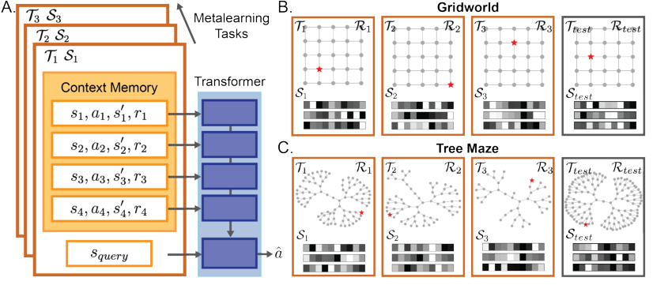
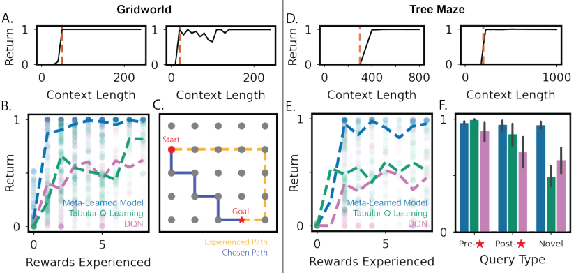
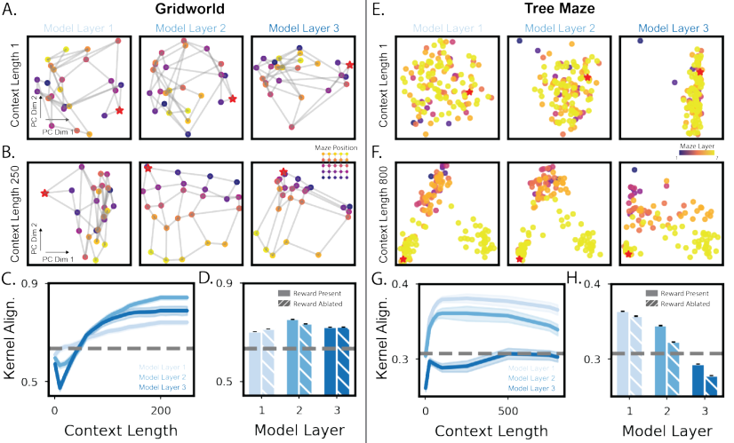
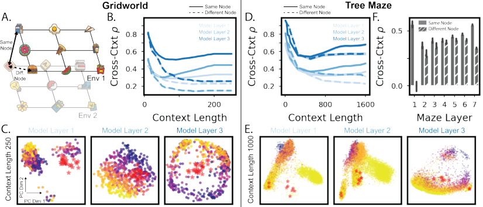
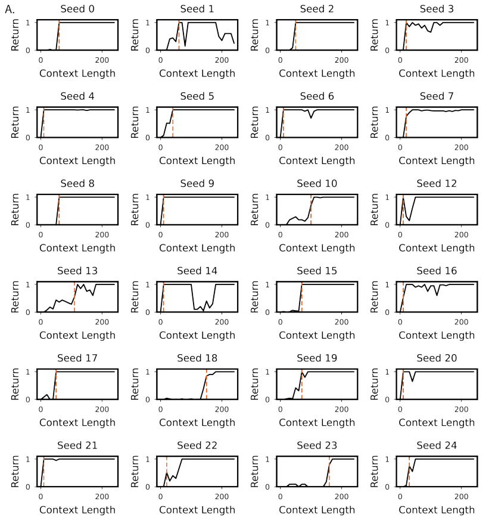
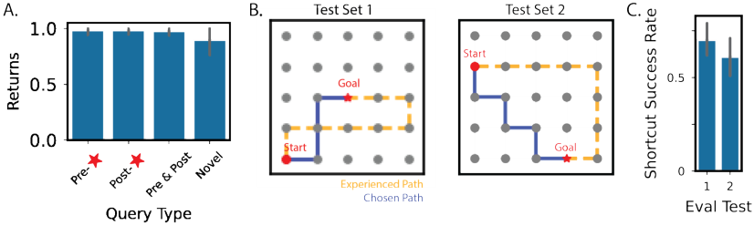
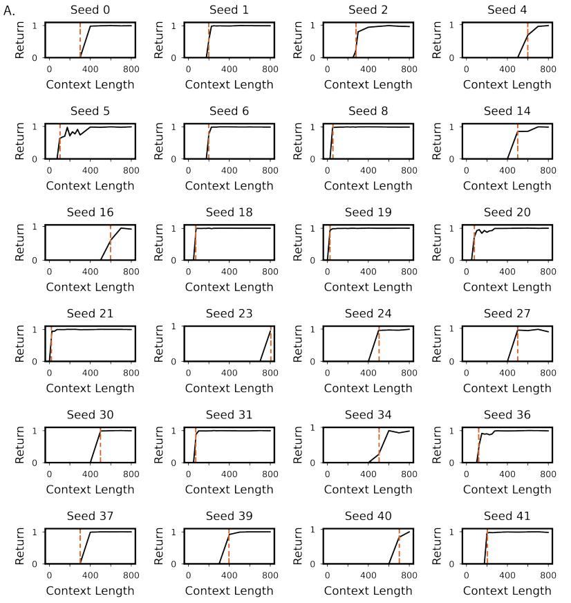
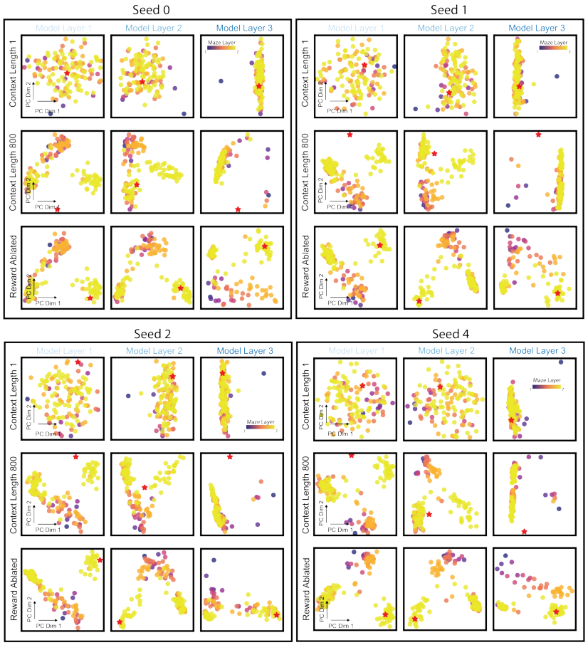
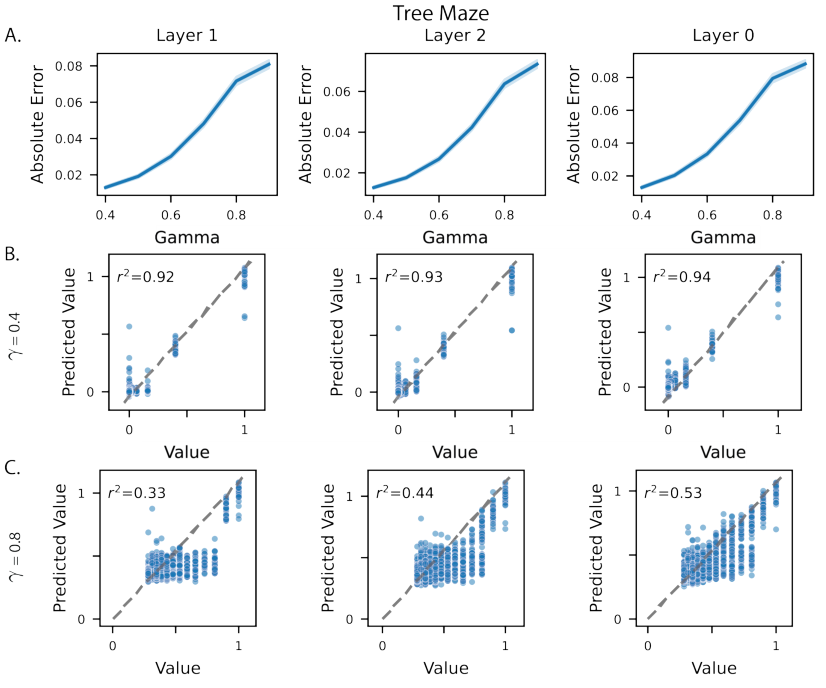

## **From Memories to Maps: Mechanisms of In-Context** **Reinforcement Learning in Transformers**


**Ching Fang**
Department of Neurobiology,
Harvard Medical School &
Kempner Institute, Harvard University,
Boston, MA, USA.
```
  chingfang17@gmail.com

```


**Kanaka Rajan** _[∗]_
Department of Neurobiology,
Harvard Medical School &
Kempner Institute, Harvard University,
Boston, MA, USA.
`kanaka_rajan@hms.harvard.edu` _[∗]_


**Abstract**


Humans and animals show remarkable learning efficiency, adapting to new environments with minimal experience. This capability is not well captured by standard
reinforcement learning algorithms that rely on incremental value updates. Rapid
adaptation likely depends on episodic memory—the ability to retrieve specific past
experiences to guide decisions in novel contexts. Transformers provide a useful setting for studying these questions because of their ability to learn rapidly in-context
and because their key-value architecture resembles episodic memory systems in
the brain. We train a transformer to in-context reinforcement learn in a distribution
of planning tasks inspired by rodent behavior. We then characterize the learning
algorithms that emerge in the model. We first find that representation learning
is supported by in-context structure learning and cross-context alignment, where
representations are aligned across environments with different sensory stimuli. We
next demonstrate that the reinforcement learning strategies developed by the model
are not interpretable as standard model-free or model-based planning. Instead, we
show that in-context reinforcement learning is supported by caching intermediate
computations within the model’s memory tokens, which are then accessed at decision time. Overall, we find that memory may serve as a computational resource,
storing both raw experience and cached computations to support flexible behavior.
Furthermore, the representations developed in the model resemble computations
associated with the hippocampal-entorhinal system in the brain, suggesting that
our findings may be relevant for natural cognition. Taken together, our work offers
a mechanistic hypothesis for the rapid adaptation that underlies in-context learning
in artificial and natural settings.


**1** **Introduction**


Animals can learn efficiently from sparse data, rapidly adapting to new environments with minimal
experience. For example, humans can infer underlying structure or learn new concepts from just a
handful of examples and mice in maze tasks can identify optimal paths after only a few successful
trials [Meister, 2022]. Standard reinforcement learning (RL) algorithms, which typically rely on
incremental value updates to shape decision-making, does not capture this rapid learning behavior
well [Eckstein et al., 2024]. One explanation is that biological agents possess useful priors shaped
by evolution and experience, allowing them to generalize quickly in naturalistic settings. They also
rely on episodic memory, the ability to recall specific past experiences to guide decisions in novel
situations.


_∗_ corresponding author: Kanaka Rajan


Preprint. Under review.


Here, we ask how episodic memory operates not just as storage, but as a computational substrate for
rapid learning and decision-making. We train a transformer model to perform in-context reinforcement
learning [Lee et al., 2023] on navigation tasks inspired by rodent behavior. In each new environment,
the model receives exploratory trajectories as context and infers a goal-directed policy. Transformers
are especially relevant not only because of their established capabilities for rapid and flexible incontext learning [Dong et al., 2022, Brown et al., 2020, Lampinen et al., 2024], but also because their
key–value memory architecture has been linked to models of episodic memory in the brain [Krotov
and Hopfield, 2020, Tyulmankov et al., 2021, Fang et al., 2025]. Understanding the reinforcement
learning strategy that emerges in these models can provide new hypotheses for how memory-based
computations might support flexible decision-making in new environments.


We focus on two task suites: spatially regular gridworlds and hierarchically structured tree mazes (Fig
1BC). While both require memory to support goal-directed behavior, they differ sharply in geometry:
gridworlds are Euclidean and spatially continuous, whereas tree mazes are non-Euclidean and branchstructured. This contrast allows us to evaluate how learned in-context strategies generalize across
structural regimes known to challenge standard sequence models– for instance, language models are
known to struggle with symbolic reasoning and hierarchical generalization in tree-structured domains

[Bogin and Berant, 2022, Ruiz and Nachum, 2021, Keysers et al., 2020].


In this paper, we make the following contributions:


    - We show that transformers trained to in-context reinforcement learn develop consistent
representation learning strategies: structure learning within contexts, and alignment of
representations across contexts with shared regularities.


    - The model learns computations similar to those that support natural cognition: the representation learning strategies are consistent with suggested roles for hippocampus and entorhinal
cortex, and memory retrieval patterns at decision time is consistent with hippocampal replay.


    - Mechanistic analysis of the emergent RL strategy shows that the model does not use standard
model-free or model-based RL methods.


    - We give descriptions for the in-context RL algorithm that emerged in transformers to solve
the two planning tasks. We find strategies tend to rely on intermediate computations cached
in memory tokens, demonstrating how episodic memory can be used as a computational
workspace.


**2** **Related Works**


**Meta-learning to discover in-context reinforcement learning algorithms** In order to develop a
model that can in-context reinforcement learn, we use a recently introduced meta-learning framework

[Lee et al., 2023]. Meta-learning is concerned with “learning-to-learn”, using prior knowledge learned
from previous tasks to support rapid adaptation to new ones [Beck et al., 2023]. That is, the goal is to
learn an algorithm _f_ that can be deployed in new tasks. The learning of _f_ is called the _outer-loop_
while _f_ itself is referred to as the _inner-loop_ [Beck et al., 2023]. In many settings where _f_ is a RL
algorithm (meta-RL), the outer loop shapes the weights of the network, but learning within each task
occurs via activation dynamics– through memory and internal state– rather than parameter updates

[Beck et al., 2023, Lampinen et al., 2024]. The resultant _f_ is considered an in-context learning
algorithm [Beck et al., 2023, Sandbrink and Summerfield, 2024, Lampinen et al., 2024].


Early examples of this approach include RL [2], which meta-trains a recurrent neural network using
reinforcement learning in the outer loop, such that an in-context RL strategy emerges in the inner
loop [Wang et al., 2016, Duan et al., 2016]. Subsequent work extended this approach to include
explicit episodic memory mechanisms, combining RNNs with key–value memory architectures

[Ritter et al., 2018, 2020, Team et al., 2023]. More recently, Lee et al. [2023] proposed decisionpretrained transformers (DPTs), which use supervised training in the outer loop to induce in-context
RL behavior in the inner loop. We adopt DPTs in this work both for practical reasons–their scalability
and ease of training–and for scientific ones: the transformer architecture allows us to probe how
memory-based computation supports in-context learning.


**Meta-learning to describe cognition and neural activity** Meta-learning has been proposed as a
framework to model both cognitive flexibility and structured learning in neuroscience and psychology


2




Figure 1: **A transformer is trained to in-context reinforcement learn in diverse planning tasks.**
**A.** Diagram of the meta-learning setup. Each task in the training distribution is defined by a state
transition function _T_, a state encoding function _S_, and a reward function _R_ . For each task, the model
is trained via supervision to predict the optimal action from a query state _s_ query, given a context
dataset _D_ = _{_ ( _s_ 1 _, a_ 1 _, s_ _[′]_ 1 _[, r]_ [1][)] _[,]_ [ (] _[s]_ [2] _[, a]_ [2] _[, s][′]_ 2 _[, r]_ [2][)] _[, . . .][ }]_ [ of RL transition tuples sampled from the task.] **[ B.]**
Illustration of three training tasks (orange) and one test task (gray) from the gridworld distribution.
In each task, the underlying graph structure is fixed (shown in gray), with a reward location (red star)
that varies across tasks. Each state is encoded as a random Gaussian vector (bottom). Importantly,
state encodings in test tasks are novel. **C.** As in (B), but for the tree maze distribution. The graph
structures in the training set is drawn from probabilistically branching trees, while the test set graph
structure is a full binary tree.


[Binz et al., 2024]. In human cognitive tasks, meta-learned models have been used to replicate
observed heuristics in decision-making and to account for few-shot generalization [Dasgupta et al.,
2020, Binz et al., 2022, Lake and Baroni, 2023]. Meta-RL, in particular, has been used to generate
hypotheses about how neural systems implement learning across tasks. Previous studies have used
the RL2 framework to show how the outer and inner learning loops can model different areas of
the brain, with the prefrontal cortex often playing a key role [Wang et al., 2018, Hattori et al., 2023,
Zheng et al., 2025]. Despite these advances, many computational models in neuroscience rely on
single-task RL, training agents independently on each task without leveraging prior experience. In
contrast, we use meta-RL as a tool for developing flexible in-context learning, without attempting to
localize the outer loop to any specific brain region. Our focus is on the computational content of the
learned representations and decision-making strategies.


**Transformers and episodic memory systems** Transformer models process sequences by computing self-attention over key–value pairs, enabling flexible access to information across long contexts

[Vaswani et al., 2017]. This key–value structure has led to interpretations of transformers as memory
systems [Geva et al., 2020], aligning them with a broader class of models that incorporate explicit
memory mechanisms [Graves et al., 2014, Sukhbaatar et al., 2015, Graves et al., 2016, Banino et al.,
2020]. These systems separate memory addressing (keys) from memory content (values), enabling
high-fidelity storage and targeted retrieval. This architectural separation bears many similarities to theoretical accounts of episodic memory in the brain [Teyler and DiScenna, 1986, Teyler and Rudy, 2007,
Gershman et al., 2025]. For example, recent work has formalized connections between key–value
architectures and Hopfield networks, a classic model of associative memory in the brain [Krotov
and Hopfield, 2020, Ramsauer et al., 2020]. Other studies have proposed biologically grounded
implementations of key–value attention mechanisms, further linking transformer-like architectures
to neural computation [Bricken and Pehlevan, 2021, Tyulmankov et al., 2021, Whittington et al.,
2021, Kozachkov et al., 2023, Fang et al., 2025, Chandra et al., 2025]. Several of these models
take direct inspiration from the hippocampus, a brain region widely implicated in episodic memory

[Whittington et al., 2021, Fang et al., 2025, Chandra et al., 2025]. Recent experimental work has
also identified key–value–like coding patterns in hippocampal activity during episodic memory tasks

[Chettih et al., 2024]. Together, these findings suggest that key–value architectures offer a useful


3


computational analogy for episodic memory. In this work, we analyze a meta-trained transformer to
examine what kinds of memory-supported strategies emerge when such an architecture is optimized
for rapid adaptation.


**3** **Experimental Methods**


**Meta-learning procedure**


We adopt the decision-pretraining framework introduced by Lee et al. [2023] (Fig. 1A), where the
model is trained via supervision to learn an optimal policy given in-context experience. Each task
_τ_ is a Markov Decision Process (MDP) defined by the tuple _⟨S, A, T, R, ρ⟩_, with state encoding
function _S_, action space _A_, transition function _T_, reward function _R_, and initial state distribution
_ρ_ . A subset of tasks from this distribution is sampled for meta-training. For each task, the model
is provided an in-context dataset _D_, consisting of a trajectory collected from an exploratory policy
interacting with the environment. Each dataset _D_ consists of interaction tuples ( _s, a, s_ _[′]_ _, r_ ), where
each tuple represents a transition experienced by the agent during exploration. The model receives
both the in-context dataset _D_ and a query state _s_ query _∈S_ . It is then trained to predict the optimal
action _a_ _[∗]_ _∼_ _π_ _[∗]_ ( _· | s_ query) under the task-specific optimal policy _π_ _[∗]_ .


At test time, the trained model is evaluated on held-out tasks, using only in-context information to
guide behavior without any parameter updates. Importantly, sensory observations in held-out tasks
are entirely novel to the model. We focus on an offline setting, where the in-context dataset _D_ is
generated by a fixed exploratory policy. The model learns to use this experience to construct a policy
in this previously unseen task—effectively performing reinforcement learning in-context.


**Structure of task suites**


Our first task distribution is a 5 _×_ 5 gridworld in which the reward location is fixed but hidden from
the agent during exploration. This setting is loosely inspired by the Morris water maze, a behavioral
task used to study how animals leverage memory to navigate unknown environments [Vorhees and
Williams, 2006]. Across tasks in this distribution, the transition function _T_ is fixed, while the state
encoding _S_ and reward location _R_ vary (Fig. 1B). At test time, the model is deployed in a gridworld
with novel sensory observations and a new reward location.


Our second task distribution consists of tree-structured mazes, which introduce hierarchical state
transitions and sparse rewards [Rosenberg et al., 2021]. The meta-training set consists of binary trees
generated with a branching probability of 0.9, producing diverse but related maze structures across
tasks (Fig. 1C). The action space consists of four options: stay, move to the parent node, or move to
either child node. Invalid transitions (e.g., from the root to a parent) result in the agent remaining in
place. As in the gridworld setting, the state encodings _S_ and reward locations _R_ vary across tasks. At
test time, the model is evaluated on a full 7-layer binary tree, consistent with Rosenberg et al. [2021],
again using novel state encodings not seen during training.


In both task suites, each state is represented by a 10-dimensional Gaussian vector, with spatial
correlations introduced across states. The in-context dataset _D_ is generated using a random walk
policy augmented with heuristics designed to mimic animal-like exploration patterns (Appendix A).
Further task design details are provided in Appendix A. Together, these two tasks allow us to analyze
model behavior in both a spatially regular setting (gridworld) and a structured, branching environment
(tree maze). We note that tree mazes are setting where rodents display rapid learning [Rosenberg
et al., 2021]. More broadly, branching environment structures pose a challenge for standard sequence
models—such as language models trained on text—due to its non-Euclidean, hierarchical layout and
lack of surface-level structure [Bogin and Berant, 2022, Ruiz and Nachum, 2021].


**Model architecture and selection**


Our base architecture is a causal, GPT2-style transformer with 3 layers and 512-dimensional embeddings. To study how experiential memory supports decision-making, we provide the context memory
_D_ before the query token _squery_ . This contrasts with Lee et al. [2023], where the query appears first.
This ordering supports an interpretation in which previous experiences are stored as cached key–value
memories that are retrieved at query time. A useful analogy is the autoregressive interpretation of
linear attention transformers [Katharopoulos et al., 2020]. To efficiently train the model with this


4




Figure 2: **Transformers can rapidly learn and plan in new tasks. A.** Average max-normalized
return in two held-out gridworld environments as a function of context length. For each length, 20
query states are sampled at random and the test horizon is 15. **B.** As in (A), but return is plotted against
the number of rewards experienced in-context, and we collect results over 50 held-out environments.
Each point represents the results from one environment; averages are shown as line plots. Colors
denote the meta-learned transformer (blue), tabular Q-learning (green), and DQN (pink). **C.** Example
of shortcut behavior in a held-out gridworld. The model is shown a circuitous trajectory (orange
dashed line) from start (red dot) to goal (red star), but executes a more efficient path (blue). **D.** As
in (A), but for held-out tree maze environments, where the test horizon is 100. **E.** As in (B), but
for held-out tree maze environments. **F.** As in (D,E), but shown only for context length 800 and
subdivided by query type: states seen before reward (Pre- _⋆_ ), after reward (Post- _⋆_ ), or never seen in
context (Novel; not used in B,E). Model types use the same color scheme as in (E). Error bars show
95% confidence intervals over the 50 sample environments.


token ordering, we implement custom attention masks during training (Appendix B). We meta-train
five models from different random seeds and select the best-performing one for analysis in the main
results. Additional details on model architecture, training procedures, and parameter sweeps are
provided in Appendix B.


Several alternative modeling choices are possible, including using uncorrelated stimuli or increasing
the number of transformer layers. We evaluate these variations in Appendix C, comparing their
outcomes to the main results. None of these modifications meaningfully affected the results; further
discussion is provided in Appendix C.


**4** **Results**


**4.1** **Transformers learn a RL strategy to rapidly solve planning tasks relevant to natural**
**cognition.**


We evaluate the agent’s ability to act in a goal-directed manner from a query state, using an in-context
dataset generated by an exploratory policy in a new environment with novel sensory observations.


**Gridworld** We begin by evaluating the agent’s behavior in held-out gridworld environments. We
evaluate performance from query states that were observed in-context and located at least 6 steps
from the goal. We plot return as a function of context length (Fig. 2A; Appendix D). If no eligible
query states meet the selection criteria, return is recorded as zero. In many cases, the meta-learned
agent navigates directly to the reward after a single exposure, mirroring one-shot learning reported
in rodents navigating water mazes [Steele and Morris, 1999]. To summarize performance across
test environments, we plot return as a function of the number of rewards experienced in-context
(Fig. 2B, blue). As expected from the single-trial plots in Fig. 2A, the agent achieves near-maximal
performance after just one reward exposure, with only minor improvements thereafter.


5


We next compare the meta-learned model to standard reinforcement learning methods. Specifically,
we train a tabular Q-learning agent and a deep Q-network (DQN) on each test environment. The
tabular agent serves as a useful control, isolating performance when the challenge of learning
representations is abstracted away. Each Q-learning agent is trained using a replay buffer containing
the same in-context dataset _D_ provided to the meta-learned model. We train each agent for multiple
epochs until convergence (see Appendix E for details). As before, we summarize performance
by plotting return as a function of the number of rewards experienced in-context (Fig. 2B). Both
Q-learning agents underperform relative to the meta-learned model, with the tabular agent slightly
outperforming the DQN. The tabular agent’s advantage over the DQN highlights that representation
learning adds additional difficulty in novel environments. The performance gap between the Qlearning agents and the meta-learned model is substantial but expected, reflecting the utility of learned
priors in this task distribution. These findings suggest that describing the learning efficiency seen in
humans and animals may require moving beyond standard reinforcement learning frameworks.


Finally, we observe that the meta-learned agent discovers shortcut paths to reward. Specifically,
even when the agent only observes a circuitous path in-context, it infers a policy that selects the
shortest route to reward—often through previously unseen states (Fig. 2C). Quantitatively, the model
selects shortcut paths in over 60% of test simulations (Appendix D), compared to 2% under a chance
policy. This suggests that the agent has internalized a representation of the Euclidean geometry of the
environment, a feature that we analyze more deeply in later sections.


**Tree Mazes** We next evaluate the meta-learned agent in a tree maze environment inspired by
Rosenberg et al. [2021]. As in gridworld, the agent rapidly learns the task after only a few reward
exposures (Fig. 2D–E; Appendix D). We repeat the comparison with Q-learning agents in the tree
maze environment (Fig. 2E). As before, learned priors enable the meta-learned agent to capture rapid
learning more effectively than the Q-learning baselines. The tabular agent again outperforms the
DQN, confirming that representation learning remains a core challenge in novel environments.


To gain insight into the priors acquired through meta-learning, we evaluate all models at a long
context length (800 timesteps). We stratify performance by the type of query state (i.e., start state;
Fig. 2F). When the query state was experienced prior to any reward, the tabular agent performed
comparably to the meta-learned model. However, when the query state appeared only after the final
reward, the tabular agent underperforms. This suggests that the meta-learned model acquires a useful
prior: the ability to infer inverse actions. In standard Q-learning, states encountered only along paths
away from reward do not receive value propagation. Finally, we evaluate performance when the query
state was never encountered during context. In this setting, the meta-learned agent performs better
than both Q-learning baselines, likely due to a learned prior over action selection.


**4.2** **The RL strategy learned by the model relies on in-context structure learning to shape**
**representations.**


The behavioral results in Fig. 2B,E highlight that representation learning poses a key computational
challenge in these tasks. How does the model organize state representations—and does a structured
representation learning strategy emerge during in-context processing?


**Gridworld** We begin by visualizing low-dimensional embeddings of model activity across gridworld states. Because the query token represents the agent’s current state, we extract its activity as
the basis for representation analysis. We project the 512-dimensional query representations into a 2D
PCA space at each model layer, for both short and long context lengths (Fig. 3A–B; Appendix F).
Each point is colored by the spatial location of the corresponding query state in the gridworld. With
limited context, the model’s representations are disorganized and show no spatial structure (Fig. 3A).
As in-context experience increases, the representations become more structured and reflect the latent
geometry of the gridworld (Fig. 3B). This structure resembles predictive representation learning, but
crucially, no such objective was imposed during training.


To quantify this effect, we compute the kernel alignment between model representations and the
latent environment structure across held-out tasks (Fig. 3C; Appendix G). Kernel alignment increases
with context length, with layer 2 consistently exhibiting the strongest correspondence to latent
structure. Surprisingly, representation structure is largely unaffected by the presence or absence of
reward (Fig. 3D; Appendix F, G). Overall, we find that in-context experience in gridworld induces
geometry-aligned state representations.


6




Figure 3: **Model representations are shaped by in-context structure learning. A.** Example from
a test gridworld. Query token representations are visualized for each state after projection onto the
first two principal components, with outputs shown from layer 1 (left), layer 2 (middle), and layer 3
(right). Context length is 1. Points are colored by graph location; gray lines indicate true connectivity.
Reward is marked with a red star. **B.** As in (A), but with context length 250. **C.** Kernel alignment
between model representations and latent graph structure as a function of context length, across
100 environments. Shaded regions indicate 95% confidence intervals; colors denote model layer.
Dashed line shows baseline from raw inputs. **D.** As in (C), but shown only for context length 250 and
including reward-ablated conditions (shaded bars). **E, F.** As in (A, B), but for test tree mazes. Points
are colored by maze depth. **G, H.** As in (C, D), but for test tree mazes.


**Tree Mazes** We next ask whether in-context representation learning also emerges in agents trained
on the tree maze task. We repeat the PCA projection analysis on query token representations in tree
mazes (Fig. 3E–F; Appendix F). As context increases, representations organize into a bifurcating
structure that roughly mirrors the maze’s hierarchical layout (Fig. 3F). Kernel alignment also increases
with context length in tree mazes (Fig. 3G), but remains lower than in the gridworld task. This aligns
with the visualizations in Fig. 3F, which suggest that the model learns coarse, high-level structure
rather than fine-grained spatial layout. Representations in the tree maze are more strongly modulated
by reward (Fig. 3H; Appendix F, G).


Taken together, these results indicate that the model meta-learns in-context representation strategies
that vary in granularity across task domains. This provides **normative support for the hypothesis**
**that structure learning facilitates efficient decision-making**, and in fact in-context structure
learning has also been found in the representations of large language models [Park et al., 2024]. This
observation parallels predictive map formation in the hippocampus [Stachenfeld et al., 2017]—long
hypothesized as a computational scaffold for memory—and suggests that similar principles can
emerge in artificial agents through meta-learning.


**4.3** **Representation learning also aligns representations across environments with shared**
**structure.**


In neuroscience, the hippocampal–entorhinal circuit is thought to support structure learning across
contexts [Buckmaster et al., 2004, Kumaran et al., 2009, Whittington et al., 2020]. A leading
hypothesis holds that the hippocampus encodes context-specific experiences, while the entorhinal
cortex abstracts shared structure across environments [Whittington et al., 2020]. Do similar crosscontext alignment strategies emerge in meta-learned agents?


7




Figure 4: **As context grows, representations across environments with similar structure are**
**increasingly aligned. A.** Schematic of cross-environment alignment, based on Whittington et al.

[2020]. Although sensory inputs differ, environments share latent structure, and representations of
matching latent states should be similar. **B.** Average pairwise Pearson correlation of node representations across 100 test gridworlds, as a function of context length. Solid lines: same-node comparisons.
Dashed lines: different-node comparisons. Shading indicates 95% confidence interval. Line color
denotes model layer. **C.** PCA visualization of representations pooled from 50 gridworlds. Points from
15 randomly selected environments are shown for clarity. **D.** As in (B), but for 50 test tree mazes. **E.**
As in (C), but for test tree mazes. **F.** Summary of (D) at context length 1600, averaged across layers.
Cross-environment correlation scores are binned by the maze-layer of the comparison node.


**Gridworld** A key signature of cross-context structure learning is the alignment of internal representations across environments with shared topology. Specifically, even when sensory observations
differ across environments, states occupying the same grid location should be encoded more similarly
than states from different locations (Fig. 4A). To test this, we compute pairwise Pearson correlation
coefficients between model representations of the same graph node across different test environments
(Fig. 4B). We separate correlation scores by whether the compared states occupy the same or different
graph nodes. With limited context, representations appear collapsed—showing high correlation
across all states regardless of node identity. As context length increases, this gap widens: states from
the same node become more aligned than those from different nodes (Fig. 4B; solid vs. dashed).


This alignment is also visually apparent when directly inspecting the model’s internal representations.
We aggregate representations from 50 test environments and project them into a shared 2D PCA
space (Fig. 4C). In layers 2 and 3, representations from corresponding graph nodes cluster across
environments, reflecting shared latent structure. Notably, representations of goal states also align
across environments, despite the reward location being randomized.


**Tree Mazes** Do similar alignment strategies emerge in models trained on tree mazes? As in
gridworld, correlation scores across environments (Fig. 4D) reveal initially collapsed representations
that differentiate by graph node with increasing context. We further stratify these correlations by
node position within the tree (Fig. 4F). Cross-context alignment is strongest for states near the
root or leaves of the tree, and weakest at intermediate depths. This pattern echoes the in-context
results: the model favors encoding coarse structural motifs over precise positional detail. The PCA
visualization (Fig. 4E) further illustrates this alignment across environments. Importantly, neither
in-context nor cross-context representation alignment was explicitly trained—these strategies emerge
opportunistically as a byproduct of meta-learning.


**4.4** **The RL strategy that emerges from meta-learning does not show signatures of**
**value-based learning or model-based planning.**


Thus far, we have shown that meta-learned agents replicate the rapid learning dynamics observed
in animal behavior. A key component of this success is the emergence of structured representations from contextual input. We now turn to characterizing the mechanisms of the underly

8


Figure 5: **Memory retrieval at decision time shows limited expansion from the query state and**
**the goal state. A.** Two example tree maze environments. The query state is marked with a red
dot and the goal with a red star. Context length is 800. Edge color indicates gradient attribution
strength for each transition, normalized within each environment. **B.** Average attribution strength as a
function of distance from the query state, computed across 50 environments. Shaded regions show
95% confidence intervals. **C.** As in (B), but plotted as a function of distance from the goal state.


ing RL strategy. We begin by testing whether the model exhibits hallmarks of standard modelfree reinforcement learning. Specifically, we assess whether the model encodes value estimates
_V_ _[∗]_ ( _s_ ) = E _π_ [ [�] _[∞]_ _t_ =0 _[γ][t][R][t]_ [+1] _[ |][ S]_ [0][ =] _[ s]_ []][ for its current state] _[ s]_ [ under an optimal policy. We train linear]
decoders on query token representations to predict _V_ ( _s_ ) and evaluate generalization on held-out
environments (Appendix J). In gridworld, _V_ ( _s_ ) can be decoded with high accuracy (Appendix K).
However, decoding is more accurate when _V_ ( _s_ ) is defined in terms of Euclidean distance to the
goal, rather than over the true 4-dimensional action space (Appendix K). This suggests that the
model encodes spatial structure rather than true value gradients—its apparent _V_ ( _s_ ) reflects geometric
regularities, not action-contingent reward prediction. In tree mazes, decoded value estimates are
localized: _V_ ( _s_ ) is only reliable within 2–3 steps of the reward (Appendix K). This narrow value
gradient is insufficient to guide behavior over the full task horizon.


Next, we test whether the model exhibits hallmarks of standard model-based RL. Such algorithms
typically rely on explicit path planning between the query and goal states. Planning need not follow
a strictly forward trajectory, and transformers in particular can implement diverse state-tracking
strategies to support long-range planning [Li et al., 2025]. Critically, however, all such strategies
depend on retrieving intermediate states along the path from query to goal during decision time. To
evaluate this, we assess which context-memory tokens influence the model’s decision at a given
query state. Using integrated gradients, we measure attribution strength for memory tokens along
the query–goal path (Fig. 5; Appendix L). In both gridworld and tree mazes, tokens near the query
and goal states show high attribution, while intermediate tokens receive little to no weight. This
pattern is inconsistent with path planning, which requires attending to transitions along the full route
at decision time (Appendix L).


As a further test, we perform attention ablations to assess the necessity of individual memory tokens
for decision-making. To test whether information about a particular state _s_ is necessary, we mask
attention from the query token to all context-memory tokens involving _s_ . We repeat this procedure
across model layers and measure the resulting change in cross-entropy loss (Appendix L). In both task
suites, we find that the query token can make correct decisions without attending to intermediate path
states. This again contradicts planning-based strategies, which require integration over intermediate
transitions (Appendix L). Our conclusion contrasts with prior work that analyzed the behavior of
meta-learned RL agents and suggested that they implement a form of model-based planning [Wang
et al., 2016, Ritter et al., 2018]. It is possible that meta-learning can discover more typical modelbased strategies in other settings, and these discrepancies demonstrate that the mechanistic perspective
taken here can provide insights into understanding meta-learned algorithms.


In summary, we find that the agent does not use value gradients or path planning to make decisions.
Our analyses also reveal an additional neural prediction: memory retrieval at decision time should be
biased toward experiences near the agent’s current location and its goal. Such replay patterns have
been observed in the hippocampus during spatial decision-making tasks [Jackson et al., 2006, Pfeiffer


9


Figure 6: **Gridworld tasks are solved by aligning internal representations to Euclidean space.**
**A.** Overview of model analysis methods used in gridworld: linear decoding, attention ablation, and
attention profiling. **B.** Total decoding error (X + Y) across 60 test environments, plotted by true XY
position of the query state. Errors shown for query stream representations from layer 1 (left) and layer
2 (right). Context length = 250. **C.** Decoded vs. true angle from query state to the goal across 60 test
environments. Results shown for representations from layer 1 (left) and layer 2 (right). **D.** Change in
cross-entropy loss after ablating context tokens along the query–goal path, plotted by token position.
Line color indicates layer of intervention. Mean across 50 environments; shaded regions show 95%
confidence intervals. **E.** Average attention score between context-memory tokens as a function of
spatial distance (query–key pairs), for layers 1 and 2. Mean over 50 environments; shaded regions
show 95% confidence intervals.


and Foster, 2013, Mattar and Daw, 2018]. Overall, we suggest that the in-context strategy learned by
the model lies outside the standard taxonomy of model-free and model-based reinforcement learning.


**4.5** **Transformers learn diverse in-context RL strategies where intermediate computations are**
**stored in context-memory tokens.**


We now aim to describe the algorithms used by the model to plan in each task. To do so, we first
review the roles of query and memory tokens. The query token encodes the agent’s current state,
while memory tokens represent previously observed transitions. During inference, the query token
attends to memory tokens to integrate past experience into its policy computation. Across layers, both
query and memory tokens are updated with newly computed features, allowing memory to serve as an
active computational substrate. To reveal how computation unfolds, we will focus on understanding
which tokens are critical in each layer and what information is contained in tokens.


**Gridworld** In gridworld tasks, we suggest that the following strategy is used by the model:


1. Use in-context experience to align representations to Euclidean space, likely by locally
stitching neighboring transitions.


2. Given a query state, calculate the angle in Euclidean space between query and goal state.


3. Use the calculated angle to select an action in that direction.


We arrived at this hypothesis by first identifying the task-relevant variables that are linearly decodable
from the query token at each layer (Fig. 6A). As shown in Section 4.3, the model aligns states across
environments based on shared grid structure. To test for spatial encoding, we train a linear decoder to
predict the latent XY position of the query state from its embedding (Appendix J). Decoder accuracy
is evaluated on held-out environments to test generalization across tasks. Decoding accuracy improves


10


across layers, with spatial position becoming reliably recoverable by layer 2 (error _<_ 1; Fig. 6B).
Estimation error varies spatially, with corner states decoded more accurately than interior locations
(Fig. 6B). Building on this spatial structure, we next decode the angle from the query state to the goal.
By layer 2, the angle to the goal is decoded with high accuracy (Fig. 6C). Strikingly, both position
and goal angle can also be decoded from the context-memory tokens. By layer 2, individual context
tokens—each representing a transition ( _s, a, s_ _[′]_ _, r_ )—encode not only the states involved, but also their
positions and goal-relative angles.


To localize where angle-to-goal information is computed, we assess which context-memory tokens are
necessary for correct decisions. We do this by masking attention from the query token to individual
context tokens, following the ablation procedure described in Section 4.4. We find that layers 1
and 3 are robust to these ablations, but performance degrades in layer 2 when attention to tokens
near the query or goal is removed (Fig. 6D). This suggests that layer 2 computes the relative angle
between query and goal states, likely by comparing their internal XY coordinates. To understand how
this spatial information becomes available for computation, we examine how state representations
evolve through context-to-context attention. We analyze the spatial locality of attention between
context-memory tokens to test whether transitions are integrated locally or globally. Specifically, we
plot attention strength as a function of spatial distance between token pairs (Fig. 6E). We restrict this
analysis to the first two layers, since context-to-context attention in the final layer does not influence
the policy output. Across layers, attention patterns shift from localized to distributed, suggesting that
the model first stitches transitions locally before constructing global structure.


Overall, we suggest that the model organizes memory to reflect Euclidean structure, using that
geometry to guide action selection. This interpretation is supported by the model’s ability to take
spatial shortcuts through previously unseen states (Fig. 2C).


**Tree Mazes** In tree mazes, a useful strategy can be to identify when the agent is on a critical path to
reward and to default to the parent-node action otherwise. This is because there are only 6 states in
the maze (of 127) where the optimal action is to transition to the left child or right child (Fig 7B).
These are the states on the path from root to reward, which we will call the left-right (L-R) path.
Indeed, the model has a strong action bias to take parent-node transitions (Appendix N). Overall, we
find evidence that the model exploits this structure and learns the following strategy:


1. Use in-context experience to stitch transitions backwards from the goal to root, and tag
context-memory tokens that are on the L-R path.


2. Given a query state, check if there are context-memory tokens that contain the query state
and are on the L-R path. If not, default to taking the parent-node transition.


3. Otherwise, extract the optimal action information from the tagged context-memory tokens.


We arrive at this hypothesis by asking how the model takes correct actions when it is on the L-R path.
Again, we work backwards and analyze which context-memory tokens are sufficient to influence
the output from the final model layer. We do so by forcing the query token to attend only to select
context-memory tokens (Fig 7C). Surprisingly, we find that the model output is unaffected if the
query token of the last layer attends only to context-memory tokens involving the query state. These
tokens contain sufficient information for the model to make its decision.


With this in mind, our next question was to understand what information is contained in the contextmemory tokens entering the last model layer. We repeat our linear decoding analyses on the
context-memory tokens. Two variables are well-decoded. First, the inverse action for the transition
represented in a context-memory token can be decoded with high accuracy (Fig 7D). The other
well-decoded variable is whether the context-memory token is a transition on the L-R path (Fig 7D),
regardless of direction (i.e., towards or away from goal). Possibly, at decision time the model tests
if there are context-memory tokens that contain the query state and are tagged as being on the L-R
path. If so, then the correct left/right action can be inferred from the same tagged tokens (in particular
since inverse actions are also encoded). We find further evidence for this strategy by re-doing our
sufficiency analysis from Fig 7C. We test three additional restrictions to the previous analysis: (1)
tokens must be on the L-R path in the direction to the goal, (2) tokens must be on the L-R path in the
direction away from the goal, or (3) tokens are not on the L-R path at all. We find that in the first two
cases the model output is unaffected, but in the third case the output is negatively impacted (Appendix
N). The results of these perturbations are consistent with our hypothesis that decision-making in the


11


Figure 7: **Tree mazes are solved by tagging context-memory tokens on a critical path to reward.**
**A.** Overview of model analysis methods used in tree maze **B.** We ask how the model correctly takes
action on the path from root to goal (L-R path), the only states in the maze where the optimal action is
to transition to the left or right child. **C.** Change in cross-entropy loss when attention is fixed to only
the context-memory token of interest, plotted by token position. In all tests, the query state remains
the same. Line color indicates layer of intervention. Mean across 50 environments, shaded regions
show 95% confidence interval. **D.** Balanced accuracy of decoding from context-memory tokens
their presence on the L-R path and the inverse action. Decoding inverse action is only non-trivial
when considering parent-node transitions so we test our decoder only on those transitions. Mean
across 60 environments with error bars showing 95% confidence interval. We decode from the input
context-memory tokens for each model layer (line color indicates layer). Dashed line indicates chance.
**E.** L-R Path decoding accuracy from (D), but separated by how far each context-memory token is
from goal. **F.** As in Fig 6 but for tree mazes.


model relies on identifying if the query state is on the L-R path via intermediate computations stored
in context-memory tokens.


Finally, we ask how this information becomes present in the context-memory tokens. We plot the L-R
path decoding accuracy from Fig 7D by the distance from the context-memory token to reward (Fig
7E). Across model layers, we see that the decoding accuracy first improves for tokens closest to the
goal and for tokens farthest from the goal. The accuracy then improves for tokens at an intermediate
distance from the goal, where more transition information must be integrated to know if the token
is on the L-R path. Analysis of context-to-context attention also shows more integration of local
information in the first model layer than in the second (Fig 7F). Taken together, we suggest that path
stitching occurs between context-memory tokens such that L-R path tokens are tagged expanding
outwards from the reward state.


**5** **Conclusion**


We have shown that rapid adaptation of agents in tasks relevant to natural cognition can be explained
by RL strategies that lie outside traditional model-free or model-based frameworks. Despite this, our
meta-learned model also displays phenomena expected from neural activity: learning of environment
structure, alignment of representations across environments, and biased memory recall patterns at
decision-time. Taken together, this suggests that understanding the cognitive processes that support
rapid learning may require theorists to consider a broader space of planning strategies. Finally, our
analysis of the RL strategies that emerge in transformers suggest a novel use of episodic memory–
each memory is not only a record of the original experience, but also stores additional computation
useful for decision making [Dasgupta and Gershman, 2021].


12


**6** **Acknowledgements**


We thank Ekdeep Lubana, Jack Lindsey, Gautam Reddy, Ben Eysenbach, Lily Zhang, and members
of the Rajan lab for helpful discussions and feedback. This work was supported by the Harvard
Medical School Lefler Small Grant Award and Dean’s Innovation Award, NIH (RF1DA056403),
James S. McDonnell Foundation (220020466), Simons Foundation (Pilot Extension-00003332-02),
McKnight Endowment Fund, CIFAR Azrieli Global Scholar Program, and NSF (2046583).


**References**


Andrea Banino, Adrià Puigdomènech Badia, Raphael Köster, Martin J Chadwick, Vinicius Zambaldi, Demis Hassabis, Caswell Barry, Matthew Botvinick, Dharshan Kumaran, and Charles
Blundell. Memo: A deep network for flexible combination of episodic memories. _arXiv preprint_
_arXiv:2001.10913_, 2020.


Jacob Beck, Risto Vuorio, Evan Zheran Liu, Zheng Xiong, Luisa Zintgraf, Chelsea Finn, and Shimon
Whiteson. A survey of meta-reinforcement learning. _arXiv preprint arXiv:2301.08028_, 2023.


Marcel Binz, Samuel J Gershman, Eric Schulz, and Dominik Endres. Heuristics from bounded
meta-learned inference. _Psychological review_, 129(5):1042, 2022.


Marcel Binz, Ishita Dasgupta, Akshay K Jagadish, Matthew Botvinick, Jane X Wang, and Eric Schulz.
Meta-learned models of cognition. _Behavioral and Brain Sciences_, 47:e147, 2024.


Ben Bogin and Jonathan Berant. Probing the limits of in-context learning on structured input domains.
In _EMNLP_, 2022.


Trenton Bricken and Cengiz Pehlevan. Attention approximates sparse distributed memory. _Advances_
_in Neural Information Processing Systems_, 34:15301–15315, 2021.


Tom Brown, Benjamin Mann, Nick Ryder, Melanie Subbiah, Jared D Kaplan, Prafulla Dhariwal,
Arvind Neelakantan, Pranav Shyam, Girish Sastry, Amanda Askell, et al. Language models are
few-shot learners. _Advances in neural information processing systems_, 33:1877–1901, 2020.


Cindy A Buckmaster, Howard Eichenbaum, David G Amaral, Wendy A Suzuki, and Peter R Rapp.
Entorhinal cortex lesions disrupt the relational organization of memory in monkeys. _Journal of_
_Neuroscience_, 24(44):9811–9825, 2004.


Sarthak Chandra, Sugandha Sharma, Rishidev Chaudhuri, and Ila Fiete. Episodic and associative
memory from spatial scaffolds in the hippocampus. _Nature_, pages 1–13, 2025.


Selmaan N Chettih, Emily L Mackevicius, Stephanie Hale, and Dmitriy Aronov. Barcoding of
episodic memories in the hippocampus of a food-caching bird. _Cell_, 187(8):1922–1935, 2024.


Ishita Dasgupta and Samuel J Gershman. Memory as a computational resource. _Trends in cognitive_
_sciences_, 25(3):240–251, 2021.


Ishita Dasgupta, Eric Schulz, Joshua B Tenenbaum, and Samuel J Gershman. A theory of learning to
infer. _Psychological review_, 127(3):412, 2020.


Qingxiu Dong, Lei Li, Damai Dai, Ce Zheng, Jingyuan Ma, Rui Li, Heming Xia, Jingjing Xu,
Zhiyong Wu, Tianyu Liu, et al. A survey on in-context learning. _arXiv preprint arXiv:2301.00234_,
2022.


Yan Duan, John Schulman, Xi Chen, Peter L Bartlett, Ilya Sutskever, and Pieter Abbeel. Rl [2] : Fast
reinforcement learning via slow reinforcement learning. _arXiv preprint arXiv:1611.02779_, 2016.


Maria K Eckstein, Christopher Summerfield, and Kevin J Miller. Hybrid neural-cognitive models
reveal how memory shapes human reward learning, 2024.


Ching Fang, Jack Lindsey, Larry F Abbott, Dmitriy Aronov, and Selmaan Chettih. Barcode activity
in a recurrent network model of the hippocampus enables efficient memory binding. January 2025.
doi: 10.7554/elife.103512.1. URL `[http://dx.doi.org/10.7554/eLife.103512.1](http://dx.doi.org/10.7554/eLife.103512.1)` .


13


Samuel J Gershman, Ila Fiete, and Kazuki Irie. Key-value memory in the brain. _arXiv preprint_
_arXiv:2501.02950_, 2025.


Mor Geva, Roei Schuster, Jonathan Berant, and Omer Levy. Transformer feed-forward layers are
key-value memories. _arXiv preprint arXiv:2012.14913_, 2020.


Alex Graves, Greg Wayne, and Ivo Danihelka. Neural turing machines. _arXiv preprint_
_arXiv:1410.5401_, 2014.


Alex Graves, Greg Wayne, Malcolm Reynolds, Tim Harley, Ivo Danihelka, Agnieszka GrabskaBarwi´nska, Sergio Gómez Colmenarejo, Edward Grefenstette, Tiago Ramalho, John Agapiou, et al.
Hybrid computing using a neural network with dynamic external memory. _Nature_, 538(7626):
471–476, 2016.


Ryoma Hattori, Nathan G Hedrick, Anant Jain, Shuqi Chen, Hanjia You, Mariko Hattori, Jun-Hyeok
Choi, Byung Kook Lim, Ryohei Yasuda, and Takaki Komiyama. Meta-reinforcement learning via
orbitofrontal cortex. _Nature Neuroscience_, 26(12):2182–2191, 2023.


Jadin C Jackson, Adam Johnson, and A David Redish. Hippocampal sharp waves and reactivation
during awake states depend on repeated sequential experience. _Journal of Neuroscience_, 26(48):
12415–12426, 2006.


Angelos Katharopoulos, Apoorv Vyas, Nikolaos Pappas, and François Fleuret. Transformers are rnns:
Fast autoregressive transformers with linear attention. In _International conference on machine_
_learning_, pages 5156–5165. PMLR, 2020.


Daniel Keysers, Nathanael Schärli, Nathan Scales, Hylke Buisman, Dimitar Furrer, Seyed Mehdi
Kazemi, Jonathan Raiman, Maarten Bosma, and Neil Houlsby. Measuring compositional generalization: A comprehensive method on realistic data. _Transactions of the Association for_
_Computational Linguistics_, 8:245–261, 2020.


Leo Kozachkov, Ksenia V Kastanenka, and Dmitry Krotov. Building transformers from neurons and
astrocytes. _Proceedings of the National Academy of Sciences_, 120(34):e2219150120, 2023.


Dmitry Krotov and John Hopfield. Large associative memory problem in neurobiology and machine
learning. _arXiv preprint arXiv:2008.06996_, 2020.


Dharshan Kumaran, Jennifer J Summerfield, Demis Hassabis, and Eleanor A Maguire. Tracking
the emergence of conceptual knowledge during human decision making. _Neuron_, 63(6):889–901,
2009.


Brenden M Lake and Marco Baroni. Human-like systematic generalization through a meta-learning
neural network. _Nature_, 623(7985):115–121, 2023.


Andrew Kyle Lampinen, Stephanie CY Chan, Aaditya K Singh, and Murray Shanahan. The broader
spectrum of in-context learning. _arXiv preprint arXiv:2412.03782_, 2024.


Jonathan Lee, Annie Xie, Aldo Pacchiano, Yash Chandak, Chelsea Finn, Ofir Nachum, and Emma
Brunskill. Supervised pretraining can learn in-context reinforcement learning. _Advances in Neural_
_Information Processing Systems_, 36:43057–43083, 2023.


Belinda Z Li, Zifan Carl Guo, and Jacob Andreas. (how) do language models track state? _arXiv_
_preprint arXiv:2503.02854_, 2025.


Marcelo G Mattar and Nathaniel D Daw. Prioritized memory access explains planning and hippocampal replay. _Nature neuroscience_, 21(11):1609–1617, 2018.


Markus Meister. Learning, fast and slow. _Current opinion in neurobiology_, 75:102555, 2022.


Core Francisco Park, Andrew Lee, Ekdeep Singh Lubana, Yongyi Yang, Maya Okawa, Kento Nishi,
Martin Wattenberg, and Hidenori Tanaka. Iclr: In-context learning of representations. _arXiv_
_preprint arXiv:2501.00070_, 2024.


Brad E Pfeiffer and David J Foster. Hippocampal place-cell sequences depict future paths to
remembered goals. _Nature_, 497(7447):74–79, 2013.


14


Hubert Ramsauer, Bernhard Schäfl, Johannes Lehner, Philipp Seidl, Michael Widrich, Thomas Adler,
Lukas Gruber, Markus Holzleitner, Milena Pavlovi´c, Geir Kjetil Sandve, et al. Hopfield networks
is all you need. _arXiv preprint arXiv:2008.02217_, 2020.


Sam Ritter, Ryan Faulkner, Laurent Sartran, Adam Santoro, Matt Botvinick, and David Raposo.
Rapid task-solving in novel environments. _arXiv preprint arXiv:2006.03662_, 2020.


Samuel Ritter, Jane Wang, Zeb Kurth-Nelson, Siddhant Jayakumar, Charles Blundell, Razvan Pascanu,
and Matthew Botvinick. Been there, done that: Meta-learning with episodic recall. In _International_
_conference on machine learning_, pages 4354–4363. PMLR, 2018.


Matthew Rosenberg, Tony Zhang, Pietro Perona, and Markus Meister. Mice in a labyrinth show rapid
learning, sudden insight, and efficient exploration. _Elife_, 10:e66175, 2021.


Nilesh Tripuraneni Ruiz and Ofir Nachum. Graph structured prediction energy networks. In _NeurIPS_,
2021.


Kai Sandbrink and Christopher Summerfield. Modelling cognitive flexibility with deep neural
networks. _Current Opinion in Behavioral Sciences_, 57:101361, 2024.


Kimberly L Stachenfeld, Matthew M Botvinick, and Samuel J Gershman. The hippocampus as a
predictive map. _Nature neuroscience_, 20(11):1643–1653, 2017.


RJ Steele and RGM Morris. Delay-dependent impairment of a matching-to-place task with chronic
and intrahippocampal infusion of the nmda-antagonist d-ap5. _Hippocampus_, 9(2):118–136, 1999.


Sainbayar Sukhbaatar, Jason Weston, Rob Fergus, et al. End-to-end memory networks. _Advances in_
_neural information processing systems_, 28, 2015.


Mukund Sundararajan, Ankur Taly, and Qiqi Yan. Axiomatic attribution for deep networks. In
_International conference on machine learning_, pages 3319–3328. PMLR, 2017.


Adaptive Agent Team, Jakob Bauer, Kate Baumli, Satinder Baveja, Feryal Behbahani, Avishkar
Bhoopchand, Nathalie Bradley-Schmieg, Michael Chang, Natalie Clay, Adrian Collister, et al.
Human-timescale adaptation in an open-ended task space. _arXiv preprint arXiv:2301.07608_, 2023.


Timothy J Teyler and Pascal DiScenna. The hippocampal memory indexing theory. _Behavioral_
_neuroscience_, 100(2):147, 1986.


Timothy J Teyler and Jerry W Rudy. The hippocampal indexing theory and episodic memory:
updating the index. _Hippocampus_, 17(12):1158–1169, 2007.


Danil Tyulmankov, Ching Fang, Annapurna Vadaparty, and Guangyu Robert Yang. Biological
learning in key-value memory networks. _Advances in Neural Information Processing Systems_, 34:
22247–22258, 2021.


Hado Van Hasselt, Arthur Guez, and David Silver. Deep reinforcement learning with double qlearning. In _Proceedings of the AAAI conference on artificial intelligence_, volume 30, 2016.


Ashish Vaswani, Noam Shazeer, Niki Parmar, Jakob Uszkoreit, Llion Jones, Aidan N Gomez, Łukasz
Kaiser, and Illia Polosukhin. Attention is all you need. _Advances in neural information processing_
_systems_, 30, 2017.


Charles V Vorhees and Michael T Williams. Morris water maze: procedures for assessing spatial and
related forms of learning and memory. _Nature protocols_, 1(2):848–858, 2006.


Jane X Wang, Zeb Kurth-Nelson, Dhruva Tirumala, Hubert Soyer, Joel Z Leibo, Remi Munos,
Charles Blundell, Dharshan Kumaran, and Matt Botvinick. Learning to reinforcement learn. _arXiv_
_preprint arXiv:1611.05763_, 2016.


Jane X Wang, Zeb Kurth-Nelson, Dharshan Kumaran, Dhruva Tirumala, Hubert Soyer, Joel Z Leibo,
Demis Hassabis, and Matthew Botvinick. Prefrontal cortex as a meta-reinforcement learning
system. _Nature neuroscience_, 21(6):860–868, 2018.


15


James CR Whittington, Timothy H Muller, Shirley Mark, Guifen Chen, Caswell Barry, Neil Burgess,
and Timothy EJ Behrens. The tolman-eichenbaum machine: unifying space and relational memory
through generalization in the hippocampal formation. _Cell_, 183(5):1249–1263, 2020.


James CR Whittington, Joseph Warren, and Timothy EJ Behrens. Relating transformers to models
and neural representations of the hippocampal formation. _arXiv preprint arXiv:2112.04035_, 2021.


Yicong Zheng, Nora Wolf, Charan Ranganath, Randall C O’Reilly, and Kevin L McKee. Flexible
prefrontal control over hippocampal episodic memory for goal-directed generalization. _arXiv_
_preprint arXiv:2503.02303_, 2025.


16


**A** **Task construction**


**A.1** **Gridworld**


We use a 5 _×_ 5 2D gridworld environment. Thus, there are _N_ = 5 _×_ 5 = 25 states in the environment,
each of which corresponds to an underlying ( _x, y_ ) location. Actions are one-hot encoded and consist
of: up, right, down, left, stay. If the agent chooses to take an action that hits the environment
boundaries, this manifests as a "stay" transition. The transition structure in this environment _T_ (that
is, how actions transition the agent from one ( _x, y_ ) state to another) is fixed across all tasks. Each
task is defined by the sensory encoding _S_, the reward location _R_, and the in-context exploration
trajectory _D_ .


Each state in a gridworld task corresponds is encoded by a 10-dimensional vector. For each task,
we describe the set of these _N_ encoding vectors as _S_ . The following describes how we generate
the encoding vectors comprising _S_ . We first define a random expansion matrix _E ∈R_ _[N]_ _[×][N]_, where
_Ei,j ∈N_ (0 _,_ 1). We next construct a distance correlation matrix _D ∈R_ _[N]_ _[×][N]_ by exponentiating the
negative Euclidean distances between all pairs of grid positions: _Di,j_ = _σ_ [(] _[||]_ [(] _[x][i][,y][i]_ [)] _[−]_ [(] _[x][j]_ _[,y][j]_ [)] _[||]_ [2][)] for
states _i_ and _j_ and their corresponding ( _x, y_ ) locations. Here, _σ ∈_ [0 _,_ 1] is a correlation parameter that
controls how strongly nearby positions are correlated in the encoding space. Thus, the encoding of
state _i_ is computed as _||EDED_ :: _,i,i||_ 2 [and] _[ S]_ [ =] _[ {]_ _||EDED_ :: _,i,i||_ 2 _[}]_ _i_ _[N]_ =0 [.]


The reward state _R_ is chosen from the _N_ states in the environment. The in-context exploration
trajectory is generated from a random walk with a randomly chosen initial state, plus some reasonable
heuristics. Specifically, we make the probability of selecting the "stay" action half as likely as the
other actions. In addition, if the agent takes an action that causes it to not transition to a new state,
the probability of taking that action again is downweighted to 0 until the agent transitions to a new
state (preventing the agent from getting stuck at boundaries). Running this biased random walk for _T_
steps gives us _C_ = ( _st, a, s_ _[′]_ _t_ _[, r][t]_ [)] _[T]_ _t_ =0 [, a set of standard RL transitions.]


Our dataset is generated offline before training. We now describe how we construct the
train/evaluation/test sets. For a desired dataset size of _M_, we partition the _N_ states of the gridworld environment into three sets of sizes _M ∗_ _ptrain_, _M ∗_ _peval_, _M ∗_ _ptest_ . Specifically, we divide
the dataset with ratios: _ptrain_ = 0 _._ 8, _peval_ = 0 _._ 1, _ptest_ = 0 _._ 1. To generate the training dataset, we
construct _M ∗_ _ptrain_ tasks, where we sample _R_ from the corresponding training partition of states.
We then sample _S_ and _D_ as described above. We repeat this for the evaluation and test datasets. The
training dataset is used for pretraining. The evaluation dataset is used for validation during pretraining
and selecting models. The test dataset is used for any analyses conducted after model training and
selection.


**A.2** **Tree Mazes**


We use binary tree environments with 7 tree layers (that is, a minimum of 6 actions is needed to
navigate from root to leaf). Actions are one-hot encoded and consist of: right child, left child, parent,
stay. If the agent tries to transition to a node that does not exist (e.g. trying to go to "parent" from the
root), this manifests as a "stay" transition. The transition structure _T_ can vary across tasks. This is
because in each task the underlying tree is generated with branching probability 0 _._ 9. Thus, there is
a maximum of 127 states in each task. Each task is defined by the transition structure _T_, sensory
encoding _S_, the reward location _R_, and the in-context exploration dataset _D_ .


The sensory encodings are generated as in gridworld, except _D_ is defined via the geodesic distances
between any two tree states. The reward state _R_ is chosen only from leaf nodes. The in-context
exploration trajectory _D_ is generated from a random walk from the root node, with reasonable
heuristics. We use the same heuristics as in gridworld. We also add heuristics described in Rosenberg
et al. [2021] of mice in similar mazes. That is, the agent is more likely to alternate between left
and right transitions when transitioning through child nodes. In addition, the agent is less likely to
backtrack.


As before, our dataset is generated offline before training. For a desired dataset size of _M_, we
construct three sets of sizes _M ∗_ _ptrain_, _M ∗_ _peval_, _M ∗_ _ptest_, with _ptrain_ = 0 _._ 8, _peval_ = 0 _._ 1,
_ptest_ = 0 _._ 1. To generate the training dataset, we construct _M ∗_ _ptrain_ tasks, where we sample _T_
from binary trees with branching probability 0 _._ 9. We use only trees with at least one leaf node in the


17


seventh layer and, for the training dataset, exclude the full 7-layer tree. We sample _R_ from one of the
leaf nodes. We then sample _S_ and _D_ as described above. We repeat this for the evaluation dataset,
ensuring distinct _T_ from the training dataset. The test dataset comprises only of _T_ corresponding
to a full binary tree, with _R, S, S_ sampled as above. As b before, the training dataset is used for
pretraining. The evaluation dataset is used for validation during pretraining and selecting models.
The test dataset is used for any analyses conducted after model training and selection.


**B** **Model and Training Parameters**


We largely follow the same architecture as that of Lee et al. [2023], a GPT-2 style model with causal
attention and without positional embeddings. Our default model has 4 heads, 3 layers, and embedding
dimension of 512. Context memory tokens consist of the ( _st, a, s_ _[′]_ _t_ _[, r][t]_ [)][ tuple concatenated together]
into one vector. Thus, tokens are 26-dimensional in gridworld and 25-dimensional in tree maze. The
query token consists of ( _sq,_ _[⃗]_ 0) for query state _sq_, where _[⃗]_ 0 provides 0-padding to reach the desired
vector size. These tokens are projected into model embedding space through a learnable linear layer.
The model samples greedily in the gridworld environment and with softmax sampling in the tree
maze environment (both settings were empirically determined).


In contrast to Lee et al. [2023], we provide the query token at the end of the context memory. This is
to allow a clearer interpretation in which context memory tokens represent previous experiences in
the maze that are stored in episodic memory. The query token is only provided at decision time, and
the agent must use previous memories to guide its present decision.


To allow for query tokens at the end of an input sequence sequence and to preserve efficient
pretraining, we make modifications to the pretraining procedure of Lee et al. [2023], which we
describe here. Let’s say we have a pretraining task with context memory tokens _D_ and query
state _sq_ . To encourage length generalization, we would like to train the model on many sequence lengths– let’s say every _tstep_ timesteps of _D_ . To do so from one forward pass, we
first construct a sequence _Dtrain_ where _sq_ is interleaved every _tstep_ timesteps of _D_ : _Dtrain_ =

[ _D_ 1 _, D_ 2 _, . . ., Dtstep, sq, Dtstep_ +1 _, . . . D_ 2 _∗tstep, sq, D_ 2 _∗tstep_ +1 _, . . ., DT, sq_ ]. We then construct an attention mask _Amask_ = _Acausal_ + _Aquery_, where _Acausal_ is the standard causal attention mask
with _−∞_ values in the upper-triangular and 0 elsewhere. _Aquery_ ensures that query tokens are not
processed by context memory tokens by masking columns corresponding to the query token:

_Aquery_ [ _i, j_ ] = � _−∞_ 0 _,_ _,_ ifotherwise _Dtrain_ [ _j_ ] = _sq_ and _i ̸_ = _j_ (1)


Thus, we use _Amask_ during training and cross-entropy loss is only calculated over the outputs
corresponding to _sq_ . In gridworld, the maximum context length in training is _T_ = 200. In tree maze,
the maximum context length in training is _T_ = 800.


We use Adam optimizer with weight decay 1 _×_ 10 _[−]_ [5] . We use a batch size of 1024 for gridworld and
a batch size of 512 for tree mazes. We train the model for 25 epochs in gridworld and 50 epochs in
tree mazes. We use a learning rate of 1 _×_ 10 _[−]_ [4] which we linearly decrease to 1 _×_ 10 _[−]_ [5] over the
course of training (we found that this empirically worked well). For each training run, we use two
NVIDIA H100 GPUs. This results in around 1 hour of training time for gridworld and 1 _._ 5 hours of
training time for tree mazes. For each task, we train models from 5 random initializations, for both a
dropout of 0 and 0 _._ 2. We then select the best model via validation performance for each task. This
selected model is the model we analyze for each task.


We did not find much improvement by trying other tweaks to the pretraining setup or model size. We
show validation and training results for various different parameters in figure 8 and 9.


18


Figure 8: Effect of training parameters. **A.** Default training settings for Darkroom task, showing
validation loss, validation accuracy, training loss, and training accuracy over training epochs. Colors
indicate random seeds and line style indicates dropout amount. We note that 100% accuracy is not
possible due to the training procedure (see task construction details). **B.** As in (A), but for tree mazes.
**C.** As in (B), but for 101 [of the default learning rate. We don’t use a learning rate scheduler here.]
**D.** Seed 0 of (B), but we let the training run for 250 epochs. **E.** As in (B) but pretraining dataset is
doubled in size.


19


Figure 9: Effect of model and dataset parameters on training. **A.** As in Fig 8B, but state encoding is
fully uncorrelated. **B.** As in Fig 8B, but model encoding dimension is doubled to 1024. **C.** As in Fig
8B, but model encoding dimension is doubled to 1024, and number of model layers is increased to 4.
**D.** As in Fig 8B, but number of model layers is doubled to 6.


**C** **Results Sensitivity to Task/Model Parameters**


We repeat some of the analyses in the main figures here for alternative parameterizations of task and
model. We focus mostly on testing the tree maze environment, for simplicity.


We first test the model where stimuli do not have spatial correlation (Fig 10). We find similar
coarse in-context representation structure emerges, where representations from the first layer roughly
separate out the two main branches of the maze (Fig 10AB). However, the bifurcating structure is
less clear than it is when some spatial correlation is introduced (Fig 3 and Fig16). The cross-context
structure results seem similar to that of the correlated stimuli (Fig 10C, compare to (Fig 4F). The bias
of attribution scores to the query and goal at decision time also mirrors that seen in environments
with correlated stimuli (Fig 10DE, compare to (Fig 5BC).


20


Figure 10: Sensitivity of results to state encoding correlation. **A.** As in Fig 3E, but for two random
example environments (left and right). Additionally, the model was pretrained and tested on environments with uncorrelated stimuli. **B.** As in Fig 3C, but for uncorrelated stimuli. **C.** As in Fig 4F, but
for uncorrelated stimuli. **D., E** As in Fig 5BC, but for uncorrelated stimuli.


We next test a larger version of the model with 6 layers (Fig 11). Like before, the in-context
representation structure emerges as a bifurcating structure in the middle layers of the model (Fig
11AB). With more layers, though, the representations of the first layer now appear disorganized. As
before, the last layer of the model is also organized in a less interpretable structure. The cross-context
structure results again reflect greater latent structure alignment in the early and late layers of the
model (Fig 11C, compare to (Fig 4F). The bias of attribution scores to the query and goal at decision
time also mirrors that seen in environments with correlated stimuli (Fig 11DE, compare to (Fig 5BC).


21


Figure 11: Sensitivity of results to model size. **A.** As in Fig 3E, but for two random example
environments (left and right). Additionally, the model has twice the number of layers (6). **B.** As in
Fig 3C, but for 6-layer model. **C.** As in Fig 4F, but for 6-layer model. **D., E** As in Fig 5BC, but for
6-layer model.


**D** **Additional Behavioral Results in Gridworld and Tree Mazes**


Here, we show additional learning results for both the gridworld task and tree mazes. We first show
additional in-context learning curves for gridworld (Fig 12). We note that in-context learning can still
be unstable at times. In part, this may be because the model is sometimes tested on states it has not
experienced. Thus, it is more difficult to navigate into previously experienced territory to find the
goal. We also suspect that improvements in the training procedure or architecture that we have not
explored could also produce a more performant model.


A few more behavioral results are shown for gridworld. We reproduce the analysis of Fig 2F for the
meta-learned gridworld model (Fig 13A). We further subdivide the query states, however. This is
because we were curious if the agent would perform differently for states seen only before any reward
experience or states seen only after all reward experience. This turns out not to be the case, and the
agent does equally well in both cases (Fig 13A). This information is useful for forming hypotheses of
how the model solves the task. Due to its causal structure, this means that the model probably doesn’t
(solely) rely on a strategy where experiences of reward alter the processing of subsequent context
memory tokens. Otherwise, the model should do poorly on states that were only seen before any
reward experiences. We also give further details of the shortcut paths experiments (Fig 13BC).


Finally, we show additional in-context learning examples for tree mazes (Fig 14). Learning is much
more stable in this environment, perhaps because there are useful heuristics the agent can use if at a
novel state (transition towards parent node until arriving at a state that has already been experienced).


22




Figure 12: Additional in-context learning curves for gridworld task. **A.** As in Fig 2A, but for 24
additional test environments. We skipped environments where reward was never seen in-context.


23




Figure 13: Additional learning results in gridworld task. **A.** As in Fig 2F, but for gridworld task. We
also further divide the query states into states seen only before any reward experience (Pre-⋆), states
seen only after all reward experiences (Post-⋆), states seen before and after reward experiences (Pre
& Post), and states that were never seen in-context (novel). **B.** Depictions of the two tests for shortcut
paths we use (left and right). Each test set has a fixed start location, goal location, and in-context
experienced path (yellow dashed line). For each test set, we simulate 100 environments with different
sensory encodings. Blue line shows an example successful shortcut path taken by the model. See
methods description for more details. **C.** Success rate of taking the optimal, shortcut path for the two
test sets in (B), across 100 sample environments. Error bars show 95% confidence interval. Note that
chance level in both tests is 0 _._ 02 (generously excluding the stay transition from consideration).


24




Figure 14: Additional in-context learning curves for tree maze task. **A.** As in Fig 2D, but for 24
additional test environments. We skipped environments where reward was never seen in-context.


25


**E** **Q-Learning Simulations**


To make comparisons to RL algorithms without learned priors, we simulate two Q-learning models.
We use a tabular Q-learning model where we abstract away the problem of representation learning
and allow the model to use a lookup table. We also use a deep Q network (DQN) parameterized as a
MLP with 4 hidden layers of dimensions [256 _,_ 128 _,_ 64 _,_ 16].


To make as fair a comparison as possible, we give our Q-learners a full replay buffer and let models
train to convergence on the memories of the buffer. For instance, given a task with context memory
_D_ if we wish to evaluate the model at context length _tC_ we define a replay buffer comprising _D_ 1: _tC_ .
We then let the Q-learning model train on several epochs over the full dataset of the replay buffer,
until the temporal difference error has converged. We find that 1000 epochs for the tabular model and
1500 epochs for the DQN is more than sufficient to ensure this. For the tabular model, we train with
batch size 512 and learning rate 0 _._ 1. For the DQN, we train with batch size 1024 and learning rate
1 _×_ 10 _[−]_ [5] .


There are also a few additional training details for the DQN. We randomly reinitialize the network
weights at each context length before we run the training procedure. This is because we find that
resetting the weights works empirically better than initializing with the weights from the previous
context length the model was trained on (this is reasonable, as the latter induces a continual learning
problem). To maintain as many parallels to standard methods as possible, we also adopt a double
deep Q learning framework [Van Hasselt et al., 2016]. We use a target network that is updated every
10 epochs. We don’t think this detail is critical (and empirically the use of a target network here
doesn’t seem to impact performance) as the learning problem in our setting is fully stationary.


For both models, at test time we also allow for action sampling with some temperature. We empirically select the temperature that results in the best performance after a grid search over the values

[0 _._ 005 _,_ 0 _._ 01 _,_ 0 _._ 05 _,_ 0 _._ 1 _,_ 0 _._ 2 _,_ 0 _._ 5 _,_ 10 _._ 0]. We also selected a value of _γ_ in the TD loss function that
worked well in practice after a grid search over the values [0 _._ 7 _,_ 0 _._ 8 _,_ 0 _._ 9]: _γ_ = 0 _._ 8 for the tabular
model, _γ_ = 0 _._ 9 for DQN.


26


**F** **Additional in-context representation learning results**


Here, we show additional in-context representation learning examples for more randomly sampled
environments (Fig 15 for gridworld, Fig 16 for tree maze). In addition, we show the results of
reward ablation on representation learning. Comparing the model with and without reward ablation,
it appears that reward information sometimes results in the reward state being pushed farther away
from non-rewarding states.


Figure 15: Additional in-context representation learning examples in gridworld task. As in Fig 3A,
but for four more additional random seeds. Additionally, the third row of each plot shows the PCA
embedding plots at context length 250 if reward was ablated ( _r_ = 0 in all transitions).


27




Figure 16: As in Fig 3E, but for four more additional random seeds. Additionally, the third row of
each plot shows the PCA embedding plots at context length 800 if reward was ablated ( _r_ = 0 in all
transitions). We skipped seeds where rewards was already never seen during in-context exploration.


28


**G** **Kernel Alignment**


To quantify how well learned model representations capture the structure of the latent environment, we
employed centered kernel alignment (CKA) to compare the similarity between the true environment
structure and the model’s internal representations. We first constructed a ground truth kernel matrix
by computing the environment distance matrix _D_ where _Dij_ indicates the number of actions needed
to navigate from state _i_ to state _j_ . We then applied an exponential transformation _K_ input = _γ_ _[D]_ where
_D_ is the distance matrix and _γ_ controls the spatial scale of environment structure captured by the
kernel.


For each network layer, we extracted hidden state representations corresponding to each environment
state, using the final token representation as the state embedding. We collect this in the matrix _X_ and
construct representation kernel _K_ latents = ( _X −_ _X_ [¯] )( _X −_ _X_ [¯] ) _[T]_ . We then compute the CKA between
_K_ input and _K_ latents.


In Fig 17AC, we show how the kernel alignment score changes for different values of _γ_ . For the
analyses in the main text, we select a value of _γ_ that maximizes overall kernel alignment: 0 _._ 8 for
gridworld, and 0 _._ 6 for tree mazes.


We note that the kernel alignment measure is likely still imperfect for what we want to quantify,
especially in tree mazes. For instance, the bifurcating structure of representations in tree mazes is an
interesting phenomena we would like to understand better. However, it is a coarse structure that likely
does not align well to the ground truth kernel that we defined. For instance, in Fig 17BD, we see
how reward ablations affect kernel alignment. In the tree maze task, there appears to be a significant
difference in kernel alignment that is induced by reward ablations. In contrast, the PCA plots from Fig
16 show that the branching structure of the representations is well-preserved even when rewards are
ablated. Thus, we think additional metrics may be more useful to interpret representation organization
in tree mazes.


Figure 17: Additional kernel alignment details. **A.** Kernel alignment for different values of _γ_, the
spatial kernel used to define the environment structure. Line colors indicate model layer where
representations are extracted. **B.** As in Fig 3C, but showing additional lines (dashed) where reward
was ablated ( _r_ = 0 in all transitions). **C, D** As in (A, B), but for the tree maze task.


29


**H** **Analyzing Cross-Context Learning in Gridworld**


Figure 18: Additional results for cross-context representations in the gridworld task, for each of the
three layers of the model. Each plot shows the difference between same-node and different-node
correlations at context length 250 (that is, the difference between solid and dashed lines in Fig 4B).
Values are separated by the same-node identity, i.e. the underlying XY latent state.


Here, we show additional results for cross-context representation learning in gridworld. We plot
the difference between same-node and different-node correlations and separate these values by the
underlying XY latent state. Potentially, representations are better aligned across contexts at the edges
of the environment (see “Layer 1” and “Layer 2” of Fig 18). Overall, though, the cross-context
similarity is fairly similar across the entire gridworld structure.


30


**I** **Linear Decoder Setup**


We will first describe how we linearly probe the representations of query state tokens. In gridworld,
we randomly select 600 tasks from the original train set and partition these tasks into a new train/test
set for our linear decoder, with a 90 _/_ 10 split. In gridworld, we use the original train set because
there’s more unique XY goal locations (21) than in the original eval and test sets (2 each). In tree
maze, we randomly select 600 from the original test set and make the same 90 _/_ 10 train/test split for
our linear decoder. We skip over tasks where reward is never seen during the in-context exploration
phase.


The regressors for our decoder will be model representations at some layer. To collect them, in
each environment we first identify the set of states that had been seen in-context. For each state _s_ _[′]_
that was seen, we let query state _sq_ = _s_ and present the in-context exploration trajectory and _sq_ as
inputs to the model. For each model layer _l_, we collect the model representations for the _sq_ token,
_r_ ( _sq, l_ ) _∈_ _R_ [512] . The decoding task is to predict some value _v_ given _r_ ( _sq, l_ ), where _v_ is typically
some kind of information pertaining to _sq_ . We tried a variety of values _v_ and in the main text only
discuss the variables for which test decoding accuracy was high.


To fit a linear decoder, we use ridge regression. We standardize features to 0 mean and unit variance.
The regularization strength _α_ was selected through 5-fold cross-validation using a grid search over
regularization strengths from [10 [0] _,_ 10 [4] ], with 10 logarithmically-spaced values. Cross-validation was
performed with shuffled splits. For each _α_, we computed the mean _R_ [2] score across all validation
folds and selected the _α_ that maximized this cross-validation performance. The final decoder for
each layer was fit on the complete training set using the _α_ found previously. Model performance was
evaluated on the held-out test set.


For circular variables such as angles, we cannot directly apply standard regression since the circular
nature of the data violates the assumptions of linear models (e.g., an angle of _π_ and _−π_ represent the
same direction but appear numerically distant). Instead, we decompose each target angle _θ_ into its
sine and cosine components: sin( _θ_ ) and cos( _θ_ ). We then fit two separate ridge regressors to predict
these components independently, using the same cross-validation procedure described above. To
obtain the final angle prediction, we convert the predicted sine and cosine values back to angles using
the arctangent function: _θ_ [ˆ] = arctan2( _sin_ ( _θ_ [ˆ] ) _, cos_ ( _θ_ [ˆ] )).


For classification tasks, we do the same but with logistic regression and report balanced accuracy

scores.


To probe representations for context memory tokens, we follow a similar procedure as that for query
state tokens. In each environment, we pass the entire in-context dataset _D_ to the model. We then
iterate through _t_ = [ _T, T −_ 2 _, . . .,_ 1] and collect representations from the model in response to token
_Dt_ = ( _st, at, s_ _[′]_ _t_ _[, r]_ [)][ if the transition][ (] _[s][t][, a][t][, s][′]_ _t_ _[, r]_ [)][ has not already been collected for this environment.]
We work backwards under the assumption that model representations are more rich as in-context
experience increases, and thus more likely to contain task-relevant variables. For each token that
produces a regressor, we define variables of interest relative to _st_ (e.g., value function for state _st_ ).
We did not see a difference when we defined the variables we tested relative to _s_ _[′]_ _t_ [instead.]


**J** **Gradient Attribution Method**


To get gradient attributions, we use integrated gradients [Sundararajan et al., 2017]. As a reminder,
the model output is a vector defining weights over actions. We calculate the gradient of the model’s
output for the optimal action with respect to input tokens. We define the baseline inputs as the original
context memory dataset _D_ but with actions ablated (that is, _a_ = **0** ). We integrate over 20 steps.


31


**K** **Tests for Model-Free Reasoning**


Figure 19: Tests for model-free reasoning in gridworld. **A.** Absolute error in test set for decoders
fit on _V_ _[∗]_ (Grid Distance, blue) and _Ve_ (Euclid. Distance, orange) across different values of _γ_ . **B.**
Predicted value vs actual value in test set, for _V_ _[∗]_ and _γ_ = 0 _._ 4. **B.** Predicted value vs actual value in
test set, for _Ve_ and _γ_ = 0 _._ 8.


As a probe for model-free reasoning, we tested whether or not value information could be decoded
from model representations. Specifically, we test whether, at decision time, the model utilizes value
information of the query state to drive decisions.


We start with fitting linear decoders in gridworld. Let _s_ be a query state and _sgoal_ be the reward state.
The variable we predict from the model representations is _V_ _[∗]_ ( _s_ ) = E _π_ [ [�] _[∞]_ _t_ =0 _[γ][t][R][t]_ [+1] _[ |][ S]_ [0][ =] _[ s]_ []][ for]
state _s_, taking an optimal policy. Equivalently, _V_ _[∗]_ ( _s_ ) = _γ_ _[d]_ [(] _[s,s][goal]_ [)], where _d_ ( _s, s_ _[′]_ ) describes the
number of actions needed to navigate from _s_ to _s_ _[′]_ . Thus, _V_ _[∗]_ describes an exponentially decaying
value gradient in terms of action distance. To evaluate the decoder, we plot the test error against the
value function _γ_ (Fig 19A). We note that, although the lowest error is achieved at _γ_ = 0 _._ 4 (Fig 19B),
this is not actually a useful parameterization for a value function as the value gradient decays quickly
for states more than 2 steps away from reward. However, the test error at _γ_ = 0 _._ 8 is as low as 0 _._ 04 in
the final model layer.


Given that model representations capture the environment structure well, we suspect that the high
decoding accuracy for _V_ _[∗]_ may result from the spatial organization of representations. That is, if
XY location information is contained in representations, a linear decoder could also do fairly well
at predicting _V_ _[∗]_ . As a control, we define _Ve_ = _γ_ _[d][e]_ [(] _[s,s][goal]_ [)] where _de_ ( _s, s_ _[′]_ ) describes the Euclidean
distance from _s_ to _s_ _[′]_ . We find decoding error is lower for _Ve_ than for _V_ _[∗]_ . However, _Ve_ does not
reflect the actual action affordances in gridworld (since action space is only up/right/left/down).
Thus, we conclude that the strategy used by the model may have more to do with learning the latent


32


Euclidean structure of the environment than learning a value function across action space (as would
be expected in standard model-free algorithms).


We repeat this analysis in the tree maze task. We define _V_ _[∗]_ as before and plot the test error against
the value function _γ_ (Fig 20A). We find that decoding error increases with _γ_ . We plot predicted _V_ _[∗]_
vs actual _V_ _[∗]_ for the lowest and highest _γ_ values (Fig 20BC). We find that at _γ_ = 0 _._ 4, _V_ _[∗]_ is well fit,
however the value gradient is only meaningful for states that are 1-2 steps away from reward. Thus,
this is likely not useful as a model-free RL signal. Conversely, at _γ_ = 0 _._ 8, the decoding does not
perform well, and at most reaches _r_ [2] = 0 _._ 53.


Figure 20: Tests for model-free reasoning in tree mazes. **A.** Absolute error in test set for decoders fit
on _V_ _[∗]_ across different values of _γ_ . **B.** Predicted value vs actual value in test set, for _V_ _[∗]_ and _γ_ = 0 _._ 4.
**B.** Predicted value vs actual value in test set, for _V_ _[∗]_ and _γ_ = 0 _._ 8.


33





**L** **Tests for Model-Based Reasoning**


Figure 21: Tests of model-based reasoning. **A.** As in Fig 5A, but for four example gridworld
environments. **B., C.** As in Fig 5BC, but for gridworld tasks. **D.** Measurement of necessity for each
context memory token on the path from the query state to the goal state. We measure the change
in cross–entropy loss when the token is ablated, and we plot this against the location of the token.
Tokens are ablated by masking the query-to-token attention at the desired model layer. In all tests,
the query state remains the same. Line color indicates which layer of the model the intervention was
conducted in. We show average value across 50 environments, with 95% confidence interval shading.
Since there are multiple possible paths from query token to goal in gridworld, we define the path
as the sequence of states the agent would have taken had we allowed it to navigate to reward. We
include only cases where the model successfully navigates to goal. **E.** As in Fig 5BC, but for four
more tree maze examples. **F.** As in (D) but for the tree maze task.


We next probe for signatures of model-based reasoning. That is, we look for evidence that the model
utilizes path planning to choose the correct action from the query state. This is connected to questions
of state tracking [Li et al., 2025] and understanding how models simulate successive transitions
between states. Li et al. [2025] propose different ways that transformer models can do this path


34


planning, from forward rollouts to more sophisticated, mergesort-like algorithms. Each of these
algorithms require simulating transitions through intermediate states between query and goal. Thus,
to test for the presence of path planning, we look for evidence that information about intermediate
states are utilized at decision time. Specifically, we isolate decision time as computations conducted
in the query token stream.


We first begin with gridworld and analyze the gradient attributions over the input context tokens
(which are themselves transitions). We plot individual examples of these attribution maps and
summary statistics in Fig 21A-C. Taken together, it does not appear that the model relies on path
planning from the current state to the goal. We further test with ablations of states on the path from
query to goal. Specifically, at each model layer we conduct a necessity test where we mask attention
from the query token to context tokens containing the ablated state. We then measure how attention
ablations impact the original cross-entropy loss (Fig 21D). We find that ablating intermediate states
does not impact cross-entropy loss.


We conduct the same analyses in tree maze (Fig 21EF) and find similar results. We conclude that
path planning as done in typical model-based reasoning is not a strategy that the model is relying on
to solve either tasks.


35


**M** **Gridworld Mechanisms**


Figure 22: Additional decoding plots for gridworld task. **A., B.** As in Fig 6BC, but for model layer 3.
**C.** As in Fig 6B, but decoding analysis is run on the context memory tokens that enter each layer of
the model. **D.** As in Fig 6C, but decoding analysis is run on the context memory tokens that enter
each layer of the model.


Here, we show additional decoding results for gridworld. In the main text, we discuss how XY
location and angle to goal can be decoded clearly from the query token stream of the model. We
also find that these variables can be decoded from the context tokens. We find this interesting as it
connects to our findings in tree mazes where memory tokens contain not just information about the
original event (i.e., transition), but also additionally computed features.


36


**N** **Tree Maze Mechanisms**


Here, we show additional results for our tree maze analysis. In the tree maze task, the optimal action
is often to transition to the parent node (specifically, this is true in all but the 6 states that comprise
the L-R path). This bias is reflected in the model. Without reward information, the model defaults
to transition towards the parent node unless it is at the root node (Fig 23AB). Thus, we believe the
model takes its default action unless it accumulates enough evidence through its layer computations
to do otherwise. As discussed in the main text, we think this is done by tagging context tokens on
the L-R path. The model can then aggregate this information to determine whether or not a query
state is on the L-R path (and thus has an optimal action of left or right). The additional sufficiency
experiments we conduct as an extension of Fig 7C seems to support this. As long as the query token
in the last layer can attend to context tokens that (1) themselves contain the query token and (2) are
on the L-R path going towards or away from goal, the model output is unaffected (Fig 23C-F).


Figure 23: Additional analyses for tree maze task. **A.** Across 50 environments where reward
information is ablated from the context, the proportion of each action taken by the model when at the
root state. **B.** As in (A), but for non-root states. **C.** As in Fig 7C, but we further restrict the context
memory tokens to be on the L-R path and transitioning in the direction towards goal. **D.** As in (C),
but transitioning in the direction away from goal. **E.** As in (C), but for context memory tokens that
are non the L-R Path. That is, for the state indicated on the x-axis, we select context memory tokens
that involve that state but are not on the L-R path. There are no transitions involving the goal that
are not on the L-R path, and thus no data at that point. **F.** As in (C), but we restrict context memory
tokens to be on the L-R path and do not further restrict by their directionality to or from the goal.


37


