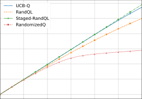

## Provably Efficient and Agile Randomized Q-Learning


He Wang [∗]


[∗] Xingyu Xu [∗]

CMU CMU


Xingyu Xu [∗] Yuejie Chi [†]

CMU Yale


Yale


July 1, 2025


**Abstract**


While Bayesian-based exploration often demonstrates superior empirical performance compared to
bonus-based methods in model-based reinforcement learning (RL), its theoretical understanding remains
limited for model-free settings. Existing provable algorithms either suffer from computational intractability
or rely on stage-wise policy updates which reduce responsiveness and slow down the learning process.
In this paper, we propose a novel variant of Q-learning algorithm, refereed to as RandomizedQ, which
integrates _sampling-based exploration with agile, step-wise, policy updates_, for episodic tabular RL. We
establish a sublinear regret bound _O_ [�] ( ~~_√_~~ _H_ [5] _SAT_ ), where _S_ is the number of states, _A_ is the number

of actions, _H_ is the episode length, and _T_ is the total number of episodes. In addition, we present
a logarithmic regret bound _O_ � _H_ ∆ [6] min _SA_ [log] [5] [(] _[SAHT]_ [)] � when the optimal Q-function has a positive sub
optimality ∆ min . Empirically, RandomizedQ exhibits outstanding performance compared to existing
Q-learning variants with both bonus-based and Bayesian-based exploration on standard benchmarks.


**Keywords:** Q-learning, learning rate randomization, Bayesian exploration

### **Contents**


**1** **Introduction** **2**

1.1 Main contribution . . . . . . . . . . . . . . . . . . . . . . . . . . . . . . . . . . . . . . . . . . 2

1.2 Related works . . . . . . . . . . . . . . . . . . . . . . . . . . . . . . . . . . . . . . . . . . . . . 3


**2** **Problem Setup** **4**


**3** **Efficient and Agile Randomized Q-learning** **5**
3.1 Motivation . . . . . . . . . . . . . . . . . . . . . . . . . . . . . . . . . . . . . . . . . . . . . . 5

3.2 Algorithm description . . . . . . . . . . . . . . . . . . . . . . . . . . . . . . . . . . . . . . . . 5


**4** **Theoretical Guarantee** **7**

4.1 Gap-independent sublinear regret guarantee . . . . . . . . . . . . . . . . . . . . . . . . . . . . 7
4.2 Gap-dependent logarithmic regret guarantee . . . . . . . . . . . . . . . . . . . . . . . . . . . . 8


**5** **Experiments** **9**


**6** **Conclusion** **10**


**A Notation and Preliminary** **13**


**B Reformulation of the Update Equation and Aggregated Weights** **16**
B.1 Properties of aggregated weights . . . . . . . . . . . . . . . . . . . . . . . . . . . . . . . . . . 17
B.2 Concentration of aggregated weights . . . . . . . . . . . . . . . . . . . . . . . . . . . . . . . . 18


∗
Department of Electrical and Computer Engineering, Carnegie Mellon University. Email: `{hew2,xingyuxu}@andrew.cmu.edu` .

  - Department of Statistics and Data Science, Yale University. Email: `yuejie.chi@yale.edu` .


1


**C Analysis: Gap-independent Regret Bound** **22**
C.1 Proof of Theorem 1 . . . . . . . . . . . . . . . . . . . . . . . . . . . . . . . . . . . . . . . . . . 22

C.2 Proof of Lemma 7 . . . . . . . . . . . . . . . . . . . . . . . . . . . . . . . . . . . . . . . . . . 26

C.3 Proof of Lemma 8 . . . . . . . . . . . . . . . . . . . . . . . . . . . . . . . . . . . . . . . . . . 27

C.4 Proof of Lemma 9 . . . . . . . . . . . . . . . . . . . . . . . . . . . . . . . . . . . . . . . . . . 27

C.5 Proof of Lemma 10 . . . . . . . . . . . . . . . . . . . . . . . . . . . . . . . . . . . . . . . . . . 28


**D Analysis: Gap-dependent Regret Bound** **29**
D.1 Proof of Lemma 14 . . . . . . . . . . . . . . . . . . . . . . . . . . . . . . . . . . . . . . . . . . 30

D.2 Proof of Lemma 15 . . . . . . . . . . . . . . . . . . . . . . . . . . . . . . . . . . . . . . . . . . 31

D.3 Proof of Lemma 16 . . . . . . . . . . . . . . . . . . . . . . . . . . . . . . . . . . . . . . . . . . 31

### **1 Introduction**


In reinforcement learning (RL) (Sutton, 1988), an agent aims to learn an optimal policy that maximizes its
cumulative rewards through interactions with an unknown environment. Broadly speaking, RL algorithms can
be categorized into two main approaches—model-based and model-free methods—depending on whether they
first learn a model of the environment and plan within it, or directly learn the optimal policy from experience.
While model-based approaches offer advantages in sample efficiency, model-free algorithms tend to be more
computationally efficient and take less space complexity, making them more attractive for deployment in
many real-world applications, such as games (Mnih et al., 2015) and language model training (Hong et al.,
2025).
As the one of fundamental challenges in RL, the _exploitation-exploration dilemma_ remains particularly
difficult to address in the model-free paradigm, i.e., the learned policy needs to carefully balance between
exploiting current observations and exploring unseen state-action pairs to maximize total rewards in the long
term. To manage the trade-off, most provably efficient model-free algorithms adopt the principle of _optimism_
_in the face of uncertainty_, incentivizing exploration by assigning bonuses to uncertain outcomes, constructed
from their upper confidence bound (UCB) (Lai and Robbins, 1985). In particular, prior works (Jin et al.,
2018; Zhang et al., 2020; Li et al., 2021) showed that Q-learning augmented with tailored bonus functions
achieve comparable sample complexity to their model-based counterparts.
In contrast to bonus-based exploration methods aforementioned, Bayesian-based approaches have gained
increasing attention for their superior empirical performance (Osband et al., 2016a; Fortunato et al., 2018).
These approaches enhance efficient exploration by leveraging the inherent randomness in sampling from
posteriors that are updated based on prior observations. However, theoretical understandings have been
limited, where the majority of prior work has focused on model-based RL (Osband et al., 2013; Agrawal
and Jia, 2017). When it comes to model-free RL, research is even more limited in several aspects. Dann
et al. (2021) proposed a _sample-efficient_ algorithm that draws Q-functions directly from the posterior
distribution. However, this approach suffers from _computational inefficiency_ . More recently, Tiapkin et al.
(2024) introduced posterior sampling via randomized learning rates, but unfortunately they only provided
theoretical guarantees [1] for _stage-wise policy updates_, which are known to be inefficient in practice as this
staging approach does not allow agents to respond agilely to the environment. To this end, it is natural to
ask:


_Is it possible to design a model-free RL algorithm with Bayesian-based exploration, achieving_ _**sample**_
_**efficiency**_ _,_ _**computational efficiency**_ _, and_ _**agile policy updates**_ _?_


**1.1** **Main contribution**


To answer this question, we focus on learning a near-optimal policy through Bayesian-based Q-learning, in a
provably sample- and computation-efficient manner. As in Jin et al. (2018); Dann et al. (2021); Tiapkin et al.
(2024), throughout this paper, we consider tabular, finite-horizon Markov Decision Processes (MDPs) in the
online setting. Below we summarize the highlights of this work:


1 A careful examination of their proof reveals a critical technical gap in their analysis. We provide a novel fix with substantial
new analyses, which fortunately preserves their claimed theoretical guarantee. We discuss this in more detail in Section 4.1.


2


|Key Property|Conditional-PS<br>(Dann et al., 2021)|Staged-RandQL<br>(Tiapkin et al., 2024)|RandQL<br>(Tiapkin et al., 2024)|RandomizedQ<br>(This Work)|
|---|---|---|---|---|
|Computational tractability|✗|✓|✓|✓|
|Agile policy update|✓|✗|✓|✓|
|Gap-independent regret guarantee|✓|✓|✗|✓|
|Gap-dependent regret guarantee|✗|✗|✗|✓|


Table 1: Comparison with the most relevant model-free RL methods with bayesian-based exploration in
tabular settings. A ✓ indicates the method possesses the corresponding property, while a ✗ denotes its
absence. We identify and fix a technical gap in (Tiapkin et al., 2024), which preserves the gap-independent
regret guarantee of Staged-RandQL. Notably, our method uniquely achieves _computational tractability_, _agile_
_policy updates_, and _provable regret guarantees_, distinguishing it from prior work.


  - We propose RandomizedQ, a sampling-based of Q-learning algorithm which leverages tailored randomized learning rates to enable both efficient exploration and agile policy updates.


  - We establish a gap-independent regret bound on the order of _O_ [�] ( _√H_ [5] _SAT_ ), where _S_ is the number of

states, _A_ is the number of actions, _H_ is the episode length, and _T_ is the number of episodes.


  - Under a strictly positive sub-optimality gap ∆ min of the optimal Q-function, we further prove a
logarithmic regret bound of _O_ � _H_ [6] _SA_ log [5] ( _SAHT_ ) _/_ ∆ min � . To the best of our knowledge, this is the
first result showing model-free algorithms can achieve logarithmic regret via sampling-based exploration.


  - Empirically, RandomizedQ consistently outperforms existing bonus-based and Bayesian-based modelfree algorithms on standard exploration benchmarks, validating its efficacy.


A detailed comparison with pertinent works is provided in the Table 1.


**1.2** **Related works**


In this section, we discuss closely-related prior works on optimistic Q-learning and online RL with Bayesianbased exploration, focusing on the tabular setting.


**Q-learning with bonus-based exploration.** Q-learning and its variants (Watkins, 1989; Mnih et al.,
2013; Strehl et al., 2006) are among the most widely studied model-free RL algorithms. To understand its
theoretical guarantees, several works have equipped Q-learning with UCB bonuses derived from the principle
of optimism in the face of uncertainty (Jin et al., 2018; Zhang et al., 2020; Li et al., 2021; Yang et al., 2021;
Zheng et al., 2025). Notably, Jin et al. (2018) first introduced UCB-Q, which augments Q-learning with
Hoeffding-type or Bernstein-type bonuses and established a nearly optimal regret bound. Building upon this,
Zhang et al. (2020) proposed a variance-reduced version of UCB-Q, achieving an optimal sample complexity,
and Li et al. (2021) further improved the performance by reducing the burn-in cost.
In addition to the worst-case regret bound, gap-dependent regret bounds often leverage benign properties
of the environment and enjoys logarithmic regret bounds (Yang et al., 2021; Zheng et al., 2025) For instance,
Yang et al. (2021) showed that UCB-Q has a logarithmic regret bound under the positive sub-optimality gap
assumption, and Zheng et al. (2025) incorporated error decomposition to establish a gap-dependent bound
for Q-learning with variance reduction techniques (Zhang et al., 2020; Li et al., 2021).


**Model-based RL with Bayesian-based exploration.** Extensive works have investigated the theoretical
and empirical performance of Bayesian-based approaches exploration in model-based RL. One popular
approach is posterior sampling for reinforcement learning (Strens, 2000; Osband et al., 2013; Agrawal and Jia,
2017; Zhang, 2022; Hao and Lattimore, 2022; Moradipari et al., 2023), where the policy is iteratively learned
by sampling a model from its posterior distribution over MDP models. The approach has been shown to
achieve the optimal regret bound when UCB on Q-functions are also incorporated (Tiapkin et al., 2022). In
addition, several works (Osband et al., 2016b; Agrawal et al., 2021; Zanette et al., 2020) have investigated
posterior sampling with linear function approximation.


3


**Model-free RL with Bayesian-based exploration.** Dann et al. (2021) sampled Q-functions directly
from the posterior, but such an approach is computationally intractable. To address this, Tiapkin et al. (2024)
introduced RandQL, the first tractable model-free posterior sampling-based algorithm, which encourages
exploration through using randomized learning rates and achieves a regret bound of _O_ [�] ( _SAH_ [3] + _√SAH_ [5] _T_ )

when RandQL is staged. However, the slow policy update empirically leads to a significantly degenerated
performance. This leaves a gap between the theoretical efficiency and practical performance in model-free RL
with Bayesian-based exploration.


**Notation.** Throughout this paper, we define ∆( _S_ ) as the probability simplex over a set _S_, and use

[ _H_ ] : = 1 _, . . ., H_ and [ _T_ ] : = 1 _, . . ., T_ for positive integers _H, T >_ 0. We denote 1 as the indicator function,
which equals 1 if the specified condition holds and 0 otherwise. For any set _D_, we write _|D|_ to represent its
cardinality (i.e., the number of elements in _D_ ). The beta distribution with parameters _α_ and _β_ is denoted by
Beta ( _α, β_ ). Finally, we use the notations _O_ [�] ( _·_ ) and _O_ ( _·_ ) to describe the order-wise non-asymptotic behavior,
where the former omits logarithmic factors.

### **2 Problem Setup**


**Finite-horizon MDPs.** Consider a tabular finite-horizon MDP _M_ ( _S, A, {P_ _h_ _}_ _[H]_ _h_ =1 _[,][ {][r]_ _[h]_ _[}]_ _[H]_ _h_ =1 _[, H]_ [)][, where] _[ S]_
is the finite state space of cardinality _S_, _A_ is the action space of cardinality _A_, _P_ _h_ : _S × A →_ ∆( _S_ ) is the
transition kernel and _r_ _h_ : _S × A →_ [0 _,_ 1] is the reward function at time step _h ∈_ [ _H_ ], and _H_ is the number of
steps within each episode. In each episode, the agent starts from an initial state _s_ 1 _∈S_ and then interacts
with the environment for _H_ steps. In each step _h ∈_ [ _H_ ], the agent observes the current state _s_ _h_ _∈S_, selects
an action _a_ _h_ _∈A_, receives a reward _r_ _h_ ( _s_ _h_ _, a_ _h_ ), and transitions to the next state _s_ _h_ +1 _∼_ _P_ _h_ ( _·|s_ _h_ _, a_ _h_ ).


**Policy, value function and Q-function.** We denote _π_ = _{π_ _h_ _}_ _[H]_ _h_ =1 [as the] _[ policy]_ [ of the agent within an]
episode of _H_ steps, where each _π_ _h_ : _S →_ ∆( _A_ ) specifies the action selection probability over the action space
_A_ at the step _h ∈_ [ _H_ ]. Given any finite-horizon MDP _M_, we use the value function _V_ _h_ _[π]_ [(] [resp.] [Q-function) to]
denote the expected accumulative rewards starting from the state _s_ ( resp. the state-action pair ( _s, a_ )) at step
_h_ and following the policy _π_ until the end of the episode:


�


_∀_ ( _h, s, a_ ) _∈_ [ _H_ ] _× S_ : _V_ _h_ _[π]_ [(] _[s]_ [) =][ E] _[π]_


_H_
�
� _h_ _[′]_ =


� _r_ _h_ _′_ ( _s_ _h_ _′_ _, a_ _h_ _′_ ) _|s_ _h_ = _s_


_h_ _[′]_ = _h_


_,_


�


_∀_ ( _h, s, a_ ) _∈_ [ _H_ ] _× S × A_ : _Q_ _[π]_ _h_ [(] _[s, a]_ [) =] _[ r]_ _[h]_ [(] _[s, a]_ [) +][ E] _[π]_


_H_
�
� _h_ _[′]_ = _h_


� _r_ _h_ _[′]_ ( _s_ _h_ _[′]_ _, a_ _h_ _[′]_ ) _|s_ _h_ = _s, a_ _h_ = _a_

_h_ _[′]_ = _h_ +1


_._


By convention, we set _V_ _H_ _[π]_ +1 [(] _[s]_ [) = 0][ and] _[ Q]_ _H_ _[π]_ +1 [(] _[s, a]_ [) = 0][ for any][ (] _[s, a]_ [)] _[ ∈S × A]_ [ and policy] _[ π]_ [. In addition, we]
denote _π_ _[⋆]_ = _{π_ _h_ _[⋆]_ _[}]_ _[H]_ _h_ =1 [as the] _[ deterministic optimal policy]_ [, which maximizes the value function (] [resp.] [Q-function)]
for all states (resp.state-action pairs) among all possible policies, i.e.


_V_ _h_ _[⋆]_ [(] _[s]_ [) :=] _[ V]_ _[ π]_ _h_ _[⋆]_ [(] _[s]_ [) = max] _V_ _h_ _[π]_ [(] _[s]_ [)] _[,]_ _Q_ _[⋆]_ _h_ [(] _[s, a]_ [) :=] _[ Q]_ _[π]_ _h_ _[⋆]_ [(] _[s, a]_ [) = max] _Q_ _[π]_ _h_ [(] _[s, a]_ [)] _[,]_ (1)
_π_ _π_


where the existence of the optimal policy is well-established (Puterman, 2014).


**Bellman equations.** As the pivotal property of MDPs, the value function and Q-function satisfy the
following Bellman consistency equations: for any policy _π_,


_∀_ ( _h, s, a_ ) _∈_ [ _H_ ] _× S × A_ : _Q_ _[π]_ _h_ [(] _[s, a]_ [) =] _[ r]_ _[h]_ [(] _[s, a]_ [) +] _[ P]_ _[h,s,a]_ _[V]_ _[ π]_ _h_ +1 _[,]_ (2)


where we use _P_ _h,s,a_ : = _P_ ( _· |s, a_ ) _∈_ [0 _,_ 1] [1] _[×][S]_ for any ( _h, s, a_ ) _∈_ [ _H_ ] _× S × A_ to represent the transition
probability (row) vector for the state-action pair ( _s, a_ ) at _h_ -th step. Similarly, we also have the following
Bellman optimality equation regarding the optimal policy _π_ _[⋆]_ :


_∀_ ( _h, s, a_ ) _∈_ [ _H_ ] _× S × A_ : _Q_ _[⋆]_ _h_ [(] _[s, a]_ [) =] _[ r]_ _[h]_ [(] _[s, a]_ [) +] _[ P]_ _[h,s,a]_ _[V]_ _[ ⋆]_ _h_ +1 _[.]_ (3)


4


**Learning goal.** In this work, our goal is to learn a policy that minimizes the total regret during _T_ episodes,
defined as


Regret _T_ =


_T_
�


_t_ =1


_V_ 1 _[⋆]_ [(] _[s]_ [1] [)] _[ −]_ _[V]_ _[ π]_ 1 _[t]_ [(] _[s]_ [1] [)] _,_ (4)
� �


in a computational efficient and scalable fashion. Here, _π_ _[t]_ denotes the learned policy after the _t_ -th episode.

### **3 Efficient and Agile Randomized Q-learning**


In this section, we introduce a Bayesian variant of the Q-learning algorithm, referred to as RandomizedQ,
which ensures the policy to be updated in an agile manner and enhances efficient exploration based on random
sampling rather than adding explicit bonuses.


**3.1** **Motivation**


Before describing the proposed algorithm in detail, we first review the critical role of learning rates in
Q-learning to achieve polynomial sample complexity guarantees, and why such choices cannot be directly
extended to the context of Bayesian-based exploration.


**The effect of learning rates in Q-learning with UCB bonuses.** Upon observing a sample transition
( _s, a, s_ _[′]_ ) at the _h_ -th step, the celebrated UCB-Q algorithm (Jin et al., 2021) updates the Q-values as:


_Q_ _h_ ( _s, a_ ) _←_ (1 _−_ _w_ _m_ ) _Q_ _h_ ( _s, a_ ) + _w_ _m_ [ _r_ _h_ ( _s, a_ ) + _V_ _h_ +1 ( _s_ _[′]_ ) + _b_ _m_ ] _,_


where _m_ is the number of visits to the state-action pair ( _s, a_ ) at the _h_ -th step, _w_ _m_ = _H_ _[H]_ + [+1] _m_ [is the learning]

rate and _b_ _m_ is the UCB-style bonus term to drive exploration. As detailed in Jin et al. (2021), such a learning
rate of _O_ ( _H/m_ ) is essential to ensure that the first earlier observations have negligible influence on the most
recent Q-value updates.


**Challenges in randomized Q-Learning.** In the absence of bonus terms, the exploration is guided
by assigning higher weights to important states and leveraging the inherent randomness of sampling from
the posterior. As directly sampling Q-functions is computationally intractable (Dann et al., 2021), recent
work (Tiapkin et al., 2024) encourages exploration by randomizing the learning rates according to Beta
distribution with an expected order of _O_ (1 _/m_ ). However, such a learning rate treats all episodes as equally
informative, which can result in high bias and an exponential dependency of the sample complexity on the
horizon _H_ . To overcome the resulting exponential dependence on the horizon _H_, Tiapkin et al. (2024) resort
to split the learning process, update the policy at exponentially slower frequencies, and reset the temporary
Q values to ensure enough optimism. While this strategy mitigates the sample complexity issue, it suffers
from practical inefficiencies due to discarding valuable data across stages, and is unsuitable to deploy in
time-varying environments. This inefficiency is empirically demonstrated in Tiapkin et al. (2024, Appendix I)
and Section 5.

Thus, it naturally raises the question: can we simply randomize learning rates with an expected order of
_O_ ( _H/m_ ), as used in in UCB-Q (Jin et al., 2018)? Unfortunately, randomizing learning rates with an expected
magnitude of _O_ ( _H/m_ ) rapidly forgets the earlier episodes that includes the initialization and thus fails to
maintain sufficient optimism.


**3.2** **Algorithm description**


Motivated by these limitations, we propose an agile, bonus-free Q-learning algorithm for episodic tabular
RL in online setting, referred to as RandomizedQ and summarized in Algorithm 1. The main idea behind

—
RandomizedQ is to update the policy based on an _optimistic mixture of two Q-function ensembles_
each trained with a tailored distribution of learning rates—to balance between agile exploitation of recent
observations and sufficiently optimistic exploration. Specifically, after initializing the counters, value and
Q-functions as Line 1 in Algorithm 1, the updates at each step _h_ of every episode _t_ can be boiled down to
the following key components.


5


**Algorithm 1** RandomizedQ


**Input:** Inflation coefficient _κ_, ensemble size _J_, the number of prior transitions _n_ 0, initial state _s_ 1,
optimistically-initial value function _V_ [0] = _{V_ _h_ [0] _[}]_ _[H]_ _h_ =1 [+1] [.]

1: **Initialize:** _Q_ � _[j]_ _h_ [(] _[s, a]_ [)] _[ ←]_ _n_ _[r]_ _[h]_ _h_ [(] ( _[s, a]_ _s, a_ [)+] ) _, n_ _[V]_ _[♭]_ _h_ [ 0] _h_ [(] +1 _[s, a]_ [;] [ �] [)] _[Q][, q]_ _h_ _[♭][h]_ [(][(] _[s, a][s, a]_ [)][)] _[,]_ [ �] _[ ←][Q]_ _[♭,j]_ _h_ [0][(][;] _[s, a][ π]_ _[h]_ [)][(] _[ ←][s]_ [) =] _[r]_ [ arg max] _[h]_ [(] _[s, a]_ [)+(1+] _[a][∈A]_ _[ r][H]_ _[h]_ [(][)] _[s, a][V]_ [ 0] _h_ +1 [)][;] [ �] [, for] _[V]_ _[h]_ [(] _[s]_ [ (][)] _[j, h, s, a][ ←]_ _[V]_ [ 0] _h_ [;] [ �] [)] _[V][ ∈]_ _[ ♭]_ _h_ [(][[] _[s][J]_ [)][]] _[ ←][×]_ [[] _[H]_ [(1+][]] _[×S ×A][H]_ [)] _[V]_ [ 0] _h_ [;][.]

2: **for** _t ∈_ [ _T_ ] **do**
3: **for** _h_ = 1 _, . . ., H_ **do**
4: Play _a_ _h_ = arg max _a∈A_ _π_ _h_ ( _s_ _h_ ) and observe the next state _s_ _h_ +1 _∼_ _P_ _h_ ( _·|s_ _h_ _, a_ _h_ ).
5: Set _m ←_ _n_ _h_ ( _s_ _h_ _, a_ _h_ ) and _m_ _[♭]_ _←_ _m −_ _n_ _[♭]_ _h_ [(] _[s]_ _[h]_ _[, a]_ _[h]_ [)][.]
6: `/* Update temporary Q-ensembles via randomized learning rates.` `*/`

7: **for** _j_ = 1 _, . . ., J_ **do**


_H_ +1
8: Sample _w_ _m_ _[j]_ _[∼]_ [Beta] � _κ_


_κ_ _[n]_ [0] � and _w_ _m_ _[♭,j]_ _[∼]_ [Beta] � _κ_ 1 _[,]_ _[m]_ _[♭]_ _κ_ [+] _[n]_ [0]


+1 _[m]_ [+] _[n]_ [0]

_κ_ _[,]_ _κ_


[+] _[n]_ [0]

_κ_ �.


9: Update temporary Q-functions _Q_ [�] _[j]_ _h_ [and][ �] _[Q]_ _[♭,j]_ _h_ as


_Q_ � _[j]_ _h_ [(] _[s]_ _[h]_ _[, a]_ _[h]_ [)] _[ ←]_ [(1] _[ −]_ _[w]_ _m_ _[j]_ [)] _[Q]_ [ �] _[j]_ _h_ [(] _[s]_ _[h]_ _[, a]_ _[h]_ [) +] _[ w]_ _m_ _[j]_ � _r_ _h_ ( _s_ _h_ _, a_ _h_ ) + _V_ [�] _h_ +1 ( _s_ _h_ +1 )� _,_ (5)

_Q_ � _[♭,j]_ _h_ [(] _[s]_ _[h]_ _[, a]_ _[h]_ [)] _[ ←]_ [(1] _[ −]_ _[w]_ _m_ _[♭,j]_ [)] _[Q]_ [ �] _[♭,j]_ _h_ [(] _[s]_ _[h]_ _[, a]_ _[h]_ [) +] _[ w]_ _m_ _[♭,j]_ _r_ _h_ ( _s_ _h_ _, a_ _h_ ) + _V_ [�] _h_ _[♭]_ +1 [(] _[s]_ _[h]_ [+1] [)] _._ (6)
� �


10: **end for**


11: `/* Update the policy Q-function by optimistic mixing.` `*/`
12: Update the policy Q-function via


_Q_ _h_ ( _s_ _h_ _, a_ _h_ ) _←_ 1 _−_ [1]
� _H_


max _h_ [(] _[s]_ _[h]_ _[, a]_ _[h]_ [)] _[}]_ [ +] [1] _h_ [(] _[s]_ _[h]_ _[, a]_ _[h]_ [)] _[.]_ (7)
� _j∈_ [ _J_ ] _[{][Q]_ [ �] _[j]_ _H_ _[·]_ [ �] _[Q]_ _[♭]_


13: `/* Update the policy with step-wise agility.` `*/`
14: Update the policy _π_ _h_ ( _s_ _h_ ) _←_ arg max _a∈A_ _Q_ _h_ ( _s_ _h_ _, a_ ).

15: `/* Update` _V_ [�] _h_ `optimistically.` `*/`

16: Update the value function _V_ [�] _h_ ( _s_ _h_ ) _←_ max _j∈_ [ _J_ ] _Q_ [�] _[j]_ _h_ [(] _[s]_ _[h]_ _[, π]_ _[h]_ [(] _[s]_ _[h]_ [))][.]
17: `/* Update visit counters.` `*/`
18: Update the counter _n_ _h_ ( _s_ _h_ _, a_ _h_ ) _←_ _n_ _h_ ( _s_ _h_ _, a_ _h_ ) + 1 and _n_ _[♭]_ _h_ [(] _[s]_ _[h]_ _[, a]_ _[h]_ [)] _[ ←]_ _[n]_ _[♭]_ _h_ [(] _[s]_ _[h]_ _[, a]_ _[h]_ [) + 1][.]

19: `/* At the end of the stage:` `update` _Q_ [�] _[♭]_ _h_ `[,]` [ �] _[V]_ _[ ♭]_ _h_ `[and reset]` _[ n]_ _[♭]_ _h_ `[,]` _[ {][Q]_ [ �] _[b,j]_ _h_ _[}]_ `[.]` `*/`

20: **if** _n_ _[♭]_ _h_ [(] _[s]_ _[h]_ _[, a]_ _[h]_ [) =] _[ ⌊]_ [(1 + 1] _[/H]_ [)] _[q]_ _[H][⌋]_ [for the stage] _[ q]_ [ =] _[ q]_ _[h]_ [(] _[s, a]_ [)] **[ then]**

21: Update _Q_ [�] _[♭]_ _h_ [(] _[s]_ _[h]_ _[, a]_ _[h]_ [)] _[ ←]_ [max] _[j][∈]_ [[] _[J]_ []] [ �] _[Q]_ _[♭,j]_ _h_ [(] _[s]_ _[h]_ _[, a]_ _[h]_ [)][,][ �] _[V]_ _[ ♭]_ _h_ [(] _[s]_ _[h]_ [)] _[←]_ [min] _[a][∈A]_ [ �] _[Q]_ _[♭]_ _h_ [(] _[s]_ _[h]_ _[, a]_ [)][.]

22: Reset _n_ _[♭]_ _h_ [(] _[s]_ _[h]_ _[, a]_ _[h]_ [) =] _[ n]_ _[h]_ [(] _[s]_ _[h]_ _[, a]_ _[h]_ [)][,][ �] _[Q]_ _[♭,j]_ [(] _[s]_ _[h]_ _[, a]_ _[h]_ [)] _[ ←]_ _[r]_ _[h]_ [(] _[s]_ _[h]_ _[, a]_ _[h]_ [) + (1 +] _[ H]_ [)] _[V]_ [ 0] _h_ [.]

23: Update the stage counter _q_ _h_ ( _s, a_ ) _←_ _q_ _h_ ( _s, a_ ) + 1.
24: **end if**

25: **end for**

26: **end for**


**Two Q-ensembles for adaptation and exploration.** To ensure the mixed Q-function with the learning
rate scaled as _O_ ( _H/m_ ), we tailor the probability distribution of the randomized learning rate as: _w_ _m_ _[j]_ _[∼]_
Beta � _Hκ_ +1 _[,]_ _[m]_ [+] _κ_ _[n]_ [0] �, where _m_ denotes the total number of visits to the state-action pair ( _s_ _[t]_ _h_ _[, a]_ _[t]_ _h_ [)][ just before]


Beta � _Hκ_ +1 _[,]_ _[m]_ [+] _κ_ _[n]_ [0] �, where _m_ denotes the total number of visits to the state-action pair ( _s_ _[t]_ _h_ _[, a]_ _[t]_ _h_ [)][ just before]

current visit ( cf. Line 5 in Algorithm 1), _n_ 0 introduces pseudo-transitions to induce optimism, and _κ >_ 0
controls the concentration level of the distribution. With these randomized learning rates in hand, the
temporary Q-functions is updated in parallel via (5) . As discussed in Section 3.1, such a learning rate could
guarantee a polynomial dependency on the horizon _H_, but lead to rapidly forgetting the earlier episodes
and assigning exponentially decreasing weights on the optimistic initialization. To increase the importance
on the optimistic initialization, we also introduce another sequence of Q-ensembles updated via (6), with
randomized learning rates sampled from _w_ _m_ _[♭,j]_ _[∼]_ [Beta] � _κ_ 1 _[,]_ _[m]_ _[♭]_ _κ_ [+] _[n]_ [0] �, where _m_ _[♭]_ represents the number of visits


+1 _[m]_ [+] _[n]_ [0]

_κ_ _[,]_ _κ_


randomized learning rates sampled from _w_ _m_ _[♭,j]_ _[∼]_ [Beta] � _κ_ 1 _[,]_ _[m]_ _[♭]_ _κ_ [+] _[n]_ [0] �, where _m_ _[♭]_ represents the number of visits

during the previous stage.


6


**Agile policy Q-function via optimistic mixing.** Then, to promote optimism, the policy Q-function is
computed via optimistic mixing:


_Q_ _h_ _[t]_ [+1] ( _s, a_ ) =


(1 _−_ _H_ [1]
� _Q_ _[t]_ _h_ [(]


_Q_ _[t]_ _h_ [(] _[s, a]_ [)] _[,]_ otherwise _._


_H_ [1] [) max] _[j][∈]_ [[] _[J]_ []] _Q_ � _[j,t]_ _h_ [+1] ( _s, a_ ) + _H_ [1]
� �


_H_ [1] _[·]_ [ �] _[Q]_ _h_ _[♭,t]_ [+1] ( _s, a_ ) _,_ if ( _s, a_ ) = ( _s_ _[t]_ _h_ _[, a]_ _[t]_ _h_ [)] _[,]_


where _Q_ [�] _[♭,t]_ _h_ [+1] remains fixed throughout the current stage and is updated as the ensemble maximum only at the
end of the stage (cf. Line 21 in Algorithm 1). Note that the first term—corresponding to the maximum over
_J_ temporary Q-values—is updated every step, which allows RandomizedQ performs agile policy updates
rather than _exponentially slower_ . Correspondingly, the policy _π_ _h_ _[t]_ [+1] is updated greedily with respect to _Q_ _[t]_ _h_ [+1]
( cf. Line 14 in Algorithm 1). Such optimistic mixing allows RandomizedQ to remain responsive to new data
and adapt the policy efficiently without requiring periodic resets.


**Reset for bias mitigation and optimism restoration.** To mitigate outdated data and ensure optimism,
we reset the counter of visits and the temporary Q-ensembles _Q_ [�] _[♭,j]_ _h_ according to the optimistic initialization
_V_ _h_ [0] [(] [cf.] [ Line][ 22][ in Algorithm][ 1][), when the number of visits in current stage exceeds a predefined thresh-]
old—specifically, when _V_ � _h_ _[♭]_ [is reset conservatively, to help mitigate the potential bias introduced by stale data, as the value will be] _n_ _[♭,t]_ _h_ [(] _[s]_ _h_ _[t]_ _[, a]_ _[t]_ _h_ [) =] _[ ⌊]_ [(1 + 1] _[/H]_ [)] _[q]_ _[H][⌋]_ [for the] _[ q]_ [-th stage. Meanwhile, the staged value estimate]
reused to update the temporary Q-values in the subsequent episode.

### **4 Theoretical Guarantee**


In this section we provide both gap-independent and gap-dependent regret bounds for RandomizedQ,
considering the worst-case scenario and favorable structural MDPs, respectively.


**4.1** **Gap-independent sublinear regret guarantee**


To begin with, the following theorem shows that RandomizedQ has a _√T_ -type regret bound, where the full

proof is deferred to Appendix C.


**Theorem 1.** _Consider_ _δ ∈_ (0 _,_ 1) _. Assume that_ _J_ = _⌈c ·_ log( _SAHT/δ_ ) _⌉_ _,_ _κ_ = _c ·_ ( log ( _SAH/δ_ ) + log ( _T_ )) _, and_
_n_ 0 = _⌈c ·_ log ( _T_ ) _· κ⌉_ _, where_ _c_ _is some universal constant. Let the initialized value function_ _V_ _h_ [0] [= 2(] _[H][ −]_ _[h]_ [ + 1)]
_for any h ∈_ [ _H_ + 1] _. Then, with probability at least_ 1 _−_ _δ, Algorithm 1 guarantees that_


Regret _T_ _≤_ _O_ [�] � _√_


_H_ [5] _SAT_ _._
�


Theorem 1 shows that RandomizedQ achieves a gap-independent regret bound of _O_ [�] _√_
�


_H_ [5] _SAT_,
�


matching the guarantees of UCB-Q with Hoeffding-type bonuses (Jin et al., 2018) in episodic tabular MDPs.
Moreover, this bound is minimax-optimal up to polynomial factors of _H_ when compared to the known lower
bound of Ω( _√H_ [3] _SAT_ ) (Jin et al., 2018; Domingues et al., 2021b).


**Technical challenges.** The primary challenge in analyzing RandomizedQ arises from several subtle
requirements on the randomized learning rates. Specifically, these rates must:


  - be sufficiently randomized to induce necessary optimism;


  - avoid excessive randomness that could incur undesirable fluctuations;


  - support efficient exploitation of the most recent observations to avoid introducing exponential dependence
on the horizon _H_ .


The subtle interplay among these conditions precludes the straightforward application of existing analytical
techniques from the literature. For instance, the optimism may decay exponentially and be insufficient for
sparse reward scenarios, so we re-inject the weighted optimistic values into the Q-ensembles at every stage


7


to ensure necessary optimism at every step. In addition, to bound undesirable fluctuations of randomized
learning rates, prior work (Tiapkin et al., 2024) attempted to prove a concentration inequality based on
Rosenthal’s inequality (Tiapkin et al., 2024, Theorem 6), which in turn requires a martingale property of
the so-called _aggregated_ learning rates. However, the martingale property in fact does not hold (detailed
below), revealing a gap in their proof. We propose a new proof strategy to bridge this gap and to extend the
concentration inequality to our setting. These challenges jointly necessitate a carefully constructed mixing
scheme, refined control of fluctuation and favorable properties of learning rates to ensure that RandomizedQ
attains near-optimal sample complexity with agile updates.


**Identifying and fixing a technical gap in the proof of Tiapkin et al. (2024).** While Tiapkin et al.
(2024) established a comparable regret bound for Staged-RandQL, it turns out that analysis has a crucial
technical gap. Specifically, central to the analysis is to study the concentration of the weighted sum of the
_aggregated randomized learning rates_, defined as


_W_ _j,m_ [0] [=]


_m−_ 1
� (1 _−_ _w_ _k_ _[j]_ [)] and _W_ _j,m_ _[i]_ [=] _[ w]_ _i_ _[j]_ _−_ 1


_k_ =0


_m−_ 1
� (1 _−_ _w_ _k_ _[j]_ [)] _[,]_ _∀i ∈_ [ _m_ ] _,_


_k_ = _i_


which involves bounding the sum
�����


_m_
�


(8)
�����


� _λ_ _i_ ( _W_ _j,m_ _[i]_ _[−]_ [E][[] _[W]_ _[ i]_ _j,m_ [])]


_i_ =0


for fixed real numbers _λ_ _i_ _∈_ [ _−_ 1 _,_ 1], see, the proof of Lemma 4 in Tiapkin et al. (2024). To this end, Tiapkin
et al. (2024) asserted that the partial sums _S_ _i_ = [�] _[i]_ _k_ =0 _[λ]_ _[k]_ [(] _[W]_ _[ k]_ _j,m_ _[−]_ [E] [[] _[W]_ _[ k]_ _j,m_ [])][ form a martingale with respect]
to some filtration _F_ _i_ (cf. Proposition 7 there, which was invoked in the proof of Lemma 4 therein). The
proof went on by a standard application of Rosenthal’s inequality ( i.e., Theorem 6 therein). To prove the
martingale property, it was claimed that _W_ _j,m_ _[i]_ [is adapted to] _[ F]_ _[i]_ [ (] [cf.] [ assumption of their Theorem 6), and]
_W_ _j,m_ _[i]_ [is independent of] _[ F]_ _[i][−]_ [1] [ (] [cf.] [ assumption of their Proposition 7). Unfortunately, it is] _[ impossible]_ [ to achieve]
both adaptedness and independence except for trivial cases (e.g., deterministic learning rates), regardless of
choice of _F_ _i_ . [2] Indeed, if _{F_ _i_ _}_ is such a filtration, then _W_ _j,m_ _[i]_ [being adapted means that all the randomness of]
_W_ _j,m_ [0] _[, W]_ _j,m_ [ 1] _[· · ·][, W]_ _j,m_ _[ i][−]_ [1] [is contained in] _[ F]_ _[i][−]_ [1] [. As] _[ W]_ _[ i]_ _j,m_ [is independent of] _[ F]_ _[i][−]_ [1] [, we see that] _[ W]_ _[ i]_ _j,m_ [is independent]
with all of _W_ _j,m_ [0] _[,][ · · ·][, W]_ _j,m_ _[ i][−]_ [1] [. By induction, we readily see that] _[ W]_ [ 0] _j,m_ _[,][ · · ·][, W]_ _j,m_ _[ m]_ [are jointly independent.]
However, since [�] _[m]_ _i_ =0 _[W]_ _[ i]_ _j,m_ [= 1][ (][Tiapkin et al.][,][ 2024][, Lemma 3), such independence is not possible unless all]
aggregated learning rates _W_ _j,m_ _[i]_ [,][ 0] _[ ≤]_ _[i][ ≤]_ _[m]_ [, are deterministic. Thus, Lemma 4 in][ Tiapkin et al.][ (][2024][) does]
not hold, thereby leaving a gap in the analysis. We fix this gap by introducing a reverse filtration that is
tailored to the form of the aggregated weights, and study (8) using a backward martingale construction in
contrast with partial sums with substantial new analyses. With this approach, we established the correct
concentration inequality not only for their setting but also for ours.


**Memory and computation complexity.** As the number of ensembles is _J_ = _O_ [�] (1), the computational
complexity is _O_ ( _H_ ) per episode and the space complexity is _O_ ( _HSA_ ), same as Tiapkin et al. (2024). However,
we note that due to the use of optimistic mixing, RandomizedQ requires maintaining two ensembles, which
effectively doubles the memory and computational cost compared to Staged-RandQL (Tiapkin et al., 2024).


**4.2** **Gap-dependent logarithmic regret guarantee**


Note that such a _√T_ -type regret bound holds for _any_ episodic tabular MDPs, which might not be tight for

environment with some benign structural properties. To this end, we further develop a gap-dependent regret
bound, which improves the regret bound from sublinear to logarithmic under a strictly positive suboptimality
gap condition, as follows.


2 Tiapkin et al. (2024) chose a filtration _{F_ _i_ _}_ to which _W_ _ij,m_ [is actually not adapted.]


8


**Assumption 1** (Positive suboptimality gap) **.** _For any_ ( _s, a, h_ ) _∈S × A ×_ [ _H_ ] _, we denote the sub-optimality_
_gap as_ ∆ _h_ ( _s, a_ ) := _V_ _h_ _[⋆]_ [(] _[s]_ [)] _[ −]_ _[Q]_ _[⋆]_ _h_ [(] _[s, a]_ [)] _[ and assume that the minimal gap]_


∆ min ≜ min
( _s,a,h_ ) _∈S×A×_ [ _H_ ] [∆] _[h]_ [(] _[s, a]_ [)] [1] _[{]_ [∆] _[h]_ [(] _[s, a]_ [)] _[ ̸]_ [= 0] _[}][ >]_ [ 0] _[.]_


Note that this assumption implies that there exist some strictly better actions (i.e., the optimal actions)
outperform the others for every state. This assumption is mild, as the minimal suboptimality gap ∆ min = 0
only when the MDPs degenerates. Consequently, it is commonly fulfilled in environments with finite action
spaces, such as Atari-games and control tasks, and it is also widely adopted in prior literature (Yang et al.,
2021; Zheng et al., 2025).
Under this mild assumption, we have the following logarithmic gap-dependent regret bound, whose proof
is deferred to Appendix D. To the best of our knowledge, this is the first guarantee that shows sampling-based
Q-learning can also achieve the logarithmic regret in episodic tabular RL.


**Theorem 2.** _Consider_ _δ ∈_ (0 _,_ 1) _. Suppose all conditions in Theorem 1 and Assumption 1 hold. Then, with_
_probability at least_ 1 _−_ _δ, Algorithm 1 guarantees that_


_H_ 6 _SA_
E[Regret _T_ ] _≤_ _O_ log [5] ( _SAHT_ ) _._
� ∆ min �


Note that the above logarithmic regret bound holds for RandomizedQ without assuming any prior
knowledge on the minimal suboptimality gap ∆ min during implementation. As shown in Simchowitz and
Jamieson (2019), any algorithm with an Ω( _√T_ ) regret bound in the worst case, has a log _T_ -type lower bound

of the expected gap-dependent regret. Also, our bound matches the expected regret for UCB-Q (Jin et al.,
2018) under the same condition (i.e. Assumption 1) for episodic tabular MDPs (Yang et al., 2021), which is
nearly tight in _S, A, T_ up to the log( _SAT_ ) and _H_ factors.

### **5 Experiments**


In this section, we present the experimental results of RandomizedQ compared to baseline algorithms, using
rlberry (Domingues et al., 2021a), in the following two environments. All the experiments are conducted
on a machine equipped with 2 CPUs (Intel(R) Xeon(R) Gold 6244 CPU), running Red Hat Enterprise Linux
9.4, without GPU acceleration. The corresponding codes can be found at

```
             https://github.com/IrisHeWANG/RandomizedQ

```

which is built upon the implementation of Tiapkin et al. (2024), using the rlberry library (Domingues et al.,
2021a).


**A grid-world environment.** We first evaluate performance in a 10 _×_ 10 grid-world environment as used in
Tiapkin et al. (2024), where each state is represented as a tuple ( _i, j_ ) _∈_ [10] _×_ [10], and the agent can choose
from four actions: left, right, up, and down. The episode horizon is set to _H_ = 50. At each step, the agent
moves in the planed direction with probability 1 _−_ _ϵ_ and to a random neighboring state with probability
_ϵ_ = 0 _._ 2. The agent starts at position (1 _,_ 1), and the reward is 1 only at state (10 _,_ 10), with all other states
yielding zero reward. We also examine the performance in a larger 20 _×_ 20 grid-world environment, where the
agent receives a reward of 1 only at state (20 _,_ 20), with the episode horizon set to _H_ = 100. Compared to the
10 _×_ 10 setting, the reward is significantly sparser. The corresponding results are shown in Figures 1a and 1b,
respectively.


**A chain MDP.** We also consider a chain MDP environment as described in Osband and Van Roy (2016),
which consists of _L_ = 15 states (i.e., the length of the chain) and two actions: left and right. The episode
horizon is set to _H_ = 30. With each action, the agent transits in the intended direction with probability 0 _._ 9,
and in the opposite direction with probability 0 _._ 1. The agent starts in the leftmost state, which provides a
reward of 0.05, while the rightmost state yields the highest reward of 1. Additionally, we evaluate performance
in a longer chain MDP with _L_ = 30 states and a horizon of _H_ = 50. The corresponding results are shown in
Figures 1c and 1d, respectively.


9


|800000|UCB-Q|Q|Col4|Col5|Col6|
|---|---|---|---|---|---|
|0<br>100000<br>200000<br>300000<br>400000<br>500000<br>600000<br>700000<br>00000|~~UCB-~~<br>Rand<br>Stage|~~Q~~<br>QL<br>d~~-~~RandQL||||
|0<br>100000<br>200000<br>300000<br>400000<br>500000<br>600000<br>700000<br>00000|~~Rando~~|~~mizedQ~~||||
|0<br>100000<br>200000<br>300000<br>400000<br>500000<br>600000<br>700000<br>00000||||||
|0<br>100000<br>200000<br>300000<br>400000<br>500000<br>600000<br>700000<br>00000||||||


(a) A 10 _×_ 10 grid-world environment.

|50000<br>40000<br>30000<br>20000<br>10000<br>0|UCB-Q<br>RandQ|L|Col4|Col5|Col6|
|---|---|---|---|---|---|
|0<br>10000<br>20000<br>30000<br>40000<br>50000<br>|Stage<br>|d~~-~~RandQL<br>||||
|0<br>10000<br>20000<br>30000<br>40000<br>50000<br>|Rando|mizedQ||||
|0<br>10000<br>20000<br>30000<br>40000<br>50000<br>||||||
|0<br>10000<br>20000<br>30000<br>40000<br>50000<br>||||||
|0<br>10000<br>20000<br>30000<br>40000<br>50000<br>||||||


(c) A chain MDP with length _L_ = 15.


|L<br>d-RandQL|Col2|Col3|Col4|
|---|---|---|---|
|mizedQ||||
|||||
|||||




(b) A 20 _×_ 20 grid-world environment.


|B-Q<br>dQL<br>ged-RandQL|Col2|Col3|Col4|
|---|---|---|---|
|domizedQ||||
|||||
|||||
|||||
|||||


(d) A chain MDP with length _L_ = 30.


Figure 1: Comparison between RandomizedQ and baseline algorithms in the grid-world environment ( cf. the
first row) and the chain MDP ( cf. the second row), where total regret is plotted against the number of episodes.
RandomizedQ consistently achieves lower regret than UCB-Q, as well as both the standard randomized
Q-learning ( i.e., RandQL) and its stage-wise variant ( i.e., Staged-RandQL), demonstrating superior sample
efficiency and faster learning processes.


**Baselines and experiment setups.** We compare RandomizedQ with (1) UCB-Q: model-free Q-learning
with bonuses (Jin et al., 2018) (2) Staged-RandQL (Tiapkin et al., 2024): the staged version of RandQL
with theoretical guarantees (3) RandQL (Tiapkin et al., 2024): the randomized version of UCB-Q, without
provable guarantees. For all algorithms with randomized learning rates in both environments, we let the
number of ensembles _J_ = 20, the inflation coefficient _κ_ = 1, and the number of pseudo-transition _n_ 0 = 1 _/S_,
where _S_ corresponds to the size of the state space in different environments. For fair comparison, we repeat
the experiments for 4 times and show the average along with the 90% confidence interval in the figures below.


**Results.** From Figure 1, RandomizedQ exhibits significantly improved performance in all the environments
sizes, achieving substantially lower total regret. Unlike UCB-Q, which suffers from excessive over-exploration,
and the Staged-RandQL that adapts the policy only at the end of each stage, RandomizedQ effectively
balances exploration and exploitation through randomized learning rates and agile policy updates. We
also observe that RandomizedQ performs even better than the empirical RandQL that lacks theoretical
guarantees in prior work (Tiapkin et al., 2024), especially for larger environments with more sparse rewards.
These results validate the effectiveness of sampling-driven updates without explicit bonus terms and highlight
the benefit of avoiding stage-wise policy updates in model-free reinforcement learning.

### **6 Conclusion**


In this work, we study the performance of Q-learning without exploration bonuses for episodic tabular
MDPs in the online setting. We identify two key challenges in existing approaches: the additional statistical
dependency introduced by randomizing learning rates, and the inefficiency of slow, stage-wise policy updates,
as the bottlenecks of theoretical analysis and algorithm design. To address these challenges, we develop a novel
randomized Q-learning algorithm with agile updates called RandomizedQ, which efficiently adapts the policy
to newly observed data. Theoretically, we establish a sublinear worst-case and a logarithmic gap-dependent
regret bounds. Empirically, our experiments show that RandomizedQ significantly outperforms than baseline
algorithms in terms of total regret, due to the effective exploration and agile updates.


10


There are several promising directions for future research. For example, extending our analysis to
function approximation settings—such as linear or neural representations—would significantly broaden the
applicability of RandomizedQ (Melo and Ribeiro, 2007; Song and Sun, 2019). In addition, incorporating
variance reduction techniques could further improve the regret bounds and potentially match the theoretical
lower bounds (Zhang et al., 2020; Zheng et al., 2025).

### **Acknowledgement**


This work is supported in part by grants ONR N00014-19-1-2404, NSF CCF-2106778, CNS-2148212, AFRL
FA8750-20-2-0504, and by funds from federal agency and industry partners as specified in the Resilient &
Intelligent NextG Systems (RINGS) program.

### **References**


Agrawal, P., Chen, J., and Jiang, N. (2021). Improved worst-case regret bounds for randomized least-squares
value iteration. In _Proceedings of the AAAI Conference on Artificial Intelligence_, volume 35, pages
6566–6573.


Agrawal, S. and Jia, R. (2017). Optimistic posterior sampling for reinforcement learning: worst-case regret
bounds. _Advances in Neural Information Processing Systems_, 30.


Dann, C., Mohri, M., Zhang, T., and Zimmert, J. (2021). A provably efficient model-free posterior sampling
method for episodic reinforcement learning. _Advances in Neural Information Processing Systems_, 34:12040–
12051.


Domingues, O. D., Flet-Berliac, Y., Leurent, E., Ménard, P., Shang, X., and Valko, M. (2021a). rlberry - A
Reinforcement Learning Library for Research and Education.


Domingues, O. D., Ménard, P., Kaufmann, E., and Valko, M. (2021b). Episodic reinforcement learning in
finite MDPs: Minimax lower bounds revisited. In _Algorithmic Learning Theory_, pages 578–598. PMLR.


Fortunato, M., Azar, M. G., Piot, B., Menick, J., Hessel, M., Osband, I., Graves, A., Mnih, V., Munos,
R., Hassabis, D., Pietquin, O., Blundell, C., and Legg, S. (2018). Noisy networks for exploration. In
_International Conference on Learning Representations_ .


Gupta, A. K. and Nadarajah, S. (2004). _Handbook of beta distribution and its applications_ . CRC press.


Hao, B. and Lattimore, T. (2022). Regret bounds for information-directed reinforcement learning. _Advances_
_in Neural Information Processing Systems_, 35:28575–28587.


Hong, J., Dragan, A., and Levine, S. (2025). Q-SFT: Q-learning for language models via supervised fine-tuning.
In _The Thirteenth International Conference on Learning Representations_ .


Jin, C., Allen-Zhu, Z., Bubeck, S., and Jordan, M. I. (2018). Is Q-learning provably efficient? In _Advances in_
_Neural Information Processing Systems_, pages 4863–4873.


Jin, Y., Yang, Z., and Wang, Z. (2021). Is pessimism provably efficient for offline RL? In _International_
_Conference on Machine Learning_, pages 5084–5096.


Lai, T. L. and Robbins, H. (1985). Asymptotically efficient adaptive allocation rules. _Advances in Applied_
_Mathematics_, 6(1):4–22.


Li, G., Shi, L., Chen, Y., Gu, Y., and Chi, Y. (2021). Breaking the sample complexity barrier to regret-optimal
model-free reinforcement learning. _Advances in Neural Information Processing Systems_, 34:17762–17776.


Melo, F. S. and Ribeiro, M. I. (2007). Q-learning with linear function approximation. In _International_
_Conference on Computational Learning Theory_, pages 308–322. Springer.


11


Mnih, V., Kavukcuoglu, K., Silver, D., Graves, A., Antonoglou, I., Wierstra, D., and Riedmiller, M. (2013).
Playing atari with deep reinforcement learning. _arXiv preprint arXiv:1312.5602_ .


Mnih, V., Kavukcuoglu, K., Silver, D., Rusu, A. A., Veness, J., Bellemare, M. G., Graves, A., Riedmiller,
M., Fidjeland, A. K., and Ostrovski, G. (2015). Human-level control through deep reinforcement learning.
_Nature_, 518(7540):529–533.


Moradipari, A., Pedramfar, M., Shokrian Zini, M., and Aggarwal, V. (2023). Improved bayesian regret bounds
for thompson sampling in reinforcement learning. _Advances in Neural Information Processing Systems_,
36:23557–23569.


Osband, I., Blundell, C., Pritzel, A., and Van Roy, B. (2016a). Deep exploration via bootstrapped dqn.
_Advances in Neural Information Processing Systems_, 29.


Osband, I., Russo, D., and Van Roy, B. (2013). (more) efficient reinforcement learning via posterior sampling.
_Advances in Neural Information Processing Systems_, 26.


Osband, I. and Van Roy, B. (2016). On lower bounds for regret in reinforcement learning. _arXiv preprint_
_arXiv:1608.02732_ .


Osband, I., Van Roy, B., and Wen, Z. (2016b). Generalization and exploration via randomized value functions.
In _International Conference on Machine Learning_, pages 2377–2386. PMLR.


Pinelis, I. (1994). Optimum bounds for the distributions of martingales in banach spaces. _The Annals of_
_Probability_, pages 1679–1706.


Puterman, M. L. (2014). _Markov decision processes: discrete stochastic dynamic programming_ . John Wiley &
Sons.


Simchowitz, M. and Jamieson, K. G. (2019). Non-asymptotic gap-dependent regret bounds for tabular mdps.
_Advances in Neural Information Processing Systems_, 32.


Song, Z. and Sun, W. (2019). Efficient model-free reinforcement learning in metric spaces. _arXiv preprint_
_arXiv:1905.00475_ .


Strehl, A. L., Li, L., Wiewiora, E., Langford, J., and Littman, M. L. (2006). PAC model-free reinforcement
learning. In _Proceedings of the 23rd international conference on Machine learning_, pages 881–888.


Strens, M. (2000). A bayesian framework for reinforcement learning. In _International Conference on Machine_
_Learning_, pages 943–950.


Sutton, R. S. (1988). Learning to predict by the methods of temporal differences. _Machine learning_, 3(1):9–44.


Tiapkin, D., Belomestny, D., Calandriello, D., Moulines, E., Munos, R., Naumov, A., Perrault, P., Valko, M.,
and Ménard, P. (2024). Model-free posterior sampling via learning rate randomization. _Advances in Neural_
_Information Processing Systems_, 36.


Tiapkin, D., Belomestny, D., Calandriello, D., Moulines, É., Munos, R., Naumov, A., Rowland, M., Valko,
M., and Ménard, P. (2022). Optimistic posterior sampling for reinforcement learning with few samples and
tight guarantees. _Advances in Neural Information Processing Systems_, 35:10737–10751.


Watkins, C. J. C. H. (1989). Learning from delayed rewards. _PhD thesis, King’s College, University of_
_Cambridge_ .


Wong, T.-T. (1998). Generalized dirichlet distribution in bayesian analysis. _Applied Mathematics and_
_Computation_, 97(2-3):165–181.


Yang, K., Yang, L., and Du, S. (2021). Q-learning with logarithmic regret. In _International Conference on_
_Artificial Intelligence and Statistics_, pages 1576–1584. PMLR.


12


Zanette, A., Brandfonbrener, D., Brunskill, E., Pirotta, M., and Lazaric, A. (2020). Frequentist regret bounds
for randomized least-squares value iteration. In _International Conference on Artificial Intelligence and_
_Statistics_, pages 1954–1964. PMLR.


Zhang, T. (2022). Feel-good thompson sampling for contextual bandits and reinforcement learning. _SIAM_
_Journal on Mathematics of Data Science_, 4(2):834–857.


Zhang, Z., Zhou, Y., and Ji, X. (2020). Almost optimal model-free reinforcement learning via referenceadvantage decomposition. _Advances in Neural Information Processing Systems_, 33.


Zheng, Z., Zhang, H., and Xue, L. (2025). Gap-dependent bounds for q-learning using reference-advantage
decomposition. In _The Thirteenth International Conference on Learning Representations_ .

### **A Notation and Preliminary**


Before proceeding, we first introduce the following notation with the dependency on the episode index _t_ and
its short-hand notation whenever it is clear from the context.


  - _n_ _[t]_ _h_ [(] _[s, a]_ [)][, or the shorthand] _[ n]_ _[t]_ _h_ [: the number of previous visits to][ (] _[s, a]_ [)][ at step] _[ h]_ [ before episode] _[ t]_ [.]


  - _n_ _[♭,t]_ _h_ [(] _[s, a]_ [)][, or the shorthand] _[ n]_ _[♭,t]_ _h_ [: the number of previous visits to][ (] _[s, a]_ [)][ at step] _[ h]_ [ before current stage]
that the episode _t_ belongs to.


  - _q_ _h_ _[t]_ [(] _[s, a]_ [)][, or the shorthand] _[ q]_ _h_ _[t]_ [: the stage index of the] _[ i]_ [-th visit to][ (] _[s, a]_ [)][ at step] _[ h]_ [ and episode] _[ t]_ [.]


  - _ℓ_ _[i]_ _h_ [(] _[s, a]_ [)][, or the shorthand] _[ ℓ]_ _[i]_ [: the episode index of the] _[ i]_ [-th visit to][ (] _[s, a]_ [)][ at step] _[ h]_ [; by convention] _[ ℓ]_ [0] [ = 0][.]


  - _ℓ_ _[♭,i]_
_q,h_ [(] _[s, a]_ [)][, or the shorthand] _[ ℓ]_ _q_ _[i]_ [: the episode index of the] _[ i]_ [-th visit to][ (] _[s, a]_ [)][ at step] _[ h]_ [ during the stage] _[ q]_ [;]

by convention, _ℓ_ [0] 0 [= 0][ and] _[ ℓ]_ _[♭,]_ _q,h_ [0] [(] _[s, a]_ [)][ represents the episode when the] _[ q]_ [-th stage starts for][ (] _[h, s, a]_ [)][.]


  - _e_ _q_ = _⌈_ (1 + 1 _/H_ ) _[q]_ _H⌉_ : the length of the _q_ -th stage; by convention, _e_ _−_ 1 = 0.


  - _J_ : number of ensemble heads (temporary _Q_ -functions) per episode.


  - _Q_ [�] _[j,t]_ _h_ [(] _[s, a]_ [)][:] _[ j]_ [-th temporary (ensemble) estimate of the optimal Q-value at the] _[ beginning]_ [ of episode] _[ t]_ [,]


[+1] _h_ [+] _[n]_ [0] _[−]_ [1]

_κ_ _[,]_ _[ n]_ _[t]_ _κ_


where the randomized learning rate follows Beta( _[H]_ [+1]


[0] _[−]_

_κ_ ).


- _Q_ [�] _[♭,j,t]_ _h_ ( _s, a_ ): _j_ -th temporary (ensemble) estimate of the optimal Q-value at the _beginning_ of episode _t_,


[1] _h_ _[−][n]_ _[♭,t]_ _h_ [+] _[n]_ [0] _[−]_ [1]

_κ_ _[,]_ _[ n]_ _[t]_ _κ_


where the randomized learning rate follows Beta( [1]


[0] _[−]_

_κ_ ).


- _Q_ [�] _[♭,t]_ _h_ [(] _[s, a]_ [)][: the optimistic approximation of the optimal Q-function updated at the end of each stage.]


- _Q_ _[t]_ _h_ [(] _[s, a]_ [)][: the policy] _[ Q]_ [-function at the start of episode] _[ t]_ [; its update at the visited pair][ (] _[s]_ _[t]_ _h_ _[, a]_ _[t]_ _h_ [)][ is]


_Q_ _[t]_ _h_ [(] _[s]_ _[t]_ _h_ _[, a]_ _[t]_ _h_ [) = (1] _[ −]_ [1]


_H_ _Q_ � _[♭,t]_ _h_ [(] _[s]_ _h_ _[t]_ _[, a]_ _[t]_ _h_ [)] _[.]_ (9)


�
_H_ [1] [) max] _j∈_ [ _J_ ] _Q_ _[j,t]_ _h_ [(] _[s]_ _h_ _[t]_ _[, a]_ _[t]_ _h_ [) +] _H_ [1]


- _V_ [�] _h_ _[ℓ]_ _[i]_ [,][ �] _[V]_ _h♭,ℓ_ _[i]_ _q_ : optimistic value estimation of the optimal value function at episode _ℓ_ _[i]_ and _ℓ_ _[i]_ _q_ [.]


For analysis, we also introduce the following notation.


- _s_ 0 : the optimistic pseudo-state _s_ 0 with


_r_ _h_ ( _s_ 0 _, a_ ) = _r_ 0 ( _H_ + 1) _>_ 1 _,_ _p_ _h_ ( _s_ 0 _| s, a_ ) = **1** _{s_ = _s_ 0 _}._


- _V_ _h_ _[⋆]_ [(] _[s]_ [0] [)][: the cumulative return obtained by always staying at the optimistic state] _[ s]_ [0] [ from step] _[ h]_ [,] [ i.e.] [,]
_V_ _h_ _[⋆]_ [(] _[s]_ [0] [) =] _[ r]_ [0] [(] _[H]_ [ + 1)] � _H −_ _h_ + 1�.


13


  - _n_ 0 : prior pseudo-transition count; thereby, each state-action pair ( _s, a_ ) starts with _n_ 0 prior pseudotransitions, leading to


_w_ 0 _[j]_ _[∼]_ [Beta] �( _H_ + 1) _/κ, n_ 0 _/κ_ � _,_ _w_ 0 _[♭,j]_ _∼_ Beta�1 _/κ, n_ 0 _/κ_ � _,_ _j ∈_ [ _J_ ] _._


  - _K_ inf ( _p, µ_ ): the information-theoretic distance between some measure _p ∈P_ [0 _, b_ ] and _µ ∈_ [0 _, b_ ], defined

as
_K_ inf ( _p, µ_ ) = inf _{_ KL( _p, q_ ) : _q ∈P_ [0 _, b_ ] _, p ≤_ _q,_ E _X∼q_ [ _X_ ] _≥_ _µ},_


where _P_ [0 _, b_ ] denotes all probability measures supported on [0 _, b_ ].


  - _δ_ _x_ : Dirac measure concentrated at a single point _x_ .


  - [ _n_ ]: the indexing shorthand; for a positive integer _n_, we write [ _n_ ] := _{_ 1 _,_ 2 _, . . ., n}_ .


  - _∥X∥_ _p_ : the _ℓ_ _p_ -norm of a vector _X ∈_ R _[n]_ where _p ≥_ 1; formally defined as


_∥X∥_ _p_ = �� _[n]_ _|X_ _i_ _|_ _[p]_ [�] [1] _[/p]_ _._

_i_ =1


  - ( _x_ ) _k_ : Pochhammer symbol, i.e., for _k ∈_ N,


( _x_ ) _k_ = _x_ ( _x_ + 1) _· · ·_ ( _x_ + _k −_ 1) _._ (10)


  - 1 _{x ≥_ _c}_ : an indicator function that equals 1 when _x ≥_ _c_, and 0 otherwise.


  - _|X|_ : the cardinality of the set _X_ .


  - _A_ ≲ _B_ : means _A ≤_ _cB_ for some universal constant _c >_ 0.


**Beta distribution.** We introduce the definition and important properties of Beta distribution (Gupta and
Nadarajah, 2004, Section 2), which is used in the follow-up analysis.


**Definition 1** (Beta distribution) **.** _A continuous random variable_ _X_ _is said to follow a_ Beta _distribution with_
_shape parameters α >_ 0 _and β >_ 0 _, written as_


_X ∼_ Beta( _α, β_ ) _,_


_if its probability density function is_


1
_f_ _X_ ( _x | α, β_ ) = 0 _< x <_ 1 _,_
_B_ ( _α, β_ ) _[x]_ _[α][−]_ [1] [ (1] _[ −]_ _[x]_ [)] _[β][−]_ [1] _[,]_

_and f_ _X_ ( _x_ ) = 0 _otherwise, where the_ Beta function _B_ ( _α, β_ ) = [Γ] Γ( [(] _[α]_ _α_ [)] + [Γ][(] _β_ _[β]_ ) [)] _[serves as the normalizing constant.]_


**Lemma 1** (Moments of the Beta distribution) **.** _Let_ _X ∼_ Beta ( _a, b_ ) _with_ _a, b >_ 0 _, and recall the Pochhammer_
_symbol_ ( _x_ ) _k_ _defined in_ (10) _. Then, for any positive integer r,_


( _a_ ) _r_
E [ _X_ _[r]_ ] = _._ (11)
( _a_ + _b_ ) _r_


_In particular, the expectation and variance of X are_


_a_ _ab_
E[ _X_ ] = Var( _X_ ) = (12)
_a_ + _b_ _[,]_ ( _a_ + _b_ ) [2] _,_ ( _a_ + _b_ + 1) _[.]_


We next collect a few auxiliary lemmas useful for the proof.


14


**Lemma 2.** _For any a, b ≥_ 1 _, κ ≥_ 0 _, we have_


_a_ _a_ + _κ_ _a_
_a_ + _b_ _[≤]_ _a_ + _b_ + _κ_ _[≤]_ [(] _[κ]_ [ + 1)] _[ ·]_ _a_ + _b_ (13)


_In addition, for any r ∈_ N + _,_
_a_ + _rκ_ _a_ + _κ_
_a_ + _b_ + _rκ_ _[≤]_ _[r][ ·]_ _a_ + _b_ + _κ_ _[.]_ (14)


_Proof._ The following proves (13) and (14), respectively. We start with the lower bound of (13) . Define

_a_ + _t_ _b_ _a_
_f_ ( _t_ ) = _a_ + _b_ + _t_ [for] _[ t][ ≥]_ [0][. Then] _[ f]_ _[ ′]_ [(] _[t]_ [) =] ( _a_ + _b_ + _t_ ) [2] _[>]_ [ 0][, so] _[ f]_ [ is increasing. Hence] _[ f]_ [(0) =] _a_ + _b_ _[≤]_ _[f]_ [(] _[κ]_ [) =]

_a_ + _κ_
_a_ + _b_ + _κ_ [. Moving to the upper bound, it is equivalent to show]


( _a_ + _κ_ )( _a_ + _b_ ) _≤_ ( _κ_ + 1) _a_ ( _a_ + _b_ + _κ_ ) _._


Expanding and rearranging leads to


( _κ_ + 1) _a_ ( _a_ + _b_ + _κ_ ) _−_ ( _a_ + _κ_ )( _a_ + _b_ ) = _κ_ � _a_ [2] + _ab_ + _aκ −_ _b_ � _≥_ 0 _,_


which holds if _a, b ≥_ 1 and _κ ≥_ 0.
We now show (14). Let _r ∈_ N + and


_L_ = ( _a_ + _rκ_ )( _a_ + _b_ + _κ_ ) _,_ _R_ = _r_ ( _a_ + _κ_ )( _a_ + _b_ + _rκ_ ) _._


We prove _L ≤_ _R_ by first computing


_R −_ _L_ = _r_ ( _a_ + _κ_ )( _a_ + _b_ + _rκ_ ) _−_ ( _a_ + _rκ_ )( _a_ + _b_ + _κ_ )

= ( _r −_ 1)� _a_ ( _a_ + _b_ ) + _κ_ � _a_ ( _r_ + 1) + _κr_ � [�] _≥_ 0 _,_


because each bracketed term is non-negative and _r −_ 1 _≥_ 0. Dividing by the common positive factor

_a_ + _rκ_ _a_ + _κ_
( _a_ + _b_ + _rκ_ )( _a_ + _b_ + _κ_ ) yields _a_ + _b_ + _rκ_ _[≤]_ _[r]_ _a_ + _b_ + _κ_ _[.]_ [ All statements are therefore proved.]


**Lemma 3** (Rosenthal inequality, Theorem 4.1 in Pinelis (1994)) **.** _Let_ _X_ 1 _, . . ., X_ _n_ _be a martingale-difference_
_sequence adapted to a filtration {F_ _i_ _}_ _i_ =1 _,...,n_ _:_


E[ _X_ _i_ _| F_ _i−_ 1 ] = 0 _._


_Define_ _V_ _i_ = E [ _X_ _i_ [2] _[| F]_ _[i][−]_ [1] []] _[. Then there exist universal constants]_ _[ c]_ [1] _[ and]_ _[ c]_ [2] _[ such that for any]_ _[ p][ ≥]_ [2] _[ the following]_
_holds_


E [1] _[/p]_
������


_p_ [�]


_p/_ 2 []

+ 2 _C_ 2 _p ·_ E [1] _[/p]_ max _._
� _i∈_ [ _n_ ] _[|][X]_ _[i]_ _[|]_ _[p]_ �



_n_
� _X_ _i_


_i_ =1


�����


�����


_≤_ _C_ 1 _p_ [1] _[/]_ [2] E [1] _[/p]_


�����


_n_
� _V_ _i_


_i_ =1


**Lemma 4** (Corrected version of Lemma 12 in Tiapkin et al. (2024). [3] ) **.** _Let_ _ν ∈P_ ([0 _, b_ ]) _be a probability_
_measure over the segment_ [0 _, b_ ] _and let_ ¯ _ν_ = (1 _−_ _α_ ) _δ_ _b_ 0 + _α · ν_ _be a mixture between_ _ν_ _and a Dirac measure on_
_b_ 0 _> b, where α ∈_ (0 _,_ 1) _. Then for any µ ∈_ (0 _, b_ ) _,_


_K_ inf (¯ _ν, µ_ ) _≤_ _αK_ inf ( _ν, µ_ ) _._ (15)


_Proof._ From Tiapkin et al. (2024, Lemma 9), for any probability measure _ν ∈P_ [0 _, b_ ] and _µ_ and any _µ ∈_ (0 _, B_ ),


_K_ inf (¯ _ν, µ_ ) = _λ∈_ [0 _,_ max 1 _/_ ( _b_ 0 _−µ_ )] [E] _[X][∼][ν]_ [¯] �log�1 _−_ _λ_ ( _X −_ _µ_ )�� _._


3 We clarify an earlier oversight in Tiapkin et al. (2024, Lemma 12) by properly accounting for the Dirac measure’s contribution,
which was previously incorrectly separated after applying the variational formula—specifically, Lemma 9 in Tiapkin et al. (2024).
Consequently, the right-hand side of (15) is now scaled by _α_, instead of the 1 _−_ _α_ factor used in Tiapkin et al. (2024).


15


The support of ¯ _ν_ is contained in [0 _, b_ 0 ], so for any _λ ∈_ [0 _,_ 1 _/_ ( _b_ 0 _−_ _µ_ )],


E _X∼ν_ ¯ �log�1 _−_ _λ_ ( _X −_ _µ_ )�� = (1 _−_ _α_ ) log�1 _−_ _λ_ ( _b_ 0 _−_ _µ_ )� + _α_ E _X∼ν_ �log�1 _−_ _λ_ ( _X −_ _µ_ )�� _._


For every admissible _λ_ we have 0 _≤_ _λ_ ( _b_ 0 _−_ _µ_ ) _≤_ 1, so log�1 _−_ _λ_ ( _b_ 0 _−_ _µ_ )� _≤_ 0. Hence


_K_ inf (¯ _ν, µ_ ) _≤_ _α_ E _X∼ν_ �log�1 _−_ _λ_ ( _X −_ _µ_ )�� _._


Because _b_ 0 _> b_, the interval [0 _,_ 1 _/_ ( _b_ 0 _−_ _µ_ )] is a subset of [0 _,_ 1 _/_ ( _b −_ _µ_ )]. Taking the maximum over the smaller
interval leads to


_K_ inf (¯ _ν, µ_ ) _≤_ _α_ 0 _≤λ≤_ max 1 _/_ ( _b−µ_ ) [E] _[X][∼][ν]_ �log�1 _−_ _λ_ ( _X −_ _µ_ )�� = _α K_ inf ( _ν, µ_ ) _._

### **B Reformulation of the Update Equation and Aggregated Weights**


In this section, we rewrite the update of each temporary _Q_ -function for every trajectory _t ∈_ [ _T_ ] and _j ∈_ [ _J_ ]
by recursively unrolling the update (5) and (6), for each ( _h, s, a_ ) _∈_ [ _H_ ] _× S × A_ .
For the ease of notation, we denote _m_ := _n_ _[t]_ _h_ [(] _[s, a]_ [)][.]


**Unrolled update for** _Q_ [�] _[j,t]_ _h_ **[.]** For each ( _j, t, h_ ) _∈_ [ _J_ ] _×_ [ _T_ ] _×_ [ _H_ ], we can unroll (5) by


_[j,ℓ]_ _h_ _[m]_ ( _s, a_ ) = (1 _−_ _w_ _m_ _[j]_ _−_ 1 [)] _[ ·]_ [ �] _[Q]_ _[j,ℓ]_ _h_ _[m][−]_ [1]


_Q_ � _[j,t]_ _h_ [(] _[s, a]_ [) =][ �] _[Q]_ _[j,ℓ]_ _h_ _[m]_


_[j,ℓ]_ _h_ _[m][−]_ [1] ( _s, a_ ) + _w_ _m_ _[j]_ _−_ 1 � _r_ _h_ ( _s, a_ ) + _V_ [�] _h_ _[ℓ]_ +1 _[m]_ [(] _[s]_ _h_ _[ℓ]_ _[m]_ +1 [)] � _,_


_Q_ � _[j,ℓ]_ _[m][−]_ [1]


_[j,ℓ]_ _h_ _[m][−]_ [1] ( _s, a_ ) = (1 _−_ _w_ _m_ _[j]_ _−_ 2 [)] _[ ·]_ [ �] _[Q]_ _[j,ℓ]_ _h_ _[m][−]_ [2]


_[j,ℓ]_ _h_ _[m][−]_ [2] ( _s, a_ ) + _w_ _m_ _[j]_ _−_ 2 _r_ _h_ ( _s, a_ ) + _V_ [�] _h_ _[ℓ]_ +1 _[m][−]_ [1] [(] _[s]_ _[ℓ]_ _h_ _[m]_ +1 _[−]_ [1] [)] _,_

� �


...


_Q_ � _[j,ℓ]_ [1]


_[j,ℓ]_ _h_ [1] ( _s, a_ ) = (1 _−_ _w_ 0 _[j]_ [)] _[ ·]_ [ �] _[Q]_ _[j,ℓ]_ _h_ [0]


_[j,ℓ]_ _h_ [0] ( _s, a_ ) + _w_ 0 _[j]_ _r_ _h_ ( _s, a_ ) + _V_ [�] _h_ _[ℓ]_ +1 [1] [(] _[s]_ _h_ _[ℓ]_ [1] +1 [)] _,_

� �


_Q_ � _[j,ℓ]_ _h_ [0] ( _s, a_ ) = _r_ _h_ ( _s, a_ ) + _V_ [�] _h_ _[ℓ]_ +1 [0] [(] _[s]_ _h_ _[ℓ]_ [0] +1 [)] _[,]_


where we define _V_ [�] _h_ _[ℓ]_ +1 [0] [(] _[s]_ [) =] [ �] _[V]_ [ 0] _h_ +1 [(] _[s]_ [)][. For] _[ m][ ≥]_ [1][, let] _[ W]_ _[j,m]_ [ =] � _W_ _j,m_ _[m]_ _[, . . ., W]_ _j,m_ [ 1] _[, W]_ _j,m_ [ 0] � be the aggregated
weights defined as


_m−_ 1
� (1 _−_ _w_ _k_ _[j]_ [)] _[,]_ _∀i ∈_ [ _m_ ] _,_ (16)


_k_ = _i_


_W_ _j,m_ [0] [=]


_m−_ 1
� (1 _−_ _w_ _k_ _[j]_ [)] and _W_ _j,m_ _[i]_ [=] _[ w]_ _i_ _[j]_ _−_ 1


_k_ =0


_m−_ 1
�


where _w_ _k_ _[j]_ [is sampled from Beta][ (] _[H]_ _κ_ [+1]


_κ_ _[n]_ [0] ). Then, we have


[+1] _[k]_ [+] _[n]_ [0]

_κ_ _[,]_ _κ_


_Q_ � _[j,t]_ _h_ [(] _[s, a]_ [) =] _[ r]_ _[h]_ [(] _[s, a]_ [) +]


_m_
� _W_ _j,m_ _[i]_ � _V_ � _h_ _[ℓ]_ +1 _[i]_ [(] _[s]_ _h_ _[ℓ]_ _[i]_ +1 [)] � _._ (17)

_i_ =0


**Unrolled update for** _Q_ [�] _[♭,t]_ _h_ **[.]** Suppose that _q_ is the stage index of the episode _t_ on ( _h, s, a_ ). We let _e_ _q_ be
the length of the _q_ -th stage. Similar to the unrolling steps for _Q_ [�] _[j,t]_ _h_ [, we define the corresponding aggregated]

weights as: For the _q_ -th stage, let _W_ _j,q_ _[♭]_ [=] � _W_ _j,e_ _[♭,]_ [0] _q_ _[, W]_ _j,e_ _[ ♭,]_ [1] _q_ _[, . . ., W]_ _j,e_ _[ ♭,e]_ _q_ _[q]_ � be the aggregated weights at the defined
as


_W_ _j,q_ _[♭,]_ [0] [=]


_m−_ 1
� (1 _−_ _w_ _k,q_ _[♭,j]_ [)] and _W_ _j,q_ _[♭,i]_ [=] _[ w]_ _i_ _[♭,j]_ _−_ 1


_k_ =0


_m−_ 1
� (1 _−_ _w_ _k,q_ _[♭,j]_ [)] _[,]_ _∀i ∈_ [ _e_ _q_ ] _,_ (18)


_k_ = _i_


_m−_ 1
�


where _w_ _k,q_ _[♭,j]_ [is sampled from][ Beta(1] _[/κ,]_ [ (] _[k]_ [ +] _[ n]_ [0] [)] _[/κ]_ [)][ during stage] _[ q]_ [.]

For each ( _t, h_ ) _∈_ [ _T_ ] _×_ [ _H_ ], as shown in (6), _Q_ [�] _[♭,t]_ _h_ [(] _[s, a]_ [)][ is updated via the most recent] _[ e]_ _[q][−]_ [1] [ samples before]
the _q_ -th stage. Thus, for any _q ≥_ 1, we have


_V_ � _h♭,ℓ_ +1 _[♭,i]_ _q−_ 1 ( _s_ _ℓh_ _[♭,i]_ _q_ +1 _−_ 1 [)]
� � [�]


_Q_ � _[♭,t]_ _h_ [(] _[s, a]_ [) =] _[ r]_ _[h]_ [(] _[s, a]_ [) + max]
_j∈_ [ _J_ ]


_e_ _q−_ 1
� _W_ _j,q_ _[♭,i]_ _−_ 1
� _i_ =0


16


_._ (19)


**B.1** **Properties of aggregated weights**


In this section, we mainly discuss the properties of the aggregated weights _W_ _j,m_ for any _m ≥_ 1.
To begin with, from (16), we can verify that the sum of the aggregated weights is equal to 1, i.e.,


_m_
� _W_ _j,m_ _[i]_ [=]


_i_ =0


_m−_ 1
� (1 _−_ _w_ _k_ _[j]_ [) +]


_k_ =0


_m_
� _w_ _i_ _[j]_ _−_ 1


_i_ =1


_m_
�


_m−_ 1
� (1 _−_ _w_ _k_ _[j]_ [) = 1] _[.]_ (20)


_k_ = _i_


_m−_ 1
�


In the following proposition, we further show some desirable properties regarding the expectation and
variance of the aggregated weights _W_ _j,m_ .


**Proposition 1.** _The following properties hold for the aggregated weights W_ _j,m_ _, ∀j ∈_ [ _J_ ] _, m ≥_ 1 _:_


_(i) The moment of the aggregated weights is given by:_


( _κ_ [+1] [)] _[d]_

( _[H]_ [+] _[n]_ [0] [+] _[i]_


_κ_ _[n]_ [0] [+] _[i]_ ; (21)

_κ_ ) _d_


( _[n]_ [0] [+] _[j][−]_ [1]





E[( _W_ _j,m_ _[i]_ [)] _[d]_ [] =]





_m_
�
 _j_ = _i_


_·_ ( _[H]_ ( _[H]_ [+] _κκ_ _[n]_ [+1] [0]



_j_ = _i_ +1


( _[n]_ [0] _κ_ _[−]_ ) _d_

( _[H]_ [+] _[n]_ [0] [+] _[j]_ ) _d_


_[n]_ [0]

_κ_ ) _d_


_(ii) The upper bound of expectations and the sum of variances:_


_H_ + 1
_i_ max _∈_ [ _m_ ] [E][[] _[W]_ _[ i]_ _j,m_ []] _[ ≤]_ _H_ + _n_ 0 + _m_ _[,]_


_m_ ( _H_ + 1) _κ_
� Var[ _W_ _j,m_ _[i]_ []] _[ ≤]_ _H_ + _n_ 0 + _m_ [;] (22)

_i_ =1


_(iii) For every i ≥_ 1 _, we have_

_∞_
�


(23)
_H_ _[.]_


� E[ _W_ _t_ _[i]_ []] _[ ≤]_ [1 +] _H_ [1]

_t_ = _i_


_Proof._ We prove each item separately.


(i) Directly follows from Wong (1998, Section 2).


(ii) Similar to Jin et al. (2018, Lemma 4.1), we have that for _i ∈_ [ _m_ ]


�


_H_ + 1
E[ _W_ _j,m_ _[i]_ [] =] _H_ + _n_ 0 + _i_


_n_ 0 + _i_ _n_ 0 + _i_ + 1 _[n]_ [0] [ +] _[ m][ −]_ [1]
� _H_ + _n_ 0 + _i_ + 1 _H_ + _n_ 0 + _i_ + 2 _[· · ·]_ _H_ + _n_ 0 + _m_


�


_H_ + 1

=
_H_ + _n_ 0 + _m_


_n_ 0 + _i_ _n_ 0 + _i_ + 1 _n_ 0 + _m −_ 1
� _H_ + _n_ 0 + _i_ _H_ + _n_ 0 + _i_ + 1 _[· · ·]_ _H_ + _n_ 0 + _m −_ 1


_H_ + 1
_≤_
_H_ + _n_ 0 + _m_ _[.]_


Thus, max _i∈_ [ _m_ ] E[ _W_ _j,m_ _[i]_ []] _[ ≤]_ _H_ + _Hn_ +1 0 + _m_ [holds. From Lemma][ 2][ and (][21][),]


Var[ _W_ _j,m_ _[i]_ [] =][ E][[(] _[W]_ _[ i]_ _j,m_ [)] [2] []] _[ −]_ [E][[] _[W]_ _[ i]_ _j,m_ []] [2]





_m_
�
 _j_ = _i_


_n_ 0 + _j −_ 1 + _κ_

_H_ + _n_ 0 + _j_ + _κ_










= E[ _W_ _j,m_ _[i]_ []]







_j_ = _i_ +1


_H_ + 1 + _κ_

_·_ _H_ + _n_ 0 + _i_ + _κ_ _[−]_ [E][[] _[W]_ _[ i]_ _j,m_ []]



_H_ + 1 + _κ_
_≤_ E[ _W_ _j,m_ _[i]_ []] � _H_ + _n_ 0 + _m_ + _κ_ _[−]_ [E][[] _[W]_ _[ i]_ _j,m_ []] �


_H_ + 1
_≤_ _κ_ E[ _W_ _j,m_ _[i]_ []] _[ ·]_ _H_ + _n_ 0 + _m_ _[,]_


and thus


�


_m_ _H_ + 1
� Var[ _W_ _j,m_ _[i]_ []] _[ ≤]_ _[κ][ ·]_ _H_ + _n_ 0 + _m_ _[·]_

_i_ =1


_m_
�
� _i_ =1


� E[ _W_ _j,m_ _[i]_ []]


_i_ =1


( _H_ + 1) _κ_
_≤_
_H_ + _n_ 0 + _m_ _[,]_


where the last inequality used [�] _[m]_ _i_ =1 [E][[] _[W]_ _[ i]_ _j,m_ []] _[ ≤]_ [�] _i_ _[m]_ =0 [E][[] _[W]_ _[ i]_ _j,m_ [] = 1][ (recalling (][20][)).]


17


(iii) Following Jin et al. (2018, equation (B.1)), it also holds for any positive integer _n, k_ and _n ≥_ _k_


_n_ 0 = 1 + _[n]_ [ +] _[ n]_ [0] _[ −]_ _[k]_

_k_ _n_ + _n_ + 1


+ _· · ·_ (24)
( _n_ + _n_ 0 + 1)( _n_ + _n_ 0 + 2)


_n_ + _n_ 0


_[n]_ [ +] _[ n]_ [0] _[ −]_ _[k]_ [(] _[n]_ [ +] _[ n]_ [0] _[ −]_ _[k]_ [)(] _[n]_ [ +] _[ n]_ [0] _[ −]_ _[k]_ [ + 1][)]

_n_ + _n_ 0 + 1 [+] ( _n_ + _n_ 0 + 1)( _n_ + _n_ 0 + 2)


which can be verified by induction. Specifically, we let the terms of the right-hand side be _x_ 0 = 1,
_x_ 1 = _[n]_ [+] _[n]_ [0] _[−][k]_ [, . . . . Then, we will show] _[n]_ [+] _[n]_ [0] _−_ [�] _[i]_ _[x]_ [ =] _[n]_ [+] _[n]_ [0] _[−][k]_ � _i_ _n_ + _n_ 0 _−k_ + _j_ by induction.


_k_ _[n]_ [0] _−_ [�] _[i]_ _j_ =0 _[x]_ _[j]_ [ =] _[n]_ [+] _[n]_ _k_ [0] _[−][k]_


_n_ + _n_ 0 _n−_ 0 + _j_ by induction.


_[n]_ [+] _[n]_ [0] _[−][k]_ _[n]_ [+] _[n]_ [0]

_n_ + _n_ 0 +1 [, . . . . Then, we will show] _k_


_[n]_ _k_ [0] _[−][k]_ � _ij_ =1 _n_ + _n_ + _n_ 0 _n−_ 0 + _k_ + _j_ _j_


- Base case when _i_ = 1: It can easily verified that


_n_ 0 _−_ 1 _−_ _[n]_ [ +] _[ n]_ [0] _[ −]_ _[k]_

_k_ _n_ + _n_ + 1


_k_ ( _n_ + _n_ 0 + 1)


_n_ + _n_ 0


_[n]_ [ +] _[ n]_ [0] _[ −]_ _[k]_ [(] _[n]_ [ +] _[ n]_ [0] _[ −]_ _[k]_ [)(] _[n]_ [ +] _[ n]_ [0] [ + 1] _[ −]_ _[k]_ [)]

_n_ + _n_ 0 + 1 [=] _k_ ( _n_ + _n_ 0 + 1)


[+] _k_ _[n]_ [0] _−_ [�] _[r]_ _j_ =0 _[x]_ _[j]_ [ =] _[n]_ [+] _[n]_ _k_ [0] _[−][k]_


- Suppose _i_ = _r_, the claim holds, i.e., _[n]_ [+] _[n]_ [0]


_k_ [0] _[−][k]_ � _rj_ =1 _n_ + _n_ + _n_ 0 _n−_ 0 + _k_ + _j_ _j_


Suppose _i_ = _r_, the claim holds, i.e., _[n]_ _k_ _[n]_ [0] _−_ [�] _j_ =0 _[x]_ _[j]_ [ =] _[n]_ _[n]_ _k_ [0] _[−]_ � _j_ =1 _nn_ + _n_ 0 _n−_ 0 + _j_ [. Then, for] _[ i]_ [ =] _[ r]_ [ +1][,]

we have


_k_


_r_
�

_j_ =1


_n_ + _n_ 0 _−_ _k_ + _j_ _−_

_n_ + _n_ 0 + _j_


_r_ +1
�

_j_ =1


_n_ + _n_ 0 _−_ _k_ + _j −_ 1


_n_ + _n_ 0 + _j_


_n_ + _k n_ 0 _−_


_r_
�


� _x_ _j_ _−_ _x_ _r_ +1 = _[n]_ [ +] _[ n]_ _k_ [0] _[ −]_ _[k]_

_j_ =0


= _[n]_ [ +] _[ n]_ [0] _[ −]_ _[k]_

_k_


_n_ + _n_ 0 _−_ _k_ + _j_


_n_ + _n_ 0 + _j_


_k_ _n_ + _n_ 0 _−_ _k_
1 _−_
� _n_ + _n_ 0 _−_ _k_ _[·]_ _n_ + _n_ 0 + _r_ + 1


�


= _[n]_ [ +] _[ n]_ [0] _[ −]_ _[k]_

_k_


_n_ + _n_ 0 _−_ _k_ + _j_


_n_ 0 _−_ _k_ + _j_ _n_ + _n_ 0 _−_ _k_ + _r_ + 1


_n_ + _n_ 0 + _j_ _n_ + _n_ 0 + _r_ + 1


_n_ + _n_ 0 + _r_ + 1


= _[n]_ [ +] _[ n]_ [0] _[ −]_ _[k]_

_k_


_r_
�

_j_ =1


_r_
�

_j_ =1


_r_ +1
�

_j_ =1


_n_ + _n_ 0 _−_ _k_ + _j_


_._
_n_ + _n_ 0 + _j_


By letting _i →∞_, we obtain (24). Thus, we have


_∞_ _H_ + 1
� _t_ = _i_ E[ _W_ _j,t_ _[i]_ [] =] _H_ + _n_ 0 + _i_


_i_ + _n_ 0 _i_ + _n_ 0 _i_ + _n_ 0 + 1
1 +
� _H_ + _n_ 0 + _i_ + 1 [+] _H_ + _n_ 0 + _i_ + 1 _H_ + _n_ 0 + _i_ + 2 [+] _[ . . .]_ �


_H_ + 1 _H_ + _n_ 0 + _i_

=
_H_ + _n_ 0 + _i_ _H_


_n_ 0 + _i_

= 1 + [1]
_H_ _H_


_H_ _[,]_


where the second equality uses (24) with _n_ = _i_ + _H_ and _k_ = _H_ .


**B.2** **Concentration of aggregated weights**


For notational convenience and clearness, we slightly abuse the notation by ignoring the dependency on the
ensemble index _j_, while the following concentration lemma of the aggregated weights holds for any _j ∈_ [ _J_ ].


**Lemma 5.** _Let_ _λ_ 0 _, λ_ 1 _, λ_ 2 _, · · ·, λ_ _m_ _be nonnegative real numbers such that_ _λ_ _i_ _≤_ 1 _,_ _i_ = 1 _,_ 2 _, · · ·, m_ _. Then, with_
_probability at least_ 1 _−_ _T_ _[δ]_ _[, we have]_


�����


_m_
� _λ_ _i_ � _W_ _m_ _[i]_ _[−]_ [E][[] _[W]_ _[ i]_ _m_ []] � _≤_ _c_ 1

_i_ =0 �����


~~�~~


( _H_ + 1) _κ_ [2] log [3] ( _T_ _/δ_ )


) _κ_ [2] log [3] ( _T_ _/δ_ ) ( _H_ + 1) _κ_ log [2] ( _T_ _/δ_ )

+ _c_ 2
_H_ + _n_ 0 + _m_ _H_ + _n_ 0 + _m_


_H_ + _n_ 0 + _m_ _,_


_where c_ 1 _and c_ 2 _are some positive universal constants._


[+1] _[n]_ [0] [+] _[i]_

_κ_ _[,]_ _κ_


_Proof._ By definition, we can find independent random variables _w_ 0 _, · · ·, w_ _m−_ 1 such that _w_ _i_ _∼_ Beta ( _[H]_ [+1]


[+1]
_Proof._ By definition, we can find independent random variables _w_ 0 _, · · ·, w_ _m−_ 1 such that _w_ _i_ _∼_ Beta ( _κ_ _[,]_ _[n]_ [0] _κ_ [+] [)][,]

and


_m−_ 1
� (1 _−_ _w_ _k_ ) _,_ 1 _≤_ _i ≤_ _m._ (25)


_k_ = _i_


_m−_ 1
�


_W_ _m_ [0] [=]


_m−_ 1
� (1 _−_ _w_ _k_ ) _,_ _W_ _m_ _[i]_ [=] _[ w]_ _[i][−]_ [1]


_k_ =1


_m−_ 1
�


18


Let _F_ _−i_ be the _σ_ -algebra generated by _w_ _m−_ 1 _, w_ _m−_ 2 _, · · ·, w_ _m−i_, with the convention that _F_ _−_ 0 = _F_ 0 is
the trivial _σ_ -algebra. In the same spirit, denote


_S_ _−i_ =


_m_
� _λ_ _k_ ( _W_ _m_ _[k]_ _[−]_ [E][[] _[W]_ _[ k]_ _m_ [])] _[,]_ _i_ = 0 _,_ 1 _, · · ·, m._ (26)

_k_ = _m−i_ +1


For conceptual reason, we will use the notation _S_ _−∞_ to denote the sum [�] _[m]_ _k_ =0 _[λ]_ _[k]_ [(] _[W]_ _[ k]_ _m_ _[−]_ [E] [[] _[W]_ _[ k]_ _m_ [])][, which]
corresponds to _S_ _−_ ( _m_ +1) in the above notation.
We view _F_ 0 _⊂F_ _−_ 1 _⊂· · · ⊂F_ _−m_ as a reverse filtration, and consider the backward martingale


_M_ _−i_ := E[ _S_ _−∞_ _|F_ _−i_ ] _,_ _i_ = 0 _,_ 1 _, · · ·, m._ (27)


It is clear that _M_ 0 = E[ _S_ _−∞_ ], while _M_ _−m_ = _S_ _−∞_ . Therefore


_m_
� _λ_ _i_ � _W_ _m_ _[i]_ _[−]_ [E][[] _[W]_ _[ i]_ _m_ []] � = _S_ _−∞_ _−_ E[ _S_ _−∞_ ] = _M_ _−m_ _−_ _M_ 0 _._


_i_ =0


We may then apply the Rosenthal’s inequality (i.e., Lemma 3) to obtain


1 _/p_ 1 _/p_
(E[ _|M_ _−m_ _−_ _M_ 0 _|_ _[p]_ ]) [1] _[/p]_ _≤_ _C_ _[√]_ ~~_p_~~ E[ _⟨M_ _⟩_ _−_ _[p/]_ _m_ [2] []] + _Cp_ E[ max
� � � 1 _≤i≤m_ _[|][M]_ _[−][i]_ _[ −]_ _[M]_ _[−]_ [(] _[i][−]_ [1)] _[|]_ _[p]_ []] �


� 1 _/p_


1 _/p_
_≤_ _C_ _[√]_ ~~_p_~~ E[ _⟨M_ _⟩_ _−_ _[p/]_ _m_ [2] []] + _Cp_
� �


_m_
�
� _i_ =1


� E[ _|M_ _−i_ _−_ _M_ _−_ ( _i−_ 1) _|_ _[p]_ ]


_i_ =1


_,_ (28)


where


_⟨M_ _⟩_ _−m_ :=


_m_
� E[( _M_ _−i_ _−_ _M_ _−_ ( _i−_ 1) ) [2] _|F_ _−_ ( _i−_ 1) ] _._


_i_ =1


To proceed, we calculate the martingale difference _M_ _−i_ _−_ _M_ _−_ ( _i−_ 1) for any _i ∈_ [ _m_ ]. To simplify the
resulting expressions, we will denote


_m−i−_ 1
� (1 _−_ _w_ _j_ ) +

_j_ =0


_m−i−_ 1
�


_m−i_
�


_k_ =1





 _._


 _λ_ _k_ _w_ _k−_ 1


_m−i−_ 1
�


� (1 _−_ _w_ _j_ )

_j_ = _k_


_T_ _−i_ := _λ_ 0


With this notation in hand, we can decompose _S_ _−∞_ by


� _λ_ _k_ � _W_ _m_ _[k]_ _[−]_ [E][[] _[W]_ _[ k]_ _m_ []] �

_k_ = _m−i_ +2


_m_
�


_S_ _−∞_ = _λ_ _m−i_ +1 � _W_ _m_ _[m][−][i]_ [+1] _−_ E[ _W_ _m_ _[m][−][i]_ [+1] ]� +


_m−i_
�


� _λ_ _k_ ( _W_ _m_ _[k]_ _[−]_ [E][[] _[W]_ _[ k]_ _m_ []) +]


_k_ =0


= _λ_ _m−i_ +1  _w_ _m−i_


_m−_ 1
� (1 _−_ _w_ _k_ ) _−_ E

_k_ = _m−_ ( _i−_ 1)


 _w_ _m−i_


� (1 _−_ _w_ _k_ )

_k_ = _m−_ ( _i−_ 1)


_m−_ 1
�












�


��


� (1 _−_ _w_ _k_ )


_k_ = _m−i_


_m−_ 1
�


+


+


_m−_ 1

_T_ _−i_ � (1 _−_ _w_ _k_ ) _−_ E

� _k_ = _m−i_


_m_
� _λ_ _k_ � _W_ _m_ _[k]_ _[−]_ [E][[] _[W]_ _[ k]_ _m_ []] � _,_

_k_ = _m−i_ +2


_T_ _−i_


where only the first two terms involve the observation _w_ _m−i_ = _F_ _−i_ _\ F_ _−_ ( _i−_ 1) . Then for _i ∈_ [ _m_ ],


_M_ _−i_ _−_ _M_ _−_ ( _i−_ 1) = E[ _S_ _−∞_ _|F_ _−i_ ] _−_ E[ _S_ _−∞_ _|F_ _−_ ( _i−_ 1) ] (29)


= _λ_ _m−i_ +1 ( _w_ _m−i_ _−_ E [ _w_ _m−i_ ])


19


_m−_ 1
� (1 _−_ _w_ _k_ )

_k_ = _m−_ ( _i−_ 1)


+ E[ _T_ _−i_ ]


_m−_ 1
� (1 _−_ _w_ _k_ ) ((1 _−_ _w_ _m−i_ ) _−_ E[1 _−_ _w_ _m−i_ ])

_k_ = _m−_ ( _i−_ 1)


= ( _λ_ _m−i_ +1 _−_ E[ _T_ _−i_ ]) _·_ ( _w_ _m−i_ _−_ E[ _w_ _m−i_ ])


_m−_ 1
� (1 _−_ _w_ _k_ ) _,_ (30)

_k_ = _m−_ ( _i−_ 1)


where the last line is from E[1 _−_ _w_ _m−i_ ] = 1 _−_ E[ _w_ _m−i_ ].
By our assumption _|λ_ _i_ _| ≤_ 1, _i_ = 1 _, · · ·, m_, it can be readily checked that


_m−i−_ 1
� (1 _−_ _w_ _j_ ) +

_j_ =0


_m−i−_ 1
�


_m−i_
�


_k_ =1


 _w_ _k−_ 1





= 1 _,_ _∀i_ = _{_ 1 _, . . ., m}._



_m−i−_ 1
�


� (1 _−_ _w_ _j_ )

_j_ = _k_


_|T_ _−i_ _| ≤_


Consequently, the absolute value of the martingale difference can be bounded above by


_m−_ 1

_|M_ _−i_ _−_ _M_ _−_ ( _i−_ 1) _| ≤_ 2 _|w_ _m−i_ _−_ E[ _w_ _m−i_ ] _|_ � (1 _−_ _w_ _k_ ) _._ (31)

_k_ = _m−_ ( _i−_ 1)


Recall that _⟨M_ _⟩_ _−m_ := [�] _[m]_ _i_ =1 [E][[(] _[M]_ _[−][i]_ _[ −]_ _[M]_ _[−]_ [(] _[i][−]_ [1)] [)] [2] _[|F]_ _[−]_ [(] _[i][−]_ [1)] []][. Together with (][31][), we have]


_m−_ 1
� (1 _−_ _w_ _k_ ) ��� _F_ _−_ ( _i−_ 1)

_k_ = _m−_ ( _i−_ 1)


(32)


 2




 _|w_ _m−i_ _−_ E[ _w_ _m−i_ ] _|_







_⟨M_ _⟩_ _−m_ _≤_ 2


= 2


= 2


_≤_ 2


_m_
� E


_i_ =1


_m_
�


_m−_ 1
�


_i_ =0


_κ_ ( _H_ + 1)( _n_ 0 + _i_ )
( _H_ + 1 + _n_ 0 + _i_ ) [2] ( _H_ + 1 + _n_ 0 + _i_ + _κ_ )


_m_
� Var[ _w_ _m−i_ ]


_i_ =1


_m_
�


_m−_ 1
� (1 _−_ _w_ _k_ ) [2]

_k_ = _m−_ ( _i−_ 1)


_m−_ 1
�


_m−_ 1
� Var[ _w_ _i_ ]


_i_ =0


_m−_ 1
� (1 _−_ _w_ _k_ ) [2]

_k_ = _i_ +1


_m−_ 1
� (1 _−_ _w_ _k_ ) [2] _,_ (33)

_k_ = _i_ +1


where the second equality is due to the change of index, and the last inequality follows from (12) . We may
then apply triangle inequality to obtain


_m−_ 1 _p/_ 2 []
� (1 _−_ _w_ _k_ ) [2]

_k_ = _i_ +1 � 










_m−_ 1
�
� _k_ = _i_


E [2] _[/p]_ [ _⟨M_ _⟩_ _−_ _[p/]_ _m_ [2] []] _[ ≤]_


_m−_ 1 _κ_ ( _H_ + 1)( _n_ 0 + _i_ )
� _i_ =0 2 ( _H_ + 1 + _n_ 0 + _i_ ) [2] ( _H_ + 1 + _n_ 0 + _i_ + _κ_ ) [E] [2] _[/p]_


2 _/p_
�


_m−_ 1
�
� _k_ = _i_


� E [(1 _−_ _w_ _k_ ) _[p]_ ]

_k_ = _i_ +1


= 2


_m−_ 1
�


_i_ =0


_κ_ ( _H_ + 1)( _n_ 0 + _i_ )
( _H_ + 1 + _n_ 0 + _i_ ) [2] ( _H_ + 1 + _n_ 0 + _i_ + _κ_ )


_,_


for _p ≥_ 2. Note that 1 _−_ _w_ _k_ _∼_ Beta( _[n]_ [0] [+] _[k]_


_κ_ [+1] [)][, directly from the definition][ 1][. Thus, By (][11][), we have]


_κ_ [+] _[k]_ _,_ _[H]_ _κ_ [+1]


_m_
�

_k_ = _i_ +2


( _[n]_ [0] [+] _[k][−]_ [1]


_p_

_,_
�


E


_m−_ 1
� (1 _−_ _w_ _k_ ) _[p]_ =

_k_ = _i_ +1


( _[n]_ [0] [+] _κ_ _[−]_ ) _p_

( _[H]_ [+] _[n]_ [0] [+] _[k]_ )


_κ_ _≤_

_[n]_ _κ_ [0] [+] _[k]_ ) _p_


_p−_ 1
�


_r_ =0


_n_ 0 + _i_ + 1 + _rκ_ _n_ 0 + _i_ + 1 + _κ_
_H_ + _n_ 0 + _m_ + _rκ_ _[≤]_ _[p]_ [!] � _H_ + _n_ 0 + _m_ + _κ_


where the last inequality is from Lemma 2. Therefore, we can obtain


� 2


2 _/p_
E[ _⟨M_ _⟩_ _−_ _[p/]_ _m_ [2] []] _≤_ 2
� �


_m−_ 1
�


_i_ =0


_κ_ ( _H_ + 1)( _n_ 0 + _i_ ) _n_ 0 + _i_ + 1 + _κ_
( _H_ + 1 + _n_ 0 + _i_ ) [2] ( _H_ + 1 + _n_ 0 + _i_ + _κ_ ) [(] _[p]_ [!)] [2] _[/p]_ � _H_ + _n_ 0 + _m_ + _κ_


_H_ + 1 + _κ_
_≤_ 2 _κp_ [2]
( _H_ + _n_ 0 + _m_ + _κ_ ) [2]


_m−_ 1
�


_i_ =0


20


_n_ 0 + _i_ + _κ_

_H_ + 1 + _n_ 0 + _i_ + _κ_


_H_ + 1 + _κ_ _H_ + 1
_≤_ 2 _κp_ [2]
_H_ + _n_ 0 + _m_ + _κ_ _[≤]_ [2(] _[κ]_ [ + 1)] [2] _[p]_ [2] _H_ + _n_ 0 + _m_


where the first and last inequality are due to Lemma 2 (i.e., (13) ), the second inequality uses the facts that
_p_ ! _≤_ _p_ _[p]_ and _Hn_ +1+ 0 + _in_ +1+ 0 + _iκ_ + _κ_ _[≤]_ [1][ for every] _[ i]_ [ = 0] _[, . . ., m][ −]_ [1][, and the third inequality is from the fact that the]
summation term is less than _m_ .

Therefore,

1 _/p_ ( _H_ + 1)
E[ _⟨M_ _⟩_ _−_ _[p/]_ _m_ [2] []] _≤_ 2 _p_ ( _κ_ + 1) (34)
� � _H_ + _n_ _m_ _[.]_

~~�~~


~~�~~


( _H_ + 1)
(34)
_H_ + _n_ 0 + _m_ _[.]_


We turn to bound E[ _|M_ _−i_ _−_ _M_ _−_ ( _i−_ 1) _|_ _[p]_ ] for _i ∈_ [ _m_ ]. It is clear from (31) that


_p_ []










������


E[ _|M_ _−i_ _−_ _M_ _−_ ( _i−_ 1) _|_ _[p]_ ] _≤_ E


2 _|w_ _m−i_ _−_ E[ _w_ _m−i_ ] _|_
������


� (1 _−_ _w_ _k_ )

_k_ = _m−_ ( _i−_ 1)


_m−_ 1
�


_≤_ 8 _[p]_ E[ _w_ _m_ _[p]_ _−i_ []]


_m−_ 1
� E[(1 _−_ _w_ _k_ ) _[p]_ ]

_k_ = _m−_ ( _i−_ 1)


= 8 _[p]_ E[( _W_ _m_ _[m][−][i]_ [+1] ) _[p]_ ]


where the second inequality uses _|w_ _m−i_ _−_ E [ _w_ _m−i_ ] _| ≤_ 2 _[p]_ [+1] _w_ _m_ _[p]_ _−i_ [, and the equality is from] [ (][25][)] [ where]
_m−_ 1
_W_ _m_ _[m][−][i]_ [+1] = _w_ _m−i_ � _k_ = _m−_ ( _i−_ 1) [(1] _[ −]_ _[w]_ _[k]_ [)][ for] _[ i][ ∈]_ [[] _[m]_ []][.]
From Proposition 1, we have that for any _i ∈_ [ _m_ ],


( _κ_ [+1] [)] _[p]_

( _[H]_ [+] _[n]_ [0] [+] _[i]_


( _[n]_ [0] [+] _[j][−]_ [1]





E �( _W_ _m_ _[i]_ [)] _[p]_ [�] =


_≤_


_≤_





_m_
�
 _j_ = _i_


_p−_ 1
�


_r_ =0


_p−_ 1
�


_r_ =0


_rκ_ ( _H_ + 1) ( _H_ + 1) _κ_
_H_ + _n_ 0 + _m_ _[≤]_ _[p]_ [!] � _H_ + _n_ 0 + _m_


_rκ_ ( _H_ + 1) ( _H_ + 1) _κ_
_H_ + _n_ 0 + _m_ _[≤]_ _[p]_ [!] � _H_ + _n_ 0 +


_·_ ( _[H]_ ( _[H]_ [+] _κκ_ _[n]_ [+1] [0]



_κ_ _[n]_ [0] [+] ) _p_


_j_ = _i_ +1


( _[n]_ [0] _κ_ _[−]_ ) _p_

( _[H]_ [+] _[n]_ [0] [+] _[j]_ ) _p_


_[n]_ _κ_ [0] ) _p_


_H_ + 1 + _rκ_



_H_ + _n_ 0 + _i_ + _rκ_ _[·]_



_m_
�

_j_ = _i_ +1


_n_ 0 + _j −_ 1 + _rκ_

_H_ + _n_ 0 + _j_ + _rκ_







� _p_


Thus,

_m_
�
� _i_ =1


� 1 _/p_


� 1 _/p_


_≤_ 8 _m_ [1] _[/p]_ _p_ [(] _[H]_ [ + 1][)] _[κ]_ (35)

_H_ + _n_ 0 + _m_ _[.]_


� E[ _|M_ _−i_ _−_ _M_ _−_ ( _i−_ 1) _|_ _[p]_ ]


_i_ =1


_≤_


�


_m_
8 _[p]_ �


� E[( _W_ _m_ _[m][−][i]_ [+1] ) _[p]_ ]


_i_ =1


Substituting (34) and (35) into (28) leads to


�


E [1] _[/p]_ [ _|M_ _−m_ _−_ _M_ 0 _|_ _[p]_ ] _≤_ 2 _C_


_p_ [3] ( _κ_ + 1) [2] ( _H_ + 1) ( _H_ + 1) _κ_

+ 8 _C · m_ [1] _[/p]_ _p_ [2]
_H_ + _n_ 0 + _m_ _H_ + _n_ 0 + _m_ _[.]_


_p_ [3] ( _κ_ + 1) [2] ( _H_ + 1)


Note that by definition, _m_ = _n_ _[t]_ _h_ [(] _[s, a]_ [)] _[ ≤]_ _[T]_ [ always holds for any][ (] _[h, t, s, a]_ [)] _[ ∈]_ [[] _[H]_ []] _[ ×]_ [ [] _[T]_ []] _[ × S × A]_ [.] Let
_p_ = _⌈_ log ( _T_ _/δ_ ) _⌉_ _≥_ 2 and thus _m_ [1] _[/p]_ _≤_ e since _m_ [1] _[/p]_ _≤_ e [(log] _[ T]_ [ )] _[/p]_ . Finally, by Markov inequality with


_t_ = 2e _C_
�


_Hκ_ ++1 _n_ ) 0 [2] +lo _m_ g [3] ( _T_ _/δ_ ) + 8e [2] _C_ [(] _[H]_ [+] _H_ [1][)] + _[κ]_ _n_ [ lo] 0 [g] + [2] _m_ [(] _[T]_ _[/][δ]_ [)]


( _H_ +1)( _κ_ +1) [2] log [3] ( _T_ _/δ_ )


_H_ + _n_ 0 + _m_, we have


P _|_

�


� _p_


_m_
� _λ_ _i_ � _W_ _m_ _[i]_ _[−]_ [E][[] _[W]_ _[ i]_ _m_ []] � _| ≥_ _t_


_i_ =0


_m_
�


�


_T_ _[,]_


_≤_


E [1] _[/p]_ [�][�][��] _[m]_ _i_ =0 _[λ]_ _[i]_ � _W_ _m_ _[i]_ _[−]_ [E][[] _[W]_ _[ i]_ _m_ []] ��� _p_ �


_t_

�


_≤_ ( [1]


[1]

e [)] _[⌈]_ [log(] _[T/δ]_ [)] _[⌉]_ _[≤]_ _T_ _[δ]_


which finishes the proof.


In addition, we also have the following lemma regarding the concentration of _W_ _q_ _[♭]_ [for any stage] _[ q][ ≥]_ [0][. We]
omit its proof since it is similar to Lemma 5 .


21


**Lemma 6.** _Let_ _λ_ 0 _, λ_ 1 _, λ_ 2 _, · · ·, λ_ _e_ _q_ _be nonnegative real numbers such that_ _λ_ _i_ _≤_ 1 _,_ _i_ = 1 _,_ 2 _, · · ·, e_ _q_ _. Then, with_
_probability at least_ 1 _−_ _δ/T_ _, we have_


�����


_e_ _q_
� _λ_ _i_ � _W_ _q_ _[♭,i]_ _−_ E[ _W_ _q_ _[♭,i]_ []] � [�] _≤_ _c_ _♭_ 1

_i_ =0 ����


~~�~~


_κ_ [2] log [3] ( _T_ _/δ_ )


log [3] ( _T_ _/δ_ ) _κ_ log [2] ( _T_ _/δ_ )

+ _c_ _[♭]_ 2
_n_ 0 + _e_ _q_ _n_ 0 + _e_ _q_


_,_
_n_ 0 + _e_ _q_


_where c_ _[♭]_ 1 _[and][ c]_ 2 _[♭]_ _[are some positive universal constants.]_

### **C Analysis: Gap-independent Regret Bound**


In this section, we present the detailed proof of Theorem 1. Before proceeding, we first rewrite the update of
policy Q-function by unrolling the updates of temporary Q-functions (i.e., equations (17) and (19)) as


_∀_ ( _h, t_ ) _∈_ [ _H_ ] _×_ [ _T_ ] : _Q_ _[t]_ _h_ [(] _[s]_ _[t]_ _h_ _[, a]_ _[t]_ _h_ [) =] 1 _−_ [1]
� _H_


max
� _j∈_ [ _J_ ]


�
_Q_ _[j,t]_ _h_ [(] _[s]_ _h_ _[t]_ _[, a]_ _[t]_ _h_ [)] + [1] _h_ [(] _[s]_ _h_ _[t]_ _[, a]_ _[t]_ _h_ [)] (36)
� � _H_ _[·]_ [ �] _[Q]_ _[♭,t]_


= _r_ _h_ ( _s_ _[t]_ _h_ _[, a]_ _h_ _[t]_ [) +] �1 _−_ _H_ [1]


max
� _j∈_ [ _J_ ]


_h_
� � _[n]_ _[t]_ _W_ _j,n_ _[i]_ _[t]_ _h_ _[V]_ [�] _[ ℓ]_ _h_ +1 _[i]_ [(] _[s]_ _h_ _[ℓ]_ _[i]_ +1 [)] �

_i_ =0


+ [1]

_H_ _[·]_ [ max] _j∈_ [ _J_ ]


+ [1]


_♭,ℓ_ _[♭,i]_ _q−_ 1 _ℓ_ _[♭,i]_ _q−_ 1

� _[e]_ � _[q][−]_ [1] _W_ _j,q_ _[♭,i]_ _−_ 1 _[V]_ [�] _h_ +1 ( _s_ _h_ +1 [)] � _,_ (37)

_i_ =0


� _[e]_ � _[q][−]_ [1]


where in the notations we omit the dependency of _q_ regarding the step _h_ and the episode _t_ for simplicity.
The properties and the concentration inequality of the aggregated weights ( i.e., _W_ _j,n_ _th_ [and] _[ W]_ _[ ♭]_ _j,q_ [), proved in]
Appendix B.1 and B.2, will play a crucial role in the following analysis.


**C.1** **Proof of Theorem 1**


To control the total regret, we first present the following lemma regarding the optimism of the policy
Q-function _Q_ _[t]_ _h_ [for any][ (] _[t, h, s, a]_ [)] _[ ∈]_ [[] _[T]_ []] _[ ×]_ [ [] _[H]_ []] _[ × S × A]_ [, where the detailed proof is postponed to Appendix][ C.2][.]


**Lemma 7** (Optimism) **.** _Consider_ _δ ∈_ (0 _,_ 1) _. Assume that_ _J_ = _⌈c ·_ log( _SAHT/δ_ ) _⌉_ _,_ _κ_ = _c ·_ ( log ( _SAH/δ_ ) +
log ( _T_ )) _, and_ _n_ 0 = _⌈c ·_ log ( _T_ ) _· κ⌉_ _, where_ _c_ _is some universal constant. Let_ _V_ _h_ [0] [= 2(] _[H][ −]_ _[h]_ [ + 1)] _[. Then, for any]_
( _t, h, s, a_ ) _∈_ [ _T_ ] _×_ [ _H_ ] _× S × A, with probability at least_ 1 _−_ _δ, the following event holds_


_Q_ _[⋆]_ _h_ [(] _[s, a]_ [)] _[ ≤]_ _[Q]_ _h_ _[t]_ [(] _[s, a]_ [)] _[.]_


Define
_V_ _h_ _[t]_ [(] _[s]_ _[t]_ _h_ [) :=] _[ Q]_ _h_ _[t]_ [(] _[s]_ _h_ _[t]_ _[, π]_ _h_ _[t]_ [(] _[s]_ _[t]_ _h_ [)) = max] _a∈A_ _[Q]_ _h_ _[t]_ [(] _[s]_ _h_ _[t]_ _[, a]_ [)] _[.]_ (38)


Note that Lemma 7 implies that


_V_ 1 _[⋆]_ [(] _[s]_ _[t]_ 1 [) = max] _Q_ _[⋆]_ 1 [(] _[s]_ _[t]_ 1 _[, a]_ [)] _[ ≤]_ [max] _Q_ _[t]_ 1 [(] _[s]_ _[t]_ 1 _[, a]_ [) =] _[ Q]_ _[t]_ 1 [(] _[s]_ _[t]_ 1 _[, a]_ _[t]_ 1 [) =] _[ V]_ _[ t]_ 1 [(] _[s]_ _[t]_ 1 [)] _[.]_ (39)
_a_ _a_


Thus, we can decompose the total regret as


_T_
�( _V_ 1 _[t]_ _[−]_ _[V]_ _[ π]_ 1 _[t]_ [)(] _[s]_ _[t]_ 1 [) =]


_t_ =1


_T_
� _δ_ 1 _[t]_ _[,]_


_t_ =1


Regret _T_ =


_T_
�( _V_ 1 _[⋆]_ _[−]_ _[V]_ _[ π]_ 1 _[t]_ [)(] _[s]_ _[t]_ 1 [)] _[ ≤]_


_t_ =1


where we denote the performance gap as _δ_ _h_ _[t]_ [= (] _[V]_ _[ t]_ _h_ _[−]_ _[V]_ _[ π]_ _h_ _[t]_ [)(] _[s]_ _[t]_ _h_ [)][ for every][ (] _[t, h]_ [)] _[ ∈]_ [[] _[T]_ []] _[ ×]_ [ [] _[H]_ []][.]
Note that _Q_ _[π]_ _h_ _[t]_ [(] _[s]_ _[t]_ _h_ _[, a]_ _[t]_ _h_ [) =] _[ V]_ _[ π]_ _h_ _[t]_ [(] _[s]_ _[t]_ _h_ [)][ . Then, for any fixed episode] _[ t][ ∈]_ [[] _[T]_ []][ and step] _[ h][ ∈]_ [[] _[H]_ []][, we decompose]
the performance gap _δ_ _h_ _[t]_ [:]


_δ_ _h_ _[t]_ _[≤]_ � _Q_ _[t]_ _h_ _[−]_ _[Q]_ _[⋆]_ _h_ � ( _s_ _[t]_ _h_ _[, a]_ _[t]_ _h_ [) + (] _[Q]_ _[⋆]_ _h_ _[−]_ _[Q]_ _[π]_ _h_ _[t]_ [) (] _[s]_ _h_ _[t]_ _[, a]_ _[t]_ _h_ [)]


22


_≤_ � _Q_ _[t]_ _h_ _[−]_ _[Q]_ _[⋆]_ _h_ � ( _s_ _[t]_ _h_ _[, a]_ _[t]_ _h_ [) +] _[ P]_ _h,s_ _[t]_ _h_ _[,a]_ _[t]_ _h_


_V_ _h_ _[⋆]_ +1 _[−]_ _[V]_ _[ π]_ _h_ +1 _[t]_
� �


_≤_ � _Q_ _[t]_ _h_ _[−]_ _[Q]_ _[⋆]_ _h_ � ( _s_ _[t]_ _h_ _[, a]_ _[t]_ _h_ [) +] � _V_ _h_ _[t]_ +1 _[−]_ _[V]_ _[ π]_ _h_ +1 _[t]_ � ( _s_ _[t]_ _h_ +1 [)]
~~�~~ ~~�~~ � ~~�~~
=: _δ_ _h_ _[t]_ +1


_−_ � _V_ _h_ _[t]_ +1 _[−]_ _[V]_ _[ ⋆]_ _h_ +1 � ( _s_ _[t]_ _h_ +1 [)]
~~�~~ ~~��~~ ~~�~~
=: _ξ_ _h_ _[t]_ +1


_h,s_ _th_ _[,a]_ _[t]_ _h_ � _V_ _h_ _[⋆]_ +1 _[−]_ _[V]_ _[ π]_ _h_ +1 _[t]_ � _−_ � _V_ _h_ _[⋆]_ +1 _[−]_ _[V]_ _[ π]_ _h_ +1 _[t]_ � ( _s_ _[t]_ _h_ +1 [)] _,_

~~�~~ ~~��~~ ~~�~~
=: _τ_ _h_ _[t]_ +1


+ _P_ _h,s_ _th_ _[,a]_ _[t]_ _h_


_,_


where the second inequality is from the Bellman equations (2) and (3). Together with the update (36),


_Q_ � _[♭,t]_ _h_ [(] _[s]_ _h_ _[t]_ _[, a]_ _[t]_ _h_ [)] _[ −]_ _[Q]_ _[⋆]_ _h_ [(] _[s]_ _[t]_ _h_ _[, a]_ _[t]_ _h_ [)]
� �

~~�~~ ~~�~~ � ~~�~~


_δ_ _h_ _[t]_ _[≤]_ 1 _−_ [1]
� _H_


�

max _Q_ _[j,t]_ _h_ [(] _[s]_ _h_ _[t]_ _[, a]_ _[t]_ _h_ [)] _[ −]_ _[Q]_ _[⋆]_ _h_ [(] _[s]_ _[t]_ _h_ _[, a]_ _[t]_ _h_ [)]
� _j∈_ [ _J_ ] � �


+ [1]

_H_


~~�~~ � ~~�~~ ~~�~~
=: _ζ_ _h_ _[t]_


=: _ζ_ _h_ _[t]_ =: _ζ_ _h_ _[♭,t]_

+ _δ_ _h_ _[t]_ +1 _[−]_ _[ξ]_ _h_ _[t]_ +1 [+] _[ τ]_ _[ t]_ _h_ +1 _[.]_ (40)


The main idea of the proof is to show that the performance gap _δ_ _h_ _[t]_ [can be upper bounded by some]
quantities from the next step _h_ + 1, and correspondingly, the total regret can be controlled by rolling out the
performance gap over all episodes and steps.
Next, the following lemmas present a recursive bound for _ζ_ _h_ _[t]_ [and] _[ ζ]_ _h_ _[♭,t]_ [, respectively. The proofs are deferred]
to Appendix C.3 and C.4.


**Lemma 8** (Recursive bound for _ζ_ _h_ _[t]_ [)] **[.]** _[ Consider]_ _[ δ][ ∈]_ [(0] _[,]_ [ 1)] _[. For any]_ _[ i][ ∈]_ [[] _[m]_ []] _[, let]_ _[ α]_ _m_ [0] [=] [ �] _[m]_ _k_ =1 _Hn_ 0 ++ _nk_ 0 _−_ +1 _k_ _[and]_
_α_ _m_ _[i]_ [:] [=] _HH_ + _n_ +1 0 + _i_ � _mk_ = _i_ +1 _Hn_ 0 ++ _nk_ 0 _−_ +1 _k_ _[, where]_ _[ m]_ [ =] _[ n]_ _h_ _[t]_ [(] _[s]_ _[t]_ _h_ _[, a]_ _[t]_ _h_ [)] _[. Then, for any]_ [ (] _[t, h, s, a]_ [)] _[ ∈]_ [[] _[T]_ []] _[ ×]_ [ [] _[H]_ []] _[ × S × A]_ _[, with]_
_probability_ 1 _−_ _δ, we have_


_ζ_ _h_ _[t]_ _[≤]_ _[α]_ _m_ [0] _[V]_ [ 0] _h_ +1 [+]


_m_
� _α_ _m_ _[i]_ � _V_ � _h_ _[ℓ]_ +1 _[i]_ _[−]_ _[V]_ _[ ⋆]_ _h_ +1 � ( _s_ _[ℓ]_ _h_ _[i]_ +1 [) + ˜] _[b]_ _h_ _[t]_ _[,]_ (41)

_i_ =1


_where_ [˜] _b_ _[t]_ _h_ [=][ �] _[O]_
��


( _H_ +1) [3] ( _H_ +1) [2]
_H_ + _n_ 0 + _m_ [+] _H_ + _n_ 0 + _m_


( _H_ +1) [3] ( _H_ +1) [2]
_H_ + _n_ 0 + _m_ [+] _H_ + _n_ 0 +


_._
�


**Lemma 9** (Recursive bound for _ζ_ _h_ _[♭,t]_ [)] **[.]** _[ Consider]_ _[ δ][ ∈]_ [(0] _[,]_ [ 1)] _[. For any]_ [ (] _[t, h, s, a]_ [)] _[ ∈]_ [[] _[T]_ []] _[ ×]_ [ [] _[H]_ []] _[ × S × A]_ _[, we let]_
_q_ = _q_ _h_ _[t]_ [(] _[s, a]_ [)] _[ represent the index of the current stage and][ e]_ _[q][−]_ [1] _[ be the length of the prior stage. Then for any]_
_t ∈_ [ _T_ ] _, with probability at least_ 1 _−_ _δ, we have_


�


( _s_ _ℓh_ _[♭,i]_ _q_ +1 _−_ 1 [) + ˜] _[b]_ _[♭,t]_ _h_
�


�
_V_ _h♭,ℓ_ +1 _[♭,i]_ _q−_ 1 _−_ _V_ _h_ _[⋆]_ +1
�


_·_ 1 ( _q_ _h_ _[t]_ _[≥]_ [1) +] 1 _/H_ + 1
� 1 _/H_


_ζ_ _h_ _[♭,t]_ _[≤]_


_e_ _q−_ 1
�
� _i_ =1


1

_e_ _q−_ 1


_· V_ _h_ [0] +1 _[·]_ [ 1] [(] _[q]_ _h_ _[t]_ [= 0)] _[,]_ (42)
�


_where_ [˜] _b_ _[♭,t]_ _h_ [=][ �] _[O]_
��


_e_ _q_ + _−_ 1 1 ) [4] + [(] _[H]_ _e_ _q_ [+] _−_ [1] 1 [)] [2]


( _H_ +1) [4]


_e_ _q−_ 1


_._
�


� �
We denote _ξ_ [˜] _h_ _[t]_ [=] _V_ _h_ _[t]_ _[−]_ _[V]_ _[ ⋆]_ _h_ ( _s_ _[t]_ _h_ [)][ and] [ ˜] _[ξ]_ _h_ _[♭,t]_ [=] _V_ _h_ _[♭,t]_ _−_ _V_ _h_ _[⋆]_ ( _s_ _[t]_ _h_ [)][. Combining Lemma][ 8][ and Lemma][ 9][ with]
� � � �

(40), we have that for any ( _h, t, s, a_ ) _∈_ [ _H_ ] _×_ [ _T_ ] _× S × A_ within the stage _q_ _h_ _[t]_ _[≥]_ [1][,]


_e_ _q−_ 1 ˜
� _ξ_ ˜ _h♭,ℓ_ +1 _[♭,i]_ _q−_ 1 + [˜] _b_ _[t]_ _h_ [+] _bH_ _[♭,t]_ _h_ [+ (] _[δ]_ _h_ _[t]_ +1 _[−]_ _[ξ]_ [˜] _h_ _[t]_ +1 [+] _[ τ]_ _[ t]_ _h_ +1 [)] _[,]_

_i_ =1


_δ_ _h_ _[t]_ _[≤]_ _[α]_ _n_ [0] _[t]_ _h_ _[V]_ [ 0] _h_ +1 [+] �1 _−_ _H_ [1]


_h_

˜ 1

� � _i_ _[n]_ =1 _[t]_ _α_ _n_ _[i]_ _[t]_ _h_ _ξ_ _h_ _[ℓ]_ _[i]_ +1 [+] _e_ _q−_ 1 _H_


and during the initial stage _q_ _h_ _[t]_ [= 0]


_h_
� � _[n]_ _[t]_


_H_


_δ_ _h_ _[t]_ _[≤]_ _[α]_ _n_ [0] _[t]_ _h_ _[V]_ [ 0] _h_ +1 [+] �1 _−_ _H_ [1]


˜

� _α_ _n_ _[i]_ _[t]_ _h_ _ξ_ _h_ _[ℓ]_ _[i]_ +1 [+ ˜] _[b]_ _[t]_ _h_ [+] �1 + _H_ [1]

_i_ =1


_· V_ _h_ [0] +1 [+ (] _[δ]_ _h_ _[t]_ +1 _[−]_ _[ξ]_ [˜] _h_ _[t]_ +1 [+] _[ τ]_ _[ t]_ _h_ +1 [)] _[.]_
�


23


˜ _b_ _[t]_ _h_ [+] Note that any episode [ 1] _[{][q]_ _h_ _[t]_ _[≥]_ [1] _[} ·]_ ˜ _bH_ _[♭,t]_ _h_ [+] ( _H_ +1 _n_ _t_ ) ~~_[t]_~~ _h_ _V_ _∈_ _h_ [0] +1 [ . Thus, _T_ ] during the initial stage _q_ _h_ _[t]_ [= 0][, satisfies][ 1] _[/H][ ≤]_ [1] _[/n]_ _[t]_ _h_ [. Define] _[ b]_ _[t]_ _h_ [=]


_T_
� _δ_ _h_ _[t]_ _[≤]_


_t_ =1


_≤_


_T_
�


� _α_ _m_ [0] _[V]_ [ 0] _h_ +1 [+] �1 _−_ _H_ [1]

_t_ =1


_T_
� _δ_ _h_ _[t]_ [+]

_t_ : _q_ _h_ _[t]_ [=0]


_T_
� _δ_ _h_ _[t]_

_t_ : _q_ _h_ _[t]_ _[≥]_ [1]


_H_


_e_ _q−_ 1
� _ξ_ ˜ _h♭,ℓ_ +1 _[♭,i]_ _q−_ 1


_i_ =0


_T_
�


_t_ =1


_T_
�


_t_ =1


_m_ _h_ _[≥]_ [1] _[}]_
� _i_ =1 _α_ _m_ _[i]_ _[ξ]_ [˜] _h_ _[ℓ]_ _[i]_ +1 [+] [ 1] _[{]_ _e_ _[q]_ _q_ _[t]_ _−_ 1 _H_


_m_
�


_·_
�


+


_T_
�( _b_ _[t]_ _h_ [+] _[ δ]_ _h_ _[t]_ +1 _[−]_ _[ξ]_ [˜] _h_ _[t]_ +1 [+] _[ τ]_ _[ t]_ _h_ +1 [)] _[.]_ (43)


_t_ =1


The first term on the right-hand-side of (43) can be bounded by


_T_
�


� _α_ _n_ [0] _[t]_ _h_ _[V]_ [ 0] _h_ +1 [=] �

_t_ =1


_n_ _[T]_ _h_ [(] _[s,a]_ [)]
�


( _s,a_ ) _∈S×A_


� _α_ _n_ [0] _[t]_ _h_ _[V]_ [ 0] _h_ +1 _[≤]_ �

_n_ _[t]_ _h_ [=1] ( _s,a_ )


( _s,a_ ) _∈S×A_


_∞_

_h_ +1

� _α_ _n_ [0] _[t]_ _h_ _[V]_ [ 0] _h_ +1 _[≤]_ _[n]_ [0] _H_ _[SAV]_ _−_ [ 0] 1 _,_ (44)

_m_ =1


where the last inequality is from


_∞_

_n_ 0 _n_ 0 + 1 _n_ 0
_m_ � =1 _α_ _n_ [0] _[t]_ _h_ [=] _H_ + _n_ 0 �1 + _H_ + _n_ 0 + 1 [+] _[ · · ·]_ � = _H_ + _n_ 0


_H_ + _n_ 0 _n_ 0

_H −_ 1 _[≤]_ _H −_ 1 _[.]_


From Proposition 1, we have [�] _[∞]_ _m_ = _i_ _[α]_ _m_ _[i]_ _[≤]_ [(1 +] _H_ [1] [)][. Thus, we control the second term of (][43][) by]


_n_ _[t]_ _h_


˜

� _α_ _n_ _[i]_ _[t]_ _h_ _ξ_ _h_ _[ℓ]_ _[i]_ +1 _[≤]_

_i_ =1


_n_ _[t]_ _h_
�


_T_
� _ξ_ ˜ _h_ _[t]_ _[′]_ +1


_t_ _[′]_ =1


_∞_
�

_m_ = _n_ _[t]_ _h_ _[′]_


_h_
_α_ _m_ _[n]_ _[t][′]_ _[≤]_ [(1 +] _H_ [1] [)]


_T_
�


_t_ =1


_T_
�


_T_
� _ξ_ ˜ _h_ _[t]_ +1 _[.]_ (45)


_t_ =1


Following Zhang et al. (2020), the third term can be bounded by


_T_
�


_t_ =1


_e_ _q−_ 1
�


_i_ =0


_T_
�


_t_ =1


1 _{q_ _h_ _[t]_ _[≥]_ [1] _[}]_ ˜ _♭,ℓ_ _[♭,i]_ _q−_ 1 =
_e_ _q−_ 1 _H_ _ξ_ _h_ +1


_T_
�


_t_ _[′]_ =1


1 _{q_ _h_ _[t]_ _[≥]_ [1] _[}]_
_e_ _q−_ 1 _H_


_e_ _q−_ 1

˜ _♭,ℓ_ _[♭,i]_ _q−_ 1

� _ξ_ _h_ +1 [1] _[{][ℓ]_ _[♭,i]_ _q−_ 1 [=] _[ t]_ _[′]_ _[}]_


_i_ =1


_≤_ _[H]_ [ + 1]

_H_ [2]


_T_
� 1 _{q_ _h_ _[t]_ _[≥]_ [1] _[} ·]_ [ ˜] _[ξ]_ _h_ _[♭,t]_ +1 _[,]_ (46)


_t_ =1


where the inequality utilizes the fact that [�] _[e]_ _i_ =1 _[q][−]_ [1] [1] _[{][ℓ]_ _[♭,i]_ _q−_ 1 [=] _[ t]_ _[′]_ _[} ≤]_ [1][ for any fixed] _[ t]_ _[′]_ _[ ∈]_ [[] _[T]_ []][.]


_H_ [1] [)˜] _[ξ]_ _h_ _[t]_ [+] _H_ [1]


Moreover, it is easy to verify that (1 _−_ _H_ [1]


_H_ [1] _[ξ]_ [˜] _h_ _[♭,t]_ _[≤]_ _[ξ]_ _h_ _[t]_ [, since]


(1 _−_ [1]


[1] _h_ [(] _[s]_ _[t]_ _h_ [) +] [1]

_H_ [)] _[V]_ [�] _[ t]_ _H_


_H_ [1] _[·]_ [ �] _[V]_ _[ ♭,t]_ _h_ [(] _[s]_ _h_ _[t]_ [)] _[ ≤]_ [(1] _[ −]_ _H_ [1]


_H_ [) max] _j∈_ [ _J_ ]


_j,t_
�� _Q_ _h_ [(] _[s]_ _h_ _[t]_ _[, a]_ _[t]_ _h_ [)] � + [1] _h_ [(] _[s]_ _h_ _[t]_ _[, a]_ _[t]_ _h_ [)]

_H_ _[·]_ [ �] _[Q]_ _[♭,t]_


_≤_ _Q_ _[t]_ _h_ [(] _[s]_ _[t]_ _h_ _[, π]_ _h_ _[t]_ [(] _[s]_ _[t]_ _h_ [)) =] _[ V]_ _[ t]_ _h_ [(] _[s]_ _[t]_ _h_ [)] _[,]_ (47)


where the first inequality follows from Line 16 and 21 in Algorithm 1, and the second inequality is from (36) .
By substituting (44)-(46) to (43), we have


_T_
�


_H_ [)]


� _δ_ _h_ _[t]_ _[≤]_ [4] _[n]_ [0] _[SA]_ [ + (1 +] _H_ [1]

_t_ =1


_T_
�


_t_ =1


+
�


_T_
�( _b_ _[t]_ _h_ [+] _[ δ]_ _h_ _[t]_ +1 _[−]_ _[ξ]_ _h_ _[t]_ +1 [+] _[ τ]_ _[ t]_ _h_ +1 [)]


_t_ =1


_T_
�


(1 _−_ [1]
� _H_


_H_ [1] [)˜] _[ξ]_ _h_ _[t]_ +1 [+] _H_ [1]


_H_ _ξ_ ˜ _h_ _[♭,t]_ +1


_T_
�( _b_ _[t]_ _h_ [+] _[ δ]_ _h_ _[t]_ +1 _[−]_ _[ξ]_ _h_ _[t]_ +1 [+] _[ τ]_ _[ t]_ _h_ +1 [)]


_t_ =1


24


_≤_ 4 _n_ 0 _SA_ + (1 + [1]

_H_ [)]


_≤_ 4 _n_ 0 _SA_ + (1 + [1]


_T_
� _ξ_ _h_ _[t]_ +1 [+]


_t_ =1


_T_
�( _b_ _[t]_ _h_ [+] _[ τ]_ _[ t]_ _h_ +1 [)] _[,]_


_t_ =1


_≤_ 4 _n_ 0 _SA_ + (1 + [1]

_H_ [)]


_T_
� _δ_ _h_ _[t]_ +1 [+]


_t_ =1


where the last line is from the fact that _ξ_ _h_ _[t]_ +1 _[≤]_ _[δ]_ _h_ _[t]_ +1 [, since] _[ V]_ _[ ⋆]_ _[≥]_ _[V]_ _[ π]_ [ for any policy] _[ π]_ [.]
By unrolling the above inequality until _h_ = 1, we obtain


�


_T_
� _δ_ 1 _[t]_ _[≤]_ _[O]_ [�]


_t_ =1


_T_
�


_SAH_ +

�


_T_
�


_t_ =1


_H_
�


�( _b_ _[t]_ _h_ [+] _[ τ]_ _[ t]_ _h_ +1 [)]


_h_ =1


_._ (48)


( _H_ +1) _V_ _h_ [0] +1 _e_ _q_
Recall that _b_ _[t]_ _h_ [=] [ ˜] _[b]_ _[t]_ _h_ [+] [ 1] _[{][q]_ _h_ _[t]_ _[≥]_ [1] _[} ·]_ [ ˜] _[b]_ _[♭,t]_ _h_ _[/H]_ [ +] _n_ ~~_[t]_~~ _h_ . Before proceeding, we note that ~~_√e_~~ _q−_ 1 _≤_


2 _[√]_ ~~_e_~~ _q−_ 1 for any _q ≥_ 1 and we denote _Q_ _h,s,a_ = _q_ _h_ _[T]_ [ +1] ( _s, a_ ) for any ( _h, s, a_ ) _∈_ [ _H_ ] _× S × A_ such that

_Q_ _h,s,a_

� _∈S×A×_ _H_ � =1 _e_ _q−_ 1 _≤_ _TH_ . Also, let _Q_ = max ( _h,s,a_ ) _∈_ [ _H_ ] _Q_ _h,s,a_ _≤_ [lo][g(] _[T]_ _[/][H]_ [1] [)] _[≤]_ [4] _[H]_ [ log] [(] _[T/H]_ [)][, where]


_Q_ _h,s,a_
( _s,a,h_ ) _∈S×A×_ [ _H_ ] � _q_ =1 _e_ _q−_ 1 _≤_ _TH_ . Also, let _Q_ = max ( _h,s,a_ ) _∈_ [ _H_ ] _Q_ _h,s,a_ _≤_ log(1+ [lo][g(] _[T]_ _[/][H]_ [1] [)]


_H_ [1] [)] _[≤]_ [4] _[H]_ [ log] [(] _[T/H]_ [)][, where]


log(1+ _H_ [1]


the last inequality is due to the fact that log(1 + _H_ [1] [)] _[ ≥]_ 41 _H_ [for] _[ H][ ≥]_ [1][. Thus, one has]


_e_ _q_ _≤_ 2
~~_√e_~~ _q−_ 1 ( _s,a,h_ ) _∈S×A×_ � [ _H_ ]


1 _{q_ _h_ _[t]_ _[≥]_ [1] _[}]_ _≤_
~~_√e_~~ _q−_ 1 ( _s,a,h_ ) _∈S×A×_ � [ _H_ ]


_T_
�


_t_ =1


_H_
�


_h_ =1


_Q_ _h,s,a_
�

_q_ =1


_e_ _q_ _≤_ 2
~~_√e_~~ _q−_ 1 �


_Q_ _h,s,a_
�

_q_ =1


_√_ ~~_e_~~ _q−_ 1


_≤_ 4�


~~�~~
~~�~~
�
~~�~~
�


_SAH_ [2] log( _T/H_ )


�


( _s,a,h_ ) _∈S×A×_ [ _H_ ]


_Q_ _h,s,a_
� _e_ _q−_ 1

_q_ =1


_≤_ _O_ (1) ~~�~~ _SAH_ [2] log( _T_ ) _· TH ≤_ _O_ [�] ( _√_


_SAH_ [2] log( _T_ ) _· TH ≤_ _O_ [�] ( _√_


_SAH_ [3] _T_ )


where the penultimate line is from the Cauchy-Schwarz inequality. In addition, we have


_H_ [3]


_m_


_T_
�


_t_ =1


_H_
�


_h_ � =1 ( [˜] _b_ _[t]_ _h_ [+ (] _[H]_ [ + 1)] _n_ _[t]_ _h_ _[V]_ [ 0] _h_ +1 ) _≤_ _O_ [�] (1) �


( _s,a,h_ ) _∈S×A×_ [ _H_ ]


_n_ _[T]_ _h_ [(] _[s,a]_ [)]
�


_m_ =1


�


_≤_ _O_ [�] (1) ~~�~~ _SAH · T/SA_


_≤_ _O_ [�] (1) ~~�~~


~~�~~
~~�~~
�
~~�~~
�


�


_T_
_SA_
~~�~~


_m_ =1


_H_ [3]


_m_


( _s,a,h_ ) _∈S×A×_ [ _H_ ]


_≤_ _O_ [�] ( _√SAH_ [5] _T_ )


_T_
where the penultimate inequality holds since the left-hand side is maximized when _n_ _[T]_ _h_ [(] _[s, a]_ [) =] _SA_ [for every]
( _h, s, a_ ) _∈_ [ _T_ ] _× S × A_ . Then, with the above inequalities in hand, one has


_H_
�


_h_ =1


_T_
� _b_ _[t]_ _h_ [=]


_t_ =1


_H_
�


_h_ =1


_T_
�


_t_ =1


˜ _h_ +1
_b_ _[t]_ _h_ [+] [(] _[H]_ [ + 1)] _[V]_ [ 0] +
� _n_ _[t]_ _h_


_H_
�


_h_ =1


_T_
�


_t_ =1


1 _{q_ _h_ _[t]_ _H_ _[≥]_ [1] _[}]_ _·_ [˜] _b_ _[♭,t]_ _h_


1 _{q_ _h_ _[t]_ _[≥]_ [1] _[}]_


�


_≤_ _O_ [�] ( _√_


_SAH_ [5] _T_ ) (49)


Moreover, we have


_τ_ _h_ _[t]_ +1 [=] _[ P]_ _h,s_ _[t]_ _h_ _[,a]_ _[t]_ _h_


_V_ _h_ _[⋆]_ +1 _[−]_ _[V]_ _[ π]_ _h_ +1 _[t]_ _−_ _V_ _h_ _[⋆]_ +1 _[−]_ _[V]_ _[ π]_ _h_ +1 _[t]_ ( _s_ _[t]_ _h_ +1 [)]
� � � �


is a martingale-difference sequence with respect to the filtration _F_ _t,h_ that contains all the random variables
before the step-size _h_ + 1 at the _t_ -th episode. By Hoeffding’s inequality, we have


_|_


_H_
�


_h_ =1


_T_
� _τ_ _h_ _[t]_ +1 _[| ≤]_ _[O]_ [�][(] _√_


_t_ =1


_T_
�


_H_ [3] _T_ ) (50)


with probability 1 _−_ _δ_ .
Finally, substituting (49) and (50) into (48) and rescaling _δ_ to _δ/_ 4 complete the proof.


25


**C.2** **Proof of Lemma 7**


For any ( _s, a, h, t_ ) _∈S × A ×_ [ _H_ ] _×_ [ _T_ ], we let _m_ = _n_ _[t]_ _h_ [(] _[s, a]_ [)][ and] _[ q]_ [ =] _[ q]_ _h_ _[t]_ [(] _[s, a]_ [)][ for simplicity. From] [ (][37][)] [, one has]


_H_ _Q_ � _[♭,t]_ _h_ [(] _[s, a]_ [)] _[,]_ (51)


_Q_ _[t]_ _h_ [(] _[s, a]_ [) = (1] _[ −]_ [1]

_H_ [) max] _j∈_ [ _J_ ]


_n_
� �


� _W_ _j,n_ _[i]_ _[V]_ [�] _[ ℓ]_ _h_ +1 _[i]_ [(] _[s]_ _h_ _[ℓ]_ _[i]_ +1 [)] � + _H_ [1]

_i_ =0


where _{ℓ_ _[i]_ _}_ _[m]_ _i_ =0 [represent the episode index of the] _[ i]_ [-th visit before] _[ t]_ [, and]


_e_ _q−_ 1
�
� _i_ =0


�


_Q_ � _[♭,t]_ _h_ [(] _[s, a]_ [) =] _[ r]_ _[h]_ [(] _[s, a]_ [) + max]
_j∈_ [ _J_ ]


_♭,ℓ_ _[♭,i]_ _q−_ 1 _ℓ_ _[♭,i]_ _q−_ 1

� _W_ _j,q_ _[♭,i]_ _−_ 1 _[V]_ [�] _h_ +1 ( _s_ _h_ +1 [)]


_i_ =0


_._


Before proceeding, we first claim that for any ( _t, h, s, a_ ) _∈_ [ _T_ ] _×_ [ _H_ ] _× S × A_, we have _Q_ _[t]_ _h_ [(] _[s, a]_ [)] _[ ≥]_ _[Q]_ _[⋆]_ _h_ [(] _[s, a]_ [)] _[,]_
if the following relationship holds


_e_ _q−_ 1
�
� _i_ =0


�


max
_j∈_ [ _J_ ]


_ℓ_ _[♭,i]_ _q−_ 1

� _W_ _j,q_ _[♭,i]_ _−_ 1 _[V]_ _[ ⋆]_ _h_ +1 [(] _[s]_ _h_ +1 [)]


_i_ =0


_≥_ _H · P_ _h,s,a_ _V_ _h_ _[⋆]_ +1 [+ (] _[H][ −]_ _[h]_ [ + 1)] _[,]_ (52)


where we leave the detailed proof of this claim to the end of this subsection.
Next, the following lemma shows that (52) holds with high probability, which implies the optimism of
RandomizedQ and completes the proof of Lemma 7. The detailed proof of the following lemma is postponed
to Appendix C.5.


**Lemma 10.** _Consider_ _δ ∈_ (0 _,_ 1) _. Assume that_ _J_ = _⌈c ·_ log( _SAHT/δ_ ) _⌉_ _,_ _κ_ = _c ·_ ( log ( _SAH/δ_ ) + log ( _T_ )) _,_
_and_ _n_ 0 = _⌈c ·_ log ( _T_ ) _· κ⌉_ _, where_ _c_ _is some universal constant. Let_ _V_ _h_ [0] [= 2(] _[H][ −]_ _[h]_ [ + 1)] _[. Then, for any]_
( _h, s, a_ ) _∈_ [ _H_ ] _× S × A and any stage q ≥_ 1 _, the equation_ (52) _holds with probability at least_ 1 _−_ _δ._


**Proof of the claim:** Assuming that (52) holds for any ( _h, t_ ) _∈_ [ _H_ ] _×_ [ _T_ ], we will first show by induction
that
_Q_ � _[♭,t]_ _h_ [(] _[s, a]_ [)] _[ ≥]_ _[H][ ·][ P]_ _[h,s,a]_ _[V]_ _[ ⋆]_ _h_ +1 [+ (] _[H][ −]_ _[h]_ [ + 1)]


holds correspondingly, for any ( _s, a, h, t_ ) _∈S × A ×_ [ _H_ ] _×_ [ _T_ ]. To begin with, when _h_ _[′]_ = _H_ + 1, _Q_ [�] _[♭,t]_ _H_ +1 [(] _[s, a]_ [) =]
_H · P_ _H_ +1 _,s,a_ _V_ _H_ _[⋆]_ +1 [= 0][ holds naturally. When] _[ h]_ _[′]_ [ =] _[ h]_ [ + 1] _[ ≤]_ _[H]_ [, suppose that] [ �] _[Q]_ _[♭,t]_ _h_ +1 [(] _[s, a]_ [)] _[ ≥]_ _[H][ ·][ P]_ _[h]_ [+1] _[,s,a]_ _[V]_ _[ ⋆]_ _h_ +1 [+]
_H −_ _h_ _[′]_ + 1 _≥_ _H −_ _h_ _[′]_ + 1, for any ( _t, s, a_ ) _∈_ [ _T_ ] _× S × A_ . By this hypothesis, we also have _V_ [�] _h_ _[♭,t]_ +1 [(] _[s]_ _h_ _[t]_ +1 [) =]
min _a_ _Q_ [�] _[♭,t]_ _h_ +1 [(] _[s]_ _h_ _[t]_ +1 _[, a]_ [)] _[ ≥]_ _[H][ −]_ _[h]_ _[′]_ [ + 1] _[ ≥]_ _[V]_ _[ ⋆]_ _h_ +1 [(] _[s]_ _h_ _[t]_ +1 [)][. By induction, when] _[ h]_ _[′]_ [ =] _[ h]_ [, we have]


_e_ _q−_ 1
�
� _i_ =0


_e_ _q−_ 1
�
� _i_ =0


�


�


_Q_ � _[♭,t]_ _h_ [(] _[s, a]_ [) =] _[ r]_ _[h]_ [(] _[s, a]_ [) + max]
_j∈_ [ _J_ ]


_≥_ _r_ _h_ ( _s, a_ ) + max
_j∈_ [ _J_ ]


_♭,ℓ_ _[♭,i]_ _q−_ 1 _ℓ_ _[♭,i]_ _q−_ 1

� _W_ _j,q_ _[♭,i]_ _−_ 1 _[V]_ [�] _h_ +1 ( _s_ _h_ +1 [)]


_i_ =0


_ℓ_ _[♭,i]_ _q−_ 1

� _W_ _j,,q_ _[♭,i]_ _−_ 1 _[V]_ _[ ⋆]_ _h_ +1 [(] _[s]_ _h_ +1 [)]


_i_ =0


Thus, if (52) holds, we have _Q_ [�] _[♭,t]_ _h_ [(] _[s, a]_ [)] _[ ≥]_ _[HP]_ _[h,s,a]_ _[V]_ _[ ⋆]_ _h_ +1 [+ (] _[H][ −]_ _[h]_ [ + 1)][.] Note that _r_ _h_ ( _s, a_ ) _≤_ 1 for any
( _h, s, a_ ) _∈_ [ _H_ ] _× S × A_ . Thus, the equation (51) becomes


[1]

_H_ [)] _[r]_ _[h]_ [(] _[s, a]_ [) +] _[ H][ −]_ _H_ _[h]_ [ + 1]


_Q_ _[t]_ _h_ [(] _[s, a]_ [)] _[ ≥]_ [(1] _[ −]_ [1]


_H_ + _P_ _h,s,a_ _V_ _h_ _[⋆]_ +1


for any ( _h, s, a_ ) _∈_ [ _H_ ] _× S × A_ .


_≥_ _r_ _h_ ( _s, a_ ) + _P_ _h,s,a_ _V_ _h_ _[⋆]_ +1 [=] _[ Q]_ _[⋆]_ _h_ [(] _[s, a]_ [)] _[,]_


26


**C.3** **Proof of Lemma 8**


Denote _m_ = _n_ _[t]_ _h_ [(] _[s, a]_ [)][ as the number of visits on][ (] _[h, s, a]_ [)][ before the] _[ t]_ [-th episode. Let] _[ α]_ _m_ [0] [=] [ �] _[m]_ _k_ =1 _Hn_ 0 ++ _nk_ 0 _−_ +1 _k_ [and]
_α_ _m_ _[i]_ [:=] _HH_ + _n_ +1 0 + _i_ � _mk_ = _i_ +1 _Hn_ 0 ++ _nk_ 0 _−_ +1 _k_ [. From (][17][), for any][ (] _[s, a, h, t]_ [)] _[ ∈S × A ×]_ [ [] _[H]_ []] _[ ×]_ [ [] _[T]_ []][, we have]


_m_ _V_ � _h_ _[ℓ]_ + _[i]_ 1 [(] _[s]_ _[ℓ]_ _h_ _[i]_ +1 [)]

_W_ _[i]_ _._

� _j,m_ 2 _H_

_i_ =0


_Q_ � _[j,t]_ _h_ [(] _[s, a]_ [) =] _[ r]_ _[h]_ [(] _[s, a]_ [) +]


_m_
� _W_ _j,m_ _[i]_ _[V]_ [�] _[ ℓ]_ _h_ +1 _[i]_ [(] _[s]_ _h_ _[ℓ]_ _[i]_ +1 [)] _[ ≤]_ _[r]_ _[h]_ [(] _[s, a]_ [) + 2] _[H][ ·]_


_i_ =0


Note that _V_ � _h_ _[ℓi]_ +1 2 [(] _H_ _[s]_ _[ℓi]_ _h_ +1 [)] _≤_ 1 for any _i_ = 0 _, . . ., m_ . Thus, we can apply Lemma 5 and Proposition 1


� _m_ E[ _W_ _j,m_ _[i]_ []] _V_ � _h_ _[ℓ]_ + _[i]_ 1 2 [(] _H_ _[s]_ _[ℓ]_ _h_ _[i]_ +1 [)] + _[c]_ 2 [1]

_i_ =0


�
max _Q_ _[j,t]_ _h_ [(] _[s, a]_ [)] _[ ≤]_ _[r]_ _[h]_ [(] _[s, a]_ [) + 2] _[H]_
_j∈_ [ _J_ ]





_m_
�


_i_ =0




2


�


( _H_ + 1) _κ_ [2] log [3] (2 _SAHTJ/δ_ )


_H_ + _n_ 0 + _m_


[2] ( _H_ + 1) _κ_ log [2] (2 _SAHTJ/δ_ )


2 _H_ + _n_ _m_


�


+ _[c]_ [2]


_H_ + _n_ 0 + _m_


_m_
� _α_ _m_ _[i]_ _[V]_ [�] _[ ℓ]_ _h_ +1 _[i]_ [(] _[s]_ _h_ _[ℓ]_ _[i]_ +1 [)]


_i_ =1


_m_
�


_≤_ _r_ _h_ ( _s, a_ ) + _α_ _m_ [0] _[V]_ [�] [ 0] _h_ +1 [+]


+ _c_ 1


�


( _H_ + 1) [3] _κ_ [2] log [3] (2 _SAHTJ/δ_ )


_κ_ [2] log [3] (2 _SAHTJ/δ_ ) ( _H_ + 1) [2] _κ_ log [2] (2 _SAHTJ/δ_ )

+ _c_ 2
_H_ + _n_ 0 + _m_ _H_ + _n_ 0 + _m_


_H_ + _n_ 0 + _m_ _,_


with probability at least 1 _−δ/_ 2, where _c_ 1 _, c_ 2 are universal constants. In addition, we denote _F_ _i_ as the filtration
containing all the random variables before the episode _ℓ_ _[i]_ _h_ [(] _[s, a]_ [)][, such that][ (] _[α]_ _m_ _[i]_ _[V]_ _[ ⋆]_ _h_ +1 [(] _[s]_ _h_ _[ℓ]_ _[i]_ +1 [)] _[ −]_ _[P]_ _[h,s,a]_ _[V]_ _[ ⋆]_ _h_ +1 [)][ is a]
martingale difference sequence w.r.t. _{F_ _i_ _}_ _i≥_ 0 for any _i ≤_ _m_ . Following Jin et al. (2018) and by Hoeffding’s
inequality and Proposition 1 (i.e., (22)), with probability at least 1 _−_ _δ/_ 2, we have


�����


_m_
� _α_ _m_ _[i]_ � _V_ _h_ _[⋆]_ +1 [(] _[s]_ _h_ _[ℓ]_ _[i]_ +1 [)] _[ −]_ _[P]_ _[h,s,a]_ _[V]_ _[ ⋆]_ _h_ +1 � [�] _≤_ _c_ 3 _H_

_i_ =1 ����


_m_
� _α_ _m_ _[i]_ � _V_ _h_ _[⋆]_ +1 [(] _[s]_ _h_ _[ℓ]_ _[i]_ +1 [)] _[ −]_ _[P]_ _[h,s,a]_ _[V]_ _[ ⋆]_ _h_ +1 � [�] _≤_ _c_ 3 _H_

_i_ =1 ����


~~�~~
~~�~~
�
�


_m_
�


�( _α_ _m_ _[i]_ ) [2] log(2 _SAHT/δ_ )


_i_ =1


_≤_ _c_ 3


~~�~~


( _H_ + 1) [3] _κ_
_H_ + _n_ 0 + _m_ [log(2] _[SAHT/δ]_ [)]


for any ( _t, h, s, a_ ) _∈_ [ _T_ ] _×_ [ _H_ ] _× S × A_ and some universal constant _c_ 3 _>_ 0. Note that _V_ [�] _h_ _[ℓ]_ +1 _[i]_ [(] _[s]_ _h_ _[ℓ]_ _[i]_ +1 [)] _[ ≤]_ _[V]_ [ 0] _h_ [. Thus,]


_m_
� _α_ _m_ _[i]_ � _V_ _h_ _[⋆]_ +1 [(] _[s]_ _h_ _[ℓ]_ _[i]_ +1 [)] _[ −]_ _[P]_ _[h,s,a]_ _[V]_ _[ ⋆]_ _h_ +1 �

_i_ =1


_ζ_ _h_ _[t]_ _[≤]_ _[α]_ _m_ [0] _[V]_ [ 0] _h_ +1 [+]


_m_
� _α_ _m_ _[i]_ � _V_ � _h_ _[ℓ]_ +1 _[i]_ _[−]_ _[V]_ _[ ⋆]_ _h_ +1 � ( _s_ _[ℓ]_ _h_ _[i]_ +1 [) +]

_i_ =1


+ ( _c_ 1 + _c_ 3 )

�


( _H_ + 1) [3] _κ_ [2] log [3] (2 _SAHTJ/δ_ )


_κ_ [2] log [3] (2 _SAHTJ/δ_ ) ( _H_ + 1) [2] _κ_ log [2] (2 _SAHTJ/δ_ )

+ _c_ 2
_H_ + _n_ 0 + _m_ _H_ + _n_ 0 + _m_


_H_ + _n_ 0 + _m_


_≤_ _α_ _m_ [0] _[V]_ [ 0] _h_ [+]


_m_
� _α_ _m_ _[i]_ � _V_ � _h_ _[ℓ]_ +1 _[i]_ _[−]_ _[V]_ _[ ⋆]_ _h_ +1 � ( _s_ _[ℓ]_ _h_ _[i]_ +1 [) + ˜] _[b]_ _h_ _[t]_ _[,]_

_i_ =1


where we let [˜] _b_ _[t]_ _h_ [=][ �] _[O]_
��


( _H_ +1) [3] ( _H_ +1) [2]
_H_ + _n_ 0 + _m_ [+] _H_ + _n_ 0 + _m_


( _H_ +1) [3] ( _H_ +1) [2]
_H_ + _n_ 0 + _m_ [+] _H_ + _n_ 0 +


and _m_ = _n_ _[t]_ _h_ [(] _[s, a]_ [)][ for any][ (] _[h, t]_ [)] _[ ∈]_ [[] _[H]_ []] _[ ×]_ [ [] _[T]_ []][.]
�


**C.4** **Proof of Lemma 9**


Note that during the initial stage, for any ( _h, t, s, a_ ) _∈_ [ _H_ ] _×_ [ _T_ ] _× S × A_ within the stage _q_ _h_ _[t]_ [(] _[s]_ _[t]_ _h_ _[, a]_ _[t]_ _h_ [) = 0][, we]
have
_Q_ � _[♭,t]_ _h_ [(] _[s, a]_ [)] _[ −]_ _[Q]_ _h_ _[⋆]_ [(] _[s, a]_ [)] _[ ≤]_ [(] _[H]_ [ + 1)] _[V]_ [ 0] _h_ _[.]_


27


For any ( _h, t, s, a_ ) _∈_ [ _H_ ] _×_ [ _T_ ] _× S × A_ with _q_ _h_ _[t]_ [(] _[s]_ _[t]_ _h_ _[, a]_ _[t]_ _h_ [)] _[ ≥]_ [1][, following the similar procedure in Appendix]
C.3 and applying Lemma 6 leads to


� _[e]_ � _[q][−]_ [1] _W_ _j,q_ _[♭,i]_ _−_ 1 _[V]_ [�] _h♭,ℓ_ +1 _[♭,i]_ _q−_ 1 ( _s_ _ℓh_ _[♭,i]_ _q_ +1 _−_ 1 [)] � _−_ _Q_ _[⋆]_ _h_ [(] _[s, a]_ [)]


_i_ =0


_Q_ � _[♭,t]_ _h_ [(] _[s, a]_ [)] _[ −]_ _[Q]_ _h_ _[⋆]_ [(] _[s, a]_ [)] _[ ≤]_ [max]
_j∈_ [ _J_ ]


1
_≤_
_e_ _q−_ 1


_e_ _q−_ 1
�


_i_ =1


�
_V_ _h♭,ℓ_ +1 _[♭,i]_ _q−_ 1 _−_ _V_ _h_ _[⋆]_ +1
�


( _s_ _ℓh_ _[♭,i]_ _q_ +1 _−_ 1 [) + ˜] _[b]_ _[♭,t]_ _h_ _[,]_
�


with probability 1 _−_ _δ_, where [˜] _b_ _[♭,t]_ _h_ [=][ �] _[O]_
��


( _H_ +1) [4]

1 _−_ _δ_, where [˜] _b_ _[♭,t]_ _h_ [=][ �] _[O]_ �� _e_ _q−_ 1 + [(] _[H]_ _e_ _q_ [+] _−_ [1] 1 [)] [2] �.

Combining the above we have


_e_ _q_ + _−_ 1 1 ) [4] + [(] _[H]_ _e_ _q_ [+] _−_ [1] 1 [)] [2]


( _H_ +1) [4]


_e_ _q−_ 1


�


�
_V_ _h♭,ℓ_ +1 _[♭,i]_ _q−_ 1 _−_ _V_ _h_ _[⋆]_ +1
�


( _s_ _ℓh_ _[♭,i]_ _q_ +1 _−_ 1 [) + ˜] _[b]_ _[♭,t]_ _h_
�


_ζ_ _h_ _[♭,t]_ _[≤]_ [1] [(] _[q]_ _h_ _[t]_ [(] _[s, a]_ [)] _[ ≥]_ [1)]


_e_ _q−_ 1
�
� _i_ =1


1

_e_ _q−_ 1


+ 1 ( _q_ _h_ _[t]_ [(] _[s, a]_ [) = 0)] _[ ·]_ [ (] _[H]_ [ + 1)] _[V]_ [ 0] _h_ _[,]_


which completes the proof.


**C.5** **Proof of Lemma 10**


We first let _E_ _[⋆]_ ( _δ_ ) be the event containing all ( _h, s, a_ ) _∈_ [ _H_ ] _× S × A_ with the stage _q_ := _q_ _h_ _[t]_ [(] _[s, a]_ [)][, such that]


�


_K_ inf


1
� _e_ _q_


_e_ _q_
� _i_ =1 _δ_ _V_ _h_ _[⋆]_ +1 [(] _[s]_ _ℓh_ _[♭,i]_ _q_ +1 [)] _[, P]_ _[h,s,a]_ _[V]_ _[ ⋆]_ _h_ +1


_≤_ _[β]_ _[⋆]_ [(] _[δ][,][ e]_ _[q]_ [)] _,_

_e_ _q_


where _β_ _[⋆]_ ( _δ, n_ ) : = log (2 _SAH/δ_ ) + 3 log (e _π_ (2 _n_ + 1)). The following lemma shows that _E_ _[⋆]_ ( _δ_ ) holds with
probability 1 _−_ 2 _[δ]_


where _β_ _[⋆]_ ( _δ, n_ ) : = log (2 _SAH/δ_ ) + 3 log (e _π_ (2 _n_ + 1)). The following lemma shows that _E_ _[⋆]_ ( _δ_ ) holds with
probability 1 _−_ 2 _[δ]_


**Lemma 11** (Lemma 4 in Tiapkin et al. (2024)) **.** _Consider_ _δ ∈_ (0 _,_ 1) _. With probability_ 1 _−_ 2 _[δ]_ _[, the following]_

_event holds_


**Lemma 11** (Lemma 4 in Tiapkin et al. (2024)) **.** _Consider_ _δ ∈_ (0 _,_ 1) _. With probability_ 1 _−_ _[δ]_


�


_K_ inf


1
� _e_ _q_


_e_ _q−_ 1
� _i_ =1 _δ_ _V_ _h_ _[⋆]_ +1 [(] _[s]_ _ℓh_ _[i]_ _q_ +1 [)] _[, P]_ _[h,s,a]_ _[V]_ _[ ⋆]_ _h_ +1


_≤_ _[β]_ _[⋆]_ [(] _[δ][,][ e]_ _[q]_ [)] _,_ _∀_ ( _t, h, s, a_ ) _∈_ [ _T_ ] _×_ [ _H_ ] _× S × A,_ (53)

_e_ _q_


_where q_ = _q_ _h_ _[t]_ [(] _[s, a]_ [)] _[ and][ β]_ _[⋆]_ [(] _[δ, n]_ [) := log(2] _[SAH/δ]_ [) + 3 log(] _[eπ]_ [(2] _[e]_ _[q]_ [ + 1))] _[.]_


_ℓ_ _[♭,i]_ _q_
To construct an anti-concentration inequality bound of the weighted sum _W_ _j,q_ _[♭,i]_ _[V]_ _[ ⋆]_ _h_ +1 [(] _[s]_ _h_ +1 [)][, we first recall]
the following two lemmas provided in Tiapkin et al. (2024).


**Lemma 12** (Lemma 3 in Tiapkin et al. (2024)) **.** _For any stage_ _q ≥_ 0 _and_ _j ∈_ [ _J_ ] _, the aggregated weights_
_W_ _j,q_ _[♭]_ _[follows a standard Dirichlet distribution]_ [ Dir(] _[n]_ [0] _[/κ,]_ [ 1] _[/κ, . . .,]_ [ 1] _[/κ]_ [)] _[.]_


**Lemma 13** (Lemma 10 in Tiapkin et al. (2024)) **.** _For any_ _α_ = ( _α_ 0 + 1 _, α_ 1 _, . . ., α_ _m_ ) _∈_ R _[m]_ ++ [+1] _[, define]_ ~~_[p]_~~ _[∈]_ [∆] _[m]_
_such that_ ~~_p_~~ ( _ℓ_ ) = _α_ _ℓ_ ~~_/α_~~ _, ℓ_ = 0 _, . . ., m_ _, where_ ~~_α_~~ = [�] _[m]_ _j_ =0 _[α]_ _[j]_ _[. Also define a measure]_ ~~_[ν]_~~ [=] [ �] _[m]_ _i_ =0 ~~_[p]_~~ ~~[(]~~ _[i]_ [)] _[ ·][ δ]_ _[f]_ [(] _[i]_ [)] _[.]_
_Let_ _ε ∈_ (0 _,_ 1) _. Assume that_ _α_ 0 _≥_ _c_ 0 + log 17 _/_ 16 (2 ~~(~~ ~~_α_~~ _−_ _α_ 0 )) _for some universal constant_ _c_ 0 _. Then for any_
_f_ : _{_ 0 _, . . ., m} →_ [0 _, b_ 0 ] _such that f_ (0) = _b_ 0 _, f_ ( _j_ ) _≤_ _b ≤_ _b_ 0 _/_ 2 _, j ∈_ [ _m_ ] _, and any µ ∈_ (0 _, b_ )


P _w∼_ Dir( _α_ ) [ _wf ≥_ _µ_ ] _≥_ (1 _−_ _ε_ )P _g∼N_ (0 _,_ 1)


� _g ≥_ � ~~2~~ ~~_αK_~~ _inf_ ~~(~~ ~~_ν_~~ _, µ_ )� _._


By applying Lemma 13 with _α_ 0 = _n_ 0 _/κ −_ 1, _α_ _i_ = 1 _/κ, ∀i ∈_ [ _e_ _q_ ], _r_ 0 = 2, _b_ 0 = 2( _H_ + 1)( _H −_ _h_ + 1), and
~~_ν_~~ _q_ = _e_ _q_ _n_ + 0 _n−_ 0 _κ−κ_ _[δ]_ _[V]_ _h_ _[ ⋆]_ +1 [(] _[s]_ [0] [)] [ +] [ �] _i_ _[e]_ =1 _[q]_ _e_ _q_ + _n_ 1 0 _−κ_ _[δ]_ _V_ _h_ _[⋆]_ +1 [(] _[s]_ _ℓh_ _[♭,i]_ _q_ +1 [)] [, we have that conditioned on the event] _[ E]_ _[⋆]_ [(] _[δ]_ [)][ holds, we]

have


_E_ _⋆_ ( _δ_ )
����� �


P


_e_ _q_

_ℓ_ _[♭,i]_ _q_

� _W_ _j,q_ _[♭,i]_ _[V]_ _[ ⋆]_ _h_ +1 [(] _[s]_ _h_ +1 [)] _[ ≥]_ _[H][ ·][ P]_ _[h,s,a]_ _[V]_ _[ ⋆]_ _h_ +1 [+ (] _[H][ −]_ _[h]_ [ + 1)]
� _i_ =0


28


��


��


��


��


_≥_ [1]

2


1 _−_ Φ

�


2( _e_ _q_ + _n_ 0 _−_ _κ_ ) _K_ inf ~~(~~ ~~_ν_~~ _q_ _, P_ _h,s,a_ _V_ _h_ _[⋆]_ +1 [)]

_κ_


_≥_ [1]

2


1 _−_ Φ

�


2 _β_ _[⋆]_ ( _δ, T_ )


_κ_


_._


where Φ denotes the CDF of the standard normal distribution. Here the last inequality is from Lemma 4 and
Lemma 11.
Then, by selecting _κ_ = 2 _β_ _[⋆]_ ( _δ, T_ ), we ensure a constant probability of optimism:


_e_ _q_

_ℓ_ _[♭,i]_ _q_

� _W_ _j,q_ _[♭,i]_ _[V]_ _[ ⋆]_ _h_ +1 [(] _[s]_ _h_ +1 [)] _[ ≥]_ _[H][ ·][ P]_ _[h,s,a]_ _[V]_ _[ ⋆]_ _h_ +1 [+ (] _[H][ −]_ _[h]_ [ + 1)]
� _i_ =0


_e_ _q_
�
� _i_ =0


_E_ _⋆_ ( _δ_ )
����� �


P


_≥_ [1] _[ −]_ [Φ][(][1][)] ≜ _γ._

2


Now, choosing _J_ = �log � 2 _SAHTδ_ � _/_ log(1 _/_ (1 _−_ _γ_ ))� = _⌈c_ _J_ _·_ log(2 _SAHT/δ_ ) _⌉_ ensures:


_e_ _q_
�
� _i_ =0


�


_E_ _⋆_ ( _δ_ )
����� �


_E_ _⋆_ ( _δ_ )
�����


P


max
_j∈_ [ _J_ ]

�


_ℓ_ _[♭,i]_ _q_

� _W_ _j,q_ _[♭,i]_ _[V]_ _[ ⋆]_ _h_ +1 [(] _[s]_ _h_ +1 [)]


_i_ =0


_≥_ _H · P_ _h,s,a_ _V_ _h_ _[⋆]_ +1 [+ (] _[H][ −]_ _[h]_ [ + 1)]


_δ_
_≥_ 1 _−_ (1 _−_ _γ_ ) _[J]_ _≥_ 1 _−_
2 _SAHT_ _[.]_


By applying a union bound and taking expectation on _E_ _[⋆]_ ( _δ_ ) from Lemma 11, we conclude the proof.

### **D Analysis: Gap-dependent Regret Bound**


We begin by decomposing the total regret using the suboptimality gaps defined in Assumption 1. Following
Yang et al. (2021), we obtain:


_T_
�


_t_ =1


_T_
� ∆ 1 ( _s_ _[t]_ 1 _[, a]_ 1 _[t]_ [) +]


_t_ =1


_V_ 2 _[⋆]_ _[−]_ _[V]_ _[ π]_ 2 _[t]_ ( _s_ _[t]_ 2 [)]
�� � �


Regret _T_ =


_T_
�( _V_ 1 _[⋆]_ _[−]_ _[V]_ _[ π]_ 1 _[t]_ [)(] _[s]_ 1 _[t]_ [) =]


_t_ =1


=


_V_ 1 _[⋆]_ [(] _[s]_ 1 _[t]_ [)] _[ −]_ _[Q]_ 1 _[⋆]_ [(] _[s]_ 1 _[t]_ _[, a]_ 1 _[t]_ [) +] _Q_ _[⋆]_ 1 _[−]_ _[Q]_ _[π]_ 1 _[t]_ ( _s_ _[t]_ 1 _[, a]_ 1 _[t]_ [)]
� � � �


_T_
� E _s_ _t_ 2 _[∼][P]_ 1 _,s_ _[t]_ 1 _[,at]_ 1

_t_ =1


�


= _. . ._ = E


_T_
�
� _t_ =1


_H_
�


� ∆ _h_ ( _s_ _[t]_ _h_ _[, a]_ _h_ _[t]_ [)] _[ |][ a]_ _h_ _[t]_ [=] _[ π]_ _h_ _[t]_ [(] _[s]_ _h_ _[t]_ [)]


_h_ =1


_,_


where the expectation is taken with respect to the underlying transition kernel. Before proceeding, we
introduce the following lemma that characterizes the learning error of the Q-functions, which will be used to
control the suboptimality gaps. The proof is deferred to Appendix D.1.


**Lemma 14.** _Let_ _E_ = _{∀_ ( _s, a, h, t_ ) _∈S × A ×_ [ _H_ ] _∈_ [ _T_ ] : 0 _≤_ ( _Q_ _[t]_ _h_ _[−]_ _[Q]_ _[⋆]_ _h_ [)] [ (] _[s, a]_ [)] _[ ≤]_ _[α]_ _n_ [0] _[t]_ _h_ _[V]_ [ 0] _h_ +1 [+ (1 +]

_H_ 1 [)] � _V_ _h_ _[t]_ +1 _[−]_ _[V]_ _[ ⋆]_ _h_ +1 � ( _s_ _[t]_ _h_ +1 [) +] _[ B]_ _h_ _[t]_ _[}]_ _[, where]_ _[ B]_ _h_ _[t]_ _[is defined in]_ [ (][58][)] _[. The event]_ _[ E]_ _[ holds with probability at least]_
1 _−_ 1 _/T_ _._


In addition, we define the operator clip [ _x|c_ ] : = _x ·_ 1 _x ≥_ _c_ for some constant _c ≥_ 0, which is commonly used
in prior work (Simchowitz and Jamieson, 2019; Yang et al., 2021; Zheng et al., 2025). By Lemma 14, we have
_V_ _h_ _[⋆]_ [(] _[s]_ _[t]_ _h_ [) =] [ max] _[a]_ _[ Q]_ _[⋆]_ _h_ [(] _[s]_ _[t]_ _h_ _[, a]_ [)] _[ ≤]_ [max] _[a]_ _[ Q]_ _[t]_ _h_ [(] _[s]_ _[t]_ _h_ _[, a]_ [) =] _[ Q]_ _[t]_ _h_ [(] _[s]_ _[t]_ _h_ _[, a]_ _[t]_ _h_ [)][ such that][ ∆] _[h]_ [(] _[s]_ _[t]_ _h_ _[, a]_ _[t]_ _h_ [) =] [ clip] [[] _[V]_ _[ ⋆]_ _h_ [(] _[s]_ _[t]_ _h_ [)] _[ −]_ _[Q]_ _[⋆]_ _h_ [(] _[s]_ _[t]_ _h_ _[, a]_ _[t]_ _h_ [)] _[ |]_
∆ min ] _≤_ clip[( _Q_ _[t]_ _h_ _[−]_ _[Q]_ _[⋆]_ _h_ [) (] _[s]_ _[t]_ _h_ _[, a]_ _[t]_ _h_ [)] _[ |]_ [ ∆] [min] []][.]
Thus, by definition, the expected total regret can be written as


_T_
�
� _t_ =1


_T_
�
� _t_ =1


�


E[Regret _T_ ] = P( _E_ ) _·_ E


_H_
� clip[� _Q_ _[t]_ _h_ _[−]_ _[Q]_ _[⋆]_ _h_ � ( _s_ _[t]_ _h_ _[, a]_ _[t]_ _h_ [)] _[ |]_ [ ∆] [min] []] _[ | E]_


_h_ =1


_H_
�


+ P( _E_ _[c]_ ) _·_ E


_H_
� clip[� _Q_ _[t]_ _h_ _[−]_ _[Q]_ _[⋆]_ _h_ � ( _s_ _[t]_ _h_ _[, a]_ _[t]_ _h_ [)] _[ |]_ [ ∆] [min] []] _[ | E]_ _[c]_

_h_ =1 �


29


_H_
� clip[� _Q_ _[t]_ _h_ _[−]_ _[Q]_ _[⋆]_ _h_ � ( _s_ _[t]_ _h_ _[, a]_ _[t]_ _h_ [)] _[ |]_ [ ∆] [min] []] _[ | E]_ _[c]_

_h_ =1 �


�


_≤_ (1 _−_ [1]

_T_ [)][E]


_T_
�
� _t_ =1


_H_
� clip[� _Q_ _[t]_ _h_ _[−]_ _[Q]_ _[⋆]_ _h_ � ( _s_ _[t]_ _h_ _[, a]_ _[t]_ _h_ [)] _[ |]_ [ ∆] [min] []] _[ | E]_


_h_ =1


+ [1] (54)

_T_ _[·][ TH]_ [2] _[.]_


Next, we control the first term in (54) by categorizing the suboptimality gaps into different intervals.
Specifically, we split the interval [∆ min _, H_ ] into _N_ disjoint intervals, i.e., _I_ _n_ : = [2 _[n][−]_ [1] ∆ min _,_ 2 _[n]_ ∆ min ] for
_n ∈_ [ _N −_ 1] and _I_ _N_ : = [2 _[N]_ _[−]_ [1] ∆ min _, H_ ]. Denote the counter of state-action pair for each interval as
_C_ _n_ := _| {_ ( _t, h_ ) : ( _Q_ _[t]_ _h_ _[−]_ _[Q]_ _[⋆]_ _h_ [) (] _[s]_ _[t]_ _h_ _[, a]_ _[t]_ _h_ [)] _[ ∈I]_ _[n]_ _[} |]_ [. We then upper bound (][54][) as follows:]


E[Regret _T_ ] = (1 _−_ [1]

_T_ [)]


_N_
� 2 _[n]_ ∆ min _C_ _n_ + _H_ [2] _._ (55)


_n_ =1


The following lemma shows that the counter is bounded in each interval, conditioned on event _E_ .


[)]
**Lemma 15.** _Under E, we have that for every n ∈_ [ _N_ ] _, C_ _n_ _≤_ _O_ ( _[H]_ [6] _[SAκ]_ 4 [2] _[n]_ [ lo] ∆ [g] [2] min [3] [(] _[SAHT]_ ) _._


The proof is postponed to Appendix D.2. Thus, (55) becomes


_H_ 6 _SAκ_ 2 log 3 ( _SAHT_ )
E[Regret _T_ ] _≤_ _O_
� ∆ min


Noting that _κ_ = _O_ (log( _SAHT_ )), we complete the proof.


**D.1** **Proof of Lemma 14**


_,_
�


We begin by applying Lemma 7, which guarantees that for an ensemble size _J_ = _⌈c_ _J_ _·_ log (4 _SAHT_ [2] ) _⌉_, it holds
with probability at least 1 _−_ 21 _T_ [that]


_Q_ _[k]_ _h_ [(] _[s, a]_ [)] _[ ≥]_ _[Q]_ _h_ _[⋆]_ [(] _[s, a]_ [)] _[,]_ _∀_ ( _h, t, s, a_ ) _∈_ [ _H_ ] _×_ [ _T_ ] _× S × A,_


Recalling the definition of _Q_ _[t]_ _h_ [from (][36][), we have, again with probability at least][ 1] _[ −]_ 21 _T_ [,]

� _Q_ _[t]_ _h_ _[−]_ _[Q]_ _[⋆]_ _h_ � ( _s_ _[t]_ _h_ _[, a]_ _h_ _[t]_ [)]


= (1 _−_ [1]

_H_ [) max] _j∈_ [ _J_ ]


�
_Q_ _[j,t]_ _h_ [(] _[s]_ _h_ _[t]_ _[, a]_ _h_ _[t]_ [)] _[ −]_ _[Q]_ _h_ _[⋆]_ [(] _[s]_ _h_ _[t]_ _[, a]_ _h_ _[t]_ [)] + [1]
� � _H_


_Q_ � _[♭,t]_ _h_ [(] _[s]_ _h_ _[t]_ _[, a]_ _h_ _[t]_ [)] _[ −]_ _[Q]_ _h_ _[⋆]_ [(] _[s]_ _h_ _[t]_ _[, a]_ _h_ _[t]_ [)]
� �


_≤_ _α_ _n_ [0] _[t]_ _h_ _[V]_ [ 0] _h_ +1 [+ (1 +] _H_ [1] [)] � _V_ _h_ _[t]_ +1 _[−]_ _[V]_ _[ ⋆]_ _h_ +1 � ( _s_ _[t]_ _h_ +1 [) +] _[ B]_ _h_ _[t]_ (56)


where the final inequality follows by applying Lemma 8, Lemma 9, and (45)-(47). Here,


_B_ _h_ _[t]_ _[≤]_ _[c]_ _[′]_


 ~~�~~




_H_ [3] _κ_ [2] log [3] ( _SAHT_ [2] )


[3] ( _SAHT_ [2] ) + _[H]_ [2] _[κ]_ [ lo][g] [2] [(] _[SAHT]_ [ 2] [)]

_n_ _[t]_ _h_ _n_ _[t]_ _h_


_n_ _[t]_ _h_


+

�


_H_ [2] _κ_ [2] log [3] ( _SAHT_ [2] )


g [3] ( _SAHT_ [2] ) _·_ 1 _{q_ _h_ _[t]_ _[≥]_ [1] _[}]_ [ +] _[ Hκ]_ [ lo][g] [2] [(] _[SAHT]_ [ 2] [)]

_e_ _t_ _e_ _t_
_q_ _h_ _[−]_ [1] _q_ _h_ _[−]_ [1]


_·_ 1 _{q_ _h_ _[t]_ _[≥]_ [1] _[}]_
_e_ _t_
_q_ _h_ _[−]_ [1]


�


_,_ (57)


where _c_ _[′]_ is a positive constant. To simplify the expression in (57), we note

_n_ _[t]_ _h_ [(] _[s][,][ a]_ [)] _≤_ � _iq_ = _h_ _[t]_ [(] 1 _[s,a]_ [)] _e_ _i_ = 1 + � _qi_ = _h_ _[t]_ [(] 1 _[s,a]_ [)] _[−]_ [2] _e_ _i_ + _e_ _q_ _ht_ [(] _[s,a]_ [)] _≤_ 2 + [1]
_e_ _t_ _e_ _t_ _e_ _t_ _e_ _t_ _H_ [+ 4] _[H][ ≤]_ [8] _[H,]_
_q_ _h_ [(] _[s,a]_ [)] _[−]_ [1] _q_ _h_ [(] _[s,a]_ [)] _[−]_ [1] _q_ _h_ [(] _[s,a]_ [)] _[−]_ [1] _q_ _h_ [(] _[s,a]_ [)] _[−]_ [1]


where the second inequality uses Zheng et al. (2025, Lemma D.3) and the staged update rule, i.e., _e_ _q_ _ht_ [=]
(1 + _H_ [1] [)] _[e]_ _[q]_ _h_ _[t]_ _[−]_ [1] [.]

Thus, we could rewrite (57) as


 _._ (58)




_B_ _h_ _[t]_ _[≤]_ _[c]_ _[′]_


�




_H_ [3] _κ_ [2] log [3] ( _SAHT_ [2] )


[3] ( _SAHT_ [2] ) + _[H]_ [2] _[κ]_ [ lo][g] [2] [(] _[SAHT]_ [ 2] [)]

_n_ _[t]_ _h_ _n_ _[t]_ _h_


_n_ _[t]_ _h_


30


**D.2** **Proof of Lemma 15**


We first partition each interval _I_ _n_ according to the step index _h_ . Specifically, for every _n ∈_ [ _N_ ] and _h ∈_ [ _H_ ],
we define:


_w_ _n,h_ _[t]_ [:=] [ 1] �� _Q_ _[t]_ _h_ _[−]_ _[Q]_ _[⋆]_ _h_ � ( _s_ _[t]_ _h_ _[, a]_ _[t]_ _h_ [)] _[ ∈I]_ _[n]_ � _,_ _∀t ∈_ [ _T_ ] _,_ (59)


_C_ _n,h_ :=


_T_

_w_ _[t]_

� _n,h_ _[.]_


_t_ =1


Note that _w_ _n,h_ _[t]_ _[∈{]_ [0] _[,]_ [ 1] _[}]_ [ for all] _[ t]_ [, since it is an indicator function. By definition, we have] _[ C]_ _[n]_ [ =] [ �] _[H]_ _h_ =1 _[C]_ _[n,h]_ [,]
and furthermore, for every _n ∈_ [ _N_ ] and _h ∈_ [ _H_ ],


2 _[n][−]_ [1] ∆ min _C_ _n,h_ _≤_


_T_
� _w_ _n,h_ _[t]_ � _Q_ _[t]_ _h_ _[−]_ _[Q]_ _[⋆]_ _h_ � ( _s_ _[t]_ _h_ _[, a]_ _[t]_ _h_ [)] (60)


_t_ =1


To control the right-hand side of (60), we provide the following lemma, which upper bounds the weighted
sum of Q-value errors. The proof is postponed to Appendix D.3.


**Lemma 16.** _Under event E, for any h ∈_ [ _H_ ] _and n ∈_ [ _N_ ] _, the weights {w_ _n,h_ _[t]_ _[}]_ _t_ _[T]_ =1 _[defined in]_ [ (][59][)] _[ satisfy:]_


_T_
�


_C_ _n,h_ _SAH_ [5] _κ_ [2] log [3] ( _SAHT_ )
�


� _t_ =1 _w_ _n,h_ _[t]_ � _Q_ _[t]_ _h_ _[−]_ _[Q]_ _[⋆]_ _h_ � ( _s_ _[t]_ _h_ _[, a]_ _h_ _[t]_ [)] _[ ≤]_ [4] _[n]_ [0] _[SAH]_ [ +] _[ O]_ � ~~�~~


+ _O_ � _SAH_ [3] _κ_ log [2] [�] _SAHT_ � log(1 + _C_ _n,h_ )� _._


Combining this with (60), we obtain the following bound:


_H_ 5 _SAκ_ 2 log 3 ( _SAHT_ )
_C_ _n,h_ _≤_ _O_
� 4 _[n]_ ∆ [2] min


Summing over _h ∈_ [ _H_ ], we conclude:


_._
�


4 _[n]_ ∆ [2] min


_C_ _n_ =


**D.3** **Proof of Lemma 16**


_H_
�


_H_ 6 _SAκ_ 2 log 3 ( _SAHT_ )
_h_ � =1 _C_ _n,h_ _≤_ _O_ � 4 _[n]_ ∆ [2] min


_._
�


Under event _E_, we recall the following upper bound:

� _Q_ _[t]_ _h_ _[−]_ _[Q]_ _[⋆]_ _h_ � ( _s, a_ ) _≤_ _α_ _n_ [0] _[t]_ _h_ _[V]_ [ 0] _h_ +1 [+ (1 +] _H_ [1] [)] � _V_ _h_ _[t]_ +1 _[−]_ _[V]_ _[ ⋆]_ _h_ +1 � ( _s_ _[t]_ _h_ +1 [) +] _[ B]_ _h_ _[t]_ _[,]_ (61)


where


_B_ _h_ _[t]_ _[≤]_ _[c]_ _[′]_
�


_H_ [3] _κ_ [2] log [3] ~~[�]~~ 8 _SAHT_ [2] ~~[�]~~


_[H]_ [2] _[κ]_ [ log] [2] [�] 8 _SAHT_ [2] [�]
+ _c_ _[′]_

_n_ _[t]_ _h_
~~�~~ ~~��~~ ~~�~~
_B_ _h,_ _[t]_ 2


_n_ _[t]_ _h_
� ~~�~~ � ~~�~~
_B_ _h,_ _[t]_ 1


For the first term on the right-hand side of (61), we follow the argument in (44) and obtain:


_T_
� _w_ _n,h_ _[t]_ _[α]_ _n_ [0] _[t]_ _h_ _[V]_ [ 0] _h_ +1 _[≤]_ _[n]_ [0] _H_ _[SAV]_ _−_ [ 0] _h_ 1 +1 _≤_ 4 _n_ 0 _SA_

_t_ =1


For the second term, we note that _V_ _h_ _[⋆]_ +1 [(] _[s]_ _h_ _[t]_ +1 [)] _[ ≥]_ _[Q]_ _h_ _[⋆]_ +1 [(] _[s]_ _h_ _[t]_ +1 _[, a]_ _h_ _[t]_ +1 [)][ by the definition of the optimal policy]
in (1), and _V_ _h_ _[t]_ +1 [(] _[s]_ _h_ _[t]_ +1 [) =] _[ Q]_ _h_ _[t]_ +1 [(] _[s]_ _h_ _[t]_ +1 _[, a]_ _h_ _[t]_ +1 [)][ by (][38][). Thus,]


_T_
�


[1] � _V_ _h_ _[t]_ +1 _[−]_ _[V]_ _[ ⋆]_ _h_ +1 � ( _s_ _[t]_ _h_ +1 [)] _[ ≤]_ [(1 +] [1]

_H_ [)] _H_


_H_ [)]


_w_ _[t]_ [1]

� _n,h_ [(1 +] _H_

_t_ =1


_T_
� _w_ _n,h_ _[t]_ � _Q_ _[t]_ _h_ +1 _[−]_ _[Q]_ _[⋆]_ _h_ +1 � ( _s_ _[t]_ _h_ +1 _[, a]_ _h_ _[t]_ +1 [)]


_t_ =1


31


We now recursively unroll the Q-value difference over future steps, yielding:


_T_
� _w_ _n,h_ _[t]_ � _Q_ _[t]_ _h_ _[−]_ _[Q]_ _[⋆]_ _h_ � ( _s_ _[t]_ _h_ _[, a]_ _[t]_ _h_ [)]


_t_ =1


_≤_ 4 _n_ 0 _SA_ + (1 + [1]

_H_ [)]


_T_
� _w_ _n,h_ _[t]_ � _Q_ _[t]_ _h_ +1 _[−]_ _[Q]_ _[⋆]_ _h_ +1 � ( _s_ _[t]_ _h_ +1 _[, a]_ _h_ _[t]_ +1 [) +] _[ w]_ _n,h_ _[t]_ _[B]_ _h_ _[t]_


_t_ =1


_H_

_≤_ _. . . ≤_ 4e _n_ 0 _SAH_ + e � _w_ _n,h_ _[t]_ _[′]_ _[B]_ _h_ _[t]_ _[′]_ _[,]_ (62)


_h_ _[′]_ = _h_


where we utilize (1 + _H_ [1] [)] _[H]_ _[ ≤]_ [e][.]

Similar to the steps in Appendix C, we bound [�] _[T]_ _t_ =1 _[w]_ _n,h_ _[t]_ _[B]_ _h_ _[t]_ [by controlling each term separately. We]

first define _C_ _n,h,s,a_ : = [�] _[n]_ _m_ _h_ _[T]_ =1 [(] _[s,a]_ [)] _w_ _n,h_ _[l]_ _[m]_ [, to count the number of][ (] _[h, s, a]_ [)][-sample such that its learning error (i.e.,]
( _Q_ _[t]_ _h_ _[−]_ _[Q]_ _[⋆]_ _h_ [)(] _[s, a]_ [)][ for] _[ t][ ∈]_ [[] _[T]_ []][) lies in the] _[ n]_ [-th interval, during the] _[ T]_ [ episodes. We have]


_T_
�


� _w_ _n,h_ _[t]_ _[B]_ _h,_ _[t]_ 1 _[≤]_ ~~�~~

_t_ =1


_T_
�


_t_ =1


_H_ [3] _κ_ [2] log [3] (8 _SAHT_ [2] )


_w_ _n_ _[t]_ _,h_
~~�~~ _n_ ~~_[t]_~~ _h_


≲ ~~�~~ _H_ [3] _κ_ [2] log [3] ( _SAHT_ [2] ) �


( _s,a_ ) _∈S×A_


≲ ~~�~~ _H_ [3] _κ_ [2] log [3] ( _SAHT_ [2] ) �


_n_ _[T]_ _h_ [(] _[s,a]_ [)]
�


_m_ =1


_C_ _n,h,s,a_
�


_m_ =1


( _s,a_ ) _∈S×A_


_w_ _n_ _[l]_ _[m]_ _,h_
~~_√m_~~


1

~~_√m_~~


≲ ~~�~~ _H_ [3] _κ_ [2] log [3] ( _SAHT_ [2] )�


_SA_ ~~�~~ _C_ _n,h,s,a_

( _s,a_ ) _∈S×A_


≲ ~~�~~ _C_ _n,h_ _SAH_ [3] _κ_ [2] log [3] ( _SAHT_ [2] ) _,_ (63)


where the third inequality holds since the left-hand side is maximized when the first _C_ _n,h,s,a_ visits belongs to
the _n_ -th interval, the penultimate line uses Cauchy-Schwartz inequality, and the last line is due to the fact
that [�] _s,a_ _[C]_ _[n,h,s,a]_ _[ ≤]_ _[C]_ _[h,h]_ [.]

Similarly,


_n_ _[t]_ _h_


_T_
� _w_ _n,h_ _[t]_ _[B]_ _h,_ _[t]_ 2 _[≤]_


_t_ =1


_T_
�


_T_ _H_ [2] _κ_ log [2] [�] 8 _SAHT_ [2] [�]

_w_ _[t]_

� _t_ =1 _n,h_ _n_ _[t]_ _h_


_T_
≲ _H_ [2] _κ_ log [2] [�] _SAHT_ [2] [�] �


_t_ =1


_w_ _n_ _[t]_ _,h_
_n_ _[t]_ _h_


≲ _H_ [2] _κ_ log [2] [�] _SAHT_ [2] [�] �

( _s,a_ ) _∈S×A_


_C_ _n,h,s,a_
�


_m_ =1


1

_m_


≲ _H_ [2] _κ_ log [2] [�] _SAHT_ [2] [�] � log(1 + _C_ _n,h,s,a_ )

( _s,a_ ) _∈S×A_

≲ _SAH_ [2] _κ_ log [2] [�] _SAHT_ [2] [�] log(1 + _C_ _n,h_ ) _._ (64)


Finally, substituting (63) and (64) into (62) yields


_T_
� _w_ _n,h_ _[t]_ � _Q_ _[t]_ _h_ _[−]_ _[Q]_ _[⋆]_ _h_ � ( _s_ _[t]_ _h_ _[, a]_ _[t]_ _h_ [)]


_t_ =1


32


_≤_ 4 _n_ 0 _SA_ + (1 + [1]

_H_ [)]


_T_
� _w_ _n,h_ _[t]_ � _Q_ _[t]_ _h_ +1 _[−]_ _[Q]_ _[⋆]_ _h_ +1 � ( _s_ _[t]_ _h_ +1 _[, a]_ _h_ _[t]_ +1 [) +] _[ w]_ _n,h_ _[t]_ _[B]_ _h_ _[t]_


_t_ =1


_≤_ _. . . ≤_ 4 _en_ 0 _SAH_ + _O_ � [�]


_C_ _n,h_ _SAH_ [5] _κ_ [2] log [3] ( _SAHT_ [2] ) ~~�~~


which completes the proof.


+ _O_ � _SAH_ [3] _κ_ log [2] [�] _SAHT_ [2] [�] log(1 + _C_ _n,h_ )� _,_


33


