## **Double Q-learning for Value-based** **Deep Reinforcement Learning, Revisited**

**Prabhat Nagarajan** nagarajan@ualberta.ca
**Martha White** **[†]** whitem@ualberta.ca
**Marlos C. Machado** **[†]** machado@ualberta.ca

_Department of Computing Science, University of Alberta_
_Alberta Machine Intelligence Institute (Amii)_

_†_ _Canada CIFAR AI Chair_

_Edmonton, AB, Canada_

**Abstract**

Overestimation is pervasive in reinforcement learning (RL), including in Q-learning,
which forms the algorithmic basis for many value-based deep RL algorithms. Double Qlearning is an algorithm introduced to address Q-learning’s overestimation by training
two Q-functions and using both to de-correlate action-selection and action-evaluation in
bootstrap targets. Shortly after Q-learning was adapted to deep RL in the form of deep Qnetworks (DQN), Double Q-learning was adapted to deep RL in the form of Double DQN.
However, Double DQN only loosely adapts Double Q-learning, forgoing the training of two
different Q-functions that bootstrap off one another. In this paper, we study algorithms
that adapt this core idea of Double Q-learning for value-based deep RL. We term such
algorithms Deep Double Q-learning (DDQL). Our aim is to understand whether DDQL
exhibits less overestimation than Double DQN and whether performant instantiations of
DDQL exist. We answer both questions affirmatively, demonstrating that DDQL reduces
overestimation and outperforms Double DQN in aggregate across 57 Atari 2600 games,
without requiring additional hyperparameters. We also study several aspects of DDQL,
including its network architecture, replay ratio, and minibatch sampling strategy.
**Keywords:** Double Q-learning, Double DQN, overestimation, Deep Double Q-learning,
DDQL

**1 Introduction**

Overestimation is pervasive in many reinforcement learning (RL) algorithms for control.
It refers to when the estimated value (i.e., discounted return) of specific states or actions
exceed their true value. When updates to estimated values are made through exploitative
bootstrapping of other imperfect value estimates, it can lead to systematic overestimation
that persists through training. Overestimation is a well-documented phenomenon (Thrun
and Schwartz, 1993; van Hasselt, 2010), most notably studied in Q-learning, the algorithm
that forms the bedrock of a large class of value-based deep RL algorithms.
In Q-learning (Watkins and Dayan, 1992), the agent updates the value estimate of a
state-action pair ( _s, a_ ) to be closer to the value of the maximum estimated action-value
in the subsequent state _s_ _[′]_ that it transitions to. Formally, it updates its current estimate,
_Q_ ( _s, a_ ), to move towards the value

_G_ = _r_ + _γ_ max _Q_ ( _s_ _[′]_ _, a_ _[′]_ ) _,_ (1)
_a_ _[′]_

©2025 Author One and Author Two.

License: CC-BY 4.0, see `[https://creativecommons.org/licenses/by/4.0/](https://creativecommons.org/licenses/by/4.0/)` .

Nagarajan, White, & Machado

where _r_ is the received reward, _γ ∈_ [0 _,_ 1) is the discount factor, and _Q_ ( _s_ _[′]_ _, a_ _[′]_ ) is the estimated
value of state-action pair ( _s_ _[′]_ _, a_ _[′]_ ). This learning of estimates based on existing estimates is
referred to as _bootstrapping_ (Sutton, 1988). We refer to the quantity in Equation 1 as the
_bootstrap target_ . The computation of this bootstrap target can be rewritten in the form

_G_ = _r_ + _γQ_ est

_s_ _[′]_ _,_ argmax _Q_ sel ( _s_ _[′]_ _, a_ _[′]_ ) _,_ (2)
� _a_ _[′]_ �

where _Q_ est = _Q_ sel = _Q_ . That is, we use _Q_ both to exploitatively select the action whose
value should be bootstrapped and then evaluate that selected action with the same Qfunction to produce the bootstrap target.
This coupling of action-selection and action-evaluation in the bootstrap target gives rise
to the so-called _optimizer’s curse_ (Smith and Winkler, 2006), or _maximization bias_ (Sutton
and Barto, 2018), as it is more commonly referred to in RL. Suppose we estimate the value
of the actual, unknown, best action by first selecting the action with the highest valueestimate. Then, suppose we use that very estimate as an estimate for the best action’s
value. Then this estimate is non-negatively biased, leading to overestimation (Smith and
Winkler, 2006; van Hasselt, 2010). By then using this overestimated value in the bootstrap
target to perform credit assignment, overestimated values get propagated backward to other
action-value estimates, leading to a positive feedback loop.
Double Q-learning (van Hasselt, 2010) explicitly addresses overestimation in Q-learning
and has become the canonical approach for addressing this issue. The method maintains two
independent estimators of the action-value function, _Q_ 1 and _Q_ 2 . To temper overestimation,
it uses the two Q-functions to de-correlate action-selection and action-evaluation in the
bootstrap target. In particular, in Equation 2, it uses one Q-function to select the best
action according to that Q-function’s estimates, and uses the second Q-function to evaluate
that action to propagate backward through credit assignment. By doing so, Double Qlearning is able to mitigate the overestimation of Q-learning.
Similarly, shortly after the deep Q-network (DQN) algorithm (Mnih et al., 2015) was introduced as an adaptation of Q-learning to deep RL, Double DQN (van Hasselt et al., 2016)
followed as a counterpart to Double Q-learning. Double DQN addresses DQN’s overestimation, and was designed as a minimal modification to DQN, using the algorithm’s target
network, a time-delayed copy of the value estimator, as the second estimator. However,
Double DQN has a striking difference from the original Double Q-learning algorithm: it
trains one Q-function as opposed to two.
To understand this discrepancy between Double DQN and Double Q-learning, we step
back from the now-standard Double DQN algorithm and examine more broadly how Double
Q-learning can be adapted for value-based deep RL. In particular, we study adaptations
of Double Q-learning that explicitly learn two action-value functions, each with its own
parameters. These Q-functions are trained through _reciprocal bootstrapping_ (i.e., the value
functions bootstrap off of one another), akin to the original Double Q-learning algorithm.
In particular, as in Double Q-learning, one Q-function is used for action-selection in the
target and the other is used to evaluate the selected action for bootstrapping.
When adapting Double Q-learning in this manner, two questions naturally present themselves. One natural hypothesis is that by training two Q-functions in the aforementioned
manner, we are further de-correlating greedy action-selection from action-evaluation in the

2

Double Q-learning for Deep RL, Revisited

bootstrap target, leading to reduced overestimation. This hypothesis motivates our first
question: _Can adaptations of Double Q-learning that explicitly learn two action-value func-_
_tions through reciprocal bootstrapping reduce overestimation over Double DQN_ ?
Overestimation aside, there are natural concerns that arise when adapting such reciprocal bootstrapping methods for value-based deep RL. Training two Q-functions, represented
as neural networks, may be susceptible to the instabilities that arise from the interdependent training of two networks. Moreover, since maintaining two Q-functions increases the
number of learnable parameters, it may require more samples to learn both properly, with
unclear benefits. These concerns motivate our second question: _Can such adaptations of_
_Double Q-learning perform well_ ?
We answer these questions of _overestimation reduction_ and _performance_ affirmatively.
To this end, we introduce Deep Double Q-learning (DDQL), an adaptation of Double Qlearning to the value-based deep RL setting that learns two action-value functions through
reciprocal bootstrapping. We specifically set forth DDQL variants that are performant,
even outperforming Double DQN in aggregate across 57 Atari 2600 games (Bellemare et al.,
2013; Machado et al., 2018), and show that indeed these variants reduce overestimation over
Double DQN.
We also study two separate architectural instantiations of DDQL. In particular, we study
a _double-head_ instantiation that maintains a single network with two output heads to represent each Q-function, and we study a _double-network_ instantiation in which two separate
networks are used to represent the two Q-functions. Though we find both architectures
perform well and reduce overestimation over Double DQN, the double-head representation
appears to be more reliable for performance. We additionally study the impact of other
algorithm details of DDQL on overestimation and performance. In particular we study the
impact of maintaining separate replay buffers to train each Q-function as well as study the
importance of the replay ratio.
The paper is organized as follows. In Section 2, we provide background on RL, overestimation, and the algorithms under study. In Section 3, we characterize the defining
features of Double Q-learning. In Section 4, we describe DDQL and its more performant
instantiations. In Section 5, we outline our experimental setup. In Section 6, we answer our
two research questions regarding overestimation reduction and performance affirmatively
for two different network architectures. In Section 7, we perform additional experiments to
better understand DDQL. Section 8 discusses broader insights from our results. We discuss
related work in Section 9, and conclude in Section 10.

**2 Background**

In this section, we provide the requisite background on the RL problem formulation and
the relevant algorithms for this paper, including Q-learning (Watkins and Dayan, 1992),
Double Q-learning (van Hasselt, 2010), deep Q-networks (Mnih et al., 2015), and Double
deep Q-networks (van Hasselt et al., 2016).

**2.1 Reinforcement Learning**

In RL, sequential decision-making tasks are typically formulated as finite Markov decision
processes (MDPs). An MDP is a tuple, ( _S, A, R, P, γ_ ), where _S_ is a finite set of environment

3

Nagarajan, White, & Machado

states, and _A_ is a finite set of actions available to the agent. _P_ encodes the transition
dynamics where _P_ : _S × A →_ ∆ _S_ is a probability distribution over states, where _P_ ( _s_ _[′]_ _|s, a_ )
is the probability of transitioning to state _s_ _[′]_ after taking action _a_ in state _s_ . The reward
function, _R_, outputs the scalar reward, _R_ ( _s, a, s_ _[′]_ ), that the agent receives when it takes
action _a_ in state _s_ and transitions to state _s_ _[′]_ . The discount factor, _γ ∈_ [0 _,_ 1), represents the
degree to which the agent discounts future rewards in favor of rewards at present.
A policy _π_ is a decision-making rule for all states, where _π_ ( _a|s_ ) is the probability of
taking action _a_ in state _s_ . The _expected discounted return_ of a policy _π_ after taking action

_a_ in state _s_ is:

�

_q_ _π_ ( _s, a_ ) := E

_∞_
� _γ_ _[t][−]_ [1] _R_ _t_ _|S_ 0 = _s, A_ 0 = _a, A_ _t_ _∼_ _π_
� _t_ =1

_,_

where _R_ _t_ and _A_ _t_ are random variables representing the reward and action at time _t_, respectively. The function _q_ _π_ is called a _action-value function_ or often just a Q-function.
The learning agent’s objective is to learn an optimal policy _π_ _[∗]_ that maximizes its expected
discounted return. The Q-function for the optimal policy is denoted _q_ _[∗]_ .

**2.2 Q-learning, Overestimation, and Double Q-learning**

Q-learning (Watkins, 1989; Watkins and Dayan, 1992) directly learns _q_ _[∗]_ through experience.
Q-learning maintains an estimated action-value function _Q_ . Given some arbitrary nonterminal transition, ( _s, a, r, s_ _[′]_ ), it performs the following update:

_Q_ ( _s, a_ ) _←_ _Q_ ( _s, a_ ) + _α_ [ _G −_ _Q_ ( _s, a_ )] _,_ (3)

for stepsize _α >_ 0 and bootstrapped target _G_ as per Equation 1. A related algorithm is
off-policy Expected Sarsa (John, 1994; Sutton and Barto, 2018), where the update rule
matches Equation 3, but updates towards an alternative bootstrap target

_G_ _[′]_ = _r_ + _γ_ � _π_ ( _s_ _[′]_ _|a_ _[′]_ ) _Q_ ( _s_ _[′]_ _, a_ _[′]_ ) _._

_a_ _[′]_

The policy _π_ is termed the _target policy_, and off-policy Expected Sarsa converges to _q_ _π_ .
Q-learning is a special case of off-policy Expected Sarsa, where the target policy is the
greedy policy with respect to the current estimated action-value function, _Q_ . Let _G_ ( _s_ ) =
_{a_ : argmax _a_ _Q_ ( _s, a_ ) _}_ be the set of greedy actions in state _s_ according to _Q_ . We can define
the greedy policy with respect to _Q_ as

g _Q_ ( _a|s_ ) =

1
_|G_ ( _s_ ) _|_ _a ∈G_ ( _s_ ) _,_ (4)

0 otherwise.

�

By interpreting Q-learning as a special case of off-policy Expected Sarsa where the target
policy is g _Q_, we can see that the Q-learning update rule aims to estimate _q_ g _Q_, eventually
converging to _q_ _[∗]_ (observe that _q_ _[∗]_ = _q_ g _q∗_ ).
It is well known that Q-learning suffers from _overestimation_ (Thrun and Schwartz, 1993;
van Hasselt, 2010). Formally, suppose we have an estimated _Q_ of the Q-function _q_ _π_ for some
policy _π_ . We say that _Q_ overestimates the action-value of state-action pair ( _s, a_ ) when

4

Double Q-learning for Deep RL, Revisited

_Q_ ( _s, a_ ) _> q_ _π_ ( _s, a_ ) _._ In Q-learning specifically, overestimation refers to when the Q-function
exceeds the actual expected discounted return under the greedy policy with respect to that
very Q-function. That is, when _Q_ ( _s, a_ ) _> q_ g _Q_ ( _s, a_ ).
Q-learning’s systematic overestimation stems from the maximization bias in its target
computation when bootstrapping. At any point during the agent’s training, _Q_ ( _s, a_ ) is
an estimate of _q_ g _Q_ ( _s, a_ ). By virtue of being an imperfect estimate, this quantity is likely
noisy. Suppose, for illustrative purposes, that for some _s_ _[′]_, all actions _a_ _[′]_ have the same
true _q_ g _Q_ ( _s_ _[′]_ _, a_ _[′]_ ). Considering that each _Q_ ( _s_ _[′]_ _, a_ _[′]_ ) is an estimate, it is reasonable to assume
that some action-value estimates may have positive noise and others negative noise. The
presence of some estimates with positive noise implies that max _a_ _′_ _Q_ ( _s_ _[′]_ _, a_ _[′]_ ) _>_ max _q_ g _Q_ ( _s_ _[′]_ _, a_ _[′]_ ).
Consequently, _Q_ ( _s, a_ ) is updated towards an overestimated value when updating the value of
some predecessor state-action pair ( _s, a_ ) through bootstrapping towards _G_ . This positively
biased update can have downstream effects on future updates. For example, when some
predecessor to state _s_ is updated through bootstrapping action-values in state _s_, the update
may propagate back overestimated values from state _s_ . For a more thorough treatment of
the maximization bias in Q-learning, we refer the readers to the works by Sutton and Barto
(2018) and van Hasselt (2010).
Double Q-learning (van Hasselt, 2010) is an algorithm specifically designed to reduce
the overestimation issues present in Q-learning. In Double Q-learning, two Q-functions
are learned, denoted _Q_ 1 and _Q_ 2 . At each timestep, one of these Q-functions is selected
uniformly at random to be updated, and the other is used to compute the target of the
update. For example, suppose _Q_ 1 is randomly chosen to be updated. Then the update rule

is:

_Q_ 1 ( _s, a_ ) _←_ _Q_ 1 ( _s, a_ ) + _α_ _r_ + _γ Q_ 2 _s_ _[′]_ _,_ argmax _Q_ 1 ( _s_ _[′]_ _, a_ _[′]_ ) _−_ _Q_ 1 ( _s, a_ ) _._ (5)
� � _a_ _[′]_ � �

_Q_ 1 is updated to be closer to the target value, where _Q_ sel = _Q_ 1 selects an action greedily for
evaluation, and _Q_ est = _Q_ 2 evaluates said action. _Q_ 2 is updated similarly, where _Q_ 2 is used
for action-selection and _Q_ 1 for evaluation in Equation 5. By having separate value functions
selecting and evaluating the action in the bootstrap target, Double Q-learning is able to
ameliorate overestimation. Double Q-learning is also able to learn the optimal policy under
the same standard technical conditions under which Q-learning can (van Hasselt, 2010).

**2.3 DQN and Double DQN**

The deep Q-network (DQN) algorithm (Mnih et al., 2015) adapts Q-learning to the highdimensional function approximation setting by casting it as a deep supervised regression
problem. DQN makes use of an experience replay buffer (Lin, 1991, 1992) that stores a large
amount of the agent’s most recent experiences. The agent samples experience transitions
from this replay buffer and learns a Q-function by minimizing a regression loss on the
temporal difference (TD) error (Sutton, 1988) through stochastic gradient descent.

DQN represents the learned Q-function as a neural network with parameters _**θ**_ . This
is called the Q-network. When training the Q-network on some transition ( _s, a, r, s_ _[′]_ ), the
prediction ˆ _y_ is the predicted value under the Q-network: ˆ _y_ = _Q_ ( _s, a_ ; _**θ**_ ). The regression

5

Nagarajan, White, & Machado

target, _y_, comes from the Q-learning target _G_ in Equation 1:

_y_ =

_r_ + _γ_ max _Q_ ( _s_ _[′]_ _, a_ _[′]_ ; _**θ**_ _[−]_ ) _s_ _[′]_ not terminal _,_
_a_ _[′]_ (6)

_r_ _s_ _[′]_ terminal _._

�

_**θ**_ _[−]_ are the parameters of the _target network_, which are used to compute the target in
Equation 6. Importantly, the target network’s parameters are _not_ learned; these parameters
are a recent historical copy of the Q-network’s parameters, _**θ**_ . Periodically, the parameters
_**θ**_ _[−]_ are copied from _**θ**_ and then held fixed for some _target network update interval_, after which
they are again copied. Target networks provide stability to DQN by fixing target values for
individual state-action pairs for some interval, thereby providing a stable regression target.
DQN can be trained with regression losses. In this paper, we minimize the mean
squared error (MSE). Given a minibatch of predictions, ˆ _y_ 1 _, ...,_ ˆ _y_ _N_, and corresponding targets, _y_ 1 _, ..., y_ _N_, the MSE is:

_L_ MSE = [1]

_N_

_N_

ˆ

�( _y_ _i_ _−_ _y_ _i_ ) [2] _._ (7)

_i_ =1

Like Q-learning, DQN also suffers from overestimation (van Hasselt et al., 2016). Double
DQN (van Hasselt et al., 2016) was developed to address this overestimation issue, making
a minimal change to DQN while seeking the reduction in overestimation that Double Qlearning affords. Double DQN updates the network parameters with the following modified

target:

_y_ =






_r_ + _γQ_ ( _s_ _[′]_ _,_ argmax _Q_ ( _s_ _[′]_ _, a_ _[′]_ ; _**θ**_ ); _**θ**_ _[−]_ ) _s_ _[′]_ not terminal _,_
_a_ _[′]_

_r_ _s_ _[′]_ is terminal _._

In other words, instead of having the target network evaluate its own greedy action as
in DQN, Double DQN uses the target network to evaluate the Q-network’s greedily selected
action. That is, the target network acts as _Q_ 2 in Equation 5. By having the Q-network
select a maximizing action and the target network evaluate it, Double Q-learning partially
de-correlates action-selection and action-evaluation in the target computation. This can be
preferable to having the target network both select its maximizing action and evaluate it,
potentially falling prey to the maximization bias.

**3 The Defining Features of Double Q-learning**

There are many potential adaptations of Double Q-learning for deep RL, each with its own
subjective argument for why it adequately captures the essence of Double Q-learning. In
this section, we aim to distill Double Q-learning into three defining features. These defining
features are _target bootstrap decoupling_, _double estimation with reciprocal bootstrapping_, and
_dataset partitioning_ . They predominantly stem from the double estimator (van Hasselt,
2010) on which Double Q-learning is based. We introduce the features in sequence, with
each feature depending and building upon the previous. Moreover, each feature can be seen
as a progressive step toward further reducing the correlation between action-selection and
action-evaluation in the bootstrap target.

6

Double Q-learning for Deep RL, Revisited

**Target bootstrap decoupling** When computing the target, one Q-function, _Q_ sel, is used
to _select_ the action to estimate, and a _different_ Q-function, _Q_ est, is used to _evaluate_ the
selected action to produce the bootstrap target. At non-terminal transitions, this produces
the target (restating Equation 2 from the introduction)

_G_ = _r_ + _γQ_ est

_s_ _[′]_ _,_ argmax _Q_ sel ( _s_ _[′]_ _, a_ _[′]_ ) _._ (2)
� _a_ _[′]_ �

The only strict requirement for target bootstrap decoupling is that _Q_ sel _̸_ = _Q_ est . That is,
there exists at least one state-action pair ( _s, a_ ) pair such that _Q_ sel ( _s, a_ ) _̸_ = _Q_ est ( _s, a_ ). In
principle, this requirement is weak in its implication for de-correlating action-selection and
action-evaluation in the bootstrap target. There are many ways of implementing target
bootstrap decoupling that only partially de-correlate action-selection and action-evaluation
in the computation of the bootstrap target. Note that Double DQN integrates target
bootstrap decoupling, with _Q_ sel = _Q_ ( _·, ·_ ; _**θ**_ ) and _Q_ est = _Q_ ( _·, ·_ ; _**θ**_ _**[−]**_ ).

**Double** **estimation** **with** **reciprocal** **bootstrapping**
Double estimation, in addition to implementing target boot- _Q_ 1 _Q_ 2
strap decoupling, has additional requirements to further decorrelate action-selection and action-evaluation in the boot
Figure 1: Reciprocal boot
strap target. In _double estimation_, two Q-functions are ex
strapping. Each value func
plicitly learned, with bootstrap targets that implement target

tion bootstraps the other

bootstrap decoupling in Equation 2. Moreover, these two Q
value function.

functions are trained specifically through _reciprocal bootstrap-_
_ping_, depicted in Figure 1. That is, each uses the other to
evaluate its selected action when computing the bootstrap target in Equation 5. Note that
Double DQN does not integrate double estimation. It trains a single Q-function to serve as
_Q_ sel, and uses a stale version of _Q_ sel to serve as _Q_ est .

_Q_ 1 _Q_ 2

Figure 1: Reciprocal bootstrapping. Each value function bootstraps the other
value function.

**Dataset partitioning** Even if two separate Q-functions are trained with double estimation, their training may be correlated if they are trained on some of the same transitions.
In Double Q-learning, each experience transition is used only to update one of the two
Q-functions. We refer to this feature of Double Q-learning as _dataset partitioning_, as the
sets of transitions used to train each Q-function are non-overlapping. Dataset partitioning
further de-correlates the two Q-functions by de-correlating their training data. Though
Double Q-learning trains the Q-functions on partitioned datasets, this feature of Double
Q-learning can be considered on a spectrum. For example, we can consider weaker forms
of dataset partitioning where the datasets used to train the two Q-functions may partially
overlap.
This characterization of the three defining features is our own. Tautologically, Double
Q-learning indeed has all of these features. However, Double Q-learning is itself not constructed in an incremental fashion from them. Rather, the double estimator integrates most
of these features, from which the Double Q-learning algorithm somewhat naturally follows.
Characterizing Double Q-learning in terms of these features offers grounding for characterizing its various different deep RL counterparts. Moreover, we can assess the impact of
integrating these features into the deep RL setting.

7

Nagarajan, White, & Machado

When adapting Double Q-learning to deep RL, one can adapt multiple different perspectives. Each perspective can motivate a different adaptation. One such perspective is that
the underlying aim of Double Q-learning is to achieve de-correlation of action-selection and
action-evaluation. From this perspective, the specifics of Double Q-learning are secondary,
provided this condition is met. Extending this logic, Double DQN faithfully adapts Double
Q-learning to deep RL by integrating this core idea of target bootstrap decoupling, without
any of the other defining features.
Another perspective, and the one we adopt in this paper, views Double Q-learning in
relation to van Hasselt (2010)’s double estimator. Q-learning implicitly uses the maximum
estimator, which produces a non-negatively biased estimate of the maximum across random
variables. The double estimator is then proposed as a non-positively biased estimator of
the maximum across random variables. To adapt the double estimator into a TD-learning
control algorithm, Double Q-learning integrates the defining features in this section. From
this perspective, these defining features characterize Double Q-learning, as these features
naturally fall out of adapting the double estimator into a control algorithm. Thus, we study
adaptations of Double Q-learning for deep RL that integrate all of these defining features.

**4 Deep Double Q-learning**

In this section, we adapt Double Q-learning to the value-based deep RL setting in the
form of Deep Double Q-learning (DDQL). Note that Deep Double Q-learning contrasts
from Double DQN, which stands for Double Deep Q-networks. Our naming emphasizes the
subtle distinction that DDQL adapts Double Q-learning to deep RL, rather than integrating
the idea of double updating to DQN. We set forth the canonical instantiations of DDQL in
section, including details such as the loss functions and network architectures.

**4.1 Double Estimation and Reciprocal Bootstrapping**

A DDQL agent maintains two sets of Q-network parameters, _**θ**_ 1 and _**θ**_ 2 . Double estimation
is integrated by training both _**θ**_ 1 and _**θ**_ 2 . As in most DQN-style setups (Mnih et al., 2015;
van Hasselt et al., 2016; Schaul et al., 2016; Wang et al., 2016; Bellemare et al., 2017; Hessel
et al., 2018), we also maintain target networks for stability, with parameters _**θ**_ 1 _[−]_ [and] _**[ θ]**_ 2 _[−]_ [.]
Suppose that _**θ**_ 1 is updated, then, for some transition ( _s, a, r, s_ _[′]_ ), the DDQL target is:

_y_ 1 ( _s_ _[′]_ ) =






_r_ + _γQ_ ( _s_ _[′]_ _,_ argmax _Q_ ( _s_ _[′]_ _, a_ _[′]_ ; _**θ**_ 1 _[−]_ [);] _**[ θ]**_ 2 _[−]_ [)] _s_ _[′]_ not terminal _,_
_a_ _[′]_

_a_ _[′]_ (8)

_r_ _s_ _[′]_ is terminal _._

If the network parameters _**θ**_ 1 are being updated, the corresponding target network parameters _**θ**_ _[−]_
1 [select a greedy action, and the target network parameters] _**[ θ]**_ 2 _[−]_ [evaluate this action]
to produce the target value. For DDQL, we use the mean squared error loss (Equation 7),
although in principle any loss that is a function of the TD error can be used. Given a
minibatch _B_ = _{_ ( _s_ _i_ _, a_ _i_ _, r_ _i_ _, s_ _[′]_ _i_ _[,]_ [ )] _[}]_ _[N]_ _i_ =1 [of] _[ N]_ [ transitions, we have the loss]

2
� _y_ 1 ( _s_ _[′]_ _i_ [)] _[ −]_ _[Q]_ [(] _[s]_ _[i]_ _[, a]_ _[i]_ _[,]_ [ ;] _**[ θ]**_ [1] [)] � _._ (9)

8

_L_ 1 ( _B_ ) = [1]

_N_

_N_
�

_i_ =1

Double Q-learning for Deep RL, Revisited

For completeness, we define the analogous target when updating _**θ**_ 2 as

_y_ 2 ( _s_ _[′]_ ) =






_r_ + _γQ_ ( _s_ _[′]_ _,_ argmax _Q_ ( _s_ _[′]_ _, a_ _[′]_ ; _**θ**_ 2 _[−]_ [);] _**[ θ]**_ 1 _[−]_ [)] _s_ _[′]_ not terminal _,_
_a_ _[′]_

_a_ _[′]_ (10)

_r_ _s_ _[′]_ is terminal _,_

with the loss _L_ 2 defined analogously.
In tabular Double Q-learning, only one of the two Q-functions is updated at a time
using the online transition. When sampling from a replay buffer, which is relatively offline
and stationary, we can instead sample two separate minibatches from the buffer and update
each Q-function simultaneously in a single gradient update and minimize the loss

_L_ DDQL = _L_ 1 + _L_ 2 _._ (11)

In Equation 8, although both target networks are used to compute the bootstrap target,
there are alternative choices. Table 1 depicts all valid possible pairs of action-selectors
and action-evaluators that we consider to be DDQL algorithms when _**θ**_ 1 is updated. As in
Double Q-learning, we only consider algorithms where the Q-function being updated selects
actions in the bootstrap target. In the deep RL setting, we permit this to be _**θ**_ 1 or _**θ**_ 1 _[−]_ [,]
which has four potential combinations for action-selection and action-evaluation.

We opt for using target networks for both action-selection and actionevaluation in the bootstrap target, as this is the only option in Table 1
that ensures fixed, stationary targets for the duration of the target network update interval, as is done in DQN. We also considered _Q_ sel = _**θ**_ 1
and _Q_ est = _**θ**_ 2 _[−]_ [, which is similar to Double DQN in that a Q-network]
selects actions and a target network evaluates them. This is investigated
in Appendix D.3, where we find that fixed targets perform somewhat
better. We discuss these alternative bootstrap targets from Table 1 at
greater length in Appendix C.

**4.2 Dataset Partitioning**

Table 1: DDQL

combinations.

_**Q**_ **est** _**Q**_ **sel**

_**θ**_ 2 _**θ**_ 1
_**θ**_ _[−]_ _**θ**_ _[−]_
2 1
_**θ**_ 2 _[−]_ _**θ**_ 1
_**θ**_ 2 _**θ**_ 1 _[−]_

To implement dataset partitioning, we train each Q-function on distinct minibatches which
are sampled from a single, shared replay buffer. Since individual experience transitions
are typically resampled multiple times from the replay buffer across minibatches to update
both Q-functions, this _single-buffer_ strategy only weakly integrates dataset partitioning. A
stricter form of dataset partitioning ensures that a single experience transition is used to
train only one Q-function. This can be achieved by maintaining two replay buffers, where
each is used to exclusively generate samples for a single Q-function. This _double-buffer_
strategy can be viable in some settings and harmful in others. The double-buffer strategy
is explored in Section 7.1. The pseudocode for DDQL is in Algorithm 1.

**4.3 Network Architecture**

When bridging the gap from tabular RL to deep RL, we must decide how to parameterize
the tabular artifacts as neural networks. In this case, those artifacts are our two Q-functions.
Unlike in tabular Double Q-learning, we are not constrained to maintaining two separate

9

Nagarajan, White, & Machado

**Algorithm 1** Deep Double Q-learning (single buffer)

1: **Input** : target network update interval _C_, gradient update frequency _k_

2: Initialize replay buffer _D_, two Q-network parameters _**θ**_ 1 and _**θ**_ 2
3: Initialize target network parameters _**θ**_ 1 _[−]_ [=] _**[ θ]**_ [1] [ and] _**[ θ]**_ 2 _[−]_ [=] _**[ θ]**_ [2]
4: **for** episode = 1 to _M_ **do**

5: Sample start state _s_ 0
6: **for** _t_ = 0 to _T_ **do**

7: Select action _a_ _t_ in state _s_ _t_ according to some arbitrary policy

8: Execute _a_ _t_ and observe next state and reward _s_ _t_ +1 _, r_ _t_ +1
9: Store transition ( _s_ _t_ _, a_ _t_ _, r_ _t_ +1 _, s_ _t_ +1 ) in _D_

10: **if** _t_ mod _k_ == 0 **then**

11: Sample two distinct minibatches of transitions, _B_ 1 and _B_ 2, from _D_

12: Compute loss _L_ DDQL = _L_ 1 ( _B_ 1 ) + _L_ 2 ( _B_ 2 ) (Equation 11)

13: Perform a gradient descent step on _L_ DDQL with respect to _**θ**_ 1 and _**θ**_ 2
14: **end if**

15: Every _C_ parameter updates, perform a target refresh: _**θ**_ 1 _[−]_ [=] _**[ θ]**_ [1] [ and] _**[ θ]**_ 2 _[−]_ [=] _**[ θ]**_ [2]
16: **end for**

17: **end for**

action-value lookup tables. One major question is whether these two Q-functions should
share parameters. In this paper, we study variants that maintain two separate Q-networks
explicitly as well as variants that share the trunk of the network with two heads, each
representing a Q-function.

The first variant, called double-network DDQL (DN-DDQL), is defined with _**θ**_ 1 and _**θ**_ 2
as two sets of independent network parameters. DN-DDQL is perhaps the adaptation of
Double Q-learning to the DQN-style algorithm setting that most closely embodies the spirit
of the original Double Q-learning algorithm. Maintaining two independent networks is akin
to having two separate lookup tables in Double Q-learning.

The second variant, called double-head DDQL (DH-DDQL), is defined with a single
network with two output heads, each representing the output of a Q-function. We still use
_**θ**_ 1 and _**θ**_ 2 to denote the parameters of these two Q-functions. However, these parameters
are not entirely distinct, and they share the parameters corresponding to the hidden layers
of the network. One motivation behind this variant is that deep neural networks learn
higher level features in the initial layers and serve as hierarchical feature extractors, with
the output of the final hidden layer serving as the most granular or relevant set of features
needed for the output computation (LeCun et al., 2015). As such, we would expect that
two independent networks learn similar higher-level features in their hidden layers, making
the output layer the most relevant for creating differences between the Q-functions. Our
recommended algorithm is DH-DDQL with a single replay buffer, as this achieves the best
performance across 57 Atari games. The architectures of the different variants are depicted
in Figure 2.

10

Double Q-learning for Deep RL, Revisited

**a.** Stacked **b.** Stacked **c.** Stacked

observations observations observations

Stacked

observations

Stacked

observations

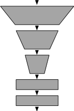

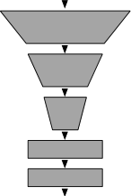

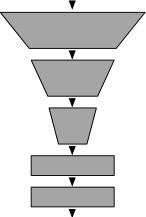

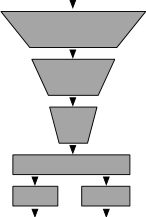

Conv.
layers

Fully

conn.
layers

Figure 2: Network architectures for DQN and DDQL variants. **a)** DQN and Double DQN,
**b)** DH-DDQL, and **c)** DN-DDQL.

**4.4 Additional Algorithm Details**

There are multiple other algorithm details to note. One is that we initialize the independent
parts of the Q-functions identically. That is, for DN-DDQL, we initialize both networks
identically. For DH-DDQL, we initialize the independent output heads identically. We
found identical initialization to be especially helpful for DN-DDQL in some environments at
smaller target network update intervals. Identical initialization is explored in Appendix D.2.
The number of gradient updates per environment transition, known as the _replay ratio_,
is known to be a key hyperparameter in deep RL (Fedus et al., 2020). This value is typically
1 _/_ 4 in DQN and Double DQN when applied to Atari 2600 games. That is, one gradient step
is performed after every four environment steps. Our DDQL agents use a replay ratio of [1] _/_ 8,
where both Q-functions are updated simultaneously once per eight timesteps. Classically,
Double Q-learning updates each Q-function half as often as in Q-learning, and DDQL is
consistent with that. Section 7.2 explores DDQL with Double DQN’s replay ratio of [1] _/_ 4 .
The target network update interval, or the frequency at which the target network copies
the Q-network, is another important hyperparameter. As noted by van Hasselt et al. (2019),
the target network update interval should be a function of the number of parameter updates
as opposed to environment timesteps as it is typically described. We inherit this hyperparameter from the tuned version of Double DQN (van Hasselt et al., 2016), which copies the
Q-network into the target network every 7,500 gradient updates.
The behavior policy that the agent deploys when interacting with the environment to
gather training data is the standard option of an _ϵ_ -greedy policy with respect to the average
of the two Q-functions: [1] _[Q]_ [(] _[s, a]_ [;] _**[ θ]**_ [1] [) +] [1] _[Q]_ [(] _[s, a]_ [;] _**[ θ]**_ [2] [).]

[1] [1]

2 _[Q]_ [(] _[s, a]_ [;] _**[ θ]**_ [1] [) +] 2

of the two Q-functions: 2 _[Q]_ [(] _[s, a]_ [;] _**[ θ]**_ [1] [) +] 2 _[Q]_ [(] _[s, a]_ [;] _**[ θ]**_ [2] [).]

One desirable property of DDQL is that it introduces no additional hyperparameters.
There are additional _optional_ hyperparameters, but there are natural choices for these.
For example, having two Q-functions instead of one permits more choices for exploration
policies that can leverage these Q-functions in multiple ways.
Table 2 highlights the ways in which Double DQN and our canonical instantiations
of DDQL implement the defining ideas of Double Q-learning. For the inquisitive reader,

11

Nagarajan, White, & Machado

Table 2: Different adaptations of Double Q-learning to the deep RL setting. This table
describes the canonical implementations that we set forth for DH-DDQL and DN-DDQL.

**Double Q-learning Defining Feature** **Double DQN** **DH-DDQL** **DN-DDQL**

**(1)** Target bootstrap decoupling? ✓ ✓ ✓
**(2)** Double estimation? - ✓ ✓
**(2a)** No parameter sharing? - ✗ ✓
**(3)** Dataset partitioning? - ✓ ✓
**(3a)** Train on distinct buffers? - ✗ ✗

Appendix D expands the discussion on some of these algorithm choices and has additional
results.

**5 Experimental Methodology**

In this section, we outline the experimental methodology used to implement and evaluate
agents, as well as to measure their overestimation.

**5.1 Environments**

We conduct experiments in the Arcade Learning Environment (Bellemare et al., 2013;
Machado et al., 2018), the evaluation platform on which both DQN and Double DQN were
originally evaluated. We evaluate our core algorithms of Double DQN, DH-DDQL, and
DN-DDQL across the Atari-57 set of environments. For our auxiliary experiments, we use
two sets of environments. The first set contains six different Atari 2600 games that are used
in the literature to study overestimation in DQN (van Hasselt et al., 2016; Anschel et al.,
2017): Alien, Asterix, Seaquest, SpaceInvaders, WizardofWor, and Zaxxon. The
second set of environments are the Atari-5 environments (Aitchison et al., 2023), a subset
of Atari-57 games that are said to be predictive of Atari-57 performance in terms of median
human-normalized score: BattleZone, DoubleDunk, NameThisGame, Phoenix, and
Qbert. We refer to these six overestimation environments combined with the Atari-5 environments as the _Ablation-11_ environments, as we use these environments to ablate certain
algorithm details.
We use the environment settings proposed by Machado et al. (2018). That is, we use
sticky actions, the full action set, and game-over termination. We discuss the full experiment
and evaluation details in Appendix A.

**5.2 Algorithm Implementation**

All of our algorithm implementations [1] are built upon the PFRL library (Fujita et al., 2021).
For Double DQN, we largely use the same hyperparameters as the original paper (van Hasselt et al., 2016). In particular, we use their tuned Double DQN, which has the following
settings. During training, agents deploy an _ϵ_ -greedy strategy beginning at _ϵ_ = 1 _._ 0 and

1. The data used to generate our results along with implementations of our algorithms will be released
upon publication.

12

Double Q-learning for Deep RL, Revisited

decaying linearly to _ϵ_ = 0 _._ 01 over 1M timesteps. Agents are evaluated with _ϵ_ = 0 _._ 001.
The target network update interval is 7,500 gradient updates. The tuned version of Double
DQN has a single shared bias term for all action values as opposed to each action’s output
layer having its own bias. Evaluation episodes are truncated after 30 minutes of play, which
corresponds to 27,000 timesteps.

We modify one aspect of the algorithm to reflect recent results surrounding the choice
of optimizer and loss function. Obando-Ceron and Castro (2021) and Agarwal et al. (2021)
report that using the setting of the Adam optimizer used by Rainbow (Hessel et al., 2018)
with the MSE loss substantially improves DQN’s performance in the sticky action setting.
As such, we adopt the Adam optimizer with the MSE loss using said optimizer setting, which
has been used extensively in the literature (Agarwal et al., 2020, 2021; Obando-Ceron and
Castro, 2021; Farebrother et al., 2024). This setting of Double DQN serves as the baseline
in our experiments.

As DDQL introduces no additional hyperparameters, we follow the approach used by
van Hasselt et al. (2016) of maintaining the same hyperparameters as Double DQN, unless
stated otherwise in Section 4. The two networks in DN-DDQL have the same architecture
as Double DQN. DH-DDQL shares Double DQN’s architecture for its hidden layers, and
has two output heads which are each identical to Double DQN’s single output head. When
selecting actions in the environment, DDQL uses the same _ϵ_ -greedy schedule as Double
DQN, but with respect to the average action-value of its two Q-functions.

We describe more granular details for reproducibility purposes in Appendix A. Each
algorithm is run for five seeds for each evaluated game.

**5.3 Measuring Overestimation**

DQN learns a Q-function that estimates the expected discounted return of the greedy policy
with respect to that very Q-function, as discussed in Section 2.2. Recall that overestimation
in DQN refers to when the estimated Q-value, _Q_ ( _s, a_ ; _**θ**_ ), exceeds the expected return of the
greedy policy. Similar to van Hasselt et al. (2016), we measure overestimation throughout
training by periodically evaluating the agent with a near-greedy policy ( _ϵ_ = 0 _._ 001) for
125,000 timesteps. For all completed episodes in this evaluation phase, we compute the
predicted action-values for all state-action pairs in the episode and compare them to their
corresponding actual achieved discounted return. If the episode is truncated due to reaching
an evaluation time limit, as opposed to reaching a terminal state, we bootstrap the final
action-value to compute our return estimate. [2] The average difference between the predicted
state-action values and achieved discounted returns for all these state-action pairs is reported
as the overestimation. Note that this quantity can be negative, indicating underestimation.
For the DDQL variants, the action-value prediction for a state-action pair is the average
Q-value across the two Q-functions. Appendix A.2 provides more detail regarding the
overestimation computation.

2. The impact of this bootstrapping bias is discussed in Appendix A.2. We conclude that this bootstrapping has a minimal effect on results due to long episode lengths and the relative infrequency of this
bootstrapping.

13

Nagarajan, White, & Machado

**5.4 Figures**

In this paper, we have two main types of charts, bar charts and line charts, typically to
depict game scores, human-normalized scores (HNS), or overestimation. The bar charts are
more concise representations of the data and are mainly used in the body of the paper. For
every bar chart in the paper, we have the corresponding line charts (e.g., learning curves or
overestimation throughout learning) in the Appendices.

For bar charts on performance, to better capture the dynamics of the full training run,
we plot the mean area under the curve (AUC) averaged across all seeds. Each training
run consists of 200 evaluation phases, corresponding to 200 data points in a training curve.
Essentially we average these 200 data points (i.e., the average AUC) across all 5 seeds to
produce the quantities shown in our bar plots. For bar charts on overestimation, we plot
the final overestimation, as overestimation curves tend to converge to consistent values by
the end of training.

When plotting overestimation or performance across training as a line chart, we depict
the mean across the five runs as an opaque curve and plot the individual runs as translucent
curves of the same color as the mean curve. By doing so, we can visualize all the training
runs rather than view a shaded region that may poorly summarize the behavior of the
algorithm.

**6 Evaluating Deep Double Q-learning**

Double DQN, despite reducing overestimation over DQN, still exhibits overestimation (van
Hasselt et al., 2016). This is to be expected, as Double DQN only implements target
bootstrap decoupling. A natural question is whether DDQL can reduce overestimation
through double estimation. Moreover, if it can reduce overestimation, is it still performant?
In this section, we answer these two questions affirmatively, for both DH-DDQL and DNDDQL.

**6.1 Overestimation**

Figure 3 depicts the overestimation of Double DQN, DH-DDQL, and DN-DDQL. There
is a clear hierarchy in terms of overestimation amongst the algorithms. We consistently
find that, save for a few environments, DDQL variants exhibit less overestimation. We see
that DH-DDQL often has slightly, but consistently, less overestimation than Double DQN.
Compared to both DH-DDQL and Double DQN, DN-DDQL overestimates much less. In
fact, it typically underestimates, a phenomenon known to occur in both Double Q-learning
and the double estimator on which it is designed. Figure 15 in Appendix B depicts the
overestimation curves across training, for all 57 environments.

The overestimation gap between DH-DDQL and DN-DDQL suggests differences in the
role of the final layer for overestimation. In particular, the gap suggests that the earlier layers
being shared in the torso of the network may contribute substantially to overestimation. It
is difficult to say this conclusively, as in DH-DDQL the effective batch size of the torso of
the network is double that of DN-DDQL. As such, comparing the overestimation between
DH-DDQL and DN-DDQL is not a like-for-like comparison.

14

Double Q-learning for Deep RL, Revisited

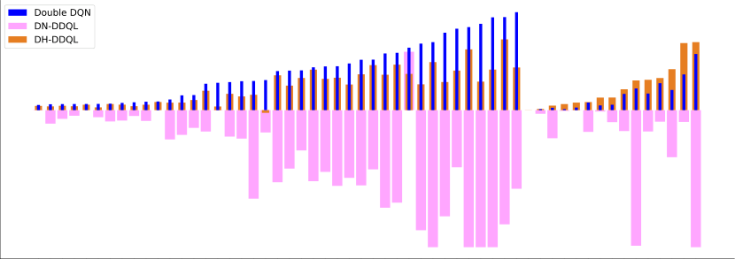

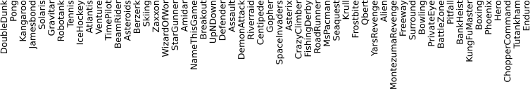

Figure 3: Final overestimations averaged across five seeds of Double DQN, DH-DDQL,
and DN-DDQL. VideoPinball is omitted for visibility. The underestimation is clipped
to -4 for visibility. Figure 13 depicts all 57 environments without clipping. Double DQN
overestimates the most. DH-DDQL overestimates less. DN-DDQL overestimates the least,
largely underestimating.

**6.2 Performance**

While we have shown that DDQL exhibits reduced overestimation, a natural question is
whether DDQL algorithms can perform well. Figure 4 depicts the mean, median (van
Hasselt et al., 2016), and interquartile mean (Agarwal et al., 2021) of the human normalized
scores (HNS) across the Atari-57 environments. We see that both DH-DDQL and DNDDQL outperform Double DQN. On the standard metrics of median HNS and IQM of the
HNS, we see DH-DDQL performs the best, slightly edging out DN-DDQL. The metric of
mean HNS is less commonly used, as there are a few environments that can have an outsized
influence on the mean (observe the difference in scales amongst the plots). On this metric
we see DN-DDQL perform the best, followed by DH-DDQL.

Figure 5 depicts the improvements in terms of HNS of DH-DDQL and DN-DDQL over
Double DQN. Observe that DH-DDQL and DN-DDQL outperform Double DQN in most
environments. Moreover, observe that these plots are logarithmically-scaled, and the performance decreases from using DDQL are often not substantial, while the gains can be quite
high. Figure 14 in Appendix B depicts the performance of individual runs of the different
algorithm variants across all 57 environments.

**7 Understanding Deep Double Q-learning**

In this section, we explore the impact of certain algorithm details on the overestimation and
performance of DH-DDQL and DN-DDQL. In particular, we study the impact of double

15

Nagarajan, White, & Machado

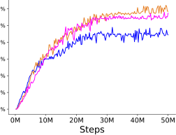

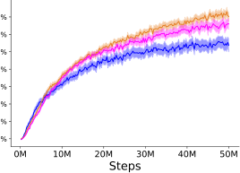

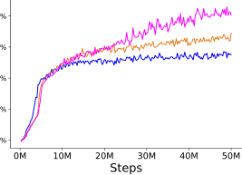

Figure 4: Human-normalized scores throughout training. Note that the scale of the y-axes
are different across metrics. In all three metrics, DDQL outperforms Double DQN. The
shaded region is a 95% stratified bootstrap confidence interval (Agarwal et al., 2021).

buffer strategies for dataset partitioning and the impact of lowering the replay ratio. For
these experiments, we evaluate our algorithms on the Ablation-11 environments.

**7.1 Partitioned datasets**

The third defining feature of Double Q-learning is dataset partitioning, where each experience transition is used to train only a single Q-function. Thus far, the variants of DDQL
we have explored maintain a single replay buffer and sample distinct minibatches to update
each Q-function. This strategy, however, only weakly implements dataset partitioning.
Indeed, the two Q-functions are trained on distinct minibatches, but these minibatches
themselves are sampled from a shared replay buffer which resamples experience transitions
multiple times. In fact, each transition is expected to be sampled eight times from the
replay buffer. [3] Consequently, transitions are highly likely to be sampled repeatedly to train
both Q-functions.

In this set of experiments, we study a stronger form of dataset partitioning. To do
so, we modify the DDQL variants to maintain two separate buffers that have half the
capacity of a standard replay buffer (i.e., they have a capacity of 500k transitions). As each
transition is completed, it is added to one of the two replay buffers uniformly at random.
Each buffer is then used to sample minibatches for a single Q-function, ensuring that each
experience transition is uniquely used to train a single Q-function. All other algorithm
details and hyperparameters are otherwise unchanged. We compare our DDQL variants to
their double-buffer counterparts.

Figures 6 and 7 compare the scores and overestimation, respectively, when switching
from DH-DDQL to DH-DDQL (double buffer). These results suggest that DH-DDQL
(double buffer) is a sort of intermediate algorithm between DH-DDQL and DN-DDQL,
both in terms of overestimation and performance. The double buffer strategy exhibits reduced overestimation in all environments, though closer to zero than DN-DDQL, and not

3. We sample 64 experience transitions (one minibatch of size 32 per Q-function) uniformly every 8
timesteps, amounting to 8 transitions per timestep.

16

Double Q-learning for Deep RL, Revisited

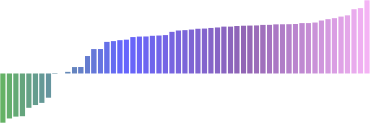

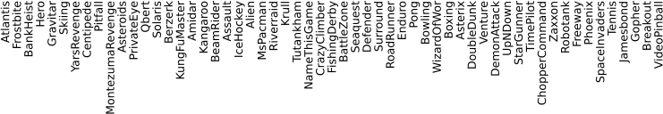

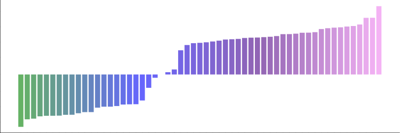

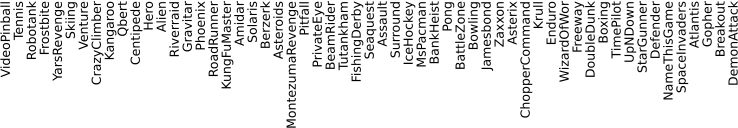

Figure 5: Improvement in terms of HNS of DH-DDQL ( _top_ ) and DN-DDQL ( _bottom_ ) over
Double DQN in each of the 57 environments, calculated as the average area under the curve
averaged across 5 seeds. Both DDQL algorithms outperform Double DQN.

17

Nagarajan, White, & Machado

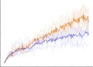

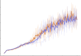

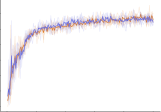

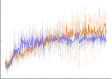

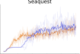

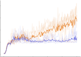

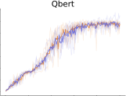

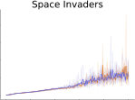

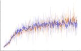

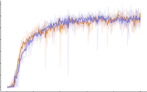

Figure 6: Performance of DH-DDQL compared to DH-DDQL (double buffer). The algorithms largely perform at a similar level, with a few exceptions.

as pronounced as the underestimation exhibited by DN-DDQL. This supports the notion
that the further de-correlation of the two Q-functions reduces overestimation.

The performance between the two variants is roughly similar, with some intriguing
environment-specific results. Consider the two environments for which the double buffer
strategy performs visibly worse, Alien and Phoenix. Figure 14 shows these correspond to
environments where DN-DDQL performs poorly. NameThisGame is the one environment
for which the double buffer strategy performs visibly better. Figure 14 similarly shows
that this is an environment where DN-DDQL performs quite well. Overall, these results
suggest that DH-DDQL (double buffer) is a relatively stable algorithm that offers reduced
overestimation over DH-DDQL.

Figure 8 compares the performance of DN-DDQL to DN-DDQL (double buffer). DNDDQL (double buffer) is clearly worse across all environments with the exception of DoubleDunk, where the performance between the two algorithms is similar. One of our findings is that identical initialization of networks can support learning in DN-DDQL (see
Appendix D.2). Perhaps using a shared buffer of experiences helps DN-DDQL achieve a
similar effect of keeping the two Q-functions close. Ultimately, we want the two Q-functions
to converge to the same values, and perhaps a shared buffer is more conducive to ensuring
this possibility is preserved.

When contrasting double buffer results between DN-DDQL and DH-DDQL, the fact
that DH-DDQL’s performance is not majorly impacted while in DN-DDQL the impact is
severe, is insightful. It suggests that the shared representation in DH-DDQL may indirectly
keep the Q-functions similar enough to cause the two buffers to have close distributions.
By contrast, given the absence of shared parameters in DN-DDQL, the Q-functions may
be more susceptible to being driven further apart, which can be exacerbated by training

18

Double Q-learning for Deep RL, Revisited

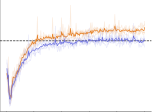

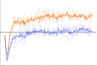

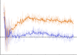

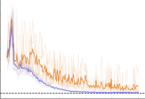

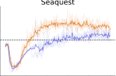

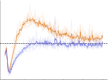

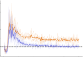

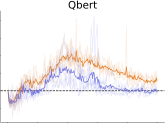

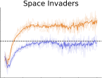

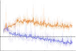

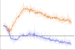

Figure 7: Overestimation of DH-DDQL compared to DH-DDQL (double buffer). The
double buffer strategy reduces overestimation.

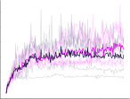

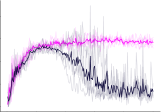

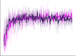

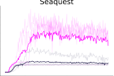

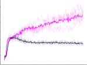

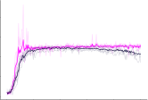

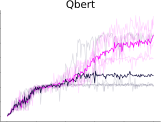

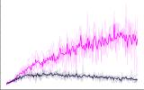

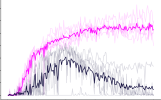

Figure 8: Performance of DN-DDQL compared to DN-DDQL (double buffer). DN-DDQL
(double buffer) performs quite poorly.

on different buffers of data. This in turn can cause the buffer distributions to drift apart,
leading to the divergences that we observe.

**7.2 Replay Ratio**

Recall that our DDQL agents use a replay ratio of [1] _/_ 8, as opposed to the standard [1] _/_ 4 used
by DQN and Double DQN when applied to Atari 2600 games. We chose this setting for

19

Nagarajan, White, & Machado

two reasons. The first is that it mirrors the Double Q-learning algorithm in which each
Q-function receives half as many updates as in Q-learning. The second reason is that a
lower replay ratio slows training and increases stationarity, which can be beneficial when
training two Q-functions in an interdependent manner. This proves to be a sensible choice.
To study the importance of the replay ratio, we train both DH-DDQL and DN-DDQL
with double the replay ratio at [1] _/_ 4, denoted DH-DDQL(RR = [1] 4 [) and DN-DDQL(RR =] [1] 4 [).]

[1] [1]

4 [) and DN-DDQL(RR =] 4

with double the replay ratio at [1] _/_ 4, denoted DH-DDQL(RR = 4 [) and DN-DDQL(RR =] 4 [).]

Doing so ensures that the total number of gradient updates matches Double DQN and
that each Q-function receives as many updates as the single Q-function in Double DQN.
All other algorithm details, hyperparameters, and experiment configurations are otherwise
unchanged.
Figure 9 compares the performance of DH-DDQL(RR = 4 [1] [) to DH-DDQL. Doubling the]

Figure 9 compares the performance of DH-DDQL(RR = 4 [) to DH-DDQL. Doubling the]

replay ratio improves performance in DoubleDunk and Qbert. It reduces performance,
often substantially, in many more environments including NameThisGame, Phoenix,
Seaquest, SpaceInvaders, WizardOfWor, and Zaxxon. Figure 10 compares the performance of DN-DDQL(RR = [1] 4 [) to DN-DDQL. The results here are similarly quite clear]

formance of DN-DDQL(RR = 4 [) to DN-DDQL. The results here are similarly quite clear]

— doubling the replay ratio results in worse performance.
Why does halving Double DQN’s replay ratio benefit DDQL? The replay ratio affects
training dynamics in several ways. Consider that a single parameter update changes the
behavior policy, often significantly (Schaul et al., 2022; Fedus et al., 2020). Halving the
replay ratio from [1] _/_ 4 to [1] _/_ 8 ensures that the buffer gets twice as many transitions from
a single policy (i.e., 8 versus 4) before its parameters are updated. Moreover, assuming
the buffer size is unchanged, this implies that the buffer contains data from half as many
policies, and that these policies are more recent to the agent in terms of parameter updates.
At a fixed minibatch size, lower replay ratios also ensure that experience transitions are
resampled fewer times, and can reduce the likelihood of overfitting. Moreover, if we refresh
the target network after some fixed number of parameter updates (van Hasselt et al., 2019),
as we do in this paper, then lowering the replay ratio indirectly holds the target network
fixed for a longer interval in terms of environment timesteps. Unifying these points, we can
see that lowering the replay ratio leads to a more stationary learning process, which we
argue is critical for the stability of DDQL.
Figure 11 compares the overestimation of DH-DDQL(RR = [1] 4 [) and DN-DDQL(RR =] [1] 4 [)]

[1] [1]

4 [) and DN-DDQL(RR =] 4

Figure 11 compares the overestimation of DH-DDQL(RR = 4 [) and DN-DDQL(RR =] 4 [)]

to that of Double DQN. DN-DDQL(RR = [1] 4 [) underestimates in most environments, and]

to that of Double DQN. DN-DDQL(RR = 4 [) underestimates in most environments, and]

has less overestimation than Double DQN in every environment. With the exception of
DoubleDunk, and arguably Phoenix, DH-DDQL(RR = [1] 4 [) has overestimation on par]

DoubleDunk, and arguably Phoenix, DH-DDQL(RR = 4 [) has overestimation on par]

or less than Double DQN in all environments by the end of the 50M timesteps. Thus, we
conclude that DDQL still reduces overestimation over Double DQN with double the replay

ratio.

The reduction of overestimation with twice as many parameter updates strengthens our
argument for DDQL’s general ability to reduce overestimation. Overestimation often compounds systematically, and thus it can be argued that fewer updates slows the compounding
effect, explaining the reduced overestimation. If this is the case, the overestimation reduction observed in the standard DDQL agents could be attributable to having fewer updates
rather than to the algorithm itself. This experiment eliminates this counterargument.
Observe that DN-DDQL(RR = 4 [1] [) has its underestimation thresholded below for][ Bat-]

Observe that DN-DDQL(RR = 4 [) has its underestimation thresholded below for][ Bat-]

tleZone, due to divergence. One of the common selling points for overestimation reduction

20

Double Q-learning for Deep RL, Revisited

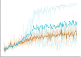

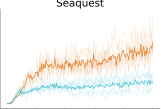

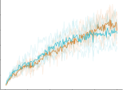

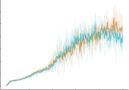

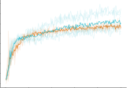

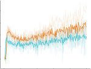

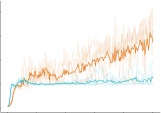

Figure 9: Performance of DH-DDQL compared to DH-DDQL(RR = [1] 4

Figure 9: Performance of DH-DDQL compared to DH-DDQL(RR = 4 [). They perform]

similarly in some environments, but DH-DDQL(RR = [1] 4 [) is generally worse.]

4 [) is generally worse.]

Figure 10: Performance of DN-DDQL compared to DN-DDQL(RR = [1] 4 [). DN-DDQL(RR =]

1
4 [) is generally worse.]

is that it can prevent divergence. This result highlights that uncontrolled _underestimation_
can also lead to divergence. While in control algorithms, divergence induced by compounding overestimation is a more prevalent concern than underestimation, it is not necessarily
the case that trading overestimation for aggressive underestimation prevents divergence
either.

The replay ratio results pose several questions for further inquiry. They show that
DDQL can outperform Double DQN with half as many gradient updates. This suggests

21

Nagarajan, White, & Machado

Figure 11: Overestimation of DH-DDQL(RR = [1] 4

[1] [1]

4 [), DN-DDQL(RR =] 4

Figure 11: Overestimation of DH-DDQL(RR = 4 [), DN-DDQL(RR =] 4 [), and Double DQN.]

Overestimation is clipped at -8 due to divergence in BattleZone. The DDQL variants
continue to reduce overestimation even with double the replay ratio.

that on a per-update basis, DDQL is more efficient than Double DQN at credit assignment.
Moreover, these results indicate that DDQL benefits greatly from increased stationarity in
the learning process.

**8 Discussion**

Our results yields two key insights.
The first, though expected, is that progressive de-correlation as per our three
defining features generally reduces
overestimation. Double DQN, which
only implements target bootstrap decoupling, has the least amount of
de-correlation between action-selection

and action-evaluation in the bootstrap
target amongst the algorithms studied.
Amongst these algorithms, it also ex

hibits the most overestimation. The Figure 12: Overestimation of five algorithms on

NameThisGame. Increased de-correlation re
DH-DDQL variants de-correlate more,

duces overestimation. Shaded region: 95% con
and consequently exhibit less overestimation. The DN-DDQL variants fidence interval over five seeds.
de-correlate even further, and consequently exhibit the least overestimation, even underestimating. With some environmentspecific exceptions, the general trend in overestimation reduction follows what we might
expect: Double DQN, DH-DDQL, DH-DDQL (double buffer), DN-DDQL, and then DN

Figure 12: Overestimation of five algorithms on
NameThisGame. Increased de-correlation reduces overestimation. Shaded region: 95% confidence interval over five seeds.

22

Double Q-learning for Deep RL, Revisited

DDQL (double buffer). To illustrate this, Figure 12 depicts the overestimation of these five
algorithms on NameThisGame.

The second insight is an empirical observation that, with further de-correlation in actionselection and action-evaluation, it becomes increasingly difficult to achieve consistent, reliable performance. For the most part, Double DQN, despite its limited de-correlation, is a
relatively stable algorithm that is able to learn in the vast majority of environments. By
contrast, DN-DDQL, though it performs better on aggregate metrics and has very high
performance in specific environments, has a few (though not many) failure scenarios. For
example, its performance is quite poor or visibly worse than its counterparts in Venture,
Tennis, and Qbert. Moreover, relative to DH-DDQL, DN-DDQL seems less robust to
changes, as seen in our dataset partitioning and replay ratio experiments. Indeed, at the
furthest extreme of de-correlation, DN-DDQL (double buffer) performs poorly on the overwhelming majority of the Ablation-11 environments and is clearly worse than DN-DDQL.
Overall, DH-DDQL strikes a nice balance by reducing overestimation and outperforming
its counterparts, without the dramatic failure scenarios of the DN-DDQL variants.

This observation may also provide a hindsight explanation for the original choice of
Double DQN as a stable integration of the ideas of Double Q-learning to deep RL. When
Double DQN was introduced, the RMSProp optimizer (Tieleman, 2012) with the Huber loss
was more commonly used, which we and others have found to be less stable than the more
modern choice of Adam with the MSE loss (Obando-Ceron and Castro, 2021). Moreover,
the target network update interval used by DQN was 2,500 gradient updates, which is less
stable than the longer target network update interval of 7,500 gradient updates that we see
in the tuned version of Double DQN (van Hasselt et al., 2016). Given the context at the
time, Double DQN was an excellent choice and a minimal modification of DQN to boost
performance and reduce overestimation without incurring some of the risk of instability
we see as we attempt to increase de-correlation. Our DDQL variants benefit from using
modern settings of Adam, the longer target network update interval, and the lower replay
ratio. All of these changes offer stability that makes DDQL more viable in a manner that
may not have been as straightforward at the time if one was seeking a minimal modification
of DQN.

While our results show that DDQL can both reduce overestimation and improve performance beyond Double DQN, they do not demonstrate a causal relationship between
reducing overestimation and improving performance. Studying the general relationship
between overestimation and performance is out of this paper’s scope. Other works have
shown that the benefit or harm of overestimation can be context-dependent (Lan et al.,
2020; Waltz and Okhrin, 2024) or even benign in some scenarios (van Hasselt et al., 2016).
The objective of our study was to understand whether adaptations of Double Q-learning
that integrate double estimation with reciprocal bootstrapping and dataset partitioning
can reduce overestimation and perform well. To this end, we answered both questions
affirmatively.

**9 Related Work**

The unique way in which our work is situated within the literature is that it is the first study
on adapting the double estimation, dataset partitioning, and reciprocal bootstrapping ideas

23

Nagarajan, White, & Machado

of Double Q-learning for value-based deep RL. Moreover, we are the first to show that Double Q-learning can viably be adapted to the value-based deep RL setting in a manner that
more closely resembles the original Double Q-learning algorithm. By introducing Double
DQN, van Hasselt et al. (2016) indeed successfully adapt Double Q-learning to deep RL via
target bootstrap decoupling. However, they do not perform a broader study on alternative
adaptations or other defining features of Double Q-learning for value-based deep RL. To our
knowledge, our paper is the first since van Hasselt et al. (2016) to propose an adaptation of
Double Q-learning that achieves high performance across the 57 standard Atari 2600 games.

As we study adaptations of Double Q-learning in this paper, measuring DDQL’s impact on overestimation has naturally been a central point. Though DDQL indeed reduces
overestimation, our objective was moreso to adapt Double Q-learning than it was to find
an algorithm that reduces overestimation. Nonetheless, we should acknowledge the broader
literature in value-based deep RL that aims to address or manage overestimation. AveragedDQN (Anschel et al., 2017) reduces overestimation by performing Q-learning updates with
the Q-learning target averaged over multiple historical target networks. Self-correcting
DQN (Zhu and Rigotti, 2021) aims to balance overestimation and underestimation, but
does not implement double estimation. Like Double DQN, it too leverages the target network instead of a second independent Q-function.

There are value-based ensemble methods that aim to manage overestimation. Maxmin
DQN (Lan et al., 2020) aims to allow and control for different amounts of overestimation or
underestimation. Ensemble Bootstrapped Q-Learning (EQBL) (Peer et al., 2021) and cross
Q-learning (Wang and Vinel, 2020) both generalize Double Q-learning to ensembles. Both
papers only investigate multi-head architectures, and only investigate ensembles of at least
five members. Wang and Vinel (2020)’s study is also restricted to the small environments
of Cartpole and Lunar Lander (Towers et al., 2024). While EBQL is evaluated on Atari
2600 games, they restrict their algorithm to 11 random environments as opposed to the 57
games, and do not measure overestimation in these environments. Waltz and Okhrin (2024)
also work in the ensemble setting, building off of Bootstrapped DQN (Osband et al., 2016),
with the aim of balancing overestimation and underestimation.

Though our focus in this paper is on adapting Double Q-learning for value-based deep
RL, it is important to note an adaptation commonly used in deep off-policy actor-critic
settings known as Clipped Double Q-learning (CDQ)(Fujimoto et al., 2018). CDQ adapts
some ideas of Double Q-learning and has been popularized by algorithms like TD3 (Fujimoto
et al., 2018) and Soft Actor-Critic (Haarnoja et al., 2018). CDQ is distinct from Double
Q-learning and DDQL in several ways. First, CDQ computes a _single_ target Q-value which
is used to update both Q-functions, rather than having each Q-function update towards
different targets. Second, this singular target is computed by bootstrapping the minimum
estimated Q-value across two Q-functions. Third, each Q-function evaluates the _same_ target action from a single policy, rather than having two different policies select the actions for
each respective Q-function. Fourth, these Q-functions are trained on the same minibatches,
i.e., they are trained on the same data unlike Double Q-learning or DDQL. In the tabular setting, this is akin to updating both Q-functions with the same experience and same
target value, which fundamentally departs from Double Q-learning. There are also other
approaches for reducing overestimation that have been applied to the off-policy actor-critic
setting. Decorrelated Double Q-learning (Chen, 2020) introduces a regularization term to

24

Double Q-learning for Deep RL, Revisited

de-correlate the two Q-functions. Randomized Ensemble Double Q-learning (Chen et al.,
2021) maintains an ensemble of Q-functions and minimizes across them to compute targets. These works all aim to mitigate overestimation, but they neither study variants that
resemble the original Double Q-learning algorithm, nor are they studied in the value-based
setting.

**10 Conclusion**

In this paper, we revisited the adaptation of Double Q-learning for value-based deep RL.
In introducing and evaluating Deep Double Q-learning, we have shown that adaptations of
Double Q-learning that feature double estimation with reciprocal bootstrapping and dataset
partitioning can indeed reduce overestimation over Double DQN and even outperform it.
Desirably, DDQL does not introduce new hyperparameters beyond Double DQN, even if it
presents more degrees of freedom that can be optimized.
We also investigated the impact of two different architectural variants of DDQL in the
form of DH-DDQL and DN-DDQL. We found that DH-DDQL overestimates more than
DN-DDQL, but outperforms it in aggregate. DN-DDQL quite often underestimates, and
outperforms Double DQN. We additionally studied the impact of further de-correlation
through our double-buffer variants and found that they reduce overestimation substantially
but lead to instability in DN-DDQL. Lastly, we showed that halving Double DQN’s replay
ratio for DDQL is important for stability.
One limitation of our study is that we did not perform hyperparameter sweeps. There
were a number of DDQL algorithm variants to be considered. Given that the standard mode
of evaluating these agents is to train them on dozens of Atari 2600 games, where each run
constitutes several days of training on a GPU, it limited our capacity to perform sweeps.
As such, we adopted an approach where we use sensible settings of hyperparameters for
adequate comparisons, largely transporting hyperparameters from prior work.
There is always the possibility that these algorithms can be improved and re-tuned in
a variety of ways. Nevertheless, it is also important to emphasize that the performance
we report for the Double DQN baseline used the hyperparameters they were introduced
with, augmented with modern optimizer and loss settings. Thus, since we evaluate in
a setting similar to the original one, DDQL is, if anything, more likely to benefit from
additional hyperparameter tuning than Double DQN. Immutable claims are difficult to
make in RL (Patterson et al., 2024), so perhaps the best we can do is to improve our
current understanding of these algorithms through clear experimentation.
There is much more to understand about DDQL. There are environment-specific instances where DDQL seems to be either helpful or harmful, and this warrants further study.
Moreover, we can also study DDQL from the perspective of policy churn (Schaul et al.,
2022), which refers to the rapid change of greedy actions, as it may shed light on the degree
of nonstationarity in the policy when averaging Q-values. Furthermore, the importance of
the data distribution in off-policy value-based deep RL has been well-established (Ostrovski et al., 2021). Our dataset partitioning results indicating qualitative differences as the
Q-functions are trained on different datasets, warranting further study.
Future work can also study the ways in which DDQL can be enhanced. For example,
DDQL can potentially leverage existing advances such as classification-based action-value

25

Nagarajan, White, & Machado

learning (Farebrother et al., 2024) and _n_ -step returns (Hessel et al., 2018). Additionally,
DDQL’s overestimation reduction may strengthen other strategies to accelerate credit assignment, such as increasing the discount factor (Wagenbach and Sabatelli, 2022).
More generally, to our knowledge, this paper is the first successful demonstration at scale
of a reciprocal bootstrapping value-based algorithm. While there are ensemble methods
where the ensemble members bootstrap off of one another, this has been unexplored for
two value functions. We hope our work can lay the foundation for exploring deep reciprocal
bootstrapping TD learning algorithms.

**Acknowledgments and Disclosure of Funding**

We thank Andrew Patterson for useful discussions, Anna Hakhverdyan for providing feedback on an earlier version of the paper, Brett Daley for reviewing parts of the code, and
Abhishek Naik for making helpful suggestions. The authors especially thank Khurram
Javed, Scott Jordan, Aditya Ganeshan, and Jens Tuyls for their time in discussing and
giving extensive feedback on the paper.
This research was supported in part by the Natural Sciences and Engineering Research
Council of Canada (NSERC) and the Canada CIFAR AI Chair Program. Prabhat Nagarajan is supported by the Alberta Innovates Graduate Student Scholarship. Computational
resources were provided in part by the Digital Research Alliance of Canada.

**References**

R. Agarwal, D. Schuurmans, and M. Norouzi. An Optimistic Perspective on Offline Reinforcement Learning. In _International Conference on Machine Learning_, 2020.

R. Agarwal, M. Schwarzer, P. S. Castro, A. C. Courville, and M. G. Bellemare. Deep
Reinforcement Learning at the Edge of the Statistical Precipice. _Neural Information_
_Processing Systems_, 2021.

M. Aitchison, P. Sweetser, and M. Hutter. Atari-5: Distilling the Arcade Learning Environment down to Five Games. In _International Conference on Machine Learning_, pages
421–438, 2023.

O. Anschel, N. Baram, and N. Shimkin. Averaged-DQN: Variance Reduction and Stabilization for Deep Reinforcement Learning. In _International Conference on Machine Learning_,

2017.

M. G. Bellemare, Y. Naddaf, J. Veness, and M. Bowling. The Arcade Learning Environment:
An Evaluation Platform for General Agents. _Journal of Artificial Intelligence Research_,

2013.

M. G. Bellemare, W. Dabney, and R. Munos. A Distributional Perspective on Reinforcement
Learning. In _International Conference on Machine Learning_, 2017.

G. Chen. Decorrelated Double Q-learning. _arXiv preprint arXiv:2006.06956_, 2020.

26

Double Q-learning for Deep RL, Revisited

X. Chen, C. Wang, Z. Zhou, and K. Ross. Randomized Ensembled Double Q-Learning:
Learning Fast Without a Model. In _International Conference on Learning Representa-_
_tions_, 2021.

J. Farebrother, J. Orbay, Q. Vuong, A. Ali Taiga, Y. Chebotar, T. Xiao, A. Irpan, S. Levine,
P. S. Castro, A. Faust, A. Kumar, and R. Agarwal. Stop Regressing: Training Value Functions via Classification for Scalable Deep RL. In _International Conference on Machine_
_Learning_, 2024.

W. Fedus, P. Ramachandran, R. Agarwal, Y. Bengio, H. Larochelle, M. Rowland, and
W. Dabney. Revisiting Fundamentals of Experience Replay. In _International Conference_
_on Machine Learning_, 2020.

S. Fujimoto, H. van Hoof, and D. Meger. Addressing Function Approximation Error in
Actor-Critic Methods. In _International Conference on Machine Learning_, pages 1587–
1596, 2018.

Y. Fujita, P. Nagarajan, T. Kataoka, and T. Ishikawa. ChainerRL: A Deep Reinforcement
Learning Library. _Journal of Machine Learning Research_, 2021.

T. Haarnoja, A. Zhou, K. Hartikainen, G. Tucker, S. Ha, J. Tan, V. Kumar, H. Zhu,
A. Gupta, P. Abbeel, et al. Soft Actor-Critic Algorithms and Applications. _arXiv preprint_
_arXiv:1812.05905_, 2018.

M. Hessel, J. Modayil, H. van Hasselt, T. Schaul, G. Ostrovski, W. Dabney, D. Horgan,
B. Piot, M. Azar, and D. Silver. Rainbow: Combining Improvements in Deep Reinforcement Learning. In _AAAI Conference on Artificial Intelligence_, 2018.

G. H. John. When the Best Move Isn’t Optimal: Q-learning with Exploration. In _AAAI_
_Conference on Artificial Intelligence_, 1994.

Q. Lan, Y. Pan, A. Fyshe, and M. White. Maxmin Q-learning: Controlling the Estimation
Bias of Q-learning. In _International Conference on Learning Representations_, 2020.

Y. LeCun, Y. Bengio, and G. Hinton. Deep learning. _Nature_, 2015.

L.-J. Lin. Reinforcement Learning and Teaching. In _AAAI Conference on Artificial Intel-_
_ligence_, 1991.

L.-J. Lin. _Reinforcement Learning for Robots Using Neural Networks_ . Carnegie Mellon
University, 1992.

M. C. Machado, M. G. Bellemare, E. Talvitie, J. Veness, M. Hausknecht, and M. Bowling.
Revisiting the Arcade Learning Environment: Evaluation Protocols and Open Problems
for General Agents. _Journal of Artificial Intelligence Research_, 2018.

V. Mnih, K. Kavukcuoglu, D. Silver, A. A. Rusu, J. Veness, M. G. Bellemare, A. Graves,
M. Riedmiller, A. K. Fidjeland, G. Ostrovski, et al. Human-level control through deep
reinforcement learning. _Nature_, 2015.

27

Nagarajan, White, & Machado

J. S. Obando-Ceron and P. S. Castro. Revisiting Rainbow: Promoting more Insightful
and Inclusive Deep Reinforcement Learning Research. In _International Conference on_
_Machine Learning_, 2021.

I. Osband, C. Blundell, A. Pritzel, and B. Van Roy. Deep Exploration via Bootstrapped
DQN. _Neural Information Processing Systems_, 2016.

G. Ostrovski, P. S. Castro, and W. Dabney. The Difficulty of Passive Learning in Deep
Reinforcement Learning. _Neural Information Processing Systems_, 2021.

A. Patterson, S. Neumann, M. White, and A. White. Empirical Design in Reinforcement
Learning. _Journal of Machine Learning Research_, 2024.

O. Peer, C. Tessler, N. Merlis, and R. Meir. Ensemble Bootstrapping for Q-Learning. In
_International Conference on Machine Learning_, 2021.

J. Quan and G. Ostrovski. DQN Zoo: Reference implementations of DQN-based agents,
2020. URL `[http://github.com/deepmind/dqn_zoo](http://github.com/deepmind/dqn_zoo)` .

T. Schaul, J. Quan, I. Antonoglou, and D. Silver. Prioritized Experience Replay. In _Inter-_
_national Conference on Learning Representations_, 2016.

T. Schaul, A. Barreto, J. Quan, and G. Ostrovski. The Phenomenon of Policy Churn.
_Neural Information Processing Systems_, 2022.

J. E. Smith and R. L. Winkler. The Optimizer’s Curse: Skepticism and Postdecision Surprise
in Decision Analysis. _Management Science_, 2006.

R. S. Sutton. Learning to Predict by the Methods of Temporal Differences. _Machine_
_learning_, 1988.

R. S. Sutton and A. G. Barto. _Reinforcement Learning: An Introduction_ . MIT Press, 2018.

S. Thrun and A. Schwartz. Issues in Using Function Approximation for Reinforcement
Learning. In _Connectionist Models Summer School_, 1993.

T. Tieleman. Lecture 6.5-rmsprop: Divide the gradient by a running average of its recent
magnitude. _COURSERA: Neural networks for machine learning_, 4(2):26, 2012.

M. Towers, A. Kwiatkowski, J. Terry, J. U. Balis, G. De Cola, T. Deleu, M. Goul˜ao,
A. Kallinteris, M. Krimmel, A. KG, et al. Gymnasium: A Standard Interface for Reinforcement Learning Environments. _arXiv preprint arXiv:2407.17032_, 2024.

H. van Hasselt. Double Q-learning. _Neural Information Processing Systems_, 2010.

H. van Hasselt, A. Guez, and D. Silver. Deep Reinforcement Learning with Double Qlearning. In _AAAI Conference on Artificial Intelligence_, 2016.

H. van Hasselt, Y. Doron, F. Strub, M. Hessel, N. Sonnerat, and J. Modayil. Deep Reinforcement Learning and the Deadly Triad. _arXiv preprint arXiv:1812.02648_, 2018.

28

Double Q-learning for Deep RL, Revisited

H. van Hasselt, M. Hessel, and J. Aslanides. When to use parametric models in reinforcement
learning? In _Neural Information Processing Systems_, 2019.

J. Wagenbach and M. Sabatelli. Factors of Influence of the Overestimation Bias of QLearning. _arXiv preprint arXiv:2210.05262_, 2022.

M. Waltz and O. Okhrin. Addressing maximization bias in reinforcement learning with
two-sample testing. _Artificial Intelligence_, 2024.

X. Wang and A. Vinel. Cross Learning in Deep Q-Networks. _arXiv preprint_
_arXiv:2009.13780_, 2020.

Z. Wang, T. Schaul, M. Hessel, H. Hasselt, M. Lanctot, and N. Freitas. Dueling Network
Architectures for Deep Reinforcement Learning. In _International Conference on Machine_
_Learning_, 2016.

C. J. Watkins. _Learning from Delayed Rewards_ . PhD thesis, University of Cambridge,
Cambridge, UK, 1989.

C. J. Watkins and P. Dayan. Q-learning. _Machine learning_, 1992.

R. Zhu and M. Rigotti. Self-correcting Q-learning. In _AAAI Conference on Artificial_
_Intelligence_, 2021.

**Appendix A. Experimental Details**

In this Appendix, we provide details regarding environments, training, evaluation, and

overestimation measurement.

**A.1 Environments, Training, and Evaluation**

**Environments** In this paper, we use the environment settings proposed by Machado et al.
(2018). All agents use the full action set of 18 actions for all games. We use “sticky” actions,
where the simulator repeats the action executed at the previous frame with probability 0.25,
regardless of the agent’s selected action. We use the actual termination of the game as the
termination signal to the learning agent. These details are outlined in Table 3.

**Training** The agent is trained for 50M timesteps. When training, the rewards are clipped
to be between -1 and 1. The agents deploy an _ϵ_ -greedy policy during training, beginning
at _ϵ_ = 1 _._ 0 and linearly annealing to 0 _._ 01 over 1M timesteps. The agent’s replay buffer has
a capacity of 1M, and network updates are only performed after the agent has completed
50k timesteps. The network architecture used is identical to the architecture used by van
Hasselt et al. (2016), i.e., the DQN architecture (Mnih et al., 2015) with a single shared
bias for all actions in the final layer as opposed to per-action biases. Agents use the Adam
optimizer with the MSE loss using a step size of 6 _._ 25e _−_ 5, _ϵ_ = 1 _._ 5e _−_ 4, _β_ 1 = 0 _._ 9, and
_β_ 2 = 0 _._ 999 (Hessel et al., 2018; Agarwal et al., 2020; Obando-Ceron and Castro, 2021;
Farebrother et al., 2024). Target networks are copied from the main Q-networks every 7,500
gradient updates, which corresponds to 30k timesteps for Double DQN and 60k timesteps

29

Nagarajan, White, & Machado

Table 3: Environment details, following Machado et al. (2018).

**Detail** **Setting** **Description**

sticky action probability 0.25 Probability by which the simulator ignores the agent’s selected
action and repeats the action executed in the previous frame.
termination criterion end-of-game How episode termination is signaled during training (either endof-game or loss-of-life).
action space full The full action space has 18 actions. The minimal action space
uses the game-specific minimum required actions.

for DDQL. The preprocessing scheme follows that of Mnih et al. (2015). Table 4 outlines
our hyperparameters and training details.

**Evaluation** Agents are evaluated for 125k timesteps after every 250k timesteps of training. Evaluation episodes are truncated at 30 minutes, or 27k timesteps. Agents deploy an
_ϵ_ -greedy policy during evaluation with _ϵ_ = 0 _._ 001. For DDQL agents, the _ϵ_ -greedy policy
is with respect to the average action-values of the two Q-functions. Table 5 outlines these
details.

**Human Normalized Scores** The human-normalized score (Mnih et al., 2015) of an
agent can be computed as

score hns = [score] [a][g][ent] _[ −]_ [score] [random] (12)

score human _−_ score random

Our human scores and random scores use to compute Equation 12 are taken from DQN
Zoo (Quan and Ostrovski, 2020). Suppose we have _N_ environments and _M_ seeds per environment. Let _X_ _j,k_ refer to the human-normalized score of the agent on the _j_ th environment
and _k_ th seed. We compute the mean and median human-normalized scores as:

_M_
� _X_ _j,k_ _,_ (13)

_k_ =1

Mean HNS = [1]

_N_

_N_
�

_j_ =1

1

_M_

and

 _._ (14)



_N_
� _j_ =1

Median HNS = Median

1



_M_
�



_M_

_X_

� _j,k_

_k_ =1

To compute the interquartile mean of the human-normalized score, we follow Agarwal et al.
(2021):

IQM HNS = IQM ( _{X_ _j,k_ : _j_ = 1 _, . . ., N_ and _k_ = 1 _, . . ., M_ _}_ ) _._ (15)

4. (30 mins = 30 minutes * 60 seconds/minute * 60 frames/second / 4 frames per timestep = 27,000
timesteps)

30

Double Q-learning for Deep RL, Revisited

Table 4: Hyperparameters and training details.

**Hyperparameter** **Value** **Description**

minibatch size 32 Number of transitions used per update per Qfunction.

replay memory size 1,000,000 Number of transitions stored in the replay buffer.

agent history length 4 Number of previous frames stacked in state representation.

target network update fre- 7,500 Frequency (in terms of parameter updates) of tarquency get network updates

discount factor 0.99 Value of _γ_ used in the target computation.
action repeat 4 The number of simulator frames for which an action is repeated in a single timestep.
update frequency 8 Frequency (in timesteps) of parameter updates.
replay start size 50K Minimum number of transitions in the replay
buffer required before parameter updates begin.

initial exploration 1.0 Initial value of _ϵ_ used for _ϵ_ -greedy exploration.
final exploration 0.01 Final value of _ϵ_ used for _ϵ_ -greedy exploration.
final exploration timestep 1,000,000 The number of timesteps over which _ϵ_ is linearly
annealed to its final _ϵ_ .

maximum episode length 27,000 Timesteps after which an episode is truncated and
the environment is reset.

step size 6.25e-5 The step size used by Adam.
Adam _ϵ_ 1.5e-4 The _ϵ_ used by Adam.
Adam _β_ 1 0.9 _β_ 1 hyperparameter value in Adam.
Adam _β_ 2 0.999 _β_ 2 hyperparameter value in Adam.

Table 5: Evaluation details.

**Detail** **Value** **Description**

evaluation _ϵ_ 0.001 The _ϵ_ used for the _ϵ_ -greedy policy used during
evaluation.
maximum episode length 27,000 Number of timesteps in evaluation episodes. Corresponds to 30 minutes of gameplay. [4]
evaluation phase length 125,000 Length of periodic evaluation phases in terms of
number of timesteps.
evaluation frequency 250,000 Frequency (in terms of training timesteps) of evaluation phase.

31

Nagarajan, White, & Machado

**A.2 Measuring Overestimation**

As discussed in Section 5.3, we measure overestimation by comparing achieved returns of
a greedy policy to the Q-value predictions of our networks. Recall the greedy policy g _Q_
defined in Equation 4. Double DQN is trained so that

�

_Q_ ( _s, a_ ; _**θ**_ ) _≈_ E

_∞_
� _γ_ _[t][−]_ [1] _R_ _t_ _|S_ 0 = _s, A_ 0 = _a, A_ _t_ _∼_ g _Q_ ( _·|_ _**θ**_ )
� _t_ =1

_._

During the periodic evaluations during training, we compute overestimations using the completed episodes. The agents use _ϵ_ -greedy exploration with _ϵ_ = 0 _._ 001, which is near-greedy, in
order to obtain an unbiased sample of the discounted return of the near-greedy policy. This
evaluation phase produces _k_ completed episodes (discarding incomplete episodes) _τ_ 1 _, ..., τ_ _k_
of length _T_ 1 _, ..., T_ _k_ respectively. For example, _τ_ 1 = _{s_ 0 _, a_ 0 _, r_ 1 _, s_ 1 _, a_ 1 _, ..., a_ _T_ 1 _, r_ _T_ 1 +1 _, s_ _T_ 1 +1 _}_ .
We then compute the average predicted state-action values across these state-action pairs
across all the completed trajectories:

� _Q_ ( _s, a_ ; _**θ**_ ) _._

( _s,a_ ) _∈τ_ _i_

ˆ 1
_Q_ = ~~�~~ _ki_ =1 _[T]_ _[i]_

_k_
�

_i_ =1

For an episode _τ_ _i_, the discounted return for a state-action pair ( _s_ _t_ _, a_ _t_ ) in the trajectory
is Return( _τ, s_ _t_ _, a_ _t_ ) = [�] _r_ _j_ _∈τ_ ; _j≥t_ +1 _[γ]_ _[j][−][t][−]_ [1] _[r]_ _[j]_ [. Then the average return across all state-action]
pairs in the set of completed episodes is:

� Return( _τ_ _i_ _, s, a_ ) _._

( _s,a_ ) _∈τ_ _i_

ˆ 1
_G_ =
~~�~~ _ki_ =1 _[T]_ _[i]_

_k_
�

_i_ =1

_G_ ˆ is an unbiased estimate of the expected discounted return under a near-greedy policy
with respect to the Q-values. We then compute the overestimation: _Q_ [ˆ] _−_ _G_ [ˆ] . For DDQL,
we use the near-greedy policy with respect to the average of the two Q-functions, and _Q_ [ˆ] is
formed from the average Q-value:

� _Q_ ( _s, a_ ; _**θ**_ 1 ) + _Q_ ( _s, a_ ; _**θ**_ 2 ) _._

( _s,a_ ) _∈τ_ _i_

ˆ 1
_Q_ =

2 ~~[�]~~ _[k]_
_i_ =1 _[T]_ _[i]_

_k_
�

_i_ =1

Agents trained on Atari environments typically employ reward clipping, where rewards
are clipped to the range [ _−_ 1 _,_ 1]. Since agents are trained to predict return estimates under
this reward, we also ensure that this clipping is also applied when computing returns. This
clipping, combined with discounting, often causes discounted returns to be much smaller
than the raw, unclipped scores.
Another point to note is that evaluation episodes are truncated after 30 minutes of
play (or 27k timesteps) as is typical in ALE evaluations. In these instances, to compute
the return, we bootstrap the final Q-value of the non-terminal state at which the episode
is truncated. This can indeed have an impact on results, but this occurs infrequently.
Moreover, in the instances in which this does occur, this bootstrapped value is discounted
to less than 0.005 for over 98% of state-action pairs in that truncated episode.

32

Double Q-learning for Deep RL, Revisited

We counted the incidences of truncations across all algorithms, seeds, and environments.
This totals well over 1k training runs, each with 200 evaluation phases of multiple episodes.
We found that in 37 of out of the 57 environments, truncation was never once exercised
during evaluation across all algorithms and seeds. Upon inspecting the 20 environments
for which truncation was exercised at least once, we found that in four of these environments truncation was exercised only in 1-2 episodes across all evaluation phases, seeds,
and algorithms. Moreover, in some environments, like Montezuma’s Revenge, where the
agent is unable to achieve rewards but avoids ending the game for 30 minutes of gameplay,
truncations occur but have no impact on the overestimation.

**Appendix B. Deep Double Q-learning: Full Results**

In this Appendix, we include more data regarding the performance and overestimation
of Double DQN, DH-DDQL, and DN-DDQL. Figure 13 shows the final overestimation
averaged across seeds. This figure differs from Figure 3 in that it depicts VideoPinball
and also does not clip any values.

Figure 13: Final overestimations (across five seeds) of Double DQN, DH-DDQL, and DNDDQL across 57 environments. Double DQN overestimates the most, following by DHDDQL, followed by DN-DDQL, which underestimates.

Figure 14 depicts the performance curves throughout training for Double DQN, DHDDQL, and DN-DDQL, across all environments and seeds. These curves depict the raw
game scores instead of the human-normalized scores. These curves are very ones use to
produce Figures 4 and 5. Figure 15 depicts the overestimation measured throughout training
across all environments and seeds.

Table 6 reports the mean final evaluation score for our each of our three algorithms
in all 57 environments across five seeds. Note that this differs from standard reporting
protocols which often use the best-performing checkpoint and re-evaluate it, which should

33

Nagarajan, White, & Machado

be expected to give better results than using the final evaluation (Fujita et al., 2021).
Moreover, it should also be noted that we are using sticky actions, with the full action set,
and game-over termination. As of this writing, most research in the sticky action setting
still uses game-specific knowledge through the minimal action set, which should make the
problem easier.

**Appendix C. Target Bootstrap Decoupling and Double Estimation**

In this Appendix, we have a broader discussion, largely appealing to prior literature, on the
various ways in which target bootstrap decoupling and double estimation with reciprocal
bootstrapping can be integrated into learning algorithms.

**C.1 Target Bootstrap Decoupling**

In algorithms where only a single Q-network and target network are available, such as DQN and Double
DQN, we can at most achieve target bootstrap decoupling. To implement target bootstrap decoupling,
one network must be used as _Q_ sel and the other as
_Q_ est . This admits two possible choices, which are
Double DQN and inverse Double DQN (van Hasselt
et al., 2018). [5]

Table 7: Single network target bootstrap decoupling.

**Algorithm** _**Q**_ **est** _**Q**_ **sel**

Double DQN _**θ**_ _[−]_ _**θ**_
Inverse Double DQN _**θ**_ _**θ**_ _[−]_

Double DQN sets _**θ**_ est = _**θ**_ _[−]_ and _**θ**_ sel = _**θ**_ . Inverse Double DQN inverts this by setting
_**θ**_ est = _**θ**_ and _**θ**_ sel = _**θ**_ _[−]_ . Though inverse Double DQN implements target bootstrap decoupling, it has been investigated by van Hasselt et al. (2018) and has been shown to be
unstable relative to both DQN and Double DQN. This makes Double DQN the clear choice
as an algorithm that both performs well and reduces overestimation. These two variants
are highlighted in Table 7.

**C.2 Double Estimation**

DDQL algorithms implement double estimation with reciprocal bootstrapping. In particular, we now train two separate Q-functions with parameters _**θ**_ 1 and _**θ**_ 2, which may have
corresponding target networks _**θ**_ 1 _[−]_ [and] _**[ θ]**_ 2 _[−]_ [. In this setting too, we have multiple options for]
computing bootstrap targets. If _**θ**_ 1 or _**θ**_ 1 _[−]_ [is selecting the action in the target, then either] _**[ θ]**_ [2]
or _**θ**_ 2 _[−]_ [is used evaluate the selected action, and vice versa. Suppose] _**[ θ]**_ [1] [ is being updated. We]
are again presented with four main algorithm variants, which are summarized in Table 8
(repeating Table 1, but with names).

1. _**θ**_ est = _**θ**_ 2 _[−]_ [and] _**[ θ]**_ [sel] [ =] _**[ θ]**_ 1 _[−]_ [. We denote this DDQL] DQN [because it uses target networks for]
both action-selection and action-evaluation as is done in DQN. This strategy ensures
a stationary target for the interval between target network updates.

2. _**θ**_ est = _**θ**_ 2 _[−]_ [and] _**[ θ]**_ [sel] [ =] _**[ θ]**_ [1] [. We denote this DDQL] Double DQN [because it selects an action]
for computing the target using a Q-network and evaluates it with a target network,
as is done in Double DQN.

5. We are introducing this terminology here. van Hasselt et al. (2018) calls this inverse double Q-learning.

34

Double Q-learning for Deep RL, Revisited

35

Nagarajan, White, & Machado

Figure 14: Scores across 50M timesteps across 57 Atari 2600 games.

36

Double Q-learning for Deep RL, Revisited

37

Nagarajan, White, & Machado

Figure 15: Overestimation across 50M timesteps across 57 Atari 2600 games.

38

Double Q-learning for Deep RL, Revisited

|Environment|Double DQN|DH-DDQL|DN-DDQL|
|---|---|---|---|
|Alien Amidar Assault Asterix Asteroids Atlantis BankHeist BattleZone BeamRider Berzerk Bowling Boxing Breakout Centipede ChopperCommand CrazyClimber Defender DemonAttack DoubleDunk Enduro FishingDerby Freeway Frostbite Gopher Gravitar Hero IceHockey Jamesbond Kangaroo Krull KungFuMaster MontezumaRevenge MsPacman NameThisGame Phoenix Pitfall Pong PrivateEye Qbert Riverraid RoadRunner Robotank Seaquest Skiing Solaris SpaceInvaders StarGunner Surround Tennis TimePilot Tutankham UpNDown Venture VideoPinball WizardOfWor YarsRevenge Zaxxon|2865.6 522.5 1974.7 12051.7 1168.1 797435.0 1010.5 20636.4 4106.9 571.0 1.0 93.7 149.2 **4961.6** 2511.2 109790.6 8129.7 9480.6 -11.9 1786.6 29.9 17.9 **6101.3** 15144.4 **1304.2** **26507.6** -5.7 643.6 5521.4 8094.5 **28108.9** **0.0** 2999.5 5994.8 5650.6 -29.5 10.6 -124.9 13841.0 13150.5 52211.3 63.2 5776.9 -18362.3 642.1 3562.7 54219.2 -5.5 8.2 9422.8 190.9 11686.4 630.6 210762.4 4117.9 66762.1 6751.7|**3956.6** **871.5** 1645.7 21892.4 **1176.5** 794115.0 963.4 28223.7 5054.2 **670.8** **47.9** 95.8 232.9 4904.5 **6074.3** **123077.3** 11515.0 10575.6 **-5.6** 1954.4 37.9 **33.8** 5602.2 20785.5 767.3 18702.1 -4.6 **931.7** **7433.1** 8509.6 26578.0 0.0 4009.6 7322.7 **13640.5** -13.5 **19.7** 80.0 **14457.2** **15106.7** **56262.8** **65.5** **20939.8** **-13942.4** **757.1** 5221.4 61100.9 **-0.6** **22.9** 10440.0 167.9 14297.3 **1177.9** **508315.9** 6085.6 **68570.6** **12362.8**|1748.4 357.5 **2428.2** **28346.3** 1099.6 **858570.0** **1224.6** **28440.1** **6389.0** 543.6 29.5 **97.3** **305.0** 1868.9 4138.3 119224.2 **33776.6** **95505.4** -9.8 **2163.3** **40.1** 32.2 3279.6 **24387.7** 643.1 13612.0 **-3.9** 551.4 5078.2 **9054.5** 26073.7 0.0 **4337.5** **15175.2** 5130.4 **-5.0** 18.5 **100.0** 11094.9 11695.0 53978.8 61.3 8623.2 -28825.4 294.6 **7107.2** **71850.4** -4.1 -6.0 **10907.1** **199.6** **26448.4** 0.0 179448.9 **7121.3** 49907.7 10589.3|

Table 6: The mean final evaluation score across 5 seeds for different algorithms.

39

Nagarajan, White, & Machado

3. _**θ**_ est = _**θ**_ 2 _[−]_ [and] _**[ θ]**_ [sel] [ =] _**[ θ]**_ 1 _[−]_ [. We denote this DDQL] Inverse [. In some sense, this is the]
analog of inverse Double DQN in the setting where we train two networks. Actionselection is performed with a target network, and action-evaluation is performed with
a Q-network.

4. _**θ**_ est = _**θ**_ 2 and _**θ**_ sel = _**θ**_ 1 . We denote this DDQL No target . In this variant, only the
Q-networks are used to both select and evaluate actions. Target networks are not
used.

While all of these algorithms implement double estimation, our study is primarily on the first Table 8: Options for target bootalgorithm, DDQL DQN . DDQL DQN is compared to strap decoupling with reciprocal
DDQL Double DQN in Appendix D.3. When comput- bootstrapping in DDQL.
ing the bootstrap target, DDQL Inverse has stationary

**Algorithm** _**Q**_ **est** _**Q**_ **sel**

action-selection but nonstationary action-evaluation.
Moreover, since _**θ**_ 2 will also be updated with _**θ**_ 1 as DDQL No target _**θ**_ 2 _**θ**_ 1
its action-evaluator, the targets will be highly non- DDQL DQN _**θ**_ 2 _[−]_ _**θ**_ 1 _[−]_
stationary with both Q-functions changing. Further- DDQL Double DQN _**θ**_ 2 _[−]_ _**θ**_ 1
more, given that van Hasselt et al. (2018) found in- DDQL Inverse _**θ**_ 2 _**θ**_ 1 _[−]_
verse Double DQN to be unstable, we did not study
DDQL Inverse .
Additionally, we do not study DDQL No target, which does not leverage any of the stationarity afforded by target networks. It may seem that a separate Q-network can replace
the role of a target network by providing a secondary estimate. However, this secondary
estimate is not a stationary estimate, as this other Q-network is itself being updated frequently, leading to instability. Our preliminary results found this to perform poorly, which
is consistent with findings that show that entirely forgoing the use of target networks in
DQN is generally worse (Mnih et al., 2015).

Table 8: Options for target bootstrap decoupling with reciprocal
bootstrapping in DDQL.

**Algorithm** _**Q**_ **est** _**Q**_ **sel**

DDQL No target _**θ**_ 2 _**θ**_ 1
DDQL DQN _**θ**_ 2 _[−]_ _**θ**_ 1 _[−]_
DDQL Double DQN _**θ**_ 2 _[−]_ _**θ**_ 1
DDQL Inverse _**θ**_ 2 _**θ**_ 1 _[−]_

**Appendix D. Expanded Discussion and Results**

In this Appendix, we discuss the use of simultaneous updates, identical initialization, and
alternative losses. For the latter two, we also provide results.

**D.1 Simultaneous Updates**

In the original Double Q-learning algorithm, at every timestep, the experience transition
is used to update one of the two Q-functions. The updates are not done simultaneously,
and in expectation, a Q-function is updated once every two timesteps. When we train
Q-networks through experience replay, we do not typically use the online experiences to
train. Rather, we treat the replay buffer as a pseudo-offline dataset from which we sample
minibatches for parameter updates. This permits us to sample distinct minibatches and
perform simultaneous updates. Moreover, simultaneous updates intuitively should benefit
DH-DDQL by avoiding the conflicting gradients that can arise in successive updates that
optimize different losses. Moreover, optimizing both losses simultaneously can enrich the
learned representation by offering a mutual auxiliary task effect.

40

Double Q-learning for Deep RL, Revisited

**D.2 The Importance of Identical Initialization**

In tabular TD learning, we typically initialize the action-value lookup tables to zeros. When
training Q-networks, however, we randomly initialize the weights of our Q-networks. When
training two Q-networks (or heads) through DDQL, we are then presented with a choice
of whether or not to initialize both Q-functions to the same random initialization or to
different random initializations. We opt for the former.

Our choice of identically initializing the two Q-functions is sensible for two reasons.
First, in tabular Double Q-learning, Q-functions are typically initialized identically, and the
distinction between the two Q-functions initially emerges from using different experience
transitions. Second, in Double Q-learning, we eventually want the two Q-functions to
converge. Since both Q-functions are trained through reciprocal bootstrapping, training two
interdependent Q-functions that start from different initializations may make optimization
more challenging. Anecdotally, we did find that at lower target network update intervals,
DH-DDQL had fewer divergent or non-learning runs when identically initialized.

Identical initialization is not absolutely essential, but it can have a strong effect on
DN-DDQL in some environments, at smaller target network update intervals. Figure 16
depicts three environments in which a non-identical initialization performs worse than an
identical initialization. We run DN-DDQL with DQN’s original shorter target network
update interval of 2,500 gradient updates as opposed to 7,500 gradient updates. We denote
this variant “short target”. We compare it to DN-DDQL agents that share this shorter
target network update interval and are initialized non-identically. We denote these latter
agents “short target, ablate init”. All other hyperparameters and training configurations are
otherwise unchanged. We can see a visible difference in performance between the variants,
where the only the difference between the curves emerges from whether or not the networks
are initialized identically. While for many environments, the initialization is immaterial,
and even less so at larger target network update intervals, these results are interesting even
if only from the perspective of better understanding learning-dynamics.

Figure 16: A comparison of DN-DDQL with a short target network update interval to
DN-DDQL with a short target network update interval and non-identical initialization.
Identical initialization can help performance.

41

Nagarajan, White, & Machado

**D.3 Fixed DQN-style Targets versus Double DQN-style Targets**

When training two Q-networks, each with its own target network, through reciprocal bootstrapping, we have several choices, as depicted in Table 8 in Appendix C.2. Appendix C.2
discussed why DDQL No target and DDQL Inverse are discarded as choices. Our primary candidate algorithms are DDQL DQN and DDQL Double DQN . We use the former in this paper.
Our choice can be motivated by the implicit goals underlying the development of DQN.
DQN essentially formulates the learning problem as a sequence of relatively stationary
supervised regression tasks. The replay buffer serves as a stationary dataset from which
minibatches are sampled and used to minimize some regression loss over a fixed set of targets
induced by the target network. Every target network refresh begins a new regression task,
as the targets change. For the duration that the target network is held fixed, the targets
are stationary and the only source of nonstationarity is the changing replay buffer, which
is only a mild form of nonstationarity.
Double DQN forgoes stationary targets by using the actively changing Q-network to
select actions for stationary evaluation. The more the Q-function’s greedy actions change,
which it often does (Schaul et al., 2022), then the targets are more nonstationary. Double
DQN finds a nice tradeoff where overestimation is reduced at the cost of some additional
amount of nonstationarity in the selected actions in bootstrap targets, with stable actionevaluations.

When using two Q-networks, each with their own target network, we can avoid this
tradeoff and can decouple both action-selection and action-evaluation in the target while
retaining stationarity in both. Moreover, our results throughout this paper are consistent
with the hypothesis that slowing down nonstationarity is essential for reciprocal training of
Q-functions. As such, we use DDQL DQN, where, when updating _**θ**_ 1, we use _Q_ sel = _**θ**_ 1 _[−]_ [and]
_Q_ est = _**θ**_ 2 _[−]_ [. By doing so, we fix the target values for both Q-functions for the duration of]
the target network update interval.
Figure 17 compares DH-DDQL to DH-DDQL Double DQN . The two algorithms generally perform on par with one another, though DH-DDQL substantially outperforms
DH-DDQL Double DQN in Phoenix and appears to do reliably better in DoubleDunk. DHDDQL may be more reliable in BattleZone, but it is difficult to draw any conclusions
as performance is similar between the two algorithms if we exclude the single bad seed for
DH-DDQL Double DQN .
Figure 18 compares DN-DDQL to DN-DDQL Double DQN . Again, it seems the stationarity of DQN-style updates is helpful. In many environments, the performances are almost
indistinguishable. However, in environments like Zaxxon, WizardOfWor, Alien, and
Qbert, DN-DDQL performs reliably better. In BattleZone, DN-DDQL is clearly better, with DN-DDQL Double DQN seemingly being unable to learn. We conclude that for
DN-DDQL, DN-DDQL DQN is more stable than DN-DDQL Double DQN .

**Appendix E. Efficient DDQL implementation**

When computing gradients for DDQL on two separate minibatches, we can use two separate
forward and backward passes to compute the loss for each Q-function. However, these losses
can be computed simultaneously by masking minibatches. Rather than sample a single
minibatch of size 32, we sample a larger minibatch of size 64:

42

Double Q-learning for Deep RL, Revisited

Figure 17: Performance of DH-DDQL compared to DH-DDQL Double DQN . The algorithms
perform at a similar level, with DH-DDQL doing better in two environments.

Figure 18: Performance of DN-DDQL compared to DN-DDQL Double DQN . DN-DDQL performs more stably.

_B_ 1
_B_ = � _B_ 2 � _,_

where _B_ 1 and _B_ 2 are used to train _**θ**_ 1 and _**θ**_ 2 respectively. Suppose _B_ constitutes experience
transitions in the form of tuples ( _s, a, r, s_ _[′]_ _, ⊥_ ) indicating the state transition and where _⊥_
is a boolean variable indicating whether _s_ _[′]_ is a terminal state. Let _B_ ( _s_ ) denote all pretransition states _s_ in the minibatch, and so forth for _B_ ( _a_ ), _B_ ( _r_ ), and _B_ ( _s_ _[′]_ ). We can then

43

Nagarajan, White, & Machado

compute predictions:
_y_ ˆ 1 = _Q_ ( _B_ ( _s_ ) _, B_ ( _a_ ); _**θ**_ 1 ) _,_

ˆ
_y_ 2 = _Q_ ( _B_ ( _s_ ) _, B_ ( _a_ ); _**θ**_ 2 ) _._

We can also compute the targets:

ˆ
_y_ 1 =

ˆ
_y_ 2 =

_B_ ( _r_ ) + _γQ_ � _B_ ( _s_ _[′]_ ) _,_ argmax _a_ _′_ _Q_ ( _B_ ( _s_ _[′]_ ) _, ·_ ; _**θ**_ 1 _[−]_ [);] _**[ θ]**_ 2 _[−]_ � if ( _B_ ( _⊥_ )) = False
� _B_ ( _r_ ) if ( _B_ ( _⊥_ )) = True

_B_ ( _r_ ) + _γQ_ � _B_ ( _s_ _[′]_ ) _,_ argmax _a_ _′_ _Q_ ( _B_ ( _s_ _[′]_ ) _, ·_ ; _**θ**_ 2 _[−]_ [);] _**[ θ]**_ 1 _[−]_ � if ( _B_ ( _⊥_ )) = False
� _B_ ( _r_ ) if ( _B_ ( _⊥_ )) = True

These labels can be aggregated into batched predictions, and then masked:






_y_ 1 ( _B_ 1 )
 _y_ 1 [] ( _B_ 1 ) **0**
 _y_ 2 [] ( _B_ 2 ) **0**
_y_ 2 ( _B_ 2 )



 _._


ˆ
**y** =

_y_ ˆ 1 ( _B_ 1 )

  _y_ ˆ 1 [] ( _B_ 2 ) **0**

ˆ

 _y_ 2 [] ( _B_ 1 ) **0**

 _y_ ˆ 2 ( _B_ 2 )



 _,_ **y** =


With this ˆ **y** and **y** we can compute the losses for the batch. Depending on how elementwise
losses are aggregated, some scaling may be needed. For example, if using the mean squared
error loss, the batch size is doubled with our masking, so the computed loss should be
doubled.

44

