Reinforcement Learning Journal 2025 �� **Cover Page**

## **Deep Reinforcement Learning with** **Gradient Eligibility Traces**

**Esraa Elelimy, Brett Daley, Andrew Patterson,**
**Marlos C. Machado, Adam White, Martha White**

**Keywords:** Deep RL, Gradient TD, Eligibility Traces, PPO

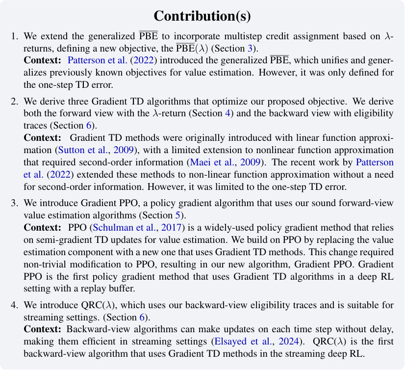

Deep RL with Gradient Eligibility Traces

## **Deep Reinforcement Learning with** **Gradient Eligibility Traces**

**Esraa Elelimy** [1,2,] _[†]_ **, Brett Daley** [1,2,] _[†]_ **, Andrew Patterson** [1,2] **,**
**Marlos C. Machado** [1,2,3] **, Adam White** [1,2,3] **, Martha White** [1,2,3]

{elelimy, brett.daley, ap3, machado, amw8, whitem}@ualberta.ca

1 **Department of Computing Science, University of Alberta, Canada**
2 **Alberta Machine Intelligence Institute (Amii)**
3 **Canada CIFAR AI Chair**

_†_ Equal contribution.

**Abstract**

Achieving fast and stable off-policy learning in deep reinforcement learning (RL) is
challenging. Most existing methods rely on semi-gradient temporal-difference (TD)
methods for their simplicity and efficiency, but are consequently susceptible to divergence. While more principled approaches like Gradient TD (GTD) methods have strong
convergence guarantees, they have rarely been used in deep RL. Recent work introduced the generalized Projected Bellman Error (PBE), enabling GTD methods to work
efficiently with nonlinear function approximation. However, this work is limited to
one-step methods, which are slow at credit assignment and require a large number of
samples. In this paper, we extend the generalized PBE objective to support multistep
credit assignment based on the _λ_ -return and derive three gradient-based methods that
optimize this new objective. We provide both a forward-view formulation compatible
with experience replay and a backward-view formulation compatible with streaming algorithms. Finally, we evaluate the proposed algorithms and show that they outperform
both PPO and StreamQ in MuJoCo and MinAtar environments, respectively. [1]

**1** **Introduction**

Estimating the value function is a fundamental component of most RL algorithms. All value-based
methods depend on estimating the action-value function for some target policy and then acting
greedily with respect to those estimated values. Even in policy gradient methods, where a parameterized policy is learned, most algorithms learn a value function along with the policy. Many RL algorithms use semi-gradient temporal-difference (TD) learning algorithms for value estimation, despite
known divergence issues under nonlinear function approximation (Tsitsiklis & Van Roy, 1997) and
under off-policy sampling (Baird, 1995), both of which frequently arise in modern deep RL settings.

There have been significant advances towards deriving sound off-policy TD algorithms. For a brief
history, the mean squared Bellman error (BE) was an early objective, which produces a different
solution from the TD fixed point but similarly aims to satisfy the Bellman equation. However, the
BE was not widely used because it is difficult to optimize without a simulator due to the doublesampling problem (Baird, 1995). The mean squared _projected_ Bellman error for linear function
approximation—which we call the linear PBE—was introduced later, and a class of Gradient TD
methods was derived to optimize this objective (Sutton et al., 2009). An early attempt to extend
Gradient TD methods to nonlinear function approximation made the assumption that the updates to

1 [Code available at https://github.com/esraaelelimy/gtd_algos](https://github.com/esraaelelimy/gtd_algos)

Reinforcement Learning Journal 2025

Table 1: Related Gradient TD literature. Our paper is the first to define and optimize the generalized
PBE( _λ_ ) objective for nonlinear function approximation (see Section 4).

**Linear Function Approximation** **Nonlinear Function Approximation**

**One-step** _λ_ **-return** **One-step** _λ_ **-return**

(Maei et al., 2009;
(Sutton et al., 2009) (Maei & Sutton, 2010) Our paper
Patterson et al., 2022)

the parameters of the value function in each step are small, and thus the nonlinear manifold of the
value functions can be treated as locally linear (Maei et al., 2009). Recently, Patterson et al. (2022)
introduced a generalization of the PBE objective that is based on the conjugate form of the BE (Dai
et al., 2017). This new objective made it possible to derive Gradient TD methods for the nonlinear
setting, while still having an equivalence to the previous Gradient TD methods in the case of linear
function approximation. This generalized objective was further extended to allow for robust losses
in the Bellman error (Patterson et al., 2023) and is a promising avenue for the development of sound
value-estimation algorithms. However, it has not been extended to include multi-step updates. In
the rest of the paper, we refer to this generalized PBE objective as simply the PBE objective and use
the term linear PBE when referring to the previous linear-only objective.

In this paper, we extend the PBE to incorporate multistep credit assignment using _λ_ -returns. Table 1
summarizes the algorithmic gaps that we fill. We derive similar gradient variants as were derived for
the one-step PBE (Patterson et al., 2022), but now also need to consider forward-view and backwardview updates for our proposed objective, PBE( _λ_ ). We introduce Gradient PPO, a policy gradient
algorithm that modifies PPO to use our sound forward-view value estimation algorithms. We show
that Gradient PPO significantly outperforms PPO in two MuJoCo environments and is comparable
in two others. We also introduce QRC( _λ_ ), which uses backward-view (i.e., eligibility trace updates)
and is suitable for online streaming settings. [2] We show that QRC( _λ_ ) is significantly better in all
MinAtar environments than StreamQ (Elsayed et al., 2024), a recent algorithm combining Q( _λ_ )
with a new optimizer and an initialization scheme for better performance in streaming settings. We
investigate multiple variants of our forward-view and backward-view algorithms; as was concluded
for PBE(0) (Ghiassian et al., 2020; Patterson et al., 2022), we find that a variant based on regularized
corrections called TDRC consistently outperforms the other variants. This work provides a clear way
to incorporate gradient TD methods with eligibility traces into deep RL methods and offers two new
promising algorithms that perform well in practice.

**2** **Background**

We consider the Markov Decision Process (MDP) formalism where the agent-environment interactions are described by the tuple ( _S, A, p, R_ ). At each time step, _t_ = 1 _,_ 2 _,_ 3 _, . . ._, the agent observes a state, _S_ _t_ _∈S_, and takes an action, _A_ _t_ _∈A_, according to a policy _π_ : _S × A →_ [0 _,_ 1],
where _S_ and _A_ are finite sets of states and actions, respectively. Based on _S_ _t_ and _A_ _t_, the environment transitions to a new state, _S_ _t_ +1 _∈S_, and yields a reward, _R_ _t_ +1 _∈R_, with probability
def
_p_ ( _S_ _t_ +1 _, R_ _t_ +1 _| S_ _t_ _, A_ _t_ ). The value of a policy is defined as _v_ _π_ ( _s_ ) = E _π_ [ _G_ _t_ _| S_ _t_ = _s_ ] _, ∀s ∈S_, where
def _∞_
the return, _G_ _t_ = [�] _i_ =0 _[γ]_ _[i]_ _[R]_ _[t]_ [+1+] _[i]_ [, is the discounted sum of future rewards from time] _[ t]_ [ with discount]
factor _γ ∈_ [0 _,_ 1].

The agent typically estimates the value function using a differentiable parameterized function, such
as a neural network. We define the parameterized value function as ˆ _v_ ( _s,_ _**w**_ ) _≈_ _v_ _π_ ( _s_ ), where _**w**_ _∈_
R _[d]_ _**[w]**_ is a weight vector and _d_ _**w**_ _< |S|_ . One objective that can be used to learn this value function is

2 A setting motivated by hardware limitations where we replay buffers are not used and updates are made one sample at a
time. See Elsayed et al. (2024).

Deep RL with Gradient Eligibility Traces

the mean squared Bellman error (BE):

def
BE( _**w**_ ) = � _d_ ( _s_ ) E _π_ [ _δ_ ( _s_ ) _| S_ = _s_ ] [2] _,_ (1)

_s∈S_

where _d_ is the state distribution [3] and _δ_ is the TD error for a transition ( _S, A, S_ _[′]_ _, R_ ). The _δ_ can be different depending on the algorithm. For state-value prediction, we use _δ_ = def _R_ + _γv_ ˆ( _S_ _′_ _,_ _**w**_ ) _−_ _v_ ˆ( _S,_ _**w**_ ).
For control, to learn optimal action-values _q_ _∗_ ( _s, a_ ), we use _δ_ = def _R_ + _γ_ max _a_ _′_ _∈A_ ˆ _q_ ( _S_ _′_ _, a_ _′_ _,_ _**w**_ ) _−_
_q_ ˆ( _S, A,_ _**w**_ ). For control, we would additionally condition on _A_ = _a_ and sum over ( _s, a_ ) instead of _s_
in Eq. (1), but for simplicity of exposition, we only show the objectives for ˆ _v_ . We cannot generally
reach zero BE, unless the true values are representable by our parameterized function class for all
states with nonzero weight. Additionally, the BE objective is difficult to optimize, due to the double
sampling and identifiability issues (Sutton & Barto, 2018), and we instead consider a more practical
objective called the PBE.

The PBE objective introduced by Patterson et al. (2022) generalizes and unifies several objectives
and extends Gradient TD methods to nonlinear function approximation. The PBE objective builds
on prior work (Dai et al., 2017) that avoids the double sampling by reformulating the BE using
its conjugate form with an auxiliary variable _h_ . Using the fact that the biconjugate of a quadratic
function is _x_ [2] = max _h∈_ R 2 _xh −_ _h_ [2], we can re-express the BE as

BE( _**w**_ ) = max def
_h∈F_ all

� _d_ ( _s_ )�2 _δ_ _π_ ( _s_ ) _h_ ( _s_ ) _−_ _h_ ( _s_ ) [2] [�] _,_ (2)

_s∈S_

def
where _F_ all is the space of all functions and _δ_ _π_ ( _s_ ) = E _π_ [ _δ_ _t_ _| S_ _t_ = _s_ ]. For a state _s_, the optimal
_h_ _[∗]_ ( _s_ ) = _δ_ _π_ ( _s_ ), and we recover the BE. More generally, we can learn a parameterized function that
approximates this auxiliary variable, _h_ . Letting _H_ be the space of the parameterized functions for
_h_, the PBE then projects BE into _H_, and is defined as:

PBE( _**w**_ ) = max def _h∈H_ � _d_ ( _s_ ) �2 _δ_ _π_ ( _s_ ) _h_ ( _s_ ) _−_ _h_ ( _s_ ) [2] [�] _._ (3)

_s∈S_

Depending on the choice of _H_, the PBE can express a variety of objectives. For a linear function
class, we recover the linear PBE, and for a highly expressive function class, we recover the (identifiable) BE (Patterson et al., 2022).

The PBE can be optimized by taking the gradient of Eq. (3), which results in a saddle-point update
called _GTD2_ . Alternatively, we can do a gradient correction update, which results in the empirically
preferable algorithm called _TDC_ . Note that GTD2 and TDC were introduced for the linear setting
(Sutton et al., 2009), but the same names are used when generalized to the nonlinear setting
(Patterson et al., 2022), so we follow that convention. TDC has been shown to outperform GTD2
(Ghiassian et al., 2020; White & White, 2016; Patterson et al., 2022) and has been further extended
to include a regularization term, resulting in a better update called TDRC (Ghiassian et al., 2020;
Patterson et al., 2022).

We briefly include the update rule for these three Gradient TD methods, as we will extend them in
the following sections. For ˆ _v_ parameterized by _**w**_ and _h_ [ˆ] parameterized by _**θ**_, all methods can be
written as jointly updating

_**w**_ _t_ +1 _←_ _**w**_ _t_ + _α_ ∆ _**w**_ _t_ _,_

(4)
_**θ**_ _t_ +1 _←_ _**θ**_ _t_ + _α_ ∆ _**θ**_ _t_ _,_

where _α ∈_ (0 _,_ 1] is a step-size hyperparameter—or, more generally, an optimizer like Adam
(Kingma & Ba, 2014) can be used. For GTD2, ∆ _**w**_ _t_ is

∆ _**w**_ _t_ = _−h_ [ˆ] ( _S_ _t_ _,_ _**θ**_ _t_ ) _∇_ _**w**_ _δ_ _t_ = _h_ [ˆ] ( _S_ _t_ _,_ _**θ**_ _t_ )� _∇_ _**w**_ _v_ ˆ( _S_ _t_ _,_ _**w**_ ) _−_ _γ∇_ _**w**_ _v_ ˆ( _S_ _t_ +1 _,_ _**w**_ )� _._

3 Note that we write the expectation with a sum to make the notation more accessible, but this can be generalized to
continuous state spaces using integrals.

Reinforcement Learning Journal 2025

The TDC update replaces the term _h_ [ˆ] ( _S_ _t_ _,_ _**θ**_ _t_ ) _∇_ _**w**_ _v_ ˆ( _S_ _t_ _,_ _**w**_ ) with _δ_ _t_ _∇_ _**w**_ _v_ ˆ( _S_ _t_ _,_ _**w**_ ), to get the update

∆ _**w**_ _t_ = _δ_ _t_ _∇_ _**w**_ _v_ ˆ( _S_ _t_ _,_ _**w**_ ) _−_ _h_ [ˆ] ( _S_ _t_ _,_ _**θ**_ _t_ ) _∇_ _**w**_ _γv_ ˆ( _S_ _t_ +1 _,_ _**w**_ ) _._

This update is called TD with corrections, because the first term is exactly the TD update and the
second term acts like a correction to the semi-gradient TD update. This modified update is motivated
by noting that _h_ _[∗]_ ( _s_ ) = _δ_ _π_ ( _s_ ), and so replacing the approximation _h_ [ˆ] ( _S_ _t_ _,_ _**θ**_ _t_ ) with an unbiased sample
_δ_ _t_ instead is sensible. TDC has been shown to converge to the same fixed point as TD and GTD2 in
the linear setting (Maei, 2011).

Both GTD2 and TDC have the same ∆ _**θ**_ _t_ which can be written as ∆ _**θ**_ _t_ =
_δ_ _t_ _−_ _h_ [ˆ] ( _S_ _t_ _,_ _**θ**_ _t_ ) _∇_ _**θ**_ _h_ [ˆ] ( _S_ _t_ _,_ _**θ**_ _t_ ) _._ TDRC uses the same ∆ _**w**_ _t_ as TDC, but regularizes the auxil� �
iary variable:
∆ _**θ**_ _t_ = _δ_ _t_ _−_ _h_ [ˆ] ( _S_ _t_ _,_ _**θ**_ _t_ ) _∇_ _**θ**_ _h_ [ˆ] ( _S_ _t_ _,_ _**θ**_ _t_ ) _−_ _β_ _**θ**_ _t_ _,_
� �

where _β ∈_ [0 _, ∞_ ). For _β_ = 0, TDRC is the same as TDC. As _β_ is increased, _h_ gets pushed
closer to zero and TDRC becomes closer to TD. TDRC was found to be strictly better than TDC,
even with a fixed _β_ = 1 across several problems (Ghiassian et al., 2020; Patterson et al., 2022).
This improvement was further justified theoretically with a connection to robust Bellman losses
(Patterson et al., 2023), motivating regularization on _h_ .

**3** **The Generalized PBE(** _λ_ **) Objective**

The basis of the PBE is the 1-step TD error, which means that credit assignment can be slow.
Reward information must propagate backward one step at a time through the value function, via
bootstrapping. In this section, we extend the PBE to incorporate multistep credit assignment using
the _λ_ -return.

First, let us define our multistep target. The simplest multistep return estimator is the _n_ -step return,
defined as

_G_ [(] _t_ _[n]_ [)]

def

=
� _[n]_ � _[−]_ [1]

ˆ

� _γ_ _[i]_ _R_ _t_ +1+ _i_ � + _γ_ _[n]_ _v_ ( _S_ _t_ + _n_ _,_ _**w**_ _t_ ) _._

_i_ =0

The _λ_ -return is the exponentially weighted average of all possible _n_ -step returns:

_∞_
� _λ_ _[n][−]_ [1] _G_ [(] _t_ _[n]_ [)] _,_ (5)

_n_ =1

_G_ _[λ]_ _t_

def
= (1 _−_ _λ_ )

where _λ ∈_ [0 _,_ 1]. The _λ_ -return is the return target for TD( _λ_ ) (Sutton, 1988) and comes with a
number of desirable properties: it smoothly interpolates between TD and Monte Carlo methods (a
bias-variance trade-off; Kearns & Singh, 2000), reduces variance compared to a single _n_ -step return
(Daley et al., 2024b), and imposes a recency heuristic by assigning less weight to temporally distant
experiences (Daley et al., 2024a). We denote the error between the _λ_ -return target and the current
value estimate by

_∞_
�( _γλ_ ) _[i]_ _δ_ _t_ + _i_ _,_ (6)

_i_ =0

_δ_ _t_ _[λ]_

= def _G_ _λt_ _[−]_ _[v]_ [ˆ][(] _[S]_ _[t]_ _[,]_ _**[ w]**_ _[t]_ [) =]

and refer to this quantity as the TD( _λ_ ) error. We note that in the context of recent works, the TD( _λ_ )
error is often referred to as the generalized advantage estimate (GAE; Schulman et al., 2015).

We start by defining BE( _λ_ ) using the TD( _λ_ ) error. For _δ_ _π_ _[λ]_ [(] _[s]_ [)] = def E _π_ [ _δ_ _tλ_ _[|][ S]_ _[t]_ [=] _[ s]_ []][, we define the]
BE( _λ_ ) analogously to Eq. (1) as

def
BE( _**w**_ _, λ_ ) = � _d_ ( _s_ ) _δ_ _π_ _[λ]_ [(] _[s]_ [)] [2] _[ .]_

_s∈S_

Deep RL with Gradient Eligibility Traces

Following the derivation of the PBE in Eq. (3), with the definitions of _h_ and the new _δ_ _π_ _[λ]_ [(] _[s]_ [)][, we can]
write the PBE( _λ_ ) objective as

PBE( _**w**_ _, λ_ ) = max def
_h∈H_

� _d_ ( _s_ )�2 _δ_ _π_ _[λ]_ [(] _[s]_ [)] _[ h]_ [(] _[s]_ [)] _[ −]_ _[h]_ [(] _[s]_ [)] [2] [�] _._ (7)

_s∈S_

When _λ_ = 0, we recover the original one-step PBE objective (Patterson et al., 2022). In the absence
of function approximation, the PBE and the PBE( _λ_ ) objectives lead to the same solution, _v_ _π_, because
their fixed points are both _v_ _π_ . However, under function approximation when we cannot perfectly
represent _v_ _π_, the choice of _λ_ impacts the minimum-error solution. In practice, intermediate _λ_ -values
on the interval (0 _,_ 1) will balance between solution quality, learning speed, and variance.

**4** **The Forward-View for Gradient TD(** _λ_ **) Methods**

In this section, we develop several forward-view methods for optimizing the PBE( _λ_ ) under nonlinear
function approximation. Following the previous convention, we will overload the names GTD2( _λ_ )
and TDC( _λ_ ) introduced for the linear setting because we are strictly generalizing them to a broader
function class.

**GTD2(** _λ_ **):** We derive this algorithm by taking the gradient of Eq. (7) w.r.t. to both _**w**_ and _**θ**_ .

1
2 _[∇]_ _**[w]**_ �

� _d_ ( _s_ ) _h_ ( _s_ ) _∇_ _**w**_ _δ_ _π_ _[λ]_ [(] _[s]_ [)] _[,]_

_s∈S_

� _d_ ( _s_ )�2 _δ_ _π_ _[λ]_ [(] _[s]_ [)] _[ h]_ [(] _[s]_ [)] _[ −]_ _[h]_ [(] _[s]_ [)] [2] [�] = �

_s∈S_ _s∈S_

� _d_ ( _s_ )�2 _δ_ _π_ _[λ]_ [(] _[s]_ [)] _[ h]_ [(] _[s]_ [)] _[ −]_ _[h]_ [(] _[s]_ [)] [2] [�] = �

_s∈S_ _s∈S_

1
2 _[∇]_ _**[θ]**_ �

� _d_ ( _s_ )� _δ_ _π_ _[λ]_ [(] _[s]_ [)] _[ −]_ _[h]_ [(] _[s]_ [)] � _∇_ _**θ**_ _h_ ( _s_ ) _._

_s∈S_

We get a stochastic gradient descent update by sampling these expressions. For brevity throughout,
let _V_ _t_ = ˆ def _v_ ( _S_ _t_ _,_ _**w**_ _t_ ) and _H_ _t_ = ˆ def _h_ ( _S_ _t_ _,_ _**θ**_ _t_ ). The resulting update is then

∆ _**w**_ _t_ = _−H_ _t_ _∇_ _**w**_ _δ_ _t_ _[λ]_ _[,]_ (8)

∆ _**θ**_ _t_ = ( _δ_ _t_ _[λ]_ _[−]_ _[H]_ _[t]_ [)] _[∇]_ _[θ]_ _[H]_ _[t]_ _[.]_ (9)

GTD2( _λ_ ) is a standard saddle-point update and should converge to a local optimum of the PBE( _λ_ ).

**TDC(** _λ_ **):** For TDC(0), we obtained an alternative gradient correction by adding the term ( _δ_ _t_ _−_
_h_ ( _S_ _t_ )) _∇_ _**w**_ _v_ ˆ( _S_ _t_ _,_ _**w**_ ) to the GTD2(0) update. This was motivated by the fact that _h_ ( _S_ _t_ ) approximates
_δ_ _t_ . We take a similar approach here, adding ( _δ_ _t_ _[λ]_ _[−]_ _[H]_ _[t]_ [)] _[∇]_ _**[w]**_ _[v]_ [ˆ][(] _[S]_ _[t]_ _[,]_ _**[ w]**_ _[t]_ [)][ to the GTD2(] _[λ]_ [) update for] _**[ w]**_ [:]

∆ _**w**_ _t_ = ( _δ_ _t_ _[λ]_ _[−]_ _[H]_ _[t]_ [)] _[∇]_ _**[w]**_ _[V]_ _[t]_ _[−]_ _[H]_ _[t]_ _[∇]_ _**[w]**_ _[δ]_ _t_ _[λ]_
= _δ_ _t_ _[λ]_ _[∇]_ _**[w]**_ _[V]_ _[t]_ _[−]_ _[H]_ _[t]_ _[∇]_ _**[w]**_ [(] _[V]_ _[t]_ [+] _[ δ]_ _t_ _[λ]_ [)] _[ .]_ (10)

The _**θ**_ -update remains the same as Eq. (9). The result is the sum of a semi-gradient TD( _λ_ ) update
and a gradient correction. However, the method is biased, as it assumes that _H_ _t_ has converged
exactly to _δ_ _π_ _[λ]_ [(] _[S]_ _[t]_ [)][. This bias did not impact convergence of TDC in the linear setting, but as yet]
there is no proof of convergence of TDC in the nonlinear setting. Similarly, it is not yet clear what
the ramifications are of using TDC( _λ_ ) rather than GTD2( _λ_ ), although, in our experiments, we find
it is better empirically.

**TDRC(** _λ_ **):** Finally, we extend the TDRC algorithm, and the extension simply involves adding a
regularization penalty with coefficient _β ≥_ 0 to the update for _h_ :

∆ _**θ**_ _t_ = ( _δ_ _t_ _[λ]_ _[−]_ _[H]_ _[t]_ [)] _[∇]_ _**[θ]**_ _[H]_ _[t]_ _[−]_ _[β]_ _**[θ]**_ _[t]_ _[.]_ (11)

All the methods we derived in this section depend on the forward-view of the _λ_ -return from Eq. (5),
which means they need a trajectory of transitions to make an update. This makes these methods
appealing when there is a replay buffer to store and sample these trajectories. Further, the trajectories

Reinforcement Learning Journal 2025

should be on-policy to avoid the need to incorporate importance sampling ratios. It is not difficult to
incorporate importance sampling (we include these extensions in Section B), but significant variance
may arise when using importance sampling, which degrades performance in practice. In the next
section, we incorporate these forward-view updates into PPO, an algorithm that makes use of both
replay and on-policy trajectories.

**5** **Gradient PPO: Using the Forward-View in Deep RL**

In this section, we introduce a new algorithm, called Gradient PPO, that modifies the PPO algorithm
(Schulman et al., 2017) to incorporate the forward-view gradient updates derived in the last section.

**5.1** **Gradient PPO**

Proximal Policy Optimization (PPO; Schulman et al., 2017) is a widely used policy-gradient method
that learns both a parameterized policy, the actor, and an estimate for the state-value function, the
critic. In PPO, the agent alternates between collecting a fixed-length trajectory of interactions and
performing batch updates using that trajectory to learn both the policy and the state-value function.
We will focus on the critic component of PPO, as that is the part learning the value function, and we
will modify it to use the gradient-based methods introduced in Section 4.

PPO updates depend on the Generalized Advantage Estimate (GAE; Schulman et al., 2015), which
is identical to the TD( _λ_ ) error in Eq. (6). In practice, however, PPO updates must truncate the GAE
due to the finite length of the collected experience trajectory. Given a trajectory of length _T_, the
truncated GAE can be written as _δ_ _t_ _[λ]_ : _T_ [=][ �] _[T]_ _i_ =0 _[ −][t][−]_ [1] ( _γλ_ ) _[i]_ _δ_ _t_ + _i_, and we can form an estimate for the
_λ_ -return using that truncated GAE as:

_T −t−_ 1
� ( _γλ_ ) _[k]_ _δ_ _t_ + _k_ _._ (12)

_k_ =0

_G_ _[λ]_ _t_ : _T_

= ˆ def _v_ ( _S_ _t_ _,_ _**w**_ ) +

The value-function objective for PPO can then be written as follows:

PPO ˆ 2
_L_ _t_ [(] _**[w]**_ _[t]_ [) =] [1] � _v_ ( _S_ _t_ _,_ _**w**_ _t_ ) _−_ _G_ _[λ]_ _t_ : _T_ � _,_ (13)

2

PPO typically uses a stale target for _G_ _[λ]_ _t_ : _T_ [. i.e., the] _[ λ]_ [-return target is computed once from the col-]
lected trajectory and is kept fixed for all the training epochs on that trajectory. Although many
PPO implementations heuristically clip this loss, we remove this component from our algorithm for
simplicity.

We now introduce _Gradient PPO_, which changes the critic update for PPO to allow for Gradient
TD( _λ_ ) updates. Gradient PPO introduces the following three changes.

**Modification 1:** We change the updates to the critic parameters, _**w**_, to use the updates in Eq. (10).

**Modification 2:** _h_ ˆ, and update the parameters using Eq. ( We introduce an auxiliary network with parameters11). [4] _**θ**_ to learn the auxiliary variable

**Modification 3:** We need to compute the gradient for _δ_ _t_ _[λ]_ [. As a result, we cannot use a stale target]
as in Eq. (13). Instead, we need to recompute _δ_ _t_ _[λ]_ [and its gradient after each update. We do this by]
sampling sequences from the minibatch instead of sampling independent samples. We then compute
a truncated _δ_ _t_ _[λ]_ : _τ_ [based on the sampled sequences. In this case, the effective truncation for the] _[ λ]_ [-return]
is the length of the sequence sampled from a minibatch, _τ_, rather than the full trajectory length _T_ .
A similar approach to incorporate the _λ_ -return with replay buffers was previously introduced (Daley
& Amato, 2019). This approach might seem computationally expensive at first since _**w**_ is used to

4 An alternative to implementing the direct parameter updates is to write corresponding loss functions and use automatic
differentiation libraries to compute the updates. We provide the corresponding loss functions to our updates in Section C.

Deep RL with Gradient Eligibility Traces

compute all the values included in _δ_ [ˆ] _t_ _[λ]_ : _τ_ [estimation. However, a nice property of the gradient] _[ ∇]_ _**[w]**_ _[δ]_ [ˆ] _t_ _[λ]_ : _τ_
is that it can be easily computed recursively as follows:

_∇_ _**w**_ _δ_ _t_ _[λ]_ [=] _[ γλ][∇]_ _**[w]**_ _[δ]_ _t_ _[λ]_ +1 [+] _[ ∇]_ _**[w]**_ _[δ]_ _[t]_ _[.]_

Then, given a sequence of length _τ_, _∇_ _**w**_ _δ_ _t_ _[λ]_ [and] _[ δ]_ _t_ _[λ]_ [can be estimated using Algorithm][ 1][, where lines]
in green highlight the additional computations required for Gradient PPO per a minibatch update.

Implementations for Gradient PPO can simply pass the newly defined loss functions, Eq. (40) and
Eq. (41), directly to an automatic differentiation. But implementations based on Algorithm 1 might
be more efficient as it allows for parallel computations of the values for all states. We show in Section C.1 that using this parallel approach for computation results in Gradient PPO having the same
Steps Per Second (SPS) cost as PPO; there is no drop in runtime from these additional calculations.
We also provide a full algorithm for PPO and Gradient PPO in Section C.

**Algorithm 1** Estimating TDRC( _λ_ ) Updates for Gradient PPO

Input: A sequence of states, _s_ _t_ _, . . . s_ _t_ + _τ_ .
Input: The current weight parameters of the value function, _**w**_ .
For all samples in the sequence, compute ˆ _v_ ( _s_ _t_ _,_ _**w**_ ) and _∇_ _**w**_ _v_ ˆ( _s_ _t_ _,_ _**w**_ ).

_▷_ This step is done in parallel by creating a batch of all observations.
**for** _j_ = _t_ + _τ −_ 1, ..., t **do**

ˆ ˆ
_δ_ _j_ = _R_ _j_ +1 + _γv_ ( _s_ _j_ +1 _,_ _**w**_ ) _−_ _v_ ( _s_ _j_ _,_ _**w**_ )
_∇δ_ _j_ = _R_ _j_ +1 + _γ∇v_ ˆ( _s_ _j_ +1 _,_ _**w**_ ) _−∇v_ ˆ( _s_ _j_ _,_ _**w**_ )
_δ_ _j_ _[λ]_ [=] _[ δ]_ _[j]_ [ +] _[ γλδ]_ _j_ _[λ]_ +1
_∇δ_ _j_ _[λ]_ [=] _[ ∇][δ]_ _[j]_ [ +] _[ γλ][∇][δ]_ _j_ _[λ]_ +1
**end for**

**5.2** **Empirical Investigation of Gradient PPO**

We evaluate the performance of Gradient PPO across several environments from the MuJoCo Benchmark (Todorov et al., 2012). For Gradient PPO, we performed a hyperparameter sweep for the actor
learning rate, the critic learning rate, and _λ_ . For the auxiliary variable _h_, we used the same learning
rate as the critic. We tested each hyperparameter configuration on all environments and repeated
the experiments across 5 seeds. Finally, based on the sweep results, we selected a single hyperparameter configuration that worked reasonably well across all environments and evaluated it for 30
more seeds—the _two-stage approach_ (Patterson et al., 2024). We provide the ranges of values we
swept over in Section C.1 and the hyperparameters configuration that we will use in all Gradient
PPO experiments in Table 4. For PPO, we used the default hyperparameters commonly used for
PPO with MuJoCo environments (Huang et al., 2022), listed in Table 3.

Figure 1 shows the Gradient PPO and Default PPO results across four MuJoCo environments. In
Ant and HalfCheetah, Gradient PPO clearly outperforms PPO. Both algorithms perform similarly in
Walker and Hopper.

We also investigated the utility of using TDRC( _λ_ ) instead of TDC( _λ_ ) and GTD2( _λ_ ) to estimate the
critic. Figure 2 shows the results with these variations. There is a marked difference in performance,
suggesting that both gradient corrections and regularization are needed for improved performance
when using gradient-based methods. This outcome aligns with our discussion in Section 2 and
Section 4 about how TDRC has been shown to outperform TDC, which in turn outperforms GTD2.

**6** **The Backward View for Gradient TD(** _λ_ **) Methods**

The forward-view algorithms we have derived so far have updates that depend on future information,
making them unrealizable without the delay introduced by experience replay. Alternatively, we can

Reinforcement Learning Journal 2025

Hopper-v4

Ant-v4

HalfCheetah-v4

Walker2d-v4

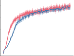

0 2 4

Env Steps 1e6

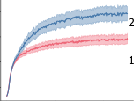

2000

1000

0

4000
Undiscounted

Returns
(30 runs)

2000

0

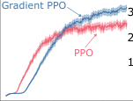

3000

2000

1000

0

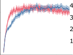

4000

3000

2000

1000

0

0 2 4 0 2 4 0 2
Env Steps 1e6 Env Steps 1e6 Env Steps

0 2 4

1e6

0 2 4

1e6

Figure 1: Gradient PPO and PPO evaluated on four MuJoCo environments. The solid lines are the
mean performance averaged over 30 seeds, and the shaded area is the standard error.

Hopper-v4

HalfCheetah-v4

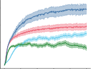

2500

2000

1500

1000

500

0

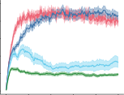

4000

3000

2000

1000

0

Walker2d-v4

Undiscounted Returns 5000
(30 runs) 4000

3000

2000

1000

0

Ant-v4

3000

2000

1000

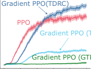

0 1 2 3 4 5 0 1 2 3 4 5
Env Steps 1e6 Env Steps 1e6

0 1 2 3 4 5

1e6

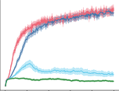

Env Steps 1e6 Env Steps

0 1 2 3 4 5

1e6

Figure 2: Gradient PPO variations evaluated on 4 MuJoCo environments. The solid lines are the
mean performance averaged over 30 seeds, and the shaded area is the standard error.

use eligibility traces via backward-view algorithms that incrementally generate the correct parameter
updates on each time step. We now derive the backward view algorithms for optimizing PBE( _λ_ ).

**GTD2** ( _λ_ ): As we prove below, the following backward-view updates are equivalent to the forwardview updates given in Eq. 8 and Eq. 9:

∆ _**w**_ _t_ = def _−z_ _th_ _[∇]_ _**[w]**_ _[δ]_ _[t]_ _[,]_ (14)

∆ _**θ**_ _t_ = def _δ_ _t_ _**z**_ _t_ _**θ**_ _[−]_ _[H]_ _[t]_ _[∇]_ _**[θ]**_ _[H]_ _[t]_ _[,]_ (15)

where, for _z_ _−_ _[h]_ 1

def _**θ**_
= 0, and _**z**_ _−_ 1

def
= **0**,

_z_ _t_ _[h]_

_**z**_ _t_ _**[θ]**_

= def _γλz_ _th−_ 1 [+] _[ H]_ _[t]_ _[,]_ (16)

= def _γλ_ _**z**_ _t_ _**θ**_ _−_ 1 [+] _[ ∇]_ _**[θ]**_ _[H]_ _[t]_ _[,]_ (17)

Table 2: Forward- and backward-view updates of our three proposed Gradient TD( _λ_ ) algorithms for
prediction with nonlinear function approximation.

**Algorithm** **View** ∆ _**w**_ _t_ ∆ _**θ**_ _t_

GTD2( _λ_ ) Forward _−H_ _t_ _∇_ _**w**_ _δ_ _t_ _[λ]_ ( _δ_ _t_ _[λ]_ _[−]_ _[H]_ _[t]_ [)] _[∇]_ _**[θ]**_ _[H]_ _[t]_

Backward _−z_ _t_ _[h]_ _[∇]_ _**[w]**_ _[δ]_ _[t]_ _δ_ _t_ _**z**_ _t_ _**[θ]**_ _[−]_ _[H]_ _[t]_ _[∇]_ _**[θ]**_ _[H]_ _[t]_

TDC( _λ_ ) Forward _δ_ _t_ _[λ]_ _[∇]_ _**[w]**_ _[V]_ _[t]_ _[−][H]_ _[t]_ _[∇]_ _**[w]**_ [(] _[V]_ _[t]_ [+] _[δ]_ _t_ _[λ]_ [)] ( _δ_ _t_ _[λ]_ _[−]_ _[H]_ _[t]_ [)] _[∇]_ _**[θ]**_ _[H]_ _[t]_

Backward _δ_ _t_ _**z**_ _t_ _**[w]**_ _[−]_ _[H]_ _[t]_ _[∇]_ _**[w]**_ _[V]_ _[t]_ _[−][z]_ _t_ _[h]_ _[∇]_ _**[w]**_ _[δ]_ _[t]_ _δ_ _t_ _**z**_ _t_ _**[θ]**_ _[−]_ _[H]_ _[t]_ _[∇]_ _**[θ]**_ _[h]_ _[t]_

TDRC( _λ_ ) Forward _δ_ _t_ _[λ]_ _[∇]_ _**[w]**_ _[V]_ _[t]_ _[−][H]_ _[t]_ _[∇]_ _**[w]**_ [(] _[V]_ _[t]_ [+] _[δ]_ _t_ _[λ]_ [)] ( _δ_ _t_ _[λ]_ _[−]_ _[H]_ _[t]_ [)] _[∇]_ _**[θ]**_ _[H]_ _[t]_ _[−][β]_ _**[θ]**_ _[t]_

Backward _δ_ _t_ _**z**_ _t_ _**[w]**_ _[−]_ _[H]_ _[t]_ _[∇]_ _**[w]**_ _[V]_ _[t]_ _[−][z]_ _t_ _[h]_ _[∇]_ _**[w]**_ _[δ]_ _[t]_ _δ_ _t_ _**z**_ _t_ _**[θ]**_ _[−]_ _[H]_ _[t]_ _[∇]_ _**[θ]**_ _[H]_ _[t]_ _[−][β]_ _**[θ]**_ _[t]_

Deep RL with Gradient Eligibility Traces

We show in the following theorem that this backward-view algorithm generates the same total parameter updates as the forward view under standard assumptions.

**Theorem 6.1.** _Assume the parameters_ _**w**_ _and_ _**θ**_ _do not change during an episode of environment_
_interaction. The forward and backward views of GTD2(λ) are equivalent in the sense that they_
_generate equal total parameter updates:_

_∞_
� _H_ _t_ _∇_ _**w**_ _δ_ _t_ _[λ]_ [=]

_t_ =0

_∞_
�( _δ_ _t_ _[λ]_ _[−]_ _[H]_ _[t]_ [)] _[∇]_ _**[θ]**_ _[H]_ _[t]_ [=]

_t_ =0

_∞_
� _z_ _t_ _[h]_ _[∇]_ _**[w]**_ _[δ]_ _[t]_ _[,]_ (18)

_t_ =0

_∞_
�( _δ_ _t_ _**z**_ _t_ _**[θ]**_ _[−]_ _[H]_ _[t]_ _[∇]_ _**[θ]**_ _[H]_ _[t]_ [)] _[ .]_ (19)

_t_ =0

_Proof._ See Section A.

**TDC(** _λ_ **):** Let us slightly rewrite ∆ _**w**_ _t_ from Eq. (10) in the following way:

_δ_ _t_ _[λ]_ _[∇]_ _**[w]**_ _[V]_ _[t]_
~~��~~ � ~~�~~
TD( _λ_ )

+ ( _−H_ _t_ _∇_ _**w**_ _V_ _t_ )
~~�~~ �� ~~�~~
instantaneous
correction

+ ( _−H_ _t_ _∇_ _**w**_ _δ_ _t_ _[λ]_ [)]
~~�~~ ~~��~~ ~~�~~
GTD2( _λ_ )

_._ (20)

We see that ∆ _**w**_ _t_ from Eq. (20) decomposes into three terms: forward-view semi-gradient TD( _λ_ )
with off-policy corrections; an instantaneous correction that does not require eligibility traces; and
GTD2( _λ_ )’s term for ∆ _**w**_ _t_, for which we already derived and proved a backward-view equivalence
in Theorem 6.1. As a consequence, we immediately deduce that the backward view for TDC( _λ_ ) is

∆ _**w**_ _t_ = def _δ_ _t_ _**z**_ _t_ _**w**_ _[−]_ _[H]_ _[t]_ _[∇]_ _**[w]**_ _[V]_ _[t]_ _[−]_ _[z]_ _t_ _[h]_ _[∇]_ _**[w]**_ _[δ]_ _[t]_ _[,]_ (21)

where

_**z**_ _t_ _**[w]**_

= def _γλ_ _**z**_ _t_ _**w**_ _−_ 1 [+] _[ ∇]_ _**[w]**_ _[V]_ _[t]_ _[,]_ (22)

and _z_ _t_ _[h]_ [is the same as before in Eq. (][16][).][ ∆] _**[θ]**_ _[t]_ [is generated by Eq. (][15][).]

**TDRC(** _λ_ **):** Likewise, the regularized backward-view _**θ**_ update is

∆ _**θ**_ _t_ = def _δ_ _t_ _**z**_ _t_ _**θ**_ _[−]_ _[H]_ _[t]_ _[∇]_ _**[θ]**_ _[H]_ _[t]_ _[−]_ _[β]_ _**[θ]**_ _[t]_ _[,]_ (23)

where _**z**_ _t_ _**[θ]**_ [is once again generated by Eq. (][17][). Table][ 2][ summarizes the forward view and the back-]
ward view for all the algorithms introduced. We highlighted the update components that arise from
directly taking the gradient of PBE( _λ_ ) in green, the gradient correction components in blue, and the
regularization component in orange.

Finally, we note that the backward view algorithms presented here do indeed update on every step,
unlike PPO, but the proof above only shows equivalence at the end of the episode, like the original
forward-backward equivalence of TD( _λ_ ).

**7** **QRC(** _λ_ **): Using the Backward View in Deep RL**

In this section, we extend the backward-view methods to action values and present three control
algorithms based on three backward-view updates presented earlier. Since these algorithms are
based on the backward view, they can make immediate updates without delay. Hence, they can
work effectively in settings where it is prohibitive to have a large experience replay buffer (i.e., onedge devices and mobile robots). Additionally, unlike forward-view methods, which require us to
use a truncated version of the updates, backward-view methods do not have this limitation.

Reinforcement Learning Journal 2025

**7.1** **QRC(** _λ_ **)**

Extending the backward-view algorithms to action values is straightforward. Here, we present
the extensions to Q( _λ_ ), but similar extensions can be done to other action-value methods, such
as SARSA( _λ_ ). Note that similar changes can be made to action-value methods using the forward
view.

Consider an action-value network parameterized by _**w**_, and write the TD error as:

_δ_ _t_ = _R_ _t_ +1 + _γ_ max (24)
_a_ _[′]_ _∈A_ _[q]_ [ˆ][(] _[S]_ _[t]_ [+1] _[, a]_ _[′]_ _[,]_ _**[ w]**_ _[t]_ [)] _[ −]_ _[q]_ [ˆ][(] _[S]_ _[t]_ _[, A]_ _[t]_ _[,]_ _**[ w]**_ _[t]_ [)] _[ .]_

The gradient of the TD error becomes the following:

_∇_ _**w**_ _t_ _δ_ _t_ = _γ∇_ _**w**_ _t_ max _−∇_ _**w**_ _t_ ˆ _q_ ( _S_ _t_ _, A_ _t_ _,_ _**w**_ _t_ ) _._ (25)
� _a_ _[′]_ _∈A_ _[q]_ [ˆ][(] _[S]_ _[t]_ [+1] _[, a]_ _[′]_ _[,]_ _**[ w]**_ _[t]_ [)] �

def
The auxiliary function for _h_ is now predicting a function of both the states and actions: _H_ _t_ =
_h_ ( _s_ _t_ _, a_ _t_ _,_ _**θ**_ _t_ ). Using these modifications, we can now write the updates for the control variant of
TDRC( _λ_ ), which we refer to as QRC( _λ_ ):

_**z**_ _t_ _**[w]**_ [=] _[ γλ]_ _**[z]**_ _t_ _**[w]**_ _−_ 1 [+] _[ ∇]_ _**[w]**_ _t_ _[q]_ [ˆ][(] _[S]_ _[t]_ _[, A]_ _[t]_ _[,]_ _**[ w]**_ _[t]_ [)]

_z_ _t_ _[h]_ [=] _[ γλz]_ _t_ _[h]_ _−_ 1 [+] _[ H]_ _[t]_

_**z**_ _t_ _**[θ]**_ [=] _[ γλ]_ _**[z]**_ _t_ _**[θ]**_ _−_ 1 [+] _[ ∇]_ _**[θ]**_ _[H]_ _[t]_

∆ _**w**_ _t_ = _δ_ _t_ _**z**_ _t_ _**[w]**_ _[−]_ _[H]_ _[t]_ _[∇]_ _**[w]**_ _[q]_ [ˆ][(] _[S]_ _[t]_ _[, A]_ _[t]_ _[,]_ _**[ w]**_ _[t]_ [)] _[ −]_ _[z]_ _t_ _[h]_ _[∇]_ _**[w]**_ _[δ]_ _[t]_

∆ _**θ**_ _t_ = _δ_ _t_ _**z**_ _t_ _**[θ]**_ _[−]_ _[H]_ _[t]_ _[∇]_ _**[θ]**_ _[H]_ _[t]_ _[−]_ _[β]_ _**[θ]**_ _[t]_

(26)

We can modify these updates to get QC( _λ_ ), an update based on TDC( _λ_ ), by simply setting _β_ = 0.
We can also get GQ( _λ_ ), an update based on GTD2( _λ_ ) by setting _β_ = 0 and removing the gradient
correction term (see Table 2). Finally, we follow Watkins’ Q( _λ_ ) in that we decay the traces as
described in the previous equations when a greedy action is selected and reset the traces to zero
when a non-greedy action is selected (Watkins, 1989).

**7.2** **Empirical Investigation of QRC(** _λ_ **)**

We evaluated the performance of QRC( _λ_ ) across all the environments from the MinAtar benchmark (Young & Tian, 2019). We compared the performance with Watkin’s Q( _λ_ ) (Watkins, 1989)
and StreamQ algorithm (Elsayed et al., 2024), a recent algorithm combining Q( _λ_ ) with a new optimizer and an initialization scheme for better performance in streaming settings.

For Q( _λ_ ) and QRC( _λ_ ), we used SGD and performed a hyperparameter sweep for different values
for the step size and _λ_ . We tested each hyperparameter configuration in all environments and across
5 seeds. We then selected a single hyperparameter configuration that worked well across all environments, and we evaluated it for 30 more seeds in all environments. We provide the ranges and
the final hyperparameters we used in Appendix D.1. For StreamQ, we used the hyperparameters
suggested by the paper and the accompanying code, and we repeated the experiments for 30 seeds
in all environments. Figure 3 shows the performance of all three algorithms across the 5 MinAtar
environments, and in all environments, QRC( _λ_ ) outperforms both StreamQ and Q( _λ_ ).

We evaluated the other two gradient-based algorithms, QC( _λ_ ) and GQ2( _λ_ ). Figure 4 shows the
results of this evaluation. The results are consistent with forward-view results in Section 5 in that

having both the gradient correction and the regularization is needed for better performance. However, here the regularization is not as critical as it was for Gradient PPO.

**8** **Conclusion**

We proposed the PBE( _λ_ ) objective, a multistep generalization of the Generalized Projected Bellman
Error (Patterson et al., 2022) based on the _λ_ -return. We derived three algorithms for optimizing

Deep RL with Gradient Eligibility Traces

MinAtar/Breakout-v1

MinAtar/Freeway-v1

MinAtar/SpaceInvaders-v1

MinAtar/Seaquest-v1

Undiscounted

Returns
(30 runs)

20

10

0

MinAtar/Asterix-v1

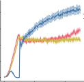

100

50

0

30

20

10

0

10

5

0

40

30

20

10

0

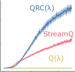

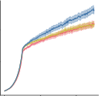

0 2 4 0 2 4 0 2
Env Steps 1e6 Env Steps 1e6 Env Steps

0 2 4

1e6

0 2 4

1e6

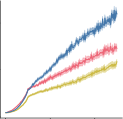

0 2 4

1e6

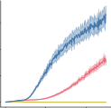

Env Steps 1e6 Env Steps

0 2 4

1e6

Figure 3: QRC( _λ_ ), Q( _λ_ ) and StreamQ algorithms evaluated on the five MinAtar environments.
The solid lines are the mean performance averaged over 30 seeds, and the shaded regions are the
corresponding standard errors.

MinAtar/Breakout-v1

MinAtar/Freeway-v1

MinAtar/SpaceInvaders-v1

MinAtar/Seaquest-v1

Undiscounted

Returns

(30 runs)

20

10

0

30

20

10

0

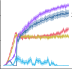

100

50

0

MinAtar/Asterix-v1

0

40

20

0

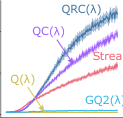

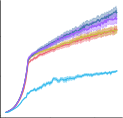

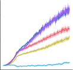

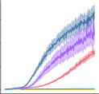

0 2 4 0 2 4 0 2 4 0 2 4 0 2
Env Steps 1e6 Env Steps 1e6 Env Steps 1e6 Env Steps 1e6 Env Steps

0 2 4

1e6

0 2 4

1e6

0 2 4

1e6

0 2 4

1e6

Figure 4: All gradient-based backward view algorithms evaluated on the 5 MinAtar environments.
The solid lines are the mean performance averaged over 30 seeds, and the shaded regions are the
corresponding standard errors.

the new objective both in the forward view and in the backward view. Of the three algorithms
we developed, we showed that TDRC( _λ_ ) is stable, fast, and results in a high-quality solution. We
introduced two Deep RL algorithms that use the newly derived update rules, and we showed that our
new algorithms outperform both PPO with a buffer and streaming algorithms without replay buffers.
Further work remains to verify the convergence guarantees for TDC( _λ_ ) and TDRC( _λ_ ), and extend
the gradient-based updates to more Deep RL algorithms.

**A** **Proof of Theorem 6.1**

**Theorem 6.1.** _Assume the parameters_ _**w**_ _and_ _**θ**_ _do not change during an episode of environment_
_interaction. The forward and backward views of GTD2(λ) are equivalent in the sense that they_
_generate equal total parameter updates:_

_∞_
� _H_ _t_ _∇_ _**w**_ _δ_ _t_ _[λ]_ [=]

_t_ =0

_∞_
� _z_ _t_ _[h]_ _[∇]_ _**[w]**_ _[δ]_ _[t]_ _[,]_ (18)

_t_ =0

_∞_
�

_∞_
�( _δ_ _t_ _[λ]_ _[−]_ _[H]_ _[t]_ [)] _[∇]_ _**[θ]**_ _[H]_ _[t]_ [=]

_t_ =0

_∞_
�

_∞_
�( _δ_ _t_ _**z**_ _t_ _**[θ]**_ _[−]_ _[H]_ _[t]_ _[∇]_ _**[θ]**_ _[H]_ _[t]_ [)] _[ .]_ (19)

_t_ =0

_∞_
�

In the proof below, we added importance sampling for generality.

_Proof._ We start by showing Eq. (18) holds. Note that

_H_ _t_ _∇_ _**w**_ _δ_ _t_ _[λ]_ [=] _[ H]_ _[t]_ _[ρ]_ _[t]_ _[∇]_ _**[w]**_ _[δ]_ _[t]_ [+] _[ H]_ _[t]_ _[γλρ]_ _[t]_ _[ρ]_ _[t]_ [+1] _[∇]_ _**[w]**_ _[δ]_ _[t]_ [+1] [+] _[ H]_ _[t]_ [(] _[γλ]_ [)] [2] _[ρ]_ _[t]_ _[ρ]_ _[t]_ [+1] _[ρ]_ _[t]_ [+2] _[∇]_ _**[w]**_ _[δ]_ _[t]_ [+2] _[. . . .]_ (27)

Reinforcement Learning Journal 2025

The total sum of these forward-view contributions is therefore

_∞_
� _H_ _t_ _∇_ _**w**_ _δ_ _t_ _[λ]_ [= (] _[H]_ [0] _[ρ]_ [0] _[∇]_ _**[w]**_ _[δ]_ [0] [+] _[ H]_ [0] _[γλρ]_ [0] _[ρ]_ [1] _[∇]_ _**[w]**_ _[δ]_ [1] [+] _[ . . .]_ [ ) + (] _[H]_ [1] _[ρ]_ [1] _[∇]_ _**[w]**_ _[δ]_ [1] [+] _[ H]_ [1] _[γλρ]_ [1] _[ρ]_ [2] _[∇]_ _**[w]**_ _[δ]_ [2] [+] _[ . . .]_ [ ) +] _[ . . .]_

_t_ =0

= ( _H_ 0 _ρ_ 0 ) _∇_ _**w**_ _δ_ 0 + ( _H_ 0 _γλρ_ 0 _ρ_ 1 + _H_ 1 _ρ_ 1 ) _∇_ _**w**_ _δ_ 1 + _. . ._ (28)

= _z_ 0 _[h]_ _[∇]_ _**[w]**_ _[δ]_ [0] [+] _[ z]_ 1 _[h]_ _[∇]_ _**[w]**_ _[δ]_ [1] [+] _[ . . .]_ (29)

=

_∞_
� _z_ _t_ _[h]_ _[∇]_ _**[w]**_ _[δ]_ _[t]_ _[,]_ (30)

_t_ =0

which proves Eq. (18). Next, consider Eq. (19). Notice that the equality holds if and only if

_∞_
� _δ_ _t_ _[λ]_ _[∇]_ _**[θ]**_ _[H]_ _[t]_ [=]

_t_ =0

_∞_
� _δ_ _t_ _z_ _t_ _**[θ]**_ _[,]_ (31)

_t_ =0

and further note that

_δ_ _t_ _[λ]_ _[∇]_ _**[θ]**_ _[H]_ _[t]_ [=] _[ ρ]_ _[t]_ _[δ]_ _[t]_ _[∇]_ _**[θ]**_ _[H]_ _[t]_ [+] _[ γλρ]_ _[t]_ _[ρ]_ _[t]_ [+1] _[δ]_ _[t]_ [+1] _[∇]_ _**[θ]**_ _[H]_ _[t]_ [+ (] _[γλ]_ [)] [2] _[ρ]_ _[t]_ _[ρ]_ _[t]_ [+1] _[ρ]_ _[t]_ [+2] _[δ]_ _[t]_ [+2] _[∇]_ _**[θ]**_ _[H]_ _[t]_ [+] _[ . . . .]_ (32)

The total sum of these forward-view contributions is therefore

_∞_
� _δ_ _t_ _[λ]_ _[∇]_ _**[θ]**_ _[H]_ _[t]_ [= (] _[ρ]_ [0] _[δ]_ [0] _[∇]_ _**[θ]**_ _[H]_ [0] [+] _[ γλρ]_ [0] _[ρ]_ [1] _[δ]_ [1] _[∇]_ _**[θ]**_ _[H]_ [0] [+] _[ . . .]_ [ ) + (] _[ρ]_ [1] _[δ]_ [1] _[∇]_ _**[θ]**_ _[H]_ [1] [+] _[ γλρ]_ [1] _[ρ]_ [2] _[δ]_ [2] _[∇]_ _**[θ]**_ _[H]_ [1] [+] _[ . . .]_ [ ) +] _[ . . .]_

_t_ =0

(33)

= _δ_ 0 ( _ρ_ 0 _∇_ _**θ**_ _H_ 0 ) + _δ_ 1 ( _γλρ_ 0 _ρ_ 1 _∇_ _**θ**_ _H_ 0 + _ρ_ 1 _∇_ _**θ**_ _H_ 1 ) + _. . ._ (34)

= _δ_ 0 _z_ 0 _**[θ]**_ [+] _[ δ]_ [1] _[z]_ 1 _**[θ]**_ [+] _[ . . .]_ (35)

=

_∞_
� _δ_ _t_ _z_ _t_ _**[θ]**_ _[,]_ (36)

_t_ =0

which establishes Eq. (31) to prove Eq. (19) and complete the proof.

**Acknowledgments**

We would like to thank NSERC, CIFAR, and Amii for research funding and the Digital Research
Alliance of Canada for the computational resources. We would also like to thank Vlad Tkachuk for
providing feedback on the paper draft.

**References**

Leemon Baird. Residual algorithms: Reinforcement learning with function approximation. In
_Machine Learning_ . 1995.

James Bradbury, Roy Frostig, Peter Hawkins, Matthew James Johnson, Chris Leary, Dougal
Maclaurin, George Necula, Adam Paszke, Jake VanderPlas, Skye Wanderman-Milne, and Qiao
Zhang. JAX: composable transformations of Python+NumPy programs, 2018.

Bo Dai, Niao He, Yunpeng Pan, Byron Boots, and Le Song. Learning from conditional distributions via dual embeddings. In _International Conference on Artificial Intelligence and Statistics_
_(AISTATS)_, 2017.

Brett Daley and Christopher Amato. Reconciling _λ_ -returns with experience replay. In _Advances in_
_Neural Information Processing Systems (NeurIPS)_, 2019.

Brett Daley, Marlos C. Machado, and Martha White. Demystifying the recency heuristic in
temporal-difference learning. _Reinforcement Learning Journal (RLJ)_, 2024a.

Deep RL with Gradient Eligibility Traces

Brett Daley, Martha White, and Marlos C. Machado. Averaging _n_ -step returns reduce variance in
reinforcement learning. In _International Conference on Machine Learning (ICML)_, 2024b.

Mohamed Elsayed, Gautham Vasan, and A Rupam Mahmood. Streaming deep reinforcement learning finally works. _arXiv preprint arXiv:2410.14606_, 2024.

Sina Ghiassian, Andrew Patterson, Shivam Garg, Dhawal Gupta, Adam White, and Martha White.
Gradient temporal-difference learning with regularized corrections. In _International Conference_
_on Machine Learning (ICML)_, 2020.

Shengyi Huang, Rousslan Fernand Julien Dossa, Antonin Raffin, Anssi Kanervisto, and Weixun
Wang. The 37 implementation details of proximal policy optimization. In _ICLR Blog Track_,
2022.

Michael J. Kearns and Satinder Singh. Bias-variance error bounds for temporal difference updates.
In _Conference on Learning Theory (COLT)_, 2000.

Diederik P. Kingma and Jimmy Ba. Adam: A method for stochastic optimization. _arXiv preprint_
_arXiv:1412.6980_, 2014.

Hamid Maei. _Gradient temporal-difference learning algorithms_ . PhD thesis, 2011.

Hamid Maei and Richard S. Sutton. GQ( _λ_ ): A general gradient algorithm for temporal-difference
prediction learning with eligibility traces. In _Conference on Artificial General Intelligence (AGI)_,
2010.

Hamid Maei, Csaba Szepesvari, Shalabh Bhatnagar, Doina Precup, David Silver, and Richard S.
Sutton. Convergent temporal-difference learning with arbitrary smooth function approximation.
In _Advances in Neural Information Processing Systems (NeurIPS)_, 2009.

Adam Paszke, Sam Gross, Francisco Massa, Adam Lerer, James Bradbury, Gregory Chanan, Trevor
Killeen, Zeming Lin, Natalia Gimelshein, Luca Antiga, et al. PyTorch: An imperative style,
high-performance deep learning library. _Advances in Neural Information Processing Systems_
_(NeurIPS)_, 2019.

Andrew Patterson, Adam White, and Martha White. A generalized projected Bellman error for
off-policy value estimation in reinforcement learning. _Journal of Machine Learning Research_
_(JMLR)_, 2022.

Andrew Patterson, Victor Liao, and Martha White. Robust losses for learning value functions. _IEEE_
_Transactions on Pattern Analysis and Machine Intelligence_, 2023.

Andrew Patterson, Samuel Neumann, Martha White, and Adam White. Empirical design in reinforcement learning. _Journal of Machine Learning Research (JMLR)_, 2024.

Doina Precup, Richard S. Sutton, and Satinder Singh. Eligibility traces for off-policy policy evaluation. In _International Conference on Machine Learning (ICML)_, 2000.

John Schulman, Philipp Moritz, Sergey Levine, Michael Jordan, and Pieter Abbeel. Highdimensional continuous control using generalized advantage estimation. _arXiv preprint_
_arXiv:1506.02438_, 2015.

John Schulman, Filip Wolski, Prafulla Dhariwal, Alec Radford, and Oleg Klimov. Proximal policy
optimization algorithms. _arXiv preprint arXiv:1707.06347_, 2017.

Richard S. Sutton. Learning to predict by the methods of temporal differences. _Machine Learning_,
1988.

Richard S. Sutton and Andrew Barto. _Reinforcement Learning: An Introduction_ . 2018.

Reinforcement Learning Journal 2025

Richard S. Sutton, Hamid Reza Maei, Doina Precup, Shalabh Bhatnagar, David Silver, Csaba
Szepesvári, and Eric Wiewiora. Fast gradient-descent methods for temporal-difference learning
with linear function approximation. In _International Conference on Machine Learning (ICML)_,
2009.

Emanuel Todorov, Tom Erez, and Yuval Tassa. Mujoco: A physics engine for model-based control.
In _International Conference on Intelligent Robots and Systems (IROS)_, 2012.

John N. Tsitsiklis and Benjamin Van Roy. An analysis of temporal-difference learning with function
approximation. _IEEE Transactions on Automatic Control_, 1997.

Christopher J. C. H. Watkins. _Learning from Delayed Rewards_ . PhD thesis, University of Cambridge, 1989.

Adam White and Martha White. Investigating practical linear temporal difference learning. _arXiv_
_preprint arXiv:1602.08771_, 2016.

Kenny Young and Tian Tian. MinAtar: An Atari-inspired testbed for thorough and reproducible
reinforcement learning experiments. _arXiv preprint arXiv:1903.03176_, 2019.

Deep RL with Gradient Eligibility Traces

## **Supplementary Materials**

_The following content was not necessarily subject to peer review._

**B** **Gradient TD(** _λ_ **) with Importance Sampling Correction**

We now discuss the modifications needed when the experiences ( _S_ _t_ _, A_ _t_ _, R_ _t_ _, S_ _t_ +1 ) are collected by a
behaviour policy _b_ rather than the target policy _π_ . Letting _ρ_ _t_ = _[π]_ _b_ ( [(] _A_ _[A]_ _t_ _[t]_ _|_ _[|]_ _S_ _[S]_ _t_ _[t]_ ) [)] [be the importance sampling]

def
ratio at time _t_, we can scale the TD error by this factor to form a bias-corrected TD error _δ_ [ˆ] _t_ = _ρ_ _t_ _δ_ _t_,
since E _b_ [ _ρ_ _t_ _δ_ _t_ _|S_ _t_ = _s_ ] = E _π_ [ _δ_ _t_ _|S_ _t_ = _s_ ] = _**δ**_ ( _s_ ) (Precup et al., 2000). By induction, it follows that
the bias-corrected TD( _λ_ ) error is

_ρ_ _t_ + _j_

_j_ =0



_i_



�
 _j_ =0

_δ_ ˆ _t_ _[λ]_

def

=

_∞_
�( _γλ_ ) _[i]_

_i_ =0

ˆ

 _δ_ _t_ + _i_ = _ρ_ _t_ ( _γλδ_ _t_ _[λ]_ +1 [+] _[ δ]_ _[t]_ [)] _[.]_ (37)

The backward-view traces will then be defined as follows:

_z_ _t_ _[h]_

_**z**_ _t_ _**[θ]**_

**C** **Forward-View Algorithms**

= def _ρ_ _t_ ( _γλz_ _th−_ 1 [+] _[ h]_ _[t]_ [)] _[,]_ (38)

= def _ρ_ _t_ ( _γλ_ _**z**_ _t_ _**θ**_ _−_ 1 [+] _[ ∇]_ _**[θ]**_ _[h]_ _[t]_ [)] _[,]_ (39)

In this section, we provide the pseudocode for the forward-view algorithms. We start with PPO
in algorithm 2. PPO alternates between two main components: collecting a fixed-length trajectory
of interactions using the current policy, and performing several steps of gradient updates using the
collected trajectory. The gradient updates involve updating the value function towards an estimate
of the _λ_ -return based on the collected trajectory, and updating the policy parameters using the loglikelihood ratio. These steps are illustrated in Algorithm 2. In the algorithm, we refer to the policy
and value function parameters used during the collection of the trajectory as _**θ**_ old and **w** old, respectively, while we refer to the most recent policy and value parameters as **w** new and _**θ**_ new, those would
be the result of the most recent mini-batch update.

Algorithm 3 shows the modifications needed to combine PPO with TDRC( _λ_ ) to produce Gradient
PPO. We highlight the main changes over the PPO algorithm in blue. Gradient PPO introduces three
new parameters: 1) Truncation length, _T_, which represents the sequence length used to compute the
_λ_ -returns. 2) Learning rate for the auxiliary variable _h_, _α_ _h_ . 3) Regularization coefficient _β_, we found
that simply setting _β_ = 1 worked well for all the experiments we presented. Additionally, for the
gradient updates, we construct a mini-batch of sequences and estimate the _λ_ -returns per sequence.
Note that a major change over PPO is that the _λ_ -returns are estimated per minibatch using the latest
parameters rather than stale estimates. As mentioned in the main paper, this change allows us to
take the gradient of the _δ_ _[λ]_ with respect to the latest parameters, which is needed for updates of the
GTD algorithms.

We can write two loss functions that correspond to the parameter updates in Algorithm 3. These
losses can be implemented in most machine learning libraries, such as PyTorch (Paszke et al., 2019)
and Jax (Bradbury et al., 2018), where it is sometimes easier to implement a loss function instead of
the parameter updates. We can write an objective based on TDRC( _λ_ ) as follows:

_L_ _t_ ( _**w**_ _t_ ) = _h_ [ˆ] ( _S_ _t_ _,_ _**θ**_ _t_ ) _δ_ _t_ _[λ]_ : _T_ _[−]_ [sg] _δ_ _t_ _[λ]_ : _T_ _[−]_ _[h]_ [ˆ][(] _[S]_ _[t]_ _[,]_ _**[ θ]**_ _[t]_ [)] _v_ ˆ( _S_ _t_ _,_ _**w**_ _t_ ) _._ (40)
� �

Where sg refers to a stop gradient operation. Minimizing _L_ _t_ ( _**w**_ _t_ ) results in a parameter update
equivalent to Eq. (10).

Reinforcement Learning Journal 2025

We can also write an objective function for the auxiliary variable _h_ [ˆ], which can be written as:

_L_ _t_ ( _**θ**_ _t_ ) = [1]

2

_δ_ _t_ _[λ]_ : _T_ _[−]_ _[h]_ [ˆ][(] _[S]_ _[t]_ _[,]_ _**[ θ]**_ _[t]_ [)] 2 + _[β]_ (41)
� � 2 _[∥]_ _**[θ]**_ _[t]_ _[∥]_ [2] _[.]_

Minimizing _L_ _t_ ( _**θ**_ _t_ ) results in a parameter update equivalent to Eq. (11).

**Algorithm 2** PPO Algorithm

Input: a differentiable policy parametrization _π_ ( _a|s,_ _**θ**_ )
Input: a differentiable state-value function parametrization ˆ _v_ ( _s,_ **w** )
Algorithm parameters: learning rate _α_, rollout length _τ_, mini-batch size _n_, number of epochs _k_,
value coefficient _c_ 1, entropy coefficient _c_ 2, clip coefficient _ϵ_, max gradient norm _c_ .
**for** iteration = 1 _,_ 2 _, · · ·_ **do**

Run _π_ old ( _a|s,_ _**θ**_ old ) for _τ_ steps. _▷_ Collect a trajectory of interactions
Calculate ˆ _v_ ( _s_ _t_ + _τ_ _,_ **w** old ) _▷_ For bootstrapping

Set _Â_ ( _t_ + _γ,λτ_ ) = 0 _▷_ initialization GAE estimate.
**for** _j_ = _t_ + _τ −_ 1, ..., t **do** _▷_ Calculating GAE using the collected trajectory of interactions.

ˆ ˆ
_δ_ _j_ = _R_ _j_ +1 + _γv_ ( _s_ _j_ +1 _,_ **w** old ) _−_ _v_ ( _s_ _j_ _,_ **w** old )

( _γ,λ_ ) ( _γ,λ_ )
_Â_ _j_ = _δ_ _j_ + _γλÂ_ _j_ +1
ˆ ( _γ,λ_ )
_G_ _[λ]_ _j_ [=] _[ Â]_ _j_ + ˆ _v_ ( _s_ _j_ _,_ **w** old )
**end for**

**for** epoch = 1, ..., k **do** _▷_ Learning
Shuffle the transitions
Divide the data into _m_ mini-batches of size _n_, where _m_ = _τ/n_ .
**for** mini-batch = 1 _, . . ., m_ **do**

Calculate: log _π_ _new_ ( _a|s,_ _**θ**_ new ), ˆ _v_ ( _s,_ **w** new ) for samples in the mini-batch.

Normalize _Â_ ( _γ,λ_ ) estimates per batch.

_n_ ( _γ,λ_ ) ( _γ,λ_ )

**Policy objective:** _L_ p = _−_ _n_ [1] � _j_ =1 [min(] _[r]_ _[j]_ _[Â]_ _j,_ **w** old _[,]_ [clip] _ϵ_ [(] _[r]_ _[j]_ [)] _[Â]_ _j,_ **w** old [)][,]

where _r_ _j_ = _[π]_ _π_ [(] ( _[a]_ _a_ _[j]_ _j_ _[|]_ _|_ _[s]_ _s_ _[j]_ _j_ _[,]_ _,_ _**[θ]**_ _**θ**_ [new] old ) [)] [and clip] _[ϵ]_ [(] _[r]_ _[j]_ [) =][ clip][(] _[r]_ _[j]_ _[,]_ [ 1] _[ −]_ _[ϵ,]_ [ 1 +] _[ ϵ]_ [)][.]

**Value objective:** _L_ v = _n_ [1] � _nj_ =1 [max((ˆ] _[v]_ [(] _[s]_ _[j]_ _[,]_ **[ w]** [new] [)] _[ −]_ _[G]_ [ˆ] _[λ]_ _j,_ **w** old [)] 2 _,_ (clip _ϵ_ (ˆ _v_ ) _−_ _G_ ˆ _λj_ [)] 2 ),

where clip _ϵ_ (ˆ _v_ ) = clip(ˆ _v_ ( _s_ _j_ _,_ **w** new ) _,_ 1 _−_ _ϵ,_ 1 + _ϵ_ )
**Calculate the entropy of the policy:** _L_ _s_ = [1] � _n_ _[S]_ [(] _[π]_ [(] _[s]_ _[j]_ _[,]_ _**[θ]**_ [new] [))]

**Value objective:** _L_ v = [1]

**Calculate the entropy of the policy:** _L_ _s_ = _n_ [1] � _nj_ =1 _[S]_ [(] _[π]_ [(] _[s]_ _[j]_ _[,]_ _**[θ]**_ [new] [))]

**Calculate the total loss:** _L_ = _L_ p + _c_ 1 _L_ v _−_ _c_ 2 _L_ _s_
**Calculate the gradient** ˆ _g_
**if** _∥g_ ˆ _∥_ _> c_ **then**

ˆ _c_
_g ←_ _∥g_ ˆ _∥_ _[g]_ [ˆ]
**end if**

Update the parameters using the gradient to minimize the loss function.
**end for**

**end for**

**end for**

**C.1** **Experimental Details of PPO and Gradient PPO**

For PPO, we used the default hyperparameters widely used for PPO, which reproduce the bestreported performance for PPO on MuJoCo (Huang et al., 2022). We include those hyperparameters
in Table 3 for completeness.

For Gradient PPO, we first performed a hyperparameter sweep for _λ_, actor learning, and critic
learning rate. We show the ranges used for the sweep in Table 5. We repeated the experiments for
each hyperparameter configuration in that sweep over 5 seeds. Based on that sweep, we chose the
hyperparameters that generally performed well across all environments, Table 4. Finally, we fixed

Deep RL with Gradient Eligibility Traces

**Algorithm 3** Gradient PPO: PPO with TDRC( _λ_ )

Input: a differentiable policy parametrization _π_ ( _a|s,_ _**θ**_ )
Input: a differentiable state-value function parametrization ˆ _v_ ( _s,_ **w** )
Input: a differentiable auxiliary function parametrization _h_ [ˆ] ( _s,_ _**θ**_ _h_ )
Algorithm parameters: learning rate _α_, rollout length _τ_, mini-batche size _n_, number of epochs _k_,
entropy coefficient _c_ 2, clip coefficient _ϵ_, max gradient norm _c_, Truncation Length _T_, _h_ learning
rate _α_ _h_, regularization coefficient _β_ = 1
**for** iteration = 1 _,_ 2 _, · · ·_ **do**

Run _π_ old ( _a|s,_ _**θ**_ old ) for _τ_ steps. _▷_ Collect a trajectory of interactions
Calculate ˆ _v_ ( _s_ _t_ + _τ_ _,_ **w** old ) _▷_ For bootstrapping
Construct a batch of _[τ]_

_T_ [sequences, where each sequence is:]
_⟨s_ _i_ _, a_ _i_ +1 _, R_ _i_ +1 _,_ log _π_ _old_ ( _a_ _i_ +1 _|s_ _i_ _,_ _**θ**_ old ) _,_ ˆ _v_ ( _s_ _i_ _,_ **w** old ) _⟩, . . ._
_⟨s_ _i_ + _T_ _, a_ _i_ + _T_ +1 _, R_ _i_ + _T_ +1 _,_ log _π_ _old_ ( _a_ _i_ + _T_ +1 _|s_ _i_ + _T_ _,_ _**θ**_ old ) _,_ ˆ _v_ ( _s_ _i_ + _T_ _,_ **w** old ) _⟩_

**for** epoch = 1, ..., k **do** _▷_ Learning
Shuffle the sequences
Divide the data into _m_ mini-batches of size _n_, where _m_ = _τ/_ ( _n ∗_ _T_ ).
**for** mini-batch = 1 _, . . ., m_ **do**

**for** _j_ = _t_ + _T −_ 1, ..., t **do** _▷_ This loop is parallelized over the sequences.

ˆ ˆ
_δ_ _j_ = _R_ _j_ +1 + _γv_ ( _s_ _j_ +1 _,_ **w** new ) _−_ _v_ ( _s_ _j_ _,_ **w** new )
_∇δ_ _j_ **w** new = _R_ _j_ +1 + _γ∇v_ ˆ( _s_ _j_ +1 _,_ **w** new ) _−∇v_ ˆ( _s_ _j_ _,_ **w** new )
_δ_ _j_ _[λ]_ [=] _[ δ]_ _[j]_ [ +] _[ γλδ]_ _j_ _[λ]_ +1
_∇δ_ _j_ _[λ]_ [=] _[ ∇][δ]_ _[j]_ [ +] _[ γλ][∇][δ]_ _j_ _[λ]_ +1
**end for**
Calculate: log _π_ _new_ ( _a|s,_ _**θ**_ new ) for samples in the mini-batch.
**Policy objective:** _L_ p = _−_ _n_ [1] � _nj_ =1 [min(] _[r]_ _[j]_ _[δ]_ _j_ _[λ]_ _[,]_ [clip] _ϵ_ [(] _[r]_ _[j]_ [)] _[δ]_ _j_ _[λ]_ [)]

where _r_ _j_ = _[π]_ _π_ [(] _[a]_ _a_ _[j]_ _[|][s]_ _s_ _[j]_ _[,]_ _**[θ]**_ _**θ**_ [new] [)]

where _r_ _j_ = _[π]_ _π_ ( _a_ _[j]_ _j_ _|s_ _[j]_ _j_ _[,]_ _,_ _**θ**_ [new] old ) [, and clip] _[ϵ]_ [(] _[r]_ _[j]_ [) =][ clip][(] _[r]_ _[j]_ _[,]_ [ 1] _[ −]_ _[ϵ,]_ [ 1 +] _[ ϵ]_ [)]

**Calculate the entropy of the policy:** _L_ _S_ = [1] � _n_ _[S]_ [(] _[π]_ [(] _[s]_ _[j]_ _[,]_

**Calculate the entropy of the policy:** _L_ _S_ = _n_ [1] � _nj_ =1 _[S]_ [(] _[π]_ [(] _[s]_ _[j]_ _[,]_ _**[θ]**_ [new] [))]

**Calculate the total loss:** _L_ = _L_ p _−_ _c_ 2 _L_ _S_
**Calculate the gradient** ˆ _g_
**if** _∥g_ ˆ _∥_ _> c_ **then**

ˆ _c_
_g ←_ _∥g_ ˆ _∥_ _[g]_ [ˆ]
**end if**

Update the policy using the gradient to minimize the loss function.
Update value parameters using the following update:
_δ_ _t_ _[λ]_ _[∇]_ _**[w]**_ _[v]_ _[t]_ _[−]_ _[h]_ _[t]_ _[∇]_ _**[w]**_ [(] _[v]_ _[t]_ [+] _[ δ]_ _t_ _[λ]_ [) (] _[δ]_ _t_ _[λ]_ _[−]_ _[h]_ _[t]_ [)] _[∇]_ _**[θ]**_ _[h]_ _[t]_ _[−]_ _[β]_ _**[θ]**_ _[h,t]_

Update _h_ parameters using the following update:
( _δ_ _t_ _[λ]_ _[−]_ _[h]_ _[t]_ [)] _[∇]_ _**[θ]**_ _[h]_ _[t]_ _[−]_ _[β]_ _**[θ]**_ _[h,t]_
**end for**

**end for**

**end for**

those hyperparameters configurations for all environments and ran the algorithm again for 30 seeds
using those hyperparameters.

Finally, to show that the additional calculations don’t affect the run time of Gradient PPO, we plotted
the Steps Per Second (SPS) for both PPO and Gradient PPO across all environments. Figure 5 shows
that the SPS values are almost the same moving from PPO to Gradient PPO.

Reinforcement Learning Journal 2025

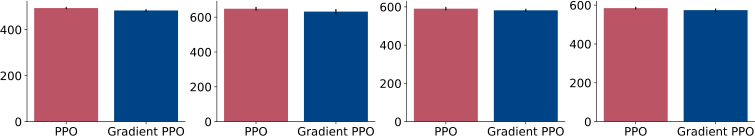

Figure 5: SPS for Gradient PPO and PPO evaluated on four MuJoCo environments. The bars
indicate the mean across 30 runs and the black bars indicate the standard error.

Name Default Value

Policy Network (64, tanh, 64, tanh, Linear) + Standard deviation variable
Value Network (64, tanh, 64, tanh, Linear)
Buffer size 2048

Num epochs 4
Mini-batch size 64

GAE, _λ_ 0.95
Discount factor, _γ_ 0.99
Clip parameter 0.2
Input Normalization True
Advantage Normalization True
Value function loss clipping True
Max Gradient Norm 0.5

Optimizer Adam
Actor step size 0.0003
Critic step size 0.0003
Optimizer _ϵ_ 1 _×_ 10 _[−]_ [5]

Table 3: The default hyperparameters used for PPO. The hyperparameter values are based on the
implementation details by Huang et al. (2022).

Name Default Value

Policy Network (64, tanh, 64, tanh, Linear) + Standard deviation variable
Value Network (64, tanh, 64, tanh, Linear)
Buffer size 2048

Num epochs 4
Mini-batch size 256 (split into 8 sequences of length 32)
_λ_ 0.95

Discount factor, _γ_ 0.99
Clip parameter 0.2
Input Normalization True
Advantage Normalization True
Max Gradient Norm 0.5

Optimizer Adam
Actor step size 0.0003
Critic step size 0.003
h step size 0.003
regularization coef, _β_ 1.0
Optimizer _ϵ_ 1 _×_ 10 _[−]_ [5]

Table 4: The hyperparameters used for Gradient PPO in all the MuJoCo experiments.

Deep RL with Gradient Eligibility Traces

**D** **Backward-View Algorithms**

In this section, we provide the pseudocode and the hyperparameters details for the backward-view
algorithms. Algorithm 4 shows the pseudocode for QRC( _λ_ ), where at each timestep, the agent
samples an action from an _ϵ_ -greedy policy and takes one step in the environment to observe the
subsequent reward and next state. Then, based on that transition, it makes an update to its parameters
using the traces it is carrying and also updates those traces.

**Algorithm 4** QRC( _λ_ ) Algorithm

Input: a differentiable state-value function parametrization ˆ _q_ **w**
Input: a differentiable auxiliary function parametrization _h_ [ˆ] _θ_
Algorithm parameters: learning rate _α_ _q_, _h_ learning rate _α_ _h_, exploration parameter _ϵ_ .
Initialize _**z**_ _t_ _**[θ]**_ _[←]_ **[0]**
Initialize _**z**_ _t_ _**[w]**_ _[←]_ **[0]**
Initialize _z_ _t_ _[h]_ _[←]_ [0]
Observe initial state _S_ 0
**for** iteration _t_ = 1 _,_ 2 _, · · ·_ **do**

Sample an action _A_ _t_ _∼_ _π_ . _▷_ We use an _ϵ_ -greedy policy.
Take action _A_ _t_, observe _R_ _t_ +1 and _S_ _t_ +1 .
Compute _δ_ _t_ and _∇_ _**w**_ _t_ _δ_ _t_ according to Eq. 24 and Eq. 25, respectively.
Update the traces _**z**_ _t_ _**[θ]**_ [,] _**[ z]**_ _t_ _**[w]**_ [, and] _[ z]_ _t_ _[h]_ [according to Eq.][26][.]
Compute ∆ _**w**_ _t_ and ∆ _**θ**_ _t_ according to Eq.26. _▷_ To use the other algorithmic variants, replace
those equations with other backward-view algorithms in Table 2.

Update the parameters _**w**_ _t_ +1 _←_ _**w**_ _t_ + _α_ _q_ ∆ _**w**_ _t_
Update the parameters _**θ**_ _t_ +1 _←_ _**θ**_ _t_ + _α_ _h_ ∆ _**θ**_ _t_
**if** episode terminated or _A_ _t_ is non-greedy **then**

reset the traces _**z**_ _t_ _**[θ]**_ [,] _**[ z]**_ _t_ _**[w]**_ [, and] _[ z]_ _t_ _[h]_ [to zeros.]
**end if**

**end for**

**D.1** **Experimental Details of MinAtar**

In our experiments with QRC( _λ_ ), we used the same normalization wrappers and the sparse initialization proposed by Elsayed et al. (2024). However, we used SGD as the optimizer, as the optimizer
presented Elsayed et al. (2024) can’t be easily mapped to our updates. These choices were made so
that the difference in performance between those algorithms can be associated with the Gradient TD
updates.

For QRC( _λ_ ) and Q( _λ_ ), we first performed a hyperparameter sweep over _λ_, and the learning rate for
both the value network and the _h_ network, for QRC( _λ_ ). We include the values used for the sweep in
6 and the final hyperparameters used in Table 7.

Finally, we estimated the SPS for both QRC( _λ_ ) and Q( _λ_ ), and the estimated values are shown in
Figure 6. Since the backward-view algorithms do not have batch updates, we were not able to
parallelize the additional computations as we did in the forward-view (i.e, Gradient PPO), and we

Name Sweep Range
_λ_ [0 _._ 7 _,_ 0 _._ 8 _,_ 0 _._ 9 _,_ 0 _._ 95]
Actor step size [0 _._ 001 _,_ 0 _._ 003 _,_ 0 _._ 0001 _,_ 0 _._ 0003 _,_ 0 _._ 00001 _,_ 0 _._ 00003]
Critic step size [0 _._ 001 _,_ 0 _._ 003 _,_ 0 _._ 0001 _,_ 0 _._ 0003 _,_ 0 _._ 00001 _,_ 0 _._ 00003]
regularization coef, _β_ [1 _._ 0 _,_ 0 _._ 0]

Table 5: Hyperparameter ranges used for the sweep experiments for Gradient PPO.

Reinforcement Learning Journal 2025

notice a marginal runtime increase in run time for QRC( _λ_ ) compared to Q( _λ_ ) due to the additional
computation required for the auxiliary variable _h_ .

|SPS|Col2|Col3|
|---|---|---|
|QRC( ) Q( ) 0 500 1000 1500 2000  SPS (30 runs) MinAtar/Asterix~~-~~v1 QRC( ) Q( ) 0 500 1000 1500 MinAtar/Breakout~~-~~v1 QRC( ) Q( ) 0 500 1000 1500 MinAtar/Freeway~~-~~v1 QRC( ) Q( ) 0 500 1000 1500 MinAtar/SpaceInvaders~~-~~v1 QRC( ) Q( ) 0 500 1000 1500 MinAtar/Seaquest~~-~~v1|QRC( ) Q( ) 0 500 1000 1500 2000  SPS (30 runs) MinAtar/Asterix~~-~~v1 QRC( ) Q( ) 0 500 1000 1500 MinAtar/Breakout~~-~~v1 QRC( ) Q( ) 0 500 1000 1500 MinAtar/Freeway~~-~~v1 QRC( ) Q( ) 0 500 1000 1500 MinAtar/SpaceInvaders~~-~~v1 QRC( ) Q( ) 0 500 1000 1500 MinAtar/Seaquest~~-~~v1|QRC( ) Q( ) 0 500 1000 1500 2000  SPS (30 runs) MinAtar/Asterix~~-~~v1 QRC( ) Q( ) 0 500 1000 1500 MinAtar/Breakout~~-~~v1 QRC( ) Q( ) 0 500 1000 1500 MinAtar/Freeway~~-~~v1 QRC( ) Q( ) 0 500 1000 1500 MinAtar/SpaceInvaders~~-~~v1 QRC( ) Q( ) 0 500 1000 1500 MinAtar/Seaquest~~-~~v1|
|QRC( ) Q( ) 0 500 1000 1500 2000  SPS (30 runs) MinAtar/Asterix~~-~~v1 QRC( ) Q( ) 0 500 1000 1500 MinAtar/Breakout~~-~~v1 QRC( ) Q( ) 0 500 1000 1500 MinAtar/Freeway~~-~~v1 QRC( ) Q( ) 0 500 1000 1500 MinAtar/SpaceInvaders~~-~~v1 QRC( ) Q( ) 0 500 1000 1500 MinAtar/Seaquest~~-~~v1|) Q(|)|

Figure 6: SPS for QRC( _λ_ ) and Q( _λ_ ) algorithms on MinAtar environments.

Name Default Value

_λ_ [0.7,0.8,0.9,0.95]
Optimizer SGD
step size [0.001,0.0001,0.00001,0.000001]
h step scale [1.0,0.1]
regularization coef, _β_ [1.0,0.0]

Table 6: Hyperparameters ranges used for the sweep experiments in MinAtar.

Name Default Value

_λ_ 0.8

Input Normalization True
Optimizer SGD
step size 0.0001
h step size 1.0
regularization coef, _β_ 1.0, for QRC( _λ_ ), and 0.0, for QC( _λ_ ) and GQ2( _λ_ ).
start exploration _ϵ_, 1.0
end exploration _ϵ_, 0.01
exploration fraction 0.2

Table 7: Final hyperparameters used for QRC( _λ_ ) experiments with MinAtar

