A Study of Value-Aware Eigenoptions

## **A Study of Value-Aware Eigenoptions**

**Harshil Kotamreddy** [1,2] **, Marlos C. Machado** [1,2,3]

{kotamred,machado}@ualberta.ca

1 **Department of Computing Science, University of Alberta, Canada**
2 **Alberta Machine Intelligence Institute (Amii)**
3 **CIFAR AI Chair**

**Abstract**

Options, which impose an inductive bias toward temporal and hierarchical structure, offer a powerful framework for reinforcement learning (RL). While effective in sequential
decision-making, they are often handcrafted rather than learned. Among approaches
for discovering options, eigenoptions have shown strong performance in exploration,
but their role in credit assignment remains underexplored. In this paper, we investigate
whether eigenoptions can accelerate credit assignment in model-free RL, evaluating
them in tabular and pixel-based gridworlds. We find that pre-specified eigenoptions aid
not only exploration but also credit assignment, whereas online discovery can bias the
agent’s experience too strongly and hinder learning. In the context of deep RL, we also
propose a method for learning option-values under non-linear function approximation,
highlighting the impact of termination conditions on performance. Our findings reveal
both the promise and complexity of using eigenoptions, and options more broadly, to
simultaneously support credit assignment and exploration in reinforcement learning.

**1** **Introduction**

While reinforcement learning (RL) has achieved many successes recently (e.g., Silver et al., 2016;
2018; Berner et al., 2019; Degrave et al., 2022; Ouyang et al., 2022), one arguably underexplored aspect is the effective use of temporal abstractions, such as options (Sutton et al., 1999). These abstractions introduce an inductive bias that departs from the dominant end-to-end learning paradigm. Notably, in several high-profile cases, such abstractions were handcrafted by human experts in advance
and proved instrumental to the system’s success (e.g., Vinyals et al., 2019; Bellemare et al., 2020).

Autonomously discovering temporal abstractions, rather than relying on handcrafted ones, remains a
rich and active area of research (e.g., Dayan & Hinton, 1992; Konidaris & Barto, 2009; Bacon et al.,
2017; Vezhnevets et al., 2017; Harb et al., 2018; Bagaria & Konidaris, 2019; Eysenbach et al., 2019).
Importantly, this diversity of approaches reflects the broad range of challenges where temporal abstractions have been applied, including credit assignment (Sutton et al., 1999; Solway et al., 2014),
exploration (Jong et al., 2008; Jinnai et al., 2019), and generalization (Konidaris & Barto, 2007).

Eigenoptions are a specific class of options originally introduced to address exploration challenges (Machado & Bowling, 2016; Machado et al., 2017), and have since been shown to be scalable
and to lead to state-of-the-art performance in a range of high-dimensional problems (Klissarov &
Machado, 2023). Yet, despite being defined in terms of how information diffuses through the environment, a property closely related to temporal credit assignment, few efforts have explored eigenoptions for that purpose. The limited work that applied eigenoptions beyond exploration did not explicitly investigate their potential for aiding credit assignment (Liu et al., 2017; Sutton et al., 2023).

Inductive Biases in Reinforcement Learning Workshop at RLC 2025

In this paper, we explicitly investigate whether eigenoptions can be used to accelerate credit assignment in model-free RL. We consider scenarios in which options are provided in advance and those
in which they are discovered online, evaluating their impact across both tabular and pixel-based
gridworlds. Our findings show that when options are available beforehand, they can aid not only
exploration but also credit assignment, extending the list of benefits afforded by eigenoptions.

However, when options are discovered online and simultaneously used for exploration, their influence on the agent’s behavior becomes more pronounced. Early inaccuracies in option learning can
skew the agent’s experience, limiting its ability to fully explore the environment, thereby hindering
credit assignment. This highlights a previously underexplored interaction between exploration and
credit assignment in the context of options. Finally, we propose a method for learning option-values
under non-linear function approximation, where defining effective termination conditions is
particularly challenging due to approximation errors. Collectively, these results underscore both the
potential and the complexity of using temporal abstractions for credit assignment in RL.

**2** **Preliminaries**

In this paper, we use capital letters to designate random variables, calligraphic font for sets,
lowercase bold letters for vectors, and uppercase bold letters to denote matrices. ∆(X) is the set of
probability distributions over set X.

**2.1** **Reinforcement Learning**

In the reinforcement learning setting, an agent interacts with an environment with the aim of maximizing reward. RL problems are typically represented by a Markov Decision Process (MDP).
An MDP is defined as a tuple _⟨_ S _,_ A _, p, r⟩_ where S is the set of all states, A is the set of all
actions, _p_ ( _s|s_ _[′]_ _, a_ ) = P[ _S_ _t_ +1 = _s_ _[′]_ _|S_ _t_ = _s, A_ _t_ = _a_ ] is the transition probability kernel, and
_r_ ( _s, a_ ) = E[ _R_ _t_ +1 _|S_ _t_ = _s, A_ _t_ = _a_ ] is the expected reward given the agent takes action _a_ in state _s_ .
At every time step _t_, the agent is in state _S_ _t_ and interacts with the environment by taking action _A_ _t_ ;
then the agent moves to state _S_ _t_ +1 according to _p_ and receives a reward _R_ _t_ +1 .

The agent learns a policy _π_ : S _→_ ∆(A) that maximizes the expected discounted return, _G_ _t_ =
� _∞k_ =0 _[γ]_ _[k]_ _[R]_ _[t]_ [+] _[k]_ [+1] [, where] _[ γ][ ∈]_ [[0] _[,]_ [ 1)][ is the discount factor. We focus on value-based methods that]
estimate the state-action value function _q_ _π_ ( _s, a_ ) = E _π_ [ _G_ _t_ _|S_ _t_ = _s, A_ _t_ = _a_ ] for the optimal policy, _π_ _[∗]_ .
Specifically, we use Q-learning (Watkins & Dayan, 1992) which estimates _q_ _π_ _∗_ using the update rule

_Q_ ( _S_ _t_ _, A_ _t_ ) _←_ _Q_ ( _S_ _t_ _, A_ _t_ ) + _α_ � _R_ _t_ +1 + _γ_ max _a∈_ A _[Q]_ [(] _[S]_ _[t]_ [+1] _[, a]_ [)] _[ −]_ _[Q]_ [(] _[S]_ _[t]_ _[, A]_ _[t]_ [)] � _,_ (1)

where _α_ is the step size. The policy is defined as _π_ ( _s_ ) = argmax _a∈_ A _Q_ ( _s, a_ ) _._

**2.2** **Options**

Options in RL are a framework for temporal abstraction, letting agents act over multiple time steps
(Sutton et al., 1999). An option is defined as a tuple, _o_ = _⟨_ I _o_ _, π_ _o_ _, β_ _o_ _⟩_, where I _o_ _⊆_ S is the option’s
initiation set, _π_ _o_ : S _→_ ∆(A) is the option’s policy, and _β_ _o_ : S _→_ [0 _,_ 1] is the option’s termination
function. An option can be taken in any state within the initiation set I _o_, after which it acts according
to the option policy _π_ _o_ until it terminates according to _β_ _o_ . Note that actions in A are one-step options.

We can learn state-option estimates, that is, the expected return if the agent takes option _O_ _t_ in state
_S_ _t_, using the SMDP Q-Learning update rule upon option termination (Sutton et al., 1999):

_R_ + _γ_ _[K]_ max _Q_ ( _S_ _t_ + _K_ _, o_ ) _−_ _Q_ ( _S_ _t_ _, O_ _t_ )
_o∈_ O _St_ + _K_ �

_Q_ ( _S_ _t_ _, O_ _t_ ) _←_ _Q_ ( _S_ _t_ _, O_ _t_ ) + _α_

�

_,_ (2)

where _o ∈_ O is an option, O is the set of all options, _Q_ ( _s, o_ ) is the estimate of the optimal
state-option value function, _α_ is the step size, _K_ is the number of time steps the option took before

A Study of Value-Aware Eigenoptions

termination, _R_ represents the cumulative discounted reward through the duration of the option, and
O _S_ is the set of all options that contain state _S_ within their initiation set, I _o_ .

Intra-option Q-learning (Sutton et al., 1998) improves on SMDP Q-learning by also updating _Q_ ( _s, o_ )
while the agent is still acting according to an option’s policy, in contrast to applying the update rule
only upon an option’s termination:

_Q_ ( _S_ _t_ _, O_ _t_ ) _←_ _Q_ ( _S_ _t_ _, O_ _t_ ) + _α_ [( _R_ _t_ +1 + _γU_ ( _S_ _t_ +1 _, O_ _t_ )) _−_ _Q_ ( _S_ _t_ _, O_ _t_ )] _,_ (3)

where _U_ ( _s, o_ ) = (1 _−_ _β_ _o_ ( _s_ )) _Q_ ( _s, o_ ) + _β_ _o_ ( _s_ ) max _o_ _′_ _∈_ O _s_ _Q_ ( _s, o_ _[′]_ ) _._ This allows us to perform stateoption updates to all options if their policies take the same action as the current option and/or action.

**2.3** **Eigenoptions**

Eigenoptions (Machado et al., 2017; 2018) are options discovered through the eigenvectors of the
successor representation (SR) (Dayan, 1993). The SR encodes the “temporal distance” between
states. It represents each state _s_ as an _|_ S _|_ dimensional vector that contains the expected discounted
visitation from _s_ to every state _s_ _[′]_ _∈_ S. The SR matrix, **Ψ** _π_, with respect to a policy _π_, can be
calculated using **P** _π_, the transition probability matrix induced by _π_ :

**Ψ** _π_ = ( **I** _−_ _γ_ **P** _π_ ) _[−]_ [1] _,_ (4)

where **I** is the identity matrix. When **P** _π_ is unknown, given a step size _η_, the SR can be estimated
from samples using the temporal difference update rule for state _S_ _t_ at time step _t_ :

ˆΨ ( _S_ _t_ _, j_ ) _←_ ˆΨ ( _S_ _t_ _, j_ ) + _η_ � 1 _{S_ _t_ = _j}_ + _γ_ Ψ ( [ˆ] _S_ _t_ +1 _, j_ ) _−_ Ψ ( [ˆ] _S_ _t_ _, j_ )� _∀j ∈_ S _._ (5)

Eigenoptions are options that maximize an intrinsic reward function defined by the eigenvectors of
the SR. The intrinsic reward function used to generate an option policy using eigenvector _**e**_ of **Ψ** _π_ is:

_r_ _**[e]**_ ( _s, s_ _[′]_ ) = _**e**_ _[⊤]_ ( _**ϕ**_ ( _s_ _[′]_ ) _−_ _**ϕ**_ ( _s_ )) _∀s, s_ _[′]_ _∈_ S _,_ (6)

where _**ϕ**_ ( _s_ ) is the feature representation of state _s_ .

Eigenoptions can also be discovered online through the Representation-Driven Option Discovery
(ROD) cycle (Machado et al., 2023; Machado, 2025). The cycle starts with an RL agent gathering
data by interacting with its environment and then using this data to learn a representation of the
environment. In this case, the agent learns the SR and its eigenvectors. The agent then uses the
learned representation to create an intrinsic reward function (see Eq. 6), and then learns an option
policy to maximize it. Finally, the option’s initiation set is defined as all states with positive
Q-values, and the complement is defined as termination states. This can be done because the
intrinsic reward function is naturally defined such that the agent receives negative rewards when it
exits what should be a termination state.

Once an option is created, it is added to the agent’s option set, and the cycle repeats. So far, such
options have only been used for exploration. Specifically, in an _ϵ_ -greedy step, the agent might
sample an option and act according to its policy until termination. Through this process, the agent
explores areas of the environment that are less frequently visited, enabling much faster and more
efficient exploration. This algorithm is called covering eigenoptions (CEO) (Machado et al., 2023).

**3** **Learning Option-Values for Eigenoptions in the Tabular Setting**

In the tabular case, eigenoptions defined using the first _n_ eigenvectors of the SR have been shown to
significantly reduce the number of time steps required to visit all states of an environment (Machado
et al., 2023). Additionally, perhaps because they capture information on how rewards diffuse in
the environment, they have also been shown to be quite effective when used for planning (Sutton
et al., 2023). Thus, a very natural question in the model-free setting is whether we should see

Inductive Biases in Reinforcement Learning Workshop at RLC 2025

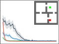

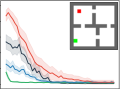

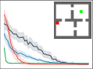

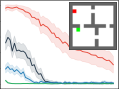

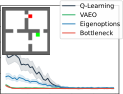

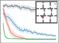

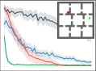

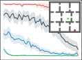

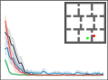

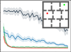

Figure 1: Performance of value-aware eigenoptions (VAEO) compared to baselines. VAEO outperforms the other algorithms in most configurations. Environment configurations are inset in each
plot. Green squares represent start states, and red squares represent goal states. We use six and 24
eigenoptions in the four rooms and nine rooms domains, respectively. We use all bottleneck options,
which totals to eight in the four rooms domain and 24 in the nine rooms domain. We evaluate all
algorithms for 100 independent runs and the shaded region represents a 99% confidence interval.

even faster learning if we were to learn option-values for eigenoptions; using them not only for
exploration but also for credit assignment. We call this approach value-aware eigenoptions (VAEO).
We consider bottleneck options as a baseline because they are the most traditional approach for
credit assignment (McGovern & Barto, 2001a; ¸Sim¸sek & Barto, 2008) and they can seen as forming
an optimal behavioral hierarchy (Solway et al., 2014).

**3.1** **Acting and Learning with Eigenoptions**

We first focus on the benefits of value-aware eigenoptions without confounding factors from the
option discovery process. Thus, we first consider options obtained through the closed form of the
SR (Eq. 4). We demonstrate that in the tabular setting, learning option-values for pre-computed
eigenoptions leads to faster learning when compared to using pre-computed eigenoptions strictly
for exploration. We perform experiments in the four rooms and nine rooms domains with randomly
generated start and goal state configurations (inset in Figure 1). We use a modified version of the
Minigrid environment (Chevalier-Boisvert et al., 2023) with cardinal actions. The agent receives
zero reward at every transition except those that lead to the goal state, which lead to +1 reward.

We generate eigenoptions using the top _n_ eigenvectors of the SR. We learn the option policies using
Q-learning with samples from random exploration of the environment, where the agent starts at a
random location every episode. Episodes are 1000 steps long, and in this phase, we do not treat
goal states as absorbing states but as regular states. To learn option-values for these precomputed
eigenoptions, we use intra-option Q-learning. If an action _a_ is taken in a state _s_, regardless of how
it was selected, we update all options that would have taken action _a_ in state _s_ .

We report the number of time steps it takes the agent to reach the goal state during every episode.
We compare the performance of Value-Aware Eigenoptions (VAEO) to Q-learning with eigenoptions
used for exploration (Machado et al., 2018; 2023) and intra-option Q-learning with bottleneck options (Sutton et al., 1998). We did a hyperparameter sweep to decide on the number of eigenoptions.

As shown in Figure 1, VAEO outperforms eigenoptions and bottleneck options in nearly all configurations of the environment. This suggests that credit assignment provides additional benefit on top
of the exploration bonus provided by eigenoptions. As initially predicted, learning option-values
allows the agent to exploit options that it previously found to be useful to maximize its return.

**3.2** **Credit Assignment**

While these results seem to indicate that credit assignment through options improves performance,
with intra-option Q-learning we are essentially treating options as additional actions. Thus, the
results above still confound the benefits of using eigenoptions for credit assignment and exploration.

A Study of Value-Aware Eigenoptions

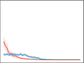

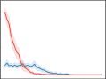

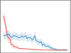

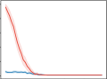

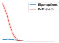

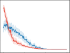

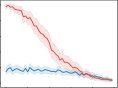

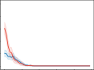

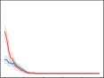

Figure 2: Credit assignment through an evaluation phase. We evaluate both algorithms for 100 seeds
and report the 99% confidence interval. Environment configurations are the same as in Fig. 1.

To factor out the impact of the exploration benefits induced by eigenoptions, we constrained the
agent to select only primitive actions while performing an intra-option update at every time step to
learn option-values through the agent’s actions. This eliminates any and all exploration benefits the
agent gets from acting according to an option’s policy. At the end of every episode, we evaluate the
agent’s time-to-goal when also considering options in its action space. In this case, the performance
we see is strictly due to credit being assigned to the eigenoptions.

As shown in Figure 2, eigenoptions initially assign credit much more quickly than bottleneck options. However, they can stay at suboptimal trajectories longer. These results are not too surprising.
Bottleneck options tend to be shorter, and the solution to any start/goal configuration unavoidably
leads the agent through a bottleneck state, making bottleneck options part of the optimal policy (Solway et al., 2014; Sutton et al., 2023). In fact, it is somewhat surprising that eigenoptions are so
competitive in many of these settings. We conjecture that this might be due to how eigenoptions are
obtained through the environment’s diffusive information flow, and to how different eigenoptions
operate at different time scales, potentially allowing some of them to be a part of the optimal policy.

**4** **Challenges when Discovering Options Online**

We now discuss learning option-values when options are discovered online. We introduce a valueaware version of CEO called value-aware covering eigenoptions (VACE). In VACE, every time a new
option is added to the option set, we initialize an additional vector in our Q-function to store optionvalues for the newly created option. As the agent interacts with the environment, we use intra-option
Q-learning updates to learn option-values. The VACE algorithm is detailed in Appendix A.

To see how much of a benefit value-aware eigenoptions provide when eigenoptions are discovered
online, we compare the performance of VACE to CEO and Q-learning, with the latter using _ϵ_ -greedy
exploration. The experiment setup is the same as when using precomputed options. We evaluate
these algorithms when discovering new options every 1000 timesteps.

As shown in Fig. 5 in Appendix A, VACE outperforms CEO in the four rooms environment while
the performance gain in the nine rooms environment is much less apparent. VACE still outperforms
CEO in median performance, though (see Fig. 6 in Appendix A). This is because VACE outperforms CEO on most runs, but it performs significantly worse in a few runs. When options are used
for both credit assignment and exploration, inaccurate estimates of an option’s value might make a
suboptimal option be selected much more often than it should be in the argmax. Such an option has
a much more persistent behaviour, with long-term consequences, when compared to a wrongly selected primitive action. Thus, in VACE, the discovered options do help the agent visit underexplored
regions in the environment, but because the discovered options are treated as actions, they have a
much bigger impact on the agent, sometimes making it harder for the agent to find the goal state.

Let us elaborate. Consistently acting according to option’s policies can sometimes hinder performance. In CEO, value propagation is relatively slow as value is propagated one state at a time, but the
values start to be propagated relatively quickly because of effective exploration (see Fig. 3a). Fig. 3b

Inductive Biases in Reinforcement Learning Workshop at RLC 2025

Episode 1 Episode 10 Episode 20 Episode 30 Episode 40 Episode 50

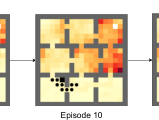

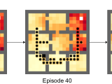

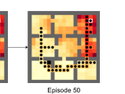

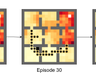

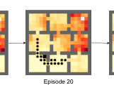

Episode 1 Episode 10 Episode 20 Episode 30 Episode 40 Episode 50

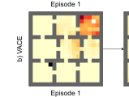

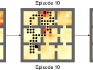

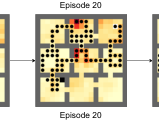

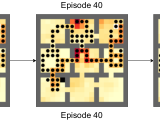

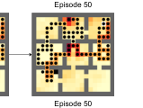

Episode 1 Episode 10 Episode 20 Episode 30 Episode 40 Episode 50

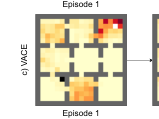

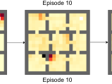

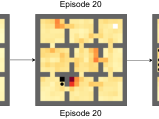

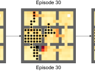

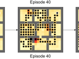

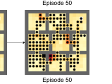

Figure 3: Value propagation in a) a typical run of CEO, b) a typical run of VACE and c) a bad run of
VACE. The start state is highlighted in white, while the goal state is highlighted in black. Black dots
represent states with a value greater than zero. Darker red states represent states frequently visited,
while lighter yellow squares represent states visited infrequently.

shows a typical run of VACE. VACE propagates value much faster and, in this particular run, is able
to create a value trace to the goal by episode 20. Fig. 3c shows a bad run of VACE where it struggles
to find the goal because the agent hops from one option to another, and even though it initially gets
close to the goal state, it does not use enough random actions to get to the goal state because another
option “takes over” before that. Thus, it takes much longer to start propagating values back.

**5** **Approximating Option-Values with Non-Linear Function Approximation**

Since value-aware eigenoptions lead to faster learning in the tabular setting, it is natural to ask
whether they would also help in the function approximation setting. We investigate this question in
the four rooms and nine rooms environments with pixel inputs. We again use a modified version of
the Minigrid environment (Chevalier-Boisvert et al., 2023) with cardinal actions. We first focus on
using neural networks to approximate option-values, using tabular methods to compute the eigenvectors of the SR and the options themselves. Solutions to approximating the eigenvectors of the SR
(Wu et al., 2018; Wang et al., 2021; Gomez et al., 2024) and the eigenoptions themselves (Klissarov
& Machado, 2023) have already been discussed in the literature. We discuss nuances around option
termination when using them for credit assignment in Section 5.2.

In all experiments, we use a two-layer convolutional network with 32 channels each, a 3 _×_ 3 kernel,
and a stride of 2, followed by a fully connected layer with 256 nodes and then the output layer with
4 nodes (one for each action) in the action-value network and 1 node in the option-value network.
We implemented our algorithms with the PFRL library (Fujita et al., 2021).

**5.1** **Tabular Option Policies**

To learn option-values in the function approximation setting, we use a hierarchical DQN architecture (Kulkarni et al., 2016) similar to that of Bagaria & Konidaris (2019). We use a separate
neural network to learn each of the option-value functions on top of the value function for primitive
actions (see Fig. 7 in Appendix B). The network parameters are represented as _**θ**_ _[o]_ _[k]_ _∈_ _**θ**_ _[o]_, where
_k_ = 0 represents the network that learns primitive action-values, and _k >_ 0 represents the network
that learns the option-values for option _k_ . The target networks are represented as _**θ**_ _[o]_ _k_ _[−]_ _∈_ _**θ**_ _[o]_ _[−]_ . The
action or option with the highest value is selected during a greedy step. We use the DQN (Mnih
et al., 2015) loss function _L_ _i_ = E _s,a∼p_ ( _·_ ) �( _y_ _i_ _−_ _Q_ ( _s, a_ ; _θ_ _i_ )) [2] [�] with a modified Double DQN

A Study of Value-Aware Eigenoptions

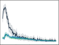

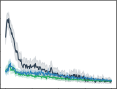

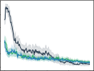

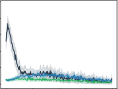

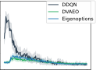

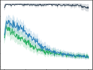

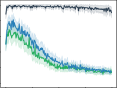

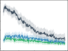

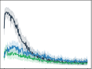

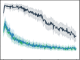

Figure 4: Performance of DVAEO and baselines with pixel observations. Environment configurations are the same as in Figure 1. We use 6 tabular eigenoptions in the four rooms domain and 24
tabular eigenoptions in the nine rooms domain for both DVAEO and deep eigenoptions. We train
all algorithms for 100 independent runs and the shaded region represents a 99% confidence interval.

(DDQN) (Van Hasselt et al., 2016) target:

_y_ _i_ = E _r_ + _γU_ ( _s_ _[′]_ _, o_ ; _**θ**_ _i_ _[o]_ _[,]_ _**[ θ]**_ _i_ _[o]_ _[−]_ [)] _s, a_ _,_ (7)
� ��� �

where _U_ ( _s_ _[′]_ _, o_ ; _**θ**_ _i_ _[o]_ _[,]_ _**[ θ]**_ _i_ _[o]_ _[−]_ [) = (1] _[ −]_ _[β]_ _[o]_ [(] _[s]_ [))] _[ Q]_ [(] _[s, o]_ [;] _**[ θ]**_ _i_ _[o]_ _[−]_ [) +] _[ β]_ _[o]_ [(] _[s]_ [)] _[Q]_ _s,_ argmax _o_ _′_ _Q_ ( _s, o_ _[′]_ ; _**θ**_ _i_ _[o]_ [) ;] _**[ θ]**_ _i_ _[o]_ _[−]_ _._
� �

Similar to the experiments we performed in the tabular setting, we evaluate deep value-aware
eigenoptions (DVAEO) against deep eigenoptions (DDQN with eigenoptions for exploration) and
DDQN with _ϵ_ -greedy exploration. We use the same number of eigenoptions from the tabular setting,
6 eigenoptions in the four rooms domain and 24 eigenoptions in the nine rooms domain, for both
DVAEO and deep eigenoptions. This hyperparameter was not swept in this setting. We populate the
replay buffer with 1000 random transitions in the environment before starting the learning process.

As shown in Figure 4, DVAEO performs slightly better than deep eigenoptions in the nine rooms
environment, while there is no difference in performance in the four rooms environment. The performance gains are not nearly as significant as those in the tabular setting, though. We hypothesize
that this is because learning with neural networks is much slower than in the tabular case. This
could imply that the exploration benefits from eigenoptions outweigh credit assignment in these experiments. However, the fact that there is a larger performance gain in the bigger environment might
suggest that the benefits of DVAEO would become more evident in more complex environments.

**5.2** **Approximating Option Policies**

We now extend the previous architecture by also approximating the option’s policies and termination
conditions. We use the DDQN algorithm to learn the option policies. Unlike the tabular setting, the
method for determining whether to terminate an option at a given state is much more brittle because
the generalization of neural networks leads to estimates of many states changing with a single update, making termination conditions based on specific thresholds ineffective. Klissarov & Machado
(2023) successfully utilized option policies with nondeterministic termination using a constant
_β_ = 0 _._ 1. While this makes sense for exploration, given that randomized termination still leads to
underexplored states, our initial experiments showed extremely high variance and slow learning
when using a constant _β_ . To reduce stochasticity, we terminate options 10 time steps after initiation;
we obtained this value through a hyperparameter sweep over both environments we considered.

As before, we evaluate DVAEO against deep eigenoptions (now with deep option policies) and
DDQN with _ϵ_ -greedy exploration. The option policies were trained on a version of the environment
without start or goal states for 500 episodes, ensuring that the learned policies matched the tabular
policies. We again use 6 eigenoptions in the four rooms environment and 24 eigenoptions in the
nine rooms environment for both DVAEO and deep eigenoptions, and we populate the replay buffer
with 1000 random samples from the environment before starting the learning process.

Inductive Biases in Reinforcement Learning Workshop at RLC 2025

DVAEO with DDQN option policies performs similarly to deep eigenoptions in most configurations
(see Fig. 8 in Appendix B). Using eigenoptions for exploration led to similar performance as when
using them for both exploration and credit assignment. This can be attributed to suboptimal termination conditions. The DDQN option policies were functionally the same as the tabular ones, except
for the termination condition. When termination states are not well defined, there are some states
where the option’s policy leads the agent into a loop and/or a wall. Since the agent cannot terminate
at such states, it has to continue taking the option until it terminates either through chance or after
_n_ steps. This issue is exacerbated if there is poor network initialization or bad updates due to neural
network generalization. Interrupting such options might be a promising avenue for future work.

**6** **Related Work**

Using options for credit assignment is an active area of research. A common approach involves
identifying bottleneck states, critical states that must be traversed to reach large regions of the state
space, and constructing options that lead to them (McGovern & Barto, 2001b; ¸Sim¸sek & Barto, 2004;

¸Sim¸sek & Barto, 2008). This strategy improves credit assignment by shifting it from individual states
to broader regions (Sutton et al., 1999; Solway et al., 2014). Kulkarni et al. (2016) introduced options
into the deep RL setting, inspiring a series of methods based on the hierarchical DQN framework.
Additionally, skill chaining has been shown to accelerate credit assignment by chaining options
along the path to the goal, allowing full option transitions to contribute to policy updates (Konidaris
& Barto, 2009; Bagaria & Konidaris, 2019). Feudal methods (Vezhnevets et al., 2017; Levy et al.,
2019) have also shown promise, using higher-level policies to assign credit over extended horizons.
For a much deeper and comprehensive discussion on option discovery in general, we refer the reader
to the recent survey written by Klissarov et al. (2025) on the topic.

The idea of using eigenoptions for credit assignment is not entirely new. Liu et al. (2017) used
the eigenvectors of the SR as an auxiliary reward within the option-critic architecture. The options
are learned using an intrinsic reward that combines the eigenvectors of the SR with environmental
reward, making eigenoptions reward-respecting (Sutton et al., 2023). While this approach has merit
and significantly speeds up learning compared to option-critic (Bacon et al., 2017), we aimed to evaluate the utility of options defined strictly through the eigenvectors of the SR for credit assignment.

Methods that use the Default Representation (DR) (Piray & Daw, 2021) can also be viewed as
incorporating environmental rewards into eigenoptions. The DR captures the expected reward
between two states instead of the temporal distance between them, as the SR does, which gives rise
to eigenoption variants obtained from reward-aware representations (Tse et al., 2025).

**7** **Conclusion**

In this paper, we studied value-aware eigenoptions. We (1) demonstrated the benefits of learning
option-values for pre-computed eigenoptions, (2) introduced VACE, a method that builds on CEO to
learn option-values for eigenoptions learned online, and (3) introduced DVAEO, a deep RL method
to learn option-values for eigenoptions. Maybe even more important than the methods themselves
were the discussions around the impact of termination conditions in the function approximation
setting and the challenges of learning option-values for eigenoptions that are discovered online.

Future work may involve methods that learn a well-defined termination set for eigenoptions in the
function approximation setting. Potential approaches might involve thresholding (Jinnai et al., 2020)
and clustering (Ramesh et al., 2019) based on the learned value function. Additionally, developing
techniques to maintain the exploration benefits of eigenoptions once they are added to an agent’s
action space will be crucial to using option-values effectively when eigenoptions are learned online.

More generally, this work outlines the potential and challenges associated with using eigenoptions
for credit assignment in model-free RL. We have demonstrated that eigenoptions exhibit potential
for credit assignment, despite being initially introduced for exploration. However, their potential
for credit assignment seems to be overshadowed by interactions with the state visitation distribution
they induce when they are learned online, or when used in the function approximation setting.

A Study of Value-Aware Eigenoptions

**Acknowledgements**

This research was supported in part by the Natural Sciences and Engineering Research Council
of Canada (NSERC) and the Canada CIFAR AI Chair Program. Computational resources were
provided in part by the Digital Research Alliance of Canada.

**References**

Pierre-Luc Bacon, Jean Harb, and Doina Precup. The option-critic architecture. In _AAAI Conference_
_on Artificial Intelligence_, 2017.

Akhil Bagaria and George Konidaris. Option discovery using deep skill chaining. In _International_
_Conference on Learning Representations_, 2019.

Marc G. Bellemare, Salvatore Candido, Pablo Samuel Castro, Jun Gong, Marlos C. Machado, Subhodeep Moitra, Sameera S. Ponda, and Ziyu Wang. Autonomous navigation of stratospheric
balloons using reinforcement learning. _Nature_, 588:77–82, 2020.

Christopher Berner, Greg Brockman, Brooke Chan, Vicki Cheung, Przemysław D˛ebiak, Christy
Dennison, David Farhi, Quirin Fischer, Shariq Hashme, Chris Hesse, Rafal Józefowicz, Scott
Gray, Catherine Olsson, Jakub Pachocki, Michael Petrov, Henrique P. d. O. Pinto, Jonathan
Raiman, Tim Salimans, Jeremy Schlatter, Jonas Schneider, Szymon Sidor, Ilya Sutskever, Jie
Tang, Filip Wolski, and Susan Zhang. Dota 2 with large scale deep reinforcement learning. _CoRR_,
abs/1912.06680, 2019.

Greg Brockman, Vicki Cheung, Ludwig Pettersson, Jonas Schneider, John Schulman, Jie Tang, and
Wojciech Zaremba. OpenAI Gym. _CoRR_, abs/1606.01540, 2016.

Maxime Chevalier-Boisvert, Bolun Dai, Mark Towers, Rodrigo de Lazcano, Lucas Willems,
Salem Lahlou, Suman Pal, Pablo Samuel Castro, and Jordan Terry. Minigrid & Miniworld:
Modular & customizable reinforcement learning environments for goal-oriented tasks. _CoRR_,
abs/2306.13831, 2023.

Özgür ¸Sim¸sek and Andrew Barto. Skill characterization based on betweenness. In _Neural Informa-_
_tion Processing Systems_, 2008.

Peter Dayan. Improving generalization for temporal difference learning: The successor representation. _Neural Computation_, 5(4):613–624, 1993.

Peter Dayan and Geoffrey E. Hinton. Feudal reinforcement learning. In _Neural Information Pro-_
_cessing Systems_, 1992.

Jonas Degrave, Federico Felici, Jonas Buchli, Michael Neunert, Brendan D. Tracey, Francesco
Carpanese, Timo Ewalds, Roland Hafner, Abbas Abdolmaleki, Diego de Las Casas, Craig Donner, Leslie Fritz, Cristian Galperti, Andrea Huber, James Keeling, Maria Tsimpoukelli, Jackie
Kay, Antoine Merle, Jean-Marc Moret, Seb Noury, Federico Pesamosca, David Pfau, Olivier
Sauter, Cristian Sommariva, Stefano Coda, Basil Duval, Ambrogio Fasoli, Pushmeet Kohli, Koray
Kavukcuoglu, Demis Hassabis, and Martin A. Riedmiller. Magnetic control of tokamak plasmas
through deep reinforcement learning. _Nature_, 602(7897):414–419, 2022.

Benjamin Eysenbach, Abhishek Gupta, Julian Ibarz, and Sergey Levine. Diversity is all you need:
Learning skills without a reward function. In _International Conference on Learning Representa-_
_tions_, 2019.

Yasuhiro Fujita, Prabhat Nagarajan, Toshiki Kataoka, and Takahiro Ishikawa. ChainerRL: A deep
reinforcement learning library. _Journal of Machine Learning Research_, 22(77):1–14, 2021.

Diego Gomez, Michael Bowling, and Marlos C. Machado. Proper Laplacian representation learning.
In _International Conference on Learning Representations_, 2024.

Inductive Biases in Reinforcement Learning Workshop at RLC 2025

Jean Harb, Pierre-Luc Bacon, Martin Klissarov, and Doina Precup. When waiting is not an option:
Learning options with a deliberation cost. In _AAAI Conference on Artificial Intelligence_, 2018.

Yuu Jinnai, Jee Won Park, David Abel, and George Konidaris. Discovering options for exploration
by minimizing cover time. In _International Conference on Machine Learning_, 2019.

Yuu Jinnai, Jee Won Park, Marlos C. Machado, and George Konidaris. Exploration in reinforcement
learning with deep covering options. In _International Conference on Learning Representations_,
2020.

Nicholas K. Jong, Todd Hester, and Peter Stone. The utility of temporal abstraction in reinforcement
learning. In _International Joint Conference on Autonomous Agents and Multiagent Systems_, 2008.

Diederik P. Kingma and Jimmy Ba. Adam: A method for stochastic optimization. In _International_
_Conference on Learning Representations_, 2015.

Martin Klissarov and Marlos C. Machado. Deep Laplacian-based options for temporally-extended
exploration. In _International Conference on Machine Learning_, 2023.

Martin Klissarov, Akhil Bagaria, Ziyan Luo, George Dimitri Konidaris, Doina Precup, and Marlos C. Machado. Discovering temporal structure: An overview of hierarchical reinforcement
learning. _CoRR_, abs/2506.14045, 2025.

George Konidaris and Andrew Barto. Building portable options: Skill transfer in reinforcement
learning. In _International Joint Conference on Artificial Intelligence_, 2007.

George Konidaris and Andrew Barto. Skill discovery in continuous reinforcement learning domains
using skill chaining. In _Neural Information Processing Systems_, 2009.

Tejas D. Kulkarni, Karthik Narasimhan, Ardavan Saeedi, and Josh Tenenbaum. Hierarchical deep
reinforcement learning: Integrating temporal abstraction and intrinsic motivation. In _Neural In-_
_formation Processing Systems_, 2016.

Andrew Levy, George Konidaris, Robert Platt, and Kate Saenko. Learning multi-level hierarchies
with hindsight. In _International Conference on Learning Representations_, 2019.

Miao Liu, Marlos C. Machado, Gerald Tesauro, and Murray Campbell. The eigenoption-critic
framework. _CoRR_, abs/1712.04065, 2017.

Marlos C. Machado. Representation-driven option discovery in reinforcement learning. In _AAAI_
_Conference on Artificial Intelligence_, 2025.

Marlos C. Machado and Michael Bowling. Learning purposeful behaviour in the absence of rewards.
_CoRR_, abs/1605.07700, 2016.

Marlos C. Machado, Marc G. Bellemare, and Michael Bowling. A Laplacian framework for option
discovery in reinforcement learning. In _International Conference on Machine Learning_, 2017.

Marlos C. Machado, Clemens Rosenbaum, Xiaoxiao Guo, Miao Liu, Gerald Tesauro, and Murray
Campbell. Eigenoption discovery through the deep successor representation. In _International_
_Conference on Learning Representations_, 2018.

Marlos C. Machado, Andre Barreto, Doina Precup, and Michael Bowling. Temporal abstraction in
reinforcement learning with the successor representation. _Journal of Machine Learning Research_,
24(80):1–69, 2023.

Amy McGovern and Andrew Barto. Accelerating reinforcement learning through the discovery of
useful subgoals. In _International Symposium on Artificial Intelligence, Robotics, and Automation_
_in Space_, 2001a.

A Study of Value-Aware Eigenoptions

Amy McGovern and Andrew Barto. Automatic discovery of subgoals in reinforcement learning
using diverse density. In _International Conference on Machine Learning_, 2001b.

Volodymyr Mnih, Koray Kavukcuoglu, David Silver, Andrei A. Rusu, Joel Veness, Marc G. Bellemare, Alex Graves, Martin Riedmiller, Andreas K. Fidjeland, Georg Ostrovski, Stig Petersen,
Charles Beattie, Amir Sadik, Ioannis Antonoglou, Helen King, Dharshan Kumaran, Daan Wierstra, Shane Legg, and Demis Hassabis. Human-level control through deep reinforcement learning.
_Nature_, 518(7540):529–533, 2015.

Long Ouyang, Jeffrey Wu, Xu Jiang, Diogo Almeida, Carroll L. Wainwright, Pamela Mishkin,
Chong Zhang, Sandhini Agarwal, Katarina Slama, Alex Ray, John Schulman, Jacob Hilton, Fraser
Kelton, Luke Miller, Maddie Simens, Amanda Askell, Peter Welinder, Paul F. Christiano, Jan
Leike, and Ryan Lowe. Training language models to follow instructions with human feedback.
In _Neural Information Processing Systems_, 2022.

Payam Piray and Nathaniel D. Daw. Linear reinforcement learning in planning, grid fields, and
cognitive control. _Nature Communications_, 12(1):4942, 2021.

Rahul Ramesh, Manan Tomar, and Balaraman Ravindran. Successor options: An option discovery
framework for reinforcement learning. In _International Joint Conference on Artificial Intelli-_
_gence_, 2019.

David Silver, Aja Huang, Chris J. Maddison, Arthur Guez, Laurent Sifre, George van den Driessche,
Julian Schrittwieser, Ioannis Antonoglou, Veda Panneershelvam, Marc Lanctot, Sander Dieleman,
Dominik Grewe, John Nham, Nal Kalchbrenner, Ilya Sutskever, Timothy Lillicrap, Madeleine
Leach, Koray Kavukcuoglu, Thore Graepel, and Demis Hassabis. Mastering the game of Go with
deep neural networks and tree search. _Nature_, 529(7587):484–489, 2016.

David Silver, Thomas Hubert, Julian Schrittwieser, Ioannis Antonoglou, Matthew Lai, Arthur Guez,
Marc Lanctot, Laurent Sifre, Dharshan Kumaran, Thore Graepel, Timothy Lillicrap, Karen Simonyan, and Demis Hassabis. A general reinforcement learning algorithm that masters chess,
shogi, and go through self-play. _Science_, 362(6419):1140–1144, 2018.

Özgür ¸Sim¸sek and Andrew G Barto. Using relative novelty to identify useful temporal abstractions
in reinforcement learning. In _International Conference on Machine Learning_, 2004.

Alec Solway, Carlos Diuk, Natalia Córdova, Debbie Yee, Andrew Barto, Yael Niv, and Matthew M.
Botvinick. Optimal behavioral hierarchy. _PLOS Computational Biology_, 10(8):1–10, 2014.

Richard S. Sutton, Doina Precup, and Satinder Singh. Intra-option learning about temporally abstract
actions. In _International Conference on Machine Learning_, 1998.

Richard S. Sutton, Doina Precup, and Satinder Singh. Between MDPs and semi-MDPs: A framework for temporal abstraction in reinforcement learning. _Artificial Intelligence_, 112(1):181–211,
1999.

Richard S. Sutton, Marlos C. Machado, G. Zacharias Holland, David Szepesvari, Finbarr Timbers, Brian Tanner, and Adam White. Reward-respecting subtasks for model-based reinforcement
learning. _Artificial Intelligence_, 324:104001, 2023.

Hon Tik Tse, Siddarth Chandrasekar, and Marlos C. Machado. Reward-aware proto-representations
in reinforcement learning. _CoRR_, abs/2505.16217, 2025.

Hado Van Hasselt, Arthur Guez, and David Silver. Deep reinforcement learning with double Qlearning. In _AAAI Conference on Artificial Intelligence_, 2016.

Alexander Sasha Vezhnevets, Simon Osindero, Tom Schaul, Nicolas Heess, Max Jaderberg, David
Silver, and Koray Kavukcuoglu. Feudal networks for hierarchical reinforcement learning. In
_International Conference on Machine Learning_, 2017.

Inductive Biases in Reinforcement Learning Workshop at RLC 2025

Oriol Vinyals, Igor Babuschkin, Wojciech M. Czarnecki, Michaël Mathieu, Andrew Dudzik, Junyoung Chung, David H. Choi, Richard Powell, Timo Ewalds, Petko Georgiev, Junhyuk Oh, Dan
Horgan, Manuel Kroiss, Ivo Danihelka, Aja Huang, Laurent Sifre, Trevor Cai, John P. Agapiou,
Max Jaderberg, Alexander Sasha Vezhnevets, Rémi Leblond, Tobias Pohlen, Valentin Dalibard,
David Budden, Yury Sulsky, James Molloy, Tom Le Paine, Çaglar Gülçehre, Ziyu Wang, Tobias Pfaff, Yuhuai Wu, Roman Ring, Dani Yogatama, Dario Wünsch, Katrina McKinney, Oliver
Smith, Tom Schaul, Timothy P. Lillicrap, Koray Kavukcuoglu, Demis Hassabis, Chris Apps, and
David Silver. Grandmaster level in StarCraft II using multi-agent reinforcement learning. _Nature_,
575(7782):350–354, 2019.

Kaixin Wang, Kuangqi Zhou, Qixin Zhang, Jie Shao, Bryan Hooi, and Jiashi Feng. Towards better
Laplacian representation in reinforcement learning with generalized graph drawing. In _Interna-_
_tional Conference on Machine Learning_, 2021.

Christopher J. C. H. Watkins and Peter Dayan. Q-learning. _Machine Learning_, 8(3):279–292, 1992.

Yifan Wu, George Tucker, and Ofir Nachum. The Laplacian in RL: Learning representations with
efficient approximations. In _International Conference on Learning Representations_, 2018.

A Study of Value-Aware Eigenoptions

## **Supplementary Materials**

_The following content was not necessarily subject to peer review._

**A** **VACE**

In this section, we show the pseudocode and learning curves for VACE compared against baselines
in the four rooms and nine rooms environments.

VACE discovers options every _N_ _steps_ steps and adds them to its action space. This modifies its state
visitation distribution compared to CEO, affecting options discovered in the future. It also learns
option-values for the options discovered, allowing it to exploit options that lead to high reward. The
pseudocode is shown in Algorithm 1.

**Algorithm 1** Value-Aware Covering Eigenoptions (VACE)

**Input:** _η, α_ _o_ _, α_ ; _▷_ Step-sizes for the SR and option policies and intra-option Q-learning
_γ_ _o_ _, γ_ ; _▷_ Discount factor for option policies and intra-option Q-learning
_N_ steps ; _▷_ Number of samples per option created
_N_ sweeps ; _▷_ Number of sweeps to learn SR from dataset
_N_ iter ; _▷_ Number of iterations of VACE
_ϵ_ _▷_ Epsilon for epsilon-greedy exploration
D _←∅_
Ω _←∅_
_Q ←|_ S _| × |_ A _|_ matrix
**for** _i_ = 1 **to** _N_ iter **do**

**for** _j_ = 1 **to** _N_ steps **do**

_s ←_ current state
**if** Uniform(0 _,_ 1) _< ϵ_ **then**

Choose _a_ randomly from A _∪_ Ω
**else**

_a ←_ argmax _a_ _Q_ ( _s, a_ ); break ties randomly
**end if**
D _o_ _←∅_
**if** _a ∈_ A **then**

Take action _a_, receive _r, s_ _[′]_

Append ( _s, a, r, s_ _[′]_ ) to D and D _o_
UpdateOptionValues( _a,_ D _o_ _, s_ _[′]_ ) (see Algorithm 2)
**else**

**while** option has not terminated **do**

Take action _a_ _o_ according to option policy, receive _s_ _[′]_ _, r_
Append ( _s, a_ _o_ _, r, s_ _[′]_ ) to D and D _o_
**end while**
UpdateOptionValues( _a,_ D _o_ _, s_ _[′]_ ) (see Algorithm 2)
**end if**

**end for**

**end for**
Learn SR by applying Equation 5 sweeping through D _N_ sweeps times.
Get top eigenvector of SR and create intrinsic reward function using Equation 6.
Learn an option policy to maximize intrinsic reward using Q-learning.
Define termination states as all states with _Q_ ( _s, a_ ) _≤_ 0.
Append option to Ω, append column of zeros to _Q_ .

Inductive Biases in Reinforcement Learning Workshop at RLC 2025

**Algorithm 2** Update Option Values

**Input:** _o_ _▷_ Option
D _o_ _▷_ Sequence of samples collected while taking the option
_s_ next _▷_ State the agent is in after taking option _o_
return _←_ 0
**for** ( _s, a, r, s_ _[′]_ ) **in** reverse(D _o_ ) **do**

return _←_ _r_ + _γ ·_ return
_Q_ ( _s, o_ ) _←_ _Q_ ( _s, o_ ) + _α_ [(return + _γ_ argmax _o_ _′_ _∈_ O _Q_ ( _s_ next _, o_ _[′]_ )) _−_ _Q_ ( _s, o_ )]
**for** ˆ _o_ **in** Ω _\ {o}_ **do**

**if** _π_ _o_ ˆ ( _s_ ) = _a_ **then**

_Q_ ( _s,_ ˆ _o_ ) _←_ _Q_ ( _s,_ ˆ _o_ ) + _α_ [( _r_ + _γU_ ( _s_ _[′]_ _,_ ˆ _o_ )) _−_ _Q_ ( _s,_ ˆ _o_ )]
**end if**

**end for**

**end for**

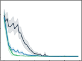

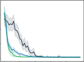

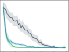

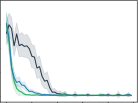

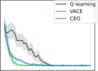

Figure 5: Performance of VACE and baselines when discovering options online every 1000 time
steps. Environment configurations are the same as in Fig. 1. We evaluate all algorithms on 100
independent runs, and the shaded region represents a 99% confidence interval.

Figure 5 shows the learning curves of VACE against the baselines of CEO and Q-learning. VACE
and CEO discover options every 1000 steps. VACE shows slightly faster learning than CEO in the
four rooms environment but shows similar performance in the nine rooms environment. This is
because, in the nine rooms environment, VACE performs better than CEO in most runs, however,
it also has a few runs where it performs significantly worse than CEO. This is further explained
in Figure 3, which shows the state visitation distributions and value propagation during such runs.
Figure 6 shows median curves in the nine rooms environments and confirms that VACE’s median
run is slightly better than CEO’s median run in the nine rooms environment.

Figure 6: Median over 100 independent runs for VACE and baselines in the nine rooms environment.

**B** **DVAEO**

In this section, we show the hierarchical DQN architecture that we use along with the learning curves
for DVAEO (with approximated option policies) compared against baselines in the four rooms and
nine rooms environments.

A Study of Value-Aware Eigenoptions

**argmax**

Figure 7: Hierarchical DQN architecture. We include a separate network to predict the value of each
option. If an option has the highest option-value, its respective option policy will choose an action.

Figure 8: Performance of DVAEO (with approximated option policies) and baselines with pixel
observations. Environment configurations are the same as in Fig. 1. We use 6 eigenoptions in the
four rooms environment and 24 eigenoptions in the nine rooms environment. We train all algorithms
for 100 independent trials, and the shaded region represents a 99% confidence interval.

Figure 7 shows the hierachical DQN architecture that we use. We use a separate network to predict
option-values for each option. To select an action greedily, we take an argmax over the action-values
from the action-value network and the option-values from the option-value networks.

Figure 8 shows the learning curves of DVAEO compared against the baselines of deep eigenoptions
and DDQN with _ϵ_ -greedy exploration. DVAEO and deep eigenoptions both use eigenoption policies
approximated using DDQN with termination after 10 steps.

**C** **Hyperparameters and Experimental Details**

We run all our experiments in modified versions of the Minigrid environment (Chevalier-Boisvert
et al., 2023) using Gym (Brockman et al., 2016). The original Minigrid environment included actions
to rotate the agent and move the agent. We use a simplified action set where the agent can move
up, down, right and left. For clarity, we outline the differences among algorithms introduced in each
section in Table 1.

For the algorithms in Figure 1, we use _ϵ_ = 0 _._ 05, _γ, γ_ _o_ = 0 _._ 99, and _α, α_ _o_ = 0 _._ 1 where _γ_ _o_ and
_α_ _o_ correspond to the discount factor and step size in the intra-option updates. We conducted a
hyperparameter sweep on the number of eigenoptions in each environment, leading to the choice
of six eigenoptions in the four rooms domain and 24 eigenoptions in the nine rooms domain. We
swept over _N_ options = _{_ 2 _,_ 4 _,_ 6 _,_ 8 _,_ 16 _,_ 24 _,_ 32 _}_ in both domains. To learn eigenoption policies, we use
Q-learning with _γ_ = 0 _._ 9 and _α_ = 0 _._ 1. We run Q-learning for 100 episodes of 1000 steps each and

Inductive Biases in Reinforcement Learning Workshop at RLC 2025

Table 1: Disambiguation of algorithms introduced in each section of the paper. Approximated refers
to non-linear approximation with neural networks. Online refers to the use of the ROD cycle to
generate eigenoptions.

**Algorithm** **Section** **Option Discovery** **Eigenvectors** **Option Policies** **Option Values**

VAEO 3 Offline Tabular Tabular Tabular
VACE 4 Online Tabular Tabular Tabular

DVAEO 5.1 Offline Tabular Tabular Approximated
DVAEO 5.2 Offline Tabular Approximated Approximated

use the intrinsic reward function. We use all bottleneck options in both environments. In the four
rooms domain there are a total of eight bottleneck options, while there are 24 bottleneck options in
the nine rooms domain.

For the algorithms in Figure 2, we use the same values as in Figure 1. Intra-option and action updates
happen only in the training phase. However, options cannot be used in the training phase and all
intra-option updates are made when primitive actions are taken.

For the algorithms in Figures 3, 5, and 6, we use _ϵ_ = 0 _._ 05; _η, α, α_ _o_ = 0 _._ 1; _γ, γ_ _o_ = 0 _._ 99, and
_N_ steps = 1000. We ran a hyperparameter sweep over _N_ steps = _{_ 100 _,_ 500 _,_ 1000 _,_ 10000 _}_ in both the
four rooms and nine rooms domains. To learn eigenoption policies, we store all samples in a dataset
and sweep over the dataset _N_ sweeps = 100 times using Q-learning with _γ_ = 0 _._ 9 and _α_ = 0 _._ 1.

For the algorithms in Figures 4 and 8, we use modified implementations from PFRL (Fujita et al.,
2021). Pixel observations from the environments were of size 52 _×_ 52 _×_ 3. For all algorithms, we
use _γ_ = 0 _._ 9, an update interval of 1 step, a target update interval of 2000 steps, a replay buffer of
size 20,000, and the Adam optimizer (Kingma & Ba, 2015) with a step size of 10 _[−]_ [5] . We use linear
_ϵ_ decay with _ϵ_ = 0 _._ 1 decaying to _ϵ_ = 0 _._ 05 over 180,000 steps. We also use six eigenoptions in the
four rooms domain and 24 eigenoptions in the nine rooms domain just as we did with our tabular
experiments. However, we did not perform a hyperparameter sweep over the number of options in
the deep RL setting.

To learn eigenoption policies, we train a DDQN model, with _ϵ_ = 1 and a replay buffer of size
100,000, on each eigenvector of the SR for 500 episodes of length 1000. When eigenoption policies
are being used in either deep eigenoptions or DVAEO, they are no longer updated and are used in
evaluation mode.

For all deep RL algorithms (including eigenoption policies), we use a two-layer convolutional network with 32 channels each, a 3 _×_ 3 kernel, and a stride of 2, followed by a fully connected layer
with 256 nodes and then the output layer with 4 nodes (one for each action) in the action-value
network and 1 node in the option-value network.

