Should We Ever Prefer Decision Transformer?

## **Should We Ever Prefer Decision Transformer** **for Offline Reinforcement Learning?**

**Yumi Omori** [1] _[∗]_ **, Zixuan Dong** [2,3] _[∗]_ **, Keith Ross** [1] _[†]_

keithwross@nyu.edu

1 **New York University Abu Dhabi**
2 **SFSC of AI and DL, NYU Shanghai**
3 **New York University**

_∗_ Equal Contribution _†_ Corresponding author

**Abstract**

In recent years, extensive work has explored the application of the Transformer architecture to reinforcement learning problems. Among these, Decision Transformer (DT)
(Chen et al., 2021) has gained particular attention in the context of offline reinforcement
learning due to its ability to frame return-conditioned policy learning as a sequence
modeling task. Most recently, Bhargava et al. (2024) provided a systematic comparison
of DT with more conventional MLP-based offline RL algorithms, including Behavior
Cloning (BC) and Conservative Q-Learning (CQL), and claimed DT exhibits superior
performance in sparse-reward and low-quality data settings.

In this paper, through experimentation on robotic manipulation tasks (Robomimic) and
locomotion benchmarks (D4RL), we show that MLP-based Filtered Behavior Cloning
(FBC) achieves competitive or superior performance compared to DT in sparse-reward
environments. FBC simply filters out low-performing trajectories from the dataset and
then performs ordinary behavior cloning on the filtered dataset. FBC is not only very
straightforward, but it also requires less training data and is computationally more efficient. The results therefore suggest that DT is not preferable for sparse-reward environments. From prior work, arguably, DT is also not preferable for dense-reward
environments. Thus, we pose the question: Is DT ever preferable?

**1** **Introduction**

The transformer architecture (Vaswani et al., 2017), originally introduced for natural language processing, has rapidly become a foundational model across multiple domains, including a broad range
of NLP and computer vision tasks. In recent years, there has been growing interest in the field of
reinforcement learning (RL) in integrating transformers into the policy learning pipeline (Li et al.,
2023), notably Decision Transformer (Chen et al., 2021), and Trajectory Transformer (Janner et al.,
2021). Among these, Decision Transformer (DT) has garnered particular attention in the context
of offline reinforcement learning due to its ability to frame return-conditioned policy learning as a
sequence modeling task.

Recently, Bhargava et al. (2024) provided a thorough comparison of DT with conventional MLPbased offline RL algorithms, including Behavior Cloning (BC) and Conservative Q-Learning (CQL)
(Kumar et al., 2020). They primarily examined two offline datasets: the D4RL (Fu et al., 2020)
dataset and the Robomimic (Zhu et al., 2020b) dataset. For both datasets, they consider both dense
reward and sparse reward variations. In the case of sparse rewards, through extensive experimentation, they argue that DT is preferable to conventional offline algorithms such as BC and CQL.

RLBrew: Ingredients for Developing Generalist Agents workshop (RLC 2025)

For the dense-reward versions, their experiments show that CQL is preferable to DT for the D4RL
dataset, and that DT is preferable to CQL for the Robomimic datasets.

In this paper, we reexamine the question of whether DT is preferable for sparse-reward environments. To this end, we present a simple yet effective MLP-based algorithm, Filtered Behavior
Cloning (FBC). FBC simply filters out low-performing trajectories from the dataset and then performs ordinary behavior cloning with the remaining trajectories. On robotic manipulation tasks
(Robomimic) and locomotion benchmarks (D4RL), we demonstrate that FBC with a small multilayer perceptron (MLP) backbone achieves competitive or superior performance compared to DT
in sparse-reward environments. For example, for the D4RL datasets with sparsification, FBC beats
DT for 7 of the 9 datasets, and improves aggregate performance by about 4%. For the Robomimic
dataset, FBC beats DT for both of the two datasets considered in Bhargava et al. (2024), and provides
an aggregate performance improvement of about 3.5%. Moreover, FBC uses fewer parameters, uses
less training data, and learns more quickly in terms of wall-clock time. To make a fair comparison,
all of the experiments reported in this paper follow closely the setups in Bhargava et al. (2024).

Additionally, we also consider Filtered Decision Transformer (FDT), where DT learns from the
same filtered dataset as FBC does. Here we find that for the D4RL benchmarks, FBC performs
better than FDT, and for the Robomimic benchmark, FBC and FDT perform about the same.

Although we do not study dense-reward environments in this paper, based on prior literature (Emmons et al., 2021; Tarasov et al., 2023; Yamagata et al., 2023; Hu et al., 2024), DT is arguably also
not preferable to conventional MLP-based offline algorithms for dense-reward datasets in general.
Thus, we pose the question: _Is DT ever preferable for raw-state robotic tasks?_

**2** **Related Work**

In addition to leveraging the attention mechanism of the Transformer to encode sequential observation histories as meaningful representations for downstream decision-making tasks (Tang & Ha,
2021; Guhur et al., 2023; Parisotto et al., 2020; Li et al., 2022), the Transformer architecture itself is
capable of formulating and solving decision-making problems as sequence modeling tasks. Some of
the major examples include Decision Transformer (DT) (Chen et al., 2021), Trajectory Transformer
(TT) (Janner et al., 2021), Generalized Decision Transformer (GDT) (Furuta et al., 2022), Bootstrapped Transformer (BooT) (Wang et al., 2022), Behavior Transformer (BeT) (Shafiullah et al.,
2022), and Q-Transformer (Chebotar et al., 2023). These extensions aim to better align transformer
models with the structure of decision-making tasks.

Decision Transformer, in particular, has received considerable attention to date with over 2000 citations as of June 2025. DT takes in as input sequences of states, actions, and return-to-goes (RTG),
and predicts the next action. Despite the appealing architectural innovation, subsequent studies have
exposed two major issues with DT: (1) failure in the face of high environmental stochasticity (Emmons et al., 2021; Paster et al., 2022) and (2) the inability to stitch suboptimal trajectories (Yamagata
et al., 2023; Hu et al., 2024).

Recently, Bhargava et al. (2024) provided a thorough comparison of DT with conventional MLPbased offline RL algorithms, including Behavior Cloning (BC) and Conservative Q-Learning (CQL)
(Kumar et al., 2020). They primarily examined two offline datasets: the D4RL (Fu et al., 2020)
dataset and the Robomimic (Zhu et al., 2020b) dataset. For both datasets, they consider both dense
reward and sparse reward variations. They conclude from their experiments that DT is a preferable
algorithm in sparse-reward, low-quality data, and long-horizon settings, when compared with vanilla
Behavior Cloning (BC) and Conservative Q-learning (CQL) (Kumar et al., 2020).

**3** **Problem Setup**

In this paper, we aim to explore whether DT is preferable in sparse reward environments. Following
the experimental design of Bhargava et al. (2024), we consider two sparse-reward settings.

Should We Ever Prefer Decision Transformer?

**Sparse Reward Setting** This setting corresponds to environments where binary rewards are assigned only at the terminal timestep of trajectories. Let _D_ = _{τ_ _i_ _}_ _[N]_ _i_ =1 [denote a dataset of] _[ N]_ [ tra-]
jectories, where each trajectory _τ_ _i_ = _{_ ( _s_ _[i]_ _t_ _[, a]_ _[i]_ _t_ _[, r]_ _t_ _[i]_ [)] _[}]_ _[T]_ _t_ =1 _[i]_ [consists of states, actions, and rewards. The]
reward function is defined as:

_r_ _t_ _[i]_ [=]

1 _,_ if _t_ = _T_ _i_ and _τ_ _i_ is successful _,_
�0 _,_ otherwise _._

For example, in a dataset with _N_ = 300 trajectories, if 100 are labeled successful, then each of these
100 trajectories receives a cumulative reward of 1; the remaining 200 receive 0.

**Sparsified Reward Setting** This setting is derived from environments that originally provide
dense per-timestep rewards. In offline reinforcement learning, where agents train on static datasets
without further interaction with the task environment, sparse-reward conditions can be simulated
by post-processing the dataset. Specifically, following Bhargava et al. (2024), we set all intermediate rewards to zero and move the total return of each trajectory to the final timestep. That is,
for a trajectory with rewards _r_ 0 _, r_ 1 _, . . ., r_ _T −_ 1, we modify it such that _r_ _t_ _←_ 0 for all _t < T −_ 1,
and _r_ _T −_ 1 _←_ [�] _[T]_ _t_ =0 _[ −]_ [1] _[r]_ _[t]_ [. This allows the offline learning agent to experience a reward distribution]
analogous to that of truly sparse environments. The key distinction is that in sparse settings, terminal rewards are inherently binary (typically 0 or 1), whereas in sparsified settings, terminal rewards
retain their original non-binary, task-specific values.

**4** **Methods**

Bhargava et al. (2024) compares Behavior Cloning (BC), Conservative Q-Learning (CQL) (Kumar
et al., 2020), and Decision Transformer (DT) (Chen et al., 2021). BC and CQL run over an MLP
backbone, whereas DT runs over a transformer backbone. We also introduce two new methods: Filtered Behavior Cloning (FBC), which runs over MLP backbones, and Filtered Decision Transformer
(FDT), which runs over transformer backbones.

**Decision Transformer (DT)** During inference, DT chooses the next action based on a fixed-length
sequence of target return-to-go, state, and action triplets from prior timesteps. Given a context length
_K_, the action prediction depends on the temporally ordered sequence _{_ ( _R_ _j_ _, s_ _j_ _, a_ _j_ ) _}_ _[t]_ _j_ = _t−K_ +1 [, where]
_R_ _j_ is the target return-to-go. The model processes this sequence through a transformer encoder that
uses sinusoidal positional encodings to preserve temporal order, and stacked self-attention layers
to model dependencies. One of the critical issues in DT is setting the target return to go. In the
sparse-reward setting, setting the target to one is a natural choice. However, in the sparsified-reward
setting, it is less obvious.

**Filtered Behavior Cloning (FBC)** We now consider a very simple algorithm, Filtered Behavior
Cloning (FBC). In FBC, we first process the offline dataset by retaining only the high-performing
trajectories. _Then we simply apply vanilla BC to the resulting dataset._ When we refer to FBC, we
assume that the underlying backbone is a Multi-Layer Perceptron (MLP).

The filtering rule is as follows. For the sparse-reward setting, we only retain the trajectories that are
successful. For the sparsified-reward setting, we only retain trajectories for which the final return
_r_ _T −_ 1 is in the top _x_ % of all the final returns in the dataset. In this paper, we use _x_ = 10%.

**Filtered Decision Transformer (FDT).** Additionally, we also consider training DT only on the
high-performing trajectories, where we filter the trajectories exactly the same way we filter the
trajectories for FBC. Although the common belief is that DT learns from both successful and unsuccessful trajectories, including this variant allows us to test whether DT truly benefits from this
design in sparse-reward scenarios.

RLBrew: Ingredients for Developing Generalist Agents workshop (RLC 2025)

**5** **Experiments**

We evaluate all algorithms introduced in Section 4 for two classes of sparse datasets : (1) a sparsified
version of the D4RL dataset (Fu et al., 2020), and (2) the sparse versions of the Robomimic tasks
in the Robosuite environment (Mandlekar et al., 2021; Zhu et al., 2020a). Our experimental design
closely follows Bhargava et al. (2024) for comparability. Results reported for DT, CQL, and BC
were obtained with exactly the same parameters reported in Bhargava et al. (2024). All results are
averaged over 5 seeds, and evaluation is conducted every 50 epochs using 50 rollouts. Bolded values
indicate the highest-performing method for each task.

**5.1** **Sparsified D4RL Locomotion**

For the D4RL sparsified setting, we evaluate on the locomotion tasks: walker2d, hopper, and
halfcheetah, using sparsified versions of the medium, medium-replay, and medium-expert datasets.
Further details are included in Appendix A.2.

Table 1: Comparison of BC, CQL, DT, FBC, and FDT across different D4RL environments. Results
show the average normalized D4RL score and its standard deviation.

**Dataset** **BC** **CQL** **DT** **FBC** **FDT**

Half Cheetah - Medium 42 _._ 76 _±_ 0 _._ 17 38 _._ 63 _±_ 0 _._ 81 42 _._ 65 _±_ 1 _._ 05 **43.51** _±_ **1.35** 42 _._ 17 _±_ 1 _._ 96

Hopper - Medium 64 _._ 35 _±_ 5 _._ 6 **73.89** _±_ **10.12** 73.40 _±_ 11.92 61 _._ 12 _±_ 10 _._ 13 63 _._ 23 _±_ 12 _._ 28
Walker - Medium 54 _._ 62 _±_ 12 _._ 04 19 _._ 31 _±_ 3 _._ 17 73 _._ 28 _±_ 11 _._ 65 **77.66** _±_ **9.61** 75 _._ 24 _±_ 13 _._ 60

**Medium Average** 53.91 _±_ 5.93 43 _._ 94 _±_ 4 _._ 70 **63.11** _±_ **8.21** 60 _._ 76 _±_ 7 _._ 03 60 _._ 21 _±_ 9 _._ 28

Half Cheetah - Medium Replay 9 _._ 81 _±_ 9 _._ 2 35 _._ 00 _±_ 2 _._ 56 39 _._ 45 _±_ 2 _._ 43 **41.83** _±_ **2.44** 33 _._ 70 _±_ 7 _._ 79
Hopper - Medium Replay 16 _._ 19 _±_ 10 _._ 8 83.10 _±_ 19.21 71 _._ 59 _±_ 10 _._ 18 **93.53** _±_ **8.05** 82 _._ 74 _±_ 13 _._ 33
Walker - Medium Replay 17 _._ 82 _±_ 4 _._ 96 29 _._ 02 _±_ 19 _._ 63 65 _._ 20 _±_ 14 _._ 31 **72.69** _±_ **19.54** 65 _._ 10 _±_ 17 _._ 58

**Medium-Replay Average** 14.6 _±_ 8.32 49 _._ 04 _±_ 13 _._ 79 58 _._ 75 _±_ 8 _._ 97 **69.35** _±_ **10.01** 60 _._ 51 _±_ 12 _._ 90

Half Cheetah - Medium Expert 42 _._ 95 _±_ 0 _._ 14 24 _._ 35 _±_ 2 _._ 38 **93.66** _±_ **1.01** 92 _._ 99 _±_ 0 _._ 98 78 _._ 24 _±_ 20 _._ 39
Hopper - Medium Expert 62 _._ 21 _±_ 6 _._ 5 42 _._ 44 _±_ 12 _._ 52 111 _._ 37 _±_ 1 _._ 02 **111.46** _±_ **0.83** 106 _._ 52 _±_ 13 _._ 28
Walker - Medium Expert 38 _±_ 9 _._ 86 21 _._ 30 _±_ 0 _._ 55 107 _._ 90 _±_ 0 _._ 98 **109.21** _±_ **0.29** **109.21** _±_ **0.51**

**Medium-Expert Average** 47.72 _±_ 5.5 29 _._ 36 _±_ 5 _._ 14 104 _._ 31 _±_ 1 _._ 00 **104.55** _±_ **0.70** 97 _._ 99 _±_ 11 _._ 39

**Total Average** 38.74 _±_ 6.58 40 _._ 78 _±_ 7 _._ 88 75 _._ 39 _±_ 6 _._ 06 **78.22** _±_ **5.91** 72 _._ 90 _±_ 11 _._ 19

Table 1 shows the final performance of the various algorithms. As also reported in Bhargava et al.
(2024), we see DT does significantly better than both BC and CQL, confirming that DT is indeed
preferable to CQL for the sparsified-reward version of D4RL. _However, we also see that FBC has a_
_higher total average than DT, and that FBC beats DT in 7 of the 9 datasets._ Interestingly, FDT does
a little worse than DT (and hence worse than FBC), which seems to indicate that DT can learn from
both high-quality and low-quality trajectories.

**5.2** **Robomimic Sparse Setting**

In the Robomimic sparse setting, as in Bhargava et al. (2024), we use the machine-generated (MG)
datasets from the Robomimic benchmark built on Robosuite. These datasets are characterized by
low-quality demonstrations. Following Bhargava et al. (2024), we consider two tasks: Lift and
PickPlaceCan. Details on the tasks and dataset configuration are provided in Appendix A.1.

Table 2: Comparison of BC, CQL, DT, FBC, and FDT methods on the Lift and Can tasks. The best
success rate is reported.

Dataset BC CQL DT FBC FDT

Lift 0.46 _±_ 0.05 0.60 _±_ 0.13 0.92 _±_ 0.03 **0.94** _±_ **0.03** 0.93 _±_ 0.05

Can 0.45 _±_ 0.09 0 _±_ 0 0.79 _±_ 0.06 0.84 _±_ 0.04 **0.89** _±_ **0.03**

**Average** 0.45 _±_ 0.07 0.30 _±_ 0.07 0.86 _±_ 0.05 0.89 _±_ 0.04 **0.91** _±_ **0.04**

Should We Ever Prefer Decision Transformer?

Table 2 summarizes the best evaluation achieved during training. As also reported in Bhargava et al.
(2024), we see DT does significantly better than both BC and CQL, confirming that DT is indeed
preferable to CQL for these sparse-reward datasets. _However, we also see that DT, FBC, and FDT_
_all have similar performance, with FBC being a little higher than DT on both datasets, and with_
_FBC also higher than FDT on Lift and lower on Can._

**6** **Discussion**

We have just established that for the sparse datasets considered in Bhargava et al. (2024), FBC has
better performance than DT. We also observed that the training wall-clock time for DT is about
three times longer than it is for FBC. Also, the transformer employed for DT has approximately one
million parameters, whereas the MLP used for FBC has about half that number. _For sparse reward_
_environments, we therefore conclude that DT is_ **not** _preferable._

Why is it that DT does not beat simple FBC? As a thought experiment, suppose that DT did not have
the returns-to-go in training or inference. And suppose that the state is Markovian, or can be made
nearly Markovian by defining the state as the most recent _k_ states and actions. In this case, we would
expect the DT policy to resemble the BC policy obtained with an MLP. In the sparse-reward setting,
by including the return-to-go in DT, we are doing no more than indicating to DT which training
trajectories are good and which are bad. Thus, intuitively, DT in the sparse reward setting would
generate policies that are similar to FBC. In our experiments, we show that DT actually performs
somewhat worse than FBC. This could be due to a number of factors, including overfitting and poor
credit assignment.

If DT is not preferable for sparse-reward environments, is it preferable for dense-reward? (Bhargava
et al., 2024) shows that CQL beats DT for the original (i.e., not sparsified) D4RL datasets. And
although we do not provide empirical evidence here, prior literature implies that DT is also not
preferable for diverse dense-reward datasets in general (Emmons et al., 2021; Tarasov et al., 2023;
Yamagata et al., 2023; Hu et al., 2024; Bhargava et al., 2024). Thus, we argue that _DT is barely_
_preferable for raw-state robotic tasks in offline RL_ .

**7** **Conclusion**

The potential contributions of Decision Transformer (DT) can be broadly categorized into two aspects: first, conditioning on return-to-go (RTG); and second, modeling long-range temporal dependencies via attention mechanisms (Chen et al., 2021). However, increased algorithmic and architectural sophistication does not inherently lead to improved performance in offline reinforcement
learning. In sparse-reward domains, where learning signals are limited by nature, the inductive biases built into generic transformer architectures like DT often fail to yield concrete advantages over
the basic MLP trained on selectively filtered trajectories.

Our critique is not intended as a wholesale dismissal of transformer-based models. When carefully
tailored to the structure of sequential decision-making, transformers can offer genuine benefits. For
example, the Behavior Transformer (Shafiullah et al., 2022) incorporates architectural enhancements
to better model multimodal behaviors. Similarly, the Graph Decision Transformer (GDT) (Hu et al.,
2023) recasts trajectories as causal graphs, mitigating reliance on potentially uninformative RTG
signals and achieving strong results on vision-based tasks such as Atari and Gym. More recently,
the Q-value Regularized Decision Transformer (QT) (Hu et al., 2024) fuses dynamic programming
insights with sequence modeling, consistently outperforming both standard DTs and classical DPbased methods on D4RL benchmarks.

Our empirical analysis, together with Bhargava et al. (2024), calls for ongoing and continuing algorithmic and architectural improvements on top of the vanilla DT to fully unleash the power of the
transformer architecture for both dense-reward and sparse-reward RL in future studies.

RLBrew: Ingredients for Developing Generalist Agents workshop (RLC 2025)

**A** **Experiment Details**

**A.1** **Robomimic and Robosuite**

(a) PickPlaceCan (b) Lift

Figure 1: Illustrations of the _Lift_ and _PickPlaceCan_ tasks in Robosuite (Zhu et al., 2020b).

We evaluate algorithms in sparse-reward robotic manipulation tasks using the **Robosuite** simulator
(Zhu et al., 2020a) and the **Robomimic** dataset suite (Mandlekar et al., 2021). Robosuite is a modular simulation environment supporting both dense and sparse reward configurations. Following the
experimental setup of Bhargava et al. (2024), who examined both reward regimes on the _Lift_ and
_PickPlaceCan_ tasks, we focus exclusively on the sparse setting to align with the central objectives
of our study. Visual illustrations of the two tasks are provided in Figure 1, and task details are
summarized in Table 3.

Robomimic is a standardized benchmark offering human- and machine-generated demonstration
datasets. It includes three variants: Proficient Human (PH), Multi-Human (MH), and MachineGenerated (MG). As shown in Bhargava et al. (2024), behavior cloning performs well on PH and
MH datasets, while Decision Transformer shows stronger results on the MG variant. Based on these
findings, we restrict our experiments to the MG dataset, which contains the lowest-quality demonstrations. This dataset is constructed by sampling rollouts from Soft Actor-Critic (SAC) agents at
multiple training checkpoints, thus offering a diverse but suboptimal data distribution.

Table 3: Robosuite Tasks and Dataset Specifications

**Attribute** **Lift** **PickPlaceCan**

**Scene Description** A cube is placed on a table in front of
a robot arm. The cube’s position is randomized each episode.

A bin with four objects is placed in
front of the robot, with four nearby target containers. Object positions are
randomized per episode.

**Objective** Lift the cube vertically above a prede- Pick each object and place it into its
fined height. corresponding container.

**Dataset Composition** 244 / 1500 trajectories (300 rollouts ×
5 checkpoints), machine-generated via
SAC.

**Observation** **&** **Action** Observations: 18D proprioceptive in**Space** put
Actions: 7D Cartesian EE + gripper
control

**A.2** **D4RL Environments and Datasets**

716 / 3900 trajectories (300 rollouts
× 13 checkpoints), machine-generated
via SAC.

Observations: 22D proprioceptive in
put
Actions: 7D Cartesian EE + gripper
control

We perform evaluations on continuous control tasks from the **D4RL benchmark suite** (Fu et al.,
2020), a widely adopted standard for offline reinforcement learning. Accordingly, we omit detailed elaboration here. Our experiments focus on three locomotion tasks, _Hopper_, _Walker2d_, and
_HalfCheetah_, using the _Medium_, _Medium-Replay_, and _Medium-Expert_ dataset variants, following
the setup in Bhargava et al. (2024).

Should We Ever Prefer Decision Transformer?

**A.3** **Hyperparameters**

We adopt the hyperparameter setup as Bhargava et al. (2024) and report everything in Table 4 for
reproducibility.

Table 4: Hyperparameters for DT, BC, FBC, and CQL evaluations.

**Category** **Hyperparameter** **Value**

**Transformer (DT)**

Number of layers 3
Attention heads 1

Embedding dimension 128
Nonlinearity ReLU
Context length 1 (Robomimic), 20 (D4RL)
Dropout 0.1
Return-to-go (RTG) conditioning 120 (Robomimic), 6000 (HalfCheetah), 3600 (Hopper), 5000 (Walker)
Max episode length 1000

Network depth 2 layers
**MLP (BC)** Hidden units per layer 512
Nonlinearity ReLU

Batch size 512 (DT), 100 (BC)
Learning rate 10 _[−]_ [4]

**Training (DT, BC)**

**Evaluation**

**CQL**

Learning rate decay 0.1 (BC)
Grad norm clip 0.25
Weight decay 10 _[−]_ [4]

LR scheduler Linear warmup for first 10 [5] steps (DT)
Epochs 100

Frequency Every 50 epochs (Robomimic), Every 100 epochs (D4RL)
Rollouts per eval 50
Evaluation episodes 100
Seeds 5

Reference (DT) [https://github.com/kzl/decision-transformer](https://github.com/kzl/decision-transformer)

Batch size 2048

Steps per iteration 1250
Iterations 100

Discount factor 0.99
Policy learning rate 3 _×_ 10 _[−]_ [4]

Q-function learning rate 3 _×_ 10 _[−]_ [4] (D4RL), 1 _×_ 10 _[−]_ [3] (Robomimic)
Actor MLP dimensions [300, 400] (Robomimic)
Soft target update rate 5 _×_ 10 _[−]_ [3]

Target update period 1
Alpha multiplier 1
CQL n_actions 10
Min Q weight 5
CQL temperature 1
Importance sampling True
Lagrange tuning False
Target action gap -1
Lagrange threshold _τ_ 5 (Robomimic)
Reference (CQL) [https://github.com/tinkoff-ai/CORL](https://github.com/tinkoff-ai/CORL)

RLBrew: Ingredients for Developing Generalist Agents workshop (RLC 2025)

**B** **Learning Curves**

This section presents the full learning curves for all evaluated methods. Figure 2 shows training performance on the RoboMimic sparse tasks ( _Lift_ and _PickPlaceCan_ ), with 95% confidence intervals.
Figure 3 provides learning curves for the D4RL locomotion benchmarks across all nine task-dataset
combinations. CQL curves are excluded for clarity, as comprehensive results are already provided
in Bhargava et al. (2024) and fall outside the core comparative scope of this study.

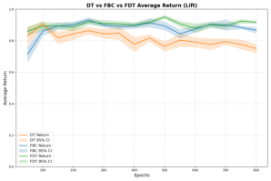

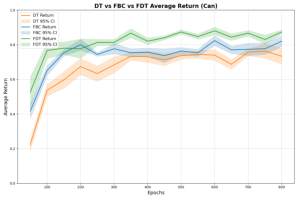

(a) Results for the task PickupCan (b) Results for the task Lift

Figure 2: Results for Robomimic tasks. Performance comparison of FBC, FDT, DT.

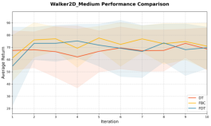

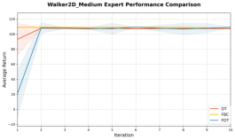

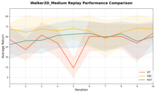

(a) Walker2d (Medium) (b) Walker2d (Medium-Expert) (c) Walker2d (Medium-Replay)

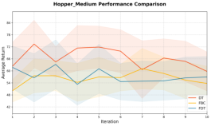

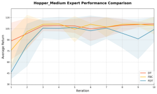

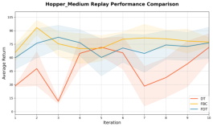

(d) Hopper (Medium) (e) Hopper (Medium-Expert) (f) Hopper (Medium-Replay)

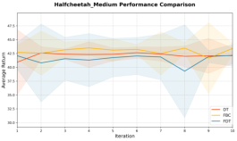

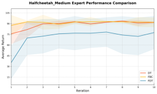

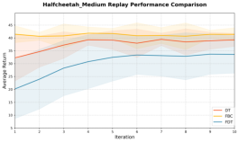

(g) Halfcheetah (Medium) (h) Halfcheetah (Medium-Expert) (i) Halfcheetah (Medium-Replay)

Figure 3: Performance of FBC, FDT, and DT on D4RL.

Should We Ever Prefer Decision Transformer?

**Acknowledgments**

This work is submitted in part by the NYU Abu Dhabi Center for Artificial Intelligence and
Robotics, funded by Tamkeen under the Research Institute Award CG010. The experiments were
carried out on the High Performance Computing resources at New York University Abu Dhabi.

**References**

D. Bhargava, S. Paternain, M. R. Rilo, L. Pinto, P. Abbeel, and A. Filos. When should we prefer
decision transformers for offline reinforcement learning? In _The Twelfth International Conference_
_on Learning Representations (ICLR)_, 2024.

Yevgen Chebotar, Quan Vuong, Karol Hausman, Fei Xia, Yao Lu, Alex Irpan, Aviral Kumar, Tianhe
Yu, Alexander Herzog, Karl Pertsch, et al. Q-transformer: Scalable offline reinforcement learning
via autoregressive q-functions. In _Conference on Robot Learning_, 2023.

L. Chen, K. Lu, A. Rajeswaran, K. Lee, A. Grover, M. Laskin, P. Abbeel, A. Srinivas, and I. Mordatch. Decision transformer: Reinforcement learning via sequence modeling. In _Advances in_
_Neural Information Processing Systems (NeurIPS)_, 2021.

Scott Emmons, Zichuan Wang, Aditya Anand, Evan Zheran Langlois, Yikai Tian, Xuechen Li, Yilun
Du, Ahmed Touati, Sudeep Choudhury, Seyed Kamyar Seyed Ghasemipour, et al. RvS: What
is essential for offline rl via supervised learning? In _NeurIPS Offline Reinforcement Learning_
_Workshop_, 2021.

Justin Fu, Aviral Kumar, Ofir Nachum, George Tucker, and Sergey Levine. D4rl: Datasets for deep
data-driven reinforcement learning. _arXiv preprint arXiv:2004.07219_, 2020.

Hiroki Furuta, Yutaka Matsuo, and Shixiang Shane Gu. Generalized decision transformer for offline
hindsight information matching. In _International Conference on Learning Representations_, 2022.

Pierre-Louis Guhur, Shizhe Chen, Ricardo Garcia Pinel, Makarand Tapaswi, Ivan Laptev, and
Cordelia Schmid. Instruction-driven history-aware policies for robotic manipulations. In _Con-_
_ference on Robot Learning_, 2023.

Shengchao Hu, Li Shen, Ya Zhang, and Dacheng Tao. Graph decision transformer. _arXiv preprint_
_arXiv:2303.03747_, 2023.

Shengchao Hu, Ziqing Fan, Chaoqin Huang, Li Shen, Ya Zhang, Yanfeng Wang, and Dacheng Tao.
Q-value regularized transformer for offline reinforcement learning. In _Proceedings of the 41st_
_International Conference on Machine Learning_, 2024.

M. Janner, Q. Li, S. Levine, and C. Finn. Trajectory transformer. In _Advances in Neural Information_
_Processing Systems (NeurIPS)_, 2021.

A. Kumar, A. Zhou, G. Tucker, and S. Levine. Conservative Q-learning for offline reinforcement
learning. In H. Larochelle, M. Ranzato, R. Hadsell, M.-F. Balcan, and H.-T. Lin (eds.), _Advances_
_in Neural Information Processing Systems (NeurIPS)_, volume 33, pp. 1179–1191. Curran Associates, Inc., 2020.

Shuang Li, Xavier Puig, Chris Paxton, Yilun Du, Clinton Wang, Linxi Fan, Tao Chen, De-An Huang,
Ekin Akyürek, Anima Anandkumar, et al. Pre-trained language models for interactive decisionmaking. _Advances in Neural Information Processing Systems_, 2022.

Wenzhe Li, Hao Luo, Zichuan Lin, Chongjie Zhang, Zongqing Lu, and Deheng Ye. A survey on
transformers in reinforcement learning. _Transactions on Machine Learning Research_, 2023.

Ajay Mandlekar, Danfei Xu, Roberto Martín-Martín Wang, Li Fei-Fei, Silvio Savarese, Yuke Zhu,
et al. What matters in learning from offline human demonstrations for robot manipulation.
_Robotics: Science and Systems (RSS)_, 2021.

RLBrew: Ingredients for Developing Generalist Agents workshop (RLC 2025)

Emilio Parisotto, Francis Song, Jack Rae, Razvan Pascanu, Caglar Gulcehre, Siddhant Jayakumar,
Max Jaderberg, Raphael Lopez Kaufman, Aidan Clark, Seb Noury, et al. Stabilizing transformers
for reinforcement learning. In _International conference on machine learning_, 2020.

Keiran Paster, Sheila McIlraith, and Jimmy Ba. You can’t count on luck: Why decision transformers
and rvs fail in stochastic environments. _Advances in neural information processing systems_, 2022.

N. M. M. Shafiullah, Z. An, Q. Luo, M. Janner, T. Jaakkola, B. Boots, and S. Levine. Behavior
transformers: Cloning _k_ modes with one stone. In _Advances in Neural Information Processing_
_Systems (NeurIPS)_, 2022.

Yujin Tang and David Ha. The sensory neuron as a transformer: Permutation-invariant neural networks for reinforcement learning. _Advances in Neural Information Processing Systems_, 2021.

Denis Tarasov, Alexander Nikulin, Dmitry Akimov, Vladislav Kurenkov, and Sergey Kolesnikov.
CORL: Research-oriented deep offline reinforcement learning library. _Advances in Neural Infor-_
_mation Processing Systems_, 2023.

A. Vaswani, N. Shazeer, N. Parmar, J. Uszkoreit, L. Jones, A. N. Gomez, L. Kaiser, and I. Polosukhin. Attention is all you need. In I. Guyon, U. V. Luxburg, S. Bengio, H. Wallach, R. Fergus,
S. Vishwanathan, and R. Garnett (eds.), _Advances in Neural Information Processing Systems 30_
_(NIPS)_ [, pp. 5998–6008. Curran Associates, Inc., 2017. URL http://papers.nips.cc/](http://papers.nips.cc/paper/7181-attention-is-all-you-need.pdf)
[paper/7181-attention-is-all-you-need.pdf.](http://papers.nips.cc/paper/7181-attention-is-all-you-need.pdf)

Kerong Wang, Hanye Zhao, Xufang Luo, Kan Ren, Weinan Zhang, and Dongsheng Li. Bootstrapped
transformer for offline reinforcement learning. _Advances in Neural Information Processing Sys-_
_tems_, 2022.

Taku Yamagata, Ahmed Khalil, and Raul Santos-Rodriguez. Q-learning decision transformer:
Leveraging dynamic programming for conditional sequence modelling in offline rl. In _Inter-_
_national Conference on Machine Learning_, 2023.

Yuke Zhu, Ajay Mandlekar, Animesh Gao, Li Fei-Fei, Silvio Savarese, et al. Robosuite: A modular simulation framework and benchmark for robot learning. _arXiv preprint arXiv:2009.12293_,
2020a.

Yuke Zhu, Josiah Wong, Ajay Mandlekar, Roberto Martín-Martín, Abhishek Joshi, Kevin Lin, Abhiram Maddukuri, Soroush Nasiriany, and Yifeng Zhu. Robosuite environments documentation.
[https://robosuite.ai/docs/modules/environments.html, 2020b.](https://robosuite.ai/docs/modules/environments.html)

