# **Local Pairwise Distance Matching for** **Backpropagation-Free Reinforcement Learning**

**Daniel Tanneberg**

Honda Research Institute EU

**Abstract.** Training neural networks with reinforcement learning
(RL) typically relies on backpropagation (BP), necessitating storage
of activations from the forward pass for subsequent backward updates.
Furthermore, backpropagating error signals through multiple layers
often leads to vanishing or exploding gradients, which can degrade
learning performance and stability. We propose a novel approach that
trains each layer of the neural network using local signals during the
forward pass in RL settings. Our approach introduces local, layer-wise
losses leveraging the principle of matching pairwise distances from
multi-dimensional scaling, enhanced with optional reward-driven
guidance. This method allows each hidden layer to be trained using
local signals computed during forward propagation, thus eliminating
the need for backward passes and storing intermediate activations.
Our experiments, conducted with policy gradient methods across
common RL benchmarks, demonstrate that this backpropagation-free
method achieves competitive performance compared to their classical
BP-based counterpart. Additionally, the proposed method enhances
stability and consistency within and across runs, and improves performance especially in challenging environments.

**1** **Introduction**

Deep reinforcement learning (DRL) has achieved remarkable advances in recent years, trained primarily by stochastic gradient descent and leveraging the power of large models and extensive data [ 1 –
5 ]. While methods like tree-search have supplemented these techniques [ 2 ], the backbone of training these large neural networks remains end-to-end learning using backpropagation (BP) [6].
Despite its pivotal role in the success of deep (reinforcement) learning [ 5, 7 ], BP has known limitations. It is not considered a biologically
plausible learning paradigm for the cortex, although some efforts have
been made to model how real neurons might implement it [ 8 – 10 ].
Additionally, backpropagation requires to store all activations, entails
delayed updates, demands computationally expensive full backward
passes, and requires full knowledge of the model. These challenges
have motivated the exploration of alternative training methods that do
not rely on BP, an area of research that dates back to earlier studies [ 11 –
13] and has gained renewed interest in recent years [10, 14–17].
Several approaches have been developed to enable backpropagationfree training of neural networks. These include (or combine) alternative gradient calculation methods during the forward pass [ 11, 15,
18, 19 ], layer-wise (pre-)training [ 12, 20 – 22 ], using local information [ 20, 23 ], backward passes of targets [ 24 – 27 ], black-box optimization [13, 14, 28], and dedicated frameworks or models [17, 29–34].
In this paper, we propose a novel backpropagation-free approach
that combines local loss functions with layer-wise training in a rein

forcement learning (RL) setting. RL imposes an additional challenge
as there is no fixed dataset. Instead, the training data is generated
dynamically by the current model parameters, and all layers of the
network contribute to this process, necessitating continuous updates.
Therefore, we leverage the concept of matching pairwise distances
from multi-dimensional scaling (MDS) [ 35 – 37 ], a well-established
non-linear dimensionality reduction technique [ 38 ]. Layers are trained
with a loss that aims to preserve the pairwise distances in the input
data at its output, relying on information available at the training layer
during the forward pass, eliminating the need for backward passes.
A similar concept of matching pairwise similarities was explored
in [ 23 ], though it was applied in supervised learning settings and
utilized additional neural structures. Additionally, predicting random
distances has been used for unsupervised representation learning [ 39 ]
for anomaly detection and clustering. Most layer-wise training approaches update each layer until convergence or add new layers
while freezing previous ones [ 10, 12, 16, 20 – 22 ]. While suitable
for (un)supervised learning with a static dataset, this is challenging in
RL settings, where the training data is generated online and depends
on the full current network’s interaction with the environment.

A notable exception to the predominant supervised learning applications is found in [ 33 ], which presents a method that fits within
frameworks utilizing dedicated neural models like predictive coding [30–32]. These methods primarily aim for biological plausibility
and are not compatible with classical neural networks. In contrast,
our proposed approach can be easily integrated into classical neural
networks and is compatible with established RL algorithms.
In summary, we introduce a method that defines a local loss for
each hidden layer based on matching pairwise distances. This method
requires no backward pass or memorization of activations and is
compatible with classical networks and any RL algorithm. We propose two variations of this pairwise distance-based local loss, with
the additional possibility of integrating domain or task-specific distance measurements. Our experiments evaluated this approach with
established policy gradient algorithms – REINFORCE [ 40 ], REINFORCE with learned baseline [ 41 ], and PPO [ 42 ] – across a set

of common RL benchmark environments. The results demonstrate

that our backpropagation-free approach can compete with classical
backpropagation-based training, and can enhance performance and
stability in many cases.

**2** **Preliminaries**

Here, we provide a brief introduction into important concepts used
in the paper. For a more detailed description we refer to existing
literature, for example [5, 37, 43].

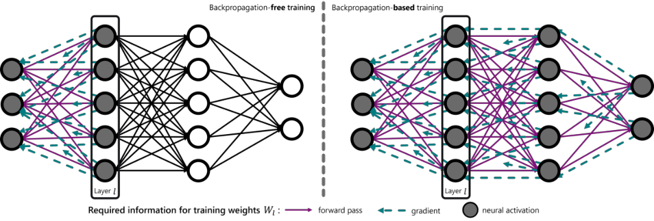

**Figure 1** : Overview of the required information in classical backpropagation-based training ( **right** ) and the proposed backpropagation-free ( **left** ) approach using
local signals when training the weights _W_ _l_ of layer _l_ . Note that for clarity not all arrows are depicted.

_2.1_ _Markov Decision Process and Reinforcement_
_Learning_

In reinforcement learning an agent interacts with the environment
and receives a reward depending on its performance on a defined
task. The aim of the agent is to learn a reward-maximizing behavior, known as policy. The problem is typically formalized as
a Markov Decision Process (MDP) and represented as a tuple
( _S, A, R, γ, P_ ), where _S_ represents the set of environment states,
_A_ is the set of agent actions, _R_ : _S × A →_ R is the reward function, _γ_ is the discount factor, and _P_ : _S × A × S →_ R is the
state transition probability distribution function. To learn a policy
_π_ : _S →A_, that describes how to behave in a state, the agent
aims to maximize the expected cumulative discounted reward (or return _G_ _t_ ), i.e., _π_ _[∗]_ = argmax _π_ E _a_ _t_ _∼π_ ( _·|s_ _t_ ) _,s_ _t_ +1 _∼P_ ( _·|s_ _t_ _,a_ _t_ ) � _G_ _t_ �, with
_G_ _t_ = [�] _[∞]_ _t_ =0 _[γ]_ _[t]_ _[R]_ [(] _[s]_ _[t]_ _[, a]_ _[t]_ [)][.]

_2.2_ _Policy Gradient Methods_

Policy gradient methods optimize parameterized policies with respect
to the return using gradient descent, i.e., _θ_ = _θ_ + _α∇_ _θ_ _J_ with learning
rate _α_ . The stochastic policy _π_ is parameterized by _θ_, typically a
neural network called _actor_, and _J_ ( _θ_ ) = E _π_ [ _G_ _t_ ] is the objective that
maximizes the return. Utilizing Markov Chain Monte-Carlo (MCMC)
to approximate the expectation with samples and the policy gradient
theorem, the episodic policy gradient algorithm REINFORCE [ 40 ]
_T_
is given by _∇_ _θ_ _J_ = E�� _t_ =1 [(] _[G]_ _[t]_ _[ −]_ _[b]_ [)] _[∇]_ _[θ]_ [ log] _[ π]_ _[θ]_ [(] _[a]_ _[t]_ _[|][s]_ _[t]_ [)] �, with an
arbitrarily chosen baseline _b_ to reduce variance and stabilize training [ 40, 44 ]. The baseline can be state dependent and learned, _state_
_value baseline_, which reduces the aggressiveness of the update [ 41 ].
Often layers are shared for learning the policy and the baseline.

_2.3_ _Actor-Critic Methods_

Actor-critic methods [ 45 ] use a second parametrization _ϕ_, again typically a neural network called _critic_, to learn the baseline. Often
_actor_ and _critic_ network share the hidden layers and the two learning objectives are weighted accordingly, similar as for learned baselines. The _actor_ chooses an action _a_ _t_ in a given state _s_ _t_, whereas
the _critic_ informs the _actor_ how good the action was. Using the
advantage function _A_ ( _s_ _t_ _, a_ _t_ ) = _Q_ ( _s_ _t_ _, a_ _t_ ) _−_ _V_ ( _s_ _t_ ) for the _critic_,
which can be estimated, for example, with temporal difference error as _A_ ( _s_ _t_ _, a_ _t_ ) = _R_ ( _s_ _t_ _, a_ _t_ ) + _γV_ ( _s_ _t_ +1 ) _−_ _V_ ( _s_ _t_ ), the Advantage Actor Critic (A2C) [ 46 ] algorithm is realized as _∇_ _θ_ _J_ =
E�� _Tt_ =1 _[A]_ [(] _[s]_ _[t]_ _[, a]_ _[t]_ [)] _[∇]_ _[θ]_ [ log] _[ π]_ _[θ]_ [(] _[a]_ _[t]_ _[|][s]_ _[t]_ [)] � . Proximal Policy Optimization

(PPO) [ 42 ] adds the idea of trust-region updates by restricting the
policy update to stay _close_ to the old policy and using a replay
buffer with the concept of importance sampling for multiple updates,
formally as _J_ _[CLIP]_ ( _θ_ ) = E _t_ � min( _r_ _t_ ( _θ_ ) _A_ ( _s_ _t_ _, a_ _t_ ) _,_ clip( _r_ _t_ ( _θ_ ) _,_ 1 _−_
_ϵ,_ 1 + _ϵ_ ) _A_ ( _s_ _t_ _, a_ _t_ ))� with _r_ _t_ ( _θ_ ) = _ππ_ _θoldθ_ ( ( _a_ _t_ _a|_ _t_ _s|_ _t_ _s_ ) _t_ ) [the ratio indicating the]
change with respect to the old policy.

_2.4_ _Multi-dimensional Scaling_

Multi-dimensional scaling (MDS) is a technique for non-linear dimensionality reduction [ 35, 37, 38 ], typically used to map highdimensional data onto a low-dimensional representation for analyzing
and visualization. There are different realizations of MDS, using
different distance or similarity measures or cost functions to optimize [ 36, 37, 47 ]. The core idea, however, remains the same. Given a
distance matrix with pairwise distances between the data points and
a chosen dimension _N_ of the low-dimensional representation, MDS
tries to place each data point in the low-dimensional space such that
the distances are preserved, i.e., maintaining the structure of the data.

**3** **Local Pairwise Distance Matching**

Here, we first provide a high-level overview of the proposed method,
before explaining the local losses in more detail. The proposed method
is based on the observation that in neural networks the hidden layers typically learn higher-dimensional feature transformations, i.e,
transforming the input data into higher-dimensional spaces and by
this the network forms a hierarchy of features, that (ideally) make
the decisions at the last layer _easier_ . On the other hand, dimensionality reduction techniques try to map higher-dimensional data onto
lower-dimensional representations. Reversing this mapping process, a
local loss function for each layer can be formulated, that learns to map
input data into higher-dimensional feature spaces, which enables the
output layer to efficiently learn a policy. Importantly, these local loss
functions for the hidden layers do not require backpropagation and
only use local signals – see Figure 1 for a comparison of the required
information in the proposed backpropagation-free training in contrast
to classical backpropagation-based training.
Often, layers in neural networks _increase_ the dimensionality, so we
want to _reverse_ the process of (non-linear) dimensionality reduction
techniques, and learn a mapping from lower to higher dimensions –
layers can also decrease the dimensionality, but here the same idea
holds. Thus, our approach is that each hidden layer is learning a
mapping from one feature space into another feature space with the

|Col1|Col2|Col3|Col4|Col5|Col6|Col7|
|---|---|---|---|---|---|---|
||REI ~~REI~~ REI|NFORCE ~~NFORCE~~ NFORCE|~~ +~~ u  + g||||

|Col1|Col2|Col3|Col4|Col5|Col6|Col7|
|---|---|---|---|---|---|---|
||REI ~~REI~~ REI|NFORCE ~~NFORCE~~ FORCE|+V(s) ~~ +~~V~~(~~s~~)~~  +V(s)|~~ +~~ u  + g|||

|Col1|Col2|Col3|Col4|Col5|Col6|Col7|
|---|---|---|---|---|---|---|
||PPO ~~PPO~~ PPO|~~ +~~ u  + g|||||

**Figure 2** : Performance profiles [ 48 ] of the proposed backpropagation-free method, + _L_ _u_ and + _L_ _g_ respectively, and their backpropagation-based baseline. Solid
lines show the score distributions and shaded areas show pointwise 95% percentile stratified bootstrap CIs.

constraint that pairwise distances should be preserved – the _structure_
of the data should be preserved after the feature transformation. Using
only the pairwise distances between input and layer output, the learned
feature transformations are unsupervised and task-agnostic, hence,
enable a straightforward approach that may be beneficial for transfer,
multi-task, meta, and multi-agent learning. Additionally, the pairwise
distance loss can be enhanced with reward information, such that the
learned feature transformations can incorporate information about the
performance and are _guided_ towards more _useful_ transformations.

In the experiments we combined our approach with REINFORCE [ 40 ] without and with state value baseline ( + _V_ ( _s_ ) ), and
PPO [ 42 ]. Note, in contrast to unsupervised pre-training [ 49 – 51 ], our
approach works _online_ and always trains the whole network in a single
training loop. Next we describe the proposed local loss in detail.

_3.1_ _Unsupervised Pairwise Distance Loss_

For hidden layers, we define the layers’ local loss with respect to
the input, noted as matrix _X_ = [ _x_ 0 _, .., x_ _N_ ] [T] of _N_ stacked _in_ dimensional input vectors _x_ _n_ _∈_ R _[in]_ . A pairwise distance matrix
_D_ _X_ = _{d_ _i,j_ _| i, j ∈_ _N_ _}_ is constructed by calculating the distances
between all input vectors _x_ _i_, i.e., _d_ _i,j_ = _∥x_ _i_ _−_ _x_ _j_ _∥_ 1 . We used the
_ℓ_ 1 -norm as distance measurement as it is better suited for higher
dimensions [ 52 ] and worked best in preliminary tests, but other distance measurements are possible and may be adapted depending
on the domain or model. The distance matrix _D_ ¯ _X_ = _D_ _X_ _/_ max _D_ _X_, i.e., distances are normalized between _D_ _X_ is normalized as [0 _,_ 1]
to reflect relative distances.
The _out_ -dimensional output of a layer _l_ for a given input _h_ _[l]_ _i_ _[−]_ [1] is
given by _y_ _i_ _[l]_ [=] _[ act]_ [(] _[W]_ _l_ [ T] _[h]_ _[l]_ _i_ _[−]_ [1] ), with _W_ _l_ the weights of the layer and a
non-linear activation function _act_ – here we used _tanh_ as activation
function if not stated differently. Using the layers outputs _y_ _i_ _[l]_ [, the]
output distance matrix _D_ [¯] _Y_ is created similar to _D_ [¯] _X_ . Importantly, the
gradient between layers is stopped, i.e., using pytorch -like notation:
_y_ _i_ _[l]_ [=] _[ act]_ [(] _[W]_ _l_ [ T] [detach(] _[h]_ _[l]_ _i_ _[−]_ [1] )).
The hidden layers loss function is defined as minimizing the _dis-_
_tance_ between distance matrices, i.e., the learned transformation of
layer _l_ should reflect the pairwise distances in the data. In other words,
the structure of data should be preserved by matching the pairwise
distances as in MDS. To learn the weights _W_ _l_, we optimize the

where _∥·∥_ _F_ is the Frobenius norm, and both matrices are scaled by
their respective data dimensionality to counter the curse of dimensionality of distances in high-dimensional spaces, i.e., guiding the learned
distances to separate in high-dimensional spaces and not collapse to a
relative small cluster. The proposed local loss Eq. 1 does not require
backpropagation or other forms of backward passes, only forward
passes are used during inference and training.
The optimization is done with stochastic gradient descent similar
like _standard_ training of neural networks, as

_W_ _l_ = _W_ _l_ + _α∇_ _W_ _l_ _L_ _u_ ( _D_ [¯] _X_ _,_ _D_ [¯] _Y_ ) _,_ (2)

with learning rate _α_ for the Adam optimizer [53].
This training procedure is completely unsupervised and taskindependent, making it suitable for any task and setup, and the learned
hidden layers, i.e., the learned feature transformations, can be directly
transferred to other tasks (in the same domain) – making it interesting,
for example, for multi-agent setups and meta learning.

_3.2_ _Guided Pairwise Distance Loss_

Additional information like prior knowledge or rewards may be included when constructing _D_ [¯] _X_ to guide the feature learning. The target
pairwise distances can be modified with such additional information
by scaling the distances accordingly. One possible scaling is to add
a data point dependent (learned) value to the respective rows and
columns of _D_ _X_ . Given the (learned) values _v_ _i_ 1, we first shift and normalize them to be in the range [0 _,_ 1] with _v_ _i_ = _v_ _i_ _−_ min _i_ _v_ _i_ followed
by _v_ _i_ = _v_ _i_ _/_ max _i_ _v_ _i_ . Next, we reverse the values to put more focus on
the worse performing states by increasing their distances, and divide
them by two such that the total added values for each entry in the distance matrix is in [0 _,_ 1], i.e., _v_ _i_ = (1 _−v_ _i_ ) _/_ 2 . With _D_ _X_ being the original input distance matrix and _v_ the vector of transformed state values,
the modified distance matrix _D_ [ˆ] _X_ is created as _D_ [ˆ] _X_ = _D_ _X_ + _v_ + _v_ [T]

and is normalized as before as _D_ [ˆ] _X_ = _D_ [ˆ] _X_ _/_ max _D_ [ˆ] _X_ . This modified
distance matrix is used to create a loss similar to the unsupervised
loss _L_ _u_ in Eq. 1 but with _performance_ information as the

and is optimized as before with gradient descent as in Eq. 2. Similar
as different distance measurements can be used to create the distance

matrices, different modifications based on performance-based measurements can be incorporated in different ways to create different
guidance using Eq. 3.

1 In the experiments we used the normalized return (REINFORCE), the critic’s
state value (PPO), and the learned baseline (+ _V_ ( _s_ )) respectively.

**4** **Experiments**

We evaluated the proposed method in 8 RL benchmarks using gymnasium [ 54 ] and mujoco [ 55 ]. The used environments span from rather simpler and discrete action spaces, e.g.,
CartPole-v1, up to more complex and continuous action spaces,
e.g., HalfCheetah-v4 . To show the compatibility with different
RL algorithms, we evaluated our approach with and against the following algorithms: REINFORCE [ 40 ] without and with state value
baseline ( + _V_ ( _s_ ) ), and PPO [ 42 ]. For each environment, we compared
the three baseline algorithms using backpropagation-based training
(updating all layers with the RL algorithm) against the combination of
the RL algorithm (updating only the output layer) with our proposed
backpropagation-free local losses + _L_ _u_ and + _L_ _g_ respectively.

_4.1_ _Setup & Parameters_
**Table 1** : Parameters.

For all experiments we use parameter value

For all experiments we use parameter value
the settings and hyperparam- network size [128 _,_ 256]
eters listed in Table 1, with non-linearity _tanh_
the following exceptions. _γ_ 0 _._ 99

_σ_ [2] 0 _._ 1

Learning rate _α_ was set to

_α_ 3 _e_ _[−]_ [4]

5 _e_ _[−]_ [4] for CartPole-v1, _g_ _clip_ 1
Acrobot-v1, and _w_ _val_ 0 _._ 5
InvertedPendulum-v4 ; PPO specific
to 1 _e_ _[−]_ [4] for Pusher-v4, and

_replayBuffer_ 2000

HalfCheetah-v4 (PPO); _batchSize_ 128
and to 5 _e_ _[−]_ [5] for Ant-v4 (PPO). _epochs_ 10
Variance for continuous _ϵ_ 0 _._ 2

_w_ _KL_ 0 _._ 01

actions _σ_ [2] set to 0 _._ 05 for

_ϵ_ _value_ 0 _._ 5

Pusher-v4, Ant-v4, and
HalfCheetah-v4 (PPO). All other parameters were kept fixed,
with _g_ _clip_ for gradient clipping and discount factor _γ_ .
For REINFORCE + _V_ ( _s_ ) and PPO, we used a shared network for
the _actor_ and _critic_ with _w_ _val_ weighting of the value loss for the
backpropagation baseline, the proposed method trains all layers independently and does not need this weighting. The additional PPO
hyperparameters are _ϵ_ for clipping, _w_ _KL_ the KL penalty weighting,
and _ϵ_ _value_ for clipping the _critic_ objective. REINFORCE and REINFORCE + _V_ ( _s_ ) use episode-based learning, i.e., one episode =
one iteration, while PPO uses a replay buffer for updates (one iteration = one PPO update using # _epochs_ ). Here we use a basic PPO
implementation without optimizations [ 56 ] and improvements like
GAE [ 57 ], i.e., the PPO performance does not reflect its best known
performance. Importantly here, however, we are interested in the relative performances and both the backpropagation baseline as well as
our approaches use this same implementation. All parameters were
set by empirical pre-evaluations and were not optimized for individual
environments or algorithms as the scope of this paper is not creating
new state of the art results, but to compare the relative performance
between backpropagation-based and -free training. Hence, we used
the same settings for all setups (environment + algorithm), with the
aforementioned variations.

network size [128 _,_ 256]
non-linearity _tanh_
_γ_ 0 _._ 99
_σ_ [2] 0 _._ 1
_α_ 3 _e_ _[−]_ [4]
_g_ _clip_ 1
_w_ _val_ 0 _._ 5

PPO specific

_replayBuffer_ 2000
_batchSize_ 128
_epochs_ 10
_ϵ_ 0 _._ 2
_w_ _KL_ 0 _._ 01
_ϵ_ _value_ 0 _._ 5

_4.2_ _Results_

All settings, each algorithm variation for each environment, were
run 20 times. The results are summarized in Figures 2 and Table 2.
In Figure 2 we show the performance profiles [ 48 ] of the different
algorithms, which is a recommended summary measure to compare
RL methods on multiple environments/tasks. The plot shows the

fraction of runs that achieve a certain relative normalized score using
all runs in all environments, which allows a qualitative comparison
and shows all score percentiles. The relative normalized score is
calculated for each environment by using min-max normalization,
with min and max computed over all algorithms and the min/max
taken over the max scores averaged over 100 iterations. As these
performance profiles show a summarized evaluation over all runs in all
environments, we can see that the (1) the proposed backpropagationfree method can compete with the backpropagation-based baselines
in terms of performance, and (2) that the proposed methods improve
stability and consistency during training as their score distributions are
higher especially in the lower score regimes, i.e., fewer runs got stuck
in bad local optima. In the high performance regions ( _τ >_ 0 _._ 98 ) we
see that the backpropagation-based REINFORCE achieves a slightly
higher peak performance. Indicating having few higher performing
runs at the cost of more bad performing runs and stability.
In Figure 3 we show the performance for each environment and algorithm. Normalized scores are calculated by averaging the smoothed
raw scores (cumulative reward) and using the 5% and 95% percentiles
as min and max for min-max normalization. This normalization al
lows for relative comparisons of the methods in the environments.
Across the different comparisons and environments, we see that the
proposed method can achieve at least comparable performance with
their BP-counterparts in all settings (as summarized before with the
performance profiles). In addition, especially in the more complex
environments ( Hopper-v4, Walker2d-v4, HalfCheetah-v4,
and Ant-v4 ) where there is no defined maximal performance, we
often see an increased performance. The improvement in stability and
consistency is also reflected in the lower spread. In some environments, it does come at the cost of speed in terms of required iterations. However, this gap is most prominent in the easier environments
( CartPole-v1, Acrobot-v1, and InvertedPendulum-v4 )
that do not require many iterations in general, whereas in the remaining environments that gap is not present.
The aforementioned improvement in stability and consistency as
well as the speed differences are evaluated in more detail in Table 2.
Here we show the (1) _Max score_ : the maximal mean score averaged
over 100 iterations, (2) _Rel. spread_ : the relative spread in % around
this max score as the 95% CI divided by _Max score_, and (3) _Rel. iter._ :
the relative iteration in which the max score was achieved in relation to

the baseline. Additionally we show and highlight the relative changes
in the these metrics for easier comparison and colored them in _green_
if the proposed method is at least as good as the baseline, and _red_ if it
is more than _1.1x_ worse.

Supporting the previous discussion, the _Max score_ is equal or
higher than the baseline in 38 _/_ 48 cases, with 8 cases only slightly
worse _>_ = _0.98x_, and two _outliers_ with _0.96x_ and _0.92x_ . Comparing the _Relative spread_ we see that in 33 _/_ 48 cases the spread is
smaller. Where the _relative spread_ is higher, we either see low absolute spread (e.g., CartPole-v1 or InvertedPendulum-v4 )
or a combination with stronger performance in unbounded environments (e.g., Hopper-v4 or Walker2d-v4 ). The comparisons of

_Relative iterations_, i.e., the learning speed, supports the statement
from above, that the learning speed gap is mostly not existent in the
more challenging environments and relative small in the easier ones.

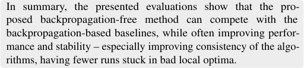

|Col1|Col2|
|---|---|
|||
|||
|||
|||

|Col1|Hopper-v4|
|---|---|
|~~2~~ 0.50 1.00 ||
|~~2~~ 0.50 1.00 ||
|~~2~~ 0.50 1.00 ||
|~~2~~ 0.50 1.00 ||
|~~2~~ 0.50 1.00 ||
|~~2~~ 0.50 1.00 ||
|~~2~~ 0.50 1.00 |~~000~~ ~~4000~~ Iteration|

|Col1|Col2|
|---|---|
|||
|||
|||
|||
|~~2000~~ ~~4000~~ Iteration|~~2000~~ ~~4000~~ Iteration|

|Col1|Col2|
|---|---|
|||
|||
|||
|||
|~~2000~~ ~~4000~~ Iteration|~~2000~~ ~~4000~~ Iteration|

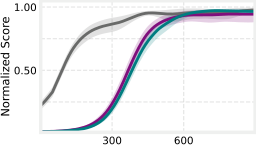

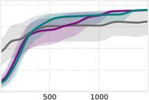

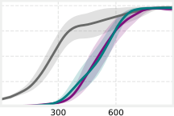

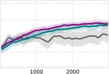

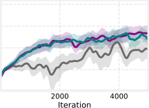

(a) Comparing against and with REINFORCE.

|Col1|Col2|
|---|---|
|||
|||
|||
|||

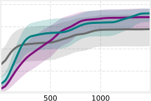

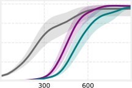

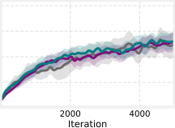

|Col1|Col2|
|---|---|
|||
|||
|||
|||
|~~2000~~ ~~4000~~ Iteration|~~2000~~ ~~4000~~ Iteration|

(b) Comparing against and with REINFORCE + _V_ ( _s_ ) .

|Col1|Hopper-v4|
|---|---|
|~~2~~ 0.50 1.00 ||
|~~2~~ 0.50 1.00 ||
|~~2~~ 0.50 1.00 ||
|~~2~~ 0.50 1.00 ||
|~~2~~ 0.50 1.00 ||
|~~2~~ 0.50 1.00 ||
|~~2~~ 0.50 1.00 |~~000~~ ~~4000~~ Iteration|

|Col1|Col2|
|---|---|
|||
|||
|||
|||
|~~2000~~ ~~4000~~ Iteration|~~2000~~ ~~4000~~ Iteration|

|Col1|Hopper-v4|
|---|---|
|~~100~~ 0.50 1.00 ||
|~~100~~ 0.50 1.00 ||
|~~100~~ 0.50 1.00 ||
|~~100~~ 0.50 1.00 ||
|~~100~~ 0.50 1.00 ||
|~~100~~ 0.50 1.00 ||
|~~100~~ 0.50 1.00 |~~0~~ ~~2000~~ Iteration|

|Col1|Col2|
|---|---|
|||
|||
|||
|||
|~~00~~ ~~2000~~ Ant~~-~~v4|~~00~~ ~~2000~~ Ant~~-~~v4|
|||
|||
|||
|||
|||
|~~00~~ ~~2000~~ Iteration|~~00~~ ~~2000~~ Iteration|

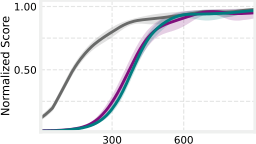

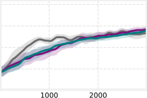

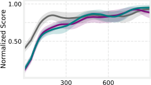

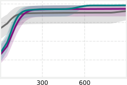

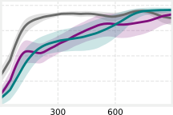

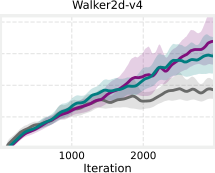

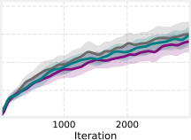

(c) Comparing against and with PPO.

**Figure 3** : Comparing (a) REINFORCE, (b) REINFORCE + _V_ ( _s_ ), and (c) PPO with backpropagation against the proposed backpropagation-free method with the
two loss variations, + _L_ _u_ and + _L_ _g_ respectively. Plots show the mean (solid line) and 95% CI (shaded area) of the normalized score over 20 runs for each method
and smoothed over 100 iterations.

**Table 2** : Comparing the proposed backpropagation-free methods ( + _L_ _u_ and + _L_ _g_ ) with and against the backpropagation-based baselines of REINFORCE (REI.),
REINFORCE + _V_ ( _s_ ) (REI. + _V_ ( _s_ ) ), and PPO. _Max score_ indicates the maximal reached cumulative reward averaged over 100 iterations, _Rel. spread_ measures
the relative spread around this maximal score as the 95% CI in relation to the maximal score (in %), and _Rel. iter._ shows the iteration in which the maximal score
was reached (for the baselines) and when this maximal score was matched by the proposed methods (if it was not reached, it is just their respective best iteration).
The relative changes are colored _green_ if the proposed method was at least as good as the baseline and _red_ if it was more than _1.1x_ worse.

CartPole-v1 Acrobot-v1 InvertedPendulum-v4 Pusher-v4

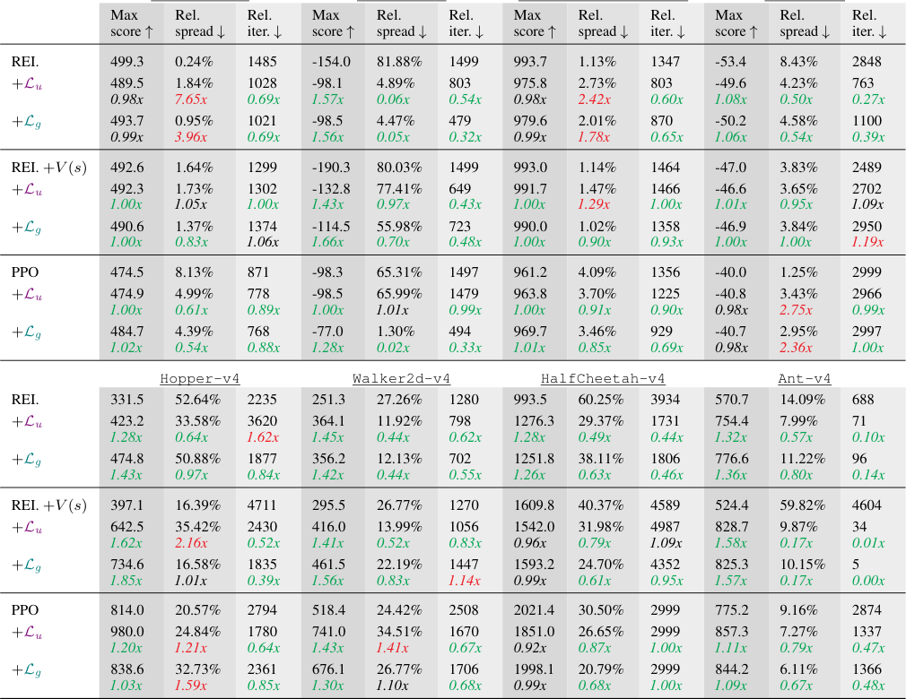

**5** **Limitations & Discussion**

The evaluations demonstrated that our proposed method offers a
promising approach to backpropagation-free training of neural policies, compatible with various reinforcement learning algorithms and
improving their learning behavior. However, there are open questions,
potential limitations regarding the scalability and transferability of
this approach, and the assumption of a global target.

**Scalability:** One potential limitation is scaling in terms of network
depth and batch size _N_ . The pairwise distance matrices, which are
_N × N_, may become computationally expensive as _N_ increases,
especially with full episode based updates. A potential solution to this
issue is the use of sparse matrices, only considering a certain distance
neighborhood, to reduce computational complexity and focus on
small neighborhoods. See Appendix A for initial results applying this
concept. With increasing network depth, i.e., more layers trained with
the pairwise distance based loss, it needs to be investigated if useful
representations are still learned.

**Global target:** For calculating the local losses, we used _D_ [¯] _X_ as
the target distance matrix for all layers, assuming a global target
available to all layers. This assumption may be circumvented by,

for example, exploring random transformations as targets [ 23 ] or
additional forward-error propagation [ 58 ]. See Appendix B for initial
results applying the idea of forward-error propagation.

**Frozen Random Layers** To evaluate if the observed benefit is
due to learning meaningful representations in higher dimensions,
and not due to the mapping to a higher dimension itself, we also
trained agents using frozen random hidden layers. The results (see
Appendix D) indicate that the proposed approach is able to learn
meaningful transformations into higher dimensions.

**Transferability:** Another potential limitation is the transferability
of the approach to different network architectures, such as convolutional layers. The choice of the underlying distance metric plays a
crucial role in this transferability. Here, we used the _ℓ_ 1 -norm as a
distance measurement suitable for higher dimensions [ 52 ] and which
worked best in preliminary tests. Calculating all pairwise distances
can become expensive with larger batch sizes (e.g., the proposed approach was on average 1 _._ 5 _x_ slower per iteration) and investigating
metrics that are suitable for fast computation via matrix operations
like _ℓ_ 2 -norm or gram matrix based metrics is a useful future direction.
Additionally, for other model architectures, specialized distance or

similarity measurements might be more beneficial. Task-specific adaptations can also be incorporated, similar to our proposed guided loss
_L_ _g_, which scales the pairwise distances with rewards or performancerelated feedback. The flexibility of our method allows for the use of
various distance measurements tailored to specific tasks or domains.

**Hyperparameters:** As with all deep (reinforcement) learning methods, hyperparameters are critical. Besides the general parameters
influencing the underlying RL algorithm (Section 4.1), the scaling of
the distance matrices can also be considered hyperparameters. The
choice of normalization and scaling should be adapted to different
environments or tasks, much like the selection of distance measurements. The here used scaling might not be the best fit in all scenarios.
Our approach’s generality allows for such adaptations, enhancing its
applicability across various settings.

**Potential Benefits and Future Directions:** Beyond the demonstrated benefits, the layer-wise unsupervised loss introduces a promising avenue for transferring or sharing learned representations. This
could be particularly useful in multi-agent setups [ 59 – 61 ], metaRL [ 62 ], or continual learning [ 63 ], where learned hidden layers
can be shared while training different output layers accordingly. In
settings where an offline dataset is available, the proposed method
may be used for offline pre-training of the representation layers [ 64 ].
This might help the RL agent to learn more efficiently and robustly.
Additionally, layer-wise training allows for different learning rates for
learning representations (hidden layers) and behavior (output layer),
accommodating various learning speeds [ 65 ]. Initial results on mixing different learned speeds are presented in Appendix C. Since our
approach does not require backpropagation, the entire network does
not need to be fully differentiable or even fully known. This opens
up interesting possibilities for incorporating black-box operations
between layers [10], further expanding the method’s versatility.

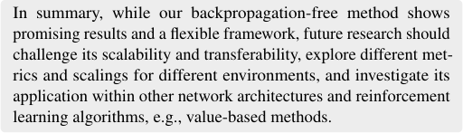

**6** **Conclusion**

In this paper, we introduced a novel approach for backpropagationfree training of neural networks in reinforcement learning settings.
Our method focuses on learning feature transformations by minimizing the difference between pairwise distance matrices in the hidden layers, leveraging the concept of multi-dimensional scaling. We
demonstrated the effectiveness of our approach across a set of common RL benchmarks, showing that it is compatible with various RL
algorithms. Our method not only matched but often improved the
performance of traditional backpropagation-based training, while also
enhancing training stability and consistency.
The versatility of the proposed method invites future research into
utilizing different distance metrics and non-linear dimensionality reduction techniques. Additionally, it offers potential for leveraging the
task-independent representation learning for transfer. As the interest
in backpropagation-free alternatives for training neural networks regains attraction [ 10, 16, 17, 33 ], we hope this work inspires new ideas
and research in alternative learning approaches, particularly within
the underexplored domain of reinforcement learning.

**References**

[1] Volodymyr Mnih, Koray Kavukcuoglu, David Silver, Andrei A. Rusu,
Joel Veness, Marc G. Bellemare, Alex Graves, Martin Riedmiller, Andreas K. Fidjeland, Georg Ostrovski, Stig Petersen, Charles Beattie, Amir
Sadik, Ioannis Antonoglou, Helen King, Dharshan Kumaran, Daan Wierstra, Shane Legg, and Demis Hassabis. Human-level control through
deep reinforcement learning. _Nature_, 2015.

[2] David Silver, Aja Huang, Chris J. Maddison, Arthur Guez, Laurent Sifre,
George van den Driessche, Julian Schrittwieser, Ioannis Antonoglou,
Veda Panneershelvam, Marc Lanctot, Sander Dieleman, Dominik Grewe,
John Nham, Nal Kalchbrenner, Ilya Sutskever, Timothy Lillicrap,
Madeleine Leach, Koray Kavukcuoglu, Thore Graepel, and Demis Hassabis. Mastering the game of Go with deep neural networks and tree
search. _Nature_, 2016.

[3] David Silver, Julian Schrittwieser, Karen Simonyan, Ioannis Antonoglou,
Aja Huang, Arthur Guez, Thomas Hubert, Lucas Baker, Matthew Lai,
Adrian Bolton, Yutian Chen, Timothy Lillicrap, Fan Hui, Laurent Sifre,
George van den Driessche, Thore Graepel, and Demis Hassabis. Mastering the game of Go without human knowledge. _Nature_, 2017.

[4] Oriol Vinyals, Igor Babuschkin, Wojciech M. Czarnecki, Michaël Mathieu, Andrew Dudzik, Junyoung Chung, David H. Choi, Richard Powell,
Timo Ewalds, Petko Georgiev, Junhyuk Oh, Dan Horgan, Manuel Kroiss,
Ivo Danihelka, Aja Huang, Laurent Sifre, Trevor Cai, John P. Agapiou,
Max Jaderberg, Alexander S. Vezhnevets, Rémi Leblond, Tobias Pohlen,
Valentin Dalibard, David Budden, Yury Sulsky, James Molloy, Tom L.
Paine, Caglar Gulcehre, Ziyu Wang, Tobias Pfaff, Yuhuai Wu, Roman
Ring, Dani Yogatama, Dario Wünsch, Katrina McKinney, Oliver Smith,
Tom Schaul, Timothy Lillicrap, Koray Kavukcuoglu, Demis Hassabis,
Chris Apps, and David Silver. Grandmaster level in StarCraft II using
multi-agent reinforcement learning. _Nature_, 2019.

[5] Xu Wang, Sen Wang, Xingxing Liang, Dawei Zhao, Jincai Huang, Xin
Xu, Bin Dai, and Qiguang Miao. Deep Reinforcement Learning: A
Survey. _IEEE Transactions on Neural Networks and Learning Systems_,
2024.

[6] David E. Rumelhart, Geoffrey E. Hinton, and Ronald J. Williams. Learning representations by back-propagating errors. _Nature_, 1986.

[7] Yann LeCun, Yoshua Bengio, and Geoffrey Hinton. Deep learning.
_Nature_, 2015.

[8] Benjamin Scellier and Yoshua Bengio. Equilibrium Propagation: Bridging the Gap between Energy-Based Models and Backpropagation. _Fron-_
_tiers in Computational Neuroscience_, 2017.

[9] Timothy P. Lillicrap, Adam Santoro, Luke Marris, Colin J. Akerman,
and Geoffrey Hinton. Backpropagation and the brain. _Nature Reviews_
_Neuroscience_, 2020.

[10] Geoffrey Hinton. The Forward-Forward Algorithm: Some Preliminary
Investigations. _arXiv_, 2022.

[11] Andrew Barto and Michael Jordan. Gradient following without backpropagation in layered networks. In _International Conference Neural_
_Nets_, 1987.

[12] Yoshua Bengio, Pascal Lamblin, Dan Popovici, and Hugo Larochelle.
Greedy Layer-Wise Training of Deep Networks. In _Neural Information_
_Processing Systems_, 2007.

[13] Daan Wierstra, Tom Schaul, Jan Peters, and Juergen Schmidhuber. Natural Evolution Strategies. _Journal of Machine Learning Research_, 2014.

[14] Tim Salimans, Jonathan Ho, Xi Chen, Szymon Sidor, and Ilya Sutskever.
Evolution Strategies as a Scalable Alternative to Reinforcement Learning.
_arXiv_, 2017.

[15] Atılım Güne¸s Baydin, Barak A. Pearlmutter, Don Syme, Frank Wood,
and Philip Torr. Gradients without Backpropagation. _arXiv_, 2022.

[16] Alexander Ororbia and Ankur Mali. The Predictive Forward-Forward
Algorithm. _arXiv_, 2023.

[17] Jonas Guan, Shon Verch, Claas Voelcker, Ethan Jackson, Nicolas Papernot, and William Cunningham. Temporal-difference learning using
distributed error signals. In _Neural Information Processing Systems_,
2024.

[18] Max Jaderberg, Wojciech Marian Czarnecki, Simon Osindero, Oriol
Vinyals, Alex Graves, David Silver, and Koray Kavukcuoglu. Decoupled
Neural Interfaces using Synthetic Gradients. In _International Conference_
_on Machine Learning_, 2017.

[19] Mengye Ren, Simon Kornblith, Renjie Liao, and Geoffrey Hinton. Scaling Forward Gradient With Local Losses. In _International Conference_
_on Learning Representations_, 2023.

[20] Geoffrey E. Hinton, Simon Osindero, and Yee-Whye Teh. A Fast Learning Algorithm for Deep Belief Nets. _Neural Computation_, 2006.

[21] Heiko Wersing and Edgar Körner. Learning Optimized Features for Hierarchical Models of Invariant Object Recognition. _Neural Computation_,
2003.

[22] Mandar Kulkarni and Shirish Karande. Layer-wise training of deep
networks using kernel similarity. _arXiv_, 2017.

[23] Arild Nøkland and Lars Hiller Eidnes. Training Neural Networks with
Local Error Signals. In _International Conference on Machine Learning_,
2019.

[24] Yoshua Bengio. How Auto-Encoders Could Provide Credit Assignment
in Deep Networks via Target Propagation. _arXiv_, 2014.

[25] Dong-Hyun Lee, Saizheng Zhang, Asja Fischer, and Yoshua Bengio. Difference Target Propagation. In _European Conference on Machine Learn-_
_ing and Principles and Practice of Knowledge Discovery in Databases_,
2015.

[26] Alexander G. Ororbia and Ankur Mali. Biologically Motivated Algorithms for Propagating Local Target Representations. In _AAAI Confer-_
_ence on Artificial Intelligence_, 2019.

[27] Alexander Meulemans, Francesco S Carzaniga, Johan A K Suykens,
João Sacramento, and Benjamin F Grewe. A Theoretical Framework for
Target Propagation. In _Neural Information Processing Systems_, 2020.

[28] Daniel Tanneberg, Elmar Rueckert, and Jan Peters. Evolutionary training
and abstraction yields algorithmic generalization of neural computers.
_Nature Machine Intelligence_, 2020.

[29] James E. Kostas, Chris Nota, and Philip S. Thomas. Asynchronous
Coagent Networks. _arXiv_, 2020.

[30] Matin Hosseini and Anthony Maida. Hierarchical Predictive Coding
Models in a Deep-Learning Framework. _arXiv_, 2020.

[31] Alexander Ororbia and Daniel Kifer. The neural coding framework for
learning generative models. _Nature Communications_, 2022.

[32] Beren Millidge, Tommaso Salvatori, Yuhang Song, Rafal Bogacz, and
Thomas Lukasiewicz. Predictive Coding: Towards a Future of Deep
Learning beyond Backpropagation? _arXiv_, 2022.

[33] Alexander Ororbia and Ankur Mali. Backprop-Free Reinforcement
Learning with Active Neural Generative Coding. In _AAAI Conference_
_on Artificial Intelligence_, 2022.

[34] Marcel Graetz, Abdullah Makkeh, Andreas C. Schneider, David A.
Ehrlich, Viola Priesemann, and Michael Wibral. Infomorphic networks:
Locally learning neural networks derived from partial information decomposition. _arXiv_, 2023.

[35] Warren S. Torgerson. Multidimensional scaling: I. Theory and method.
_Psychometrika_, 1952.

[36] Mark Steyvers. Multidimensional scaling. _Encyclopedia of cognitive_
_science_, 2002.

[37] Nasir Saeed, Haewoon Nam, Mian Imtiaz Ul Haq, and Dost Bhatti
Muhammad Saqib. A Survey on Multidimensional Scaling. _ACM_
_Computing Surveys_, 2018.

[38] John A. Lee and Michel Verleysen. Nonlinear Dimensionality Reduction.
_Springer_, 2007.

[39] Hu Wang, Guansong Pang, Chunhua Shen, and Congbo Ma. Unsupervised Representation Learning by Predicting Random Distances. In
_International Joint Conference on Artificial Intelligence_, 2020.

[40] Ronald J. Williams. Simple statistical gradient-following algorithms for
connectionist reinforcement learning. _Machine Learning_, 1992.

[41] Jincheng Mei, Wesley Chung, Valentin Thomas, Bo Dai, Csaba Szepesvari, and Dale Schuurmans. The role of baselines in policy gradient
optimization. In _Neural Information Processing Systems_, 2022.

[42] John Schulman, Filip Wolski, Prafulla Dhariwal, Alec Radford, and Oleg
Klimov. Proximal Policy Optimization Algorithms. _arXiv_, 2017.

[43] Jens Kober, J. Andrew Bagnell, and Jan Peters. Reinforcement learning
in robotics: A survey. _The International Journal of Robotics Research_,
2013.

[44] Jan Peters and Stefan Schaal. Reinforcement learning of motor skills
with policy gradients. _Neural Networks_, 2008.

[45] Ivo Grondman, Lucian Busoniu, Gabriel A. D. Lopes, and Robert
Babuska. A Survey of Actor-Critic Reinforcement Learning: Standard
and Natural Policy Gradients. _IEEE Transactions on Systems, Man, and_
_Cybernetics_, 2012.

[46] Volodymyr Mnih, Adrià Puigdomènech Badia, Mehdi Mirza, Alex
Graves, Tim Harley, Timothy P Lillicrap, David Silver, and Koray
Kavukcuoglu. Asynchronous Methods for Deep Reinforcement Learning.
In _International Conference on Machine Learning_, 2016.

[47] Jigang Sun, Malcolm Crowe, and Colin Fyfe. Extending metric multidimensional scaling with Bregman divergences. _Pattern Recognition_,
2011.

[48] Rishabh Agarwal, Max Schwarzer, Pablo Samuel Castro, Aaron
Courville, and Marc G Bellemare. Deep Reinforcement Learning at
the Edge of the Statistical Precipice. In _Neural Information Processing_
_Systems_, 2021.

[49] Nicolò Botteghi, Mannes Poel, and Christoph Brune. Unsupervised
Representation Learning in Deep Reinforcement Learning: A Review.
_arXiv_, 2022.

[50] Zhihui Xie, Zichuan Lin, Junyou Li, Shuai Li, and Deheng Ye. Pretraining in Deep Reinforcement Learning: A Survey. _arXiv_, 2022.

[51] Tingting Zhao, Ying Wang, Wei Sun, Yarui Chen, Gang Niub, and
Masashi Sugiyama. Representation Learning for Continuous Action
Spaces is Beneficial for Efficient Policy Learning. _arXiv_, 2022.

[52] Charu C. Aggarwal, Alexander Hinneburg, and Daniel A. Keim. On the
Surprising Behavior of Distance Metrics in High Dimensional Space. In
_Database Theory: International Conference_, 2001.

[53] Diederik P. Kingma and Jimmy Ba. Adam: A Method for Stochastic
Optimization. In _International Conference on Learning Representations_,
2015.

[54] Mark Towers, Ariel Kwiatkowski, Jordan Terry, John U Balis, Gianluca
De Cola, Tristan Deleu, Manuel Goulão, Andreas Kallinteris, Markus
Krimmel, Arjun KG, et al. Gymnasium: A standard interface for reinforcement learning environments. _arXiv_, 2024.

[55] Emanuel Todorov, Tom Erez, and Yuval Tassa. MuJoCo: A physics
engine for model-based control. In _IEEE/RSJ International Conference_
_on Intelligent Robots and Systems_, 2012.

[56] Shengyi Huang, Rousslan Fernand Julien Dossa, Antonin Raffin, Anssi
Kanervisto, and Weixun Wang. The 37 implementation details of proximal policy optimization. In _ICLR Blog Track_, 2022. [URL https:](https://iclr-blog-track.github.io/2022/03/25/ppo-implementation-details/)
[//iclr-blog-track.github.io/2022/03/25/ppo-implementation-details/.](https://iclr-blog-track.github.io/2022/03/25/ppo-implementation-details/)

[57] John Schulman, Philipp Moritz, Sergey Levine, Michael Jordan, and
Pieter Abbeel. High-dimensional continuous control using generalized
advantage estimation. _arXiv_, 2015.

[58] Adam A. Kohan, Edward A. Rietman, and Hava T. Siegelmann. Error
Forward-Propagation: Reusing Feedforward Connections to Propagate
Errors in Deep Learning. _arXiv_, 2018.

[59] Felipe Leno Da Silva and Anna Helena Reali Costa. A Survey on Transfer Learning for Multiagent Reinforcement Learning Systems. _Journal_
_of Artificial Intelligence Research_, 2019.

[60] Xiaobai Ma, David Isele, Jayesh K. Gupta, Kikuo Fujimura, and Mykel J.
Kochenderfer. Recursive Reasoning Graph for Multi-Agent Reinforcement Learning. In _AAAI Conference on Artificial Intelligence_, 2022.

[61] David Rother, Thomas H. Weisswange, and Jan Peters. Disentangling
Interaction Using Maximum Entropy Reinforcement Learning in MultiAgent Systems. In _European Conference on Artificial Intelligence_, 2023.

[62] Jacob Beck, Risto Vuorio, Evan Zheran Liu, Zheng Xiong, Luisa
Zintgraf, Chelsea Finn, and Shimon Whiteson. A Survey of MetaReinforcement Learning. _arXiv_, 2023.

[63] Eli Verwimp, Rahaf Aljundi, Shai Ben-David, Matthias Bethge, Andrea Cossu, Alexander Gepperth, Tyler L. Hayes, Eyke Hüllermeier,
Christopher Kanan, Dhireesha Kudithipudi, Christoph H. Lampert, Martin Mundt, Razvan Pascanu, Adrian Popescu, Andreas S. Tolias, Joost
van de Weijer, Bing Liu, Vincenzo Lomonaco, Tinne Tuytelaars, and
Gido M. Ven. Continual Learning: Applications and the Road Forward.
_arXiv_, 2023.

[64] Mengjiao Yang and Ofir Nachum. Representation matters: Offline pretraining for sequential decision making. In _International Conference on_
_Machine Learning_, 2021.

[65] Pierre Marion and Raphaël Berthier. Leveraging the two-timescale
regime to demonstrate convergence of neural networks. In _Neural Infor-_
_mation Processing Systems_, 2023.

**Appendix**

All plots show the mean (solid line) and 95% CI (shaded area) of the normalized score over 20 runs each and smoothed over 100 iterations.

**A** **Scalability – Sparse Distance Matrices**

To counter the increased computational complexity due to increased batch size _N_, one possible solution is to use sparse pairwise distance
matrices by only looking at certain neighborhoods of each data point. Figure A1 shows initial results applying this idea. Here, we only kept half
of the pairwise distances for each data point by discarding distances based on different percentiles. With (1) _q_ _k_ _≤_ 0 _._ 5 we only kept the closest
half of neighbors, with (2) _q_ _k_ _≥_ 0 _._ 5 we kept the furthest half, and with (3) _q_ _k_ _≤_ 0 _._ 25 & _q_ _k_ _≥_ 0 _._ 75 we kept the closest and furthest quarter. The
combination of considering the closest and furthest neighbors (3) seems to be a promising candidate for a trade-off between learning speed,
performance, and computational complexity.

|1.00 0.50 300 600 Iteration|Col2|Col3|
|---|---|---|
|~~300~~ ~~600~~ Iteration 0.50 1.00 |||
|~~300~~ ~~600~~ Iteration 0.50 1.00 |||
|~~300~~ ~~600~~ Iteration 0.50 1.00 |||
|~~300~~ ~~600~~ Iteration 0.50 1.00 |||

|Acrobot-v1|Col2|Col3|
|---|---|---|
||||
||||
||||
||||
||||
|~~500~~ Itera|~~1000~~ ion|~~1000~~ ion|

|Col1|Col2|
|---|---|
|||
|||
|||
|||
|~~300~~ ~~600~~ Iteration|~~300~~ ~~600~~ Iteration|

|Col1|Col2|
|---|---|
|||
|||
|||
|||
|~~1000~~ Ite|~~2000~~ ation|

**Figure A1** : Comparing the backpropagation-free method + _L_ _u_ using the full pairwise distance matrix against utilizing sparse distance matrices with only half of
the entries per data point.

**B** **Global Target – Forward-error Propagation**

In the proposed method, the target pairwise distance matrix is known to all layers as a global target. One possibility to remove this assumption is
to use an idea similar to forward-error propagation [ 58 ]. For that, each hidden layer propagates its error _e_ _l_ – here, the differences in the pairwise
distances – to the next layer in addition to the _normal_ feedforward information _h_ _l_ . The target distance matrix _D_ _X_ is then calculated from the
input of the previous layer (instead of the input data) and we use the previous error to scale this matrix (before its described normalization). For
that, the error is first normalized to be within [1 _,_ 2] with _e_ _l_ = max _|e_ _l_ _||e_ _l_ _|_ [+ 1] [, and then used to scale the target distance matrix] _[ D]_ _[X]_ [ =] _[ D]_ _[X]_ _[ ·][ e]_ _[l]_ [.]
Results using this error forward-propagation (error fp) are shown in Figure A2. The method is able to learn successful policies. Additionally,
these initial results suggest that concentrating on the errors of previous layers may increase initial learning speed and performance.

|1.00 0.50 300 600 Iteration|Col2|Col3|
|---|---|---|
|~~300~~ ~~600~~ Iteration 0.50 1.00 |||
|~~300~~ ~~600~~ Iteration 0.50 1.00 |||
|~~300~~ ~~600~~ Iteration 0.50 1.00 |||
|~~300~~ ~~600~~ Iteration 0.50 1.00 |||

|Acrobot-v1 REINFORCE +|Col2|u|
|---|---|---|
||||
||||
||||
||||
||||
|~~500~~ Itera|~~1000~~ ion|~~1000~~ ion|

|Col1|Col2|
|---|---|
|||
|||
|||
|||
|~~300~~ ~~600~~ Iteration|~~300~~ ~~600~~ Iteration|

|Col1|Col2|
|---|---|
|||
|||
|||
|||
|~~1000~~ Ite|~~2000~~ ation|

**Figure A2** : Comparing the backpropagation-free method + _L_ _u_ using the global target against the forward-error propagation idea (error fp).

**C** **Different Learning Speeds**

As all layers are trained independently with local losses – technically with separate instantiates of the optimizer – it is easy to use different
learning rates _α_ for the different layers. We denote the learning rates of the hidden layers and the output (policy) layer by _α_ _h_ and _α_ _p_ respectively.
In Figure A3 we show three simple approaches to utilize different learning speeds for the different layers, i.e., for the feature mapping learning
and policy learning: (1) higher learning speed for the hidden layers ( _α_ _h_ = _α_ _p_ _·_ 2 ), (2) lower learning speed for the hidden layers ( _α_ _h_ = _α_ _p_ _/_ 2 ),
and (3) higher learning speed for the hidden layers scaled by their _distance_ to the policy layer ( _α_ _h_ = _α_ _p_ _· d_ _l_ ), where _d_ _l_ = 2 for the layer right
before the policy layer, _d_ _l_ = 2 for the one before, and so on. The initial results show that different combinations of learning speeds can be
beneficial depending on the environment.

|1.00 0.50 300 600 Iteration|Col2|Col3|
|---|---|---|
|~~300~~ ~~600~~ Iteration 0.50 1.00 |||
|~~300~~ ~~600~~ Iteration 0.50 1.00 |||
|~~300~~ ~~600~~ Iteration 0.50 1.00 |||
|~~300~~ ~~600~~ Iteration 0.50 1.00 |||

|Col1|Col2|
|---|---|
|||
|||
|||
|||
|~~500~~ Itera|~~1000~~ ion|

|Col1|Col2|
|---|---|
|||
|||
|||
|||
|~~300~~ ~~600~~ Iteration|~~300~~ ~~600~~ Iteration|

|Col1|Col2|Col3|
|---|---|---|
||||
||||
||||
||||
|~~1000~~ ~~2000~~ Iteration|~~1000~~ ~~2000~~ Iteration|~~1000~~ ~~2000~~ Iteration|

**Figure A3** : Comparing the backpropagation-free method + _L_ _u_ with the same learning rate for all layers against variations of mixed learning rates.

**D** **Frozen Random Layers**

To evaluate that the proposed method learns a _helpful / meaningful_ transformation into higher dimensions, we compare it against using frozen
random hidden layers. The experiments summarized in Figure A4 indicate that the learned structure by the proposed method, rather than mere
high-dimensional transformation, is responsible for the reported improvements. The strength of the effect depends on the environment.

|1.00 0.50 300 600 Iteration|Col2|Col3|
|---|---|---|
|~~300~~ ~~600~~ Iteration 0.50 1.00 |||
|~~300~~ ~~600~~ Iteration 0.50 1.00 |||
|~~300~~ ~~600~~ Iteration 0.50 1.00 |||
|~~300~~ ~~600~~ Iteration 0.50 1.00 |||

|Col1|Col2|
|---|---|
|||
|||
|||
|||
|~~500~~ Itera|~~1000~~ ion|

|Col1|Col2|
|---|---|
|||
|||
|||
|||
|~~300~~ ~~600~~ Iteration|~~300~~ ~~600~~ Iteration|

|Col1|Col2|Col3|
|---|---|---|
||||
||||
||||
||||
|~~1000~~ ~~2000~~ Iteration|~~1000~~ ~~2000~~ Iteration|~~1000~~ ~~2000~~ Iteration|

**Figure A4** : Comparing the baseline, backpropagation-free method + _L_ _u_, and frozen random hidden layers.

