## **Learning Individual Intrinsic Reward in Multi-Agent Reinforcement** **Learning via Incorporating Generalized Human Expertise**

Xuefei Wu _[∗]_ [1], Xiao Yin _[∗]_ [1], Yuanyang Zhu _[†]_ [2] and Chunlin Chen [1]

_**Abstract**_ **— Efficient exploration in multi-agent reinforcement**
**learning (MARL) is a challenging problem when receiving only**
**a team reward, especially in environments with sparse rewards.**
**A powerful method to mitigate this issue involves crafting dense**
**individual rewards to guide the agents toward efficient explo-**
**ration. However, individual rewards generally rely on manually**
**engineered shaping-reward functions that lack high-order in-**
**telligence, thus it behaves ineffectively than humans regarding**
**learning and generalization in complex problems. To tackle**
**these issues, we combine the above two paradigms and propose**
**a novel framework, LIGHT (Learning Individual Intrinsic re-**
**ward via Incorporating Generalized Human experTise), which**
**can integrate human knowledge into MARL algorithms in**
**an end-to-end manner. LIGHT guides each agent to avoid**
**unnecessary exploration by considering both individual action**
**distribution and human expertise preference distribution. Then,**
**LIGHT designs individual intrinsic rewards for each agent**
**based on actionable representational transformation relevant to**
**Q-learning so that the agents align their action preferences with**
**the human expertise while maximizing the joint action value.**
**Experimental results demonstrate the superiority of our method**
**over representative baselines regarding performance and better**
**knowledge reusability across different sparse-reward tasks on**
**challenging scenarios.**

I. I NTRODUCTION

Cooperative multi-agent reinforcement learning (MARL)
is an important branch in the field of artificial intelligence (AI), playing a crucial role in sequential challenging
decision-making problems, such as in autonomous driving [1], sensor networks [2], [3] and robotics control [4].
Centralized training with decentralized execution (CTDE)
paradigm has gained substantial attention in cooperative
MARL that aims to facilitate agent cooperation by providing
global state information during training and executing only
based on local observations during execution [5], [6], [7].
Recent research has witnessed extensive investigation into
value decomposition methods under the paradigm of CTDE.
Since the advances in these MARL approaches [8], [9], [10],

[11], [12], well-designed auxiliary rewards are indispensable

  - Equal contribution, † Corresponding author.
1 Xuefei Wu, Xiao Yin, and Chunlin Chen are with the Department
of Control Science and Intelligent Engineering, School of Management
and Engineering, Nanjing University, Nanjing 210093, China. (email: xuefeiwu, xiaoyin@smail.nju.edu.cn, clchen@nju.edu.cn).
2 Yuanyang Zhu is with the Laboratory of Data Intelligence and Interdisciplinary Innovation, School of Information Management, Nanjing University,
Nanjing 210023, China. (email: yuanyangzhu@nju.edu.cn)
This work was supported in part by the China Postdoctoral Science Foundation under Grant Number 2025T180877, the National Key Research and
Development Program of China under Grant 2023YFD2001003, Major Science and Technology Project of Jiangsu Province under Grant BG2024041
and the Fundamental Research Funds for the Central Universities under

Grant 011814380048.

to guide agent collaboration or competition. Unfortunately,
many cooperative multi-agent tasks currently only offer
common team rewards [13].
In real-world multi-agent systems, sparse team rewards
present a significant challenge [14]. Existing algorithms
rely on dense-reward environments for guiding efficient
cooperation strategies [15], but these conditions rarely hold
in real-world scenarios. In MARL, handling sparse-reward
environments often involves enhancing agent exploration, a
common approach demonstrated to be effective in various
tasks [16], [17]. However, relying solely on exploration can
be insufficient for determining which specific actions trigger
rare non-zero rewards. It highlights the need for methods
that promote discovery and aid in identifying and reinforcing
these critical action-reward connections. Individual intrinsic

rewards can be a promising solution to this problem [18],

[19], [20], typically by distributing a combination of team
and individual rewards among agents [21], [22]. It can
change agents’ learning objectives, potentially leading to
unexpected behaviors divergent from desired team outcomes.
An important line of work that leverages human knowledge
is a promising method to improve the learning process
efficiently [23], [24], [25], [26]. However, a major challenge
in leveraging human knowledge is how to obtain the representation of the provided knowledge.
To solve this problem, we propose a novel method called
LIGHT, Learning Individual Intrinsic reward via Incorporating Generalized Human experTise, which can plug into
the value decomposition algorithms to promote the learning
efficiency, especially in sparse-reward setting tasks under
the widely-used assumption of CTDE. Our key insight is
that instead of using human knowledge to directly guide the
agent to interact with the environment, we integrate human
knowledge to produce the intrinsic reward to induce the agent
to achieve better exploration. Specifically, at each time step,
LIGHT learns a parameterized intrinsic reward function by
considering the action distribution and human preference that
outputs an intrinsic reward for each agent to implicitly induce
diversified behaviors.
We evaluate LIGHT on two representative benchmarks:
Level-Based Foraging (LBF) and StarCraft Multi-Agent
Challenge (SMAC), where empirical results demonstrate our
method’s superior performance over other baselines. We
conduct further component studies to show the effectiveness
of individual intrinsic reward incorporated with generalized
human expertise for agent learning, which confirms that each
component is a key part of LIGHT. We also find that the
behavior of LIGHT obtains better alignment with human

knowledge, indicating it provides an efficient method to
incorporate human preference into the learning process.

II. P RELIMINARIES

**Multi-agent Markov Decision Process.** A fully cooperative multi-agent task can be modeled as an extension
of a Decentralized Partially Observable Markov Decision
Process (Dec-POMDP), which is defined by a tuple _G_ =
_⟨N_ _, S, A, P,_ Ω _, O, r, γ⟩_, where _N_ represents a finite set of
agents with _N ≡{_ 1 _,_ 2 _, . . ., n}_, _s ∈S_ denotes the global
state of the environment. At each time step _t_, each agent
_i ∈N_ selects an action _a_ _i_ _∈A_ to formulate a joint action
_**a**_ _≡_ [ _a_ _i_ ] _[n]_ _i_ =1 _[∈A]_ _[n]_ [. The joint action leads to a shared reward]
according to the reward function _r_ ( _s,_ _**a**_ ) and a transition
to a new state based on the transition probability function
_s_ _[′]_ _∼P_ ( _·|s,_ _**a**_ ). Given the partial observability, each agent
_i_ receives an individual observation _o_ _i_ _∈_ Ω, associated
with the observation probability function _O_ ( _o_ _i_ _|s, a_ _i_ ). The
action-observation history for each agent _i_ is denoted as
_τ_ _i_ _∈T_ _≡_ (Ω _× A_ ) _[∗]_, and the joint action-observation
history is _**τ**_ _∈T_ _[n]_ . The objective for all agents is to find
an optimal joint policy _**π**_ = _⟨π_ 1 _, . . ., π_ _n_ _⟩_ to maximize the
expected cumulative reward E[ [�] _[∞]_ _t_ =0 _[γ]_ _[t]_ _[r]_ _[t]_ []][, where] _[ γ][ ∈]_ [[0] _[,]_ [ 1)]
is a discount factor.

**Centralized Training with Decentralized Execution.**
CTDE is a prevalent paradigm in the MARL, where each
agent learns a policy only on its own action observations,
and the centralized critic provides a global perspective,
offering gradient updates that are informed by the joint
state and action space. A promising enhancement of the
CTDE framework is the application of value decomposition.
This technique enables agents to individually learn utility
functions that collectively optimize the joint action-value
function, thereby providing a clear framework for credit
assignment among agents. For the integrity of multi-agent
value decomposition methods, adherence to the IndividualGlobal-Max (IGM) principle is essential. To ensure consistency [27] for multi-agent value decomposition methods, it
should satisfy the IGM principle:

argmax _a_ 1 _Q_ 1 ( _τ_ 1 _, a_ 1 )

...
argmax _a_ _n_ _Q_ _n_ ( _τ_ _n_ _, a_ _n_ )

learning from the environment and fostering behaviors motivated by the agent’s own experiences. The resultant proxy
value function for each agent is expressed as

_V_ _i_ [proxy] ( _s_ _i,t_ ) = E _a_ _i,t_ _,s_ _i,t_ +1 _,···_ � _R_ _i,t_ [proxy] � _,_ (3)

where _a_ _i_ is the action space of each agent _i_ at time step
_t_ . Then the proxy value function is applied to optimize
the agents’ policy. ICQL [28] introduces a local uncertainty
measure to enhance learning in decentralized agents through
intrinsic motivation. This technique fosters a nuanced understanding of the environment by encouraging exploration
through uncertainty-driven intrinsic rewards, thereby complementing the LIIR framework’s strategy for balancing intrinsic
and extrinsic rewards.

III. M ETHOD

In this section, we propose a novel end-to-end cooperative
MARL framework called LIGHT, solving the MARL with
sparse reward effectively via leveraging human knowledge to
generate individual intrinsic rewards. This section introduces
the methodology of LIGHT. We begin with our motivation
and then provide a detailed explanation of the implementation of LIGHT.

_A. Motivation_

Sparse-reward scenarios are typical in RL applications,
where agents may not have enough information to develop
an optimal behavior and may learn to exploit suboptimal
but easily accessible solutions. In CTDE, each agent acts
independently with local observability and receives only the
factorization global reward. This shared reward structure
complicates the learning of cooperative policies, as it can
be tough to discern which actions contribute to the success
of the group. It makes it difficult for an algorithm to successfully learn a cooperative team policy in such a setting. One
could also consider a manual specification of dense rewards.
However, designing a useful reward function is notoriously
difficult and time-consuming. This naturally leads to the
fundamental question: Can we design informative rewards
that will guide the agent to efficiently explore and accelerate
the agent’s learning process?
Recalling the learning process of humans, they rarely
approach the acquisition of new skills in a vacuum. They
adeptly draw upon a wealth of prior knowledge derived
from analogous tasks to formulate an initial strategy. Human
cognition is characterized by the ability to extract explainable, task-solving heuristics that exhibit a degree of generalizability across related domains. If this essence of human
knowledge could be distilled into the fabric of RL agents by
encoding logical inferences into the neural architectures that
underpin their learning processes. These agents could bypass
the initial trial-and-error phase and embark immediately on
the refinement of effective strategies.
One natural solution is to integrate human knowledge
to produce the reward. Following this idea, we introduce
our LIGHT framework as illustrated in Fig. 1, which
synthesizes human-derived insights into intrinsic rewards,



 _,_ (1)

argmax _**a**_ _Q_ _tot_ ( _**τ**_ _,_ _**a**_ ) =






**Individual Intrinsic Reward.** Individual intrinsic rewards

have become pivotal in MARL settings, particularly where
extrinsic rewards are sparse. The LIIR [18] incorporates
individual intrinsic rewards into the Actor-Critic (AC) algorithm by designing an attentive reward mechanism. It can
be formally defined as

_R_ [proxy] =
_i,t_

_∞_
� _γ_ _[l]_ [ �] _r_ _t_ [ex] + _l_ [+] _[ λr]_ _i,t_ [in] + _l_ � _,_ (2)

_l_ =0

where _λ_ is a tunable hyperparameter that balances the influence of global extrinsic rewards and the intrinsic reward. The
introduction of _λ_ allows for a dynamic adjustment between

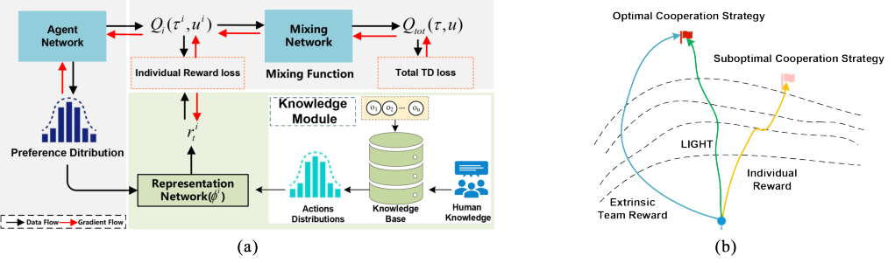

Fig. 1. The framework of LIGHT. (a) In the knowledge module, action distributions are generated through a knowledge base considering states and
human knowledge, and then it is compared with a preference distribution generated through the agent network by a representation network. The resulting
intrinsic reward is denoted as _r_ _t_ _[i]_ [. Then the agent network will output] _[ Q]_ _[i]_ � _τ_ _[i]_ _, u_ _[i]_ [�], which are mixed into a _Q_ _tot_ ( _τ, u_ ) by a mixing network. Additionally,
the parameters are optimized using both the total TD loss and the individual reward loss, allowing the framework to be trained end-to-end. (b) On the
sparse-reward scenarios, the extrinsic reward is hard to guide the agents to get the optimal strategy, and then the individual intrinsic reward is added to the
global reward together with the extrinsic reward. By maximizing the global reward, the agents can improve the learning efficiency and reduce the number
of exploration steps.

thereby enhancing exploration and optimizing collective outcomes. Within this framework, intrinsic rewards are dynamically generated by integrating a parameterized, knowledgeinformed reward model, bolstering overall learning efficiency. During training, agents receive their local observations and produce their individual action-value distribution.
Then, this estimate is contrasted with a corresponding distribution shaped by human expertise, yielding a knowledgebased intrinsic reward signal. This reward signal is tailored
to each agent’s local observations and embedded understanding, enabling LIGHT to circumvent the inefficiencies
of uninformed exploration typical of early training stages.
Consequently, LIGHT provides stable and coherent intrinsic
rewards that effectively guide each agent, facilitating a more
robust and efficient credit assignment process in MARL.

_B. The Practical Implementation of LIGHT_

Based on the previous analysis, we will give the implementation details of LIGHT. The key idea of LIGHT
is incorporating human knowledge to identify superior and
inferior behaviors during the learning process and encourage
agents to achieve superior behaviors while avoiding sticking
to inferior ones. This implicit guidance of learning by
human knowledge is imposed in a progressive manner as
the learning proceeds. First, we select a few logical rules
that align with human knowledge, where logic rules are
extracted from the offline MARL data via decision trees.
Then, we define the individual intrinsic reward for each agent
_i_ at time step _t_ as the negative Euclidean distance between
the current individual action distributions and the preference
action distribution of human knowledge. This individual intrinsic reward will be used to update the mixing network. By
maximizing the global reward, the agents can implicitly share
human knowledge to improve learning efficiency through
parameter sharing among agents.
**Human knowledge.** Here, to obtain human knowledge,
we extract logic rules from offline data [29] with decision
tree techniques. To leverage human knowledge, a major challenge is obtaining a representation of the provided knowledge. Under most circumstances, the provided knowledge is

**Algorithm 1 Rule for human knowledge on 3m map.**
**Input:** All agents’ health points _PH_ and action
set _ACT_ = _{M, ATK, N, ST_ _}_, where _M_ =
_{North, South, East, West}_ .
**Output:** The probability _p_ .

1: **for** each agent _i_ **do**

2: **if** _PH_ _i_ _<_ 15 or _ATK /∈_ _ACT_ _i_ **then**
3: Get the probability _p_, where argmax _a_ _i_ _p_ = _M_
4: **end if**

5: **end for**

imprecise and uncertain, and even covers only a small part
of the state space. The hard rules, born from the bivalent
framework, starkly contrast with the adaptable nature of
human knowledge. Such rules are ill-suited to model the rich,
often indistinct patterns of thought that humans employ, underscoring the need for a more malleable and encompassing
approach to knowledge representation. It needs one to mirror
the intricate tapestry of human understanding faithfully. To
relieve the uncertainty and imprecision, we transform the
selected logic rules into soft logic rules, where the probability
of the decision process of soft logic rules is attached to
probability _p ∈_ [0 _,_ 1] rather than the prior probability _p_ = 1.
To clearly understand the rule, we provide an example of
the rule regarding human knowledge on 3m map in SMAC
and summarize the rule accordingly. At each time step _t_, we
obtain each agent’s health point _PH_ and action set _ACT_ =
_{M, ATK, N, ST_ _}_, where M represents movement in four
directions, _ATK_ is the _attack_ action, _N_ is the _none_ action,
and _ST_ represents the death of agents. As shown in Fig. 2,
when the health point of agent-1 falls below 15 and when
actionable options of agent-2 exclude attack, the probability
distribution over available actions shifts significantly toward
movement behaviors.

**Intrinsic Reward.** The joint policy learns from trajectories
sampled by individual policies and delineates the pursuit
of maximized group utility. The individual policy _π_ _i_, in a
dynamic state of recalibration, is based on their sampling

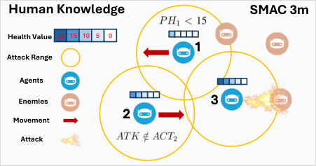

Fig. 2. Example of a task with the rule about human knowledge.

distributions in response to the iterative refinements of the
team policy. The purpose of using the intrinsic reward is
to optimize and maximize the global reward, as shown in
Fig. 1-(b). The sparse team rewards make it hard to guide the
joint policy to the optimal policy, like the blue line. Through
the factorization of team utility, each agent rarely receives
beneficial signals to update its policy towards the optimal
policy (orange line). To this end, we introduce the intrinsic
reward, which incorporates human knowledge to implicitly
guide individual agents to achieve better exploration.
At each time step _t_, the agent _i_ receives its intrinsic reward
by computing the negative Euclidean distance between its
action distribution and soft logic rules. When receiving its
local observation _o_ _[t]_ _i_ [at time step] _[ t]_ [, we compute the intrinsic]
reward _r_ _t_ _[i]_ [as]

_r_ _t_ _[i]_ [=] _[ −]_ �� _ϕ_ _i_ � _H_ ( _o_ _[i]_ _t_ [)] � _−_ _ϕ_ _[i]_ [ �] _A_ _[i]_ _t_ ��� 2 _[, t]_ [ = 1] _[, ..., T,]_ (4)

where _ϕ_ _[i]_ ( _·_ ) denotes an operable representational transformation, _H_ ( _o_ _[i]_ _t_ [)][ is the action distribution of the soft logic rules,]
and _A_ _[i]_ _t_ [is a value distribution of each agent. Each agent tries]
to reach its returns while maximizing the team’s returns. It
can also be regarded as the difference in actions between
human preferences and individual agents.
We redefine the reward function to quantify the contribution of individual agents to the success of the team,
combining the environment’s extrinsic reward with added
intrinsic incentives:

_R_ _t_ = _r_ _t_ _[ex]_ + _λ_ _N_ [1]

_N_
� _i_ =1 _[r]_ _t_ _[i,j]_ _[,]_ (5)

to minimize the following loss:

_L_ _i_ ( _θ_ _i_ ) = � _r_ _t_ _[i]_ [+] _[ γ]_ [ max] _u_ _[i]_ _[ Q]_ _θ_ _[i]_ _i_ _[−]_ � _o_ _[i]_ _t_ +1 _[, u]_ _[i]_ [�] _−_ _Q_ _[i]_ _θ_ _i_ � _o_ _[i]_ _t_ _[, u]_ _[i]_ _t_ � [�] [2] _,_

(7)
where _L_ _i_ represents the individual loss value of each agent,
and _r_ _t_ _[i]_ [stands for the intrinsic reward. The total loss function]
used in this work is expressed as follows:

_L_ = _L_ _T D_ ( _θ_ ) + _λ_ _K_ _L_ _i_ ( _θ_ _i_ ) _,_ (8)

where _λ_ _K_ is denoted as a coefficient set for individual loss.

IV. E XPERIMENTS

In this section, we evaluate LIGHT on the widely-used and
challenging tasks over Level-Based Foraging (LBF) [30] and
StarCraft Multi-Agent Challenge (SMAC) [31] benchmarks,
where SMAC includes dense-reward and sparse-reward settings. We compared with five representative MARL algorithms: MASER [19], LIIR [18], VDN [8], QMIX [9] and
QTRAN [27]. Then, we conduct ablation studies on LIGHT
to better understand each component’s effect. To ensure fair
evaluation, we conducted all experiments with five random
seeds, and the results are plotted using mean _±_ std.

V. E XPERIMENTAL E NVIRONMENT S ETTINGS

_A. Level-Based Foraging (LBF)_

LBF is a sparse reward and mixed cooperative-competitive
environment, where agents collect randomly-scattered food
items by navigating a grid world. Each agent navigates a 10
_×_ 10 grid world while observing a 5 _×_ 5 sub-grid centered
at its current position. The food collection is successful when
the sum of the near-by agents’ levels exceeds the food’s level.
Then, agents can receive rewards that are equal to the level
of the food they collect, divided by their level. We construct
two scenarios with different quantities of agents and food to
evaluate the performance of all methods, including 4 agents
with 2 food (4-agent & 2-food) and 3 agents with 3 food
(3-agent & 3-food).

_B. StarCraft Multi-Agent Challenge (SMAC)_

SMAC simulates intricate scenarios from the acclaimed

real-time strategy game StarCraft, providing a robust environment for validating our proposed methodologies. Each
agent in our setup is equipped with a local observation vector
drawing from a wealth of tactical data points, including the
proximity, placement, vitality, shield status, and classification
of both allied and adversarial units. A noteworthy feature
of the simulation is the dynamic shield regeneration that
activates after a designated duration of non-combat status,
alongside an armor mechanic that necessitates depletion
before any reduction in an agent’s health pool can occur. Our
experiments are conducted against a formidable opposition
in-game built-in AI, which operates at a difficulty level of 7.
**The Reward Setting for Two Scenarios.** In our investigation, we benchmark our LIGHT framework against leading
state-of-the-art MARL algorithms across both dense-reward
and sparse-reward environments. The specific configurations

where _R_ _t_ is used to update the mixed network parameters
_θ_ . To relieve the sparsity of extrinsic rewards, intrinsic
rewards are added to make the mixing parameters nontrivially updated at each time step.
**Overall Learning.** Under the training execution framework of CTDE, LIGHT learns by sampling a multitude of
transitions from a replay buffer, and the loss function for the
mixing network parameter is represented as

2
_L_ ( _θ_ ) = _R_ _t_ + _γ_ max _θ_ _[−]_ [(] _[s]_ _[t]_ [+1] _[, u]_ _[′]_ [)] _[ −]_ _[Q]_ _θ_ [tot] ( _s_ _t_ _, u_ _t_ ) _,_
� _u_ _[′]_ _[ Q]_ [tot] �
(6)
where _θ_ _i_ _[−]_ is the parameter of the target network for the
mixing network. The individual Q-values update the intrinsic
reward value of each agent. The overall learning objective is

TABLE I

T HE CONFIGURATIONS OF REWARD SETTINGS .

Dense reward Sparse reward
Win +200 +200
Enemy’s death +10 +10
Ally’s death -5 -5

                                  Enemy’s health -Enemy’s remaining health

                                  Ally’s health +Ally’s remaining health
Other elements +/- with other elements 

**VDN** **QMIX** **QTRAN** **MASER** **LIIR** **LIGHT(Ours)**

|Col1|Col2|Col3|Col4|Col5|Col6|Col7|Col8|2|4|
|---|---|---|---|---|---|---|---|---|---|
||3|2||||||3 2|2|
|||||||||||
||||4|||||||
|||||||||||
|||||2|1|||||
|||||||||||
|||||||||||
|||||||||||

|Col1|Col2|Col3|Col4|Col5|Col6|Col7|4|2|Col10|
|---|---|---|---|---|---|---|---|---|---|
|||||||||2|2|
||3|2||||||||
||||4|||||||
||||2|1||||||
|||||||||||
|||||||||||
|||||||||||
|||||||||||

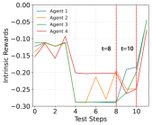

(a) Intrinsic reward curves

(b) t=8

(c) t=10

**LBF with 4-agent & 2-food**

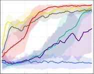

**0** **0.25** **0.50** **0.75** **1.00**

**T (mil)**

**0.8**

**0.6**

**0.4**

**0.2**

**0.0**

**0.2**

**LBF with 3-agent & 3-food**

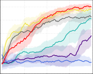

**0** **0.25** **0.50** **0.75** **1.00**

**T (mil)**

**1.0**

**0.8**

**0.6**

**0.4**

**0.2**

**0.0**

**0.2**

Fig. 3. Performance comparison with different baselines on two constructed
scenarios of LBF.

for these reward structures are detailed in Table I. The

dense-reward scenario adheres to the conventional reward

paradigm, aligning with the standard reward mechanism
implemented in the PyMARL framework. In this setup,
agents receive frequent feedback, with rewards dispensed
for both significant milestones and incremental progressions
during the course of an episode. Conversely, the sparsereward scenario in SMAC experiments aligns with the parameters set forth in the MASER framework [19]. Within
this challenging environment, the reward signal is markedly
reduced, with agents receiving feedback exclusively upon the
culmination of the task or in response to critical in-game
events such as the elimination of enemy units or the loss of
allied ones. This comparative study aims to scrutinize the
efficacy of our LIGHT framework in learning and decisionmaking processes under contrasting reward densities, thereby
offering comprehensive insights into its performance relative
to established MARL benchmarks in strategic game settings.

VI. H YPERPARAMETER S ETTINGS

The hyperparameters of configurations follow the source
code provided by the authors while keeping it consistent
across all baselines for fairness. The detailed hyperparameters for LIGHT and other baselines on LBF and SMAC can

be found in Table II. In addition, LIGHT employs greedy
action selection, and _λ_ _K_ is set to 0 _._ 02.

_A. Overall Performance Comparison_

**Performance on LBF.** It shows in Fig. 3 that LIGHT outperforms all baselines on constructed scenarios of LBF. The
poor performance of LIIR can be attributed to its failure to
explore cooperative strategies. Although MASER generates
subgoals from the experience replay buffer, it fails to perform
on all scenarios where rewards are highly sparse. QMIX

Fig. 4. An example of the intrinsic reward curves and some keyframes on
LBF with 4-agent & 2-food.

requires more steps to explore superior policies, which may
be due to the lack of intrinsic rewards for each agent,
resulting in an inability to guide agents toward efficient
exploration with sparse rewards. Despite alleviating QMIX’s
monotonic constraint, QTRAN still performs poorly due to
its insufficient constraint relaxation in challenge scenarios.
VDN yields competitive performance that spends fewer time
steps to achieve a higher return than LIGHT before 0.5 steps.
However, it may be due to neglecting human expertise, which
leads to an ultimately suboptimal performance compared
with LIGHT. In summary, LIGHT demonstrates impressive
performance on effectiveness over all baselines, indicating
that it is advantageous to consider human preferences when
designing individual intrinsic rewards for MARL.
**Performance on SMAC.** We first ran all the considered
algorithms on the conventional dense-reward setting. As
shown in Fig. 5, most algorithms can achieve near 100%
win rates on 3m, 4m, and 5m scenarios, and only LIIR
can not work well on the 2m_vs_1z map. It indicates that
LIGHT and most algorithms are able to accomplish the
tasks on scenarios with dense rewards. Note that here we

apply our LIGHT architecture to the individual Q-network
of the QMIX and denote it as LIGHT. We then evaluate
all the algorithms on the difficult sparse-reward setting. As
shown in Fig. 6, LIGHT performs better than all baselines
on all scenarios. QMIX achieves satisfactory performance,
which may contribute to the efficient credit assignment for
facilitating collaboration among agents. QTRAN does not
yield satisfactory performance, which may be due to the
relaxation in practice that is insufficient for challenging
domains. Additionally, MASER performs better than VDN
and LIIR, which should benefit from its individual intrinsic
reward for each agent based on the actionable representation.
This can help agents reach their subgoals while maximizing
the joint action value. In summary, our method achieves
impressive performance on all scenarios, demonstrating the
advantage of LIGHT with attentive design through incorporating human expertise.
We apply our LIGHT architecture to the individual Qnetwork of the fine-tuned QMIX and VDN and denote them
as LIGHT-QMIX and LIGHT-VDN, respectively. As shown
in Fig. 8, our LIGHT-QMIX surpasses the fine-tuned QMIX
by a large margin in almost all scenarios, especially in
3m, 4m, 5m, and 2m_vs_1z scenarios. Our LIGHT-VDN
also significantly improves the performance of the fine-tuned
VDN, and it even surpasses the fine-tuned QMIX in most
scenarios and achieves close performance to the LIGHTQMIX, which minimizes the gaps between the VDN and

TABLE II

T HE CONFIGURATIONS OF HYPERPARAMETER SETTINGS FOR LIGHT AND OTHER BASELINES .

LIGHT MASER LIIR QMIX VDN QTRAN
Buffer Size 5000 5000 32 5000 5000 5000

Batch Size 32 32 32 32 32 32
Test Interval (SMAC) 2000 2000 2000 2000 2000 2000
Test Interval (LBF) 1000 1000 1000 1000 1000 1000
Test Episodes 32 32 32 32 32 32
Optimizer RMSProp RMSProp RMSProp RMSProp RMSProp RMSProp
Agent Runner episode episode parallel episode episode episode
Learning Rate 0.0005 0.0005 0.0005 0.0005 0.0005 0.0005
TD Discounted Factor 0.99 0.99 0.99 0.99 0.99 0.99
Start Exploration Rate 1 1 0.5 1 1 1
End Exploration Rate 0.05 0.05 0.01 0.05 0.05 0.05
Epsilon Anneal Step 50000 50000 50000 50000 50000 50000
Target Update Interval 200 200 200 200 200 200
Mixing Embed Dimension 32 32 - 32 - 64

**4m**

**100**

**50**

**100**

**50**

**100**

**50**

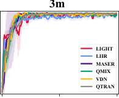

**0 0** **10** **20**

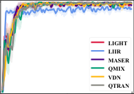

**0 0** **10** **20**

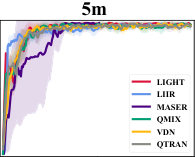

**0 0** **10** **20**

**100**

**50**

**0**

**10** **20** **10** **20** **10**
**Timesteps(1e5)** **Timesteps(1e5)** **Timesteps(1e5)**

Fig. 5. Performance comparison with baselines on dense-reward setting scenarios.

**100**

**50**

**0**

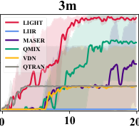

**Timesteps(1e5)**

**100**

**50**

**0**

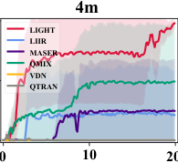

**Timesteps(1e5)**

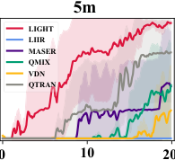

**Timesteps(1e5)**

**2m_vs_1z**

**0** **10** **20**

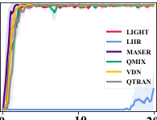

**Timesteps(1e5)**

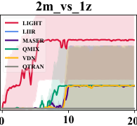

**Timesteps(1e5)**

**100**

**50**

**0**

**100**

**50**

**0**

Fig. 6. Performance comparison with baselines on sparse-reward setting scenarios.

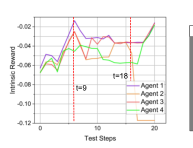

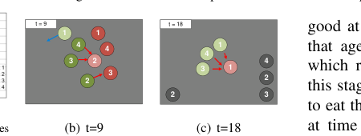

Fig. 7. An example of the intrinsic reward curves and auxiliary illustration
on 4m map. Green circles and red circles represent allies and enemies,
respectively, where the darker color indicates the higher health value of the
agent. Gray circles indicate that the agent was killed. Blue arrows represent
_move_, red arrows represent _attack_ .

QMIX algorithms.

_B. Visualizing the Learned Intrinsic Reward_

**Interpretability of LIGHT on LBF.** We visualize these
rewards to satisfy curiosity about how powerful the learned
intrinsic reward function is for the policy learning. As shown
in Fig. 4, we display some keyframes on 3-agent & 3food map, where the red arrows represent the direction of
movement. As shown in Fig. 4(a), we find that the intrinsic
reward for agent-2 increases a lot, implying that this action is

good at this time. Fig. 4(b) provides visualization evidence
that agent-4 cannot eat food of a higher level than itself,
which requires waiting to cooperate with other agents. At
this stage, agent-2 moves north and cooperates with agent-4
to eat the food item in the next step. As seen from Fig. 4(a),
at time step 10, we see that agent-1 and agent-3 achieve
the supreme intrinsic rewards compared to others, which
indicates that they all select great behaviors in this step. In
Fig. 4(c), agent-3 selects the _East_ action, and then agent-1
and agent-3 form a cooperative alliance to jointly acquire
the food item exceeding their individual capability levels.
The above analysis shows the superiority of the designed
intrinsic reward function that plays a pivotal role in providing
important feedback for agents, enabling real-time behavior
evaluation and policy optimization in complex cooperative
or competitive environments.
**Interpretability of LIGHT on SMAC.** To better understand the impact of the learned intrinsic reward function on
policy training, we propose a direct visualization of these
rewards. Specifically, we plot the intrinsic rewards assigned
to each agent at every step of a complete trajectory during

**100**

**50**

**0**

**100**

**50**

**0**

**100**

**50**

**0**

**100**

**50**

**0**

|m_vs_1z|Col2|
|---|---|
|**T-QMIX** **T-VDN**|**T-QMIX** **T-VDN**|
|**T-QMIX** **T-VDN**||
|**10** ||

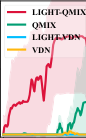

**Timesteps(1e5)**

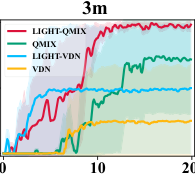

**Timesteps(1e5)**

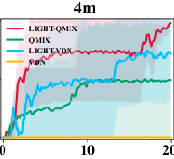

**Timesteps(1e5)**

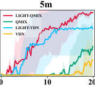

**Timesteps(1e5)**

**100**

**50**

**0**

Fig. 8. LIGHT is plugged into two different baselines on sparse-reward scenarios.

**100** **LIGHT** **2m_vs_1z** t = 21

**LIGHT w/o intrinsic reward** t=34 **2**
**LIGHT w/o knowledge** **1**

**50**

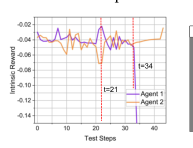

(a) Intrinsic reward curves

**0**

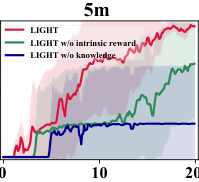

**Timesteps(1e5)**

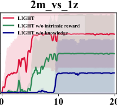

**Timesteps(1e5)**

Fig. 11. An example of the intrinsic reward curves and auxiliary illustration
on 2m_vs_1z map. Green circles and red circles represent allies and
enemies, respectively, where the darker color indicates the higher health
value of the agent. Gray circles indicate that the agent was killed. Blue
arrows represent _move_, red arrows represent _attack_ .

_C. Ablation Studies_

To understand the impact of each component of LIGHT,
we conduct ablation studies to answer the following questions: (1) How does the intrinsic reward influence performance? (2) How does human knowledge influence performance? To study components (1) and (2), LIGHT w/o
intrinsic reward represents removing intrinsic rewards, and
LIGHT w/o human knowledge represents human knowledge
with randomly generated distributions, respectively. We carry
out ablation studies on 5m and 2m_vs_1z maps. As shown in
Fig. 9, the ablation of each part of LIGHT brings a noticeable
decrease in performance. Specifically, the performance of
LIGHT w/o human knowledge decreases, which indicates
that human knowledge is beneficial in guiding the agent
to explore better. Besides, the performance of LIGHT w/o
intrinsic reward is lower than LIGHT, which indicates that
the intrinsic rewards can ultimately induce better exploration
in sparse-reward environments. To summarize, LIGHT, conditioned on all components, gives the best performance,
which could improve exploration with the given limited
learning time steps.

_D. Behavior analysis_

In addition to evaluating the performance of LIGHT,
we are more curious about whether the behavior aligns
with the given human knowledge. To study how human
knowledge influences the behavior of LIGHT, we compare
the consistent behavior of LIGHT and QMIX on 4m and
2m_vs_1z maps with sparse-reward settings. Specifically, we
make a statistical analysis of whether the action of the agent
is consistent with the given human knowledge at each time
step during testing for 100 episodes. Here, we consider the
behavior to be consistent if the agent produces an action
that is consistent with human knowledge. On the 4m and
2m_vs_1z maps, as shown in Fig. 10-(a), we can find that

Fig. 9. The ablation study results of LIGHT, LIGHT w/o intrinsic reward,
and LIGHT w/o knowledge on 5m and 2m_vs_1z scenarios.

40

30

20

15

10

5

0

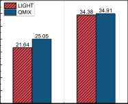
4m 2m_vs_1z

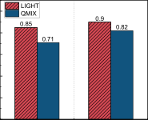

0.8

0.6

0.4

0.2

0.0
4m 2m_vs_1z

(a) Average step sizes (b) Average similarity

Fig. 10. A comparison of alignment with human knowledge preference
behaviors of LIGHT and QMIX on 4m and 2m_vs_1z maps.

testing. It is important to note that the intrinsic rewards do not
influence the learned policy and are not utilized in trajectory
generation. For better visualization and clarity, we select two
test replays from scenarios 4m and 2m_vs_1z and chart the
intrinsic rewards for all agents involved. Figures 4 and 11
illustrate these intrinsic rewards in the 4m and 2m_vs_1z
scenarios, respectively.
In Fig. 7-(a), at time step 9, the intrinsic reward of agent-1
rises to near 0 because it has the lowest health and chooses

_move_ rather than _attack_ as revealed in Fig. 7-(b). It indicates
that the _attack_ action is not a good behavior for agent-1 at
this time. After time step 18, agent-2 has been attacked until
it dies, and it receives a large negative intrinsic reward.
On the 2m_vs_1z map, we find that agent-1 receives a
larger reward at time step 21 in Fig. 11-(a). This may be
because it takes on more of the task of drawing fire and
attacking at moments of higher health than its companions,
while agent-2 stops firing and falls behind its team with a
lower intrinsic reward. After several steps, agent-2 obtains
cooperative skills, and the intrinsic rewards gradually increase. Meanwhile, agent-1 is killed and receives a lower
intrinsic reward. By visualizing the intrinsic reward curves
for the two maps, the results illustrate that the generated
intrinsic reward can effectively provide diverse feedback
signals, which are highly informative in assessing the agents’
immediate behaviors.

the average steps of LIGHT are 21 _._ 64 and 34 _._ 38 over 100
episodes, while QMIX requires 25 _._ 05 and 34 _._ 91 time steps,
respectively. It indicates that LIGHT requires fewer time
steps to solve the task with a more optimal policy. As shown
in Fig. 10-(b), LIGHT has more behaviors aligning with the
given human knowledge than QMIX across both scenarios,
which indicates that our method can efficiently capture the
given human knowledge to facilitate the learning process.
The above case studies demonstrate that LIGHT can not only
promote learning efficiency but also provide a novel method
to incorporate the given human preference into the behavior
of the agents.

VII. C ONCLUSION

In this work, we propose a novel value decomposition
framework called LIGHT to leverage human expertise to
accelerate the learning process of MARL agents. LIGHT
produces intrinsic rewards to induce the agent to explore
efficiently by considering both each agent’s action distribution and human preference at an early stage. This end-to-end
framework can be combined with existing value decomposition algorithms to deal with the sparse-reward setting tasks.
Experiments on the challenging LBF and SMAC benchmarks
show that our method obtains the best performance on almost
all sparse-reward maps, and the intrinsic reward module of
LIGHT can help the behavior of agents better align with
human preferences. In the future, this simple yet effective
method further motivates us to explore more effective ways
to utilize intrinsic rewards by incorporating human knowledge in more challenging tasks.

R EFERENCES

[1] Y. Cao, W. Yu, W. Ren, and G. Chen, “An overview of recent progress
in the study of distributed multi-agent coordination,” _IEEE Trans._
_Industr. Inform._, pp. 427–438, 2012.

[2] C. Zhang and V. Lesser, “Coordinated multi-agent reinforcement
learning in networked distributed pomdps,” in _Proceedings of the AAAI_
_Conference on Artificial Intelligence_, 2011.

[3] A. Ghorbani, A. Abid, and J. Zou, “Interpretation of neural networks
is fragile,” in _Proceedings of the AAAI Conference on Artificial_
_Intelligence_, 2019, pp. 3681–3688.

[4] M. Hüttenrauch, A. Šoši´c, and G. Neumann, “Guided deep reinforcement learning for swarm systems,” _arXiv:1709.06011_, 2017.

[5] Y. Yang, J. Hao, G. Chen, H. Tang, Y. Chen, Y. Hu, C. Fan, and
Z. Wei, “Q-value path decomposition for deep multiagent reinforcement learning,” in _Proceedings of the International Conference on_
_Machine Learning_, 2020, pp. 10 706–10 715.

[6] T. Wang, T. Gupta, A. Mahajan, B. Peng, S. Whiteson, and C. Zhang,
“RODE: Learning roles to decompose multi-agent tasks,” in _Proceed-_
_ings of the International Conference on Learning Representations_,
2020, pp. 1–20.

[7] T. Wang, H. Dong, V. Lesser, and C. Zhang, “ROMA: Multi-agent
reinforcement learning with emergent roles,” in _Proceedings of the_
_International Conference on Machine Learning_, 2020, pp. 9876–9886.

[8] P. Sunehag, G. Lever, A. Gruslys, W. M. Czarnecki, V. Zambaldi,
M. Jaderberg, M. Lanctot, N. Sonnerat, J. Z. Leibo, K. Tuyls, _et al._,
“Value-decomposition networks for cooperative multi-agent learning
based on team reward,” in _Proceedings of the International Conference_
_on Autonomous Agents and MultiAgent Systems_, 2018, pp. 2085–2087.

[9] T. Rashid, M. Samvelyan, C. Schroeder, G. Farquhar, J. Foerster,
and S. Whiteson, “QMIX: Monotonic value function factorisation
for deep multi-agent reinforcement learning,” in _Proceedings of the_
_International Conference on Machine Learning_, 2018, pp. 4295–4304.

[10] J. Wang, Z. Ren, T. Liu, Y. Yu, and C. Zhang, “QPLEX: Duplex
dueling multi-agent Q-learning,” in _Proceedings of the International_
_Conference on Learning Representations_, 2020, pp. 1–27.

[11] Z. Liu, Y. Zhu, Z. Wang, Y. Gao, and C. Chen, “Mixrts: Toward
interpretable multi-agent reinforcement learning via mixing recurrent
soft decision trees,” _IEEE Transactions on Pattern Analysis and_
_Machine Intelligence_, vol. 47, no. 5, pp. 4090–4107, 2025.

[12] Z. Liu, Y. Zhu, and C. Chen, “NA [2] Q: Neural attention additive
model for interpretable multi-agent q-learning,” in _Proceedings of the_
_International Conference on Machine Learning_, vol. 202, 2023, pp.
22 539–22 558.

[13] L. Busoniu, R. Babuska, and B. De Schutter, “A comprehensive survey
of multiagent reinforcement learning,” _IEEE Transactions on Systems,_
_Man, and Cybernetics_, vol. 38, no. 2, pp. 156–172, 2008.

[14] M. Sadeghlou, M. R. Akbarzadeh-T, and M. B. Naghibi-S, “Dynamic
agent-based reward shaping for multi-agent systems,” in _Iranian_
_Conference on Intelligent Systems_, 2014, pp. 1–6.

[15] A. Wong, T. Bäck, A. V. Kononova, and A. Plaat, “Multiagent deep
reinforcement learning: Challenges and directions towards human-like
approaches,” _arXiv:2106.15691_, 2021.

[16] I.-J. Liu, U. Jain, R. A. Yeh, and A. Schwing, “Cooperative exploration
for multi-agent deep reinforcement learning,” in _Proceedings of the_
_International conference on machine learning_, 2021, pp. 6826–6836.

[17] A. Mahajan, T. Rashid, M. Samvelyan, and S. Whiteson, “Maven:
Multi-agent variational exploration,” _Advances in neural information_
_processing systems_, vol. 32, 2019.

[18] Y. Du, L. Han, M. Fang, J. Liu, T. Dai, and D. Tao, “Liir: Learning
individual intrinsic reward in multi-agent reinforcement learning,” in
_Advances in neural information processing systems_, vol. 32, 2019.

[19] J. Jeon, W. Kim, W. Jung, and Y. Sung, “MASER: Multi-agent
reinforcement learning with subgoals generated from experience replay
buffer,” in _Proceedings of the International Conference on Machine_
_Learning_, 2022, pp. 10 041–10 052.

[20] L. Wang, Y. Zhang, Y. Hu, W. Wang, C. Zhang, Y. Gao, J. Hao, T. Lv,
and C. Fan, “Individual reward assisted multi-agent reinforcement
learning,” in _Proceedings of the International Conference on Machine_
_Learning_ . PMLR, 2022, pp. 23 417–23 432.

[21] Z. Xu, Y. Bai, B. Zhang, D. Li, and G. Fan, “Haven: hierarchical
cooperative multi-agent reinforcement learning with dual coordination
mechanism,” in _Proceedings of the AAAI Conference on Artificial_
_Intelligence_, vol. 37, no. 10, 2023, pp. 11 735–11 743.

[22] X. Xu, T. Huang, P. Wei, A. Narayan, and T.-Y. Leong, “Hierarchical
reinforcement learning in starcraft ii with human expertise in subgoals
selection,” _arXiv preprint arXiv:2008.03444_, 2020.

[23] M. Fischer, M. Balunovic, D. Drachsler-Cohen, T. Gehr, C. Zhang, and
M. Vechev, “Dl2: training and querying neural networks with logic,”
in _Proceedings of the International Conference on Machine Learning_,
2019, pp. 1931–1941.

[24] Y. Zhu, Z. Wang, C. Chen, and D. Dong, “Rule-based reinforcement learning for efficient robot navigation with space reduction,”
_IEEE/ASME Transactions on Mechatronics_, vol. 27, no. 2, pp. 846–
857, 2022.

[25] Y. Zhu, X. Yin, and C. Chen, “Extracting decision tree from trained
deep reinforcement learning in traffic signal control,” _IEEE Transac-_
_tions on Computational Social Systems_, vol. 10, no. 4, pp. 1997–2007,
2023.

[26] P. Zhang, J. Hao, W. Wang, H. Tang, Y. Ma, Y. Duan, and Y. Zheng,
“Kogun: accelerating deep reinforcement learning via integrating human suboptimal knowledge,” _arXiv preprint arXiv:2002.07418_, 2020.

[27] K. Son, D. Kim, W. J. Kang, D. E. Hostallero, and Y. Yi, “QTRAN:
Learning to factorize with transformation for cooperative multi-agent
reinforcement learning,” in _Proceedings of the International Confer-_
_ence on Machine Learning_, 2019, pp. 5887–5896.

[28] S. W. Wendelin Böhmer, Tabish Rashid, “Exploration with unreliable
intrinsic reward in multi-agent reinforcement learning,” in _Proceedings_
_of the International Conference on Machine Learning_, 2019.

[29] F. Zhang, C. Jia, Y.-C. Li, L. Yuan, Y. Yu, and Z. Zhang, “Discovering
generalizable multi-agent coordination skills from multi-task offline
data,” in _Proceedings of the International Conference on Learning_
_Representations_, 2023.

[30] F. Christianos, L. Schäfer, and S. Albrecht, “Shared experience actorcritic for multi-agent reinforcement learning,” in _Advances in Neural_
_Information Processing Systems_, 2020, pp. 10 707–10 717.

[31] M. Samvelyan, T. Rashid, C. Schroeder de Witt, G. Farquhar,
N. Nardelli, T. G. Rudner, C.-M. Hung, P. H. Torr, J. Foerster, and
S. Whiteson, “The StarCraft Multi-Agent Challenge,” in _Proceedings_
_of the International Conference on Autonomous Agents and MultiAgent_
_Systems_, 2019, pp. 2186–2188.

