1

## Mildly Conservative Regularized Evaluation for Offline Reinforcement Learning

Haohui Chen and Zhiyong Chen

_**Abstract**_ **—Offline reinforcement learning (RL) seeks to learn**
**optimal policies from static datasets without further environment**
**interaction. A key challenge is the distribution shift between**
**the learned and behavior policies, leading to out-of-distribution**
**(OOD) actions and overestimation. To prevent gross overesti-**
**mation, the value function must remain conservative; however,**
**excessive conservatism may hinder performance improvement.**
**To address this, we propose the mildly conservative regularized**
**evaluation (MCRE) framework, which balances conservatism and**
**performance by combining temporal difference (TD) error with**
**a behavior cloning term in the Bellman backup. Building on**
**this, we develop the mildly conservative regularized Q-learning**
**(MCRQ) algorithm, which integrates MCRE into an off-policy**
**actor–critic framework. Experiments show that MCRQ outper-**
**forms strong baselines and state-of-the-art offline RL algorithms**
**on benchmark datasets.**

_**Index Terms**_ **—Offline reinforcement learning, Actor-critic,**
**Value overestimation, Q-function regularization, Bellman backup**

I. I NTRODUCTION
# R EINFORCEMENT learning (RL) has achieved successacross various domains. In classical online RL, agents

learn optimal policies through real-time interaction. However,
in real-world settings, continuous interaction is often impractical due to data collection challenges, safety concerns, and
high costs. Offline RL, also known as batch RL [1], addresses
this by learning policies from static datasets generated by
unknown behavior policies, eliminating the need for environment interaction. This makes offline RL suitable for real-world
applications without simulators, such as energy optimization

[2], robotics [3], and recommendation systems [4].
A key challenge in offline RL is the distribution shift
between the learned policy and the behavior policy, as the
latter often fails to sufficiently cover the state–action space.
As a result, directly applying off-policy online RL algorithms
in offline settings typically yields poor performance [5]. The
evaluation of out-of-distribution (OOD) actions introduces
extrapolation errors, which can be amplified through bootstrapping, leading to significant overestimation bias [6].
In critic regularization, the regularization term is typically
integrated directly into the critic loss. The core idea is to
mitigate overestimation of OOD actions by regularizing the
Q-function or state value function, thereby addressing distribution shift. However, overly conservative regularization can

Haohui Chen is with the School of Automation, Central South University,
[Changsha 410083, China (e-mail: haohuichen@csu.edu.cn).](mailto:haohuichen@csu.edu.cn)
Zhiyong Chen is with the School of Engineering, University of Newcastle,
[Callaghan, NSW 2308, Australia (e-mail: zhiyong.chen@newcastle.edu.au).](mailto:zhiyong.chen@newcastle.edu.au)
Corresponding author: Zhiyong Chen.

lead to excessively low Q-values [7], limiting the agent’s
ability to explore and exploit, and exposing the actor to inaccurate Q-values, ultimately slowing convergence or leading
to suboptimal policies [8]. The mildly conservative regularized
evaluation (MCRE) proposed in this paper, a form of critic regularization, highlights how over-conservatism impedes policy
improvement by analyzing the gap between the learned and
true Q-values, as further supported by ablation experiments.
In actor regularization, policy update stability is often
achieved by constraining the target policy to remain close
to the behavior policy distribution. However, excessive regularization can hinder exploration, preventing the target policy
from fully utilizing the Q-function and impairing convergence.
Over-conservatism poses challenges even when learning from
expert datasets, regardless of whether regularization is applied
to the critic or actor [9]. Therefore, conservatism should
remain mild [10].
Temporal difference (TD) error is a fundamental mechanism
for aligning value estimates with temporal targets, guiding
policy optimization through iterative feedback. However, in
offline RL, distribution shift and limited data coverage introduce compounding biases and OOD actions, which are
amplified through TD updates. To address this, the proposed
MCRE framework integrates TD error with a behavior cloning
term to improve value estimation and reduce the impact of
distribution shift and OOD actions. MCRE combines two

complementary components: TD error regularization, which
refines value estimates via temporal feedback, and behavior
cloning, which anchors the policy to the dataset’s empirical
action distribution. Together, they form a mildly conservative
regularization term.
This dual mechanism ensures that TD updates operate
within a policy-constrained regime, suppressing OOD actions
while preserving their role as corrective signals. Crucially,
MCRE imposes only a mild constraint on the TD error,
allowing the target policy to deviate slightly from the behavior
policy and thus avoid over-conservatism. By embedding this
constraint into the standard Bellman backup, MCRE enables
effective policy optimization without incurring performance
degradation due to excessive conservatism.
The primary contributions of this paper are summarized as
follows.

1) We propose a novel framework that integrates TD error
with a behavior cloning term within the standard Bellman
backup. This unified design balances value estimation and
policy conservatism, with the behavior cloning term constraining policy updates to the support of the behavior distribution,
effectively suppressing OOD actions.

2) We theoretically prove that MCRE converges under both
sampling and no-sampling error conditions. In both cases, the
gap between the learned and true Q-value and state-value
functions is effectively bounded. Furthermore, we analyze
policy suboptimality in offline RL, showing that the difference
between the learned suboptimal policy and the true optimal
policy is also upper-bounded.
3) We provide a theoretical analysis of the Q-function
learned by MCRE under both sampling and no-sampling error,
showing that stronger constraints lead to over-conservatism,
increasing the gap between the learned and true Q-functions
and degrading performance. This finding is supported by
ablation studies, which reveal a positive correlation between
conservatism in MCRE and the strength of its constraints.
4) Based on MCRE, we propose a novel and efficient offline RL algorithm, mildly conservative regularized Q-learning
(MCRQ), which integrates an offline actor-critic framework
to effectively mitigate the challenges of over-conservatism
and distribution shift. Experimental results demonstrate that
MCRQ outperforms baselines and state-of-the-art (SOTA)
algorithms on various MuJoCo tasks in the D4RL benchmark.
The remainder of the paper is organized as follows. Section II reviews related work and the motivation behind MCRE.

Section III introduces the necessary preliminaries. Section IV
details the MCRE framework and provides its theoretical
analysis. Section V presents the practical implementation of
the MCRQ algorithm. Section VI reports experimental results
on D4RL tasks and compares MCRQ with baselines and recent
SOTA algorithms to demonstrate its superior performance. Finally, Section VII concludes the paper and discusses potential
future directions.

II. R ELATED W ORK

Offline RL algorithms that mitigate over-conservatism and
distribution shift can be classified into critic and actor regularization methods [11], as discussed below.

_A. Critic Regularization_

Critic regularization typically imposes a penalty on the TD
target or critic loss to make the learned value function closer
to the true one. Fakoor et al. [12] proposed continuous doubly
constrained (CDC), a method for batch RL that adds two
novel batch-RL regularizers to the standard off-policy actor
critic (AC) algorithm, for mitigating the overestimation bias
caused by distribution shift. To reduce high variance observed
in multi-step evaluation, Brandfonbrener et al. [13] developed
a one-step framework, which implements constrained policy
improvement. Fujimoto et al. [14] enhanced the traditional
twin delayed deep deterministic policy gradient (TD3) by integrating behavior cloning to alleviate the impact of distribution
shift. To mitigate the optimistic Q-values caused by iterative
errors during policy optimization, Kumar et al. [15] proposed
conservative Q-learning (CQL), which aims to learn a conservative Q-function. To alleviate the computational burden of
CQL, Kostrikov et al. [16] replaced the KL divergence in CQL
with the fisher divergence. Kostrikov et al. [17] introduced
implicit Q-learning (IQL), an on-policy SARSA-style offline

2

RL algorithm that uses advantage-weighted behavior cloning
to avoid querying OOD actions. Bai et al. [18] introduced
pessimistic bootstrapping for offline RL (PBRL), which applies pessimistic updates to Q-functions. Huang et al. [19]
proposed an offline actor critic framework with behavior value
regularization, which helps mitigate over-optimistic Q-values
and reduce bias.

_B. Actor Regularization_

Actor regularization usually works through ensuring target
policy stays within the distribution of behavior policy. However, this constraint tends to be overly conservative because
it requires the target policy to choose an action similar to
the behavior policy with a given state. This restriction may
affect the performance of the target policy, especially if
the behavior policy is not optimal [20]. Actor regularization
methods generally add constraints on actor loss [11]. Fujimoto et al. [21] proposed batch-constrained deep Q-learning
(BCQ), which employs a generative model to generate only
previously observed actions. However, Kumar et al. [22]
pointed out that BCQ is overly aggressive, and developed
the bootstrapping error accumulation reduction (BEAR), an
innovative constraint-based approach specifically designed to
break the chain of error propagation in Q-learning updates. Wu
et al. [23] proposed uncertainty weighted actor critic (UWAC),
which utilizes Monte Carlo dropout for uncertainty estimation,
significantly reducing computational overhead. Nair et al. [24]
proposed advantage weighted actor critic (AWAC), which
utilizes offline data and supports online fine-tuning. Ran et
al. [20] proposed policy regularization with dataset constraint
(PRDC), which utilizes OOD actions as guidance for policy
optimization when updating a policy in a given state. PRDC
imposes a milder constraint, yet still helps avoid OOD actions.

Although critic and actor regularization methods have made
significant progress in mitigating OOD actions and distribution
shift, critic regularization may lead to excessive pessimism,
especially with OOD actions, thus hindering policy optimization. Similarly, actor regularization may limit the flexibility
of a policy by constraining the target policy to remain within
the distribution of behavior policy, which may restrict overall
performance. These overly conservative constraints can lead
to convergence to a local optimum or even cause the policy
to diverge, thereby hindering further policy improvement. To
alleviate these problems, we propose the MCRE framework,
which reduces the risk of OOD actions and prevents performance degradation due to over-conservatism.

III. P RELIMINARIES

The RL paradigm formalized as a Markov decision process
(MDP) is characterized by the tuple _M_ = ( _S, A, P, r, ρ_ 0 _, γ_ ),
where _S_ and _A_ represent the state and action spaces respectively, _P_ defines the state transition dynamics, _r_ : _S ×A →_ R
denotes the bounded reward function with _∥r∥_ _∞_ _≤_ _r_ max, _ρ_ 0
specifies the initial state distribution, _γ ∈_ [0 _,_ 1) is the discount
factor.

During environment interaction at timestep _t_, a deterministic
target policy _π ∈_ Π : _S →A_ generates an action _a_ _t_ =

_π_ ( _s_ _t_ ), which leads to a transition to the next state according
to _P_ ( _s_ _t_ +1 _| s_ _t_ _, a_ _t_ ) and yields an instantaneous scalar reward
_r_ _t_ . The _γ_ -discounted trajectory return is formulated as _R_ _t_ _[γ]_ [=]
_∞_
� _i_ = _t_ _[γ]_ _[i][−][t]_ _[r]_ _[i]_ [. For a policy] _[ π]_ [, it is defined as]

Γ( _π_ ) = E[ _R_ 0 _[γ]_ []] _[.]_ (1)

The objective in RL is to derive a Bellman-optimal mapping
_π_ _∗_ that maximizes Γ( _π_ )

_π_ _∗_ = arg max Γ( _π_ ) _._ (2)
_π_

The state value function (V-function) is _V_ _[π]_ ( _s_ ) = E[ _R_ 0 _[γ]_ _[|]_
_s_ 0 = _s_ ], and the state-action value function (Q-function) is
_Q_ _[π]_ ( _s, a_ ) = E[ _R_ 0 _[γ]_ _[|][ s]_ [0] [ =] _[ s, a]_ [0] [ =] _[ a]_ []][. For deterministic policies,]
_V_ _[π]_ ( _s_ ) = _Q_ _[π]_ ( _s, a_ ). Consequently, both are the unique fixed
points of the Bellman equations:

_Q_ _[π]_ ( _s, a_ ) = _r_ ( _s, a_ ) + _γ_ E _s_ _′_ _∼P_ ( _·|s,a_ ) [ _Q_ _[π]_ ( _s_ _[′]_ _, π_ ( _s_ _[′]_ ))] (3)

_V_ _[π]_ ( _s_ ) = _r_ ( _s, π_ ( _s_ )) + _γ_ E _s_ _′_ _∼P_ ( _·|s,π_ ( _s_ )) [ _V_ _[π]_ ( _s_ _[′]_ )] _._ (4)

The Bellman backup for obtaining the corresponding Qfunction is defined as

( _T_ _[π]_ _Q_ )( _s, a_ ) = _r_ ( _s, a_ ) + _γ_ E _s_ _′_ _∼P_ ( _·|s,a_ ) [ _Q_ ( _s_ _[′]_ _, π_ ( _s_ _[′]_ ))] _,_ (5)

which is also the actual Bellman operator. Thus, we can rewrite
(3) as _Q_ _[π]_ ( _s, a_ ) = ( _T_ _[π]_ _Q_ _[π]_ )( _s, a_ ).
Given a dataset _D_ = _{_ ( _s, a, r, s_ _[′]_ ) _}_ consisting of tuples from
trajectories collected under some unknown behavior policies,
the Q-function is updated according to the following rule:

ˆ
_Q_ _k_ +1 = arg min (6)
_Q_ [E] [(] _[s,a]_ [)] _[∼D]_ [[( ˆ] _[T]_ _[ π]_ [ ˆ] _[Q]_ _[k]_ [)(] _[s, a]_ [)] _[ −]_ _[Q]_ [(] _[s, a]_ [)]] [2] _[,]_

where _T_ [ˆ] _[π]_ denotes an empirical Bellman operator, which
approximates the Bellman operator in (5) using a finite number
of samples. Specifically,

( _T_ [ˆ] _[π]_ [ ˆ] _Q_ _k_ )( _s, a_ ) = _r_ + _γ_ E _s_ _′_ _∼P_ ˆ( _·|s,a_ ) [[ ˆ] _[Q]_ _[k]_ [(] _[s]_ _[′]_ _[, π]_ [(] _[s]_ _[′]_ [))]] _[,]_ (7)

where _P_ [ˆ] is the empirical state transition probability. The
expectation E ( _s,a_ ) _∼D_ in (6) is computed as the empirical mean
over the samples in _D_, and is subsequently abbreviated as E
for notational simplicity. Accordingly, the policy improvement
step is defined as:

_π_ _k_ +1 = arg max E[ _Q_ [ˆ] _k_ +1 ( _s, π_ ( _s_ ))] _._ (8)
_π_

Under the offline RL paradigm, agents infer the optimal
policy from a fixed dataset _D_ generated by an unknown
behavior policy, denoted as _π_ _β_ . Online off-policy algorithms
are susceptible to distribution shift because _a_ _[′]_ _∼_ _π_ ( _s_ _[′]_ ) used in
the Bellman backup (7) may not be sampled from the behavior
policy _π_ _β_, since _a_ _[′]_ can fall outside the distribution of _π_ _β_ owing
to the disparity between the distributions of _π_ and _π_ _β_, which
significantly disrupts the training process [21].
During policy evaluation, the Bellman operator employs
actions drawn from the evaluation policy to compute stateaction value updates. In contrast, the Q-function is exclusively
updated on behavior policy-generated action samples derived
from the static dataset. This discrepancy leads to extrapolation errors, causing the off-policy AC algorithm to produce
inaccurately high Q-values for OOD actions [14], [25].

3

IV. M ILDLY C ONSERVATIVE R EGULARIZED E VALUATION

This section introduces the MCRE framework and analyzes
its properties.

_A. Framework of MCRE_

TD error assesses the accuracy of the current Q estimate
relative to the TD target [26]. When the current estimate
_Q_ ( _s_ _t_ _, π_ ( _s_ _t_ )) becomes an unbiased approximation of the true
value _Q_ _[π]_ ( _s, a_ ), TD error satisfies zero under expectation. The
TD error reflects not only the discrepancy between two time
steps but also, more importantly, the discrepancy between the
estimate _Q_ ( _s_ _t_ _, π_ ( _s_ _t_ )) and the true state-action value _Q_ _[π]_ ( _s, a_ ).
The core mechanism of TD learning is correcting _Q_ ( _s_ _t_ _, π_ ( _s_ _t_ ))
through newly obtained information [27]. However, under
the offline RL setting, _Q_ ( _s_ _t_ _, π_ ( _s_ _t_ )) might already deviate
significantly from _Q_ _[π]_ ( _s, a_ ) due to distribution shift or limited
coverage of the dataset. Consequently, TD error itself could
also be biased.

Unlike prior works, we propose a mechanism to constrain
deviations of the learned Q-function from its true value by
quantifying the discrepancy between the current Q-estimate
and the TD error. However, inaccuracies in TD error may arise
due to policy mismatch between _π_ ( _s_ ) and _π_ _β_ ( _s_ ). To mitigate
this, we introduce a behavior cloning term, which encourages
the learned actions to align with those in the dataset and helps
avoid querying OOD actions. Furthermore, by integrating TD
error as a correction term into the standard Bellman backup,
the proposed MCRE framework jointly suppresses distribution
shift and OOD actions inherent to offline RL.
In contrast to (6), a new Q-function update rule is given by

ˆ
_Q_ _k_ +1 = arg min (9)
_Q_ [E][[( ˆ] _[Z]_ _[π]_ [ ˆ] _[Q]_ _[k]_ [)(] _[s, a]_ [)] _[ −]_ _[Q]_ [(] _[s, a]_ [)]] [2] _[,]_

where ( _Z_ [ˆ] _[π]_ [ ˆ] _Q_ _k_ )( _s, a_ ) is the modified empirical Bellman operator, defined as

( _Z_ [ˆ] _[π]_ [ ˆ] _Q_ _k_ )( _s, a_ ) =(1 _−_ _υ_ )( _T_ [ˆ] _[π]_ [ ˆ] _Q_ _k_ )( _s, a_ )

+ _υ_ ( _H_ [ˆ] _[π]_ [ ˆ] _Q_ _k_ )( _s, a_ ) _−_ _γI_ _[π]_ ( _s, a_ ) (10)

which consists of three components: the empirical Bellman
operator defined in (7), the empirical TD Bellman operator
defined as

( _H_ [ˆ] _[π]_ [ ˆ] _Q_ _k_ )( _s, a_ ) = _r_ + _γ_ E _s_ _′_ _∼P_ ˆ( _·|s,a_ ) � _Q_ ˆ _k_ ( _s_ _′_ _, π_ ( _s_ _′_ ))

_−_ � _r_ + _γQ_ [ˆ] _k_ ( _s_ _[′]_ _, π_ ( _s_ _[′]_ )) _−_ _Q_ [ˆ] _k_ ( _s, π_ ( _s_ ))�� _,_ (11)

and the behavior cloning term

_I_ _[π]_ ( _s, a_ ) = _ω_ ( _π_ ( _s_ ) _−_ _a_ ) [2] _._

Here, _υ ∈_ [0 _,_ 1] and _ω ≥_ 0 are hyperparameters that modulate
the weights of their respective components.
Applying the modified empirical Bellman operator (10) in
the update rule (9) is referred to as MCRE. The concept of
mild conservativeness is described below. The empirical TD
Bellman operator (11) can be rewritten as

( _H_ [ˆ] _[π]_ [ ˆ] _Q_ _k_ )( _s, a_ ) =( _T_ [ˆ] _[π]_ [ ˆ] _Q_ _k_ )( _s, a_ )

_−_ _γ_ �( _T_ [ˆ] _[π]_ [ ˆ] _Q_ _k_ )( _s, a_ ) _−_ _Q_ [ˆ] _k_ ( _s, π_ ( _s_ ))� _._

When ( _T_ [ˆ] _[π]_ [ ˆ] _Q_ _k_ )( _s, a_ ) _>_ _Q_ [ˆ] _k_ ( _s, π_ ( _s_ )), indicating an overestimation,Conversely, when ( _H_ [ˆ] _[π]_ [ ˆ] _Q_ _k_ )( _s, a_ ( ) yields a lower value than _T_ [ˆ] _[π]_ [ ˆ] _Q_ _k_ )( _s, a_ ) _<_ _Q_ ˆ _k_ ( _s, π_ ( ( _s_ )) _T_ [ˆ], indicating _[π]_ [ ˆ] _Q_ _k_ )( _s, a_ ).
an underestimation, ( _H_ [ˆ] _[π]_ [ ˆ] _Q_ _k_ )( _s, a_ ) yields a higher value. In
both cases, ( _H_ [ˆ] _[π]_ [ ˆ] _Q_ _k_ )( _s, a_ ) is drawn closer to _Q_ [ˆ] _k_ ( _s, π_ ( _s_ )). This
adjustment effect becomes more pronounced as the discount
factor _γ_ approaches 1.
As _γ_ approaches 1, encouraging agents to prioritize longterm rewards over short-sighted decisions [27], ( _H_ [ˆ] _[π]_ [ ˆ] _Q_ _k_ )( _s, a_ )
tends to align more closely with _Q_ [ˆ] _k_ ( _s, π_ ( _s_ )). This calibration
is further justified by the regularization term _I_ _[π]_ ( _s, a_ ), which
promotes alignment with _Q_ [ˆ] _k_ ( _s, π_ ( _s_ )) only when the corresponding state-action pairs are well supported by the offline
dataset.

In offline RL, conservatism refers to avoiding the overestimation of Q-values for OOD actions, thereby mitigating
extrapolation errors. CQL [15] addresses this by minimizing
the maximum Q-value produced by the target policy while
maximizing the Q-value derived from the behavior policy.
SVR [28] enforces the Q-values of all OOD actions to equal
the minimum Q-value observed in the offline dataset. Both
methods adopt overly conservative strategies.
In contrast, MCRE introduces a mildly conservative mech_Q_ anism viaˆ _k_ ( _s, π_ ( _s_ ( )). Here, _H_ [ˆ] _[π]_ [ ˆ] _Q_ _k_ _π_ )( _s, a_ ( _s_ ) is itself regularized through), which pulls the Q-function toward _I_ _[π]_, ensuring it remains close to the dataset distribution. Consequently,
if ( _T_ [ˆ] _[π]_ [ ˆ] _Q_ _k_ )( _s, a_ ) becomes overly optimistic or overly conservative, this formulation introduces a corrective adjustment
toward more reliable value estimates. Rather than aggressively
suppressing Q-values in unsupported regions, MCRE promotes
reliability through targeted regularization. Thus, compared to
CQL and SVR, the conservatism imposed by MCRE is mild,
offering a balance between caution and expressiveness in value
estimation.

ˆ
The iterative update rule for _Q_ _k_ +1 can be derived by
equating the gradient of the loss function in (9) to zero

_∂_
_∂Q_ ( _s, a_ ) [E][[( ˆ] _[Z]_ _[π]_ [ ˆ] _[Q]_ _[k]_ [)(] _[s, a]_ [)] _[ −]_ _[Q]_ [(] _[s, a]_ [)]] [2] [ = 0] _[,]_

which yields the following closed-form expression:

_Q_ ˆ _k_ +1 ( _s, a_ ) = ( ˆ _Z_ _[π]_ _Q_ ˆ _k_ )( _s, a_ ) _._ (12)

_B. Convergence Analysis of MRCE_

The operator _T_ [ˆ] _[π]_ in (10) is the same as that used in MOAC,
where its contraction property has already been established

[29]. The key distinction in the MCRE setting lies in the incorporation of the additional term ( _H_ [ˆ] _[π]_ [ ˆ] _Q_ _k_ )( _s, a_ ). Accordingly, we
focus on establishing the contraction property of the operator _H_ ˆ _[π]_ . It follows that the overall operator ˆ _Z_ _[π]_ also satisfies the
contraction property, thereby guaranteeing the convergence of
the Q-function update rule. The result is summarized in the
following theorem.

**Theorem 1.** _The MCRE operator_ _Z_ [ˆ] _[π]_ _is a contraction mapping_
_in the L_ _∞_ _norm, given any initial Q-value function, and_
_the sequence_ _Q_ [ˆ] 0 ( _s, a_ ) _,_ _Q_ [ˆ] 1 ( _s, a_ ) _, . . . generated by the iterative_
_update rule_ (12) _converges to a fixed point._

4

_Proof._ We begin by proving that _Z_ [ˆ] _[π]_ is a contraction mapping.
For any two distinct Q-functions _Q_ [ˆ] 1 ( _s, a_ ) and _Q_ [ˆ] 2 ( _s, a_ ), it
follows from the definition (10) that

( ˆ _Z_ _π_ ˆ _Q_ 1 )( _s, a_ ) _−_ ( ˆ _Z_ _π_ ˆ _Q_ 2 )( _s, a_ )
���� ���� _∞_
_≤_ (1 _−_ _υ_ )��� _T_ ˆ _π_ ˆ _Q_ 1 �( _s, a_ ) _−_ � _T_ ˆ _π_ ˆ _Q_ 2 �( _s, a_ )�� _∞_
+ _υ_ ��� _H_ ˆ _π_ ˆ _Q_ 1 �( _s, a_ ) _−_ � _H_ ˆ _π_ ˆ _Q_ 2 �( _s, a_ )�� _∞_ _[.]_ (13)

The contraction property of _T_ [ˆ] _[π]_ is given by [29] as follows:

��( ˆ _T_ _π_ ˆ _Q_ 1 )( _s, a_ ) _−_ ( ˆ _T_ _π_ ˆ _Q_ 2 )( _s, a_ )�� _∞_

ˆ ˆ
_≤γ_ max �� _Q_ 1 ( _s, a_ ) _−_ _Q_ 2 ( _s, a_ )�� _._ (14)
_s,a_

Next, we perform the following calculation for _H_ [ˆ] _[π]_ :

( ˆ _H_ _π_ ˆ _Q_ 1 )( _s, a_ ) _−_ ( ˆ _H_ _π_ ˆ _Q_ 2 )( _s, a_ )
���� ���� _∞_

ˆ ˆ
_≤_ (2 _γ −_ _γ_ [2] ) max �� _Q_ 1 ( _s, a_ ) _−_ _Q_ 2 ( _s, a_ )�� _._ (15)
_s,a_

Then, substituting (14) and (15) into (13) yields

_∥_ ( _Z_ [ˆ] _[π]_ [ ˆ] _Q_ 1 )( _s, a_ ) _−_ ( _Z_ [ˆ] _[π]_ [ ˆ] _Q_ 2 )( _s, a_ ) _∥_ _∞_
_≤_ ( _γ_ + _υγ −_ _υγ_ [2] ) max _s,a_ _[|][Q]_ [ ˆ] [1] [(] _[s, a]_ [)] _[ −]_ _[Q]_ [ˆ] [2] [(] _[s, a]_ [)] _[|][.]_ (16)

Since ( _γ_ + _υγ −_ _υγ_ [2] ) _∈_ [0 _,_ 1) for _γ ∈_ [0 _,_ 1) and _υ ∈_ [0 _,_ 1], it
follows that _Z_ [ˆ] _[π]_ is a contraction mapping under the _L_ _∞_ norm.
This contraction property guarantees the presence and
uniqueness of a fixed point _Q_ [ˆ] _[π]_ _∗_ [satisfying][ ˆ] _[Q]_ _[π]_ _∗_ [= ( ˆ] _[Z]_ _[π]_ [ ˆ] _[Q]_ _[π]_ _∗_ [)][. The]
convergence of the sequence generated by the iterative update
rule (12) is rigorously characterized by _∥Q_ [ˆ] _k_ _−_ _Q_ [ˆ] _[π]_ _∗_ _[∥]_ _[∞]_ _[≤]_ [(] _[γ]_ [ +]
_υγ −_ _υγ_ [2] ) _[k]_ _∥Q_ [ˆ] 0 _−_ _Q_ [ˆ] _[π]_ _∗_ _[∥]_ _[∞]_ [. This result establishes a geometric]
convergence rate, ensuring that _Q_ [ˆ] _k_ converges uniformly to _Q_ [ˆ] _[π]_ _∗_
as _k →∞_ .

_C. Error Analysis of MCRE Value Estimates_

When there is no sampling error, the empirical expectation
E _s_ _′_ _∼P_ ˆ( _·|s,a_ ) [is replaced by the true expectation][ E] _[s]_ _[′]_ _[∼P]_ [(] _[·|][s,a]_ [)] [,]
and _T_ [ˆ] _[π]_ is replaced by _T_ _[π]_ in (10) and (11). Under this
setting, we define the corresponding modified actual Bellman
operator _Z_ _[π]_ and the actual TD Bellman operator _H_ _[π]_ . We
first conduct an error analysis of the Q-function obtained via
MCRE using these actual operators. Specifically, our goal is
to characterize an upper bound on the discrepancy between
the learned Q-function and the true value function. Moreover,
we also characterize the discrepancy between the V-function
obtained through MCRE and the true value.
The results in the following two theorems hold when _υ_ is
sufficiently small in (10) to ensure that _T_ [ˆ] _[π]_ is not dominated;

= _γ_

ˆ ˆ
(1 _−_ _γ_ )E _s_ _′_ _∼P_ ˆ( _·|s,a_ ) � _Q_ 1 ( _s_ _[′]_ _, π_ ( _s_ _[′]_ )) _−_ _Q_ 2 ( _s_ _[′]_ _, π_ ( _s_ _[′]_ ))�
�����

ˆ ˆ
_−_ _Q_ 1 ( _s, π_ ( _s_ )) _−_ _Q_ 2 ( _s, π_ ( _s_ ))
� � [�]
���� _∞_

ˆ _′_ _′_ ˆ _′_ _′_

_≤_ ( _γ −_ _γ_ [2] ) max _Q_ 1 ( _s_ _, π_ ( _s_ )) _−_ _Q_ 2 ( _s_ _, π_ ( _s_ ))
_s_ _[′]_ ��� ���

+ _γ_ max
_s_

ˆ ˆ
_Q_ 1 ( _s, π_ ( _s_ )) _−_ _Q_ 2 ( _s, π_ ( _s_ ))
��� ���

specifically, when _υ <_ (1 _−_ _γ_ ) _/_ ( _γ_ [2] + _γ_ ), or equivalently, 1 _−_
_γ −_ _υγ_ [2] _−_ _υγ >_ 0.

**Theorem 2.** _(Absence of Sampling Error) For_ ( _s, a_ ) _∈D,_
_the learned Q-function Q_ _[π]_ _∗_ [(] _[s, a]_ [)] _[, obtained from]_ [ (12)] _[ without]_
_sampling error, and the true Q-function Q_ _[π]_ ( _s, a_ ) _satisfy_

_∥Q_ _[π]_ _∗_ [(] _[s, a]_ [)] _[ −]_ _[Q]_ _[π]_ [(] _[s, a]_ [)] _[∥]_ _[∞]_ _[≤]_ 1 _[γ]_ _−_ [ max] _γ −_ _[s][,][a]_ _υγ_ _[ I]_ _[π]_ [2] [(] _−_ _[s][,][ a]_ _υγ_ [)] _[.]_ (17)

_Moreover, the learned V-function V_ _∗_ _[π]_ [(] _[s]_ [)] _[ exactly matches the]_
_true V-function V_ _[π]_ ( _s_ ) _, i.e., V_ _∗_ _[π]_ [(] _[s]_ [) =] _[ V]_ _[ π]_ [(] _[s]_ [)] _[.]_

_Proof._ Since _Q_ _[π]_ _∗_ [= (] _[Z]_ _[π]_ _[Q]_ _∗_ _[π]_ [)][, as established in Theorem 1,]
and based on (10) without sampling error, we have

_Q_ _[π]_ _∗_ [(] _[s, a]_ [) =(1] _[ −]_ _[υ]_ [)(] _[T]_ _[ π]_ _[Q]_ _[π]_ _∗_ [)(] _[s, a]_ [)]

+ _υ_ ( _H_ _[π]_ _Q_ _[π]_ _∗_ [)(] _[s, a]_ [)] _[ −]_ _[γ][I]_ _[π]_ [(] _[s, a]_ [)] _[.]_

According to (3), (5) and (11), we obtain

_Q_ _π∗_ [(] _[s, a]_ [)] _[ −]_ _[Q]_ _[π]_ [(] _[s, a]_ [)]
��� ���

5

+ _γ_ max _s,a_ _[I]_ _[π]_ [(] _[s, a]_ [)] _[.]_ (19)

Under the condition 1 _−_ _γ −_ _υγ_ [2] _−_ _υγ >_ 0, the bound in (17)
follows directly from (19).
Next, since _π_ is a deterministic policy, and using a similar
calculation as in (18), we have

_V_ _∗_ _[π]_ [(] _[s]_ [) =] _[ Q]_ _[π]_ _∗_ [(] _[s, π]_ [(] _[s]_ [))]

= _r_ ( _s, π_ ( _s_ )) + _γ_ E _s_ _′_ _∼P_ ( _·|s,π_ ( _s_ ))

(1 _−_ _υ_ ) _V_ _∗_ _[π]_ [(] _[s]_ _[′]_ [)]
�

= _r_ ( _s, a_ ) + _γ_ E _s_ _′_ _∼P_ ( _·|s,a_ )

�����

(1 _−_ _υ_ ) _Q_ _[π]_ _∗_ [(] _[s]_ _[′]_ _[, π]_ [(] _[s]_ _[′]_ [))]
�

+ _υ_ � _Q_ _[π]_ _∗_ [(] _[s]_ _[′]_ _[, π]_ [(] _[s]_ _[′]_ [))] _[ −]_ � _r_ ( _s, a_ ) + _γQ_ _[π]_ _∗_ [(] _[s]_ _[′]_ _[, π]_ [(] _[s]_ _[′]_ [))]

_−_ _Q_ _[π]_ _∗_ [(] _[s, π]_ [(] _[s]_ [))] � [�] _−I_ _[π]_ ( _s, a_ )� _−_ _r_ ( _s, a_ )

_−_ _γ_ E _s_ _′_ _∼P_ ( _·|s,a_ ) � _Q_ _[π]_ ( _s_ _[′]_ _, π_ ( _s_ _[′]_ ))� [�] _._ (18)
����

The calculation then proceeds as follows:

_Q_ _π∗_ [(] _[s, a]_ [)] _[ −]_ _[Q]_ _[π]_ [(] _[s, a]_ [)]
��� ���

+ _υ_ � _V_ _∗_ _[π]_ [(] _[s]_ _[′]_ [)] _[ −]_ � _r_ ( _s, π_ ( _s_ )) + _γV_ _∗_ _[π]_ [(] _[s]_ _[′]_ [)] _[ −]_ _[V]_ _[ π]_ _∗_ [(] _[s]_ [)] � [��]

=(1 _−_ _υγ_ ) _r_ ( _s, π_ ( _s_ )) + _υγV_ _∗_ _[π]_ [(] _[s]_ [)]

+ � _γ −_ _υγ_ [2] [�] E _s_ _′_ _∼P_ ( _·|s,π_ ( _s_ )) � _V_ _∗_ _[π]_ [(] _[s]_ _[′]_ [)] � _._ (20)

By rearranging terms and solving for _V_ _∗_ _[π]_ [(] _[s]_ [)][ under the condi-]
tion 1 _−_ _υγ >_ 0, we obtain the recursive relationship:

_V_ _∗_ _[π]_ [(] _[s]_ [) =] _[ r]_ [(] _[s, π]_ [(] _[s]_ [)) +] _[ γ]_ [E] _s_ _[′]_ _∼P_ ( _·|s,π_ ( _s_ )) [[] _[V]_ _[ π]_ _∗_ [(] _[s]_ _[′]_ [)]] _[.]_ (21)

This shows _V_ _∗_ _[π]_ [(] _[s]_ [)][ is the solution of (4), and hence] _[ V]_ _[ π]_ _∗_ [(] _[s]_ [) =]
_V_ _[π]_ ( _s_ ). The theorem is thus proved.

In practical offline RL settings where sampling error is
present, the actual operators are typically inaccessible. However, when the dataset _D_ provides sufficient coverage of
the state-action space, their empirical counterparts serve as
reasonable approximations. In what follows, we conduct an
error analysis of the Q-function obtained via MCRE under
this empirical scenario.
To rigorously characterize the discrepancy between the empirical and true operators, we introduce the following assumption on the deviation between _P_ [ˆ] ( _s_ _[′]_ _| s, a_ ) and _P_ ( _s_ _[′]_ _| s, a_ ).

**Assumption 1.** _[15], [29]: For any state-action pair_ ( _s, a_ ) _∈_
_D, the ℓ_ 1 _-norm deviation between the empirical and actual_
_state transition dynamics satisfies the following bound with_
_probability larger than_ 1 _−_ _δ:_

_|P_ [ˆ] ( _s_ _[′]_ _| s, a_ ) _−P_ ( _s_ _[′]_ _| s, a_ ) _| ≤_ _c_ _p_ (22)
~~_√_~~ _D_ _c_

_where δ ∈_ (0 _,_ 1) _, c_ _p_ _>_ 0 _is a constant, and D_ _c_ _̸_ = 0 _denotes_
_the count of state-action pairs in D. When D_ _c_ = 0 _, the bound_
_holds trivially if δ ≥_ 2 _r_ max _/_ (1 _−_ _γ_ ) _._

Under Assumption 1, the gap between ( _T_ [ˆ] _[π]_ [ ˆ] _Q_ _k_ )( _s, a_ ) and
( _T_ _[π]_ [ ˆ] _Q_ _k_ )( _s, a_ ) for any given policy _π_ satisfies [11]

��( ˆ _T_ _π_ ˆ _Q_ _k_ )( _s, a_ ) _−_ ( _T_ _π_ ˆ _Q_ _k_ )( _s, a_ )��

= _γ_ ���( _P_ [ˆ] ( _s_ _[′]_ _| s, a_ ) _−P_ ( _s_ _[′]_ _| s, a_ )) _Q_ [ˆ] _k_ ( _s_ _[′]_ _, π_ ( _s_ _[′]_ ))��

_s_ _[′]_

_γc_ _p_ _r_ max
_≤_ _._ (23)
(1 _−_ _γ_ ) ~~_[√]_~~ _D_ _c_

We now enhance Theorem 2 to the following version.

**Theorem 3.** _(Presence of Sampling Error) For_ ( _s, a_ ) _∈D,_
_the learned Q-function_ _Q_ [ˆ] _[π]_ _∗_ [(] _[s, a]_ [)] _[, obtained from]_ [ (12)] _[ under]_
_Assumption 1, and the true Q-function Q_ _[π]_ ( _s, a_ ) _satisfy_

_∥Q_ [ˆ] _[π]_ _∗_ [(] _[s, a]_ [)] _[ −]_ _[Q]_ _[π]_ [(] _[s, a]_ [)] _[∥]_ _[∞]_ _[≤]_ 1 _[γ]_ _−_ [ max] _γ −_ _[s][,][a]_ _υγ_ _[ I]_ _[π]_ [2] [(] _−_ _[s][,][ a]_ _υγ_ [)]

_≤γ_

E _s_ _′_ _∼P_ ( _·|s,a_ )
�����

_Q_ _[π]_ _∗_ [(] _[s]_ _[′]_ _[, π]_ [(] _[s]_ _[′]_ [))] _[ −]_ _[Q]_ _[π]_ [(] _[s]_ _[′]_ _[, π]_ [(] _[s]_ _[′]_ [))]
� �

+ _υ_ E _s_ _′_ _∼P_ ( _·|s,a_ )

_−_
_γQ_ _[π]_ _∗_ [(] _[s]_ _[′]_ _[, π]_ [(] _[s]_ _[′]_ [))] _[ −]_ _[r]_ [(] _[s, a]_ [)]
�

+ _Q_ _[π]_ _∗_ [(] _[s, π]_ [(] _[s]_ [))] � [�] + _γ_ max _s,a_ _[I]_ _[π]_ [(] _[s, a]_ [)]
����

= _γ_

E _s_ _′_ _∼P_ ( _·|s,a_ )
�����

_Q_ _[π]_ _∗_ [(] _[s]_ _[′]_ _[, π]_ [(] _[s]_ _[′]_ [))] _[ −]_ _[Q]_ _[π]_ [(] _[s]_ _[′]_ _[, π]_ [(] _[s]_ _[′]_ [))]
� �

+ _υ_ E _s_ _′_ _∼P_ ( _·|s,a_ )

_−_
_γ_ � _Q_ _[π]_ _∗_ [(] _[s]_ _[′]_ _[, π]_ [(] _[s]_ _[′]_ [))] _[ −]_ _[Q]_ _[π]_ [(] _[s]_ _[′]_ _[, π]_ [(] _[s]_ _[′]_ [))] �
�

+ _Q_ _[π]_ _∗_ [(] _[s, π]_ [(] _[s]_ [))] _[ −]_ _[Q]_ _[π]_ [(] _[s, a]_ [)] � [�] + _γ_ max _s,a_ _[I]_ _[π]_ [(] _[s, a]_ [)]
����

_Q_ _[π]_ _∗_ [(] _[s]_ _[′]_ _[, π]_ [(] _[s]_ _[′]_ [))] _[ −]_ _[Q]_ _[π]_ [(] _[s]_ _[′]_ _[, π]_ [(] _[s]_ _[′]_ [))]
� � [�]
����

_≤γ_

E _s_ _′_ _∼P_ ( _·|s,a_ )
�����

_−_
_γ_ � _Q_ _[π]_ _∗_ [(] _[s]_ _[′]_ _[, π]_ [(] _[s]_ _[′]_ [))] _[ −]_ _[Q]_ _[π]_ [(] _[s]_ _[′]_ _[, π]_ [(] _[s]_ _[′]_ [))] � [���]
�
���

+ _υγ_

+ _υγ_

E _s_ _′_ _∼P_ ( _·|s,a_ )
�����

_Q_ _π∗_ [(] _[s, π]_ [(] _[s]_ [))] _[ −]_ _[Q]_ _[π]_ [(] _[s, a]_ [)] + _γ_ max _s,a_ _[I]_ _[π]_ [(] _[s, a]_ [)]
����� �����

_≤_ ( _γ_ + _υγ_ [2] + _υγ_ ) max
_s,a_

_Q_ _π∗_ [(] _[s, a]_ [)] _[ −]_ _[Q]_ _[π]_ [(] _[s, a]_ [)]
��� ���

_γc_ _p_ _r_ max
+ _._ (24)
(1 _−_ _γ −_ _υγ_ [2] _−_ _υγ_ )(1 _−_ _γ_ ) ~~_[√]_~~ _D_ _c_

_Moreover, the learned V-function_ _V_ [ˆ] _∗_ _[π]_ [(] _[s]_ [)] _[ and the true V-]_
_function V_ _[π]_ ( _s_ ) _satisfy_

_γc_ _p_ _r_ max
_∥V_ [ˆ] _∗_ _[π]_ [(] _[s]_ [)] _[ −]_ _[V]_ _[ π]_ [(] _[s]_ [)] _[∥]_ _[∞]_ _[≤]_ _._ (25)
(1 _−_ _γ_ ) [2] ~~_[√]_~~ _D_ _c_

_Proof._ The proof is similar to that of Theorem 2. Specifically,
the calculation in (19) becomes

_Q_ ˆ _π∗_ [(] _[s, a]_ [)] _[ −]_ _[Q]_ _[π]_ [(] _[s, a]_ [)]
��� ���

_≤γ_ ���E _s_ _′_ _∼P_ ˆ( _·|s,a_ ) � _Q_ ˆ _π∗_ [(] _[s]_ _[′]_ _[, π]_ [(] _[s]_ _[′]_ [))] � _−_ E _s_ _′_ _∼P_ ( _·|s,a_ ) � _Q_ _[π]_ ( _s_ _[′]_ _, π_ ( _s_ _[′]_ ))� [�] ��

_−_ ˆ _π_
_γ_ � _Q_ _∗_ [(] _[s]_ _[′]_ _[, π]_ [(] _[s]_ _[′]_ [))] _[ −]_ _[Q]_ _[π]_ [(] _[s]_ _[′]_ _[, π]_ [(] _[s]_ _[′]_ [))] � [���]
�
���

+ _υγ_

+ _υγ_

E _s_ _′_ _∼P_ ˆ( _·|s,a_ )
�����

_Q_ _π∗_ [(] _[s, π]_ [(] _[s]_ [))] _[ −]_ _[Q]_ _[π]_ [(] _[s, a]_ [)] + _γ_ max _s,a_ _[I]_ _[π]_ [(] _[s, a]_ [)]
����� �����

_≤_ ( _γ_ + _υγ_ [2] + _υγ_ ) max
_s,a_

_Q_ ˆ _π∗_ [(] _[s, a]_ [)] _[ −]_ _[Q]_ _[π]_ [(] _[s, a]_ [)]
��� ���

+ _γ_ max _s,a_ _[I]_ _[π]_ [(] _[s, a]_ [) +] _[ γ]_ ���E _s_ _′_ _∼P_ ˆ( _·|s,a_ ) [[] _[Q]_ _[π]_ [(] _[s]_ _[′]_ _[, π]_ [(] _[s]_ _[′]_ [))]]

_−_ E _s_ _′_ _∼P_ ( _·|s,a_ ) [ _Q_ _[π]_ ( _s_ _[′]_ _, π_ ( _s_ _[′]_ ))] _,_ (26)
���

where an additional term is incurred compared with (19).
According to (23), this additional term is bounded as follows:

_γ_ ���E _s_ _′_ _∼P_ ˆ( _·|s,a_ ) [[] _[Q]_ _[π]_ [(] _[s]_ _[′]_ _[, π]_ [(] _[s]_ _[′]_ [))]] _[ −]_ [E] _[s]_ _[′]_ _[∼P]_ [(] _[·|][s,a]_ [)] [[] _[Q]_ _[π]_ [(] _[s]_ _[′]_ _[, π]_ [(] _[s]_ _[′]_ [))]] ���

_≤γ_ �� [�]

_s_ _[′]_

ˆ _′_ _′_
� _P_ ( _s_ _| s, a_ ) _−P_ ( _s_ _| s, a_ )� _Q_ _[π]_ ( _s_ _[′]_ _, π_ ( _s_ _[′]_ ))��

_γc_ _p_ _r_ max
_≤_ _._ (27)
(1 _−_ _γ_ ) ~~_[√]_~~ _D_ _c_

By substituting (27) into (26), we obtain

max

_s,a_

_Q_ ˆ _π∗_ [(] _[s, a]_ [)] _[ −]_ _[Q]_ _[π]_ [(] _[s, a]_ [)]
��� ���

_≤_ ( _γ_ + _υγ_ [2] + _υγ_ ) max
_s,a_

_Q_ ˆ _π∗_ [(] _[s, a]_ [)] _[ −]_ _[Q]_ _[π]_ [(] _[s, a]_ [)]
��� ���

_γc_ _p_ _r_ max
+ _γ_ max _s,a_ _[I]_ _[π]_ [(] _[s, a]_ [) +] (1 _−_ _γ_ ) ~~_[√]_~~ _D_ _c_ _._ (28)

Under the condition 1 _−_ _γ −_ _υγ_ [2] _−_ _υγ >_ 0, the bound in (24)
follows directly from (28).
Next, from (21), we have

_V_ ˆ _∗_ _[π]_ [(] _[s]_ [) =] _[ r]_ [(] _[s, π]_ [(] _[s]_ [)) +] _[ γ]_ [E] _s_ _[′]_ _∼P_ [ˆ] ( _·|s,π_ ( _s_ )) [[ ˆ] _[V]_ _[ π]_ _∗_ [(] _[s]_ _[′]_ [)]] _[.]_ (29)

Combining (29) and (4) gives

_V_ ˆ _π∗_ [(] _[s]_ [)] _[ −]_ _[V]_ _[ π]_ [(] _[s]_ [)]
��� ���

6

stronger behavior cloning term _I_ _[π]_, or a larger modification
parameter _υ_ in the Bellman operator, both introduced by
MCRE, lead to looser bounds on the Q-function error. This
highlights an inherent trade-off: while these components are
essential for enforcing mild conservatism, their magnitudes
must be carefully chosen to avoid compromising the theoretical bound on the discrepancy. Additionally, the theorems also
quantify the corresponding gap between the learned and true
V-functions under the same conditions.

_D. Analysis of the Policy Derived from MCRE_

Sampling error and value function bias inherent in offline
actor–critic (AC) with MCRE introduce a performance discrepancy between the learned policy ˆ _π∗_ and the optimal policy
_π_, as defined in (2). Specifically, ˆ _π∗_ and _π_ satisfy

_π_ ˆ _∗_ = argmax _π_ _V_ [ˆ] _∗_ _[π]_ [(] _[s]_ [)] _[,][ ∀][s][ ∈D][,]_ (31)

_π_ _∗_ = argmax _π_ _V_ _[π]_ ( _s_ ) _, ∀s ∈D._ (32)

The suboptimality of ˆ _π_ _∗_ is defined as Π(ˆ _π_ _∗_ ) = Γ(ˆ _π_ _∗_ ) _−_ Γ( _π_ _∗_ ),
where Γ( _·_ ) represents the performance metric defined in (1).
This suboptimality can equivalently be rewritten as

Π(ˆ _π_ _∗_ ) = E[ _V_ _[π]_ [ˆ] _[∗]_ ( _s_ 0 ) _−_ _V_ _[π]_ _[∗]_ ( _s_ 0 )] _,_ (33)

where _s_ 0 is sampled from the initial state distribution _ρ_ 0 .
To rigorously bound Π(ˆ _π_ _∗_ ), we begin by introducing the
following assumption.

**Assumption 2.** _[29] The reward function r_ ( _s, a_ ) _satisfies_
_|r_ ( _s,_ ˆ _a_ 1 ) _−_ _r_ ( _s,_ ˆ _a_ 2 ) _| ≤_ _ℓ∥a_ ˆ 1 _−_ _a_ ˆ 2 _∥_ _∞_ _, ∀s ∈S,_ ˆ _a_ 1 _,_ ˆ _a_ 2 _∈A,_
_where ℓ>_ 0 _is an unknown constant. The action a is bounded_
_by a constant, such that ∥a∥_ _∞_ _≤_ _a_ max _, ∀a ∈A._

Based on this assumption, we establish the following two
theorems.

**Theorem 4.** _(Absence of Sampling Error) Using the V-_
_functions in Theorem 2, and under Assumption 2, the perfor-_
_mance difference between the learned suboptimal policy_ ˆ _π_ _∗_
_and the optimal policy π_ _∗_ _satisfies_

_∥_ Π(ˆ _π_ _∗_ ) _∥_ _∞_ _≤_ [2] _[ℓa]_ [max]

1 _−_ _γ_

+ [2] _[γr]_ [max] [ max] _[s]_ [ TV] � _P_ ( _· | s,_ ˆ _π_ _∗_ ( _s_ )) _, P_ ( _· | s, π_ _∗_ ( _s_ ))� _._ (34)

(1 _−_ _γ_ ) [2]

_where_ TV _denotes the total variation distance between prob-_
_ability distributions [30]._

_Proof._ By (33), we have
��Π(ˆ _π_ _∗_ )�� =��E� _V_ _[π]_ [ˆ] _[∗]_ ( _s_ 0 ) _−_ _V_ _[π]_ _[∗]_ ( _s_ 0 )���

_π_ _∗_ _∗_
_≤_ max _s_ �� _V_ ˆ ( _s_ ) _−_ _V_ _π_ ( _s_ )�� (35)

Moreover,

_|V_ _[π]_ [ˆ] _[∗]_ ( _s_ ) _−_ _V_ _[π]_ _[∗]_ ( _s_ ) _|_

_≤|V_ _∗_ _[π]_ [ˆ] _[∗]_ [(] _[s]_ [)] _[ −]_ _[V]_ [ ˆ] _[π]_ _[∗]_ [(] _[s]_ [)] _[|]_ [ +] _[ |][V]_ [ ˆ] _∗_ _[π]_ _[∗]_ [(] _[s]_ [)] _[ −]_ _[V]_ _[ π]_ _[∗]_ [(] _[s]_ [)] _[|]_ (36)

According to Theorem 2, we have _|V_ _∗_ _[π]_ [ˆ] _[∗]_ [(] _[s]_ [)] _[ −]_ _[V]_ [ ˆ] _[π]_ _[∗]_ [(] _[s]_ [)] _[|]_ [ = 0][.]
To further analyze _|V_ _∗_ _[π]_ [ˆ] _[∗]_ [(] _[s]_ [)] _[ −]_ _[V]_ _[ π]_ _[∗]_ [(] _[s]_ [)] _[|]_ [, we proceed with the]
following calculation:

_π_ _∗_
_V_ ˆ _∗_ [(] _[s]_ [)] _[ −]_ _[V]_ _[ π]_ _[∗]_ [(] _[s]_ [)]
��� ���

= _γ_

ˆ
�����E _s_ _′_ _∼P_ ˆ( _·|s,π_ ( _s_ )) � _V_ _∗_ _[π]_ [(] _[s]_ _[′]_ [)] � _−_ E _s_ _′_ _∼P_ ( _·|s,π_ ( _s_ )) � _V_ _[π]_ ( _s_ _[′]_ )� [�] ���� _,_

(30)

which is established in Theorem 6 of [29] and it follows that
the bound (25) holds. The theorem is thus proved.

Theorems 2 and 3 characterize the discrepancy between
the learned Q-function and the true Q-function under settings
with and without sampling error. These results indicate that a

= _r_ ( _s,_ ˆ _π_ _∗_ ( _s_ )) _−_ _r_ ( _s, π_ _∗_ ( _s_ )) + _γ_ E _s_ _′_ _∼P_ ( _·|s,π_ ˆ _∗_ ( _s_ )) � _V_ _∗_ _[π]_ [ˆ] _[∗]_ [(] _[s]_ _[′]_ [)] �

�����

_−_ _γ_ E _s_ _′_ _∼P_ ( _·|s,π_ _∗_ ( _s_ )) � _V_ _[π]_ _[∗]_ ( _s_ _[′]_ )� [�] _._
����

Under Assumption 2, we have

_π_ _∗_
_V_ ˆ _∗_ [(] _[s]_ [)] _[ −]_ _[V]_ _[ π]_ _[∗]_ [(] _[s]_ [)]
��� ���

_≤_ 2 _ℓa_ max + _γ_

E _s_ _′_ _∼P_ ( _·|s,π_ ˆ _∗_ ( _s_ )) � _V_ _∗_ _[π]_ [ˆ] _[∗]_ [(] _[s]_ _[′]_ [)] _[ −]_ _[V]_ [ ˆ] _[π]_ _[∗]_ [(] _[s]_ _[′]_ [)] �
�����

+ E _s_ _′_ _∼P_ ( _·|s,π_ ˆ _∗_ ( _s_ )) � _V_ _[π]_ [ˆ] _[∗]_ ( _s_ _[′]_ ) _−_ _V_ _[π]_ _[∗]_ ( _s_ _[′]_ )�

+ E _s_ _′_ _∼P_ ( _·|s,π_ ˆ _∗_ ( _s_ )) � _V_ _[π]_ _[∗]_ ( _s_ _[′]_ )� _−_ E _s_ _′_ _∼P_ ( _·|s,π_ _∗_ ( _s_ )) � _V_ _[π]_ _[∗]_ ( _s_ _[′]_ )� [�]
����

_≤_ 2 _ℓa_ max + _γ_ max
_s_

_π_ _∗_ _∗_
_V_ ˆ ( _s_ ) _−_ _V_ _π_ ( _s_ )
����� �����

� _P_ ( _· | s,_ ˆ _π_ _∗_ ( _s_ )) _, P_ ( _· | s, π_ _∗_ ( _s_ ))�
+ [2] _[γr]_ [max] [ max] _[s]_ [ TV] (37)

1 _−_ _γ_

7

corresponds to the empirical Bellman operator ( _T_ [ˆ] _[π]_ [ ˆ] _Q_ _k_ )( _s, a_ ),
and adopts the same TD target formulation as TD3. The term

_y_ 2 = _r_ + _γ_ max � _Q_ _θ_ 1 _[′]_ [(] _[s]_ _[′]_ _[, a]_ _[′]_ [)] _[, Q]_ _[θ]_ 2 _[′]_ [(] _[s]_ _[′]_ _[, a]_ _[′]_ [)] �
�

_−_ � _r_ + _γ_ min � _Q_ _θ_ 1 _[′]_ [(] _[s]_ _[′]_ _[, a]_ _[′]_ [)] _[, Q]_ _[θ]_ 2 _[′]_ [(] _[s]_ _[′]_ _[, a]_ _[′]_ [)] �

_−_ max � _Q_ _θ_ 1 ( _s, π_ _ϕ_ ( _s_ )) _, Q_ _θ_ 2 ( _s, π_ _ϕ_ ( _s_ ))� [��]

corresponds to the empirical TD Bellman operator
( _H_ [ˆ] _[π]_ [ ˆ] _Q_ _k_ )( _s, a_ ). Here, the first max operator is used to
optimistically estimate _Q_ _θ_ _i_ _[′]_ [at] _[ s]_ _[′]_ [, for] _[ i]_ [ = 1] _[,]_ [ 2][, while the]
second max estimates _Q_ _θ_ _i_ at _s_ . Both are used to provide a
balanced evaluation against the min operator. The behavior
cloning term is calculated as _I_ _[π]_ = _ω_ ( _π_ _ϕ_ ( _s_ ) _−_ _a_ ) [2], which
constrains the policy _π_ _ϕ_ ( _s_ ) to stay close to the behavior policy.
This constraint helps mitigate the effects of distributional shift
and OOD actions, while ensuring that _Q_ _θ_ _i_ remains supported
by the offline dataset.
The TD target _y_ of MCRQ is formally defined as

_y_ = (1 _−_ _υ_ ) _y_ 1 + _υy_ 2 _−_ _γI_ _[π]_ _._ (40)

The loss function for each critic network, parameterized by
_θ_ _i_, is defined as

L( _θ_ _i_ ) = E[ _y −_ _Q_ _θ_ _i_ ( _s, a_ )] [2] _._ (41)

Through Theorems 2 and 3, we can drive _π_ _ϕ_ ( _s_ ) to approximate the actions in _D_, thereby reducing the gap between
the learned Q-function and the true one. Consequently, the
difference between the action taken by the policy _π_ _ϕ_ ( _s_ ) and
the selected action _a_ is treated as a penalty. Thus, the loss
function for the actor network _π_ _ϕ_ ( _s_ ) is given by

_J_ ( _ϕ_ ) = _−_ E[ _λQ_ _θ_ 1 ( _s, π_ _ϕ_ ( _s_ )) _−_ ( _π_ _ϕ_ ( _s_ ) _−_ _a_ ) [2] ] (42)

_α_
where _λ_ =
_N_ _[−]_ [1] ~~[ �]~~ ( _s,a_ ) _∈D_ _[|][Q]_ _[θ]_ 1 [(] _[s,a]_ [)] _[|]_ [balances the contributions]

of Q-function and policy penalty for _α ≥_ 0. The MCRQ algorithm is summarized in Algorithm 1. A structural comparison
between MCRQ and baseline algorithms is discussed below.
BCQ, TD3_BC, CQL, IQL, and MCRQ each employ two
critic networks with corresponding target networks. Among
them, TD3_BC, CQL, IQL, and MCRQ incorporate an actor
network and its associated target network. In contrast, BCQ
uses a perturbation network, rather than directly generating
actions, which is also accompanied by a target network. It
models the behavior policy with a variational auto-encoder
(VAE), generating _n_ perturbed candidate actions. These perturbed actions are used to compute the TD target. A feature
of BCQ is its convex combination of the two Q-network
outputs, weighting the minimum value more heavily. The actor
is updated using perturbed VAE-generated actions.
TD3_BC utilizes clipped double Q-learning (CDQ) for critic
updates, whereas MCRQ incorporates CDQ and additionally
introduces a maximization operator. While MCRQ shares the
same actor loss as TD3_BC, it further mitigates distributional
shift and reduces the discrepancy between the learned and true
Q-functions.
CQL minimizes the maximum Q-value produced by the
target policy while maximizing the Q-value derived from the

Substituting (37) into (36), and subsequently into (35), completes the proof of (34).

**Theorem 5.** _(Presence of Sampling Error) Using the V-_
_functions in Theorem 3, and under Assumption 2, the perfor-_
_mance difference between the learned suboptimal policy_ ˆ _π_ _∗_
_and the optimal policy π_ _∗_ _satisfies_

_[ℓa]_ [max] _[γ]_ [)] _[γ][c]_ _[p]_ _[r]_ [max]

[(][1 +]
1 _−_ _γ_ [+] (1 _−_ _γ_ ) [3] ~~_[√]_~~ _D_ _c_

_∥_ Π(ˆ _π_ _∗_ ) _∥_ _∞_ _≤_ [2] _[ℓa]_ [max]

(1 _−_ _γ_ ) [3] ~~_[√]_~~ _D_ _c_

ˆ
� _P_ ( _· | s,_ ˆ _π_ _∗_ ( _s_ )) _, P_ ( _· | s, π_ _∗_ ( _s_ ))�
+ [2] _[γr]_ [max] [ max] _[s]_ [ TV] _._ (38)

(1 _−_ _γ_ ) [2]

_Proof._ The proof follows a similar structure to that of Theorem 4. The only difference is that _V_ _∗_ _[π]_ [ˆ] _[∗]_ is replaced by _V_ [ˆ] _∗_ _[π]_ [ˆ] _[∗]_ [,]
and the equality _|V_ [ˆ] _∗_ _[π]_ [ˆ] _[∗]_ [(] _[s]_ [)] _[ −]_ _[V]_ [ ˆ] _[π]_ _[∗]_ [(] _[s]_ [)] _[|]_ [ = 0][ no longer holds in]
the presence of sampling error. Instead, this term is bounded
as shown in (25). This additional non-zero bound accounts for
the extra term in (38), compared to (34).

V. T HE MCRQ A LGORITHM

We introduce a novel offline algorithm, MCRQ, which is
built upon the off-the-shelf off-policy online RL algorithm
TD3 [31]. The core idea of MCRQ is to incorporate MCRE
into the TD target _y_ under the AC setting. Similar to TD3,
MCRQ consists of two critic networks, _Q_ _θ_ 1 and _Q_ _θ_ 2, along
with an actor network, _π_ _ϕ_, where _θ_ 1, _θ_ 2, and _ϕ_ represent the
network parameters. The associated target critic networks are
_Q_ _θ_ 1 _[′]_ [and] _[ Q]_ _[θ]_ 2 _[′]_ [, and the target actor network is] _[ π]_ _[ϕ]_ _[′]_ [, where] _[ θ]_ 1 _[′]_ [,]
_θ_ 2 _[′]_ [, and] _[ ϕ]_ _[′]_ [ represent the target network parameters. The action]
_a_ _[′]_ is defined as

_a_ _[′]_ = _π_ _ϕ_ _′_ ( _s_ _[′]_ ) + _ϵ,_ (39)

where _ϵ_ denotes added exploration noise.
The three components of MCRE, as defined in (10) and
under the AC setting, are used to construct the TD target _y_ in
MCRQ. The term

_y_ 1 = _r_ + _γ_ min � _Q_ _θ_ 1 _[′]_ [(] _[s]_ _[′]_ _[, a]_ _[′]_ [)] _[, Q]_ _[θ]_ 2 _[′]_ [(] _[s]_ _[′]_ _[, a]_ _[′]_ [)] �

**Algorithm 1:** Mildly Conservative Regularized Qlearning (MCRQ)

1: Initialize critic networks _Q_ _θ_ 1 _, Q_ _θ_ 2 and actor network _π_ _ϕ_
with random parameters _θ_ 1 _, θ_ 2 _, ϕ_, and initialize target
networks with parameters _θ_ 1 _[′]_ [,] _[ θ]_ 2 _[′]_ [,] _[ ϕ]_ _[′]_ [.]
2: Initialize target network smoothing parameter _τ_ and
actor network update frequency _d_ .

3: Initialize offline dataset _D_ .
4: **for** _t_ = 1 to _T_ **do**
5: Sample _{_ ( _s_ _t_ _, a_ _t_ _, r_ _t_ _, s_ _[′]_ _t_ +1 [)] _[}]_ _t_ _[N]_ =1 _[∼D]_
6: Calculate _a_ _[′]_ with (39)
7: Calculate _y_ with (40)
8: Update critic _θ_ _i_ by minimizing (41)

9: **if** _t_ mod _d_ **then**

10: Update actor _ϕ_ by minimizing (42)
11: Update target networks:
_θ_ _i_ _[′]_ _[←]_ _[τθ]_ _[i]_ [ + (1] _[ −]_ _[τ]_ [)] _[θ]_ _i_ _[′]_
_ϕ_ _[′]_ _←_ _τϕ_ + (1 _−_ _τ_ ) _ϕ_ _[′]_

12: **end if**

13: **end for**

behavior policy. It also regularizes the target policy to stay
close to the behavior policy, reducing the impact of OOD
actions. The actor network is updated using the soft actorcritic methodology.
IQL is a SARSA-style in-sample algorithm that computes
the TD target using actions within the data distribution. It uses
expectile regression to address the limitations of the traditional
maximization operator. As large target values may stem from
lucky transitions rather than a single optimal action, the value
network is trained with expectile regression for TD updates.
The actor is optimized via policy extraction.
In contrast to BCQ, which perturbs VAE-sampled actions,
MCRQ refines critic updates directly, avoiding a perturbation
model. Unlike TD3_BC, which relies solely on a behavior
cloning penalty, MCRQ explicitly reduces the gap between
the learned and true Q-functions. Compared to CQL, which
strictly minimizes the maximum Q-value of the target policy
while constraining it close to the behavior policy, MCRQ
strikes a balance between conservatism and value learning
through TD-guided updates. MCRQ differs significantly from
IQL, which computes TD target using in-sample action from
the dataset via expectile regression.

VI. E XPERIMENTS

To evaluate the performance of MCRQ, we conduct experiments using datasets for deep data-driven RL (D4RL) [32]
on three MuJoCo [33] benchmark tasks from OpenAI Gym

[34]: HalfCheetah, Hopper, and Walker2d. This benchmark
includes five distinct dataset categories: random (r), medium
(m), medium-replay (m-r), medium-expert (m-e), and expert
(e), resulting in a comprehensive set of 15 datasets. We compare MCRQ against several recent and competitive baseline
algorithms, including BEAR [22], UWAC [23], BC, CDC [12],
AWAC [24], BCQ [21], OneStep [13], TD3_BC [14], CQL

8

[15], IQL [17], and PBRL [18]. These methods represent a
diverse set of paradigms in offline RL.
The experimental results for BCQ, TD3_BC, CQL, and
IQL are obtained using the original implementations provided
by the respective authors, and the implementation of BC is
adapted from the TD3_BC codebase. Additionally, the results
for BEAR, UWAC, AWAC, and OneStep are taken from
Table 1 in [28]. The results for CDC and PBRL are sourced
from Table 1 in their respective original papers [12] and [18].
The hyperparameter settings for MCRQ follow those used
in TD3_BC, except for _υ_, _ω_, and _α_ . The values of these
parameters are listed in Table I.

TABLE I Hyperparameter setup.

Dataset HalfCheetah Hopper Walker2d

_υ_ _ω_ _α_ _υ_ _ω_ _α_ _υ_ _ω_ _α_

r 0.0 2.5 25.0 0.0 0.0 20.0 0.3 2.0 15.0

m 0.0 0.0 25.0 0.0 2.0 10.0 0.0 1.0 5.0

m-r 0.1 0.0 25.0 0.0 1.0 20.0 0.0 2.0 10.0

m-e 0.2 2.0 2.5 0.0 2.0 2.5 0.0 1.0 5.0

e 0.2 0.5 2.5 0.3 1.5 2.5 0.0 2.5 5.0

_A. Results on D4RL Datasets_

We first evaluate the performance of MCRQ by comparing
it with baseline algorithms on the D4RL datasets. Experiments
were conducted using five random seeds and network initializations to ensure fair comparisons. Default environment
settings were used to maintain a level playing field. Each
dataset was run for 1 million steps in the offline RL setting. To
assess policy performance, online evaluations were performed
every 5,000 steps by interacting with the environment to
collect real-time rewards. During each evaluation, the agent
was tested over 10 episodes with different random seeds, and
the average reward across these episodes was reported as the
final score.
The experimental results are shown in Fig. 1, which compares BC, BCQ, TD3_BC, CQL, IQL, and MCRQ. Solid
curves represent the mean performance across evaluations,
while shaded regions indicate one standard deviation over five
runs. A sliding window of five was applied to smooth the
curves. Table II presents the normalized average scores from
the last ten evaluations, comparing baselines with MCRQ.
Row-wise normalization is applied so that the 15 scores for
each algorithm are scaled between 0 and 1. We summarize
our key observations below.
1) Random datasets: MCRQ outperforms most algorithms
by a significant margin, and by a slight margin compared to
CDC on halfcheetah-random, PBRL on hopper-random, and
BEAR on walker2d-random. As shown in Fig. 1, MCRQ
demonstrates rapid improvement and ultimately achieves the
highest performance in (a) halfcheetah-random and (f) hopperrandom. While PBRL and CDC use critic ensembles for un
certainty estimation, MCRQ relies on double critics, offering
substantially higher computational efficiency than PBRL.
2) Medium datasets: MCRQ outperforms all algorithms on
halfcheetah-medium and hopper-medium, with slightly lower
performance than PBRL on walker2d-medium. As shown

9

TABLE II Normalized average scores for MCRQ and baseline algorithms.

Task Name BEAR UWAC BC CDC AWAC BCQ OneStep TD3_BC CQL IQL PBRL MCRQ
halfcheetah-r 0.00 0.00 0.00 0.99 0.15 0.00 0.00 0.35 0.55 0.45 0.35 1.00
hopper-r 0.05 0.00 0.00 0.49 0.26 0.20 0.12 0.22 0.23 0.19 0.97 1.00
walker2d-r 0.95 0.14 0.09 0.53 0.00 0.36 0.51 0.11 0.30 0.27 0.60 1.00

halfcheetah-m 0.04 0.00 0.02 0.21 0.31 0.29 0.45 0.34 0.25 0.33 0.86 1.00
hopper-m 0.02 0.00 0.07 0.22 0.21 0.12 0.85 0.20 0.28 0.23 0.57 1.00
walker2d-m 0.00 0.84 0.74 0.92 0.93 0.85 0.95 0.94 0.91 0.91 1.00 0.95

halfcheetah-m-r 0.05 0.03 0.00 0.56 0.57 0.21 0.44 0.57 0.60 0.54 0.58 1.00
hopper-m-r 0.36 0.00 0.04 0.41 0.59 0.42 0.97 0.57 0.85 0.73 1.00 0.82
walker2d-m-r 0.00 0.20 0.15 0.20 0.87 0.48 0.67 0.92 0.89 0.88 0.86 1.00

halfcheetah-m-e 0.06 0.00 0.35 0.33 0.43 1.00 0.63 0.97 0.96 0.99 0.97 1.00
hopper-m-e 0.09 0.00 0.11 0.64 0.84 0.89 0.97 0.85 0.79 0.83 1.00 0.81
walker2d-m-e 0.00 0.83 0.85 0.54 0.98 0.97 0.99 0.98 0.95 1.00 0.98 0.99

halfcheetah-e 0.71 0.73 0.72 0.03 0.00 0.80 0.42 1.00 0.93 0.97 0.69 0.98
hopper-e 0.00 1.00 0.99 0.86 0.98 0.87 0.94 1.00 0.97 0.96 1.00 0.97
walker2d-e 0.75 0.83 0.83 0.00 0.89 0.82 0.92 0.89 0.87 1.00 0.82 0.93

in Fig. 1, MCRQ exhibits rapid performance gains in (b)
halfcheetah-medium and (g) hopper-medium, ultimately maintaining the highest performance among all methods.
3) Medium-replay datasets: MCRQ achieves the best performance on halfcheetah-medium-replay and walker2d-mediumreplay. On hopper-medium-replay, its performance is comparable to IQL but lower than OneStep, CQL, and PBRL.
As shown in Fig. 1, MCRQ shows rapid improvement in
(c) halfcheetah-medium-replay and ultimately maintains the
highest score among all algorithms.
4) Medium-expert datasets: MCRQ achieves performance
comparable to BCQ on halfcheetah-medium-expert and performs competitively on hopper-medium-expert and walker2dmedium-expert.
5) Expert datasets: On halfcheetah-expert, MCRQ ranks
second, just behind TD3_BC. On hopper-expert, its performance is slightly lower than UWAC, TD3_BC, and PBRL.
On walker2d-expert, MCRQ performs slightly below IQL.
Fig. 2 presents a box plot based on 15 normalized average
scores for each algorithm, derived from Table II. In this figure,
orange lines denote the mean, with the upper quartile defined
as the mean plus the variance and the lower quartile as the
mean minus the variance. The horizontal lines at the bottom

and top correspond to the minimum and maximum normalized
average scores, respectively, while the whiskers extend to
these extremes. It statistically shows that MCRQ achieves the
highest mean among all evaluated algorithms, along with the
narrowest box, indicating the smallest variance. Furthermore,
MCRQ exhibits the shortest whiskers and the highest minimum score, demonstrating its strong competitiveness.

_B. KL Divergence Comparison_

KL divergence is used to evaluate the similarity between
the target policy and the behavior policy, with a lower value
indicating closer alignment. We compare the KL divergence of
BCQ, TD3_BC, CQL, IQL, and MCRQ across five halfcheetah
datasets. The results are shown in Fig. 3 and Table III, where
the table reports the average of the last ten KL divergence
values.

In halfcheetah-random, CQL appears most conservative,
while MCRQ exhibits a lower KL divergence than BCQ,

TABLE III Comparison of KL divergence in Fig. 3.

Algorithm BCQ TD3_BC CQL IQL MCRQ

halfcheetah-r 12.48 6.78 0.56 3.51 2.10

halfcheetah-m 0.11 0.03 0.03 0.03 0.07

halfcheetah-m-r 0.11 0.16 0.06 0.11 0.16

halfcheetah-m-e 0.77 0.03 0.03 0.03 0.03

halfcheetah-e 0.16 0.06 0.03 0.05 0.06

TD3_BC, and IQL. This suggests that MCRQ better aligns
with the low-quality behavior data, avoiding excessive deviation from the behavior policy. In contrast, BCQ shows a
significantly higher KL divergence, which corresponds with
its poor performance (0.00) on halfcheetah-random, as seen in
Table II. For the remaining datasets, all algorithms maintain
low KL divergence, indicating that their target policies remain
closely aligned with the behavior policy.

_C. Ablation Experiments_

We conduct ablation experiments on halfcheetah-medium
and halfcheetah-expert, as shown in Fig. 4. The corresponding
analysis and discussion are presented below.
1) Impact of _ω_ : As _ω_ increases, MCRQ becomes more conservative, causing the target policy’s actions to more closely
align with those in the offline dataset. On the selected datasets,
MCRQ’s performance consistently declines when _ω_ is set to
{2.0, 2.5}, regardless of variations in _α_ and _υ_ .
2) Impact of _υ_ : When _α_ and _ω_ are fixed, MCRQ exhibits
relatively stable performance across different values of _υ_
in halfcheetah-medium, indicating that changes in _υ_ have
minimal impact on performance. In contrast, on halfcheetahexpert, MCRQ is more sensitive to _υ_ when _α_ is set to {10.0,
15.0, 20.0, 25.0}.
3) Impact of _α_ : In subfigures (a)-(f), when _υ_ and _ω_ are
fixed, with _ω ∈{_ 0 _._ 0 _,_ 0 _._ 5 _,_ 1 _._ 0 _,_ 1 _._ 5 _}_, the performance of MCRQ
consistently improves as _α_ increases. However, in subfigures
(g)-(l), MCRQ becomes more sensitive to changes in _α_ .
Notably, when _α ∈{_ 10 _._ 0 _,_ 15 _._ 0 _,_ 20 _._ 0 _,_ 25 _._ 0 _}_, the performance
deteriorates significantly, regardless of the values of _υ_ and _ω_ .

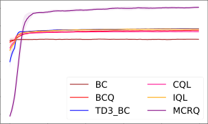

0 0.2 0.4 0.6 0.8 1.0
Million Steps

(b)

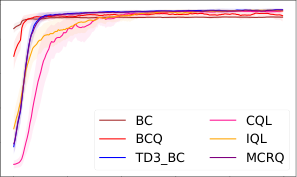

0 0.2 0.4 0.6 0.8 1.0
Million Steps

(e)

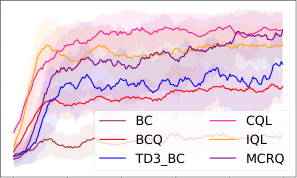

0 0.2 0.4 0.6 0.8 1.0
Million Steps

(h)

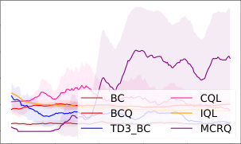

0 0.2 0.4 0.6 0.8 1.0
Million Steps

(k)

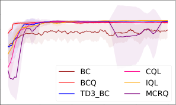

0 0.2 0.4 0.6 0.8 1.0
Million Steps

(n)

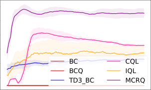

30

25

20

15

10

5

100

80

60

40

20

100

80

60

40

20

120

100

80

60

40

20

100

80

60

40

20

0

0 0.2 0.4 0.6 0.8 1.0
Million Steps

(a)

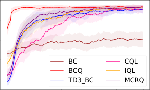

0 0.2 0.4 0.6 0.8 1.0
Million Steps

(d)

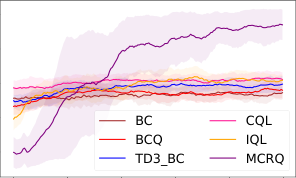

0 0.2 0.4 0.6 0.8 1.0
Million Steps

(g)

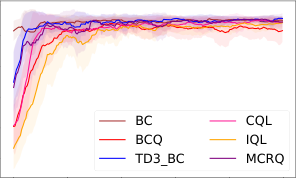

0 0.2 0.4 0.6 0.8 1.0
Million Steps

(j)

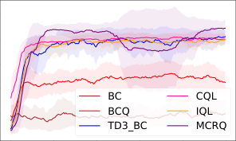

0 0.2 0.4 0.6 0.8 1.0
Million Steps

(m)

10

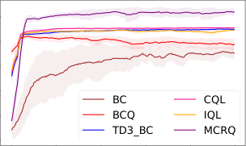

0 0.2 0.4 0.6 0.8 1.0
Million Steps

(c)

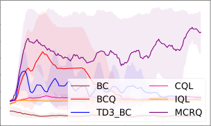

0 0.2 0.4 0.6 0.8 1.0
Million Steps

(f)

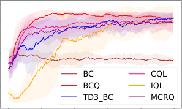

0 0.2 0.4 0.6 0.8 1.0
Million Steps

(i)

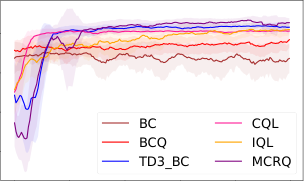

0 0.2 0.4 0.6 0.8 1.0
Million Steps

(l)

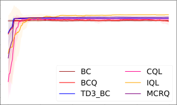

0 0.2 0.4 0.6 0.8 1.0
Million Steps

(o)

60

50

40

30

20

10

0

100

80

60

40

20

100

80

60

40

20

20

15

10

5

0

120

100

80

60

40

20

50

40

30

20

10

0

35

30

25

20

15

10

5

0

120

100

80

60

40

20

0

80

60

40

20

120

110

100

90

80

70

60

50

Fig. 1. Normalized score curves across D4RL benchmarks. (a) halfcheetah-random-v2, (b) halfcheetah-medium-v2, (c)
halfcheetah-medium-replay-v2, (d) halfcheetah-medium-expert-v2, (e) halfcheetah-expert-v2, (f) hopper-random-v2, (g) hoppermedium-v2, (h) hopper-medium-replay-v2, (i) hopper-medium-expert-v2, (j) hopper-expert-v2, (k) walker2d-random-v2, (l)
walker2d-medium-v2, (m) walker2d-medium-replay-v2, (n) walker2d-medium-expert-v2, and (o) walker2d-expert-v2.

1.0

0.8

0.6

0.4

0.2

0.0

Fig. 2. Box plot with minimum, maximum, mean, and variance
of 15 normalized average scores for MCRQ and baseline
algorithms.

_D. Comparative Visualization of OOD Actions_

To evaluate the ability to constrain OOD actions, we compare the action distributions generated by the learned policies
of different algorithms with the action distribution of the
offline dataset. Specifically, we train BCQ, TD3_BC, and
MCRQ, and collect 51,200 samples by running each trained
policy separately. For comparison, we also randomly sample
51,200 actions from the offline dataset. Fig. 5 (a)-(c) show the
action distributions in halfcheetah-random with t-SNE, while
Fig. 5 (d)-(f) depict the distributions in halfcheetah-mediumreplay. The corresponding analysis and discussion are provided
below.

BCQ generates almost entirely OOD actions, indicating
poor adaptation to halfcheetah-random. TD3_BC also produces predominantly OOD actions, with samples clustering
unilaterally relative to those in the dataset. In contrast, MCRQ
more closely aligns its action distribution with the dataset,
though slight deviations from the distributional centroid remain. This suggests that while MCRQ outperforms BCQ
and TD3_BC in approximating the dataset distribution, it
does not fully replicate it. Notably, since the random dataset
is generated by stochastic policies containing both low and
high quality actions with inherent uncertainty, strict adherence
to its distribution may lead to suboptimal performance. On
halfcheetah-medium-replay, all three algorithms align well
with the offline dataset.

_E. Comparison with SOTA Algorithms_

We further compare MCRQ with recent SOTA algorithms
to demonstrate its superiority. The selected algorithms include
_f_ -DVL [6], CGDT [35], DD [36], DStitch [37], ODC [38],
CSVE [39], ACT [40], MISA [41], O-DICE [42], MOAC

[29], and ORL-RC [11]. These algorithms incorporate various design features, including critic regularization, imitation
learning, decision transformers, and diffusion models.
We selected the medium, medium-replay, and mediumexpert datasets to evaluate performance across various tasks.
The results for each algorithm are sourced from their original
papers. The same row-wise normalization used in Table II is
also applied in Table IV. As shown in Table IV, MCRQ does

11

not achieve the best performance on every dataset. However,
Fig. 6 shows that MCRQ achieves the highest mean performance among all compared SOTA algorithms, using the same
visualization format as Fig. 2. In contrast, _f_ -DVL exhibits
the smallest variance but the lowest mean. It is reasonable to

observe that different algorithms exhibit varying strengths and
weaknesses across environments; thus, the choice of algorithm
should be tailored to the specific environment.

_F. Computational Efficiency_

Table V presents the training times of BCQ, TD3_BC, CQL,
IQL, and MCRQ on halfcheetah datasets. All experiments
are conducted on a machine equipped with a single AMD
EPYC 9004 series processor, 384 GB DDR5 RAM, and two
NVIDIA RTX 4090 GPUs (each with 24 GB VRAM), running
Ubuntu 20.04. MCRQ has a slightly longer training time than
TD3_BC. However, compared to BCQ, CQL, and IQL, it
significantly improves training efficiency by minimizing computational overhead while maintaining strong performance.

VII. C ONCLUSION

In this paper, we proposed MCRE to address distribution
shift and OOD actions in offline RL. Our theoretical analysis
shows that MCRE converges in both the presence and absence
of sampling error. Moreover, the estimated Q-function, state
value function, and the resulting suboptimal policy are all
shown to be controllable under both conditions. Building on
MCRE, we introduced MCRQ, an effective offline RL algorithm, and provided detailed implementation and experimental
results on the D4RL benchmark. The experiments demonstrate
that MCRQ outperforms both baseline and SOTA offline RL
algorithms. Future work will explore extending the MCRE
framework to other RL paradigms.

R EFERENCES

[1] S. Lange, T. Gabel, and M. Riedmiller, “Batch reinforcement learning,” in _Reinforcement Learning: State-of-the-Art_ . Berlin, Germany:
Springer, 2012, pp. 45–73.

[2] J. Hu, X. Li, X. Li, Z. Hou, and Z. Zhang, “Optimizing reinforcement
learning for large action spaces via generative models: Battery pattern
selection,” _Pattern Recognit_, vol. 160, p. 111194, Apr. 2025.

[3] S. Liu, Y. Liu, L. Hu, Z. Zhou, Y. Xie, Z. Zhao, W. Li, and Z. Gan,
“Diffskill: Improving reinforcement learning through diffusion-based
skill denoiser for robotic manipulation,” _Knowl Based Syst_, vol. 300,
p. 112190, Sep. 2024.

[4] R. Zhang, T. Yu, Y. Shen, and H. Jin, “Text-based interactive recommendation via offline reinforcement learning,” in _Proc. AAAI Conf. Artif._
_Intell._, vol. 36, no. 10, 2022, pp. 11 694–11 702.

[5] S. Rezaeifar, R. Dadashi, N. Vieillard, L. Hussenot, O. Bachem,
O. Pietquin, and M. Geist, “Offline reinforcement learning as antiexploration,” in _Proc. AAAI Conf. Artif. Intell._, vol. 36, no. 7, 2022,
pp. 8106–8114.

[6] H. Sikchi, Q. Zheng, A. Zhang, and S. Niekum, “Dual RL: Unification
and new methods for reinforcement and imitation learning,” in _Proc. Int._
_Conf. Learn. Represent._, 2024.

[7] D. Zhang, B. Lyu, S. Qiu, M. Kolar, and T. Zhang, “Pessimism meets
risk: Risk-sensitive offline reinforcement learning,” in _Proc. Int. Conf._
_Mach. Learn._, vol. 235, 2024, pp. 59 459–59 489.

[8] J. Rao, C. Wang, M. Liu, J. Lei, and W. Giernacki, “Isfors-mix: Multiagent reinforcement learning with importance-sampling-free off-policy
learning and regularized-softmax mixing network,” _Knowl Based Syst_,
vol. 309, p. 112881, Jan. 2025.

16

14

12

10

8

6

4

2

0

1.4

1.2

1.0

0.8

0.6

0.4

0.2

0.0

2.0

1.5

1.0

0.5

0.0

12

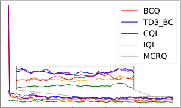

0.0 0.2 0.4 0.6 0.8 1.0
Training Steps 1e6

(c)

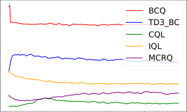

0.0 0.2 0.4 0.6 0.8 1.0
Training Steps 1e6

(a)

2.00

1.75

1.50

1.25

1.00

0.75

0.50

0.25

0.00

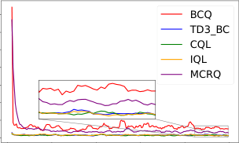

0.0 0.2 0.4 0.6 0.8 1.0
Training Steps 1e6

(b)

1.00

0.75

0.50

0.25

0.00

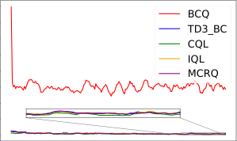

0.0 0.2 0.4 0.6 0.8 1.0
Training Steps 1e6

(d)

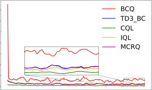

0.0 0.2 0.4 0.6 0.8 1.0
Training Steps 1e6

(e)

Fig. 3. Comparison of KL divergence across five halfcheetah datasets. (a) halfcheetah-random-v2, (b) halfcheetah-medium-v2,
(c) halfcheetah-medium-replay-v2, (d) halfcheetah-medium-expert-v2, and (e) halfcheetah-expert-v2.

_ω_ = 0.0

_ω_ = 0.5

_ω_ = 1.0

_ω_ = 1.5

_ω_ = 2.0

_ω_ = 2.5

_ω_ = 0.0

_ω_ = 0.5

_ω_ = 1.0

_ω_ = 1.5

_ω_ = 2.0

_ω_ = 2.5

_ω_ = 0.0

_ω_ = 0.5

_ω_ = 1.0

_ω_ = 1.5

_ω_ = 2.0

_ω_ = 2.5

_υ_ = 0.0 _υ_ = 0.1 _υ_ = 0.2 _υ_ = 0.3 _υ_ = 0.5 _υ_ = 0.7

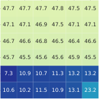

(a)

_υ_ = 0.0 _υ_ = 0.1 _υ_ = 0.2 _υ_ = 0.3 _υ_ = 0.5 _υ_ = 0.7

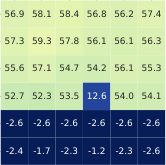

(e)

_υ_ = 0.0 _υ_ = 0.1 _υ_ = 0.2 _υ_ = 0.3 _υ_ = 0.5 _υ_ = 0.7

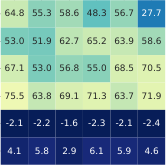

(i)

50

40

30

20

10

0

60

50

40

30

20

10

0

80

70

60

50

40

30

20

10

0

_υ_ = 0.0 _υ_ = 0.1 _υ_ = 0.2 _υ_ = 0.3 _υ_ = 0.5 _υ_ = 0.7

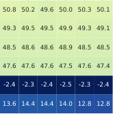

(b)

_υ_ = 0.0 _υ_ = 0.1 _υ_ = 0.2 _υ_ = 0.3 _υ_ = 0.5 _υ_ = 0.7

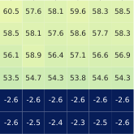

(f)

_υ_ = 0.0 _υ_ = 0.1 _υ_ = 0.2 _υ_ = 0.3 _υ_ = 0.5 _υ_ = 0.7

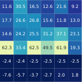

(j)

60

50

40

30

20

10

0

70

60

50

40

30

20

10

0

70

60

50

40

30

20

10

0

_ω_ = 0.0

_ω_ = 0.5

_ω_ = 1.0

_ω_ = 1.5

_ω_ = 2.0

_ω_ = 2.5

_ω_ = 0.0

_ω_ = 0.5

_ω_ = 1.0

_ω_ = 1.5

_ω_ = 2.0

_ω_ = 2.5

_ω_ = 0.0

_ω_ = 0.5

_ω_ = 1.0

_ω_ = 1.5

_ω_ = 2.0

_ω_ = 2.5

_υ_ = 0.0 _υ_ = 0.1 _υ_ = 0.2 _υ_ = 0.3 _υ_ = 0.5 _υ_ = 0.7

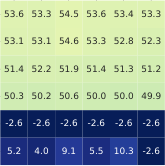

(c)

_υ_ = 0.0 _υ_ = 0.1 _υ_ = 0.2 _υ_ = 0.3 _υ_ = 0.5 _υ_ = 0.7

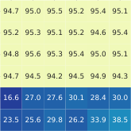

(g)

_υ_ = 0.0 _υ_ = 0.1 _υ_ = 0.2 _υ_ = 0.3 _υ_ = 0.5 _υ_ = 0.7

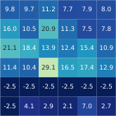

(k)

60

50

40

30

20

10

0

100

80

60

40

20

0

35

30

25

20

15

10

5

0

_ω_ = 0.0

_ω_ = 0.5

_ω_ = 1.0

_ω_ = 1.5

_ω_ = 2.0

_ω_ = 2.5

_ω_ = 0.0

_ω_ = 0.5

_ω_ = 1.0

_ω_ = 1.5

_ω_ = 2.0

_ω_ = 2.5

_ω_ = 0.0

_ω_ = 0.5

_ω_ = 1.0

_ω_ = 1.5

_ω_ = 2.0

_ω_ = 2.5

_υ_ = 0.0 _υ_ = 0.1 _υ_ = 0.2 _υ_ = 0.3 _υ_ = 0.5 _υ_ = 0.7

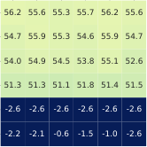

(d)

_υ_ = 0.0 _υ_ = 0.1 _υ_ = 0.2 _υ_ = 0.3 _υ_ = 0.5 _υ_ = 0.7

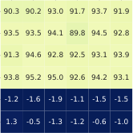

(h)

_υ_ = 0.0 _υ_ = 0.1 _υ_ = 0.2 _υ_ = 0.3 _υ_ = 0.5 _υ_ = 0.7

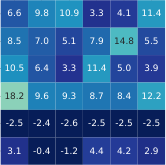

(l)

60

50

40

30

20

10

0

100

80

60

40

20

0

25

20

15

10

5

0

_ω_ = 0.0

_ω_ = 0.5

_ω_ = 1.0

_ω_ = 1.5

_ω_ = 2.0

_ω_ = 2.5

_ω_ = 0.0

_ω_ = 0.5

_ω_ = 1.0

_ω_ = 1.5

_ω_ = 2.0

_ω_ = 2.5

_ω_ = 0.0

_ω_ = 0.5

_ω_ = 1.0

_ω_ = 1.5

_ω_ = 2.0

_ω_ = 2.5

Fig. 4. Ablation study on _υ_, _ω_, and _α_ in MCRQ conducted on halfcheetah-medium and halfcheetah-expert. Subfigures (a)(f) show the results on halfcheetah-medium with _α_ values of {2.5, 5.0, 10.0, 15.0, 20.0, 25.0}, while (g)-(l) present the
corresponding results on halfcheetah-expert using the same set of _α_ values. All values in the figure represent the mean
performance.

13

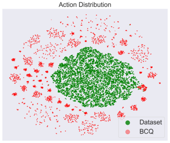

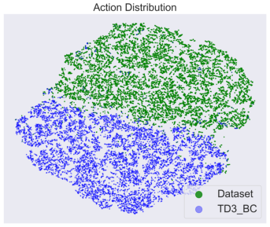

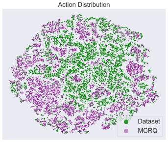

(a) (b) (c)

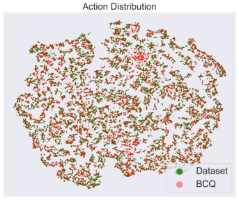

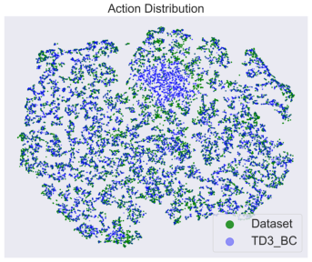

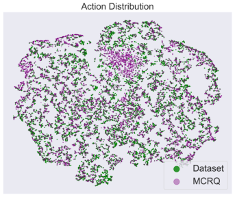

(d) (e) (f)

Fig. 5. Policy action visualization. (a), (b), and (c) show the action outputs of BCQ, TD3_BC, and MCRQ compared with
the actions within the halfcheetah-random. (d), (e), and (f) show the action outputs of the same algorithms compared with the
actions within the halfcheetah-medium-replay. The points represent the action outputs projected onto a 2-D plane using the
t-SNE algorithm.

TABLE IV Normalized average scores for for MCRQ and SOTA algorithms.

Algorithm _f_ -DVL CGDT DD DStitch ODC CSVE ACT MISA O-DICE MOAC ORL-RC MCRQ
halfcheetah-m 0.26 0.00 0.35 0.42 0.03 0.31 0.35 0.25 0.25 0.65 0.70 1.00
hopper-m 0.10 1.00 0.52 0.00 0.91 0.99 0.20 0.19 0.70 0.63 0.60 0.92
walker2d-m 0.22 0.00 0.36 0.46 0.15 0.44 0.19 0.53 0.62 0.81 1.00 0.68

halfcheetah-m-r 0.36 0.07 0.00 0.36 0.20 1.00 0.24 0.41 0.31 0.72 0.73 0.84
hopper-m-r 0.90 0.68 1.00 0.00 0.71 0.59 0.92 0.93 0.95 0.90 0.88 0.35
walker2d-m-r 0.37 0.65 0.56 0.99 0.75 0.65 0.00 0.89 0.81 1.00 0.97 0.96

halfcheetah-m-e 0.46 0.73 0.40 0.99 0.86 0.67 1.00 0.85 0.68 0.02 0.00 0.77
hopper-m-e 0.00 0.73 0.95 0.71 0.94 0.04 0.93 0.85 0.90 0.45 0.43 0.26
walker2d-m-e 0.18 0.11 0.00 0.31 0.02 0.04 1.00 0.13 0.44 0.58 0.67 0.49

TABLE V Comparison of training time (single seed run).

Algorithm BCQ TD3_BC CQL IQL MCRQ

Time (hours) 21.09 12.85 34.21 19.31 14.05

[9] Q. Yang, S. Wang, Q. Zhang, G. Huang, and S. Song, “Hundreds guide
millions: Adaptive offline reinforcement learning with expert guidance,”
_IEEE Trans. Neural Netw. Learn. Syst._, vol. 35, no. 11, pp. 16 288–
16 300, Nov. 2024.

[10] J. Lyu, X. Ma, X. Li, and Z. Lu, “Mildly conservative q-learning for
offline reinforcement learning,” in _Proc. Adv. Neural Inf. Process. Syst._,
vol. 35, 2022, pp. 1711–1724.

[11] L. Huang, B. Dong, and W. Zhang, “Efficient offline reinforcement
learning with relaxed conservatism,” _IEEE Trans. Pattern Anal. Mach._
_Intell._, vol. 46, no. 8, pp. 5260–5272, Aug. 2024.

[12] R. Fakoor, J. W. Mueller, K. Asadi, P. Chaudhari, and A. J. Smola,
“Continuous doubly constrained batch reinforcement learning,” in _Proc._

_Adv. Neural Inf. Process. Syst._, vol. 34, 2021, pp. 11 260–11 273.

[13] D. Brandfonbrener, W. Whitney, R. Ranganath, and J. Bruna, “Offline rl
without off-policy evaluation,” in _Proc. Adv. Neural Inf. Process. Syst._,
vol. 34, 2021, pp. 4933–4946.

[14] S. Fujimoto and S. S. Gu, “A minimalist approach to offline reinforcement learning,” in _Proc. Adv. Neural Inf. Process. Syst._, vol. 34, 2021,
pp. 20 132–20 145.

[15] A. Kumar, A. Zhou, G. Tucker, and S. Levine, “Conservative q-learning
for offline reinforcement learning,” in _Proc. Adv. Neural Inf. Process._
_Syst._, vol. 33, 2020, pp. 1179–1191.

[16] I. Kostrikov, R. Fergus, J. Tompson, and O. Nachum, “Offline reinforcement learning with fisher divergence critic regularization,” in _Proc. Int._
_Conf. Mach. Learn._, vol. 139, 2021, pp. 5774–5783.

[17] I. Kostrikov, A. Nair, and S. Levine, “Offline reinforcement learning
with implicit q-learning,” _arXiv preprint arXiv:2110.06169_, 2021.

[18] C. Bai, L. Wang, Z. Yang, Z.-H. Deng, A. Garg, P. Liu, and Z. Wang,
“Pessimistic bootstrapping for uncertainty-driven offline reinforcement
learning,” in _Proc. Int. Conf. Learn. Represent._, 2022.

[19] L. Huang, B. Dong, W. Xie, and W. Zhang, “Offline reinforcement

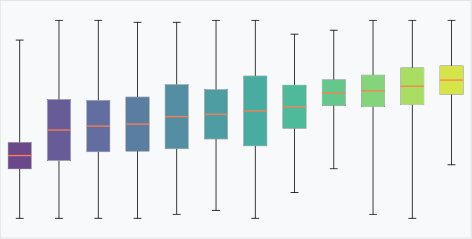

1.0

0.8

0.6

0.4

0.2

0.0

Fig. 6. Box plot with minimum, maximum, mean, and variance of 9 normalized average scores for MCRQ and SOTA
algorithms.

learning with behavior value regularization,” _IEEE Trans. Cybern._,
vol. 54, no. 6, pp. 3692–3704, Jun. 2024.

[20] Y. Ran, Y.-C. Li, F. Zhang, Z. Zhang, and Y. Yu, “Policy regularization
with dataset constraint for offline reinforcement learning,” in _Proc. Int._
_Conf. Mach. Learn._, 2023, pp. 28 701–28 717.

[21] S. Fujimoto, D. Meger, and D. Precup, “Off-policy deep reinforcement
learning without exploration,” in _Proc. Int. Conf. Mach. Learn._, vol. 97,
2019, pp. 2052–2062.

[22] A. Kumar, J. Fu, M. Soh, G. Tucker, and S. Levine, “Stabilizing offpolicy q-learning via bootstrapping error reduction,” in _Proc. Adv. Neural_
_Inf. Process. Syst._, vol. 32, 2019.

[23] Y. Wu, S. Zhai, N. Srivastava, J. M. Susskind, J. Zhang, R. Salakhutdinov, and H. Goh, “Uncertainty weighted actor-critic for offline reinforcement learning,” in _Proc. Int. Conf. Mach. Learn._, vol. 139, 2021,
pp. 11 319–11 328.

[24] A. Nair, A. Gupta, M. Dalal, and S. Levine, “Awac: Accelerating
online reinforcement learning with offline datasets,” _arXiv preprint_
_arXiv:2006.09359_, 2020.

[25] D. Tarasov, V. Kurenkov, A. Nikulin, and S. Kolesnikov, “Revisiting the
minimalist approach to offline reinforcement learning,” in _Proc. Adv._
_Neural Inf. Process. Syst._, vol. 36, 2023, pp. 11 592–11 620.

[26] D. Silver, A. Huang, C. J. Maddison, A. Guez, L. Sifre, G. Van
Den Driessche, J. Schrittwieser, I. Antonoglou, V. Panneershelvam,
M. Lanctot _et al._, “Mastering the game of go with deep neural networks
and tree search,” _Nature_, vol. 529, no. 7587, pp. 484–489, 2016.

[27] S. Zhao, _Mathematical_ _Foundations_ _of_ _Reinforcement_ _Learning_ .
Springer Nature Press and Tsinghua University Press, 2025.

[28] Y. Mao, H. Zhang, C. Chen, Y. Xu, and X. Ji, “Supported value
regularization for offline reinforcement learning,” in _Proc. Adv. Neural_
_Inf. Process. Syst._, vol. 36, 2023, pp. 40 587–40 609.

[29] L. Huang, B. Dong, J. Lu, and W. Zhang, “Mild policy evaluation for
offline actor–critic,” _IEEE Trans. Neural Netw. Learn. Syst._, vol. 35,
no. 12, pp. 17 950–17 964, Dec. 2024.

[30] D. A. Levin and Y. Peres, _Markov chains and mixing times_ . American
Mathematical Soc., 2017, vol. 107.

[31] S. Fujimoto, H. van Hoof, and D. Meger, “Addressing function approximation error in actor-critic methods,” in _Proc. Int. Conf. Mach. Learn._,
2018, pp. 1–15.

[32] J. Fu, A. Kumar, O. Nachum, G. Tucker, and S. Levine, “D4rl:
Datasets for deep data-driven reinforcement learning,” _arXiv preprint_
_arXiv:2004.07219_, 2020.

[33] E. Todorov, T. Erez, and Y. Tassa, “Mujoco: A physics engine for modelbased control.” in _Proc. IEEE/RSJ Int. Conf. Intell. Robots Syst. (IROS)_ .
IEEE, Oct. 2012, pp. 5026–5033.

[34] G. Brockman, V. Cheung, L. Pettersson, J. Schneider, J. Schulman, J. Tang, and W. Zaremba, “Openai gym,” _arXiv preprint_
_arXiv:1606.01540_, 2016.

[35] Y. Wang, C. Yang, Y. Wen, Y. Liu, and Y. Qiao, “Critic-guided decision
transformer for offline reinforcement learning,” in _Proc. AAAI Conf._
_Artif. Intell._, vol. 38, no. 14, 2024, pp. 15 706–15 714.

[36] A. Ajay, Y. Du, A. Gupta, J. B. Tenenbaum, T. S. Jaakkola, and
P. Agrawal, “Is conditional generative modeling all you need for decision
making?” in _Proc. Int. Conf. Learn. Represent._, 2023.

14

[37] G. Li, Y. Shan, Z. Zhu, T. Long, and W. Zhang, “Diffstitch: Boosting
offline reinforcement learning with diffusion-based trajectory stitching,”
in _Proc. Int. Conf. Mach. Learn._, vol. 235, 2024, pp. 28 597–28 609.

[38] J. Kim, S. Lee, W. Kim, and Y. Sung, “Decision convformer: Local
filtering in metaformer is sufficient for decision making,” in _Proc. Int._
_Conf. Learn. Represent._, 2024.

[39] L. Chen, J. Yan, Z. Shao, L. Wang, Q. Lin, S. Rajmohan, T. Moscibroda,
and D. Zhang, “Conservative state value estimation for offline reinforcement learning,” in _Proc. Adv. Neural Inf. Process. Syst._, vol. 36, 2023,
pp. 35 064–35 083.

[40] C.-X. Gao, C. Wu, M. Cao, R. Kong, Z. Zhang, and Y. Yu, “Act: Empowering decision transformer with dynamic programming via advantage
conditioning,” in _Proc. AAAI Conf. Artif. Intell._, vol. 38, no. 11, 2024,
pp. 12 127–12 135.

[41] X. Ma, B. Kang, Z. Xu, M. Lin, and S. Yan, “Mutual information
regularized offline reinforcement learning,” in _Proc. Adv. Neural Inf._
_Process. Syst._, vol. 36, 2023, pp. 19 058–19 072.

[42] L. Mao, H. Xu, W. Zhang, and X. Zhan, “ODICE: Revealing the mystery
of distribution correction estimation via orthogonal-gradient update,” in
_Proc. Int. Conf. Learn. Represent._, 2024.

