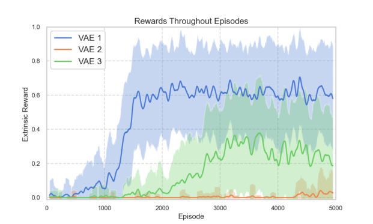
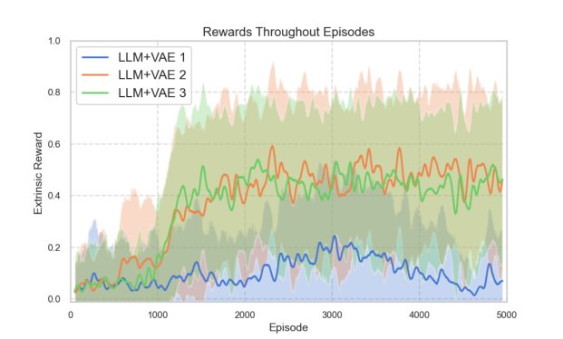

## **LLM-Driven Intrinsic Motivation for Sparse Reward** **Reinforcement Learning**

**Andr´e Quadros** [1] **, Cassio Silva** [1] **and Ronnie Alves** [1] _[,]_ [2]

1 Universidade Federal Par´a, Brazil (UFPA)
Bel´em – PA – Brasil

2Instituto Tecnol´ogico Vale, Brazil (ITV)
Bel´em – PA – Brasil

_{_ andre.rosario31, cassio266 _}_ @gmail.com, ronnie.alves@itv.org

_**Abstract.**_ _This paper explores the combination of two intrinsic motivation_
_strategies to improve the efficiency of reinforcement learning (RL) agents in en-_
_vironments with extreme sparse rewards, where traditional learning struggles_
_due to infrequent positive feedback. We propose integrating Variational State_
_as Intrinsic Reward (VSIMR), which uses Variational AutoEncoders (VAEs) to_
_reward state novelty, with an intrinsic reward approach derived from Large Lan-_
_guage Models (LLMs). The LLMs leverage their pre-trained knowledge to gen-_
_erate reward signals based on environment and goal descriptions, guiding the_
_agent. We implemented this combined approach with an Actor-Critic (A2C)_
_agent in the MiniGrid DoorKey environment, a benchmark for sparse rewards._
_Our empirical results show that this combined strategy significantly increases_
_agent performance and sampling efficiency compared to using each strategy in-_
_dividually or a standard A2C agent, which failed to learn. Analysis of learning_
_curves indicates that the combination effectively complements different aspects_
_of the environment and task: VSIMR drives exploration of new states, while the_
_LLM-derived rewards facilitate progressive exploitation towards goals._

### **1. Introduction**

Imagine that you are in a physical labyrinth, but through the intellectual challenge of reinforcement learning in environments where guidance is scarce. Imagine an agent, dropped
into a complex maze, with only one piece of feedback: ’You’ve reached the end!’ –
and that feedback might only come after thousands of wrong turns. This, in essence,
is the challenge of sparse rewards, a pervasive bottleneck preventing intelligent agents
from learning efficiently in real-world scenarios. Our research confronts this fundamental
dilemma: how do we empower an agent to effectively explore a vast, unfamiliar space to
find those elusive rewards, and then reliably exploit that knowledge to consistently achieve
its goals? This is the heart of the exploration-exploitation trade-off, a cornerstone of reinforcement learning. Traditional methods often struggle here. Random exploration is
inefficient, and purely greedy exploitation can lead to getting trapped in suboptimal local
optima. We hypothesized that for an agent to truly thrive in these challenging conditions,
it needs more than just trial and error; it needs a richer understanding of its environment
and a more informed way to generate and evaluate its actions.

Trying to learn through trial and error, without any confirmation that our action
was positive or negative, can make any learning nearly impossible. This brings us to the

problem of sparse environments. Knowing that there are environments where rewards
can be distributed infrequently or extremely sparse makes these types of environments
challenging for the agent [Devidze et al. 2022]. Sparse rewards can be defined as a series
of rewards produced through the interaction of the virtual reality agent with the environment in which the majority of the rewards received are not positive [Barto 2012]. The
absence or lack of rewards that would have the purpose of guiding the actions performed
by the agent causes a considerable increase in the difficulty of learning for the agent. As
a consequence of the problem of sparse rewards, we have the problem of sampling efficiency, where, due to the scarce signals to guide learning, the agent ends up needing
many interactions to learn. The exploration-exploitation dilemma is a fundamental challenge in Reinforcement Learning (RL). The Exploration-Exploitation Dilemma in RL, is
the tension between trying new actions and search new states (exploration) to discover potentially better rewards, and sticking with actions that are already known to yield good results (exploitation) [Sutton et al. 2018]. On the other hand, we have intrinsic motivation,
a term from psychology, which in machine learning is described as learning carried out
by an agent using an internal stimulus to learn new skills or achieve a goal [Barto 2012].
With intrinsic motivation, the agent generates intrinsic rewards which are independent
of the environmental reward and which encourage exploration and taking actions in the
environment.

The field of Natural Language Processing (NLP) has undergone a revolution since
the introduction of the Transformer architecture [Vaswani et al. 2017]. This advancement paved the way for the development of Large Language Models (LLMs), which already have reference points with the development of large known and used models, such
as Llama [Grattafiori et al. 2024] and Gemini [Team et al. 2024]. Due to the colossal
amount of information with which these models are trained, these models end up being imbued with a certain amount of world knowledge [Yu et al. 2023]. This enables
them to demonstrate their capacity for the analysis and understanding of information

[Cao et al. 2024]. The use of LLMs in RL is a field that explores this power of analysis and compression of LLMs to help with problems encountered in the field of RL.

To improve sampling efficiency in environments with sparse rewards, we created a
combination of two methods for generating intrinsic motivation, applying the variational
state as intrinsic motivation, using the KL-Divergence present in the loss calculation as
an intrinsic reward, for new states. Adding an LLM as another intrinsic reward to guide
the agent based on the importance of what is present in the state in relation to the task to
be accomplished. Leveraging VSIMR’s capability to explore new states and the LLM’s
knowledge to directly guide toward the environment’s goal. One for exploring new states
and another for finding, in states, those who will help to achieve the goal.

In Background section, we will provide general information about intrinsic motivation and its utility in sparse reward problems. In Related Work, we will present two
experimental studies that together provided the basis for the RL strategies introduced in
this work. We examine methodology of the joint application of these techniques, along
with the step-by-step process followed for the experiments. We analyze all results in
Results and Discussion section and finally in Conclusions section, we present our conclusions and future work suggestions.

### **2. Background**

**2.1. Reinforcement Learning**

Reinforcement Learning (RL) is a Machine Learning (ML) paradigm that seeks to learn
through interaction to achieve a goal [Sutton et al. 2018]. This learning occurs through
trial and error, the learner who makes the decisions is called an agent. What the agent interacts with, understanding everything outside the agent, is the environment. They interact
continuously, the agent selecting actions and the environment responding to these actions
and presenting new situations to the agent. The environment returns signals and rewards
with each interaction. The agent maximizes these rewards to learn [Sutton et al. 2018].
The reward system is very important for the agent. Depending on the reward system,
coming from the environment, the agent can learn to achieve its goal faster or not. The reward that the environment returns to the agent when it takes an action in it or coming from
objects, external to the agent, is called extrinsic reward [Aubret et al. 2019] [Barto 2012].
The stimuli generated by extrinsic rewards coming from objects or the environment external to the agent are what will guide him to complete the task.

**2.2. Intrinsic Motivation**

Originally rooted in psychology, intrinsic motivation (IM) describes an individual’s
inherent drive to seek novelty and challenges, independent of external pressures

[Ryan and Deci 2000]. This concept, informed by studies on early childhood learning

[Piaget et al. 1952], highlights a natural inclination in organisms to explore their surroundings and acquire new skills. Essentially, IM examines how an individual or agent’s
innate curiosity propels them to investigate an environment or problem, leading to new
experiences and skill development without an explicit, pre-defined goal; rather, the goal
is often achieved as a byproduct of this exploration.

In the realm of Reinforcement Learning (RL), various strategies attempt to replicate IM principles in learning agents [Aubret et al. 2019]. IM in RL can generally be categorized into two types: Knowledge acquisition and Skill learning [Aubret et al. 2019].
Knowledge acquisition approach focuses on enabling the RL agent to learn about its environment. Models in this category enhance an agent’s exploration efficiency and improve state abstraction. The Skill learning approach agents with the ability to abstract
and master skills, either to achieve a specific goal or to build a reusable repertoire of
capabilities for overcoming environmental challenges. For this work, we have opted to
concentrate on knowledge acquisition. Due to its proven effectiveness in encouraging the
exploration of infrequently visited states within RL environments [Aubret et al. 2019].
In particular, intrinsic motivation models categorized under knowledge acquisition have
demonstrated the ability to significantly improve agent performance in sparse reward environments [Zahavy et al. 2020]. The subsequent section will show the works used in the
formulation of this approach.

### **3. Related Work**

**3.1. Variational State as Intrinsic Reward (VSIMR)**

The paper Variational State as Intrinsic Reward [Klissarov et al. 2019], proposes a formulation of intrinsic motivation based on the Bayesian definition of surprise, in which experiences that deviate from the model’s default choices are seen as surprising and specifically useful for learning. The idea is that the agent identifies states that cause important

changes in its prior knowledge by measuring the difference between the posterior and
prior distributions after visiting them. This measure of surprise can be used as an intrinsic
application. To implement this measure of surprise, a Variational Auto-Encoder (VAE)
is used. The VAE projects the state space ( _S_ ) into a latent probabilistic representation
( _Z_ ) that represents the specific structure of the environment [Klissarov et al. 2019]. Importantly, the VAE maintains an approximate posterior distribution, _qθ_ ( _Z|S_ ), over this
latent structure and uses a prior _p_ ( _Z_ ) (typically a unitary Gaussian). The measure of the
agent’s surprise is obtained ”naturally” from the VAE by quantifying how much the approximate posterior distribution _qθ_ ( _Z|S_ ) deviates from the prior _p_ ( _Z_ ). This difference is
measured by the KL-divergence: _rintrinsic−vae_ ( _S_ ) = _KL_ ( _qθ_ ( _Z|S_ ) _||p_ ( _Z_ )). Providing this
KL-divergence as an intrinsic reward encourages the agent to visit surprising regions of
the state space.

**3.2. LLM to Reward Design**

In his paper LLM-Enhanced Reinforcement Learning: A Survey. Cao et al. present a
catalog and classification of several ways in which LLMs are being used to support the
RL field in a variety of ways. LLMs, with their vast knowledge and reasoning capabilities,
emerge as promising reward designers in LLM-enhanced RL [Chakraborty et al. 2023],
helping to create more effective reward functions [Ma et al. 2023]. An approach to using
LLMs as implicit reward designers (directly providing reward values) is direct prompting.
This involves presenting LLM with natural language representations, such as the current
state of the environment or examples of desired behaviors, and asking it to provide a
reward signal based on its understanding. This technique can be used to extract auxiliary
personality goals from general language, generating an intrinsic reward signal.

### **4. Methodology**

To perform the proposed experiments in a sparse reward environment, we must choose an
environment that has a good degree of difficulty, low frequency of rewards, and where the
goal and its states can be easily described in words, since we will use an LLM to analyze
the states of the environment. Minigrid [Chevalier-Boisvert et al. 2023] contains a collection of discrete grid-world environments to conduct research on Reinforcement Learning. Among these environments we have Door Key(Figure 1), which in its MiniGridDoorKey-8x8-v0 configuration, has a size of 8 squares high and 8 squares wide. This
environment has a key that the agent must pick up in order to unlock a door and then
get to the green goal square. The difficulty in this environment increases due to the fact
that the environment only gives a reward to the agent when it manages to reach its final
goal. In other words, the agent does not have any stimuli from the environment during its
actions in the environment, not even in the actions that are crucial to achieving the goal,
such as picking up the key and opening the door. Another difficulty in this environment
is the agent’s visualization. The agent has a partial observation of the environment, only
seeing up to three squares to the sides and 7 squares in front, not seeing beyond walls and
closed doors. The reward given to the agent when he reaches the objective also reflects his
performance and is another difficulty. The extrinsic reward is inversely proportional to the
number of steps the agent needed to achieve the objective. The fewer steps the agent uses
to reach the objective, the greater is his reward. Due to the difficulty of this environment
of sparse rewards and the ease of describing the objects present in the environment, this
environment is perfect for use in our tests.

**Figure 1. Door Key Environment**

In this paper we use the Advantage actor critic (A2C) algorithm as the base RL
algorithm. The A2C uses a hybrid design that combines the best features of policy-based
(Actor) and value-based (Critic) methods using the moments when the algorithm performs
advantage calculations to train the VAE.

Since the environment generates an extrinsic reward only when the agent reaches
the goal, we will use the agent’s intrinsic reward to guide it towards the goal. Using two
combined intrinsic motivation strategies VSIMR and intrinsic reward based in LLM.

VSIMR, which gathers a set of states to train a VAE, and thus obtain a latent representation of the states, then calculates the distance between the probability distribution
of a state S in relation to its latent representation Z, the KL Divergence, this distance is
used as an intrinsic reward generated by the VAE. The KL Divergence value needs to be
normalized before we use it as a reward. Thus we obtain the _rintrinsic−vae_ of the current

state.

**Figure 2. Representation of the LLM+VAE strategy**

In the intrinsic reward based on LLM, we use the Reward Design approach called
Direct Prompting described in Cao et al.’s survey [Cao et al. 2024], this approach is based
on direct prompting with language descriptions. To simplify the use of this approach,
we chose a popular model already trained, LLaMA 3.2 [Grattafiori et al. 2024]. With the
chosen LLM, we need to think about how we will approach the creation of the prompt that
we are going to generate and think about the response we want to obtain. Since we want
an intrinsic reward and that, by concept, intrinsic motivation is an internal force that drives
an individual to perform an activity for pure pleasure, interest, personal satisfaction, or
challenge [Ryan and Deci 2000]. And the role of the VSIMR framework is curiosity and

exploration of new states. We direct the prompt to evaluate how much a new state will
help the agent achieve its goal. At each interaction of the agent with the environment,
the agent will generate an intrinsic reward with the LLM. After the agent executes the
action, the algorithm will format a prompt based on the state _st_ +1. The prompt begins by
explaining that the agent is observing an environment where it is located and reports that
it has an objective which is the description of the environment’s mission, and this is given
by the environment by default, and then says which objects it is seeing in the new state,
and finally asks on a scale of 0 to 10 whether or not the new state helps the agent in its
final objective given in the mission. The final prompt is:

At the end the final reward that A2C will receive is the reward _rtotal_, to guide the
agent in the environment. The total reward is composed of the sum of the intrinsic reward,
given by the environment, of the _rintrinsic−vae_ which is the intrinsic reward generated by
the VSIMR framework at each step with its regulator _βvae_ and of the _rintrinsic−llm_ intrinsic
reward generated from the prompt at each step in the environment, also regulated by a
hyperparameter _βllm_ .

_rtotal_ = _rextrinsic_ + _βvae.rintrinsic−vae_ + _βllm.rintrinsic−llm_ (1)

We visualize in Figure 2 the representation of the proposed strategy, demonstrating
the RL Agent that takes an action in the environment that in turn generates a new state,
which is processed by the agent through the VAE and LLM, the three generated rewards
are applied in the Equation 1, to generate the total reward, which is the signal that will
guide the agent. In Algorithm 1, we have the A2C training loop implemented. For each
training episode, we initialize a dataset _D_ where the state action tuples, the state _st_ +1,
the extrinsic reward _rextrinsic_ and the intrinsic reward of the VAE _rintrinsic−vae_ will be
stored. We also initialize a dataset that will store the pairs of prompts made for a state
_st_ +1 and the value of the response given by the LLM. The dataset stored in _D_ will be used
to train the VAE every N steps, and the data stored in _PromptReward_ will be used to
avoid making repeated prompts to the LLM, and thus a large amount of processing time.
Since we first consult this dataset and if the prompt has never been processed, then we
send it to the LLM and store this new one for future queries. At each step performed
by the agent, it takes an action based on the A2C algorithm policy and receives a new
state _st_ +1 and an extrinsic reward _rextrinsic_ given by the environment. We compute the KL
Divergence with the VAE, which returns a normalized value that is our intrinsic reward
from the VAE _rintrinsic−vae_, then we store in _D_ the tuple with the data needed to train
the VAE. To generate the intrinsic reward from an LLM, we follow similar steps: we
generate the prompt from the new state _st_ +1, and with the prompt ready, we check in the
dataset _PromptReward_ if the question has already been asked and if we already have a
reward for that question. If it has not yet been asked and is not in the dataset, we process
the prompt in the LLM, store the prompt and answer pair in the dataset, and we have
our intrinsic reward generated from the language model, the _rintrinsic−llm_ . We use the
timestep that the A2C trains the actor and the critic, to also train the VAE in the last set of
states. And so we continue with our loop until the algorithm ends.

In the next section we will see the results of this algorithm and discuss about its
benefits and drawbacks.

**Algorithm 1** Intrinsically motivated training loop for A2C using VAE and LLM

1: **for** Episode=0,1,2, n **do**
2: Initialize the dataset _D_ and insert _s_ 0 in _D_ ;
3: Initialize the dataset _PromptReward_ ;
4: **for** t=0,1,2...T **do**
5: Take an action and watch the next state _st_ +1 and the extrinsic reward

_rextrinsic_ ( _st_ +1) ;
6: Compute _rintrinsic−vae_ ( _st_ +1) (st+1) = KL Divergence ;
7: Store tuple ( _st_ +1, _at_, _rextrinsic_ ( _st_ +1), _rintrinsic−vae_ ( _st_ +1)) in _D_ ;
8: Compute _rintrinsic−llm_ ( _st_ +1) (prompt(st+1)) = LLM Answer;
9: Store tuple (prompt(st+1), LLM Answer) in _PromptReward_ ;
10: **if** mod(t,N) = 0 **then**
11: Train Actor and Critic with the return Gt=Σ _trextrinsic_ ( _st_ )+
_βvaerintrinsic−vae_ ( _st_ +1) + _βllmrintrinsic−llm_ ( _st_ +1) ;
12: Train VAE with the states _s_ collected in _D_ ;
13: Initialize the dataset _D_ and insert _st_ in _D_ ;
14: **end if**

15: **end for**

16: **end for**

### **5. Results and Discussion**

To apply the methodology, we ran Algorithm 1 in the DoorKey environment. The
MiniGrid-DoorKey-8x8-v0 configuration used gives us 640 steps by default to reach the
goal. However, to better evaluate the results, we increased this value by 40 percent, reaching a total of 896 steps, all other environment settings remain at default. We prepared a
method in the code to translate the descriptive values of the state _st_ +1 into a prompt following the query pattern mentioned earlier in this paper. The code applying the algorithm
[and which generated such results can be found on github](https://github.com/andre3103/LLM-Driven-Intrinsic-Motivation-for-Sparse-Reward-Reinforcement-Learning) [1] . To properly evaluate the hypothesis raised, that the use of LLM+VAE in the intrinsic motivation of an agent can help
it fulfill its mission in sparse environments, we ran the algorithm 3 times with VAE only
and the algorithm using LLM+VAE. Sparse reward environments can generate different
results from the same algorithm in the same environment, each time it is executed. That’s
why we run each algorithm 3 times and smooth the results with the mean and standard
deviation of each execution, so we can perform a better analysis of these executions.These
results are shown in Figure 3a and Figure 3b.

Looking at the results in Figure 3a, the vae 1 agent shows the most successful
learning curve among all the experiments. It quickly learns to achieve high rewards, consistently reaching average rewards above 0.6, often close to 0.7 and even peaking near 0.8.
The variance is also high, indicating strong performance but with some fluctuations. This
suggests excellent exploration early on, followed by effective exploitation. Demonstrating the VAE’s great ability to explore the environment efficiently [Klissarov et al. 2019].
The second VAE agent performs very poorly, achieving consistently low rewards near
zero throughout the entire training period. It seems completely unable to learn. At last

1The repository with the implementation can be found at: https://github.com/andre3103/LLM-DrivenIntrinsic-Motivation-for-Sparse-Reward-Reinforcement-Learning

**(a) Results do VAE**

**(b) Results LLM+VAE**

**Figure 3. Comparison of results in Door Key Environment: (a) using VAE, (b)**
**using LLM+VAE.**

the VAE 3 shows a moderate learning curve, eventually reaching average rewards between
0.2 and 0.4, with some peaks. It performs better than VAE 2 but significantly worse than
VAE 1.

When analyzing the performance of agents using LLM+VAE (Figure 3b) ; The
LLM+VAE 1 shows very low total rewards, consistently staying below 0.2, and often
near zero, even after 5000 episodes. The variance is also relatively low, suggesting it
consistently performs poorly. This agent appears to be largely failing to learn or is stuck
in a local optimum that yields minimal rewards. It likely struggles with both exploration
(not finding paths to rewards) and exploitation (not consistently leveraging any rewards
it might stumble upon). The second LLM+VAE agent shows a significant improvement
compared to LLM+VAE 1. It starts learning around episode 1000 and reaches average
rewards between 0.3 and 0.5, with peaks around 0.6. There’s considerable variance, suggesting some runs perform better than others, but overall it demonstrates a capacity to
find and exploit rewards. The LLM+VAE 3 performs similarly to LLM+VAE 2 in terms
of average reward, also reaching between 0.3 and 0.5, and even slightly higher peaks than

LLM+VAE 2 at times. Its learning curve seems to follow a similar trajectory and like the
LLM+VAE 2, it shows good exploration and exploitation.

**Figure 4. Overlap of means and standard deviations of results.**

In Figure 4, we show the mean and standard deviation of the three executions of
each algorithm. Knowing that the environment with such sparse rewards can promote
such different results, we combined the three executions of each algorithm, VAE and
LLM+VAE, in order to reach a definitive conclusion about the performance and results of
the algorithms. Considering that in the executions of Figures 3a and 3b there are very different variations and performances between the executions of the same algorithm and the
competing algorithm. VAE algorithm shows a modest learning curve, reaching average
rewards around 0.2-0.3, with some peaks up to 0.4. Otherwise the LLM+VAE consistently outperforms the VAE baseline in this specific aggregated comparison, achieving
average rewards between 0.3 and 0.4, with peaks closer to 0.5. The learning curve is also
slightly steeper initially. Demonstrating that the combination of techniques shows a good
improvement, both in the speed of learning, observed that LLM+VAE shows superior average rewards from the beginning, and in the stability of learning, as seen in the greater
stability of LLM+VAE compared to VAE, demonstrating that the algorithm managed to
reach the objective of the environment with fewer steps than VAE.

Our experiments revealed a nuanced picture of agent performance. Some configurations, such as LLM+VAE 1 and VAE 2, frequently converged to suboptimal local optima, exhibiting significant challenges in effective exploration and consequently failing to
discover paths to rewards within the sparse environments. This suggests that while these
components hold promise, their integration or specific hyperparameter settings might impede thorough environmental exploration.

Conversely, agents like VAE 1, and crucially, LLM+VAE 2 and 3, demonstrated
successful exploration, reliably identifying rewarding trajectories, followed by efficient
exploitation to consistently achieve higher rewards. The LLM+VAE technique, in particular, showcased this superior performance in two out of three executions, highlighting its

potential for more robust exploration and exploitation when properly configured. However, a direct comparison between individual runs of LLM+VAE and VAE alone revealed
considerable variability. While LLM+VAE 2 and 3 achieved strong results, LLM+VAE
1 represented a near-complete failure. Similarly, VAE 1 emerged as the top performer
across all experiments, yet VAE 3 exhibited the worst performance. This marked instability in VAE-only configurations underscores the challenges in relying solely on VAEs for
consistent performance in sparse reward settings.

### **6. Conclusions**

Looking ahead, several avenues for future research emerge from this study. First, the inconsistent performance of some agents, particularly the failures in exploration, strongly
indicates a need for hyperparameter fine-tuning. Future work will involve a more systematic and extensive exploration of the hyperparameter space for both LLM+VAE and VAE
configurations to optimize their exploratory capabilities. Second, given the LLM’s role
in guiding exploration, a critical area for investigation is the construction of prompts and
queries fed to the LLM. We hypothesize that crafting more effective prompts will enable
the LLM to provide superior guidance, leading to better answers and, consequently, more
efficient exploration by the RL agent. A deeper analysis into the impact of prompt engineering on LLM-driven exploration is warranted. Furthermore, once rewarding states
are identified, a more profound understanding of the environment, facilitated by the LLM,
could pave the way for more efficient exploitation. Future research will delve into how the
LLM can further enhance the agent’s ability to consistently achieve higher rewards once
rewarding paths are discovered. This could involve using the LLM for refined policy
adjustments or improved value function estimatation.

The core hypothesis driving our LLM integration was to enhance exploration by
leveraging the LLM’s potential for better state representations or more intelligent action
proposals. The higher average rewards observed in the successful LLM+VAE runs lend
credence to this idea, suggesting that the LLM indeed guided the agents to discover rewarding states more rapidly, thus mitigating the sparsity challenge.

### **References**

Aubret, A., Matignon, L., and Hassas, S. (2019). A survey on intrinsic motivation in
reinforcement learning. _arXiv preprint arXiv:1908.06976_ .

Barto, A. G. (2012). Intrinsic motivation and reinforcement learning. In _Intrinsically_
_motivated learning in natural and artificial systems_, pages 17–47. Springer.

Cao, Y., Zhao, H., Cheng, Y., Shu, T., Chen, Y., Liu, G., Liang, G., Zhao, J., Yan, J., and
Li, Y. (2024). Survey on large language model-enhanced reinforcement learning: Concept, taxonomy, and methods. _IEEE Transactions on Neural Networks and Learning_
_Systems_ .

Chakraborty, S., Weerakoon, K., Poddar, P., Elnoor, M., Narayanan, P., Busart, C.,
Tokekar, P., Bedi, A. S., and Manocha, D. (2023). Re-move: An adaptive policy
design for robotic navigation tasks in dynamic environments via language-based feedback. _arXiv preprint arXiv:2303.07622_ .

Chevalier-Boisvert, M., Dai, B., Towers, M., Perez-Vicente, R., Willems, L., Lahlou, S.,
Pal, S., Castro, P. S., and Terry, J. (2023). Minigrid & miniworld: Modular & customizable reinforcement learning environments for goal-oriented tasks. In _Advances_
_in Neural Information Processing Systems 36, New Orleans, LA, USA_ .

Devidze, R., Kamalaruban, P., and Singla, A. (2022). Exploration-guided reward shaping for reinforcement learning under sparse rewards. _Advances in Neural Information_
_Processing Systems_, 35:5829–5842.

Grattafiori, A., Dubey, A., Jauhri, A., Pandey, A., Kadian, A., Al-Dahle, A., Letman, A.,
Mathur, A., Schelten, A., Vaughan, A., et al. (2024). The llama 3 herd of models. _arXiv_
_preprint arXiv:2407.21783_ .

Klissarov, M., Islam, R., Khetarpal, K., and Precup, D. (2019). Variational state encoding as intrinsic motivation in reinforcement learning. In _Task-Agnostic Reinforcement_
_Learning Workshop at Proceedings of the International Conference on Learning Rep-_
_resentations_, volume 15, pages 16–32.

Ma, Y. J., Liang, W., Wang, G., Huang, D.-A., Bastani, O., Jayaraman, D., Zhu, Y., Fan,
L., and Anandkumar, A. (2023). Eureka: Human-level reward design via coding large
language models. _arXiv preprint arXiv:2310.12931_ .

Piaget, J., Cook, M., et al. (1952). _The origins of intelligence in children_, volume 8.
International universities press New York.

Ryan, R. M. and Deci, E. L. (2000). Self-determination theory and the facilitation
of intrinsic motivation, social development, and well-being. _American psychologist_,
55(1):68.

Sutton, R. S., Barto, A. G., et al. (2018). _Reinforcement learning: An introduction_, volume 1. MIT press Cambridge, 2nd edition.

Team, G., Georgiev, P., Lei, V. I., Burnell, R., Bai, L., Gulati, A., Tanzer, G., Vincent,
D., Pan, Z., Wang, S., et al. (2024). Gemini 1.5: Unlocking multimodal understanding
across millions of tokens of context. _arXiv preprint arXiv:2403.05530_ .

Vaswani, A., Shazeer, N., Parmar, N., Uszkoreit, J., Jones, L., Gomez, A. N., Kaiser, Ł.,
and Polosukhin, I. (2017). Attention is all you need. _Advances in neural information_
_processing systems_, 30.

Yu, J., Wang, X., Tu, S., Cao, S., Zhang-Li, D., Lv, X., Peng, H., Yao, Z., Zhang, X., Li,
H., et al. (2023). Kola: Carefully benchmarking world knowledge of large language
models. _arXiv preprint arXiv:2306.09296_ .

Zahavy, T., Xu, Z., Veeriah, V., Hessel, M., Oh, J., van Hasselt, H. P., Silver, D., and
Singh, S. (2020). A self-tuning actor-critic algorithm. _Advances in neural information_
_processing systems_, 33:20913–20924.

