Preprint

## TDRM : S MOOTH R EWARD M ODELS WITH T EMPORAL D IFFERENCE FOR LLM RL AND I NFERENCE

**Dan Zhang** [1] _[∗†]_ **, Min Cai** [2] _[∗†]_ **, Jonathan Light** [3] **, Ziniu Hu** [3] **, Yisong Yue** [3] **, Jie Tang** [1] _[,]_ [4]

1 Department of Computer Science and Technology, Tsinghua University;
2 University of Alberta; 3 California Institute of Technology;
4 School of Electronics and Computer Science, University of Southampton

A BSTRACT

Reward models are central to both reinforcement learning (RL) with language
models and inference-time verification. However, existing reward models often lack
temporal consistency, leading to ineffective policy updates and unstable RL training.
We introduce TDRM, a method for learning smoother and more reliable reward
models by minimizing temporal differences (TD) for training-time reinforcement
learning and inference-time verification. Experiments show that TD-trained process
reward models (PRMs) improve performance across Best-of- _N_ (up to 6.6%) and
tree-search (up to 23.7%) settings. When combined with Reinforcement Learning
with Verifiable Rewards (RLVR), TD-trained PRMs lead to more data-efficient RL
— achieving comparable performance with just 2.5k data to what baseline methods
require 50.1k data to attain — and yield higher-quality language model policies in
8 model variants (5 series), e.g., Qwen2.5-(0.5B, 1,5B), GLM4-9B-0414, GLMZ1-9B-0414, Qwen2.5-Math-(1.5B, 7B), and DeepSeek-R1-Distill-Qwen-(1.5B,
[7B). We release all code at https://github.com/THUDM/TDRM.](https://github.com/THUDM/TDRM)

1 I NTRODUCTION

Reward Models (RMs), which provide rewards for the intermediate/final reasoning processes of Large
Language Models (LLMs) [ 1 ; 31 ; 7 ], have now become a standard practice for LLM reasoning in posttraining [ 24 ; 36 ; 47 ], demonstrating remarkable performance in various fields, including mathematical
problem-solving [ 46 ; 45 ], code synthesis [ 48 ; 38 ], and instruction following [ 3 ; 21 ]. In particular,
in mathematical reasoning, extensive research has explored how RMs benefit from fine-grained
supervision at intermediate reasoning steps, giving rise to Process Reward Models (PRMs) [ 19 ] that
leverage such step-wise signals, as opposed to Outcome Reward Models (ORMs) [ 19 ] relying solely
on final-answer correctness. Reward models offer important advantages: _(1) RMs provide low-cost_
_feedback signals compared to expensive human annotations, (2) PRMs enable intermediate-stage_
_reward beyond the typically sparse signals from human or rule-based verifiers_ . Furthermore, during
online Reinforcement Learning (RL) training [ 28 ], process or rule-based reward mechanisms are
crucial in enhancing LLM performance by providing effective feedback that guides reasoning quality.

However, a key limitation of current RMs lies in their _lack of temporal consistency_ : the reward
assigned to a given step in the reasoning trajectory is often unrelated to the reward at adjacent steps.
For example, existing works [ 19 ; 6 ] tend to assign a single scalar value to an entire reasoning trajectory
via PRM or ORM, without distinguishing beneficial or suboptimal intermediate steps. Meanwhile,
models like Generalist Reward Modeling (GRM) [ 21 ] often fail to update rewards for current steps by
incorporating context from preceding or subsequent steps when generating multi-step reasoning. This
makes it difficult for RMs to distinguish how much each reasoning step contributes to final success,
resulting in inconsistent and misleading reward feedback that degrades both _training-time learning_
_signal_ (e.g., in RL) and _inference-time search efficiency_ (e.g., by encouraging suboptimal trajectories).
These challenges are particularly pronounced in long chain-of-thought (CoT) scenarios (e.g., o1 [ 25 ],
R1 [5; 42]), where models receive no reward until completing a long sequence of reasoning steps.

  - Work done when interned at Z.ai.

  - Equal contributions.

1

Preprint

|Col1|49.7|
|---|---|
|39.2|39.2|

|Col1|58.4|
|---|---|
|54.8|54.8|

|Col1|61.0|
|---|---|
|49.3|49.3|

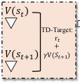

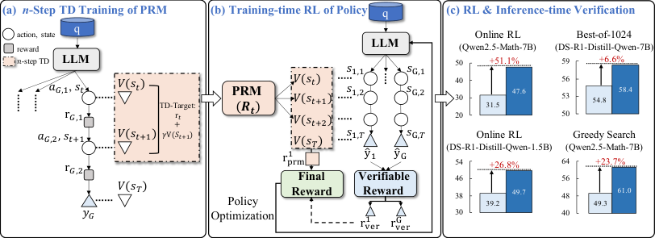

Figure 1: Overall framework of TDRM . In panel (a), we employ _n_ -step TD learning for training the
PRM. In panel (b), process reward and verifiable reward are effectively combined for RL training.
In panel (c), RL training results in Table 4 compare baselines against TDRM . Best-of-1024 outcomes
in Table 2 contrast ScalarORM with TDRM (3-step TD). For greedy search evaluations in Figure 3,
Qwen2.5-Math-7B with a branch factor of 8 is used to compare ScalarORM against TDRM (TD(2)).

To tackle these challenges, we introduce TDRM that employs Temporal Difference (TD) learning
for reward modeling (Figure 1). Unlike prior approaches where TD was used to construct offline
datasets, our method leverages TD for online training, dynamically bootstrapping intermediate
rewards by integrating future estimates at each step to derive process reward models. Additionally, we
propose a strategy that takes advantage of both rule-based rewards (e.g., from Group Relative Policy
Optimization (GRPO) [ 28 ]) and process rewards generated by TDRM, delivering denser reward signals
for online RL training. We evaluate TDRM in two scenarios: _(1) inference-time verification_ and _(2)_
_training-time reinforcement learning_ . Experimental results show that TDRM induces _smoother_ reward
landscapes compared to conventional PRM training — increasing the low rewards and reducing
the high rewards — thus significantly improving verification accuracy (e.g., Best-of- _N_, tree search)
during inference. TDRM also demonstrates enhanced RL performance, outperforming multiple LLM
baselines in both reward signal density and learning efficiency on mathematical benchmarks.

In summary, our key contributions are listed below:

- We introduce the framework TDRM, aiming to learn more reliable reward models in RL training. By
leveraging temporal difference learning, TDRM generates smoother reward landscapes in Figure 8.

- Training-time RL experiments show that incorporating TDRM into the RL loop yields strong performance gains (up to 51.1%) and data efficiency (matching 50.1k baseline performance with only
2.5k data) on 8 model variants (5 series) with an effective combination of verifiable rule-based and
process rewards in Table 4.

- Inference-time verification demonstrates that online TD-trained PRMs significantly enhance performance in both Best-of- _N_ (up to 6.6%) in Table 2 and tree-search (up to 23.7%) in Figure 3.

2 P RELIMINARIES

2.1 LLM R EASONING AS MDP

The reasoning process in LLMs can be framed as a Markov Decision Process (MDP) [ 34 ]. An MDP
typically involves a state space _S_, containing the full set of possible situations, and an action space _A_,
encompassing the set of allowable decisions. It also includes a transition function _f_ : _S × A →S_,
along with a reward function _R_ : _S × A →_ _r_, _r ∈_ [0 _,_ 1] . In our context, the state space corresponds to
every possible token sequence generated so far, whereas the action space comprises all possible tokens
that can be selected next [ 29 ]. The transition function _f_ in our setting is simply the concatenation
operation _f_ ( _s_ _t_ _, a_ _t_ ) = _s_ _t_ _· a_ _t_, where _·_ denotes concatenation. Regarding LLM reasoning, the input
prompt is given as ( _q_ 0 _, · · ·, q_ _L_ ), and at step _t −_ 1, the sequence of generation tokens for a single
solution is ( _o_ 0 _, · · ·, o_ _t−_ 1 ) . Thus, given a prompt, action _a_ _t_ is a newly generated token and _s_ _t_ is the
token sequence or the context for LLM, i.e., _s_ _t_ = ( _q_ 0 _, · · ·, q_ _L_ _, o_ 0 _, · · ·, o_ _t−_ 1 ) . In our work, an action
is defined as a newly generated sentence. In standard RL, the reward function _R_ ( _s_ _t_ _, a_ _t_ ) is designed

2

Preprint

to assign an expected value for the partial generation paths based on each ( _s_ _t_ _, a_ _t_ ) pair. In our study,
we particularly emphasize establishing a process reward signal at each step _t_ and outcome reward in
the terminal step _T_ to guide the judgment (reflecting the correctness of a partial reasoning trace) of
generation (guiding the learning direction) of LLM.

2.2 R EWARD M ODELING FOR LLM S

Recent studies [ 19 ; 46 ] model process rewards by training intermediate steps with labeled (Discriminative/Scalar) or generated (Generative) rewards and outcome rewards by comparing the final output
with ground truth. Specifically, _Process Reward Modeling_ estimates the rewards of intermediate
steps as hard or soft values using learning a value function or training a value network. In contrast,
_Rule-based/Outcome Reward Modeling_ obtains the outcome reward using a rule-driven function that
allocates rewards exclusively according to whether the complete sequence is correct. In domains
such as mathematical reasoning, code generation, and theorem proving, leveraging the final accuracy
of verifiable tasks as an outcome reward has proven effective in strengthening reasoning abilities.
Specifically, a correct output will receive a +1 reward, while an incorrect output will receive a 0
reward. The goal of reward modeling is to help _generalize_ to unseen, out-of-distribution (OOD)
problems and provide guidance in such OOD scenarios.

2.3 O NLINE RL T RAINING

In this work, we adopt the zero RL training strategy [ 44 ] described in DeepSeek-R1 [ 5 ]. This
approach utilizes GRPO [ 28 ], which removes the need for explicit value and advantage functions [ 8 ].
GRPO uses group-normalized rewards to estimate the advantages to further optimize computational
efficiency. For a given query _q_, and the responses _O_ = _o_ 1 _, o_ 2 _, . . ., o_ _G_ are produced by the previous
policy model _π_ old . The objective of GRPO is to refine the policy model _π_ as follows:

_|o_ _i_ _|_
�

_j_ =1

�

_π_ _θ_ ( _o_ _i,j_ _|q, o_ _i,<j_ ) ˆ
min _A_ _i,j_ _,_
� _π_ _θ_ old ( _o_ _i,j_ _|q, o_ _i,<j_ )

_J_ GRPO ( _θ_ ) = E ( _q,a_ ) _∼D,{o_ _i_ _}_ _Gi_ =1 _[∼][π]_ _[θ]_ old [(] _[·|][q]_ [)]

1

_G_
�

_G_
�

_i_ =1

1

_|o_ _i_ _|_

(1)

_π_ _θ_ ( _o_ _i,j_ _|q, o_ _i,<j_ )
clip
� _π_ _o_

_,_

��

_π_ _θ_ _o_ _i,j_ _q, o_ _i,<j_ _A_ ˆ _i,j_ _−_ _βD_ KL ( _π_ _θ_ _||π_ ref )

_π_ _θ_ old ( _o_ _i,j_ _|q, o_ _i,<j_ ) _[,]_ [ 1] _[ −]_ _[ε,]_ [ 1 +] _[ ε]_ � �

_,_

where _π_ ref is the reference model, _o_ _i,j_ represents the token produced at _j_ -th generation step in the
_i_ -th generated response. To limit deviation from the reference, a KL-divergence regularization
term, _D_ KL, is incorporated. The advantage estimate _A_ [ˆ] _i,j_ quantitatively reflects how much each
response _o_ _i_ surpasses the group average. This is achieved by normalizing the reward within the group:
_A_ ˆ _i,j_ = _[r]_ _[i]_ _[−]_ std [mean] ( _{r_ [(] 1 _[{]_ _,r_ _[r]_ 2 [1] _,...,r_ _[,][r]_ [2] _[,][...]_ _G_ _[,]_ _}_ _[r]_ ) _[G]_ _[}]_ [)] . The term _r_ _i,t_ ( _θ_ ) is defined as the likelihood ratio _ππ_ _θθ_ old ( _o_ ( _o_ _i,ji,j_ _|q,|q,oo_ _i,<ji,<j_ )) [.]

3 T HE TDRM M ETHOD

TDRM employs temporal difference learning to construct reliable reward models for RL training, and
can be integrated with verifiable rewards. The framework comprises three components (Figure 1):

- PRM Module: A process reward model trained via _n_ -step TD learning with reward shaping.

- RL Module: Online RL guided by the trained process reward model to optimize policy updates.

- TDRM Integration: An effective linear combination of process reward from PRM and verifiable
reward, applied to actor-critic style online RL across different policy model series and sizes.

3.1 U NDERSTANDING R EWARD S MOOTHNESS

**Background.** Temporal difference (TD) methods enable the iterative refinement of policy value
estimates by leveraging the inter-dependencies between states. In particular, _n_ -step TD updates extend
this concept by incorporating rewards and value estimates from _n_ subsequent states, providing a more
comprehensive and forward-looking perspective compared to traditional 1 -step TD. This approach
discounts future rewards exponentially using a factor (e.g., _γ_, usually less than 1) to encourage
receiving earlier rewards and balance short-term gains with long-term consequences of actions.

3

Preprint

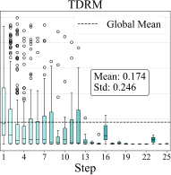

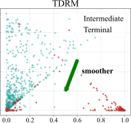

|S 1.0 | | 0.8 Magnitude 0.6 0.4 Error 0.2 TD 0.0 1 4 7 1|calarPRM|
|---|---|
|1 4 7 1 0.0 0.2 0.4 0.6 0.8 1.0 TD Error Magnitude| | S|Mean: 0.281 Std: 0.353|
|1 4 7 1 0.0 0.2 0.4 0.6 0.8 1.0 TD Error Magnitude| | S|0 13 16 19 22 2|
|1 4 7 1 0.0 0.2 0.4 0.6 0.8 1.0 TD Error Magnitude| | S|Step|

|Sca|Col2|Col3|larPRM|Col5|Col6|Col7|
|---|---|---|---|---|---|---|
|||||less s|mooth||
|0.0 0.2 0.4 |0.0 0.2 0.4 |0.0 0.2 0.4 |0.6 0.8 |0.6 0.8 |0.6 0.8 |1.0|
|||||||V|||||||

|Col1|Col2|Col3|Col4|Ter|minal|
|---|---|---|---|---|---|
|||||~~smo~~|~~other~~|
|0.0 0.2 0. |0.0 0.2 0. |0.0 0.2 0. |0.6 0.8 1 |0.6 0.8 1 |0.6 0.8 1 |
||||V|||||

Figure 2: Comparison of reward model smoothness. Left: Box plots of TD error magnitude across
reasoning steps (steps segmented by double newlines). TDRM exhibits lower mean and variance of TD
errors, indicating smoother and more consistent reward dynamics compared to ScalarPRM. Right:
Scatter plots of TD error versus value change magnitude. The tighter distribution in TDRM shows a
more coherent relationship between error and value updates, especially for intermediate steps, while
ScalarPRM exhibits noisier and less structured patterns.

In the context of LLM reasoning, each step corresponds to an individual reasoning operation generated
by LLM, and the estimated values serve as process rewards. We instantiate this framework using
the following _n_ -step TD algorithm, where _ϕ_ represents the parameters of a PRM, to capture the
cumulative impact of intermediate reasoning steps and explicitly model the long-term value:





 _· ∇_ _ϕ_ _V_ ( _s_ _t_ ; _ϕ_ ) _._ (2)




_ϕ ←_ _ϕ_ +










_n−_ 1
�

� _γ_ _[k]_ _r_ _t_ + _k_ + _γ_ _[n]_ _V_ ( _s_ _t_ + _n_ ; _ϕ_ )

_k_ =0

~~�~~ ~~��~~ �
TD target

_−V_ ( _s_ _t_ ; _ϕ_ )

**Smoothness Analysis.** Smoothness is a crucial property for effective reward modeling in the
reasoning process, as it reflects the consistency and stability of value updates across intermediate
steps, ensuring that minor changes in reasoning trajectories do not result in disproportionate deviations
in value estimation. To measure smoothness, we adopt two complementary approaches to evaluate
the behavior of ScalarPRM and our TDRM . _(1) the local Lipschitz constant_, which quantifies the
sensitivity of rewards to variations between adjacent states in Table 1 (see details in Appendix F.5).
Our analysis shows that TDRM yields a smaller Lipschitz constant on average between consecutive
steps, indicating smoother reward transitions and better temporal consistency. _(2) TD error_ _δ_ between
consecutive reasoning steps and the _value difference_ ∆ _V_ _t_ between reasoning steps with Eq. (3) and
Eq. (4), providing a combined perspective on assessing the continuity and consistency of the estimated
value function. In Figure 2, we compare smoothness by plotting TD error _δ_ against reasoning steps
(steps segmented by double newlines), and TD error _δ_ vs. value change _|_ ∆ _V_ _t_ _|_ . Here, a step refers
to a reasoning segment in the model’s generated trajectory, defined by a double newline delimiter.
Examining TD error across steps allows us to assess how consistently the reward model evaluates
reasoning as the chain progresses. TDRM exhibits lower mean and variance of TD errors (0.174 vs.
0.281) than ScalarPRM, indicating smoother and more stable reward dynamics. In the right panels,
each point corresponds to either an intermediate step ( **cyan**, reasoning in progress) or a terminal step
( **red**, final answer). We distinguish between these because terminal steps are evaluated against the
final outcome reward, whereas intermediate steps are judged relative to subsequent reasoning states.
A smoother relationship between TD error and value changes at intermediate steps indicates that
TDRM provides more coherent trajectory-level reward shaping, while ScalarPRM remains noisier and
less structured. These findings afford insights into a stable and consistent reward model design which
motivates our TDRM.

Table 1: Lipschitz constant analysis on average.

Lipz. cont. ScalarPRM TDRM

Avg. _↓_ 0.3331 0.2741

_δ_ = �� _r_ + _γV_ ( _s_ _t_ +1 ) _−_ _V_ ( _s_ _t_ )�� _._ (3)

∆ _V_ _t_ = �� _V_ ( _s_ _t_ +1 ) _−_ _V_ ( _s_ _t_ )�� _._ (4)

_δ_ measuring the TD error magnitude and ∆ _V_ _t_
measuring the value change magnitude.

4

Preprint

3.2 R EWARD M ODELING

Motivated by the analyses in Section 3.1 as well as insights from prior research [ 42 ] which highlights
that the length of CoT does not always increase steadily during LLM reasoning, reward shaping
emerges as a crucial mechanism for stabilizing the emergent length scaling behavior. In the context
of our TD-based PRM, reward shaping serves a dual purpose: it refines the TD updates by providing
structured feedback and mitigates the volatility of reward signals across different reasoning lengths.

**Cosine Reward.** To stabilize reasoning length, we leverage the cosine-based reward function [ 42 ]
that adapts to the correctness of reasoning steps and their relative lengths, assigning distinct reward
ranges for correct ( _Y_ = 1) and incorrect ( _Y_ = 0) steps, formalized as:

_r_ _t_ =

_CosRew_ ( _L_ _gen_ _, L_ _max_ _, r_ 0 _[c]_ _[, r]_ _L_ _[c]_ [)] _[,]_ _if_ _Y_ = 1 (5)
� _CosRew_ ( _L_ _gen_ _, L_ _max_ _, r_ 0 _[w]_ _[, r]_ _L_ _[w]_ [)] _[,]_ _if_ _Y_ = 0 _[.]_

Here, _L_ _gen_ represents the current generation length of the reasoning step, while _L_ _max_ denotes the
maximum length across all generated steps. The parameters _r_ 0 _[c]_ [and] _[ r]_ 0 _[w]_ [specify the initial rewards for]
correct and incorrect steps when _L_ _gen_ = 0, set to 1 and 0, respectively. Conversely, _r_ _L_ _[c]_ [and] _[ r]_ _L_ _[w]_ [define]
the terminal rewards at _L_ _gen_ = _L_ _max_, with values of 2 and -10, respectively. The binary label _Y_
serves as a correctness indicator for each step. The cosine reward function itself is defined as:

_CosRew_ ( _l, L, r_ _min_ _, r_ _max_ ) = _r_ _min_ + [1]

2 [(] _[r]_ _[max]_ _[ −]_ _[r]_ _[min]_ [)]

�

_lπ_
1 + _cos_
� _L_

_L_

� [�]

_._ (6)

This formulation ensures that the reward begins at its maximum value ( _r_ _max_ ) and gradually decays
to the minimum ( _r_ _min_ ) as the reasoning length _l_ approaches the maximum length _L_ .

**Temporal Difference (TD).** Once the reward function is defined, we can integrate it with the
temporal difference framework to update our PRM. Leveraging the general TD update formula from
Eq. (2), we use _r_ _t_ as the reward in our specific scenario, and set the step size as 1 . We can then derive
our TD target with Eq. (2) and Eq. (5):

_v_ _t_ =

_n−_ 1
� _γ_ _[k]_ _r_ _t_ + _k_ + _γ_ _[n]_ _V_ ( _s_ _t_ + _n_ ) _._ (7)

_k_ =0

To align with the desired range of feedback signals, we further process the TD target by clamping it
within the interval [0 _,_ 1], which yields our final clamped TD target ˜ _v_ _t_ :

_v_ ˜ _t_ =






_V_ _t_ _,_ if is_terminal( _t_ )

_n−_ 1 (8)
min max _k_ =0 _[γ]_ _[k]_ _[r]_ _[t]_ [+] _[k]_ [ +] _[ γ]_ _[n]_ _[V]_ [ (] _[s]_ _[t]_ [+] _[n]_ [)] _[,]_ [ 0] _,_ 1 _,_ otherwise
� �� � �

In the terminal states, where no subsequent states exist to contribute to the TD calculation, we directly
set the target to _V_ _t_ . This integration of the custom reward function with TD learning allows our PRM
to effectively capture the temporal dynamics of LLM reasoning, providing more informed and stable
guidance for policy optimization. We present a detailed algorithm in Algorithm 3. In Table 5, we set
_n_ to each of _{_ 1 _,_ 2 _,_ 3 _}_ and explore how different _n_ affects PRM performance.

**TD-** _λ_ **.** Besides applying _n_ -step TD, we also investigate TD- _λ_ as an alternative. TD- _λ_ generalizes
_n_ -step TD and functions as an online algorithm that offers greater flexibility. Due to its online nature,
TD- _λ_ allows PRM to propagate information to earlier states as soon as it observes a reward. For
example, in the backward view of TD- _λ_, if an intermediate step is incorrect, it can immediately
update state values of the preceding states. In contrast, in _n_ -step TD, the corresponding states would
not receive updates until future episodes. The pseudo-code and results for PRM training using TD- _λ_
are shown in Algorithm 2 and Figure 4. Notably, in Algorithm 2, we slightly abuse the notation by
writing _V_ ( _s_ _t_ ) for the value of model logits instead of the sigmoid values.

**Loss Function.** In optimizing our PRM, we employ Cross-Entropy Loss that leverages a clamped
TD target ˜ _v_ _t_ as a soft label for each reasoning step, enabling the model to learn from the temporal
consistency of rewards as:

˜ ˜

� _v_ _t_ log( _p_ _t_ ) + (1 _−_ _v_ _t_ ) log(1 _−_ _p_ _t_ )

_t_ =1



 _,_ (9)

_|τ_ PRM _|_
�

_L_ PRM = _−_ E _τ_ PRM _∼D_ PRM



1
 _|τ_ PRM _|_

5

Preprint

where _τ_ PRM = _{_ ( _s_ 1 _, r_ 1 ) _, . . .,_ ( _s_ _T_ _, r_ _T_ ) _}_ is the trajectory containing each step and the corresponding
reward _r_ _t_, and _p_ _t_ refers to the model’s output probability at step _t_, derived by applying the sigmoid
function to the output logits. In practice, reasoning steps from diverse trajectories are randomly
batched to facilitate minibatch training, ensuring the loss function captures both local step-wise
rewards and global trajectory dynamics.

3.3 O NLINE R EINFORCEMENT L EARNING

Our algorithm operates online, dynamically calculating TD targets using state values on-the-fly during
training. Unlike offline algorithms that rely on pre-computed state values, TDRM adapts to evolving
trajectories, leveraging seen trajectories to estimate state values for unseen ones. This adaptability
improves value prediction accuracy and enhances the consistency and robustness of the reward model.

**Verifiable Reward.** In our RL training, we follow the verifiable reward _R_ verifiable used in R1 [ 5 ].
_R_ verifiable is defined as a function that checks the format of the predicted answer ˆ _g_ ( has_boxed ) and
assesses the equivalence between the prediction ˆ _g_ and the ground-truth _g_ (is_equivalent):

_R_ verifiable (ˆ _g, g_ ) =

1 _,_ if is_equivalent(ˆ _g, g_ ) and has_boxed(ˆ _g_ )

0 _,_ if _¬_ is_equivalent(ˆ _g, g_ ) and has_boxed(ˆ _g_ ) _._ (10)

 _−_ 1 _,_ otherwise

While _R_ verifiable is straightforward and interpretable, it considers only the end answer and omits
assessment of intermediate reasoning steps. A more detailed explanation of is_equivalent and
has_boxed can be found in Appendix F.4.

**Process-based Reward.** Rule-based verifiable rewards often encounter a critical limitation: they
assign identical rewards to trajectories that produce correct answers via incorrect intermediate steps.
To address this gap and capture the temporal dynamics of reasoning, our PRM plays a pivotal role
in online RL. By assigning rewards to intermediate states based on their estimated values, PRM
provides a more fine-grained feedback signal, effectively mitigating the “right answer, wrong process”
issue. Specifically, the process-based reward at step _t_ is defined as the state value output by the PRM
through _R_ PRM ( _s_ _t_ ) := PRM _ϕ_ ( _s_ _t_ ).

**Effective Combination for RL.** In TDRM, we harness the complementary strengths of verifiable and
process-based rewards through a linear combination, enabling a more comprehensive and nuanced
reward signal for online RL. The final reward function _R_ final is formulated as:

_r_ final = _ar_ PRM + (1 _−_ _a_ ) _r_ verifiable _,_ (11)

where the hyper-parameter _a_ balances the influence of process-based feedback against outcome-based
verification. Finally, this combined reward _r_ final as _r_ _i_ is used in _A_ [ˆ] _i,j_ = _[r]_ _[i]_ _[−]_ std [mean] ( _{r_ [(] 1 _[{]_ _,r_ _[r]_ 2 [1] _,...,r_ _[,][r]_ [2] _[,][...]_ _G_ _[,]_ _}_ _[r]_ ) _[G]_ _[}]_ [)] to train

the GRPO objective, enhancing the overall performance and data efficiency of the learning process.

**Algorithm Implementation.** As presented in Algorithm 1, we outline the overall training process of
TDRM for integrating verifiable and process-based rewards in online RL. Additionally, Algorithm 3
provides a step-by-step breakdown of the _n_ -step TD method used for training PRM.

4 E XPERIMENTS

In this section, we benchmark TDRM in two scenarios, i.e., (1) inference-time verification and (2)
training-time online reinforcement learning.

4.1 E XPERIMENTAL SETTINGS

**Evaluation Metrics and Benchmarks.** _(1) For inference-time verification_, we compare different reward models under two key settings. _Best-of-_ _N_ _Sampling_ works by first generating
a pool of _N_ potential outputs and selecting the best candidate using the RM. We test with
_N ∈{_ 128 _,_ 1024 _}_ and evaluate on GSM8K [ 4 ] and MATH-500 [ 10 ]. _Greedy Search_ [ 17 ] generates outputs by iteratively selecting the highest-scoring sequences. To improve exploration,

6

Preprint

**Algorithm 1:** Process of TDRM

**Notation:** GRPO: group relative policy optimization; PRM _ϕ_ ( _s_ _t_ ): PRM logits for step _s_ _t_
**Input:** Initial policy model _π_ _θ_ ; process reward model PRM _ϕ_ ; verifiable reward function _R_ verifiable ; task
prompts _D_ policy ; final reward _R_ final ; hyperparameters _α_
1: Reference model _π_ ref _←_ _π_ _θ_
2: **for** Iteration = 1 _, . . ., I_ **do**
3: Sample a mini-batch _D_ _b_ from _D_ policy
4: Set old policy _π_ old _←_ _π_ _θ_
5: Sample _G_ trajectories _{τ_ _i_ _}_ _i_ _[G]_ =1 [from] _[ π]_ [old] [for each question] _[ q][ ∈D]_ _[b]_
6: **for** each trajectory _τ_ _i_ = _{s_ 1 _, . . ., s_ _T_ _}_ **do**
7: Compute verifiable reward _r_ verifiable [(] _[τ]_ _[i]_ [)] [for] _[ τ]_ _[i]_ [ through Eq. (10)]
( _s_ _T −_ 1 )
8: Compute process-based reward _r_ PRM _←_ PRM _ϕ_ ( _s_ _T −_ 1 ) for _s_ _T −_ 1 through _R_ PRM ( _s_ _t_ ) := PRM _ϕ_ ( _s_ _t_ )
9: Compute final reward _r_ final [(] _[τ]_ _[i]_ [)] _[←]_ _[a][ ·][ r]_ verifiable [(] _[τ]_ _[i]_ [)] [+ (1] _[ −]_ _[a]_ [)] _[ ·][ r]_ [PRM] [(] _[s]_ _[T][ −]_ [1] [)][ for] _[ τ]_ _[i]_ [ through Eq. (11)]
10: **end for**
11: Compute advantages _A_ [ˆ] _i,j_ for the _j_ -th token of each _τ_ _i_ using group relative advantage estimation
12: Update the policy _π_ _θ_ through maximizing the GRPO objective using _A_ [ˆ] _i,j_
13: **end for**

**Output:** Optimized policy _π_ _θ_

Table 2: Results on MATH-500 using the RM for selection in Best-of- _N_
sampling. The PRM backbone is DeepSeek-R1-Distill-Qwen-7B.

DS-R1-Distill-Qwen-7B Llama3.1-8B-Instruct
Method

Best-of-128 Best-of-1024 Best-of-128 Best-of-1024

ScalarORM 52.0 54.8 42.2 42.8

ScalarPRM 53.4 56.2 **44.4** 44.8

TDRM **54.2** **58.4** 43.2 **45.6**

Table 3: Results on

GSM8K in Best-of128 sampling.

Method Result

ScalarORM 69.29

ScalarPRM 71.34

TDRM **73.24**

the branching factor is set to _m ∈{_ 2 _,_ 4 _,_ 8 _,_ 16 _}_, and experiments are performed on MATH-500.
For a fair comparison, pre-generate reasoning trajectories are utilized during inference. Accuracy is used as the evaluation metric for both strategies (see more details in Appendix F.1).
_(2) For training-time online RL_, we benchmark TDRM against leading methods on five difficult
datasets: MATH-500, Minerva Math [ 15 ], Olympiad Bench [ 9 ], AIME24, and AMC23. Following SimpleRL [ 44 ], we evaluate performance using the Pass@1 metric with greedy decoding.

4.2 M AIN E XPERIMENTAL R ESULTS

**Reward Modeling and Inference Scaling Results.**
Corresponding Section 2.2, Figure 6 provides the
definition comparison and MATH-500 results of recent reward models. Table 2 and 3 present the results of Best-of- _N_ sampling across different models
and datasets, providing empirical evidence of TDRM ’s
superiority. Firstly, TDRM outperforms ScalarPRM
and ScalarORM on the MATH-500 dataset as the
sampling budget increases from Best-of-128 to Bestof-1024. Specifically, with DS-R1-Distill-Qwen7B, TDRM achieves relative improvements of 6.7%

over ScalarORM and 3.9% over ScalarPRM; with Figure 3: Comparison of TDRM versus base
lines on Greedy Search, using Qwen2.5-Math
Llama3.1-8B-Instruct, the respective relative gains

7B as the backbone.

are 6.5% compared to ScalarORM and 1.8% compared to ScalarPRM. This strongly indicates that
TDRM is more reliable and can consistently identify the best responses with larger sampling budgets.
Notably, the GSM8K results in Table 3 utilize samples generated by Mistral-7B-Instruct-v0.2,

7

Preprint

Table 4: Evaluation results on standard mathematical benchmarks under a constrained data system of
2.5k samples. We highlight the top score in **bold** and the second-best by underlining it. The relative
improvement ( **%Improv.** ) for each method is computed based on the performance in this setup.

Model DataSize MATH500 MinervaMath OlympiadBench AIME24(Pass@1) AMC23 Avg.

**Backbone is Base Model, Qwen Series**

**Qwen2.5-0.5B**    - 15.8 4.8 2.8 0.0 12.5 7.2
+ SimpleRL (Greedy) 50.1k 32.6 8.1 9.0 0.0 15.0 12.9

+ ScalarPRM 3.4 2.2 1.9 0.0 5.0 2.5

+ ScalarORM 6.2 2.2 2.8 0.0 5.0 3.2

2.5k

+ Rule-based 29.8 4.0 7.0 0.0 12.5 10.7
+ Ours 26.2 4.8 7.1 0.0 15.0 **10.8** ( **+0.9%** )

+ ScalarPRM

2.5k

**Qwen2.5-1.5B** - 29.6 6.6 6.5 0.0 12.5 11.0
+ SimpleRL (Greedy) 50.1k 22.6 2.6 8.4 0.0 5.0 7.7

+ ScalarPRM

+ ScalarPRM 0.2 0.0 0.0 0.0 0.0 0.0

+ ScalarORM 1.8 0.0 0.6 0.0 5.0 1.5

2.5k

+ Rule-based 58.0 12.1 18.7 0.0 27.5 23.3
+ Ours 52.8 9.9 17.8 3.3 35.0 **23.8** ( **+2.1%** )

2.5k

**Backbone is Chat Model, GLM Series**

**GLM4-9B-0414** - 65.8 36.8 28.7 10.0 42.5 36.8

+ ScalarPRM 67.0 38.6 31.9 6.7 45.0 37.8

+ ScalarORM 68.2 39.3 30.2 10.0 42.5 38.0

2.5k

+ Rule-based 72.8 37.5 37.0 16.7 40.0 40.8
+ Ours 72.2 37.1 32.0 20.0 47.5 **41.8** ( **+2.5%** )

+ ScalarPRM

2.5k

**Backbone is Reasoning Model, GLM Series**

**GLM-Z1-9B-0414** - 93.6 43.8 65.5 73.3 92.5 73.7

+ ScalarPRM 94.0 47.8 66.4 76.7 92.5 75.5

+ ScalarORM 95.0 46.7 65.9 76.7 97.5 76.4

2.5k

+ Rule-based 95.6 43.4 65.2 73.3 97.5 75.0
+ Ours 94.6 44.9 66.5 80.0 97.5 **76.7** ( **+0.4%** )

+ ScalarPRM

2.5k

**Backbone is Base Model, Qwen-Math Series**

**Qwen2.5-Math-1.5B** - 42.2 8.8 27.0 10.0 37.5 25.1
+ SimpleRL (Greedy) 50.1k 59.8 13.6 29.9 10.0 37.5 30.2

+ ScalarPRM 66.2 17.3 28.7 13.3 50.0 35.1

+ ScalarORM 41.6 8.5 27.0 10.0 40.0 25.4

2.5k

+ Rule-based 67.6 21.3 31.0 6.7 52.5 35.8
+ Ours 66.2 18.4 30.1 13.3 55.0 **36.6** ( **+2.2%** )

+ ScalarPRM

2.5k

**Qwen2.5-Math-7B** - 63.6 12.5 25.8 13.3 42.5 31.5
+ Our Template - 68.8 16.2 31.1 13.3 62.5 38.4
+ SimpleRL-Zero 8.5k 77.8 31.2 37.5 23.3 62.5 46.5
+ SimpleRL (Greedy) 50.1k 78.2 27.6 40.3 26.7 60.2 46.6
GRPO - 77.8 39.7 39.1 20.0 57.5 46.8
Dr. GRPO† - 74.6 30.1 37.3 26.7 50.0 43.7
OpenReasoner-Zero - 82.4 31.6 47.9 13.3 54.2 45.9

+ ScalarPRM 75.8 29.0 36.4 26.7 60.0 45.6

+ ScalarORM 71.2 22.1 37.5 20.0 50.0 40.2

2.5k

+ Rule-based 73.2 25.0 37.8 23.3 65.0 44.9
+ Ours 74.6 26.8 37.3 36.7 62.5 **47.6** ( **+4.4%** )

+ ScalarPRM

2.5k

**Backbone is Reasoning Model, DeepSeek Series**

**DS-R1-Distill-Qwen-1.5B** - 70.6 26.5 32.1 16.7 50.0 39.2

+ ScalarPRM 74.2 29.0 35.7 33.3 60.0 46.4

+ ScalarORM 77.4 30.5 38.5 33.3 60.0 47.9

2.5k

+ Rule-based 75.4 26.8 36.1 20.0 57.5 43.2
+ Ours 79.8 30.5 38.2 30.0 70.0 **49.7** ( **+3.8%** )

+ ScalarPRM

2.5k

**DS-R1-Distill-Qwen-7B** - 88.0 43.0 49.9 63.3 82.5 65.3
SEED-GRPO 8.5k 91.6 38.6 61.5 50.0 78.3 64.0

+ ScalarPRM 87.6 50.7 49.8 53.3 85.0 65.3

+ ScalarORM 90.4 50.7 52.7 43.3 90.0 65.4

2.5k

+ Rule-based 89.6 46.0 52.4 50.0 82.5 64.1
+ Ours 91.8 50.4 54.1 53.3 87.5 **67.4** ( **+3.0%** )

+ ScalarPRM

2.5k

8

Preprint

which is different from the reward models’ training data, demonstrating TDRM ’s superior ability to
generalize to new data distributions.

In tree search evaluations, as shown in Figure 3, TDRM again demonstrates superior performance with
Qwen2.5-Math-7B and provides a more accurate verification of reasoning trajectories. Moreover,
TDRM exhibits enhanced reliability, with its accuracy improving as the number of search branching
factors increases from 2 to 16, indicating its effectiveness in navigating complex decision spaces. In
addition, as shown in Figure 7, TDRM further validates its ability on unseen data distributions (i.e.,
Mistral data) compared to baseline methods.

**Online Reinforcement Learning Results.** Table 4 compares the RL training outcomes of TDRM
against the state-of-the-art methods, demonstrating its superiority across 8 model variants (5 series)
using only 2.5k MATH Level-3 prompts. Spanning diverse model sizes and pre-training paradigms,
TDRM consistently achieves the highest average accuracy, underscoring its reliability in RL training.
For example, TDRM beats all the other methods — whether using verifiable rewards or reward models
— by an average of 0 _._ 9% to 4 _._ 4% over the second-best model, with a notable 36 _._ 7% Pass@1 on
AIME24 on Qwen2.5-Math-7B, highlighting its significant advancement in mathematical reasoning.
Notably, on smaller Qwen2.5-(0.5B, 1.5B), which exhibit weaker inherent math capabilities, training
with ScalarPRM or ScalarORM alone leads to model collapse. In contrast, TDRM ’s linear combination
of verifiable and process-based rewards ensures stable performance and superior data efficiency,
enabling consistent learning even with limited training samples.

Table 5: Results of _n_ -step TD
on MATH-500 when backbone
is DS-R1-Distill-Qwen-7B.

_n_ Best-of-128 Best-of-1024

1 54.2 **58.4**

2 **55.4** 56.2

3 54.2 56.8

|52.6 51.9 (%) Accuracy 51.2 50.5 49.8|Col2|Col3|Col4|
|---|---|---|---|
|49.8 50.5 51.2 51.9 52.6 Accuracy (%)||||
|49.8 50.5 51.2 51.9 52.6 Accuracy (%)|||~~= 1.0~~|
|49.8 50.5 51.2 51.9 52.6 Accuracy (%)|||= 0.99|

Figure 4: TD- _λ_ results on
MATH-500 in Best-of-128
sampling.

|47.6 46.6 45.6 44.6 43.6 0.|Col2|Col3|Col4|Col5|Col6|
|---|---|---|---|---|---|
|0. 43.6 44.6 45.6 46.6 47.6||||||
|0. 43.6 44.6 45.6 46.6 47.6||||||
|0. 43.6 44.6 45.6 46.6 47.6||||||
|0. 43.6 44.6 45.6 46.6 47.6||1 0.2 0.|1 0.2 0.|5 0.8|5 0.8|

Figure 5: Avg. performance
of online RL training vs _a_ on
Qwen2.5-Math-7B.

4.3 A NALYSIS AND ABLATION STUDIES

We study the features of TDRM through comprehensive analyses: reward distribution comparison,
varying lookahead steps in TDRM, TD- _λ_, and the tradeoff between verifiable and process rewards.
Given that TDRM (3-step TD) is the primary configuration for RL training, the following studies focus
on this setup, with ScalarPRM serving as the default comparator unless specified otherwise.

_**n**_ **-step TD.** To study the effect of look-ahead steps _n_, we present the Best-of- _N_ results for TDRM
trained with 1, 2, and 3-step TD in Table 5. While 1-step TD performs the best under a larger
sampling budget (Best-of-1024), 2-step TD achieves the best under a smaller number of candidates
(Best-of-128). This suggests that a moderate lookahead step may help improve sample efficiency,
while shorter horizons exhibit greater robustness and generalize better with a larger budget.

**TD-** _λ_ **.** Building on the _n_ -step TD framework, where TD- _λ_ provides a mechanism to balance between
TD(0) and TD(1), we evaluate TD- _λ_ under varying values of _λ_ and different discount factor _γ_ .As
shown in Figure 4, the interaction between _λ_ and _γ_ has a significant non-linear impact on model
accuracy. Specifically, _λ_ = 0 _._ 8 consistently achieves the highest accuracy for both discount factors.
However, as _λ_ increases to 0 _._ 9, the accuracy declines. These results highlight that tuning of _λ_ around
0 _._ 8 is critical for balancing temporal consistency and achieving optimal performance.

**Reward Combination Tradeoff.** In the RL training of TDRM, we analyze the linear combination
of the process reward and the verifiable reward via the coefficient _a_ (verifiable reward coefficient:
1 _−_ _a_ ). As shown in Figure 5, performance peaks at _a_ = 0 _._ 2, with significant degradation for both
higher and lower values. This indicates process rewards serve best as a complementary signal—too
low a weight introduces insufficient guidance, while excessive weight amplifies noise.

9

Preprint

5 C ONCLUSION

TDRM tackles the challenge of temporal inconsistency in reward models by introducing TD regularization, which enhances reward density and stability. Across Best-of- _N_ and tree-search scenarios,
TDRM -trained PRMs consistently improve performance and complement verifiable reward methods,
enabling more data-efficient RL training and stronger LLM policies on 8 models.

These results show that incorporating temporal consistency into reward models not only stabilizes
RL training but also opens the door to more scalable RLHF pipelines, higher-quality inference-time
search, and broader applications in aligning LLMs with complex objectives.

R EPRODUCIBILITY S TATEMENT

We provide pseudo-code in the Algorithm 1, Algorithm 2, and Algorithm 3 for TDRM training process,
TD- _λ_, and _n_ -step TD for PRM training. We provide experimental settings in Section 4.1 and F.1. We
also release all code to promote reproducibility.

R EFERENCES

[1] Josh Achiam, Steven Adler, Sandhini Agarwal, Lama Ahmad, Ilge Akkaya, Florencia Leoni
Aleman, Diogo Almeida, Janko Altenschmidt, Sam Altman, Shyamal Anadkat, et al. Gpt-4
technical report. _arXiv preprint arXiv:2303.08774_, 2023.

[2] Arash Ahmadian, Chris Cremer, Matthias Gallé, Marzieh Fadaee, Julia Kreutzer, Olivier
Pietquin, Ahmet Üstün, and Sara Hooker. Back to basics: Revisiting reinforce style optimization
for learning from human feedback in llms. _arXiv preprint arXiv:2402.14740_, 2024.

[3] Jiale Cheng, Xiao Liu, Cunxiang Wang, Xiaotao Gu, Yida Lu, Dan Zhang, Yuxiao Dong, Jie
Tang, Hongning Wang, and Minlie Huang. Spar: Self-play with tree-search refinement to
improve instruction-following in large language models. _arXiv preprint arXiv:2412.11605_,
2024.

[4] Karl Cobbe, Vineet Kosaraju, Mohammad Bavarian, Mark Chen, Heewoo Jun, Lukasz Kaiser,
Matthias Plappert, Jerry Tworek, Jacob Hilton, Reiichiro Nakano, et al. Training verifiers to
solve math word problems. _arXiv preprint arXiv:2110.14168_, 2021.

[5] DeepSeek. Deepseek-r1: Incentivizing reasoning capability in llms via reinforcement learning.
_arXiv preprint arXiv:2501.12948_, 2025.

[6] Hanze Dong, Wei Xiong, Bo Pang, Haoxiang Wang, Han Zhao, Yingbo Zhou, Nan Jiang, Doyen
Sahoo, Caiming Xiong, and Tong Zhang. Rlhf workflow: From reward modeling to online rlhf.
_arXiv preprint arXiv:2405.07863_, 2024.

[7] Team GLM, Aohan Zeng, Bin Xu, Bowen Wang, Chenhui Zhang, Da Yin, Diego Rojas, Guanyu
Feng, Hanlin Zhao, Hanyu Lai, et al. Chatglm: A family of large language models from
glm-130b to glm-4 all tools. _arXiv preprint arXiv:2406.12793_, 2024.

[8] Yiran Guo, Lijie Xu, Jie Liu, Dan Ye, and Shuang Qiu. Segment policy optimization: Effective segment-level credit assignment in rl for large language models. _arXiv preprint_
_arXiv:2505.23564_, 2025.

[9] Chaoqun He, Renjie Luo, Yuzhuo Bai, Shengding Hu, Zhen Leng Thai, Junhao Shen, Jinyi
Hu, Xu Han, Yujie Huang, Yuxiang Zhang, et al. Olympiadbench: A challenging benchmark
for promoting agi with olympiad-level bilingual multimodal scientific problems. In _ACL_, pp.
3828–3850, 2024.

[10] Dan Hendrycks, Collin Burns, Saurav Kadavath, Akul Arora, Steven Basart, Eric Tang, Dawn
Song, and Jacob Steinhardt. Measuring mathematical problem solving with the math dataset.
_arXiv preprint arXiv:2103.03874_, 2021.

[11] Jingcheng Hu, Yinmin Zhang, Qi Han, Daxin Jiang, Xiangyu Zhang, and Heung-Yeung Shum.
Open-reasoner-zero: An open source approach to scaling up reinforcement learning on the base
model. _arXiv preprint arXiv:2503.24290_, 2025.

10

Preprint

[12] Aaron Jaech, Adam Kalai, Adam Lerer, Adam Richardson, Ahmed El-Kishky, Aiden Low, Alec
Helyar, Aleksander Madry, Alex Beutel, Alex Carney, et al. Openai o1 system card. _arXiv_
_preprint arXiv:2412.16720_, 2024.

[13] Albert Q. Jiang, Alexandre Sablayrolles, Arthur Mensch, Chris Bamford, Devendra Singh
Chaplot, Diego de las Casas, Florian Bressand, Gianna Lengyel, Guillaume Lample, Lucile
Saulnier, Lélio Renard Lavaud, Marie-Anne Lachaux, Pierre Stock, Teven Le Scao, Thibaut
Lavril, Thomas Wang, Timothée Lacroix, and William El Sayed. Mistral 7b, 2023. URL
[https://arxiv.org/abs/2310.06825.](https://arxiv.org/abs/2310.06825)

[14] Xin Lai, Zhuotao Tian, Yukang Chen, Senqiao Yang, Xiangru Peng, and Jiaya Jia. Stepdpo: Step-wise preference optimization for long-chain reasoning of llms. _arXiv preprint_
_arXiv:2406.18629_, 2024.

[15] Aitor Lewkowycz, Anders Andreassen, David Dohan, Ethan Dyer, Henryk Michalewski, Vinay
Ramasesh, Ambrose Slone, Cem Anil, Imanol Schlag, Theo Gutman-Solo, et al. Solving
quantitative reasoning problems with language models. In _NeurIPS_, pp. 3843–3857, 2022.

[16] Jonathan Light, Min Cai, Weiqin Chen, Guanzhi Wang, Xiusi Chen, Wei Cheng, Yisong Yue,
and Ziniu Hu. Strategist: Learning strategic skills by llms via bi-level tree search. _arXiv preprint_
_arXiv:2408.10635_, 2024.

[17] Jonathan Light, Wei Cheng, Wu Yue, Masafumi Oyamada, Mengdi Wang, Santiago Paternain,
and Haifeng Chen. Disc: Dynamic decomposition improves llm inference scaling. _arXiv_
_preprint arXiv:2502.16706_, 2025.

[18] Jonathan Light, Yue Wu, Yiyou Sun, Wenchao Yu, Xujiang Zhao, Ziniu Hu, Haifeng Chen, Wei
Cheng, et al. Scattered forest search: Smarter code space exploration with llms. In _ICLR_, 2025.

[19] Hunter Lightman, Vineet Kosaraju, Yura Burda, Harri Edwards, Bowen Baker, Teddy Lee, Jan
Leike, John Schulman, Ilya Sutskever, and Karl Cobbe. Let’s verify step by step. _arXiv preprint_
_arXiv:2305.20050_, 2023.

[20] Zichen Liu, Changyu Chen, Wenjun Li, Penghui Qi, Tianyu Pang, Chao Du, Wee Sun Lee,
and Min Lin. Understanding r1-zero-like training: A critical perspective. _arXiv preprint_
_arXiv:2503.20783_, 2025.

[21] Zijun Liu, Peiyi Wang, Runxin Xu, Shirong Ma, Chong Ruan, Peng Li, Yang Liu, and Yu Wu.
Inference-time scaling for generalist reward modeling. _arXiv preprint arXiv:2504.02495_, 2025.

[22] Volodymyr Mnih, Koray Kavukcuoglu, David Silver, Alex Graves, Ioannis Antonoglou, Daan
Wierstra, and Martin Riedmiller. Playing atari with deep reinforcement learning. _arXiv preprint_
_arXiv:1312.5602_, 2013.

[23] Volodymyr Mnih, Adria Puigdomenech Badia, Mehdi Mirza, Alex Graves, Timothy Lillicrap, Tim Harley, David Silver, and Koray Kavukcuoglu. Asynchronous methods for deep
reinforcement learning. In _ICML_, pp. 1928–1937, 2016.

[24] Long Ouyang, Jeffrey Wu, Xu Jiang, Diogo Almeida, Carroll Wainwright, Pamela Mishkin,
Chong Zhang, Sandhini Agarwal, Katarina Slama, Alex Ray, et al. Training language models to
follow instructions with human feedback. In _NeurIPS_, pp. 27730–27744, 2022.

[25] Yiwei Qin, Xuefeng Li, Haoyang Zou, Yixiu Liu, Shijie Xia, Zhen Huang, Yixin Ye, Weizhe
Yuan, Hector Liu, Yuanzhi Li, et al. O1 replication journey: A strategic progress report–part 1.
_arXiv preprint arXiv:2410.18982_, 2024.

[26] Rafael Rafailov, Archit Sharma, Eric Mitchell, Christopher D Manning, Stefano Ermon, and
Chelsea Finn. Direct preference optimization: Your language model is secretly a reward model.
In _NeurIPS_, 2024.

[27] John Schulman, Filip Wolski, Prafulla Dhariwal, Alec Radford, and Oleg Klimov. Proximal
policy optimization algorithms. _arXiv preprint arXiv:1707.06347_, 2017.

11

Preprint

[28] Zhihong Shao, Peiyi Wang, Qihao Zhu, Runxin Xu, Junxiao Song, Xiao Bi, Haowei Zhang,
Mingchuan Zhang, YK Li, Y Wu, et al. Deepseekmath: Pushing the limits of mathematical
reasoning in open language models. _arXiv preprint arXiv:2402.03300_, 2024.

[29] Saksham Sahai Srivastava and Vaneet Aggarwal. A technical survey of reinforcement learning
techniques for large language models. _arXiv preprint arXiv:2507.04136_, 2025.

[30] Richard S. Sutton. Learning to predict by the methods of temporal differences. _Machine_
_Learning_, 3(1):9–44, 1988. doi: 10.1007/BF00115009.

[31] Gemini Team, Rohan Anil, Sebastian Borgeaud, Yonghui Wu, Jean-Baptiste Alayrac, Jiahui Yu,
Radu Soricut, Johan Schalkwyk, Andrew M Dai, Anja Hauth, et al. Gemini: a family of highly
capable multimodal models. _arXiv preprint arXiv:2312.11805_, 2023.

[32] Gerald Tesauro. Practical issues in temporal difference learning. In _NeurIPS_, 1991.

[33] Gerald Tesauro. Programming backgammon using self-teaching neural nets. _Artificial Intelli-_
_gence_, 134(1-2):181–199, 2002.

[34] Guiyao Tie, Zeli Zhao, Dingjie Song, Fuyang Wei, Rong Zhou, Yurou Dai, Wen Yin, Zhejian
Yang, Jiangyue Yan, Yao Su, et al. Large language models post-training: Surveying techniques
from alignment to reasoning. _arXiv preprint arXiv:2503.06072_, 2025.

[35] Jonathan Uesato, Nate Kushman, Ramana Kumar, Francis Song, Noah Siegel, Lisa Wang,
Antonia Creswell, Geoffrey Irving, and Irina Higgins. Solving math word problems with
process-and outcome-based feedback. _arXiv preprint arXiv:2211.14275_, 2022.

[36] Peiyi Wang, Lei Li, Zhihong Shao, RX Xu, Damai Dai, Yifei Li, Deli Chen, Y Wu, and Zhifang
Sui. Math-shepherd: A label-free step-by-step verifier for llms in mathematical reasoning. In
_ACL_, pp. 9426–9439, 2024.

[37] Jason Wei, Xuezhi Wang, Dale Schuurmans, Maarten Bosma, Fei Xia, Ed Chi, Quoc V Le,
Denny Zhou, et al. Chain-of-thought prompting elicits reasoning in large language models. In
_NeurIPS_, pp. 24824–24837, 2022.

[38] Xiao Xia, Dan Zhang, Zibo Liao, Zhenyu Hou, Tianrui Sun, Jing Li, Ling Fu, and Yuxiao
Dong. Scenegenagent: Precise industrial scene generation with coding agent. _arXiv preprint_
_arXiv:2410.21909_, 2024.

[39] An Yang, Baosong Yang, Beichen Zhang, Binyuan Hui, Bo Zheng, Bowen Yu, Chengyuan
Li, Dayiheng Liu, Fei Huang, Haoran Wei, et al. Qwen2.5 technical report. _arXiv preprint_
_arXiv:2412.15115_, 2024.

[40] An Yang, Beichen Zhang, Binyuan Hui, Bofei Gao, Bowen Yu, Chengpeng Li, Dayiheng
Liu, Jianhong Tu, Jingren Zhou, Junyang Lin, et al. Qwen2.5-math technical report: Toward
mathematical expert model via self-improvement. _arXiv preprint arXiv:2409.12122_, 2024.

[41] Shunyu Yao, Dian Yu, Jeffrey Zhao, Izhak Shafran, Tom Griffiths, Yuan Cao, and Karthik
Narasimhan. Tree of thoughts: Deliberate problem solving with large language models. In
_NeurIPS_, 2024.

[42] Edward Yeo, Yuxuan Tong, Morry Niu, Graham Neubig, and Xiang Yue. Demystifying long
chain-of-thought reasoning in llms. In _ICML_, 2025.

[43] Longhui Yu, Weisen Jiang, Han Shi, Jincheng Yu, Zhengying Liu, Yu Zhang, James T Kwok,
Zhenguo Li, Adrian Weller, and Weiyang Liu. Metamath: Bootstrap your own mathematical
questions for large language models. In _ICLR_, 2024.

[44] Weihao Zeng, Yuzhen Huang, Qian Liu, Wei Liu, Keqing He, Zejun Ma, and Junxian He.
Simplerl-zoo: Investigating and taming zero reinforcement learning for open base models in the
wild. _arXiv preprint arXiv:2503.18892_, 2025.

[45] Dan Zhang, Ziniu Hu, Sining Zhoubian, Zhengxiao Du, Kaiyu Yang, Zihan Wang, Yisong
Yue, Yuxiao Dong, and Jie Tang. Sciinstruct: a self-reflective instruction annotated dataset for
training scientific language models. In _NeurIPS_, pp. 1443–1473, 2024.

12

Preprint

[46] Dan Zhang, Sining Zhoubian, Ziniu Hu, Yisong Yue, Yuxiao Dong, and Jie Tang. Rest-mcts*:
Llm self-training via process reward guided tree search. In _NeurIPS_, pp. 64735–64772, 2024.

[47] Dan Zhang, Tao Feng, Lilong Xue, Yuandong Wang, Yuxiao Dong, and Jie Tang. Parameterefficient fine-tuning for foundation models. _arXiv preprint arXiv:2501.13787_, 2025.

[48] Qinkai Zheng, Xiao Xia, Xu Zou, Yuxiao Dong, Shan Wang, Yufei Xue, Lei Shen, Zihan Wang,
Andi Wang, Yang Li, Teng Su, Zhilin Yang, and Jie Tang. Codegeex: A pre-trained model for
code generation with multilingual benchmarking on humaneval-x. In _SIGKDD_, pp. 5673–5684,
2023.

13

Preprint

A S TATEMENT OF LLM U SAGE

This manuscript was prepared by the authors, who take full responsibility for its content. Large
language models (ChatGPT, etc.) were used solely for language polishing and grammar suggestions.
No generated text or analysis was included without human verification.

B T ABLE OF N OTATIONS

Table 6: Table of Notations

Symbol Meaning

_N_ number of generations for Best-of- _N_
_S_ state space
_A_ action space
_f_ transition function
_R_ reward function ( _R_ : _S × A →_ _r, r ∈_ R)
_s_ _t_ state (token sequence or context for LLM) at step t
_a_ _t_ action (newly generated token) at step t
( _x_ 0 _, . . ., x_ _L_ ) input prompt
( _y_ 0 _, . . ., y_ _t−_ 1 ) sequence of generation tokens
_T_ terminal step
_ρ_ _π_ trajectory distribution
_β_ KL coefficient

_q_ query
_O_ = _o_ 1 _. . . o_ _G_ response
_r_ _t_ reward at step _t_
_n_ _n_ -step TD
_γ_ discount factor
_V_ value function
_α_ step size in TD
_v_ _t_ TD target
_v_ ˜ _t_ clamped TD target
_V_ _t_ TD target at terminal step
_g_ ˆ predicted answer
_g_ ground truth answer
_R_ verifiable verifiable reward function
_R_ PRM PRM reward function
PRM _ϕ_ PRM, _ϕ_ refers to the parameter
_aA_ ˆ _i,j_ advantage for thecoefficient for “TDRL” _j_ -th token of each _τ_ _i_ using group relative advantage estimation
_τ_ _i_ in Alg. 1, the _i_ -th trajectory in batch _D_ _b_ sampled from task prompts _D_ policy
_τ_ PRM trajectory in TD PRM dataset _D_ PRM
_U_ discounted return

C R ELATED W ORK

C.1 R EASONING P ROCESS R EWARD

LLMs have achieved significant performance improvement in advanced complex reasoning scenarios [ 12 ; 25 ; 16 ] through step-by-step reasoning. For example, CoT [ 37 ], ToT [ 41 ], SFS [ 18 ],
and MCTS [ 46 ] have progressed in reasoning tasks by analyzing complex questions and providing
guidance for models to obtain correct solutions. Uesato [ 35 ] and Light et al. [ 19 ] propose the ORM
that detects the final result and PRM that provides the feedback for intermediate reasoning steps,
and demonstrate that PRM is more effective than ORM for obtaining correct step-level process
and avoiding the false positive steps that match with final correct answer with incorrect solutions.

14

Preprint

Step-DPO [ 14 ] checks step-by-step answers and collects positive and negative step-level solutions
for training direct preference optimization [ 26 ] rather than evaluating the correctness of whole solutions and final answer. Math-shepherd [ 36 ] and ReST-MCTS* [ 46 ] introduce reinforced training
by integrating process reward with tree search to collect high-quality reasoning paths for LLMs in
mathematical reasoning. Despite their effectiveness, the research to obtain automated, more correct,
and label-free process rewards remains unexplored. To implement this goal, we propose a new reward
function for process reward optimization and online training of LLMs.

C.2 R EINFORCEMENT L EARNING T RAINING OF LLM S

Direct preference optimization (DPO) [ 26 ] optimizes models by learning positive and negative pairs.
Compared to DPO, Proximal Policy Optimization (PPO) [ 27 ] is an effective online RLHF algorithm
but requires high GPU memory and is challenged in real-use scenarios. To fill the gap, reinforce
leave-one-out (RLOO) [ 2 ] is proposed to load the policy, reference, and reward models to memory,
and model the entire completed token as a single action.

C.3 T EMPORAL D IFFERENCE IN R EINFORCEMENT L EARNING

TD plays a vital role in connecting model-based and model-free methods within RL, estimating state
values by merging immediate rewards with discounted future state values. The foundational 1-step
TD algorithm [ 30 ] updates state value estimates using TD errors, enabling agents to learn optimal
policies online. TD methods have also been integrated with policy search techniques, resulting in
TD-based policy gradient algorithms such as A2C [ 23 ] that leverage TD errors to optimize policies,
achieving great success in game playing [ 32 ; 33 ]. In the deep RL realm, DQN [ 22 ] and its variants
utilize TD learning to train neural networks approximating the Q-function. Therefore, TD learning is
a natural method for training reliable and smoother reward models for RL training.

D A LGORITHM D ETAILS

**Algorithm 2:** Backward view of TD- _λ_ for PRM training

**Notation:** _s_ _t_ : state; _a_ _t_ : action; _r_ _t_ : reward; _V_ ( _s_ _t_ ): state value; _V_ [ˆ] ( _s_ _t_ ): updated value estimate;
_e_ ( _s_ ): eligibility trace; _δ_ : TD error; _π_ : policy
**Input:** Dataset _D_ PRM of trajectories with rewards _{r_ _t_ _}_ _[T]_ _t_ =1 [; process reward model PRM] _[ϕ]_ [with]
parameters _ϕ_ ; discount factor _γ_ ; step size _n_ ; eligibility trace decay rate _λ_

1: Initialize total loss: _L ←_ 0
2: **for** each trajectory _τ_ = _{_ ( _s_ 1 _, r_ 1 ) _, . . .,_ ( _s_ _T_ _, r_ _T_ ) _}_ in _D_ PRM **do**
3: Initialize value estimates: _V_ [ˆ] ( _s_ _t_ ) _←_ PRM _ϕ_ ( _s_ _t_ ), _∀s_ _t_
4: Initialize eligibility traces: _e_ ( _s_ _t_ ) _←_ 0, _∀s_ _t_
5: **for** _t_ = 1 to _T −_ 1 **do**
6: _V_ ( _s_ _t_ +1 ) _←_ PRM _ϕ_ ( _s_ _t_ +1 )
7: _e_ ( _s_ _t_ ) _←_ _γλ · e_ ( _s_ _t_ )
8: _e_ ( _s_ _t_ ) _←_ _e_ ( _s_ _t_ ) + 1
9: _δ ←_ _r_ _t_ + _γ ·_ _V_ [ˆ] ( _s_ _t_ +1 ) _−_ _V_ [ˆ] ( _s_ _t_ )
10: **for** ˆ _j_ = 1 to _t_ ˆ **do**
11: _V_ ( _s_ _j_ ) _←_ _V_ ( _s_ _j_ ) + _δ · e_ ( _s_ _t_ )
12: **end for**

13: **end for**








 + CE


14: _L ←_ [�] _[T]_ _t_ =1 _[ −]_ [1] [CE]

15: _L._ backward()
16: _L ←_ 0

17: **end for**



 _σ_ ( _V_ ( _s_ _t_ )) _, σ_ ( _V_ [ˆ] ( _s_ _t_ ))
~~�~~ ~~�~~ � ~~�~~
 TD target



 _σ_ ( _V_ ( _s_ _T_ )) _,_ _r_ _T_
����
 TD target at terminal state

15

Preprint

**Algorithm 3:** _n_ -step TD for PRM training

**Notation:** _s_ _t_ : the _t_ -th reasoning step; _r_ _t_ : reward at _s_ _t_ ; _V_ ( _s_ _t_ ): state value at _s_ _t_ ; _σ_ : sigmoid; CE:
cross-entropy loss; clamp: clamps value in [0, 1]; _n_ : TD step size
**Input:** Dataset _D_ PRM of trajectories with rewards _{r_ _t_ _}_ _t_ _[T]_ =1 [; process reward model PRM] _ϕ_ [with parameters] _[ ϕ]_ [;]
discount factor _γ_ ; step size _n_ ; _U_ : discounted return over a set of steps
1: Initialize total loss: _L_ total _←_ 0
2: **for** each trajectory _τ_ = _{_ ( _s_ 1 _, r_ 1 ) _, . . .,_ ( _s_ _T_ _, r_ _T_ ) _}_ in _D_ PRM **do**
3: **for** _t_ = 1 to _T_ **do**
4: _V_ ( _s_ _t_ ) _←_ _σ_ (PRM _ϕ_ ( _s_ _t_ ))
5: _U ←_ 0

6: **for** _k_ = 0 to _n −_ 1 **do**
7: **if** _t_ + _k ≤_ _T_ **then**
8: _U ←_ _U_ + _γ_ _[k]_ _· r_ _t_ + _k_
9: **end if**

10: **end for**
11: **if** _t_ + _n ≤_ _T_ **then**
12: _V_ ( _s_ _t_ + _n_ ) _←_ _σ_ (PRM _ϕ_ ( _s_ _t_ + _n_ ))
13: _U ←_ _U_ + _γ_ _[n]_ _· V_ ( _s_ _t_ + _n_ )
14: **end if**






15: _L_ _t_ _←_ CE



 _V_ ( _s_ _t_ ) _,_ clamp( _U,_ 0 _,_ 1)
� ~~��~~ ~~�~~
 TD target

16: _L_ total _←L_ total + _L_ _t_
17: **end for**
18: _L_ total _._ backward()
19: _L_ total _←_ 0
20: **end for**

E C OMPARISON OF REWARD MODELS

Figure 6 provides a comprehensive comparison of recent reward models from various perspectives
(e.g., value type, reward model, value estimation, temporal consistency, and MATH-500 results).

|Col1|Reward Model|Gen./ Dis.|Val. Est.|Pro.|T.|MATH 500|Col8|
|---|---|---|---|---|---|---|---|
|Critique Yes, No|(a) GenPRM|Gen.|✘|✔|❌|54.6|54.6|
|Scalar 0.42, -0.2, ···|(b) ScalarPRM/ Episodic MC|Dis.|MC|✅|❌|53.4|✅|
|Scalar 0.42, -0.2, ···|**(c) TDRM**|Dis.|TD|✅|✅|**55.4**|**55.4**|
|Scalar 0.42, -0.2, ···|(i) GenORM|Gen||❌|❌|52.6|52.6|
|Scalar 0.42, -0.2, ···|(i) GenORM|Gen||❌|❌|52.6|0.6|
|Scalar 0, 1|(ii) ScalarORM/ Episodic MC|Dis.||❌|❌|52.0|52.0|

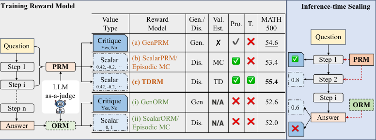

Figure 6: Comparison of recent reward models and TDRM . Gen. and Dis. denote Generative and
Discriminative. Val. Est. denotes the method of value estimation. Pro. and T. denote process and
temporality. MC and TD denote Monte Carlo and temporal difference.

F E XPERIMENT D ETAILS

F.1 E XPERIMENT S ETTINGS

**Evaluation Metrics** Best-of- _N_ Sampling is designed to balance diversity and optimality across
outputs. In our experiments, _N_ is set to _{_ 128 _,_ 1024 _}_ . While Greedy Search [ 17 ] is efficient, it risks

16

Preprint

|Greedy Search on Mistral Data 45 41 (%) Accuracy 37 TDRM (1-step TD) TDRM (3-step TD) ScalarPRM ScalarORM 33 2 4 8 16|Col2|stra|l Dat|a|
|---|---|---|---|---|
|2 4 8 16 33 37 41 45 Accuracy (%) Greedy Search on Mistral Data TDRM (1~~-~~step TD) TDRM (3~~-~~step TD) ScalarPRM ScalarORM|TDRM (1~~-~~step TD) TDRM (3~~-~~step TD)|TDRM (1~~-~~step TD) TDRM (3~~-~~step TD)|TDRM (1~~-~~step TD) TDRM (3~~-~~step TD)|TDRM (1~~-~~step TD) TDRM (3~~-~~step TD)|

Figure 7: Results of greedy search on our PRM with TD.

suboptimal results due to locally optimal decisions. For a fair comparison and a more thorough study,
we pre-generate reasoning trajectories using Mistral-7B-Instruct-v0.2 for GSM8K (128 outputs
for questions). For MATH-500, we use RLHFlow/Mistral-MATH500-Test [ 6 ] from hugging-face,
which contains 1,024 outputs for each question, generated with a Mistral-7B model [ 13 ], which
has been fine-tuned on MetaMath [ 43 ]. For Greedy Search, we set the sampling temperature and
backbone as 0 _._ 4 and Qwen2.5-Math-7B for generation, and run all the experiments three times to
mitigate randomness.

**Dataset for** **TDRM** **Training.** For TD-based PRM training, we use the RLHFlow/Mistral-PRM-Data,
which contains step-by-step reasoning trajectories with corresponding correctness labels for intermediate steps. For online RL training, we utilized MATH Level-3 data [ 10 ], which comprises 2,500
problem prompts designed to evaluate advanced mathematical reasoning capabilities.

**Baselines.** In verification experiments, we train our baseline using the same Cross-Entropy
loss, whereas the target is instead the hard label _Y_ . ScalarORM refers to training with only
the terminal state, and ScalarPRM incorporates both the intermediate and terminal states. For
this setting, we train a ScalarORM using RLHFlow/Mistral-ORM-Data and a ScalarPRM using
RLHFlow/Mistral-PRM-Data . For RL training comparisons, we benchmark TDRM with SimpleRLzoo [44], GRPO in DeepSeek-Math [28], Dr.GRPO [20], and OpenReasoner-Zero [11].

**RL Training Setting.** We conduct online RL training across 4 series of models, including Qwen2.5(0.5B, 1.5B) [ 39 ], GLM4-9B-0414, GLM-Z1-9B-0414 [ 7 ], Qwen2.5-Math-(1.5B, 7B) [ 40 ], and
DS-R1-Distill-Qwen-(1.5B, 7B) [ 5 ]. In the TDRM framework, the coefficient of _R_ PRM is set to _a_ = 0 _._ 2 .
We run training with a total batch size of 56, divided equally across 7 GPUs, yielding 8 samples per
GPU, to optimize compute and efficiency. The rest is used for online sampling with the number of
rollouts set to 7, max completion length of 2048, and 1 epoch to mitigate overfitting risks. The RL
training framework of TDRM is developed from huggingface/trl.

In our policy training experiments, aside from the same number of responses for each prompt, 7, to
estimate group relative advantage, we allocate different compute resources according to the model
size, which leads to a choice of different batch sizes. For 7B and 3B models, we use 8 GPUs, 1 for
sampling and 7 for training. The global batch size is 7 (number of devices for gradient calculation) _×_
8 (per device batch size) = 56 . For 1.5B models, we use 4 GPUs, and the global batch
size is 3 _×_ 14 = 42 . For 0.5B models, we use 2 GPUs, and the global batch size is
28 _×_ 1 _×_ 2 (gradient accumulation steps) = 56 . For TDRM training, we use a global batch size
of 8 (number of devices) _×_ 16 (per device batch size) _×_ 2 (gradient accumulation steps) = 256 . As
for GLM series models, we use slime [*] for training, with a global batch size of 256, and 8 responses
for each prompt to estimate group relative advantage.

  - https://github.com/THUDM/slime

17

Preprint

|0.8 0.7 y) 0.6 R(y, 0.5 0.4|Col2|Col3|
|---|---|---|
|0.4 0.5 0.6 0.7 0.8 R(y, y)||TDRM Rule|

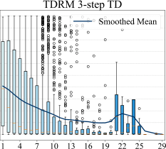

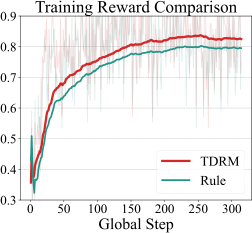

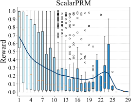

Figure 8: **Left** : Reward distribution over different reasoning steps. TDRM produces more stable
and consistent reward estimates, reducing noisy spikes. **Right** : Dynamics of training reward. TDRM
consistently yields higher rewards compared to the rule-based baseline, starting from the early steps
of training.

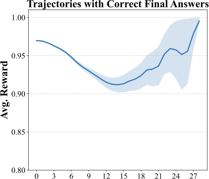

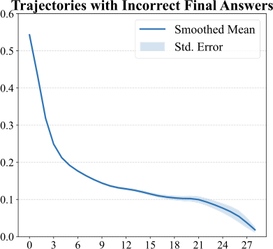

Figure 9: Training reward distribution. This figure shows the smoothed mean reward across different
reasoning steps, using trajectories of correct and incorrect final answers separately.

F.2 U NDERLYING R EWARD D ISTRIBUTION

To better understand what a good reward model is like, we visualize the reward distribution over
different reasoning steps in Figure 8. This is similar to the smoothness analysis, while it is primarily
focused on the distribution of state values, i.e., rewards of TDRM . As shown in Figure 8, the trend of
reward distribution is similar for both RMs, where it is in a “U” shape as the reasoning step increases,
and then drops drastically as the reasoning step becomes much larger. This may reflect the underlying
distribution of the dataset that we use to study. However, the distribution of TDRM is smoother and
more flat than ScalarPRM, indicating that it is more robust to the number of reasoning steps.

To better understand the underlying mechanism, we first decompose the reward distribution in
Figure 8 into two distributions, i.e., a distribution for trajectories with correct final answers and a
distribution for trajectories with incorrect final answers. As shown in Figure 9, the reward distribution
of trajectories with correct answers exhibits a “U” shape, while that of trajectories with incorrect
answers decreases as the number of reasoning steps increases.

18

Preprint

F.3 T EMPLATE USED IN RL T RAINING

Prompt for implementation

<System>
Please reason step by step, and put your final answer within \boxed{}.
</System>
<User>
Question:
_Input Question_
<Assistant>

Answer:
Let’s think step by step.

F.4 D ETAILS OF V ERIFIABLE R EWARD

Here we provide the concrete definition of is_equivalent and has_boxed of _R_ verifiable .

- is_equivalent : We only consider boxed answers wrapped within a \boxed{}. And we calculate
equivalence after normalizing both ˆ _g_ and _g_, using a third-party package mathruler [†] . If the answers
are equivalent then return True, otherwise False.

- has_boxed : To determine if the response has boxed answers and to extract the boxed answers, we
use regex “.*\\boxed{.*}.*” . If the response matches the regex, then return True, otherwise
False.

F.5 L OCAL L IPSCHITZ C ONSTANT FOR S MOOTHNESS

Inspired by the local Lipschitz Constant, we use the following formula to calculate the smoothness of
PRMs:

1
_L_ smoothness = _|D|_

�

( _s_ _t_ _,s_ _t_ +1 ) _∈D_

_|V_ ( _s_ _t_ +1 ) _−_ _V_ ( _s_ _t_ ) _|_

_d_ ( _s_ _t_ _, s_ _t_ +1 ) _,_ (12)

where _d_ is a function to measure the distance between two adjacent states. Here, we use the cosine
similarity of representations from the last hidden state and the last token position. We sample a subset
of 1000 trajectories from _D_ PRM and compare the constant calculated with state values from TDRM
versus ScalarPRM. Empirically, a smaller number of _L_ smoothness indicates a smoother PRM.

G S TUDY OF TDRM

G.1 R EWARD S MOONTHNESS

To illustrate the comparison of state values obtained from the TDRM and the ScalarPRM, we focus
on the difference in their estimates across different quantile bins of _V_ Scalar . The x-axis represents
quantile bins of _V_ Scalar, which divides the range of state values computed by the Scalar PRM method
into intervals. The y-axis depicts the average difference between the state values derived from TDRM
and Scalar PRM, defined as Avg. ( _V_ TDRM - _V_ Scalar ). A negative value on the y-axis indicates that
TDRM estimates lower state values compared to ScalarPRM in the corresponding quantile bin, while
values closer to zero indicate smaller differences between the two methods.

From the Figure 10, it can be observed that:

_•_ Lower Quantile Bins (e.g., (0.0, 0.0075)): The average state value difference is close to zero,
meaning that TDRM and ScalarPRM compute nearly identical state values for smaller _V_ Scalar values.

_•_ Higher Quantile Bins (e.g., (0.412, 0.746) and beyond): The difference becomes significantly
negative, indicating that TDRM tends to substantially reduce the state value for states that are assigned
larger _V_ Scalar values by ScalarPRM.

  - https://github.com/hiyouga/MathRuler/tree/main

19

Preprint

In conclusion, the ability of the TDRM to reduce the values of high-reward states can be instrumental
in achieving smoother rewards during process reward model training or promoting policy robustness
in reinforcement learning tasks.

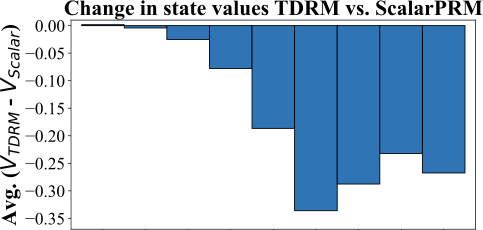

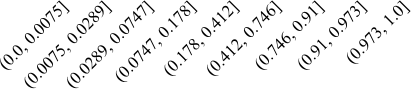

Figure 10: Comparison of state values from the TDRM and the ScalarPRM.

G.2 A BLATION S TUDY OF T RAINING M ODELS

**Accuracy and Reward Score in RL.** To further demonstrate the effectiveness of TDRM in RL
training, we show a comparison between TDRM and checkpoints trained with pure verifiable reward.
We compare the verifiable reward during training for TDRM and the pure rule-based method in Table 7.
We can observe that:

_•_ Effectiveness of Rule-based Approaches. Adding rule-based methods consistently improves average
performance. For example, in “DS-R1-Distill-Qwen-1.5B”, the accuracy increases from 39.2% to
43.2% (+4.0%). This demonstrates the critical role of the rule-based method in mathematical
reasoning.

_•_ Impact of PRM trained with TD. The addition of our trained PRM further enhances performance
over the purely rule-based approach, especially for larger models. For instance, in “Qwen2.5-Math1.5B”, the average improves from 35.8% (Rule-based) to 36.6% (+0.8%) with trained PRM. This
shows PRM’s ability to refine value estimation and align intermediate reasoning steps.

_•_ Performance of Ours. Combining rule-based methods and PRM (“Ours”) achieves the best results
across all settings. Notably, “DS-R1-Distill-Qwen-7B” reaches an average accuracy of 67.4% with
a relative improvement of 3.2%, and “Qwen2.5-Math-1.5B” improves by +2.1%, highlighting the
synergy of the two components in enhancing smoothness and temporal consistency.

20

Preprint

Table 7: Ablation study of general models and reasoning models on the mathematical benchmarks.

Model DataSize MATH500 MinervaMath OlympiadBench AIME24(Pass@1) AMC23 Avg.

**Backbone is Base Model, Qwen Series**

**Qwen2.5-0.5B**   - 15.8 4.8 2.8 0.0 12.5 7.2

+ Rule-based 2.5k 29.8 4.0 7.0 0.0 12.5 10.7

+ w/ PRM 2.5k 7.8 1.5 1.5 0.0 7.5 3.7
+ Ours 2.5k 26.2 4.8 7.1 0.0 15.0 **10.8** ( **+0.9%** )

**Qwen2.5-1.5B**   - 29.6 6.6 6.5 0.0 12.5 11.0

+ Rule-based 2.5k 58.0 12.1 18.7 0.0 27.5 23.3

+ w/ PRM 2.5k 16.0 4.8 5.9 0.0 15.0 8.3
+ Ours 2.5k 52.8 9.9 17.8 3.3 35.0 **23.8** ( **+2.2%** )

**Backbone is Chat Model, GLM Series**

**GLM4-9B-0414**   - 65.8 36.8 28.7 10.0 42.5 36.8

+ Rule-based 2.5k 74.0 38.6 36.3 6.7 47.5 40.6

w/ PRM 2.5k 68.2 39.3 33.5 10.0 35.0 37.2
+ Ours 2.5k 72.2 37.1 32.0 20.0 47.5 **41.8** ( **+3.0%** )

**Backbone is Reasoning Model, GLM Series**

**GLM-Z1-9B-0414**   - 93.6 43.8 65.5 73.3 92.5 73.7

+ Rule-based 2.5k 95.6 43.4 65.2 73.3 97.5 75.0

+ w/ PRM 2.5k 95.6 47.4 67.0 70.0 97.5 75.5
+ Ours 2.5k 94.6 44.9 66.5 80.0 97.5 **76.7** ( **+1.6%** )

**Backbone is Base Model, Qwen-Math Series**

**Qwen2.5-Math-1.5B**   - 42.2 8.8 27.0 10.0 37.5 25.1

+ Rule-based 2.5k 67.6 21.3 31.0 6.7 52.5 35.8

+w/ PRM 2.5k 63.8 19.9 26.7 16.7 50.0 35.4
+ Ours 2.5k 66.2 18.4 30.1 13.3 55.0 **36.6** ( **+2.1%** )

**Qwen2.5-Math-7B**   - 63.6 12.5 25.8 13.3 42.5 31.5
+ Our Template    - 68.8 16.2 31.1 13.3 62.5 38.4

+ Rule-based 2.5k 73.2 25.0 37.8 23.3 65.0 44.9

+ w/ PRM 2.5k 58.0 22.4 20.6 6.7 30.0 27.5
+ Ours 2.5k 74.6 26.8 37.3 36.7 62.5 **47.6** ( **+6.0%** )

**Backbone is Reasoning Model, DeepSeek Series**

**DS-R1-Distill-Qwen-1.5B**    - 70.6 26.5 32.1 16.7 50.0 39.2

+ Rule-based 2.5k 75.4 26.8 36.1 20.0 57.5 43.2

+ w/ PRM 2.5k 69.8 18.0 30.5 33.3 45.0 39.3
+ Ours 2.5k 79.8 30.5 38.2 30.0 70.0 **49.7** ( **+15.0%** )

**DS-R1-Distill-Qwen-7B**    - 88.0 43.0 49.9 63.3 82.5 65.3

+ Rule-based 2.5k 89.6 46.0 52.4 50.0 82.5 64.1

+ w/ PRM 2.5k 84.2 44.5 45.8 46.7 77.5 59.7
+ Ours 2.5k 91.8 50.4 54.1 53.3 87.5 **67.4** ( **+3.2%** )

21

Preprint

H C ASE S TUDY

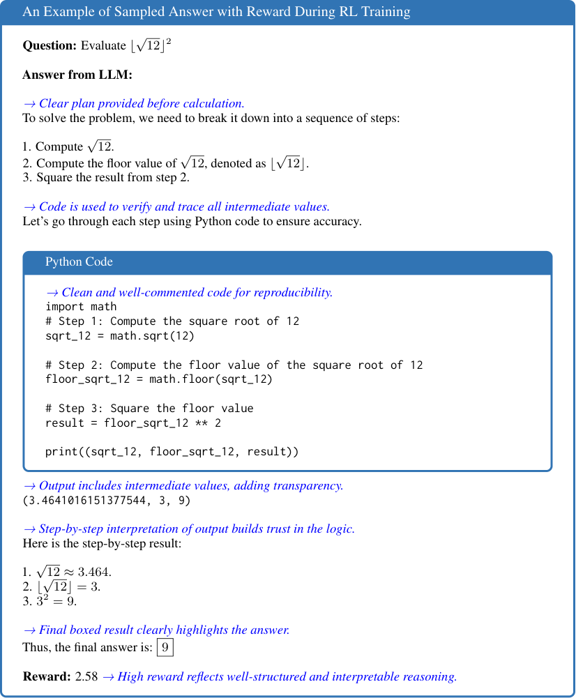

22

