Preprint as an Arxiv Paper

## B ENEFITS AND P ITFALLS OF R EINFORCEMENT L EARNING FOR L ANGUAGE M ODEL P LANNING : A T HEORETICAL P ERSPECTIVE

**Siwei Wang** [1] _[†]_ **, Yifei Shen** [1] _[†]_ **, Haoran Sun** [2] _[†]_ **, Shi Feng** [3] _[†]_ **, Shang-Hua Teng** [4] **, Li Dong** [1] **,**
**Yaru Hao** [1] **, Wei Chen** [1] _‡_ _[∗]_

1 Microsoft Research Asia, 2 Peking University, 3 Harvard University, 4 University of Southern California

A BSTRACT

Recent reinforcement learning (RL) methods have substantially enhanced the
planning capabilities of Large Language Models (LLMs), yet the theoretical basis
for their effectiveness remains elusive. In this work, we investigate RL’s benefits and limitations through a tractable graph-based abstraction, focusing on policy gradient (PG) and Q-learning methods. Our theoretical analyses reveal that
supervised fine-tuning (SFT) may introduce co-occurrence-based spurious solutions, whereas RL achieves correct planning primarily through exploration, underscoring exploration’s role in enabling better generalization. However, we also
show that PG suffers from diversity collapse, where output diversity decreases
during training and persists even after perfect accuracy is attained. By contrast,
Q-learning provides two key advantages: off-policy learning and diversity preservation at convergence. We further demonstrate that careful reward design is necessary to prevent reward hacking in Q-learning. Finally, applying our framework to
the real-world planning benchmark Blocksworld, we confirm that these behaviors
manifest in practice.

1 I NTRODUCTION

Planning is a fundamental cognitive construct that underpins human intelligence, shaping our ability to organize tasks, coordinate activities, and formulate complex solutions such as mathematical
proofs. It enables humans to decompose complex goals into manageable steps, anticipate potential
challenges, and maintain coherence during problem solving. Similarly, planning plays a pivotal role
in state-of-the-art Large Language Models (LLMs), enhancing their ability to address structured and
long-horizon tasks with greater accuracy and reliability.

Early generations of LLMs primarily relied on next-token prediction and passive statistical learning,
which limited their planning capabilities to short-horizon, reactive responses. The o1 family of models represents a major advance in planning by incorporating reinforcement learning (RL) objectives
that reward accurate, multi-step reasoning and penalize errors. Inspired by the success of o1, RL
has been applied to enhance planning capabilities in various settings, including task decomposition
for tool use (Wu et al., 2024a; Luo et al., 2025) and gaming (Yang et al., 2024), visual-language
spatial navigation (Chu et al., 2025), and long-horizon robotics tasks (Dalal et al., 2024). These approaches have demonstrated significantly better performance than their supervised fine-tuning (SFT)
counterparts. For more related works, please refer to Appendix B.

Despite recent successes, the theoretical basis underlying RL’s advantage over SFT in planning tasks
and the limitations of current RL methods remain to be established. To enable a tractable analysis of
the gradient dynamics, we adopt the data generation model from (Wang et al., 2024b). Within their
framework, planning is abstracted as a path-finding problem over a graph structure. For example, a
tool-use scenario can be modeled as identifying a valid call sequence within an API call graph (Wu
et al., 2024b).

_∗_ _†_ denotes equal contribution. _‡_ Corresponding author (weic@microsoft.com).

1

Preprint as an Arxiv Paper

To capture the fundamental limitations of SFT in planning, we begin by presenting a structural
characterization of its stable point for path planning ( **Section 3** ). Our analyses, expanding the observation of Wang et al. (2024b) that transformer-based LLM architectures cannot identify reachability
relationships through transitivity in SFT, show that it introduces co-occurrence-based spurious solutions into planning tasks. This characterization provides a basis for comparison with and motivation
for using the RL-based learning approach in language model planning.

Focusing on the behaviors of RL-based learning dynamics, we first consider policy gradient (PG),
a widely adopted algorithm for tuning large language models ( **Section 4** ). Our analysis yields three
key findings. First, with only 0-1 outcome rewards, each iteration of PG equivalently corresponds
to an SFT process on the exploration data; however, PG empirically outperforms SFT due to the
exploration-driven data augmentation it enables. Second, although PG converges to a model that
outputs correct paths for all source–target pairs seen during training, we uncover a diversity collapse
phenomenon: the model’s output diversity steadily declines throughout training and continues to
diminish even after achieving 100% training accuracy. Third, we show that KL regularization acts
as an explicit diversity-preserving term, but at the expense of accuracy.

We then analyze Q-learning, a paradigm well known in game playing but rarely applied to
LLMs (Mnih et al., 2013) ( **Section 5** ). Our analysis yields two key findings. First, when trained
with only an outcome reward signal, Q-learning suffers from reward hacking; however, incorporating process rewards eliminates this issue. Second, once this issue is addressed, Q-learning offers
two theoretical advantages over PG: it converges to a solution that preserves output diversity when
achieving optimal training accuracy, and it naturally supports off-policy learning. The latter is particularly important in practice, since rollouts performed with a quantized model or large batch sizes
are effectively off-policy, as exemplified by the VeRL framework (Sheng et al., 2024). Finally, we
validate all these theoretical findings through experiments.

To summarize, our main contribution is a theoretical treatment of the impact of reinforcement learning on language model planning. Our mathematical analysis of learning dynamics sheds light on
phenomena observed in practice–for example, SFT tends to memorize while RL promotes generalization; PG methods often suffer from diversity collapse; and KL regularization helps mitigate
diversity degradation, albeit at the cost of reduced accuracy. Other findings point to promising future
directions, such as leveraging Q-learning to achieve both diversity and accuracy, as well as enabling
off-policy learning. Taken together, these results provide a principled foundation for understanding
and advancing reinforcement learning methods in language model planning.

2 P RELIMINARIES

2.1 P ATH P LANNING D ATASET : S YNTAX AND D ATA S OURCES

Following (Wang et al., 2024b), we abstract planning in large language models as path planning over
an _unknown_ directed graph _G_ = ( _V, E_ ), where _V_ represents the set of nodes and _E_ represents the
set of edges. Each node _v ∈V_ is represented by a unique token. The language model’s vocabulary
consists of these node tokens and a special end-of-sequence token, _\_ n. An edge ( _u, v_ ) _∈E_ signifies
a directed connection from node _u_ to node _v_ . A node _t_ is reachable from a node _s_ if a directed
path from _s_ to _t_ exists in _G_ . We denote by **A** _∈{_ 0 _,_ 1 _}_ _[|V|×|V|]_ the adjacency matrix of _G_, where
**A** [ _u, v_ ] = 1 if and only if ( _u, v_ ) _∈E_, and by **R** _∈{_ 0 _,_ 1 _}_ _[|V|×|V|]_ the reachability matrix, where
**R** [ _t, s_ ] = 1 if and only if _t_ is reachable from _s_ .

The set of all reachable source-target pairs ( _s, t_ ) is partitioned into a training set _D_ Train and a test
set _D_ Test . We define three corresponding data stages:

- **SFT Training Data:** We construct a training dataset _D_ [SFT] for supervised fine-tuning by sampling
multiple ( _K_ ) paths for each reachable pair ( _s, t_ ) _∈_ _D_ Train by random walk. Each training data in
_D_ [SFT] is a sequence in the format “ _s t s a b c t \_ n”, where _s a b c t_ are tokens for nodes in a valid
path from _s_ to _t_, and _\_ n indicates the end of the sequence. We call the model after SFT training
the _base model_ .

- **RL Training Data:** We sample pairs ( _s, t_ ) from _D_ Train and let the model itself (on-policy) or the
base model (off-policy) generate the remaining tokens in the sequence. When the model outputs

2

Preprint as an Arxiv Paper

_\_ n or the generation reaches the maximum length, an outcome reward or some step rewards will
be given, depending on the used reward format.

- **Test Data:** When testing, we provide pairs ( _s, t_ ) from _D_ Test, which are never encountered in
either SFT or RL training. The model is tasked with generating a valid path from _s_ to _t_ .

Throughout the empirical study, we use a one-layer, single-head Transformer as the backbone model.
The embedding size is set to _d_ = 120. The graph _G_ in our main empirical validation is generated
using the Erd˝os-R´enyi model with _|V|_ = 100 nodes and an edge probability of 0 _._ 15. The ratio
of the sets _|D_ Train _|/|D_ Test _|_ is approximately 0 _._ 25 (approximately 20% pairs are in _D_ Train ). The
number of paths sampled for each reachable pair in _D_ Train is _K_ = 10. We also consider the graph
_G_ _[BW]_ that characterizes the transition between different block configurations in Blocksworld, which
is proposed by Valmeekam et al. (2023a) to evaluate the LLM’s planning ability. The details for the
graph construction are presented in Appendix G.

2.2 R EINFORCEMENT L EARNING A LGORITHMS

We first define the notation. Given a vector **x**, we denote its _m_ -th element by **x** [ _m_ ]. For a given
sequence “ _s t s a b c t \_ n”, we represent it as **u** = ( _u_ 1 _, u_ 2 _, · · ·, u_ _m_ _, · · ·_ ). We denote by ˆ _**u**_ _m_ the
output probability vector of the current model at the _m_ -th position, and by ˆ _**u**_ [base] _m_ that of the base
model before RL. The model parameters are denoted by _θ_ .

**Policy Gradient.** Let _P_ be the set of valid paths. The outcome reward is only given at the end of
the path and is defined by _R_ ( **u** ) = _r δ_ **u** _∈P_ + _p_, where _r >_ 0 and _p_ are constants, and _δ_ denotes the
indicator function that is 1 if condition is true and 0 otherwise. For an individual trajectory, the loss
function is

_R_ ( **u** ) log ˆ **u** _m_ [ _u_ _m_ +1 ]
~~�~~ ~~��~~ ~~�~~
Policy Gradient

_,_ (1)

�

�

_ℓ_ = _−_ �

_m≥_ 3

�

+ _λ_ log ˆ **u** _m_ [ _u_ _m_ +1 ] log ˆ **[u]** [ˆ] _[m]_ [[] _[u]_ _[m]_ [+1] []]
� **u** [base] _m_ [[] _[u]_ _[m]_ [+1] []]

~~�~~ ~~�~~ � ~~�~~
KL Divergence

where _λ_ controls the KL regularization strength, and _{·}_ means the term is detached and will not
contribute to the gradient.

**Q-Learning.** The goal of Q-learning is to approximate the Q-function with the model logits. Let
_Q_ _θ_ ( _s_ _m_ _, a_ _m_ ) be the Q-function where _s_ _m_ = ( _u_ 1 _, u_ 2 _, · · ·, u_ _m_ ) is the state, _a_ _m_ _∈V_ is the action, and
_s_ _[′]_ _m_ [= (] _[u]_ [1] _[, u]_ [2] _[,][ · · ·][, u]_ _[m]_ _[, a]_ _[m]_ [)][ is their next state. The objective is][ �] _m_ � _Q_ _θ_ ( _s_ _m_ _, a_ _m_ ) _−_ [ _R_ ( _s_ _m_ _, a_ _m_ ) +

2
is given bymax _a_ _′m_ _Q_ _θ_ ( _s_ _[′]_ _m_ _[, a]_ _[′]_ _m_ [)]] � . We denote the logits at step _m_ by ˜ **u** _m_ . For an individual trajectory, the loss

_ℓ_ = �

_m≥_ 3

2

˜ ˜
**u** _m_ [ _u_ _m_ +1 ] _−_ _R_ ( **u** _, m_ ) _−_ max **u** _m_ +1 [ _k_ ] _._ (2)
� � _k_ ��

For Q-learning’s reward _R_ ( **u** _, m_ ), we study two scenarios: (i) _outcome reward_, where the reward
depends on whether the path is correct, and (ii) _process reward_, where intermediate rewards are
given based on adjacency and target checks. Specifically,

_δ_ **u** _∈P_ _δ_ _u_ _m_ +1 = _u_ 2 _,_ If outcome reward _,_

_R_ ( **u** _, m_ ) =



_δ_ _u_ _m_ +1 = _u_ 2
� ~~��~~ ~~�~~
Target check

_−_ _δ_ ( _u_ _m_ _,u_ _m_ +1 ) _̸∈E_
~~�~~ � ~~�~~ ~~�~~
Adjacency check

_,_ If process reward _._ (3)

That is, in the outcome reward setting, a reward of 1 is given only if the entire path is valid, and it
is assigned at the step when the target is reached. In contrast, in the process reward setting, we do
not check whether the entire path is valid or not. The model is always rewarded upon reaching the
target, but it is also penalized at any step that transitions to a non-adjacent node.

3

Preprint as an Arxiv Paper

(a) Edge Frequency (b) SFT (c) SFT + PG (d) SFT + Q-Learning

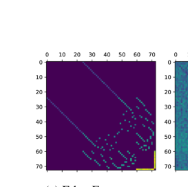

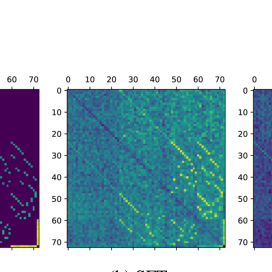

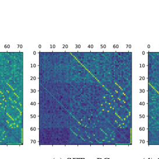

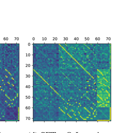

Figure 1: Frequency of edge occurrences in the SFT training data _D_ [SFT] and the adjacency structures
learned by different models. The underlying graph represents transitions between block configurations in Blocksworld (Valmeekam et al., 2023a).

3 L IMITATIONS OF S UPERVISED F INE -T UNING IN P LANNING

Focusing on the stationarity of the training dynamics, we present a basic structural characterization
that captures a fundamental limitation of SFT in planning. Our analysis builds on an early finding of Wang et al. (2024b), which showed that transformer-based SFT planning approaches lack
transitivity-learning mechanisms needed to obtain complete reachability structures. The new characterization expands and complements the earlier results and provides a theoretical explanation for
why SFT-based planning tends to rely on memorization. More importantly, this result establishes
a theoretical basis for comparison with RL-based planning frameworks and highlights the role of
exploration in achieving better generalization during the adaptive learning process.

3.1 D ISCUSSIONS ON E XISTING F INDINGS

To set up our characterization, we first review the analysis framework of Wang et al. (2024b), which
examines the training dynamics of a one-layer, single-head Transformer under an autoregressive
loss function. Their analysis shows that, during training, the model encodes both the adjacency and
reachability structures of the underlying graph in its learnable parameters. The model then predicts
the next node in a sequence by ensuring that it is adjacent to the current node and lies along a path
toward the target node. A full description of their approach is given in Algorithm 1 in Appendix C.

Wang et al. (2024b) showed, both theoretically and experimentally, that the adjacency and reachability information stored in a model’s weights is generally **incomplete** . To formalize this, consider a training dataset _D_ [SFT] . The _observed adjacency matrix_ _**A**_ [obs] ( _D_ [SFT] ) contains exactly those
edges ( _j, k_ ) that appear in at least one path from _D_ [SFT] . Similarly, the _observed reachability matrix_
_**R**_ [obs] ( _D_ [SFT] ) records that a target node _t_ is reachable from an intermediate node _k_ if _D_ [SFT] contains
a sequence with target _t_ in which _k_ occurs as a non-source node. We refer to such pairs ( _t, k_ ) as
_observed reachable pairs_ .

However, we find that even when an adjacency relation appears in _D_ [SFT], the SFT model may not
learn a high weight for it. To illustrate this, we run experiments on the Blockworld dataset, and the
results are presented in Figure 1. In Figure 1a, we show the frequency of all adjacency relationships in the training set (every adjacency relationship appears at least once), where brighter regions
indicate higher frequencies. Then Figure 1b displays the corresponding weights learned after SFT.
By comparing them, we observe that some adjacency relationships present in the data are not well
captured by the model, especially those with low frequency. This observation motivates us to further
investigate the model’s stable (optimal) points.

3.2 C HARACTERIZATION OF THE S TABLE P OINT IN SFT-B ASED L EARNING D YNAMICS

Building on the observation of Wang et al. (2024b) that next-node prediction depends mainly on the
current and target nodes, we adopt the following natural assumption about model expressiveness for
our structural characterization. Recall that _u_ 2 and _u_ _m_ denote the target node and the current node at
position _m_, respectively.

4

Preprint as an Arxiv Paper

**Assumption 3.1.** _The model’s predicted logits for the next token can be expressed as a function of_
_the (target, current) node pair, i.e., there exists a function_ **f** _such that the logits_ ˜ **u** _m_ = **f** ( _u_ 2 _, u_ _m_ ) _._

Note that in the assumption, **f** can be an arbitrary function. We now characterize the structure of the
stable point achieved by SFT. Due to space limitations, we defer all the proofs in this paper to the
appendix.

**Theorem 3.1** (Optimal Solution of SFT) **.** _Assume Assumption 3.1 holds. Let N_ _u_ 2 _,u_ _m_ _,k_ _denote the_
_number of occurrences in the training dataset where the target node is u_ 2 _, the current node is u_ _m_ _,_
_and the next node is k. The optimal solution of SFT satisfies:_

exp( **f** ( _u_ 2 _, u_ _m_ )[ _k_ ])
~~�~~ _k_ _[′]_ [ exp(] **[f]** [(] _[u]_ [2] _[, u]_ _[m]_ [)[]

_u_ 2 _,u_ _m_ _,k_ _if_ �

_k_ _[′]_ _[ N]_ _[u]_ 2 _[,u]_ _m_ _[,k]_ _[′]_ _[′]_

exp( **f** ( _u_ 2 _, u_ _m_ )[ _k_ ]) _N_ _u_ 2 _,u_ _m_ _,k_

_k_ _[′]_ [ exp(] **[f]** [(] _[u]_ [2] _[, u]_ _[m]_ [)[] _[k]_ _[′]_ []) =] ~~�~~ _k_ _[′]_ _[ N]_ _[u]_ 2 _[,u]_

_N_ _u_ 2 _,u_ _m_ _,k_ _[′]_ _>_ 0 _._

_k_ _[′]_

_If_ [�] _k_ _[′]_ _[ N]_ _[u]_ 2 _[,u]_ _m_ _[,k]_ _[′]_ [ = 0] _[, output can be any probability distribution.]_

**Takeaway 1: SFT memorizes co-occurrence relationships in the training dataset.**

Theorem 3.1 extends the findings of Wang et al. (2024b), which showed that SFT-based mechanisms
may fail to learn the complete adjacency and reachability matrices, leading to spurious correlations.
However, those earlier results did not specify the nature of the solutions to which the model converges. Complementing their work, Theorem 3.1 clarifies this by showing that SFT essentially
memorizes co-occurrence relationships among the target node, the current node, and the immediate
next node based on their frequencies in _D_ [SFT] . Hence, SFT will fail to exploit transitivity information
(which never appears in _D_ [SFT] ) to capture the true graph connectivity required for path planning.

In Figure 1, we further compare the weights of models trained by two RL approaches, PG and
Q-learning. Both RL approaches capture the adjacency relationships better. Similar findings are reported by Chu et al. (2025), who empirically observe that SFT tends to memorize while RL exhibits
better generalization. Our structural analysis in Theorem 3.1 provides a theoretical explanation for
the first part of this phenomenon, namely, why “SFT memorizes”. In the following sections, we
examine the two RL-based approaches, PG and Q-learning, and provide a theoretical explanation of
the second part, i.e., why “RL generalizes”.

4 P ATH P LANNING C APACITIES OF P OLICY G RADIENT

In this section, we examine the path-planning capacity of the policy gradient, the core principle
behind advanced RL algorithms such as PPO (Schulman et al., 2017) and GRPO (Shao et al., 2024).
Understanding the strengths and limitations of the basic policy gradient provides theoretical insights
into its behavior, highlights the mechanisms that enable effective path planning, and clarifies the
challenges that motivate more sophisticated approaches.

4.1 T HEORETICAL A NALYSIS

We first establish the connection between policy gradient (PG) and supervised fine-tuning (SFT),
highlighting the potential advantages of PG over SFT. We then analyze PG’s training dynamics
and show that, without KL regularization, the model can achieve 100% training accuracy (under
temperature sampling) while progressively losing output diversity. Finally, we demonstrate that,
when initialized with a reasonably capable base model, adding a KL regularization helps preserve
diversity and thereby enhances generalization, albeit sometimes at the cost of accuracy.

To make this connection precise, we show that the PG loss function closely resembles the SFT loss,
restricted to the subset of data generated during RL training that corresponds to correct paths.

**Theorem 4.1** (Connections between PG and SFT) **.** _Assume Assumption 3.1 holds. Let D_ _[RL,t]_ _denote_
_the set of data generated during the RL training step t. When r_ = 1 _, p_ = 0 _(i.e., reward 1 for a_
_correct path and reward 0 otherwise) and λ_ = 0 _(i.e., without KL regularization), the loss function_
_of Policy Gradient is the same as the loss function of using SFT only on correct paths in D_ _[RL,t]_ _._

As shown by Wang et al. (2024b), SFT can learn the adjacency and reachability relations. Thus,
Theorem 4.1 shows that PG can capture these relations presented in the dataset ( _∪_ _[T]_ _t_ =1 _[D]_ [RL,t] [)] _[ ∩P]_ [.]

5

Preprint as an Arxiv Paper

However, unlike SFT, which relies on a fixed training dataset, PG generates data on-policy during
training. As the model improves, it can explore and discover new correct paths that were absent from
the initial training set. This exploration-driven data augmentation enables PG to achieve stronger
performance beyond what SFT alone can provide.

**Takeaway 2: PG outperforms SFT primarily because its iterative data generation process**
**encourages exploration and effectively expands the training dataset.**

Building on the loss function, we analyze the gradient and identify two distinctive properties of
on-policy PG updates.

**Theorem 4.2** (Convergence of PG without KL regularization) **.** _Assume Assumption 3.1 holds. For_
_any i, j pair, let C_ ( _i, j_ ) _denote the set of nodes that can reach i and are adjacent to j. The following_
_then holds: If r_ = 1 _, p_ = 0 _and λ_ = 0 _, then_ (i) _the gradient_ _∂_ **f** ( _i,j∂ℓ_ )[ _k_ ] _[for][ k /][∈]_ _[C]_ [(] _[i, j]_ [)] _[ is always]_
_positive, and_ (ii) _the total sum of gradient_ [�] _k_ _∂_ **f** ( _i,j∂ℓ_ )[ _k_ ] [= 0] _[.]_

Theorem 4.2 shows that the logits **f** ( _i, j_ )[ _k_ ] corresponding to incorrect tuples ( _i, j, k_ ), i.e., cases
where node _j_ cannot reach node _i_ through node _k_, will continue to decrease, while some other logits
will not converge to _−∞_ . Consequently, under gradient descent, the probability that the model
outputs a wrong path in _D_ Train converges to zero.

Next, we analyze how the model’s output diversity evolves. Intuitively, the most diverse model that
still achieves 100% accuracy is one that produces a uniform distribution over _C_ ( _i, j_ ) for each target
node _i_ and current node _j_ . We now analyze the evolution of the KL divergence between this uniform
distribution and the model’s output distribution during PG training without KL regularization.

**Theorem 4.3** (Diversity Collapse of PG without KL regularization) **.** _Assume Assumption 3.1 holds._
_Let U_ _C_ ( _i,j_ ) _denote the uniform probability distribution on support C_ ( _i, j_ ) _. When r_ = 1 _, p_ = 0 _and_
_λ_ = 0 _, and logits_ **f** _[t]_ ( _i, j_ )[ _k_ ] _for k /∈_ _C_ ( _i, j_ ) _is −∞, where_ **f** _[t]_ ( _i, j_ ) _denotes the logits value of_ **f** ( _i, j_ )
_at time step t. For any such PG gradient descent step t, we have that_

_KL_ ( _U_ _C_ ( _i,j_ ) _||_ _**softmax**_ ( **f** _[t]_ ( _i, j_ )) _≤_ E[ _KL_ ( _U_ _C_ ( _i,j_ ) _||_ _**softmax**_ ( **f** _[t]_ [+1] ( _i, j_ ))] _._

Note that the metric _KL_ ( _U_ _C_ ( _i,j_ ) _||_ **softmax** ( **f** _[t]_ ( _i, j_ ))) takes minimum value when **softmax** ( **f** _[t]_ ( _i, j_ ))
is also the uniform distribution on _C_ ( _i, j_ ), and takes maximum value when **softmax** ( **f** _[t]_ ( _i, j_ )) is a
one-hot vector. Thus, Theorem 4.3 demonstrates that even after attaining 100% accuracy on _D_ Train,
the model continues to exhibit declining output diversity.

**Takeaway 3: In the absence of KL divergence, output diversity continuously declines.**

This diversity-collapse phenomenon has been reported in the literature (Cui et al., 2025) and can
impair a model’s ability to generalize. To address it, many techniques have been proposed, the most
common being KL regularization. To better understand its role, we analyze the stable point of the
model under KL regularization, highlighting both its advantages and limitations.

**Theorem 4.4** (The effect of KL regularization) **.** _When r_ = 1 _, p_ = 0 _and λ >_ 0 _, the stable point of_
_the PG model satisfies the following, under Assumption 3.1: For any fixed i, j, either_ **q** ( _i, j_ )[ _k_ ] = 0
_or_ **q** ( _i, j_ )[ _k_ ] _∝_ **q** _[base]_ ( _i, j_ )[ _k_ ] exp( **p** ( _i, j_ )[ _k_ ] _/λ_ ) _. Here_ **q** ( _i, j_ )[ _k_ ] _is the probability of outcome k in_
_**softmax**_ ( **f** ( _i, j_ )) _,_ **q** _[base]_ ( _i, j_ )[ _k_ ] _is the probability of outcome k in the base model, and_ **p** ( _i, j_ )[ _k_ ] _is_
_the probability of tuple i, j, k belonging to a valid path given output probability {_ **q** ( _i, j_ )[ _k_ ] _}_ _i,j,k_ _._

This result shows that KL regularization constrains the trained model to remain close to the base
model, thereby preserving some of its diversity. This effect is a _double-edged_ sword. Consider a
valid next node _k_ for which the base model assigns low probability, i.e., **q** [base] ( _i, j_ )[ _k_ ] is small. On
the one hand, KL regularization prevents **q** ( _i, j_ )[ _k_ ] from becoming arbitrarily small, increasing the
chance of generating valid paths involving _k_ . On the other hand, it also prevents **q** ( _i, j_ )[ _k_ ] from becoming very large, limiting potential gains when the base model’s prior is suboptimal. This tradeoff
explains seemingly contradictory findings in recent literature: when the base model is already capable, KL regularization preserves diversity and improves generalization, but when the base model is
weak, the regularization may hinder learning by overly constraining policy updates.

**Takeaway 4: KL regularization explicitly acts as a diversity-preserving mechanism, provided**
**that the base model is reasonably capable, but this comes at the cost of reduced train accuracy.**

6

Preprint as an Arxiv Paper

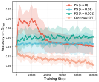

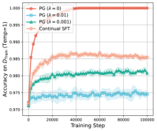

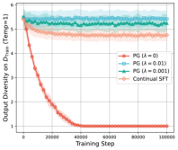

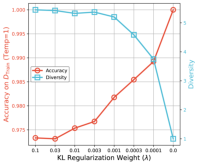

(a) Test Accuracy (b) Train Accuracy (c) Output Diversity (d) Influence of KL

Figure 2: Empirical results of PG training. Both PG and continual SFT are initialized from the
same base model. Figures (a)-(c) illustrate the training dynamics of test accuracy (under greedy decoding), training accuracy (under temperature sampling), and response diversity (under temperature
sampling). Figure (d) shows how different KL regularization strengths affect the final models.

4.2 E MPIRICAL V ALIDATIONS

The results are presented in Figure 2, where we compare PG with different KL regularization factor
_λ_ against continual SFT. All models are initialized from the same base model after SFT training,
while continual SFT means training the model for more time steps on the same SFT dataset _D_ [SFT] .
The empirical results match the takeaways we summarized from our theoretical findings, as detailed
below.

**Takeaway 2** : In Figure 2a, as the training progresses, the test accuracy of Continual SFT constantly decreases, while all the PG methods can achieve an improvement, since they benefit from
exploration-driven training data. **Takeaway 3** : In Figure 2b and 2c, we can see that PG without
KL regularization progressively achieves and maintains 100% training accuracy, but its output diversity, i.e., the average number of distinct correct paths generated over 100 sampling trials for the
same source-target pair, keeps decreasing during training. In the end, the model eventually produces
only one path per pair. Moreover, as shown in Figure 2a, when the diversity diminishes, continued
training degrades test accuracy. **Takeaway 4** : As a comparison, PG with KL regularization maintains high output diversity in the end, but their training accuracy is limited. This trade-off is further
stated in Figure 2d: with a higher factor _λ_, the model can have a higher output diversity and a lower
training accuracy. Along with Figure 2a, it is shown that KL regularization prevents the model from
deviating too far from the base model in terms of both diversity and training accuracy. This mitigates
overfitting but also caps potential gains in test accuracy.

5 A NALYSIS OF THE Q-L EARNING -B ASED P LANNING M ECHANISM

In this section, we analyze the Q-learning mechanism for language-model planning under two different reward designs. We show that stepwise process rewards enable convergence, preserve diversity,
and remain valid under off-policy sampling, whereas outcome rewards collapse to trivial solutions.
Our analysis begins under Assumption 3.1 for both reward types, and we then extend the processreward analysis to a more concrete linear Transformer model without this assumption.

5.1 T HEORETICAL A NALYSIS

To analyze the structure and convergence of the Q-learning stable point, we introduce a mild assumption, which we call the persistent exploration assumption about the RL-based learning dynamics.

**Assumption 5.1** (Persistent exploration) **.** _At training step t, let i_ _t_ = _u_ 2 _, j_ _t_ = _u_ _m_ _, k_ _t_ _, respectively,_
_denote the target, current, and next nodes. We assume for every_ ( _i, j, k_ ) _,_ _∃N_ [prop] ~~_i_~~ _,j,k_ _[>]_ [ 0] _[ such that]_

1
lim inf
_T →∞_ _T_

_T −_ 1
� _δ_ ( _i_ _t_ _,j_ _t_ _,k_ _t_ )=( _i,j,k_ ) _≥_ _N_ [prop] ~~_i_~~ _,j,k_ _[.]_

_t_ =0

Under the persistent exploration assumption, every coordinate is updated frequently enough to allow
convergence analysis. In practice, this assumption is usually satisfied, for instance:

7

Preprint as an Arxiv Paper

**Lemma 5.1.** _Training with ϵ-exploration (i.e., exploring each alternative action with probability_
_proportional to ϵ) satisfies the persistent exploration assumption._

With the outcome reward, the signal merely verifies whether the entire sequence constitutes a valid
path ending at target _i_ . It does not differentiate between current nodes _j_ or candidate next nodes _k_
when _k ̸_ = _i_ . As a result, at a stable point, all logits collapse to the same constant _c_ _i_ for each fixed
target _i_, causing the parameters to lose structural information, as stated in the theorem below.

**Theorem 5.1** (Stable points of outcome reward) **.** _Assume the RL-training uses the outcome reward_
_R_ ( **u** _, m_ ) = _δ_ **u** _∈P_ _δ_ _u_ _m_ +1 = _u_ 2 _, and a stable point exists under persistent exploration (Assumption 3.1)._
_Then, at any stable point of the Q-learning model, for each fixed target i and k ̸_ = _i, all logits_
**f** ( _i, j_ )[ _k_ ] _take the same value depending only on i._

With the process reward, the update rule accounts for both adjacency and target conditions. The
next theorem establishes that the process converges to well-defined limits that capture the underlying
graph structure.

**Theorem 5.2** (Stable points of process reward) **.** _Assume Assumption 3.1 holds and the process_
_reward is used, i.e. R_ ( **u** _, m_ ) = _δ_ _u_ _m_ +1 = _u_ 2 _−_ _δ_ ( _u_ _m_ _,u_ _m_ +1 ) _∈E/_ _. Suppose the score vector_ **f** ( _i, j_ ) _∈_ R _[n]_
_is initialized at zero and updated under the persistent exploration assumption with learning rate η._
_Then, in the Q-learning model, as t →∞,_ **f** [(] _[t]_ [)] ( _i, j_ )[ _i_ ] _−→_ **A** [ _j, i_ ] _, and for k ̸_ = _i,_

**f** [(] _[t]_ [)] ( _i, j_ )[ _k_ ] _−→_

1 _,_ **A** [ _j, k_ ] = 1 _and_ **R** [ _i, k_ ] = 1 _,_

0 _,_ _exactly one of_ ( **A** [ _j, k_ ] = 1) _or_ ( **R** [ _i, k_ ] = 1) _,_



 _−_ 1 _,_ **A** [ _j, k_ ] = 0 _and_ **R** [ _i, k_ ] = 0 _._

_Here “−→” denotes convergence or “tend to”. Moreover, the convergence is linear; the effective_
_rate depends on η and the update proportions N_ [prop] ~~_i_~~ _,j,k_ _[.]_

**Takeaway 5: Different from PG methods, in Q-learning, relying solely on the outcome reward**
**signal can cause reward hacking, whereas introducing process rewards mitigates this issue.**

To gain further insight in a setting closer to practice, we analyze a simplified but concrete one-layer,
single-head linear Transformer without the abstraction of Assumption 3.1.

**Assumption 5.2** (Linear transformer Wang et al. (2024b)) **.** _We work under the simplified Trans-_
_former setting in Wang et al. (2024b): (1) The token embedding matrix and the output weight matrix_
_are both set to the identity; (2) Attention is fixed entirely on the target node u_ 2 _, so the attention_
_block contributes only the value lookup_ **W** _[V]_ [ _u_ 2 _, ·_ ] _; (3) All layer normalizations are removed, and_
_the feedforward block is replaced by a linear map of the form_ FFN( **X** ) = **XW** _[M]_ _. Under these_
_assumptions, the logit decomposes as_ ˜ **u** _m_ +1 [ _k_ ] = **W** _[M]_ [ _u_ _m_ _, k_ ] + **W** _[V]_ [ _u_ 2 _, k_ ] _, where_ **W** _[M]_ _arises_
_from the feed-forward weights and_ **W** _[V]_ _from the value matrix of the attention block._

Despite this simplification, the analyzed results remain consistent with the experiments of real Transformers, as demonstrated in Wang et al. (2024b). This formulation aligns with the actual 1-layer
1-head Transformer architecture, offering greater practical utility compared to the abstract function
**f** ( _i, j_ )[ _k_ ]. The subsequent result characterizes the set of stable points under this decomposition and
is consistent with the structural limits established in Theorem 5.2.

**Theorem 5.3** (Stable points of process reward) **.** _Assume Assumption 5.2 holds. For a linear trans-_
_former, assume training uses the process reward, and the persistent exploration condition holds. At_
_a stable point of the Q-learning model, for each k there exists c_ _k_ _∈_ R _such that_

**W** _[M]_ [ _j, k_ ] = **A** [ _j, k_ ] _−_ 1 + _c_ _k_ _,_ **W** _[V]_ [ _i, k_ ] = **R** [ _i, k_ ] _−_ _c_ _k_ _._

_Conversely, any such_ ( **W** _[M]_ _,_ **W** _[V]_ ) _is a stable point. Hence, the set of stable points is {_ ( **W** _[M]_ _,_ **W** _[V]_ ) :
_c_ _k_ _∈_ R _, k ∈_ [ _|V|_ ] _}._

Theorem 5.1 shows that if only outcome reward is used, the learned logits collapse to a constant across all states for a given target. In contrast, Theorem 5.2 and Theorem 5.3 show that
with persistent exploration, process rewards can preserve adjacency and reachability (note that in
Theorem 5.3, the constant **u** ˜ _m_ +1 [ _k_ ] = **W** _[M]_ [ _u_ _m_ _, k_ ] + _c_ **W** _k_ is immaterial in terms of path planning, since for any stable point, _[V]_ [ _u_ 2 _, k_ ] = **A** [ _j, k_ ] + **R** [ _i, k_ ] _−_ 1, which is the same as Theorem 5.2).

8

Preprint as an Arxiv Paper

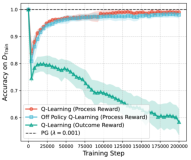

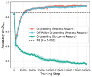

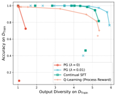

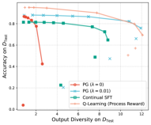

(a) Train Accuracy and Test Accuracy of Q-Learning (b) Output Diversity vs. Accuracy

Figure 3: Empirical comparison between Q-learning and PG. Figure (a) shows the training dynamics
of training and test accuracy (under greedy decoding). Figure (b) compares the Pareto frontiers of
output diversity and accuracy on the training and test sets (under temperature decoding).

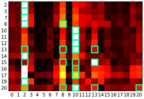

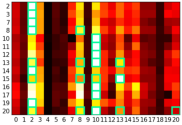

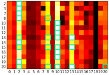

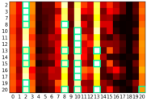

(a) Epoch 10000 (b) Epoch 30000 (c) Epoch 100000 (d) Epoch 300000

Figure 4: Heatmap of normalized logits from the Q-learning model with process reward. For each
row _i_, green blocks indicate valid next nodes given the current node 0 and target node _i_ . The logits
corresponding to these valid actions consistently increase during training.

Moreover, the convergence holds even under off-policy sampling, and action diversity is preserved
because all feasible next nodes converge to the logit value 1.

**Takeaway 6: Compared to PG methods, Q-learning can operate off-policy and better main-**
**tains output diversity.**

5.2 E MPIRICAL V ALIDATIONS

We first examine the training and test accuracy results in Figure 3a, where we compare Q-learning
under different reward designs and sampling policies. All models are initialized from the same
base model. Figure 3b states the diversity-accuracy trade-off of Q-learning models, policy gradient
models, and the continual SFT model (under different temperatures). Figure 4 illustrates the logits
of an on-policy Q-learning model with process rewards and fixed attention (attention fixed on the
target node _u_ 2 ). The model is initialized from the same base model as in Figure 3, and is further
trained with reinforcement steps on all pairs ( _s, t_ ) _∈D_ [SFT] where _t ∈_ [20]. In each row _i_, we plot
the logits for nodes 0–20 (normalized to [0 _,_ 1]) when the current node is 0 and the target node is _i_ .
White indicates larger logits, black indicates smaller logits, and green frames highlight nodes that
are both children of node 0 and ancestors of _i_, corresponding to valid outputs. The empirical results
are consistent with the takeaways introduced above, as detailed below.

**Takeaway 5:** In Figure 3a, Q-learning with process rewards achieves comparable training accuracy
and significantly better test accuracy than the PG model, while Q-learning with outcome rewards
collapses and converges to near-zero accuracy on both training and test sets. Examining each row of
Figure 4, we observe that the logits of feasible nodes gradually increase and converge to the largest
values within their respective rows, which aligns with Theorem 5.2 and 5.3 and confirms that process
rewards enable the model to recover the correct graph structure. **Takeaway 6:** In Figure 3a, offpolicy Q-learning with process rewards attains training and test accuracy comparable to on-policy
Q-learning with process rewards, demonstrating that Q-learning can operate off-policy. Finally,
Figure 3b further highlights that the Q-learning process rewards preserve output diversity. Figure 4
also reflects this phenomenon: within each row, the logits of feasible nodes become increasingly
close to one another (approaching white) over time, indicating convergence to diverse but correct
transitions.

9

Preprint as an Arxiv Paper

6 C ONCLUSION

In this paper, we analyze the benefits and limitations of reinforcement learning in language model
planning through the lens of learning dynamics. Our theoretical analysis shows that supervised
fine-tuning introduces spurious co-occurrence solutions, while policy gradient and Q-learning outperform SFT primarily through exploration. We further identify a critical drawback of basic policy gradient— _diversity collapse_ —and show that Q-learning mitigates this issue while supporting
off-policy learning. These insights clarify the mechanisms behind the recent success of RL-based
approaches and highlight principled research directions, such as leveraging Q-learning for robust,
scalable, and generalizable planning in language models.

10

Preprint as an Arxiv Paper

R EPRODUCIBILITY S TATEMENT

We attach all the source code necessary to reproduce our experimental results in the supplementary materials. As for the theoretical results, complete proofs of all the theorems are provided in
Appendix C, D, and E for full transparency and verification.

R EFERENCES

Ziwei Chai, Tianjie Zhang, Liang Wu, Kaiqiao Han, Xiaohai Hu, Xuanwen Huang, and Yang
Yang. Graphllm: Boosting graph reasoning ability of large language model. _arXiv preprint_
_arXiv:2310.05845_, 2023.

Nuo Chen, Yuhan Li, Jianheng Tang, and Jia Li. Graphwiz: An instruction-following language
model for graph computational problems. In _Proceedings of the 30th ACM SIGKDD Conference_
_on Knowledge Discovery and Data Mining_, pp. 353–364, 2024a.

Runjin Chen, Tong Zhao, Ajay Jaiswal, Neil Shah, and Zhangyang Wang. Llaga: Large language
and graph assistant. _arXiv preprint arXiv:2402.08170_, 2024b.

Tianzhe Chu, Yuexiang Zhai, Jihan Yang, Shengbang Tong, Saining Xie, Dale Schuurmans, Quoc V
Le, Sergey Levine, and Yi Ma. Sft memorizes, rl generalizes: A comparative study of foundation
model post-training. _arXiv preprint arXiv:2501.17161_, 2025.

Andrew Cohen, Andrey Gromov, Kaiyu Yang, and Yuandong Tian. Spectral journey: How transformers predict the shortest path. _arXiv preprint arXiv:2502.08794_, 2025.

Ganqu Cui, Yuchen Zhang, Jiacheng Chen, Lifan Yuan, Zhi Wang, Yuxin Zuo, Haozhan Li, Yuchen
Fan, Huayu Chen, Weize Chen, et al. The entropy mechanism of reinforcement learning for
reasoning language models. _arXiv preprint arXiv:2505.22617_, 2025.

Xinnan Dai, Haohao Qu, Yifen Shen, Bohang Zhang, Qihao Wen, Wenqi Fan, Dongsheng Li, Jiliang
Tang, and Caihua Shan. How do large language models understand graph patterns? a benchmark
for graph pattern comprehension. _arXiv preprint arXiv:2410.05298_, 2024.

Xinnan Dai, Kai Yang, Jay Revolinsky, Kai Guo, Aoran Wang, Bohang Zhang, and Jiliang Tang.
From sequence to structure: Uncovering substructure reasoning in transformers. _arXiv preprint_
_arXiv:2507.10435_, 2025.

Murtaza Dalal, Tarun Chiruvolu, Devendra Chaplot, and Ruslan Salakhutdinov. Plan-seqlearn: Language model guided rl for solving long horizon robotics tasks. _arXiv preprint_
_arXiv:2405.01534_, 2024.

Artur Back De Luca and Kimon Fountoulakis. Simulation of graph algorithms with looped transformers. _arXiv preprint arXiv:2402.01107_, 2024.

Jiayan Guo, Lun Du, and Hengyu Liu. Gpt4graph: Can large language models understand graph
structured data? an empirical evaluation and benchmarking. _arXiv preprint arXiv:2305.15066_,
2023.

Xiaojun Guo, Ang Li, Yifei Wang, Stefanie Jegelka, and Yisen Wang. G1: Teaching llms to reason
on graphs with reinforcement learning. _arXiv preprint arXiv:2505.18499_, 2025.

Subbarao Kambhampati, Karthik Valmeekam, Lin Guan, Mudit Verma, Kaya Stechly, Siddhant
Bhambri, Lucas Paul Saldyt, and Anil B Murthy. Position: LLMs can’t plan, but can help planning
in LLM-modulo frameworks. In _Forty-first International Conference on Machine Learning_, 2024.
[URL https://openreview.net/forum?id=Th8JPEmH4z.](https://openreview.net/forum?id=Th8JPEmH4z)

Xufang Luo, Yuge Zhang, Zhiyuan He, Zilong Wang, Siyun Zhao, Dongsheng Li, Luna K Qiu, and
Yuqing Yang. Agent lightning: Train any ai agents with reinforcement learning. _arXiv preprint_
_arXiv:2508.03680_, 2025.

11

Preprint as an Arxiv Paper

Zihan Luo, Xiran Song, Hong Huang, Jianxun Lian, Chenhao Zhang, Jinqi Jiang, and Xing Xie.
Graphinstruct: Empowering large language models with graph understanding and reasoning capability. _arXiv preprint arXiv:2403.04483_, 2024.

Volodymyr Mnih, Koray Kavukcuoglu, David Silver, Alex Graves, Ioannis Antonoglou, Daan Wierstra, and Martin Riedmiller. Playing atari with deep reinforcement learning. _arXiv preprint_
_arXiv:1312.5602_, 2013.

Ida Momennejad, Hosein Hasanbeig, Felipe Vieira Frujeri, Hiteshi Sharma, Nebojsa Jojic, Hamid
Palangi, Robert Ness, and Jonathan Larson. Evaluating cognitive maps and planning in large
language models with CogEval. _Advances in Neural Information Processing Systems_, 36, 2023.

Nanda Neel, Chan Lawrence, Lieberum Tom, Smith Jess, and Steinhardt Jacob. Progress measures
for grokking via mechanistic interpretability. In _International Conference on Learning Represen-_
_tations_, 2023.

Bryan Perozzi, Bahare Fatemi, Dustin Zelle, Anton Tsitsulin, Mehran Kazemi, Rami Al-Rfou, and
Jonathan Halcrow. Let your graph do the talking: Encoding structured data for llms. _arXiv_
_preprint arXiv:2402.05862_, 2024.

Clayton Sanford, Bahare Fatemi, Ethan Hall, Anton Tsitsulin, Mehran Kazemi, Jonathan Halcrow,
Bryan Perozzi, and Vahab Mirrokni. Understanding transformer reasoning capabilities via graph
algorithms. _Advances in Neural Information Processing Systems_, 37:78320–78370, 2024.

John Schulman, Filip Wolski, Prafulla Dhariwal, Alec Radford, and Oleg Klimov. Proximal policy
optimization algorithms. _arXiv preprint arXiv:1707.06347_, 2017.

Amrith Setlur, Nived Rajaraman, Sergey Levine, and Aviral Kumar. Scaling test-time compute
without verification or rl is suboptimal. _arXiv preprint arXiv:2502.12118_, 2025.

Zhihong Shao, Peiyi Wang, Qihao Zhu, Runxin Xu, Junxiao Song, Xiao Bi, Haowei Zhang,
Mingchuan Zhang, YK Li, Yang Wu, et al. Deepseekmath: Pushing the limits of mathematical reasoning in open language models. _arXiv preprint arXiv:2402.03300_, 2024.

Yongliang Shen, Kaitao Song, Xu Tan, Dongsheng Li, Weiming Lu, and Yueting Zhuang. HuggingGPT: Solving AI tasks with ChatGPT and its friends in Huggingface. _Advances in Neural_
_Information Processing Systems_, 36, 2023.

Guangming Sheng, Chi Zhang, Zilingfeng Ye, Xibin Wu, Wang Zhang, Ru Zhang, Yanghua Peng,
Haibin Lin, and Chuan Wu. Hybridflow: A flexible and efficient rlhf framework. _arXiv preprint_
_arXiv: 2409.19256_, 2024.

Trieu H Trinh, Yuhuai Wu, Quoc V Le, He He, and Thang Luong. Solving Olympiad geometry
without human demonstrations. _Nature_, 625(7995):476–482, 2024.

Karthik Valmeekam, Matthew Marquez, Alberto Olmo, Sarath Sreedharan, and Subbarao
Kambhampati. Planbench: An extensible benchmark for evaluating large language
models on planning and reasoning about change. In A. Oh, T. Naumann, A. Globerson, K. Saenko, M. Hardt, and S. Levine (eds.), _Advances in Neural Information Pro-_
_cessing Systems_, volume 36, pp. 38975–38987. Curran Associates, Inc., 2023a. URL
[https://proceedings.neurips.cc/paper_files/paper/2023/file/](https://proceedings.neurips.cc/paper_files/paper/2023/file/7a92bcdede88c7afd108072faf5485c8-Paper-Datasets_and_Benchmarks.pdf)
[7a92bcdede88c7afd108072faf5485c8-Paper-Datasets_and_Benchmarks.](https://proceedings.neurips.cc/paper_files/paper/2023/file/7a92bcdede88c7afd108072faf5485c8-Paper-Datasets_and_Benchmarks.pdf)
[pdf.](https://proceedings.neurips.cc/paper_files/paper/2023/file/7a92bcdede88c7afd108072faf5485c8-Paper-Datasets_and_Benchmarks.pdf)

Karthik Valmeekam, Matthew Marquez, Sarath Sreedharan, and Subbarao Kambhampati. On the
planning abilities of large language models-a critical investigation. _Advances in Neural Informa-_
_tion Processing Systems_, 36, 2023b.

Guanzhi Wang, Yuqi Xie, Yunfan Jiang, Ajay Mandlekar, Chaowei Xiao, Yuke Zhu, Linxi Fan,
and Anima Anandkumar. Voyager: An open-ended embodied agent with large language models.
_arXiv preprint arXiv:2305.16291_, 2023a.

12

Preprint as an Arxiv Paper

Heng Wang, Shangbin Feng, Tianxing He, Zhaoxuan Tan, Xiaochuang Han, and Yulia Tsvetkov.
Can language models solve graph problems in natural language? _Advances in Neural Information_
_Processing Systems_, 36, 2023b.

Lei Wang, Chen Ma, Xueyang Feng, Zeyu Zhang, Hao Yang, Jingsen Zhang, Zhiyuan Chen, Jiakai
Tang, Xu Chen, Yankai Lin, et al. A survey on large language model based autonomous agents.
_Frontiers of Computer Science_, 18(6):1–26, 2024a.

Siwei Wang, Yifei Shen, Shi Feng, Haoran Sun, Shang-Hua Teng, and Wei Chen. Alpine: Unveiling the planning capability of autoregressive learning in language models. _Advances in neural_
_information processing systems_, 37:119662–119688, 2024b.

Qinzhuo Wu, Wei Liu, Jian Luan, and Bin Wang. Toolplanner: A tool augmented llm for multi granularity instructions with path planning and feedback. _arXiv preprint arXiv:2409.14826_, 2024a.

Xixi Wu, Yifei Shen, Caihua Shan, Kaitao Song, Siwei Wang, Bohang Zhang, Jiarui Feng, Hong
Cheng, Wei Chen, Yun Xiong, et al. Can graph learning improve planning in llm-based agents?
_Advances in Neural Information Processing Systems_, 37:5338–5383, 2024b.

Jingkang Yang, Yuhao Dong, Shuai Liu, Bo Li, Ziyue Wang, Haoran Tan, Chencheng Jiang, Jiamu
Kang, Yuanhan Zhang, Kaiyang Zhou, et al. Octopus: Embodied vision-language programmer
from environmental feedback. In _European conference on computer vision_, pp. 20–38. Springer,
2024.

Yang Yue, Zhiqi Chen, Rui Lu, Andrew Zhao, Zhaokai Wang, Shiji Song, and Gao Huang. Does reinforcement learning really incentivize reasoning capacity in llms beyond the base model? _arXiv_
_preprint arXiv:2504.13837_, 2025.

Guibin Zhang, Hejia Geng, Xiaohang Yu, Zhenfei Yin, Zaibin Zhang, Zelin Tan, Heng Zhou,
Zhongzhi Li, Xiangyuan Xue, Yijiang Li, et al. The landscape of agentic reinforcement learning
for llms: A survey. _arXiv preprint arXiv:2509.02547_, 2025a.

Kaiyan Zhang, Yuxin Zuo, Bingxiang He, Youbang Sun, Runze Liu, Che Jiang, Yuchen Fan, Kai
Tian, Guoli Jia, Pengfei Li, et al. A survey of reinforcement learning for large reasoning models.
_arXiv preprint arXiv:2509.08827_, 2025b.

Hanlin Zhu, Baihe Huang, Shaolun Zhang, Michael Jordan, Jiantao Jiao, Yuandong Tian, and Stuart J Russell. Towards a theoretical understanding of the’reversal curse’via training dynamics.
_Advances in Neural Information Processing Systems_, 37:90473–90513, 2024.

13

Preprint as an Arxiv Paper

A T HE U SE OF L ARGE L ANGUAGE M ODELS

In this paper, the core conceptual framework and its iterative development were driven by human
researchers. LLMs served strictly in a supporting capacity, primarily employed for linguistic refinement of the manuscript to enhance readability while preserving original technical content. The
whole paper is carefully supervised, reviewed, and modified by the authors who maintain complete
responsibility for the scientific validity, technical accuracy, and ethical integrity of this work.

B M ORE R ELATED W ORKS

B.1 P LANNING OF LLM S

Planning is a fundamental component of human intelligence and autonomous agents. Several studies have evaluated the planning capabilities of LLMs trained without reinforcement learning, such
as CogEval (Momennejad et al., 2023) and Blockworlds (Valmeekam et al., 2023b). These works
consistently report negative results, suggesting that LLMs lack inherent planning abilities. In contrast, models such as _o1_ show the ability to solve such problems, though the underlying mechanisms
remain unclear.

On the other hand, LLM-based agents have demonstrated remarkable competence in performing
real-world planning tasks, even without RL training (Wang et al., 2024a). Many of these planning tasks can be naturally abstracted as path planning problems on a graph. For example, in
tool-augmented agents (Shen et al., 2023), tool dependencies can be modeled as a graph where
nodes represent tools and edges represent dependency relations (Wu et al., 2024b). Planning, in
this context, involves finding a path of tools to fulfill the user’s request. Similarly, in mathematical reasoning agents (Trinh et al., 2024), theorem dependencies form a graph where constructing a
proof is equivalent to finding a path. In game-playing agents such as Voyager (Wang et al., 2023a),
skill dependencies create a graph structure where planning determines the sequence of skills needed
to accomplish tasks. These observations motivate our abstraction of planning as a path planning
problem in this work.

Agents trained without RL face two key challenges: (1) supervised fine-tuning loss is misaligned
with the agent’s ultimate objectives, and (2) real-world data is scarce. RL addresses the first issue
by explicitly optimizing for the end goal through a reward signal, and the second by generating
exploratory data. Consequently, RL significantly mitigates these limitations and improves performance (Zhang et al., 2025a). Our paper further examines the benefits of RL over SFT, as well as the
limitations of RL, providing insights for future research directions.

B.2 RL FOR LLM S

Recently, RL has been widely adopted to enhance reasoning capabilities in language models, exemplified by milestone systems such as OpenAI’s _o1_ and DeepSeek-R1. This paradigm has inspired
a new wave of reasoning-focused models, including Qwen-3 and Phi-4 Reasoning (Zhang et al.,
2025b). State-of-the-art LLM-based agents also commonly employ RL (Zhang et al., 2025a).

Despite its empirical success, the mechanisms by which RL improves LLM performance remain an
active area of research, with current understanding scattered across multiple works. For instance,
Chu et al. (2025) empirically compares SFT and RL on reasoning benchmarks, concluding that RL
provides better generalization. Theoretical analysis in (Setlur et al., 2025) further shows that any
verification-free approach, such as SFT, is suboptimal. Additionally, Yue et al. (2025) identifies an
_entropy mechanism_, establishing and empirically validating a trade-off between entropy and accuracy during RL training.

In this paper, we focus on path planning as a case study and derive results consistent with prior
work: (1) SFT tends to memorize training data and produce co-occurrence-driven outputs; (2) RL
surpasses SFT primarily through exploration; and (3) diversity collapse occurs during PG training.
Beyond these findings, we uncover evidence suggesting that Q-learning may offer advantages over
policy gradient methods, introducing a new perspective on RL for LLMs.

14

Preprint as an Arxiv Paper

B.3 G RAPH P ROBLEMS WITH L ANGUAGE M ODELS

Graph problems serve as a valuable testbed for analyzing the reasoning capabilities of language
models. From an empirical standpoint, several benchmarks have been proposed (Guo et al., 2023;
Wang et al., 2023b; Dai et al., 2024), spanning a spectrum of tasks: classic graph problems (e.g.,
connectivity, path-finding, and pattern detection), graph neural network (GNN) benchmarks (e.g.,
node and graph classification), and semantic graph-based question answering (e.g., on knowledge
graphs). Without additional training, LLMs generally underperform on these tasks. To improve
performance, early approaches leverage instruction tuning and DPO (Luo et al., 2024; Chen et al.,
2024a; Perozzi et al., 2024; Chai et al., 2023; Chen et al., 2024b), while later methods employ
RL (Guo et al., 2025), which consistently achieves superior results.

There are three major paradigms for analyzing how transformers solve graph-related reasoning tasks.
The first is _mechanistic interpretability_, which reverse-engineers trained model weights (Neel et al.,
2023). For example, Cohen et al. (2025) observed that transformers implement a spectral algorithm
to compute shortest paths. However, this paradigm largely relies on empirical observation without
theoretical grounding. The second paradigm is based on _expressiveness_ analysis (Dai et al., 2024;
Sanford et al., 2024; Dai et al., 2025; De Luca & Fountoulakis, 2024), constructing weight configurations that enable transformers to simulate algorithms. Yet, such configurations are often unrealistic
for transformers trained via SGD (e.g., embedding vectors explicitly set to 1 _,_ 2 _, . . ., L_ (Dai et al.,
2024)). The third paradigm investigates _gradient dynamics_, which is both practical and challenging
due to the non-convexity of the optimization landscape. Prior work has analyzed path-finding in
directed graphs (Wang et al., 2024b) and compositionality of paths (Zhu et al., 2024).

To the best of our knowledge, this work presents the first analysis of RL gradient dynamics in LLMs.
Our results explain why RL-based methods outperform SFT approaches and highlight the potential
advantages of Q-learning–driven methods, opening promising directions for future research.

C A PPENDIX FOR SFT

C.1 P ATH P LANNING A LGORITHM IN T RANSFORMER

**Algorithm 1** A handcrafted path planning algorithm

1: **Input:** Adjacency matrix _**A**_, reachability matrix _**R**_, source node _s_, target node _t_
2: Set path _P_ = [ _s t s_ ] and set current node _i_ = _s_
3: **while** _i ̸_ = _t_ **do**
4: Obtain _S_ = _{k|_ _**A**_ ( _i,k_ ) = 1 and _**R**_ ( _t,k_ ) = 1 _}_
5: Randomly sample next node _k_ from _S_
6: Append _k_ to path _P_, and set _i_ = _k_
7: **end while**
8: **output** path _P_

C.2 P ROOF OF T HEOREM 3.1

_Proof._ The next-token prediction cross-entropy loss can be written as

_ℓ_ = _−_ �

**u** _∈D_ [SFT]

�

_m≥_ 3

� _δ_ _k_ = _u_ _m_ +1 log ˆ **u** _m_ [ _k_ ] _._

_k_

Under the assumption that the output distribution ˆ **u** _m_ depends only on the target node _u_ 2 and the
current node _u_ _m_, we can aggregate identical terms, and express the loss as

��� _k_

~~�~~ _k_ _N_ _[′]_ _[ N]_ _u_ 2 _[u]_ _,u_ 2 _m_ _[,u]_ _,_ _m_ _k_ _[,k]_ _[′]_ [log] ~~�~~ _k_ ex _[′]_ [ exp(] p( **f** ( _u_ **[f]** [(] 2 _[u]_ _, u_ [2] _[, u]_ _m_ )[ _[m]_ _k_ [)[] ]) _[k]_ _[′]_ [])]

15

�

_−_
�

_u_ 2 _,u_ _m_

_N_ _u_ 2 _,u_ _m_ _,k_ _′_

�� _k_ _[′]_

_._

Preprint as an Arxiv Paper

If [�] _k_ _[′]_ _[ N]_ _[u]_ 2 _[,u]_ _m_ _[,k]_ _[′]_ _[ ̸]_ [= 0][, the expression in brackets is the cross-entropy between the empirical distri-]

bution and the distribution of doing softmax on vector **f** ( _u_ 2 _, u_ _m_ ). It is minimized when

exp( **f** ( _u_ 2 _, u_ _m_ )[ _k_ ])
~~�~~ _k_ _[′]_ [ exp(] **[f]** [(] _[u]_ [2] _[, u]_ _[m]_ [)[] _[k]_

_k_ _[′]_ _[ N]_ _[u]_ 2 _[,u]_ _m_ _[,k]_ _[′]_ _[.]_

exp( **f** ( _u_ 2 _, u_ _m_ )[ _k_ ]) _N_ _u_ 2 _,u_ _m_ _,k_

_k_ _[′]_ [ exp(] **[f]** [(] _[u]_ [2] _[, u]_ _[m]_ [)[] _[k]_ _[′]_ []) =] ~~�~~ _k_ _[′]_ _[ N]_ _[u]_ 2 _[,u]_

If [�] _k_ _[′]_ _[ N]_ _[u]_ 2 _[,u]_ _m_ _[,k]_ _[′]_ [ = 0][, the loss does not depend on] **[ f]** [(] _[u]_ [2] _[, u]_ _[m]_ [)][, so it can be any valid probabilit][y]

distribution.

D A PPENDIX FOR P OLICY G RADIENT

D.1 P ROOF OF T HEOREM 4.1

_Proof._ In this case, the loss function of policy gradient is

� log ˆ **u** _m_ [ _u_ _m_ +1 ]

_m≥_ 3

 _._

� log ˆ **u** _m_ [ _u_ _m_ +1 ]

_m≥_ 3







=
�
 **u** _∈D_ [RL,t]

_ℓ_ = � _δ_ **u** _∈P_

**u** _∈D_ [RL,t]



_−_
�
 _m≥_

**u** _∈D_ [RL,t] _∩P_

_−_
�
 _m≥_

D.2 P ROOF OF T HEOREM 4.2

_Proof._ We first rewrite the loss function as

� log ˆ **u** _m_ [ _u_ _m_ +1 ]

_m≥_ 3

_N_ _[R,P,t]_

� _i,j,k_

_i,j,k_

_,_
�

_−_ exp( **f** ( _i,_ _j_ )[ _k_ ])
log
� ~~�~~ _k_ _[′]_ [ exp(] **[f]** [(] _[i, j]_ [)[] _[k]_ _[′]_ [])]

_ℓ_ = �

**u** _∈D_ [RL,t] _∩P_



_−_
�
 _m≥_



=
�
 _i,j,k_

where _N_ _i,j,k_ _[R,P,t]_ denote the number of times that **u** [2] = _i_, **u** [ _m_ ] = _j_ and **u** [ _m_ + 1] = _k_ for _m ≥_ 3 in
set _D_ [RL,t] _∩P_ . Then we can take the gradient and get

_∂ℓ_ exp( **f** ( _i,_ _j_ )[ _k_ ])
_∂_ **f** ( _i, j_ )[ _k_ ] [=] _[ −][N]_ _i,j,k_ _[ R,P,t]_ [+] ~~�~~ _k_ _[′]_ [ exp(] **[f]** [(] _[i, j]_ [)[] _[k]_ _[′]_ [])]

_N_ _[R,P,t]_

� _i,j,k_ _[′]_ _[ .]_

_k_ _[′]_

For a wrong tuple _i, j, k_ (where _k_ is not adjacent with _j_ or _k_ cannot reach _i_ ), _N_ _i,j,k_ _[R,P,t]_ is always zero.
Thus, the gradient is always positive. On the other hand, we will also have

� _k_ [ex][p(] **[f]** [(] _[i][,]_ _[j]_ [)[] _[k]_ [])]

~~�~~ _k_ _[′]_ [ exp(] **[f]** [(] _[i, j]_ [)[] _[k]_ _[′]_ [])]

_k_ _[′]_ [ exp(] **[f]** [(] _[i, j]_ [)[] _[k]_ _[′]_ [])]

�

_k_

_∂ℓ_
_∂_ **f** ( _i, j_ )[ _k_ ] [=] _[ −]_ �

�
_N_ _[R,P,t]_
_k_ _i,j,k_ [+] ~~�~~

_N_ _[R,P,t]_

� _i,j,k_ _[′]_ [ = 0] _[.]_

_k_ _[′]_

D.3 P ROOF OF T HEOREM 4.3

_Proof._ Note that

_KL_ ( _U_ _C_ ( _i,j_ ) _||_ **softmax** ( **f** ( _i, j_ )) = �

_k∈C_ ( _i,j_ )

1

_|C_ ( _i, j_ ) _|_

�

_−_ log _|C_ ( _i, j_ ) _| −_ log exp( **f** ( _i,_ _j_ )[ _k_ ])
~~�~~ _k_ _[′]_ _C_ [exp(] **[f]** [(] _[i, j]_

_k_ _[′]_ _∈C_ ( _i,j_ ) [exp(] **[f]** [(] _[i, j]_ [)[] _[k]_ _[′]_ [])]

�

1
= _−_ log _|C_ ( _i, j_ ) _| −_
_|C_ ( _i, j_ ) _|_

exp( **f** ( _i,_ _j_ )[ _k_ ])

� log

_k∈C_ ( _i,j_ ) ~~�~~ _k_ _[′]_ _∈C_ ( _i,j_ ) [exp(] **[f]** [(]

�

_k_ _[′]_ _∈C_ ( _i,j_ ) [exp(] **[f]** [(] _[i, j]_ [)[] _[k]_ _[′]_ [])] _[.]_

Thus, it is sufficient to prove

exp( **f** _[t]_ ( _i,_ _j_ )[ _k_ ])

� log

_k∈C_ ( _i,j_ ) ~~�~~ _k_ _[′]_ _∈C_ ( _i,j_ ) [exp(] **[f]** _[ t]_ [(]



�
 _k∈C_ (

�

_k_ _[′]_ _∈C_ ( _i,j_ ) [exp(] **[f]** _[ t]_ [(] _[i, j]_ [)[] _[k]_ _[′]_ [])] _[ ≥]_ [E]

exp( **f** _[t]_ [+1] ( _i,_ _j_ )[ _k_ ])

� log

_k∈C_ ( _i,j_ ) ~~�~~ _k_ _[′]_ _∈C_ ( _i,j_ ) [exp(] **[f]** _[ t]_ [+1] [(] _[i, j]_

_k_ _[′]_ _∈C_ ( _i,j_ ) [exp(] **[f]** _[ t]_ [+1] [(] _[i, j]_ [)[] _[k]_ _[′]_ [])]

 _._

16

Preprint as an Arxiv Paper

According to the gradient, we have that

_̸_



 _,_

_̸_

**f** _[t]_ [+1] ( _i, j_ )[ _k_ ] = **f** _[t]_ ( _i, j_ )[ _k_ ] _−_ _η_

Here _η_ is the step size.

_̸_



_̸_

_−N_ _[R,P,t]_ exp( **f** ( _i,_ _j_ )[ _k_ ])
_i,j,k_ [+] ~~�~~ _k_ _[′]_ _∈C_ ( _i,j_ ) [exp(] **[f]** [(] _[i, j]_


_̸_

_k_ _[′]_ _∈C_ ( _i,j_ ) [exp(] **[f]** [(] _[i, j]_ [)[] _[k]_ _[′]_ [])]

_̸_

_N_ _[R,P,t]_

� _i,j,k_ _[′]_

_k_ _[′]_ _∈C_ ( _i,j_ )

_̸_

Let _N_ _i,j_ _[R,P,t]_ = [�] _k_ _[′]_ _∈C_ ( _i,j_ ) _[N]_ _i,j,k_ _[ R,P,t]_ _[′]_ [, then due to the on-policy updating in policy gradient, we know]

that _N_ _i,j,k_ _[R,P,t]_ [is the counter of outcome] _[ k]_ [ for] _[ N]_ _i,j_ _[ R,P,t]_ independent multi-nomial random variables with

_̸_

exp( **f** _[t]_ ( _i,j_ )[ _k_ ])

_k_ _[′]_ _∈C_ ( _i,j_ ) [exp(] **[f]** _[ t]_ [(] _[i,j]_ [)[] _[k]_ _[′]_ [])] �

_̸_

exp( **f** _[t]_ ( _i,j_ )[ _k_ ])
parameters
� ~~�~~ _k_ _[′]_ _∈C_ ( _i,j_ ) [exp(] **[f]** _[ t]_ [(] _[i,j]_

_̸_

_k∈C_ ( _i,j_ ) [. This means that]

_̸_

E[ **f** _[t]_ [+1] ( _i, j_ )[ _k_ ]] = **f** _[t]_ ( _i, j_ )[ _k_ ] _._

Moreover, since log �� _k_ _[′]_ _∈C_ ( _i,j_ ) [exp(] **[f]** _[ t]_ [(] _[i, j]_ [)[] _[k]_ _[′]_ [])] � is a convex function, we also have

_̸_



_̸_

�
 _k_ _[′]_ _∈C_ (

_̸_

� exp( **f** _[t]_ [+1] ( _i, j_ )[ _k_ _[′]_ ])

_k_ _[′]_ _∈C_ ( _i,j_ )

_̸_



_≥_ log


=
log

_̸_



_̸_

�
 _k_ _[′]_ _∈C_ (

_̸_

�
 _k_ _[′]_ _∈C_ (

_̸_

� exp(E[ **f** _[t]_ [+1] ( _i, j_ )[ _k_ _[′]_ ]])

_k_ _[′]_ _∈C_ ( _i,j_ )

_̸_





_̸_





_̸_

E

_̸_



log


_̸_



_̸_

� exp( **f** _[t]_ ( _i, j_ )[ _k_ _[′]_ ])

_k_ _[′]_ _∈C_ ( _i,j_ )

_̸_





_̸_

Because of this, we have

_̸_









_̸_

exp( **f** _[t]_ ( _i,_ _j_ )[ _k_ ])

� log

_k∈C_ ( _i,j_ ) ~~�~~ _k_ _[′]_ _∈C_ ( _i,j_ ) [exp(] **[f]** _[ t]_ [(]

_̸_



_̸_

�
 _k∈C_ (

_̸_

�

_̸_

_k_ _[′]_ _∈C_ ( _i,j_ ) [exp(] **[f]** _[ t]_ [(] _[i, j]_ [)[] _[k]_ _[′]_ [])] _[ −]_ [E]

_̸_

exp( **f** _[t]_ [+1] ( _i,_ _j_ )[ _k_ ])

� log

_k∈C_ ( _i,j_ ) ~~�~~ _k_ _[′]_ _∈C_ ( _i,j_ ) [exp(] **[f]** _[ t]_ [+1] [(] _[i, j]_

_̸_

_k_ _[′]_ _∈C_ ( _i,j_ ) [exp(] **[f]** _[ t]_ [+1] [(] _[i, j]_ [)[] _[k]_ _[′]_ [])]

_̸_



_̸_

�
 _k_ _[′]_ _∈C_ (

_̸_

� exp( **f** _[t]_ ( _i, j_ )[ _k_ _[′]_ ])

_k_ _[′]_ _∈C_ ( _i,j_ )

_̸_

= � **f** _[t]_ ( _i, j_ )[ _k_ ] _−_ E

_k∈C_ ( _i,j_ )

_̸_



_̸_

�
 _k∈C_ (

_̸_

� **f** _[t]_ [+1] ( _i, j_ )[ _k_ ]

_k∈C_ ( _i,j_ )

_̸_



_̸_

_−|C_ ( _i, j_ ) _|_ log


_̸_

�
 _k_ _[′]_ _∈C_ (

_̸_

� exp( **f** _[t]_ [+1] ( _i, j_ )[ _k_ _[′]_ ])

_k_ _[′]_ _∈C_ ( _i,j_ )

_̸_





_̸_





_̸_

+ _|C_ ( _i, j_ ) _|_ E

_≥_ 0 _._

_̸_



log


_̸_



_̸_

D.4 P ROOF OF T HEOREM 4.4

_Proof._ When _λ >_ 0, the loss function is

_̸_

_,_
��

_̸_

� _N_ _i,j,k_ _[R,P,t]_ [(] _[−]_ [log] **[ q]** [(] _[i, j]_ [)[] _[k]_ []) +] _[ λ]_ �

_i,j,k_ _i,j,k_

_̸_

**q** ( _i,_ _j_ )[ _k_ ]
log **q** ( _i, j_ )[ _k_ ] log
� � **q** [base] ( _i, j_ )[ _k_ ]

_̸_

_ℓ_ = �

_̸_

_N_ _[R,t]_

� _i,j,k_

_i,j,k_

_̸_

where _N_ _i,j,k_ _[R,t]_ [denote the number of times that] **[ u]** [[2] =] _[ i]_ [,] **[ u]** [[] _[m]_ [] =] _[ j]_ [ and] **[ u]** [[] _[m]_ [ + 1] =] _[ k]_ [ for] _[ m][ ≥]_ [3][ in]
set _D_ [RL,t] .

We can take the gradient and get:

_∂ℓ_ = _−N_ _[R,P,t]_ _N_ _[R,P,t]_ **q** ( _i,_ _j_ )[ _k_ ]
_∂_ **f** ( _i, j_ )[ _k_ ] _i,j,k_ [+] **[ q]** [(] _[i, j]_ [)[] _[k]_ []] � _k_ _[′]_ _i,j,k_ _[′]_ [ +] _[ λN]_ _i,j,k_ _[ R,t]_ [(1] _[ −]_ **[q]** [(] _[i, j]_ [)[] _[k]_ []) log] **q** [base] ( _i, j_ )[ _k_ ]

_−λ_ _N_ _[R,t]_ **q** ( _i,_ _j_ )[ _k_ ]

_k_ � _[′]_ = _̸_ _k_ _i,j,k_ _[′]_ **[q]** [(] _[i, j]_ [)[] _[k]_ [] log] **q** [base] ( _i, j_ )[ _k_ ] _[.]_

17

Preprint as an Arxiv Paper

Taking expectation, we can get:

_̸_

_̸_

_∂ℓ_
E
� _∂_ **f** ( _i, j_ )[ _k_ ]

_̸_

_̸_

� = _−_ E[ _N_ _i,j,k_ _[R,P,t]_ [] +] **[ q]** [(] _[i, j]_ [)[] _[k]_ []] � _k_ _[′]_ E[ _N_ _i,j,k_ _[R,P,t]_ _[′]_ [ ] +] _[ λ]_ [E][[] _[N]_ _i,j,k_ _[ R,t]_ [] _[k]_ []) log] **q** [base] **q** ( _i_ ( _,i, jj_ )[)[ _k_ ] _k_ ]

_̸_

_̸_

_−λ_ _k_ � _[′]_ = _̸_ _k_ E[ _N_ _i,j,k_ _[R,t]_ _[′]_ []] **[q]** [(] _[i, j]_ [)[] _[k]_ [] log] **q** [base] **q** ( _i_ ( _,i, jj_ )[)[ _k_ ] _k_ ] _[.]_

_̸_

_̸_

Letting _N_ _i,j_ _[R,t]_ = � _k_ _[N]_ _i,j,k_ _[ R,t]_ [, then due to on-policy training, we have that][ E][[] _[N]_ _i,j,k_ _[ R,P,t]_ []] =

_N_ _i,j_ _[R,t]_ **[q]** [(] _[i, j]_ [)[] _[k]_ []] **[p]** [(] _[i, j]_ [)[] _[k]_ []][, and][ E][[] _[N]_ _i,j,k_ _[R,t]_ [] =] _[ N]_ _i,j_ _[ R,t]_ **[q]** [(] _[i, j]_ [)[] _[k]_ []][.]

Hence

_̸_

_̸_

_∂ℓ_
E
� _∂_ **f** ( _i, j_ )[ _k_ ]

_̸_

_̸_

�

_̸_

_̸_

= _−N_ _i,j_ _[R,t]_ **[q]** [(] _[i, j]_ [)[] _[k]_ []] **[p]** [(] _[i, j]_ [)[] _[k]_ [] +] _[ N]_ _i,j_ _[R,t]_ **[q]** [(] _[i, j]_ [)[] _[k]_ []] � **q** ( _i, j_ )[ _k_ _[′]_ ] **p** ( _i, j_ )[ _k_ _[′]_ ]

_k_ _[′]_

_̸_

_̸_

**q** ( _i,_ _j_ )[ _k_ ] **q** ( _i,_ _j_ )[ _k_ ]
+ _λN_ _i,j_ _[R,t]_ **[q]** [(] _[i, j]_ [)[] _[k]_ [] _[k]_ []) log] **q** [base] ( _i, j_ )[ _k_ ] _[−]_ _[λN]_ _i,j_ _[ R,t]_ _k_ � _[′]_ = _̸_ _k_ **q** ( _i, j_ )[ _k_ ] **q** ( _i, j_ )[ _k_ _[′]_ ] log **q** [base] ( _i, j_ )[ _k_ ]

_̸_

_̸_

= _N_ _i,j_ _[R,t]_ **[q]** [(] _[i, j]_ [)[] _[k]_ []] � _k_ _[′]_ **q** ( _i, j_ )[ _k_ _[′]_ ] � **p** ( _i, j_ )[ _k_ ] _−_ **p** ( _i, j_ )[ _k_ _[′]_ ] + _λ_ log **q** [base] **q** ( _i_ ( _,i, jj_ )[)[ _k_ ] _k_ ] _[−]_ _[λ]_ [ log] **q** [base] **q** ( _i_ ( _,i, jj_ )[)[ _k_ _[′]_ _k_ ] _[′]_ ]

_̸_

_̸_

_._
�

_̸_

_̸_

The stable point must satisfy that, for any tuple _i, j, k_, E � _∂_ **f** ( _i,j∂ℓ_ )[ _k_ ] � = 0. And we claim that in this

**q** ( _i,j_ )[ _k_ _[′]_ ]
case, for fixed _i, j_ and any _k_ _[′]_ such that **q** ( _i, j_ )[ _k_ _[′]_ ] _>_ 0, their **p** ( _i, j_ )[ _k_ _[′]_ ] + _λ_ log **q** [base] ( _i,j_ )[ _k_ _[′]_ ] [should]

equal. Otherwise we can always look for _k_ _[∗]_ = arg min _k_ _′_ : **q** ( _i,j_ )[ _k_ _′_ ] _>_ 0 **p** ( _i, j_ )[ _k_ _[′]_ ] + _λ_ log **qq** [base] ( _i_ ( _,ji,j_ )[)[ _k_ _[′]_ _k_ ] _[′]_ ] [,]

and its expected gradient E � _∂_ **f** ( _i,j∂ℓ_ )[ _k_ _[∗]_ ] � is strict negative.

E A PPENDIX FOR Q-L EARNING

E.1 P ROOF OF L EMMA 5.1

_Proof._ Fix any triple ( _i, j, k_ ). Consider training sequences whose first two nodes satisfy _u_ 1 _∈V_
and _u_ 2 = _i_ . By the definition of the training process, P( _u_ 1 _∈V, u_ 2 = _i_ ) _>_ 0. Under _ϵ_ -exploration
uniform over _V_,
_∀v ∈V_ : P(next node = _v_ ) _≥_ _ϵ/|V|._
Condition on the event _{u_ 1 _∈V, u_ 2 = _i}_ . Then in the next two decisions,

P( _u_ 4 = _j | u_ 1 _∈V, u_ 2 = _i_ ) _≥_ _ϵ/|V|,_ P( _u_ 5 = _k | u_ 1 _∈V, u_ 2 = _i, u_ 4 = _j_ ) _≥_ _ϵ/|V|._

Hence
P( _u_ 2 = _i, u_ 4 = _j, u_ 5 = _k_ ) _≥_ _p_ 0 ( _ϵ/|V|_ ) [2] _>_ 0 _._
Each occurrence of ( _u_ 2 _, u_ 4 _, u_ 5 ) = ( _i, j, k_ ) triggers one update of **f** ( _i, j_ )[ _k_ ]. Since each occurrence
yields an update of **f** ( _i, j_ )[ _k_ ], we obtain

_̸_

_̸_

1
lim inf
_T →∞_ _T_

_̸_

_̸_

_T −_ 1
� _δ_ ( _i_ _t_ _,j_ _t_ _,k_ _t_ )=( _i,j,k_ ) _≥_ _N_ [prop] ~~_i_~~ _,j,k_ _[>]_ [ 0] _[,]_

_t_ =0

_̸_

_̸_

which is the persistent exploration condition.

E.2 P ROOF OF T HEOREM 5.1

_Proof._ At a stable point, the expected update of each coordinate vanishes. The per-step loss is

2
_ℓ_ = � **f** ( _u_ 2 _, u_ _m_ )[ _u_ _m_ +1 ] _−_ _δ_ **u** _∈P_ _δ_ _u_ _m_ +1 = _u_ 2 _−{_ max � _._
_k_ _[′]_ **[ f]** [(] _[u]_ [2] _[, u]_ _[m]_ [+1] [)[] _[k]_ _[′]_ []] _[}]_

18

Preprint as an Arxiv Paper

Taking the gradient with respect to **f** ( _u_ 2 _, u_ _m_ )[ _u_ _m_ +1 ] and setting the expectation to zero yields, for
every triple ( _i, j, k_ ),
**f** ( _i, j_ )[ _k_ ] = E[ _δ_ **u** _∈P_ _δ_ _k_ = _i_ ] + max (4)
_k_ _[′]_ **[ f]** [(] _[i, k]_ [)[] _[k]_ _[′]_ []] _[.]_

If _k ̸_ = _i_, the expectation term in equation 4 vanishes, so

**f** ( _i, j_ )[ _k_ ] = max
_k_ _[′]_ **[ f]** [(] _[i, k]_ [)[] _[k]_ _[′]_ []] _[,]_

which does not depend on _j_ . Thus, for each _k ̸_ = _i_, we have

**f** ( _i, j_ )[ _k_ ] = max _k_ _[′]_ **[ f]** [(] _[i, k]_ [)[] _[k]_ _[′]_ [] = max] _k_ _[′]_ = _̸_ _i_ � max _k_ _[′′]_ **[ f]** [(] _[i, k]_ _[′]_ [)[] _[k]_ _[′′]_ []] _[,]_ **[ f]** [(] _[i, k]_ [)[] _[i]_ []] � = max _k_ _[′]_ = _̸_ _i_ [max] _k_ _[′′]_ **[ f]** [(] _[i, k]_ _[′]_ [)[] _[k]_ _[′′]_ []] _[.]_

This expression no longer depends on _k_ or _j_ .

Therefore, for each fixed _i_ and _k ̸_ = _i_, all **f** ( _i, j_ )[ _k_ ] take a common value _c_ _i_, independent of _j_ and
_k_ .

E.3 P ROOF OF T HEOREM 5.2

_Proof._ For clarity, we introduce two notations that will be used repeatedly. First, for _i, k ∈_ [ _n_ ] and
iteration _t_, define
_S_ _i,k_ [(] _[t]_ [)] [:= max] _k_ _[′]_ **[ f]** [ (] _[t]_ [)] [(] _[i, k]_ [)[] _[k]_ _[′]_ []] _[.]_

Second, we write _k ∈_ Anc( _i_ ) if there exists _m ≥_ 1 such that ( **A** _[m]_ )[ _k, i_ ] = 1, i.e. _k_ is an ancestor of
_i_ .

The per-step loss under the process reward is

2
_ℓ_ = � **f** ( _u_ 2 _, u_ _m_ )[ _u_ _m_ +1 ] _−_ ( _δ_ _u_ _m_ +1 = _u_ 2 _−_ _δ_ ( _u_ _m_ _,u_ _m_ +1 ) _∈E/_ ) _−{_ max _k_ _[′]_ **[ f]** [(] _[u]_ [2] _[, u]_ _[m]_ [+1] [)[] _[k]_ _[′]_ []] _[}]_ � _._

Taking the gradient with respect to the active coordinate **f** ( _u_ 2 _, u_ _m_ )[ _u_ _m_ +1 ] gives

_∂ℓ_
_∂_ **f** ( _u_ 2 _, u_ _m_ )[ _u_ _m_ +1 ] [= 2] � **f** ( _u_ 2 _, u_ _m_ )[ _u_ _m_ +1 ] _−_ _δ_ _u_ _m_ +1 = _u_ 2 + _δ_ ( _u_ _m_ _,u_ _m_ +1 ) _∈E/_ _−_ max _k_ _[′]_ **[ f]** [(] _[u]_ [2] _[, u]_ _[m]_ [+1] [)[] _[k]_ _[′]_ []] � _._

Applying gradient descent with learning rate _η_ yields

**f** ( _u_ 2 _, u_ _m_ )[ _u_ _m_ +1 ] _←_ (1 _−_ 2 _η_ ) **f** ( _u_ 2 _, u_ _m_ )[ _u_ _m_ +1 ]+2 _η_ � _δ_ _u_ _m_ +1 = _u_ 2 _−δ_ ( _u_ _m_ _,u_ _m_ +1 ) _∈E/_ +max _k_ _[′]_ **[ f]** [(] _[u]_ [2] _[, u]_ _[m]_ [+1] [)[] _[k]_ _[′]_ []] � _._

Renaming ( _i, j, k_ ) = ( _u_ 2 _, u_ _m_ _, u_ _m_ +1 ) and writing _S_ _i,k_ [(] _[t]_ [)] [= max] _[k]_ _[′]_ **[ f]** [ (] _[t]_ [)] [(] _[i, k]_ [)[] _[k]_ _[′]_ []][, the recursion is]

**f** [(] _[t]_ [+1)] ( _i, j_ )[ _k_ ] = (1 _−_ 2 _η_ ) **f** [(] _[t]_ [)] ( _i, j_ )[ _k_ ] + 2 _η_ ( _δ_ _k_ = _i_ + ( **A** [ _j, k_ ] _−_ 1) + _S_ _i,k_ [(] _[t]_ [)] [)] _[.]_ ( _⋆_ )

When _k_ = _i_, by convention _S_ _i,i_ [(] _[t]_ [)] [= 0][, so the update is]

**f** [(] _[t]_ [+1)] ( _i, j_ )[ _i_ ] = (1 _−_ 2 _η_ ) **f** [(] _[t]_ [)] ( _i, j_ )[ _i_ ] + 2 _η_ **A** [ _j, i_ ] _._

This linear recursion has fixed point **A** [ _j, i_ ] and solution

**f** [(] _[t]_ [)] ( _i, j_ )[ _i_ ] = (1 _−_ (1 _−_ 2 _η_ ) _[t]_ ) **A** [ _j, i_ ] _,_

which converges to 1 if **A** [ _j, i_ ] = 1 and to 0 otherwise. The contraction factor is _|_ 1 _−_ 2 _η|_ .

For _k ̸_ = _i_, the limit of _S_ _i,k_ [(] _[t]_ [)] [must be analyzed. If] _[ k][ ∈]_ [Anc][(] _[i]_ [)] _[ \ {][i][}]_ [, then either] _[ k]_ [ is a parent]

of _i_, in which case **f** [(] _[t]_ [)] ( _i, k_ )[ _i_ ] _→_ 1 and hence _S_ _i,k_ [(] _[t]_ [)] _[→]_ [1][, or] _[ k]_ [ has a child] _[ r]_ [ with] _[ r][ ∈]_ [Anc][(] _[i]_ [)][.]

Inductively _S_ _i,r_ [(] _[t]_ [)] _[→]_ [1][, and then][ (] _[⋆]_ [)][ implies] **[ f]** [ (] _[t]_ [)] [(] _[i, k]_ [)[] _[r]_ []] _[ →]_ [1][, so] _[ S]_ _i,k_ [(] _[t]_ [)] _[→]_ [1][. If] _[ k /][∈]_ [Anc][(] _[i]_ [)][, then]

all children _r_ of _k_ also satisfy _r /∈_ Anc( _i_ ), and inductively _S_ _i,r_ [(] _[t]_ [)] _[→]_ [0][, giving] **[ f]** [ (] _[t]_ [+1)] [(] _[i, k]_ [)[] _[r]_ [] =]

(1 _−_ 2 _η_ ) **f** [(] _[t]_ [)] ( _i, k_ )[ _r_ ]+2 _ηS_ _i,r_ [(] _[t]_ [)] _[→]_ [0][. Thus] _[ S]_ _i,k_ [(] _[t]_ [)] _[→]_ [0][. Therefore the limit is] _[ S]_ _i,k_ [(] _[t]_ [)] _[→]_ [1][ if] _[ k][ ∈]_ [Anc][(] _[i]_ [)] _[\{][i][}]_

and _S_ _i,k_ [(] _[t]_ [)] _[→]_ [0][ otherwise.]

19

Preprint as an Arxiv Paper

For _k ̸_ = _i_, substituting the limiting _S_ _i,k_ [(] _[t]_ [)] [into][ (] _[⋆]_ [)][ gives]

**f** [(] _[t]_ [+1)] ( _i, j_ )[ _k_ ] = (1 _−_ 2 _η_ ) **f** [(] _[t]_ [)] ( _i, j_ )[ _k_ ] + 2 _η_ (( **A** [ _j, k_ ] _−_ 1) + _S_ _i,k_ [(] _[t]_ [)] [)] _[.]_

If **A** [ _j, k_ ] = 1 and _k ∈_ Anc( _i_ ), then _S_ _i,k_ [(] _[t]_ [)] _[→]_ [1][, so] **[ f]** [ (] _[t]_ [)] [(] _[i, j]_ [)[] _[k]_ []] _[ →]_ [1][. If] **[ A]** [[] _[j, k]_ [] = 1][ and] _[ k /][∈]_ [Anc][(] _[i]_ [)][,]

then _S_ _i,k_ [(] _[t]_ [)] _[→]_ [0][, so] **[ f]** [ (] _[t]_ [)] [(] _[i, j]_ [)[] _[k]_ []] _[ →]_ [0][. If] **[ A]** [[] _[j, k]_ [] = 0][ and] _[ k][ ∈]_ [Anc][(] _[i]_ [)][, then] _[ S]_ _i,k_ [(] _[t]_ [)] _[→]_ [1][, so the recursion]
is **f** [(] _[t]_ [+1)] ( _i, j_ )[ _k_ ] = (1 _−_ 2 _η_ ) **f** [(] _[t]_ [)] ( _i, j_ )[ _k_ ], implying **f** [(] _[t]_ [)] ( _i, j_ )[ _k_ ] _→_ 0. If **A** [ _j, k_ ] = 0 and _k /∈_ Anc( _i_ ),
then _S_ _i,k_ [(] _[t]_ [)] _[→]_ [0][, so the recursion is] **[ f]** [ (] _[t]_ [+1)] [(] _[i, j]_ [)[] _[k]_ [] = (1] _[ −]_ [2] _[η]_ [)] **[f]** [ (] _[t]_ [)] [(] _[i, j]_ [)[] _[k]_ []] _[ −]_ [2] _[η]_ [, which converges to]
_−_ 1. These limits match the cases in the theorem.

To establish rates, define the weight error _e_ _[W]_ _t_ [(] _[i, j, k]_ [) =] **[ f]** [ (] _[t]_ [)] [(] _[i, j]_ [)[] _[k]_ []] _[ −]_ **[f]** _[ ⋆]_ [(] _[i, j]_ [)[] _[k]_ []][ and the max error]
_e_ _[S]_ _t_ [(] _[i, k]_ [) =] _[ S]_ _i,k_ [(] _[t]_ [)] _[−]_ _[S]_ _i,k_ _[⋆]_ [. When] _[ k]_ [ =] _[ i]_ [, the recursion is]

_e_ _[W]_ _t_ +1 [(] _[i, j, i]_ [) = (1] _[ −]_ [2] _[η]_ [)] _[ e]_ _t_ _[W]_ [(] _[i, j, i]_ [)] _[,]_

so each update contracts the error by _|_ 1 _−_ 2 _η|_ . Under persistent exploration, the coordinate ( _i, j, i_ )
is updated with positive frequency _N_ [prop] _i,j,i_ [, so in global time]

_|e_ _[W]_ _t_ [(] _[i, j, i]_ [)] _[| ≤]_ _[C]_ [ (] _[|]_ [1] _[ −]_ [2] _[η][|]_ _[N]_ ~~_i_~~ [prop] _,j,i_ _[−][ε]_ ) _[t]_

for any _ε >_ 0 and large enough _t_ .

When _k ̸_ = _i_, the recursion is

_e_ _[W]_ _t_ +1 [(] _[i, j, k]_ [) = (1] _[ −]_ [2] _[η]_ [)] _[ e]_ _t_ _[W]_ [(] _[i, j, k]_ [) + 2] _[η e]_ _[S]_ _t_ [(] _[i, k]_ [)] _[.]_

The error _e_ _[S]_ _t_ [(] _[i, k]_ [)][ depends only on] _[ {][e]_ _[W]_ _t_ [(] _[i, k, r]_ [) :] _[ r]_ [ is a child of] _[ k][}]_ [.] Along any directed path
_k_ = _v_ 0 _→_ _v_ 1 _→· · · →_ _v_ _m_ = _i_, the error at _k_ can decay only after the error at _v_ 1 has already
decayed, and so on. Thus, the effective contraction factor for _e_ _[W]_ _t_ [(] _[i, j, k]_ [)][ is the product of the per-]
edge contraction rates
_m−_ 1
� ( _|_ 1 _−_ 2 _η|_ _N_ [prop] ~~_i_~~ _,vn,vn_ +1 ) _._

_n_ =0

Formally, by induction, for any _ε >_ 0 and sufficiently large _t_ we have

_t_

_N_ [prop]

� _|_ 1 _−_ 2 _η|_ _i,vn,vn_ +1 _[−][ε]_

( _v_ _n_ _,v_ _n_ +1 ) _∈p_ �

_|e_ _[W]_ _t_ [(] _[i, j, k]_ [)] _[| ≤]_ _[C]_

max
paths _p_ : _k→i_

�

_._

Therefore, all iterates converge linearly in global time, with effective rates determined jointly by _η_
and the update proportions _N_ [prop] ~~_i_~~ _,j,k_ [. This completes the proof.]

E.4 P ROOF OF T HEOREM 5.3

_Proof._ Let _N_ _i,j,k_ [prop] [denote the asymptotic proportion of triples][ (] _[u]_ [2] _[, u]_ _[m]_ _[, u]_ _[m]_ [+1] [) = (] _[i, j, k]_ [)][ occurring]
in the generated sequences at the stable point, under the given sampling method and the persistent
exploration condition. Equivalently, _N_ _i,j,k_ [prop] [is the limiting frequency with which state] _[ j]_ [ transitions]
to _k_ with target _i_ in the trajectories sampled by the model. By definition _N_ _i,j,k_ [prop] _[>]_ [ 0][ for all] _[ i, j, k]_ [.]

At a stable point of the updates, the expected gradient with respect to each parameter must vanish.
Averaging the stationarity conditions with weights _N_ _i,j,k_ [prop] [yields, for all] _[ i, j]_ [,]
� _N_ _i,j,k_ [prop] � **W** _[M]_ [ _j, k_ ] + **W** _[V]_ [ _i, k_ ] _−_ **A** [ _j, k_ ] + 1 _−_ _δ_ _i_ = _k_ _−_ max _k_ _[′]_ [ (] **[W]** _[M]_ [[] _[k, k]_ _[′]_ [] +] **[ W]** _[V]_ [ [] _[i, k]_ _[′]_ [])] � = 0 _,_

_j_

� _N_ _i,j,k_ [prop] � **W** _[M]_ [ _j, k_ ] + **W** _[V]_ [ _i, k_ ] _−_ **A** [ _j, k_ ] + 1 _−_ _δ_ _i_ = _k_ _−_ max _k_ _[′]_ [ (] **[W]** _[M]_ [[] _[k, k]_ _[′]_ [] +] **[ W]** _[V]_ [ [] _[i, k]_ _[′]_ [])] � = 0 _._

_i_

Introduce centered variables

**S** _j,k_ := **W** _[M]_ [ _j, k_ ] _−_ **A** [ _j, k_ ] + 1 _,_ **T** _i,k_ := **W** _[V]_ [ _i, k_ ] _−_ _δ_ _i_ = _k_ _−_ max
_k_ _[′]_ [ (] **[W]** _[M]_ [[] _[k, k]_ _[′]_ [] +] **[ W]** _[V]_ [ [] _[i, k]_ _[′]_ [])] _[,]_

20

Preprint as an Arxiv Paper

so that normalizing each sum by its positive denominator gives the block system

**S** _k_ + **P** _k_ **T** _k_ = **0** _,_ **T** _k_ + **Q** _k_ **S** _k_ = **0** _,_ (5)
where **S** _k_ = ( **S** _j,k_ ) _j∈_ [ _n_ ], **T** _k_ = ( **T** _i,k_ ) _i∈_ [ _n_ ], and

_N_ [prop]
_i,j,k_
( **P** _k_ )[ _j, i_ ] =
~~�~~ _i_ _[′]_ _[ N]_ _i_ _[′]_

_N_ [prop] _N_ [prop]
_i,j,k_ _i,j,k_

_,_ ( **Q** _k_ )[ _i, j_ ] =
_i_ _[′]_ _[ N]_ _i_ ~~[prop]~~ _[′]_ _,j,k_ ~~�~~ _j_ _[′]_ _[ N]_ _i,j_

~~[prop]~~ _._
_j_ _[′]_ _[ N]_ _i,j_ _[′]_ _,k_

Since _N_ _i,j,k_ [prop] _[>]_ [ 0][, every entry of] **[ P]** _[k]_ _[,]_ **[ Q]** _[k]_ [ is strictly positive, and both are row-stochastic. Hence]
**P** _k_ **Q** _k_ and **Q** _k_ **P** _k_ are strictly positive stochastic matrices. By the Perron–Frobenius theorem, both
have a simple eigenvalue 1 with eigenvector **1**, and all other eigenvalues satisfy _|λ| <_ 1. Thus
ker( **I** _−_ **P** _k_ **Q** _k_ ) = span _{_ **1** _},_ ker( **I** _−_ **Q** _k_ **P** _k_ ) = span _{_ **1** _}._
From equation 5, eliminating **T** _k_ yields **S** _k_ = ( **P** _k_ **Q** _k_ ) **S** _k_, so **S** _k_ = _c_ _k_ **1** for some _c_ _k_ _∈_ R, and then
**T** _k_ = _−_ **Q** _k_ **S** _k_ = _−c_ _k_ **1** . Returning to the definitions,

**W** _[M]_ [ _j, k_ ] = **A** [ _j, k_ ] _−_ 1 + _c_ _k_ _,_ **W** _[V]_ [ _i, k_ ] = _δ_ _i_ = _k_ + max
_k_ _[′]_ [ (] **[W]** _[M]_ [[] _[k, k]_ _[′]_ [] +] **[ W]** _[V]_ [ [] _[i, k]_ _[′]_ [])] _[ −]_ _[c]_ _[k]_ _[.]_

Substituting **W** _[M]_ [ _k, k_ _[′]_ ] = **A** [ _k, k_ _[′]_ ] _−_ 1 + _c_ _k_ and writing **V** _i,k_ _′_ := **W** _[V]_ [ _i, k_ _[′]_ ] _−_ _c_ _k_ gives
**V** _i,k_ = _δ_ _i_ = _k_ + max
_k_ _[′]_ : **A** [ _k,k_ _[′]_ ]=1 **[V]** _[i,k]_ _[′]_ _[.]_

On a DAG, the unique _{_ 0 _,_ 1 _}_ solution of this recursion is the reachability indicator **R** _i,k_ . An induction over a topological order shows **V** _i,k_ = **R** _i,k_ for all _i, k_ . Therefore

**W** _[V]_ [ _i, k_ ] = **R** [ _i, k_ ] _−_ _c_ _k_ _._
Finally, note that if ( **S** _k_ _,_ **T** _k_ ) solves equation 5, then so does ( **S** _k_ + _c_ **1** _,_ **T** _k_ _−_ _c_ **1** ) for any _c ∈_ R,
since **P** _k_ **1** = **Q** _k_ **1** = **1** . Hence, the solution set for each _k_ is exactly a one-dimensional affine line
parametrized by _c_ _k_ .

Conversely, if ( **W** _[M]_ _,_ **W** _[V]_ ) is of the above form, then plugging it into the update equations shows
that the expected increment is identically zero: both sides of the gradient equations cancel by construction, so the point is stationary. Therefore, these conditions are not only necessary but also
sufficient for stability.

F E QUIVALENCE OF U NCLIPPED PPO AND P OLICY G RADIENT

For a sequence **u**, the policy gradient objective is

_ℓ_ PG ( **u** ) = _−_ � _R_ ( **u** ) log ˆ **u** _m_ [ _u_ _m_ +1 ] _,_

_m≥_ 3

where _R_ ( **u** ) = _r δ_ **u** _∈P_ + _p_ . Taking the gradient gives

_∇_ _θ_ _ℓ_ PG ( **u** ) = _−_ � _R_ ( **u** ) _∇_ _θ_ log ˆ **u** _m_ [ _u_ _m_ +1 ]

_m≥_ 3

_m_ � _≥_ 3 _R_ ( **u** ) _[∇]_ **u** ˆ _[θ]_ _m_ **[u]** [ˆ] _[m]_ [ _u_ [[] _m_ _[u]_ _[m]_ +1 [+1] ] []]

= _−_
�

**u** ˆ _m_ [ _u_ _m_ +1 ] _[.]_

For unclipped PPO, the ratio between new and old probabilities is formed, with the denominator
detached. The loss is

_m_ � _≥_ 3 _R_ ( **u** ) _{_ **[u]** **u** [ˆ] ˆ _[m]_ _m_ [[] [ _[u]_ _u_ _[m]_ _m_ [+1] +1 []] ]

_ℓ_ PPO-uc ( **u** ) = _−_ �

_{_ **u** ˆ _m_ [ _u_ _m_ +1 ] _}_ _[.]_

Since the denominator _{_ **u** ˆ _m_ [ _u_ _m_ +1 ] _}_ is treated as constant, its gradient vanishes. Thus

_m_ � _≥_ 3 _R_ ( **u** ) _[∇]_ _{_ **u** ˆ _[θ]_ _m_ **[u]** [ˆ] _[m]_ [ _u_ [[] _m_ _[u]_ _[m]_ +1 [+1] ] _}_ []]

_∇_ _θ_ _ℓ_ PPO-uc ( **u** ) = _−_ �

_{_ **u** ˆ _m_ [ _u_ _m_ +1 ] _}_ _[.]_

Comparing with the policy gradient expression, we see the two gradients coincide. Therefore, for
any fixed sequence **u**, unclipped PPO with a stop-gradient denominator is exactly equivalent to
vanilla policy gradient.

21

Preprint as an Arxiv Paper

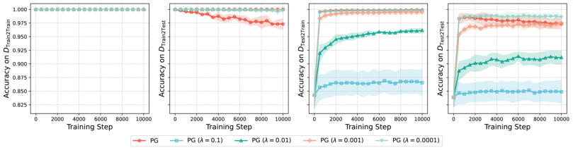

Figure 5: The test accuracy of PG with different KL coefficients on four data splits after fine-tuning
the SFT model on _D_ RL-Train . All accuracies are evaluated with greedy decoding.

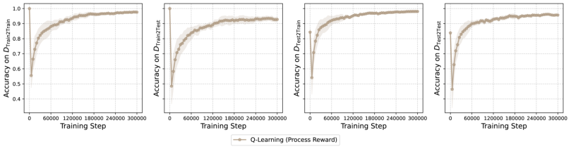

Figure 6: The test accuracy of Q-learning on four data splits after fine-tuning the SFT model on
_D_ RL-Train . All accuracies are evaluated with greedy decoding.

G A DDITIONAL E XPERIMENTAL R ESULTS

G.1 E XPERIMENTS ON E RD ˝ OS -R´ ENYI G RAPHS

Beyond the setup in Section 2, we conduct additional experiments to compare RL methods with SFT.
The graph construction and initial SFT stage remain unchanged. After SFT, we split all **reachable**
**pairs** into an RL training set _D_ RL-Train and an RL test set _D_ RL-Test . This yields four intersections:
_D_ Train2Train := _D_ Train _∩_ _D_ RL-Train, _D_ Train2Test := _D_ Train _∩_ _D_ RL-Test, _D_ Test2Train := _D_ Test _∩_
_D_ RL-Train, and _D_ Test2Test := _D_ Test _∩_ _D_ RL-Test .

During the RL process, the model generates paths for pairs in _D_ RL-Train and receives reward signals.
The main difference between this setup and that in Section 2 is that the RL training set now contains
new pairs that were unseen during SFT ( _D_ Test2Train ). Therefore, the initial model is not perfect on
these new training pairs. Additionally, some pairs from the SFT training set are not used for RL
training ( _D_ Train2Test ), which allows us to measure the extent of forgetting. We consider the same
RL algorithms introduced in Section 2: PG and Q-learning, whose training curves are presented in
Figures 5 and 6, respectively. All accuracies are evaluated using greedy decoding.

From Figure 5, we observe the opposing effects of KL regularization on _D_ Train2Test and _D_ Test2Train .
PG without KL regularization ( _λ_ = 0) and less regularized PG ( _λ_ = 0 _._ 0001) achieve significantly
higher accuracy on _D_ Test2Train . Stronger KL regularization hinders the model’s ability to learn new
pairs, which aligns with **Takeaway 4** : KL regularization reduces training accuracy. Conversely, PG
without KL regularization ( _λ_ = 0) tends to overfit the training data and exhibits continual forgetting
of previous knowledge learned during SFT. Results on _D_ Test2Test further demonstrate that overly
strong KL regularization can hinder PG’s improvement. Among all settings, _λ_ = 10 _[−]_ [4] achieves
the best balance, indicating that a well-chosen KL weight can improve generalization with minimal
sacrifice in training accuracy.

Compared to PG and the performance observed in Section 5, Q-learning exhibits slower convergence
in this setting. One possible explanation is that the initial model performs poorly on the new training
pairs, generating more failure cases and causing stronger “re-instantiation.”

22

Preprint as an Arxiv Paper

G.2 E XPERIMENTS ON G RAPH R EPRESENTED FOR B LOCKSWORLD

We also run experiments on Blocksworld (Valmeekam et al., 2023a), a benchmark for evaluating
LLM planning ability (Kambhampati et al., 2024). The environment consists of blocks stacked on
a table, and the goal is to rearrange the blocks from an initial configuration to a target configuration
using a sequence of actions. We model this into a path-finding task, in which each configuration
is a node in a graph, and an edge connects two nodes if one configuration can be transformed into
the other by a single valid action, such as moving a block from one stack to another. We consider
Blocksworld with four blocks and construct an undirected graph with 73 nodes: 24 configurations
of a single stack of four blocks, 24 configurations with three blocks in one stack and one block on
the table, 12 configurations with two stacks of two blocks, 12 configurations with one stack of two
blocks and two blocks on the table, and one configuration with all blocks on the table.

Since accuracy comparison is not our focus, all node pairs are used for SFT training. The SFT
dataset contains 50 _,_ 000 paths sampled from the graph, with source and target nodes drawn uniformly from the 73 nodes. During RL training, the model generates paths for, and is updated on, all
node pairs. We use policy gradient and Q-learning as introduced in Section 2. After training, we
evaluate the learned weights using the metric of Wang et al. (2024b), which measures the model’s
understanding of graph adjacency. As shown in Figure 1, with fixed training data, SFT may not learn
the complete adjacency very well. In contrast, both PG and Q-learning improve the learned adjacency. In particular, Q-learning nearly recovers the complete adjacency, consistent with the results
in Section 5.

23

