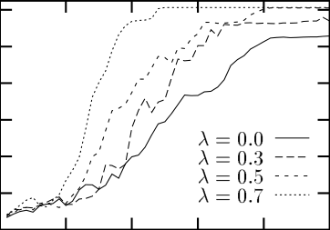
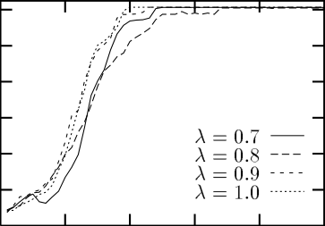
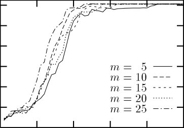
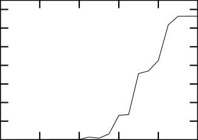
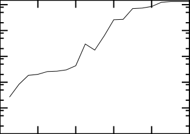

Journal of Arti�cial Intelligence Research  ( ) - Submitted / ; published / 

Truncating Temp oral Di�erences:

On the E�cient Implementation of TD(�)

for Reinforcement Learning

Pawe� Cichosz cichosz@ipe.pw.edu.pl

Institute of Electronics Fundamentals, Warsaw University of Technology

Nowowiejska /, 00- Warsaw, Poland

Abstract

Temp oral di�erence (TD) metho ds constitute a class of metho ds for learning predictions

in multi-step prediction problems, parameterized by a recency factor �. Currently the most

imp ortant application of these metho ds is to temp oral credit assignment in reinforcement

learning. Well known reinforcement learning algorithms, such as AHC or Q-learning, may

b e viewed as instances of TD learning. This pap er examines the issues of the e�cient

and general implementation of TD(�) for arbitrary �, for use with reinforcement learning

algorithms optimizing the discounted sum of rewards. The traditional approach, based on

eligibility traces, is argued to su�er from b oth ine�ciency and lack of generality. The TTD

(Truncated Temporal Di�erences ) pro cedure is prop osed as an alternative, that indeed

only approximates TD(�), but requires very little computation p er action and can b e used

with arbitrary function representation metho ds. The idea from which it is derived is fairly

simple and not new, but probably unexplored so far. Encouraging exp erimental results are

presented, suggesting that using �   - 0 with the TTD pro cedure allows one to obtain a

signi�cant learning sp eedup at essentially the same cost as usual TD(0) learning.

. Intro duction

Reinforcement learning (RL, e.g., Sutton,  ; Watkins,   ; Barto,  ; Sutton, Barto,

& Williams,  ; Lin,  ,  ; Cichosz,  ) is a machine learning paradigm that relies

on evaluative training information. At each step of discrete time a learning agent observes

the current state of its environment and executes an action . Then it receives a reinforce
ment value, also called a payo� or a reward (punishment), and a state transition takes

place. Reinforcement values provide a relative measure of the quality of actions executed

by the agent. Both state transitions and rewards may b e sto chastic, and the agent do es not

know either transition probabilities or exp ected reinforcement values for any state-action

combinations. The ob jective of learning is to identify a decision policy (i.e., a state-action

mapping) that maximizes the reinforcement values received by the agent in the long term .

A commonly assumed formal mo del of a reinforcement learning task is a Markovian decision

problem (MDP, e.g., Ross,  ). The Markov property means that state transitions and

reinforcement values always dep end solely on the current state and the current action: there

is no dep endence on previous states, actions, or rewards, i.e., the state information supplied

to the agent is su�cient for making optimal decisions.

All the information the agent has ab out the external world and its task is contained

in a series of environment states and reinforcement values. It is never told what actions

to execute in particular states, or what actions (if any) would b e b etter than those which

� c AI Access Foundation and Morgan Kaufmann Publishers. All rights reserved.

Cichosz

it actually p erforms. It must learn an optimal p olicy by observing the consequences of its

actions. The abstract formulation and generality of the reinforcement learning paradigm

make it widely applicable, esp ecially in such domains as game-playing (Tesauro,  ),

automatic control (Sutton et al.,  ), and rob otics (Lin,  ). To formulate a particular

task as a reinforcement learning task, one just has to design appropriate state and action

representation, and a reinforcement mechanism sp ecifying the goal of the task. The main

limitation of RL applications is that it is by nature a trial-and-error learning metho d, and

it is hardly applicable in domains where making errors costs much.

A commonly studied p erformance measure to b e maximized by an RL agent is the

exp ected total discounted sum of reinforcement:



X

t=0

E

"

�

t

t

r

#

; ()

where r

t

denotes the reinforcement value received at step t, and 0 � � �  is a discount

factor, which adjusts the relative signi�cance of long-term rewards versus short-term ones.

To maximize the sum for any p ositive �, the agent must take into account the delayed

consequences of its actions: reinforcement values may b e received several steps after the

actions that contributed to them were p erformed. This is referred to as learning with delayed

reinforcement (Sutton,  ; Watkins,   ). Other reinforcement learning p erformance

measures have also b een considered (Heger,  ; Schwartz,  ; Singh,  ), but in this

work we limit ourselves exclusively to the p erformance measure sp eci�ed by Equation .

The key problem that must b e solved in order to learn an optimal p olicy under the

conditions of delayed reinforcement is known as the temporal credit assignment problem

(Sutton,  ). It is the problem of assigning credit or blame for the overall outcomes

of a learning system (i.e., long-term reinforcement values) to each of its individual actions,

p ossibly taken several steps b efore the outcomes could b e observed. Discussing reinforcement

learning algorithms, we will concentrate on temp oral credit assignment and ignore the issues

of structural credit assignment (Sutton,  ), the other asp ect of credit assignment in RL

systems.

. Temp oral Di�erence Metho ds

The temp oral credit assignment problem in reinforcement learning is typically solved using

algorithms based on the metho ds of temporal di�erences (TD). They have b een intro duced

by Sutton ( ) as a class of metho ds for learning predictions in multi-step prediction

problems. In such problems prediction correctness is not revealed at once, but after more

than one step since the prediction was made, though some partial information relevant to

its correctness is revealed at each step. This information is available and observed as the

current state of a prediction problem, and the corresp onding prediction is computed as a

value of a function of states.

Consider a multi-step prediction problem where at each step it is necessary to learn a

prediction of some �nal outcome. It could b e for example predicting the outcome of a game

of chess in subsequent b oard situations, predicting the weather on Sunday on each day of

the week, or forecasting some economic indicators. The traditional approach to learning

such predictions would b e to wait until the outcome o ccurs, keeping track of all predictions



Truncating Temporal Differences

computed at intermediate steps, and then, for each of them, to use the di�erence b etween

the actual outcome and the predicted value as the training error. It is sup ervised learning,

where directed training information is obtained by comparing the outcome with predictions

pro duced at each step. Each of the predictions is mo di�ed so as to make it closer to the

outcome.

Temp oral di�erence learning makes it unnecessary to always wait for the outcome. At

each step the di�erence b etween two successive predictions is used as the training error.

Each prediction is mo di�ed so as to make it closer to the next one. In fact, TD is a class

of metho ds referred to as TD(�), where 0 � � �  is called a recency factor . Using � - 0

allows one to incorp orate prediction di�erences from more time steps, to hop efully sp eed

up learning.

Temp oral credit assignment in reinforcement learning may b e viewed as a prediction

problem. The outcome to predict in each state is simply the total discounted reinforcement

that will b e received starting from that state and following the current p olicy. Such predic
tions can b e used for mo difying the p olicy so as to optimize the p erformance measure given

by Equation . Example reinforcement learning algorithms that implement this idea, called

TD-based algorithms, will b e presented in Section ..

. Pap er Overview

Much of the research concerning TD-based reinforcement learning algorithms has concen
trated on the simplest TD(0) case. However, exp erimental results obtained with TD(� - 0)

indicate that it often allows one to obtain a signi�cant learning sp eedup (Sutton,  ;

Lin,  ; Tesauro,  ). It has b een also suggested (e.g., Peng & Williams,  ) that

TD(� - 0) should p erform b etter in non-Markovian environments than TD(0) (i.e., it should

b e less sensitive to the p otential violations of the Markov prop erty). It is thus imp ortant

to develop e�cient and general implementation techniques that would allow TD-based RL

algorithms to use arbitrary �. This has b een the motivation of this work.

The remainder of this pap er is organized as follows. In Section  a formal de�nition of

TD metho ds is presented and their application to reinforcement learning is discussed. Three

example RL algorithms are brie�y describ ed: AHC (Sutton,  ), Q-learning (Watkins,

  ; Watkins & Dayan,  ), and advantage up dating (Baird,  ). Section  presents

the traditional approach to TD(�) implementation, based on so called eligibili ty traces,

which is criticized for ine�ciency and lack of generality. In Section  the analysis of the

e�ects of the TD algorithm leads to the formulation of the TTD (Truncated Temporal

Di�erences ) pro cedure. The two remaining sections are devoted to exp erimental results

and concluding discussion.

. De�nition of TD(�)

When Sutton ( ) intro duced TD metho ds, he assumed they would use parameter es
timation techniques for prediction representation. According to his original formulation,

states of a prediction problem are represented by vectors of real-valued features, and corre
sp onding predictions are computed by the use of a set of mo di�able parameters (weights).

Under such representation learning consists in adjusting the weights appropriately on the

basis of observed state sequences and outcomes. Below we present an alternative formula



Cichosz

tion, adopted from Dayan ( ), that simpli�es the analysis of the e�ects of the TD(�)

algorithm. In this formulation states may b e elements of an arbitrary �nite state space, and

predictions are values of some function of states. Transforming Sutton's original de�nition

of TD(�) to this alternative form is straightforward.

When discussing either the generic or RL-oriented form of TD metho ds, we conse
quently ignore the issues of function representation. It is only assumed that TD predic
tions or functions maintained by reinforcement learning algorithms are represented by a

metho d that allows adjusting function values using some error values, controlled by a learn
ing rate parameter. Whenever we write that the value of an n-argument function ' for

arguments p0

arguments p

; p

; : : : ; p



n�

should b e up dated using an error value of �, we mean that

'(p0

; p

; : : : ; pn�

) should b e moved towards '(p0

; p

; : : : ; p

) + �, to a degree controlled



n�

by some learning rate factor � . The general form of this abstract up date op eration is written

as

update�

('; p0

; p

; : : : ; p

; : : : ; p

; �): ()

n�

Under this convention, a learning algorithm is de�ned by the rule it uses for computing

error values.

. Basic Formulation

Let x

0

; x



; : : : ; x

m�

b e a sequence of m states of a multi-step prediction problem. Each

state xt

can b e observed at time step t, and at step m, after passing the whole sequence, a

real-valued outcome z can b e observed. The learning system is required to pro duce a corre

sp onding sequence of predictions P (x0

of z .

); P (x

); : : : ; P (x



m�

), each of which is an estimate

Following Dayan ( ), let us de�ne for each state x:

(

 if xt

0 otherwise:

= x

�x

=
(t)

Then the TD(�) prediction error for each state x determined at step t is given by:

t

�x

�

t�k

) � P (xt

) � P (x

))

X

k =0

�x

�

=
(t) (P (x

t+

(k ); ()

�

where 0 � � �  and P (x

) = z by de�nition, and the total prediction error for state x

m

determined after the whole observed sequence accordingly is:

�x

))

)

: ()

m�

X

t=0

(P (x

(

(

) � P (x

t�k

�x

=
(t)

t+

(k )

=

m�

X

t=0

�x

t

t

X

k =0

�

Thus, learning at each step is driven by the di�erence b etween two temp orally successive

predictions. When � - 0, the prediction di�erence at time t a�ects not only P (xt

), but also

predictions from previous time steps, to an exp onentially decaying degree.



. Alternatively, learning the prediction at step t relies not only on the prediction di�erence from that

step, but also on future prediction di�erences. This equivalent formulation will play a signi�cant role in

Section .

 0

Truncating Temporal Differences

There are two p ossibilities of using such de�ned errors for learning. The �rst is to com

pute total errors �x

for all states x, by accumulating the �x

(t) errors computed at each time

step t, and to use them after passing the whole state sequence to up date predictions P (x).

It corresp onds to batch learning mo de. The second p ossibility, called incremental or on-line

learning, often more attractive in practice, is to up date predictions at each step t using

current error values �

(t). It is then necessary to mo dify appropriately Equation , so as

x

to take into account that predictions are changed at each step:

t

�x

�

�t�k

(x

) � Pt

) � P

(x

))

X

k =0

�

x

(k ); ()

(t) = (Pt

t+

t

where P

t

(x) designates the prediction for state x available at step t.

Sutton ( ) proved the convergence of batch TD(0) for a linear representation, with

states represented as linearly indep endent vectors, under the assumption that state se



quences are generated by an absorbing Markov process .

Dayan ( ) extended his pro of

to arbitrary �.



. TD(�) for Reinforcement Learning

So far, this pap er has presented TD as a general class of prediction metho ds for multi-step

prediction problems. The most imp ortant application of these metho ds, however, is to rein
forcement learning. As a matter of fact, TD metho ds were formulated by Sutton ( ) as

a generalization of techniques he had previously used only in the context of temp oral credit

assignment in reinforcement learning (Sutton,  ).

As already stated ab ove, the most straightforward way to formulate temp oral credit

assignment as a prediction problem is to predict at each time step t the discounted sum of

future reinforcement



r

k

zt

t+k

;

=

X

k =0

�

called the TD return for time t. The corresp onding prediction is designated by U (xt

) and

called the predicted utility of state xt . TD returns obviously dep end on the p olicy b eing

followed; we therefore assume that U values represent predicted state utilities with resp ect

to the current p olicy. For p erfectly accurate predictions we would have:

U (x

):

+ � zt+

= rt

+ � U (x

t+

t

) = zt

= rt

t+) � U (x

t ). The

Thus, for inaccurate predictions, the mismatch or TD error is r

resulting RL-oriented TD(�) equations take form:

t

t

+ � U (x

t�k

) � U

(x

))

X

(� �)t�k

�x

�

=
(t) (r

t

(xt+

(x

(k ) ()

+ � Ut

+ � U

t

t

�x

�

k =0

. An absorbing Markov pro cess is de�ned by a set of terminal states X

, a set of non-terminal states X

T

N

,

and the set of transition probabiliti es Pxy

for all x  XN

and y  XN

[ XT

. The absorbing prop erty

means that any cycles among non-terminal states cannot last inde�nitely long, i.e., for any starting

non-terminal state a terminal state will eventually b e reached (all sequences eventually terminate).

. Recently stronger theoretical results were proved by Dayan and Sejnowski ( ) and Jaakkola, Jordan,

and Singh ( ).

 

Cichosz

and

�x



X

t=0

(

(rt

(r

t+ ) � U

))

t

X

k =0

(� �)t�k

t�k

)

: ()

�x

x (t) =

+ � Ut

t

(x

(k )

=



X

t=0

�

(xt

Note the following additional di�erences b etween these equations and Equations  and :

� time step subscripts are used with U values to emphasize on-line learning mo de,

� the discount applied in the sum in Equation  includes � as well as � for reasons that

may b e unclear now, but will b e made clear in Section .,

� the summation in Equation  extends to in�nity, b ecause the predicted �nal outcome

is not, in general, available after any �nite numb er of steps.

TD-based reinforcement learning algorithms may b e viewed as more or less direct im
plementations of the general rule describ ed by Equation . To see this, we will consider

three algorithms: well known AHC (Sutton,  ) and Q-learning (Watkins,   ; Watkins

& Dayan,  ), and a recent development of Baird ( ) called advantage updating . All

the algorithms rely on learning certain real-valued functions de�ned over the state or state

and action space of a task. The

�

sup erscript used with any of the describ ed functions

designates its optimal values (i.e., corresp onding to an optimal p olicy). Simpli�ed versions

of the algorithms, corresp onding to TD(0), will b e presented and related to Equation .

The presentation b elow is limited solely to function up date rules | for a more elab orated

description of the algorithms the reader should consult the original publications of their

develop ers or, for AHC and Q-learning, Lin ( ) or Cichosz ( ). They are all closely

related to dynamic programming metho ds (Barto, Sutton, & Watkins,  0; Watkins,   ;

Baird,  ), but these relations, though theoretically and practically imp ortant and fruit
ful, are not essential for the sub ject of this pap er and will not b e discussed.

.. The AHC Algorithm

The variation of the AHC algorithm describ ed here is adopted from Sutton ( 0). Two

functions are maintained: an evaluation function V and a policy function f . The evaluation

function evaluates each environment state and is essentially the same as what was called

ab ove the U function, i.e., V (x) is intended to b e an estimate of the discounted sum of

future reinforcement values received starting from state x and following the current p olicy.

The p olicy function assigns to each state-action pair (x; a) a real numb er representing

the relative merit of p erforming action a in state x, called the action merit . The actual

p olicy is determined from action merits using some, usually sto chastic, action selection

mechanism, e.g., according to a Boltzmann distribution (as describ ed in Section ). The

optimal evaluation of state x, V

�

(x), is the exp ected total discounted reinforcement that

will b e received starting from state x and following an optimal p olicy.

Both the functions are up dated at each step t, after executing action a

according to the following rules:

,

t

in state xt

) � V

));

update

update

�

�

(V ; x

(f ; xt ; a

t ; r

t

(x

t+

; rt

; r

+ � V

t(x

t

t

(x

t

t (x

(xt+

) � V

+ � Vt

+ � V

t

)).

 

Truncating Temporal Differences

The up date rule for the V -function directly corresp onds to Equation  for � = 0. The up date

rule for the p olicy function increases or decreases the action merit of an action dep ending

on whether its long-term consequences app ear to b e b etter or worse than exp ected. We

present this, a simpli�ed form of AHC corresp onding to TD(0), b ecause this pap er prop oses

an alternative way of using TD(� - 0) to that implemented by the original AHC algorithm

presented by Sutton ( ).

.. The Q-Learning Algorithm

Q-learning learns a single function of states and actions, called a Q-function . To each

state-action pair (x; a) it assigns a Q-value or action utility Q(x; a), which is an estimate of

the discounted sum of future reinforcement values received starting from state x by executing

action a and then following a greedy p olicy with resp ect to the current Q-function (i.e.,

p erforming in each state actions with maximum Q-values). The current p olicy is implicitly

de�ned by Q-values. When the optimal Q-function is learned, then a greedy p olicy with

resp ect to action utilities is an optimal p olicy.

The up date rule for the Q-function is:

; a) � Qt

; a) � Q

(x

�

; at

update

(Q; xt

Q

)).

t

t

t ; r

t

+ � maxa

t

(xt+

(x

t

t ; a

t

To show its corresp ondence to the TD(0) version of Equation , we simply assume that

predicted state utilities are represented by Q-values so that Qt (xt

)

; a

) corresp onds to U

t

t

(xt

; a) corresp onds to U

(xt+

(x

).

and maxa

Q

t

(xt+

(x

t

.. The Advantage Updating Algorithm

In advantage up dating two functions are maintained: an evaluation function V and an

advantage function A. The evaluation function has essentially the same interpretation as its

counterpart in AHC, though it is learned in a di�erent way. The advantage function assigns

to each state-action pair (x; a) a real numb er A(x; a) representing the degree to which the

exp ected discounted sum of future reinforcement is increased by p erforming action a in

state x, relative to the action currently considered b est in that state. The optimal action

advantages are negative for all sub optimal actions and equal 0 for optimal actions, and can

b e related to the optimal Q-values by:

�

�

(x; a) � max

0

):

�

0

(x; a

A

�

=
(x; a) Q

Q�

a

Similarly as action utilities, action advantages implicitl y de�ne a p olicy.

The evaluation and advantage functions are up dated at step t by applying the following

rules:

; a) � At

; a) � A

(x

) � V

�

; a

update

update

(A; x

(V ; xt

(V ; x

;

(x

t

(x

t+

At

) + rt

+ � Vt

+ � V

t

t

; maxa

; max

t

; at

t

(x

t

));

�

At+

)]).

(x

t

t

(xt

(x

) � maxa

A



�

[maxa

[max

A

The up date rule for the advantage function is somewhat more complex that the AHC or

Q-learning rules, but it still contains a term that directly corresp onds to the TD(0) form of

Equation , by replacing V with U .

Actually, what has b een presented ab ove is a simpli�ed version of advantage up dating.

The original algorithm di�ers in two details:

 

Cichosz

� the time step duration �t is explicitly included in the up date rules, while in this

presentation we assumed �t = ,

� b esides learning updates, describ ed ab ove, so called normalizing updates are p er

formed.

. Eligibility Traces

It is obvious that the direct implementation of the computation describ ed by Equation  is

not to o tempting. It requires maintaining �x

not to o tempting. It requires maintaining �

(t) values for each state x and past time step t.

(� �)t�k

t

k =0

Note, however, that one only needs to maintain the whole sums

P

�

x

(k ) for all x

and only one (current) t, which is much easier due to a simple trick. Substituting

t

X (� �)t�k

(k );

ex

e

=
(t)

�x

�

k =0

we can de�ne the following recursive up date rule:

 if x0

0 otherwise;

= x

ex

e

=
(0)

(t � ) +  if x

= x

(

(

� �ex

� �e

� �ex

� �e

t

ex

=
(t)

()

(t � ) otherwise:

The quantities e

x

(t) de�ned this way are called activity or eligibility traces (Barto,

Sutton, & Anderson,  ; Sutton,  ; Watkins,   ). Whenever a state is visited, its

activity b ecomes high and then gradually decays until it is visited again. The up date to

the predicted utility of each state x resulting from visiting state x

written as

t

at time t may b e then

) � Ut

) � U

(x

))e

�x

=
(t) (r

t

(xt+

+ � Ut

t

x

(t); ( )

which is a direct transformation of Equation .

This technique (with minor di�erences) was already used in the early works of Barto

et al. ( ) and Sutton ( ), b efore the actual formulation of TD(�). It is esp ecially

suitable for use with parameter estimation function representation metho ds, such as con

nectionist networks. Instead of having one ex

value for each state x one then has one ei

value for each weight wi

. That is how eligibili ty traces were actually used by Barto et al.

( ) and Sutton ( ), inspired by an earlier work of Klopf ( ). Note that in the case

of the AHC algorithm, di�erent � values may b e used for maintaining traces used by the

evaluation and p olicy functions.

Unfortunately, the technique of eligibil ity traces is not general enough to b e easy to im
plement with an arbitrary function representation metho d. It is not clear, for example, how

it could b e used with such an imp ortant class of function approximators as memory-based

(or instance-based) function approximators (Mo ore & Atkeson,  ). Applied with a pure

tabular representation, it has signi�cant drawbacks. First, it requires additional memory lo
cations, one p er state. Second, and even more painful, is that it requires mo difying b oth U (x)

and e

x

for all x at each time step. This op eration dominates the computational complexity

 

Truncating Temporal Differences

of TD-based reinforcement learning algorithms, and makes using TD(� - 0) much more ex
p ensive than TD(0). The eligibil ity traces implementation of TD(�) is thus, for large state

spaces, absolutely impractical on serial computers, unless an appropriate function approx
imator is used that allows up dating function values and eligibili ty traces for many states

concurrently (such as a multi-layer p erceptron). But even when such an approximator is

used, there are still signi�cant computational (b oth memory and time) additional costs of

using TD(�) for � - 0 versus TD(0). Another drawback of this approach will b e revealed

in Section ..

. Truncating Temp oral Di�erences

This section departs from an alternative formulation of TD(�) for reinforcement learning.

Then we follow with relating the TD(�) training errors used in this alternative formulation

to TD(�) returns. Finally, we prop ose approximating TD(�) returns with truncated TD(�)

returns, and we show how they can b e computed and used for on-line reinforcement learning.

. TD Errors and TD Returns

Let us take a closer lo ok at Equation . Consider the e�ects of exp eriencing a sequence of

states x

0

; : : : ; x

; : : : and corresp onding reinforcement values r

; : : :. For the

0

; r

; x

; x

k



; : : : ; r

k

sake of simplicity, assume for a while that all states in the sequence are di�erent (though it

is of course imp ossible for �nite state spaces). Applying Equation  to state xt

assumption we have:

under this

(x

) +

�x

�

t

+ � U

t

) � Ut

) � U

t

= rt

r

h

+

)

i

) � U

(xt+

(x

)

i

i

� �

t+

(xt+

+ � U

t+

(x

t+

t+



r

(� �)

h

) � U

(xt+

(x

(x

t+

t+

+ � Ut+

+ � U

t+

+ : : :

k

rt+k

h

+ � U

) � U

) :

i

(x

=



X

k =0

(� �)k

t+k

t+k +

t+k

(xt+k

If a state o ccurs several times in the sequence, each visit to that state yields a similar up date.

This simple observation op ens a way to an alternative (though equivalent) formulation of

TD(�), o�ering novel implementation p ossibilities.

Let

�0t

) � U

) (0)

(x

t+

= rt

+ � Ut

+ � U

t

(xt

(x

b e the TD (0) error at time step t. We de�ne the TD (�) error at time t using TD(0) errors

as follows:

rt+k

h

+ � Ut+k

+ � U

�

0

t+k

��t

k

) � U

)

i

i

k

: ()

(x

t+k +

=



X

(� �)k



X

k =0

(� �)k

t+k

(xt+k

(x

=

k =0

Now, we can express the overall TD(�) error for state x, �



�

errors:

, in terms of �

x

t

�

t

�x

�x

�

(t): ()

=

X

t=0

�

 

Cichosz

In fact, from Equation  we have:

�0t

�x

�

t

X

k =0

(� �)t�k

t

X

k =0

(� �)t�k

t�k

�x

�

�x

(k ): ()

=
(k )



X

t=0

=



X

t=0

�

0

t

Swapping the order of the two summations we get:

0

t

�x

�

�x



X

k =0

t�k

(k ): ()

=



X

t=k

(� �)t�k

�

Finally, by exchanging k and t with each other, we receive:

0

t+k

0

k

�x

�



X

t=0

��t



X

t=0



X

k =0

(� �)k

k

�x

�

�x

k �t

=
(t)

�x

(t): ()

=
(t)

�

=



X

t=0



X

k =t

(� �)k �t

�

Note the following imp ortant di�erence b etween �

(t) (Equation ) and �

x

�

t

: the former

is computed at each time step t for al l x and the latter is computed at each step t only

for xt

for x

. Accordingly, at step t the error value �

x

(t) is used for adjusting U (x) for al l x

and ��t

is only used for adjusting U (xt

is only used for adjusting U (x

). This is crucial for the learning pro cedure prop osed

�

t

in Section .. While applying such de�ned �

errors on-line makes changes to predicted

state utilities at individual steps clearly di�erent than those describ ed by Equation , the

overall e�ects of exp eriencing the whole state sequence (i.e., the sums of all individual error

values for each state) are equivalent, as shown ab ove.

�

t

Having expressed TD(�) in terms of �

errors, we can gain more insight into its op era

tion and the role of �. Some de�nitions will b e helpful. Recall that the TD return for time t

is de�ned as



zt

z

X

k =0

k

r

t+k

:

=

�

The m-step truncated TD return (Watkins,   ; Barto et al.,  0) is received by taking

into account only the �rst m terms of the ab ove sum, i.e.,

m�

[m]

=

k

z

rt+k

r

:

X

k =0

�

t

Note, however, that the rejected terms �

t+m

m

rt+m+

r

+ : : : can b e approximated by

+ �

m+

r

). The corrected m-step truncated TD return (Watkins,   ; Barto et al.,

m�

Ut+m�

U

(xt+m

�

m

 0) is thus:

(m)

k

):

(xt+m

(x

U

t+m�

z

r

t+k

+ �

m

X

k =0

�

t

=

Equation  may b e rewritten in the following form:



r

��t

=

=

k

h

(x

(x

) + � �U

)

) � U

(x

i

X

k =0



X

k =0



X

k =

(� �)k

(� �)k

h

t+k

t+k

t+k +

t+k +

i

t+k

(xt+k +

t+k

t+k

)

k

r

t

�
+ � ( �)U

�
+ � ( �)U

t+k

t+k

� U

(x

t

) +

h

(� �)k

k

U

(x

)

: ()

(xt+k

t+k �

) � Ut+k

) � U

t+k

i

 

Truncating Temporal Differences

Note that for � =  it yields:

U

�t

k

) � Ut+k

(x

)

i

) +



X

k =

k

(xt

(xt

h

t+k �

� U

t

=



X �

k =0

rt+k

r

(xt+k

t+k

i

�

Ut+k �

(x

t ) +



X

k =

k

) � Ut+k

) � U

(xt+k

)

:

i

�

t+k

= zt

� Ut

� U

(x

h

:

If we relax for a moment our assumption ab out on-line learning mo de and leave out time

subscripts from U values, the last term disapp ears and we simply have:

�t

= z

� U (x

t

t

):

Similarly for general �, if we de�ne the TD (�) return (Watkins,   ) for time t as a

weighted average of corrected truncated TD returns:

=

r

�

t



X

k =0

z

(k +)

(xt+k +

(x

)

i

()

k

t

z

= �
( �)

�

k



X

k =0

(� �)k

h

t+k

�
+ � ( �)Ut+k

�
+ � ( �)U

and again omit time subscripts, we will receive:

��t

�

= zt

� U (x

): ()

t

The last equation brings more light on the exact nature of the computation p erformed

by TD(�). The error at time step t is the di�erence b etween the TD(�) return for that step

and the predicted utility of the current state, that is, learning with that error value will

bring the predicted utility closer to the return. For � =  the quantity zt�

is the usual TD

return for time t, i.e., the discounted sum of all future reinforcement values.

For � <  the

), that is, the actual immediate reward

�
+ � ( �)Ut+k

(xt+k +

(x

term rt+k

is replaced by rt+k

is augmented with the predicted future reward.

The de�nition of the TD(�) return (Equation ) may b e written recursively as

�

zt

�

t+

�
+ ( �)U

)): ( )

= r

t

+ � (�z

t

(xt+

This probably b est explains the role of � in TD(�) learning. It determines how the return

used for improving predictions is obtained. When � = , it is exactly the actual observed

return, the discounted sum of all rewards. For � = 0 it is the -step corrected truncated

return, i.e., the sum of the immediate reward and the discounted predicted utility of the

successor state. Using 0 < � <  allows to smo othly interp olate b etween these two extremes,

relying partially on actual returns and partially on predictions.

Equation  holds true only for batch learning mo de, but in fact TD metho ds have b een

originally formulated for batch learning. The incremental version, more practically useful,

. This observation corresp onds to the equivalence of \generic" TD(�) for � =  to sup ervised learning

shown by Sutton ( ). To receive such a result it was necessary to discount prediction di�erences with

� � instead of � alone in Equation , though Sutton presenting the RL-oriented form of TD did not make

this mo di�cation.

 

intro duces an additional term. Let Dt�

and  we get:

Cichosz

designate that term. By comparing Equations 



�

�

= �t

� (zt�

� Ut

� U

(x

Ut+k �

(x

k

h

=
))

X

k =

(� �)k

(xt+k

(x

) : (0)

i

D

t

t+k

) � U

t+k

t

The magnitude of this discrepancy term, and consequently its in�uence on the learning

pro cess, obviously dep ends on the learning rate value. To examine it further, supp ose a

learning rate � is used when learning U on the basis of ��t

learning rule b e:

errors. Let the corresp onding

) := U

(xt

(x

�

Ut+

(xt

t

) + � �

t

(x

Then we have

(x

(x

(x

) � U

) = � (zt

)) + � D

)) + �

)) � �

�

Ut+

(xt

t

t

(x

t

�

t

� Ut

� U

�

= � (z

�

� � (z

:

U

X

k =

(� �)k

k

h

) � U

t+k (x

i

� Ut

� U



X

k =



t+k �

t+k

t+k

)

�

t+k �

; ()

(� �)k

�

� Ut

� U

t

t

t



with equality if and only if xt+k

t+k �

= x

for all k . A similar result may b e obtained for the

eligibili ty traces implementation, with learning driven by �x

eligibili ty traces implementation, with learning driven by �

(t) errors de�ned by Equation .

We would then have:

� U

0

t+k �

(� �)k

k

�

) � Ut

(xt

(x

) = � (z

�

)) � �





X

k =

U

(xt

t

(xt

(x

(t + k � ): ()

t+

e

xt+k

This e�ect may b e considered another drawback of the eligibility traces implementation of

TD(�), apart from its ine�ciency and lack of generality. Though for small learning rates

the e�ect of Dt�

is negligible, it may b e still harmful in some cases, esp ecially for large �

and �.

. The TTD Pro cedure

�

We have shown that TD errors �t

�

or zt

) can b e used almost equivalently for TD(�)

� Ut

(xt

(x

learning, yielding the same overall results as the eligibili ty traces implementation, which has,

however, imp ortant drawbacks in practice. Nevertheless, it is imp ossible to use either TD(�)

or TD(�) returns z

�

t

for on-line learning, since they are not available. At step t

errors �

�

t

the knowledge of b oth r

t+k

is required for al l k = ; ; : : :, and there is no way to

and xt+k

implement this in practice. Recall, however, the de�nition of the truncated TD return. Why

not de�ne the truncated TD(�) error and the truncated TD(�) return? The appropriate

de�nitions are:

m�

�;m

�t

0

t+k

(� �)k

k

=

X

k =0

�

()

. Sutton ( ) presented the technique of eligibil i ty traces as an implementation of the recency and

frequency heuristics . In this context, the phenomenon examined ab ove may b e considered a harmful

e�ect of the frequency heuristic. Sutton discussed an example �nite-state task where this heuristic might

b e misleading (Sutton,  , page ).

 

Truncating Temporal Differences

and

�;m

=

=

h

r

rt+m�

(xt+k +

(x

)

i

+ (� �)

m�

h

)

i

(x

t+m

+ � Ut+m�

+ � U

z

k

m�

X

k =0

m�

X

k =0

(� �)k

(� �)k

t+k

�
+ � ( �)Ut+k

i

t

t+k

k

h

r

(xt+k +

(x

)

i

+ (� �)

): ()

t+m�

m

�
+ � ( �)Ut+k

U

(xt+m

�;m

We call �t

the m-step truncated TD(�) error, or simply the TTD (�; m) error at time

�;m

the m-step truncated TD(�) return, or the TTD (�; m) return for time t.

step t, and z

t

�;m

Note that z

t

de�ned by Equation  is corrected, i.e., it is not obtained by simply trun

cating Equation . The correction term (� �)

t+m ) results in multiplying the

m

U

t+m�

(x

last prediction U

(x

t+m�

t+m

) by � alone instead of � ( � �), which is virtually equivalent

�;m

all the available infor

to using � = 0 for that step. It is done in order to include in z

t

mation ab out the exp ected returns for further time steps (t + m; t + m + ; : : :) contained

). Without this correction for large � this information would b e almost

in Ut+m�

in U

(x

t+m

completely lost.

So de�ned, m-step truncated TD(�) errors or returns, can b e used for on-line learning

by keeping track of the last m visited states, and up dating at each step the predicted

utility of the least recent state of those m states. This idea leads to what we call the TTD

Procedure (Truncated Temporal Di�erences ), which can b e a go o d approximation of TD(�)

for su�ciently large m. The pro cedure is parameterized by � and m values. An m-element

experience bu�er is maintained, containing records hx

)i for all

; U

t�k

; at�k

; rt�k

; r

t�k

(xt�k +

(x

k = 0; ; : : : ; m � , where t is the current time step. At each step t by writing x

[k ]

,

,

, a[k ]

r[k ]

, and u[k ] we refer to the corresp onding elements of the bu�er, storing x

, a

, rt�k

, r

t�k

t�k

and Ut�k

and U

(xt�k +

).

References to U are not subscripted with time steps, since all of them

concern the values available at the current time step | in a practical implementation this

directly corresp onds to restoring a function value from some function approximator or a

lo ok-up table. Under this notational convention, the op eration of the TTD(�; m) pro cedure

is presented in Figure . It uses TTD(�; m) returns for learning. An alternative version, using

TTD(�; m) errors instead (based on Equation ), is also p ossible and straightforward to

formulate, but there is no reason to use a \weaker" version (sub ject to the harmful e�ects

describ ed by Equations 0 and ) when a \stronger" one is available at the same cost.

At the b eginning of learning, b efore the �rst m steps are made, no learning can take

place. During these initial steps the op eration of the TTD pro cedure reduces to up dating

appropriately the contents of the exp erience bu�er. This obvious technical detail was left

out in Figure  for the sake of simplicity.

The TTD(�; m) return value z is computed in step  by the rep eated application of

Equation  . The computational cost of such propagating the return in time is acceptable

in practice for reasonable values of m. For some function representation metho ds, such

as neural networks, the overall time complexity is dominated by the costs of retrieving a

function value and learning p erformed in steps  and , and the cost of computing z is

negligible. One advantage of such implementation is that it allows to use adaptive � values:

in step  one can use �k

dep ending on whether a[k �]

was or was not a non-p olicy action, or

. This naturally means that the bu�er's indices are shifted appropriately on each time tick.



Cichosz

At each time step t:

. observe current state xt

; x

t

[0]

;

:= x

. select an action at

for state xt

; a

[0]

:= at ;

. p erform action at

; observe new state xt+

and immediate reinforcement rt

and immediate reinforcement r

;

);

. r[0]

:= r

; u[0]

; u

:= U (xt+

t

. for k = 0; ; : : : ; m �  do

if k = 0 then z := r

[k ]

[k ]

+ � u

[k ]

else z := r

[k ]

�
+ � (�z + ( �)u

);

(U; x[m�]

[m�]

[m�] ));

. update�

�

; a

; z � U (x

. shift the indices of the exp erience bu�er.

Figure : The TTD(�; m) pro cedure.

\how much" non-p olicy it was. This re�nement to the TD(�) algorithm was suggested by

Watkins (  ) or recently Sutton and Singh ( ). Later we will see how the TTD return

computation can b e p erformed in a fully incremental way, using constant time at each step

for arbitrary m.

Note that the function up date carried out in step  at time t applies to the state and

action from time t � m + , i.e., m �  time steps earlier. This delay b etween an exp erience

event and learning might b e found a p otential weakness of the presented approach, esp ecially

for large m. Note, however, that as a baseline in computing the error value the current utility

U (x[m�]

) = U

(xt�m+

(x

) is used. This is an imp ortant p oint, b ecause it guarantees that

t

learning will have the desired e�ect of moving the utility (whatever value it currently has)

towards the corresp onding TTD return. If the error used in step  were z � U

t�m (x

t�m+

)

), then applying it to learning at time t would b e problematic.

instead of z � U

t

(x

t�m+

Anyway, it seems that m should not b e to o large.

The TTD pro cedure is not an exact implementation of TD metho ds for two reasons.

First, it only approximates TD(�) returns with TTD(�; m) returns. Second, it intro duces

the aforementioned delay b etween exp erience and learning. I b elieve, however, that it is

p ossible to give strict conditions under which the convergence prop erties of TD(�) hold

true for the TTD implementation.

.. Choice of m

The reasonable choice of m obviously dep ends on �. For � = 0 the b est p ossible is m = 

and for � =  and � =  no �nite value of m is large enough to accurately approximate

TD(�). Fortunately, this do es not seem to b e very painful. It is rather unlikely that in any

application one wanted to use the combination of � =  and � = , the more so as existing

00

Truncating Temporal Differences

previous empirical results with TD(�) indicate that � =  is usually not the optimal value

to use, and it is at b est comparable with other, smaller values (Sutton,  ; Tesauro,  ;

Lin,  ). Similar conclusions follow from the discussion of the choice of � presented by

Watkins (  ) or Lin ( ). For � <  or � <  we would probably like to have such a

value of m that the discount (� �)m

is a small numb er. One p ossible de�nition of `small'

here could b e, e.g., `much less than � �'. This is obviously a completely informal criterion.

Table  illustrates the practical e�ects of this heuristic. On the other hand, for to o large m,

the delay b etween exp erience and learning intro duced by the TTD pro cedure might b ecome

signi�cant and cause some problems. Some of the exp eriments describ ed in Section  have

b een designed in order to test di�erent values of m for �xed 0 < � < .

� � 0: 0:  0:  0: 0: 0:

min fm j (� �)m

<



0

� �g      

Table : Cho osing m: an illustration.

.. Reset Operation

Until now, we have assumed that the learning pro cess, once started, continues in�nitely

long. This is not true for episodic tasks (Sutton,  ) and for many real-world tasks,

where learning must usually stop some time. This imp oses the necessity of designing a

sp ecial mechanism for the TTD pro cedure, that will b e called the reset operation . The reset

op eration would b e invoked after the end of each episo de in episo dic tasks, or after the

overall end of learning.

There is not very much to b e done. The only problem that must b e dealt with is that the

exp erience bu�er contains the record of the last m steps for which learning has not taken

place yet, and there will b e no further steps that would make learning for these remaining

steps p ossible. The implementation of the reset op eration that we �nd the most natural

and coherent with the TTD pro cedure is then to simulate m additional �ctious steps, so

that learning takes place for all the real steps left in the bu�er, and their TTD returns

remain una�ected by the simulated �ctious steps. The corresp onding algorithm, presented

in Figure , is formulated as a replacement of the original algorithm from Figure  for the

�nal time step. At the �nal step, when there is no successor state, the �ctious successor

state utility is assumed to b e 0. This corresp onds to assigning 0 to u

op eration is p erformed in step .

.. Incremental TTD

[0]

. The actual reset

As stated ab ove, the cost of iteratively computing the TTD(�; m) return is relatively small

for reasonable m, and with some function representation metho ds, for which restoring and

up dating function values is computationally exp ensive, may b e really negligible. We also

argued that reasonable values of m should not b e to o large. On the other hand, such iterative

return computation is easy to understand and re�ects well the idea of TTD. That is why

0

Cichosz

At the �nal time step t:

. observe current state xt

[0]

t

; x

;

:= x

. select an action at

for state x

t

; a

:= at

;

[0]

. p erform action at

; observe immediate reinforcement r

t

t

;

. r[0]

; u[0]

:= r

; u

:= 0;

t

. for k0

= 0; ; : : : ; m �  do

(a) for k = k

; k

+ ; : : : ; m �  do

0

0

if k = k0

then z := r[k ]

+ � u

[k ]

] );

else z := r[k ]

�
+ � (�z + ( �)u

[k ]

(b) update�

(U; x[m�]

(U; x

[m�]

));

; a

; z � U (x

[m�]

(c) shift the indices of the exp erience bu�er.

Figure : The reset op eration for the TTD(�; m) pro cedure.

we presented the TTD pro cedure in that form. It is p ossible, however, to compute the

TTD(�; m) return in a fully incremental manner, using constant time for arbitrary m.

To see this, note that the de�nition of the TTD(�; m) return (Equation ) may b e

rewritten in the following form:

�;m

=

t+m�

(x

) + (� �)

m�

)

m�

X

k =0

(� �)k

k

� ( � �)Ut+k

� ( � �)U

t+k +

z

k

+

m�

X

k =0

(� �)k

rt+k

r

m�� U

(xt+m

t

�;m

�;m

t

m�

X

k =0

m�

X

k =0

(� �)k

= S

+ W

�;m

�;m

t

=

=

;

(� �)k

t

+ T

where

rt+k

S

k

;

t

�;m

� ( � �)Ut+k

(xt+k +

);

T

k

t

�;m

m�

=
(� �)

� U

W

(x

t+m

):

t

t+m�

�;m

Wt

can b e directly computed in constant time for any m. It is not di�cult to convince

oneself that:

�;m

S

t+

�;m

+ (� �)m

+ (� �)

rt+m

r

i

; ()



� �



� �

h

T

h

h

S

�;m

t

� � ( � �)Ut

� � ( � �)U

t+

t

� rt

� r

�;m

T

t+

=

=

i

(x

�
) + ( �)W

: ()

�;m

t

0

Truncating Temporal Differences

�;m

and T

The ab ove two equations de�ne the algorithm for computing incrementally S

�;m

t

,

t

�;m

in constant time for arbitrary m, with a very small com

and consequently computing z

t

putational exp ense. This algorithm is strictly mathematically equivalent to the algorithm

presented in Figure .

Mo difying appropriately the TTD pro cedure is straightforward and

will not b e discussed. A drawback of this mo di�cation is that it probably do es not allow

the learner to use di�erent (adaptive) � values at each step, i.e., it may not b e p ossible to

combine it with the re�nements suggested by Watkins (  ) or Sutton and Singh ( ).

Despite this, such implementation might b e b ene�cial if one wanted to use really large m.

.. TTD-Based Implementations of RL Algorithms

To implement particular TD-based reinforcement learning algorithms on the basis of the

TTD pro cedure, one just has to substitute appropriate function values for U, and de�ne

the up dating op eration of step  in Figure  and step b in Figure . Sp eci�call y, for the

three algorithms outlined in Section . one should:

� for AHC:

. replace U (x

) with V (x

t+

t+

) in step  (Figure );

. implement step  (Figure ) and step b (Figure ) as:

v := V (x

[m�] );

; z � v );

(V ; x[m�]

(V ; x

(f ; x[m�]

(f ; x

; a

update

update

�

�

[m�]

; z � v );

� for Q-learning:

. replace U (x

) with maxa

) with max

Q(x

t+ ; a) in step  (Figure );

t+

. implement step  (Figure ) and step b (Figure ) as:

[m�]

[m�]

(Q; x[m�]

; a

update

�

; z � Q(x

));

; a

[m�]

� for advantage up dating:

. replace U (x

) with V (x

t+

t+

) in step  (Figure );

. implement step  (Figure ) and step b (Figure ) as:

; a);

A

a

max

:= max

A(x[m�]

[m�]

[m�]

[m�]

update

update

;

�

�

(A; x[m�]

(A; x

(V ; x[m�]

(V ; x

�
A(x

; a

; A

max

; a

));

t

) + z � V (x

A(x[m�]

) � Amax

]).



�

[maxa

[max

. Related Work

The simple idea of truncating temp oral di�erences that is implemented by the TTD pro ce
dure is not new. It was probably �rst suggested by Watkins (  ). This pap er owes much

to his work. But, to the b est of my knowledge, this idea has never b een explicitly and

. But it is not necessarily numerically equivalent, which may sometimes cause problems in practical

implementation s.

0

Cichosz

exactly sp eci�ed, implemented, and tested. In this sense the TTD pro cedure is an original

development.

Lin ( ) used a very similar implementation of TD(�), but only for what he called

experience replay, and not for actual on-line reinforcement learning. In his approach a se
quence of past exp eriences is replayed o ccasionally, and during replay for each exp erience

the TD(�) return (truncated to the length of the replayed sequence) is computed by ap
plying Equation , and a corresp onding function up date is p erformed. Such a learning

metho d is by some means more computationally exp ensive than the TTD pro cedure (es
p ecially implemented in a fully incremental manner, as suggested ab ove), since it requires

up dating predictions sequentially for all replayed exp eriences, b esides \regular" TD(0) up
dates p erformed at each step (while TTD always requires only one up date p er time step),

and it do es not allow the learner to take full advantage of TD(� - 0), which is applied only

o ccasionally.

Peng and Williams ( ) presented an alternative way of combining Q-learning and

TD(�), di�erent than discussed in Section .. Their motivation was to b etter estimate TD

returns by the use of TD errors. Toward that end, they used the standard Q-learning error

; a) � Qt

; a) � Q

(xt

(x

)

(x

t+

rt

+ � max

a

Qt

Q

t

; a

for one-step up dates and a mo di�ed error

; a);

(xt

(x

Qt (x

r

t

; a) � max

a

; a) � max

Q

+ � max

a

t+

t

propagated using eligibil ity traces, thereafter. The TTD pro cedure achieves a similar ob
jective in a more straightforward way, by the use of truncated TD(�) returns.

Other related work is that of Pendrith ( ). He applied the idea of eligibili ty traces in

a non-standard way to estimate TD returns. His approach is more computationally e�cient

that the classical eligibil ity traces technique (it requires one prediction up date p er time

step) and is free of the p otentially harmful e�ect describ ed by Equation . The metho d

seems to b e roughly equivalent to the TTD pro cedure with � =  and large m, though it is

probably much more implementationally complex.

. Demonstrations

The demonstrations presented in this section use the AHC variant of the TTD pro cedure.

The reason is that the AHC algorithm is the simplest of the three describ ed algorithms and

its up date rule for the evaluation function most directly corresp onds to TD(�). Future work

will investigate the TTD pro cedure for the two other algorithms.

A tabular representation of the evaluation and p olicy functions is used. The abstract

function up date op eration describ ed by Equation  is implemented in a standard way as

'(p0

; p

; : : : ; p

) := '(p

) + � �: ()



n�

0

; p



; : : : ; p

n�

Actions to execute at each step are selected using a simple sto chastic selection mecha

nism based on a Boltzmann distribution. According to this mechanism, action a�

0

is selected

Truncating Temporal Differences

in state x with probability

)=T )

�

Prob(x; a

Pa

exp(f (x; a

�

=
)

; ()

exp(f (x; a)=T )

where the temperature T - 0 adjusts the amount of randomness.

. The Car Parking Problem

This section presents exp erimental results for a learning control problem with a relatively

large state space and hard temp oral credit assignment. We call this problem the car parking

problem, though it do es not attempt to simulate any real-world problem at all. Using words

such as `car', `garage', or `parking' is just a convention that simpli�es problem description

and the interpretation of results. The primary purp ose of the exp eriments is neither just

to solve the problem nor to provide evidence of the usefulness of the tested algorithm

for any particular practical problem. We use this example problem in order to illustrate

the p erformance of the AHC algorithm implemented within the TTD framework and to

empirically evaluate the e�ects of di�erent values of the TTD parameters � and m.

The car parking problem is illustrated in Figure . A car, represented as a rectangle,

is initially lo cated somewhere inside a b ounded area, called the driving area. A garage is

a rectangular area of a size somewhat larger than the car. All imp ortant dimensions and

distances are shown in the �gure. The agent | the driver of the car | is required to park

it in the garage, so that the car is entirely inside. The task is episo dic, though it is neither

a time-until-success nor time-until-failure task (in Sutton's ( ) terminology), but rather

a combination of b oth. Each episo de �nishes either when the car enters the garage or when

it hits a wall (of the garage or of the driving area). After an episo de the car is reset to its

initial p osition.

.. State Representation

The state representation consists of three variables: the rectangular co ordinates of the center

of the car, x and y, and the angle � b etween the car's axis and the x axis of the co ordinate

system. The orientation of the system is shown in the �gure. The initial lo cation and

orientation of the car is �xed and describ ed by x = : m, y = 0: m, and � = : rad.

It was chosen so as to make the task neither to o easy nor to o di�cult.

.. Action Representation

The admissible actions are `drive straight on', `turn left', and `turn right'. The action of

driving straight on has the e�ect of moving the car forward along its axis, i.e., without

changing � . The actions of turning left and right are equivalent to moving along an arc with

a �xed radius. The distance of each move is determined by a constant car velo city v and

simulation time step � . Exact motion equations and other details are given in App endix A.

.. Reinforcement Mechanism

The design of the reinforcement function is fairly straightforward. The agent receives a

reinforcement value of  (a reward) whenever it successfully parks the car in the garage,

0

Cichosz

|Col1|Col2|Col3|Col4|Col5|y0|Col7|Col8|
|---|---|---|---|---|---|---|---|
||_xG_ _x_1|_xG_ _x_1||||||
||_xG_ _x_1|_xG_ _x_1|||_0_|||
|||||||||
|||||||||
||||||_yG_ _y_1|_yG_ _y_1|_yG_ _y_1|
|||||||||

0 1 2 3 m

# _y_

Figure : The car parking problem. The scale of all dimensions is preserved: w =  m,

l =  m, x0

= �: m, x

G

= : m, x



=  m, y



= : m, y

0

= � m, y

G

=  m.

and a reinforcement value of � (a punishment) whenever it hits a wall. At all other time

steps the reinforcement is 0. That is, non-zero reinforcements are received only at the last

step of each episo de. This involves a relatively hard temp oral credit assignment problem,

providing a go o d exp erimental framework for testing the e�ciency of the TTD pro cedure.

The problem is hard not only b ecause of reinforcement delay, but also b ecause punishments

are much more frequent than rewards: it is much easier to hit a wall than to park the car

correctly.

With such a reinforcement mechanism as presented ab ove, an optimal p olicy for any

0 < � <  is a p olicy that allows to park the car in the garage in the smallest p ossible

numb er of steps.

0

Truncating Temporal Differences

.. Function Representation

The car parking problem has a continuous state space. It is arti�cially discretized | divided

into a �nite numb er of disjoint regions by quantizing the three state variables, and then a

function value for each region is stored in a lo ok-up table. The quantization thresholds are:

� for x: �0:, 0:0, 0:, :0, :0, :0, :0, :0 m,

� for y : 0:, :0, :0, :0, :0, :0, :0, :0, 0:0 m,

� for � :



0

�, �,



0

�, : : :,



0

�,





�,



0

� rad.

This yields � 0 �  = 0 regions. Of course many of them will never b e visited. The

threshold values were chosen so as to make the resulting discrete state space of a mo derate

size. The quantization is dense near the garage, and b ecomes more sparse as the distance

from the garage increases.

.. Experimental Design and Results

Our exp eriments with applying the TTD pro cedure to the car parking problem are divided

into two studies, testing the e�ects of the two TTD parameters � and m. The parameter

settings for all exp eriments are presented in Table . The symb ols � and � are used to

designate the learning rates for the evaluation and p olicy functions, resp ectively. The initial

values of the functions were all set to 0, since we assumed that no knowledge is available

ab out exp ected reinforcement levels.

Study TTD Parameters Learning Rates

Numb er � m � �

0 0: 0:

0: 0: 0:

0: 0: 0:

 0:  0: 0:

0: 0: 0:

0: 0: 0:

 0: 0:

 0: 0:

0 0: 0:

 0:

 0: 0:

0 0: 0:

Table : Parameter settings for the exp eriments with the car parking problem.

As stated ab ove, the exp eriments were designed to test the e�ects of the two TTD

parameters. The other parameters were assigned values according to following principles:

� the discount factor � was �xed and equal 0:  in all exp eriments,

0

Cichosz

� the temp erature value was also �xed and set to 0:0, which seemed to b e equally go o d

for all exp eriments,

� the learning rates � and � were roughly optimized in each exp eriment.



Each exp eriment continued for 0 episo des, the numb er selected so as to allow all or

almost all runs of all exp eriments to converge. The results presented for all exp eriments

are averaged over  individual runs, each di�ering only in the initial seed of the random

numb er generator. This numb er was chosen as a reasonable compromise b etween the relia
bility of results and computational costs. The results are presented as plots of the average

reinforcement value p er time step for the previous  consecutive episo des versus the episo de

numb er.

Study : E�ects of �. The ob jective of this study was to examine the e�ects of various

� values on learning sp eed and quality, with m set to . The value m =  was found to b e

large enough for all the tested � values (p erhaps except � = ).

Smaller m values might b e

used for small � (in particular, m =  for � = 0), but it was kept constant for consistency.

Reinf/Step

0.0

0.0

0

-0.0

-0.0

-0.0

-0.0

Reinf/Step

0.0

0.0

0

-0.0

-0.0

-0.0

-0.0

0 0 00 0 00 0

Episo de

0 0 00 0 00 0

Episo de

Figure : The car parking problem, learning curves for study .

The learning curves for this study are presented in Figure . The observations can b e

brie�y summarized as follows:

� � = 0 gives the worst p erformance of all (not all of  runs managed to converge

within 0 episo des),

� increasing � improves learning sp eed,

� � values ab ove or equal 0: are all similarly e�ective, greatly outp erforming � = 0 and

clearly b etter than � = 0:,

. The optimization pro cedure in most cases was as follows: some rather large value was tested in a few

runs; if it did not give any e�ects of overtraining and premature convergence, it was accepted; otherwise

a (usually twice) smaller value was tried, etc.

. Note that for � = 0:, m = , and � = 0:  we have (� �)m

0

� 0:0 � 0: = � � .

Truncating Temporal Differences

� using large � caused the necessity of reducing the learning rates (cf. Table ) to ensure

convergence.

The main result is that using large � with the TTD pro cedure (including ) always

signi�cantly improved p erformance. It is not quite consistent with the empirical results of

Sutton ( ), who found the p erformance of TD(�) the b est for intermediate �, and the

worst for � = . Lin ( ), who used � - 0 for his exp erience replay exp eriments, rep orted

� close to  as the most successful, similarly as this work. He sp eculated that the di�erence

b etween his results and Sutton's might have b een caused by switching o ccasionally (for

non-p olicy actions) to � = 0 in his studies.0

Our results, obtained for � held �xed all the

time

, suggest that this is not a go o d explanation. It seems more likely that the optimal �

value simply strongly dep ends on the particular problem. Another p oint is that neither our

TTD(; ) nor Lin's implementation is exactly equivalent to TD().

Study : E�ects of m. This study was designed to investigate the e�ects of using several

di�erent m values for a �xed and relatively large � value. The b est (approximately) � from

study  was used, that is 0: . The smallest tested m value is , which we �nd to b e rather



a small value.

Reinf/Step

0.0

0.0

0

-0.0

0 0 00 0 00 0

Episo de

Figure : The car parking problem, learning curves for study .

The learning curves for this study are presented in Figure . The results for m = 

were taken from study  for comparison. The observations can b e summarized as follows:

� m =  is the worst and m =  is the b est,

� the di�erences b etween intermediate m values do not seem to b e very statistically

signi�cant,

0. As a matter of fact, non-p olicy actions were not replayed at all in Lin's exp erience replay exp eriments.

. Except for using � = 0 for the most recent time step covered by the TTD return, as it follows from its

de�nition (Equation ).

. For � = 0: , � = 0:, and m =  we have (� �)m

� � = 0:.

0

� 0:, which is by all means comparable with

Cichosz

� even the smallest m =  gives the p erformance level much b etter than that obtained in

study  for small �, i.e., even relatively small m values allow us to have the advantages

of large �, though larger m values are generally b etter than small ones,

The last observation is probably the most imp ortant. It is also very optimistic. It suggests

that, at least in some problems, the TTD pro cedure with � - 0 allows to obtain a signi�cant

learning sp eed improvement over traditional TD(0)-based algorithms with practically no

additional costs, b ecause for small m b oth space and time complexity induced by TTD is

always negligible.

. The Cart-Pole Balancing Problem

The exp eriments of this section have one basic purp ose: to verify the e�ectiveness of the

TTD pro cedure by applying its AHC implementation to a realistic and complex problem,

with a long reinforcement delay, for which there exist many previous results for comparison.

The cart-p ole balancing problem, a classical b enchmark of control sp ecialists, is just such

a problem. In particular, we would like to see whether it is p ossible to obtain p erformance

(learning sp eed and the quality of the �nal p olicy) not worse than that rep orted by Barto

et al. ( ) and Sutton ( ) using the eligibili ty traces implementation.

Figure  shows the cart-p ole system. The cart is allowed to move along a one-dimensional

b ounded track. The p ole can move only in the vertical plane of the cart and the track. The

controller applies either a left or right force of �xed magnitude to the cart at each time

step. The task is episo dic: each episo de �nishes when a failure o ccurs, i.e., the p ole falls or

the cart hits an edge of the track. The ob jective is to delay the failure as long as p ossible.

The problem was realistically simulated by numerically solving a system of di�erential

equations, describing the cart-p ole system. These equations and other simulation details

are given in App endix B. All parameters of the simulated cart-p ole system are exactly the

same as used by Barto et al. ( ).

.. State Representation

The state of the cart-p ole system is describ ed by four state variables:

� x | the p osition of the cart on the track,

_
� x | the velo city of the cart,

� � | the angle of the p ole with the vertical,

_

�

� | the angular velo city of the p ole.

.. Action Representation

At each step the agent controlling the cart-p ole system cho oses one of the two p ossible

actions of applying a left or right force to the cart. The force magnitude is �xed and

equal 0 N.

0

Truncating Temporal Differences

|θ|Col2|Col3|
|---|---|---|
|_x_ _d_  _F_ 2_l_|_x_ _d_  _F_ 2_l_|_x_ _d_  _F_ 2_l_|
|_x_ _d_  _F_ 2_l_|_x_ _d_  _F_ 2_l_||
|_x_ _d_  _F_ 2_l_|_x_ _d_|_x_ _d_|

Figure : The cart-p ole system. F is the force applied to the cart's center, l is a half of the

p ole length, and d is a half of the length of the track.

.. Reinforcement Mechanism

The agent receives non-zero reinforcement values (namely �) only at the end of each

episo de, i.e., after a failure. A failure o ccurs whenever j� j - 0: rad (the p ole b egins to

fall) or jxj - : m (the cart hits an edge of the track). Even at the b eginning of learning,

with a very p o or p olicy, an episo de may continue for hundreds of time steps, and there may

b e many steps b etween a bad action and the resulting failure. This makes the temp oral

credit assignment problem in the cart-p ole task extremely hard.

.. Function Representation

As in the case of the car parking problem, we deal with the continuous state space of the

cart-p ole system by dividing it into disjoint regions, called b oxes after Mitchie and Chamb ers

( ). The quantization thresholds are the same as used by Barto et al. ( ), i.e.:

� for x: �0:, 0: m,

� for x:_ �0:, 0: m/s,

� for � : �0:0, �0:0, 0, 0:0, 0:0 rad,

_

� for

� : �0:, 0: rad/s,

which yields  �  �  �  =  b oxes. For each b ox there is a memory lo cation, storing a

function value for that b ox.



Cichosz

.. Experimental Design and Results

Computational exp ense prevented such extensive exp erimental studies as for the car parking

problem. Only one exp eriment was carried out, intended to b e a replication of the exp eri
ment presented by Barto et al. ( ). The values of the TTD parameters that seemed the

b est from the previous exp eriments were used, that is � = 0: and m = . The discount

factor � was set to 0: . The learning rates for the evaluation and p olicy functions were

roughly optimized by a small numb er of preliminary runs and equal � = 0: and � = 0:0,

resp ectively. The temp erature of the Boltzmann distribution action selection mechanism

was set to 0:000, so as to give nearly-deterministic action selection. The initial values of

the evaluation and p olicy functions were set to 0. We did not attempt to strictly replicate

the same learning parameter values as in the work of Barto et al. ( ), since they used not

, but also a di�erent p olicy representation (based

only a di�erent TD(�) implementation



on the fact that there are only two actions, while our representation is general), action

selection mechanism (for the same reasons), and function learning rule.

The exp eriment consisted of 0 runs, di�ering only in the initial seed of the random

numb er generator, and the presented results are averaged over those 0 runs. Each run con
tinued for 00 episo des. Some of individual runs were terminated after 00; 000 time steps,

b efore completing 00 episo des. To pro duce reliable averages for all 00 episo des, �ctious

remaining episo des were added to such runs, with the duration assigned according to the

following principle, used in the exp eriments of Barto et al. ( ). If the duration of the

last, interrupted episo de was less than the duration of the immediately preceding (com
plete) episo de, the �ctious episo des were assigned the duration of that preceding episo de.

Otherwise, the �ctious episo des were assigned the duration of the last (incomplete) episo de.

This prevented any short interrupted episo des from pro ducing unreliably low averages. The

results are presented in Figure  as plots of the average duration (the numb er of time steps)

of the previous  consecutive episo des versus the episo de numb er, in linear and logarithmic

scale.

We can observe that TTD-based AHC achieved a similar (slightly b etter, to b e exact)

p erformance level, b oth as to learning sp eed and the quality of the �nal p olicy (i.e., the

balancing p erio ds), to that rep orted by Barto et al. ( ). The �nal balancing p erio ds lasted

ab ove 0; 000 steps, on the average. It was obtained without using  additional memory

lo cations for storing eligibil ity traces, and without the exp ensive computation necessary to

up date all of them at each time step, as well as all evaluation and p olicy function values.

. Computational Savings

The exp eriments presented ab ove illustrate the computational savings p ossible with the

TTD pro cedure over conventional eligibili ty traces. A direct implementation of eligibili ty

traces requires computation prop ortional to the numb er of states, i.e., to 0 in the car

parking task and to  in the cart-p ole task | p otentially many more in larger tasks.

Even the straightforward iterative version of TTD may b e then b ene�cial, as it requires

computation prop ortional to m, which may b e reasonably assumed to b e many times less

. It was the eligibi li ty traces implementation, but eligibil ity traces were up dated by applying a somewhat

di�erent up date rule than sp eci�ed by Equation . In particular, they were discounted with � alone

instead of � �. Moreover, two di�erent � values were used for the evaluation and p olicy functions.



Truncating Temporal Differences

Episo de Duration

00000

0000

000

00

0



Episo de Duration

0000

0000

00000

0000

0000

0000

0000

0

(a)

(b)

0 0 0 0 0 00

Episo de

0 0 0 0 0 00

Episo de

Figure : The cart-p ole balancing problem, learning curve in (a) linear and (b) logarithmic

scale.

than the size of the state space. Of course, the incremental version of TTD, which requires

always very small computation indep endent of m, is much more e�cient.

In many practical implementations, to improve e�ciency, eligibili ty traces and predic
tions are up dated only for relatively few recently visited states. Traces are maintained only

for the n most recently visited states, and the eligibili ty traces of all other states are assumed

to b e 0.

But even for this \e�cient" version of eligibili ty traces, the savings o�ered by

TTD are considerable. For a go o d approximation to in�nite traces in such tasks as consid
ered here, n should b e at least as large as m. For conventional eligibility traces, there will b e

always a concern for keeping n low, by reducing �, �, or the accuracy of the approximation.

The same problem o ccurs for iterative TTD,

but for incremental TTD, on the other hand,

none of these are at issue. The same small computation is needed indep endent of m.

. Conclusion

We have informally derived the TTD pro cedure from the analysis of the up dates intro duced

by TD metho ds to the predicted utilities of states, and shown that they can b e approxi
mated by the use of truncated TD(�) returns. Truncating temp oral di�erences allows easy

and e�cient implementation. It is p ossible to compute TTD returns incrementally in con
stant time, irresp ective of the value of m (the truncation p erio d), so that the computational

exp ense of using TD-based reinforcement learning algorithms with � - 0 is negligible (cf.

Equations  and ). It cannot b e achieved with the eligibili ty traces implementation.

The latter, even for such function representation metho ds to which it is particularly well

. This mo di�cation cannot b e applied when a parameter estimation function representation technique is

used (e.g., a multi-layer p erceptron), where traces are maintained for weights rather than for states.

. The relative computational exp ense of iterative TTD and the \e�cient" version of eligibil ity traces

dep ends on the cost of the function up date op eration, which is always p erformed only for one state by

the former, and for n states by the latter.



Cichosz

suited (e.g., neural networks), is always asso ciated with signi�cant memory and time costs.

The TTD pro cedure is probably the most computationally e�cient (although approximate)

on-line implementation of TD(�). It is also general, equally go o d for any function represen
tation metho d that might b e used.

An imp ortant question concerning the TTD pro cedure is whether its computational

e�ciency is not obtained at the cost of reduced learning e�ciency. Having low computa
tional costs p er control action may not b e attractive if the numb er of actions necessary to

converge b ecomes large. As for now, no theoretically grounded answer to this imp ortant

question has b een provided, though it is not unlikely that such an answer will eventually

b e found. Nevertheless, some informal consideration may suggest that the TTD-based im
plementation of TD metho ds not only do es not have to p erform worse than the classical

eligibili ty traces implementation, but it can even have some advantages. As it follows from

Equations 0, , and , using TD(0) errors for on-line TD(�) learning, as in the eligibili ty

traces implementation, intro duces an additional discrepancy term, whose in�uence on the

learning pro cess is prop ortional to the square of the learning rate. That term, though often

negligible, may b e still harmful in certain cases, esp ecially in tasks where the agent is likely

to stay in the same states for long p erio ds. The TTD pro cedure, based on truncated TD(�)

returns, is free of this drawback.

Another argument supp orting the TTD pro cedure is asso ciated with using large � values,

in particular . For an exact TD(�) implementation, such as that provided by eligibili ty

traces, it means that learning relies solely on actually observed outcomes, without any regard

to currently available predictions. It may b e b ene�cial at the early stages of learning, when

predictions are almost completely inaccurate, but in general it is rather risky | actual

outcomes may b e noisy and therefore sometimes misleading. The TTD pro cedure never

relies on them entirely, even for � = , since it uses m-step TTD returns for some �nite m,

corrected by always using � = 0 for discounting the predicted utility of the most recent step

covered by the return (cf. Equation ). This deviation of the TTD pro cedure from TD(�)

may turn out to b e advantageous.

The TTD pro cedure using TTD returns for learning is only suitable for the implemen
tation of TD metho ds applied to reinforcement learning. This is b ecause in RL a part of the

predicted outcome is available at each step, as the current reinforcement value. However,

it is straightforward to formulate another version of the TTD pro cedure, using truncated

TD(�) errors instead of truncated TD(�) returns, that would cover the whole scop e of

applications of generic TD metho ds.

The exp erimental results obtained for the TTD pro cedure seem very promising. The re
sults presented in Section . show that using large � with the TTD pro cedure can give a sig
ni�cant p erformance improvement over simple TD(0) learning, even for relatively small m.

While it do es not say anything ab out the relative p erformance of TTD and the eligibili ty

traces implementation of TD(�), it at least suggests that the TTD pro cedure can b e useful.

The b est results have b een obtained for the largest � values, including . This observation,

contradicting to the results rep orted by Sutton ( ), may b e a p ositive consequence of

the TTD pro cedure's deviation from TD(�) discussed ab ove.

The exp eriments with the cart-p ole balancing problem supplied empirical evidence that

for a learning control problem with a very long reinforcement delay the TTD pro cedure can

equal or outp erform the eligibil ity traces implementation of TD(�), even for a value of m



Truncating Temporal Differences

many times less than the average duration of an episo de. This p erformance level is obtained

with the TTD pro cedure at a much lower computational (b oth memory and time) exp ense.

To summarize, our informal consideration and empirical results suggest that the TTD

pro cedure may have the following advantages:

� the p ossibility of the implementation of reinforcement learning algorithms that may

b e viewed as instantiations of TD(�), using �   - 0 for faster learning,

� computational e�ciency: low memory requirements (for reasonable m) and little com
putation p er time step,

� generality, compatibility with various function representation metho ds,

� go o d approximation of TD(�) for � <  (or for � =  and � < ),

� go o d practical p erformance, even for relatively small m.

There seems to b e one imp ortant drawback: lack of theoretical analysis and a conver
gence pro of. We do not know either what parameter values assure convergence or what

values make it imp ossible. In particular, no estimate is available of the p otential harmful

e�ects of using to o large m. Both the advantages and drawbacks cause that the TTD pro ce
dure is an interesting and promising sub ject for further work. This work should concentrate,

on one hand, on examining the theoretical prop erties of this technique, and, on the other

hand, on empirical studies investigating the p erformance of various TD-based reinforcement

learning algorithms implemented within the TTD framework on a variety of problems, in

particular in sto chastic domains.

App endix A. Car Parking Problem Details

The motion of the car in the exp eriments of Section . is simulated by applying at each

time step the following equations:

. if r = 0 then

(a) � (t + � ) = � (t) + �

v

r

;

(b) x(t + � ) = x(t) � r sin � (t) + r sin � (t + � );

(c) y (t + � ) = y (t) + r cos � (t) � r sin � (t + � );

. if r = 0 then

(a) � (t + � ) = � (t);

(b) x(t + � ) = x(t) + � v cos � (t);

(c) y (t + � ) = y (t) + � v sin � (t);

where r is the turn radius, v is the car's velo city, and � is the simulation time step. In the

exp eriments r = � m was used for the `turn left' action, r =  m for `turn right', and r = 0

for `drive straight on'. The velo city was constant and set to  m/s, and the simulation time



Cichosz

step � = 0: s was used. With these parameter settings, the shortest p ossible path from the

car's initial lo cation (x = : m, y = 0: m, � = : rad) to the garage requires  steps.

At each step, after determining the current x, y, and � values, the co ordinates of the

car's corners are computed. Then the test for intersection of each side of the car with the

lines delimiting the driving area and the garage is p erformed to determine whether a failure

o ccurred. If the result is negative, the test is p erformed for each corner of the car whether

it is inside the garage, to determine if a success o ccurred.

App endix B. Cart-Pole Balancing Problem Details

The dynamics of the cart-p ole system are describ ed by the following equations of motion:

(t) sin � (t) �

�

� cos � (t)

i

� �

c

p

h

�_

l

sgn x(t)_

�

=
x(t)

F (t) + m

mc

+ mp

_

�p

�



sgn x(t)_

�

(t) sin � (t)+�c

�_ (t)

�

�F (t)�mp l

l

�

mc

m

�

i

mp

+mp

+m

� (t)

l

�

� (t) =

g sin � (t) + cos � (t)

l

m

c

cos

h





mp

�

+mp

+m

where



g = : m/s

| acceleration due to gravity,

mc

m

p

= :0 kg | mass of the cart,

= 0: kg | mass of the p ole,

l = 0: m | half of the p ole length,

�

�

c

p

= 0:000 | friction co e�cient of the cart on the track,

= 0:00000 | friction co e�cient of the p ole on the cart,

F (t) = �0:0 N | force applied to the center of the cart at time t.

The equations were simulated using Euler's metho d with simulation time step � = 0:0 s.

Acknowledgements

I wish to thank the anonymous reviewers of this pap er for many insightful comments. I was

unable to follow all their suggestions, but they contributed much to improving the pap er's

clarity. Thanks also to Rich Sutton, whose assistance during the preparation of the �nal

version of this pap er was invaluable.

This research was partially supp orted by the Polish Committee for Scienti�c Research

under Grant  S0 0 0.

References

Baird, I I I, L. C. ( ). Advantage up dating. Tech. rep. WL-TR- -, Wright Lab ora
tory, Wright-Patterson Air Force Base.

Barto, A. G. ( ). Reinforcement learning and adaptive critic metho ds. In White, D. A.,

& Sofge, D. A. (Eds.), Handbook of Intel ligent Control, pp.  { . Van Nostrand

Reinhold, New York.



Truncating Temporal Differences

Barto, A. G., Sutton, R. S., & Anderson, C. ( ). Neuronlike adaptive elements that can

solve di�cult learning control problems. IEEE Transactions on Systems, Man, and

Cybernetics, , {.

Barto, A. G., Sutton, R. S., & Watkins, C. J. C. H. ( 0). Learning and sequential

decision making. In Gabriel, M., & Mo ore, J. (Eds.), Learning and Computational

Neuroscience. The MIT Press.

Cichosz, P. ( ). Reinforcement learning algorithms based on the metho ds of temp oral

di�erences. Master's thesis, Institute of Computer Science, Warsaw University of

Technology.

Dayan, P. ( ). The convergence of TD(�) for general �. Machine Learning, , {.

Dayan, P., & Sejnowski, T. ( ). TD(�) converges with probability . Machine Learning,

,  {0.

Heger, M. ( ). Consideration of risk in reinforcement learning. In Proceedings of the

Eleventh International Conference on Machine Learning (ML- ). Morgan Kaufmann.

Jaakkola, T., Jordan, M. I., & Singh, S. P. ( ). On the convergence of sto chastic iterative

dynamic programming algorithms. Tech. rep. 0, MIT Computational Cognitive

Science. Submitted to Neural Computation .

Klopf, A. H. ( ). The Hedonistic Neuron: A Theory of Memory, Learning, and Intel li
gence. Washington D.C.: Hempisphere.

Lin, L.-J. ( ). Self-improving, reactive agents based on reinforcement learning, planning

and teaching. Machine Learning, ,  {.

Lin, L.-J. ( ). Reinforcement Learning for Robots Using Neural Networks. Ph.D. thesis,

Scho ol of Computer Science, Carnegie-Mellon University.

Mitchie, D., & Chamb ers, R. A. ( ). BOXES: An exp eriment in adaptive control.

Machine Intel ligence, , {.

Mo ore, A. W., & Atkeson, C. G. ( ). An investigation of memory-based function ap
proximators for learning control. Tech. rep., MIT Arti�cial Intelligence Lab oratory.

Pendrith, M. ( ). On reinforcement learning of control actions in noisy and

non-markovian domains. Tech. rep. UNSW-CSE-TR- 0, Scho ol of Computer Sci
ence and Engineering, The University of New South Wales, Australia.

Peng, J., & Williams, R. J. ( ). Incremental multi-step Q-learning. In Proceedings of the

Eleventh International Conference on Machine Learning (ML- ). Morgan Kaufmann.

Ross, S. ( ). Introduction to Stochastic Dynamic Programming. Academic Press, New

York.



Cichosz

Schwartz, A. ( ). A reinforcement learning metho d for maximizing undiscounted re
wards. In Proceedings of the Tenth International Conference on Machine Learning

(ML- ). Morgan Kaufmann.

Singh, S. P. ( ). Reinforcement learning algorithms for average-payo� markovian decision

pro cesses. In Proceedings of the Twelfth National Conference on Arti�cial Intel ligence

(AAAI- ).

Sutton, R. S. ( ). Temporal Credit Assignment in Reinforcement Learning. Ph.D. thesis,

Department of Computer and Information Science, University of Massachusetts.

Sutton, R. S. ( ). Learning to predict by the metho ds of temp oral di�erences. Machine

Learning, , {.

Sutton, R. S. ( 0). Integrated architectures for learning, planning, and reacting based

on approximating dynamic programming. In Proceedings of the Seventh International

Conference on Machine Learning (ML- 0). Morgan Kaufmann.

Sutton, R. S., Barto, A. G., & Williams, R. J. ( ). Reinforcement learning is direct

adaptive optimal control. In Proceedings of the American Control Conference, pp.

{. Boston, MA.

Sutton, R. S., & Singh, S. P. ( ). On step-size and bias in temp oral-di�erence learning.

In Proceedings of the Eighth Yale Workshop on Adaptive and Learning Systems, pp.

{ . Center for Systems Science, Yale University.

Tesauro, G. ( ). Practical issues in temp oral di�erence learning. Machine Learning, ,

{.

Watkins, C. J. C. H. (  ). Learning from Delayed Rewards. Ph.D. thesis, King's College,

Cambridge.

Watkins, C. J. C. H., & Dayan, P. ( ). Technical note: Q-learning. Machine Learning,

,  { .



