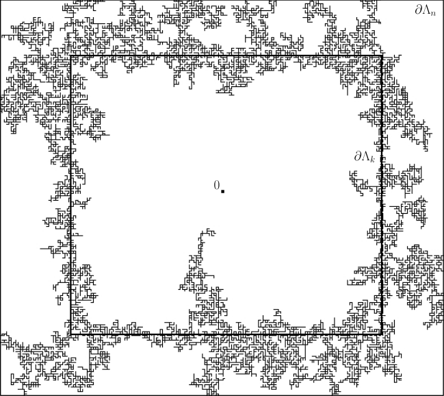
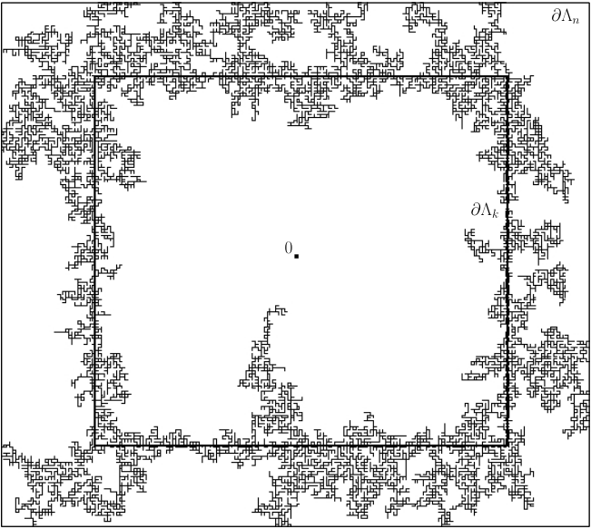
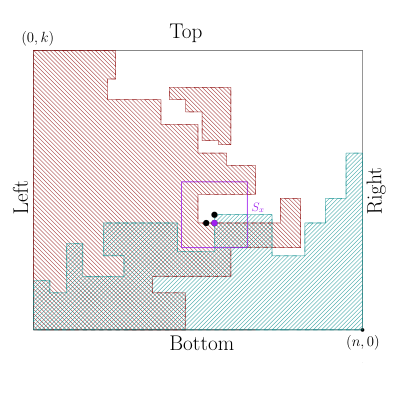
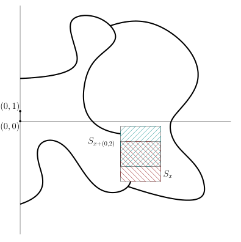

## Sharp phase transition for the random-cluster and Potts models via decision trees

Hugo Duminil-Copin [∗†], Aran Raoufi [†], Vincent Tassion [‡]

December 27, 2018

**Abstract**

We prove an inequality on decision trees on monotonic measures which generalizes the OSSS
inequality on product spaces. As an application, we use this inequality to prove a number of new
results on lattice spin models and their random-cluster representations. More precisely, we prove
that

     - For the Potts model on transitive graphs, correlations decay exponentially fast for _β_ < _βc_ .

     - For the random-cluster model with cluster weight _q_ ≥ 1 on transitive graphs, correlations
decay exponentially fast in the subcritical regime and the cluster-density satisfies the meanfield lower bound in the supercritical regime.

     - For the random-cluster models with cluster weight _q_ ≥ 1 on planar quasi-transitive graphs G,

_pc_ (G) _pc_ (G [∗] )
(1 − _pc_ (G))(1 − _pc_ (G [∗] )) [=] _[ q.]_

As a special case, we obtain the value of the critical point for the square, triangular and
hexagonal lattices (this provides a short proof of the result of [BD12]).

These results have many applications for the understanding of the subcritical (respectively disordered) phase of all these models. The techniques developed in this paper have potential to be
extended to a wide class of models including the Ashkin-Teller model, continuum percolation models such as Voronoi percolation and Boolean percolation, super-level sets of massive Gaussian Free
Field, and random-cluster and Potts model with infinite range interactions.

### **1 Introduction**

**1.1** **OSSS inequality for monotonic measures**

In theoretical computer science, determining the computational complexity of tasks is a very difficult
problem (think of P against NP). To start with a more tractable problem, computer scientists have
studied _decision trees_, which are simpler models of computation. A decision tree associated to a
Boolean function _f_ takes _ω_ ∈{0 _,_ 1} _[n]_ as an input, and reveals algorithmically the value of _ω_ in different
bits one by one. The algorithm stops as soon as the value of _f_ is the same no matter the values of _ω_ on
the remaining coordinates. The question is then to determine how many bits of information must be
revealed before the algorithm stops. The decision tree can also be taken at random to model random

or quantum computers.
The theory of (random) decision trees played a key role in computer science (we refer the reader to
the survey [BDW02]), but also found many applications in other fields of mathematics. In particular,
random decision trees (sometimes called randomized algorithms) were used in [SS10] to study the noise
sensitivity of Boolean functions, for instance in the context of percolation theory.

∗Université de Genève

  - Institut des Hautes Études Scientifiques

  - ETH Zurich

1

The OSSS inequality, originally introduced in [OSSS05] for product measure as a step toward a
conjecture of Yao [Yao77], relates the variance of a Boolean function to the influence of the variables
and the computational complexity of a random decision tree for this function. The first part of this
paper consists in generalizing the OSSS inequality to the context of monotonic measures which are
not product measures. A _monotonic_ measure is a measure _µ_ on {0 _,_ 1} _[E]_ such that for any _e_ ∈ _E_, any
_F_ ⊂ _E_, and any _ξ,ζ_ ∈{0 _,_ 1} _[F]_ satisfying _ξ_ ≤ _ζ_, _µ_ [ _ωe_ = _ξe,_ ∀ _e_ ∈ _F_ ] > 0 and _µ_ [ _ωe_ = _ζe,_ ∀ _e_ ∈ _F_ ] > 0,

_µ_ [ _ωe_ = 1 ∣ _ωe_ = _ξe,_ ∀ _e_ ∈ _F_ ] ≤ _µ_ [ _ωe_ = 1 ∣ _ωe_ = _ζe,_ ∀ _e_ ∈ _F_ ] _._

The motivation to choose such a class of measures comes from the applications to mathematical
physics (for example, any positive measure satisfying the FKG-lattice inequality is monotonic, see

[Gri06] for more details), but monotonic measures also appear in computer science.
In order to state our theorem, we introduce a few notation. Consider a finite set _E_ of cardinality
_n_ . For a _n_ -tuple _e_ = ( _e_ 1 _,...,en_ ) and _t_ ≤ _n_, write _e_ [ _t_ ] = ( _e_ 1 _,...,et_ ) and _ωe_ [ _t_ ] = ( _ωe_ 1 _,...,ωet_ ).
A decision tree encodes an algorithm that takes _ω_ ∈{0 _,_ 1} _[E]_ as an input, and then queries the values
of _ωe_, _e_ ∈ _E_ one bits after the other. For any input _ω_, the algorithm always starts from the same fixed
_e_ 1 ∈ _E_ (which corresponds to the root of the decision tree), and queries the value of _ωe_ 1. Then, the
second element _e_ 2 examined by the algorithm is prescribed by the decision tree and may depend on
the value of _ωe_ 1. After having queried the value of _ωe_ 2, the algorithm continues inductively. At step
_t_ - 1, ( _e_ 1 _,...,et_ −1) ∈ _E_ _[t]_ [−][1] has been examined, and the values of _ωe_ 1 _,...,ωet_ −1 have been queried. The
next element _et_ to be examined by the algorithm is a deterministic function of what has been explored
in the previous steps:

_et_ = _φt_ (( _e_ 1 _,...,et_ −1) _,ω_ ( _e_ 1 _,...,et_ −1)) ∈ _E_ ∖{ _e_ 1 _,...,et_ −1} _._ (1)

( _φt_ should be interpreted as the decision rule at time _t_ : _φt_ takes the location and the value of
the first _t_ − 1 steps of the induction, and decides of the next bit to query). Formally, we call _decision_
_tree_ a pair _T_ = ( _e_ 1 _,_ ( _φt_ )2≤ _t_ ≤ _n_ ), where _e_ 1 ∈ _E_, and for each _t_ the function _φt_, as above, takes a pair
(( _e_ 1 _,...,et_ −1) _,ω_ ( _e_ 1 _,...,et_ −1)) as an input and return an element _et_ ∈ _E_ ∖{ _e_ 1 _,...,et_ −1}.
Let _T_ = ( _e_ 1 _,_ ( _φt_ )2≤ _t_ ≤ _n_ ) be a decision tree and _f_ ∶{0 _,_ 1} _[E]_ → R. Given _ω_ ∈{0 _,_ 1} _[E]_ we consider the
_n_ -tuple ( _e_ 1 _,...,en_ ) defined inductively by (1) (this corresponds to the ordering on _E_ that we get when
we run the algorithm _T_ starting from the input _ω_ ). We define

_τ_ ( _ω_ ) = _τf,T_ ( _ω_ ) ∶= min { _t_ ≥ 1 ∶∀ _ω_ [′] ∈{0 _,_ 1} _[E]_ _,_ _ωe_ [′] [ _t_ ] [=] _[ ω][e]_ [ _t_ ] [�⇒] _[f]_ [(] _[ω]_ [) =] _[ f]_ [(] _[ω]_ [′][)}] _[.]_ (2)

In computer science, a decision tree is usually associated directly to a Boolean function _f_ and defined
as a rooted directed tree in which internal nodes are labeled by elements of _E_, leaves by possible
outputs, and edges are in correspondence with the possible values of the bits at vertices (see [OSSS05]
for a formal definition). In particular, the decision trees are usually defined up to _τ_, and not later
on. In this paper, we chose the slightly different formalism described above, which is equivalent to the
classical one, since it will be more convenient for the proof of the following theorem.

**Theorem 1.1** _Fix an increasing function f_ ∶{0 _,_ 1} _[E]_ �→[0 _,_ 1] _on a finite set E. For any monotonic_
_measure µ and any decision tree T_ _,_

Var _µ_ ( _f_ ) ≤∑ _δe_ ( _f,T_ ) Cov _µ_ ( _f,ωe_ ) _,_ (3)
_e_ ∈ _E_

_where δe_ ( _f,T_ ) ∶= _µ_ [∃ _t_ ≤ _τ_ ( _ω_ ) ∶ _et_ = _e_ ] _is the revealment (of f_ _) for the decision tree T_ _._

A slightly stronger form of this result is stated in Section 2. In this paper, we focus on applications
of the previous result to statistical physics but we expect it to have a number of applications in the
context of the theory of Boolean functions. The interested reader is encouraged to consult [O’D14]
for a detailed introduction to the subject. Theorems regarding Boolean functions have already found
several applications in statistical physics, especially in the context of the noise sensitivity. For a review
of the relationship between percolation theory and the analysis of Boolean functions we refer the reader
to the book of Garban and Steif [GS14].

2

**1.2** **Sharpness of the phase transition in statistical physics**

We call _lattice_ a locally finite (vertex-)transitive infinite graph G = (V _,_ E). An (unoriented) edge of the
lattice is denoted _xy_ . We also distinguish a vertex 0 ∈ V and call it the origin. Let _d_ (⋅ _,_ ⋅) denote the
graph distance on G. Introduce a family of _non-negative_ coupling constants _J_ = ( _Jxy_ ) _xy_ ∈E ∈[0 _,_ ∞) [E]

which is non-zero and invariant under a group acting transitively on V. Notice that the coupling
constants are necessarily finite-range (since the graph is locally finite). We call the pair (G _,J_ ) a
_weighted lattice_ .
Statistical physics models defined on a lattice are useful to describe a large variety of phenomena
and objects, ranging from ferro-magnetic materials to lattice gas. They also provide discretizations of
Euclidean and Quantum Field Theories and are as such important from the point of view of theoretical
physics. While the original motivation came from physics, they appeared as extremely complex and
rich mathematical objects, whose study required the development of important new tools that found
applications in many other domains of mathematics.
One of the key aspects of these models is that they often undergo order/disorder phase transitions
at a certain critical parameter _βc_ . The regime _β_ < _βc_, usually called the disorder regime, exhibits very
rapid decay of correlations. While this property is usually simple to derive for very small values of
_β_ using perturbative techniques, proving such a statement for the whole range of parameters _β_ < _βc_
is a difficult mathematical challenge. Nevertheless, having such a property is the key towards a deep
understanding of the disordered regime.
The zoo of lattice models is very diverse: it includes models of spin-glasses, quantum chains,
random surfaces, spin systems, percolation models. One of the most famous example of a lattice
spin model is provided by the Ising model introduced by Lenz to explain Curie’s temperature for
ferromagnets. This model has been generalized in many directions to create models exhibiting a wide
range of critical phenomena. While the Ising model is very well understood, most of these natural
generalizations remain much more difficult to comprehend. In this paper, we prove that the Potts
model (one of the most natural of such generalization) undergoes a sharp phase transition, meaning
that in the disordered regime, correlations decay exponentially fast. In order to do so, we will study
the random-cluster representations of these models, which are often monotonic. The generalized OSSS
inequality proved in Theorem 1.1 will play a key role in the proof.

**Exponential decay for the subcritical random-cluster model** Since random-cluster models
were introduced by Fortuin and Kasteleyn in 1969 [FK72], they have become the archetypal example
of dependent percolation models and as such have played an important role in the study of phase
transitions. The spin correlations of Potts models are rephrased as cluster connectivity properties
of their random-cluster representations. This allows the use of geometric techniques, thus leading to
several important applications. While the understanding of the model on planar graphs progressed
greatly in the past few years [BD12, DST17, DGH [+] 16, DRT16], the case of higher dimensions remained
poorly understood. We refer to [Gri06, Dum13] for books on the subject and a discussion of existing
results.
The model is defined as follows. Consider a finite subgraph _G_ = ( _V,E_ ) of a weighted lattice (G _,J_ )
and introduce the boundary _∂G_ of _G_ to be the set of vertices _x_ ∈ _G_ for which there exists _y_ ∉ _G_ with
_xy_ an edge of E. A _percolation configuration ω_ = ( _ωxy_ ) _xy_ ∈ _E_ is an element of {0 _,_ 1} _[E]_ . A configuration
_ω_ can be seen as a subgraph of _G_ with vertex-set _V_ and edge-set given by { _xy_ ∈ _E_ ∶ _ωxy_ = 1}. Let
_k_ f ( _ω_ ) (resp. _k_ w( _ω_ )) be the number of connected components in _ω_ (resp. in the graph obtained from
_ω_ by considering all the vertices in _∂G_ as one single vertex).
Fix _q,β_  - 0. For # ∈{f _,_ w}, let _φ_ [#] _G,β,q_ [be the measure satisfying, for any] _[ ω]_ [ ∈{][0] _[,]_ [1][}] _[E]_ [,]

_φ_ [#] _G,β,q_ [(] _[ω]_ [) =] _[q][k]_ [#] _Z_ [(] _[ω]_ [)] _xy_ ∏∈ _E_ ( _e_ _[βJ][xy]_ − 1) _ωxy_ _,_

where _Z_ is a normalizing constant introduced in such a way that _φ_ [#] _G,β,q_ [is a probability measure. The]
measures _φ_ [f] _G,β,q_ [and] _[ φ]_ [w] _G,β,q_ [are called the random-cluster measures on] _[ G]_ [ with respectively free and]

3

wired boundary conditions. For _q_ ≥ 1, the measures _φ_ [#] _G,β,q_ [can be extended to][ G][ – the corresponding]

measure is denoted by _φ_ [#] G _,β,q_ [– by taking the weak limit of measures defined in finite volume.]
For notational convenience, we set _x_ ←→ _y_ if _x_ and _y_ are in the same connected component. We
also write _x_ ←→ _Y_ if _x_ is connected to a vertex in _Y_ ⊂ V, and _x_ ←→∞ if the connected component of
_x_ is infinite. Finally, let Λ _n_ be the box of size _n_ around 0 for the graph distance.
For _q_ ≥ 1, the model undergoes a phase transition: there exists _βc_ = _βc_ (G) ∈[0 _,_ ∞] satisfying

= 0 if _β_ < _βc_,

_θ_ ( _β_ ) ∶= _φ_ [w] G _,β,q_ [[][0][ ←→∞] =]
⎧⎪⎪⎨⎪⎪⎩> 0 if _β_                                                                - _βc_ .

The main theorem of this article is the following one.

**Theorem 1.2** _Fix q_ ≥ 1 _and consider the random-cluster model on a weighted lattice_ (G _,J_ ) _. Then,_

_• There exists c_  - 0 _such that θ_ ( _β_ ) ≥ _c_ ( _β_ − _βc_ ) _for any β_ ≥ _βc close enough to βc._

_• For any β_ < _βc there exists cβ_  - 0 _such that for every n_ ≥ 0 _,_

_φ_ [w] Λ _n,β,q_ [[][0][ ←→] _[∂]_ [Λ] _[n]_ [] ≤] [exp][[−] _[c][β][n]_ []] _[.]_

Theorem 1.2 extends to quasi-transitive weighted graphs and to finite range interactions (for the
latter, simply interpret finite-range models as nearest-neighbor models on a bigger graph).
For planar graphs, the result was proved for any _q_ ≥ 1 under some symmetry assumption in [DM16]
(see also [MR16] for the case of planar slabs). On Z _[d]_, the result was restricted to large values of _q_

[LMMS [+] 91] and to the special cases of Bernoulli percolation ( _q_ = 1) [Men86, AB87, DT15] and the
FK-Ising model ( _q_ = 2) [ABF87, DT15].
Numerous results about the subcritical regime have been proved under the assumption of exponential decay, and therefore Theorem 1.2 transform them into unconditional results. To cite but a
few, let us mention the Ornstein-Zernike theory of correlations [CIV08], the mixing properties of the
model [Ale04], the bounds on the spectral gaps of the associated dynamics [Mar99]. The second item
of Theorem 1.2 could be replaced by _φ_ [w] G _,β,q_ [[][0][ ←→] _[x]_ [] ≤] [exp][[−] _[c][β][d]_ [(][0] _[,x]_ [)]][, but the stronger statement]
proved in the theorem is the one useful for these applications.

**Applications to computations of critical points for planar graphs** Another important application of Theorem 1.2 is the computation of critical points of specific lattices. In this section, we
fix coupling constants to be equal to 1 and set _pc_ ∶= 1 − _e_ [−] _[β][c]_ . In general, the critical parameter _pc_ is
not expected to take any specific value. However, for the square, hexagonal and triangular lattices,
the critical values can be predicted using duality. It is proved in [Gri06, Theorem 6.17] that predicted
values are indeed the critical ones under the assumption of exponential decay for _p_ < _pc_ . Therefore,
our result provides an alternative proof of the following theorem.

**Theorem 1.3** _Fix q_ ≥ 1 _. If yc_ ∶= _pc_ /(1 − _pc_ ) _, we have_

_yc_ [2] [−] _[q]_ [ =][ 0] _on the square lattice,_
_yc_ [3] [+][ 3] _[y]_ _c_ [2] [−] _[q]_ [ =][ 0] _on the triangular lattice,_
_yc_ [3] [−] [3] _[qy][c]_ [−] _[q]_ [2][ =][ 0] _on the hexagonal lattice._

Note that for the square lattice, _pc_ is equal to ~~[√]~~ ~~_q_~~ /(1 + ~~[√]~~ ~~_q_~~ ). This result was originally proved in

[BD12], where exponential decay of correlations below _pc_ is proved using Russo-Seymour-Welsh type
arguments and a generalization [GG06] of the KKL result [KKL88, BKK [+] 92].
The fact that our proof of exponential decay requires very few conditions on the graphs enables us
to study critical points of general planar locally-finite doubly periodic graphs, i.e. embedded planar
graphs which are invariant under the action of some lattice Λ ≈ Z ⊕ Z. Denote the dual of any planar
graph G by G [∗] .

**Theorem 1.4** _Fix q_ ≥ 1 _and a planar locally-finite doubly periodic graph_ G _. We have_

_pc_ (G) _pc_ (G [∗] )
(4)
(1 − _pc_ (G))(1 − _pc_ (G [∗] )) [=] _[ q.]_

4

This result should be understood as a generalization of the famous statement _pc_ (G) + _pc_ (G [∗] ) = 1 for
Bernoulli percolation. The theorem is a consequence of duality, exponential decay for _p_ < _pc_ (G) and
the following non-coexistence result. For a configuration _ω_ on G, define a configuration _ω_ [∗] in G [∗] by
the formula _ω_ [∗]
_e_ [∗] [=][ 1][ −] _[ω][e]_ [ for every edge] _[ e]_ [ of][ G][, where] _[ e]_ [∗] [is the edge of][ G][∗] [between the two vertices of]
G [∗] corresponding to the faces bordered by _e_ .

**Theorem 1.5** _There does not exist any translational invariant measure µ on a planar locally-finite_
_doubly periodic graph_ G _satisfying_

_•_ (FKG) _For any increasing events A and B, µ_ ( _A_ ∩ _B_ ) ≥ _µ_ ( _A_ ) _µ_ ( _B_ ) _._

_• Almost surely, there exists a unique infinite connected component in ω and in ω_ [∗] _._

This result was proved in [She05] . It was also proved for percolation on self-dual polygon configurations
in [BR10]. Here, we present a proof which has also the advantage of being quite short.

**Applications to the ferromagnetic** _q_ **-state Potts model** The Potts model [Pot52] is one of the
most fundamental example of a lattice spin model undergoing an order/disorder phase transition at a
critical parameter _βc_ . It generalizes the Ising model by allowing the spins to take one of _q_ values. In
two dimensions, the model has been the object of intense study in the past few years and the behavior is
fairly well understood, even at criticality [DST17, DGH [+] 16]. In higher dimension, the understanding is
limited to the case of the Ising model (i.e. _q_ = 2) and of large _q_ [AF86, ADS15, KS82, LMMS [+] 91, BC03].
The model is defined as follows. Consider an integer _q_ ≥ 2. For _G_ = ( _V,E_ ) a finite subgraph of a
weighted lattice (G _,J_ ), _ν_ ∈{1 _,...,q_ }, and _β_ ≥ 0, the _q-state Potts measure_ with boundary condition
_ν_ is defined for any _σ_ = ( _σx_ ) _x_ ∈ _V_ ∈{1 _,...,q_ } _[V]_ by

exp(− _βHG_ _[ν]_ _,q_ [(] _[σ]_ [))]
P _[ν]_
_G,β,q_ [[] _[σ]_ [] ∶=]

∑ exp(− _βHG,q_ _[ν]_ [(] _[σ]_ [))]
_σ_ [′] ∈{1 _,...,q_ } _[V]_

where
_HG,q_ _[ν]_ [(] _[σ]_ [) ∶= −] ∑ _Jxy δσx_ = _σy_ − ∑
_xy_ ∈ _E_ _xy_ ∈ _E_
_x_ ∈ _∂G, y_ ∉ _G_

_Jxy δσx_ = _ν._

The model can be defined in infinite volume by taking the weak limit of measures on a nested
sequence of finite graphs. The obtained measure P _[ν]_ G _,β,q_ [is called the Potts measure with boundary]
conditions _ν_ . The Potts model undergoes a phase transition between absence and existence of longrange order at the so-called critical inverse temperature _βc_ (which depends on G and _J_ ), see [Gri06]
for details.

**Theorem 1.6** _Fix an integer q_ ≥ 2 _and consider the q-state Potts on a weighted lattice_ (G _,J_ ) _. Then,_
_for β_ < _βc, there exists cβ_ - 0 _such that for every x_ ∈ V _,_

0 ≤ P _[ν]_ Λ _n,β,q_ [[] _[σ]_ [0][ =] _[ ν]_ [] −] [1] _q_ [≤] [exp][[−] _[c][β][n]_ []] _[.]_

_Furthermore, for the nearest-neighbor model on the square lattice, βc_ (Z [2] ) = log(1 + ~~[√]~~ ~~_q_~~ ~~)~~ _._

For the 2-state Potts model, better known as the Ising model, the result goes back to [ABF87] (see
also [DT15]). For the _q_ -state Potts model with _q_ ≥ 3, the result was restricted to either perturbative
arguments involving the Pirogov-Sinai theory for _q_ ≫ 1 or planar arguments (see the discussion on
the random-cluster model). The question of deriving this property for _q_ ≥ 3 and Z _[d]_ with _d_ ≥ 3 was
open. Again, the flexibility in the choice of the lattice G implies that the result applies to finite
range interactions. The statement of Theorem 1.6 is stronger than the statement P _[ν]_ G _,β,q_ [[] _[σ]_ [0][ =] _[ ν]_ [] −] [1] _q_ [≤]

exp[− _cβd_ (0 _,x_ )].
The Potts model and the random-cluster models on a weighted lattice (G _,J_ ) can be coupled (see

[Gri06, Theorem 1.10] for details) in such a way that

[1] _q_ [=] _[q]_ [−] _q_ [1]

P _[ν]_ Λ _n,β,q_ [[] _[σ]_ [0][ =] _[ ν]_ [] −] [1]

[−]

_q_ _[φ]_ Λ [w] _n_ +1 _,β,q_ [[][0][ ←→] _[∂]_ [Λ] _[n]_ [+][1][]] _[,]_

so that Theorem 1.6 is a direct consequence of Theorems 1.2 and 1.3.

5

**Other models.** The reasoning above should extend to other lattice spin models for which there
exists a random-cluster representation which is monotonic. An archetypal example is provided by the
Ashkin-Teller model; see [Bax82] for details. It also extends to continuum percolation models such
as Voronoi percolation [DRT17a], occupied and vacant set of Boolean percolation [DRT17b], massive
Gaussian free field super-level lines.

**Organization** The paper is organized as follows. In the next section we prove Theorem 1.1. In
the third section, we prove Theorem 1.2 (we tried to isolate a few general statements which may be
used for the proof of exponential decay for other models of statistical physics). In the last section, we
describe the proof of Theorems 1.4 and 1.5.

**Acknowledgments** This research was supported by an IDEX grant from Paris-Saclay, a grant from
the Swiss FNS, the ERC CriBLaM, and the NCCR SwissMAP. We thank Yvan Velenik, Alain-Sol
Sznitman and Ioan Manolescu for many inspiring discussions and insightful comments.

### **2 Proof of Theorem 1.1**

The strategy is a combination of the original proof of the OSSS inequality for product measures (which
is an Efron-Stein type reasoning), together with an encoding of monotonic measures in terms of iid
random variables. Assume that _E_ is finite and has cardinality _n_ . Let _E_ [⃗] be the set of sequences
_e_ = ( _e_ 1 _,...,en_ ) where each element of _E_ occurs exactly once. Consider a monotonic measure _µ_ on
{0 _,_ 1} _[E]_ .
We start by a useful lemma explaining how to construct _ω_ with law _µ_ from iid uniform random
variables. For _u_ ∈[0 _,_ 1] _[n]_ and _e_ ∈ _E_ [⃗], define _Fe_ ( _u_ ) = _x_ inductively for 1 ≤ _t_ ≤ _n_ by

_xet_ ∶= 1 if _ut_ ≥ _µ_ [ _ωet_ = 0 ∣ _ωe_ [ _t_ −1] = _xe_ [ _t_ −1]] _,_ (5)

0 otherwise _._

⎧⎪⎪⎨⎪⎪⎩

**Lemma 2.1** _Let_ **U** _be a iid sequence of uniform_ [0 _,_ 1] _random variables, and_ **e** _a random variable_
_taking values in_ _E_ [⃗] _. Assume that for every_ 1 ≤ _t_ ≤ _n,_ **U** _t is independent of_ ( **e** [ _t_ ] _,_ **U** [ _t_ −1]) _, then_ **X** = _F_ **e** ( **U** )
_has law µ._

**Proof** Let _x_ ∈{0 _,_ 1} _[E]_ and _e_ ∈ _E_ [⃗] such that P[ **X** = _x,_ **e** = _e_ ] > 0. The probability P[ **X** = _x,_ **e** = _e_ ] can
be written as

_n_ _n_
∏ P[ **X** _et_ = _xet_ ∣ **e** [ _t_ ] = _e_ [ _t_ ] _,_ **X** _e_ [ _t_ −1] = _xe_ [ _t_ −1]] × ∏ P[ **e** _t_ = _et_ ∣ **e** [ _t_ −1] = _e_ [ _t_ −1] _,_ **X** _e_ [ _t_ −1] = _xe_ [ _t_ −1]] _._
_t_ =1 _t_ =1

(All the conditionings are well defined, since we assumed P[ **X** = _x,_ **e** = _e_ ] > 0.) Since **U** _t_ is independent
of ( **e** [ _t_ ] _,U_ [ _t_ −1]) (and thus **X** _e_ [ _t_ −1]), the definition (5) gives

P[ **X** _et_ = _xet_ ∣ **e** [ _t_ ] = _e_ [ _t_ ] _,_ **X** _e_ [ _t_ −1] = _xe_ [ _t_ −1]] = _µ_ [ _ωet_ = _xet_ ∣ _ωe_ [ _t_ −1] = _xe_ [ _t_ −1]]

so that the first product is equal to _µ_ [ _ω_ = _x_ ] independently of _e_ . Fixing _x_ ∈{0 _,_ 1} _[E]_, and summing on
_e_ ∈ _E_ [⃗] satisfying P[ **X** = _x,_ **e** = _e_ ] > 0 gives

P[ **X** = _x_ ] = ∑ P[ **X** = _x,_ **e** = _e_ ]

_e_

= _µ_ [ _ω_ = _x_ ]∑

_e_

_n_
∏ P[ **e** _t_ = _et_ ∣ **e** [ _t_ −1] = _e_ [ _t_ −1] _,_ **X** _e_ [ _t_ −1] = _xe_ [ _t_ −1]] = _µ_ [ _ω_ = _x_ ] _._
_t_ =1

6

◻

**Proof of Theorem 1.1** Our goal is to apply a Lindenberg-type argument on a probability space in
which **e** and **X** (sampled according to _µ_ ) are coupled to an independent copy of **X** (denoted by **Y** _[n]_

below). We now present the coupling.
Consider two independent sequences of iid uniform [0 _,_ 1] random variables **U** and **V** . Write P for
the coupling between these variables (and E for its expectation). Construct ( **e** _,_ **X** _,τ_ ) inductively as
follows: set for _t_ ≥ 1,

_e_ 1 if _t_ = 1
_φt_ ( **e** [ _t_ −1] _,_ **Xe** [ _t_ −1]) if _t_ - 1 and **Xe** _t_ = ⎧⎪⎪⎨⎪⎪⎩

**e** _t_ =
⎧⎪⎪⎨⎪⎪⎩

1 if **U** _t_ ≥ _µ_ ( _ω_ **e** _t_ = 0 ∣ _ω_ **e** [ _t_ −1] = **Xe** [ _t_ −1]) _,_
0 otherwise,

and _τ_ ∶= min { _t_ ≥ 1 ∶∀ _x_ ∈{0 _,_ 1} _[E]_ _,x_ **e** [ _t_ ] = **Xe** [ _t_ ] ⇒ _f_ ( _x_ ) = _f_ ( **X** )}. Note that _τ_ is equal to the stopping
time defined in (2). Finally, for 0 ≤ _t_ ≤ _n_, define **Y** _[t]_ ∶= _F_ **e** ( **W** _[t]_ ) _,_ where

**W** _[t]_ ∶= **W** _[t]_ ( **U** _,_ **V** ) = ( **V** 1 _,...,_ **V** _t,_ **U** _t_ +1 _,...,_ **U** _τ_ _,_ **V** _τ_ +1 _,...,_ **V** _n_ )

(in particular **W** _[t]_ is equal to **V** if _t_ ≥ _τ_ ).
Lemma 2.1 applied to ( **U** _,_ **e** ) gives that **X** has law _µ_ and is **U** -measurable. Lemma 2.1 applied to
( **V** _,_ **e** ) implies that **Y** _[n]_ has law _µ_ and is independent of **U** . Therefore, using that _f_ is valued in [0 _,_ 1],
we deduce that

[1] 2 _[µ]_ [[∣] _[f]_ [ −] _[µ]_ [[] _[f]_ []∣] =] [1] 2

2 [1] [E][[∣] _[f]_ [(] **[X]** [) −] _[f]_ [(] **[Y]** _[n]_ [)∣]] _[.]_

Var _µ_ ( _f_ ) ≤ [1] 2

[1]

2 [E][[∣] [E][[] _[f]_ [(] **[X]** [)∣] **[U]** [] −] [E][[] _[f]_ [(] **[Y]** _[n]_ [)∣] **[U]** []∣] ≤] [1] 2

Since _f_ ( **Y** [0] ) = _f_ ( **X** ) (the entries of **Y** [0] for _t_ - _τ_ are irrelevant for the value of _f_ by definition of _τ_ ),
the equation above implies
Var _µ_ ( _f_ ) ≤ [1] 2 [E][[∣] _[f]_ [(] **[Y]** [0][) −] _[f]_ [(] **[Y]** _[n]_ [)∣]] _[.]_

Since **Y** _[t]_ = **Y** _[t]_ [−][1] for any _t_ - _τ_, the right-hand side of the previous inequality is less than or equal to

_n_ _n_
∑ E[∣ _f_ ( **Y** _[t]_ ) − _f_ ( **Y** _[t]_ [−][1] )∣] = ∑ E[∣ _f_ ( **Y** _[t]_ ) − _f_ ( **Y** _[t]_ [−][1] )∣⋅ 1 _t_ ≤ _τ_ ]
_t_ =1 _t_ =1

= ∑
_e_ ∈ _E_

_n_
∑ E[E[∣ _f_ ( **Y** _[t]_ ) − _f_ ( **Y** _[t]_ [−][1] )∣∣ **U** [ _t_ −1]] 1 _t_ ≤ _τ,_ **e** _t_ = _e_ ] _._
_t_ =1

Recalling that ∑ _[n]_ _t_ =1 [P][[] _[t]_ [ ≤] _[τ,]_ **[e]** _[t]_ [=] _[ e]_ [] =] _[ δ][e]_ [(] _[f,T]_ [)] _[,]_ [ the proof of the theorem follows from the fact that on]
{ _t_ ≤ _τ,_ **e** _t_ = _e_ },
E[∣ _f_ ( **Y** _[t]_ ) − _f_ ( **Y** _[t]_ [−][1] )∣∣ **U** [ _t_ −1]] ≤ 2Cov _µ_ ( _f,ωe_ ) _._ (6)

In order to show this, we now restrict ourself to the event { _t_ ≤ _τ,_ **e** _t_ = _e_ }. First observe that **Y** _e_ _[t]_ [=] **[ Y]** _e_ _[t]_ [−][1]
implies **Y** _[t]_ = **Y** _[t]_ [−][1], and this together with the fact that _f_ is increasing implies

∣ _f_ ( **Y** _[t]_ ) − _f_ ( **Y** _[t]_ [−][1] )∣= ( _f_ ( **Y** _[t]_ ) − _f_ ( **Y** _[t]_ [−][1] ))( **Y** _e_ _[t]_ [−] **[Y]** _e_ _[t]_ [−][1] )

= _f_ ( **Y** _[t]_ [−][1] ) **Y** _e_ _[t]_ [−][1] + _f_ ( **Y** _[t]_ ) **Y** _e_ _[t]_ [−] _[f]_ [(] **[Y]** _[t]_ [−][1][)] **[Y]** _e_ _[t]_ [−] _[f]_ [(] **[Y]** _[t]_ [)] **[Y]** _e_ _[t]_ [−][1] _._ (7)

Our goal is to average against E[⋅∣ **U** [ _t_ −1]]. In order to do this, we will use the following claim.

**Claim.** _For any measurable g and t_ ≤ _n,_

E[ _g_ ( **Y** _[t]_ )∣ **U** [ _t_ ]] = _µ_ [ _g_ ( _ω_ )] _._ (8)

**Proof** Conditioned on **U** [ _t_ ], the random vector **W** _[t]_ is composed of iid uniform random variables
satisfying that **W** _i_ _[t]_ [is independent of][ (] **[e]** [1] _[,...,]_ **[e]** _[i]_ [)][ for every] _[ i]_ [ ≤] _[n]_ [. Therefore, Lemma 2.1 applied to]
( **e** _,_ **W** _[t]_ ) implies that the law of **Y** _[t]_ conditioned on **U** [ _t_ ] is _µ_, which gives the claim. ◻

Applying (8) to _g_ ( _ω_ ) = _f_ ( _ω_ ) _ωe_ gives that (for the second equality we average on **U** _t_ )

E[ _f_ ( **Y** _[t]_ [−][1] ) **Y** _e_ _[t]_ [−][1] ∣ **U** [ _t_ −1]] = _µ_ [ _f_ ( _ω_ ) _ωe_ ] = E[ _f_ ( **Y** _[t]_ ) **Y** _e_ _[t]_ [∣] **[U]** [ _t_ −1] []] _[.]_ (9)

7

For fixed **U** [ _n_ ] and _s_, **Y** _[s]_ = _F_ **e** ( **W** _[s]_ ) is an increasing function of **V**, by monotonicity of _µ_ . Since _f_ and
**W** _e_ are increasing functions of **V**, we deduce that _f_ ( **Y** _[t]_ [−][1] ) and **Y** _e_ _[t]_ [=] _[ F]_ **[e]** [(] **[W]** [)] _[e]_ [are increasing functions]
of **V** . The FKG inequality applied to the iid random variables **V** gives

E[ _f_ ( **Y** _[t]_ [−][1] ) **Y** _e_ _[t]_ [∣] **[U]** [ _n_ ] [] ≥] [E][[] _[f]_ [(] **[Y]** _[t]_ [−][1][)∣] **[U]** [ _n_ ] []][E][[] **[Y]** _e_ _[t]_ [∣] **[U]** [ _n_ ] []] _[.]_

Taking the expectation with respect to E[⋅∣ **U** [ _t_ −1]] gives

E[ _f_ ( **Y** _[t]_ [−][1] ) **Y** _e_ _[t]_ [∣] **[U]** [ _t_ −1] [] ≥] [E][[][E][[] _[f]_ [(] **[Y]** _[t]_ [−][1][)∣] **[U]** [ _n_ ] []][E][[] **[Y]** _e_ _[t]_ [∣] **[U]** [ _n_ ] []∣] **[U]** [ _t_ −1] []]

(8)
= E[ _f_ ( **Y** _[t]_ [−][1] )∣ **U** [ _t_ −1]]E[ **Y** _e_ _[t]_ [∣] **[U]** [ _t_ −1] []] = _µ_ [ _f_ ( _ω_ )] _µ_ [ _ωe_ ] _,_ (10)

where we used that E[ **Y** _e_ _[t]_ [∣] **[U]** [ _n_ ] []][ is] **[ U]** [ _t_ −1] [-measurable (since] **[ Y]** _e_ _[t]_ [depends on] **[ U]** [ _t_ −1] [and] **[ V]** [ only).]
Similarly, _f_ ( **Y** _[t]_ ) and **Y** _e_ _[t]_ [−][1] are increasing functions of **V** so that using the FKG inequality and
then taking the expectation with respect to E[⋅∣ **U** [ _t_ ]] gives

E[ _f_ ( **Y** _[t]_ ) **Y** _e_ _[t]_ [−][1] ∣ **U** [ _t_ ]] ≥ E[E[ _f_ ( **Y** _[t]_ )∣ **U** [ _n_ ]]E[ **Y** _e_ _[t]_ [−][1] ∣ **U** [ _n_ ]]∣ **U** [ _t_ ]]

(8) _t_ −1
= E[ _f_ ( **Y** _[t]_ )∣ **U** [ _t_ ]]E[ **Y** _e_ _[t]_ [−][1] ∣ **U** [ _t_ ]] = _µ_ [ _f_ ( _ω_ )]E[ **Y** _e_ ∣ **U** [ _t_ ]] _._

This time, we used that E[ **Y** _e_ _[t]_ [−][1] ∣ **U** [ _n_ ]] is **U** [ _t_ ]-measurable. Taking the expectation with respect to
E[⋅∣ **U** [ _t_ −1]] gives

(8)
E[ _f_ ( **Y** _[t]_ ) **Y** _e_ _[t]_ [−][1] ∣ **U** [ _t_ −1]] ≥ _µ_ [ _f_ ( _ω_ )]E[ **Y** _e_ _[t]_ [−][1] ∣ **U** [ _t_ −1]] = _µ_ [ _f_ ( _ω_ )] _µ_ [ _ωe_ ] _._

This inequality together with (10), (9) and (7) give (6) and therefore concludes the proof. ◻

**Remark 2.2** _For most applications, one may replace covariances in the OSSS inequality by influences_
_Ie_ [ _f_ ] ∶= _µ_ ( _f_ ∣ _ωe_ = 1) − _µ_ ( _f_ ∣ _ωe_ = 0) _(we chose not to do so since applications in statistical physics to_
_long-range models would for instance require the statement with covariances). In this case, we do not_
_need to prove_ (6) _anymore and can replace the lengthly end of the proof by the following short argument._
_Recall the dependency in the measure µ in Fe_ ( _u_ ) _and write Fe_ _[µ]_ [(] _[u]_ [)] _[. With this notation, one sees that]_
_F is both increasing in u and in µ (for stochastic domination). We deduce that both_ **Y** _[t]_ [−][1] _and_ **Y** _[t]_ _are_
_sandwiched between_ **Z** ∶= _F_ **e** _[µ]_ [[⋅∣] _[ω][e]_ [=][0][]] ( **W** _[t]_ ) _and_ **Z** [′] ∶= _F_ **e** _[µ]_ [[⋅∣] _[ω][e]_ [=][1][]] ( **W** _[t]_ ) _. Recall that_ **W** _is independent of_
**U** [ _t_ −1] _. Lemma 2.1 and the fact that f is increasing give us_

E[∣ _f_ ( **Y** _[t]_ ) − _f_ ( **Y** _[t]_ [−][1] )∣∣ **U** [ _t_ −1]] ≤ E[ _f_ ( **Z** [′] )] − E[ _f_ ( **Z** )] = _µ_ [ _f_ ( _ω_ )∣ _ωe_ = 1] − _µ_ [ _f_ ( _ω_ )∣ _ωe_ = 0] = _Ie_ [ _f_ ] _._

**Remark 2.3** _Note that for the trivial decision tree discovering all the edges, for every edge the reveal-_
_ment is equal to 1 . As a consequence, we recover (in a very convoluted way) the discrete Poincaré_
_inequality_
Var _µ_ ( _f_ ) ≤∑ Cov _µ_ ( _f,ωe_ ) _._ (11)
_e_ ∈ _E_

**Remark 2.4** _The proof of the previous statement can be extended in a trivial way as follows. First, we_
_may consider countable sets E by using a very simple martingale argument. Second, we may consider_
_that τ is an arbitrary stopping time (with respect to the filtration_ ( _Ft_ = _σ_ ( **e** [ _t_ ] _,ω_ **e** [ _t_ ])) _t_ ≥0 _), i.e. that f_
_is not necessarily Fτ measurable. By simply applying the previous lemma with g_ = _µ_ [ _f_ ∣ _Fτ_ ] _, we obtain_
_the following result, which may be useful in statistical physics._

**Theorem 2.5** _Fix a countable set E and an increasing function f_ ∶{0 _,_ 1} _[E]_ �→[−1 _,_ 1] _. For any_
_monotonic measure µ on_ {0 _,_ 1} _[E]_ _, any decision tree T and any stopping time τ_ _,_

Var _µ_ ( _f_ ) ≤∑ _δe_ ( _f,T_ ) Cov _µ_ ( _f,ωe_ ) + _µ_ [∣ _f_ − _µ_ [ _f_ ∣ _Fτ_ ]∣] _._ (12)
_e_ ∈ _E_

8

### **3 Proof of Theorem 1.2**

In order to be able to apply the strategy to other models, we state two useful lemmas.

**Lemma 3.1** _Consider a converging sequence of increasing differentiable functions fn_ ∶[0 _,β_ 0] →[0 _,M_ ]
_satisfying_
_fn_ [′] [≥] Σ _[n]_ _n_ _fn_ (13)

_for all n_ ≥ 1 _, where_ Σ _n_ = ∑ _[n]_ _k_ = [−] 0 [1] _[f][k][. Then, there exists][ β]_ [1][ ∈[][0] _[,β]_ [0][]] _[ such that]_

**P1** _For any β_ < _β_ 1 _, there exists cβ_ - 0 _such that for any n large enough, fn_ ( _β_ ) ≤ exp(− _cβn_ ) _._

**P2** _For any β_ - _β_ 1 _, f_ = lim
_n_ →∞ _[f][n][ satisfies][ f]_ [(] _[β]_ [) ≥] _[β]_ [ −] _[β]_ [1] _[.]_

**Proof** Define

log Σ _n_ ( _β_ )
_β_ 1 ∶= inf _β_ ∶ limsup ≥ 1 _._
{ _n_ →∞ log _n_ }

**Assume** _β_ < _β_ 1 **.** Fix _δ_ - 0 and set _β_ [′] = _β_ − _δ_ and _β_ [′′] = _β_ − 2 _δ_ . We will prove that there is exponential
decay at _β_ [′′] in two steps.
First, there exists an integer _N_ and _α_   - 0 such that Σ _n_ ( _β_ ) ≤ _n_ [1][−] _[α]_ for all _n_ ≥ _N_ . For such an
integer _n_, integrating _fn_ [′] [≥] _[n][α][f][n]_ [between] _[ β]_ [′][ and] _[ β]_ [ – this differential inequality follows from (13), the]
monotonicity of the functions _fn_ (and therefore Σ _n_ ) and the previous bound on Σ _n_ ( _β_ ) – implies that

_fn_ ( _β_ [′] ) ≤ _M_ exp(− _δ n_ _[α]_ ) _,_ ∀ _n_ ≥ _N._

Second, this implies that there exists Σ < ∞ such that Σ _n_ ( _β_ [′] ) ≤ Σ for all _n_ . Integrating _fn_ [′] [≥] Σ _[n]_ _[f][n]_

for all _n_ between _β_ [′′] and _β_ [′] – this differential inequality is again due to (13), the monotonicity of Σ _n_,
and the bound on Σ _n_ ( _β_ [′] ) – leads to

_fn_ ( _β_ [′′] ) ≤ _M_ exp(− _[δ]_ ∀ _n_ ≥ 0 _._

Σ _[n]_ [)] _[,]_

1 _fi_
**Assume** _β_ - _β_ 1 **.** For _n_ ≥ 1, define the function _Tn_ ∶= log _n_ [∑] _i_ _[n]_ =1 _i_ [. Differentiating] _[ T][n]_ [ and using (13),]

we obtain

(13) 1
≥
log _n_

_n_
∑
_i_ =1

_fi_ [′]

_i_

_fi_
Σ _i_ ≥ [lo][g][ Σ] _[n]_ log [+][1][ −] _n_ [lo][g][ Σ][1] _,_

1
_Tn_ [′] [=]
log _n_

_n_
∑
_i_ =1

where in the last inequality we used that for every _i_ ≥ 1,

Σ _fii_ ≥∫

Σ _i_ +1

Σ _i_ +1 _dt_

Σ _i_ _t_

_t_ [=][ log Σ] _[i]_ [+][1][ −] [log Σ] _[i][.]_

For _β_ [′] ∈( _β_ 1 _,β_ ), using that Σ _n_ +1 ≥ Σ _n_ is increasing and integrating the previous differential inequality
between _β_ [′] and _β_ gives

_Tn_ ( _β_ ) − _Tn_ ( _β_ [′] ) ≥( _β_ − _β_ [′] ) [lo][g][ Σ] _[n]_ [(] _[β]_ [′][)][ −] [lo][g] _[ M]_ _._

log _n_

Hence, the fact that _Tn_ ( _β_ ) converges to _f_ ( _β_ ) as _n_ tends to infinity implies

log Σ _n_ ( _β_ [′] )
_f_ ( _β_ ) − _f_ ( _β_ [′] ) ≥( _β_ − _β_ [′] limsup _β_ − _β_ [′] _._
)[ _n_ →∞ log _n_ ] ≥

Letting _β_ [′] tend to _β_ 1 from above, we obtain _f_ ( _β_ ) ≥ _β_ − _β_ 1 _._ ◻

We now present an application of Theorem 1.1 to monotonic measures on {0 _,_ 1} _[E]_, where _E_ is
the edge set of a finite graph _G_ = ( _V,E_ ). Let Λ _n_ ( _x_ ) denote the box of size _n_ around _x_ ∈ _V_ and
write Λ _n_ = Λ _n_ (0). We see elements of {0 _,_ 1} _[E]_ as percolation configurations and use the corresponding
notation.

9

Figure 1: A realization of the clusters intersecting _∂_ Λ _k_ . Every edge having one endpoint in this set
is potentially revealed by the decision tree before time _τ_ . Furthermore in this specific case, we know
that 0 is not connected to the boundary of Λ _n_ .

**Lemma 3.2** _Consider a finite graph G_ = ( _V,E_ ) _containing_ 0 _._ _For any monotonic measure µ on_
{0 _,_ 1} _[E]_ _and any n_ ≥ 1 _, one has_

_n_
∑ Cov _µ_ ( 1 0↔ _∂_ Λ _n,ωe_ ) ≥ _n_ −1
_xy_ ∈ _E_

⋅ _µ_ [0 ↔ _∂_ Λ _n_ ](1 − _µ_ [0 ↔ _∂_ Λ _n_ ]) _._

4max
_x_ ∈Λ _n_

_n_ −1
∑ _µ_ [ _x_ ↔ _∂_ Λ _k_ ( _x_ )]
_k_ =0

The proof is based on Theorem 1.1 applied to a well chosen decision tree determining 1 0↔ _∂_ Λ _n_ .
One may simply choose the trivial algorithm checking every edge of the box Λ _n_ . Unfortunately, the
revealment of this decision tree being 1 for every edge, the OSSS inequality will not bring us more
information that the Poincaré inequality (11). A slightly better algorithm would be provided by the
decision tree discovering the connected component of the origin “from inside”. Edges far from the
origin would then be revealed by the algorithm if (and only if) one of their endpoints is connected
to the origin. This provides a good bound for the revealment of edges far from the origin, but edges
close to the origin are still revealed with large probability. In order to avoid this last fact, we will
rather choose a family of decision trees discovering the connected components of _∂_ Λ _k_ for 1 ≤ _k_ ≤ _n_ and
observe that the average of their revealment for a fixed edge will always be small.

**Proof** We can assume that _∂_ Λ _n_ is not empty (otherwise the statement is trivially true). For any
_k_ ∈ �1 _,n_ �, we wish to construct a decision tree _T_ determining 1 0↔ _∂_ Λ _n_ such that for each _e_ = _uv_,

_δe_ ( _T_ ) ≤ _µ_ [ _u_ ←→ _∂_ Λ _k_ ] + _µ_ [ _v_ ←→ _∂_ Λ _k_ ] _._ (14)

Note that this would conclude the proof since we obtain the target inequality by applying Theorem 1.1
for each _k_ and then summing on _k_ . As a key, we use that for _u_ ∈ Λ _n_,

_n_ _n_
_k_ ∑=1 _µ_ [ _u_ ←→ _∂_ Λ _k_ ] ≤ _k_ ∑=1 _µ_ [ _u_ ←→ _∂_ Λ∣ _k_ − _d_ ( _u,_ 0)∣( _u_ )] ≤ 2max _x_ ∈Λ _n_

10

_n_ −1
∑ _µ_ [ _x_ ↔ _∂_ Λ _k_ ( _x_ )] _._
_k_ =0

We describe the decision tree _T_, which corresponds first to an exploration of the connected components in Λ _n_ intersecting _∂_ Λ _k_ that does not reveal any edge with both endpoints outside these connected
components, and then to a simple exploration of the remaining edges.
More formally, we define **e** using two growing sequences _∂_ Λ _k_ = _V_ 0 ⊂ _V_ 1 ⊂⋯⊂ _V_ and ∅= _F_ 0 ⊂ _F_ 1 ⊂
⋯⊂ _F_ (where _F_ is the set of edges between two vertices within distance _n_ of the origin) that should
be understood as follows: at step _t_, _Vt_ represents the set of vertices that the decision tree found to be
connected to _∂_ Λ _k_, and _Ft_ is the set of explored edges discovered by the decision tree until time _t_ .
Fix an ordering of the edges in _F_ . Set _V_ 0 = _∂_ Λ _k_ and _F_ 0 = ∅. Now, assume that _Vt_ ⊂ _V_ and _Ft_ ⊂ _F_
have been constructed and distinguish between two cases:

  - If there exists an edge _e_ = _xy_ ∈ _F_ ∖ _Ft_ with _x_ ∈ _Vt_ and _y_ ∉ _Vt_ (if more than one exists, pick the
smallest one for the ordering), then set **e** _t_ +1 = _e_, _Ft_ +1 = _Ft_ ∪{ _e_ } and set

_Vt_ ∪{ _x_ } if _ωe_ = 1

_Vt_ +1 ∶=

_Vt_ otherwise _._

⎧⎪⎪⎨⎪⎪⎩

  - If _e_ does not exist, set **e** _t_ +1 to be the smallest _e_ ∈ _F_ ∖ _Ft_ (for the ordering) and set _Vt_ +1 = _Vt_ and
_Ft_ +1 = _Ft_ ∪{ _e_ }.
As long as we are in the first case, we are still discovering the connected components of _∂_ Λ _k_, while as
soon as we are in the second case, we remain in it. The fact that _τ_ is smaller than or equal to the last
time we are in the first case gives us (14). ◻

**Remark 3.3** _Note that τ may a priori be strictly smaller than the last time we are in first case_
_(since the decision tree may discover a path of open edges from 0 to ∂_ Λ _n or a family of closed edges_
_disconnecting the origin from ∂_ Λ _n before discovering the whole connected components of ∂_ Λ _k)._

We are now in a position to prove Theorem 1.2. We will simply combine a derivative formula for
random-cluster models with the previous lemma, and then apply Lemma 3.1.

**Proof of Theorem 1.2** Fix _q_ ≥ 1 and _β_ 0 ≥ 0. For _n_ ≥ 1 and _β_ ≤ _β_ 0, define

_n_ −1
_µn_ ∶= _φ_ [w] Λ2 _n,β,q_ _θk_ ( _β_ ) ∶= _µk_ [0 ↔ _∂_ Λ _k_ ] _Sn_ ∶= ∑ _θk._
_k_ =0

Now, the comparison between boundary conditions [Gri06, Lemma 4.14] together with the facts that
Λ2 _k_ ( _x_ ) ⊂ Λ2 _n_ and that G is transitive imply that for _x_ ∈ Λ _n_,

_n_ −1
∑ _µn_ [ _x_ ↔ _∂_ Λ _k_ ( _x_ )] ≤ 2 ∑ _µn_ [ _x_ ↔ _∂_ Λ _k_ ( _x_ )] ≤ 2 ∑ _µk_ [0 ↔ _∂_ Λ _k_ ] ≤ 2 _Sn._
_k_ =1 _k_ ≤ _n_ /2 _k_ ≤ _n_ /2

Since _µn_ is monotonic [Gri06, Theorem 3.8], Lemma 3.2 (applied to the graph _G_ = (Λ2 _n,E_ ) induced
by Λ2 _n_ ) and the previous bound give

_n_
∑ Cov( 1 0↔ _∂_ Λ _n,ωe_ ) ≥ ⋅ _θn_ (1 − _θn_ ) _._ (15)
_e_ ∈ _E_ 8 _Sn_

Now, a derivative formula for random-cluster models [Gri06, Theorem 3.12] implies that

_θn_ [′] [(] _[β]_ [) = ∑]
_e_ ∈ _E_

_e_ _[βJ]_ _J_ _[xy]_ _xy_ − 1 [Cov][(] [1] [0][↔] _[∂]_ [Λ] _[n][,ω][e]_ [) ≥] [min] [{] _e_ _[β]_ [0] _[J]_ _J_ _[xy]_ _xy_ − 1 [} ∑] _e_ ∈ _E_ Cov( 1 0↔ _∂_ Λ _n,ωe_ ) _._ (16)

Notice that the minimum above is positive (since the coupling constants are finite-range and invariant).
Inequalities (15) and (16) together lead to

_θn_ [′] [≥] _[c]_ _S_ _[n]_ _n_ ⋅ _θn,_ (17)

11

where

_c_ = _c_ ( _β_ 0) ∶= [1][ −] _[θ]_ [1][(] _[β]_ [0][)] min _Jxy_

8 { exp( _β_ 0 _Jxy_ ) − 1 [} >][ 0]

(we used that _θn_ ≤ _θ_ 1 by comparison between boundary conditions and then monotonicity and _β_ ≤ _β_ 0).
Measurability implies limsup _θn_ = _θ_ while the comparison between boundary conditions gives that
_θn_ ≥ _θ_ (for all _n_ ) so that _θn_ converges to _θ_ . Lemma 3.1 applied to _fn_ = _θn_ / _c_ gives the existence of _β_ 1
such that **P1** and **P2** occur.

Also, for every _n_ ≥ 1,
_φ_ [w] Λ2 _n,β,q_ [[][0][ ←→] _[∂]_ [Λ][2] _[n]_ [] ≤] _[θ][n]_ [(] _[β]_ [)] _[.]_

Overall, the two previous facts combined with **P1** and **P2** implies the theorem readily (note that when
_βc_ < ∞, _β_ 1 = _βc_ as soon as _β_ 0 is chosen larger than _βc_ ). ◻

### **4 Proofs of Theorems 1.4 and 1.5**

Without loss of generality, we may assume that G and G [∗] are embedded in such a way that Λ is the
set of translations of Z [2] . We see configurations _ω_ and _ω_ [∗] as subsets of R [2] given by the union of the
open edges. For three sets _A,B,C_ ⊂ R [2], denote the event that _ω_ ∩ _C_ contains a continuous path from

_C_
_A_ to _B_ by _A_ ←→ _B_ .
Let us start by explaining how Theorem 1.4 follows from Theorems 1.2 and 1.5.

**Proof of Theorem 1.4** If _ω_ has law _φ_ [w] G _,p,q_ [(we write] _[ p]_ [ in the subscript of the measure instead of] _[ β]_ [)]
and _ω_ [∗] is defined by the formula _ωe_ [∗][∗] [=][ 1][−] _[ω][e]_ [, then the duality [Gri06, Theorem 6.13] for random-cluster]
models states that _ω_ [∗] has law _φ_ [f] G [∗] _,p_ [∗] _,q_ [, where]

_pp_ [∗]

(1 − _p_ )(1 − _p_ [∗] ) [=] _[ q.]_

In particular, we need to prove that _pc_ (G) [∗] = _pc_ (G [∗] ). The second item of Theorem 1.2, for quasitransitive graphs, implies that for any _p_ < _pc_ (G),

∑ _φ_ [w] G _,p,q_ [[[] _[n,n]_ [ +][ 1][] × [][0] _[,]_ [1][] ←→{][0][} ×][ R][] < ∞] _[.]_
_n_ ≥0

The Borel-Cantelli lemma implies that there exist only finite circuits of _ω_ surrounding the origin almost
surely. Therefore, by duality, there exists an infinite connected component in _ω_ [∗] almost surely, which
proves that _p_ [∗] ≥ _pc_ (G [∗] ). Letting _p_ tend to _pc_ (G) gives _pc_ (G) [∗] ≥ _pc_ (G [∗] ).
On the other hand, ergodic properties of _φ_ [w] G _,p,q_ [imply that when] _[ p]_ [ >] _[ p][c]_ [(][G][)][,] _[ ω]_ [ contains a unique]
infinite connected component almost surely (see [Gri06]). Similarly, if _p_ [∗] was greater than _pc_ (G [∗] ), _ω_ [∗]

would contain a unique infinite connected component almost surely (this uses a known fact [Gri06]
that, above the critical point, the random-cluster model with free boundary conditions also contains
an infinite connected component almost surely). Therefore, Theorem 1.5 shows that _p_ - _pc_ (G) implies
_p_ [∗] ≤ _pc_ (G [∗] ). Letting _p_ tend to _pc_ (G) gives _pc_ (G) [∗] ≤ _pc_ (G [∗] ). ◻

We now turn to the proof of Theorem 1.5.

**Proof of Theorem 1.5** For _R_ = [0 _,n_ ] × [0 _,k_ ], denote Top, Left, Bottom and Right for the top, left,
bottom and right sides of the boundary of _R_ . Also, define the crossing probabilities

_R_ _R_
_v_ ( _n,k_ ) ∶= _µ_ [Top ←→ Bottom] and _h_ ( _n,k_ ) ∶= _µ_ [Left ←→ Right] _._

**Lemma 4.1** _Assume that both ω and ω_ [∗] _contain a unique infinite connected components almost surely._
_Then, as_ min{ _n,k_ } _tends to infinity,_

12

_•_ max { _h_ ( _n,k_ ) _,v_ ( _n,k_ + 1)} _tends to 1,_

_•_ min { _v_ ( _n,k_ ) _,h_ ( _n,k_ )} _tends to 0._

Before proving this lemma, let us explain how it implies the theorem. For each _n_, let _kn_ be the
largest integer for which _v_ ( _n,kn_ ) ≥ _h_ ( _n,kn_ ) (note that by definition _v_ ( _n,kn_ + 1) < _h_ ( _n,kn_ + 1)). The
uniqueness of the infinite connected component easily implies that _kn_ tends to infinity as _n_ tends to
infinity (for each fixed _k_, the probability that both the infinite connected component and the dual
infinite connected component cross [0 _,n_ ]×[0 _,k_ ] from top to bottom tends to 1 as _n_ tends to infinity).
Now, if both _ω_ and _ω_ [∗] contain infinite connected components almost surely, the first item of the previous lemma implies that _h_ ( _n,kn_ ) or _v_ ( _n,kn_ + 1) tends to 1. This implies that min{ _v_ ( _n,kn_ ) _,h_ ( _n,kn_ )}
or min{ _v_ ( _n,kn_ + 1) _,h_ ( _n,kn_ + 1)} tends to 1, leading to a contradiction with the second item.

**Proof of Lemma 4.1** We prove the first item. The second item is implied by the first one (with the
roles of _ω_ [∗] and _ω_ exchanged) since 1− _v_ ( _n,k_ ) and 1− _h_ ( _n,k_ ) are the probabilities that _R_ is respectively
crossed horizontally and vertically by a path in _ω_ [∗] .
Fix _n,k_ and _s_ (that should be thought of as satisfying 1 ≪ _s_ ≪ min{ _n,k_ }). Let _Sy_ be the translate
of _S_ ∶= [0 _,s_ ] [2] by _y_ ∈ Z [2] . Define _x_ = _x_ ( _R_ ) ∈ _R_ ∩ Z [2] such that there exists _x_ [′] and _x_ [′′] neighbors of _x_ in
Z [2] satisfying

_R_ _R_
_µ_ [ _Sx_ ←→ Bottom] ≥ _µ_ [ _Sx_ ←→ Top] _,_ (18)

_R_ _R_
_µ_ [ _Sx_ ←→ Left] ≥ _µ_ [ _Sx_ ←→ Right] _,_ (19)

_R_ _R_
_µ_ [ _Sx_ [′] ←→ Top] ≥ _µ_ [ _Sx_ [′] ←→ Bottom] _,_ (20)

_R_ _R_
_µ_ [ _Sx_ [′′] ←→ Right] ≥ _µ_ [ _Sx_ [′′] ←→ Left] _._ (21)

In order to see that this point exists, let _X_ be the set of _x_ ∈ Z [2] ∩ _R_ such that (18) holds and denote
its boundary in _R_ (i.e. the set of points in _X_ with one neighbor in _R_ ∖ _X_ ) by _∂X_ . Let _Y_ and _∂Y_ be
defined similarly with (19) instead of (18). (The sets _X_ and _Y_ are illustrated on Fig. 2.) Note that
_∂X_ ∩ _∂Y_ ≠∅ since _∂X_ contains a path of neighboring vertices crossing _R_ from left to right, and _∂Y_
a path from top to bottom. By definition, any point in _∂X_ ∩ _∂Y_ satisfies the property above.

**Claim.** _The distance between x_ ( _R_ ) _and the boundary of R is tending to infinity as_ min{ _n,k_ } _tends_
_to infinity._

Before proving the claim, let us show how to finish the proof. Let _AR_ be the event that there is a
unique connected component in _ω_ ∩ _R_ going from distance 2 of _Sx_ to the boundary of _R_ .

_R_ _R_
Assume that _µ_ [ _Sx_ ←→ Bottom] ≥ _µ_ [ _Sx_ ←→ Left] _._ The FKG inequality together with (18) and (19)
imply that

_µ_ [ _Sx_

_R_
←→/ Bottom] ≤ _µ_ [ _S_ ←→∞]/ [1][/][4] _._ (22)

Now, set _R_ [′] = _R_ + (1 _,_ 0) and Top [′] for the top side of _R_ [′] . We find

_R_ [′] _R_
_µ_ [ _Sx_ ′+(0 _,_ 1) ←→ Top [′] ] = _µ_ [ _Sx_ [′] ←→ Top]

(20) _R_
≥ _µ_ [ _Sx_ [′] ←→ Bottom]

_R_
≥ _µ_ [{ _Sx_ [′] ←→∞} ∩{ _Sx_ ←→ Bottom} ∩ _AR_ ]

(22)
≥ _µ_ [ _S_ ←→∞] − _µ_ [ _S_ ←→∞]/ [1][/][4] − _µ_ [ _A_ _[c]_ _R_ []] _[.]_

We deduce that

_R_ _R_ [′]
_v_ ( _n,k_ + 1) ≥ _µ_ [{ _Sx_ ←→ Bottom} ∩{ _Sx_ ′+(0 _,_ 1) ←→ Top [′] } ∩ _AR_ ]

(22)
≥ _µ_ [ _S_ ←→∞] − 2 _µ_ [ _S_ ←→∞]/ [1][/][4] − 2 _µ_ [ _A_ _[c]_ _R_ []] _[.]_

13

_R_ _R_
Assume now that _µ_ [ _Sx_ ←→ Bottom] < _µ_ [ _Sx_ ←→ Left] _,_ the same reasoning as above, but using _x_ [′′]

instead of _x_ [′] and (21) instead of (20), leads to the same bound as above for _h_ ( _n,k_ ). The uniqueness
of the infinite connected component together with the claim imply that _µ_ [ _AR_ ] tends to 1 as min{ _n,k_ }
tends to infinity. Letting the size _s_ of _S_ tend to infinity finishes the proof of the first item. To conclude
the whole proof, we need to prove the claim.

|Col1|Col2|Col3|Col4|
|---|---|---|---|
|||||
|||||
|||||

Figure 2: The vertices hatched in green are

_R_ _R_
those such that _µ_ [ _Sx_ ←→ Bottom] ≥ _µ_ [ _Sx_ ←→
Top], and the vertices hatched in red are

_R_ _R_
those which satisfy _µ_ [ _Sx_ ←→ Left] ≥ _µ_ [ _Sx_ ←→
Right]. The point is selected in the intersection of the boundary of the two regions.

Figure 3: The construction of Claim 1. The
black path prevents segment {0}×[0 _,_ 1] from
belonging to an infinite cluster of the dual.

**Proof of the claim** We prove that the distance to Left is tending to infinity (the other sides
work the same). Note that it is sufficient to prove that _ω_ ∩ H, where H = R+ × R, does not contain
any infinite connected component almost surely. To avoid introducing new notation, we prove the
equivalent statement for _ω_ [∗] ∩ H instead of _ω_ ∩ H, but the proof is the same. Introduce _ℓ_ + ∶= {0} × R+,
_ℓ_ − ∶= {0} × R− and _ℓ_ = _ℓ_ − ∪ _ℓ_ +.
For an integer _s,m_ ≥ 0, choose _x_ = _x_ ( _m_ ) with first coordinate equal to _m_ satisfying

H H H H
_µ_ [ _Sx_ ←→ _ℓ_ −] ≥ _µ_ [ _Sx_ ←→ _ℓ_ +] and _µ_ [ _Sx_ +(0 _,_ 1) ←→ _ℓ_ −] ≤ _µ_ [ _Sx_ +(0 _,_ 1) ←→ _ℓ_ +] _._

H H
(This point exists since _µ_ [ _Sx_ ←→ _ℓ_ ±] increases to _µ_ [ _Sx_ ←→ _ℓ_ ] as the second coordinate of _x_ tends to
±∞.) The FKG inequality together with these two inequalities implies that

H
_µ_ [ _Sx_ ←→ _ℓ_ −] ≥ 1 − √

H
_µ_ [ _Sx_ /←→ _ℓ_ ] and _µ_ [ _Sx_ +(0 _,_ 1) ←→ _ℓ_ +] ≥ 1 − √

_µ_ [ _Sx_ +(0 _,_ 1) /←→ _ℓ_ ] _._

Let _Am_ be the event that there is a unique connected component in _ω_ ∩ H going from distance 2 of
_Sx_ to _ℓ_ . Let _B_ be the event that _ω_ ∩ H does not contain an infinite connected component intersecting
{0} × [0 _,_ 1]. We find

H H
_µ_ [ _B_ ] ≥ _µ_ [{ _Sx_ ←→ _ℓ_ −} ∩{ _Sx_ +(0 _,_ 2) ←→ _ℓ_ + + (0 _,_ 1)} ∩ _Am_ ]

≥ 1 − √

_µ_ [ _Sx_ /←→ _ℓ_ ] −
√

_µ_ [ _Sx_ +(0 _,_ 1) /←→ _ℓ_ ] − _µ_ [ _A_ _[c]_ _m_ []] _[.]_

(The construction leading to the bound above is illustrated on Fig. 3.) The uniqueness of the infinite
connected component in _ω_ [∗] implies that _µ_ [ _Am_ ] tends to 1 as _m_ tends to infinity, and also that for
any _y_ ∈ H,

FKG
_µ_ [ _Sy_ ←→ _ℓ_ ] ≥ _µ_ [{ _Sy_ ←→∞} ∩{ _S_ − _y_ ←→∞}] ≥ _µ_ [ _S_ ←→∞] [2] _._ (23)

14

Letting _m_ tend to infinity and then the size _s_ of _S_ tend to infinity implies that _µ_ [ _B_ ] = 1. This
concludes the proof. ◻

### **References**

[AB87] M. Aizenman and D. J. Barsky. Sharpness of the phase transition in percolation models.
_Communications in Mathematical Physics_, 108(3):489–526, 1987.

[ABF87] M. Aizenman, D. J. Barsky, and R. Fernández. The phase transition in a general class of
Ising-type models is sharp. _J. Statist. Phys._, 47(3-4):343–374, 1987.

[ADS15] M. Aizenman, H. Duminil-Copin, and V. Sidoravicius. Random currents and continuity
of Ising model’s spontaneous magnetization. _Communications in Mathematical Physics_,
334(2):719–742, 2015.

[AF86] M. Aizenman and R. Fernández. On the critical behavior of the magnetization in highdimensional Ising models. _J. Statist. Phys._, 44(3-4):393–454, 1986.

[Ale04] K. Alexander. Mixing properties and exponential decay for lattice systems in finite volumes. _Annals of probability_, pages 441–487, 2004.

[Bax82] R. J. Baxter. _Exactly solved models in statistical mechanics_ . Elsevier, 1982.

[BC03] Marek Biskup and Lincoln Chayes. Rigorous analysis of discontinuous phase transitions
via mean-field bounds. _Communications in mathematical physics_, 238(1):53–93, 2003.

[BD12] V. Beffara and H. Duminil-Copin. The self-dual point of the two-dimensional randomcluster model is critical for _q_ ≥ 1. _Probability Theory and Related Fields_, 153(3-4):511–542,
2012.

[BDW02] H. Buhrman and R. De Wolf. Complexity measures and decision tree complexity: a
survey. _Theoretical Computer Science_, 288(1):21–43, 2002.

[BKK [+] 92] J. Bourgain, J. Kahn, G. Kalai, Y. Katznelson, and N. Linial. The influence of variables
in product spaces. _Israel Journal of Mathematics_, 77(1-2):55–64, 1992.

[BR10] B. Bollobás and O. Riordan. Percolation on self-dual polygon configurations. In _An_
_irregular mind_, pages 131–217. Springer, 2010.

[CIV08] M. Campanino, D. Ioffe, and Y. Velenik. Fluctuation theory of connectivities for subcritical random cluster models. _The Annals of Probability_, pages 1287–1321, 2008.

[DGH [+] 16] H. Duminil-Copin, M. Gagnebin, M. Harel, I. Manolescu, and V. Tassion. Discontinuity
of the phase transition for the planar random-cluster and Potts models with _q_       - 4. _arXiv_
_[preprint arXiv:1611.09877](http://arxiv.org/abs/1611.09877)_, 2016.

[DM16] H. Duminil-Copin and I. Manolescu. The phase transitions of the planar random-cluster
and potts models with _q_ ≥ 1 are sharp. _Probability Theory and Related Fields_, 164(34):865–892, 2016.

[DRT16] H. Duminil-Copin, A. Raoufi, and V. Tassion. A new computation of the critical point
for the planar random-cluster model with _q_ ≥ 1. _To appear in Annales Institut Henri_
_Poincare, Probabilites et Statistiques_, 2016.

[DRT17a] H. Duminil-Copin, A. Raoufi, and V. Tassion. Exponential decay of connection probabilities for subcritical Voronoi percolation in R _[d]_ . _in preparation_, 2017.

15

[DRT17b] H. Duminil-Copin, A. Raoufi, and V. Tassion. Subcritical phase of _d_ -dimensional Poissonboolean percolation and its vacant set. _in preparation_, 2017.

[DST17] H. Duminil-Copin, V. Sidoravicius, and V. Tassion. Continuity of the phase transition for
planar random-cluster and Potts models with 1 ≤ _q_ ≤ 4. _Communications in Mathematical_
_Physics_, 349(1):47–107, 2017.

[DT15] H. Duminil-Copin and V. Tassion. A new proof of the sharpness of the phase transition
for Bernoulli percolation and the Ising model. _Communications in Mathematical Physics_,

[2015. arXiv:1502.03050.](http://arxiv.org/abs/1502.03050)

[Dum13] H. Duminil-Copin. _Parafermionic observables and their applications to planar statistical_
_physics models_, volume 25 of _Ensaios Matematicos_ . Brazilian Mathematical Society, 2013.

[FK72] C. M. Fortuin and P. W. Kasteleyn. On the random-cluster model. I. Introduction and
relation to other models. _Physica_, 57:536–564, 1972.

[GG06] B. Graham and G. Grimmett. Influence and sharp-threshold theorems for monotonic
measures. _Ann. Probab._, 34(5):1726–1745, 2006.

[Gri06] G. R. Grimmett. _The random-cluster model_, volume 333 of _Grundlehren der Mathematis-_
_chen Wissenschaften [Fundamental Principles of Mathematical Sciences]_ . Springer-Verlag,
Berlin, 2006.

[GS14] C. Garban and J. Steif. _Noise sensitivity of Boolean functions and percolation_, volume 5.
Cambridge University Press, 2014.

[KKL88] J. Kahn, G. Kalai, and N. Linial. The influence of variables on boolean functions. In
_Proceeding of the 29th Annual Symposium on Foundations of Computer Science_, pages
68–80. IEEE, 1988.

[KS82] R. Kotecký and S. B. Shlosman. First-order phase transitions in large entropy lattice
models. _Comm. Math. Phys._, 83(4):493–515, 1982.

[LMMS [+] 91] L. Laanait, A. Messager, S. Miracle-Solé, J. Ruiz, and S. Shlosman. Interfaces in the potts
model i: Pirogov-sinai theory of the fortuin-kasteleyn representation. _Communications in_
_Mathematical Physics_, 140(1):81–91, 1991.

[Mar99] F. Martinelli. Lectures on glauber dynamics for discrete spin models. In _Lectures on_
_probability theory and statistics_, pages 93–191. Springer, 1999.

[Men86] M. V. Menshikov. Coincidence of critical-points in the percolation problems. _Doklady_
_akademii nauk sssr_, 288(6):1308–1311, 1986.

[MR16] I. Manolescu and A. Raoufi. The phase transitions of the random-cluster and potts models
on slabs with _q_ ≥ 1 are sharp. 2016.

[O’D14] R. O’Donnell. _Analysis of Boolean functions_ . Cambridge University Press, New York,
2014.

[OSSS05] R. O’Donnell, M. Saks, O. Schramm, and R. Servedio. Every decision tree has an influential variable. _FOCS_, 2005.

[Pot52] R. B. Potts. Some generalized order-disorder transformations. In _Proceedings of the_
_Cambridge Philosophical Society_, volume 48, pages 106–109. Cambridge Univ Press, 1952.

[She05] S. Sheffield. Random surfaces. _Astérisque_, 2005.

[SS10] O. Schramm and J. Steif. Quantitative noise sensitivity and exceptional times for percolation. _Annals of Mathematics_, 171:619–672, 2010.

16

[Yao77] A. C. Yao. Probabilistic computations: Toward a unified measure of complexity. In
_Proceeding of the 18th Annual Symposium on Foundations of Computer Science_, pages
222–227. IEEE, 1977.

17

