## **Episodic Memory Deep Q-Networks**

**Zichuan Lin** [13] **, Tianqi Zhao** [2] **, Guangwen Yang** [1] **, Lintao Zhang** [3]

1Tsinghua University
2Microsoft
3Microsoft Research

linzc16@mails.tsinghua.edu.cn, tianqi.zhao@microsoft.com,
ygw@tsinghua.edu.cn, lintaoz@microsoft.com

**Abstract**

Reinforcement learning (RL) algorithms have
made huge progress in recent years by leveraging
the power of deep neural networks (DNN). Despite
the success, deep RL algorithms are known to be
sample inefficient, often requiring many rounds of
interaction with the environments to obtain satisfactory performance. Recently, episodic memory
based RL has attracted attention due to its ability
to latch on good actions quickly. In this paper,
we present a simple yet effective biologically inspired RL algorithm called Episodic Memory Deep
Q-Networks (EMDQN), which leverages episodic
memory to supervise an agent during training. Experiments show that our proposed method can lead
to better sample efficiency and is more likely to
find good policies. It only requires 1/5 of the interactions of DQN to achieve many state-of-the-art
performances on Atari games, significantly outperforming regular DQN and other episodic memory
based RL algorithms.

**1** **Introduction**

Deep neural networks has enabled significant progress in reinforcement learning research in recent years. The seminal work Deep Q-Networks (DQN) [Mnih _et al._, 2015] successfully learns to play Atari games at or exceeding humanlevel performance by combining deep convolution neural
network [LeCun _et al._, 1995] and Q-learning [Watkins and
Dayan, 1992]. Since then, deep reinforcement learning has
achieved notable successes in a variety of tasks such as
robotics control [Amarjyoti, 2017] and the game of Go [Silver _et al._, 2016]. Unfortunately, there are still many challenges preventing RL from being applied more broadly in
practice. One major problem is sample inefficiency of current
deep RL algorithms. For example, it takes DQN hundreds of
millions of interactions with the environment to learn a good
policy and generalize to unseen states. To avoid divergence,
DQN has to use a small learning rate and learns from experiences slowly.
Existing works [Pritzel _et al._, 2017; Blundell _et al._, 2016;
Lengyel and Dayan, 2007] propose to leverage episodic

control (EC) as a data-efficient approach to solve decisionmaking problems. The key idea is to memorize the best
episodic experiences in training and replay the highlyrewarding sequences in evaluation. These methods are nonparametric since they do not depend on a parametrized value
function. In these works, episodic memories are stored
and updated in a lookup table during training, and are retrieved in the agent’s decision making process. Table-based
Episodic Control often requires very large memory footprint,
and lacks generalization comparing with DNN-based RL approaches [Pritzel _et al._, 2017; Blundell _et al._, 2016]. Moreover, its time complexity grows dramatically as more memories are stored [Blundell _et al._, 2016].
In this paper, we propose Episodic Memory Deep QNetworks (EMDQN), a novel reinforcement learning algorithm which uses episodic memory to supervise an agent’s
training. Our work is partially inspired by human brain in
decision making and motion control [Pennartz _et al._, 2011],
where two learning systems interact and compete with each
other to come up with an optimal control strategy. Our approach combines the generalization strength of DQN and the
fast converging property of EC by distilling the information
of episodic memory into a parametric model. Experiments
show that our algorithm learns good policy faster and also
with less training data than other methods. Moreover, our approach provides a direct way to alleviate overestimations of
Q-values, which is a common problem for Q-learning based
agents with function approximators [Thrun and Schwartz,
1993; Hasselt, 2010].
We evaluate our algorithm using arcade learning environment (ALE) [Bellemare _et al._, 2013] and show that it not only
outperforms original DQN in both accuracy and training time
despite being trained with 5 times fewer data frames, but also
significantly outperforms other data-efficient RL algorithms
using the same amount of training data.

**2** **Background**

RL considers agents which learn policy by interacting with
environment. An agent is facing a sequential decision making
problem, where interaction with the environment takes place
at discrete time steps ( _t_ = 0 _,_ 1 _, ..._ ). We denote environment
state space by _S_, the action space _A_ and the reward space
_R_ . At time _t_ the agent observes state _st ∈_ _S_, selects an
action _at ∈_ _A_, which results in a scalar reward _rt ∈_ _R_ and

a transition to the next state _st_ +1 _∈_ _S_ . We consider infinite
horizon problems with a discounted return objective _Rt_ =

_∞_
� _t_ _[′]_ = _t_ _[γ][t][′][−][t][r][t][′]_ [, where] _[ γ][ ∈]_ [[0] _[,]_ [ 1)][ is the discount factor. The]
goal of the agent is to find an optimal policy _π_ : _S →_ _A_ that
maximizes its expected discounted return.

**2.1** **Deep Q-Networks**

A well-established technique to address the aforementioned
RL task is Q-learning, where the choice of Q-function is
crucial to its success. DQN successfully uses deep neural networks as Q-function to approximate the action values
_Q_ ( _s, a_ ; _θ_ ), where the term _θ_ is parameters of the network and
( _s, a_ ) represent a state-action pair. Two important ingredients
used in DQN are target network and experience replay [Lin,
1992]. The parameters of the neural network are optimized
by using stochastic gradient descent to minimize the loss

( _rt_ + _γ_ max (1)
_a_ _[′][ Q][θ]_ [¯][(] _[s][t]_ [+1] _[, a][′]_ [)] _[ −]_ _[Q][θ]_ [(] _[s][t][, a][t]_ [))][2] _[,]_

where the term _θ_ [¯] represents parameters of a target network.
Many extensions have been proposed to improve DQN.
Double-DQN (DDQN) [Van Hasselt _et al._, 2016] decouples
action selection and Q-function value estimation by using
two Q-Networks. Prioritized experience replay [Schaul _et_
_al._, 2016] increases the replay probability of experiences that
have a high expected learning progress measured by temporal difference errors. Dueling networks [Wang _et al._, 2016]
use two split networks to compute state function and advantage function. Optimality Tightening method (OT) [He _et al._,
2016] combines the strength of deep Q-learning with a constrained optimization approach to tighten optimality and encourages faster reward propagation.
In general RL problems, researchers prefer to use parametric methods (e.g. DQN, A3C [Mnih _et al._, 2016]) due to their
good ability in generalizing to novel states in stochastic environment. However, it takes longer training time due to the
inefficiency of existing gradient-based optimization methods
(e.g. stochastic gradient descent). Agent suffers from low
data efficiency because the experiences are absorbed into parameters slowly. Indeed, real-life sample efficiency restricts
robotic agents from acquiring a large amount of training data
in time. Therefore, inefficiency of using samples is the problem that most of the deep RL algorithms need to address.

**2.2** **Episodic Control**

Near-deterministic environments are common in daily
life [Blundell _et al._, 2016]. Previous works [Lengyel and
Dayan, 2007; Blundell _et al._, 2016; Pritzel _et al._, 2017;
Gershman and Daw, 2017] propose to use episodic memory
in near-deterministic environment to improve data efficiency
in RL problems. [Lengyel and Dayan, 2007] suggests that
episodic memory could be used to record experiences, where
an agent can later imitate the sequences of actions that previously obtained high returns, and the method is referred to
episodic control. Model free episodic control (MFEC) [Blundell _et al._, 2016] is proposed to adopt episodic control to
learn good policies in one-shot fashion in high-dimension
games. Later, [Gershman and Daw, 2017] propose Episodic
RL which uses episodic memory to construct value estimates.

Specifically, episodic RL approximates action values by retrieving samples from memory and then averaging future returns. Recently, [Pritzel _et al._, 2017] proposes neural episodic
control (NEC), which makes use of differentiable neural dictionary to store slow-changing keys and fast-updating values
and then retrieves useful values by context-based lookup for
action selection.
However, table-based algorithms (e.g. MFEC and NEC)
lack good generalization, while scalable deep RL methods
(e.g. DQN, A3C) also have the problem of slow optimization. Compared with human brain, which is believed to utilize both striatum (i.e. reflex) and hippocampus (i.e. memory) in decision making [Blundell _et al._, 2016; Pennartz _et_
_al._, 2011], aforementioned algorithms only rely on a single
learning system. We argue that table-based episodic control
and DQN are complementary to each other. We can use striatum to achieve good generalization and use hippocampus to
accelerate training process via memory module and latch on
good policy quickly.

**3** **Episodic Memory Deep Q-Networks**

In general, episodic memory is used for direct control, but
in this paper, we utilize episodic memory to accelerate the
learning of DQN. We aim to address the following aspects in
DQN.

1. **Slow reward propagation** . Value-bootstrapping methods, such as Q-learning, only provide updates of onestep reward or close-by multi-step rewards (as in the case
of TD( _λ_ ) [Singh and Sutton, 1996]), leading to low data
efficiency. This can be improved by introducing montecarlo (MC) return as learning target. However, MC return has much higher variance than TD target. Therefore, how to make good use of MC return to better propagate reward without introducing high variance is a critical problem.

2. **Single learning model** . Most of RL algorithms depend
on a single learning model. Scalable deep reinforcement learning methods (e.g. DQN, A3C) simulate striatum in human brain and learn neural decision systems,
while table-based methods (e.g. MFEC, NEC) simulate
hippocampus in human brain and store experiences into
memory system and act upon them. In this paper, we
argue that both of the methods should be considered
together during training to better imitate the working
mechanism of human brain.

3. **Sample inefficiency** . Interacting with real environment
is expensive. It takes DQN millions of interactions with
the simulated environment to converge. Although the
high cost of sampling can sometimes be mitigated by
prioritized experience replay [Schaul _et al._, 2016] and
modeling the environments in model-based RL [Sutton,
1991; Heess _et al._, 2015; Gu _et al._, 2016], other mechanisms could also help direct learning by having more
efficient ways to make use of samples.

We propose Episodic Memory Deep Q-Networks
(EMDQN) which utilizes table-based episodic memory to
accelerate agent’s training. Our agent is able to rapidly latch

on highly rewarding policies even though it maintains neural
networks that require many steps of slow optimization for
state generalization.
Our work is partly inspired by the competitive and cooperative relationship between striatum and hippocampus [Pennartz _et al._, 2011]. Our algorithm leverages the strength of
both systems. Specifically, it uses neural network to estimate
action value and provides two learning systems or targets for
our agent. One system simulates striatum that provides an
inference target which we denote by _S_ ; another system simulates hippocampus that provides a memory target which we
denote by _H_ . We propose a new loss function combining the
two targets using appropriate weights _α_ and _β_ :

_L_ = _α_ ( _Qθ −_ _S_ ) [2] + _β_ ( _Qθ −_ _H_ ) [2] _,_ (2)

where _Qθ_ is known as value function parametrized by _θ_ and
it acts as the decision system in our agent. As the inference
target S is expected to be inferred by the agent itself, the onestep bootstrapped target is a good candidate:

_S_ ( _st, at_ ) = _rt_ + _γ_ max (3)
_a_ _[′][ Q][θ]_ [(] _[s][t]_ [+1] _[, a][′]_ [)] _[.]_

The memory target _H_ is defined as the best memorized return
as follows:

_H_ ( _st, at_ ) = max _Ri_ ( _st, at_ ) _, i ∈{_ 1 _,_ 2 _, ..., E},_ (4)
_i_

where _E_ represents the number of episodes that the agent has
experienced, and _Ri_ ( _s, a_ ) represents future return when taking action _a_ under state _s_ in _i_ -th episode. Specifically, _H_ is
a growing table, which is indexed by state-action pairs. Each
transition tuple ( _s, a, r_ ) along the episode is cached. At the
end of the episode, _H_ is updated using the transition tuples
in the reverse order. In our method, _H_ is only used for training purposes. For action selection, we only consider _Qθ_ and
select the action which yields the highest Q-value.
Similar to [Blundell _et al._, 2016], we maintain a state buffer
for each action and use random projection technique for state
compact representation. State is projected by function _φ_ into
a low-dimension vector by multiplying a Gaussian random
matrix. According to Johnson-Lindenstrauss lemma, the random projection approximately preserves relative distances in
original space [Johnson and Lindenstrauss, 1984]. Instead
of using random projected vectors for k-nearest neighbors
(KNN) search like NEC and MFEC for value estimation, we
only use them for exact-matching search, which allows us
to project states to lower-dimension vectors for quick table
lookup. For novel state-action pairs, we add the corresponding key-value to the memory table. For existing state-action
pairs, we update their values using the greater of the existing
values and the future returns in current episode. Formally, we
update memory table as follows:

max _{H_ ( _st, at_ ) _, R_ ( _st, at_ ) _},_ _if_ ( _st, at_ ) _∈_ _H_
_H_ ( _st, at_ ) =
� _R_ ( _st, at_ ) _,_ _otherwise_
(5)
where _R_ ( _st, at_ ) is Monte-Carlo return in current episode. We
define _λ_ = _α_ _[β]_ [as the relative weights of] _[ S]_ [ and] _[ H]_ [. Thus, the]

new objective function is:

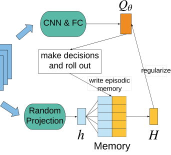

|Col1|Col2|Col3|Col4|Process Process Process s|Col6|Col7|
|---|---|---|---|---|---|---|
|||||Process Process|Process Process|Process Process|
|||||Process Process|Process Process|Process Process|
|||||Process|Process|Process|
|||Process s|Process s|Process s|||
|||Process s|Process s|Process s|||
|||Process s|Process s|Process s|||
||||||||

Figure 1: EMDQN architecture on a single action.

�( _Qθ_ ( _si, ai_ ) _−_ _S_ ( _si, ai_ )) [2]

(6)

min
_θ_

�

( _si,ai,ri,si_ +1 _∈D_ )

+ _λ_ ( _Qθ_ ( _si, ai_ ) _−_ _H_ ( _si, ai_ )) [2][�] _,_

where _D_ represents a mini-batch of experiences.
An issue in Eq. (6) is that we cannot always find the value
of _H_ ( _si, ai_ ) from the episodic memory table during training
since some state-action pairs have not been added into _H_ .
To tackle this problem, we simply ignore the memory target
when ( _s, a_ ) pairs are not found in _H_ . This fits our intuition
because people will never have episodic memory on things
that have not happened.

**Faster reward propagation** EMDQN uses the maximum
return from episodic memory to propagate rewards, compensating the disadvantage of slow-learning resulted by single step reward update. For near-deterministic environments,
each reward contained in episodic memory is by far the optimal. Therefore, using memory target _H_, the rewards in the
best trajectories can be propagated to parameters of _Qθ_ ( _s, a_ ).
Our algorithm differs from Eligibility Trace [Singh and Sutton, 1996] in that it keeps both bootstrapped TD target and
full MC return separately rather than combining _λ_ -return to
form a new target. By learning from both targets, it quickly
propagates unbiased MC return and takes advantage of low
variance from TD target. Notably, episodic memory is more
than unbiased MC return. It provides more concentrated
learning signals and lower-variance targets than vanilla MC
return since the episodic memory records the historical best
MC return.

**Combination** **of** **two** **learning** **models** We combine
episodic memory and DQN to better simulate the learning
process of human brain. The two terms in the objective function (6) represent learning from inference target and episodic
memory target respectively. We can weigh the two learning
models by adjusting the value of _λ_ : when _λ_ is given a small

value, the method is similar to regular DQN; when given a
large value, the method is closer to EC. In this way, we make
flexible use of two learning methods in the learning process.
The value of _λ_ can be adjusted higher appropriately when
memory module is required and can be adjusted lower when
general decision system is needed. Compared with methods
that use a single model, our method is closer to the learning
process of human brain. It is worth noting that EMDQN tackles generalization problem of data-efficient NEC by absorbing state features into neural networks, while NEC has many
redundant state representations in its lookup table in order to
find nearest neighbors.

**High sample efficiency** EMDQN introduces a mechanism
to capture more information of samples. During training, it
distills the best return from episodic memory and incorporates the knowledge into neural network, which makes use
of the samples more efficiently. In the existing RL algorithms, all samples, regardless of the rewards, are sampled
uniformly, which leads to poor training performance because
non-zero rewards seldom appear. By distilling the best return of samples in every training step, our method can give
more updates on non-zero reward samples. Note that our
method differs from prioritized experience replay [Schaul _et_
_al._, 2016]. Prioritized-DQN changes update priority of training samples. Instead, our algorithm changes the update target
for each sample. This cannot be emulated by re-weighting the
transitions in a prioritized-DQN. For example, a state might
appear in multiple high-rewarding traces and thus getting different targets in a prioritized-DQN, while in our approach
there is only a single entry in H for this state.

**3.1** **EMDQN Architecture**

Figure 1 shows the EMDQN architecture. The state _s_ represented by four history frames is processed by convolution
neural networks, and forward-propagated by two fully connected layers to compute _Qθ_ ( _s, a_ ). The overall networks
architecture is the same as the original DQN [Mnih _et al._,
2015]. State _s_ is multiplied by a random matrix drawn
from Gaussian distribution and projected into a vector _h_, and
passed into memory table to look up corresponding value
_H_ ( _s, a_ ), and then _H_ ( _s, a_ ) is used to regularize _Qθ_ ( _s, a_ ). For
efficient table lookup, we use kd-tree [Bentley, 1975] to construct the memory table. All experience tuples ( _φ_ ( _s_ ), a, r)
along each episodic trace are cached. When updating the table, we replay each episodic trace in reverse order. Similar
to the target network in DQN, we maintain a target memory
table to provide stable memory value. The target memory
table is updated at every K training steps using previously
cached transitions. During learning, the gradients from both
value-bootstrapped targets and memory targets in Eq. (6) are
back-propagated to update parameter _θ_ .

**4** **Experiments**

We evaluated EMDQN on the benchmark suite of 57 Atari
2600 games from the arcade learning environment [Bellemare _et al._, 2013]. EMDQN follows all of the networks and
hyper-parameter settings as DQN as presented in [Mnih _et al._,

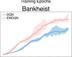

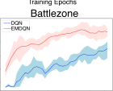

Figure 2: Testing scores for EMDQN(red), DQN(blue) on representative games. The scores are smoothed using moving average over 4
epochs. Each game is run 5 times with different random seeds.

Figure 3: Training curves on 200M frames.

2015]. Rewards are clipped to [ _−_ 1 _,_ 1] when computing the
true discounted return _Rt_ . The coefficient _λ_ was tuned comparing values of _{_ 0.01, 0.05, 0.1, 0.2, 0.5, 1.0 _}_ on the games
‘Alien’, ‘Atlantis’, ‘Beamrider’, ‘Gopher’, ‘Zaxxon’ but we
found that larger value of _λ_ will deteriorate the performance.
Therefore, we finally fix the value of _λ_ at 0.1 to regularize Q
value during training. We suspect that using a dynamic gating
value instead of a fixed _λ_ may give better performance, which
we plan to investigate further in future work. For more efficient table lookup, we use random projection technique and
project the states into vectors where the dimensions _dimh_
equals to 4. Specifically, we generate a matrix with values
drawn from the distribution _N_ (0 _,_ ~~_√_~~ _dim_ 1 _h_ ) and fix the matrix
during training. Our state buffer size is set to 5 Million for
each action, and the recent least updated state will be substituted when the buffer is full. The memory table is updated
in every 10000 training steps. The experiments show that for
most games episodic memory can be found with high probability (often larger than 0.95) during the training process,
which leads to good regularized effect. We clip the gradient
of ( _Qθ_ ( _si, ai_ ) _−_ _S_ ( _si, ai_ )) [2] and ( _Qθ_ ( _si, ai_ ) _−_ _H_ ( _si, ai_ )) [2] in
Eq. (6) to [ _−_ 1 _,_ 1] respectively.

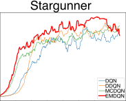

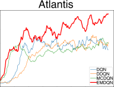

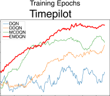

**4.1** **Evaluation**

In the previous work of NEC [Pritzel _et al._, 2017], different
agents trained using 40 Million (40M) frames are compared.
Among the seven methods (include DQN, Q _[∗]_ ( _λ_ ) [Harutyunyan _et al._, 2016], Retrace( _λ_ ) [Munos _et al._, 2016], Prioritized Replay, A3C, NEC, MFEC), the episodic memory
based methods (NEC and MFEC) get state-of-the-art results. For fair comparison, we also train our EMDQN using
40M frames and compare EMDQN with NEC and MFEC to
demonstrate the learning ability at the early training stage.
We train our agent for 40 epochs, each containing 1M
frames. During evaluation, our agent runs for 30 episodes,
each of which lasts up to 5 minutes (which corresponds to
18000 frames), and takes the averaging score as final result.
Following same practice as [Blundell _et al._, 2016], our agent
starts with different initial random conditions by taking 30
no-op operations for each episode to avoid over-fitting. Following [Van Hasselt _et al._, 2016], we use human-normalized
scores to summarize the performance of our algorithm.
We show our results on 40M frames in Table 1 and the
training curves of DQN and EMDQN in Figure 2. Note that
our method trained on 40M frames surpasses DQN trained
on 200M frames and NEC trained on 40M frames. While
it is known that the learning ability of NEC will always decrease with longer training time due to the generalization
problem [Pritzel _et al._, 2017], EMDQN does not suffer from
this problem. We show in Figure 3 that EMDQN can leverage the good generalization property of DQN and can keep
superior learning ability in later training, covering the aforementioned shortage of NEC. We also note that the mean score
of EMDQN surpasses those of all our baselines by a large
margin. This is because our method performs extremely well
on those games that always encounter repeated states (e.g.
VideoPinball, Atlantis, Assault), which has a better match
solving with episodic memory. Since our contribution is orthogonal with other techniques, we believe our approach can
be combined with other DQN-relevant techniques. In addition, we test our algorithms on a variety of Atari benchmarks
to demonstrate the overall performance as opposed to just
cherry-picking a few examples.
We also investigate in the difference between episodic
memory and monte-carlo return. To show their difference,
we demonstrate an additional technique: monte carlo deep qnetworks (MCDQN). MCDQN uses monte-carlo discounted
future return as a substitute of episodic memory to regularize
the DQN. From Figure 3, we observe that EMDQN has better learning ability than MCDQN on the games that we test.
The essential difference between EMDQN and MCDQN is
that EMDQN decouples the monte-carlo return from current
q-networks. Instead, EMDQN stores the best monte-carlo return that the agent has seen. Therefore, we claim that the
interaction shown in Figure 1 between episodic memory and
DQN is crucial.
To see the effects of longer training time, we show the
training curves on 200M frames on four typical games. Since
the curves of NEC and MFEC are publicly unavailable,
we consider the following agents: DQN, DDQN, MCDQN,
EMDQN. Due to time constraint, we only run with different
seeds for 40M training curves. For 200M training curves, we

Mean Median

DQN(40M) 151.2% 52.7%
MFEC(40M) 142.2% 61.9%
NEC(40M) 144.8% 83.3%
**EMDQN(40M)** **528.4%** **92.8** %

DQN(200M) 227.9% 79.1%
DDQN(200M) 330.3% 114.7%

Table 1: Mean and median human-normalized scores at 40 Million
frames over 57 Atari games.

Figure 4: Left column: score curves of DQN and EMDQN; Middle
column: the value of q, y and em of DQN; Right column: the value
of q, y and em of EMDQN.

run all agents with the same seed. We find that EMDQN is
superior to all other agents on both final results and data efficiency by a large margin. We also note that EMDQN outperforms MCDQN, showing the advantage of episodic memory
over vanilla monte-carlo return.

**4.2** **Consistent Learning Targets**

To gain more constructive insights about episodic memory
(EM), we intend to conduct an in-depth analysis for the training process. Since the objective function (6) consists of the
Q-function, the DQN target and the EM target, we denote
them by q, y and em respectively and show their value curves
during training in Figure 4. In the middle column, without the
constraint of episodic memory, the curves of q and y almost
overlap with each other, and the q values always diverge a lot
with the values of episodic memory at the beginning. One
possible reason is that DQN tends to get stuck into a local
minimum and learns a Q-function that goes against the actual episodic memory at the beginning. In contrast, with the
constraint of episodic memory, the trends of q and episodic

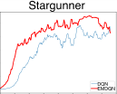

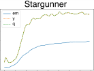

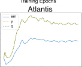

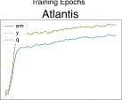

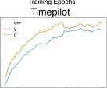

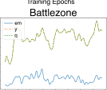

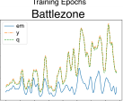

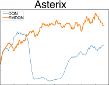

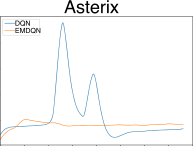

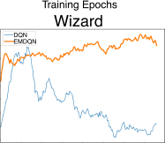

Figure 5: Left column: moving average scores; Right column: Q
value during training.

memory are consistent and keep rising together.
We also find that the variance of q-function curves in
EMDQN is lower than that of DQN in most cases. The agent
can always learn from the best historical trajectory during
training because the episodic memory records it. By doing
so, the variance of learning signals is reduced. In contrast,
the variance of learning signals in DQN is very high as the
signals vary from sample to sample.
We find that the performance of Battlezone decreases
slightly in the later training stage. We suspect that this can
be made up for by reducing the value of _λ_ in the later training
stage since a larger _λ_ can encourage more exploitation and
less exploration. This is an interesting insight which is worth
more discussion in future investigation.

**4.3** **Results on Alleviating Overoptimism**

DQN is known to sometimes learn unrealistically high action
quality values that lead to divergence, because the algorithm
includes a maximization step over estimated action quality
values [Thrun and Schwartz, 1993; Van Hasselt _et al._, 2016].
One solution to the problem is Double-DQN [Van Hasselt
_et al._, 2016], which uses different neural networks for action
selection and Q-value estimation. Although our method does
not focus on alleviating the over-optimism problem, we surprisingly find that EMDQN has the potential to alleviate this
problem by itself. Here we show some examples demonstrating that EMDQN can naturally alleviate overoptimism without using double Q-learning. We run both EMDQN and DQN
for 200 epochs on two games and show their training curves
in Figure 5. Note that in both games, the action-value of DQN
blows up during training, leading to catastrophic drops of
evaluation scores. In contrast, EMDQN does not suffer from
overestimation and the learning is more stable. The reason
is that when Q-function starts to overestimate, the episodic
memory will pull down the Q-value. The degree of pulling
depends on the value of _λ_ . In this paper, we fix the value of _λ_
during training. However, we believe that dynamically controlling the value of _λ_ according to Q-value will give better
results in alleviating overoptimism.

Note that the analysis here is not the major reason for the
improvement of our method. The main contribution in this
paper is sample-efficiency improvement in the early training
stage by using episodic memory to get faster reward propagation.

**5** **Discussion**

Our work is related to the optimality tightening method [He _et_
_al._, 2016] which uses lower and upper bounds as constraints
on the value function. One might argue that the episodic
memory in this paper is a special case of their upper bound.
However, this is not the case. On one hand, the upper bound
in [He _et al._, 2016] is derived using backward reward, while
the episodic memory target in our approach is derived from
forward reward. These two are quite different. Combining
the two methods could make a better use of both backward
and forward reward to get more improvements. On the other
hand, [He _et al._, 2016] considers only local reward propagation, while EMDQN provides full reward propagation.
We use episodic memory aiming to improve performance
of DQN in near-deterministic environment. While in stochastic environment, the episodic term here can also be considered
as a regularizer. EMDQN uses argmax _aQθ_ ( _s, a_ ) for action
selection, which will take expected Q-values into account in
stochastic environment. Moreover, we can dynamically adjust the value of _λ_ to weigh episodic memory learning target.
It will be an interesting future work to consider how to enhance the episodic estimate in stochastic environment.
It should be noted that the combination of the two learning systems is non-trivial. Instead, we are trying to build a
consistent bond between these two methods. The approach
proposed here, building this bond through learning targets, is
simple but quite efficient. We show that this biologically inspired combination is promising in RL research field. To the
best of our knowledge, EMDQN is the first work that combines these two different approaches. It will be interesting to
develop other algorithms to combine a parametric approach
and non-parametric approach in the future.

**6** **Conclusion**

In this paper we show that our algorithm can significantly improve sample efficiency of both deep Q-learning and episodic
control. We also provide an in-depth analysis on how episodic
memory influences the training process of DQN. On top of
major experimental outcomes, we also discover that EMDQN
can also alleviate overoptimism of deep Q-learning by itself.
In the future, there needs to be more research done on how to
1) dynamically tune the value of _λ_ ; 2) apply our method on
stochastic environments; 3) combine parametric control and
non-parametric control.

**References**

[Amarjyoti, 2017] Smruti Amarjyoti. Deep reinforcement
learning for robotic manipulation-the state of the art. _arXiv_
_preprint arXiv:1701.08878_, 2017.

[Bellemare _et al._, 2013] M. G. Bellemare, Y. Naddaf, J. Veness, and M. Bowling. The arcade learning environment:

An evaluation platform for general agents. _Journal of Ar-_
_tificial Intelligence Research_, 47:253–279, jun 2013.

[Bentley, 1975] Jon Louis Bentley. Multidimensional binary
search trees used for associative searching. _Communica-_
_tions of the ACM_, 18(9):509–517, 1975.

[Blundell _et al._, 2016] Charles Blundell, Benigno Uria,
Alexander Pritzel, Yazhe Li, Avraham Ruderman, Joel Z
Leibo, Jack Rae, Daan Wierstra, and Demis Hassabis. Model-free episodic control. _arXiv preprint_
_arXiv:1606.04460_, 2016.

[Gershman and Daw, 2017] Samuel J Gershman and
Nathaniel D Daw. Reinforcement learning and episodic
memory in humans and animals: An integrative framework. _Annual Review of Psychology_, 68:101–128,
2017.

[Gu _et al._, 2016] Shixiang Gu, Timothy Lillicrap, Ilya
Sutskever, and Sergey Levine. Continuous deep qlearning with model-based acceleration. In _Proceedings of_
_The 33rd International Conference on Machine Learning_,
pages 2829–2838, 2016.

[Harutyunyan _et al._, 2016] Anna Harutyunyan, Marc G
Bellemare, Tom Stepleton, and R´emi Munos. Q ( _\_ lambda)
with off-policy corrections. In _International Confer-_
_ence on Algorithmic Learning Theory_, pages 305–320.
Springer, 2016.

[Hasselt, 2010] Hado V Hasselt. Double q-learning. In _Ad-_
_vances in Neural Information Processing Systems_, pages
2613–2621, 2010.

[He _et al._, 2016] Frank S He, Yang Liu, Alexander G
Schwing, and Jian Peng. Learning to play in a day:
Faster deep reinforcement learning by optimality tightening. _arXiv preprint arXiv:1611.01606_, 2016.

[Heess _et al._, 2015] Nicolas Heess, Gregory Wayne, David
Silver, Tim Lillicrap, Tom Erez, and Yuval Tassa. Learning continuous control policies by stochastic value gradients. In _Advances in Neural Information Processing Sys-_
_tems_, pages 2944–2952, 2015.

[Johnson and Lindenstrauss, 1984] William B Johnson and
Joram Lindenstrauss. Extensions of lipschitz mappings
into a hilbert space. _Contemporary mathematics_, 26(189206):1, 1984.

[LeCun _et al._, 1995] Yann LeCun, Yoshua Bengio, et al.
Convolutional networks for images, speech, and time series. _The handbook of brain theory and neural networks_,
3361(10):1995, 1995.

[Lengyel and Dayan, 2007] M´at´e Lengyel and Peter Dayan.
Hippocampal contributions to control: The third way. In
_NIPS_, volume 20, pages 889–896, 2007.

[Lin, 1992] Long-H Lin. Self-improving reactive agents
based on reinforcement learning, planning and teaching.
_Machine learning_, 8(3/4):69–97, 1992.

[Mnih _et al._, 2015] Volodymyr Mnih, Koray Kavukcuoglu,
David Silver, Andrei A Rusu, Joel Veness, Marc G Bellemare, Alex Graves, Martin Riedmiller, Andreas K Fidjeland, Georg Ostrovski, et al. Human-level control through

deep reinforcement learning. _Nature_, 518(7540):529–533,
2015.

[Mnih _et al._, 2016] Volodymyr Mnih, Adria Puigdomenech
Badia, Mehdi Mirza, Alex Graves, Timothy Lillicrap, Tim
Harley, David Silver, and Koray Kavukcuoglu. Asynchronous methods for deep reinforcement learning. In
_International Conference on Machine Learning_, pages
1928–1937, 2016.

[Munos _et al._, 2016] R´emi Munos, Tom Stepleton, Anna
Harutyunyan, and Marc Bellemare. Safe and efficient offpolicy reinforcement learning. In _Advances in Neural In-_
_formation Processing Systems_, pages 1054–1062, 2016.

[Pennartz _et al._, 2011] CMA Pennartz, R Ito, PFMJ Verschure, FP Battaglia, and TW Robbins. The hippocampal–
striatal axis in learning, prediction and goal-directed behavior. _Trends in neurosciences_, 34(10):548–559, 2011.

[Pritzel _et al._, 2017] Alexander Pritzel, Benigno Uria, Sriram Srinivasan, Adri`a Puigdom`enech, Oriol Vinyals,
Demis Hassabis, Daan Wierstra, and Charles Blundell.
Neural episodic control. _arXiv preprint arXiv:1703.01988_,
2017.

[Schaul _et al._, 2016] Tom Schaul, John Quan, Ioannis
Antonoglou, and David Silver. Prioritized experience replay. In _Proceedings of the International Conference on_
_Learning Representations (ICLR)_, 2016.

[Silver _et al._, 2016] David Silver, Aja Huang, Chris J Maddison, Arthur Guez, Laurent Sifre, George Van Den Driessche, Julian Schrittwieser, Ioannis Antonoglou, Veda Panneershelvam, Marc Lanctot, et al. Mastering the game of
go with deep neural networks and tree search. _Nature_,
529(7587):484–489, 2016.

[Singh and Sutton, 1996] Satinder P Singh and Richard S
Sutton. Reinforcement learning with replacing eligibility
traces. _Recent Advances in Reinforcement Learning_, pages
123–158, 1996.

[Sutton, 1991] Richard S Sutton. Dyna, an integrated architecture for learning, planning, and reacting. _ACM SIGART_
_Bulletin_, 2(4):160–163, 1991.

[Thrun and Schwartz, 1993] Sebastian Thrun and Anton
Schwartz. Issues in using function approximation for reinforcement learning. In _Proceedings of the 1993 Con-_
_nectionist Models Summer School Hillsdale, NJ. Lawrence_
_Erlbaum_, 1993.

[Van Hasselt _et al._, 2016] Hado Van Hasselt, Arthur Guez,
and David Silver. Deep reinforcement learning with double q-learning. In _AAAI_, pages 2094–2100, 2016.

[Wang _et al._, 2016] Ziyu Wang, Tom Schaul, Matteo Hessel, Hado van Hasselt, Marc Lanctot, and Nando de Freitas. Dueling network architectures for deep reinforcement
learning. In _Proceedings of The 33rd International Con-_
_ference on Machine Learning_, pages 1995–2003, 2016.

[Watkins and Dayan, 1992] Christopher JCH Watkins and
Peter Dayan. Q-learning. _Machine learning_, 8(3-4):279–
292, 1992.

