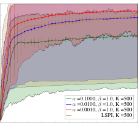

European Workshop on Reinforcement Learning 14 (2018) October 2018, Lille, France.

## **Randomised Bayesian Least-Squares Policy Iteration**

**Nikolaos Tziortziotis** NTZIORZI@GMAIL.COM

_Computer Science Laboratory (LIX)_
_´Ecole Polytechnique, France_

**Christos Dimitrakakis** CHRISTOS.DIMITRAKAKIS@GMAIL.COM

_Department of Informatics_
_University of Oslo, Norway_

**Michalis Vazirgiannis** MVAZIRG@LIX.POLYTECHNIQUE.FR
_LIX, Ecole Polytechnique, France_ _[´]_

_Athens University of Economics and Business, Greece_

**Abstract**

We introduce Bayesian least-squares policy iteration (BLSPI), an off-policy, model-free, policy
iteration algorithm that uses the Bayesian least-squares temporal-difference (BLSTD) learning algorithm to evaluate policies. An online variant of BLSPI has been also proposed, called randomised
BLSPI (RBLSPI), that improves its policy based on an incomplete policy evaluation step. In online
setting, the exploration-exploitation dilemma should be addressed as we try to discover the optimal policy by using samples collected by ourselves. RBLSPI exploits the advantage of BLSTD to
quantify our uncertainty about the value function. Inspired by Thompson sampling, RBLSPI first
samples a value function from a posterior distribution over value functions, and then selects actions
based on the sampled value function. The effectiveness and the exploration abilities of RBLSPI are
demonstrated experimentally in several environments.

**Keywords:** Reinforcement learning, Bayesian reinforcement learning, Bayesian least-squares
temporal-difference, Bayesian least-squares policy-iteration, exploration

**1. Introduction**

In artificial intelligence (AI), our primary objective is to design intelligent agents able to discover
autonomously optimal policies (behaviors) by interacting with their (usually unknown) environment. The reinforcement learning (RL) problem (Sutton and Barto, 1998) is a special case of this
general setting. Least-squares policy iteration (LSPI) (Lagoudakis and Parr, 2003) is a model-free
RL algorithm that is known for its efficient use of training samples and has succeeded in many
challenging control problems. It belongs to the family of policy iteration algorithms, using a variant
of the least-squares temporal difference (LSTD) algorithm (Bradtke and Barto, 1996; Boyan, 2002)
for policy evaluation.
In its original form, LSPI is an offline algorithm that is based on a batch of samples provided
beforehand and have been collected through the interaction of the decision maker with his environment. Nevertheless, most of the problems that encountered on real world are online. An online
version of LSPI has been proposed by Bus¸oniu et al. (2010), that performs policy improvements
once every few transitions have been completed, and updates its policy based on an _incomplete_
evaluation of its current policy. Efficient exploration is one of the main challenges in online learning, as at each time step we have to decide if we will exploit our current knowledge (estimation),
or we will explore our world trying to gain more information about poorly understood/visited states

©2018 .

[License: CC-BY 4.0, see https://creativecommons.org/licenses/by/4.0/.](https://creativecommons.org/licenses/by/4.0/)

TZIORTZIOTIS, DIMITRAKAKIS, AND VAZIRGIANNIS

and actions. This is well-known as the _exploration-exploitation dilemma_ . In online LSPI, authors
have adopted the simple _ϵ−_ greedy exploration strategy (Sutton and Barto, 1998). Before Bus¸oniu
et al. (2010), Li et al. (2009) have introduced RMAX-LSPI algorithm that incorporates the RMAX
exploration technique (Brafman and Tennenholtz, 2003) into LSPI. In contrast to online LSPI that
discards the collected transition samples, RMAX-LSPI algorithm updates its policy based on the
whole set of visited sample transitions (LSPI is fully executed at the end of an episode).

In this work, we propose the Bayesian LSPI (BLSPI) algorithm that constitutes a Bayesian
version of the the standard LSPI algorithm. Instead of the LSTD algorithm used by LSPI for policy
evaluation, BLSPI uses the Bayesian LSTD (BLSTD) algorithm proposed recently by Tziortziotis
and Dimitrakakis (2017). BLSTD adopts a probabilistic model for the empirical Bellman operator
and introduces a prior distribution over the model’s parameters. This gives us the advantage of
probabilistic predictions that quantify our uncertainty over the estimated value function after each
policy evaluation step. We also extend the BLSPI algorithm in the online setting by introducing the
Randomised Bayesian LSPI (RBLSPI) algorithm. Like online LSPI, RBLSPI updates its policies
based on incomplete policy evaluations. To address the exploration problem, RBLSPI exploits the
ability of BLSTD to capture our uncertainty of the value estimates by using Bayesian inference.
Instead of selecting random actions, RBLSPI explores its environment by sampling randomly value
functions from a posterior distribution over value functions. More specifically, RBLSPI samples a
value function after each policy improvement step, that defines the _behavioral policy_ of the agent.
Thereafter, the _behavioral policy_ is followed greedily up to the next policy improvement step that is
performed once every few state transition samples.

This kind of exploration is based on the simple idea of Thompson sampling (Thompson, 1933)
that has been been shown to perform very well in Bayesian reinforcement learning (Strens, 2000;
Ghavamzadeh et al., 2015). In model-based Bayesian RL (Osband et al., 2013; Tziortziotis et al.,
2013, 2014), the agent starts by considering a prior belief over the unknown environment model.
Then, a model from the posterior distribution is randomly sampled, and an optimal policy is calculated w.r.t. the sampled model. This policy is greedily followed thereafter, with the observed samples to be used to update the posterior distribution over models. Recently, Osband et al. (2016) introduced the idea of randomised value functions by proposing the randomised least-squares value iteration (RLSVI) algorithm. RLSVI uses an exploration method that is similar to the one of RBLSPI:
it estimates a Bayesian linear regression model for the value function at the end of each episode,
from the observations made up to this point. This mean that we need to keep in memory the transitions observed through the time, in order to estimate value functions at each episode by building
a “new” Bayesian regression model. Then, a sample from the posterior of the bayesian model over
value functions is obtained, and the greedy policy with respect to it is followed at the next episode.
Due to our different modelling choices, RBLSPI can use all of the previous episodes data history
without the need to keep the observed transitions in memory, and is so more data efficient. The
idea of randomised value functions has been also adopted to deep RL showing that it is an efficient
exploration strategy (Osband et al., 2017; Touati et al., 2018; Azizzadenesheli et al., 2018).

**2. Preliminaries**

We formulate the underlying control problem as a discrete-time _γ_ -discounted _Markov decision pro-_
_cess_ (MDP), _µ ∈M_, defined by the tuple _{S, A, P, R, γ}_, where _S_ is the set of states; _A_ is the
set of available actions; _P_ ( _·|_ _**s**_ _, a_ ) is a transition kernel, specifying the probability of transition from

2

RANDOMISED BAYESIAN LEAST-SQUARES POLICY ITERATION

state _**s**_ _∈S_ to next states by taking action _**a**_ _∈A_ ; _R_ : _S × A →_ R is a reward function and
_γ ∈_ [0 _,_ 1) is a constant discount factor.
We assume that the agent selects its actions based on a deterministic policy, _π_ : _S →A_, which
is a mapping from states to actions; _π_ ( _**s**_ ) _∈A_ denotes the action returned by policy _π_ at state _**s**_ . The
utility of the agent is the discounted sum of future reward, _U_ ≜ [�] _[∞]_ _t_ =0 _[γ][t][r][t]_ [, where] _[ r][t]_ [ =] _[ R]_ [(] _**[s]**_ _[t][, a][t]_ [)]
is the reward received after executing action _at_ at state _**s**_ _t_ . Given MDP _µ_, the agent’s objective is to
discover an optimal policy _π_ _[∗]_ that maximises its expected utility for each possible state _**s**_ : _V_ _[π]_ ( _**s**_ ) ≜
E _[π]_ _µ_ [[] _[U]_ _[|]_ _**[s]**_ [0] [=] _**[ s]**_ []][, where the expectation is getting w.r.t. the agent’s policy] _[ π]_ [ and environment] _[ µ]_ [. In]
the control problem and especially in the case where the model of the environment is unknown, it
is more preferable to consider the action-value function, _Q_ _[π]_ : _S × A →_ R, which given a policy _π_
indicates the expected return obtained by executing action _a_ at state _**s**_, and following the policy _π_
thereafter: _Q_ _[π]_ ( _**s**_ _, a_ ) ≜ E _[π]_ _µ_ [[] _[U]_ _[|]_ _**[s]**_ [0] [=] _**[ s]**_ _[, a]_ [0] [=] _[ a]_ []][.]
It is well-known that the action-value function of a policy _π_ is the unique fixed-point of the
_Bellman operator_ (Puterman, 2005), i.e. _Q_ _[π]_ = _T_ _[π]_ _Q_ _[π]_, with the operator _T_ _[π]_ : ( _S × A_ ) _→_ ( _S × A_ )
to be defined as:
_T_ _[π]_ _Q_ ( _**s**_ _, a_ ) ≜ _r_ ( _**s**_ _, a_ ) + _γ_ _Q_ ( _**s**_ _[′]_ _, π_ ( _**s**_ _[′]_ )) _dP_ ( _**s**_ _[′]_ _|_ _**s**_ _, a_ ) _,_ (1)
� _S_

or in a vector form as: _T_ _[π]_ _Q_ ≜ _R_ + _γP_ _[π]_ _Q,_ where _R ∈_ R _[|S||A|]_ is the reward vector, and _P_ _[π]_ _∈_
R _[|S||A|×|S||A|]_ is the transition matrix induced by the selection of an action and policy _π_ right after.
The optimal action-value function is defined as _Q_ _[∗]_ ( _**s**_ _, a_ ) ≜ sup _π Q_ _[π]_ ( _**s**_ _, a_ ), for each ( _s, a_ ) _∈_
_S × A_ . Given _Q_, a policy is called greedy when _π_ ( _**s**_ ) = arg max _a∈A Q_ ( _**s**_ _, a_ ) _, ∀_ _**s**_ _∈S_ . The greedy
policy w.r.t. the optimal action-value function _Q_ _[∗]_ is optimal, and is denoted by _π_ _[∗]_ . Thus, we need
to determine the optimal action-value function in order to find an optimal policy.

**Policy iteration (Howard, 1960)** Policy iteration is an iterative procedure able to discover the
optimal solution for a given MDP. By starting from an arbitrary policy _π_ 0 (i.e., randomly selected),
it generates a sequence of monotonically improving policies along with their corresponding approximate action-value functions: _Q_ _[π]_ [0] _→_ _π_ 1 _→_ _Q_ _[π]_ [1] _→_ _π_ 2 _→_ _. . ._ . Each iteration _k_ consists of two
successive steps: _policy evaluation_ and _policy improvement_ . In _policy evaluation_ step the actionvalue function _Q_ _[π][k]_ of current policy _πk_ is computed by solving the linear system of the Bellman
equations: _Q_ _[π]_ = ( _**I**_ _−_ _γP_ _[π]_ ) _[−]_ [1] _R_ . Afterwards, _policy improvement_ step generates an improved
greedy policy with respect to the action-value function _Q_ _[π][k]_, i.e., _πk_ +1 = arg max _a∈A Q_ _[π][k]_ ( _**s**_ _, a_ ).
The whole procedure terminates when no further improvements is possible (i.e., _πk_ = _πk−_ 1), with
the policy iteration algorithm to have converge to an optimal policy, _π_ _[∗]_ = _πk_ . In general, policy
iteration converges after a small number of iterations.

**Approximate policy iteration (API)** Despite its merits, policy iteration requires the exact computation and representation of the action-value function. Nevertheless, in general the state and/or
the action spaces is large or infinite (e.g., continuous spaces), making the explicit representation
of the action-value function infeasible. To tackle this problem, a function approximation scheme
is usually employed in the policy evaluation step. This kind of policy iteration is widely known
as _approximate policy iteration_ (API) (see Bertsekas (2011) for a survey). In RL, it is common to
approximate the action-value function _Q_ by considering linear approximation architectures, i.e. a
linear combination of basis functions: _Q_ _[π]_ _**θ**_ [(] _**[s]**_ _[, a]_ [) =] _**[ φ]**_ [(] _**[s]**_ _[, a]_ [)] _[⊤]_ _**[θ]**_ [, where] _**[ θ]**_ _[ ∈]_ [R] _[k]_ [ is a parameter vector]
and _**φ**_ : _S × A →_ R _[k]_ is a function that maps state-action pairs to a feature vector of k components,
_**φ**_ ( _·_ ) = ( _φ_ 1( _·_ ) _, . . ., φk_ ( _·_ )) _[⊤]_ . In that way, the number of parameters ( _k << |S||A|_ ) that need to be

3

TZIORTZIOTIS, DIMITRAKAKIS, AND VAZIRGIANNIS

estimated is much less compared to these required in the case of an exact representation.We also
denote by _F_ the linear function space spanned by the features _φi_, i.e., _F_ = _{f_ _**θ**_ _|f_ _**θ**_ ( _·_ ) = _**φ**_ ( _·_ ) _[⊤]_ _**θ**_ _}_ .
Actually, _F_ contains all the action-value functions that can be represented by the features.

**Least Squares Policy Iteration**

One of the most well-known approximate policy iteration algorithms is that of least-squares policy
iteration (LSPI) (Lagoudakis and Parr, 2003). It is a model-free, off-policy algorithm that uses
the least-squares temporal difference (LSTD) (Bradtke and Barto, 1996) algorithm at the policy
evaluation phase. In practice, LSTD returns the parameters vector _**θ**_ that minimises the _mean-_
_squared projected bellman error_ (MSPBE):

MSPBE( _**θ**_ ) ≜ _∥Q_ _[π]_ _**θ**_ _[−]_ _[ΠT][ π][Q][π]_ _**θ**_ _[∥]_ _Ξ_ [2] _[,]_

where _Ξ_ is a diagonal matrix whose diagonal elements indicate the distribution over _S × A_, and _Π_
is the projection operator onto feature space _F_ . Actually, operator _Π_ projects any value function _**u**_
to its nearest value function onto _F_, such that _Π_ _**u**_ = _Q_ _[π]_ _**θ**_ [where the corresponding parameters are]
the solution on the next least-squares problem: _**θ**_ = arg min _**θ**_ _∥Q_ _[π]_ _**θ**_ _[−]_ _**[u]**_ _[∥]_ _Ξ_ [2] [(Sutton et al., 2009). As]
the parameterisation is linear, we can show that the projection operator is linear and independent
of the parameters _**θ**_ and given by: _Π_ = _ΦC_ _[−]_ [1] _Φ_ _[⊤]_ _Ξ_, where _Φ ∈_ R _[|S||A|×][k]_ is a matrix whose rows
contain the feature vector _**φ**_ ( _**s**_ _, a_ ) _[⊤]_ _, ∀_ ( _**s**_ _, a_ ) _∈S × A_ and _C_ = _Φ_ _[⊤]_ _ΞΦ_ is the Gram matrix.
In practice, the dynamics of the environment _µ_ are unknown and the full feature matrices _Φ_
cannot be formed explicitly in continuous environments. For that purpose, LSTD relies on a batch
of transition samples, which is assuming to be available at our disposal and have been collected
through the interaction of the agent with the generative model: _D_ = _{_ ( _**s**_ _i, ai, ri,_ _**s**_ _[′]_ _i_ [)] _[}][N]_ _i_ =1 [, where]
_**s**_ _[′]_ _i_ _[∼]_ _[P]_ [(] _**[s]**_ _[i][, a][i]_ [)][. Given dictionary] _[ D]_ [, let us define as][ ˜] _[Φ]_ [ = [] _[φ]_ [(] _**[s]**_ [1] _[, a]_ [1][)] _[⊤]_ [;] _[ . . .]_ [ ;] _[ φ]_ [(] _**[s]**_ _[N]_ _[, a][N]_ [)] _[⊤]_ []][ and][ ˜] _[Φ][′]_ [ =]

[ _φ_ ( _**s**_ _[′]_ 1 _[, π]_ [(] _**[s]**_ 1 _[′]_ [))] _[⊤]_ [;] _[ . . .]_ [ ;] _[ φ]_ [(] _**[s]**_ _[′]_ _N_ _[, π]_ [(] _**[s]**_ _[′]_ _N_ [))] _[⊤]_ []][ the sampled feature matrices, and as] _[ R]_ [ = [] _[r][i][, . . ., r][N]_ []] _[⊤]_ [the]
sampled reward vector. Therefore, the empirical MSPBE can be expressed as a standard weighted
least-squares problem:

_ED_ ( _**θ**_ ) ≜ _∥A_ _**θ**_ _−_ _**b**_ _∥_ [2] _C_ ˜ _−_ 1 _[,]_

where _A_ ≜ _Φ_ [˜] _[⊤]_ ( _Φ_ [˜] _−_ _γΦ_ [˜] _[′]_ ), _**b**_ ≜ _Φ_ [˜] _[⊤]_ _R_, and _C_ [˜] ≜ _Φ_ [˜] _[⊤]_ _Φ_ [˜] . Minimising the empirical MSPBE we get that
the optimal solution is given as:

_**θ**_ _[∗]_ = _A_ _[−]_ [1] _**b**_ _._ (2)

It has been shown (Bradtke and Barto, 1996; Lazaric et al., 2010; Nedi´c and Bertsekas, 2003) that
the LSTD solution _Φ_ [˜] _**θ**_ _[∗]_ converges to the fixed-point of _ΠT_ [ˆ] _[π]_ as _N →∞_ . For the rest of the paper,
we denote as _Π_ [ˆ] the sample based feature space projector, called empirical projection. A variant of
the LSTD algorithm that can be considered to have some resemblances to BLSTD (Tziortziotis and
Dimitrakakis, 2017) adopted in our work is the slLSTD proposed by Geist and Pietquin (2010). The
slLSTD algorithm is a statistical linearisation-based generalisation of LSTD that allows considering
nonlinear parameterisations, i.e., neural networks.
After having approximated the action-value function _Q_ _[π]_ _**θ**_ _[k][−]_ [1] of policy _πk−_ 1 ( _policy evaluation_
phase), an improved greedy policy _πk_ is generated ( _policy improvement_ phase). These two steps are
repeated successively at each iteration, until we converge at an optimal policy.

4

RANDOMISED BAYESIAN LEAST-SQUARES POLICY ITERATION

**3. Bayesian Least-Squares Policy Iteration**

In this section, we introduce a Bayesian variant of LSPI algorithm, called BLSPI. Like LSPI, BLSPI
is an offline, model-free and off-policy algorithm that belongs to the family of API algorithms and
can be applied to control problems. In contrast to LSPI, that uses the standard LSTD algorithm at the
policy evaluation step, BLSPI evaluates policies by using a Bayesian version of the LSTD algorithm,
called BLSTD (Tziortziotis and Dimitrakakis, 2017). BLSTD has the advantage of probabilistic
predictions as it quantifies our uncertainty about the value function instead of having only a point
estimate over the unknown value function parameters like in the case of LSTD. In this section,
we present a modified version of the BLSTD algorithm that learns the approximate action-value
function _Q_ _[π]_ of a given policy _π_ instead of the state value function, _V_ . In this way, we are able to
select actions without the knowledge of the environment model.
Similarly to Tziortziotis and Dimitrakakis (2017), we consider the _empirical Bellman operator_
that is given by the standard Bellman operator (1) plus some additive noise _ϵ_ = _N_ (0 _, β_ _[−]_ [1] ):

_T_ ˆ _[π]_ _Q_ _[π]_ _**θ**_ [=] _[ R]_ [ +] _[ γP][ π][Q][π]_ _**θ**_ [+] _[ N,]_ _N ∼_ _N_ (0 _, β_ _[−]_ [1] _**I**_ ) _._

Given a set of transitions _D_, BLSTD seeks the action-value function parameters _**θ**_ that are invariant
w.r.t. the composed operator _Π_ [ˆ] _T_ [ˆ] _[π]_ :

_Q_ _[π]_ _**θ**_ [= ˆ] _[Π]_ [ ˆ] _[T][ π][Q][π]_ _**θ**_ _[⇔]_ _[Φ]_ [˜] _[⊤][R]_ [ = ˜] _[Φ][⊤]_ [( ˜] _[Φ][ −]_ _[γ]_ [ ˜] _[Φ][′]_ [)] _**[θ]**_ [ + ˜] _[Φ][⊤][N.]_

It allows us to treat the empirical MSPBE as a linear regression model:

_**b**_ = _A_ _**θ**_ + _Φ_ [˜] _[⊤]_ _N,_

with its **log likelihood function** to be:

2 _[E][D]_ [(] _**[θ]**_ [)] _[.]_

ln _p_ ( _**b**_ _|_ _**θ**_ _, β_ ) = _[k]_

[1]

2 [ln(] _[|][C]_ [ ˜] _[|]_ [)] _[ −]_ _[k]_ 2

_[k]_

2 [ln(] _[β]_ [)] _[ −]_ [1] 2

_[k]_

2 [ln(2] _[π]_ [)] _[ −]_ _[β]_ 2

It can be easily verified that by setting the gradient of the log likelihood with respect to model’s
parameters _**θ**_ equal to zero, we get the batch LSTD solution (2) ( _maximum likelihood_ solution).
A zero-mean isotropic Gaussian conjugate **prior distribution** over the model parameters _**θ**_
has been also considered, to model the _parametric_ uncertainty (Mannor et al., 2004): _p_ ( _**θ**_ _|α_ ) =
_N_ ( _**θ**_ _|_ 0 _, α_ _[−]_ [1] _**I**_ ), with the log posterior distribution to given as ln _p_ ( _**θ**_ _|D_ ) _∝−_ _[β]_ 2 _[E][D]_ [(] _**[θ]**_ [)] _[ −]_ _[α]_ 2 _**[θ]**_ _[⊤]_ _**[θ]**_ [.]

_N_ ( _**θ**_ _|_ 0 _, α_ _[−]_ [1] _**I**_ ), with the log posterior distribution to given as ln _p_ ( _**θ**_ _|D_ ) _∝−_ _[β]_ 2 _[E][D]_ [(] _**[θ]**_ [)] _[ −]_ _[α]_ 2 _**[θ]**_ _[⊤]_ _**[θ]**_ [.]

Therefore, maximising the posterior distribution w.r.t. _**θ**_ is equivalent to the minimisation of the
MSPBE plus an _ℓ_ 2-penalty ( _λ_ = _α/β_ ). Thus, if we set hyperparameter _α_ to a large value, the total
squared length of the parameter vector _**θ**_ will be encouraged to be small. Completing the squares of
the log of the posterior distribution, we get that the **posterior distribution** is also Gaussian,

_p_ ( _**θ**_ _|D_ ) = _N_ � _**θ**_ _|_ _**m**_ ≜ _βSA_ _[⊤]_ _C_ [˜] _[−]_ [1] _**b**_ _, S_ ≜ ( _α_ _**I**_ + _βA_ _[⊤]_ _C_ [˜] _[−]_ [1] _A_ ) _[−]_ [1][�] _,_ (3)

where matrix _Σ_ ≜ _A_ _[⊤]_ _C_ [˜] _[−]_ [1] _A_ is always positive definite. The **predictive distribution** of the actionvalue function over a new state-action pair, ( _**s**_ _[∗]_ _, a_ _[∗]_ ), is again Gaussian and it is given by:

_p_ ( _Q_ _[π]_ _**θ**_ [(] _**[s]**_ _[∗][, a][∗]_ [)] _[|]_ _**[s]**_ _[∗][, a][∗][,][ D]_ [) =] _[ N]_ [ (] _[Q][π]_ _**θ**_ [(] _**[s]**_ _[∗][, a][∗]_ [)] _[|]_ _**[φ]**_ [(] _**[s]**_ _[∗][, a][∗]_ [)] _[⊤]_ _**[m]**_ _[,]_ _**[ φ]**_ [(] _**[s]**_ _[∗][, a][∗]_ [)] _[⊤][S]_ _**[φ]**_ [(] _**[s]**_ _[∗][, a][∗]_ [))] _[.]_

Finally, the generic bound of approximate policy iteration (Bertsekas and Tsitsiklis, 1996) holds
also for the proposed BLSPI algorithm like in LSPI. Therefore, the performance of the sequence
of policies produced by BLSPI is at most a constant multiple of _δ_ (positive scalar that bounds the
policy evaluation errors over all iterations) away from the optimal one.

5

2 _[E][D]_ [(] _**[θ]**_ [)] _[ −]_ _[α]_ 2

TZIORTZIOTIS, DIMITRAKAKIS, AND VAZIRGIANNIS

**Algorithm 1:** Randomised BLSPI (RBLSPI)

**Input:** Basis _φ_, _γ_, _α_, _β_, _K_
**Initialization:** _A ←_ **0** _k,k,_ _C_ [˜] _←_ **0** _k,k,_ _**b**_ _←_ **0** _k_, _**m**_ _∼_ _N_ ( **0** _k,_ _**I**_ ), _**θ**_ [˜] = _**m**_
**begin**

Observe _**s**_ 0
**for** _t_ = 0 _, . . ._ **do**

_at ∈_ arg max _a∈A φ_ ( _**s**_ _t, a_ ) _**θ**_ [˜] // Take action
Observe _rt_, _**s**_ _t_ +1
_A_ ˜ _←_ _A_ ˜ + _φ_ ( _**s**_ _t, at_ )( _φ_ ( _**s**_ _t, at_ ) _−_ _γφ_ ( _**s**_ _t_ +1 _,_ arg max _a∈A φ_ ( _**s**_ _t_ +1 _, a_ ) _**m**_ )) _[⊤]_
_C ←_ _C_ + _φ_ ( _**s**_ _t, at_ ) _φ_ ( _**s**_ _t, at_ ) _[⊤]_

_**b**_ _←_ _**b**_ + _φ_ ( _**s**_ _t, at_ ) _rt_
**if** ( _t_ mod _K_ == 0) **then**

_S_ = ( _α_ _**I**_ + _βA_ _[⊤]_ _C_ [˜] _[−]_ [1] _A_ ) _[−]_ [1]

_**m**_ = _βSA_ _[⊤]_ _C_ [˜] _[−]_ [1] _**b**_

˜
_**θ**_ _∼_ _N_ ( _**m**_ _, S_ ) // Sample Gaussian posterior (Eq.3)

**4. Randomised Bayesian Least-Squares Policy Iteration**

One of the most challenging tasks in reinforcement learning is the development of an agent able to
adapt its behavior online by interacting with the environment. In this section, we introduce an online
variant of Bayesian LSPI, called randomised BLSPI (RBLSPI). RBLSPI updates the agent’s policy
once every few transition samples based on the samples collected by itself up to this point. Similarly
to online LSPI introduced by Bus¸oniu et al. (2010), RBLSPI carries out policy updates based on
an incomplete evaluation of the current policy. This is a variation of policy iteration named as
_optimistic policy iteration_ (Tsitsiklis, 2003). In contrast to the standard offline BLSPI algorithm, in
the case of RBLSPI algorithm two critical parameters should be considered: i) the number _K ≥_ 1
of collected transitions between successive policy improvements, and ii) the exploration strategy
that should be followed. In the case where the parameter _K_ has been selected to be too large, a bad
policy is highly possible to be used for a long period that could affect the general performance of the
algorithm. On the other hand, if policy is improved after each transition ( _K_ = 1), the running time
of the RBLSPI will be increased making that non applicable in some cases. An extensive analysis
about the impact of the free parameter _K_ in the performance of RBLSPI is presented in appendix.
The design of an efficient exploration strategy constitutes the core of an online agent that updates
its belief based on samples collected by itself. In practice, the agent has to make sure that the collected samples cover the state and action spaces sufficiently. In any other case, the value function of
the unvisited state-action pairs will be poorly estimated leading to imprecise policy improvements.
One of the simplest exploration strategies is that of _ϵ−_ greedy: the agent selects a random action
with probability _ϵ ∈_ [0 _,_ 1] and the greedy action w.r.t. to its value function otherwise. Nevertheless,
it has been shown that it could lead to highly inefficient learning (Osband et al., 2016).
Motivated by Thompson sampling and taking advantage of the BLSTD algorithm that considers
our uncertainty over the estimated action-value function, RBLSPI algorithm explores the environment by sampling the value function randomly instead of selecting random actions. More specifically, a value function is sampled right after each policy evaluation step and actions are selected
greedily based on the sampled value function thereafter. RBLSPI samples a value function by sam

6

RANDOMISED BAYESIAN LEAST-SQUARES POLICY ITERATION

pling the posterior distribution (given by Eq. (3)) over model’s parameters. Therefore, RBLSPI
tends to explore more non frequently selected actions with a highly uncertain value. As learning
process evolves through time, our knowledge about the environment will be enriched as the number
of visited state-action pairs will be increased. Therefore, our confidence about the estimated value
functions will be increased, driving us to act more greedily with the passing of time. The main
advantage of the specific exploration strategy over other strategies, i.e., _ϵ−_ greedy, boltzmann, etc.,
is its ability to identify if a region has sufficiently explored by acting randomly mainly only on the
areas that have not explored adequately yet. Finally, it should be noted that in RBLSPI the free
parameter _K_ has a dual role, as it determines how often we update our policy and select a new
exploration policy. Randomised BLSPI is presented in detail in Algorithm 1.

**5. Experiments**

In this section, we formally present the results about the performance of the online RBLSPI algorithm. Through our analysis, we examine the exploration efficiency of the proposed Randomised
Bayesian LSPI (RBLSPI) algorithm in four well-known continuous state, discrete-action, episodic
domains. Due to space limitations, only a part of our empirical results are presented here. Specifically, we present only results about the mountain car environment and a sparse reward version of
it that requires _deep exploration_ . The full set of our results along with the experimental set-up is
presented in detail in appendix.

In mountain car (Moore, 1990; Sutton and Barto, 1998), our objective is to drive an underpowered car up a steep road to the right hilltop ( _p ≥_ 0 _._ 5) within at most 500 steps. The car state in this
domain is described by two continuous variables, its position ( _p_ ) and its velocity ( _v_ ). At each time
step, the agent can select between three possible actions: forward, reverse and zero throttle. In our
experiments we have considered two different reward signals:

  - In standard mountain car the immediate reward at each step is equal to _−_ 1 except in the case
where the agent reaches the goal (zero reward).

  - The immediate reward is equal to 1 when the episode terminates and zero otherwise (Tang
and Agrawal, 2018). We call this version sparse Mountain car.

In both cases, the car is positioned motionless ( _v_ 0 = 0) to a uniformly randomly selected position
close to the valley ( _−_ 0 _._ 6 _≤_ _p_ 0 _≤−_ 0 _._ 4) at the beginning of each episode. The discount factor is
set to 0 _._ 99. An equidistant 8 _×_ 8 grid of RBFs over the state space plus a constant term is selected.
This set of basis functions is replicated for each action, giving a total of 195 RBFs. In the task of
mountain car the usage of an efficient exploration strategy is of high importance due to the fact that
the goal cannot be easily reached by the agent. The necessity of an effective (deep) exploration
scheme becomes more crucial in the case of the sparse reward mountain car environment. The
empirical results of the RBLSPI algorithm on the the standard and sparse mountain car environments
are presented in Figs 1a and 1b, respectively. Comparisons have been conducted with an onpolicy
variant of online LSPI algorithm that uses the simple _ϵ−_ greedy exploration scheme. In the case of
RBLSPI, we start by using a randomly selected policy (see Alg. 1) at the beginning of each run.
For each experiment, we report the mean performance (average number of steps over 100 episodes)
across 100 independent runs. For each average, we also plot the 95% confidence interval for the
accuracy of the mean estimate with error bars. Additionally, we show the 90% percentile region of
the runs. In the case of RBLSPI algorithm we set precision _β_ equal to 0 _._ 1 and 1000 for the mountain
car and sparse mountain car, respectively, and vary the precision hyperparameter _α_ .

7

TZIORTZIOTIS, DIMITRAKAKIS, AND VAZIRGIANNIS

240

220

200

180

160

140

130

120

110

_α_ =0.0100, _β_ =0.1, K =50
_α_ =0.0010, _β_ =0.1, K =50
_α_ =0.0001, _β_ =0.1, K =50

LSPI, K ~~=50~~

240

220

200

180

160

140

130

120

110

_α_ =0.0100, _β_ =0.1, K =20
_α_ =0.0010, _β_ =0.1, K =20
_α_ =0.0001, _β_ =0.1, K =20

LSPI, K =20

_α_ =100.0000, _β_ =1000.0, K =20

_α_ =10.0000, _β_ =1000.0, K =20

_α_ =1.0000, _β_ =1000.0, K =20

LSPI, K =20

_α_ =100.0000, _β_ =1000.0, K =50

_α_ =10.0000, _β_ =1000.0, K =50

_α_ =1.0000, _β_ =1000.0, K =50

LSPI, K =50

100
0 ~~200~~ ~~400~~ Number of Episodes600 800 1 _,_ 000 1 _,_ 200 1 _,_ 400 1 _,_ 600 1 _,_ 800 2 _,_ 000

100
0 200 ~~4~~ 00 ~~Number of Episodes~~ 600 800 1 _,_ 000 1 _,_ 200 1 _,_ 400 1 _,_ 600 1 _,_ 800 2 _,_ 000

500

450

400

350

300

250

200

150

130

110

1000 20 ~~0~~ 400 600 800 1 _,_ 000 1 _,_ 200 1 ~~_,_~~ ~~4~~ 00 1 _,_ 600 1 _,_ 800 2 _,_ 000

500

450

400

350

300

250

200

150

130

110

1000 200 400 600 800 1 _,_ 000 1 _,_ 200 1 _,_ 400 1 _,_ 600 1 _,_ 800 2 _,_ 000

Number of Episodes

_α_ =100.0000, _β_ =1000.0, K =100

_α_ =10.0000, _β_ =1000.0, K =100

_α_ =1.0000, _β_ =1000.0, K =100

LSPI, K =100

Number of Episodes

_α_ =100.0000, _β_ =1000.0, K =500

_α_ =10.0000, _β_ =1000.0, K =500

_α_ =1.0000, _β_ =1000.0, K =500

LSPI, K =500

240

220

200

180

160

140

130

120

110

_α_ =0.0100, _β_ =0.1, K =100
_α_ =0.0010, _β_ =0.1, K =100
_α_ =0.0001, _β_ =0.1, K =100

LSPI, K =100

240

220

200

180

160

140

130

120

110

_α_ =0.0100, _β_ =0.1, K =500
_α_ =0.0010, _β_ =0.1, K =500
_α_ =0.0001, _β_ =0.1, K =500

LSPI, K =500

100
0 200 400 Number of Episodes600 800 1 _,_ 000 1 _,_ 200 1 _,_ 400 1 _,_ 600 1 _,_ 800 2 _,_ 000

100
0 200 4 ~~00~~ Number of Episodes ~~600~~ 800 1 _,_ 000 1 _,_ 200 1 _,_ 400 1 _,_ 600 1 _,_ 800 2 _,_ 000

500

450

400

350

300

250

200

150

130

110

1000 20 ~~0~~ 400 600 800 1 _,_ 000 1 _,_ 200 1 _,_ 400 1 _,_ 600 1 _,_ 800 2 _,_ 000

500

450

400

350

300

250

200

150

130

110

1000 200 400 600 800 1 _,_ 000 1 _,_ 200 1 _,_ 400 1 _,_ 600 1 _,_ 800 2 _,_ 000

Number of Episodes

Number of Episodes

(a) Mountain C ~~a~~ r

(b) Sparse Mountain Car

Figure 1: Performance of RBLSPI and online LSPI on the environments of Mountain Car and
Sparse Mountain Car for varyi ~~n~~ g parameter _K_ .

Let us first to examine the impact of free parameter _K_ in the performances of both algorithmic
schemes. It should be reminded that parameter _K_ defines the number of transitions that should be
conducted between successive policy improvement steps (see Algorithm 1 for details). The following values have been examined for _K_ : 20, 50, 100 and 500 (end of episode). As it was expected,
the performance of both algorithms is better when _K_ is set to a low value, i.e., _K_ = 20. It should be
also mentioned that even if we set _K_ equal to 500, RBLSPI is able to reach the goal in both environments. We have also examined the impact of precision parameter _α_ on the performance of RBLSPI.
Our experiments show that it is more preferable to be set to a lower value if the parameter _K_ is not
equal to 500 (policy updates are executed only at the end of each episode). Nevertheless, it can be
easily verified that RBLSPI achieves to discover good policies independent of the selection of the
value of the precision _α_ . Our results also validates our claims about the efficiency of the exploration
mechanism of RBLSPI. Actually, RBLSPI outperforms online LSPI in both environments. More
specifically, RBLSPI discovers a near-optimal policy in both environments as our RBLSPI agent is
able to reach the goal in less than 110 steps on average. On the other hand, the online LSPI stuck in
the valley in the case of sparse mountain car, and it doesn’t reach the goal in none of the runs.

**6. Conclusion**

In the present work, we have introduced a fully Bayesian version of the widely used least-squares
policy iteration, called BLSPI. It is achieved by adopted BLSTD in the policy evaluation step of
policy iteration. We further extended BLSPI on an online setting by proposing the RBLSPI algorithm. Taking advantage of the BLSTD algorithm to estimate our uncertainty over the value function
estimations, RBLSPI explores efficiently its environment by sampling randomly value functions instead of selecting random actions. The efficiency of the proposed exploration strategy has been
demonstrated experimentally in four continuous state-space environments, where comparisons have
been conducted with the online LSPI algorithm that uses the simple _ϵ_ -greedy exploration strategy.

8

RANDOMISED BAYESIAN LEAST-SQUARES POLICY ITERATION

**References**

Kamyar Azizzadenesheli, Emma Brunskill, and Animashree Anandkumar. Efficient exploration
through bayesian deep q-networks. _CoRR_, abs/1802.04412, 2018.

Andrew G. Barto, Richard S. Sutton, and Charles W. Anderson. Neuronlike adaptive elements
that can solve difficult learning control problems. _IEEE Transactions on Systems, Man, and_
_Cybernetics_, (5):834–846, 1983.

Dimitri P. Bertsekas. Approximate policy iteration: A survey and some new methods. _Journal of_
_Control Theory and Applications_, 9(3):310–335, 2011.

Dimitri P. Bertsekas and John N. Tsitsiklis. _Neuro-Dynamic Programming_ . Athena Scientific, 1996.

Justin A. Boyan. Technical update: Least-squares temporal difference learning. _Machine Learning_,
49(2):233–246, 2002.

Steven J. Bradtke and Andrew G. Barto. Linear least-squares algorithms for temporal difference
learning. _Machine Learning_, 22(1):33–57, 1996.

Ronen I. Brafman and Moshe Tennenholtz. R-max - a general polynomial time algorithm for nearoptimal reinforcement learning. _Journal of Machine Learning Research_, 3:213–231, 2003. ISSN
1532-4435.

Lucian Bus¸oniu, Damien Ernst, Bart De Schutter, and Robert Babuˇska. Online least-squares policy iteration for reinforcement learning control. In _Proceedings of the 2010 American Control_
_Conference_, pages 486–491, 2010.

Matthieu Geist and Olivier Pietquin. Statistically linearized least-squares temporal differences. In
_International Congress on Ultra Modern Telecommunications and Control Systems_, pages 450–
457, 2010.

Mohammad Ghavamzadeh, Shie Mannor, Joelle Pineau, and Aviv Tamar. Bayesian reinforcement
learning: A survey. _Found. Trends Mach. Learn._, 8(5-6):359–483, 2015.

Ronald A. Howard. _Dynamic Programming and Markov Processes_ . MIT Press, 1960.

Michail G. Lagoudakis and Ronald Parr. Least-squares policy iteration. _The Journal of Machine_
_Learning Research_, 4:1107–1149, 2003.

Alessandro Lazaric, Mohammad Ghavamzadeh, and R´emi Munos. Finite-sample analysis of LSTD.
In _International Conference on Machine Learning_, pages 615–622, 2010.

Lihong Li, Michael L. Littman, and Christopher R. Mansley. Online exploration in least-squares
policy iteration. In _Proceedings of The 8th International Conference on Autonomous Agents and_
_Multiagent Systems (AAMAS)_, pages 733–739, 2009.

Shie Mannor, Duncan Simester, Peng Sun, and John N. Tsitsiklis. Bias and variance in value
function estimation. In _International Conference on Machine Learning_, 2004.

Andrew W. Moore. Efficient memory-based learning for robot control. Technical report, 1990.

9

TZIORTZIOTIS, DIMITRAKAKIS, AND VAZIRGIANNIS

A. Nedi´c and D. P. Bertsekas. Least squares policy evaluation algorithms with linear function
approximation. _Discrete Event Dynamic Systems_, 13(1):79–110, 2003.

Ian Osband, Daniel Russo, and Benjamin Van Roy. (more) efficient reinforcement learning via
posterior sampling. In _Advances in Neural Information Processing Systems 26_, pages 3003–
3011, 2013.

Ian Osband, Benjamin Van Roy, and Zheng Wen. Generalization and exploration via randomized
value functions. In _Proceedings of The 33rd International Conference on Machine Learning_,
pages 2377–2386, 2016.

Ian Osband, Daniel Russo, Zheng Wen, and Benjamin Van Roy. Deep exploration via randomized
value functions. _CoRR_, 2017.

Martin L. Puterman. _Markov Decision Processes : Discrete Stochastic Dynamic Programming_ .
John Wiley & Sons, New Jersey, US, 2005.

Malcolm J. A. Strens. A Bayesian framework for reinforcement learning. In _Proceedings of the_
_Seventeenth International Conference on Machine Learning_, ICML, pages 943–950, 2000.

Richard S. Sutton. Generalization in reinforcement learning: Successful examples using sparse
coarse coding. In _Advances in Neural Information Processing Systems: Proceedings of the 1995_
_Conference_, pages 1038–1044, 1996.

Richard S. Sutton and Andrew G. Barto. _Reinforcement Learning: An Introduction_ . MIT, 1998.

Richard S. Sutton, Hamid Reza Maei, Doina Precup, Shalabh Bhatnagar, David Silver, Csaba
Szepesv´ari, and Eric Wiewiora. Fast gradient-descent methods for temporal-difference learning
with linear function approximation. In _International Conference on Machine Learning_, pages
993–1000, 2009.

Yunhao Tang and Shipra Agrawal. Exploration by distributional reinforcement learning. In _Pro-_
_ceedings of the Twenty-Seventh International Joint Conference on Artificial Intelligence, IJCAI-_
_18_, pages 2710–2716, 2018.

William R. Thompson. On the likelihood that one unknown probability exceeds another in view of
the evidence of two samples. _Biometrika_, 25(3-4):285–294, 1933.

Ahmed Touati, Harsh Satija, Joshua Romoff, Joelle Pineau, and Pascal Vincent. Randomized value
functions via multiplicative normalizing flows. _CoRR_, 2018.

John N. Tsitsiklis. On the convergence of optimistic policy iteration. _The Journal of Machine_
_Learning Research_, 3:59–72, 2003.

Nikolaos Tziortziotis and Christos Dimitrakakis. Bayesian inference for least squares temporal difference regularization. In _Machine Learning and Knowledge Discovery in Databases - European_
_Conference_, pages 126–141, 2017.

Nikolaos Tziortziotis, Christos Dimitrakakis, and Konstantinos Blekas. Linear bayesian reinforcement learning. In _IJCAI 2013, Proceedings of the 23rd International Joint Conference on Artifi-_
_cial Intelligence_, pages 1721–1728, 2013.

10

RANDOMISED BAYESIAN LEAST-SQUARES POLICY ITERATION

Nikolaos Tziortziotis, Christos Dimitrakakis, and Konstantinos Blekas. Cover tree bayesian reinforcement learning. _Journal of Machine Learning Research_, 15(1):2313–2335, 2014. ISSN
1532-4435.

11

TZIORTZIOTIS, DIMITRAKAKIS, AND VAZIRGIANNIS

**Appendix: Empirical Analysis**

In this section, we present the full set of our empirical results about the two proposed RL algorithmic
schemes introduced in our manuscript, BLSPI (Sec. 3) and RBLSPI (Sec. 4). Actually, our empirical
analysis is divided in two main parts:

  - First, we examine the ability of the Bayesian LSPI algorithm to discover the same (or a close)
policy returned by the original LSPI algorithm. For this purpose, we consider the simple
chain walk domain proposed by Lagoudakis and Parr (2003).

  - Second, we examine the exploration efficiency of the proposed Randomised Bayesian LSPI
(RBLSPI) algorithm on four well-known continuous state, discrete-action, episodic domains.
Comparisons have been conducted with the online LSPI algorithm that follows the simple
_ϵ−_ greedy strategy (Bus¸oniu et al., 2010).

**Bayesian LSPI Performance**

As aforementioned, the simple chain walk (Lagoudakis and Parr, 2003) environment has been considered to examine how close the policies returned by the Bayesian LSPI algorithm are to those
returned by the vanilla LSPI algorithm. This is a discrete 20 _−_ state chain [1] with its boundaries to be
dead-ends. There are two noisy available actions, i.e., “left” (L) and “right” (R). The probability of
an action to fail is equal to 0 _._ 1, moving the agent in the opposite direction. A reward of +1 is given
only at the boundaries of the chain (states 1 and 20). The discount factor is set to 0 _._ 9. Similarly to
Lagoudakis and Parr (2003), we have used a polynomial of degree 4 for approximating the value
function for each one of the two actions (10 basis functions in total have been used).
Figure 2 illustrates the policies returned after a single run of BLSPI and LSPI on the chain walk
problem, respectively. In both cases, the initial policy was selected to be the policy that chooses
left action at each state. Furthermore, both algorithms use the same single set of samples (5000
in total) collected from a single episode with the actions to be chosen uniformly at random. The
optimal policy in this domain is to go left in states 1 _−_ 10 and right in states 11 _−_ 20. Therefore,
it can be easily verified that both algorithms need only 6 iterations to discover the optimal policy.
Additionally, this example shows that the performance of BLSPI is quite close to that of LSPI.

**Randomised Bayesian LSPI Performance**

Let us now present our results for the online RBLSPI algorithm that constitutes the main contribution of this work. The main advantage of RBLSPI is its efficient exploration scheme that is based
on the idea of the randomised value function (Osband et al., 2016). To examine the exploration
efficiency of the proposed Randomised Bayesian LSPI (RBLSPI) algorithm, we have considered
four well-known continuous state, discrete-action, episodic domains: i) (sparse) Mountain Car, ii)
Inverted Pendulum, iii) Cart Pole, and iv) Puddle World. Comparisons have been conducted with
an onpolicy variant of online LSPI algorithm that uses the simple _ϵ−_ greedy exploration scheme.
For each experiment, we report the mean performance (average return or number of steps over 100
episodes) across 100 independent runs. For each average, we also plot the 95% confidence interval
for the accuracy of the mean estimate with error bars. Additionally, we show the 90% percentile
region of the runs.

[1. In chain walk domain, we have used the LSPI code which is freely available at: https://www2.cs.duke.edu/](https://www2.cs.duke.edu/research/AI/LSPI/)
[research/AI/LSPI/.](https://www2.cs.duke.edu/research/AI/LSPI/)

12

RANDOMISED BAYESIAN LEAST-SQUARES POLICY ITERATION

1

2

1

2

1

2

10

5

0

_−_ 20

_−_ 40

1

2

1

2

1

2

5 10 15 20

**Iteration2**

5 10 15 20

**Iteration4**

5 10 15 20

**Iteration1**

5 10 15 20

**Iteration3**

1

2

1

2

1

2

5 10 15 20

**Iteration2**

5 10 15 20

**Iteration4**

1

2

1

2

1

2

5 10 15 20

**Iteration1**

5 10 15 20

**Iteration3**

5 10 15 20 5 10

**Iteration5** **Iteration6**

5 10 15 20

5 10 15 20 5 10

**Iteration5** **Iteration6**

5 10 15 20

**Iteration5**

**Iteration5**

0

_−_ 20
_−_ 40
_−_ 60

5 10 15 20

**Iteration2**

8
6
4
2
0 5 10 15 20

**Iteration4**

8
6
4
2
0 5 10 15 20

0 5 10 15 20

**Iteration1**

2

0

5 10 15 20

**Iteration3**

5 10 15 20

**Iteration2**

8
6
4
2
0 5 10 15 20

**Iteration4**

8
6
4
2
0 5 10 15 20

10

5

0 5 10 15 20

**Iteration1**

2

0

5 10 15 20

**Iteration3**

0 5 10 15 20 0 5 10

**Iteration5** **Iteration6**

0 5 10 15 20 0 5 10

**Iteration5** **Iteration6**

**Iteration5**

**Iteration5**

(a) Bayesian LSPI (BLSPI) (b) LSPI

Figure 2: BLSPI and LSPI iterations on the 20 _−_ state chain problem. Top: Improved policy after
each iteration of LSPI and Bayesian LSPI, respectively (R action - yellow shade; L action - blue
shade; BLSPI/LSPI - top stripe; exact - bottom stripe). Bottom: State value function _V_ _[π]_ ( _**s**_ ) of
the policy being evaluated at each iteration (BLSPI/LSPI approximation - solid line; exact values dotted line)

**Mountain Car (Moore, 1990; Sutton and Barto, 1998)** The goal in this task is to drive an
underpowered car up a steep road to the right hilltop ( _p ≥_ 0 _._ 5) within at most 500 steps. The car
state in this domain is described by two continuous variables, its position ( _p_ ) and its velocity ( _v_ ).
At each time step, the agent can select between three possible actions: forward, reverse and zero
throttle. In our experiments we have considered two different reward signals:

  - In standard mountain car the immediate reward at each time step is equal to _−_ 1 except in the
case where the agent reaches the goal (zero reward).

  - The immediate reward is equal to 1 when the episode terminates and zero otherwise (Tang
and Agrawal, 2018). We call this version sparse Mountain car.

In both cases, the car is positioned motionless ( _v_ 0 = 0) to a uniformly randomly selected position
close to the valley ( _−_ 0 _._ 6 _≤_ _p_ 0 _≤−_ 0 _._ 4) at the beginning of each episode. The discount factor is
set to 0 _._ 99. An equidistant 8 _×_ 8 grid of RBFs over the state space plus a constant term is selected.
This set of basis functions is replicated for each action, giving a total of 195 RBFs.
In the task of mountain car the usage of an efficient exploration strategy is of high importance
due to the fact that the goal cannot be easily reached by the agent. The necessity of an effective
(deep) exploration scheme becomes more crucial in the case of the sparse reward mountain car
environment. The empirical results of the RBLSPI and online LSPI algorithms on the the standard and sparse mountain car environments are presented in Figures 3 and 4, respectively. In both
versions of mountain car environment, we have examined the effects in the performance of the
RBLSPI algorithm of varying the precision parameters _α_ and _β_ . Let us first to examine the impact

13

TZIORTZIOTIS, DIMITRAKAKIS, AND VAZIRGIANNIS

240

220

200

180

160

140

130

120

110

240

220

200

180

160

140

130

120

110

240

220

200

180

160

140

130

120

110

_α_ =0.0100, _β_ =0.1, K =50
_α_ =0.0010, _β_ =0.1, K =50
_α_ =0.0001, _β_ =0.1, K =50LSPI, K ~~=50~~

_α_ =0.1000, _β_ =1.0, K =20
_α_ =0.0100, _β_ =1.0, K =20
_α_ =0.0010, _β_ =1.0, K =20

LSPI, K =20

_α_ =0.1000, _β_ =1.0, K =50
_α_ =0.0100, _β_ =1.0, K =50
_α_ =0.0010, _β_ =1.0, K =50LSPI, K ~~=50~~

240

220

200

180

160

140

130

120

110

_α_ =0.0100, _β_ =0.1, K =20
_α_ =0.0010, _β_ =0.1, K =20
_α_ =0.0001, _β_ =0.1, K =20

LSPI, K =20

100
0 ~~200~~ ~~400~~ Number of Episodes600 800 1 _,_ 000 1 _,_ 200 1 _,_ 400 1 _,_ 600 1 _,_ 800 2 _,_ 000

1000 200 ~~4~~ 00 ~~Number of Episodes~~ 600 800 1 _,_ 000 1 _,_ 200 1 _,_ 400 1 _,_ 600 1 _,_ 800 2 _,_ 000

100
0 ~~200~~ 400 Number of Episodes600 800 1 _,_ 000 1 _,_ 200 1 _,_ 400 1 _,_ 600 1 _,_ 800 2 _,_ 000

1000 ~~20~~ 0 ~~4~~ 00 ~~Number of Episodes~~ 600 800 1 _,_ 000 1 _,_ 200 1 _,_ 400 1 _,_ 600 1 _,_ 800 2 _,_ 000

240

220

200

180

160

140

130

120

110

240

220

200

180

160

140

130

120

110

_α_ =0.1000, _β_ =1.0, K =100
_α_ =0.0100, _β_ =1.0, K =100
_α_ =0.0010, _β_ =1.0, K =100

LSPI, K =100

240

220

200

180

160

140

130

120

110

_α_ =0.1000, _β_ =1.0, K =500
_α_ =0.0100, _β_ =1.0, K =500
_α_ =0.0010, _β_ =1.0, K =500

LSPI, K =500

_α_ =0.0100, _β_ =0.1, K =100
_α_ =0.0010, _β_ =0.1, K =100
_α_ =0.0001, _β_ =0.1, K =100

LSPI, K =100

240

220

200

180

160

140

130

120

110

_α_ =0.0100, _β_ =0.1, K =500
_α_ =0.0010, _β_ =0.1, K =500
_α_ =0.0001, _β_ =0.1, K =500

LSPI, K =500

100
0 200 400 Number of Episodes60 ~~0~~ ~~8~~ 00 1 _,_ ~~0~~ 00 1 _,_ 200 1 _,_ 400 1 _,_ 600 1 _,_ 800 2 _,_ 000

1000 200 400 Number of Episodes600 800 1 _,_ 000 1 _,_ 200 1 _,_ 400 1 _,_ 600 1 _,_ 800 2 _,_ 000

1000 200 4 ~~00~~ Number of Episodes ~~600~~ 800 1 _,_ 000 1 _,_ 200 1 _,_ 400 1 _,_ 600 1 _,_ 800 2 _,_ 000

100
0 ~~20~~ 0 400 Number of Episodes600 800 1 _,_ 000 1 _,_ 200 1 _,_ 400 1 _,_ 600 1 _,_ 800 2 _,_ 000

(a) RBLSPI precision par ~~am~~ eter _β_ = 0 _._ 1

(b) RBLSPI precision para ~~m~~ eter _β_ = 1 _._ 0

Figure 3: Performance of RBLSPI and online LSPI on the **mountain car** environment for varying
parameter _K_ . The performan ~~c~~ e of the RBLSPI algorithm is also presented for varying hyperparameters _α_ and _β_ .

of free parameter _K_ in the performances of both algorithmic schemes. It should be reminded that
parameter _K_ defines the number of transitions that should be conducted between successive policy
improvement steps (see Algorithm 1 for details). For this purpose, the following values have been
examined for _K_ : 20, 50, 100 and 500 (end of episode). As it was expected, the performance of both
algorithms is better when _K_ is set equal to a low value, i.e., _K_ = 20. It should be also mentioned
that even if we set _K_ equal to 500, the RBLSPI is able to reach the goal in both environments. We
have also examined the impact of the precision parameter _α_ on the performance of RBLSPI. Our
experiments show that it is more preferable to be set to a lower value if the parameter _K_ is not equal
to 500 (policy updates are executed only at the end of each episode). Nevertheless, it can be easily
seen that RBLSPI achieves to discover good policies independent of the selection of the value of
precision parameter _α_ . Regarding the precision parameter _β_, it impacts a lot the performance of the
RBLSPI. More specifically, the setting of the precision parameter _β_ depends heavily on the reward
signal of the environment. For instance, on sparse mountain car we should set _β_ to a high value in
contrast to the standard mountain car where the best performance is achieved when _β_ is set to 0 _._ 1.
Our results also validates our claims about the efficiency of the exploration mechanism of RBLSPI.
Actually, RBLSPI outperforms online LSPI in both environments. More specifically, RBLSPI discovers a near-optimal policy in both environments as our RBLSPI agent is able to reach the goal in
less than 110 steps on average. On the other hand, the online LSPI stuck in the valley in the case of
sparse mountain car, and it doesn’t reach the goal in none of the runs.

**Inverted Pendulum (Lagoudakis and Parr, 2003)** In this domain our target is to keep a pendulum balanced for 3000 steps by applying forces of a fixed magnitude (50 Newtons). The state space
is described by two continuous variables, the vertical angle ( _θ_ ) and the angular velocity ( _θ_ [˙] ) of the
pendulum. There are three noisy actions where agent can apply to keep the pendulum balanced: no
force, left force or right force. A uniform noise in [ _−_ 10 _,_ 10] is applied to the chosen action. A zero

14

RANDOMISED BAYESIAN LEAST-SQUARES POLICY ITERATION

500

450

400

350

300

250

200

150

130

110

_α_ =10.0000, _β_ =100.0, K =20

_α_ =1.0000, _β_ =100.0, K =20
_α_ =0.1000, _β_ =100.0, K =20

LSPI, K =20

_α_ =10.0000, _β_ =100.0, K =50

_α_ =1.0000, _β_ =100.0, K =50
_α_ =0.1000, _β_ =100.0, K =50

LSPI, K =50

_α_ =100.0000, _β_ =1000.0, K =20

_α_ =10.0000, _β_ =1000.0, K =20

_α_ =1.0000, _β_ =1000.0, K =20

LSPI, K =20

_α_ =100.0000, _β_ =1000.0, K =50

_α_ =10.0000, _β_ =1000.0, K =50

_α_ =1.0000, _β_ =1000.0, K =50

LSPI, K =50

1000 200 400 600 800 1 _,_ 000 1 _,_ 200 1 _,_ 400 1 _,_ 600 1 _,_ 800 2 _,_ 000

500

450

400

350

300

250

200

150

130

110

1000 200 400 600 800 1 _,_ 000 1 _,_ 200 1 _,_ 400 1 _,_ 600 1 _,_ 800 2 _,_ 000

500

450

400

350

300

250

200

150

130

110

1000 20 ~~0~~ 400 600 800 1 _,_ 000 1 _,_ 200 1 ~~_,_~~ ~~4~~ 00 1 _,_ 600 1 _,_ 800 2 _,_ 000

500

450

400

350

300

250

200

150

130

110

1000 200 400 600 800 1 _,_ 000 1 _,_ 200 1 _,_ 400 1 _,_ 600 1 _,_ 800 2 _,_ 000

500

450

400

350

300

250

200

150

130

110

Number of Episodes

_α_ =10.0000, _β_ =100.0, K =100

_α_ =1.0000, _β_ =100.0, K =100
_α_ =0.1000, _β_ =100.0, K =100

LSPI, K =100

Number of Episodes

_α_ =100.0000, _β_ =1000.0, K =100

_α_ =10.0000, _β_ =1000.0, K =100

_α_ =1.0000, _β_ =1000.0, K =100

LSPI, K =100

Number of Episodes

_α_ =10.0000, _β_ =100.0, K =500

_α_ =1.0000, _β_ =100.0, K =500
_α_ =0.1000, _β_ =100.0, K =500

LSPI, K =500

Number of Episodes

_α_ =100.0000, _β_ =1000.0, K =500

_α_ =10.0000, _β_ =1000.0, K =500

_α_ =1.0000, _β_ =1000.0, K =500

LSPI, K =500

1000 200 400 600 800 1 _,_ 000 1 _,_ 200 1 _,_ 400 1 _,_ 600 1 _,_ 800 2 _,_ 000

500

450

400

350

300

250

200

150

130

110

1000 ~~2~~ 00 ~~40~~ 0 600 800 1 _,_ 000 1 _,_ 200 1 _,_ 400 1 _,_ 600 1 _,_ 800 2 _,_ 000

500

450

400

350

300

250

200

150

130

110

1000 20 ~~0~~ 400 600 800 1 _,_ 000 1 _,_ 200 1 _,_ 400 1 _,_ 600 1 _,_ 800 2 _,_ 000

500

450

400

350

300

250

200

150

130

110

1000 200 400 600 800 1 _,_ 000 1 _,_ 200 1 _,_ 400 1 _,_ 600 1 _,_ 800 2 _,_ 000

Number of Episodes

Number of Episodes

Number of Episodes

Number of Episodes

(a) RBLSPI hyperparam ~~e~~ ter _β_ = 100

(b) RBLSPI hyperparameter _β_ = 1000

Figure 4: Performance of RBLSPI and online LSPI on the **sparse reward mountain car** environment for ~~va~~ r ~~y~~ ing parameter _K_ ~~.~~ The performance of the RBLSPI algorithm is also presented for
varying ~~hyp~~ er ~~p~~ arameters _α_ an ~~d~~ ~~_β_~~ .

3 _,_ 000

2 _,_ 800

2 _,_ 600

2 _,_ 400

2 _,_ 200

2 _,_ 000

1 _,_ 800

1 _,_ 600

1 _,_ 400

1 _,_ 200

1 _,_ 000

3 _,_ 000

2 _,_ 800

2 _,_ 600

2 _,_ 400

2 _,_ 200

2 _,_ 000

1 _,_ 800

1 _,_ 600

1 _,_ 400

1 _,_ 200

1 _,_ 000

3 _,_ 000

2 _,_ 800

2 _,_ 600

2 _,_ 400

2 _,_ 200

2 _,_ 000

1 _,_ 800

1 _,_ 600

1 _,_ 400

1 _,_ 200

1 _,_ 000

3 _,_ 000

2 _,_ 800

2 _,_ 600

2 _,_ 400

2 _,_ 200

2 _,_ 000

1 _,_ 800

1 _,_ 600

1 _,_ 400

1 _,_ 200

1 _,_ 000

800
600400200 _ααα_ =0.0100, =0.0010,=0.1000, _β β β_ =1.0, K =3000, rbfs =3 =1.0, K =3000, rbfs =3 =1.0, K =3000, rbfs =3LSPI, K =3000, rbfs =3 _× × × ×_ 3 3 3 3
00 200 400 600 800 1 _,_ 000 1 _,_ 200 1 _,_ 400 1 _,_ 600 1 _,_ 800 2 _,_ 000

800
600400200 _ααα_ =0.1000, =0.0100, =0.0010, _β β β_ =10.0, K =3000, rbfs =3 =10.0, K =3000, rbfs =3 =10.0, K =3000, rbfs =3LSPI, K =3000, rbfs =3 _× × × ×_ 3 3 3 3
00 200 400 600 800 1 _,_ 000 1 _,_ 200 1 _,_ 400 1 _,_ 600 1 _,_ 800 2 _,_ 000

800
600400200 _ααα_ =0.1000, =0.0100, =0.0010, _β β β_ =1.0, K =3000, rbfs =5 =1.0, K =3000, rbfs =5 =1.0, K =3000, rbfs =5LSPI, K =3000, rbfs =5 _× × × ×_ 5 5 5 5
00 200 400 600 800 1 _,_ 000 1 _,_ 200 1 _,_ 400 1 _,_ 600 1 _,_ 800 2 _,_ 000

800
600400200 _ααα_ =0.1000, =0.0100, =0.0010, _β β β_ =10.0, K =3000, rbfs =5 =10.0, K =3000, rbfs =5 =10.0, K =3000, rbfs =5LSPI, K =3000, rbfs =5 _× × × ×_ 5 5 5 5
00 200 400 600 800 1 _,_ 000 1 _,_ 200 1 _,_ 400 1 _,_ 600 1 _,_ 800 2 _,_ 000

_ααα_ =0.0100, =0.0010,=0.1000, _β β β_ =1.0, K =3000, rbfs =3 =1.0, K =3000, rbfs =3 =1.0, K =3000, rbfs =3 _× × ×_ 3 3 3

_ααα_ =0.1000, =0.0100, =0.0010, _β β β_ =10.0, K =3000, rbfs =3 =10.0, K =3000, rbfs =3 =10.0, K =3000, rbfs =3 _× × ×_ 3 3 3

_ααα_ =0.1000, =0.0100, =0.0010, _β β β_ =1.0, K =3000, rbfs =5 =1.0, K =3000, rbfs =5 =1.0, K =3000, rbfs =5 _× × ×_ 5 5 5

_ααα_ =0.1000, =0.0100, =0.0010, _β β β_ =10.0, K =3000, rbfs =5 =10.0, K =3000, rbfs =5 =10.0, K =3000, rbfs =5 _× × ×_ 5 5 5

LSPI, K =3000, rbfs =5 _×_ 5

LSPI, K =3000, rbfs =3 _×_ 3

LSPI, K =3000, rbfs =3 _×_ 3

LSPI, K =3000, rbfs =5 _×_ 5

Number of Episodes

Number of Episodes

Number of Episodes

Number of Episodes

(a) 3 _×_ 3 equidistant grid of RBFs.

(b) 5 _×_ 5 equidistant grid of RBFs.

Figure 5: Performance of RBLSPI and online LSPI on the **inverted pendulum** environment on two
different grids of RBFs. The performance of the RBLSPI algorithm is also presented for varying
hyperparameters _α_ and _β_ .

reward is received at each time step except in the case where the pendulum falls ( _|θ| ≤_ _π/_ 2). If pendulum falls ( _|θ| ≥_ _π/_ 2) the episode ends and a penalty ( _−_ 1) is received. The discount factor of the
process is set equal to 0 _._ 95. Two different grids of RBFs over the state space have been considered
in our analysis, a 3 _×_ 3 and a 5 _×_ 5 equidistant grid. Therefore, the total number of basis functions
at each case is equal to 30 and 78, respectively.
Figure 5 illustrates the performance of the evolution of the policies discovered by RBLSPI
and online LSPI algorithms in the environment of inverted pendulum. More specifically, Figs. 5a
and 5a show the results of our analysis when a 3 _×_ 3 and a 5 _×_ 5 equidistant grid of RBFs is
considered, respectively. It seems that RBLSPI achieves to discover optimal or near-optimal policies
independent of the hyperparameters setting. In the case where we set hyperparameter _β_ equal to
10 _._ 0, our agent performs much better than in the case of _β_ = 1 _._ 0. Also, our analysis indicates that
the agent’s behavior is better by setting _α_ to a high value, i.e. _α_ = 0 _._ 1. It worths also to be noted

15

TZIORTZIOTIS, DIMITRAKAKIS, AND VAZIRGIANNIS

500

450

400

350

300

250

200

150

|Col1|Col2|Col3|
|---|---|---|
|_α_ =0.0100,_ β_ =0.1, K =500 _α_ =0.0010,_ β_ =0.1, K =500 _α_ =0.0001,_ β_ =0.1, K =500 LSPI, K =500|_α_ =0.0100,_ β_ =0.1, K =500 _α_ =0.0010,_ β_ =0.1, K =500 _α_ =0.0001,_ β_ =0.1, K =500 LSPI, K =500|_α_ =0.0100,_ β_ =0.1, K =500 _α_ =0.0010,_ β_ =0.1, K =500 _α_ =0.0001,_ β_ =0.1, K =500 LSPI, K =500|
|_α_ =0.0100,_ β_ =0.1, K =500 _α_ =0.0010,_ β_ =0.1, K =500 _α_ =0.0001,_ β_ =0.1, K =500 LSPI, K =500|0100,_ β_ =0.1, K =500  0010,_ β_ =0.1, K =500  0001,_ β_ =0.1, K =500 LSPI, K =500||

00 200 400 Number of Episodes600 800 1 _,_ 000 1 _,_ 200 1 _,_ 400 1 _,_ 600 1 _,_ 800 2 _,_ 000

500

450

400

350

300

250

200

150

00 200 400 Number of Episodes600 800 1 _,_ 000 1 _,_ 200 1 _,_ 400 1 _,_ 600 1 _,_ 800 2 _,_ 000

Figure 6: Performance of RBLSPI and online LSPI on the **cart pole** environment. The performance
of the RBLSPI algorithm is also presented for varying hyperparameters _α_ and _β_ .

that the RBLSPI outperforms the online LSPI algorithm in both cases (3 _×_ 3 grid (Fig. 5a) and 5 _×_ 5
grid (Fig. 5b)). More specifically, the online LSPI doesn’t achieve to discover the optimal policy
even after 2000 episodes. On the contrary, the RBLSPI algorithm discover an optimal policy after
around 200 episodes if we set the precision parameter _β_ equal to 10 _._ 0.

**Cart Pole (Barto et al., 1983; Sutton and Barto, 1998)** Our objective in this task is to keep a
pole hinged to a cart moving along a track from falling over. The agent controls the system by
applying a force of +1 or _−_ 1 to the cart. The state space is described by four continuous variables:
cart position ( _p_ ), cart velocity ( _v_ ), pole angle ( _θ_ ) from vertical, and pole angular velocity ( _θ_ [˙] ). A
failure occurs even if the pole falls ( _|θ| ≥_ _π/_ 6) or if the cart runs out of the track ( _|p| ≥_ 2 _._ 4). At
each episode, the starting state of the agent is selected uniformly over [ _−_ 0 _._ 05 _,_ 0 _._ 05] [4] . The reward
is equal to +1 for every time step where the pole remains upright and the cart is kept inside the
track. The discount factor is 0 _._ 99 and the maximum number of steps per episode is equal to 500.
An equidistant 3 _×_ 3 grid of RBFs over the state space plus a constant term is selected (164 basis
functions in total).

Figure 6 illustrates the performance of the RBLSPI and the online LSPI algorithms in cart pole
environment. Actually, our experiments show that RBLSPI is able to discover near optimal policies
as it is able to balance the pole for more than 480 steps and to keep the cart on track. Moreover, the
performance of the RBLSPI is much better (especially if we set _β_ to 0 _._ 1) compared to the one of
the online LSPI. It should be also noted that the performances of both the RBLSPI and the online
LSPI are highly correlated to the number of used RBFs. In this way, we intend that the RBLSPI
algorithm will be able to discover the optimal solution in the case where we increase the resolution
of our feature space (i.e., by using a 5 _×_ 5 equidistant grid of RBFs).

**PuddleWorld (Sutton, 1996)** The goal for the agent in this domain is to reach an area located
at the upper right corner, avoiding two puddles. Actually, the agent is located in a continuous
2 _−_ dimensional terrain ([0 _,_ 1] [2] ) that contains two oval puddles. There are four discrete actions: up,
down, left, and right. By selecting an action, the agent moves by 0 _._ 05 in the corresponding direction,
up to the limits of the area. A random white gaussian noise with _std_ = 0 _._ 01 is also added to the
motion along each dimension. A negative reward ( _−_ 1) is received at each time step plus a penalty
between 0 and _−_ 40 (depending on the proximity to the middle of the puddle) in a puddle is entered
by the agent. A new episode starts even if the goal is reached or after 500 time steps. Starting states
are chosen uniformly over [0 _,_ 1] [2] and are considered to be out of a puddle. The discount factor is

16

RANDOMISED BAYESIAN LEAST-SQUARES POLICY ITERATION

_−−−_ 203040

_−_ 60

_−_ 80

_−_ 100

_−_ 120

_−_ 140

_−_ 160

_−_ 180

_−_ 200

_−_ 220

_−_ 240

_−−−_ 203040

_−_ 60

_−_ 80

_−_ 100

_−_ 120

_−_ 140

_−_ 160

_−_ 180

_−_ 200

_−_ 220

_−_ 240

_α_ =0.1000, _β_ =1.0, K =50
_α_ =0.0100, _β_ =1.0, K =50
_α_ =0.0010, _β_ =1.0, K =50

LSPI, K =50

_α_ =0.0100, _β_ =0.1, K =20
_α_ =0.0010, _β_ =0.1, K =20
_α_ =0.0001, _β_ =0.1, K =20

LSPI, K =20

_−−−_ 203040

_−_ 60

_−_ 80

_−_ 100

_−_ 120

_−_ 140

_−_ 160

_−_ 180

_−_ 200

_−_ 220

_−_ 240

_α_ =0.0100, _β_ =0.1, K =50
_α_ =0.0010, _β_ =0.1, K =50
_α_ =0.0001, _β_ =0.1, K =50

LSPI, K =50

_−−−_ 203040

_−_ 60

_−_ 80

_−_ 100

_−_ 120

_−_ 140

_−_ 160

_−_ 180

_−_ 200

_−_ 220

_−_ 240

_α_ =0.1000, _β_ =1.0, K =20
_α_ =0.0100, _β_ =1.0, K =20
_α_ =0.0010, _β_ =1.0, K =20

LSPI, K =20

0 200 400 Number of Episodes600 800 1 _,_ 000 1 _,_ 200 1 _,_ 400 1 _,_ 600 1 _,_ 800 2 _,_ 000

0 200 400 Number of Episodes600 800 1 _,_ 000 1 _,_ 200 1 _,_ 400 1 _,_ 600 1 _,_ 800 2 _,_ 000

0 2 ~~0~~ 0 400 Number of Episodes600 800 1 _,_ 000 1 _,_ 200 1 _,_ 400 1 _,_ 600 1 _,_ 800 2 _,_ 000

0 200 400 Number of Episodes600 800 1 _,_ 000 1 _,_ 200 1 _,_ 400 1 _,_ 600 1 _,_ 800 2 _,_ 000

_−−−_ 203040

_−_ 60

_−_ 80

_−_ 100

_−_ 120

_−_ 140

_−_ 160

_−_ 180

_−_ 200

_−_ 220

_−_ 240

_α_ =0.1000, _β_ =1.0, K =500
_α_ =0.0100, _β_ =1.0, K =500
_α_ =0.0010, _β_ =1.0, K =500

_α_ =0.0100, _β_ =0.1, K =500
_α_ =0.0010, _β_ =0.1, K =500
_α_ =0.0001, _β_ =0.1, K =500

_−−_ 3050

_−_ 100

_−_ 150

_−_ 200

_−_ 250

_−_ 300

_−_ 350

_−_ 400

_−_ 450

_α_ =0.0100, _β_ =0.1, K =100
_α_ =0.0010, _β_ =0.1, K =100
_α_ =0.0001, _β_ =0.1, K =100

LSPI, K =100

_−−_ 3050

_−_ 100

_−_ 150

_−_ 200

_−_ 250

_−_ 300

_−_ 350

_−_ 400

_−_ 450

_−−−_ 203040

_−_ 60

_−_ 80

_−_ 100

_−_ 120

_−_ 140

_−_ 160

_−_ 180

_−_ 200

_−_ 220

_−_ 240

_α_ =0.1000, _β_ =1.0, K =100
_α_ =0.0100, _β_ =1.0, K =100
_α_ =0.0010, _β_ =1.0, K =100

LSPI, K =100

LSPI, K =500

_−_ 5000 200 400 Number of Episodes600 800 1 _,_ 000 1 _,_ 200 1 _,_ 400 1 _,_ 600 1 _,_ 800 2 _,_ 000

0 ~~20~~ 0 400 Number of Episodes600 800 1 _,_ 000 1 _,_ 200 1 _,_ 400 1 _,_ 600 1 _,_ 800 2 _,_ 000

LSPI, K =500

_−_ 5000 200 400 Number of Episodes600 800 1 _,_ 000 1 _,_ 200 1 _,_ 400 1 _,_ 600 1 _,_ 800 2 _,_ 000

0 200 400 Number of Episodes600 800 1 _,_ 000 1 _,_ 200 1 _,_ 400 1 _,_ 600 1 _,_ 800 2 _,_ 000

(a) RBLSPI hyperpara ~~m~~ eter _β_ = 0 _._ 1

(b) RBLSPI hyperparameter _β_ = 1 _._ 0

Figure 7: Performance of RBLSPI and online LSPI o ~~n~~ the **puddle world** environment for varying
para ~~m~~ eter _K_ . The performance of the RBLSPI algorithm is also presented for varying hyperparameters _α_ and _β_ .

_γ_ = 0 _._ 99. An equidistant 8 _×_ 8 grid of RBFs over the state space plus a constant term is selected
(260 basis functions are used in total).
In the puddle world environment, we consider the average undiscounted return received by our
agent at each episode, in contrast to the previous domains where we considered the total number of
steps per episode. Our results for puddle world are presented in Figure 7. Actually, Figure 7a shows
the performance of RBLSPI in the case where _β_ = 0 _._ 1, while Figure 7b corresponds to _β_ = 1 _._ 0. Our
results show that frequent improvement of our policies increase the performance of the proposed
RBLSPI algorithm. This happens due to the fact that after each policy improvement step, we sample
a new exploration policy (followed to select actions thereafter) though the sampling of posterior
distribution over model’s parameters (see Eq.3). In this way, we reinforce the exploration behavior
of our agent. It worths also to be mentioned that the performance of the online LSPI is quite good
in contrast to its performance on the other domains that have been examined previously. Actually,
the onpolicy variant of online LSPI algorithm performs quite close or even better compared to
RBLSPI algorithm. We should also mention that the performance of the original offpolicy (online)
LSPI algorithm (Bus¸oniu et al., 2010) is poor and it cannot discover a good policy even after a
huge number of episodes. The main conclusion of our empirical analysis is that deep exploration
is necessary especially in the case where the reward signal is sparse or the target cannot be easily
reached by the agent.

17

