### **Multi-step Greedy Reinforcement Learning Algorithms**

**Manan Tomar** [* 1] **Yonathan Efroni** [* 2] **Mohammad Ghavamzadeh** [3]

**Abstract**

Multi-step greedy policies have been extensively
used in model-based reinforcement learning (RL),
both when a model of the environment is available

(e.g., in the game of Go) and when it is learned. In
this paper, we explore their benefits in model-free
RL, when employed using multi-step dynamic
programming algorithms: _κ_ -Policy Iteration ( _κ_   PI) and _κ_ -Value Iteration ( _κ_ -VI). These methods
iteratively compute the next policy ( _κ_ -PI) and
value function ( _κ_ -VI) by solving a surrogate decision problem with a shaped reward and a smaller
discount factor. We derive model-free RL algorithms based on _κ_ -PI and _κ_ -VI in which the sur
rogate problem can be solved by any discrete or
continuous action RL method, such as DQN and
TRPO. We identify the importance of a hyperparameter that controls the extent to which the
surrogate problem is solved and suggest a way to
set this parameter. When evaluated on a range of
Atari and MuJoCo benchmark tasks, our results indicate that for the right range of _κ_, our algorithms
outperform DQN and TRPO. This shows that our
multi-step greedy algorithms are general enough
to be applied over any existing RL algorithm and
can significantly improve its performance.

**1. Introduction**

Reinforcement learning (RL) algorithms solve sequential
decision-making problems through repeated interaction with
the environment. By incorporating deep neural networks
into RL algorithms, the field has recently witnessed remarkable empirical success (e.g., Mnih et al., 2015; Lillicrap
et al., 2015; Levine et al., 2016; Silver et al., 2017). Much
of this success has been achieved by model-free RL algorithms, such as Q-learning and policy gradients. These
algorithms are known to suffer from high variance in their

*Equal contribution 1Facebook AI Research, Menlo Park, USA
2Technion, Haifa, Israel 3Google Research, Mountain View, USA.
Correspondence to: Manan Tomar <manan.tomar@gmail.com>.

_Proceedings of the 37_ _[th]_ _International Conference on Machine_
_Learning_, Vienna, Austria, PMLR 119, 2020. Copyright 2020 by
the author(s).

estimations (Greensmith et al., 2004) and to have difficulties
in handling function approximation (e.g., Thrun & Schwartz,
1993; Baird, 1995; Van Hasselt et al., 2016; Lu et al., 2018).
These issues are intensified in decision problems with long
horizon, i.e., when the discount factor, _γ_, is large. Although
using smaller values of _γ_ addresses the discount factordependent issues and leads to more stable algorithms (Petrik
& Scherrer, 2009; Jiang et al., 2015), it does not come for
free, as the algorithm may return a _biased_ solution, i.e., it
may not converge to an optimal (or good) solution for the
original decision problem (the one with larger value of _γ_ ).

Efroni et al. (2018a) recently proposed another approach
to mitigate the _γ_ -dependant instabilities in RL in which
they study multi-step greedy versions of the well-known
Dynamic Programming (DP) algorithms: Policy Iteration
(PI) and Value Iteration (VI) (Bertsekas & Tsitsiklis, 1996).
They also proposed an alternative formulation of the multistep greedy policy, called _κ_ -greedy policy, and studied the
convergence of the resulted PI and VI algorithms: _κ_ -PI and
_κ_ -VI. These algorithms iteratively solve a _γκ_ -discounted
decision problem, whose reward has been shaped by the
solution of the decision problem at the previous iteration.
Unlike the _biased_ solution obtained by solving the decision
problem with a smaller value of _γ_ (discussed above), by iteratively solving decision problems with a shorter _γκ_ horizon,
the _κ_ -PI and _κ_ -VI algorithms could converge to an optimal
policy of the original decision problem.

In this paper, we derive model-free RL algorithms based on
the _κ_ -greedy formulation of multi-step greedy policies. As
mentioned earlier, the main component of this formulation is
(approximately) solving a surrogate decision problem with a
shaped reward and a smaller discount factor. Our algorithms
build on _κ_ -PI and _κ_ -VI, and solve the surrogate decision
problem with the popular deep RL algorithms: Deep QNetwork (DQN) (Mnih et al., 2015) and Trust Region Policy
Optimization (TRPO) (Schulman et al., 2015). We call the
resulting algorithms _κ_ -PI-DQN, _κ_ -VI-DQN, _κ_ -PI-TRPO,
and _κ_ -VI-TRPO, and empirically evaluate and compare
them with DQN, TRPO, and Generalized Advantage Estimation (GAE) (Schulman et al., 2016) on Atari (Bellemare
et al., 2013) and MuJoCo (Todorov et al., 2012) benchmarks. Our results indicate that for the right range of _κ_, our
algorithms outperform DQN and TRPO. This suggests that
the performance of these two deep RL algorithms can be

**Multi-step Greedy Reinforcement Learning Algorithms**

improved by using them as a solver within the multi-step
greedy PI and VI schemes.

Moreover, our results indicate that the success of our algorithms depends on a number of non-trivial design choices. In
particular, we identify the importance of a hyper-parameter
that controls the extent to which the surrogate decision problem is solved, and use the theory of multi-step greedy DP to
derive a recipe for setting this parameter. We show the advantage of using _hard_ over _soft_ updates, verifying the theory
in Efroni et al. (2018b, Thm. 1). By hard and soft update,
we refer to fully solving the surrogate MDP in a model-free
manner and then evaluating the resulting policy (policy improvement and evaluation steps are separated) vs. changing
the policy at each iteration (policy improvement and evaluation steps are concurrent – each improvement is followed
by an evaluation).

We also establish a connection between our multi-step
greedy algorithms and GAE. In particular, we show that
our _κ_ -PI-TRPO algorithm coincides with GAE and we can
obtain GAE by minor modifications to _κ_ -PI-TRPO. Finally,
we show the advantage of using our multi-step greedy algorithms over lowering the discount factor in DQN (valuebased) and TRPO (policy-based) algorithms. Our results
indicate that while lowering the discount factor is detrimental to performance, our multi-step greedy algorithms indeed
improve over DQN and TRPO.

**2. Preliminaries**

In this paper, we assume that the agent’s interaction with the
environment is modeled as a discrete time _γ_ -discounted
Markov Decision Process (MDP), defined by _Mγ_ =
( _S, A, P, R, γ, µ_ ), where _S_ and _A_ are the state and action
spaces; _P ≡_ _P_ ( _s_ _[′]_ _|s, a_ ) is the transition kernel; _R ≡_ _r_ ( _s, a_ )
is the reward function with the maximum value of _R_ max;
_γ ∈_ (0 _,_ 1) is the discount factor; and _µ_ is the initial state
distribution. Let _π_ : _S →P_ ( _A_ ) be a stationary Markovian
policy, where _P_ ( _A_ ) is a probability distribution on the set _A_ .
The value function of a policy _π_ at any state _s ∈S_ is defined
as _V_ _[π]_ ( _s_ ) _≡_ E[ [�] _t_ 0 _[γ][t][r]_ [(] _[s][t][, a][t]_ [)] _[|][s]_ [0][ =] _[ s, π]_ []][, where the ex-]

as _V_ _[π]_ ( _s_ ) _≡_ E[ [�] _t≥_ 0 _[γ][t][r]_ [(] _[s][t][, a][t]_ [)] _[|][s]_ [0][ =] _[ s, π]_ []][, where the ex-]

pectation is over all the randomness in the policy, dynamics,
and rewards. Similarly, the action-value function of _π_ is
defined as _Q_ _[π]_ ( _s, a_ ) = E[ [�] _t_ 0 _[γ][t][r]_ [(] _[s][t][, a][t]_ [)] _[|][s]_ [0][ =] _[ s, a]_ [0][ =]

defined as _Q_ _[π]_ ( _s, a_ ) = E[ [�] _t≥_ 0 _[γ][t][r]_ [(] _[s][t][, a][t]_ [)] _[|][s]_ [0][ =] _[ s, a]_ [0][ =]

_a, π_ ]. Since the rewards are bounded by _R_ max, both _V_ and _Q_
functions have the maximum value of _V_ max = _R_ max _/_ (1 _−_ _γ_ ).
An optimal policy _π_ _[∗]_ is the policy with maximum value at
every state. We call the value of _π_ _[∗]_ the optimal value, and
define it as _V_ _[∗]_ ( _s_ ) = max _π V_ _[π]_ ( _s_ ) _, ∀s ∈S_ . We denote by
_Q_ _[∗]_ ( _s, a_ ), the state-action value of _π_ _[∗]_, and remind that the
following relation holds _V_ _[∗]_ ( _s_ ) = max _a Q_ _[∗]_ ( _s, a_ ), for all
_s_ . The algorithms by which we solve an MDP (obtain an
optimal policy) are mainly based on two popular DP algorithms: Policy Iteration (PI) and Value Iteration (VI). While

VI relies on iteratively computing the optimal Bellman operator _T_ applied to the current value function _V_ (Eq. 1),
PI relies on (iteratively) calculating a 1-step greedy policy
_π_ 1-step w.r.t. to the value function of the current policy _V_
(Eq. 2): for all _s ∈S_, we have

( _T V_ )( _s_ ) = max _a∈A_ [E][[] _[r]_ [(] _[s]_ [0] _[, a]_ [) +] _[ γV]_ [ (] _[s]_ [1][)] _[ |][ s]_ [0][ =] _[ s]_ []] _[,]_ (1)

_π_ 1-step( _s_ ) _∈_ arg max
_a∈A_ [E][[] _[r]_ [(] _[s]_ [0] _[, a]_ [) +] _[ γV]_ [ (] _[s]_ [1][)] _[ |][ s]_ [0][ =] _[ s]_ []] _[.]_ [ (2)]

It is known that _T_ is a _γ_ -contraction w.r.t. the max-norm and
its unique fixed-point is _V_ _[∗]_, and the 1-step greedy policy
w.r.t. _V_ _[∗]_ is an optimal policy _π_ _[∗]_ . In practice, the state space
is often large, and thus, we can only approximately compute
Eqs. 1 and 2, which results in approximate PI (API) and VI
(AVI) algorithms. These approximation errors then propagate through the iterations of the API and AVI algorithms.
However, it has been shown that this (propagated) error can
be controlled (Munos, 2003; 2005; Farahmand et al., 2010),
and after _N_ steps, the algorithms approximately converge
to a solution _πN_, whose difference with the optimal value is
bounded (see e.g., Scherrer, 2014 for API):

_η_ ( _π_ _[∗]_ ) _−_ _η_ ( _πN_ ) _≤_ _Cδ/_ (1 _−_ _γ_ ) [2] + _γ_ _[N]_ _V_ max _._ (3)

In Eq. 3, the scalar _η_ ( _π_ ) = E _s∼µ_ [ _V_ _[π]_ ( _s_ )] is the expected
value function at the initial state, [1] _δ_ represents the periteration error, and _C_ upper-bounds the mismatch between
the sampling distribution and the distribution according to
which the final value function is evaluated ( _µ_ in Eq. 3), depending heavily on the dynamics. Finally, the second term
on the RHS of Eq. 3 is the error due to initial values of
policy/value and decays with the number of iterations _N_ .

**3.** _κ_ **-Greedy Policy:** _κ_ **-PI and** _κ_ **-VI Algorithms**

The optimal Bellman operator _T_ (Eq. 1) and 1-step greedy
policy _π_ 1-step (Eq. 2) can be generalized to their multi-step
versions. The most straightforward form of this generalization is realized by replacing _T_ and _π_ 1-step with _h_ -optimal
Bellman operator and _h_ -step greedy policy (i.e., a lookahead
of horizon _h_ ), respectively. This is done by substituting the
1-step return in Eqs. 1 and 2, _r_ ( _s_ 0 _, a_ ) + _γV_ ( _s_ 1), with the
_h_ -step return, [�] _[h]_ _t_ =0 _[−]_ [1] _[r]_ [(] _[s][t][, a][t]_ [) +] _[ γ][h][V]_ [ (] _[s][h]_ [)][, and computing]
the maximum over actions _a_ 0 _, . . ., ah−_ 1, instead of just
_a_ 0 (Bertsekas & Tsitsiklis, 1996). Efroni et al. (2018a) proposed an alternative form for the multi-step optimal Bellman
operator and greedy policy, called _κ_ -optimal Bellman oper

1Note that the LHS of Eq. 3 is the _ℓ_ 1-norm of ( _V π_ _[∗]_ _−_ _V πN_ )
w.r.t. the initial state distribution _µ_ .

**Multi-step Greedy Reinforcement Learning Algorithms**

ator, _Tκ_, and _κ_ -greedy policy, _πκ_, for _κ ∈_ [0 _,_ 1], i.e.,

( _TκV_ )( _s_ ) = max _π_ E[�( _γκ_ ) _[t]_ _rt_ ( _κ, V_ ) _| s_ 0 = _s, π_ ] _,_ (4)

_t≥_ 0

_πκ_ ( _s_ ) _∈_ arg max _π_ E[�( _γκ_ ) _[t]_ _rt_ ( _κ, V_ ) _| s_ 0 = _s, π_ ] _,_ (5)

_t≥_ 0

for all _s ∈S_ . In Eqs. 4 and 5, the _shaped reward rt_ ( _κ, V_ )
w.r.t. the value function _V_ is defined as

_rt_ ( _κ, V_ ) _≡_ _rt_ + _γ_ (1 _−_ _κ_ ) _V_ ( _st_ +1) _._ (6)

It can be shown that the _κ_ -greedy policy w.r.t. the value
function _V_ is the optimal policy w.r.t. a _κ_ -weighted geometric average of all future _h_ -step returns (from _h_ = 0 to _∞_ ).
This can be interpreted as TD( _λ_ ) (Sutton & Barto, 2018)
for policy improvement (see Efroni et al., 2018a, Sec. 6).
The important difference is that TD( _λ_ ) is used for policy
evaluation and not for policy improvement.

It is easy to see that solving Eqs. 4 and 5 is equivalent to
solving a surrogate _γκ_ -discounted MDP with the shaped
reward _rt_ ( _κ, V_ ), which we denote by _Mγκ_ ( _V_ ) throughout
the paper. The optimal value and policy of the surrogate
MDP _Mγκ_ ( _V_ ) are _TκV_ and the _κ_ -greedy policy _πκ_, respectively. Using the notions of _κ_ -optimal Bellman operator, _Tκ_,
and _κ_ -greedy policy, _πκ_, Efroni et al. (2018a) derived _κ_ -PI
and _κ_ -VI algorithms, whose pseudocodes are shown in Algorithms 1 and 2. _κ_ -PI iteratively _(i)_ evaluates the value _V_ _[π][i]_
of the current policy _πi_, and _(ii)_ sets the new policy, _πi_ +1,
to the _κ_ -greedy policy w.r.t. the value of the current policy
_V_ _[π][i]_, by solving Eq. 5. On the other hand, _κ_ -VI repeatedly applies the _Tκ_ operator to the current value function
_Vi_ (solves Eq. 4) to obtain the next value function, _Vi_ +1,
and returns the _κ_ -greedy policy w.r.t. the final value _VNκ_ .
Note that for _κ_ = 0, the _κ_ -optimal Bellman operator and
_κ_ -greedy policy are equivalent to their 1-step counterparts,
defined by Eqs. 1 and 2, which indicates that _κ_ -PI and _κ_ -VI
are generalizations of the seminal PI and VI algorithms.

**Algorithm 1** _κ_ -Policy Iteration

where _δκ_ and _Cκ_ are quantities similar to _δ_ and _C_ in Eq. 3.
Note that while the second term on the RHS of Eq. 7 decays
with _Nκ_, the first one is independent of _Nκ_ .

**4.** _κ_ **-PI and** _κ_ **-VI based RL Algorithms**

As described in Section 3, implementing _κ_ -PI and _κ_ -VI
requires iteratively solving a _γκ_ -discounted surrogate MDP
with a shaped reward. If a model of the problem is given,
the surrogate MDP can be solved using a DP algorithm (see
Efroni et al., 2018a, Sec. 7). When a model is not available,
we should approximately solve the surrogate MDP using
a model-free RL algorithm. In this paper, we focus on the
latter case and propose RL algorithms inspired by _κ_ -PI and
_κ_ -VI. In our algorithms, we use model-free RL algorithms
DQN (Mnih et al., 2015) and TRPO (Schulman et al., 2015)
(for discrete and continuous action problems, respectively)
as subroutines for estimating a _κ_ -greedy policy (Line 4 in
Alg. 1, _κ_ -PI, and Line 5 in Alg. 2, _κ_ -VI) and an optimal
value of the surrogate MDP (Line 3 in Alg. 2, _κ_ -VI). We
refer to the resulting algorithms as _κ_ -PI-DQN, _κ_ -VI-DQN,
_κ_ -PI-TRPO, and _κ_ -VI-TRPO.

In order to have an efficient implementation of our _κ_ -PI and
_κ_ -VI based algorithms, the main question to answer is how
a fixed number of samples _T_ should be allocated to different
parts of the _κ_ -PI and _κ_ -VI algorithms? More precisely, how
shall we set _Nκ ∈_ N, i.e., the total number of iterations
of our algorithms, and determine the number of samples
to solve the surrogate MDP at each iteration? To answer
these questions, we devise a heuristic approach based on
the theory of _κ_ -PI and _κ_ -VI algorithms, and in particular
Eq. 7. Since _Nκ_ only appears explicitly in the second term
on the RHS of Eq. 7, an appropriate choice of _Nκ_ is such
that _Cκδκ/_ (1 _−_ _γ_ ) [2] _≃_ _ξκ_ _[N][κ][V]_ [max][. Note that setting] _[ N][κ]_ [to]
a higher value would _not_ significantly improve the performance, because the asymptotic term in Eq. 7 is independent

It has been shown that both PI and VI converge to the
optimal value with an exponential rate that depends on
the discount factor _γ_, i.e., _∥V_ _[∗]_ _−_ _V_ _[π][N]_ _∥∞_ _≤_ _O_ ( _γ_ _[N]_ ) (see
e.g., Bertsekas & Tsitsiklis, 1996). Analogously, Efroni et al.
(2018a) showed that _κ_ -PI and _κ_ -VI converge with a faster
exponential rate _ξκ_ = _[γ]_ 1 [(] _−_ [1] _[−]_ _γκ_ _[κ]_ [)] _[≤]_ _[γ]_ [, i.e.,] _[ ∥][V][ ∗]_ _[−]_ _[V][ π][Nκ]_ _[∥]_ _∞_ _[≤]_

_O_ ( _ξκ_ _[N][κ]_ [)][, with the cost that each iteration of these algorithms]
is computationally more expensive than that of PI and VI. Finally, we state the following property of _κ_ -PI and _κ_ -greedy
policies that we use in our _κ_ -PI and _κ_ -VI based RL algorithms described in Section 4:

_Asymptotic performance depends on κ._ Efroni et al. (2018b,
Thm. 5) proved the following bound on the performance of
_κ_ -PI that is similar to the one in Eq. 3 for API:

_η_ ( _π_ _[∗]_ ) _−_ _η_ ( _πNκ_ ) _≤_ _Cκδκ/_ (1 _−_ _γ_ ) [2]
~~�~~ ~~�~~ � ~~�~~
Asymptotic Term

+ _ξκ_ _[N][κ][V]_ [max] _,_ (7)
� ~~��~~ �
Decaying Term

1: **Initialize:** _κ ∈_ [0 _,_ 1], _π_ 0, _Nκ_
2: **for** _i_ = 0 _,_ 1 _, . . ., Nκ −_ 1 **do**
3: _V_ _[π][i]_ = E[ [�] _t≥_ 0 _[γ][t][r][t][ |][ π][i]_ []]

4: _πi_ +1 _←_ arg max _π_ E[ [�] _t≥_ 0 [(] _[κγ]_ [)] _[t][r][t]_ [(] _[κ, V][ π][i]_ [)] _[ |][ π]_ []]

5: **end for**
6: **Return** _πNκ_

**Algorithm 2** _κ_ -Value Iteration

1: **Initialize:** _κ ∈_ [0 _,_ 1], _V_ 0, _Nκ_
2: **for** _i_ = 0 _,_ 1 _, . . ., Nκ −_ 1 **do**
3: _Vi_ +1 = max _π_ E[ [�] _t_ 0 [(] _[γκ]_

3: _Vi_ +1 = max _π_ E[ [�] _t≥_ 0 [(] _[γκ]_ [)] _[t][r][t]_ [(] _[κ, V][i]_ [)] _[ |][ π]_ []]

4: **end for**
5: _πNκ ←_ arg max _π_ E[ [�] _t≥_ 0 [(] _[κγ]_ [)] _[t][r][t]_ [(] _[κ, V][N][κ]_ [)] _[ |]_

_t≥_ 0 [(] _[κγ]_ [)] _[t][r][t]_ [(] _[κ, V][N][κ]_ [)] _[ |][ π]_ []]

6: **Return** _πNκ_

**Multi-step Greedy Reinforcement Learning Algorithms**

of _Nκ_ . In practice, since _δκ_ and _Cκ_ are unknown, we set
_Nκ_ to satisfy the following equality:

_ξκ_ _[N][κ]_ = _C_ FA _,_ (8)

where _C_ FA is a hyper-parameter that depends on the _final-_
_accuracy_ we aim for. For example, if our goal is to obtain
90% accuracy, we would set _C_ FA = 0 _._ 1, which results
in _Nκ_ =0 _._ 99 _≃_ 4 and _Nκ_ =0 _._ 5 _≃_ 115, for _γ_ = 0 _._ 99. Our
experimental results in Section 5 suggest that this approach
leads to a reasonable choice for the total number of iterations

_Nκ_ . It is important to note the following facts: **1)** as we
increase _κ_, we expect less iterations are needed for _κ_ -PI
and _κ_ -VI to converge to a good policy, and **2)** the _effective_
_horizon_ [2] of the surrogate MDP that _κ_ -PI and _κ_ -VI solve at
each iteration increases with _κ_ .

Lastly, we need to determine the number of samples for each
iteration of our _κ_ -PI and _κ_ -VI based algorithms. We allocate
equal number of samples per iteration, denoted by _Tκ_ . Since
the total number of samples, _T_, is known beforehand, we
set the number of samples per iteration to

_Tκ_ = _T/Nκ._ (9)

In the rest of the paper, we first derive our DQN-based and
TRPO-based algorithms in Sections 4.1 and 4.2. It is important to note that for _κ_ = 1, our algorithms are reduced to
DQN and TRPO. We then conduct a set of experiments with
our algorithms in Sections 5.1 and 5.2 in which we carefully
study the effect of _κ_ and _Nκ_ (or equivalently the hyperparameter _C_ FA, defined by Eq. 8) on their performance.

**4.1.** _κ_ **-PI-DQN and** _κ_ **-VI-DQN Algorithms**

Algorithm 3 presents the pseudo-code of _κ_ -PI-DQN. Due
to space constraints, we report the detailed pseudo-code
in Appendix A.1 (Alg. 5). We use four neural networks
in this algorithm, two to represent the _Q_ -function of the
original MDP (with discount factor _γ_ and reward _r_ ), _Qφ_
( _Q_ -network) and _Q_ _[′]_ _φ_ [(target network), and two for the]
_Q_ -function of the surrogate MDP, _Qθ_ ( _Q_ -network) and
_Q_ _[′]_ _θ_ [(target network). In the] _[ policy improvement step]_ [, we]
use DQN to solve the _γκ_ -discounted surrogate MDP with
the shaped reward _rj_ ( _κ, Vφ_ ) = _rj_ + _γ_ (1 _−_ _κ_ ) _Vφ_ ( _sj_ +1),
i.e., _Mγκ_ ( _Vφ_ ), where _Vφ ≃_ _V_ _[π][i][−]_ [1] and is computed as
_Vφ_ ( _s_ ) = _Qφ_ ( _s,_ arg max _a Q_ _[′]_ _θ_ [(] _[s, a]_ [))][. The output of DQN is]
(approximately) the optimal _Q_ -function of _Mγκ_ ( _Vφ_ ), and
thus, the new policy _πi_, which is the (approximate) _κ_ -greedy
policy w.r.t. _Vφ_ is equal to _πi_ ( _·_ ) = arg max _a Q_ _[′]_ _θ_ [(] _[·][, a]_ [)][. In]
the _policy evaluation step_, we use off-policy TD(0) to evaluate the _Q_ -function of the current policy _πi_, i.e., _Qφ ≃_ _Q_ _[π][i]_ .
Although what is needed is an estimate of the value function

2The effective horizon of a _γκ_ -discounted MDP is 1 _/_ (1 _−γκ_ ).

**Algorithm 3** _κ_ -PI-DQN

1: **Initialize** replay buffer _D_ ; _Q_ -networks _Qθ_, _Qφ_ ; target networks _Q_ _[′]_ _θ_ [,] _[ Q][′]_ _φ_ [;]
2: **for** _i_ = 0 _, . . ., Nκ −_ 1 **do**
3: # Policy Improvement
4: **for** _t_ = 1 _, . . ., Tκ_ **do**
5: Act by an _ϵ_ -greedy policy w.r.t. _Qθ_ ( _st, a_ ), observe
_rt, st_ +1, and store ( _st, at, rt, st_ +1) in _D_ ;
6: Sample a batch _{_ ( _sj, aj, rj, sj_ +1) _}_ _[N]_ _j_ =1 [from] _[ D]_ [;]
7: Update _θ_ using DQN with
8: _{_ ( _sj, aj, rj_ ( _κ, Vφ_ ) _, sj_ +1) _}_ _[N]_ _j_ =1 [, where]
9: _Vφ_ ( _sj_ +1) = _Qφ_ ( _sj_ +1 _, πi−_ 1( _sj_ +1)) and
10: _πi−_ 1( _·_ ) _∈_ arg max _a Q_ _[′]_ _θ_ [(] _[·][, a]_ [)][;]
11: Copy _θ_ to _θ_ _[′]_ occasionally ( _θ_ _[′]_ _←_ _θ_ );
12: **end for**
13: # Policy Evaluation of _πi_ ( _s_ ) _∈_ arg max _a Q_ _[′]_ _θ_ [(] _[s, a]_ [)]
14: **for** _t_ = 1 _, . . ., Tκ_ **do**
15: Sample a batch _{_ ( _sj, aj, rj, sj_ +1) _}_ _[N]_ _j_ =1 [from] _[ D]_ [;]
16: Update _φ_ using this data and off-policy TD(0) to estimate
the _Q_ -function of the current policy _πi_ ;
17: Copy _φ_ to _φ_ _[′]_ occasionally ( _φ_ _[′]_ _←_ _φ_ );
18: **end for**

19: **end for**

of the current policy, _Vφ ≃_ _V_ _[π][i]_, we chose to evaluate its _Q_ function, because the available data (the transitions stored in
the replay buffer) is off-policy, and unlike the value function,
the _Q_ -function of a fixed policy can be easily evaluated with
this type of data using off-policy TD(0).

**Remark 1.** _In the policy improvement phase, πi−_ 1 _is com-_
_puted as the_ arg max _of Q_ _[′]_ _θ_ [(] _[·][, a]_ [)] _[ (Line 10), a quantity that]_
_is not constant and is (slowly) changing during this phase._
_Addressing this issue requires using an additional target net-_
_work that is set to Qθ only at the end of each improvement_
_step and its_ arg max _is used to compute πi−_ 1 _throughout_
_the improvement step of the next iteration. We tested using_
_this additional network in our experiments, but it did not_
_improve the performance, and thus, we decided to report_
_the algorithm without it._

We report the pseudo-code of _κ_ -VI-DQN in Appendix A.1
(Alg. 6). Note that _κ_ -VI simply repeats _V ←TκV_ and computes _TκV_, which is the optimal value of the surrogate MDP
_Mγκ_ ( _V_ ). In _κ_ -VI-DQN, we repeatedly solve _Mγκ_ ( _V_ ) by
DQN and use its (approximately) optimal _Q_ -function to
shape the reward of the next iteration. The algorithm uses
three neural networks, two to solve the surrogate MDP by
DQN, _Qθ_ ( _Q_ -network) and _Q_ _[′]_ _θ_ [(target network), and one]
to store its optimal _Q_ -function to use it for the shaped reward in the next iteration, _Qφ_ . Let _Q_ _[∗]_ _γκ,V_ [and] _[ V][ ∗]_ _γκ,V_ [be]
the optimal _Q_ and _V_ functions of _Mγκ_ ( _V_ ). Then, we
have max _a Q_ _[∗]_ _γκ,V_ [(] _[s, a]_ [) =] _[ V][ ∗]_ _γκ,V_ [(] _[s]_ [) = (] _[T][κ][V]_ [ )(] _[s]_ [)][, where]
the first equality is by definition (Sec. 2) and the second one
holds since _TκV_ is the optimal value of _Mγκ_ ( _V_ ) (Sec. 3).
Therefore, in _κ_ -VI-DQN, we shape the reward at each iteration by max _a Qφ_ ( _s, a_ ), where _Qφ_ is the output of the DQN

**Multi-step Greedy Reinforcement Learning Algorithms**

_Breakout_

_SpaceInvaders_

Figure 1: Training performance of the ‘naive’ baseline _Nκ_ = _T_ and _κ_ -PI-DQN, _κ_ -VI-DQN for _CF A_ = 0 _._ 05 on Breakout
(top) and SpaceInvaders (bottom). See Appendix A.2 for performance w.r.t. different _CF A_ values.

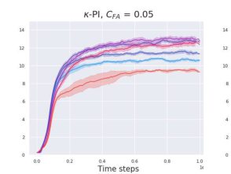

**Algorithm 4** _κ_ -PI-TRPO

1: **Initialize** _V_ -networks _Vθ_ and _Vφ_ ; policy network _πψ_ ;
2: **for** _i_ = 0 _, . . ., Nκ −_ 1 **do**
3: **for** _t_ = 1 _, . . ., Tκ_ **do**
4: Simulate the current policy _πψ_ for _M_ steps and calculate
the following two returns for all steps _j_ :
_Rj_ ( _κ, Vφ_ ) = [�] _[M]_ _t_ = _j_ [(] _[γκ]_ [)] _[t][−][j][r][t]_ [(] _[κ, V][φ]_ [)][ and]
_ρj_ = [�] _[M]_ _t_ = _j_ _[γ][t][−][j][r][t]_ [;]
5: Update _θ_ by minimizing the batch loss function:
_LVθ_ = _N_ 1 � _Nj_ =1 [(] _[V][θ]_ [(] _[s][j]_ [)] _[ −]_ _[R][j]_ [(] _[κ, V][φ]_ [))][2][;]
6: # Policy Improvement
7: Update _ψ_ using TRPO and the batch
_{_ ( _Rj_ ( _κ, Vφ_ ) _, Vθ_ ( _sj_ )) _}_ _[N]_ _j_ =1 [;]
8: **end for**
9: # Policy Evaluation
10: Update _φ_ by minimizing the batch loss function:
_LVφ_ = _N_ 1 � _Nj_ =1 [(] _[V][φ]_ [(] _[s][j]_ [)] _[ −]_ _[ρ][j]_ [)][2][;]
11: **end for**

from the previous iteration, i.e., max _a Qφ_ ( _s, a_ ) _≃TκVi−_ 1 .

**4.2.** _κ_ **-PI-TRPO and** _κ_ **-VI-TRPO Algorithms**

Algorithm 4 presents the pseudo-code of _κ_ -PI-TRPO (a
detailed pseudo-code is reported in Appendix B.1, Alg. 7).
Recall that TRPO iteratively updates the current policy using
its return and an estimate of its value function. At each

iteration _i_ of _κ_ -PI-TRPO: **1)** we use the estimate of the

value of the current policy _Vφ ≃_ _V_ _[π][i][−]_ [1] to calculate the
return _R_ ( _κ, Vφ_ ) and the estimate of the value function _Vθ_ of
the surrogate MDP _Mγκ_ ( _Vφ_ ), **2)** we use _R_ ( _κ, Vφ_ ) and _Vθ_ to
compute the new policy _πi_ (TRPO style), and **3)** we estimate
the value of the new policy _Vφ ≃_ _V_ _[π][i]_ in the original MDP
(with discount factor _γ_ and reward _r_ ). The algorithm uses
three neural networks, one for the value function of the
original MDP, _Vφ_, one for the value function of the surrogate
MDP, _Vθ_, and one for the policy, _πψ_ .

We report the pseudo-code of _κ_ -VI-TRPO in Appendix B.1,
Alg. 8. As previously noted, _κ_ -VI iteratively solves the
surrogate MDP and uses its optimal value _TκVi−_ 1 to shape
the reward of the surrogate MDP in the next iteration. In _κ_ VI-TRPO, we solve the surrogate MDP _Mγκ_ ( _Vi−_ 1 = _Vφ_ )
with TRPO until its policy _πψ_ converges to the optimal
policy of _Mγκ_ ( _Vi−_ 1 = _Vφ_ ) and its value _Vθ_ converges to
_TκVi−_ 1 = _TκVφ_ . We then replace _Vi_ with _Vθ_ ( _Vi_ = _Vφ ←_
_Vθ_ ) and repeat this process.

**5. Experimental Results**

In our experiments, we specifically focus on answering the
following questions:

1. Does the performance of DQN and TRPO improve
when using them as _κ_ -greedy solvers in _κ_ -PI and _κ_   VI? Is there a performance tradeoff w.r.t. to _κ_ ?

**Multi-step Greedy Reinforcement Learning Algorithms**

_Walker-v2_

_Ant-v2_

Figure 2: Training performance of the ‘naive’ baseline _Nκ_ = _T_ and _κ_ -PI-TRPO, _κ_ -VI-TRPO for _CF A_ = 0 _._ 2 on Walker
(top) and Ant (bottom). See Appendix B.2 for performance w.r.t. different _CF A_ values. Each iteration corresponds to
roughly 1000 environment samples, and thus, the total number of training samples is 2 millions.

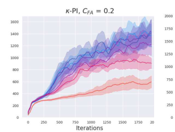

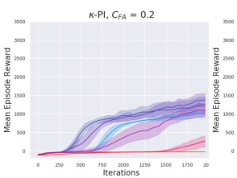

2. Following _κ_ -PI and _κ_ -VI, our DQN and TRPO implementations of these algorithms devote a significant _Tκ_
number of samples to each iteration. Is this needed or
a ‘naive’ choice of _Tκ_ = 1, or equivalently _Nκ_ = _T_,
works just well for all values of _κ_ ?

We choose to test our _κ_ -DQN and _κ_ -TRPO algorithms on
the Atari and MuJoCo benchmarks, respectively. Both of
these algorithms use standard setups, including the use of the
Adam optimizer for performing gradient descent, a discount
factor of 0.99 across all tasks, target _Q_ value networks
in the case of _κ_ -DQN and an entropy regularizer with a
coefficient of 0.01 in the case of _κ_ -TRPO. We choose to
run our experiments for multiple values of _κ_ between zero
and one, which roughly follow a logarithmic scale. Note
that just by using the definition of _κ_ -greedy algorithms, we
reduce to the base cases of DQN and TRPO when setting
_κ_ = 1 _._ 0 for all experiments. This forms as one of the two
baselines we consider in this work. The second baseline

essentially refers to using our _κ_ -greedy algorithms for a
fixed _Nκ_ = _T_ value. Thus, independent of the value of _κ_,
the surrogate MDP is solved for a single time-step per each
iteration. Below, we describe the experiments and results in
further detail. The implementation details for the _κ_ -DQN
and _κ_ -TRPO cases are provided in Appendix A, Table 3 and
Appendix B, Table 4, respectively.

**5.1.** _κ_ **-PI-DQN and** _κ_ **-VI-DQN Experiments**

In this section, we empirically analyze the performance of
the _κ_ -PI-DQN and _κ_ -VI-DQN algorithms on the Atari domains: Breakout, SpaceInvaders, Seaquest, Enduro, BeamRider, and Qbert (Bellemare et al., 2013). We start by performing an ablation test on three values of hyper-parameter
_CF A_ = _{_ 0 _._ 001 _,_ 0 _._ 05 _,_ 0 _._ 2 _}_ on the Breakout domain. The
value of _CF A_ sets the number of samples per iteration _Tκ_
(Eq. 8) and the total number of iterations _Nκ_ (Eq. 9). The
total number of samples is set to _T ≃_ 10 [6] . This value represents the number of samples after which our DQN-based
algorithms approximately converge. For each value of _CF A_,
we test _κ_ -PI-DQN and _κ_ -VI-DQN for several _κ_ values. In
both algorithms, the best performance was obtained with
_CF A_ = 0 _._ 05. Therefore, _CF A_ is set to 0 _._ 05 for all our
experiments with other Atari domains.

Figure 1 shows the training performance of _κ_ -PI-DQN and
_κ_ -VI-DQN on Breakout and SpaceInvaders for the best
value of _CF A_ = 0 _._ 05, as well as for the ‘naive’ baseline
_Tκ_ = 1, or equivalently _Nκ_ = _T_ . The results on Breakout
for the other values of _CF A_ and the training plots for all
other Atari domains (with _CF A_ = 0 _._ 05) are reported in
Appendices A.2 and A.3, respectively. Table 1 shows the
final training performance of _κ_ -PI-DQN and _κ_ -VI-DQN

**Multi-step Greedy Reinforcement Learning Algorithms**

|Domain|Alg .|κbest|κ=0|DQN, κ = 1|N κ = T, κbest (κ-PI)|
|---|---|---|---|---|---|
|Breakout SpaceInv. Seaquest Enduro BeamRider Qbert|_κ_-PI _κ_-VI _κ_-PI _κ_-VI _κ_-PI _κ_-VI _κ_-PI _κ_-VI _κ_-PI _κ_-VI _κ_-PI _κ_-VI|**223(****_±_7),****_ κ_=0.84** 181(_±_7),_ κ_=0.68 **755(****_±_23),****_ κ_=0.84** 712(_±_25),_ κ_=0.92 **5159(****_±_292),****_ κ_=0.92** 3253(_±_402),_ κ_=0.84 **533(****_±_12),****_ κ_=0.84** 486(_±_23),_ κ_=0.84 3849(_±_110),_ κ_=1.0 **4277 (****_±_269),****_ κ_=0.84** **8157(****_±_265),****_ κ_=0.84** **8060 (****_±_158),****_ κ_=0.84**|154(_±_3) 174(_±_5) 613(_±_20) 687(_±_32) 2612(_±_238) 2680(_±_382) 478(_±_10) 443 (_±_90) 3103(_±_279) 3714 (_±_437) 6719(_±_520) 7563 (_±_398)|134(_±_4) 656(_±_17) 3099(_±_191) 224(_±_110) 3849(_±_110) 7258(_±_385)|170(_±_2),_ κ_=0.68 700(_±_21),_ κ_=0.98 3897(_±_218),_ κ_=0.68 **535(****_±_13),****_ κ_=0.68** 3849(_±_110),_ κ_=1.0 **7968(****_±_218),****_ κ_=0.98**|

Table 1: The final training performance of _κ_ -PI-DQN and _κ_ -VI-DQN on the Atari domains, for the hyper-parameter
_CF A_ = 0 _._ 05. The values are reported for a 95% confidence interval across 10 random runs ( _empirical mean ±_ 1.96 _×_
_empirical standard deviation_ / _√n_ = 10). The best scores are in bold and multiple bold values for a domain denote an

insignificant statistical difference between them.

|Domain|Alg .|κbest|κ=0|TRPO, κ = 1|N κ = T, κbest (κ-PI)|GAE, λ best|
|---|---|---|---|---|---|---|
|Walker Ant HalfCheetah HumanoidStand Swimmer Hopper|_κ_-PI _κ_-VI _κ_-PI _κ_-VI _κ_-PI _κ_-VI _κ_-PI _κ_-VI _κ_-PI _κ_-VI _κ_-PI _κ_-VI|**1438(****_±_188),****_ κ_=0.68** 954(_±_88),_ κ_=0.68 1377(_±_183),_ κ_=0.68 **2998(****_±_264),****_ κ_=0.68** **1334(****_±_151),****_ κ_=0.36** **1447(****_±_346),****_ κ_=0.36** **72604(****_±_1219),****_ κ_=0.99** **72821(****_±_908),****_ κ_=0.99** **107(****_±_12),****_ κ_=1.0** **114(****_±_15),****_ κ_=1.0** **1486(****_±_324),****_ κ_=0.68** 1069(_±_76),_ κ_=0.92|1371 (_±_192) 830(_±_262) 1006(_±_106) 1879(_±_128) 907(_±_176) 1072(_±_30) 52936(_±_1529) 51148(_±_1377) 42(_±_3) 46(_±_1) 1012(_±_263) 531(_±_125)|594 (_±_99) -19(_±_1) -18(_±_87) 68143(_±_1031) **107(****_±_12)** 1142(_±_141)|1082(_±_110),_ κ_=0.0 1090(_±_99),_ κ_=0.68 1195(_±_218),_ κ_=0.36 **71331(****_±_1149),****_ κ_=0.98** **107(****_±_12),****_ κ_=1.0** **1434(****_±_129),****_ κ_=0.98**|**1601(****_±_190),****_ λ_=0.0** 1094(_±_139),_ λ_=0.0 **1322(****_±_213),****_ λ_=0.36** **71932(****_±_2122),****_ λ_=0.98** **103(****_±_13),****_ λ_ = 1****_._0** **1600(****_±_134),****_ λ_ = 0****_._84**|

Table 2: The final training performance of _κ_ -PI-TRPO and _κ_ -VI-TRPO on the MuJoCo domains, for the hyper-parameter
_CF A_ = 0 _._ 2. The values are reported for a 95% confidence interval across 10 random runs ( _empirical mean ±_ 1.96 _×_
_empirical standard deviation_ / _√n_ = 10). The best scores are in bold and multiple bold values for a domain denote an

insignificant statistical difference between them.

on the Atari domains with _CF A_ = 0 _._ 05. Note that the
scores reported in Table 1 are the actual returns on the Atari
domains, while the vertical axis in the plots of Figure 1
corresponds to a scaled return. We plot the scaled return,
since this way it can be easier to reproduce our results using
the OpenAI Baselines codebase (Hill et al., 2018).

Our results exhibit that both _κ_ -PI-DQN and _κ_ -VI-DQN
improve the performance of DQN ( _κ_ = 1). Moreover, they
show that setting _Nκ_ = _T_ leads to a clear degradation of
the final training performance on all of the domains except
for Enduro, which gets to approximately the same score.
Although the performance degrades, the results for _Nκ_ = _T_
are still better than for DQN.

**5.2.** _κ_ **-PI-TRPO and** _κ_ **-VI-TRPO Experiments**

In this section, we empirically analyze the performance
of the _κ_ -PI-TRPO and _κ_ -VI-TRPO algorithms on the MuJoCo (Todorov et al., 2012) based OpenAI Gym domains:

Walker2d-v2, Ant-v2, HalfCheetah-v2, HumanoidStandupv2, Swimmer-v2, and Hopper-v2 (Brockman et al., 2016).
As in Section 5.1, we start by performing an ablation test
on the parameter _CF A_ = _{_ 0 _._ 001 _,_ 0 _._ 05 _,_ 0 _._ 2 _}_ on the Walker
domain. We set the total number of iterations to 2000, with
each iteration consisting 1000 samples. Thus, the total number of samples is _T ≃_ 2 _×_ 10 [6] . This is the number of samples after which our TRPO-based algorithms approximately
converge. For each value of _CF A_, we test _κ_ -PI-TRPO and
_κ_ -VI-TRPO for several _κ_ values. In both algorithms, the
best performance was obtained with _CF A_ = 0 _._ 2, and thus,
we set _CF A_ = 0 _._ 2 in our experiments with other MuJoCo
domains.

Figure 2 shows the training performance of _κ_ -PI-TRPO
and _κ_ -VI-TRPO on Walker and Ant domains for the best

value of _CF A_ = 0 _._ 2, as well as for the ‘naive’ baseline
_Tκ_ = 1, or equivalently _Nκ_ = _T_ . The results on Walker
for the other _CF A_ values and the other MuJoCo domains
(with _CF A_ = 0 _._ 2) are reported in Appendices B.2 and B.3,

**Multi-step Greedy Reinforcement Learning Algorithms**

Figure 3: Lowering the discount factor _γ_ for Atari domains Breakout and SpaceInvaders and MuJoCo domains Walker-v2
and Ant-v2

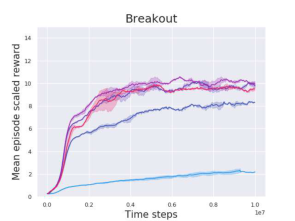

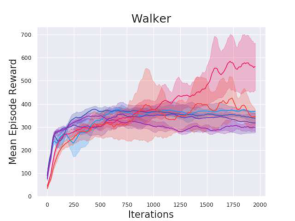

respectively. Table 2 shows the final training performance
of _κ_ -PI-TRPO and _κ_ -VI-TRPO on the MuJoCo domains

with _CF A_ = 0 _._ 2.

The results exhibit that both _κ_ -PI-TRPO and _κ_ -VI-TRPO

yield better performance than TRPO ( _κ_ = 1). Furthermore,
they show that the algorithms with _CF A_ = 0 _._ 2 perform better than with _Nκ_ = _T_ for three out of six domains (Walker,
Ant and HalfCheetah) and equally well for the remaining
three (HumanoidStandup, Swimmer and Hopper).

**6. Discussion and Related Work**

**Comparison with GAE:** There is a close connection between the Generalized Advantage Estimation (GAE) algorithm (Schulman et al., 2016) and _κ_ -PI. In GAE, the policy
is updated by the following gradient:

_∇θ_ E _s∼µ_ � _V_ _[π][θ]_ ( _s_ )� = E _s∼d_ _[µ]_ _π_ � _∇θ_ log _πθ_ ( _s_ ) �( _γλ_ ) _[t]_ _δV_ � _,_

_t_

_δV_ = _rt_ + _γVt_ +1 _−_ _Vt,_ (10)

where _d_ _[µ]_ _π_ [is the occupancy measure of policy] _[ π]_ [. Eq. 10]
can be interpreted as a gradient in a _γλ_ -discounted MDP
with shaped rewards _δV_, which we refer to as _Mγλ_ ( _δV_ ).
As noted in Efroni et al. (2018a, Sec. 6), an optimal policy
_πγλ_ _[∗]_ [of the MDP] _[ M][γλ]_ [(] _[δ][V]_ [ )][ is also optimal in] _[ M][γκ]_ [(] _[V]_ [ )][ with]
_κ_ = _λ_ . This means that _πγλ_ _[∗]_ [is the] _[ κ]_ [-greedy policy w.r.t.] _[ V]_ [ .]

Comparing the two algorithms, we notice that GAE is conceptually similar to _κ_ -PI-TRPO with _Tκ_ = 1, or equivalently _Nκ_ = _T_ . In fact, in the case of _Tκ_ = 1, we can

obtain a pseudo-code of GAE by removing Line 5 (no need
to estimate the value of the surrogate MDP) and replacing
_rt_ ( _κ, Vφ_ ) with the TD-error of the original MDP on Line 4
in Algorithm 4.

In Section 5.2, we compared the empirical performance of
GAE with that of _κ_ -PI-TRPO and _κ_ -VI-TRPO (see Figure 2
and Table 2). The results show that _κ_ -PI-TRPO and _κ_ -VITRPO perform better than or on par with GAE. Moreover,
we observe that in most domains, the performance of GAE
is equivalent to that of _κ_ -PI-TRPO with _Nκ_ = _T_ . This is
in accordance with the description above connecting GAE
to our naive baseline implementation. We report all GAE
results in Appendix B.3.

**Remark 2** (GAE Implementation) **.** _In the OpenAI imple-_
_mentation of GAE, the value network is updated w.r.t. to the_
_target_ [�] _t_ [(] _[γλ]_ [)] _[t][r][t][, whereas in the GAE paper (Schulman]_

**Lowering Discount Factor in DQN and TRPO:** To show
the advantage of _κ_ -PI and _κ_ -VI based algorithms over simply lowering the discount factor _γ_, we test the performance
of the “vanilla” DQN and TRPO algorithms with values of
_γ_ lower than the one previously used (i.e., _γ_ = 0 _._ 99). As evident from Figure 3, only in the Ant domain, this approach
results in an improved performance (for _γ_ = 0 _._ 68). On the
other hand, in the Ant domain, the performance of _κ_ -PITRPO, and especially _κ_ -VI-TRPO, surpasses that of TRPO

_target_ [�] _t_ [(] _[γλ]_ [)] _[t][r][t][, whereas in the GAE paper (Schulman]_

_et al., 2016),_ [�] _t_ _[γ][t][r][t][ is used as the target. We chose the]_

_et al., 2016),_ [�] _t_ _[γ][t][r][t][ is used as the target. We chose the]_

_latter form in our implementation of GAE to be in accord_
_with the paper._

**Multi-step Greedy Reinforcement Learning Algorithms**

with the lower value of _γ_ = 0 _._ 68. In Breakout, SpaceInvaders, and Walker, the performance of DQN and TRPO
worsens or remains unchanged when we lower the discount
factor (DQN and TRPO do not benefit from lowering _γ_ ),
while our _κ_ -PI and _κ_ -VI based algorithms perform better
with lowering the value of _κ_ (note that our algorithms are
reduced to DQN and TRPO for _κ_ = 1).

**Remark 3.** _While we observe better performance for_
_smaller γ values in some MuJoCo domains, e.g., γ_ = 0 _._ 68
_in Ant, lowering γ always results in inferior performance in_
_the Atari domains. This is due to the fact that a number of_
_MuJoCo domains, such as Ant, are inherently short-horizon_
_decision problems, and thus, their performance does not_
_degrade (even sometimes improves) with lowering the dis-_
_count factor. On the other hand, the Atari problems are_
_generally not short-horizon, and thus, their performance_
_degrades with lowering γ._

**7. Conclusion and Future Work**

In this paper, we studied the use of multi-step greedy policies in model-free RL and showed that in most problems,
the algorithms derived from this formulation achieve a better performance than their single-step counterparts. We
adopted the _κ_ -greedy formulation of multi-step greedy policies (Efroni et al., 2018a) and derived four model-free RL
algorithms. The main component of the policy and value
iteration algorithms derived from this formulation, _κ_ -PI and
_κ_ -VI, is solving a surrogate decision problem with a shaped
reward and a smaller discount factor. Our algorithms use
popular deep RL algorithms, DQN and TRPO, to solve the
surrogate decision problem, and thus, we refer to them as _κ_ PI-DQN, _κ_ -VI-DQN, _κ_ -PI-TRPO, and _κ_ -VI-TRPO. We empirically evaluated our proposed algorithms and compared
them with DQN, TRPO, and GAE on Atari and MuJoCo
benchmarks. Our experiments show that for a large range
of _κ_, our algorithms perform better than DQN and TRPO.
Furthermore, we proposed a recipe to allocate the total sample budget to the evaluation and improvement phases of our
algorithms, and empirically demonstrated the importance
of this allocation. We also showed how GAE can be de
rived by minor modifications to _κ_ -PI-TRPO, and thus, is a
_κ_ -greedy RL algorithm. Finally, we showed the advantage
of multi-step greedy formulation over lowering the discount
factor in DQN and TRPO. Our results indicate that while the
performance of DQN and TRPO degrades with lowering the
discount factor, our multi-step greedy algorithms improve
over DQN and TRPO.

An interesting future direction would be to use other multistep greedy formulations (Bertsekas & Tsitsiklis, 1996; Bertsekas, 2018; Efroni et al., 2018a; Sun et al., 2018; Shani
et al., 2019) to derive model-free RL algorithms. Another
direction is to use multi-step greedy in model-based RL

(e.g., Kumar et al., 2016; Talvitie, 2017; Luo et al., 2018;
Janner et al., 2019) and solve the surrogate decision problem with an approximate model. We conjecture that in this
case one may set _κ_ – or more generally, the planning horizon – as a function of the quality of the approximate model:
gradually increasing _κ_ as the approximate model gets closer
to the real one. We leave theoretical and empirical study
of this problem for future work. Finally, we believe using
adaptive _κ_ would greatly improve the performance of our
proposed algorithms. We leave verifying this and how _κ_
should change as a function of errors in gradient and value
estimation for future work.

**References**

Baird, L. Residual algorithms: Reinforcement learning with
function approximation. In _Proceedings of the Twelfth_
_International Conference on Machine Learning_, pp. 30–
37, 1995.

Bellemare, M., Naddaf, Y., Veness, J., and Bowling, M. The
arcade learning environment: An evaluation platform for
general agents. _Journal of Artificial Intelligence Research_,
47:253–279, 2013.

Bertsekas, D. Feature-based aggregation and deep reinforcement learning: A survey and some new implementations.
_Journal of Automatica Sinica_, 6(1):1–31, 2018.

Bertsekas, D. and Tsitsiklis, J. _Neuro-dynamic program-_
_ming_, volume 5. 1996.

Brockman, G., Cheung, V., Pettersson, L., Schneider, J.,
Schulman, J., Tang, J., and Zaremba, W. OpenAI Gym.
_Preprint arXiv:1606.01540_, 2016.

Efroni, Y., Dalal, G., Scherrer, B., and Mannor, S. Beyond
the one step greedy approach in reinforcement learning.
In _Proceedings of the 35th International Conference on_
_Machine Learning_, 2018a.

Efroni, Y., Dalal, G., Scherrer, B., and Mannor, S. Multiplestep greedy policies in approximate and online reinforcement learning. In _Advances in Neural Information Pro-_
_cessing Systems_, pp. 5238–5247, 2018b.

Farahmand, A., Szepesvári, C., and Munos, R. Error propagation for approximate policy and value iteration. In
_Advances in Neural Information Processing Systems_, pp.
568–576, 2010.

Greensmith, E., Bartlett, P., and Baxter, J. Variance reduction techniques for gradient estimates in reinforcement
learning. _Journal of Machine Learning Research_, 5:1471–
1530, 2004.

**Multi-step Greedy Reinforcement Learning Algorithms**

Hill, A., Raffin, A., Ernestus, M., Gleave, A., Kanervisto, A., Traore, R., Dhariwal, P., Hesse, C.,
Klimov, O., Nichol, A., Plappert, M., Radford, A.,
Schulman, J., Sidor, S., and Wu, Y. Stable baselines. [GitHub repository https://github.com/](https://github.com/hill-a/stable-baselines)
[hill-a/stable-baselines, 2018.](https://github.com/hill-a/stable-baselines)

Janner, M., Fu, J., Zhang, M., and Levine, S. When to trust
your model: Model-based policy optimization. _arXiv_
_preprint arXiv:1906.08253_, 2019.

Jiang, N., Kulesza, A., Singh, S., and Lewis, R. The dependence of effective planning horizon on model accuracy.
In _Proceedings of the International Conference on Au-_
_tonomous Agents and Multiagent Systems_, pp. 1181–1189,
2015.

Kumar, V., Todorov, E., and Levine, S. Optimal control
with learned local models: Application to dexterous manipulation. In _International Conference on Robotics and_
_Automation_, pp. 378–383, 2016.

Levine, S., Finn, C., Darrell, T., and Abbeel, P. End-to-end
training of deep visuomotor policies. _Journal of Machine_
_Learning Research_, 17(1):1334–1373, 2016.

Lillicrap, T., Hunt, J., Pritzel, A., Heess, N., Erez, T., Tassa,
Y., Silver, D., and Wierstra, D. Continuous control with
deep reinforcement learning. _Preprint arXiv:1509.02971_,
2015.

Lu, T., Schuurmans, D., and Boutilier, C. Non-delusional
Q-learning and value iteration. In _Proceedings of the_
_International Conference on Neural Information Process-_
_ing Systems_, pp. 9971–9981, 2018.

Luo, Y., Xu, H., Li, Y., Tian, Y., Darrell, T., and Ma,
T. Algorithmic framework for model-based deep reinforcement learning with theoretical guarantees. _Preprint_
_arXiv:1807.03858_, 2018.

Mnih, V., Kavukcuoglu, K., Silver, D., Rusu, A. A., Veness,
J., Bellemare, M., Graves, A., Riedmiller, M., Fidjeland,
A., Ostrovski, G., et al. Human-level control through deep
reinforcement learning. _Nature_, 518(7540):529, 2015.

Munos, R. Error bounds for approximate policy iteration. In
_Proceedings of the International Conference on Machine_
_Learning_, pp. 560–567, 2003.

Munos, R. Error bounds for approximate value iteration.
In _Proceedings of the National Conference on Artificial_
_Intelligence_, pp. 1006–1011, 2005.

Petrik, M. and Scherrer, B. Biasing approximate dynamic
programming with a lower discount factor. In _Advances_
_in neural information processing systems_, pp. 1265–1272,
2009.

Scherrer, B. Approximate policy iteration schemes: a comparison. In _International Conference on Machine Learn-_
_ing_, pp. 1314–1322, 2014.

Schulman, J., Levine, S., Abbeel, P., Jordan, M., and Moritz,
P. Trust-region policy optimization. In _International_
_conference on machine learning_, pp. 1889–1897, 2015.

Schulman, J., Moritz, P., Levine, S., Jordan, M., and Abbeel,
P. High-dimensional continuous control using generalized
advantage estimation. In _Proceedings of the International_
_Conference on Learning Representations_, 2016.

Shani, L., Efroni, Y., and Mannor, S. Exploration conscious
reinforcement learning revisited. In _International Confer-_
_ence on Machine Learning_, pp. 5680–5689, 2019.

Silver, D., Schrittwieser, J., Simonyan, K., Antonoglou,
I., Huang, A., Guez, A., Hubert, T., Baker, L., Lai, M.,
Bolton, A., et al. Mastering the game of Go without
human knowledge. _Nature_, 550(7676):354, 2017.

Sun, W., Gordon, G., Boots, B., and Bagnell, J. Dual policy
iteration. In _Advances in Neural Information Processing_
_Systems_, pp. 7059–7069, 2018.

Sutton, R. and Barto, A. _Reinforcement learning: An intro-_
_duction_ . 2018.

Talvitie, E. Self-correcting models for model-based reinforcement learning. In _Thirty-First AAAI Conference on_
_Artificial Intelligence_, 2017.

Thrun, S. and Schwartz, A. Issues in using function approximation for reinforcement learning. In _Proceedings of_
_the Connectionist Models Summer School_, pp. 255–263,
1993.

Todorov, E., Erez, T., and Tassa, Y. MuJoCo: A physics
engine for model-based control. In _International Confer-_
_ence on Intelligent Robots and Systems_, pp. 5026–5033,
2012.

Van Hasselt, H., Guez, A., and Silver, D. Deep reinforcement learning with double Q-learning. In _AAAI confer-_
_ence on artificial intelligence_, 2016.

**Multi-step Greedy Reinforcement Learning Algorithms**

# **Appendix**

**A.** _κ_ **-PI-DQN and** _κ_ **-VI-DQN Algorithms**

**A.1. Detailed Pseudo-codes**

In this section, we report the detailed pseudo-codes of _κ_ -PI-DQN and _κ_ -VI-DQN algorithms, described in Section 4.3,
side-by-side.

**Algorithm 5** _κ_ -PI-DQN

1: **Initialize** replay buffer _D_ ; _Q_ -networks _Qθ_ and _Qφ_ with random weights _θ_ and _φ_ ;
2: **Initialize** target networks _Q_ _[′]_ _θ_ [and] _[ Q][′]_ _φ_ [with weights] _[ θ][′][ ←]_ _[θ]_ [ and] _[ φ][′][ ←]_ _[φ]_ [;]
3: **for** _i_ = 0 _, . . ., Nκ −_ 1 **do**
4: # Policy Improvement
5: **for** _t_ = 1 _, . . ., Tκ_ **do**
6: Select _at_ as an _ϵ_ -greedy action w.r.t. _Qθ_ ( _st, a_ );
7: Execute _at_, observe _rt_ and _st_ +1, and store the tuple ( _st, at, rt, st_ +1) in _D_ ;
8: Sample a random mini-batch _{_ ( _sj, aj, rj, sj_ +1) _}_ _[N]_ _j_ =1 [from] _[ D]_ [;]
9: Update _θ_ by minimizing the following loss function:

_N_ 2

10: _LQθ_ = _N_ [1] � _j_ =1 � _Qθ_ ( _sj, aj_ ) _−_ � _rj_ ( _κ, Vφ_ ) + _γκ_ max _aQ_ _[′]_ _θ_ [(] _[s][j]_ [+1] _[, a]_ [)] ��, where

11: _Vφ_ ( _sj_ +1) = _Qφ_ ( _sj_ +1 _, πi−_ 1( _sj_ +1)) and _πi−_ 1( _sj_ +1) _∈_ arg max _a Q_ _[′]_ _θ_ [(] _[s][j]_ [+1] _[, a]_ [)][;]
12: Copy _θ_ to _θ_ _[′]_ occasionally ( _θ_ _[′]_ _←_ _θ_ );
13: **end for**

14: # Policy Evaluation
15: Set _πi_ ( _s_ ) _∈_ arg max _a Q_ _[′]_ _θ_ [(] _[s, a]_ [)][;]
16: **for** _t_ _[′]_ = 1 _, . . ., T_ ( _κ_ ) **do**
17: Sample a random mini-batch _{_ ( _sj, aj, rj, sj_ +1) _}_ _[N]_ _j_ =1 [from] _[ D]_ [;]
18: Update _φ_ by minimizing the following loss function:

_N_ 2

19: _LQφ_ = _N_ [1] � _j_ =1 � _Qφ_ ( _sj, aj_ ) _−_ ( _rj_ + _γQ_ _[′]_ _φ_ [(] _[s][j]_ [+1] _[, π][i]_ [(] _[s][j]_ [+1][)))] � ;

20: Copy _φ_ to _φ_ _[′]_ occasionally ( _φ_ _[′]_ _←_ _φ_ );
21: **end for**

22: **end for**

**Algorithm 6** _κ_ -VI-DQN

1: **Initialize** replay buffer _D_ ; _Q_ -networks _Qθ_ and _Qφ_ with random weights _θ_ and _φ_ ;
2: **Initialize** target network _Q_ _[′]_ _θ_ [with weights] _[ θ][′][ ←]_ _[θ]_ [;]
3: **for** _i_ = 0 _, . . ., Nκ −_ 1 **do**
4: # Evaluate _TκVφ_ and the _κ_ -greedy policy w.r.t. _Vφ_
5: **for** _t_ = 1 _, . . ., Tκ_ **do**
6: Select _at_ as an _ϵ_ -greedy action w.r.t. _Qθ_ ( _st, a_ );
7: Execute _at_, observe _rt_ and _st_ +1, and store the tuple ( _st, at, rt, st_ +1) in _D_ ;
8: Sample a random mini-batch _{_ ( _sj, aj, rj, sj_ +1) _}_ _[N]_ _j_ =1 [from] _[ D]_ [;]
9: Update _θ_ by minimizing the following loss function:

_N_ 2

10: _LQθ_ = _N_ [1] � _j_ =1 � _Qθ_ ( _sj, aj_ ) _−_ ( _rj_ ( _κ, Vφ_ ) + _κγ_ max _aQ_ _[′]_ _θ_ [(] _[s][j]_ [+1] _[, a]_ [))] �, where

11: _Vφ_ ( _sj_ +1) = _Qφ_ ( _sj_ +1 _, π_ ( _sj_ +1)) and _π_ ( _sj_ +1) _∈_ arg max _a Qφ_ ( _sj_ +1 _, a_ );
12: Copy _θ_ to _θ_ _[′]_ occasionally ( _θ_ _[′]_ _←_ _θ_ );
13: **end for**
14: Copy _θ_ to _φ_ ( _φ ←_ _θ_ )
15: **end for**

**Multi-step Greedy Reinforcement Learning Algorithms**

Hyperparameter Value
Horizon (T) 1000
Adam stepsize 1 _×_ 10 _[−]_ [4]

Target network update frequency 1000
Replay memory size 100000
Discount factor 0.99
Total training time steps 10000000
Minibatch size 32
Initial exploration 1
Final exploration 0.1
Final exploration frame 1000000
#Runs used for plot averages 10
Confidence interval for plot runs _∼_ 95%

Table 3: Hyperparameters for _κ_ -PI-DQN and _κ_ -VI-DQN.

**A.2. Ablation Test for** _C_ **FA**

Figure 4: Performance of _κ_ -PI-DQN and _κ_ -VI-DQN on Breakout for different values of _C_ FA.

**A.3.** _κ_ **-PI-DQN and** _κ_ **-VI-DQN Plots**

In this section, we report additional results of the application of _κ_ -PI-DQN and _κ_ -VI-DQN on the Atari domains. A summary
of these results has been reported in Table 1 in the main paper.

Figure 5: Training performance of the ‘naive’ baseline _Nκ_ = _T_ and _κ_ -PI-DQN, _κ_ -VI-DQN for _C_ FA = 0 _._ 05 on SpaceInvaders

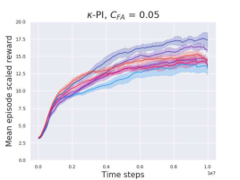

**Multi-step Greedy Reinforcement Learning Algorithms**

Figure 6: Training performance of the ‘naive’ baseline _Nκ_ = _T_ and _κ_ -PI-DQN, _κ_ -VI-DQN for _C_ FA = 0 _._ 05 on Seaquest

Figure 7: Training performance of the ‘naive’ baseline _Nκ_ = _T_ and _κ_ -PI-DQN, _κ_ -VI-DQN for _C_ FA = 0 _._ 05 on Enduro

Figure 8: Training performance of the ‘naive’ baseline _Nκ_ = _T_ and _κ_ -PI-DQN, _κ_ -VI-DQN for _C_ FA = 0 _._ 05 on BeamRider

Figure 9: Training performance of the ‘naive’ baseline _Nκ_ = _T_ and _κ_ -PI-DQN, _κ_ -VI-DQN for _C_ FA = 0 _._ 05 on Qbert

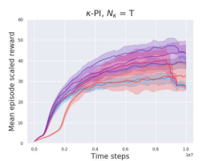

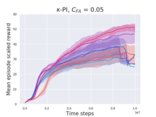

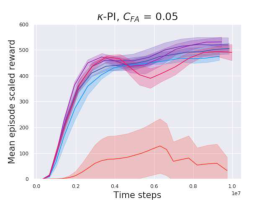

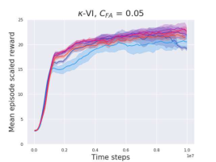

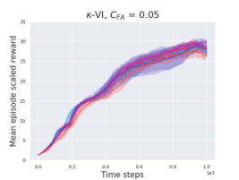

**Multi-step Greedy Reinforcement Learning Algorithms**

**B.** _κ_ **-PI-TRPO and** _κ_ **-VI-TRPO Algorithms**

**B.1. Detailed Pseudo-codes**

In this section, we report the detailed pseudo-codes of the _κ_ -PI-TRPO and _κ_ -VI-TRPO algorithms, described in Section 4.4,
side-by-side.

**Algorithm 7** _κ_ -PI-TRPO

1: **Initialize** _V_ -networks _Vθ_ and _Vφ_ with random weights _θ_ and _φ_ ; policy network _πψ_ with random weights _ψ_ ;
2: **for** _i_ = 0 _, . . ., Nκ −_ 1 **do**
3: **for** _t_ = 1 _, . . ., Tκ_ **do**
4: Simulate the current policy _πψ_ for _M_ time-steps;
5: **for** _j_ = 1 _, . . ., M_ **do**
6: Calculate _Rj_ ( _κ, Vφ_ ) = [�] _[M]_ _t_ = _j_ [(] _[γκ]_ [)] _[t][−][j][r][t]_ [(] _[κ, V][φ]_ [)] and _ρj_ = [�] _[M]_ _t_ = _j_ _[γ][t][−][j][r][t]_ [;]
7: **end for**
8: Sample a random mini-batch _{_ ( _sj, aj, rj, sj_ +1) _}_ _[N]_ _j_ =1 [from the simulated] _[ M]_ [ time-steps;]

9: Update _θ_ by minimizing the loss function: _LVθ_ = _N_ [1] � _Nj_ =1 [(] _[V][θ]_ [(] _[s][j]_ [)] _[ −]_ _[R][j]_ [(] _[κ, V][φ]_ [))][2][;]

10: # Policy Improvement
11: Sample a random mini-batch _{_ ( _sj, aj, rj, sj_ +1) _}_ _[N]_ _j_ =1 [from the simulated] _[ M]_ [ time-steps;]
12: Update _ψ_ using TRPO with advantage function computed by _{_ ( _Rj_ ( _κ, Vφ_ ) _, Vθ_ ( _sj_ )) _}_ _[N]_ _j_ =1 [;]
13: **end for**

14: # Policy Evaluation
15: Sample a random mini-batch _{_ ( _sj, aj, rj, sj_ +1) _}_ _[N]_ _j_ =1 [from the simulated] _[ M]_ [ time-steps;]

16: Update _φ_ by minimizing the loss function: _LVφ_ = _N_ [1] � _Nj_ =1 [(] _[V][φ]_ [(] _[s][j]_ [)] _[ −]_ _[ρ][j]_ [)][2][;]

17: **end for**

**Algorithm 8** _κ_ -VI-TRPO

1: **Initialize** _V_ -networks _Vθ_ and _Vφ_ with random weights _θ_ and _φ_ ; policy network _πψ_ with random weights _ψ_ ;
2: **for** _i_ = 0 _, . . ., Nκ −_ 1 **do**
3: # Evaluate _TκVφ_ and the _κ_ -greedy policy w.r.t. _Vφ_
4: **for** _t_ = 1 _, . . ., Tκ_ **do**
5: Simulate the current policy _πψ_ for _M_ time-steps;
6: **for** _j_ = 1 _, . . ., M_ **do**
7: Calculate _Rj_ ( _κ, Vφ_ ) = [�] _[M]_ _t_ = _j_ [(] _[γκ]_ [)] _[t][−][j][r][t]_ [(] _[κ, V][φ]_ [)][;]
8: **end for**
9: Sample a random mini-batch _{_ ( _sj, aj, rj, sj_ +1) _}_ _[N]_ _j_ =1 [from the simulated] _[ M]_ [ time-steps;]

10: Update _θ_ by minimizing the loss function: _LVθ_ = _N_ [1] � _Nj_ =1 [(] _[V][θ]_ [(] _[s][j]_ [)] _[ −]_ _[R][j]_ [(] _[κ, V][φ]_ [))][2][;]

11: Sample a random mini-batch _{_ ( _sj, aj, rj, sj_ +1) _}_ _[N]_ _j_ =1 [from the simulated] _[ M]_ [ time-steps;]
12: Update _ψ_ using TRPO with advantage function computed by _{_ ( _Rj_ ( _κ, Vφ_ ) _, Vθ_ ( _sj_ )) _}_ _[N]_ _j_ =1 [;]
13: **end for**
14: Copy _θ_ to _φ_ ( _φ ←_ _θ_ );
15: **end for**

**Multi-step Greedy Reinforcement Learning Algorithms**

Hyperparameter Value
Horizon (T) 1000
Adam stepsize 1 _×_ 10 _[−]_ [3]

Number of samples per Iteration 1024
Entropy coefficient 0.01
Discount factor 0.99

Number of Iterations 2000

Minibatch size 128
#Runs used for plot averages 10
Confidence interval for plot runs _∼_ 95%

Table 4: Hyper-parameters of _κ_ -PI-TRPO and _κ_ -VI-TRPO on the MuJoCo domains.

**B.2. Ablation Test for** _CF A_

Figure 10: Performance of _κ_ -PI-TRPO and _κ_ -VI-TRPO on Walker2d-v2 for different values of _CF A_ .

**B.3.** _κ_ **-PI-TRPO and** _κ_ **-VI-TRPO Plots**

In this section, we report additional results of the application of _κ_ -PI-TRPO and _κ_ -VI-TRPO on the MuJoCo domains. A
summary of these results has been reported in Table 2 in the main paper.

Figure 11: Performance of GAE, ‘Naive’ baseline and _κ_ -PI-TRPO, _κ_ -VI-TRPO on Ant-v2.

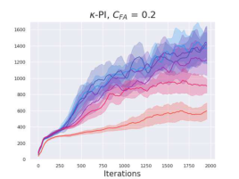

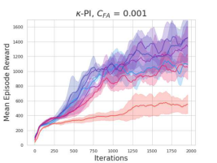

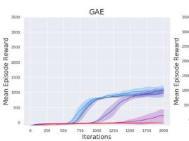

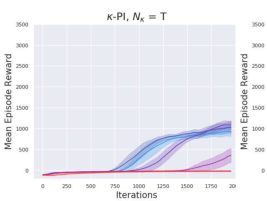

**Multi-step Greedy Reinforcement Learning Algorithms**

Figure 12: Performance of GAE, ‘Naive’ baseline and _κ_ -PI-TRPO, _κ_ -VI-TRPO on HalfCheetah-v2.

Figure 13: Performance of GAE, ‘Naive’ baseline and _κ_ -PI-TRPO, _κ_ -VI-TRPO on HumanoidStandup-v2.

Figure 14: Performance of GAE, ‘Naive’ baseline and _κ_ -PI-TRPO, _κ_ -VI-TRPO on Swimmer-v2.

Figure 15: Performance of GAE, ‘Naive’ baseline and _κ_ -PI-TRPO, _κ_ -VI-TRPO on Hopper-v2.

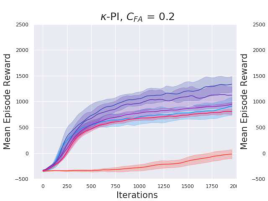

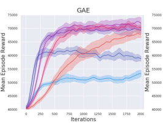

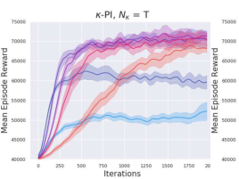

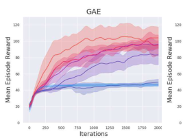

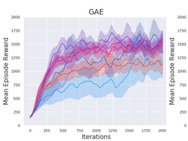

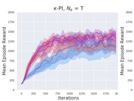

