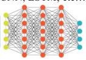
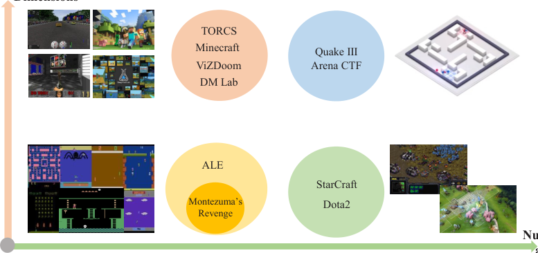
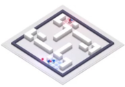

1

## A Survey of Deep Reinforcement Learning in Video Games

Kun Shao, Zhentao Tang, Yuanheng Zhu, _Member, IEEE_, Nannan Li, and Dongbin Zhao, _Fellow, IEEE_

_**Abstract**_ **—Deep reinforcement learning (DRL) has made great**
**achievements since proposed. Generally, DRL agents receive**
**high-dimensional inputs at each step, and make actions according**
**to deep-neural-network-based policies. This learning mechanism**
**updates the policy to maximize the return with an end-to-**
**end method. In this paper, we survey the progress of DRL**
**methods, including value-based, policy gradient, and model-based**
**algorithms, and compare their main techniques and properties.**
**Besides, DRL plays an important role in game artificial in-**
**telligence (AI). We also take a review of the achievements of**
**DRL in various video games, including classical Arcade games,**
**first-person perspective games and multi-agent real-time strategy**
**games, from 2D to 3D, and from single-agent to multi-agent.**
**A large number of video game AIs with DRL have achieved**
**super-human performance, while there are still some challenges**
**in this domain. Therefore, we also discuss some key points**
**when applying DRL methods to this field, including exploration-**
**exploitation, sample efficiency, generalization and transfer, multi-**
**agent learning, imperfect information, and delayed spare re-**
**wards, as well as some research directions.**

_**Index Terms**_ **—reinforcement learning, deep learning, deep**
**reinforcement learning, game AI, video games.**

I. INTRODUCTION
# A RTIFICIAL intelligence (AI) in video games is a long-standing research area. It studies how to use AI tech
nologies to achieve human-level performance when playing
games. More generally, it studies the complex interactions between agents and game environments. Various games provide
interesting and complex problems for agents to solve, making
video games perfect environments for AI research. These
virtual environments are safe and controllable. In addition,
these game environments provide infinite supply of useful data
for machine learning algorithms, and they are much faster than
real-time. These characteristics make games the unique and
favorite domain for AI research. On the other side, AI has
been helping games to become better in the way we play,
understand and design them [1].
Broadly speaking, game AI involves the perception and
the decision-making in game environments. With these components, there are some crucial challenges and proposed
solutions. The first challenge is that the state space of the
game is very large, especially in strategic games. With the rise

K. Shao, Z. Tang, Y. Zhu, N. Li, and D. Zhao are with the State Key
Laboratory of Management and Control for Complex Systems, Institute of Automation, Chinese Academy of Sciences. Beijing 100190, China. They are also
with the University of Chinese Academy of Sciences, Beijing, China (e-mail:
shaokun2014@ia.ac.cn; tangzhentao2016@ia.ac.cn; yuanheng.zhu@ia.ac.cn;
linannan2017@ia.ac.cn, dongbin.zhao@ia.ac.cn).
This work is supported by National Natural Science Foundation of
China (NSFC) under Grants No.61573353, No.61603382, No.6180337, and
No.61533017.

of representation learning, the whole system has successfully
modeled large-scale state space with deep neural networks.
The second challenge is that learning proper policies to make
decisions in dynamic unknown environment is difficult. For
this problem, data-driven methods, such as supervised learning and reinforcement learning (RL), are feasible solutions.
The third challenge is that the vast majority of game AI is
developed in a specified virtual environment. How to transfer
the AI’s ability among different games is a core challenge. A
more general learning system is also necessary.

For a long time, solving these challenges with reinforcement
learning is widely used in game AI. And in the last few
years, deep learning (DL) has achieved remarkable performance in computer vision and natural language processing

[2]. The combination, deep reinforcement learning (DRL),
teaches agents to make decisions in high-dimensional state
space in an end-to-end framework, and dramatically improves
the generalization and scalability of traditional RL algorithms.
Especially, DRL has made great progress in video games,
including Atari, ViZDoom, StarCraft, Dota2, and so on. There
are some related works to introduce these achievements in this

field. Zhao et al. [3] and Tang et al. [4] survey the development
of DRL research, and focus on AlphaGo and AlphaGo Zero.
Justesen et al. [5] reviews DL-based methods in video game
play, including supervised learning, unsupervised learning,
reinforcement learning, evolutionary approaches, and some
hybrid approaches. Arulkumaran et al. [6] make a brief introduction of DRL, covering central algorithms and presenting
a range of visual RL domains. Li [7] gives an overview of
recent achievements of DRL, and discusses core elements,
important mechanisms, and various applications. In this paper,
we focus on DRL-based game AI, from 2D to 3D, and from
single-agent to multi-agent. The main contributions include
the comprehensive and detailed comparisons of various DRL
methods, their techniques, properties, and the impressive and
diverse performances in these given video games.

The organization of the remaining paper is arranged as
follows. In Section II, we introduce the background of DL and
RL. In Section III, we focus on recent DRL methods, including
value-based, policy gradient, and model-based DRL methods.
After that, we make a brief introduction of research platforms
and competitions, and present performances of DRL methods
in classical single-agent Arcade games, first-person perspective
games, and multi-agent real-time strategy games. In Section
V, we discuss some key points and research directions in this
field. In the end, we draw a conclusion of this survey.

2

Fig. 1. The framework diagram of the typical DRL for video games. The deep learning model takes input from video games API, and extract meaningful
features automatically. DRL agents produces actions based on these features, and make the environments transfer to next state.

II. BACKGROUND

Generally speaking, training an agent to make decisions
with high-dimensional inputs is difficult. With the development
of deep learning, researchers take deep neural networks as
function approximations, and use plenty of samples to optimize policies successfully. The framework diagram of typical
DRL for video games is depicted in Fig. 1.

_A. Deep learning_

Deep learning comes from artificial neural networks, and
is used to learn data representation. It is inspired by the
theory of brain development, and can be learned in supervised
learning, unsupervised learning and semi-supervised learning.
Although the term deep learning is introduced in 1986 [8],
deep learning has a winter time because of lacking data and
incapable computation hardware. However, with more and
more large-scale datasets being released, and capable hardware
being available, a big revolution happens in DL [9].

Convolutional neural network (CNN) [10] is a class of
deep neural networks, which is widely applied to computer
vision. CNN is inspired by biological processes, and is
shift invariant based on shared-weights architecture. Recurrent
Neural Network (RNN) is another kind of deep nerial network, especially for natural language processing. As a special
kind of RNN, Long Short Term Memory (LSTM) [11] is
capable of learning long-term dependencies. Deep learning
architectures have been applied into many fields, and have
achieved significant successes, such as speech recognition, image classification and segmentation, semantic comprehension,
and machine translation [2]. DL-based methods with efficient
parallel distributed computing resources can break the limit
of traditional machine learning methods. This method inspires
scientists and researchers to achieve more and more state-of
the-art performance in respective fields.

_B. Reinforcement learning_

Reinforcement learning is a kind of machine learning methods where agents learn the optimal policy by trial and error

[12]. By interacting with the environment, RL can be successfully applied to sequential decision-making tasks. Considering a discounted episodic Markov decision process (MDP)
( _S, A, γ, P, r_ ), the agent chooses an action _at_ according to
the policy _π_ ( _at|st_ ) at state _st_ . The environment receives the
action, produces a reward _rt_ +1 and transfers to the next state
_st_ +1 according to the transition probability _P_ ( _st_ +1 _|st, at_ ).
This transition probability is unknown in RL domain. The
process continues until the agent reaches a terminal state or a
maximum time step. The objective is to maximize the expected
discounted cumulative rewards

_∞_
�

� _γ_ _[i]_ _rt_ + _i_ ] _,_ (1)

_i_ =0

E _π_ [ _Rt_ ] = E _π_ [

where _γ ∈_ (0 _,_ 1] is the discount factor.
Reinforcement learning can be devided into off-policy and
on-policy methods. Off-policy RL algorithms mean that the
behavior policy used for selecting actions is different from the
learning policy. On the contrary, behavior policy is the same
with the learning policy in on-policy RL algorithms. Besides,
reinforcement learning can also be devided into value-based
and policy-based methods. In value-based RL, agents update
the value function to learn suitable policy, while policy-based
RL agents learn the policy directly.
Q-learning is a typical off-policy value-based method. The
update rule of Q-learning is

_δt_ = _rt_ +1 + _γ_ arg max _Q_ ( _st_ +1 _, a_ ) _−_ _Q_ ( _st, at_ ) _,_ (2a)
_a_

_Q_ ( _st, at_ ) _←_ _Q_ ( _st, at_ ) + _αδt._ (2b)

_δt_ is the temporal difference (TD) error, and _α_ is the learning

rate.

3

(a) (b) (c) (d) (e)

Fig. 2. The network architectures of typical DRL methods, with increased complexity and performance. (a): DQN network; (b)Dueling DQN network; (c):
DRQN network; (d): Actor-critic network; (e): Reactor network.

Policy gradient [13] parameterizes the policy and updates
parameters _θ_ . In its general form, the objective function of
policy gradient is defined as

_∞_

[�

_J_ ( _θ_ ) = E _π_ [

� log _πθ_ ( _at|st_ ) _R_ ] _._ (3)

_t_ =0

much better performance. Prioritized experience replay [16]
helps prioritize experience to replay important transitions
more frequently. The sample probability of transition _i_ as
_P_ ( _i_ ) = ~~�~~ _pk_ _[α]_ _i_ _[p]_ ~~_[α]_~~ _k_ [, where] _[ p][i]_ [ is the priority of transition] _[ i]_ [. Dueling]

DQN [17] uses the dueling neural network architecture for
model-free DRL. It includes two separate estimators: one for
state value function _V_ ( _s_ ; _θ, β_ ) and the other for advantage
function _A_ ( _s, a_ ; _θ, α_ ), as shown in Fig. 2(b).

_Q_ ( _s, a_ : _θ, α, β_ ) = _V_ ( _s_ ; _θ, β_ ) + _A_ ( _s, a_ ; _θ, α_ ) _._ (7)

Pop-Art [18] is proposed to adapt to different and nonstationary target magnitudes, which successfully replaces the
clipping of rewards as done in DQN to handle various magnitudes of targets. Fast reward propagation [19] is a novel
training algorithm for reinforcement learning, which combines
the strength of DQN, and exploits longer state-transitions in
experience replays by tightening the optimization via constraints. This novel technique makes DRL more practical
by drastically reducing training time. Gorila [20] is the first
massively distributed architecture for DRL. This architecture
uses four main components: parallel actors; parallel learners;
a distributed neural network to represent the value function
or behavior policy; and a distributed store of experience. To
address the limited memory and imperfect game information
at each decision point, Deep Recurrent Q-Network (DRQN)

[21] replaces the first fully-connected layer with a recurrent
neural network in DQN, as shown in Fig. 2(c).
Generally, DQN learns rich domain representations and
approximates the value function with deep neural networks,
while batch RL algorithms with linear representations are
more stable and require less hyperparameter tuning. The Least
Squares DQN (LS-DQN) [22] combines DQN’s rich feature
representations with the stability of a linear least squares
method. In order to reduce approximation error variance in
DQNs target values, averaged-DQN [23] averages previous
Q-values estimates, leading to a more stable training and
improved performance. Deep Q-learning from Demonstrations
(DQfD) [24] combines DQN with human demonstrations,
which improves the sample efficiency greatly. DQV [25] uses
TD learning to train a Value neural network, and uses this

_R_ is the total accumulated return.

Actor-critic [12] reinforcement learning improves the policy
gradient with an value-based critic

_∞_
�

_J_ ( _θ_ ) = E _π_ [

� Ψ _t_ log _πθ_ ( _at|st_ )] _._ (4)

_t_ =0

Ψ _t_ is the critic, which can be the state-action value function
_Q_ _[π]_ ( _st, at_ ), the advantage function _A_ _[π]_ ( _st, at_ ) = _Q_ _[π]_ ( _st, at_ ) _−_
_V_ _[π]_ ( _st_ ) or the TD error _rt_ + _V_ _[π]_ ( _st_ +1) _−_ _V_ _[π]_ ( _st_ ).

III. DEEP REINFORCEMENT LEARNING

DRL makes a combination of DL and RL, achieving rapid
developments since proposed. This section will introduce
various DRL methods, including value-based methods, policy
gradient methods, and model-based methods.

_A. Value-based DRL methods_

Deep Q-network (DQN) [14] is the most famous DRL
model which learns policies directly from high-dimensional
inputs. It receives raw pixels, and outputs a value function to
estimate future rewards, as shown in Fig. 2(a). DQN uses the
experience replay method to break the sample correlation, and
stabilizes the learning process with a target Q-network. The
loss function at iteration _i_ is

_Li_ ( _θi_ ) = _E_ ( _s,a,r,s′_ ) _∼U_ ( _D_ )[( _yi_ _[DQN]_ _−_ _Q_ ( _s, a_ ; _θi_ )) [2] ] _,_ (5)

with
_yi_ _[DQN]_ = _r_ + _γ_ max _−_ ) _._ (6)
_a_ _[′][ Q]_ [(] _[s][′][, a][′]_ [;] _[ θ][i]_

DQN bridges the gap between high-dimensional visual
inputs and actions. After that, researchers have improved DQN
in different aspects. Double DQN [15] introduces double Qlearning to reduce observed overestimations, and it leads to

network to train a second Quality-value network to estimate state-action values. DQV learns significantly faster and
better than double-DQN. Researchers have proposed several
improvements to DQN. However, it is unclear which of
these are complementary and how much can be combined.
Rainbow [26] combines with main extensions to DQN, and
gives each component’s contribution to overall performance.
RUDDER [27] is a novel reinforcement learning approach
for finite MDPs with delayed rewards, which is also a return
decomposition method, RUDDER is exponentially faster on
tasks with different lengths of reward delays. Ape-X DQfD

[28] uses a new transformed Bellman operator to process
rewards of varying densities and scales, and applies human
demonstrations to ease the exploration problem to guide agents
towards rewarding states. Additional, it proposes an auxiliary
temporal consistency loss to train stably extending the effective
planning horizon by an order of magnitude. Soft DQN [29]
is an entropy-regularized versions of Q-learning, with better
robustness and generalization .
Distributional DRL learns the value distribution, in contrast
to common RL that models the expectation of return, or value.
C51 [30] focuses on the distribution of value, and designs
distributional DQN algorithm to learn approximate value distributions. QR-DQN [31] methods close a number of gaps
between theoretical and algorithmic results. Distributional
reinforcement learning with Quantile regression in which the
distribution over returns is modeled explicitly instead of only
estimating the mean. Implicit Quantile Networks (IQN) [32] is
a flexible, applicable, and state-of-the-art distributional DQN.
IQN approximates the full Quantile function for the return
distribution with Quantile regression, and provides a fully
integrated distributional RL agent without prior assumptions
on the parameterization of the return distribution. Furthermore,
IQN allows to expand the class of control policies to a wide
range of risk-sensitive policies connected to distortion risk

measures.

_B. Policy gradient DRL methods_

Policy gradient DRL optimizes the parameterized policy
directly. Actor-critic architecture computes the policy gradient using a value-based critic function to estimate expected
future reward, as shown in Fig. 2(d). Asynchronous DRL
is an efficient framework for DRL that uses asynchronous
gradient descent to optimize the policy [33]. Asynchronous
advantage actor-critic (A3C) trains several agents on multiple
environments, showing a stabilizing effect on training. The
objective function of the actor is demonstrated as

_∞_
�

_J_ ( _θ_ ) = E _π_ [

� _Aθ,θv_ ( _st, at_ ) log _πθ_ ( _at|st_ ) + _βHθ_ ( _π_ ( _st_ ))] _,_

_t_ =0

(8)
where _Hθ_ ( _π_ ( _st_ )) is an entropy term used to encourage exploration.

GA3C [34] is a hybrid CPU/GPU version of A3C, which
achieves a significant speed up compared to the original CPU
implementation. UNsupervised REinforcement and Auxiliary
Learning (UNREAL) [35] learns separate policies for maximizing many other pseudo-reward functions simultaneously,

4

including value function replay, reward prediction, and pixel
control. This agent drastically improves both data efficiency
and robustness to hyperparameter settings. PAAC [36] is a
novel framework for efficient parallelization of DRL, where
multiple actors learn the policy on a single machine. Policy gradient methods are efficient techniques for policies
improvement, while they are usually on-policy and unable
to take advantage of off-policy data. The new method is
referred as PGQ [37], which combines policy gradient with Qlearning. PGQ establishes an equivalency between regularized
policy gradient techniques and advantage function learning
algorithms. Retrace( _λ_ ) [38] takes the best of the importance
sampling, off-policy Q( _λ_ ), and tree-backup( _λ_ ), resulting in
low variance, safety, and efficiency. It makes a combination
of dueling DRQN architecture and actor-critic architecture,
as shown in Fig. 2(e). Reactor [39] is a sample-efficient
and numerical efficient reinforcement learning agent based
on a multi-step return off-policy actor-critic architecture. The
network outputs a target policy, an action-value Q-function,
and an estimated behavioral policy. The critic is trained with
the off-policy multi-step Retrace method and the actor is
trained by a _β_ -leave-one-out policy gradient. ImportanceWeighted Actor Learner Architecture (IMPALA) [40] is a new
distributed DRL, which can scale to thousands of machine.
IMPALA uses a single reinforcement learning agent with a
single set of parameters to solve a mass of tasks. This method
achieves stable learning by combining decoupled acting and
learning with a novel V-trace off-policy correction method,
which is critical for achieving learning stability.
_1)_ _**Trust region method**_ _:_ Trust Region Policy Optimization
(TRPO) [41] is proposed for optimizing control policies,
with guaranteed monotonic improvement. TRPO computes
an ascent direction to improve on policy gradient, which
can ensure a small change in the policy distribution. The
constrained optimization problem of TRPO in each epoch is

_maximizeθ_ _Es∼ρθ′_ _,a∼πθ′_ [ _π_ _[π]_ _θ_ _[θ]_ _′_ [(] ( _[a]_ _a_ _[|]_ _|_ _[s]_ _s_ [)] ) _[A][θ][′]_ [(] _[s, a]_ [)]] _[,]_ (9a)

_s.t._ _Es∼ρθ′_ [ _DKL_ ( _πθ′_ ( _·|s_ ))] _≤_ _δKL._ (9b)

This algorithm is effective for optimizing large nonlinear
policies. Proximal policy optimization (PPO) [42] samples
data by interaction with the environment, and optimizes the
objective function with stochastic gradient ascent

_πθ_ ( _at|st_ )
_rt_ ( _θ_ ) = (10a)
_πθold_ ( _at|st_ ) _[,]_

_L_ ( _θ_ ) = E [ˆ] _t_ [ _min_ ( _rt_ ( _θ_ ) _A_ [ˆ] _t, clip_ ( _rt_ ( _θ_ ) _,_ 1 _−_ _ϵ,_ 1 + _ϵ_ ) _A_ [ˆ] _t_ ] _._ (10b)

_rt_ ( _θ_ ) denotes the probability ratio. This objective function
clips the probability ratio to modify the surrogate objective.
PPO has some benefits over TRPO, and is much simpler to
implement, with better sample complexity. Actor-critic with
experience replay (ACER) [43] introduces several innovations,
including stochastic dueling network, truncated importance
sampling, and a new trust region method, which is stable and
sample efficient. Actor-critic using Kronecker-Factored Trust
Region (ACKTR) [44] bases on natural policy gradient, and
uses Kronecker-factored approximate curvature (K-FAC) with

trust region to optimize the actor and the critic. ACKTR is
sample efficient compared with other actor-critic methods.
_2)_ _**Deterministic policy**_ _:_ Apart from stochastic policy, deep
deterministic policy gradient (DDPG) [45] is a kind of deterministic policy gradient method which adapts the success of
DQN to continuous control. The update rule of DDPG is

_Q_ ( _st, at_ ) = _r_ ( _st, at_ ) + _γQ_ ( _st_ +1 _, πθ_ ( _st_ +1)) _._ (11)

DDPG is an actor-critic, off-policy algorithm, and is able
to learn reasonable policies on various tasks. Distributed
Distributional DDPG (D4PG) [46] is a distributional update to
DDPG, combined with the use of multiple distributed workers
all writing into the same replay table. This method has a much
better performance on a number of difficult continuous control
problems.
_3)_ _**Entropy-regularized policy gradient**_ _:_ Soft Actor Critic
(SAC) is an off-policy policy gradient method, which establishes a bridge between DDPG and stochastic policy optimization. SAC incorporates the clipped double-Q trick, and the
objective function of maximum entropy DRL is

5

model RL environments through compressed spatiotemporal
representations. It feeds extracted features into simple and
compact policies, achieving impressive results in several environments. Value propagation (VProp) [50] bases on value
iteration, and is an efficient differentiable planning module. It
can successfully be trained to learn to plan using reinforcement
learning. As a general framework of AlphaZero, MuZero

[54] combines MCTS with a learned model, and predicts
the reward, the action-selection policy, and the value function
to make planning. It extends model-based RL to a range of
logically complex and visually complex domains, and achieves
superhuman performance.
A general review of various DRL methods from 2017 to
2019 is presented in Table I.

IV. DRL IN VIDEO GAMES

Playing video games like human experts is challenging for
computers. With the development of DRL, agents are able
to play various games end-to-end. Here we focus on game
research platforms and competitions, and impressive progress
in various video games, from 2D to 3D, and from single-agent
to multi-agent, as shown in Fig. 3.

_A. Game research platforms_

Platforms and competitions make great contributions to
the development of game AI, and help to evaluate agents’
intelligence, as presented in Table II. Most platforms can be
described by two major categories: General Platforms and
Specific Platforms.
**General Platforms:** Arcade Learning Environment (ALE)

[55] is the pioneer evaluation platform for DRL algorithms,
which provides an interface to plenty of Atari 2600 games.
ALE presents both game images and signals, such as player
scores, which makes it a suitable testbed. To promote the
progress of DRL research, OpenAI integrates a collection of
reinforcement learning tasks into a platform called Gym [56],
which mainly contains Algorithmic, Atari, Classical Control,
Board games, 2D and 3D robots. After that, OpenAI Universe

[57] is a platform for measuring and training agents’ general
intelligence across a large supply of games. Gym Retro [58]
is a wrapper for video game emulator with a unified interface
as Gym, and makes Gym easy to be extended with a large
collection of video games, not only Atari but also NEC,
Nintendo, and Sega, for RL research. The OpenAI Retro
contest aims at exploring the development of DRL that can
generalize from previous experience. OpenAI bases on the
_Sonic the Hedgehog_ _[T M]_ video game, and presents a new DRL
benchmark [59]. This benchmark can help to measure the
performance of few-shot learning and transfer learning in
reinforcement learning. General Video Game Playing [60] is
intended to design an agent to play multiple video games
without human intervention. The General Video Game AI

(GVGAI) [61] competition is proposed to provide a easy-touse and open-source platform for evaluating AI methods, including DRL. DeepMind Lab [62] is a first-person perspective
learning environment, and provides multiple complicated tasks
in partially observed, large-scale, and visually diverse worlds.

_J_ ( _π_ ) =

_T_
� E( _st,at_ ) _∼ρπ_ [ _r_ ( _st, at_ ) + _αH_ ( _π_ ( _.|st_ ))] _,_ (12)

_t_ =0

SAC uses an entropy regularization in its objective function.
It trains the policy to maximize a trade-off between entropy
and expected return. The entropy is a measure of randomness
in the policy. This mechanism is similar to the trade-off
between exploration and exploitation. Increasing entropy can
encourage more exploration, and accelerate learning process.
Moreover, it can also prevent the learning policy from converging to a poor local optimum.

_C. Model-based DRL methods_

Combining model-free reinforcement learning with on-line
planning is a promising approach to solve the sample efficiency problem. TreeQN [47] is proposed to address these
challenges. It is a differentiable, recursive, tree-structured
model that serves as a drop-in replacement for any value
function network in DRL with discrete actions. TreeQN dynamically constructs a tree by recursively applying a transition
model in a learned abstract state space and then aggregating
predicted rewards and state-values using a tree backup to estimate Q-values. ATreeC is an actor-critic variant that augments
TreeQN with a softmax layer to form a stochastic policy
network. Both approaches are trained end-to-end, such that
the learned model is optimized for its actual use in the planner. TreeQN and ATreeC outperform n-step DQN and value
prediction networks on multiple Atari games. Vezhnevets et
al. [48] presents STRategic Attentive Writer (STRAW) neural
network architecture to build implicit plans. STRAW purely
interacts with an environment, and is an end-to-end method.
STRAW model can learn temporally abstracted high-level
macro-actions, which enables both economic computation and
structured exploration. STRAW employs temporally extended
planning strategies and achieves strong improvements on Atari
games. The world model [49] uses an unsupervised manner
to train a generative recurrent neural network, which can

6

TABLE I

A GENERAL REVIEW OF RECENT DRL METHODS FROM 2017 TO 2018.

DRL Algorithms Main Techniques Networks Category

DQN [14] experience replay, target Q-network CNN value-based, off-policy

Double DQN [15] double Q-learning CNN value-based, off-policy

Dueling DQN [17] dueling neural network architecture CNN value-based, off-policy

Prioritized DQN [16] prioritized experience replay CNN value-based, off-policy

Bootstrapped DQN [51] combine deep exploration with DNNs CNN value-based, off-policy

Gorila [20] massively distributed architecture CNN value-based, off-policy

LS-DQN [22] combine least-squares updates in DRL CNN value-based, off-policy

Averaged-DQN [23] averaging learned Q-values estimates CNN value-based, off-policy

DQfD [24] learn from the demonstration data CNN value-based, off-policy

DQN with Pop-Art [18] adaptive normalization with Pop-Art CNN value-based, off-policy

Soft DQN [29] KL penalty and entropy bonus CNN value-based, off-policy

DQV [25] training a Quality-value network CNN value-based, off-policy

Rainbow [26] integrate six extensions to DQN CNN value-based, off-policy

RUDDER [27] return decomposition CNN-LSTM value-based, off-policy

Ape-X DQfD [28] transformed Bellman operator, temporal consistency loss CNN value-based, off-policy

C51 [30] distributional Bellman optimality CNN value-based, off-policy

QR-DQN [31] distributional RL with Quantile regression CNN value-based, off-policy

IQN [32] an implicit representation of the return distribution CNN value-based, off-policy

A3C [33] asynchronous gradient descent CNN-LSTM policy gradient, on-policy

GA3C [34] hybrid CPU/GPU version CNN-LSTM policy gradient, on-policy

PPO [42] clipped surrogate objective, adaptive KL penalty coefficient CNN-LSTM policy gradient, on-policy

ACER [43] experience replay, truncated importance sampling CNN-LSTM policy gradient, off-policy

ACKTR [44] K-FAC with trust region CNN-LSTM policy gradient, on-policy

Soft Actor-Critic [52] entropy regularization CNN policy gradient, off-policy

UNREAL [35] unsupervised auxiliary tasks CNN-LSTM policy gradient, on-policy

Reactor [39] Retrace( _λ_ ), _β_ -leave-one-out policy gradient estimate CNN-LSTM policy gradient, off-policy

PAAC [36] parallel framework for A3C CNN policy gradient, on-policy

DDPG [45] DQN with deterministic policy gradient CNN-LSTM policy gradient, off-policy

TRPO [41] incorporate a KL divergence constraint CNN-LSTM policy gradient, on-policy

D4PG [46] distributed distributional DDPG CNN policy gradient, on-policy

PGQ [37] combine policy gradient and Q-learning CNN policy gradient, off-policy

IMPALA [40] importance-weighted actor learner architecture CNN-LSTM policy gradient, on-policy

FiGAR-A3C [53] fine grained action repetition CNN-LSTM policy gradient, on-policy

TreeQN/ATreeC [47] on-line planning, tree-structured model CNN model-based, on-policy

STRAW [48] macro-actions, planning strategies CNN model-based, on-policy

World model [49] mixture density network, variational autoencoder CNN-LSTM model-based, on-policy

MuZero [54] representation function, dynamics function, and prediction function CNN model-based, off-policy

TABLE II

A LIST OF GAME AI COMPETITIONS SUITABLE FOR DRL RESEARCH.

Competition Name Time

ViZDoom AI competition 2016, 2017, 2018

StarCraft AI competitions (AIIDE, CIG, SSCAIT) 2010 — 2019

microRTS competition 2017, 2018, 2019

The GVGAI competition – learning track 2017, 2018

Microsoft Malmo collaborative AI challenge 2017

The multi-agent RL in Malmo competition 2018

The OpenAI Retro contest 2018

NeurIPS Pommerman competition 2018

Unity Obstacle Tower Challenge 2019

NeurIPS MineRL competition 2019

Unity ML-Agents Toolkit [63] is a new toolkit for creating
and interacting with simulation environments. This platform
has sensory, physical, cognitive, and social complexity, and
enables fast and distributed simulation, and flexible control.

**Specific Platforms:** Malmo [64] is a research platform for
AI experiments, which is built on top of Minecraft. It is a
first-person 3D environment, and can be used for multi-agent
research in Microsoft Malmo collaborative AI challenge 2017
and the multi-agent RL in MalmO competition 2018. TORCS

[65] is a racing car simulator which has both low-level and
visual features for the self-driving car with DRL. ViZDoom

[66] is a first-person shooter game platform, and encourages
DRL agent to utilize the visual information to perform navigation and shooting tasks in a semi-realistic 3D world. ViZDoom
AI competition has attracted plenty of researchers to develop
their DRL-based Doom agents since 2016. As far as we

7

**Dimensions**

2D

Single-agent Multi-agent

Fig. 3. The diagram of various video games AI, from 2D to 3D, and from single-agent to multi-agent.

**Number of**

**agents**

know, real-time strategy (RTS) games are very challenging for
reinforcement learning method. Facebook proposes TorchCraft
for StarCraft I [67], and DeepMind releases StarCraft II
learning environment [68]. They expect researchers to propose
powerful DRL agents to achieve high-level performance in
RTS games and annual StarCraft AI competitions. CoinRun

[69] provides a metric for an agent’s ability to transfer its
experience to novel situations. This new training environment
strikes a desirable balance in complexity: the environment is
much simpler than traditional platform games, but it still poses
a worthy generalization challenge for DRL algorithms. Google
Research Football is a new environment based on open-source
game Gameplay Football for DRL research.

_B. Atari games_

ALE is an evaluation platform that aims at building agents
with general intelligence across hundreds of Atari 2600 games.
As the most popular testbed for DRL research, a large number of DRL methods have achieved outstanding performance
consecutively. Machado et al. [70] takes a review at the
ALE in DRL research community, proposes diverse evaluation
methodologies and some key concerns. In this section, we
will introduce the main achievements in the ALE domain,
including the extremely difficult Montezuma’s Revenge.
As the milestone in this domain, DQN is able to surpass
the performances of previous algorithms, and achieves humanlevel performance across 49 games [14]. Averaged-DQN examines the source of value function estimation errors, and
demonstrates significantly improved stability and performance
on the ALE benchmark [23]. UNREAL significantly outperforms the previous best performance on Atari, averaging 880%
expert human performance [35]. PAAC achieves sufficiently
good performance on ALE after a few hours of training [36].
DQfD has better initial performance than DQN on most Atari
games, and receives more average rewards than DQN on 27
of 42. In addition, DQfD learns faster than DQN even when
given poor demonstration data [24]. Noisy DQN replaces the

TABLE III

MEAN AND MEDIAN SCORES ACROSS 57 ATARI GAMES OF TYPICAL DRL

METHODS, MEASURED AS PERCENTAGES OF HUMAN BASELINE.

Methods Mean Median year

DQN [14] 228% 79% 2015

C51 [30] 701% 178% 2017

UNREAL [35] 880% 250% 2017

QR-DQN [30] 915% 211% 2017

IQN [32] 1019% 218% 2018

Rainbow [26] 1189% 230% 2018

Ape-X DQN [71] 1695% 434% 2018

Ape-X DQfD _[∗]_ [28] 2346% 702% 2018

Note: _[∗]_ means this method is measured across 42 Atari games.

conventional exploration heuristics with NoisyNet, and yields
substantially higher scores in ALE domain. As a distributional
DRL method, C51 obtains a new series of impressive results,
and demonstrates the importance of the value distribution in
approximated RL [30]. Rainbow provides improvements in
terms of sample efficiency and final performance. The authors
also show the contribution of each component to overall performance [26]. QR-DQN algorithm significantly outperforms
recent improvements on DQN, including the related C51 [30].
IQN shows substantial gains on the Atari benchmark over
QR-DQN, and even halves the distance between QR-DQN
and Rainbow [32]. Ape-X DQN substantially improves the
performance on the ALE, achieving better final score in less
wall-clock training time [71]. When tested on a set of 42 Atari
games, the Ape-X DQfD algorithm exceeds the performance
of an average human on 40 games using a common set of
hyperparameters. Mean and median scores across multiple
Atari games of typical DRL methods that achieve state-ofthe-art performance consecutively are presented in Table III.

Montezuma’s Revenge is one of the most difficult Atari
video games. It is a goal-directed behavior learning environment with long horizons and sparse reward feedback signals.

Players must navigate through a number of different rooms,
avoid obstacles and traps, climb ladders up and down, and then
pick up the key to open new rooms. It requires a long sequence
of actions before reaching the goal and receiving a reward,
and is difficult to explore an optimal policy to tackle tasks.
Efficient exploration is considered as a crucial factor to learn
in a delayed feedback environment. Then, Ostrovski et al. [72]
provide an improved version of count-based exploration with
PixelCNN as a supplement for pseudo-count, also reveals the
importance of Monte Carlo return for effective exploration.
In addition to improve the exploration efficiency, learning
from human data is also a proper method to reach better
performance in this problem. Le et al. [73] leverage imitation
learning from expert interaction and hierarchical reinforcement
learning at different levels. This method learns obviously
faster than original hierarchical reinforcement learning, and
also significantly more efficiently than conventional imitation
learning. Other than gameplay, the demonstration is also a
valuable kind of sample for agent to learn. DQfD utilizes
a small set of demonstration data to speed up the learning
process [24]. It combines prioritized replay mechanism with
temporal difference updates and supervised classification, and
finally achieves a better and impressive result. Further, Aytar
et al. [74] only use YouTube video as a demonstration sample
and invests a transformed Bellman operator for learning from
human demonstrations. Interestingly, these two works both
claim being the first to solve the entire first level of Montezuma’s Revenge. Go-explore [75] makes further progress,
and achieves scores over 400,000 on average. Go-Explore separates learning into exploration and robustification. It reliably
solves the whole game, and generalizes well.

_C. First-person perspective games_

Different from Atari games, agents in first-person perspective video games can only receive observations from their own
perspectives, resulting from imperfect information inputs. In
RL domain, this is a POMDP problem which requires efficient
exploration and memory.
_1)_ _**ViZDoom**_ _:_ First-person shooter (FPS) games play an
important role in game AI research. Doom is a classical
FPS game, and ViZDoom is presented as a novel testbed
for DRL [66]. Agents learn from visual inputs, and interact
with the ViZDoom environment in a first-person perspective.
Wu et al. [76] propose a method that combines A3C and
curriculum learning. The agent learns to navigate and attack
via playing against built-in agents progressively. Parisotto et
al. [77] develop Neural Map, which is a memory system
with an adaptable write operator. Neural Map uses a spatially
structured 2D memory image to store the environment’s information. This method surpasses other DRL memories on
several challenging ViZDoom maze tasks and shows a capable
generalization ability. Shao et al. [78] show that ACKTR can
successfully teach agents to battle in ViZDoom environment,
and significantly outperform A2C agents by a significant
margin.
_2)_ _**TORCS**_ _:_ TORCS is a racing game where actions are acceleration, braking and steering. This game has more realistic

8

graphics than Atari games, but also requires agents to learn the
dynamic of the car. FIGAR-DDPG can successfully complete
the race task and finish 20 laps of the circuit, with a 10 _×_ total
reward against that obtained by DDPG, and much smoother
policies [53]. Normalized Actor-Critic (NAC) normalizes the
Q-function effectively, and learns an initial policy network
from demonstration and refine the policy in a real environment

[79]. NAC is robust to suboptimal demonstration data, learns
robustly and outperforms existing baselines when evaluated
on TORCS. Mazumder et al. [80] incorporate state-action
permissibility (SAP) and DDPG, and applies it to tackle the
lane keeping problem in TORCS. The proposed method can
speedup DRL training remarkably for this task. In [81], a
two-stage approach is proposed for the vision-based vehicle
lateral control problem which includes an multi-task learning
perception stage and an RL control stage. By exerting the
correlation between multiple learning task, the perception
module can robustly extract track features. Additionally, the
RL agent learns by maximizing the geometry-based reward
and performs better than the LQR and MPC controllers. Zhu
et al. [82] use DRL to train a CNN to perceive driving data
from images of first-person view, and learns a controller to get
driving commands, showing a promising performance.
_3)_ _**Minecraft**_ _:_ Minecraft is a sandbox construction game,
where players can build creative creations, structures, and
artwork across various game modes. Recently, it becomes a
popular platform for game AI research, with 3D infinitely
varied data. Project Malmo is an experimentation platform [83]
that builts on the Minecraft for AI research. It supports a large
number of scenarios, including navigation, problem solving
tasks, and survival to collaboration. Xiong et al. [84] propose
a novel Q-learning approach with state-action abstraction and
warm start using human reasoning to learn effective policies in
the Microsoft Malmo collaborative AI challenge. The ability to
transfer knowledge from source task to target task in Minecraft
is one of the major challenges. Tessler et al. [85] provides a
DRL agent which can transfer knowledge by learning reusable
skills, and then incorporated into hierarchical DRL network
(H-DRLN). H-DRLN exhibits superior performance and low
learning sample complexity compared to regular DQN in
Minecraft, and the potential to transfer knowledge between
related Minecraft tasks without any additional learning. To
solve the partial or non-Markovian observations problems,
Jin et al. [86] propose a new DRL algorithm based on
counterfactual regret minimization that iteratively updates an
approximation to a cumulative clipped advantage function. On
the challenging Minecraft first-person navigation benchmarks,
this algorithm can substantially outperform strong baseline
methods.

_4)_ _**DeepMind lab**_ _:_ DeepMind lab is a 3D first-person
game platform extended from OpenArena, which is based
on Quake3. Comparable to other first-person game platforms,
DeepMind lab has considerably richer visuals and more realistic physics, making it a significantly complex platform.
On a challenging suite of DeepMind lab tasks, the UNREAL
agent leads to a mean speedup in learning of 10 _×_ over A3C
and averaging 87% expert human performance. As learning
agents become more powerful, continual learning has made

quick progress recently. To test continual learning capabilities,
Mankowitz et al. [87] consider an implicit sequence of tasks
with sparse rewards in DeepMind lab. The novel agent architecture called Unicorn, demonstrates strong continual learning
and outperforms several baseline agents on the proposed
domain. Schmitt et al. [88] present a method which uses
teacher agents to kickstart the training of a new student agent.
On a multi-task and challenging DMLab-30 suite, kickstarted
training improves new agents’ sample efficiency to a great
extend, and surpasses the final performance by 42%. Jaderberg
et al. [89] focus on Quake III Arena Capture the Flag, which is
a popular 3D first-person multiplayer video game, and demonstrates that DRL agents can achieve human-level performance
with only pixels and game points as input. The agent uses
population based training to optimize the policy. This method
trains a large number of agents concurrently from thousands
of parallel matches, where agents plays cooperatively in teams
and against each other on randomly generated environments.
In an evaluation, the trained agents exceed the winrate of selfplay baseline and high-level human players both as teammates
and opponents, and are proved far stronger than existing DRL

agents.

_D. Real-time strategy games_

Real-time strategy games are very popular among players,
and have become popular platforms for AI research.
_1)_ _**StarCraft**_ _:_ In StarCraft, players need to perform actions
according to real-time game states, and defeat the enemies.
Generally speaking, designing an AI bot have many challenges, including multi-agent collaboration, spatial and temporal reasoning, adversarial planning, and opponent modeling. Currently, most bots are based on human experiences
and replays, with limited flexibility and intelligence. DRL is
proved to be a promising direction for StarCraft AI, especially
in micromanagement, build order, mini-games and full-games

[90].
Recently, micromanagement is widely studied as the first
step to solve StarCraft AI. Usunier et al. [91] introduce the
greedy MDP with episodic zero-order optimization (GMEZO)
algorithm to tackle micromanagement scenarios, which performs better than DQN and policy gradient. BiCNet [92] is
a multi-agent deep reinforcement learning method to play
StarCraft combat games. It bases on actor-critic reinforcement
learning, and uses bi-directional neural networks to learn
collaboration. BiCNet successfully learns some cooperative
strategies, and is adaptable to various tasks, showing better
performances than GMEZO. In aforementioned works, researchers mainly develops centralized methods to play micromanagement. Foerster et al. [93] focus on decentralized
control for micromanagement, and propose a multi-agent
actor-critic method. To stabilize experience replay and solve
nonstationarity, they use fingerprints and importance sampling,
which can improve the final performance. Shao et al. [94]
follow decentralized micromanagement task, and propose parameter sharing multi-agent gradient descent SARSA( _λ_ ) (PSMAGDS) method. To resue the knowledge between various
micromanagement scenarios, they also combine curriculum

9

transfer learning to this method. This improves the sample
efficiency, and outperforms GMEZO and BiCNet in large-scale
scenarios. Kong et al. [95] bases on master-slave architecture,
and proposes master-slave multi-agent reinforcement learning
(MS-MARL). MS-MARL includes composed action representation, independent reasoning, and learnable communication.
This method has better performance than other methods in
micromanagement tasks. Rashid et al. [96] focus on several challenging StarCraft II micromanagement tasks, and
use centralized training and decentralized execution to learn
cooperative behaviors. This eventually outperforms state-ofthe-art multi-agent deep reinforcement learning methods.
Researchers also use DRL methods to optimize the build
order in StarCraft. Tang et al. [97] put forward neural network
fitted Q-learning (NNFQ) and convolutional neural network
fitted Q-learning (CNNFQ) to build units in simple StarCraft
maps. These models are able to find effective production
sequences, and eventually defeat enemies. In [68], researchers
present baseline results of several main DRL agents in the
StarCraft II domain. The fully convolutional advantage actorcritic (FullyConv-A2C) agents achieve a beginner-level in
StarCraft II mini-games. Zambaldi et al. [98] introduce the
relational DRL to StarCraft, which iteratively reasons about
the relations between entities with self-attention, and uses
it to guide a model-free RL policy. This method improves
sample efficiency, generalization ability, and interpretability of
conventional DRL approaches. Relational DRL agent achieves
impressive performance on SC2LE mini-games. Sun et al. [99]
develop the DRL based agent TStarBot, which uses flat action
structure. This agent defeats the built-in AI agents from level
1 to level 10 in a full game firstly. Lee et al. [100] focus
on StarCraft II AI, and present a novel modular architecture,
which splits responsibilities between multiple modules. Each
module controls one aspect of the game, and two modules are
trained with self-play DRL methods. This method defeats the
built-in bot in ”Harder” level. Pang et al. [101] investigate
a two-level hierarchical RL approach for StarCraft II. The
macro-action is automatically extracted from expert’s data, and
the other is a flexible and scaleable hierarchical architecture.
More recently, DeepMind proposes AlphaStar, and defeats
professional players for the first time.
_2)_ _**MOBA and Dota2**_ _:_ MOBA (Multiplayer Online Battle
Arena) is originated from RTS games, which has two teams,
and each team consists of five players. To beat the opponent,
five players in a team must cooperate together, kill enemies,
upgrade heros, and eventually destroy the opponent base. Since
MOBA research is still in a primary stage, there are fewer
works than conventional RTS games. Most works on MOBA
concentrate on dataset analysis and case study. However, due
to a series of breakthroughs that DRL achieves in game AI,
researchers start to pay more attention to MOBA recently.
King of Glory (a simplified mobile version of Dota) is the most
popular mobile-end MOBA game in China. Jiang et al. [102]
apply Monte-Carlo Tree Search and deep neural networks to
this game. The experimental results indicate that MCTS-based
DRL method is efficient and can be used in 1v1 MOBA
scenario. Most impressive works on MOBA are proposed by
OpenAI. Their results prove that DRL method with self-play

can not only be successful in a 1v1 and 2v2 Dota2 scenarios

[103], but also in 5v5 [104] [105]. The model architecture is
simple, using a LSTM layer as the core component of neural
network. Under the support of massively distributed cloud
computing and PPO optimization algorithm, OpenAI Five can
master the critical abilities of team fighting, searching forest,
focusing, chasing, and diversion for team victory, and defeat
human champion OG with 2:0. Their works truly open a new
door to MOBA research with DRL method.

V. CHALLENGES IN GAMES WITH DRL

Since DRL has achieved large progress in some video
games, it is considered as one of most promising ways to
realize the artificial general intelligence. However, there are
still some challenges should be conquered towards goal. In this
secition, we discuss some crucial challenges for DRL in video
games, such as tradeoff between exploration and exploitation,
low sample efficiency, dilemma in generalization and overfiting, multi-agent learning, incomplete information and delayed
sparse rewards. Though there are some proposed approaches
have been tried to solve these problems, as presented in Fig.
4, there are still some limitations should be broken.

_A. Exploration-exploitation_

Exploration can help to obtain more diversity samples,
while exploitation is the way to learn the high reward policy
with valuable samples. The trade-off between exploration and
exploitation remains a major challenge for RL. Common methods for exploration require a large amount of data, and can not
tackle temporally-extended exploration. Most model-free RL
algorithms are not computationally tractable in complicated
environments.

Parametric noise can help exploration to a large extend in
the training process [106] [107]. Besides, randomized value
functions become an effective approach for efficient exploration. Combining exploration with deep neural networks can
help to learn much faster, which greatly improves the learning
speed and final performance in most games [51].
A simple generalization of popular count-based approach can reach satisfactory performance on various highdimensional DRL benchmarks [108]. This method maps states
to hash codes, and counts their occurrences via a hash table.
Then, according to the classic count-based method, we can use
these counts to compute a reward bonus. On many challenging
tasks, these simple hash functions can achieve impressive
performance. This exploration strategy provides a simple and
powerful baseline to solve MDPs requiring considerable exploration.

_B. Sample efficiency_

DRL algorithms usually take millions of samples to achieve
human-level performance. While humans can quickly master
highly rewarding actions of an environment. Most modelfree DRL algorithms are data inefficient, especially for a
environment with high dimension and large explore space.
They have to interact with environment in a large time cost

10

for seek out high reward experiences in a complex sample
space, which limits their applicability to many scenarios. In
order to reduce the exploration dimension of environment and
ease the expenditure of time on interaction, some solutions
can be used for improving data efficiency, such as hierarchy
and demonstration.

Hierarchical reinforcement learning (HRL) allows agents to
decompose the task into several simple subtasks, which can
speed up training and improve sample efficiency. Temporal
abstraction is key to scaling up learning, while creating
such abstractions autonomously has remained challenging. The
option-critic architecture has the ability to learn the internal
policies and the options’ termination conditions, without any
additional rewards or subgoals [109]. FeUdal Networks (FuNs)
include a Manager module and a Worker module [110]. The
Manager sets abstract goals at high-level. The Worker receives
these goals, and generates actions in the environment. FuN
dramatically outperforms baseline agents on tasks that involve
long-term credit assignment or memorization. Representation
learning methods can also be used to guide the option discovery process in HRL domain [111].
Demonstration is a proper technique to improve sample
efficiency. Current approaches that learn from demonstration
use supervised learning on expert data and use reinforcement
learning to improve the performance. This method is difficult
to jointly optimize divergent losses, and is very sensitive to
noisy demonstrations. Leveraging data from previous control
of the system can greatly accelerate the learning process even
with small amounts of demonstration data [24]. Goals defined
with human preferences can effectively solve complicated RL
tasks without the reward function, while greatly reducing the
cost of human oversight [112].

_C. Generalization and Transfer_

The ability to transfer knowledge across multiple environments is considered as a critical aspect of intelligent agents.
With the purpose of promoting the performance of generalization in multiple environments, multi-task learning and policy
distillation have been focus on these situations.

Multi-task learning with shared neural network parameters
can solve the generalization problem, and efficiency can be
improved through transfer across related tasks. Hybrid reward
architecture takes a decomposed reward function as input and
learns a separate value function for each component [113].
The whole value function is much smoother, which can be
easily approximated with a low-dimensional representation,
and learns more effectively. IMPALA shows the effectiveness
for multi-task reinforcement learning, using less data and exhibiting positive transfer between tasks [40] . PopArt-IMPALA
combines PopArt’s adaptive normalization with IMPALA, and
allows a more efficient use of parallel data generation, showing
impressive performance on multi-task domain [114].
To successfully learn complex tasks with DRL, we usually
need large task-specific networks and extensive training to
achieve good performance. Distral shares a distilled policy
which can learn common knowledge across multiple tasks

[115]. Each worker is trained to solve individual task and to be

close to the shared policy, while the shared policy is trained by
distillation. This approach shows efficient transfer on complex
tasks, with more robust and more stable performance. Mix &
Match is a training framework that is designed to encourage
effective and rapid learning in DRL agents [116]. It allows to
automatically form a curriculum over agent, and progressively
trains more complex agents from simpler agents.

_D. Multi-agent learning_

Multi-agent learning is very important in video games,
such as StarCraft. In a cooperative multi-agent setting, curseof-dimensionality, communication, and credit assignment are
major challenges.
Team learning uses a single learner to learn joint solutions
in multi-agent system, while concurrent learning uses multiple
learners for each agent. Recently, the centralised training
of decentralised policies is becoming a standard paradigm
for multi-agent training. Multi-agent DDPG considers other
agents’ action policy and can successfully learn complex
multi-agent coordination behavior [117]. Counterfactual multiagent policy gradients uses a centralized critic to estimate
the action-value function and decentralized actors to optimize each agents’ policies, with a counterfactual advantage
function to address the multi-agent credit assignment problem

[118] . In addition, communication protocols is important
to share information to solve multi-agent tasks. Reinforced
Inter-Agent Learning (RIAL) and Differentiable Inter-Agent
Learning (DIAL) use deep reinforcement learning to learn endto-end communication protocols in complex environments.
Analogously, CommNet is able to learn continuous communication between multiple agents.

_E. Imperfect information_

In partially observable and first-perspective games, DRL
agents need to tackle imperfect information to learn a suitable
policy. Making decisions in these environments is challenging
for DRL agents.
A critical component of enabling effective learning in these
environment is the use of memory. DRL agents have used
some simple memory architectures, such as several past frames
or an LSTM layer. But these architectures are limited to only
remember transitory information. Model-free episode control
learns difficult sequential decision-making tasks much faster,
and achieves a higher overall reward [119]. Differentiable
neural computer uses a neural network to read from and
write to an external memory matrix [120]. This method can
solve complex, structured tasks which can not access to neural
networks without external read and write memory. Neural
episodic control inserts recent state representations paired
with corresponding value functions into the appropriate neural
dictionary, and learns significantly faster than other baseline
agents [121].

_F. Delayed spare rewards_

The sparse and delayed reward is very common in many
games, and is also one of the reasons that reduce sample
efficiency in reinforcement learning.

11

In many scenarios, researchers use curiosity as an intrinsic
reward to encourage agents to explore environment and learn
useful skills. Curiosity can be formulated as the error that
the agent predicts its own actions’ consequence in a visual
space [122]. This can scale to high-dimensional continuous
state spaces. Moreover, it leaves out the aspects of environment
that cannot affect agents. Curiosity search for DRL encourages
intra-life exploration by rewarding agents for visiting as many
different states as possible within each episode [123].

VI. CONCLUSION AND DISCUSSION

Game AI with deep reinforcement learning is a challenging
and promising direction. Recent progress in this domain has
promote the development of artificial intelligence research. In
this paper, we review the achievements of deep reinforcement
learning in video games. Different DRL methods and their
successful applications are introduced. These DRL agents
achieve human-level or super-human performances in various
games, from 2D perfect information to 3D imperfect information, and from single-agent to multi-agent. In addition to
these achievements, there are still some major problems when
applying DRL methods to this field, especially in 3D imperfect
information multi-agent video game. A high-level game AI
requires to explore more efficient and robust DRL techniques,
and needs novel frameworks to be implemented in complex
environment. These challenges have not been fully investigated
and could be opened for further study in the future.

ACKNOWLEDGMENT

The authors would like to thank Qichao Zhang, Dong Li and
Weifan Li for the helpful comments and discussions about this
work.

REFERENCES

[1] N. Y. Georgios and T. Julian, _Artificial Intelligence and Games_ . New
York: Springer, 2018.

[2] Y. Lecun, Y. Bengio, and G. Hinton, “Deep learning,” _Nature_, vol. 521,
no. 7553, pp. 436–444, 2015.

[3] D. Zhao, K. Shao, Y. Zhu, D. Li, Y. Chen, H. Wang, D. Liu, T. Zhou,
and C. Wang, “Review of deep reinforcement learning and discussions
on the development of computer Go,” _Control Theory and Applications_,
vol. 33, no. 6, pp. 701–717, 2016.

[4] Z. Tang, K. Shao, D. Zhao, and Y. Zhu, “Recent progress of deep
reinforcement learning: from AlphaGo to AlphaGo Zero,” _Control_
_Theory and Applications_, vol. 34, no. 12, pp. 1529–1546, 2017.

[5] J. Niels, B. Philip, T. Julian, and R. Sebastian, “Deep learning for video
game playing,” _CoRR_, vol. abs/1708.07902, 2017.

[6] A. Kailash, P. D. Marc, B. Miles, and A. B. Anil, “Deep reinforcement
learning: A brief survey,” _IEEE Signal Processing Magazine_, vol. 34,
pp. 26–38, 2017.

[7] L. Yuxi, “Deep reinforcement learning: An overview,” _CoRR_, vol.
abs/1701.07274, 2017.

[8] R. Dechter, “Learning while searching in constraint-satisfactionproblems,” pp. 178–183, 1986.

[9] J. Schmidhuber, “Deep learning in neural networks,” _Neural Networks_,
vol. 61, pp. 85–117, 2015.

[10] A. Krizhevsky, I. Sutskever, and G. E. Hinton, “Imagenet classification
with deep convolutional neural networks,” in _International Conference_
_on Neural Information Processing Systems_, 2012, pp. 1097–1105.

[11] S. Hochreiter and J. Schmidhuber, “Long short-term memory,” _Neural_
_Computation_, vol. 9, no. 8, pp. 1735–1780, 1997.

[12] R. S. Sutton and A. G. Barto, _Reinforcement Learning: An Introduction_ .
MIT Press, 1998.

[13] J. W. Ronald, “Simple statistical gradient-following algorithms for
connectionist reinforcement learning,” _Machine Learning_, vol. 8, pp.
229–256, 1992.

[14] V. Mnih, K. Kavukcuoglu, D. Silver, A. A. Rusu, J. Veness, M. G.
Bellemare, A. Graves, M. Riedmiller, A. K. Fidjeland, and G. Ostrovski, “Human-level control through deep reinforcement learning,”
_Nature_, vol. 518, no. 7540, p. 529, 2015.

[15] v. H. Hado, G. Arthur, and S. David, “Deep reinforcement learning
with double Q-learning,” in _AAAI Conference on Artificial Intelligence_,
2016.

[16] S. Tom, Q. John, A. Ioannis, and S. David, “Prioritized experience
replay,” in _International Conference on Learning Representations_,
2016.

[17] W. Ziyu, S. Tom, H. Matteo, v. H. Hado, L. Marc, and d. F. Nando,
“Dueling network architectures for deep reinforcement learning,” in
_International Conference on Machine Learning_, 2016.

[18] P. v. H. Hado, G. Arthur, H. Matteo, M. Volodymyr, and S. David,
“Learning values across many orders of magnitude,” in _Advances in_
_Neural Information Processing Systems_, 2016.

[19] S. H. Frank, L. Yang, G. S. Alexander, and P. Jian, “Learning to play
in a day: faster deep reinforcement learning by optimality tightening,”
in _International Conference on Learning Representations_, 2017.

[20] “Massively parallel methods for deep reinforcement learning,” in
_International Conference on Machine Learning Workshop on Deep_
_Learning_, 2015.

[21] J. H. Matthew and S. Peter, “Deep recurrent Q-learning for partially
observable MDPs,” _CoRR_, vol. abs/1507.06527, 2015.

[22] L. Nir, Z. Tom, J. M. Daniel, T. Aviv, and M. Shie, “Shallow updates
for deep reinforcement learning,” in _Advances in Neural Information_
_Processing Systems_, 2017.

[23] A. Oron, B. Nir, and S. Nahum, “Averaged-DQN: variance reduction
and stabilization for deep reinforcement learning,” in _International_
_Conference on Machine Learning_, 2017.

[24] “Deep Q-learning from demonstrations,” in _AAAI Conference on Arti-_
_ficial Intelligence_, 2018.

[25] M. Sabatelli, G. Louppe, P. Geurts, and M. Wiering, “Deep qualityvalue (dqv) learning.” _abs/1810.00368_, 2018.

[26] “Rainbow: combining improvements in deep reinforcement learning,”
in _AAAI Conference on Artificial Intelligence_, 2018.

[27] A. A.-M. Jose, G. Michael, W. Michael, U. Thomas, and H. Sepp,
“RUDDER: return decomposition for delayed rewards,” _CoRR_, vol.
abs/1806.07857, 2018.

[28] “Observe and look further: achieving consistent performance on Atari,”
_CoRR_, vol. abs/1805.11593, 2018.

[29] S. John, A. Pieter, and C. Xi, “Equivalence between policy gradients
and soft Q-learning,” _CoRR_, vol. abs/1704.06440, 2017.

[30] G. B. Marc, D. Will, and M. Remi, “A distributional perspective
on reinforcement learning,” in _International Conference on Machine_
_Learning_, 2017.

[31] D. Will, R. Mark, G. B. Marc, and M. R´emi, “Distributional reinforcement learning with quantile regression,” in _AAAI Conference on_
_Artificial Intelligence_, 2018.

[32] D. Will, O. Georg, S. David, and M. R´emi, “Implicit quantile networks
for distributional reinforcement learning,” _CoRR_, vol. abs/1806.06923,
2018.

[33] “Asynchronous methods for deep reinforcement learning,” in _Interna-_
_tional Conference on Machine Learnin_, 2016.

[34] B. Mohammad, F. Iuri, T. Stephen, C. Jason, and K. Jan, “Reinforcement learning through asynchronous advantage actor-critic on a GPU,”
in _International Conference on Learning Representations_, 2017.

[35] J. Max, M. Volodymyr, C. Wojciech, S. Tom, Z. L. Joel, S. David, and
K. Koray, “Reinforcement learning with unsupervised auxiliary tasks,”
in _International Conference on Learning Representations_, 2017.

[36] “Efficient parallel methods for deep reinforcement learning,” _CoRR_,
vol. abs/1705.04862, 2017.

[37] O. Brendan, M. R´emi, K. Koray, and M. Volodymyr, “PGQ: combining policy gradient and Q-learning,” in _International Conference on_
_Learning Representations_, 2017.

[38] M. R´emi, S. Tom, H. Anna, and G. B. Marc, “Safe and efficient
off-policy reinforcement learning,” in _Advances in Neural Information_
_Processing Systems_, 2016.

[39] G. Audrunas, G. A. Mohammad, G. B. Marc, and R. Munos,
“The Reactor: a sample-efficient actor-critic architecture,” _CoRR_, vol.
abs/1704.04651, 2017.

[40] “IMPALA: scalable distributed deep-RL with importance weighted
actor-learner architectures,” _CoRR_, vol. abs/1802.01561, 2018.

12

[41] S. John, L. Sergey, A. Pieter, I. J. Michael, and M. Philipp, “Trust
region policy optimization,” in _International Conference on Machine_
_Learning_, 2015.

[42] S. John, W. Filip, D. Prafulla, R. Alec, and K. Oleg, “Proximal policy
optimization algorithms,” _CoRR_, vol. abs/1707.06347, 2017.

[43] W. Ziyu, B. Victor, H. Nicolas, M. Volodymyr, M. R´emi, K. Koray,
and d. F. Nando, “Sample efficient actor-critic with experience replay,”
in _International Conference on Learning Representations_, 2017.

[44] W. Yuhuai, M. Elman, L. Shun, B. G. Roger, and B. Jimmy, “Scalable
trust-region method for deep reinforcement learning using Kroneckerfactored approximation,” in _Advances in Neural Information Processing_
_Systems_, 2017.

[45] P. L. Timothy, J. H. Jonathan, P. Alexander, H. Nicolas, E. Tom,
T. Yuval, S. David, and W. Daan, “Continuous control with deep
reinforcement learning,” _CoRR_, vol. abs/1509.02971, 2015.

[46] “Distributed distributional deterministic policy gradients,” _CoRR_, vol.
abs/1804.08617, 2018.

[47] F. Gregory, R. Tim, I. Maximilian, and W. Shimon, “TreeQN and
ATreeC: differentiable tree planning for deep reinforcement learning,”
in _International Conference on Learning Representations_, 2018.

[48] V. Alexander, M. Volodymyr, O. Simon, G. Alex, V. Oriol, A. John,
and K. Koray, “Strategic attentive writer for learning macro-actions,”
in _Advances in Neural Information Processing Systems_, 2016.

[49] D. Ha and J. Schmidhuber, “Recurrent world models facilitate policy
evolution,” _Neural Information Processing Systems_, 2018.

[50] N. Nantas, S. Gabriel, L. Zeming, K. Pushmeet, H. S. T. Philip, and
U. Nicolas, “Value propagation networks,” _CoRR_, vol. abs/1805.11199,
2018.

[51] O. Ian, B. Charles, P. Alexander, and V. R. Benjamin, “Deep exploration via bootstrapped DQN,” in _Advances in Neural Information_
_Processing Systems_, 2016.

[52] T. Haarnoja, A. Zhou, P. Abbeel, and S. Levine, “Soft actor-critic: Offpolicy maximum entropy deep reinforcement learning with a stochastic
actor,” _international conference on machine learning_, pp. 1856–1865,
2018.

[53] S. Sahil, S. L. Aravind, and R. Balaraman, “Learning to repeat:
fine grained action repetition for deep reinforcement learning,” in
_International Conference on Learning Representations_, 2017.

[54] S. Julian, A. Ioannis, and H. Thomas, “Mastering atari, go, chess and
shogi by planning with a learned model,” _abs/1911.08265_, 2019.

[55] G. B. Marc, N. Yavar, V. Joel, and H. B. Michael, “The Arcade learning
environment: An evaluation platform for general agents,” _J. Artif. Intell._
_Res._, vol. 47, pp. 253–279, 2013.

[56] B. Greg, C. Vicki, P. Ludwig, S. Jonas, S. John, T. Jie, and Z. Wojciech,
“OpenAI Gym,” _CoRR_, vol. abs/1606.01540, 2016.

[57] “OpenAI Universe github,” https://github.com/openai/universe, 2016.

[58] “OpenAI Retro github,” https://github.com/openai/retro, 2018.

[59] N. Alex, P. Vicki, H. Christopher, K. Oleg, and S. John, “Gotta
learn fast: a new benchmark for generalization in RL,” _CoRR_, vol.
abs/1804.03720, 2018.

[60] “General video game AI: a multi-track framework for evaluating agents, games and content generation algorithms,” _CoRR_, vol.
abs/1802.10363, 2018.

[61] R. T. Ruben, B. Philip, T. Julian, L. Jialin, and P.-L. Diego, “Deep
reinforcement learning for general video game AI,” _CoRR_, vol.
abs/1806.02448, 2018.

[62] “DeepMind Lab,” _CoRR_, vol. abs/1612.03801, 2016.

[63] J. Arthur, B. Vincent-Pierre, V. Esh, G. Yuan, H. Hunter, M. Marwan,
and L. Danny, “Unity: a general platform for intelligent agentst,” _CoRR_,
vol. abs/1809.02627, 2018.

[64] “OpenAI Malmo github,” https://github.com/Microsoft/malmo, 2017.

[65] B. Wymann, E. Espi´e, C. Guionneau, C. Dimitrakakis, R. Coulom, and
A. Sumner, “Torcs, the open racing car simulator,” _Software available_
_at http://torcs. sourceforge. net_, vol. 4, p. 6, 2000.

[66] M. Kempka, M. Wydmuch, G. Runc, J. Toczek, and W. Jakowski,
“ViZDoom: a Doom-based AI research platform for visual reinforcement learning,” in _IEEE Conference on Computational Intelligence and_
_Games_, 2017, pp. 1–8.

[67] S. Gabriel, N. Nantas, A. Alex, C. Soumith, L. Timoth´ee, L. Zeming,
R. Florian, and U. Nicolas, “TorchCraft: a library for machine learning
research on real-time strategy games,” _CoRR_, vol. abs/1611.00625,
2016.

[68] “StarCraft II: a new challenge for reinforcement learning,” _CoRR_, vol.
abs/1708.04782, 2017.

[69] C. Karl, K. Oleg, H. Chris, K. Taehoon, and S. John, “Quantifying
generalization in reinforcement learning,” _CoRR_, vol. abs/1812.02341,
2018.

[70] C. M. Marlos, G. B. Marc, T. Erik, V. Joel, J. H. Matthew, and
B. Michael, “Revisiting the Arcade learning environment: evaluation
protocols and open problems for general agents,” _Journal of Artificial_
_Intelligence Research_, vol. 61, pp. 523–562, 2018.

[71] H. Dan, Q. John, B. David, B.-M. Gabriel, H. Matteo, v. H. Hado, and
S. David, “Distributed prioritized experience replay,” in _International_
_Conference on Learning Representations_, 2018.

[72] O. Georg, G. B. Marc, O. Aaron, and M. Remi, “Count-based exploration with neural density models,” in _International Conference on_
_Machine Learning_, 2017.

[73] M. L. Hoang, J. Nan, A. Alekh, D. Miroslav, Y. Yisong, and D. Hal,
“Hierarchical imitation and reinforcement learning,” in _International_
_Conference on Machine Learning_, 2018.

[74] Y. Aytar, T. Pfaff, D. Budden, T. L. Paine, Z. Wang, and N. D. Freitas,
“Playing hard exploration games by watching youtube,” 2018.

[75] “Montezuma’s revenge solved by go-explore, a new algorithm for hardexploration problems,” https://eng.uber.com/go-explore/, 2018.

[76] Y. Wu and Y. Tian, “Training agent for first-person shooter game
with actor-critic curriculum learning,” in _International Conference on_
_Learning Representations_, 2017.

[77] P. Emilio and S. Ruslan, “Neural map: structured memory for deep
reinforcement learning,” _CoRR_, vol. abs/1702.08360, 2017.

[78] K. Shao, D. Zhao, N. Li, and Y. Zhu, “Learning battles in ViZDoom via
deep reinforcement learning,” in _IEEE Conference on Computational_
_Intelligence and Games_, 2018.

[79] G. Yang, X. Huazhe, L. Ji, Y. Fisher, L. Sergey, and D. Trevor,
“Reinforcement learning from imperfect demonstrations,” _CoRR_, vol.
abs/1802.05313, 2018.

[80] M. Sahisnu, L. Bing, W. Shuai, Z. Yingxuan, L. Lifeng, and L. Jian,
“Action permissibility in deep reinforcement learning and application
to autonomous driving,” in _ACM SIGKDD Conference on Knowledge_
_Discovery and Data Mining_, 2018.

[81] D. Li, D. Zhao, Q. Zhang, and Y. Chen, “Reinforcement learning
and deep learning based lateral control for autonomous driving,” _IEEE_
_Computational Intelligence Magazine_, 2018.

[82] Y. Zhu and D. Zhao, “Driving control with deep and reinforcement
learning in the open racing car simulator,” in _International Conference_
_on Neural Information Processing_, 2018.

[83] J. Matthew, H. Katja, H. Tim, and B. David, “The Malmo platform for
artificial intelligence experimentation,” in _International Joint Confer-_
_ences on Artificial Intelligence_, 2016.

[84] X. Yanhai, C. Haipeng, Z. Mengchen, and A. Bo, “HogRider: champion agent of Microsoft Malmo collaborative AI challenge,” in _AAAI_
_Conference on Artificial Intelligence_, 2018.

[85] T. Chen, G. Shahar, Z. Tom, J. M. Daniel, and M. Shie, “A deep
hierarchical approach to lifelong learning in Minecraft,” in _AAAI_
_Conference on Artificial Intelligence_, 2017.

[86] H. J. Peter, L. Sergey, and K. Kurt, “Regret minimization for partially
observable deep reinforcement learning,” in _International Conference_
_on Learning Representations_, 2018.

[87] “Unicorn: continual learning with a universal, off-policy agent,” _CoRR_,
vol. abs/1802.08294, 2018.

[88] “Kickstarting deep reinforcement learning,” _CoRR_, vol.
abs/1803.03835, 2018.

[89] “Human-level performance in first-person multiplayer games
with population-based deep reinforcement learning,” _CoRR_, vol.
abs/1807.01281, 2018.

[90] Z. Tang, K. Shao, Y. Zhu, D. Li, D. Zhao, and T. Huang, “A review
of computational intelligence for StarCraft AI,” in _IEEE Symposium_
_Series on Computational Intelligence (SSCI)_, 2018.

[91] N. Usunier, G. Synnaeve, Z. Lin, and S. Chintala, “Episodic exploration for deep deterministic policies: an application to StarCraft
micromanagement tasks,” in _International Conference on Learning_
_Representations_, 2017.

[92] P. Peng, Q. Yuan, Y. Wen, Y. Yang, Z. Tang, H. Long, and J. Wang,
“Multiagent bidirectionally-coordinated nets for learning to play StarCraft combat games,” 2017.

[93] J. Foerster, N. Nardelli, G. Farquhar, T. Afouras, P. H. S. Torr,
P. Kohli, and S. Whiteson, “Stabilising experience replay for deep
multi-agent reinforcement learning,” in _International Conference on_
_Machine Learning_, 2017.

[94] K. Shao, Y. Zhu, and D. Zhao, “StarCraft micromanagement with
reinforcement learning and curriculum transfer learning,” _IEEE_
_Transactions on Emerging Topics in Computational Intelligence_,
DOI:10.1109/TETCI.2018.2823329, 2018.

13

[95] K. Xiangyu, X. Bo, L. Fangchen, and W. Yizhou, “Revisiting the
master-slave architecture in multi-agent deep reinforcement learning,”
_CoRR_, vol. abs/1712.07305, 2017.

[96] R. Tabish, S. Mikayel, S. d. W. Christian, F. Gregory, N. F. Jakob, and
W. Shimon, “QMIX: monotonic value function factorisation for deep
multi-agent reinforcement learning,” _CoRR_, vol. abs/1803.11485, 2018.

[97] T. Zhentao, Z. Dongbin, Z. Yuanheng, and G. Ping, “Reinforcement
learning for build-order production in StarCraft II,” in _International_
_Conference on Information Science and Technology_, 2018.

[98] V. Zambaldi, D. Raposo, A. Santoro, V. Bapst, Y. Li, I. Babuschkin,
K. Tuyls, D. Reichert, T. Lillicrap, E. Lockhart _et al._, “Relational deep
reinforcement learning,” _CoRR_, vol. abs/806.01830, 2018.

[99] P. Sun, X. Sun, L. Han, J. Xiong, Q. Wang, B. Li, Y. Zheng, J. Liu,
Y. Liu, H. Liu, and T. Zhang, “TStarBots: defeating the cheating level
builtin AI in StarCraft II in the full game,” _CoRR_, vol. abs/1809.07193,
2018.

[100] L. Dennis, T. Haoran, O. Z. Jeffrey, X. Huazhe, D. Trevor, and
A. Pieter, “Modular architecture for starcraft ii with deep reinforcement
learning,” _CoRR_, p. abs/1811.03555, 2018.

[101] P. Zhen-Jia, L. Ruo-Ze, M. Zhou-Yu, Z. Yi, Y. Yang, and L. Tong,
“On reinforcement learning for full-length game of starcraft,” _CoRR_,
p. abs/1809.09095, 2018.

[102] R. J. Daniel, E. Emmanuel, and L. Hao, “Feedback-based tree search
for reinforcement learning,” in _International Conference on Machine_
_Learning_, 2018.

[103] “OpenAI Dota 1v1,” https://blog.openai.com/dota-2/, 2017.

[104] “OpenAI Dota Five,” https://blog.openai.com/openai-five/, 2018.

[105] B. Christopher, B. Greg, and C. Brooke, “Dota 2 with large scale deep
reinforcement learning,” _abs/1912.06680_, 2019.

[106] “Noisy networks for exploration,” _CoRR_, vol. abs/1706.10295, 2017.

[107] “Parameter space noise for exploration,” _CoRR_, vol. abs/1706.01905,
2017.

[108] T. Haoran, H. Rein, F. Davis, S. Adam, C. Xi, D. Yan, S. John, D. T.
Filip, and A. Pieter, “Exploration: a study of count-based exploration
for deep reinforcement learning,” in _Advances in Neural Information_
_Processing Systems_, 2017.

[109] B. Pierre-Luc, H. Jean, and P. Doina, “The option-critic architecture,”
in _AAAI Conference on Artificial Intelligence_, 2017.

[110] S. V. Alexander, O. Simon, S. Tom, H. Nicolas, J. Max, S. David, and
K. Koray, “FeUdal networks for hierarchical reinforcement learning,”
in _International Conference on Machine Learning_, 2017.

[111] C. M. Marlos, R. Clemens, G. Xiaoxiao, L. Miao, T. Gerald, and
C. Murray, “Eigenoption discovery through the deep successor representation,” _CoRR_, vol. abs/1710.11089, 2017.

[112] F. C. Paul, L. Jan, B. B. Tom, M. Miljan, L. Shane, and A. Dario,
“Deep reinforcement learning from human preferences,” in _Advances_
_in Neural Information Processing Systems_, 2017.

[113] v. S. Harm, F. Mehdi, L. Romain, R. Joshua, B. Tavian, and T. Jeffrey,
“Hybrid reward architecture for reinforcement learning,” in _Advances_
_in Neural Information Processing Systems_, 2017.

[114] H. Matteo, S. Hubert, E. Lasse, C. Wojciech, S. Simon, and v. H.
Hado, “Multi-task deep reinforcement learning with popart,” _CoRR_,
vol. abs/1809.04474, 2018.

[115] “Distral: robust multitask reinforcement learning,” in _Advances in_
_Neural Information Processing Systems_, 2017.

[116] “Mix& Match - agent curricula for reinforcement learning,” _CoRR_, vol.
abs/1806.01780, 2018.

[117] L. Ryan, W. Yi, T. Aviv, H. Jean, A. Pieter, and M. Igor, “Multi-agent
actor-critic for mixed cooperative-competitive environments,” 2017, pp.
6382–6393.

[118] J. Foerster, G. Farquhar, T. Afouras, N. Nardelli, and S. Whiteson,
“Counterfactual multi-agent policy gradients,” in _AAAI Conference on_
_Artificial Intelligence_, 2018.

[119] B. Charles, U. Benigno, P. Alexander, L. Yazhe, R. Avraham, Z. L. Joel,
W. R. Jack, W. Daan, and H. Demis, “Model-free episodic control,”
_CoRR_, vol. abs/1606.04460, 2016.

[120] “Hybrid computing using a neural network with dynamic external
memory,” _Nature_, vol. 538, pp. 471–476, 2016.

[121] “Neural episodic control,” in _International Conference on Machine_
_Learning_, 2017.

[122] P. Deepak, A. Pulkit, A. E. Alexei, and D. Trevor, “Curiosity-driven
exploration by self-supervised prediction,” in _IEEE Conference on_
_Computer Vision and Pattern Recognition Workshops_, 2017, pp. 488–
489.

[123] S. Christopher and C. Jeff, “Deep curiosity search: intra-life exploration
improves performance on challenging deep reinforcement learning
problems,” _CoRR_, vol. abs/1806.00553, 2018.

