## **Free-rider Attacks on Model Aggregation in Federated Learning**

**Yann Fraboni** [1] _[,]_ [2] **Richard Vidal** [2] **Marco Lorenzi** [1]

1 Université Côte d’Azur, Inria Sophia Antipolis, Epione Research Group, France
and [2] Accenture Labs, Sophia Antipolis, France

**Abstract**

Free-rider attacks against federated learning consist in dissimulating participation to the federated
learning process with the goal of obtaining the
final aggregated model without actually contributing with any data. This kind of attacks is critical in
sensitive applications of federated learning, where
data is scarce and the model has high commercial value. We introduce here the first theoretical
and experimental analysis of free-rider attacks
on federated learning schemes based on iterative
parameters aggregation, such as FedAvg or FedProx, and provide formal guarantees for these attacks to converge to the aggregated models of the
fair participants. We first show that a straightforward implementation of this attack can be simply
achieved by not updating the local parameters during the iterative federated optimization. As this
attack can be detected by adopting simple countermeasures at the server level, we subsequently
study more complex disguising schemes based
on stochastic updates of the free-rider parameters. We demonstrate the proposed strategies on
a number of experimental scenarios, in both iid
and non-iid settings. We conclude by providing
recommendations to avoid free-rider attacks in

real world applications of federated learning, especially in sensitive domains where security of
data and models is critical.

**1** **Introduction**

Federated learning is a training paradigm that has gained
popularity in the last years as it enables different clients to
jointly learn a global model without sharing their respective
data. It is particularly suited for Machine Learning applications in domains where data security is critical, such as

Proceedings of the 24 [th] International Conference on Artificial Intelligence and Statistics (AISTATS) 2021, San Diego, California,
USA. PMLR: Volume 130. Copyright 2021 by the author(s).

healthcare [Brisimi et al., 2018, Silva et al., 2019]. The relevance of this approach is witnessed by current large scale
federated learning initiatives under development in the medical domain, for instance for learning predictive models of
breast cancer [1], or for drug discovery and development [2] .

The participation to this kind of research initiatives is
usually exclusive and typical of applications where data
is scarce and unique in its kind. In these settings, aggregation results entail critical information beyond data
itself, since a model trained on exclusive datasets may
have very high commercial or intellectual value. For this
reason, providers may not be interested in sharing the
model: the commercialization of machine learning products would rather imply the availability of the model as
a service through web- or cloud-based API. This is due
to the need of preserving the intellectual property on the
model components, as well as to avoid potential information leakage, for example by limiting the maximum number of queries allowed to the users [Carlini et al., 2019,
Fredrikson et al., 2015, Ateniese et al., 2015].

This critical aspect can lead to the emergence of opportunistic behaviors in federated learning, where ill-intentioned
clients may participate with the aim of obtaining the federated model, without actually contributing with any data
during the training process. In particular, the attacker, or
free-rider, aims at disguising its participation to federated
learning while ensuring that the iterative training process
ultimately converges to the wished target: the aggregated
model of the fair participants. Free-riding attacks performed
by ill-intentioned participants ultimately open federated
learning initiatives to intellectual property loss and data privacy breaches, taking place for example in the form of model
inversion [Fredrikson et al., 2014, Fredrikson et al., 2015].

The study of security and safety of federated learning is an active research domain, and several kind
of attacks are matter of ongoing studies. For example, an attacker may interfere during the iterative
federated learning procedure to degrade/modify mod

1blogs.nvidia.com/blog/2020/04/15/
federated-learning-mammogram-assessment/
2www.imi.europa.eu/projects-results/
project-factsheets/melloddy

**Free-rider Attacks on Model Aggregation in Federated Learning**

els performances [Bhagoji et al., 2019, Li et al., 2016,
Yin et al., 2018, Xie et al., 2019, Shen et al., 2016],

or retrieve information about other clients’ data

[Wang et al., 2019, Hitaj et al., 2017]. Since
currently available defence methods such as

[Fung et al., 2020, Bhagoji et al., 2019] are generally
based on outliers detection mechanisms, they are generally
not suitable to prevent free-riding, as this kind of attack is
explicitly conceived to stay undetected while not perturbing
the FL process. Free-riding may become a critical aspect of
future machine learning applications, as federated learning
is rapidly emerging as the standard training scheme in
current cooperative learning initiatives. To the best of our
knowledge, the only investigation is in a preliminary work

[Lin et al., 2019] focusing on attack strategies operated
on federated learning based on gradient aggregation.
However, no theoretical guarantees are provided for the
effectiveness of this kind of attacks. Furthermore this

setup is unpractical in many real world applications, where
federated training schemes based on model averaging are
instead more common, due to the reduced data exchange
across the network. FedAvg [McMahan et al., 2017] is the
most representative framework of this kind, as it is based on
the iterative averaging of the clients models’ parameters,
after updating each client model for a given number of
training epochs at the local level. To improve the robustness
of FedAvg in non-iid and heterogeneous learning scenarios,
FedProx [Li et al., 2018] extends FedAvg by including a
regularization term penalizing local departures of clients’
parameters from the global model.

The contribution of this work consists in the development
of a theoretical framework for the study of free-rider attacks in federated learning schemes based on model averaging, such as in FedAvg and FedProx. The problem is
here formalized via the reformulation of federated learn
ing as a stochastic process describing the evolution of
the aggregated parameters across iterations. To this end,
we build upon previous works characterizing the evolution of model parameters in Stochastic Gradient Descent
(SGD) as a continuous time process [Mandt et al., 2017,
Orvieto and Lucchi, 2018, Li et al., 2017, He et al., 2018].
A critical requirement for opportunistic free-rider attacks
is to ensure the convergence of the training process to the
wished target represented by the aggregated model of the
fair clients. We show that the proposed framework allows
to derive explicit conditions to guarantee the success of the
attack. This is an important theoretical feature as it is of
primary interest for the attacker to not interfere with the
learning process.

We first derive in Section 2.4 a basic free-riding strategy
to guarantee the convergence of federated learning to the
model of the fair participants. This strategy simply consists
in returning at each iteration the received global parameters.
As this behavior could easily be detected by the server,

where _N_ = � _i∈I_ _[M][i]_ represents the total num
ber of samples across distributed datasets. FedProx [Li et al., 2018] builds upon FedAvg by adding
to the cost function a L2 regularization term penalizing the deviation of the local parameters _θi_ _[t]_ [+1] from
the global parameters _θ_ _[t]_ . The new cost function
is _LP rox_ ( _θi_ _[t]_ [+1] _, Di, θ_ _[t]_ ) = _L_ ( _θi_ _[t]_ [+1] _, Di_ ) + _[µ]_ 2 �� _θit_ +1 _−_ _θt_ [�] � [2]

where _µ_ is the hyperparameter monitoring the regularization by enforcing proximity between local update _θit_ +1 and
reference model _θ_ _[t]_ .

we build more complex strategies to disguise the free-rider
contribution to the optimization process, based on opportune
stochastic perturbations of the parameters. We demonstrate
in Section 2.5 that this strategy does not alter the global
model convergence, and in Section 3 we experimentally
demonstrate our theory on a number of learning scenarios
in both iid and non-iid settings. All proofs and additional
material are provided in the Appendix.

**2** **Methods**

Before introducing in Section 2.2 the core idea of freerider attacks, we first recapitulate in Section 2.1 the general
context of parameter aggregation in federated learning.

**2.1** **Federated learning through model aggregation:**
**FedAvg and FedProx**

In federated learning, we consider a set _I_ of participating clients respectively owning datasets _Di_ composed of
_Mi_ samples. During optimization, it is generally assumed that the _D_ elements of the clients’ parameters vector _**θ**_ _[t]_ _i_ [= (] _[θ]_ _i,_ _[t]_ 0 _[, θ]_ _i,_ _[t]_ 1 _[, ..., θ]_ _i,D_ _[t]_ [)] _[,]_ [ and the global parameters]
_**θ**_ _[t]_ = ( _θ_ 0 _[t]_ _[, θ]_ 1 _[t]_ _[, ..., θ]_ _D_ _[t]_ [)][ are aggregated independently at each]
iteration round _t_ . Following this assumption, and for simplicity of notation, in what follows we restrict our analysis
to a single parameter entry, that will be generally denoted
by _θi_ _[t]_ [and] _[ θ][t]_ [ for clients and server respectively.]

In this setting, to estimate a global model across clients,
FedAvg [McMahan et al., 2017] is an iterative training strategy based on the aggregation of local model parameters _θi_ _[t]_ [.]
At each iteration step _t_, the server sends the current global
model parameters _θ_ _[t]_ to the clients. Each client updates the
model by minimizing over _E_ epochs the local cost function
_L_ ( _θi_ _[t]_ [+1] _, Di_ ) initialized with _θ_ _[t]_, and subsequently returns
the updated local parameters _θi_ _[t]_ [+1] to the server. The global
model parameters _θ_ _[t]_ [+1] at the iteration step _t_ + 1 are then
estimated as a weighted average:

_θ_ _[t]_ [+1] = �

_i∈I_

_Mi_

_N_ _[θ]_ _i_ _[t]_ [+1] _,_ (1)

where _N_ = �

_[µ]_ 2 �� _θit_ +1 _−_ _θt_ [�] � [2]

**Yann Fraboni** [1] _[,]_ [2] **, Richard Vidal** [2] **, Marco Lorenzi** [1]

**Algorithm 1:** Free-riding in federated learning

**Input:** learning rate _λ_, epochs _E_, initial model _θ_ [0],
batch size _S_

˜
_θ_ [0] = _θ_ [0] ;
**for** _each round t=0,...,T-1_ **do**

Send the global model _θ_ [˜] _[t]_ to all the clients;
**for** _each fair client_ ˜ _j ∈_ _J_ **do**

_θj_ _[t]_ [+1] = _ClientUpdate_ ( _θ_ [˜] _[t]_ _, E, λ_ );
Send _θ_ [˜] _j_ _[t]_ [+1] to the server;
**for** _each free-rider k ∈_ _K_ **do**

**if** _disguised free-rider_ ˜ **then**

_θk_ _[t]_ [+1] = _θ_ [˜] _[t]_ + _ϵ_, where _ϵ ∼N_ (0 _, σk_ [2][)][;]
**else**

˜
_θk_ _[t]_ [+1] = _θ_ [˜] _[t]_

function _ln,j_ ( _θj_ ) and where _k_ is the index of the minibatch.
Based on _Sj,k_, we form a stochastic estimate of the loss,

_LSj,k_ ( _θj_ ) = _S_ [1]

� _ln,j_ ( _θj_ ) _,_ (3)

_n∈Sj,k_

˜ Send _θ_ [˜] _k_ _[t]_ [+1] to the server; _Mj_
_θ_ _[t]_ [+1] = [�] _J_ _N_ _[θ]_ [˜] _[t]_ [+1] + [�]

_Mj_
_j∈J_ _N_

_Nj_ _[θ]_ [˜] _j_ _[t]_ [+1] + [�]

_Nk_ _[θ]_ [˜] _k_ _[t]_ [+1] ;

_Mk_
_k∈K_ _N_

**2.2** **Formalizing Free-rider attacks**

Aiming at obtaining the aggregated model of the fair clients,
the strategy of a free-rider consists in participating to federated learning by dissimulating local updating through the
sharing of opportune counterfeited parameters. The freeriding attacks investigated in this work are illustrated in
Algorithm 1, and analysed in the following sections from
both theoretical and experimental standpoints.

We denote by _J_ the set of fair clients, i.e. clients following
the federated learning strategy of Section 2.1 and by _K_
the set of free-riders, i.e. malicious clients pretending to
participate to the learning process, such that _I_ = _J ∪_ _K_ and
_J ̸_ = _∅_ . We denote by _MK_ the number of samples declared
by the free-riders.

**2.3** **SGD perturbation of the fair clients local model**

To describe the clients’ parameters observed during federated learning, we rely on the modeling of Stochastic
Gradient Descent (SGD) as a continuous time stochastic process [Mandt et al., 2017, Orvieto and Lucchi, 2018,
Li et al., 2017, He et al., 2018].

For a client _j_, let us consider the following form for the loss
function:

where the corresponding stochastic gradient is defined as
_gSj,k_ ( _θj_ ) _≡∇LSj,k_ ( _θj_ ).

By observing that gradient descent is a sum of _S_ independent and uniformly distributed samples, thanks to the central
limit theorem, gradients at the client level can thus be modeled by a Gaussian distribution

_gSj,k_ ( _θj_ ) _∼N_ ( _gj_ ( _θj_ ) _,_ _S_ [1] _[σ]_ _j_ [2][(] _[θ][j]_ [))] _[,]_ (4)

where _gj_ ( _θj_ ) = E _s_ � _gSj,k_ ( _θj_ )� is the full gradient of the
loss function in equation (2) and _σj_ [2][(] _[θ][j]_ [)][ is the variance]
associated with the loss function in equation (3).

SGD updates are expressed as:

_θj_ ( _uj_ + 1) = _θj_ ( _uj_ ) _−_ _λgSj,k_ ( _θj_ ( _uj_ )) _,_ (5)

where _uj_ is the SGD iteration index and _λ_ is the learning
rate set by the server.

By defining ∆ _θj_ ( _uj_ ) = _θj_ ( _uj_ +1) _−θj_ ( _uj_ ), we can rewrite
the update process as

_λ_
∆ _θj_ ( _uj_ ) = _−λgj_ ( _θj_ ( _uj_ )) + _σj_ ( _θj_ )∆ _Wj,_ (6)
~~_√_~~ _S_

where ∆ _Wj_ _∼_ _N_ (0 _,_ 1). The resulting continuoustime model [Mandt et al., 2017, Orvieto and Lucchi, 2018,
Li et al., 2017, He et al., 2018] is

_λ_
d _θj_ = _−λgj_ ( _θj_ )d _uj_ + _σj_ ( _θj_ )d _Wj._ (7)
~~_√_~~ _S_

where _Wj_ is a continuous time Wiener Process.

Similarly as in [Mandt et al., 2017], we assume that _σj_ ( _θj_ )
is approximately constant with respect to _θj_ for the
client’s stochastic gradient updates between _t_ and _t_ +
1, and will therefore denote _σj_ ( _θj_ ) = _σj_ _[t]_ [.] Following

[Mandt et al., 2017], we consider a local quadratic approximation for the client’s loss, leading to a linear form
for the gradient _gj_ ( _θj_ ) _≃_ _rj_ [ _θj −_ _θj_ _[∗]_ []][, where] _[ r][j]_ _∈_
R [+] depends on the approximation of the cost function
around the local minimum _θj_ _[∗]_ [. This assumption enables]
rewriting equation (7) as an Ornstein-Uhlenbeck process

[Uhlenbeck and Ornstein, 1930]. Starting from the initial
condition represented by _θ_ _[t]_, the global model received at the
iteration _t_, we characterize the local updating of the parameters through equation (7), and we follow the evolution up to
the time _[EM]_ _S_ _[j]_ [, where] _[ E]_ [ is the number of epochs, and] _[ M][j]_ [ is]

the number of samples owned by the client. Assuming that
_Mj_ is a multiple of _S_, the number of samples per minibatch,

1
_Lj_ ( _θj_ ) =
_Mj_

_Mj_
� _ln,j_ ( _θj_ ) _,_ (2)

_n_ =1

where _Mj_ is the number of samples owned by the client,
and _ln,j_ is the contribution to the overall loss from a single
observation _{xn,j_ ; _yn,j}_ . The gradient of the loss function
is defined as _gj_ ( _θj_ ) _≡∇Lj_ ( _θj_ ).

We represent SGD by considering a minibatch _Sj,k_, composed of a set of _S_ different indices drawn uniformly at
random from the set _{_ 1 _, ..., Mj}_, each of them indexing a

**Free-rider Attacks on Model Aggregation in Federated Learning**

the quantity _[EM]_ _S_ _[j]_ represents the total number of SGD steps

run by the client. The updated model _θj_ _[t]_ [+1] uploaded to the
server therefore takes the form:

_EMj_
_θj_ _[t]_ [+1] = _e_ _[−][λr][j]_ _S_ [ _θ_ _[t]_ _−_ _θj_ _[∗]_ [] +] _[ θ]_ _j_ _[∗]_

~~�~~ ~~�~~ � ~~�~~
_θ_ ˆ _[t]_ [+1]
_j_

_λ_
+
~~_√_~~ _S_

_EMj_
� _u_ =0 _S_

_S_ _e−λrj_ � _EMS_ _j_

_u_ =0

_S_

_S_ _j_ _−u_ � _σj_ _[t][dW][u][.]_ (8)

We note that the relative number of SGD updates for the

_S_ _[j]_ [, influences the parameter] _[ η][j]_ [ =] _[ e][−][λr][j]_ _EMS_ _j_

fair clients, _[EM][j]_

_S_ _[ η][j]_ [ =] _[ e]_ _S_,

which becomes negligible for large values of _E_ .

The variance introduced by SGD can be rewritten as

Var � _θj_ _[t]_ [+1] _|θ_ _[t]_ [�] = _[λ]_

2 _rj_

_[λ]_ 2 1

_S_ _[σ]_ _j_ _[t]_ 2 _r_

**2.4.1** **Free-riders perturbation of the fair clients local**
**model**

In this section, we investigate the effect of the free-riders on
the local optimization performed by the fair clients at every
server iteration. The participation of the free-riders to federated learning implies that the processes of the fair clients
are being perturbed by the attacks throughout training. In
particular, the initial conditions of the local optimization
problems are modified according to the perturbed aggregation of equation (10).

Back to the assumptions of Section 2.3, the initial condition _θ_ ˜ _[t]_ of the local optimization includes now the aggregated
model of the fair clients and a perturbation coming from the
free-riders. Thus, equation (8) in presence of free-riding can
be written as

˜
_θj_ _[t]_ [+1] = _ηj_ [ _θ_ [˜] _[t]_ _−_ _θj_ _[∗]_ [] +] _[ θ]_ _j_ _[∗]_

_EMj_
1 _−_ _e_ _[−]_ [2] _[λr][j]_ _S_
� �

_EMj_
1 _−_ _e_ _[−]_ [2] _[λr][j]_ _S_
�

_,_ (9)

_EMj_
� _u_ =0 _S_

_S_ _e−λrj_ � _EMS_ _j_

_u_ =0

_S_ _j_ _−u_ � _σ_ ˜ _j_ _[t][dW][u][,]_ (11)

~~�~~ ~~�~~ � �

2
_ρ_ _[t]_ _j_

where we can see that the higher _[EM]_ _S_ _[j]_ [, the lower the overall]

SGD noise. The noise depends on the local loss function
_rj_, on the server parameters (number of epochs _E_, learning
rate _λ_, and number of samples per minibatch _S_ ), and on the
2
clients’ data specific parameters (SGD variance _σj_ _[t]_ ).

Equation (8) shows that clients’ parameters observed during federated learning can be expressed as _θj_ _[t]_ [= ˆ] _[θ]_ _j_ _[t]_ [+] _[ ρ][t]_ _j_ _[ζ][j,t]_ [,]
where, given _θ_ _[t]_, _θ_ [ˆ] _j_ _[t]_ [is a deterministic component correspond-]
ing to the model obtained with _[EM]_ _S_ _[j]_ steps of gradient de
scents, and _ζj,t_ is a delta-correlated Gaussian white noise.
We consider in what follows a constant local noise variance _σj_ [2] [(this assumption will be relaxed in Section 2.5.3 to]
consider instead time-varying noise functions _ρ_ _[t]_ _j_ [).]

Based on this formalism, in the next Section we study a
basic free-rider strategy simply consisting in returning at
each iteration the received global parameters. We call this
type of attack _plain free-riding_ .

**2.4** **Plain free-riding**

We denote by _θ_ [˜] and _θ_ [˜] _j_ respectively the global and local
model parameters obtained in presence of free-riders. The
plain free-rider returns the same model parameters as the
received ones, i.e. _∀k ∈_ _K,_ _θ_ [˜] _k_ _[t]_ [+1] = _θ_ [˜] _[t]_ . In this setting, the
server aggregation process (1) can be rewritten as:

_λ_
+
~~_√_~~ _S_

_S_

_ϵ_ + _[M][K]_
� _N_

_ϵ_ + _[M][K]_
� _N_

where ˜ _σj_ _[t]_ [=] _[ σ]_ _j_ _[t]_ [(˜] _[θ][j]_ [)][ is the SGD variance for free-riding.]
We consider that ˜ _σj_ _[t]_ [=] _[ σ]_ _j_ _[t]_ [=] _[ σ][j]_ [. This assumption will be]
relaxed in Section 2.5.3 to consider instead time-varying
noise functions. With analogous considerations to those
made in Section 2.3, the updated parameters take the form:

˜
_θj_ _[t]_ [+1] = _ηj_ [ _θ_ [˜] _[t]_ _−_ _θj_ _[∗]_ [] +] _[ θ]_ _j_ _[∗]_ [+] _[ ρ][j][ζ]_ [˜] _[j,t][,]_ (12)

where _ζ_ [˜] _j,t_ is a delta-correlated Gaussian white noise. Simi-˜
larly as for federated learning,˜ E � _θj_ _[t]_ [+1] _|θ_ [˜] _[t]_ [�] = _ηj_ [ _θ_ [˜] _[t]_ _−_ _θj_ _[∗]_ [] +]
_θj_ _[∗]_ [, and][ Var] � _θj_ _[t]_ [+1] _|θ_ [˜] _[t]_ [�] = _ρ_ [2] _j_ [.]

We want to express the global optimization process _θ_ [˜] _[t]_ due
to free-riders in terms of a a perturbation of the equivalent
stochastic process _θ_ _[t]_ obtained with fair clients only. Theorem 1 provides a recurrent form for the difference between
these two processes.

**Theorem 1.** Under the assumptions of Section 2.3 and 2.4
for the local optimization processes resulting from federated
learning with respectively only fair clients and with freeriders, the difference between the aggregation processes of
formulas (1) and (10) takes the following recurrent form:

_t−i−_ 1
_f_ ( _θ_ _[i]_ ) (13)
�

_t−i−_ 1
(˜ _νi −_ _νi_ ) _,_
�

_N_ _[K]_ _θ_ ˜ _[t]_ _,_ (10)

˜
_θ_ _[t]_ [+1] = �

_j∈J_

_Mj_

_Mj_ ˜

_θ_ _[t]_ [+1] + _[M][K]_
_N_ _j_ _N_

with _f_ ( _θ_ _[t]_ ) = _[M]_ _N_ _[K]_

_t−_ 1

˜
_θ_ _[t]_ _−_ _θ_ _[t]_ = �

_i_ =0

_t−_ 1

+

�

_i_ =0

_[K]_ _θ_ _[t]_ _−_ [�]

_N_
�

_Mj_
_j∈J_ _N_ _−MK_ [[] _[η][j]_ [(] _[θ][t][ −]_ _[θ]_ _j_ _[∗]_ [) +] _[ θ]_ _j_ _[∗]_ []] �,

_Mj_
_j∈J_ _N_ _−MK_ _[ρ][j][ζ][j,t]_ [ and]

_Nj_ _[η][j]_ [,] _νt_ = �

where _θ_ [˜] _[t]_ is the global model and _θ_ [˜] _j_ _[t]_ [are the fair clients’ local]
models uploaded to the server for free-riding.

_ϵ_ = �

_ν_ ˜ _t_ = [�]

_Mj_
_j∈J_ _N_

_Mj_
_j∈J_ _N_

_j_

_N_ _[ρ][j]_ [ ˜] _[ζ][j,t]_ [.]

**Yann Fraboni** [1] _[,]_ [2] **, Richard Vidal** [2] **, Marco Lorenzi** [1]

We note that in the special case with no free-riders (i.e.
_MK_ = 0), the quantity _θ_ [˜] _[t]_ _−_ _θ_ _[t]_ depends on the second
term of equation (13) only, and represents the comparison
between two different realizations of the stochastic process
associated to the federated global model. Theorem 1 shows
that in this case the variance across optimization results is
non-zero, and depends on the intrinsic variability of the local
optimization processes quantified by the variable _νt_ . We
also note that in presence of free-riders the convergence to
the model obtained with fair clients depends on the relative
sample size declared by the free-riders _[M]_ _N_ _[K]_ [.]

**2.4.2** **Convergence analysis of plain free-riding**

Based on the relationship between the learning processes
established in Theorem 1, we are now able to prove that
federated learning with plain free-riders defined in equation
(10) converges in expectation to the aggregated model of
the fair clients of equation (1).

**Theorem 2** (Plain free-riding) **.** Assuming FedAvg converges in expectation, and based on the assumption of Theorem 1, the following asymptotic properties hold:

˜
E _θ_ _[t]_ _−_ _θ_ _[t]_ [�] _−−−−→_ _[t][→]_ [+] _[∞]_ 0 _,_ (14)
�

investigate sufficient conditions on the disguising models
to obtain the desired convergence behavior of free-rider
attacks.

**2.5.1** **Additive noise to mimic SGD updates**

A disguised free-rider with additive noise generalizes the
plain one, and uploads parameters _θ_ [˜] _k_ _[t]_ [+1] = _θ_ [˜] _[t]_ + _ϕk_ ( _t_ ) _ϵt_ .
Here, the perturbation _ϵt_ is assumed to be Gaussian white
noise, and _ϕk_ ( _t_ ) _>_ 0 is a suitable time-varying perturbation
compatible with the free-rider attack. As shown in equation
(8), the parameters uploaded by the fair clients take the
general form composed of an expected model corrupted by
a stochastic perturbation due to SGD. Free-riders can mimic
this update form by adopting a noise structure similar to the
one of the fair clients:

where _rk_ and _σk_ _[t]_ [would ideally depend on the (non-existing)]
free-rider data distribution and thus need to be determined,
while _Mk_ is the declared number of samples. Compatibly
with the assumptions of constant SGD variance _σj_ [2] [for the]
fair clients, we here assume that the free-riders noise is
constant and compatible with the SGD form:

_ϕ_ [2] _k_ [(] _[t]_ [) =] _[λ]_

2 _rk_

_S_ _[λ]_ _[σ]_ _k_ _[t]_ 2 12 _r_

_EMk_
1 _−_ _e_ _[−]_ [2] _[λr][k]_ _S_ _,_ (16)
� �

˜ [ _N_ [1]
Var _θ_ _[t]_ _−_ _θ_ _[t]_ [�] _−−−−→_ _[t][→]_ [+] _[∞]_
�

2 _._

1 _−_ ~~�~~ _ϵ_ + _[M]_ _N_ _[K]_ ~~�~~

_j∈J_ [(] _[M][j][ρ][j]_ [)][2]

_N_ [1][2] [+] ( _N_ _−M_ 1 _K_ ) [2] []] [�]

_ϕ_ [2] _k_ [=] _S_ _[λ]_ _[σ]_ _k_ [2] 21 _rk_

_EMk_
1 _−_ _e_ _[−]_ [2] _[λr][k]_ _S_ _._ (17)
� �

(15)

As a corollary of Theorem 2, in Proof A.2 it is shown that
the asymptotic variance is strictly increasing with the sample size _MK_ declared by the free-riders. In practice, the
smaller the total number of data points declared by the freeriders, the closer the final aggregation result approaches
the model obtained with fair clients only. On the contrary,
when the the sample size of the fair clients is negligible
with respect to the the one declared by the free-riders, i.e.
_N ≃_ _MK_, the variance tends to infinity. This is due to the
ratio approaching to 1 in the geometric sum of the second
term of equation (13). In the limit case when only freeriders participate to federated learning ( _J_ = _∅_ ), we obtain

˜
instead the trivial result _θ_ [˜] _[t]_ = _θ_ [0] and Var _θ_ _[t]_ [�] = 0. In
�
this case there is no learning throughout the training process. Finally, with no free-riders ( _MK_ = 0), we obtain
Var � _θ_ ˜1 _[t]_ _[−]_ _[θ]_ 2 _[t]_ � _−−−−→t→_ + _∞_ _N_ 2 [2] 1 _−_ 1 _ϵ_ [2] � _j∈J_ [(] _[M][j][ρ][j]_ [)][2][, reflecting]

the variability of the fair aggregation process due to the
stochasticity of the local optimization processes.

**2.5** **Disguised free-riding**

Plain free-riders can be easily detected by the server, since
for each iteration the condition [ _θ_ [˜] _k_ _[t]_ [+1] _−_ _θ_ [˜] _[t]_ = 0] is true. In
what follows, we study improved attack strategies based
on the sharing of opportunely disguised parameters, and

The parameters _rk_ and _σk_ affect the noise level and decay
of the update, and thus the ability of the free-rider of mimicking a realistic client. These parameters can be ideally
estimated by computing a plausible quadratic approximation
of the local loss function (Section 2.3). While the estimation
may require the availability of some form of data for the
free-rider, in Section 2.5.2 we prove that, for any combination of _rk_ and _σk_, federated learning still converges to the
desired aggregated target.

Analogously as for the fair clients, this assumption will be
relaxed in Section 2.5.3.

**2.5.2** **Attacks based on fixed additive stochastic**
**perturbations**

In this new setting, we can rewrite the FedAvg aggregation process (1) for an attack with a single free-rider with
perturbation _ϕ_ :

_[K]_ ˜

_θ_ _[t]_ + _[M][K]_
_N_ _N_

(18)
_N_ _[ϕϵ][t][.]_

˜
_θ_ _[t]_ [+1] = �

_j∈J_

_Mj_

_Mj_ ˜

_θ_ _[t]_ [+1] + _[M][K]_
_N_ _j_ _N_

Theorem 3 extends the results previously obtained for federated learning with plain free-riders to our new case with
additive perturbations.

**Free-rider Attacks on Model Aggregation in Federated Learning**

**Theorem 3** (Single disguised free-rider) **.** Analogously to
Theorem 2, the aggregation process under free-riding described in equation (18) converges in expectation to the
aggregated model of the fair clients of equation (1) :

˜
E _θ_ _[t]_ _−_ _θ_ _[t]_ [�] _−−−−→_ _[t][→]_ [+] _[∞]_ 0 _,_ (19)
�

Var _θ_ ˜ _t −_ _θ_ _[t]_ [�] _−−−−→_ _[t][→]_ [+] _[∞]_ [ _N_ [1]
�

_N_ [1][2] [+] ( _N_ _−M_ 1 _K_ ) [2] []] [�]

2

1 _−_ ~~�~~ _ϵ_ + _[M]_ _N_ _[K]_ ~~�~~

_j∈J_ [(] _[M][j][ρ][j]_ [)][2]

1
+

_[K]_ 2 _MNK_ [2][2] _[ϕ]_ [2] _[.]_ (20)

_N_ ~~�~~

1 _−_ ~~�~~ _ϵ_ + _[M]_ _N_ _[K]_

Theorem 3 shows that disguised free-riding converges to the
final model of federated learning with fair clients, although
with a higher variance resulting from the free-rider’s perturbations injected at every iteration. The perturbation is
proportional to _[M]_ _N_ _[K]_ [, the relative number of samples declared]

by the free-rider.

The extension of this result to the case of multiple freeriders requires to account in equation (18) for an attack of
the form [�] _k∈K_ _MNk_ _[ϕ][k][ϵ][k,t]_ [, where] _[ M][k]_ [ is the total sample]

size declared by free-rider _k_ . Corollary 1 follows from the
linearity of this form.

**Corollary 1** (Multiple disguised free-riders) **.** Assuming a
constant perturbation factor _ϕk_ for each free-rider _k_, the
asymptotic expectation of Theorem 3 still holds, while the
variance reduces to

_N_ [1][2] [+] ( _N_ _−M_ 1 _K_ ) [2] []] [�]

˜ [ _N_ [1]
Var _θ_ _[t]_ _−_ _θ_ _[t]_ [�] _−−−−→_ _[t][→]_ [+] _[∞]_
�

2

1 _−_ ~~�~~ _ϵ_ + _[M]_ _N_ _[K]_ ~~�~~

_j∈J_ [(] _[M][j][ρ][j]_ [)][2]

**Corollary 2.** Assuming that fair clients and free-riders
evolve according to Section 2.3 to 2.5, if the conditions
_t→_ + _∞_ _t→_ + _∞_
_ρ_ _[t]_ _j_ _−−−−→_ 0 and _ϕk_ ( _t_ ) _−−−−→_ 0 are met, the aggregation
process of federated learning is such that the asymptotic
variance of Theorems 2 and 3 reduce to

˜
Var _θ_ _[t]_ _−_ _θ_ _[t]_ [�] _−−−−→_ _[t][→]_ [+] _[∞]_ 0 _._ (22)
�

We assumed in Corollary 2 that the SGD noise _σj_ _[t]_ [decreases]
at each server iteration and eventually converges to 0. In
practice, the global model may not fit perfectly the dataset
of the different clients _Dj_ and, after a sufficient number of
optimization rounds, may keep oscillating around a local
_t→_ + _∞_
minima. We could therefore assume that _σj_ _[t]_ _−−−−→_ _σj_
_t→_ + _∞_
leading to _ρ_ _[t]_ _j_ _−−−−→_ _ρj_ . In this case, to mimic the behavior of the fair clients, a suitable time-varying perturbation
compatible with the free-rider attacks should converge to
_t→_ + _∞_
a fixed noise level such that _ϕk_ ( _t_ ) _−−−−→_ _ϕk_ . Similarly
as for Corollary 2, it can be shown that under these hypothesis federated learning follows the asymptotic behaviors
of Theorem 2 and 3 for respectively plain and disguised
free-riders.

**2.6** **FedProx**

FedProx includes a regularization term for the local loss
functions of the different clients ensuring the proximity
between the updated models _θj_ _[t]_ [+1] and _θ_ _[t]_ . This regularization is usually defined as an additional L2 penalty term,
and leads to the following form for the local gradient
_gj_ ( _θj_ ) _≃_ _rj_ [ _θj −_ _θj_ _[∗]_ [] +] _[ µ]_ [[] _[θ][j][ −]_ _[θ][t]_ []][ where] _[ µ]_ [ is a trade-off pa-]
rameter. Since the considerations in Section 2.3 still hold in

this setting, we can express the local model contribution for
FedProx with a formulation analogous to the one of equation
(8). Hence, for FedProx, we obtain similar conclusions for
Theorem 2 and 3, as well as for Corollary 1 and 2, proving
that the convergence behavior with free-riders is equivalent
to the one obtained with fair clients only, although with a
different asymptotic variance (Appendix B).

**Theorem 4.** Assuming convergence in expectation for federated learning with fair clients only, under the assumptions
of Theorem 1 the asymptotic properties of plain and disguised free-riding of Theorem 2, 3, and Corollary 1, 2, still
hold with FedProx. In this case we have parameters:

1
+

_[K]_ 2 �

_N_ ~~�~~ _k∈K_

_MN_ _k_ [2][2] _[ϕ]_ _k_ [2] _[.]_ (21)

1 _−_ ~~�~~ _ϵ_ + _[M]_ _N_ _[K]_

_k∈K_

**2.5.3** **Time-varying noise model of fair-clients**
**evolution**

To investigate more plausible parameters evolution in federated learning, in this section we relax the assumption made
in Section 2.3 about the constant noise perturbation of the
SGD process across iteration rounds.

We assume here that the standard deviation _σj_ _[t]_ [of SGD]
decreases at each server iteration _t_, approaching to zero over
_t→_ + _∞_
iteration rounds: _σj_ _[t]_ _−−−−→_ 0. This assumption reflects
the improvement of the fit of the global model _θ_ [˜] _[t]_ to the
local datasets over server iterations, and implies that the
stochastic process of the local optimization of Section 2.3
_t→_ + _∞_
has noise parameter _ρ_ _[t]_ _j_ _−−−−→_ 0. We thus hypothesize
that, to mimic the behavior of the fair clients, a suitable
time-varying perturbation of the free-riders should follow a
_t→_ + _∞_
similar asymptotic behavior: _ϕk_ ( _t_ ) _−−−−→_ 0. Under these
assumptions, Corollary 2 shows that the asymptotic variance
of model aggregation under free-rider attacks is zero, and
that it is thus still possible to retrieve the fair client’s model.

We note that the asymptotic variance is still strictly increasing with the total number of free-riders samples. Moreover,

2 2 1
_ρj_ = _S_ _[λ]_ _[σ][j]_ 2( _rj_ + _µ_ )

_EMj_
1 _−_ _e_ _[−]_ [2] _[λ]_ [(] _[r][j]_ [+] _[µ]_ [)] _S_ _,_ (23)
� �

(24)
_rj_ + _µ_ []] _[,]_

_ϵ_ =
�

_j∈J_

_Mj_

_Mj_

_N_ [[] _[γ][j]_ [ +] _[ µ]_ _r_ [1] _[ −]_ _[γ][j]_

_EMj_
and _γj_ = _e_ _[−][λ]_ [(] _[r][j]_ [+] _[µ]_ [)] _S_ _._ (25)

**Yann Fraboni** [1] _[,]_ [2] **, Richard Vidal** [2] **, Marco Lorenzi** [1]

FedAvg

40.0

37.5

35.0

30.0

42.5

40.0

37.5

35.0

32.5

30.0

42.5

40.0

37.5

35.0

32.5

30.0

FedProx

40.0

37.5

35.0

32.5

30.0

40.0

37.5

35.0

32.5

30.0

42.5

40.0

37.5

35.0

32.5

30.0

10 [0]

10 [0]

10 [0]

10 _[−]_ [1]

FedAvg

0 10 20 30 40 50

0 20 40 60 80 100

0 20 40 60 80 100 120 140

10 [0]

10 [0]

10 [0]

FedProx

0 10 20 30 40 50

0 20 40 60 80 100

0 20 40 60 80 100 120 140

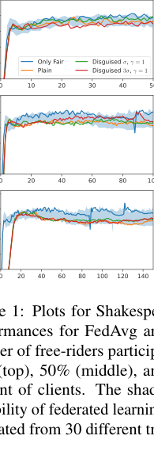

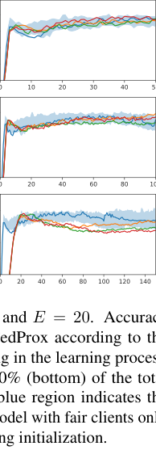

Figure 1: Plots for Shakespeare and _E_ = 20. Accuracy
performances for FedAvg and FedProx according to the
number of free-riders participating in the learning process:
15% (top), 50% (middle), and 90% (bottom) of the total
amount of clients. The shaded blue region indicates the
variability of federated learning model with fair clients only,
estimated from 30 different training initialization.

the regularization term monitors the asymptotic variance: a
higher regularization leads to a smaller noise parameter _ρ_ [2] _j_
and to a smaller _ϵ_, thus decreasing the asymptotic variances
of Theorem 2, 3, and Corollary 1, 2.

**3** **Experiments**

This experimental section focuses on a series of benchmarks for the proposed free-rider attacks. The methods
being of general application, the focus here is to empirically demonstrate our theory on diverse experimental
setups and model specifications. All code, data and
[experiments are available at https://github.com/](https://github.com/Accenture/Labs-Federated-Learning/tree/free-rider_attacks)
[Accenture/Labs-Federated-Learning/tree/](https://github.com/Accenture/Labs-Federated-Learning/tree/free-rider_attacks)

[free-rider_attacks.](https://github.com/Accenture/Labs-Federated-Learning/tree/free-rider_attacks)

**3.1** **Experimental Details**

We consider 5 fair clients for each of the following scenarios, investigated in previous works on federated learning

[McMahan et al., 2017, Li et al., 2018]:

**MNIST** (classification in iid and non-iid settings). We
study a standard classification problem on MNIST

[LeCun et al., 1998] and create two benchmarks: an iid
dataset (MNIST iid) where we assign 600 training digits
and 300 testing digits to each client, and a non-iid dataset
(MNIST non-iid), where for each digit we create two shards
with 150 training samples and 75 testing samples, and allocate 4 shards for each client. For each scenario, we use a
logistic regression predictor.

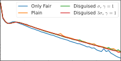

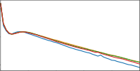

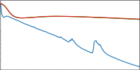

Figure 2: Plots for Shakespeare and _E_ = 20. Loss performances for FedAvg and FedProx according to the number of
free-riders participating in the learning process: 15% (top),
50% (middle), and 90% (bottom) of the total amount of
clients.

**CIFAR-10** [Krizhevsky et al., ] (image classification). The
dataset consists of 10 classes of 32x32 images with
three RGB channels. There are 50000 training examples and 10000 testing examples which we partitioned
into 5 clients each containing 10000 training and 2000
testing samples. The model architecture was taken from

[McMahan et al., 2017] which consists of two convolutional layers and a linear transformation layer to produce
logits.

**Shakespeare** (LSTM prediction). We study a LSTM model
for next character prediction on the dataset of _The Complete_
_Works of William Shakespeare_ [McMahan et al., 2017]. We
randomly chose 5 clients with more than 3000 samples, and
assign 70% of the dataset to training and 30% to testing.
Each client has on average 6415 _._ 4 samples ( _±_ 1835 _._ 6) . We
use a two-layer LSTM classifier containing 100 hidden units
with an 8 dimensional embedding layer. The model takes
as an input a sequence of 80 characters, embeds each of the
characters into a learned 8-dimensional space and outputs
one character per training sample after 2 LSTM layers and
a fully connected one.

We train federated models following FedAvg and FedProx
aggregation processes. In FedProx, the hyperparameter _µ_
monitoring the regularization is chosen according to the best
performing scenario reported in [Li et al., 2018]: _µ_ = 1 for
MNIST (iid and non-iid), and _µ_ = 0 _._ 001 for Shakespeare.
For the free-rider we declare a number of samples equal to
the average sample size across fair clients. We test federated
learning with 5 and 20 local epochs using SGD optimization
with learning rate _λ_ = 0 _._ 001 for MNIST (iid and non-iid),
_λ_ = 0 _._ 001 for CIFAR-10, and _λ_ = 0 _._ 5 for Shakespeare,
and batch size of 100. We evaluate the success of the free

**Free-rider Attacks on Model Aggregation in Federated Learning**

rider attacks by quantifying testing accuracy and training
loss of the resulting model, as indicators of the effect of
the perturbation induced by free-riders on the final model
performances. Resulting figures for associated accuracy and
loss can be found in Figure 1, Figure 2 and Appendix C.

**3.2** **Free-rider attacks: convergence and**
**performances**

In the following experiments, we assume that free-riders do
not have any data, which means that they cannot estimate
the noise level by computing a plausible quadratic approximation of the local loss function (Section 2.5). Therefore,
we investigate free-rider attacks taking the simple form
_ϕ_ ( _t_ ) = _σt_ _[−][γ]_ . The parameter _γ_ is chosen among a panel of
testing parameters _γ ∈{_ 0 _._ 5 _,_ 1 _,_ 2 _}_, while additional experimental material on the influence of _γ_ on the convergence
is presented in Appendix C. While the optimal tuning of
disguised free-rider attacks is out of the scope of this study,
in what follows the perturbations parameter _σ_ is defined
according to practical hypotheses on the parameters evolution during federated learning. After random initialization
at the initial federated learning step, the parameter _σ_ is opportunely estimated to mimic the extent of the distribution
of the update ∆ _θ_ [˜][0] = _θ_ [˜][1] _−_ _θ_ [˜][0] observed between consecutive
rounds of federated learning. We can simply model these
increments as a zero-centered univariate Gaussian distribu
tion, and assign the parameter _σ_ to the value of the fitted
standard deviation. According to this strategy, the free-rider
would return parameters _θ_ [˜] _k_ _[t]_ [with perturbations distributed]
as the ones observed between two consecutive optimization
rounds. Figure 1, top row, exemplifies the evolution of the
models obtained with FedAvg (20 local training epochs) on
the Shakespeare dataset with respect to different scenarios:
1) fair clients only, 2) plain free-rider, 3) disguised free-rider
with decay parameter _γ_ = 1, and estimated noise level _σ_,
and 4) disguised free-rider with noise level increased to 3 _σ_ .
For each scenario, we compare the federated model obtained
under free-rider attacks with respect to the equivalent model
obtained with the participation of the fair clients only. For
this latter setting, to assess the model training variability,
we repeated the training 30 times with different parameter
initializations. The results show that, independently from
the chosen free-riding strategy, the resulting models attains
comparable performances with respect to the one of the
model obtained with fair clients only (Figure 1, top row).
Similar results are obtained for the setup with 5 local training epochs and different values of _γ_, as well as for FedProx
with 5 and 20 local epochs (Appendix C).

We also investigate the same training setup under the influence of multiple free-riders (Figure 1, mid and bottom
rows). In particular, we test the scenarios where the freeriders declare respectively 50% and 90% of the total training
sample size. In practice, we maintain the same experimental setting composed of 5 fair clients, and we increase the

number of free-riders to respectively 5 and 45, while declaring for each free-rider a sample size equal to the average
number of samples of the fair clients. Independently from
the magnitude of the perturbation function, the number of
free-riders does not seem to affect the performance of the
final aggregated model. However, the convergence speed
is greatly decreased. Figure 2 shows that the convergence
in these different settings is not identically affected by the
free-riders. When the size of free-riders is moderate, e.g. up
to 50% of the total sample size, the convergence speed of
the loss is slightly slower than for federated learning with
fair clients. The attacks can be still considered successful,
as convergence is achieved within the pre-defined iteration
budget. However, when the size of free-riders reaches 90%,
convergence to the optimum is extremely slow and cannot
be achieved anymore in a reasonable amount of iterations.
This result is in agreement with our theory, for which the
convergence speed inversely proportional to the relative size
of the free-riders. Interestingly, we note that the final accuracy obtained in all the scenarios is similar (though a bit
slower with 90% of free-riders), and falls within the variability observed in federated learning with fair-clients only
(Figure 1). This result is achieved in spite of the incomplete
convergence during training. This effect can be explained
by observing that this accuracy level is already reached
at the early training stages of federated learning with fair
clients, while further training does not seem to improve the
predictions. This result suggests that, in spite of the very
low convergence speed, the averaging process with 90% of
free-riders still achieves a reasonable minima compatible
with the training path of the fair clients aggregation.

We note that the "peaks" observed in the loss of Figure 2
are common in FL, especially in the considered application
when the number of clients is low. It is important to notice
that our experiments are performed by using vanilla SGD.
As such, the peaks for only fair clients are to be expected in
both loss and performances. We also notice that the peaks
are smaller for free-riding because of the “regularization”
effect of free-riders, which regresses the update towards the
global model of the previous iteration.

Analogous results and considerations can be derived from
the set of experiments on the remaining datasets, training parameters and FedProx as an aggregation scheme (Appendix
C).

**4** **Conclusion and discussion**

We introduced a theoretical framework for the study of freeriding attacks on model aggregation in federated learning.
Based on the proposed methodology, we proved that simple strategies based on returning the global model at each
iteration already lead to successful free-rider attacks (plain
free-riding), and we investigated more sophisticated disguising techniques relying on stochastic perturbations of

**Yann Fraboni** [1] _[,]_ [2] **, Richard Vidal** [2] **, Marco Lorenzi** [1]

the parameters (disguised free-riding). The convergence
of each attack was demonstrated through theoretical developments and experimental results. The threat of free-rider
attacks is still under-investigated in machine learning. For
example, current defence schemes in federated learning are
mainly based on outliers detection mechanisms, to detect
malicious attackers providing abnormal updates. These
schemes would be therefore unsuccessful in detecting a freerider update which is, by design, equivalent to the global
federated model.

This work opens the way to the investigation of optimal disguising and defense strategies for free-rider attacks, beyond
the proposed heuristics. Our experiments show that inspection of the client’s distribution should be established as a

routine practice for the detection of free-rider attacks in federated learning. Further research directions are represented
by the improvement of detection at the server level, through
better modeling of the heterogeneity of the incoming clients’
parameters. This study provides also the theoretical basis
for the study of effective free-riding strategies, based on different noise model distributions and perturbation schemes.
Finally, in this work we relied on a number of hypothesis
concerning the evolution of the clients’ parameters during
federated learning. This choice provides us with a convenient theoretical setup for the formalization of the proposed
theory which may be modified in the future, for example,
for investigating more complex forms of variability and
schemes for parameters aggregation.

**Acknowledgments and Disclosure of Funding**

This work has been supported by the French government,
through the 3IA Côte d’Azur Investments in the Future
project managed by the National Research Agency (ANR)
with the reference number ANR-19-P3IA-0002, and by the
ANR JCJC project Fed-BioMed 19-CE45-0006-01. The
project was also supported by Accenture. The authors are
grateful to the OPAL infrastructure from Université Côte
d’Azur for providing resources and support.

**References**

[Ateniese et al., 2015] Ateniese, G., Mancini, L. V., Spognardi, A., Villani, A., Vitali, D., and Felici, G. (2015).
Hacking smart machines with smarter ones: How to
extract meaningful data from machine learning classifiers. _International Journal of Security and Networks_,
10(3):137–150.

[Bhagoji et al., 2019] Bhagoji, A. N., Chakraborty, S., Mittal, P., and Calo, S. (2019). Analyzing federated learning
through an adversarial lens. _36th International Confer-_
_ence on Machine Learning, ICML 2019_, 2019-June:1012–
1021.

[Brisimi et al., 2018] Brisimi, T., Chen, R., Mela, T., Olshevsky, A., Paschalidis, I., and Shi, W. (2018). Federated learning of predictive models from federated electronic health records. _International Journal of Medical_
_Informatics_, 112.

[Carlini et al., 2019] Carlini, N., Liu, C., Erlingsson, Ú.,
Kos, J., and Song, D. (2019). The secret sharer: Evaluating and testing unintended memorization in neural networks. In _28th USENIX Security Symposium (USENIX_
_Security 19)_, pages 267–284, Santa Clara, CA. USENIX
Association.

[Fredrikson et al., 2015] Fredrikson, M., Jha, S., and Ristenpart, T. (2015). Model inversion attacks that exploit
confidence information and basic countermeasures. In
_Proceedings of the 22nd ACM SIGSAC Conference on_
_Computer and Communications Security_, CCS ’15, page
1322–1333, New York, NY, USA. Association for Computing Machinery.

[Fredrikson et al., 2014] Fredrikson, M., Lantz, E., Jha, S.,
Lin, S., Page, D., and Ristenpart, T. (2014). Privacy
in pharmacogenetics: An end-to-end case study of personalized warfarin dosing. In _23rd USENIX Security_
_Symposium (USENIX Security 14)_, pages 17–32, San
Diego, CA. USENIX Association.

[Fung et al., 2020] Fung, C., Yoon, C. J. M., and Beschastnikh, I. (2020). The limitations of federated learning in
sybil settings. In _23rd International Symposium on Re-_
_search in Attacks, Intrusions and Defenses (RAID 2020)_,
pages 301–316, San Sebastian. USENIX Association.

[He et al., 2018] He, L., Meng, Q., Chen, W., Ma, Z. M.,
and Liu, T. Y. (2018). Differential equations for modeling asynchronous algorithms. _IJCAI International Joint_
_Conference on Artificial Intelligence_, 2018-July(1):2220–
2226.

[Hitaj et al., 2017] Hitaj, B., Ateniese, G., and Perez-Cruz,
F. (2017). Deep Models under the GAN: Information
leakage from collaborative deep learning. _Proceedings of_
_the ACM Conference on Computer and Communications_
_Security_, pages 603–618.

[Krizhevsky et al., ] Krizhevsky, A., Nair, V., and Hinton,
G. Cifar-10 (canadian institute for advanced research).

[LeCun et al., 1998] LeCun, Y., Bottou, L., Bengio, Y.,
and Ha, P. (1998). LeNet. _Proceedings of the IEEE_,
(November):1–46.

[Li et al., 2016] Li, B., Wang, Y., Singh, A., and Vorobeychik, Y. (2016). Data poisoning attacks on factorizationbased collaborative filtering. _Advances in Neural Infor-_
_mation Processing Systems_, (Nips):1893–1901.

**Free-rider Attacks on Model Aggregation in Federated Learning**

[Li et al., 2017] Li, Q., Tai, C., and Weinan, E. (2017).
Stochastic modified equations and adaptive stochastic
gradient algorithms. _34th International Conference on_
_Machine Learning, ICML 2017_, 5:3306–3340.

[Li et al., 2018] Li, T., Sahu, A. K., Zaheer, M., Sanjabi,
M., Talwalkar, A., and Smith, V. (2018). Federated
Optimization in Heterogeneous Networks. _Proceedings_
_of the 1 st Adaptive & Multitask Learning Workshop,_
_Long Beach, California, 2019_, pages 1–28.

[Lin et al., 2019] Lin, J., Du, M., and Liu, J. (2019). Freeriders in Federated Learning: Attacks and Defenses.
_http://arxiv.org/abs/1911.12560_ .

[Mandt et al., 2017] Mandt, S., Hof Fman, M. D., and Blei,
D. M. (2017). Stochastic gradient descent as approximate Bayesian inference. _Journal of Machine Learning_
_Research_, 18:1–35.

[McMahan et al., 2017] McMahan, H., Moore, E., Ramage, D., Hampson, S., and Agüera y Arcas, B. (2017).
Communication-efficient learning of deep networks from
decentralized data. _Proceedings of the 20th International_
_Conference on Artificial Intelligence and Statistics, AIS-_
_TATS 2017_, 54.

[Orvieto and Lucchi, 2018] Orvieto, A. and Lucchi, A.
(2018). Continuous-time Models for Stochastic Optimization Algorithms. (NeurIPS).

[Shen et al., 2016] Shen, S., Tople, S., and Saxena, P.
(2016). AUROR: Defending against poisoning attacks
in collaborative deep learning systems. In _ACM In-_
_ternational Conference Proceeding Series_, volume 59-Decemb, pages 508–519.

[Silva et al., 2019] Silva, S., Gutman, B. A., Romero, E.,
Thompson, P. M., Altmann, A., and Lorenzi, M. (2019).
Federated learning in distributed medical databases:
Meta-analysis of large-scale subcortical brain data. In
_2019 IEEE 16th International Symposium on Biomedical_
_Imaging (ISBI 2019)_, pages 270–274. IEEE.

[Uhlenbeck and Ornstein, 1930] Uhlenbeck, G. E. and
Ornstein, L. S. (1930). On the theory of the brownian
motion. _Phys. Rev._, 36:823–841.

[Wang et al., 2019] Wang, Z., Song, M., Zhang, Z., Song,
Y., Wang, Q., and Qi, H. (2019). Beyond Inferring Class
Representatives: User-Level Privacy Leakage from Federated Learning. _Proceedings - IEEE INFOCOM_, 2019April:2512–2520.

[Xie et al., 2019] Xie, C., Huang, K., Chen, P.-Y., and Li,
B. (2019). Dba: Distributed backdoor attacks against federated learning. In _International Conference on Learning_
_Representations_ .

[Yin et al., 2018] Yin, D., Chen, Y., Ramchandran, K., and
Bartlett, P. (2018). Byzantine-robust distributed learning: Towards optimal statistical rates. _35th International_
_Conference on Machine Learning, ICML 2018_, 13:8947–
8956.

**Yann Fraboni** [1] _[,]_ [2] **, Richard Vidal** [2] **, Marco Lorenzi** [1]

**A** **Complete Proofs for FedAvg**

**A.1** **Proof of Theorem 1**

We prove with a reasoning by induction that:

and

˜
_θ_ _[t]_ [+1] = �

_j∈J_

_Mj_

_N_

˜ ˜
� _ηj_ � _θ_ _[t]_ _−_ _θj_ _[∗]_ � + _θj_ _[∗]_ � + _[M]_ _N_ _[K]_ _θ_ _[t]_ + ˜ _νt_

(32)

_t−_ 1
�

_i_ =0

_t−_ 1
�

_i_ =0

_θ_ ˜ _[t]_ [+1] = � _MNj_ � _ηj_ � _θ_ _[t]_ _−_ _θj_ _[∗]_ � + _θj_ _[∗]_ �

_j∈J_

By using equation (30) for equation (32), we get:

˜
_θ_ _[t]_ _−_ _θ_ _[t]_ =

+

_ϵ_ + _[M][K]_
� _N_

_ϵ_ + _[M][K]_
� _N_

_t−i−_ 1
_f_ ( _θ_ _[i]_ )
�

_t−i−_ 1
(˜ _νi −_ _νi_ ) _,_ (26)
�

with _f_ ( _θ_ _[t]_ ) = _[M]_ _N_ _[K]_ � _θ_ _[t]_ _−_ [�] _j∈J_ _N_ _−MMj_ _K_ [[] _[η][j]_ [(] _[θ][t][ −]_ _[θ]_ _j_ _[∗]_ [) +] _[ θ]_ _j_ _[∗]_ []] �,

_t−i−_ 1
_f_ ( _θ_ _[i]_ )
�

_t−i−_ 1
(˜ _νi −_ _νi_ )
�

_Mj_
_j∈J_ _N_

_Mj_
_j∈J_ _N_ _−MK_ _[ρ][j][ζ][j,t]_ [ and]

_t−_ 1

+ _ϵ_

�

_i_ =0

_t−_ 1

+ _ϵ_

�

_i_ =0

_ϵ_ + _[M][K]_
� _N_

_ϵ_ + _[M][K]_
� _N_

_ϵ_ = �

_Nj_ _[η][j]_ [,] _νt_ = �

_ν_ ˜ _t_ = � _j∈J_ _MNj_

_ν_ ˜ _t_ = � _j∈J_ _MNj_ _[ρ][j]_ [ ˜] _[ζ][j,t]_ [.] By definition of _θ_ _[t]_ [+1],

E [ _f_ ( _θ_ _[t]_ )] = _[M]_ _N_ _[K]_ �E [ _θ_ _[t]_ ] _−_ E � _θ_ _[t]_ [+1][��] .

_N_ _[K]_ �E [ _θ_ _[t]_ ] _−_ E � _θ_ _[t]_ [+1][��] .

_Proof._ **Server iteration** _t_ = 1

Using the fair clients local model parameters evolution of
Section 2.3 and the server aggregation process expressed in
equation (10), the global model can be written as

+ _[M][K]_

_N_ _[θ][t]_

_t−i−_ 1
_f_ ( _θ_ _[i]_ )
�

_t−i−_ 1
(˜ _νi −_ _νi_ )
�

+ _[M][K]_

_N_

_t−_ 1
�

_i_ =0

_t−_ 1
�

_i_ =0

_ϵ_ + _[M][K]_
� _N_

_ϵ_ + _[M][K]_
� _N_

_θ_ [1] = �

_j∈J_

_Mj_
_N −_ _MK_

� _ηj_ � _θ_ [0] _−_ _θj_ _[∗]_ � + _θj_ _[∗]_ � + _ν_ 0 _._ (27)

+ _[M][K]_

_N_

Similarly, the global model for federated learning with plain
free-riders can be expressed as

+ ˜ _νt_ (33)

which can be rewritten as:

_Mj_

_N_ _[θ]_ [0][ + ˜] _[ν]_ [0] _[.]_ [ (28)]

˜
_θ_ [1] = �

_j∈J_

_Nj_ � _ηj_ � _θ_ [0] _−_ _θj_ _[∗]_ � + _θj_ _[∗]_ � + _[M]_ _N_ _[K]_

By subtracting equation (27) to equation (28), we obtain:

_θ_ ˜ _[t]_ [+1] = � _MNj_ � _ηj_ � _θ_ _[t]_ _−_ _θj_ _[∗]_ � + _θj_ _[∗]_ �

_j∈J_

˜
_θ_ [1] _−_ _θ_ [1] = _−_ _[M]_ _N_ _[K]_ �

_j∈J_

_Mj_
_N −_ _MK_

_t−i−_ 1
_f_ ( _θ_ _[i]_ )
�

_t−i−_ 1
(˜ _νi −_ _νi_ )
�

� _ηj_ � _θ_ [0] _−_ _θj_ _[∗]_ � + _θj_ _[∗]_ �

+ [ _ϵ_ + _[M][K]_

_N_ []]

+ [ _ϵ_ + _[M][K]_

+ _[M][K]_ (29)

_N_ _[θ]_ [0][ + ˜] _[ν]_ [0] _[ −]_ _[ν]_ [0]

Hence, _θ_ [˜] 1 _−_ _θ_ 1 follows the formalization.

**From** _t_ **to** _t_ + 1

We suppose the property true at a server iteration _t_ . Hence,

we get:

+ [ _ϵ_ + _[M][K]_

_N_ []]

+ [ _ϵ_ + _[M][K]_

_t−_ 1
�

_i_ =0

_t−_ 1
�

_i_ =0

_ϵ_ + _[M][K]_
� _N_

_ϵ_ + _[M][K]_
� _N_

+ _[M][K]_ (34)

_N_ _[θ][t]_ [ + ˜] _[ν][t][,]_

leading to

_t−_ 1
�

_i_ =0

_t−_ 1
�

_i_ =0

+

+

˜
_θ_ _[t]_ [+1] = �

_j∈J_

˜
_θ_ _[t]_ _−_ _θ_ _[t]_ =

+

_ϵ_ + _[M][K]_
� _N_

_ϵ_ + _[M][K]_
� _N_

_MNj_ � _ηj_ � _θ_ _[t]_ _−_ _θj_ _[∗]_ � + _θj_ _[∗]_ �

_Mj_

_t−i−_ 1
_f_ ( _θ_ _[i]_ )
�

_t−i−_ 1
(˜ _νi −_ _νi_ ) _,_ (30)
�

_t−i_
_f_ ( _θ_ _[i]_ )
�

_t−i_
(˜ _νi −_ _νi_ )
�

_t−_ 1
�

_i_ =0

_t−_ 1
�

_i_ =0

_ϵ_ + _[M][K]_
� _N_

_ϵ_ + _[M][K]_
� _N_

With the same reasoning as for _t_ = 1, we get:

_θ_ _[t]_ [+1] = �

_j∈J_

_Mj_
_N −_ _MK_

� _ηj_ � _θ_ _[t]_ _−_ _θj_ _[∗]_ � + _θj_ _[∗]_ � + _νt_ (31)

+ _[M][K]_ (35)

_N_ _[θ][t]_ [ + ˜] _[ν][t]_

**Free-rider Attacks on Model Aggregation in Federated Learning**

By subtracting equation (35) to equation (31), we obtain:

get:

_ϵ_ + _[M][K]_
� _N_

� _t−i−_ 1

˜
_θ_ _[t]_ [+1] _−_ _θ_ _[t]_ [+1] = _−_ _[M][K]_

_N_

�

_j∈J_

_Mj_
_N −_ _MK_

� _ηj_ � _θ_ _[t]_ _−_ _θj_ _[∗]_ � + _θj_ _[∗]_ �

_N_ 0 _−_ 1
�

_i_ =0

_Rα_

~~�~~ ~~�~~ � ~~�~~
_A_

_ϵ_ + _[M][K]_
� _N_

� _t−i−_ 1

+

+

_t−_ 1
�

_i_ =0

_t−_ 1
�

_i_ =0

_ϵ_ + _[M][K]_
� _N_

_ϵ_ + _[M][K]_
� _N_

_α._ (40)

_t−i_
_f_ ( _θ_ _[i]_ )
�

_t−i_
(˜ _νi −_ _νi_ )
�

_t−_ 1
�

_i_ = _N_ 0

� ~~��~~ �

_B_

+ _[M][K]_ (36)

_N_ _[θ][t]_ [ + ˜] _[ν][t][ −]_ _[ν][t]_

˜
_|_ E _θ_ _[t]_ _−_ _θ_ _[t]_ [�] _| ≤_
�

+

- **Expressing** _A_ **.**

_t−i−_ 1

(41)
�

_A_ =

_N_ 0 _−_ 1
�

_i_ =0

_ϵ_ + _[M][K]_
� _N_

Given that _−_ _[M]_ _N_ _[K]_ � _j∈J_ _N_ _−MMj_ _K_ � _ηj_ � _θ_ _[t]_ _−_ _θj_ _[∗]_ � + _θj_ _[∗]_ � +

_MK_ _[t]_ _[t]_

= _ϵ_ + _[M][K]_
� _N_

Given that _−_ _[M][K]_

_N_ _[K]_ �

� _t−_ 1 11 _− −_ � _ϵϵ_ + + _[M][M]_ _N_ _[K]_

1 _−_ ~~�~~ _ϵ_ + _[M]_ _N_ _[K]_

_[K]_ _−N_ 0

_N_ �

_[K]_ _−_ 1 (42)

_N_ ~~�~~

_K_

_N_ _[θ][t]_ [ =] _[ f]_ [(] _[θ][t]_ [)][, we get:]

_t_
�

_i_ =0

_t_
�

_i_ =0

_t→_ + _∞_
_−−−−→_ 0 (43)

- **Expressing** _B_ **.**

˜
_θ_ _[t]_ [+1] _−_ _θ_ _[t]_ [+1] =

+

_ϵ_ + _[M][K]_
� _N_

_ϵ_ + _[M][K]_
� _N_

_B_ =

_t−i_
_f_ ( _θ_ _[i]_ )
�

_t−i_
(˜ _νi −_ _νi_ ) _._ (37)
�

_t−_ 1

_ϵ_ + _[M][K]_

_i_ �= _N_ 0 � _N_

_t−i−_ 1

(44)
�

� _t−N_ 0 _−_ 1 1 _−_ 1 _−_ � _ϵ_ + _ϵ_ + _[M]_ _N_ _[K]_

_[K]_ _−_ 1

_N_ ~~�~~

= _ϵ_ + _[M][K]_
� _N_

1 _−_ ~~�~~ _ϵ_ + _[M]_ _N_ _[K]_

_[K]_ _−_ ( _t−N_ 0)

_N_ �

**A.2** **Proof of Theorem 2**

_Proof._ **Expected Value**

Let us first have a look at the expected value. By definition, a sum of Gaussian distributions with 0 mean,
E [ _νi_ ] = 0 and E [˜ _νi_ ] = 0. We also notice that E [ _f_ ( _θ_ _[t]_ )] =
_MNK_ �E [ _θ_ _[t]_ ] _−_ E � _θ_ _[t]_ [+1][��] . Hence, we obtain

(45)

_[K]_ _t−N_ 0

_N_ �

� _ϵ_ + _[M]_ _N_ _[K]_
= [1] _[ −]_

_[K]_ (46)

_N_ ~~�~~

1 _−_ ~~�~~ _ϵ_ + _[M]_ _N_ _[K]_

_t→_ + _∞_ 1
_−−−−→_ _>_ 0 (47)
1 _−_ ~~�~~ _ϵ_ + _[M]_ _N_ _[K]_ ~~�~~

_t−_ 1
�

_i_ =0

Using equation (43) and (47) in equation (40), we get:

˜
_∀α_ lim _θ_ _[t]_ _−_ _θ_ _[t]_ [�] _| ≤_ _Bα,_ (48)
_t→_ + _∞_ _[|]_ [ E] �

which is equivalent to

˜
lim _θ_ _[t]_ _−_ _θ_ _[t]_ [�] = 0 _._ (49)
_t→_ + _∞_ [E] �

**Variance**

The Wiener processes, _νi_ and ˜ _νi_ are independent from the
server models parameters _θ_ _[i]_ . Also, each Wiener process is
independent with the other Wiener processes. Hence, we

get:

_n−i−_ 1
E � _θ_ _[t]_ _−_ _θ_ _[t]_ [+1][�] _._
�

(38)

˜
E � _θ_ _[t]_ _−_ _θ_ _[t]_ [�] = _[M]_ _N_ _[K]_

˜
E � _θ_ _[t]_ _−_ _θ_ _[t]_ [�] = _[M]_ _N_ _[K]_

_ϵ_ + _[M][K]_
� _N_

We consider that federated learning is converging, hence
_t→_ + _∞_
_|_ E [ _θ_ _[t]_ ] _−_ E � _θ_ _[t]_ [+1][�] _|_ _−−−−→_ 0, and for any positive _α_, there
exists _N_ 0 such that _|_ E � _θ_ _[t]_ _−_ _θ_ _[t]_ [+1][�] _| < α_ . Since _ηj ∈_ ]0 _,_ 1[,
we have _ϵ ∈_ ]0 _,_ _[N]_ _[−]_ _N_ _[M][K]_ [ and _ϵ_ + _[M]_ _N_ _[K]_ _∈_ ]0 _,_ 1[. Thus, we can

rewrite equation (38) as

_t−i−_ 1
_f_ ( _θ_ _[i]_ )
� �

_t−_ 1

˜
Var � _θ_ _[t]_ _−_ _θ_ _[t]_ [�] = Var �

� _i_ =0

� ~~��~~ ~~�~~

_E_

_ϵ_ + _[M][K]_
� _N_

˜
_|_ E _θ_ _[t]_ _−_ _θ_ _[t]_ [�] _| ≤_
�

+

_N_ 0 _−_ 1
�

_i_ =0

_t−_ 1
�

_i_ = _N_ 0

_ϵ_ + _[M][K]_
� _N_

_t−i−_ 1

_ϵ_ + _[M][K]_ _α._ (39)
� _N_ �

_t−i−_ 1
_|_ E � _θ_ _[t]_ [�] _−_ E � _θ_ _[t]_ [+1][�] _|_
�

+

_t−_ 1
�

_i_ =0

2( _t−i−_ 1)
Var [˜ _νi −_ _νi_ ] _,_
� � ~~��~~ ~~�~~
_F_

(50)

_ϵ_ + _[M][K]_
� _N_

We define by _Rα_ = max _i∈_ [1 _,N_ 0] _|_ E [ _θ_ _[t]_ ] _−_ E � _θ_ _[t]_ [+1][�] _|_, and

**Yann Fraboni** [1] _[,]_ [2] **, Richard Vidal** [2] **, Marco Lorenzi** [1]

**Expressing** _E_ **.** Before getting a simpler expression for _E_,
we need to consider Cov � _f_ ( _θ_ _[l]_ ) _, f_ ( _θ_ _[m]_ )�. To do so, we first
consider _f_ ( _θ_ _[t]_ ) _−_ E [ _f_ ( _θ_ _[t]_ )].

_f_ ( _θ_ _[t]_ ) _−_ E � _f_ ( _θ_ _[t]_ )�

Considering the power series [�][+] _k_ =0 _[∞]_ _[nx][n]_ [ =] (1 _−xx_ ) [2] [, we get]

that [�] _[t]_ _l_ =0 _[−]_ [1] _[H]_ _[−][l][l]_ [ =] (1 _−HH_ _[−][−]_ [1][1] ) [2] [. Hence,] _[ E]_ [’s upper bound]
goes to 0. Given that _E_ is non-negative, we get:

_t→_ + _∞_
_E_ _−−−−→_ 0 (61)

**Expressing** _F_ **.** Let us first consider the noise coming from
the SGD steps. All the ˜ _νi_ are independent with _νi_ . Hence,
we have

_F_ = Var [˜ _νi_ ] _−_ Var [ _νi_ ] (62)

[ _θ_ _[t]_ _−_ E � _θ_ _[t]_ [�] ] _,_ (51)



= _[M][K]_

_N_



1 _−_
�
 _j∈J_

_Mj_
_ηj_
_N −_ _MK_

_j∈J_

~~�~~ ~~��~~ ~~�~~
_G_

We can prove with a reasoning by induction that

_θ_ _[t]_ _−_ E [ _θ_ _[t]_ ] = � _ni_ =0 _−_ 1 �� _j∈J_ _N_ _−MMj_ _K_ _[η][j]_ � _t−i−_ 1 _νi_ =

� _nk_ =0 _−_ 1 _[ϵ][t][−][i][−]_ [1] _[ν][i]_ [. All the] _[ ν][i]_ [ are independent across each]
others and have 0 mean, hence:

min _{l−_ 1 _,m−_ 1 _}_
Cov [ _f_ ( _θl_ ) _, f_ ( _θm_ )] = _G_ [2] � _ϵ_ _[l]_ [+] _[m][−]_ [2] _[i][−]_ [2] E � _νi_ [2] �

_i_ =0

(52)

2
Considering that E � _νi_ [2] � = Var [ _νi_ ] = [�] _j∈J_ � _N_ _−MMj_ _K_ _[ρ][j]_ �,
we get:

Cov � _f_ ( _θ_ _[l]_ ) _, f_ ( _θ_ _[m]_ )�



(63)


= Var



 [�] _j∈J_

_j∈J_

_MNj_ _[ρ][j]_ [ ˜] _[ζ][j,i][ −]_ �

_j∈J_

_Mj_ _ρjζj,i_
_N −_ _MK_

= [ [1]

[1] 1

_N_ [2] [+] ( _N −_ _MK_ ) [2] []] �

� ( _Mjρj_ ) [2] (64)

_j∈J_

Replacing (64) in equation (50), we can express the variance

as

˜
Var _θ_ _[t]_ _−_ _θ_ _[t]_ [�] = _E_ + _F_
�

_t−_ 1
� _H_ [2(] _[t][−][i][−]_ [1)] (65)

_i_ =0

_t−_ 1
= _E_ + _FH_ [2(] _[t][−]_ [1)] � _H_ _[−]_ [2] _[i]_ (66)

_i_ =0

= _E_ + _FH_ [2(] _[t][−]_ [1)] [1] _[ −]_ _[H]_ _[−]_ [2] _[t]_ (67)

1 _−_ _H_ _[−]_ [2]

2 min _{l−_ 1 _,m−_ 1 _}_
� _ϵ_ _[t][−][i][−]_ [1] (53)
� _i_ =0

= _G_ [2][ �]

_j∈J_

_Mj_
_ρj_
� _N −_ _MK_

2

We define _G_ _[′]_ = _G_ [2][ �] _j∈J_ � _N_ _−MMj_ _K_ _[ρ][j]_ � . Given that _ϵ ∈_

]0 _,_ 1[, we get the following upper bound on _E_ :

Cov � _f_ ( _θ_ _[l]_ ) _, f_ ( _θ_ _[m]_ )� _≤_ _G_ _[′]_ min _{l, m}_ (54)

By denoting _H_ = _ϵ_ + _[M]_ _N_ _[K]_ [, we can rewrite] _[ E]_ [ as:]

˜ [ _N_ [1]
Var _θ_ _[t]_ _−_ _θ_ _[t]_ [�] _−−−−→_ _[t][→]_ [+] _[∞]_
�

= _E_ + _F_ [1] _[ −]_ _[H]_ [2] _[t]_ (68)

1 _−_ _H_ [2]

By replacing _F_ and _H_ with their respective expression, we
can conclude that

_N_ [1][2] [+] ( _N_ _−M_ 1 _K_ ) [2] []] [�]

2

1 _−_ ~~�~~ _ϵ_ + _[M]_ _N_ _[K]_ ~~�~~

_j∈J_ [(] _[M][j][ρ][j]_ [)][2]

_t−_ 1
� _H_ [2(] _[t][−]_ [1)] _[−][l][−][m]_ Cov � _fl_ ( _θ_ _[l]_ ) _, f_ ( _θ_ _[m]_ )� (55)

_m_ =0

_E_ =

_≤_

_t−_ 1
�

_l_ =0

_t−_ 1
�

_l_ =0

_t−_ 1
� _H_ [2(] _[t][−]_ [1)] _[−][l][−][m]_ _G_ _[′]_ min _{l, m}_ (56)

_m_ =0

Considering that min _{l, m} ≤_ _l_, we get:

_t−_ 1
_E ≤_ _G_ _[′]_
�

_l_ =0

_t−_ 1
� _H_ [2(] _[t][−]_ [1)] _[−][l][−][m]_ _l_ (57)

_m_ =0

_t−_ 1
= _G_ _[′]_ _H_ [2(] _[t][−]_ [1)] � _H_ _[−][l]_ _l_

_l_ =0

_t−_ 1
= _G_ _[′]_ _H_ [2(] _[t][−]_ [1)] �

_t−_ 1
� _H_ _[−][m]_ (58)

_m_ =0

_t−_ 1
�

(69)

Note 1: The asymptotic variance is strictly increasing with
the number of data points declared by the free-riders _MK_ .

While _Mj_ and _ρj_ are constants and independent from the
number of free-riders and from their respective number
of data points, _N_ and _ϵ_ depend on the total number of
free-riders’ samples _MK_ . We first rewrite _ϵ_ = _N_ 1 _[α]_ [ with]
_α_ = [�] _j∈J_ _[M][j][η][j]_ [ not depending on] _[ M][K]_ [ and we get:]

_ϵ_ + _[M][K]_

_[K]_

= [1]
_N_ _N_

(70)
_N_ [[] _[α]_ [ +] _[ M][K]_ []] _[.]_

_t−_ 1
= _G_ _[′]_ _H_ [2(] _[t][−]_ [1)] �

(59)
1 _−_ _H_ _[−]_ [1]

_H_ _[−][l]_ _l_ [1] _[ −]_ _[H]_ _[−][n]_

� 1 _−_ _H_ _[−]_ [1]

_l_ =0

By defining _MJ_ = [�] _j∈J_ _[M][j]_ [, we get:]

2
1
� = _N_ [2] [[] _[M]_ [ 2] _J_ [+ 2] _[M][K]_ [[] _[M][J]_ _[−]_ _[α]_ []] _[ −]_ _[α]_ [2][]] _[,]_

(71)

_t−_ 1
� _H_ _[−][l]_ _l_ (60)

_l_ =0

_t−_ 1
�

1 _−_ _ϵ_ + _[M][K]_
� _N_

= _G_ _[′]_ _H_ [2(] _[t][−]_ [1)] [1] _[ −]_ _[H]_ _[−][n]_

1 _−_ _H_ _[−]_ [1]

= _G_ _[′]_ _H_ [2(] _[t][−]_ [1)] [1] _[ −]_ _[H]_ _[−][n]_

**Free-rider Attacks on Model Aggregation in Federated Learning**

with _MJ −_ _α >_ 0 because _ηj ∈_ ]0 _,_ 1[.

Also, considering that

_N_ 1 [2] [+] ( _N −_ 1 _MK_ ) [2] [=] _N_ 1 [2] [[] _[M]_ _M_ [ 2] _KJ_ [2] + 2 _[M]_ _M_ _[K]_ _J_ + 2] _,_ (72)

we can rewrite

�2( _t−_ 1) 11 _− −_ � _ϵϵ_ + + _[M][M]_ _N_ _[K][K]_

Proof A.2, we get:

_t−_ 1
�
� _i_ =0

�

_t−i−_ 1
_MK_
� _N_ _[ϕϵ][t]_

Var

_ϵ_ + _[M][K]_
� _N_

2( _t−i−_ 1)
� _MN_ 2 _K_ [2] _[ϕ]_ [2] (79)

=

_t−_ 1
�

_i_ =0

_ϵ_ + _[M][K]_
� _N_

1 _−_ ~~�~~ _ϵ_ + _[M]_ _N_ _[K]_

_[K]_ _−_ 2 _t_

_N_ �

_N_ _[K]_ � _MK_ [2]

_[K]_ _−_ 2 _N_ [2] _[ϕ]_ [2] (80)

_N_ ~~�~~

_N_ 1 [2] [+] ( _N_ _−M_ 1 _K_ ) [2]

2 [=]

1 _−_ ~~�~~ _ϵ_ + _[M]_ _N_ _[K]_ ~~�~~

_MK_ [2] _[M][K]_
_MJ_ [2] [+ 2] _MJ_

_[K]_

_MJ_ [+ 2]

= _ϵ_ + _[M][K]_
� _N_

_J_ (73)

_MJ_ [2] [+ 2] _[M][K]_ [[] _[M][J][ −]_ _[α]_ []] _[ −]_ _[α]_ [2]

� _ϵ_ + _[M]_ _N_ _[K]_
= [1] _[ −]_

_[K]_ 2 _t_

_N_ �

_N_ _[K]_ � _MK_ [2]

_[M][K]_ 2 _N_ [2] _[ϕ]_ [2] (81)

_N_ ~~�~~

1 _−_ ~~�~~ _ϵ_ + _[M]_ _N_ _[K]_

As the numerator is a polynomial of order 2 in _MK_ and
the denominator is a polynomial of order 1 in _MK_, the
asymptotic variance is increasing with _MK_ .

Note 2: When considering that the SGD noise variance is
different for federated learning with and without free-riders,

we get:

As for equation (50), all the _ϵt_ are independent from _νt_,
from ˜ _νt_, and from the global model parameters _θ_ _[t]_ . Hence,
for one disguised free-rider we get the following asymptotic
variance:

_t→_ + _∞_ 1
_−−−−→_

_[K]_ 2 _MNK_ [2][2] _[ϕ]_ [2] (82)

_N_ ~~�~~

1 _−_ ~~�~~ _ϵ_ + _[M]_ _N_ _[K]_

1

� _j∈J_ ( _Mj_ ˜ _ρj_ ) [2] + ( _N −_ _MK_ ) [2] � _j∈J_

1
_F_ =
_N_ [2] �

� ( _Mjρj_ ) [2]

_j∈J_

˜ [ _N_ [1][2]
Var _θ_ _[t]_ _−_ _θ_ _[t]_ [�] _−−−−→_ _[t][→]_ [+] _[∞]_
�

_N_ [1][2] [+] ( _N_ _−M_ 1 _K_ ) [2] []] [�]

2

1 _−_ ~~�~~ _ϵ_ + _[M]_ _N_ _[K]_ ~~�~~

_j∈J_ [(] _[M][j][ρ][j]_ [)][2]

(74)

**A.3** **Proof of Theorem 3**

_Proof._ **Relation between federated learning with and**
**without free-riders global model**

With a reasoning by induction similar to Proof A.1, we get:

1
+

_[M][K]_ 2 _MNK_ [2][2] _[ϕ]_ [2] _[.]_ (83)

_N_ ~~�~~

1 _−_ ~~�~~ _ϵ_ + _[M]_ _N_ _[K]_

_t−_ 1

˜
_θ_ _[t]_ _−_ _θ_ _[t]_ = �

_i_ =0

_t−_ 1

+

�

_i_ =0

_t−_ 1

+

�

_i_ =0

**Expected value**

**A.4** **Proof of Corollary 1**

_Proof._ **Relation between federated learning with and**
**without free-riders global model**

With a reasoning by induction similar to Proof A.1, we get:

˜
_θ_ _[t]_ _−_ _θ_ _[t]_ =

+

_t−_ 1
�

_i_ =0

_t−_ 1
�

_i_ =0

_ϵ_ + _[M][K]_
� _N_

_ϵ_ + _[M][K]_
� _N_

_ϵ_ + _[M][K]_
� _N_

_t−i−_ 1
_f_ ( _θ_ _[i]_ ) (75)
�

_t−i−_ 1
(˜ _νi −_ _νi_ ) (76)
�

_t−i−_ 1
_MK_

(77)

� _N_ _[ϕϵ][t][,]_

_ϵ_ + _[M][K]_
� _N_

_ϵ_ + _[M][K]_
� _N_

_t−i−_ 1
_f_ ( _θ_ _[i]_ ) (84)
�

_t−i−_ 1
(˜ _νi −_ _νi_ ) (85)
�

_t−i−_ 1
_Mk_

(86)

� _N_ _[ϕ][k][ϵ][k,t][,]_

_ϵ_ + _[M][K]_
� _N_

_ϵt_ is a delta-correlated Gaussian White noise which implies
that E [ _ϵt_ ] = 0. Following the same reasoning steps as in
Proof A.2, we get:

˜
lim _θ_ _[t]_ _−_ _θ_ _[t]_ [�] = 0 _._ (78)
_t→_ + _∞_ [E] �

**Variance**

All the _ϵt_ are independent Gaussian white noises implying
Var [ _ϵt_ ] = 1. Following the same reasoning steps as in

+
�

_k∈K_

**Expected value**

_t−_ 1
�

_i_ =0

_ϵk,t_ are delta-correlated Gaussian White noises which implies that E [ _ϵk,t_ ] = 0. Following the same reasoning steps
as in Proof A.2, we get:

˜
lim _θ_ _[t]_ _−_ _θ_ _[t]_ [�] = 0 _._ (87)
_t→_ + _∞_ [E] �

**Variance**

**Yann Fraboni** [1] _[,]_ [2] **, Richard Vidal** [2] **, Marco Lorenzi** [1]

All the _ϵk,t_ are independent Gaussian white noises over
server iterations _t_ and free-riders indices _k_ implying
Var [ _ϵt_ ] = 1. Following the same reasoning steps as in
Proof A.2, we get:

�

_t−i−_ 1
_Mk_
� _N_ _[ϕ][k][ϵ][k,t]_

_t−i−_ 1
_Mk_
� _N_

Var

_t−_ 1
�
� _i_ =0

_ϵ_ + _[M][K]_
� _N_

_t→_ + _∞_
Considering that _ρ_ _[t]_ _j_ _−−−−→_ 0, we get:

_t→_ + _∞_
_F_ _−−−−→_ 0 (93)

Using the same reasoning as the one used for the expected
value convergence in Proof A.2, we get that the SGD noise
contribution linked to _F_ goes to 0 at infinity.

For the disguised free-riders, _ϵk,t_ are still independent Gaussian white noises implying Var [ _ϵk,t_ ] = 1. Hence, following
a reasoning similar to the on in Proof A.2, we get:

_t→_ + _∞_ 1
_−−−−→_

_[K]_ 2 _MN_ _k_ [2][2] _[ϕ]_ _k_ [2] (88)

_N_ ~~�~~

1 _−_ ~~�~~ _ϵ_ + _[M]_ _N_ _[K]_

Like for equation (50), all the _ϵk,t_ are independent from
_νt_, ˜ _νt_ and the global model parameters _θ_ _[t]_ . Hence, for multiple disguised free-rider we get the following asymptotic
variance:

�

_t−i−_ 1
_MK_
� _N_ _[ϕ][k]_ [(] _[t]_ [)] _[ϵ][k,t]_

Var

_t−_ 1
�
� _i_ =0

_ϵ_ + _[M][K]_
� _N_

2( _t−i−_ 1)
� _MN_ 2 _K_ [2] _[ϕ]_ _k_ [2][(] _[t]_ [)] (94)

=

_t−_ 1
�

_i_ =0

_ϵ_ + _[M][K]_
� _N_

_N_ [1][2] [+] ( _N_ _−M_ 1 _K_ ) [2] []] [�]

˜ [ _N_ [1]
Var _θ_ _[t]_ _−_ _θ_ _[t]_ [�] _−−−−→_ _[t][→]_ [+] _[∞]_
�

2

1 _−_ ~~�~~ _ϵ_ + _[M]_ _N_ _[K]_ ~~�~~

_j∈J_ [(] _[M][j][ρ][j]_ [)][2]

_t→_ + _∞_
Considering that _ϕk_ ( _t_ ) _−−−−→_ 0, by using the same reasoning as for the proof of the expected value for free-riders,
Section XX, we get:

1
+

_[K]_ 2 �

_N_ ~~�~~ _k∈K_

_MN_ _k_ [2][2] _[ϕ]_ _k_ [2] _[.]_ (89)

1 _−_ ~~�~~ _ϵ_ + _[M]_ _N_ _[K]_

_k∈K_

_t→_ + _∞_
_−−−−→_ 0

(95)

�

_t−i−_ 1
_MK_
� _N_ _[ϕ][k]_ [(] _[t]_ [)] _[ϵ][k,t]_

Var

_t−_ 1
�
� _i_ =0

_ϵ_ + _[M][K]_
� _N_

**A.5** **Proof of Corollary 2**

_Proof._ **Relation between federated learning with and**
**without free-riders global model**

The relation remains the same for Theorem 2, Theorem 3, and Corollary 1 by replacing _ηj_ with _ηj_ ( _t_ ) =
� _j ∈_ _J MNj_ _[ρ][j]_ [(] _[t]_ [)][ and] _[ ϕ][k]_ [ by] _[ ϕ][k]_ [(] _[t]_ [)][ for disguised free-riding.]

**Expected value**

With _ρ_ _[t]_ _j_ [and] _[ ϕ]_ [(] _[t]_ [)][ the properties for][ ˜] _[ν][t]_ [,] _[ ν][t]_ [,] _[ ϵ][t]_ [ and] _[ ϵ][k,t]_ [ remain]
identical. Hence, they still are delta-correlated Gaussian
White noises implying that E [˜ _νt_ ] = E [ _νt_ ] = E [ _ϵt_ ] =
E [ _ϵk,t_ ] = 0. Hence, for Theorem 2, Theorem 3, and Corollary 1, we get:

˜
lim _θ_ _[t]_ _−_ _θ_ _[t]_ [�] = 0 _._ (90)
_t→_ + _∞_ [E] �

**Variance**

Variance asymptotic behaviour proven in Proof A.2, A.3,
and A.4 can be reduced to the one in Proof A.2. Hence, _F_,
equation (64), need to be reexpressed to take into account
_ρj_ ( _t_ ). All the ˜ _νi_ are still independent with _νi_ . Hence, we
have:

_F_ = Var [˜ _νi_ ( _t_ ) _−_ _νi_ ( _t_ )] (91)

Hence, we can conclude that

˜
Var _θ_ _[t]_ _−_ _θ_ _[t]_ [�] _−−−−→_ _[t][→]_ [+] _[∞]_ 0 _._ (96)
�

**B** **Complete Proofs for FedProx**

FedProx is a generalization of FedAvg. As such, we use
the proof done for FedAvg to prove convergence of freeriders attack using FedProx as an optimization solver. The
L2 norm monitored by _µ_ changes the gradient as _gj_ ( _θj_ ) _≃_
_rj_ [ _θj −_ _θj_ _[∗]_ [] +] _[ µ]_ [[] _[θ][j][ −]_ _[θ][t]_ []][.]

Using equation (7), we then get:

_λ_
d _θj_ = _−λ_ � _rj_ [ _θj −_ _θj_ _[∗]_ [] +] _[ µ]_ [[] _[θ][j]_ _[−]_ _[θ][t]_ []] � + _σj_ ( _θj_ )d _Wj,_
~~_√_~~ _S_

(97)

leading to

_θj_ ( _u_ ) = _e_ _[−][λ]_ [[] _[r][j]_ [+] _[µ]_ []] _[u]_ _θj_ (0) + _[r][j][θ]_ _j_ _[∗]_ [+] _[ µθ][t]_ [1 _−_ _e_ _[−][λ]_ [(] _[r][j]_ [+] _[µ]_ [)] _[u]_ ]

_rj_ + _µ_

_u_

_e_ _[−][λ]_ [(] _[r][j]_ [+] _[µ]_ [)(] _[u][−][x]_ [)] _σj_ ( _θj_ )d _Wx._ (98)

� _x_ =0

considering that _θj_ (0) = _θ_ _[t]_, _θj_ ( _[EM]_ _S_ _[j]_ [) =] _[ θ]_ _j_ _[t]_ [+1], and

_λ_
+
~~_√_~~ _S_



(92)


_Mj_

_N_ _[ρ]_ _j_ _[t]_ _[ζ]_ [˜] _[j,i]_ _[−]_ �

_Mj_

= Var



 [�] _j∈J_

_j∈J_

_j∈J_

_Mj_
_N −_ _MK_ _ρ_ _[t]_ _j_ _[ζ][j,i]_

_σj_ ( _θj_ ) = _σj_ _[t]_ [, we get:]

**Free-rider Attacks on Model Aggregation in Federated Learning**

and

2

1 _−_ ~~�~~ _ϵ_ _[′]_ + _[M]_ _N_ _[K]_ ~~�~~

2
_j∈J_ � _Mjρ_ _[′]_ _j_ �

_θj_ _[t]_ [+1] = _γjθ_ _[t]_ + _[r][j][θ]_ _rjj_ _[∗]_ + [+] _µ_ _[ µθ][t]_ [1 _−_ _γj_ ] (99)

˜ [ _N_ [1]
Var _θ_ _[t]_ _−_ _θ_ _[t]_ [�] _−−−−→_ _[t][→]_ [+] _[∞]_
�

_N_ [1][2] [+] ( _N_ _−M_ 1 _K_ ) [2] []] [�]

_λ_
+
~~_√_~~ _S_

_EMj_
� _x_ =0 _S_

_S_ _EMj_

_e_ _[−][λ]_ [(] _[r][j]_ [+] _[µ]_ [)(] _S_

_x_ =0

_S_

_S_ _−x_ ) _σjt_ [d] _[W][x][,]_ (100)

_EMj_
where _γj_ = _e_ _[−][λ]_ [[] _[r][j]_ [+] _[µ]_ []] _S_ . We can reformulate this as

_θj_ _[t]_ [+1] = [ _γj_ + _µ_ _r_ [1] _j_ _[ −]_ + _[γ]_ _µ_ _[j]_ []] _[θ][t]_ [ +] _rj_ + _rj_ _µ_ [[1] _[ −]_ _[γ][j]_ []] _[θ]_ _j_ _[∗]_ (101)

_λ_
+
~~_√_~~ _S_

_EMj_
� _x_ =0 _S_

_S_ _EMj_

_e_ _[−][λ]_ [(] _[r][j]_ [+] _[µ]_ [)(] _S_

_x_ =0

_S_

_S_ _−x_ ) _σjt_ [d] _[W][x][,]_ (102)

(106)
The asymptotic variance still strictly increases with _MK_ .

Note: We introduce _x_ = _λ_ ( _rj_ + _µ_ ) _[EM]_ _S_ _[j]_ [. By taking the]

partial derivative of _ρ_ _[′]_ _j_ [with respect to] _[ µ]_ [, we get:]

_δρ_ _[′]_ _j_ 1
_δµ_ [=] 2 _[λ]_ _S_ _[σ]_ _j_ [2] ( _rj_ + _µ_ ) [2] [[] _[−]_ [1 + (1 + 2] _[x]_ [)] _[e][−]_ [2] _[x]_ []] _[,]_ (107)

which is strictly negative for a positive _µ_ considering that
all the other constants are positive. Hence, the SGD noise
variance _ρ_ _[′]_ _j_ [is inversely proportional with the regularization]
factor _µ_ .

Similarly, for _ϵ_ _[′]_, by considering that _ηj_ _[′]_ [can be rewritten]
as _ηj_ _[′]_ [=] _[ γ][j]_ _rjr_ + _j_ _µ_ [+] _rjµ_ + _µ_ [, the partial derivative of] _[ η]_ _j_ _[′]_ [with]
respect to _µ_ can be expressed as:

_δηj_ _[′]_ _rj_
_δµ_ [=] ( _rj_ + _µ_ ) [2] [[1] _[ −]_ [(1] _[ −]_ _[x]_ [)] _[e][−][x]_ []] _[,]_ (108)

which is strictly positive. Hence _ηj_ _[′]_ [is strictly increasing]
with the regularization _µ_ and so is _ϵ_ _[′]_ .

Considering the behaviours of _ϵ_ _[′]_ and _ρ_ _[′]_ _j_ [with respect to the]
regularization term _µ_, the more regularization is asked by
the server and the smaller the asymptotic variance is, leading
to more accurate free-riding attacks.

**Theorem 3 for FedProx**

The free-riders mimic the behaviour of the fair clients.

Hence, we get:

The SGD noise variance between two server iterations for

FedProx is:

2 1

Var � _θj_ _[t]_ [+1] _|θ_ _[t]_ [�] = _S_ _[λ]_ _[σ]_ _j_ _[t]_ 2( _rj_ + _µ_ )

_EMj_
1 _−_ _e_ _[−]_ [2] _[λ]_ [(] _[r][j]_ [+] _[µ]_ [)] _S_ _,_
� �

_EMj_
�1 _−_ _e_ _[−]_ [2] _[λ]_ [(] _[r][j]_ [+] _[µ]_ [)] _S_

_,_

~~�~~ ~~�~~ � �

2
_ρ_ _[t]_ _j_

(103)

We also define _ηj_ _[′]_ [=] _[ γ][j]_ [ +] _[ µ]_ _r_ [1] _j_ _[−]_ + _[γ]_ _µ_ _[j]_ [and] _[ δ][j]_ [ =] _rjr_ + _j_ _µ_ [[1] _[ −]_ _[γ][j]_ []][.]

For FedAvg, _µ_ = 0, we get _ηj_ _[′]_ [=] _[ η][j]_ [ and] _[ δ][j]_ [ = 1] _[ −]_ _[η][j]_ [. By]
property of the exponential, _γj ∈_ ]0 _,_ 1[. As _rj_ and _µ_ are non
negative, then _ηj_ _[′]_ _[∈]_ []0] _[,]_ [ 1[][ like] _[ η][j]_ [ for FedAvg.]

**Theorem 1 for FedProx**

_λ_ 1 1 _−_ _e_ _[−]_ [2] _[λ]_ [(] _[r][j]_ [+] _[µ]_ [)] _EMS_ _j_

_S_ _[σ][j]_ [2] 2( _rj_ + _µ_ ) �

2 _λ_
We consider _ρ_ _[′]_ _j_ = _S_

_j_

_S_
�

Using the same reasoning by induction as in Proof A.1, we

get:

_ϕk′_ [2] = _S_ _[λ]_ _[σ][k]_ 2 2( _rj_ +1 _µ_ )

leading to

_EMj_
1 _−_ _e_ _[−]_ [2] _[λ]_ [(] _[r][k]_ [+] _[µ]_ [)] _S_ (109)
� �

˜
_θ_ _[t]_ _−_ _θ_ _[t]_ =

+

_t−_ 1
�

_i_ =0

_t−_ 1
�

_i_ =0

_ϵ_ _[′]_ + _[M][K]_
� _N_

_ϵ_ _[′]_ + _[M][K]_
� _N_

_t−i−_ 1
_g_ ( _θ_ _[i]_ )
�

_t−i−_ 1
(˜ _νi_ _[′]_ _[−]_ _[ν]_ _i_ _[′]_ [)] _[,]_ (104)
�

2

1 _−_ ~~�~~ _ϵ_ _[′]_ + _[M]_ _N_ _[K]_ ~~�~~

2
_j∈J_ � _Mjρ_ _[′]_ _j_ �

˜ [ _N_ [1]
Var _θ_ _[t]_ _−_ _θ_ _[t]_ [�] _−−−−→_ _[t][→]_ [+] _[∞]_
�

_N_ [1][2] [+] ( _N_ _−M_ 1 _K_ ) [2] []] [�]

_[K]_ 2 _MNK_ [2][2] _[ϕ][′]_ [2] _[.]_ (110)

_N_ ~~�~~

1
+

1 _−_ ~~�~~ _ϵ_ _[′]_ + _[M]_ _N_ _[K]_

_MK_ _θ_ _[t]_ _−_ [�]

_N_
�

with _g_ ( _θ_ _[t]_ ) = _MNK_

_Mj_
_j∈J_ _N_ _−MK_ [[] _[η]_ _j_ _[′]_ _[θ][t]_ [ +] _[ δ][j][θ]_ _j_ _[∗]_ []] �,

_ϵ_ _[′]_ = [�] _j∈J_ _MNj_ _[η]_ _j_ _[′]_ [,] _[ ν]_ _t_ _[′]_ [=][ �] _j∈J_ _N_ _−MMj_ _K_ _[ρ]_ _j_ _[′]_ _[ζ][j,t]_ [ and][ ˜] _[ν]_ _t_ _[′]_ [=]

� _J_ _MNj_ _[ρ][′]_ _[ζ]_ [˜] _[j,t]_ [.]

_Mj_
_j∈J_ _N_

_ϵ_ _[′]_ = [�]

_j_

_N_ _[η]_ _j_ _[′]_ [,] _[ ν]_ _t_ _[′]_ [=][ �]

_Mj_
_j∈J_ _N_

_Nj_ _[ρ][′]_ _j_ _[ζ]_ [˜] _[j,t]_ [.]

**Theorem 2 for FedProx**

Like for FedAvg, we make the assumption that federated
learning without free-riders using FedProx converge. In
addition, ˜ _νt_ _[′]_ [and] _[ ν]_ _t_ _[′]_ [are also independent delta-correlated]
Gaussian white noises. Following the same proof as in
Proof A.2, we thus get:

˜
lim _θ_ _[t]_ _−_ _θ_ _[t]_ [�] = 0 _._ (105)
_t→_ + _∞_ [E] �

For disguised free-riders, the variance is also inversely proportional to the regularization parameter _µ_ .

**Corollary 1 for FedProx**

Similarly, for many free-riders, we get:

1 _−_ ~~�~~ _ϵ_ _[′]_ + _[M]_ _N_ _[K]_

˜ [ _N_ [1]
Var _θ_ _[t]_ _−_ _θ_ _[t]_ [�] _−−−−→_ _[t][→]_ [+] _[∞]_
�

_N_ [1][2] [+] ( _N_ _−M_ 1 _K_ ) [2] []] [�]

2

1 _−_ ~~�~~ _ϵ_ _[′]_ + _[M]_ _N_ _[K]_ ~~�~~

2
_j∈J_ � _Mjρ_ _[′]_ _j_ �

1
+

_MK_ [2]

_[K]_ 2 _N_ [2] �

_N_ ~~�~~ _k∈K_

� _ϕ_ _[′]_ _k_ [2] _[.]_ (111)

_k∈K_

**Yann Fraboni** [1] _[,]_ [2] **, Richard Vidal** [2] **, Marco Lorenzi** [1]

**C** **Additional experimental results**

**C.1** **Accuracy Performances**

**Free-rider Attacks on Model Aggregation in Federated Learning**

Shakespeare

42

40

38

36

34

32

30

42

40

38

36

34

32

30

42

40

38

36

34

32

30

MNIST-shard

94

92

90

88

86

84

82

80

94

92

90

88

86

84

82

80

94

92

90

88

86

84

82

80

94

92

90

88

86

84

82

80

94

92

90

88

86

84

82

80

94

92

90

88

86

84

82

80

MNIST-iid

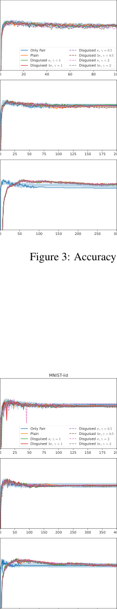

0 100 200 300 400 500 600

92

90

88

86

84

82

80

78

76

92

90

88

86

84

82

80

78

76

92

90

88

86

84

82

80

78

76

68

66

64

62

60

58

56

68

66

64

62

60

58

56

68

66

64

62

60

58

56

CIFAR-10

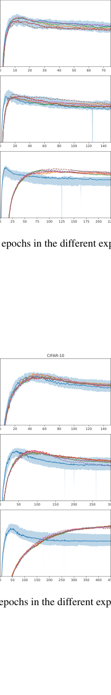

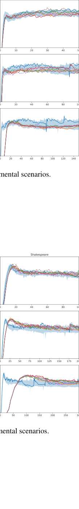

Figure 3: Accuracy performances for FedAvg and 20 epochs in the different experimental scenarios.

92

90

88

86

84

82

80

78

76

92

90

88

86

84

82

80

78

76

92

90

88

86

84

82

80

78

76

70

68

66

64

62

60

58

56

70

68

66

64

62

60

58

56

70

68

66

64

62

60

58

56

44

42

40

38

36

34

32

30

44

42

40

38

36

34

32

30

44

42

40

38

36

34

32

30

Figure 4: Accuracy performances for FedAvg and 5 epochs in the different experimental scenarios.

**Yann Fraboni** [1] _[,]_ [2] **, Richard Vidal** [2] **, Marco Lorenzi** [1]

Shakespeare

42

40

38

36

34

32

30

42

40

38

36

34

32

30

42

40

38

36

34

32

30

MNIST-shard

94

92

90

88

86

84

82

80

94

92

90

88

86

84

82

80

94

92

90

88

86

84

82

80

94

92

90

88

86

84

82

80

94

92

90

88

86

84

82

80

94

92

90

88

86

84

82

80

MNIST-iid

0 100 200 300 400 500 600

92

90

88

86

84

82

80

78

76

92

90

88

86

84

82

80

78

76

92

90

88

86

84

82

80

78

76

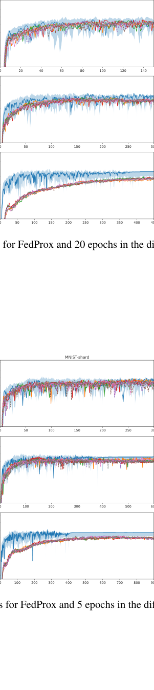

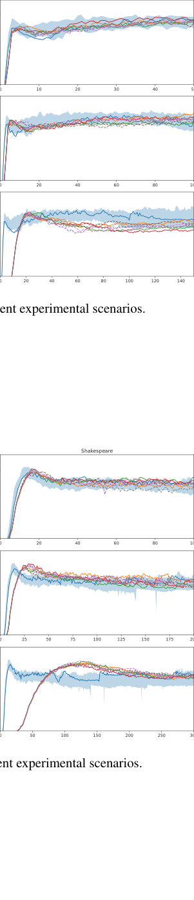

Figure 5: Accuracy performances for FedProx and 20 epochs in the different experimental scenarios.

92

90

88

86

84

82

80

78

76

92

90

88

86

84

82

80

78

76

92

90

88

86

84

82

80

78

76

44

42

40

38

36

34

32

30

44

42

40

38

36

34

32

30

44

42

40

38

36

34

32

30

Figure 6: Accuracy performances for FedProx and 5 epochs in the different experimental scenarios.

**Free-rider Attacks on Model Aggregation in Federated Learning**

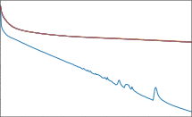

0 25 50 75 100 125 150 175 200 225

Shakespeare

4 _×_ 10 [0]

3 _×_ 10 [0]

2 _×_ 10 [0]

10 [0]

6 _×_ 10 _[−]_ [1]

0 10 20 30 40 50

10 [0]

0 20 40 60 80 100

10 [0]

10 _[−]_ [1]

10 [2]

10 [1]

10 [0]

10 _[−]_ [1]

10 _[−]_ [2]

10 _[−]_ [3]

10 _[−]_ [4]

10 [1]

10 _[−]_ [1]

10 _[−]_ [3]

10 _[−]_ [5]

10 [1]

10 _[−]_ [1]

10 _[−]_ [3]

10 _[−]_ [5]

10 [2]

10 [1]

10 [0]

10 _[−]_ [1]

10 _[−]_ [2]

10 _[−]_ [3]

10 _[−]_ [4]

10 _[−]_ [5]

10 [1]

10 _[−]_ [1]

10 _[−]_ [3]

10 _[−]_ [5]

10 [1]

10 _[−]_ [1]

10 _[−]_ [3]

10 _[−]_ [5]

MNIST-iid

0 20 40 60 80 100

0 25 50 75 100 125 150 175 200

0 50 100 150 200 250 300

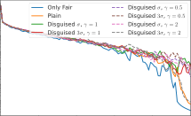

MNIST-iid

0 25 50 75 100 125 150 175 200

0 50 100 150 200 250 300 350 400

0 100 200 300 400 500 600

10 [2]

10 [1]

10 [0]

10 _[−]_ [1]

10 [2]

10 [1]

10 [0]

10 _[−]_ [1]

10 _[−]_ [2]

10 _[−]_ [3]

10 _[−]_ [4]

10 _[−]_ [5]

10 [2]

10 [1]

10 [0]

10 _[−]_ [1]

10 _[−]_ [2]

10 _[−]_ [3]

10 _[−]_ [4]

10 _[−]_ [5]

10 [2]

10 [1]

10 [0]

10 [2]

10 [1]

10 [0]

10 _[−]_ [1]

10 [2]

10 [1]

10 [0]

10 _[−]_ [1]

10 _[−]_ [2]

10 _[−]_ [3]

10 _[−]_ [4]

10 _[−]_ [5]

MNIST-shard

0 20 40 60 80 100 120 140

0 50 100 150 200 250 300

0 50 100 150 200 250 300 350 400 450

10 [0]

10 [0]

10 _[−]_ [1]

10 [0]

10 _[−]_ [1]

10 _[−]_ [2]

CIFAR-10

0 10 20 30 40 50 60 70

0 20 40 60 80 100 120 140

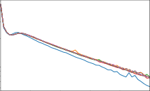

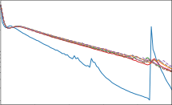

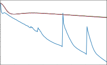

0 20 40 60 80 100 120 140

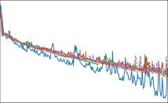

Figure 7: Loss performances for FedAvg and 20 epochs in the different experimental scenarios.

Shakespeare

10 [0]

0 20 40 60 80 100

10 [0]

10 _[−]_ [1]

0 25 50 75 100 125 150 175 200

10 [0]

10 _[−]_ [1]

0 50 100 150 200 250 300

MNIST-shard

0 50 100 150 200 250 300

0 100 200 300 400 500 600

0 100 200 300 400 500 600 700 800 900

10 [0]

10 _[−]_ [1]

10 [0]

10 _[−]_ [1]

10 _[−]_ [2]

10 [0]

10 _[−]_ [1]

10 _[−]_ [2]

CIFAR-10

0 20 40 60 80 100 120 140

0 50 100 150 200 250 300

0 50 100 150 200 250 300 350 400 450

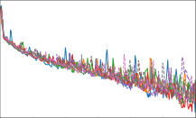

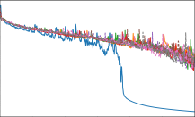

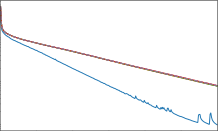

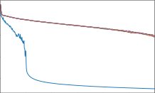

Figure 8: Loss performances for FedAvg and 5 epochs in the different experimental scenarios.

**Yann Fraboni** [1] _[,]_ [2] **, Richard Vidal** [2] **, Marco Lorenzi** [1]

MNIST-shard

10 [2]

10 [1]

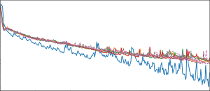

10 _[−]_ [5]
0 50 100 150 200 250 300 350 400 450

10 [2]

10 [1]

10 [0]

10 _[−]_ [1]

10 _[−]_ [2]

10 _[−]_ [3]

10 _[−]_ [4]

10 [2]

10 [1]

10 [0]

10 _[−]_ [1]

10 _[−]_ [2]

10 _[−]_ [3]

10 _[−]_ [4]

10 _[−]_ [5]

10 [1]

10 _[−]_ [1]

10 _[−]_ [3]

10 _[−]_ [5]

10 [2]

10 [1]

10 [0]

10 _[−]_ [1]

10 _[−]_ [2]

10 _[−]_ [3]

10 _[−]_ [4]

10 _[−]_ [5]

10 [1]

10 _[−]_ [1]

10 _[−]_ [3]

10 _[−]_ [5]

10 [1]

10 _[−]_ [1]

10 _[−]_ [3]

10 _[−]_ [5]

MNIST-iid

0 20 40 60 80 100

0 25 50 75 100 125 150 175 200

0 50 100 150 200 250 300

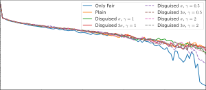

MNIST-iid

0 25 50 75 100 125 150 175 200

0 50 100 150 200 250 300 350 400

0 100 200 300 400 500 600

10 [2]

10 [1]

10 [0]

10 _[−]_ [1]

10 [2]

10 [1]

10 [0]

10 _[−]_ [1]

10 _[−]_ [2]

10 _[−]_ [3]

10 _[−]_ [4]

10 _[−]_ [5]

10 [1]

10 _[−]_ [1]

10 _[−]_ [3]

10 _[−]_ [5]

Shakespeare

0 10 20 30 40 50

0 20 40 60 80 100

0 20 40 60 80 100 120 140

10 [0]

10 [2]

10 [1]

10 [0]

10 _[−]_ [1]

10 [2]

10 [1]

10 [0]

10 _[−]_ [1]

10 _[−]_ [2]

10 _[−]_ [3]

10 _[−]_ [4]

0 20 40 60 80 100 120 140

0 50 100 150 200 250 300

4 _×_ 10 [0]

3 _×_ 10 [0]

2 _×_ 10 [0]

10 [0]

10 [0]

10 [0]

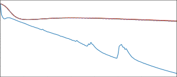

Figure 9: Loss performances for FedProx and 20 epochs in the different experimental scenarios.

MNIST-shard

0 50 100 150 200 250 300

0 100 200 300 400 500 600

0 100 200 300 400 500 600 700 800 900

10 [0]

10 [0]

10 [0]

10 _[−]_ [1]

Shakespeare

0 20 40 60 80 100

0 25 50 75 100 125 150 175 200

0 50 100 150 200 250 300

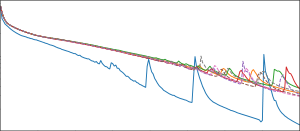

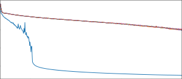

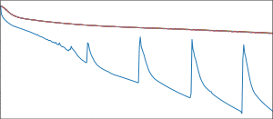

Figure 10: Loss performances for FedProx and 5 epochs in the different experimental scenarios.

