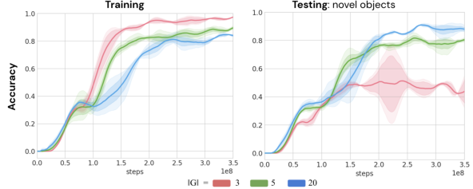
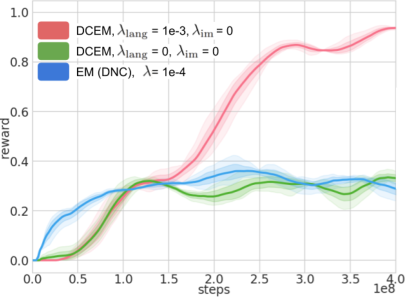
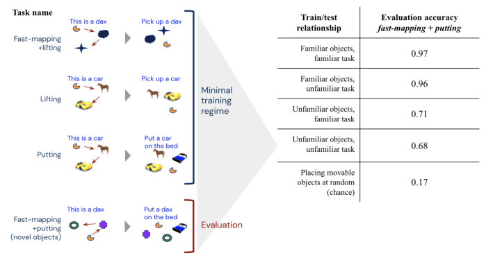
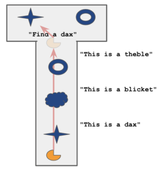
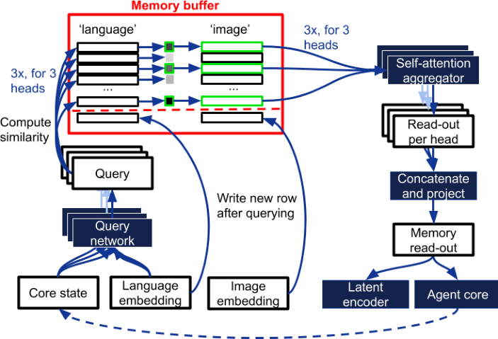

## GROUNDED LANGUAGE LEARNING FAST AND SLOW

**Felix Hill, Olivier Tieleman, Tamara von Glehn, Nathaniel Wong, Hamza Merzic,**
**Stephen Clark**
DeepMind
London, UK
_{_ felixhill, tieleman, tamaravg, nathanielwong, hamzamerzic,
clarkstephen _}_ @google.com

ABSTRACT

Recent work has shown that large text-based neural language models acquire a
surprising propensity for one-shot learning. Here, we show that an agent situated
in a simulated 3D world, and endowed with a novel dual-coding external memory, can exhibit similar one-shot word learning when trained with conventional
RL algorithms. After a single introduction to a novel object via visual perception
and language (“This is a dax”), the agent can manipulate the object as instructed
(“Put the dax on the bed”), combining short-term, within-episode knowledge of
the nonsense word with long-term lexical and motor knowledge. We find that, under certain training conditions and with a particular memory writing mechanism,
the agent’s one-shot word-object binding generalizes to novel exemplars within
the same ShapeNet category, and is effective in settings with unfamiliar numbers
of objects. We further show how dual-coding memory can be exploited as a signal
for intrinsic motivation, stimulating the agent to seek names for objects that may
be useful later. Together, the results demonstrate that deep neural networks can exploit meta-learning, episodic memory and an explicitly multi-modal environment
to account for _fast-mapping_, a fundamental pillar of human cognitive development
and a potentially transformative capacity for artificial agents.

1 INTRODUCTION

Language models that exhibit one- or few-shot learning are of growing interest in machine learning applications because they can adapt their knowledge to new information (Brown et al., 2020;
Yin, 2020). One-shot language learning in the physical world is also of interest to developmental
psychologists; _fast-mapping_, the ability to bind a new word to an unfamiliar object after a single
exposure, is a much studied facet of child language learning (Carey & Bartlett, 1978). Our goal is
to enable an embodied learning system to perform fast-mapping, and we take a step towards this
goal by developing an embodied agent situated in a 3D game environment that can learn the names
of entirely unfamiliar objects in a single exposure, and immediately apply this knowledge to carry
out instructions based on those objects. The agent observes the world via active perception of raw
pixels, and learns to respond to linguistic stimuli by executing sequences of motor actions. It is
trained by a combination of conventional RL and predictive (semi-supervised) learning.

We find that an agent architecture consisting of standard neural network components is sufficient
to follow language instructions whose meaning is preserved across episodes. However, learning
to fast-map novel names to novel objects in a single episode relies on semi-supervised prediction
mechanisms and a novel form of external memory, inspired by the dual-coding theory of knowledge representation (Paivio, 1969). With these components, an agent can exhibit both slow word
learning and fast-mapping. Moreover, the agent exhibits an emergent propensity to integrate both
fast-mapped and slowly acquired word meanings in a single episode, successfully executing instructions such as “put the dax in the box” that depend on both slow-learned (“put”, “box”) and
fast-mapped (“dax”) word meanings.

Via controlled generalization experiments, we find that the agent is reasonably robust to a degree of
variation in the number of objects involved in a given fast-mapping task at test time. The agent also
exhibits above-chance success when presented with the name for a particular object in the ShapeNet

1

Figure 1: Top: The two phases of a fast-mapping episode. Bottom: Screenshots of the task from
the agent’s perspective at important moments (including the contents of the language channel).

taxonomy (Chang et al., 2015) and then instructed (using that name) to interact with a different
exemplar from the same object class, and this propensity can be further enhanced by specific metatraining. We find that both the number of unique objects observed by the agent during training and
the temporal aspect of its perceptual experience of those objects contribute critically to its ability to
generalize, particularly its ability to execute fast-mapping with entirely novel objects. Finally, we
show that a dual-coding memory schema can provide a more effective basis to derive a signal for
intrinsic motivation than a more conventional (unimodal) memory.

2 AN ENVIRONMENT FOR FAST WORD LEARNING

We conduct experiments in a 3D room built with the Unity game engine. In a typical episode, the
room contains a pre-specified number _N_ of everyday 3D rendered objects from a global set _G_ . In
all training and evaluation episodes, the initial positions of the objects and agent are randomized.
The objects include everyday household items such as kitchenware ( _cup, glass_ ), toys ( _teddy bear,_
_football_ ), homeware ( _cushion, vase_ ), and so on.

Episodes consist of two phases: a _discovery_ phase, followed by an _instruction_ phase (see Figure 1). [1]
In the discovery phase, the agent must explore the room and fixate on each of the objects in turn.
When it fixates on an object, the environment returns a string with the name of the object (which
is a nonsense word), for example “This is a dax” or “This is a blicket”. Once the environment has
returned the name of each of the objects (or if a time limit of 30s is reached), the positions of all
the objects and the agent are re-randomized and the instruction phase begins. The environment then
emits an instruction, for example “Pick up a dax” or “Pick up a blicket”. To succeed, the agent must
then lift up the specified object and hold it above 0.25m for 3 consecutive timesteps, at which point
the episode ends, and a new episode begins with a discovery phase and a fresh sample of objects
from the global set _G_ . If the agent first lifts up an incorrect object, the episode also ends (so it is not
possible to pick up more than one object in the instruction phase). To provide a signal for the agent
to learn from, it receives a scalar reward of 1 _._ 0 if it picks up the correct object in the instruction
phase. In the default training setting, to encourage the necessary information-seeking behaviour, a
smaller shaping reward of 0 _._ 1 is provided for visiting each of the objects in the discovery phase.

Given this two-phase episode structure, two distinct learning challenges can be posed to the agent.
In a slow-learning regime, the environment can assign the permanent name (e.g. “cup”, “chair”)
to objects in the environment whenever they are sampled. By contrast, in the fast-mapping regime,

1Rendered images are higher resolution than those passed to the agent.

2

which is the principal focus of this work, the environment assigns a unique nonsense word to each
of the objects in the room at random on a per-episode basis. The only way to consistently solve the
task is to record the connections between words and objects in the discovery phase, and apply this
(episode-specific) knowledge in the instruction phase to determine which object to pick up.

3 MEMORY ARCHITECTURES FOR AGENTS WITH VISION AND LANGUAGE

The agents that we consider build on a standard architecture for reinforcement learning in multimodal (vision + language) environments (see e.g. (Chaplot et al., 2018; Hermann et al., 2017; Hill
et al., 2020)). The visual input (raw pixels) is processed at every timestep by a convolutional network
with residual connections (a ResNet). The language input is passed through an embedding lookup
layer plus self-attention layer for processing. Finally, a _core memory_ integrates the information
from the two input sources over time. A fully-connected plus softmax layer maps the state of this
core memory to a distribution over 46 actions, which are discretizations of a 9-DoF continuous
agent avatar. A separate layer predicts a value function for computing a baseline for optimization
according to the IMPALA algorithm (Espeholt et al., 2018).

We replicated previous studies by verifying that a baseline architecture with **LSTM core memory**
(Hochreiter & Schmidhuber, 1997) could learn to follow language instructions when trained in the
slow-learning regime. However, the failure of this architecture to reliably learn to perform abovechance in the fast-learning regime motivated investigation of architectures involving explicit external
memory modules. Given the two observation channels from language and vision, there are various
ways in which observations can be represented and retrieved in external memory.

**Differentiable Neural Computer (DNC)** In the DNC (Wayne et al., 2018), at each timestep _t_ a
latent vector **e** _t_ = _w_ ( **h** _t−_ 1 _,_ **r** _t−_ 1 _,_ **x** _t_ ), computed from the previous hidden state **h** _t−_ 1 of the agent’s
core memory LSTM, the previous memory read-out **r** _t−_ 1, and the current inputs **x** _t_, is written to
a slot-based external memory. In our setting, the input **x** _t_ is a simple concatenation [ **v** _t,_ **l** _t_ ] of the
output of the vision network and the embedding returned by the language network. Before writing
to memory, the latent vector **e** _t_ is also passed to the core memory LSTM to produce the current state
**h** _t_ . The agent reads from memory by producing a query vector _q_ ( **h** _t_ ) and read strength _β_ ( **h** _t_ ), and
computing the cosine similarity between the query and all embeddings currently stored in memory
**e** _i_ ( _i < t_ ). The external memory returns only the _k_ most similar entries in the memory (where
_k_ is a hyperparameter), and corresponding scalar similarities. The returned embeddings are then
aggregated into a single vector ˆ **r** _t_ by normalizing the similarities and taking a weighted average of
the embeddings. This reading procedure is performed simultaneously by _n_ independent read heads,
and the results [ˆ **r** [1] _t_ _[, . . .,]_ [ ˆ] **[r]** _[n]_ _t_ []][ are concatenated to form the current memory read-out] **[ r]** _[t]_ [. The vectors]
**e** _t_ and **h** _t_ are output to the policy and value networks.

**Dual-coding Episodic Memory (DCEM)** We propose an alternative external key-value memory
architecture inspired by the Dual-Coding theory of human memory (Paivio, 1969). The key idea is
to allow different modalities (language and vision) to determine either the keys (and queries) or the
values. In the present work, because of the structure of the tasks we consider, we align the keys and
queries with language and the values with vision. However, for different problems (such as those
requiring language production) the converse alignment could be made, or a single memory system
could implement both alignments.

In our implementation, at each timestep the agent writes the current linguistic observation embeddings **l** _t_ to the keys of the memory and the current visual embedding **v** _t_ to its values. To read from
the memory, a query _q_ ( **v** _t,_ **l** _t,_ **h** _t−_ 1) is computed and compared to the keys by cosine similarity. The
_k_ values whose keys are most similar to the query, [ **m** _[j]_ ] _j≤k_, are returned together with similarities

[ _s_ _[j]_ ] _j≤k_ . To aggregate the returned memories into a single vector **r** _t_, the similarities are first normalized into a distribution _{s_ ˆ _[j]_ _}_ and then applied to weight the memories ˆ **m** _[j]_ = ˆ _s_ _[j]_ **m** _[j]_ . These _k_
weighted memories are then passed through a self-attention layer and summed elementwise to produce **r** _t_ . As before this is repeated for _n_ read heads, and the results concatenated to form the current
memory read-out **r** _t_ . **r** _t_ is then concatenated with **h** _t−_ 1 and new inputs **x** _t_ to compute a latent vector
**e** _t_ = _w_ ( **h** _t−_ 1 _,_ **r** _t,_ **x** _t_ ), which is passed to the core memory LSTM to produce the subsequent state
**h** _t_, and finally **e** _t_ and **h** _t_ are output to the policy and value networks.

3

Mean (S.D) accuracy
Architecture 1 _e_ 9 training steps

LSTM 0.33 (0.05)
LSTM + R 0.61 (0.27)
DNC mem=1024 0.34 (0.01)
DNC mem=1024 + R 0.64 (0.27)
TransformerXL mem=1024 0.32 (0.02)
TransformerXL mem=1024 + R **0.98** (0.01)
DCEM mem=1024 0.33 (0.02)
DCEM mem=1024 + R **0.98** (0.01)
TransformerXL mem=100 + R 0.73 (0.35)
DCEM mem=100 + R **0.98** (0.01)
Random object selection 0.33

Table 1: Left: Performance when training on a three-object fast-mapping task with _|G|_ = 30. _mem_ :
size of memory buffer/window _R_ : with reconstruction loss. Right: Learning curves, each showing
mean _±_ S.D. over 5 random seeds.

**Gated Transformer (XL)** We also consider an architecture where the agent’s core memory is a
Transformer (Vaswani et al., 2017), including the gating mechanism from Parisotto et al. (2019).
The only difference from Parisotto et al. (2019) is that we consider a multi-modal environment,
where the observations **x** _t_ passed to the core memory are the concatenation of visual and language
embeddings. We use a 4-layer Transformer with a principal embedding size of 256 (8 parallel heads
with query, key and value size of 32 per layer). These parameters are chosen to give a comparable
number of total learnable parameters to the DCEM architecture.

**Policy learning** The agent’s policy is trained by minimizing the standard V-trace off-policy actorcritic loss (Espeholt et al., 2018). Gradients flow through the policy layer and the core LSTM to the
memory’s query network and the embedding ResNet and self-attention language encoder. We also
use a policy entropy loss as in (Mnih et al., 2016; Espeholt et al., 2018) to encourage random-action
exploration. For more details and hyperparameters see Appendix A.4.

**Observation reconstruction** In order to provide a stronger representation-shaping signal, we
make use of a reconstruction loss in addition to the standard V-trace setup. The latent vector **e** _t_
is passed to a ResNet _g_ that is the transpose of the image encoder, and outputs a reconstruction of
the image input **d** [im] _t_ = _g_ ( **e** _t_ ). The image reconstruction loss is the cross entropy between the input
and reconstructed images: _lt_ [im] = _−_ **x** [im] _t_ [log] **[ d]** [im] _t_ _−_ (1 _−_ **x** [im] _t_ [) log(1] _[ −]_ **[d]** [im] _t_ [)][. The language decoder]
is a simple LSTM, which also takes the latent vector **e** _t_ as input and produces a sequence of output
vectors that are projected and softmaxed into classifications over the vocabulary **d** [lang] _t_ . The loss
is the cross entropy between the classification produced and the one-hot vocabulary indices of the
input words: _lt_ [lang] = _−_ **x** [lang] _t_ log **d** [lang] _t_ _−_ (1 _−_ **x** [lang] _t_ ) log(1 _−_ **d** [lang] _t_ ). For more details regarding the
flow of information and gradients see Appendix A.4.

4 EXPERIMENTS

We compared the different memory architectures with and without semi-supervised reconstruction
loss on a version of the fast-mapping task involving three objects ( _N_ = 3) sampled from a global
set of 30 ( _|G|_ = 30). As shown in Table 1, only the DCEM and Transformer architectures reliably
solve the task after 1 _×_ 10 [9] timesteps of training.

**DCEM vs. TransformerXL** Importantly, the Transformer and DCEM are the two architectures
that can exploit the principle of _dual-coding_ . Since the inputs to the Transformer are the concatenation of visual and language codes, this model can recover the dual-coding aspect of the DCEM
by learning self-attention weights **W** _k_ and **W** _q_ that project the language code to keys and queries,
and weights **W** _v_ to project the visual code to values. Learning in the DCEM was marginally more
sample-efficient, but this is perhaps expected given it was designed with fast-mapping tasks in mind.
In light of this, is it really worth pursing memory systems with explicit episodic memories?

4

Figure 2: Accuracy of agents trained on probe trials involving a different number of total objects
for agents meta-trained with different numbers of total objects.

To show one clear justification for external memory architectures, we conducted an additional comparison in which the memory windows of both the DCEM and the Transformer agents were limited
to 100 timesteps (from 1024 in the original experiment), approximately the length of an episode if an
agent is well-trained to the optimal policy. With a memory span of 100, the Transformer is forced to
use the XL window-recurrence mechanism to pass information across context windows (Dai et al.,
2019), while any capacity to retain episodic information beyond 100 timesteps in the DCEM must be
managed by by the LSTM controller. In this setting we observed that the DCEM was substantially
more effective (Table 1, left, bottom). While this imposed memory constraint may seem arbitrary,
in real-world tasks working memory will always be at a premium. These results suggest that DCEM
is more ‘working-memory-efficient’ than the Transformer agent. Indeed, by employing a simple
heuristic by which the agent only writes to its external memory when the language observation
changes from one timestep to the next, the DCEM agent with only 20 memory slots could solve the
task with similar efficiency to a Transformer agent with a 1024-slot memory. See Appendix A.1 for
these results and details of the selective writing heuristic.

4.1 GENERALIZATION

To explore the generalization capabilities of our agents, we subjected trained agents to various behavioural probes, and measured performance across thousands of episodes without updating their
weights. Unless stated otherwise, all experiments in this section involve the DCEM+Recons agent.

**Number of objects** We first probed the robustness of the agent to fast-mapping episodes with
different numbers of objects. In all conditions, the same objects appear in both the discovery and
instruction phases of the episode, and the objects are sampled from the same global set _G_ ( _|G|_ = 30).
As shown in Figures 2(b) and (c) (red curves), with the (default) meta-training setting involving
three objects in each episode, performance on episodes involving five objects is approximately 70%,
and with eight objects around 50%. This sub-optimal performance suggests that, with this metatraining regime, the agent does tend to overfit, to some degree, to the “three-ness” of its experience.
Figure 2(b) shows, however, that the overfitting of the agent can be alleviated by increasing the
number of objects during meta-training. Finally, Figure 2(a) confirms, perhaps unsurprisingly, that
the agent has no problem generalizing to episodes with _fewer_ objects than it was trained on.

**Novel objects** To probe the ability of the agents to quickly learn about any _arbitrary_ new object,
we instrumented trials with objects sampled from a global test set of novel objects _H_ : _H ∩_ _G_ =
_∅, |H|_ = 10. As shown in Figure 3, we found that an agent meta-trained on 20 objects (i.e. _|G|_ = 20)
was almost perfectly robust to novel objects. As may be expected, this robustness degraded to some
degree with decreasing _|G|_, which is symptomatic of the agent specializing (and overfitting) to the
particular features and distinctions of the objects in its environment. However, we only observed a
substantial reduction in robustness to new objects when _|G|_ was reduced as low as three – i.e. a metatraining experience in which all episodes contain the same three objects (the first three elements of
_G_ alphabetically, i.e. a _boat_, a _book_ and a _bottle_ ).

5

Figure 3: Accuracy during training and evaluation trials involving unfamiliar objects, for different
sizes of global training set _G_ . Curves show mean _±_ S.E. over 3 agent seeds in each condition.

Figure 4: Accuracy of agents in fast-mapping trials requiring the extension of ShapeNet categories
from a single exemplar. Curves show the mean _±_ S.E. over three agent seeds in each condition.

**Fast category extension** Children aged between three and four can acquire in one shot not only
bindings between new words and specific unfamiliar objects, but also bindings between new words
and _categories_ (Behrend et al., 2001; Waxman & Booth, 2000; Vlach & Sandhofer, 2012). We
conducted an analogous experiment by exploiting the category structure in ShapeNet (Chang et al.,
2015). In a test trial, in the discovery phase the agent is presented with exemplars from three novel
(held-out) ShapeNet categories (together with nonsense names). In the instruction phase, the agent
must then pick up a _different and unseen_ exemplar from one of these three new categories as instructed. As shown in Figure 4, when trained as described previously, the agent achieves around
55% accuracy on test trials, which is above chance (33%) but still a substantial error rate. However,
this performance can be improved by requiring the agent to extend the training object categories
as it learns. In this regime, three ShapeNet exemplars from distinct classes are encountered by the
agent in the discovery phase of training episodes, and the instruction phase involves different exemplars from the same three classes. When trained in this way (which share similarities with _matching_
_networks_ (Vinyals et al., 2016)), performance on extending novel categories increases to 88%.

**Role of temporal aspect** Through ablations we found that both novel objects generalization and
category extension relied on the agent reading multiple values from memory for each query. See A.2
for a discussion of these results, which suggest that the temporal aspect of the agent’s experience
(and learning from multiple views of the same object) is an important driver of generalization.

4.2 INTRINSIC MOTIVATION

The default version of the fast-mapping task includes a shaping reward to encourage the agent to
visit all objects in the room. Without this reward, the credit assignment problem of a fast-mapping
episode is too challenging. However, we found that the DCEM agent was able to solve the task

6

Figure 5: Accuracy of agents trained without shaping reward on the 3-object fast-mapping task
with _|G|_ = 30. Curves show mean _±_ S.E. across three seeds in each condition.

without shaping rewards by employing a memory-based algorithm for intrinsic motivation (NGU;
Badia et al. (2020)). NGU computes a ‘surprise’ score for observations by computing its distance
to other observations in the episodic memory, as described in Appendix A.4.3. The surprise score is
applied as a reward signal _r_ [NGU] which is added to the environment reward to encourage the agent to
seek new experiences. We compared the effect of doing this in the DNC and the DCEM agents. For
DCEM, the NGU computation can be applied to the memory’s keys (language) column, its values
(vision) column, or both. In the former case, the agent seeks novelty in the language space _r_ lang [NGU][,]
and in the latter, in the visual space. The final reward is _r_ = _r_ [ext] + _λ_ lang _r_ lang [NGU] [+] _[ λ]_ [im] _[r]_ im [NGU] . As
shown in Figure 5, we found that the DCEM agent (with _λ_ lang = 10 _[−]_ [3] and _λ_ im = 3 _×_ 10 _[−]_ [5] ) was
able to solve the fast-mapping tasks without any shaping reward. This was not the case for the DNC
agent, presumably because the required signal for ‘language-novelty’ is not approximated as well
by the surprise score of the merged visual-language codes in the episodic memory.

4.3 INTEGRATING FAST AND SLOW LEARNING

To test whether our agents can integrate new information with existing lexical (and perceptual and
motor) knowledge, we combined a fast-mapping task with a more conventional instruction-following
task. In the discovery phase, the agent must explore to find the names of three unfamiliar objects,
but in this case the room also contains a large box and a large bed, both of which are immovable.
The positions of all objects and the agent are then re-randomized as before. In the instruction phase,
the agent is then instructed to put one of the three movable objects (chosen at random) on either the
bed or in the box (again chosen at random). As shown in Figure 6, if the training regime consisted of
conventional lifting and putting tasks, together with a fast-mapping lifting task and a fast-mapping
putting task, the agent learned to execute the evaluation trials with near-perfect accuracy. Notably,
we also found that substantially-above-chance performance could be achieved on the evaluation
trials without needing to train the agent on the evaluation task in any form. If we trained the agent
on conventional lifting and putting tasks, and a fast-mapping task involving lifting only, the agent
could recombine the knowledge acquired during this training to resolve the evaluation trials as a
novel (zero-shot) task with less-than-perfect but substantially-above-chance accuracy.

4.4 RESULTS WITH ANOTHER ENVIRONMENT

To verify that the observed effects hold beyond our specific Unity environment, we added a new task
to the DeepMind Lab suite (Beattie et al., 2016). Results for this task are given in Appendix A.3.

5 RELATED WORK

Meta-learning, of the sort observed in our agent, has been applied to train _matching networks_ : image
classifiers that can assign the correct label to a novel image, given a small support set of (image,
label) pairs that includes the correct target label (Vinyals et al., 2016). Our work is also inspired by

7

Figure 6: Right: The accuracy of the agent (accuracy _±S.E._ ) on evaluation trials when exposed to
different training regimes. Left: Schematic of the most impoverished training regime.

Snell et al. (2017), who propose a more efficient way to integrate a small support set of experience
into a coherent space of image ‘concepts’ for improved fast learning, and Santoro et al. (2016), who
show that the successful meta-training of image classifiers can benefit substantially from external
memory architectures such as Memory Networks (Weston et al., 2014) or DNC (Graves et al., 2016).

In NLP, meta-learning has been used to train few-shot classifiers for various tasks (see Yin (2020)
for a recent survey). Meta-learning has also previously been observed in reinforcement learning
agents trained with conventional policy-gradient algorithms (Duan et al., 2016; Wang et al., 2019).
In Model-Agnostic Meta Learning (Finn et al., 2017), models are (meta) trained to be easily tunable
(by any gradient algorithm) given a small number of novel data points. When combined with policygradient algorithms, this technique yields fast learning on both 2D navigation and 3D locomotion
tasks. In cognitive tasks where fast learning is not explicitly required, external memories have
proven to help goal-directed agents (Fortunato et al., 2019), and can be particularly powerful when
combined with an observation reconstruction loss (Wayne et al., 2018).

Recent work at the intersection of psychology and machine learning is also relevant in that it shows
how the noisy, first-person perspective of a child can support the acquisition of robust visual categories in artificial neural networks (Bambach et al., 2018). When deep networks are trained on
data recorded from children’s head cameras, unsupervised or semi-supervised learning objectives
can substantially improve the quality of the resulting representations (Orhan et al., 2020).

6 CONCLUSION

Our experiments have highlighted various benefits of having an explicitly multi-modal episodic
memory system. First, mechanisms that allow the agent to query its memory in a modality-specific
way (either within or across modalities) can better allow them to rapidly infer and exploit connections between perceptual experience and words, and therefore to realize _fast-mapping_, a notable
aspect of human learning. Second, external (read-write) memories can achieve better performance
for the same number of memory ‘slots’ than Transformer-based memories. This greater ‘memoryefficiency’ may be increasingly important as agents are applied to real-world tasks with very long
episodic horizons. Third, in cases where it is useful to estimate the degree of novelty or “surprise”
in the current state of the environment (for instance to derive a signal for _intrinsic motivation_ ), a
more informative signal may be obtained by separately estimating novelty based on each modality
and aggregating the result. Finally, an episodic memory system may ultimately be essential for fast
knowledge _consolidation_ . The potential for memory buffers and offline learning processes such as
_experience replay_ to support knowledge consolidation is not a new idea (McClelland et al., 1995;
Mnih et al., 2016; Lillicrap et al., 2016; McClelland et al., 2020). For language learning agents,
the need to both rapidly acquire _and retain_ multi-modal knowledge may further motivate explicit

8

external memories. Retaining in memory visual experiences together with aligned (and hopefully
pertinent) language (i.e. a dual-coding schema) may facilitate something akin to offline ‘supervised’
language learning. We leave this possibility for future investigations, which we will facilitate by
releasing publicly the environments and tasks described in this paper.

REFERENCES

Adri`a Puigdom`enech Badia, P. Sprechmann, Alex Vitvitskyi, Daniel Guo, B. Piot, Steven Kapturowski, O. Tieleman, Mart´ın Arjovsky, A. Pritzel, Andew Bolt, and Charles Blundell. Never give
up: Learning directed exploration strategies. _ArXiv_, abs/2002.06038, 2020.

Sven Bambach, David Crandall, Linda Smith, and Chen Yu. Toddler-inspired visual object learning.
In _Advances in neural information processing systems_, pp. 1201–1210, 2018.

Charles Beattie, Joel Z. Leibo, Denis Teplyashin, Tom Ward, Marcus Wainwright, Heinrich K¨uttler,
Andrew Lefrancq, Simon Green, V´ıctor Vald´es, Amir Sadik, Julian Schrittwieser, Keith Anderson, Sarah York, Max Cant, Adam Cain, Adrian Bolton, Stephen Gaffney, Helen King, Demis
Hassabis, Shane Legg, and Stig Petersen. Deepmind lab. _CoRR_, abs/1612.03801, 2016. URL
[http://arxiv.org/abs/1612.03801.](http://arxiv.org/abs/1612.03801)

Douglas A Behrend, Jason Scofield, and Erica E Kleinknecht. Beyond fast mapping: Young children’s extensions of novel words and novel facts. _Developmental Psychology_, 37(5):698, 2001.

Tom B Brown, Benjamin Mann, Nick Ryder, Melanie Subbiah, Jared Kaplan, Prafulla Dhariwal,
Arvind Neelakantan, Pranav Shyam, Girish Sastry, Amanda Askell, et al. Language models are
few-shot learners. _arXiv preprint arXiv:2005.14165_, 2020.

Susan Carey and Elsa Bartlett. Acquiring a single new word. _Papers and Reports on Child Language_
_Development_, 1978.

Angel X Chang, Thomas Funkhouser, Leonidas Guibas, Pat Hanrahan, Qixing Huang, Zimo Li,
Silvio Savarese, Manolis Savva, Shuran Song, Hao Su, et al. Shapenet: An information-rich 3D
model repository. _arXiv preprint arXiv:1512.03012_, 2015.

Devendra Singh Chaplot, Kanthashree Mysore Sathyendra, Rama Kumar Pasumarthi, Dheeraj Rajagopal, and Ruslan Salakhutdinov. Gated-attention architectures for task-oriented language
grounding. In _Thirty-Second AAAI Conference on Artificial Intelligence_, 2018.

Zihang Dai, Zhilin Yang, Yiming Yang, Jaime G Carbonell, Quoc Le, and Ruslan Salakhutdinov.
Transformer-xl: Attentive language models beyond a fixed-length context. In _Proceedings of the_
_57th Annual Meeting of the Association for Computational Linguistics_, pp. 2978–2988, 2019.

Yan Duan, John Schulman, Xi Chen, Peter L Bartlett, Ilya Sutskever, and Pieter Abbeel. RL [2] : Fast
reinforcement learning via slow reinforcement learning. _arXiv preprint arXiv:1611.02779_, 2016.

Lasse Espeholt, Hubert Soyer, Remi Munos, Karen Simonyan, Volodymir Mnih, Tom Ward, Yotam
Doron, Vlad Firoiu, Tim Harley, Iain Dunning, et al. Impala: Scalable distributed deep-rl with
importance weighted actor-learner architectures. _arXiv preprint arXiv:1802.01561_, 2018.

Chelsea Finn, Pieter Abbeel, and Sergey Levine. Model-agnostic meta-learning for fast adaptation
of deep networks. _arXiv preprint arXiv:1703.03400_, 2017.

Meire Fortunato, Melissa Tan, Ryan Faulkner, Steven Hansen, Adri`a Puigdom`enech Badia, Gavin
Buttimore, Charles Deck, Joel Z Leibo, and Charles Blundell. Generalization of reinforcement
learners with working and episodic memory. In _Advances in Neural Information Processing_
_Systems_, pp. 12469–12478, 2019.

Alex Graves, Greg Wayne, Malcolm Reynolds, Tim Harley, Ivo Danihelka, Agnieszka GrabskaBarwi´nska, Sergio G´omez Colmenarejo, Edward Grefenstette, Tiago Ramalho, John Agapiou,
et al. Hybrid computing using a neural network with dynamic external memory. _Nature_, 538
(7626):471–476, 2016.

9

Karl Moritz Hermann, Felix Hill, Simon Green, Fumin Wang, Ryan Faulkner, Hubert Soyer, David
Szepesvari, Wojciech Marian Czarnecki, Max Jaderberg, Denis Teplyashin, et al. Grounded language learning in a simulated 3D world. _arXiv preprint arXiv:1706.06551_, 2017.

Felix Hill, Stephen Clark, Karl Moritz Hermann, and Phil Blunsom. Understanding early word
learning in situated artificial agents. _Proceedings of CogSci_, 2020.

Sepp Hochreiter and J¨urgen Schmidhuber. Long short-term memory. _Neural computation_, 9(8):
1735–1780, 1997.

Timothy P Lillicrap, Jonathan J Hunt, Alexander Pritzel, Nicolas Heess, Tom Erez, Yuval Tassa,
David Silver, and Daan Wierstra. Continuous control with deep reinforcement learning. In _ICLR_
_(Poster)_, 2016.

James L McClelland, Bruce L McNaughton, and Randall C O’Reilly. Why there are complementary
learning systems in the hippocampus and neocortex: insights from the successes and failures of
connectionist models of learning and memory. _Psychological review_, 102(3):419, 1995.

James L. McClelland, Felix Hill, Maja Rudolph, Jason Baldridge, and Hinrich Sch¨utze. Extending
machine language models toward human-level language understanding. _PNAS (to appear)_, 2020.

Volodymyr Mnih, Adria Puigdomenech Badia, Mehdi Mirza, Alex Graves, Timothy Lillicrap, Tim
Harley, David Silver, and Koray Kavukcuoglu. Asynchronous methods for deep reinforcement
learning. In _International conference on machine learning_, pp. 1928–1937, 2016.

A. Emin Orhan, Vaibhav V. Gupta, and Brenden M. Lake. Self-supervised learning through the eyes
of a child, 2020.

Allan Paivio. Mental imagery in associative learning and memory. _Psychological review_, 76(3):241,
1969.

Emilio Parisotto, H. Francis Song, Jack W. Rae, Razvan Pascanu, Caglar Gulcehre, Siddhant M.
Jayakumar, Max Jaderberg, Raphael Lopez Kaufman, Aidan Clark, Seb Noury, Matthew M.
Botvinick, Nicolas Heess, and Raia Hadsell. Stabilizing transformers for reinforcement learning, 2019.

Adam Santoro, Sergey Bartunov, Matthew Botvinick, Daan Wierstra, and Timothy Lillicrap. Metalearning with memory-augmented neural networks. In _International conference on machine learn-_
_ing_, pp. 1842–1850, 2016.

Jake Snell, Kevin Swersky, and Richard Zemel. Prototypical networks for few-shot learning. In I. Guyon, U. V. Luxburg, S. Bengio, H. Wallach, R. Fergus, S. Vishwanathan, and R. Garnett (eds.), _Advances in Neural Information Processing Systems 30_, pp.
4077–4087. Curran Associates, Inc., 2017. [URL http://papers.nips.cc/paper/](http://papers.nips.cc/paper/6996-prototypical-networks-for-few-shot-learning.pdf)
[6996-prototypical-networks-for-few-shot-learning.pdf.](http://papers.nips.cc/paper/6996-prototypical-networks-for-few-shot-learning.pdf)

Ashish Vaswani, Noam Shazeer, Niki Parmar, Jakob Uszkoreit, Llion Jones, Aidan N Gomez,
Łukasz Kaiser, and Illia Polosukhin. Attention is all you need. In _Advances in neural information_
_processing systems_, pp. 5998–6008, 2017.

Oriol Vinyals, Charles Blundell, Timothy Lillicrap, koray kavukcuoglu, and Daan Wierstra.
Matching networks for one shot learning. In D. D. Lee, M. Sugiyama, U. V. Luxburg,
I. Guyon, and R. Garnett (eds.), _Advances in Neural Information Processing Systems 29_, pp.
3630–3638. Curran Associates, Inc., 2016. [URL http://papers.nips.cc/paper/](http://papers.nips.cc/paper/6385-matching-networks-for-one-shot-learning.pdf)
[6385-matching-networks-for-one-shot-learning.pdf.](http://papers.nips.cc/paper/6385-matching-networks-for-one-shot-learning.pdf)

Haley Vlach and Catherine M Sandhofer. Fast mapping across time: Memory processes support
children’s retention of learned words. _Frontiers in psychology_, 3:46, 2012.

Xin Wang, Qiuyuan Huang, Asli Celikyilmaz, Jianfeng Gao, Dinghan Shen, Yuan-Fang Wang,
William Yang Wang, and Lei Zhang. Reinforced cross-modal matching and self-supervised imitation learning for vision-language navigation. In _Proceedings of the IEEE Conference on Computer_
_Vision and Pattern Recognition_, pp. 6629–6638, 2019.

10

Sandra R Waxman and Amy E Booth. Principles that are invoked in the acquisition of words, but
not facts. _Cognition_, 77(2):B33–B43, 2000.

Greg Wayne, Chia-Chun Hung, David Amos, Mehdi Mirza, Arun Ahuja, Agnieszka GrabskaBarwinska, Jack Rae, Piotr Mirowski, Joel Z Leibo, Adam Santoro, et al. Unsupervised predictive
memory in a goal-directed agent. _arXiv preprint arXiv:1803.10760_, 2018.

Jason Weston, Sumit Chopra, and Antoine Bordes. Memory networks. _arXiv preprint_
_arXiv:1410.3916_, 2014.

Wenpeng Yin. Meta-learning for few-shot natural language processing: A survey. _arXiv preprint_
_arXiv:2007.09604_, 2020.

11

A APPENDICES

A.1 COMPARING TRANSFORMERXL TO DCEM WHEN MEMORY IS LIMITED

Both the TransformerXL and DCEM/DNC agents have a hyperparameter that determines the effective size of their explicit working memory. In a vanilla Transformer it determines the size of the
window of timesteps that the network can be applied to for each forward (and backward) pass. To
give models some chance of passing information beyond this hard constraint, TransformerXL architecture conditions each forward pass also on representations computed in the previous window,
which establishes a form of recurrence over time from window to window. In our original experiments, this mechanism was not tested, because we set the window size to 1024 timesteps, which
is longer than most episodes of the fast-mapping task, which are typically 80-120 timesteps for a
well-trained agent.

To examine the performance of the TransformerXL in cases where it is required to pass information
across context windows, we reduced the size of the window. For a fair comparison, we similarly
reduced the equivalent parameter (the capacity in rows in the FIFO external memory) for the DCEM
agent. As shown in Figure 7, for cases where the memory window size (or buffer) is reduced to (100)
or below (50, 20) the normal episode length, the DCEM performs better than the TransformerXL
agent. This suggests that the TransformerXL has difficulty making the necessary (visual and linguistic) information available to policy head when that information must be passed between context
windows. Surprisingly, the DCEM was able to learn the tasks efficiently with a memory size of
50, which suggests that it must exploit its LSTM controller to retain sufficient information when its
external memory begins to overflow. Both architectures fail when the memory size is reduced to 20,
but in that case a DCEM agent can in fact learn the optimal policy if a simple heuristic for selective
writing, described below, is employed. This highlights an advantage of explicitly read-write external
memories; information can be managed via the reading or the writing process. It is not immediately
obvious how the same strategy could be applied with a window-based memory architectecture like
TransformerXL.

Figure 7: Training success comparison between DCEM, DCEM with selective writing and TransformerXL for different sizes of memory-buffer (DCEM) or window (TransformerXL).

A.1.1 SELECTIVE WRITING HEURISTIC

One advantage of explicit external (read-write) memories is that the flow of information to the
agent’s policy can be influenced by the writing process as well as the reading function. To verify this fact, we implemented a simple non-parametric heuristic writing condition in the DCEM
architecture, whereby observations are written to the external memory when there is a change to the
observation in the language channel. This heuristic aligns with the principle of dual-coding exploited
elsewhere in the paper: while visual observations change continuously every timestep, changes to
observed language are rare events that might signal some important change in the environment.

More formally, our heuristic relies on a window size parameter _w_ that we set to 3 in all cases. For
observation _xt_ = _{vt, lt}_, a language change indicator _It ∈_ N is set as _I_ 0 = 0

12

Figure 8: Training and test accuracy on two types of generalization tasks for agents that read
different numbers of frames from their memory per query.

_t,_ if _lt_ = _lt−_ 1
_It_ =
� _It−_ 1 _,_ otherwise.

Then, the content **c** _t_ written to memory at _t_ is

_{_ **v** _t,_ **l** _t},_ if _t −_ _It < w_
**c** _t_ = � _∅,_ otherwise,

where, as before, **v** _t,_ **l** _t_ are the agent embeddings of the visual and linguistic observations. Thus,
memories are written for _w_ timesteps proceeding a change in the language observation.

A.2 ROLE OF TEMPORAL ASPECT IN GENERALIZATION

In seeking to understand the mechanisms that support the generalization effects reported in the
main paper, we found that the parameter _k_ was an important factor, where the top- _k_ memories are
returned to the agent policy head per memory read. As the agent explores during the discovery phase
of episodes, it writes multiple perspectives of the same object to memory. As shown in Figure 8,
both its robustness to entirely novel objects (left) and its ability to extend categories from novel
exemplars (right), as well as its ability to solve the training task, are enhanced when _k >_ 1; i.e.
when it determines which object to visit in the instruction phase _based on memories written from_
_more than one view of each object_ .

A.3 VERIFICATION IN DEEPMIND LAB

At a high level, the design of an episode is very similar to the default fast-mapping task in the Unity
environment. The agent must move down a corridor, bumping into (and collecting) three distinct
objects. When an agent collects an object it is immediately presented with the (episode-specific)
name for that object. After passing three objects, the corridor opens into a room containing two
of the three objects found in the corridor. Upon entering the room, the agent is presented with the
name corresponding to one of the two objects, and must bump into that object in order to receive
a reward of 1. As before, a shaping reward of 0 _._ 1 is given as the agent collects each object in the
corridor. Compared with the Unity environment, the DeepMind Lab action space is smaller (8 vs.
46 actions), the objects are larger, and the agent has no substantive way to interact with the objects
(they disappear the moment the agent collides with them). Note also that the agent must choose
between 2 (rather than 3) objects in the instruction phase, so an agent selecting objects at random
would achieve 50% accuracy.

To provide some sense of the robustness and generality of the effects observed thus far, we applied
the various agent architectures directly to this environment with no environment-specific tuning. As
shown in Table 2, without any further tuning of the agent, we observe a similar pattern of results

13

Train. Test
Architecture accuracy (novel objects)

LSTM + R 0.50 (0.02) 0.40 (0.06)
DNC + R 0.48 (0.04) 0.30 (0.15)
TransformerXL mem=100 + R 0.70 (0.28) 0.55 (0.29)
DCEM mem=100 + R 0.80 (0.26) 0.65 (0.32)
Random object selection 0.5 0.5

Table 2: Left: Architectures compared on DeepMind Lab after 5 _e_ 8 timesteps of training. Data show
mean accuracy (S.D) across 5 seeds in each condition. _mem_ : the agent’s memory buffer size. _R_ :
with reconstruction loss. Right: Schematic of episode structure in the DeepMind Lab fast-binding
tasks.

in DeepMind Lab as in the Unity room. As in that case, the Transformer and DCEM architectures
performed best, with three and two seeds out of five (respectively) mastering the training task. As
in the Unity environment, we also observed above-chance ability to apply fast-mapping knowledge
zero-shot to unseen objects at test time.

A.4 AGENT ARCHITECTURE DETAILS

A.4.1 ARCHITECTURE DIAGRAMS

Figure 9: Agent architecture. See figure 10 for details of the dual coding episodic memory component. Dashed lines correspond to connections across timesteps.

14

Figure 10: DCEM architecture. This corresponds to the ‘memory’ component in the agent architecture, Figure 9. NB: the similarity computation and selection of nearest neighbours is replicated
for each read head, but not depicted here to avoid clutter. Dashed lines correspond to connections
across timesteps.

15

A.4.2 HYPERPARAMETERS

|imagewidth|96|
|---|---|
|image height|72|
|ResNet kernel size|3_ ×_ 3|
|convolutional layersper ResNet block|2|
|ResNet blocks|2, 2, 2|
|ResNet strides between blocks|2, 2, 2|
|ResNet number of channels|16, 32, 32|
|post-ResNet layer output size(visual embedding)|256|
|language encoder embedding size|32|
|language encoder self-attention key /query size|16|
|language encoder self-attention value size|16|
|language encoder output size(instruction embedding)|32|
|language decoder hidden size|32|
|number of memory read heads|3|
|memory aggregation self-attention key /query size|256|
|memory aggregation self-attention value size|256|
|latent representation size|256|
|core LSTM hidden size|512|
|policy latent size|256|
|value latent size|256|
|policy cost|0.1 |
|entropy cost|10~~_−_4~~|
|reconstruction cost|1.0|
|return cost|0.5|
|discount factor|0.95|
|unroll length|128|
|batch size|64 |
|Adam learning rate|10~~_−_4~~|
|Adam _β_1|0|
|Adam _β_2|0.95|
|Adam_ ϵ_|5_ ×_ 10~~_−_8~~|

Table 3: Agent hyperparameters (independent of specific architecture). The return cost (not discussed in the main text) is used to weight the baseline estimate term in the V-trace loss.

A.4.3 INTRINSIC MOTIVATION ALGORITHM

The intrinsic reward is based on the similarity (Euclidean distance) between the new embedding **e**
and the nearest neighbors already present in memory _{_ **e** _i}_ . The average distance ¯ _ρ_ used below is a
lifetime average of all _ρi_ that is updated with every computation.

_ρi_ = _[|]_ **[e]** _[ −]_ ¯ **[e]** _[i][|]_ [2]

_ρ_ + _c_

_ϵ_
_ki_ =
max( _ρi −_ _ρ_ min _,_ 0) + _ϵ_

_s_ = _ki_
�� _i_

1 _/_ 2

+ _c_
�

1 _/s_ if _s < s_ max
_r_ NGU = 0 otherwise
�

The computation introduces the constants _c_, _ϵ_, _ρ_ min, and _s_ max, and the number of neighbours _|{_ **e** _i}|_
used for the similarity estimate. Table 4 lists the values we used.

16

|numberofnearestneighbours||{ei}||10|
|---|---|---|
|smoothing constant for inverse distance / surprise|_c_|10~~_−_3~~ |
|similarity kernel smoothing constant|_ϵ_|10~~_−_4~~|
|cluster distance cut-off|_ρ_min|8_ ×_ 10~~_−_3~~|
|maximal similarity cut-off|_s_max|2.0|

Table 4: Hyperparameters for NGU.

A.5 ENVIRONMENT DETAILS

A.5.1 UNITY ACTION SPACE

The following discrete actions (and strengths) are available to the agent in all experiments except
for those in DeepMind Lab. The scalar strengths are translated into force and torque (for rotations)
by the environment engine.

**Movement without grip** **Fine grained movements without grip** **Movement with grip**

NOOP, MOVE ~~R~~ IGHT(0.05), GRAB,
MOVE ~~F~~ ORWARD(1), MOVE ~~R~~ IGHT(-0.05), GRAB + MOVE ~~F~~ ORWARD(1),
MOVE ~~F~~ ORWARD(-1), LOOK ~~D~~ OWN(0.03), GRAB + MOVE ~~F~~ ORWARD(-1),
MOVE ~~R~~ IGHT(1), LOOK ~~D~~ OWN(-0.03), GRAB + MOVE ~~R~~ IGHT(1),
MOVE ~~R~~ IGHT(-1), LOOK ~~R~~ IGHT(0.2), GRAB + MOVE ~~R~~ IGHT(-1),
LOOK ~~R~~ IGHT(1), LOOK ~~R~~ IGHT(-0.2), GRAB + LOOK ~~R~~ IGHT(1),
LOOK ~~R~~ IGHT(-1), LOOK ~~R~~ IGHT(0.05), GRAB + LOOK ~~R~~ IGHT(-1),
LOOK ~~D~~ OWN(1), LOOK ~~R~~ IGHT(-0.05), GRAB + LOOK ~~D~~ OWN(1),
LOOK ~~D~~ OWN(-1), GRAB + LOOK ~~D~~ OWN(-1),

**Fine grained movments with grip** **Object manipulation** **Fine grained object manipulation**

GRAB + MOVE ~~R~~ IGHT(0.05), GRAB + SPIN ~~R~~ IGHT(1), GRAB + PULL(0.5),
GRAB + MOVE ~~R~~ IGHT(-0.05), GRAB + SPIN ~~R~~ IGHT(-1), GRAB + PULL(-0.5),
GRAB + LOOK DOWN(0.03), GRAB + SPIN ~~U~~ P(1), PULL(0.5),
GRAB + LOOK DOWN(-0.03), GRAB + SPIN ~~U~~ P(-1), PULL(-0.5),
GRAB + LOOK RIGHT(0.2), GRAB + SPIN ~~F~~ ORWARD(1),
GRAB + LOOK RIGHT(-0.2), GRAB + SPIN ~~F~~ ORWARD(-1),
GRAB + LOOK RIGHT(0.05), GRAB + PULL(1),
GRAB + LOOK RIGHT(-0.05), GRAB + PULL(-1),

A.5.2 SHAPENET

ShapeNet contains 3D models of objects with a wide range of complexity and quality. To guarantee
that the models are recognizable and of a high quality, we manually filtered the ShapeNet Sem
dataset, selecting a subset of everyday semantic classes, ensuring that the selected models had a
reasonable number of vertices, and reasonable size and weight dimensions. The selected classes
(number of models in each class) were as follows, with a total of 1,437 models across 31 different
classes:

_armoire (31), bag (11), bed (65), book (47), bookcase (13), bottle (26), box (37), bunk bed (9), chair_
_(150), chest of drawers (133), coffee table (43), computer (6), floor lamp (68), glass (11), hammer_
_(15), keyboard (5), lamp (100), loudspeaker (37), microwave (16), monitor (58), mug (12), piano_
_(11), plant (31), printer (22), rug (36), soda can (20), sofa (145), stool (25), table (181), vase (66),_
_wine bottle (7)._

17

