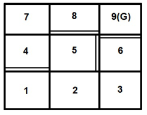
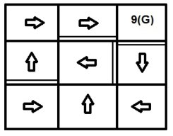
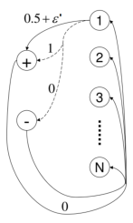
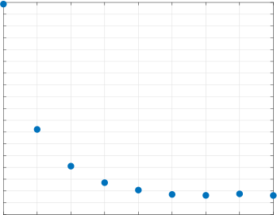

### A HYBRID PAC REINFORCEMENT LEARNING ALGORITHM


**Ashkan Zehfroosh**
Department of Mechanical Engineering
University of Delaware
Newark, DE 19716

```
    ashkanz@udel.edu

```


**Herbert G. Tanner**
Department of Mechanical Engineering
University of Delaware
Newark, DE 19716

```
    btanner@udel.edu

```


**ABSTRACT**


This paper offers a new hybrid probably approximately correct (PAC) reinforcement learning (RL)
algorithm for Markov decision processes (MDPs) that intelligently maintains favorable features of
its parents. The designed algorithm, referred to as the Dyna-Delayed Q-learning (DDQ) algorithm,
combines model-free and model-based learning approaches while outperforming both in most cases.
The paper includes a PAC analysis of the DDQ algorithm and a derivation of its sample complexity. Numerical results are provided to support the claim regarding the new algorithm’s sample
efficiency compared to its parents as well as the best known model-free and model-based algorithms
in application.


**1** **Introduction**


While several reinforcement learning (RL) algorithms can apply to a dynamical system modelled as a Markov decision
process (MDP), few are probably approximately correct (PAC)—namely, they can guarantee how soon the algorithm
will converge to the near-optimal policy. Existing PAC MDP algorithms can be broadly divided into two groups:

– –
model-based algorithms like [1 6], and model-free Delayed Q-learning algorithms [7 9]. Each group has its advantages
and disadvantages. The goal here is to capture the advantages of both groups, while preserving PAC properties.


Model-free RL is a powerful approach for learning complex tasks. For many real-world learning problems, however,
the approach is taxing in terms of the size of the necessary body of data—what is more formally referred to as its
_sample complexity_ . The reason is that model-free RL ignores rich information from state transitions and only relies on
the observed rewards for learning the optimal policy [10]. A popular model-free PAC RL MDP algorithm is known as
_Delayed Q-learning_ [7]. The known upper-bound on the sample complexity of Delayed Q-learning suggests that it
outperforms model-based alternatives only when the state-space size of the MDP is relatively large [11].


Model-based RL, on the other hand, utilizes all information from state transitions to learn a model, and then uses
that model to compute an optimal policy. The sample complexity of model-based RL algorithms are typically lower
than that of model-free ones [12]; the trade-off comes in the form of computational effort and possible bias [10].


A popular model-based PAC RL MDP algorithms is _R-max_ [2]. The derived upper-bound for the sample complexity
of the R-max algorithm [13] suggests that this model-based algorithm shines from the viewpoint of sample efficiency
when the size of the state/action space is relatively small. This efficiency assessment can typically be generalized to
most model-based algorithms.


Overall, R-max and Delayed Q-learning are incomparable in terms of their bound on the sample complexity.
For instance, _for the same sample size_, R-max is bound to return a policy of higher accuracy compared to Delayed
Q-learning, while the latter will converge much faster on problems with large state spaces.


Typically, model-free algorithms circumvent the model learning stage of the solution process, a move that by
itself reduces complexity in problems of large size. In many applications, however, model learning is not the main


This work was supported by NIH under grant # R01HD87133


complexity bottleneck. Neurophysiologically-inspired hypotheses [14] have suggested that the brain approach toward
complex learning tasks can be model-free (trial and error) or model-based (deliberate planning and computation) or even
combination of both, depending on the amount and reliability of the available information. This intelligent combination
is postulated to contribute in making the process efficient and fast. The design of the PAC MDP algorithm presented
in this paper is motivated by such observations. Rather than following strictly one of the two prevailing directions, it
orchestrates a marriage of a model-free (Delayed Q-learning) with a model-based (R-max) PAC algorithm, in order to
give rise to a new PAC algorithm (Dyna-Delayed Q-learning (DDQ)) that combines the advantages of both.


The search for a connection between model-free and model-based RL algorithms begins with the Dyna-Q algorithm

[15], in which synthetic generated experiences based on the learned model are used to expedite Q-learning. Some
other examples that continued along this thread of research are partial model back propagation [16], training a goal

–
condition Q function [17 20], and integrating model-based linear quadratic regulator based algorithm into model-free
framework of path integral policy improvement [21]. The recently introduced Temporal Difference Models (TDM)
provides a smooth(er) transition from model-free to model-based, during the learning process [10]. What is missed in
the literature is a PAC combination of model-free and model-based frameworks.


Here the Dyna-Q idea is leveraged to combine two popular PAC algorithms, one model-free and one model-based,
into a new one named DDQ, which is not only PAC like its parents, but also inherits the best of both worlds: it will
intelligently behave more like a model-free algorithm on large problems, and operate more like a model-based algorithm
on problems that require high accuracy, being content with the smallest among the sample sizes required by its parents.
Specifically, the sample complexity of DDQ, in the worst case, matches the minimum bound between that of R-max
and Delayed Q-learning, and often outperforms both. Note that DDQ algorithm is purely online and does not assume
accessing to a generative model like in [22]. While the provable worst case upper bound on the sample complexity of
DDQ algorithm is higher than the best known model-based [5] and model-free [8,9] algorithms, we can demonstrate (see
Section 5) that the hybrid nature allows for superior performance of the DDQ algorithm in applications. The availability
of a hybrid PAC algorithm like DDQ in hand, obviates the choice between a model-free and a model-based approach.


Our own motivation for developing of this new breed of RL algorithms comes from application problems in the
area of early pediatric motor rehabilitation, where robots can be used as smart toys to socially interact with infants who
have special needs, and engage with them socially in play-based activity that involves gross motion. There, MDP models
can be constructed to capture the dynamics of the social interaction between infant and robot, and RL algorithms can
guide the behavior of the robot as it interacts with the infant in order to achieve the maximum possible rehabilitation
outcome—the latter possibly quantified by the overall length of infant displacement, or the frequency of infant motor
transitions. Some early attempts at modeling such instances of human-robot interaction (HRI) did not result in models
of particularly large state and action spaces, but were particularly complicated by the absence of sufficient data sets for
learning [23,24]. This is because every child is different, and the exposure of each particular infant to the smart robotic
toys (during which HRI data can be collected) is usually limited to a few hours per month. There is a need, therefore, for
reinforcement learning approaches that can maintain efficiency and accuracy even when the learning set is particularly
small.


The paper starts with some technical preliminaries in Section 2. This section introduces the required properties of
a PAC RL algorithm in the form of a well-known theorem. The DDQ algorithm is introduced in Section 3, with particular
emphasis given on its update mechanism. Section 4 presents the mathematical analysis that leads the establishment of
the algorithm’s PAC properties, and the analytic derivation of its sample complexity. Finally, Section 5 offers numerical
data to support the theoretical sample complexity claims, through an illustrative grid-world example. The data indicate
that DDQ outperforms Delayed Q-learning and R-max in terms of the required samples to learn near-optimal policy. To
promote readability, the proofs of most of the lemmas supporting the proof of our main result are included separately in
the paper’s Appendix.


**2** **Technical Preliminaries**


A finite MDP _M_ is a tuple { _S,A,R,T,γ_ } with elements


_S_ a finite set of states
_A_ a finite set of actions
_R_ ∶ _S_ × _A_ →[0 _,_ 1] the _reward_ from executing _a_ at _s_
_T_ ∶ _S_ × _A_ × _S_ →[0 _,_ 1] the _transition probabilities_
_γ_ ∈[0 _,_ 1) the _discount factor_


2


A _policy π_ is a mapping _π_ ∶ _S_ → _A_ that selects an action _a_ to be executed at state _s_ . A policy is _optimal_ if it
maximizes the expected sum of discounted rewards; if _t_ indexes the current time step and _at_, _st_ denote current action
and state, respectively, then this expected sum is written E _M_ {∑ _t_ [∞] =0 _[γ][t][R]_ [(] _[s][t][,a][t]_ [)}][. The discount factor] _[ γ]_ [ here reflects]
the preference of immediate rewards over future ones. The _value_ of state _s_ under policy _π_ in MDP _M_ is defined as


∞
_vM_ _[π]_ [(] _[s]_ [) =][ E] _[M]_ [{] _[R]_ [(] _[s,π]_ [(] _[s]_ [)) +] ∑ _γ_ _[t]_ _R_ ( _st,π_ ( _st_
_t_ =1 ))}


1
Note that an upper bound for the value at any state is _v_ max = 1− _γ_ [. Similarly defined is the value of] _[ state-action pair]_
( _s,a_ ) under policy _π_ :


∞
_Q_ _[π]_ _M_ [(] _[s,a]_ [) =][ E] _[M]_ [{] _[R]_ [(] _[s,a]_ [) +] ∑ _γ_ _[t]_ _R_ ( _st,π_ ( _st_
_t_ =1 ))}


Every MDP _M_ has at least one optimal policy _π_ [∗] that results in an optimal value (or state-action value) assignment at
all states; the latter is denoted _vM_ [∗] [(] _[s]_ [)][ (or] _[ Q]_ [∗] _M_ [(] _[s,a]_ [)][, respectively).]


The standard approach to finding the optimal values is through the search for a fix point of the Bellman equation


_vM_ [∗] [(] _[s]_ [) =][ max] _a_ [{] _[R]_ [(] _[s,a]_ [) +] _[ γ]_ [ ∑] _M_ [(] _[s]_ [′][)}]
_s_ [′] _[ T]_ [(] _[s,s]_ [′] _[,a]_ [)] _[v]_ [∗]


which, after substituting _VM_ [∗] [(] _[s]_ [′][) =][ max] _[a][ Q]_ [∗] _M_ [(] _[s]_ [′] _[,a]_ [)][, can equivalently be written in terms of state-action values]


_Q_ [∗] _M_ [(] _[s,a]_ [) =] _[ R]_ [(] _[s,a]_ [) +] _[ γ]_ [ ∑] _M_ [(] _[s]_ [′][)]
_s_ [′] _[ T]_ [(] _[s,s]_ [′] _[,a]_ [)] _[v]_ [∗]


Reinforcement learning, (RL) is a procedure to obtain an optimal policy in an MDP, when the actual transition
probabilities and/or reward function are not known. The procedure involves exploration of the MDP model. An RL
algorithm usually maintains a table of state-action pair value estimates _Q_ ( _s,a_ ) that are updated based on the exploration
data. We denote _Qt_ ( _s,a_ ) the currently stored value for state-action pair ( _s,a_ ) at timestep _t_ during the execution of
an RL algorithm. Consequently, _vt_ ( _s_ ) = max _a Qt_ ( _s,a_ ). An RL algorithm is _greedy_ if it at any timestep _t_, it always
executes action _at_ = arg max _a_ ∈ _A Qt_ ( _st,a_ ). The policy in force at time step _t_ is similarly denoted _πt_ . In what follows,
we denote ∣ _S_ ∣ the cardinality of a set _S_ .


Reinforcement learning algorithms have been classified as _model-based_ or _model-free_ . Although the characterization is debatable, what is meant by calling an RL algorithm “model-based,” is that _T_ and/or _R_ are estimated based on
online observations (exploration data), and the resulting estimated model subsequently informs the computation of the
the optimal policy. A model-free RL algorithm, on the other hand, would skip the construction of an estimated MDP
model, and search directly for an optimal policy over the policy space. An RL algorithm is expected to converge to the
optimal policy, practically reporting a near-optimal one at termination.


Probably approximately correct (PAC) analysis of RL algorithms deals with the question of how fast an RL algorithm
converges to a near-optimal policy. An RL algorithm is PAC if there exists a probabilistic bound on the number of
exploration steps that the algorithm can take before converging to a near-optimal policy.


**Definition 1.** _Consider that an_ RL _algorithm_ A _is executing on_ MDP _M_ _. Let st be the visited state at time step t and_
A _t denotes the (non-stationary) policy that the_ A _executes at t. For a given ϵ_ - 0 _and δ_ - 0 _,_ A _is a_ PAC RL algorithm _if_
_there is an N_ - 0 _such that with probability at least_ 1 − _δ and for all but N time steps,_


_vM_ [A] _[t]_ [(] _[s][t]_ [) ≥] _[v]_ _M_ [∗] [(] _[s][t]_ [) −] _[ϵ]_ (1)


Equation (1) is known as the _ϵ_ -optimality condition and _N_ as the _sample complexity_ of A, which is a function of
(∣ _S_ ∣ _,_ ∣ _A_ ∣ _,_ [1] _ϵ_ _[,]_ [1] _δ_ _[,]_ 1−1 [)][.]


[1] _δ_ _[,]_ 1−1 _γ_ [)][.]


[1] [1]

_ϵ_ _[,]_ _δ_


**Definition 2.** _Consider_ MDP _M_ = { _S,A,R,T,γ_ } _which at time t has a set of state-action value estimates Qt_ ( _s,a_ ) _,_
_and let Kt_ ⊆ _S_ × _A be a set of state-action pairs labeled_ known _. The_ known state-action MDP


_MKt_ = { _S_ ∪{ _zs,a_ ∣( _s,a_ ) ∉ _Kt_ } _,A,TKt,RKt,γ_ }


_is an_ MDP _derived from M and Kt by defining new states zs,a for each unknown state-action pair_ ( _s,a_ ) ∉ _Kt, with_
_self-loops for all actions, i.e., TKt_ ( _zs,a,_ ⋅ _,zs,a_ ) = 1 _. For all_ ( _s,a_ ) ∈ _Kt, it is RKt_ ( _s,a_ ) = _R_ ( _s,a_ ) _and TKt_ ( _s,a,_ ⋅) =


3


_T_ ( _s,a,_ ⋅) _. When an unknown state-action pair_ ( _s,a_ ) ∉ _Kt is experienced, RKt_ ( _s,a_ ) = _Qt_ ( _s,a_ )(1 − _γ_ ) _and the model_
_jumps to zs,a with TKt_ ( _s,a,zs,a_ ) = 1 _; subsequently, RKt_ ( _zs,a,_ ⋅) = _Qt_ ( _s,a_ )(1 − _γ_ ) _._


Let _Kt_ be set of current known state-action pairs of an RL algorithm A at time _t_, and allow _Kt_ to be arbitrarily
defined as long as it depends only on the history of exploration data up to _t_ . Any ( _s,a_ ) ∉ _Kt_ experienced at time step _t_
marks an _escape event_ .


**Theorem 1** ([11]) **.** _Let_ A _be a greedy_ RL _algorithm for an arbitrary_ MDP _M_ _, and let Kt be the set of current known_
_state-action pairs, defined based only on the history of the exploration data up to timestep t. Assume that Kt_ = _Kt_ +1
_unless an update to some state-action value occurs or an escape event occurs at timestep t, and that Qt_ ( _s,a_ ) ≤ _v_ max
_for all_ ( _s,a_ ) _and t. Let MKt be the known state-action_ MDP _at timestep t and πt_ ( _s_ ) = arg max _a Qt_ ( _s,a_ ) _denote the_
_greedy policy that_ A _executes. Suppose now that for any positive constant ϵ and δ, the following conditions hold with_
_probability at least_ 1 − _δ for all s, a and t:_


**optimism:** _vt_ ( _s_ ) ≥ _vM_ [∗] [(] _[s]_ [) −] _[ϵ]_


**accuracy:** _vt_ ( _s_ ) − _vM_ _[π][t]_ _Kt_ [(] _[s]_ [) ≤] _[ϵ]_


**complexity:** _sum of number of timesteps with Q-value updates plus number of timesteps with escape events is_
_bounded by ζ_ ( _ϵ,δ_ ) > 0 _._


_Then, executing algorithm_ A _on any_ MDP _M will result in following a_ 4 _ϵ-optimal policy on all but_


_[ζ]_ [(] _[ϵ][,]_ _[δ]_ [)]
O ( _ϵ_ (1 − _γ_


[1] _δ_ [)] [ln] [(] _ϵ_ (11− _γ_ ) [)) ≃O (] _ϵ_ ( _[ζ]_ 1 [(] − _[ϵ][,]_ _[δ]_ _γ_ [)]


_[,]_ [1]

_ϵ_ (1 − _γ_ ) [2] [ln] [(] _δ_


_ϵ_ ( _[ζ]_ 1 [(] − _[ϵ][,]_ _[δ]_ _γ_ [)] ) [2] [)] (2)


_timesteps, with probability at least_ 1 − 2 _δ._


**3** **DDQ Algorithm**


This section presents Algorithm 1, the one we call DDQ and the main contribution of this paper. DDQ integrates
elements of R-max and Delayed _Q_ -learning, while preserving the implementation advantages of both. We refer to the
assignment in line 31 of Algorithm 1 as a _type-_ 1 _update_, and to the one on line 52 as a _type-_ 2 _update_ . Type-1 updates
use the _m_ 1 most recent experiences (occurances) of a state-action pair ( _s,a_ ) to update that pair’s value, while a type-2
update is realized through a value iteration algorithm (lines 43 − 54) and applies to state-action pairs experienced at
least _m_ 2 times. The outcome at timestep _t_ of the value iteration for a type-2 update is denoted _Q_ [vl] _t_ [(] _[s,a]_ [)][. The value]
iteration is set to run for [ln] [(][1][/(] (1 _[ϵ]_ [2] − [(] _γ_ [1] ) [−] _[γ]_ [)))] iterations; parameter _ϵ_ 2 regulates the desired accuracy on the resulting estimate

(Lemma 5). A type-1 update is successful only if the condition on line 30 of the algorithm is satisfied, and this condition
ensures that the type-1 update necessarily decreases the value estimate by at least _ϵ_ 1 = 3 _ϵ_ 2. Similarly, a type-2 update is
successful only if the condition on line 51 of the algorithm holds. The DDQ algorithm maintains the following internal
variables:


- _l_ ( _s,a_ ): the number of samples gathered for the update type-1 of _Q_ ( _s,a_ ) once _l_ ( _s,a_ ) = _m_ 1.

- _U_ ( _s,a_ ): the running sum of target values used for a type-1 update of _Q_ ( _s,a_ ), once enough samples have been
gathered.

- _b_ ( _s,a_ ): the timestep at which the most recent or ongoing collection of _m_ 1 ( _s,a_ ) experiences has started.

- learn( _s,a_ ): a Boolean flag that indicates whether or not samples are being gathered for type-1 update of _Q_ ( _s,a_ ). The
flag is set to true initially, and is reset to true whenever some Q-value is updated. It flips to false when no updates to
any Q-values occurs within a time window of _m_ 1 experiences of ( _s,a_ ) in which attempted updates type-1 of _Q_ _[i]_ ( _s,a_ )
fail.

- _n_ ( _s,a_ ): variable that keeps track of the number of times ( _s,a_ ) is experienced.

- _n_ ( _s,a,s_ [′] ): variable that keeps track of the number of transitions to _s_ [′] on action _a_ at state _s_ .

- _r_ ( _s,a_ ): the accumulated rewards by doing _a_ in _s_ .


The execution of the DDQ algorithm is tuned via the _m_ 1 and _m_ 2 parameters. One can practically reduce it to
Delayed _Q_ -learning by setting _m_ 2 very large, and to R-max by setting _m_ 1 large. The next section provides a formal


4


**Algorithm 1** The DDQ algorithm


1: **Inputs** : _S,A,γ,m_ 1 _,m_ 2 _,ϵ_ 1 _,ϵ_ 2
2: **for all** _s,a,s_ [′] **do**
3: _Q_ ( _s,a_ ) ← _v_ max  - initialize _Q_ values to its maximum
4: _U_ ( _s,a_ ) ← 0  - used for attempted updates of type-1
5: _l_ ( _s,a_ ) ← 0  - counters
6: _b_ ( _s,a_ ) ← 0  - beginning timestep of attempted update type-1
7: learn( _s,a_ ) ← true  - learn flags
8: _n_ ( _s,a_ ) ← 0  - number of times ( _s, a_ ) is tried
9: _n_ ( _s,a,s_ [′] ) ← 0  - number of transitions to _s_ [′] by _a_ in _s_
10: _r_ ( _s,a_ ) ← 0 - accumulated reward by execution of _a_ in _s_
11: **end for**
12: _t_ [∗] ← 0 - time of the most recent successful timestep
13: **for** _t_ = 1 _,_ 2 _,_ 3 _,..._ **do**
14: let _s_ denotes the state at time _t_
15: choose action _a_ = arg max _a_ ′∈ _A Q_ ( _s,a_ [′] )
16: observe immediate reward _r_ and next state _s_ [′]

17: _n_ ( _s,a_ ) = _n_ ( _s,a_ ) + 1
18: _n_ ( _s,a,s_ [′] ) = _n_ ( _s,a,s_ [′] ) + 1
19: _r_ ( _s,a_ ) = _r_ ( _s,a_ ) + _r_
20: **if** _b_ ( _s,a_ ) ≤ _t_ [∗] **then**
21: learn( _s,a_ ) ← true
22: **end if**
23: **if** learn( _s,a_ ) = true **then**
24: **if** _l_ ( _s,a_ ) = 0 **then**
25: _b_ ( _s,a_ ) ← _t_
26: **end if**
27: _l_ ( _s,a_ ) ← _l_ ( _s,a_ ) + 1
28: _U_ ( _s,a_ ) ← _U_ ( _s,a_ ) + _r_ + _γ_ max _a_ ′ _Q_ ( _s_ [′] _,a_ [′] )
29: **if** _l_ ( _s,a_ ) = _m_ 1 **then**
30: **if** _Q_ ( _s,a_ ) − _U_ ( _s,a_ )/ _m_ 1 ≥ 2 _ϵ_ 1 **then**
31: _Q_ ( _s,a_ ) ← _U_ ( _s,a_ )/ _m_ 1 + _ϵ_ 1 and _t_ [∗] ← _t_
32: **else if** _b_ ( _s,a_ ) > _t_ [∗] **then**
33: learn( _s,a_ ) ← false
34: **end if**
35: _U_ ( _s,a_ ) ← 0 and _l_ ( _s,a_ ) ← 0
36: **end if**

37: **end if**
38: **if** _n_ ( _s,a_ ) = _m_ 2 **then**
39: _t_ [∗] ← _t_
40: **for all** ( ~~_s_~~ _,_ ~~_a_~~ ~~)~~ **do**
41: _Q_ vl( ~~_s_~~ _,_ ~~_a_~~ ) ← _Q_ ( ~~_s_~~ _,_ ~~_a_~~ ~~)~~
42: **end for**

[(][1][/(] _[ϵ]_ [2][(][1][−] _[γ]_ [)))]
43: **for** _i_ = 1 _,_ 2 _,_ 3 _,...,_ ( [ln] (1− _γ_ ) ) **do**

44: **for all** ( ~~_s_~~ _,_ ~~_a_~~ ~~)~~ **do**
45: **if** _n_ ( ~~_s_~~ _,_ ~~_a_~~ ~~)~~ ≥ _m_ 2 **then**


_[r]_ ~~[(]~~ ~~_[s][,][a]_~~ ~~[)]~~

_n_ ~~(~~ ~~_s,a_~~ ) [+] _[ γ]_ [ ∑] _[s]_ [′′] _[ n]_ ~~[(]~~ _n_ ~~_[s]_~~ ~~(~~ ~~_[,]_~~ ~~_s,a_~~ ~~_[a]_~~ _[,][s]_ ~~)~~ [′′][)]


46: _Q_ vl( ~~_s_~~ _,_ ~~_a_~~ ~~)~~ ← _[r]_ ~~[(]~~ ~~_[s][,][a]_~~ ~~[)]~~


~~_[s][,][a]_~~ ~~_[s][,][a]_~~ _[,][s]_
46: _Q_ vl( ~~_s_~~ _,_ ~~_a_~~ ~~)~~ ← _n_ _[r]_ ~~(~~ ~~_s,a_~~ ) [+] _[ γ]_ [ ∑] _[s]_ [′′] _[ n]_ _n_ ~~(~~ ~~_s,a_~~ ~~)~~ [max] _[a]_ [′] _[ Q]_ [vl][(] _[s]_ [′′] _[,a]_ [′][)]

47: **end if**

48: **end for**

49: **end for**
50: **for all** ( ~~_s_~~ _,_ ~~_a_~~ ~~)~~ **do**
51: **if** _Q_ vl( ~~_s_~~ _,_ ~~_a_~~ ~~)~~ ≤ _Q_ ( ~~_s_~~ _,_ ~~_a_~~ ) **then**
52: _Q_ ( ~~_s_~~ _,_ ~~_a_~~ ~~)~~ ← _Q_ vl( ~~_s_~~ _,_ ~~_a_~~ ~~)~~
53: **end if**

54: **end for**

55: **end if**

56: **end for**


5


proof that DDQ is not only PAC but also _possesses the minimum sample complexity_ between R-max and Delayed
_Q_ -learning in the worst case —often, it outperforms both.


**4** **PAC Analysis of DDQ Algorithm**


In general, the sample complexity of R-max and Delayed _Q_ -learning is incomparable [11]; the former is better in
terms of the accuracy of the resulting policy while the latter is better in terms of scaling with the size of the state space.
∣ _S_ ∣ [2] ∣ _A_ ∣
The sample complexity of R-max algorithm is _ϵ_ [3] (1− _γ_ ) [8] [—note the power on] _[ ϵ]_ [; the sample complexity of Delayed]

∣ _S_ ∣∣ _A_ ∣
_Q_ -learning algorithm is _ϵ_ [4] (1− _γ_ ) [8] [—note the linear scaling with][ ∣] _[S]_ [∣][. It appears that][ DDQ][ can bring together the best of]
both worlds; its sample complexity is


∣ _S_ ∣ [2] ∣ _A_ ∣ ∣ _S_ ∣∣ _A_ ∣
O (min {O( _ϵ_ [3] (1− _γ_ ) [8] [)] _[,]_ [O(] _ϵ_ [4] (1− _γ_ ) [8] [)})]


Before formally stating the PAC properties of the DDQ algorithm and proving the bound on its sample complexity,
some technical groundwork needs to be laid. To slightly simplify notation, let _κ_ ≜∣ _S_ ∣∣ _A_ ∣(1 + (1−1 _γ_ ) _ϵ_ 1 [)][. Moreover,]
subscript _t_ marks the value of a variable at the beginning of timestep _t_ (particularly line 23 of the algorithm).


**Definition 3.** _An event when_ learn( _s,a_ ) = true _and at the same time l_ ( _s,a_ ) = _m_ 1 _or n_ ( _s,a_ ) = _m_ 2 _, is called an_
attempted update _._


**Definition 4.** _At any timestep t in the execution of_ DDQ _algorithm the set of_ known state-action pairs _is defined as:_


_Kt_ = {( _s,a_ ) ∣ _n_ ( _s,a_ ) ≥ _m_ 2 or _Qt_ ( _s,a_ ) −( _R_ ( _s,a_ ) + _γ_ ∑ _s_ ′ _T_ ( _s,a,s_ [′] ) _vt_ ( _s_ [′] )) ≤ 3 _ϵ_ 1}


In subsequent analysis, and to distinguish between the conditions that make a state-action pair ( _s,a_ ) known, the
set _Kt_ will be partitioned into two subsets:


_Kt_ [1] [={(] _[s,a]_ [) ∣] _[Q][t]_ [(] _[s,a]_ [) −(] _[R]_ [(] _[s,a]_ [) +] _[ γ]_ [∑] _s_ [′] _[ T]_ [(] _[s,a,s]_ [′][)] _[v][t]_ [(] _[s]_ [′][)) ≤] [3] _[ϵ]_ [1][}]

_Kt_ [2] [={(] _[s,a]_ [) ∣] _[n]_ [(] _[s,a]_ [) ≥] _[m]_ [2][}]


**Definition 5.** _In the execution of_ DDQ _algorithm a timestep t is called a_ successful timestep _if at that step any state-_
_action value is updated or the number of times that a state-action pair is visited reaches m_ 2 _. Moreover, considering_
_a particular state-action pair_ ( _s,a_ ) _, timestep t is called a_ successful timestep for ( _s,a_ ) _if at t either update type-1_
_happens to Q_ ( _s,a_ ) _or the number of times that_ ( _s,a_ ) _is visited reaches m_ 2 _._


Recall that a type-1 update necessarily decreases the Q-value by at least _ϵ_ 1. Defining rewards as positive quantities
prevents the Q-values from becoming negative. At the same time, state-action pairs can initiate update type-2 only once
they are experienced _m_ 2 times. Together, these conditions facilitate the establishment of an upper-bound on the total
number of successful timesteps during the execution of DDQ:


**Lemma 1.** _The number of successful timesteps for a particular state-action pair_ ( _s,a_ ) _in a_ DDQ _algorithm is at most_
1 + (1−1 _γ_ ) _ϵ_ 1 _[. Moreover, the total number of successful timesteps is bounded by][ κ][.]_


_Proof._ See Appendix A.


**Lemma 2.** _The total number of attempted updates in_ DDQ _algorithm is bounded by_ ∣ _S_ ∣∣ _A_ ∣(1 + _κ_ ) _._


_Proof._ See Appendix B.


**Lemma 3.** _Let M be an_ MDP _with a set of known state-action pairs Kt. If we assume that for all state-action pairs_
( _s,a_ ) ∉ _Kt we have Qt_ ( _s,a_ ) ≤ 1−1 _γ_ _[, then for all state-action pairs in the known state-action]_ [ MDP] _[ M][K][t][ it holds]_


1
_Q_ [∗] _MKt_ [(] _[s,a]_ [) ≤] 1 − _γ_


6


_Proof._ See Appendix C.


Choosing _m_ 1 big enough and applying Hoefding’s inequality allows following conclusion (Lemma 4) for all
type-1 updates, and paves the way for establishing the optimism condition of Theorem 1.


**Lemma 4.** _Suppose that at time t during the execution of_ DDQ _a state-action pair_ ( _s,a_ ) _experiences a successful_
_update of type-1 with its value changing from Q_ ( _s,a_ ) _to Q_ [′] ( _s,a_ ) _, and that there exists_ ∃ _ϵ_ 2 ∈(0 _,_ _[ϵ]_ 2 [1] [)] _[ such that]_ [ ∀] _[s]_ [ ∈] _[S]_

_and_ ∀ _t_ [′] < _t, vt_ ′( _s_ ) ≥ _vM_ [∗] [(] _[s]_ [) −] [2] _[ϵ]_ [2] _[. If]_


ln ( [8][∣] _[S]_ [∣∣] _[A]_ _δ_ [∣(][1][+] _[κ]_ [)] ) ⎛

2( _ϵ_ 1 − 2 _ϵ_ 2) [2] (1 − _γ_ ) [2] [≃O] ⎜⎝


ln ( [∣] _[S]_ [∣][2] _δ_ [∣] _[A]_ [∣][2] ) ⎞

⎟ (3)
_ϵ_ [2] 1 [(][1][ −] _[γ]_ [)][2] ⎠


ln ( [8][∣] _[S]_ [∣∣] _[A]_ _δ_ [∣(][1][+] _[κ]_ [)]
_m_ 1 ≥


_δ_ [∣(][1][+] _[κ]_ [)] )


ln ( [∣] _[S]_ [∣][2] _δ_ [∣] _[A]_ [∣][2]


_δ_ [∣] [∣] )


_for κ_ = ∣ _S_ ∣∣ _A_ ∣(1 + [1] /(1 − _γ_ ) _ϵ_ 1) _, then Q_ [′] ( _s,a_ ) ≥ _Q_ [∗] _M_ [(] _[s,a]_ [)] _[ with probability at least]_ [ 1][ −] 8 _[δ]_ _[.]_


_Proof._ In Appendix D.


The following two lemmas are borrowed from [11] with very minor modifications, and inform on how to choose
parameter _m_ 2, and the number of iterations for the value iteration part of the DDQ algorithm in order to obtain a desired

accuracy.


[(][1][/] _[ϵ]_ [2] [(][1][ −] _[γ]_ [)][)]
**Lemma 5.** _(cf. [11, Proposition 4]) Suppose the value-iteration algorithm runs on_ MDP _M for_ [ln] 1− _γ_ _iterations,_

_and each state-action value estimate Q_ ( _s,a_ ) _is initialized to some value between_ 0 _and v_ max _for all states and actions._
_Let Q_ [′] ( _s,a_ ) _be the state-action value estimate the algorithm yields. Then_ max _s,a_ {∣ _Q_ [′] ( _s,a_ ) − _Q_ [∗] _M_ [(] _[s,a]_ [)∣} ≤] _[ϵ]_ [2] _[.]_

**Lemma 6.** _Consider an_ MDP _M with reward function R and transition probabilities T_ _. Suppose another_ MDP _M_ [ˆ] _has_
_the same state and action set as M_ _, but maintains an maximum likelihood (_ ML _) estimate of R and T_ _, with n_ ( _s,a_ ) ≥ _m_ 2 _,_
_in the form of_ _R_ [ˆ] _and_ _T_ [ˆ] _respectively. With C a constant and for all state-action pairs, choosing_


_m_ 2 ≥ _C_
( [∣] _[S]_ [∣] [+] _ϵ_ [2] 2 [ ln][(][1][(][ −][8][∣] _[γ][S]_ [∣∣][)] _[A]_ [4] [∣][/] _[δ]_ [)]


[+][ ln] [(][∣] _[S]_ [∣∣] _[A]_ [∣][/] _[δ]_ [)]

_ϵ_ [2] 2 [(][1][ −] _[γ]_ [)][4] )


[+][ ln] [(][8][∣] _[S]_ [∣∣] _[A]_ [∣][/] _[δ]_ [)]

_O_
_ϵ_ [2] 2 [(][1][ −] _[γ]_ [)][4] ) ≃ ( [∣] _[S]_ [∣] _ϵ_ [+][2] 2 [ ln][(][1][ −][(][∣] _[S][γ]_ [∣∣][)] _[A]_ [4][∣][/] _[δ]_ [)]


_guarantees_


∣ _R_ ( _s,a_ ) − _R_ [ˆ] ( _s,a_ )∣≤ _Cϵ_ 2(1 − _γ_ ) [2]

∥ _T_ ( _s,a,_ ⋅) − _T_ [ˆ] ( _s,a,_ ⋅)∥1 ≤ _Cϵ_ 2(1 − _γ_ ) [2]


_with probability at least_ 1 − 8 _[δ]_ _[. Moreover, for any policy][ π][ and for all state-action pairs,]_


ˆ
∣ _Q_ _[π]_ _M_ [(] _[s,a]_ [) −] _[Q][π]_ _M_ [(] _[s,a]_ [)∣≤] _[ϵ]_ [2]
∣ _vM_ _[π]_ [(] _[s]_ [) −] _[v]_ _M_ _[π]_ ˆ [(] _[s]_ [)∣≤] _[ϵ]_ [2]


_with probability at least_ 1 − 8 _[δ]_ _[.]_


_Proof._ Combine [11, Lemmas 12–15].


**Lemma 7.** _Let t_ 1 < _t_ 2 _be two timesteps during the execution of the_ DDQ _algorithm. If_


_Qt_ 1( _s,a_ ) ≥ _Q_ [∗] _MKt_ 21 ( _s,a_ ) − 2 _ϵ_ 2 ∀( _s,a_ ) ∈ _S_ × _A_


_then with probability at least_ 1 − 8 _[δ]_


_Proof._ See Appendix E.


_Q_ [∗] _MKt_ 21 ( _s,a_ ) ≥ _Q_ [∗] _MKt_ 22 ( _s,a_ ) ∀( _s,a_ ) ∈ _S_ × _A_


Lemmas 5 and 6 together have as a consequence the following Lemma, which contributes to establishing the
accuracy condition of Theorem 1 for the DDQ algorithm.


7


**Lemma 8.** _During the execution of_ DDQ _, for all t and_ ( _s,a_ ) ∈ _S_ × _A, we have:_


_Q_ [∗] _MKt_ 2 [(] _[s,a]_ [) −] [2] _[ϵ]_ [2][ ≤] _[Q][t]_ [(] _[s,a]_ [) ≤] _[Q]_ _M_ [∗] _Kt_ 2 [(] _[s,a]_ [) +][ 2] _[ϵ]_ [2] (4)


_with probability at least_ 1 − [3] 8 _[δ]_ _[.]_


_Proof._ See Appendix F.


Lemma 1 has already offered a bound on the number of updates in DDQ; however, for the complexity condition of
Theorem 1 to be satisfied, one needs to show that during the execution of Algorithm 1 the number of escape events is
also bounded. The following Lemma is the first step: it states that by picking _m_ 1 as in (3), and under specific conditions,
an escape event necessarily results in a successful type-1 update. With the number of updates bounded, Lemma 9 can
be utilized to derive a bound on the number of escape events.


**Lemma 9.** _With the choice of m_ 1 _as in_ (3) _, and assuming the_ DDQ _algorithm at timestep t with_ ( _s,a_ ) ∉ _Kt, l_ ( _s,a_ ) =
0 _and_ learn( _s,a_ ) = true _, we know that an attempted type-1 update of Q_ ( _s,a_ ) _will necessarily occur within m_ 1
_occurrences of_ ( _s,a_ ) _after t, say at timestep tm_ 1 _. If_ ( _s,a_ ) _has been visited fewer than m_ 2 _till tm_ 1 _, then the attempted_
_type-1 update at tm_ 1 _will be successful with probability at least_ 1 − 8 _[δ]_ _[.]_


_Proof._ See Appendix G.


**Lemma 10.** _Let t be the timestep when_ ( _s,a_ ) _has been visited for m_ 1 _times after the conditions of Lemma 9 were_
_satisfied. If the update at timestep t is unsuccessful and at timestep t_ + 1 _it is_ learn( _s,a_ ) = false _, then_ ( _s,a_ ) ∈ _Kt_ +1 _._


_Proof._ See Appendix H.


A bound on the number the escape events of DDQ algorithm can be derived in a straightforward way. Note that a
state-action pair that is visited _m_ 2 times becomes a permanent member of set _Kt_ . Therefore, the number of escape
events is bounded by ∣ _S_ ∣∣ _A_ ∣ _m_ 2. On the other hand, Lemma 9 and the learn flag mechanism (i.e. Lemma 10) suggest
another upper bound on escape events. The following Lemma simply states an upper bound for escape events in DDQ
as the minimum among the two bounds.


**Lemma 11.** _During the execution of_ DDQ _, with the assumption that Lemma 9 holds, the total number of timesteps with_
( _st,at_ ) ∉ _Kt (i.e. escape events) is at most_ min{2 _m_ 1 _κ,_ ∣ _S_ ∣∣ _A_ ∣ _m_ 2)} _._


_Proof._ See Appendix I.


Next comes the main result of this paper. The statement that follows establishes the PAC properties of the DDQ
algorithm and provides a bound on its sample complexity.


1
**Theorem 2.** _Consider an_ MDP _M_ = { _S,A,T,R,γ_ } _, and let ϵ_ ∈(0 _,_ 1− _γ_ [)] _[, and][ δ]_ [ ∈(][0] _[,]_ [1][)] _[. There exist][ m]_ [1][ =]
O ( [ln][ (][∣] _[S]_ [∣][2] [∣] _[A]_ [∣][2][/] _[δ]_ [)] / _ϵ_ [2] 1 [(][1][ −] _[γ]_ [)][2][)] _[ and][ m]_ [2] [= O (][∣] _[S]_ [∣+][ ln][ (][∣] _[S]_ [∣∣] _[A]_ [∣][/] _[δ]_ [)][/] _[ϵ]_ [2] 2 [(][1][ −] _[γ]_ [)][4][)] _[ with]_ _ϵ_ 11 [=] (1−3 _γ_ ) _ϵ_ [= O (][1][/] _[ϵ]_ [(][1][ −] _[γ]_ [)][)] _[ and][ ϵ]_ [2][ =] _[ϵ]_ 3 [1] _[, such]_

_that if_ DDQ _algorithm is executed, M follows a_ 4 _ϵ-optimal policy with probability at least_ 1 − 2 _δ on all but_


O (min {O(∣ _S_ ∣ [2] ∣ _A_ ∣/ _ϵ_ [3] (1 − _γ_ ) [8] ) _,_ O( [∣] _[S]_ [∣∣] _[A]_ [∣] / _ϵ_ [4] (1 − _γ_ ) [8] )})


_timesteps (logarithmic factors ignored)._


_Proof._ We intend to apply Theorem 1. To satisfy the _optimism_ condition, we start by proving that _Qt_ ( _s,a_ ) ≥
_Q_ [∗] _M_ [(] _[s,a]_ [) −] [2] _[ϵ]_ [2][ by strong induction for all state-action pairs: (i) At] _[ t]_ [ =][ 1][, the value of all state-action pairs are set]
to the maximum possible value in MDP _M_ . This implies that _Q_ 1( _s,a_ ) ≥ _Q_ [∗] _M_ [(] _[s,a]_ [) ≥] _[Q]_ [∗] _M_ [(] _[s,a]_ [) −] [2] _[ϵ]_ [2][, therefore]
_vt_ ( _s_ ) ≥ _vM_ [∗] [(] _[s]_ [) −] [2] _[ϵ]_ [2][. (ii) Assume that] _[ Q][t]_ [(] _[s,a]_ [) ≥] _[Q]_ [∗] _M_ [(] _[s,a]_ [) −] [2] _[ϵ]_ [2][ holds for all timesteps before or equal to] _[ t]_ [ =] _[ n]_ [ −] [1][.]
(iii) At timestep _t_ = _n_, all ( _s,a_ ) ∉ _Kn_ [2] [can only be updated by a type-][1][ update before or at] _[ t]_ [ =] _[ n]_ [. For these state-action]
pairs, Lemma 4 implies that it will be _Qn_ ( _s,a_ ) ≥ _Q_ [∗] _M_ [(] _[s,a]_ [)][ with probability][ 1][ −] 8 _[δ]_ [.]

For all ( _s,a_ ) ∈ _Kn_ [2][, on the other hand, by Lemma 8 and with probability][ 1][ −] [3] 8 _[δ]_ [:]


_Qn_ ( _s,a_ ) ≥ _Q_ [∗] _MKn_ 2 [(] _[s,a]_ [) −] [2] _[ϵ]_ [2] [≥] _[Q]_ [∗] _M_ [(] _[s,a]_ [) −] [2] _[ϵ]_ [2]


8


Note that _Q_ [∗] _MKn_ 2 [(] _[s,a]_ [) ≥] _[Q]_ _M_ [∗] [(] _[s,a]_ [)][ since] _[ M][K]_ _n_ [2] [is similar to] _[ M]_ [ exept for][ (] _[s,a]_ [) ∉] _[K]_ _n_ [2] [which their values are set to be]

more than or equal to _Q_ [∗] _M_ [(] _[s,a]_ [)][. Therefore,] _[ Q][t]_ [(] _[s,a]_ [) ≥] _[Q]_ [∗] _M_ [(] _[s,a]_ [) −] [2] _[ϵ]_ [2][ holds for all timesteps] _[ t]_ [ and all state-action]
pairs, which directly implies _vt_ ( _s_ ) ≥ _vM_ [∗] [(] _[s]_ [) −] [2] _[ϵ]_ [2][ ≥] _[v]_ _M_ [∗] [(] _[s]_ [) −] _[ϵ]_ [.]


To establish the _accuracy_ condition, first write


_Qt_ ( _s,a_ ) = _R_ ( _s,a_ ) + _γ_ ∑ (5)
_a_ [′] _[ Q][t]_ [(] _[s]_ [′] _[,a]_ [′][) +] _[ β]_ [(] _[s,a]_ [)]
_s_ [′] _[ T]_ [(] _[s,a,s]_ [′][)] [max]


If ( _s,a_ ) ∈ _Kt_, there can be two cases: either ( _s,a_ ) ∈ _Kt_ [1] [or][ (] _[s,a]_ [) ∈] _[K]_ _t_ [2][. If][ (] _[s,a]_ [) ∈] _[K]_ _t_ [1][, then by Definition 4]
_β_ ( _s,a_ ) ≤ 3 _ϵ_ 1. If ( _s,a_ ) ∈ _Kt_ [2][, then Lemma 8 (right-hand side inequality) implies that with probability at least][ 1][ −] [3] 8 _[δ]_


2 _ϵ_ 2 ≥ _Qt_ ( _s,a_ ) − _Q_ [∗] _MKt_ 2 [(] _[s,a]_ [)] (6)


Meanwhile,
_Q_ [∗] _MKt_ 2 [(] _[s,a]_ [) =] _[ R]_ [(] _[s,a]_ [) +] _[ γ]_ [ ∑] _s_ [′] _[ T]_ [(] _[s,a,s]_ [′][)] [max] _a_ [′] _[ Q]_ _M_ [∗] _Kt_ 2 [(] _[s]_ [′] _[,a]_ [′][)] (7)


and substituting from (7) and (5) into (6) yields

_γ_ ∑ _s_ [′] _[ T]_ [(] _[s,a,s]_ [′][)(][max] _a_ [′] _[ Q][t]_ [(] _[s]_ [′] _[,a]_ [′][) −] [max] _a_ [′] _[ Q]_ _M_ [∗] _Kt_ 2 [(] _[s]_ [′] _[,a]_ [′][)) +] _[ β]_ [(] _[s,a]_ [) ≤] [2] _[ϵ]_ [2] (8)


Let _a_ 1 ∶= arg max _a_ ′ _QMKt_ 2 [(] _[s]_ [′] _[,a]_ [′][)][ and bound the difference]


max _a_ [′] _[ Q][t]_ [(] _[s]_ [′] _[,a]_ [′][) −] [max] _a_ [′] _[ Q]_ _M_ [∗] _Kt_ 2 [(] _[s]_ [′] _[,a]_ [′][) =][ max] _a_ [′] _[ Q][t]_ [(] _[s]_ [′] _[,a]_ [′][) −] _[Q]_ _M_ [∗] _Kt_ 2 [(] _[s]_ [′] _[,a]_ [1][)]

≥ _Qt_ ( _s_ [′] _,a_ 1) − _Q_ [∗] _MKt_ 2 [(] _[s]_ [′] _[,a]_ [1][)]


Apply Lemma 8 (left-hand side inequality) to the latter expression to get


max _a_ [′] _[ Q][t]_ [(] _[s]_ [′] _[,a]_ [′][) −] [max] _a_ [′] _[ Q]_ _M_ [∗] _Kt_ 2 [(] _[s]_ [′] _[,a]_ [′][) ≥−][2] _[ϵ]_ [2]


which implies for (8) that
2 _ϵ_ 2 ≥ _β_ ( _s,a_ ) − 2 _γϵ_ 2 �⇒ _β_ ( _s,a_ ) ≤ 2(1 + _γ_ ) _ϵ_ 2 ≤ 3 _ϵ_ 2
Thus in any case when ( _s,a_ ) ∈ _Kt_, _β_ ( _s,a_ ) ≤ 3 _ϵ_ 1 with probability at least 1 − [3] 8 _[δ]_ [. In light of this, considering a policy]

dictating actions _a_ = _πt_ ( _s_ ) and mirroring (5)–(7) we write for the values of states in which ( _s,πt_ ( _s_ )) ∈ _Kt_


_v_ _[π][t]_
_MKt_ [(] _[s]_ [) =] _[ R]_ [(] _[s,π][t]_ [(] _[s]_ [)) +] _[ γ]_ [ ∑] _MKt_ [(] _[s]_ [′][)]
_s_ [′] _[ T]_ [(] _[s,π][t]_ [(] _[s]_ [)] _[,s]_ [′][)] _[v][π][t]_

_vt_ ( _s_ ) = _R_ ( _s,πt_ ( _s_ )) + _γ_ ∑
_s_ [′] _[ T]_ [(] _[s,π][t]_ [(] _[s]_ [)] _[,s]_ [′][)] _[v][t]_ [(] _[s]_ [′][) +] _[ β]_ [(] _[s,a]_ [)]


while for those in which ( _s,πt_ ( _s_ )) ∉ _Kt_, we already know that


_v_ _[π][t]_
_MKt_ [(] _[s]_ [) =] _[ Q][t]_ [(] _[s,π][t]_ [(] _[s]_ [))]

_vt_ ( _s_ ) = _Qt_ ( _s,πt_ ( _s_ ))


So now if one denotes
_α_ ∶= max _s_ ( _vt_ ( _s_ ) − _vM_ _[π][t]_ _Kt_ [(] _[s]_ [)) =] _[ v][t]_ [(] _[s]_ [∗][) −] _[v]_ _M_ _[π][t]_ _Kt_ [(] _[s]_ [∗][)]

then either _α_ = 0 (when ( _s,πt_ ( _s_ )) ∉ _Kt_ ) or it affords an upper bound


_γ_ ∑ _MKt_ [(] _[s]_ [′][)) +] _[ β]_ [(] _[s]_ [∗] _[,π][t]_ [(] _[s]_ [∗][))]
_s_ [′] _[ T]_ [(] _[s]_ [∗] _[,π][t]_ [(] _[s]_ [∗][)] _[,s]_ [′][)(] _[v][t]_ [(] _[s]_ [′][) −] _[v][π][t]_

≤ _γ_ ∑ _MKt_ [(] _[s]_ [′][)) +][ 3] _[ϵ]_ [1][ ≤] _[γα]_ [ +][ 3] _[ϵ]_ [1]
_s_ [′] _[ T]_ [(] _[s]_ [∗] _[,π][t]_ [(] _[s]_ [∗][)] _[,s]_ [′][)(] _[v][t]_ [(] _[s]_ [′][) −] _[v][π][t]_


3 _ϵ_
from which it follows that _α_ ≤ _γα_ + 3 _ϵ_ 1 �⇒ _α_ ≤ 1− _γ_ [=] _[ ϵ]_ [.]


9


Finally, to analyze _complexity_ invoke Lemmas 1 and 11 to see that the learning complexity _ζ_ ( _ϵ,δ_ ) is bounded by
_κ_ + min (2 _m_ 1 _κ,_ ∣ _S_ ∣∣ _A_ ∣ _m_ 2) with probability 1 − 8 _[δ]_ [.]


In conclusion, the conditions of Theorem 2 are satisfied with probability 1 − _δ_ and therefore the DDQ algorithm is
PAC. Substituting _ζ_ ( _ϵ,δ_ ) into (2) completes the proof.


**5** **Numerical Results**


This section opens with a comparison of the DDQ algorithm to its parent technologies. It proceeds with additional
comparisons to the state-of-the-art in both model-based [5] as well as model-free [9] RL algorithms. For this comparison,
the algorithms with the currently best sample complexity are implemented on a type of MDP which has been proposed
and used in literature as a model which is objectively difficult to learn [11].


The first round of comparisons start with R-max, Delayed Q-learning and DDQ being implemented on a small-scale
grid-world example (Fig. 1). This example test case has nine states, with the initial state being the one labeled 1, and
the terminal (goal) state labeled 9. Each state is assigned a reward of 0 except for the terminal state which has 1. For
this example, _γ_ ∶= 0 _._ 8. In all states but the terminal one, the system has four primitive actions available: down (d), left
(l), up (u), and right (r). The grid-world of Fig. 1 includes cells with two types of boundaries: the boundaries marked
with a single-line afford transition probabilities of 0 _._ 9 through them; the boundaries marked with a double line afford
transitions through them at probability 0 _._ 1. The optimal policy for this grid-world example is shown in Fig. 2.


Figure 1: The grid-world example.


Figure 2: The actual optimal policy in the grid-world example.


Initializing the three PAC algorithms with parameters _m_ 1 = 65, _m_ 2 = 175 and _ε_ = 0 _._ 06, yields the performance
metrics shown in Table 1, which are measured in terms of the number of samples needed to reach at 4 _ε_ optimality,
averaged over 10 algorithm runs. Parameters _m_ 1 and _m_ 2 are intentionally chosen to enable a fair comparison, in
the sense that the sample complexity of the model-free Delayed Q-learning, and the model-based R-max algorithms
is almost identical. In this case, and with these same tuning parameters, DDQ yields a modest but notable sample
complexity improvement.


The lowest known bound on the sample complexity of a model-based RL algorithm on a infinite-horizon MDP
∣ _S_ ∣∣ _A_ ∣
is _ϵ_ [2] (1− _γ_ ) [6] [(by the Mormax algorithm [5]). For the model-free case (again on a infinite-horizon][ MDP][), the lowest]

∣ _S_ ∣∣ _A_ ∣
bound on the sample complexity is _ϵ_ [2] (1− _γ_ ) [7] [, achieved by UCB Q-learning [9] (the extended version of [8] which is for]
finite-horizon MDP).


10







Table 1: Average # of samples for reaching 4 _ε_ optimality


Algorithms # of samples


Delayed Q-learning 6622


R-max 6727


DDQ 5960


To perform a fair and meaningful comparison of these algorithms to DDQ, consider a family of “difficult-to-learn”
MDP as Fig. 3. The MDP has _N_ + 2 states as _S_ = {1 _,_ 2 _,...,N,_ + _,_ −} _,_ and _A_ different actions. Transitions from each
state _i_ ∈{1 _,. ..,N_ } are the same, so only transitions from state 1 are shown. One of the actions (marked by solid
line) deterministically transports the agent to state + with reward 0 _._ 5 + _ϵ_ [′] (with _ϵ_ [′] - 0). Let _a_ be any of the other _A_ − 1
actions (represented by dashed lines). From any state _i_ ∈{1 _,...,N_ }, taking action _a_ will trigger a transition to state +
with reward 1 and probability _pia_, or to state − with reward 0 and probability 1 − _pia_, where _pia_ ∈{0 _._ 5 _,_ 0 _._ 5 + 2 _ϵ_ [′] } are
numbers very close to 0 _._ 5 + _ϵ_ [′] . For each state _i_ ∈{1 _,...,N_ }, there is at most one _a_ such that _pia_ = 0 _._ 5 + 2 _ϵ_ [′] . Transitions
from states + and − are identical; they simply reset the agent to one of the states {1 _,...,N_ } uniformly at random.


Figure 3: A family of difficult-to-learn MDPs. [11]


For an MDP such as the one shown in Fig. 3, the optimal action in any state _i_ ∈{1 _,...,N_ } is independent of the
other states; specifically, it is the action marked by the solid arrow if _pia_ = 0 _._ 5 for all dashed actions _a_, or the action
marked by the dashed arrow for which _pia_ = 0 _._ 5 + 2 _ϵ_ [′], otherwise. Intuitively, this MDP is hard to learn for exactly the
same reason that a biased coin is hard to be recongized as such if its bias (say, the probability of landing on head) is
close to 0 _._ 5 [11].


We thus try to learn such an MDP _M_ with _N_ = 2, _A_ = 2, and _ϵ_ [′] = 0 _._ 04. The accuracy that the learned policy should
satisfy is set to _ϵ_ = 0 _._ 0025, and the probability of failure is set to _δ_ = 0 _._ 01. Results are averaged over 50 runs of each
algorithm running on MDP _M_ .


We empirically fine-tune the parameters of Mormax and UCB Q-learning algorithms to maximize their performance
on learning the near optimal (4 _ϵ_ -optimal) policy of _M_ in terms of the required samples. As expected, the required
samples decrease (almost linearly) in _m_ (Fig. 4) until the necessary condition for the convergence of the algorithm is
violated (at around _m_ = 600). For that reason, we cap _m_ at 600 which requires 7770 samples on average for Mormax to
learn the optimal policy. Yet another important performance metric to record for a model-based RL algorithm is the
number of times it needs resolve the learned model through value-iteration, since the associated computational effort is
highly dependent on this number. For Mormax, the average number of times it performs model resolution is 12 _._ 06.


The performance of the UCB Q-learning algorithm appears to be very sensitive to its _c_ 2 parameter. The value of
4 ~~√~~ 2 that has been suggested for _c_ 2 [9] proved very conservative, with the algorithm sometimes requiring millions of

data for converging to the optimal policy on _M_ . The reason is that values of _c_ 2 that high cause the effective updates to
start when the learning rate has already become very small, thus slowing down the convergence speed. We therefore
tune the UCB Q-learning algorithm to achieve maximum performance on _M_ by setting its parameter _c_ 2 = [1] /50 (see
Fig. 5); with this setting, the algorithm requires 8097 samples to learn the optimal policy on average. Setting _c_ 2 < [1] /50
may cause the algorithm to lie outside the upper confidence interval, and as a result, the algorithm either requires an
actual higher number of samples or it fails to convege altogether to the optimal policy after 10 [6] samples.


11





16000


15000


14000


13000


12000


11000


10000


9000


8000


7000

1200 1150 1100 1050 1000 950 900 850 800 750 700 650 600

m


Figure 4: The number of samples required by the Mormax algorithm.


90000

85000

80000

75000

70000

65000

60000

55000

50000

45000

40000

35000

30000

25000

20000

15000

10000

5000

0

1/10 1/15 1/20 1/25 1/30 1/35 1/40 1/45 1/50

c2


Figure 5: The required samples by UCB Q-learning algorithm


We compare the best performance we could achieve with Mormax and UCB Q-learning with that of DDQ which
we tune with _m_ 1 = 150 and _m_ 2 = 750. The average required samples required by DDQ for learning the 4 _ϵ_ -optimal
policy on _M_ is 5662, while the number of times that the R-max component of the algorithm resolves the model through
value-iteration part is 3 _._ 76 on average.


Thus, although the provable worst-case bound on the sample complexity of DDQ algorithm appears higher than
that of Mormax and UCB Q-learning, DDQ can outperform both algorithms in terms of the required data samples,
especially in difficult learning tasks. What is more, the hybrid nature of DDQ algorithm enables significant savings
in terms of computational effort —the latter captured by the number of times when the algorithm resorts to model
resolution— compared to model-based algorithms like Mormax. Table 2 summarizes the results of this comparison.


Table 2: The best possible performance on learning MDP _M_


Algorithms # of samples # of model resolution


Mormax 7770 12 _._ 06


UCB Q-learning 8097 0 (model-free)


DDQ 5662 3 _._ 76


12





**6** **Conclusion**


It is possible to build an RL algorithm that captures favorable features of both model-based and model-free learning
and most importantly preserves the PAC property. One such algorithm is the DDQ; this algorithm leverages the idea
of Dyna-Q to combine two existing PAC algorithms, namely the model-based R-max and the model-free Delayed
Q-learning, in a way that achieves the best (complexity results) of both. Theoretical analysis establishes that DDQ
enjoys a sample complexity that is at worst as high as the smallest of its constituent technologies; yet, in practice,
as the numerical example included suggests, DDQ can outperform them both. In addition, numerical example on the
comparison of DDQ to the state of the art in model-based and model free RL suggests clear advantages in practical
implementations.


**References**


[1] Michael Kearns and Satinder Singh. Near-optimal reinforcement learning in polynomial time. _Machine learning_,
49(2-3):209–232, 2002.


[2] Ronen I Brafman and Moshe Tennenholtz. R-max a general polynomial time algorithm for near-optimal reinforcement learning. _Journal of Machine Learning Research_, 3(Oct):213–231, 2002.


[3] Alexander L Strehl and Michael L Littman. An analysis of model-based interval estimation for markov decision
processes. _Journal of Computer and System Sciences_, 74(8):1309–1331, 2008.


[4] Alexander L Strehl, Lihong Li, and Michael L Littman. Incremental model-based learners with formal learningtime guarantees. _arXiv preprint arXiv:1206.6870_, 2012.


[5] István Szita and Csaba Szepesvári. Model-based reinforcement learning with nearly tight exploration complexity
bounds. In _International Conference on Machine Learning_, 2010.


[6] Tor Lattimore and Marcus Hutter. Near-optimal pac bounds for discounted mdps. _Theoretical Computer Science_,
558:125–143, 2014.


[7] Alexander L Strehl, Lihong Li, Eric Wiewiora, John Langford, and Michael L Littman. PAC model-free
reinforcement learning. In _Proceedings of the 23rd International Conference on Machine learning_, pages 881–888.
ACM, 2006.


[8] Chi Jin, Zeyuan Allen-Zhu, Sebastien Bubeck, and Michael I Jordan. Is Q-learning provably efficient? In
_Advances in Neural Information Processing Systems_, pages 4863–4873, 2018.


[9] Kefan Dong, Yuanhao Wang, Xiaoyu Chen, and Liwei Wang. Q-learning with UCB exploration is sample efficient
for infinite-horizon MDP. _arXiv preprint arXiv:1901.09311_, 2019.


[10] Vitchyr Pong, Shixiang Gu, Murtaza Dalal, and Sergey Levine. Temporal difference models: Model-free deep RL
for model-based control. _arXiv preprint arXiv:1802.09081_, 2018.


[11] Alexander L Strehl, Lihong Li, and Michael L Littman. Reinforcement learning in finite MDPs: PAC analysis.
_Journal of Machine Learning Research_, 10(Nov):2413–2444, 2009.


[12] Anusha Nagabandi, Gregory Kahn, Ronald S Fearing, and Sergey Levine. Neural network dynamics for modelbased deep reinforcement learning with model-free fine-tuning. In _2018 IEEE International Conference on_
_Robotics and Automation_, pages 7559–7566, 2018.


[13] Sham Machandranath Kakade et al. _On the sample complexity of reinforcement learning_ . PhD thesis, University
of London London, England, 2003.


[14] Sang Wan Lee, Shinsuke Shimojo, and John P O’Doherty. Neural computations underlying arbitration between
model-based and model-free learning. _Neuron_, 81(3):687–699, 2014.


[15] Richard S Sutton. Dyna, an integrated architecture for learning, planning, and reacting. _ACM Sigart Bulletin_,
2(4):160–163, 1991.


[16] Nicolas Heess, Gregory Wayne, David Silver, Timothy Lillicrap, Tom Erez, and Yuval Tassa. Learning continuous
control policies by stochastic value gradients. In _Advances in Neural Information Processing Systems_, pages
2944–2952, 2015.


[17] Ronald Parr, Lihong Li, Gavin Taylor, Christopher Painter-Wakefield, and Michael L Littman. An analysis of linear
models, linear value-function approximation, and feature selection for reinforcement learning. In _Proceedings of_
_the 25th international conference on Machine learning_, pages 752–759. ACM, 2008.


13


[18] Richard S Sutton, Joseph Modayil, Michael Delp, Thomas Degris, Patrick M Pilarski, Adam White, and Doina
Precup. Horde: A scalable real-time architecture for learning knowledge from unsupervised sensorimotor
interaction. In _The 10th International Conference on Autonomous Agents and Multiagent Systems-Volume 2_, pages
761–768. International Foundation for Autonomous Agents and Multiagent Systems, 2011.


[19] Tom Schaul, Daniel Horgan, Karol Gregor, and David Silver. Universal value function approximators. In
_International Conference on Machine Learning_, pages 1312–1320, 2015.


[20] Marcin Andrychowicz, Filip Wolski, Alex Ray, Jonas Schneider, Rachel Fong, Peter Welinder, Bob McGrew,
Josh Tobin, OpenAI Pieter Abbeel, and Wojciech Zaremba. Hindsight experience replay. In _Advances in Neural_
_Information Processing Systems_, pages 5048–5058, 2017.


[21] Yevgen Chebotar, Karol Hausman, Marvin Zhang, Gaurav Sukhatme, Stefan Schaal, and Sergey Levine. Combining model-based and model-free updates for trajectory-centric reinforcement learning. In _Proceedings of the 34th_
_International Conference on Machine Learning-Volume 70_, pages 703–711. JMLR. org, 2017.


[22] Mohammad Gheshlaghi Azar, Rémi Munos, and Hilbert J Kappen. Minimax pac bounds on the sample complexity
of reinforcement learning with a generative model. _Machine learning_, 91(3):325–349, 2013.


[23] A. Zehfroosh, E. Kokkoni, H. G. Tanner, and J. Heinz. Learning models of human-robot interaction from small
data. In _2017 25th IEEE Mediterranean Conference on Control and Automation_, pages 223–228, July 2017.


[24] A. Zehfroosh, H. G. Tanner, and J. Heinz. Learning option mdps from small data. In _2018 IEEE American Control_
_Conference_, pages 252–257, 2018.

# **Appendices**


**A** **Proof of Lemma 1**


1
Consider a fixed state-action pair ( _s,a_ ). Its value _Q_ ( _s,a_ ) is initially set to _v_ max = 1− _γ_ [. When an update of type-][1]
(Algorithm 1 line 30) is successful _Q_ ( _s,a_ ) is reduced by at least _ϵ_ 1. Since the reward function _R_ ( _s,a_ ) is non-negative,
we must have _Q_ ( _s,a_ ) ≥ 0 in all timesteps, which means that there can be at most _ϵ_ 1(11− _γ_ ) [updates of type-][1][ for][ (] _[s,a]_ [)][.]
On the other hand, a type-2 update (Algorithm 1 line 51) can occur only once when _n_ ( _s,a_ ) = _m_ 2. Therefore, the total
number of successful timesteps for ( _s,a_ ) is at most 1 + _ϵ_ 1(11− _γ_ ) [times. With][ ∣] _[S]_ [∣∣] _[A]_ [∣] [total state-action pairs, the total]

∣ _S_ ∣∣ _A_ ∣
number of successful timesteps is bounded by _κ_ = ∣ _S_ ∣∣ _A_ ∣+ (1− _γ_ ) _ϵ_ 1 [.]


**B** **Proof of Lemma 2**


Suppose an attempted update occurs at timestep _t_ to some ( _s,a_ ). By definition, for a subsequent attempted update to
( _s,a_ ) to occur at timestep _t_ [′] - _t_, at least one successful timestep must occur between _t_ and _t_ [′] . Lemma 1 ensures that
there can be no more than _κ_ successful timesteps. In other words, the most frequent occurrence of attempted updates
is interlaced between successful updates, which implies that at most 1 + _κ_ attempted updates are possible for ( _s,a_ ).
Scaling this argument to all state-action pairs we arrive at the ∣ _S_ ∣∣ _A_ ∣(1 + _κ_ ) upper bound.


**C** **Proof of Lemma 3**


Let _Q_ [∗] _MKt_ [(] _[s]_ [∗] _[,a]_ [∗][)][ denote][ max][(] _[s,a]_ [)] _[Q]_ [∗] _MKt_ [(] _[s,a]_ [)][. If][ (] _[s]_ [∗] _[,a]_ [∗][) ∉] _[K][t]_ [, we are done since] _[ Q]_ _M_ [∗] _Kt_ [(] _[s]_ [∗] _[,a]_ [∗][) =] _[ Q][t]_ [(] _[s]_ [∗] _[,a]_ [∗][) ≤]

1
1− _γ_ [. Otherwise, for][ (] _[s]_ [∗] _[,a]_ [∗][) ∈] _[K][t]_ [ write]


_Q_ [∗] _MKt_ [(] _[s]_ [∗] _[,a]_ [∗][) =] _[ R]_ [(] _[s]_ [∗] _[,a]_ [∗][) +] _[ γ]_ [ ∑] _T_ ( _s_ [∗] _,a_ [∗] _,s_ ) max _a_ _Q_ [∗] _MKt_ [(] _[s,a]_ [)]
_s_

≤ _R_ ( _s_ [∗] _,a_ [∗] ) + _γ Q_ [∗] _MKt_ [(] _[s]_ [∗] _[,a]_ [∗][) ∑] _T_ ( _s_ [∗] _,a_ [∗] _,s_ )
_s_

= _R_ ( _s_ [∗] _,a_ [∗] ) + _γ Q_ [∗] _MKt_ [(] _[s]_ [∗] _[,a]_ [∗][)]


1
≤ 1 + _γQ_ [∗] _MKt_ [(] _[s]_ [∗] _[,a]_ [∗][) �⇒] _[Q]_ _M_ [∗] _Kt_ [(] _[s]_ [∗] _[,a]_ [∗][) ≤] 1 − _γ_


14


**D** **Proof of Lemma 4**


Let an update of type-1 occur for ( _s,a_ ) at timestep _t_ . Suppose that the latest _m_ 1 experiences of ( _s,a_ ) happened
at timesteps _t_ 1 < _t_ 2 < ⋯< _tm_ 1 = _t_, when the system was rewarded _r_ [1] _,r_ [2] _,...,r_ [ _m_ 1] and jumped to states
_s_ [1] _,s_ [2] _,...,s_ [ _m_ 1], respectively. Define the random variable _Y_ = _r_ [ _i_ ] + _γvM_ [∗] [(] _[s]_ [[] _[i]_ [])][ for][ 1][ ≤] _[i]_ [ ≤] _[m]_ [1][ and note that]
0 ≤ _Y_ ≤ 1−1 _γ_ [. Then a direct application of the Hoeffding inequality for bounded random variables and with the choice]
of _m_ 1 as in (3) implies that


1

_m_ 1


_m_ 1
∑ ( _r_ [ _i_ ] + _γvM_ [∗] [(] _[s]_ [[] _[i]_ [])) >][ E][{] _[Y]_ [ } −(] _[ϵ]_ [1] [−] [2] _[ϵ]_ [2][) =] _[ Q]_ [∗] _M_ [(] _[s,a]_ [) −] _[ϵ]_ [1] [+][ 2] _[ϵ]_ [2]
_i_ =1


with probability 1 − _[δ]_ /8(∣ _S_ ∣∣ _A_ ∣(1 + _κ_ )).


Now we have:


_Q_ [′] ( _s,a_ ) = [1] ( _m_ ∑1 _r_ [ _i_ ] + _γvti_ ( _s_ [ _i_ ])) + _ϵ_ 1

_m_ 1 _i_ =1


_m_ 1

≥ [1] ( ∑ _r_ [ _i_ ] + _γvM_ [∗] [(] _[s]_ [[] _[i]_ [])) −] [2] _[γϵ]_ [2] [+] _[ ϵ]_ [1]

_m_ 1 _i_ =1


≥ _Q_ [∗] _M_ [(] _[s,a]_ [) −] _[ϵ]_ [1] [+][ 2] _[ϵ]_ [2] [−] [2] _[γϵ]_ [2] [+] _[ ϵ]_ [1] [≥] _[Q]_ [∗] _M_ [(] _[s,a]_ [)]


Finally, we want this fact to be true for all possible attempted updates of type-1. According to Lemma 2, an upper
bound for all possible attempted updates is ∣ _S_ ∣∣ _A_ ∣(1 + _κ_ ). Therefore, the above fact is true with probability at least

(1 − _[δ]_ /8(∣ _S_ ∣∣ _A_ ∣(1 + _κ_ )))∣ _S_ ∣∣ _A_ ∣(1+ _κ_ ). An induction argument can now be employed to show that 1 − 8 _δ_ [bounds the above]

expression from below.


**E** **Proof of Lemma 7**


First note that _Kt_ [2] 1 [⊆] _[K]_ _t_ [2] 2 [. For all][ (] _[s,a]_ [) ∉] _[K]_ _t_ [2] 2


_Q_ [∗] _MKt_ 21 ( _s,a_ ) = _Qt_ 1( _s,a_ ) ≥ _Qt_ 2( _s,a_ ) = _Q_ [∗] _MKt_ 22 ( _s,a_ ) (9)


while for all ( _s,a_ ) ∈ _Kt_ [2] 1

_Q_ [∗] _MKt_ 21( _s,a_ ) = _R_ ( _s,a_ ) + _γ_ ∑ _s_ [′] _[ T]_ [(] _[s,a,s]_ [′][)] [max] _a_ [′] _[ Q]_ _M_ [∗] _Kt_ 21( _s_ [′] _,a_ [′] )

_Q_ [∗] _MKt_ 22( _s,a_ ) = _R_ ( _s,a_ ) + _γ_ ∑ _s_ [′] _[ T]_ [(] _[s,a,s]_ [′][)] [max] _a_ [′] _[ Q]_ _M_ [∗] _Kt_ 22( _s_ [′] _,a_ [′] )


implying

_Q_ [∗] _MKt_ 21( _s,a_ ) − _Q_ [∗] _MKt_ 22( _s,a_ ) = _γ_ ∑ _s_ [′] _[ T]_ [(] _[s,a,s]_ [′][) × (] [max] _a_ [′] _[ Q]_ _M_ [∗] _Kt_ 21( _s_ [′] _,a_ [′] ) − max _a_ [′] _[ Q]_ _M_ [∗] _Kt_ 22( _s_ [′] _,a_ [′] )) (10)


Every ( _s,a_ ) ∈ _Kt_ [2] 2 [∖] _[K]_ _t_ [2] 1 [falls in one of the following categories:]


- ( _s,a_ ) is a state-action pair that has not been updated ever before or at timestep _t_ 1. The Lemma 3 implies


1
_Q_ [∗] _MKt_ 21( _s,a_ ) = _Qt_ 1( _s,a_ ) = _v_ max = 1 − _γ_ [≥] _[Q]_ _M_ [∗] _Kt_ 22( _s,a_ )


which completes the proof.

- ( _s,a_ ) is a state-action pair that has experienced an type-1 update before or at _t_ 1. Assume that the most recent type-1
update of ( _s,a_ ) occurred at some timestep _t_ ≤ _t_ 1. Suppose that the _m_ 1 visits to ( _s,a_ ) that triggered this update
occurred at instances _t_ [1] < _t_ [2] < _..._ < _t_ _[m]_ [1] = _t_ ≤ _t_ 1, and the observed rewards and next states were _r_ [1] _,r_ [2] _,...,r_ [ _m_ 1]
and _s_ [1] _,s_ [2] _,...,s_ [ _m_ 1], respectively. For the random variable _Z_ = _r_ [ _i_ ] + _γvt_ ( _s_ [ _i_ ]),


E{ _Z_ } = _R_ ( _s,a_ ) + _γ_ ∑
_a_ [′] _[ Q][t]_ [(] _[s]_ [′] _[,a]_ [′][)]
_s_ [′] _[ T]_ [(] _[s,a,s]_ [′][)] [max]


15


Then


_i_ =1 _[r]_ [[] _[i]_ []][ +] _[γ][v][t][i]_ [(] _[s]_ [[] _[i]_ [])]
_Q_ [∗] _MKt_ 21 ( _s,a_ ) = _Qt_ 1( _s,a_ ) = _Qt_ ( _s,a_ ) = [∑] _[m]_ [1] _m_ 1


[ +] _[γ][v][t][i]_ [(] _[s]_ [[] _[i]_ [])] _i_ =1 _[r]_ [[] _[i]_ []][ +] _[γ][v][t]_ [(] _[s]_ [[] _[i]_ [])]

+ _ϵ_ 1 ≥ [∑] _[m]_ [1]
_m_ 1 _m_ 1


+ _ϵ_ 1
_m_ 1


and applying Hoeffding inequality to the right hand side

_Q_ [∗] _MKt_ 21 ( _s,a_ ) > E{ _Z_ } − _ϵ_ 1 + 2 _ϵ_ 2 + _ϵ_ 1 = _R_ ( _s,a_ ) + _γ_ ∑ _s_ [′] _[ T]_ [(] _[s,a,s]_ [′][)] [max] _a_ [′] _[ Q][t]_ [(] _[s]_ [′] _[,a]_ [′][) +][ 2] _[ϵ]_ [2]

≥ _R_ ( _s,a_ ) + _γ_ ∑
_a_ [′] _[ Q][t]_ [1][(] _[s]_ [′] _[,a]_ [′][) +][ 2] _[ϵ]_ [2]
_s_ [′] _[ T]_ [(] _[s,a,s]_ [′][)] [max]


(9)
≥ _R_ ( _s,a_ ) + _γ_ ∑ _s_ [′] _[ T]_ [(] _[s,a,s]_ [′][)] [max] _a_ [′] _[ Q]_ _M_ [∗] _Kt_ 21( _s_ [′] _,a_ [′] )


with probability 1 − 8∣ _S_ ∣∣ _Aδ_ ∣(1+ _κ_ ) [. Then — following the final steps of Lemma 4 — with probability at least][ 1][ −] 8 _[δ]_ [after]

all possible attempted updates,

_Q_ [∗] _MKt_ 21 ( _s,a_ ) − _Q_ [∗] _MKt_ 22 ( _s,a_ ) ≥ _γ_ ∑ _s_ [′] _[ T]_ [(] _[s,a,s]_ [′][)(] [max] _a_ [′] _[ Q]_ _M_ [∗] _Kt_ 21 ( _s_ [′] _,a_ [′] ) − max _a_ [′] _[ Q]_ _M_ [∗] _Kt_ 22 ( _s_ [′] _,a_ [′] )) (11)


In any case, therefore, i.e., either when ( _s,a_ ) ∉ _Kt_ [2] 2 [or when][ (] _[s,a]_ [) ∈] _[K]_ _t_ [2] 2 [∖] _[K]_ _t_ [2] 1 [, one can define]

_α_ ∶= min( _s,a_ ) [(] _[Q]_ _M_ [∗] _Kt_ 21 ( _s,a_ ) − _Q_ [∗] _MKt_ 22 ( _s,a_ )) ∶= _Q_ [∗] _MKt_ 21 ( _s_ [∗] _,a_ [∗] ) − _Q_ [∗] _MKt_ 22 ( _s_ [∗] _,a_ [∗] )


and if _α_ ≥ 0 recognize that the proof is completed. Assume for the sake of argument that _α_ < 0; then still either (10) is
true if ( _s,a_ ) ∉ _Kt_ [2] 2 [, or (11) if][ (] _[s,a]_ [) ∈] _[K]_ _t_ [2] 2 [∖] _[K]_ _t_ [2] 1 [. Let] _[ a][s]_ [′][ ∶=][ arg max] _[a]_ [′] _[ Q]_ _M_ [∗] _Kt_ 22 ( _s_ [′] _,a_ [′] ), then in either case,


_α_ = _Q_ [∗] _MKt_ 21 ( _s_ [∗] _,a_ [∗] ) − _Q_ [∗] _MKt_ 22 ( _s_ [∗] _,a_ [∗] )

≥ _γ_ ∑ _s_ [′] _[ T]_ [(] _[s]_ [∗] _[,a]_ [∗] _[,s]_ [′][)(][max] _a_ [′] _[ Q]_ _M_ [∗] _Kt_ 21( _s_ [′] _,a_ [′] )−max _a_ [′] _[ Q]_ _M_ [∗] _Kt_ 22( _s_ [′] _,a_ [′] ))

= _γ_ ∑ _s_ [′] _[ T]_ [(] _[s]_ [∗] _[,a]_ [∗] _[,s]_ [′][)(][max] _a_ [′] _[ Q]_ _M_ [∗] _Kt_ 21( _s_ [′] _,a_ [′] )− _Q_ [∗] _MKt_ 22( _s_ [′] _,as_ ′))

≥ _γ_ ∑ _s_ [′] _[ T]_ [(] _[s]_ [∗] _[,a]_ [∗] _[,s]_ [′][)(] _[Q]_ _M_ [∗] _Kt_ 21( _s_ [′] _,as_ ′)− _Q_ [∗] _MKt_ 22( _s_ [′] _,as_ ′))


≥ _γα_ �⇒ _α_ ≥ 0


which is a contradiction. Therefore _α_ cannot be negative and therefore _Q_ [∗] _MKt_ 21 ( _s,a_ ) − _Q_ [∗] _MKt_ 22 ( _s,a_ ) ≥ 0.


**F** **Proof of Lemma 8**


For all ( _s,a_ ) ∉ _Kt_ [2]
_Qt_ ( _s,a_ ) = _Q_ [∗] _MKt_ 2 [(] _[s,a]_ [) ≤] _[Q]_ _M_ [∗] _Kt_ 2 [(] _[s,a]_ [) +][ 2] _[ϵ]_ [2] (12a)


Now for ( _s,a_ ) ∈ _Kt_ [2][, and referring to line 50 of Algorithm 1 one sees that for timestep] _[ t]_ [ it is] _[ Q][t]_ [(] _[s,a]_ [) ≤] _[Q]_ [vl][(] _[s,a]_ [)][.]
Meanwhile, for timestep _t_ Lemma 5 ensures


_Q_ vl( _s,a_ ) ≤ _Q_ [∗] _M_ ˆ _Kt_ 2 ( _s,a_ ) + _ϵ_ 2 (12b)


while Lemma 6 implies
_Q_ [∗] _M_ ˆ _Kt_ 2 ( _s,a_ ) + _ϵ_ 2 ≤ _Q_ [∗] _MKt_ 2 [(] _[s,a]_ [) +][ 2] _[ϵ]_ [2] (12c)


with probability 1 − 8 _[δ]_ [. Combining][ (12)][ one obtains the right hand side of][ (4)][. Establishing the left hand side of][ (4)][ is]

done by strong induction. At _t_ = 1, we have _K_ 1 [2] [= ∅] [and thus]


_Q_ 1( _s,a_ ) = _Q_ [∗] _MK_ 12 [(] _[s,a]_ [) ≥] _[Q]_ _M_ [∗] _K_ 12 [(] _[s,a]_ [) −] [2] _[ϵ]_ [2]


16


Assume that _Qt_ ( _s,a_ ) = _Q_ [∗] _MKt_ 2 [(] _[s,a]_ [) ≥] _[Q]_ _M_ [∗] _Kt_ 2 [(] _[s,a]_ [) −] [2] _[ϵ]_ [2][ for] _[ t]_ [ ≤] _[n]_ [ −] [1][. If timestep] _[ t]_ [ =] _[ n]_ [ is not a successful timestep]

(Definition 5), nothing happens so equality holds; thus let us assume that _t_ = _n_ is successful. Then, and for all
( _s,a_ ) ∉ _Kn_ [2] [we have automatically]


_Qn_ ( _s,a_ ) = _Q_ [∗] _MKn_ 2 [(] _[s,a]_ [) ≥] _[Q]_ _M_ [∗] _Kn_ 2 [(] _[s,a]_ [) −] [2] _[ϵ]_ [2]


Just as before, for ( _s,a_ ) ∈ _Kn_ [2] [for which a type-][2][ update succeeded at timestep] _[ t]_


_Qn_ ( _s,a_ ) = _Q_ vl( _s,a_ ) ≥ _Q_ [∗] _M_ ˆ _Kn_ 2 ( _s,a_ ) − _ϵ_ 2 (13a)


as a result of Lemma 5, and
_Q_ [∗] _M_ ˆ _Kn_ 2 ( _s,a_ ) − _ϵ_ 2 ≥ _Q_ [∗] _MKn_ 2 [(] _[s,a]_ [) −] [2] _[ϵ]_ [2] (13b)

with probability 1 − 8 _[δ]_ [, due to Lemma 6. For those][ (] _[s,a]_ [) ∈] _[K]_ _n_ [2] [for which a type-][2][ update did] _[ not]_ [ succeed at timestep] _[ t]_ [,]

it is _Qn_ ( _s,a_ ) = _Qn_ −1( _s,a_ ) and there are three distinct possibilities:


- Value _Qn_ −1( _s,a_ ) has never been updated before. Then,


1
_Qn_ ( _s,a_ ) = 1− _γ_


Lemma 3
≥ _Q_ [∗] _MKn_ 2 [(] _[s,a]_ [) ≥] _[Q]_ _M_ [∗] _Kn_ 2 [(] _[s,a]_ [) −] [2] _[ϵ]_ [2]


- The most recent update for ( _s,a_ ) was of type-2 and occured at some _t_ ≤ _n_ − 1. Then,


Lemmas 5&6
_Qn_ ( _s,a_ ) ≥ _Q_ [∗] _MKt_ 2 [(] _[s,a]_ [) −] [2] _[ϵ]_ [2]


with probability 1 − 8 _[δ]_ [, and]

Lemma 7
_Q_ [∗] _MKt_ 2 [(] _[s,a]_ [) −] [2] _[ϵ]_ [2] ≥ _Q_ [∗] _MKn_ 2 [(] _[s,a]_ [) −] [2] _[ϵ]_ [2]

also with with probability 1 − 8 _[δ]_ [, so]

_Qn_ ( _s,a_ ) ≥ _Q_ [∗] _MKn_ 2 [(] _[s,a]_ [) −] [2] _[ϵ]_ [2]


with probability at least 1 − [2] _[δ]_


8 _[δ]_ [≤(][1][ −] 8 _[δ]_


_[δ]_

8 [)][2][.]


- The most recent update for ( _s,a_ ) was of type-1 and occured at some _t_ [′] ≤ _n_ − 1. Then suppose that the _m_ 1 collection
′
of visits of ( _s,a_ ) for this update occurred at timesteps _t_ [1] < _t_ [2] < ⋯< _t_ _[m]_ [1] = _t_ ≤ _n_ − 1, with the corresponding observed
reward and next states being _r_ [1] _,r_ [2] _,...,r_ [ _m_ 1] and _s_ [1] _,s_ [2] _,...,s_ [ _m_ 1], respectively. The expectation of the
random variable _F_ = _r_ [ _i_ ] + _γvt_ _[m]_ 1 ( _s_ [ _i_ ]) is


E{ _F_ } = _R_ ( _s,a_ ) + _γ_ ∑
_a_ [′] _[ Q][t][m]_ [1] [(] _[s]_ [′] _[,a]_ [′][)]
_s_ [′] _[ T]_ [(] _[s,a,s]_ [′][)] [max]


which, with the use of Hoeffding inequality, bounds the sum in


_Qn_ ( _s,a_ ) = [1]

_m_ 1 (

≥ [1]

_m_ 1 (


_m_ 1
∑ _r_ [ _i_ ] + _γvti_ ( _s_ [ _i_ _ϵ_ 1
_i_ =1 ])) +


_m_ 1
∑ _r_ [ _i_ ] + _γvt_ _[m]_ 1 ( _s_ [ _i_ _ϵ_ 1 > E{ _F_ } − _ϵ_ 1 + 2 _ϵ_ 2 + _ϵ_ 1
_i_ =1 ])) +


= _R_ ( _s,a_ ) + _γ_ ∑
_a_ [′] _[ Q][t]_ [′][(] _[s]_ [′] _[,a]_ [′][) +][ 2] _[ϵ]_ [2]
_s_ [′] _[ T]_ [(] _[s,a,s]_ [′][)] [max]


and yields
_Qn_ ( _s,a_ ) ≥ _R_ ( _s,a_ ) + _γ_ ∑
_a_ [′] _[ Q][n]_ [(] _[s]_ [′] _[,a]_ [′][)]
_s_ [′] _[ T]_ [(] _[s,a,s]_ [′][)] [max]


with probability 1 − _[δ]_ /8(∣ _S_ ∣∣ _A_ ∣(1 + _κ_ )). Following the steps in the proof of Lemma 4 when thinking of all possible
attempted updates, one states the above with probability 1 − 8 _[δ]_ [. Subtracting now] _[ Q]_ _M_ [∗] _Kn_ 2 [(] _[s,a]_ [)][ from both sides yields]

_γ_ ∑ _s_ [′] _[ T]_ [(] _[s,a,s]_ [′][)(][max] _a_ [′] _[ Q][n]_ [(] _[s]_ [′] _[,a]_ [′][) −] [max] _a_ [′] _[ Q]_ _M_ [∗] _Kn_ 2 [(] _[s]_ [′] _[,a]_ [′][)) ≤] _[Q][n]_ [(] _[s,a]_ [) −] _[Q]_ _M_ [∗] _Kn_ 2 [(] _[s,a]_ [)] (14)


17


and if one denotes
_α_ ∶= min( _s,a_ ) [(] _[Q][n]_ [(] _[s,a]_ [) −] _[Q]_ _M_ [∗] _Kn_ 2 [(] _[s,a]_ [)) =] _[ Q][n]_ [(] _[s]_ [∗] _[,a]_ [∗][) −] _[Q]_ _M_ [∗] _Kn_ 2 [(] _[s]_ [∗] _[,a]_ [∗][)]


then we want to show _α_ ≥−2 _ϵ_ 2. Let _as_ ′ ∶= arg max _a_ ′ _Q_ [∗] _MKn_ 2 [(] _[s]_ [′] _[,a]_ [′][)][, then (14) implies]


_α_ = _Qn_ ( _s_ [∗] _,a_ [∗] ) − _Q_ [∗] _MKn_ 2 [(] _[s]_ [∗] _[,a]_ [∗][)]

≥ _γ_ ∑ _s_ [′] _[ T]_ [(] _[s]_ [∗] _[,a]_ [∗] _[,s]_ [′][)(][max] _a_ [′] _[ Q][n]_ [(] _[s]_ [′] _[,a]_ [′][)−][max] _a_ [′] _[ Q]_ _M_ [∗] _Kn_ 2 [(] _[s]_ [′] _[,a]_ [′][))]

= _γ_ ∑ _s_ [′] _[ T]_ [(] _[s]_ [∗] _[,a]_ [∗] _[,s]_ [′][)(][max] _a_ [′] _[ Q][n]_ [(] _[s]_ [′] _[,a]_ [′][)−] _[Q]_ _M_ [∗] _Kn_ 2 [(] _[s]_ [′] _[,a][s]_ [′][))]

≥ _γ_ ∑ _s_ [′] _[ T]_ [(] _[s]_ [∗] _[,a]_ [∗] _[,s]_ [′][)(] _[Q][n]_ [(] _[s]_ [′] _[,a][s]_ [′][)−] _[Q]_ _M_ [∗] _Kn_ 2 [(] _[s]_ [′] _[,a][s]_ [′][))]


≥ _γα_ �⇒ _α_ ≥ 0 ≥−2 _ϵ_ 2


Summing up, the right side of (4) holds with probability 1 − _[δ]_


Summing up, the right side of (4) holds with probability 1 − 8 [, while the left side is true with probability at least]

(1 − _[δ]_ [)][2][. Together, both inequalities are true with probability at least][ (][1][ −] _[δ]_ [)][3][ ≥] [1][ −] [3] _[δ]_ [.]


_[δ]_

12 [)][2][. Together, both inequalities are true with probability at least][ (][1][ −] _[δ]_


_[δ]_

12 [)][3][ ≥] [1][ −] [3] 8 _[δ]_


8 [.]


**G** **Proof of Lemma 9**


Assume that at timestep _t_, ( _s,a_ ) ∉ _Kt_, _l_ ( _s,a_ ) = 0 and learn( _s,a_ ) = true, and suppose that _m_ 1 experiences of ( _s,a_ )
after _t_ happen at timesteps _t_ ≤ _t_ 1 < _t_ 2 < ⋯< _tm_ 1. Let _r_ [1] _,r_ [2] _,...,r_ [ _m_ 1] and _s_ [1] _,s_ [2] _,...,s_ [ _m_ 1] be the rewards
and next states observed for the _m_ 1 experiences of ( _s,a_ ). Then define the random variable _X_ = _r_ [ _i_ ] + _γvt_ 1( _s_ [ _i_ ])
letting _i_ range in {1 _,...,m_ 1}, and note that 0 ≤ _X_ ≤ 1.


A direct application of the Hoeffding inequality with the choice of _m_ 1 as in (3) yields


1
_m_ 1 (


_m_ 1
∑ _r_ [ _i_ ] + _γvt_ 1( _s_ [ _i_ E{ _X_ } < _ϵ_ 1 − 2 _ϵ_ 2 < _ϵ_ 1
_i_ =1 ])) −


with probability 1 − 8∣ _S_ ∣∣ _Aδ_ ∣(1+ _κ_ ) [. Since the][ DDQ][ algorithm only allows for updates that decrease the value estimate for]
any stat-action pairs, we can write:


_Qt_ ( _s,a_ ) − [1]

_m_ 1 (


_m_ 1
∑ _r_ [ _i_ ] + _γvti_ ( _s_ [ _i_ _Qt_ ( _s,a_ ) − [1]
_i_ =1 ])) ≥ _m_ 1 ( _i_


_m_ 1
∑ _r_ [ _i_ ] + _γvti_ ( _s_ [ _i_ _Qt_ ( _s,a_ ) − [1]
_i_ =1 ])) ≥ _m_


_m_ 1
∑ _r_ [ _i_ ] + _γvt_ 1( _s_ [ _i_
_i_ =1 ]))


                      - _Qt_ ( _s,a_ ) − E{ _X_ } − _ϵ_ 1


and because ( _s,a_ ) ∉ _Kt_ meaning _Qt_ ( _s,a_ ) − E{ _X_ } > 3 _ϵ_ 1,


_Qt_ ( _s,a_ ) − E{ _X_ } − _ϵ_ 1 > 2 _ϵ_ 1


guaranteeing success for the type-1 update at timestep _tm_ 1 . Since for the case that _l_ ( _s,a_ ) = 0 and learn( _s,a_ ) = true, an
attempted update will necessarily happen; there can be at most ∣ _S_ ∣∣ _A_ ∣(1 + _κ_ ) instances of such an event. Working in a
fashion similar to the proof of Lemma 4, one concludes that the lemma’s statement holds with probability at least 1 − 8 _[δ]_ [.]


**H** **Proof of Lemma 10**


We will assume that ( _s,a_ ) has not already been visited _m_ 2 times before timestep _t_, because then it is obvious that
( _s,a_ ) ∈ _Kt_ +1. Thus we work under the assumption that ( _s,a_ ) has been visited fewer than _m_ 2 times up until _t_, at
which time an unsuccessful update of ( _s,a_ ) occurs, while right after at _t_ + 1 we see learn( _s,a_ ) = false. Now set up a
contradiction argument: under those conditions, _assume that_ ( _s,a_ ) ∉ _Kt_ +1 _._ Since the update at _t_ was unsuccessful,
_Kt_ +1 = _Kt_, which would also imply that ( _s,a_ ) ∉ _Kt_ . Now label the times of the most recent _m_ 1 experiences of ( _s,a_ )
as _b_ ( _s,a_ ) ≜ _t_ 1 < _t_ 2 < ⋯< _tm_ 1 = _t_ . The contrapositive of the statement proved in Lemma 9, suggests that since the
update at _t_ is unsuccessful, it must be ( _s,a_ ) ∈ _Kt_ 1 . Since ( _s,a_ ) ∉ _Kt_, some timestep between _t_ 1 and _t_ must have been
successful. Let us denote that successful timestep _t_ [∗] - _b_ ( _s,a_ ). But then the condition _t_ 1 = _b_ ( _s,a_ ) < _t_ [∗] would not allow


18


the learn flag to be set to false in between these two timesteps, and we know from the statement of the lemma that this
is true. Therefore, we have a contradiction; the assumption made is invalid, and therefore ( _s,a_ ) ∈ _Kt_ = _Kt_ +1.


**I** **Proof of Lemma 11**


Fix a state-action pair ( _s,a_ ), We begin by showing that if ( _s,a_ ) ∉ _Kt_ at timestep _t_, then within at most 2 _m_ 1 more
experiences of ( _s,a_ ) after _t_, a successful timestep for ( _s,a_ ) must occur. Toward that end, we analyse the worst case
where _m_ 2-th visit of ( _s,a_ ) will not occur within 2 _m_ 1 more experiences of ( _s,a_ ) after timestep _t_ . For ( _s,a_ ) ∉ _Kt_,
distinguish two possible cases at the beginning of timestep _t_ : either learn( _s,a_ ) = false or learn( _s,a_ ) = true. Consider
first the case where learn( _s,a_ ) = false. Assume that the most recent attempted update of ( _s,a_ ) occurred at some
timestep _t_ [′] which was unsuccessful and set the flag learn( _s,a_ ) to false. Then, according to Lemma 10, it will be
( _s,a_ ) ∈ _Kt_ ′+1. However, now it is ( _s,a_ ) ∉ _Kt_, which implies that a successful timestep must have occurred at some
_t_ [∗] with _t_ [′] + 1 < _t_ [∗] < _t_ . Thus the flag learn( _s,a_ ) will set to true during timestep _t_ . Then, at _t_ we have all conditions
of Lemma 9 (i.e. learn( _s,a_ ) = true, ( _s,a_ ) ∉ _Kt_ and _l_ ( _s,a_ ) = 0) and thus the type-1 update upon _m_ 1-th visit of ( _s,a_ )
after _t_ will be successful.


Take now the case where learn( _s,a_ ) = true. We know that an attempted type-1 update for ( _s,a_ ) will occur in at
most _m_ 1 experiences of ( _s,a_ ), and those are assumed occurring at timesteps _t_ 1 < ⋯< _tm_ 1, then _t_ 1 ≤ _t_ ≤ _tm_ 1 . Consider
the two possibilities: ( _s,a_ ) ∉ _Kt_ 1 or ( _s,a_ ) ∈ _Kt_ 1. In the former case, Lemma 9 indicates that the attempted update
type-1 at _tm_ 1 will be successful. In the latter case, given that ( _s,a_ ) ∉ _Kt_, a successful timestep _t_ [∗] must have taken
place between _t_ 1 and _t_ (since _Kt_ 1 ≠ _Kt_ ). Thus, however the attempted update at _tm_ 1 is unsuccessful, learn( _s,a_ ) will
remain true and at timestep _tm_ 1 + 1 we will have learn( _s,a_ ) = true, _l_ ( _s,a_ ) = 0, and ( _s,a_ ) ∉ _Ktm_ 1 +1; this would trigger
Lemma 9, and the attempted update type-1 upon _m_ 1-th visit of ( _s,a_ ) after timestep _tm_ 1 + 1 (which is within at most
2 _m_ 1 more experiences of ( _s,a_ ) after _t_ ), will be successful.


Thus far, we showed that after ( _s,a_ ) ∉ _Kt_, within at most 2 _m_ 1 more experiences of ( _s,a_ ), at least one successful
timestep for ( _s,a_ ) must occur. According to lemma 1, the total number of successful timesteps for ( _s,a_ ) are bounded
by 1 + (1−1 _γ_ ) _ϵ_ 1 [. This means that the total number of timesteps with][ (] _[s,a]_ [) ∉] _[K][t]_ [ is bounded by][ 2] _[m]_ [1][(][1][ +] (1−1 _γ_ ) _ϵ_ 1 [)][. On the]
other hand, once a state-action pair ( _s,a_ ) is experienced for _m_ 2-th time at any timestep _t_, it will become a member of
_Kt_ and will never leave _Kt_ anymore. So, _m_ 2 is another upper-bound for the number of timesteps with ( _s,a_ ) ∉ _Kt_ .


Generalizing the above fact for all state-action pairs, we conclude that the total number of escape events (timesteps
_t_ with ( _st,at_ ) ∉ _Kt_ ) is bounded by min (2 _m_ 1 _κ,_ ∣ _S_ ∣∣ _A_ ∣ _m_ 2).


19


