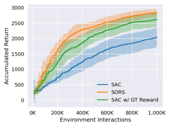
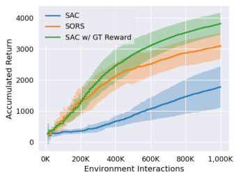
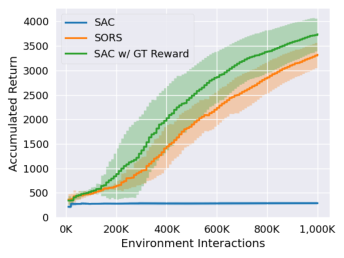

# Self-Supervised Online Reward Shaping in Sparse-Reward Environments

Farzan Memarian _[∗†]_, Wonjoon Goo _[∗]_, Rudolf Lioutikov, Scott Niekum, and Ufuk Tocpu
University of Texas at Austin, TX, USA

_**Abstract**_ **—We introduce Self-supervised Online Reward**
**Shaping (SORS), which aims to improve the sample**
**efficiency of any RL algorithm in sparse-reward environ-**
**ments by automatically densifying rewards. The proposed**
**framework alternates between classification-based reward**
**inference and policy update steps—the original sparse**
**reward provides a self-supervisory signal for reward infer-**
**ence by ranking trajectories that the agent observes, while**
**the policy update is performed with the newly inferred,**
**typically dense reward function. We introduce theory that**
**shows that, under certain conditions, this alteration of**
**the reward function will not change the optimal policy**
**of the original MDP, while potentially increasing learning**
**speed significantly. Experimental results on several sparse-**
**reward environments demonstrate that, across multiple**
**domains, the proposed algorithm is not only significantly**
**more sample efficient than a standard RL baseline using**
**sparse rewards, but, at times, also achieves similar sample**
**efficiency compared to when hand-designed dense reward**
**functions are used.**

I. INTRODUCTION

While reinforcement learning (RL) algorithms have
achieved tremendous success in many tasks ranging from
Atari games [1], [2], [3] to robotics control problems

[4], [5], [6], they often struggle in environments with
sparse rewards. In dense reward settings, the agent
receives diverse rewards in most states, e.g., a reward
proportional to distance to the goal, rather than a constant
reward everywhere but the goal. Such dense rewards
lead to frequent updates that quickly allow the agent to
differentiate good states from bad ones.
Unfortunately, designing a good, dense reward function is known to be a difficult task [7], [8], especially

 - Equal Contribution.

_†_ Corresponding Author: farzan.memarian@utexas.edu
1 Farzan Memarian is with the Oden Institute for Computational
Engineering and Sciences, University of Texas at Austin, TX, USA.
Wonjoon Goo, Rudolf Lioutikov and Scott Niekum are with the
Department of Computer Science, University of Texas at Austin, TX,
USA. Ufuk Topcu is with the Department of Aerospace Engineering
and Engineering Mechanics, University of Texas at Austin, TX, USA.

Accepted for publication in IROS 2021

for non-experts. In addition, RL approaches can easily exploit badly designed rewards, get stuck in local
optima and induce behavior that the designer did not
intend [9]. In contrast, goal-based sparse rewards are
appealing since they do not suffer from the reward
exploitation (commonly known as reward hacking) problem to the same extent. However, sparse rewards only
provide rewards for few select states. Reward sparseness complicates the temporal credit assignment problem
significantly and negatively impacts the overall learning
process. Reward shaping is a commonly used approach
to speed up RL in environments with sparse rewards [10],

[11], [12]. However, altering the ground-truth reward can
potentially change the optimal policy and, hence, induce
undesired behavior.

In this paper, we propose a novel RL framework
that efficiently learns a policy for sparse-reward environments by training on dense rewards that are inferred in a self-supervised manner. Our framework—
**S** elf-supervised **O** nline **R** eward **S** haping (SORS)—can
speed up the policy learning process without requiring
any domain knowledge or external supervision, and the
proposed framework is compatible with any existing RL
algorithm.
SORS alternates between updating the policy using
an RL algorithm of choice and inferring a dense reward
function from past observations. It infers a reward using
a classification-based reward inference algorithm, TREX [13]. However, unlike T-REX, instead of requiring
manual rankings over the trajectories, SORS uses the
sparse reward as a self-supervised learning signal to rank
the trajectories generated by the agent during learning.
We justify the rationale behind the reward inference
performed by SORS based on the following insight: Any
reward function induces a total order over the trajectory
space by means of the discounted return it assigns to
trajectories. We then provide a theorem that indicates
any two reward functions that induce the same _total_
_order_ over the trajectory space, induce identical sets of
optimal policies under mild assumptions on the dynamics

of the environment. The objective function that SORS
optimizes for reward inference encourages the dense
reward function to induce the same total order as the

sparse reward over the trajectory space.
Our empirical results on several sparse reward MuJoCo [14] locomotion tasks show that SORS can significantly improve the sample efficiency of the state-of-theart baseline algorithm, namely Soft-Actor-Critic (SAC).
SORS even achieves comparable sample efficiency to a
baseline that uses a hand-designed dense reward function.

We make the following contributions:

_•_ We propose a novel reward shaping algorithm,
SORS, that pairs with any existing RL algorithm,
performs self-supervised online reward shaping, and
can improve the sample efficiency of the RL algorithm in sparse-reward environments.

_•_ We provide theoretical justification for our approach
by showing a sufficient condition for two reward
functions to share the same set of optimal policies.
We use this condition to show that, under some assumptions, replacing the ground-truth sparse reward
function with the inferred shaped reward function
does not alter the optimal policies.

_•_ We empirically demonstrate that the proposed
method converges significantly faster than a standard baseline RL algorithm, namely Soft ActorCritic (SAC) [15] for several sparse-reward MuJoCo
locomotion tasks.

II. RELATED WORK

_A. Reward Shaping_

Reward shaping is a method to incorporate domain
knowledge to densify reward functions. Typically, the
goal of reward shaping is to speed up learning and
overcoming the challenges of exploration and credit
assignment when the environment only returns a sparse,
uninformative, or delayed reward.
In one of the seminal works on reward shaping [10],
the authors study the forms of shaped rewards which
induce the same optimal policy as the ground-truth
reward function. Specifically, they proved that the socalled _potential-based_ reward shaping is guaranteed not
to alter the optimal policy. The only requirement is that
the potential function needs to be a function of states.
While they provide one specific form for reward shaping
without altering the optimal policy of the MDP, they
do not provide any practical algorithm for acquiring
a potential function that can improve the learning of
optimal behavior. They argue that the optimal state value

function is a good shaping potential, but this insight is
not helpful in practice, as the goal of RL is finding the
optimal value function is the goal of RL and we do not
have it a priori. In this work, we propose an alternative
reward shaping framework in which we replace the original reward function with another shaped reward function
which is updated online as the RL agent interacts with
the environment. Our reward shaping approach does not
require any human guidance or extra information.

Devlin et al. [16] build on potential-based shaping

[10] to prove that dynamic shaping of the reward function does not change the optimal policy, provided that
we use the potential-based shaping framework. Other
researchers [11] have extended potential-based shaping

[10] to potential functions that are functions of state and
action pairs rather than states alone. They propose two
methods for providing potential-based advice, namely,
look-ahead advice, and look-back advice.

In another interesting work on reward shaping [17],
the authors propose a new RL objective which uses a
distance-to-goal shaped reward function. They unroll the
policy to produce pairs of trajectories from each starting
point and use the difference between the two rollouts
to discover and avoid local optima. Unlike their work,
we do not need to alter the way the base RL algorithm
collects experiences. Moreover, we do not rely on using
a distance-to-goal shaped reward function, instead we
learn a dense reward function which asymptotically leads
to optimal policies that equivalent to those of the original
sparse reward.

There is prior work on automatic reward shaping [18],
where they propose reward shaping via meta-learning.
Their method can automatically learn an efficient reward
shaping for new tasks, assuming the state space is shared
among the meta-learning tasks. This work differs from
ours in that it is in the context of meta learning, whereas
our automatic reward shaping algorithm works even for
a single task, and we do not need to train our model on
a library of prior tasks.

Brys et al. propose a method to use expert demonstrations to accelerate RL by biasing the exploration through
reward shaping [12],. They propose a potential function
which is higher for state-action pairs similar to those
seen in the demonstrations and low for dissimilar state
action pairs. Another related work studies online learning
of intrinsic reward functions as a way to improve RL
algorithms [19].

_B. Sparse Rewards_

RL in sparse-reward environments has been tackled in
various ways. For instance, the authors of [20] address
sparse-reward environments that can be de-composed
into smaller subtasks. They learn a high-level scheduler
and several auxiliary policies and show that this leads to
improved exploration. Their algorithm learns to provide
internal auxiliary sparse rewards in addition to the original sparse reward. Our algorithm is different from this
line of work as our algorithm works for singular tasks,
and we do not use any hierarchy of decision making.
We learn a dense reward which assigns a reward to
every individual state, rather than merely providing an
auxiliary reward on selected states.
Other related work [21] on learning from sparse rewards proposes a method to learn a temporally extended
episodic task composed of several subtasks where the
environment returns a sparse reward only at the end of
the episodes. Using the environment’s sparse feedback
and queries from a demonstrator, they learn the highlevel task structure in the form of a deterministic finite
state automaton, and then use the learned task structure
in an inverse reinforcement learning (IRL) framework
to infer a dense reward function for each subtask. Our

work differs in that we do not rely on an expert to
provide demonstrations and instead we learn to shape the
sparse reward relying only on the environment’s sparse
feedback.

_C. Learning_ _a_ _Reward_ _Function_ _From_ _Prefer-_
_ence/Ranking_

Several prior works have studied the problem of
inferring a reward function from human preferences
or rankings over demonstrations. One early work on
learning from preferences [22] proposes an active learning approach to infer a reward function that encodes
the human’s preferences. They train a policy and a
reward network simultaneously. At each iteration, they
use the policy to produce pairs of trajectories and then
query the human for their preference over the pair of
trajectories and use these preferences to improve the
reward by minimizing a preference-based loss function.
They then updated the policy based on the improved
reward. In other work [23], Ibarz et al. extend the
work Christiano et al. [22] to use an initial set of
demonstrations to pre-train the policy, rather than start
training from a random policy. Brown et al. introduce the
T-REX algorithm, which infers a reward function from a
given set of ranked demonstrations [13],. Their algorithm
samples pairs of demonstrations from this initial set

of demonstrations and uses the ranking to label which
demonstration is preferred in a given pair. It then uses a
binary classification loss over these preferences to update
the reward function. They show their algorithm learns
reward functions that, when optimized for a policy, often
exceed the performance of the best demonstrations.
We use an adaptation of the T-REX algorithm for the
reward inference part of our algorithm. However, our
work is different from the above works in two ways.
First, we do not need an initial set of demonstrations.
Second, our algorithm does not require a human in
the loop—instead we leverage the environment’s sparse
feedback to rank the collected trajectories and then use
the set of ranked trajectories for inferring a dense reward
function to accelerate policy learning.
In another work, Brown et al. propose an algorithm to
infer a reward from a set of sub-optimal demonstrations
that are not ranked by an expert [24]. Using the set of
demonstrations, they perform behavioral cloning to learn
a policy. They then inject noise in the policy to produce
various qualities of trajectories and rank the trajectories
based on the level of noise used in producing them.
Then they proceed to learn a reward from the set of
ranked trajectories. Our work differs, in that our selfsupervisory signal comes from a known sparse reward
signal on agent-collected trajectories, and our objective is
to use the learned reward function as a way to accelerate
policy learning, rather than imitate demonstrations.

III. BACKGROUND AND PRELIMINARIES

_A. Reinforcement Learning_

A Markov decision process (MDP) is defined as
_M_ = _⟨S, A, T, r, γ⟩_, in which _S_ is the state space,
_A_ is the action space, _T_ : _S × A →P_ ( _S_ ) is the
transition dynamics which maps any given state and
action pair into a probability distribution over the next
state, _r_ : _S ×_ _A →_ R is the reward function, and _γ_ is the
discount factor. At each discrete time step, the MDP is
in a state _s_, the agent takes an action _a_, and as a result,
the MDP transitions into a new state, _s_ _[′]_ _∼_ _T_ ( _s, a_ ), and
the agent receives a scalar valued reward _r_ ( _s, a, s_ _[′]_ ). A
policy _π_ ( _a|s_ ) : _S →P_ ( _A_ ) is defined as a probability
distribution over actions at any given state _s_ . Given a
policy _π_, we have the following definitions:

_Q_ _[π]_ ( _s, a_ ) = _r_ ( _s, a_ ) + _γ_ E _a′∼π_ ( _a′|s′_ )E _s′∼T_ ( _s,a_ )[ _Q_ ( _s_ _[′]_ _, a_ _[′]_ )]

_V_ _[π]_ ( _s_ ) = E _a∼π_ ( _a|s_ )[ _Q_ _[π]_ ( _s, a_ )]

where _Q_ _[π]_ ( _s, a_ ), _V_ _[π]_ ( _s_ ) are respectively the action-value
function and the state value function for the policy _π_ .

The goal of RL is to find a policy with maximal value
function at each state, or find the maximal value function
directly. A trajectory _τ_ = _{st, at}_ _[|]_ _t_ _[τ]_ =1 _[|]_ [is a sequence]
of state action pairs obtained by running a policy on
the MDP, where subscript _t_ is the time index of the
trajectory, i.e., each trajectory starts from ( _s_ 1 _, a_ 1). We
define the discounted return of a trajectory according
to reward function _r_ as: _Rr_ ( _τ_ ) := [�] _t_ _[|][τ]_ =1 _[|]_ _[γ][t][−]_ [1] _[r]_ [(] _[s][t][, a][t]_ [)][,]
where ( _st, at_ ) is the state and action pair of the trajectory
_τ_ at time _t_ .

_B. Reward Shaping_

Given an MDP with a reward function _r_ ( _s, a_ ), reward shaping is the process of replacing the original reward with another reward function, or augmenting the original reward function with an auxiliary reward function _F_ ( _s, a_ ) : _S × A_ _→_ R to create
a new reward function[10]; Concretely, _rsh_ ( _s, a_ ) =
_rnew_ ( _s, a_ ) or _rsh_ ( _s, a_ ) = _r_ ( _s, a_ ) + _F_ ( _s, a_ ), where
_rsh_ ( _s, a_ ) is the shaped reward. While the goal of reward
shaping is to speed up RL, in general, a shaped reward
could induce a different optimal policy than the original
reward.

IV. PREFERENCE ORACLE AND EQUIVALENCY OF

REWARD FUNCTIONS

Consider a reward-free MDP _M_ = _⟨S, A, T, γ⟩_, and
a _preference oracle_ which is a binary relation _≤p∗_ that
defines a total order on the set of all trajectories sampled
from the MDP. We can order all possible trajectories
based on the total order defined by the oracle:

_τ_ 1 _≤p∗_ _τ_ 2 _≤p∗_ _· · · ≤p∗_ _τk ≤p∗_ _· · · ._

Note that any deterministic reward function _r_ ( _s, a_ ) can
serve as a preference oracle via the discounted return _Rr_
under that reward function:

_τi ≤r τj ⇔_ _Rr_ ( _τi_ ) _≤_ _Rr_ ( _τj_ ) _._

where _≤r_ is the binary relation defined by reward
function _r_ . Using the notion of total order, we will
define a set of reward functions that share the same
set of optimal policies; specifically, we will prove that
two reward functions that produce the same total order
will also yield the same set of optimal policies under
deterministic transition dynamics. We begin by formally
defining the total order equivalency between two reward
functions.

**Definition 1** (Total order equivalency) **.** For a given
reward-free MDP _M_ = _⟨S, A, T, γ⟩_ with possible trajectories _T_ = ( _S × A_ ) [+], the total order equivalency of
reward functions _r_ 1 and _r_ 2 is defined as

_r_ 1 _≡_ _r_ 2 iff _τi ≤r_ 1 _τj ⇔_ _τi ≤r_ 2 _τj ∀τi, τj ∈T ._

**Theorem 1.** _Given a deterministic reward-free MDP_
_M_ = _⟨S, A, T, γ⟩, if two reward functions r and r_ _[′]_ _are_
_total order equivalent, they will induce the same set of_
_optimal policies, i.e., r ≡_ _r_ _[′]_ = _⇒{πr_ _[∗]_ [(] _[s]_ [)] _[}]_ [ =] _[ {][π]_ _r_ _[∗][′]_ [(] _[s]_ [)] _[}][,]_
_where {πr_ _[∗][}][ and][ {][π]_ _r_ _[∗][′][}][ are the sets of optimal policies]_
_induced by reward functions r and r_ _[′]_ _respectively._

_Proof._ The state-action value function of a policy _π_ at
a given state and action pair _s, a_ is defined as:

_Q_ _[π]_ ( _s, a_ ) = E _π,T_ [ _Rr_ ( _τs,a_ )]

which is equal to the expected return over all trajectories
_τs,a ∈Ts,a_ that start with action _a_ at state _s_ and
follow policy _π_ under the transition dynamics _T_ . Given
the optimal state-action value function _Q_ _[∗]_ _r_ [for reward]
function _r_, an optimal policy under the reward function
_r_ is derived as _πr_ _[∗]_ [(] _[s]_ [) = argmax] _a_ _[Q][∗]_ _r_ [(] _[s, a]_ [)][ 1][. Following]
these definitions, it is clear that any action chosen by an
optimal policy will yield the highest possible Q value,
i.e.,

_Q_ _[∗]_ _r_ [(] _[s, π]_ _r_ _[∗]_ [(] _[s]_ [))] _[ ≥]_ _[Q][∗]_ _r_ [(] _[s, b]_ [)] _∀b ∈_ _A._

For MDPs with deterministic dynamics, an optimal
policy under a reward function _r_ will induce a set of
optimal trajectories starting from any state-action pair,
where all the optimal trajectories receive equal returns
from reward function _r_ . If the policy is deterministic, the
set of optimal trajectories will include only one member.
Hence, for deterministic MDPs the optimal Q-function
for state-action pair ( _s, a_ ) and an optimal trajectory
starting from the same pair are

_Q_ _[∗]_ _r_ [(] _[s, a]_ [) = max]
_τ_ _∈Ts,a_ _[R][r]_ [(] _[τ]_ [)][, and]

_τ_ _[∗]_ ( _s, a_ ) = argmax _Rr_ ( _τ_ ) _._
_τ_ _∈Ts,a_

Using the total order relation _≤r_ induced by the
reward function _r_, and the equivalence between _r_ and
_r_ _[′]_, we conclude that the two reward functions share the
same set of optimal policies. In other words, if _πr_ _[∗]_ [is an]

1There can be more than one optimal policy corresponding to a
given optimal Q-function. For example, if multiple actions maximize
the Q-function at a given state.

optimal policy under reward function _r_, it is an optimal
policy under reward function _r_ _[′]_ as well:

_∀b ∈_ _A, Q_ _[∗]_ _r_ [(] _[s, b]_ [)] _[ ≤]_ _[Q]_ _r_ _[∗]_ [(] _[s, π]_ _r_ _[∗]_ [(] _[s]_ [))]

_⇔_ max max max
_b_ _τ_ _∈Ts,b_ _[R][r]_ [(] _[τ]_ [)] _[ ≤]_ _τ_ _∈Ts,πr∗_ ( _s_ ) _[R][r]_ [(] _[τ]_ [)]

_⇔_ max _τ_ _[∗]_ ( _s, b_ ) _≤r τ_ _[∗]_ ( _s, πr_ _[∗]_ [(] _[s]_ [))]
_b_

_⇔_ max _τ_ _[∗]_ ( _s, b_ ) _≤r_ _[′]_ _τ_ _[∗]_ ( _s, πr_ _[∗]_ [(] _[s]_ [))] (∵ _r ≡_ _r_ _[′]_ )
_b_

_⇔_ max max max
_b_ _τ_ _∈Ts,b_ _[R][r][′]_ [(] _[τ]_ [)] _[ ≤]_ _τ_ _∈Ts,πr∗_ ( _s_ ) _[R][r][′]_ [(] _[τ]_ [)]

_⇔_ _∀b ∈_ _A, Q_ _[∗]_ _r_ _[′]_ [(] _[s, b]_ [)] _[ ≤]_ _[Q][∗]_ _r_ _[′]_ [(] _[s, π]_ _r_ _[∗]_ [(] _[s]_ [))]

_⇔_ _πr_ _[∗]_ [(] _[s]_ [)][ is an optimal policy under] _[ r][′]_ [.]

Theorem 1 suggests that a set of optimal policies
is uniquely defined by the total order, and there are
potentially infinitely many reward functions that share
the same set of optimal policies. Among these reward
functions, some are preferable with respect to efficiency
of policy learning. While sparse rewards are hard to
learn from due to the credit assignment difficulty, a more
informative reward function (potentially dense) can exist
that shares the same set of optimal policies and is much
easier to learn from. This implication is consistent with
the optimal reward problem [25] and reward shaping

[10].
While the specification of a set of reward functions
that share the same optimal policy has been studied

[26], [27], the proposed theorem is more general in
that we do not assume any restriction on the reward
function space. In [26], a behavior equivalence class
(BEC) is defined across reward functions that share
the same feature vector extractor _φ_ ( _s, a_ ), so the reward
function space is restricted to the span of the feature
vector space. The BEC can be very small if the feature
space is not diverse enough and defining good features
a priori requires external knowledge or a well-designed
loss function [28]. By contrast, our theory does not
have any restrictions on the form of reward function,
so our notion of equivalence can contain a larger reward
function set than BEC.

While the preference oracle can define the optimal
behavior that we want to induce, it is unreasonable to
assume that we have such an oracle at hand, since it
requires a total order over all possible trajectories. Instead, previous methods working with orderings between
trajectories assume external human input in an online

[22] or offline manner [13], with a human preference
oracle. While we use the same loss function as these

approaches, we focus on the reward shaping problem in

the sparse reward scenario for which we have a coarse
notion of task progress or success. Specifically, we try
to infer a new, potentially dense reward function that
satisfies the order constraints imposed by the sparse
reward function and replace the original reward with
the inferred reward function to improve the sample
efficiency of policy learning. The detailed explanation
of the method is presented in the next section.

V. METHOD

We tackle the problem of RL in sparse-reward environments. The key idea is to infer a dense reward function
that shares the same set of optimal policies with the
sparse reward, and use the inferred reward function for
policy learning to foster faster, sample efficient learning.
We call the proposed RL framework **S** elf-supervised
**O** nline **R** eward **S** haping (SORS).
SORS alternates between online reward shaping and
reinforcement learning with the inferred reward function.
During the online reward shaping, a potentially dense
reward function is trained with a loss function that

encourages the inferred reward to create the same total
order over trajectories as the sparse reward. During reinforcement learning, the policy is trained with the inferred
reward function and new trajectories are collected in the
process. Since SORS can work with any RL algorithm,
we mainly focus on discussing the online reward shaping
module. The overall framework with an off-policy RL
back-end is described in Algorithm. 1.
We train a parameterized reward function _rθ_ by encouraging it to satisfy the order constraints imposed by
the ground-truth sparse reward function _rs_ . Specifically,
we train the reward function with a binary classification
loss over pairs of trajectories sampled from the trajectory
buffer _Dτ_ that saves every observed trajectory during
reinforcement learning. The loss function is formally
defined as:

+ (1 _−_ I( _τi ≤rs τj_ )) log _P_ ( _τi ≻_ _τj_ ) _,_
�

(1)
where I( _._ ) is the indicator function that evaluates to one
if the condition inside it is True, and evaluates to zero
otherwise. _P_ ( _τi ≺_ _τj_ ) is defined as:

exp( _Rrθ_ ( _τi_ ))
_P_ ( _τi ≻_ _τj_ ) = (2)
exp( _Rrθ_ ( _τi_ )) + exp( _Rrθ_ ( _τj_ )) _[.]_

This same loss function has been used in other work to

train a reward function with given pair-wise preference

_L_ ( _θ_ ; _Dτ_ ) = _−_ �

( _τi,τj_ ) _∼Dτ_

I( _τi ≤rs τj_ ) log _P_ ( _τi ≺_ _τj_ )
�

over trajectories, since the loss function encourages the
learned reward to assign a higher return to the preferred
trajectory [22], [13]. While our final goal is not just to
infer a reward based on the pairwise preferences, but
learning a reward function that satisfies the total order
constraints generated by the ground-truth sparse reward,
we empirically find that pairwise preference-based loss
can enforce a total order comparable to the ground-truth
total order. We leave the use of recently proposed ranking
loss [29] that considers the total order as a future work.
Note that SORS does not make use of any external
information in addition to what an ordinary RL algorithm
requires; the framework receives the exact same observations and rewards from the environment as a baseline

RL algorithm would, and it performs the online reward
shaping in a _self-supervised_ manner. Although SORS
does not use any extra information, we hypothesize that
the additional reward shaping module may improves
learning since (1) we can leverage a deep neural network
in inferring the relevant features that may be infeasible
for a human to define when writing down a reward
function, and (2) SORS performs credit assignment not
only when learning a value function / policy (as in
standard RL), but also by inferring a new reward function
from the automatically-ranked trajectories that it collects.
Another way that we could have used the learned
dense reward is as a shaping potential, ensuring convergence to the same set of optimal policies [10].
As discussed in related works, potential-based reward
shaping is a theoretically sound way of shaping the
reward functions while ensuring that the optimal policy is
maintained [10]. However, the effects of potential-based
reward shaping can be “learned away” over time, as they
are equivalent to value function initialization [ **?** ]. Hence,
we choose to use the learned dense reward to replace
the environment’s sparse reward rather than using it as
a shaping potential.

VI. EXPERIMENTS

We aim to study the following questions: (1) Does
the inferred dense reward function improve the sample
efficiency of the base RL algorithm? (2) Will the inferred
dense reward function induce the same policy as the one
induced by the ground-truth reward function?
Reward shaping is particularly helpful when the
ground-truth reward is sparse or otherwise hard to learn
from. Hence, we test SORS on delayed MuJoCo environments [30], [31] in which rewards are accumulated
for a given number of time steps (20 time steps) and
provided only at the end of these periods or the end of

**Algorithm 1** SORS RL Framework (w/ off-policy RL
algo.)

1: **Input:** An environment with sparse reward _rs_ ( _s, a_ ).
A base RL algorithm of choice (SAC in this work).
2: **Output:** _θ_ : Parameters of the dense reward network _rθ_ ( _s, a_ ). _φ_ : Parameters of the policy network
_πφ_ ( _a|s_ ).
3: **Hyper-parameters:** _N_ : Total number of environment interactions. _Pr, Nr_ : Reward update period and
number of reward updates for every period. _Pp, Np_ :
RL update period and number of RL updates for
every period
4: Initialize _θ_ and _φ_, initialize the trajectory buffer _Dτ_

to an empty set.
5: _// Collect Initial Trajectories_
6: Run a random policy and fill up the trajectory buffer
7: **for** _i_ = 1 _. . . N_ **do**

8: _// Gather Experience_
9: Execute the current stochastic policy and append
the transition tuples to the trajectory buffer _Dτ_ .
10: Replace old trajectories if buffer is full.
11: _// Dynamic Reward Shaping Module_
12: **if** _i_ mod _Pr_ = 0 **then**
13: **for** _Nr_ iterations **do**
14: Update _θ_ with respect to the loss defined in
Eq.1 with trajectory pairs sampled from _Dτ_ .
15: _// Reinforcement Learning Module_
16: **if** _i_ mod _Pp_ = 0 **then**
17: **for** _Np_ iterations **do**
18: Update _φ_ according to the latest shaped reward _rθ_ ( _s, a_ ) using the base RL algorithm.

the episode, whichever comes first. We use 6 MuJoCo
locomotion tasks, namely Hopper, Walker2d, HalfCheetah, Swimmer, Ant, and Humanoid whose observation
and action space range from small (8 and 2 for Swimmer respectively) to large (376 and 17 for Humanoid
respectively). The code is available online [2] .
We choose the Soft-Actor-Critic (SAC) algorithm as
the back-end RL algorithm, and we compare the training
progress of the proposed method against a baseline that
trains a policy with (1) the delayed reward or (2) the
ground-truth dense reward provided by the MuJoCo environment. Note that the SAC method is a strong baseline,
which is better than or comparable to other regularized
RL algorithms [30] on the MuJoCo environments, and
hence we omit other baselines.

[2Code: https://github.com/hiwonjoon/IROS2021 SORS](https://github.com/hiwonjoon/IROS2021_SORS)

(a) Delayed Hopper (b) Delayed Walker2D (c) Delayed HalfCheetah

(d) Delayed Swimmer (e) Delayed Ant (f) Delayed Humanoid

Fig. 1: Learning curves of SAC (without reward shaping, blue line), SORS (with reward shaping, orange line),
and SAC with a hand-designed dense reward function (green line). A trajectory is generated every 10,000 steps
with the policy at that step, and the return of the generated trajectory is reported. We smooth the curve with an
exponential moving average with a half-life time of 2,000. The results are averaged over 5 different random seeds,
and the shaded area represents standard deviation.

For SAC implementation, both the policy and the Qfunctions are modeled by fully connected neural networks with 3 hidden layers, where each layer is of size
256 and is followed by ReLU non-linearity. The stochastic policy is modeled by a diagonal multivariate normal
distribution and its parameters (mean and covariance)
are generated via the policy network. We use the same
techniques introduced in SAC, such as dual Q-training,
use of slowly updated target Q network, and dynamically adjusted entropy regularization coefficient. The Qfunction and the policy are updated for 50 stochastic
gradient descent steps with a mini-batch of size 100
using Adam optimizer with a learning rate of 3 _e −_ 4
after every 50 interactions with the environment.

The architecture of the neural network modeling the
dense reward function is as follows: 3 fully connected
hidden layers of size 256, followed by a fully connected
hidden layer of size 4. The output of the network up
to this point will be a 4 dimensional feature vector. All
the hidden layers are followed by _tanh_ non-linearity.
The final output of the network is computed by applying

a weight vector _w_ to the 4 dimensional feature vector.
We enforce the condition _||w||_ 2 = 1 to limit the scale
of the reward. Both the neural network parameters and
the reward weight vector _w_ are trained together by
minimizing the loss function given in Eq. 1. To reduce
the variance between runs and improve the stability of
our method, we train an ensemble of 4 reward networks
with different initializations and take the average of their
outputs to produce the final reward. At the beginning of
training SORS, we run a random policy for 2000 steps to
collect an initial set of trajectories. During the rest of the
run, we call the dense reward learning module after every
1 _,_ 000 environment steps, and perform 100 stochastic
gradient descent steps using a mini-batch of size 10
trajectory pairs. We keep training both the baseline and
SORS until the agent interacts with the environment for
10 [6] steps.

Figure. 1 shows the comparison between SORS and
the baselines on several environments. In all 6 delayed
MuJoCo environments, SORS learns faster than the
baseline trained on the delayed reward. Moreover, SORS

shows similar sample efficiency and asymptotic performance to the baseline trained with the ground-truth dense
reward function on all environments except HalfCheetah.
This implies that the proposed method can successfully
densify the reward function. Swimmer is an example of
an environment where the policy trained with our method
converged to a better policy than the baseline that uses
the original dense reward of the environment. The results
on Swimmer support our hypothesis on the existence of
an informative reward function that potentially fosters
faster reinforcement learning than the sparse reward, or
even the ground truth dense reward function.

VII. CONCLUSION

We propose a novel reward shaping method, called
SORS, which aims to infer a reward function that
satisfies the preference constraints given by the original
sparse reward function. Since the constraints can be
automatically generated by observing the return of the
experienced trajectories according to the sparse reward,
the proposed algorithm is fully self-supervised. Our
experiments show that SORS enables faster, more sample
efficient reinforcement learning by generating a dense
reward function that induces a policy with strong performance with respect to the original sparse reward. Our
experiments show that it is easier to learn from the
learned dense reward, as it provides more immediate
feedback, even though the assumptions needed for a theoretical guarantee of leaving the set of optimal policies
unchanged are not strictly met. Along these lines, future
work may include an investigation of how to provide
guarantees with respect to optimality in the original MDP
under weaker assumptions than what we have provided
in this work.

VIII. ACKNOWLEDGEMENT

This work was partly supported through the following
grants: ARL W911NF2020132, NSF 1652113 and ARL ACCAPG-RTP W911NF1920333. Also, this work has taken place
in part in the Personal Autonomous Robotics Lab (PeARL)
at The University of Texas at Austin. PeARL research is
supported in part by the NSF (IIS-1724157, IIS-1638107,
IIS-1749204, IIS-1925082), ONR (N00014-18-2243), AFOSR
(FA9550-20-1-0077), and ARO (78372-CS). This research was
also sponsored by the Army Research Office under Cooperative Agreement Number W911NF-19-2-0333. The views and
conclusions contained in this document are those of the authors

and should not be interpreted as representing the official
policies, either expressed or implied, of the Army Research
Office or the U.S. Government. The U.S. Government is
authorized to reproduce and distribute reprints for Government
purposes notwithstanding any copyright notation herein.

REFERENCES

[1] V. Mnih, K. Kavukcuoglu, D. Silver, A. A. Rusu, J. Veness,
M. G. Bellemare, A. Graves, M. Riedmiller, A. K. Fidjeland,
G. Ostrovski _et al._, “Human-level control through deep reinforcement learning,” _nature_, vol. 518, no. 7540, pp. 529–533,
2015.

[2] V. Mnih, A. P. Badia, M. Mirza, A. Graves, T. Lillicrap,
T. Harley, D. Silver, and K. Kavukcuoglu, “Asynchronous
methods for deep reinforcement learning,” in _International_
_conference on machine learning_, 2016, pp. 1928–1937.

[3] H. Van Hasselt, A. Guez, and D. Silver, “Deep reinforcement learning with double q-learning,” _arXiv preprint_
_arXiv:1509.06461_, 2015.

[4] S. Gu, E. Holly, T. Lillicrap, and S. Levine, “Deep reinforcement learning for robotic manipulation with asynchronous offpolicy updates,” in _2017 IEEE international conference on_
_robotics and automation (ICRA)_ . IEEE, 2017, pp. 3389–3396.

[5] J. Kober, J. A. Bagnell, and J. Peters, “Reinforcement learning
in robotics: A survey,” _The International Journal of Robotics_
_Research_, vol. 32, no. 11, pp. 1238–1274, 2013.

[6] S. Levine, C. Finn, T. Darrell, and P. Abbeel, “End-to-end
training of deep visuomotor policies,” _The Journal of Machine_
_Learning Research_, vol. 17, no. 1, pp. 1334–1373, 2016.

[7] P. Abbeel and A. Y. Ng, “Apprenticeship learning via inverse
reinforcement learning,” in _Proceedings of the twenty-first in-_
_ternational conference on Machine learning_ . ACM, 2004, p. 1.

[8] R. S. Sutton and A. G. Barto, _Reinforcement Learning: An_
_Introduction_ . Cambridge, MA, USA: A Bradford Book, 2018.

[9] D. Hadfield-Menell, S. Milli, P. Abbeel, S. J. Russell, and
A. Dragan, “Inverse reward design,” in _Advances in Neural_
_Information Processing Systems_, 2017, pp. 6765–6774.

[10] A. Y. Ng, D. Harada, and S. Russell, “Policy invariance under reward transformations: Theory and application to reward
shaping,” in _Icml_, vol. 99, 1999, pp. 278–287.

[11] E. Wiewiora, G. W. Cottrell, and C. Elkan, “Principled methods
for advising reinforcement learning agents,” in _Proceedings of_
_the 20th International Conference on Machine Learning (ICML-_
_03)_, 2003, pp. 792–799.

[12] T. Brys, A. Harutyunyan, H. B. Suay, S. Chernova, M. E.
Taylor, and A. Now´e, “Reinforcement learning from demonstration through shaping,” in _Twenty-fourth international joint_
_conference on artificial intelligence_, 2015.

[13] D. S. Brown, W. Goo, P. Nagarajan, and S. Niekum,
“Extrapolating beyond suboptimal demonstrations via inverse
reinforcement learning from observations,” in _Proceedings of_
_the 36th International Conference on Machine Learning_, ser.
Proceedings of Machine Learning Research, K. Chaudhuri and
R. Salakhutdinov, Eds., vol. 97. Long Beach, California, USA:
PMLR, 09–15 Jun 2019, pp. 783–792. [Online]. Available:
[http://proceedings.mlr.press/v97/brown19a.html](http://proceedings.mlr.press/v97/brown19a.html)

[14] E. Todorov, T. Erez, and Y. Tassa, “Mujoco: A physics engine
for model-based control,” in _2012 IEEE/RSJ International Con-_
_ference on Intelligent Robots and Systems_ . IEEE, 2012, pp.
5026–5033.

[15] T. Haarnoja, A. Zhou, P. Abbeel, and S. Levine, “Soft actorcritic: Off-policy maximum entropy deep reinforcement learning with a stochastic actor,” in _International Conference on_
_Machine Learning_ . PMLR, 2018, pp. 1861–1870.

[16] S. M. Devlin and D. Kudenko, “Dynamic potential-based
reward shaping,” in _Proceedings of the 11th International_
_Conference on Autonomous Agents and Multiagent Systems_ .
IFAAMAS, 2012, pp. 433–440.

[17] A. Trott, S. Zheng, C. Xiong, and R. Socher, “Keeping your distance: Solving sparse reward tasks using self-balancing shaped
rewards,” _arXiv preprint arXiv:1911.01417_, 2019.

[18] H. Zou, T. Ren, D. Yan, H. Su, and J. Zhu, “Reward shaping
via meta-learning,” _arXiv preprint arXiv:1901.09330_, 2019.

[19] D. Pathak, P. Agrawal, A. A. Efros, and T. Darrell, “Curiositydriven exploration by self-supervised prediction,” in _Interna-_
_tional Conference on Machine Learning_ . PMLR, 2017, pp.
2778–2787.

[20] M. Riedmiller, R. Hafner, T. Lampe, M. Neunert, J. Degrave,
T. Van de Wiele, V. Mnih, N. Heess, and J. T. Springenberg,
“Learning by playing-solving sparse reward tasks from scratch,”
_arXiv preprint arXiv:1802.10567_, 2018.

[21] F. Memarian, Z. Xu, B. Wu, M. Wen, and U. Topcu, “Active
task-inference-guided deep inverse reinforcement learning,” in
_2020 59th IEEE Conference on Decision and Control (CDC)_ .
IEEE, 2020, pp. 1932–1938.

[22] P. F. Christiano, J. Leike, T. Brown, M. Martic, S. Legg,
and D. Amodei, “Deep reinforcement learning from human
preferences,” in _Advances in Neural Information Processing_
_Systems_, 2017, pp. 4299–4307.

[23] B. Ibarz, J. Leike, T. Pohlen, G. Irving, S. Legg, and D. Amodei,
“Reward learning from human preferences and demonstrations
in atari,” in _Advances in Neural Information Processing Sys-_
_tems_, 2018, pp. 8022–8034.

[24] D. S. Brown, W. Goo, and S. Niekum, “Better-thandemonstrator imitation learning via automatically-ranked
demonstrations,” in _Proceedings of the 3rd Conference on Robot_
_Learning_, 2019.

[25] J. D. Sorg, “The optimal reward problem: Designing effective
reward for bounded agents.” Ph.D. dissertation, Computer Science and Engineering in The University of Michigan.b, 2011.

[26] A. Y. Ng and S. J. Russell, “Algorithms for inverse reinforcement learning,” in _Proceedings of the Seventeenth International_
_Conference on Machine Learning_ . Morgan Kaufmann Publishers Inc., 2000, pp. 663–670.

[27] D. S. Brown and S. Niekum, “Machine teaching for inverse
reinforcement learning: Algorithms and applications,” in _In_
_proceedings of the AAAI Conference on Artificial Intelligence_,
2019.

[28] D. S. Brown, R. Coleman, R. Srinivasan, and S. Niekum,
“Safe imitation learning via fast bayesian reward inference
from preferences,” in _Proceedings of the 37th International_
_Conference on Machine Learning (ICML)_, 2020.

[29] M. Blondel, O. Teboul, Q. Berthet, and J. Djolonga, “Fast
differentiable sorting and ranking,” in _Proceedings of the 37th_
_International Conference on Machine Learning_, 2020, pp. 950–
959.

[30] J. Oh, Y. Guo, S. Singh, and H. Lee, “Self-imitation learning,”
in _International Conference on Machine Learning_ . PMLR,
2018, pp. 3878–3887.

[31] Y. Guo, J. Oh, S. Singh, and H. Lee, “Generative adversarial
self-imitation learning,” _arXiv preprint arXiv:1812.00950_, 2018.

