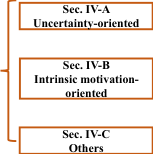
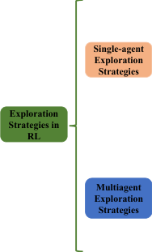
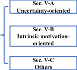
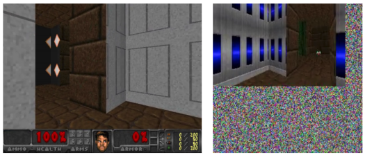
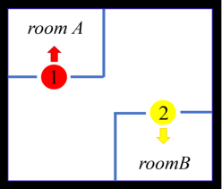
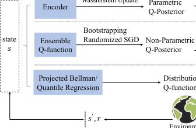

EXPLORATION IN DEEP REINFORCEMENT LEARNING: FROM SINGLE-AGENT TO MULTI-AGENT DOMAIN 1

# Exploration in Deep Reinforcement Learning: From Single-Agent to Multi-Agent Domain

Jianye Hao _Member, IEEE_, Tianpei Yang, Hongyao Tang, Chenjia Bai, Jinyi Liu, Zhaopeng Meng,
Peng Liu, and Zhen Wang _Senior Member, IEEE_

_**Abstract**_ **—Deep Reinforcement Learning (DRL) and Deep**
**Multi-agent Reinforcement Learning (MARL) have achieved**
**significant success across a wide range of domains, including**
**game AI, autonomous vehicles, robotics and so on. However, DRL**
**and deep MARL agents are widely known to be sample inefficient**
**that millions of interactions are usually needed even for relatively**
**simple problem settings, thus preventing the wide application and**
**deployment in real-industry scenarios. One bottleneck challenge**
**behind is the well-known exploration problem, i.e., how efficiently**
**exploring the environment and collecting informative experiences**
**that could benefit policy learning towards the optimal ones. This**
**problem becomes more challenging in complex environments**
**with sparse rewards, noisy distractions, long horizons, and non-**
**stationary co-learners. In this paper, we conduct a comprehensive**
**survey on existing exploration methods for both single-agent and**
**multi-agent RL. We start the survey by identifying several key**
**challenges to efficient exploration. Then we provide a systematic**
**survey of existing approaches by classifying them into two**
**major categories: uncertainty-oriented exploration and intrinsic**
**motivation-oriented exploration. Beyond the above two main**
**branches, we also include other notable exploration methods**
**with different ideas and techniques. In addition to algorithmic**
**analysis, we provide a comprehensive and unified empirical**
**comparison of different exploration methods for DRL on a set of**
**commonly used benchmarks. According to our algorithmic and**
**empirical investigation, we finally summarize the open problems**
**of exploration in DRL and deep MARL and point out a few**
**future directions.**

_**Index Terms**_ **—Deep Reinforcement Learning, Multi-Agent Sys-**
**tems, Exploration, Uncertainty, Intrinsic Motivation.**

I. INTRODUCTION

In recent years, Deep Reinforcement Learning (DRL) and
deep Multi-agent Reinforcement Learning (MARL) have
achieved huge success in a wide range of domains, including
Go [1], Atari [2], StarCraft [3], robotics [4], and other control

Manuscript received February 20, 2022; revised June 8, 2022 and October
23, 2022; accepted January 9, 2023. This work was supported in part by
the National Science Fund for Distinguished Young Scholars (Grants No.
62025602); in part by the National Natural Science Foundation of China
(Grants No. U22B2036, 11931015, U1836214); in part by the New Generation
of Artificial Intelligence Science and Technology Major Project of Tianjin
(Grants No. 19ZXZNGX00010); and in part by the Tencent Foundation and
XPLORER PRIZE. _(Corresponding author: Zhen Wang)_ .
J. Hao, T. Yang, H. Tang, J. Liu, and Z. Meng are with the College of
Intelligence and Computing, Tianjin University, Tianjin 300350, China. (email: {jianye.hao, tpyang, bluecontra, jyliu, mengzp}@tju.edu.cn).
C. Bai is with Shanghai Artificial Intelligence Laboratory, Shanghai 200232,
China (e-mail: baichenjia@pjlab.org.cn).
P. Liu is with the School of Computer Science and Technology, Harbin Institute
of Technology, Harbin 150001, China. (e-mail: pengliu@hit.edu.cn).
Zhen Wang is with School of Artificial Intelligence, OPtics and Electronics
(iOPEN) & School of Cyberspace, Northwestern Polytechnical University,
Xi’an 710072, China. (e-mail: w-zhen@nwpu.edu.cn).

problems [5], [6], [7]. This reveals the tremendous potential of
DRL to solve real-world sequential decision-making problems.
Despite the successes in many domains, there is still a long way
to apply DRL and deep MARL in real-world problems because
of the sample inefficiency issue, which requires millions of
interactions even for some relatively simple problem settings.
For example, Agent57 [2] is the first DRL algorithm that
outperforms the human average performance on all 57 Atari
games; but the number of interactions it needs is several orders
of magnitude larger than that of humans needed. The issue of
sample inefficiency naturally becomes more severe in multiagent settings since the state-action space grows exponentially
with the number of agents involved. One bottleneck challenge
behind is the exploration, i.e., how to efficiently explore the
unknown environment and collect informative experiences that
could benefit the policy learning most. This can be even more
challenging in complex environments with sparse rewards,
noisy distractions, long horizons, and non-stationary co-learners.
Therefore, how to efficiently explore the environment is
significant and fundamental for DRL and deep MARL.
In recent years, considerable progress has been made in
exploration from different perspectives. However, a comprehensive survey on exploration in DRL and deep MARL is
currently missing. A few prior papers contain the investigation
on exploration methods for DRL [8], [9], [10], [11], [12]
and MARL [13], [14], [15]. However, these works focus
on general topics of DRL and deep MARL, thus lack of
systematic literature review of exploration methods and indepth analysis. Aubret et al. [16] conduct a survey on intrinsic
motivation in DRL, investigating how to leverage this idea to
learn complicated and generalizable behaviors for problems
like exploration [17], hierarchical learning [18], skill discovery

[19] and so on. Since exploration is not their focus, the
ability of intrinsic motivation in addressing different exploration
problems is not well studied. Besides, several works study the
exploration methods only for multi-arm bandits [20], while
they are often incompatible with deep neural networks directly
and have the issue of scalability in complex problems. [21]
is a concurrent work. This work only considers single-agent
exploration while we give a unified view of single-agent and
multi-agent exploration. Due to the lack of a comprehensive
survey on exploration, the advantages and limitations of existing
exploration methods are seldom compared and studied in a
unified scheme, which prevents further understanding of the
exploration problem in the RL community.
In this paper, we propose a comprehensive survey of
exploration methods in DRL and deep MARL, analyzing

EXPLORATION IN DEEP REINFORCEMENT LEARNING: FROM SINGLE-AGENT TO MULTI-AGENT DOMAIN 2

**Multiagent** **Sec. V-B** **Novelty**

**Strategies** **oriented** **Influence**

Fig. 1: Illustration of our taxonomy of the current literature on methods
for DRL and deep MARL.

these methods in a unified view from both algorithmic and
experimental perspectives. We focus on the model-free setting
where the agent learns its policy without access to the
environment model. The general principles of exploration
studied in the model-free setting are also shared by modelbased methods in spite of different ways to realize. We start
our survey by identifying the key challenges to achieving
efficient exploration in DRL and deep MARL. The abilities
in addressing these challenges also serve as criteria when we
analyze and compare the existing exploration methods. The
overall taxonomy of this survey is given in Fig. 1. For both
exploration in DRL and deep MARL, we classify the existing
exploration methods into two major categories based on their
core ideas and algorithmic characteristics. The first category
is uncertainty-oriented exploration that originates from the
principle of _Optimism in the Face of Uncertainty_ (OFU). The
essence of this category is to leverage the quantification of
epistemic and aleatoric uncertainty to measure the sufficiency of
learning and the intrinsic stochasticity, based on which efficient
exploration can be derived. The second category is intrinsic
motivation-oriented exploration. In developmental psychology,
intrinsic motivation is regarded as the primary driver in the early
stages of human development [22], [23], e.g., children often
employ less goal-oriented exploration but use curiosity to gain
knowledge about the world. Taking such inspiration, this kind
of method heuristically makes use of various reward-agnostic
information as the intrinsic motivation of exploration. Note that
to some degree, methods in one of the above two categories may
have underlying connections to some methods in the other one,
usually from specifically intuitive or theoretical perspectives.
In our taxonomy, we classify each method by sticking to its
origination in motivation and algorithm as we describe above,
as well as referring to the conventional literature it anchors.
Beyond the above two main streams, we also include a few
other advanced exploration methods, which show potential in
solving hard-exploration tasks.

In addition to analysis and comparison from the algorithmic
perspective, we provide a unified empirical evaluation of
representative DRL exploration methods among several typical
exploration environments, in terms of cumulative rewards and
sample efficiency. The benchmarks demonstrate the successes
and failures of compared methods, showing the efficacy of

corresponding algorithmic techniques. Uncertainty-oriented
exploration methods show general improvements on exploration
in most environments. Nevertheless, it is nontrivial to estimate
the uncertainty with high quality in complex environments. In
contrast, intrinsic motivation can significantly boost exploration
in environments with sparse, delayed rewards, but may also
cause deterioration in conventional environments due to the

deviation of learning objectives. At present, the research on
exploration in deep MARL is at an early stage. Most current
methods for deep MARL exploration share similar ideas of
single-agent exploration and extend the techniques. In addition
to the issues in the single-agent setting, these methods face
difficulties in addressing the larger joint state-action space, the
inconsistency of individual exploration behaviors, etc. Besides,
the lack of common benchmarks prevents a unified empirical
comparison. Finally, we highlight several significant open
questions of exploration in DRL and deep MARL, followed
by some potential future directions.
We summarize our main contributions as follows:

_•_ We give a comprehensive survey on exploration in DRL
and deep MARL with a novel taxonomy for the first time.

_•_ We analyze the strengths and weaknesses of representative
articles on exploration for DRL and deep MARL, along
with their abilities in addressing different challenges.

_•_ We provide a unified empirical comparison of representative exploration methods in DRL among several typical
exploration benchmarks.

_•_ We highlight existing exploration challenges, open problems, and future directions for DRL and deep MARL.

The following of this paper is organized as follows. Sec. II
describes preliminaries on basic RL algorithms and exploration
methods. Then we introduce the challenges for exploration
in Sec. III. According to our taxonomy, we present the
exploration methods for DRL and deep MARL in Sec. IV and
Sec. V, respectively. In Sec. VI, we provide a unified empirical
analysis of different exploration methods in commonly adopted
exploration environments; moreover, we discuss several open
problems in this field and several promising directions for
future research. Finally, Sec. VII gives the conclusion.

II. PRELIMINARIES

_A. Markov Decision Process and Markov Game_

**Markov Decision Process (MDP).** An MDP is generally
defined as _⟨S, A, T, R, ρ_ 0 _, γ⟩_, with a set of states _S_, a set of
actions _A_, a stochastic transition function _T_ : _S × A →_ _P_ ( _S_ ),
which represents the probability distribution over possible next
states, given the current state and action, a reward function
_R_ : _S × A →_ R, an initial state distribution _ρ_ 0 : _S →_ R _∈_ [0 _,_ 1],
and a discounted factor _γ ∈_ [0 _,_ 1). An agent interacts with the
environment by performing its policy _π_ : _S →_ _P_ ( _A_ ), receiving
a reward _r_ . The agent’s objective is to maximize the expected
cumulative discounted reward: _J_ ( _π_ ) = E _ρ_ 0 _,π,T_ [ [�] _[∞]_ _t_ =0 _[γ][t][r][t]_ []][.]
**Markov Game (MG).** MG is a multi-agent extension of
MDP, which is defined as _⟨S, N, {A_ _[i]_ _}_ _[N]_ _i_ =1 _[, T,][ {][R][i][}][N]_ _i_ =1 _[, ρ]_ [0] _[, γ, Z,]_
_{O_ _[i]_ _}_ _[N]_ _i_ =1 _[⟩]_ [, additionaly with action sets for each of] _[ N]_ [ agents,]
_A_ [1] _, ..., A_ _[N]_, a state transition function, _T_ : _S_ _×A_ [1] _×...×A_ _[N]_ _→_
_P_ ( _S_ ), a reward function for each agent _R_ _[i]_ : _S × A_ [1] _× ... ×_

EXPLORATION IN DEEP REINFORCEMENT LEARNING: FROM SINGLE-AGENT TO MULTI-AGENT DOMAIN 3

_A_ _[N]_ _→_ R. For partially observable Markov games, each agent
_i_ receives a local observation _o_ _[i]_ : _Z_ ( _S, i_ ) _→_ _O_ _[i]_ and interacts
with environment with its policy _π_ _[i]_ : _O_ _[i]_ _→_ _P_ ( _A_ _[i]_ ). The goal
of each agent is to learn a policy that maximizes its expected

_∞_
discounted return, i.e., _J_ _[i]_ ( _π_ _[i]_ ) = E _ρ_ 0 _,π_ 1 _,...,πN_ _,T_ �� _t_ =0 _[γ][t][r]_ _t_ _[i]_ �,
where _rt_ _[i]_ [=] _[ R][i]_ [(] _[s][t][, a]_ [1] _t_ _[, ..., a][N]_ _t_ [)][.]
Real-world problems formalized by MDPs and MGs can
have immense state(-action) spaces. Highly efficient exploration
is indispensable to realizing effective decision-making.

_B. Reinforcement Learning_

RL is a learning paradigm of learning from interactions with
the environment [24]. One central notion of RL is value function, which defines the expected return obtained by following a
policy. Formally, _value function v_ _[π]_ ( _s_ ) and _action-value function_
_q_ _[π]_ ( _s, a_ ) are defined as, _v_ _[π]_ ( _s_ ) = E _π_ [ [�] _[∞]_ _t_ =0 _[γ][t][r][t]_ [+1] _[|][s]_ [0][ =] _[ s]_ []][ and]
_q_ _[π]_ ( _s, a_ ) = E _π_ [ [�] _[∞]_ _t_ =0 _[γ][t][r][t]_ [+1] _[|][s]_ [0][ =] _[ s, a]_ [0][ =] _[ a]_ []][. Based on the]
above definition, most RL algorithms can be divided into two
categories: value-based methods and policy-based methods.
Value-based methods generally learn the value functions from
which the policies are derived implicitly. In contrast, policybased methods maintain explicit policies and optimize to
maximize the RL objective _J_ ( _π_ ). Value-based methods are
well suited to off-policy learning and usually performant in
discrete action space; while policy-based methods are capable
of both discrete and continuous control and often equipped
with appealing performance guarantees.
**Value-based Methods.** Deep _Q_ -Network (DQN) [25] is
the most representative algorithm in DRL that derived from
_Q_ -learning. The _Q_ -function _Q_ ( _s, a_ ; _θ_ ) parameterized with _θ_
is learned by minimizing Temporal Difference (TD) loss:
_L_ [DQN] ( _θ_ ) = E( _st,at,rt,s_ _[′]_ _t_ +1 [)] _[∼][D]_ [ [] _[y][ −]_ _[Q]_ [(] _[s][t][, a][t]_ [;] _[ θ]_ [)]][2][, where] _[ y]_ [ =]
_rt_ + _γ_ max _a_ _[′]_ _Q_ ( _st_ +1 _, a_ _[′]_ ; _θ_ _[−]_ ) is the target value, _D_ is the replay
buffer and _θ_ _[−]_ denotes the parameters of the target network.
Further, a variety of variants are proposed to improve the
learning performance of DQN, from different perspectives
such as addressing the approximation error [26], modeling
value functions in distributions [27], [28], and other advanced
structures and training techniques [29], [30].
**Policy Gradients Methods.** Policy-based methods optimize
a parameterized policy _πφ_ by performing gradient ascent
with regard to policy parameters _φ_ . According to the _Policy_
_Gradients Theorem_ [24], _φ_ is updated as below:

_∇φJ_ ( _φ_ ) = E _πφ_ [ _∇φ_ log _πφ_ ( _at|st_ ) _q_ _[π][φ]_ ( _st, at_ )] _._ (1)

One typical policy gradient algorithm is REINFORCE [31]
that uses the complete returnˆ _Gt_ = [�] _[∞]_ _i_ =0 _[γ][i][r][t]_ [+] _[i]_ [ as estimates]
_Q_ ( _st, at_ ) of _q_ _[π]_ _φ_ ( _s, a_ ), i.e., Monte Carlo value estimation.
**Actor-Critic Methods.** Actor-Critic methods typically approximate value functions and estimate _q_ _[π][φ]_ ( _s, a_ ) in Eq. (1) with
bootstrapping [24], conventionally _Q_ [ˆ] ( _st, at_ ) = _rt_ + _γV_ ( _st_ ).
Apart from the stochastic policy gradients (Eq. (1)), _Determin-_
_istic Policy Gradients_ (DPG) [32] allows deterministic policy,
formally _µφ_, to be updated via maximizing an approximated
_Q_ -function. In DDPG [4], the policy is updated as:

_∇φJ_ ( _φ_ ) = E _µφ_ � _∇φµφ_ ( _s_ ) _∇aQ_ _[µ][φ]_ ( _s, a_ ) _|a_ = _µφ_ ( _s_ )� _._ (2)

**MARL Algorithms.** In MARL, agents learn their policies
in a shared environment whose dynamics are influenced by all
agents. The most straightforward way is to let each agent learn
a decentralized policy independently, treating other agents as
part of the environment, i.e., _Independent Learning_ (IL); while
another way is to learn a joint policy for all agents, i.e., _Joint_
_Learning_ (JL). However, IL and JL are known to suffer from
non-stationary and poor scalability respectively. To address the
issues of IL and JL, _Centralized Training and Decentralized_
_Execution_ (CTDE) becomes the most popular MARL paradigm
in recent years. CTDE allows agents to fully utilize global
information (e.g., global states, other agents’ actions) during
training while only local information (e.g., local observations)
is required during execution [3], [33]. providing good training
efficiency and practical execution policies.
One representative CTDE method is Multi-Agent Deep
Deterministic Policy Gradient (MADDPG) [33].Concretely,
consider a game with _N_ agents with deterministic policies _{µi}_ _[N]_ _i_ =1 [parameterized by] _[ {][φ][i][}][N]_ _i_ =1 [, the deterministic]
policy gradient for each agent _i_ can be: _∇φiJ_ ( _φi_ ) =
E _x,⃗a_ � _∇φiµφi_ ( _oi_ ) _∇aiQ_ _[⃗µ]_ _i_ [(] _[x, a]_ [1] _[, ..., a][N]_ [)] _[|][a]_ _i_ [=] _[µ]_ _φi_ [(] _[o]_ _i_ [)] � _,_ where _x_ is
a concatenation each agent’s local observation ( _o_ 1 _, ..., oN_ ) and
_⃗a_, _⃗µ_ denote the concatenation of corresponding variables. Each
agent maintains its own critic _Qi_ which estimates the joint
observation-action value function and uses the critic to update
its decentralized policy.
Exploration is a critical topic in RL. A longstanding and
fundamental problem in RL is the _exploration-exploitation_
_dilemma_ : choose the best action to maximize rewards or acquire
more information by exploring the novel states and actions.
Despite many prior efforts made on this problem, it remains
non-trivial to deal with, especially in practical problems.

_C. Basic Exploration Techniques_

_ϵ_ **-Greedy.** The most basic exploration method is _ϵ_ -greedy:
with a probability of 1 _−ϵ_, the agent chooses the action greedily
(i.e., exploitation); and a random choice is made otherwise (i.e.,
exploration). Albeit the popularity and simplicity, _ϵ_ -greedy is
inefficient in complex problems with large state-action space.
_**Boltzmann**_ **Exploration.** Another exploration method in
RL is _Boltzmann_ ( _softmax_ ) exploration: agent draws actions
from a Boltzmann distribution over its _Q_ -values. Formally, the
_e_ _[Q]_ [(] _[s,a]_ [)] _[/τ]_
probability of choosing action _a_ is as, _p_ ( _a_ ) = ~~�~~ _i_ _[e][Q]_ [(] _[s,ai]_ [)] _[/τ]_ [,]

where the temperature parameter _τ_ controls the degree of
the selection strategy towards a purely random strategy, i.e.,
the higher value of the _τ_, the more randomness the selection
strategy. The drawback of Boltzmann exploration is that it
cannot be directly applied in continuous state-action spaces.
**Upper Confidence Bounds (UCB).** UCB is a classic
exploration method originally from Multi-Armed Bandits
(MABs) problems [34]. In contrast to performing unintended
and inefficient exploration as for naive random exploration
methods (e.g., _ϵ_ -greedy), the methods among UCB family
measure the potential of each action by upper confidence bound
of the reward expectation. Formally, the selected action can be
calculated as: _a_ = arg max _a Q_ ( _a_ ) + ~~�~~ _−_ ln _k/_ 2 _N_ ( _a_ ) _,_ where

EXPLORATION IN DEEP REINFORCEMENT LEARNING: FROM SINGLE-AGENT TO MULTI-AGENT DOMAIN 4

_Q_ ( _a_ ) is the reward expectation of action _a_, _N_ ( _a_ ) is the count
of selecting action _a_ and _k_ is a constant.
**Entropy Regularization.** While value-based RL methods
add randomness in action selection based on _Q_ -values, entropy
regularization is widely used to promote exploration for RL
algorithms [35] with stochastic policies, by adding the policy
entropy _H_ ( _π_ ( _a|s_ )) to the objective function as a regularization
term, encouraging the policy to take diverse actions. Such
a regularization may deviate from the original optimization
objective. One solution is to gradually decay the influence of
entropy regularization during the learning process.
**Noise Perturbation.** As to deterministic policies, noise
perturbation is a natural way to induce exploration. Concretely,
by adding noise perturbation sampled from a stochastic process
_N_ to the deterministic policy _π_ ( _s_ ), an exploration policy _π_ _[′]_ ( _s_ )
is constructed, i.e., _π_ _[′]_ ( _s_ ) = _π_ ( _s_ ) + _N_ . The stochastic process
can be selected to suit the environment, e.g., an OrnsteinUhlenbeck process is preferred in physical control problems

[33]; more generally, a standard Gaussian distribution is simply
adopted in many works [36]. However, such vanilla noise-based
exploration is unintentional exploration which can be inefficient
in complex learning tasks with exploration challenges.

_D. Exploration based on Bayesian Optimization_

In this section, we take a brief view with respect to Bayesian
Optimization (BO) [37], which could perform efficient exploration to find where the global optimum locates. The objective
of BO is to solve the problem: _x_ _[∗]_ = arg max _x∈X f_ ( _x_ ) _,_ where
_x_ is what going to be optimized, _X_ is the candidate set, and _f_
is the objective function: _x →_ R, which is always black-box.
BO strategies treat the objective function _f_ as a random
function, thus a Bayesian statistic model for _f_ is the basic
component of BO. The Bayesian statistic model is then used to
construct a tractable acquisition function _α_ ( _x_ ), which provides
the selection metric for each sample _x_ . The acquisition function
should be designed for more efficient exploration, to seek a
probably better selection that has not been attempted yet. In
the following, we mainly introduce two acquisition functions,
and explain how they facilitate efficient exploration.
**Gaussian Process-Upper Confidence Bound (GP-UCB)**
models the Bayesian statistic model as Gaussian Process (GP),
and uses the mean _µ_ ( _x_ ) and standard deviation _σ_ ( _x_ ) of the
GP posterior to determine the upper confidence bound (UCB),
making decisions in such optimistic estimation [38]. Acquisition function of GP-UCB is _α_ ( _x_ ) = _µt−_ 1( _x_ ) + _βt_ [1] _[/]_ [2] _σt−_ 1( _x_ ),
where the bonus _σ_ ( _x_ ) guides optimistic exploration.
**Thompson Sampling (TS)** [39], also known as posterior
sampling or probability matching, samples a function _f_ from
its posterior _P_ ( _f_ ) each time, and takes actions greedily with
respect to such randomly drawn belief _f_ as follows: _α_ ( _x_ ) =
_f_ ( _x_ ) _, s.t. f ∼_ _P_ ( _f_ ) _._ TS captures the uncertainty according
to the posterior and enables deep exploration.
In DRL, the above methods take a primitive role, prompting
many uncertainty-oriented exploration methods based on a
Bayesian statistical model about the optimization objective,
which we discuss in Sec. IV-A.

III. WHAT MAKES EXPLORATION HARD IN RL

In this section, we identify several typical environmental
challenges to efficient exploration for DRL and deep MARL.
We analyze the causes and characteristics of each challenge
by illustrative examples and also point out some key factors
of potential solutions. Most exploration methods are proposed
to address one or some of these challenges. Therefore, these
challenges serve as significant touchstones for the analysis and
evaluation in the following sections.
**Large State-action Space.** The difficulty of DRL naturally
increases with the growth of the state-action space. For example,
real-world robots often have high-dimensional sensory inputs
like images or high-frequency radar signals and have numerous
degrees of freedom for delicate manipulation. Another practical
example is the recommendation system which has graphstructured data as states and a large number of discrete actions.
In general, when facing a large state-action space, exploration
can be inefficient, since it can take an unaffordable budget to
well explore the state-action space. Moreover, the state-action
space may have complex underlying structures: the states are
not accessible at equal efforts where causal dependencies exist
among states; the actions can be combinatorial and hybrid of
discrete and continuous components. These practical problems
make efficient exploration more challenging.
Most exploration methods compatible with deep neural
networks are able to deal with high-dimensional state space.
With low-dimensional compact state representations learned,
exploration and learning can be conducted efficiently. Towards
efficient exploration in complex state space, sophisticated
strategies may be needed to quantify the degree of familiarity
of states, avoid unnecessary exploration, reach the ‘bottleneck’
states, and so on. By contrast, the exploration issues in large
action space are lack study currently. Though several specific
algorithms that are tailored for complex action structures are
proposed [40], [41], [42], how to efficiently explore in a large
action space is still an open question. A further discussion can
be seen in Sec. VI-B.

**Sparse, Delayed Rewards.** Another major challenge is to
explore environments with sparse, delayed rewards. Basic
exploration strategies can rarely discover meaningful states
or obtain informative feedback in such scenarios. One of the

most representative environments is Chain MDP [43], [45], as
the instance with five states and two actions ( _left_ and _right_ )
illustrated in Fig. 2 (a). Even with finite states and simple
state representation, Chain MDP is a classic hard exploration
environment since the degree of reward sparsity and the
difficulty of exploration increase as the chain becomes longer.
Montezuma’s Revenge [44] is another notorious example
with sparse, delayed rewards. Fig. 2 (b) shows the first
room of Montezuma’s Revenge. Without effective exploration,
the agent would not be able to finish the task in such an
environment. Intuitively, to solve such problems, an effective
exploration method is to leverage reward-agnostic information
as dense signals to explore the environment. In addition,
the ability to perform temporally extended exploration (also
called temporally consistent exploration or deep exploration)
is another key point in such circumstances. From the above

EXPLORATION IN DEEP REINFORCEMENT LEARNING: FROM SINGLE-AGENT TO MULTI-AGENT DOMAIN 5

(a) Chain MDP [43]

Fig. 4: The Noisy-TV problem [51]. We show a typical VizDoom
observation (left) and a noisy variant (right). The Gaussian noise is
added to the observation space, which attracts the agent to stay in the
current room and prevents it from passing through more rooms.

(b) The first room in Montezuma’s Revenge [44]

Fig. 2: Examples of environments with sparse delayed rewards. (a)
An illustration of the Chain MDP. The optimal behavior is to always
go right to receive a reward of +10 when reaching the state 5. (b)
The first room in Montezuma’s Revenge. An ideal agent needs to
climb down the ladder, move left and collect the key where obtains a
reward (+100); then the agent backtracks and navigates to the door
and opens it with the key, resulting in a final reward (+300).

(a) All 24 rooms in Montezuma’s Revenge [49]

(b) An illustration of four domains in Minecraft [50]

Fig. 3: Examples of environments with long-horizon and extremely
sparse, delayed rewards. (a) A panorama of 24 rooms in Montezuma’s
Revenge. (b) A four-domain environment in Minecraft. Both domains
contain several rooms with different objects and textures, which makes
the problem have a long horizon. In each room, the agent needs to
trigger a series of critical events (e.g., pickup, carry, placement), which
makes the rewards of the environment sparse and delayed.

two perspectives, several recent works [46], [47], [48], [45]
have shown promising results, which will be discussed later.
Although progress has been made in several representative
environments, unfortunately, more practical environments with
long horizons and extremely sparse, delayed rewards remain
far away from being solved. Reconsider the whole game of
Montezuma’s Revenge and a panorama of 24 different rooms

[49] is shown in Fig. 3(a). The agent needs to collect different
objects (e.g., keys and treasures) and solve relations among
objects (e.g, the correspondence between keys and doors) to
trigger a series of critical events (e.g., discovering the sword).
This long-horizon task requires a more complicated policy than
the one-room scene mentioned above. Another example is the
four-domain environment in Minecraft [50] shown in Fig. 3(b).
The agent with a first-person view is expected to traverse the
four domains with different obstacles and textures, to pick
up the object and place it on the target location, then obtain
the final reward. At present, few approaches are able to learn
effective policies in such problems even with specific heuristics
and prior knowledge. This is also regarded as a significant
gap between DRL and real-world applications, which will be
discussed as an open problem in Sec. VI-B.

**White-noise Problem.** The real-world environments often

have high randomness, where usually unpredictable things
appear in the observation or action spaces. For example,
visual observations of autonomous cars contain predominantly
irrelevant information, like continuously changing positions
and shapes of clouds. In exploration literature, white noise
is often used to generate high entropy states and inject
randomness into the environment. Because the white-noise

is unpredictable, the agent cannot build an accurate dynamics
model to predict the next state. ‘Noisy-TV’ is a typical
kind of white-noise environment. The noise of ‘Noisy-TV’
includes constantly changing backgrounds, irrelevant objects
in observations, Gaussian noise in pixel space, and so on.
The high entropy of TV becomes an irresistible attraction
to the agent. In Fig. 4, we show a similar ‘Noisy-TV’ in
VizDoom [51] on the right. The uncontrollable Gaussian noise
is added to the observation space, which attracts the agent to
stay in the current room and prevents it from passing through
more rooms. Exploration methods that measure the novelty
through predicting the future become unstable when confronting
‘Noisy-TV’ or similarly unpredictable stimuli. Existing methods
mainly focus on learning state representation [46], [5], [52],

[53] to improve robustness when faced with the white-noise
problem. How an agent can explore robustly in stochastic
environments is an important research branch in DRL. We will
discuss this problem further in Sec. VI-B.

**Multi-agent Exploration.** Except for the above challenges,
explorations in multi-agent settings are more arduous. 1)
Exponential increase of the state-action space. The straight

EXPLORATION IN DEEP REINFORCEMENT LEARNING: FROM SINGLE-AGENT TO MULTI-AGENT DOMAIN 6

|Encoder Bayesian Regression Uncertainty Bellman Wassterstein Update Parametric|Col2|
|---|---|
|Encoder Q-Posterior Ensemble Q-function Non-Parametric Q-Posterior Bootstrapping Randomized SGD|Optimism Thomson Sampling Epistemic|
|Encoder Q-Posterior Ensemble Q-function Non-Parametric Q-Posterior Bootstrapping Randomized SGD|Uncertainty|

(a) Pass [54] (b) Cooperative Navigation

Fig. 5: Tasks with multi-agent exploration problem. (a) An illustration
of the pass environment. Two agents need to pass the door and reach
another room, while the door opens only if one agent steps at one of
the switches. (b) An illustration of cooperative navigation with two
homogeneous agents 1 (red dot) and agent 2 (yellow dot). Agents are
required to search the big room with two small rooms, (i.e., room _A_
and room _B_ ) and then will be rewarded.

forward challenge is that the joint state-action space increases
exponentially with the increase in the number of agents,
making it much more difficult to explore the environment.
Therefore, the crucial point is how to carry out a comprehensive
and effective exploration strategy while reducing the cost of
exploration. A naive exploration strategy is that agents execute
individual exploration based on their local information.
2) Coordinated exploration. Although individual exploration
avoids the exponential increase of the joint state-action space,
it induces extra difficulties in the exploration measurement
due to partial observation and non-stationary problems. The
estimation based on local observation is biased and cannot

reflect global information about the environment. Furthermore,
an agent’s behaviors are influenced by other coexisting agents,
which induces extra stochasticity. Thus, such an approach
always fails in tasks that need agents to behave cooperatively.
For example, Fig. 5(a) illustrates a typical environment that
requires agents to perform coordinated exploration. Two agents
are only rewarded when both of them go through the door and
reach the right room; while the door will be open only when
one of the two switches is covered by one agent. Thus, the
optimal strategy should be as follows: one agent first steps on
switch 1 to open the door, then the other agent goes to the right
room to step on switch 2 to hold the door open and lets the
remaining agent in. Challenges arise in such an environment
where agents should visit some critical states in a cooperative
manner, through which the optimal policy can be achieved.
3) Local- and global-exploration balance. To achieve such
coordinated exploration strategies, only local information is
insufficient, the global information is also necessary. However,
one main challenge is the inconsistency between local information and global information, which requires agents to make
a balance between local and global perspectives, otherwise,
it may lead to inadequate or redundant exploration. Fig. 5(b)
shows such inconsistency. From the global perspective, either
agent 1 visits room _A_, agent 2 visits room _B_ or agent 1 visits
room _B_, agent 2 visits room _A_ are equally treated, which means
the latter does not make an increase of the known global states.
However, if agents explore relying more on local information,
each agent will still try to visit another room to increase its

Environment

Fig. 6: The principle of uncertainty-oriented exploration methods.

known local states, which will cause redundant exploration from
the global view. Furthermore, agents cannot simply explore
by relying on global information, since how much each agent
contributes to the global exploration is unknown. The tradeoff of exploring locally and globally is the key problem that
needs to be addressed to facilitate more efficient multi-agent
exploration, which will be further discussed in Sec. VI-B.

IV. EXPLORATION IN SINGLE-AGENT DRL

We first investigate exploration works in single-agent DRL
that leverage different theories and heuristics to address or
alleviate the above challenges. Based on different key ideas
and principles of these methods, we classify them into two
major categories (shown in Fig. 1). The first category is
uncertainty-oriented exploration, which originates from the
OFU principle. The second category is intrinsic motivationoriented exploration, which is inspired by intrinsic motivation
in psychology [22], [23] that intrinsically rewards exploration
activities to encourage such behaviors. In addition, we also
conclude other techniques beyond these two mainstreams.

_A. Uncertainty-oriented Exploration_

In model-free RL, uncertainty-oriented exploration methods
often measure the uncertainty of the value function. We
conclude the principle of uncertainty-oriented exploration as
shown in Fig. 6. There exist two types of uncertainty-oriented
exploration. 1) _Epistemic uncertainty_, which represents the
errors that arise from insufficient and inaccurate knowledge
about the environment [69], [65], is also named parametric
uncertainty. Many strategies provide efficient exploration by
following the principle of OFU [70], [71], where higher
epistemic uncertainty is considered as insufficient knowledge
of the environment. These methods can be grouped into two
categories based on the formulation of the _Q_ -posterior, which
is used to estimate the epistemic uncertainty. The first group
models the _Q_ -posterior parametrically on the encoder of the _Q_ estimator, and the second group models it in a non-parametric
way by an ensemble, etc. The second kind of uncertainty named
2) _Aleatoric uncertainty_ represents the intrinsic randomness of
the environment and can be captured by the return distribution
estimated by distributional _Q_ -function [27], [65], which is also
known as intrinsic uncertainty or return uncertainty.
Based on the uncertainty estimation, there exist mainly two
ways to utilize the uncertainty. 1) Following the idea of UCB

EXPLORATION IN DEEP REINFORCEMENT LEARNING: FROM SINGLE-AGENT TO MULTI-AGENT DOMAIN 7

TABLE I: Characteristics of uncertainty-oriented exploration algorithms in RL. We use whether the algorithm uses parametric or non-parametric
posterior to distinguish methods. The last two properties correspond to the challenges shown in Sec. III. We use a blank, partially, high and
✓ to indicate the extent to which the method addresses a specific problem.

Method Large State Continuous Long- White-noise
Space Control horizon

RLSVI [55] [56] partially partially
Bayesian DQN [57] partially partially
Successor Uncertainty [58] ✓ partially partially
Wasserstein DQN [59] ✓ partially partially
UBE [60] ✓ partially partially

Bootstrapped DQN [61] ✓ partially partially
OAC [62] ✓ ✓ partially partially
SUNRISE [63] ✓ ✓ partially partially
OB2I [64] ✓ partially partially

DUVN [65] ✓ partially partially
IDS [66] ✓ high high
DLTV with QR-DQN [67] ✓ high
DLTV with NC-QR-DQN [68] ✓ high

Epistemic Uncertainty

Epistemic & Aleatoric
Uncertainty

Parametric

Posterior

Non-parametric
Posterior

Non-parametric
Posterior

[34], [72], a direct method for exploring states and actions with
high uncertainty is **performing optimistic action-selection** by
choosing the action to maximize the optimistic value function
_Q_ [+] in each time step, as

_at_ = arg max _Q_ [+] ( _st, a_ ) _,_ (3)
_a_

where _Q_ [+] ( _st, at_ ) = _Q_ ( _st, at_ ) + Uncertainty( _st, at_ ) indicates
the ordinary Q-value added by an exploration bonus based on
a specific uncertainty measurement, which is usually derived
by the posterior estimation of value function or dynamics [73].
2) Following the idea of Thompson Sampling [39] to perform
exploration. The action selection is greedy to a **sampled value**
**function** _Qθ_ **from the** _Q_ **-posterior**, as

_at_ = arg max _Qθ_ ( _st, a_ ) _,_ _Qθ ∼_ Posterior( _Q_ ) _,_ (4)
_a_

that is, to first estimate the posterior distribution of Q-function
through a parametric or non-parametric posterior, then sample
a Q-function _Qθ_ from this posterior and use _Qθ_ for actionselection when interacting with the environment for a whole
episode. Compared with UCB-based exploration, the Thompson
sampling method uses the same Q-function in the whole episode
rather than performing optimistic action-selection in each time
step, thus the agent is enabled to perform _deep_ exploration
and has advantages in long-horizon exploration tasks. Table I
shows the characteristics of uncertainty-oriented exploration in
terms of whether it addresses the challenges in Sec. III.
_1) Exploration via Epistemic Uncertainty:_ Estimating the
epistemic uncertainty usually needs to maintain a posterior
of the value function. We categorize existing methods based
on which type of posterior is used, including the parametric
posterior and the non-parametric posterior.
_Parametric Posterior-based Exploration._ Parametric posterior
is typically learned by Bayesian regression in linear MDPs,
where the transition and reward functions are assumed to

be linear to state-action features. Randomized Least-Squares
Value Iteration (RLSVI) [56] perform Bayesian regression in
linear MDPs so that it is able to sample the value function
through Thompson Sampling as Eq. (4). RLSVI is shown
to attain a near-optimal worst-case regret bound [74] in

linear settings. In DRL that uses neural networks as function
approximators, Bayesian DQN [57] extends the idea of RLSVI
to generalized function approximations. BLR constructs the
parametric posterior of the value function by approximately
considering the value iteration of the last-layer Q-network as
a linear MDP problem. Usually, BLR can only be applied for
fixed inputs with linear function approximation and cannot
be directly used in DRL. Bayesian DQN solves this problem
by approximately considering the feature mapping before the
output layer as a fixed feature vector, and then performing
BLR based on this feature vector. However, in DRL tasks, the
features of high-dimensional state-action pairs are trained in the
learning process, which violates the hypothesis of BLR that the
features are fixed and may cause unstable performance in largescale tasks. Based on a similar idea, Successor Uncertainty

[58] approximates the posterior through successor features [75],

[76]. Because the successor feature contains the discounted
representation in an episode, the _Q_ -value is linear to the
successor feature of the corresponding state-action pair. BLR
can be applied to measure the posterior of the value function
based on the successor representation. RLSVI, Bayesian DQN,
and Successor Uncertainties address the long-horizon problem
since Thomson sampling captures the long-term uncertainties.

Another approach that stands in a novel view to use epistemic
uncertainty is Wasserstein Q-Learning (WQL) [59], which uses
a Bayesian framework to model the epistemic uncertainty, and
propagates the uncertainty across state-action pairs. Instead
of applying a standard Bayesian update, WQL approximates
the posterior distribution based on Wasserstein barycenters

[77]. However, the use of the Wasserstein-Temporal-Difference
update makes it computationally expensive. Uncertainty Bellman Equation and Exploration (UBE) [60] proposes another
Bayesian posterior framework that uses an upper bound on the
Q-posterior variance. However, without the whole posterior
distribution, UBE cannot perform Thomson sampling and
instead uses the posterior variance as an exploration bonus.

_Non-Parametric Posterior-based Exploration._ Beyond parametric posterior, bootstrap-based exploration [78] constructs
a non-parametric posterior based on the bootstrapped value

EXPLORATION IN DEEP REINFORCEMENT LEARNING: FROM SINGLE-AGENT TO MULTI-AGENT DOMAIN 8

functions, which has theoretical guarantees in tabular and
linear MDPs. In DRL, Bootstrapped DQN [61] maintains
several independent _Q_ -estimators and randomly samples one
of them, which enables the agent to conduct temporallyextended exploration since the agent considers long-term effects
of exploration from the _Q_ -function and follows the same
exploratory policy in the entire episode. Bootstrapped DQN is
similar to RLSVI, but samples value function via bootstrapping
instead of Gaussian distribution. Bootstrapped DQN is easy
to implement and performs well, thus becoming a common
baseline for _deep_ exploration. Subsequently, Osband et al. [45]

                                     show that via injecting a ‘prior’ for each bootstrapped _Q_
function, the bootstrapped posterior can further increase the
diversity of bootstrapped functions in regions with fewer observations, and thus improves the generalization of uncertainty
estimation. Considering uncertainty propagation, OB2I [64]
performs backward induction of uncertainty to capture the
long-term uncertainty in an episode.
The parametric posterior-based methods can only handle
discrete control problems since the update of LSVI and other
Bayesian methods require the action space to be countable.
However, the non-parametric posterior [45], [61], [64] based
methods can be applied in continuous control to choose
actions that maximize _Qθ_ ( _s, a_ ) from the posterior. SUNRISE

[63] integrates bootstrapped sampling to provide a bonus for
optimistic action selection, and additionally adopts a weighted
Bellman backup to prevent instability in error propagation.
Optimistic Actor Critic (OAC) [62] builds the upper bound of
_Q_ -value through two bootstrapped networks and explores by
choosing optimistic actions based on the upper bound.
The above methods perform optimistic action selection or
posterior sampling based solely on epistemic uncertainty. There
exist several other methods [65], [79], [80], [67] that consider
both the epistemic uncertainty and the aleatoric uncertainty
in exploration. Beyond estimating the epistemic uncertainty,
additionally preserving the aleatoric uncertainty enables to
prevent the agent from exploring areas with high randomness.
We introduce these methods in the following.
_2) Exploration under Both Types of Uncertainty:_ For an
environment with large randomness, the estimated uncertainty
may be disturbed by aleatoric uncertainty, e.g., the ensemble
estimators may be uncertain about a state-action pair not
because that is seldom visited, but due to its large environment
randomness. Meanwhile, since the aleatoric uncertainty cannot
be reduced during training, being optimistic about aleatoric
uncertainty may lead the agent to favor actions with higher variances, which hurts the performance. To consider both epistemic
uncertainty and aleatoric uncertainty for exploration, Double
Uncertain Value Network (DUVN) [65] firstly proposes to use
Bayesian dropout [81] to measure the epistemic uncertainty
and return distribution to estimate the aleatoric uncertainty.
However, DUVN does not tackle the negative impact of being
optimistic to aleatoric uncertainty.
Inspired by Information Directed Sampling (IDS) [66] in
bandit settings, Nikolov et al. [79] extend the idea of IDS
to general MDPs for efficient exploration by considering
both epistemic and aleatoric uncertainties, and try to avoid
the impact of aleatoric uncertainty. This method combines

distributional RL [27] to measure aleatoric uncertainty and
bootstrapped _Q_ -values to approximate epistemic uncertainty.
Then the behavior policy is designed to balance instantaneous
regret and information gain. To improve the computational
efficiency of IDS, Carmel et al. [80] estimate both types
of uncertainty on the expected return through two networks.
Specifically, aleatoric uncertainty is captured via the learned
return distribution using QR-DQN [28], and the epistemic
uncertainty is estimated on the Bayesian posterior by sampling
parameters from two QR-DQN networks. However, considering
the two types of uncertainties need more computation caused
by the use of distributional value functions. Without explicitly
estimating epistemic uncertainty, Decaying Left Truncated
Variance (DLTV) [67] uses the variance of quantiles as bonuses
and applies a decay schedule to drop the effect of aleatoric
uncertainty along with the training process. NC-QR [68] then
improves DLTV through non-crossing quantile regression.
We discuss the uncertainty-oriented exploration methods
in dealing with the _white-noise problem_ shown in Sec. III
and Table I. Theoretically, if the posterior of value function
can be solved accurately (e.g., a closed-form solution), the
epistemic uncertainty will be accurate and the exploration
will be robust to the white-noise. However, since the Qfunctions are typically estimated through parametric or nonparametric methods, exploration based on the posterior can
still be affected by the randomness of the environment. The
lack of prior function also leads to an inaccurate estimation of
the true posterior. For methods that also estimate the aleatoric
uncertainty, the exploration will be more robust since the agent
can avoid exploring the noisy states, and these methods are
also more suitable for solving tasks where there is randomness
in the interaction process. Nevertheless, estimating the noise is
unstable and computationally expensive with projected Bellman
update or quantile regression.

_B. Intrinsic Motivation-oriented Exploration_

Intrinsic motivation originates from humans’ inherent tendency to interact with the world in an attempt to have an
effect, and to feel a sense of accomplishment [22], [23]. It
is usually accompanied by positive effects (rewards), thus
intrinsic motivation-oriented exploration methods often design
intrinsic rewards to create a sense of accomplishment for agents.
In this section, we investigate previous works tackling the
exploration problem based on intrinsic motivation. These works
can be technically classified into three categories (as shown
in Figure 7): 1) methods that estimate prediction errors of the
environmental dynamics; 2) methods that estimate the state
novelty; 3) methods based on the information gain. Table II
presents the characteristics of all reviewed intrinsic motivationoriented exploration algorithms in terms of whether they can
apply to continuous control problems, and whether they can
solve the white-noise and long-horizon problems described in
Section III.

_1) Prediction Error:_ The first class of works is based
on prediction errors, which encourages agents to explore
states with higher prediction errors. Specifically, for each
state, the intrinsic reward is designed using its prediction

EXPLORATION IN DEEP REINFORCEMENT LEARNING: FROM SINGLE-AGENT TO MULTI-AGENT DOMAIN 9

Environment

action
𝑎𝑎

|Log-Likelihood Mutual Information State/Action|Log-Likelihood Mutual Information State/Action|Col3|
|---|---|---|
|Dynamics model _Mutual Information_ _Distance_ Predict Density model _Density to count_ State/Action encoder State/D No NN/Successor/ Bayesian NN _VIME/SID_ _Uncertainty_ Informa 𝑠 state _Visit counts_ _Distance_ _KL-divergence_ _Entropy_   encoder|Dynamics model _Mutual Information_ _Distance_ Predict   encoder|ion Error|
|Dynamics model _Mutual Information_ _Distance_ Predict Density model _Density to count_ State/Action encoder State/D No NN/Successor/ Bayesian NN _VIME/SID_ _Uncertainty_ Informa 𝑠 state _Visit counts_ _Distance_ _KL-divergence_ _Entropy_   encoder|Density model _Density to count_ State/Action encoder State/D No _Visit counts_ _Distance_ _KL-divergence_ _Entropy_|ynamics velty|
|Dynamics model _Mutual Information_ _Distance_ Predict Density model _Density to count_ State/Action encoder State/D No NN/Successor/ Bayesian NN _VIME/SID_ _Uncertainty_ Informa 𝑠 state _Visit counts_ _Distance_ _KL-divergence_ _Entropy_   encoder|NN/Successor/   _VIME/SID_ _Uncertainty_ If|i i|

Fig. 7: The principle of intrinsic motivation-oriented methods.

TABLE II: Characteristics of reviewed intrinsic motivation-oriented
exploration algorithms in RL, where blank, partially, high and ✓
denote the extent that this method addresses this problem.

|Col1|Method Continuous Long- White- Control horizon noise|
|---|---|
|Prediction error|Dynamic-AE [82] ICM [5] high Curiosity-Driven [52] VDM [83] ✓ high AR4E [84] high EMI[85] ✓|
|Novelty|TRPO-AE-hash [86] ✓ partially A3C+ [17] ✓ partially DQN-PixelCNN [87] partially _φ_-EB [88] ✓ partially VAE+ME [89] ✓ DQN+SR [90] high DORA [91] high A2C+CoEX [47] ✓ RND [46] ✓ partially Action balance RND [92] ✓ partially MADE [93] ✓ Informed exploration [94] ✓ partially EX2 [95] high SFC [96] ✓ partially partially CB [53] ✓ partially high VSIMR [97] ✓ high SMM [98] ✓ DeepCS [99] Novelty Search [100] ✓ high EC [101] ✓ partially high NGU [48] ✓ high high NovelD[102] ✓ high|
|Information gain VIME [103] ✓ high AKL [104] ✓ high Disagreement [105] ✓ high MAX [106] ✓ high|Information gain VIME [103] ✓ high AKL [104] ✓ high Disagreement [105] ✓ high MAX [106] ✓ high|

error for the next state, which can be measured as the
distance between the predicted next state and the true one:
_R_ ( _st, st_ +1) = dist� _φ_ ( _st_ +1) _,_ _f_ [ˆ] ( _φ_ ( _st_ ) _, at_ ) � _,_ where dist( _·_ ) can
be any distance measurement function, _φ_ is an encoder network
that maps the raw state space to a latent space. _f_ [ˆ] is a dynamics
model that predicts the next latent state with the current latent
state and action as input. In this direction, how to learn a
suitable encoder _φ_ is the main challenge.
To address this problem, Dynamic Auto-Encoder (DynamicAE) [82] learns an auto-encoder to compute the distance
between the predicted state and the true state in the latent space.
However, this approach is unable to handle the white-noise

problem (Sec. III) since the encoder does not remove the noisy
distractions existing in the environment. Furthermore, it cannot
handle the long-horizon problem since it does not consider
temporally-extended information. A solution to improve the

**𝑖** robustness of _φ_ is Intrinsic Curiosity Module (ICM) [5] which

learns _φ_ by a self-supervised inverse model using states pair
( _st, st_ +1) to predict the action _at_ done between them. Thus, _φ_
ignores the uncontrollable aspects in the environment, so it can
handle the white-noise problem to some degree. However, one
major drawback is that it only considers the influence caused by
one-step action, thus it cannot handle the long-horizon problem.
Burda et al. [52] propose a detailed analysis of previous works
that use different latent spaces to compute the prediction error.
They show that using random features is sufficient for many
typical RL environments, while its generalization is worse
than learned features. Later, VDM [83] improves the previous
method by learning the stochasticity in the dynamics through
a variational dynamics model.
Instead of learning a state representation using an encoder
_φ_, there are some works [85], [84] aiming to learn both
state and action representations. Similar to ICM, AR4E [84]
also learns the state transition model via a self-supervised
reverse model. In addition, AR4E learns an action encoder
that expands low-dimension actions to high-dimension action
representation. By increasing the representation power of the
dynamics model, the results show improvements over ICM.
EMI [85] learns both the state and action representations
_φs_ ( _s_ ) and _φa_ ( _a_ ) maximizing the Mutual Information (MI)
of forward dynamics _I_ ([ _φs_ ( _s_ ); _φa_ ( _a_ )]; _φs_ ( _s_ _[′]_ )) and inverse
dynamics _I_ ([ _φs_ ( _s_ ); _φs_ ( _s_ _[′]_ )]; _φa_ ( _a_ )). Then, EMI computes the
prediction error in the latent space as an intrinsic reward.
Nevertheless, EMI does not address the white-noise and the
long-horizon problems.
_2) Novelty:_ The second category focuses on motivating
agents to visit states they visited less or have never visited.
The first type of method estimating novelty is count-based.
Formally, the intrinsic reward is set as the inverse proportion
to the visit counts of state _N_ ( _st_ ): _R_ ( _st_ ) = 1 _/N_ ( _st_ ). It is
normally hard to measure counts in a large or continuous state
space. To address this problem, Tang et al. [86] propose TRPOAE-hash, which uses SimHash function in the latent space of
an auto-encoder. There are other attempts being proposed to
deal with the large or continuous state space, like A3C+ [17]
and DQN-PixelCNN [87], which rely on density models [107]
to compute the pseudo-count _N_ [ˆ] ( _st_ ), defined as the generalized
visit count: _N_ [ˆ] ( _st_ ) = _ρ_ ( _st_ )(1 _−_ _ρ_ _[′]_ ( _st_ )) _/_ ( _ρ_ _[′]_ ( _st_ ) _−_ _ρ_ ( _st_ )) _,_ where
_ρ_ ( _st_ ) is the density model which produces the probability of
observing _st_, and _ρ_ _[′]_ ( _st_ ) is the probability of observing _st_ after
a new occurrence of _st_ . Although these methods work well in
environments with sparse, delayed rewards, extra computational
complexity is caused by estimating the density model. In order
to reduce the computational costs, _φ_ -EB [88] models the density
in a latent space rather than the raw state space. Their results on
Montezuma’s revenge show significant advantages considering
the decrease in computational costs.
Other indirect count-based methods are proposed, e.g.,
DQN+SR [90] uses the norm of the successor representation

[76] as the intrinsic reward. DORA [91] proposes a gener

EXPLORATION IN DEEP REINFORCEMENT LEARNING: FROM SINGLE-AGENT TO MULTI-AGENT DOMAIN 10

alization of counters, called _E_ -values, that can be used to
evaluate the propagating exploratory value over trajectories.
DORA does not handle the long-horizon problem since it does
not consider the temporally-extended information. Choi et al.

[47] propose Attentive Dynamics Model (ADM) to discover
the contingent region for state representation and exploration
purposes. The intrinsic reward is defined as the visit count of
the state representations consisting of the contingent region.
Experiments on Montezuma’s Revenge show ADM successfully
extracts the location of the character and achieves a high score
of 11618 combined with PPO [108].
Random Network Distillation (RND) [46] estimates the state
novelty by distilling a fixed random network into the other
network. The intrinsic reward is set as the prediction error of
a neural network predicting features of each state produced
by the fixed random network. RND does not handle the longhorizon problem because it only considers the visit counts of
each state and ignores the temporally-extended information.
Furthermore, random features may be insufficient to represent
the environment. Later, Song et al. [92] propose the action
balance exploration strategy, which is based on RND and
concentrates on finding unknown states. This approach aims
to balance the frequency of each action selection to prevent
an agent from paying too much attention to individual actions,
thus encouraging the agent to visit unknown states. However,
like RND, it also cannot address the long-horizon problem.
Recently, Zhang et al. [93] propose a new exploration method,
called MADE, which maximizes the deviation of the occupancy
of the policy from explored regions. This term is added as
a regularizer to the original RL objective, which results in
an intrinsic reward that can be incorporated to improve the
performance of RL algorithms.
Besides, another way to estimate the state novelty is to
measure the distance between the current state _st_ and states
frequently visited: _R_ ( _st_ ) = E _s′∈B_ [dist( _st_ ; _s_ _[′]_ )], where dist( _·_ )
can be any distance measurement and _B_ is a distribution over
recently visited states. Informed exploration [94] uses a forward
model to predict the action that leads the agent to the least
often visited state in the last _d_ time steps. Then, an informed
exploration strategy is built on _ϵ_ -greedy strategy, which has a
probability of _ϵ_ to select the action that leads to the least often
visited state in the last _d_ time step, rather than random actions.
Later, to improve the learning efficiency of the dynamics model,
EX [2] [95] learns a classifier to differentiate each visited state
from the other. Intrinsic rewards are assigned to those states
that the classifier is not able to discriminate. Successor Feature
Control (SFC) [96] is another kind of intrinsic reward, which
takes statistics over trajectories into account, differing from
previous works that use local information only to evaluate the
intrinsic motivation. SFC can find the environmental bottlenecks
where the dynamics change a lot and encourage the agent to
go through these bottlenecks using intrinsic rewards.
CB [53] learns compact state representation through the
variational information bottleneck [109]. The intrinsic reward
is defined as the KL-divergence between a fixed Gaussian prior
and the posterior distribution of latent variables. CB ignores
the task-irrelevant information and addresses the white-noise

problem to a high degree. However, it requires extrinsic rewards

in training. Similarly, VSIMR [97] also adopts a KL-divergence
intrinsic reward, but uses a variational auto-encoder (VAE) to
learn the latent space. State Marginal Matching (SMM) [98]
is another method using a KL-divergence intrinsic reward. It
computes the KL-divergence between the state distribution
derived by the policy and a target uniform distribution. Lastly,
Tao et al. [100] propose a new kind of intrinsic reward based
on the distance between each state and its nearest neighboring
states in the low dimensional feature space to solve tasks with
sparse rewards. However, using low-dimensional features may
cause a loss of information that is crucial for the exploration
of the entire state space, which restricts its generalization to
complex scenarios.
All the above methods can be classified as the inter-episode
novelty, where the novelty of each state is considered from the
perspective of across episodes. In contrast, the intra-episode
novelty resets the state novelty at the beginning of each episode,
which encourages the agent to visit more different states within
an episode. Stanton and Clune [99] firstly distinguish the
inter-episode novelty and intra-episode novelty and introduce
Deep Curiosity Search (DeepCS) to improve the intra-episode
exploration. The intrinsic reward is binary, which is set as 1 for
unexplored states and 0 otherwise. Later, the Episodic Curiosity
(EC) module [101] uses an episodic memory to form such a
novelty bonus. To compute the state’s intra-episode novelty,
EC compares each state with states in the episodic memory
and rewards states that are far from those states contained in

the episodic memory. Besides, EC stores states with intrinsic
rewards larger than a threshold, which means the stored states
are more unreachable than other states, like bottleneck states.
Thus, in fact, EC encourages the agent to visit bottleneck
states. However, the use of episodic memory may restrict its
scalability to the large state space.
Further, _Never Give Up_ (NGU) [48] proposes a new intrinsic
reward mechanism that combines both inter-episode novelty
and intra-episode novelty. An intra-episode intrinsic reward
is constructed by using k-nearest neighbors over the visited
states stored in the episodic memory. This encourages the agent
to visit as many as possible states within the current episode
no matter how often the state is visited previously. The interepisode novelty is driven by RND [46] and multiplicatively
modulates the episodic similarity signal, which serves as a
global measure with regard to the whole learning process. This
kind of novelty shows generalization among complex tasks and
allows temporally-extended exploration. More recently, Zhang
et al. [102] propose a new criterion, called NovelD, which
assigns intrinsic rewards to states at the boundary between
already explored and unexplored regions. To avoid the agent
exploiting the intrinsic reward by going back and forth between
novel states and previous states, NovelD considers the episodic
restriction that the agent is only rewarded for its first visit
to the novel state in an episode. Their results show NovelD
outperforms SOTA in Mini-Grid.
_3) Information Gain:_ The last class of methods leads the
agents toward unknown areas, as well as to prevent agents from
paying much attention to stochastic areas. This is achieved
by using the information gain as an intrinsic reward, which is
computed based on the decrease in the uncertainty about envi

EXPLORATION IN DEEP REINFORCEMENT LEARNING: FROM SINGLE-AGENT TO MULTI-AGENT DOMAIN 11

ronment dynamics [110]. If the environment is deterministic,
the transitions are predictable, so the uncertainty of dynamics
can be decreased. On the contrary, when faced with stochastic
environments, the agent is hardly capable to predict dynamics
accurately, which implicitly restricts this kind of method. Specifically, the intrinsic reward based on information gain is defined
as: _R_ ( _st, st_ + _k_ ) = Uncertainty _t_ + _k_ ( _θ_ ) _−_ Uncertainty _t_ ( _θ_ ) _,_ where
_θ_ denotes the parameter of a dynamics model and Uncertainty
refers to the model uncertainty, which can be estimated in
different ways as described in Sec. IV-A.
Variational Information Maximizing Exploration (VIME)

[103] encourages the agent to take actions that maximize the
information gain about its belief of environment dynamics.
In VIME, the dynamics are approximated using a Bayesian
neural network (BNN) [111] and the reward is computed as
the uncertainty reduction on weights of BNN. However, using
a BNN as the dynamics model makes the VIME hard to
apply to complex scenarios due to the high computation costs.
Later, Achiam and Sastry [104] propose a more efficient way
than VIME to learn the dynamics model, by replacing BNNs
with a neural network followed by fully-factored Gaussian
distributions. They design two kinds of rewards: the first
one (NLL) is the cross-entropy, which approximates the KLdivergence of the true transition probabilities and the learned
model. The second reward (AKL) is designed as the learning
progress, which is the improvement of the prediction between
the current time step _t_ and after _k_ improvements at _t_ + _k_ .
Pathak et al. [105] train an ensemble of dynamics models
and use the mean of outputs as the final prediction. The intrinsic
reward is designed as the variance over the ensemble of network
output. The variance is high when dynamics models are not
learned well, and low when the training process continues and
all models will converge to the mean value finally, thus ignoring
the noisy distractions since noises in the environment are taskirrelevant and do not affect the convergence. A similar idea
is MAX [106], while it uses the JS-divergence instead of the
variance over the outputs of dynamics models. These methods
handle the white-noise problem to some degree (Table II) since
the ensemble technique ignores the stochasticity. However,
the main issue is the high computational complexity since it
requires training an ensemble of models.

_C. Other Advanced Methods for Exploration_

Beyond the two main streams introduced in the previous two
sections, next we discuss several other branches of approaches
which cannot be classified into the previous two main streams
exactly. These methods provide different insights into how to
achieve a general and effective exploration in DRL (Table III).
_1) Distributed Exploration:_ One straightforward idea to
improve exploration is using heterogeneous actors with diverse exploration behaviors to discover the environment. One
representative work is Ape-X [112], in which a bunch of
DQN workers perform _ϵ_ -greedy with different values of _ϵ_
among independent environment instances in parallel. The
independent randomness of different environment instances and
the distinct exploration degrees (i.e., _ϵ_ ) of distributed workers
allow efficient exploration of the environment regarding the wall

time. Prioritized Experience Replay (PER) [30] is then applied
to improve the learning efficiency from diverse experiences
collected by different workers. Later, R2D2 [113] is proposed
to further develop Ape-X architecture by integrating recurrent
state information, making the learning more efficient.
Moreover, aim at solving hard-exploration games, distributed
exploration is adopted to enhance the advanced exploration
methods. NGU [48] is built on the R2D2 architecture and
performs efficient exploration by incorporating both episodic
novelty and life-long novelty. Furthermore, Agent57 [2] im
                                     proves NGU by adopting a separate parametrization of _Q_
functions and a meta-controller for stable value approximation
and adaptive selection of exploration policies, respectively.
Both NGU and Agent57 achieve significant improvement over
most previous exploration methods in hard-exploration tasks
of the Atari suite while maintaining good performance across
the remaining Atari tasks. This indicates the strong ability of
advanced distributed methods in dealing with large state-action
space and sparse reward.
_2) Exploration with Parametric Noise:_ Another perspective
to encourage exploration is to inject noise directly in the
parameter space. Plappert et al. [114] propose to inject spherical
Gaussian noise directly in network parameters. The noise scale
is adaptively adjusted according to a heuristic mechanism
which depends on a distance measure between the perturbed
and non-perturbed policy. Another similar work is NoisyNet

[115] which also injects noise in network parameters for
effective exploration. One thing that differs the most is that the
noise scale (variance) in NoisyNet is learnable and updated
from the RL loss function along with the other network
parameters, in contrast to the heuristic adaptive mechanism
in [114]. Compared with naively adding noise to the outputs
of the policy, parametric noise is more likely to encourage
diverse and consistent exploration. However, unlike action
noise, it is difficult for parametric noise to realize specific and
aimed exploration behaviors. Therefore, parametric noise is an
effective branch of methods to improve exploration in usual
environments; however, it may not do a great favor in dealing
with the exploration challenges like sparse, delayed rewards.
_3) Safe Exploration:_ Another branch of exploration is safe
exploration which pertains to the requirement of Safe RL.
The methods in this branch aim at exploring efficiently while
avoiding stepping into unsafe states or making dangerous
behaviors. This is especially significant to training RL agents
in real-world applications since the induced hazards can be
unbearable and devastating, e.g., in autonomous driving. Two
categories of Safe RL are proposed in the survey [116]:
Optimization Criterion and Exploration Process. The former
category modifies the original optimization criterion of RL. One
representative criterion is the Constrained MDP (CMDP), which
becomes a standard formalism in modern safe RL methods. In

this direction, Constrained Policy Optimization (CPO) [117]
is a notable work and it solves the CMDP with a constrained

form of TRPO [118], following which several improvements
and extensions are proposed [119], [120], [121]. A benchmark
for safe exploration is established later [122] based on the
formalism of CMDP. Notably, the safety of the exploration
process in this category is not explicitly addressed, since only

EXPLORATION IN DEEP REINFORCEMENT LEARNING: FROM SINGLE-AGENT TO MULTI-AGENT DOMAIN 12

TABLE III: Characteristics of reviewed other advanced exploration algorithms (in Section IV.C), where blank, partially, high and ✓ denote
the extent that this method addresses this problem. Note safe exploration methods are not included in this table due to their specialization in
safety characteristics.

|Col1|Method Continuous Control Long-horizon White-noise|
|---|---|
|Distributed Exploration|Ape-X [116] R2D2 [117] NGU [57] ✓ high high Agent57[2] ✓ high high|
|Parametric Noise|ParamNoise [117] ✓ partially NoisyNet[118] ✓ partially|
|Others Go-Explore [140,141] ✓ high high DTSIL [142] ✓ high high PotER [143] ✓ partially high|Others Go-Explore [140,141] ✓ high high DTSIL [142] ✓ high high PotER [143] ✓ partially high|

the learning objective is modified for safe exploitation.
As to the other category of modifying the exploration
process, it is typically realized by either incorporating external
knowledge (i.e., prior knowledge, demonstrations, teacher
advice) or risk-directed exploration. For prior knowledge,
existing methods make use of a variety of forms, e.g., pretrained classifiers of dangerous objects [123], special safety
layer [124], human intervention [125]. From another angle,
some works make use of given demonstrations and devise
safe exploration methods, e.g., by fitting a density model

[126], learning a dynamics model [127]. For risk-directed
exploration, the identification of safe or undesired states
offers such useful guidance, e.g., by maintaining a Gaussian
Process [128], obtaining from the optimal value functions of
related tasks [129], or fitting a classifier of pre-designated safe
and dangerous states [130]. In a distinct way, some works
propose learning an explicit policy. [131] derives a secure
exploration policy by learning in a designated exploration
MDP; while [132] proposes a safety editor policy to correct
the exploration actions. Besides, safe control and constraint
satisfaction for dynamical systems are widely studied in control
theory [133], [134]. Typically, these methods require the access
of regularity conditions and system dynamics, which is not
available in the setting of RL. Although incorporating external
knowledge is highly effective, such knowledge can be expensive
and may not be available in general cases.
Beyond the above three branches, we introduce several other
remarkable works with different exploration ideas. Arguably,
Go-Explore [135], [136] may be the most powerful method to
solve Montezuma’s Revenge and Pitfall, the most notorious
hard-exploration problems in 57 Atari games. The recipe
of Go-Explore is _return-then-explore_ : policy first arrives at
the states of interest (called the _go_ step) and then explores
from them (called the _explore_ step). This significantly reduces
redundant exploration among the state region already visited
and encourages pursuing novel states. The states of interest
are selected heuristically (e.g., with visitation count) from a
state archive that stores the visited states; and the arrival of the
selected states can be achieved by resetting the simulation or
performing an optionally trained goal-conditioned policy (the
corresponding variant is called policy-based Go-Explore [136]).
After the arrival, random exploration is conducted and the
archive is updated with newly visited states. Finally, a robustification phase is carried out to learn a robust policy from

high-performing trajectories. Despite the amazing ability in
solving extremely hard exploration problems, the superiority
of Go-Explore comes from sophisticated and specific designs,
and it may not be a general method for other hard-exploration
problems. This is relaxed to some extent by DTSIL [137]
which presents a similar idea to Go-Explore. Another different
work is Potentialized Experience Replay (PotER) [138]. PotER
defines a potential energy function for each state in experience
replay, including attractive potential energy that encourages the
agent to be far away from the initial state and a repulsive one
that prevents it from going towards obstacles, i.e., death states.
This allows the agent to learn from both superior and inferior
experiences using intrinsic potential signals. Although PotER
also relies on task-specific designs, potential-based exploration
is seldom studied in DRL, thus is worthwhile for further study.

V. EXPLORATION IN MULTI-AGENT DRL

After investigating the exploration methods for single-agent
DRL, we move to multi-agent exploration methods. At present,
the study on exploration for deep MARL is roughly at the
preliminary stage. Most of them extend the ideas in the
single-agent setting and propose different mechanisms by
integrating the characteristics of deep MARL (Table IV). Recall
the challenges faced by MARL exploration (Sec. III), the
dimensionality of joint state-action space of multiple agents
scales up the difficulty of quantifying the uncertainty and
computing various forms of intrinsic motivation. Beyond the
large exploration space, multi-agent interaction is another
critical characteristic to be considered: 1) due to partial
observations and non-stationary dynamics, cooperative and
coordinated behaviors among agents are nontrivial to achieve;
2) multiple agents jointly influence the environmental dynamics
and often share reward signals, raising a challenge in reasoning
and inferring the effects of joint exploration consequences; 3)
more complex balance between local (individual) and global
(joint) exploration and exploitation are to be dealt with; 4)
multi-agent interactions induce mutual influence among agents,
providing richer reward-agnostic information for potential
utilization. In the following, we investigate MARL exploration
methods by following the similar taxonomy adopted in the
single-agent setting.

EXPLORATION IN DEEP REINFORCEMENT LEARNING: FROM SINGLE-AGENT TO MULTI-AGENT DOMAIN 13

TABLE IV: Characteristics of reviewed multi-agent exploration algorithms, where blank, partially, high and ✓ denote the extent that this
method addresses this problem. Note that the surveyed works on exploration in multi-agent MAB are not included for the ’Others’ category.

|Col1|Method Large joint state-action space Coordinated exploration Local -global exploration|
|---|---|
|Uncertainty- oriented|MSQA [145] partially TS strategy [146] partially Bayes-UCB[146] partially|
|Intrinsic Motivation- oriented|LIIR [156] ✓ partially partially EDTI [159] ✓ partially Iqbal and Sha [153] partially partially Chitnis et al. [160] partially partially CMAE[154] ✓ partially partially|
|Others Seed Sampling [165] partially partially Seed TD [166] ✓ partially partially CTEDD [167] ✓ high partially MAVEN [168] ✓ high partially|Others Seed Sampling [165] partially partially Seed TD [166] ✓ partially partially CTEDD [167] ✓ high partially MAVEN [168] ✓ high partially|

_A. Uncertainty-oriented Exploration_

In the multi-agent domain, estimating the uncertainty is
difficult since the joint state-action space is significantly large.
Meanwhile, quantifying the uncertainty has special difficulties
due to partial observation and non-stationary problems. 1)
Each agent only draws a local observation from the joint state
space. This makes the uncertainty measurement a kind of local
uncertainty. Exploration based on local uncertainty is unreliable
since the estimation is biased and cannot reflect the global
information of the environment. 2) The the non-stationary
problem leads to a noisy local uncertainty measurement since
an agent cannot obtain other agents’ policies [139]. Both
problems increase the stochasticity of the environment from
the views of individual agents and make uncertainty estimation
difficult. Meanwhile, the agent should balance the local and
global uncertainty to explore the novel states concerning the
local information, and also avoid duplicate exploration by
considering the other cooperative agents’ uncertainty.
The epistemic uncertainty-based approach can be directly
extended to the multi-agent problem. Following the OFU
principle, Zhu et al. [140] propose Multi Safe Q-Agent, which
formulates the posterior of the _Q_ function using the Gaussian
process. Then, an upper bound of the _Q_ function ( _Q_ [+] ) can
be obtained as Eq. (3), in which the variance of the Gaussian
process portrays the epistemic uncertainty. The agent follows
a Boltzmann policy to explore according to _Q_ [+] . To overcome
the non-stationary problems, they further constrain the actions
to ensure low risk through the joint unsafety measurement.
There exist methods that use both epistemic uncertainty and
aleatoric uncertainty in multi-agent exploration, where the use
of aleatoric uncertainty models the stochasticity in the value
function. Martin et al. [141] measure the aleatoric uncertainty
following the idea of distributional value estimation in singleagent RL [27], and perform exploration based on both the
aleatoric uncertainty and epistemic uncertainty. Specifically,
they extend several single-agent exploration methods [70],

[142], [143] to zero-sum stochastic games, and find the most
effective approaches among them are Thomson sampling and
Bayes-UCB-based methods. The Thompson sampling-based
method samples from the posterior of the value function. The
Bayes-UCB-based method extends the Bayes-UCB [143] to a
zero-sum stochastic form game, which samples several payoff

matrices from the posterior distribution and chooses the action
with the highest mean payoff quantile. Both strategies maintain
a posterior distribution to measure the epistemic uncertainty,
thus they can perform _deep_ exploration. In addition, LHIRQN [144], DFAC [145], and MCMARL [146] parameterize
value function via a categorical distribution or a quantile
distribution. Those methods consider aleatoric uncertainty only
for better value estimation, nevertheless, it is more desirable
to use the aleatoric uncertainty to improve the robustness in
exploration by explicitly avoiding the agent overly exploring
states with high aleatoric uncertainty.

_B. Intrinsic motivation-oriented Exploration_

Intrinsic motivation is widely used as the basis of exploration
bonuses to encourage agents to explore unseen regions. Following the great success in single-agent RL, a number of works

[147], [148], [149], [150] tend to apply intrinsic motivation in
the multi-agent domain. However, the difficulty of measuring
intrinsic motivation increases exponentially with the number
of agents increasing. Furthermore, assigning intrinsic rewards
to agents has special difficulties in the multi-agent setting due
to partial observation and non-stationary problems. Similarly
to the discussions in the previous subsection, such difficulties
contain the local and noisy estimation of intrinsic reward and
the balance between local and global exploration. A potential
fortune is the profuse reward-agnostic information in multiagent interactions, which can be utilized to devise diverse
kinds of intrinsic rewards. We investigate previous methods
that aim to apply intrinsic motivation in multi-agent domains.
Some works have addressed some of the above challenges to
a certain degree, such as coordinated exploration [151], [54].
Nevertheless, there still exist open questions, such that how to
decrease the difficulties in estimating the intrinsic motivation
in large-scale multi-agent systems, and how to balance the
inconsistency between local and global intrinsic motivation.
Some works assign agents extra bonuses based on novelty
to encourage exploration. For example, Wendelin Böhmer et
al. [147] introduce an intrinsically rewarded centralized agent
to interact with the environment and store experiences in a
shared replay buffer while decentralized agents update their
local policies using the experience from this buffer. They
find that although only the centralized agent is rewarded,

EXPLORATION IN DEEP REINFORCEMENT LEARNING: FROM SINGLE-AGENT TO MULTI-AGENT DOMAIN 14

decentralized agents can still benefit from this and improve
exploration efficiency. Instead of simply designing intrinsic
rewards according to global states’ novelty, Iqbal and Sha

[148] define several types of intrinsic rewards by combining
the decentralized curiosity of each agent. One type is selected
adaptively for each episode which is controlled by a meta-policy.
However, these types of intrinsic rewards are domain-specific
and cannot be extended to other scenarios.

Instead of designing intrinsic rewards based on state novelty,
Learning Individual Intrinsic Reward (LIIR) is proposed [151]
which learns the individual intrinsic reward and uses it to

update an agent’s policy with the objective of maximizing
the team reward. LIIR extends a similar idea in single-agent
domains [152], [153] that learns an extra proxy critic for each
agent, with the input of intrinsic rewards and extrinsic rewards.
The intrinsic rewards are learned by building the connection
between the parameters of intrinsic rewards and the centralized
critic based on the chain rule, thus achieving the objective of
maximizing the team reward. Jaques et al. [154] define the
intrinsic reward function from another perspective called "social
influence", which measures the influence of one agent’s actions
on others’ behavior. By maximizing this function, agents are
encouraged to take actions with the strongest influence on
the policies of other agents, those joint actions lead agents to
behave cooperatively. Instead of using intrinsic rewards as in

[154], Wang et al. integrate such influence as a regularizer into
the learning objective [54]. They measure the influence of one
agent on other agents’ transition function (EITI) and rewarding
structure (EDTI) and encourage agents to visit critical states
in the state-action space (Fig. 5(a)), through where agents can
transit to potentially important unexplored regions.
Chitnis et al. [155] tackle the coordinated exploration problem from a different view by considering that the environment
dynamics caused by joint actions are different from that caused
by individually sequential actions. Therefore, this method
incentivizes agents to take joint actions whose effects cannot
be achieved via a composition of the predicted effect into
individual actions executed sequentially. However, they need
manually modify the environment to disable some agents,
which is unrealistic for real-world scenarios. To summarize,
the research of the intrinsic motivation-oriented exploration in
MARL is mainly extended from single-agent domains, like state
novelty estimation and so on. Meanwhile, there exist some
works that leverage the mutual influence among agents to
guide coordinated exploration. However, with the inconsistency
between local and global information, how to obtain a robust
and accurate intrinsic motivation estimation that balances the

local and global information to derive coordinated exploration
is a promising direction that needs to be studied.

_C. Others Methods for Multi-agent Exploration_

Different from the works introduced previously which are
derived from uncertainty estimation or intrinsic motivation,
there are a few notable multi-agent exploration works which
cannot be exactly classified into the former two categories. We
introduce these works in chronological order below.
In the literature of multi-agent repeated matrix games
and multi-agent MAB problems, the previous works propose

exploration methods from different perspectives [156], [157],

[158], [159]. These works are studied in environments with
relatively small state-action space, which is far from the scales
often considered in deep MARL. Towards complex multi-agent
environments with large state-action space, Dimakopoulou and
Van Roy [160], [161] identify three essential properties for
efficient coordinated exploration: adaptivity, commitment, and
diversity. They present the failures of straightforward extensions
of single-agent posterior sampling approaches in satisfying
the above properties. For a practical method to meet these
properties, they propose a Seed Sampling by incorporating
randomized value networks for scalability.
From different angles, Chen [162] proposes a new framework
to address the coordinated exploration problem under the
paradigm of CTDE. The key idea of the framework is to
train a centralized policy first and then derive decentralized
policies via policy distillation. Efficient exploration and learning
are conducted by optimizing a global maximum entropy RL
objective with global information. Decentralized policies distill
cooperative behaviors from the centralized policy in the favor
of agent-to-agent communication protocols. Another notable
exploration method that follows the CTDE paradigm is MAVEN

[163]. MAVEN utilizes a hierarchical policy to control a shared
latent variable as a signal of a coordinated exploration mode,
in which the value-based agents condition their policies. By
maximizing the mutual information between the latent variable
and the induced episodic trajectory, MAVEN achieves diverse
and temporally-extended exploration. Both the above two
methods leverage the centralized training mechanism to enable
coordinated exploration, and they demonstrate the potential of
such exploration improvements in benefiting deep MARL.

VI. DISCUSSION

_A. Empirical Analysis_

For a unified empirical evaluation of different exploration
methods, we summarize the experimental results of some
representative methods on four representative benchmarks:
Montezuma’s Revenge, the overall Atari suite, Vizdoom,
SMAC, which are almost the most popular benchmark environments used by exploration methods. Each of them has different
characteristics and evaluation focus on different exploration
challenges. Minecraft [50] also has been used in several works

[50], [166]. However, it is not commonly used by exploration
methods, thus we omit it in this section.
Recall the introduction in Sec. III, Montezuma’s Revenge
is notorious due to its sparse, delayed rewards and long
horizon. On the contrary, the overall Atari suite focuses on a
more general evaluation of exploration methods in improving
the learning performance of RL agents. Vizdoom is another
representative task with multiple reward configurations (from
dense to very sparse). Distinct from the previous two tasks,
Vizdoom is a navigation (and shooting) game with a firstperson view. This simulates a learning environment with severe
partial observability and underlying spatial structure, which is
more similar to real-world ones faced by humans. SMAC [3]
is the representative MARL benchmark with a decentralized
multiagent control in which each learning agent controls an

EXPLORATION IN DEEP REINFORCEMENT LEARNING: FROM SINGLE-AGENT TO MULTI-AGENT DOMAIN 15

TABLE V: A benchmark of experimental results of exploration methods in DRL. The results are from those reported in their original papers.

|Benchmark scenarios|Method Basic Algorithm Convergence Time (frames) Convergence Return|
|---|---|
|Montezuma’s Revenge|Successor Uncertainty [58] DQN [25] 200M 0 Bootstrapped DQN [61] Double DQN [26] 20M 100 Randomized Prior Functions [45] Bootstrapped DQN [61] 200M 2500 Uncertainty Bellman Equation [60] DQN [25] 500M _∼_2750 IDS [79] Bootstrapped DQN [61] & C51 [27] 200M 0 DLTV [67] QR-DQN [28] 40M 187.5 EMI [85] TRPO [118] 50M 387 A2C+CoEX [47] A2C [35] 400M 6635 RND [46] PPO [108] 1.6B 8152 Action balance RND [92] RND [46] 20M 4864 PotER [138] SIL [164] 50M 6439 NGU [48] R2D2 [113] 35B 10400 Agent57 [2] NGU [48] 35B 9300 DTSIL [137] PPO [108] + SIL [164] 3.2B 22616 Go-Explore (no domain knowledge) [135] PPO [108] + Backward Algorithm [165] 5.55B (Hypothetically over 70B)1 43763 Go-Explore (domain knowledge) [135] PPO [108] + Backward Algorithm [165] 5.2B (Hypothetically over 150B) 666474 Go-Explore (no horizon limit)2) [135] PPO [108] + Backward Algorithm [165] 5.2B (Hypothetically over 150B) 18003200 Go-Explore(best in Nature version) [136] PPO[108] + Backward Algorithm[165] 11B(Hypothetically over 300B)1 _>_40000000|
|Overall Atari Suite|Bootstrapped DQN [61] Double DQN [26] 200M (55 games) 553%(mean), 139%(median) Uncertainty Bellman Equation [60] (1-step) DQN [25] 200M (57 games) 776%(mean), 95%(median) Uncertainty Bellman Equation [60] (n-step) DQN [25] 200M (57 games) 440%(mean), 126%(median) A3C+ [17] A3C [35] 200M (57 games) 273%(mean), 81%(median) Noisy-Net [115] DQN [25] 200M (55 games) 389%(mean), 123%(median) Noisy-Net [115] Dueling DQN [29] 200M (55 games) 608%(mean), 172%(median) IDS [79] Bootstrapped DQN [61] 200M (55 games) 651%(mean), 172%(median) IDS [79] Bootstrapped DQN [61] & C51 [27] 200M (55 games) 1058%(mean), 253%(median) Randomized Prior Functions [45] Bootstrapped DQN [61] 200M (55 games) 444%(mean), 124%(median) Randomized Prior Functions [45] Bootstrapped DQN [61]+Dueling [29] 200M (55 games) 608%(mean), 172%(median) NGU [48] R2D2 [113] 35B (57 games) 3421%(mean), 1354%(median) Agent57[2] NGU[48] 35B(57games) 4766%(mean), 1933%(median)|
|Vizdoom (MyWayHome)|Dense Sparse Very sparse Dense Sparse Very sparse ICM [5] A3C [35] 300M 500M 700M 1.0 1.0 0.8 AR4E [84] ICM [5] 300M 400M 600M 1.0 1.0 1.0 SFC [96] Ape-X DQN [112] 250M - - 1.0 - - EX2 [95] TRPO [118] 200M - - 0.8 - - EC[101] PPO[108] 100M 100M 100M 1.0 1.0 1.0|
|SMAC 2S vs 3Z (easy) 3M (easy) 3S vs 5Z (hard) LIIR [151] Actor-critic [24] 1.0 0.9 0.9 2S vs 3Z (easy) 6H vs 8Z (Super hard) Corridor (Super hard) MAVEN [163] QMIX [3] 1.0 0.6 0.8 3M (Sparse) 2S vs 1Z (Sparse) 3S vs 5Z (Sparse) CMAE [149] QMIX [3] 0.5 0.5 0.1|SMAC 2S vs 3Z (easy) 3M (easy) 3S vs 5Z (hard) LIIR [151] Actor-critic [24] 1.0 0.9 0.9 2S vs 3Z (easy) 6H vs 8Z (Super hard) Corridor (Super hard) MAVEN [163] QMIX [3] 1.0 0.6 0.8 3M (Sparse) 2S vs 1Z (Sparse) 3S vs 5Z (Sparse) CMAE [149] QMIX [3] 0.5 0.5 0.1|

1 The hypothetical frame denotes the number of game frames that would have been played if Go-Explore replayed trajectories instead of resetting the
emulator state as done in their original paper. For Go-Explore (best in Nature version), the frame number is estimated by us since it is not provided.
2 Removing the maximum limit of 400,000 game frames imposed by default in OpenAI Gym, the best single run of Go-Explore with domain knowledge
achieved a score of 18,003,200 and solved 1441 levels during 6,198,985 game frames, corresponding to 28.7 hours of gameplay (at 60 game frames per
second, Atari’s original speed) before losing all its lives.

individual army entity. SMAC has a lot of scenarios from easy
to very hard with dense and sparse reward configurations. We
collect the reported results on the four tasks from the original
papers. Thus, the exploration methods without such results are
not included.

The results are shown in Table V, in terms of the exploration
method, the basic RL algorithm, the convergence time, and
return. The table provides a quick glimpse into the performance
comparison: 1) For Montezuma’s Revenge, Go-Explore [135],

[136], DTSIL [137] and NGU [48] outperform human-level
performance (4756 in average) by large margins. Especially, GoExplore achieves the best results that exceed the human world
record of 1.2 million. The obvious drawback is the convergence
time, as the requirement of billions of frames is extremely far
away from sample efficiency. 2) For the overall Atari suite
with 200M training frames, IDS [79] achieves the best results
and outperforms its basic methods (i.e., Bootstrapped DQN)
significantly, showing the success of the sophisticated utilization
of uncertainty in improving exploration and learning generally.
Armed with a more advanced distributed architecture like R2D2

[113], Agent57 [2] and NGU [48] achieve extremely high

scores in 35B training frames. 3) For Vizdoom (MyWayHome),
EC [101] outperforms other exploration methods especially in
achieving higher sample efficiency across all reward settings.
This demonstrates the effectiveness of intrinsic motivation for

another time and also reveals the potential of episodic memory
in dealing with partial observability and spatial structure of
navigation tasks. We conclude the results as follows:

(1) Results show that uncertainty-oriented methods achieve
better results on the overall Atari suite, demonstrating the
effectiveness in general cases. Meanwhile, their performance
in Montezuma’s Revenge is generally lower than intrinsic
motivation-oriented methods. This is because uncertainty
quantification is mainly based on well-learned value functions,
which are hard to learn if the extrinsic rewards are almost absent.

In principle, the effects of uncertainty-oriented exploration
methods heavily rely on the quality of uncertainty estimates.

(2) The intrinsic motivation-oriented methods usually focus
on hard-exploration tasks like Montezuma’s Revenge. For
example, RND [46] outperforms human-level performance
by using intrinsic rewards to constantly look for novel states
to help the agent pass more room. However, according to a

EXPLORATION IN DEEP REINFORCEMENT LEARNING: FROM SINGLE-AGENT TO MULTI-AGENT DOMAIN 16

recent empirical study [167], although the existing methods
greatly improve the performance in several hard-exploration
tasks, they may have no positive effect on or even hinder the
learning performance in other tasks. This can be attributed to
the introduction of intrinsic motivation, which often alters
the original learning objective and may deviate from the
optimal policies. This raises a requirement for improving
the versatility of intrinsic motivation-oriented methods. A
preliminary success is achieved by NGU [48] that learns a
series of _Q_ functions corresponding to different coefficients of
the intrinsic reward, among which the exploitative _Q_ function
is ready for execution. Such a technique is further improved
by separate parameterization in Agent57 [2].
(3) Other advanced exploration methods also pursue efficient exploration from different perspectives. 1) Distributed
training greatly improves exploration and learning performance
generally. Distributed training is one of the key components
of Agent57 [2], the first DRL agent that achieves superhuman
performance on all 57 Atari games. 2) _Q_ -network with parametric noise brings stable performance improvement compared
to a deterministic _Q_ -network. For an instance, Noisy-Net

[115] significantly outperforms the intrinsic motivation-oriented
methods evaluated by the overall Atari suite. 3) Another notable
concept is potential-based exploration. As a representative,
PotER [138] achieves good performance in Montezuma’s
Revenge with significantly higher sample efficiency than other
methods, making potential-based exploration promising in
addressing hard-exploration environments.
(4) MARL exploration methods have cutting edges in
the SOTA benchmark, SMAC[168]. 1) Exploration is more
necessary for super hard tasks of SMAC. MAVEN [163] greatly
improves the exploration of these tasks by using a hierarchical
policy to control the shared latent variable as a coordination
signal. 2) CMAE [149] significantly improves exploration on
sparse reward tasks of SMAC, which indicates it is more critical
and promising to reduce the exploration space with both large
state-action space and sparse reward challenges.

_B. Open Problems_

Although encouraging progress has been achieved, efficient
exploration remains a challenging problem for DRL and deep
MARL. Moreover, we discuss several open problems which
are fundamental yet not well addressed by existing methods,
and point out a few potential solutions and directions.
**Exploration in Large State-action Space.** The difficulty of
exploration escalates as the growth of scale and complexity of
state-action space. To deal with large state space, exploration
methods often need a high-capacity neural network to measure
the uncertainty and novelty. For representative uncertaintyoriented methods, Bootstrapped DQN [61], OAC [45] and IDS

[66] use Bayesian network to approximate the posterior of _Q_ function, which is computationally intensive. Theoretically, accurately estimating the _Q_ -posterior in large state space requires
infinite bootstrapped _Q_ -networks, which is obviously infeasible
in practice, and instead an ensemble of 10 _Q_ -networks is
often used. Intrinsic motivation-oriented methods often need

additional auxiliary models such as forward dynamics [105]

and density model [87] to measure the novelty of states or
transitions. For intrinsic motivation-oriented methods, learning
accurate density estimation and effective auxiliary models such
as forward dynamics in large state space is also nontrivial
within a practical budget. The consequent quality of uncertainty
estimation and intrinsic guidance achieved thus in turn affects
the exploration performance.
Another major limitation of existing works is the incapability
of learning and exploring in large and complex action spaces.
Most methods consider a relatively small discrete action space
or low-dimensional continuous action space. Nevertheless, in
many real-world scenarios, the action space can consist of a
large number of discrete actions or has a complex underlying
structure such as a hybrid of discrete and continuous action
spaces. Conventional DRL algorithms have scalability issues
and even are infeasible to be applied. A few recent works
attempt to deal with large and complex action spaces in different
ways. For example, [41] proposes to learn a compact action
representation of large discrete action spaces and convert
the original policy learning into a low-dimensional space.
Another idea is to factorize the large action space [169],
e.g., into a hierarchy of small action spaces with different
abstraction levels. Besides, for structured action space like
discrete-continuous hybrid action space, several works are
proposed with sophisticated algorithms [40], [170], [171], [42].
Despite the attempts made in the aforementioned works, how
efficient exploration can be realized with a large and complex
action space remains unclear.
Since the main challenge is the large-scale and complex
structure of state-action spaces, a natural solution is to construct
an abstract and well-behaved space as a surrogate, among
which exploration can be conducted efficiently. Thus, one
promising way is to leverage the representation learning of
states and actions. The potential of representation learning in
RL has been demonstrated by some recent works in improving
policy performance in environments with image states [172] and
hybrid actions [42], as well as generalization across multiple
tasks [173]. The representations in these works are learned
by following specific criteria, e.g., reconstruction, instancediscriminative contrast, and dynamics prediction. However,
how an exploration-oriented state and action representations
can be obtained is unclear yet. To our knowledge, some efforts
have been made in this direction. For example, DB [174] learns
dynamics-relevant representations for exploration through the
information bottleneck. SSR [90] makes use of successor
representation upon which count-based exploration is then
performed. The central problem is what exploration-favorable
information should be retained by the representation to learn.
To fulfill exploration-oriented state representation, we consider
that the information of both the environment to explore and the
agent’s current knowledge are pivotal. One feasible approach
to leverage useful environment information is learning state
abstraction based on the topology of the state space with
actionable connectivity [175], thus unnecessary exploration of
redundant states can be avoided. Taking into account agent’s
current knowledge, a further abstraction of state space can be
achieved for more efficient exploration. A potential way is
establishing an equivalence relation based on the familiarity

EXPLORATION IN DEEP REINFORCEMENT LEARNING: FROM SINGLE-AGENT TO MULTI-AGENT DOMAIN 17

of states, following which the boundary of exploration can be
characterized. In this manner, we expect highly targeted and
efficient exploration can be realized. For action representation,
one key point may be the utilization of action semantics, i.e.,
how the action affects the environment especially on the critical
states. The similarity of action semantics between actions
enables effective generalization of learned knowledge, e.g.,
the value estimate of an action can be generalized to other
actions that have similar impacts on the environment. At the
same time, the distinction of action semantics can be made
use of to select potential actions to seek for novel information.
**Exploration in Long-horizon Environments Extremely**
**Sparse, Delayed Rewards.** For exploration in environments
with sparse, delayed rewards, some promising results have been
achieved by a few exploration methods from the perspective
of intrinsic motivation [46], [92] or uncertainty guidance

[45], [60]. However, most current methods also reveal their
incapability when dealing with sparser or extremely sparse
rewards, typically in an environment with a long horizon. As
a typical example, the whole game of Montezuma’s Revenge
has not been solved by DRL agents except for Go-Explore

[135], [136]. However, Agent57 achieves over 9.3k scores by
taking advantage of a two-scale novelty mechanism and an
advanced distributed architecture base (i.e., R2D2 [113]); GoExplore [135], [136] achieves superhuman performance through
imitating superior trajectory experiences collected in a returnand-explore fashion with access to controlling the simulation.
These methods are far from sample efficiency and rely much
on task-specific designs, thus lacking generality. For realworld navigation scenarios, the practical methods often need to
combine prior knowledge and intrinsic motivation to perform
exploration in a long horizon. In such environments, the prior
knowledge usually includes representative landmarks [176]
and topological graphs [177] which are designated by humans.
Apparently, current exploration methods for navigation rely
heavily on prior knowledge. However, this is often expensive
and nontrivial to obtain in general.
Overall, learning in such an environment with extremely
sparse, delayed rewards is an unsolved problem at present,
which is of significance to developing RL towards practical
applications. Intuitively, beyond sparse and delayed rewards,
solving such problems involves higher-level requirements on
long-time memorization of environmental context and versatile
control of complex environmental semantics. These aspects
can be the desiderata of effective exploration methods in
future studies. To take a step in this direction, long-time
memorization of the environmental context may be realized
by more sophisticated models, e.g., Transformer [178] and
Episodic Memory, in an implicit or explicit manner. Another
promising yet challenging solution is establishing a universal
approach to extract the hierarchical structure of different
environments. Learning an ensemble of sub-policies (i.e., skills)
is a possible way to fulfilling the versatile control of the environment, based on which temporal abstracted exploration can be
performed at higher levels. In addition, incorporating generalform prior knowledge to reduce unnecessary exploration is
also a promising perspective.
**Exploration with White-noise Problem.** The stochasticity

inherent in dynamics or manually injected in environments
usually distracts agents in exploration. Several works like
RND [46], ICM [5], and EMI [85] all focus on solving statespace noise by constructing a compact feature representation
to discard task-irrelevant features. Count-based exploration
handles stochasticity in state-space through attention [47] and
state-space VAE [97]. The state representation discards the
task-irrelevant information in exploration, which is promising
to overcome the white-noise problem. However, most methods
require a dynamics model or state-encoder, which increases
the computational cost. Although CB [53] does not learn a
state-encoder, it needs environmental rewards to remove the
noisy information and thus cannot work in extremely sparse
reward tasks. Other methods to solve this problem include
Bayesian disagreement [105] and active world model learning

[179]. They use the Bayesian uncertainty and information gainbased model that is insensitive to white-noise to overcome

the state-space noise. Although they are promising to handle
the state space noise, the action-space noise has not been
rigorously discussed in the community. The sticky Atari [180]
injects action-space noise in discrete action space, while it is
hard to design and represent the realistic noise in real-world
applications. How to construct a more realistic distraction is
worth exploring direction in the future. One possible direction in
solving the white-noise problem is using adversarial training to
learn a robust policy. Assuming that _s_ + _ϵ_ is a noisy state with a
noise _ϵ_ sampled from a distribution, we can find the adversarial
examples by solving a min-max problem and then reduce the
sensibility of the model to the adversaries. Specifically, we
can enforce an adversarial smooth loss on value function as,
2
min _θ_ max _ϵ_ � _Vθ_ ( _s_ + _ϵ_ ) _−_ _Vθ_ ( _s_ )�, where the inner maximum
finds a noisy state that is easy to attack, while the outer
minimum enforces smoothness on the value function. Another

promising direction is using direct regularization. For example,
enforcing Lipschitz constraints for policy networks to make
the predictions provably robust to small perturbations produced
by noise; using bisimulation constraints to reduce the effects
of noise by learning the dynamics-relevant representations.
**Convergence.** For uncertainty-oriented exploration, optimism and Thomson sampling-based methods need the uncertainty to converge to zero in the training process to make
the policy converge. Theoretically, the epistemic uncertainty
enables convergence to zero in tabular [181] and linear MDPs

[182], [183] according to the theoretical results. In general,
MDPs, as the agent learns more about the environment, the
uncertainty that encourages exploration gradually decreases to
zero, then the confidence set of the MDP posterior will contain
the true MDP with a high probability [184], [185]. However,
due to the curse of dimensionality, the practical uncertainty
estimation mostly relies on function approximation like neural
networks, which makes the estimation errors hard to converge.
Meanwhile, the bootstrapped sampling [61], linear final layer
approximation [57] or variational inference [115], [186] only
provide the approximated Bayesian posterior rather than the
accurate posterior, which may be hard to represent the true
confidence of the value function with the changing experiences
in exploration. The recently proposed Single Model Uncertainty

[187] is a kind of uncertainty measurement through a single

EXPLORATION IN DEEP REINFORCEMENT LEARNING: FROM SINGLE-AGENT TO MULTI-AGENT DOMAIN 18

model, which may provide more stable rewards in exploration.
Combining out-of-distribution detection methods [188] with
RL exploration is also a promising direction.
For intrinsic motivation-oriented exploration, a regular operation is to add an intrinsic reward to the extrinsic reward, which
is a kind of reward shaping mechanism. However, these reward
transformation methods are usually heuristically designed
while not theoretically justified. Unlike potential-based reward

[189] that does not change the optimal policy, the reward
transformations may hinder the performance and converge to
the suboptimal solution. There are several efforts that propose
novel strategies to combine extrinsic and intrinsic policy
without reward transformation. For example, scheduled intrinsic
drive [96] and MuleX [190] learn intrinsic and extrinsic policies
independently, and then use a high-level scheduler or random
heuristic to decide which one to use in each time step. This
method improves the robustness of the combined policy while
also does not make the theoretical guarantee of optimality.
The two-objective optimization [191] calculates the gradient of
intrinsic and extrinsic reward independently and then combines
the gradient directions according to their angular bisectors.
However, this technique does not work when extrinsic rewards
are almost absent. Recently, meta-learned rewards [152], [153]
are proposed to learn an optimal intrinsic reward by following
the gradient of extrinsic reward, which guarantees the optimality
of intrinsic rewards. However, how to combine this method with
existing bonus-based exploration remains an open question.
Another promising research direction is designing intrinsic
rewards following the potential-based reward shaping principle
to ensure the optimality of the combined policy.
**Multi-agent Exploration.** The research of multi-agent
exploration is still at an early stage and does not address most
of the mentioned challenges well, such as partial observation,
non-stationary, high-dimensional state-action space, and coordinated exploration. Since the joint state-action space grows
exponentially as the increase in number of agents, the difficulty
in measuring the uncertainty or intrinsic motivation escalates
significantly. Referring to the discussion of the large stateaction space, the scalability problem in multi-agent exploration
can also be alleviated by representation learning. Beyond the
representation approaches in single-agent domain, one special
and significant information that can be taken advantage of
is to build a graph structure of multi-agent interactions and
relations. It is of great potential while remaining open to
incorporating such graph structure information in state and
action representation learning for effective abstraction and
reduction of the joint space. Furthermore, with the inconsistency
between local and global information (detailed in Section III),
how to obtain a robust and accurate uncertainty (or intrinsic
motivation) estimation that balances the local and global
information to derive a coordinated exploration is worthwhile
to be studied. One promising solution is to design exploration
strategies by taking credit assignment into consideration, this
technique has been successfully applied to achieve multi-agent
coordination [192], which may help to assign a reasonable
intrinsic reward for each agent to solve this problem. Another
problem is that there is still no well-accepted benchmark yet,
most of the previous works have designed specific test beds

to verify the effectiveness of their proposed corresponding
solutions, such as influence-based exploration strategies [54],

[154] which are tested on environments that need strong
cooperative and coordinated behaviors (shown in Fig 5(a));
novelty-based strategies [148], [147] are tested on environments
where novel states are well correlated with improved rewards.
Therefore, how to construct a well-accepted benchmark and
derive a general exploration strategy that is suited for the
benchmark remains an open problem in multi-agent exploration.
**Safe Exploration.** Although a wide range of works have
studied safe RL, it remains challenging to achieve safe
exploration during the training process. In other words,
the safety requirement is not only the ultimate goal to be
achieved in evaluation and deployment, but also expected to
be maximally satisfied during the sampling and interaction in
the environments. As we discussed in Sec. IV-C, arguably
the most effective way to realize safe exploration is to
incorporate prior knowledge, which also includes all kinds of
demonstrations and risk definitions in a general view. However,
such prior knowledge is often task-specific and not always
available. How to establish a general framework for defining
or learning safety knowledge is an open question. Moreover,
another fundamental problem in safe exploration is the conflict
between safety requirements and exploration effectiveness.
Without full knowledge of the environment or perfect prior
knowledge, it is inevitable to violate the safety requirement
some times when performing exploration during the training
process. The principled approaches to balance such a tradeoff are under-explored [121]. One possible angle to deal with
such conflicts between the safety requirement and the RL
objective is Multi-objective Learning [193]. In addition, safe
RL exploration methods, e.g., with theoretical guarantees [194]
and for dynamical systems are other open angles.

VII. CONCLUSION

In this paper, we conduct a comprehensive survey on
exploration in DRL and deep MARL. We identify the major
challenges of exploration for both single-agent and multiagent RL. We investigate previous efforts on addressing these
challenges by a taxonomy consisting of two major categories: uncertainty-oriented exploration and intrinsic motivationoriented exploration. Besides, some other advanced exploration
methods with distinct ideas are also concluded. In addition to

the study on algorithmic characteristics, we provide a unified
comparison of the most current exploration methods for DRL
on four representative benchmarks. From the empirical results,
we shed some light on the specialties and limitations of different
categories of exploration methods. Finally, we summarize
several open questions. We discuss in depth what is expected
to be solved and provide a few potential solutions that are
worthwhile being further studied in the future.
At present, exploration in environments with large stateaction space, long-horizon, and complex semantics is still very
challenging with current advances. Moreover, exploration in
deep MARL is much less studied than that in the single-agent
setting. Towards a broader perspective to address exploration
problems in DRL and deep MARL, we highlight a few

EXPLORATION IN DEEP REINFORCEMENT LEARNING: FROM SINGLE-AGENT TO MULTI-AGENT DOMAIN 19

suggestions and insights below: 1) First, current exploration
methods are evaluated mainly in terms of cumulative rewards and sample efficiency in only several well-known hardexploration environments or manually designed environments.
The lack of multidimensional criteria and standard experimental
benchmarks inhibits the calibration and evaluation of different

methods. In this survey, we identify several challenges to
exploration and use them for qualitative analysis of different
methods from the algorithmic aspect. New environments
specific to these challenges and corresponding quantitative
evaluation criteria are of necessity. 2) Second, the essential
connections between different exploration methods are to be
further revealed. For example, although intrinsic motivationoriented exploration methods usually come from strong heuristics, some of them are closely related to uncertainty-oriented
exploration methods, as the underlying connection between
RND [46] and Random Prior Fitting [195]. The study of
such essential connections can promote the unification and
classification of both the theory and methodology of RL
exploration. 3) Third, exploration among large action space,
exploration in long-horizon environments, and convergence
analysis are relatively lacking studies. The progress in solving
these problems is significant to both the practical application of
RL algorithms and RL theoretical study. 4) Lastly, multi-agent
exploration can be even more challenging due to complex multiagent interactions. At present, many multi-agent exploration
methods are proposed by integrating the exploration methods
in single-agent settings and MARL algorithms. Coordinated
exploration with decentralized execution and exploration under
non-stationarity may be the key problems to address.

APPENDIX A

MODEL-BASED EXPLORATION

In the main text, we mainly conduct a survey on exploration
methods in a model-free domain. In this section, we briefly
introduce exploration methods for model-based RL. Modelbased RL uses an environment model to generate simulated
experience or planning. In exploration, RL algorithms can
directly use this environment model for uncertainty estimation
or intrinsic motivation.

For uncertainty-based exploration, model-based RL is based
on optimism for planning and exploration [196]. For example,
Model-assisted RL [197] uses an ensemble model to measure
the dynamics uncertainty, and makes use of artificial data only
in cases of high uncertainty, which encourages the agent to learn
difficult parts of the environment. Planning to explore [198]
also uses ensemble dynamics for uncertainty estimation, and
seeks out future uncertainty by integrating uncertainty to
Dreamer-based planning [199]. Noise-Augmented RL [200]
uses statistical bootstrap to generalize the optimistic posterior
sampling [201] to DRL. Hallucinated UCRL [202] measures
the epistemic uncertainty and reduces optimistic exploration
to exploitation by enlarging the control space.
For intrinsic motivation-based exploration, model-based RL
usually uses the information gain of the dynamics to incentivize
exploration. Ready Policy One [203] uses Gaussian distribution
to build the environment model and measures the information

gain through the Gaussian process. Then they optimize the
policies for both reward and model uncertainty reduction,
which encourages the agent to explore high-uncertainty areas.
Dynamics Bottleneck [174] uses variational methods to learn
the latent space of dynamics and uses the information gain
measured by the difference between the prior and posterior
distributions of the latent variables.

APPENDIX B

HINDSIGHT-BASED EXPLORATION

In this section, we discuss a specific exploration problem in
goal-conditional RL settings. For example, the agent needs to
reach the specific goal in mazes, but only receives a reward if
it successfully reaches the desired goal. It is almost impossible
to reach the goal by chance, even in the simplest environment.
Hindsight experience replay (HER) [204] shows promising
results in solving such problems by using hindsight goals
to make the agent learn from failures. Specifically, the HER
agent samples the already-achieved goals from a failed experience as the hindsight goals. The hindsight goals are used
to substitute the original goals and recompute the reward
functions. Because the hindsight goals lie close to the sampled
transitions, the agent frequently receives the hindsight rewards
and accelerates learning. On the basis of HER, hindsight
policy gradient [205] extends HER to on-policy RL by using
importance sampling. RIG [206] uses HER to handle imagebased observation by learning a latent space from a variational
autoencoder. Dynamic HER [207] solves dynamic goals in
real robotics tasks by assembling successful experiences from
two failures. Competitive experience replay [208] introduces
self-play [209] between two agents and generates a curriculum
for exploration. Entropy-regularized HER [210] develops a
maximum entropy framework to optimize the prioritized multigoal RL. Curriculum-guided HER [211] selects the replay
experiences according to the proximity to true goals and
the curiosity of exploration. Hindsight goals generation [212]
creates valuable goals that are easy to achieve and valuable in
the long term. Directed Exploration [213] uses the prediction
error of dynamics to choose high uncertain goals and learns a
goal-conditional policy to reach them based on HER.

APPENDIX C

EXPLORATION VIA SKILL DISCOVERY

Recent research converts the exploration problem to an
unsupervised skill-discovery problem. That is, through learning
skills in reward-free exploration, the agent collects information
about the environment and learns skills that are useful for

downstream tasks. We discuss this kind of learning method in
the following.
The unsupervised skill-discovery methods aim to learn skills
by exploring the environment without any extrinsic rewards.
The basic principle of skill discovery is empowerment [214],
which describes what the agent can be done while learning
how to do it. The skill is a latent variable _z ∼_ _p_ ( _z_ ) sampled
from a skill space, which can be continuous or discrete. The
skill discovery methods seeks to find a skill-conditional policy
_π_ ( _a|s, z_ ) to maximize the mutual information between _S_ and

EXPLORATION IN DEEP REINFORCEMENT LEARNING: FROM SINGLE-AGENT TO MULTI-AGENT DOMAIN 20

_Z_ . Formally, the mutual information of _S_ and _Z_ can be solved
in reverse and forward forms as follows,

_I_ ( _S_ ; _Z_ ) = _H_ ( _Z_ ) _−_ _H_ ( _Z|S_ ) _._ (Reverse) (5)

_I_ ( _S_ ; _Z_ ) = _H_ ( _S_ ) _−_ _H_ ( _S|Z_ ) _._ (Forward) (6)

Most existing skill discovery methods follow the reverse form
defined in Eq. (5), where _I_ ( _S_ ; _Z_ ) = E _s,z∼p_ ( _s,z_ )[log _p_ ( _z|s_ )] _−_
E _z∼p_ ( _z_ )[log _p_ ( _z_ )]. A variational lower bound _I_ ( _S_ ; _Z_ ) _≥_
E _s,z∼p_ ( _s,z_ )[log _qφ_ ( _z|s_ )] _−_ E _z∼p_ ( _z_ )[log _p_ ( _z_ )] is derived by using
_qφ_ ( _z|s_ ) to approximate the posterior _p_ ( _z|s_ ) of skill, where
_qφ_ ( _z|s_ ) is trained by maximizing the likelihood of ( _s, z_ )
collected by the agent. The mutual information _I_ ( _S_ ; _Z_ ) is
maximized by using the variational lower bound as the reward
function when training the policy. Following this principle,
variational intrinsic control [215] considers _s_ as the last state
in a trajectory and the skill is sampled from a prior distribution. DIAYN [216] trains the policy to maximize _I_ ( _S_ ; _Z_ )
while minimizing _I_ ( _A_ ; _Z|S_ ) additionally, which pushes the
skills away from each other to learn distinguishable skills.
VALOR [217] uses a trajectory _τ_ to calculate the variational
distribution _qφ_ ( _z|τ_ ) conditioned on the trajectory rather than
_qφ_ ( _z|s_ ) calculated by the individual states, which encourages
the agent to learn dynamical modes. Skew-Fit [218] uses states
sampled from the replay buffer as goals _G_ and the agent learns
to maximize _I_ ( _S_ ; _G_ ), where _G_ serves as the skill _Z_ in Eq.
(5).
There are several recent works that use the forward
form of _I_ ( _S, Z_ ) defined in Eq. (6) to maximize the mutual information, where _I_ ( _S_ ; _Z_ ) = E _s,z∼p_ ( _s,z_ )[log _p_ ( _s|z_ )] _−_
E _s∼p_ ( _s_ )[log _p_ ( _s_ )]. Similar to the reverse form, a variational
distribution _qφ_ ( _s|z_ ) that fits the ( _s, z_ ) tuple collected by
the agent is used to form a variational lower bound as
_I_ ( _S, Z_ ) _≥_ E _s,z∼p_ ( _s,z_ )[log _qφ_ ( _s|z_ )] _−_ E _s∼p_ ( _s_ )[log _p_ ( _s_ )]. DADS

[219] maximizes the mutual information between skill and
the next state _I_ ( _S_ _[′]_ _, Z|S_ ) that conditions on the current state.
Then the variational distribution _qφ_ ( _s|z_ ) becomes _qφ_ ( _s_ _[′]_ _|s, z_ ),
which represents a skill-level dynamics model and enables the
use of model-based planning algorithms for downstream tasks.
EDL [220] finds that existing skill discovery methods tend
to visit known states rather than discovering new ones when
maximizing the mutual information, which leads to a poor
coverage of the state space. Based on the analyses, EDL uses
State Marginal Matching (SMM) [98] to perform maximum
entropy exploration in the state space before skill discovery,
which results in a fixed _p_ ( _s_ ) that is agnostic to the skill. EDL
succeeds at discovering state-covering skills in environments
where previous methods failed.

APPENDIX D

SELF-IMITATION LEARNING

In addition to the various methods we have discussed, SelfImitation Learning (SIL) is another branch of methods that can
facilitate RL in the face of learning and exploration difficulties.
The main idea of SIL is to imitate the agent’s own experiences
collected during the historical learning process. A SIL agent
tries to make the best use of the superior (e.g., successful)
experiences encountered by occasion.

Oh et al. [164] firstly propose the concept of SIL. They
propose additional off-policy AC losses to ascend the policy
towards non-negative advantages and make the value function
approximate the corresponding returns. They demonstrate the
effectiveness of SIL when combined with A2C and PPO in 49

Atari games and the Key-Door-Treasure domain. Furthermore,
they shed light on the theoretical connection between SIL and
lower-bound Soft Q-Learning [221]. From a different angle,
Gangwani et al. [222] derive a SIL algorithm by casting the
divergence minimization problem of the state-action visitation
distributions of the policy to optimize and (historical) good
policies, to a policy gradient objective. In addition, Gangwani et
al. [222] utilize Stein Variation Policy Gradient (SVPG) [223]
for the purpose of optimizing an ensemble of diverse SI policies.
Later, SIL is developed from transition level to trajectory level
with the help of trajectory [224] or goal conditioned policies

[225]. Diverse Trajectory-conditioned SIL (DTSIL) [224] is
proposed to maintain a buffer of good and diverse trajectories
based on their similarity which are taken as input of a trajectoryconditioned policy during SIL. Episodic SIL (ESIL) [225] is
proposed to also perform trajectory-level SIL with a trajectorybased episodic memory; to train a goal-conditioned policy,
HER [204] is utilized to alter the original (failed) goals among
which good trajectories to self-imitate are then determined and
filtered.
Recently, a few works improve original SIL algorithm

[164] in different ways. Tang [226] proposes a family of SIL
algorithms through generalizing the original return-based lowerbound Q-learning [164] to _n_ -step TD lower bound, balancing
the trade-off between fixed point bias and contraction rate.
Chen et al. [227] propose SIL with Constant Reward (SILCR)
to get rid of the need of immediate environment rewards (but
make use of episodic reward instead). Beyond policy-based
SIL, Ferret et al. propose Self-Imitation Advantage Learning
(SAIL) [228] which extends SIL to off-policy value-based RL
algorithms through modifying Bellman optimality operator that
connects to Advantage Learning [17]. Ning et al. [229] propose
Co-Imitation Learning (CoIL) which learns two different agents
via letting each of them alternately explore the environment
and selectively imitate the heterogeneous good experiences
from each other.

Overall, SIL is different from the two main categories of
methods considered in our main text, i.e., intrinsic motivation
and uncertainty. From some angle, SIL methods can be viewed
as passive exploration methods which reinforce the exploration
the informative reward signals in the experience buffer.

REFERENCES

[1] D. Silver, A. Huang, C. J. Maddison, A. Guez, L. Sifre, G. Van
Den Driessche, J. Schrittwieser, I. Antonoglou, V. Panneershelvam,
M. Lanctot _et al._, “Mastering the game of go with deep neural networks
and tree search,” _nature_, vol. 529, no. 7587, pp. 484–489, 2016.

[2] A. P. Badia, B. Piot, S. Kapturowski, P. Sprechmann, A. Vitvitskyi,
D. Guo, and C. Blundell, “Agent57: Outperforming the atari human
benchmark,” _arXiv preprint arXiv:2003.13350_, 2020.

[3] T. Rashid, M. Samvelyan, C. S. de Witt, G. Farquhar, J. N. Foerster,
and S. Whiteson, “QMIX: monotonic value function factorisation for
deep multi-agent reinforcement learning,” in _ICML_, 2018.

[4] T. P. Lillicrap, J. J. Hunt, A. Pritzel, N. Heess, T. Erez, Y. Tassa, D. Silver,
and D. Wierstra, “Continuous control with deep reinforcement learning,”
in _ICLR_, 2016.

EXPLORATION IN DEEP REINFORCEMENT LEARNING: FROM SINGLE-AGENT TO MULTI-AGENT DOMAIN 21

[5] D. Pathak, P. Agrawal, A. A. Efros, and T. Darrell, “Curiosity-driven
exploration by self-supervised prediction,” in _ICML_, 2017.

[6] M. Li, Z. Cao, and Z. Li, “A reinforcement learning-based vehicle
platoon control strategy for reducing energy consumption in traffic
oscillations,” _IEEE Transactions on Neural Networks and Learning_
_Systems_, vol. 32, no. 12, pp. 5309–5322, 2021.

[7] L. Kong, W. He, W. Yang, Q. Li, and O. Kaynak, “Fuzzy approximationbased finite-time control for a robot with actuator saturation under timevarying constraints of work space,” _IEEE Transactions on Cybernetics_,
vol. 51, no. 10, pp. 4873–4884, 2021.

[8] H.-n. Wang, N. Liu, Y.-y. Zhang, D.-w. Feng, F. Huang, D.-s. Li, and Y.m. Zhang, “Deep reinforcement learning: a survey,” _FRONT INFORM_
_TECH EL_, pp. 1–19, 2020.

[9] Y. Li, “Deep reinforcement learning: An overview,” _arXiv preprint_
_arXiv:1701.07274_, 2017.

[10] S. S. Mousavi, M. Schukat, and E. Howley, “Deep reinforcement
learning: an overview,” in _SAI Intelligent Systems Conference_, 2016.

[11] K. Arulkumaran, M. P. Deisenroth, M. Brundage, and A. A. Bharath,
“Deep reinforcement learning: A brief survey,” _IEEE Signal Processing_
_Magazine_, vol. 34, no. 6, pp. 26–38, 2017.

[12] C. Dann, “Strategic exploration in reinforcement learning - new
algorithms and learning guarantees,” Ph.D. dissertation, School of
Computer Science, Carnegie Mellon University, 2020.

[13] L. Busoniu, R. Babuska, and B. De Schutter, “A comprehensive survey
of multiagent reinforcement learning,” _TSMC_, vol. 38, no. 2, pp. 156–
172, 2008.

[14] P. Hernandez-Leal, B. Kartal, and M. E. Taylor, “A survey and critique
of multiagent deep reinforcement learning,” _JAAMAS_, vol. 33, no. 6,
pp. 750–797, 2019.

[15] K. Zhang, Z. Yang, and T. Ba¸sar, “Multi-agent reinforcement learning:
A selective overview of theories and algorithms,” _arXiv preprint_
_arXiv:1911.10635_, 2019.

[16] A. Aubret, L. Matignon, and S. Hassas, “A survey on intrinsic motivation
in reinforcement learning,” _arXiv preprint arXiv:1908.06976_, 2019.

[17] M. G. Bellemare, S. Srinivasan, G. Ostrovski, T. Schaul, D. Saxton, and
R. Munos, “Unifying count-based exploration and intrinsic motivation,”
in _NeurIPS_, 2016.

[18] C. Sun, W. Liu, and L. Dong, “Reinforcement learning with task
decomposition for cooperative multiagent systems,” _IEEE Transactions_
_on Neural Networks and Learning Systems_, vol. 32, no. 5, pp. 2054–
2065, 2021.

[19] J. Fu, X. Teng, C. Cao, Z. Ju, and P. Lou, “Robot motor skill transfer
with alternate learning in two spaces,” _IEEE Transactions on Neural_
_Networks and Learning Systems_, vol. 32, no. 10, pp. 4553–4564, 2021.

[20] T. Lattimore and C. Szepesvári, _Bandit Algorithms_ . Cambridge
University Press, 2020.

[21] P. Ladosz, L. Weng, M. Kim, and H. Oh, “Exploration in deep
reinforcement learning: A survey,” _Information Fusion_, 2022.

[22] R. M. Ryan and E. L. Deci, “Intrinsic and extrinsic motivations: Classic
definitions and new directions,” _Contemporary educational psychology_,
vol. 25, no. 1, pp. 54–67, 2000.

[23] A. G. Barto, “Intrinsic motivation and reinforcement learning,” in
_Intrinsically motivated learning in natural and artificial systems_, 2013.

[24] R. S. Sutton and A. G. Barto, _Reinforcement learning - an introduction_,
ser. Adaptive computation and machine learning, 1998.

[25] V. Mnih, K. Kavukcuoglu, D. Silver, A. A. Rusu, J. Veness, M. G.
Bellemare, A. Graves, M. A. Riedmiller, A. Fidjeland, G. Ostrovski,
S. Petersen, C. Beattie, A. Sadik, I. Antonoglou, H. King, D. Kumaran,
D. Wierstra, S. Legg, and D. Hassabis, “Human-level control through
deep reinforcement learning,” _Nature_, vol. 518, no. 7540, pp. 529–533,
2015.

[26] H. van Hasselt, A. Guez, and D. Silver, “Deep reinforcement learning
with double q-learning,” in _AAAI_, 2016.

[27] M. G. Bellemare, W. Dabney, and R. Munos, “A distributional
perspective on reinforcement learning,” in _ICML_, 2017.

[28] W. Dabney, M. Rowland, M. G. Bellemare, and R. Munos, “Distributional reinforcement learning with quantile regression,” in _AAAI_,
2018.

[29] Z. Wang, T. Schaul, M. Hessel, H. van Hasselt, M. Lanctot, and
N. de Freitas, “Dueling network architectures for deep reinforcement
learning,” in _ICML_, 2016.

[30] T. Schaul, J. Quan, I. Antonoglou, and D. Silver, “Prioritized experience
replay,” in _ICLR_, 2016.

[31] R. J. Williams, “Simple statistical gradient-following algorithms for
connectionist reinforcement learning,” _Machine Learning_, vol. 8, pp.
229–256, 1992.

[32] D. Silver, G. Lever, N. Heess, T. Degris, D. Wierstra, and M. A.
Riedmiller, “Deterministic policy gradient algorithms,” in _ICML_, 2014.

[33] R. Lowe, Y. Wu, A. Tamar, J. Harb, P. Abbeel, and I. Mordatch, “Multiagent actor-critic for mixed cooperative-competitive environments,” in
_NeurIPS_, 2017.

[34] T. L. Lai and H. Robbins, “Asymptotically efficient adaptive allocation
rules,” _Advances in applied mathematics_, vol. 6, no. 1, pp. 4–22, 1985.

[35] V. Mnih, A. P. Badia, M. Mirza, A. Graves, T. P. Lillicrap, T. Harley,
D. Silver, and K. Kavukcuoglu, “Asynchronous methods for deep
reinforcement learning,” in _ICML_, 2016.

[36] S. Fujimoto, H. van Hoof, and D. Meger, “Addressing function
approximation error in actor-critic methods,” in _ICML_, 2018.

[37] P. I. Frazier, “A tutorial on bayesian optimization,” _arXiv preprint_
_arXiv:1807.02811_, 2018.

[38] N. Srinivas, A. Krause, S. M. Kakade, and M. W. Seeger, “Gaussian
process optimization in the bandit setting: No regret and experimental
design,” in _ICML_, 2010.

[39] W. R. Thompson, “On the likelihood that one unknown probability
exceeds another in view of the evidence of two samples,” _Biometrika_,
vol. 25, no. 3/4, pp. 285–294, 1933.

[40] M. J. Hausknecht and P. Stone, “Deep reinforcement learning in
parameterized action space,” in _ICLR_, 2016.

[41] Y. Chandak, G. Theocharous, J. Kostas, S. M. Jordan, and P. S. Thomas,
“Learning action representations for reinforcement learning,” in _ICML_,
2019.

[42] B. Li, H. Tang, Y. Zheng, J. Hao, P. Li, Z. Wang, Z. Meng, and L. Wang,
“Hyar: Addressing discrete-continuous action reinforcement learning via
hybrid action representation,” _arXiv preprint arXiv:2109.05490_, 2021.

[43] M. J. A. Strens, “A bayesian framework for reinforcement learning,” in
_ICML_, 2000.

[44] G. Brockman, V. Cheung, L. Pettersson, J. Schneider, J. Schulman,
J. Tang, and W. Zaremba, “Openai gym,” 2016.

[45] I. Osband, J. Aslanides, and A. Cassirer, “Randomized prior functions
for deep reinforcement learning,” in _NeurIPS_, 2018.

[46] Y. Burda, H. Edwards, A. J. Storkey, and O. Klimov, “Exploration by
random network distillation,” in _ICLR_, 2019.

[47] J. Choi, Y. Guo, M. Moczulski, J. Oh, N. Wu, M. Norouzi, and H. Lee,
“Contingency-aware exploration in reinforcement learning,” in _ICLR_,
2019.

[48] A. P. Badia, P. Sprechmann, A. Vitvitskyi, D. Guo, B. Piot, S. Kapturowski, O. Tieleman, M. Arjovsky, A. Pritzel, A. Bolt, and C. Blundell,
“Never give up: Learning directed exploration strategies,” _arXiv preprint_
_arXiv:2002.06038_, 2020.

[[49] Atariage, “Atari 2600 archives: Montezuma’s revenge,” https://atariage.](https://atariage.com/2600/archives/strategy_MontezumasRevenge_Level1.html)
[com/2600/archives/strategy_MontezumasRevenge_Level1.html.](https://atariage.com/2600/archives/strategy_MontezumasRevenge_Level1.html)

[50] C. Tessler, S. Givony, T. Zahavy, D. J. Mankowitz, and S. Mannor, “A
deep hierarchical approach to lifelong learning in minecraft,” in _AAAI_,
2017.

[51] M. Kempka, M. Wydmuch, G. Runc, J. Toczek, and W. Jaskowski,
“Vizdoom: A doom-based AI research platform for visual reinforcement
learning,” in _CIG_, 2016.

[52] Y. Burda, H. Edwards, D. Pathak, A. J. Storkey, T. Darrell, and A. A.
Efros, “Large-scale study of curiosity-driven learning,” in _ICLR_, 2019.

[53] Y. Kim, W. Nam, H. Kim, J. Kim, and G. Kim, “Curiosity-bottleneck:
Exploration by distilling task-specific novelty,” in _ICML_, 2019.

[54] T. Wang, J. Wang, Y. Wu, and C. Zhang, “Influence-based multi-agent
exploration,” in _ICLR_, 2020.

[55] I. Osband, B. Van Roy, D. J. Russo, and Z. Wen, “Deep exploration via
randomized value functions.” _JMLR_, vol. 20, no. 124, pp. 1–62, 2019.

[56] I. Osband, B. V. Roy, and Z. Wen, “Generalization and exploration via
randomized value functions,” in _ICML_, 2016.

[57] K. Azizzadenesheli, E. Brunskill, and A. Anandkumar, “Efficient
exploration through bayesian deep q-networks,” in _Information Theory_
_and Applications Workshop_, 2018.

[58] D. Janz, J. Hron, P. Mazur, K. Hofmann, J. M. Hernández-Lobato, and
S. Tschiatschek, “Successor uncertainties: Exploration and uncertainty
in temporal difference learning,” in _NeurIPS_, 2019.

[59] A. M. Metelli, A. Likmeta, and M. Restelli, “Propagating uncertainty in
reinforcement learning via wasserstein barycenters,” in _NeurIPS_, 2019.

[60] B. O’Donoghue, I. Osband, R. Munos, and V. Mnih, “The uncertainty
bellman equation and exploration,” in _ICML_, 2018.

[61] I. Osband, C. Blundell, A. Pritzel, and B. V. Roy, “Deep exploration
via bootstrapped DQN,” in _NeurIPS_, 2016.

[62] K. Ciosek, Q. Vuong, R. Loftin, and K. Hofmann, “Better exploration
with optimistic actor critic,” in _NeurIPS_, 2019.

EXPLORATION IN DEEP REINFORCEMENT LEARNING: FROM SINGLE-AGENT TO MULTI-AGENT DOMAIN 22

[63] K. Lee, M. Laskin, A. Srinivas, and P. Abbeel, “SUNRISE: A simple
unified framework for ensemble learning in deep reinforcement learning,”
in _ICML_, 2021.

[64] C. Bai, L. Wang, L. Han, J. Hao, A. Garg, P. Liu, and Z. Wang,
“Principled exploration via optimistic bootstrapping and backward
induction,” in _ICML_, 2021.

[65] T. M. Moerland, J. Broekens, and C. M. Jonker, “Efficient exploration
with double uncertain value networks,” _arXiv preprint arXiv:1711.10789_,
2017.

[66] J. Kirschner and A. Krause, “Information directed sampling and bandits
with heteroscedastic noise,” in _CoLT_, 2018.

[67] B. Mavrin, H. Yao, L. Kong, K. Wu, and Y. Yu, “Distributional
reinforcement learning for efficient exploration,” in _ICML_, 2019.

[68] F. Zhou, J. Wang, and X. Feng, “Non-crossing quantile regression for
distributional reinforcement learning,” in _NeurIPS_, 2020.

[69] R. Dearden, N. Friedman, and S. J. Russell, “Bayesian q-learning,” in
_AAAI_, 1998.

[70] P. Auer, N. Cesa-Bianchi, and P. Fischer, “Finite-time analysis of the
multiarmed bandit problem,” _Machine learning_, vol. 47, no. 2-3, pp.
235–256, 2002.

[71] K. Azizzadenesheli, A. Lazaric, and A. Anandkumar, “Reinforcement
learning of pomdps using spectral methods,” in _CoLT_, 2016.

[72] P. Auer, “Using confidence bounds for exploitation-exploration tradeoffs,” _JMLR_, vol. 3, pp. 397–422, 2002.

[73] I. Osband, D. Russo, and B. V. Roy, “(more) efficient reinforcement
learning via posterior sampling,” in _NeurIPS_, 2013.

[74] A. Zanette, D. Brandfonbrener, E. Brunskill, M. Pirotta, and A. Lazaric,
“Frequentist regret bounds for randomized least-squares value iteration,”
in _AISTATS_, 2020.

[75] P. Dayan, “Improving generalization for temporal difference learning:
The successor representation,” _Neural Computation_, vol. 5, no. 4, pp.
613–624, 1993.

[76] A. Barreto, W. Dabney, R. Munos, J. J. Hunt, T. Schaul, D. Silver,
and H. van Hasselt, “Successor features for transfer in reinforcement
learning,” in _NeurIPS_, 2017.

[77] M. Agueh and G. Carlier, “Barycenters in the wasserstein space,” _SIAM_
_J. Math. Anal._, vol. 43, no. 2, pp. 904–924, 2011.

[78] I. Osband and B. V. Roy, “Bootstrapped thompson sampling and deep
exploration,” _arXiv preprint arXiv:1507.00300_, 2015.

[79] N. Nikolov, J. Kirschner, F. Berkenkamp, and A. Krause, “Informationdirected exploration for deep reinforcement learning,” in _ICLR_, 2019.

[80] W. R. Clements, B. Robaglia, B. V. Delft, R. B. Slaoui, and S. Toth,
“Estimating risk and uncertainty in deep reinforcement learning,” _arXiv_
_preprint arXiv:1905.09638_, 2019.

[81] Y. Gal and Z. Ghahramani, “Dropout as a bayesian approximation:
Representing model uncertainty in deep learning,” in _ICML_, 2016.

[82] B. C. Stadie, S. Levine, and P. Abbeel, “Incentivizing exploration in
reinforcement learning with deep predictive models,” _arXiv preprint_
_arXiv:1507.00814_, 2015.

[83] C. Bai, P. Liu, K. Liu, L. Wang, Y. Zhao, L. Han, and Z. Wang, “Variational dynamic for self-supervised exploration in deep reinforcement
learning,” _IEEE Transactions on Neural Networks and Learning Systems_,
2021.

[84] C. Oh and A. Cavallaro, “Learning action representations for selfsupervised visual exploration,” in _ICRA_, 2019.

[85] H. Kim, J. Kim, Y. Jeong, S. Levine, and H. O. Song, “EMI: exploration
with mutual information,” in _ICML_, 2019.

[86] H. Tang, R. Houthooft, D. Foote, A. Stooke, X. Chen, Y. Duan,
J. Schulman, F. D. Turck, and P. Abbeel, “#exploration: A study of
count-based exploration for deep reinforcement learning,” in _NeurIPS_,
2017.

[87] G. Ostrovski, M. G. Bellemare, A. van den Oord, and R. Munos,
“Count-based exploration with neural density models,” in _ICML_, 2017.

[88] J. Martin, S. N. Sasikumar, T. Everitt, and M. Hutter, “Count-based
exploration in feature space for reinforcement learning,” in _IJCAI_, 2017.

[89] G. Vezzani, A. Gupta, L. Natale, and P. Abbeel, “Learning latent
state representation for speeding up exploration,” _arXiv preprint_
_arXiv:1905.12621_, 2019.

[90] M. C. Machado, M. G. Bellemare, and M. Bowling, “Count-based
exploration with the successor representation,” in _AAAI_, 2020.

[91] L. Fox, L. Choshen, and Y. Loewenstein, “DORA the explorer: Directed
outreaching reinforcement action-selection,” in _ICLR_, 2018.

[92] Y. Song, Y. Chen, Y. Hu, and C. Fan, “Exploring unknown states with
action balance,” in _CIG_, 2020.

[93] T. Zhang, P. Rashidinejad, J. Jiao, Y. Tian, J. Gonzalez, and S. Russell,
“Made: Exploration via maximizing deviation from explored regions,”
_arXiv preprint arXiv:2106.10268_, 2021.

[94] J. Oh, X. Guo, H. Lee, R. L. Lewis, and S. P. Singh, “Action-conditional
video prediction using deep networks in atari games,” in _NeurIPS_, 2015.

[95] J. Fu, J. D. Co-Reyes, and S. Levine, “EX2: exploration with exemplar
models for deep reinforcement learning,” in _NeurIPS_, 2017.

[96] J. Zhang, N. Wetzel, N. Dorka, J. Boedecker, and W. Burgard,
“Scheduled intrinsic drive: A hierarchical take on intrinsically motivated
exploration,” _arXiv preprint arXiv:1903.07400_, 2019.

[97] M. Klissarov, R. Islam, K. Khetarpal, and D. Precup, “Variational state
encoding as intrinsic motivation in reinforcement learning,” in _TARL_
_Workshop on ICLR_, 2019.

[98] L. Lee, B. Eysenbach, E. Parisotto, E. P. Xing, S. Levine, and
R. Salakhutdinov, “Efficient exploration via state marginal matching,”
_arXiv preprint arXiv:1906.05274_, 2019.

[99] C. Stanton and J. Clune, “Deep curiosity search: Intra-life exploration
improves performance on challenging deep reinforcement learning
problems,” _arXiv preprint arXiv:1806.00553_, 2018.

[100] R. Y. Tao, V. François-Lavet, and J. Pineau, “Novelty search in
representational space for sample efficient exploration,” in _NeurIPS_,
2020.

[101] N. Savinov, A. Raichuk, D. Vincent, R. Marinier, M. Pollefeys, T. P.
Lillicrap, and S. Gelly, “Episodic curiosity through reachability,” in
_ICLR_, 2019.

[102] T. Zhang, H. Xu, X. Wang, Y. Wu, K. Keutzer, J. E. Gonzalez, and
Y. Tian, “Noveld: A simple yet effective exploration criterion,” in
_Advances in Neural Information Processing Systems_, 2021.

[103] R. Houthooft, X. Chen, Y. Duan, J. Schulman, F. D. Turck, and P. Abbeel,
“VIME: variational information maximizing exploration,” in _NeurIPS_,
2016.

[104] J. Achiam and S. Sastry, “Surprise-based intrinsic motivation for deep
reinforcement learning,” _arXiv preprint arXiv:1703.01732_, 2017.

[105] D. Pathak, D. Gandhi, and A. Gupta, “Self-supervised exploration via
disagreement,” in _ICML_, 2019.

[106] P. Shyam, W. Jaskowski, and F. Gomez, “Model-based active exploration,” in _ICML_, 2019.

[107] A. van den Oord, N. Kalchbrenner, L. Espeholt, K. Kavukcuoglu,
O. Vinyals, and A. Graves, “Conditional image generation with pixelcnn
decoders,” in _NeurIPS_, 2016.

[108] J. Schulman, F. Wolski, P. Dhariwal, A. Radford, and O. Klimov, “Proximal policy optimization algorithms,” _arXiv preprint arXiv:1707.06347_,
2017.

[109] A. A. Alemi, I. Fischer, J. V. Dillon, and K. Murphy, “Deep variational
information bottleneck,” in _ICLR_, 2017.

[110] L. Itti and P. Baldi, “Bayesian surprise attracts human attention,” in
_NeurIPS_, 2005.

[111] A. Graves, “Practical variational inference for neural networks,” in
_NeurIPS_, 2011.

[112] D. Horgan, J. Quan, D. Budden, G. Barth-Maron, M. Hessel, H. van
Hasselt, and D. Silver, “Distributed prioritized experience replay,” in
_ICLR_, 2018.

[113] S. Kapturowski, G. Ostrovski, J. Quan, R. Munos, and W. Dabney,
“Recurrent experience replay in distributed reinforcement learning,” in
_ICLR_, 2019.

[114] M. Plappert, R. Houthooft, P. Dhariwal, S. Sidor, R. Y. Chen, X. Chen,
T. Asfour, P. Abbeel, and M. Andrychowicz, “Parameter space noise
for exploration,” in _ICLR_, 2018.

[115] M. Fortunato, M. G. Azar, B. Piot, J. Menick, M. Hessel, I. Osband,
A. Graves, V. Mnih, R. Munos, D. Hassabis, O. Pietquin, C. Blundell,
and S. Legg, “Noisy networks for exploration,” in _ICLR_, 2018.

[116] J. García and F. Fernández, “A comprehensive survey on safe reinforcement learning,” _Journal of Machine Learning Research_, vol. 16, pp.
1437–1480, 2015.

[117] J. Achiam, D. Held, A. Tamar, and P. Abbeel, “Constrained policy
optimization,” in _ICML_, vol. 70. PMLR, 2017, pp. 22–31.

[118] J. Schulman, S. Levine, P. Abbeel, M. I. Jordan, and P. Moritz, “Trust
region policy optimization,” in _ICML_, 2015.

[119] C. Tessler, D. J. Mankowitz, and S. Mannor, “Reward constrained policy
optimization,” in _ICLR_, 2019.

[120] A. Stooke, J. Achiam, and P. Abbeel, “Responsive safety in reinforcement learning by PID lagrangian methods,” in _ICML_, vol. 119, 2020,
pp. 9133–9143.

[121] H. Bharadhwaj, A. Kumar, N. Rhinehart, S. Levine, F. Shkurti, and
A. Garg, “Conservative safety critics for exploration,” in _ICLR_, 2021.

[122] J. Achiam and D. Amodei, “Benchmarking safe exploration in deep
reinforcement learning,” 2019.

[123] N. Hunt, N. Fulton, S. Magliacane, T. N. Hoang, S. Das, and A. SolarLezama, “Verifiably safe exploration for end-to-end reinforcement
learning,” in _HSCC_, 2021, pp. 14:1–14:11.

EXPLORATION IN DEEP REINFORCEMENT LEARNING: FROM SINGLE-AGENT TO MULTI-AGENT DOMAIN 23

[124] G. Dalal, K. Dvijotham, M. Vecerík, T. Hester, C. Paduraru, and
Y. Tassa, “Safe exploration in continuous action spaces,” _arXiv preprint_
_arXiv:1801.08757_, 2018.

[125] W. Saunders, G. Sastry, A. Stuhlmüller, and O. Evans, “Trial without
error: Towards safe reinforcement learning via human intervention,” in
_AAMAS_, 2018, pp. 2067–2069.

[126] B. Thananjeyan, A. Balakrishna, U. Rosolia, F. Li, R. McAllister, J. E.
Gonzalez, S. Levine, F. Borrelli, and K. Goldberg, “Safety augmented
value estimation from demonstrations (SAVED): safe deep model-based
RL for sparse cost robotic tasks,” _IEEE Robotics and Automation Letters_,
vol. 5, no. 2, pp. 3612–3619, 2020.

[127] G. Thomas, Y. Luo, and T. Ma, “Safe reinforcement learning by
imagining the near future,” in _NeurIPS_, 2021, pp. 13 859–13 869.

[128] M. Turchetta, F. Berkenkamp, and A. Krause, “Safe exploration in finite
markov decision processes with gaussian processes,” in _NeurIPS_, 2016,
pp. 4305–4313.

[129] T. G. Karimpanal, S. Rana, S. Gupta, T. Tran, and S. Venkatesh, “Learning transferable domain priors for safe exploration in reinforcement
learning,” in _IJCNN_, 2020, pp. 1–10.

[130] Z. C. Lipton, J. Gao, L. Li, J. Chen, and L. Deng, “Combating
reinforcement learning’s sisyphean curse with intrinsic fear,” _arXiv_
_preprint arXiv:1611.01211_, 2016.

[131] M. Fatemi, S. Sharma, H. van Seijen, and S. E. Kahou, “Dead-ends
and secure exploration in reinforcement learning,” in _ICML_, vol. 97,
2019, pp. 1873–1881.

[132] H. Yu, W. Xu, and H. Zhang, “Towards safe reinforcement learning
with a safety editor policy,” _arXiv preprint arXiv:2201.12427_, 2022.

[133] A. Bajcsy, S. Bansal, E. Bronstein, V. Tolani, and C. J. Tomlin, “An
efficient reachability-based framework for provably safe autonomous
navigation in unknown environments,” in _CDC_, 2019, pp. 1758–1765.

[134] S. L. Herbert, S. Bansal, S. Ghosh, and C. J. Tomlin, “Reachabilitybased safety guarantees using efficient initializations,” in _CDC_, 2019,
pp. 4810–4816.

[135] A. Ecoffet, J. Huizinga, J. Lehman, K. O. Stanley, and J. Clune, “Goexplore: a new approach for hard-exploration problems,” _arXiv preprint_
_arXiv:1901.10995_, 2019.

[136] E. Adrien, H. Joost, L. Joel, S. K. O, and C. Jeff, “First return, then
explore,” _Nature_, vol. 590, no. 7847, pp. 580–586, 2021.

[137] Y. Guo, J. Choi, M. Moczulski, S. Feng, S. Bengio, M. Norouzi, and
H. Lee, “Memory based trajectory-conditioned policies for learning
from sparse rewards,” in _NeurIPS_, 2020.

[138] E. Zhao, S. Deng, Y. Zang, Y. Kang, K. Li, and J. Xing, “Potential
driven reinforcement learning for hard exploration tasks,” in _IJCAI_,
2020.

[139] T. Bolander and M. B. Andersen, “Epistemic planning for single and
multi-agent systems,” _JANCL_, vol. 21, no. 1, pp. 9–34, 2011.

[140] Z. Zhu, E. Biyik, and D. Sadigh, “Multi-agent safe planning with
gaussian processes,” _arXiv preprint arXiv:2008.04452_, 2020.

[141] C. Martin and T. Sandholm, “Efficient exploration of zero-sum stochastic
games,” _arXiv preprint arXiv:2002.10524_, 2020.

[142] D. J. Russo, B. Van Roy, A. Kazerouni, I. Osband, and Z. Wen, “A
tutorial on thompson sampling,” _Foundations and Trends® in Machine_
_Learning_, vol. 11, no. 1, pp. 1–96, 2018.

[143] E. Kaufmann, O. Cappé, and A. Garivier, “On bayesian upper confidence
bounds for bandit problems,” in _AISTATS_, 2012.

[144] X. Lyu and C. Amato, “Likelihood quantile networks for coordinating
multi-agent reinforcement learning,” in _AAMAS_, 2020.

[145] W. Sun, C. Lee, and C. Lee, “DFAC framework: Factorizing the value
function via quantile mixture for multi-agent distributional q-learning,”
in _ICML_, 2021.

[146] J. Zhao, M. Yang, X. Hu, W. Zhou, and H. Li, “DQMIX: A
distributional perspective on multi-agent reinforcement learning,” _CoRR_,
vol. abs/2202.10134, 2022.

[147] W. Böhmer, T. Rashid, and S. Whiteson, “Exploration with unreliable
intrinsic reward in multi-agent reinforcement learning,” _arXiv preprint_
_arXiv:1906.02138_, 2019.

[148] S. Iqbal and F. Sha, “Coordinated exploration via intrinsic rewards for
multi-agent reinforcement learning,” _CoRR_, vol. abs/1905.12127, 2019.

[149] I.-J. Liu, U. Jain, R. A. Yeh, and A. Schwing, “Cooperative exploration for multi-agent deep reinforcement learning,” in _International_
_Conference on Machine Learning_, 2021, pp. 6826–6836.

[150] L. Zheng, J. Chen, J. Wang, J. He, Y. Hu, Y. Chen, C. Fan, Y. Gao, and
C. Zhang, “Episodic multi-agent reinforcement learning with curiositydriven exploration,” in _NeurIPS_, M. Ranzato, A. Beygelzimer, Y. N.
Dauphin, P. Liang, and J. W. Vaughan, Eds., 2021, pp. 3757–3769.

[151] Y. Du, L. Han, M. Fang, J. Liu, T. Dai, and D. Tao, “LIIR: learning
individual intrinsic reward in multi-agent reinforcement learning,” in
_NeurIPS_, 2019.

[152] Z. Zheng, J. Oh, and S. Singh, “On learning intrinsic rewards for policy
gradient methods,” in _NeurIPS_, 2018.

[153] Z. Zheng, J. Oh, M. Hessel, Z. Xu, M. Kroiss, H. van Hasselt, D. Silver,
and S. Singh, “What can learned intrinsic rewards capture?” in _ICML_,
2020.

[154] N. Jaques, A. Lazaridou, E. Hughes, Ç. Gülçehre, P. A. Ortega,
D. Strouse, J. Z. Leibo, and N. de Freitas, “Social influence as intrinsic
motivation for multi-agent deep reinforcement learning,” in _ICML_, 2019.

[155] R. Chitnis, S. Tulsiani, S. Gupta, and A. Gupta, “Intrinsic motivation
for encouraging synergistic behavior,” in _ICLR_, 2020.

[156] D. Carmel and S. Markovitch, “Exploration strategies for model-based
learning in multi-agent systems: Exploration strategies,” _JAAMAS_, vol. 2,
no. 2, pp. 141–172, 1999.

[157] G. Chalkiadakis and C. Boutilier, “Coordination in multiagent reinforcement learning: a bayesian approach,” in _AAMAS_, 2003.

[158] K. Verbeeck, A. Nowé, M. Peeters, and K. Tuyls, “Multi-agent
reinforcement learning in stochastic single and multi-stage games,”
in _ALAMAS_, 2005.

[159] M. Chakraborty, K. Y. P. Chua, S. Das, and B. Juba, “Coordinated
versus decentralized exploration in multi-agent multi-armed bandits,”
in _IJCAI_, 2017.

[160] M. Dimakopoulou and B. V. Roy, “Coordinated exploration in concurrent
reinforcement learning,” in _ICML_, 2018.

[161] M. Dimakopoulou, I. Osband, and B. V. Roy, “Scalable coordinated
exploration in concurrent reinforcement learning,” in _NeurIPS_, 2018.

[162] G. Chen, “A new framework for multi-agent reinforcement learning centralized training and exploration with decentralized execution via
policy distillation,” in _AAMAS_, 2020.

[163] A. Mahajan, T. Rashid, M. Samvelyan, and S. Whiteson, “MAVEN:
multi-agent variational exploration,” in _NeurIPS_, 2019.

[164] J. Oh, Y. Guo, S. Singh, and H. Lee, “Self-imitation learning,” in _ICML_,
ser. Proceedings of Machine Learning Research, vol. 80, 2018, pp.
3875–3884.

[165] T. Salimans and R. Chen, “Learning montezuma’s revenge from a single
demonstration,” _arXiv preprint arXiv:1812.03381_, 2018.

[166] A. Trott, S. Zheng, C. Xiong, and R. Socher, “Keeping your distance:
Solving sparse reward tasks using self-balancing shaped rewards,” in
_NeurIPS_, 2019, pp. 10 376–10 386.

[167] A. A. Taiga, W. Fedus, M. C. Machado, A. Courville, and M. G.
Bellemare, “On bonus based exploration methods in the arcade learning
environment,” in _ICLR_, 2020.

[168] M. Samvelyan, T. Rashid, C. S. de Witt, G. Farquhar, N. Nardelli,
T. G. J. Rudner, C. Hung, P. H. S. Torr, J. N. Foerster, and S. Whiteson,
“The starcraft multi-agent challenge,” pp. 2186–2188, 2019.

[169] G. Farquhar, L. Gustafson, Z. Lin, S. Whiteson, N. Usunier, and
G. Synnaeve, “Growing action spaces,” in _ICML_, 2020.

[170] J. Xiong, Q. Wang, Z. Yang, P. Sun, L. Han, Y. Zheng, H. Fu,
T. Zhang, J. Liu, and H. Liu, “Parametrized deep q-networks learning:
Reinforcement learning with discrete-continuous hybrid action space,”
_arXiv preprint arXiv:1810.06394_, 2018.

[171] H. Fu, H. Tang, J. Hao, Z. Lei, Y. Chen, and C. Fan, “Deep multi-agent
reinforcement learning with discrete-continuous hybrid action spaces,”
in _IJCAI_, 2019.

[172] M. Laskin, A. Srinivas, and P. Abbeel, “CURL: contrastive unsupervised
representations for reinforcement learning,” in _ICML_, ser. Proceedings
of Machine Learning Research, vol. 119, 2020, pp. 5639–5650.

[173] D. Yarats, R. Fergus, A. Lazaric, and L. Pinto, “Reinforcement learning
with prototypical representations,” in _ICML_, ser. Proceedings of Machine
Learning Research, vol. 139, 2021, pp. 11 920–11 931.

[174] C. Bai, L. Wang, L. Han, A. Garg, J. Hao, P. Liu, and Z. Wang,
“Dynamic bottleneck for robust self-supervised exploration,” _Advances_
_in Neural Information Processing Systems_, vol. 34, 2021.

[175] D. Ghosh, A. Gupta, and S. Levine, “Learning actionable representations
with goal conditioned policies,” in _ICLR_, 2019.

[176] P. Mirowski, M. Grimes, M. Malinowski, K. M. Hermann, K. Anderson,
D. Teplyashin, K. Simonyan, A. Zisserman, R. Hadsell _et al._, “Learning
to navigate in cities without a map,” in _NeurIPS_, 2018.

[177] N. Savinov, A. Dosovitskiy, and V. Koltun, “Semi-parametric topological
memory for navigation,” in _ICLR_, 2018.

[178] A. Vaswani, N. Shazeer, N. Parmar, J. Uszkoreit, L. Jones, A. N. Gomez,
L. Kaiser, and I. Polosukhin, “Attention is all you need,” in _Advances_
_in Neural Information Processing Systems_, 2017, pp. 5998–6008.

EXPLORATION IN DEEP REINFORCEMENT LEARNING: FROM SINGLE-AGENT TO MULTI-AGENT DOMAIN 24

[179] K. H. Kim, M. Sano, J. De Freitas, N. Haber, and D. Yamins, “Active
world model learning in agent-rich environments with progress curiosity,”
in _ICML_, 2020.

[180] M. C. Machado, M. G. Bellemare, E. Talvitie, J. Veness, M. Hausknecht,
and M. Bowling, “Revisiting the arcade learning environment: Evaluation protocols and open problems for general agents,” _Journal of_
_Artificial Intelligence Research_, vol. 61, pp. 523–562, 2018.

[181] C. Jin, Z. Allen-Zhu, S. Bubeck, and M. I. Jordan, “Is q-learning
provably efficient?” in _NeurIPS_, 2018.

[182] Q. Cai, Z. Yang, C. Jin, and Z. Wang, “Provably efficient exploration
in policy optimization,” in _ICML_, 2020.

[183] C. Jin, Z. Yang, Z. Wang, and M. I. Jordan, “Provably efficient
reinforcement learning with linear function approximation,” in _CoLT_,
2020.

[184] P. Auer, T. Jaksch, and R. Ortner, “Near-optimal regret bounds for
reinforcement learning,” in _NeurIPS_, 2009.

[185] T. Lattimore, “Regret analysis of the anytime optimally confident ucb
algorithm,” _arXiv preprint arXiv:1603.08661_, 2016.

[186] Z. C. Lipton, X. Li, J. Gao, L. Li, F. Ahmed, and L. Deng, “Bbqnetworks: Efficient exploration in deep reinforcement learning for taskoriented dialogue systems,” in _AAAI_, 2018.

[187] N. Tagasovska and D. Lopez-Paz, “Single-model uncertainties for deep
learning,” _arXiv preprint arXiv:1811.00908_, 2018.

[188] S. Thudumu, P. Branch, J. Jin, and J. J. Singh, “A comprehensive survey
of anomaly detection techniques for high dimensional big data,” _Journal_
_of Big Data_, vol. 7, no. 1, pp. 1–30, 2020.

[189] A. Y. Ng, D. Harada, and S. Russell, “Policy invariance under reward
transformations: Theory and application to reward shaping,” in _ICML_,
1999.

[190] L. Beyer, D. Vincent, O. Teboul, S. Gelly, M. Geist, and O. Pietquin,
“MULEX: disentangling exploitation from exploration in deep RL,”
_arXiv preprint arXiv:1907.00868_, 2019.

[191] Y. Zhang, W. Yu, and G. Turk, “Learning novel policies for tasks,” in
_ICML_, 2019.

[192] J. N. Foerster, G. Farquhar, T. Afouras, N. Nardelli, and S. Whiteson,
“Counterfactual multi-agent policy gradients,” in _AAAI_, 2018.

[193] T. T. Nguyen, N. D. Nguyen, P. Vamplew, S. Nahavandi, R. Dazeley, and
C. P. Lim, “A multi-objective deep reinforcement learning framework,”
_EAAI_, vol. 96, p. 103915, 2020.

[194] A. Bura, A. HasanzadeZonuzy, D. M. Kalathil, S. Shakkottai, and
J. Chamberland, “Safe exploration for constrained reinforcement
learning with provable guarantees,” _arXiv preprint arXiv:2112.00885_,
2021.

[195] K. Ciosek, V. Fortuin, R. Tomioka, K. Hofmann, and R. E. Turner,
“Conservative uncertainty estimation by fitting prior networks,” in _ICLR_,
2020.

[196] D. A. Nix and A. S. Weigend, “Estimating the mean and variance of
the target probability distribution,” in _ICNN_, vol. 1, 1994, pp. 55–60.

[197] G. Kalweit and J. Boedecker, “Uncertainty-driven imagination for
continuous deep reinforcement learning,” in _CoRL_, 2017, pp. 195–206.

[198] R. Sekar, O. Rybkin, K. Daniilidis, P. Abbeel, D. Hafner, and D. Pathak,
“Planning to explore via self-supervised world models,” in _ICML_, 2020.

[199] D. Hafner, T. Lillicrap, J. Ba, and M. Norouzi, “Dream to control:
Learning behaviors by latent imagination,” in _ICLR_, 2020.

[200] A. Pacchiano, P. Ball, J. Parker-Holder, K. Choromanski, and S. Roberts,
“On optimism in model-based reinforcement learning,” _arXiv preprint_
_arXiv:2006.11911_, 2020.

[201] S. Agrawal and R. Jia, “Posterior sampling for reinforcement learning:
worst-case regret bounds,” in _Advances in Neural Information Processing_
_Systems_, 2017, pp. 1184–1194.

[202] S. Curi, F. Berkenkamp, and A. Krause, “Efficient model-based
reinforcement learning through optimistic policy search and planning,”
_Advances in Neural Information Processing Systems_, vol. 33, 2020.

[203] P. Ball, J. Parker-Holder, A. Pacchiano, K. Choromanski, and S. Roberts,
“Ready policy one: World building through active learning,” _arXiv_
_preprint arXiv:2002.02693_, 2020.

[204] M. Andrychowicz, F. Wolski, A. Ray, J. Schneider, R. Fong, P. Welinder,
B. McGrew, J. Tobin, P. Abbeel, and W. Zaremba, “Hindsight experience
replay,” in _NeurIPS_, 2017.

[205] P. Rauber, F. Mutz, and J. Schmidhuber, “Hindsight policy gradients,”
in _ICLR_, 2019.

[206] A. V. Nair, V. Pong, M. Dalal, S. Bahl, S. Lin, and S. Levine, “Visual
reinforcement learning with imagined goals,” in _NeurIPS_, 2018.

[207] M. Fang, C. Zhou, B. Shi, B. Gong, J. Xu, and T. Zhang, “Dher:
Hindsight experience replay for dynamic goals,” in _ICLR_, 2019.

[208] H. Liu, A. Trott, R. Socher, and C. Xiong, “Competitive experience
replay,” in _ICLR_, 2019.

[209] S. Sukhbaatar, I. Kostrikov, A. Szlam, and R. Fergus, “Intrinsic
motivation and automatic curricula via asymmetric self-play,” in _ICLR_,
2018.

[210] R. Zhao, X. Sun, and V. Tresp, “Maximum entropy-regularized multigoal reinforcement learning,” in _ICML_, 2019.

[211] M. Fang, T. Zhou, Y. Du, L. Han, and Z. Zhang, “Curriculum-guided
hindsight experience replay,” in _NeurIPS_, 2019.

[212] Z. Ren, K. Dong, Y. Zhou, Q. Liu, and J. Peng, “Exploration via
hindsight goal generation,” in _NeurIPS_, 2019.

[213] Z. D. Guo and E. Brunskill, “Directed exploration for reinforcement
learning,” _arXiv preprint arXiv:1906.07805_, 2019.

[214] C. Salge, C. Glackin, and D. Polani, “Empowerment–an introduction,”
in _Guided Self-Organization: Inception_, 2014.

[215] K. Gregor, D. J. Rezende, and D. Wierstra, “Variational intrinsic control,”
_arXiv preprint arXiv:1611.07507_, 2016.

[216] B. Eysenbach, A. Gupta, J. Ibarz, and S. Levine, “Diversity is all you
need: Learning skills without a reward function,” in _ICLR_, 2019.

[217] J. Achiam, H. Edwards, D. Amodei, and P. Abbeel, “Variational option
discovery algorithms,” _arXiv preprint arXiv:1807.10299_, 2018.

[218] V. H. Pong, M. Dalal, S. Lin, A. Nair, S. Bahl, and S. Levine, “Skew-fit:
State-covering self-supervised reinforcement learning,” in _ICML_, 2020.

[219] A. Sharma, S. Gu, S. Levine, V. Kumar, and K. Hausman, “Dynamicsaware unsupervised discovery of skills,” in _ICLR_, 2020.

[220] V. Campos, A. Trott, C. Xiong, R. Socher, X. Giro-i Nieto, and J. Torres,
“Explore, discover and learn: Unsupervised discovery of state-covering
skills,” in _ICML_, 2020.

[221] T. Haarnoja, H. Tang, P. Abbeel, and S. Levine, “Reinforcement learning
with deep energy-based policies,” in _ICML_, ser. Proceedings of Machine
Learning Research, vol. 70, 2017, pp. 1352–1361.

[222] T. Gangwani, Q. Liu, and J. Peng, “Learning self-imitating diverse
policies,” in _ICLR_, 2019.

[223] Y. Liu, P. Ramachandran, Q. Liu, and J. Peng, “Stein variational policy
gradient,” in _UAI_, 2017.

[224] Y. Guo, J. Choi, M. Moczulski, S. Bengio, M. Norouzi, and H. Lee, “Efficient exploration with self-imitation learning via trajectory-conditioned
policy,” _CoRR_, vol. abs/1907.10247, 2019.

[225] T. Dai, H. Liu, and A. A. Bharath, “Episodic self-imitation learning
with hindsight,” _CoRR_, vol. abs/2011.13467, 2020.

[226] Y. Tang, “Self-imitation learning via generalized lower bound q-learning,”
in _NeurIPS_, 2020.

[227] Z. Chen and M. Lin, “Self-imitation learning in sparse reward
settings,” _CoRR_, vol. abs/2010.06962, 2020. [Online]. Available:
[https://arxiv.org/abs/2010.06962](https://arxiv.org/abs/2010.06962)

[228] J. Ferret, O. Pietquin, and M. Geist, “Self-imitation advantage learning,”
in _AAMAS_, 2021, pp. 501–509.

[229] K. Ning, H. Xu, K. Zhu, and S. Huang, “Co-imitation learning without
expert demonstration,” _CoRR_, vol. abs/2103.14823, 2021.

