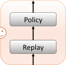
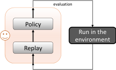
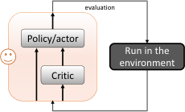
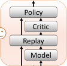
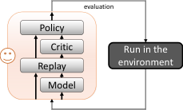

## - A SURVEY ON MODEL BASED REINFORCEMENT LEARNING

**Fan-Ming Luo** [1,3], **Tian Xu** [1], **Hang Lai** [2], **Xiong-Hui Chen** [1,3], **Weinan Zhang** [†2], and **Yang Yu** [†1,3]


1National Key Laboratory for Novel Software Technology, Nanjing University, China
2Shanghai Jiao Tong University, China
3Polixir.ai
```
  {luofm,xut,chenxh,yuy}@lamda.nju.edu.cn,laihang@apex.sjtu.edu.cn,wnzhang@sjtu.edu.cn

```

**ABSTRACT**


Reinforcement learning (RL) solves sequential decision-making problems via a trial-and-error process
interacting with the environment. While RL achieves outstanding success in playing complex video
games that allow huge trial-and-error, making errors is always undesired in the real world. To improve
the sample efficiency and thus reduce the errors, model-based reinforcement learning (MBRL) is
believed to be a promising direction, which builds environment models in which the trial-and-errors
can take place without real costs. In this survey, we take a review of MBRL with a focus on the
recent progress in deep RL. For non-tabular environments, there is always a generalization error
between the learned environment model and the real environment. As such, it is of great importance
to analyze the discrepancy between policy training in the environment model and that in the real
environment, which in turn guides the algorithm design for better model learning, model usage, and
policy training. Besides, we also discuss the recent advances of model-based techniques in other
forms of RL, including offline RL, goal-conditioned RL, multi-agent RL, and meta-RL. Moreover,
we discuss the applicability and advantages of MBRL in real-world tasks. Finally, we end this survey
by discussing the promising prospects for the future development of MBRL. We think that MBRL
has great potential and advantages in real-world applications that were overlooked, and we hope this
survey could attract more research on MBRL.


**1** **Overview of Model-based RL**


Reinforcement learning (RL) studies the methodologies of improving the performance of sequential decision-making
for autonomous agents [Sutton and Barto, 2018]. Since the success of deep RL in playing the game of Go and video
games shows the beyond-human ability of decision-making, it is of great interest to extend its application horizon to
include real-world tasks.


Typically, deep RL algorithms require tremendous training samples, resulting in much high sample complexity. In
general RL tasks, the sample complexity of a particular algorithm refers to the amount of samples required for learning
an approximately optimal policy. Particularly, unlike the supervised learning paradigm that learns from historical
labeled data, typical RL algorithms require the interaction data by running the latest policy in the environment. Once
the policy updates, the underlying data distribution (formally the occupancy measure [Syed et al., 2008]) changes, and
the data has to be collected again by running the policy. As such, RL algorithms with high sample complexity are hard
to be directly applied in real-world tasks, where trial-and-errors can be highly costly.


Therefore, a major focus of the recent research on deep reinforcement learning (DRL) is on improving sample efficiency

[Yu, 2018]. Among different branches of research, model-based reinforcement learning (MBRL) is one of the most
important directions that is widely believed to have the great potential to make RL algorithms significantly more sample
efficient [Wang et al., 2019]. This belief is intuitively from an analogy with human intelligence. Human beings are
capable of having an imagined world in mind, in which how things could happen following different actions can be


  - : Corresponding authors.


predicted. In such a way, proper actions can be chosen to take from imagination and are thus with low trial-and-error
costs. The phrase _model_ in MBRL is the environment model that is expected to play the same role as the imagination.


In MBRL, the environment model (or simply the model) refers to the abstraction of the environment dynamics with
which the learning agent interacts. The dynamics environment in RL is typically formulated as a Markov decision
process (MDP), denoted with a tuple _⟨S, A, M, R, γ⟩_, where _S_, _A_ and _γ_ denote the state space, action space and the
discount factor for future rewards, respectively, while _M_ : _S × A �→_ _S_ denotes the state transition dynamics and
_R_ : _S × A �→_ R denotes the reward function. Normally, given the state and action spaces and the discount factor, the
key components of the environment model are the state transition dynamics and the reward function. Thus, learning the
model corresponds to recovering the state transition dynamics _M_ and the reward function _R_ . In many cases, the reward
function is also explicitly defined, thus the major task of the model learning is to learn the state transition dynamics

[Luo et al., 2018, Janner et al., 2019].


With an environment model, the agent can have the imagination ability. It can interact with the model in order to
sample the interaction data, which is also called _simulation data_ . Ideally, if the model is sufficiently accurate, a good
policy can be learned in the model. Compared with the model-free reinforcement learning (MFRL) methods, where the
agent can only use the data sampled from the interaction with the real environment, called _experienced data_, MBRL
enables the agent to fully leverage the experienced data in the learned model. It should be noticed that, besides MBRL,
there are other approaches trying to better utilize the experienced data, such as the off-policy algorithms that employ a
replay buffer to record the old data and the actor-critic algorithms that can be viewed as learning a critic to facilitate the
policy updates. Figure 1 depicts different types of RL structures. Figure 1(a) is the simplest on-policy RL, where the
agent uses the latest data to update the policy. In the off-policy, as Figure 1(b), the agent collects historical data in the
replay buffer, in which the policy is learned. In actor-critic RL, as shown in 1(c) the agent learns a critic, which is the
value function of the long-term return, and then learns the policy (actor) assisted by the critic. MBRL, as shown in
Figure 1(d), explicitly learns a model. Compared with off-policy RL, MBRL reconstructs the state transition dynamics,
while off-policy RL simply uses the replay buffer to estimate the value more robustly. Although calculating the value
function, or the critic, involves the information of the transition dynamics, the learned model in MBRL is decoupled
with the policy and thus can be used to evaluate other policies, while the value function is bound to the sampling policy.
Also, note that off-policy, actor-critic, and model-based are three structures in parallel, Figure 1(e) shows a possible
combination of them.


With a sufficiently accurate model, it is intuitive that MBRL yields higher sample efficiency than MFRL, as shown in
recent studies from both theoretical [Sun et al., 2019] and empirical [Janner et al., 2019, Wang et al., 2019] perspectives.
However, in a wide range of DRL tasks with relatively complex environments, it is not straightforward to learn an ideal
model. Therefore, we need to carefully consider approaches to model learning and model usage.


In this survey, we take a comprehensive review of the model-based reinforcement learning methods. Firstly, we focus
on how models are learned and used in the basic setting, as in Sec.3 for model learning and Sec.4 for model usage. For
_model learning_, we start from the classic tabular represented models, then for approximation models such as using


interaction data


(a) on-policy RL






interaction data


(b) off-policy RL


Agent




interaction data


(c) actor-critic RL


interaction data


interaction data


(d) model-based RL






(e) off-policy actor-critic RL


Agent


Figure 1: Architectures of RL algorithms. The figures show a training iteration of the RL, focusing on how the
interaction data is utilized.


2


neural networks, we review the theories and the key challenges when facing complex environments, as well as advances
for reducing model errors. For _model usage_, we categorize the literature into two parts, i.e., the blackbox model
rollout for trajectory sampling and whitebox model for gradient propagation. Regarding model usage as a subsequent
task of model learning, we also cover the attempts to bridge model learning and model usage, i.e., value-aware and
policy-aware model learning. Moreover, we take a brief review on the combination of model-based methods in other
forms of reinforcement learning, including offline RL, goal-conditioned RL, multi-agent RL, and meta RL. We also
discuss the applicability and advantages of MBRL in real-world tasks. We finally conclude this paper with a discussion
of promising the emerging research perspectives and future trends in the development of MBRL.


**2** **Model Learning**


For MBRL, the first component to consider is the learning of the environment model. As introduced above, the model
is formulated as the MDP _⟨S, A, M, R, γ⟩_, where _S_, _A_, and _γ_ are commonly predefined, and the state transition
dynamics _M_ and the reward function _R_ are to be learned. We assume that some historical data is available for learning.
Usually, the historical data can be in the form of trajectories _{τ_ 1 _, τ_ 2 _, . . ., τk}_, and each trajectory is a sequence of
state-action-reward pairs, _τi_ = ( _s_ _[i]_ 0 _[, a]_ 0 _[i]_ _[, r]_ 0 _[i]_ _[, . . ., s][i]_ _L−_ 1 _[, a]_ _L_ _[i]_ _−_ 1 _[, r]_ _L_ _[i]_ _−_ 1 _[, s]_ _L_ _[i]_ [)][. It is easy to discover that the data records the]
past transitions ( _st, at, st_ +1) corresponding to the input and output of the transition dynamics _M_, and the past rewards
( _st, at, rt_ ) corresponding to the input and output of the reward function _R_ . Therefore, it is straightforward to borrow
ideas from supervised learning for model learning.


**2.1** **Model Learning in Tabular Setting**


At the early stage of RL research, the state and action spaces are finite and small, the model learning is considered with
the tabular MDPs [Sutton, 1990a], where policies, transition dynamics, and reward functions can all be recorded in a
table. To learn the transition dynamics, let _C_ [ _s, a, s_ _[′]_ ] record the counting of the state-action-next-state ( _s, a, s_ _[′]_ ). The
transition dynamics are then


_M_ ˆ ( _s_ _[′]_ _|s, a_ ) =


_C_ [ _s,a,s_ _[′]_ ]
~~�~~ _s_ _[′′]_ _∈S_ _[C]_ [[]

1

� _|S|_ _[,]_


1 _s_ _[′′]_ _∈S_ _[s,a,s]_ otherwise (1)
_|S|_ _[,]_


_s,a,s_ �

_s_ _[′′]_ _∈S_ _[C]_ [[] _[s,a,s][′′]_ []] _[,]_


_s_ _[′′]_ _∈S_ _[C]_ [[] _[s, a, s][′′]_ []] _[ >]_ [ 0]


For the reward function, let _Sum_ [ _s, a_ ] record the sum of rewards received by taking action _a_ on state _s_ . The reward
function is then


_R_ ˆ( _s, a_ ) =


_Sum_ [ _s,a_ ]

_C_ [ _s,a_ ] _[,]_ _C_ [ _s, a_ ] _>_ 0 (2)

� _R_ min _,_ otherwise


where _R_ min is the preset minimum value of the immediate reward.


The above simple calculation of the transition dynamics and the reward function corresponds to the maximum likelihood
estimation (MLE) under the tabular setting. Notice that _M_ [ˆ] and _R_ [ˆ] are an unbiased estimation of the true transition _M_ _[∗]_
and the true reward function _R_ _[∗]_ respectively, and thus converges to _M_ _[∗]_ and _R_ _[∗]_ as the samples approach infinity.


For collecting samples, sampling trajectories from the environment is not as straightforward as sampling a coin. R-MAX

[Brafman and Tennenholtz, 2002] is a representative algorithm for joint model learning and exploration. In R-MAX, a
state transits to itself, and the immediate reward is set to the maximum value by default, but only when a state-action
pair has been visited sufficiently many times, i.e., larger than _K_, the transition probability, and the reward are assigned
to their average value. This is implemented by using the _M_ [˜] and _R_ [˜] as in Eq.(3).


_Sum_ [ _s,a_ ]

_C_ [ _s,a_ ] _[,]_ _C_ [ _s, a_ ] _≥_ _K_ (3)

� _R_ max _,_ _C_ [ _s, a_ ] _< K_


_M_ ˜ ( _s_ _[′]_ _|s, a_ ) =


_C_ [ _s,a,s_ _[′]_ ]
~~�~~ _s_ _[′′]_ _∈S_ _[C]_ [[]
� _I_ [ _s_ _[′]_ = _s_ ] _,_


~~�~~ _s_ _[′′]_ _∈S_ _[C]_ [[] _[s,a,s][′′]_ []] _[,]_ _,_ _R_ ˜( _s, a_ ) =

_I_ [ _s_ _[′]_ = _s_ ] _,_ _C_ [ _s, a_ ] _< K_


_s,a,s_ _C_ [ _s, a_ ] _≥_ _K_

_s_ _[′′]_ _∈S_ _[C]_ [[] _[s,a,s][′′]_ []] _[,]_


where _I_ is the indicator function that is 1 when the inner expression is true and 0 otherwise.


In every iteration, R-MAX solves an _ϵ_ -optimal policy in the fictitious model _⟨S, A,_ _M,_ [˜] _R, γ_ [˜] _⟩_, which naturally tries to
explore unvisited states due to the set of the _R_ max reward, and applies the policy in the environment to collect more
_|S|_ [2] _|A|_
samples to update the fictitious model. With a properly set _K_, R-MAX requires _O_ [˜] � _ϵ_ [3] (1 _−γ_ ) [2] [log] [1] _δ_ � episodes to achieve

a high accuracy ( _ℓ_ 1 difference on transition _< ϵ/_ 2) model [Jiang, 2020].


3


**2.2** **Model Learning via Prediction Loss**


While the counting method and the theory of model learning under the setting of tabular MDPs are clear, it is
not feasible to use tabular representation for large-scale MDPs and MDPs with continuous state space and action
space. Approximation functions are therefore employed in the general setting. The approximation functions can be
implemented by machine learning models, such as linear models, neural networks, decision tree models, etc. In this
survey, we focus on neural network models, for which we denote the transition model as _Mθ_ with parameter _θ_ being the
network weights. Meanwhile, in order to explicitly indicate the real transition dynamics, we denote it as _M_ _[∗]_ .


**2.2.1** **Prediction Model Loss**


A straightforward approach to model learning fits one-step transitions, which has been widely employed [Kurutach et al.,
2018a, Feinberg et al., 2018, Luo et al., 2018, Janner et al., 2019, Rajeswaran et al., 2020]. When _Mθ_ is deterministic,
the model learning objective can be the mean squared prediction error of the model _Mθ_ on the next state [Nagabandi
et al., 2018a].


min _θ_ E( _s,a_ ) _∼ρMπD_ _[∗]_ _[,s][′][∼][M][ ∗]_ [(] _[·|][s,a]_ [)] � _∥s_ _[′]_ _−_ _Mθ_ ( _s, a_ ) _∥_ [2] 2� _._ (4)

Here _M_ _[∗]_ is the real transition dynamics, _πD_ is the data-collecting policy and _ρ_ _[M]_ _πD_ _[ ∗]_ [is the stationary state-action]
distribution induced by _πD_ and _M_ _[∗]_ . Intuitively, _ρ_ _[M]_ _πD_ _[ ∗]_ [is the data collected by running] _[ π][D]_ [for a long period.]


However, the deterministic transition model fails to capture the aleatoric uncertainty [Chua et al., 2018], which arises
from the inherent stochasticities of the environment. To model the aleatoric uncertainty, a natural idea is to utilize the
probabilistic transition model _Mθ_ ( _·|s, a_ ) [Chua et al., 2018]. Under this case, the objective can be minimizing the KL
divergence between _M_ _[∗]_ ( _·|s, a_ ) and _Mθ_ ( _·|s, a_ ) as in Eq.(5).


_._ (5)
��


min _θ_ E( _s,a_ ) _∼ρMπD_ _[∗]_ [[] _[D]_ [KL][ (] _[M][ ∗]_ [(] _[·|][s, a]_ [)] _[, M][θ]_ [(] _[·|][s, a]_ [))] :=][ E][(] _[s,a]_ [)] _[∼][ρ]_ _πD_ _[M]_ _[∗]_ _[,s][′][∼][M][ ∗]_ [(] _[·|][s,a]_ [)]


_M ∗_ ( _s′_ _| s, a_ )
log
� � _Mθ_ ( _s_ _[′]_ _| s, a_ )


The probabilistic transition model is often instantiated as a Gaussian distribution [Chua et al., 2018, Luo et al., 2018,
Janner et al., 2019], i.e., _Mθ_ ( _·|s, a_ ) = _N_ ( _µθ_ ( _s, a_ ) _,_ Σ _θ_ ( _s, a_ )) with parameterized models of _µθ_ and Σ _θ_ . Then Eq.(5)
becomes

min _θ_ E( _s,a_ ) _∼ρMπD_ _[∗]_ _[,s][′][∼][M][ ∗]_ [(] _[·|][s,a]_ [)] �( _µθ_ ( _s, a_ ) _−_ _s_ _[′]_ ) _[⊤]_ Σ _[−]_ _θ_ [1] ( _µθ_ ( _s, a_ ) _−_ _s_ _[′]_ ) + log (det Σ _θ_ ( _s, a_ ))� _._


Using the prediction model loss of either Eq.(4) or Eq.(5), we can see that the model learning task has been transformed
to be a supervised learning task. Any supervised learning technique can be employed to achieve efficient and effective
model learning.


**2.2.2** **Model Properties**


When a model has been obtained using the prediction model loss, we then care how well the model can help, in
particular, how different a policy _π_ performs in the model and in the real environment, i.e., the value evaluation error,
_∥VM_ _[π]_ _θ_ _[−]_ _[V][ π]_ _M_ _[∗]_ _[∥][∞][.]_


The _simulation lemma_ firstly proved in [Kearns and Singh, 2002] says that


**Theorem 1** (Simulation Lemma) **.** _Given an MDP with reward upperbound R_ max _and transition model M_ _[∗]_ _, and_
_a learned transition model Mθ with_ max _s,a ∥Mθ_ ( _s, a_ ) _−_ _M_ _[∗]_ ( _s, a_ ) _∥_ 1 _≤_ _ϵ_ [max] _m_ _and a learned reward function with_
max _s,a |Rθ_ ( _s, a_ ) _−_ _R_ ( _s, a_ ) _| ≤_ _ϵr, the value evaluation error of any policy π is bounded as_

_∥VM_ _[π]_ _θ_ _[−]_ _[V][ π]_ _M_ _[∗]_ _[∥][∞]_ _[≤]_ _[γ]_ 2(1 _[ϵ]_ _m_ [max] _−Rγ_ max) [2] [+] 1 _−ϵRγ_ _[.]_ (6)

The simulation lemma shows that the value loss corresponding to the model errorthe effective horizon 1 _−_ 1 _γ_ [. This means that the value loss grows quadratically fast as the horizon grows. When the] _ϵ_ [max] _m_ has a quadratic coefficient on
reward function is out of the consideration, as discussed above, we can omit the _ϵr_ term. Meanwhile, the simulation
lemma also shows that the reward error is not severe compared to the model error.


4


We can also note the limitations of the simulation lemma. Compared with the learning loss Eq.(4) where the data
follows the distribution of the data-collecting policy, the model error _ϵ_ [max] _m_ is measured as the maximum difference over
all state-action pairs, which is not easily achieved or assessed in a practical way.


In the recent analysis [Luo et al., 2018, Janner et al., 2019, Xu et al., 2020], the error of the learned transition model _Mθ_
is measured over the data distribution, and thus directly connects with the learning loss Eq.(4). We present the result in
Theorem 2, named simulation lemma II. Note that we omit the reward function error since it is not essential.


**Theorem 2** (Simulation Lemma II) **.** _Given an MDP with reward upper bound R_ max _and transition model M_ _[∗]_ _, and a_
_data-collecting policy πD, and a learned transition model Mθ with_
E( _s,a_ ) _∼ρMπD_ _[∗]_ � _D_ KL� _M_ _[∗]_ ( _·|s, a_ ) _, Mθ_ ( _·|s, a_ )�� _≤_ _ϵ_ _[ρ]_ _m_ _[,]_


_for an arbitrary policy π with bounded divergence,_
max _s_ _D_ KL� _π_ ( _·|s_ ) _, πD_ ( _·|s_ )� _≤_ _ϵπ,_


_the value evaluation error of the policy is bounded as_


_√_ 2 _R_ max

_√_ ~~_ϵ_~~ _π._ (7)
(1 _−_ _γ_ ) [2]


_|VM_ _[π]_ _θ_ _[−]_ _[V][ π]_ _M_ _[∗]_ _[| ≤]_


_√_ 2 _R_ max _γ_ _√_

_√_ ~~_ϵ_~~ _m_ + 2
(1 _−_ _γ_ ) [2] (1


_√_


Note that we denote the distributional model error as _ϵ_ _[ρ]_ _m_ [to distinguish the uniform model error] _[ ϵ]_ [max] _m_ in Theorem 1.


The policy evaluation error of simulation lemma II contains two terms, the bias of the learned model, and the policy
divergence between the evaluating policy _π_ and the data-collecting policy _πD_ . Theorem 2 indicates that the policy
1
evaluation error w.r.t the model error _ϵ_ _[ρ]_ _m_ [also has a quadratic coefficient on the effective horizon] 1 _−γ_ [, similar to]
Theorem 1. The coefficient means a quadratic compounding error of learning in the model, which is the reason that
studies such as [Janner et al., 2019] only adopt short rollouts, say, less than 10 steps, in the learned model.


Moreover, Xu et al. [2021a] provided a finite sample complexity result for the evaluation error by further relating the
model error _ϵ_ _[ρ]_ _m_ [with the samples and model space of the model learning. Interested readers are referred to [][Xu et al.][,]
2021a, Corollary 2] for the detailed analysis.


**2.2.3** **Model Variants**


Since the compounding error is due to the recursive state-action generation using the one-step transition model, a way
of alleviating the issue is to predict many steps at a time. A multistep model [Asadi et al., 2019] takes the current
state _st_ and a sequence of actions ( _at, at_ +1 _, . . ., at_ + _h_ ) with length _h_ as the input, and predicts the future _h_ states. A
(deterministic) multistep model is represented as

( _st_ +1 _, . . ., st_ + _h_ ) = _Mθ_ _[h]_ [(] _[s][t][, a][t]_ [+1] _[, . . ., a][t]_ [+] _[h]_ [)] _[,]_

which can also be trained by supervised learning. Intuitively, compared with the one-step model, the multistep model
does not take the predicted “fake” states as the input and hence could avoid the compounding error within _h_ steps

[Asadi et al., 2019]. Meanwhile, the dynamics across multi-steps can be much more complex than one-step dynamics,
therefore, multistep transition predictions can have a larger error.


The transition models discussed before are all forward models, i.e., predict along time. In addition to the forward model,
there also exist studies on the backward transition model in MBRL [Edwards et al., 2018, Goyal et al., 2019, Lai et al.,
2020a, Lee et al., 2020a, Wang et al., 2021]. The backward transition model takes the future state _st_ +1 and action _at_ as
inputs and predicts the state _st_ . The backward model is often used to generate reverse data, which can help reduce the
rollout horizon [Lai et al., 2020a] and could improve the sample efficiency of MBRL [Wang et al., 2021].


**2.3** **Model Learning with Reduced Error**


In the above model properties, we can see the horizon-squared compounding error is a major issue of model learning.
The issue is mainly due to the use of prediction loss to learn an unconstrained model.


**2.3.1** **Model Learning with Lipschitz Continuity Constraint**


To reduce the compounding error, one way is to constrain the model. Venkatraman et al. [2015] and,Asadi et al. [2018]
employed the Lipschitz continuity constraint for the models. They firstly employed Wasserstein distance [Vaserstein,
1969] to measure the similarity between two transition distributions. For any two distributions _P_ and _Q_ over space _X_,


5


the Wasserstein distance between _P_ and _Q_ is defined as
_W_ ( _P, Q_ ) = _γ∈_ Π(inf _P,Q_ ) [E][(] _[x,y]_ [)] _[∼][γ]_ [ [] _[d]_ [(] _[x, y]_ [)]] _[ .]_


where Π ( _P, Q_ ) denotes the set of all joint distributions _γ_ ( _x, y_ ), whose marginals are respectively _P_ and _Q_, and _d_ is the
distance metric on _X_ . Compared with other divergence measures (e.g., KL divergence and TV distance), Wasserstein
distance can appropriately measure the similarity between two distributions with disjoint supports [Asadi et al., 2018].


When considering a state distribution _ρ_ over the state space _S_ rather than a single state _s_, we can also define the
transition model, i.e., the generalized transition model, _Mθ_ ( _·|ρ, a_ ) as


_Mθ_ ( _s_ _[′]_ _|ρ, a_ ) := _Mθ_ ( _s_ _[′]_ _|s, a_ ) _ρ_ ( _s_ ) _ds._
�

_Mθ_ is called _ϵw_ -accurate w.r.t. the Wasserstein distance if and only if sup _s,a W_ ( _Mθ_ ( _·|s, a_ ) _, M_ _[∗]_ ( _·|s, a_ )) _≤_ _εw_ . Notice
that _ϵw_ measures the one-step error of the transition model and is connected to _ϵ_ [max] _m_ in Theorem 1.


In MBRL, we desire an upper bound on the _n_ -step error. For a fixed initial state distribution _µ_ and a fixed sequence of
actions ( _a_ [0] _, · · ·, a_ _[n][−]_ [1] ), the _n_ -step error is defined as
_W_ ( _Mθ_ _[n]_ [(] _[·|][µ]_ [)] _[, M][ ∗][,n]_ [(] _[·|][µ]_ [))] _[,]_

where _M_ _[n]_ ( _s|µ_ ) := P � _sn_ = _s|s_ 0 _∼_ _µ_ ( _·_ ) _, a_ 0 = _a_ [0] _, s_ 1 _∼_ _M_ ( _·|s_ 0 _, a_ 0) _, a_ 1 = _a_ [1] _, · · ·, an−_ 1 = _a_ _[n][−]_ [1][�] _._

The Lipschitz continuity is introduced for probabilistic transition models.


**Definition 1.** _A probabilistic transition model M is K-Lipschitz if and only if_


sup sup
_a∈A_ _ρ_ 1 _,ρ_ 2 _∈_ ∆( _S_ )


_W_ ( _M_ ( _·|ρ_ 1 _, a_ ) _, M_ ( _·|ρ_ 2 _, a_ ))

_≤_ _K._
_W_ ( _ρ_ 1 _, ρ_ 2)


With a Lipschitz continuity constrained model, the _n_ -step error can be bounded.


**Theorem 3** (Theorem 1 in [Asadi et al., 2018]) **.** _Suppose the real transition model M_ _[∗]_ _is K_ _[∗]_ _-Lipschitz and the learned_
_transition model Mθ is K-Lipschitz and εw-accurate, then ∀n ≥_ 1 _,_


_W_ ( _Mθ_ _[n]_ [(] _[·][, µ]_ [)] _[, M][ ∗][,n]_ [(] _[·][, µ]_ [))] _[ ≤]_ _[ε][w]_


_n−_ 1
�( _K_ ) _[i]_ _,_


_i_ =1


_where K_ = min _{K_ _[∗]_ _, K}._


Asadi et al. [2018] further introduced two assumptions to simplify the analysis. One assumption is single action, i.e.,
_A_ = _{a}_ . The other assumption is the state-only _KR_ -Lipschitz continuous reward function. Under the two assumptions,
the value function under the transition _M_ is simplified as


�


_VM_ ( _s_ ) = E


_∞_
�
� _t_ =0


� _γ_ _[t]_ _r_ ( _st_ ) _|s_ 0 = _s, at_ = _a, st_ +1 _∼_ _M_ ( _·|st, at_ ) _, t_ = 0 _,_ 1 _,_ 2 _, · · ·_


_t_ =0


_._


Then the value function error (of the policy taking the only action) can be bounded.


**Theorem 4** (Theorem 2 in [Asadi et al., 2018]) **.** _Under the same assumptions as in Theorem 3. Further, suppose_
_that A_ = _{a} and the reward function only depends on the state and is KR-Lipschitz continuous. Then ∀s ∈S and_
_K ∈_ [0 _,_ _γ_ [1] [)] _[,]_


_γKRϵw_
_|VMθ_ ( _s_ ) _−_ _VM ∗_ ( _s_ ) _| ≤_ (8)
(1 _−_ _γ_ )(1 _−_ _γK_ ) _[,]_


_where K_ = min _{K_ _[∗]_ _, K}._


Although the analysis is over-simplified, we can still notice that when _K_ is small, the evaluation error can be small. In
other words, the compounding error can be controlled, compared with those in the simulation lemmas (i.e., Theorem 1
and Theorem 2).


Since _K_ is the minimum between the Lipschitz constants of _M_ _[∗]_ and _Mθ_, the theorem suggests a trade-off on the
Lipschitz constant of _Mθ_ . When _K_ is small and _K ≤_ _K_ _[⋆]_, _K_ is also small. Meanwhile, with a small _K_, the model
might be hard to approximate _M_ _[∗]_ with a large _K_ _[∗]_ and thus _ϵw_ could be large.


6


**2.3.2** **Model Learning by Distribution Matching**


The prediction loss employed in Theorem 1 and Theorem 2 minimizes the model error on each point of the state-action
data. While the prediction loss minimization can be straightforwardly solved by supervised learning, the long-term
effect of transitions is hard to be captured, resulting in the horizon-squared compounding error issue. Therefore, to learn
the long-term effect of transitions, an idea is to match the distributions between the real trajectories and the trajectories
rolled out in the learned model.


The idea of distribution matching has been employed in imitation learning through adversarial learning such as the
GAIL method [Ho and Ermon, 2016] that imitates the expert policy in an adversarial manner, where a discriminator D
learns to identity whether a state-action pair comes from the expert demonstrations and a generator _π_ imitates the expert
policy by maximizing the discriminator score. This corresponds to the minimax optimization problem
min _π∈_ Π D _∈_ (0max _,_ 1) _[S][×][A]_ [ E][(] _[s,a]_ [)] _[∼][ρ][πE]_ �log �D( _s, a_ )�� + E( _s,a_ ) _∼ρπ_ �log(1 _−_ D( _s, a_ )�� _,_


recalling that _ρπ_ is the state-action distribution by running the policy _π_, and _πE_ is the expert policy. When the
discriminator is optimal to the inner objective, i.e., D _[∗]_ ( _s, a_ ) = _ρπE_ ( _s, a_ ) _/_ ( _ρπE_ ( _s, a_ ) + _ρπ_ ( _s, a_ )), the generator
essentially minimizes the Jensen-Shannon (JS) divergence between _ρπE_ and _ρπ_ (up to a constant),


_[ρ][π][E]_ ) _,_ (9)

2 �


min [1]
_π∈_ Π _[D]_ [JS][(] _[ρ][π][E]_ _[, ρ][π]_ [) :=] 2


� _D_ KL( _ρπE_ _,_ _[ρ][π]_ [ +] 2 _[ρ][π][E]_


_[ρ][π][E]_ ) + _D_ KL( _ρπ,_ _[ρ][π]_ [ +] _[ρ][π][E]_

2 2


which achieves the goal of distribution matching and solves the compounding error issue of imitation learning
theoretically [Zhang et al., 2020c, Wang et al., 2020, Xu et al., 2020, 2021b] and empirically [Ho and Ermon, 2016,
Ghasemipour et al., 2019, Ke et al., 2019].


Through the bridge of duel MDP [Zhang et al., 2018b, Shi et al., 2019] that treats the environment also as an agent, the
idea of distribution matching is brought for model learning [Shi et al., 2019, Wu et al., 2019, Xu et al., 2020, Eysenbach
et al., 2021]. The transition model _Mθ_, which takes the current state-action pair as inputs and predicts a distribution
over the next state, is regarded as a policy in the imitation view. A discriminator is employed to distinguish expert
state-action-next-state tuples from the “fake” ones. The minimax optimization problem in [Xu et al., 2020] is then
formulated as
min _Mθ_ [max] D [E][(] _[s,a,s][′]_ [)] _[∼][µ][M]_ _[∗]_ [�] log �D( _s, a, s_ _[′]_ )�� + E( _s,a,s′_ ) _∼µMθ_ �log(1 _−_ D( _s, a, s_ _[′]_ )�� _,_ (10)


where _µ_ _[M][ ∗]_ and _µ_ _[M][θ]_ are the joint state-action-next-state distributions induced by the data-collecting policy _πD_ in the
true environment _M_ _[∗]_ and _Mθ_, respectively. Formally,

_µ_ _[M][ ∗]_ ( _s, a, s_ _[′]_ ) = _ρ_ _[M]_ _πD_ _[ ∗]_ [(] _[s, a]_ [)] _[M][ ∗]_ [(] _[s][′][|][s, a]_ [)] _[, µ][M][θ]_ [(] _[s, a, s][′]_ [) =] _[ ρ]_ _π_ _[M]_ _D_ _[θ]_ [(] _[s, a]_ [)] _[M][θ]_ [(] _[s][′][|][s, a]_ [)] _[.]_

The optimal solution of _Mθ_ minimizes the JS divergence between _µ_ _[M][ ⋆]_ and _µ_ _[M][θ]_, matching the trajectory distribution.
Different from [Xu et al., 2020], Wu et al. [2019] chose to minimize the Wasserstein distance between _µ_ _[M][ ∗]_ and _µ_ _[M][θ]_ .
In [Wu et al., 2019, Xu et al., 2020], they kept the data-collecting policy _πD_ fixed during the training process of the
transition model _Mθ_ . On the other hand, Shi et al. [2019] optimized the transition model and policy jointly, which
forms a multi-agent adversarial imitation learning.


By the distribution matching, Xu et al. [2020] (Theorem 3) proved an improved policy evaluation error bound as in
Theorem 5, which is named Simulation Lemma III.


**Theorem 5** (Simulation Lemma III) **.** _Given an MDP with reward upper bound R_ max _and transition model with M_ _[∗]_ _,_
_and a data-collecting policy πD, and a learned transition model Mθ with_

_D_ JS( _µ_ _[M][θ]_ _, µ_ _[M][ ∗]_ ) _≤_ _ϵ_ _[JS]_ _m_ _[,]_

_for an arbitrary policy π with bounded divergence,_
max _s_ _D_ KL� _π_ ( _·|s_ ) _, πD_ ( _·|s_ )� _≤_ _ϵπ,_


_the policy evaluation error is bounded as_


_|VM_ _[π]_ _θ_ _[−]_ _[V][ π]_ _M_ _[∗]_ _[| ≤]_ [2] _√_ 1 _−_ 2 _Rγ_ max


�


_√_ 2 _R_ max
_ϵ_ _[JS]_ _m_ [+ 2] _√_ ~~_ϵ_~~ _π._ (11)

(1 _−_ _γ_ ) [2]


We can see in Theorem 5 that the coefficient on the model error _ϵ_ _[JS]_ _m_ [is] _[ linear]_ [ w.r.t. the effective horizon, i.e.,] 1 _−_ 1 _γ_ [, which]
meets the lower bound [Xu et al., 2021a] and thus cannot be further improved in general. This means the compounding
error issue is solved.


7


One may further notice that the model error _ϵ_ _[JS]_ _m_ [is a different quantity from the error] _[ ϵ][m]_ [in Theorem][ 2][. This is true. To]
achieve the same value, the matching loss using the JS-divergence requires more samples than the prediction loss. In

[Xu et al., 2021b], the adversarial imitation approach has been improved to have a lower sample complexity than that of
supervised learning.


**2.3.3** **Robust Model Learning**


While in simulation lemma III the compounding error is reduced, the policy divergence term about _ϵπ_ can still be large.
The policy divergence is the difference between the data-collecting policy and the target policy. In order to reduce the
divergence, one direction is to use a data-collecting policy with a wide distribution. Zhang et al. [2021c] proposed to
use a distribution of policy to collect data, instead of a single policy, such that the divergence can be reduced. When
using a distribution of the data-collecting policy, the model learning objective can be formulated as
min _Mθ_ [E] _[π][∼P]_ [(] _[π]_ [)] � maxD _π_ [E][(] _[s,a,s][′]_ [)] _[∼][µ]_ _π_ _[M]_ _[∗]_ [[log][ D] _[π]_ [(] _[s, a, s][′]_ [)] +][ E] ( _s,a,s_ _[′]_ ) _∼µMθπ_ [[log(1] _[ −]_ [D] _[π]_ [(] _[s, a, s][′]_ [))]] � _,_ (12)

where _µ_ _[M]_ _π_ _[∗]_ and _µ_ _[M]_ _π_ _[θ]_ are the joint state-action-next-state distributions. Empirically, the expectation operation E _π∼P_ ( _π_ )
can be approximated via taking average over a set of sampled policies.


Furthermore, to particularly deal with concern-case interacting policies, i.e., the outlier policies with much different
behavior from the majority, Zhang et al. [2021c] designed conditioned value at risk (CVaR) [Tamar et al., 2015]
objective which focuses on the _ϵ_ -percentile of policies with the largest value discrepancy in simulation.


**2.4** **Model Learning for Complex Environments Dynamics**


The mainstream realization of the environment dynamics model is an ensemble of Gaussian processes where the
mean vector and covariance matrix for the distribution of the next state are built based on neural networks fed in the
current state-action pair [Chua et al., 2018]. Such an architecture is shown to work well on MuJuCo robot locomotion
environments, where the state observations are sufficient statistics for future derivation. However, there still exist many
complex environments which are hard to be directly modeled via the above method. Below we discuss two important
aspects of complex environment dynamics modeling.


**Partial Observability.** For partially observable environments, the observations may not be sufficient statistics for future
derivation, which makes the environment a partially observable MDP (POMDP) [Spaan, 2012]. For model learning in a
POMDP, belief state estimation is the classic solution, where an observation model _p_ ( _ot|st_ ) and a latent transition model
_p_ ( _st_ +1 _|st, at_ ) is learned via maximizing a posterior and the posterior distribution _p_ ( _st|o_ 1 _, . . ., ot_ ) can be inferred. With
deep learning, the latent state distribution _p_ ( _st|o_ 1 _, . . ., ot_ ) can be obtained via a recurrent neural network [Ha and
Schmidhuber, 2018]. Hausknecht and Stone [2015] further introduced a delta distribution for deterministic settings or a
Gaussian distribution for stochastic settings.


**Representation Learning.** For high-dimensional state space such as images, representation learning that learns
informative latent state or action representation will much benefit the environment model building so as to improve
the effectiveness and sample efficiency of model-based RL [Yang and Nachum, 2021] on different aspects, including
value prediction [Oh et al., 2017a] and model rollout [Nagabandi et al., 2018c]. Ha and Schmidhuber [2018] applied an
autoencoder network to encode the latent state that can reconstruct the image. Hafner et al. [2020] proposed Dreamer to
learn the latent dynamics for visual control tasks, in which an environment model (called world model) with visual
encoder and latent dynamics is learned based on collected experience, and the model is shown to have the capability
of performing long rollout and value estimation. Hafner et al. [2021] further proposed DreamerV2 that supports
the agent to learn purely from the model rollout data and achieve human-level performance on 55 Atari game tasks.
Compared with Dreamer, DreamerV2 replaces the Gaussian latent as proposed in PlaNet [Hafner et al., 2019a] with
the discrete latent, which brings superior performance. The possible reason for such effects would be the discrete
latent representation can better fit the aggregate posterior and handle multi-modal cases. Considering the state-action
pair distribution mismatch between the model training and model rollout stages, Shen et al. [2020] incorporated a
domain adaptation objective into the model learning task to encourage the model to learn invariant representations of
state-action pairs between the real data and rollout data.


**3** **Model Usage and Integration with Model Learning**


**3.1** **Planning with Model Simulation**


When a model is available, the most straightforward idea of utilizing the model is to plan in it. _Planning_ denotes any
computational process that takes a model as input and produces or improves a policy for interacting with the modeled


8


environment [Sutton and Barto, 2018, Moerland et al., 2020a,b]. We will list the MBRL approaches that integrate
planning into their methods or frameworks. We will categorize these approaches according to the planning methods
they adopt.


**Model predictive control (MPC).** MPC [Camacho and Alba, 2013] is a kind of model-based control method that plans
an optimized sequence of actions in the model. Classical MPC approach requires to design a parametric model and
policy, such as in the linear quadratic form, to fit the optimizer such as a quadratic optimization solver. Learning-based
MPC [Hewing et al., 2020] has a tight connection with MBRL, particularly for nonlinear and black-box models. In
general, at each time step, MPC obtains an optimal action sequence by sampling multiple sequences and applying the
first action of the sequence to the environment. Formally, at time step _t_, an MPC agent will seek an action sequence
_at_ : _t_ + _τ_ by optimizing:


�


max
_at_ : _t_ + _τ_ [E] _[s][t][′]_ [+1] _[∼][p]_ [(] _[s][t][′]_ [+1] _[|][s][t][′]_ _[,a][t][′]_ [)]


_t_ + _τ_
�
� _t_ _[′]_ = _t_


� _r_ ( _st′, at′_ )


_t_ _[′]_ = _t_


_,_ (13)


where _τ_ denotes the planning horizon. Then the agent will choose the first action _at_ from the action sequence and apply
it to the environment.


Black-box MPC regards Eq.(13) as a black-box optimization problem and adopts some zero-order optimization methods
to solve it. MB-MF [Nagabandi et al., 2018b] adopts a basic optimization method, i.e., the Monte Carlo (MC) method
(also known as “random shooting”), which samples a number of action sequences _at_ : _t_ + _τ_ from the space of action
sequence uniformly and randomly. By applying the action sequences in the model, the current state _st_ can be transited
to _st_ + _τ_ following the transition distribution. The returns accumulated during the transition process are used to evaluate
the action sequences. The action sequence with the highest evaluation will be preserved as the solution of Eq.(13).
The MC method is simple to implement and does not require many computational resources. However, because of
the low efficiency of the random sampling process, it also suffers from high variance and could fail to sample a high
reward action sequence when the action space is large. Recent advances in MPC methods focus on altering the sampling
strategies [Chua et al., 2018, Hafner et al., 2019b] and the sampling space [Wang and Ba, 2020].


Replacing the MC method with CEM [Botev et al., 2013], PETS [Chua et al., 2018], and PlaNet [Hafner et al., 2019b]
improves the optimization efficiency. Instead of sampling randomly and uniformly, CEM samples the action sequences
from a multivariate normal distribution, which will be adjusted according to the evaluation of the sampled sequences
such that the high-reward sequences can be sampled with a higher probability. This principle resembles many other
derivative-free optimization methods [Hansen, 2016, Yu et al., 2016, Hu et al., 2017]. As a result, other derivative-free
optimization methods can also be used to solve Eq.(13) and integrated into the MPC framework. In addition to altering
the optimization method, POPLIN-A [Wang and Ba, 2020] further improves the optimization efficiency by altering the
sampling space to a space of action bias. Specifically, POPLIN-A seeks a sequence of action residual to adjust an action
sequence proposed by a policy. For example, POPLIN-A-Replan, a variant of POPLIN-A, alters Eq.(13) to Eq (14) by
introducing a policy function _π_ ( _s_ ):


�


max
_δt_ : _t_ + _τ_ [E] _[s][t][′]_ [+1] _[∼][p]_ [(] _[s][t][′]_ [+1] _[|][s][t][′]_ _[,π]_ [(] _[s][t][′]_ [)+] _[δ][t][′]_ [)]


_t_ + _τ_
�
� _t_ _[′]_ = _t_


� _r_ ( _st′, π_ ( _st′_ ) + _δt′_ )


_t_ _[′]_ = _t_


_._ (14)


The policy learns to imitate the MPC results. As a result, at the state the policy has met, it can propose a nearly optimal
action sequence as an initial solution. Thus, POPLIN-A largely simplifies the optimization problem and improves
planning efficiency.


With an imperfect model, the result of MPC could not be reliable. However, we can still make use of the planning result
by integrating it into a model-free RL framework. I2A [Racanière et al., 2017] integrates Monte Carlo planning results
into model-free RL framework as the auxiliary information. Instead of applying the first action of the sequence with
the highest return, I2A encodes several rollouts from the model to rollout embeddings. The embeddings will then be
aggregated and used to augment the input of the model-free RL agent. As I2A does not rely on the planning results, it
can successfully use imperfect models.


**Monte Carlo tree search (MCTS).** MCTS [Browne et al., 2012, Chaslot et al., 2008a, Silver et al., 2016, 2017b] is an
extension of Monte Carlo sampling methods. MCTS also aims at solving Eq.(13). Unlike the MC methods mentioned
in the MPC part, MCTS adopts a tree-search method. At each time step, MCTS incrementally extends a search tree
from the current environment state [Browne et al., 2012, Chaslot et al., 2008a]. Each node in the tree corresponds to a
state, which will be evaluated by some approximated value functions or the return obtained after rollouts in the model
with a random policy [Chaslot et al., 2008a] or a neural network policy [Silver et al., 2016, 2017a,b]. Finally, action
will be chosen such that the agent can be more likely transited to a state which has a higher evaluated value. In MCTS,
models are generally used to generate the search tree and evaluate the state.


9


AlphaGo [Silver et al., 2016] first uses MCTS to beat professional human players in the game of Go. AlphaGo first
utilizes human expert data to pre-train a policy network, which is used to generate the search tree. For each decision
timestep, AlphaGo uses MCTS to decide where to play the next stone on board. AlphaGo Zero [Silver et al., 2017b] is
able to defeat professional human players without any human knowledge. AlphaGo Zero trains a policy to mimic the
planning outputs of MCTS, like POPLIN-A [Wang and Ba, 2020]. The policy is then used to generate the search tree in
MCTS. The procedure of AlphaGo Zero can be regarded as an iteration between improving a policy by planning and
enhancing the planning by the policy. This training procedure has also been adopted by recent work to play the board
game Hex [Anthony et al., 2017].


Despite the conventional MCTS algorithm can only be used in discrete action space, Couëtoux et al. [2011]and
Moerland et al. [2018] extended the MCTS framework to continuous action space by progressive widening [Coulom,
2007, Chaslot et al., 2008b], which adaptively determines the number of child actions of a state in the tree according to
the total number of visits of the state. Further, when the true model is not provided, MCTS can be applied to a learned
model. Value prediction network (VPN) [Oh et al., 2017b] learns an abstract state transition model. The abstract state
transition model infers the next abstract state by taking the current abstract state and action as input, which is the same
as the transition function in typical MDP. However, the abstract state has no semantics of the corresponding state. The
purpose of the abstract transition model is to transit the abstract state to an abstract state that can be used to make more
precise value and reward predictions. As a result, given an action sequence, the VPN can predict the reward and the
state value for the future states after taking the action sequence to the environment. VPN applies MCTS to the learned
model to search an action sequence that has the highest bootstrapped environment return. With the abstract transition
model, VPN can be applied to the tasks where the observation is the image, e.g. atari games. The experiments show that
VPN can outperform DQN [Mnih et al., 2015] in several atari games. With a similar framework, MuZero [Schrittwieser
et al., 2019] further improves the performance in atari games. Muzero also learns a transition model but additionally
learns an abstract policy, which outputs actions with the abstract states as inputs. Empirical results have shown huge
advantages of Muzero in atari games, Go, chess and shogi.


**Background planning.** MPC and MCTS always begin and complete planning after the agent encounters a new state.
This kind of method is also known as decision-time planning [Sutton and Barto, 2018]. Another way of planning is
_background planning_, which uses the simulated data obtained from the model to improve the policy or value learning

[Sutton and Barto, 2018]. Dynamic programming [Sutton and Barto, 2018], tabular Dyna [Sutton, 1990b, 1991], and
prioritized sweeping [Moore and Atkeson, 1993] all belong to background planning methods. Here, we introduce
VIN [Tamar et al., 2016], which implements a dynamic programming method, value iteration (VI), with a neural
network. VIN reveals that the classic VI planning algorithm [Bellman, 1958] may be represented by a specific type of
convolutional neural network (CNN). A step of VI can be achieved by passing a reward tensor to a CNN followed by a
max-pooling layer. They embed such a module inside a standard feed-forward network and thus obtain a NN model
that can learn to plan implicitly and provide the policy with useful planning results.


**3.2** **Data Augmentation with Model Simulation**


With a model, instead, we can generate any number of simulated samples as we want. We can use the simulated data
for policy learning or value approximation. These kinds of integration of policy/value learning and models are known
as Dyna-style methods. Dyna-style methods [Sutton, 1990a] utilize the learned transition model to generate more
experiences and then perform reinforcement learning on the dataset augmented by the model experiences. As a result,
the models in Dyna-style methods are regarded as the data-augmenter for the policies. The main purpose of models is
to generate simulated experiences for policy learning. In this sub-section, we will introduce value learning and policy
learning with the simulated experience obtained from a model.


**Value estimation.** Monte Carlo (MC) value estimation [Tesauro and Galperin, 1996, Sutton and Barto, 2018] is the
original method to approximate state values. Specifically, for an state _st_, it uses MC search to estimate _Q_ _[π]_ ( _st, a_ )
by performing action _a_ in state _st_ and subsequently executing policy _π_ in all successor states. In MC search, many
simulated trajectories starting from ( _st, a_ ) are generated following _π_ . The value function _Q_ _[π]_ ( _st, a_ ) will be estimated
by averaging the cumulative reward of the trajectories. MC value estimation depicts an original model usage for
value approximation, i.e., averaging the cumulative reward of the simulated trajectories. Another value approximation
method is temporal-difference (TD) prediction [Tesauro, 1995], which is broadly used in many value-based RL methods

[Lillicrap et al., 2016, Mnih et al., 2015]. In one step TD, the update target of the value of state _st_, _V_ ( _st_ ), is determined
by the value of the next state _V_ ( _st_ +1) and the received reward _rt_ : _rt_ + _γV_ ( _st_ +1). Compared with the MC methods,
one step TD does not need a environment model and thus is preferred by many model-free methods. The intermediate
between MC methods and one-step TD is _H_ -step TD, whose update target for _V_ ( _st_ ) is [�] _[t]_ _t_ [+] _[′]_ = _[H]_ _t_ _[−]_ [1] _γ_ _[t][′][−][t]_ _rt′_ + _γ_ _[H]_ _V_ ( _st_ + _H_ ).
Feinberg et al. [2018] proposed Model-based Value Expansion (MVE), which indicates that _H_ -step TD value prediction
can reduce the value estimation error under some conditions, which is concluded in Theorem 6.


10


**Theorem 6** (Theorem 3.1 in [Feinberg et al., 2018]) **.** _Define st, at, rt to be the states, actions, and rewards resulting_
_from following policy π using the true dynamics f starting at s_ 0 _∼_ _v and analogously define_ ˆ _st,_ ˆ _at,_ ˆ _rt using the learned_
_dynamics_ _f_ [ˆ] _in place of f_ _. Let the reward function r be Lr-Lipschitz and the value function V_ _[π]_ _be LV -Lipschitz. Let ϵ_
_be a be an upper bound_

max
_t∈_ [ _H_ ] [E] _[ ∥][s]_ [ˆ] _[t][ −]_ _[s][t][∥]_ [2] _[ ≤]_ _[ϵ]_ [2] _[,]_

_on the model risk for an H-step rollout. Then for any parameterized value function_ _V_ [ˆ] _, H-step model value expansion_
_estimate_ _V_ [ˆ] _H_ ( _st_ ) = [�] _[H]_ _t_ _[′]_ = [+] _t_ _[t][−]_ [1] _γ_ _[t][′][−][t]_ _r_ ˆ _t_ _[′]_ [+] _[ γ][H]_ [ ˆ] _[V]_ [ (] _[s][t]_ [+] _[H]_ [)] _[ satisfies]_

_MSE_ 1 _[ϵ]_ [2][ + (1 +] _[ c]_ [2] _[ϵ]_ [)] _[γ]_ [2] _[H][ MSE]_ ( _V_ [ˆ] ) _,_
_ν_ [( ˆ] _[V][H]_ [)] _[ ≤]_ _[c]_ [2] ( _f_ [ˆ] _[π]_ ) _[H]_ _ν_


_where c_ 1 _, c_ 2 _grow at most linearly in Lr, LV and are independent of H for γ <_ 1 _, MSEν_ ( _V_ ) = E _S∼ν_ [( _V_ ( _S_ ) _−_ _V_ _[π]_ ( _S_ )]
_measures the value estimation error,_ ( _f_ [ˆ] _[π]_ ) _[H]_ _ν denotes the pushforward measure resulting from playing π H times_
_starting from states in ν,_ _V_ [ˆ] _is the . We assume MSE_ ( ˆ _f_ _[π]_ ) _[H]_ _ν_ [( ˆ] _[V]_ [ )] _[ ≥]_ [2] _[ for simplicity of presentation, but an analogous]_
_result holds when the critic outperforms the model._


Theorem 6 implies that, if _ϵ_ is small and the value function _V_ [ˆ] is at least as accurate on imagined states ( _f_ [ˆ] _[π]_ ) _[H]_ _ν_ as on
those sampled from _ν_ :
MSE( _V_ [ˆ] ) _≥_ MSE ( _V_ [ˆ] ) _,_ (15)
_ν_ ( _f_ [ˆ] _[π]_ ) _[H]_ _ν_


the MSE of the _H_ -step value estimation will approximately contract by _γ_ [2] _[H]_ . Thus, the primary principle of MVE is
forming _H_ -step TD targets by unrolling the model dynamics for _H_ steps. Moreover, in order to satisfy Eq.(15), MVE
trains the value function on the data sampled in the environment as well as the imagined data sampled in a learned
model. However, MVE relies on fixed horizon _H_, which is task-specific and may change in different training phases
and states space. Stochastic ensemble value expansion (STEVE) [Buckman et al., 2018] further improves MVE by
interpolating between different horizons _H_ based on the uncertainty calculated using ensemble. It reweights the value
targets of different depths according to their uncertainty, which is derived from both the value function and transition
dynamics uncertainty. The rollout length with lower uncertainty will be assigned with a higher weight.


**Policy learning.** The data augmented by the model can also be used by model-free RL methods for policy improvement.
The learned dynamic model can be regarded as a simulator where the policy can be trained. Kurutach et al. [2018b]
proposed Model Ensemble Trust Region Policy Optimization (ME-TRPO), which learns a policy via TRPO [Schulman
et al., 2015] from a set of learned models. The training process iterates between collecting data using the current
policy, training the ensemble model with the environment data, and improving the policy in the ensemble model. Each
model is learned from the real trajectories by minimizing the prediction error. When interacting with the ensemble
model, in every step, ME-TRPO randomly chooses a model to predict the next state given the current state and action.
The collected imagined trajectories are used to update the policy via TRPO. Further, Luo et al. [2018] studied such a
learning framework from a theoretical perspective. The authors find that if we establish a discrepancy bound


_Dπ_ ref( _M_ [ˆ] ) = _L ·_ E _S_ 0 _,...,St∼π_ ref _,M ⋆_ _∥M_ [ˆ] ( _St_ ) _−_ _St_ +1 _∥_ _,_
� �

and update a model _M_ [ˆ] and a policy _π_ following

_π,_ _M_ [ˆ] _←_ arg max _V_ _[π,]_ [˜] [ ˜] _M −_ _Dπ_ ref ( ˜ _M_ ) _,_ s.t. _d_ (˜ _π, π_ ) _≤_ _δ,_ (16)
_π_ ˜ _∈_ Π _,M_ [˜] _∈M_


the policy performance in a true dynamical model _M_ _[⋆]_ will improve monotonically. Here, _π_ ref is a reference policy,
_M_ ˆ is the estimated model, _V_ _[π,]_ [˜] [ ˜] _M_ denotes the value of ˜ _π_ in model ˜ _M_, Π is the policy space, _M_ is the model space.
Eq.(16) can be divided into two terms. Based on Eq.(16), as a result, Luo et al. [2018] proposed stochastic lower bound
optimization (SLBO), which could be regarded as a variant of ME-TRPO. The authors discard the gradient of the first
term w.r.t. the model for an approximation. As a result, the maximization of the first term is equal to updating the policy
by an RL algorithm in the current model. The second term implies minimizing an _H_ -step prediction of the model. The
training procedure is quite similar to ME-TRPO but uses a multi-step L2-norm loss to train the dynamics. SLBO is
built with theoretical guarantees but still has a problem. SLBO uses the model to roll out whole trajectories from the
start state. However, due to the compounding error of the model, we may not rollout so long horizon. Model-based
policy optimization (MBPO) [Janner et al., 2019], on the other hand, samples the branched rollout in the model. MBPO
begins a rollout from a state sampled in the real environment and runs _k_ steps according to policy _π_ and the learned
model _pθ_ . Moreover, MBPO also adopts Soft Actor-Critic [Haarnoja et al., 2018], which is an off-policy RL algorithm,
to update the policy with the mixed data from the real environment and learned model. MBPO also gives a monotonic
improvement theorem with model bias and _k_ -branch rollouts.


11


**Theorem 7** (Theorem 4.3 in [Janner et al., 2019]) **.** _Let the expected TV-distance between two transition distributions_
_be bounded at each timestep by ϵm, the policy divergence be bounded by ϵπ, the model error on the distribution of the_
_current policy π be bounded by ϵm′_ _, the true returns η_ [ _π_ ] _and the returns from the k-branched rollout method satisfy:_


_[γ][k][ϵ][π]_ _k_ _._ (17)

1 _−_ _γ_ [+] 1 _−_ _γ_ _[ϵ][m][′]_ �


_η_ [ _π_ ] _≥_ _η_ _[branch]_ [ _π_ ] _−_ _C_ ( _ϵm, ϵπ, ϵm′, k_ ) _, C_ ( _ϵm, ϵπ, ϵm′, k_ ) = 2 _rmax_


_γk_ +1 _ϵπ_
� (1 _−_ _γ_ )


(1 _γk −_ +1 _γϵ_ ) _π_ [2] [+] 1 _[γ]_ _−_ _[k][ϵ][π]_


Theorem 7 implies if we can improve the returns under the model _η_ [branch] [ _π_ ] by more than _C_ ( _ϵm, ϵπ, ϵm′, k_ ), the
policy improvement under the true returns can be guaranteed. Further the authors also prove that the optimal _k_ =
arg min _k C_ ( _ϵm, ϵπ, ϵm′, k_ ) _>_ 0 for sufficiently low _ϵm′_, which indicates that roll-out in the learned model with _k_ _[⋆]_ steps
is better than sampling full trajectories or discarding the model. Further, bidirectional model-based policy optimization
(BMPO) [Lai et al., 2020a] adopts a backward model to reduce _C_ ( _ϵm, ϵπ, ϵm′, k_ ). BMPO introduces a backward
dynamic model _q_ ( _st|st_ +1 _, at_ ) and a backward policy _π_ ( _at|st_ +1) to accomplish backward trajectory sampling. Starting
from a state _st_, BMPO will sample _k_ 1 steps backward rollouts and _k_ 2 steps forward rollouts. The policy will be learned
from the mixture of the forward rollouts, backwards rollouts, and real environment data. The true returns of the policy
learned by BMPO will be bounded by:

_η_ [ _π_ ] _≥_ _η_ [branch] [ _π_ ] _−_ _C_ [BMPO] ( _ϵm, ϵπ, ϵm′, k_ 1 _, k_ 2) _,_


[(] _[k]_ [1] _[,][ k]_ [2][)]

1 _−_ _γ_ _ϵm′_ � _._


_C_ [BMPO] ( _ϵm, ϵπ, ϵm′, k_ 1 _, k_ 2) = 2 _r_ max


_γk_ 1+ _k_ 2+1 _ϵπ_
� (1 _−_ _γ_ ) [2]


_k_ 1+ _k_ 2+1 _ϵπ_ + _[γ][k]_ [1][+] _[k]_ [2] _[ϵ][π]_

(1 _−_ _γ_ ) [2] 1 _−_ _γ_


[1][+] [2] _[ϵ][π]_ + [max][(] _[k]_ [1] _[,][ k]_ [2][)]

1 _−_ _γ_ 1 _−_ _γ_


Note that the bound of MBPO with the same rollout length to BMPO is _C_ ( _ϵm, ϵπ, ϵm′, k_ 1 + _k_ 2). It is evident that
BMPO obtains a tighter upper bound of the return discrepancy by employing bidirectional models.


Typically, MBPO uses a short rollout length to avoid large compounding errors, which may limit the model usage.
Recently, Pan et al. [2020] proposed Masked Model-based Actor-Critic (M2AC), which can choose a longer rollout
length to leverage the model better by discarding the samples with high uncertainty. M2AC computes the uncertainty of
each sample by measuring the disagreement between one model versus the rest of the models in an ensemble model.
M2AC simultaneously samples _B_ trajectories from the learned ensemble model. For each step, _B_ samples will be
collected and sorted according to their uncertainty. Only the first _wB_ samples with the least uncertainty will be stored,
others will be discarded. Experiment results demonstrate that M2AC can even benefit from longer model rollouts. On
the contrary, the performance of MBPO drops rapidly as the rollouts become longer.


Dyna-style methods can integrate model learning and model-free RL naturally. These methods have an impressive
performance as well as a theoretical bound. As a result, Dyna-style algorithms attract lots of research interest in the
MBRL community. A common and significant problem for these methods is how to tackle or alleviate the compounding
errors. How to use the model to generate more reliable data and how to make better use of the imagined data are still
open problems.


**3.3** **Gradient Generation with White Box Model Simulation**


In the former sub-sections, we regard the dynamic model as a black box, with which we can transfer a state to another
conditioned on an action. However, in many MBRL scenarios, the dynamic models are differentiable. A dynamic model
could be a neural network [Heess et al., 2015], Gaussian process [Deisenroth and Rasmussen, 2011], or a differentiable
physics engine [Degrave et al., 2019]. We can utilize the internal structure of the models to facilitate policy learning. In
this sub-section, we will introduce the approaches that use a white box dynamic model for policy learning. We list two
categories of these approaches: differential planning and value gradient, both of which use the internal structure of the
model to plan or learn a policy.


**Differential planning.** Planning in a white box model could be more data-efficient. The Monte Carlo trials discussed
in Sec. 3.1 can be altered by gradient-based search. In some cases, we can obtain the analytic form of the optimal policy
for an MDP. Linear quadratic regulator (LQR) [Kwakernaak and Sivan, 1969, Todorov and Li, 2005] studies the MDP
where the dynamic is linear, and the reward is quadratic. Particularly, the dynamic function is a linear function of state
and action. Meanwhile, the reward function is a quadratic function of state and action. In this case, the optimal policy
for each step is a linear function of the current state and can be derived from the parameters of the dynamic and reward
functions. In the non-linear model, we can approximate the dynamic model to the first order and the cost function
to the second order. LQR can then be applied to the approximated model, which is known as iterative LQR (iLQR)

[Li and Todorov, 2004, Tassa et al., 2012]. As a result, we can linearize a learned dynamic model and use iLQR to
determine the approximately optimal action at each step [Watter et al., 2015, Levine and Koltun, 2013, Levine and
Abbeel, 2014]. Guided Policy Search (GPS) [Levine and Koltun, 2013] uses iLQR to draw samples from a white-box
model. The samples are used in two ways: producing an initial neural network policy by BC and updating the policy


12


via policy gradient. GPS is a successful integration of planning and reinforcement learning. The GPS framework
has been generalized to the case where the dynamic model is unknown [Levine and Abbeel, 2014], or the input is
high-dimensional images [Levine et al., 2015, 2016]. In recent work, Zhang et al. [2019b] proposed stochastic optimal
control with latent representations (SOLAR) based on the GPS framework. SOLAR defeats an MPC method [Ebert
et al., 2018] in the task of learning image-based control policy on a real robot. This result indicates the promising
potential of GPS for solving real-world tasks.


Another way of differential planning is utilizing the gradient of the dynamic model for action sequences search. Eq.(13)
can be optimized by gradient descent methods if the dynamic model is differentiable. Srinivas et al. [2018] proposed
universal planning networks (UPN), which involves a gradient descent planner (GDP). The GDP uses gradient descent
to optimize an action sequence to reach a goal. In UPN, the reward is related to the distance between the final state _st_ + _τ_
and a goal state _sg_ . The reward is given at the last step of the planned rollout. Thus, in UPN, Eq.(13) is instantiated by


min 2 _[,]_ (18)
_at_ : _t_ + _τ_ [E] _[s][t][′]_ [+1][=] _[f]_ [(] _[s][t][′]_ _[,a][t][′]_ [)] _[∥][s][t]_ [+] _[τ][ −]_ _[s][g][∥]_ [2]


where _f_ ( _st′, at′_ ) is the dynamic model. In fact, we can write _st_ + _τ_ as iteratively calling the dynamic model:
_st_ + _τ_ = _f_ ( _. . . f_ ( _f_ ( _f_ ( _st, at_ ) _, at_ +1) _, at_ +2) _, . . ., at_ + _τ_ _−_ 1) _._ (19)
As _f_ ( _st′, at′_ ) is differentiable, the gradient of Eq.(18) can be passed to _at_ : _t_ + _τ_ _−_ 1 through the dynamic model. GDP
alters the Monte Carlo search in MPC to gradient-based search, which is more data-efficient. Despite the high data
efficiency, gradient-based methods are prone to sticking to local minimums. However, sample-based methods, e.g.
CEM, do not suffer from this problem. Bharadhwaj et al. [2020] integrated CEM and gradient-based search to optimize
the action sequence. For each CEM iteration, they will use a gradient-based search to refine the action sequences
sampled by CEM before the sequences are evaluated. Their experiments show that their method can also avoid the local
minima. Compared with CEM, their methods can converge faster and obtain better or equal performance.


**Value gradient.** The policy gradient can also be passed through a white-box model. Probabilistic inference for learning
control (PILCO) [Deisenroth and Rasmussen, 2011] models the dynamic model by the Gaussian process [Seeger, 2004].
PILCO contains four stages, i) learns a probabilistic Gaussian process dynamic model from data; ii) evaluates the policy
via approximate inference in the learned model; iii) obtains the gradient of the policy w.r.t. the policy evaluation; iv)
updates the policy parameters to maximize the policy evaluation via conjugate gradient or L-BFGS [Peters and Schaal,
2006]. The training process iterates between collecting data using the current policy and improving the policy. Although
PILCO has a graceful mathematics form for the policy gradient and is able to estimate the model uncertainty with by
Gaussian process naturally, its GP model is hard to scale in high-dimensional environments. To improve the scalability
of PILCO, Gal et al. [2016] replaced the GP with a Bayesian neural network to model the dynamic [Mackay, 1992].
They scale PILCO to high dimensions as well as retain the probabilistic nature of the GP model.


For the dynamic model instantiated by a common neural network, e.g. fully-connected or convolutional neural network,
the policy gradient can be estimated by backpropagating through the learned model [Mohamed et al., 2020]. These
methods typically involve two parts: re-parameterization of distributions [Kingma and Welling, 2014, Rezende et al.,
2014] and policy gradient backpropagation through a model. We will take stochastic value gradient (SVG) [Heess
et al., 2015] as an example. SVG re-parameterizes the policy _π_ ( _a|s_ ) by regarding the policy as deterministic function
of state _s_ and a noise _η_ : _a_ = _π_ ( _s, η_ ; _θ_ ), where _η ∈_ _ρ_ ( _η_ ) is a random vector, _θ_ is the parameter of _π_ . Similarly, the
dynamic model is _s_ _[′]_ = _f_ ( _s, a, ξ_ ; _φ_ ), where _ξ ∈_ _ρ_ ( _ξ_ ) is a random vector, _φ_ is the parameter of _f_ . For any state-action
sequence ( _st, at, st_ +1 _, at_ +1 _, . . ._ ), we can infer the corresponding ( _ηt, ξt, ηt_ +1 _, ξt_ +1 _, . . ._ ) with _π_ ( _s, η_ ) and _f_ ( _s, a, ξ_ ),
such that _π_ ( _st′, ηt′_ ; _θ_ ) = _at′_, _f_ ( _st′, at′, ξt′_ ; _φ_ ) = _st′_ +1, _∀t_ _[′]_ _∈{t, t_ + 1 _, . . . }_ . Further, the value function _V_ _[π]_ ( _st_ ) can
be estimated by _H_ -step return plus a parameterized value function _v_ ( _·_ ):


(20)


_V_ _[π]_ ( _st_ ) =


_t_ + _H−_ 1
�


_t_ _[′]_ = _t_


_γ_ _[t][′][−][t]_ _r_ ( _st′, at′_ ) + _γ_ _[H]_ _v_ ( _st_ + _H_ ) _, at′_ = _π_ ( _st′, ηt′_ ; _θ_ ) _,_
� �


_st′_ +1 = _f_ ( _st′, at′, ξt′_ ; _φ_ ) = _f_ ( _f_ ( _st′−_ 1 _, at′−_ 1 _, ξt′−_ 1; _φ_ ) _, π_ ( _st′, ηt′_ ; _θ_ ) _, ξt′_ ) = _· · ·_


Note that each state _st′_ can be obtained by recursively calling the dynamic function like Eq.(19). As a result, we can
write the _V_ _[π]_ ( _st_ ) as a function of _st,_ ( _ηt, ξt, ηt_ +1 _, ξt_ +1 _, . . ._ ), parameterized by _θ, φ_ :
_V_ _[π]_ ( _st_ ) = _F_ ( _st, ηt, ξt, ηt_ +1 _, ξt_ +1 _, . . ._ ; _θ, φ_ ) _._ (21)
As the objective of RL is maximizing _V_ _[π]_ ( _st_ ), the policy gradient at _st_ is _−∇θV_ _[π]_ ( _st_ ). In SVG(1), SVG( _∞_ ) [Heess
et al., 2015], and SVG- _H_ [Amos et al., 2021], the value function is estimated with 1, _∞_, and _H_ -step return. Moreover,
the estimation is based on real-world trajectories. It will introduce a likelihood ratio term for the model predictions and
increase the variance of the gradient estimate. Model-augmented actor-critic (MAAC) [Clavera et al., 2020], dreamer

[Hafner et al., 2020], and imagined value gradients (IVG) [Byravan et al., 2019], instead, entirely rely on the predictions
of the model, removing the need for likelihood ratio terms. Particularly, to estimate the action or state values, MAAC


13


will sample an _H_ -step rollout in the model with the current policy. Additionally, MAAC estimates the action-value
function, i.e. Q-function _Q_ _[π]_ ( _s, a_ ), rather than the state value function _V_ _[π]_ ( _s_ ). It has been proved that the gradient error
of MAAC can be bounded by model and Q-function errors. The authors further give the lower bounds of improvement
for MAAC in terms of model error and function error, which implies that the policy can be improved monotonically
with a precise dynamic model and an accurate Q-function.


As neural network models are broadly used for model learning, the white box model-based methods can be naturally
applied to these models. These methods can directly calculate the gradient of the RL objective w.r.t. the policy of
action sequences. As a result, these methods have the potential to alter the trials-and-errors exploration and policy
improvement paradigm to gradient descent. However, these methods currently suffer from gradient bias because of the
model error. How reduce the gradient bias and variance is a future direction of these kinds of methods.


**3.4** **Value-aware and Policy-aware Model Learning**


Previous MBRL works mainly treat model learning and model usage separately, which may result in a mismatch of
learning objectives between models and policies. That is, the model is trained to give accurate predictions on all training
data, while the policy is optimized to achieve high performance in the true environment. Therefore, a model with a
small prediction error on the training dataset does not always imply a policy with high rewards [Lambert et al., 2020].
To this end, Farahmand et al. [2017] proposed the value-aware model learning (VAML) framework to address this
problem by incorporating value function information into model learning. Intuitively, when the model-generated data is
used to update value functions, we should focus more on the estimation error of the value target rather than the error of
the next state. To be more specific, VAML optimizes the model to minimize the one-step value estimation difference
between using environment and model:


2
d( _s, a_ ) (22)


_LV_ (ˆ _p, p, µ_ ) = _µ_ ( _s, a_ )
� ����


ˆ
_p_ ( _s_ _[′]_ _| s, a_ ) _V_ ( _s_ _[′]_ ) d _s_ _[′]_ _−_ _p_ ( _s_ _[′]_ _| s, a_ ) _V_ ( _s_ _[′]_ ) d _s_ _[′]_
� � ����


By minimizing the above loss, the bootstrap target calculated using the model will be close to that using the true
environment. Voelcker et al. [2021] further improved VAML by taking the gradient of value function into account, and
proposed to learn a model that is more accurate on the state-action pairs with large value function gradients. Similarly,
for policy gradient based algorithm [Abachi, 2020], the model should provide accurate estimate of policy gradient:

_∇θJ_ [ˆ] ( _θ_ ) = E( _s,a_ ) _∼ρ_ ˆ _πθ_ [ _Q_ _[π][θ]_ ( _s, a_ ) _∇θ_ log _πθ_ ( _a | s_ )] _,_ (23)

and can be optimized by minimizing the difference between _∇θJ_ [ˆ] ( _θ_ ) and the ground-truth _∇θJ_ ( _θ_ ). By integrating value
or policy information into model learning, the learned model can be more suitable for current updates and more robust
than traditional maximum likelihood methods, especially when the model capacity is insufficient to fully represent the
environment [Voelcker et al., 2021].


**4** **Model-based Methods in Other Forms of RL**


**4.1** **Offline RL**


Offline reinforcement learning studies the methodologies that enable the agent to directly learn an effective policy from
an offline experience dataset without any interaction with the environment dynamics [Levine et al., 2020]. In general,
given a collected experience dataset _D_ = _{_ ( _s, a, r, s_ _[′]_ ) _}_, the whole offline RL processing can be framed as
min _π_ _[L]_ [(] _[D][, π]_ [)] _[,]_ (24)


where the design of the loss function _L_ is the focus of different offline RL works. With such a setting, the agent will not
require to interact with the environment before a satisfying policy has been learned. Thus, offline RL techniques can be
applied to a much wider range of real-world applications.


Despite the non-interaction nature of offline RL makes its training objective Eq.(24) similar to that of supervised
learning, the key challenge of offline RL is the extrapolation error, also studied as an out-of-distribution (OOD) problem
from the data perspective, caused by the discrepancy between the underlying behavior policy generating the dataset and
the current learning policy [Kumar et al., 2020].


Model-free offline RL mainly designs algorithms that are constrained by the offline dataset to avoid extrapolation errors

[Fujimoto et al., 2019, Kumar et al., 2020, Peng et al., 2019, Chen et al., 2020] without using extra data. As a result,
the learned policies are usually conservative since the dataset itself always limits the appropriate generalization of the
learning policy beyond the offline dataset [Wang et al., 2021].


14


Model-based offline RL, on the other hand, first builds an environment model based on the offline dataset and then
trains the policy based on the model (and the data). The key advantage of building the environment model in offline RL
is to leverage the model’s generalization ability to perform a certain level of exploration and also to generate additional
training data to improve the policy performance.


Nevertheless, since the offline data is often quite limited, the learned model is considered untrustable most methods take
a conservative strategy. MORel [Kidambi et al., 2020] constructs a pessimistic MDP (P-MDP) using the offline dataset,
where the state transition model is additionally trained and used for detecting whether the current state-action pair is
OOD. If OOD is detected, the model will transit to a terminal state and outputs a negative reward. As such, the agent
in the P-MDP tends to learn to avoid OOD situations and thus reduce the extrapolation error in the learning process.
MOPO [Yu et al., 2020] derives a policy value lower bound based on a learned model and incorporates a penalty term
into the reward function based on the model uncertainty so as to discourage the agent from entering the OOD region.
To bypass the error caused by regarding uncertainty estimated via the deep neural networks as the guidance of avoiding
OOD problems, COMBO [Yu et al., 2021] trains a value function based on both the offline data and the rollout data
generated by the learned model. Moreover, the value function is regularized on the OOD data generated via model
rollout.


Other than the conservative strategies that avoid entering into OOD regions, it is possible to generalize. MAPLE [Chen
et al., 2021b] was the first to borrow the generalization ability of meta RL for offline RL. It derives an adaptable policy
through a meta RL method to make adaptive decisions directly in OOD regions, which provided an alternative way to
deal with OOD data.


**4.2** **Goal-conditioned RL**


Goal-conditioned reinforcement learning (GCRL), also named as goal-oriented RL [Liu et al., 2022], deals with the
tasks where agents are expected to achieve different goals [Pitis et al., 2020] in an environment or complete a complex
task via achieving a series of goals. In GCRL, the observation (or the state) of the agent is usually augmented with a
goal, which is normally represented as a mapped vector _g ∈G_ from a target state, i.e., _g_ = _φ_ ( _s_ target). The mapping
function _φ_ : _S �→G_ can be designed based on specific tasks or just the identity function. The resulted goal can be
regarded as being sampled from a distribution _pg_ . Then, the reward function is defined based on the (state, action, goal)
tuple as _r_ : _S × A × G �→_ R. In such a setting, the agent policy _π_ : _S × G �→_ Ω( _A_ ) is trained to maximize the expected
goal-conditioned return as

max _π_ _J_ ( _π_ ) = E _p,pg,π_ �� _γ_ _[t]_ _r_ ( _st, at, g_ )� _._ (25)

_t_


To efficiently train the agent to achieve various goals, _goal relabeling_ techniques are widely used. In hindsight,
experience replay (HER) [Andrychowicz et al., 2017], the goal is relabeled from the trajectories where the original goal
may not be achieved, which is motivated by learning from failure cases. Specifically, in HER, the relabeled goals are
built via mapping a randomly picked state in a trajectory of the replay buffer. Other following works seek different ways
to generate the goal, including using GANs to generate goals with different difficulty scores [Florensa et al., 2018],
planning the goals with search techniques based on experience data [Lai et al., 2020b, Eysenbach et al., 2019], etc.


To further enhance the diversity of the generated goals, thus the robustness and effectiveness of the trained goalconditioned policy, recent attempts have been made for goal planning via model-based methods [Nair and Finn,
2020] studied visual prediction models to build environment dynamics based on visual observations to enable subgoal
generation and planning for robot manipulation tasks, which demonstrates substantial performance gain over the
baseline model-free RL methods and planning methods without subgoals. Zhu et al. [2021] proposed foresight goal
inference (FGI) method to plan goals based on a learned environment dynamics model, then the simulated trajectories
are generated based on the goal, goal-conditional policy, and the dynamics model. With model-based RL methods, the
training scheme achieves superior sample efficiency than model-free GCRL baselines.


With the high-fidelity environment dynamics model, it is promising to leverage various techniques such as graph
search, model inference, and heuristics created by human domain knowledge to generate highly useful goals to train the
goal-conditioned policy and guide the policy’s decision-making at the inference stage.


**4.3** **Multi-agent RL**


Multi-agent reinforcement learning (MARL) studies the sequential interaction strategies among a set of agents _i_ =
1 _,_ 2 _, . . ., n_ in the environment, where each agent _i_ is self-interested and aims to maximize its own payoff in terms of


15


expected return as


max _π_ _[i][ J]_ _[i]_ [(] _[π][i][, π][−][i]_ [) =][ E] _[p,π][i][,π][−][i]_ � � _[∞]_ _γ_ _[t]_ _r_ _[i]_ ( _st, a_ _[i]_ _t_ _[, a]_ _t_ _[−][i]_ [)] � _,_ (26)

_t_ =0


where the state transition dynamics _p_ : _S × A_ [1] _× · · · × A_ _[n]_ _�→_ Ω( _S_ ) now depends on the joint action ( _a_ _[i]_ _t_ _[, a]_ _t_ _[−][i]_ [)][ from]
all the interacting agents, _A_ _[i]_ denotes the action space of agent _i_, _r_ _[i]_ : _S × A_ [1] _× · · · × A_ _[n]_ _�→_ R denotes the reward
function for agent _i_ .


Different from single-agent RL, an extra dynamics when seeking the solution in MARL comes from the non-stationarity
of the multi-agent game [Papoudakis et al., 2019]. Ideally, in a Markov game, the Markov perfect equilibrium (MPE)
is a profile of policies of the participating agents, where each agent _i_ has no incentive to change its current policy _π_ _[i]_
since for each state _s_, _J_ _[i]_ ( _π_ _[i]_ _, π_ _[−][i]_ ) _≥_ _J_ _[i]_ (˜ _π_ _[i]_ _, π_ _[−][i]_ ) _, ∀π_ ˜ _[i]_ [Fink, 1964]. Ideally, the MPE is the solution sought by MARL
algorithms, while an approximate _α_ -MPE means in such a profile of policies, every agent achieves the value with the
gap no larger than _α_ compared with the value of its MPE policy [Subramanian et al., 2021].


In recent work, Subramanian et al. [2021] performed an early theoretic analysis on model-based MARL. Particularly,
they first proved that if a Markov game (i.e., the real multi-agent environment) is approximated by another game
(i.e., the model of the multi-agent environment), then the MPEs from these two games are close to each other. Then,
they derived that _O_ [˜] ( _|S||A|_ (1 _−_ _γ_ ) _[−]_ [2] _α_ _[−]_ [2] ) samples are sufficient to achieve an _α_ -MPE with high probability. More
specifically, for the two-agent zero-sum Markov game, Zhang et al. [2020b] derived the sample complexity of the
model-based MARL methods and showed that it is lower than the complexity of model-free MARL methods as derived
in previous work [Bai and Jin, 2020].


From the perspective of one agent, the environment it interacts with consists of the opponent agents and the environment
dynamics which transits the state according to the joint actions of all agents. As such, the task of learning the multi-agent
environment can be decoupled as learning opponent models and the environment dynamics. Opponent modeling [He
et al., 2016] is a well-studied topic in multi-agent RL, while the work on environment dynamics learning in multi-agent
RL is rare. Mahajan et al. [2021] studied the problem of dimension explosion issue of the action space caused by
the number agents and proposed model-based Tesseract, where Bellman equation is built is a tensorized form while
the reward function and state transition dynamics are realized by low-rank Canonical-Polyadic decomposition. The
theoretic analysis shows that the model-based Tesseract achieves an exponential gain in sample efficiency of _O_ ( _|A|_ _[n/]_ [2] ).


From the analysis of [Zhang et al., 2021b], the sample efficiency of MARL can be decomposed into two parts, i.e.,
dynamics sample complexity, which measures the amount of interactions with the real environment, and the opponent
sample complexity, which measures the amount of interactions between the ago agent _i_ and other agents _{−i}_ . With
this regard, it is natural to derive the value discrepancy of the agent policy in the multi-agent environment model (i.e.,
with the state dynamics model and the opponent models) and the real environment with respect to the error terms of
the state dynamics model and opponent models when training the policy in via Dyna-style model rollout. The bound
shows that the opponent models with higher modeling error contribute larger to the discrepancy bound, which motivates
the design of the algorithm called adaptive opponent-wise rollout policy optimization (AORPO) [Zhang et al., 2021b].
Specifically, the rollout scheme of AORPO allows the opponent models with lower generalization errors to sample
longer trajectories while the shorter sampled trajectories can be supplemented with a communication protocol with
real opponents. Kim et al. [2020] proposed a communication mechanism called intention sharing (IS), where each
agent builds the environment dynamics and opponent models and generates the rollout trajectory. Then a compressed
representation is learned from the rollout trajectory to carry the intention, which is sent as a message to other agents for
better coordination.


As stated in a recent survey on model-based MARL [Wang et al., 2022], the research in this direction has just started
with only a few established works. The potential topics that are promising for the future development of model-based
MARL include improving the scalability of centralized methods, and the new design of decentralized methods and
communication protocols based on the learned models.


**4.4** **Meta RL**


Meta reinforcement learning [Duan et al., 2016, Houthooft et al., 2018, Yu et al., 2018] studies the methodologies that
enable the agent to generalize across different tasks with few-shot samples in the target tasks. In this process, we have a
set of tasks for policy training, but the deployed tasks are unknown, can be OOD compared with the distribution of
the training tasks [Lee et al., 2020a], and even can be varied when deployed [Luo et al., 2022]. Tasks have different
definitions in different scenarios, e.g., differences in reward functions [Finn et al., 2017a, Rothfuss et al., 2019], or
parameters of dynamics [Peng et al., 2018, Zhang et al., 2018a]. The challenge is to design efficient mechanisms to
extract suitable information for the tasks and adjust the behavior of the policy based on the information.


16


Model-based meta RL methods learn dynamics models from the training tasks, adapt the dynamics models to the target
tasks via few-shot samples, and finally generate actions via model predictive control (MPC) [Williams et al., 2015]
algorithms or a meta-policy (also called contextual policy) trained with RL methods [Lee et al., 2020b]. Nagabandi et al.

[2019a] considered the task distribution is non-stationary when deployed, e.g., legged robots might lose a leg, face to
novel terrains and slopes when deployed. It solves the problem by learning an adaptive predictive model ˆ _pθ′_ ( _st_ +1 _|st, at_ )
with parameters _θ_ _[′]_, where _θ_ _[′]_ = _uφ_ ( _Dtest, θ_ ) corresponds to model parameters that were updated using an adapter _uφ_
parameterized by _φ_ and the collected dataset _Dtest_ . _φ_ and _θ_ are trained to use the passed _M_ -step data points to compute
an optimal _θ_ _[′]_ which will minimize the negative log-likelihood _L_ of future _K_ -step data points:
min _θ,φ_ [E] _[τ]_ [(] _[t][−][M,t]_ [+] _[K]_ [)] _[∼D]_ [ [] _[L]_ [(] _[τ]_ [(] _[t, t]_ [ +] _[ K]_ [)] _[, θ][′]_ [)]] _[, s.t., θ][′]_ [ =] _[ u][φ]_ [(] _[τ]_ [(] _[t][ −]_ _[M, t][ −]_ [1)] _[, θ]_ [)] _[,]_


where _τ_ ( _t −_ _M, t_ + _K_ ) _∼D_ corresponds to trajectory segments from _t −_ _M_ timestep to _t_ + _K_ timestep sampled
from our previous experience. It implements two adapters, i.e., gradient-based adaptive learner (GrBAL), which uses a
gradient-based meta-learning as in [Finn et al., 2017b] to perform online adaptation, and recurrence-based adaptive
learner (ReBAL), which utilizes a recurrent model to learn to adapt via the gradient of _L_ . When deployed, it runs an
MPC to generate actions using the adapted model ˆ _pθ′_ . MOLe [Nagabandi et al., 2019b] extends the approach to lifelong
learning scenarios, i.e., continual online learning from an incoming stream of data. MOLe develops and maintains a
mixture of models to handle non-stationary task distributions. The mixture of models is a set of dynamics models split
by a task indicator ˆ _pθ_ ( _Ti_ )( _st_ +1 _|st, at_ ), where _Ti_ denotes a task. It designs an expectation-maximization (EM) algorithm
to update all of the model parameters. When deployed, new models will be instantiated for task changes, and old models
will be recalled when previously seen tasks are encountered again. CaDM [Lee et al., 2020b] defines the tasks via the
dynamics parameters _c_ (e.g., friction) and aims to learn a forward dynamics model from a set of training environments
with contexts sampled from _ptrain_ ( _c_ ) that can produce accurate predictions for test environments with unseen contexts
sampled from _ptest_ ( _c_ ). CaDM solves the problem via learning a context-aware dynamics model ˆ _pθ_ ( _st_ +1 _|st, at, zt_ ),
where _zt_ = _uφ_ ( _τ_ ( _t −_ _M, t −_ 1)), which is similar to the framework of ReBAL. CaDM proposes three auxiliary tasks,
including forward prediction, backward prediction, and future-step prediction, to regularize the representation of _z_
for better generalization ability. Belkhale et al. [2021] considered a specific application that a policy should control a
flight with suspended unknown payloads. As a solution, a context-aware dynamics model ˆ _pθ_ ( _st_ +1 _|st, at, zt_ ) is also
constructed to be aware of different payloads. Belkhale et al. [2021] inferred the context via a Gaussian with diagonal
covariance _N_ ( _µt,_ Σ _t_ ) _≈_ _pφ_ ( _z | τ_ : _t−_ 1) and formulated the meta-objective based on variational inference [Kingma and
Welling, 2014].


The basic idea of learning to adapt has been used to solve the dynamics gap, also called reality gap, between training
and test in many real-world applications. OpenAI et al. [2019] taught an adaptive controller to solve a Rubik’s cube with
a humanoid robot hand in a real-world environment with disturbances. Miki et al. [2022] learned an adaptive controller
for quadrupedal robots which can make robust perceptive locomotion in an assortment of challenging natural and
urban environments over different seasons. All of these works rely on a latent state _z_ to achieve adaptation. However,
the generalization ability of _z_ itself is seldom considered, which can be further investigated in future work. Recent
applications of model-based meta RL also have shown its generalization ability in complex tasks [Chen et al., Zhang
et al., 2020a]. These works also show that model-based meta RL with MPC is easy to introduce extra constraints of
safety to action generation, which can be a potential advantage of model-based meta RL compared with model-free
methods.


In particular, when the agents have access to a simulator and deal with tasks from both simulation and reality, it relates
to Sim2Real [Peng et al., 2018, Yu et al., 2017, Tan et al., 2018, Rusu et al., 2017, Chen et al., 2021a], which focuses
on how to transfer a policy trained in the simulator to the real world. In such a case, model learning can be easier by
making use of the off-the-shelf simulator. For example, Golemo et al. [2018] proposed training a neural network to
predict the difference between real data and simulated data. The output of the network was then used to compensate
for the unreal parts of the simulator. Experiments have shown this neural-augmented method can be more efficient
than directly learning a model to predict the next state. In vision-based RL, Chen et al. [2021a] trained a mapping
function to align the representation space of high-dimensional observations in the real environment to low-dimensional
state space in the simulator, then a policy can be trained in the simulator and deployed in the real world directly, by
mapping observed images from the real world to aligned states and feeding the inferred states into the trained policy.
Moreover, Hwangbo et al. [2019] trained an actuator network to produce reasonable predictions for the actuator of real
robots since the actuator model of the simulator is not accurate enough. Furthermore, the SimGAN framework [Jiang
et al., 2021] utilized GAN [Goodfellow et al., 2014] to generate the simulation parameters, e.g., actual motor forces
or contact forces, which were then used to replace the corresponding components of the simulator. As a result, the
simulated data can be closer to the real data compared with an original simulator or fully learned dynamics models. In
more complicated real-world scenarios, learning an accurate model can be a big challenge due to the high-dimensional
state-action space and complex interactions between different objects.


17


In the future, it is tempting to build more realistic hybrid models combining analytical simulators and neural networks,
which can seamlessly take advantage of innovations in both fields.


**4.5** **Automated Methods on Model Learning and Usage**


Compared to MFRL, the design and tuning of MBRL methods tend to require more human effort due to their complex
algorithm procedure and sensitivity to different hyperparameters. Take Dyna-style methods as an example. Besides
designing the model-free counterpart, Dyna-style methods should also consider alternate optimization of model and
policy, model planning steps, and the ratio of simulated data to real data [Lai et al., 2021]. To this end, automated
MBRL methods have been investigated to automate the MBRL pipeline and search for better hyperparameters. For
example, The reinforcement on reinforcement (RoR) framework proposed in Dong et al. [2020] additionally trained a
high-level controller through DQN [Mnih et al., 2013] to control the sampling and training process of a Dyna-style
MBRL method. Zhang et al. [2021a] utilized population-based training (PBT) to optimize the hyperparameters of the
PETS algorithm [Chua et al., 2018] during the training process.


In recent work, Lai et al. [2021] theoretically analyzed the role of automated hyperparameter scheduling in Dyna-style
MBRL, which reveals that a dynamic schedule of data ratio can be more effective than the fixed one. Motivated by
such an analysis, they proposed the AutoMBPO framework to automatically schedule the key hyperparameters of the
MBPO [Janner et al., 2019] algorithm. Empirical results show that MBRL methods with automatic hyperparameter
optimization can achieve higher sample efficiency compared with those tuned manually [Zhang et al., 2021a, Lai et al.,
2021]. How to better incorporate advanced techniques of AutoML [Hutter et al., 2019] into MBRL is a promising
direction to investigate further.


**5** **Applications of Model-based RL**


MBRL is of particular interest because of its potential to be applied in the real world, where a common feature is
the intolerance of errors. This feature contradicts the fundamental mechanism, i.e., trial-and-error, of reinforcement
learning methods. Therefore, between real-world applications and reinforcement learning, there must be a playground
for training policies. The playground must have high fidelity to the real world and a high error tolerance for freely
training reinforcement learning.


Building hand-crafted simulators has been a widely adopted approach in cost-sensitive scenarios, such as autonomous
driving [Zhou et al., 2021], industrial control [Hein et al., 2017], decision optimization traffic control [Zhang et al.,
2019a], electricity allocation [Vázquez-Canteli et al., 2019] in smart cities, financial trading [Liu et al., 2020], control
of tokamak plasma [Degrave et al., 2022], etc. A hand-crafted simulator can resemble the overall functionality of the
real-world task, but it is hard to achieve high fidelity. The policy trained in a hand-crafted simulator may not be able
to apply to the real-world task directly. This _reality-gap_ can be overcome by the meta-RL methods introduced above,
where a meta-policy can be trained to adapt to the task on-the-fly. A single unrealistic simulator can also be used to
facilitate policy training using some data collected in real-world task [Jiang et al., 2020]. Simulators are also useful for
generating specific situations that are a rarity in real-world environments for learning robust policies [Zhou et al., 2021,
Chou et al., 2018, Sun et al., 2021].


Hand-crafted simulators are still expensive to build, costing huge expert time. Learning environment models from
data can be a more efficient and lower-cost alternative to hand-crafted simulators. Shi et al. [2019] were the first to
learn an environment model, Virtual-Taobao, for recommender systems. The environment model consists of detailed
customer behaviors, i.e., click, buy, turn next page, and leave after reading the recommended items, which is believed to
be extremely difficult to learn. It was shown in [Shi et al., 2019] that the customer behavior can be well modeled by
the proposed adversarial model learning method MAIL, which was later proved to have smaller compounding error as
introduced in Sec. 2.3.2. Shang et al. [2021] extended the MAIL method to model hidden factors, leading to a better
model learning ability. Both the two studies show that the policies trained in the learned models can be deployed in the
real-world tasks while maintaining similar performance as in the learned models, validated by real-world A/B tests.


From the above real-world applications, we also observe practical advantages of model-based methods:


    - **Full release of reinforcement learning power.** A simulator or a learned model allows any reinforcement
learning algorithm to use sufficient explorations to train a good policy. Even if the model can be unrealistic, it is
possible to constrain the exploration (e.g., [Shi et al., 2019, Degrave et al., 2022]) to maintain the effectiveness
of the learned policies.

    - **Pre-deployment assessment.** It is crucial that a policy has been fully assessed before it can be deployed.
However, assessing an improved policy is extremely difficult. Unlike supervised learning scenarios that
commonly employ an identically distributed dataset to validate prediction models, an improved policy can


18


easily derive a state-action distribution different from that of the collected data. The off-policy evaluation aims
to evaluate a policy using historical non-identical distributed datasets. However, current off-policy evaluation
methods have not shown reasonable effectiveness in benchmarks [Qin et al., 2021]. While a recent study starts
to combine off-policy evaluation and model-based policy evaluation [Jin et al., 2022], running a policy in a
simulator/model might be the most straightforward way to assess the performance.


    - **Decision explanation.** Running a policy in a simulator/model can not only assess the performance of the
policy but also allow us to see the specific decisions at states. These decisions themselves are also very
useful for the decision-maker to evaluate the confidence of the policy in subjective ways. When the decisions
show good rationality or even better ideas, the policy can gain more trust from the decision-maker, which is
important in practice.


**6** **Conclusions and Future Directions**


In this survey, we took a review on model-based reinforcement learning, which was a classic tabular RL method in
the 1990s and has just got a renaissance for deep RL in recent years. Sample efficiency has always been the target
to optimize in RL, particularly in the deep learning era. Model-based methods play an important role in achieving
state-of-the-art sample efficiency in deep RL. From our survey, we have noticed some occurring developments of
MBRL. We summarize the directions below:


    - **Learning generalizable models.** As a playground, models should be tolerant of the running of arbitrary
policy. The generalization ability is the key to the success of MBRL. Recent progress includes introducing
causal learning into model learning. A correct causal structure, [Zhu et al., 2022a] as well as better modeling
causal effect, [Chen et al., 2022] can help build good models. Causal model learning shows a way toward
strong model generalization.


    - **Learning abstract models.** State abstraction [Dietterich, 1999] and temporal abstraction [Sutton et al., 1999]
can map the original MDP to a low dimensional and compact MDP where the reinforcement learning task can
be much simplified. Leveraging state and temporal abstraction, model-learning can happen in low dimensional
space and thus becomes an easy task. We have observed some possibilities of learning abstract models [Jiang
et al., 2015, Zhu et al., 2022b], while much more need to be done. Abstractions naturally lead to hierarchical
reinforcement learning, which we find is almost an untouched topic.


    - **Training generalizable policies.** Meta reinforcement learning, as discussed above, relies on model randomization and produces a meta-policy that can generalize to similar environments. The generalization ability of
the meta-policy is rooted in model variations. However, the question of how to generate models such that the
trained meta-policy adapts to the target environment is largely overlooked.


    - **Model-based multi-agent RL.** Planning in various multi-agent scenarios with the multi-agent environment
model is just in its infancy. By observing the recently emerging works, it is of high potential to incorporate model-based methods to improve the coordination among the team agents and increase the sample
efficiency of training. More investigation shall be dedicated to multi-agent environment learning, planning,
and communication mechanism design with the model.


    - **Foundation models.** In the general machine learning community, learning foundation models is a recent
emerging learning paradigm [Bommasani et al., 2021] that shows strong performance in a large range of vision
and natural language processing tasks. This paradigm is also shifting in decision-making tasks by learning a
single policy model [Reed et al., 2022]. Other than foundation policy models, foundation environment models
is a large region to be explored.


Other possible directions include improving value discrepancy bounds, automatic scheduling in MBRL, adaptive
model usage, life-long model learning [Wu et al., 2020], etc. It is reasonable to expect that there will be a series of
breakthroughs towards more efficient and applicable RL techniques along the direction of model-based RL in the near
future.


**Acknowledgement**


This work is supported by National Key Research and Development Program of China (2020AAA0107200) and
National Natural Science Foundation of China (61876077,62076161).


19


**References**


R. Abachi. _Policy-aware model learning for policy gradient methods_ . PhD thesis, University of Toronto (Canada),
2020.

B. Amos, S. Stanton, D. Yarats, and A. G. Wilson. On the model-based stochastic value gradient for continuous
reinforcement learning. In A. Jadbabaie, J. Lygeros, G. J. Pappas, P. A. Parrilo, B. Recht, C. J. Tomlin, and M. N.
Zeilinger, editors, _Proceedings of the 3rd Annual Conference on Learning for Dynamics and Control_, volume 144,
pages 6–20, 2021.

M. Andrychowicz, F. Wolski, A. Ray, J. Schneider, R. Fong, P. Welinder, B. McGrew, J. Tobin, P. Abbeel, and
W. Zaremba. Hindsight experience replay. _NeurIPS_, 2017.

T. Anthony, Z. Tian, and D. Barber. Thinking fast and slow with deep learning and tree search. In _Advances in Neural_
_Information Processing Systems 30: Annual Conference on Neural Information Processing Systems 2017_, pages
5360–5370, 2017.

K. Asadi, D. Misra, and M. L. Littman. Lipschitz continuity in model-based reinforcement learning. In _Proceedings of_
_the 35th International Conference on Machine Learning_, volume 80, pages 264–273, 2018.

K. Asadi, D. Misra, S. Kim, and M. L. Littman. Combating the compounding-error problem with a multi-step model.
_arXiv preprint arXiv:1905.13320_, 2019.

Y. Bai and C. Jin. Provable self-play algorithms for competitive reinforcement learning. In _International conference on_
_machine learning_, pages 551–560. PMLR, 2020.

S. Belkhale, R. Li, G. Kahn, R. McAllister, R. Calandra, and S. Levine. Model-based meta-reinforcement learning for
flight with suspended payloads. _IEEE Robotics Autom. Lett._, 6(2):1471–1478, 2021.

R. Bellman. Dynamic programming and stochastic control processes. _Information and Control_, 1(3):228–239, 1958.

H. Bharadhwaj, K. Xie, and F. Shkurti. Model-predictive control via cross-entropy and gradient-based optimization. In
_Proceedings of the 2nd Annual Conference on Learning for Dynamics and Control_, volume 120 of _Proceedings of_
_Machine Learning Research_, pages 277–286, 2020.

R. Bommasani, D. A. Hudson, E. Adeli, R. Altman, S. Arora, S. von Arx, M. S. Bernstein, J. Bohg, A. Bosselut,
E. Brunskill, E. Brynjolfsson, S. Buch, D. Card, R. Castellon, N. S. Chatterji, A. S. Chen, K. Creel, J. Q. Davis,
D. Demszky, C. Donahue, M. Doumbouya, E. Durmus, S. Ermon, J. Etchemendy, K. Ethayarajh, L. Fei-Fei, C. Finn,
T. Gale, L. Gillespie, K. Goel, N. D. Goodman, S. Grossman, N. Guha, T. Hashimoto, P. Henderson, J. Hewitt,
D. E. Ho, J. Hong, K. Hsu, J. Huang, T. Icard, S. Jain, D. Jurafsky, P. Kalluri, S. Karamcheti, G. Keeling, F. Khani,
O. Khattab, P. W. Koh, M. S. Krass, R. Krishna, R. Kuditipudi, and et al. On the opportunities and risks of foundation
models. _CoRR_, abs/2108.07258, 2021.

Z. I. Botev, D. P. Kroese, R. Y. Rubinstein, and P. L’Ecuyer. The cross-entropy method for optimization. In _Handbook_
_of statistics_, volume 31, pages 35–59. Elsevier, 2013.

R. I. Brafman and M. Tennenholtz. R-MAX - A general polynomial time algorithm for near-optimal reinforcement
learning. _Journal of Maching Learning Research_, 3:213–231, 2002.

C. Browne, E. J. Powley, D. Whitehouse, S. M. Lucas, P. I. Cowling, P. Rohlfshagen, S. Tavener, D. P. Liebana,
S. Samothrakis, and S. Colton. A survey of monte carlo tree search methods. _IEEE Transactions on Computational_
_Intelligence and AI in games_, 4(1):1–43, 2012.

J. Buckman, D. Hafner, G. Tucker, E. Brevdo, and H. Lee. Sample-efficient reinforcement learning with stochastic
ensemble value expansion. In _Advances in Neural Information Processing Systems 31_, pages 8234–8244, 2018.

A. Byravan, J. T. Springenberg, A. Abdolmaleki, R. Hafner, M. Neunert, T. Lampe, N. Y. Siegel, N. Heess, and M. A.
Riedmiller. Imagined value gradients: Model-based policy optimization with transferable latent dynamics models.
_CoRR_, abs/1910.04142, 2019.

E. F. Camacho and C. B. Alba. _Model Predictive Control_ . Springer, 2013.

G. Chaslot, S. Bakkes, I. Szita, and P. Spronck. Monte-carlo tree search: A new framework for game AI. In _Proceedings_
_of the Fourth Artificial Intelligence and Interactive Digital Entertainment Conference_, 2008a.

G. M. J. Chaslot, M. H. Winands, H. J. v. d. Herik, J. W. Uiterwijk, and B. Bouzy. Progressive strategies for monte-carlo
tree search. _New Mathematics and Natural Computation_, 4(03):343–357, 2008b.

B. Chen, Z. Liu, J. Zhu, M. Xu, W. Ding, L. Li, and D. Zhao. Context-aware safe reinforcement learning for
non-stationary environments. In _IEEE International Conference on Robotics and Automation_ .

X. Chen, Z. Zhou, Z. Wang, C. Wang, Y. Wu, and K. Ross. Bail: Best-action imitation learning for batch deep
reinforcement learning. _Advances in Neural Information Processing Systems_, 33:18353–18363, 2020.


20


X. Chen, S. Jiang, F. Xu, Z. Zhang, and Y. Yu. Cross-modal domain adaptation for cost-efficient visual reinforcement
learning. In M. Ranzato, A. Beygelzimer, Y. N. Dauphin, P. Liang, and J. W. Vaughan, editors, _Advances in Neural_
_Information Processing Systems 34_, pages 12520–12532, virtual event, 2021a.

X.-H. Chen, Y. Yu, Q. Li, F.-M. Luo, Z. Qin, W. Shang, and J. Ye. Offline model-based adaptable policy learning.
_Advances in Neural Information Processing Systems_, 34, 2021b.

X.-H. Chen, Y. Yu, Z.-M. Zhu, Z. Yu, Z. Chen, C. Wang, Y. Wu, H. Wu, R.-J. Qin, R. Ding, and F. Huang. Adversarial
counterfactual environment model learning. _arXiv preprint arXiv:2206.04890_, 2022.

G. Chou, Y. E. Sahin, L. Yang, K. J. Rutledge, P. Nilsson, and N. Ozay. Using control synthesis to generate corner
cases: A case study on autonomous driving. _IEEE Transactions on Computer-Aided Design of Integrated Circuits_
_and Systems_, 37(11):2906–2917, 2018.

K. Chua, R. Calandra, R. McAllister, and S. Levine. Deep reinforcement learning in a handful of trials using probabilistic
dynamics models. In _Advances in Neural Information Processing Systems 31_, pages 4759–4770, 2018.

I. Clavera, Y. Fu, and P. Abbeel. Model-augmented actor-critic: Backpropagating through paths. In _8th International_
_Conference on Learning Representations, ICLR 2020, Addis Ababa, Ethiopia, April 26-30, 2020_, 2020.

A. Couëtoux, J. Hoock, N. Sokolovska, O. Teytaud, and N. Bonnard. Continuous upper confidence trees. In _Proceedings_
_of the 5th International Conference on Learning and Interlligent Optimization_, volume 6683 of _Lecture Notes in_
_Computer Science_, pages 433–445, 2011.

R. Coulom. Computing "elo ratings" of move patterns in the game of go. _Journal of the International Computer Games_
_Association_, 30(4):198–208, 2007.

J. Degrave, M. Hermans, J. Dambre, and F. Wyffels. A differentiable physics engine for deep learning in robotics.
_Frontiers Neurorobotics_, 13:6, 2019.

J. Degrave, F. Felici, J. Buchli, M. Neunert, B. Tracey, F. Carpanese, T. Ewalds, R. Hafner, A. Abdolmaleki, D. de las
Casas, C. Donner, L. Fritz, C. Galperti, A. Huber, J. Keeling, M. Tsimpoukelli, J. Kay, A. Merle, J.-M. Moret,
S. Noury, F. Pesamosca, D. Pfau, O. Sauter, C. Sommariva, S. Coda, B. Duval, A. Fasoli, P. Kohli, K. Kavukcuoglu,
D. Hassabis, and M. Riedmiller. Magnetic control of tokamak plasmas through deep reinforcement learning, 2022.

M. P. Deisenroth and C. E. Rasmussen. PILCO: A model-based and data-efficient approach to policy search. In
_Proceedings of the 28th International Conference on Machine Learning_, pages 465–472, 2011.

T. G. Dietterich. State abstraction in MAXQ hierarchical reinforcement learning. In S. A. Solla, T. K. Leen, and
K. Müller, editors, _Advances in Neural Information Processing Systems 12 (NIPS’99)_, pages 994–1000, Denver, CO,
1999.

L. Dong, Y. Li, X. Zhou, Y. Wen, and K. Guan. Intelligent trainer for dyna-style model-based deep reinforcement
learning. _IEEE Transactions on Neural Networks and Learning Systems_, 2020.
Y. Duan, J. Schulman, X. Chen, P. L. Bartlett, I. Sutskever, and P. Abbeel. RL [2] : Fast reinforcement learning via slow
reinforcement learning. _CoRR_, abs/1611.02779, 2016.

F. Ebert, C. Finn, S. Dasari, A. Xie, A. X. Lee, and S. Levine. Visual foresight: Model-based deep reinforcement
learning for vision-based robotic control. _CoRR_, abs/1812.00568, 2018.

A. D. Edwards, L. Downs, and J. C. Davidson. Forward-backward reinforcement learning. _arXiv_, 1803.10227, 2018.

B. Eysenbach, R. Salakhutdinov, and S. Levine. Search on the replay buffer: Bridging planning and reinforcement
learning. _NeurIPS_, 2019.

B. Eysenbach, A. Khazatsky, S. Levine, and R. Salakhutdinov. Mismatched no more: Joint model-policy optimization
for model-based RL. _arXiv_, 2110.02758, 2021.

A.-m. Farahmand, A. Barreto, and D. Nikovski. Value-aware loss function for model-based reinforcement learning. In
_Artificial Intelligence and Statistics_, pages 1486–1494. PMLR, 2017.

V. Feinberg, A. Wan, I. Stoica, M. I. Jordan, J. E. Gonzalez, and S. Levine. Model-based value estimation for efficient
model-free reinforcement learning. _arXiv_, 1803.00101, 2018.

A. M. Fink. Equilibrium in a stochastic n-person game. _Journal of science of the hiroshima university, series ai_
_(mathematics)_, 28(1):89–93, 1964.

C. Finn, P. Abbeel, and S. Levine. Model-agnostic meta-learning for fast adaptation of deep networks. In _Proceedings_
_of the 34th International Conference on Machine Learning_, volume 70, pages 1126–1135, 2017a.

C. Finn, P. Abbeel, and S. Levine. Model-agnostic meta-learning for fast adaptation of deep networks. In D. Precup
and Y. W. Teh, editors, _Proceedings of the 34th International Conference on Machine Learning_, volume 70 of
_Proceedings of Machine Learning Research_, pages 1126–1135. PMLR, 2017b.


21


C. Florensa, D. Held, X. Geng, and P. Abbeel. Automatic goal generation for reinforcement learning agents. _ICML_,
2018.


S. Fujimoto, D. Meger, and D. Precup. Off-policy deep reinforcement learning without exploration. In _International_
_Conference on Machine Learning_, pages 2052–2062. PMLR, 2019.


Y. Gal, R. McAllister, and C. E. Rasmussen. Improving pilco with bayesian neural network dynamics models. In
_the 33rd International Conference on Machine Learning workshop on Data-Efficient Machine Learning workshop_,
volume 4, page 25, 2016.


S. K. S. Ghasemipour, R. S. Zemel, and S. Gu. A divergence minimization perspective on imitation learning methods.
In _Proceedings of the 3rd Annual Conference on Robot Learning_, pages 1259–1277, 2019.


F. Golemo, A. A. Taiga, A. Courville, and P.-Y. Oudeyer. Sim-to-real transfer with neural-augmented robot simulation.
In _Conference on Robot Learning_, pages 817–828. PMLR, 2018.


I. J. Goodfellow, J. Pouget-Abadie, M. Mirza, B. Xu, D. Warde-Farley, S. Ozair, A. C. Courville, and Y. Bengio.
Generative adversarial nets. In _Advances in Neural Information Processing Systems 27_, pages 2672–2680, 2014.


A. Goyal, P. Brakel, W. Fedus, S. Singhal, T. P. Lillicrap, S. Levine, H. Larochelle, and Y. Bengio. Recall traces:
Backtracking models for efficient reinforcement learning. In _Proceedings of the 7th International Conference on_
_Learning Representations_, 2019.


D. Ha and J. Schmidhuber. Recurrent world models facilitate policy evolution. In _Advances in Neural Information_
_Processing Systems 31_, pages 2455–2467, 2018.


T. Haarnoja, A. Zhou, P. Abbeel, and S. Levine. Soft actor-critic: Off-policy maximum entropy deep reinforcement
learning with a stochastic actor. In _Proceedings of the 35th International Conference on Machine Learning_, pages
1856–1865, 2018.


D. Hafner, T. Lillicrap, I. Fischer, R. Villegas, D. Ha, H. Lee, and J. Davidson. Learning latent dynamics for planning
from pixels. In _International conference on machine learning_, pages 2555–2565. PMLR, 2019a.


D. Hafner, T. P. Lillicrap, I. Fischer, R. Villegas, D. Ha, H. Lee, and J. Davidson. Learning latent dynamics for planning
from pixels. In _Proceedings of the 36th International Conference on Machine Learning_, volume 97, pages 2555–2565,
2019b.


D. Hafner, T. P. Lillicrap, J. Ba, and M. Norouzi. Dream to control: Learning behaviors by latent imagination. In _8th_
_International Conference on Learning Representations_, 2020.


D. Hafner, T. Lillicrap, M. Norouzi, and J. Ba. Mastering Atari with discrete world models. _International Conference_
_on Learning Representations_, 2021.


N. Hansen. The CMA evolution strategy: A tutorial. _CoRR_, abs/1604.00772, 2016.


M. Hausknecht and P. Stone. Deep recurrent Q-learning for partially observable MDPs. In _2015 AAAI Fall Symposium_
_Series_, 2015.


H. He, J. Boyd-Graber, K. Kwok, and H. Daumé III. Opponent modeling in deep reinforcement learning. In _International_
_conference on machine learning_, pages 1804–1813. PMLR, 2016.


N. Heess, G. Wayne, D. Silver, T. P. Lillicrap, T. Erez, and Y. Tassa. Learning continuous control policies by stochastic
value gradients. In _Advances in Neural Information Processing Systems 28_, pages 2944–2952, 2015.


D. Hein, S. Depeweg, M. Tokic, S. Udluft, A. Hentschel, T. A. Runkler, and V. Sterzing. A benchmark environment
motivated by industrial control problems. In _2017 IEEE Symposium Series on Computational Intelligence (SSCI)_,
pages 1–8. IEEE, 2017.


L. Hewing, K. P. Wabersich, M. Menner, and M. N. Zeilinger. Learning-based model predictive control: Toward safe
learning in control. _Annual Review of Control, Robotics, and Autonomous Systems_, 3:269–296, 2020.


J. Ho and S. Ermon. Generative adversarial imitation learning. In _Advances in Neural Information Processing Systems_
_29_, pages 4565–4573, 2016.


R. Houthooft, Y. Chen, P. Isola, B. C. Stadie, F. Wolski, J. Ho, and P. Abbeel. Evolved policy gradients. In _Advances in_
_Neural Information Processing Systems 31_, pages 5405–5414, 2018.


Y. Hu, H. Qian, and Y. Yu. Sequential classification-based optimization for direct policy search. In _Proceedings of the_
_Thirty-First AAAI Conference on Artificial Intelligence_, pages 2029–2035, 2017.


F. Hutter, L. Kotthoff, and J. Vanschoren. _Automated machine learning: methods, systems, challenges_ . Springer Nature,
2019.


22


J. Hwangbo, J. Lee, A. Dosovitskiy, D. Bellicoso, V. Tsounis, V. Koltun, and M. Hutter. Learning agile and dynamic
motor skills for legged robots. _Science Robotics_, 4(26):eaau5872, 2019.


M. Janner, J. Fu, M. Zhang, and S. Levine. When to trust your model: Model-based policy optimization. In _Advances_
_in Neural Information Processing Systems_, pages 12498–12509, 2019.


N. Jiang. Notes on Rmax exploration, 2020. URL `[https://nanjiang.cs.illinois.edu/files/cs598/note7.](https://nanjiang.cs.illinois.edu/files/cs598/note7.pdf)`
`[pdf](https://nanjiang.cs.illinois.edu/files/cs598/note7.pdf)` .


N. Jiang, A. Kulesza, and S. Singh. Abstraction selection in model-based reinforcement learning. In F. R. Bach and
D. M. Blei, editors, _Proceedings of the 32nd International Conference on Machine Learning (ICML’15)_, pages
179–188, 2015.


S. Jiang, J.-C. Pang, and Y. Yu. Offline imitation learning with a misspecified simulator. In _Advances in Neural_
_Information Processing Systems 33 (NeurIPS’20)_, Virtual Conference, 2020.


Y. Jiang, T. Zhang, D. Ho, Y. Bai, C. K. Liu, S. Levine, and J. Tan. Simgan: Hybrid simulator identification for
domain adaptation via adversarial reinforcement learning. In _2021 IEEE International Conference on Robotics and_
_Automation (ICRA)_, pages 2884–2890. IEEE, 2021.


X.-K. Jin, X.-H. Liu, S. Jiang, and Y. Yu. Hybrid value estimation for off-policy evaluation and offline reinforcement
learning. _arXiv preprint arXiv:2206.02000_, 2022.


L. Ke, M. Barnes, W. Sun, G. Lee, S. Choudhury, and S. S. Srinivasa. Imitation learning as f-divergence minimization.
_arXiv_, 1905.12888, 2019.


M. J. Kearns and S. P. Singh. Near-optimal reinforcement learning in polynomial time. _Machine Learning_, 49(2-3):
209–232, 2002.


R. Kidambi, A. Rajeswaran, P. Netrapalli, and T. Joachims. MoRel: Model-based offline reinforcement learning.
_Advances in neural information processing systems_, 33:21810–21823, 2020.


W. Kim, J. Park, and Y. Sung. Communication in multi-agent reinforcement learning: Intention sharing. In _International_
_Conference on Learning Representations_, 2020.


D. P. Kingma and M. Welling. Auto-encoding variational bayes. In _2nd International Conference on Learning_
_Representations, ICLR 2014_, 2014.


A. Kumar, A. Zhou, G. Tucker, and S. Levine. Conservative q-learning for offline reinforcement learning. _Advances in_
_Neural Information Processing Systems_, 33:1179–1191, 2020.


T. Kurutach, I. Clavera, Y. Duan, A. Tamar, and P. Abbeel. Model-ensemble trust-region policy optimization. In
_Proceedings of the 6th International Conference on Learning Representations_, 2018a.


T. Kurutach, I. Clavera, Y. Duan, A. Tamar, and P. Abbeel. Model-ensemble trust-region policy optimization. In _6th_
_International Conference on Learning Representations_, 2018b.


H. Kwakernaak and R. Sivan. _Linear optimal control systems_, volume 1072. Wiley-Interscience, 1969.


H. Lai, J. Shen, W. Zhang, and Y. Yu. Bidirectional model-based policy optimization. In _Proceedings of the 37th_
_International Conference on Machine Learning_, volume 119, pages 5618–5627, 2020a.


H. Lai, J. Shen, W. Zhang, Y. Huang, X. Zhang, R. Tang, Y. Yu, and Z. Li. On effective scheduling of model-based
reinforcement learning. _Advances in Neural Information Processing Systems_, 34, 2021.


Y. Lai, W. Wang, Y. Yang, J. Zhu, and M. Kuang. Hindsight planner. _AAMAS_, 2020b.


N. Lambert, B. Amos, O. Yadan, and R. Calandra. Objective mismatch in model-based reinforcement learning. _arXiv_
_preprint arXiv:2002.04523_, 2020.


K. Lee, Y. Seo, S. Lee, H. Lee, and J. Shin. Context-aware dynamics model for generalization in model-based
reinforcement learning. In _Proceedings of the 37th International Conference on Machine Learning_, volume 119,
pages 5757–5766, 2020a.


K. Lee, Y. Seo, S. Lee, H. Lee, and J. Shin. Context-aware dynamics model for generalization in model-based
reinforcement learning. In _Proceedings of the 37th International Conference on Machine Learning_, volume 119 of
_Proceedings of Machine Learning Research_, pages 5757–5766. PMLR, 2020b.


S. Levine and P. Abbeel. Learning neural network policies with guided policy search under unknown dynamics. In
_Advances in Neural Information Processing Systems 27_, pages 1071–1079, 2014.


S. Levine and V. Koltun. Guided policy search. In _Proceedings of the 30th International Conference on Machine_
_Learning_, volume 28, pages 1–9, 2013.


23


S. Levine, N. Wagener, and P. Abbeel. Learning contact-rich manipulation skills with guided policy search. In _IEEE_
_International Conference on Robotics and Automation_, pages 156–163, 2015.


S. Levine, C. Finn, T. Darrell, and P. Abbeel. End-to-end training of deep visuomotor policies. _Journal of Machine_
_Learning Research_, 17:39:1–39:40, 2016.


S. Levine, A. Kumar, G. Tucker, and J. Fu. Offline reinforcement learning: Tutorial, review, and perspectives on open
problems. _arXiv preprint arXiv:2005.01643_, 2020.


W. Li and E. Todorov. Iterative linear quadratic regulator design for nonlinear biological movement systems. In _ICINCO_
_2004, Proceedings of the First International Conference on Informatics in Control_, pages 222–229, 2004.


T. P. Lillicrap, J. J. Hunt, A. Pritzel, N. Heess, T. Erez, Y. Tassa, D. Silver, and D. Wierstra. Continuous control with
deep reinforcement learning. In _Proceedings of the 4th International Conference on Learning Representations_, 2016.


M. Liu, M. Zhu, and W. Zhang. Goal-conditioned reinforcement learning: Problems and solutions. _arXiv preprint_
_arXiv:2201.08299_, 2022.


X.-Y. Liu, H. Yang, Q. Chen, R. Zhang, L. Yang, B. Xiao, and C. D. Wang. FinRL: A deep reinforcement learning
library for automated stock trading in quantitative finance. _arXiv preprint arXiv:2011.09607_, 2020.


F.-M. Luo, S. Jiang, Y. Yu, Z. Zhang, and Y.-F. Zhang. Adapt to environment sudden changes by learning a context
sensitive policy. In _Proceedings of the AAAI Conference on Artificial Intelligence, Virtual Event_, 2022.


Y. Luo, H. Xu, Y. Li, Y. Tian, T. Darrell, and T. Ma. Algorithmic framework for model-based deep reinforcement
learning with theoretical guarantees. _arXiv preprint arXiv:1807.03858_, 2018.


D. J. C. Mackay. _Bayesian methods for adaptive models_ . PhD thesis, California Institute of Technology, 1992.


A. Mahajan, M. Samvelyan, L. Mao, V. Makoviychuk, A. Garg, J. Kossaifi, S. Whiteson, Y. Zhu, and A. Anandkumar.
Tesseract: Tensorised actors for multi-agent reinforcement learning. In _International Conference on Machine_
_Learning_, pages 7301–7312. PMLR, 2021.


T. Miki, J. Lee, J. Hwangbo, L. Wellhausen, V. Koltun, and M. Hutter. Learning robust perceptive locomotion for
quadrupedal robots in the wild. _Sci. Robotics_, 7(62), 2022.


V. Mnih, K. Kavukcuoglu, D. Silver, A. Graves, I. Antonoglou, D. Wierstra, and M. Riedmiller. Playing atari with deep
reinforcement learning. _arXiv preprint arXiv:1312.5602_, 2013.


V. Mnih, K. Kavukcuoglu, D. Silver, A. A. Rusu, J. Veness, M. G. Bellemare, A. Graves, M. Riedmiller, A. K. Fidjeland,
G. Ostrovski, et al. Human-level control through deep reinforcement learning. _Nature_, 518(7540):529–533, 2015.


T. M. Moerland, J. Broekens, A. Plaat, and C. M. Jonker. A0C: alpha zero in continuous action space. _CoRR_,
abs/1805.09613, 2018.


T. M. Moerland, J. Broekens, and C. M. Jonker. A framework for reinforcement learning and planning. _CoRR_,
abs/2006.15009, 2020a.


T. M. Moerland, J. Broekens, and C. M. Jonker. Model-based reinforcement learning: A survey. _CoRR_, abs/2006.16712,
2020b.


S. Mohamed, M. Rosca, M. Figurnov, and A. Mnih. Monte carlo gradient estimation in machine learning. _Journal of_
_Machine Learning Research_, 21:132:1–132:62, 2020.


A. W. Moore and C. G. Atkeson. Prioritized sweeping: Reinforcement learning with less data and less time. _Machine_
_Learning_, 13:103–130, 1993.


A. Nagabandi, G. Kahn, R. S. Fearing, and S. Levine. Neural network dynamics for model-based deep reinforcement
learning with model-free fine-tuning. In _2018 IEEE International Conference on Robotics and Automation, ICRA_,
pages 7559–7566, 2018a.


A. Nagabandi, G. Kahn, R. S. Fearing, and S. Levine. Neural network dynamics for model-based deep reinforcement
learning with model-free fine-tuning. In _Proceedings of the 2018 IEEE International Conference on Robotics and_
_Automation_, pages 7559–7566, 2018b.


A. Nagabandi, G. Kahn, R. S. Fearing, and S. Levine. Neural network dynamics for model-based deep reinforcement
learning with model-free fine-tuning. In _2018 IEEE International Conference on Robotics and Automation (ICRA)_,
pages 7559–7566. IEEE, 2018c.


A. Nagabandi, I. Clavera, S. Liu, R. S. Fearing, P. Abbeel, S. Levine, and C. Finn. Learning to adapt in dynamic,
real-world environments through meta-reinforcement learning. In _Proceedings of the 7th International Conference_
_on Learning Representations_, 2019a.


24


A. Nagabandi, C. Finn, and S. Levine. Deep online learning via meta-learning: Continual adaptation for model-based
RL. In _Proceedings of 7th International Conference on Learning Representations_, 2019b.


S. Nair and C. Finn. Hierarchical foresight: Self-supervised learning of long-horizon tasks via visual subgoal generation.
_ICLR_, 2020.


J. Oh, S. Singh, and H. Lee. Value prediction network. _Advances in neural information processing systems_, 30, 2017a.


J. Oh, S. Singh, and H. Lee. Value prediction network. In _Advances in Neural Information Processing Systems 30_,
pages 6118–6128, 2017b.


OpenAI, I. Akkaya, M. Andrychowicz, M. Chociej, M. Litwin, B. McGrew, A. Petron, A. Paino, M. Plappert, G. Powell,
R. Ribas, J. Schneider, N. Tezak, J. Tworek, P. Welinder, L. Weng, Q. Yuan, W. Zaremba, and L. Zhang. Solving
rubik’s cube with a robot hand. _CoRR_, abs/1910.07113, 2019.


F. Pan, J. He, D. Tu, and Q. He. Trust the model when it is confident: Masked model-based actor-critic. In _Advances in_
_Neural Information Processing Systems 33_, 2020.


G. Papoudakis, F. Christianos, A. Rahman, and S. V. Albrecht. Dealing with non-stationarity in multi-agent deep
reinforcement learning. _arXiv preprint arXiv:1906.04737_, 2019.


X. B. Peng, M. Andrychowicz, W. Zaremba, and P. Abbeel. Sim-to-real transfer of robotic control with dynamics
randomization. In _Proceedings of the 34th IEEE International Conference on Robotics and Automation_, pages 1–8,
2018.


X. B. Peng, A. Kumar, G. Zhang, and S. Levine. Advantage-weighted regression: Simple and scalable off-policy
reinforcement learning. _arXiv preprint arXiv:1910.00177_, 2019.


J. Peters and S. Schaal. Policy gradient methods for robotics. In _2006 IEEE/RSJ International Conference on Intelligent_
_Robots and Systems_, pages 2219–2225, 2006.


S. Pitis, H. Chan, S. Zhao, B. Stadie, and J. Ba. Maximum entropy gain exploration for long horizon multi-goal
reinforcement learning. _ICML_, 2020.


R. Qin, S. Gao, X. Zhang, Z. Xu, S. Huang, Z. Li, W. Zhang, and Y. Yu. Neorl: A near real-world benchmark for offline
reinforcement learning. _arXiv preprint arXiv:2102.00714_, 2021.


S. Racanière, T. Weber, D. P. Reichert, L. Buesing, A. Guez, D. J. Rezende, A. P. Badia, O. Vinyals, N. Heess, Y. Li,
R. Pascanu, P. W. Battaglia, D. Hassabis, D. Silver, and D. Wierstra. Imagination-augmented agents for deep
reinforcement learning. In _Advances in Neural Information Processing Systems 30_, pages 5690–5701, 2017.


A. Rajeswaran, I. Mordatch, and V. Kumar. A game theoretic framework for model based reinforcement learning. In
_Proceedings of the 37th International Conference on Machine Learning_, volume 119, pages 7953–7963, 2020.


S. E. Reed, K. Zolna, E. Parisotto, S. G. Colmenarejo, A. Novikov, G. Barth-Maron, M. Gimenez, Y. Sulsky, J. Kay, J. T.
Springenberg, T. Eccles, J. Bruce, A. Razavi, A. Edwards, N. Heess, Y. Chen, R. Hadsell, O. Vinyals, M. Bordbar,
and N. de Freitas. A generalist agent. _CoRR_, abs/2205.06175, 2022.


D. J. Rezende, S. Mohamed, and D. Wierstra. Stochastic backpropagation and approximate inference in deep generative
models. In _Proceedings of the 31th International Conference on Machine Learning_, volume 32 of _JMLR Workshop_
_and Conference Proceedings_, pages 1278–1286. JMLR.org, 2014.


J. Rothfuss, D. Lee, I. Clavera, T. Asfour, and P. Abbeel. Promp: Proximal meta-policy search. In _Proceedings of the_
_7th International Conference on Learning Representations_, 2019.


A. A. Rusu, M. Veˇcerík, T. Rothörl, N. Heess, R. Pascanu, and R. Hadsell. Sim-to-real robot learning from pixels with
progressive nets. In _Conference on Robot Learning_, pages 262–270. PMLR, 2017.


J. Schrittwieser, I. Antonoglou, T. Hubert, K. Simonyan, L. Sifre, S. Schmitt, A. Guez, E. Lockhart, D. Hassabis,
T. Graepel, T. P. Lillicrap, and D. Silver. Mastering atari, go, chess and shogi by planning with a learned model.
_CoRR_, abs/1911.08265, 2019.


J. Schulman, S. Levine, P. Abbeel, M. I. Jordan, and P. Moritz. Trust region policy optimization. In _Proceedings of the_
_32nd International Conference on Machine Learning_, pages 1889–1897, 2015.


M. W. Seeger. Gaussian processes for machine learning. _International Journal of Neural Systems_, 14(2):69–106, 2004.


W. Shang, Q. Li, Z. Qin, Y. Yu, Y. Meng, and J. Ye. Partially observable environment estimation with uplift inference
for reinforcement learning based recommendation, 2021.


J. Shen, H. Zhao, W. Zhang, and Y. Yu. Model-based policy optimization with unsupervised model adaptation. _Advances_
_in Neural Information Processing Systems_, 33:2823–2834, 2020.


25


J. Shi, Y. Yu, Q. Da, S. Chen, and A. Zeng. Virtual-taobao: virtualizing real-world online retail environment for
reinforcement learning. In _Proceedings of the 33rd AAAI Conference on Artificial Intelligence_, pages 4902–4909,
2019.


D. Silver, A. Huang, C. J. Maddison, A. Guez, L. Sifre, G. van den Driessche, J. Schrittwieser, I. Antonoglou,
V. Panneershelvam, M. Lanctot, S. Dieleman, D. Grewe, J. Nham, N. Kalchbrenner, I. Sutskever, T. P. Lillicrap,
M. Leach, K. Kavukcuoglu, T. Graepel, and D. Hassabis. Mastering the game of go with deep neural networks and
tree search. _Nature_, 529(7587):484–489, 2016.


D. Silver, T. Hubert, J. Schrittwieser, I. Antonoglou, M. Lai, A. Guez, M. Lanctot, L. Sifre, D. Kumaran, T. Graepel,
T. P. Lillicrap, K. Simonyan, and D. Hassabis. Mastering chess and shogi by self-play with a general reinforcement
learning algorithm. _CoRR_, abs/1712.01815, 2017a.


D. Silver, J. Schrittwieser, K. Simonyan, I. Antonoglou, A. Huang, A. Guez, T. Hubert, L. Baker, M. Lai, A. Bolton,
Y. Chen, T. P. Lillicrap, F. Hui, L. Sifre, G. van den Driessche, T. Graepel, and D. Hassabis. Mastering the game of
go without human knowledge. _Nature_, 550(7676):354–359, 2017b.


M. T. Spaan. Partially observable Markov decision processes. In _Reinforcement Learning_, pages 387–414. Springer,
2012.


A. Srinivas, A. Jabri, P. Abbeel, S. Levine, and C. Finn. Universal planning networks: Learning generalizable
representations for visuomotor control. In _Proceedings of the 35th International Conference on Machine Learning_,
volume 80, pages 4739–4748, 2018.


J. Subramanian, A. Sinha, and A. Mahajan. Robustness and sample complexity of model-based MARL for general-sum
markov games. _CoRR_, abs/2110.02355, 2021.


H. Sun, S. Feng, X. Yan, and H. X. Liu. Corner case generation and analysis for safety assessment of autonomous
vehicles. _Transportation research record_, 2675(11):587–600, 2021.


W. Sun, N. Jiang, A. Krishnamurthy, A. Agarwal, and J. Langford. Model-based RL in contextual decision processes:
PAC bounds and exponential improvements over model-free approaches. In _Conference on Learning Theory, COLT_
_2019, 25-28 June 2019, Phoenix, AZ, USA_, 2019.


R. S. Sutton. Integrated architectures for learning, planning, and reacting based on approximating dynamic programming.
In B. W. Porter and R. J. Mooney, editors, _Machine Learning, Proceedings of the Seventh International Conference_
_on Machine Learning, Austin, Texas, USA, June 21-23, 1990_, pages 216–224. Morgan Kaufmann, 1990a.


R. S. Sutton. Integrated architectures for learning, planning, and reacting based on approximating dynamic programming.
In _Proceedings of the Seventh International Conference on Machine Learning_, pages 216–224, 1990b.


R. S. Sutton. Dyna, an integrated architecture for learning, planning, and reacting. _SIGART Bulletin_, 2(4):160–163,
1991.


R. S. Sutton and A. G. Barto. _Reinforcement learning: An introduction_ . MIT press, 2018.


R. S. Sutton, D. Precup, and S. Singh. Between MDPs and semi-MDPs: A framework for temporal abstraction in
reinforcement learning. _Artificial Intelligence_, 112(1-2):181–211, 1999.


U. Syed, M. Bowling, and R. E. Schapire. Apprenticeship learning using linear programming. In _Proceedings of the_
_25th international conference on Machine learning_, pages 1032–1039, 2008.


A. Tamar, Y. Glassner, and S. Mannor. Optimizing the cvar via sampling. In _Twenty-Ninth AAAI Conference on_
_Artificial Intelligence_, 2015.


A. Tamar, S. Levine, P. Abbeel, Y. Wu, and G. Thomas. Value iteration networks. In _Advances in Neural Information_
_Processing Systems 29_, pages 2146–2154, 2016.


J. Tan, T. Zhang, E. Coumans, A. Iscen, Y. Bai, D. Hafner, S. Bohez, and V. Vanhoucke. Sim-to-real: Learning agile
locomotion for quadruped robots. _arXiv preprint arXiv:1804.10332_, 2018.


Y. Tassa, T. Erez, and E. Todorov. Synthesis and stabilization of complex behaviors through online trajectory
optimization. In _2012 IEEE/RSJ International Conference on Intelligent Robots and Systems_, pages 4906–4913.
IEEE, 2012.


G. Tesauro. Temporal difference learning and td-gammon. _Communications of the ACM_, 38(3):58–68, 1995.


G. Tesauro and G. R. Galperin. On-line policy improvement using monte-carlo search. In M. Mozer, M. I. Jordan, and
T. Petsche, editors, _Advances in Neural Information Processing Systems 9_, pages 1068–1074, 1996.


E. Todorov and W. Li. A generalized iterative lqg method for locally-optimal feedback control of constrained nonlinear
stochastic systems. In _Proceedings of the 2005 American Control Conference_, pages 300–306, 2005.


26


L. N. Vaserstein. Markov processes over denumerable products of spaces, describing large systems of automata.
_Problemy Peredachi Informatsii_, 5(3):64–72, 1969.


J. R. Vázquez-Canteli, J. Kämpf, G. Henze, and Z. Nagy. Citylearn v1.0: An OpenAI Gym environment for demand
response with deep reinforcement learning. In _Proceedings of the 6th ACM International Conference on Systems for_
_Energy-Efficient Buildings, Cities, and Transportation_, pages 356–357, 2019.


A. Venkatraman, M. Hebert, and J. A. Bagnell. Improving multi-step prediction of learned time series models. In
_Proceedings of the Twenty-Ninth AAAI Conference on Artificial Intelligence, January 25-30, 2015, Austin, Texas,_
_USA_, pages 3024–3030. AAAI Press, 2015.


C. A. Voelcker, V. Liao, A. Garg, and A.-m. Farahmand. Value gradient weighted model-based reinforcement learning.
In _International Conference on Learning Representations_, 2021.


J. Wang, W. Li, H. Jiang, G. Zhu, S. Li, and C. Zhang. Offline reinforcement learning with reverse model-based
imagination. _arXiv_, 2110.00188, 2021.


T. Wang and J. Ba. Exploring model-based planning with policy networks. In _Proceedings of the 8th International_
_Conference on Learning Representations_, 2020.


T. Wang, X. Bao, I. Clavera, J. Hoang, Y. Wen, E. Langlois, S. Zhang, G. Zhang, P. Abbeel, and J. Ba. Benchmarking
model-based reinforcement learning. _arXiv preprint arXiv:1907.02057_, 2019.


X. Wang, Z. Zhang, and W. Zhang. Model-based multi-agent reinforcement learning: Recent progress and prospects.
_arXiv preprint arXiv:2203.10603_, 2022.


Y. Wang, T. Liu, Z. Yang, X. Li, Z. Wang, and T. Zhao. On computation and generalization of generative adversarial
imitation learning. In _Proceedings of the 8th International Conference on Learning Representations_, 2020.


M. Watter, J. T. Springenberg, J. Boedecker, and M. A. Riedmiller. Embed to control: A locally linear latent dynamics
model for control from raw images. In _Advances in Neural Information Processing Systems 28_, pages 2746–2754,
2015.


G. Williams, A. Aldrich, and E. A. Theodorou. Model predictive path integral control using covariance variable
importance sampling. _CoRR_, abs/1509.01149, 2015.


B. Wu, J. Gupta, and M. Kochenderfer. Model primitives for hierarchical lifelong reinforcement learning. _Autonomous_
_Agent and Multi-Agent Systems_, 34:28, 2020.


Y. Wu, T. Fan, P. J. Ramadge, and H. Su. Model imitation for model-based reinforcement learning. _arXiv_, 1909.11821,
2019.


T. Xu, Z. Li, and Y. Yu. Error bounds of imitating policies and environments. In _Advances in Neural Information_
_Processing Systems 33_, pages 15737–15749, 2020.


T. Xu, Z. Li, and Y. Yu. Error bounds of imitating policies and environments for reinforcement learning. _IEEE_
_Transactions on Pattern Analysis and Machine Intelligence_, 2021a.


T. Xu, Z. Li, and Y. Yu. On generalization of adversarial imitation learning and beyond. _arXiv_, 2106.10424, 2021b.


M. Yang and O. Nachum. Representation matters: Offline pretraining for sequential decision making. In _International_
_Conference on Machine Learning_, pages 11784–11794. PMLR, 2021.


T. Yu, G. Thomas, L. Yu, S. Ermon, J. Y. Zou, S. Levine, C. Finn, and T. Ma. MOPO: Model-based offline policy
optimization. _Advances in Neural Information Processing Systems_, 33:14129–14142, 2020.


T. Yu, A. Kumar, R. Rafailov, A. Rajeswaran, S. Levine, and C. Finn. Combo: Conservative offline model-based policy
optimization. _Advances in Neural Information Processing Systems_, 34, 2021.


W. Yu, J. Tan, C. K. Liu, and G. Turk. Preparing for the unknown: Learning a universal policy with online system
identification. _arXiv preprint arXiv:1702.02453_, 2017.


Y. Yu. Towards sample efficient reinforcement learning. In _IJCAI_, pages 5739–5743, 2018.


Y. Yu, H. Qian, and Y. Hu. Derivative-free optimization via classification. In _Proceedings of the Thirtieth AAAI_
_Conference on Artificial Intelligence_, pages 2286–2292, 2016.


Y. Yu, S. Chen, Q. Da, and Z. Zhou. Reusable reinforcement learning via shallow trails. _IEEE Transactions on Neural_
_Networks and Learning Systems_, 29(6):2204–2215, 2018.


B. Zhang, R. Rajan, L. Pineda, N. Lambert, A. Biedenkapp, K. Chua, F. Hutter, and R. Calandra. On the importance
of hyperparameter optimization for model-based reinforcement learning. In _International Conference on Artificial_
_Intelligence and Statistics_, pages 4015–4023. PMLR, 2021a.


27


C. Zhang, Y. Yu, and Z.-H. Zhou. Learning environmental calibration actions for policy self-evolution. In _Proceedings_
_of the International Joint Conference on Artificial Intelligence, Stockholm, Sweden_, pages 3061–3067, 2018a.


H. Zhang, J. Wang, Z. Zhou, W. Zhang, Y. Wen, Y. Yu, and W. Li. Learning to design games: strategic environments in
deep reinforcement learning. _IJCAI_, 2018b.

H. Zhang, S. Feng, C. Liu, Y. Ding, Y. Zhu, Z. Zhou, W. Zhang, Y. Yu, H. Jin, and Z. Li. Cityflow: A multi-agent
reinforcement learning environment for large scale city traffic scenario. In _The world wide web conference_, pages
3620–3624, 2019a.

J. Zhang, B. Cheung, C. Finn, S. Levine, and D. Jayaraman. Cautious adaptation for reinforcement learning in
safety-critical settings. In _Proceedings of the 37th International Conference on Machine Learning_, volume 119 of
_Proceedings of Machine Learning Research_, pages 11055–11065. PMLR, 2020a.


K. Zhang, S. Kakade, T. Basar, and L. Yang. Model-based multi-agent rl in zero-sum markov games with near-optimal
sample complexity. _Advances in Neural Information Processing Systems_, 33:1166–1178, 2020b.

M. Zhang, S. Vikram, L. Smith, P. Abbeel, M. J. Johnson, and S. Levine. SOLAR: deep structured representations for
model-based reinforcement learning. In _Proceedings of the 36th International Conference on Machine Learning_,
volume 97, pages 7444–7453, 2019b.


W. Zhang, X. Wang, J. Shen, and M. Zhou. Model-based multi-agent policy optimization with adaptive opponent-wise
rollouts. In _Proceedings of IJCAI_, 2021b.


W. Zhang, Z. Yang, J. Shen, M. Liu, Y. Huang, X. Zhang, R. Tang, and Z. Li. Learning to build high-fidelity and robust
environment models. In _Joint European Conference on Machine Learning and Knowledge Discovery in Databases_,
pages 104–121. Springer, 2021c.


Y. Zhang, Q. Cai, Z. Yang, and Z. Wang. Generative adversarial imitation learning with neural network parameterization:
Global optimality and convergence rate. In _Proceedings of the 37th International Conference on Machine Learning_,
pages 11044–11054, 2020c.


M. Zhou, J. Luo, J. Villella, Y. Yang, D. Rusu, J. Miao, W. Zhang, M. Alban, I. FADAKAR, Z. Chen, et al. Smarts: An
open-source scalable multi-agent rl training school for autonomous driving. In _Conference on Robot Learning_, pages
264–285. PMLR, 2021.

M. Zhu, M. Liu, J. Shen, Z. Zhang, S. Chen, W. Zhang, D. Ye, Y. Yu, Q. Fu, and W. Yang. Mapgo: Model-assisted
policy optimization for goal-oriented tasks. _IJCAI_, 2021.

Z.-M. Zhu, X.-H. Chen, H.-L. Tian, K. Zhang, and Y. Yu. Offline reinforcement learning with causal structured world
models. _arXiv preprint arXiv:2206.01474_, 2022a.

Z.-M. Zhu, S. Jiang, Y.-R. Liu, Y. Yu, and K. Zhang. Invariant action effect model for reinforcement learning. In
_Proceedings of the 36th AAAI Conference on Artificial Intelligence (AAAI’22)_, Virtual Conference, 2022b.


28


