## **A Comprehensive Survey of Data Augmentation** **in Visual Reinforcement Learning**

**Guozheng Ma** [1] **, Zhen Wang** [2] **, Zhecheng Yuan** [3] **,**
**Xueqian Wang** [3] **, Bo Yuan** [4] _[,]_ [�] **, Dacheng Tao** [1] _[,]_ [�]

1Nanyang Technological University, 2The University of Sydney,

3Tsinghua University, 4The University of Queensland

GUOZHENG001@e.ntu.edu.sg
boyuan@ieee.org dacheng.tao@ntu.edu.sg

October 22, 2024

**Abstract**

Visual reinforcement learning (RL), which makes decisions directly from high-dimensional
visual inputs, has demonstrated significant potential in various domains. However, deploying
visual RL techniques in the real world remains challenging due to their low sample efficiency
and large generalization gaps. To tackle these obstacles, data augmentation (DA) has become a
widely used technique in visual RL for acquiring sample-efficient and generalizable policies by
diversifying the training data. This survey aims to provide a timely and essential review of DA
techniques in visual RL in recognition of the thriving development in this field. In particular,
we propose a unified framework for analyzing visual RL and understanding the role of DA
in it. We then present a principled taxonomy of the existing augmentation techniques used
in visual RL and conduct an in-depth discussion on how to better leverage augmented data
in different scenarios. Moreover, we report a systematic empirical evaluation of DA-based
techniques in visual RL and conclude by highlighting the directions for future research. As
the first comprehensive survey of DA in visual RL, this work is expected to offer valuable
guidance to this emerging field. A well-classified paper list that will be continuously updated
can be found at this � [GitHub site.](https://github.com/Guozheng-Ma/DA-in-visualRL)

�: Corresponding authors.

1

#### **Contents**

**1** **Introduction** **4**

**2** **Preliminaries** **7**

2.1 High-Dimensional Contextual MDP (HCMDP) . . . . . . . . . . . . . . . . . . . . 7
2.2 Major Challenges in Visual RL . . . . . . . . . . . . . . . . . . . . . . . . . . . . . 10
2.2.1 Sample Efficiency . . . . . . . . . . . . . . . . . . . . . . . . . . . . . . . . 10
2.2.2 Generalization . . . . . . . . . . . . . . . . . . . . . . . . . . . . . . . . . 11

2.3 DA in Visual RL . . . . . . . . . . . . . . . . . . . . . . . . . . . . . . . . . . . . . 11

2.3.1 Optimality Invariance . . . . . . . . . . . . . . . . . . . . . . . . . . . . . 12
2.3.2 Prior-Based Diversity . . . . . . . . . . . . . . . . . . . . . . . . . . . . . . 12

**3** **How to Augment Data in Visual RL?** **14**
3.1 Observation Augmentation . . . . . . . . . . . . . . . . . . . . . . . . . . . . . . . 15
3.1.1 Geometric Transformations . . . . . . . . . . . . . . . . . . . . . . . . . . 15

3.1.2 Photometric Transformations . . . . . . . . . . . . . . . . . . . . . . . . . 15

3.1.3 Noise Injection . . . . . . . . . . . . . . . . . . . . . . . . . . . . . . . . . 16
3.1.4 Image Mixing . . . . . . . . . . . . . . . . . . . . . . . . . . . . . . . . . . 16
3.1.5 Random Erasing . . . . . . . . . . . . . . . . . . . . . . . . . . . . . . . . 16
3.1.6 Feature Space Augmentation . . . . . . . . . . . . . . . . . . . . . . . . . 16
3.2 Transition Augmentation . . . . . . . . . . . . . . . . . . . . . . . . . . . . . . . . 17
3.3 Trajectory Augmentation . . . . . . . . . . . . . . . . . . . . . . . . . . . . . . . . 18
3.4 Automatic Augmentation . . . . . . . . . . . . . . . . . . . . . . . . . . . . . . . . 18
3.5 Context-Aware Augmentation . . . . . . . . . . . . . . . . . . . . . . . . . . . . . 19
3.6 Generative Augmentation . . . . . . . . . . . . . . . . . . . . . . . . . . . . . . . 20
3.7 Remarks . . . . . . . . . . . . . . . . . . . . . . . . . . . . . . . . . . . . . . . . . 21

**4** **How to Leverage Augmented Data in Visual RL?** **22**
4.1 Implicit Policy Regularization . . . . . . . . . . . . . . . . . . . . . . . . . . . . . 23
4.2 Explicit Policy Regularization with Auxiliary Tasks . . . . . . . . . . . . . . . . . 26
4.2.1 DA Consistency . . . . . . . . . . . . . . . . . . . . . . . . . . . . . . . . . 26
4.2.2 Contrastive Learning . . . . . . . . . . . . . . . . . . . . . . . . . . . . . . 27
4.2.3 Future Prediction with a DM . . . . . . . . . . . . . . . . . . . . . . . . . 30
4.3 Task-Specific Representation Decoupled from Policy Optimization . . . . . . . . . 32
4.4 Task-Agnostic Representation Using Unsupervised Learning . . . . . . . . . . . . 33
4.5 Remarks . . . . . . . . . . . . . . . . . . . . . . . . . . . . . . . . . . . . . . . . . 34

**5** **Experimental Evaluation** **36**
5.1 Representative Benchmarks . . . . . . . . . . . . . . . . . . . . . . . . . . . . . . 36
5.1.1 Benchmarks for Sample Efficiency Evaluating in Visual RL . . . . . . . . . 36
5.1.2 Benchmarks for Generalization Evaluating in Visual RL . . . . . . . . . . 36
5.2 Sample Efficiency Evaluation . . . . . . . . . . . . . . . . . . . . . . . . . . . . . . 37
5.2.1 Atari-100k . . . . . . . . . . . . . . . . . . . . . . . . . . . . . . . . . . . . 38

5.2.2 DMControl-100k and DMControl-500k . . . . . . . . . . . . . . . . . . . . 39

5.3 Zero-Shot Generalization Evaluation . . . . . . . . . . . . . . . . . . . . . . . . . 40

2

5.3.1 Level Generalization on Procgen . . . . . . . . . . . . . . . . . . . . . . . 40
5.3.2 Vision Generalization on DMControl-GB . . . . . . . . . . . . . . . . . . . 41

**6** **Discussion and Future Works** **43**

6.1 Towards Semantic-Level DA . . . . . . . . . . . . . . . . . . . . . . . . . . . . . . 43
6.2 Trade-off between Training Stability and Generalization . . . . . . . . . . . . . . 44
6.3 Underlying Mechanisms of DA Efficacy in Visual RL . . . . . . . . . . . . . . . . . 44
6.3.1 Prevailing Perspectives on DA Effectiveness in DL . . . . . . . . . . . . . 45
6.3.2 Specialized Mechanisms of DA in Visual RL . . . . . . . . . . . . . . . . . 46
6.4 Unique Characteristics of DA in Visual RL versus Other Domains . . . . . . . . . 47
6.5 The Role of Visual RL and DA in the Age of Foundation Models . . . . . . . . . . 48
6.6 Limitations of DA . . . . . . . . . . . . . . . . . . . . . . . . . . . . . . . . . . . . 49

**7** **Conclusion** **50**

3

#### **1 Introduction**

Reinforcement learning (RL) addresses sequential decision-making problems in which an agent
seeks to discover the optimal policy via trial-and-error interactions with the environment [1–
4]. Visual RL, a variant that learns directly from visual observations such as images, has gained
widespread application across various domains due to its intuitive and cost-effective approach to
environmental perception [5, 6]. This paradigm has been successfully employed in video games [7],
autonomous driving [8], robot control [9], and other areas. However, learning directly from highdimensional visual observations remains largely hindered by the challenges of low sample efficiency and large generalization gaps [10, 11, 6, 12–15].

To learn sample-efficient and generalizable visual RL agents, a considerable amount of effort
has been devoted to developing diverse approaches, including (1) applying **explicit regulariza-**
**tion** techniques such as entropy regularization [16, 17] to constrain the model’s weights [18–20];
(2) performing joint learning with RL loss and **auxiliary tasks** to provide additional representation supervision [6, 21–34]; (3) building a **world model** of the RL environment that allows
learning behaviors from imagined outcomes [35–37, 11]; and (4) **pretraining an encoder** that
can project high-dimensional observations into compact state representation [38–47].

Although these approaches have achieved remarkable success, they remain challenged by limited interaction data and poor sample diversity [12–14]. To address these limitations by increasing
the quantity and diversity of training data, data augmentation (DA) has garnered increasing attention from the visual RL community in recent years [13–15, 23, 48]. As a data-driven method,
DA is orthogonal to the aforementioned approaches and can be combined with them to further
enhance performance [23, 49]. For instance, DA plays a crucial role in contrastive-based auxiliary
tasks, injecting prior knowledge of task invariance [26, 38, 50]. In addition, DA is essential for
pre-training a cross-task representation [38, 39]. Furthermore, various DA techniques, such as
random cropping, have been incorporated into almost all visual RL algorithms as a form of data
preprocessing [37, 31, 5].

**Observation**

Figure 1: The generic workflow diagram for leveraging DA in visual RL.

In general, DA refers to strategies for generating synthetic training data from existing data
without additional collection or interaction efforts [51, 52]. Figure 1 illustrates the generic workflow for leveraging DA in visual RL: diverse augmented data are generated by manipulating the
original interaction data and then exploited to optimize the RL objective [12–14]. Moreover, DA
can further enhance the representation learning in visual RL by incorporating auxiliary objectives [53, 54, 26, 23]. Despite the surge of related studies on leveraging DA in visual RL scenarios,

4

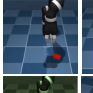

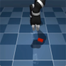

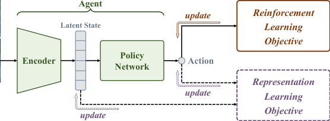

this fast-evolving and expanding field still lacks clarity and coherence. Therefore, this comprehensive survey aims to provide a bird’s-eye view of DA-based methods in visual RL with the following
main contributions:

1. Based on previous works [55, 56], we present High-Dimensional Contextual Markov Decision Process (HCMDP) as a general framework to formalize visual RL. This framework
provides deep insights into the challenges of **low sample efficiency** and **large general-**
**ization gaps** in visual RL, which serve as the primary motivations for introducing DA.

2. We identify two key assumptions of DA with different motivations: the **optimality invari-**
**ance** assumption for improving sample efficiency and the **prior-based diversity** assumption for narrowing the generalization gap.

3. We categorize related studies from two principled perspectives: **how to augment data** and
**how to leverage augmented data** for improved clarity and coherence. This classification
provides a structured framework for systematically reviewing existing work, offering a clear
and logical organization of the field’s current state.

4. We conduct **a unified empirical evaluation** of extensive DA-based methods on representative benchmarks to evaluate their sample efficiency and generalization abilities.

5. We present **an in-depth discussion** of the current landscape of DA in visual RL, forming
the core of our survey. This section delves into the unique mechanisms of DA in this context,
explores its significant challenges and opportunities, and provides crucial insights into both
the present state and promising future directions of DA in visual RL.

Figure 2: The schematic structure of this survey.

The body of this survey is organized as Figure 2. In Section 2, we propose a unified highdimensional contextual Markov decision process (HCMDP) framework (Section 2.1) to formalize
the visual RL scenario and highlight its major challenges (Section 2.2), as well as present the motivations and definitions of DA in visual RL (Section 2.3). We then conduct a systematic review

5

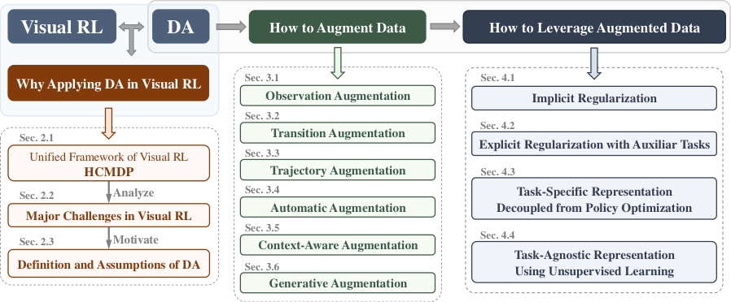

of the previous work from two perspectives: how to obtain and how to leverage augmented data
in visual RL (Section 3 and Section 4). In Section 3, we categorize DA approaches in visual RL
into _observation augmentation_, _transition augmentation_, and _trajectory augmentation_, based on the
type of data each technique aims to modify. Moreover, we introduce three advanced extensions:
_automatic augmentation_, _context-aware augmentation_, and _generative augmentation_ . In Section 4,
we present the different mechanisms used to leverage DA in visual RL, including implicit and
explicit regularization, task-specific representation learning decoupled from policy optimization,
and task-agnostic representation learning using unsupervised learning. To reveal the practical
effect of DA, we introduce the typical benchmarks and summarize the empirical performance of
recent DA-based methods in Section 5. In Section 6, we put forward a critical discussion concerning future research directions, including the opportunities, challenges, limitations, and underlying
mechanisms of DA. Finally, this survey is concluded in Section 7 with a list of key insights.

**Scope.** Given the multitude of topics and research areas related to DA and visual RL, we constrain the scope of this survey in several ways to ensure its feasibility. _• Firstly_, this survey does
not cover the related topic of domain randomization (DR) [57, 58], which aims to solve the simto-real problem in robot control by tuning the physical simulator’s parameter distribution to align
as closely as possible with reality [59–61]. In contrast, DA can only manipulate observations
post-rendering, without access to the simulator’s internal parameters, which affords it greater
flexibility [55]. _• Secondly_, this survey focuses on scenarios that involve learning directly from visual inputs (visual RL) rather than handcrafted state inputs (state-based RL). Consequently, several
works that introduce DA in state-based RL, will not be prominently featured in this survey [62, 63].

_•Thirdly_, while DA is a powerful tool, it is not the sole approach for improving sample efficiency
and generalization in visual RL. To maintain coherence and focus, this survey does not provide
detailed coverage of works that use DA as a foundational technique but whose primary research
focus lies elsewhere[64, 65]. We strongly recommend readers interested in generalization issues
in RL to refer to another comprehensive survey [55] that focuses on generalization in deep RL.

_•Finally_, to ensure this survey aligns with the latest developments in AI field, we provide a detailed introduction to recent research on DA using advanced generative models in Section 3.6.
Additionally, in Section 6.5, we critically examine the role and relevance of visual RL and DA in
the context of the rapidly evolving landscape of foundation models.

6

#### **2 Preliminaries**

Visual RL addresses high-dimensional image observations instead of well-designed states and has
encountered a series of new challenges [6, 13]. This section analyzes visual RL in depth and introduces the formalism of DA used for visual RL. In Section 2.1, we present a novel framework,
HCMDP, to formalize the paradigm of visual RL. Based on this framework, we analyze the major
challenges faced by visual RL in Section 2.2. Finally, Section 2.3 introduces the formalism of DA
in visual RL, including its motivation, definition and two key assumptions.

**2.1** **High-Dimensional Contextual MDP (HCMDP)**

The standard RL task is often defined as a **Markov Decision Process (MDP)** [2], which is specified
by a tuple _M_ = ( _S, A, r, P, p, γ_ ) where _S_ is the state space; _A_ is the action space; _r_ : _S × A ×_
_S �→_ R is the scalar reward function; _P_ ( _s_ _[′]_ _|s, a_ ) is the transition function; _p_ ( _·_ ) is the initial state
distribution; and _γ ∈_ (0 _,_ 1] is the discount factor. The goal of RL is to learn an optimal policy
_π_ _[∗]_ ( _a | s_ ) that maximizes the expected cumulative discounted return _R_ ( _π, M_ ), which is defined

as:

�

_R_ ( _π, M_ ) = E _so∼p_ ( _·_ ) _,at∼π_ ( _·|st_ ) _,st_ +1 _∼P_ ( _·|st,at_ )

_∞_
�
� _t_ =0

� _γ_ _[t]_ _r_ ( _st, at, st_ +1)

_t_ =0

(1)

Although the MDP is the standard paradigm of RL, it ignores a crucial factor of visual RL:
agents only have direct access to high-dimensional observations instead of the actual state information. To properly formulate the visual RL scenarios, as shown in Figure 3, many variants of
MDPs [66–69] have been introduced by using the high-dimensional observation space _O_ to represent the image inputs. Depending on the specific assumptions, an emission function _ϕ_ : _S �→O_
can be designed to simulate the mapping from the state space _S_ to the observation space _O_ . For
example, the ( _f, g_ )-scheme [56] constructs an emission function as the combination of generalizable and non-generalizable features while the contextual MDP (CMDP) [70, 69, 71, 55] introduces
context _c_ to distinguish contextual information from the underlying state information. However,
these MDP variants mainly focus on how to explain the generalization effect in visual RL, and
ignore the issue of constructing a compact representation from high-dimensional observations.

To better understand visual RL scenarios and provide a unified view of its specific challenges,
we propose **High-Dimensional Contextual MDP (HCMDP)** as a general modeling framework
of visual RL. Following the previous formalism [55, 56], the HCMDP _M|C_ can be defined as a
family of environments:

_M|C_ = _{M|c_ = ( _M, Oc, ϕc_ ) _| c ∼_ _p_ ( _c_ ) _, c ∈_ _C}_ (2)

where _M_ = ( _S, A, r, P, p, γ_ ) specifies the dynamics of the underlying system. With the fixed
base MDP _M_, the observation space _Oc_ and emission function _ϕc_ depend on the context _c_, which
refers to the peripheral parameters that are not essential for agents to make decisions. _p_ ( _c_ ) is the
_context distribution_, and _C_ represents the entire _context set_ . For example, the colors and styles of
backgrounds in robot scenarios are extraneous to control tasks, and are thus being referred to as
task-irrelevant features.

7

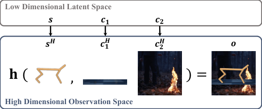

**Environment** **Agent**

**(a) Interaction Loop of Visual RL** **(b) An Example of HCMDP**

Figure 3: The agent-environment interaction loop of visual RL and an example of HCMDP.

To be more specific, context _c_ can be denoted as a set of parameters _{c_ 1 _, c_ 2 _, . . ., cn}_, where _n_
is the number of task-irrelevant properties in this system. Each _ci_ corresponds to a task-irrelevant
property, all of which are distributed over a fixed range: _{c_ 1 _∈_ _C_ 1 _, c_ 2 _∈_ _C_ 2 _, . . ., cn ∈_ _Cn}_ . Consider an autonomous driving example such as CARLA [72]: an agent learns to control the car
directly from pixels in changing environments. Therefore, the agent must distinguish between
task-relevant and task-irrelevant components in the image observations. For instance, we can denote the style of the background buildings as _c_ 1, the color of the driving car as _c_ 2 and the number
of people walking on the sides of the road as _c_ 3.

The state _s_ and context _c_ constitute the complete information (parameters) used by the system
to render the final observed images [56]. However, they both exist in the low-dimensional latent
space, which cannot be directly observed. In fact, _O_ is the only observable high-dimensional space
where agents perceive task information. Following the assumptions [71, 56] that observations are
high-dimensional projections of the state _s_ and task-irrelevant contexts _c_, the emission function
_ϕc_ mapping from state _s ∈S_ to observation _o ∈Oc_ can be defined as:

_o_ = _ϕc_ ( _s_ ) := **h** ( _s_ _[H]_ _, c_ _[H]_ 1 _[, c][H]_ 2 _[, . . ., c][H]_ _n_ [)] (3)

where _s_ _[H]_ is the high-dimensional representation mapped from the underlying state _s_, and each
_c_ _[H]_ _i_ [is the high-dimensional representation uniquely determined by the latent context] _[ c][i]_ [. Similar]
to the formalism in [56], **h** is a "combination" function that combines the task-relevant state representation _s_ _[H]_ and task-irrelevant context representations ( _c_ _[H]_ 1 _[, c][H]_ 2 _[, . . ., c]_ _n_ _[H]_ [)][ to render the final]
observation. Based on the HCMDP framework, Figure 3 shows an illustration of a robot control
environment from the DeepMind control suite [10]. In this scenario, contexts _c_ 1 and _c_ 2 separately
denote the floor color and background style, respectively, which are both irrelevant to the control
task. Correspondingly, _c_ _[H]_ 1 [and] _[ c][H]_ 2 [are the high-dimensional representations mapped from] _[ c]_ [1][ and]
_c_ 2. The final observation _o_ is the combination of the state representation _s_ _[H]_ and the task-irrelevant
representations _c_ _[H]_ 1 [and] _[ c][H]_ 2 [.]

An HCMDP _M|C_ consists of a family of specific environments, where _c_ follows the _context_
_distribution p_ ( _c_ ) over the entire _context set C_ . In a given system, _M_ and the rendering rules from
_s_ and _ci_ to the high-dimensional representations _s_ _[H]_ and _c_ _[H]_ _i_ are established. Hence, different
combinations of the _context distribution p_ ( _c_ ) and _context set C_ produce different HCMDPs. For

8

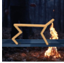

any HCMDP _M|C_, the expected return of a policy is defined as:

**R** ( _π, M|C_ ) := E _c∼p_ ( _c_ ) _,c∈C_ [ _R_ ( _π, M|c_ )] (4)

where _R_ is the expected return of policy _π_ in a specific MDP. In practice, we assume that the
context distribution is uniform over the entire context set [55] so that different HCMDPs can be
specified by their context sets _C_ = ( _C_ 1 _, C_ 2 _, . . ., Cn_ ). By choosing a training context set _C_ train
and a test context set _C_ test, we can separately define the training context set HCMDP _M|C_ train
and the test context set HCMDP _M|C_ test. Agents are only allowed to be trained in _M|C_ train and
evaluated in the same HCMDP _M|C_ train or HCMDP _M|C_ test, whose context exhibits a distribution
shift from the training context set.

**Remarks.** The main difference between HCMDP and other MDP variants lies in the emission
function _ϕ_ : _S �→O_, as shown in Figure 4.

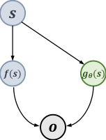

(b) (𝑓, 𝑔)-scheme (c) Block MDP

(d) BC-MDP

Figure 4: A graphical model of the emission function of a HCMDP (a) compared with three other
representative MDP variants: (b) ( _f, g_ )-scheme [56], (c) Block MDP [73] and (d) BC-MDP [74].

First, the HCMDP highlights the high dimensionality of the observation space _O_ by explicitly
specifying the mapping between the latent variables _s, c_ and their high-dimensional representations _s_ _[H]_ _, c_ _[H]_ . Second, it presents a unified perspective to understand the challenges of generalizing learned policy to unseen visual environments based on existing assumptions [56, 73, 74].
Specifically, the HCMDP assumes that the task-relevant features of state _s_ and the task-irrelevant
features of context _c_ are combined in the final observation without further assumptions about
their relationship. In the training process, agents tend to overfit the irrelevant context features
and cannot effectively generate to unseen environments. As a general framework, the HCMDP
can be transformed to other feasible MDP variants by making additional assumptions. For example, ( _f, g_ )-scheme [56] assumes that the unimportant features that do not contribute to extra
generalizable information in observations are projected from the latent state with function _gθ_ ( _·_ )
dependent on the sampled parameter _θ_ ; Block MDP [73] assumes that the emission function is the
concatenation of the noise and state variables as _s ⊕_ _f_ ( _η_ ), where _η_ denotes spurious noise; and
BC-MDP [74] assumes that the agent only has access to a partial state space _S_ _[c]_, determined by the
context _c_ . By contrast, the HCMDP ignores the specific relationship between task-relevant and
task-irrelevant features, focusing instead on the compound of these components.

9

Note that the HCMDP framework does not take into account the partially observable features
of the underlying states in a partially observable MDP (POMDP) [75]. Following [2, 39, 13], we
assume that the complete state information can be reasonably constructed by stacking three consecutive previous image observations into a trajectory snippet [14]. In summary, the motivation of
HCMDP is to emphasize the fact that the underlying state _s_ is projected to the high-dimensional
observation space along with the task-irrelevant information of context _c_ . With this unified framework, the unique challenges of visual RL scenarios compared with standard RL can be clearly
analyzed.

**2.2** **Major Challenges in Visual RL**

Despite the success of visual RL in complex control tasks with visual observations, sample efficiency and generalization remain two major challenges that may lead to ineffective agents [23,
15, 48, 76, 77]. In this subsection, we present the formal definitions of sample efficiency and the
generalization gap based on the HCMDP framework and discuss their mechanisms.

**2.2.1** **Sample Efficiency**

This term measures how well the interaction data are leveraged to train a model [78]. In practice,
we consider an agent sample-efficient if it can achieve satisfactory performance within limited
environment interactions [13, 23]. In other words, the goal of sample-efficient RL is to maximize
the policy’s expected return during the training of HCMDP _M|C_ train based on as few interactions
as possible. The expected return of policy _π_ in _M|C_ train can be defined as:

_J_ ( _π_ ) := **R** ( _π, M|C_ train) (5)

Instead of making decisions based on predefined features, agents in visual RL need to learn
an appropriate representation that maps a high-dimensional observation **h** ( _s_ _[H]_ _, c_ _[H]_ ) to the latent
space **h** ( _s, c_ ) to obtain decision-critical information [23, 13, 12]. Since standard RL algorithms
already require large amounts of interaction data [17], learning directly from high-dimensional
observations suffers from prohibitive sample complexity [6].

One solution to the sample inefficiency problem in visual RL is by training with auxiliary losses,
such as pixel or latent reconstruction [6, 21], future prediction [22–25] and contrastive learning
for instance discrimination [26–29] or temporal discrimination [79, 30–33]. Meanwhile, several
model-based methods explicitly build a world model of the RL environment in pixel or latent spaces
to conduct planning [35–37, 11]. Recently, pretrained encoders have demonstrated great potential
in downstream tasks where the visual RL environment is explored in an unsupervised manner to
obtain a task-agnostic pretrained encoder that can quickly adapt to diverse downstream tasks [38–
41]. In addition, applying the pretrained encoders from other domains such as ImageNet [80] to
visual RL also has shown its efficiency in downstream tasks [43–46]. The aforementioned methods
have significantly improved the sample efficiency of visual RL, but the lack of training data remains
a fundamental issue, which can be effectively solved by DA. Moreover, abundant auxiliary tasks
and world models are designed and trained based on the augmented data [26, 23, 24, 11]. Hence,
DA plays a vital role in improving the sample efficiency of visual RL algorithms.

10

**2.2.2** **Generalization**

An agent’s generalization ability can be measured by the generalization gap when transferred to
unseen environments, which has been extensively investigated [56, 66, 81] and reviewed [55]. For
an HCMDP with varying context sets _C_ train and _C_ test, the generalization gap of policy _π_ can be
defined as:
GenGap( _π_ ) := **R** ( _π, M|C_ train) _−_ **R** ( _π, M|C_ test) (6)

As mentioned in Section 2.1, the task-relevant information of state _s_ is often conflated with
the task-irrelevant information of context _c_, which may cause agents to overfit the task-irrelevant
components [56]. How to train generalizable agents across different environments remains challenging in visual RL, and distinguishing between the task-relevant and task-irrelevant components
of the observed images is essential for narrowing the generalization gap.

A naive approach to enhancing generalization is to apply regularization techniques originally
developed for supervised learning [18, 19], including _ℓ_ 2 regularization [82], entropy regularization [16, 17], dropout [20] and batch normalization [83]. However, these traditional regularization
techniques show limited improvement in generalization and may even negatively impact sample efficiency [18, 13, 83]. As a result, recent studies focus on learning robust representations
to improve the agent’s generalization ability by introducing bisimulation metrics [84, 85], multiview information bottleneck (MIB) [29], pretrained image encoder [42] etc. From an orthogonal
perspective, DA has been effective in enhancing generalization by generating diverse synthetic
data [12, 13]. Moreover, DA can implicitly provide prior knowledge to the agent as a type of inductive bias or regularization [55, 86]. A detailed elaboration of the generalization issue in RL is
provided in [55], which systematically reviews the related studies.

**2.3** **DA in Visual RL**

As discussed in Section 2.2, the quantity and diversity of training data are crucial for achieving sample-efficient and generalizable visual RL algorithms. DA, as a data-driven approach, has
demonstrated significant potential for visual RL in terms of both sample efficiency and generalization ability [12–15, 48, 87, 38, 54]. The advantages of DA for visual RL can be viewed from two
aspects: (1) it can significantly expand the volume of the original interaction data, thus improving
the sample efficiency [12]; (2) it introduces additional diversity into the original training data,
making agents more robust to variations and enhancing their generalization capabilities [55, 15].
Furthermore, theoretical foundations have also been developed for DA, such as invariance learning [88, 89] and feature manipulation [90]. Hence, DA has been well recognized as a viable solution
for the challenges in visual RL [91, 55, 15]. Following the conventions in [13–15], we define a general augmentation _τ_ : _O × V �→O_ _[aug]_ as a mapping from the original observation space _O_ to the
augmented observation space _O_ _[aug]_ :

_o_ _[aug]_ ≜ _τ_ ( _o_ ; _ν_ ) _∀o ∈O, ν ∈V_ (7)

where _ν ∈V_ is a set of random parameters and _τ_ ( _·_ ) is the transformation function acting on the
observation _o_ . To gain an intuitive understanding of the effect of DA, we identify two assumptions
of _τ_ ( _·_ ) corresponding to the challenges that DA seeks to address: the assumption of **optimality**
**invariance** for improving the sample efficiency and the assumption of **prior-based diversity** for
narrowing the generalization gap.

11

**2.3.1** **Optimality Invariance**

In supervised learning (SL), DA methods usually assume that the model’s output is invariant after
transformations; therefore, they can be directly applied to labeled samples to produce supplementary data [51, 92]. Considering the property of RL, DrQ [13] defines the _optimality invariance_
assumption as adding a constraint to the transformation _τ_, which induces an equivalence relation
between state _s_ and its augmented counterpart _s_ _[aug]_ constructed from observations _o_ and _o_ _[aug]_,
respectively [15]. Hence, an optimality-invariant state transformation _τ_ : _O × V �→O_ can be
defined as a mapping that preserves the Q-values [15], V-values and policy _π_ [54] :

_Q_ ( _o, a_ ) = _Q_ ( _τ_ ( _o_ ; _ν_ ) _, a_ ) _, V_ ( _o_ ) = _V_ ( _τ_ ( _o_ ; _ν_ )) and _π_ ( _o_ ) = _π_ ( _τ_ ( _o_ ; _ν_ )) _∀o ∈O, a ∈A, ν ∈V_ (8)

where _ν_ is the set of parameters of _τ_ ( _·_ ), drawn from the set of all possible parameters _V_ . Note
that optimality invariance relies on strict restrictions on _τ_ ( _·_ ) and the size of _V_ to ensure that the
same _s_ can be constructed from the original and augmented observations. In the HCMDP framework, optimality invariance means that augmentation transformations only change the selected
contexts in the high-dimensional observation space while preserving the entire (conceptual) state
information in the latent space.

For instance, random cropping [12, 13]

satisfies the optimality invariance assumption **Original Observation** **Augmented Observations**
in most robot control environments such as

the DeepMind control suite [10]. In Figure 5, **Crop**
cropping generates augmented observations

by randomly extracting central patches from 84×84 84×84 84×84
the original image. Since the robot is centrally
placed in the images, cropping only elimi- Figure 5: Optimality-Invariant augmentation.
nates irrelevant information such as the back
ground color while preserving the task-relevant information such as the robot’s posture [71].

With the optimality-invariant augmentation of the original observations, we can obtain sufficient training data based on limited interactions with the environment so that the sample efficiency can be significantly improved [13, 54]. However, due to the constraint of Eq. 8, optimalityinvariant augmentations cannot provide sufficient diversity to enhance the agent’s generalization
ability [13, 15]. Consequently, it is necessary to break the limitation of optimality invariance to
capture the variation between the training and test environments [15, 55].

**2.3.2** **Prior-Based Diversity**

Based on the prior knowledge of the task-irrelevant contexts that vary between the training and
test environments, targeted augmentations can be applied to effectively capture these variations [55].
Consequently, _prior-based diversity_ can be introduced by modifying the corresponding features in
the observed images. Note that DA can only manipulate the observed images and cannot directly
change the distribution of the latent context. Figure 6 shows a typical scenario of DMControlGB [53]. With the knowledge that the background color and style may vary when transferring
the agent from training environments to test environments, we can purposefully employ augmentation techniques such as color jitter to diversify the color of the training observations [15]. By

12

developing an invariant policy or a latent representation from the prior-based strong augmentation (under the prior-based diversity assumption), the agents can successfully learn to identify
these task-irrelevant features [55].

**Training Environment**

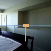

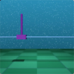

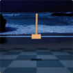

**Test Environments**

Figure 6: Examples of applying DA under the assumption of prior-based diversity.

Strong augmentation under the prior-based diversity assumption breaks the limitation of the
optimality invariance assumption and therefore has tremendous potential for improving the agent’s
generalization ability. However, this approach inevitably increases the estimation variance of the
Q-values and thus may harm the stability of the RL optimization process [15, 48].

13

#### **3 How to Augment Data in Visual RL?**

The aim of DA is to increase the amount and diversity of the original training data so that agents
can learn more efficient and robust policies [15]. Thus, a primary focus of previous research was
to design effective augmentation approaches [49, 24]. In this section, we introduce the mainstream
augmentation techniques and discuss the pros and cons of these methods.

Figure 7: The comparison of different DA paradigms depending on the type of data augmented:
**observation augmentation** only generates synthetic observations _o_ _[aug]_ _t_ ; **transition augmenta-**
**tion** augments observations together with supervision signals ( _o_ _[aug]_ _t_ _, a_ _[aug]_ _t_ _, rt_ _[aug]_ ); and **trajectory**
**augmentation** generates virtual trajectories ( _o_ _[aug]_ _t_ _, a_ _[aug]_ _t_ _, o_ _[aug]_ _t_ +1 _[, a]_ _t_ _[aug]_ +1 _[, . . ., o]_ _t_ _[aug]_ + _k_ [)][.]

Based on the type of data being augmented, we categorize the DA approaches in visual RL
into three main types, as illustrated in Figure 7 The first category, **observation augmentation**,
involves transforming the given observations while keeping other transition factors (e.g., actions
and rewards) unchanged, similar to label-preserving perturbations in SL. In Section 3.1, we detail
various methods for employing DA on observations, which include not only diverse classical image manipulations directly applied to observation inputs but also several examples of DA in the
feature space. The other two types, **transition augmentation** and **trajectory augmentation**,
specifically take into account the unique properties of RL to broaden the scope of augmentation.
In Section 3.2, we introduce transition augmentation, which enhances observations along with
supervision signals, such as rewards. Finally, in Section 3.3, we explore trajectory augmentation,
focusing on generating synthesized sequential trajectories.

In addition to summarizing techniques for augmenting different data types, this section will
also introduce three advanced DA techniques that enhance the diversity of DA and improve its
overall effectiveness. **Automatic augmentation** aims to automatically select the optimal DA
type based on the specific task (Section 3.4), and **task-aware augmentation** (Section 3.5) focuses
on providing data diversity while preserving critical information within the data. Furthermore, in
light of recent advancements in generative AI, contemporary research has explored the use of technologies such as GANs and diffusion models for data generation; we will discuss this **generative**
**augmentation** approach in Section 3.6.

14

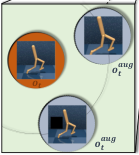

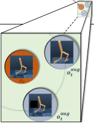

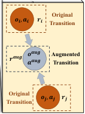

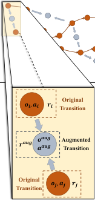

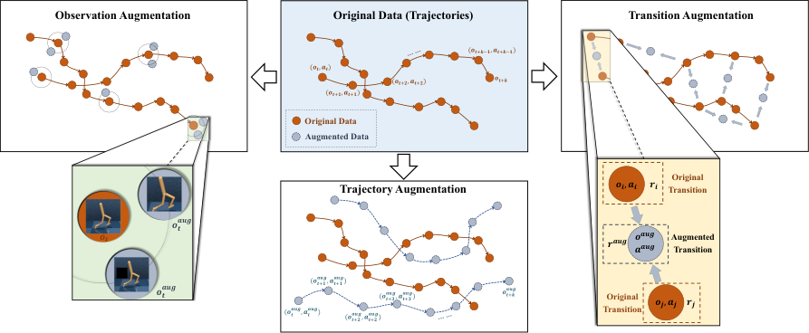

**3.1** **Observation Augmentation**

A typical observation augmentation approach is to apply the classical image manipulations to
the observed images; most such manipulations were originally proposed for computer vision applications. Following the taxonomy of [51], we identify five categories of image manipulations:
geometric transformations (Section 3.1.1), photometric transformations (Section 3.1.2), noise injections (Section 3.1.3), random erasing (Section 3.1.5) and image mixing (Section 3.1.4). Figure 8
shows a list of the visualized examples.

**Geometric Transformation**

**Photometric Transformation**

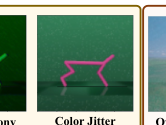

**Image Mixing**

|Grayscale Random Conv Color Jitter|Col2|Overlay/Mixup|
|---|---|---|
|**Gaussian/Impulse**|**Cutout** **Cutout-Color** **CutMix**|**Cutout** **Cutout-Color** **CutMix**|

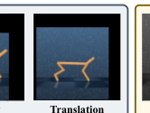

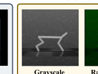

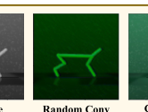

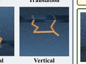

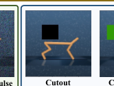

**Noise Injection**

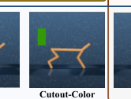

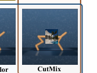

**Random Erasing**

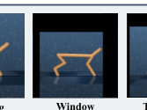

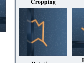

Figure 8: Visualized examples of observation augmentation via classical image manipulations.

**3.1.1** **Geometric Transformations**

Geometric transformations are generally employed as optimality-invariant or label-preserving
transformations [51] to overcome data shortages during the training process. **Random cropping**
is an effective preprocessing technique for improving data efficiency; it works on image data with
mixed width and height dimensions by locating a random central patch in each frame with a specific dimensionality [13, 14]. In many visual RL scenarios, such as robotic manipulation tasks, the
vital regions are often positioned at the centers of the images, and cropping can remove irrelevant
edge pixels to simplify the learning process [12]. Similar to cropping, the **window** transformation
selects a random region and masks out the cropped part of the image, while **translation** renders
the image with a larger frame and randomly moves the image within that frame.

Other forms of geometric transformation have also been introduced in visual RL scenarios. For
example, **rotation** involves rotating an image right or left by _r_ degrees, where _r_ is randomly selected from a range [12]; **flipping** obtains additional data by flipping the observations horizontally
or vertically. Although these techniques have been proven effective in computer vision tasks such
as ImageNet [51], visual RL tasks are sensitive to angle information. In such a scenario, transformations such as rotation and flipping may produce erroneous results without properly adjusting
the corresponding actions.

**3.1.2** **Photometric Transformations**

In real-world applications, the colors of objects and backgrounds may vary due to conditions such
as lighting and weather [93]. The intuition behind photometric transformations is to simulate

15

these color variations to prevent overfitting on the training data [94, 95]. Overfitting in visual RL
is especially problematic due to the spurious correlations between task-irrelevant features and the
agent’s policy, which can severely damage its test performance [56]. Based on the prior knowledge
concerning the variations between the training and test environments, photometric transformations aim to better generalize the agent’s policy to unseen visual environments. For instance,
**grayscale** simply converts images from RGB to grayscale [12], while **color jitter** varies the features of images that are commonly used in DA, including brightness, contrast, and saturation [96].
A common way to perform jitter in the color space is to convert images from RGB to HSV and
add noise to the HSV channels [12]. Furthermore, **random convolution** has been introduced to
mitigate visual bias that can negatively impact the performance of convolutional neural networks
(CNNs) [97]. This technique augments image colors by passing the input observations through
a randomly initialized single-layer convolutional network, which produces output layers of the
same dimensions as the input.

**3.1.3** **Noise Injection**

Adding noise to images can help CNNs learn robust features in computer vision tasks [98], and
recent studies [15, 48] also attempted to exploit this mechanism in visual RL to obtain robust
state representations. In practice, distortion can be introduced by adding **Gaussian** noise [12] or
**impulse** (salt-and-pepper) noise [48].

**3.1.4** **Image Mixing**

This type of methods is commonly used in computer vision tasks to improve a model’s robustness
and generalization ability [99]. Among the different versions of mixing, **Overlay/Mixup** [100]
trains a neural network on the convex combinations of samples and their labels. In visual RL,
there are two ways to leverage the Mixup mechanism. First, we can combine two observations
and their supervision signals, which will be discussed in Section 3.2. Alternatively, we can mix
RL observations and other images randomly sampled from another dataset while the supervision
signals of the observations remain fixed. For example, SECANT [48] linearly blends an observation
with a distracting image _I_ as _f_ ( _o_ ) = _αo_ + (1 _−_ _α_ ) _I_, where _I_ is randomly sampled from the
COCO [101] image set.

**3.1.5** **Random Erasing**

As an analog of the dropout regularization, erasing prevents the network from overfitting by working in the input data space instead of the network structure space [102]. **Cutout** [92] partially
erases an image by randomly masking an _m × n_ patch of the image. Furthermore, **Cutout-Color**
masks the patch with a random color. As a combination of Cutout and Mixup, **CutMix** [103] replaces the removed region with a patch from another image and the supervision signals of the
original observation are preserved (in visual RL scenarios) [48].

**3.1.6** **Feature Space Augmentation**

Instead of applying DA in the input space, another effective approach to augment observations is
to perform transformations in the feature space [104]. The feature space, also known as the latent

16

or embedding space, refers to an abstract domain that encodes meaningful internal representations
from the original high-dimensional data.

The first approach to applying feature space augmentation typically involves autoencoders,
which map input images to the latent feature space and then reconstruct the images based on the
augmented features in that space. Common augmentations in the latent space include Gaussian
noise addition and linear interpolation [105], which can generate more diverse datasets than traditional transformations in many supervised tasks [106, 107]. However, despite a few studies using
autoencoders to design reconstruction-based auxiliary tasks to aid representation learning [6, 108],
the use of autoencoders for generating high-quality augmented data has yet to be fully explored
in visual RL scenarios.

Another approach is to extract representations from the lower layers of a CNN and directly
augment the latent data without reconstructing the high-dimensional images [51]. For instance,
MixStyle [109] adopts style mixing in the bottom layers to simulate various visual styles [110],
and has demonstrated strong cross-domain generalization performance on benchmarks like CoinRun [18]. More recently, CLOP [111] was introduced as an innovative augmentation technique that
swaps pixel positions in the feature maps after the deepest convolutional layer while maintaining
channel consistency. Experimental results show that CLOP significantly improves generalization
performance without requiring additional representation learning tasks, due to the high-level abstract features contained in the deepest neural network layer.

**3.2** **Transition Augmentation**

As shown in Figure 9, augmenting _st_ with fixed supervision signals (e.g., the reward _rt_ and action
_at_ ) can be regarded as a form of local perturbation of the corresponding transition, representing
a key example of observation augmentation discussed in Section 3.1. To ensure the validity of the
augmented transition _< s_ _[aug]_ _t_ _, at, rt, s_ _[aug]_ _t_ +1 _[>]_ [, the augmented observation] _[ s]_ _t_ _[aug]_ must remain within
a close range of the original observation _st_ . Hence, local perturbation is inherently limited in terms
of increasing data diversity, which is a common issue faced by all observation augmentations.

Figure 9: Comparison of observation augmentation and transition augmentation: observation augmentation via local perturbation (left, Cutout-Color [92]) and transition augmentation through
joint interpolation of observations and supervision signals (right, MixReg [49]).

17

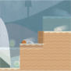

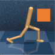

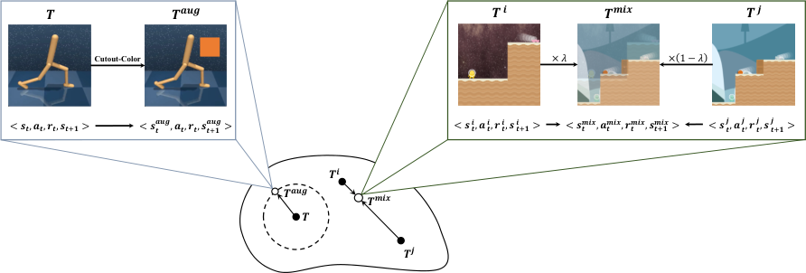

An intuitive solution is to apply interpolation across different data points instead of performing a local perturbation on each individual data point. Inspired by Mixup [100] and CutMix [103],
MixReg [49] convexly combines two observations and their supervision signals to generate augmented data. For example, let _yi_ and _yj_ denote the signals for states _si_ and _sj_, respectively, which
can be the reward or state values. After interpolating the observations by ˜ _s_ = _λsi_ + (1 _−_ _λ_ ) _sj_,
MixReg introduces mixture regularization in a similar manner via ˜ _y_ = _λyi_ + (1 _−_ _λ_ ) _yj_, which
helps learn more effective representations and smoother policies.

**3.3** **Trajectory Augmentation**

Since observation or transition augmentation cannot directly enrich the trajectories encountered
during training, to further improve the sample efficiency, PlayVirtual [24] augments the actions
to generate synthesized trajectories under a self-supervised cycle consistency constraint.

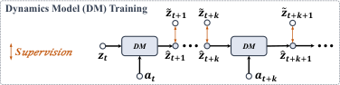

**Original Trajectory** **Dynamics Model (DM) Training** (𝒛𝒕"𝟏 (𝒛𝒕"𝒌 (𝒛𝒕"𝒌"𝟏

(𝒛𝒕, 𝒂𝒕, (𝒛𝒕"𝟏, 𝒂𝒕"𝟏, (𝒛𝒕"𝟐, …, 𝒂𝒕"𝑲(𝟏, (𝒛𝒕"𝑲) _**S**_ 𝑢𝑝𝑒𝑟𝑣𝑖𝑠𝑖𝑜𝑛 𝒛𝒕 _**DM**_ #𝒛𝒕"𝟏 **…** #𝒛𝒕"𝒌 _**DM**_ #𝒛𝒕"𝒌"𝟏 **[…]**

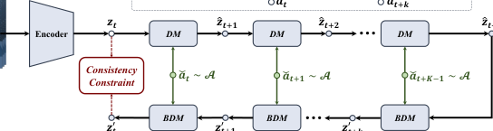

**Augment** 𝒂𝒕 𝒂𝒕"𝒌

**Virtual Forward Trajectory**

(𝒛𝒕, $𝒂𝒕, #𝒛𝒕"𝟏, $𝒂𝒕"𝟏, #𝒛𝒕"𝟐, …, $𝒂𝒕"𝑲(𝟏, #𝒛𝒕"𝑲)

**Virtual Backward Trajectory**

𝒔𝒕

&𝒕"𝑲)

×𝑴

×𝑴

&𝒕, $𝒂𝒕, 𝒛&𝒕"𝟏

&𝒕"𝟐, …, $𝒂𝒕"𝑲(𝟏, 𝒛&𝒕"𝑲)

&

(𝒛𝒕

&𝒕"𝟏, $𝒂𝒕"𝟏, 𝒛&𝒕"𝟐

Figure 10: Data flow and architecture of PlayVirtual [24] as an example of trajectory augmentation.

In Figure 10, PlayVirtual operates entirely in the latent space after encoding the input observation _st_ into a low-dimensional state representation _zt_ . Following the dynamics model (DM)
in SPR [23], PlayVirtual introduces a backward dynamics model (BDM) to predict the backward
transition dynamics ( _zt_ +1 _, at_ ) _−→_ _zt_ to build a loop with the forward trajectory. During the
training process, the DM is supervised by the original trajectory information, whereas the BDM
is constrained by the cycle consistency between _zt_ and _zt_ _[′]_ [. Further discussion on how to train]
the dynamics models with the auxiliary loss will be provided in Section 4.2. After obtaining the
effective DM and BDM, PlayVirtual can generate diverse synthesized trajectories by randomly
sampling/augmenting _M_ sets of actions in the action space _A_ and then calculating the state information. Experimental studies confirmed that regularizing feature representation learning with
cycle-consistent synthesized trajectories is the key to PlayVirtual’s success.

**3.4** **Automatic Augmentation**

Automatic augmentation is receiving increasing attention due to the demand for task-specific augmentations [112, 113, 96]. For example, although random cropping is one of the most effective augmentation techniques for improving sample efficiency on many benchmarks, such as DMControl500k [12, 13] and Procgen [54], the induced generalization ability improvement heavily depends
on the specific choice of augmentation strategy. In general, different tasks benefit from different
augmentations, and selecting the most appropriate DA method often requires expert knowledge.

18

Consequently, it is crucial to develop methods that can automatically identify the most effective
augmentation techniques. Research in visual RL remains in its early stages [54], and we highlight
some promising approaches below.

**Upper Confidence Bound (UCB):** The task of selecting an appropriate augmentation from a
given set can be formulated as a multi-armed bandit problem where the action space is the set
of available transformations _F_ = _{f_ 1 _, f_ 2 _, . . ., fn}_ . The UCB [114] is a popular solution for the
multi-armed bandit problem that considers both exploration and exploitation. Recently, UCBDrAC [54] and UCB-RAD [115] were proposed to achieve automatic augmentation in visual RL.
The experiment results suggest that UCB-based automatic augmentations can effectively improve
the agent’s generalization capabilities.

**Meta Learning:** Meta learning offers an alternative solution to automatic augmentation and can
be implemented in two ways [54]: (1) training a meta learner, such as RL [2] [116], to automatically
select an augmentation type before each update in a DA-based algorithm; (2) meta-learning the
weights of a CNN to perturb observed images, a technique similar to model-agnostic meta learning
(MAML)[117, 118]. In practice, neither approach has yielded promising results, and designing
expressive functions for automatic augmentation via meta learning remains a challenge.

**3.5** **Context-Aware Augmentation**

A notable limitation of existing DA techniques
is their reliance on pixel-level image transformations that process each pixel without considering

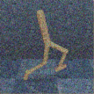

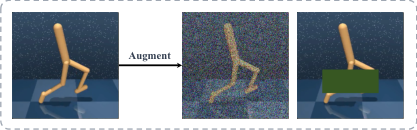

**Augment** its contextual significance [87]. In the context

of visual RL, however, pixels within an observation typically exhibit differential relevance to the
decision-making process [119, 120]. As illustrated

Figure 11: Context-agnostic DA may distort

in Figure 11, context-agnostic augmentation tech
critical information in observations.

niques may inadvertently mask or alter critical regions in the original observation that are essential
for decision making. This disregard for context elucidates why the straightforward application of
prior-based strong augmentation, despite its potential to improve generalization, can significantly
impair both sample efficiency and training stability in visual RL [15, 87]. This context-agnostic
property explains why naively applying prior-based strong augmentation may severely damage
both the sample efficiency and the training stability of visual RL, despite their potential to improve
generalization [15, 87]. Consequently, incorporating context awareness into augmentation techniques is essential for enhancing the effectiveness of DA while minimizing its potential drawbacks.
Currently, two viable approaches have been proposed to advance context-aware augmentation:

1. **Introducing human guidance.** Human-in-the-loop RL (HIRL) [121] is a general paradigm
that leverages human guidance to assist the RL process. EXPAND [122] introduces a human saliency map to mark the importance levels of different regions, and it only perturbs
the irrelevant regions. Saliency maps contain human domain knowledge, allowing context
information to be embedded into the augmentation.

19

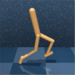

2. **Excavating task relevance.** In visual RL, the contextual information can be extracted from
the task relevance of each pixel, making it possible to directly determine its task relevance
to achieve context-aware augmentation. Task-aware Lipschitz DA (TLDA) [87] explicitly
defines the task relevance by computing the Lipschitz constants produced when perturbing
corresponding pixels. Regions with large Lipschitz constants are crucial for the current task
decision, and these regions will subsequently be protected from augmentation.

Context-aware augmentation forms the foundation for semantic-level DA, which aims to apply
targeted operations to different semantic contexts within observations [123, 87]. In Section 6.1, we
will further discuss semantic-level DA as a challenging yet pivotal direction for future research.

**3.6** **Generative Augmentation**

Despite the remarkable success of leveraging generative models for data augmentation in computer vision tasks [124–128], the application of VAEs or GANs to generate synthetic data for reinforcement learning has not only failed to achieve comparable performance but may even lead
to detrimental effects [129, 130]. This limitation in visual RL remained unresolved until the recent emergence of diffusion models. A series of successful works leveraging diffusion models to
generate high-quality synthetic data for visual RL have gradually emerged, marking a significant
advancement in this field.

1. **Generative Augmentation for Observations.** ROSIE [131] and GenAug [132] leverage
text-guided diffusion models to augment observations in robotic control tasks while preserving the corresponding actions, representing an advanced approach to observation augmentation using generative models. Trained on massive online datasets, the diffusion models
employed for DA can zero-shot create realistic images of many different objects and scenes.
This capability significantly expands the diversity of augmented observations beyond what
is achievable with traditional DA transformations.

2. **Generative Augmentation for Transitions.** In contrast to approaches that solely generate observations, another line of research focuses on modeling the entire transition, simultaneously synthesizing novel action and corresponding reward labels. Within this paradigm,
SynthER [133] directly trains diffusion models using either offline datasets or online replay
buffers, subsequently generating samples for policy improvement. Advancing this concept
further, MTDIFF [134] transcends the limitations of single-task scenarios by leveraging diffusion models to consolidate knowledge from multi-task datasets and augment data for novel
tasks. The success of SynthER [133] and MTDIFF [134] demonstrates the significant potential of leveraging synthetic data to enhance visual RL performance.

Overall, recent studies and analyses indicate that data generated by diffusion models surpasses
that of traditional DA methods in both diversity and accuracy [133]. This clearly demonstrates the
capability of advanced generative models to produce novel, diverse, and dynamically accurate data.
Such high-quality synthetic data can be effectively utilized by policies to enhance both the sample efficiency and generalization ability of visual RL algorithms. Furthermore, the text-controllable
nature of current generative models enables them to serve as effective tools for semantically meaningful samples [132]. This capability holds promise for achieving genuine semantic-level manipulation of training data, presenting a crucial direction for future research.

20

**3.7** **Remarks**

Data augmentation, as a data-centric approach, has demonstrated remarkable success in visual
RL tasks, significantly enhancing both sample efficiency and generalization ability. This section
provides a comprehensive review of various approaches addressing "How to augment data in visual
RL". The key main takeaways can be summarized as follows:

1. In contrast to DA in supervised learning scenarios, visual RL tasks offer a wider varying
range of manipulable data types [49, 24]. Among these, observation augmentation has
gained the most widespread application due to its ease of implementation [14]. However,
with the advancement of generative models, more complex yet diverse transition and trajectory augmentation techniques show potential for achieving novel breakthroughs.

2. To date, the most effective and widely adopted DA approaches for enhancing sample efficiency in visual RL are considered to be spatial perturbations and minor scaling of observations [135]. This finding notably diverges from conclusions in other domains, primarily
due to the distinct underlying mechanisms through which DA significantly improves sample
efficiency in visual RL [136]. We will discuss these mechanisms in depth in Section 6.3.

3. The robust generalization ability of visual RL agents during deployment largely depends
on the diversity of training data. Consequently, both traditional strong augmentation techniques such as Color Jitter and advanced generative augmentation methods need to provide
sufficient data richness to narrow the generalization gap [134]. In this context, ensuring
training stability and maintaining the consistency of augmented data with environment dynamics become crucial considerations [87, 15].

4. The key to advancing DA in visual RL lies in automatically generating optimal and contextaware augmented data. Recent advancements in generative AI have opened up new possibilities for leveraging pre-trained generative models to produce novel data that is not only
rich and diverse but also maintains the constraints of RL dynamics.

21

#### **4 How to Leverage Augmented Data in Visual RL?**

Next, we discuss how to exploit the augmented data in visual RL. To ease the discussion, we divide
the application scenarios where DA plays a vital role into three cases.

Figure 12: Three representative scenarios highlighting the critical role of DA. In the context of
single-task environments, DA enhances sample efficiency during training and improves generalization ability during deployment. Furthermore, DA contributes to training task-agnostic representations, facilitating superior generalization and adaptation across multiple tasks.

Case 1 **Sample-efficient RL in the single-environment setting.** Agents are trained and evaluated within a fixed environment, commonly referred to as the single-environment setting [6]. The primary objective is to attain satisfactory performance with minimal interactions within the environment [13, 14, 135].

Case 2 **Generalizable RL in the multi-environment setting.** Agents are tested in unseen environments after interacting with the training environments [48]. Since RL agents tend to
overfit the training environment [16], generalizing the learned policies to unseen environments remains challenging even when only visual appearances are altered [15, 137].

Case 3 **Generalizable RL in the multi-task setting.** Agents in the multi-task setting aim to
adapt to different tasks. Traditional end-to-end RL algorithms heavily rely on task-specific
rewards, making them unsuitable for other tasks [38]. Recent studies have attempted to
address this limitation by pretraining cross-task representations in a task-agnostic manner,
thereby enabling agents to swiftly adapt to multiple downstream tasks [138].

In Figure 12, RL agents are trained with task-specific rewards in Case 1 and Case 2, where DA
is implemented as an implicit regularization penalty when enlarging the training set (Section 4.1).
However, the effect of implicit regularization is limited [23], and many studies have attempted
to design auxiliary losses to exploit the potential of DA (Section 4.2). Some studies have also
aimed to decouple representation learning from policy optimization to attain more generalizable
policies [48] (Section 4.3). Finally, the related works belonging to Case 3, referred to as taskagnostic representation approaches using unsupervised learning, are introduced in Section 4.4.

22

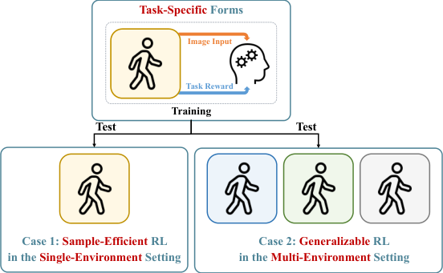

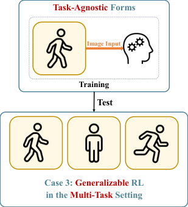

**4.1** **Implicit Policy Regularization**

DNNs are capable of learning complex representational spaces, which is essential for tackling intricate learning tasks. However, the model capacity required to capture such high-dimensional
representations makes these techniques difficult to optimize and prone to overfitting [139]. Moreover, the complexity of visual RL is further aggravated by the need to jointly learn representations
and policies directly from high-dimensional observations based on sparse reward signals [6, 12].
As a result, it is difficult for agents to distinguish the task-relevant (reward-relevant) features from
high-dimensional observations, and they may mistakenly correlate rewards with spurious features [56]. To solve these issues, researchers have conducted a series of studies to develop effective regularization techniques, which can prevent overfitting and improve generalization by
incorporating the inductive biases of model parameters [139].

In RL, a myriad of techniques have been proposed as regularizers such as _L_ _[p]_ -norm regularization [4], batch normalization [82], weight decay [18] and dropout [83]. Among them, _L_ _[p]_ -norm
regularization explicitly includes regularization terms as additional constraints, and is referred
to as explicit regularization [56]. Conversely, weight decay and dropout aim to tune the optimization process without affecting the loss function, making them implicit regularization strategies [83]. Additionally, DA has been prevalent in the deep learning community as a data-driven
technique [51, 86]. Furthermore, increasing efforts have been devoted to the theoretical underpinnings behind DA [140, 141, 90, 89, 142] to explain its regularization effects, including the derivation
of an explicit regularizer to simulate the behaviors of DA [140].

The initial and naive practice of DA is to expand the training set with augmented (synthesized)
samples [143]. This practice incorporates prior-based human knowledge into the data instead
of designing explicit penalty terms or modifying the optimization procedure. Hence, it is often
classified as a type of implicit regularization, formulated as the empirical risk minimization on
augmented data (DA-ERM) [141] in SL tasks:

_N_
�

_i_ =1

_α_
� _l_ ( _h_ ( **x** _i,j_ ) _, yi_ ) (9)

_j_ =1

� _h_ _[da][−][erm]_ ≜ argmin
_h∈H_

_N_
� _l_ ( _h_ ( **x** _i_ ) _, yi_ ) +

_i_ =1

where ( **x** _i, yi_ ) represents the _i_ [th] original training sample ( **x** _i ∈X_ denotes the input feature, and
_yi ∈Y_ is its corresponding label); **x** _i, j_ signifies the _j_ [th] augmented sample of **x** _i_, which retains
the corresponding label _yi_ ; _α_ indicates the number of augmentations; _l_ : _Y × Y →_ R is the loss
function, and _h_ ( _·_ ) is the model to be optimized.

In the visual RL community, RAD [12] and DrQ [13] first leverage classical image transformation strategies such as cropping to augment the input observations via the implicit regularization
paradigm. In the original paper, DrQ is proposed with two distinct ways to regularize the Qfunction. On the one hand, it uses _K_ augmented observations from the original _s_ _[′]_ _i_ [to obtain the]
target values for each transition tuple ( _si, ai, ri, s_ _[′]_ _i_ [)][:]

_yi_ = _ri_ + _γ_ [1]

_K_

_K_
� _Qθ_ ( _f_ ( _s_ _[′]_ _i_ _[, ν]_ _i,k_ _[′]_ [)] _[, a][′]_ _i,k_ [)] _[, a][′]_ _i,k_ _[∼]_ _[π]_ [(] _[· |][ f]_ [(] _[s][′]_ _i_ _[, ν]_ _i,k_ _[′]_ [))] (10)

_k_ =1

where _f_ : _S × T →S_ is the augmentation function and _ν_ is the parameter of _f_ ( _·_ ), which is
randomly sampled from the set of all possible parameters _T_ . Alternatively, DrQ generates _M_

23

different augmentations of _si_ to estimate the Q-function:

1
_JQ_ [DrQ] ( _θ_ ) = _NM_

_N,M_
� _||Qθ_ ( _f_ ( _si, νi,m_ ) _, ai_ ) _−_ _yi||_ 2 [2] (11)

_i_ =1 _,m_ =1

In the above, DrQ leverages DA for improved estimation without adding any penalty terms,
which is a type of data-driven implicit regularization. Since a sample can be defined as a tuple
( **x** _i, yi_ ) in SL or a transition ( _si, ai, ri, s_ _[′]_ _i_ [)][ in RL, the optimization objective of DrQ can be rewritten]

as:

_M_
�

_m_ =1

_K_
� _l_ ( _f_ ( _si, νi,m_ ) _, ai, ri, f_ ( _s_ _[′]_ _i_ _[, ν]_ _i,k_ _[′]_ [))] (12)

_k_ =1

1
_JQ_ [DrQ] ( _θ_ ) = _NMK_

_N_
�

_i_ =1

where _l_ ( _si, ai, ri, s_ _[′]_ _i_ [) =] _[ ||][Q][θ]_ [(] _[s][i][, a][i]_ [)] _[ −]_ [(] _[r][i]_ [ +] _[ γQ][θ]_ [(] _[s]_ _i_ _[′][, a]_ _i_ _[′]_ [))] _[||]_ 2 [2] [is the loss function, and] _[ a][′]_ _i_ _[∼]_ _[π]_ [(] _[· |][ s][′]_ _i_ [)][.]
RAD [12] can be regarded as a specific form of DrQ with _K_ = 1 and _M_ = 1; it is a plug-and-play
module that can be plugged into any RL method (on-policy methods such as PPO [3] and off-policy
methods such as SAC [17]) without making any changes to the underlying algorithm. RAD has
also highlighted the generalization benefits of DA on OpenAI Procgen [144].

Since RAD and DrQ directly optimize the RL objective on multiple augmented observation
views without any auxiliary losses, they can be viewed as implicit approaches for ensuring consistency and invariance among the augmented views. Building on DrQ, DrQ-v2 [14] makes several
algorithmic adjustments, such as switching the baseline from SAC to DDPG and employing a
larger replay buffer, which has resulted in significantly improved sample efficiency. The success
of DrQ-v2 demonstrates that when utilizing weak augmentation to achieve sample-efficient visual
RL algorithms, the method of implicit regularization can effectively harness the benefits of DA.

20

15

10

5

0

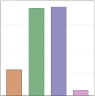

**Blur** **Conv** **Overlay** **Shift**

**( a ) Q-Estimation Error** **( b ) Action Distribution**

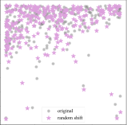

Figure 13: _Q_ **-estimation errors and action distributions for augmented and original data.**
(a) Mean absolute _Q_ -estimation errors of the converged DrQ [13] agents for the same observations
before and after augmentation (copied from [15]). (b) Action distributions between the augmented
and original data. We use t-distributed stochastic neighbor embedding (t-SNE) to show the highdimensional actions employed by the same converged DrQ agent.

However, later studies found that implicit regularization with cropping exhibits poor generalization performance in unseen environments [54, 15]. As discussed in Section 2.3, optimalityinvariant transformations (represented by cropping) cannot provide sufficient visual diversity for
reducing the generalization gap. Furthermore, although prior-based strong augmentations such as
color jitter have the potential to improve generalization, they may induce large _Q_ -estimation errors and action distribution shifts, as shown in Figure 13. Hence, implicit regularization approaches

24

with prior-based strong augmentations (e.g., random convolution and overlay) may make the RL
optimization process fragile and unstable [15, 87]. This poses a _dilemma_ in visual RL: diverse augmentation is necessary to improve an agent’s generalization ability, but excessive data variations
may damage the stability of RL [48].

SVEA [15] aims to enhance the stability of RL optimization with DA [13]. It consists of two
main components. First, SVEA uses only original data copies to estimate _Q_ -targets to avoid erroneous bootstrapping caused by DA, where _yi_ = _ri_ + _γQθ_ ( _s_ _[′]_ _i_ _[, a]_ _i_ _[′]_ [)][,] _[ a]_ _i_ _[′]_ _[∼]_ _[π]_ [(] _[· |][ s][′]_ _i_ [)][. Second, SVEA for-]
mulates a modified _Q_ -objective to estimate the _Q_ -value over both augmented and original copies
of the observations, which can be expressed in a modified ERM form as follows:

(13)

_M_
� _||Qθ_ ( _f_ ( _si, νi,m_ ) _, ai_ ) _−_ _yi||_ 2 [2]

_m_ =1

_N_
�

_i_ =1

_JQ_ [SVEA] ( _θ_ ) = _α_

= _α_

_N_
� _||Qθ_ ( _si, ai_ ) _−_ _yi||_ 2 [2] [+] _[ β]_

_i_ =1

_N_
� _l_ ( _si, ai, ri, s_ _[′]_ _i_ [) +] _[ β]_

_i_ =1

_N_
�

_i_ =1

_M_
� _l_ ( _f_ ( _si, νi,m_ ) _, ai, ri, s_ _[′]_ _i_ [)]

_m_ =1

For actor-critic algorithms, SVEA employs strong augmentation exclusively during critic updates, with no augmentation applied during actor updates. SVEA assumes that the encoder’s output embedding can become fully invariant to input augmentations. Under this assumption, an actor trained solely on unaugmented observations can indirectly achieve robustness to augmented

**Update**

**Actor** **Encoder** Q𝜽

**Update**

|Col1|Q -Function Encoder Q 𝜽 𝒒𝒕|
|---|---|
|||

|Col1|Target Encoder Q -Function X x Q 𝜽# 𝒒𝒕$|
|---|---|
|||

Figure 14: The workflow of **S** tabilized **A** ctor-Critic under **D** ata **A** ugmentation (SADA).

25

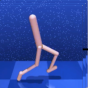

inputs via a shared actor-critic encoder. While this assumption holds for scenarios where the differences between test and training environments are limited to photometric changes, it fails when
geometric augmentations are necessary for more complex generalization tasks.

To overcome this limitation, SADA [137] enhances the use of DA as implicit regularization
to accommodate a broader range of augmentations. Instead of augmenting only the critic inputs,
SADA carefully augments both actor and critic inputs to prevent training instabilities. As shown
in the Figure 14, (1) during actor updates, only the policy input is augmented while the Q-function
input remains unaugmented; (2) during critic updates, only the online Q-function input is augmented while the target Q-function input remains unaugmented; and (3) components are jointly
optimized using both augmented and unaugmented data.

SVEA [15] and SADA [137] have significantly enhanced the generalization ability of visual
RL algorithms. They achieve this by carefully designing pipelines that use strong augmentations
without adding auxiliary losses or altering RL update mechanisms. This demonstrates the potential of implicit regularization to leverage DA for better generalization. However, it is crucial to
meticulously design the use of strong augmentations to avoid training instabilities. In addition to
carefully designing implicit regularization, other approaches have been explored to harness DA
for improving both sample efficiency and generalization while avoiding adverse effects on training
stability. These approaches include designing auxiliary tasks (Section 4.2) and decoupling representation learning from policy optimization (Section 4.3).

**4.2** **Explicit Policy Regularization with Auxiliary Tasks**

Visual RL relies on the state representation, but it remains challenging to directly infer the ideal
representation from high-dimensional observations [145]. A typical workflow involves designing auxiliary objectives to facilitate the representation learning process [146], or improve sample
efficiency [26] or prevent observational overfitting [56]. In general, an auxiliary task can be considered an additional cost function that the RL agent predicts and observes from the environment
in a self-supervised manner [147]. For example, the last layer of the network can be divided into
multiple parts (heads), with each head dedicated to a specific task [34, 148]. These multiple heads
then propagate errors back to the shared network layers, thereby forming the comprehensive representations required by all heads.

With the recent success in unsupervised learning, various auxiliary tasks have been designed
to produce effective representations [147, 149]. Thus, it is natural to design additional losses to explicitly constrain an agent’s policy and value functions, which we will discuss in Section 4.2.1.
Moreover, we introduce contrastive learning as a lower bound of mutual information in Section 4.2.2 and future prediction objectives with a DM in Section 4.2.3.

**4.2.1** **DA Consistency**

In contrast to simply inserting augmented data into the training dataset, DA consistency (DAC) [141]
builds a regularization term to penalize the representation difference between the original sample _ϕh_ ( **x** _i_ ) and augmented sample _ϕh_ ( **x** _i,j_ ), under the assumption that similar samples should be

26

close in the representation space:

_N_
�

_i_ =1

_α_
� _ϱ_ ( _ϕh_ ( **x** _i_ ) _, ϕh_ ( **x** _i,j_ ))

_j_ =1

argmin
_h∈H_

_N_
� _l_ ( _h_ ( **x** _i_ ) _, yi_ ) + _λ_

_i_ =1

(14)

~~�~~ ~~�~~ � ~~�~~
DAC regularization

where _ϕh_ refers to the features extracted from the high-dimensional data, which can be viewed
as the output of any layer in the DNN, and _ϱ_ is the metric function defined in the representation
space, which can be the _Lp_ norm or KL divergence. As an unsupervised representation module,
DAC regularization can be employed as an auxiliary task in any SL or RL algorithms to enforce
the model to produce similar predictions on the original and augmented samples. For example,
SODA [53] calculates the consistency loss by minimizing the _L_ [2] norm between the features of the
augmented and original observations in the latent space; SIM [150] produces a cross-correlation
matrix between two embedding vector sets of the original and augmented observations, and designs an invariance loss term to ensure the invariance of data.

For RL tasks, it is also desirable to train the network to output the same policies and values for
both original and augmented observations [13]. For example, DrAC [54] employs two extra loss
terms: _Gπ_ for regularizing the policy by the KL divergence measure and _GV_ for regularizing the
value function using the mean-squared deviation:

_Gπ_ = _KL_ [ _πθ_ ( _a | s_ ) _| πθ_ ( _a | f_ ( _s, ν_ ))] _,_ _GV_ = ( _Vϕ_ ( _s_ ) _−_ _Vϕ_ ( _f_ ( _s, ν_ ))) [2] (15)

The complete optimization objective of DrAC based on PPO is as follows:

_J_ DrAC = _J_ PPO _−_ _αr_ ( _Gπ_ + _GV_ ) (16)

where _αr_ is the weight of the regularization term, and both _Gπ_ and _GV_ can be added to the
objective of any actor-critic algorithm. By enforcing the DA consistency into the networks, specific
transformations can be used to impose inductive biases relevant to the given task (e.g., invariance
with respect to colors or translations) [54, 141].

Compared with implicit regularization techniques such as RAD and DrQ, DrAC employs two
auxiliary consistency loss terms for explicitly regularizing the policy and the value function to
ensure invariance. Instead of directly optimizing the RL objective on multiple augmented views of
the observations, DAC regularization uses only the transformed observations _f_ ( _s, ν_ ) to compute
the regularization losses _Gπ_ and _GV_ . Hence, DrAC can benefit from the regularizing effect of DA
while mitigating the adverse effect on the RL objective [54].

**4.2.2** **Contrastive Learning**

Another type of auxiliary task closely related to DA is contrastive learning. As **mutual infor-**
**mation (MI)** is often hard to estimate, it is practical to maximize the lower bound of MI through
approaches using, for example, InfoNCE loss [79]) to train robust feature extractors [151]. Recent
studies [26, 38] have shown that contrastive learning can significantly improve the sample efficiency and generalization performance of visual RL [34]. Since contrastive learning only requires
unlabeled data, it can not only be performed as auxiliary tasks together with RL objectives but also
be leveraged to learn a task-agnostic representation, which we will discuss in Section 4.4.

27

In visual RL, there are two types of contrastive learning for improving agents’ sample efficiency
and generalization abilities [34]. The first class [26, 29, 28] focuses on **maximizing the MI be-**
**tween different augmented versions of the same observation** while minimizing the similarity
between different observations. It tends to further exploit the regularization ability of DA at the
MI level [34]. However, simply maximizing the lower bound of MI may retain the task-irrelevant
information [152], which needs to be eliminated based on the information bottleneck principle.
The second class [79, 38] aims to **maximize the predictive MI between consecutive states** by
applying contrastive losses between an observation _ot_ and the near-future observations _ot_ + _k_ over
multiple time steps. This technique encourages the encoder to extract the temporal correlations
of the latent dynamics from the observations [38], and DA can be applied as the prior-based data
preprocessing.

**Maximizing Multi-view MI:** In self-supervised representation learning, feature extractors can
be trained by maximizing the MI between different augmented views of the original data [151],
and this approach has also been extended to the domain of visual RL [26, 27].

Figure 15: The workflow of **c** ontrastive **u** nsupervised representations for **RL** (CURL).

CURL[26] is the first general framework for combining multi-view contrastive learning and
DA in visual RL. It builds an auxiliary contrastive task to learn useful state representations by
maximizing the MI between the different augmented views of the same observations to improve the
transformation invariance of the learned embedding. In Figure 15, the contrastive representation
is jointly trained with the RL objective, and the latent encoder receives gradients from both the
contrastive learning objective and the RL objective.

A key component of contrastive learning is the selection of positive and negative samples
relative to an anchor, and CURL uses instance discrimination rather than patch discrimination [26].
Specifically, the anchor and positive observations are two different augmentations of the same
observation, while the negative samples come from other observations in the minibatch. The
contrastive learning task in CURL aims to maximize the MI between the anchor and the positives
while minimizing the MI between the anchor and the negatives.

Following the setting of momentum contrast (MoCo) [153], CURL applies DA twice to generate

28

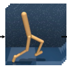

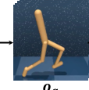

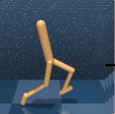

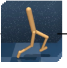

queries and key observations, which are then encoded by the query encoder and key encoder,
respectively. The query observations _oq_ are treated as the anchor, while the key observations _ok_
contain the positives and negatives. During the gradient update step, only the query encoder is
updated, while the key encoder weights are set to the exponential moving average (EMA) of the
query weights [153]. CURL employs the bilinear inner product sim( _q, k_ ) = _q_ _[T]_ _Wk_ to measure the
agreement between query-key pairs, where _W_ is a learned parameter matrix. Then, it uses the
InfoNCE loss [79] to build an auxiliary loss function as follows:

exp( _q_ _[T]_ _Wk_ +)
_L_ InfoNCE = log (17)

exp( _q_ _[T]_ _Wk_ +) + ~~[�]~~ _[K]_ _i_ =0 _[−]_ [1] [exp(] _[q][T][ Wk][i]_ [)]

where _{k_ 0 _, k_ 0 _, . . ., kK−_ 1 _}_ are the keys of the dictionary and _k_ + denotes a positive key. The InfoNCE loss can be interpreted as the log-loss of a _K_ -way softmax classifier whose label is _k_ + [151].

Many subsequently developed contrastive multi-view coding methods also employ the InfoNCE bound to maximize the MI between two embeddings that result from different augmentations. For example, DRIBO [29] aims to maximize the InfoNCE loss _I_ [ˆ] _ψ_ ( _o_ [(1)] _t_ _[, o]_ [(2)] _t_ [)][, where] _[ ψ]_ [ rep-]
resents the learnable parameters. Furthermore, ADAT [28] selects the positive observations with
the same action type and the negatives with other actions so that more positives can be produced.
CCLF [27] introduces a curiosity appraisal module to select the most informative augmented observations for enhancing the effect of multi-view contrastive learning.

Figure 16: The workflow of **d** eep **R** L via multi-view **i** nfomration **bo** ttleneck (DRIBO).

Although maximizing the similarity between augmented versions of the same observation is
valuable for state representation [26, 34], maximizing the lower-bound of MI may inevitably retain some task-irrelevant information, limiting the generalization abilities of agents. To tackle this
issue, DRIBO [29] uses contrastive learning combined with a multi-view information bottleneck
(MIB)-based auxiliary objective to learn representations that contain only task-relevant information that is predictive of the future while eliminating task-irrelevant information.

29

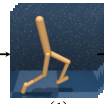

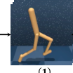

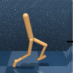

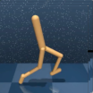

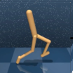

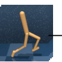

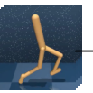

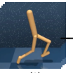

The assumption of DRIBO is that a desired representation for RL should facilitate the prediction of future states and discard excessive, task-irrelevant information from visual observations.
In Figure 16, the augmented observations share the same task-relevant information, while any
information not shared by them is regarded as being task-irrelevant [29]. In practice, the taskrelevant MI can be maximized by InfoNCE, as in CURL. With the information bottleneck principle, DRIBO constructs a relaxed Lagrangian loss to obtain a sufficient representation with minimal
task-irrelevant information, and the task-irrelevant minimization term is upper-bounded by:

_L_ SKL = _D_ SKL( _pθ_ ( _**s**_ [(1)] _t_ _|_ _**o**_ [(1)] _t_ _[,]_ _**[ s]**_ [(1)] _t−_ 1 _[,]_ _**[ a]**_ _[t][−]_ [1][)] _[ ||][ p][θ]_ [(] _**[s]**_ _t_ [(2)] _|_ _**o**_ [(2)] _t_ _[,]_ _**[ s]**_ [(2)] _t−_ 1 _[,]_ _**[ a]**_ _[t][−]_ [1][))] (18)

where _D_ SKL represents the symmetrized KL divergence based on the probability densities of _**s**_ [(1)] _t_
and _**s**_ [(2)] _t_ obtained using the encoder. Experiments have shown that DRIBO yields significantly
improved generalization and robustness on the DeepMind control suite [10] and Procgen [144]
benchmarks.

**Maximizing Temporal Predictive MI:** Another popular strategy for representation learning
is to learn a compact predictive coding to predict future states or information, which can also be
combined with DA. The first approach is to directly minimize the prediction error between the
true future states and the predicted future states via a dynamic transition model, which will be
discussed in Section 4.2.3. Another approach is to maximize the lower bound of the MI between
the embeddings of consecutive time steps to induce predictive representations without relying on
a generative model.

CPC [79] and ST-DIM [30] use temporal contrastive losses to maximize the MI between the
previous state embedding and a future embedding several time steps later, but they both do not
leverage DA to transform the observations. Recently, ATC [38], CCFDM [31] and CoDy [34] apply DA to regularize the observations obtained prior to encoding, imposing an inductive bias on
information not relevant to the agent. For example, _L_ TMI in CoDy [34] aims to maximize the
InfoNCE bound on the temporal MI between the embedding of the current state and action and
the true embedding of the next state to increase the linearity of the latent dynamics. In practice,
this approach first randomly draws a minibatch of transitions ( _st, at, st_ +1) from the replay buffer.
Then, it obtains a minibatch of positive sample pairs ( _zt_ [1] _[, c][t][, z][t]_ [+1][)][ by feeding] _[ s][t][, a][t]_ [and] _[ s][t]_ [+1] [into]
their corresponding encoders. For a given positive sample pair ( _zt_ [1] _[, c][t][, z][t]_ [+1][)][, it constructs negative]
samples by replacing _zt_ +1 with all features _zt_ _[∗]_ +1 [from other sample pairs][ (] _[z]_ _t_ [1] _[∗][, c][∗]_ _t_ _[, z]_ _t_ _[∗]_ +1 [)][ in the same]
minibatch. Furthermore, M-CURL [32] utilizes a bidirectional transformer to reconstruct the features of masked observations using information from surrounding observations. It then captures
temporal dependencies by minimizing the contrastive loss between the reconstructed features and
the original features.

**4.2.3** **Future Prediction with a DM**

The motivation of future prediction tasks is to encourage state representations to be predictive of
future states given the current state and future action sequence [34, 154, 155]. Instead of maximizing the MI between the current state and the future state using the InfoNCE loss [79, 30, 38],
SPR [23] produces state representations by minimizing the prediction error between the **true fu-**
**ture states** and the **predicted future states** using an explicit multi-step DM. As shown in Fig

30

ure 17, this approach also incorporates DA into the future prediction task, which enforces consistency across different views of each observation.

Figure 17: The workflow of **s** elf- **p** redictive **r** epresentations (SPR).

The DM _h_ ( _·, ·_ ) operates entirely in the latent space to predict the transition dynamics ( **z** _t, at_ ) _→_
**z** _t_ +1, where **z** _t_ = _f_ ( **o** _t_ ) is encoded by the feature encoder _f_ ( _·_ ) of the current input observation
_ot_ . The prediction loss is computed by summing up the differences (errors) between the predicted
representations ˆ **z** _t_ +1: _t_ + _K_ and the observed representations ˜ **z** _t_ +1: _t_ + _K_ :

_K_
�

_k_ =1

_⊤_ ˆ
**z** _t_ + _k_
� � _∥_ **z** ˆ _t_ + _k∥_ 2

(19)
�

_L_ pred =

_K_
� _d_ (ˆ **z** _t_ + _k,_ ˜ **z** _t_ + _k_ ) = _−_

_k_ =1

**z** ˜ _t_ + _k_
� _∥_ **z** ˜ _t_ + _k∥_ 2

where the latent representation ˆ **z** _t_ +1: _t_ + _K_ is computed _iteratively_ as ˆ **z** _t_ + _k_ +1 ≜ _h_ (ˆ **z** _t_ + _k, at_ + _k_ ), starting from ˆ **z** _t_ ≜ **z** _t_ ≜ _fo_ ( _ot_ ), and ˜ **z** _t_ + _k_ ≜ _fm_ ( _ot_ + _k_ ) is computed by the target encoder _fm_, whose
parameters are the EMAs of the parameters of the online encoder _fo_ . Combined with DA, SPR
improves the agent’s sample efficiency and results in superior performance with limited iterations
on Atari Games and the DeepMind control suite [23].

PlayVirtual [24] is an extension of SPR that introduces cycle consistency to generate augmented virtual trajectories for achieving enhanced data efficiency. Following the DM in SPR [23],
PlayVirtual [24] proposes a BDM for backward state prediction to build a cycle/loop with a forward
trajectory. Given a DM _h_ ( _·, ·_ ), a BDM _b_ ( _·, ·_ ), the current state representation **z** _t_, and a sequence of
actions _at_ : _t_ + _K_, a forward trajectory and the corresponding backward trajectory can be generated
to form a synthesized trajectory:

_Forward_ : ˆ **z** _t_ = **z** _t,_ ˆ **z** _t_ + _k_ +1 = _h_ (ˆ **z** _t_ + _k,_ **a** _t_ + _k_ ) _,_ for _k_ = 0 _,_ 1 _, · · ·, K −_ 1

(20)
_Backward_ : **z** _[′]_ _t_ + _K_ [= ˆ] **[z]** _[t]_ [+] _[K][,]_ **[ z]** _[′]_ _t_ + _k_ [=] _[ b]_ � **z** _[′]_ _t_ + _k_ +1 _[,]_ **[ a]** _[t]_ [+] _[k]_ � _,_ for _k_ = _K −_ 1 _, K −_ 2 _, · · ·,_ 0

Since cycle consistency can be enforced by constraining the distance between the starting state
**z** _t_ and the ending state **z** _[′]_ _t_ [in the loop, appropriate synthesized training trajectories can be obtained]

31

by augmenting actions. In practice, the cycle consistency loss can be calculated by randomly
sampling _M_ sets of actions from the action space _A_ :

_L_ cyc = _M_ [1]

_M_
� _dM_ � **z** _[′]_ _t_ _[,]_ **[ z]** _[t]_ � (21)

_m_ =1

where _dM_ is the distance metric over the latent space _M_ . The performance of PlayVirtual [24]
can be explained from two aspects. First, the generated trajectories can help the agent "see" more
flexible experiences. Second, enforcing the trajectory with the cycle consistency constraint can
further regularize the feature representation learning process.

**4.3** **Task-Specific Representation Decoupled from Policy Optimization**

Utilizing DA as an implicit [12, 13, 111] or explicit regularization approach with purposefully designed auxiliary tasks [26, 23, 34], the sample efficiency of visual RL has been significantly improved, resulting in performance comparable to state-based algorithms on several benchmarks [14].
However, training _generalizable RL agents_ that are robust against irrelevant environmental variations remains a challenging task. Similar challenges in SL tasks, such as image classification, can be
addressed by strong augmentations that heavily distort the input images, such as Mixup [100] and
CutMix [103]. However, since the training process of RL is vulnerable to excessive data variations,
a naive application of DA may severely damage the training stability [15, 48].

This poses a dilemma: aggressive augmentations are necessary for achieving good generalization in the visual domain [156], but injecting heavy DA into the optimization of an RL objective may cause deterioration in both the sample efficiency and the training stability [87]. Recent
works [53, 48] argued that this is mainly due to the conflation of two objectives: policy optimization and representation learning. Hence, an intuitive idea is to decouple the training data flow
by using nonaugmented or weakly augmented data for RL optimization while using strongly augmented data for representation learning. As shown in Figure 18, two strategies are available for
achieving the decoupling goal: (1) dividing the training data into two streams to separately optimize _LRL_ and _LSSL_ ; and **iteratively** updating the model parameters by the two objectives [53];
(2) optimizing the RL objective _LRL_ first and then **sequentially** leveraging DA combined with
SSL objective _LSSL_ for knowledge distillation [48].

|SSL objective with DA|After RL Training|
|---|---|
||After RL Training|
|||

**Optimizing** 𝓛𝑹𝑳 **and** 𝓛𝑺𝑺𝑳 **Iteratively.** Epoch **Optimizing** 𝓛𝑹𝑳 **and** 𝓛𝑺𝑺𝑳 **Sequentially.**

Epoch

Figure 18: Different strategies for decoupling policy optimization and representation learning.

**Optimizing** _LRL_ **and** _LSSL_ **Iteratively:** This strategy aims to divide the training data into
two data streams and only uses the nonaugmented or weakly augmented data for the RL training
process; it leverages strong augmentations under prior-based diversity assumptions to optimize

32

the self-supervised representation objective and enhance the generalization ability of the model.
In practice, this technique can be performed by iteratively optimizing the RL objective _LRL_ and
the self-supervised representation objective _LSSL_ in combination with DA to update the network
parameters. For example, SODA [53] maximizes the MI between the latent representations of augmented and nonaugmented data as the auxiliary objective _L_ SODA, and _**continuously alternates**_
between optimizing _LRL_ with nonaugmented data and _L_ SODA with augmented data. While a policy is learned only from nonaugmented data, SODA still substantially benefits from DA through
representation learning [53].

**Optimizing** _LRL_ **and** _LSSL_ **Sequentially:** This is a two-stage training strategy, which first
trains a sample-efficient agent using weak augmentations, and then enhances the state representation by auxiliary self-supervised learning or imitation learning with strong augmentations. For
example, SECANT [48] first trains a sample-efficient expert with random cropping (weak augmentation). In the second stage, a student network learns a generalizable policy by mimicking the behavior of the expert at every time step but with a crucial difference: the expert produces the ground-truth actions from unmodified observations, while the student learns to predict
the same actions from heavily corrupted observations, as shown in Figure 19. The student optimizes the imitation objective by performing gradient descent on a supervised regression loss:
_L_ ( _o_ ; _θs_ ) = _∥πs_ ( _f_ ( _o_ )) _−_ _πe_ ( _o_ ) _∥F_, which has better training stability than the RL loss. Furthermore, conducting policy distillation through strong augmentations can greatly remedy overfitting
so that robust representations can be acquired without sacrificing policy performance.

**Weak  Augment**

_**Objective**_ **Strong** **Augment**

**Expert** **Student**

**Policy** **Encoder** **Policy**

**Stage 1** **Stage 2**

Figure 19: The workflow of **s** elf **e** xpert **c** loning for **a** daptation to **n** ovel **t** est-env (SECANT).

**4.4** **Task-Agnostic Representation Using Unsupervised Learning**

Unsupervised/self-supervised pretraining, a framework that trains models without supervision,
has achieved remarkable success in various domains [157–159] and can efficiently solve downstream tasks through fine-tuning. Similarly, it is also reasonable to learn an **unsupervised pre-**
**trained RL agent** that can quickly adapt to diverse test tasks in a zero-shot or few-shot manner [40, 43]. Furthermore, some recent studies [38] argued that the visual representations of
standard end-to-end RL methods heavily rely on task-specific rewards, making them ineffective
for other tasks. To overcome this limitation, the environment can be first explored in **a task-**
**agnostic fashion to learn its visual representations** without any task-specific rewards, and

33

specific downstream tasks can subsequently be efficiently solved [38, 39]. Another key application
of task-agnostic representation considers **multi-task settings** where, with the same or similar
visual scenes, different downstream tasks are defined by corresponding reward functions. For instance, the _Walker_ domain in the DeepMind control suite [10] consists of multiple tasks, including
_standing_, _walking forward_, _flipping backward_, etc.

Two strategies are available for learning an encoder that maps a high-dimensional input to a
compact representation in a task-agnostic fashion. The first approach is to design **unsupervised**
**representation tasks**, as in Section 4.2. Second, we can **maximize the intrinsic rewards** to
encourage meaningful behaviors in the absence of external rewards, which are derived from selfsupervised forms such as the particle-based entropy and curiosity [160, 40, 39, 161, 162]. With the
ability of DA to promote prior discrimination, many unsupervised pretraining studies combine
DA with other auxiliary tasks to learn more meaningful representations. For example, ATC [38]
applies random cropping combined with contrastive learning as the task-agnostic representation
tasks, while APT [40] and SGI [162] leverage DA to design self-predictive tasks.

**4.5** **Remarks**

As a data-centric method, DA is independent of specific RL baseline algorithms and can smoothly
integrate with various techniques and training paradigms. When applied selectively to observations without altering other aspects of the algorithm, such as loss functions and training methodologies, DA acts as a form of implicit regularization. Conversely, incorporating auxiliary tasks to
create a joint loss function while performing DA represents explicit regularization. In some auxiliary tasks, such as DA consistency regularization and multi-view contrastive learning, DA is an
indispensable component. In other tasks, such as future prediction, DA serves as an enhancement.
Furthermore, to mitigate training instability induced by strong augmentation, the decoupling of
visual representation learning from policy optimization is receiving growing attention. This approach proves advantageous for both task-specific representations and general representations
that are not tied to specific tasks.

The optimal approaches for maximizing the effectiveness of DA vary significantly across different scenarios. Based on recent studies, the most effective approaches to leveraging augmented
data in the following three contexts are:

1. **Sample-efficient RL in the single-environment setting:** Weak augmentations, such as
random shift, are considered the optimal type of DA for enhancing sample efficiency during
training. The success of DrQ [13] and DrQ-v2 [14] demonstrates that using DA solely as
an implicit regularization technique can significantly improve an agent’s sample efficiency.
Surprisingly, unlike in supervised learning, where DA typically provides incremental enhancements to training efficiency, DA can decisively influence the sample efficiency of visual
RL algorithms [135]. Moreover, recent studies have demonstrated that DA alone can achieve
more efficient performance compared to the meticulous design of self-supervised learning
tasks [148] or the pre-training of representation encoders using additional data [163]. This
unique phenomenon may be attributed to the different mechanisms through which DA facilitates sample-efficient visual RL, as opposed to traditional computer vision tasks. Further
elaboration on this will be provided in Section 6.4.

34

2. **Generalizable RL in the multi-environment setting:** Strong augmentations based on
priors, such as Color Jitter, are crucial for enhancing the generalization ability of visual
RL. The key to leveraging strong augmentations lies in balancing their effectiveness while
avoiding severe training instability. This trade-off will be discussed in detail in Section 6.2.
Although SVEA [15] and SADA [137] have demonstrated that implicit regularization can
handle strong augmentations through careful data flow design, employing specific representation tasks to utilize DA for generalization improvement is more conducive to maintaining training stability [23]. Additionally, decoupling representation learning from policy
optimization has shown greater potential and should be considered the best practice for
leveraging DA in this context [48, 53].

3. **Generalizable RL in the multi-task setting:** Combining DA with unsupervised learning
is an effective strategy for training general visual representations, enabling agents to quickly
adapt to multiple tasks. As the pre-training followed by fine-tuning paradigm gains popularity, there is growing interest in pre-training task-agnostic representations and subsequently
developing efficient policies for specific tasks. Beyond training task-agnostic encoders from
visual RL task observations using DA and unsupervised learning, leveraging diverse OOD
vision data from other domains has shown greater potential for efficient adaptation to downstream tasks [43, 46, 45, 44, 164]. In Section 6.5, we will discuss the significance and necessity
of DA in the context of pre-trained visual RL paradigms.

35

#### **5 Experimental Evaluation**

This section provides a systematic empirical evaluation of the methods in visual RL that leverage
DA. First in Section 5.1, we introduce the commonly used benchmarks for evaluating the sample
efficiency and generalization ability of agents. Then in Section 5.2 and Section 5.3, we present the
experimental results of representative RL techniques using DA in comparison with those of other
baselines to demonstrate the effectiveness of DA and identify the pros and cons of these methods.

**5.1** **Representative Benchmarks**

**5.1.1** **Benchmarks for Sample Efficiency Evaluating in Visual RL**

**Atari Games [165]** This suite of games is widely used by both state-based and image-based discrete control algorithms for sample-constrained evaluations [2]. While RL algorithms can achieve
superhuman performance on Atari games, they are still far less efficient than human learners,
especially in image-based cases [26]. In the sample-efficient _**Atari-100k**_ setting, only 100k interactions (400k frames with frame-skip=4) are available. The performance of an agent on a game is
measured by its human-normalized score (HNS), defined as _S_ _[S]_ _H_ _[A][−]_ _−_ _[S]_ _S_ _[R]_ _R_ [where] _[ S][A]_ [ is the agent’s score;]

_SR_ is the score of a random play; _SH_ is the expert human score.

**DeepMind Control Suite [10]** This is a continuous control benchmark suite for evaluating
visual RL algorithms. It presents a variety of challenging tasks, including bipedal balancing, locomotion, contact forces, and goal reaching, with both sparse and dense reward signals. Previous
studies usually measured the data efficiency and performance of their algorithms on the DeepMind control suites with 100k (for measuring learning speed) and 500k (for measuring overall performance) environment steps, which are referred to as _**DMControl-100k**_ and _**DMControl-500k**_,
respectively. DeepMind control suite is also a proper testbed for multi-task settings, as different
tasks often involve the same domain. For example, the walker domain contains running, walking,
standing and many other tasks, allowing agents to transfer learned policies to other tasks with
similar visual observations.

**5.1.2** **Benchmarks for Generalization Evaluating in Visual RL**

Although Atari Games and the DeepMind control suite are suitable for benchmarking the sample
efficiency of visual RL agents, they are not applicable for investigating the generalization abilities
of these agents [12]. Generally, measuring the generalization ability of an agent requires variations
between the training environment and the test environment, including state-space variations (the
initial state distribution), dynamics variations (the transition function), visual variations (the observation function), and reward function variations [55]. In particular, DA-based techniques focus
on zero-shot generalization to unseen environments with similar high-level goals and dynamics but different layouts and visual properties [15, 111, 166]. Figure 20 shows the representative
benchmarks for evaluating the agent’s generalization ability in visual RL.

**OpenAI Procgen [144]** This is a suite of game-like environments where different levels feature
varying visual attributes. Different combinations of the game levels can be used to separately

36

Figure 20: Typical benchmarks used to evaluate an agent’s generalization ability in visual RL.

construct training and test environments. Agents are only allowed to be trained on limited levels
and are evaluated on unseen levels with different backgrounds or layouts [49, 111].

**DeepMind Lab [167]** This is a first-person 3D maze environment in which various objects are
placed in the rooms. As a measure of their generalization ability, agents are trained to collect
objects in a fixed map layout and tested in unseen environments that differ only in terms of their
walls and floors (i.e., the variational contexts) [97].

**DeepMind Control Suite Variants [168, 53, 55]** Since the original DeepMind control suite
is not applicable for studying generalization, a number of variants have been proposed in recent
years. Most of them, such as DMControl-GB [53], DMControl-Remastered [169] and Natural Environments [170], focus on visual generalization by changing the colors or styles of the background
and floors. Furthermore, the Distracting Control Suite (DCS) [168] features a broader set of variations, including background style and camera pose variations.

**CARLA [72]** This is a realistic driving simulator where the agent’s goal is to drive as far as possible in 1000 time steps without colliding into 20 other moving vehicles or barriers [48]. Learning
directly from the rich observations in this scenario is challenging since diverse types of taskirrelevant distractors (e.g., lighting conditions, shadows, realistic rain, clouds, etc.) are available
around the agent, which increases the difficulty of extracting control-related features [171].

**5.2** **Sample Efficiency Evaluation**

To measure the sample efficiency, we report the results on three common benchmarks: Atari100k [165], DMControl-100k and DMControl-500k [10].

37

**5.2.1** **Atari-100k**

In Table 1, the results of a random player (Random) and an expert human player (Human) are
copied from [172] as baselines. Other scores are copied from their original papers [13, 27, 28, 32,
23, 24]. The results show that augmenting the observations as implicit regularization is effective,
boosting the performance in terms of the median HNS from 5 _._ 8% (Efficient DQN) to 26 _._ 8% (DrQ).
Moreover, appropriate auxiliary tasks such as contrastive learning [26, 32, 27, 28] and future prediction representation [23, 173, 24] can further yield improved sample efficiency. Among them,
SPR [23] achieves the highest mean HNS value (70 _._ 4%) with its future prediction module, while
PlayVirtual [24] achieves the highest median HNS value (47 _._ 2%) with the trajectory augmentation.

Table 1: **Evaluation of Sample Efficiency on Atari-100k.** We report the scores and the mean
and median HNSs achieved by different methods on Atari-100k. The results are copied from the
original works [13, 27, 28, 32, 23, 24].

**CURL** **CCLF** **ADAT** **DrQ** **M-CURL** **SPR** **PlayVirtual**
**Game** **Human Random** **[DQN]**

[2] [26] [27] [28] [13] [32] [23] [24]

Alien 7127 _._ 7 227 _._ 8 558 _._ 1 558 _._ 2 920 _._ 0 1029 _._ 7 771 _._ 2 **1151** _**.**_ **6** 801 _._ 5 947 _._ 8

Amidar 1719 _._ 5 5 _._ 8 63 _._ 7 142 _._ 1 154 _._ 7 147 _._ 3 102 _._ 8 **182** _**.**_ **2** 176 _._ 3 165 _._ 3

Assault 742 _._ 0 222 _._ 4 589 _._ 5 600 _._ 6 612 _._ 4 **749** _**.**_ **4** 452 _._ 4 613 _._ 5 571 _._ 0 702 _._ 3

Asterix 8503 _._ 3 210 _._ 0 341 _._ 9 734 _._ 5 708 _._ 8 864 603 _._ 5 738 _._ 1 **977** _**.**_ **8** 933 _._ 3

Bank Heist 753 _._ 1 14 _._ 2 74 _._ 0 131 _._ 6 36 _._ 0 164 168 _._ 9 220 **380** _**.**_ **9** 245 _._ 9

Battle Zone 37187 _._ 5 2360 _._ 0 4760 _._ 8 14870 _._ 0 5775 _._ 0 21240 12954 _._ 0 **21600** 16651 _._ 0 13260 _._ 0

Boxing 12 _._ 1 0 _._ 1 _−_ 1 _._ 8 1 _._ 2 7 _._ 4 0 _._ 4 6 _._ 0 5 _._ 9 35 _._ 8 **38** _**.**_ **3**

Breakout 30 _._ 5 1 _._ 7 7 _._ 3 4 _._ 9 2 _._ 7 4 _._ 5 16 _._ 1 5 _._ 7 17 _._ 1 **20** _**.**_ **6**

Chopper Command 7387 _._ 8 811 _._ 0 624 _._ 4 1058 _._ 5 765 _._ 0 1106 780 _._ 3 **1138** _**.**_ **9** 974 _._ 8 922 _._ 4
Crazy Climber 35829 _._ 4 10780 _._ 5 5430 _._ 6 12146 _._ 5 7845 _._ 0 21240 20516 _._ 5 20781 _._ 2 **42923** _**.**_ **6** 23176 _._ 7

Demon Attack 1971 _._ 0 152 _._ 1 403 _._ 5 817 _._ 6 **1360** _**.**_ **9** 851 _._ 9 1113 _._ 4 864 _._ 4 545 _._ 2 1131 _._ 7

Freeway 29 _._ 6 0 _._ 0 3 _._ 7 26 _._ 7 22 _._ 6 **29** _**.**_ **7** 9 _._ 8 28 _._ 9 24 _._ 4 16 _._ 1

Frostbite 4334 _._ 7 65 _._ 2 202 _._ 9 1181 _._ 3 1401 _._ 0 1943 _._ 2 331 _._ 1 **2342** _**.**_ **2** 1821 _._ 5 1984 _._ 7

Gopher 2412 _._ 5 257 _._ 6 320 _._ 8 669 _._ 3 **814** _**.**_ **7** 601 _._ 2 636 _._ 3 453 _._ 8 715 _._ 2 684 _._ 3

Hero 30826 _._ 4 1027 _._ 0 2200 _._ 1 6279 _._ 3 6944 _._ 5 7259 _._ 2 3736 _._ 3 7360 _._ 6 7019 _._ 2 **8597** _**.**_ **5**

Jamesbond 302 _._ 8 29 _._ 0 133 _._ 2 471 _._ 0 308 _._ 8 **635** _**.**_ **7** 236 _._ 0 436 _._ 2 365 _._ 4 394 _._ 7

Kangaroo 3035 _._ 0 52 _._ 0 448 _._ 6 872 _._ 5 650 _._ 0 956 _._ 9 940 _._ 6 1691 _._ 4 **3276** _**.**_ **4** 2384 _._ 7

Krull 2665 _._ 5 1598 _._ 0 2999 _._ 0 **4229** _**.**_ **6** 3975 _._ 0 3502 _._ 9 4018 _._ 1 3240 _._ 9 3688 _._ 9 3880 _._ 7

Kung Fu Master 22736 _._ 3 258 _._ 5 2020 _._ 9 14307 _._ 8 12605 _._ 0 **19146** 9111 _._ 0 17645 _._ 6 13192 _._ 7 14259 _._ 0

Ms Pacman 6951 _._ 6 307 _._ 3 872 _._ 0 1465 _._ 5 1397 _._ 5 1075 960 _._ 5 **1758** _**.**_ **9** 1313 _._ 2 1335 _._ 4

Pong 14 _._ 6 _−_ 20 _._ 7 _−_ 19 _._ 4 _−_ 16 _._ 5 _−_ 17 _._ 3 _−_ 15 _._ 1 _−_ 8 _._ 5 _−_ 8 _._ 9 _−_ 5 _._ 9 _**−**_ **3** _**.**_ **0**

Private Eye 69571 _._ 3 24 _._ 9 351 _._ 3 218 _._ 4 100 _._ 0 **388** _−_ 13 _._ 6 321 _._ 6 124 _._ 0 93 _._ 9
Qbert 13455 _._ 0 163 _._ 9 627 _._ 5 1042 _._ 4 953 _._ 8 1578 854 _._ 4 1785 669 _._ 1 **3620** _**.**_ **1**

Road Runner 7845 _._ 0 11 _._ 5 1491 _._ 9 5661 _._ 0 11730 _._ 0 12508 8895 _._ 1 12320 **14220** _**.**_ **5** 13534 _._ 0

Seaquest 42054 _._ 7 68 _._ 4 240 _._ 1 384 _._ 5 550 _._ 5 251 _._ 6 301 _._ 2 481 _._ 1 **583** _**.**_ **1** 527 _._ 7

Up N Down 11693 _._ 2 533 _._ 4 2901 _._ 7 2955 _._ 2 3376 _._ 3 3597 _._ 8 3180 _._ 8 4399 _._ 5 **28138** _**.**_ **5** 10225 _._ 2

Mean HNS (%) 100 0 13 _._ 7 38 _._ 1 38 _._ 2 47 _._ 2 35 _._ 7 46 _._ 6 **70** _**.**_ **4** 63 _._ 7
Median HNS (%) 100 0 5 _._ 8 17 _._ 5 18 _._ 1 20 _._ 6 26 _._ 8 34 _._ 0 41 _._ 5 **47** _**.**_ **2**

# Superhuman N/A 0 1 2 3 6 2 3 **7** 4

# SOTA N/A 0 0 1 2 5 0 6 **7** 5

38

**5.2.2** **DMControl-100k and DMControl-500k**

Compared with Atari games, the tasks in the DeepMind control suite [10] are more complex and
challenging. We first report the performance of the underlying SAC algorithm [17] based on state
and image inputs, referred to as Pixel SAC and State SAC in Table 2 (copied from [26]), respectively,
followed by the results of SAC-AE [6]. Since State SAC operates on low-dimensional state-based
features instead of pixels, it approximates the upper bounds of sample efficiency in these environments for image-based agents. Similar to the case of Atari-100k, DrQ [13] achieves significant
improvements over the underlying SAC algorithm [17], which is unable to complete these tasks.
Combining auxiliary tasks with DA provides improved performance and potential for training
sample-efficient agents. For example, based on SPR [23], recent studies have achieved superior
performance by introducing cycle consistency constraints for more diverse trajectories (PlayVirtual [24]) or curiosity modules for better exploration (CCFDM [31]).

Table 2: **Evaluation of Sample Efficiency on the DeepMind Control Suite.** The reported
scores (means and standard deviations) are achieved by different methods on DMControl-100k
and DMControl-500k. The results are copied from their original works with 10 random seeds [6,
26, 13, 23, 24, 27, 31, 34].

|DMControl Pixel SAC-AE CURL DrQ SPR CCLF CoDy MLR CCFDM PlayVirtual 100k SAC [6] [26] [13] [23] [27] [34] [21] [31] [24]|State SAC|
|---|---|
|||
|**Finger,** 179 747 767 901 868 **944** 887 907 880 915 **Spin** _±_166 _±_130 _±_56 _±_104 _±_143 _±_42 _±_39 _±_58 _±_142 _±_49 **Cartpole,** 419 276 582 759 799 799 784 806 785 **816** **Swingup** _±_40 _±_38 _±_146 _±_92 _±_42 _±_61 _±_18 _±_48 _±_87 _±_36 **Reacher,** 145 225 538 601 638 738 624 **866** 811 785 **Easy** _±_30 _±_164 _±_233 _±_213 _±_269 _±_99 _±_42 _±_103 _±_220 _±_142 **Cheetah,** 197 252 299 344 467 317 323 **482** 274 474 **Run** _±_15 _±_173 _±_48 _±_67 _±_36 _±_38 _±_29 _±_38 _±_98 _±_50 **Walker,** 42 395 403 612 398 648 **673** 643 634 460 **Walk** _±_12 _±_58 _±_24 _±_164 _±_165 _±_110 _±_94 _±_114 _±_132 _±_173 **Ball in cup,** 312 338 769 913 861 914 948 933 **962** 926 **Catch** _±_63 _±_196 _±_43 _±_53 _±_233 _±_20 _±_6 _±_16 _±_28 _±_31|811 _±_46 835 _±_22 746 _±_25 616 _±_18 891 _±_82 746 _±_91|
|**500k**||
|**Finger,** 179 914 926 938 924 **974** 937 973 906 963 **Spin** _±_166 _±_107 _±_45 _±_103 _±_132 _±_6 _±_41 _±_31 _±_152 _±_40 **Cartpole,** 419 730 841 868 870 869 869 872 **975** 865 **Swingup** _±_40 _±_152 _±_45 _±_10 _±_12 _±_9 _±_4 _±_5 _±_38 _±_11 **Reacher,** 145 601 929 942 925 941 957 957 **973** 942 **Easy** _±_30 _±_135 _±_44 _±_71 _±_79 _±_48 _±_16 _±_41 _±_36 _±_66 **Cheetah,** 197 544 518 660 716 588 656 674 552 **719** **Run** _±_15 _±_50 _±_28 _±_96 _±_47 _±_22 _±_43 _±_37 _±_130 _±_51 **Walker,** 42 858 902 921 916 936 **943** 939 929 928 **Walk** _±_12 _±_82 _±_43 _±_45 _±_75 _±_23 _±_17 _±_10 _±_68 _±_30 **Ball in cup,** 312 810 959 863 963 961 970 964 **979** 967 **Catch** _±_63 _±_121 _±_27 _±_9 _±_8 _±_9 _±_4 _±_14 _±_17 _±_5|811 _±_46 835 _±_22 746 _±_25 616 _±_18 891 _±_82 746 _±_91|

39

**5.3** **Zero-Shot Generalization Evaluation**

In this subsection, we report the studies conducted on two benchmarks representing two different
types of generalization: Procgen [144] for level generalization in arcade games, and DMControlGB [53] for vision generalization in robot control tasks.

**5.3.1** **Level Generalization on Procgen**

In Table 3, the results of RAD [12] and DrAC [54] are based on their most suitable augmentation types for different environments, and UCB-DrAC selects the most suitable type of DA as a
multi-armed bandit problem. Based on the comparison of RAD [12] and its underlying PPO algorithm [3], it is evident that appropriate augmentations are beneficial in almost every environment.
Additionally, explicitly regularizing the policy and value functions after performing augmentations (as in DrAC [54]) leads to further improvements. The outstanding results of CLOP [111] and
DRIBO [29] highlight the remarkable potential of subtly designed representation learning methods
to distinguish task-relevant information from task-irrelevant information.

Table 3: **Evaluation of Generalization Ability on Procgen.** Agents are trained on the first 200
levels of each game and evaluated on unseen levels. The scores are copied from the original papers
on UCB-DrAC [54] and DRIBO [29]. The mean and standard deviation values are calculated with
10 random seeds.

**PPO** **RandFM** **MixReg** **RAD** **DrAC** **UCB-DrAC** **CLOP** **DRIBO**
**Game**

[3] [97] [49] [12] [54] [54] [111] [29]

**BigFish** 4 _._ 0 _±_ 1 _._ 2 0 _._ 6 _±_ 0 _._ 8 7 _._ 1 _±_ 1 _._ 6 9 _._ 9 _±_ 1 _._ 7 8 _._ 7 _±_ 1 _._ 4 9 _._ 7 _±_ 1 _._ 0 **19** _**.**_ **2** _**±**_ **4** _**.**_ **6** 10 _._ 9 _±_ 1 _._ 6

**StarPilot** 24 _._ 7 _±_ 3 _._ 4 8 _._ 8 _±_ 0 _._ 7 32 _._ 4 _±_ 1 _._ 5 33 _._ 4 _±_ 5 _._ 1 29 _._ 5 _±_ 5 _._ 4 30 _._ 2 _±_ 2 _._ 8 **40** _**.**_ **9** _**±**_ **1** _**.**_ **7** 36 _._ 5 _±_ 3 _._ 0

**FruitBot** 26 _._ 7 _±_ 0 _._ 8 24 _._ 5 _±_ 0 _._ 7 27 _._ 3 _±_ 0 _._ 8 27 _._ 3 _±_ 1 _._ 8 28 _._ 2 _±_ 0 _._ 8 28 _._ 3 _±_ 0 _._ 9 29 _._ 8 _±_ 0 _._ 3 **30** _**.**_ **8** _**±**_ **0** _**.**_ **8**

**BossFight** 7 _._ 7 _±_ 1 _._ 0 1 _._ 7 _±_ 0 _._ 9 8 _._ 2 _±_ 0 _._ 7 7 _._ 9 _±_ 0 _._ 6 7 _._ 5 _±_ 0 _._ 8 8 _._ 3 _±_ 0 _._ 8 9 _._ 7 _±_ 0 _._ 1 **12** _**.**_ **0** _**±**_ **0** _**.**_ **5**

**Ninja** 5 _._ 9 _±_ 0 _._ 7 6 _._ 1 _±_ 0 _._ 8 6 _._ 8 _±_ 0 _._ 5 6 _._ 9 _±_ 0 _._ 8 7 _._ 0 _±_ 0 _._ 4 6 _._ 9 _±_ 0 _._ 6 5 _._ 8 _±_ 0 _._ 4 **9** _**.**_ **7** _**±**_ **0** _**.**_ **7**

**Plunder** 5 _._ 0 _±_ 0 _._ 5 3 _._ 0 _±_ 0 _._ 6 5 _._ 9 _±_ 0 _._ 5 8 _._ 5 _±_ 1 _._ 2 **9** _**.**_ **5** _**±**_ **1** _**.**_ **0** 8 _._ 9 _±_ 1 _._ 0 5 _._ 4 _±_ 0 _._ 7 5 _._ 8 _±_ 1 _._ 0

**CaveFlyer** 5 _._ 1 _±_ 0 _._ 9 5 _._ 4 _±_ 0 _._ 8 6 _._ 1 _±_ 0 _._ 6 5 _._ 1 _±_ 0 _._ 6 6 _._ 3 _±_ 0 _._ 8 5 _._ 3 _±_ 0 _._ 9 5 _._ 0 _±_ 0 _._ 3 **7** _**.**_ **5** _**±**_ **1** _**.**_ **0**

**CoinRun** 8 _._ 5 _±_ 0 _._ 5 9 _._ 3 _±_ 1 _._ 4 8 _._ 6 _±_ 0 _._ 3 9 _._ 0 _±_ 0 _._ 8 8 _._ 8 _±_ 0 _._ 2 8 _._ 5 _±_ 0 _._ 6 **9** _**.**_ **6** _**±**_ **0** _**.**_ **1** 9 _._ 2 _±_ 0 _._ 7

**Jumper** 5 _._ 8 _±_ 0 _._ 5 5 _._ 3 _±_ 0 _._ 6 6 _._ 0 _±_ 0 _._ 3 6 _._ 5 _±_ 0 _._ 6 6 _._ 6 _±_ 0 _._ 4 6 _._ 4 _±_ 0 _._ 6 5 _._ 6 _±_ 0 _._ 2 **8** _**.**_ **4** _**±**_ **1** _**.**_ **6**

**Chaser** 5 _._ 0 _±_ 0 _._ 8 1 _._ 4 _±_ 0 _._ 7 5 _._ 8 _±_ 1 _._ 1 5 _._ 9 _±_ 1 _._ 0 5 _._ 7 _±_ 0 _._ 6 6 _._ 7 _±_ 0 _._ 6 **8** _**.**_ **7** _**±**_ **0** _**.**_ **2** 4 _._ 8 _±_ 0 _._ 8

**Climber** 5 _._ 7 _±_ 0 _._ 8 5 _._ 3 _±_ 0 _._ 7 6 _._ 9 _±_ 0 _._ 7 6 _._ 9 _±_ 0 _._ 8 7 _._ 1 _±_ 0 _._ 7 6 _._ 5 _±_ 0 _._ 8 7 _._ 4 _±_ 0 _._ 3 **8** _**.**_ **1** _**±**_ **1** _**.**_ **6**

**DodgeBall 11** _**.**_ **7** _**±**_ **0** _**.**_ **3** 0 _._ 5 _±_ 0 _._ 4 1 _._ 7 _±_ 0 _._ 4 2 _._ 8 _±_ 0 _._ 7 4 _._ 3 _±_ 0 _._ 8 4 _._ 7 _±_ 0 _._ 7 7 _._ 2 _±_ 1 _._ 2 3 _._ 8 _±_ 0 _._ 9

**Heist** 2 _._ 4 _±_ 0 _._ 5 2 _._ 4 _±_ 0 _._ 6 2 _._ 6 _±_ 0 _._ 4 4 _._ 1 _±_ 1 _._ 0 4 _._ 0 _±_ 0 _._ 8 4 _._ 0 _±_ 0 _._ 7 4 _._ 5 _±_ 0 _._ 2 **7** _**.**_ **7** _**±**_ **1** _**.**_ **6**

**Leaper** 4 _._ 9 _±_ 0 _._ 7 6 _._ 2 _±_ 0 _._ 5 5 _._ 3 _±_ 1 _._ 1 4 _._ 3 _±_ 1 _._ 0 5 _._ 3 _±_ 1 _._ 1 5 _._ 0 _±_ 0 _._ 3 **9** _**.**_ **2** _**±**_ **0** _**.**_ **2** 5 _._ 3 _±_ 1 _._ 5

**Maze** 5 _._ 7 _±_ 0 _._ 6 8 _._ 0 _±_ 0 _._ 7 5 _._ 2 _±_ 0 _._ 5 6 _._ 1 _±_ 1 _._ 0 6 _._ 6 _±_ 0 _._ 8 6 _._ 3 _±_ 0 _._ 6 5 _._ 9 _±_ 0 _._ 2 **8** _**.**_ **5** _**±**_ **1** _**.**_ **6**

**Miner** 8 _._ 5 _±_ 0 _._ 5 7 _._ 7 _±_ 0 _._ 6 9 _._ 4 _±_ 0 _._ 4 9 _._ 4 _±_ 1 _._ 2 **9** _**.**_ **8** _**±**_ **0** _**.**_ **6** 9 _._ 7 _±_ 0 _._ 7 **9** _**.**_ **8** _**±**_ **0** _**.**_ **3** **9** _**.**_ **8** _**±**_ **0** _**.**_ **9**

Table 4 shows the best augmentation type for each game (copied from the original paper of
DrAC [54]). Random cropping achieves the best performance on 9 out of 16 instances, while 5
out of 16 game environments benefit significantly from photometric transformations, including

40

color jitter and random convolution. For a detailed understanding of the connection between the
properties of environments and augmentation types, Figure 21 suggests that the visual differences
between the training environment and the test environment act as a major factor when determining the best augmentation type. For example, the background styles of Climber vary significantly
across different levels, and manipulating the color and other photometric factors is intuitively
beneficial to generalization.
By contrast, the different levels of the maze game Chaser share similar visual information but
exhibit increasing difficulty. Consequently, applying photometric augmentations is likely to fail
in this setting, which is consistent with the experimental results. In such cases, the appropriate
augmentation type is usually random cropping, which is beneficial to sample efficiency and contributes to improving the generalization performance. In addition, CaveFlyer is uniquely friendly
with the rotation augmentation, which is often destructive in other games. A closer check of the
game shows that the major regions of the observations (except the gray areas) feature different
positions and angles, and rotation can effectively narrow down the differences among them.

Table 4: **Best augmentation types for DrAC [54] in different games.** The original experiments [54] investigate a set of eight transformations: cropping, grayscale, Cutout, Cutout-Color,
flipping, rotation, random convolution and color jitter (all of them are shown in Figure 8).

**Game** BigFish StarPilot FruitBot BossFight Ninja Plunder **CaveFlyer** CoinRun

**Aug Type** Crop Crop Crop Flip Color Jitter Crop **Rotate** Random Conv

**Game** Jumper **Chaser** **Climber** DodgeBall Heist Leaper Maze Miner

**Aug Type** Random Conv **Crop** **Color Jitter** Crop Crop Crop Crop Color Jitter

**CaveFlyer** **Chaser** **Climber**

Figure 21: **Examples of three different game structures.** As shown in Table 4, the most effective DA for Climber, CaveFlyer, and Chaser are color jitter, rotation, and cropping, respectively.

**5.3.2** **Vision Generalization on DMControl-GB**

As a variant of the DeepMind control suite [10], DMControl-GB [53] aims to evaluate the generalization ability of an agent by changing the image color or replacing the background with another
image set (Figure 20). A comparison of performance levels achieved in seen environments (Table 2)
and unseen environments (Table 5) shows that although DrQ [13] is prominent in terms of sample
efficiency, the diversity derived from the naive application of cropping is limited, and a significant
generalization gap is induced when this approach is transferred to unseen environments. To provide sufficient visual diversity for generalization, it is necessary to use strong augmentations such
as random convolution and overlay, as indicated by the results of follow-up studies.
SVEA [15] and TLDA [87] both significantly outperform DrQ [13] by focusing on stabilizing the training process when leveraging strong augmentation to optimize the representation and

41

Table 5: **Evaluation of Generalization Ability on DMControl-GB.** The scores (means and
standard deviations) are obtained by conducting training in a fixed environment and performing
evaluations in two unseen test environments with random colors (top) and natural video backgrounds (bottom).

**DMControl-GB** **SAC** **CURL RAD** **PAD** **DrQ** **SVEA** **SODA** **SIM** **TLDA** **SECANT PIE-G**
(Random Colors) [17] [26] [12] [174] [13] [15] [53] [150] [87] [48] [42]

**Walker,** 365 662 644 797 770 942 930 940 **947** 939 941
**Stand** _±_ 79 _±_ 54 _±_ 88 _±_ 46 _±_ 71 _±_ 26 _±_ 12 _±_ 2 _±_ 26 _±_ 7 _±_ 35
**Walker,** 144 445 400 468 520 760 697 803 823 856 **884**
**Walk** _±_ 19 _±_ 99 _±_ 61 _±_ 47 _±_ 91 _±_ 145 _±_ 66 _±_ 33 _±_ 58 _±_ 31 _±_ 20
**Cartpole,** 248 454 590 837 630 837 831 841 760 **866** 749
**Swingup** _±_ 24 _±_ 110 _±_ 53 _±_ 63 _±_ 52 _±_ 23 _±_ 21 _±_ 13 _±_ 60 _±_ 15 _±_ 46
**Ball in cup,** 151 231 541 563 365 **961** 949 953 932 958 **964**
**Catch** _±_ 36 _±_ 92 _±_ 29 _±_ 50 _±_ 210 _±_ 7 _±_ 19 _±_ 7 _±_ 32 _±_ 7 _±_ 7
**SpinFinger,** _±_ 504114 _±_ 69112 _±_ 667154 _±_ 80372 _±_ 776134 **977** _±_ 5 _±_ 793128 960 _±_ 6 _−_ _±_ 910115 _−_
**Cheetah,Run** _±_ 13326 _−_ _−_ _±_ 15928 _±_ 10027 _±_ 27323 _±_ 29434 _−_ _±_ 37151 **582** _±_ 64 _±_ 36440

(Natural Videos)

**Walker,** 274 852 745 935 873 961 955 963 **973** 932 957
**Stand** _±_ 39 _±_ 75 _±_ 146 _±_ 20 _±_ 83 _±_ 8 _±_ 13 _±_ 5 _±_ 6 _±_ 15 _±_ 12
**Walker,** 104 556 606 717 682 819 768 861 **873** 842 **870**
**Walk** _±_ 14 _±_ 133 _±_ 63 _±_ 79 _±_ 89 _±_ 71 _±_ 38 _±_ 33 _±_ 34 _±_ 47 _**±**_ **22**
**Cartpole,** 204 404 373 521 485 **782** 758 770 671 752 597
**Swingup** _±_ 20 _±_ 67 _±_ 72 _±_ 76 _±_ 105 _±_ 27 _±_ 62 _±_ 13 _±_ 57 _±_ 38 _±_ 61
**Ball in cup,** 172 316 481 436 318 871 875 820 887 903 **922**
**Catch** _±_ 46 _±_ 119 _±_ 26 _±_ 55 _±_ 157 _±_ 106 _±_ 56 _±_ 135 _±_ 58 _±_ 49 _±_ 20
**SpinFinger,** _±_ 27681 _±_ 50219 _±_ 40064 _±_ 69180 _±_ 533119 _±_ 80833 _±_ 69594 _±_ 8138 _−_ _±_ **861** 102 _±_ 837107
**Cheetah,Run** _±_ 8019 _−_ _−_ _±_ 20634 _±_ 10230 _±_ 29232 _±_ 22929 _−_ _±_ 35652 **428** _±_ 70 _±_ 28720

policy together. Another way to improve generalization is to decouple the unsupervised representation learning and the RL optimization process, either in an iterative manner (e.g., SODA [53] and
SIM [150]) or in a sequential manner (e.g., SECANT [48]). Moreover, pre-trained encoders from
off-the-shelf image datasets such as PIE-G [42] from ImageNet [80] also show attractive potential
to provide generalizable representations in downstream tasks.

42

#### **6 Discussion and Future Works**

DA techniques have substantially improved the sample efficiency and generalization abilities of
visual RL methods; however, many challenges remain to be addressed. In this section, we elaborate
on these points and highlight key directions for future research, encompassing the opportunities,
limitations, and underlying mechanisms of leveraging DA in visual RL.

**6.1** **Towards Semantic-Level DA**

It can be considered as a kind of feature manipulation technique that alters the relative contributions of task-relevant and task-irrelevant features in the gradient update steps of the utilized
network [90]. In this context, an ideal (albeit theoretical) DA method would operate at the semantic level, possessing the capability to precisely identify features pertinent to the current label or
task while effectively perturbing irrelevant information.

However, this assumption underlying label-preserving transformations in SL and optimalityinvariant transformations in RL proves challenging to uphold in practice, particularly when implementing pixel-level augmentations. The fundamental limitation of pixel-level approaches becomes
evident when considering their mechanism: such augmentations, which aim to transform each
pixel in a context-agnostic manner, inherently struggle to discriminate between task-relevant and
task-irrelevant information [87]. This indiscriminate modification of pixels often results in the
inadvertent alteration of critical task-relevant features, thereby compromising the efficacy of DA
techniques, particularly in the domain of visual RL. Therefore, a promising avenue for advancing
DA techniques lies in the development of semantic-level augmentation strategies. These strategies
offer a more sophisticated approach compared to conventional pixel-level manipulations.

Several recent studies have attempted to move towards semantic-level DA by focusing on preserving task-relevant information. For example, EXPAND [122] and TLDA [87], as discussed in
Section 3.5, propose methods to prevent augmentation of salient or sensitive areas in observed
images, thereby maintaining critical visual information. In the broader computer vision community, KeepAugment [123] uses a saliency map to identify the key regions and then preserves these
informative regions during augmentation to produce reliable training samples. While not directly
a DA technique, VAI [5] employs unsupervised keypoint detection and visual attention mechanisms, combined with a reconstruction loss, to compel the encoder to embed only the foreground
information of the input image. This method effectively introduces an inductive bias based on the
assumption that key information controlling the objective in observations typically resides in the
foreground, thereby prioritizing task-relevant features.

Recent advancements in pre-trained generative models have opened new avenues for achieving semantic-level augmentation [132]. The robust generative capabilities of large multi-modal
models offer a promising DA approach that can be controlled through prompts. For instance, these
models can be instructed to "replace the background of a robotic arm with an outdoor scene while
keeping the arm itself unchanged". Such prompt-driven DA transformations have the potential to
generate diverse augmented data while retaining semantic invariance. The application of generative augmentation in visual RL is still in its nascent stages. This emerging field presents a fertile
ground for further exploration, particularly in developing methods that can leverage the semantic
understanding of these models to produce task-relevant augmentations. Future research could fo

43

cus on optimizing prompt engineering for RL-specific tasks, investigating the impact of generated
data on policy learning, and developing techniques to ensure the generated augmentations align
with the underlying dynamics of the RL environment.

**6.2** **Trade-off between Training Stability and Generalization**

In practice, DrQ [13, 14] and RAD [12] that leverage weak DA such as random cropping as implicit
regularization methods can yield significantly improved sample efficiency during training, while
a noticeable generalization gap is observed when these approaches are transferred to unseen environments [53, 15, 48]. Furthermore, more diverse augmentations, such as color jitter, have the
potential to improve generalization but tend to result in unstable optimization and poor sample
efficiency [12, 15]. Therefore, a dilemma of balancing between stability and generalization is persistent when applying DA in visual RL. This challenge is particularly acute due to the inherently
fragile nature of the optimization process in RL [48].

This dilemma is frequently attributed to the conflation of policy optimization and representation learning in current end-to-end visual RL algorithms [48, 53]. Consequently, a logical approach
is to decouple these processes, independently learning a robust representation and a competent
policy, as elaborated in Section 4.3 and Section 4.4. Such decoupling facilitates the application
of heavy augmentations to improve generalization while simultaneously employing weak augmentations to maintain satisfactory sample efficiency [53, 48]. This strategy effectively addresses
the stability-generalization trade-off. Moreover, the dilemma is exacerbated by the limitations of
pixel-level augmentation techniques. These methods, when applied intensively, risk inadvertently
destroying critical features, further complicating the balance between effective augmentation and
preservation of essential information.

Further insight into this dilemma can be gained through the lens of the bias-variance trade-off,
a fundamental principle in machine learning [175]. Contemporary complex models, such as DNNs,
typically exhibit low bias but high variance. Consequently, these models are prone to overfitting
the training data, resulting in sub-optimal performance on unseen data. DA addresses this issue
by introducing increased diversity, thereby reducing variance and enhancing the model’s generalization capabilities [16]. Although DA may mitigate the issue of overfitting, certain augmentation
combinations can actually lead to underfitting, making the training process unstable and challenging [89, 139]. Note that the issue of underfitting is more detrimental in RL, as its optimization
process is more unstable than those of supervised tasks.

Overall, there are two potential paths to further balance training stability and generalization.
Firstly, designing more effective augmented data generation methods to avoid corrupting taskrelevant information, as discussed in Section 6.1. Secondly, optimizing existing paradigms for
leveraging DA, such as decoupling policy optimization and representation learning.

**6.3** **Underlying Mechanisms of DA Efficacy in Visual RL**

Given the widespread application and powerful impact of DA in visual RL, understanding its underlying mechanisms has become crucial. However, most works have simply employed DA as a
basic component without delving deeper into ‘why DA works’ [13, 12, 14]. To gain a comprehensive understanding of DA’s effectiveness in visual RL, this section begins by briefly reviewing

44

existing studies on the underlying mechanisms of DA within the broader context of deep learning
(Section 6.3.1). Subsequently, we will explore in depth the unique mechanisms of DA’s efficacy in
visual RL tasks in Section 6.3.2.

**6.3.1** **Prevailing Perspectives on DA Effectiveness in DL**

In recent years, numerous efforts have been made to investigate the theoretical guarantees for DA
from various perspectives. These guarantees provide researchers with valuable insights into the
practical effects of such approaches [89, 90, 176]. This section offers a concise overview of previous
works on the theoretical foundations of DA, categorizing them into three main perspectives: implicit regularization [139, 176, 86], invariance learning [89, 177] and feature manipulation [90, 178].

**Implicit Regularization vs. Explicit Regularization.** Regularization is a fundamental technique in deep learning that aims to prevent overfitting and improve generalization abilities by
constraining the complexity of a model [139, 179, 111]. The regularization strategies of DA act on
the training data instead of the model’s parameters and hence can be considered a type of implicit
regularization approach instead of an explicit regularization technique that imposes constraints
on the parameters, such as minimizing the _L_ 2 norms of the parameters [176]. By keeping the
parameter space intact, this data-driven regularization approach can maintain the model’s representational capacity while increasing its robustness [13, 86]. In fact, DA is more straightforward
than explicit regularization that integrates the prior knowledge into objective functions, and neural networks can implicitly encode the attributes of DA without explicitly training towards these
objectives [180–182]. Furthermore, attempts have also been made to derive explicit regularizers
to describe the implicit regularization effect of DA [140, 183].

**Transformation Invariance.** Invariance is an essential property of all intelligent systems that
makes them generalize effectively [184]. The purpose of DA is to constrain a model’s output to
be invariant when applying task-irrelevant transformations to the input data [100, 54]. It has
been widely accepted that translation invariance is an inherent feature of CNNs [180], whereas
other types of transformation invariance, such as rotation invariance, must be induced by corresponding augmentations [88]. The definition of DA assumes that semantics are invariant to data
transformation [51, 13], which implies that performing optimization with augmentation can result
in implicit invariances. Furthermore, the specific details of augmentations can be used to encode
prior knowledge about task-specific or dataset-specific invariances [184].

**Feature Manipulation.** An alternative explanation of how DA works is derived from the perspective of feature manipulation [185–187]. Learning meaningful features from high-dimensional
data is empirically challenging, as critical features are often highly sparse and associated with
spurious features such as dense noise. In practice, this may result in the network’s overfitting the
noisy features instead of properly learning the critical features [188]. First, by adjusting the relative contributions of the original data features, DA can effectively facilitate the incorporation of
informative but hard-to-learn features into the learning process [90]. Second, the latest research
shows that leveraging DA in contrastive learning can decouple spurious features from the representations of positive samples. By ignoring the decoupled features, the performance of networks
may be boosted by focusing on the learning of resistant features [178].

45

**6.3.2** **Specialized Mechanisms of DA in Visual RL**

The underlying mechanisms of DA in visual RL partially align with those observed in other domains, as discussed in Section 6.3.1. For instance, applying random shift to input observations
without modifying other algorithmic details can be viewed as a form of implicit regularization [135,
183]. Additionally, the improvements in visual generalization achieved through DA can be attributed to the previously mentioned concepts of transform invariance and feature manipulation [55]. However, several remarkable phenomena unique to applying DA in visual RL cannot
be adequately explained by mechanisms from other domains.

As illustrated by the blue training curve in Figure 22, **Walker Run**
visual RL agents (based on the DDPG algorithm [4] in **with Data Augmentation**
this example) fail to achieve an effective decision policy **w/o Data Augmentation**
in the classic continuous control task _Walker Run_ from

the DeepMind Control suite [10]. Remarkably, merely
applying simple random shift transformations to input **Amazing**
observations, without any other modifications to the al- **improvement in**
gorithm, results in superior performance [14], as demon- **sample efficiency**
strated by the orange curve in Figure 22. This striking **benefited from DA**
improvement in training efficiency for visual RL stands
in stark contrast to the incremental performance gains
typically observed when applying DA in other task domains [91]. Such a significant disparity suggests that 0.0 0.5 1.0 1.5 2.0 2.5 3.0
previous understandings of DA’s mechanisms are insufficient to fully explain its role in visual RL tasks. Instead, Figure 22: Unlike in tasks from other
this remarkable enhancement implies that DA must ef- domains, DA decisively enhances the
fectively overcome some critical bottleneck unique to vi- training efficiency of visual RL.
sual RL that previously limited its training efficacy. This
phenomenon underscores the need for a deeper investigation into the specific mechanisms by
which DA contributes to the success of visual RL algorithms.

The most recent investigation [136] has unveiled that DA’s remarkable effectiveness in visual RL stems from its ability to mitigate the **plasticity loss** of deep neural networks. Plasticity, referring to the capacity of deep neural networks to continually learn from new data, gradually diminishes during training with non-stationary objectives [189, 190]. The inherent nature
of DRL necessitates that agents continuously refine their policies through environmental interactions, resulting in intrinsically non-stationary data streams and optimization objectives [191].
This characteristic of DRL paradigms renders plasticity loss a critical impediment to achieving
sample-efficient applications, as the networks must maintain their adaptability throughout the
learning process [192, 193]. Compared to traditional state-based RL tasks, visual RL algorithms
suffer from more severe plasticity loss due to increased task complexity and larger network architectures. It has been demonstrated through ingenious experiments [136] that without DA, agents
fail to train effectively due to catastrophic plasticity loss, while applying DA significantly alleviates
this bottleneck. Furthermore, DA’s efficacy in mitigating plasticity loss surpasses that of several
interventions specifically designed for this purpose, such as Layer Normalization [194], Shrink &
Perturb [195], and CReLU [196].

46

**6.4** **Unique Characteristics of DA in Visual RL versus Other Domains**

Given the widespread application of DA across various domains in deep learning [100, 197], a
pertinent question naturally arises:

_Does the implementation of DA in visual RL exhibit significant distinctions from its utilization in_
_other domains, particularly in supervised and unsupervised vision tasks?_

Indeed, there are substantial differences, which underscores the necessity of organizing a survey
specifically focused on DA in visual RL. This section will delineate the most salient differences in
DA implementation between visual RL and other domains. Further exploration of these distinctions and the development of tailored DA techniques for the visual RL scenario represent crucial
directions for future research.

**Diverse Augmentable Data Types.** Compared to typical supervised or unsupervised vision
tasks, RL data is inherently more complex. On one hand, RL data encompasses three distinct elements: state, action, and reward. On the other hand, RL involves long sequences of sequential
decision-making data, known as trajectories. This complexity in data types enables a more diverse
and flexible approach to transforming different data components in visual RL tasks. As introduced
in Section 3, when categorizing based on the type of data being augmented, visual RL incorporates at least three classes of augmentation: observation augmentation, transition augmentation,
and trajectory augmentation. While existing works predominantly employ the simplest and most
direct approach of observation augmentation [12, 14], the advancement of generative models such
as diffusion techniques is likely to precipitate the emergence of more sophisticated yet diverse
DA techniques in visual RL scenarios [134, 130]. This trend towards more complex augmentation strategies promises to exploit the rich structure of RL data more fully, potentially leading to
significant improvements in sample efficiency and generalization capabilities.

**Distinctive Implementation Details.** Due to the nonstationary nature of RL, there are significant differences in the optimal practices for applying DA in visual RL compared to other scenarios.
Firstly, contrary to supervised vision tasks such as image classification, where heavy transformations like Mixup [100] and CutMix [103] demonstrate notable advantages over traditional image
transformations, in visual RL, random cropping has emerged as the most practical augmentation
technique [12, 54]. Consequently, the approach to harnessing augmented data must be thoughtfully designed to avoid potential destabilization of the optimization process while effectively exploiting the generalization capabilities induced by DA [87, 135]. Secondly, the timing of augmentation application is critical in RL [198], in contrast to supervised learning tasks [199], due to the
heightened time sensitivity of augmentation in RL contexts. For example, optimality-invariant
augmentations such as cropping should be implemented as early as possible to enhance sample
efficiency and expedite the RL training process. Conversely, prior-based strong augmentations
like color jitter may interfere with RL training, suggesting that these techniques might be more
effectively employed after RL optimization for knowledge distillation [198].

**Unique Underlying Mechanisms.** As discussed in Section 6.3.2, contrary to the general understanding of DA’s mechanisms, it has been discovered that DA effectively addresses a bottleneck

47

unique to RL: plasticity loss [136]. This insight explains the remarkable extent to which DA enhances the sample efficiency of visual RL algorithms [14]. The distinctive mechanism through
which DA operates in this context necessitates a paradigm shift in our approach to designing DA
methods for visual RL. Specifically, future work must adopt a novel perspective in approaching
DA for visual RL by focusing on mitigating plasticity loss, a consideration that has been largely
overlooked in traditional DA approaches. This shift in focus represents a significant departure
from conventional DA strategies and opens up new avenues for research in visual RL.

**6.5** **The Role of Visual RL and DA in the Age of Foundation Models**

In recent years, foundation models, particularly large language models, have emerged rapidly,
showcasing extraordinary intelligence and driving a new wave of AI innovation [200, 201]. In this
era of large foundation models, we must consider two key questions:

_Does the classic RL paradigm, as represented by visual RL, still retain research value and necessity?_

_Additionally, what role does DA play in this evolving landscape?_

Clarifying the roles of visual RL and DA in the Age of Foundation Models is important for two
reasons. First, it ensures that this survey’s content remains pertinent and valuable in the current
AI landscape. Second, it offers meaningful guidance for the future development of visual RL and
DA. This section will address these two questions systematically.

Primarily, the classic RL paradigm, exemplified by visual RL, remains an indispensable component in achieving super-human decision-making intelligence. Currently, there are two primary
approaches to leveraging foundation models in decision-making tasks.

  - The first approach leverages pre-trained multi-modal large models for high-level perception
and planning, harnessing their comprehensive understanding and reasoning capabilities to
enhance strategic decision-making in complex environments [202–204]. In this context,
RL remains crucial for training the low-level control policy. This policy generates specific
actions based on task-relevant features extracted by foundation models, enabling effective
agent-environment interaction [205, 206]. Consequently, RL bridges the gap between the
high-level perception and planning capabilities of foundation models and the concrete action
execution required in real-world scenarios.

  - The second category of methods adopts the pre-training paradigm for data-driven offline
policy training [207–209], drawing inspiration from the success of foundation models in
other domains. In this paradigm, offline pre-training can be viewed as seeking an optimal initialization for online RL, while online fine-tuning is imperative for achieving highlevel decision-making intelligence [210, 211]. This approach addresses two critical aspects.
Firstly, due to the inherent distribution shift between offline data and real-world scenarios,
online RL is necessary to correct these biases [212]. Secondly, only through exploration in
online learning can the agent transcend the limitations of human-collected offline data and
potentially surpass human-level intelligence [213, 214].

Furthermore, DA will undoubtedly continue to play a crucial role in visual RL and other RL
tasks that utilize high-dimensional features as input. Primarily, DA remains a direct and effective

48

method for expanding datasets and incorporating human prior knowledge [134, 130]. In decisionmaking tasks such as robotic control, the availability of training data is significantly more limited
compared to language and vision tasks. Consequently, designing more powerful DA techniques is
essential for training large decision models. Moreover, as discussed in Section 6.3.2, DA effectively
mitigates plasticity loss during online RL training. Without DA, even when employing pre-trained
visual encoders for feature extraction, visual RL algorithms would still suffer from catastrophic
plasticity loss, impeding efficient training [42, 136]. As foundation models continue to evolve, RL is
tasked with handling increasingly complex decision-making scenarios, and agents are required to
possess continual fine-tuning capabilities. This evolution in the field underscores the critical need
for agents to retain adaptive capabilities, emphasizing the continued relevance and importance of
DA research and application.

**6.6** **Limitations of DA**

While DA has demonstrated significant benefits in visual RL, as extensively discussed in the preceding sections, it is crucial to acknowledge its limitations and potential drawbacks to provide a
comprehensive understanding of its applicability and effectiveness.

1. The applications of DA are highly task-specific and require extensive expert knowledge [54].
In practice, DA’s effectiveness depends on prior knowledge of the variations between training and test environments, allowing for reliable specification of appropriate augmentation
techniques [55]. For example, in DMControl-GB, only visual settings such as background
colors are varied in the test environments, and specific DA techniques, such as random convolution, can effectively capture these prior variations [15, 48].

2. DA effectively mitigates plasticity loss in single-task visual RL, ensuring efficient training [136]. However, it proves insufficient for maintaining adequate plasticity in open-ended
and continual RL scenarios, where significant plasticity degradation occurs over extended
training periods despite its application [196, 215]. This limitation calls for more targeted
interventions to maintain long-term plasticity in open-ended, multi-task RL, essential for
developing adaptive foundational RL policies.

3. DA, which modifies observations after they are generated, provides versatile applicability
without necessitating direct simulator manipulation [12]. This characteristic is particularly
advantageous when the underlying simulation environment is inaccessible or unmodifiable.
However, in scenarios where direct access to the simulator is available, domain randomization (DR) can generate more diverse and precise data [216, 217]. Consequently, in specific
fields such as robot learning, DR may prove more effective than DA [60, 61].

4. Current DA techniques, primarily focused on image transformations of observations, are
insufficient for generating truly diverse synthetic data. This limitation stems from their reliance on human-defined priors, which constrains the injection of novel, informative knowledge into the data [15]. However, the advent of increasingly powerful pre-trained generative
models presents a promising avenue to overcome this bottleneck, potentially enabling DA
to produce substantially richer training data [134].

49

#### **7 Conclusion**

In this paper, we present a comprehensive survey of DA in the paradigm of visual RL. We first
propose the High-Dimensional Contextual Markov Decision Process (HCMDP) as a general framework, elucidating the motivations for DA in improving sample efficiency and generalization. The
main body of this survey meticulously examines existing related works, structured around two
central themes: how to augment data and how to effectively utilize the augmented data. Subsequently, experimental results from widely used benchmarks demonstrate the efficacy of these
techniques in visual RL. This survey also provides a list of current challenges and potential directions for future studies. In the following, we present a few suggestions and insights that are
intended to benefit the relevant communities.

1. Compact and robust representation is vital for acquiring _sample-efficient_ and _generalizable_
visual RL agents; therefore, it is necessary to apply appropriate representation learning
strategies to tackle the specific challenges of visual RL (Section 2.2). As a data-driven technique, DA is an essential component of representation learning and has great potential to
be further explored (Section 2.3).

2. To fully harness the potential of DA, two complementary aspects must be addressed: how
to augment data (Section 3) and how to effectively leverage augmented data (Section 4). The
key to further advancing these aspects lies in two critical objectives: achieving semanticlevel DA (Section 6.1), and attaining an effective balance between training stability and generalization ability (Section 6.2).

3. Beyond the common benefits such as regularization and feature manipulation that DA provides across all deep learning scenarios, there exists a unique mechanism behind DA’s significant enhancement of visual RL training efficiency: its ability to effectively mitigate plasticity loss. Overcoming this RL-specific bottleneck should be a focal point for future research,
emphasizing the development of more targeted augmentation strategies and other interventions (Section 6.3).

4. The difference between RL and SL should be given special attention when applying DA in
visual RL, including fragile optimization process, the interactive data acquisition process
and its absence of ground-truth labels (Section 6.4).

5. Visual RL, as a representative paradigm for learning control policies from high-dimensional
features, remains a crucial component in the current era of large foundation models. DA, as a
key element in achieving efficient and generalizable visual RL, warrants continued in-depth
investigation (Section 6.5).

Overall, this survey strives to provide the first unified and principled framework for the large
body of thriving research on DA in visual RL. We expect it to serve as a valuable guide for researchers and practitioners, and stimulate more inspiration in this fascinating field.

50

#### **References**

[1] Vincent François-Lavet, Peter Henderson, Riashat Islam, Marc G Bellemare, Joelle Pineau, et al. An
introduction to deep reinforcement learning. _Foundations and Trends® in Machine Learning_, 11(3-4):
219–354, 2018.

[2] Volodymyr Mnih, Koray Kavukcuoglu, David Silver, Andrei A Rusu, Joel Veness, Marc G Bellemare,
Alex Graves, Martin Riedmiller, Andreas K Fidjeland, Georg Ostrovski, et al. Human-level control
through deep reinforcement learning. _nature_, 518(7540):529–533, 2015.

[3] John Schulman, Filip Wolski, Prafulla Dhariwal, Alec Radford, and Oleg Klimov. Proximal policy
optimization algorithms. _arXiv preprint arXiv:1707.06347_, 2017.

[4] Timothy P Lillicrap, Jonathan J Hunt, Alexander Pritzel, Nicolas Heess, Tom Erez, Yuval Tassa, David
Silver, and Daan Wierstra. Continuous control with deep reinforcement learning. _arXiv preprint_
_arXiv:1509.02971_, 2015.

[5] Xudong Wang, Long Lian, and Stella X. Yu. Unsupervised visual attention and invariance for reinforcement learning. In _Proceedings of the IEEE/CVF Conference on Computer Vision and Pattern_
_Recognition (CVPR)_, pages 6677–6687, June 2021.

[6] Denis Yarats, Amy Zhang, Ilya Kostrikov, Brandon Amos, Joelle Pineau, and Rob Fergus. Improving
sample efficiency in model-free reinforcement learning from images. In _Proceedings of the AAAI_
_Conference on Artificial Intelligence_, volume 35, 2021.

[7] David Silver, Thomas Hubert, Julian Schrittwieser, Ioannis Antonoglou, Matthew Lai, Arthur Guez,
Marc Lanctot, Laurent Sifre, Dharshan Kumaran, Thore Graepel, et al. A general reinforcement
learning algorithm that masters chess, shogi, and go through self-play. _Science_, 362, 2018.

[8] B Ravi Kiran, Ibrahim Sobh, Victor Talpaert, Patrick Mannion, Ahmad A Al Sallab, Senthil Yogamani,
and Patrick Pérez. Deep reinforcement learning for autonomous driving: A survey. _IEEE Transactions_
_on Intelligent Transportation Systems_, 2021.

[9] Dmitry Kalashnikov, Alex Irpan, Peter Pastor, Julian Ibarz, Alexander Herzog, Eric Jang, Deirdre
Quillen, Ethan Holly, Mrinal Kalakrishnan, Vincent Vanhoucke, et al. Scalable deep reinforcement
learning for vision-based robotic manipulation. In _Conference on Robot Learning_ . PMLR, 2018.

[10] Yuval Tassa, Yotam Doron, Alistair Muldal, Tom Erez, Yazhe Li, Diego de Las Casas, David Budden,
Abbas Abdolmaleki, Josh Merel, Andrew Lefrancq, et al. Deepmind control suite. _arXiv preprint_
_arXiv:1801.00690_, 2018.

[11] Alex X Lee, Anusha Nagabandi, Pieter Abbeel, and Sergey Levine. Stochastic latent actor-critic:
Deep reinforcement learning with a latent variable model. _Advances in Neural Information Processing_
_Systems_, 33:741–752, 2020.

[12] Misha Laskin, Kimin Lee, Adam Stooke, Lerrel Pinto, Pieter Abbeel, and Aravind Srinivas. Reinforcement learning with augmented data. _Advances in neural information processing systems_, 33:
19884–19895, 2020.

[13] Denis Yarats, Ilya Kostrikov, and Rob Fergus. Image augmentation is all you need: Regularizing deep
reinforcement learning from pixels. In _International Conference on Learning Representations_, 2020.

[14] Denis Yarats, Rob Fergus, Alessandro Lazaric, and Lerrel Pinto. Mastering visual continuous control:
Improved data-augmented reinforcement learning. In _International Conference on Learning Represen-_
_tations_, 2021.

51

[15] Nicklas Hansen, Hao Su, and Xiaolong Wang. Stabilizing deep q-learning with convnets and vision
transformers under data augmentation. _Advances in Neural Information Processing Systems_, 34, 2021.

[16] Chiyuan Zhang, Oriol Vinyals, Remi Munos, and Samy Bengio. A study on overfitting in deep reinforcement learning. _arXiv preprint arXiv:1804.06893_, 2018.

[17] Tuomas Haarnoja, Aurick Zhou, Pieter Abbeel, and Sergey Levine. Soft actor-critic: Off-policy maximum entropy deep reinforcement learning with a stochastic actor. In _International conference on_
_machine learning_, pages 1861–1870. PMLR, 2018.

[18] Karl Cobbe, Oleg Klimov, Chris Hesse, Taehoon Kim, and John Schulman. Quantifying generalization
in reinforcement learning. In _International Conference on Machine Learning_ . PMLR, 2019.

[19] Zhuang Liu, Xuanlin Li, Bingyi Kang, and Trevor Darrell. Regularization matters in policy
optimization-an empirical study on continuous control. In _International Conference on Learning Rep-_
_resentations_, 2020.

[20] Matthew Hausknecht and Nolan Wagener. Consistent dropout for policy gradient reinforcement
learning. _arXiv preprint arXiv:2202.11818_, 2022.

[21] Tao Yu, Zhizheng Zhang, Cuiling Lan, Zhibo Chen, and Yan Lu. Mask-based latent reconstruction
for reinforcement learning. _arXiv preprint arXiv:2201.12096_, 2022.

[22] Kuang-Huei Lee, Ian Fischer, Anthony Liu, Yijie Guo, Honglak Lee, John Canny, and Sergio Guadarrama. Predictive information accelerates learning in rl. _Advances in Neural Information Processing_
_Systems_, 33:11890–11901, 2020.

[23] Max Schwarzer, Ankesh Anand, Rishab Goel, R Devon Hjelm, Aaron Courville, and Philip Bachman.
Data-efficient reinforcement learning with self-predictive representations. In _International Conference_
_on Learning Representations_, 2020.

[24] Tao Yu, Cuiling Lan, Wenjun Zeng, Mingxiao Feng, Zhizheng Zhang, and Zhibo Chen. Playvirtual:
Augmenting cycle-consistent virtual trajectories for reinforcement learning. _Advances in Neural In-_
_formation Processing Systems_, 34, 2021.

[25] Tao Huang, Jiachen Wang, and Xiao Chen. Accelerating representation learning with view-consistent
dynamics in data-efficient reinforcement learning. _arXiv preprint arXiv:2201.07016_, 2022.

[26] Michael Laskin, Aravind Srinivas, and Pieter Abbeel. Curl: Contrastive unsupervised representations
for reinforcement learning. In _International Conference on Machine Learning_, pages 5639–5650. PMLR,

2020.

[27] Chenyu Sun, Hangwei Qian, and Chunyan Miao. Cclf: A contrastive-curiosity-driven learning framework for sample-efficient reinforcement learning. _arXiv preprint arXiv:2205.00943_, 2022.

[28] Minbeom Kim, Kyeongha Rho, Yong-duk Kim, and Kyomin Jung. Action-driven contrastive representation for reinforcement learning. _Plos one_, 17(3):e0265456, 2022.

[29] Jiameng Fan and Wenchao Li. Dribo: Robust deep reinforcement learning via multi-view information
bottleneck. In _International Conference on Machine Learning_, pages 6074–6102. PMLR, 2022.

[30] Ankesh Anand, Evan Racah, Sherjil Ozair, Yoshua Bengio, Marc-Alexandre Côté, and R Devon Hjelm.
Unsupervised state representation learning in atari. _Advances in neural information processing sys-_
_tems_, 2019.

52

[31] Thanh Nguyen, Tung M Luu, Thang Vu, and Chang D Yoo. Sample-efficient reinforcement learning representation learning with curiosity contrastive forward dynamics model. In _2021 IEEE/RSJ_
_International Conference on Intelligent Robots and Systems (IROS)_, pages 3471–3477. IEEE, 2021.

[32] Jinhua Zhu, Yingce Xia, Lijun Wu, Jiajun Deng, Wengang Zhou, Tao Qin, Tie-Yan Liu, and Houqiang
Li. Masked contrastive representation learning for reinforcement learning. _IEEE Transactions on_
_Pattern Analysis and Machine Intelligence_, 2022.

[33] Bogdan Mazoure, Remi Tachet des Combes, Thang Long Doan, Philip Bachman, and R Devon Hjelm.
Deep reinforcement and infomax learning. In _Advances in Neural Information Processing Systems_,

2020.

[34] Bang You, Oleg Arenz, Youping Chen, and Jan Peters. Integrating contrastive learning with dynamic
models for reinforcement learning from images. _Neurocomputing_, 2022.

[35] Danijar Hafner, Timothy Lillicrap, Ian Fischer, Ruben Villegas, David Ha, Honglak Lee, and James
Davidson. Learning latent dynamics for planning from pixels. In _International conference on machine_
_learning_, pages 2555–2565. PMLR, 2019.

[36] Danijar Hafner, Timothy Lillicrap, Jimmy Ba, and Mohammad Norouzi. Dream to control: Learning
behaviors by latent imagination. In _International Conference on Learning Representations_, 2019.

[37] Danijar Hafner, Timothy P Lillicrap, Mohammad Norouzi, and Jimmy Ba. Mastering atari with discrete world models. In _International Conference on Learning Representations_, 2020.

[38] Adam Stooke, Kimin Lee, Pieter Abbeel, and Michael Laskin. Decoupling representation learning
from reinforcement learning. In _International Conference on Machine Learning_, pages 9870–9879.
PMLR, 2021.

[39] Denis Yarats, Rob Fergus, Alessandro Lazaric, and Lerrel Pinto. Reinforcement learning with prototypical representations. In _International Conference on Machine Learning_ . PMLR, 2021.

[40] Hao Liu and Pieter Abbeel. Behavior from the void: Unsupervised active pre-training. _Advances in_
_Neural Information Processing Systems_, 34, 2021.

[41] Michael Laskin, Hao Liu, Xue Bin Peng, Denis Yarats, Aravind Rajeswaran, and Pieter Abbeel. Cic:
Contrastive intrinsic control for unsupervised skill discovery. _arXiv preprint arXiv:2202.00161_, 2022.

[42] Zhecheng Yuan, Zhengrong Xue, Bo Yuan, Xueqian Wang, Yi Wu, Yang Gao, and Huazhe Xu. Pretrained image encoder for generalizable visual reinforcement learning. In _First Workshop on Pre-_
_training: Perspectives, Pitfalls, and Paths Forward at ICML 2022_, 2022.

[43] Che Wang, Xufang Luo, Keith Ross, and Dongsheng Li. Vrl3: A data-driven framework for visual
deep reinforcement learning. _arXiv preprint arXiv:2202.10324_, 2022.

[44] Simone Parisi, Aravind Rajeswaran, Senthil Purushwalkam, and Abhinav Gupta. The unsurprising
effectiveness of pre-trained vision models for control. In _International Conference on Machine Learn-_
_ing_, pages 17359–17371. PMLR, 2022.

[45] Tete Xiao, Ilija Radosavovic, Trevor Darrell, and Jitendra Malik. Masked visual pre-training for motor
control. _arXiv preprint arXiv:2203.06173_, 2022.

[46] Rutav M Shah and Vikash Kumar. Rrl: Resnet as representation for reinforcement learning. In
_International Conference on Machine Learning_, pages 9465–9476. PMLR, 2021.

53

[47] Kate Rakelly, Abhishek Gupta, Carlos Florensa, and Sergey Levine. Which mutual-information representation learning objectives are sufficient for control? _Advances in Neural Information Processing_
_Systems_, 34:26345–26357, 2021.

[48] Linxi Fan, Guanzhi Wang, De-An Huang, Zhiding Yu, Li Fei-Fei, Yuke Zhu, and Animashree Anandkumar. Secant: Self-expert cloning for zero-shot generalization of visual policies. In _International_
_Conference on Machine Learning_, 2021.

[49] Kaixin Wang, Bingyi Kang, Jie Shao, and Jiashi Feng. Improving generalization in reinforcement
learning with mixture regularization. _Advances in Neural Information Processing Systems_, 2020.

[50] Weiran Huang, Mingyang Yi, and Xuyang Zhao. Towards the generalization of contrastive selfsupervised learning. _arXiv preprint arXiv:2111.00743_, 2021.

[51] Connor Shorten and Taghi M Khoshgoftaar. A survey on image data augmentation for deep learning.
_Journal of big data_, 6(1):1–48, 2019.

[52] Steven Y Feng, Varun Gangal, Jason Wei, Sarath Chandar, Soroush Vosoughi, Teruko Mitamura, and
Eduard Hovy. A survey of data augmentation approaches for nlp. _arXiv preprint arXiv:2105.03075_,

2021.

[53] Nicklas Hansen and Xiaolong Wang. Generalization in reinforcement learning by soft data augmentation. In _2021 IEEE International Conference on Robotics and Automation (ICRA)_, pages 13611–13617.
IEEE, 2021.

[54] Roberta Raileanu, Maxwell Goldstein, Denis Yarats, Ilya Kostrikov, and Rob Fergus. Automatic data
augmentation for generalization in reinforcement learning. _Advances in Neural Information Processing_
_Systems_, 34:5402–5415, 2021.

[55] Robert Kirk, Amy Zhang, Edward Grefenstette, and Tim Rocktäschel. A survey of generalisation in
deep reinforcement learning. _arXiv preprint arXiv:2111.09794_, 2021.

[56] Xingyou Song, Yiding Jiang, Stephen Tu, Yilun Du, and Behnam Neyshabur. Observational overfitting
in reinforcement learning. In _International Conference on Learning Representations_, 2019.

[57] Josh Tobin, Rachel Fong, Alex Ray, Jonas Schneider, Wojciech Zaremba, and Pieter Abbeel. Domain
randomization for transferring deep neural networks from simulation to the real world. In _2017_
_IEEE/RSJ international conference on intelligent robots and systems (IROS)_ . IEEE, 2017.

[58] Xue Bin Peng, Marcin Andrychowicz, Wojciech Zaremba, and Pieter Abbeel. Sim-to-real transfer of
robotic control with dynamics randomization. In _2018 IEEE international conference on robotics and_
_automation (ICRA)_, pages 3803–3810. IEEE, 2018.

[59] Fabio Muratore, Theo Gruner, Florian Wiese, Boris Belousov, Michael Gienger, and Jan Peters. Neural
posterior domain randomization. In _Conference on Robot Learning_, pages 1532–1542. PMLR, 2022.

[60] Dániel Horváth, Gábor Erdős, Zoltán Istenes, Tomáš Horváth, and Sándor Földi. Object detection
using sim2real domain randomization for robotic applications. _IEEE Transactions on Robotics_, 39(2):
1225–1243, 2022.

[61] Johann Huber, François Hélénon, Hippolyte Watrelot, Faïz Ben Amar, and Stéphane Doncieux. Domain randomization for sim2real transfer of automatically generated grasping datasets. In _2024 IEEE_
_International Conference on Robotics and Automation (ICRA)_, pages 4112–4118. IEEE, 2024.

54

[62] Chaochao Lu, Biwei Huang, Ke Wang, José Miguel Hernández-Lobato, Kun Zhang, and Bernhard
Schölkopf. Sample-efficient reinforcement learning via counterfactual-based data augmentation.
_arXiv preprint arXiv:2012.09092_, 2020.

[63] Yijiong Lin, Jiancong Huang, Matthieu Zimmer, Yisheng Guan, Juan Rojas, and Paul Weng. Invariant
transform experience replay: Data augmentation for deep reinforcement learning. _IEEE Robotics and_
_Automation Letters_, 5(4):6615–6622, 2020.

[64] Max Schwarzer, Johan Samir Obando Ceron, Aaron Courville, Marc G Bellemare, Rishabh Agarwal,
and Pablo Samuel Castro. Bigger, better, faster: Human-level atari with human-level efficiency. In
_International Conference on Machine Learning_, pages 30365–30380. PMLR, 2023.

[65] Zhecheng Yuan, Tianming Wei, Shuiqi Cheng, Gu Zhang, Yuanpei Chen, and Huazhe Xu. Learning to
manipulate anywhere: A visual generalizable framework for reinforcement learning. _arXiv preprint_
_arXiv:2407.15815_, 2024.

[66] Simon Du, Akshay Krishnamurthy, Nan Jiang, Alekh Agarwal, Miroslav Dudik, and John Langford.
Provably efficient rl with rich observations via latent state decoding. In _International Conference on_
_Machine Learning_, pages 1665–1674. PMLR, 2019.

[67] Beining Han, Chongyi Zheng, Harris Chan, Keiran Paster, Michael Zhang, and Jimmy Ba. Learning
domain invariant representations in goal-conditioned block mdps. _Advances in Neural Information_
_Processing Systems_, 34, 2021.

[68] Dibya Ghosh, Jad Rahme, Aviral Kumar, Amy Zhang, Ryan P Adams, and Sergey Levine. Why generalization in rl is difficult: Epistemic pomdps and implicit partial observability. _Advances in Neural_
_Information Processing Systems_, 34, 2021.

[69] Finale Doshi-Velez and George Konidaris. Hidden parameter markov decision processes: A semiparametric regression approach for discovering latent task parametrizations. In _IJCAI: proceedings of_
_the conference_, volume 2016, page 1432. NIH Public Access, 2016.

[70] Assaf Hallak, Dotan Di Castro, and Shie Mannor. Contextual markov decision processes. _arXiv_
_preprint arXiv:1502.02259_, 2015.

[71] Manan Tomar, Utkarsh A Mishra, Amy Zhang, and Matthew E Taylor. Learning representations for
pixel-based control: What matters and why? _arXiv preprint arXiv:2111.07775_, 2021.

[72] Yuke Zhu, Josiah Wong, Ajay Mandlekar, and Roberto Martín-Martín. robosuite: A modular simulation framework and benchmark for robot learning. _arXiv preprint arXiv:2009.12293_, 2020.

[73] Amy Zhang, Clare Lyle, Shagun Sodhani, Angelos Filos, Marta Kwiatkowska, Joelle Pineau, Yarin
Gal, and Doina Precup. Invariant causal prediction for block mdps. In _International Conference on_
_Machine Learning_, pages 11214–11224. PMLR, 2020.

[74] Shagun Sodhani, Franziska Meier, Joelle Pineau, and Amy Zhang. Block contextual mdps for continual learning. In _Learning for Dynamics and Control Conference_, pages 608–623. PMLR, 2022.

[75] Matthew Hausknecht and Peter Stone. Deep recurrent q-learning for partially observable mdps. In
_2015 aaai fall symposium series_, 2015.

[76] Feiyang Pan, Tongzhe Zhang, Ling Luo, Jia He, and Shuoling Liu. Learn continuously, act discretely:
Hybrid action-space reinforcement learning for optimal execution. In _Proceedings of the Thirty-First_
_International Joint Conference on Artificial Intelligence (IJCAI-22)_, pages 3912–3918, 2022.

55

[77] Rui Yang, Jie Wang, Zijie Geng, Mingxuan Ye, Shuiwang Ji, Bin Li, and Feng Wu. Learning taskrelevant representations for generalization via characteristic functions of reward sequence distributions. _arXiv preprint arXiv:2205.10218_, 2022.

[78] Yang Yu. Towards sample efficient reinforcement learning. In _IJCAI_, pages 5739–5743, 2018.

[79] Aaron van den Oord, Yazhe Li, and Oriol Vinyals. Representation learning with contrastive predictive
coding. _arXiv preprint arXiv:1807.03748_, 2018.

[80] Jia Deng, Wei Dong, Richard Socher, Li-Jia Li, Kai Li, and Li Fei-Fei. Imagenet: A large-scale hierarchical image database. In _2009 IEEE conference on computer vision and pattern recognition_, pages
248–255. Ieee, 2009.

[81] Akshay Krishnamurthy, Alekh Agarwal, and John Langford. Pac reinforcement learning with rich
observations. _Advances in Neural Information Processing Systems_, 29:1840–1848, 2016.

[82] Jesse Farebrother, Marlos C Machado, and Michael Bowling. Generalization and regularization in
dqn. _arXiv preprint arXiv:1810.00123_, 2018.

[83] Maximilian Igl, Kamil Ciosek, Yingzhen Li, Sebastian Tschiatschek, Cheng Zhang, Sam Devlin, and
Katja Hofmann. Generalization in reinforcement learning with selective noise injection and information bottleneck. _Advances in neural information processing systems_, 32, 2019.

[84] Amy Zhang, Rowan McAllister, Roberto Calandra, Yarin Gal, and Sergey Levine. Learning invariant
representations for reinforcement learning without reconstruction. _arXiv preprint arXiv:2006.10742_,

2020.

[85] Mete Kemertas and Tristan Aumentado-Armstrong. Towards robust bisimulation metric learning.
_Advances in Neural Information Processing Systems_, 34:4764–4777, 2021.

[86] Alex Hernández-García and Peter König. Data augmentation instead of explicit regularization. _arXiv_
_preprint arXiv:1806.03852_, 2018.

[87] Zhecheng Yuan, Guozheng Ma, Yao Mu, Bo Xia, Bo Yuan, Xueqian Wang, Ping Luo, and Huazhe Xu.
Don’t touch what matters: Task-aware lipschitz data augmentationfor visual reinforcement learning.
_arXiv preprint arXiv:2202.09982_, 2022.

[88] Alexander Immer, Tycho FA van der Ouderaa, Vincent Fortuin, Gunnar Rätsch, and Mark van der
Wilk. Invariance learning in deep neural networks with differentiable laplace approximations. _arXiv_
_preprint arXiv:2202.10638_, 2022.

[89] Aleksander Botev, Matthias Bauer, and Soham De. Regularising for invariance to data augmentation
improves supervised learning. _arXiv preprint arXiv:2203.03304_, 2022.

[90] Ruoqi Shen, Sébastien Bubeck, and Suriya Gunasekar. Data augmentation as feature manipulation.
In _International conference on machine learning_, pages 19773–19808. PMLR, 2022.

[91] Suorong Yang, Weikang Xiao, Mengcheng Zhang, Suhan Guo, Jian Zhao, and Furao Shen. Image data
augmentation for deep learning: A survey. _arXiv preprint arXiv:2204.08610_, 2022.

[92] Terrance DeVries and Graham W Taylor. Improved regularization of convolutional neural networks
with cutout. _arXiv preprint arXiv:1708.04552_, 2017.

[93] Nour Eldeen Khalifa, Mohamed Loey, and Seyedali Mirjalili. A comprehensive survey of recent trends
in deep learning for digital images augmentation. _Artificial Intelligence Review_, pages 1–27, 2021.

56

[94] Simukayi Mutasa, Shawn Sun, and Richard Ha. Understanding artificial intelligence based radiology
studies: What is overfitting? _Clinical imaging_, 65:96–99, 2020.

[95] Sebastien C Wong, Adam Gatt, Victor Stamatescu, and Mark D McDonnell. Understanding data
augmentation for classification: when to warp? In _2016 international conference on digital image_
_computing: techniques and applications (DICTA)_, pages 1–6. IEEE, 2016.

[96] Ekin D Cubuk, Barret Zoph, Dandelion Mane, Vijay Vasudevan, and Quoc V Le. Autoaugment:
Learning augmentation strategies from data. In _Proceedings of the IEEE/CVF Conference on Computer_
_Vision and Pattern Recognition_, pages 113–123, 2019.

[97] Kimin Lee, Kibok Lee, Jinwoo Shin, and Honglak Lee. Network randomization: A simple technique
for generalization in deep reinforcement learning. _arXiv preprint arXiv:1910.05396_, 2019.

[98] Francisco J Moreno-Barea, Fiammetta Strazzera, José M Jerez, Daniel Urda, and Leonardo Franco.
Forward noise adjustment scheme for data augmentation. In _2018 IEEE symposium series on compu-_
_tational intelligence (SSCI)_, pages 728–734. IEEE, 2018.

[99] Linjun Zhang, Zhun Deng, Kenji Kawaguchi, Amirata Ghorbani, and James Zou. How does mixup
help with robustness and generalization? _arXiv preprint arXiv:2010.04819_, 2020.

[100] Hongyi Zhang, Moustapha Cisse, Yann N Dauphin, and David Lopez-Paz. mixup: Beyond empirical
risk minimization. _arXiv preprint arXiv:1710.09412_, 2017.

[101] Tsung-Yi Lin, Michael Maire, Serge Belongie, James Hays, Pietro Perona, Deva Ramanan, Piotr Dollár,
and C Lawrence Zitnick. Microsoft coco: Common objects in context. In _European conference on_
_computer vision_, pages 740–755. Springer, 2014.

[102] Zhun Zhong, Liang Zheng, Guoliang Kang, Shaozi Li, and Yi Yang. Random erasing data augmentation. _arXiv preprint arXiv:1708.04896_, 2017.

[103] Sangdoo Yun, Dongyoon Han, Seong Joon Oh, Sanghyuk Chun, Junsuk Choe, and Youngjoon Yoo.
Cutmix: Regularization strategy to train strong classifiers with localizable features. In _Proceedings of_
_the IEEE/CVF international conference on computer vision_, pages 6023–6032, 2019.

[104] Terrance DeVries and Graham W Taylor. Dataset augmentation in feature space. _arXiv preprint_
_arXiv:1702.05538_, 2017.

[105] Tsz-Him Cheung and Dit-Yan Yeung. Modals: Modality-agnostic automated data augmentation in
the latent space. In _International Conference on Learning Representations_, 2020.

[106] Xiaofeng Liu, Yang Zou, Lingsheng Kong, Zhihui Diao, Junliang Yan, Jun Wang, Site Li, Ping Jia, and
Jane You. Data augmentation via latent space interpolation for image classification. In _2018 24th_
_International Conference on Pattern Recognition (ICPR)_, pages 728–733. IEEE, 2018.

[107] Hiroshi Ohno. Auto-encoder-based generative models for data augmentation on regression problems.
_Soft Computing_, 24(11):7999–8009, 2020.

[108] Ashvin V Nair, Vitchyr Pong, Murtaza Dalal, Shikhar Bahl, Steven Lin, and Sergey Levine. Visual
reinforcement learning with imagined goals. _Advances in neural information processing systems_, 31,

2018.

[109] Kaiyang Zhou, Yongxin Yang, Yu Qiao, and Tao Xiang. Domain generalization with mixstyle. In
_International Conference on Learning Representations_, 2020.

57

[110] Xun Huang and Serge Belongie. Arbitrary style transfer in real-time with adaptive instance normalization. In _Proceedings of the IEEE international conference on computer vision_, pages 1501–1510,

2017.

[111] David Bertoin and Emmanuel Rachelson. Local feature swapping for generalization in reinforcement
learning. _arXiv preprint arXiv:2204.06355_, 2022.

[112] Nadiia Chepurko, Ryan Marcus, Emanuel Zgraggen, Raul Castro Fernandez, Tim Kraska, and David
Karger. Arda: automatic relational data augmentation for machine learning. _Proceedings of the VLDB_
_Endowment_, 2020.

[113] Yonggang Li, Guosheng Hu, Yongtao Wang, Timothy Hospedales, Neil M Robertson, and Yongxin
Yang. Differentiable automatic data augmentation. In _European Conference on Computer Vision_, pages
580–595. Springer, 2020.

[114] Peter Auer. Using confidence bounds for exploitation-exploration trade-offs. _Journal of Machine_
_Learning Research_, 3(Nov):397–422, 2002.

[115] Yoonhee Gil, Jongchan Baek, Jonghyuk Park, and Soohee Han. Automatic data augmentation by
upper confidence bounds for deep reinforcement learning. In _2021 21st International Conference on_
_Control, Automation and Systems (ICCAS)_, pages 1199–1203. IEEE, 2021.

[116] Jane X Wang, Zeb Kurth-Nelson, Dhruva Tirumala, Hubert Soyer, Joel Z Leibo, Remi Munos, Charles
Blundell, Dharshan Kumaran, and Matt Botvinick. Learning to reinforcement learn. _arXiv preprint_
_arXiv:1611.05763_, 2016.

[117] Chelsea Finn, Pieter Abbeel, and Sergey Levine. Model-agnostic meta-learning for fast adaptation of
deep networks. In _International conference on machine learning_, pages 1126–1135. PMLR, 2017.

[118] Chaoqi Chen, Jiongcheng Li, Xiaoguang Han, Xiaoqing Liu, and Yizhou Yu. Compound domain
generalization via meta-knowledge encoding. In _2022 IEEE/CVF Conference on Computer Vision and_
_Pattern Recognition (CVPR)_, pages 7109–7119, 2022. doi: 10.1109/CVPR52688.2022.00698.

[119] Samuel Greydanus, Anurag Koul, Jonathan Dodge, and Alan Fern. Visualizing and understanding
atari agents. In _International conference on machine learning_, pages 1792–1801. PMLR, 2018.

[120] Alexander Mott, Daniel Zoran, Mike Chrzanowski, Daan Wierstra, and Danilo Jimenez Rezende.
Towards interpretable reinforcement learning using attention augmented agents. _Advances in Neural_
_Information Processing Systems_, 32, 2019.

[121] Ruohan Zhang, Faraz Torabi, Lin Guan, Dana H Ballard, and Peter Stone. Leveraging human guidance
for deep reinforcement learning tasks. _arXiv preprint arXiv:1909.09906_, 2019.

[122] Lin Guan, Mudit Verma, Sihang Guo, Ruohan Zhang, and Subbarao Kambhampati. Widening the
pipeline in human-guided reinforcement learning with explanation and context-aware data augmentation. _Advances in Neural Information Processing Systems_, 2021.

[123] Chengyue Gong, Dilin Wang, Meng Li, Vikas Chandra, and Qiang Liu. Keepaugment: A simple
information-preserving data augmentation approach. In _Proceedings of the IEEE/CVF Conference on_
_Computer Vision and Pattern Recognition_, pages 1055–1064, 2021.

[124] Jaehoon Choi, Taekyung Kim, and Changick Kim. Self-ensembling with gan-based data augmentation for domain adaptation in semantic segmentation. In _Proceedings of the IEEE/CVF International_
_Conference on Computer Vision_, pages 6830–6840, 2019.

58

[125] Hadi Mansourifar, Lin Chen, and Weidong Shi. Virtual big data for gan based data augmentation. In
_2019 IEEE International Conference on Big Data (Big Data)_, pages 1478–1487. IEEE, 2019.

[126] Xingyi Yang and Xinchao Wang. Diffusion model as representation learner. In _Proceedings of the_
_IEEE/CVF International Conference on Computer Vision_, pages 18938–18949, 2023.

[127] Chenyu Zheng, Guoqiang Wu, and Chongxuan Li. Toward understanding generative data augmentation. _Advances in Neural Information Processing Systems_, 36, 2024.

[128] A Antoniou. Data augmentation generative adversarial networks. _arXiv preprint arXiv:1711.04340_,

2017.

[129] Baris Imre. An investigation of generative replay in deep reinforcement learning. B.S. thesis, University of Twente, 2021.

[130] Zhengbang Zhu, Hanye Zhao, Haoran He, Yichao Zhong, Shenyu Zhang, Yong Yu, and Weinan
Zhang. Diffusion models for reinforcement learning: A survey. _arXiv preprint arXiv:2311.01223_,

2023.

[131] Tianhe Yu, Ted Xiao, Austin Stone, Jonathan Tompson, Anthony Brohan, Su Wang, Jaspiar Singh,
Clayton Tan, Jodilyn Peralta, Brian Ichter, et al. Scaling robot learning with semantically imagined
experience. _arXiv preprint arXiv:2302.11550_, 2023.

[132] Zoey Chen, Sho Kiami, Abhishek Gupta, and Vikash Kumar. Genaug: Retargeting behaviors to unseen situations via generative augmentation. _arXiv preprint arXiv:2302.06671_, 2023.

[133] Cong Lu, Philip Ball, Yee Whye Teh, and Jack Parker-Holder. Synthetic experience replay. _Advances_
_in Neural Information Processing Systems_, 36, 2024.

[134] Haoran He, Chenjia Bai, Kang Xu, Zhuoran Yang, Weinan Zhang, Dong Wang, Bin Zhao, and Xuelong
Li. Diffusion model is an effective planner and data synthesizer for multi-task reinforcement learning.
_Advances in neural information processing systems_, 36, 2024.

[135] Guozheng Ma, Linrui Zhang, Haoyu Wang, Lu Li, Zilin Wang, Zhen Wang, Li Shen, Xueqian Wang,
and Dacheng Tao. Learning better with less: Effective augmentation for sample-efficient visual reinforcement learning. _Advances in Neural Information Processing Systems_, 36, 2024.

[136] Guozheng Ma, Lu Li, Sen Zhang, Zixuan Liu, Zhen Wang, Yixin Chen, Li Shen, Xueqian Wang, and
Dacheng Tao. Revisiting plasticity in visual reinforcement learning: Data, modules and training
stages. In _The Twelfth International Conference on Learning Representations_, 2024. URL `[https:](https://openreview.net/forum?id=0aR1s9YxoL)`
`[//openreview.net/forum?id=0aR1s9YxoL](https://openreview.net/forum?id=0aR1s9YxoL)` .

[137] Abdulaziz Almuzairee, Nicklas Hansen, and Henrik I Christensen. A recipe for unbounded data
augmentation in visual reinforcement learning. _arXiv preprint arXiv:2405.17416_, 2024.

[138] Michael Laskin, Denis Yarats, Hao Liu, Kimin Lee, Albert Zhan, Kevin Lu, Catherine Cang, Lerrel
Pinto, and Pieter Abbeel. Urlb: Unsupervised reinforcement learning benchmark. _arXiv preprint_
_arXiv:2110.15191_, 2021.

[139] Reza Moradi, Reza Berangi, and Behrouz Minaei. A survey of regularization strategies for deep
models. _Artificial Intelligence Review_, 53(6):3947–3986, 2020.

[140] Randall Balestriero, Ishan Misra, and Yann LeCun. A data-augmentation is worth a thousand samples:
Exact quantification from analytical augmented sample moments. _arXiv preprint arXiv:2202.08325_,

2022.

59

[141] Shuo Yang, Yijun Dong, Rachel Ward, Inderjit S Dhillon, Sujay Sanghavi, and Qi Lei. Sample efficiency
of data augmentation consistency regularization. _arXiv preprint arXiv:2202.12230_, 2022.

[142] Junbo Zhang and Kaisheng Ma. Rethinking the augmentation module in contrastive learning: Learning hierarchical augmentation invariance with expanded views. In _Proceedings of the IEEE/CVF Con-_
_ference on Computer Vision and Pattern Recognition_, 2022.

[143] Julius Von Kügelgen, Yash Sharma, Luigi Gresele, Wieland Brendel, Bernhard Schölkopf, Michel
Besserve, and Francesco Locatello. Self-supervised learning with data augmentations provably isolates content from style. _Advances in Neural Information Processing Systems_, 34, 2021.

[144] Karl Cobbe, Chris Hesse, Jacob Hilton, and John Schulman. Leveraging procedural generation to
benchmark reinforcement learning. In _International conference on machine learning_ . PMLR, 2020.

[145] Tairan He, Yuge Zhang, Kan Ren, Che Wang, Weinan Zhang, Dongsheng Li, and Yuqing Yang. Aarl:
Automated auxiliary loss for reinforcement learning. _openreview.net_, 2021.

[146] Marc Bellemare, Will Dabney, Robert Dadashi, Adrien Ali Taiga, Pablo Samuel Castro, Nicolas
Le Roux, Dale Schuurmans, Tor Lattimore, and Clare Lyle. A geometric perspective on optimal
representations for reinforcement learning. _Advances in neural information processing systems_, 32,

2019.

[147] Banafsheh Rafiee, Jun Jin, Jun Luo, and Adam White. What makes useful auxiliary tasks in reinforcement learning: investigating the effect of the target policy. _arXiv preprint arXiv:2204.00565_, 2022.

[148] Xiang Li, Jinghuan Shang, Srijan Das, and Michael S Ryoo. Does self-supervised learning really
improve reinforcement learning from pixels? _arXiv preprint arXiv:2206.05266_, 2022.

[149] Tairan He, Yuge Zhang, Kan Ren, Minghuan Liu, Che Wang, Weinan Zhang, Yuqing Yang, and
Dongsheng Li. Reinforcement learning with automated auxiliary loss search. _arXiv preprint_
_arXiv:2210.06041_, 2022.

[150] Keyu Wu, Min Wu, Zhenghua Chen, Yuecong Xu, and Xiaoli Li. Generalizing reinforcement learning through fusing self-supervised learning into intrinsic motivation. _The 36th AAAI Conference on_
_Artificial Intelligence (AAAI 2022)_, 2022.

[151] Michael Tschannen, Josip Djolonga, Paul K Rubenstein, Sylvain Gelly, and Mario Lucic. On mutual
information maximization for representation learning. _arXiv preprint arXiv:1907.13625_, 2019.

[152] Marco Federici, Anjan Dutta, Patrick Forré, Nate Kushman, and Zeynep Akata. Learning robust
representations via multi-view information bottleneck. _arXiv preprint arXiv:2002.07017_, 2020.

[153] Kaiming He, Haoqi Fan, Yuxin Wu, Saining Xie, and Ross Girshick. Momentum contrast for unsupervised visual representation learning. In _Proceedings of the IEEE/CVF Conference on Computer Vision_
_and Pattern Recognition (CVPR)_, June 2020.

[154] Tianwei Ni, Benjamin Eysenbach, Erfan Seyedsalehi, Michel Ma, Clement Gehring, Aditya Mahajan,
and Pierre-Luc Bacon. Bridging state and history representations: Understanding self-predictive rl.
_arXiv preprint arXiv:2401.08898_, 2024.

[155] Minsong Liu, Yuanheng Zhu, Yaran Chen, and Dongbin Zhao. Enhancing reinforcement learning via
transformer-based state predictive representations. _IEEE Transactions on Artificial Intelligence_, 2024.

[156] Dan Hendrycks, Norman Mu, Ekin D Cubuk, Barret Zoph, Justin Gilmer, and Balaji Lakshminarayanan. Augmix: A simple data processing method to improve robustness and uncertainty. _arXiv_
_preprint arXiv:1912.02781_, 2019.

60

[157] Kaiming He, Xinlei Chen, Saining Xie, Yanghao Li, Piotr Dollár, and Ross Girshick. Masked autoencoders are scalable vision learners. _arXiv preprint arXiv:2111.06377_, 2021.

[158] Tom Brown, Benjamin Mann, Nick Ryder, Melanie Subbiah, Jared D Kaplan, Prafulla Dhariwal,
Arvind Neelakantan, Pranav Shyam, Girish Sastry, Amanda Askell, et al. Language models are fewshot learners. _Advances in neural information processing systems_, 33:1877–1901, 2020.

[159] Zhen Wang, Liu Liu, Yiqun Duan, and Dacheng Tao. Sin: Semantic inference network for few-shot
streaming label learning. _IEEE Transactions on Neural Networks and Learning Systems_, pages 1–14,
2022. doi: 10.1109/TNNLS.2022.3162747.

[160] Steven Hansen, Will Dabney, Andre Barreto, Tom Van de Wiele, David Warde-Farley, and
Volodymyr Mnih. Fast task inference with variational intrinsic successor features. _arXiv preprint_
_arXiv:1906.05030_, 2019.

[161] Hao Liu and Pieter Abbeel. Aps: Active pretraining with successor features. In _International Confer-_
_ence on Machine Learning_, pages 6736–6747. PMLR, 2021.

[162] Max Schwarzer, Nitarshan Rajkumar, Michael Noukhovitch, Ankesh Anand, Laurent Charlin, R Devon Hjelm, Philip Bachman, and Aaron C Courville. Pretraining representations for data-efficient
reinforcement learning. _Advances in Neural Information Processing Systems_, 34, 2021.

[163] Nicklas Hansen, Zhecheng Yuan, Yanjie Ze, Tongzhou Mu, Aravind Rajeswaran, Hao Su, Huazhe Xu,
and Xiaolong Wang. On pre-training for visuo-motor control: Revisiting a learning-from-scratch
baseline. _arXiv preprint arXiv:2212.05749_, 2022.

[164] Suraj Nair, Aravind Rajeswaran, Vikash Kumar, Chelsea Finn, and Abhinav Gupta. R3m: A universal
visual representation for robot manipulation. _arXiv preprint arXiv:2203.12601_, 2022.

[165] Lukasz Kaiser, Mohammad Babaeizadeh, Piotr Milos, Blazej Osinski, Roy H Campbell, Konrad
Czechowski, Dumitru Erhan, Chelsea Finn, Piotr Kozakowski, Sergey Levine, et al. Model-based
reinforcement learning for atari. _arXiv preprint arXiv:1903.00374_, 2019.

[166] Li Shen, Long Yang, Shixiang Chen, Bo Yuan, Xueqian Wang, Dacheng Tao, et al. Penalized proximal
policy optimization for safe reinforcement learning. _arXiv preprint arXiv:2205.11814_, 2022.

[167] Charles Beattie, Joel Z Leibo, Denis Teplyashin, Tom Ward, Marcus Wainwright, Heinrich Küttler,
Andrew Lefrancq, Simon Green, Víctor Valdés, Amir Sadik, et al. Deepmind lab. _arXiv preprint_
_arXiv:1612.03801_, 2016.

[168] Austin Stone, Oscar Ramirez, Kurt Konolige, and Rico Jonschkowski. The distracting control suite–a
challenging benchmark for reinforcement learning from pixels. _arXiv preprint arXiv:2101.02722_, 2021.

[169] Jake Grigsby and Yanjun Qi. Measuring visual generalization in continuous control from pixels. _arXiv_
_preprint arXiv:2010.06740_, 2020.

[170] Amy Zhang, Yuxin Wu, and Joelle Pineau. Natural environment benchmarks for reinforcement learning. _arXiv preprint arXiv:1811.06032_, 2018.

[171] Lu Li, Jiafei Lyu, Guozheng Ma, Zilin Wang, Zhenjie Yang, Xiu Li, and Zhiheng Li. Normalization
enhances generalization in visual reinforcement learning. In _Proceedings of the 23rd International_
_Conference on Autonomous Agents and Multiagent Systems_, pages 1137–1146, 2024.

[172] Ziyu Wang, Tom Schaul, Matteo Hessel, Hado Hasselt, Marc Lanctot, and Nando Freitas. Dueling network architectures for deep reinforcement learning. In _International conference on machine learning_,
pages 1995–2003. PMLR, 2016.

61

[173] Zhen Wang, Liu Liu, Yiqun Duan, Yajing Kong, and Dacheng Tao. Continual learning with lifelong vision transformer. In _Proceedings of the IEEE/CVF Conference on Computer Vision and Pattern_
_Recognition (CVPR)_, pages 171–181, June 2022.

[174] Nicklas Hansen, Rishabh Jangir, Yu Sun, Guillem Alenyà, Pieter Abbeel, Alexei A Efros, Lerrel
Pinto, and Xiaolong Wang. Self-supervised policy adaptation during deployment. _arXiv preprint_
_arXiv:2007.04309_, 2020.

[175] Tom Dietterich. Overfitting and undercomputing in machine learning. _ACM computing surveys_
_(CSUR)_, 27(3):326–327, 1995.

[176] Randall Balestriero, Leon Bottou, and Yann LeCun. The effects of regularization and data augmentation are class dependent. _arXiv preprint arXiv:2204.03632_, 2022.

[177] Song Mei, Theodor Misiakiewicz, and Andrea Montanari. Learning with invariances in random features and kernel models. In _Conference on Learning Theory_, pages 3351–3418. PMLR, 2021.

[178] Zixin Wen and Yuanzhi Li. Toward understanding the feature learning process of self-supervised
contrastive learning. In _International Conference on Machine Learning_ . PMLR, 2021.

[179] Zhen Wang, Liu Liu, and Dacheng Tao. Deep streaming label learning. In _International Conference_
_on Machine Learning (ICML)_, volume 119, pages 9963–9972, 2020.

[180] Eddie Yan and Yanping Huang. Do cnns encode data augmentations? In _2021 International Joint_
_Conference on Neural Networks (IJCNN)_, pages 1–8. IEEE, 2021.

[181] inchao Wang Xingyi Yang. Neural metamorphosis. _ECCV_, 2024.

[182] Damien A Dablain and Nitesh V Chawla. Towards understanding how data augmentation works
with imbalanced data. _arXiv preprint arXiv:2304.05895_, 2023.

[183] Jianshu Hu, Yunpeng Jiang, and Paul Weng. Revisiting data augmentation in deep reinforcement
learning. In _The Twelfth International Conference on Learning Representations_, 2024. URL `[https:](https://openreview.net/forum?id=EGQBpkIEuu)`
`[//openreview.net/forum?id=EGQBpkIEuu](https://openreview.net/forum?id=EGQBpkIEuu)` .

[184] Gregory Benton, Marc Finzi, Pavel Izmailov, and Andrew Gordon Wilson. Learning invariances in
neural networks. _Advances in Neural Information Processing Systems_, 2020, 2020.

[185] Difan Zou, Yuan Cao, Yuanzhi Li, and Quanquan Gu. The benefits of mixup for feature learning. In
_International Conference on Machine Learning_, pages 43423–43479. PMLR, 2023.

[186] Xingyi Yang, Daquan Zhou, Songhua Liu, Jingwen Ye, and Xinchao Wang. Deep model reassembly.
_Advances in neural information processing systems_, 35:25739–25753, 2022.

[187] Xingyi Yang, Jingwen Ye, and Xinchao Wang. Factorizing knowledge in neural networks. In _European_
_Conference on Computer Vision_, pages 73–91. Springer, 2022.

[188] Kento Nozawa and Issei Sato. Empirical evaluation and theoretical analysis for representation learning: A survey. _arXiv preprint arXiv:2204.08226_, 2022.

[189] Evgenii Nikishin, Max Schwarzer, Pierluca D’Oro, Pierre-Luc Bacon, and Aaron Courville. The primacy bias in deep reinforcement learning. In _International conference on machine learning_, pages
16828–16847. PMLR, 2022.

62

[190] Ghada Sokar, Rishabh Agarwal, Pablo Samuel Castro, and Utku Evci. The dormant neuron phenomenon in deep reinforcement learning. In _International Conference on Machine Learning_, pages
32145–32168. PMLR, 2023.

[191] Saurabh Kumar, Henrik Marklund, and Benjamin Van Roy. Maintaining plasticity via regenerative
regularization. _arXiv preprint arXiv:2308.11958_, 2023.

[192] Clare Lyle, Zeyu Zheng, Evgenii Nikishin, Bernardo Avila Pires, Razvan Pascanu, and Will Dabney.
Understanding plasticity in neural networks. In _International Conference on Machine Learning_, pages
23190–23211. PMLR, 2023.

[193] Evgenii Nikishin, Junhyuk Oh, Georg Ostrovski, Clare Lyle, Razvan Pascanu, Will Dabney, and André Barreto. Deep reinforcement learning with plasticity injection. _Advances in Neural Information_
_Processing Systems_, 36, 2024.

[194] Clare Lyle, Zeyu Zheng, Khimya Khetarpal, James Martens, Hado van Hasselt, Razvan Pascanu, and
Will Dabney. Normalization and effective learning rates in reinforcement learning. _arXiv preprint_
_arXiv:2407.01800_, 2024.

[195] Jordan Ash and Ryan P Adams. On warm-starting neural network training. _Advances in neural_
_information processing systems_, 33:3884–3894, 2020.

[196] Zaheer Abbas, Rosie Zhao, Joseph Modayil, Adam White, and Marlos C Machado. Loss of plasticity
in continual deep reinforcement learning. In _Conference on Lifelong Learning Agents_, pages 620–636.
PMLR, 2023.

[197] Alex Krizhevsky, Ilya Sutskever, and Geoffrey E Hinton. Imagenet classification with deep convolutional neural networks. _Advances in neural information processing systems_, 25:1097–1105, 2012.

[198] Byungchan Ko and Jungseul Ok. Time matters in using data augmentation for vision-based deep
reinforcement learning. _arXiv preprint arXiv:2102.08581_, 2021.

[199] Aditya Sharad Golatkar, Alessandro Achille, and Stefano Soatto. Time matters in regularizing deep
networks: Weight decay and data augmentation affect early learning dynamics, matter little near
convergence. _Advances in Neural Information Processing Systems_, 2019.

[200] Abhimanyu Dubey, Abhinav Jauhri, Abhinav Pandey, Abhishek Kadian, Ahmad Al-Dahle, Aiesha
Letman, Akhil Mathur, Alan Schelten, Amy Yang, Angela Fan, et al. The llama 3 herd of models.
_arXiv preprint arXiv:2407.21783_, 2024.

[201] Roya Firoozi, Johnathan Tucker, Stephen Tian, Anirudha Majumdar, Jiankai Sun, Weiyu Liu,
Yuke Zhu, Shuran Song, Ashish Kapoor, Karol Hausman, et al. Foundation models in robotics:
Applications, challenges, and the future. _The International Journal of Robotics Research_, page
02783649241281508, 2023.

[202] Moo Jin Kim, Karl Pertsch, Siddharth Karamcheti, Ted Xiao, Ashwin Balakrishna, Suraj Nair, Rafael
Rafailov, Ethan Foster, Grace Lam, Pannag Sanketi, et al. Openvla: An open-source vision-languageaction model. _arXiv preprint arXiv:2406.09246_, 2024.

[203] Yao Mu, Qinglong Zhang, Mengkang Hu, Wenhai Wang, Mingyu Ding, Jun Jin, Bin Wang, Jifeng
Dai, Yu Qiao, and Ping Luo. Embodiedgpt: Vision-language pre-training via embodied chain of
thought. In A. Oh, T. Naumann, A. Globerson, K. Saenko, M. Hardt, and S. Levine, editors, _Ad-_
_vances in Neural Information Processing Systems_, volume 36, pages 25081–25094. Curran Associates,
Inc., 2023. URL `[https://proceedings.neurips.cc/paper_files/paper/2023/](https://proceedings.neurips.cc/paper_files/paper/2023/file/4ec43957eda1126ad4887995d05fae3b-Paper-Conference.pdf)`
`[file/4ec43957eda1126ad4887995d05fae3b-Paper-Conference.pdf](https://proceedings.neurips.cc/paper_files/paper/2023/file/4ec43957eda1126ad4887995d05fae3b-Paper-Conference.pdf)` .

63

[204] Zhiyuan Li, Yanfeng Lu, Yao Mu, and Hong Qiao. Cog-ga: A large language models-based generative
agent for vision-language navigation in continuous environments. _arXiv preprint arXiv:2409.02522_,

2024.

[205] Yueen Ma, Zixing Song, Yuzheng Zhuang, Jianye Hao, and Irwin King. A survey on vision-languageaction models for embodied ai. _arXiv preprint arXiv:2405.14093_, 2024.

[206] Grace Tang, Swetha Rajkumar, Yifei Zhou, Homer Rich Walke, Sergey Levine, and Kuan Fang. Kalie:
Fine-tuning vision-language models for open-world manipulation without robot data. _arXiv preprint_
_arXiv:2409.14066_, 2024.

[207] Rafael Figueiredo Prudencio, Marcos ROA Maximo, and Esther Luna Colombini. A survey on offline
reinforcement learning: Taxonomy, review, and open problems. _IEEE Transactions on Neural Networks_
_and Learning Systems_, 2023.

[208] Denis Tarasov, Vladislav Kurenkov, Alexander Nikulin, and Sergey Kolesnikov. Revisiting the minimalist approach to offline reinforcement learning. _Advances in Neural Information Processing Systems_,
36, 2024.

[209] Seunghyun Lee, Younggyo Seo, Kimin Lee, Pieter Abbeel, and Jinwoo Shin. Offline-to-online reinforcement learning via balanced replay and pessimistic q-ensemble. In _Conference on Robot Learning_,
pages 1702–1712. PMLR, 2022.

[210] Junsu Kim, Seohong Park, and Sergey Levine. Unsupervised-to-online reinforcement learning. _arXiv_
_preprint arXiv:2408.14785_, 2024.

[211] Mitsuhiko Nakamoto, Simon Zhai, Anikait Singh, Max Sobol Mark, Yi Ma, Chelsea Finn, Aviral Kumar, and Sergey Levine. Cal-ql: Calibrated offline rl pre-training for efficient online fine-tuning.
_Advances in Neural Information Processing Systems_, 36, 2024.

[212] Yang Yue, Bingyi Kang, Xiao Ma, Zhongwen Xu, Gao Huang, and Shuicheng Yan. Boosting offline
reinforcement learning via data rebalancing. _arXiv preprint arXiv:2210.09241_, 2022.

[213] Nathan Lambert, Markus Wulfmeier, William Whitney, Arunkumar Byravan, Michael Bloesch, Vibhavari Dasagi, Tim Hertweck, and Martin Riedmiller. The challenges of exploration for offline reinforcement learning. _arXiv preprint arXiv:2201.11861_, 2022.

[214] Xiaoyu Wen, Xudong Yu, Rui Yang, Chenjia Bai, and Zhen Wang. Towards robust offline-to-online
reinforcement learning via uncertainty and smoothness. _arXiv preprint arXiv:2309.16973_, 2023.

[215] Hongjoon Ahn, Jinu Hyeon, Youngmin Oh, Bosun Hwang, and Taesup Moon. Reset & distill:
A recipe for overcoming negative transfer in continual reinforcement learning. _arXiv preprint_
_arXiv:2403.05066_, 2024.

[216] Bhairav Mehta, Manfred Diaz, Florian Golemo, Christopher J Pal, and Liam Paull. Active domain
randomization. In _Conference on Robot Learning_, pages 1162–1176. PMLR, 2020.

[217] Xiaoyu Chen, Jiachen Hu, Chi Jin, Lihong Li, and Liwei Wang. Understanding domain randomization
for sim-to-real transfer. _arXiv preprint arXiv:2110.03239_, 2021.

64

